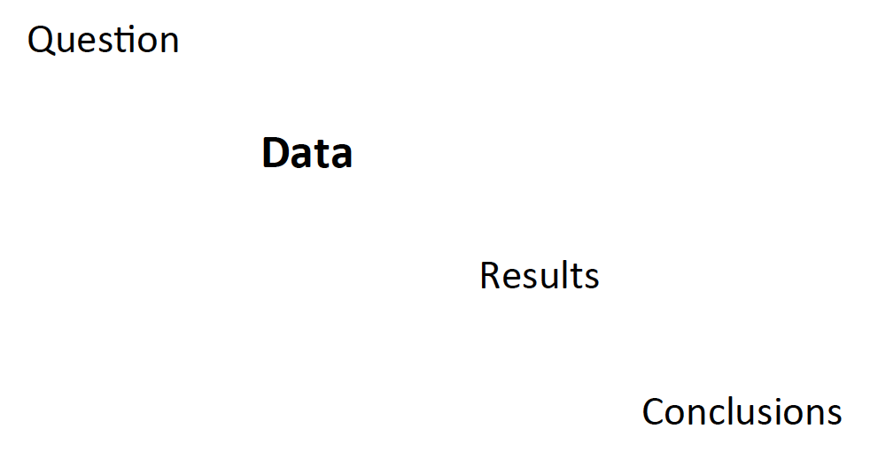
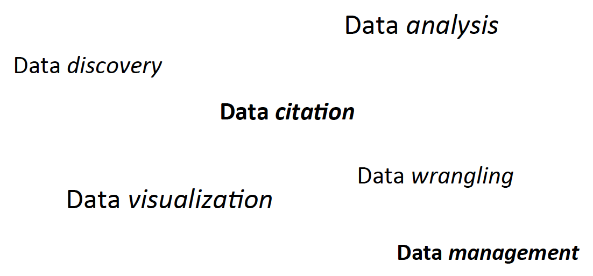
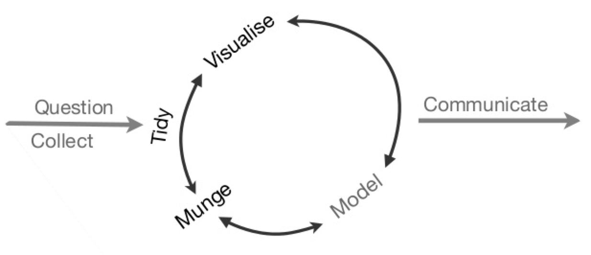

```{r set-options, include = FALSE}
if(!require(revealjs)){
  library(devtools)
  devtools::install_github("jjallaire/revealjs")
}

if(!require(babynames)){
  library(devtools)
  devtools::install_github("hadley/babynames")
}

if(!require(pnwflights14)){
  library(devtools)
  devtools::install_github("ismayc/pnwflights14")
}

library(revealjs)
options(width = 100)
```


## Data Analysis With R

<br>

### Fall 2015 - Data @ Reed Research Skills Workshop Series

<br>

Chester Ismay

ETC 223

cismay@reed.edu

http://blogs.reed.edu/datablog

---

## Who am I?

- Grew up in South Dakota (town of 112 people)
- BS in Math, minor in Computer Science from SDSM&T
- MS in Statistics from Northern Arizona University
- Worked as an actuary before obtaining PhD in Statistics from Arizona State University
- Was Assistant Professor of Statistics and Data Science at Ripon College the last two years
- Moved to Portland area this summer
- Started working at Reed on August 11th

---

## What can I help you with?

> - Data analysis
> - Data wrangling/cleaning
> - Data visualization
> - Data tidying/manipulating
> - Reproducible research

--- 

## When am I available?

[comment]: <> (> - Generally available 9 AM to 5 PM Monday - Friday)
> - Email me at cismay@reed.edu or chester.ismay@reed.edu
> - Office (ETC 223) hours
>     - Mondays (11 AM to noon)
>     - Tuesdays and Thursdays (2 PM to 3 PM)

---

## Basic research process



---

## Further support

##### data@reed.edu <br> http://www.reed.edu/data-at-reed



---

## What is data analysis?



---

# Introduction

---

## Installing/Loading packages and data

```{r setup}
library(babynames)
suppressPackageStartupMessages(library(dplyr))
library(ggplot2)
library(devtools)
library(broom)
data("babynames", package = "babynames")
```

---

## Structure of the dataset

```{r structure}
str(babynames)
```

---

## What does the data look like?

```{r head}
head(babynames)
```

---

### Is anyone else named "Chester"?

```{r any_others}
babynames %>% filter(name == "Chester") %>%
  qplot(year, prop, data = .)
```

---

## I win!
```{r rivals1}
babynames %>% filter(name == "Chester" | name == "Karolyn") %>%
  qplot(year, prop, data = ., colour = name)
```

---

## What's going on here?
```{r quiz1, eval = FALSE}
babynames %>% filter(name == "Chester" | name == "Karolyn") %>%
  group_by(name) %>%
  summarize(mean_prop = mean(prop), 
            mean_n = mean(n),
            sd_prop = sd(prop),
            sd_n = sd(n)
  )
```

---

## What's going on here?

```{r quiz1_out}
babynames %>% filter(name == "Chester" | name == "Karolyn") %>%
  group_by(name) %>%
  summarize(mean_prop = mean(prop), 
            mean_n = mean(n),
            sd_prop = sd(prop),
            sd_n = sd(n)
  )
```

---

## What about here?

```{r quiz2, eval = FALSE}
babynames %>% filter(name == "Chester" | name == "Karolyn") %>%
  group_by(name) %>%
  top_n(3)
```

---

## What about here?

```{r quiz2_out}
babynames %>% filter(name == "Chester" | name == "Karolyn") %>%
  group_by(name) %>%
  top_n(3)
```

---

## That wasn't fair!

```{r mod_rivals}
mod_names <- babynames %>% 
  filter(name == "Chester" 
         | name %in% c("Karolyn", "Carolyn", "Caroline")) %>%
  mutate(kname = ifelse(name == "Chester", "Chester", "KarolynVar")) 
```

---

## What the...
```{r strange_plot}
mod_names %>% qplot(year, prop, data = ., colour = kname)
```

---

### Aw! Boo!

```{r fixed_plot, fig.width=6, fig.height=4}
mod_names <- mod_names %>% group_by(year, kname) %>%
  summarize(sumprop = sum(prop))
mod_names %>% qplot(year, sumprop, data = ., colour = kname)
```

---

## What is R and why should we use it?

 - R is a completely free software package and language for statistical analysis and graphics.
 - It _excels_ in helping you with
      - data manipulation
      - automation
      - reproducibility
      - error finding
      - customizability
- Any downsides?

---

## Like learning a foreign language!

---

### Similarities (In the simplest case)

| R             | Foreign Language  | R examples         |
|:--------------|:-----------------:|--------------------|
| *functions*   | verb              | - sqrt()           |
|               |                   | - arrange()        |
|               |                   | - lm()             |
| *command*     | sentence          | - exp(3)           |
|               |                   | - tail(babynames)  |

**KEY POINT** - Exposure makes you fluent!


---

## Command patterns

### To chain or not to chain...

These two commands accomplish the same thing in R.
```{r chain_or_not, eval = FALSE}
Data_Table %>% function_name(argument1, argument2)
function_name(Data_Table, argument1, argument2)
```

---

## BUT!

Chaining is much easier to read when you want to do a series of steps.

#### Unchained

```{r unchained, eval = FALSE}
filter(
  summarise(
    select(
      group_by(flights, year, month, day),
      arr_delay, dep_delay
    ),
    arr = mean(arr_delay, na.rm = TRUE),
    dep = mean(dep_delay, na.rm = TRUE)
  ),
  arr > 30 | dep > 30
)
```

---

## Versus

#### Chained
```{r chained, eval = FALSE}
flights %>%
  group_by(year, month, day) %>%
  select(arr_delay, dep_delay) %>%
  summarise(
    arr = mean(arr_delay, na.rm = TRUE),
    dep = mean(dep_delay, na.rm = TRUE)
  ) %>%
  filter(arr > 30 | dep > 30)
```

---

# More analysis!

---

## Pacific Northwest 2014 Departing Flights

```{r pnw}
library(pnwflights14)
data("flights", package = "pnwflights14")
```

---

## Coming up with questions

```{r pnw_struct}
flights %>% str()
```

---

### Correlation (by airport)

```{r dist_by_arrival_delay}
flights %>% group_by(origin) %>%
  summarize(correl = cor(distance, arr_delay, use = "complete.obs"))
```

---

### Correlation (over everything)

```{r dep_delay_by_month}
flights %>% summarize(correl = cor(dep_delay, month, use = "complete.obs"))
```

--- 

## Simple Linear Regression & Correlation

```{r reg_corr}
flights %>% filter(origin == "PDX") %>%
  summarize(correl = cor(dep_delay, arr_delay, use = "complete.obs"))
lin_reg <- flights %>% filter(origin == "PDX") %>%
  lm(arr_delay ~ dep_delay, data = .)
broom::tidy(lin_reg)
```

---

```{r reg_plot, fig.height = 6.5, fig.width = 8, echo = FALSE, cache = TRUE}
flights %>% na.omit() %>%
  ggplot(aes(x = dep_delay, y = arr_delay)) +
  geom_point() +
  geom_smooth(method = "lm", se = FALSE, formula = y ~ x) + 
  xlab("Departure Delay") +
  ylab("Arrival Delay")
```


---

## t test

```{r t1}
t_test <- flights %>% t.test(arr_delay ~ origin, data = .)
tidy(t_test) %>% rename("PDX" = estimate1, "SEA" = estimate2)
```

---

```{r t_plot, fig.height = 6.5, fig.width = 8, echo=FALSE}
summary_origin <- flights %>% group_by(origin) %>%
  summarize(mean_arr_delay = mean(arr_delay, na.rm = TRUE),
            sd_arr_delay = sd(arr_delay, na.rm = TRUE),
            N = n()) %>%
  mutate(std.error = sd_arr_delay / sqrt(N)) %>%
  mutate(margin.of.error = std.error * qt(0.95/2 + 0.5, N - 1))
summary_origin %>% na.omit() %>%
  ggplot(aes(x = origin, y = mean_arr_delay)) +
  geom_point() +
   geom_errorbar(aes(ymin = mean_arr_delay - margin.of.error, ymax = mean_arr_delay + margin.of.error)) +
  xlab("Departure Airport") +
  ylab("Arrival Delay")
```

---

## ANOVA

```{r anova}
anova_model <- flights %>% aov(arr_delay ~ carrier, data = .)
tidy(anova_model)
```

---

```{r anova_plot, echo=FALSE, fig.height = 6.5, fig.width = 8}
summary_carrier <- flights %>% group_by(carrier) %>%
  summarize(mean_arr_delay = mean(arr_delay, na.rm = TRUE),
            sd_arr_delay = sd(arr_delay, na.rm = TRUE),
            N = n()) %>%
  mutate(std.error = sd_arr_delay / sqrt(N)) %>%
  mutate(margin.of.error = std.error * qt(0.95/2 + 0.5, N - 1))
summary_carrier %>% na.omit() %>%
  ggplot(aes(x = carrier, y = mean_arr_delay)) +
  geom_point() +
   geom_errorbar(aes(ymin = mean_arr_delay - margin.of.error, ymax = mean_arr_delay + margin.of.error)) +
  xlab("Carrier Abbreviation") +
  ylab("Arrival Delay")
```

---

# R Studio <br> +  <br> R Markdown

---

### Tools to make working with R friendly

 - RStudio is a powerful user interface that helps you get better control of your analysis.
 - It is also completely free.
 - You can write your entire paper/report (text, code, analysis, graphics, etc.) all in R Markdown.
 - If you need to update any of your code, R Markdown will automatically update your plots and output of your analysis and will create an updated PDF file.
 - **No more copy-and-paste!**
 - It's my job!

---

# Time to try it for yourself!

---

## Useful links

Data Processing with dplyr & tidyr : <https://rpubs.com/bradleyboehmke/data_wrangling>

Introduction to dplyr : <https://goo.gl/SY6qBy>

Your assignment : [Right click on me and Save](http://reed.edu/data-at-reed/software/R/workshops/2015/homework.Rmd)

Solutions (Rmd) : [Right click and Save](http://reed.edu/data-at-reed/software/R/workshops/2015/homework_solutions.Rmd)

Solutions (HTML) : [Click away...after you've tried!](http://reed.edu/data-at-reed/software/R/workshops/2015/homework_solutions.html)

---

### Data @ Reed Research Skills Workshops for Fall 2015

All workshops in ETC 211 from 4 - 5 PM
<br>
<br>

<span style="color:yellow;filter:alpha(opacity=30);opacity:0.3;">September 16 - Data analysis with Stata <br> September 23 - Data analysis with R</span>

> - September 30 - Data visualization using R
> - October 7 - Maps and more: spatial data
> - October 14 - Reproducible research

---

# Thanks! <br /> <br />

## cismay@reed.edu 

<br /> <br />

Slides available at <http://rpubs.com/cismay/dawr_workshop_2015>