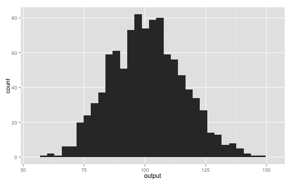

 

# Data Analysis With R

<br>

## Fall 2015 - Data @ Reed Research Skills Workshop Series

<br>
<br>

Chester Ismay

cismay@reed.edu

http://blogs.reed.edu/datablog

---

# Who am I?

## Background

- Grew up in western South Dakota (town of 112 people)
- BS in Mathematics, minor in Computer Science from SDSM&T
- MS in Statistics from Northern Arizona University
- Worked as an actuary before obtaining PhD in Statistics from Arizona State University
- Was Assistant Professor of Statistics and Data Science at Ripon College in Wisconsin the last two years
- Moved to Portland area this summer
- Starting working at Reed one month ago today
- Love helping others with statistical consulting and R programming

---

## When am I available?

> - Generally available 9 AM to 5 PM Monday - Friday
> - Email me at cismay@reed.edu or chester.ismay@reed.edu
> - Office (ETC 223) hours
>     - Mondays (11 AM to noon)
>     - Tuesdays and Thursdays (2 PM to 3 PM)

--- 

## Data @ Reed Research Skills Workshops for Fall 2015

All workshops in ETC 211 from 4 - 5 PM

> - September 16 - Data analysis with Stata
> - September 23 - Data analysis with R
> - September 30 - Data visualization using R
> - October 7 - Maps and more: spatial data
> - October 14 - Reproducible research

---

## Normal Distribution
 
The normal (or Gaussian) distribution is defined as follows:
 
$$latex
f(x;\mu,\sigma^2) = \frac{1}{\sigma\sqrt{2\pi}} 
e^{ -\frac{1}{2}\left(\frac{x-\mu}{\sigma}\right)^2 }
$$

---
 
## Density Plot
 
To generate random draws from a normal distribution we use the **rnorm** function:
 

```r
output <- rnorm(1000, 100, 15);
```

---
 
## Bell Shape
 
The normal distribution has the typical bell shape:
 

```r
library(ggplot2)
qplot(output)
```

```
## stat_bin: binwidth defaulted to range/30. Use 'binwidth = x' to adjust this.
```

 

---
 
## Kernel density estimation
 
We can perform density estimation on the sample:
 

```r
plot(density(output))
```

 

---
 
## Carl Friedrich Gauß
 
This little guy had something to do with it
 


---

# Thanks! <br /> <br />

## cismay@reed.edu 

<br /> <br />

Slides available at  http://rpubs.com/cismay/chem101
