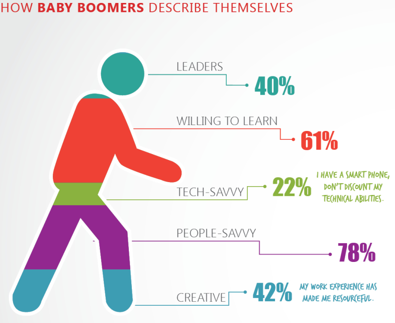
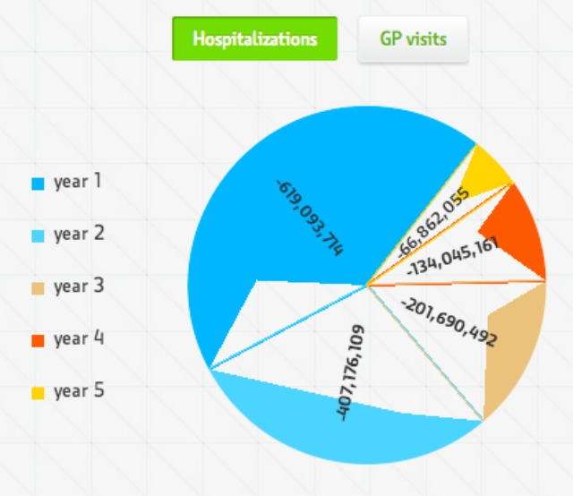
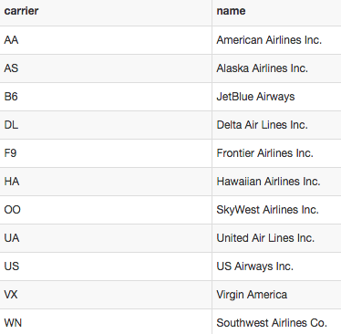

```{r set-options, include = FALSE}
pkg <- c("dplyr", "ggplot2", "lubridate")

new.pkg <- pkg[!(pkg %in% installed.packages())]

if (length(new.pkg)) {
  install.packages(new.pkg, repos = "http://cran.rstudio.com")
}

if(!require(revealjs)){
  library(devtools)
  devtools::install_github("jjallaire/revealjs")
}
if(!require(pnwflights14)){
  library(devtools)
  devtools::install_github("cismay/pnwflights14")
}

suppressPackageStartupMessages(library(dplyr))
suppressPackageStartupMessages(library(ggplot2))
suppressPackageStartupMessages(library(lubridate))
library(revealjs)
options(width = 100)
```

# Data Visualization Using R

<br>

### Fall 2015 - Data @ Reed Research Skills Workshop Series

<br>

Chester Ismay

Office: ETC 223

cismay@reed.edu

http://blogs.reed.edu/datablog

---

## Who am I?

> - Grew up in South Dakota (town of 112 people)
> - BS in Math, minor in Computer Science from SDSM&T
> - MS in Statistics from Northern Arizona University
> - Worked as an actuary before obtaining PhD in Statistics from Arizona State University
> - Was Assistant Professor of Statistics and Data Science at Ripon College the last two years
> - Moved to Portland area this summer
> - Started working at Reed on August 11th

---

## What can I help you with?

> - Data analysis
> - Data wrangling/cleaning
> - Data visualization
> - Data tidying/manipulating
> - Reproducible research

--- 

## When am I available?

[comment]: <> (> - Generally available 9 AM to 5 PM Monday - Friday)
> - Email me at cismay@reed.edu or chester.ismay@reed.edu
> - Office (ETC 223) hours
>     - Mondays (11 AM to noon)
>     - Tuesdays and Thursdays (2 PM to 3 PM)
> - Sometimes available for virtual office hours via Google Hangouts (email me for details)

---

### Basic research process


---

### Further support

##### data@reed.edu <br> http://www.reed.edu/data-at-reed


---

## What is data visualization?


# What are the properties of good visualizations?

---

## Tufte's thoughts

Great data visualizations almost always

- include comparisons of multiple variables
- make large data sets coherent
- reveal the data at several levels of detail
- encourage eyes to compare data
- serve a clear purpose
- ... show the data!
- ... don't try to mislead the viewer!

---

## Tukey's quotes

> "The simple graph has brought more information to the data analyst's mind than any other device."

> "A picture is not merely worth a thousand words, it is much more likely
 to be scrutinized than words are to be read."

---

# What makes for bad visualizations?

---



---



---


---

## Other bad examples

WTF Visualizations : <http://viz.wtf/>


---

# Examples using <br /> `ggplot2` in **R**

---

### Portland 2014 Departing Flights

```{r pdx}
library(pnwflights14); data("flights", package = "pnwflights14")
pdx_flights <- flights %>% filter(origin == "PDX") %>% 
  select(-year, -origin)
pdx_flights %>% str()
```

---

# Question 1

#### Do flights to Hawaii (from PDX) tend to arrive more than 30 minutes early than flights elsewhere?  

<br>

## Sub-question

#### What are some of the properties of these early flights?

---

### Getting date in nice format
```{r get_date}
date_string <- paste0("2014-", 
                      pdx_flights$month, "-", 
                      pdx_flights$day)
pdx_flights <- pdx_flights %>% 
  mutate(day_of_year = lubridate::ymd(date_string))
```

---

## How do these "arriving early" flights vary by flight distance?

```{r get_early}
pdx_early_flights <- pdx_flights %>% na.omit() %>%
  filter(arr_delay < -30)
```


```{r early, eval = FALSE}
pdx_early_flights %>% ggplot(aes(x = distance, y = arr_delay)) +
  geom_point()
```

---

```{r early_plot}
pdx_early_flights %>% ggplot(aes(x = distance, y = arr_delay)) +
  geom_point()
```

---

```{r HI, eval = FALSE, cache = TRUE}
pdx_early_flights %>%
  mutate(hawaii_dest = ifelse(dest %in% c("OGG", "KOA", "HNL", "LIH"), 
                              "Hawaiian", "Not Hawaiian")) %>%
  ggplot(aes(x = distance, y = arr_delay)) +
  geom_point(aes(color = hawaii_dest))
```

---

```{r HI_plot, cache = TRUE}
pdx_early_flights %>%
  mutate(hawaii_dest = ifelse(dest %in% c("OGG", "KOA", "HNL", "LIH"), 
                              "Hawaiian", "Not Hawaiian")) %>%
  ggplot(aes(x = distance, y = arr_delay)) +
  geom_point(aes(color = hawaii_dest))
```

---

```{r HI_box, eval = FALSE, cache = TRUE}
pdx_early_flights %>% 
  mutate(hawaii_dest = ifelse(dest %in% c("OGG", "KOA", "HNL", "LIH"), 
                              "Hawaiian", "Not Hawaiian")) %>%
  ggplot(aes(x = hawaii_dest , y = arr_delay)) +
  geom_boxplot()
```

---

```{r HI_boxplot, cache = TRUE}
pdx_early_flights %>% 
  mutate(hawaii_dest = ifelse(dest %in% c("OGG", "KOA", "HNL", "LIH"), 
                              "Hawaiian", "Not Hawaiian")) %>%
  ggplot(aes(x = hawaii_dest , y = arr_delay)) +
  geom_boxplot()
```

---

<<<<<<< HEAD
### What about delays throughout the year?

---

### Getting date in nice format

```{r get_date}
date_string <- paste0("2014-", 
                      pdx_early_flights$month, "-", 
                      pdx_early_flights$day)
pdx_early_flights <- pdx_early_flights %>% 
  mutate(day_of_year = lubridate::ymd(date_string))
```


---
=======
### Delays throughout the year
>>>>>>> eaa1d2bb809379183533aec0c95cf091f3682d73

```{r by_date}
pdx_early_flights %>% ggplot(aes(x = day_of_year, y = arr_delay)) +
  geom_point()
```

---

```{r HI_date, cache = TRUE}
pdx_early_flights %>%
  mutate(hawaii_dest = ifelse(dest %in% c("OGG", "KOA", "HNL", "LIH"), 
                              "Hawaiian", "Not Hawaiian")) %>%
  ggplot(aes(x = day_of_year, y = arr_delay)) +
  geom_point(aes(color = hawaii_dest))
```

---

## A non-graphical answer

```{r HI_table}
flights %>% na.omit() %>%
  mutate(hawaii_dest = ifelse(dest %in% c("OGG", "KOA", "HNL", "LIH"), 
                              "Hawaiian", "Not Hawaiian")) %>%
  group_by(hawaii_dest) %>%
  summarize(perc_early = sum(arr_delay < -30) / n() * 100)
```

---

# Question 2

#### Which carrier (departing Seattle) has the worst average `dep_delay`?

---

```{r SEA_summary}
summary_sea_flights <- flights %>% na.omit() %>%
  filter(origin == "SEA") %>%
  group_by(carrier) %>%
  summarize(mean_dep_delay = mean(dep_delay))
```

```{r SEA_bad_barplot}
summary_sea_flights %>% ggplot(aes(x = carrier, y = mean_dep_delay)) +
  geom_bar()
```

---

## What happened?

```{r SEA_barplot}
summary_sea_flights %>% ggplot(aes(x = carrier, y = mean_dep_delay)) +
  geom_bar(stat = "identity")
```

---



---

## Stylizing 

```{r sea_highlight}
summary_sea_flights %>% ggplot(aes(x = reorder(carrier, mean_dep_delay), 
                                   y = mean_dep_delay)) +
  geom_bar(stat = "identity", colour = "red")
```

---

## Stylizing (Part Deux)

```{r sea_fill, fig.height = 3}
summary_sea_flights %>% ggplot(aes(x = reorder(carrier, mean_dep_delay), 
                                   y = mean_dep_delay)) +
  geom_bar(stat = "identity", fill = "red") +
  xlab("Airline Carrier") +
  ylab("Mean Departure Delay") +
  ggtitle("Seattle Departure Delays for 2014")
```

---

# Question 3

#### How does the distribution of 30 minute+ early arrivals vary for different (meteorological) seasons?

---

```{r full_arr_delay}
flights %>% filter(arr_delay < -30) %>% 
  ggplot(aes(x = arr_delay)) +
  geom_histogram(stat = "bin", binwidth = 1, colour = "blue")
```

---

```{r set_seasons}
flights_seasons <- flights %>% filter(arr_delay < -30) %>% 
  na.omit() %>%
  mutate(season = ifelse(month %in% 3:5, "spring",
         ifelse(month %in% 6:8, "summer",
         ifelse(month %in% 9:11, "autumn", 
                "winter"))))
```

---

## Ugly first try

```{r bad_hist}
flights_seasons %>%
  ggplot(aes(x = arr_delay, fill = season)) +
  geom_histogram(stat = "bin", binwidth = 1)
```

---

```{r facet1}
flights_seasons %>% ggplot(aes(x = arr_delay)) +
  geom_histogram(stat = "bin", binwidth = 1) +
  facet_grid(. ~ season)
```

---

```{r facet2}
flights_seasons %>% ggplot(aes(x = arr_delay)) +
  geom_histogram(stat = "bin", binwidth = 1) +
  facet_grid(season ~ .)
```


---

```{r season_box}
flights_seasons %>% ggplot(aes(x = season, y = arr_delay)) +
  geom_boxplot()
```

---

# Formalizing Good Graphics

---

##  The Grammar of Graphics

> - [Wilkinson (2005)](http://www.amazon.com/Grammar-Graphics-Statistics-Computing/dp/0387987746)
     - Created rules/a syntax to describe what makes up all good statistical visualizations/graphics
> - [Wickham (2009)](http://www.amazon.com/ggplot2-Elegant-Graphics-Data-Analysis/dp/0387981403)

> In brief, the grammar tells us that a statistical graphic is a mapping from **data** to **aesthetic** attributes (color, shape, size) of **geometric** objects (points, lines, bars).

---

## Tidy data!

> - It will be helpful (and good practice) to get your table into a `data.frame` in R whenever possible.
> - Additionally, data should be **tidy**.


---

## The lingo 

>- **aes**: mappings of the elements in the data to _aesthetics_ we can see on the graphic.
>- **geom**: _geometric_ objects (points, lines, bars, etc.)
>- **facet**: _faceting_ describes breaking the data into subsets and displaying those as "small multiples"

---

## More lingo

>- **stat**: _statistical_ transformations that summarize data (e.g., grouping the data into bins)
>- **scale**: draws a legend and/or axes, specifies at which _scaling_ to view the plot
>- **coord**: almost always the Cartesian _coordinate_ system

---

# R Studio <br> +  <br> R Markdown

---

### Tools to make working with R friendly

> - RStudio is a powerful user interface that helps you get better control of your analysis.
> - Like R, it is also completely free.
> - You can write your entire paper/report (text, code, analysis, graphics, etc.) all in R Markdown.
> - If you need to update any of your code, R Markdown will automatically update your plots and output of your analysis and will create an updated PDF file.
> - **No more copy-and-paste!**
> - It's my job!

---

# Time to try it for yourself!

---

## Useful links

[`ggplot2` documentation](http://docs.ggplot2.org/current/)

[**R Graphics Cookbook**](http://www.cookbook-r.com/Graphs/)

[`ggplot2` Cheat Sheet](https://www.rstudio.com/wp-content/uploads/2015/03/ggplot2-cheatsheet.pdf)

Your assignment : [Right click on me and Save](http://reed.edu/data-at-reed/software/R/workshops/2015/vis_homework.Rmd)

Solutions (Rmd) : [Right click and Save](http://reed.edu/data-at-reed/software/R/workshops/2015/vis_homework_solutions.Rmd)

Solutions (HTML) : [Click away...after you've tried!](http://reed.edu/data-at-reed/software/R/workshops/2015/vis_homework_solutions.html)

---

### Data @ Reed Research Skills Workshops for Fall 2015

All workshops in ETC 211 from 4 - 5 PM
<br>
<br>

<span style="color:yellow;filter:alpha(opacity=30);opacity:0.3;">September 16 - Data analysis with Stata <br> September 23 - Data analysis with R <br> September 30 - Data visualization using R</span>

> - October 7 - Maps and more: spatial data
> - October 14 - Reproducible research

---

# Thanks! <br /> <br />

## cismay@reed.edu 

<br /> <br />

Slides available at <http://rpubs.com/cismay/dvur_workshop_2015>