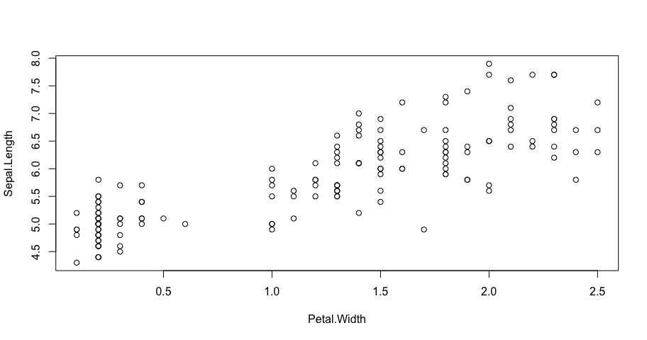
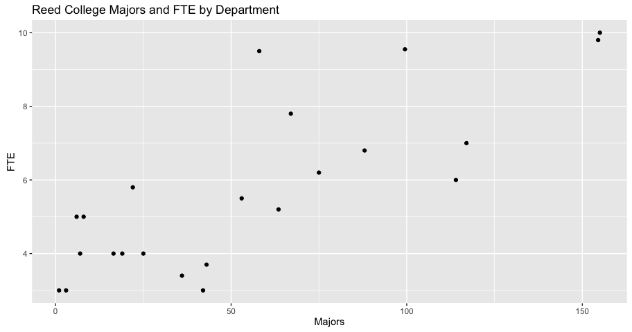
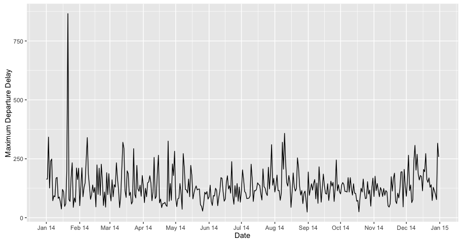
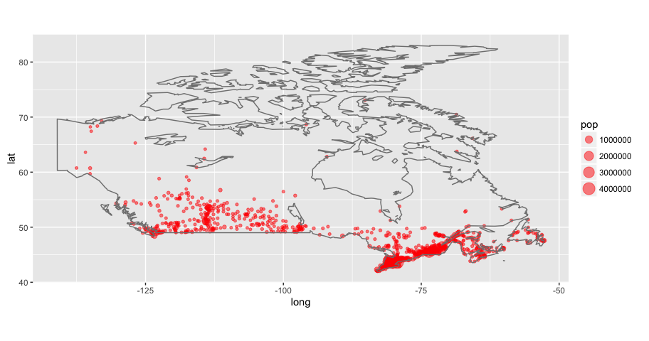
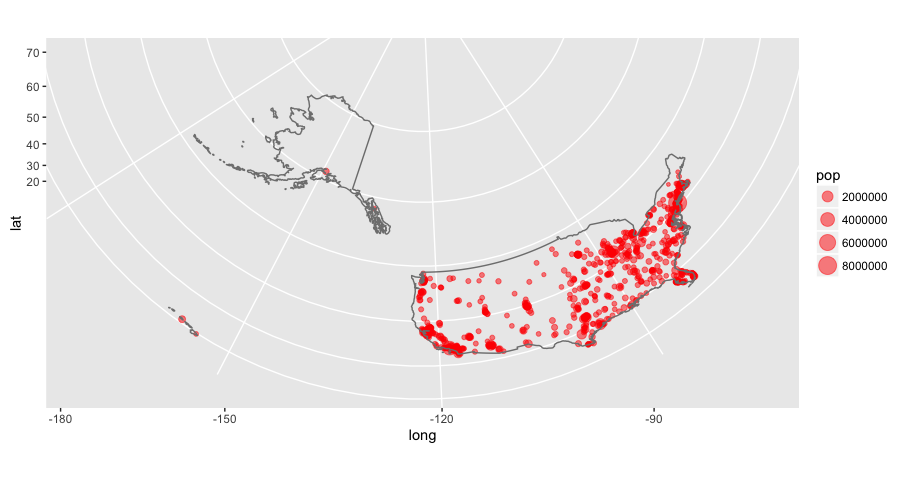

# Interactive Data Visualization
<br> Chester Ismay (cismay@reed.edu) <br>  
Paideia 2k16 <br><br> Slides available at <http://rpubs.com/cismay/paideia_2k16_idv> <br> Supplementary HTML file at <http://rpubs.com/cismay/paideia_2k16_idv_sup>  

When we think about data visualization, we often think of a static plot with some colors and points.  New tools (spearheaded by Hans Rosling's Gapminder project) are constantly being developed to allow us to interact dynamically with data visualizations.  I'll discuss a variety of different tools that attempt to make data come to life!

All too often statistics is thought of as a boring subject with boring plots.  New software packages and tools are being developed to better understand the relationships between variables.  I'll demonstrate a lot of these different tools and packages using the R computing language.  We'll go through a variety of different examples from multiple fields to better understand anomalies and trends in data.


```r
pkg <- c("dplyr", "ggplot2", "knitr", "readr", 
         "xts", "maps", "googleVis", "DT", "rmarkdown")

new.pkg <- pkg[!(pkg %in% installed.packages())]

if (length(new.pkg)) {
  install.packages(new.pkg, repos = "http://cran.rstudio.com")
}

if(!require(revealjs)){
  devtools::install_github("jjallaire/revealjs", ref = "a4854c017eac44d969a216103551c21d66329a74")
}

if(!require(plotly)){
  devtools::install_github("ropensci/plotly")
}

if(!require(pnwflights14)){
  devtools::install_github("ismayc/pnwflights14")
}

if(!require(dygraphs)){
  devtools::install_github("rstudio/dygraphs", ref = "778acdaeb91b754412d928ea824632bceae3078b")
}

library(dplyr)
library(ggplot2)
library(revealjs)
library(knitr)
library(readr)
library(plotly)
library(dygraphs)
library(pnwflights14)
library(xts)
library(maps)
library(googleVis)
library(DT)

options(width = 100, scipen = 99)
```

### The __Iris__ flower data set

- Introduced by Ronald Fisher in 1936

- The data set consists of 50 samples from each of three species of Iris (_Iris setosa_, _Iris virginica_, and _Iris versicolor_). 

- Four features were measured from each sample: the length and the width of the sepals and petals, in centimetres. Based on the combination of these four features, Fisher developed a model to distinguish the species from each other.

Source: [Wikipedia](https://en.wikipedia.org/wiki/Iris_flower_data_set)

---

# Scatterplots

---

## Traditional (boring) plot


```r
with(iris, plot(x = Petal.Width, y = Sepal.Length))
```

<!-- -->

---

## Prettier (not quite as boring) plot


```r
qplot(Petal.Width, Sepal.Length, data = iris)
```

<!-- -->

---

## Interactive plot using `plotly`


```r
ggiris <- qplot(Petal.Width, Sepal.Length, data = iris)
ggplotly(ggiris)
```

<!--html_preserve--><div id="htmlwidget-1476" style="width:912px;height:480px;" class="plotly"></div>
<script type="application/json" data-for="htmlwidget-1476">{"x":{"data":[{"x":[0.2,0.2,0.2,0.2,0.2,0.4,0.3,0.2,0.2,0.1,0.2,0.2,0.1,0.1,0.2,0.4,0.4,0.3,0.3,0.3,0.2,0.4,0.2,0.5,0.2,0.2,0.4,0.2,0.2,0.2,0.2,0.4,0.1,0.2,0.2,0.2,0.2,0.1,0.2,0.2,0.3,0.3,0.2,0.6,0.4,0.3,0.2,0.2,0.2,0.2,1.4,1.5,1.5,1.3,1.5,1.3,1.6,1,1.3,1.4,1,1.5,1,1.4,1.3,1.4,1.5,1,1.5,1.1,1.8,1.3,1.5,1.2,1.3,1.4,1.4,1.7,1.5,1,1.1,1,1.2,1.6,1.5,1.6,1.5,1.3,1.3,1.3,1.2,1.4,1.2,1,1.3,1.2,1.3,1.3,1.1,1.3,2.5,1.9,2.1,1.8,2.2,2.1,1.7,1.8,1.8,2.5,2,1.9,2.1,2,2.4,2.3,1.8,2.2,2.3,1.5,2.3,2,2,1.8,2.1,1.8,1.8,1.8,2.1,1.6,1.9,2,2.2,1.5,1.4,2.3,2.4,1.8,1.8,2.1,2.4,2.3,1.9,2.3,2.5,2.3,1.9,2,2.3,1.8],"y":[5.1,4.9,4.7,4.6,5,5.4,4.6,5,4.4,4.9,5.4,4.8,4.8,4.3,5.8,5.7,5.4,5.1,5.7,5.1,5.4,5.1,4.6,5.1,4.8,5,5,5.2,5.2,4.7,4.8,5.4,5.2,5.5,4.9,5,5.5,4.9,4.4,5.1,5,4.5,4.4,5,5.1,4.8,5.1,4.6,5.3,5,7,6.4,6.9,5.5,6.5,5.7,6.3,4.9,6.6,5.2,5,5.9,6,6.1,5.6,6.7,5.6,5.8,6.2,5.6,5.9,6.1,6.3,6.1,6.4,6.6,6.8,6.7,6,5.7,5.5,5.5,5.8,6,5.4,6,6.7,6.3,5.6,5.5,5.5,6.1,5.8,5,5.6,5.7,5.7,6.2,5.1,5.7,6.3,5.8,7.1,6.3,6.5,7.6,4.9,7.3,6.7,7.2,6.5,6.4,6.8,5.7,5.8,6.4,6.5,7.7,7.7,6,6.9,5.6,7.7,6.3,6.7,7.2,6.2,6.1,6.4,7.2,7.4,7.9,6.4,6.3,6.1,7.7,6.3,6.4,6,6.9,6.7,6.9,5.8,6.8,6.7,6.7,6.3,6.5,6.2,5.9],"name":null,"text":[],"type":"scatter","mode":"markers","marker":{"opacity":null,"color":"rgb(0,0,0)","size":5.66929133858268,"symbol":"circle"},"xaxis":"x1","yaxis":"y1","showlegend":false}],"layout":{"xaxis":{"tickcolor":"rgb(51,51,51)","gridcolor":"rgb(255,255,255)","showgrid":true,"ticks":"outside","showticklabels":true,"type":"linear","title":"Petal.Width","zeroline":false,"showline":false},"yaxis":{"tickcolor":"rgb(51,51,51)","gridcolor":"rgb(255,255,255)","showgrid":true,"ticks":"outside","showticklabels":true,"type":"linear","title":"Sepal.Length","zeroline":false,"showline":false},"plot_bgcolor":"rgb(235,235,235)","margin":{"b":40,"l":60,"t":25,"r":10},"legend":{"bordercolor":"transparent","x":1.01,"y":0.4875,"xref":"paper","yref":"paper","xanchor":"left","yanchor":"top","font":{"family":""},"bgcolor":"rgb(255,255,255)"},"showlegend":false,"titlefont":{"family":""},"paper_bgcolor":"rgb(255,255,255)","hovermode":"closest"},"world_readable":true},"evals":[]}</script><!--/html_preserve-->

---

## Prettier interactive plot using `plotly`


```r
ggiris_colored <- qplot(Petal.Width, Sepal.Length, data = iris, 
  color = Species)
ggplotly(ggiris_colored)
```

<!--html_preserve--><div id="htmlwidget-7298" style="width:912px;height:480px;" class="plotly"></div>
<script type="application/json" data-for="htmlwidget-7298">{"x":{"data":[{"x":[0.2,0.2,0.2,0.2,0.2,0.4,0.3,0.2,0.2,0.1,0.2,0.2,0.1,0.1,0.2,0.4,0.4,0.3,0.3,0.3,0.2,0.4,0.2,0.5,0.2,0.2,0.4,0.2,0.2,0.2,0.2,0.4,0.1,0.2,0.2,0.2,0.2,0.1,0.2,0.2,0.3,0.3,0.2,0.6,0.4,0.3,0.2,0.2,0.2,0.2],"y":[5.1,4.9,4.7,4.6,5,5.4,4.6,5,4.4,4.9,5.4,4.8,4.8,4.3,5.8,5.7,5.4,5.1,5.7,5.1,5.4,5.1,4.6,5.1,4.8,5,5,5.2,5.2,4.7,4.8,5.4,5.2,5.5,4.9,5,5.5,4.9,4.4,5.1,5,4.5,4.4,5,5.1,4.8,5.1,4.6,5.3,5],"name":"setosa","text":[],"type":"scatter","mode":"markers","marker":{"opacity":null,"color":"rgb(248,118,109)","size":5.66929133858268,"symbol":"circle"},"xaxis":"x1","yaxis":"y1","showlegend":true},{"x":[1.4,1.5,1.5,1.3,1.5,1.3,1.6,1,1.3,1.4,1,1.5,1,1.4,1.3,1.4,1.5,1,1.5,1.1,1.8,1.3,1.5,1.2,1.3,1.4,1.4,1.7,1.5,1,1.1,1,1.2,1.6,1.5,1.6,1.5,1.3,1.3,1.3,1.2,1.4,1.2,1,1.3,1.2,1.3,1.3,1.1,1.3],"y":[7,6.4,6.9,5.5,6.5,5.7,6.3,4.9,6.6,5.2,5,5.9,6,6.1,5.6,6.7,5.6,5.8,6.2,5.6,5.9,6.1,6.3,6.1,6.4,6.6,6.8,6.7,6,5.7,5.5,5.5,5.8,6,5.4,6,6.7,6.3,5.6,5.5,5.5,6.1,5.8,5,5.6,5.7,5.7,6.2,5.1,5.7],"name":"versicolor","text":[],"type":"scatter","mode":"markers","marker":{"opacity":null,"color":"rgb(0,186,56)","size":5.66929133858268,"symbol":"circle"},"xaxis":"x1","yaxis":"y1","showlegend":true},{"x":[2.5,1.9,2.1,1.8,2.2,2.1,1.7,1.8,1.8,2.5,2,1.9,2.1,2,2.4,2.3,1.8,2.2,2.3,1.5,2.3,2,2,1.8,2.1,1.8,1.8,1.8,2.1,1.6,1.9,2,2.2,1.5,1.4,2.3,2.4,1.8,1.8,2.1,2.4,2.3,1.9,2.3,2.5,2.3,1.9,2,2.3,1.8],"y":[6.3,5.8,7.1,6.3,6.5,7.6,4.9,7.3,6.7,7.2,6.5,6.4,6.8,5.7,5.8,6.4,6.5,7.7,7.7,6,6.9,5.6,7.7,6.3,6.7,7.2,6.2,6.1,6.4,7.2,7.4,7.9,6.4,6.3,6.1,7.7,6.3,6.4,6,6.9,6.7,6.9,5.8,6.8,6.7,6.7,6.3,6.5,6.2,5.9],"name":"virginica","text":[],"type":"scatter","mode":"markers","marker":{"opacity":null,"color":"rgb(97,156,255)","size":5.66929133858268,"symbol":"circle"},"xaxis":"x1","yaxis":"y1","showlegend":true}],"layout":{"xaxis":{"tickcolor":"rgb(51,51,51)","gridcolor":"rgb(255,255,255)","showgrid":true,"ticks":"outside","showticklabels":true,"type":"linear","title":"Petal.Width","zeroline":false,"showline":false},"yaxis":{"tickcolor":"rgb(51,51,51)","gridcolor":"rgb(255,255,255)","showgrid":true,"ticks":"outside","showticklabels":true,"type":"linear","title":"Sepal.Length","zeroline":false,"showline":false},"plot_bgcolor":"rgb(235,235,235)","margin":{"b":40,"l":60,"t":25,"r":10},"legend":{"bordercolor":"transparent","x":1.01,"y":0.5625,"xref":"paper","yref":"paper","xanchor":"left","yanchor":"top","font":{"family":""},"bgcolor":"rgb(255,255,255)"},"showlegend":true,"annotations":[{"text":"<b>Species</b>","x":1.025554,"y":0.6625,"showarrow":false,"xref":"paper","yref":"paper","xanchor":"left","yanchor":"top","textangle":0}],"titlefont":{"family":""},"paper_bgcolor":"rgb(255,255,255)","hovermode":"closest"},"world_readable":true},"evals":[]}</script><!--/html_preserve-->


---

## Another interactive plot


```r
iris %>% plot_ly(x = Petal.Width, y = Sepal.Length,
  type = "scatter", color = Species, mode = "markers")
```

<!--html_preserve--><div id="htmlwidget-9290" style="width:912px;height:480px;" class="plotly"></div>
<script type="application/json" data-for="htmlwidget-9290">{"x":{"data":[{"type":"scatter","inherit":false,"x":[2.5,1.9,2.1,1.8,2.2,2.1,1.7,1.8,1.8,2.5,2,1.9,2.1,2,2.4,2.3,1.8,2.2,2.3,1.5,2.3,2,2,1.8,2.1,1.8,1.8,1.8,2.1,1.6,1.9,2,2.2,1.5,1.4,2.3,2.4,1.8,1.8,2.1,2.4,2.3,1.9,2.3,2.5,2.3,1.9,2,2.3,1.8],"y":[6.3,5.8,7.1,6.3,6.5,7.6,4.9,7.3,6.7,7.2,6.5,6.4,6.8,5.7,5.8,6.4,6.5,7.7,7.7,6,6.9,5.6,7.7,6.3,6.7,7.2,6.2,6.1,6.4,7.2,7.4,7.9,6.4,6.3,6.1,7.7,6.3,6.4,6,6.9,6.7,6.9,5.8,6.8,6.7,6.7,6.3,6.5,6.2,5.9],"mode":"markers","name":"virginica","marker":{"color":"#66C2A5"}},{"type":"scatter","inherit":false,"x":[1.4,1.5,1.5,1.3,1.5,1.3,1.6,1,1.3,1.4,1,1.5,1,1.4,1.3,1.4,1.5,1,1.5,1.1,1.8,1.3,1.5,1.2,1.3,1.4,1.4,1.7,1.5,1,1.1,1,1.2,1.6,1.5,1.6,1.5,1.3,1.3,1.3,1.2,1.4,1.2,1,1.3,1.2,1.3,1.3,1.1,1.3],"y":[7,6.4,6.9,5.5,6.5,5.7,6.3,4.9,6.6,5.2,5,5.9,6,6.1,5.6,6.7,5.6,5.8,6.2,5.6,5.9,6.1,6.3,6.1,6.4,6.6,6.8,6.7,6,5.7,5.5,5.5,5.8,6,5.4,6,6.7,6.3,5.6,5.5,5.5,6.1,5.8,5,5.6,5.7,5.7,6.2,5.1,5.7],"mode":"markers","name":"versicolor","marker":{"color":"#FC8D62"}},{"type":"scatter","inherit":false,"x":[0.2,0.2,0.2,0.2,0.2,0.4,0.3,0.2,0.2,0.1,0.2,0.2,0.1,0.1,0.2,0.4,0.4,0.3,0.3,0.3,0.2,0.4,0.2,0.5,0.2,0.2,0.4,0.2,0.2,0.2,0.2,0.4,0.1,0.2,0.2,0.2,0.2,0.1,0.2,0.2,0.3,0.3,0.2,0.6,0.4,0.3,0.2,0.2,0.2,0.2],"y":[5.1,4.9,4.7,4.6,5,5.4,4.6,5,4.4,4.9,5.4,4.8,4.8,4.3,5.8,5.7,5.4,5.1,5.7,5.1,5.4,5.1,4.6,5.1,4.8,5,5,5.2,5.2,4.7,4.8,5.4,5.2,5.5,4.9,5,5.5,4.9,4.4,5.1,5,4.5,4.4,5,5.1,4.8,5.1,4.6,5.3,5],"mode":"markers","name":"setosa","marker":{"color":"#8DA0CB"}}],"layout":{"xaxis":{"title":"Petal.Width"},"yaxis":{"title":"Sepal.Length"},"hovermode":"closest","margin":{"b":40,"l":60,"t":25,"r":10}},"url":null,"width":null,"height":null,"base_url":"https://plot.ly"},"evals":[]}</script><!--/html_preserve-->

---

# Scatterplots (Part Deux)

---

### Reed College majors VS Total Faculty FTE by department

- Based off [analysis](http://www.reed.edu/data-at-reed/resources/R/scatter_plots.html) done by Rich Majerus in 2014 using the `googleVis` package

- Data does not include 143 interdisciplinary majors and 9 undecided majors.  

- Majors like Bio/Chem are split between the two departments 

- General Lit/Lit majors are included with English 

- Dance majors and faculty are included with Theatre


---


```r
major_data %>% ggplot(aes(x = Majors, y = FTE)) +
  geom_point() +
  ggtitle("Reed College Majors and FTE by Department")
```

<!-- -->

---


```r
# make a new data frame with only two columns to scatter plot 
keep <- c('Majors', 'FTE')
data2 <- major_data[keep]

# add names to new data frame as factor 
data2$pop.html.tooltip=major_data$Departments

# create interactive scatter plot using googleVis
Scatter1 <- gvisScatterChart(data2,                                                           
                            options=list(tooltip="{isHtml:'True'}",              # Define tooltip                            
                              legend="none", lineWidth=0, pointSize=5,                                                     
                              vAxis="{title:'Faculty (Total FTE)'}",             # y-axis label                
                              hAxis="{title:'Majors (delared and intended)'}",   # x-axis label                     
                              width=900, height=600))                            # plot dimensions  
print(Scatter1, 'chart') 
```

<!-- ScatterChart generated in R 3.2.3 by googleVis 0.5.8 package -->
<!-- Fri Jan 22 21:40:45 2016 -->


<!-- jsHeader -->
<script type="text/javascript">
 
// jsData 
function gvisDataScatterChartID9ad47661a4fd () {
var data = new google.visualization.DataTable();
var datajson =
[
 [
 67,
7.8,
"Art" 
],
[
 19,
4,
"Music" 
],
[
 22,
5.8,
"Theatre" 
],
[
 43,
3.7,
"Anthropology" 
],
[
 53,
5.5,
"Economics" 
],
[
 58,
9.5,
"History" 
],
[
 75,
6.2,
"Political Science" 
],
[
 36,
3.4,
"Sociology" 
],
[
 7,
4,
"Chinese" 
],
[
 25,
4,
"Classics" 
],
[
 155,
10,
"English" 
],
[
 6,
5,
"French" 
],
[
 1,
3,
"German" 
],
[
 3,
3,
"Russian" 
],
[
 8,
5,
"Spanish" 
],
[
 154.5,
9.8,
"Biology" 
],
[
 88,
6.8,
"Chemistry" 
],
[
 99.5,
9.55,
"Mathematics" 
],
[
 114,
6,
"Physics" 
],
[
 42,
3,
"Linguistics" 
],
[
 63.5,
5.2,
"Philosophy" 
],
[
 117,
7,
"Psychology" 
],
[
 16.5,
4,
"Religion" 
] 
];
data.addColumn('number','Majors');
data.addColumn('number','FTE');
data.addColumn({type: 'string', role: 'tooltip', 'p': {'html': true}});
data.addRows(datajson);
return(data);
}
 
// jsDrawChart
function drawChartScatterChartID9ad47661a4fd() {
var data = gvisDataScatterChartID9ad47661a4fd();
var options = {};
options["allowHtml"] = true;
options["tooltip"] = {isHtml:'True'};
options["legend"] = "none";
options["lineWidth"] =      0;
options["pointSize"] =      5;
options["vAxis"] = {title:'Faculty (Total FTE)'};
options["hAxis"] = {title:'Majors (delared and intended)'};
options["width"] =    900;
options["height"] =    600;

    var chart = new google.visualization.ScatterChart(
    document.getElementById('ScatterChartID9ad47661a4fd')
    );
    chart.draw(data,options);
    

}
  
 
// jsDisplayChart
(function() {
var pkgs = window.__gvisPackages = window.__gvisPackages || [];
var callbacks = window.__gvisCallbacks = window.__gvisCallbacks || [];
var chartid = "corechart";
  
// Manually see if chartid is in pkgs (not all browsers support Array.indexOf)
var i, newPackage = true;
for (i = 0; newPackage && i < pkgs.length; i++) {
if (pkgs[i] === chartid)
newPackage = false;
}
if (newPackage)
  pkgs.push(chartid);
  
// Add the drawChart function to the global list of callbacks
callbacks.push(drawChartScatterChartID9ad47661a4fd);
})();
function displayChartScatterChartID9ad47661a4fd() {
  var pkgs = window.__gvisPackages = window.__gvisPackages || [];
  var callbacks = window.__gvisCallbacks = window.__gvisCallbacks || [];
  window.clearTimeout(window.__gvisLoad);
  // The timeout is set to 100 because otherwise the container div we are
  // targeting might not be part of the document yet
  window.__gvisLoad = setTimeout(function() {
  var pkgCount = pkgs.length;
  google.load("visualization", "1", { packages:pkgs, callback: function() {
  if (pkgCount != pkgs.length) {
  // Race condition where another setTimeout call snuck in after us; if
  // that call added a package, we must not shift its callback
  return;
}
while (callbacks.length > 0)
callbacks.shift()();
} });
}, 100);
}
 
// jsFooter
</script>
 
<!-- jsChart -->  
<script type="text/javascript" src="https://www.google.com/jsapi?callback=displayChartScatterChartID9ad47661a4fd"></script>
 
<!-- divChart -->
  
<div id="ScatterChartID9ad47661a4fd" 
  style="width: 900; height: 600;">
</div>

---

Left-click and drag to select an area of the chart to zoom on.  Right-click to zoom back out.


```r
Scatter2 <- gvisScatterChart(data2,                                                           
                            options=list(
                              explorer="{actions: ['dragToZoom', 
                                          'rightClickToReset'],
                                           maxZoomIn:0.05}",
                              #chartArea="{width:'85%',height:'80%'}",
                              tooltip="{isHtml:'True'}",              
                              crosshair="{trigger:'both'}",                         
                              legend="none", lineWidth=0, pointSize=5,                                                     
                              vAxis="{title:'Faculty (Total FTE)'}",                        
                              hAxis="{title:'Majors (delared and intended)'}",                     
                              width=900, height=600))                                                                 
print(Scatter2, 'chart') 
```

<!-- ScatterChart generated in R 3.2.3 by googleVis 0.5.8 package -->
<!-- Fri Jan 22 21:40:45 2016 -->


<!-- jsHeader -->
<script type="text/javascript">
 
// jsData 
function gvisDataScatterChartID9ad45c5dfa8f () {
var data = new google.visualization.DataTable();
var datajson =
[
 [
 67,
7.8,
"Art" 
],
[
 19,
4,
"Music" 
],
[
 22,
5.8,
"Theatre" 
],
[
 43,
3.7,
"Anthropology" 
],
[
 53,
5.5,
"Economics" 
],
[
 58,
9.5,
"History" 
],
[
 75,
6.2,
"Political Science" 
],
[
 36,
3.4,
"Sociology" 
],
[
 7,
4,
"Chinese" 
],
[
 25,
4,
"Classics" 
],
[
 155,
10,
"English" 
],
[
 6,
5,
"French" 
],
[
 1,
3,
"German" 
],
[
 3,
3,
"Russian" 
],
[
 8,
5,
"Spanish" 
],
[
 154.5,
9.8,
"Biology" 
],
[
 88,
6.8,
"Chemistry" 
],
[
 99.5,
9.55,
"Mathematics" 
],
[
 114,
6,
"Physics" 
],
[
 42,
3,
"Linguistics" 
],
[
 63.5,
5.2,
"Philosophy" 
],
[
 117,
7,
"Psychology" 
],
[
 16.5,
4,
"Religion" 
] 
];
data.addColumn('number','Majors');
data.addColumn('number','FTE');
data.addColumn({type: 'string', role: 'tooltip', 'p': {'html': true}});
data.addRows(datajson);
return(data);
}
 
// jsDrawChart
function drawChartScatterChartID9ad45c5dfa8f() {
var data = gvisDataScatterChartID9ad45c5dfa8f();
var options = {};
options["allowHtml"] = true;
options["explorer"] = {actions: ['dragToZoom', 
                                          'rightClickToReset'],
                                           maxZoomIn:0.05};
options["tooltip"] = {isHtml:'True'};
options["crosshair"] = {trigger:'both'};
options["legend"] = "none";
options["lineWidth"] =      0;
options["pointSize"] =      5;
options["vAxis"] = {title:'Faculty (Total FTE)'};
options["hAxis"] = {title:'Majors (delared and intended)'};
options["width"] =    900;
options["height"] =    600;

    var chart = new google.visualization.ScatterChart(
    document.getElementById('ScatterChartID9ad45c5dfa8f')
    );
    chart.draw(data,options);
    

}
  
 
// jsDisplayChart
(function() {
var pkgs = window.__gvisPackages = window.__gvisPackages || [];
var callbacks = window.__gvisCallbacks = window.__gvisCallbacks || [];
var chartid = "corechart";
  
// Manually see if chartid is in pkgs (not all browsers support Array.indexOf)
var i, newPackage = true;
for (i = 0; newPackage && i < pkgs.length; i++) {
if (pkgs[i] === chartid)
newPackage = false;
}
if (newPackage)
  pkgs.push(chartid);
  
// Add the drawChart function to the global list of callbacks
callbacks.push(drawChartScatterChartID9ad45c5dfa8f);
})();
function displayChartScatterChartID9ad45c5dfa8f() {
  var pkgs = window.__gvisPackages = window.__gvisPackages || [];
  var callbacks = window.__gvisCallbacks = window.__gvisCallbacks || [];
  window.clearTimeout(window.__gvisLoad);
  // The timeout is set to 100 because otherwise the container div we are
  // targeting might not be part of the document yet
  window.__gvisLoad = setTimeout(function() {
  var pkgCount = pkgs.length;
  google.load("visualization", "1", { packages:pkgs, callback: function() {
  if (pkgCount != pkgs.length) {
  // Race condition where another setTimeout call snuck in after us; if
  // that call added a package, we must not shift its callback
  return;
}
while (callbacks.length > 0)
callbacks.shift()();
} });
}, 100);
}
 
// jsFooter
</script>
 
<!-- jsChart -->  
<script type="text/javascript" src="https://www.google.com/jsapi?callback=displayChartScatterChartID9ad45c5dfa8f"></script>
 
<!-- divChart -->
  
<div id="ScatterChartID9ad45c5dfa8f" 
  style="width: 900; height: 600;">
</div>


---

### Alaskan departure delays in PNW

- The [`pnwflights14`](http://github.com/ismayc/pnwflights14) package provides information contains information about all flights that departed from SEA in Seattle and PDX in Portland, in 2014: 162,049 flights in total.

- We can use this data and the `dplyr` package to look at daily maximum departure delays throughout the year for Alaskan Airlines.

---

# Time series/line graphs

---


```r
data("flights", package = "pnwflights14")
alaskan <- flights %>% 
  filter(carrier %in% c("AS")) %>%
  mutate(date2014 = as.Date(paste0("2014/", month, "/", day))) %>%
  group_by(date2014) %>%
  summarize(max_dep_delay = max(dep_delay, na.rm=TRUE))
```


```r
alaskan %>% ggplot(aes(x = date2014, y = max_dep_delay)) +
  geom_line() +
  scale_x_date(date_breaks = "1 month", date_labels = "%b %y") +
  xlab("Date") +
  ylab("Maximum Departure Delay")
```

<!-- -->

---


```r
ggplotly()
```

<!--html_preserve--><div id="htmlwidget-5025" style="width:912px;height:480px;" class="plotly"></div>
<script type="application/json" data-for="htmlwidget-5025">{"x":{"data":[{"x":["2014-01-01 00:00:00","2014-01-02 00:00:00","2014-01-03 00:00:00","2014-01-04 00:00:00","2014-01-05 00:00:00","2014-01-06 00:00:00","2014-01-07 00:00:00","2014-01-08 00:00:00","2014-01-09 00:00:00","2014-01-10 00:00:00","2014-01-11 00:00:00","2014-01-12 00:00:00","2014-01-13 00:00:00","2014-01-14 00:00:00","2014-01-15 00:00:00","2014-01-16 00:00:00","2014-01-17 00:00:00","2014-01-18 00:00:00","2014-01-19 00:00:00","2014-01-20 00:00:00","2014-01-21 00:00:00","2014-01-22 00:00:00","2014-01-23 00:00:00","2014-01-24 00:00:00","2014-01-25 00:00:00","2014-01-26 00:00:00","2014-01-27 00:00:00","2014-01-28 00:00:00","2014-01-29 00:00:00","2014-01-30 00:00:00","2014-01-31 00:00:00","2014-02-01 00:00:00","2014-02-02 00:00:00","2014-02-03 00:00:00","2014-02-04 00:00:00","2014-02-05 00:00:00","2014-02-06 00:00:00","2014-02-07 00:00:00","2014-02-08 00:00:00","2014-02-09 00:00:00","2014-02-10 00:00:00","2014-02-11 00:00:00","2014-02-12 00:00:00","2014-02-13 00:00:00","2014-02-14 00:00:00","2014-02-15 00:00:00","2014-02-16 00:00:00","2014-02-17 00:00:00","2014-02-18 00:00:00","2014-02-19 00:00:00","2014-02-20 00:00:00","2014-02-21 00:00:00","2014-02-22 00:00:00","2014-02-23 00:00:00","2014-02-24 00:00:00","2014-02-25 00:00:00","2014-02-26 00:00:00","2014-02-27 00:00:00","2014-02-28 00:00:00","2014-03-01 00:00:00","2014-03-02 00:00:00","2014-03-03 00:00:00","2014-03-04 00:00:00","2014-03-05 00:00:00","2014-03-06 00:00:00","2014-03-07 00:00:00","2014-03-08 00:00:00","2014-03-09 00:00:00","2014-03-10 00:00:00","2014-03-11 00:00:00","2014-03-12 00:00:00","2014-03-13 00:00:00","2014-03-14 00:00:00","2014-03-15 00:00:00","2014-03-16 00:00:00","2014-03-17 00:00:00","2014-03-18 00:00:00","2014-03-19 00:00:00","2014-03-20 00:00:00","2014-03-21 00:00:00","2014-03-22 00:00:00","2014-03-23 00:00:00","2014-03-24 00:00:00","2014-03-25 00:00:00","2014-03-26 00:00:00","2014-03-27 00:00:00","2014-03-28 00:00:00","2014-03-29 00:00:00","2014-03-30 00:00:00","2014-03-31 00:00:00","2014-04-01 00:00:00","2014-04-02 00:00:00","2014-04-03 00:00:00","2014-04-04 00:00:00","2014-04-05 00:00:00","2014-04-06 00:00:00","2014-04-07 00:00:00","2014-04-08 00:00:00","2014-04-09 00:00:00","2014-04-10 00:00:00","2014-04-11 00:00:00","2014-04-12 00:00:00","2014-04-13 00:00:00","2014-04-14 00:00:00","2014-04-15 00:00:00","2014-04-16 00:00:00","2014-04-17 00:00:00","2014-04-18 00:00:00","2014-04-19 00:00:00","2014-04-20 00:00:00","2014-04-21 00:00:00","2014-04-22 00:00:00","2014-04-23 00:00:00","2014-04-24 00:00:00","2014-04-25 00:00:00","2014-04-26 00:00:00","2014-04-27 00:00:00","2014-04-28 00:00:00","2014-04-29 00:00:00","2014-04-30 00:00:00","2014-05-01 00:00:00","2014-05-02 00:00:00","2014-05-03 00:00:00","2014-05-04 00:00:00","2014-05-05 00:00:00","2014-05-06 00:00:00","2014-05-07 00:00:00","2014-05-08 00:00:00","2014-05-09 00:00:00","2014-05-10 00:00:00","2014-05-11 00:00:00","2014-05-12 00:00:00","2014-05-13 00:00:00","2014-05-14 00:00:00","2014-05-15 00:00:00","2014-05-16 00:00:00","2014-05-17 00:00:00","2014-05-18 00:00:00","2014-05-19 00:00:00","2014-05-20 00:00:00","2014-05-21 00:00:00","2014-05-22 00:00:00","2014-05-23 00:00:00","2014-05-24 00:00:00","2014-05-25 00:00:00","2014-05-26 00:00:00","2014-05-27 00:00:00","2014-05-28 00:00:00","2014-05-29 00:00:00","2014-05-30 00:00:00","2014-05-31 00:00:00","2014-06-01 00:00:00","2014-06-02 00:00:00","2014-06-03 00:00:00","2014-06-04 00:00:00","2014-06-05 00:00:00","2014-06-06 00:00:00","2014-06-07 00:00:00","2014-06-08 00:00:00","2014-06-09 00:00:00","2014-06-10 00:00:00","2014-06-11 00:00:00","2014-06-12 00:00:00","2014-06-13 00:00:00","2014-06-14 00:00:00","2014-06-15 00:00:00","2014-06-16 00:00:00","2014-06-17 00:00:00","2014-06-18 00:00:00","2014-06-19 00:00:00","2014-06-20 00:00:00","2014-06-21 00:00:00","2014-06-22 00:00:00","2014-06-23 00:00:00","2014-06-24 00:00:00","2014-06-25 00:00:00","2014-06-26 00:00:00","2014-06-27 00:00:00","2014-06-28 00:00:00","2014-06-29 00:00:00","2014-06-30 00:00:00","2014-07-01 00:00:00","2014-07-02 00:00:00","2014-07-03 00:00:00","2014-07-04 00:00:00","2014-07-05 00:00:00","2014-07-06 00:00:00","2014-07-07 00:00:00","2014-07-08 00:00:00","2014-07-09 00:00:00","2014-07-10 00:00:00","2014-07-11 00:00:00","2014-07-12 00:00:00","2014-07-13 00:00:00","2014-07-14 00:00:00","2014-07-15 00:00:00","2014-07-16 00:00:00","2014-07-17 00:00:00","2014-07-18 00:00:00","2014-07-19 00:00:00","2014-07-20 00:00:00","2014-07-21 00:00:00","2014-07-22 00:00:00","2014-07-23 00:00:00","2014-07-24 00:00:00","2014-07-25 00:00:00","2014-07-26 00:00:00","2014-07-27 00:00:00","2014-07-28 00:00:00","2014-07-29 00:00:00","2014-07-30 00:00:00","2014-07-31 00:00:00","2014-08-01 00:00:00","2014-08-02 00:00:00","2014-08-03 00:00:00","2014-08-04 00:00:00","2014-08-05 00:00:00","2014-08-06 00:00:00","2014-08-07 00:00:00","2014-08-08 00:00:00","2014-08-09 00:00:00","2014-08-10 00:00:00","2014-08-11 00:00:00","2014-08-12 00:00:00","2014-08-13 00:00:00","2014-08-14 00:00:00","2014-08-15 00:00:00","2014-08-16 00:00:00","2014-08-17 00:00:00","2014-08-18 00:00:00","2014-08-19 00:00:00","2014-08-20 00:00:00","2014-08-21 00:00:00","2014-08-22 00:00:00","2014-08-23 00:00:00","2014-08-24 00:00:00","2014-08-25 00:00:00","2014-08-26 00:00:00","2014-08-27 00:00:00","2014-08-28 00:00:00","2014-08-29 00:00:00","2014-08-30 00:00:00","2014-08-31 00:00:00","2014-09-01 00:00:00","2014-09-02 00:00:00","2014-09-03 00:00:00","2014-09-04 00:00:00","2014-09-05 00:00:00","2014-09-06 00:00:00","2014-09-07 00:00:00","2014-09-08 00:00:00","2014-09-09 00:00:00","2014-09-10 00:00:00","2014-09-11 00:00:00","2014-09-12 00:00:00","2014-09-13 00:00:00","2014-09-14 00:00:00","2014-09-15 00:00:00","2014-09-16 00:00:00","2014-09-17 00:00:00","2014-09-18 00:00:00","2014-09-19 00:00:00","2014-09-20 00:00:00","2014-09-21 00:00:00","2014-09-22 00:00:00","2014-09-23 00:00:00","2014-09-24 00:00:00","2014-09-25 00:00:00","2014-09-26 00:00:00","2014-09-27 00:00:00","2014-09-28 00:00:00","2014-09-29 00:00:00","2014-09-30 00:00:00","2014-10-01 00:00:00","2014-10-02 00:00:00","2014-10-03 00:00:00","2014-10-04 00:00:00","2014-10-05 00:00:00","2014-10-06 00:00:00","2014-10-07 00:00:00","2014-10-08 00:00:00","2014-10-09 00:00:00","2014-10-10 00:00:00","2014-10-11 00:00:00","2014-10-12 00:00:00","2014-10-13 00:00:00","2014-10-14 00:00:00","2014-10-15 00:00:00","2014-10-16 00:00:00","2014-10-17 00:00:00","2014-10-18 00:00:00","2014-10-19 00:00:00","2014-10-20 00:00:00","2014-10-21 00:00:00","2014-10-22 00:00:00","2014-10-23 00:00:00","2014-10-24 00:00:00","2014-10-25 00:00:00","2014-10-26 00:00:00","2014-10-27 00:00:00","2014-10-28 00:00:00","2014-10-29 00:00:00","2014-10-30 00:00:00","2014-10-31 00:00:00","2014-11-01 00:00:00","2014-11-02 00:00:00","2014-11-03 00:00:00","2014-11-04 00:00:00","2014-11-05 00:00:00","2014-11-06 00:00:00","2014-11-07 00:00:00","2014-11-08 00:00:00","2014-11-09 00:00:00","2014-11-10 00:00:00","2014-11-11 00:00:00","2014-11-12 00:00:00","2014-11-13 00:00:00","2014-11-14 00:00:00","2014-11-15 00:00:00","2014-11-16 00:00:00","2014-11-17 00:00:00","2014-11-18 00:00:00","2014-11-19 00:00:00","2014-11-20 00:00:00","2014-11-21 00:00:00","2014-11-22 00:00:00","2014-11-23 00:00:00","2014-11-24 00:00:00","2014-11-25 00:00:00","2014-11-26 00:00:00","2014-11-27 00:00:00","2014-11-28 00:00:00","2014-11-29 00:00:00","2014-11-30 00:00:00","2014-12-01 00:00:00","2014-12-02 00:00:00","2014-12-03 00:00:00","2014-12-04 00:00:00","2014-12-05 00:00:00","2014-12-06 00:00:00","2014-12-07 00:00:00","2014-12-08 00:00:00","2014-12-09 00:00:00","2014-12-10 00:00:00","2014-12-11 00:00:00","2014-12-12 00:00:00","2014-12-13 00:00:00","2014-12-14 00:00:00","2014-12-15 00:00:00","2014-12-16 00:00:00","2014-12-17 00:00:00","2014-12-18 00:00:00","2014-12-19 00:00:00","2014-12-20 00:00:00","2014-12-21 00:00:00","2014-12-22 00:00:00","2014-12-23 00:00:00","2014-12-24 00:00:00","2014-12-25 00:00:00","2014-12-26 00:00:00","2014-12-27 00:00:00","2014-12-28 00:00:00","2014-12-29 00:00:00","2014-12-30 00:00:00","2014-12-31 00:00:00"],"y":[164,164,342,126,240,249,72,93,89,168,171,82,88,67,37,120,110,48,59,199,866,77,69,171,233,44,84,66,211,162,210,51,131,212,89,128,148,248,340,184,134,78,97,139,107,128,46,224,99,210,95,227,157,52,109,45,191,98,187,108,71,161,89,140,130,233,167,119,43,89,204,320,295,115,86,199,187,94,108,58,68,293,99,84,222,122,112,138,91,179,135,64,125,89,148,152,178,148,72,110,256,81,90,190,265,63,79,43,60,60,65,53,48,325,70,145,74,228,179,282,83,47,80,83,145,102,36,272,213,120,118,105,164,89,222,181,80,105,123,135,118,121,122,55,48,28,61,108,100,111,79,88,138,69,52,94,92,125,116,51,87,113,170,167,110,70,79,149,178,122,136,104,238,93,57,136,88,145,70,130,66,114,203,163,111,105,81,82,83,92,227,165,69,115,114,121,148,141,137,101,75,207,132,125,104,94,214,122,188,310,138,167,109,137,181,115,115,74,104,320,206,358,236,149,134,179,149,44,109,190,132,113,124,254,212,132,96,115,60,103,113,72,24,194,95,120,144,117,146,162,80,147,61,216,142,66,125,185,135,103,100,144,73,111,155,134,150,69,126,245,114,140,110,101,139,149,141,112,111,109,170,109,170,124,96,144,104,103,70,73,25,84,125,109,164,111,81,83,153,100,117,49,127,168,90,176,115,145,115,89,128,116,90,124,95,115,109,51,45,59,174,113,167,189,71,60,104,84,120,194,195,46,205,134,91,161,265,115,139,64,76,242,307,202,269,186,160,179,175,114,205,195,272,163,150,169,129,140,73,129,115,99,77,316,258],"name":null,"text":[null],"type":"scatter","mode":"lines","line":{"dash":"solid","color":"rgb(0,0,0)","width":5.34505913337863},"xaxis":"x1","yaxis":"y1","showlegend":false}],"layout":{"xaxis":{"tickcolor":"rgb(51,51,51)","gridcolor":"rgb(255,255,255)","showgrid":true,"ticks":"outside","showticklabels":true,"type":"date","title":[],"zeroline":false,"showline":false},"yaxis":{"tickcolor":"rgb(51,51,51)","gridcolor":"rgb(255,255,255)","showgrid":true,"ticks":"outside","showticklabels":true,"type":"linear","title":"Maximum Departure Delay","zeroline":false,"showline":false},"plot_bgcolor":"rgb(235,235,235)","margin":{"b":40,"l":60,"t":25,"r":10},"legend":{"bordercolor":"transparent","x":1.01,"y":0.4875,"xref":"paper","yref":"paper","xanchor":"left","yanchor":"top","font":{"family":""},"bgcolor":"rgb(255,255,255)"},"showlegend":false,"titlefont":{"family":""},"paper_bgcolor":"rgb(255,255,255)"},"world_readable":true},"evals":[]}</script><!--/html_preserve-->

---

## Plotting the time series using `dygraph` 

(Converting to time series format using `xts`)


```r
alaskan_ts <- xts(alaskan$max_dep_delay, alaskan$date2014)
colnames(alaskan_ts) <- "Max Departure Delay"
dygraph(alaskan_ts) %>% dyRangeSelector()
```

<!--html_preserve--><div id="htmlwidget-925" style="width:912px;height:480px;" class="dygraphs"></div>
<script type="application/json" data-for="htmlwidget-925">{"x":{"attrs":{"labels":["day","Max Departure Delay"],"legend":"auto","retainDateWindow":false,"axes":{"x":{"pixelsPerLabel":60}},"showRangeSelector":true,"rangeSelectorHeight":40,"rangeSelectorPlotFillColor":" #A7B1C4","rangeSelectorPlotStrokeColor":"#808FAB","interactionModel":"Dygraph.Interaction.defaultModel"},"scale":"daily","annotations":[],"shadings":[],"events":[],"format":"date","data":[["2014-01-01T00:00:00Z","2014-01-02T00:00:00Z","2014-01-03T00:00:00Z","2014-01-04T00:00:00Z","2014-01-05T00:00:00Z","2014-01-06T00:00:00Z","2014-01-07T00:00:00Z","2014-01-08T00:00:00Z","2014-01-09T00:00:00Z","2014-01-10T00:00:00Z","2014-01-11T00:00:00Z","2014-01-12T00:00:00Z","2014-01-13T00:00:00Z","2014-01-14T00:00:00Z","2014-01-15T00:00:00Z","2014-01-16T00:00:00Z","2014-01-17T00:00:00Z","2014-01-18T00:00:00Z","2014-01-19T00:00:00Z","2014-01-20T00:00:00Z","2014-01-21T00:00:00Z","2014-01-22T00:00:00Z","2014-01-23T00:00:00Z","2014-01-24T00:00:00Z","2014-01-25T00:00:00Z","2014-01-26T00:00:00Z","2014-01-27T00:00:00Z","2014-01-28T00:00:00Z","2014-01-29T00:00:00Z","2014-01-30T00:00:00Z","2014-01-31T00:00:00Z","2014-02-01T00:00:00Z","2014-02-02T00:00:00Z","2014-02-03T00:00:00Z","2014-02-04T00:00:00Z","2014-02-05T00:00:00Z","2014-02-06T00:00:00Z","2014-02-07T00:00:00Z","2014-02-08T00:00:00Z","2014-02-09T00:00:00Z","2014-02-10T00:00:00Z","2014-02-11T00:00:00Z","2014-02-12T00:00:00Z","2014-02-13T00:00:00Z","2014-02-14T00:00:00Z","2014-02-15T00:00:00Z","2014-02-16T00:00:00Z","2014-02-17T00:00:00Z","2014-02-18T00:00:00Z","2014-02-19T00:00:00Z","2014-02-20T00:00:00Z","2014-02-21T00:00:00Z","2014-02-22T00:00:00Z","2014-02-23T00:00:00Z","2014-02-24T00:00:00Z","2014-02-25T00:00:00Z","2014-02-26T00:00:00Z","2014-02-27T00:00:00Z","2014-02-28T00:00:00Z","2014-03-01T00:00:00Z","2014-03-02T00:00:00Z","2014-03-03T00:00:00Z","2014-03-04T00:00:00Z","2014-03-05T00:00:00Z","2014-03-06T00:00:00Z","2014-03-07T00:00:00Z","2014-03-08T00:00:00Z","2014-03-09T00:00:00Z","2014-03-10T00:00:00Z","2014-03-11T00:00:00Z","2014-03-12T00:00:00Z","2014-03-13T00:00:00Z","2014-03-14T00:00:00Z","2014-03-15T00:00:00Z","2014-03-16T00:00:00Z","2014-03-17T00:00:00Z","2014-03-18T00:00:00Z","2014-03-19T00:00:00Z","2014-03-20T00:00:00Z","2014-03-21T00:00:00Z","2014-03-22T00:00:00Z","2014-03-23T00:00:00Z","2014-03-24T00:00:00Z","2014-03-25T00:00:00Z","2014-03-26T00:00:00Z","2014-03-27T00:00:00Z","2014-03-28T00:00:00Z","2014-03-29T00:00:00Z","2014-03-30T00:00:00Z","2014-03-31T00:00:00Z","2014-04-01T00:00:00Z","2014-04-02T00:00:00Z","2014-04-03T00:00:00Z","2014-04-04T00:00:00Z","2014-04-05T00:00:00Z","2014-04-06T00:00:00Z","2014-04-07T00:00:00Z","2014-04-08T00:00:00Z","2014-04-09T00:00:00Z","2014-04-10T00:00:00Z","2014-04-11T00:00:00Z","2014-04-12T00:00:00Z","2014-04-13T00:00:00Z","2014-04-14T00:00:00Z","2014-04-15T00:00:00Z","2014-04-16T00:00:00Z","2014-04-17T00:00:00Z","2014-04-18T00:00:00Z","2014-04-19T00:00:00Z","2014-04-20T00:00:00Z","2014-04-21T00:00:00Z","2014-04-22T00:00:00Z","2014-04-23T00:00:00Z","2014-04-24T00:00:00Z","2014-04-25T00:00:00Z","2014-04-26T00:00:00Z","2014-04-27T00:00:00Z","2014-04-28T00:00:00Z","2014-04-29T00:00:00Z","2014-04-30T00:00:00Z","2014-05-01T00:00:00Z","2014-05-02T00:00:00Z","2014-05-03T00:00:00Z","2014-05-04T00:00:00Z","2014-05-05T00:00:00Z","2014-05-06T00:00:00Z","2014-05-07T00:00:00Z","2014-05-08T00:00:00Z","2014-05-09T00:00:00Z","2014-05-10T00:00:00Z","2014-05-11T00:00:00Z","2014-05-12T00:00:00Z","2014-05-13T00:00:00Z","2014-05-14T00:00:00Z","2014-05-15T00:00:00Z","2014-05-16T00:00:00Z","2014-05-17T00:00:00Z","2014-05-18T00:00:00Z","2014-05-19T00:00:00Z","2014-05-20T00:00:00Z","2014-05-21T00:00:00Z","2014-05-22T00:00:00Z","2014-05-23T00:00:00Z","2014-05-24T00:00:00Z","2014-05-25T00:00:00Z","2014-05-26T00:00:00Z","2014-05-27T00:00:00Z","2014-05-28T00:00:00Z","2014-05-29T00:00:00Z","2014-05-30T00:00:00Z","2014-05-31T00:00:00Z","2014-06-01T00:00:00Z","2014-06-02T00:00:00Z","2014-06-03T00:00:00Z","2014-06-04T00:00:00Z","2014-06-05T00:00:00Z","2014-06-06T00:00:00Z","2014-06-07T00:00:00Z","2014-06-08T00:00:00Z","2014-06-09T00:00:00Z","2014-06-10T00:00:00Z","2014-06-11T00:00:00Z","2014-06-12T00:00:00Z","2014-06-13T00:00:00Z","2014-06-14T00:00:00Z","2014-06-15T00:00:00Z","2014-06-16T00:00:00Z","2014-06-17T00:00:00Z","2014-06-18T00:00:00Z","2014-06-19T00:00:00Z","2014-06-20T00:00:00Z","2014-06-21T00:00:00Z","2014-06-22T00:00:00Z","2014-06-23T00:00:00Z","2014-06-24T00:00:00Z","2014-06-25T00:00:00Z","2014-06-26T00:00:00Z","2014-06-27T00:00:00Z","2014-06-28T00:00:00Z","2014-06-29T00:00:00Z","2014-06-30T00:00:00Z","2014-07-01T00:00:00Z","2014-07-02T00:00:00Z","2014-07-03T00:00:00Z","2014-07-04T00:00:00Z","2014-07-05T00:00:00Z","2014-07-06T00:00:00Z","2014-07-07T00:00:00Z","2014-07-08T00:00:00Z","2014-07-09T00:00:00Z","2014-07-10T00:00:00Z","2014-07-11T00:00:00Z","2014-07-12T00:00:00Z","2014-07-13T00:00:00Z","2014-07-14T00:00:00Z","2014-07-15T00:00:00Z","2014-07-16T00:00:00Z","2014-07-17T00:00:00Z","2014-07-18T00:00:00Z","2014-07-19T00:00:00Z","2014-07-20T00:00:00Z","2014-07-21T00:00:00Z","2014-07-22T00:00:00Z","2014-07-23T00:00:00Z","2014-07-24T00:00:00Z","2014-07-25T00:00:00Z","2014-07-26T00:00:00Z","2014-07-27T00:00:00Z","2014-07-28T00:00:00Z","2014-07-29T00:00:00Z","2014-07-30T00:00:00Z","2014-07-31T00:00:00Z","2014-08-01T00:00:00Z","2014-08-02T00:00:00Z","2014-08-03T00:00:00Z","2014-08-04T00:00:00Z","2014-08-05T00:00:00Z","2014-08-06T00:00:00Z","2014-08-07T00:00:00Z","2014-08-08T00:00:00Z","2014-08-09T00:00:00Z","2014-08-10T00:00:00Z","2014-08-11T00:00:00Z","2014-08-12T00:00:00Z","2014-08-13T00:00:00Z","2014-08-14T00:00:00Z","2014-08-15T00:00:00Z","2014-08-16T00:00:00Z","2014-08-17T00:00:00Z","2014-08-18T00:00:00Z","2014-08-19T00:00:00Z","2014-08-20T00:00:00Z","2014-08-21T00:00:00Z","2014-08-22T00:00:00Z","2014-08-23T00:00:00Z","2014-08-24T00:00:00Z","2014-08-25T00:00:00Z","2014-08-26T00:00:00Z","2014-08-27T00:00:00Z","2014-08-28T00:00:00Z","2014-08-29T00:00:00Z","2014-08-30T00:00:00Z","2014-08-31T00:00:00Z","2014-09-01T00:00:00Z","2014-09-02T00:00:00Z","2014-09-03T00:00:00Z","2014-09-04T00:00:00Z","2014-09-05T00:00:00Z","2014-09-06T00:00:00Z","2014-09-07T00:00:00Z","2014-09-08T00:00:00Z","2014-09-09T00:00:00Z","2014-09-10T00:00:00Z","2014-09-11T00:00:00Z","2014-09-12T00:00:00Z","2014-09-13T00:00:00Z","2014-09-14T00:00:00Z","2014-09-15T00:00:00Z","2014-09-16T00:00:00Z","2014-09-17T00:00:00Z","2014-09-18T00:00:00Z","2014-09-19T00:00:00Z","2014-09-20T00:00:00Z","2014-09-21T00:00:00Z","2014-09-22T00:00:00Z","2014-09-23T00:00:00Z","2014-09-24T00:00:00Z","2014-09-25T00:00:00Z","2014-09-26T00:00:00Z","2014-09-27T00:00:00Z","2014-09-28T00:00:00Z","2014-09-29T00:00:00Z","2014-09-30T00:00:00Z","2014-10-01T00:00:00Z","2014-10-02T00:00:00Z","2014-10-03T00:00:00Z","2014-10-04T00:00:00Z","2014-10-05T00:00:00Z","2014-10-06T00:00:00Z","2014-10-07T00:00:00Z","2014-10-08T00:00:00Z","2014-10-09T00:00:00Z","2014-10-10T00:00:00Z","2014-10-11T00:00:00Z","2014-10-12T00:00:00Z","2014-10-13T00:00:00Z","2014-10-14T00:00:00Z","2014-10-15T00:00:00Z","2014-10-16T00:00:00Z","2014-10-17T00:00:00Z","2014-10-18T00:00:00Z","2014-10-19T00:00:00Z","2014-10-20T00:00:00Z","2014-10-21T00:00:00Z","2014-10-22T00:00:00Z","2014-10-23T00:00:00Z","2014-10-24T00:00:00Z","2014-10-25T00:00:00Z","2014-10-26T00:00:00Z","2014-10-27T00:00:00Z","2014-10-28T00:00:00Z","2014-10-29T00:00:00Z","2014-10-30T00:00:00Z","2014-10-31T00:00:00Z","2014-11-01T00:00:00Z","2014-11-02T00:00:00Z","2014-11-03T00:00:00Z","2014-11-04T00:00:00Z","2014-11-05T00:00:00Z","2014-11-06T00:00:00Z","2014-11-07T00:00:00Z","2014-11-08T00:00:00Z","2014-11-09T00:00:00Z","2014-11-10T00:00:00Z","2014-11-11T00:00:00Z","2014-11-12T00:00:00Z","2014-11-13T00:00:00Z","2014-11-14T00:00:00Z","2014-11-15T00:00:00Z","2014-11-16T00:00:00Z","2014-11-17T00:00:00Z","2014-11-18T00:00:00Z","2014-11-19T00:00:00Z","2014-11-20T00:00:00Z","2014-11-21T00:00:00Z","2014-11-22T00:00:00Z","2014-11-23T00:00:00Z","2014-11-24T00:00:00Z","2014-11-25T00:00:00Z","2014-11-26T00:00:00Z","2014-11-27T00:00:00Z","2014-11-28T00:00:00Z","2014-11-29T00:00:00Z","2014-11-30T00:00:00Z","2014-12-01T00:00:00Z","2014-12-02T00:00:00Z","2014-12-03T00:00:00Z","2014-12-04T00:00:00Z","2014-12-05T00:00:00Z","2014-12-06T00:00:00Z","2014-12-07T00:00:00Z","2014-12-08T00:00:00Z","2014-12-09T00:00:00Z","2014-12-10T00:00:00Z","2014-12-11T00:00:00Z","2014-12-12T00:00:00Z","2014-12-13T00:00:00Z","2014-12-14T00:00:00Z","2014-12-15T00:00:00Z","2014-12-16T00:00:00Z","2014-12-17T00:00:00Z","2014-12-18T00:00:00Z","2014-12-19T00:00:00Z","2014-12-20T00:00:00Z","2014-12-21T00:00:00Z","2014-12-22T00:00:00Z","2014-12-23T00:00:00Z","2014-12-24T00:00:00Z","2014-12-25T00:00:00Z","2014-12-26T00:00:00Z","2014-12-27T00:00:00Z","2014-12-28T00:00:00Z","2014-12-29T00:00:00Z","2014-12-30T00:00:00Z","2014-12-31T00:00:00Z"],[164,164,342,126,240,249,72,93,89,168,171,82,88,67,37,120,110,48,59,199,866,77,69,171,233,44,84,66,211,162,210,51,131,212,89,128,148,248,340,184,134,78,97,139,107,128,46,224,99,210,95,227,157,52,109,45,191,98,187,108,71,161,89,140,130,233,167,119,43,89,204,320,295,115,86,199,187,94,108,58,68,293,99,84,222,122,112,138,91,179,135,64,125,89,148,152,178,148,72,110,256,81,90,190,265,63,79,43,60,60,65,53,48,325,70,145,74,228,179,282,83,47,80,83,145,102,36,272,213,120,118,105,164,89,222,181,80,105,123,135,118,121,122,55,48,28,61,108,100,111,79,88,138,69,52,94,92,125,116,51,87,113,170,167,110,70,79,149,178,122,136,104,238,93,57,136,88,145,70,130,66,114,203,163,111,105,81,82,83,92,227,165,69,115,114,121,148,141,137,101,75,207,132,125,104,94,214,122,188,310,138,167,109,137,181,115,115,74,104,320,206,358,236,149,134,179,149,44,109,190,132,113,124,254,212,132,96,115,60,103,113,72,24,194,95,120,144,117,146,162,80,147,61,216,142,66,125,185,135,103,100,144,73,111,155,134,150,69,126,245,114,140,110,101,139,149,141,112,111,109,170,109,170,124,96,144,104,103,70,73,25,84,125,109,164,111,81,83,153,100,117,49,127,168,90,176,115,145,115,89,128,116,90,124,95,115,109,51,45,59,174,113,167,189,71,60,104,84,120,194,195,46,205,134,91,161,265,115,139,64,76,242,307,202,269,186,160,179,175,114,205,195,272,163,150,169,129,140,73,129,115,99,77,316,258]]},"evals":["attrs.interactionModel"]}</script><!--/html_preserve-->

---

### Canadian and US population and geography

- Canada is an extremely large land mass (2nd largest country in the world), but is only the 37th largest country in terms of population

- The US ranks 4th highest in land mass and 3rd highest in population

- We can use data in the `maps` package to better visualize why these rankings exist

---

# Maps

---


```r
data(canada.cities, package = "maps")
canada_plot <- ggplot(canada.cities, aes(x = long, y = lat)) +
  coord_equal() +
  geom_point(aes(size=pop, text = paste0(name, ",",
    "Pop: ", prettyNum(pop, big.mark = ",", scientific = FALSE))), 
    colour = "red", alpha = 1/2) +
  borders(regions="canada")
canada_plot
```

<!-- -->

---


```r
ggplotly(canada_plot)
```

<!--html_preserve--><div id="htmlwidget-8974" style="width:912px;height:480px;" class="plotly"></div>
<script type="application/json" data-for="htmlwidget-8974">{"x":{"data":[{"x":[-122.3,-80.03,-72.57,-114.02,-135,-72.42,-64.07,-122.5,-73.13,-74.63,-74.87,-79.87,-71.66,-76.2,-97.57,-64.21,-83.1,-79.34,-78.14,-67.43,-79.88,-61.97,-119.18,-53.99,-76.37,-80.53,-71.95,-121.27,-105.98,-113.27,-91.62,-82.43,-80.98,-80.45,-70.88,-68.16,-70.5,-115.57,-77.63,-114.4,-79.68,-77.68,-112.47,-65.65,-53.29,-79.47,-70.77,-113.42,-70.88,-96.52,-119.45,-79.15,-72.98,-79.79,-77.38,-81.06,-73.23,-71.54,-73.17,-64.73,-68.65,-107.98,-55.52,-114.23,-113.8,-114.43,-82,-119.35,-82.95,-78.55,-100.05,-79.73,-113.42,-65.47,-53.13,-110.75,-55.37,-64.72,-75.16,-111.37,-78.68,-79.3,-79.56,-99.96,-80.26,-78.33,-65.15,-64.52,-77.73,-75.7,-72.65,-78.96,-111.91,-63.38,-74.4,-81.25,-75.42,-80.42,-57.63,-125.77,-68.88,-121.32,-79.87,-79.83,-79.95,-114.06,-113.78,-125.23,-77.8,-66.68,-112.84,-115.35,-79.03,-102.43,-61.87,-66.68,-80.92,-64.95,-99.35,-53.24,-75.37,-113.32,-66.1,-76.13,-81.54,-102.27,-98,-101.78,-105.82,-103.58,-114.1,-75.08,-117.67,-53.08,-67.22,-79.95,-119.87,-64.67,-59.17,-74.87,-83.4,-63.14,-119.68,-116.18,-96.45,-82.19,-65.46,-123.7,-81.1,-64.23,-113.78,-75.22,-121.62,-74.35,-71.08,-121.96,-78.94,-68.38,-118.8,-53.97,-113.58,-70.23,-81.53,-68.63,-112.62,-112.92,-71.8,-78.17,-114.47,-81.02,-77.88,-82.93,-71.38,-80.21,-53,-75.5,-73.21,-71.62,-79.65,-57.96,-74.74,-63.22,-125,-72.75,-123.62,-73.47,-115.77,-80.1,-116.52,-114.03,-79.4,-121.96,-125.02,-66.37,-120.46,-106.78,-72.02,-100.05,-72.15,-105.97,-120.24,-77.5,-57.43,-68.65,-80.5,-100.5,-71.95,-77.03,-113.73,-114.13,-65.77,-71.35,-72.23,-71.73,-80.67,-114.98,-82.17,-112.71,-72.49,-92.83,-116.63,-123.7,-80.38,-79.62,-53.88,-80.82,-81.5,-71.67,-71.08,-113.54,-68.34,-116.42,-77.1,-110.9,-114.88,-82.66,-80.55,-79.87,-75.3,-119.13,-63.54,-79.87,-80.07,-81.77,-82.82,-102.08,-103.01,-108.75,-80,-81.48,-118.4,-117.2,-72.97,-78.75,-80.37,-75.45,-67.06,-115.07,-74.1,-101.89,-103.53,-82,-69.07,-78.93,-93.42,-122.5,-113.4,-134.84,-122.53,-103.78,-124.25,-120.85,-76.75,-116.84,-77.6,-135.05,-66.66,-117.55,-54.22,-76.17,-54.65,-64.51,-72.45,-79.93,-79.25,-86.97,-113.33,-123.5,-97,-59.97,-81.7,-81.7,-126.05,-116.97,-77.25,-52.79,-72.73,-55.76,-81.75,-110.22,-67.73,-55.66,-118.47,-80.32,-119.12,-118.8,-64.5,-106.55,-79.37,-102.92,-117.6,-80.26,-108.48,-80.05,-79.63,-137.51,-63.61,-79.85,-63.71,-65.83,-111.92,-81.03,-64.18,-60.4,-55.83,-54.02,-80.88,-82.92,-77.95,-68.27,-77.88,-63.58,-74.6,-115.75,-83.67,-71.68,-81.5,-117.13,-116.48,-113.87,-80.15,-117.58,-121.43,-84.78,-126.65,-102.38,-58.18,-105.12,-74.18,-79.22,-103.67,-80.88,-79.64,-133.73,-116.03,-61.31,-68.55,-80.69,-75.32,-113.62,-79.7,-118.08,-73.45,-120.34,-101.9,-75.88,-92.12,-82.42,-84,-67.33,-119.46,-103.52,-75.63,-94.49,-63.65,-121.81,-64.51,-109.13,-111.85,-99.67,-115.98,-81.63,-109.13,-72.08,-76.5,-64.9,-102.63,-80.03,-80.5,-128.7,-117.55,-70.17,-70.01,-105.3,-79.2,-72.78,-74.73,-66.92,-96.05,-111.96,-67.33,-70.5,-74.35,-73.77,-70.88,-73.37,-113.73,-123.82,-124.03,-63.44,-78.27,-112.78,-101.7,-106.97,-105.03,-74.87,-63.71,-71.67,-55.58,-73.77,-71.63,-73.29,-68.72,-100,-82.6,-76.99,-113.56,-73.48,-74.06,-74.22,-69.42,-112.83,-55.07,-121.93,-78.74,-70.52,-123.24,-80.97,-81.93,-81.15,-64.72,-110.01,-120.83,-81.24,-86.55,-74.68,-59.98,-72.93,-81.4,-68.33,-81.52,-118.97,-104.87,-64.32,-67.33,-79,-64.99,-123.08,-109.95,-77.48,-72.14,-112.88,-78.12,-85.8,-75.97,-117.61,-109.47,-86.37,-73.17,-80.65,-77.68,-106.68,-55.19,-73.02,-77.63,-67.53,-78.7,-115.14,-135.89,-108.43,-80.58,-110.69,-104.61,-100.98,-102.81,-120.78,-71.87,-81.69,-65.07,-79.89,-81.12,-78.45,-113.47,-79.89,-80.93,-99.83,-79.08,-72.2,-81.18,-64.78,-62.65,-68.18,-65.75,-70.55,-73.57,-80.6,-105.54,-101.67,-98.1,-113.65,-97.37,-75.18,-79.32,-81.48,-80.73,-65.52,-53.88,-67.24,-117.8,-123.97,-80.09,-113.77,-76.95,-73.4,-99.45,-117.3,-62.65,-80.72,-65.83,-60.11,-72.6,-104.02,-97.06,-79.66,-126.86,-72.52,-108.29,-79.45,-123.73,-80.6,-77.98,-72.34,-68.8,-74.08,-113.96,-114.1,-119.55,-78.55,-81.38,-121.28,-95.86,-80.1,-79.42,-74,-66.47,-78.62,-75.62,-78.86,-119.47,-75.71,-107.05,-80.94,-102.17,-63.87,-81.28,-80.85,-65.72,-75.02,-80.38,-81.68,-124.33,-64.32,-80.03,-57.61,-117.28,-119.75,-122.82,-77.12,-113.87,-119.59,-76.23,-67.7,-77.28,-78.34,-65.73,-82.15,-77.15,-62.71,-112.8,-72.8,-104.42,-95.88,-113.95,-67.38,-71.77,-113.57,-71.7,-81.2,-124.82,-80.2,-81.38,-127.5,-61.35,-78.3,-127.1,-78.93,-81.22,-98.31,-70.88,-66.86,-71.88,-79.35,-124.52,-102.67,-75.52,-68.12,-105.75,-122.77,-130.31,-120.5,-71.88,-110.27,-71.23,-122.48,-73.7,-112.67,-113.83,-79.63,-104.61,-76.7,-118.18,-64.87,-75.83,-72.15,-81.88,-74.3,-114.22,-68.54,-97.12,-100.22,-64.38,-69.54,-72.24,-101.35,-75.28,-80.13,-114.92,-81.68,-79.45,-107.98,-117.82,-106.33,-73.05,-79.03,-64.35,-97.12,-67.03,-55.6,-79.24,-80.25,-80.55,-66.06,-52.69,-67.92,-81.13,-111.28,-67.38,-67.27,-81.19,-71.43,-69.63,-73.16,-71.32,-75.05,-70.97,-71.5,-58.65,-71.82,-79.43,-74.07,-73,-72.43,-73.01,-70.67,-73.15,-74.22,-96.67,-99.53,-74.15,-74.28,-68.03,-66.48,-73.82,-70.85,-73.72,-70.34,-73.1,-71.02,-73.8,-70.96,-73.87,-72.5,-68.87,-72.45,-73.42,-73.37,-71.78,-70.68,-72.57,-72.52,-71.07,-69.13,-72.96,-73.58,-69.05,-70.27,-73.26,-74,-70.87,-73.23,-69.05,-74.58,-72.7,-72.03,-70.65,-73.92,-69.95,-69.82,-72.9,-70.48,-70.75,-71.83,-73.6,-73.61,-74.17,-72.57,-74.14,-65.05,-117.28,-119.29,-82.4,-106.66,-84.35,-67.68,-79.64,-81.38,-123.77,-96.89,-77.25,-66.38,-118.78,-108.42,-72.75,-76.48,-64.53,-65.32,-80.2,-106.4,-71.9,-99.97,-64.7,-119,-80.31,-91.92,-114.78,-127.17,-76.02,-79.53,-112.47,-114.18,-123.73,-73.14,-100.25,-62.25,-79.37,-81.37,-114.87,-118.83,-56.1,-96.84,-64.05,-113.92,-123.16,-80.08,-96.68,-58.42,-58.57,-112.68,-77.55,-97.32,-97.22,-114,-80.98,-113.4,-81.62,-79.93,-81.01,-119.69,-63.8,-114.65,-65.52,-79.37,-115.43,-101.27,-107.8,-60.25,-60.17,-114.1,-112.15,-80.83,-81.28,-79.08,-87.1,-128.61,-80.99,-101.26,-83.55,-71.31,-97.86,-80.45,-113.27,-89.28,-75.23,-82.43,-80.73,-81.35,-104.05,-112.67,-52.73,-79.38,-79.8,-64.92,-117.73,-69.17,-72.57,-63.28,-133.01,-121,-85.2,-77.3,-111.75,-125.52,-109.17,-79.12,-72.32,-74.2,-77.79,-70.92,-81.01,-117.28,-123.13,-124.02,-74.65,-112.05,-73.35,-110.85,-119.28,-123.37,-71.96,-111.78,-79.43,-79.49,-100.93,-113.25,-52.98,-103.8,-110.87,-81.15,-82.39,-122.62,-106.57,-71.98,-79.99,-80.28,-72.52,-81.88,-105.47,-63.61,-84.78,-71.45,-80.76,-77.35,-119.15,-81.6,-64.34,-113.87,-113.38,-103.86,-82.45,-122.97,-79.25,-104.35,-122.83,-115.68,-135.05,-81.13,-81.71,-108.7,-122.14,-75.35,-64.13,-83.03,-72,-81.3,-97.93,-97.17,-64.37,-111.43,-67.57,-80.76,-104.18,-82.12,-72.83,-66.12,-114.36,-102.47],"y":[49.06,43.63,45.63,51.3,68.22,48.87,46.8,49.06,46.07,45.3,45.55,44.15,48.55,45.22,49.1,45.83,42.1,44.77,48.57,48.47,44.32,45.62,50.45,47.77,45.43,43.83,45.78,50.72,49.62,54.72,48.75,52.92,42.78,43.28,48.35,49.22,47.43,51.17,48.43,54.12,44.38,45.48,50.78,47.62,47.59,43.17,46.2,53.35,47.05,50.07,55.2,44.43,45.12,44.11,44.17,42.88,45.55,46.1,46.08,45.03,48.95,52.05,49.02,50.7,52.38,49.6,42.33,50.85,46.18,44.53,49.23,43.88,53.83,48.05,48.65,54.27,49.15,46.48,45.44,49.87,43.9,45.03,44.12,49.84,43.15,44.5,44.85,44.38,44.03,44.61,45.28,43.95,50.57,44.72,45.68,43.75,45.58,43.11,47.6,54.22,47.68,50.8,43.87,43.81,43.07,51.05,53.25,49.99,44.3,48,53.02,51.09,44.35,51.63,47.38,49.08,46.7,47.78,49.87,47.75,44.78,49.2,48.1,45.13,43.15,49.63,49.5,49.17,50.45,53.28,51.53,45.3,49.32,48.52,48.35,42.93,50.03,48.33,47.58,49.78,47.83,46.24,50.82,51.43,49.65,42.41,47.03,48.92,44.3,44.53,51.06,45.1,55.7,49.87,48.43,49.17,53.79,49.12,55.27,48.15,50.03,47.68,43.6,70.46,49.73,49.74,45.13,43.96,51.19,49.07,44.02,41.98,45.96,44.49,47.5,45.25,45.89,45.42,44.21,48.96,45.03,46.23,49.69,45.21,48.73,45.97,49.51,44.32,49.1,51.43,45.05,49.05,49.62,48.07,50.66,52.33,45.78,51.15,46.21,51.27,55.76,46.1,49.18,47.56,42.85,49.18,48.42,44.2,53.37,51.67,44.62,45.9,48.87,46.67,43.75,53.22,42.58,51.47,45.89,49.78,49.23,48.78,44.17,42.91,48.28,44.18,42.66,45.48,46.22,53.57,47.38,53.58,45.53,53.9,50.06,46.39,43.6,44.58,45.29,50.55,44.93,47.82,43.77,46.25,42.17,50.65,49.14,51.15,44.25,43.35,56.07,55.74,45.28,44.53,43.7,46.7,52.79,49.5,45.81,54.77,51.65,43.1,48.73,42.91,48.62,49.03,49.73,67.43,58.82,50.77,54.43,56.25,45.85,54.4,44.2,59.72,45.96,49.12,48.78,44.33,48.95,48.82,46.35,43.66,44.27,49.72,53.84,49.4,50.63,46.2,42.75,43.73,49.78,51.3,45.58,47.4,45.41,47.1,43.32,54.42,47.05,48.93,49.05,43.9,53.88,55.18,48.38,49.88,44.92,50.42,56.18,43.56,50.1,42.95,47.43,60.76,44.67,43.26,44.79,45.53,51.63,44.15,45.07,53.34,47.48,48.85,43.92,42.03,44.3,49.18,44.44,50.25,45.62,60.86,49.7,48.4,43.43,58.52,55.43,50.58,43.81,53.4,49.38,49.22,54.4,52.85,49.07,52.2,45.08,45.32,50.53,43.03,44.26,68.37,50.5,46.24,63.74,48.77,44.85,51.32,42.99,52.88,46.03,50.68,51.57,45.34,62.82,49.43,49,47.63,49.89,52.17,45.02,49.78,46.43,49.24,45.08,51.92,52.78,49.18,49.68,44.17,51.47,45.85,44.23,44.98,50.1,48.17,43.46,54.01,59.13,47.65,47.4,55.1,48.8,47.44,46.28,52.94,50.27,54.77,48.42,46.4,45.65,45.82,45.58,45.08,52.47,48.99,48.82,44.82,44.43,53.75,50.83,52.37,51.85,46.4,45.12,48.68,49.97,45.85,46.54,45.89,48.37,56.46,42.06,49.07,53.26,45.85,45.32,45.3,48.35,49.69,49.23,50.68,44.35,46.05,49.46,43.73,45.97,46.43,44.03,53.28,50.49,42.97,49.78,45.62,45.92,46.25,43.18,48.52,43.95,50.25,50.65,44.37,45.58,48.77,46.16,55.32,52.33,44.52,45.26,49.42,48.13,49.13,46.37,56.93,49.92,48.75,45.43,44.32,44.48,52.29,47.17,46.22,49.75,48.85,46.32,53.95,63.6,54.13,44.6,50.04,52.86,49.27,50.94,50.12,48.43,42.9,44.95,44.75,44.03,44.15,53.08,43.51,43.57,50.25,43.25,48.9,43.47,46.09,46.17,48.58,46.55,46.97,45.52,51.25,50.39,50.15,49.18,53.8,49.35,44.9,44.13,42.37,43.97,48.97,48.42,46,50.23,49.21,42.81,50.35,44.25,45.18,50.23,49.49,45.59,43.48,48.17,46.26,46.22,53.37,49.62,43.9,65.29,48.83,52.79,46.3,48.82,42.98,44.38,46,47.6,45.47,50.72,51.78,49.18,44.3,46.63,51.65,68.64,43.92,44.6,45.13,45.85,43.99,45.15,43.89,49.03,45.42,51.5,44.57,49.22,45.73,44.3,43.83,66.13,45.62,43.2,43.17,49.33,45.4,45.33,49.03,56.23,49.77,50.32,45.83,52.13,49.5,44.88,46.73,45.9,44.3,47.79,42.88,44.02,45.68,49.88,46.07,50.47,50.15,49.48,46.9,46.22,52.68,46.75,48.47,49.27,42.78,44.43,50.72,45.6,43.96,50.58,44.1,42.67,49.98,48.33,50.04,46.68,46.07,49.85,51.95,44.72,48.6,53.2,53.91,54.32,49.45,46.17,52.35,46.82,52.98,46.03,49.47,52.27,46.9,50.45,45.48,51,46.68,45.18,45.67,42.43,45.47,52.63,48.44,49.61,50.03,48.98,47.84,48.52,51.23,45.53,43.62,52.37,42.57,46.72,51.55,49.08,52.65,45.43,48.24,45.88,49.69,45.07,51.38,43.18,43.24,43.56,45.29,47.58,47.17,43.25,53.98,47.5,45.2,42.78,46.57,47.68,46.46,48.55,45.72,46.62,46.62,51.23,46.75,47.47,45.72,45.4,45.93,45.53,46.64,45.78,46.32,49.67,51.05,45.95,46.03,47.25,49.12,45.78,46.6,45.97,46.41,46.6,46.43,45.23,46.07,45.83,46.8,48.28,48.65,46.17,46.28,48.48,46.13,45.83,46.27,46.68,47.72,45.63,45.95,48.02,47.2,45.31,45.78,46.3,45.97,47.43,46.12,45.72,46.68,45.95,46.67,47.42,47.52,45.5,46.2,46.78,46.88,45.25,45.87,45.9,46.72,45.26,46.03,49.2,50.7,42.99,52.15,46.53,48.55,44.03,43.55,49.47,50.14,48.4,50.22,55.35,49.65,46.56,45.6,46.22,43.77,44.07,53.22,45.4,49.73,47.73,50.83,42.84,50.1,55.28,54.77,44.91,43.1,54.11,64.18,48.38,46.05,49.62,46.35,45.85,44.5,49.77,55.78,49.48,49.88,45.63,53.53,49.7,44.42,49.52,48.52,48.56,52.33,44.3,50.13,50.07,53.53,43.37,51.04,42.95,46.37,46.49,49.61,46.4,51.8,45.72,44.3,54.71,52.1,50.3,46.26,46.15,52.31,49.78,43.32,43.98,46.72,48.78,54.52,43.07,53.82,46.25,46.1,55.74,44.55,51.7,48.42,45.58,42.25,42.87,48.49,52.82,53.37,47.65,43.65,44.02,47.5,49.1,48.12,46.35,45.36,69.42,55.13,73.04,44.47,53.72,48.93,52.43,44.1,45.48,46.03,48.11,46.37,46.64,55.07,49.28,54.02,45.52,53.5,45.77,53.35,50.27,48.43,46.06,53.08,47.33,43.16,49.85,50.4,47.64,51.95,52.83,44.13,42.59,49.19,52.32,45.95,44.53,42.93,45.35,42.95,51.67,44.79,48,45.7,43.47,43.95,55.15,42.6,44.57,54.15,52.97,49.67,42.1,50.13,43.97,50.44,49.03,54.13,60.73,44.73,45.8,52.42,52.13,45.1,44.98,42.3,45.58,43.88,49.18,49.88,45.08,56.74,46.15,43.13,51.77,42.95,46.28,43.84,62.46,51.21],"name":null,"text":["Abbotsford BC,Pop: 157,795","Acton ON,Pop: 8,308","Acton Vale QC,Pop: 5,153","Airdrie AB,Pop: 25,863","Aklavik NT,Pop: 643","Albanel QC,Pop: 1,090","Alberton PE,Pop: 1,154","Aldergrove BC,Pop: 11,972","Alencon QC,Pop: 1,427","Alexandria ON,Pop: 3,604","Alfred QC,Pop: 1,442","Alliston ON,Pop: 10,353","Alma QC,Pop: 29,880","Almonte ON,Pop: 4,984","Altona MB,Pop: 3,647","Amherst NS,Pop: 9,297","Amherstburg ON,Pop: 11,605","Amigo Beach ON,Pop: 1,145","Amos QC,Pop: 10,472","Amqui QC,Pop: 5,135","Angus-Borden ON,Pop: 10,399","Antigonish NS,Pop: 4,957","Armstrong BC,Pop: 4,278","Arnold's Cove NL,Pop: 914","Arnprior ON,Pop: 9,729","Arthur ON,Pop: 2,443","Asbestos QC,Pop: 7,284","Ashcroft BC,Pop: 1,797","Assiniboia SK,Pop: 2,282","Athabasca AB,Pop: 2,569","Atikokan ON,Pop: 3,808","Attawapiskat ON,Pop: 1,383","Aylmer ON,Pop: 7,623","Ayr ON,Pop: 3,889","Bagotville QC,Pop: 1,085","Baie-Comeau QC,Pop: 10,472","Baie-Saint-Paul QC,Pop: 4,528","Banff AB,Pop: 7,590","Barraute QC,Pop: 1,184","Barrhead AB,Pop: 4,482","Barrie ON,Pop: 198,492","Barry's Bay ON,Pop: 1,347","Bassano AB,Pop: 1,404","Bathurst NB,Pop: 18,683","Bay Roberts NL,Pop: 14,975","Beamsville ON,Pop: 9,677","Beauceville QC,Pop: 4,496","Beaumont AB,Pop: 7,453","Beaupre QC,Pop: 5,306","Beausejour MB,Pop: 2,913","Beaverlodge AB,Pop: 2,245","Beaverton ON,Pop: 3,279","Bedford QC,Pop: 2,720","Beeton ON,Pop: 4,088","Belleville ON,Pop: 66,198","Belmont ON,Pop: 1,946","Beloeil QC,Pop: 43,168","Bernierville QC,Pop: 1,386","Berthierville QC,Pop: 4,427","Berwick NS,Pop: 2,250","Betsiamites QC,Pop: 1,658","Biggar SK,Pop: 2,034","Bishop's Falls NL,Pop: 3,219","Black Diamond AB,Pop: 3,706","Blackfalds AB,Pop: 3,236","Blairmore AB,Pop: 2,120","Blenheim ON,Pop: 5,129","Blind Bay BC,Pop: 1,429","Blind River ON,Pop: 3,004","Bobcaygeon ON,Pop: 3,053","Boissevain MB,Pop: 1,571","Bolton ON,Pop: 21,985","Bon Accord AB,Pop: 1,630","Bonaventure QC,Pop: 1,485","Bonavista NL,Pop: 3,580","Bonnyville AB,Pop: 6,073","Botwood NL,Pop: 2,876","Bouctouche NB,Pop: 1,880","Bourget ON,Pop: 1,075","Bow Island AB,Pop: 1,813","Bowmanville-Newcastle ON,Pop: 34,825","Bracebridge ON,Pop: 8,342","Bradford ON,Pop: 19,278","Brandon MB,Pop: 25,134","Brantford ON,Pop: 87,972","Bridgenorth-Chemong Park Area ON,Pop: 2,438","Bridgetown NS,Pop: 1,053","Bridgewater NS,Pop: 8,147","Brighton ON,Pop: 5,218","Brockville ON,Pop: 24,083","Bromont QC,Pop: 1,046","Brooklin ON,Pop: 6,192","Brooks AB,Pop: 13,045","Brookside NS,Pop: 1,227","Brownsburg QC,Pop: 2,606","Brussels ON,Pop: 1,223","Buckingham QC,Pop: 21,448","Burford ON,Pop: 1,969","Burgeo NL,Pop: 1,591","Burns Lake BC,Pop: 2,637","Cabano QC,Pop: 2,719","Cache Creek BC,Pop: 1,061","Caledon East ON,Pop: 2,112","Caledon ON,Pop: 1,766","Caledonia ON,Pop: 9,180","Calgary AB,Pop: 991,432","Calmar AB,Pop: 2,023","Campbell River BC,Pop: 33,972","Campbellford ON,Pop: 3,931","Campbellton NB,Pop: 11,967","Camrose AB,Pop: 15,889","Canmore AB,Pop: 12,834","Cannington ON,Pop: 2,147","Canora SK,Pop: 2,022","Cap-aux-Meules QC,Pop: 1,692","Cap-Chat QC,Pop: 1,471","Capreol ON,Pop: 3,713","Caraquet NB,Pop: 4,583","Carberry MB,Pop: 1,590","Carbonear NL,Pop: 6,665","Cardinal ON,Pop: 1,860","Cardston AB,Pop: 3,697","Carleton Centre QC,Pop: 1,098","Carleton Place ON,Pop: 9,867","Carlisle ON,Pop: 2,332","Carlyle SK,Pop: 1,158","Carman MB,Pop: 2,975","Carnduff SK,Pop: 935","Caronport SK,Pop: 956","Carrot SK,Pop: 935","Carstairs AB,Pop: 2,398","Casselman ON,Pop: 3,113","Castlegar BC,Pop: 8,722","Catalina NL,Pop: 1,322","Causapscal QC,Pop: 2,040","Cayuga ON,Pop: 1,757","Central Okanagan BC,Pop: 37,041","Chandler QC,Pop: 2,873","Channel-Port aux Basques NL,Pop: 4,123","Chapais QC,Pop: 1,831","Chapleau ON,Pop: 3,029","Charlottetown PE,Pop: 43,540","Chase BC,Pop: 2,473","Chateau Lake Louise AB,Pop: 1,107","Chateau-Richer MB,Pop: 1,961","Chatham ON,Pop: 44,598","Chatham-Douglastown NB,Pop: 13,235","Chemainus BC,Pop: 2,720","Chesley ON,Pop: 2,011","Chester NS,Pop: 1,517","Chestermere AB,Pop: 3,632","Chesterville ON,Pop: 1,602","Chetwynd BC,Pop: 2,589","Chibougamou QC,Pop: 7,638","Chicoutimi-Jonquiere QC,Pop: 110,582","Chilliwack BC,Pop: 51,980","Chisasibi QC,Pop: 3,536","Chute-aux-Outardes BC,Pop: 2,007","Clairmont AB,Pop: 1,500","Clarenville-Shoal Harbour NL,Pop: 3,402","Claresholm AB,Pop: 3,853","Clermont QC,Pop: 2,922","Clinton ON,Pop: 3,334","Clyde River NU,Pop: 1,054","Coaldale AB,Pop: 6,391","Coalhurst AB,Pop: 1,570","Coaticook QC,Pop: 7,045","Cobourg ON,Pop: 18,316","Cochrane AB,Pop: 17,798","Cochrane ON,Pop: 4,463","Colborne ON,Pop: 2,182","Colchester ON,Pop: 2,336","Coleraine QC,Pop: 1,324","Collingwood ON,Pop: 15,829","Conception Bay South NL,Pop: 16,895","Constance Bay ON,Pop: 2,489","Contrecoeur QC,Pop: 3,440","Cookshire QC,Pop: 1,574","Cookstown ON,Pop: 1,550","Corner Brook NL,Pop: 18,387","Cornwall ON,Pop: 48,894","Cornwall PE,Pop: 2,287","Courtenay BC,Pop: 32,817","Cowansville QC,Pop: 10,766","Cowichan Valley BC,Pop: 3,179","Crabtree QC,Pop: 2,256","Cranbrook BC,Pop: 18,624","Creemore ON,Pop: 1,409","Creston BC,Pop: 4,820","Crossfield AB,Pop: 2,541","Crystal Beach ON,Pop: 7,152","Cultus Lake BC,Pop: 1,262","Cumberland BC,Pop: 2,632","Dalhousie NB,Pop: 4,104","Dallas BC,Pop: 4,366","Dalmeny SK,Pop: 1,479","Danville QC,Pop: 1,768","Dauphin MB,Pop: 8,497","Daveluyville QC,Pop: 1,323","Davidson SK,Pop: 951","Dawson Creek BC,Pop: 10,810","Deep River QC,Pop: 4,350","Deer Lake NL,Pop: 4,072","Degelis QC,Pop: 2,271","Delhi ON,Pop: 4,281","Deloraine MB,Pop: 1,078","Desbiens QC,Pop: 1,151","Deseronto ON,Pop: 1,921","Devon AB,Pop: 5,286","Didsbury AB,Pop: 4,183","Digby NS,Pop: 2,033","Disraeli QC,Pop: 2,688","Dolbeau QC,Pop: 12,962","Donnacona QC,Pop: 8,042","Drayton ON,Pop: 1,626","Drayton Valley AB,Pop: 6,171","Dresden ON,Pop: 2,762","Drumheller AB,Pop: 6,549","Drummondville QC,Pop: 59,700","Dryden ON,Pop: 7,012","Duck Lake BC,Pop: 5,632","Duncan BC,Pop: 22,215","Dundalk ON,Pop: 2,109","Dunnville ON,Pop: 6,082","Dunville NL,Pop: 3,260","Durham ON,Pop: 2,898","Dutton ON,Pop: 1,470","East Angus QC,Pop: 3,647","East Broughton QC,Pop: 2,414","Edmonton AB,Pop: 831,979","Edmundston NB,Pop: 18,851","Edson AB,Pop: 8,069","Eganville ON,Pop: 1,316","Elk Point AB,Pop: 1,532","Elkford BC,Pop: 2,587","Elliot Lake ON,Pop: 12,667","Elmira ON,Pop: 8,723","Elmvale ON,Pop: 2,328","Embrun ON,Pop: 4,779","Enderby BC,Pop: 2,833","Enfield NS,Pop: 3,096","Englehart ON,Pop: 1,706","Erin ON,Pop: 3,091","Espanola ON,Pop: 4,742","Essex ON,Pop: 7,490","Esterhazy SK,Pop: 2,158","Estevan SK,Pop: 9,824","Eston SK,Pop: 963","Everett ON,Pop: 1,226","Exeter ON,Pop: 4,762","Fairview AB,Pop: 3,351","Falher AB,Pop: 1,180","Farnham QC,Pop: 6,083","Fenelon Falls ON,Pop: 2,005","Fergus ON,Pop: 17,898","Ferme-Neuve QC,Pop: 2,123","Fermont QC,Pop: 2,976","Fernie BC,Pop: 5,023","Filion QC,Pop: 1,211","Flin Flon MB,Pop: 5,932","Foam Lake SK,Pop: 1,119","Forest ON,Pop: 3,056","Forestville QC,Pop: 3,582","Fort Erie ON,Pop: 16,155","Fort Frances ON,Pop: 7,834","Fort Langley BC,Pop: 2,655","Fort MacLeod AB,Pop: 3,096","Fort MacPherson NT,Pop: 1,085","Fort Nelson BC,Pop: 4,210","Fort Qu'Appelle SK,Pop: 2,007","Fort Saint James BC,Pop: 2,393","Fort Saint John BC,Pop: 16,810","Fort-Coulonge QC,Pop: 2,921","Fox Creek AB,Pop: 2,486","Frankford ON,Pop: 2,660","Fraser Lake BC,Pop: 1,275","Fredericton NB,Pop: 51,916","Fruitvale BC,Pop: 3,793","Gambo NL,Pop: 1,578","Gananoque ON,Pop: 5,527","Gander NL,Pop: 8,624","Gaspe QC,Pop: 3,343","Gentilly QC,Pop: 2,121","Georgetown ON,Pop: 32,575","Georgina ON,Pop: 46,775","Geraldton ON,Pop: 2,379","Gibbons AB,Pop: 2,823","Gibsons BC,Pop: 6,826","Gimli MB,Pop: 2,028","Glace Bay NS,Pop: 21,604","Glencoe ON,Pop: 2,302","Goderich ON,Pop: 8,134","Gold River BC,Pop: 1,366","Golden BC,Pop: 4,041","Golden ON,Pop: 1,291","Goulds NL,Pop: 3,926","Granby QC,Pop: 54,171","Grand Bank NL,Pop: 4,777","Grand Bend ON,Pop: 2,085","Grand Centre AB,Pop: 12,531","Grand Falls NB,Pop: 5,630","Grand Falls-Windsor NL,Pop: 11,899","Grand Forks BC,Pop: 4,211","Grand Valley ON,Pop: 1,879","Grande Cache AB,Pop: 4,072","Grande Prairie AB,Pop: 42,712","Grande-Riviere QC,Pop: 1,514","Gravelbourg SK,Pop: 1,091","Gravenhurst ON,Pop: 5,913","Grenfell SK,Pop: 980","Grimshaw AB,Pop: 2,590","Guelph ON,Pop: 117,979","Gull Lake SK,Pop: 934","Hagersville ON,Pop: 2,657","Haileybury ON,Pop: 11,131","Haines Junction YT,Pop: 1,191","Halifax NS,Pop: 263,547","Hamilton ON,Pop: 661,942","Hammonds Plains Road NS,Pop: 1,109","Hampton NB,Pop: 2,616","Hanna AB,Pop: 3,176","Hanover ON,Pop: 7,348","Hantsport NS,Pop: 1,241","Happy Valley-Goose Bay NL,Pop: 6,034","Harbour Breton NL,Pop: 1,856","Hare Bay NL,Pop: 946","Harriston ON,Pop: 2,176","Harrow ON,Pop: 3,140","Hastings ON,Pop: 1,292","Hauterive QC,Pop: 12,862","Havelock ON,Pop: 1,421","Havre-Saint-Pierre QC,Pop: 2,976","Hawkesbury ON,Pop: 12,439","Hay River NT,Pop: 3,064","Hearst ON,Pop: 4,806","Hebertville QC,Pop: 1,697","Hensall ON,Pop: 1,277","High Level AB,Pop: 3,664","High Prairie AB,Pop: 2,912","High River AB,Pop: 9,941","Hillsburgh ON,Pop: 1,281","Hinton AB,Pop: 10,005","Hope BC,Pop: 4,602","Hornepayne ON,Pop: 1,403","Houston BC,Pop: 2,886","Hudson Bay SK,Pop: 1,634","Humber Arm South NL,Pop: 1,123","Humboldt SK,Pop: 4,743","Huntingdon QC,Pop: 2,876","Huntsville ON,Pop: 8,073","Indian Head SK,Pop: 1,615","Ingersoll ON,Pop: 12,093","Innisfil ON,Pop: 7,439","Inuvik NT,Pop: 3,055","Invermere BC,Pop: 2,873","Inverness NS,Pop: 1,624","Iqaluit NU,Pop: 6,364","Iroquois Falls ON,Pop: 4,286","Iroquois ON,Pop: 1,314","Irricana AB,Pop: 1,104","Jarvis ON,Pop: 2,332","Jasper AB,Pop: 3,953","Joliette QC,Pop: 34,896","Kamloops BC,Pop: 68,879","Kamsack SK,Pop: 1,846","Kanata ON,Pop: 100,433","Kangerdlinerk NU,Pop: 2,368","Kapuskasing ON,Pop: 9,358","Kars ON,Pop: 1,646","Kedgwick NB,Pop: 1,137","Kelowna BC,Pop: 129,691","Kelvington SK,Pop: 925","Kemptville ON,Pop: 4,283","Kenora ON,Pop: 13,412","Kensington PE,Pop: 1,434","Kent BC,Pop: 2,535","Kentville NS,Pop: 12,519","Kerrobert SK,Pop: 1,021","Killam AB,Pop: 1,068","Killarney MB,Pop: 2,385","Kimberley BC,Pop: 6,518","Kincardine ON,Pop: 6,857","Kindersley SK,Pop: 4,179","Kingsey Falls QC,Pop: 1,485","Kingston ON,Pop: 115,695","Kingston-Greenwood NS,Pop: 6,851","Kipling SK,Pop: 953","Kirkland Lake ON,Pop: 7,572","Kitchener ON,Pop: 414,309","Kitimat BC,Pop: 10,286","La Crete AB,Pop: 1,500","La Malbaie QC,Pop: 4,463","La Pocatiere QC,Pop: 4,235","La Ronge SK,Pop: 3,021","La Sarre QC,Pop: 7,231","La Tuque QC,Pop: 9,252","Labelle QC,Pop: 1,243","Labrador City NL,Pop: 10,517","Lac du Bonnet MB,Pop: 1,145","Lac la Biche AB,Pop: 2,953","Lac-au-Saumon QC,Pop: 1,203","Lac-Etchemin QC,Pop: 2,322","Lachute QC,Pop: 9,372","Lac-Lapierre QC,Pop: 2,269","Lac-Megantic QC,Pop: 4,675","Lacolle QC,Pop: 1,533","Lacombe AB,Pop: 10,177","Ladysmith BC,Pop: 9,042","Lake Cowichan BC,Pop: 2,872","Lake Echo NS,Pop: 3,497","Lakefield ON,Pop: 2,925","Lamont AB,Pop: 1,800","Langenburg SK,Pop: 1,017","Langham SK,Pop: 1,052","Lanigan SK,Pop: 1,184","L'Annonciation QC,Pop: 2,024","Lantz NS,Pop: 1,437","L'Ascension-de-Notre-Seigneur QC,Pop: 1,766","L'Ascie NL,Pop: 949","Laurentides QC,Pop: 4,939","Laurier-Station QC,Pop: 2,424","Lavaltrie QC,Pop: 9,166","Le Bic QC,Pop: 1,285","Leaf Rapids MB,Pop: 1,370","Leamington ON,Pop: 30,814","Lebel-sur-Quevillon QC,Pop: 3,301","Leduc AB,Pop: 15,682","L'Epiphanie QC,Pop: 4,585","Les Cedres QC,Pop: 1,439","Les Coteaux QC,Pop: 10,659","Les Escoumins QC,Pop: 2,049","Lethbridge AB,Pop: 71,390","Lewisporte NL,Pop: 2,870","Lillooet BC,Pop: 2,587","Lindsay ON,Pop: 18,012","Liniere QC,Pop: 2,175","Lions Bay BC,Pop: 1,386","Listowel ON,Pop: 6,316","Little Current ON,Pop: 1,673","Lively ON,Pop: 7,171","Liverpool NS,Pop: 2,755","Lloydminster SK,Pop: 23,099","Logan Lake BC,Pop: 2,191","London ON,Pop: 348,681","Longlac ON,Pop: 1,870","L'Original ON,Pop: 2,175","Louisbourg NS,Pop: 1,022","Louiseville QC,Pop: 5,840","Lucan ON,Pop: 2,150","Luceville QC,Pop: 1,378","Lucknow ON,Pop: 1,291","Lumby BC,Pop: 1,626","Lumsden SK,Pop: 1,453","Lunenburg NS,Pop: 2,450","MacAdam NB,Pop: 1,453","Macamic QC,Pop: 1,565","MacEwen NB,Pop: 1,228","Mackenzie BC,Pop: 4,982","Macklin SK,Pop: 1,236","Madoc ON,Pop: 1,851","Magog QC,Pop: 15,665","Magrath AB,Pop: 2,120","Malartic QC,Pop: 3,723","Manitouwadge ON,Pop: 3,154","Maniwaki QC,Pop: 4,252","Manning AB,Pop: 1,375","Maple Creek SK,Pop: 2,086","Marathon ON,Pop: 4,686","Marieville QC,Pop: 5,619","Markdale ON,Pop: 1,533","Marmora ON,Pop: 1,700","Martensville SK,Pop: 4,011","Marystown NL,Pop: 4,458","Maskinonge QC,Pop: 1,109","Matagami QC,Pop: 1,973","Matane QC,Pop: 11,868","Mattawa ON,Pop: 2,445","Mayerthorpe AB,Pop: 1,670","Mayo YT,Pop: 570","Meadow Lake SK,Pop: 4,211","Meaford ON,Pop: 4,877","Medicine Hat AB,Pop: 65,113","Melfort SK,Pop: 5,376","Melita MB,Pop: 1,178","Melville SK,Pop: 4,240","Merritt BC,Pop: 7,184","Metabetchouan QC,Pop: 2,337","Metcalfe ON,Pop: 1,722","Middleton NS,Pop: 1,664","Midland ON,Pop: 31,902","Mildmay ON,Pop: 1,274","Millbrook ON,Pop: 1,569","Millet AB,Pop: 2,167","Milton ON,Pop: 23,771","Milverton ON,Pop: 1,826","Minnedosa MB,Pop: 2,550","Mississauga Beach ON,Pop: 4,097","Mistissini QC,Pop: 1,850","Mitchell ON,Pop: 4,472","Moncton NB,Pop: 86,763","Montague PE,Pop: 2,019","Mont-Joli QC,Pop: 6,146","Mont-Laurier NB,Pop: 6,171","Montmagny QC,Pop: 9,679","Montreal QC,Pop: 3,280,123","Moose Factory ON,Pop: 2,086","Moose Jaw SK,Pop: 32,074","Moosomin SK,Pop: 2,170","Morden MB,Pop: 6,455","Morinville AB,Pop: 8,203","Morris MB,Pop: 1,758","Morrisburg ON,Pop: 2,763","Mount Albert ON,Pop: 2,797","Mount Brydges ON,Pop: 2,376","Mount Forest on  ON,Pop: 4,903","Murdochville QC,Pop: 1,143","Musgrave Harbour NL,Pop: 1,101","Nackawic NB,Pop: 1,001","Nakusp BC,Pop: 1,707","Nanaimo BC,Pop: 86,717","Nanticoke ON,Pop: 24,858","Nanton AB,Pop: 1,958","Napanee ON,Pop: 8,301","Napierville QC,Pop: 3,135","Neepawa MB,Pop: 3,180","Nelson BC,Pop: 9,834","New Glasgow NS,Pop: 20,134","New Hamburg ON,Pop: 7,491","New Richmond QC,Pop: 2,221","New Waterford NS,Pop: 11,263","Nicolet QC,Pop: 5,276","Nipawin SK,Pop: 3,928","Niverville MB,Pop: 2,019","Nobleton ON,Pop: 3,714","Norman Wells NT,Pop: 1,055","Normandin QC,Pop: 2,738","North Battleford SK,Pop: 20,102","North Bay ON,Pop: 49,664","North Cowichan BC,Pop: 33,007","Norwich ON,Pop: 2,685","Norwood ON,Pop: 1,768","Notre-Dame-du-Bon-Conseil QC,Pop: 1,482","Notre-Dame-du-Lac QC,Pop: 1,550","Oka-Kanesatake QC,Pop: 1,164","Okotoks AB,Pop: 15,734","Olds AB,Pop: 7,028","Oliver BC,Pop: 4,650","Omemee ON,Pop: 1,411","Onaping-Levack ON,Pop: 4,390","One Hundred Mile House BC,Pop: 1,738","Oqsuqtooq NU,Pop: 1,140","Orangeville ON,Pop: 34,113","Orillia ON,Pop: 30,408","Ormstown QC,Pop: 1,568","Oromocto NB,Pop: 8,971","Orono ON,Pop: 1,782","Osgoode ON,Pop: 2,750","Oshawa ON,Pop: 251,139","Osoyoos BC,Pop: 4,317","OTTAWA ON,Pop: 885,542","Outlook SK,Pop: 1,956","Owen Sound ON,Pop: 22,717","Oxbow SK,Pop: 1,040","Oxford NS,Pop: 1,271","Paisley ON,Pop: 1,105","Palmerston ON,Pop: 2,693","Pangnirtung NU,Pop: 1,328","Papineauville QC,Pop: 1,606","Paris ON,Pop: 10,570","Parkhill ON,Pop: 1,874","Parksville BC,Pop: 21,166","Parrsboro NS,Pop: 1,459","Parry Sound ON,Pop: 6,551","Pasadena NL,Pop: 2,199","Peace River AB,Pop: 5,403","Peachland BC,Pop: 1,306","Pemberton,Pop: 1,645","Pembroke ON,Pop: 15,674","Penhold AB,Pop: 1,839","Penticton BC,Pop: 38,520","Perth ON,Pop: 6,564","Perth-Andover NB,Pop: 1,832","Petawawa ON,Pop: 11,399","Peterborough ON,Pop: 76,458","Petit Rocher NB,Pop: 2,084","Petrolia ON,Pop: 5,523","Picton ON,Pop: 4,881","Pictou NS,Pop: 3,697","Picture Butte AB,Pop: 1,809","Pierreville QC,Pop: 2,180","Pilot Butte SK,Pop: 1,700","Pinawa MB,Pop: 1,576","Pincher Creek AB,Pop: 3,900","Plaster Rock NB,Pop: 1,170","Plessisville QC,Pop: 7,212","Ponoka AB,Pop: 6,734","Pont-Rouge QC,Pop: 4,996","Porcupine ON,Pop: 7,697","Port Alberni BC,Pop: 21,558","Port Dover ON,Pop: 5,912","Port Elgin ON,Pop: 7,237","Port Hardy BC,Pop: 4,632","Port Hawkesbury NS,Pop: 3,531","Port Hope ON,Pop: 11,758","Port MacNeill BC,Pop: 2,836","Port Perry ON,Pop: 7,749","Port Stanley ON,Pop: 2,697","Portage la Prairie MB,Pop: 12,926","Port-Alfred-Bagotville QC,Pop: 15,483","Port-Cartier QC,Pop: 5,871","Portneuf QC,Pop: 2,703","Powassan ON,Pop: 1,259","Powell River BC,Pop: 12,650","Preeceville SK,Pop: 987","Prescott ON,Pop: 4,523","Price QC,Pop: 1,836","Prince Albert SK,Pop: 34,595","Prince George BC,Pop: 65,376","Prince Rupert BC,Pop: 14,719","Princeton BC,Pop: 2,708","Princeville QC,Pop: 4,056","Provost AB,Pop: 2,106","Quebec QC,Pop: 647,916","Quesnel BC,Pop: 13,798","Rawdon QC,Pop: 4,996","Raymond AB,Pop: 3,404","Red Deer AB,Pop: 75,099","Redwater ON,Pop: 2,311","Regina SK,Pop: 175,727","Renfrew ON,Pop: 7,993","Revelstoke BC,Pop: 7,539","Richibukto NB,Pop: 1,288","Richmond ON,Pop: 3,516","Richmond QC,Pop: 3,498","Ridgetown ON,Pop: 3,592","Rigaud QC,Pop: 2,534","Rimbey AB,Pop: 2,253","Rimouski QC,Pop: 39,165","Ritchot MB,Pop: 1,071","Rivers MB,Pop: 1,176","Riviere-au-Renard QC,Pop: 2,575","Riviere-du-Loup QC,Pop: 15,265","Roberval QC,Pop: 9,320","Roblin MB,Pop: 1,921","Rockland ON,Pop: 9,137","Rockwood ON,Pop: 2,983","Rocky Mountain House AB,Pop: 6,604","Rodney ON,Pop: 1,179","Rogersville ON,Pop: 1,198","Rosetown SK,Pop: 2,271","Rossland BC,Pop: 3,622","Rosthem SK,Pop: 1,382","Rougemont QC,Pop: 1,187","Rouyn-Noranda QC,Pop: 24,109","Sackville NB,Pop: 2,868","Saint Adolphe MB,Pop: 1,198","Saint Andrews NB,Pop: 1,795","Saint Anthony NL,Pop: 2,437","Saint Catharines-Niagara ON,Pop: 320,836","Saint George ON,Pop: 2,685","Saint Jacobs ON,Pop: 1,313","Saint John NB,Pop: 87,150","Saint John's NL,Pop: 109,555","Saint Leonard NB,Pop: 1,339","Saint Marys ON,Pop: 6,732","Saint Paul AB,Pop: 5,384","Saint Quentin NB,Pop: 2,189","Saint Stephen NB,Pop: 4,481","Saint Thomas ON,Pop: 39,398","Saint-Agapit QC,Pop: 2,055","Saint-Alexandre QC,Pop: 1,143","Saint-Alexis-des-Monts QC,Pop: 2,022","Saint-Ambroise QC,Pop: 2,022","Saint-Andre-Avellin QC,Pop: 1,875","Saint-Anselme QC,Pop: 1,868","Saint-Apollinaire QC,Pop: 2,029","Saint-Augustin QC,Pop: 3,975","Saint-Basile-Sud QC,Pop: 1,280","Saint-Bruno QC,Pop: 2,939","Saint-Canut QC,Pop: 3,499","Saint-Cesaire QC,Pop: 3,187","Saint-Cyrill-de-Wendover QC,Pop: 1,283","Saint-Damase QC,Pop: 1,354","Saint-Damien-de-Buckland QC,Pop: 1,918","Saint-Denis QC,Pop: 1,071","Saint-Donat-de-Montcalm QC,Pop: 1,691","Sainte Anne MB,Pop: 1,590","Sainte Rose du Lac MB,Pop: 1,100","Sainte-Adele QC,Pop: 5,487","Sainte-Agathe-des-Monts QC,Pop: 5,727","Sainte-Anne-de-Madawaska NB,Pop: 1,122","Sainte-Anne-des-Monts QC,Pop: 5,621","Sainte-Anne-des-Plaines QC,Pop: 10,718","Sainte-Claire QC,Pop: 2,575","Sainte-Julienne QC,Pop: 3,222","Sainte-Justine QC,Pop: 1,153","Sainte-Madeleine QC,Pop: 2,205","Sainte-Marie QC,Pop: 8,766","Sainte-Martine QC,Pop: 2,544","Saint-Ephrem-de-Tring QC,Pop: 1,432","Sainte-Sophie QC,Pop: 1,640","Sainte-Thecle QC,Pop: 1,344","Saint-Fabien QC,Pop: 1,161","Saint-Felicien QC,Pop: 8,116","Saint-Felix-de-Valois QC,Pop: 3,176","Saint-Gabriel QC,Pop: 2,911","Saint-Gedeon QC,Pop: 1,866","Saint-Georges QC,Pop: 21,548","Saint-Germain-de-Grantham QC,Pop: 2,152","Saint-Gregoire QC,Pop: 1,241","Saint-Henri-de-Levis QC,Pop: 1,385","Saint-Honore QC,Pop: 1,748","Saint-Hyacinthe QC,Pop: 51,633","Saint-Jacques QC,Pop: 2,996","Saint-Jean-de-Dieu QC,Pop: 1,165","Saint-Jean-Port-Joli QC,Pop: 1,936","Saint-Jean-sur-Richelieu QC,Pop: 71,867","Saint-Jerome QC,Pop: 55,144","Saint-Josephe-de-Beauce QC,Pop: 3,400","Saint-Josephe-de-Lanoraie QC,Pop: 1,929","Saint-Josephe-de-la-Riviere-Bleue QC,Pop: 1,212","Saint-Jovite QC,Pop: 4,034","Saint-Liboire QC,Pop: 1,410","Saint-Marc-des-Carrieres QC,Pop: 2,367","Saint-Martin QC,Pop: 2,118","Saint-Michel-des-Saints QC,Pop: 1,841","Saint-Pacome QC,Pop: 1,376","Saint-Pascal QC,Pop: 2,474","Saint-Pie QC,Pop: 3,045","Saint-Prosper QC,Pop: 3,106","Saint-Raphael QC,Pop: 1,280","Saint-Raymond QC,Pop: 3,582","Saint-Remi QC,Pop: 4,207","Saint-Roch-de-l'Achigan QC,Pop: 1,041","Saint-Sauveur-des-Monts QC,Pop: 4,886","Saint-Tite QC,Pop: 2,464","Salaberry-de-Valleyfield QC,Pop: 38,799","Salisbury NB,Pop: 1,876","Salmo BC,Pop: 1,126","Salmon Arm BC,Pop: 10,100","Sarnia ON,Pop: 84,053","Saskatoon SK,Pop: 199,523","Sault Sainte Marie ON,Pop: 63,031","Sayabec QC,Pop: 1,708","Schomberg ON,Pop: 1,301","Seaforth ON,Pop: 2,880","Sechelt BC,Pop: 5,982","Selkirk MB,Pop: 9,618","Senneterre QC,Pop: 3,240","Sept-Iles QC,Pop: 22,304","Sexsmith AB,Pop: 1,764","Shaunavon SK,Pop: 1,631","Shawinigan QC,Pop: 49,335","Shawville QC,Pop: 1,614","Shediac NB,Pop: 4,697","Shelburne NS,Pop: 1,921","Shelburne ON,Pop: 4,446","Shellbrook SK,Pop: 1,173","Sherbrooke QC,Pop: 129,907","Shilo MB,Pop: 1,250","Shippagan NB,Pop: 2,758","Sicamous BC,Pop: 2,734","Simcoe ON,Pop: 13,242","Sioux Lookout ON,Pop: 3,777","Slave Lake AB,Pop: 7,751","Smithers BC,Pop: 5,442","Smiths Falls ON,Pop: 10,693","Smithville ON,Pop: 3,548","Smoky Lake AB,Pop: 1,075","Snow Lake NT,Pop: 1,196","Sooke BC,Pop: 6,150","Sorel QC,Pop: 33,238","Souris MB,Pop: 1,769","Souris PE,Pop: 1,292","South River ON,Pop: 1,208","Southampton ON,Pop: 3,594","Sparwood BC,Pop: 2,266","Spirit River AB,Pop: 1,170","Springdale NL,Pop: 2,719","Springfield MB,Pop: 2,085","Springhill NS,Pop: 3,903","Spruce Grove AB,Pop: 17,976","Squamish BC,Pop: 12,700","Stayner ON,Pop: 4,156","Steinbach MB,Pop: 9,697","Stephenville Crossing NL,Pop: 1,157","Stephenville NL,Pop: 6,141","Stettler AB,Pop: 5,558","Stirling ON,Pop: 2,299","Stonewall MB,Pop: 4,217","Stony Mountain MB,Pop: 1,787","Stony Plain AB,Pop: 9,044","Stratford ON,Pop: 30,332","Strathmore AB,Pop: 10,714","Strathroy ON,Pop: 13,697","Sturgeon Falls ON,Pop: 6,395","Sudbury ON,Pop: 111,118","Summerland BC,Pop: 6,296","Summerside PE,Pop: 14,837","Sundre AB,Pop: 2,412","Sussex NB,Pop: 4,016","Sutton ON,Pop: 6,765","Swan Hills AB,Pop: 1,922","Swan River MB,Pop: 4,238","Swift Current SK,Pop: 14,683","Sydney Mines NS,Pop: 15,331","Sydney NS,Pop: 32,357","Sylvan Lake AB,Pop: 11,327","Taber AB,Pop: 8,259","Tavistock ON,Pop: 2,688","Teeswater ON,Pop: 1,186","Temiscaming QC,Pop: 1,861","Terrace Bay ON,Pop: 2,086","Terrace BC,Pop: 20,203","Thamesford ON,Pop: 1,870","The Pas MB,Pop: 6,057","Thessalon ON,Pop: 1,483","Thetford Mines QC,Pop: 22,085","Thompson MB,Pop: 12,261","Thornbury ON,Pop: 1,995","Three Hills AB,Pop: 3,087","Thunder Bay ON,Pop: 98,237","Thurso QC,Pop: 2,485","Tilbury ON,Pop: 4,919","Tilsonburg ON,Pop: 15,031","Timmins ON,Pop: 33,319","Tisdale SK,Pop: 2,815","Tofield AB,Pop: 1,934","Torbay NL,Pop: 3,029","Toronto ON,Pop: 4,670,783","Tottenham ON,Pop: 5,166","Tracadie-Sheila NB,Pop: 2,410","Trail BC,Pop: 9,878","Trois-Pistoles QC,Pop: 3,708","Trois-Rivieres QC,Pop: 120,118","Truro NS,Pop: 20,458","Tuktoyaktuk NT,Pop: 980","Tumbler Ridge BC,Pop: 1,845","Tununirusiq NU,Pop: 865","Tweed ON,Pop: 1,646","Two Hills AB,Pop: 1,161","Ucluelet BC,Pop: 1,567","Unity SK,Pop: 2,061","Uxbridge ON,Pop: 9,135","Valcourt QC,Pop: 2,459","Val-David QC,Pop: 1,215","Val-d'Or QC,Pop: 25,479","Vallee-Jonction QC,Pop: 1,220","Valley East ON,Pop: 16,818","Valleyview AB,Pop: 1,974","Vancouver BC,Pop: 1,839,314","Vanderhoof BC,Pop: 1,464","Vankleek Hill ON,Pop: 2,163","Vegreville AB,Pop: 5,744","Vercheres QC,Pop: 4,044","Vermilion AB,Pop: 4,200","Vernon BC,Pop: 49,307","Victoria BC,Pop: 289,837","Victoriaville QC,Pop: 34,040","Viking AB,Pop: 1,119","Ville-Marie QC,Pop: 2,841","Vineland ON,Pop: 2,613","Virden MB,Pop: 3,268","Vulcan AB,Pop: 1,874","Wabana NL,Pop: 2,290","Wadena SK,Pop: 1,298","Wainwright AB,Pop: 5,443","Walkerton ON,Pop: 5,316","Wallaceburg ON,Pop: 10,571","Walnut Grove BC,Pop: 21,522","Warman SK,Pop: 3,199","Warwick QC,Pop: 3,352","Wasaga Beach ON,Pop: 7,663","Waterford ON,Pop: 3,071","Waterloo QC,Pop: 4,078","Watford ON,Pop: 1,738","Watrous SK,Pop: 1,661","Waverley NS,Pop: 957","Wawa ON,Pop: 3,507","Weedon Centre QC,Pop: 1,210","Wellesley ON,Pop: 1,782","Wellington ON,Pop: 2,078","Wembley AB,Pop: 1,592","West Lorne ON,Pop: 1,560","Western Shore-Gold River NS,Pop: 968","Westlock AB,Pop: 5,126","Wetaskiwin AB,Pop: 11,327","Weyburn SK,Pop: 9,325","Wheatley ON,Pop: 2,054","Whistler BC,Pop: 11,085","Whitchurch-Stouffville ON,Pop: 11,845","White City SK,Pop: 1,783","White Rock BC,Pop: 66,499","Whitecourt AB,Pop: 8,865","Whitehorse YT,Pop: 20,340","Wiarton ON,Pop: 2,513","Wikwemikong ON,Pop: 1,446","Wilkie SK,Pop: 1,178","Williams Lake BC,Pop: 14,484","Winchester ON,Pop: 2,596","Windsor NS,Pop: 3,828","Windsor ON,Pop: 281,545","Windsor QC,Pop: 5,428","Wingham ON,Pop: 3,086","Winkler MB,Pop: 8,348","Winnipeg MB,Pop: 632,857","Wolfville NS,Pop: 3,490","Wood Buffalo AB,Pop: 41,554","Woodstock NB,Pop: 4,991","Woodstock ON,Pop: 34,056","Wynyard SK,Pop: 1,763","Wyoming ON,Pop: 2,353","Yamachiche QC,Pop: 1,260","Yarmouth NS,Pop: 7,487","Yellowknife NT,Pop: 15,748","Yorkton SK,Pop: 15,171"],"type":"scatter","mode":"markers","marker":{"opacity":0.5,"color":"rgb(255,0,0)","size":[7.24689588995143,4.54875282256213,4.37151719724458,5.170246432691,3.85424132139636,3.9789347650383,3.99084999105292,4.71327558115682,4.03552144181294,4.26119463874811,4.03775204350418,4.64444609261991,5.276614719703,4.36049974491201,4.26459589364731,4.59643276652473,4.69812524131233,3.98921532801109,4.64969060861711,4.37035351658594,4.64647714613608,4.35872014472255,4.31201459559478,3.9417154393438,4.61640759176366,4.15797717185736,4.49605007966299,4.08583775838231,4.1413462989018,4.17049948496599,4.27712438194486,4.0288632498177,4.51391648344346,4.28330974064909,3.9779737608618,4.64969060861711,4.32967243398241,4.51219641759439,3.99620982179156,4.32646619050547,7.66985549653014,4.0232803999106,4.03206292210639,4.95641348727637,4.82905985677749,4.61402852715908,4.32744398988653,4.50501193071492,4.38131763756355,4.20280519295867,4.13741510212417,4.23466616930063,4.18499725977682,4.29819274026073,6.01971192118675,4.10390331963248,5.58434708621863,4.02932285516769,4.32260779246549,4.13794886460282,4.06796632196091,4.11411506135143,4.22959765259387,4.26922428857755,4.23103950903224,4.12380219335311,4.36996511337259,4.03581997705462,4.21094675343298,4.2152676666715,4.05619382924573,5.0591982286661,4.06423060214056,4.04404220502591,4.25928577887494,4.42822014298317,4.19944975225613,4.0960283680084,3.97603765405906,4.08782842238301,5.3979845484263,4.55044091979403,4.97558725808397,5.15005810975894,6.36476157629104,4.15747169599026,3.97170957376454,4.54070835038626,4.37570046681631,5.12041770276047,3.97031186783508,4.43519647822272,4.75622365936775,4.00366884607884,4.17410119460456,4.00298548690605,5.04305193040314,4.10660307398726,4.05894405858094,4.17709372253879,4.18490295353046,3.97329460691467,4.12291259332799,4.08194356017847,4.59093829991724,12.4840663140747,4.11285570272519,5.37770653196905,4.28648725399974,4.71307082532205,4.86184432143947,4.74792859972721,4.12678776879447,4.11274097956101,4.07243850745916,4.0420107953404,4.26977052045905,4.33348162760275,4.05880719033882,4.46222147346124,4.09360303871249,4.26852109386845,3.98046281195129,4.62268871782263,4.14659184275681,3.99157246301341,4.20836897066999,3.9465926105049,3.95133138415601,3.9465926105049,4.15340328754186,4.22050092199643,4.56906233190634,4.01932696166596,4.11479999042505,4.08080355862977,5.44951425859192,4.1991765136241,4.30076641188622,4.09005266586646,4.21315668078271,5.59221052398521,4.16099596161198,3.98216809219739,4.10566656379037,5.61439061077731,4.76363331874442,4.18499725977682,4.11147640793833,4.04862784921991,4.26341212469498,4.06044520808701,4.1724504547949,4.51469700117294,6.67993630895823,5.76225482295011,4.2557663312727,4.11101536764795,4.04620154408667,4.24488407688268,4.28057011935179,4.2036173669717,4.23926322352757,3.97190841708179,4.44669981212466,4.0560555997741,4.48318140047335,4.94442962408662,4.92730215488448,4.32513637421852,4.13062017471921,4.14700825160733,4.01964563210904,4.85972268434495,4.8968171983098,4.16259625559158,4.24799576871522,4.05660810390282,4.05327635294799,4.94675762715791,5.70182511769497,4.14187427049426,5.34983191483404,4.66251411244671,4.22618668949557,4.1385883322041,4.95449517152972,4.03281879139046,4.34960471921986,4.16775165625408,4.48897155161136,4.00956166099282,4.17661258214287,4.29937085689776,4.31829616126346,4.04317351747138,4.08219631074589,4.55809028109353,4.01948634978766,3.95021503818812,4.66441728935587,4.31715951737667,4.2970119415037,4.14018204076012,4.31222995942018,3.97662048310459,3.99030651197394,4.1009430846875,4.38004562160203,4.30514910269552,4.11400077014321,4.18196849878369,4.75296910763916,4.5354158329254,4.06369291885975,4.43397076412263,4.18893850664947,4.45569375232413,5.90591851308461,4.48138601526378,4.40168492457629,5.06605179389972,4.12257839856826,4.42875038540905,4.23306726751232,4.20144809541645,4.04186509272785,4.26459589364731,4.15503594041079,11.7529823706322,4.96185876107604,4.53678029891269,4.01836839925774,4.05075068219607,4.17225579394781,4.74131259746289,4.56911075625383,4.14617496098267,4.34684827125593,4.19551618243163,4.21902449300302,4.07426027236874,4.21858930432916,4.34434919769141,4.50695926068961,4.12799678093642,4.62073658545112,3.95288219158747,4.00349820175488,4.34570141805769,4.24067485988436,3.99550286309557,4.42880927450404,4.11078460687609,4.93062846625728,4.12413520129906,4.20845811762275,4.36306069716655,4.00092275419672,4.41985568951903,3.98441972278968,4.21553082126476,4.25944514052019,4.87120058591846,4.52482064842023,4.17882102754489,4.21902449300302,3.9779737608618,4.30710943572084,4.11101536764795,4.15289161941039,4.89390468490391,4.20352720224061,4.16229671010342,4.17929951000354,4.01171233224069,5.76102029598984,4.27597048809169,4.05715950851755,4.39519847192606,4.56430225113269,4.24001109948155,4.12391323178022,5.34392858580967,5.65920644818108,4.15145520385007,4.1945960560597,4.47117941489957,4.11342872729066,5.04776365975949,4.14345358952054,4.5400550840314,4.02624264739365,4.29471644247728,4.0143322715634,4.2861100237258,5.80406411324359,4.34671346771067,4.11989302780214,4.73589090272305,4.4015620050126,4.71028167400475,4.30718190078219,4.09590754311034,4.2970119415037,5.57466104386903,4.04820126989201,3.9791264106433,4.4187201961174,3.95659189904087,4.17254774906301,6.77585913571537,3.94636359730409,4.17901248930055,4.67817987496282,3.99744148078962,8.26386267281531,10.8910417145344,3.98254509816638,4.17506899992287,4.22592981659188,4.49945704102242,4.00604436891899,4.42591739956037,4.09311572192609,3.94909134276573,4.12996616741617,4.22283573208035,4.01449504781346,4.74903345010442,4.03462373986856,4.20845811762275,4.73220578985488,4.21623179159229,4.34866499407344,4.07309043559347,4.01204143910068,4.26593401573328,4.20271485518496,4.62603766159062,4.01269825927935,4.62892339737911,4.33479145797999,4.03191147659768,4.20035926641067,4.06476727187809,3.98516478766182,4.34441688558651,4.19944975225613,4.53698223298024,4.06220901649893,4.7182170537298,4.50427373870725,4.21544312071832,4.1991765136241,4.06342369534142,4.4451507150666,4.31258870577397,4.01804802239964,3.98160126442094,4.14659184275681,4.2881437433818,5.3996609601098,6.06501132265327,4.09189410387026,6.54291309995191,4.15032268797725,4.59928279763948,4.06637125666581,3.98775152115194,6.921755000033,3.94428815459567,4.31237348694545,4.77048615521161,4.03656479820648,4.16716030161194,4.73541104150686,3.96523420552759,3.97467095027638,4.15207148868831,4.4539385764944,4.47289094875023,4.30485806084395,4.04404220502591,6.74657163685532,4.47256001401352,3.95066245043436,4.51125649564419,9.40426696983232,4.6414792572172,4.04620154408667,4.32513637421852,4.308918086472,4.21245073139845,4.4932163787806,4.59432389490371,4.00638169868125,4.65166561114418,3.98921532801109,4.2064030276114,3.9995368551618,4.14554874805433,4.59993550623064,4.13996995342528,4.33979548043955,4.05089161394013,4.63663067094912,4.58440943851227,4.19908539453616,4.25262493341737,4.20388774622003,4.0862119921191,3.96440883856939,3.97151052449859,3.99620982179156,4.11297038641814,4.03701065671876,4.08194356017847,3.94976645008232,4.35753070062154,4.15605275348624,4.5902783480058,4.01335323444658,4.02686175774811,5.30028094205269,4.23651054035409,4.8545069767075,4.33361965029545,4.03730746730452,4.65786872479816,4.11582476845841,6.10663876659567,4.19890309696705,4.17225579394781,4.9344087749792,4.12985704749811,4.02932285516769,4.44238782598028,4.06994783435659,4.48999477572519,4.18828427118225,5.09206026504729,4.13159890777522,8.93891390462096,4.09481803543372,4.12985704749811,3.96543997472808,4.41433861834083,4.12711791643019,4.02809535242654,4.0143322715634,4.06369291885975,4.03937564871392,4.15868370595412,4.03937564871392,4.05536341335503,4.00383936058583,4.36036810965805,4.00519883849578,4.09250550892742,4.85390216621134,4.12380219335311,4.27054979763412,4.22404154631899,4.31014444758477,4.02763347319185,4.12000534110952,4.34054564170734,4.40088551275596,4.05089161394013,4.07348089847038,4.29248521118895,4.3247858835193,3.98254509816638,4.10707032496111,4.70900737164883,4.15817917326636,4.06955261492835,3.77952755905512,4.30718190078219,4.3534148569698,6.00111673342206,4.38574867515258,3.99514851453199,4.30927907562231,4.49069402818022,4.14711228011403,4.07632859748671,4.06876055594594,5.32739311259819,4.0115476037537,4.05591730117045,4.12898286151067,5.11149168665291,4.0894364217449,4.16863700312155,4.29885575972478,4.09238332350412,4.32576669075454,6.34681901218104,4.11239657283279,4.43250858077508,4.43397076412263,4.61412015504495,19.6155644013087,4.12000534110952,5.33163587553998,4.12931093728543,4.45035745681858,4.54351603508111,4.08093043839938,4.18903188353462,4.19219412605049,4.15114667816877,4.35514443893071,3.98885033596944,3.98103284218278,3.96106984999024,4.07438996773841,6.34613385696242,5.14233674943969,4.10531467841036,4.54840481305364,4.22240428850074,4.22627228097484,4.62119097376622,5.00264456240889,4.50701181888495,4.13484188090087,4.68377848045382,4.37940860215622,4.28626094953421,4.11239657283279,4.26984850391002,3.97210705508827,4.18669103707692,5.0016438528911,5.71707964276196,5.3544512536086,4.18168338295639,4.08219631074589,4.04360821843997,4.05327635294799,3.99265157890859,4.85635487657453,4.4822570779089,4.33808682162251,4.03312050827209,4.31999664503583,4.07838260842008,3.98830165146893,5.38107617937361,5.29003904276956,4.05577893333093,4.58102966704355,4.08395968917989,4.187816318296,8.15679262755121,4.31480756673114,12.0058161582188,4.10507987685239,5.08088508910174,3.96910563250462,4.01105271507498,3.98179038351274,4.18244324348071,4.02028170758914,4.06098909562241,4.6539860046309,4.09530272515318,5.0344896817627,4.04025699015784,4.45580683304961,4.13246661420207,4.38744915848193,4.01676218843215,4.06623793400111,4.85422240240267,4.09103612076511,5.48303904703583,4.4565413973771,4.0901757679949,4.68951071485731,6.18846615650357,4.11978067742154,4.39495001714884,4.35368128562757,4.26852109386845,4.0873319633438,4.13040230773226,4.07348089847038,4.05688394323926,4.28414388045379,3.99372525834792,4.49219778013383,4.46607490339571,4.36128893094825,4.51775903109133,5.04637612549621,4.41866037742492,4.49353773961627,4.33685334364467,4.25536474694273,4.70447148639116,4.19579182373633,4.5204472778402,4.1828226368646,4.75155410665901,4.84740567226504,4.41620297201518,4.1833910586799,4.0090624905631,4.74063655819667,3.95809702675808,4.32932483498711,4.09066768945734,5.39254195522911,6.00563840082273,4.81969211242762,4.18386413310661,4.29582844222435,4.1222438779236,10.815229145936,4.78526882479683,4.36128893094825,4.24504836868579,6.16679911547699,4.14439789967772,7.43929025164542,4.53293326813005,4.50953016223592,4.01384326434221,4.25415795527646,4.2527057426031,4.26024115629606,4.16706165477422,4.13826874088741,5.49745453455299,3.97525784901874,3.99479358267741,4.17108579660642,4.83957175321899,4.59750853463399,4.1009430846875,4.58890959296886,4.20908162826441,4.45879661294438,3.99532576154546,3.99866621741287,4.14018204076012,4.26262133389748,4.02870985965199,3.99673853082334,5.12115885683258,4.1987207201209,3.99866621741287,4.08558801500664,4.15737051967017,8.72826707136375,4.18168338295639,4.0178876724902,6.35257602874433,6.66636640626558,4.02202231233173,4.46596351419333,4.38625301893041,4.13138164681734,4.32639628079323,5.50263233839823,4.11650622246908,3.98885033596944,4.11274097956101,4.11274097956101,4.09542378138385,4.09457541094501,4.11354321423667,4.2897948553026,4.01253422781324,4.20514724498716,4.25278653799061,4.22687096278905,4.01302597651799,4.02437592381634,4.1005860223381,3.97525784901874,4.07230794763613,4.05880719033882,3.98084301144528,4.39270939396478,4.40749588979809,3.98497877475301,4.40100856611962,4.66043323000961,4.17108579660642,4.22985243330691,3.9906689867953,4.13311599663735,4.57119020113355,4.16804699604362,4.03626712903985,4.06557038856698,4.02280937948814,3.99211270568252,4.53914963391543,4.22592981659188,4.20262449812273,4.0943325994624,5.04607428646821,4.12733784075297,4.00604436891899,4.02916974740209,4.07965922700099,5.75555212651577,4.21023718190933,3.99283090079127,4.10272247930774,6.11446261007791,5.82235681944424,4.24471972705667,4.10189331743521,4.00109538205542,4.29419668703993,4.03296969472963,4.15021956041888,4.12358000899031,4.09128149974109,4.02778752841572,4.16109617661504,4.21456514286496,4.21989358013604,4.01253422781324,4.25944514052019,4.30689198079232,3.96930720414417,4.35401414769192,4.1600928390447,5.48928949978548,4.0955447912417,3.98572181954982,4.63318892464805,6.30613749788617,7.67997493325195,5.9649914889697,4.07451960608659,4.01595499102767,4.19981379410448,4.42283425304221,4.61132096374496,4.23137810071836,5.06869404839718,4.08169059819266,4.06436486437066,5.71057654469058,4.06207372984009,4.34129480124099,4.1009430846875,4.32394378521837,3.99426008489655,6.92438213858849,4.00755842312101,4.18856478594393,4.18631525159952,4.76390524092056,4.27473670444073,4.52055047718867,4.38989704845028,4.65934748789692,4.25672875483207,3.97603765405906,3.99831699223741,4.43274275005702,5.36004921205554,4.08232260691316,4.01449504781346,4.00040406110972,4.26040020132845,4.13965158822754,3.99372525834792,4.18490295353046,4.11989302780214,4.28437113393137,4.93321633148525,4.74262355432043,4.30318143108484,4.61494435378247,3.99139207599313,4.4322157510273,4.39712060745492,4.1431382744891,4.30761648233154,4.08458699693374,4.58450443784921,5.28811411370755,4.66025960121696,4.78142188987451,4.44692900218744,6.68699340312438,4.4412332174275,4.82402049510326,4.15483224721362,4.2928577565588,4.46779913081843,4.10106201735601,4.30913470948894,4.81836799859801,4.84194958704709,5.33859157359027,4.6864805155627,4.54631343914782,4.18196849878369,3.99656243758664,4.09372474981167,4.12000534110952,5.00479956116203,4.09481803543372,4.42727641804785,4.04375295983718,5.06218253931793,4.72503512149958,4.10962838328619,4.21824084257166,6.5123606041931,4.16219680950115,4.35620621872147,4.83109792682487,5.36200744327001,4.19385848373636,4.10248579313887,4.21315668078271,22.6771653543307,4.37235621268839,4.15462844340377,4.62318737496703,4.26938041698245,6.80303007272438,5.01273101236669,3.95659189904087,4.09177167919583,3.92972072935472,4.06637125666581,3.99211270568252,4.05564049615146,4.11718630118996,4.5888151107373,4.1595901769841,4.00161246052526,5.15964906337362,4.00247159294596,4.89417912823423,4.10718703359332,15.637209876269,4.04098917197309,4.12854494742579,4.40853008392309,4.2949390343578,4.30638423692215,5.71002207801114,8.48267530838446,5.37933249621492,3.98441972278968,4.19625082074939,4.17477890715127,4.233741175326,4.09530272515318,4.1421906845072,4.01546934703941,4.38995968578323,4.38195263835064,4.65402972646016,5.04528916813911,4.22789541467359,4.24075776277057,4.51599602583182,4.21684421894473,4.29745505651206,4.07838260842008,4.06836371194899,3.95155378402271,4.253432405202,4.00074999163031,4.08395968917989,4.11910579453886,4.05908085981289,4.05466948557822,3.95398147104033,4.36977081592171,4.6864805155627,4.59774221010671,4.11639274253207,4.67622063254811,4.70806079141746,4.08408525409763,6.0248432988315,4.57595712080913,5.00906713218716,4.16498423942457,4.03834362385443,3.99514851453199,4.81101792504319,4.17313100962137,4.27865875753508,8.41477599991111,4.38901944988079,4.21815368387735,4.55073843573515,10.732912983609,4.25205888217278,5.54982543380452,4.36096023361036,5.37971483593172,4.08156403775186,4.14877275032079,4.00922900123535,4.50680156331413,4.85685184651842,4.83617590377249],"symbol":"circle"},"xaxis":"x1","yaxis":"y1","showlegend":false},{"x":[-133.366409301758,-132.268051147461,-132.049758911133,-131.879699707031,-130.249176025391,-130.013061523438,-130.004989624023,-130.015808105469,-130.014434814453,-130.140533447266,-129.789733886719,-129.620300292969,-129.98274230957,-129.845016479492,-130.151947021484,-130.126098632812,-130.274719238281,-130.066696166992,-130.336395263672,-130.400833129883,-130.332763671875,-130.283905029297,-129.782501220703,-129.821685791016,-129.793914794922,-130.0908203125,-129.379135131836,-128.956130981445,-128.695541381836,-128.603576660156,-128.817535400391,-128.007202148438,-128.397491455078,-128.866683959961,-128.868347167969,-128.639175415039,-128.497253417969,-128.139434814453,-128.137771606445,-128.329711914062,-127.96915435791,-127.939186096191,-127.928581237793,-127.72191619873,-126.988868713379,-127.013626098633,-127.188323974609,-126.84196472168,-126.901679992676,-126.969734191895,-127.814735412598,-127.732231140137,-127.489700317383,-127.364448547363,-126.635528564453,-127.260292053223,-127.681121826172,-127.498870849609,-127.720832824707,-127.599998474121,-127.477493286133,-127.157493591309,-126.932205200195,-126.527244567871,-126.470008850098,-126.176651000977,-126.448341369629,-126.166679382324,-126.213607788086,-125.961967468262,-125.773056030273,-125.599159240723,-125.636413574219,-126.1591796875,-126.139991760254,-126.174697875977,-126.076957702637,-125.895561218262,-125.76944732666,-125.537796020508,-125.549438476562,-125.390556335449,-125.238319396973,-125.099433898926,-124.897811889648,-124.892478942871,-125.065856933594,-124.973037719727,-124.671371459961,-124.555290222168,-124.575286865234,-124.686676025391,-124.525848388672,-124.030815124512,-123.909164428711,-123.946922302246,-123.866371154785,-123.853309631348,-123.841667175293,-123.534172058105,-123.739463806152,-124.021125793457,-123.724449157715,-123.263618469238,-123.273071289062,-122.861686706543,-123.134414672852,-123.138885498047,-123.095283508301,-123.035530090332,-123.039192199707,-122.762802124023,-122.700004577637,-122.421890258789,-122.143836975098,-121.865707397461,-121.58765411377,-121.309539794922,-121.031433105469,-120.753372192383,-120.475257873535,-120.197151184082,-119.919090270996,-119.640983581543,-119.362922668457,-119.084815979004,-118.806701660156,-118.52864074707,-118.250518798828,-117.972457885742,-117.694351196289,-117.416236877441,-117.13818359375,-116.860069274902,-116.581954956055,-116.303901672363,-116.025787353516,-115.747734069824,-115.469619750977,-115.191505432129,-114.913452148438,-114.635330200195,-114.357276916504,-114.079162597656,-113.801048278809,-113.522987365723,-113.24488067627,-112.966766357422,-112.68871307373,-112.410598754883,-112.132537841797,-111.854423522949,-111.576309204102,-111.29825592041,-111.020141601562,-110.742088317871,-110.463973999023,-110.185852050781,-109.90779876709,-109.629684448242,-109.351577758789,-109.073516845703,-108.795402526855,-108.517349243164,-108.239227294922,-107.961120605469,-107.683059692383,-107.40495300293,-107.126838684082,-106.848777770996,-106.570663452148,-106.292602539062,-106.014495849609,-105.736381530762,-105.45832824707,-105.180213928223,-104.902160644531,-104.624038696289,-104.345924377441,-104.06787109375,-103.789756774902,-103.511650085449,-103.233589172363,-102.955474853516,-102.67741394043,-102.399299621582,-102.121192932129,-101.843132019043,-101.56502532959,-101.286964416504,-101.008850097656,-100.730735778809,-100.452674865723,-100.17456817627,-99.8964538574219,-99.6184005737305,-99.3402786254883,-99.0622253417969,-98.7841110229492,-98.5059967041016,-98.2279434204102,-97.9498291015625,-97.6717758178711,-97.3936538696289,-97.1155395507812,-96.8374862670898,-96.5593719482422,-96.2812652587891,-96.0032043457031,-95.7250900268555,-95.4470291137695,-95.1689224243164,-95.1541900634766,-95.1527633666992,-94.7997055053711,-94.7041931152344,-93.8263626098633,-93.3614120483398,-92.4575119018555,-92.289176940918,-91.4416580200195,-91.0369186401367,-90.8380432128906,-90.7080383300781,-90.5622253417969,-90.3894195556641,-89.5789108276367,-89.5794372558594,-89.2200164794922,-88.8339004516602,-88.8294296264648,-88.3497467041016,-88.4524765014648,-88.1369552612305,-88.1605606079102,-86.3166656494141,-86.3288726806641,-85.7288665771484,-84.9316558837891,-84.910285949707,-84.6538848876953,-84.6758270263672,-84.4891586303711,-84.4574737548828,-84.4922561645508,-84.0952529907227,-83.5991897583008,-81.6494674682617,-81.6541595458984,-81.6330718994141,-80.6713714599609,-80.1800003051758,-80.1203002929688,-80.095832824707,-79.6596984863281,-80.1158294677734,-80.0674743652344,-80.8613586425781,-81.1049880981445,-81.0711212158203,-81.4413681030273,-81.6974792480469,-81.2839126586914,-81.7119140625,-81.8600311279297,-82.4208374023438,-82.6469268798828,-82.4258193969727,-83.1019668579102,-82.9360961914062,-82.4822082519531,-81.6547317504883,-80.7877883911133,-80.430549621582,-79.0058364868164,-79.0641632080078,-79.0583190917969,-79.757209777832,-79.1788711547852,-77.4952926635742,-77.0269546508789,-76.9941787719727,-77.1244201660156,-77.1755218505859,-77.3055801391602,-77.4355316162109,-77.0547485351562,-75.8122329711914,-75.7975082397461,-74.6783447265625,-71.4941940307617,-71.2455291748047,-70.8241729736328,-70.718864440918,-70.283073425293,-70.2536163330078,-70.0508499145508,-69.5353012084961,-69.2324981689453,-68.8878021240234,-68.1005554199219,-67.7950057983398,-67.6836166381836,-67.424186706543,-67.3188781738281,-67.2066879272461,-66.8999786376953,-66.0800247192383,-66.0816802978516,-66.0375137329102,-65.1708602905273,-64.5736083984375,-64.5821990966797,-64.5094375610352,-64.3150253295898,-64.9236221313477,-64.6678009033203,-64.4402770996094,-64.313591003418,-63.851676940918,-63.547492980957,-64.188346862793,-64.2619705200195,-64.3177795410156,-66.0627746582031,-65.9874877929688,-66.0938873291016,-66.1030578613281,-65.9744262695312,-65.7569351196289,-65.7291412353516,-65.5480346679688,-65.4447250366211,-65.3155288696289,-65.2013931274414,-64.9586334228516,-64.376106262207,-64.325569152832,-64.2988662719727,-64.013313293457,-63.8936195373535,-63.7802848815918,-63.6408271789551,-63.5977973937988,-63.1013870239258,-61.8839111328125,-61.3283157348633,-61.1802597045898,-61.0508346557617,-61.3458480834961,-61.2497024536133,-61.9083137512207,-62.0797462463379,-62.7549781799316,-63.1158256530762,-63.966381072998,-63.7724914550781,-64.5791549682617,-64.7485885620117,-64.8235855102539,-65.2569732666016,-65.2383499145508,-64.7855377197266,-64.8572158813477,-65.489990234375,-66.0144195556641,-66.8474960327148,-66.0316696166992,-65.4969253540039,-64.6247100830078,-64.2772064208984,-64.5394515991211,-64.2830581665039,-64.2050247192383,-65.3596954345703,-67.7094650268555,-68.611930847168,-70.2205581665039,-71.2991561889648,-70.4619445800781,-69.7716445922852,-70.8755722045898,-69.8511123657227,-69.3358612060547,-68.3760986328125,-68.1827774047852,-67.5602645874023,-67.2411193847656,-66.5997009277344,-66.4433364868164,-66.4089050292969,-66.0247344970703,-61.808910369873,-61.5896949768066,-60.2713775634766,-60.1430320739746,-59.071662902832,-58.962516784668,-58.6119232177734,-56.7644195556641,-55.7122383117676,-55.9599876403809,-55.7733154296875,-55.6694412231445,-56.2805557250977,-55.9708137512207,-55.8672256469727,-56.1291809082031,-55.8950119018555,-56.0035858154297,-55.7877540588379,-56.0271949768066,-56.6119537353516,-56.5750007629395,-56.6811103820801,-57.2699966430664,-57.3600120544434,-57.1513938903809,-57.3702621459961,-58.3922500610352,-58.2138862609863,-58.0228042602539,-58.4594612121582,-59.0238800048828,-59.1116523742676,-60.3055839538574,-60.279972076416,-60.1947174072266,-60.9277610778809,-60.2549934387207,-60.1049880981445,-58.5333137512207,-59.0902824401855,-57.4655456542969,-57.3777694702148,-58.8941612243652,-58.990535736084,-59.2750053405762,-59.2666358947754,-59.6313819885254,-59.4855651855469,-59.9072074890137,-59.7747421264648,-60.1308326721191,-60.0905570983887,-60.5113906860352,-60.4389114379883,-60.2952690124512,-60.3663711547852,-60.3600158691406,-60.4077987670898,-60.369987487793,-60.5858192443848,-60.5946998596191,-60.8591766357422,-60.8435897827148,-61.2016906738281,-61.3841819763184,-61.3402900695801,-61.3377685546875,-62.0136299133301,-61.7855377197266,-61.8161277770996,-62.0596923828125,-62.0755653381348,-61.8244400024414,-62.1844253540039,-62.4780693054199,-62.4536018371582,-62.2569618225098,-62.2877883911133,-61.7611236572266,-61.7830696105957,-61.5466690063477,-61.3461303710938,-61.3619499206543,-61.9219551086426,-61.8639106750488,-62.4072456359863,-61.9808540344238,-62.1200256347656,-62.5649833679199,-62.5591430664062,-62.3969421386719,-62.5066604614258,-62.9028053283691,-62.841667175293,-62.6702995300293,-62.7388801574707,-62.6283531188965,-63.4263725280762,-63.3925094604492,-62.9189033508301,-62.9900054931641,-63.3208312988281,-63.256950378418,-63.9041595458984,-63.4602928161621,-63.5739059448242,-63.767219543457,-63.8713874816895,-63.785270690918,-63.958309173584,-64.0325012207031,-64.0530700683594,-64.219970703125,-64.2538909912109,-64.3296890258789,-64.402229309082,-64.4277877807617,-64.3891677856445,-64.5647277832031,-64.4602737426758,-64.6405792236328,-64.6338806152344,-64.7150115966797,-65.2166976928711,-65.490852355957,-65.52001953125,-65.1966323852539,-65.452522277832,-65.4441528320312,-65.5727844238281,-65.6352996826172,-65.6555786132812,-65.5164031982422,-65.778076171875,-65.9739074707031,-66.0224990844727,-65.9288787841797,-65.9880599975586,-66.0014190673828,-66.2703094482422,-66.5847396850586,-67.1374740600586,-67.6405334472656,-67.7075119018555,-67.9969711303711,-67.9758224487305,-67.9586410522461,-68.2974853515625,-69.3694305419922,-68.7194671630859,-68.2566909790039,-68.3355331420898,-68.7388916015625,-69.7146987915039,-70.0797271728516,-69.9030303955078,-69.8833160400391,-69.6635894775391,-69.4380722045898,-69.4144668579102,-69.2772445678711,-69.6449661254883,-69.6494369506836,-69.6425094604492,-69.603889465332,-71.0322113037109,-70.9522323608398,-69.8050003051758,-69.686393737793,-69.7616806030273,-69.5497436523438,-69.4261016845703,-69.6808395385742,-69.8161087036133,-70.0891799926758,-71.3269424438477,-71.7347183227539,-71.8224945068359,-71.5483322143555,-72.2724914550781,-72.07470703125,-72.220817565918,-72.6294479370117,-72.7916564941406,-72.6052627563477,-73.5688705444336,-74.7563781738281,-74.8650131225586,-75.7805480957031,-75.7650146484375,-77.1444702148438,-78.0371932983398,-78.0763854980469,-77.5908584594727,-77.6424789428711,-77.6699905395508,-77.7400054931641,-78.176139831543,-77.8850173950195,-77.9444351196289,-77.6786422729492,-77.714729309082,-77.722526550293,-77.7155380249023,-77.5494384765625,-77.6613922119141,-77.495002746582,-77.3158416748047,-77.3680419921875,-77.4747161865234,-77.6660842895508,-77.8399810791016,-78.4627914428711,-78.484733581543,-78.0755233764648,-77.4591979980469,-76.7180786132812,-76.5205764770508,-76.9160919189453,-78.5014038085938,-79.7313766479492,-79.2813720703125,-79.1638565063477,-79.1408309936523,-79.0316772460938,-79.0005645751953,-79.0435943603516,-78.9933471679688,-78.9191513061523,-78.931640625,-78.7972183227539,-78.7402725219727,-78.6916809082031,-78.5244369506836,-78.9260787963867,-78.8011245727539,-78.8974914550781,-79.2885894775391,-79.6966552734375,-79.3321990966797,-80.1069488525391,-80.7222518920898,-80.5244598388672,-80.5902938842773,-81.6825256347656,-81.5766448974609,-81.988883972168,-82.1808319091797,-82.2269439697266,-82.2108459472656,-82.3066482543945,-82.3589019775391,-82.2822341918945,-82.9466400146484,-83.6707992553711,-84.0997161865234,-85.2411117553711,-85.2152709960938,-85.4247360229492,-87.6011276245117,-88.458610534668,-90.5633163452148,-92.4541931152344,-92.7072067260742,-92.4627838134766,-93.1577835083008,-94.0583572387695,-94.2378082275391,-94.2008514404297,-94.7314147949219,-94.9250106811523,-94.7239074707031,-94.6930770874023,-94.6761245727539,-94.140007019043,-94.0255813598633,-93.9116821289062,-93.4191589355469,-93.4277572631836,-93.5669326782227,-93.2777557373047,-92.9980392456055,-92.924186706543,-92.790283203125,-92.4697189331055,-92.6900177001953,-92.5391616821289,-92.3744354248047,-91.9480438232422,-92.4208374023438,-92.2677459716797,-92.1133346557617,-91.8627777099609,-90.7469482421875,-90.7188720703125,-91.6161193847656,-92.4186096191406,-92.349739074707,-92.2241439819336,-93.4328002929688,-93.6725234985352,-93.6163787841797,-91.2458190917969,-90.550537109375,-90.4863662719727,-90.0728073120117,-90.113883972168,-89.9952850341797,-89.8763961791992,-90.124137878418,-89.8750152587891,-89.751091003418,-89.5135955810547,-89.2527847290039,-89.1486282348633,-89.1866683959961,-89.077751159668,-87.9919357299805,-86.9627914428711,-88.6553115844727,-89.4441528320312,-91.1083068847656,-91.2035903930664,-89.8439025878906,-89.7291412353516,-88.4119186401367,-88.6338729858398,-88.5261001586914,-87.3958282470703,-86.0141448974609,-86.7233505249023,-86.6766510009766,-86.4860916137695,-86.3116836547852,-85.6989059448242,-85.339714050293,-84.4924774169922,-84.5491485595703,-83.7783508300781,-83.8796997070312,-84.4485931396484,-84.6844177246094,-84.5347137451172,-85.1330490112305,-85.0483093261719,-84.4277954101562,-84.3149795532227,-84.2883377075195,-83.9880523681641,-83.9455413818359,-83.6336135864258,-82.3799819946289,-82.154182434082,-82.1816864013672,-81.6380615234375,-81.300537109375,-82.0705261230469,-82.0560989379883,-82.3210906982422,-82.474983215332,-82.5416717529297,-82.5325088500977,-82.243049621582,-82.0916748046875,-81.2666702270508,-81.779182434082,-81.3847045898438,-82.2511291503906,-83.0539016723633,-82.7422103881836,-82.6019515991211,-82.6539154052734,-85.5863723754883,-85.4064102172852,-85.466682434082,-85.3833160400391,-85.4147109985352,-84.7544403076172,-84.9458084106445,-85.0171966552734,-85.0463562011719,-84.976921081543,-85.3436126708984,-85.7394638061523,-85.8441467285156,-86.3591766357422,-86.4727935791016,-87.0591583251953,-87.2344284057617,-87.4519271850586,-87.7744369506836,-88.3569641113281,-88.2736053466797,-87.8072128295898,-88.1869735717773,-89.3505325317383,-89.7263946533203,-89.8358306884766,-89.8405227661133,-90.2913818359375,-90.357795715332,-90.5049819946289,-90.5483551025391,-90.5174789428711,-91.1505432128906,-91.1000061035156,-90.6369400024414,-90.4747314453125,-90.7541656494141,-90.8855438232422,-91.2933197021484,-91.2211227416992,-91.3527908325195,-91.4969482421875,-92.0864105224609,-92.1441650390625,-92.5522155761719,-92.8149795532227,-92.0705337524414,-92.3874969482422,-92.5791473388672,-92.14306640625,-91.5139083862305,-91.9072418212891,-92.0497360229492,-92.2147521972656,-92.9069366455078,-93.0291519165039,-93.696647644043,-94.3185958862305,-94.3916397094727,-94.5594711303711,-94.4828033447266,-94.9194564819336,-95.17138671875,-95.1124801635742,-95.8328094482422,-95.5241546630859,-95.7111129760742,-96.2880783081055,-96.4402542114258,-96.44970703125,-96.4100036621094,-96.5224761962891,-95.8897018432617,-95.9755325317383,-95.9569625854492,-96.1430587768555,-96.5447006225586,-96.1777877807617,-94.7494583129883,-93.8752975463867,-93.5380554199219,-93.4566955566406,-93.8361053466797,-93.7094268798828,-94.3105697631836,-94.1571884155273,-94.5889129638672,-94.0255813598633,-93.9794616699219,-93.8380584716797,-93.6130599975586,-93.6474838256836,-93.553352355957,-95.0550155639648,-95.2027816772461,-95.4752807617188,-95.4433059692383,-95.6286010742188,-95.2641448974609,-95.2969131469727,-95.9855575561523,-95.7533340454102,-95.8152770996094,-96.402214050293,-96.2791366577148,-95.950553894043,-95.3347320556641,-95.6774749755859,-95.638053894043,-96.1494216918945,-96.1408309936523,-96.3680648803711,-96.2908248901367,-96.073616027832,-96.7083435058594,-96.5111312866211,-97.0699920654297,-97.896369934082,-97.903076171875,-98.5214080810547,-98.3774795532227,-98.4739074707031,-98.2205505371094,-97.9388809204102,-97.4680252075195,-97.2541427612305,-97.2194213867188,-97.3624877929688,-98.6897430419922,-98.3716430664062,-100.587501525879,-101.996971130371,-103.368064880371,-103.544189453125,-104.668617248535,-104.951942443848,-105.450531005859,-105.408882141113,-105.787208557129,-108.086135864258,-108.715530395508,-108.326377868652,-107.738067626953,-107.781959533691,-106.884414672852,-106.725021362305,-106.504432678223,-106.029449462891,-105.758331298828,-105.764976501465,-106.463577270508,-106.673057556152,-106.756362915039,-107.800285339355,-107.815536499023,-107.80086517334,-107.960258483887,-107.616081237793,-107.290817260742,-107.187507629395,-107.404434204102,-107.650573730469,-107.56526184082,-107.65779876709,-107.698593139648,-107.56583404541,-108.191390991211,-108.541633605957,-108.335838317871,-108.189155578613,-107.875289916992,-108.408882141113,-108.57389831543,-108.88444519043,-108.921966552734,-109.439468383789,-109.977470397949,-111.531677246094,-115.113578796387,-115.407791137695,-115.216941833496,-115.230812072754,-114.777488708496,-114.012756347656,-114.414970397949,-116.205017089844,-116.12279510498,-116.411109924316,-120.685539245605,-122.746925354004,-122.981666564941,-123.163635253906,-124.401977539062,-124.164710998535,-124.376655578613,-124.449691772461,-124.369422912598,-124.738868713379,-125.175582885742,-124.826942443848,-125.184455871582,-124.98363494873,-125.365570068359,-125.262786865234,-125.496376037598,-125.121086120605,-126.036674499512,-127.439735412598,-128.156402587891,-127.940559387207,-127.74666595459,-128.357788085938,-129.150009155273,-128.855575561523,-130.045257568359,-130.927215576172,-130.935592651367,-130.924468994141,-131.025833129883,-131.083068847656,-131.079727172852,-131.158065795898,-131.240570068359,-131.207229614258,-131.505844116211,-131.880844116211,-132.464736938477,-132.754150390625,-132.776657104492,-132.822509765625,-132.519470214844,-133.265853881836,-133.204727172852,-133.421127319336,-133.106109619141,-132.97331237793,-132.645004272461,-132.515579223633,-132.0966796875,-131.134170532227,-129.492767333984,-129.796646118164,-130.338607788086,-131.04638671875,-131.432510375977,-132.551376342773,-132.889724731445,-132.965866088867,-134.55500793457,-134.369720458984,-134.529968261719,-135.493637084961,-135.409973144531,-136.374725341797,-138.779144287109,-141.009719848633,-140.995574951172,-140.839157104492,-140.471954345703,-140.316101074219,-139.180557250977,-139.140563964844,-138.165557861328,-137.485855102539,-136.463088989258,-136.23388671875,-135.569717407227,-135.039733886719,-133.366409301758,-133.366409301758,null,-67.23974609375,-67.4516830444336,-66.7800064086914,-66.8360977172852,-66.6930313110352,-66.2377624511719,-66.6602554321289,-66.3327560424805,-65.857780456543,-66.0219268798828,-65.5888824462891,-65.4988708496094,-65.5075225830078,-65.3791885375977,-65.468620300293,-64.7469253540039,-65.0308227539062,-65.077522277832,-64.3961029052734,-64.4169540405273,-64.1077880859375,-64.2302856445312,-63.9372177124023,-64.2319488525391,-64.4252700805664,-64.2214050292969,-64.337776184082,-63.5097351074219,-63.5778045654297,-63.0149841308594,-63.2216529846191,-63.8155784606934,-63.4127960205078,-62.8283157348633,-62.8141632080078,-62.5786247253418,-62.4411125183105,-62.0591812133789,-61.9122161865234,-61.3177719116211,-61.6294593811035,-61.7480659484863,-61.686408996582,-61.7710952758789,-61.6410903930664,-62.2171974182129,-62.4175071716309,-62.8166847229004,-62.0736198425293,-62.2150268554688,-62.3783149719238,-62.8475151062012,-62.3319664001465,-62.5269393920898,-62.6925239562988,-62.6747093200684,-62.8202972412109,-62.7086296081543,-62.8275146484375,-62.8916854858398,-63.1019592285156,-63.5002822875977,-63.4485969543457,-63.6935958862305,-63.4230461120605,-63.6127548217773,-63.5121994018555,-63.6361274719238,-63.4433326721191,-63.4233322143555,-63.5871963500977,-63.7202949523926,-63.8497276306152,-63.8963661193848,-64.228630065918,-64.1963653564453,-64.3888854980469,-64.3602905273438,-64.6144561767578,-64.7088775634766,-64.7863998413086,-64.8024978637695,-64.6296920776367,-65.144157409668,-65.0174713134766,-65.1863861083984,-65.2416763305664,-65.1764144897461,-65.3791885375977,-65.4988708496094,-64.8172225952148,-64.5419235229492,-65.7605438232422,-65.9397048950195,-65.4855804443359,-66.1266632080078,-66.1569747924805,-66.5458374023438,-66.5413665771484,-66.7077560424805,-66.750846862793,-66.9014129638672,-67.3335952758789,-67.4502563476562,-67.5733184814453,-67.7408599853516,-67.1852569580078,-67.2653045654297,-67.240837097168,-67.3875122070312,-67.8227844238281,-67.2941818237305,-67.2758483886719,-67.41748046875,-67.6935882568359,-67.9411087036133,-68.338623046875,-68.4755630493164,-68.5958251953125,-68.2002487182617,-68.3389129638672,-68.3155288696289,-68.1835784912109,-67.9541702270508,-67.9891815185547,-67.9302749633789,-67.3308486938477,-67.3533096313477,-67.123893737793,-67.2458190917969,-67.2611236572266,-66.9585952758789,-66.9730377197266,-66.7953033447266,-66.8016662597656,-66.6983642578125,-66.5855484008789,-66.2105407714844,-66.218620300293,-66.043586730957,-65.9002914428711,-65.8385772705078,-65.6172485351562,-65.6649780273438,-65.1333236694336,-65.4163665771484,-65.4411239624023,-65.3572387695312,-65.1961212158203,-64.7552871704102,-64.900016784668,-64.5494232177734,-64.5169372558594,-64.5130386352539,-64.7147216796875,-65.039192199707,-65.0358123779297,-65.0230331420898,-65.0541458129883,-64.7872009277344,-64.7336273193359,-64.9144592285156,-65.269172668457,-65.0352935791016,-65.2352523803711,-65.248893737793,-65.2639083862305,-65.3969421386719,-65.616096496582,-65.7761306762695,-65.9397048950195,-65.9413681030273,-66.0563659667969,-66.1394424438477,-66.4144592285156,-66.730842590332,-66.6794586181641,-66.6516647338867,-66.8255615234375,-66.9780807495117,-67.3466644287109,-67.8169479370117,-67.7741470336914,-68.7160873413086,-68.9947204589844,-67.8619232177734,-67.7369613647461,-67.6308441162109,-66.5094604492188,-66.416633605957,-66.0508575439453,-66.1091918945312,-66.0541839599609,-66.3474807739258,-69.310302734375,-69.474967956543,-70.9352722167969,-71.1372375488281,-70.8305282592773,-70.9974975585938,-71.3927764892578,-71.7588958740234,-71.9333572387695,-71.3658447265625,-71.574462890625,-71.8899917602539,-72.049446105957,-72.2222518920898,-72.2644195556641,-72.2183532714844,-72.632194519043,-72.6924743652344,-73.3024978637695,-73.3780746459961,-73.2733383178711,-73.5844573974609,-73.8494491577148,-74.0780563354492,-73.9938888549805,-74.0377731323242,-74.1688766479492,-74.2908554077148,-74.5897064208984,-74.5919418334961,-74.5841522216797,-74.6486053466797,-74.8558502197266,-74.6200180053711,-74.6138916015625,-74.9060974121094,-75.7250213623047,-75.801399230957,-76.189697265625,-76.3761291503906,-76.5066528320312,-76.6822052001953,-77.1138763427734,-77.4488830566406,-78.1680603027344,-78.1877746582031,-77.9222030639648,-77.4135894775391,-77.3860855102539,-75.7594604492188,-75.4850082397461,-75.5941619873047,-75.3550109863281,-75.4677658081055,-75.3730545043945,-75.7850112915039,-75.1002731323242,-74.7094573974609,-74.3066635131836,-73.5575256347656,-74.3977661132812,-72.8475112915039,-71.2397384643555,-71.1727600097656,-71.1760864257812,-71.2255249023438,-70.4908218383789,-69.4430618286133,-69.2505416870117,-69.4224853515625,-69.6925277709961,-69.2283096313477,-69.4236373901367,-70.832763671875,-70.8091583251953,-71.2325210571289,-71.4541931152344,-72.9677810668945,-72.2869338989258,-72.8200149536133,-72.9408569335938,-72.9627914428711,-73.3824844360352,-73.3047409057617,-73.851676940918,-73.7861404418945,-74.0455703735352,-73.9097213745117,-74.7252655029297,-74.8466796875,-74.7877807617188,-74.9741592407227,-74.990837097168,-75.0150146484375,-75.3158187866211,-75.9760971069336,-76.6286392211914,-76.6375198364258,-75.593879699707,-76.0141906738281,-76.5963745117188,-77.0419692993164,-76.7919235229492,-77.2977905273438,-77.4885940551758,-77.534423828125,-77.6816711425781,-78.4016494750977,-78.9916839599609,-78.9797134399414,-79.1497039794922,-79.293342590332,-79.5005264282227,-79.416130065918,-78.7474899291992,-78.7997436523438,-81.4897232055664,-80.7914047241211,-82.2941589355469,-81.7108306884766,-82.5125122070312,-85.785530090332,-86.2308349609375,-86.554443359375,-86.8980484008789,-87.1377716064453,-88.2569351196289,-88.0755310058594,-88.1536254882812,-89.3305358886719,-89.3741989135742,-89.2019653320312,-88.156379699707,-87.8350067138672,-87.3544616699219,-87.3149871826172,-87.7363967895508,-89.98193359375,-89.877197265625,-90.0414047241211,-89.7258148193359,-89.9339218139648,-89.5252838134766,-89.3127746582031,-89.2969665527344,-88.9305572509766,-88.855842590332,-88.7300186157227,-87.3091430664062,-84.9639129638672,-85.1663970947266,-86.4041519165039,-86.6985931396484,-86.3355712890625,-86.4336090087891,-84.936408996582,-86.1394500732422,-85.1202697753906,-85.0046997070312,-84.9266662597656,-85.018913269043,-84.8941802978516,-84.7544403076172,-84.5305862426758,-84.8647308349609,-85.8719329833984,-85.4360809326172,-84.5661087036133,-84.8155746459961,-84.7352981567383,-84.8755645751953,-84.918586730957,-85.5758285522461,-85.5983505249023,-85.6055679321289,-85.1274871826172,-85.5219116210938,-83.6344223022461,-85.1427917480469,-84.5427932739258,-84.5766448974609,-84.4989013671875,-83.745002746582,-83.773078918457,-82.8696975708008,-82.474983215332,-82.3428039550781,-81.7102584838867,-81.188346862793,-80.5975189208984,-80.3333282470703,-81.0052871704102,-80.5255508422852,-80.8541412353516,-80.7419509887695,-80.9636383056641,-80.8277893066406,-80.4488906860352,-80.4497528076172,-80.3080596923828,-79.8997116088867,-80.0674743652344,-80.018310546875,-79.6883392333984,-79.7316589355469,-79.5358276367188,-79.529182434082,-79.0388946533203,-79.091667175293,-78.6838989257812,-78.7241744995117,-78.8780670166016,-78.0905380249023,-78.2588729858398,-78.7599868774414,-78.7591781616211,-78.4111022949219,-77.5889129638672,-76.9972229003906,-78.535270690918,-77.870002746582,-76.1502685546875,-76.0188903808594,-75.7241592407227,-74.9914093017578,-76.1119384765625,-76.0294342041016,-75.2816696166992,-75.802490234375,-75.76416015625,-75.1850128173828,-74.1197128295898,-75.1366577148438,-74.93359375,-74.7630233764648,-75.0939102172852,-74.8261108398438,-74.7558059692383,-74.6694641113281,-74.1939086914062,-74.248908996582,-73.718864440918,-74.1513977050781,-74.0639038085938,-73.7086181640625,-73.6269683837891,-73.4863586425781,-73.682487487793,-73.5055618286133,-73.1678009033203,-73.2383270263672,-72.9905853271484,-72.6091690063477,-71.2138977050781,-71.6408081054688,-72.4102935791016,-72.2877883911133,-72.6230316162109,-71.5886154174805,-71.182502746582,-70.9969787597656,-70.5133438110352,-71.9544448852539,-71.7480621337891,-71.3997116088867,-71.2708511352539,-71.3083190917969,-71.0777587890625,-69.9333343505859,-70.3380737304688,-70.4016799926758,-70.315559387207,-69.7711334228516,-69.6522445678711,-68.3750076293945,-68.4850158691406,-70.1261367797852,-70.0669479370117,-69.928352355957,-70.0988693237305,-69.7394485473633,-69.1141815185547,-69.0169525146484,-68.8227767944336,-68.6828002929688,-69.8755798339844,-68.2483291625977,-68.1510925292969,-67.174430847168,-70.023063659668,-68.0363922119141,-67.8408432006836,-66.6502914428711,-69.2033309936523,-68.406120300293,-68.7980804443359,-68.7671966552734,-68.9661254882812,-68.9266510009766,-68.8725051879883,-67.9197387695312,-68.2841339111328,-68.0641784667969,-68.2716445922852,-68.1919479370117,-68.742790222168,-68.2591552734375,-68.8941650390625,-68.7238845825195,-68.4702911376953,-67.8838729858398,-67.5558471679688,-67.2186050415039,-67.0377807617188,-67.5952682495117,-67.4083099365234,-67.2764205932617,-67.1555786132812,-67.23974609375,-67.23974609375,null,-82.1858062744141,-81.9386367797852,-83.0477752685547,-83.5399932861328,-83.7180709838867,-83.8605651855469,-83.1883163452148,-82.1858062744141,-82.1858062744141,null,-55.615291595459,-55.4919357299805,-55.7510833740234,-55.9022331237793,-56.0935974121094,-55.858341217041,-55.7805366516113,-56.1275215148926,-56.4424743652344,-56.7852745056152,-56.7630424499512,-56.0663833618164,-56.0708541870117,-55.4913635253906,-55.8980484008789,-55.9802665710449,-55.5714073181152,-55.3863983154297,-55.2766761779785,-55.168041229248,-55.2761039733887,-54.9905395507812,-54.8358421325684,-54.4596977233887,-54.413631439209,-53.7283134460449,-53.4555282592773,-53.8191871643066,-54.0202941894531,-53.8855361938477,-54.0224723815918,-53.8488655090332,-53.7172012329102,-53.7880744934082,-53.9494209289551,-53.7202949523926,-53.6047286987305,-53.3180770874023,-52.9763641357422,-53.7230453491211,-53.9436302185059,-53.7769584655762,-53.9241523742676,-53.6633415222168,-53.8883399963379,-53.5597496032715,-53.0819625854492,-52.9166603088379,-53.1822280883789,-52.8633232116699,-52.6969337463379,-52.7577819824219,-53.1691665649414,-53.5108184814453,-53.5591773986816,-53.6116600036621,-54.1944160461426,-53.9202537536621,-54.1394691467285,-54.1955642700195,-54.4133453369141,-55.0655403137207,-55.3855400085449,-55.6488723754883,-55.8286056518555,-55.9049835205078,-55.2688827514648,-54.9789123535156,-55.025260925293,-55.3136329650879,-55.4274787902832,-55.6038932800293,-55.7261047363281,-55.8639030456543,-55.8577690124512,-56.0224952697754,-55.8825225830078,-55.8652763366699,-56.1191520690918,-56.2877731323242,-57.1419410705566,-57.3391494750977,-57.6366882324219,-58.2825317382812,-58.4286346435547,-58.531135559082,-59.3064041137695,-59.2930488586426,-58.4716567993164,-58.924186706543,-59.0633583068848,-59.2272186279297,-58.9516830444336,-58.6713943481445,-58.2974815368652,-58.121639251709,-58.0422286987305,-58.0394248962402,-58.2066688537598,-57.9971923828125,-57.8224945068359,-57.8563613891602,-57.2280540466309,-57.2897071838379,-57.0283241271973,-56.2852516174316,-55.8647003173828,-55.7375068664551,-55.615291595459,-55.615291595459,null,-108.951133728027,-108.998863220215,-109.074142456055,-108.951133728027,-108.951133728027,null,-126.768051147461,-126.720550537109,-126.856407165527,-126.883041381836,-126.768051147461,-126.768051147461,null,-96.1364135742188,-96.2699737548828,-96.5341644287109,-96.1364135742188,-96.1364135742188,null,-78.458610534668,-78.3047103881836,-79.3108215332031,-79.3010864257812,-78.7225112915039,-78.458610534668,-78.458610534668,null,-125.273048400879,-125.129173278809,-125.378860473633,-125.273048400879,-125.273048400879,null,-63.9847221374512,-63.9791603088379,-63.9224967956543,-63.7197227478027,-62.6019401550293,-62.1197357177734,-62.2722091674805,-62.5422401428223,-62.591682434082,-62.7224960327148,-62.908878326416,-63.0308570861816,-63.5447463989258,-64.1139221191406,-64.3102722167969,-64.2772064208984,-63.9847221374512,-63.9847221374512,null,-114.60474395752,-113.471076965332,-113.518867492676,-112.643615722656,-111.252479553223,-111.687522888184,-111.676116943359,-111.578033447266,-111.369987487793,-111.095542907715,-110.57999420166,-110.522529602051,-110.11360168457,-110.14111328125,-109.935813903809,-110.170852661133,-110.031105041504,-110.155548095703,-110.253349304199,-110.634429931641,-109.397529602051,-109.028305053711,-108.638069152832,-108.25447845459,-108.116966247559,-107.809455871582,-107.404434204102,-107.361404418945,-107.779151916504,-107.880279541016,-108.203887939453,-108.062477111816,-107.218048095703,-107.081970214844,-105.433059692383,-105.42749786377,-104.685577392578,-104.326957702637,-104.471405029297,-104.555000305176,-104.414451599121,-103.126678466797,-101.628044128418,-100.970802307129,-100.985015869141,-101.100807189941,-101.435012817383,-101.779190063477,-102.331924438477,-102.576400756836,-102.63501739502,-102.836639404297,-103.398315429688,-103.023086547852,-103.105018615723,-102.17057800293,-102.024185180664,-102.160552978516,-102.141128540039,-101.801940917969,-103.535537719727,-104.265022277832,-105.240547180176,-105.023048400879,-105.450820922852,-106.288307189941,-106.698608398438,-106.92887878418,-108.119430541992,-108.563354492188,-110.00887298584,-110.244186401367,-113.227226257324,-113.63890838623,-113.672477722168,-113.623321533203,-116.631408691406,-117.431358337402,-113.899719238281,-111.507209777832,-114.430847167969,-117.739440917969,-118.315841674805,-116.816123962402,-116.073913574219,-116.096656799316,-115.512237548828,-115.83390045166,-117.517486572266,-117.522750854492,-118.315269470215,-117.849449157715,-117.964157104492,-117.870025634766,-118.038070678711,-119.088882446289,-118.908332824707,-118.15502166748,-118.536949157715,-116.068870544434,-114.191116333008,-114.007202148438,-114.089195251465,-114.208595275879,-114.25666809082,-114.60474395752,-114.60474395752,null,-64.6597213745117,-64.9483184814453,-65.3869705200195,-64.6597213745117,-64.6597213745117,null,-128.881408691406,-128.522796630859,-128.748886108398,-128.753067016602,-128.924438476562,-129.028610229492,-128.928619384766,-129.18359375,-128.955551147461,-128.881408691406,-128.881408691406,null,-123.49193572998,-122.758331298828,-122.821640014648,-122.206398010254,-122.552238464355,-121.233055114746,-122.894462585449,-122.952217102051,-123.224136352539,-123.771659851074,-124.10082244873,-124.621131896973,-124.68335723877,-124.962203979492,-125.048606872559,-121.206420898438,-119.52473449707,-119.171089172363,-120.357810974121,-120.349723815918,-120.389144897461,-118.228057861328,-118.222785949707,-117.717216491699,-117.779151916504,-117.61442565918,-117.702491760254,-117.883026123047,-117.884696960449,-118.203308105469,-117.987762451172,-117.913909912109,-118.755294799805,-119.701950073242,-119.980850219727,-119.621376037598,-119.756080627441,-121.441093444824,-120.367210388184,-121.130836486816,-121.584167480469,-121.891952514648,-122.256927490234,-123.49193572998,-123.49193572998,null,-130.165008544922,-130.249984741211,-130.165008544922,-130.165008544922,null,-131.782531738281,-131.718063354492,-132.000244140625,-131.658874511719,-131.833633422852,-131.970291137695,-131.793075561523,-131.313049316406,-131.198059082031,-131.104721069336,-131.238327026367,-131.934997558594,-132.0986328125,-132.217742919922,-132.22639465332,-132.432495117188,-131.782531738281,-131.782531738281,null,-84.910285949707,-84.6508407592773,-84.8347091674805,-85.1616363525391,-84.910285949707,-84.910285949707,null,-57.9408149719238,-57.9577751159668,-58.178596496582,-57.9408149719238,-57.9408149719238,null,-101.988609313965,-103.080551147461,-101.988609313965,-101.988609313965,null,-83.347770690918,-83.5591888427734,-83.347770690918,-83.347770690918,null,-127.998031616211,-127.986396789551,-128.068618774414,-127.998031616211,-127.998031616211,null,-109.791664123535,-109.661659240723,-110.743858337402,-110.079177856445,-111.144706726074,-111.316413879395,-112.539741516113,-113.108863830566,-113.238861083984,-109.791664123535,-109.791664123535,null,-130.33610534668,-130.352188110352,-130.420257568359,-130.588073730469,-130.711090087891,-130.33610534668,-130.33610534668,null,-130.175842285156,-129.44807434082,-129.65055847168,-129.948883056641,-130.083877563477,-130.194458007812,-130.175842285156,-130.175842285156,null,-125.245246887207,-125.253623962402,-125.245246887207,-125.245246887207,null,-105.648887634277,-104.401390075684,-105.26197052002,-105.983901977539,-105.648887634277,-105.648887634277,null,-127.47777557373,-128.266693115234,-128.3466796875,-127.862754821777,-127.733604431152,-127.74666595459,-127.553581237793,-127.555297851562,-127.858055114746,-127.871398925781,-127.84831237793,-127.451942443848,-127.182189941406,-126.966125488281,-126.641380310059,-126.469436645508,-126.241966247559,-126.566940307617,-125.909141540527,-125.91194152832,-125.802505493164,-125.685005187988,-125.757255554199,-125.35359954834,-124.826133728027,-124.808883666992,-125.140563964844,-123.515830993652,-123.344169616699,-123.479454040527,-124.090003967285,-124.973899841309,-125.636932373047,-127.47777557373,-127.47777557373,null,-82.9355239868164,-83.2633209228516,-82.9355239868164,-82.9355239868164,null,-124.983352661133,-125.011940002441,-124.983352661133,-124.983352661133,null,-94.8272094726562,-93.5727691650391,-93.5586166381836,-93.4797210693359,-95.0563888549805,-96.0413589477539,-96.1636352539062,-96.386116027832,-96.5741577148438,-96.1647186279297,-95.9519271850586,-96.1619110107422,-95.7819290161133,-94.8272094726562,-94.8272094726562,null,-135.936126708984,-135.809448242188,-135.743621826172,-135.745559692383,-135.591949462891,-135.248870849609,-134.587493896484,-134.49055480957,-133.811950683594,-134.62971496582,-134.388626098633,-134.925827026367,-135.167221069336,-135.74137878418,-135.882507324219,-135.914474487305,-135.7841796875,-135.936126708984,-135.936126708984,null,-115.027229309082,-113.625549316406,-113.665031433105,-112.995010375977,-111.464988708496,-111.663856506348,-110.648345947266,-110.231689453125,-110.420539855957,-110.499435424805,-110.483337402344,-110.668060302734,-110.676139831543,-110.011390686035,-110.206367492676,-110.029724121094,-110.195823669434,-110.373901367188,-110.504997253418,-110.922225952148,-111.56330871582,-110.215827941895,-109.301376342773,-109.141639709473,-109.071685791016,-109.232795715332,-109.378044128418,-111.05525970459,-112.563636779785,-112.708358764648,-112.900817871094,-113.537780761719,-114.485847473145,-114.637802124023,-115.985275268555,-115.287757873535,-115.218597412109,-114.710571289062,-115.700286865234,-115.906097412109,-115.948608398438,-116.058044433594,-116.783355712891,-117.321929931641,-117.474456787109,-115.286666870117,-115.027229309082,-115.027229309082,null,-92.0047073364258,-90.4680252075195,-90.8703079223633,-91.4377670288086,-89.336669921875,-90.974983215332,-91.2546997070312,-91.2894287109375,-90.6235885620117,-90.9419250488281,-90.991943359375,-89.6900177001953,-89.6683578491211,-89.2224731445312,-89.5289001464844,-88.8100051879883,-88.7228012084961,-87.9908447265625,-87.5133438110352,-86.5919189453125,-85.9266586303711,-86.0255432128906,-83.9946975708008,-81.248908996582,-80.1705474853516,-80.2094497680664,-79.5210952758789,-80.2619323730469,-79.333625793457,-80.1444244384766,-80.2819290161133,-80.4166870117188,-80.2033157348633,-80.2833099365234,-80.468879699707,-81.0496978759766,-82.4044494628906,-82.9397125244141,-83.0414047241211,-83.3430709838867,-83.7641983032227,-83.8799896240234,-84.9385833740234,-85.0447006225586,-85.4291534423828,-85.5241546630859,-86.1744537353516,-86.759162902832,-86.7180786132812,-86.9505310058594,-87.1786193847656,-87.5085906982422,-87.7322158813477,-88.5422058105469,-88.4261245727539,-88.678337097168,-88.9055709838867,-89.0189056396484,-89.1411209106445,-90.263313293457,-90.8783264160156,-90.821662902832,-91.144172668457,-91.301399230957,-91.5725250244141,-92.0171966552734,-92.1283493041992,-92.1052551269531,-92.3255615234375,-92.4408416748047,-92.4408416748047,-92.0575256347656,-92.4208374023438,-93.3452529907227,-94.8344268798828,-95.8991546630859,-95.8430633544922,-96.0266418457031,-96.8405838012695,-96.5844650268555,-96.7238693237305,-94.832763671875,-93.1824722290039,-93.5483093261719,-92.724739074707,-92.0047073364258,-92.0047073364258,null,-97.8747100830078,-97.448600769043,-96.2111282348633,-96.1385955810547,-95.9433288574219,-95.6135940551758,-95.315544128418,-96.7797317504883,-98.2430725097656,-98.4152984619141,-98.7869186401367,-99.1238784790039,-99.24609375,-99.5191650390625,-98.466926574707,-98.5083465576172,-98.4855422973633,-98.2302932739258,-98.2997360229492,-97.8747100830078,-97.8747100830078,null,-75.01025390625,-75.0752868652344,-75.1985931396484,-76.9624938964844,-77.3055801391602,-76.4558334350586,-75.01025390625,-75.01025390625,null,-67.948616027832,-67.8855819702148,-68.349739074707,-67.948616027832,-67.948616027832,null,-101.671936035156,-101.163604736328,-101.585823059082,-102.263053894043,-102.442504882812,-101.671936035156,-101.671936035156,null,-76.2477951049805,-75.670539855957,-76.1133193969727,-76.0797424316406,-76.2885894775391,-77.1838912963867,-73.8794708251953,-73.373893737793,-73.5136337280273,-71.7922439575195,-71.4727554321289,-69.6355743408203,-66.6800308227539,-67.8716659545898,-65.307502746582,-63.6660995483398,-63.7164039611816,-63.0636291503906,-63.1950073242188,-61.1313896179199,-61.5341796875,-65.1633529663086,-65.3444595336914,-65.6124877929688,-65.5236206054688,-68.8185882568359,-68.9516906738281,-68.6374816894531,-68.8391647338867,-67.1933364868164,-70.0233535766602,-64.4677810668945,-69.2277984619141,-70.275276184082,-70.4766693115234,-70.1039047241211,-72.2744445800781,-72.3910980224609,-72.0769424438477,-72.1663818359375,-70.6730804443359,-71.0630340576172,-71.0036239624023,-72.9485855102539,-72.9791870117188,-74.7172470092773,-73.162239074707,-74.8741760253906,-75.0602798461914,-74.9822387695312,-75.2138824462891,-76.1688995361328,-76.0575103759766,-77.2414169311523,-77.8399810791016,-77.9261016845703,-77.9491958618164,-74.5489120483398,-74.5438690185547,-74.8269729614258,-78.2136077880859,-76.9544219970703,-78.214469909668,-78.5974960327148,-78.6558151245117,-77.9541702270508,-78.0844650268555,-75.753044128418,-76.077507019043,-74.769157409668,-74.7685852050781,-74.7238922119141,-76.1005401611328,-75.3272171020508,-76.5061340332031,-75.7230758666992,-78.3439025878906,-77.9905548095703,-77.8416442871094,-79.321647644043,-79.9083633422852,-80.227783203125,-81.6705551147461,-81.5416946411133,-81.3403015136719,-82.055290222168,-82.0816497802734,-81.7833023071289,-80.1527786254883,-80.2466888427734,-79.0419311523438,-79.2727813720703,-78.5538864135742,-77.8349990844727,-77.8103103637695,-78.6135940551758,-78.8361282348633,-79.7813873291016,-81.0427627563477,-80.865837097168,-82.0049896240234,-81.949462890625,-82.3619384765625,-82.5541687011719,-82.1985855102539,-83.0650177001953,-83.5236129760742,-83.2236099243164,-83.3908615112305,-84.2435836791992,-84.8489227294922,-85.0389099121094,-84.5599746704102,-84.7455596923828,-85.2302780151367,-86.3324813842773,-86.305549621582,-86.6288681030273,-86.44775390625,-87.1550140380859,-87.5049819946289,-87.5077896118164,-87.7738647460938,-87.9169387817383,-88.3663635253906,-88.5899887084961,-88.5919418334961,-88.6039123535156,-88.8208312988281,-89.4305801391602,-89.5877914428711,-89.4722290039062,-87.8688659667969,-87.1960983276367,-87.0780715942383,-87.1425247192383,-87.0391616821289,-87.7158279418945,-87.7822341918945,-88.1580352783203,-88.1094436645508,-86.0977935791016,-85.6308364868164,-84.1247024536133,-83.7786331176758,-82.5577774047852,-82.4586029052734,-84.0149841308594,-84.688606262207,-84.6421966552734,-85.2752532958984,-85.0833206176758,-85.4025115966797,-84.9388732910156,-85.2675247192383,-85.5119476318359,-85.5663757324219,-84.9483261108398,-84.9974899291992,-84.5383148193359,-84.6636199951172,-84.9666595458984,-84.7722015380859,-84.733642578125,-85.638053894043,-86.2858428955078,-86.0303039550781,-87.5121994018555,-87.3289031982422,-87.4977645874023,-87.3627700805664,-87.1130752563477,-86.037239074707,-83.3713684082031,-82.2447128295898,-82.4566421508789,-82.3963775634766,-82.8555450439453,-83.0858154296875,-81.7016677856445,-81.6177825927734,-83.6022186279297,-84.6138916015625,-83.9802551269531,-84.4852600097656,-86.2033309936523,-86.4702758789062,-85.7030792236328,-86.6386032104492,-85.8974914550781,-83.0964126586914,-81.7852554321289,-80.9552688598633,-81.6083297729492,-81.5097198486328,-82.9794692993164,-78.0325012207031,-79.4411087036133,-77.2738952636719,-78.1022262573242,-78.9297485351562,-77.6974868774414,-77.3561172485352,-79.3274993896484,-79.400260925293,-79.2269439697266,-79.2305526733398,-82.4691925048828,-83.1650009155273,-82.259147644043,-83.2619400024414,-83.2210845947266,-83.7702713012695,-84.5205612182617,-84.9311447143555,-85.3347320556641,-85.6649856567383,-86.7391586303711,-84.9308547973633,-84.2450180053711,-86.6303024291992,-87.8938980102539,-89.2352523803711,-85.4252548217773,-85.029167175293,-90.0952606201172,-90.2477874755859,-89.5647048950195,-89.7447280883789,-87.2905731201172,-89.2825241088867,-90.7341690063477,-90.0769271850586,-90.9669570922852,-91.909423828125,-89.6560897827148,-89.3280792236328,-87.2716674804688,-87.0660934448242,-86.9763641357422,-85.7166595458984,-85.0555877685547,-84.7939147949219,-86.6194763183594,-85.5316619873047,-85.7469711303711,-83.3272018432617,-83.0897064208984,-82.651969909668,-82.9252700805664,-79.7074813842773,-82.5899810791016,-82.0155258178711,-82.2550277709961,-80.9591674804688,-81.4113998413086,-79.8869323730469,-79.9064102172852,-79.8478012084961,-80.1099853515625,-80.2769470214844,-76.9425048828125,-76.0958404541016,-76.2477951049805,-76.2477951049805,null,-127.240005493164,-127.900566101074,-127.352470397949,-127.240005493164,-127.240005493164,null,-97.9513778686523,-94.9669494628906,-95.2019195556641,-94.9475326538086,-97.095832824707,-97.6183166503906,-97.1102676391602,-98.079719543457,-98.3088989257812,-98.1399917602539,-98.2908554077148,-97.9513778686523,-97.9513778686523,null,-100.095558166504,-100.087249755859,-100.180297851562,-100.095558166504,-100.095558166504,null,-77.1135864257812,-76.7063827514648,-77.1716842651367,-77.3483276367188,-77.1135864257812,-77.1135864257812,null,-86.4349746704102,-86.5247039794922,-86.7074813842773,-86.8544387817383,-86.9064102172852,-86.4110870361328,-86.4349746704102,-86.4349746704102,null,-118.651084899902,-117.013053894043,-117.05167388916,-115.838890075684,-115.524169921875,-116.283905029297,-115.878311157227,-116.346122741699,-115.993072509766,-117.002510070801,-117.657791137695,-118.011650085449,-117.816680908203,-118.358070373535,-118.817230224609,-118.655548095703,-119.308326721191,-119.692764282227,-119.668876647949,-119.643333435059,-119.793045043945,-119.612503051758,-120.463348388672,-120.667778015137,-121.01252746582,-121.024436950684,-121.557518005371,-122.144752502441,-122.631935119629,-122.575271606445,-122.642478942871,-122.595542907715,-122.924430847168,-121.760810852051,-118.651084899902,-118.651084899902,null,-78.1419372558594,-78.0455627441406,-78.6677932739258,-78.1419372558594,-78.1419372558594,null,-64.3827514648438,-64.9138870239258,-64.4747085571289,-64.3827514648438,-64.3827514648438,null,-83.9205551147461,-83.8760986328125,-84.0016860961914,-83.9977874755859,-83.9205551147461,-83.9205551147461,null,-100.461097717285,-100.37109375,-100.337226867676,-100.621932983398,-100.461097717285,-100.461097717285,null,-93.1747436523438,-93.8808517456055,-96.3155212402344,-94.5966491699219,-93.1747436523438,-93.1747436523438,null,-94.3325119018555,-93.243034362793,-94.2786026000977,-91.8377990722656,-90.7263793945312,-89.2350311279297,-89.1435775756836,-89.1672439575195,-88.3224716186523,-88.662239074707,-87.614990234375,-87.7213821411133,-87.9380798339844,-87.1275100708008,-87.254997253418,-87.045295715332,-87.3663864135742,-86.0461120605469,-86.0708084106445,-85.5311431884766,-85.0294570922852,-86.9283599853516,-87.728889465332,-87.9513702392578,-87.8727569580078,-88.2271957397461,-88.2316589355469,-88.2546997070312,-87.9741744995117,-88.3174896240234,-88.6844635009766,-88.6260833740234,-89.0796966552734,-90.0513687133789,-89.6186218261719,-90.3755569458008,-90.3852920532227,-90.9672470092773,-92.9819412231445,-92.1513824462891,-93.7713623046875,-93.3463973999023,-94.1111297607422,-90.3622055053711,-90.5022354125977,-92.6494522094727,-91.9880294799805,-92.3136367797852,-92.7508087158203,-92.9508285522461,-93.0674819946289,-93.234733581543,-93.3949813842773,-94.0411148071289,-93.9966430664062,-94.5002746582031,-95.2958297729492,-95.4674835205078,-95.706413269043,-94.9463882446289,-95.9330749511719,-96.4585876464844,-96.3655395507812,-96.5325012207031,-96.5122222900391,-96.7155609130859,-94.8019409179688,-94.4244232177734,-94.6499938964844,-95.6441879272461,-95.5483322143555,-95.7369537353516,-96.0900039672852,-96.466667175293,-95.7324829101562,-95.9388580322266,-94.3083343505859,-94.4249877929688,-94.5619277954102,-94.5969390869141,-94.3577880859375,-94.8955612182617,-94.9330291748047,-95.1766586303711,-95.3608093261719,-95.4402770996094,-95.341667175293,-95.3700256347656,-94.2797470092773,-94.3325119018555,-94.3325119018555,null,-83.3369445800781,-83.4783477783203,-83.3369445800781,-83.3369445800781,null,-54.5297088623047,-54.8935966491699,-54.5297088623047,-54.5297088623047,null,-110.394470214844,-109.3125,-111.107803344727,-113.225852966309,-110.394470214844,-110.394470214844,null,-128.535293579102,-128.57585144043,-128.724716186523,-128.535293579102,-128.535293579102,null,-75.2244338989258,-74.8689117431641,-74.9294128417969,-75.3805618286133,-75.2244338989258,-75.2244338989258,null,-90.1953048706055,-90.4330749511719,-90.1953048706055,-90.1953048706055,null,-78.6608581542969,-78.8400268554688,-78.6608581542969,-78.6608581542969,null,-128.373306274414,-128.395263671875,-128.373306274414,-128.373306274414,null,-77.6250076293945,-77.9639129638672,-77.6250076293945,-77.6250076293945,null,-124.609436035156,-124.392509460449,-124.609436035156,-124.609436035156,null,-79.297248840332,-79.6308212280273,-79.297248840332,-79.297248840332,null,-112.427207946777,-112.394439697266,-111.918601989746,-112.001388549805,-111.363922119141,-111.088035583496,-108.895843505859,-108.989181518555,-109.805297851562,-109.371109008789,-110.375274658203,-109.503059387207,-108.527206420898,-108.635833740234,-108.581115722656,-108.231384277344,-108.205253601074,-108.351936340332,-107.773078918457,-107.91333770752,-107.052238464355,-106.861381530762,-106.760543823242,-106.836692810059,-105.527191162109,-105.487487792969,-105.611366271973,-106.235252380371,-107.723915100098,-107.771644592285,-108.436393737793,-108.55997467041,-109.119697570801,-113.096939086914,-114.33585357666,-111.008911132812,-111.306098937988,-112.371696472168,-112.637199401855,-113.810562133789,-113.789985656738,-113.92945098877,-113.533874511719,-113.964744567871,-114.08861541748,-114.319465637207,-114.412796020508,-114.404434204102,-115.218597412109,-115.571662902832,-116.243919372559,-116.193603515625,-116.321083068848,-116.345550537109,-117.489181518555,-117.590530395508,-116.405258178711,-115.566680908203,-117.191413879395,-115.025573730469,-114.969993591309,-116.699699401855,-116.555824279785,-116.621383666992,-115.234703063965,-115.860542297363,-114.118347167969,-113.894439697266,-112.427207946777,-112.427207946777,null,-90.8436050415039,-89.6360931396484,-90.704719543457,-91.1924819946289,-90.8436050415039,-90.8436050415039,null,-70.5877685546875,-70.3310852050781,-70.6058197021484,-70.795295715332,-71.0475082397461,-70.5877685546875,-70.5877685546875,null,-96.7719421386719,-96.6366653442383,-97.0614013671875,-97.0033569335938,-96.7719421386719,-96.7719421386719,null,-99.9980392456055,-98.9127960205078,-97.162239074707,-97.0019302368164,-97.4172058105469,-97.2075042724609,-97.3522262573242,-98.4503021240234,-97.2733306884766,-97.3108062744141,-97.1344528198242,-96.4536056518555,-96.4061050415039,-96.6874847412109,-96.5755310058594,-96.6905212402344,-96.565559387207,-96.5863571166992,-97.787223815918,-97.9158477783203,-98.0652847290039,-98.196662902832,-98.2852935791016,-98.404182434082,-98.1291656494141,-98.7383346557617,-99.4066925048828,-100.912483215332,-101.455810546875,-102.735000610352,-102.031410217285,-100.915863037109,-100.392753601074,-100.38191986084,-100.064155578613,-100.397506713867,-100.516677856445,-100.281364440918,-100.151420593262,-100.579704284668,-100.977508544922,-101.489158630371,-100.681922912598,-100.592254638672,-100.745574951172,-100.981925964355,-99.8494720458984,-99.9802780151367,-100.299705505371,-99.9980392456055,-99.9980392456055,null,-54.0810852050781,-54.0911140441895,-54.2941665649414,-54.0810852050781,-54.0810852050781,null,-98.4497299194336,-98.857795715332,-98.0444183349609,-97.7716903686523,-97.616943359375,-97.5425109863281,-97.5052642822266,-97.2386169433594,-97.1733551025391,-96.8216781616211,-96.8577728271484,-96.8783340454102,-96.6666870117188,-96.9494476318359,-96.7938842773438,-96.5855560302734,-96.4513702392578,-96.3763732910156,-96.2916870117188,-96.6922454833984,-97.0424957275391,-97.3383102416992,-97.9199752807617,-97.8769454956055,-98.2147064208984,-97.9491424560547,-98.107795715332,-98.2366485595703,-98.1038970947266,-98.9980545043945,-99.1461029052734,-98.4497299194336,-98.4497299194336,null,-80.4791412353516,-79.3824996948242,-79.9713897705078,-80.2327728271484,-80.680534362793,-80.502799987793,-80.4791412353516,-80.4791412353516,null,-131.663360595703,-132.08332824707,-132.133911132812,-132.529724121094,-132.609130859375,-132.733871459961,-132.503601074219,-132.88053894043,-133.097518920898,-132.920013427734,-132.609710693359,-132.154434204102,-132.346374511719,-132.513900756836,-132.463592529297,-132.088897705078,-132.072494506836,-131.663360595703,-131.663360595703,null,-101.52027130127,-101.711128234863,-101.52027130127,-101.52027130127,null,-76.5708236694336,-77.061393737793,-77.3780670166016,-76.5708236694336,-76.5708236694336,null,-64.640007019043,-64.4913864135742,-64.7222290039062,-64.640007019043,-64.640007019043,null,-81.6571960449219,-81.8633499145508,-81.8863830566406,-81.8638687133789,-82.2789154052734,-83.0736083984375,-82.763069152832,-82.5924987792969,-82.1819686889648,-81.8219223022461,-81.7602767944336,-81.6571960449219,-81.6571960449219,null,-101.053077697754,-101.206924438477,-101.28833770752,-101.053077697754,-101.053077697754,null,-64.4827880859375,-64.7008590698242,-64.4827880859375,-64.4827880859375,null,-83.0147094726562,-81.7713928222656,-81.6863632202148,-81.8650131225586,-80.9325256347656,-80.5897216796875,-80.3038711547852,-81.2519454956055,-82.4941787719727,-82.4369430541992,-83.0530395507812,-83.0944595336914,-83.6175155639648,-83.8138732910156,-84.4799957275391,-85.5677490234375,-85.7097320556641,-87.2264099121094,-86.320556640625,-86.2633209228516,-86.3155746459961,-85.8580627441406,-85.5236358642578,-85.0485916137695,-85.2041473388672,-84.7752990722656,-84.4291687011719,-83.5977554321289,-83.0147094726562,-83.0147094726562,null,-91.4758071899414,-91.6905517578125,-91.4758071899414,-91.4758071899414,null,-109.447196960449,-109.419464111328,-109.447196960449,-109.447196960449,null,-55.4669570922852,-55.6294441223145,-55.4669570922852,-55.4669570922852,null,-95.0880737304688,-92.7611236572266,-91.6861343383789,-90.3611145019531,-91.588623046875,-91.4664077758789,-92.4310989379883,-94.0538864135742,-93.4963989257812,-94.0319442749023,-95.1824951171875,-95.0091781616211,-95.1730422973633,-95.2638549804688,-95.6519241333008,-95.5447235107422,-95.5916442871094,-95.6316452026367,-95.0055694580078,-95.0055694580078,-95.1202774047852,-95.2647171020508,-95.0880737304688,-95.0880737304688,null,-107.983352661133,-108.115814208984,-107.98942565918,-107.983352661133,-107.983352661133,null,-79.555534362793,-80.0594482421875,-79.555534362793,-79.555534362793,null,-107.882797241211,-108.016929626465,-108.052223205566,-107.882797241211,-107.882797241211,null,-54.1249732971191,-54.236930847168,-54.1249732971191,-54.1249732971191,null,-97.6536102294922,-98.961669921875,-99.0108337402344,-98.9791488647461,-99.2455749511719,-97.6536102294922,-97.6536102294922,null,-107.581649780273,-107.457489013672,-107.581649780273,-107.581649780273,null,-104.155303955078,-103.634712219238,-104.919975280762,-104.155303955078,-104.155303955078,null,-79.1266784667969,-78.9630355834961,-79.0177536010742,-79.0650253295898,-79.1361312866211,-79.631103515625,-79.6752853393555,-79.5972442626953,-80.008056640625,-79.4713668823242,-79.4916458129883,-79.1930770874023,-79.1266784667969,-79.1266784667969,null,-109.576919555664,-109.644180297852,-109.576919555664,-109.576919555664,null,-78.226676940918,-78.4085845947266,-78.226676940918,-78.226676940918,null,-83.5766677856445,-83.917236328125,-83.5766677856445,-83.5766677856445,null,-60.3094215393066,-60.4610862731934,-60.8297271728516,-60.9516525268555,-61.025276184082,-60.733585357666,-60.5983047485352,-60.7816543579102,-60.6299896240234,-60.2150039672852,-60.1905364990234,-59.8688774108887,-59.9380302429199,-60.843879699707,-61.3700294494629,-61.4519577026367,-60.4736328125,-60.3094215393066,-60.3094215393066,null,-126.126914978027,-126.163879394531,-126.126914978027,-126.126914978027,null,-103.703071594238,-102.625854492188,-102.666931152344,-101.358352661133,-101.104705810547,-100.019981384277,-99.6516799926758,-99.7611236572266,-99.0216598510742,-100.085815429688,-100.826934814453,-102.298866271973,-102.755851745605,-102.777793884277,-104.701103210449,-104.943351745605,-103.399971008301,-103.682495117188,-103.439163208008,-103.717224121094,-103.896385192871,-104.219703674316,-103.963073730469,-104.480285644531,-104.833862304688,-104.766654968262,-105.013313293457,-105.590850830078,-105.355247497559,-103.703071594238,-103.703071594238,null,-80.7716903686523,-77.1485977172852,-76.2791900634766,-76.1499862670898,-77.1438980102539,-78.6422348022461,-79.9277801513672,-80.1244201660156,-80.8688659667969,-80.7911148071289,-80.7880783081055,-80.7716903686523,-80.7716903686523,null,-61.407787322998,-61.880298614502,-62.0088768005371,-61.407787322998,-61.407787322998,null,-128.823593139648,-129.16194152832,-128.823593139648,-128.823593139648,null,-60.0950241088867,-59.88720703125,-60.0211143493652,-60.0950241088867,-60.0950241088867,null,-87.767219543457,-88.0975341796875,-87.767219543457,-87.767219543457,null,-111.528579711914,-111.716110229492,-111.528579711914,-111.528579711914,null,-114.283592224121,-113.703071594238,-114.521659851074,-114.91081237793,-114.283592224121,-114.283592224121,null,-63.4922027587891,-61.6633224487305,-62.680549621582,-63.6966896057129,-64.3933486938477,-63.4922027587891,-63.4922027587891,null,-119.744743347168,-119.129440307617,-119.089729309082,-117.992744445801,-115.545822143555,-115.419990539551,-119.245292663574,-120.029151916504,-120.2158203125,-120.418312072754,-120.85026550293,-121.550018310547,-121.764991760254,-123.193031311035,-124.328636169434,-125.641975402832,-125.973594665527,-125.661399841309,-125.245246887207,-125.078056335449,-125.026092529297,-124.596092224121,-124.78498840332,-123.847801208496,-124.456977844238,-124.656364440918,-120.990013122559,-119.690826416016,-119.744743347168,-119.744743347168,null,-73.4105606079102,-73.4930648803711,-74.739990234375,-74.5219268798828,-74.0044326782227,-73.4105606079102,-73.4105606079102,null,-74.4808502197266,-74.1544342041016,-74.4808502197266,-74.4808502197266,null,-104.682487487793,-104.519187927246,-104.66414642334,-104.938598632812,-104.682487487793,-104.682487487793,null,-127.951667785645,-128.120803833008,-128.181076049805,-127.951667785645,-127.951667785645,null,-83.9214172363281,-83.7583465576172,-83.2996978759766,-83.7294692993164,-84.1280212402344,-84.3810958862305,-83.9214172363281,-83.9214172363281,null,-81.0877914428711,-80.7205810546875,-81.98779296875,-81.0877914428711,-81.0877914428711,null,-109.882766723633,-109.992485046387,-109.882766723633,-109.882766723633,null,-101.693878173828,-101.972793579102,-102.193901062012,-101.693878173828,-101.693878173828,null,-107.645301818848,-108.049697875977,-107.645301818848,-107.645301818848,null,-117.623085021973,-117.543609619141,-118.703620910645,-119.275268554688,-117.623085021973,-117.623085021973,null,-95.4889221191406,-95.4422225952148,-95.727783203125,-95.8274765014648,-95.9885940551758,-95.7330551147461,-95.4889221191406,-95.4889221191406,null,-102.652206420898,-102.626136779785,-104.465843200684,-102.652206420898,-102.652206420898,null,-123.577201843262,-123.467758178711,-123.577201843262,-123.577201843262,null,-123.674713134766,-123.515830993652,-123.674713134766,-123.674713134766,null,-99.7327575683594,-98.7547225952148,-98.7508239746094,-98.9219665527344,-100.182754516602,-99.7327575683594,-99.7327575683594,null,-90.6202621459961,-90.7352600097656,-90.6202621459961,-90.6202621459961,null,-114.19026184082,-113.567794799805,-114.553344726562,-114.766654968262,-114.19026184082,-114.19026184082,null,-129.231079101562,-128.955551147461,-129.231079101562,-129.231079101562,null,-65.0680618286133,-64.9269485473633,-65.1897048950195,-65.0680618286133,-65.0680618286133,null,-77.5011367797852,-78.1363754272461,-78.4641647338867,-77.5505294799805,-77.5011367797852,-77.5011367797852,null,-130.391098022461,-129.750823974609,-129.939147949219,-130.450286865234,-130.391098022461,-130.391098022461,null,-90.7200241088867,-90.9549865722656,-90.7200241088867,-90.7200241088867,null,-127.961929321289,-128.079727172852,-127.961929321289,-127.961929321289,null,-128.148071289062,-128.291091918945,-128.148071289062,-128.148071289062,null,-61.3553009033203,-61.4472007751465,-61.4922332763672,-61.5805282592773,-61.3553009033203,-61.3553009033203,null,-110.728332519531,-111.097496032715,-110.728332519531,-110.728332519531,null,-100.383865356445,-99.2580642700195,-98.988883972168,-98.7266387939453,-98.7558670043945,-97.7347412109375,-97.5799789428711,-97.70751953125,-97.7847061157227,-97.4058074951172,-97.3838577270508,-97.7564010620117,-97.9433517456055,-97.9038772583008,-98.0369186401367,-98.0024871826172,-98.1247482299805,-97.7019729614258,-97.8716812133789,-98.0391464233398,-98.0619583129883,-98.8430709838867,-98.9355392456055,-99.3927612304688,-99.3850326538086,-100.394180297852,-100.43864440918,-100.335571289062,-100.577239990234,-100.531402587891,-100.577529907227,-100.260566711426,-99.4558486938477,-99.60888671875,-99.7644424438477,-102.849708557129,-102.093627929688,-102.36612701416,-101.462516784668,-101.32999420166,-101.477760314941,-101.433067321777,-101.742752075195,-101.813629150391,-101.646659851074,-101.816375732422,-101.947242736816,-102.13304901123,-101.734733581543,-99.7308120727539,-99.635009765625,-99.9041900634766,-100.103858947754,-99.9158172607422,-100.269157409668,-100.075271606445,-100.805282592773,-100.383865356445,-100.383865356445,null,-66.7647094726562,-66.8389053344727,-66.7647094726562,-66.7647094726562,null,-139.313323974609,-139.100570678711,-139.313323974609,-139.313323974609,null,-90.6922302246094,-90.5461273193359,-90.7108459472656,-90.6922302246094,-90.6922302246094,null,-104.134162902832,-104.027763366699,-103.156410217285,-104.328048706055,-104.584739685059,-104.134162902832,-104.134162902832,null,-110.816970825195,-110.870254516602,-110.816970825195,-110.816970825195,null,-104.48974609375,-105.22582244873,-105.303916931152,-105.319725036621,-106.898056030273,-106.950302124023,-105.438041687012,-104.48974609375,-104.48974609375,null,-100.297233581543,-101.081092834473,-100.297233581543,-100.297233581543,null,-89.9830780029297,-89.7680511474609,-89.7216415405273,-90.1844711303711,-90.5102615356445,-89.9830780029297,-89.9830780029297,null,-53.5641632080078,-53.9358406066895,-53.5641632080078,-53.5641632080078,null,-126.251647949219,-126.420555114746,-126.615531921387,-126.251647949219,-126.251647949219,null,-130.271926879883,-130.197784423828,-130.308303833008,-130.271926879883,-130.271926879883,null,-100.085815429688,-100.11417388916,-100.085815429688,-100.085815429688,null,-79.5405807495117,-79.2883071899414,-79.8658447265625,-80.279182434082,-79.829460144043,-79.5405807495117,-79.5405807495117,null,-100.323593139648,-100.19083404541,-100.458641052246,-100.630012512207,-100.463623046875,-100.323593139648,-100.323593139648,null,-78.8930740356445,-79.0749893188477,-79.009162902832,-79.4280548095703,-79.567512512207,-79.6186141967773,-78.8930740356445,-78.8930740356445,null,-100.323593139648,null,-79.5405807495117,null,-100.085815429688,null,-130.271926879883,null,-126.251647949219,null,-53.5641632080078,null,-89.9830780029297,null,-100.297233581543,null,-104.48974609375,null,-110.816970825195,null,-104.134162902832,null,-90.6922302246094,null,-139.313323974609,null,-66.7647094726562,null,-100.383865356445,null,-110.728332519531,null,-61.3553009033203,null,-128.148071289062,null,-127.961929321289,null,-90.7200241088867,null,-130.391098022461,null,-77.5011367797852,null,-65.0680618286133,null,-129.231079101562,null,-114.19026184082,null,-90.6202621459961,null,-99.7327575683594,null,-123.674713134766,null,-123.577201843262,null,-102.652206420898,null,-95.4889221191406,null,-117.623085021973,null,-107.645301818848,null,-101.693878173828,null,-109.882766723633,null,-81.0877914428711,null,-83.9214172363281,null,-127.951667785645,null,-104.682487487793,null,-74.4808502197266,null,-73.4105606079102,null,-119.744743347168,null,-63.4922027587891,null,-114.283592224121,null,-111.528579711914,null,-87.767219543457,null,-60.0950241088867,null,-128.823593139648,null,-61.407787322998,null,-80.7716903686523,null,-103.703071594238,null,-126.126914978027,null,-60.3094215393066,null,-83.5766677856445,null,-78.226676940918,null,-109.576919555664,null,-79.1266784667969,null,-104.155303955078,null,-107.581649780273,null,-97.6536102294922,null,-54.1249732971191,null,-107.882797241211,null,-79.555534362793,null,-107.983352661133,null,-95.0880737304688,null,-55.4669570922852,null,-109.447196960449,null,-91.4758071899414,null,-83.0147094726562,null,-64.4827880859375,null,-101.053077697754,null,-81.6571960449219,null,-64.640007019043,null,-76.5708236694336,null,-101.52027130127,null,-131.663360595703,null,-80.4791412353516,null,-98.4497299194336,null,-54.0810852050781,null,-99.9980392456055,null,-96.7719421386719,null,-70.5877685546875,null,-90.8436050415039,null,-112.427207946777,null,-79.297248840332,null,-124.609436035156,null,-77.6250076293945,null,-128.373306274414,null,-78.6608581542969,null,-90.1953048706055,null,-75.2244338989258,null,-128.535293579102,null,-110.394470214844,null,-54.5297088623047,null,-83.3369445800781,null,-94.3325119018555,null,-93.1747436523438,null,-100.461097717285,null,-83.9205551147461,null,-64.3827514648438,null,-78.1419372558594,null,-118.651084899902,null,-86.4349746704102,null,-77.1135864257812,null,-100.095558166504,null,-97.9513778686523,null,-127.240005493164,null,-76.2477951049805,null,-101.671936035156,null,-67.948616027832,null,-75.01025390625,null,-97.8747100830078,null,-92.0047073364258,null,-115.027229309082,null,-135.936126708984,null,-94.8272094726562,null,-124.983352661133,null,-82.9355239868164,null,-127.47777557373,null,-105.648887634277,null,-125.245246887207,null,-130.175842285156,null,-130.33610534668,null,-109.791664123535,null,-127.998031616211,null,-83.347770690918,null,-101.988609313965,null,-57.9408149719238,null,-84.910285949707,null,-131.782531738281,null,-130.165008544922,null,-123.49193572998,null,-128.881408691406,null,-64.6597213745117,null,-114.60474395752,null,-63.9847221374512,null,-125.273048400879,null,-78.458610534668,null,-96.1364135742188,null,-126.768051147461,null,-108.951133728027,null,-55.615291595459,null,-82.1858062744141,null,-67.23974609375,null,-133.366409301758,-133.366409301758],"y":[58.4241600036621,57.1630821228027,56.9860954284668,56.7400093078613,56.0994453430176,55.9116859436035,55.9216537475586,55.8649864196777,55.4294281005859,55.0483551025391,55.506950378418,55.4594497680664,55.0008544921875,55.0041770935059,54.8455810546875,54.7083587646484,54.7005653381348,54.4605560302734,54.5738868713379,54.4486389160156,54.3297500610352,54.2291946411133,54.2297096252441,54.2183074951172,54.0091781616211,54.0716896057129,53.4272270202637,53.8824996948242,53.9761199951172,53.8616409301758,53.6502799987793,53.364429473877,53.4386291503906,53.5349998474121,53.4594268798828,53.2144317626953,52.8980445861816,52.9027976989746,52.8377647399902,52.3802604675293,52.5216636657715,52.3466873168945,52.304744720459,52.354419708252,52.7391624450684,52.6258277893066,52.3855323791504,52.385814666748,52.2377662658691,52.2752952575684,51.9291687011719,51.5338859558105,51.6721992492676,51.7683410644531,51.7697143554688,51.6589050292969,51.3255577087402,51.3238983154297,51.2577781677246,51.0980377197266,51.0975227355957,50.8677673339844,50.8680534362793,50.956916809082,50.9511299133301,50.9519348144531,50.9077606201172,50.7736282348633,50.7038993835449,50.7049865722656,50.7055625915527,51.0819358825684,50.818603515625,50.6416778564453,50.5983047485352,50.5699996948242,50.4864044189453,50.488353729248,50.4855461120605,50.669979095459,50.493049621582,50.495002746582,50.495002746582,50.4999847412109,50.8680534362793,50.7694435119629,50.4197120666504,50.4202842712402,50.4258422851562,50.4230346679688,50.3994293212891,50.0478057861328,49.8316879272461,49.8775253295898,50.0394401550293,50.1694450378418,50.1691589355469,50.0335998535156,49.700023651123,49.7013931274414,49.6063995361328,49.726375579834,49.4388656616211,49.5849723815918,49.3549842834473,49.4483184814453,49.306396484375,49.1072387695312,49.0025024414062,49.0016403198242,49.0052528381348,49.0019302368164,48.9999809265137,48.9999809265137,48.9999809265137,48.9999809265137,48.9999809265137,48.9999809265137,48.9999809265137,48.9999809265137,48.9999809265137,48.9999809265137,48.9999809265137,48.9999809265137,48.9999809265137,48.9999809265137,48.9999809265137,48.9999809265137,48.9999809265137,48.9999809265137,48.9999809265137,48.9999809265137,48.9999809265137,48.9999809265137,48.9999809265137,48.9999809265137,48.9999809265137,48.9999809265137,48.9999809265137,48.9999809265137,48.9999809265137,48.9999809265137,48.9999809265137,48.9999809265137,48.9999809265137,48.9999809265137,48.9999809265137,48.9999809265137,48.9999809265137,48.9999809265137,48.9999809265137,48.9999809265137,48.9999809265137,48.9999809265137,48.9999809265137,48.9999809265137,48.9999809265137,48.9999809265137,48.9999809265137,48.9999809265137,48.9999809265137,48.9999809265137,48.9999809265137,48.9999809265137,48.9999809265137,48.9999809265137,48.9999809265137,48.9999809265137,48.9999809265137,48.9999809265137,48.9999809265137,48.9999809265137,48.9999809265137,48.9999809265137,48.9999809265137,48.9999809265137,48.9999809265137,48.9999809265137,48.9999809265137,48.9999809265137,48.9999809265137,48.9999809265137,48.9999809265137,48.9999809265137,48.9999809265137,48.9999809265137,48.9999809265137,48.9999809265137,48.9999809265137,48.9999809265137,48.9999809265137,48.9999809265137,48.9999809265137,48.9999809265137,48.9999809265137,48.9999809265137,48.9999809265137,48.9999809265137,48.9999809265137,48.9999809265137,48.9999809265137,48.9999809265137,48.9999809265137,48.9999809265137,48.9999809265137,48.9999809265137,48.9999809265137,48.9999809265137,48.9999809265137,48.9999809265137,48.9999809265137,48.9999809265137,48.9994659423828,49.3766441345215,49.1666564941406,48.8641891479492,48.6044692993164,48.6085968017578,48.3833618164062,48.3210830688477,48.0472068786621,48.1897048950195,48.208610534668,48.0952796936035,48.0949974060059,48.0972290039062,48.0028038024902,48.0105400085449,48.4271965026855,48.4633483886719,48.3438873291016,48.8297004699707,48.5444221496582,48.8077545166016,48.9780349731445,48.6408500671387,48.6252670288086,47.943042755127,47.8552703857422,47.5122375488281,47.2258148193359,46.9622001647949,46.8472061157227,46.7550201416016,46.4772491455078,46.4272270202637,46.2835884094238,46.1177749633789,46.0352668762207,46.0194549560547,45.8075180053711,45.3883399963379,45.2516899108887,45.1302795410156,44.7516708374023,44.7572288513184,44.4802627563477,44.6569633483887,44.7575149536133,44.9052810668945,45.239143371582,45.2397155761719,44.704460144043,43.9047241210938,43.268627166748,43.0161247253418,42.5544357299805,42.4508438110352,42.2383346557617,41.9894409179688,42.0271987915039,42.4780616760254,42.6383171081543,42.6466789245605,42.9772186279297,43.1027565002441,43.2730407714844,43.2722358703613,43.7605667114258,43.9499893188477,43.975025177002,44.0508308410645,44.0491676330566,44.1474876403809,44.1447334289551,44.1444511413574,44.1013641357422,44.5024909973145,44.4966468811035,45.0066947937012,45.0205612182617,45.2811431884766,45.3644485473633,45.4858589172363,46.0660934448242,46.1227569580078,46.4400062561035,47.1722450256348,47.4713859558105,47.188060760498,47.2797355651855,47.0699729919434,45.6483497619629,45.5947189331055,45.1486167907715,45.1827621459961,45.0775108337402,45.2772445678711,45.3835830688477,45.2836036682129,45.5111236572266,45.8569641113281,45.8711166381836,45.8311233520508,45.861946105957,45.3850173950195,45.3858222961426,45.3841590881348,45.3858222961426,45.3822135925293,45.3802604675293,45.1047286987305,45.1274719238281,45.2852668762207,44.5280456542969,44.5447196960449,44.3675003051758,43.7574729919434,43.7547264099121,43.5486297607422,43.5552749633789,43.5561370849609,43.5964126586914,43.738338470459,43.7416610717773,43.8730392456055,44.3133583068848,44.3644676208496,44.5188789367676,44.5172157287598,44.6691627502441,44.4758491516113,44.4736175537109,44.6755790710449,44.7691459655762,45.0444526672363,45.2316932678223,45.2314071655273,45.2311210632324,45.3458290100098,45.4474716186523,45.7708511352539,45.7858581542969,45.6755638122559,45.797779083252,45.9919548034668,46.1080322265625,46.3280487060547,46.7027626037598,46.9716529846191,47.0828056335449,47.1347160339355,47.6819496154785,47.7519645690918,47.6766777038574,47.9314155578613,47.9983329772949,48.1286277770996,48.0458335876465,48.3536262512207,48.5810890197754,48.8213882446289,48.8180656433105,48.8608093261719,49.2566680908203,48.793888092041,48.4369354248047,47.2944564819336,46.7422409057617,47.4300193786621,48.0683517456055,48.3352928161621,48.1866683959961,48.4163665771484,49.140811920166,49.1430473327637,49.3289184570312,49.5733375549316,50.1625099182129,50.1669235229492,50.2505760192871,50.2513771057129,50.1872062683105,50.1883544921875,50.279167175293,50.2794532775879,50.847770690918,50.901969909668,51.1891937255859,51.5486106872559,52.1463775634766,52.3586006164551,52.3563690185547,52.3527565002441,52.5350151062012,52.6155738830566,52.6124801635742,52.8086051940918,52.8114128112793,52.9972190856934,53.1202926635742,53.4555282592773,53.6460952758789,53.6974906921387,53.7272262573242,53.4833183288574,53.5941848754883,53.7358207702637,54.1160926818848,54.1252593994141,54.1261215209961,54.125545501709,54.0241889953613,53.7138786315918,53.683048248291,53.2638740539551,53.3411102294922,53.4355354309082,53.7333564758301,53.5847320556641,53.6660919189453,54.1080703735352,54.0558166503906,54.4719581604004,54.5133247375488,54.9180603027344,55.0491561889648,55.021656036377,55.0822143554688,54.9463653564453,55.1016387939453,55.1528053283691,55.3272094726562,55.1163635253906,55.1852874755859,55.0941886901855,55.2174911499023,55.4110908508301,55.4611129760742,55.5708312988281,55.6121978759766,55.7277679443359,55.6552886962891,55.7089157104492,55.7402534484863,55.7605361938477,55.8841857910156,55.9947052001953,56.063060760498,56.1060905456543,56.2577514648438,56.2552871704102,56.3024978637695,56.4586296081543,56.4919204711914,56.4911193847656,56.6233558654785,56.7577705383301,56.8377571105957,56.8397026062012,56.8236045837402,56.6341819763184,56.7558250427246,56.9544677734375,56.9510879516602,57.0102729797363,57.2180290222168,57.2855834960938,57.442512512207,57.6041412353516,57.8508605957031,57.9649963378906,57.9935874938965,57.9930648803711,58.0697288513184,58.1330451965332,58.1722373962402,58.171947479248,58.2480392456055,58.3913879394531,58.363597869873,58.4183197021484,58.707202911377,58.878059387207,58.8580627441406,58.9885787963867,58.9864082336426,59.198917388916,59.2399978637695,59.2619400024414,59.3785972595215,59.4260940551758,59.5428009033203,59.5883522033691,59.6308097839355,59.774169921875,59.9588851928711,60.0408172607422,59.9178085327148,59.9861030578613,60.0141830444336,60.053596496582,60.125846862793,60.267765045166,60.2883377075195,60.3405342102051,59.8363914489746,59.7922134399414,59.7455787658691,59.4791526794434,59.4725074768066,59.3705711364746,59.3408393859863,59.2366752624512,59.087474822998,59.087760925293,58.998607635498,58.8822402954102,58.8616752624512,58.6399955749512,58.3844566345215,58.5203018188477,58.7966461181641,58.6272163391113,58.3730583190918,58.0377578735352,58.3830833435059,58.1414031982422,58.2119407653809,58.5452880859375,58.2055816650391,57.7649726867676,58.0097389221191,58.3236083984375,58.6428031921387,58.8991470336914,58.6791877746582,58.756649017334,58.871639251709,58.9677810668945,58.7900009155273,59.105583190918,59.2124938964844,59.2155342102051,59.2983207702637,59.4289016723633,59.5783271789551,59.8291702270508,60.0605316162109,60.0644226074219,60.0675163269043,60.0686111450195,60.4133567810059,60.7519149780273,60.9247207641602,61.0036163330078,60.8958435058594,60.9644317626953,61.1472015380859,61.3677864074707,61.4188995361328,61.5764007568359,61.6058540344238,61.6055679321289,61.7469177246094,61.9155349731445,61.8346939086914,61.9852638244629,62.3902893066406,62.2122192382812,62.2116432189941,62.1824798583984,62.206371307373,62.5369644165039,62.3788871765137,61.9069442749023,61.5741691589355,61.5116577148438,61.4627876281738,61.2986335754395,60.8225059509277,60.8227920532227,60.7994766235352,60.8008499145508,60.760570526123,60.6919288635254,60.569149017334,60.5713806152344,60.4797058105469,60.1222343444824,60.0305671691895,59.8947143554688,59.6744689941406,59.674186706543,59.4125175476074,58.9114074707031,58.6941375732422,58.4552726745605,58.1566505432129,57.4777488708496,56.4702606201172,55.8802871704102,55.0016555786133,54.6508331298828,54.1708106994629,54.1755638122559,54.0994186401367,54.0078048706055,53.8555717468262,53.7275161743164,53.5005645751953,53.2477760314941,53.138053894043,52.9624977111816,52.7819595336914,52.5491676330566,52.2688751220703,51.7930335998535,51.5044364929199,51.3075103759766,51.6422348022461,51.2714157104492,50.7238960266113,51.2905502319336,51.1466827392578,51.3266487121582,51.6802787780762,52.2341537475586,52.3124809265137,52.7621917724609,52.9085845947266,53.2177543640137,53.62890625,54.1066360473633,54.5002632141113,55.0480651855469,55.1166496276855,55.2486000061035,55.2719192504883,55.2027626037598,55.2685966491699,55.4300003051758,56.0538940429688,56.6214065551758,57.2122421264648,56.9430656433105,56.9291458129883,57.2071990966797,58.740837097168,58.766960144043,58.3855438232422,58.6852569580078,58.8586349487305,59.0855293273926,59.3894233703613,60.4777603149414,60.5416412353516,61.046932220459,61.2463798522949,61.3858413696289,61.6958084106445,61.7666854858398,61.8505668640137,61.9758110046387,62.1230621337891,62.1916465759277,62.1913604736328,62.1463813781738,62.3377494812012,62.5324974060059,62.5314140319824,62.5314140319824,62.8314094543457,62.8308334350586,62.8308334350586,62.8280296325684,62.9941864013672,63.2452583312988,63.6188812255859,63.5480651855469,63.6341819763184,63.6338958740234,63.917797088623,63.9147033691406,64.0530700683594,63.6327476501465,63.6361274719238,63.6322364807129,63.7763938903809,63.9308586120605,63.929141998291,63.930004119873,64.1285858154297,64.1913833618164,64.188346862793,63.9741744995117,63.9738883972168,63.9719429016113,64.0410995483398,64.0260848999023,64.2052459716797,65.1166534423828,65.3152923583984,65.5774841308594,65.8914108276367,65.8566818237305,65.8322219848633,65.8347396850586,65.6302490234375,65.6355819702148,65.5697479248047,65.3213653564453,66.1003112792969,66.3785934448242,66.4535980224609,66.5353012084961,66.5366668701172,66.5386199951172,66.4138870239258,66.1694641113281,66.2960815429688,66.1658554077148,66.4091949462891,66.7152633666992,66.8441772460938,66.8410873413086,66.8369598388672,66.9633560180664,66.9611206054688,66.8363876342773,66.7944488525391,66.7961044311523,66.7024841308594,66.3988800048828,66.7155456542969,66.712516784668,66.7397232055664,67.003059387207,67.3911285400391,67.8886260986328,68.1094436645508,68.1902847290039,68.3210906982422,68.4077835083008,68.5080490112305,68.5089111328125,68.5072479248047,68.7061233520508,68.8950271606445,69.0930404663086,69.2877883911133,69.5111236572266,69.5099792480469,69.5108413696289,69.6230850219727,69.8269348144531,69.7505645751953,69.5661315917969,69.4152679443359,69.3077774047852,69.0491485595703,68.9816513061523,68.9514007568359,68.8777770996094,68.8094253540039,68.7294387817383,68.608024597168,68.234977722168,67.8277740478516,67.4786148071289,67.318359375,67.2064056396484,67.2022171020508,67.5011367797852,67.9986343383789,68.3347320556641,68.3010940551758,68.9002914428711,69.2353057861328,68.8294219970703,68.6716842651367,68.5385818481445,68.2810974121094,68.3649826049805,68.5008316040039,68.803352355957,68.9052810668945,69.2939147949219,69.2794189453125,69.4297027587891,69.4944458007812,69.4961166381836,69.4925003051758,69.5705413818359,69.6533355712891,69.6516723632812,69.652473449707,69.5491638183594,69.6144256591797,69.7019271850586,69.7033538818359,70.0749740600586,70.0764007568359,70.0752639770508,70.1722030639648,70.1530609130859,70.3014068603516,70.3019180297852,70.5725250244141,70.9125213623047,71.3644104003906,71.710823059082,71.7136306762695,71.7119750976562,71.8497085571289,71.9783401489258,71.9794311523438,71.843864440918,71.8352737426758,71.5158462524414,71.4366607666016,71.30419921875,71.3063735961914,71.1866836547852,71.0797119140625,71.1183242797852,70.7600021362305,70.7080307006836,70.5722427368164,70.5549926757812,70.5563735961914,70.1799926757812,69.8652648925781,69.6635894775391,69.4613876342773,69.4105682373047,69.3230819702148,69.2766723632812,69.4066772460938,69.188606262207,69.1091918945312,68.8413925170898,68.7938995361328,68.8547439575195,68.9591979980469,68.8141784667969,68.6269302368164,68.5863723754883,68.0552978515625,68.0552978515625,68.0583343505859,68.0072250366211,67.6875152587891,67.3161239624023,67.0039138793945,66.9483413696289,66.6800308227539,66.5944290161133,67.0033416748047,66.9991607666016,67.0005340576172,67.001106262207,67.2105331420898,67.2708587646484,67.2569351196289,67.3649978637695,67.4825057983398,67.6636276245117,68.140266418457,68.0086059570312,68.2886047363281,68.30029296875,68.5297088623047,68.4500045776367,68.3283081054688,68.1902847290039,68.1869583129883,67.9247207641602,67.9291915893555,67.9280395507812,67.9294204711914,67.7080307006836,67.6299896240234,68.0658416748047,67.8144302368164,67.793342590332,67.754150390625,68.0216598510742,68.1144256591797,68.1441650390625,68.2475204467773,68.410530090332,68.4925231933594,68.8758316040039,68.6311187744141,68.2313690185547,68.1758499145508,68.1769332885742,68.2364120483398,68.3766708374023,68.379997253418,68.4127655029297,68.6197128295898,68.6189117431641,68.5283355712891,68.2577819824219,68.178596496582,68.1050338745117,68.0558166503906,68.0869216918945,67.9511337280273,67.8166580200195,67.4522018432617,67.0702667236328,66.9261169433594,66.916145324707,66.9169387817383,66.916145324707,66.9689102172852,66.8130645751953,66.5960845947266,66.8541488647461,67.0566864013672,67.0525054931641,67.0550231933594,67.0527954101562,67.4338607788086,67.5630722045898,67.4144439697266,67.5297241210938,67.7477951049805,67.9113693237305,67.7655487060547,67.7986068725586,67.8766479492188,67.9761123657227,68.0649795532227,68.2016830444336,68.3363876342773,68.6358184814453,68.984977722168,68.8964004516602,68.8627700805664,69.5505447387695,69.8249893188477,69.8272247314453,69.5383377075195,69.3666839599609,69.6372375488281,69.7041549682617,69.88916015625,70.0349807739258,70.0944519042969,70.0105743408203,70.0125198364258,69.8558120727539,69.7499923706055,69.6902923583984,69.563606262207,69.501953125,69.4110870361328,69.44970703125,70.3969192504883,70.4974670410156,70.3672409057617,70.2611236572266,70.0541763305664,69.695556640625,69.9541931152344,69.7294235229492,69.281364440918,69.3883438110352,69.4486083984375,69.3949890136719,69.6005630493164,69.4541702270508,69.5202941894531,69.3658218383789,69.400032043457,69.3447418212891,69.4011154174805,69.1191635131836,69.0847244262695,68.9616622924805,68.9088897705078,68.9119262695312,68.8594436645508,68.7866744995117,68.7799682617188,69.0563659667969,69.0563659667969,69.2716827392578,69.268310546875,69.3941802978516,69.6288681030273,70.0441513061523,70.2033157348633,70.1327819824219,69.938606262207,69.9349975585938,69.7238616943359,69.6541976928711,69.5774688720703,69.0877685546875,68.7866744995117,68.7730407714844,68.9016723632812,68.7858200073242,68.8958282470703,69.3572311401367,69.6474838256836,60.307243347168,60.2791709899902,60.2838706970215,60.2747039794922,60.3502731323242,60.1811370849609,59.5399971008301,59.0127601623535,59.3166618347168,59.5258445739746,59.7755393981934,59.4669456481934,58.4241600036621,58.4241600036621,null,68.2805786132812,68.130012512207,68.2133178710938,68.095573425293,68.0222396850586,68.0610885620117,67.8791732788086,67.8877639770508,68.0672149658203,67.693359375,67.9894638061523,67.8830642700195,67.7291641235352,67.7116928100586,67.8494338989258,67.9966812133789,67.8238830566406,67.7227554321289,67.7119216918945,67.6952514648438,67.5055465698242,67.4524917602539,67.2928085327148,67.2933197021484,67.2280654907227,67.2002716064453,67.1436080932617,67.1261291503906,67.0610961914062,67.2936019897461,66.9977874755859,66.8150177001953,66.7944488525391,66.8669204711914,66.7258071899414,66.9477691650391,66.8944320678711,66.970573425293,66.8994674682617,66.5858306884766,66.5813598632812,66.5849761962891,66.4571990966797,66.4097061157227,66.3380813598633,66.3366546630859,66.3397521972656,66.3208389282227,66.0041656494141,66.0041656494141,66.0038833618164,66.0316696166992,65.8094711303711,65.8055801391602,65.8066635131836,65.7358474731445,65.7378005981445,65.6275024414062,65.6244659423828,65.6383285522461,65.6366729736328,65.9360961914062,65.6808471679688,65.6786041259766,65.5325088500977,65.5333099365234,65.4575042724609,65.4583053588867,65.2941589355469,65.1955490112305,64.8988723754883,65.0308227539062,65.0303039550781,65.1361312866211,65.1336135864258,65.1980667114258,65.1977844238281,65.3419418334961,65.1802520751953,65.1764144897461,65.3108291625977,65.3672027587891,65.452522277832,65.4519500732422,65.5483245849609,65.5480346679688,65.6302490234375,65.6572418212891,65.7658157348633,65.7630615234375,66.057502746582,66.3088607788086,65.9674987792969,65.9625091552734,66.3866729736328,66.1322174072266,66.2769546508789,66.2760925292969,66.3977890014648,66.3938903808594,66.5724792480469,66.5750045776367,66.5747146606445,66.5727691650391,66.5711059570312,66.5711059570312,66.3635787963867,66.3644409179688,66.3041610717773,66.3052597045898,66.3958358764648,65.997802734375,65.9252624511719,65.9283599853516,65.9280700683594,65.9236068725586,66.2172470092773,66.2177581787109,66.1705551147461,66.0205535888672,66.022216796875,65.9597015380859,65.8060913085938,65.7402648925781,65.6305389404297,65.533073425293,65.5702667236328,65.4627838134766,65.3605575561523,65.3602752685547,65.3491592407227,65.1100082397461,65.0869140625,65.0763778686523,65.0444564819336,64.7638778686523,65.0180435180664,64.7733306884766,64.7580413818359,64.7380447387695,64.7416534423828,64.8824844360352,64.6291809082031,64.4922409057617,64.4088821411133,64.289192199707,64.2466735839844,64.1635971069336,64.0402984619141,63.9411163330078,63.7730674743652,63.5619316101074,63.3764114379883,63.2902946472168,63.2888603210449,63.5741920471191,63.4024810791016,63.3008346557617,63.2291564941406,62.9783210754395,62.8789138793945,62.8755302429199,63.0022125244141,62.603889465332,62.6016540527344,62.7738838195801,62.823902130127,62.825855255127,62.82470703125,62.9541397094727,62.9530487060547,63.0011177062988,62.9999771118164,63.0074844360352,63.0055313110352,63.3022155761719,63.0997276306152,63.0224914550781,63.1522102355957,63.3777847290039,63.3741760253906,63.601921081543,63.3902740478516,63.7322158813477,63.7555351257324,63.1191520690918,63.0436363220215,62.9763717651367,62.4402503967285,62.3524742126465,62.1477546691895,62.0491523742676,61.8705596923828,61.8697052001953,62.5338706970215,62.6969375610352,63.0241584777832,63.0236358642578,63.1383438110352,63.1416702270508,63.0991516113281,63.3466720581055,63.4433326721191,63.6163597106934,63.6127548217773,63.6905632019043,63.6888961791992,63.6922225952148,63.8091621398926,63.8949928283691,63.8863983154297,63.966667175293,64.26025390625,64.4383239746094,64.6166915893555,64.6144561767578,64.5113830566406,64.4183349609375,64.5161361694336,64.5830612182617,64.6738739013672,64.6719284057617,64.6714096069336,64.8183212280273,64.8994445800781,64.9013900756836,64.7508239746094,64.547477722168,64.424690246582,64.4216537475586,64.4947128295898,64.4360961914062,64.3013916015625,64.2986450195312,64.297492980957,64.2941741943359,64.2933120727539,64.2902755737305,64.6236267089844,64.7225189208984,65.0524826049805,65.2613830566406,65.3686370849609,65.2127914428711,64.9480285644531,64.8602523803711,64.8211212158203,64.940299987793,65.0094528198242,65.3091659545898,65.3711090087891,65.4313812255859,65.4677581787109,65.5522155761719,66.1994323730469,66.6969299316406,66.4219665527344,66.1722106933594,66.0772171020508,65.9533462524414,66.2739105224609,66.3066864013672,66.4602966308594,66.4619598388672,66.4608154296875,66.5638885498047,66.5633163452148,66.9530410766602,66.9852981567383,66.9869537353516,66.6080627441406,66.8569564819336,67.2908554077148,67.8510894775391,67.940299987793,68.1064071655273,68.2483291625977,68.3855514526367,68.3422317504883,68.5761184692383,68.7188949584961,68.52197265625,68.7611236572266,68.7925262451172,68.8544616699219,68.9210968017578,68.9386215209961,68.9583358764648,68.9422378540039,68.7910919189453,68.7866744995117,68.9075088500977,69.099739074707,69.3752746582031,69.5952911376953,69.6105346679688,69.7216873168945,69.8511123657227,69.8616638183594,69.7577819824219,70.132209777832,70.217529296875,70.457763671875,70.5622100830078,70.613037109375,70.4447021484375,70.4522094726562,70.3636322021484,70.1266555786133,69.8760986328125,70.1003036499023,69.7905578613281,70.1419525146484,69.9341430664062,69.8574829101562,70.0969772338867,70.0986328125,70.3905563354492,70.347526550293,70.3816757202148,70.3338928222656,70.33251953125,70.3913650512695,70.7919769287109,70.8191833496094,70.9710845947266,70.9444351196289,70.9447250366211,70.9444351196289,70.989990234375,71.1347122192383,71.4447402954102,71.6905364990234,71.8941650390625,72.1247253417969,72.2389221191406,72.6939086914062,72.7988739013672,72.9308242797852,73.2219467163086,73.3027877807617,73.3035888671875,73.7752532958984,73.7752532958984,73.6110916137695,72.9983139038086,72.7977828979492,72.4997329711914,72.0560913085938,71.3672180175781,71.1144332885742,71.1763687133789,71.1719589233398,71.1719589233398,71.0969543457031,70.92724609375,71.2474746704102,71.4925231933594,71.6586303710938,71.9655609130859,72.154182434082,72.1185989379883,72.2597198486328,72.356086730957,72.3949890136719,72.4253005981445,72.5566864013672,72.5849838256836,72.941650390625,72.9402770996094,73.0391693115234,72.9825057983398,73.2847366333008,73.2825088500977,73.3177947998047,73.4241409301758,73.4239120483398,73.4658508300781,73.7211074829102,73.7200164794922,73.7202987670898,73.7202987670898,73.3897094726562,73.0383148193359,72.8030548095703,72.4130477905273,72.5080413818359,72.2355422973633,72.1380844116211,72.0866851806641,72.0016555786133,72.0291595458984,72.1902770996094,72.1919403076172,72.1555557250977,72.2771911621094,72.3939056396484,72.384162902832,72.2647094726562,72.2686004638672,72.2900238037109,72.281379699707,72.0402755737305,71.9096984863281,71.9552536010742,72.1344680786133,71.8008346557617,71.9566802978516,72.1886138916016,72.2686004638672,72.2166900634766,72.1316604614258,72.1280517578125,72.4253005981445,72.6975173950195,72.5741577148438,72.5744400024414,72.5738677978516,72.2938613891602,72.0180511474609,72.041130065918,72.0386123657227,71.7505264282227,71.7533340454102,72.0277862548828,71.9630432128906,71.7169494628906,71.6639022827148,71.6841812133789,71.4927597045898,71.4886322021484,71.3647003173828,71.4435958862305,71.7358016967773,71.6216735839844,71.7769393920898,71.4477844238281,71.4010848999023,71.5875244140625,71.4302444458008,71.4327697753906,71.2083435058594,71.2908401489258,71.2888946533203,71.1572341918945,71.2566375732422,71.5774993896484,71.3285980224609,71.0738677978516,70.8664016723633,70.8672027587891,70.6274719238281,70.8688583374023,70.8674850463867,71.0613784790039,70.9328079223633,70.4252777099609,70.4258575439453,70.55224609375,70.55224609375,70.2913818359375,70.4772491455078,70.8691482543945,70.6375045776367,70.5191879272461,70.5211334228516,70.7127914428711,70.7119293212891,70.5786056518555,70.3677597045898,70.0502777099609,70.0536041259766,70.0505599975586,69.9736175537109,70.0014038085938,70.2008514404297,70.2008514404297,70.2030258178711,70.2035980224609,69.7574920654297,70.1366806030273,70.3138961791992,69.8341522216797,69.5363922119141,69.4691848754883,69.4694747924805,69.2363891601562,69.27001953125,69.268310546875,69.2108383178711,69.1997222900391,69.1175079345703,69.0799713134766,69.0850143432617,69.0827789306641,69.0055465698242,68.9461288452148,68.8935928344727,68.8544616699219,68.8063888549805,68.715576171875,68.6072311401367,68.6091766357422,68.6091766357422,68.4558486938477,68.4552764892578,68.4536209106445,68.4605484008789,68.3477935791016,68.3494491577148,68.3477935791016,68.3449859619141,68.2805786132812,68.2805786132812,null,62.97998046875,62.8422431945801,62.1911315917969,62.1919326782227,62.1891784667969,62.5047149658203,62.8916854858398,62.97998046875,62.97998046875,null,51.6052742004395,51.5016860961914,51.3430328369141,51.3422317504883,51.3446960449219,51.2239151000977,51.0519714355469,50.8214111328125,50.378059387207,49.7313613891602,49.6313819885254,50.0810966491699,50.0075263977051,50.0066680908203,49.6919403076172,49.4927825927734,49.3816833496094,49.3899917602539,49.4863624572754,49.4308433532715,49.0744667053223,49.2816467285156,49.297233581543,49.4405288696289,49.3530387878418,49.3814010620117,49.2519683837891,49.0294303894043,48.8077545166016,48.738883972168,48.7408294677734,48.7366523742676,48.6372413635254,48.5663681030273,48.4250183105469,48.4313774108887,48.414421081543,48.5547370910645,48.5991401672363,48.1833457946777,48.1841468811035,48.0241775512695,48.0266380310059,47.9486045837402,47.8525161743164,47.5769271850586,48.0458335876465,48.1711387634277,47.5147018432617,47.6060905456543,47.7249755859375,47.3096961975098,46.619743347168,46.6286239624023,46.8530502319336,47.1202812194824,46.8527641296387,47.4469184875488,47.833324432373,47.8377952575684,47.5997276306152,47.0986213684082,46.8655395507812,46.8664016723633,46.8655395507812,47.0347366333008,47.3858451843262,47.5964050292969,47.7052688598633,47.6641883850098,47.6675109863281,47.3999977111816,47.4697265625,47.4716720581055,47.5438690185547,47.5424919128418,47.6350250244141,47.7861137390137,47.7819290161133,47.6974754333496,47.5985832214355,47.5980682373047,47.5983543395996,47.7427978515625,47.6338806152344,47.6383476257324,47.6358261108398,47.9722099304199,48.5122222900391,48.5127944946289,48.5130805969238,48.5088996887207,48.6052703857422,48.7030754089355,49.0722312927246,49.0705680847168,49.146656036377,49.2124900817871,49.4133148193359,49.5588989257812,49.5344390869141,49.8108329772949,50.5944671630859,50.7197151184082,50.9733047485352,51.4680519104004,51.5185890197754,51.5525093078613,51.6052742004395,51.6052742004395,null,67.9733657836914,67.8922271728516,67.9744491577148,67.9733657836914,67.9733657836914,null,49.8786125183105,49.5986061096191,49.771411895752,49.8497352600098,49.8786125183105,49.8786125183105,null,69.5461349487305,69.3708114624023,69.5641784667969,69.5461349487305,69.5461349487305,null,69.3899993896484,69.2488861083984,68.8380661010742,68.9844589233398,69.3283538818359,69.3899993896484,69.3899993896484,null,50.4311141967773,50.1261291503906,50.2897109985352,50.4311141967773,50.4311141967773,null,47.0366859436035,46.7463645935059,46.5085868835449,46.5483512878418,46.4697418212891,46.3727989196777,46.3716506958008,46.1225280761719,45.9650268554688,45.9647369384766,46.1066589355469,46.2797508239746,46.2105369567871,46.5288696289062,46.6325187683105,46.8189010620117,47.0366859436035,47.0366859436035,null,72.6016616821289,72.7463912963867,72.8169174194336,72.9669189453125,72.6150131225586,72.3533401489258,72.2639007568359,72.3391876220703,72.3472061157227,72.38525390625,72.4858093261719,72.4927978515625,72.5203018188477,72.5613784790039,72.5880813598633,72.7269668579102,72.7477645874023,72.7497100830078,72.7494277954102,73.0097198486328,72.7563552856445,72.5911102294922,72.4388809204102,71.9622344970703,71.7166748046875,71.6083221435547,71.8377914428711,71.9203033447266,72.2869338989258,72.5610961914062,73.1936416625977,73.239990234375,73.2058410644531,73.2780303955078,72.8241424560547,72.7597351074219,71.8269653320312,71.346076965332,71.3511199951172,71.0522079467773,70.999153137207,70.5791702270508,70.1722030639648,70.0619735717773,69.6627883911133,69.6591796875,69.869743347168,69.7252960205078,69.8210983276367,69.6910934448242,69.5397109985352,69.5366821289062,69.5921936035156,69.3775100708008,69.1761169433594,69.4827651977539,69.3527603149414,69.3547134399414,69.2661285400391,69.0847244262695,68.8130340576172,68.9422378540039,68.9416656494141,69.0952758789062,69.0949859619141,69.27001953125,69.4499893188477,69.2441864013672,68.9316329956055,68.9335784912109,68.6225280761719,68.6252746582031,68.5647125244141,68.9239044189453,69.1166458129883,69.1997222900391,69.464714050293,69.994987487793,70.2727584838867,70.3441467285156,70.6672439575195,70.6669540405273,71.0355377197266,71.2619705200195,71.4160995483398,71.4360961914062,71.5377883911133,71.5388793945312,71.4933319091797,71.4411392211914,71.4397048950195,71.6049957275391,71.6030502319336,71.6661376953125,71.6680297851562,71.6652755737305,72.0085906982422,72.3305358886719,72.4938888549805,73.1311264038086,73.301643371582,73.0186004638672,72.7964096069336,72.7969207763672,72.6905288696289,72.6016616821289,72.6016616821289,null,61.5880355834961,61.4072113037109,61.6641845703125,61.5880355834961,61.5880355834961,null,53.2799758911133,52.8880729675293,52.5972366333008,52.8255653381348,52.6661109924316,52.9025077819824,53.094165802002,52.972240447998,53.2847290039062,53.2799758911133,53.2799758911133,null,65.1633529663086,65.4152755737305,65.4902801513672,65.849983215332,65.9883499145508,66.0527496337891,66.2566680908203,66.1922073364258,66.1269454956055,66.1272354125977,66.124137878418,66.1252899169922,66.0050201416016,66.0038833618164,66.2652587890625,66.8413696289062,66.9525299072266,66.8430328369141,66.4750213623047,66.4513626098633,66.3913726806641,66.4291839599609,66.4449920654297,66.5522003173828,66.4258651733398,66.3913726806641,66.1908340454102,66.0663909912109,66.0458221435547,65.8314208984375,65.7911376953125,65.7196884155273,65.7163696289062,65.7166519165039,65.5644226074219,65.345832824707,65.3461227416992,64.8522338867188,65.5180740356445,65.5203018188477,65.2180709838867,65.0030364990234,65.0010833740234,65.1633529663086,65.1633529663086,null,55.0141487121582,54.9697418212891,55.0141487121582,55.0141487121582,null,53.2286376953125,53.0536003112793,53.0566940307617,52.8877868652344,52.8849792480469,52.8861236572266,52.7647132873535,52.4341735839844,52.3083534240723,52.1675186157227,52.170841217041,52.7533149719238,52.7552604675293,52.9419288635254,53.0169334411621,53.1277961730957,53.2286376953125,53.2286376953125,null,65.9999847412109,65.5847091674805,65.583610534668,66.0050201416016,65.9999847412109,65.9999847412109,null,54.9119300842285,54.7850227355957,54.7844505310059,54.9119300842285,54.9119300842285,null,75.934440612793,75.8394393920898,75.934440612793,75.934440612793,null,65.8325042724609,65.8311309814453,65.8325042724609,65.8325042724609,null,51.7116775512695,51.4519538879395,51.6963768005371,51.7116775512695,51.7116775512695,null,78.0991897583008,77.9833374023438,77.7736358642578,77.6547393798828,77.4124984741211,77.4130706787109,77.4111251831055,77.6108627319336,77.8772201538086,78.0991897583008,78.0991897583008,null,54.0675086975098,53.833911895752,53.9463844299316,53.9450073242188,53.943058013916,54.0675086975098,54.0675086975098,null,53.9086227416992,53.309139251709,53.3083343505859,53.6441497802734,53.64111328125,53.9146995544434,53.9086227416992,53.9086227416992,null,50.2897109985352,50.103328704834,50.2897109985352,50.2897109985352,null,77.7485961914062,77.1777572631836,77.1769561767578,77.7541580200195,77.7485961914062,77.7485961914062,null,50.6994323730469,50.8052558898926,50.6639099121094,50.5035934448242,50.5833511352539,50.6069564819336,50.5330467224121,50.4597053527832,50.4636039733887,50.3377799987793,50.1658325195312,50.0696907043457,50.0386390686035,49.8628005981445,49.8338623046875,49.7872276306152,49.6391716003418,49.4574890136719,49.4319343566895,49.2666931152344,49.2550048828125,49.1372032165527,49.0569305419922,49.0166549682617,49.1224784851074,49.2405662536621,48.8263740539551,48.3569488525391,48.5135955810547,48.5955276489258,49.2485885620117,49.6794509887695,50.3577766418457,50.6994323730469,50.6994323730469,null,66.2513961791992,66.2472152709961,66.2513961791992,66.2513961791992,null,50.2255363464355,50.0311317443848,50.2255363464355,50.2255363464355,null,75.6311187744141,75.2033462524414,75.057243347168,74.7433166503906,74.7277908325195,74.9702682495117,74.9750213623047,74.973876953125,75.0922470092773,75.2899780273438,75.3972320556641,75.3955764770508,75.4991607666016,75.6311187744141,75.6311187744141,null,69.099739074707,69.2122116088867,69.2119293212891,69.3291549682617,69.3347091674805,69.3641662597656,69.5280303955078,69.7108535766602,69.4702682495117,68.9413757324219,68.7072067260742,68.9086074829102,68.9072341918945,68.9075088500977,68.9052810668945,69.0316772460938,69.0658187866211,69.099739074707,69.099739074707,null,60.8819236755371,61.1394691467285,61.3111228942871,61.3872146606445,62.0683479309082,62.0666885375977,62.3986015319824,62.4922218322754,62.4927940368652,62.4922218322754,62.5119285583496,62.5114135742188,62.5438995361328,62.6741905212402,62.7344665527344,62.7711410522461,62.7713661193848,62.7725105285645,62.7777862548828,62.6513862609863,62.4980621337891,62.8166847229004,62.6105346679688,62.7194557189941,62.8252830505371,62.8516960144043,62.8499717712402,62.8527793884277,62.0611267089844,62.061637878418,62.0563735961914,62.0539093017578,62.3633613586426,62.3594627380371,62.6730422973633,62.4872360229492,62.2350158691406,61.8458137512207,61.5922203063965,61.4194717407227,61.3436088562012,61.2083358764648,61.2146949768066,61.2130355834961,61.2177886962891,60.8396987915039,60.8819236755371,60.8819236755371,null,76.6575164794922,76.4730758666992,76.4691772460938,76.473876953125,76.1883163452148,76.1860809326172,76.1899795532227,76.1519393920898,76.0313873291016,75.9555816650391,75.9069366455078,75.89501953125,75.8239212036133,75.6802749633789,75.551643371582,75.5372085571289,75.6791839599609,75.5355453491211,75.559440612793,75.3724822998047,75.4619216918945,75.5283279418945,75.8177871704102,75.684455871582,75.4936065673828,75.4633483886719,75.3285903930664,74.9953079223633,74.8944625854492,74.8928070068359,74.8899993896484,74.8938903808594,74.769157409668,74.5758438110352,74.5794525146484,74.5791625976562,74.5614013671875,74.5597457885742,74.77001953125,74.7819366455078,74.5472564697266,74.5491409301758,74.543586730957,74.6122283935547,74.5985870361328,74.5985870361328,74.5910797119141,74.5863800048828,74.4674987792969,74.4672088623047,74.4674987792969,74.4677810668945,74.4664077758789,74.6161193847656,74.7786102294922,74.8113861083984,74.7599945068359,74.7644577026367,74.6980590820312,74.5705718994141,74.7661209106445,74.8827819824219,74.6603012084961,74.6564025878906,74.655029296875,74.9030609130859,75.0825042724609,75.1519470214844,75.1516647338867,75.3233261108398,75.3708267211914,75.6913909912109,75.932487487793,76.3561401367188,76.3344192504883,76.5194320678711,76.5572509765625,76.552490234375,76.809455871582,76.8319244384766,76.9352874755859,76.9766464233398,76.7233428955078,76.386100769043,76.5980377197266,76.6575164794922,76.6575164794922,null,69.8825149536133,69.6375198364258,69.1961135864258,69.1197357177734,69.1180801391602,68.8280410766602,68.7808303833008,68.489143371582,68.8119430541992,68.8152694702148,68.8138885498047,68.8533096313477,68.8527908325195,69.0961303710938,69.375846862793,69.4633407592773,69.5833206176758,69.5519180297852,69.7341766357422,69.8825149536133,69.8825149536133,null,68.1422119140625,67.8330459594727,67.4433212280273,67.2447357177734,67.7285919189453,68.2972030639648,68.1422119140625,68.1422119140625,null,60.561408996582,60.3535995483398,60.3349761962891,60.561408996582,60.561408996582,null,77.8933258056641,77.7152481079102,77.7152481079102,77.7130737304688,77.8766555786133,77.8933258056641,77.8933258056641,null,82.4653015136719,82.6427993774414,82.7691421508789,82.7863845825195,82.7847213745117,83.0339050292969,82.8972549438477,82.8610992431641,82.9597015380859,83.0074844360352,83.0016479492188,83.0019378662109,82.8405303955078,82.6589050292969,82.8655700683594,82.7313842773438,82.7169418334961,82.5058059692383,82.4450149536133,82.3775253295898,82.1655807495117,81.742805480957,81.7438888549805,81.6808013916016,81.6597213745117,81.6588592529297,81.6594314575195,81.5355606079102,81.5369338989258,81.4583282470703,81.1008605957031,81.4605560302734,80.4813766479492,80.4480819702148,80.4544448852539,80.2222213745117,80.2197036743164,80.2216491699219,80.089469909668,80.0541839599609,80.0208282470703,79.9116821289062,79.8258514404297,79.7436370849609,79.8022537231445,79.8039093017578,79.6330490112305,79.4866638183594,79.4908447265625,79.3769378662109,79.3763656616211,79.4061050415039,79.3363800048828,79.3578033447266,79.3549957275391,79.3661117553711,79.3303070068359,79.1141815185547,79.025260925293,79.0249710083008,79.1836242675781,79.07666015625,79.0752792358398,79.0752792358398,79.0591812133789,78.9589157104492,78.8397369384766,78.9711151123047,78.8730239868164,78.7228012084961,78.6233291625977,78.5958251953125,78.4683456420898,78.3044204711914,78.1580352783203,78.0308303833008,77.8755645751953,77.6958236694336,77.5778045654297,77.2886276245117,77.2905731201172,77.2877655029297,77.5316772460938,77.3830490112305,77.3133239746094,77.3119430541992,77.2727584838867,77.159423828125,77.1816558837891,77.1000061035156,77.1610870361328,76.9222183227539,76.938606262207,76.8869247436523,76.6408386230469,76.5408630371094,76.5419464111328,76.2808532714844,76.241943359375,76.4377822875977,76.6183242797852,76.6541900634766,76.6516647338867,76.6816940307617,76.4947357177734,76.4911270141602,76.706672668457,76.4105682373047,76.409423828125,76.5427474975586,76.5363845825195,76.537483215332,76.3047409057617,76.305549621582,76.3014221191406,76.4916458129883,76.5594177246094,76.6344223022461,76.5000076293945,76.3949813842773,76.4902648925781,76.3638687133789,76.35888671875,76.359748840332,76.497200012207,76.7725067138672,76.6427917480469,76.4577789306641,76.50390625,76.5025329589844,76.6269149780273,76.7847061157227,77.1311187744141,77.1999893188477,77.2736129760742,77.3280487060547,77.3663787841797,77.3633422851562,77.5419311523438,77.7466506958008,77.8274917602539,77.7350158691406,77.4480819702148,77.396110534668,77.4233322143555,77.9983520507812,78.0741500854492,77.5005645751953,77.6147003173828,77.6580657958984,77.6572113037109,77.820556640625,77.8199844360352,77.898078918457,77.898078918457,77.8941802978516,77.965576171875,78.0691680908203,78.1555633544922,78.2172164916992,78.2166519165039,78.2158432006836,78.3422393798828,78.5583572387695,78.0975341796875,78.0921936035156,78.3024749755859,78.1541900634766,78.2236328125,78.2197418212891,78.4886245727539,78.5730819702148,78.821403503418,78.7766571044922,78.5988693237305,78.7308197021484,78.749153137207,78.7486419677734,78.8555526733398,78.9550170898438,79.0511016845703,78.9305572509766,79.1227722167969,79.1297073364258,79.401123046875,79.73583984375,79.8846969604492,79.9658279418945,80.152214050293,80.3330383300781,80.0663833618164,79.6150054931641,79.6586074829102,79.8586273193359,79.9513854980469,80.3424911499023,80.5816421508789,80.6844329833984,80.8910980224609,80.8913879394531,80.88720703125,81.2986450195312,81.3885955810547,81.1597061157227,81.1611404418945,81.0630416870117,80.9863815307617,80.5524749755859,80.5519638061523,80.7891693115234,80.7864151000977,80.8369522094727,80.6769256591797,80.5160980224609,80.5175247192383,80.5136337280273,80.5986022949219,80.5975189208984,81.0352554321289,81.0941543579102,80.8288726806641,80.6633453369141,80.9483337402344,81.2016372680664,81.3058090209961,81.0447082519531,81.2019271850586,81.2819671630859,81.3478088378906,81.5052490234375,81.5052490234375,81.4741363525391,81.6208114624023,81.6211013793945,81.6194458007812,81.8697052001953,81.9021987915039,82.0477828979492,81.9550247192383,82.016960144043,81.9783401489258,81.990837097168,81.9955368041992,82.2296981811523,82.3697280883789,82.4614028930664,82.2230529785156,82.07666015625,82.1002655029297,82.2863616943359,81.9488906860352,82.4635772705078,82.5388641357422,82.6644592285156,82.6452713012695,82.827751159668,82.7594528198242,82.8127975463867,82.8349685668945,82.8347473144531,82.9108352661133,82.7794570922852,82.5358276367188,82.4653015136719,82.4653015136719,null,52.4205360412598,51.9994163513184,52.4044380187988,52.4205360412598,52.4205360412598,null,78.8169326782227,78.311408996582,78.2047271728516,78.0294570922852,77.8811264038086,78.091682434082,78.1647338867188,78.3652725219727,78.5338897705078,78.5994415283203,78.7833557128906,78.8169326782227,78.8169326782227,null,69.1175079345703,68.9472198486328,69.1069564819336,69.1175079345703,69.1175079345703,null,69.4416809082031,69.3036041259766,69.1172180175781,69.4016876220703,69.4416809082031,69.4416809082031,null,68.1624908447266,67.7599945068359,67.7574691772461,67.9541702270508,68.1802597045898,68.2089080810547,68.1624908447266,68.1624908447266,null,77.3605346679688,77.4052734375,77.4583358764648,77.4280319213867,77.2710876464844,77.0727920532227,76.8955764770508,76.898323059082,76.6819152832031,76.4319381713867,76.293342590332,76.4980545043945,76.8213806152344,76.6488647460938,76.4572067260742,76.2841796875,76.1499862670898,76.3363723754883,76.1647109985352,76.1125106811523,76.1144638061523,75.9924774169922,75.9049911499023,76.1355514526367,76.13916015625,75.995002746582,75.994140625,75.9969482421875,75.9933395385742,76.1244354248047,76.1230621337891,76.1708450317383,76.165283203125,76.4205322265625,77.3605346679688,77.3605346679688,null,69.7424850463867,69.6080703735352,69.5724945068359,69.7424850463867,69.7424850463867,null,62.5258522033691,62.4164199829102,62.5466499328613,62.5258522033691,62.5258522033691,null,46.293327331543,46.1563911437988,46.1533546447754,46.3014068603516,46.293327331543,46.293327331543,null,70.6600189208984,70.5886306762695,70.4816589355469,70.6630554199219,70.6600189208984,70.6600189208984,null,77.7041931152344,77.4358215332031,77.6091995239258,77.7822265625,77.7041931152344,77.7041931152344,null,81.1113967895508,81.1916732788086,81.3419570922852,81.1297378540039,80.5999755859375,80.4080429077148,80.3233489990234,80.2327728271484,80.2052688598633,80.3886184692383,80.2910919189453,80.1530685424805,80.0644302368164,79.9261245727539,79.8580551147461,79.8161163330078,79.5063705444336,79.5688858032227,79.4341812133789,79.5594329833984,79.2472229003906,79.0419311523438,78.6605682373047,78.9210968017578,79.0452575683594,78.8266754150391,78.6708297729492,78.6597137451172,78.5038757324219,78.4980773925781,78.5044479370117,78.3371963500977,78.1891403198242,78.5247268676758,78.1630706787109,78.2408294677734,78.1438827514648,78.1427917480469,78.4775161743164,78.5794448852539,78.7505874633789,78.8099975585938,79.0124816894531,79.2466583251953,79.2494659423828,79.2477951049805,79.3422241210938,79.4186019897461,79.422492980957,79.4163665771484,79.4205474853516,79.4202575683594,79.4202575683594,79.3630752563477,79.3799819946289,79.3835830688477,79.3794631958008,79.3755645751953,79.5010986328125,79.6669692993164,79.6644515991211,79.914436340332,79.9408493041992,80.0330352783203,80.0549774169922,80.0522308349609,80.085807800293,80.1905364990234,80.1944427490234,80.1911163330078,80.2202758789062,80.2233200073242,80.2228012084961,80.3497085571289,80.4183502197266,80.5305328369141,80.6063919067383,80.6100006103516,80.6058197021484,80.6905670166016,80.7480316162109,80.747802734375,80.7922058105469,80.795295715332,80.7919158935547,80.8461227416992,80.88525390625,80.9294281005859,81.083610534668,81.1113967895508,81.1113967895508,null,45.990291595459,45.9233131408691,45.990291595459,45.990291595459,null,49.633903503418,49.5805587768555,49.633903503418,49.633903503418,null,78.7522430419922,78.4075012207031,78.3763885498047,78.3736343383789,78.7522430419922,78.7522430419922,null,52.6472015380859,52.4555473327637,52.591682434082,52.6472015380859,52.6472015380859,null,68.7061233520508,68.4447402954102,68.3380508422852,68.6280288696289,68.7061233520508,68.7061233520508,null,69.4169311523438,69.2989044189453,69.4169311523438,69.4169311523438,null,56.4147415161133,56.1299819946289,56.4147415161133,56.4147415161133,null,52.791130065918,52.3736152648926,52.791130065918,52.791130065918,null,63.9977798461914,63.9961204528809,63.9977798461914,63.9977798461914,null,49.7919235229492,49.6011276245117,49.7919235229492,49.7919235229492,null,52.0919456481934,51.9547233581543,52.0919456481934,52.0919456481934,null,76.1683197021484,76.0394668579102,75.885856628418,75.8341674804688,75.708869934082,75.5280380249023,75.5869445800781,75.7163696289062,75.9350128173828,76.1233444213867,76.4125137329102,76.7030639648438,76.7602996826172,76.5794219970703,76.4391632080078,76.2491683959961,76.2030410766602,76.0489196777344,75.9327774047852,75.7894287109375,75.8041534423828,75.7549896240234,75.813606262207,75.972770690918,75.890266418457,75.5608139038086,75.4716644287109,75.0213775634766,75.0202865600586,75.095573425293,74.9152603149414,74.9764022827148,74.9794311523438,74.4022369384766,74.7197113037109,75.2061004638672,75.2094192504883,75.2089080810547,75.2050094604492,75.1608352661133,75.1777954101562,75.1736068725586,75.4186096191406,75.4169464111328,75.4222106933594,75.2447128295898,75.2480392456055,75.0855484008789,75.0708236694336,75.0716781616211,75.0683517456055,75.1069183349609,75.1033020019531,75.1994476318359,75.1966400146484,75.3080291748047,75.4788818359375,75.6505432128906,75.645263671875,75.8547439575195,75.8991470336914,75.89501953125,76.0258255004883,76.1175003051758,76.224983215332,76.3624954223633,76.4352569580078,76.1974868774414,76.1683197021484,76.1683197021484,null,77.6538925170898,77.3391571044922,77.2763671875,77.5080718994141,77.6538925170898,77.6538925170898,null,62.774169921875,62.5466499328613,62.5463638305664,62.7438659667969,62.8661346435547,62.774169921875,62.774169921875,null,73.1816635131836,72.9658279418945,72.9633102416992,73.1597213745117,73.1816635131836,73.1816635131836,null,73.9438705444336,73.7525024414062,73.8274993896484,73.6202697753906,73.4933547973633,73.3483352661133,73.3507995605469,72.9102554321289,72.9583282470703,72.8538818359375,72.688346862793,72.6311111450195,72.4019241333008,72.2902603149414,72.0705871582031,72.015007019043,71.9469375610352,71.9294662475586,71.6441879272461,71.6436157226562,71.6441879272461,71.6436157226562,71.8289108276367,71.6836090087891,71.4560852050781,71.2719345092773,71.5330352783203,72.1883316040039,72.2427597045898,72.8260879516602,73.0783081054688,72.6880645751953,72.8633346557617,73.0230712890625,72.8908309936523,73.1128005981445,73.1094741821289,73.279182434082,73.2844543457031,73.2844543457031,73.2802734375,73.5277862548828,73.4711227416992,73.4863586425781,73.6061172485352,73.7636184692383,73.8591842651367,73.8619384765625,73.8602828979492,73.9438705444336,73.9438705444336,null,49.7364044189453,49.6322402954102,49.6313819885254,49.7364044189453,49.7364044189453,null,53.0311393737793,52.8130722045898,51.9786186218262,51.9683609008789,52.1074752807617,52.0347099304199,51.9963798522949,51.862476348877,51.4738960266113,51.6994705200195,51.4169464111328,51.2130317687988,51.2694664001465,50.836368560791,50.3847045898438,50.5869598388672,50.6441421508789,50.7010917663574,51.201114654541,51.7705764770508,52.3910903930664,52.9980812072754,53.9860877990723,54.037769317627,54.0297470092773,54.3044242858887,54.307804107666,53.8858222961426,53.7750129699707,53.7841758728027,53.1524925231934,53.0311393737793,53.0311393737793,null,69.7899856567383,69.6802673339844,69.5488891601562,69.5480804443359,69.7436294555664,69.7663803100586,69.7899856567383,69.7899856567383,null,54.1238822937012,53.253044128418,53.1966705322266,53.1947174072266,53.3149833679199,53.3158416748047,53.3847122192383,53.6002578735352,53.9991493225098,54.152473449707,54.0052795410156,53.9969177246094,53.7599983215332,53.6491889953613,53.6127510070801,53.8638763427734,54.0227584838867,54.1238822937012,54.1238822937012,null,69.1974868774414,69.1952514648438,69.1974868774414,69.1974868774414,null,63.4527854919434,63.4505500793457,63.6922225952148,63.4527854919434,63.4527854919434,null,60.484748840332,60.2991638183594,60.4719696044922,60.484748840332,60.484748840332,null,45.8838920593262,45.520580291748,45.591682434082,45.6705780029297,45.670295715332,45.9450263977051,45.8647003173828,45.8908233642578,45.8752975463867,45.8691673278809,45.8333549499512,45.8838920593262,45.8838920593262,null,69.5044250488281,69.4827651977539,69.5789031982422,69.5044250488281,69.5044250488281,null,47.9177780151367,47.8297157287598,47.9177780151367,47.9177780151367,null,64.9155426025391,64.4428024291992,64.1111145019531,63.9930801391602,64.1022338867188,63.890811920166,63.7374877929688,63.4999961853027,63.7997093200684,63.9327507019043,64.0591430664062,64.1830749511719,63.9466743469238,63.7508354187012,63.3933067321777,63.161376953125,63.7669410705566,63.64111328125,64.0719223022461,64.2047348022461,64.7010879516602,65.81640625,65.8230514526367,65.6119155883789,65.4858093261719,65.257194519043,65.4338989257812,65.1619186401367,64.9155426025391,64.9155426025391,null,69.8755798339844,69.7735977172852,69.8755798339844,69.8755798339844,null,68.0922546386719,68.0002899169922,68.0922546386719,68.0922546386719,null,50.7841720581055,50.7808494567871,50.7841720581055,50.7841720581055,null,74.0213928222656,74.0805816650391,74.0208129882812,73.8191986083984,73.2344360351562,73.140007019043,72.710578918457,72.711669921875,72.5166931152344,72.0630798339844,72.0625076293945,72.1477584838867,72.1427764892578,72.5341644287109,72.9066467285156,73.1258544921875,73.5808410644531,73.7355499267578,73.7460861206055,73.8324890136719,73.8344345092773,73.9955520629883,74.0213928222656,74.0213928222656,null,67.6447219848633,67.4922485351562,67.6511306762695,67.6447219848633,67.6447219848633,null,56.4986228942871,56.2661170959473,56.4986228942871,56.4986228942871,null,67.462516784668,67.3699798583984,67.4441757202148,67.462516784668,67.462516784668,null,47.640811920166,47.5486221313477,47.640811920166,47.640811920166,null,74.0999984741211,73.8052673339844,73.8333511352539,73.8480758666992,73.9394607543945,74.0999984741211,74.0999984741211,null,67.1963806152344,67.0783462524414,67.1963806152344,67.1963806152344,null,75.4349899291992,75.1388931274414,75.1219329833984,75.4349899291992,75.4349899291992,null,56.5247497558594,56.2677764892578,56.2111129760742,56.3188858032227,56.2222290039062,55.8991394042969,55.8974761962891,56.091365814209,55.8960990905762,56.5147247314453,56.1911163330078,56.5500183105469,56.5247497558594,56.5247497558594,null,68.2325134277344,68.2322235107422,68.2325134277344,68.2325134277344,null,60.8088684082031,60.8083534240723,60.8088684082031,60.8088684082031,null,69.7808151245117,69.7785797119141,69.7808151245117,69.7808151245117,null,46.8511009216309,46.3191719055176,46.0316581726074,45.8714027404785,45.7136077880859,45.7730827331543,45.9280662536621,45.9264068603516,46.0652923583984,46.2480659484863,46.2080688476562,46.0672378540039,45.9002799987793,45.6194725036621,45.6158027648926,46.1439018249512,46.9958305358887,46.8511009216309,46.8511009216309,null,49.3902778625488,49.2727661132812,49.3902778625488,49.3902778625488,null,79.3527603149414,79.0455474853516,78.9441833496094,78.9936294555664,78.8683319091797,78.6494598388672,78.5080490112305,78.3963851928711,77.9816741943359,77.8083572387695,78.0488891601562,78.2733154296875,78.2696990966797,78.3763885498047,78.329460144043,78.5391616821289,78.6155395507812,78.6664199829102,78.785026550293,78.783073425293,78.7847366333008,78.7822113037109,78.9299774169922,78.9335861206055,78.9111251831055,79.035285949707,79.038330078125,79.034423828125,79.3230819702148,79.3527603149414,79.3527603149414,null,73.749755859375,73.4763946533203,72.9880676269531,72.8422470092773,72.8419570922852,72.8444213867188,72.8424682617188,73.1705474853516,73.4194488525391,73.5141525268555,73.7505493164062,73.749755859375,73.749755859375,null,47.6410942077637,47.2497100830078,47.2472457885742,47.6410942077637,47.6410942077637,null,53.7005233764648,53.5133399963379,53.7005233764648,53.7005233764648,null,43.9394454956055,43.9055824279785,43.9047241210938,43.9394454956055,43.9394454956055,null,48.8386344909668,48.8119354248047,48.8386344909668,48.8386344909668,null,68.2905502319336,68.286376953125,68.2905502319336,68.2905502319336,null,78.0591354370117,77.7714004516602,77.7711181640625,77.9680404663086,78.0591354370117,78.0591354370117,null,49.8408546447754,49.1491813659668,49.1483192443848,49.5558052062988,49.914192199707,49.8408546447754,49.8408546447754,null,74.0260925292969,74.2041625976562,74.0130310058594,74.2710876464844,73.6224975585938,73.4550247192383,72.496696472168,72.2191543579102,72.2200088500977,71.7339096069336,71.4461212158203,71.4435958862305,71.446403503418,71.1035995483398,71.744743347168,71.9616622924805,71.960578918457,72.2400054931641,72.4980697631836,72.6163864135742,72.8210983276367,72.9949951171875,73.1388702392578,73.8252639770508,74.1044692993164,74.3496932983398,74.4580459594727,74.1569519042969,74.0260925292969,74.0260925292969,null,67.9639053344727,67.7672119140625,67.9377822875977,68.0727767944336,68.0441818237305,67.9639053344727,67.9639053344727,null,62.7402534484863,62.6011428833008,62.7402534484863,62.7402534484863,null,68.5738830566406,68.3983306884766,68.3980407714844,68.5833358764648,68.5738830566406,68.5738830566406,null,52.0483474731445,51.8200187683105,52.0033111572266,52.0483474731445,52.0483474731445,null,66.0097198486328,65.82861328125,65.6294479370117,65.7358474731445,65.877197265625,66.1291809082031,66.0097198486328,66.0097198486328,null,53.1794242858887,52.6883392333984,53.1013832092285,53.1794242858887,53.1794242858887,null,68.1141357421875,68.1122512817383,68.1141357421875,68.1141357421875,null,68.7680587768555,68.6102600097656,68.7238845825195,68.7680587768555,68.7680587768555,null,73.5703048706055,73.5694427490234,73.5703048706055,73.5703048706055,null,76.1144638061523,76.0113830566406,75.503059387207,75.6747207641602,76.1144638061523,76.1144638061523,null,69.565559387207,69.3791732788086,69.3786010742188,69.5597152709961,69.3739013671875,69.6227951049805,69.565559387207,69.565559387207,null,76.2877807617188,76.1311416625977,76.1302795410156,76.2877807617188,76.2877807617188,null,48.9291648864746,48.711669921875,48.9291648864746,48.9291648864746,null,49.0930290222168,48.9330596923828,49.0930290222168,49.0930290222168,null,80.1505508422852,79.9377517700195,79.7149887084961,79.7141876220703,80.0155639648438,80.1505508422852,80.1505508422852,null,63.4769630432129,63.476676940918,63.4769630432129,63.4769630432129,null,76.8852615356445,76.7374954223633,76.7369232177734,76.8238983154297,76.8852615356445,76.8852615356445,null,52.8161087036133,52.4624786376953,52.8161087036133,52.8161087036133,null,61.923900604248,61.7189025878906,61.9455604553223,61.923900604248,61.923900604248,null,63.2572288513184,63.1753005981445,63.4547309875488,63.3116683959961,63.2572288513184,63.2572288513184,null,53.6169319152832,53.1669311523438,53.1666450500488,53.6349792480469,53.6169319152832,53.6169319152832,null,63.5430793762207,63.5419311523438,63.5430793762207,63.5430793762207,null,52.2894439697266,52.1863708496094,52.2894439697266,52.2894439697266,null,52.1833343505859,52.1019172668457,52.1833343505859,52.1833343505859,null,56.9108085632324,56.7855606079102,56.6483345031738,56.8955688476562,56.9108085632324,56.9108085632324,null,68.4844436645508,68.482780456543,68.4844436645508,68.4844436645508,null,76.629150390625,76.4591522216797,76.5150146484375,76.6452560424805,76.6816940307617,76.3836364746094,76.0863876342773,75.7833557128906,75.7252578735352,75.5683212280273,75.4033050537109,75.4622116088867,75.4672546386719,75.4122467041016,75.4122467041016,75.3638916015625,75.3672103881836,75.1155700683594,75.1144256591797,75.1163711547852,75.0241851806641,75.0205688476562,75.0244674682617,75.0225143432617,75.0741500854492,75.0724792480469,75.2266616821289,75.2511291503906,75.3664093017578,75.4124755859375,75.4397430419922,75.513313293457,75.6866912841797,75.6861190795898,75.6883544921875,75.5950164794922,75.7910842895508,75.7900009155273,75.7886276245117,75.819450378418,75.9602813720703,75.994140625,75.9927673339844,76.1405334472656,76.2258453369141,76.2225189208984,76.2230377197266,76.2200012207031,76.4513626098633,75.9105453491211,75.9622268676758,75.9613647460938,76.1533126831055,76.1802978515625,76.2786178588867,76.3302917480469,76.5222396850586,76.629150390625,76.629150390625,null,44.8011169433594,44.759464263916,44.8011169433594,44.8011169433594,null,69.5783309936523,69.535530090332,69.5783309936523,69.5783309936523,null,69.3716735839844,69.2063674926758,69.3666839599609,69.3716735839844,69.3716735839844,null,76.66943359375,76.5791931152344,76.3677749633789,76.3638687133789,76.6103057861328,76.66943359375,76.66943359375,null,67.940299987793,67.9397277832031,67.940299987793,67.940299987793,null,73.5269317626953,72.9330596923828,72.9339218139648,72.8702621459961,73.4619598388672,73.5411376953125,73.7622451782227,73.5269317626953,73.5269317626953,null,76.7219696044922,76.6819152832031,76.7219696044922,76.7219696044922,null,76.8369674682617,76.6680526733398,76.5197143554688,76.515251159668,76.7933578491211,76.8369674682617,76.8369674682617,null,48.1905632019043,48.1824836730957,48.1905632019043,48.1905632019043,null,50.820556640625,50.6644248962402,50.6636199951172,50.820556640625,50.820556640625,null,53.7977561950684,53.5838737487793,53.7410926818848,53.7977561950684,53.7977561950684,null,68.3688735961914,68.3675003051758,68.3688735961914,68.3688735961914,null,62.4110908508301,62.1136093139648,61.6055679321289,61.9605751037598,62.4033546447754,62.4110908508301,62.4110908508301,null,68.99609375,68.7958450317383,68.7936096191406,68.792236328125,69.0300140380859,68.99609375,68.99609375,null,76.1155548095703,75.9013824462891,75.8424835205078,75.8424835205078,75.8394393920898,75.8986358642578,76.1155548095703,76.1155548095703,null,68.99609375,null,62.4110908508301,null,68.3688735961914,null,53.7977561950684,null,50.820556640625,null,48.1905632019043,null,76.8369674682617,null,76.7219696044922,null,73.5269317626953,null,67.940299987793,null,76.66943359375,null,69.3716735839844,null,69.5783309936523,null,44.8011169433594,null,76.629150390625,null,68.4844436645508,null,56.9108085632324,null,52.1833343505859,null,52.2894439697266,null,63.5430793762207,null,53.6169319152832,null,63.2572288513184,null,61.923900604248,null,52.8161087036133,null,76.8852615356445,null,63.4769630432129,null,80.1505508422852,null,49.0930290222168,null,48.9291648864746,null,76.2877807617188,null,69.565559387207,null,76.1144638061523,null,73.5703048706055,null,68.7680587768555,null,68.1141357421875,null,53.1794242858887,null,66.0097198486328,null,52.0483474731445,null,68.5738830566406,null,62.7402534484863,null,67.9639053344727,null,74.0260925292969,null,49.8408546447754,null,78.0591354370117,null,68.2905502319336,null,48.8386344909668,null,43.9394454956055,null,53.7005233764648,null,47.6410942077637,null,73.749755859375,null,79.3527603149414,null,49.3902778625488,null,46.8511009216309,null,69.7808151245117,null,60.8088684082031,null,68.2325134277344,null,56.5247497558594,null,75.4349899291992,null,67.1963806152344,null,74.0999984741211,null,47.640811920166,null,67.462516784668,null,56.4986228942871,null,67.6447219848633,null,74.0213928222656,null,50.7841720581055,null,68.0922546386719,null,69.8755798339844,null,64.9155426025391,null,47.9177780151367,null,69.5044250488281,null,45.8838920593262,null,60.484748840332,null,63.4527854919434,null,69.1974868774414,null,54.1238822937012,null,69.7899856567383,null,53.0311393737793,null,49.7364044189453,null,73.9438705444336,null,73.1816635131836,null,62.774169921875,null,77.6538925170898,null,76.1683197021484,null,52.0919456481934,null,49.7919235229492,null,63.9977798461914,null,52.791130065918,null,56.4147415161133,null,69.4169311523438,null,68.7061233520508,null,52.6472015380859,null,78.7522430419922,null,49.633903503418,null,45.990291595459,null,81.1113967895508,null,77.7041931152344,null,70.6600189208984,null,46.293327331543,null,62.5258522033691,null,69.7424850463867,null,77.3605346679688,null,68.1624908447266,null,69.4416809082031,null,69.1175079345703,null,78.8169326782227,null,52.4205360412598,null,82.4653015136719,null,77.8933258056641,null,60.561408996582,null,68.1422119140625,null,69.8825149536133,null,76.6575164794922,null,60.8819236755371,null,69.099739074707,null,75.6311187744141,null,50.2255363464355,null,66.2513961791992,null,50.6994323730469,null,77.7485961914062,null,50.2897109985352,null,53.9086227416992,null,54.0675086975098,null,78.0991897583008,null,51.7116775512695,null,65.8325042724609,null,75.934440612793,null,54.9119300842285,null,65.9999847412109,null,53.2286376953125,null,55.0141487121582,null,65.1633529663086,null,53.2799758911133,null,61.5880355834961,null,72.6016616821289,null,47.0366859436035,null,50.4311141967773,null,69.3899993896484,null,69.5461349487305,null,49.8786125183105,null,67.9733657836914,null,51.6052742004395,null,62.97998046875,null,68.2805786132812,null,58.4241600036621,58.4241600036621],"name":null,"text":[null],"type":"scatter","mode":"lines","line":{"dash":"solid","color":"rgb(127,127,127)","width":3.77952755905512},"fill":"tozerox","fillcolor":"transparent","xaxis":"x1","yaxis":"y1","showlegend":false}],"layout":{"xaxis":{"tickcolor":"rgb(51,51,51)","gridcolor":"rgb(255,255,255)","showgrid":true,"ticks":"outside","showticklabels":true,"type":"linear","title":"long","zeroline":false,"showline":false},"yaxis":{"tickcolor":"rgb(51,51,51)","gridcolor":"rgb(255,255,255)","showgrid":true,"ticks":"outside","showticklabels":true,"type":"linear","title":"lat","zeroline":false,"showline":false},"plot_bgcolor":"rgb(235,235,235)","margin":{"b":40,"l":60,"t":25,"r":10},"legend":{"bordercolor":"transparent","x":1.01,"y":0.525,"xref":"paper","yref":"paper","xanchor":"left","yanchor":"top","font":{"family":""},"bgcolor":"rgb(255,255,255)"},"showlegend":false,"titlefont":{"family":""},"paper_bgcolor":"rgb(255,255,255)","hovermode":"closest"},"world_readable":true},"evals":[]}</script><!--/html_preserve-->

---


```r
data(us.cities, package = "maps")
us_plot <- ggplot(us.cities, aes(x = long, y = lat)) +
  coord_equal() +
  geom_point(aes(size=pop, text = paste0(name, ",",
    "Pop: ", prettyNum(pop, big.mark = ",", scientific = FALSE))), 
    colour = "red", alpha = 1/2) +
  borders(regions="usa", xlim = c(-200, -60), ylim = c(20, 80))
us_plot
```

<!-- -->

---


```r
ggplotly(us_plot)
```

<!--html_preserve--><div id="htmlwidget-609" style="width:912px;height:480px;" class="plotly"></div>
<script type="application/json" data-for="htmlwidget-609">{"x":{"data":[{"x":[-99.74,-81.52,-122.26,-84.18,-73.8,-123.09,-106.62,-92.46,-77.09,-118.13,-117.73,-96.67,-75.48,-122.87,-118.13,-81.4,-78.4,-101.82,-93.63,-117.87,-149.19,-85.69,-71.14,-83.73,-77.21,-76.49,-121.8,-117.21,-93.2,-88.4,-118.04,-121.38,-87.98,-71.16,-97.13,-77.1,-105.11,-82.55,-77.08,-83.39,-84.42,-74.45,-71.3,-85.48,-122.21,-69.77,-81.99,-104.73,-88.29,-97.75,-112.32,-117.91,-119,-117.97,-76.61,-70.3,-89.84,-91.13,-85.23,-74.11,-94.97,-94.14,-84.06,-122.82,-97.13,-76.32,-118.15,-90,-95.92,-122.16,-118.13,-122.47,-121.31,-122.27,-87.79,-77.12,-75.37,-70.84,-71.26,-108.54,-88.93,-75.91,-86.8,-100.77,-80.43,-93.21,-74.19,-83.27,-88.97,-86.52,-93.32,-94.27,-80.11,-116.23,-88.08,-81.79,-93.66,-71.02,-105.25,-111.87,-70.61,-76.74,-86.44,-80.08,-82.58,-82.29,-117.87,-122.7,-121.71,-73.25,-70.08,-74.11,-73.2,-70.97,-72.94,-71.03,-95.79,-88.12,-71.14,-93.35,-105.06,-97.48,-96.37,-118,-87.96,-78.86,-118.33,-77.27,-79.45,-93.28,-119.03,-71.12,-75.11,-83.48,-81.37,-82,-117.29,-86.11,-121.32,-80.27,-88.13,-96.9,-118.26,-119.74,-78.8,-110.99,-106.33,-104.85,-122.06,-110.92,-116.46,-76.74,-96.96,-97.83,-91.67,-104.85,-77.44,-120.96,-118.07,-88.26,-111.87,-77.41,-79.04,-79.99,-81.63,-80.83,-85.26,-78.75,-75,-76.31,-90.58,-104.79,-87.68,-121.81,-72.57,-117.69,-117.75,-117.04,-87.76,-84.51,-121.29,-87.35,-82.77,-81.56,-81.68,-74.16,-82.92,-119.7,-80.18,-116.78,-96.31,-104.76,-117.32,-76.86,-92.33,-80.89,-84.87,-85.91,-82.99,-118.23,-122,-80.59,-71.56,-95.47,-92.45,-93.31,-96.99,-80.26,-80.26,-117.57,-97.29,-123.28,-117.91,-95.86,-80.32,-117.88,-84.51,-71.48,-88.33,-118.4,-122.05,-81.52,-118.04,-77.34,-96.77,-122.47,-73.47,-121.97,-79.41,-90.6,-80.29,-121.74,-84.2,-81.05,-88.75,-96.86,-83.27,-83.21,-86.99,-88.93,-80.12,-119.25,-80.09,-81.21,-70.2,-97.13,-104.87,-93.62,-87.9,-83.1,-117.81,-85.41,-75.53,-88.02,-118.13,-121.91,-90.69,-92.12,-76.5,-78.91,-70.67,-93.16,-74.42,-72.62,-82.38,-84.48,-118.17,-74.21,-71.36,-91.49,-93.46,-93.36,-98.16,-74.37,-97.41,-122.37,-82.5,-116.96,-112.32,-118.03,-106.44,-76.94,-88.29,-74.19,-121.37,-85.97,-76.83,-87.94,-82.11,-117.26,-97.87,-80.09,-117.07,-81.52,-123.11,-97.08,-87.69,-87.54,-122.2,-122.04,-73.26,-84.54,-71.11,-70.6,-96.82,-83.38,-108.19,-94.16,-78.9,-122.34,-83.64,-86.02,-71.82,-111.62,-83.69,-118.24,-90.32,-97.09,-121.15,-88.45,-117.46,-105.07,-80.14,-81.85,-94.38,-85.14,-97.34,-117.95,-80.35,-71.44,-77.15,-84.86,-86.84,-77.42,-73.58,-122,-119.79,-96.81,-117.93,-82.34,-77.22,-94.81,-117.96,-118.3,-96.63,-87.34,-81.17,-97.69,-77.26,-111.76,-121.58,-76.6,-112.2,-118.25,-117.84,-87.82,-112.41,-97.07,-98.37,-108.55,-97.02,-85.66,-97.07,-111.29,-82.52,-104.74,-87.99,-79.83,-77.37,-82.37,-73.59,-86.11,-122.44,-89.07,-117.97,-74.05,-97.27,-72.89,-74.39,-84.56,-87.49,-76.29,-119.65,-97.69,-76.88,-78.87,-72.68,-89.31,-71.09,-118.35,-122.1,-112.03,-117,-73.62,-115,-86.6,-117.3,-80.3,-81.33,-73.53,-80,-117.19,-104.97,-122.94,-155.09,-70.89,-74.03,-88.14,-80.16,-72.64,-157.8,-86.82,-95.39,-80.86,-118.01,-118.22,-82.43,-86.63,-97.91,-112.03,-94.35,-86.15,-116.23,-118.34,-91.54,-77.57,-117.8,-96.97,-74.23,-90.21,-88.83,-81.66,-77.4,-89.02,-92.19,-74.06,-82.37,-88.12,-90.69,-94.5,-134.42,-80.1,-85.59,-94.73,-94.55,-97.23,-80.41,-80.34,-90.25,-119.17,-87.85,-122.24,-85.59,-84.15,-97.72,-82.56,-122.19,-81.41,-83.95,-86.13,-91.23,-117.95,-117.02,-118.01,-117.95,-116.29,-86.87,-92.03,-121.42,-117.7,-93.2,-117.32,-117.7,-114.31,-82.47,-81.96,-93.24,-118.12,-105.11,-74.21,-81.8,-122.53,-118.18,-76.3,-84.55,-99.49,-82.78,-106.76,-115.22,-80.23,-85.99,-95.26,-71.16,-98.42,-111.95,-95.11,-94.38,-81.63,-94.79,-71.77,-73.51,-74.85,-96.98,-84.46,-84.11,-121.3,-96.69,-74.24,-92.35,-105.01,-121.76,-83.37,-121.29,-111.84,-88.01,-120.47,-118.16,-105.11,-94.76,-82.18,-118.41,-85.74,-105.07,-71.32,-75.28,-101.88,-79.19,-70.96,-118.2,-98.24,-96.65,-77.18,-83.66,-120.08,-86.75,-89.39,-71.06,-71.44,-96.59,-82.53,-121.22,-93.46,-80.21,-84.54,-70.71,-71.11,-122.85,-80.64,-90.01,-81.33,-120.48,-72.8,-116.4,-111.74,-96.6,-90.18,-71.19,-80.14,-80.21,-72.65,-84.37,-84.23,-102.1,-97.37,-73.06,-121.89,-87.97,-93.27,-93.46,-80.33,-86.17,-98.32,-117.65,-114.01,-95.54,-88.09,-120.99,-90.49,-92.08,-74.21,-118.11,-118.13,-86.28,-77.19,-72.57,-97.47,-117.21,-79.86,-87.94,-73.83,-122.08,-85.39,-86.39,-111.89,-117.21,-86.26,-116.56,-122.3,-88.15,-71.49,-86.78,-117.1,-70.94,-98.12,-72.79,-74.45,-72.92,-73.41,-89.93,-73.78,-73.94,-122.03,-74.17,-82.42,-117.87,-76.51,-71.21,-79.02,-76.24,-89,-97.34,-84.33,-74.03,-77.12,-74.48,-80.04,-81.89,-121.38,-115.14,-92.26,-80.17,-80.17,-82.19,-97.22,-118.08,-73.42,-122.56,-83.49,-90.71,-87.75,-87.79,-122.22,-82.13,-117.31,-102.35,-111.97,-97.51,-94.81,-122.89,-96.01,-117.61,-117.82,-111.7,-87.85,-81.37,-88.55,-94.68,-87.12,-119.21,-115.99,-88.04,-80.66,-80.12,-81.21,-116.38,-82.76,-116.53,-118.09,-122.14,-115.13,-118.16,-104.76,-121.45,-81.73,-74.42,-118.14,-95.15,-119.13,-74.13,-74.16,-71.37,-70.97,-95.28,-80.34,-79.83,-87.19,-112.24,-89.61,-117.22,-74.27,-122.63,-98.19,-75.13,-112.07,-118.09,-100.34,-92.02,-81.46,-82.71,-121.89,-79.98,-73.26,-117.85,-74.42,-96.75,-80.26,-121.89,-70.67,-93.46,-112.47,-117.76,-80.13,-83.29,-93.93,-82.11,-81.01,-80.35,-85.59,-119.03,-70.28,-122.66,-76.36,-77.2,-117.02,-112.45,-71.42,-111.64,-104.62,-91.39,-71.01,-87.81,-78.66,-121.3,-117.57,-118.36,-117.6,-103.23,-75.93,-84.16,-122.36,-83.29,-117.17,-122.11,-118.38,-122.21,-119.82,-122.2,-77.35,-70.99,-117.39,-96.71,-119.29,-122.36,-77.47,-106.66,-117.4,-79.96,-83.16,-92.48,-77.62,-81.03,-89.06,-121.24,-77.15,-77.81,-94.13,-122.7,-88.09,-118.08,-121.29,-82.94,-84.36,-104.53,-97.67,-117.89,-96.55,-83.15,-121.47,-83.95,-90.52,-82.89,-94.17,-113.58,-94.82,-90.24,-93.36,-93.1,-90.61,-82.64,-70.87,-123.02,-97.62,-121.64,-111.93,-100.45,-98.51,-117.29,-122.43,-119.26,-117.61,-117.14,-122.45,-118.1,-121.85,-122.15,-120.66,-117.17,-97.93,-122.31,-122.51,-121.95,-70.5,-84.37,-111.85,-81.28,-117.88,-119.72,-121.97,-118.51,-122.04,-105.95,-120.44,-118.49,-122.7,-116.98,-82.55,-81.13,-74.32,-88.08,-73.93,-111.87,-75.67,-121.16,-122.35,-76.69,-94.8,-87.73,-73.14,-122.36,-93.8,-110.32,-77.02,-118.75,-96.39,-96.73,-87.74,-84.52,-71.1,-86.27,-118.19,-122.27,-122.42,-106.68,-118.03,-90,-83.26,-104.95,-119.74,-117.41,-82.56,-115.24,-94.15,-89.64,-72.54,-93.29,-83.8,-122.98,-73.55,-77.86,-83.03,-77.43,-97.07,-121.31,-73.13,-81.83,-76.64,-95.62,-80.39,-112.28,-122.03,-80.3,-115.05,-112.47,-76.14,-122.46,-84.28,-80.26,-80.4,-82.48,-71.09,-83.27,-111.94,-74.01,-117.13,-111.93,-97.36,-87.38,-94.96,-96.89,-80.44,-95.49,-104.96,-118.87,-122.77,-87.8,-80.82,-83.58,-74.17,-78.88,-95.69,-118.34,-82.58,-76.62,-121.43,-74.76,-83.14,-73.68,-77.59,-110.89,-119.34,-95.92,-120.85,-87.54,-117.81,-114.46,-95.3,-122.02,-74.03,-74.27,-117.66,-88.21,-75.23,-121.97,-83.28,-122.26,-122.64,-86.79,-96.98,-117.33,-75,-76.04,-119.32,-117.24,-77.02,-97.18,-122.04,-71.25,-71.24,-83.63,-83.03,-80.82,-71.42,-73.04,-83.39,-92.35,-121.77,-87.87,-88.24,-88.03,-74.25,-80.25,-88.03,-73.36,-83.38,-117.91,-93.75,-72.75,-72.97,-111.99,-73.98,-74.26,-80.13,-121.55,-78.75,-112.01,-71.62,-72.76,-83.38,-117.99,-105.05,-80.4,-70.95,-88.11,-77.05,-73.76,-118.02,-98.52,-97.34,-75.88,-75.53,-77.91,-77.92,-80.26,-92.92,-121.77,-71.5,-71.81,-85.7,-120.53,-73.87,-117.77,-80.65,-121.62,-117.04,-114.62],"y":[32.45,41.08,37.77,31.58,42.67,44.62,35.12,31.29,38.82,34.08,33.57,33.11,40.6,45.49,34.19,28.66,40.51,35.2,42.02,33.84,61.18,40.09,42.65,42.28,38.83,38.98,37.99,34.53,44.75,44.27,34.13,38.6,42.09,42.42,32.69,38.88,39.82,35.57,39.09,33.95,33.76,39.38,41.93,32.59,47.3,44.32,33.46,39.71,41.77,30.31,33.42,34.14,35.36,34.08,39.3,41.7,35.22,30.45,42.3,40.66,29.75,30.09,39.73,45.48,32.85,39.5,33.97,38.53,41.16,47.6,33.89,48.74,44.07,37.87,41.84,38.99,40.63,42.56,42.56,45.79,30.41,42.1,33.53,46.81,37.23,45.17,40.81,42.58,40.48,39.17,44.83,39.02,26.37,43.61,41.7,26.34,32.52,42.34,40.03,40.88,41.74,38.96,36.97,26.53,27.49,27.93,33.92,47.55,37.93,40.78,41.77,40.06,41.19,41.99,41.68,42.08,36.04,43.06,42.32,45.11,39.94,25.93,30.67,33.86,42.17,42.89,34.19,38.78,36.08,44.76,34.22,42.38,39.94,42.31,40.81,26.64,33.12,39.97,38.63,25.94,41.92,32.99,33.84,39.15,35.78,32.32,42.83,39.38,37.71,32.3,33.83,39.26,32.58,30.51,41.97,39.6,38.85,37.6,33.87,40.11,33.3,38.88,35.93,32.79,38.35,35.2,35.07,42.91,39.9,36.68,38.65,41.15,41.84,39.75,42.18,34.01,33.97,32.63,41.84,39.14,38.69,36.56,27.98,41.51,41.48,40.86,42.59,36.82,26.28,47.7,30.6,38.86,34.06,39.2,38.95,34.04,32.51,39.21,39.99,33.89,37.97,35.41,43.23,30.32,35.09,45.17,32.96,25.7,26.27,33.87,27.71,44.57,33.67,41.24,25.95,34.09,39.04,41.77,42.23,34.01,37.31,41.17,33.82,38.65,32.79,37.69,41.4,37.81,36.58,41.56,26.08,38.55,39.78,29.19,41.93,32.6,42.33,42.31,34.57,39.85,26.31,35.76,26.45,28.91,41.74,33.21,39.77,41.58,42.03,42.38,34,31.24,39.16,41.8,33.94,37.72,42.5,46.78,39.27,35.98,42.04,44.82,40.43,41.76,27.98,42.74,34.03,40.77,41.8,44.82,44.85,44.89,26.3,40.53,35.67,47.83,28.02,32.8,33.6,34.07,31.85,39.41,42.04,40.67,38.4,41.69,39.27,41.9,41.38,33.05,36.41,42.13,33.14,41.59,44.05,32.85,42.05,37.98,47.96,38.25,41.13,39.33,41.71,41.55,46.88,42.49,36.75,36.07,35.07,47.31,41.04,39.95,42.59,35.19,43.02,33.97,38.8,33.03,38.68,43.77,34.1,40.56,26.14,26.63,35.37,41.07,32.75,33.71,25.77,42.31,38.76,38.2,35.93,39.43,40.65,37.53,36.78,33.14,33.88,29.67,39.14,29.3,33.78,33.89,32.91,41.6,35.25,30.65,39.18,33.33,37.01,39.17,33.58,34.18,34.15,42.08,33.35,47.92,40.92,39.09,32.69,42.96,32.93,47.5,28.07,40.42,44.52,36.08,35.6,34.84,41.04,39.62,45.5,30.39,34,40.89,32.82,41.37,40.09,39.39,41.62,37.05,36.33,26.2,40.28,38.44,41.77,31.31,42.78,33.91,37.63,46.6,33.73,40.7,36.03,36.29,34.42,25.86,35.74,40.76,35.98,34.12,39.55,45.53,19.7,42.24,40.74,42.06,26.03,42.21,21.32,33.38,29.77,35.41,33.69,33.98,38.41,34.71,38.07,43.49,39.09,39.78,33.72,33.96,41.66,43.21,33.66,32.86,40.72,32.32,35.63,30.33,34.76,42.68,38.57,40.71,36.33,41.53,35.82,37.08,58.3,26.92,42.27,39.12,39.12,32.93,25.71,25.67,29.99,46.2,42.58,47.39,42.88,39.7,31.1,36.53,47.68,28.3,35.97,40.48,43.83,33.93,32.77,33.9,34.03,33.67,40.41,30.22,38.42,33.53,30.21,33.67,33.63,34.5,28.07,28.04,44.68,33.85,39.7,40.09,41.48,47.16,34.69,40.04,42.71,27.53,27.91,32.34,36.21,26.17,39.87,38.96,42.7,34.6,41.08,29.49,38.92,26.6,38.96,42.52,40.72,40.15,33.04,38.04,40.74,38.89,40.82,40.63,34.72,39.59,37.69,42.4,38.12,41.74,41.87,34.66,33.79,40.17,32.52,41.44,34.11,38.22,40.42,42.64,40.03,33.58,37.4,42.47,33.92,26.22,33.2,38.94,32.84,36.97,34.7,43.08,42.43,42.98,39.19,40.76,37.8,45.11,26.25,33.95,42.09,42.42,42.34,28.11,35.11,41.69,37.3,41.54,43.61,33.42,32.77,30,42.73,25.81,25.78,41.55,39.51,43.62,32.03,35.46,41.23,37.43,43.06,44.96,44.93,25.98,41.67,26.21,33.61,46.87,29.57,30.68,37.66,41.49,32.51,40.82,34.02,34.05,32.35,39.18,44.26,35.33,33.93,32.82,42.07,40.91,37.4,40.2,35.85,40.65,33.56,43.23,43.58,38.3,41.76,42.75,36.17,32.67,41.66,29.7,41.68,40.49,41.31,41.58,30.07,40.92,40.67,37.52,40.72,40.07,33.61,37.08,42.33,43.09,36.92,40.52,35.23,33.86,40.79,39.04,40.45,32.91,26.71,38.67,36.27,34.79,25.93,25.9,27.05,32.86,33.91,41.09,38.09,42.48,38.78,41.72,41.89,37.77,29.19,33.23,31.87,41.23,35.47,38.89,47.04,41.26,34.05,33.81,40.3,41.61,28.5,44.02,38.91,37.76,34.2,36.2,42.11,27.99,26.84,29.57,33.73,28.09,33.78,34.61,37.4,36.08,33.9,39.51,38.51,41.38,40.86,34.16,29.66,46.25,40.86,40.91,41.87,42.53,29.56,26.01,40.48,30.44,33.69,40.74,33.79,40.52,38.24,26.18,40.01,33.54,33.99,44.37,34.21,28.58,27.86,38.02,40.44,42.45,33.88,40.62,33.05,26.13,37.67,41.96,45.02,42.88,34.06,26.24,42.65,29.9,26.99,29.11,27.28,42.2,36.06,43.66,45.54,36.86,39.03,32.99,34.58,41.82,40.25,38.27,39.93,42.26,42.73,35.82,38.6,34.12,33.76,33.64,44.08,40.34,33.74,40.57,42.39,34.06,47.67,33.86,37.52,39.54,47.48,38.95,42.42,34.11,32.97,46.29,37.95,37.53,35.27,33.94,37.28,42.67,44.01,43.17,34.94,42.27,38.8,39.08,35.96,36.33,38.35,41.65,34.07,38.76,42.51,34.04,33.37,30.52,33.98,32.91,42.51,38.57,43.42,38.79,42.49,45.55,37.08,39.76,38.64,44.95,44.95,38.78,27.76,42.53,44.92,38.82,36.68,40.78,31.45,29.46,34.14,37.62,34.27,33.45,32.81,37.77,34.09,37.3,37.71,35.27,33.14,29.88,37.56,37.98,37.76,41.76,33.94,40.57,28.79,33.74,34.43,37.37,34.41,36.97,35.68,34.94,34.01,38.45,32.86,27.34,32.02,40.47,42.03,42.8,33.69,41.4,47.88,47.62,39.14,39.02,43.75,41.3,47.75,32.47,31.57,39.01,34.26,42.5,43.54,42.04,33.87,42.39,41.68,33.94,47.14,37.66,35.01,33.93,34.97,42.48,39.59,39.54,47.67,28.48,36.11,36.18,39.78,42.12,37.2,39.93,44.05,41.1,40.79,42.58,39.01,36.13,37.97,41.2,41.31,36.7,29.62,33.94,33.62,37.39,26.15,36.19,33.66,43.04,47.25,30.46,26.2,25.76,27.96,41.9,42.23,40.66,40.89,33.5,33.39,31.1,39.47,29.41,33.09,25.67,30.16,39.89,34.19,45.43,41.57,28.59,41.66,39.94,42.98,39.04,33.83,28.01,39.4,37.74,40.22,42.58,42.73,37.59,32.2,36.2,36.13,37.5,33.24,33.73,42.56,32.33,37.6,40.77,40.7,34.12,40.11,43.1,38.36,30.85,38.11,45.63,33.43,28.82,34.52,39.46,36.74,36.33,33.19,38.91,31.57,37.9,42.14,42.39,32.61,42.49,41.24,41.7,41.56,42.66,42.49,36.92,42.37,43.01,43.06,40.95,26.66,43.01,40.71,42.57,34.05,41.57,41.77,41.27,40.6,40.77,40.79,26.75,38.56,42.84,40.69,42.27,42.14,42.32,33.75,39.88,26.1,42.21,41.86,39.06,41.02,33.97,33.9,37.69,41.25,39.74,34.21,35.73,36.1,44.91,38.68,42,42.27,42.89,46.59,40.95,33.89,41.1,39.14,34.03,32.68],"name":null,"text":["Abilene TX,Pop: 113,888","Akron OH,Pop: 206,634","Alameda CA,Pop: 70,069","Albany GA,Pop: 75,510","Albany NY,Pop: 93,576","Albany OR,Pop: 45,535","Albuquerque NM,Pop: 494,962","Alexandria LA,Pop: 44,933","Alexandria VA,Pop: 127,159","Alhambra CA,Pop: 88,857","Aliso Viejo CA,Pop: 41,975","Allen TX,Pop: 84,467","Allentown PA,Pop: 105,224","Aloha OR,Pop: 45,531","Altadena CA,Pop: 43,280","Altamonte Springs FL,Pop: 40,712","Altoona PA,Pop: 46,442","Amarillo TX,Pop: 183,295","Ames IA,Pop: 57,683","Anaheim CA,Pop: 334,909","Anchorage AK,Pop: 279,428","Anderson IN,Pop: 57,036","Andover MA,Pop: 67,715","Ann Arbor MI,Pop: 113,716","Annandale VA,Pop: 57,942","Annapolis MD,Pop: 36,300","Antioch CA,Pop: 109,485","Apple Valley CA,Pop: 66,361","Apple Valley MN,Pop: 51,609","Appleton WI,Pop: 70,090","Arcadia CA,Pop: 57,429","Arden-Arcade CA,Pop: 99,968","Arlington Heights IL,Pop: 74,763","Arlington MA,Pop: 41,246","Arlington TX,Pop: 374,729","Arlington VA,Pop: 184,603","Arvada CO,Pop: 101,633","Asheville NC,Pop: 68,654","Aspen Hill MD,Pop: 54,029","Athens-Clarke GA,Pop: 103,618","Atlanta GA,Pop: 424,096","Atlantic City NJ,Pop: 40,529","Attleboro MA,Pop: 44,690","Auburn AL,Pop: 51,236","Auburn WA,Pop: 46,108","Augusta ME,Pop: 18,626","Augusta-Richmond GA,Pop: 192,376","Aurora CO,Pop: 304,641","Aurora IL,Pop: 181,120","Austin TX,Pop: 683,404","Avondale AZ,Pop: 79,125","Azusa CA,Pop: 48,992","Bakersfield CA,Pop: 301,775","Baldwin Park CA,Pop: 81,467","Baltimore MD,Pop: 602,658","Barnstable Town MA,Pop: 49,598","Bartlett TN,Pop: 43,852","Baton Rouge LA,Pop: 222,217","Battle Creek MI,Pop: 54,179","Bayonne NJ,Pop: 59,482","Baytown TX,Pop: 67,487","Beaumont TX,Pop: 110,949","Beavercreek OH,Pop: 41,297","Beaverton OR,Pop: 83,920","Bedford TX,Pop: 49,572","Bel Air South MD,Pop: 50,874","Bell Gardens CA,Pop: 46,504","Belleville IL,Pop: 40,745","Bellevue NE,Pop: 48,894","Bellevue WA,Pop: 111,896","Bellflower CA,Pop: 76,437","Bellingham WA,Pop: 74,770","Bend OR,Pop: 68,945","Berkeley CA,Pop: 99,653","Berwyn IL,Pop: 50,904","Bethesda MD,Pop: 52,217","Bethlehem PA,Pop: 74,087","Beverly MA,Pop: 40,441","Billerica MA,Pop: 40,063","Billings MT,Pop: 101,249","Biloxi MS,Pop: 47,110","Binghamton NY,Pop: 45,070","Birmingham AL,Pop: 229,300","Bismarck ND,Pop: 56,927","Blacksburg VA,Pop: 40,303","Blaine MN,Pop: 56,140","Bloomfield NJ,Pop: 49,358","Bloomfield Township MI,Pop: 43,032","Bloomington IL,Pop: 71,804","Bloomington IN,Pop: 71,260","Bloomington MN,Pop: 80,627","Blue Springs MO,Pop: 50,116","Boca Raton FL,Pop: 81,868","Boise ID,Pop: 193,628","Bolingbrook IL,Pop: 76,994","Bonita Springs FL,Pop: 43,842","Bossier City LA,Pop: 60,142","Boston MA,Pop: 567,759","Boulder CO,Pop: 90,957","Bountiful UT,Pop: 41,622","Bourne MA,Pop: 48,580","Bowie MD,Pop: 56,949","Bowling Green KY,Pop: 51,999","Boynton Beach FL,Pop: 67,720","Bradenton FL,Pop: 55,606","Brandon FL,Pop: 92,728","Brea CA,Pop: 40,349","Bremerton WA,Pop: 45,306","Brentwood CA,Pop: 52,747","Brentwood NY,Pop: 58,954","Brewster MA,Pop: 52,153","Brick NJ,Pop: 82,400","Bridgeport CT,Pop: 138,901","Bridgewater MA,Pop: 50,237","Bristol CT,Pop: 61,166","Brockton MA,Pop: 94,945","Broken Arrow OK,Pop: 86,817","Brookfield WI,Pop: 40,323","Brookline MA,Pop: 55,862","Brooklyn Park MN,Pop: 67,660","Broomfield CO,Pop: 45,869","Brownsville TX,Pop: 174,135","Bryan TX,Pop: 70,386","Buena Park CA,Pop: 79,388","Buffalo Grove IL,Pop: 43,355","Buffalo NY,Pop: 276,762","Burbank CA,Pop: 105,515","Burke VA,Pop: 58,270","Burlington NC,Pop: 47,290","Burnsville MN,Pop: 59,357","Camarillo CA,Pop: 63,560","Cambridge MA,Pop: 101,342","Camden NJ,Pop: 80,393","Canton MI,Pop: 89,064","Canton OH,Pop: 77,575","Cape Coral FL,Pop: 137,134","Carlsbad CA,Pop: 93,848","Carmel IN,Pop: 49,188","Carmichael CA,Pop: 51,165","Carol City FL,Pop: 63,659","Carol Stream IL,Pop: 39,749","Carrollton TX,Pop: 123,154","Carson CA,Pop: 96,933","Carson City NV,Pop: 58,350","Cary NC,Pop: 106,117","Casas Adobes AZ,Pop: 84,988","Casper WY,Pop: 51,808","Castle Rock CO,Pop: 43,905","Castro Valley CA,Pop: 63,908","Catalina Foothills AZ,Pop: 84,369","Cathedral City CA,Pop: 55,253","Catonsville MD,Pop: 43,406","Cedar Hill TX,Pop: 46,869","Cedar Park TX,Pop: 58,499","Cedar Rapids IA,Pop: 123,243","Centennial CO,Pop: 95,961","Centreville VA,Pop: 69,167","Ceres CA,Pop: 41,223","Cerritos CA,Pop: 53,616","Champaign IL,Pop: 76,999","Chandler AZ,Pop: 247,915","Chantilly VA,Pop: 50,103","Chapel Hill NC,Pop: 47,613","Charleston SC,Pop: 106,372","Charleston WV,Pop: 49,804","Charlotte NC,Pop: 607,111","Chattanooga TN,Pop: 153,617","Cheektowaga NY,Pop: 76,785","Cherry Hill PA,Pop: 70,489","Chesapeake VA,Pop: 223,222","Chesterfield MO,Pop: 47,202","Cheyenne WY,Pop: 55,833","Chicago IL,Pop: 2,830,144","Chico CA,Pop: 71,997","Chicopee MA,Pop: 55,222","Chino CA,Pop: 77,147","Chino Hills CA,Pop: 80,817","Chula Vista CA,Pop: 221,736","Cicero IL,Pop: 80,414","Cincinnati OH,Pop: 301,561","Citrus Heights CA,Pop: 90,277","Clarksville TN,Pop: 113,379","Clearwater FL,Pop: 107,866","Cleveland Heights OH,Pop: 47,123","Cleveland OH,Pop: 443,949","Clifton NJ,Pop: 80,446","Clinton MI,Pop: 100,517","Clovis CA,Pop: 90,115","Coconut Creek FL,Pop: 51,848","Coeur d'Alene ID,Pop: 40,270","College Station TX,Pop: 80,627","Colorado Springs CO,Pop: 375,744","Colton CA,Pop: 53,281","Columbia MD,Pop: 97,772","Columbia MO,Pop: 92,756","Columbia SC,Pop: 118,020","Columbus GA,Pop: 184,900","Columbus IN,Pop: 39,453","Columbus OH,Pop: 741,677","Compton CA,Pop: 97,338","Concord CA,Pop: 126,360","Concord NC,Pop: 61,640","Concord NH,Pop: 42,967","Conroe TX,Pop: 42,545","Conway AR,Pop: 53,297","Coon Rapids MN,Pop: 62,711","Coppell TX,Pop: 40,487","Coral Gables FL,Pop: 42,495","Coral Springs FL,Pop: 134,773","Corona CA,Pop: 159,198","Corpus Christi TX,Pop: 280,808","Corvallis OR,Pop: 50,932","Costa Mesa CA,Pop: 109,357","Council Bluffs IA,Pop: 58,834","Country Club FL,Pop: 58,321","Covina CA,Pop: 49,039","Covington KY,Pop: 41,896","Cranston RI,Pop: 83,595","Crystal Lake IL,Pop: 41,874","Culver City CA,Pop: 40,361","Cupertino CA,Pop: 50,952","Cuyahoga Falls OH,Pop: 52,223","Cypress CA,Pop: 47,521","Dale City VA,Pop: 62,241","Dallas TX,Pop: 1,216,543","Daly City CA,Pop: 98,084","Danbury CT,Pop: 79,292","Danville CA,Pop: 43,110","Danville VA,Pop: 45,382","Davenport IA,Pop: 96,595","Davie FL,Pop: 84,154","Davis CA,Pop: 66,992","Dayton OH,Pop: 157,607","Daytona Beach FL,Pop: 64,735","DeKalb IL,Pop: 44,223","DeSoto TX,Pop: 47,179","Dearborn Heights MI,Pop: 55,964","Dearborn MI,Pop: 94,681","Decatur AL,Pop: 54,717","Decatur IL,Pop: 77,026","Deerfield Beach FL,Pop: 66,628","Delano CA,Pop: 45,933","Delray Beach FL,Pop: 66,633","Deltona FL,Pop: 84,646","Dennis MA,Pop: 39,833","Denton TX,Pop: 105,431","Denver CO,Pop: 556,575","Des Moines IA,Pop: 192,050","Des Plaines IL,Pop: 53,601","Detroit MI,Pop: 871,789","Diamond Bar CA,Pop: 59,433","Dothan AL,Pop: 62,449","Dover DE,Pop: 34,288","Downers Grove IL,Pop: 49,471","Downey CA,Pop: 112,762","Dublin CA,Pop: 40,791","Dubuque IA,Pop: 57,027","Duluth MN,Pop: 84,472","Dundalk MD,Pop: 61,426","Durham NC,Pop: 208,426","Duxbury MA,Pop: 44,473","Eagan MN,Pop: 64,393","East Brunswick NJ,Pop: 48,799","East Hartford CT,Pop: 50,209","East Lake FL,Pop: 47,720","East Lansing MI,Pop: 48,618","East Los Angeles CA,Pop: 125,121","East Orange NJ,Pop: 68,064","East Providence RI,Pop: 50,750","Eau Claire WI,Pop: 63,049","Eden Prairie MN,Pop: 65,076","Edina MN,Pop: 45,648","Edinburg TX,Pop: 63,193","Edison NJ,Pop: 103,448","Edmond OK,Pop: 75,061","Edmonds WA,Pop: 40,023","Egypt Lake-Leto FL,Pop: 49,538","El Cajon CA,Pop: 94,767","El Mirage AZ,Pop: 42,234","El Monte CA,Pop: 127,195","El Paso TX,Pop: 603,545","Eldersburg MD,Pop: 41,194","Elgin IL,Pop: 99,411","Elizabeth NJ,Pop: 124,552","Elk Grove CA,Pop: 99,467","Elkhart IN,Pop: 51,198","Ellicott City MD,Pop: 68,337","Elmhurst IL,Pop: 45,463","Elyria OH,Pop: 55,811","Encinitas CA,Pop: 62,273","Enid OK,Pop: 45,935","Erie PA,Pop: 98,968","Escondido CA,Pop: 137,823","Euclid OH,Pop: 49,602","Eugene OR,Pop: 146,483","Euless TX,Pop: 54,705","Evanston IL,Pop: 75,419","Evansville IN,Pop: 114,237","Everett WA,Pop: 97,575","Fairfield CA,Pop: 107,749","Fairfield CT,Pop: 59,352","Fairfield OH,Pop: 43,279","Fall River MA,Pop: 93,128","Falmouth MA,Pop: 90,561","Fargo ND,Pop: 92,396","Farmington Hills MI,Pop: 79,530","Farmington NM,Pop: 44,278","Fayetteville AR,Pop: 66,288","Fayetteville NC,Pop: 124,919","Federal Way WA,Pop: 80,336","Findlay OH,Pop: 40,571","Fishers IN,Pop: 58,678","Fitchburg MA,Pop: 40,565","Flagstaff AZ,Pop: 58,490","Flint MI,Pop: 115,691","Florence-Graham CA,Pop: 63,012","Florissant MO,Pop: 51,644","Flower Mound TX,Pop: 70,449","Folsom CA,Pop: 71,775","Fond du Lac WI,Pop: 41,787","Fontana CA,Pop: 178,257","Fort Collins CO,Pop: 131,505","Fort Lauderdale FL,Pop: 173,597","Fort Myers FL,Pop: 53,961","Fort Smith AR,Pop: 82,304","Fort Wayne IN,Pop: 231,147","Fort Worth TX,Pop: 633,849","Fountain Valley CA,Pop: 56,318","Fountainbleau FL,Pop: 67,124","Framingham MA,Pop: 65,103","Franconia VA,Pop: 42,105","Frankfort KY,Pop: 27,210","Franklin TN,Pop: 51,478","Frederick MD,Pop: 58,271","Freeport NY,Pop: 43,377","Fremont CA,Pop: 202,574","Fresno CA,Pop: 472,517","Frisco TX,Pop: 80,192","Fullerton CA,Pop: 137,126","Gainesville FL,Pop: 127,933","Gaithersburg MD,Pop: 61,649","Galveston TX,Pop: 56,205","Garden Grove CA,Pop: 167,647","Gardena CA,Pop: 61,550","Garland TX,Pop: 217,609","Gary IN,Pop: 96,950","Gastonia NC,Pop: 67,937","Georgetown TX,Pop: 41,398","Germantown MD,Pop: 66,720","Gilbert AZ,Pop: 186,332","Gilroy CA,Pop: 46,107","Glen Burnie MD,Pop: 40,546","Glendale AZ,Pop: 244,734","Glendale CA,Pop: 204,747","Glendora CA,Pop: 51,929","Glenview IL,Pop: 47,479","Goodyear AZ,Pop: 49,748","Grand Forks ND,Pop: 48,195","Grand Island NE,Pop: 45,052","Grand Junction CO,Pop: 46,350","Grand Prairie TX,Pop: 144,018","Grand Rapids MI,Pop: 193,006","Grapevine TX,Pop: 51,334","Great Falls MT,Pop: 55,908","Greater Carrollwood FL,Pop: 42,586","Greeley CO,Pop: 88,957","Green Bay WI,Pop: 100,616","Greensboro NC,Pop: 233,342","Greenville NC,Pop: 72,617","Greenville SC,Pop: 55,421","Greenwich CT,Pop: 64,100","Greenwood IN,Pop: 42,298","Gresham OR,Pop: 100,674","Gulfport MS,Pop: 71,400","Hacienda Heights CA,Pop: 54,439","Hackensack NJ,Pop: 43,923","Haltom City TX,Pop: 42,053","Hamden CT,Pop: 60,388","Hamilton NJ,Pop: 91,245","Hamilton OH,Pop: 61,527","Hammond IN,Pop: 78,051","Hampton VA,Pop: 148,201","Hanford CA,Pop: 48,892","Harlingen TX,Pop: 64,198","Harrisburg PA,Pop: 47,576","Harrisonburg VA,Pop: 41,992","Hartford CT,Pop: 123,836","Hattiesburg MS,Pop: 48,728","Haverhill MA,Pop: 61,928","Hawthorne CA,Pop: 87,677","Hayward CA,Pop: 140,704","Helena MT,Pop: 27,383","Hemet CA,Pop: 71,300","Hempstead NY,Pop: 52,769","Henderson NV,Pop: 255,646","Hendersonville TN,Pop: 45,358","Hesperia CA,Pop: 75,966","Hialeah FL,Pop: 224,644","Hickory NC,Pop: 40,968","Hicksville NY,Pop: 41,452","High Point NC,Pop: 96,011","Highland CA,Pop: 52,692","Highlands Ranch CO,Pop: 109,009","Hillsboro OR,Pop: 85,046","Hilo HI,Pop: 43,466","Hingham MS,Pop: 41,654","Hoboken NJ,Pop: 39,972","Hoffman Estates IL,Pop: 50,674","Hollywood FL,Pop: 145,877","Holyoke MA,Pop: 40,143","Honolulu HI,Pop: 386,345","Hoover AL,Pop: 67,576","Houston TX,Pop: 2,043,005","Huntersville NC,Pop: 43,970","Huntington Beach CA,Pop: 197,124","Huntington Park CA,Pop: 64,308","Huntington WV,Pop: 47,905","Huntsville AL,Pop: 169,155","Hutchinson KS,Pop: 40,386","Idaho Falls ID,Pop: 52,431","Independence MO,Pop: 110,124","Indianapolis IN,Pop: 771,725","Indio CA,Pop: 69,736","Inglewood CA,Pop: 116,797","Iowa City IA,Pop: 64,490","Irondequoit NY,Pop: 51,825","Irvine CA,Pop: 199,755","Irving TX,Pop: 194,407","Irvington NJ,Pop: 61,373","Jackson MS,Pop: 175,085","Jackson TN,Pop: 62,552","Jacksonville FL,Pop: 809,874","Jacksonville NC,Pop: 68,201","Janesville WI,Pop: 61,952","Jefferson City MO,Pop: 39,062","Jersey City NJ,Pop: 237,125","Johnson City TN,Pop: 59,183","Joliet IL,Pop: 141,246","Jonesboro AR,Pop: 59,233","Joplin MO,Pop: 47,060","Juneau AK,Pop: 31,187","Jupiter FL,Pop: 51,126","Kalamazoo MI,Pop: 73,504","Kansas City KS,Pop: 143,402","Kansas City MO,Pop: 441,833","Keller TX,Pop: 39,928","Kendale Lakes FL,Pop: 62,715","Kendall FL,Pop: 84,549","Kenner LA,Pop: 69,514","Kennewick WA,Pop: 63,593","Kenosha WI,Pop: 94,673","Kent WA,Pop: 82,896","Kentwood MI,Pop: 47,421","Kettering OH,Pop: 55,473","Killeen TX,Pop: 106,441","Kingsport TN,Pop: 43,776","Kirkland WA,Pop: 45,913","Kissimmee FL,Pop: 67,085","Knoxville TN,Pop: 172,000","Kokomo IN,Pop: 46,130","La Crosse WI,Pop: 50,147","La Habra CA,Pop: 59,799","La Mesa CA,Pop: 53,942","La Mirada CA,Pop: 50,598","La Puente CA,Pop: 42,901","La Quinta CA,Pop: 41,239","Lafayette IN,Pop: 62,589","Lafayette LA,Pop: 112,317","Laguna CA,Pop: 49,714","Laguna Niguel CA,Pop: 67,009","Lake Charles LA,Pop: 69,910","Lake Elsinore CA,Pop: 43,336","Lake Forest CA,Pop: 76,859","Lake Havasu City AZ,Pop: 57,685","Lake Magdalene FL,Pop: 40,413","Lakeland FL,Pop: 92,011","Lakeville MN,Pop: 52,745","Lakewood CA,Pop: 82,632","Lakewood CO,Pop: 140,154","Lakewood NJ,Pop: 43,436","Lakewood OH,Pop: 51,999","Lakewood WA,Pop: 58,995","Lancaster CA,Pop: 131,779","Lancaster PA,Pop: 54,390","Lansing MI,Pop: 117,236","Laredo TX,Pop: 218,041","Largo FL,Pop: 71,688","Las Cruces NM,Pop: 81,473","Las Vegas NV,Pop: 553,807","Lauderhill FL,Pop: 60,308","Lawrence IN,Pop: 42,451","Lawrence KS,Pop: 83,948","Lawrence MA,Pop: 72,669","Lawton OK,Pop: 91,453","Layton UT,Pop: 63,096","League City TX,Pop: 65,696","Lee's Summit MO,Pop: 83,837","Lehigh Acres FL,Pop: 52,474","Lenexa KS,Pop: 43,935","Leominster MA,Pop: 42,479","Levittown NY,Pop: 52,390","Levittown PA,Pop: 52,889","Lewisville TX,Pop: 97,496","Lexington KY,Pop: 274,245","Lima OH,Pop: 39,543","Lincoln CA,Pop: 40,805","Lincoln NE,Pop: 245,301","Linden NJ,Pop: 39,964","Little Rock AR,Pop: 184,323","Littleton CO,Pop: 41,063","Livermore CA,Pop: 81,787","Livonia MI,Pop: 97,722","Lodi CA,Pop: 64,068","Logan UT,Pop: 45,262","Lombard IL,Pop: 42,917","Lompoc CA,Pop: 40,924","Long Beach CA,Pop: 486,571","Longmont CO,Pop: 85,988","Longview TX,Pop: 76,372","Lorain OH,Pop: 67,692","Los Angeles CA,Pop: 3,911,500","Louisville KY,Pop: 241,072","Loveland CO,Pop: 61,578","Lowell MA,Pop: 103,085","Lower Merion PA,Pop: 60,579","Lubbock TX,Pop: 213,587","Lynchburg VA,Pop: 65,485","Lynn MA,Pop: 89,786","Lynwood CA,Pop: 72,890","MacAllen TX,Pop: 125,985","MacKinney TX,Pop: 108,976","MacLean VA,Pop: 39,731","Macon GA,Pop: 93,755","Madera CA,Pop: 53,222","Madison AL,Pop: 39,516","Madison WI,Pop: 227,642","Malden MA,Pop: 55,066","Manchester NH,Pop: 110,384","Manhattan KS,Pop: 45,671","Mansfield OH,Pop: 50,010","Manteca CA,Pop: 69,588","Maple Grove MN,Pop: 62,021","Margate FL,Pop: 55,844","Marietta GA,Pop: 61,946","Marshfield MA,Pop: 60,784","Medford MA,Pop: 53,579","Medford OR,Pop: 70,717","Melbourne FL,Pop: 77,320","Memphis TN,Pop: 639,736","Mentor OH,Pop: 49,597","Merced CA,Pop: 74,415","Meriden CT,Pop: 59,558","Meridian ID,Pop: 48,376","Mesa AZ,Pop: 461,167","Mesquite TX,Pop: 132,746","Metairie LA,Pop: 141,606","Methuen MA,Pop: 45,666","Miami Beach FL,Pop: 89,531","Miami FL,Pop: 386,740","Middletown CT,Pop: 51,189","Middletown OH,Pop: 53,027","Midland MI,Pop: 42,516","Midland TX,Pop: 98,261","Midwest City OK,Pop: 55,090","Milford CT,Pop: 51,360","Milpitas CA,Pop: 62,671","Milwaukee WI,Pop: 575,250","Minneapolis MN,Pop: 364,726","Minnetonka MN,Pop: 49,918","Miramar FL,Pop: 123,116","Mishawaka IN,Pop: 49,534","Mission TX,Pop: 65,215","Mission Viejo CA,Pop: 97,001","Missoula MT,Pop: 64,391","Missouri City TX,Pop: 73,529","Mobile AL,Pop: 188,467","Modesto CA,Pop: 221,674","Moline IL,Pop: 42,427","Monroe LA,Pop: 51,292","Montclair NJ,Pop: 39,801","Montebello CA,Pop: 64,727","Monterey Park CA,Pop: 63,766","Montgomery AL,Pop: 197,653","Montgomery Village MD,Pop: 42,453","Montpelier VT,Pop: 8,003","Moore OK,Pop: 48,749","Moreno Valley CA,Pop: 174,068","Mount Pleasant SC,Pop: 61,690","Mount Prospect IL,Pop: 55,100","Mount Vernon NY,Pop: 68,048","Mountain View CA,Pop: 67,788","Muncie IN,Pop: 64,771","Murfreesboro TN,Pop: 88,161","Murray UT,Pop: 56,848","Murrieta CA,Pop: 97,999","Muskegon MI,Pop: 40,058","Nampa ID,Pop: 77,893","Napa CA,Pop: 77,884","Naperville IL,Pop: 147,178","Nashua NH,Pop: 87,113","Nashville TN,Pop: 523,547","National City CA,Pop: 64,065","New Bedford MA,Pop: 94,039","New Braunfels TX,Pop: 47,533","New Britain CT,Pop: 71,362","New Brunswick NJ,Pop: 51,044","New Haven CT,Pop: 125,030","New Milford CT,Pop: 58,524","New Orleans LA,Pop: 454,207","New Rochelle NY,Pop: 72,865","New York NY,Pop: 8,124,427","Newark CA,Pop: 43,018","Newark NJ,Pop: 281,378","Newark OH,Pop: 46,870","Newport Beach CA,Pop: 79,305","Newport News VA,Pop: 183,941","Newton MA,Pop: 84,969","Niagara Falls NY,Pop: 52,509","Norfolk VA,Pop: 248,182","Normal IL,Pop: 52,497","Norman OK,Pop: 102,925","North Atlanta GA,Pop: 45,739","North Bergen NJ,Pop: 64,575","North Bethesda MD,Pop: 45,600","North Brunswick Township NJ,Pop: 39,567","North Charleston SC,Pop: 83,247","North Fort Myers FL,Pop: 47,790","North Highlands CA,Pop: 46,156","North Las Vegas NV,Pop: 177,751","North Little Rock AR,Pop: 58,771","North Miami Beach FL,Pop: 39,551","North Miami FL,Pop: 58,238","North Port FL,Pop: 41,919","North Richland Hills TX,Pop: 64,317","Norwalk CA,Pop: 110,002","Norwalk CT,Pop: 84,801","Novato CA,Pop: 49,005","Novi MI,Pop: 55,079","O'Fallon MO,Pop: 79,091","Oak Lawn IL,Pop: 54,638","Oak Park IL,Pop: 48,922","Oakland CA,Pop: 393,632","Ocala FL,Pop: 50,241","Oceanside CA,Pop: 172,251","Odessa TX,Pop: 91,246","Ogden UT,Pop: 78,572","Oklahoma City OK,Pop: 538,141","Olathe KS,Pop: 118,165","Olympia WA,Pop: 45,403","Omaha NE,Pop: 417,809","Ontario CA,Pop: 175,805","Orange CA,Pop: 134,868","Orem UT,Pop: 94,758","Orland Park IL,Pop: 56,731","Orlando FL,Pop: 211,226","Oshkosh WI,Pop: 62,967","Overland Park KS,Pop: 169,520","Owensboro KY,Pop: 54,513","Oxnard CA,Pop: 190,658","Pahrump NV,Pop: 44,614","Palatine IL,Pop: 68,308","Palm Bay FL,Pop: 91,080","Palm Beach Gardens FL,Pop: 50,768","Palm Coast FL,Pop: 43,487","Palm Desert CA,Pop: 50,126","Palm Harbor FL,Pop: 65,500","Palm Springs CA,Pop: 47,434","Palmdale CA,Pop: 139,337","Palo Alto CA,Pop: 56,084","Paradise NV,Pop: 221,051","Paramount CA,Pop: 57,672","Parker CO,Pop: 45,478","Parkway-South Sacramento CA,Pop: 39,984","Parma OH,Pop: 81,917","Parsippany-Troy Hills Township NJ,Pop: 52,051","Pasadena CA,Pop: 146,676","Pasadena TX,Pop: 145,351","Pasco WA,Pop: 45,774","Passaic NJ,Pop: 69,035","Paterson NJ,Pop: 151,523","Pawtucket RI,Pop: 75,297","Peabody MA,Pop: 50,698","Pearland TX,Pop: 59,287","Pembroke Pines FL,Pop: 160,157","Penn Hills PA,Pop: 44,124","Pensacola FL,Pop: 53,652","Peoria AZ,Pop: 146,634","Peoria IL,Pop: 112,894","Perris CA,Pop: 48,555","Perth Amboy NJ,Pop: 49,448","Petaluma CA,Pop: 55,536","Pharr TX,Pop: 63,806","Philadelphia PA,Pop: 1,439,814","Phoenix AZ,Pop: 1,450,884","Pico Rivera CA,Pop: 66,874","Pierre SD,Pop: 14,052","Pine Bluff AR,Pop: 52,802","Pine Hills FL,Pop: 46,248","Pinellas Park FL,Pop: 46,469","Pittsburg CA,Pop: 64,106","Pittsburgh PA,Pop: 316,272","Pittsfield MA,Pop: 43,821","Placentia CA,Pop: 49,679","Plainfield NJ,Pop: 47,769","Plano TX,Pop: 260,415","Plantation FL,Pop: 86,330","Pleasanton CA,Pop: 67,119","Plymouth MA,Pop: 133,313","Plymouth MN,Pop: 73,505","Pocatello ID,Pop: 50,496","Pomona CA,Pop: 157,501","Pompano Beach FL,Pop: 90,446","Pontiac MI,Pop: 67,952","Port Arthur TX,Pop: 56,728","Port Charlotte FL,Pop: 49,840","Port Orange FL,Pop: 55,891","Port Saint Lucie FL,Pop: 126,377","Portage MI,Pop: 46,666","Porterville CA,Pop: 45,703","Portland ME,Pop: 62,882","Portland OR,Pop: 542,751","Portsmouth VA,Pop: 98,664","Potomac MD,Pop: 45,119","Poway CA,Pop: 49,943","Prescott AZ,Pop: 41,432","Providence RI,Pop: 178,295","Provo UT,Pop: 105,832","Pueblo CO,Pop: 104,659","Quincy IL,Pop: 39,549","Quincy MA,Pop: 89,347","Racine WI,Pop: 78,703","Raleigh NC,Pop: 350,822","Rancho Cordova CA,Pop: 59,972","Rancho Cucamonga CA,Pop: 177,721","Rancho Palos Verdes CA,Pop: 42,966","Rancho Santa Margarita CA,Pop: 52,447","Rapid City SD,Pop: 62,302","Reading PA,Pop: 79,476","Redan GA,Pop: 40,141","Redding CA,Pop: 93,865","Redford MI,Pop: 49,542","Redlands CA,Pop: 71,605","Redmond WA,Pop: 47,662","Redondo Beach CA,Pop: 68,669","Redwood City CA,Pop: 71,340","Reno NV,Pop: 206,626","Renton WA,Pop: 57,369","Reston VA,Pop: 61,977","Revere MA,Pop: 46,259","Rialto CA,Pop: 103,423","Richardson TX,Pop: 107,481","Richland WA,Pop: 46,156","Richmond CA,Pop: 103,818","Richmond VA,Pop: 189,498","Rio Rancho NM,Pop: 66,833","Riverside CA,Pop: 306,351","Roanoke VA,Pop: 90,410","Rochester Hills MI,Pop: 68,879","Rochester MN,Pop: 98,227","Rochester NY,Pop: 209,587","Rock Hill SC,Pop: 61,899","Rockford IL,Pop: 153,148","Rocklin CA,Pop: 59,546","Rockville MD,Pop: 63,516","Rocky Mount NC,Pop: 56,008","Rogers AR,Pop: 46,984","Rohnert Park CA,Pop: 41,154","Romeoville IL,Pop: 46,960","Rosemead CA,Pop: 56,542","Roseville CA,Pop: 120,444","Roseville MI,Pop: 47,190","Roswell GA,Pop: 76,825","Roswell NM,Pop: 43,788","Round Rock TX,Pop: 95,330","Rowland Heights CA,Pop: 53,112","Rowlett TX,Pop: 57,174","Royal Oak MI,Pop: 57,043","Sacramento CA,Pop: 480,392","Saginaw MI,Pop: 56,685","Saint Charles MO,Pop: 62,284","Saint Clair Shores MI,Pop: 60,089","Saint Cloud MN,Pop: 59,074","Saint George UT,Pop: 63,952","Saint Joseph MO,Pop: 71,282","Saint Louis MO,Pop: 315,546","Saint Louis Park MN,Pop: 44,032","Saint Paul MN,Pop: 272,469","Saint Peters MO,Pop: 54,258","Saint Petersburg FL,Pop: 245,804","Salem NH,Pop: 42,859","Salem OR,Pop: 148,942","Salina KS,Pop: 45,715","Salinas CA,Pop: 150,050","Salt Lake City UT,Pop: 177,318","San Angelo TX,Pop: 88,143","San Antonio TX,Pop: 1,278,171","San Bernardino CA,Pop: 205,743","San Bruno CA,Pop: 39,523","San Buenaventura CA,Pop: 106,518","San Clemente CA,Pop: 64,987","San Diego CA,Pop: 1,299,352","San Francisco CA,Pop: 723,724","San Gabriel CA,Pop: 41,861","San Jose CA,Pop: 897,883","San Leandro CA,Pop: 80,015","San Luis Obispo CA,Pop: 44,098","San Marcos CA,Pop: 73,020","San Marcos TX,Pop: 49,051","San Mateo CA,Pop: 89,495","San Rafael CA,Pop: 55,133","San Ramon CA,Pop: 46,278","Sandwich ma,Pop: 51,140","Sandy Springs GA,Pop: 96,496","Sandy UT,Pop: 89,698","Sanford FL,Pop: 46,777","Santa Ana CA,Pop: 344,086","Santa Barbara CA,Pop: 86,115","Santa Clara CA,Pop: 102,178","Santa Clarita CA,Pop: 172,730","Santa Cruz CA,Pop: 54,583","Santa Fe NM,Pop: 70,598","Santa Maria CA,Pop: 87,107","Santa Monica CA,Pop: 89,112","Santa Rosa CA,Pop: 156,669","Santee CA,Pop: 52,505","Sarasota FL,Pop: 53,422","Savannah GA,Pop: 124,898","Sayreville NJ,Pop: 43,390","Schaumburg IL,Pop: 73,071","Schenectady NY,Pop: 59,930","Scottsdale AZ,Pop: 230,949","Scranton PA,Pop: 72,516","Seattle Hill-Silver Firs WA,Pop: 42,238","Seattle WA,Pop: 570,430","Severn MD,Pop: 43,718","Shawnee KS,Pop: 59,626","Sheboygan WI,Pop: 48,123","Shelton CT,Pop: 39,988","Shoreline WA,Pop: 51,316","Shreveport LA,Pop: 196,228","Sierra Vista AZ,Pop: 42,088","Silver Spring MD,Pop: 78,119","Simi Valley CA,Pop: 121,033","Sioux City IA,Pop: 82,863","Sioux Falls SD,Pop: 143,534","Skokie IL,Pop: 64,350","Smyrna GA,Pop: 47,442","Somerville MA,Pop: 74,802","South Bend IN,Pop: 102,927","South Gate CA,Pop: 100,612","South Hill WA,Pop: 47,384","South San Francisco CA,Pop: 58,176","South Valley NM,Pop: 39,544","South Whittier CA,Pop: 59,657","Southaven MS,Pop: 40,806","Southfield MI,Pop: 76,506","Southglenn CO,Pop: 41,951","Sparks NV,Pop: 88,518","Spokane WA,Pop: 197,513","Spring Hill FL,Pop: 103,782","Spring Valley NV,Pop: 176,522","Springdale AR,Pop: 58,761","Springfield IL,Pop: 116,725","Springfield MA,Pop: 152,095","Springfield MO,Pop: 150,128","Springfield OH,Pop: 63,915","Springfield OR,Pop: 56,575","Stamford CT,Pop: 122,011","State College PA,Pop: 42,420","Sterling Heights MI,Pop: 127,027","Sterling VA,Pop: 56,529","Stillwater OK,Pop: 43,473","Stockton CA,Pop: 299,188","Stratford CT,Pop: 51,466","Strongsville OH,Pop: 45,073","Suffolk VA,Pop: 84,396","Sugar Land TX,Pop: 78,502","Sumter SC,Pop: 40,018","Sun City AZ,Pop: 41,380","Sunnyvale CA,Pop: 125,486","Sunrise FL,Pop: 92,094","Sunrise Manor NV,Pop: 195,581","Surprise AZ,Pop: 74,962","Syracuse NY,Pop: 140,793","Tacoma WA,Pop: 197,621","Tallahassee FL,Pop: 154,114","Tamarac FL,Pop: 60,021","Tamiami FL,Pop: 72,493","Tampa FL,Pop: 328,578","Taunton MA,Pop: 57,377","Taylor MI,Pop: 64,874","Taylorsville UT,Pop: 58,200","Teaneck NJ,Pop: 40,197","Temecula CA,Pop: 90,347","Tempe AZ,Pop: 158,313","Temple TX,Pop: 55,916","Terre Haute IN,Pop: 56,544","Texas City TX,Pop: 44,321","The Colony TX,Pop: 45,532","The Hammocks FL,Pop: 75,402","The Woodlands TX,Pop: 80,285","Thornton CO,Pop: 109,695","Thousand Oaks CA,Pop: 130,136","Tigard OR,Pop: 48,122","Tinley Park IL,Pop: 59,056","Titusville FL,Pop: 43,054","Toledo OH,Pop: 305,292","Toms River NJ,Pop: 127,934","Tonawanda CDP NY,Pop: 59,175","Topeka KS,Pop: 121,229","Torrance CA,Pop: 146,264","Town'n'Country FL,Pop: 80,599","Towson MD,Pop: 54,075","Tracy CA,Pop: 89,639","Trenton NJ,Pop: 84,653","Troy MI,Pop: 81,296","Troy NY,Pop: 47,993","Tuckahoe VA,Pop: 43,996","Tucson AZ,Pop: 525,268","Tulare CA,Pop: 51,365","Tulsa OK,Pop: 379,833","Turlock CA,Pop: 70,570","Tuscaloosa AL,Pop: 80,164","Tustin CA,Pop: 69,024","Twin Falls ID,Pop: 39,383","Tyler TX,Pop: 92,155","Union City CA,Pop: 70,125","Union City NJ,Pop: 65,939","Union NJ,Pop: 57,198","Upland CA,Pop: 75,365","Urbana IL,Pop: 39,834","Utica NY,Pop: 58,151","Vacaville CA,Pop: 98,110","Valdosta GA,Pop: 45,909","Vallejo CA,Pop: 121,146","Vancouver WA,Pop: 161,034","Vestavia Hills AL,Pop: 39,397","Victoria TX,Pop: 62,296","Victorville CA,Pop: 87,903","Vineland NJ,Pop: 58,511","Virginia Beach VA,Pop: 453,884","Visalia CA,Pop: 110,620","Vista CA,Pop: 93,266","WASHINGTON DC,Pop: 548,359","Waco TX,Pop: 119,911","Walnut Creek CA,Pop: 65,334","Walpole MA,Pop: 45,127","Waltham MA,Pop: 58,407","Warner Robins GA,Pop: 59,593","Warren MI,Pop: 132,537","Warren OH,Pop: 44,933","Warwick RI,Pop: 88,443","Waterbury CT,Pop: 108,645","Waterford MI,Pop: 76,204","Waterloo IA,Pop: 65,260","Watsonville CA,Pop: 45,659","Waukegan IL,Pop: 93,664","Waukesha WI,Pop: 68,725","Wauwatosa WI,Pop: 45,076","Wayne NJ,Pop: 58,667","Wellington FL,Pop: 56,712","West Allis WI,Pop: 58,958","West Babylon NY,Pop: 43,595","West Bloomfield Township MI,Pop: 70,520","West Covina CA,Pop: 110,646","West Des Moines IA,Pop: 57,126","West Hartford CT,Pop: 67,156","West Haven CT,Pop: 53,545","West Jordan UT,Pop: 105,629","West New York NY,Pop: 46,091","West Orange NJ,Pop: 48,754","West Palm Beach FL,Pop: 95,924","West Sacramento CA,Pop: 43,656","West Seneca NY,Pop: 44,418","West Valley City UT,Pop: 113,989","Westborough MA,Pop: 41,520","Westfield MA,Pop: 41,068","Westland MI,Pop: 84,414","Westminster CA,Pop: 90,187","Westminster CO,Pop: 104,708","Weston FL,Pop: 72,902","Weymouth MA,Pop: 54,444","Wheaton IL,Pop: 54,365","Wheaton-Glenmont MD,Pop: 61,095","White Plains NY,Pop: 58,084","Whittier CA,Pop: 86,182","Wichita Falls TX,Pop: 100,616","Wichita KS,Pop: 356,051","Wilkes-Barre PA,Pop: 40,242","Wilmington DE,Pop: 71,065","Wilmington NC,Pop: 93,097","Wilson NC,Pop: 47,191","Winston-Salem NC,Pop: 194,826","Woodbury MN,Pop: 52,052","Woodland CA,Pop: 52,266","Woonsocket RI,Pop: 46,297","Worcester MA,Pop: 177,973","Wyoming MI,Pop: 70,474","Yakima WA,Pop: 89,815","Yonkers NY,Pop: 198,045","Yorba Linda CA,Pop: 65,932","Youngstown OH,Pop: 76,590","Yuba City CA,Pop: 54,086","Yucaipa CA,Pop: 52,333","Yuma AZ,Pop: 85,720"],"type":"scatter","mode":"markers","marker":{"opacity":0.5,"color":"rgb(255,0,0)","size":[5.93797947379968,6.73582870742946,5.43206777080266,5.50298102513642,5.71993770324385,5.06459526968842,8.40835889113141,5.05424759299736,6.06925144925115,5.66567618963425,5.00213128577947,5.61375701768105,5.8477878765742,5.06452678935422,5.02539254387267,4.97918925084915,5.08003007882326,6.55672147800632,5.25800925141618,7.5721237399846,7.23533933992149,5.24835030855007,5.40042660421781,5.93622566250247,5.26185817422979,4.89535067688204,5.89262569251466,5.3819438715463,5.16468226802433,5.43234731523503,5.25422487559615,5.79110355773377,5.49341904583559,4.98894231297741,7.79647369575352,6.5670637024147,5.80923137984485,5.41312159980228,5.20259923287312,5.83063387644597,8.05831155157736,4.97582861587096,5.05004683205675,5.15874532903034,5.07436765876969,4.4632010619589,6.62774944137706,7.39228288330036,6.53943817061532,9.23090191955253,5.54852472832973,5.122474391162,7.3747880111669,5.57741477036893,8.89466956449498,5.13236533531936,5.03545248656878,6.84960325060261,5.20491626145788,5.28454041091297,5.39732908246756,5.90781310648185,4.98986967383249,5.60718448467176,5.13194245660238,5.15295893470504,5.08107847588109,4.97979426560964,5.12086801446204,5.91757974383147,5.51477383205899,5.4935088969885,5.41703585532306,5.78765556140459,5.15343939627121,5.17430547052445,5.484719686114,4.97420920685576,4.96722799688601,5.80506494256497,5.09128159244407,5.05660983211276,6.89994661061,5.24671680912168,4.97166524934367,5.23486823525136,5.12845680342071,5.02100555713866,5.45500621793573,5.44784793191818,5.56710654348233,5.14076299973472,5.58231493661001,6.63740362204514,5.52182130429963,5.03527730559803,5.29415739051894,8.74230199327926,5.69001340151388,4.99576271602574,5.11570804552843,5.24704665271204,5.17086270001745,5.40049446600082,5.22677343019952,5.71029935565474,4.97251383793747,5.06066887666917,5.18264027567004,5.27680235366534,5.17329563073491,5.58879542241768,6.17941936582468,5.14271716289398,5.30895859096869,5.73539749342025,5.64172978885763,4.97203427510403,5.23065972061021,5.39967993700215,5.07030056040228,6.48318586862039,5.43628254263118,5.55179247209209,5.02671621457263,7.2183255616403,5.85088090201855,5.2667181904854,5.09429696889447,5.28271208337743,5.34301555345865,5.80607478765522,5.56422436287014,5.66808907701349,5.5291421896869,6.16316618664394,5.72301912389345,5.1256813938657,5.15761234382031,5.34440796501572,4.9613974356255,6.03044214017174,5.75763239059159,5.26790115297398,5.85726491670753,5.61999532086136,5.16783931084978,5.03638053807477,5.34790462640502,5.61258122175475,5.22139742003274,5.02761550878079,5.08723345174222,5.27010191796126,6.03131183606551,5.7467924006785,5.42001570812401,4.9885238586803,5.19620009977458,5.52188443797573,7.02853827062377,5.14055288140305,5.09969062617045,5.85996320246702,5.13571117479618,8.91378589599996,6.31072908472835,5.51918026713192,5.43764970502705,6.85679656117313,5.09282364985196,5.23021999966321,14.9228452354072,5.45753849173446,5.22092434808026,5.52375215987771,5.56944336157505,6.84615451173527,5.56448321019146,7.37347827793205,5.68216686194921,5.93278527471219,5.87570219609203,5.09149960182207,8.15919874592165,5.56487757204079,5.79709883837049,5.68029276172322,5.16847302616376,4.9710561069722,5.56710654348233,7.8020287737609,5.19098820950674,5.76694158834723,5.7106183709658,5.97969157106247,6.56940671046692,4.9558746489733,9.46120693025881,5.76213156078024,6.06156167021248,5.31576164537833,5.0198531756881,5.01234536239611,5.19123757316762,5.33102326055004,4.97505598974454,5.01145277926794,6.14127472413755,6.3587801307088,7.24411335459058,5.15388767552526,5.89129263885275,5.27503812046338,5.26747243774278,5.12324411496329,5.00070890983808,5.60326819727835,5.0003125101269,4.97273510962237,5.15420778549291,5.17440010552211,5.09815659930309,5.32434438450698,11.0716788788702,5.77039230814903,5.55060038221875,5.0223870044732,5.06197329183127,5.75386967870167,5.60999902339777,5.39058369947311,6.34517371724025,5.35946250313956,5.04193451990127,5.09243830529979,5.23220526794214,5.73242572929143,5.21319586944887,5.52222532030419,5.38560538240653,5.07139091316635,5.38567387040569,5.61590270157572,4.96296001806935,5.84998854431947,8.69247339232345,6.62523027875885,5.19596714167666,9.94445881166471,5.28382397132897,5.32730369740252,4.85495013256947,5.13029847940794,5.9264721176422,4.98063711103541,5.24821550126308,5.61381698706123,5.31269396201935,6.7491342756364,5.04628376092795,5.3546931088811,5.11930897407731,5.1422652090498,5.10147252696297,5.11633355969283,6.04958570388355,5.40515655458737,5.15097124119638,5.33580864899186,5.36420366033225,5.06652833367742,5.33784293035978,5.82880966894413,5.49723997886397,4.96648684209444,5.13138926176063,5.73339430034989,5.00678295653259,6.06959731448221,8.89848307005646,4.98799603586587,5.78500259797126,6.04406462367305,5.78561681886346,5.15813905839294,5.40884691565872,5.06336206479855,5.22988632932567,5.32480003229197,5.07142497186197,5.7801370256173,6.16951687746188,5.13243038185157,6.24794544715586,5.21301171561149,5.50181901857012,5.94153370723563,5.76475967922571,5.87447389176813,5.28263890401872,5.02537488542929,5.7148517269529,5.68544787453887,5.70651271986243,5.55355430293755,5.04289263757942,5.38094132694966,6.04762721057575,5.56352158796445,4.97660074332193,5.27274150106236,4.97649046989493,5.26996907806269,5.95627886246991,5.3352855221543,5.16523804808457,5.43711890209842,5.45462539001971,4.99874366687893,6.51652139696223,6.11063426051803,6.47880457032897,5.20154760289816,5.58762772894709,6.9129414505533,9.02710550261507,5.23755651665745,5.39238522667464,5.36457845397914,5.00446830925462,4.69882261775614,5.1626000803351,5.26673298332399,5.0271042249111,6.70545945354387,8.30042402662793,5.56174492223909,6.16309234920609,6.07667607583937,5.31589052587909,5.2358504862388,6.42986674622696,5.3144722451962,6.81640323221666,5.75782145038696,5.40343693506673,4.99170411824141,5.38686509443818,6.58067613363897,5.0743506682357,4.97614120366713,7.00692703307511,6.72175272571418,5.16975541492025,5.09745568905056,5.13480244371942,5.10935400808474,5.05629971432182,5.07847283347325,6.22587738277573,6.63261145901626,5.16030764059239,5.23135693583966,5.01307679861783,5.66684222087273,5.7981780596207,6.92831495904038,5.46564752568374,5.22395846976134,5.35059553322281,5.00792969000668,5.79881006270781,5.44969306972063,5.20892354713382,5.03669556953116,5.00353403532054,5.29772631663185,5.69332694387442,5.31414255800933,5.53511727246865,6.26320999835458,5.12083521123255,5.35196724184426,5.0990738949703,5.00243715037135,6.03709799833779,5.11814261089967,5.31988047286439,5.65186218164174,6.19589099464448,4.70295344322987,5.44837532231587,5.18298517874417,7.08047178068889,5.0615615146341,5.50879206764107,6.86694592578155,4.9838747322212,4.99268377229472,5.7473514701624,5.18177764683711,5.88766413800525,5.62068848857005,5.02867267308156,4.99634141063462,4.96554119801311,5.14975155222823,6.24253852437258,4.96870892070045,7.85959587786369,5.39853890795401,13.2420642775999,5.03751777973256,6.66419023518116,5.35350549082348,5.10454773019132,6.44235489973786,4.97319596055939,5.17767682545187,5.89926800749615,9.5763875097985,5.42762865762551,5.9674283731508,5.3560472976415,5.16810867519638,6.6841862525334,6.64339407218816,5.31193325985954,6.49090507382599,5.3287670336994,9.71940400236898,5.40700954001207,5.3202232114599,4.94853935091229,6.95463593283827,5.28016334291126,6.20082062747664,5.28089618262084,5.09044275695088,4.78952283305488,5.15698960329867,5.4771813310768,6.22033144453805,8.14855676601825,4.96472474194109,5.33107997866596,5.61474026805472,5.42466259430901,5.34347982838725,5.73233560523535,5.59481653955778,5.09648715209854,5.22475025586112,5.86069272546341,5.03412049771383,5.07105027681129,5.39185316678123,6.4657570290846,5.07474139412854,5.14126392030343,5.28916712147351,5.20125362607256,5.14853077660042,5.01868196874977,4.98881497265024,5.32929236086998,5.92190732093387,5.13425041674076,5.39081582733968,5.42994968368914,5.02638101756462,5.52011582944399,5.25803901121514,4.97369347980915,5.70211225213844,5.18260891664098,5.59161424183088,6.19087829763178,5.02814420281464,5.17086270001745,5.27740465707295,6.11321871001191,5.20816918747638,5.9718381819585,6.81953113650194,5.45348238643727,5.57748818798177,8.68006277705325,5.29656661150122,5.010666770811,5.60752149532947,5.46632586632938,5.69571649430477,5.33647290801587,5.37278780070782,5.60618512346374,5.17835326686812,5.0369055466521,5.01116701604902,5.17703154149472,5.18486497816652,5.76388402649156,7.20218505064646,4.95755661405654,4.98089351183926,7.01078973183783,4.96539279326526,6.56485300099591,4.98560885431904,5.58132620153699,5.76638803120433,5.35014736891076,5.05991308155385,5.01896599933277,4.98307071326256,8.36830490255947,5.63191017153287,5.51394955024536,5.40011440341484,16.8849819248698,6.981867366289,5.31487350795851,5.8249090033717,5.30049153687084,6.78712573973956,5.36987162500766,5.67648102036704,5.46920577592118,6.0579436260192,5.88731973178051,4.96106232767209,5.72196609987099,5.19006830000817,4.9570522767944,6.88823524135071,5.21854136744375,5.90196472103544,5.06692143366224,5.13904878004486,5.42565187590248,5.32120816048706,5.23038680605527,5.32013753395935,5.30345386067511,5.19562540047722,5.44067204296261,5.52593284326796,9.05172832015496,5.13234907319762,5.48894620634824,5.2856509491116,5.11234500388267,8.24485034535688,6.1223169556315,6.20408938277922,5.06683598735508,5.67352135402621,7.86172517696221,5.15799542892355,5.18702364378851,5.01182774292771,5.77234727163316,5.21890823663539,5.1607218347998,5.33045596530949,8.77539908390997,7.74131082650374,5.13755921271101,6.03007070695841,5.1313241651312,5.36613220820524,5.75838852139677,5.35466517521348,5.47750527495085,6.59739427451908,6.84570969352416,5.01023782734112,5.15963829505353,4.96236499196976,5.35935110282607,5.34591150284442,6.66822183648872,5.01070250935439,3.77952755905512,5.11848769737171,6.48264062937058,5.3164775114021,5.21906107120378,5.40494000977124,5.40141710435249,5.35996370737828,5.65754055771762,5.24553175905275,5.76945280124891,4.96713537783196,5.53313620400502,5.53302329095645,6.25413191208313,5.64522342758968,8.54228019405387,5.35010534694997,5.72517999895883,5.0983567909553,5.4491924482193,5.15567933227969,6.04870362156604,5.27047085557833,8.21042693175176,5.46888024056737,22.6771653543307,5.02075744230594,7.24773092654387,5.08725027489718,5.55076185802257,6.56183413973807,5.61976819190551,5.17890361732723,7.03034569300405,5.17871495012754,5.8231873377445,5.06808294091022,5.35723300235473,5.06570756409401,4.9580047326507,5.59906541212709,5.1026369579448,5.07518294238257,6.51245115655946,5.27411106436878,4.95770600585919,5.26624474193477,5.00112319018582,5.35363128103175,5.89800144323308,5.61775867264928,5.1226873376205,5.21874009986452,5.54810184164426,5.21198308825213,5.12132717547054,7.89870026031647,5.14278171549749,6.46781190145755,5.69333843923516,5.54163400226458,8.60922166642315,5.981140977674,5.06233348845043,8.02586315092196,6.49674081078078,6.14215949167756,5.73329296075794,5.24377492285728,6.76980570352558,5.3346490496507,6.44536876943611,5.21006203016439,6.61444842249183,5.0487301596082,5.40845529616965,5.69142926280692,5.15125995605494,5.02904246927914,5.14092460715306,5.3700791126119,5.09670429989099,6.1834128682768,5.23402145632271,6.84123640066343,5.25784556181313,5.06361908015044,4.96576377032314,5.58291279714169,5.17168468453927,6.24966496902298,6.23783574581961,5.06868036758264,5.41824455683567,6.29246322566802,5.50025993240821,5.1501368344234,5.28168724793935,6.36694704552281,5.04020807309403,5.19675904297578,6.24929087447033,5.92782430440182,5.11529636330719,5.12992382858984,5.22570895441713,5.3464732025895,11.7167400077761,11.7473640789496,5.38897153627478,4.2954292481861,5.18350237448751,5.07674413709269,5.08048674268228,5.35067954979947,7.46242889499707,5.03490934598951,5.13368191861287,5.10228773628084,7.11210428186443,5.63596750184628,5.39231702367698,6.12763531234555,5.47719429001859,5.14689065423199,6.34426462830205,5.6841199764731,5.403640134559,5.24372984805732,5.13629503765708,5.23109930835367,6.06172555231046,5.08381385827547,5.06746815579097,5.33344611253451,8.63017535784008,5.77679126483526,5.0574536603753,5.13796414806117,4.99232102972793,6.51682682286433,5.8542450327289,5.84176927044438,4.95766865968446,5.67138287577699,5.54326877756199,7.66333419489625,5.29168613772027,6.51220964758521,5.01983543837994,5.17792856280832,5.32521284707646,5.55288451717973,4.96867192008245,5.7232115504824,5.1314543552556,5.45239120680791,5.1005069351442,5.41332359478788,5.44890254609994,6.73576917330003,5.25332950971457,5.32058014977292,5.07693067594049,5.82854126615717,5.87165762218779,5.07518294238257,5.83277792795634,6.60543211856612,5.38841099971121,7.40268096786423,5.6837040963275,5.41614890687387,5.77197189076773,6.75772294777781,5.31946622861914,6.30664949433509,5.28547565542035,5.34239630567796,5.23287146720996,5.08916669799996,4.98726762588027,5.08876347362434,5.24093249527834,6.00379757409801,5.09262261462921,5.51968603894981,5.03433090574393,5.73972324011524,5.1883516105976,5.25041580648218,5.24845515010897,8.33858480661317,5.24308362337467,5.324956630191,5.2933873739124,5.27856451052313,5.34852170017312,5.44813801726479,7.45808956396545,5.03860157613566,7.19075032071015,5.20613505028654,7.01421256828239,5.01793607853232,6.26976495376451,5.06767311676568,6.27953436243248,6.50896330539285,5.65732968586497,11.2552942841014,6.72919070813514,4.95718305163871,5.86150652903774,5.36296760125788,11.3173685669303,9.39126104989418,5.00007821342118,10.0368837984522,5.55955867450777,5.03975427068188,5.47089754975814,5.12344056954012,5.6731031461394,5.21956531019368,5.07725281624878,5.1572131835654,5.75276622406628,5.6754601674134,5.08568479452813,7.62498872725225,5.63341787744687,5.81513004228794,6.47172899858578,5.21113814028355,5.43909528135078,5.64515267555156,5.66864814695569,6.33711791589797,5.17884073108708,5.1931842125749,6.04742350778205,5.02733344703539,5.47156078368446,5.29107497051088,6.9115509725696,5.46432919901953,5.00685465876433,8.75412839188418,5.03310302770793,5.28664389491211,5.10816234776264,4.9658379518135,5.16002081795802,6.65734877820547,5.00416295196452,5.53596919645023,6.00961566469301,5.59441656134403,6.22152092018637,5.35409242581857,5.09683791151011,5.49391958514725,5.82320886751645,5.79813446590713,5.09586892001014,5.26532700605407,4.95757528906792,5.28709634434839,4.98091182408847,5.51564841068567,5.00169934662919,5.66171796858793,6.66715541976899,5.832392163944,6.50253980357768,5.27396385972104,5.96670427563421,6.29746590772274,6.28022066263111,5.34800281347083,5.24142919039791,6.01924288135227,5.01011269066499,6.067982829519,5.24073678114745,5.02879595064336,7.35892280649961,5.16240918883788,5.05666151109005,5.61290524078824,5.54075983616878,4.96639416520318,4.99137739090187,6.05312028722346,5.70306177560067,6.65239844445515,5.49597155198066,6.1967011629903,6.6679781188074,6.31504506928239,5.29239885407923,5.46402884178816,7.53521967985228,5.25344892325801,5.36139683124072,5.26568232588146,4.96970750257869,5.68297608742951,6.3512203945446,5.23147815648628,5.24096260281831,5.04364120558674,5.0645439097799,5.50160185349928,5.56289255461416,5.89481091392514,6.0976782834737,5.10814578939939,5.27830031907339,5.02139535172158,7.39624497642661,6.07668565285817,5.28004605534346,6.01154837258194,6.2459928279549,5.56676191197711,5.20331018917047,5.67477542399292,5.61598656006573,5.57532110663109,5.10600802738658,5.03797238863641,8.55022313207784,5.16080147329287,7.82433052632862,5.4387240608548,5.56139925374391,5.41809687447834,4.95456478940387,5.70375931942807,5.43281311758555,5.37613964077576,5.25077472750688,5.50112910541745,4.96297860781431,5.26495679085424,5.77067959819341,5.07098213875866,6.01073013432113,6.37439314115004,4.95482687810381,5.32512744616726,5.65451579498322,5.27027901941248,8.20882291252134,5.90440954403566,5.71641981259799,8.65554383530048,5.99851949850259,5.36778140659821,5.05759137534971,5.26874344046331,5.2861621058852,6.12035352582657,5.05424759299736,5.66084113091924,5.88386211482097,5.51181728185449,5.36675605613393,5.06671635299593,5.72093516865635,5.41407748884581,5.05671318797625,5.27257942661915,5.24348942568522,5.27686112563877,5.03094255218666,5.43806096045112,5.90467871694358,5.24969770155648,5.39282165758256,5.1950970927109,5.85209134435405,5.07407878936464,5.11856984770944,5.74637858695206,5.03201447333442,5.04532821008251,5.93900866434439,4.99391628654465,4.98570005484057,5.6131212216671,5.68112592318166,5.84229193349807,5.46936201061563,5.20900050022585,5.20778415660302,5.3079369604807,5.26396415881689,5.63421278749624,5.7981780596207,7.69284184922236,4.97053901458359,5.44527451257519,5.71449930103628,5.09263936873999,6.64661097339869,5.17170048717757,5.1750781352078,5.07757487661054,6.51423766008688,5.43745067384396,5.67681731748564,6.67120571104511,5.37604318414965,5.51671252081664,5.20348014786788,5.17613394403663,5.62872452182727],"symbol":"circle"},"xaxis":"x1","yaxis":"y1","showlegend":false},{"x":[-94.7041931152344,-94.7997055053711,-95.1527633666992,-95.1541900634766,-95.1689224243164,-95.4470291137695,-95.7250900268555,-96.0032043457031,-96.2812652587891,-96.5593719482422,-96.8374862670898,-97.1155395507812,-97.3936538696289,-97.6717758178711,-97.9498291015625,-98.2279434204102,-98.5059967041016,-98.7841110229492,-99.0622253417969,-99.3402786254883,-99.6184005737305,-99.8964538574219,-100.17456817627,-100.452674865723,-100.730735778809,-101.008850097656,-101.286964416504,-101.56502532959,-101.843132019043,-102.121192932129,-102.399299621582,-102.67741394043,-102.955474853516,-103.233589172363,-103.511650085449,-103.789756774902,-104.06787109375,-104.345924377441,-104.624038696289,-104.902160644531,-105.180213928223,-105.45832824707,-105.736381530762,-106.014495849609,-106.292602539062,-106.570663452148,-106.848777770996,-107.126838684082,-107.40495300293,-107.683059692383,-107.961120605469,-108.239227294922,-108.517349243164,-108.795402526855,-109.073516845703,-109.351577758789,-109.629684448242,-109.90779876709,-110.185852050781,-110.463973999023,-110.742088317871,-111.020141601562,-111.29825592041,-111.576309204102,-111.854423522949,-112.132537841797,-112.410598754883,-112.68871307373,-112.966766357422,-113.24488067627,-113.522987365723,-113.801048278809,-114.079162597656,-114.357276916504,-114.635330200195,-114.913452148438,-115.191505432129,-115.469619750977,-115.747734069824,-116.025787353516,-116.303901672363,-116.581954956055,-116.860069274902,-117.13818359375,-117.416236877441,-117.694351196289,-117.972457885742,-118.250518798828,-118.52864074707,-118.806701660156,-119.084815979004,-119.362922668457,-119.640983581543,-119.919090270996,-120.197151184082,-120.475257873535,-120.753372192383,-121.031433105469,-121.309539794922,-121.58765411377,-121.865707397461,-122.143836975098,-122.421890258789,-122.700004577637,-122.762802124023,-122.525016784668,-122.580024719238,-122.433624267578,-122.385269165039,-122.185539245605,-122.21361541748,-122.351921081543,-122.519165039062,-122.888900756836,-122.924430847168,-122.855270385742,-122.80640411377,-122.711685180664,-122.656402587891,-122.566390991211,-122.615539550781,-122.503593444824,-123.019996643066,-123.037467956543,-122.7802734375,-122.679145812988,-122.863067626953,-123.146682739258,-124.71280670166,-124.666389465332,-124.115547180176,-123.973915100098,-124.115837097168,-123.751373291016,-123.924987792969,-124.005828857422,-124.039688110352,-123.393051147461,-123.878921508789,-123.935531616211,-123.994705200195,-124.175025939941,-124.205268859863,-124.447525024414,-124.378303527832,-124.241943359375,-124.193359375,-124.098075866699,-124.356369018555,-123.990524291992,-123.681365966797,-123.034721374512,-122.881401062012,-122.946083068848,-122.541122436523,-122.475799560547,-122.252227783203,-121.981971740723,-121.658882141113,-121.543884277344,-122.296691894531,-122.0927734375,-122.12085723877,-122.380012512207,-122.39192199707,-122.041954040527,-121.744995117188,-121.908920288086,-120.748329162598,-120.605270385742,-120.446960449219,-119.853889465332,-118.896942138672,-118.675262451172,-118.416969299316,-118.156959533691,-117.281944274902,-117.121109008789,-114.718643188477,-114.809455871582,-111.045806884766,-108.208351135254,-108.208641052246,-106.520301818848,-104.855865478516,-104.293899536133,-103.103874206543,-102.492752075195,-101.394737243652,-101.306106567383,-101.034172058105,-100.330581665039,-99.4863815307617,-99.4585952758789,-99.1725234985352,-98.0283203125,-97.2741928100586,-97.1369705200195,-97.1652755737305,-97.1736373901367,-97.4683151245117,-97.4430465698242,-97.7358245849609,-97.680534362793,-97.5097427368164,-97.3089218139648,-97.5180435180664,-97.3800201416016,-97.0500030517578,-97.1447067260742,-96.9175262451172,-96.7791595458984,-96.7997283935547,-96.7047348022461,-96.4933166503906,-96.6158142089844,-96.5505523681641,-96.4149932861328,-96.3336334228516,-96.1469573974609,-95.1441650390625,-94.9164199829102,-95.003044128418,-94.8238830566406,-94.8038864135742,-94.6755447387695,-94.4755859375,-93.9769439697266,-93.8760986328125,-93.8855514526367,-93.7705612182617,-92.6288833618164,-92.1372299194336,-92.1330413818359,-91.6299896240234,-91.2836303710938,-91.1483001708984,-91.3377838134766,-90.9283447265625,-90.8111114501953,-90.5825119018555,-90.4639053344727,-90.2413711547852,-90.0552749633789,-89.8080368041992,-89.3908081054688,-89.4102935791016,-89.2266616821289,-89.0441741943359,-89.607795715332,-89.6816482543945,-89.5999984741211,-89.506950378418,-89.3905868530273,-89.4855804443359,-89.7419204711914,-89.7191696166992,-90.3274841308594,-90.3035888671875,-89.5941543579102,-89.2986221313477,-89.016960144043,-88.7833099365234,-88.584716796875,-88.4069290161133,-88.2305755615234,-87.979736328125,-87.8114013671875,-87.6008377075195,-87.4688873291016,-87.4844665527344,-87.1535797119141,-87.055549621582,-86.9761428833008,-86.4530334472656,-86.3927536010742,-86.1908416748047,-86.3136291503906,-85.8355560302734,-85.8480377197266,-85.627799987793,-85.5091400146484,-85.5341796875,-85.3861236572266,-85.3933410644531,-84.3569183349609,-84.19580078125,-84.0514221191406,-83.153076171875,-83.0205535888672,-82.7324676513672,-82.7608261108398,-82.6216659545898,-82.7072067260742,-82.4811096191406,-82.5930709838867,-82.259147644043,-82.2333145141602,-82.0880584716797,-82.0577545166016,-81.7772369384766,-81.9213943481445,-81.6330718994141,-80.980827331543,-81.0652770996094,-81.1521987915039,-80.6074829101562,-80.3994445800781,-80.1972503662109,-80.1141662597656,-80.8230285644531,-80.7164001464844,-80.4466552734375,-80.6122436523438,-81.3444213867188,-81.4599838256836,-81.339729309082,-81.4902954101562,-81.4272155761719,-81.2258148193359,-81.2250213623047,-81.0496978759766,-80.7716903686523,-80.8085861206055,-80.6633453369141,-80.6088638305664,-80.5230331420898,-80.1738662719727,-79.8846969604492,-79.3416519165039,-79.3025131225586,-79.2752990722656,-79.2505493164062,-79.1510772705078,-78.3622360229492,-78.1835861206055,-77.926383972168,-77.495002746582,-77.4369659423828,-77.2730484008789,-76.684440612793,-76.3302917480469,-76.4669494628906,-76.5616607666016,-77.0019226074219,-76.9399871826172,-76.554443359375,-76.5341567993164,-76.8805694580078,-76.6913757324219,-76.6277770996094,-76.4678039550781,-76.4660873413086,-76.3199768066406,-75.8669509887695,-75.7680511474609,-76.1385879516602,-76.051383972168,-76.6038818359375,-76.7566909790039,-76.6972198486328,-76.3883361816406,-76.3152847290039,-76.2688751220703,-76.087760925293,-76.0169448852539,-75.970817565918,-76.0308074951172,-75.9386215209961,-75.6919631958008,-75.8508453369141,-75.9488754272461,-76.3191833496094,-76.6536178588867,-77.1902465820312,-77.0430603027344,-76.436408996582,-76.3127593994141,-76.6369400024414,-76.5247039794922,-76.4413909912109,-76.2408599853516,-76.774169921875,-76.4172134399414,-76.3197021484375,-77.0588684082031,-77.2510986328125,-77.2619247436523,-77.1405715942383,-77.2477722167969,-77.1225280761719,-76.3458251953125,-76.6708068847656,-76.486946105957,-76.5041885375977,-76.5239028930664,-76.3705749511719,-75.9419403076172,-75.9458465576172,-75.9702453613281,-75.9905319213867,-76.2208099365234,-76.283317565918,-76.1725006103516,-76.3202667236328,-76.088623046875,-76.1185913085938,-76.220573425293,-76.1349792480469,-75.9266510009766,-75.857780456543,-75.8483200073242,-75.7605438232422,-75.7047424316406,-75.9822311401367,-75.0611343383789,-75.0413665771484,-75.0719680786133,-75.1289215087891,-75.5783462524414,-75.2972564697266,-75.5286178588867,-75.1411209106445,-75.0135803222656,-74.950553894043,-74.3802947998047,-74.0725021362305,-73.9522323608398,-74.2577972412109,-73.9088592529297,-73.936653137207,-73.7588653564453,-72.3688659667969,-71.6247100830078,-71.3730621337891,-71.2161331176758,-71.2052993774414,-70.8036041259766,-70.6519393920898,-70.1027603149414,-69.9360885620117,-70.1280288696289,-70.0364151000977,-70.2247467041016,-70.6591644287109,-70.977783203125,-70.6730804443359,-70.8105392456055,-70.1972427368164,-69.9438858032227,-69.8669357299805,-69.8514022827148,-69.775260925293,-69.6963653564453,-69.6474838256836,-69.5597152709961,-69.343879699707,-69.0797500610352,-68.8027801513672,-68.7486343383789,-68.5119476318359,-68.4158630371094,-68.3019561767578,-68.0530624389648,-67.9561233520508,-67.771110534668,-67.0636215209961,-67.1314010620117,-67.2066879272461,-67.3188781738281,-67.424186706543,-67.6836166381836,-67.7950057983398,-68.1005554199219,-68.8878021240234,-69.2324981689453,-69.5353012084961,-70.0508499145508,-70.2536163330078,-70.283073425293,-70.718864440918,-70.8241729736328,-71.2455291748047,-71.4941940307617,-74.6783447265625,-75.7975082397461,-76.2591400146484,-76.1344604492188,-76.2272186279297,-76.3435897827148,-77.2686309814453,-77.6611099243164,-78.9758148193359,-79.0583190917969,-79.0641632080078,-78.8680419921875,-79.7305755615234,-82.0466995239258,-82.9027557373047,-82.8094711303711,-83.0352783203125,-83.4155502319336,-83.1752471923828,-82.8019104003906,-82.6469268798828,-82.4208374023438,-82.8600082397461,-83.0252532958984,-83.4644241333008,-83.9194641113281,-83.7283248901367,-83.3172302246094,-83.3519515991211,-83.5986099243164,-84.9902725219727,-85.0052795410156,-85.3788986206055,-85.4897155761719,-85.6397094726562,-85.648078918457,-86.2314147949219,-86.458869934082,-86.4022064208984,-86.2291717529297,-86.4863739013672,-87.1702575683594,-87.3505630493164,-87.8111114501953,-87.8664016723633,-87.5464096069336,-87.4224700927734,-88.0216751098633,-86.9785995483398,-86.5610885620117,-86.6236038208008,-86.3539047241211,-85.7235946655273,-85.0150146484375,-84.7333526611328,-84.0216827392578,-84.2219314575195,-84.5049743652344,-85.0280303955078,-85.0574722290039,-85.2091903686523,-86.1460952758789,-86.8974685668945,-87.5199890136719,-88.1977996826172,-88.2372207641602,-88.2447280883789,-88.4683532714844,-88.726921081543,-90.4127960205078,-90.8680725097656,-90.8716812133789,-92.1100082397461,-90.2627944946289,-89.5789108276367,-90.3894195556641,-90.5622253417969,-90.7080383300781,-90.8380432128906,-91.0369186401367,-91.4416580200195,-92.289176940918,-92.4575119018555,-93.3614120483398,-93.8263626098633,-94.7041931152344,-94.7041931152344,null,-130.013061523438,-130.249176025391,-131.879699707031,-132.049758911133,-132.268051147461,-133.366409301758,-135.039733886719,-135.569717407227,-136.23388671875,-136.463088989258,-137.485855102539,-138.165557861328,-139.140563964844,-139.180557250977,-140.316101074219,-140.471954345703,-140.839157104492,-140.995574951172,-141.009719848633,-142.627532958984,-145.305541992188,-148.496688842773,-150.78776550293,-151.925033569336,-152.553634643555,-152.331665039062,-152.424697875977,-152.215576171875,-153.351409912109,-154.680282592773,-154.651397705078,-155.065292358398,-155.282791137695,-155.880844116211,-155.982772827148,-155.618026733398,-156.466415405273,-157.248046875,-159.300262451172,-160.012222290039,-159.711929321289,-159.775817871094,-159.769729614258,-160.016906738281,-160.005569458008,-159.919738769531,-161.8828125,-161.698608398438,-162.394454956055,-163.065277099609,-163.645278930664,-166.109176635742,-166.223602294922,-166.619445800781,-166.583877563477,-166.58610534668,-164.764450073242,-164.582244873047,-163.780853271484,-163.411407470703,-162.453872680664,-162.465850830078,-162.296371459961,-161.608871459961,-161.833587646484,-161.60612487793,-161.199737548828,-160.64469909668,-160.516937255859,-160.208923339844,-160.865585327148,-161.513366699219,-162.028335571289,-162.581649780273,-162.039443969727,-161.920852661133,-161.106964111328,-161.112762451172,-161.311111450195,-161.784149169922,-164.121704101562,-163.831665039062,-163.923049926758,-163.632507324219,-165.797485351562,-165.703857421875,-166.032806396484,-167.91748046875,-167.846374511719,-168.121688842773,-166.363052368164,-166.185546875,-166.611663818359,-166.908615112305,-166.510818481445,-166.473922729492,-165.061981201172,-164.875534057617,-164.928298950195,-164.81526184082,-164.656097412109,-164.5927734375,-163.116958618164,-163.348602294922,-162.833923339844,-161.807525634766,-161.768051147461,-161.194747924805,-161.007217407227,-160.796936035156,-161.483062744141,-161.2822265625,-160.852508544922,-160.899719238281,-162.029708862305,-162.091934204102,-162.801376342773,-163.66389465332,-163.634963989258,-163.658065795898,-164.486679077148,-164.4658203125,-164.691680908203,-164.824432373047,-164.699462890625,-164.814453125,-164.658340454102,-164.721633911133,-164.842239379883,-165.358596801758,-165.71028137207,-165.995834350586,-165.97998046875,-166.180282592773,-165.806076049805,-165.823318481445,-165.555572509766,-165.366394042969,-164.963882446289,-165.273345947266,-165.161682128906,-165.16471862793,-164.921096801758,-165.142776489258,-164.998901367188,-164.742202758789,-164.609451293945,-163.881118774414,-163.666091918945,-163.706649780273,-163.424179077148,-163.834426879883,-164.307510375977,-164.285842895508,-164.956954956055,-165.276092529297,-165.032241821289,-164.94807434082,-164.647506713867,-164.246658325195,-164.162490844727,-162.7216796875,-162.521667480469,-162.573043823242,-162.117202758789,-162.074752807617,-162.366958618164,-162.332748413086,-162.199996948242,-161.791931152344,-161.924453735352,-161.955291748047,-161.683883666992,-161.744445800781,-161.758590698242,-162.16081237793,-161.319198608398,-160.513610839844,-160.156646728516,-159.994155883789,-159.756393432617,-159.056686401367,-158.801376342773,-158.832504272461,-158.741394042969,-158.458877563477,-158.05859375,-158.093887329102,-158.494735717773,-158.338317871094,-157.666122436523,-156.779190063477,-157.00390625,-157.550552368164,-157.156372070312,-157.612213134766,-157.584197998047,-157.600296020508,-158.15885925293,-158.685241699219,-158.828598022461,-159.561126708984,-160.526962280273,-160.342529296875,-160.770294189453,-161.02165222168,-161.259994506836,-161.242767333984,-162.583877563477,-163.329406738281,-163.322189331055,-163.143035888672,-163.214416503906,-162.974975585938,-162.678070068359,-162.719146728516,-162.416915893555,-162.115249633789,-161.974426269531,-161.640853881836,-161.270034790039,-161.484146118164,-160.829132080078,-160.659423828125,-160.463592529297,-159.748077392578,-159.693878173828,-159.464981079102,-158.80419921875,-158.582229614258,-158.567779541016,-158.386962890625,-158.265548706055,-158.396942138672,-158.575592041016,-157.898056030273,-157.743072509766,-157.496368408203,-157.347793579102,-156.606094360352,-156.358856201172,-156.031646728516,-155.903350830078,-155.736694335938,-155.528869628906,-155.323867797852,-154.4375,-154.15446472168,-154.026931762695,-153.290557861328,-154.196411132812,-153.950836181641,-153.735000610352,-153.565292358398,-153.367233276367,-153.03141784668,-152.638366699219,-153.106689453125,-152.891662597656,-152.262496948242,-151.824417114258,-151.742767333984,-150.681655883789,-150.530563354492,-150.300811767578,-149.437240600586,-149.9375,-149.41862487793,-150.264129638672,-151.306930541992,-151.304168701172,-151.820297241211,-151.683059692383,-151.127243041992,-151.200012207031,-151.866653442383,-151.884170532227,-151.755554199219,-151.513366699219,-151.203903198242,-151.230834960938,-151.033340454102,-150.507537841797,-150.310836791992,-150.29280090332,-149.971649169922,-149.758041381836,-149.747787475586,-149.545822143555,-149.399719238281,-149.304443359375,-149.063049316406,-148.533355712891,-148.296081542969,-148.178924560547,-148.283889770508,-148.166656494141,-148.030868530273,-148.100021362305,-148.402481079102,-148.208602905273,-148.417495727539,-148.559982299805,-148.536376953125,-148.491119384766,-148.199432373047,-148.140823364258,-147.725524902344,-147.952484130859,-147.908355712891,-147.729156494141,-147.586929321289,-147.545562744141,-147.378616333008,-146.55859375,-146.386642456055,-146.470016479492,-146.616119384766,-146.551940917969,-146.384979248047,-146.680572509766,-146.311141967773,-146.133346557617,-146.174133300781,-145.999160766602,-145.835006713867,-145.748077392578,-145.791915893555,-145.470550537109,-144.737503051758,-144.883895874023,-144.535537719727,-144.020843505859,-143.978622436523,-143.786682128906,-141.909454345703,-141.400543212891,-141.282516479492,-140.739974975586,-139.587753295898,-139.075012207031,-139.111923217773,-139.326385498047,-139.457534790039,-139.547256469727,-139.851943969727,-138.680541992188,-138.475814819336,-137.673629760742,-137.480819702148,-136.781646728516,-136.608322143555,-136.470809936523,-136.542770385742,-136.282241821289,-136.043319702148,-136.420837402344,-136.943328857422,-136.906661987305,-136.641372680664,-136.180267333984,-136.22053527832,-136.036392211914,-135.895553588867,-135.958648681641,-135.955825805664,-135.895843505859,-135.649703979492,-135.109985351562,-135.531677246094,-135.427230834961,-135.447219848633,-135.393310546875,-135.029418945312,-134.937225341797,-134.291107177734,-133.889984130859,-133.769149780273,-133.823348999023,-134.054992675781,-133.775848388672,-133.793045043945,-133.477508544922,-133.535552978516,-133.241104125977,-133.514175415039,-133.600570678711,-133.419982910156,-133.341949462891,-133.481918334961,-132.763885498047,-132.494995117188,-132.532760620117,-132.312515258789,-131.73112487793,-131.769744873047,-132.16584777832,-132.046096801758,-131.991653442383,-131.761672973633,-131.096923828125,-131.074188232422,-130.807464599609,-131.062210083008,-130.711090087891,-130.872497558594,-130.928070068359,-130.73469543457,-130.679702758789,-130.101409912109,-130.123352050781,-130.013061523438,-130.013061523438,null,-123.095283508301,-123.035530090332,-123.095283508301,-123.095283508301,null,-145.780578613281,-145.949996948242,-145.780578613281,-145.780578613281,null,-162.232772827148,-162.426147460938,-162.232772827148,-162.232772827148,null,-71.912223815918,-74.0283203125,-73.3619766235352,-72.439453125,-72.5052871704102,-71.912223815918,-71.912223815918,null,-176.275863647461,-176.386657714844,-176.275863647461,-176.275863647461,null,-83.6252517700195,-83.5661239624023,-83.743049621582,-83.6252517700195,-83.6252517700195,null,-86.9874877929688,-87.3883209228516,-86.9874877929688,-86.9874877929688,null,-165.513870239258,-165.510269165039,-165.610824584961,-165.513870239258,-165.513870239258,null,-76.7030639648438,-76.8522033691406,-76.8852615356445,-76.7030639648438,-76.7030639648438,null,-165.267501831055,-165.373886108398,-165.267501831055,-165.267501831055,null,-90.5305404663086,-90.6119613647461,-90.5305404663086,-90.5305404663086,null,-176.04167175293,-176.166351318359,-176.04167175293,-176.04167175293,null,-80.2677764892578,-80.3486251831055,-80.2677764892578,-80.2677764892578,null,-82.1838607788086,-82.1522369384766,-82.1838607788086,-82.1838607788086,null,-80.6985855102539,-80.6985855102539,-80.6985855102539,null,-91.7241821289062,-91.9966812133789,-91.7241821289062,-91.7241821289062,null,-135.737762451172,-135.566925048828,-135.65251159668,-135.680816650391,-135.083343505859,-134.969421386719,-135.048614501953,-135.033889770508,-135.153869628906,-135.418853759766,-134.850021362305,-134.988327026367,-135.797241210938,-135.581924438477,-135.911956787109,-135.897521972656,-135.877227783203,-136.351409912109,-136.181121826172,-136.298065185547,-136.239166259766,-136.181686401367,-135.737762451172,-135.737762451172,null,-176.160293579102,-176.116119384766,-176.160293579102,-176.160293579102,null,-133.10221862793,-133.073059082031,-132.796951293945,-133.126678466797,-133.10221862793,-133.10221862793,null,-133.051681518555,-133.01139831543,-133.215270996094,-133.181411743164,-133.467254638672,-133.650543212891,-133.773895263672,-133.779174804688,-133.921371459961,-133.051681518555,-133.051681518555,null,-133.285568237305,-133.793045043945,-133.617202758789,-133.285568237305,-133.285568237305,null,-88.0947265625,-88.3024826049805,-88.0947265625,-88.0947265625,null,-160.709732055664,-161.079986572266,-161.04914855957,-160.709732055664,-160.709732055664,null,-122.895553588867,-122.884429931641,-122.94694519043,-122.895553588867,-122.895553588867,null,-159.871673583984,-160.143081665039,-160.08332824707,-159.871673583984,-159.871673583984,null,-90.6008377075195,-90.6316680908203,-90.6008377075195,-90.6008377075195,null,-155.556671142578,-155.735534667969,-155.556671142578,-155.556671142578,null,-176.031646728516,-176.031646728516,-176.031646728516,null,-175.864974975586,-175.864974975586,-175.864974975586,null,-172.406951904297,-172.407531738281,-172.625030517578,-172.406951904297,-172.406951904297,null,-80.9400329589844,-80.9400329589844,-80.9400329589844,null,-174.158874511719,-174.063034057617,-174.190567016602,-174.196640014648,-174.32389831543,-174.743881225586,-174.329452514648,-174.447479248047,-174.158874511719,-174.158874511719,null,-170.103897094727,-170.103897094727,-170.103897094727,null,-80.7888870239258,-80.7888870239258,-80.7888870239258,null,-84.7086029052734,-84.7236099243164,-84.7086029052734,-84.7086029052734,null,-123.09969329834,-123.080558776855,-123.09969329834,-123.09969329834,null,-152.091125488281,-152.046371459961,-152.218627929688,-152.276077270508,-152.433074951172,-152.556365966797,-153.055297851562,-153.129150390625,-153.048309326172,-152.783325195312,-152.47639465332,-152.091125488281,-152.091125488281,null,-162.75358581543,-162.661407470703,-162.75358581543,-162.75358581543,null,-177.924713134766,-177.75276184082,-178.028869628906,-178.105529785156,-178.109146118164,-177.924713134766,-177.924713134766,null,-75.7141342163086,-75.4752731323242,-75.45361328125,-75.6610794067383,-75.7141342163086,-75.7141342163086,null,-68.2413940429688,-68.3730621337891,-68.2413940429688,-68.2413940429688,null,-75.7975082397461,-75.8352661132812,-75.7975082397461,-75.7975082397461,null,-170.602203369141,-170.750015258789,-170.602203369141,-170.602203369141,null,-169.693084716797,-169.693084716797,-169.693084716797,null,-154.083297729492,-154.251403808594,-154.083297729492,-154.083297729492,null,-70.5569458007812,-70.6894760131836,-70.823600769043,-70.5569458007812,-70.5569458007812,null,-90.4130859375,-90.4130859375,-90.4130859375,null,-152.89469909668,-153.341949462891,-152.89469909668,-152.89469909668,null,-80.4322204589844,-80.4188690185547,-80.4322204589844,-80.4322204589844,null,-96.8391494750977,-96.9466400146484,-96.8391494750977,-96.8391494750977,null,-80.1869354248047,-80.1869354248047,-80.1869354248047,null,-153.261108398438,-152.909423828125,-152.345001220703,-152.44108581543,-152.240844726562,-152.843597412109,-152.967529296875,-152.672515869141,-152.856079101562,-152.997207641602,-153.495559692383,-153.667221069336,-153.656967163086,-154.083877563477,-153.952224731445,-153.872222900391,-154.026123046875,-154.481964111328,-154.158874511719,-154.358322143555,-154.722793579102,-154.064453125,-153.815841674805,-153.732482910156,-153.770812988281,-153.693862915039,-153.887237548828,-153.554473876953,-153.509429931641,-153.410263061523,-153.191375732422,-153.136672973633,-153.261108398438,-153.261108398438,null,-76.2247009277344,-76.3686218261719,-76.2247009277344,-76.2247009277344,null,-165.658889770508,-166.123046875,-165.658889770508,-165.658889770508,null,-81.051643371582,-81.051643371582,-81.051643371582,null,-88.5530319213867,-88.5691909790039,-88.5530319213867,-88.5530319213867,null,-96.2444229125977,-96.2708358764648,-96.2444229125977,-96.2444229125977,null,-153.457229614258,-153.373077392578,-153.457229614258,-153.457229614258,null,-152.342208862305,-152.560836791992,-152.342208862305,-152.342208862305,null,-74.2502899169922,-74.2289199829102,-74.2502899169922,-74.2502899169922,null,-153.876129150391,-154.012771606445,-153.876129150391,-153.876129150391,null,-176.54914855957,-176.521942138672,-176.534713745117,-176.889709472656,-176.768310546875,-176.54914855957,-176.54914855957,null,-81.6538772583008,-81.6538772583008,-81.6538772583008,null,-76.0527572631836,-76.0527572631836,-76.0527572631836,null,-122.588333129883,-122.638862609863,-122.396385192871,-122.453910827637,-122.691413879395,-122.588333129883,-122.588333129883,null,-81.7572402954102,-81.7572402954102,-81.7572402954102,null,-75.3208618164062,-75.2733001708984,-75.3208618164062,-75.3208618164062,null,-169.678359985352,-169.873901367188,-169.678359985352,-169.678359985352,null,-170.143310546875,-170.33805847168,-170.143310546875,-170.143310546875,null,-81.4127731323242,-81.4166717529297,-81.4127731323242,-81.4127731323242,null,-81.4922409057617,-81.4922409057617,-81.4922409057617,null,-172.914184570312,-172.474166870117,-172.636367797852,-172.976119995117,-172.914184570312,-172.914184570312,null,-132.336120605469,-131.99836730957,-132.165267944336,-132.336120605469,-132.336120605469,null,-97.0525207519531,-97.3272552490234,-97.0525207519531,-97.0525207519531,null,-81.5469589233398,-81.5291442871094,-81.5469589233398,-81.5469589233398,null,-131.819427490234,-131.714462280273,-131.819427490234,-131.819427490234,null,-132.390274047852,-132.366943359375,-132.149154663086,-132.408889770508,-132.669982910156,-132.390274047852,-132.390274047852,null,-171.250274658203,-171.250274658203,-171.250274658203,null,-160.695587158203,-160.573089599609,-160.56803894043,-160.777236938477,-160.713851928711,-160.695587158203,-160.695587158203,null,-70.0194549560547,-70.1078033447266,-70.1205825805664,-70.0194549560547,-70.0194549560547,null,-85.5019226074219,-85.5958251953125,-85.5019226074219,-85.5019226074219,null,-134.872207641602,-134.339691162109,-133.987777709961,-133.924407958984,-134.318313598633,-133.969741821289,-134.041931152344,-133.946411132812,-134.143920898438,-134.610534667969,-134.555297851562,-134.471649169922,-134.456695556641,-134.581146240234,-134.846130371094,-134.872207641602,-134.872207641602,null,-77.9494705200195,-77.9494705200195,-77.9494705200195,null,-163.49333190918,-163.212463378906,-163.429733276367,-164.876678466797,-164.813598632812,-164.269744873047,-163.49333190918,-163.49333190918,null,-94.8127746582031,-94.8472061157227,-94.8127746582031,-94.8127746582031,null,-169.726089477539,-169.591094970703,-169.726089477539,-169.726089477539,null,-154.421417236328,-154.714981079102,-154.421417236328,-154.421417236328,null,-88.8197479248047,-88.8316650390625,-88.8197479248047,-88.8197479248047,null,-177.045852661133,-177.358352661133,-177.66780090332,-177.045852661133,-177.045852661133,null,-166.109176635742,-165.710845947266,-165.630004882812,-165.755554199219,-166.092788696289,-166.214431762695,-167.388595581055,-166.109176635742,-166.109176635742,null,-166.258026123047,-166.415298461914,-166.372512817383,-166.74446105957,-166.896636962891,-167.808624267578,-167.150299072266,-166.834991455078,-167.09001159668,-166.622207641602,-166.258026123047,-166.258026123047,null,-86.5589141845703,-86.680549621582,-86.811408996582,-86.5589141845703,-86.5589141845703,null,-133.296691894531,-133.396957397461,-133.296691894531,-133.296691894531,null,-131.238327026367,-131.455017089844,-131.238327026367,-131.238327026367,null,-146.937774658203,-147.871932983398,-147.105026245117,-146.937774658203,-146.937774658203,null,-169.666091918945,-170.889709472656,-170.927520751953,-170.816131591797,-171.145309448242,-171.799728393555,-171.627212524414,-171.5302734375,-170.051406860352,-168.76139831543,-169.572250366211,-169.666091918945,-169.666091918945,null,-131.467239379883,-131.451644897461,-131.557815551758,-131.467239379883,-131.467239379883,null,-89.2355422973633,-89.2574844360352,-89.2355422973633,-89.2355422973633,null,-134.086975097656,-133.983596801758,-133.754180908203,-133.812744140625,-133.944702148438,-134.017227172852,-134.083343505859,-134.200012207031,-134.27001953125,-134.058883666992,-134.191940307617,-134.328628540039,-134.213592529297,-134.086975097656,-134.086975097656,null,-88.4710998535156,-89.192512512207,-88.4710998535156,-88.4710998535156,null,-132.801940917969,-132.62890625,-132.755798339844,-132.939437866211,-132.851654052734,-132.801940917969,-132.801940917969,null,-82.114990234375,-82.114990234375,-82.114990234375,null,-132.703033447266,-132.767791748047,-132.986358642578,-132.703033447266,-132.703033447266,null,-164.935012817383,-165.144134521484,-164.935012817383,-164.935012817383,null,-77.3588714599609,-77.3983459472656,-77.3588714599609,-77.3588714599609,null,-178.783630371094,-178.783630371094,-178.783630371094,null,-135.700302124023,-135.613616943359,-135.828353881836,-135.817230224609,-135.700302124023,-135.700302124023,null,-146.096969604492,-146.491104125977,-146.624130249023,-146.115295410156,-146.096969604492,-146.096969604492,null,-112.76611328125,-112.304710388184,-112.206398010254,-112.304992675781,-112.667793273926,-112.908897399902,-112.76611328125,-112.76611328125,null,-175.718368530273,-175.718368530273,-175.718368530273,null,-159.516082763672,-159.618881225586,-159.516082763672,-159.516082763672,null,-87.9744644165039,-88.4122009277344,-88.5650100708008,-87.7488861083984,-87.9744644165039,-87.9744644165039,null,-96.4038696289062,-96.5341644287109,-96.4038696289062,-96.4038696289062,null,-133.585571289062,-133.028869628906,-133.018920898438,-132.456100463867,-132.321105957031,-132.54638671875,-132.566680908203,-132.46028137207,-132.170532226562,-132.009185791016,-132.095825195312,-131.983352661133,-132.143020629883,-132.432495117188,-132.512756347656,-132.678070068359,-132.906387329102,-133.079986572266,-133.153900146484,-133.029968261719,-132.985565185547,-133.367782592773,-133.229705810547,-133.399993896484,-133.610549926758,-133.585571289062,-133.585571289062,null,-131.231689453125,-130.978042602539,-131.26692199707,-131.2822265625,-131.45915222168,-131.333038330078,-131.466369628906,-131.679962158203,-131.725799560547,-131.629440307617,-131.599472045898,-131.548583984375,-131.231689453125,-131.231689453125,null,-97.3797378540039,-97.3302917480469,-97.3797378540039,-97.3797378540039,null,-136.45442199707,-136.42497253418,-136.473617553711,-136.45442199707,-136.45442199707,null,-174.01139831543,-173.376693725586,-173.569137573242,-174.01139831543,-174.01139831543,null,-167.795272827148,-168.858047485352,-168.441116333008,-168.076370239258,-167.795272827148,-167.795272827148,null,-135.104705810547,-134.68473815918,-134.734176635742,-134.954986572266,-134.953338623047,-135.116394042969,-135.106094360352,-135.351379394531,-135.275848388672,-135.49723815918,-135.554702758789,-135.280548095703,-135.287200927734,-135.104705810547,-135.104705810547,null,-167.795272827148,null,-174.01139831543,null,-136.45442199707,null,-97.3797378540039,null,-131.231689453125,null,-133.585571289062,null,-96.4038696289062,null,-87.9744644165039,null,-159.516082763672,null,-175.718368530273,null,-112.76611328125,null,-146.096969604492,null,-135.700302124023,null,-178.783630371094,null,-77.3588714599609,null,-164.935012817383,null,-132.703033447266,null,-82.114990234375,null,-132.801940917969,null,-88.4710998535156,null,-134.086975097656,null,-89.2355422973633,null,-131.467239379883,null,-169.666091918945,null,-146.937774658203,null,-131.238327026367,null,-133.296691894531,null,-86.5589141845703,null,-166.258026123047,null,-166.109176635742,null,-177.045852661133,null,-88.8197479248047,null,-154.421417236328,null,-169.726089477539,null,-94.8127746582031,null,-163.49333190918,null,-77.9494705200195,null,-134.872207641602,null,-85.5019226074219,null,-70.0194549560547,null,-160.695587158203,null,-171.250274658203,null,-132.390274047852,null,-131.819427490234,null,-81.5469589233398,null,-97.0525207519531,null,-132.336120605469,null,-172.914184570312,null,-81.4922409057617,null,-81.4127731323242,null,-170.143310546875,null,-169.678359985352,null,-75.3208618164062,null,-81.7572402954102,null,-122.588333129883,null,-76.0527572631836,null,-81.6538772583008,null,-176.54914855957,null,-153.876129150391,null,-74.2502899169922,null,-152.342208862305,null,-153.457229614258,null,-96.2444229125977,null,-88.5530319213867,null,-81.051643371582,null,-165.658889770508,null,-76.2247009277344,null,-153.261108398438,null,-80.1869354248047,null,-96.8391494750977,null,-80.4322204589844,null,-152.89469909668,null,-90.4130859375,null,-70.5569458007812,null,-154.083297729492,null,-169.693084716797,null,-170.602203369141,null,-75.7975082397461,null,-68.2413940429688,null,-75.7141342163086,null,-177.924713134766,null,-162.75358581543,null,-152.091125488281,null,-123.09969329834,null,-84.7086029052734,null,-80.7888870239258,null,-170.103897094727,null,-174.158874511719,null,-80.9400329589844,null,-172.406951904297,null,-175.864974975586,null,-176.031646728516,null,-155.556671142578,null,-90.6008377075195,null,-159.871673583984,null,-122.895553588867,null,-160.709732055664,null,-88.0947265625,null,-133.285568237305,null,-133.051681518555,null,-133.10221862793,null,-176.160293579102,null,-135.737762451172,null,-91.7241821289062,null,-80.6985855102539,null,-82.1838607788086,null,-80.2677764892578,null,-176.04167175293,null,-90.5305404663086,null,-165.267501831055,null,-76.7030639648438,null,-165.513870239258,null,-86.9874877929688,null,-83.6252517700195,null,-176.275863647461,null,-71.912223815918,null,-162.232772827148,null,-145.780578613281,null,-123.095283508301,null,-130.013061523438,null,-94.7041931152344,-94.7041931152344],"y":[48.8641891479492,49.1666564941406,49.3766441345215,48.9994659423828,48.9999809265137,48.9999809265137,48.9999809265137,48.9999809265137,48.9999809265137,48.9999809265137,48.9999809265137,48.9999809265137,48.9999809265137,48.9999809265137,48.9999809265137,48.9999809265137,48.9999809265137,48.9999809265137,48.9999809265137,48.9999809265137,48.9999809265137,48.9999809265137,48.9999809265137,48.9999809265137,48.9999809265137,48.9999809265137,48.9999809265137,48.9999809265137,48.9999809265137,48.9999809265137,48.9999809265137,48.9999809265137,48.9999809265137,48.9999809265137,48.9999809265137,48.9999809265137,48.9999809265137,48.9999809265137,48.9999809265137,48.9999809265137,48.9999809265137,48.9999809265137,48.9999809265137,48.9999809265137,48.9999809265137,48.9999809265137,48.9999809265137,48.9999809265137,48.9999809265137,48.9999809265137,48.9999809265137,48.9999809265137,48.9999809265137,48.9999809265137,48.9999809265137,48.9999809265137,48.9999809265137,48.9999809265137,48.9999809265137,48.9999809265137,48.9999809265137,48.9999809265137,48.9999809265137,48.9999809265137,48.9999809265137,48.9999809265137,48.9999809265137,48.9999809265137,48.9999809265137,48.9999809265137,48.9999809265137,48.9999809265137,48.9999809265137,48.9999809265137,48.9999809265137,48.9999809265137,48.9999809265137,48.9999809265137,48.9999809265137,48.9999809265137,48.9999809265137,48.9999809265137,48.9999809265137,48.9999809265137,48.9999809265137,48.9999809265137,48.9999809265137,48.9999809265137,48.9999809265137,48.9999809265137,48.9999809265137,48.9999809265137,48.9999809265137,48.9999809265137,48.9999809265137,48.9999809265137,48.9999809265137,48.9999809265137,48.9999809265137,48.9999809265137,48.9999809265137,48.9999809265137,48.9999809265137,48.9999809265137,49.0019302368164,48.6983184814453,48.4722290039062,48.2547340393066,48.0966567993164,48.0108261108398,47.9841842651367,47.497802734375,47.3050003051758,47.1497268676758,47.1925277709961,47.3208160400391,47.2836265563965,47.3538703918457,47.3024787902832,47.5922203063965,47.7380409240723,47.8927993774414,47.3800010681152,47.364990234375,47.8152770996094,47.8480491638184,48.1227798461914,48.1794471740723,48.3988914489746,48.3066444396973,46.9916496276855,46.9905624389648,46.8972244262695,46.6927947998047,46.5025177001953,46.4736366271973,46.3905601501465,46.2422218322754,46.1866455078125,45.7421989440918,44.9202919006348,43.6983451843262,43.3899803161621,43.014461517334,42.2383346557617,41.7913703918457,41.7591705322266,41.0408515930176,40.4852561950684,40.006664276123,39.0819664001465,38.3069267272949,38.163631439209,38.1041564941406,37.8574981689453,38.1030693054199,38.0994567871094,38.1005477905273,38.1011199951172,38.0999717712402,38.0147171020508,37.5375022888184,37.5089111328125,37.8152694702148,37.4005661010742,36.9538879394531,36.7305488586426,36.5327644348145,35.1675186157227,34.8211097717285,34.4536170959473,34.4124755859375,34.0461273193359,34.0469284057617,33.768871307373,33.77001953125,33.003345489502,32.532772064209,32.7183532714844,32.5038986206055,31.3330554962158,31.3330554962158,31.7833423614502,31.7805347442627,30.4186172485352,29.5291557312012,29.0330295562744,29.7816600799561,29.7441864013672,29.6310844421387,29.4530658721924,28.4122333526611,27.3702507019043,27.0469303131104,26.5635833740234,26.0499839782715,25.9352779388428,25.9683380126953,26.0738773345947,26.0735893249512,26.693359375,27.1339073181152,27.3903045654297,27.38916015625,27.3900184631348,27.5860843658447,27.8683223724365,27.8677501678467,28.0008487701416,28.034423828125,28.2322101593018,28.235818862915,28.4750270843506,28.3874797821045,28.3910903930664,28.6458263397217,28.6438789367676,28.6450252532959,28.6339092254639,28.6336231231689,29.0650024414062,29.3074779510498,29.6191673278809,29.7622356414795,29.5513877868652,29.5527629852295,29.5524768829346,29.679443359375,29.92724609375,29.7452754974365,29.7408046722412,29.5894317626953,29.5900058746338,29.7333564758301,29.7094650268555,29.5055503845215,29.3613948822021,29.3344631195068,29.1627502441406,29.1630363464355,29.3127498626709,29.3091411590576,29.0833377838135,29.4583396911621,29.4569625854492,29.0919303894043,28.9269199371338,29.086088180542,29.108606338501,29.4958095550537,29.5327644348145,29.6658058166504,29.7883605957031,29.786642074585,30.048885345459,29.9469566345215,30.0580539703369,30.0610904693604,30.3019599914551,30.1524772644043,30.3724918365479,30.3750114440918,30.3747291564941,30.3772487640381,30.3777656555176,30.3755283355713,30.6766738891602,30.3400077819824,30.3522090911865,30.3553047180176,30.2858619689941,30.501407623291,30.4966506958008,30.4811267852783,30.5119514465332,30.4677772521973,30.4652557373047,30.4294452667236,30.1983127593994,30.2499961853027,30.2497100830078,30.0958118438721,30.0844669342041,29.7436122894287,29.733585357666,29.94970703125,30.0997085571289,30.10085105896,29.3008327484131,29.1716861724854,28.9961338043213,27.7558517456055,27.7552795410156,27.9210929870605,27.9069404602051,27.4955558776855,26.8191795349121,26.9541683197021,26.9516487121582,26.6230564117432,26.7105484008789,26.5552749633789,25.9297199249268,25.3205509185791,25.2597045898438,25.1822395324707,25.1861362457275,25.1855621337891,25.738639831543,27.0638904571533,28.6516704559326,28.5958080291748,27.8644275665283,28.6261177062988,30.1539096832275,31.1821975708008,31.1821975708008,31.3625068664551,31.3449745178223,31.5286083221436,31.6611328125,31.8021945953369,32.1333084106445,32.3972091674805,32.3183135986328,32.2664031982422,32.4496917724609,32.5594749450684,32.8472137451172,33.1505355834961,33.1461219787598,33.3586349487305,33.3036308288574,33.3722114562988,33.9125099182129,33.9155502319336,34.0852584838867,34.4780769348145,34.7527542114258,34.5844192504883,34.7994499206543,34.9019508361816,34.9552955627441,34.988582611084,35.0641593933105,35.0599746704102,35.1544532775879,35.1971969604492,35.4277572631836,35.4277572631836,35.5258445739746,35.5258445739746,35.381404876709,35.3791694641113,35.5924797058105,35.8941421508789,35.6958427429199,35.8783302307129,35.9391784667969,36.2097282409668,36.1066551208496,36.1308326721191,36.1280822753906,36.1958045959473,36.1969528198242,36.1866989135742,36.3119468688965,36.4894485473633,36.4866371154785,35.9922332763672,36.5461120605469,36.7894477844238,36.883358001709,37.0566749572754,37.2938804626465,37.2930793762207,36.997200012207,37.0022468566895,37.346363067627,37.2974891662598,37.3694534301758,37.3688812255859,37.8686141967773,37.6627502441406,37.8266754150391,38.3855361938477,38.333625793457,38.3372383117676,38.7047309875488,38.4022102355957,38.4053039550781,38.0644493103027,38.5297508239746,38.3910942077637,39.0280532836914,39.2513885498047,39.3972091674805,39.5713882446289,39.5080757141113,39.3899879455566,39.3658103942871,39.0608253479004,38.9152946472168,38.7672424316406,38.6824989318848,38.6269226074219,38.5972442626953,38.5219612121582,38.3189010620117,38.3216514587402,38.1491928100586,37.9766731262207,37.9791946411133,37.7958488464355,37.1988830566406,38.4486198425293,38.4522285461426,38.58251953125,38.6552848815918,39.4697456359863,39.8647422790527,39.637508392334,39.1827507019043,39.1836090087891,39.0044441223145,39.5388984680176,40.0472297668457,40.3000183105469,40.5097198486328,41.0333442687988,40.8480529785156,40.9072380065918,41.3605613708496,41.3608474731445,41.7258224487305,41.7252502441406,41.5738754272461,41.6410827636719,41.636100769043,41.6661224365234,41.8280372619629,42.0824890136719,41.9380493164062,41.7355651855469,42.0288619995117,42.2730560302734,42.6022186279297,42.8449821472168,43.5938949584961,43.8650169372559,43.8847274780273,44.0058517456055,43.887767791748,43.9675178527832,43.9277572631836,43.9483261108398,44.0108375549316,44.14697265625,44.4838714599609,44.4196968078613,44.289981842041,44.4663963317871,44.4700050354004,44.3461303710938,44.5099983215332,44.6111259460449,44.781120300293,44.9047050476074,45.1827621459961,45.1486167907715,45.5947189331055,45.6483497619629,47.0699729919434,47.2797355651855,47.188060760498,47.4713859558105,47.1722450256348,46.4400062561035,46.1227569580078,46.0660934448242,45.4858589172363,45.3644485473633,45.2811431884766,45.0205612182617,45.0066947937012,44.4966468811035,44.0672149658203,43.9238624572754,43.7675018310547,43.5172309875488,43.2928047180176,43.2894248962402,43.2908592224121,43.2730407714844,43.1027565002441,42.8258476257324,42.2777557373047,41.5102767944336,41.4933166503906,41.5711250305176,41.568603515625,41.8247146606445,42.1216812133789,42.6536140441895,42.5544357299805,43.0161247253418,44.0464172363281,44.0494537353516,43.7333526611328,43.6905517578125,44.0041885375977,44.5463829040527,45.0549926757812,45.3614120483398,45.7733116149902,45.4302825927734,45.1302795410156,44.9936332702637,44.8983459472656,45.1752586364746,44.5997200012207,43.9128036499023,43.3377838134766,42.9997406005859,42.1355476379395,41.635009765625,41.6344375610352,42.3838653564453,42.997501373291,44.1422157287598,44.8699836730957,44.6244163513184,45.758358001709,45.7844276428223,45.6049766540527,45.8091812133789,45.9736175537109,46.0211143493652,45.9627876281738,46.0663795471191,46.347469329834,46.4391441345215,46.6100044250488,46.767219543457,46.767505645752,46.685001373291,46.4783363342285,46.6880378723145,46.9083442687988,46.9077682495117,46.9330368041992,46.879753112793,47.1925277709961,46.5844497680664,46.6888999938965,46.967472076416,46.7685966491699,47.7705841064453,48.0028038024902,48.0972290039062,48.0949974060059,48.0952796936035,48.208610534668,48.1897048950195,48.0472068786621,48.3210830688477,48.3833618164062,48.6085968017578,48.6044692993164,48.8641891479492,48.8641891479492,null,55.9116859436035,56.0994453430176,56.7400093078613,56.9860954284668,57.1630821228027,58.4241600036621,59.4669456481934,59.7755393981934,59.5258445739746,59.3166618347168,59.0127601623535,59.5399971008301,60.1811370849609,60.3502731323242,60.2747039794922,60.2838706970215,60.2791709899902,60.307243347168,69.6474838256836,70.0138931274414,69.9985961914062,70.3469543457031,70.4883651733398,70.4789047241211,70.5802688598633,70.5769424438477,70.6188812255859,70.8111114501953,70.9019241333008,70.884162902832,70.9427795410156,71.0347290039062,71.0752944946289,70.8303070068359,70.8985977172852,71.0630340576172,71.2947463989258,71.0605773925781,70.7563858032227,70.6660919189453,70.4936294555664,70.4769592285156,70.1921997070312,70.3525161743164,70.474723815918,70.5336303710938,70.1610870361328,70.2611236572266,70.0549774169922,69.5680770874023,69.1069564819336,68.8822479248047,68.5833358764648,68.3502578735352,68.3927688598633,68.3933410644531,67.8352813720703,67.7658386230469,67.2638702392578,67.0761108398438,67.0769119262695,66.9983673095703,67.0033416748047,67.003059387207,66.8261337280273,66.5986099243164,66.5988922119141,66.5960845947266,66.5975189208984,66.5183410644531,66.3955535888672,66.4541702270508,66.7535934448242,66.9127578735352,66.5952835083008,66.3294372558594,66.3258209228516,66.1302719116211,66.2275009155273,66.0566482543945,66.2005767822266,66.4455718994141,66.5721969604492,66.5716781616211,66.3027877807617,66.2069396972656,66.1194381713867,65.6647415161133,65.7614059448242,65.674430847168,65.3041839599609,65.3000030517578,65.1211166381836,65.2652816772461,64.950553894043,64.7635955810547,64.448356628418,64.4494476318359,64.521125793457,64.5169372558594,64.5147018432617,64.5180816650391,64.4369506835938,64.5994415283203,64.4394226074219,64.7555770874023,64.8169403076172,64.9350280761719,64.9319305419922,64.7305374145508,64.420280456543,64.4199981689453,63.9552688598633,63.6711387634277,63.4436187744141,63.514720916748,63.2139205932617,63.0394477844238,63.069995880127,63.1166839599609,63.1708297729492,63.0813941955566,63.0216903686523,62.6480674743652,62.6519584655762,62.5080337524414,62.5094680786133,62.3778038024902,62.4689025878906,62.3549957275391,61.9263687133789,61.8341789245605,61.7238883972168,61.6514053344727,61.4466819763184,61.3072319030762,61.0921974182129,61.0955772399902,61.5116577148438,61.2572059631348,61.153621673584,61.1119651794434,61.1136283874512,60.9247207641602,60.9269523620605,60.9250068664551,60.9227752685547,60.9233474731445,60.9227752685547,60.8638763427734,60.7161064147949,60.6849937438965,60.6194534301758,60.6699867248535,60.8994560241699,60.5872459411621,60.4625129699707,60.3277549743652,60.3286170959473,60.0416793823242,59.8647499084473,59.9902839660645,59.9928092956543,60.234992980957,60.6652908325195,60.6613883972168,60.3499870300293,60.1977577209473,60.1988983154297,59.5697326660156,59.3880500793457,59.1122283935547,59.1164093017578,59.0291519165039,58.8305625915527,58.6577606201172,58.6772384643555,59.0149993896484,58.8678016662598,58.8714141845703,58.9022407531738,58.4250221252441,58.4277725219727,58.6161041259766,58.9869194030762,59.0477714538574,58.9730567932129,58.9638900756836,58.906364440918,58.7113838195801,58.741641998291,59.1514205932617,58.8288955688477,58.3874969482422,58.166389465332,58.0288772583008,57.4869155883789,57.4775238037109,57.3594360351562,56.8641700744629,56.7841835021973,56.6214065551758,56.0450096130371,55.8730697631836,55.8205833435059,55.9069290161133,55.9466934204102,55.9952812194824,55.4377899169922,55.1125221252441,54.8961181640625,54.8994407653809,55.0280723571777,55.0066413879395,55.0075035095215,55.2299766540527,55.1244430541992,55.1344680786133,55.1388816833496,55.5747299194336,55.5702590942383,55.4333229064941,55.5083236694336,55.5094680786133,55.5077476501465,55.8486022949219,55.6560897827148,55.8916893005371,55.9855422973633,56.1875076293945,56.0402565002441,56.1675109863281,56.1727828979492,56.2172431945801,56.2485847473145,56.5700149536133,56.669994354248,56.6719436645508,56.841136932373,57.0649909973145,57.3111343383789,57.5510902404785,57.5502853393555,57.5491371154785,57.7763786315918,57.7772331237793,58.140552520752,58.3075065612793,58.4016494750977,58.8788604736328,59.0438690185547,59.3627777099609,59.4941635131836,59.5911064147949,59.7094230651855,59.8314056396484,60.0022010803223,60.2847328186035,60.2805442810059,60.4030456542969,60.7361030578613,60.9158401489258,61.2744522094727,61.2719345092773,61.2725067138672,61.505298614502,61.212230682373,60.9569244384766,60.9525108337402,60.7399978637695,60.5663948059082,59.8705368041992,59.6677665710449,59.7691841125488,59.635856628418,59.3566513061523,59.214729309082,59.2163963317871,59.2186279296875,59.2172470092773,59.2897300720215,59.2894439697266,59.5719680786133,59.6474838256836,59.5944328308105,59.7413902282715,59.7369232177734,59.8574752807617,59.7460899353027,60.0063896179199,59.9758491516113,60.0269546508789,60.0302810668945,60.1324920654297,60.1369590759277,60.2372283935547,60.4075126647949,60.4041900634766,60.5975074768066,60.5244522094727,60.6527976989746,60.6735954284668,60.7419509887695,60.799186706543,60.8375205993652,61.0683059692383,61.1049766540527,61.2774925231934,61.0111236572266,60.8855285644531,60.8874816894531,61.0550117492676,60.9824752807617,60.9841346740723,61.1258277893066,61.1274948120117,61.0799903869629,60.9336013793945,60.8344268798828,60.8411254882812,60.7338714599609,60.7353057861328,60.7419509887695,60.6352653503418,60.6349754333496,60.6383590698242,60.6397323608398,60.5272026062012,60.3896903991699,60.6836204528809,60.3980598449707,60.193058013916,60.0322265625,60.015266418457,60.0175018310547,60.0166397094727,60.0183601379395,59.9363708496094,59.7297019958496,59.948917388916,59.8563842773438,59.8458442687988,59.6113929748535,59.9836349487305,59.767749786377,59.5428009033203,59.1655693054199,59.1688919067383,58.6494483947754,58.652774810791,58.3039016723633,58.30859375,58.3063621520996,58.3669242858887,58.3652648925781,58.3680725097656,58.6441802978516,58.888313293457,58.9380493164062,58.8930740356445,58.7519493103027,58.9283103942871,58.9041862487793,58.9066505432129,58.8633346557617,58.6944236755371,58.4116744995117,58.4172286987305,58.2260932922363,59.2063674926758,59.2039031982422,59.2738571166992,59.3527526855469,58.7369422912598,58.6124954223633,58.237491607666,58.5197296142578,58.5183563232422,58.5036315917969,58.0719604492188,58.0758094787598,57.8838653564453,57.9185829162598,57.9116516113281,57.6413879394531,57.6813774108887,57.5741767883301,57.5744667053223,57.327751159668,57.2694206237793,56.9738922119141,56.7508392333984,56.6211204528809,56.6238746643066,56.2150077819824,56.196964263916,55.8016777038574,55.5374870300293,55.6616477966309,55.7972068786621,56.0316619873047,55.8805732727051,55.3041801452637,55.1372184753418,55.1391677856445,55.0874862670898,54.8419723510742,54.8424873352051,54.8199729919434,55.2278022766113,55.5258560180664,55.9116859436035,55.9116859436035,null,49.0025024414062,49.0016403198242,49.0025024414062,49.0025024414062,null,60.573902130127,60.5702896118164,60.573902130127,60.573902130127,null,54.965274810791,54.9125061035156,54.965274810791,54.965274810791,null,41.0480690002441,40.6219635009766,40.9033432006836,41.027214050293,40.9052886962891,41.0480690002441,41.0480690002441,null,51.8566932678223,51.8213958740234,51.8566932678223,51.8566932678223,null,46.1036224365234,45.9241714477539,46.023868560791,46.1036224365234,46.1036224365234,null,45.2755279541016,44.869701385498,45.2755279541016,45.2755279541016,null,54.291934967041,54.1522445678711,54.1511001586914,54.291934967041,54.291934967041,null,34.6944274902344,34.6952896118164,34.6947135925293,34.6944274902344,34.6944274902344,null,54.0875015258789,54.0858383178711,54.0875015258789,54.0875015258789,null,46.9486198425293,46.9483337402344,46.9486198425293,46.9486198425293,null,52.0952682495117,52.0022239685059,52.0952682495117,52.0952682495117,null,25.3283443450928,25.2652606964111,25.3283443450928,25.3283443450928,null,26.5149974822998,26.4488773345947,26.5149974822998,26.5149974822998,null,24.8666534423828,24.8666534423828,24.8666534423828,null,29.5586071014404,29.5572299957275,29.5586071014404,29.5586071014404,null,58.2486114501953,58.0849723815918,58.0133514404297,57.9702682495117,58.0822219848633,57.8655281066895,57.8689079284668,57.7802734375,57.7802734375,57.8175163269043,57.6099891662598,57.4505386352539,57.6486053466797,57.4438934326172,57.442798614502,57.4913902282715,57.4994697570801,57.9144592285156,57.9352569580078,58.1124725341797,58.1736106872559,58.1716613769531,58.2486114501953,58.2486114501953,null,51.8755416870117,51.8000259399414,51.8755416870117,51.8755416870117,null,55.2455635070801,55.1002616882324,54.6960983276367,55.0963668823242,55.2455635070801,55.2455635070801,null,56.9775047302246,56.5997505187988,56.6797332763672,56.4514122009277,56.4522132873535,56.4483184814453,56.8213729858398,56.8833084106445,57.0735855102539,56.9775047302246,56.9775047302246,null,56.1288948059082,55.931396484375,56.1096992492676,56.1288948059082,56.1288948059082,null,30.2411136627197,30.2408256530762,30.2411136627197,30.2411136627197,null,58.7922325134277,58.6119232177734,58.7066841125488,58.7922325134277,58.7922325134277,null,48.7110939025879,48.6877784729004,48.6869163513184,48.7110939025879,48.7110939025879,null,55.2780532836914,54.9436149597168,55.0941886901855,55.2780532836914,55.2780532836914,null,46.8688621520996,46.8661155700684,46.8688621520996,46.8688621520996,null,55.9113998413086,55.8239097595215,55.9113998413086,55.9113998413086,null,51.9088859558105,51.9088859558105,51.9088859558105,null,51.9872093200684,51.9872093200684,51.9872093200684,null,52.3819236755371,52.2738609313965,52.2691650390625,52.3819236755371,52.3819236755371,null,24.7572193145752,24.7572193145752,24.7572193145752,null,52.4185905456543,52.2236137390137,52.2277946472168,52.1185913085938,52.1185913085938,52.1133193969727,52.3119659423828,52.3083534240723,52.4185905456543,52.4185905456543,null,52.7783508300781,52.7783508300781,52.7783508300781,null,24.8127975463867,24.8127975463867,24.8127975463867,null,29.7425270080566,29.7397193908691,29.7425270080566,29.7425270080566,null,48.6038970947266,48.4775009155273,48.6038970947266,48.6038970947266,null,58.360279083252,58.2866554260254,58.2269515991211,58.1325263977051,58.131664276123,58.1300048828125,58.0758094787598,58.205005645752,58.2330780029297,58.3716773986816,58.3580436706543,58.360279083252,58.360279083252,null,54.484733581543,54.3758163452148,54.484733581543,54.484733581543,null,51.9091758728027,51.8027763366699,51.6516876220703,51.8266677856445,51.9147300720215,51.9091758728027,51.9091758728027,null,35.2002906799316,35.5483055114746,35.6225051879883,35.2075119018555,35.2002906799316,35.2002906799316,null,44.4388961791992,44.2624816894531,44.4388961791992,44.4388961791992,null,35.1722145080566,35.1711311340332,35.1722145080566,35.1722145080566,null,52.6836395263672,52.6558494567871,52.6836395263672,52.6836395263672,null,53.0347480773926,53.0347480773926,53.0347480773926,null,56.603874206543,56.6022148132324,56.603874206543,56.603874206543,null,41.4653015136719,41.3491592407227,41.348876953125,41.4653015136719,41.4653015136719,null,47.0622367858887,47.0622367858887,47.0622367858887,null,57.1358108520508,57.0991401672363,57.1358108520508,57.1358108520508,null,27.8433437347412,27.7850151062012,27.8433437347412,27.8433437347412,null,28.106388092041,28.0391807556152,28.106388092041,28.106388092041,null,25.4780578613281,25.4780578613281,25.4780578613281,null,58.0025215148926,57.8347015380859,57.8035888671875,57.669979095459,57.5433540344238,57.5127601623535,57.5130462646484,57.2911376953125,57.2869567871094,57.2897071838379,57.0680313110352,57.0714073181152,56.9327545166016,56.830249786377,56.9564170837402,57.1127777099609,57.0880851745605,57.0908317565918,57.0152587890625,56.9447288513184,57.3655624389648,57.6522178649902,57.438045501709,57.5416946411133,57.6505546569824,57.6752510070801,57.835563659668,57.7538604736328,57.7422294616699,57.7922439575195,57.8169441223145,57.896411895752,58.0025215148926,58.0025215148926,null,34.9153022766113,34.8233451843262,34.9153022766113,34.9153022766113,null,54.1166648864746,54.116382598877,54.1166648864746,54.1166648864746,null,24.7166557312012,24.7166557312012,24.7166557312012,null,30.2155590057373,30.2261009216309,30.2155590057373,30.2155590057373,null,28.4755439758301,28.4752559661865,28.4755439758301,28.4755439758301,null,57.9691734313965,57.8585929870605,57.9691734313965,57.9691734313965,null,58.5933570861816,58.580810546875,58.5933570861816,58.5933570861816,null,39.5397033691406,39.5522499084473,39.5397033691406,39.5397033691406,null,56.5511093139648,56.5508193969727,56.5511093139648,56.5511093139648,null,51.9719696044922,51.8255805969238,51.7227935791016,51.7011337280273,51.8927879333496,51.9719696044922,51.9719696044922,null,24.5914058685303,24.5914058685303,24.5914058685303,null,35.049144744873,35.049144744873,35.049144744873,null,48.3922462463379,48.2872200012207,48.0449752807617,48.0002861022949,48.3288764953613,48.3922462463379,48.3922462463379,null,24.5522155761719,24.5522155761719,24.5522155761719,null,37.930835723877,37.9766731262207,37.930835723877,37.930835723877,null,52.8553009033203,52.8497428894043,52.8553009033203,52.8553009033203,null,57.2088623046875,57.2050247192383,57.2088623046875,57.2088623046875,null,24.7453022003174,24.733039855957,24.7453022003174,24.7453022003174,null,24.6880645751953,24.6880645751953,24.6880645751953,null,60.5855331420898,60.3413963317871,60.3408203125,60.5802612304688,60.5855331420898,60.5855331420898,null,56.4800033569336,56.1841850280762,56.1813774108887,56.4800033569336,56.4800033569336,null,27.8200225830078,27.4686279296875,27.8200225830078,27.8200225830078,null,24.6805572509766,24.6238918304443,24.6805572509766,24.6805572509766,null,55.4127540588379,55.2347373962402,55.4127540588379,55.4127540588379,null,56.3361320495605,56.2141494750977,56.0002632141113,55.9983177185059,56.2277870178223,56.3361320495605,56.3361320495605,null,52.5239028930664,52.5239028930664,52.5239028930664,null,55.399974822998,55.2380599975586,55.1608238220215,55.1630592346191,55.4053077697754,55.399974822998,55.399974822998,null,41.3838806152344,41.2483215332031,41.2966804504395,41.3838806152344,41.3838806152344,null,45.7336044311523,45.6905784606934,45.7336044311523,45.7336044311523,null,58.3627967834473,58.1433563232422,57.8847274780273,57.673583984375,57.9883117675781,57.4727630615234,57.4752922058105,57.3011054992676,57.3052940368652,57.0886001586914,57.3747367858887,57.3983421325684,57.5178031921387,57.5147094726562,58.176643371582,58.3627967834473,58.3627967834473,null,33.8928031921387,33.8928031921387,33.8928031921387,null,54.9919166564941,54.6861267089844,54.6905403137207,54.4635887145996,54.6327896118164,54.8958320617676,54.9919166564941,54.9919166564941,null,29.3513679504395,29.3022079467773,29.3513679504395,29.3513679504395,null,56.6133308410645,56.5369567871094,56.6133308410645,56.6133308410645,null,56.587776184082,56.5177612304688,56.587776184082,56.587776184082,null,29.9803028106689,29.9636306762695,29.9803028106689,29.9803028106689,null,51.8886070251465,51.7155723571777,51.7124786376953,51.8886070251465,51.8886070251465,null,60.4102630615234,60.1885833740234,59.9077796936035,59.9086418151855,59.7902679443359,59.7883186340332,60.2116775512695,60.4102630615234,60.4102630615234,null,53.9675254821777,53.7563896179199,53.6652870178223,53.4622344970703,53.4638977050781,53.3252944946289,53.5744209289551,53.7350158691406,53.9185943603516,53.8952751159668,53.9675254821777,53.9675254821777,null,30.396671295166,30.3972454071045,30.3963832855225,30.396671295166,30.396671295166,null,55.3305320739746,55.2005310058594,55.3305320739746,55.3305320739746,null,54.9864158630371,54.9519233703613,54.9864158630371,54.9864158630371,null,60.2863922119141,59.7761154174805,60.274471282959,60.2863922119141,60.2863922119141,null,62.9433059692383,63.4569664001465,63.4252815246582,63.4119338989258,63.4155387878418,63.4141654968262,63.762752532959,63.6263885498047,63.5758590698242,63.2058410644531,63.006965637207,62.9433059692383,62.9433059692383,null,55.2358245849609,55.0061264038086,55.009162902832,55.2358245849609,55.2358245849609,null,30.1163806915283,30.1127700805664,30.1163806915283,30.1163806915283,null,56.8988914489746,56.6508598327637,56.7266616821289,56.6058235168457,56.3463897705078,56.1944389343262,56.2049827575684,56.0569305419922,56.290584564209,56.5133476257324,56.6110954284668,56.8247528076172,56.9014129638672,56.8988914489746,56.8988914489746,null,48.1619720458984,47.9249992370605,48.1619720458984,48.1619720458984,null,56.7863616943359,56.5455474853516,56.548583984375,56.5436019897461,56.7930679321289,56.7863616943359,56.7863616943359,null,24.5919227600098,24.5919227600098,24.5919227600098,null,56.456111907959,56.2444610595703,56.4233360290527,56.456111907959,56.456111907959,null,54.1249732971191,54.1241722106934,54.1249732971191,54.1249732971191,null,34.514461517334,34.5089073181152,34.514461517334,34.514461517334,null,51.829418182373,51.829418182373,51.829418182373,null,57.3169174194336,57.0269470214844,57.0244255065918,57.2327537536621,57.3169174194336,57.3169174194336,null,60.3927841186523,60.3600158691406,60.3619613647461,60.4269371032715,60.3927841186523,60.3927841186523,null,41.6599922180176,41.2174949645996,41.067497253418,40.7094535827637,41.0177612304688,41.6399955749512,41.6599922180176,41.6599922180176,null,51.9702491760254,51.9702491760254,51.9702491760254,null,55.2380599975586,55.0524787902832,55.2380599975586,55.2380599975586,null,47.335823059082,47.1175270080566,47.2522277832031,47.4555740356445,47.335823059082,47.335823059082,null,28.3819217681885,28.3247413635254,28.3819217681885,28.3819217681885,null,56.3497123718262,56.1602897644043,56.0516624450684,55.6724739074707,55.5205879211426,55.522762298584,55.4641494750977,55.4175071716309,55.2425308227539,55.1452980041504,54.9838943481445,54.8969230651855,54.6916885375977,54.9161148071289,55.0413627624512,55.1397399902344,55.2641830444336,55.2669372558594,55.3711013793945,55.4086303710938,55.6183280944824,55.616382598877,55.8914031982422,56.1672248840332,56.3483352661133,56.3497123718262,56.3497123718262,null,55.953914642334,55.4803047180176,55.2197227478027,55.2830352783203,55.2813758850098,55.5724945068359,55.438304901123,55.3513870239258,55.5108413696289,55.7308616638184,55.7877540588379,55.8655624389648,55.953914642334,55.953914642334,null,27.1814041137695,26.6260948181152,27.1814041137695,27.1814041137695,null,58.0886421203613,57.8541831970215,58.093620300293,58.0886421203613,58.0886421203613,null,52.1227722167969,52.0313873291016,52.0302963256836,52.1227722167969,52.1227722167969,null,53.4955787658691,52.9866790771484,53.2549934387207,53.5563697814941,53.4955787658691,53.4955787658691,null,57.4314002990723,56.8399925231934,56.2113990783691,56.5827903747559,56.6230697631836,56.6211204528809,56.7194404602051,56.9660987854004,57.0366859436035,57.2453002929688,57.354736328125,57.5038757324219,57.4661178588867,57.4314002990723,57.4314002990723,null,53.4955787658691,null,52.1227722167969,null,58.0886421203613,null,27.1814041137695,null,55.953914642334,null,56.3497123718262,null,28.3819217681885,null,47.335823059082,null,55.2380599975586,null,51.9702491760254,null,41.6599922180176,null,60.3927841186523,null,57.3169174194336,null,51.829418182373,null,34.514461517334,null,54.1249732971191,null,56.456111907959,null,24.5919227600098,null,56.7863616943359,null,48.1619720458984,null,56.8988914489746,null,30.1163806915283,null,55.2358245849609,null,62.9433059692383,null,60.2863922119141,null,54.9864158630371,null,55.3305320739746,null,30.396671295166,null,53.9675254821777,null,60.4102630615234,null,51.8886070251465,null,29.9803028106689,null,56.587776184082,null,56.6133308410645,null,29.3513679504395,null,54.9919166564941,null,33.8928031921387,null,58.3627967834473,null,45.7336044311523,null,41.3838806152344,null,55.399974822998,null,52.5239028930664,null,56.3361320495605,null,55.4127540588379,null,24.6805572509766,null,27.8200225830078,null,56.4800033569336,null,60.5855331420898,null,24.6880645751953,null,24.7453022003174,null,57.2088623046875,null,52.8553009033203,null,37.930835723877,null,24.5522155761719,null,48.3922462463379,null,35.049144744873,null,24.5914058685303,null,51.9719696044922,null,56.5511093139648,null,39.5397033691406,null,58.5933570861816,null,57.9691734313965,null,28.4755439758301,null,30.2155590057373,null,24.7166557312012,null,54.1166648864746,null,34.9153022766113,null,58.0025215148926,null,25.4780578613281,null,28.106388092041,null,27.8433437347412,null,57.1358108520508,null,47.0622367858887,null,41.4653015136719,null,56.603874206543,null,53.0347480773926,null,52.6836395263672,null,35.1722145080566,null,44.4388961791992,null,35.2002906799316,null,51.9091758728027,null,54.484733581543,null,58.360279083252,null,48.6038970947266,null,29.7425270080566,null,24.8127975463867,null,52.7783508300781,null,52.4185905456543,null,24.7572193145752,null,52.3819236755371,null,51.9872093200684,null,51.9088859558105,null,55.9113998413086,null,46.8688621520996,null,55.2780532836914,null,48.7110939025879,null,58.7922325134277,null,30.2411136627197,null,56.1288948059082,null,56.9775047302246,null,55.2455635070801,null,51.8755416870117,null,58.2486114501953,null,29.5586071014404,null,24.8666534423828,null,26.5149974822998,null,25.3283443450928,null,52.0952682495117,null,46.9486198425293,null,54.0875015258789,null,34.6944274902344,null,54.291934967041,null,45.2755279541016,null,46.1036224365234,null,51.8566932678223,null,41.0480690002441,null,54.965274810791,null,60.573902130127,null,49.0025024414062,null,55.9116859436035,null,48.8641891479492,48.8641891479492],"name":null,"text":[null],"type":"scatter","mode":"lines","line":{"dash":"solid","color":"rgb(127,127,127)","width":3.77952755905512},"fill":"tozerox","fillcolor":"transparent","xaxis":"x1","yaxis":"y1","showlegend":false}],"layout":{"xaxis":{"tickcolor":"rgb(51,51,51)","gridcolor":"rgb(255,255,255)","showgrid":true,"ticks":"outside","showticklabels":true,"type":"linear","title":"long","zeroline":false,"showline":false},"yaxis":{"tickcolor":"rgb(51,51,51)","gridcolor":"rgb(255,255,255)","showgrid":true,"ticks":"outside","showticklabels":true,"type":"linear","title":"lat","zeroline":false,"showline":false},"plot_bgcolor":"rgb(235,235,235)","margin":{"b":40,"l":60,"t":25,"r":10},"legend":{"bordercolor":"transparent","x":1.01,"y":0.525,"xref":"paper","yref":"paper","xanchor":"left","yanchor":"top","font":{"family":""},"bgcolor":"rgb(255,255,255)"},"showlegend":false,"titlefont":{"family":""},"paper_bgcolor":"rgb(255,255,255)","hovermode":"closest"},"world_readable":true},"evals":[]}</script><!--/html_preserve-->

---

# 3D objects

---

## New Zealand's highest volcano


```r
plot_ly(z = volcano, type = "surface")
```

<!--html_preserve--><div id="htmlwidget-5579" style="width:912px;height:480px;" class="plotly"></div>
<script type="application/json" data-for="htmlwidget-5579">{"x":{"data":[{"type":"surface","inherit":false,"z":[[100,100,101,101,101,101,101,100,100,100,101,101,102,102,102,102,103,104,103,102,101,101,102,103,104,104,105,107,107,107,108,108,110,110,110,110,110,110,110,110,108,108,108,107,107,108,108,108,108,108,107,107,107,107,106,106,105,105,104,104,103],[101,101,102,102,102,102,102,101,101,101,102,102,103,103,103,103,104,105,104,103,102,102,103,105,106,106,107,109,110,110,110,110,111,112,113,114,116,115,114,112,110,110,110,109,108,109,109,109,109,108,108,108,108,107,107,106,106,105,105,104,104],[102,102,103,103,103,103,103,102,102,102,103,103,104,104,104,104,105,106,105,104,104,105,106,107,108,110,111,113,114,115,114,115,116,118,119,119,121,121,120,118,116,114,112,111,110,110,110,110,109,109,109,109,108,108,107,107,106,106,105,105,104],[103,103,104,104,104,104,104,103,103,103,103,104,104,104,105,105,106,107,106,106,106,107,108,110,111,114,117,118,117,119,120,121,122,124,125,126,127,127,126,124,122,120,117,116,113,111,110,110,110,109,109,109,109,108,108,107,107,106,106,105,105],[104,104,105,105,105,105,105,104,104,103,104,104,105,105,105,106,107,108,108,108,109,110,112,114,115,118,121,122,121,123,128,131,129,130,131,131,132,132,131,130,128,126,122,119,115,114,112,110,110,110,110,110,109,109,108,107,107,107,106,106,105],[105,105,105,106,106,106,106,105,105,104,104,105,105,106,106,107,109,110,110,112,113,115,116,118,119,121,124,126,126,129,134,137,137,136,136,135,136,136,136,135,133,129,126,122,118,116,115,113,111,110,110,110,110,109,108,108,108,107,107,106,106],[105,106,106,107,107,107,107,106,106,105,105,106,106,107,108,109,111,113,114,116,118,120,121,122,123,125,127,129,130,135,140,142,142,142,141,140,140,140,140,139,137,134,129,125,121,118,116,114,112,110,110,110,111,110,109,109,108,108,107,107,106],[106,107,107,108,108,108,108,107,107,106,106,107,108,108,110,113,115,117,118,120,122,124,125,127,128,129,131,134,135,141,146,147,146,146,145,144,144,144,143,142,141,139,135,130,126,122,118,116,114,112,112,113,112,110,110,109,109,108,108,107,106],[107,108,108,109,109,109,109,108,108,107,108,108,110,111,113,116,118,120,123,125,127,129,130,132,134,135,137,139,142,146,152,152,151,151,150,149,148,148,146,145,143,142,139,135,131,127,122,119,117,115,115,115,114,112,110,110,109,109,108,107,107],[108,109,109,110,110,110,110,109,109,108,110,110,113,116,118,120,122,125,127,129,133,136,138,140,141,142,148,150,151,156,158,159,158,157,158,158,154,151,149,148,146,144,141,137,134,130,125,122,120,118,117,117,115,113,111,110,110,109,108,107,107],[109,110,110,111,111,111,111,110,110,110,112,114,118,121,123,125,127,129,133,137,141,143,145,146,148,150,154,156,159,161,162,163,164,163,164,164,160,157,154,151,149,146,144,140,137,133,129,126,124,121,119,118,116,114,112,111,110,109,108,107,106],[110,110,111,113,112,111,113,112,112,114,116,119,121,124,127,129,133,138,143,146,149,149,151,153,154,157,159,160,163,165,166,167,168,168,168,168,166,162,159,157,154,152,149,144,140,136,133,131,128,125,122,119,117,115,113,111,110,109,108,107,106],[110,111,113,115,114,113,114,114,115,117,119,121,124,126,129,133,140,145,150,154,155,155,157,159,161,162,164,165,167,168,169,170,172,174,172,172,171,169,166,163,161,158,153,148,143,140,137,134,131,128,125,120,118,116,114,112,110,109,108,107,105],[111,113,115,117,116,115,116,117,117,119,121,124,126,128,132,137,143,151,156,161,161,162,163,165,166,167,168,170,171,173,175,177,179,178,177,176,176,174,171,169,165,161,156,152,148,144,140,138,135,131,127,123,119,117,115,113,111,110,108,106,105],[114,115,117,117,117,118,119,119,120,121,124,126,128,131,137,143,150,156,160,163,165,168,170,171,172,173,174,175,177,179,180,182,183,183,183,183,180,178,177,172,168,164,160,156,152,148,144,141,138,134,130,126,121,117,114,112,110,110,108,106,104],[116,118,118,118,120,121,121,122,122,123,125,128,130,134,141,147,152,156,160,165,168,170,174,176,179,180,181,181,182,182,183,184,186,187,187,184,184,181,180,176,172,168,165,161,157,153,149,145,142,138,133,129,125,120,115,111,110,110,108,106,104],[118,120,120,121,122,123,124,124,125,126,127,129,132,135,142,149,153,157,161,166,170,174,178,180,182,183,184,184,185,186,186,187,189,189,189,189,189,186,182,179,175,171,168,165,162,157,152,149,145,141,137,131,125,120,116,111,110,110,108,106,104],[120,121,122,123,124,125,126,127,127,128,130,132,134,137,142,151,155,158,162,169,172,176,181,183,184,186,187,188,189,189,189,189,190,190,191,190,190,188,186,183,180,175,171,168,165,161,157,152,149,145,141,134,127,121,116,112,110,110,108,106,104],[120,122,125,126,126,127,128,129,130,130,132,134,136,139,145,152,157,160,167,172,175,178,181,185,186,188,190,191,192,193,193,192,192,191,192,191,191,190,190,187,184,181,177,172,169,165,161,156,152,147,143,139,131,123,119,115,111,110,108,106,105],[121,124,126,128,129,129,130,131,132,133,135,137,139,143,150,154,159,164,170,173,176,179,184,186,189,190,191,192,193,194,195,194,193,192,191,191,191,191,190,190,188,184,181,177,173,169,165,160,155,149,145,142,136,129,123,118,114,110,108,108,107],[122,125,127,130,130,131,133,134,135,136,137,140,143,147,154,158,162,166,171,174,177,181,186,189,190,190,191,192,191,191,190,189,188,189,190,190,191,190,190,190,189,186,184,181,177,173,169,164,158,152,148,144,140,134,125,118,115,111,110,108,107],[122,125,128,130,132,133,135,136,137,139,140,143,147,152,157,161,164,168,172,175,179,182,186,190,190,190,190,189,187,184,184,183,182,182,183,183,183,184,185,186,187,186,185,184,181,177,173,169,163,157,149,145,141,136,130,119,116,112,110,108,106],[123,126,129,131,133,135,137,138,139,141,143,147,150,156,161,164,167,170,173,177,181,184,187,188,190,189,187,185,183,179,176,174,174,174,174,174,176,177,179,180,182,183,182,181,181,180,176,171,166,160,152,147,142,138,133,126,121,115,110,106,105],[124,127,130,132,135,137,138,140,142,144,147,149,154,157,161,165,168,171,175,178,181,184,186,187,187,184,184,181,179,175,171,169,168,168,168,169,170,172,174,177,178,179,180,181,181,180,179,174,167,161,155,148,144,139,134,128,121,115,110,106,105],[123,128,131,133,136,138,140,142,144,146,149,151,154,157,160,164,168,172,175,178,181,183,184,184,185,183,180,177,174,170,167,165,164,164,164,165,166,168,171,175,176,178,180,181,180,180,179,177,170,163,157,150,144,139,134,128,121,115,110,108,107],[123,127,131,134,136,138,140,142,144,147,149,151,154,157,160,164,168,171,174,178,180,181,181,182,183,181,178,173,169,166,163,161,161,160,160,161,163,165,168,173,176,178,179,180,181,180,180,175,173,166,159,152,145,139,134,127,121,115,110,109,108],[120,124,128,131,134,137,139,142,144,146,149,151,153,156,160,163,167,171,174,178,180,180,180,180,180,180,175,171,167,162,160,158,157,157,157,158,159,162,166,170,175,177,178,180,181,181,180,178,175,169,160,154,148,140,134,128,121,115,110,110,109],[118,121,125,129,132,134,137,140,142,145,147,149,151,155,159,163,166,169,173,177,179,180,180,180,180,179,174,169,166,161,158,156,154,153,153,154,156,159,163,169,173,175,178,180,181,180,180,179,175,170,160,154,149,142,135,128,122,116,111,110,110],[117,120,121,125,129,132,135,138,140,143,145,147,149,153,157,160,163,166,171,174,177,179,180,180,180,179,172,168,164,160,157,154,151,149,150,150,154,158,164,169,174,178,180,180,180,180,178,177,175,170,161,153,148,142,135,129,123,116,113,112,110],[115,118,120,122,126,130,133,136,138,141,143,145,148,151,154,157,160,163,168,171,174,177,179,179,179,176,171,167,164,160,156,153,149,148,149,151,155,158,163,170,173,177,179,180,180,180,178,175,173,171,162,154,147,141,136,130,124,117,115,112,110],[114,116,118,120,122,127,131,133,136,138,141,143,146,148,151,154,157,160,164,168,171,174,178,178,179,177,173,169,165,161,157,154,151,149,150,152,155,159,166,171,175,177,179,180,180,179,176,174,171,168,159,151,146,141,135,129,124,119,116,113,110],[115,114,116,118,120,122,127,129,132,136,139,141,143,146,148,151,153,156,160,164,167,172,174,176,177,176,173,170,166,162,159,157,154,153,154,155,158,161,169,172,174,176,178,178,178,178,175,172,169,162,156,149,144,140,134,128,123,118,115,112,110],[113,113,114,116,118,120,122,125,129,133,136,138,141,143,146,149,150,153,156,160,165,170,173,176,176,176,173,172,169,165,163,160,158,157,158,159,161,166,170,170,173,175,176,178,176,173,171,168,164,158,153,146,140,137,132,127,121,117,113,111,110],[111,112,113,114,116,118,120,122,126,130,133,136,139,142,145,147,148,151,155,158,163,168,173,176,177,177,176,174,171,169,166,164,161,161,162,164,165,167,170,170,171,173,173,173,170,168,165,163,160,155,149,143,138,134,130,125,119,116,112,110,109],[110,112,113,113,114,116,118,120,123,127,131,134,137,141,143,145,148,150,154,157,161,166,171,176,178,178,178,176,174,172,170,167,167,167,166,168,170,169,168,167,168,168,168,168,167,165,163,160,156,152,146,140,136,131,128,122,118,114,110,110,109],[109,110,111,112,114,116,118,119,120,124,128,131,136,140,142,145,147,150,153,157,160,165,170,174,178,179,179,178,178,176,174,171,170,170,170,168,167,166,164,163,161,162,163,163,163,161,160,157,153,148,142,136,130,127,124,120,117,113,110,110,109],[108,109,111,112,114,116,117,118,120,121,125,128,132,138,142,144,147,149,153,156,160,164,170,174,178,180,180,179,179,178,176,172,170,170,170,168,166,164,162,160,157,156,157,158,158,156,153,151,149,144,139,130,127,124,121,118,115,112,110,110,109],[108,109,111,113,114,116,117,118,119,120,122,126,130,135,139,143,147,149,152,156,160,164,169,173,177,180,180,180,180,179,178,174,170,170,168,167,165,163,161,157,154,153,152,152,152,149,148,147,144,140,134,128,125,122,119,117,114,110,110,109,109],[107,108,111,112,114,115,116,117,119,120,121,124,128,133,137,141,145,149,152,156,160,164,168,172,176,179,180,180,180,179,178,174,170,168,166,165,163,161,158,154,150,149,148,146,145,143,143,143,140,136,130,126,123,120,118,115,112,110,110,109,109],[107,108,110,112,113,113,115,116,118,120,122,125,128,132,136,140,145,148,150,155,160,164,167,170,174,177,179,179,178,176,176,173,169,166,164,163,161,159,155,152,148,145,143,141,140,139,139,138,136,132,128,124,121,118,116,114,111,110,110,109,108],[107,108,109,111,113,114,116,117,119,120,122,125,128,132,137,141,144,146,149,152,157,162,166,168,171,173,175,175,173,172,172,171,168,165,162,160,158,156,153,149,145,142,139,138,137,136,135,133,131,129,126,122,119,117,114,112,110,110,109,108,107],[108,109,110,112,114,115,116,117,119,120,122,126,129,133,137,141,143,146,148,151,155,160,164,167,168,169,170,170,169,168,167,168,166,163,160,158,155,153,150,147,143,140,137,136,134,133,132,130,129,127,125,121,118,115,112,110,110,110,108,107,107],[109,110,111,113,115,116,117,118,120,121,123,126,129,133,138,141,143,146,148,150,155,159,163,165,166,167,168,168,166,165,164,161,160,159,158,155,152,149,147,144,141,138,135,134,132,130,129,128,126,124,122,120,117,113,111,110,110,110,108,107,107],[110,111,112,113,116,117,118,119,120,122,125,127,130,133,138,141,143,146,148,150,154,159,162,163,164,166,166,166,165,163,161,159,157,156,155,153,150,146,143,140,138,136,133,132,130,129,128,125,124,122,120,119,117,114,111,110,110,109,108,107,107],[111,112,113,114,116,117,118,119,120,123,125,128,130,134,139,141,144,146,148,151,154,158,161,164,166,167,168,166,165,163,161,158,156,154,152,150,146,142,139,137,135,133,131,130,129,128,127,125,123,121,120,118,116,113,111,110,110,109,108,107,106],[111,112,113,115,117,118,118,120,121,124,126,128,131,135,139,142,144,146,148,151,155,160,164,165,168,169,169,168,166,163,160,158,156,153,151,148,145,142,139,137,135,132,130,129,127,126,125,124,123,120,120,117,116,114,112,110,110,108,107,106,106],[112,113,114,116,117,118,119,120,122,124,127,129,132,135,139,142,144,146,149,152,157,162,167,169,170,170,170,168,165,163,161,159,157,155,151,148,145,141,139,136,134,132,130,128,127,126,124,123,122,120,119,117,116,114,112,111,109,107,106,106,105],[113,114,115,116,117,119,119,120,122,125,127,129,132,135,139,142,144,147,149,154,159,164,169,170,170,170,170,170,168,165,163,161,158,155,151,148,145,142,139,137,135,132,131,128,126,125,124,122,121,120,119,117,115,113,111,110,109,106,105,105,104],[113,114,115,117,118,119,120,121,123,125,127,130,132,135,139,142,145,148,150,156,161,166,170,170,170,170,170,170,169,166,163,161,159,155,151,148,146,143,140,138,135,134,132,130,127,125,123,121,120,120,119,116,114,112,110,110,108,106,105,104,104],[114,115,116,117,118,119,120,121,123,126,128,130,133,136,139,142,145,148,152,157,161,166,168,170,170,170,170,168,166,164,163,160,159,155,151,148,146,143,141,138,136,134,132,130,128,125,123,121,120,120,118,116,113,111,110,110,109,106,105,104,104],[115,116,117,118,119,120,121,121,123,126,128,131,134,136,139,142,145,149,152,157,161,163,164,166,168,167,166,164,163,161,160,158,156,152,149,147,144,143,141,139,136,134,132,130,128,125,122,120,120,119,117,115,113,110,110,109,107,106,105,104,104],[115,116,117,118,119,120,121,122,123,125,128,131,134,137,139,142,145,149,152,156,159,159,160,162,162,161,161,160,159,158,157,155,153,150,148,146,145,143,142,140,137,134,131,129,126,124,122,120,119,117,115,113,111,110,109,109,107,106,105,104,104],[114,115,116,116,118,119,120,121,122,126,129,132,135,137,140,143,146,149,152,155,156,157,158,159,159,159,158,158,157,155,153,151,150,149,147,146,145,144,142,141,138,135,132,128,125,122,120,118,117,115,113,112,110,109,108,108,106,105,105,104,104],[113,114,115,116,117,118,119,120,123,126,129,132,135,138,140,143,146,148,151,153,154,156,157,157,157,157,156,155,154,152,150,149,148,147,146,145,144,142,141,140,139,136,132,129,125,121,118,116,115,113,111,110,109,108,108,107,106,105,104,104,104],[112,113,114,115,116,117,119,120,122,126,130,133,136,138,141,143,146,148,150,152,154,155,155,155,155,155,154,152,152,150,148,147,146,145,145,143,142,141,140,140,140,137,133,129,125,120,117,115,111,110,110,109,108,107,107,106,105,105,104,104,103],[111,112,114,115,116,117,118,120,122,125,131,134,137,139,142,144,146,148,150,152,153,153,153,153,153,153,153,151,149,147,146,144,144,143,143,142,141,140,140,140,140,138,134,130,123,120,118,111,110,110,110,108,107,106,108,105,105,104,104,103,103],[111,112,113,115,115,116,117,119,121,126,131,135,138,140,142,144,146,148,150,151,151,151,151,151,151,151,151,150,148,146,144,142,141,141,142,141,140,140,140,140,140,140,136,132,126,120,115,110,110,110,109,107,106,105,107,105,104,104,104,103,103],[112,113,113,114,115,116,117,119,122,127,132,135,139,141,143,145,147,149,150,150,150,150,150,150,150,150,150,149,147,144,142,141,140,140,140,140,140,140,140,140,140,140,137,133,128,120,117,110,110,110,108,106,105,105,106,105,104,104,103,103,103],[112,113,114,114,116,117,118,120,122,128,132,136,139,141,144,146,147,149,150,150,150,150,150,150,150,150,150,149,146,143,141,140,140,139,139,139,140,140,140,140,140,140,137,133,129,121,118,110,110,109,107,106,105,105,105,104,104,103,103,103,102],[112,114,114,115,116,117,119,120,122,128,133,136,140,142,144,146,148,150,150,150,150,150,150,150,150,150,150,148,145,142,140,138,138,138,137,138,140,140,140,140,140,140,137,134,130,122,118,110,110,108,106,105,103,104,104,104,104,103,103,102,102],[113,114,115,116,116,117,118,120,123,129,133,137,140,142,144,146,149,150,150,150,150,150,150,150,150,150,150,147,143,141,139,137,136,136,135,136,138,140,140,140,140,139,136,134,130,123,119,113,109,108,106,104,103,104,104,104,103,103,102,102,101],[114,115,115,116,117,118,118,120,123,129,133,137,140,143,145,147,150,150,150,150,150,150,150,150,150,150,148,145,142,139,138,136,135,134,134,134,136,138,137,138,139,137,134,132,125,122,117,114,109,107,105,103,102,104,104,103,103,102,102,101,101],[114,115,116,117,117,119,118,120,123,128,132,136,139,142,145,148,150,150,150,150,150,150,150,150,150,150,147,144,141,139,136,135,134,133,132,132,134,134,134,134,135,133,131,128,124,120,116,113,110,107,104,102,102,103,103,103,102,102,102,101,100],[115,116,116,117,118,119,119,120,124,128,132,136,139,142,145,148,150,150,150,150,150,150,150,150,150,149,146,143,140,138,135,134,133,131,131,131,131,131,131,131,130,127,124,122,119,117,115,112,109,106,104,101,102,103,103,102,102,102,101,100,100],[115,116,117,118,118,119,120,123,125,128,131,135,138,141,145,148,150,150,150,150,150,150,150,150,150,147,145,142,139,137,134,132,131,130,129,128,128,128,128,128,126,123,121,119,116,114,112,110,108,105,103,101,103,103,103,102,102,101,100,100,100],[116,117,118,118,119,120,122,123,125,128,131,134,137,141,145,148,149,150,150,150,150,150,150,150,148,145,143,141,138,135,133,130,129,128,127,126,125,125,125,124,123,120,118,116,114,111,109,107,106,104,102,100,101,101,102,102,101,100,100,100,100],[116,117,118,119,120,121,123,124,126,128,130,133,137,140,144,145,147,148,149,150,149,149,147,146,144,141,139,136,133,131,129,128,127,126,125,124,123,123,122,121,120,118,116,114,112,108,107,105,103,102,100,100,100,100,101,101,100,100,100,100,100],[117,118,119,119,120,121,123,124,126,128,129,131,135,139,142,143,145,146,147,147,147,146,144,142,140,138,135,133,130,128,127,126,125,124,123,122,121,120,119,118,117,115,114,112,110,106,105,102,101,100,100,100,100,100,100,100,100,99,99,99,99],[117,118,119,120,120,121,123,124,125,126,128,129,132,137,140,142,143,143,144,144,144,143,141,139,137,135,133,130,128,127,126,125,123,122,121,120,119,117,116,115,114,112,111,108,107,105,100,100,100,100,100,100,100,99,99,99,99,99,99,99,98],[116,117,118,120,120,121,122,123,124,125,126,128,130,134,139,140,141,141,141,141,141,140,138,136,134,133,131,129,127,125,124,123,122,120,119,118,117,116,114,112,111,108,109,106,106,100,100,100,100,100,99,99,99,99,99,99,99,98,98,98,97],[114,115,116,117,119,119,120,121,122,123,125,127,129,133,136,134,134,136,138,138,137,137,135,133,132,130,129,127,125,124,122,121,120,119,117,116,115,114,112,110,109,108,107,105,105,100,100,100,100,99,99,99,98,98,98,98,98,97,97,97,97],[112,113,114,115,116,116,117,119,120,122,124,126,127,129,129,128,127,129,132,133,133,133,133,131,129,127,126,125,124,122,121,119,118,117,116,114,113,112,110,109,108,106,106,105,100,100,100,98,98,98,98,98,98,97,97,97,97,97,97,97,96],[109,111,112,112,113,113,113,114,116,119,121,123,124,125,124,123,123,123,125,127,129,129,128,128,127,125,124,123,122,121,119,118,117,116,114,113,112,110,109,108,107,106,105,100,100,100,97,97,97,97,97,97,97,96,96,96,96,96,96,96,96],[106,107,108,108,109,110,110,112,113,114,117,119,120,121,119,117,117,117,118,120,123,124,125,125,125,123,121,120,120,119,118,117,116,115,114,113,111,109,109,107,106,105,100,100,100,96,96,96,96,96,96,96,96,96,96,96,96,96,96,96,96],[104,105,105,106,106,107,108,108,109,109,111,115,116,114,113,112,111,110,111,113,116,119,122,122,122,121,120,119,118,118,117,116,115,114,113,112,111,108,108,106,105,100,100,100,96,96,96,96,96,96,96,96,96,96,96,96,96,96,96,96,96],[102,103,103,104,104,105,106,106,107,108,109,111,112,110,109,108,108,108,108,109,110,112,116,117,117,118,118,118,117,116,116,115,114,113,112,111,110,107,107,105,100,100,100,97,96,96,96,96,96,96,96,96,96,96,96,96,96,96,96,96,96],[101,102,103,103,104,105,105,106,106,107,108,109,109,107,106,106,105,105,105,106,107,108,109,110,111,113,114,115,115,115,114,113,112,111,110,108,108,106,105,100,100,100,97,97,96,96,96,96,96,96,96,96,96,96,96,96,96,96,96,96,96],[100,101,102,102,103,103,104,104,105,106,106,107,106,106,106,105,105,104,103,103,104,105,107,108,110,111,111,112,112,113,113,112,111,110,108,107,106,105,100,100,100,98,97,97,96,96,96,96,96,96,96,96,96,96,96,96,96,96,96,96,96],[100,101,101,102,102,103,103,104,104,105,105,105,105,106,105,105,104,103,102,101,102,103,104,106,107,110,111,111,111,112,112,112,110,107,107,106,105,102,100,100,99,98,97,97,96,96,96,96,96,96,96,96,96,96,96,96,96,96,96,96,95],[99,100,101,102,102,103,103,103,104,104,104,104,103,104,104,104,104,102,101,101,102,103,104,105,107,110,111,111,111,111,111,111,108,106,105,105,102,101,100,99,99,98,97,97,96,96,96,96,96,96,96,96,96,96,96,96,96,96,96,95,95],[99,100,100,101,101,102,102,102,103,103,103,103,102,103,103,104,103,102,101,101,101,102,103,104,106,109,110,111,111,111,110,110,107,105,103,104,100,100,99,99,98,98,97,97,96,96,96,96,96,96,96,96,96,96,95,95,95,95,95,95,95],[99,100,100,100,101,101,101,102,102,103,102,102,101,102,102,103,103,101,101,100,101,101,102,103,105,109,110,110,111,110,110,109,106,105,100,102,100,99,99,99,98,98,97,97,96,96,96,96,96,96,95,95,95,95,95,95,95,95,95,95,94],[99,99,99,99,100,100,101,101,102,102,101,101,101,101,101,102,102,101,100,100,101,101,101,103,104,107,109,109,110,110,109,108,105,102,100,100,99,99,99,98,98,98,97,96,96,96,96,96,95,95,95,95,95,95,95,94,94,94,94,94,94],[98,99,99,99,99,100,100,101,101,102,101,100,100,100,101,101,101,100,100,100,100,101,101,101,103,106,107,109,109,109,109,107,104,101,100,99,99,99,98,98,98,97,96,96,96,96,95,95,95,95,95,95,95,94,94,94,94,94,94,94,94],[98,98,98,99,99,99,100,100,101,101,100,100,99,99,100,100,100,100,100,100,100,101,101,101,102,105,106,109,108,109,107,105,102,100,100,99,99,98,98,98,97,96,96,96,96,95,95,95,95,95,95,94,94,94,94,94,94,94,94,94,94],[97,98,98,98,99,99,99,100,100,100,100,100,99,99,99,100,100,100,100,100,100,100,101,101,101,103,104,105,106,105,104,101,100,100,99,99,98,98,97,97,97,96,96,96,95,95,95,95,95,94,94,94,94,94,94,94,94,94,94,94,94],[97,97,97,98,98,99,99,99,100,100,100,99,99,99,99,99,100,100,100,100,100,100,101,101,100,100,100,100,100,100,100,100,100,100,99,99,98,97,97,97,96,96,96,95,95,95,95,94,94,94,94,94,94,94,94,94,94,94,94,94,94]],"colorbar":{"title":"volcano"},"colorscale":[[0,"#440154"],[0.111111111111111,"#482878"],[0.222222222222222,"#3E4A89"],[0.333333333333333,"#31688E"],[0.444444444444444,"#26838E"],[0.555555555555556,"#1F9D89"],[0.666666666666667,"#35B779"],[0.777777777777778,"#6CCE59"],[0.888888888888889,"#B4DD2C"],[1,"#FDE725"]]}],"layout":{"scene":{"zaxis":{"title":"volcano"}},"margin":{"b":40,"l":60,"t":25,"r":10}},"url":null,"width":null,"height":null,"base_url":"https://plot.ly"},"evals":[]}</script><!--/html_preserve-->

---

# Interactive Data Tables

---


```r
datatable(iris, options = list(pageLength = 5))
```

<!--html_preserve--><div id="htmlwidget-6709" style="width:100%;height:auto;" class="datatables"></div>
<script type="application/json" data-for="htmlwidget-6709">{"x":{"data":[["1","2","3","4","5","6","7","8","9","10","11","12","13","14","15","16","17","18","19","20","21","22","23","24","25","26","27","28","29","30","31","32","33","34","35","36","37","38","39","40","41","42","43","44","45","46","47","48","49","50","51","52","53","54","55","56","57","58","59","60","61","62","63","64","65","66","67","68","69","70","71","72","73","74","75","76","77","78","79","80","81","82","83","84","85","86","87","88","89","90","91","92","93","94","95","96","97","98","99","100","101","102","103","104","105","106","107","108","109","110","111","112","113","114","115","116","117","118","119","120","121","122","123","124","125","126","127","128","129","130","131","132","133","134","135","136","137","138","139","140","141","142","143","144","145","146","147","148","149","150"],[5.1,4.9,4.7,4.6,5,5.4,4.6,5,4.4,4.9,5.4,4.8,4.8,4.3,5.8,5.7,5.4,5.1,5.7,5.1,5.4,5.1,4.6,5.1,4.8,5,5,5.2,5.2,4.7,4.8,5.4,5.2,5.5,4.9,5,5.5,4.9,4.4,5.1,5,4.5,4.4,5,5.1,4.8,5.1,4.6,5.3,5,7,6.4,6.9,5.5,6.5,5.7,6.3,4.9,6.6,5.2,5,5.9,6,6.1,5.6,6.7,5.6,5.8,6.2,5.6,5.9,6.1,6.3,6.1,6.4,6.6,6.8,6.7,6,5.7,5.5,5.5,5.8,6,5.4,6,6.7,6.3,5.6,5.5,5.5,6.1,5.8,5,5.6,5.7,5.7,6.2,5.1,5.7,6.3,5.8,7.1,6.3,6.5,7.6,4.9,7.3,6.7,7.2,6.5,6.4,6.8,5.7,5.8,6.4,6.5,7.7,7.7,6,6.9,5.6,7.7,6.3,6.7,7.2,6.2,6.1,6.4,7.2,7.4,7.9,6.4,6.3,6.1,7.7,6.3,6.4,6,6.9,6.7,6.9,5.8,6.8,6.7,6.7,6.3,6.5,6.2,5.9],[3.5,3,3.2,3.1,3.6,3.9,3.4,3.4,2.9,3.1,3.7,3.4,3,3,4,4.4,3.9,3.5,3.8,3.8,3.4,3.7,3.6,3.3,3.4,3,3.4,3.5,3.4,3.2,3.1,3.4,4.1,4.2,3.1,3.2,3.5,3.6,3,3.4,3.5,2.3,3.2,3.5,3.8,3,3.8,3.2,3.7,3.3,3.2,3.2,3.1,2.3,2.8,2.8,3.3,2.4,2.9,2.7,2,3,2.2,2.9,2.9,3.1,3,2.7,2.2,2.5,3.2,2.8,2.5,2.8,2.9,3,2.8,3,2.9,2.6,2.4,2.4,2.7,2.7,3,3.4,3.1,2.3,3,2.5,2.6,3,2.6,2.3,2.7,3,2.9,2.9,2.5,2.8,3.3,2.7,3,2.9,3,3,2.5,2.9,2.5,3.6,3.2,2.7,3,2.5,2.8,3.2,3,3.8,2.6,2.2,3.2,2.8,2.8,2.7,3.3,3.2,2.8,3,2.8,3,2.8,3.8,2.8,2.8,2.6,3,3.4,3.1,3,3.1,3.1,3.1,2.7,3.2,3.3,3,2.5,3,3.4,3],[1.4,1.4,1.3,1.5,1.4,1.7,1.4,1.5,1.4,1.5,1.5,1.6,1.4,1.1,1.2,1.5,1.3,1.4,1.7,1.5,1.7,1.5,1,1.7,1.9,1.6,1.6,1.5,1.4,1.6,1.6,1.5,1.5,1.4,1.5,1.2,1.3,1.4,1.3,1.5,1.3,1.3,1.3,1.6,1.9,1.4,1.6,1.4,1.5,1.4,4.7,4.5,4.9,4,4.6,4.5,4.7,3.3,4.6,3.9,3.5,4.2,4,4.7,3.6,4.4,4.5,4.1,4.5,3.9,4.8,4,4.9,4.7,4.3,4.4,4.8,5,4.5,3.5,3.8,3.7,3.9,5.1,4.5,4.5,4.7,4.4,4.1,4,4.4,4.6,4,3.3,4.2,4.2,4.2,4.3,3,4.1,6,5.1,5.9,5.6,5.8,6.6,4.5,6.3,5.8,6.1,5.1,5.3,5.5,5,5.1,5.3,5.5,6.7,6.9,5,5.7,4.9,6.7,4.9,5.7,6,4.8,4.9,5.6,5.8,6.1,6.4,5.6,5.1,5.6,6.1,5.6,5.5,4.8,5.4,5.6,5.1,5.1,5.9,5.7,5.2,5,5.2,5.4,5.1],[0.2,0.2,0.2,0.2,0.2,0.4,0.3,0.2,0.2,0.1,0.2,0.2,0.1,0.1,0.2,0.4,0.4,0.3,0.3,0.3,0.2,0.4,0.2,0.5,0.2,0.2,0.4,0.2,0.2,0.2,0.2,0.4,0.1,0.2,0.2,0.2,0.2,0.1,0.2,0.2,0.3,0.3,0.2,0.6,0.4,0.3,0.2,0.2,0.2,0.2,1.4,1.5,1.5,1.3,1.5,1.3,1.6,1,1.3,1.4,1,1.5,1,1.4,1.3,1.4,1.5,1,1.5,1.1,1.8,1.3,1.5,1.2,1.3,1.4,1.4,1.7,1.5,1,1.1,1,1.2,1.6,1.5,1.6,1.5,1.3,1.3,1.3,1.2,1.4,1.2,1,1.3,1.2,1.3,1.3,1.1,1.3,2.5,1.9,2.1,1.8,2.2,2.1,1.7,1.8,1.8,2.5,2,1.9,2.1,2,2.4,2.3,1.8,2.2,2.3,1.5,2.3,2,2,1.8,2.1,1.8,1.8,1.8,2.1,1.6,1.9,2,2.2,1.5,1.4,2.3,2.4,1.8,1.8,2.1,2.4,2.3,1.9,2.3,2.5,2.3,1.9,2,2.3,1.8],["setosa","setosa","setosa","setosa","setosa","setosa","setosa","setosa","setosa","setosa","setosa","setosa","setosa","setosa","setosa","setosa","setosa","setosa","setosa","setosa","setosa","setosa","setosa","setosa","setosa","setosa","setosa","setosa","setosa","setosa","setosa","setosa","setosa","setosa","setosa","setosa","setosa","setosa","setosa","setosa","setosa","setosa","setosa","setosa","setosa","setosa","setosa","setosa","setosa","setosa","versicolor","versicolor","versicolor","versicolor","versicolor","versicolor","versicolor","versicolor","versicolor","versicolor","versicolor","versicolor","versicolor","versicolor","versicolor","versicolor","versicolor","versicolor","versicolor","versicolor","versicolor","versicolor","versicolor","versicolor","versicolor","versicolor","versicolor","versicolor","versicolor","versicolor","versicolor","versicolor","versicolor","versicolor","versicolor","versicolor","versicolor","versicolor","versicolor","versicolor","versicolor","versicolor","versicolor","versicolor","versicolor","versicolor","versicolor","versicolor","versicolor","versicolor","virginica","virginica","virginica","virginica","virginica","virginica","virginica","virginica","virginica","virginica","virginica","virginica","virginica","virginica","virginica","virginica","virginica","virginica","virginica","virginica","virginica","virginica","virginica","virginica","virginica","virginica","virginica","virginica","virginica","virginica","virginica","virginica","virginica","virginica","virginica","virginica","virginica","virginica","virginica","virginica","virginica","virginica","virginica","virginica","virginica","virginica","virginica","virginica","virginica","virginica"]],"container":"<table class=\"display\">\n  <thead>\n    <tr>\n      <th> </th>\n      <th>Sepal.Length</th>\n      <th>Sepal.Width</th>\n      <th>Petal.Length</th>\n      <th>Petal.Width</th>\n      <th>Species</th>\n    </tr>\n  </thead>\n</table>","options":{"pageLength":5,"columnDefs":[{"className":"dt-right","targets":[1,2,3,4]},{"orderable":false,"targets":0}],"order":[],"autoWidth":false,"orderClasses":false,"lengthMenu":[5,10,25,50,100]},"callback":null,"filter":"none"},"evals":[]}</script><!--/html_preserve-->

---

## Another data table example

[RA Duty Scheduling](http://rpubs.com/cismay/ra_schedule_s2016)

---

## Other resources

[Plotting maps in R with `ggplot2`](https://github.com/dkahle/ggmap)

[HTML Widgets for R](http://www.htmlwidgets.org)

[Leaflet package for R](https://rstudio.github.io/leaflet/)

[GapMinder (now owned by Google)](http://www.google.com/publicdata/directory)

[Hans Rosling's TED talk - "The Best Stats You've Ever Seen"](https://www.ted.com/talks/hans_rosling_shows_the_best_stats_you_ve_ever_seen?language=en)

---

## What can I help you with?

> - Data analysis
> - Data wrangling/cleaning
> - Data visualization
> - Data tidying/manipulating
> - Reproducible research

---

## When am I available?

> - Email me at cismay@reed.edu or chester.ismay@reed.edu to schedule a time to meet if office hours don't work
> - Tentative Spring 2016 office (ETC 223) hours
>     - Mondays (10 AM to 11 AM)
>     - Tuesdays (2 PM to 3 PM)
>     - Wednesdays (1:30 PM to 2:30 PM)
> - Sometimes available for virtual office hours via Google Hangouts (email me for details)

---

# Thanks! 

<br>

<font size="7">cismay@reed.edu</font>

<br>

>- Code for slide creation on [my GitHub page](https://github.com/ismayc/Reed_WoRkshops/tree/master/Paideia_interactive_dataviz_2016)
>- Slides available [here](http://rpubs.com/cismay/paideia_2k16_idv)

---


```r
sessionInfo()
```

```
## R version 3.2.3 (2015-12-10)
## Platform: x86_64-apple-darwin13.4.0 (64-bit)
## Running under: OS X 10.11.2 (El Capitan)
## 
## locale:
## [1] en_US.UTF-8/en_US.UTF-8/en_US.UTF-8/C/en_US.UTF-8/en_US.UTF-8
## 
## attached base packages:
## [1] stats     graphics  grDevices utils     datasets  methods   base     
## 
## other attached packages:
##  [1] DT_0.1                  googleVis_0.5.8         maps_2.3-9              xts_0.9-7              
##  [5] zoo_1.7-12              readr_0.1.1             knitr_1.12.3            dplyr_0.4.2            
##  [9] dygraphs_0.6            pnwflights14_0.1.0.9000 plotly_2.3.0            ggplot2_2.0.0          
## [13] revealjs_0.5           
## 
## loaded via a namespace (and not attached):
##  [1] Rcpp_0.12.1        RColorBrewer_1.1-2 formatR_1.2.1      plyr_1.8.3         base64enc_0.1-3   
##  [6] viridis_0.3.3      tools_3.2.3        digest_0.6.8       jsonlite_0.9.17    evaluate_0.8      
## [11] gtable_0.1.2       lattice_0.20-33    DBI_0.3.1          rstudioapi_0.3.1   yaml_2.1.13       
## [16] parallel_3.2.3     gridExtra_2.0.0    httr_1.0.0         stringr_1.0.0      htmlwidgets_0.5   
## [21] grid_3.2.3         R6_2.1.1           rmarkdown_0.8.1    RJSONIO_1.3-0      magrittr_1.5      
## [26] scales_0.3.0.9000  htmltools_0.2.6    assertthat_0.1     colorspace_1.2-6   labeling_0.3      
## [31] stringi_1.0-1      lazyeval_0.1.10    munsell_0.4.2
```

