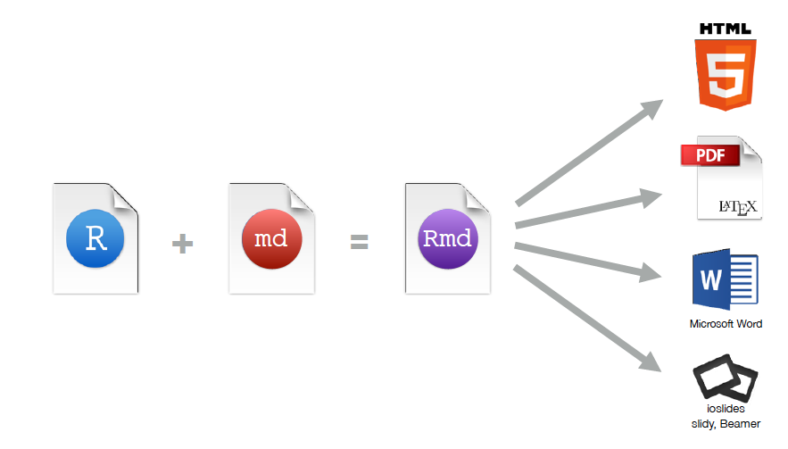
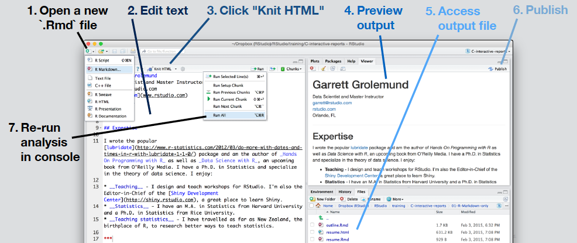
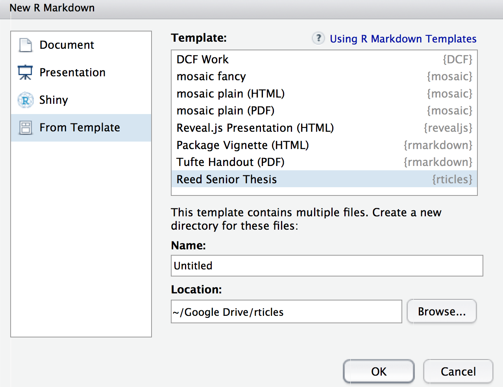

```{r set-options, include = FALSE}
pkg <- c("dplyr", "ggplot2", "lubridate")

new.pkg <- pkg[!(pkg %in% installed.packages())]

if (length(new.pkg)) {
  install.packages(new.pkg, repos = "http://cran.rstudio.com")
}

if(!require(revealjs)){
  library(devtools)
  devtools::install_github("jjallaire/revealjs")
}
if(!require(pnwflights14)){
  library(devtools)
  devtools::install_github("cismay/pnwflights14")
}

suppressPackageStartupMessages(library(dplyr))
suppressPackageStartupMessages(library(ggplot2))
suppressPackageStartupMessages(library(lubridate))
library(revealjs)
options(width = 100)
```

# Reproducible Research 

<br>

### Fall 2015 - Data @ Reed Research Skills Workshop Series

Chester Ismay

Office: ETC 223

cismay@reed.edu

http://blogs.reed.edu/datablog

---

## Who am I?

> - Grew up in South Dakota (town of 112 people)
> - BS in Math, minor in Computer Science from SDSM&T
> - MS in Statistics from Northern Arizona University
> - Worked as an actuary before obtaining PhD in Statistics from Arizona State University
> - Was Assistant Professor of Statistics and Data Science at Ripon College the last two years
> - Moved to Portland area this summer
> - Started working at Reed on August 11th

---

## What can I help you with?

> - Data analysis
> - Data wrangling/cleaning
> - Data visualization
> - Data tidying/manipulating
> - Reproducible research

--- 

## When am I available?

[comment]: <> (> - Generally available 9 AM to 5 PM Monday - Friday)
> - Email me at cismay@reed.edu or chester.ismay@reed.edu
> - Office (ETC 223) hours
>     - Mondays (11 AM to noon)
>     - Tuesdays and Thursdays (2 PM to 3 PM)
> - Sometimes available for virtual office hours via Google Hangouts (email me for details)

---

### Basic research process


---

### Further support

##### data@reed.edu <br> http://www.reed.edu/data-at-reed


---

# Traditional approaches to writing a statistical report

---

### The dreaded copy-and-paste

> - Import data set into statistical software package
> - Run the procedure to get results
> - Copy and paste appropriate pieces from the analysis into document editor
> - Add descriptions
> - Finish/submit report

---

### Disadvantages of this process

- Lots of manual work (prone to make errors)
- Tedious (who likes to carefully copy-and-paste?)
- Likely not recordable (did you write down all the steps you followed to get your analysis?)
- What if you made an error at the beginning of your analysis?  If your data had an error?

---

# Reproducible research

---

> "Let us change our traditional attitude to the construction of programs: Instead of imagining that our main task is to instruct a computer what to do, let us concentrate rather on explaining to humans what we want the computer to do." 

  > - Donald Knuth, _Literate Programming_ (1984)

---

<!--
- Independent researchers can recreate findings by following the procedures originally used.
-->


> "**Reproducible research** is the idea that data analyses, and more generally, scientific claims, are published with their data and software code so that others may verify the findings and build upon them."

 > - Roger Peng, Johns Hopkins

---

# R Studio <br> +  <br> R Markdown

---

### Tools to make working with R friendly

> - RStudio is a powerful user interface that helps you get better control of your analysis.
> - Like R, it is also completely free.
> - You can write your entire paper/report (text, code, analysis, graphics, etc.) all in R Markdown.
> - If you need to update any of your code, R Markdown will automatically update your plots and output of your analysis and will create an updated PDF file.
> - **No more copy-and-paste!**
> - It's my job!

---

### R Markdown



---

# Demonstration on using R Markdown

<!--
- Load in R Markdown template
- YAML header - metadata used to create the report
- Link
- Bold
- Help, Markdown Quick Reference
- R code in chunks
- Chunk options
- Show running of code in chunks
-->

---



---

### Chunk options

 Option | Result 
 ------ | ------ 
 `echo = FALSE` | Don't include the code 
 `results = "hide"` | Don't include the output 
 `include = FALSE` | Don't show code or output 
 `eval = FALSE` | Don't evaluate the code at all 
 `warning = FALSE` | Don't show R warnings 
 `message = FALSE` | Don't show R messages 
 `fig.width = #` | Width of figure 
 `fig.height = #` | Height of figure 

---

# Parameterized reports

Right click on the link to the `.Rmd` file [here](http://reed.edu/data-at-reed/software/R/workshops/2015/babynames_parameterized.Rmd), save it, and open it in RStudio.

---


# The Reed R Markdown Thesis Template

(Preliminary edition)

---

### Run this code

```{r reed_thesis_prep, eval = FALSE}
if(!require(devtools))
  install.packages("devtools")
if (!require(rticles)){
  library(devtools)
  devtools::install_github("ismayc/rticles")
  }
```

---



---

## Useful links

[Markdown Cheatsheet](https://github.com/adam-p/markdown-here/wiki/Markdown-Cheatsheet)

[R Markdown Reference Guide](https://www.rstudio.com/wp-content/uploads/2015/03/rmarkdown-reference.pdf)

[Parameterized Reports Tutorial](http://rmarkdown.rstudio.com/developer_parameterized_reports.html)

[My `rticles` package](https://github.com/ismayc/rticles/)

---

# Thanks! <br /> <br />

## cismay@reed.edu 

<br /> <br />

Slides available at <http://rpubs.com/cismay/rr_workshop_2015>