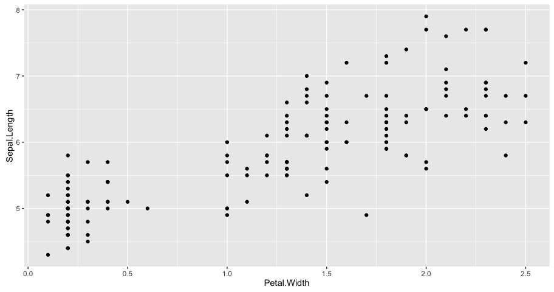
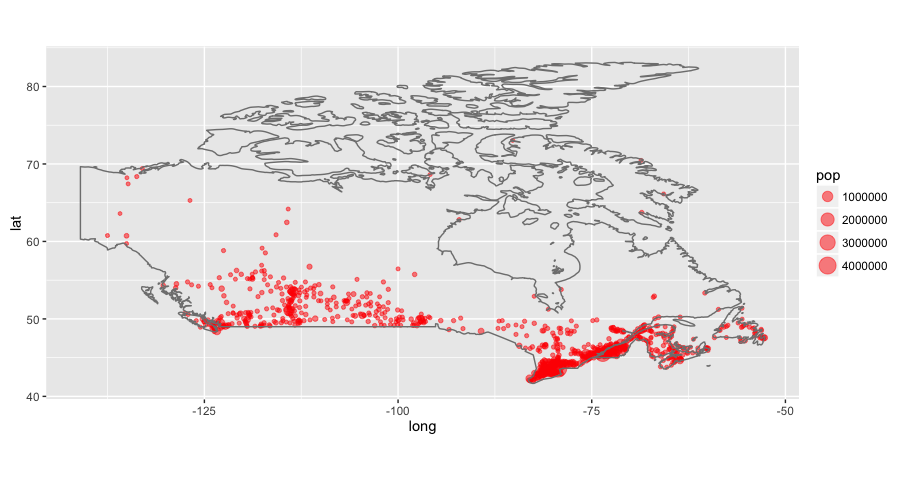
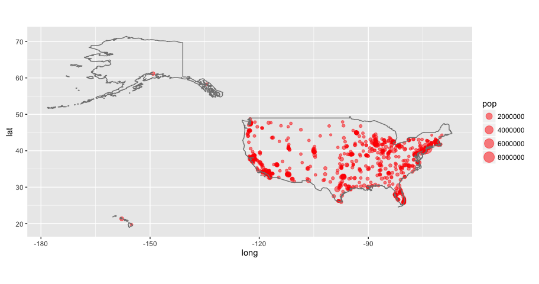

# Interactive Data Visualization
<br> Chester Ismay (cismay@reed.edu) <br>  
Paideia 2k16 <br><br> Slides available at <http://rpubs.com/cismay/paideia_2k16_idv> <br> Supplementary HTML file at <http://rpubs.com/cismay/paideia_2k16_idv_sup>  

When we think about data visualization, we often think of a static plot with some colors and points.  New tools (spearheaded by Hans Rosling's Gapminder project) are constantly being developed to allow us to interact dynamically with data visualizations.  I'll discuss a variety of different tools that attempt to make data come to life!

All too often statistics is thought of as a boring subject with boring plots.  New software packages and tools are being developed to better understand the relationships between variables.  I'll demonstrate a lot of these different tools and packages using the R computing language.  We'll go through a variety of different examples from multiple fields to better understand anomalies and trends in data.


```r
pkg <- c("dplyr", "ggplot2", "knitr", "readr", 
         "xts", "maps", "googleVis", "DT", "rmarkdown")

new.pkg <- pkg[!(pkg %in% installed.packages())]

if (length(new.pkg)) {
  install.packages(new.pkg, repos = "http://cran.rstudio.com")
}

if(!require(revealjs)){
  devtools::install_github("jjallaire/revealjs")#, 
    #ref = "a4854c017eac44d969a216103551c21d66329a74")
}

if(!require(plotly)){
  devtools::install_github("ropensci/plotly")
}

if(!require(pnwflights14)){
  devtools::install_github("ismayc/pnwflights14")
}

if(!require(dygraphs)){
  devtools::install_github("rstudio/dygraphs")#, 
    #ref = "778acdaeb91b754412d928ea824632bceae3078b")
}

library(dplyr)
library(ggplot2)
library(revealjs)
library(knitr)
library(readr)
library(plotly)
library(dygraphs)
library(pnwflights14)
library(xts)
library(maps)
library(googleVis)
library(DT)

options(width = 100, scipen = 99)
```

### The __Iris__ flower data set

- Introduced by Ronald Fisher in 1936

- The data set consists of 50 samples from each of three species of Iris (_Iris setosa_, _Iris virginica_, and _Iris versicolor_). 

- Four features were measured from each sample: the length and the width of the sepals and petals, in centimetres. Based on the combination of these four features, Fisher developed a model to distinguish the species from each other.

Source: [Wikipedia](https://en.wikipedia.org/wiki/Iris_flower_data_set)

---

# Scatterplots

---

## Traditional (boring) plot


```r
with(iris, plot(x = Petal.Width, y = Sepal.Length))
```


---

## Prettier (not quite as boring) plot


```r
qplot(Petal.Width, Sepal.Length, data = iris)
```



---

## Interactive plot using `plotly`


```r
ggiris <- qplot(Petal.Width, Sepal.Length, data = iris)
ggplotly(ggiris)
```

<!--html_preserve--><div id="htmlwidget-5231" style="width:912px;height:480px;" class="plotly html-widget"></div>
<script type="application/json" data-for="htmlwidget-5231">{"x":{"data":[{"x":[0.2,0.2,0.2,0.2,0.2,0.4,0.3,0.2,0.2,0.1,0.2,0.2,0.1,0.1,0.2,0.4,0.4,0.3,0.3,0.3,0.2,0.4,0.2,0.5,0.2,0.2,0.4,0.2,0.2,0.2,0.2,0.4,0.1,0.2,0.2,0.2,0.2,0.1,0.2,0.2,0.3,0.3,0.2,0.6,0.4,0.3,0.2,0.2,0.2,0.2,1.4,1.5,1.5,1.3,1.5,1.3,1.6,1,1.3,1.4,1,1.5,1,1.4,1.3,1.4,1.5,1,1.5,1.1,1.8,1.3,1.5,1.2,1.3,1.4,1.4,1.7,1.5,1,1.1,1,1.2,1.6,1.5,1.6,1.5,1.3,1.3,1.3,1.2,1.4,1.2,1,1.3,1.2,1.3,1.3,1.1,1.3,2.5,1.9,2.1,1.8,2.2,2.1,1.7,1.8,1.8,2.5,2,1.9,2.1,2,2.4,2.3,1.8,2.2,2.3,1.5,2.3,2,2,1.8,2.1,1.8,1.8,1.8,2.1,1.6,1.9,2,2.2,1.5,1.4,2.3,2.4,1.8,1.8,2.1,2.4,2.3,1.9,2.3,2.5,2.3,1.9,2,2.3,1.8],"y":[5.1,4.9,4.7,4.6,5,5.4,4.6,5,4.4,4.9,5.4,4.8,4.8,4.3,5.8,5.7,5.4,5.1,5.7,5.1,5.4,5.1,4.6,5.1,4.8,5,5,5.2,5.2,4.7,4.8,5.4,5.2,5.5,4.9,5,5.5,4.9,4.4,5.1,5,4.5,4.4,5,5.1,4.8,5.1,4.6,5.3,5,7,6.4,6.9,5.5,6.5,5.7,6.3,4.9,6.6,5.2,5,5.9,6,6.1,5.6,6.7,5.6,5.8,6.2,5.6,5.9,6.1,6.3,6.1,6.4,6.6,6.8,6.7,6,5.7,5.5,5.5,5.8,6,5.4,6,6.7,6.3,5.6,5.5,5.5,6.1,5.8,5,5.6,5.7,5.7,6.2,5.1,5.7,6.3,5.8,7.1,6.3,6.5,7.6,4.9,7.3,6.7,7.2,6.5,6.4,6.8,5.7,5.8,6.4,6.5,7.7,7.7,6,6.9,5.6,7.7,6.3,6.7,7.2,6.2,6.1,6.4,7.2,7.4,7.9,6.4,6.3,6.1,7.7,6.3,6.4,6,6.9,6.7,6.9,5.8,6.8,6.7,6.7,6.3,6.5,6.2,5.9],"text":["Petal.Width: 0.2<br>Sepal.Length: 5.1","Petal.Width: 0.2<br>Sepal.Length: 4.9","Petal.Width: 0.2<br>Sepal.Length: 4.7","Petal.Width: 0.2<br>Sepal.Length: 4.6","Petal.Width: 0.2<br>Sepal.Length: 5","Petal.Width: 0.4<br>Sepal.Length: 5.4","Petal.Width: 0.3<br>Sepal.Length: 4.6","Petal.Width: 0.2<br>Sepal.Length: 5","Petal.Width: 0.2<br>Sepal.Length: 4.4","Petal.Width: 0.1<br>Sepal.Length: 4.9","Petal.Width: 0.2<br>Sepal.Length: 5.4","Petal.Width: 0.2<br>Sepal.Length: 4.8","Petal.Width: 0.1<br>Sepal.Length: 4.8","Petal.Width: 0.1<br>Sepal.Length: 4.3","Petal.Width: 0.2<br>Sepal.Length: 5.8","Petal.Width: 0.4<br>Sepal.Length: 5.7","Petal.Width: 0.4<br>Sepal.Length: 5.4","Petal.Width: 0.3<br>Sepal.Length: 5.1","Petal.Width: 0.3<br>Sepal.Length: 5.7","Petal.Width: 0.3<br>Sepal.Length: 5.1","Petal.Width: 0.2<br>Sepal.Length: 5.4","Petal.Width: 0.4<br>Sepal.Length: 5.1","Petal.Width: 0.2<br>Sepal.Length: 4.6","Petal.Width: 0.5<br>Sepal.Length: 5.1","Petal.Width: 0.2<br>Sepal.Length: 4.8","Petal.Width: 0.2<br>Sepal.Length: 5","Petal.Width: 0.4<br>Sepal.Length: 5","Petal.Width: 0.2<br>Sepal.Length: 5.2","Petal.Width: 0.2<br>Sepal.Length: 5.2","Petal.Width: 0.2<br>Sepal.Length: 4.7","Petal.Width: 0.2<br>Sepal.Length: 4.8","Petal.Width: 0.4<br>Sepal.Length: 5.4","Petal.Width: 0.1<br>Sepal.Length: 5.2","Petal.Width: 0.2<br>Sepal.Length: 5.5","Petal.Width: 0.2<br>Sepal.Length: 4.9","Petal.Width: 0.2<br>Sepal.Length: 5","Petal.Width: 0.2<br>Sepal.Length: 5.5","Petal.Width: 0.1<br>Sepal.Length: 4.9","Petal.Width: 0.2<br>Sepal.Length: 4.4","Petal.Width: 0.2<br>Sepal.Length: 5.1","Petal.Width: 0.3<br>Sepal.Length: 5","Petal.Width: 0.3<br>Sepal.Length: 4.5","Petal.Width: 0.2<br>Sepal.Length: 4.4","Petal.Width: 0.6<br>Sepal.Length: 5","Petal.Width: 0.4<br>Sepal.Length: 5.1","Petal.Width: 0.3<br>Sepal.Length: 4.8","Petal.Width: 0.2<br>Sepal.Length: 5.1","Petal.Width: 0.2<br>Sepal.Length: 4.6","Petal.Width: 0.2<br>Sepal.Length: 5.3","Petal.Width: 0.2<br>Sepal.Length: 5","Petal.Width: 1.4<br>Sepal.Length: 7","Petal.Width: 1.5<br>Sepal.Length: 6.4","Petal.Width: 1.5<br>Sepal.Length: 6.9","Petal.Width: 1.3<br>Sepal.Length: 5.5","Petal.Width: 1.5<br>Sepal.Length: 6.5","Petal.Width: 1.3<br>Sepal.Length: 5.7","Petal.Width: 1.6<br>Sepal.Length: 6.3","Petal.Width: 1<br>Sepal.Length: 4.9","Petal.Width: 1.3<br>Sepal.Length: 6.6","Petal.Width: 1.4<br>Sepal.Length: 5.2","Petal.Width: 1<br>Sepal.Length: 5","Petal.Width: 1.5<br>Sepal.Length: 5.9","Petal.Width: 1<br>Sepal.Length: 6","Petal.Width: 1.4<br>Sepal.Length: 6.1","Petal.Width: 1.3<br>Sepal.Length: 5.6","Petal.Width: 1.4<br>Sepal.Length: 6.7","Petal.Width: 1.5<br>Sepal.Length: 5.6","Petal.Width: 1<br>Sepal.Length: 5.8","Petal.Width: 1.5<br>Sepal.Length: 6.2","Petal.Width: 1.1<br>Sepal.Length: 5.6","Petal.Width: 1.8<br>Sepal.Length: 5.9","Petal.Width: 1.3<br>Sepal.Length: 6.1","Petal.Width: 1.5<br>Sepal.Length: 6.3","Petal.Width: 1.2<br>Sepal.Length: 6.1","Petal.Width: 1.3<br>Sepal.Length: 6.4","Petal.Width: 1.4<br>Sepal.Length: 6.6","Petal.Width: 1.4<br>Sepal.Length: 6.8","Petal.Width: 1.7<br>Sepal.Length: 6.7","Petal.Width: 1.5<br>Sepal.Length: 6","Petal.Width: 1<br>Sepal.Length: 5.7","Petal.Width: 1.1<br>Sepal.Length: 5.5","Petal.Width: 1<br>Sepal.Length: 5.5","Petal.Width: 1.2<br>Sepal.Length: 5.8","Petal.Width: 1.6<br>Sepal.Length: 6","Petal.Width: 1.5<br>Sepal.Length: 5.4","Petal.Width: 1.6<br>Sepal.Length: 6","Petal.Width: 1.5<br>Sepal.Length: 6.7","Petal.Width: 1.3<br>Sepal.Length: 6.3","Petal.Width: 1.3<br>Sepal.Length: 5.6","Petal.Width: 1.3<br>Sepal.Length: 5.5","Petal.Width: 1.2<br>Sepal.Length: 5.5","Petal.Width: 1.4<br>Sepal.Length: 6.1","Petal.Width: 1.2<br>Sepal.Length: 5.8","Petal.Width: 1<br>Sepal.Length: 5","Petal.Width: 1.3<br>Sepal.Length: 5.6","Petal.Width: 1.2<br>Sepal.Length: 5.7","Petal.Width: 1.3<br>Sepal.Length: 5.7","Petal.Width: 1.3<br>Sepal.Length: 6.2","Petal.Width: 1.1<br>Sepal.Length: 5.1","Petal.Width: 1.3<br>Sepal.Length: 5.7","Petal.Width: 2.5<br>Sepal.Length: 6.3","Petal.Width: 1.9<br>Sepal.Length: 5.8","Petal.Width: 2.1<br>Sepal.Length: 7.1","Petal.Width: 1.8<br>Sepal.Length: 6.3","Petal.Width: 2.2<br>Sepal.Length: 6.5","Petal.Width: 2.1<br>Sepal.Length: 7.6","Petal.Width: 1.7<br>Sepal.Length: 4.9","Petal.Width: 1.8<br>Sepal.Length: 7.3","Petal.Width: 1.8<br>Sepal.Length: 6.7","Petal.Width: 2.5<br>Sepal.Length: 7.2","Petal.Width: 2<br>Sepal.Length: 6.5","Petal.Width: 1.9<br>Sepal.Length: 6.4","Petal.Width: 2.1<br>Sepal.Length: 6.8","Petal.Width: 2<br>Sepal.Length: 5.7","Petal.Width: 2.4<br>Sepal.Length: 5.8","Petal.Width: 2.3<br>Sepal.Length: 6.4","Petal.Width: 1.8<br>Sepal.Length: 6.5","Petal.Width: 2.2<br>Sepal.Length: 7.7","Petal.Width: 2.3<br>Sepal.Length: 7.7","Petal.Width: 1.5<br>Sepal.Length: 6","Petal.Width: 2.3<br>Sepal.Length: 6.9","Petal.Width: 2<br>Sepal.Length: 5.6","Petal.Width: 2<br>Sepal.Length: 7.7","Petal.Width: 1.8<br>Sepal.Length: 6.3","Petal.Width: 2.1<br>Sepal.Length: 6.7","Petal.Width: 1.8<br>Sepal.Length: 7.2","Petal.Width: 1.8<br>Sepal.Length: 6.2","Petal.Width: 1.8<br>Sepal.Length: 6.1","Petal.Width: 2.1<br>Sepal.Length: 6.4","Petal.Width: 1.6<br>Sepal.Length: 7.2","Petal.Width: 1.9<br>Sepal.Length: 7.4","Petal.Width: 2<br>Sepal.Length: 7.9","Petal.Width: 2.2<br>Sepal.Length: 6.4","Petal.Width: 1.5<br>Sepal.Length: 6.3","Petal.Width: 1.4<br>Sepal.Length: 6.1","Petal.Width: 2.3<br>Sepal.Length: 7.7","Petal.Width: 2.4<br>Sepal.Length: 6.3","Petal.Width: 1.8<br>Sepal.Length: 6.4","Petal.Width: 1.8<br>Sepal.Length: 6","Petal.Width: 2.1<br>Sepal.Length: 6.9","Petal.Width: 2.4<br>Sepal.Length: 6.7","Petal.Width: 2.3<br>Sepal.Length: 6.9","Petal.Width: 1.9<br>Sepal.Length: 5.8","Petal.Width: 2.3<br>Sepal.Length: 6.8","Petal.Width: 2.5<br>Sepal.Length: 6.7","Petal.Width: 2.3<br>Sepal.Length: 6.7","Petal.Width: 1.9<br>Sepal.Length: 6.3","Petal.Width: 2<br>Sepal.Length: 6.5","Petal.Width: 2.3<br>Sepal.Length: 6.2","Petal.Width: 1.8<br>Sepal.Length: 5.9"],"key":null,"type":"scatter","mode":"markers","marker":{"autocolorscale":false,"color":"rgb(0,0,0)","opacity":1,"size":5.66929133858268,"symbol":"circle","line":{"width":1.88976377952756,"color":"rgb(0,0,0)"}},"showlegend":false,"xaxis":"x","yaxis":"y","hoverinfo":"text","name":""}],"layout":{"margin":{"b":43.8356164383562,"l":31.4155251141553,"t":29.8812785388128,"r":7.30593607305936},"plot_bgcolor":"rgb(235,235,235)","paper_bgcolor":"rgb(255,255,255)","font":{"color":"rgb(0,0,0)","family":"","size":14.6118721461187},"xaxis":{"type":"linear","autorange":false,"tickmode":"array","range":[-0.02,2.62],"ticktext":["0.0","0.5","1.0","1.5","2.0","2.5"],"tickvals":[0,0.5,1,1.5,2,2.5],"ticks":"outside","tickcolor":"rgb(51,51,51)","ticklen":3.65296803652968,"tickwidth":0.66417600664176,"showticklabels":true,"tickfont":{"color":"rgb(77,77,77)","family":"","size":11.689497716895},"tickangle":-0,"showline":false,"linecolor":null,"linewidth":0,"showgrid":true,"domain":[0,1],"gridcolor":"rgb(255,255,255)","gridwidth":0.66417600664176,"zeroline":false,"anchor":"y","hoverformat":".2f"},"annotations":[{"text":"Petal.Width","x":0.5,"y":-0.082572298325723,"showarrow":false,"ax":0,"ay":0,"font":{"color":"rgb(0,0,0)","family":"","size":14.6118721461187},"xref":"paper","yref":"paper","textangle":-0,"xanchor":"center","yanchor":"middle"},{"text":"Sepal.Length","x":-0.032243851638228,"y":0.5,"showarrow":false,"ax":0,"ay":0,"font":{"color":"rgb(0,0,0)","family":"","size":14.6118721461187},"xref":"paper","yref":"paper","textangle":-90,"xanchor":"center","yanchor":"middle"}],"yaxis":{"type":"linear","autorange":false,"tickmode":"array","range":[4.12,8.08],"ticktext":["5","6","7","8"],"tickvals":[5,6,7,8],"ticks":"outside","tickcolor":"rgb(51,51,51)","ticklen":3.65296803652968,"tickwidth":0.66417600664176,"showticklabels":true,"tickfont":{"color":"rgb(77,77,77)","family":"","size":11.689497716895},"tickangle":-0,"showline":false,"linecolor":null,"linewidth":0,"showgrid":true,"domain":[0,1],"gridcolor":"rgb(255,255,255)","gridwidth":0.66417600664176,"zeroline":false,"anchor":"x","hoverformat":".2f"},"shapes":[{"type":"rect","fillcolor":null,"line":{"color":null,"width":0,"linetype":[]},"yref":"paper","xref":"paper","x0":0,"x1":1,"y0":0,"y1":1}],"showlegend":false,"legend":{"bgcolor":"rgb(255,255,255)","bordercolor":"transparent","borderwidth":1.88976377952756,"font":{"color":"rgb(0,0,0)","family":"","size":11.689497716895}},"hovermode":"closest"},"source":"A","config":{"modeBarButtonsToRemove":["sendDataToCloud"]},"base_url":"https://plot.ly"},"evals":[],"jsHooks":[]}</script><!--/html_preserve-->

---

## Prettier interactive plot using `plotly`


```r
ggiris_colored <- qplot(Petal.Width, Sepal.Length, data = iris, 
  color = Species)
ggplotly(ggiris_colored)
```

<!--html_preserve--><div id="htmlwidget-6321" style="width:912px;height:480px;" class="plotly html-widget"></div>
<script type="application/json" data-for="htmlwidget-6321">{"x":{"data":[{"x":[0.2,0.2,0.2,0.2,0.2,0.4,0.3,0.2,0.2,0.1,0.2,0.2,0.1,0.1,0.2,0.4,0.4,0.3,0.3,0.3,0.2,0.4,0.2,0.5,0.2,0.2,0.4,0.2,0.2,0.2,0.2,0.4,0.1,0.2,0.2,0.2,0.2,0.1,0.2,0.2,0.3,0.3,0.2,0.6,0.4,0.3,0.2,0.2,0.2,0.2],"y":[5.1,4.9,4.7,4.6,5,5.4,4.6,5,4.4,4.9,5.4,4.8,4.8,4.3,5.8,5.7,5.4,5.1,5.7,5.1,5.4,5.1,4.6,5.1,4.8,5,5,5.2,5.2,4.7,4.8,5.4,5.2,5.5,4.9,5,5.5,4.9,4.4,5.1,5,4.5,4.4,5,5.1,4.8,5.1,4.6,5.3,5],"text":["Species: setosa<br>Petal.Width: 0.2<br>Sepal.Length: 5.1","Species: setosa<br>Petal.Width: 0.2<br>Sepal.Length: 4.9","Species: setosa<br>Petal.Width: 0.2<br>Sepal.Length: 4.7","Species: setosa<br>Petal.Width: 0.2<br>Sepal.Length: 4.6","Species: setosa<br>Petal.Width: 0.2<br>Sepal.Length: 5","Species: setosa<br>Petal.Width: 0.4<br>Sepal.Length: 5.4","Species: setosa<br>Petal.Width: 0.3<br>Sepal.Length: 4.6","Species: setosa<br>Petal.Width: 0.2<br>Sepal.Length: 5","Species: setosa<br>Petal.Width: 0.2<br>Sepal.Length: 4.4","Species: setosa<br>Petal.Width: 0.1<br>Sepal.Length: 4.9","Species: setosa<br>Petal.Width: 0.2<br>Sepal.Length: 5.4","Species: setosa<br>Petal.Width: 0.2<br>Sepal.Length: 4.8","Species: setosa<br>Petal.Width: 0.1<br>Sepal.Length: 4.8","Species: setosa<br>Petal.Width: 0.1<br>Sepal.Length: 4.3","Species: setosa<br>Petal.Width: 0.2<br>Sepal.Length: 5.8","Species: setosa<br>Petal.Width: 0.4<br>Sepal.Length: 5.7","Species: setosa<br>Petal.Width: 0.4<br>Sepal.Length: 5.4","Species: setosa<br>Petal.Width: 0.3<br>Sepal.Length: 5.1","Species: setosa<br>Petal.Width: 0.3<br>Sepal.Length: 5.7","Species: setosa<br>Petal.Width: 0.3<br>Sepal.Length: 5.1","Species: setosa<br>Petal.Width: 0.2<br>Sepal.Length: 5.4","Species: setosa<br>Petal.Width: 0.4<br>Sepal.Length: 5.1","Species: setosa<br>Petal.Width: 0.2<br>Sepal.Length: 4.6","Species: setosa<br>Petal.Width: 0.5<br>Sepal.Length: 5.1","Species: setosa<br>Petal.Width: 0.2<br>Sepal.Length: 4.8","Species: setosa<br>Petal.Width: 0.2<br>Sepal.Length: 5","Species: setosa<br>Petal.Width: 0.4<br>Sepal.Length: 5","Species: setosa<br>Petal.Width: 0.2<br>Sepal.Length: 5.2","Species: setosa<br>Petal.Width: 0.2<br>Sepal.Length: 5.2","Species: setosa<br>Petal.Width: 0.2<br>Sepal.Length: 4.7","Species: setosa<br>Petal.Width: 0.2<br>Sepal.Length: 4.8","Species: setosa<br>Petal.Width: 0.4<br>Sepal.Length: 5.4","Species: setosa<br>Petal.Width: 0.1<br>Sepal.Length: 5.2","Species: setosa<br>Petal.Width: 0.2<br>Sepal.Length: 5.5","Species: setosa<br>Petal.Width: 0.2<br>Sepal.Length: 4.9","Species: setosa<br>Petal.Width: 0.2<br>Sepal.Length: 5","Species: setosa<br>Petal.Width: 0.2<br>Sepal.Length: 5.5","Species: setosa<br>Petal.Width: 0.1<br>Sepal.Length: 4.9","Species: setosa<br>Petal.Width: 0.2<br>Sepal.Length: 4.4","Species: setosa<br>Petal.Width: 0.2<br>Sepal.Length: 5.1","Species: setosa<br>Petal.Width: 0.3<br>Sepal.Length: 5","Species: setosa<br>Petal.Width: 0.3<br>Sepal.Length: 4.5","Species: setosa<br>Petal.Width: 0.2<br>Sepal.Length: 4.4","Species: setosa<br>Petal.Width: 0.6<br>Sepal.Length: 5","Species: setosa<br>Petal.Width: 0.4<br>Sepal.Length: 5.1","Species: setosa<br>Petal.Width: 0.3<br>Sepal.Length: 4.8","Species: setosa<br>Petal.Width: 0.2<br>Sepal.Length: 5.1","Species: setosa<br>Petal.Width: 0.2<br>Sepal.Length: 4.6","Species: setosa<br>Petal.Width: 0.2<br>Sepal.Length: 5.3","Species: setosa<br>Petal.Width: 0.2<br>Sepal.Length: 5"],"key":null,"type":"scatter","mode":"markers","marker":{"autocolorscale":false,"color":"rgb(248,118,109)","opacity":1,"size":5.66929133858268,"symbol":"circle","line":{"width":1.88976377952756,"color":"rgb(248,118,109)"}},"name":"setosa","legendgroup":"setosa","showlegend":true,"xaxis":"x","yaxis":"y","hoverinfo":"text"},{"x":[1.4,1.5,1.5,1.3,1.5,1.3,1.6,1,1.3,1.4,1,1.5,1,1.4,1.3,1.4,1.5,1,1.5,1.1,1.8,1.3,1.5,1.2,1.3,1.4,1.4,1.7,1.5,1,1.1,1,1.2,1.6,1.5,1.6,1.5,1.3,1.3,1.3,1.2,1.4,1.2,1,1.3,1.2,1.3,1.3,1.1,1.3],"y":[7,6.4,6.9,5.5,6.5,5.7,6.3,4.9,6.6,5.2,5,5.9,6,6.1,5.6,6.7,5.6,5.8,6.2,5.6,5.9,6.1,6.3,6.1,6.4,6.6,6.8,6.7,6,5.7,5.5,5.5,5.8,6,5.4,6,6.7,6.3,5.6,5.5,5.5,6.1,5.8,5,5.6,5.7,5.7,6.2,5.1,5.7],"text":["Species: versicolor<br>Petal.Width: 1.4<br>Sepal.Length: 7","Species: versicolor<br>Petal.Width: 1.5<br>Sepal.Length: 6.4","Species: versicolor<br>Petal.Width: 1.5<br>Sepal.Length: 6.9","Species: versicolor<br>Petal.Width: 1.3<br>Sepal.Length: 5.5","Species: versicolor<br>Petal.Width: 1.5<br>Sepal.Length: 6.5","Species: versicolor<br>Petal.Width: 1.3<br>Sepal.Length: 5.7","Species: versicolor<br>Petal.Width: 1.6<br>Sepal.Length: 6.3","Species: versicolor<br>Petal.Width: 1<br>Sepal.Length: 4.9","Species: versicolor<br>Petal.Width: 1.3<br>Sepal.Length: 6.6","Species: versicolor<br>Petal.Width: 1.4<br>Sepal.Length: 5.2","Species: versicolor<br>Petal.Width: 1<br>Sepal.Length: 5","Species: versicolor<br>Petal.Width: 1.5<br>Sepal.Length: 5.9","Species: versicolor<br>Petal.Width: 1<br>Sepal.Length: 6","Species: versicolor<br>Petal.Width: 1.4<br>Sepal.Length: 6.1","Species: versicolor<br>Petal.Width: 1.3<br>Sepal.Length: 5.6","Species: versicolor<br>Petal.Width: 1.4<br>Sepal.Length: 6.7","Species: versicolor<br>Petal.Width: 1.5<br>Sepal.Length: 5.6","Species: versicolor<br>Petal.Width: 1<br>Sepal.Length: 5.8","Species: versicolor<br>Petal.Width: 1.5<br>Sepal.Length: 6.2","Species: versicolor<br>Petal.Width: 1.1<br>Sepal.Length: 5.6","Species: versicolor<br>Petal.Width: 1.8<br>Sepal.Length: 5.9","Species: versicolor<br>Petal.Width: 1.3<br>Sepal.Length: 6.1","Species: versicolor<br>Petal.Width: 1.5<br>Sepal.Length: 6.3","Species: versicolor<br>Petal.Width: 1.2<br>Sepal.Length: 6.1","Species: versicolor<br>Petal.Width: 1.3<br>Sepal.Length: 6.4","Species: versicolor<br>Petal.Width: 1.4<br>Sepal.Length: 6.6","Species: versicolor<br>Petal.Width: 1.4<br>Sepal.Length: 6.8","Species: versicolor<br>Petal.Width: 1.7<br>Sepal.Length: 6.7","Species: versicolor<br>Petal.Width: 1.5<br>Sepal.Length: 6","Species: versicolor<br>Petal.Width: 1<br>Sepal.Length: 5.7","Species: versicolor<br>Petal.Width: 1.1<br>Sepal.Length: 5.5","Species: versicolor<br>Petal.Width: 1<br>Sepal.Length: 5.5","Species: versicolor<br>Petal.Width: 1.2<br>Sepal.Length: 5.8","Species: versicolor<br>Petal.Width: 1.6<br>Sepal.Length: 6","Species: versicolor<br>Petal.Width: 1.5<br>Sepal.Length: 5.4","Species: versicolor<br>Petal.Width: 1.6<br>Sepal.Length: 6","Species: versicolor<br>Petal.Width: 1.5<br>Sepal.Length: 6.7","Species: versicolor<br>Petal.Width: 1.3<br>Sepal.Length: 6.3","Species: versicolor<br>Petal.Width: 1.3<br>Sepal.Length: 5.6","Species: versicolor<br>Petal.Width: 1.3<br>Sepal.Length: 5.5","Species: versicolor<br>Petal.Width: 1.2<br>Sepal.Length: 5.5","Species: versicolor<br>Petal.Width: 1.4<br>Sepal.Length: 6.1","Species: versicolor<br>Petal.Width: 1.2<br>Sepal.Length: 5.8","Species: versicolor<br>Petal.Width: 1<br>Sepal.Length: 5","Species: versicolor<br>Petal.Width: 1.3<br>Sepal.Length: 5.6","Species: versicolor<br>Petal.Width: 1.2<br>Sepal.Length: 5.7","Species: versicolor<br>Petal.Width: 1.3<br>Sepal.Length: 5.7","Species: versicolor<br>Petal.Width: 1.3<br>Sepal.Length: 6.2","Species: versicolor<br>Petal.Width: 1.1<br>Sepal.Length: 5.1","Species: versicolor<br>Petal.Width: 1.3<br>Sepal.Length: 5.7"],"key":null,"type":"scatter","mode":"markers","marker":{"autocolorscale":false,"color":"rgb(0,186,56)","opacity":1,"size":5.66929133858268,"symbol":"circle","line":{"width":1.88976377952756,"color":"rgb(0,186,56)"}},"name":"versicolor","legendgroup":"versicolor","showlegend":true,"xaxis":"x","yaxis":"y","hoverinfo":"text"},{"x":[2.5,1.9,2.1,1.8,2.2,2.1,1.7,1.8,1.8,2.5,2,1.9,2.1,2,2.4,2.3,1.8,2.2,2.3,1.5,2.3,2,2,1.8,2.1,1.8,1.8,1.8,2.1,1.6,1.9,2,2.2,1.5,1.4,2.3,2.4,1.8,1.8,2.1,2.4,2.3,1.9,2.3,2.5,2.3,1.9,2,2.3,1.8],"y":[6.3,5.8,7.1,6.3,6.5,7.6,4.9,7.3,6.7,7.2,6.5,6.4,6.8,5.7,5.8,6.4,6.5,7.7,7.7,6,6.9,5.6,7.7,6.3,6.7,7.2,6.2,6.1,6.4,7.2,7.4,7.9,6.4,6.3,6.1,7.7,6.3,6.4,6,6.9,6.7,6.9,5.8,6.8,6.7,6.7,6.3,6.5,6.2,5.9],"text":["Species: virginica<br>Petal.Width: 2.5<br>Sepal.Length: 6.3","Species: virginica<br>Petal.Width: 1.9<br>Sepal.Length: 5.8","Species: virginica<br>Petal.Width: 2.1<br>Sepal.Length: 7.1","Species: virginica<br>Petal.Width: 1.8<br>Sepal.Length: 6.3","Species: virginica<br>Petal.Width: 2.2<br>Sepal.Length: 6.5","Species: virginica<br>Petal.Width: 2.1<br>Sepal.Length: 7.6","Species: virginica<br>Petal.Width: 1.7<br>Sepal.Length: 4.9","Species: virginica<br>Petal.Width: 1.8<br>Sepal.Length: 7.3","Species: virginica<br>Petal.Width: 1.8<br>Sepal.Length: 6.7","Species: virginica<br>Petal.Width: 2.5<br>Sepal.Length: 7.2","Species: virginica<br>Petal.Width: 2<br>Sepal.Length: 6.5","Species: virginica<br>Petal.Width: 1.9<br>Sepal.Length: 6.4","Species: virginica<br>Petal.Width: 2.1<br>Sepal.Length: 6.8","Species: virginica<br>Petal.Width: 2<br>Sepal.Length: 5.7","Species: virginica<br>Petal.Width: 2.4<br>Sepal.Length: 5.8","Species: virginica<br>Petal.Width: 2.3<br>Sepal.Length: 6.4","Species: virginica<br>Petal.Width: 1.8<br>Sepal.Length: 6.5","Species: virginica<br>Petal.Width: 2.2<br>Sepal.Length: 7.7","Species: virginica<br>Petal.Width: 2.3<br>Sepal.Length: 7.7","Species: virginica<br>Petal.Width: 1.5<br>Sepal.Length: 6","Species: virginica<br>Petal.Width: 2.3<br>Sepal.Length: 6.9","Species: virginica<br>Petal.Width: 2<br>Sepal.Length: 5.6","Species: virginica<br>Petal.Width: 2<br>Sepal.Length: 7.7","Species: virginica<br>Petal.Width: 1.8<br>Sepal.Length: 6.3","Species: virginica<br>Petal.Width: 2.1<br>Sepal.Length: 6.7","Species: virginica<br>Petal.Width: 1.8<br>Sepal.Length: 7.2","Species: virginica<br>Petal.Width: 1.8<br>Sepal.Length: 6.2","Species: virginica<br>Petal.Width: 1.8<br>Sepal.Length: 6.1","Species: virginica<br>Petal.Width: 2.1<br>Sepal.Length: 6.4","Species: virginica<br>Petal.Width: 1.6<br>Sepal.Length: 7.2","Species: virginica<br>Petal.Width: 1.9<br>Sepal.Length: 7.4","Species: virginica<br>Petal.Width: 2<br>Sepal.Length: 7.9","Species: virginica<br>Petal.Width: 2.2<br>Sepal.Length: 6.4","Species: virginica<br>Petal.Width: 1.5<br>Sepal.Length: 6.3","Species: virginica<br>Petal.Width: 1.4<br>Sepal.Length: 6.1","Species: virginica<br>Petal.Width: 2.3<br>Sepal.Length: 7.7","Species: virginica<br>Petal.Width: 2.4<br>Sepal.Length: 6.3","Species: virginica<br>Petal.Width: 1.8<br>Sepal.Length: 6.4","Species: virginica<br>Petal.Width: 1.8<br>Sepal.Length: 6","Species: virginica<br>Petal.Width: 2.1<br>Sepal.Length: 6.9","Species: virginica<br>Petal.Width: 2.4<br>Sepal.Length: 6.7","Species: virginica<br>Petal.Width: 2.3<br>Sepal.Length: 6.9","Species: virginica<br>Petal.Width: 1.9<br>Sepal.Length: 5.8","Species: virginica<br>Petal.Width: 2.3<br>Sepal.Length: 6.8","Species: virginica<br>Petal.Width: 2.5<br>Sepal.Length: 6.7","Species: virginica<br>Petal.Width: 2.3<br>Sepal.Length: 6.7","Species: virginica<br>Petal.Width: 1.9<br>Sepal.Length: 6.3","Species: virginica<br>Petal.Width: 2<br>Sepal.Length: 6.5","Species: virginica<br>Petal.Width: 2.3<br>Sepal.Length: 6.2","Species: virginica<br>Petal.Width: 1.8<br>Sepal.Length: 5.9"],"key":null,"type":"scatter","mode":"markers","marker":{"autocolorscale":false,"color":"rgb(97,156,255)","opacity":1,"size":5.66929133858268,"symbol":"circle","line":{"width":1.88976377952756,"color":"rgb(97,156,255)"}},"name":"virginica","legendgroup":"virginica","showlegend":true,"xaxis":"x","yaxis":"y","hoverinfo":"text"}],"layout":{"margin":{"b":43.8356164383562,"l":31.4155251141553,"t":29.8812785388128,"r":7.30593607305936},"plot_bgcolor":"rgb(235,235,235)","paper_bgcolor":"rgb(255,255,255)","font":{"color":"rgb(0,0,0)","family":"","size":14.6118721461187},"xaxis":{"type":"linear","autorange":false,"tickmode":"array","range":[-0.02,2.62],"ticktext":["0.0","0.5","1.0","1.5","2.0","2.5"],"tickvals":[0,0.5,1,1.5,2,2.5],"ticks":"outside","tickcolor":"rgb(51,51,51)","ticklen":3.65296803652968,"tickwidth":0.66417600664176,"showticklabels":true,"tickfont":{"color":"rgb(77,77,77)","family":"","size":11.689497716895},"tickangle":-0,"showline":false,"linecolor":null,"linewidth":0,"showgrid":true,"domain":[0,1],"gridcolor":"rgb(255,255,255)","gridwidth":0.66417600664176,"zeroline":false,"anchor":"y","hoverformat":".2f"},"annotations":[{"text":"Petal.Width","x":0.5,"y":-0.082572298325723,"showarrow":false,"ax":0,"ay":0,"font":{"color":"rgb(0,0,0)","family":"","size":14.6118721461187},"xref":"paper","yref":"paper","textangle":-0,"xanchor":"center","yanchor":"middle"},{"text":"Sepal.Length","x":-0.032243851638228,"y":0.5,"showarrow":false,"ax":0,"ay":0,"font":{"color":"rgb(0,0,0)","family":"","size":14.6118721461187},"xref":"paper","yref":"paper","textangle":-90,"xanchor":"center","yanchor":"middle"},{"text":"Species","x":1.02,"y":1,"showarrow":false,"ax":0,"ay":0,"font":{"color":"rgb(0,0,0)","family":"","size":14.6118721461187},"xref":"paper","yref":"paper","textangle":-0,"xanchor":"left","yanchor":"top"}],"yaxis":{"type":"linear","autorange":false,"tickmode":"array","range":[4.12,8.08],"ticktext":["5","6","7","8"],"tickvals":[5,6,7,8],"ticks":"outside","tickcolor":"rgb(51,51,51)","ticklen":3.65296803652968,"tickwidth":0.66417600664176,"showticklabels":true,"tickfont":{"color":"rgb(77,77,77)","family":"","size":11.689497716895},"tickangle":-0,"showline":false,"linecolor":null,"linewidth":0,"showgrid":true,"domain":[0,1],"gridcolor":"rgb(255,255,255)","gridwidth":0.66417600664176,"zeroline":false,"anchor":"x","hoverformat":".2f"},"shapes":[{"type":"rect","fillcolor":null,"line":{"color":null,"width":0,"linetype":[]},"yref":"paper","xref":"paper","x0":0,"x1":1,"y0":0,"y1":1}],"showlegend":true,"legend":{"bgcolor":"rgb(255,255,255)","bordercolor":"transparent","borderwidth":1.88976377952756,"font":{"color":"rgb(0,0,0)","family":"","size":11.689497716895},"y":0.913385826771654},"hovermode":"closest"},"source":"A","config":{"modeBarButtonsToRemove":["sendDataToCloud"]},"base_url":"https://plot.ly"},"evals":[],"jsHooks":[]}</script><!--/html_preserve-->


---

## Another interactive plot


```r
iris %>% plot_ly(x = Petal.Width, y = Sepal.Length,
  type = "scatter", color = Species, mode = "markers")
```

<!--html_preserve--><div id="htmlwidget-6527" style="width:912px;height:480px;" class="plotly html-widget"></div>
<script type="application/json" data-for="htmlwidget-6527">{"x":{"data":[{"type":"scatter","inherit":false,"x":[2.5,1.9,2.1,1.8,2.2,2.1,1.7,1.8,1.8,2.5,2,1.9,2.1,2,2.4,2.3,1.8,2.2,2.3,1.5,2.3,2,2,1.8,2.1,1.8,1.8,1.8,2.1,1.6,1.9,2,2.2,1.5,1.4,2.3,2.4,1.8,1.8,2.1,2.4,2.3,1.9,2.3,2.5,2.3,1.9,2,2.3,1.8],"y":[6.3,5.8,7.1,6.3,6.5,7.6,4.9,7.3,6.7,7.2,6.5,6.4,6.8,5.7,5.8,6.4,6.5,7.7,7.7,6,6.9,5.6,7.7,6.3,6.7,7.2,6.2,6.1,6.4,7.2,7.4,7.9,6.4,6.3,6.1,7.7,6.3,6.4,6,6.9,6.7,6.9,5.8,6.8,6.7,6.7,6.3,6.5,6.2,5.9],"mode":"markers","name":"virginica","marker":{"color":"#66C2A5"}},{"type":"scatter","inherit":false,"x":[1.4,1.5,1.5,1.3,1.5,1.3,1.6,1,1.3,1.4,1,1.5,1,1.4,1.3,1.4,1.5,1,1.5,1.1,1.8,1.3,1.5,1.2,1.3,1.4,1.4,1.7,1.5,1,1.1,1,1.2,1.6,1.5,1.6,1.5,1.3,1.3,1.3,1.2,1.4,1.2,1,1.3,1.2,1.3,1.3,1.1,1.3],"y":[7,6.4,6.9,5.5,6.5,5.7,6.3,4.9,6.6,5.2,5,5.9,6,6.1,5.6,6.7,5.6,5.8,6.2,5.6,5.9,6.1,6.3,6.1,6.4,6.6,6.8,6.7,6,5.7,5.5,5.5,5.8,6,5.4,6,6.7,6.3,5.6,5.5,5.5,6.1,5.8,5,5.6,5.7,5.7,6.2,5.1,5.7],"mode":"markers","name":"versicolor","marker":{"color":"#FC8D62"}},{"type":"scatter","inherit":false,"x":[0.2,0.2,0.2,0.2,0.2,0.4,0.3,0.2,0.2,0.1,0.2,0.2,0.1,0.1,0.2,0.4,0.4,0.3,0.3,0.3,0.2,0.4,0.2,0.5,0.2,0.2,0.4,0.2,0.2,0.2,0.2,0.4,0.1,0.2,0.2,0.2,0.2,0.1,0.2,0.2,0.3,0.3,0.2,0.6,0.4,0.3,0.2,0.2,0.2,0.2],"y":[5.1,4.9,4.7,4.6,5,5.4,4.6,5,4.4,4.9,5.4,4.8,4.8,4.3,5.8,5.7,5.4,5.1,5.7,5.1,5.4,5.1,4.6,5.1,4.8,5,5,5.2,5.2,4.7,4.8,5.4,5.2,5.5,4.9,5,5.5,4.9,4.4,5.1,5,4.5,4.4,5,5.1,4.8,5.1,4.6,5.3,5],"mode":"markers","name":"setosa","marker":{"color":"#8DA0CB"}}],"layout":{"xaxis":{"title":"Petal.Width"},"yaxis":{"title":"Sepal.Length"},"hovermode":"closest","margin":{"b":40,"l":60,"t":25,"r":10}},"url":null,"width":null,"height":null,"source":"A","config":{"modeBarButtonsToRemove":["sendDataToCloud"]},"base_url":"https://plot.ly"},"evals":[],"jsHooks":[]}</script><!--/html_preserve-->

---

# Scatterplots (Part Deux)

---

### Reed College majors VS Total Faculty FTE by department

- Based off [analysis](http://www.reed.edu/data-at-reed/resources/R/scatter_plots.html) done by Rich Majerus in 2014 using the `googleVis` package

- Data does not include 143 interdisciplinary majors and 9 undecided majors.  

- Majors like Bio/Chem are split between the two departments 

- General Lit/Lit majors are included with English 

- Dance majors and faculty are included with Theatre


---


```r
major_data %>% ggplot(aes(x = Majors, y = FTE)) +
  geom_point() +
  ggtitle("Reed College Majors and FTE by Department")
```


---


```r
# make a new data frame with only two columns to scatter plot 
keep <- c('Majors', 'FTE')
data2 <- major_data[keep]

# add names to new data frame as factor 
data2$pop.html.tooltip=major_data$Departments

# create interactive scatter plot using googleVis
Scatter1 <- gvisScatterChart(data2,                                                           
                            options=list(tooltip="{isHtml:'True'}",              # Define tooltip                            
                              legend="none", lineWidth=0, pointSize=5,                                                     
                              vAxis="{title:'Faculty (Total FTE)'}",             # y-axis label                
                              hAxis="{title:'Majors (delared and intended)'}",   # x-axis label                     
                              width=900, height=600))                            # plot dimensions  
print(Scatter1, 'chart') 
```

<!-- ScatterChart generated in R 3.2.3 by googleVis 0.5.10 package -->
<!-- Wed Mar 23 16:05:36 2016 -->


<!-- jsHeader -->
<script type="text/javascript">
 
// jsData 
function gvisDataScatterChartIDe5c23bb06b3 () {
var data = new google.visualization.DataTable();
var datajson =
[
 [
 67,
7.8,
"Art" 
],
[
 19,
4,
"Music" 
],
[
 22,
5.8,
"Theatre" 
],
[
 43,
3.7,
"Anthropology" 
],
[
 53,
5.5,
"Economics" 
],
[
 58,
9.5,
"History" 
],
[
 75,
6.2,
"Political Science" 
],
[
 36,
3.4,
"Sociology" 
],
[
 7,
4,
"Chinese" 
],
[
 25,
4,
"Classics" 
],
[
 155,
10,
"English" 
],
[
 6,
5,
"French" 
],
[
 1,
3,
"German" 
],
[
 3,
3,
"Russian" 
],
[
 8,
5,
"Spanish" 
],
[
 154.5,
9.8,
"Biology" 
],
[
 88,
6.8,
"Chemistry" 
],
[
 99.5,
9.55,
"Mathematics" 
],
[
 114,
6,
"Physics" 
],
[
 42,
3,
"Linguistics" 
],
[
 63.5,
5.2,
"Philosophy" 
],
[
 117,
7,
"Psychology" 
],
[
 16.5,
4,
"Religion" 
] 
];
data.addColumn('number','Majors');
data.addColumn('number','FTE');
data.addColumn({type: 'string', role: 'tooltip', 'p': {'html': true}});
data.addRows(datajson);
return(data);
}
 
// jsDrawChart
function drawChartScatterChartIDe5c23bb06b3() {
var data = gvisDataScatterChartIDe5c23bb06b3();
var options = {};
options["allowHtml"] = true;
options["tooltip"] = {isHtml:'True'};
options["legend"] = "none";
options["lineWidth"] =      0;
options["pointSize"] =      5;
options["vAxis"] = {title:'Faculty (Total FTE)'};
options["hAxis"] = {title:'Majors (delared and intended)'};
options["width"] =    900;
options["height"] =    600;

    var chart = new google.visualization.ScatterChart(
    document.getElementById('ScatterChartIDe5c23bb06b3')
    );
    chart.draw(data,options);
    

}
  
 
// jsDisplayChart
(function() {
var pkgs = window.__gvisPackages = window.__gvisPackages || [];
var callbacks = window.__gvisCallbacks = window.__gvisCallbacks || [];
var chartid = "corechart";
  
// Manually see if chartid is in pkgs (not all browsers support Array.indexOf)
var i, newPackage = true;
for (i = 0; newPackage && i < pkgs.length; i++) {
if (pkgs[i] === chartid)
newPackage = false;
}
if (newPackage)
  pkgs.push(chartid);
  
// Add the drawChart function to the global list of callbacks
callbacks.push(drawChartScatterChartIDe5c23bb06b3);
})();
function displayChartScatterChartIDe5c23bb06b3() {
  var pkgs = window.__gvisPackages = window.__gvisPackages || [];
  var callbacks = window.__gvisCallbacks = window.__gvisCallbacks || [];
  window.clearTimeout(window.__gvisLoad);
  // The timeout is set to 100 because otherwise the container div we are
  // targeting might not be part of the document yet
  window.__gvisLoad = setTimeout(function() {
  var pkgCount = pkgs.length;
  google.load("visualization", "1", { packages:pkgs, callback: function() {
  if (pkgCount != pkgs.length) {
  // Race condition where another setTimeout call snuck in after us; if
  // that call added a package, we must not shift its callback
  return;
}
while (callbacks.length > 0)
callbacks.shift()();
} });
}, 100);
}
 
// jsFooter
</script>
 
<!-- jsChart -->  
<script type="text/javascript" src="https://www.google.com/jsapi?callback=displayChartScatterChartIDe5c23bb06b3"></script>
 
<!-- divChart -->
  
<div id="ScatterChartIDe5c23bb06b3" 
  style="width: 900; height: 600;">
</div>

---

Left-click and drag to select an area of the chart to zoom on.  Right-click to zoom back out.


```r
Scatter2 <- gvisScatterChart(data2,                                                           
                            options=list(
                              explorer="{actions: ['dragToZoom', 
                                          'rightClickToReset'],
                                           maxZoomIn:0.05}",
                              #chartArea="{width:'85%',height:'80%'}",
                              tooltip="{isHtml:'True'}",              
                              crosshair="{trigger:'both'}",                         
                              legend="none", lineWidth=0, pointSize=5,                                                     
                              vAxis="{title:'Faculty (Total FTE)'}",                        
                              hAxis="{title:'Majors (delared and intended)'}",                     
                              width=900, height=600))                                                                 
print(Scatter2, 'chart') 
```

<!-- ScatterChart generated in R 3.2.3 by googleVis 0.5.10 package -->
<!-- Wed Mar 23 16:05:36 2016 -->


<!-- jsHeader -->
<script type="text/javascript">
 
// jsData 
function gvisDataScatterChartIDe5c50eb0a7c () {
var data = new google.visualization.DataTable();
var datajson =
[
 [
 67,
7.8,
"Art" 
],
[
 19,
4,
"Music" 
],
[
 22,
5.8,
"Theatre" 
],
[
 43,
3.7,
"Anthropology" 
],
[
 53,
5.5,
"Economics" 
],
[
 58,
9.5,
"History" 
],
[
 75,
6.2,
"Political Science" 
],
[
 36,
3.4,
"Sociology" 
],
[
 7,
4,
"Chinese" 
],
[
 25,
4,
"Classics" 
],
[
 155,
10,
"English" 
],
[
 6,
5,
"French" 
],
[
 1,
3,
"German" 
],
[
 3,
3,
"Russian" 
],
[
 8,
5,
"Spanish" 
],
[
 154.5,
9.8,
"Biology" 
],
[
 88,
6.8,
"Chemistry" 
],
[
 99.5,
9.55,
"Mathematics" 
],
[
 114,
6,
"Physics" 
],
[
 42,
3,
"Linguistics" 
],
[
 63.5,
5.2,
"Philosophy" 
],
[
 117,
7,
"Psychology" 
],
[
 16.5,
4,
"Religion" 
] 
];
data.addColumn('number','Majors');
data.addColumn('number','FTE');
data.addColumn({type: 'string', role: 'tooltip', 'p': {'html': true}});
data.addRows(datajson);
return(data);
}
 
// jsDrawChart
function drawChartScatterChartIDe5c50eb0a7c() {
var data = gvisDataScatterChartIDe5c50eb0a7c();
var options = {};
options["allowHtml"] = true;
options["explorer"] = {actions: ['dragToZoom', 
                                          'rightClickToReset'],
                                           maxZoomIn:0.05};
options["tooltip"] = {isHtml:'True'};
options["crosshair"] = {trigger:'both'};
options["legend"] = "none";
options["lineWidth"] =      0;
options["pointSize"] =      5;
options["vAxis"] = {title:'Faculty (Total FTE)'};
options["hAxis"] = {title:'Majors (delared and intended)'};
options["width"] =    900;
options["height"] =    600;

    var chart = new google.visualization.ScatterChart(
    document.getElementById('ScatterChartIDe5c50eb0a7c')
    );
    chart.draw(data,options);
    

}
  
 
// jsDisplayChart
(function() {
var pkgs = window.__gvisPackages = window.__gvisPackages || [];
var callbacks = window.__gvisCallbacks = window.__gvisCallbacks || [];
var chartid = "corechart";
  
// Manually see if chartid is in pkgs (not all browsers support Array.indexOf)
var i, newPackage = true;
for (i = 0; newPackage && i < pkgs.length; i++) {
if (pkgs[i] === chartid)
newPackage = false;
}
if (newPackage)
  pkgs.push(chartid);
  
// Add the drawChart function to the global list of callbacks
callbacks.push(drawChartScatterChartIDe5c50eb0a7c);
})();
function displayChartScatterChartIDe5c50eb0a7c() {
  var pkgs = window.__gvisPackages = window.__gvisPackages || [];
  var callbacks = window.__gvisCallbacks = window.__gvisCallbacks || [];
  window.clearTimeout(window.__gvisLoad);
  // The timeout is set to 100 because otherwise the container div we are
  // targeting might not be part of the document yet
  window.__gvisLoad = setTimeout(function() {
  var pkgCount = pkgs.length;
  google.load("visualization", "1", { packages:pkgs, callback: function() {
  if (pkgCount != pkgs.length) {
  // Race condition where another setTimeout call snuck in after us; if
  // that call added a package, we must not shift its callback
  return;
}
while (callbacks.length > 0)
callbacks.shift()();
} });
}, 100);
}
 
// jsFooter
</script>
 
<!-- jsChart -->  
<script type="text/javascript" src="https://www.google.com/jsapi?callback=displayChartScatterChartIDe5c50eb0a7c"></script>
 
<!-- divChart -->
  
<div id="ScatterChartIDe5c50eb0a7c" 
  style="width: 900; height: 600;">
</div>


---

### Alaskan departure delays in PNW

- The [`pnwflights14`](http://github.com/ismayc/pnwflights14) package provides information contains information about all flights that departed from SEA in Seattle and PDX in Portland, in 2014: 162,049 flights in total.

- We can use this data and the `dplyr` package to look at daily maximum departure delays throughout the year for Alaskan Airlines.

---

# Time series/line graphs

---


```r
data("flights", package = "pnwflights14")
alaskan <- flights %>% 
  filter(carrier %in% c("AS")) %>%
  mutate(date2014 = as.Date(paste0("2014/", month, "/", day))) %>%
  group_by(date2014) %>%
  summarize(max_dep_delay = max(dep_delay, na.rm=TRUE))
```


```r
alaskan %>% ggplot(aes(x = date2014, y = max_dep_delay)) +
  geom_line() +
  scale_x_date(date_breaks = "1 month", date_labels = "%b %y") +
  xlab("Date") +
  ylab("Maximum Departure Delay")
```


---


```r
ggplotly()
```

<!--html_preserve--><div id="htmlwidget-9139" style="width:912px;height:480px;" class="plotly html-widget"></div>
<script type="application/json" data-for="htmlwidget-9139">{"x":{"data":[{"x":[1388534400000,1388620800000,1388707200000,1388793600000,1388880000000,1388966400000,1389052800000,1389139200000,1389225600000,1389312000000,1389398400000,1389484800000,1389571200000,1389657600000,1389744000000,1389830400000,1389916800000,1390003200000,1390089600000,1390176000000,1390262400000,1390348800000,1390435200000,1390521600000,1390608000000,1390694400000,1390780800000,1390867200000,1390953600000,1391040000000,1391126400000,1391212800000,1391299200000,1391385600000,1391472000000,1391558400000,1391644800000,1391731200000,1391817600000,1391904000000,1391990400000,1392076800000,1392163200000,1392249600000,1392336000000,1392422400000,1392508800000,1392595200000,1392681600000,1392768000000,1392854400000,1392940800000,1393027200000,1393113600000,1393200000000,1393286400000,1393372800000,1393459200000,1393545600000,1393632000000,1393718400000,1393804800000,1393891200000,1393977600000,1394064000000,1394150400000,1394236800000,1394323200000,1394409600000,1394496000000,1394582400000,1394668800000,1394755200000,1394841600000,1394928000000,1395014400000,1395100800000,1395187200000,1395273600000,1395360000000,1395446400000,1395532800000,1395619200000,1395705600000,1395792000000,1395878400000,1395964800000,1396051200000,1396137600000,1396224000000,1396310400000,1396396800000,1396483200000,1396569600000,1396656000000,1396742400000,1396828800000,1396915200000,1397001600000,1397088000000,1397174400000,1397260800000,1397347200000,1397433600000,1397520000000,1397606400000,1397692800000,1397779200000,1397865600000,1397952000000,1398038400000,1398124800000,1398211200000,1398297600000,1398384000000,1398470400000,1398556800000,1398643200000,1398729600000,1398816000000,1398902400000,1398988800000,1399075200000,1399161600000,1399248000000,1399334400000,1399420800000,1399507200000,1399593600000,1399680000000,1399766400000,1399852800000,1399939200000,1400025600000,1400112000000,1400198400000,1400284800000,1400371200000,1400457600000,1400544000000,1400630400000,1400716800000,1400803200000,1400889600000,1400976000000,1401062400000,1401148800000,1401235200000,1401321600000,1401408000000,1401494400000,1401580800000,1401667200000,1401753600000,1401840000000,1401926400000,1402012800000,1402099200000,1402185600000,1402272000000,1402358400000,1402444800000,1402531200000,1402617600000,1402704000000,1402790400000,1402876800000,1402963200000,1403049600000,1403136000000,1403222400000,1403308800000,1403395200000,1403481600000,1403568000000,1403654400000,1403740800000,1403827200000,1403913600000,1404000000000,1404086400000,1404172800000,1404259200000,1404345600000,1404432000000,1404518400000,1404604800000,1404691200000,1404777600000,1404864000000,1404950400000,1405036800000,1405123200000,1405209600000,1405296000000,1405382400000,1405468800000,1405555200000,1405641600000,1405728000000,1405814400000,1405900800000,1405987200000,1406073600000,1406160000000,1406246400000,1406332800000,1406419200000,1406505600000,1406592000000,1406678400000,1406764800000,1406851200000,1406937600000,1407024000000,1407110400000,1407196800000,1407283200000,1407369600000,1407456000000,1407542400000,1407628800000,1407715200000,1407801600000,1407888000000,1407974400000,1408060800000,1408147200000,1408233600000,1408320000000,1408406400000,1408492800000,1408579200000,1408665600000,1408752000000,1408838400000,1408924800000,1409011200000,1409097600000,1409184000000,1409270400000,1409356800000,1409443200000,1409529600000,1409616000000,1409702400000,1409788800000,1409875200000,1409961600000,1410048000000,1410134400000,1410220800000,1410307200000,1410393600000,1410480000000,1410566400000,1410652800000,1410739200000,1410825600000,1410912000000,1410998400000,1411084800000,1411171200000,1411257600000,1411344000000,1411430400000,1411516800000,1411603200000,1411689600000,1411776000000,1411862400000,1411948800000,1412035200000,1412121600000,1412208000000,1412294400000,1412380800000,1412467200000,1412553600000,1412640000000,1412726400000,1412812800000,1412899200000,1412985600000,1413072000000,1413158400000,1413244800000,1413331200000,1413417600000,1413504000000,1413590400000,1413676800000,1413763200000,1413849600000,1413936000000,1414022400000,1414108800000,1414195200000,1414281600000,1414368000000,1414454400000,1414540800000,1414627200000,1414713600000,1414800000000,1414886400000,1414972800000,1415059200000,1415145600000,1415232000000,1415318400000,1415404800000,1415491200000,1415577600000,1415664000000,1415750400000,1415836800000,1415923200000,1416009600000,1416096000000,1416182400000,1416268800000,1416355200000,1416441600000,1416528000000,1416614400000,1416700800000,1416787200000,1416873600000,1416960000000,1417046400000,1417132800000,1417219200000,1417305600000,1417392000000,1417478400000,1417564800000,1417651200000,1417737600000,1417824000000,1417910400000,1417996800000,1418083200000,1418169600000,1418256000000,1418342400000,1418428800000,1418515200000,1418601600000,1418688000000,1418774400000,1418860800000,1418947200000,1419033600000,1419120000000,1419206400000,1419292800000,1419379200000,1419465600000,1419552000000,1419638400000,1419724800000,1419811200000,1419897600000,1419984000000],"y":[164,164,342,126,240,249,72,93,89,168,171,82,88,67,37,120,110,48,59,199,866,77,69,171,233,44,84,66,211,162,210,51,131,212,89,128,148,248,340,184,134,78,97,139,107,128,46,224,99,210,95,227,157,52,109,45,191,98,187,108,71,161,89,140,130,233,167,119,43,89,204,320,295,115,86,199,187,94,108,58,68,293,99,84,222,122,112,138,91,179,135,64,125,89,148,152,178,148,72,110,256,81,90,190,265,63,79,43,60,60,65,53,48,325,70,145,74,228,179,282,83,47,80,83,145,102,36,272,213,120,118,105,164,89,222,181,80,105,123,135,118,121,122,55,48,28,61,108,100,111,79,88,138,69,52,94,92,125,116,51,87,113,170,167,110,70,79,149,178,122,136,104,238,93,57,136,88,145,70,130,66,114,203,163,111,105,81,82,83,92,227,165,69,115,114,121,148,141,137,101,75,207,132,125,104,94,214,122,188,310,138,167,109,137,181,115,115,74,104,320,206,358,236,149,134,179,149,44,109,190,132,113,124,254,212,132,96,115,60,103,113,72,24,194,95,120,144,117,146,162,80,147,61,216,142,66,125,185,135,103,100,144,73,111,155,134,150,69,126,245,114,140,110,101,139,149,141,112,111,109,170,109,170,124,96,144,104,103,70,73,25,84,125,109,164,111,81,83,153,100,117,49,127,168,90,176,115,145,115,89,128,116,90,124,95,115,109,51,45,59,174,113,167,189,71,60,104,84,120,194,195,46,205,134,91,161,265,115,139,64,76,242,307,202,269,186,160,179,175,114,205,195,272,163,150,169,129,140,73,129,115,99,77,316,258],"text":["date2014: 2014-01-01<br>max_dep_delay: 164","date2014: 2014-01-02<br>max_dep_delay: 164","date2014: 2014-01-03<br>max_dep_delay: 342","date2014: 2014-01-04<br>max_dep_delay: 126","date2014: 2014-01-05<br>max_dep_delay: 240","date2014: 2014-01-06<br>max_dep_delay: 249","date2014: 2014-01-07<br>max_dep_delay: 72","date2014: 2014-01-08<br>max_dep_delay: 93","date2014: 2014-01-09<br>max_dep_delay: 89","date2014: 2014-01-10<br>max_dep_delay: 168","date2014: 2014-01-11<br>max_dep_delay: 171","date2014: 2014-01-12<br>max_dep_delay: 82","date2014: 2014-01-13<br>max_dep_delay: 88","date2014: 2014-01-14<br>max_dep_delay: 67","date2014: 2014-01-15<br>max_dep_delay: 37","date2014: 2014-01-16<br>max_dep_delay: 120","date2014: 2014-01-17<br>max_dep_delay: 110","date2014: 2014-01-18<br>max_dep_delay: 48","date2014: 2014-01-19<br>max_dep_delay: 59","date2014: 2014-01-20<br>max_dep_delay: 199","date2014: 2014-01-21<br>max_dep_delay: 866","date2014: 2014-01-22<br>max_dep_delay: 77","date2014: 2014-01-23<br>max_dep_delay: 69","date2014: 2014-01-24<br>max_dep_delay: 171","date2014: 2014-01-25<br>max_dep_delay: 233","date2014: 2014-01-26<br>max_dep_delay: 44","date2014: 2014-01-27<br>max_dep_delay: 84","date2014: 2014-01-28<br>max_dep_delay: 66","date2014: 2014-01-29<br>max_dep_delay: 211","date2014: 2014-01-30<br>max_dep_delay: 162","date2014: 2014-01-31<br>max_dep_delay: 210","date2014: 2014-02-01<br>max_dep_delay: 51","date2014: 2014-02-02<br>max_dep_delay: 131","date2014: 2014-02-03<br>max_dep_delay: 212","date2014: 2014-02-04<br>max_dep_delay: 89","date2014: 2014-02-05<br>max_dep_delay: 128","date2014: 2014-02-06<br>max_dep_delay: 148","date2014: 2014-02-07<br>max_dep_delay: 248","date2014: 2014-02-08<br>max_dep_delay: 340","date2014: 2014-02-09<br>max_dep_delay: 184","date2014: 2014-02-10<br>max_dep_delay: 134","date2014: 2014-02-11<br>max_dep_delay: 78","date2014: 2014-02-12<br>max_dep_delay: 97","date2014: 2014-02-13<br>max_dep_delay: 139","date2014: 2014-02-14<br>max_dep_delay: 107","date2014: 2014-02-15<br>max_dep_delay: 128","date2014: 2014-02-16<br>max_dep_delay: 46","date2014: 2014-02-17<br>max_dep_delay: 224","date2014: 2014-02-18<br>max_dep_delay: 99","date2014: 2014-02-19<br>max_dep_delay: 210","date2014: 2014-02-20<br>max_dep_delay: 95","date2014: 2014-02-21<br>max_dep_delay: 227","date2014: 2014-02-22<br>max_dep_delay: 157","date2014: 2014-02-23<br>max_dep_delay: 52","date2014: 2014-02-24<br>max_dep_delay: 109","date2014: 2014-02-25<br>max_dep_delay: 45","date2014: 2014-02-26<br>max_dep_delay: 191","date2014: 2014-02-27<br>max_dep_delay: 98","date2014: 2014-02-28<br>max_dep_delay: 187","date2014: 2014-03-01<br>max_dep_delay: 108","date2014: 2014-03-02<br>max_dep_delay: 71","date2014: 2014-03-03<br>max_dep_delay: 161","date2014: 2014-03-04<br>max_dep_delay: 89","date2014: 2014-03-05<br>max_dep_delay: 140","date2014: 2014-03-06<br>max_dep_delay: 130","date2014: 2014-03-07<br>max_dep_delay: 233","date2014: 2014-03-08<br>max_dep_delay: 167","date2014: 2014-03-09<br>max_dep_delay: 119","date2014: 2014-03-10<br>max_dep_delay: 43","date2014: 2014-03-11<br>max_dep_delay: 89","date2014: 2014-03-12<br>max_dep_delay: 204","date2014: 2014-03-13<br>max_dep_delay: 320","date2014: 2014-03-14<br>max_dep_delay: 295","date2014: 2014-03-15<br>max_dep_delay: 115","date2014: 2014-03-16<br>max_dep_delay: 86","date2014: 2014-03-17<br>max_dep_delay: 199","date2014: 2014-03-18<br>max_dep_delay: 187","date2014: 2014-03-19<br>max_dep_delay: 94","date2014: 2014-03-20<br>max_dep_delay: 108","date2014: 2014-03-21<br>max_dep_delay: 58","date2014: 2014-03-22<br>max_dep_delay: 68","date2014: 2014-03-23<br>max_dep_delay: 293","date2014: 2014-03-24<br>max_dep_delay: 99","date2014: 2014-03-25<br>max_dep_delay: 84","date2014: 2014-03-26<br>max_dep_delay: 222","date2014: 2014-03-27<br>max_dep_delay: 122","date2014: 2014-03-28<br>max_dep_delay: 112","date2014: 2014-03-29<br>max_dep_delay: 138","date2014: 2014-03-30<br>max_dep_delay: 91","date2014: 2014-03-31<br>max_dep_delay: 179","date2014: 2014-04-01<br>max_dep_delay: 135","date2014: 2014-04-02<br>max_dep_delay: 64","date2014: 2014-04-03<br>max_dep_delay: 125","date2014: 2014-04-04<br>max_dep_delay: 89","date2014: 2014-04-05<br>max_dep_delay: 148","date2014: 2014-04-06<br>max_dep_delay: 152","date2014: 2014-04-07<br>max_dep_delay: 178","date2014: 2014-04-08<br>max_dep_delay: 148","date2014: 2014-04-09<br>max_dep_delay: 72","date2014: 2014-04-10<br>max_dep_delay: 110","date2014: 2014-04-11<br>max_dep_delay: 256","date2014: 2014-04-12<br>max_dep_delay: 81","date2014: 2014-04-13<br>max_dep_delay: 90","date2014: 2014-04-14<br>max_dep_delay: 190","date2014: 2014-04-15<br>max_dep_delay: 265","date2014: 2014-04-16<br>max_dep_delay: 63","date2014: 2014-04-17<br>max_dep_delay: 79","date2014: 2014-04-18<br>max_dep_delay: 43","date2014: 2014-04-19<br>max_dep_delay: 60","date2014: 2014-04-20<br>max_dep_delay: 60","date2014: 2014-04-21<br>max_dep_delay: 65","date2014: 2014-04-22<br>max_dep_delay: 53","date2014: 2014-04-23<br>max_dep_delay: 48","date2014: 2014-04-24<br>max_dep_delay: 325","date2014: 2014-04-25<br>max_dep_delay: 70","date2014: 2014-04-26<br>max_dep_delay: 145","date2014: 2014-04-27<br>max_dep_delay: 74","date2014: 2014-04-28<br>max_dep_delay: 228","date2014: 2014-04-29<br>max_dep_delay: 179","date2014: 2014-04-30<br>max_dep_delay: 282","date2014: 2014-05-01<br>max_dep_delay: 83","date2014: 2014-05-02<br>max_dep_delay: 47","date2014: 2014-05-03<br>max_dep_delay: 80","date2014: 2014-05-04<br>max_dep_delay: 83","date2014: 2014-05-05<br>max_dep_delay: 145","date2014: 2014-05-06<br>max_dep_delay: 102","date2014: 2014-05-07<br>max_dep_delay: 36","date2014: 2014-05-08<br>max_dep_delay: 272","date2014: 2014-05-09<br>max_dep_delay: 213","date2014: 2014-05-10<br>max_dep_delay: 120","date2014: 2014-05-11<br>max_dep_delay: 118","date2014: 2014-05-12<br>max_dep_delay: 105","date2014: 2014-05-13<br>max_dep_delay: 164","date2014: 2014-05-14<br>max_dep_delay: 89","date2014: 2014-05-15<br>max_dep_delay: 222","date2014: 2014-05-16<br>max_dep_delay: 181","date2014: 2014-05-17<br>max_dep_delay: 80","date2014: 2014-05-18<br>max_dep_delay: 105","date2014: 2014-05-19<br>max_dep_delay: 123","date2014: 2014-05-20<br>max_dep_delay: 135","date2014: 2014-05-21<br>max_dep_delay: 118","date2014: 2014-05-22<br>max_dep_delay: 121","date2014: 2014-05-23<br>max_dep_delay: 122","date2014: 2014-05-24<br>max_dep_delay: 55","date2014: 2014-05-25<br>max_dep_delay: 48","date2014: 2014-05-26<br>max_dep_delay: 28","date2014: 2014-05-27<br>max_dep_delay: 61","date2014: 2014-05-28<br>max_dep_delay: 108","date2014: 2014-05-29<br>max_dep_delay: 100","date2014: 2014-05-30<br>max_dep_delay: 111","date2014: 2014-05-31<br>max_dep_delay: 79","date2014: 2014-06-01<br>max_dep_delay: 88","date2014: 2014-06-02<br>max_dep_delay: 138","date2014: 2014-06-03<br>max_dep_delay: 69","date2014: 2014-06-04<br>max_dep_delay: 52","date2014: 2014-06-05<br>max_dep_delay: 94","date2014: 2014-06-06<br>max_dep_delay: 92","date2014: 2014-06-07<br>max_dep_delay: 125","date2014: 2014-06-08<br>max_dep_delay: 116","date2014: 2014-06-09<br>max_dep_delay: 51","date2014: 2014-06-10<br>max_dep_delay: 87","date2014: 2014-06-11<br>max_dep_delay: 113","date2014: 2014-06-12<br>max_dep_delay: 170","date2014: 2014-06-13<br>max_dep_delay: 167","date2014: 2014-06-14<br>max_dep_delay: 110","date2014: 2014-06-15<br>max_dep_delay: 70","date2014: 2014-06-16<br>max_dep_delay: 79","date2014: 2014-06-17<br>max_dep_delay: 149","date2014: 2014-06-18<br>max_dep_delay: 178","date2014: 2014-06-19<br>max_dep_delay: 122","date2014: 2014-06-20<br>max_dep_delay: 136","date2014: 2014-06-21<br>max_dep_delay: 104","date2014: 2014-06-22<br>max_dep_delay: 238","date2014: 2014-06-23<br>max_dep_delay: 93","date2014: 2014-06-24<br>max_dep_delay: 57","date2014: 2014-06-25<br>max_dep_delay: 136","date2014: 2014-06-26<br>max_dep_delay: 88","date2014: 2014-06-27<br>max_dep_delay: 145","date2014: 2014-06-28<br>max_dep_delay: 70","date2014: 2014-06-29<br>max_dep_delay: 130","date2014: 2014-06-30<br>max_dep_delay: 66","date2014: 2014-07-01<br>max_dep_delay: 114","date2014: 2014-07-02<br>max_dep_delay: 203","date2014: 2014-07-03<br>max_dep_delay: 163","date2014: 2014-07-04<br>max_dep_delay: 111","date2014: 2014-07-05<br>max_dep_delay: 105","date2014: 2014-07-06<br>max_dep_delay: 81","date2014: 2014-07-07<br>max_dep_delay: 82","date2014: 2014-07-08<br>max_dep_delay: 83","date2014: 2014-07-09<br>max_dep_delay: 92","date2014: 2014-07-10<br>max_dep_delay: 227","date2014: 2014-07-11<br>max_dep_delay: 165","date2014: 2014-07-12<br>max_dep_delay: 69","date2014: 2014-07-13<br>max_dep_delay: 115","date2014: 2014-07-14<br>max_dep_delay: 114","date2014: 2014-07-15<br>max_dep_delay: 121","date2014: 2014-07-16<br>max_dep_delay: 148","date2014: 2014-07-17<br>max_dep_delay: 141","date2014: 2014-07-18<br>max_dep_delay: 137","date2014: 2014-07-19<br>max_dep_delay: 101","date2014: 2014-07-20<br>max_dep_delay: 75","date2014: 2014-07-21<br>max_dep_delay: 207","date2014: 2014-07-22<br>max_dep_delay: 132","date2014: 2014-07-23<br>max_dep_delay: 125","date2014: 2014-07-24<br>max_dep_delay: 104","date2014: 2014-07-25<br>max_dep_delay: 94","date2014: 2014-07-26<br>max_dep_delay: 214","date2014: 2014-07-27<br>max_dep_delay: 122","date2014: 2014-07-28<br>max_dep_delay: 188","date2014: 2014-07-29<br>max_dep_delay: 310","date2014: 2014-07-30<br>max_dep_delay: 138","date2014: 2014-07-31<br>max_dep_delay: 167","date2014: 2014-08-01<br>max_dep_delay: 109","date2014: 2014-08-02<br>max_dep_delay: 137","date2014: 2014-08-03<br>max_dep_delay: 181","date2014: 2014-08-04<br>max_dep_delay: 115","date2014: 2014-08-05<br>max_dep_delay: 115","date2014: 2014-08-06<br>max_dep_delay: 74","date2014: 2014-08-07<br>max_dep_delay: 104","date2014: 2014-08-08<br>max_dep_delay: 320","date2014: 2014-08-09<br>max_dep_delay: 206","date2014: 2014-08-10<br>max_dep_delay: 358","date2014: 2014-08-11<br>max_dep_delay: 236","date2014: 2014-08-12<br>max_dep_delay: 149","date2014: 2014-08-13<br>max_dep_delay: 134","date2014: 2014-08-14<br>max_dep_delay: 179","date2014: 2014-08-15<br>max_dep_delay: 149","date2014: 2014-08-16<br>max_dep_delay: 44","date2014: 2014-08-17<br>max_dep_delay: 109","date2014: 2014-08-18<br>max_dep_delay: 190","date2014: 2014-08-19<br>max_dep_delay: 132","date2014: 2014-08-20<br>max_dep_delay: 113","date2014: 2014-08-21<br>max_dep_delay: 124","date2014: 2014-08-22<br>max_dep_delay: 254","date2014: 2014-08-23<br>max_dep_delay: 212","date2014: 2014-08-24<br>max_dep_delay: 132","date2014: 2014-08-25<br>max_dep_delay: 96","date2014: 2014-08-26<br>max_dep_delay: 115","date2014: 2014-08-27<br>max_dep_delay: 60","date2014: 2014-08-28<br>max_dep_delay: 103","date2014: 2014-08-29<br>max_dep_delay: 113","date2014: 2014-08-30<br>max_dep_delay: 72","date2014: 2014-08-31<br>max_dep_delay: 24","date2014: 2014-09-01<br>max_dep_delay: 194","date2014: 2014-09-02<br>max_dep_delay: 95","date2014: 2014-09-03<br>max_dep_delay: 120","date2014: 2014-09-04<br>max_dep_delay: 144","date2014: 2014-09-05<br>max_dep_delay: 117","date2014: 2014-09-06<br>max_dep_delay: 146","date2014: 2014-09-07<br>max_dep_delay: 162","date2014: 2014-09-08<br>max_dep_delay: 80","date2014: 2014-09-09<br>max_dep_delay: 147","date2014: 2014-09-10<br>max_dep_delay: 61","date2014: 2014-09-11<br>max_dep_delay: 216","date2014: 2014-09-12<br>max_dep_delay: 142","date2014: 2014-09-13<br>max_dep_delay: 66","date2014: 2014-09-14<br>max_dep_delay: 125","date2014: 2014-09-15<br>max_dep_delay: 185","date2014: 2014-09-16<br>max_dep_delay: 135","date2014: 2014-09-17<br>max_dep_delay: 103","date2014: 2014-09-18<br>max_dep_delay: 100","date2014: 2014-09-19<br>max_dep_delay: 144","date2014: 2014-09-20<br>max_dep_delay: 73","date2014: 2014-09-21<br>max_dep_delay: 111","date2014: 2014-09-22<br>max_dep_delay: 155","date2014: 2014-09-23<br>max_dep_delay: 134","date2014: 2014-09-24<br>max_dep_delay: 150","date2014: 2014-09-25<br>max_dep_delay: 69","date2014: 2014-09-26<br>max_dep_delay: 126","date2014: 2014-09-27<br>max_dep_delay: 245","date2014: 2014-09-28<br>max_dep_delay: 114","date2014: 2014-09-29<br>max_dep_delay: 140","date2014: 2014-09-30<br>max_dep_delay: 110","date2014: 2014-10-01<br>max_dep_delay: 101","date2014: 2014-10-02<br>max_dep_delay: 139","date2014: 2014-10-03<br>max_dep_delay: 149","date2014: 2014-10-04<br>max_dep_delay: 141","date2014: 2014-10-05<br>max_dep_delay: 112","date2014: 2014-10-06<br>max_dep_delay: 111","date2014: 2014-10-07<br>max_dep_delay: 109","date2014: 2014-10-08<br>max_dep_delay: 170","date2014: 2014-10-09<br>max_dep_delay: 109","date2014: 2014-10-10<br>max_dep_delay: 170","date2014: 2014-10-11<br>max_dep_delay: 124","date2014: 2014-10-12<br>max_dep_delay: 96","date2014: 2014-10-13<br>max_dep_delay: 144","date2014: 2014-10-14<br>max_dep_delay: 104","date2014: 2014-10-15<br>max_dep_delay: 103","date2014: 2014-10-16<br>max_dep_delay: 70","date2014: 2014-10-17<br>max_dep_delay: 73","date2014: 2014-10-18<br>max_dep_delay: 25","date2014: 2014-10-19<br>max_dep_delay: 84","date2014: 2014-10-20<br>max_dep_delay: 125","date2014: 2014-10-21<br>max_dep_delay: 109","date2014: 2014-10-22<br>max_dep_delay: 164","date2014: 2014-10-23<br>max_dep_delay: 111","date2014: 2014-10-24<br>max_dep_delay: 81","date2014: 2014-10-25<br>max_dep_delay: 83","date2014: 2014-10-26<br>max_dep_delay: 153","date2014: 2014-10-27<br>max_dep_delay: 100","date2014: 2014-10-28<br>max_dep_delay: 117","date2014: 2014-10-29<br>max_dep_delay: 49","date2014: 2014-10-30<br>max_dep_delay: 127","date2014: 2014-10-31<br>max_dep_delay: 168","date2014: 2014-11-01<br>max_dep_delay: 90","date2014: 2014-11-02<br>max_dep_delay: 176","date2014: 2014-11-03<br>max_dep_delay: 115","date2014: 2014-11-04<br>max_dep_delay: 145","date2014: 2014-11-05<br>max_dep_delay: 115","date2014: 2014-11-06<br>max_dep_delay: 89","date2014: 2014-11-07<br>max_dep_delay: 128","date2014: 2014-11-08<br>max_dep_delay: 116","date2014: 2014-11-09<br>max_dep_delay: 90","date2014: 2014-11-10<br>max_dep_delay: 124","date2014: 2014-11-11<br>max_dep_delay: 95","date2014: 2014-11-12<br>max_dep_delay: 115","date2014: 2014-11-13<br>max_dep_delay: 109","date2014: 2014-11-14<br>max_dep_delay: 51","date2014: 2014-11-15<br>max_dep_delay: 45","date2014: 2014-11-16<br>max_dep_delay: 59","date2014: 2014-11-17<br>max_dep_delay: 174","date2014: 2014-11-18<br>max_dep_delay: 113","date2014: 2014-11-19<br>max_dep_delay: 167","date2014: 2014-11-20<br>max_dep_delay: 189","date2014: 2014-11-21<br>max_dep_delay: 71","date2014: 2014-11-22<br>max_dep_delay: 60","date2014: 2014-11-23<br>max_dep_delay: 104","date2014: 2014-11-24<br>max_dep_delay: 84","date2014: 2014-11-25<br>max_dep_delay: 120","date2014: 2014-11-26<br>max_dep_delay: 194","date2014: 2014-11-27<br>max_dep_delay: 195","date2014: 2014-11-28<br>max_dep_delay: 46","date2014: 2014-11-29<br>max_dep_delay: 205","date2014: 2014-11-30<br>max_dep_delay: 134","date2014: 2014-12-01<br>max_dep_delay: 91","date2014: 2014-12-02<br>max_dep_delay: 161","date2014: 2014-12-03<br>max_dep_delay: 265","date2014: 2014-12-04<br>max_dep_delay: 115","date2014: 2014-12-05<br>max_dep_delay: 139","date2014: 2014-12-06<br>max_dep_delay: 64","date2014: 2014-12-07<br>max_dep_delay: 76","date2014: 2014-12-08<br>max_dep_delay: 242","date2014: 2014-12-09<br>max_dep_delay: 307","date2014: 2014-12-10<br>max_dep_delay: 202","date2014: 2014-12-11<br>max_dep_delay: 269","date2014: 2014-12-12<br>max_dep_delay: 186","date2014: 2014-12-13<br>max_dep_delay: 160","date2014: 2014-12-14<br>max_dep_delay: 179","date2014: 2014-12-15<br>max_dep_delay: 175","date2014: 2014-12-16<br>max_dep_delay: 114","date2014: 2014-12-17<br>max_dep_delay: 205","date2014: 2014-12-18<br>max_dep_delay: 195","date2014: 2014-12-19<br>max_dep_delay: 272","date2014: 2014-12-20<br>max_dep_delay: 163","date2014: 2014-12-21<br>max_dep_delay: 150","date2014: 2014-12-22<br>max_dep_delay: 169","date2014: 2014-12-23<br>max_dep_delay: 129","date2014: 2014-12-24<br>max_dep_delay: 140","date2014: 2014-12-25<br>max_dep_delay: 73","date2014: 2014-12-26<br>max_dep_delay: 129","date2014: 2014-12-27<br>max_dep_delay: 115","date2014: 2014-12-28<br>max_dep_delay: 99","date2014: 2014-12-29<br>max_dep_delay: 77","date2014: 2014-12-30<br>max_dep_delay: 316","date2014: 2014-12-31<br>max_dep_delay: 258"],"type":"scatter","mode":"lines","name":"","line":{"width":1.88976377952756,"color":"rgb(0,0,0)","dash":"solid"},"showlegend":false,"xaxis":"x","yaxis":"y","hoverinfo":"text"}],"layout":{"margin":{"b":43.8356164383562,"l":43.1050228310502,"t":29.8812785388128,"r":7.30593607305936},"plot_bgcolor":"rgb(235,235,235)","paper_bgcolor":"rgb(255,255,255)","font":{"color":"rgb(0,0,0)","family":"","size":14.6118721461187},"xaxis":{"type":"linear","autorange":false,"tickmode":"array","range":[1386961920000,1421556480000],"ticktext":["Jan 14","Feb 14","Mar 14","Apr 14","May 14","Jun 14","Jul 14","Aug 14","Sep 14","Oct 14","Nov 14","Dec 14","Jan 15"],"tickvals":[1388534400000,1391212800000,1393632000000,1396310400000,1398902400000,1401580800000,1404172800000,1406851200000,1409529600000,1412121600000,1414800000000,1417392000000,1420070400000],"ticks":"outside","tickcolor":"rgb(51,51,51)","ticklen":3.65296803652968,"tickwidth":0.66417600664176,"showticklabels":true,"tickfont":{"color":"rgb(77,77,77)","family":"","size":11.689497716895},"tickangle":-0,"showline":false,"linecolor":null,"linewidth":0,"showgrid":true,"domain":[0,1],"gridcolor":"rgb(255,255,255)","gridwidth":0.66417600664176,"zeroline":false,"anchor":"y","hoverformat":".2f"},"annotations":[{"text":"Date","x":0.5,"y":-0.082572298325723,"showarrow":false,"ax":0,"ay":0,"font":{"color":"rgb(0,0,0)","family":"","size":14.6118721461187},"xref":"paper","yref":"paper","textangle":-0,"xanchor":"center","yanchor":"middle"},{"text":"Maximum Departure Delay","x":-0.054674357125691,"y":0.5,"showarrow":false,"ax":0,"ay":0,"font":{"color":"rgb(0,0,0)","family":"","size":14.6118721461187},"xref":"paper","yref":"paper","textangle":-90,"xanchor":"center","yanchor":"middle"}],"yaxis":{"type":"linear","autorange":false,"tickmode":"array","range":[-18.1,908.1],"ticktext":["0","250","500","750"],"tickvals":[0,250,500,750],"ticks":"outside","tickcolor":"rgb(51,51,51)","ticklen":3.65296803652968,"tickwidth":0.66417600664176,"showticklabels":true,"tickfont":{"color":"rgb(77,77,77)","family":"","size":11.689497716895},"tickangle":-0,"showline":false,"linecolor":null,"linewidth":0,"showgrid":true,"domain":[0,1],"gridcolor":"rgb(255,255,255)","gridwidth":0.66417600664176,"zeroline":false,"anchor":"x","hoverformat":".2f"},"shapes":[{"type":"rect","fillcolor":null,"line":{"color":null,"width":0,"linetype":[]},"yref":"paper","xref":"paper","x0":0,"x1":1,"y0":0,"y1":1}],"showlegend":false,"legend":{"bgcolor":"rgb(255,255,255)","bordercolor":"transparent","borderwidth":1.88976377952756,"font":{"color":"rgb(0,0,0)","family":"","size":11.689497716895}},"hovermode":"closest"},"source":"A","config":{"modeBarButtonsToRemove":["sendDataToCloud"]},"base_url":"https://plot.ly"},"evals":[],"jsHooks":[]}</script><!--/html_preserve-->

---

## Plotting the time series using `dygraph` 

(Converting to time series format using `xts`)


```r
alaskan_ts <- xts(alaskan$max_dep_delay, alaskan$date2014)
colnames(alaskan_ts) <- "Max Departure Delay"
dygraph(alaskan_ts) %>% dyRangeSelector()
```

<!--html_preserve--><div id="htmlwidget-3340" style="width:912px;height:480px;" class="dygraphs html-widget"></div>
<script type="application/json" data-for="htmlwidget-3340">{"x":{"attrs":{"labels":["day","Max Departure Delay"],"legend":"auto","retainDateWindow":false,"axes":{"x":{"pixelsPerLabel":60}},"showRangeSelector":true,"rangeSelectorHeight":40,"rangeSelectorPlotFillColor":" #A7B1C4","rangeSelectorPlotStrokeColor":"#808FAB","interactionModel":"Dygraph.Interaction.defaultModel"},"scale":"daily","annotations":[],"shadings":[],"events":[],"format":"date","data":[["2014-01-01T00:00:00Z","2014-01-02T00:00:00Z","2014-01-03T00:00:00Z","2014-01-04T00:00:00Z","2014-01-05T00:00:00Z","2014-01-06T00:00:00Z","2014-01-07T00:00:00Z","2014-01-08T00:00:00Z","2014-01-09T00:00:00Z","2014-01-10T00:00:00Z","2014-01-11T00:00:00Z","2014-01-12T00:00:00Z","2014-01-13T00:00:00Z","2014-01-14T00:00:00Z","2014-01-15T00:00:00Z","2014-01-16T00:00:00Z","2014-01-17T00:00:00Z","2014-01-18T00:00:00Z","2014-01-19T00:00:00Z","2014-01-20T00:00:00Z","2014-01-21T00:00:00Z","2014-01-22T00:00:00Z","2014-01-23T00:00:00Z","2014-01-24T00:00:00Z","2014-01-25T00:00:00Z","2014-01-26T00:00:00Z","2014-01-27T00:00:00Z","2014-01-28T00:00:00Z","2014-01-29T00:00:00Z","2014-01-30T00:00:00Z","2014-01-31T00:00:00Z","2014-02-01T00:00:00Z","2014-02-02T00:00:00Z","2014-02-03T00:00:00Z","2014-02-04T00:00:00Z","2014-02-05T00:00:00Z","2014-02-06T00:00:00Z","2014-02-07T00:00:00Z","2014-02-08T00:00:00Z","2014-02-09T00:00:00Z","2014-02-10T00:00:00Z","2014-02-11T00:00:00Z","2014-02-12T00:00:00Z","2014-02-13T00:00:00Z","2014-02-14T00:00:00Z","2014-02-15T00:00:00Z","2014-02-16T00:00:00Z","2014-02-17T00:00:00Z","2014-02-18T00:00:00Z","2014-02-19T00:00:00Z","2014-02-20T00:00:00Z","2014-02-21T00:00:00Z","2014-02-22T00:00:00Z","2014-02-23T00:00:00Z","2014-02-24T00:00:00Z","2014-02-25T00:00:00Z","2014-02-26T00:00:00Z","2014-02-27T00:00:00Z","2014-02-28T00:00:00Z","2014-03-01T00:00:00Z","2014-03-02T00:00:00Z","2014-03-03T00:00:00Z","2014-03-04T00:00:00Z","2014-03-05T00:00:00Z","2014-03-06T00:00:00Z","2014-03-07T00:00:00Z","2014-03-08T00:00:00Z","2014-03-09T00:00:00Z","2014-03-10T00:00:00Z","2014-03-11T00:00:00Z","2014-03-12T00:00:00Z","2014-03-13T00:00:00Z","2014-03-14T00:00:00Z","2014-03-15T00:00:00Z","2014-03-16T00:00:00Z","2014-03-17T00:00:00Z","2014-03-18T00:00:00Z","2014-03-19T00:00:00Z","2014-03-20T00:00:00Z","2014-03-21T00:00:00Z","2014-03-22T00:00:00Z","2014-03-23T00:00:00Z","2014-03-24T00:00:00Z","2014-03-25T00:00:00Z","2014-03-26T00:00:00Z","2014-03-27T00:00:00Z","2014-03-28T00:00:00Z","2014-03-29T00:00:00Z","2014-03-30T00:00:00Z","2014-03-31T00:00:00Z","2014-04-01T00:00:00Z","2014-04-02T00:00:00Z","2014-04-03T00:00:00Z","2014-04-04T00:00:00Z","2014-04-05T00:00:00Z","2014-04-06T00:00:00Z","2014-04-07T00:00:00Z","2014-04-08T00:00:00Z","2014-04-09T00:00:00Z","2014-04-10T00:00:00Z","2014-04-11T00:00:00Z","2014-04-12T00:00:00Z","2014-04-13T00:00:00Z","2014-04-14T00:00:00Z","2014-04-15T00:00:00Z","2014-04-16T00:00:00Z","2014-04-17T00:00:00Z","2014-04-18T00:00:00Z","2014-04-19T00:00:00Z","2014-04-20T00:00:00Z","2014-04-21T00:00:00Z","2014-04-22T00:00:00Z","2014-04-23T00:00:00Z","2014-04-24T00:00:00Z","2014-04-25T00:00:00Z","2014-04-26T00:00:00Z","2014-04-27T00:00:00Z","2014-04-28T00:00:00Z","2014-04-29T00:00:00Z","2014-04-30T00:00:00Z","2014-05-01T00:00:00Z","2014-05-02T00:00:00Z","2014-05-03T00:00:00Z","2014-05-04T00:00:00Z","2014-05-05T00:00:00Z","2014-05-06T00:00:00Z","2014-05-07T00:00:00Z","2014-05-08T00:00:00Z","2014-05-09T00:00:00Z","2014-05-10T00:00:00Z","2014-05-11T00:00:00Z","2014-05-12T00:00:00Z","2014-05-13T00:00:00Z","2014-05-14T00:00:00Z","2014-05-15T00:00:00Z","2014-05-16T00:00:00Z","2014-05-17T00:00:00Z","2014-05-18T00:00:00Z","2014-05-19T00:00:00Z","2014-05-20T00:00:00Z","2014-05-21T00:00:00Z","2014-05-22T00:00:00Z","2014-05-23T00:00:00Z","2014-05-24T00:00:00Z","2014-05-25T00:00:00Z","2014-05-26T00:00:00Z","2014-05-27T00:00:00Z","2014-05-28T00:00:00Z","2014-05-29T00:00:00Z","2014-05-30T00:00:00Z","2014-05-31T00:00:00Z","2014-06-01T00:00:00Z","2014-06-02T00:00:00Z","2014-06-03T00:00:00Z","2014-06-04T00:00:00Z","2014-06-05T00:00:00Z","2014-06-06T00:00:00Z","2014-06-07T00:00:00Z","2014-06-08T00:00:00Z","2014-06-09T00:00:00Z","2014-06-10T00:00:00Z","2014-06-11T00:00:00Z","2014-06-12T00:00:00Z","2014-06-13T00:00:00Z","2014-06-14T00:00:00Z","2014-06-15T00:00:00Z","2014-06-16T00:00:00Z","2014-06-17T00:00:00Z","2014-06-18T00:00:00Z","2014-06-19T00:00:00Z","2014-06-20T00:00:00Z","2014-06-21T00:00:00Z","2014-06-22T00:00:00Z","2014-06-23T00:00:00Z","2014-06-24T00:00:00Z","2014-06-25T00:00:00Z","2014-06-26T00:00:00Z","2014-06-27T00:00:00Z","2014-06-28T00:00:00Z","2014-06-29T00:00:00Z","2014-06-30T00:00:00Z","2014-07-01T00:00:00Z","2014-07-02T00:00:00Z","2014-07-03T00:00:00Z","2014-07-04T00:00:00Z","2014-07-05T00:00:00Z","2014-07-06T00:00:00Z","2014-07-07T00:00:00Z","2014-07-08T00:00:00Z","2014-07-09T00:00:00Z","2014-07-10T00:00:00Z","2014-07-11T00:00:00Z","2014-07-12T00:00:00Z","2014-07-13T00:00:00Z","2014-07-14T00:00:00Z","2014-07-15T00:00:00Z","2014-07-16T00:00:00Z","2014-07-17T00:00:00Z","2014-07-18T00:00:00Z","2014-07-19T00:00:00Z","2014-07-20T00:00:00Z","2014-07-21T00:00:00Z","2014-07-22T00:00:00Z","2014-07-23T00:00:00Z","2014-07-24T00:00:00Z","2014-07-25T00:00:00Z","2014-07-26T00:00:00Z","2014-07-27T00:00:00Z","2014-07-28T00:00:00Z","2014-07-29T00:00:00Z","2014-07-30T00:00:00Z","2014-07-31T00:00:00Z","2014-08-01T00:00:00Z","2014-08-02T00:00:00Z","2014-08-03T00:00:00Z","2014-08-04T00:00:00Z","2014-08-05T00:00:00Z","2014-08-06T00:00:00Z","2014-08-07T00:00:00Z","2014-08-08T00:00:00Z","2014-08-09T00:00:00Z","2014-08-10T00:00:00Z","2014-08-11T00:00:00Z","2014-08-12T00:00:00Z","2014-08-13T00:00:00Z","2014-08-14T00:00:00Z","2014-08-15T00:00:00Z","2014-08-16T00:00:00Z","2014-08-17T00:00:00Z","2014-08-18T00:00:00Z","2014-08-19T00:00:00Z","2014-08-20T00:00:00Z","2014-08-21T00:00:00Z","2014-08-22T00:00:00Z","2014-08-23T00:00:00Z","2014-08-24T00:00:00Z","2014-08-25T00:00:00Z","2014-08-26T00:00:00Z","2014-08-27T00:00:00Z","2014-08-28T00:00:00Z","2014-08-29T00:00:00Z","2014-08-30T00:00:00Z","2014-08-31T00:00:00Z","2014-09-01T00:00:00Z","2014-09-02T00:00:00Z","2014-09-03T00:00:00Z","2014-09-04T00:00:00Z","2014-09-05T00:00:00Z","2014-09-06T00:00:00Z","2014-09-07T00:00:00Z","2014-09-08T00:00:00Z","2014-09-09T00:00:00Z","2014-09-10T00:00:00Z","2014-09-11T00:00:00Z","2014-09-12T00:00:00Z","2014-09-13T00:00:00Z","2014-09-14T00:00:00Z","2014-09-15T00:00:00Z","2014-09-16T00:00:00Z","2014-09-17T00:00:00Z","2014-09-18T00:00:00Z","2014-09-19T00:00:00Z","2014-09-20T00:00:00Z","2014-09-21T00:00:00Z","2014-09-22T00:00:00Z","2014-09-23T00:00:00Z","2014-09-24T00:00:00Z","2014-09-25T00:00:00Z","2014-09-26T00:00:00Z","2014-09-27T00:00:00Z","2014-09-28T00:00:00Z","2014-09-29T00:00:00Z","2014-09-30T00:00:00Z","2014-10-01T00:00:00Z","2014-10-02T00:00:00Z","2014-10-03T00:00:00Z","2014-10-04T00:00:00Z","2014-10-05T00:00:00Z","2014-10-06T00:00:00Z","2014-10-07T00:00:00Z","2014-10-08T00:00:00Z","2014-10-09T00:00:00Z","2014-10-10T00:00:00Z","2014-10-11T00:00:00Z","2014-10-12T00:00:00Z","2014-10-13T00:00:00Z","2014-10-14T00:00:00Z","2014-10-15T00:00:00Z","2014-10-16T00:00:00Z","2014-10-17T00:00:00Z","2014-10-18T00:00:00Z","2014-10-19T00:00:00Z","2014-10-20T00:00:00Z","2014-10-21T00:00:00Z","2014-10-22T00:00:00Z","2014-10-23T00:00:00Z","2014-10-24T00:00:00Z","2014-10-25T00:00:00Z","2014-10-26T00:00:00Z","2014-10-27T00:00:00Z","2014-10-28T00:00:00Z","2014-10-29T00:00:00Z","2014-10-30T00:00:00Z","2014-10-31T00:00:00Z","2014-11-01T00:00:00Z","2014-11-02T00:00:00Z","2014-11-03T00:00:00Z","2014-11-04T00:00:00Z","2014-11-05T00:00:00Z","2014-11-06T00:00:00Z","2014-11-07T00:00:00Z","2014-11-08T00:00:00Z","2014-11-09T00:00:00Z","2014-11-10T00:00:00Z","2014-11-11T00:00:00Z","2014-11-12T00:00:00Z","2014-11-13T00:00:00Z","2014-11-14T00:00:00Z","2014-11-15T00:00:00Z","2014-11-16T00:00:00Z","2014-11-17T00:00:00Z","2014-11-18T00:00:00Z","2014-11-19T00:00:00Z","2014-11-20T00:00:00Z","2014-11-21T00:00:00Z","2014-11-22T00:00:00Z","2014-11-23T00:00:00Z","2014-11-24T00:00:00Z","2014-11-25T00:00:00Z","2014-11-26T00:00:00Z","2014-11-27T00:00:00Z","2014-11-28T00:00:00Z","2014-11-29T00:00:00Z","2014-11-30T00:00:00Z","2014-12-01T00:00:00Z","2014-12-02T00:00:00Z","2014-12-03T00:00:00Z","2014-12-04T00:00:00Z","2014-12-05T00:00:00Z","2014-12-06T00:00:00Z","2014-12-07T00:00:00Z","2014-12-08T00:00:00Z","2014-12-09T00:00:00Z","2014-12-10T00:00:00Z","2014-12-11T00:00:00Z","2014-12-12T00:00:00Z","2014-12-13T00:00:00Z","2014-12-14T00:00:00Z","2014-12-15T00:00:00Z","2014-12-16T00:00:00Z","2014-12-17T00:00:00Z","2014-12-18T00:00:00Z","2014-12-19T00:00:00Z","2014-12-20T00:00:00Z","2014-12-21T00:00:00Z","2014-12-22T00:00:00Z","2014-12-23T00:00:00Z","2014-12-24T00:00:00Z","2014-12-25T00:00:00Z","2014-12-26T00:00:00Z","2014-12-27T00:00:00Z","2014-12-28T00:00:00Z","2014-12-29T00:00:00Z","2014-12-30T00:00:00Z","2014-12-31T00:00:00Z"],[164,164,342,126,240,249,72,93,89,168,171,82,88,67,37,120,110,48,59,199,866,77,69,171,233,44,84,66,211,162,210,51,131,212,89,128,148,248,340,184,134,78,97,139,107,128,46,224,99,210,95,227,157,52,109,45,191,98,187,108,71,161,89,140,130,233,167,119,43,89,204,320,295,115,86,199,187,94,108,58,68,293,99,84,222,122,112,138,91,179,135,64,125,89,148,152,178,148,72,110,256,81,90,190,265,63,79,43,60,60,65,53,48,325,70,145,74,228,179,282,83,47,80,83,145,102,36,272,213,120,118,105,164,89,222,181,80,105,123,135,118,121,122,55,48,28,61,108,100,111,79,88,138,69,52,94,92,125,116,51,87,113,170,167,110,70,79,149,178,122,136,104,238,93,57,136,88,145,70,130,66,114,203,163,111,105,81,82,83,92,227,165,69,115,114,121,148,141,137,101,75,207,132,125,104,94,214,122,188,310,138,167,109,137,181,115,115,74,104,320,206,358,236,149,134,179,149,44,109,190,132,113,124,254,212,132,96,115,60,103,113,72,24,194,95,120,144,117,146,162,80,147,61,216,142,66,125,185,135,103,100,144,73,111,155,134,150,69,126,245,114,140,110,101,139,149,141,112,111,109,170,109,170,124,96,144,104,103,70,73,25,84,125,109,164,111,81,83,153,100,117,49,127,168,90,176,115,145,115,89,128,116,90,124,95,115,109,51,45,59,174,113,167,189,71,60,104,84,120,194,195,46,205,134,91,161,265,115,139,64,76,242,307,202,269,186,160,179,175,114,205,195,272,163,150,169,129,140,73,129,115,99,77,316,258]]},"evals":["attrs.interactionModel"],"jsHooks":[]}</script><!--/html_preserve-->

---

### Canadian and US population and geography

- Canada is an extremely large land mass (2nd largest country in the world), but is only the 37th largest country in terms of population

- The US ranks 4th highest in land mass and 3rd highest in population

- We can use data in the `maps` package to better visualize why these rankings exist

---

# Maps

---


```r
data(canada.cities, package = "maps")
canada_plot <- ggplot(canada.cities, aes(x = long, y = lat)) +
  coord_equal() +
  geom_point(aes(size=pop, text = paste0(name, ",",
    "Pop: ", prettyNum(pop, big.mark = ",", scientific = FALSE))), 
    colour = "red", alpha = 1/2) +
  borders(regions="canada")
canada_plot
```



---


```r
ggplotly(canada_plot)
```

<!--html_preserve--><div id="htmlwidget-3804" style="width:912px;height:480px;" class="plotly html-widget"></div>
<script type="application/json" data-for="htmlwidget-3804">{"x":{"data":[{"x":[-122.3,-80.03,-72.57,-114.02,-135,-72.42,-64.07,-122.5,-73.13,-74.63,-74.87,-79.87,-71.66,-76.2,-97.57,-64.21,-83.1,-79.34,-78.14,-67.43,-79.88,-61.97,-119.18,-53.99,-76.37,-80.53,-71.95,-121.27,-105.98,-113.27,-91.62,-82.43,-80.98,-80.45,-70.88,-68.16,-70.5,-115.57,-77.63,-114.4,-79.68,-77.68,-112.47,-65.65,-53.29,-79.47,-70.77,-113.42,-70.88,-96.52,-119.45,-79.15,-72.98,-79.79,-77.38,-81.06,-73.23,-71.54,-73.17,-64.73,-68.65,-107.98,-55.52,-114.23,-113.8,-114.43,-82,-119.35,-82.95,-78.55,-100.05,-79.73,-113.42,-65.47,-53.13,-110.75,-55.37,-64.72,-75.16,-111.37,-78.68,-79.3,-79.56,-99.96,-80.26,-78.33,-65.15,-64.52,-77.73,-75.7,-72.65,-78.96,-111.91,-63.38,-74.4,-81.25,-75.42,-80.42,-57.63,-125.77,-68.88,-121.32,-79.87,-79.83,-79.95,-114.06,-113.78,-125.23,-77.8,-66.68,-112.84,-115.35,-79.03,-102.43,-61.87,-66.68,-80.92,-64.95,-99.35,-53.24,-75.37,-113.32,-66.1,-76.13,-81.54,-102.27,-98,-101.78,-105.82,-103.58,-114.1,-75.08,-117.67,-53.08,-67.22,-79.95,-119.87,-64.67,-59.17,-74.87,-83.4,-63.14,-119.68,-116.18,-96.45,-82.19,-65.46,-123.7,-81.1,-64.23,-113.78,-75.22,-121.62,-74.35,-71.08,-121.96,-78.94,-68.38,-118.8,-53.97,-113.58,-70.23,-81.53,-68.63,-112.62,-112.92,-71.8,-78.17,-114.47,-81.02,-77.88,-82.93,-71.38,-80.21,-53,-75.5,-73.21,-71.62,-79.65,-57.96,-74.74,-63.22,-125,-72.75,-123.62,-73.47,-115.77,-80.1,-116.52,-114.03,-79.4,-121.96,-125.02,-66.37,-120.46,-106.78,-72.02,-100.05,-72.15,-105.97,-120.24,-77.5,-57.43,-68.65,-80.5,-100.5,-71.95,-77.03,-113.73,-114.13,-65.77,-71.35,-72.23,-71.73,-80.67,-114.98,-82.17,-112.71,-72.49,-92.83,-116.63,-123.7,-80.38,-79.62,-53.88,-80.82,-81.5,-71.67,-71.08,-113.54,-68.34,-116.42,-77.1,-110.9,-114.88,-82.66,-80.55,-79.87,-75.3,-119.13,-63.54,-79.87,-80.07,-81.77,-82.82,-102.08,-103.01,-108.75,-80,-81.48,-118.4,-117.2,-72.97,-78.75,-80.37,-75.45,-67.06,-115.07,-74.1,-101.89,-103.53,-82,-69.07,-78.93,-93.42,-122.5,-113.4,-134.84,-122.53,-103.78,-124.25,-120.85,-76.75,-116.84,-77.6,-135.05,-66.66,-117.55,-54.22,-76.17,-54.65,-64.51,-72.45,-79.93,-79.25,-86.97,-113.33,-123.5,-97,-59.97,-81.7,-81.7,-126.05,-116.97,-77.25,-52.79,-72.73,-55.76,-81.75,-110.22,-67.73,-55.66,-118.47,-80.32,-119.12,-118.8,-64.5,-106.55,-79.37,-102.92,-117.6,-80.26,-108.48,-80.05,-79.63,-137.51,-63.61,-79.85,-63.71,-65.83,-111.92,-81.03,-64.18,-60.4,-55.83,-54.02,-80.88,-82.92,-77.95,-68.27,-77.88,-63.58,-74.6,-115.75,-83.67,-71.68,-81.5,-117.13,-116.48,-113.87,-80.15,-117.58,-121.43,-84.78,-126.65,-102.38,-58.18,-105.12,-74.18,-79.22,-103.67,-80.88,-79.64,-133.73,-116.03,-61.31,-68.55,-80.69,-75.32,-113.62,-79.7,-118.08,-73.45,-120.34,-101.9,-75.88,-92.12,-82.42,-84,-67.33,-119.46,-103.52,-75.63,-94.49,-63.65,-121.81,-64.51,-109.13,-111.85,-99.67,-115.98,-81.63,-109.13,-72.08,-76.5,-64.9,-102.63,-80.03,-80.5,-128.7,-117.55,-70.17,-70.01,-105.3,-79.2,-72.78,-74.73,-66.92,-96.05,-111.96,-67.33,-70.5,-74.35,-73.77,-70.88,-73.37,-113.73,-123.82,-124.03,-63.44,-78.27,-112.78,-101.7,-106.97,-105.03,-74.87,-63.71,-71.67,-55.58,-73.77,-71.63,-73.29,-68.72,-100,-82.6,-76.99,-113.56,-73.48,-74.06,-74.22,-69.42,-112.83,-55.07,-121.93,-78.74,-70.52,-123.24,-80.97,-81.93,-81.15,-64.72,-110.01,-120.83,-81.24,-86.55,-74.68,-59.98,-72.93,-81.4,-68.33,-81.52,-118.97,-104.87,-64.32,-67.33,-79,-64.99,-123.08,-109.95,-77.48,-72.14,-112.88,-78.12,-85.8,-75.97,-117.61,-109.47,-86.37,-73.17,-80.65,-77.68,-106.68,-55.19,-73.02,-77.63,-67.53,-78.7,-115.14,-135.89,-108.43,-80.58,-110.69,-104.61,-100.98,-102.81,-120.78,-71.87,-81.69,-65.07,-79.89,-81.12,-78.45,-113.47,-79.89,-80.93,-99.83,-79.08,-72.2,-81.18,-64.78,-62.65,-68.18,-65.75,-70.55,-73.57,-80.6,-105.54,-101.67,-98.1,-113.65,-97.37,-75.18,-79.32,-81.48,-80.73,-65.52,-53.88,-67.24,-117.8,-123.97,-80.09,-113.77,-76.95,-73.4,-99.45,-117.3,-62.65,-80.72,-65.83,-60.11,-72.6,-104.02,-97.06,-79.66,-126.86,-72.52,-108.29,-79.45,-123.73,-80.6,-77.98,-72.34,-68.8,-74.08,-113.96,-114.1,-119.55,-78.55,-81.38,-121.28,-95.86,-80.1,-79.42,-74,-66.47,-78.62,-75.62,-78.86,-119.47,-75.71,-107.05,-80.94,-102.17,-63.87,-81.28,-80.85,-65.72,-75.02,-80.38,-81.68,-124.33,-64.32,-80.03,-57.61,-117.28,-119.75,-122.82,-77.12,-113.87,-119.59,-76.23,-67.7,-77.28,-78.34,-65.73,-82.15,-77.15,-62.71,-112.8,-72.8,-104.42,-95.88,-113.95,-67.38,-71.77,-113.57,-71.7,-81.2,-124.82,-80.2,-81.38,-127.5,-61.35,-78.3,-127.1,-78.93,-81.22,-98.31,-70.88,-66.86,-71.88,-79.35,-124.52,-102.67,-75.52,-68.12,-105.75,-122.77,-130.31,-120.5,-71.88,-110.27,-71.23,-122.48,-73.7,-112.67,-113.83,-79.63,-104.61,-76.7,-118.18,-64.87,-75.83,-72.15,-81.88,-74.3,-114.22,-68.54,-97.12,-100.22,-64.38,-69.54,-72.24,-101.35,-75.28,-80.13,-114.92,-81.68,-79.45,-107.98,-117.82,-106.33,-73.05,-79.03,-64.35,-97.12,-67.03,-55.6,-79.24,-80.25,-80.55,-66.06,-52.69,-67.92,-81.13,-111.28,-67.38,-67.27,-81.19,-71.43,-69.63,-73.16,-71.32,-75.05,-70.97,-71.5,-58.65,-71.82,-79.43,-74.07,-73,-72.43,-73.01,-70.67,-73.15,-74.22,-96.67,-99.53,-74.15,-74.28,-68.03,-66.48,-73.82,-70.85,-73.72,-70.34,-73.1,-71.02,-73.8,-70.96,-73.87,-72.5,-68.87,-72.45,-73.42,-73.37,-71.78,-70.68,-72.57,-72.52,-71.07,-69.13,-72.96,-73.58,-69.05,-70.27,-73.26,-74,-70.87,-73.23,-69.05,-74.58,-72.7,-72.03,-70.65,-73.92,-69.95,-69.82,-72.9,-70.48,-70.75,-71.83,-73.6,-73.61,-74.17,-72.57,-74.14,-65.05,-117.28,-119.29,-82.4,-106.66,-84.35,-67.68,-79.64,-81.38,-123.77,-96.89,-77.25,-66.38,-118.78,-108.42,-72.75,-76.48,-64.53,-65.32,-80.2,-106.4,-71.9,-99.97,-64.7,-119,-80.31,-91.92,-114.78,-127.17,-76.02,-79.53,-112.47,-114.18,-123.73,-73.14,-100.25,-62.25,-79.37,-81.37,-114.87,-118.83,-56.1,-96.84,-64.05,-113.92,-123.16,-80.08,-96.68,-58.42,-58.57,-112.68,-77.55,-97.32,-97.22,-114,-80.98,-113.4,-81.62,-79.93,-81.01,-119.69,-63.8,-114.65,-65.52,-79.37,-115.43,-101.27,-107.8,-60.25,-60.17,-114.1,-112.15,-80.83,-81.28,-79.08,-87.1,-128.61,-80.99,-101.26,-83.55,-71.31,-97.86,-80.45,-113.27,-89.28,-75.23,-82.43,-80.73,-81.35,-104.05,-112.67,-52.73,-79.38,-79.8,-64.92,-117.73,-69.17,-72.57,-63.28,-133.01,-121,-85.2,-77.3,-111.75,-125.52,-109.17,-79.12,-72.32,-74.2,-77.79,-70.92,-81.01,-117.28,-123.13,-124.02,-74.65,-112.05,-73.35,-110.85,-119.28,-123.37,-71.96,-111.78,-79.43,-79.49,-100.93,-113.25,-52.98,-103.8,-110.87,-81.15,-82.39,-122.62,-106.57,-71.98,-79.99,-80.28,-72.52,-81.88,-105.47,-63.61,-84.78,-71.45,-80.76,-77.35,-119.15,-81.6,-64.34,-113.87,-113.38,-103.86,-82.45,-122.97,-79.25,-104.35,-122.83,-115.68,-135.05,-81.13,-81.71,-108.7,-122.14,-75.35,-64.13,-83.03,-72,-81.3,-97.93,-97.17,-64.37,-111.43,-67.57,-80.76,-104.18,-82.12,-72.83,-66.12,-114.36,-102.47],"y":[49.06,43.63,45.63,51.3,68.22,48.87,46.8,49.06,46.07,45.3,45.55,44.15,48.55,45.22,49.1,45.83,42.1,44.77,48.57,48.47,44.32,45.62,50.45,47.77,45.43,43.83,45.78,50.72,49.62,54.72,48.75,52.92,42.78,43.28,48.35,49.22,47.43,51.17,48.43,54.12,44.38,45.48,50.78,47.62,47.59,43.17,46.2,53.35,47.05,50.07,55.2,44.43,45.12,44.11,44.17,42.88,45.55,46.1,46.08,45.03,48.95,52.05,49.02,50.7,52.38,49.6,42.33,50.85,46.18,44.53,49.23,43.88,53.83,48.05,48.65,54.27,49.15,46.48,45.44,49.87,43.9,45.03,44.12,49.84,43.15,44.5,44.85,44.38,44.03,44.61,45.28,43.95,50.57,44.72,45.68,43.75,45.58,43.11,47.6,54.22,47.68,50.8,43.87,43.81,43.07,51.05,53.25,49.99,44.3,48,53.02,51.09,44.35,51.63,47.38,49.08,46.7,47.78,49.87,47.75,44.78,49.2,48.1,45.13,43.15,49.63,49.5,49.17,50.45,53.28,51.53,45.3,49.32,48.52,48.35,42.93,50.03,48.33,47.58,49.78,47.83,46.24,50.82,51.43,49.65,42.41,47.03,48.92,44.3,44.53,51.06,45.1,55.7,49.87,48.43,49.17,53.79,49.12,55.27,48.15,50.03,47.68,43.6,70.46,49.73,49.74,45.13,43.96,51.19,49.07,44.02,41.98,45.96,44.49,47.5,45.25,45.89,45.42,44.21,48.96,45.03,46.23,49.69,45.21,48.73,45.97,49.51,44.32,49.1,51.43,45.05,49.05,49.62,48.07,50.66,52.33,45.78,51.15,46.21,51.27,55.76,46.1,49.18,47.56,42.85,49.18,48.42,44.2,53.37,51.67,44.62,45.9,48.87,46.67,43.75,53.22,42.58,51.47,45.89,49.78,49.23,48.78,44.17,42.91,48.28,44.18,42.66,45.48,46.22,53.57,47.38,53.58,45.53,53.9,50.06,46.39,43.6,44.58,45.29,50.55,44.93,47.82,43.77,46.25,42.17,50.65,49.14,51.15,44.25,43.35,56.07,55.74,45.28,44.53,43.7,46.7,52.79,49.5,45.81,54.77,51.65,43.1,48.73,42.91,48.62,49.03,49.73,67.43,58.82,50.77,54.43,56.25,45.85,54.4,44.2,59.72,45.96,49.12,48.78,44.33,48.95,48.82,46.35,43.66,44.27,49.72,53.84,49.4,50.63,46.2,42.75,43.73,49.78,51.3,45.58,47.4,45.41,47.1,43.32,54.42,47.05,48.93,49.05,43.9,53.88,55.18,48.38,49.88,44.92,50.42,56.18,43.56,50.1,42.95,47.43,60.76,44.67,43.26,44.79,45.53,51.63,44.15,45.07,53.34,47.48,48.85,43.92,42.03,44.3,49.18,44.44,50.25,45.62,60.86,49.7,48.4,43.43,58.52,55.43,50.58,43.81,53.4,49.38,49.22,54.4,52.85,49.07,52.2,45.08,45.32,50.53,43.03,44.26,68.37,50.5,46.24,63.74,48.77,44.85,51.32,42.99,52.88,46.03,50.68,51.57,45.34,62.82,49.43,49,47.63,49.89,52.17,45.02,49.78,46.43,49.24,45.08,51.92,52.78,49.18,49.68,44.17,51.47,45.85,44.23,44.98,50.1,48.17,43.46,54.01,59.13,47.65,47.4,55.1,48.8,47.44,46.28,52.94,50.27,54.77,48.42,46.4,45.65,45.82,45.58,45.08,52.47,48.99,48.82,44.82,44.43,53.75,50.83,52.37,51.85,46.4,45.12,48.68,49.97,45.85,46.54,45.89,48.37,56.46,42.06,49.07,53.26,45.85,45.32,45.3,48.35,49.69,49.23,50.68,44.35,46.05,49.46,43.73,45.97,46.43,44.03,53.28,50.49,42.97,49.78,45.62,45.92,46.25,43.18,48.52,43.95,50.25,50.65,44.37,45.58,48.77,46.16,55.32,52.33,44.52,45.26,49.42,48.13,49.13,46.37,56.93,49.92,48.75,45.43,44.32,44.48,52.29,47.17,46.22,49.75,48.85,46.32,53.95,63.6,54.13,44.6,50.04,52.86,49.27,50.94,50.12,48.43,42.9,44.95,44.75,44.03,44.15,53.08,43.51,43.57,50.25,43.25,48.9,43.47,46.09,46.17,48.58,46.55,46.97,45.52,51.25,50.39,50.15,49.18,53.8,49.35,44.9,44.13,42.37,43.97,48.97,48.42,46,50.23,49.21,42.81,50.35,44.25,45.18,50.23,49.49,45.59,43.48,48.17,46.26,46.22,53.37,49.62,43.9,65.29,48.83,52.79,46.3,48.82,42.98,44.38,46,47.6,45.47,50.72,51.78,49.18,44.3,46.63,51.65,68.64,43.92,44.6,45.13,45.85,43.99,45.15,43.89,49.03,45.42,51.5,44.57,49.22,45.73,44.3,43.83,66.13,45.62,43.2,43.17,49.33,45.4,45.33,49.03,56.23,49.77,50.32,45.83,52.13,49.5,44.88,46.73,45.9,44.3,47.79,42.88,44.02,45.68,49.88,46.07,50.47,50.15,49.48,46.9,46.22,52.68,46.75,48.47,49.27,42.78,44.43,50.72,45.6,43.96,50.58,44.1,42.67,49.98,48.33,50.04,46.68,46.07,49.85,51.95,44.72,48.6,53.2,53.91,54.32,49.45,46.17,52.35,46.82,52.98,46.03,49.47,52.27,46.9,50.45,45.48,51,46.68,45.18,45.67,42.43,45.47,52.63,48.44,49.61,50.03,48.98,47.84,48.52,51.23,45.53,43.62,52.37,42.57,46.72,51.55,49.08,52.65,45.43,48.24,45.88,49.69,45.07,51.38,43.18,43.24,43.56,45.29,47.58,47.17,43.25,53.98,47.5,45.2,42.78,46.57,47.68,46.46,48.55,45.72,46.62,46.62,51.23,46.75,47.47,45.72,45.4,45.93,45.53,46.64,45.78,46.32,49.67,51.05,45.95,46.03,47.25,49.12,45.78,46.6,45.97,46.41,46.6,46.43,45.23,46.07,45.83,46.8,48.28,48.65,46.17,46.28,48.48,46.13,45.83,46.27,46.68,47.72,45.63,45.95,48.02,47.2,45.31,45.78,46.3,45.97,47.43,46.12,45.72,46.68,45.95,46.67,47.42,47.52,45.5,46.2,46.78,46.88,45.25,45.87,45.9,46.72,45.26,46.03,49.2,50.7,42.99,52.15,46.53,48.55,44.03,43.55,49.47,50.14,48.4,50.22,55.35,49.65,46.56,45.6,46.22,43.77,44.07,53.22,45.4,49.73,47.73,50.83,42.84,50.1,55.28,54.77,44.91,43.1,54.11,64.18,48.38,46.05,49.62,46.35,45.85,44.5,49.77,55.78,49.48,49.88,45.63,53.53,49.7,44.42,49.52,48.52,48.56,52.33,44.3,50.13,50.07,53.53,43.37,51.04,42.95,46.37,46.49,49.61,46.4,51.8,45.72,44.3,54.71,52.1,50.3,46.26,46.15,52.31,49.78,43.32,43.98,46.72,48.78,54.52,43.07,53.82,46.25,46.1,55.74,44.55,51.7,48.42,45.58,42.25,42.87,48.49,52.82,53.37,47.65,43.65,44.02,47.5,49.1,48.12,46.35,45.36,69.42,55.13,73.04,44.47,53.72,48.93,52.43,44.1,45.48,46.03,48.11,46.37,46.64,55.07,49.28,54.02,45.52,53.5,45.77,53.35,50.27,48.43,46.06,53.08,47.33,43.16,49.85,50.4,47.64,51.95,52.83,44.13,42.59,49.19,52.32,45.95,44.53,42.93,45.35,42.95,51.67,44.79,48,45.7,43.47,43.95,55.15,42.6,44.57,54.15,52.97,49.67,42.1,50.13,43.97,50.44,49.03,54.13,60.73,44.73,45.8,52.42,52.13,45.1,44.98,42.3,45.58,43.88,49.18,49.88,45.08,56.74,46.15,43.13,51.77,42.95,46.28,43.84,62.46,51.21],"text":["long: -122.3<br>lat: 49.06<br>pop: 157795<br>Abbotsford BC,Pop: 157,795","long: -80.03<br>lat: 43.63<br>pop: 8308<br>Acton ON,Pop: 8,308","long: -72.57<br>lat: 45.63<br>pop: 5153<br>Acton Vale QC,Pop: 5,153","long: -114.02<br>lat: 51.3<br>pop: 25863<br>Airdrie AB,Pop: 25,863","long: -135<br>lat: 68.22<br>pop: 643<br>Aklavik NT,Pop: 643","long: -72.42<br>lat: 48.87<br>pop: 1090<br>Albanel QC,Pop: 1,090","long: -64.07<br>lat: 46.8<br>pop: 1154<br>Alberton PE,Pop: 1,154","long: -122.5<br>lat: 49.06<br>pop: 11972<br>Aldergrove BC,Pop: 11,972","long: -73.13<br>lat: 46.07<br>pop: 1427<br>Alencon QC,Pop: 1,427","long: -74.63<br>lat: 45.3<br>pop: 3604<br>Alexandria ON,Pop: 3,604","long: -74.87<br>lat: 45.55<br>pop: 1442<br>Alfred QC,Pop: 1,442","long: -79.87<br>lat: 44.15<br>pop: 10353<br>Alliston ON,Pop: 10,353","long: -71.66<br>lat: 48.55<br>pop: 29880<br>Alma QC,Pop: 29,880","long: -76.2<br>lat: 45.22<br>pop: 4984<br>Almonte ON,Pop: 4,984","long: -97.57<br>lat: 49.1<br>pop: 3647<br>Altona MB,Pop: 3,647","long: -64.21<br>lat: 45.83<br>pop: 9297<br>Amherst NS,Pop: 9,297","long: -83.1<br>lat: 42.1<br>pop: 11605<br>Amherstburg ON,Pop: 11,605","long: -79.34<br>lat: 44.77<br>pop: 1145<br>Amigo Beach ON,Pop: 1,145","long: -78.14<br>lat: 48.57<br>pop: 10472<br>Amos QC,Pop: 10,472","long: -67.43<br>lat: 48.47<br>pop: 5135<br>Amqui QC,Pop: 5,135","long: -79.88<br>lat: 44.32<br>pop: 10399<br>Angus-Borden ON,Pop: 10,399","long: -61.97<br>lat: 45.62<br>pop: 4957<br>Antigonish NS,Pop: 4,957","long: -119.18<br>lat: 50.45<br>pop: 4278<br>Armstrong BC,Pop: 4,278","long: -53.99<br>lat: 47.77<br>pop: 914<br>Arnold's Cove NL,Pop: 914","long: -76.37<br>lat: 45.43<br>pop: 9729<br>Arnprior ON,Pop: 9,729","long: -80.53<br>lat: 43.83<br>pop: 2443<br>Arthur ON,Pop: 2,443","long: -71.95<br>lat: 45.78<br>pop: 7284<br>Asbestos QC,Pop: 7,284","long: -121.27<br>lat: 50.72<br>pop: 1797<br>Ashcroft BC,Pop: 1,797","long: -105.98<br>lat: 49.62<br>pop: 2282<br>Assiniboia SK,Pop: 2,282","long: -113.27<br>lat: 54.72<br>pop: 2569<br>Athabasca AB,Pop: 2,569","long: -91.62<br>lat: 48.75<br>pop: 3808<br>Atikokan ON,Pop: 3,808","long: -82.43<br>lat: 52.92<br>pop: 1383<br>Attawapiskat ON,Pop: 1,383","long: -80.98<br>lat: 42.78<br>pop: 7623<br>Aylmer ON,Pop: 7,623","long: -80.45<br>lat: 43.28<br>pop: 3889<br>Ayr ON,Pop: 3,889","long: -70.88<br>lat: 48.35<br>pop: 1085<br>Bagotville QC,Pop: 1,085","long: -68.16<br>lat: 49.22<br>pop: 10472<br>Baie-Comeau QC,Pop: 10,472","long: -70.5<br>lat: 47.43<br>pop: 4528<br>Baie-Saint-Paul QC,Pop: 4,528","long: -115.57<br>lat: 51.17<br>pop: 7590<br>Banff AB,Pop: 7,590","long: -77.63<br>lat: 48.43<br>pop: 1184<br>Barraute QC,Pop: 1,184","long: -114.4<br>lat: 54.12<br>pop: 4482<br>Barrhead AB,Pop: 4,482","long: -79.68<br>lat: 44.38<br>pop: 198492<br>Barrie ON,Pop: 198,492","long: -77.68<br>lat: 45.48<br>pop: 1347<br>Barry's Bay ON,Pop: 1,347","long: -112.47<br>lat: 50.78<br>pop: 1404<br>Bassano AB,Pop: 1,404","long: -65.65<br>lat: 47.62<br>pop: 18683<br>Bathurst NB,Pop: 18,683","long: -53.29<br>lat: 47.59<br>pop: 14975<br>Bay Roberts NL,Pop: 14,975","long: -79.47<br>lat: 43.17<br>pop: 9677<br>Beamsville ON,Pop: 9,677","long: -70.77<br>lat: 46.2<br>pop: 4496<br>Beauceville QC,Pop: 4,496","long: -113.42<br>lat: 53.35<br>pop: 7453<br>Beaumont AB,Pop: 7,453","long: -70.88<br>lat: 47.05<br>pop: 5306<br>Beaupre QC,Pop: 5,306","long: -96.52<br>lat: 50.07<br>pop: 2913<br>Beausejour MB,Pop: 2,913","long: -119.45<br>lat: 55.2<br>pop: 2245<br>Beaverlodge AB,Pop: 2,245","long: -79.15<br>lat: 44.43<br>pop: 3279<br>Beaverton ON,Pop: 3,279","long: -72.98<br>lat: 45.12<br>pop: 2720<br>Bedford QC,Pop: 2,720","long: -79.79<br>lat: 44.11<br>pop: 4088<br>Beeton ON,Pop: 4,088","long: -77.38<br>lat: 44.17<br>pop: 66198<br>Belleville ON,Pop: 66,198","long: -81.06<br>lat: 42.88<br>pop: 1946<br>Belmont ON,Pop: 1,946","long: -73.23<br>lat: 45.55<br>pop: 43168<br>Beloeil QC,Pop: 43,168","long: -71.54<br>lat: 46.1<br>pop: 1386<br>Bernierville QC,Pop: 1,386","long: -73.17<br>lat: 46.08<br>pop: 4427<br>Berthierville QC,Pop: 4,427","long: -64.73<br>lat: 45.03<br>pop: 2250<br>Berwick NS,Pop: 2,250","long: -68.65<br>lat: 48.95<br>pop: 1658<br>Betsiamites QC,Pop: 1,658","long: -107.98<br>lat: 52.05<br>pop: 2034<br>Biggar SK,Pop: 2,034","long: -55.52<br>lat: 49.02<br>pop: 3219<br>Bishop's Falls NL,Pop: 3,219","long: -114.23<br>lat: 50.7<br>pop: 3706<br>Black Diamond AB,Pop: 3,706","long: -113.8<br>lat: 52.38<br>pop: 3236<br>Blackfalds AB,Pop: 3,236","long: -114.43<br>lat: 49.6<br>pop: 2120<br>Blairmore AB,Pop: 2,120","long: -82<br>lat: 42.33<br>pop: 5129<br>Blenheim ON,Pop: 5,129","long: -119.35<br>lat: 50.85<br>pop: 1429<br>Blind Bay BC,Pop: 1,429","long: -82.95<br>lat: 46.18<br>pop: 3004<br>Blind River ON,Pop: 3,004","long: -78.55<br>lat: 44.53<br>pop: 3053<br>Bobcaygeon ON,Pop: 3,053","long: -100.05<br>lat: 49.23<br>pop: 1571<br>Boissevain MB,Pop: 1,571","long: -79.73<br>lat: 43.88<br>pop: 21985<br>Bolton ON,Pop: 21,985","long: -113.42<br>lat: 53.83<br>pop: 1630<br>Bon Accord AB,Pop: 1,630","long: -65.47<br>lat: 48.05<br>pop: 1485<br>Bonaventure QC,Pop: 1,485","long: -53.13<br>lat: 48.65<br>pop: 3580<br>Bonavista NL,Pop: 3,580","long: -110.75<br>lat: 54.27<br>pop: 6073<br>Bonnyville AB,Pop: 6,073","long: -55.37<br>lat: 49.15<br>pop: 2876<br>Botwood NL,Pop: 2,876","long: -64.72<br>lat: 46.48<br>pop: 1880<br>Bouctouche NB,Pop: 1,880","long: -75.16<br>lat: 45.44<br>pop: 1075<br>Bourget ON,Pop: 1,075","long: -111.37<br>lat: 49.87<br>pop: 1813<br>Bow Island AB,Pop: 1,813","long: -78.68<br>lat: 43.9<br>pop: 34825<br>Bowmanville-Newcastle ON,Pop: 34,825","long: -79.3<br>lat: 45.03<br>pop: 8342<br>Bracebridge ON,Pop: 8,342","long: -79.56<br>lat: 44.12<br>pop: 19278<br>Bradford ON,Pop: 19,278","long: -99.96<br>lat: 49.84<br>pop: 25134<br>Brandon MB,Pop: 25,134","long: -80.26<br>lat: 43.15<br>pop: 87972<br>Brantford ON,Pop: 87,972","long: -78.33<br>lat: 44.5<br>pop: 2438<br>Bridgenorth-Chemong Park Area ON,Pop: 2,438","long: -65.15<br>lat: 44.85<br>pop: 1053<br>Bridgetown NS,Pop: 1,053","long: -64.52<br>lat: 44.38<br>pop: 8147<br>Bridgewater NS,Pop: 8,147","long: -77.73<br>lat: 44.03<br>pop: 5218<br>Brighton ON,Pop: 5,218","long: -75.7<br>lat: 44.61<br>pop: 24083<br>Brockville ON,Pop: 24,083","long: -72.65<br>lat: 45.28<br>pop: 1046<br>Bromont QC,Pop: 1,046","long: -78.96<br>lat: 43.95<br>pop: 6192<br>Brooklin ON,Pop: 6,192","long: -111.91<br>lat: 50.57<br>pop: 13045<br>Brooks AB,Pop: 13,045","long: -63.38<br>lat: 44.72<br>pop: 1227<br>Brookside NS,Pop: 1,227","long: -74.4<br>lat: 45.68<br>pop: 2606<br>Brownsburg QC,Pop: 2,606","long: -81.25<br>lat: 43.75<br>pop: 1223<br>Brussels ON,Pop: 1,223","long: -75.42<br>lat: 45.58<br>pop: 21448<br>Buckingham QC,Pop: 21,448","long: -80.42<br>lat: 43.11<br>pop: 1969<br>Burford ON,Pop: 1,969","long: -57.63<br>lat: 47.6<br>pop: 1591<br>Burgeo NL,Pop: 1,591","long: -125.77<br>lat: 54.22<br>pop: 2637<br>Burns Lake BC,Pop: 2,637","long: -68.88<br>lat: 47.68<br>pop: 2719<br>Cabano QC,Pop: 2,719","long: -121.32<br>lat: 50.8<br>pop: 1061<br>Cache Creek BC,Pop: 1,061","long: -79.87<br>lat: 43.87<br>pop: 2112<br>Caledon East ON,Pop: 2,112","long: -79.83<br>lat: 43.81<br>pop: 1766<br>Caledon ON,Pop: 1,766","long: -79.95<br>lat: 43.07<br>pop: 9180<br>Caledonia ON,Pop: 9,180","long: -114.06<br>lat: 51.05<br>pop: 991432<br>Calgary AB,Pop: 991,432","long: -113.78<br>lat: 53.25<br>pop: 2023<br>Calmar AB,Pop: 2,023","long: -125.23<br>lat: 49.99<br>pop: 33972<br>Campbell River BC,Pop: 33,972","long: -77.8<br>lat: 44.3<br>pop: 3931<br>Campbellford ON,Pop: 3,931","long: -66.68<br>lat: 48<br>pop: 11967<br>Campbellton NB,Pop: 11,967","long: -112.84<br>lat: 53.02<br>pop: 15889<br>Camrose AB,Pop: 15,889","long: -115.35<br>lat: 51.09<br>pop: 12834<br>Canmore AB,Pop: 12,834","long: -79.03<br>lat: 44.35<br>pop: 2147<br>Cannington ON,Pop: 2,147","long: -102.43<br>lat: 51.63<br>pop: 2022<br>Canora SK,Pop: 2,022","long: -61.87<br>lat: 47.38<br>pop: 1692<br>Cap-aux-Meules QC,Pop: 1,692","long: -66.68<br>lat: 49.08<br>pop: 1471<br>Cap-Chat QC,Pop: 1,471","long: -80.92<br>lat: 46.7<br>pop: 3713<br>Capreol ON,Pop: 3,713","long: -64.95<br>lat: 47.78<br>pop: 4583<br>Caraquet NB,Pop: 4,583","long: -99.35<br>lat: 49.87<br>pop: 1590<br>Carberry MB,Pop: 1,590","long: -53.24<br>lat: 47.75<br>pop: 6665<br>Carbonear NL,Pop: 6,665","long: -75.37<br>lat: 44.78<br>pop: 1860<br>Cardinal ON,Pop: 1,860","long: -113.32<br>lat: 49.2<br>pop: 3697<br>Cardston AB,Pop: 3,697","long: -66.1<br>lat: 48.1<br>pop: 1098<br>Carleton Centre QC,Pop: 1,098","long: -76.13<br>lat: 45.13<br>pop: 9867<br>Carleton Place ON,Pop: 9,867","long: -81.54<br>lat: 43.15<br>pop: 2332<br>Carlisle ON,Pop: 2,332","long: -102.27<br>lat: 49.63<br>pop: 1158<br>Carlyle SK,Pop: 1,158","long: -98<br>lat: 49.5<br>pop: 2975<br>Carman MB,Pop: 2,975","long: -101.78<br>lat: 49.17<br>pop: 935<br>Carnduff SK,Pop: 935","long: -105.82<br>lat: 50.45<br>pop: 956<br>Caronport SK,Pop: 956","long: -103.58<br>lat: 53.28<br>pop: 935<br>Carrot SK,Pop: 935","long: -114.1<br>lat: 51.53<br>pop: 2398<br>Carstairs AB,Pop: 2,398","long: -75.08<br>lat: 45.3<br>pop: 3113<br>Casselman ON,Pop: 3,113","long: -117.67<br>lat: 49.32<br>pop: 8722<br>Castlegar BC,Pop: 8,722","long: -53.08<br>lat: 48.52<br>pop: 1322<br>Catalina NL,Pop: 1,322","long: -67.22<br>lat: 48.35<br>pop: 2040<br>Causapscal QC,Pop: 2,040","long: -79.95<br>lat: 42.93<br>pop: 1757<br>Cayuga ON,Pop: 1,757","long: -119.87<br>lat: 50.03<br>pop: 37041<br>Central Okanagan BC,Pop: 37,041","long: -64.67<br>lat: 48.33<br>pop: 2873<br>Chandler QC,Pop: 2,873","long: -59.17<br>lat: 47.58<br>pop: 4123<br>Channel-Port aux Basques NL,Pop: 4,123","long: -74.87<br>lat: 49.78<br>pop: 1831<br>Chapais QC,Pop: 1,831","long: -83.4<br>lat: 47.83<br>pop: 3029<br>Chapleau ON,Pop: 3,029","long: -63.14<br>lat: 46.24<br>pop: 43540<br>Charlottetown PE,Pop: 43,540","long: -119.68<br>lat: 50.82<br>pop: 2473<br>Chase BC,Pop: 2,473","long: -116.18<br>lat: 51.43<br>pop: 1107<br>Chateau Lake Louise AB,Pop: 1,107","long: -96.45<br>lat: 49.65<br>pop: 1961<br>Chateau-Richer MB,Pop: 1,961","long: -82.19<br>lat: 42.41<br>pop: 44598<br>Chatham ON,Pop: 44,598","long: -65.46<br>lat: 47.03<br>pop: 13235<br>Chatham-Douglastown NB,Pop: 13,235","long: -123.7<br>lat: 48.92<br>pop: 2720<br>Chemainus BC,Pop: 2,720","long: -81.1<br>lat: 44.3<br>pop: 2011<br>Chesley ON,Pop: 2,011","long: -64.23<br>lat: 44.53<br>pop: 1517<br>Chester NS,Pop: 1,517","long: -113.78<br>lat: 51.06<br>pop: 3632<br>Chestermere AB,Pop: 3,632","long: -75.22<br>lat: 45.1<br>pop: 1602<br>Chesterville ON,Pop: 1,602","long: -121.62<br>lat: 55.7<br>pop: 2589<br>Chetwynd BC,Pop: 2,589","long: -74.35<br>lat: 49.87<br>pop: 7638<br>Chibougamou QC,Pop: 7,638","long: -71.08<br>lat: 48.43<br>pop: 110582<br>Chicoutimi-Jonquiere QC,Pop: 110,582","long: -121.96<br>lat: 49.17<br>pop: 51980<br>Chilliwack BC,Pop: 51,980","long: -78.94<br>lat: 53.79<br>pop: 3536<br>Chisasibi QC,Pop: 3,536","long: -68.38<br>lat: 49.12<br>pop: 2007<br>Chute-aux-Outardes BC,Pop: 2,007","long: -118.8<br>lat: 55.27<br>pop: 1500<br>Clairmont AB,Pop: 1,500","long: -53.97<br>lat: 48.15<br>pop: 3402<br>Clarenville-Shoal Harbour NL,Pop: 3,402","long: -113.58<br>lat: 50.03<br>pop: 3853<br>Claresholm AB,Pop: 3,853","long: -70.23<br>lat: 47.68<br>pop: 2922<br>Clermont QC,Pop: 2,922","long: -81.53<br>lat: 43.6<br>pop: 3334<br>Clinton ON,Pop: 3,334","long: -68.63<br>lat: 70.46<br>pop: 1054<br>Clyde River NU,Pop: 1,054","long: -112.62<br>lat: 49.73<br>pop: 6391<br>Coaldale AB,Pop: 6,391","long: -112.92<br>lat: 49.74<br>pop: 1570<br>Coalhurst AB,Pop: 1,570","long: -71.8<br>lat: 45.13<br>pop: 7045<br>Coaticook QC,Pop: 7,045","long: -78.17<br>lat: 43.96<br>pop: 18316<br>Cobourg ON,Pop: 18,316","long: -114.47<br>lat: 51.19<br>pop: 17798<br>Cochrane AB,Pop: 17,798","long: -81.02<br>lat: 49.07<br>pop: 4463<br>Cochrane ON,Pop: 4,463","long: -77.88<br>lat: 44.02<br>pop: 2182<br>Colborne ON,Pop: 2,182","long: -82.93<br>lat: 41.98<br>pop: 2336<br>Colchester ON,Pop: 2,336","long: -71.38<br>lat: 45.96<br>pop: 1324<br>Coleraine QC,Pop: 1,324","long: -80.21<br>lat: 44.49<br>pop: 15829<br>Collingwood ON,Pop: 15,829","long: -53<br>lat: 47.5<br>pop: 16895<br>Conception Bay South NL,Pop: 16,895","long: -75.5<br>lat: 45.25<br>pop: 2489<br>Constance Bay ON,Pop: 2,489","long: -73.21<br>lat: 45.89<br>pop: 3440<br>Contrecoeur QC,Pop: 3,440","long: -71.62<br>lat: 45.42<br>pop: 1574<br>Cookshire QC,Pop: 1,574","long: -79.65<br>lat: 44.21<br>pop: 1550<br>Cookstown ON,Pop: 1,550","long: -57.96<br>lat: 48.96<br>pop: 18387<br>Corner Brook NL,Pop: 18,387","long: -74.74<br>lat: 45.03<br>pop: 48894<br>Cornwall ON,Pop: 48,894","long: -63.22<br>lat: 46.23<br>pop: 2287<br>Cornwall PE,Pop: 2,287","long: -125<br>lat: 49.69<br>pop: 32817<br>Courtenay BC,Pop: 32,817","long: -72.75<br>lat: 45.21<br>pop: 10766<br>Cowansville QC,Pop: 10,766","long: -123.62<br>lat: 48.73<br>pop: 3179<br>Cowichan Valley BC,Pop: 3,179","long: -73.47<br>lat: 45.97<br>pop: 2256<br>Crabtree QC,Pop: 2,256","long: -115.77<br>lat: 49.51<br>pop: 18624<br>Cranbrook BC,Pop: 18,624","long: -80.1<br>lat: 44.32<br>pop: 1409<br>Creemore ON,Pop: 1,409","long: -116.52<br>lat: 49.1<br>pop: 4820<br>Creston BC,Pop: 4,820","long: -114.03<br>lat: 51.43<br>pop: 2541<br>Crossfield AB,Pop: 2,541","long: -79.4<br>lat: 45.05<br>pop: 7152<br>Crystal Beach ON,Pop: 7,152","long: -121.96<br>lat: 49.05<br>pop: 1262<br>Cultus Lake BC,Pop: 1,262","long: -125.02<br>lat: 49.62<br>pop: 2632<br>Cumberland BC,Pop: 2,632","long: -66.37<br>lat: 48.07<br>pop: 4104<br>Dalhousie NB,Pop: 4,104","long: -120.46<br>lat: 50.66<br>pop: 4366<br>Dallas BC,Pop: 4,366","long: -106.78<br>lat: 52.33<br>pop: 1479<br>Dalmeny SK,Pop: 1,479","long: -72.02<br>lat: 45.78<br>pop: 1768<br>Danville QC,Pop: 1,768","long: -100.05<br>lat: 51.15<br>pop: 8497<br>Dauphin MB,Pop: 8,497","long: -72.15<br>lat: 46.21<br>pop: 1323<br>Daveluyville QC,Pop: 1,323","long: -105.97<br>lat: 51.27<br>pop: 951<br>Davidson SK,Pop: 951","long: -120.24<br>lat: 55.76<br>pop: 10810<br>Dawson Creek BC,Pop: 10,810","long: -77.5<br>lat: 46.1<br>pop: 4350<br>Deep River QC,Pop: 4,350","long: -57.43<br>lat: 49.18<br>pop: 4072<br>Deer Lake NL,Pop: 4,072","long: -68.65<br>lat: 47.56<br>pop: 2271<br>Degelis QC,Pop: 2,271","long: -80.5<br>lat: 42.85<br>pop: 4281<br>Delhi ON,Pop: 4,281","long: -100.5<br>lat: 49.18<br>pop: 1078<br>Deloraine MB,Pop: 1,078","long: -71.95<br>lat: 48.42<br>pop: 1151<br>Desbiens QC,Pop: 1,151","long: -77.03<br>lat: 44.2<br>pop: 1921<br>Deseronto ON,Pop: 1,921","long: -113.73<br>lat: 53.37<br>pop: 5286<br>Devon AB,Pop: 5,286","long: -114.13<br>lat: 51.67<br>pop: 4183<br>Didsbury AB,Pop: 4,183","long: -65.77<br>lat: 44.62<br>pop: 2033<br>Digby NS,Pop: 2,033","long: -71.35<br>lat: 45.9<br>pop: 2688<br>Disraeli QC,Pop: 2,688","long: -72.23<br>lat: 48.87<br>pop: 12962<br>Dolbeau QC,Pop: 12,962","long: -71.73<br>lat: 46.67<br>pop: 8042<br>Donnacona QC,Pop: 8,042","long: -80.67<br>lat: 43.75<br>pop: 1626<br>Drayton ON,Pop: 1,626","long: -114.98<br>lat: 53.22<br>pop: 6171<br>Drayton Valley AB,Pop: 6,171","long: -82.17<br>lat: 42.58<br>pop: 2762<br>Dresden ON,Pop: 2,762","long: -112.71<br>lat: 51.47<br>pop: 6549<br>Drumheller AB,Pop: 6,549","long: -72.49<br>lat: 45.89<br>pop: 59700<br>Drummondville QC,Pop: 59,700","long: -92.83<br>lat: 49.78<br>pop: 7012<br>Dryden ON,Pop: 7,012","long: -116.63<br>lat: 49.23<br>pop: 5632<br>Duck Lake BC,Pop: 5,632","long: -123.7<br>lat: 48.78<br>pop: 22215<br>Duncan BC,Pop: 22,215","long: -80.38<br>lat: 44.17<br>pop: 2109<br>Dundalk ON,Pop: 2,109","long: -79.62<br>lat: 42.91<br>pop: 6082<br>Dunnville ON,Pop: 6,082","long: -53.88<br>lat: 48.28<br>pop: 3260<br>Dunville NL,Pop: 3,260","long: -80.82<br>lat: 44.18<br>pop: 2898<br>Durham ON,Pop: 2,898","long: -81.5<br>lat: 42.66<br>pop: 1470<br>Dutton ON,Pop: 1,470","long: -71.67<br>lat: 45.48<br>pop: 3647<br>East Angus QC,Pop: 3,647","long: -71.08<br>lat: 46.22<br>pop: 2414<br>East Broughton QC,Pop: 2,414","long: -113.54<br>lat: 53.57<br>pop: 831979<br>Edmonton AB,Pop: 831,979","long: -68.34<br>lat: 47.38<br>pop: 18851<br>Edmundston NB,Pop: 18,851","long: -116.42<br>lat: 53.58<br>pop: 8069<br>Edson AB,Pop: 8,069","long: -77.1<br>lat: 45.53<br>pop: 1316<br>Eganville ON,Pop: 1,316","long: -110.9<br>lat: 53.9<br>pop: 1532<br>Elk Point AB,Pop: 1,532","long: -114.88<br>lat: 50.06<br>pop: 2587<br>Elkford BC,Pop: 2,587","long: -82.66<br>lat: 46.39<br>pop: 12667<br>Elliot Lake ON,Pop: 12,667","long: -80.55<br>lat: 43.6<br>pop: 8723<br>Elmira ON,Pop: 8,723","long: -79.87<br>lat: 44.58<br>pop: 2328<br>Elmvale ON,Pop: 2,328","long: -75.3<br>lat: 45.29<br>pop: 4779<br>Embrun ON,Pop: 4,779","long: -119.13<br>lat: 50.55<br>pop: 2833<br>Enderby BC,Pop: 2,833","long: -63.54<br>lat: 44.93<br>pop: 3096<br>Enfield NS,Pop: 3,096","long: -79.87<br>lat: 47.82<br>pop: 1706<br>Englehart ON,Pop: 1,706","long: -80.07<br>lat: 43.77<br>pop: 3091<br>Erin ON,Pop: 3,091","long: -81.77<br>lat: 46.25<br>pop: 4742<br>Espanola ON,Pop: 4,742","long: -82.82<br>lat: 42.17<br>pop: 7490<br>Essex ON,Pop: 7,490","long: -102.08<br>lat: 50.65<br>pop: 2158<br>Esterhazy SK,Pop: 2,158","long: -103.01<br>lat: 49.14<br>pop: 9824<br>Estevan SK,Pop: 9,824","long: -108.75<br>lat: 51.15<br>pop: 963<br>Eston SK,Pop: 963","long: -80<br>lat: 44.25<br>pop: 1226<br>Everett ON,Pop: 1,226","long: -81.48<br>lat: 43.35<br>pop: 4762<br>Exeter ON,Pop: 4,762","long: -118.4<br>lat: 56.07<br>pop: 3351<br>Fairview AB,Pop: 3,351","long: -117.2<br>lat: 55.74<br>pop: 1180<br>Falher AB,Pop: 1,180","long: -72.97<br>lat: 45.28<br>pop: 6083<br>Farnham QC,Pop: 6,083","long: -78.75<br>lat: 44.53<br>pop: 2005<br>Fenelon Falls ON,Pop: 2,005","long: -80.37<br>lat: 43.7<br>pop: 17898<br>Fergus ON,Pop: 17,898","long: -75.45<br>lat: 46.7<br>pop: 2123<br>Ferme-Neuve QC,Pop: 2,123","long: -67.06<br>lat: 52.79<br>pop: 2976<br>Fermont QC,Pop: 2,976","long: -115.07<br>lat: 49.5<br>pop: 5023<br>Fernie BC,Pop: 5,023","long: -74.1<br>lat: 45.81<br>pop: 1211<br>Filion QC,Pop: 1,211","long: -101.89<br>lat: 54.77<br>pop: 5932<br>Flin Flon MB,Pop: 5,932","long: -103.53<br>lat: 51.65<br>pop: 1119<br>Foam Lake SK,Pop: 1,119","long: -82<br>lat: 43.1<br>pop: 3056<br>Forest ON,Pop: 3,056","long: -69.07<br>lat: 48.73<br>pop: 3582<br>Forestville QC,Pop: 3,582","long: -78.93<br>lat: 42.91<br>pop: 16155<br>Fort Erie ON,Pop: 16,155","long: -93.42<br>lat: 48.62<br>pop: 7834<br>Fort Frances ON,Pop: 7,834","long: -122.5<br>lat: 49.03<br>pop: 2655<br>Fort Langley BC,Pop: 2,655","long: -113.4<br>lat: 49.73<br>pop: 3096<br>Fort MacLeod AB,Pop: 3,096","long: -134.84<br>lat: 67.43<br>pop: 1085<br>Fort MacPherson NT,Pop: 1,085","long: -122.53<br>lat: 58.82<br>pop: 4210<br>Fort Nelson BC,Pop: 4,210","long: -103.78<br>lat: 50.77<br>pop: 2007<br>Fort Qu'Appelle SK,Pop: 2,007","long: -124.25<br>lat: 54.43<br>pop: 2393<br>Fort Saint James BC,Pop: 2,393","long: -120.85<br>lat: 56.25<br>pop: 16810<br>Fort Saint John BC,Pop: 16,810","long: -76.75<br>lat: 45.85<br>pop: 2921<br>Fort-Coulonge QC,Pop: 2,921","long: -116.84<br>lat: 54.4<br>pop: 2486<br>Fox Creek AB,Pop: 2,486","long: -77.6<br>lat: 44.2<br>pop: 2660<br>Frankford ON,Pop: 2,660","long: -135.05<br>lat: 59.72<br>pop: 1275<br>Fraser Lake BC,Pop: 1,275","long: -66.66<br>lat: 45.96<br>pop: 51916<br>Fredericton NB,Pop: 51,916","long: -117.55<br>lat: 49.12<br>pop: 3793<br>Fruitvale BC,Pop: 3,793","long: -54.22<br>lat: 48.78<br>pop: 1578<br>Gambo NL,Pop: 1,578","long: -76.17<br>lat: 44.33<br>pop: 5527<br>Gananoque ON,Pop: 5,527","long: -54.65<br>lat: 48.95<br>pop: 8624<br>Gander NL,Pop: 8,624","long: -64.51<br>lat: 48.82<br>pop: 3343<br>Gaspe QC,Pop: 3,343","long: -72.45<br>lat: 46.35<br>pop: 2121<br>Gentilly QC,Pop: 2,121","long: -79.93<br>lat: 43.66<br>pop: 32575<br>Georgetown ON,Pop: 32,575","long: -79.25<br>lat: 44.27<br>pop: 46775<br>Georgina ON,Pop: 46,775","long: -86.97<br>lat: 49.72<br>pop: 2379<br>Geraldton ON,Pop: 2,379","long: -113.33<br>lat: 53.84<br>pop: 2823<br>Gibbons AB,Pop: 2,823","long: -123.5<br>lat: 49.4<br>pop: 6826<br>Gibsons BC,Pop: 6,826","long: -97<br>lat: 50.63<br>pop: 2028<br>Gimli MB,Pop: 2,028","long: -59.97<br>lat: 46.2<br>pop: 21604<br>Glace Bay NS,Pop: 21,604","long: -81.7<br>lat: 42.75<br>pop: 2302<br>Glencoe ON,Pop: 2,302","long: -81.7<br>lat: 43.73<br>pop: 8134<br>Goderich ON,Pop: 8,134","long: -126.05<br>lat: 49.78<br>pop: 1366<br>Gold River BC,Pop: 1,366","long: -116.97<br>lat: 51.3<br>pop: 4041<br>Golden BC,Pop: 4,041","long: -77.25<br>lat: 45.58<br>pop: 1291<br>Golden ON,Pop: 1,291","long: -52.79<br>lat: 47.4<br>pop: 3926<br>Goulds NL,Pop: 3,926","long: -72.73<br>lat: 45.41<br>pop: 54171<br>Granby QC,Pop: 54,171","long: -55.76<br>lat: 47.1<br>pop: 4777<br>Grand Bank NL,Pop: 4,777","long: -81.75<br>lat: 43.32<br>pop: 2085<br>Grand Bend ON,Pop: 2,085","long: -110.22<br>lat: 54.42<br>pop: 12531<br>Grand Centre AB,Pop: 12,531","long: -67.73<br>lat: 47.05<br>pop: 5630<br>Grand Falls NB,Pop: 5,630","long: -55.66<br>lat: 48.93<br>pop: 11899<br>Grand Falls-Windsor NL,Pop: 11,899","long: -118.47<br>lat: 49.05<br>pop: 4211<br>Grand Forks BC,Pop: 4,211","long: -80.32<br>lat: 43.9<br>pop: 1879<br>Grand Valley ON,Pop: 1,879","long: -119.12<br>lat: 53.88<br>pop: 4072<br>Grande Cache AB,Pop: 4,072","long: -118.8<br>lat: 55.18<br>pop: 42712<br>Grande Prairie AB,Pop: 42,712","long: -64.5<br>lat: 48.38<br>pop: 1514<br>Grande-Riviere QC,Pop: 1,514","long: -106.55<br>lat: 49.88<br>pop: 1091<br>Gravelbourg SK,Pop: 1,091","long: -79.37<br>lat: 44.92<br>pop: 5913<br>Gravenhurst ON,Pop: 5,913","long: -102.92<br>lat: 50.42<br>pop: 980<br>Grenfell SK,Pop: 980","long: -117.6<br>lat: 56.18<br>pop: 2590<br>Grimshaw AB,Pop: 2,590","long: -80.26<br>lat: 43.56<br>pop: 117979<br>Guelph ON,Pop: 117,979","long: -108.48<br>lat: 50.1<br>pop: 934<br>Gull Lake SK,Pop: 934","long: -80.05<br>lat: 42.95<br>pop: 2657<br>Hagersville ON,Pop: 2,657","long: -79.63<br>lat: 47.43<br>pop: 11131<br>Haileybury ON,Pop: 11,131","long: -137.51<br>lat: 60.76<br>pop: 1191<br>Haines Junction YT,Pop: 1,191","long: -63.61<br>lat: 44.67<br>pop: 263547<br>Halifax NS,Pop: 263,547","long: -79.85<br>lat: 43.26<br>pop: 661942<br>Hamilton ON,Pop: 661,942","long: -63.71<br>lat: 44.79<br>pop: 1109<br>Hammonds Plains Road NS,Pop: 1,109","long: -65.83<br>lat: 45.53<br>pop: 2616<br>Hampton NB,Pop: 2,616","long: -111.92<br>lat: 51.63<br>pop: 3176<br>Hanna AB,Pop: 3,176","long: -81.03<br>lat: 44.15<br>pop: 7348<br>Hanover ON,Pop: 7,348","long: -64.18<br>lat: 45.07<br>pop: 1241<br>Hantsport NS,Pop: 1,241","long: -60.4<br>lat: 53.34<br>pop: 6034<br>Happy Valley-Goose Bay NL,Pop: 6,034","long: -55.83<br>lat: 47.48<br>pop: 1856<br>Harbour Breton NL,Pop: 1,856","long: -54.02<br>lat: 48.85<br>pop: 946<br>Hare Bay NL,Pop: 946","long: -80.88<br>lat: 43.92<br>pop: 2176<br>Harriston ON,Pop: 2,176","long: -82.92<br>lat: 42.03<br>pop: 3140<br>Harrow ON,Pop: 3,140","long: -77.95<br>lat: 44.3<br>pop: 1292<br>Hastings ON,Pop: 1,292","long: -68.27<br>lat: 49.18<br>pop: 12862<br>Hauterive QC,Pop: 12,862","long: -77.88<br>lat: 44.44<br>pop: 1421<br>Havelock ON,Pop: 1,421","long: -63.58<br>lat: 50.25<br>pop: 2976<br>Havre-Saint-Pierre QC,Pop: 2,976","long: -74.6<br>lat: 45.62<br>pop: 12439<br>Hawkesbury ON,Pop: 12,439","long: -115.75<br>lat: 60.86<br>pop: 3064<br>Hay River NT,Pop: 3,064","long: -83.67<br>lat: 49.7<br>pop: 4806<br>Hearst ON,Pop: 4,806","long: -71.68<br>lat: 48.4<br>pop: 1697<br>Hebertville QC,Pop: 1,697","long: -81.5<br>lat: 43.43<br>pop: 1277<br>Hensall ON,Pop: 1,277","long: -117.13<br>lat: 58.52<br>pop: 3664<br>High Level AB,Pop: 3,664","long: -116.48<br>lat: 55.43<br>pop: 2912<br>High Prairie AB,Pop: 2,912","long: -113.87<br>lat: 50.58<br>pop: 9941<br>High River AB,Pop: 9,941","long: -80.15<br>lat: 43.81<br>pop: 1281<br>Hillsburgh ON,Pop: 1,281","long: -117.58<br>lat: 53.4<br>pop: 10005<br>Hinton AB,Pop: 10,005","long: -121.43<br>lat: 49.38<br>pop: 4602<br>Hope BC,Pop: 4,602","long: -84.78<br>lat: 49.22<br>pop: 1403<br>Hornepayne ON,Pop: 1,403","long: -126.65<br>lat: 54.4<br>pop: 2886<br>Houston BC,Pop: 2,886","long: -102.38<br>lat: 52.85<br>pop: 1634<br>Hudson Bay SK,Pop: 1,634","long: -58.18<br>lat: 49.07<br>pop: 1123<br>Humber Arm South NL,Pop: 1,123","long: -105.12<br>lat: 52.2<br>pop: 4743<br>Humboldt SK,Pop: 4,743","long: -74.18<br>lat: 45.08<br>pop: 2876<br>Huntingdon QC,Pop: 2,876","long: -79.22<br>lat: 45.32<br>pop: 8073<br>Huntsville ON,Pop: 8,073","long: -103.67<br>lat: 50.53<br>pop: 1615<br>Indian Head SK,Pop: 1,615","long: -80.88<br>lat: 43.03<br>pop: 12093<br>Ingersoll ON,Pop: 12,093","long: -79.64<br>lat: 44.26<br>pop: 7439<br>Innisfil ON,Pop: 7,439","long: -133.73<br>lat: 68.37<br>pop: 3055<br>Inuvik NT,Pop: 3,055","long: -116.03<br>lat: 50.5<br>pop: 2873<br>Invermere BC,Pop: 2,873","long: -61.31<br>lat: 46.24<br>pop: 1624<br>Inverness NS,Pop: 1,624","long: -68.55<br>lat: 63.74<br>pop: 6364<br>Iqaluit NU,Pop: 6,364","long: -80.69<br>lat: 48.77<br>pop: 4286<br>Iroquois Falls ON,Pop: 4,286","long: -75.32<br>lat: 44.85<br>pop: 1314<br>Iroquois ON,Pop: 1,314","long: -113.62<br>lat: 51.32<br>pop: 1104<br>Irricana AB,Pop: 1,104","long: -79.7<br>lat: 42.99<br>pop: 2332<br>Jarvis ON,Pop: 2,332","long: -118.08<br>lat: 52.88<br>pop: 3953<br>Jasper AB,Pop: 3,953","long: -73.45<br>lat: 46.03<br>pop: 34896<br>Joliette QC,Pop: 34,896","long: -120.34<br>lat: 50.68<br>pop: 68879<br>Kamloops BC,Pop: 68,879","long: -101.9<br>lat: 51.57<br>pop: 1846<br>Kamsack SK,Pop: 1,846","long: -75.88<br>lat: 45.34<br>pop: 100433<br>Kanata ON,Pop: 100,433","long: -92.12<br>lat: 62.82<br>pop: 2368<br>Kangerdlinerk NU,Pop: 2,368","long: -82.42<br>lat: 49.43<br>pop: 9358<br>Kapuskasing ON,Pop: 9,358","long: -84<br>lat: 49<br>pop: 1646<br>Kars ON,Pop: 1,646","long: -67.33<br>lat: 47.63<br>pop: 1137<br>Kedgwick NB,Pop: 1,137","long: -119.46<br>lat: 49.89<br>pop: 129691<br>Kelowna BC,Pop: 129,691","long: -103.52<br>lat: 52.17<br>pop: 925<br>Kelvington SK,Pop: 925","long: -75.63<br>lat: 45.02<br>pop: 4283<br>Kemptville ON,Pop: 4,283","long: -94.49<br>lat: 49.78<br>pop: 13412<br>Kenora ON,Pop: 13,412","long: -63.65<br>lat: 46.43<br>pop: 1434<br>Kensington PE,Pop: 1,434","long: -121.81<br>lat: 49.24<br>pop: 2535<br>Kent BC,Pop: 2,535","long: -64.51<br>lat: 45.08<br>pop: 12519<br>Kentville NS,Pop: 12,519","long: -109.13<br>lat: 51.92<br>pop: 1021<br>Kerrobert SK,Pop: 1,021","long: -111.85<br>lat: 52.78<br>pop: 1068<br>Killam AB,Pop: 1,068","long: -99.67<br>lat: 49.18<br>pop: 2385<br>Killarney MB,Pop: 2,385","long: -115.98<br>lat: 49.68<br>pop: 6518<br>Kimberley BC,Pop: 6,518","long: -81.63<br>lat: 44.17<br>pop: 6857<br>Kincardine ON,Pop: 6,857","long: -109.13<br>lat: 51.47<br>pop: 4179<br>Kindersley SK,Pop: 4,179","long: -72.08<br>lat: 45.85<br>pop: 1485<br>Kingsey Falls QC,Pop: 1,485","long: -76.5<br>lat: 44.23<br>pop: 115695<br>Kingston ON,Pop: 115,695","long: -64.9<br>lat: 44.98<br>pop: 6851<br>Kingston-Greenwood NS,Pop: 6,851","long: -102.63<br>lat: 50.1<br>pop: 953<br>Kipling SK,Pop: 953","long: -80.03<br>lat: 48.17<br>pop: 7572<br>Kirkland Lake ON,Pop: 7,572","long: -80.5<br>lat: 43.46<br>pop: 414309<br>Kitchener ON,Pop: 414,309","long: -128.7<br>lat: 54.01<br>pop: 10286<br>Kitimat BC,Pop: 10,286","long: -117.55<br>lat: 59.13<br>pop: 1500<br>La Crete AB,Pop: 1,500","long: -70.17<br>lat: 47.65<br>pop: 4463<br>La Malbaie QC,Pop: 4,463","long: -70.01<br>lat: 47.4<br>pop: 4235<br>La Pocatiere QC,Pop: 4,235","long: -105.3<br>lat: 55.1<br>pop: 3021<br>La Ronge SK,Pop: 3,021","long: -79.2<br>lat: 48.8<br>pop: 7231<br>La Sarre QC,Pop: 7,231","long: -72.78<br>lat: 47.44<br>pop: 9252<br>La Tuque QC,Pop: 9,252","long: -74.73<br>lat: 46.28<br>pop: 1243<br>Labelle QC,Pop: 1,243","long: -66.92<br>lat: 52.94<br>pop: 10517<br>Labrador City NL,Pop: 10,517","long: -96.05<br>lat: 50.27<br>pop: 1145<br>Lac du Bonnet MB,Pop: 1,145","long: -111.96<br>lat: 54.77<br>pop: 2953<br>Lac la Biche AB,Pop: 2,953","long: -67.33<br>lat: 48.42<br>pop: 1203<br>Lac-au-Saumon QC,Pop: 1,203","long: -70.5<br>lat: 46.4<br>pop: 2322<br>Lac-Etchemin QC,Pop: 2,322","long: -74.35<br>lat: 45.65<br>pop: 9372<br>Lachute QC,Pop: 9,372","long: -73.77<br>lat: 45.82<br>pop: 2269<br>Lac-Lapierre QC,Pop: 2,269","long: -70.88<br>lat: 45.58<br>pop: 4675<br>Lac-Megantic QC,Pop: 4,675","long: -73.37<br>lat: 45.08<br>pop: 1533<br>Lacolle QC,Pop: 1,533","long: -113.73<br>lat: 52.47<br>pop: 10177<br>Lacombe AB,Pop: 10,177","long: -123.82<br>lat: 48.99<br>pop: 9042<br>Ladysmith BC,Pop: 9,042","long: -124.03<br>lat: 48.82<br>pop: 2872<br>Lake Cowichan BC,Pop: 2,872","long: -63.44<br>lat: 44.82<br>pop: 3497<br>Lake Echo NS,Pop: 3,497","long: -78.27<br>lat: 44.43<br>pop: 2925<br>Lakefield ON,Pop: 2,925","long: -112.78<br>lat: 53.75<br>pop: 1800<br>Lamont AB,Pop: 1,800","long: -101.7<br>lat: 50.83<br>pop: 1017<br>Langenburg SK,Pop: 1,017","long: -106.97<br>lat: 52.37<br>pop: 1052<br>Langham SK,Pop: 1,052","long: -105.03<br>lat: 51.85<br>pop: 1184<br>Lanigan SK,Pop: 1,184","long: -74.87<br>lat: 46.4<br>pop: 2024<br>L'Annonciation QC,Pop: 2,024","long: -63.71<br>lat: 45.12<br>pop: 1437<br>Lantz NS,Pop: 1,437","long: -71.67<br>lat: 48.68<br>pop: 1766<br>L'Ascension-de-Notre-Seigneur QC,Pop: 1,766","long: -55.58<br>lat: 49.97<br>pop: 949<br>L'Ascie NL,Pop: 949","long: -73.77<br>lat: 45.85<br>pop: 4939<br>Laurentides QC,Pop: 4,939","long: -71.63<br>lat: 46.54<br>pop: 2424<br>Laurier-Station QC,Pop: 2,424","long: -73.29<br>lat: 45.89<br>pop: 9166<br>Lavaltrie QC,Pop: 9,166","long: -68.72<br>lat: 48.37<br>pop: 1285<br>Le Bic QC,Pop: 1,285","long: -100<br>lat: 56.46<br>pop: 1370<br>Leaf Rapids MB,Pop: 1,370","long: -82.6<br>lat: 42.06<br>pop: 30814<br>Leamington ON,Pop: 30,814","long: -76.99<br>lat: 49.07<br>pop: 3301<br>Lebel-sur-Quevillon QC,Pop: 3,301","long: -113.56<br>lat: 53.26<br>pop: 15682<br>Leduc AB,Pop: 15,682","long: -73.48<br>lat: 45.85<br>pop: 4585<br>L'Epiphanie QC,Pop: 4,585","long: -74.06<br>lat: 45.32<br>pop: 1439<br>Les Cedres QC,Pop: 1,439","long: -74.22<br>lat: 45.3<br>pop: 10659<br>Les Coteaux QC,Pop: 10,659","long: -69.42<br>lat: 48.35<br>pop: 2049<br>Les Escoumins QC,Pop: 2,049","long: -112.83<br>lat: 49.69<br>pop: 71390<br>Lethbridge AB,Pop: 71,390","long: -55.07<br>lat: 49.23<br>pop: 2870<br>Lewisporte NL,Pop: 2,870","long: -121.93<br>lat: 50.68<br>pop: 2587<br>Lillooet BC,Pop: 2,587","long: -78.74<br>lat: 44.35<br>pop: 18012<br>Lindsay ON,Pop: 18,012","long: -70.52<br>lat: 46.05<br>pop: 2175<br>Liniere QC,Pop: 2,175","long: -123.24<br>lat: 49.46<br>pop: 1386<br>Lions Bay BC,Pop: 1,386","long: -80.97<br>lat: 43.73<br>pop: 6316<br>Listowel ON,Pop: 6,316","long: -81.93<br>lat: 45.97<br>pop: 1673<br>Little Current ON,Pop: 1,673","long: -81.15<br>lat: 46.43<br>pop: 7171<br>Lively ON,Pop: 7,171","long: -64.72<br>lat: 44.03<br>pop: 2755<br>Liverpool NS,Pop: 2,755","long: -110.01<br>lat: 53.28<br>pop: 23099<br>Lloydminster SK,Pop: 23,099","long: -120.83<br>lat: 50.49<br>pop: 2191<br>Logan Lake BC,Pop: 2,191","long: -81.24<br>lat: 42.97<br>pop: 348681<br>London ON,Pop: 348,681","long: -86.55<br>lat: 49.78<br>pop: 1870<br>Longlac ON,Pop: 1,870","long: -74.68<br>lat: 45.62<br>pop: 2175<br>L'Original ON,Pop: 2,175","long: -59.98<br>lat: 45.92<br>pop: 1022<br>Louisbourg NS,Pop: 1,022","long: -72.93<br>lat: 46.25<br>pop: 5840<br>Louiseville QC,Pop: 5,840","long: -81.4<br>lat: 43.18<br>pop: 2150<br>Lucan ON,Pop: 2,150","long: -68.33<br>lat: 48.52<br>pop: 1378<br>Luceville QC,Pop: 1,378","long: -81.52<br>lat: 43.95<br>pop: 1291<br>Lucknow ON,Pop: 1,291","long: -118.97<br>lat: 50.25<br>pop: 1626<br>Lumby BC,Pop: 1,626","long: -104.87<br>lat: 50.65<br>pop: 1453<br>Lumsden SK,Pop: 1,453","long: -64.32<br>lat: 44.37<br>pop: 2450<br>Lunenburg NS,Pop: 2,450","long: -67.33<br>lat: 45.58<br>pop: 1453<br>MacAdam NB,Pop: 1,453","long: -79<br>lat: 48.77<br>pop: 1565<br>Macamic QC,Pop: 1,565","long: -64.99<br>lat: 46.16<br>pop: 1228<br>MacEwen NB,Pop: 1,228","long: -123.08<br>lat: 55.32<br>pop: 4982<br>Mackenzie BC,Pop: 4,982","long: -109.95<br>lat: 52.33<br>pop: 1236<br>Macklin SK,Pop: 1,236","long: -77.48<br>lat: 44.52<br>pop: 1851<br>Madoc ON,Pop: 1,851","long: -72.14<br>lat: 45.26<br>pop: 15665<br>Magog QC,Pop: 15,665","long: -112.88<br>lat: 49.42<br>pop: 2120<br>Magrath AB,Pop: 2,120","long: -78.12<br>lat: 48.13<br>pop: 3723<br>Malartic QC,Pop: 3,723","long: -85.8<br>lat: 49.13<br>pop: 3154<br>Manitouwadge ON,Pop: 3,154","long: -75.97<br>lat: 46.37<br>pop: 4252<br>Maniwaki QC,Pop: 4,252","long: -117.61<br>lat: 56.93<br>pop: 1375<br>Manning AB,Pop: 1,375","long: -109.47<br>lat: 49.92<br>pop: 2086<br>Maple Creek SK,Pop: 2,086","long: -86.37<br>lat: 48.75<br>pop: 4686<br>Marathon ON,Pop: 4,686","long: -73.17<br>lat: 45.43<br>pop: 5619<br>Marieville QC,Pop: 5,619","long: -80.65<br>lat: 44.32<br>pop: 1533<br>Markdale ON,Pop: 1,533","long: -77.68<br>lat: 44.48<br>pop: 1700<br>Marmora ON,Pop: 1,700","long: -106.68<br>lat: 52.29<br>pop: 4011<br>Martensville SK,Pop: 4,011","long: -55.19<br>lat: 47.17<br>pop: 4458<br>Marystown NL,Pop: 4,458","long: -73.02<br>lat: 46.22<br>pop: 1109<br>Maskinonge QC,Pop: 1,109","long: -77.63<br>lat: 49.75<br>pop: 1973<br>Matagami QC,Pop: 1,973","long: -67.53<br>lat: 48.85<br>pop: 11868<br>Matane QC,Pop: 11,868","long: -78.7<br>lat: 46.32<br>pop: 2445<br>Mattawa ON,Pop: 2,445","long: -115.14<br>lat: 53.95<br>pop: 1670<br>Mayerthorpe AB,Pop: 1,670","long: -135.89<br>lat: 63.6<br>pop: 570<br>Mayo YT,Pop: 570","long: -108.43<br>lat: 54.13<br>pop: 4211<br>Meadow Lake SK,Pop: 4,211","long: -80.58<br>lat: 44.6<br>pop: 4877<br>Meaford ON,Pop: 4,877","long: -110.69<br>lat: 50.04<br>pop: 65113<br>Medicine Hat AB,Pop: 65,113","long: -104.61<br>lat: 52.86<br>pop: 5376<br>Melfort SK,Pop: 5,376","long: -100.98<br>lat: 49.27<br>pop: 1178<br>Melita MB,Pop: 1,178","long: -102.81<br>lat: 50.94<br>pop: 4240<br>Melville SK,Pop: 4,240","long: -120.78<br>lat: 50.12<br>pop: 7184<br>Merritt BC,Pop: 7,184","long: -71.87<br>lat: 48.43<br>pop: 2337<br>Metabetchouan QC,Pop: 2,337","long: -81.69<br>lat: 42.9<br>pop: 1722<br>Metcalfe ON,Pop: 1,722","long: -65.07<br>lat: 44.95<br>pop: 1664<br>Middleton NS,Pop: 1,664","long: -79.89<br>lat: 44.75<br>pop: 31902<br>Midland ON,Pop: 31,902","long: -81.12<br>lat: 44.03<br>pop: 1274<br>Mildmay ON,Pop: 1,274","long: -78.45<br>lat: 44.15<br>pop: 1569<br>Millbrook ON,Pop: 1,569","long: -113.47<br>lat: 53.08<br>pop: 2167<br>Millet AB,Pop: 2,167","long: -79.89<br>lat: 43.51<br>pop: 23771<br>Milton ON,Pop: 23,771","long: -80.93<br>lat: 43.57<br>pop: 1826<br>Milverton ON,Pop: 1,826","long: -99.83<br>lat: 50.25<br>pop: 2550<br>Minnedosa MB,Pop: 2,550","long: -79.08<br>lat: 43.25<br>pop: 4097<br>Mississauga Beach ON,Pop: 4,097","long: -72.2<br>lat: 48.9<br>pop: 1850<br>Mistissini QC,Pop: 1,850","long: -81.18<br>lat: 43.47<br>pop: 4472<br>Mitchell ON,Pop: 4,472","long: -64.78<br>lat: 46.09<br>pop: 86763<br>Moncton NB,Pop: 86,763","long: -62.65<br>lat: 46.17<br>pop: 2019<br>Montague PE,Pop: 2,019","long: -68.18<br>lat: 48.58<br>pop: 6146<br>Mont-Joli QC,Pop: 6,146","long: -65.75<br>lat: 46.55<br>pop: 6171<br>Mont-Laurier NB,Pop: 6,171","long: -70.55<br>lat: 46.97<br>pop: 9679<br>Montmagny QC,Pop: 9,679","long: -73.57<br>lat: 45.52<br>pop: 3280123<br>Montreal QC,Pop: 3,280,123","long: -80.6<br>lat: 51.25<br>pop: 2086<br>Moose Factory ON,Pop: 2,086","long: -105.54<br>lat: 50.39<br>pop: 32074<br>Moose Jaw SK,Pop: 32,074","long: -101.67<br>lat: 50.15<br>pop: 2170<br>Moosomin SK,Pop: 2,170","long: -98.1<br>lat: 49.18<br>pop: 6455<br>Morden MB,Pop: 6,455","long: -113.65<br>lat: 53.8<br>pop: 8203<br>Morinville AB,Pop: 8,203","long: -97.37<br>lat: 49.35<br>pop: 1758<br>Morris MB,Pop: 1,758","long: -75.18<br>lat: 44.9<br>pop: 2763<br>Morrisburg ON,Pop: 2,763","long: -79.32<br>lat: 44.13<br>pop: 2797<br>Mount Albert ON,Pop: 2,797","long: -81.48<br>lat: 42.37<br>pop: 2376<br>Mount Brydges ON,Pop: 2,376","long: -80.73<br>lat: 43.97<br>pop: 4903<br>Mount Forest on  ON,Pop: 4,903","long: -65.52<br>lat: 48.97<br>pop: 1143<br>Murdochville QC,Pop: 1,143","long: -53.88<br>lat: 48.42<br>pop: 1101<br>Musgrave Harbour NL,Pop: 1,101","long: -67.24<br>lat: 46<br>pop: 1001<br>Nackawic NB,Pop: 1,001","long: -117.8<br>lat: 50.23<br>pop: 1707<br>Nakusp BC,Pop: 1,707","long: -123.97<br>lat: 49.21<br>pop: 86717<br>Nanaimo BC,Pop: 86,717","long: -80.09<br>lat: 42.81<br>pop: 24858<br>Nanticoke ON,Pop: 24,858","long: -113.77<br>lat: 50.35<br>pop: 1958<br>Nanton AB,Pop: 1,958","long: -76.95<br>lat: 44.25<br>pop: 8301<br>Napanee ON,Pop: 8,301","long: -73.4<br>lat: 45.18<br>pop: 3135<br>Napierville QC,Pop: 3,135","long: -99.45<br>lat: 50.23<br>pop: 3180<br>Neepawa MB,Pop: 3,180","long: -117.3<br>lat: 49.49<br>pop: 9834<br>Nelson BC,Pop: 9,834","long: -62.65<br>lat: 45.59<br>pop: 20134<br>New Glasgow NS,Pop: 20,134","long: -80.72<br>lat: 43.48<br>pop: 7491<br>New Hamburg ON,Pop: 7,491","long: -65.83<br>lat: 48.17<br>pop: 2221<br>New Richmond QC,Pop: 2,221","long: -60.11<br>lat: 46.26<br>pop: 11263<br>New Waterford NS,Pop: 11,263","long: -72.6<br>lat: 46.22<br>pop: 5276<br>Nicolet QC,Pop: 5,276","long: -104.02<br>lat: 53.37<br>pop: 3928<br>Nipawin SK,Pop: 3,928","long: -97.06<br>lat: 49.62<br>pop: 2019<br>Niverville MB,Pop: 2,019","long: -79.66<br>lat: 43.9<br>pop: 3714<br>Nobleton ON,Pop: 3,714","long: -126.86<br>lat: 65.29<br>pop: 1055<br>Norman Wells NT,Pop: 1,055","long: -72.52<br>lat: 48.83<br>pop: 2738<br>Normandin QC,Pop: 2,738","long: -108.29<br>lat: 52.79<br>pop: 20102<br>North Battleford SK,Pop: 20,102","long: -79.45<br>lat: 46.3<br>pop: 49664<br>North Bay ON,Pop: 49,664","long: -123.73<br>lat: 48.82<br>pop: 33007<br>North Cowichan BC,Pop: 33,007","long: -80.6<br>lat: 42.98<br>pop: 2685<br>Norwich ON,Pop: 2,685","long: -77.98<br>lat: 44.38<br>pop: 1768<br>Norwood ON,Pop: 1,768","long: -72.34<br>lat: 46<br>pop: 1482<br>Notre-Dame-du-Bon-Conseil QC,Pop: 1,482","long: -68.8<br>lat: 47.6<br>pop: 1550<br>Notre-Dame-du-Lac QC,Pop: 1,550","long: -74.08<br>lat: 45.47<br>pop: 1164<br>Oka-Kanesatake QC,Pop: 1,164","long: -113.96<br>lat: 50.72<br>pop: 15734<br>Okotoks AB,Pop: 15,734","long: -114.1<br>lat: 51.78<br>pop: 7028<br>Olds AB,Pop: 7,028","long: -119.55<br>lat: 49.18<br>pop: 4650<br>Oliver BC,Pop: 4,650","long: -78.55<br>lat: 44.3<br>pop: 1411<br>Omemee ON,Pop: 1,411","long: -81.38<br>lat: 46.63<br>pop: 4390<br>Onaping-Levack ON,Pop: 4,390","long: -121.28<br>lat: 51.65<br>pop: 1738<br>One Hundred Mile House BC,Pop: 1,738","long: -95.86<br>lat: 68.64<br>pop: 1140<br>Oqsuqtooq NU,Pop: 1,140","long: -80.1<br>lat: 43.92<br>pop: 34113<br>Orangeville ON,Pop: 34,113","long: -79.42<br>lat: 44.6<br>pop: 30408<br>Orillia ON,Pop: 30,408","long: -74<br>lat: 45.13<br>pop: 1568<br>Ormstown QC,Pop: 1,568","long: -66.47<br>lat: 45.85<br>pop: 8971<br>Oromocto NB,Pop: 8,971","long: -78.62<br>lat: 43.99<br>pop: 1782<br>Orono ON,Pop: 1,782","long: -75.62<br>lat: 45.15<br>pop: 2750<br>Osgoode ON,Pop: 2,750","long: -78.86<br>lat: 43.89<br>pop: 251139<br>Oshawa ON,Pop: 251,139","long: -119.47<br>lat: 49.03<br>pop: 4317<br>Osoyoos BC,Pop: 4,317","long: -75.71<br>lat: 45.42<br>pop: 885542<br>OTTAWA ON,Pop: 885,542","long: -107.05<br>lat: 51.5<br>pop: 1956<br>Outlook SK,Pop: 1,956","long: -80.94<br>lat: 44.57<br>pop: 22717<br>Owen Sound ON,Pop: 22,717","long: -102.17<br>lat: 49.22<br>pop: 1040<br>Oxbow SK,Pop: 1,040","long: -63.87<br>lat: 45.73<br>pop: 1271<br>Oxford NS,Pop: 1,271","long: -81.28<br>lat: 44.3<br>pop: 1105<br>Paisley ON,Pop: 1,105","long: -80.85<br>lat: 43.83<br>pop: 2693<br>Palmerston ON,Pop: 2,693","long: -65.72<br>lat: 66.13<br>pop: 1328<br>Pangnirtung NU,Pop: 1,328","long: -75.02<br>lat: 45.62<br>pop: 1606<br>Papineauville QC,Pop: 1,606","long: -80.38<br>lat: 43.2<br>pop: 10570<br>Paris ON,Pop: 10,570","long: -81.68<br>lat: 43.17<br>pop: 1874<br>Parkhill ON,Pop: 1,874","long: -124.33<br>lat: 49.33<br>pop: 21166<br>Parksville BC,Pop: 21,166","long: -64.32<br>lat: 45.4<br>pop: 1459<br>Parrsboro NS,Pop: 1,459","long: -80.03<br>lat: 45.33<br>pop: 6551<br>Parry Sound ON,Pop: 6,551","long: -57.61<br>lat: 49.03<br>pop: 2199<br>Pasadena NL,Pop: 2,199","long: -117.28<br>lat: 56.23<br>pop: 5403<br>Peace River AB,Pop: 5,403","long: -119.75<br>lat: 49.77<br>pop: 1306<br>Peachland BC,Pop: 1,306","long: -122.82<br>lat: 50.32<br>pop: 1645<br>Pemberton,Pop: 1,645","long: -77.12<br>lat: 45.83<br>pop: 15674<br>Pembroke ON,Pop: 15,674","long: -113.87<br>lat: 52.13<br>pop: 1839<br>Penhold AB,Pop: 1,839","long: -119.59<br>lat: 49.5<br>pop: 38520<br>Penticton BC,Pop: 38,520","long: -76.23<br>lat: 44.88<br>pop: 6564<br>Perth ON,Pop: 6,564","long: -67.7<br>lat: 46.73<br>pop: 1832<br>Perth-Andover NB,Pop: 1,832","long: -77.28<br>lat: 45.9<br>pop: 11399<br>Petawawa ON,Pop: 11,399","long: -78.34<br>lat: 44.3<br>pop: 76458<br>Peterborough ON,Pop: 76,458","long: -65.73<br>lat: 47.79<br>pop: 2084<br>Petit Rocher NB,Pop: 2,084","long: -82.15<br>lat: 42.88<br>pop: 5523<br>Petrolia ON,Pop: 5,523","long: -77.15<br>lat: 44.02<br>pop: 4881<br>Picton ON,Pop: 4,881","long: -62.71<br>lat: 45.68<br>pop: 3697<br>Pictou NS,Pop: 3,697","long: -112.8<br>lat: 49.88<br>pop: 1809<br>Picture Butte AB,Pop: 1,809","long: -72.8<br>lat: 46.07<br>pop: 2180<br>Pierreville QC,Pop: 2,180","long: -104.42<br>lat: 50.47<br>pop: 1700<br>Pilot Butte SK,Pop: 1,700","long: -95.88<br>lat: 50.15<br>pop: 1576<br>Pinawa MB,Pop: 1,576","long: -113.95<br>lat: 49.48<br>pop: 3900<br>Pincher Creek AB,Pop: 3,900","long: -67.38<br>lat: 46.9<br>pop: 1170<br>Plaster Rock NB,Pop: 1,170","long: -71.77<br>lat: 46.22<br>pop: 7212<br>Plessisville QC,Pop: 7,212","long: -113.57<br>lat: 52.68<br>pop: 6734<br>Ponoka AB,Pop: 6,734","long: -71.7<br>lat: 46.75<br>pop: 4996<br>Pont-Rouge QC,Pop: 4,996","long: -81.2<br>lat: 48.47<br>pop: 7697<br>Porcupine ON,Pop: 7,697","long: -124.82<br>lat: 49.27<br>pop: 21558<br>Port Alberni BC,Pop: 21,558","long: -80.2<br>lat: 42.78<br>pop: 5912<br>Port Dover ON,Pop: 5,912","long: -81.38<br>lat: 44.43<br>pop: 7237<br>Port Elgin ON,Pop: 7,237","long: -127.5<br>lat: 50.72<br>pop: 4632<br>Port Hardy BC,Pop: 4,632","long: -61.35<br>lat: 45.6<br>pop: 3531<br>Port Hawkesbury NS,Pop: 3,531","long: -78.3<br>lat: 43.96<br>pop: 11758<br>Port Hope ON,Pop: 11,758","long: -127.1<br>lat: 50.58<br>pop: 2836<br>Port MacNeill BC,Pop: 2,836","long: -78.93<br>lat: 44.1<br>pop: 7749<br>Port Perry ON,Pop: 7,749","long: -81.22<br>lat: 42.67<br>pop: 2697<br>Port Stanley ON,Pop: 2,697","long: -98.31<br>lat: 49.98<br>pop: 12926<br>Portage la Prairie MB,Pop: 12,926","long: -70.88<br>lat: 48.33<br>pop: 15483<br>Port-Alfred-Bagotville QC,Pop: 15,483","long: -66.86<br>lat: 50.04<br>pop: 5871<br>Port-Cartier QC,Pop: 5,871","long: -71.88<br>lat: 46.68<br>pop: 2703<br>Portneuf QC,Pop: 2,703","long: -79.35<br>lat: 46.07<br>pop: 1259<br>Powassan ON,Pop: 1,259","long: -124.52<br>lat: 49.85<br>pop: 12650<br>Powell River BC,Pop: 12,650","long: -102.67<br>lat: 51.95<br>pop: 987<br>Preeceville SK,Pop: 987","long: -75.52<br>lat: 44.72<br>pop: 4523<br>Prescott ON,Pop: 4,523","long: -68.12<br>lat: 48.6<br>pop: 1836<br>Price QC,Pop: 1,836","long: -105.75<br>lat: 53.2<br>pop: 34595<br>Prince Albert SK,Pop: 34,595","long: -122.77<br>lat: 53.91<br>pop: 65376<br>Prince George BC,Pop: 65,376","long: -130.31<br>lat: 54.32<br>pop: 14719<br>Prince Rupert BC,Pop: 14,719","long: -120.5<br>lat: 49.45<br>pop: 2708<br>Princeton BC,Pop: 2,708","long: -71.88<br>lat: 46.17<br>pop: 4056<br>Princeville QC,Pop: 4,056","long: -110.27<br>lat: 52.35<br>pop: 2106<br>Provost AB,Pop: 2,106","long: -71.23<br>lat: 46.82<br>pop: 647916<br>Quebec QC,Pop: 647,916","long: -122.48<br>lat: 52.98<br>pop: 13798<br>Quesnel BC,Pop: 13,798","long: -73.7<br>lat: 46.03<br>pop: 4996<br>Rawdon QC,Pop: 4,996","long: -112.67<br>lat: 49.47<br>pop: 3404<br>Raymond AB,Pop: 3,404","long: -113.83<br>lat: 52.27<br>pop: 75099<br>Red Deer AB,Pop: 75,099","long: -79.63<br>lat: 46.9<br>pop: 2311<br>Redwater ON,Pop: 2,311","long: -104.61<br>lat: 50.45<br>pop: 175727<br>Regina SK,Pop: 175,727","long: -76.7<br>lat: 45.48<br>pop: 7993<br>Renfrew ON,Pop: 7,993","long: -118.18<br>lat: 51<br>pop: 7539<br>Revelstoke BC,Pop: 7,539","long: -64.87<br>lat: 46.68<br>pop: 1288<br>Richibukto NB,Pop: 1,288","long: -75.83<br>lat: 45.18<br>pop: 3516<br>Richmond ON,Pop: 3,516","long: -72.15<br>lat: 45.67<br>pop: 3498<br>Richmond QC,Pop: 3,498","long: -81.88<br>lat: 42.43<br>pop: 3592<br>Ridgetown ON,Pop: 3,592","long: -74.3<br>lat: 45.47<br>pop: 2534<br>Rigaud QC,Pop: 2,534","long: -114.22<br>lat: 52.63<br>pop: 2253<br>Rimbey AB,Pop: 2,253","long: -68.54<br>lat: 48.44<br>pop: 39165<br>Rimouski QC,Pop: 39,165","long: -97.12<br>lat: 49.61<br>pop: 1071<br>Ritchot MB,Pop: 1,071","long: -100.22<br>lat: 50.03<br>pop: 1176<br>Rivers MB,Pop: 1,176","long: -64.38<br>lat: 48.98<br>pop: 2575<br>Riviere-au-Renard QC,Pop: 2,575","long: -69.54<br>lat: 47.84<br>pop: 15265<br>Riviere-du-Loup QC,Pop: 15,265","long: -72.24<br>lat: 48.52<br>pop: 9320<br>Roberval QC,Pop: 9,320","long: -101.35<br>lat: 51.23<br>pop: 1921<br>Roblin MB,Pop: 1,921","long: -75.28<br>lat: 45.53<br>pop: 9137<br>Rockland ON,Pop: 9,137","long: -80.13<br>lat: 43.62<br>pop: 2983<br>Rockwood ON,Pop: 2,983","long: -114.92<br>lat: 52.37<br>pop: 6604<br>Rocky Mountain House AB,Pop: 6,604","long: -81.68<br>lat: 42.57<br>pop: 1179<br>Rodney ON,Pop: 1,179","long: -79.45<br>lat: 46.72<br>pop: 1198<br>Rogersville ON,Pop: 1,198","long: -107.98<br>lat: 51.55<br>pop: 2271<br>Rosetown SK,Pop: 2,271","long: -117.82<br>lat: 49.08<br>pop: 3622<br>Rossland BC,Pop: 3,622","long: -106.33<br>lat: 52.65<br>pop: 1382<br>Rosthem SK,Pop: 1,382","long: -73.05<br>lat: 45.43<br>pop: 1187<br>Rougemont QC,Pop: 1,187","long: -79.03<br>lat: 48.24<br>pop: 24109<br>Rouyn-Noranda QC,Pop: 24,109","long: -64.35<br>lat: 45.88<br>pop: 2868<br>Sackville NB,Pop: 2,868","long: -97.12<br>lat: 49.69<br>pop: 1198<br>Saint Adolphe MB,Pop: 1,198","long: -67.03<br>lat: 45.07<br>pop: 1795<br>Saint Andrews NB,Pop: 1,795","long: -55.6<br>lat: 51.38<br>pop: 2437<br>Saint Anthony NL,Pop: 2,437","long: -79.24<br>lat: 43.18<br>pop: 320836<br>Saint Catharines-Niagara ON,Pop: 320,836","long: -80.25<br>lat: 43.24<br>pop: 2685<br>Saint George ON,Pop: 2,685","long: -80.55<br>lat: 43.56<br>pop: 1313<br>Saint Jacobs ON,Pop: 1,313","long: -66.06<br>lat: 45.29<br>pop: 87150<br>Saint John NB,Pop: 87,150","long: -52.69<br>lat: 47.58<br>pop: 109555<br>Saint John's NL,Pop: 109,555","long: -67.92<br>lat: 47.17<br>pop: 1339<br>Saint Leonard NB,Pop: 1,339","long: -81.13<br>lat: 43.25<br>pop: 6732<br>Saint Marys ON,Pop: 6,732","long: -111.28<br>lat: 53.98<br>pop: 5384<br>Saint Paul AB,Pop: 5,384","long: -67.38<br>lat: 47.5<br>pop: 2189<br>Saint Quentin NB,Pop: 2,189","long: -67.27<br>lat: 45.2<br>pop: 4481<br>Saint Stephen NB,Pop: 4,481","long: -81.19<br>lat: 42.78<br>pop: 39398<br>Saint Thomas ON,Pop: 39,398","long: -71.43<br>lat: 46.57<br>pop: 2055<br>Saint-Agapit QC,Pop: 2,055","long: -69.63<br>lat: 47.68<br>pop: 1143<br>Saint-Alexandre QC,Pop: 1,143","long: -73.16<br>lat: 46.46<br>pop: 2022<br>Saint-Alexis-des-Monts QC,Pop: 2,022","long: -71.32<br>lat: 48.55<br>pop: 2022<br>Saint-Ambroise QC,Pop: 2,022","long: -75.05<br>lat: 45.72<br>pop: 1875<br>Saint-Andre-Avellin QC,Pop: 1,875","long: -70.97<br>lat: 46.62<br>pop: 1868<br>Saint-Anselme QC,Pop: 1,868","long: -71.5<br>lat: 46.62<br>pop: 2029<br>Saint-Apollinaire QC,Pop: 2,029","long: -58.65<br>lat: 51.23<br>pop: 3975<br>Saint-Augustin QC,Pop: 3,975","long: -71.82<br>lat: 46.75<br>pop: 1280<br>Saint-Basile-Sud QC,Pop: 1,280","long: -79.43<br>lat: 47.47<br>pop: 2939<br>Saint-Bruno QC,Pop: 2,939","long: -74.07<br>lat: 45.72<br>pop: 3499<br>Saint-Canut QC,Pop: 3,499","long: -73<br>lat: 45.4<br>pop: 3187<br>Saint-Cesaire QC,Pop: 3,187","long: -72.43<br>lat: 45.93<br>pop: 1283<br>Saint-Cyrill-de-Wendover QC,Pop: 1,283","long: -73.01<br>lat: 45.53<br>pop: 1354<br>Saint-Damase QC,Pop: 1,354","long: -70.67<br>lat: 46.64<br>pop: 1918<br>Saint-Damien-de-Buckland QC,Pop: 1,918","long: -73.15<br>lat: 45.78<br>pop: 1071<br>Saint-Denis QC,Pop: 1,071","long: -74.22<br>lat: 46.32<br>pop: 1691<br>Saint-Donat-de-Montcalm QC,Pop: 1,691","long: -96.67<br>lat: 49.67<br>pop: 1590<br>Sainte Anne MB,Pop: 1,590","long: -99.53<br>lat: 51.05<br>pop: 1100<br>Sainte Rose du Lac MB,Pop: 1,100","long: -74.15<br>lat: 45.95<br>pop: 5487<br>Sainte-Adele QC,Pop: 5,487","long: -74.28<br>lat: 46.03<br>pop: 5727<br>Sainte-Agathe-des-Monts QC,Pop: 5,727","long: -68.03<br>lat: 47.25<br>pop: 1122<br>Sainte-Anne-de-Madawaska NB,Pop: 1,122","long: -66.48<br>lat: 49.12<br>pop: 5621<br>Sainte-Anne-des-Monts QC,Pop: 5,621","long: -73.82<br>lat: 45.78<br>pop: 10718<br>Sainte-Anne-des-Plaines QC,Pop: 10,718","long: -70.85<br>lat: 46.6<br>pop: 2575<br>Sainte-Claire QC,Pop: 2,575","long: -73.72<br>lat: 45.97<br>pop: 3222<br>Sainte-Julienne QC,Pop: 3,222","long: -70.34<br>lat: 46.41<br>pop: 1153<br>Sainte-Justine QC,Pop: 1,153","long: -73.1<br>lat: 46.6<br>pop: 2205<br>Sainte-Madeleine QC,Pop: 2,205","long: -71.02<br>lat: 46.43<br>pop: 8766<br>Sainte-Marie QC,Pop: 8,766","long: -73.8<br>lat: 45.23<br>pop: 2544<br>Sainte-Martine QC,Pop: 2,544","long: -70.96<br>lat: 46.07<br>pop: 1432<br>Saint-Ephrem-de-Tring QC,Pop: 1,432","long: -73.87<br>lat: 45.83<br>pop: 1640<br>Sainte-Sophie QC,Pop: 1,640","long: -72.5<br>lat: 46.8<br>pop: 1344<br>Sainte-Thecle QC,Pop: 1,344","long: -68.87<br>lat: 48.28<br>pop: 1161<br>Saint-Fabien QC,Pop: 1,161","long: -72.45<br>lat: 48.65<br>pop: 8116<br>Saint-Felicien QC,Pop: 8,116","long: -73.42<br>lat: 46.17<br>pop: 3176<br>Saint-Felix-de-Valois QC,Pop: 3,176","long: -73.37<br>lat: 46.28<br>pop: 2911<br>Saint-Gabriel QC,Pop: 2,911","long: -71.78<br>lat: 48.48<br>pop: 1866<br>Saint-Gedeon QC,Pop: 1,866","long: -70.68<br>lat: 46.13<br>pop: 21548<br>Saint-Georges QC,Pop: 21,548","long: -72.57<br>lat: 45.83<br>pop: 2152<br>Saint-Germain-de-Grantham QC,Pop: 2,152","long: -72.52<br>lat: 46.27<br>pop: 1241<br>Saint-Gregoire QC,Pop: 1,241","long: -71.07<br>lat: 46.68<br>pop: 1385<br>Saint-Henri-de-Levis QC,Pop: 1,385","long: -69.13<br>lat: 47.72<br>pop: 1748<br>Saint-Honore QC,Pop: 1,748","long: -72.96<br>lat: 45.63<br>pop: 51633<br>Saint-Hyacinthe QC,Pop: 51,633","long: -73.58<br>lat: 45.95<br>pop: 2996<br>Saint-Jacques QC,Pop: 2,996","long: -69.05<br>lat: 48.02<br>pop: 1165<br>Saint-Jean-de-Dieu QC,Pop: 1,165","long: -70.27<br>lat: 47.2<br>pop: 1936<br>Saint-Jean-Port-Joli QC,Pop: 1,936","long: -73.26<br>lat: 45.31<br>pop: 71867<br>Saint-Jean-sur-Richelieu QC,Pop: 71,867","long: -74<br>lat: 45.78<br>pop: 55144<br>Saint-Jerome QC,Pop: 55,144","long: -70.87<br>lat: 46.3<br>pop: 3400<br>Saint-Josephe-de-Beauce QC,Pop: 3,400","long: -73.23<br>lat: 45.97<br>pop: 1929<br>Saint-Josephe-de-Lanoraie QC,Pop: 1,929","long: -69.05<br>lat: 47.43<br>pop: 1212<br>Saint-Josephe-de-la-Riviere-Bleue QC,Pop: 1,212","long: -74.58<br>lat: 46.12<br>pop: 4034<br>Saint-Jovite QC,Pop: 4,034","long: -72.7<br>lat: 45.72<br>pop: 1410<br>Saint-Liboire QC,Pop: 1,410","long: -72.03<br>lat: 46.68<br>pop: 2367<br>Saint-Marc-des-Carrieres QC,Pop: 2,367","long: -70.65<br>lat: 45.95<br>pop: 2118<br>Saint-Martin QC,Pop: 2,118","long: -73.92<br>lat: 46.67<br>pop: 1841<br>Saint-Michel-des-Saints QC,Pop: 1,841","long: -69.95<br>lat: 47.42<br>pop: 1376<br>Saint-Pacome QC,Pop: 1,376","long: -69.82<br>lat: 47.52<br>pop: 2474<br>Saint-Pascal QC,Pop: 2,474","long: -72.9<br>lat: 45.5<br>pop: 3045<br>Saint-Pie QC,Pop: 3,045","long: -70.48<br>lat: 46.2<br>pop: 3106<br>Saint-Prosper QC,Pop: 3,106","long: -70.75<br>lat: 46.78<br>pop: 1280<br>Saint-Raphael QC,Pop: 1,280","long: -71.83<br>lat: 46.88<br>pop: 3582<br>Saint-Raymond QC,Pop: 3,582","long: -73.6<br>lat: 45.25<br>pop: 4207<br>Saint-Remi QC,Pop: 4,207","long: -73.61<br>lat: 45.87<br>pop: 1041<br>Saint-Roch-de-l'Achigan QC,Pop: 1,041","long: -74.17<br>lat: 45.9<br>pop: 4886<br>Saint-Sauveur-des-Monts QC,Pop: 4,886","long: -72.57<br>lat: 46.72<br>pop: 2464<br>Saint-Tite QC,Pop: 2,464","long: -74.14<br>lat: 45.26<br>pop: 38799<br>Salaberry-de-Valleyfield QC,Pop: 38,799","long: -65.05<br>lat: 46.03<br>pop: 1876<br>Salisbury NB,Pop: 1,876","long: -117.28<br>lat: 49.2<br>pop: 1126<br>Salmo BC,Pop: 1,126","long: -119.29<br>lat: 50.7<br>pop: 10100<br>Salmon Arm BC,Pop: 10,100","long: -82.4<br>lat: 42.99<br>pop: 84053<br>Sarnia ON,Pop: 84,053","long: -106.66<br>lat: 52.15<br>pop: 199523<br>Saskatoon SK,Pop: 199,523","long: -84.35<br>lat: 46.53<br>pop: 63031<br>Sault Sainte Marie ON,Pop: 63,031","long: -67.68<br>lat: 48.55<br>pop: 1708<br>Sayabec QC,Pop: 1,708","long: -79.64<br>lat: 44.03<br>pop: 1301<br>Schomberg ON,Pop: 1,301","long: -81.38<br>lat: 43.55<br>pop: 2880<br>Seaforth ON,Pop: 2,880","long: -123.77<br>lat: 49.47<br>pop: 5982<br>Sechelt BC,Pop: 5,982","long: -96.89<br>lat: 50.14<br>pop: 9618<br>Selkirk MB,Pop: 9,618","long: -77.25<br>lat: 48.4<br>pop: 3240<br>Senneterre QC,Pop: 3,240","long: -66.38<br>lat: 50.22<br>pop: 22304<br>Sept-Iles QC,Pop: 22,304","long: -118.78<br>lat: 55.35<br>pop: 1764<br>Sexsmith AB,Pop: 1,764","long: -108.42<br>lat: 49.65<br>pop: 1631<br>Shaunavon SK,Pop: 1,631","long: -72.75<br>lat: 46.56<br>pop: 49335<br>Shawinigan QC,Pop: 49,335","long: -76.48<br>lat: 45.6<br>pop: 1614<br>Shawville QC,Pop: 1,614","long: -64.53<br>lat: 46.22<br>pop: 4697<br>Shediac NB,Pop: 4,697","long: -65.32<br>lat: 43.77<br>pop: 1921<br>Shelburne NS,Pop: 1,921","long: -80.2<br>lat: 44.07<br>pop: 4446<br>Shelburne ON,Pop: 4,446","long: -106.4<br>lat: 53.22<br>pop: 1173<br>Shellbrook SK,Pop: 1,173","long: -71.9<br>lat: 45.4<br>pop: 129907<br>Sherbrooke QC,Pop: 129,907","long: -99.97<br>lat: 49.73<br>pop: 1250<br>Shilo MB,Pop: 1,250","long: -64.7<br>lat: 47.73<br>pop: 2758<br>Shippagan NB,Pop: 2,758","long: -119<br>lat: 50.83<br>pop: 2734<br>Sicamous BC,Pop: 2,734","long: -80.31<br>lat: 42.84<br>pop: 13242<br>Simcoe ON,Pop: 13,242","long: -91.92<br>lat: 50.1<br>pop: 3777<br>Sioux Lookout ON,Pop: 3,777","long: -114.78<br>lat: 55.28<br>pop: 7751<br>Slave Lake AB,Pop: 7,751","long: -127.17<br>lat: 54.77<br>pop: 5442<br>Smithers BC,Pop: 5,442","long: -76.02<br>lat: 44.91<br>pop: 10693<br>Smiths Falls ON,Pop: 10,693","long: -79.53<br>lat: 43.1<br>pop: 3548<br>Smithville ON,Pop: 3,548","long: -112.47<br>lat: 54.11<br>pop: 1075<br>Smoky Lake AB,Pop: 1,075","long: -114.18<br>lat: 64.18<br>pop: 1196<br>Snow Lake NT,Pop: 1,196","long: -123.73<br>lat: 48.38<br>pop: 6150<br>Sooke BC,Pop: 6,150","long: -73.14<br>lat: 46.05<br>pop: 33238<br>Sorel QC,Pop: 33,238","long: -100.25<br>lat: 49.62<br>pop: 1769<br>Souris MB,Pop: 1,769","long: -62.25<br>lat: 46.35<br>pop: 1292<br>Souris PE,Pop: 1,292","long: -79.37<br>lat: 45.85<br>pop: 1208<br>South River ON,Pop: 1,208","long: -81.37<br>lat: 44.5<br>pop: 3594<br>Southampton ON,Pop: 3,594","long: -114.87<br>lat: 49.77<br>pop: 2266<br>Sparwood BC,Pop: 2,266","long: -118.83<br>lat: 55.78<br>pop: 1170<br>Spirit River AB,Pop: 1,170","long: -56.1<br>lat: 49.48<br>pop: 2719<br>Springdale NL,Pop: 2,719","long: -96.84<br>lat: 49.88<br>pop: 2085<br>Springfield MB,Pop: 2,085","long: -64.05<br>lat: 45.63<br>pop: 3903<br>Springhill NS,Pop: 3,903","long: -113.92<br>lat: 53.53<br>pop: 17976<br>Spruce Grove AB,Pop: 17,976","long: -123.16<br>lat: 49.7<br>pop: 12700<br>Squamish BC,Pop: 12,700","long: -80.08<br>lat: 44.42<br>pop: 4156<br>Stayner ON,Pop: 4,156","long: -96.68<br>lat: 49.52<br>pop: 9697<br>Steinbach MB,Pop: 9,697","long: -58.42<br>lat: 48.52<br>pop: 1157<br>Stephenville Crossing NL,Pop: 1,157","long: -58.57<br>lat: 48.56<br>pop: 6141<br>Stephenville NL,Pop: 6,141","long: -112.68<br>lat: 52.33<br>pop: 5558<br>Stettler AB,Pop: 5,558","long: -77.55<br>lat: 44.3<br>pop: 2299<br>Stirling ON,Pop: 2,299","long: -97.32<br>lat: 50.13<br>pop: 4217<br>Stonewall MB,Pop: 4,217","long: -97.22<br>lat: 50.07<br>pop: 1787<br>Stony Mountain MB,Pop: 1,787","long: -114<br>lat: 53.53<br>pop: 9044<br>Stony Plain AB,Pop: 9,044","long: -80.98<br>lat: 43.37<br>pop: 30332<br>Stratford ON,Pop: 30,332","long: -113.4<br>lat: 51.04<br>pop: 10714<br>Strathmore AB,Pop: 10,714","long: -81.62<br>lat: 42.95<br>pop: 13697<br>Strathroy ON,Pop: 13,697","long: -79.93<br>lat: 46.37<br>pop: 6395<br>Sturgeon Falls ON,Pop: 6,395","long: -81.01<br>lat: 46.49<br>pop: 111118<br>Sudbury ON,Pop: 111,118","long: -119.69<br>lat: 49.61<br>pop: 6296<br>Summerland BC,Pop: 6,296","long: -63.8<br>lat: 46.4<br>pop: 14837<br>Summerside PE,Pop: 14,837","long: -114.65<br>lat: 51.8<br>pop: 2412<br>Sundre AB,Pop: 2,412","long: -65.52<br>lat: 45.72<br>pop: 4016<br>Sussex NB,Pop: 4,016","long: -79.37<br>lat: 44.3<br>pop: 6765<br>Sutton ON,Pop: 6,765","long: -115.43<br>lat: 54.71<br>pop: 1922<br>Swan Hills AB,Pop: 1,922","long: -101.27<br>lat: 52.1<br>pop: 4238<br>Swan River MB,Pop: 4,238","long: -107.8<br>lat: 50.3<br>pop: 14683<br>Swift Current SK,Pop: 14,683","long: -60.25<br>lat: 46.26<br>pop: 15331<br>Sydney Mines NS,Pop: 15,331","long: -60.17<br>lat: 46.15<br>pop: 32357<br>Sydney NS,Pop: 32,357","long: -114.1<br>lat: 52.31<br>pop: 11327<br>Sylvan Lake AB,Pop: 11,327","long: -112.15<br>lat: 49.78<br>pop: 8259<br>Taber AB,Pop: 8,259","long: -80.83<br>lat: 43.32<br>pop: 2688<br>Tavistock ON,Pop: 2,688","long: -81.28<br>lat: 43.98<br>pop: 1186<br>Teeswater ON,Pop: 1,186","long: -79.08<br>lat: 46.72<br>pop: 1861<br>Temiscaming QC,Pop: 1,861","long: -87.1<br>lat: 48.78<br>pop: 2086<br>Terrace Bay ON,Pop: 2,086","long: -128.61<br>lat: 54.52<br>pop: 20203<br>Terrace BC,Pop: 20,203","long: -80.99<br>lat: 43.07<br>pop: 1870<br>Thamesford ON,Pop: 1,870","long: -101.26<br>lat: 53.82<br>pop: 6057<br>The Pas MB,Pop: 6,057","long: -83.55<br>lat: 46.25<br>pop: 1483<br>Thessalon ON,Pop: 1,483","long: -71.31<br>lat: 46.1<br>pop: 22085<br>Thetford Mines QC,Pop: 22,085","long: -97.86<br>lat: 55.74<br>pop: 12261<br>Thompson MB,Pop: 12,261","long: -80.45<br>lat: 44.55<br>pop: 1995<br>Thornbury ON,Pop: 1,995","long: -113.27<br>lat: 51.7<br>pop: 3087<br>Three Hills AB,Pop: 3,087","long: -89.28<br>lat: 48.42<br>pop: 98237<br>Thunder Bay ON,Pop: 98,237","long: -75.23<br>lat: 45.58<br>pop: 2485<br>Thurso QC,Pop: 2,485","long: -82.43<br>lat: 42.25<br>pop: 4919<br>Tilbury ON,Pop: 4,919","long: -80.73<br>lat: 42.87<br>pop: 15031<br>Tilsonburg ON,Pop: 15,031","long: -81.35<br>lat: 48.49<br>pop: 33319<br>Timmins ON,Pop: 33,319","long: -104.05<br>lat: 52.82<br>pop: 2815<br>Tisdale SK,Pop: 2,815","long: -112.67<br>lat: 53.37<br>pop: 1934<br>Tofield AB,Pop: 1,934","long: -52.73<br>lat: 47.65<br>pop: 3029<br>Torbay NL,Pop: 3,029","long: -79.38<br>lat: 43.65<br>pop: 4670783<br>Toronto ON,Pop: 4,670,783","long: -79.8<br>lat: 44.02<br>pop: 5166<br>Tottenham ON,Pop: 5,166","long: -64.92<br>lat: 47.5<br>pop: 2410<br>Tracadie-Sheila NB,Pop: 2,410","long: -117.73<br>lat: 49.1<br>pop: 9878<br>Trail BC,Pop: 9,878","long: -69.17<br>lat: 48.12<br>pop: 3708<br>Trois-Pistoles QC,Pop: 3,708","long: -72.57<br>lat: 46.35<br>pop: 120118<br>Trois-Rivieres QC,Pop: 120,118","long: -63.28<br>lat: 45.36<br>pop: 20458<br>Truro NS,Pop: 20,458","long: -133.01<br>lat: 69.42<br>pop: 980<br>Tuktoyaktuk NT,Pop: 980","long: -121<br>lat: 55.13<br>pop: 1845<br>Tumbler Ridge BC,Pop: 1,845","long: -85.2<br>lat: 73.04<br>pop: 865<br>Tununirusiq NU,Pop: 865","long: -77.3<br>lat: 44.47<br>pop: 1646<br>Tweed ON,Pop: 1,646","long: -111.75<br>lat: 53.72<br>pop: 1161<br>Two Hills AB,Pop: 1,161","long: -125.52<br>lat: 48.93<br>pop: 1567<br>Ucluelet BC,Pop: 1,567","long: -109.17<br>lat: 52.43<br>pop: 2061<br>Unity SK,Pop: 2,061","long: -79.12<br>lat: 44.1<br>pop: 9135<br>Uxbridge ON,Pop: 9,135","long: -72.32<br>lat: 45.48<br>pop: 2459<br>Valcourt QC,Pop: 2,459","long: -74.2<br>lat: 46.03<br>pop: 1215<br>Val-David QC,Pop: 1,215","long: -77.79<br>lat: 48.11<br>pop: 25479<br>Val-d'Or QC,Pop: 25,479","long: -70.92<br>lat: 46.37<br>pop: 1220<br>Vallee-Jonction QC,Pop: 1,220","long: -81.01<br>lat: 46.64<br>pop: 16818<br>Valley East ON,Pop: 16,818","long: -117.28<br>lat: 55.07<br>pop: 1974<br>Valleyview AB,Pop: 1,974","long: -123.13<br>lat: 49.28<br>pop: 1839314<br>Vancouver BC,Pop: 1,839,314","long: -124.02<br>lat: 54.02<br>pop: 1464<br>Vanderhoof BC,Pop: 1,464","long: -74.65<br>lat: 45.52<br>pop: 2163<br>Vankleek Hill ON,Pop: 2,163","long: -112.05<br>lat: 53.5<br>pop: 5744<br>Vegreville AB,Pop: 5,744","long: -73.35<br>lat: 45.77<br>pop: 4044<br>Vercheres QC,Pop: 4,044","long: -110.85<br>lat: 53.35<br>pop: 4200<br>Vermilion AB,Pop: 4,200","long: -119.28<br>lat: 50.27<br>pop: 49307<br>Vernon BC,Pop: 49,307","long: -123.37<br>lat: 48.43<br>pop: 289837<br>Victoria BC,Pop: 289,837","long: -71.96<br>lat: 46.06<br>pop: 34040<br>Victoriaville QC,Pop: 34,040","long: -111.78<br>lat: 53.08<br>pop: 1119<br>Viking AB,Pop: 1,119","long: -79.43<br>lat: 47.33<br>pop: 2841<br>Ville-Marie QC,Pop: 2,841","long: -79.49<br>lat: 43.16<br>pop: 2613<br>Vineland ON,Pop: 2,613","long: -100.93<br>lat: 49.85<br>pop: 3268<br>Virden MB,Pop: 3,268","long: -113.25<br>lat: 50.4<br>pop: 1874<br>Vulcan AB,Pop: 1,874","long: -52.98<br>lat: 47.64<br>pop: 2290<br>Wabana NL,Pop: 2,290","long: -103.8<br>lat: 51.95<br>pop: 1298<br>Wadena SK,Pop: 1,298","long: -110.87<br>lat: 52.83<br>pop: 5443<br>Wainwright AB,Pop: 5,443","long: -81.15<br>lat: 44.13<br>pop: 5316<br>Walkerton ON,Pop: 5,316","long: -82.39<br>lat: 42.59<br>pop: 10571<br>Wallaceburg ON,Pop: 10,571","long: -122.62<br>lat: 49.19<br>pop: 21522<br>Walnut Grove BC,Pop: 21,522","long: -106.57<br>lat: 52.32<br>pop: 3199<br>Warman SK,Pop: 3,199","long: -71.98<br>lat: 45.95<br>pop: 3352<br>Warwick QC,Pop: 3,352","long: -79.99<br>lat: 44.53<br>pop: 7663<br>Wasaga Beach ON,Pop: 7,663","long: -80.28<br>lat: 42.93<br>pop: 3071<br>Waterford ON,Pop: 3,071","long: -72.52<br>lat: 45.35<br>pop: 4078<br>Waterloo QC,Pop: 4,078","long: -81.88<br>lat: 42.95<br>pop: 1738<br>Watford ON,Pop: 1,738","long: -105.47<br>lat: 51.67<br>pop: 1661<br>Watrous SK,Pop: 1,661","long: -63.61<br>lat: 44.79<br>pop: 957<br>Waverley NS,Pop: 957","long: -84.78<br>lat: 48<br>pop: 3507<br>Wawa ON,Pop: 3,507","long: -71.45<br>lat: 45.7<br>pop: 1210<br>Weedon Centre QC,Pop: 1,210","long: -80.76<br>lat: 43.47<br>pop: 1782<br>Wellesley ON,Pop: 1,782","long: -77.35<br>lat: 43.95<br>pop: 2078<br>Wellington ON,Pop: 2,078","long: -119.15<br>lat: 55.15<br>pop: 1592<br>Wembley AB,Pop: 1,592","long: -81.6<br>lat: 42.6<br>pop: 1560<br>West Lorne ON,Pop: 1,560","long: -64.34<br>lat: 44.57<br>pop: 968<br>Western Shore-Gold River NS,Pop: 968","long: -113.87<br>lat: 54.15<br>pop: 5126<br>Westlock AB,Pop: 5,126","long: -113.38<br>lat: 52.97<br>pop: 11327<br>Wetaskiwin AB,Pop: 11,327","long: -103.86<br>lat: 49.67<br>pop: 9325<br>Weyburn SK,Pop: 9,325","long: -82.45<br>lat: 42.1<br>pop: 2054<br>Wheatley ON,Pop: 2,054","long: -122.97<br>lat: 50.13<br>pop: 11085<br>Whistler BC,Pop: 11,085","long: -79.25<br>lat: 43.97<br>pop: 11845<br>Whitchurch-Stouffville ON,Pop: 11,845","long: -104.35<br>lat: 50.44<br>pop: 1783<br>White City SK,Pop: 1,783","long: -122.83<br>lat: 49.03<br>pop: 66499<br>White Rock BC,Pop: 66,499","long: -115.68<br>lat: 54.13<br>pop: 8865<br>Whitecourt AB,Pop: 8,865","long: -135.05<br>lat: 60.73<br>pop: 20340<br>Whitehorse YT,Pop: 20,340","long: -81.13<br>lat: 44.73<br>pop: 2513<br>Wiarton ON,Pop: 2,513","long: -81.71<br>lat: 45.8<br>pop: 1446<br>Wikwemikong ON,Pop: 1,446","long: -108.7<br>lat: 52.42<br>pop: 1178<br>Wilkie SK,Pop: 1,178","long: -122.14<br>lat: 52.13<br>pop: 14484<br>Williams Lake BC,Pop: 14,484","long: -75.35<br>lat: 45.1<br>pop: 2596<br>Winchester ON,Pop: 2,596","long: -64.13<br>lat: 44.98<br>pop: 3828<br>Windsor NS,Pop: 3,828","long: -83.03<br>lat: 42.3<br>pop: 281545<br>Windsor ON,Pop: 281,545","long: -72<br>lat: 45.58<br>pop: 5428<br>Windsor QC,Pop: 5,428","long: -81.3<br>lat: 43.88<br>pop: 3086<br>Wingham ON,Pop: 3,086","long: -97.93<br>lat: 49.18<br>pop: 8348<br>Winkler MB,Pop: 8,348","long: -97.17<br>lat: 49.88<br>pop: 632857<br>Winnipeg MB,Pop: 632,857","long: -64.37<br>lat: 45.08<br>pop: 3490<br>Wolfville NS,Pop: 3,490","long: -111.43<br>lat: 56.74<br>pop: 41554<br>Wood Buffalo AB,Pop: 41,554","long: -67.57<br>lat: 46.15<br>pop: 4991<br>Woodstock NB,Pop: 4,991","long: -80.76<br>lat: 43.13<br>pop: 34056<br>Woodstock ON,Pop: 34,056","long: -104.18<br>lat: 51.77<br>pop: 1763<br>Wynyard SK,Pop: 1,763","long: -82.12<br>lat: 42.95<br>pop: 2353<br>Wyoming ON,Pop: 2,353","long: -72.83<br>lat: 46.28<br>pop: 1260<br>Yamachiche QC,Pop: 1,260","long: -66.12<br>lat: 43.84<br>pop: 7487<br>Yarmouth NS,Pop: 7,487","long: -114.36<br>lat: 62.46<br>pop: 15748<br>Yellowknife NT,Pop: 15,748","long: -102.47<br>lat: 51.21<br>pop: 15171<br>Yorkton SK,Pop: 15,171"],"key":null,"type":"scatter","mode":"markers","marker":{"autocolorscale":false,"color":"rgb(255,0,0)","opacity":0.5,"size":[7.24689588995143,4.54875282256213,4.37151719724458,5.170246432691,3.85424132139636,3.9789347650383,3.99084999105292,4.71327558115682,4.03552144181294,4.26119463874811,4.03775204350418,4.64444609261991,5.276614719703,4.36049974491201,4.26459589364731,4.59643276652473,4.69812524131233,3.98921532801109,4.64969060861711,4.37035351658594,4.64647714613608,4.35872014472255,4.31201459559478,3.9417154393438,4.61640759176366,4.15797717185736,4.49605007966299,4.08583775838231,4.1413462989018,4.17049948496599,4.27712438194486,4.0288632498177,4.51391648344346,4.28330974064909,3.9779737608618,4.64969060861711,4.32967243398241,4.51219641759439,3.99620982179156,4.32646619050547,7.66985549653014,4.0232803999106,4.03206292210639,4.95641348727637,4.82905985677749,4.61402852715908,4.32744398988653,4.50501193071492,4.38131763756355,4.20280519295867,4.13741510212417,4.23466616930063,4.18499725977682,4.29819274026073,6.01971192118675,4.10390331963248,5.58434708621863,4.02932285516769,4.32260779246549,4.13794886460282,4.06796632196091,4.11411506135143,4.22959765259387,4.26922428857755,4.23103950903224,4.12380219335311,4.36996511337259,4.03581997705462,4.21094675343298,4.2152676666715,4.05619382924573,5.0591982286661,4.06423060214056,4.04404220502591,4.25928577887494,4.42822014298317,4.19944975225613,4.0960283680084,3.97603765405906,4.08782842238301,5.3979845484263,4.55044091979403,4.97558725808397,5.15005810975894,6.36476157629104,4.15747169599026,3.97170957376454,4.54070835038626,4.37570046681631,5.12041770276047,3.97031186783508,4.43519647822272,4.75622365936775,4.00366884607884,4.17410119460456,4.00298548690605,5.04305193040314,4.10660307398726,4.05894405858094,4.17709372253879,4.18490295353046,3.97329460691467,4.12291259332799,4.08194356017847,4.59093829991724,12.4840663140747,4.11285570272519,5.37770653196905,4.28648725399974,4.71307082532205,4.86184432143947,4.74792859972721,4.12678776879447,4.11274097956101,4.07243850745916,4.0420107953404,4.26977052045905,4.33348162760275,4.05880719033882,4.46222147346124,4.09360303871249,4.26852109386845,3.98046281195129,4.62268871782263,4.14659184275681,3.99157246301341,4.20836897066999,3.9465926105049,3.95133138415601,3.9465926105049,4.15340328754186,4.22050092199643,4.56906233190634,4.01932696166596,4.11479999042505,4.08080355862977,5.44951425859192,4.1991765136241,4.30076641188622,4.09005266586646,4.21315668078271,5.59221052398521,4.16099596161198,3.98216809219739,4.10566656379037,5.61439061077731,4.76363331874442,4.18499725977682,4.11147640793833,4.04862784921991,4.26341212469498,4.06044520808701,4.1724504547949,4.51469700117294,6.67993630895823,5.76225482295011,4.2557663312727,4.11101536764795,4.04620154408667,4.24488407688268,4.28057011935179,4.2036173669717,4.23926322352757,3.97190841708179,4.44669981212466,4.0560555997741,4.48318140047335,4.94442962408662,4.92730215488448,4.32513637421852,4.13062017471921,4.14700825160733,4.01964563210904,4.85972268434495,4.8968171983098,4.16259625559158,4.24799576871522,4.05660810390282,4.05327635294799,4.94675762715791,5.70182511769497,4.14187427049426,5.34983191483404,4.66251411244671,4.22618668949557,4.1385883322041,4.95449517152972,4.03281879139046,4.34960471921986,4.16775165625408,4.48897155161136,4.00956166099282,4.17661258214287,4.29937085689776,4.31829616126346,4.04317351747138,4.08219631074589,4.55809028109353,4.01948634978766,3.95021503818812,4.66441728935587,4.31715951737667,4.2970119415037,4.14018204076012,4.31222995942018,3.97662048310459,3.99030651197394,4.1009430846875,4.38004562160203,4.30514910269552,4.11400077014321,4.18196849878369,4.75296910763916,4.5354158329254,4.06369291885975,4.43397076412263,4.18893850664947,4.45569375232413,5.90591851308461,4.48138601526378,4.40168492457629,5.06605179389972,4.12257839856826,4.42875038540905,4.23306726751232,4.20144809541645,4.04186509272785,4.26459589364731,4.15503594041079,11.7529823706322,4.96185876107604,4.53678029891269,4.01836839925774,4.05075068219607,4.17225579394781,4.74131259746289,4.56911075625383,4.14617496098267,4.34684827125593,4.19551618243163,4.21902449300302,4.07426027236874,4.21858930432916,4.34434919769141,4.50695926068961,4.12799678093642,4.62073658545112,3.95288219158747,4.00349820175488,4.34570141805769,4.24067485988436,3.99550286309557,4.42880927450404,4.11078460687609,4.93062846625728,4.12413520129906,4.20845811762275,4.36306069716655,4.00092275419672,4.41985568951903,3.98441972278968,4.21553082126476,4.25944514052019,4.87120058591846,4.52482064842023,4.17882102754489,4.21902449300302,3.9779737608618,4.30710943572084,4.11101536764795,4.15289161941039,4.89390468490391,4.20352720224061,4.16229671010342,4.17929951000354,4.01171233224069,5.76102029598984,4.27597048809169,4.05715950851755,4.39519847192606,4.56430225113269,4.24001109948155,4.12391323178022,5.34392858580967,5.65920644818108,4.15145520385007,4.1945960560597,4.47117941489957,4.11342872729066,5.04776365975949,4.14345358952054,4.5400550840314,4.02624264739365,4.29471644247728,4.0143322715634,4.2861100237258,5.80406411324359,4.34671346771067,4.11989302780214,4.73589090272305,4.4015620050126,4.71028167400475,4.30718190078219,4.09590754311034,4.2970119415037,5.57466104386903,4.04820126989201,3.9791264106433,4.4187201961174,3.95659189904087,4.17254774906301,6.77585913571537,3.94636359730409,4.17901248930055,4.67817987496282,3.99744148078962,8.26386267281531,10.8910417145344,3.98254509816638,4.17506899992287,4.22592981659188,4.49945704102242,4.00604436891899,4.42591739956037,4.09311572192609,3.94909134276573,4.12996616741617,4.22283573208035,4.01449504781346,4.74903345010442,4.03462373986856,4.20845811762275,4.73220578985488,4.21623179159229,4.34866499407344,4.07309043559347,4.01204143910068,4.26593401573328,4.20271485518496,4.62603766159062,4.01269825927935,4.62892339737911,4.33479145797999,4.03191147659768,4.20035926641067,4.06476727187809,3.98516478766182,4.34441688558651,4.19944975225613,4.53698223298024,4.06220901649893,4.7182170537298,4.50427373870725,4.21544312071832,4.1991765136241,4.06342369534142,4.4451507150666,4.31258870577397,4.01804802239964,3.98160126442094,4.14659184275681,4.2881437433818,5.3996609601098,6.06501132265327,4.09189410387026,6.54291309995191,4.15032268797725,4.59928279763948,4.06637125666581,3.98775152115194,6.921755000033,3.94428815459567,4.31237348694545,4.77048615521161,4.03656479820648,4.16716030161194,4.73541104150686,3.96523420552759,3.97467095027638,4.15207148868831,4.4539385764944,4.47289094875023,4.30485806084395,4.04404220502591,6.74657163685532,4.47256001401352,3.95066245043436,4.51125649564419,9.40426696983232,4.6414792572172,4.04620154408667,4.32513637421852,4.308918086472,4.21245073139845,4.4932163787806,4.59432389490371,4.00638169868125,4.65166561114418,3.98921532801109,4.2064030276114,3.9995368551618,4.14554874805433,4.59993550623064,4.13996995342528,4.33979548043955,4.05089161394013,4.63663067094912,4.58440943851227,4.19908539453616,4.25262493341737,4.20388774622003,4.0862119921191,3.96440883856939,3.97151052449859,3.99620982179156,4.11297038641814,4.03701065671876,4.08194356017847,3.94976645008232,4.35753070062154,4.15605275348624,4.5902783480058,4.01335323444658,4.02686175774811,5.30028094205269,4.23651054035409,4.8545069767075,4.33361965029545,4.03730746730452,4.65786872479816,4.11582476845841,6.10663876659567,4.19890309696705,4.17225579394781,4.9344087749792,4.12985704749811,4.02932285516769,4.44238782598028,4.06994783435659,4.48999477572519,4.18828427118225,5.09206026504729,4.13159890777522,8.93891390462096,4.09481803543372,4.12985704749811,3.96543997472808,4.41433861834083,4.12711791643019,4.02809535242654,4.0143322715634,4.06369291885975,4.03937564871392,4.15868370595412,4.03937564871392,4.05536341335503,4.00383936058583,4.36036810965805,4.00519883849578,4.09250550892742,4.85390216621134,4.12380219335311,4.27054979763412,4.22404154631899,4.31014444758477,4.02763347319185,4.12000534110952,4.34054564170734,4.40088551275596,4.05089161394013,4.07348089847038,4.29248521118895,4.3247858835193,3.98254509816638,4.10707032496111,4.70900737164883,4.15817917326636,4.06955261492835,3.77952755905512,4.30718190078219,4.3534148569698,6.00111673342206,4.38574867515258,3.99514851453199,4.30927907562231,4.49069402818022,4.14711228011403,4.07632859748671,4.06876055594594,5.32739311259819,4.0115476037537,4.05591730117045,4.12898286151067,5.11149168665291,4.0894364217449,4.16863700312155,4.29885575972478,4.09238332350412,4.32576669075454,6.34681901218104,4.11239657283279,4.43250858077508,4.43397076412263,4.61412015504495,19.6155644013087,4.12000534110952,5.33163587553998,4.12931093728543,4.45035745681858,4.54351603508111,4.08093043839938,4.18903188353462,4.19219412605049,4.15114667816877,4.35514443893071,3.98885033596944,3.98103284218278,3.96106984999024,4.07438996773841,6.34613385696242,5.14233674943969,4.10531467841036,4.54840481305364,4.22240428850074,4.22627228097484,4.62119097376622,5.00264456240889,4.50701181888495,4.13484188090087,4.68377848045382,4.37940860215622,4.28626094953421,4.11239657283279,4.26984850391002,3.97210705508827,4.18669103707692,5.0016438528911,5.71707964276196,5.3544512536086,4.18168338295639,4.08219631074589,4.04360821843997,4.05327635294799,3.99265157890859,4.85635487657453,4.4822570779089,4.33808682162251,4.03312050827209,4.31999664503583,4.07838260842008,3.98830165146893,5.38107617937361,5.29003904276956,4.05577893333093,4.58102966704355,4.08395968917989,4.187816318296,8.15679262755121,4.31480756673114,12.0058161582188,4.10507987685239,5.08088508910174,3.96910563250462,4.01105271507498,3.98179038351274,4.18244324348071,4.02028170758914,4.06098909562241,4.6539860046309,4.09530272515318,5.0344896817627,4.04025699015784,4.45580683304961,4.13246661420207,4.38744915848193,4.01676218843215,4.06623793400111,4.85422240240267,4.09103612076511,5.48303904703583,4.4565413973771,4.0901757679949,4.68951071485731,6.18846615650357,4.11978067742154,4.39495001714884,4.35368128562757,4.26852109386845,4.0873319633438,4.13040230773226,4.07348089847038,4.05688394323926,4.28414388045379,3.99372525834792,4.49219778013383,4.46607490339571,4.36128893094825,4.51775903109133,5.04637612549621,4.41866037742492,4.49353773961627,4.33685334364467,4.25536474694273,4.70447148639116,4.19579182373633,4.5204472778402,4.1828226368646,4.75155410665901,4.84740567226504,4.41620297201518,4.1833910586799,4.0090624905631,4.74063655819667,3.95809702675808,4.32932483498711,4.09066768945734,5.39254195522911,6.00563840082273,4.81969211242762,4.18386413310661,4.29582844222435,4.1222438779236,10.815229145936,4.78526882479683,4.36128893094825,4.24504836868579,6.16679911547699,4.14439789967772,7.43929025164542,4.53293326813005,4.50953016223592,4.01384326434221,4.25415795527646,4.2527057426031,4.26024115629606,4.16706165477422,4.13826874088741,5.49745453455299,3.97525784901874,3.99479358267741,4.17108579660642,4.83957175321899,4.59750853463399,4.1009430846875,4.58890959296886,4.20908162826441,4.45879661294438,3.99532576154546,3.99866621741287,4.14018204076012,4.26262133389748,4.02870985965199,3.99673853082334,5.12115885683258,4.1987207201209,3.99866621741287,4.08558801500664,4.15737051967017,8.72826707136375,4.18168338295639,4.0178876724902,6.35257602874433,6.66636640626558,4.02202231233173,4.46596351419333,4.38625301893041,4.13138164681734,4.32639628079323,5.50263233839823,4.11650622246908,3.98885033596944,4.11274097956101,4.11274097956101,4.09542378138385,4.09457541094501,4.11354321423667,4.2897948553026,4.01253422781324,4.20514724498716,4.25278653799061,4.22687096278905,4.01302597651799,4.02437592381634,4.1005860223381,3.97525784901874,4.07230794763613,4.05880719033882,3.98084301144528,4.39270939396478,4.40749588979809,3.98497877475301,4.40100856611962,4.66043323000961,4.17108579660642,4.22985243330691,3.9906689867953,4.13311599663735,4.57119020113355,4.16804699604362,4.03626712903985,4.06557038856698,4.02280937948814,3.99211270568252,4.53914963391543,4.22592981659188,4.20262449812273,4.0943325994624,5.04607428646821,4.12733784075297,4.00604436891899,4.02916974740209,4.07965922700099,5.75555212651577,4.21023718190933,3.99283090079127,4.10272247930774,6.11446261007791,5.82235681944424,4.24471972705667,4.10189331743521,4.00109538205542,4.29419668703993,4.03296969472963,4.15021956041888,4.12358000899031,4.09128149974109,4.02778752841572,4.16109617661504,4.21456514286496,4.21989358013604,4.01253422781324,4.25944514052019,4.30689198079232,3.96930720414417,4.35401414769192,4.1600928390447,5.48928949978548,4.0955447912417,3.98572181954982,4.63318892464805,6.30613749788617,7.67997493325195,5.9649914889697,4.07451960608659,4.01595499102767,4.19981379410448,4.42283425304221,4.61132096374496,4.23137810071836,5.06869404839718,4.08169059819266,4.06436486437066,5.71057654469058,4.06207372984009,4.34129480124099,4.1009430846875,4.32394378521837,3.99426008489655,6.92438213858849,4.00755842312101,4.18856478594393,4.18631525159952,4.76390524092056,4.27473670444073,4.52055047718867,4.38989704845028,4.65934748789692,4.25672875483207,3.97603765405906,3.99831699223741,4.43274275005702,5.36004921205554,4.08232260691316,4.01449504781346,4.00040406110972,4.26040020132845,4.13965158822754,3.99372525834792,4.18490295353046,4.11989302780214,4.28437113393137,4.93321633148525,4.74262355432043,4.30318143108484,4.61494435378247,3.99139207599313,4.4322157510273,4.39712060745492,4.1431382744891,4.30761648233154,4.08458699693374,4.58450443784921,5.28811411370755,4.66025960121696,4.78142188987451,4.44692900218744,6.68699340312438,4.4412332174275,4.82402049510326,4.15483224721362,4.2928577565588,4.46779913081843,4.10106201735601,4.30913470948894,4.81836799859801,4.84194958704709,5.33859157359027,4.6864805155627,4.54631343914782,4.18196849878369,3.99656243758664,4.09372474981167,4.12000534110952,5.00479956116203,4.09481803543372,4.42727641804785,4.04375295983718,5.06218253931793,4.72503512149958,4.10962838328619,4.21824084257166,6.5123606041931,4.16219680950115,4.35620621872147,4.83109792682487,5.36200744327001,4.19385848373636,4.10248579313887,4.21315668078271,22.6771653543307,4.37235621268839,4.15462844340377,4.62318737496703,4.26938041698245,6.80303007272438,5.01273101236669,3.95659189904087,4.09177167919583,3.92972072935472,4.06637125666581,3.99211270568252,4.05564049615146,4.11718630118996,4.5888151107373,4.1595901769841,4.00161246052526,5.15964906337362,4.00247159294596,4.89417912823423,4.10718703359332,15.637209876269,4.04098917197309,4.12854494742579,4.40853008392309,4.2949390343578,4.30638423692215,5.71002207801114,8.48267530838446,5.37933249621492,3.98441972278968,4.19625082074939,4.17477890715127,4.233741175326,4.09530272515318,4.1421906845072,4.01546934703941,4.38995968578323,4.38195263835064,4.65402972646016,5.04528916813911,4.22789541467359,4.24075776277057,4.51599602583182,4.21684421894473,4.29745505651206,4.07838260842008,4.06836371194899,3.95155378402271,4.253432405202,4.00074999163031,4.08395968917989,4.11910579453886,4.05908085981289,4.05466948557822,3.95398147104033,4.36977081592171,4.6864805155627,4.59774221010671,4.11639274253207,4.67622063254811,4.70806079141746,4.08408525409763,6.0248432988315,4.57595712080913,5.00906713218716,4.16498423942457,4.03834362385443,3.99514851453199,4.81101792504319,4.17313100962137,4.27865875753508,8.41477599991111,4.38901944988079,4.21815368387735,4.55073843573515,10.732912983609,4.25205888217278,5.54982543380452,4.36096023361036,5.37971483593172,4.08156403775186,4.14877275032079,4.00922900123535,4.50680156331413,4.85685184651842,4.83617590377249],"symbol":"circle","line":{"width":1.88976377952756,"color":"rgb(255,0,0)"}},"showlegend":false,"xaxis":"x","yaxis":"y","hoverinfo":"text","name":""},{"x":[-59.78759765625,-59.9222679138184,-60.0377464294434,-60.1142578125,-60.1174812316895,-59.93603515625,-59.8663558959961,-59.7271499633789,-59.78759765625,-59.78759765625,null,-66.2737731933594,-66.3241195678711,-66.3119125366211,-66.25048828125,-66.2103500366211,-66.2737731933594,-66.2737731933594,null,-66.7624969482422,-66.8970718383789,-66.8447265625,-66.8021469116211,-66.7454071044922,-66.7533721923828,-66.7624969482422,-66.7624969482422,null,-60.9615707397461,-61.0028800964355,-61.0125007629395,-61.076171875,-61.0817413330078,-61.0259780883789,-60.9124526977539,-60.9530258178711,-60.9615707397461,-60.9615707397461,null,-73.6953125,-73.81591796875,-73.8577194213867,-73.7246551513672,-73.5723648071289,-73.6953125,-73.6953125,null,-73.5665054321289,-73.6435546875,-73.7753372192383,-73.9202117919922,-73.9605484008789,-73.8529281616211,-73.6874465942383,-73.5224609375,-73.47607421875,-73.5388641357422,-73.5516586303711,-73.5665054321289,-73.5665054321289,null,-71.0257339477539,-71.1166534423828,-71.094970703125,-70.9708480834961,-70.879638671875,-70.8257827758789,-70.9134750366211,-71.0257339477539,-71.0257339477539,null,-61.1051750183105,-61.0713386535645,-60.9365692138672,-60.8652381896973,-60.8684043884277,-60.9842796325684,-61.0375480651855,-60.9706039428711,-60.9715347290039,-61.0519523620605,-61.0920867919922,-61.0590362548828,-60.9303703308105,-60.8775863647461,-60.8060989379883,-60.7378883361816,-60.6990699768066,-60.4723625183105,-60.4605941772461,-60.7048835754395,-60.7332992553711,-60.5731925964355,-60.5857467651367,-60.5049285888672,-60.4308586120605,-60.3765144348145,-60.2979469299316,-60.2438468933105,-60.2264633178711,-60.0924835205078,-59.96142578125,-59.8650360107422,-59.8499984741211,-59.8487815856934,-59.8809089660645,-59.9340362548828,-59.8280258178711,-59.8421897888184,-60.0158195495605,-60.1144561767578,-60.205078125,-60.3860855102539,-60.6729469299316,-60.7637176513672,-60.87158203125,-60.9786109924316,-61.0836944580078,-61.1864242553711,-61.236328125,-61.2836875915527,-61.3234405517578,-61.4083518981934,-61.4498062133789,-61.4953155517578,-61.4806175231934,-61.4086380004883,-61.3021965026855,-61.2405281066895,-60.9825172424316,-60.9319801330566,-60.8701667785645,-60.7596702575684,-60.6166534423828,-60.571044921875,-60.4890632629395,-60.4081993103027,-60.4313468933105,-60.4254417419434,-60.3317375183105,-60.3329124450684,-60.3840827941895,-60.4824256896973,-60.5077171325684,-60.4945297241211,-60.534423828125,-60.5768585205078,-60.7448272705078,-60.83056640625,-60.9122085571289,-61.1051750183105,-61.1051750183105,null,-63.8112831115723,-63.7842254638672,-63.7370109558105,-63.6814460754395,-63.5343704223633,-63.4564933776855,-63.4131355285645,-63.36865234375,-63.2860794067383,-63.12939453125,-62.9640159606934,-62.7120094299316,-62.6819305419922,-62.4230918884277,-62.16357421875,-62.0742683410645,-62.0408706665039,-62.0237312316895,-62.1717758178711,-62.3199691772461,-62.5260734558105,-62.5519981384277,-62.5392074584961,-62.5432624816895,-62.5025901794434,-62.4780769348145,-62.5313453674316,-62.7431640625,-62.8048820495605,-62.8783645629883,-62.9035148620605,-62.99462890625,-63.0220718383789,-62.8945350646973,-62.95263671875,-63.0150375366211,-63.0563468933105,-63.0529327392578,-62.9951133728027,-62.9784698486328,-63.0568885803223,-63.1169929504395,-63.1947288513184,-63.2708015441895,-63.1527824401855,-63.2134742736816,-63.2766151428223,-63.5688972473145,-63.6410179138184,-63.7317848205566,-63.800537109375,-63.7632293701172,-63.7505340576172,-63.7586402893066,-63.8605461120605,-64.0197219848633,-64.11083984375,-64.1065444946289,-64.1360397338867,-64.2356414794922,-64.3880386352539,-64.4031219482422,-64.3545913696289,-64.2799835205078,-64.2232437133789,-64.1569366455078,-63.9935531616211,-63.9972686767578,-63.9814949035645,-64.087890625,-63.9030227661133,-63.8792953491211,-63.8637237548828,-63.8756370544434,-63.9055671691895,-63.8335952758789,-63.8112831115723,-63.8112831115723,null,-61.9141159057617,-61.8787117004395,-61.8154792785645,-61.7725601196289,-61.8337440490723,-61.9508323669434,-62.00830078125,-61.9247093200684,-61.8272972106934,-61.6278343200684,-61.5480499267578,-61.4740715026855,-61.3955039978027,-61.4755325317383,-61.5822296142578,-61.68408203125,-61.7508811950684,-61.8312492370605,-61.8866233825684,-61.9141159057617,-61.9141159057617,null,-54.2271499633789,-54.2760734558105,-54.3259773254395,-54.3201141357422,-54.2586898803711,-54.2273902893066,-54.2262687683105,-54.2149391174316,-54.1683578491211,-54.128173828125,-54.1475563049316,-54.2271499633789,-54.2271499633789,null,-64.5085983276367,-64.5338897705078,-64.6212844848633,-64.6646423339844,-64.6845703125,-64.6604995727539,-64.6632766723633,-64.5911102294922,-64.5648422241211,-64.5085983276367,-64.5085983276367,null,-64.47607421875,-64.59130859375,-64.5407257080078,-64.5195770263672,-64.5001983642578,-64.4812469482422,-64.47607421875,-64.47607421875,null,-123.435394287109,-123.477249145508,-123.499610900879,-123.517524719238,-123.582328796387,-123.554695129395,-123.467864990234,-123.487548828125,-123.422744750977,-123.406791687012,-123.435394287109,-123.435394287109,null,-123.372367858887,-123.384811401367,-123.541015625,-123.645599365234,-123.689262390137,-123.482322692871,-123.3779296875,-123.372367858887,-123.372367858887,null,-74.7088928222656,-74.5663070678711,-74.26904296875,-74.0498046875,-73.7646484375,-73.55810546875,-73.518798828125,-73.4841842651367,-73.4652862548828,-73.3688507080078,-73.2530288696289,-73.1595687866211,-72.9899444580078,-72.7334518432617,-72.4961929321289,-72.3661651611328,-72.2401351928711,-72.1872024536133,-72.1092758178711,-71.9009323120117,-71.6712875366211,-71.439208984375,-71.2611770629883,-71.1520004272461,-70.9932632446289,-70.5194854736328,-70.3880844116211,-70.2177734375,-70.069580078125,-70.0171356201172,-69.80224609375,-69.5810546875,-69.4710388183594,-69.3063430786133,-68.987060546875,-68.815673828125,-68.7460479736328,-68.552001953125,-68.4314956665039,-68.2381896972656,-67.8890151977539,-67.5608901977539,-67.1174850463867,-66.5980911254883,-66.1781768798828,-65.8828125,-65.5233917236328,-65.3961410522461,-64.8363265991211,-64.5677261352539,-64.2618179321289,-64.2162094116211,-64.2087936401367,-64.3707504272461,-64.5137176513672,-64.41455078125,-64.24609375,-64.2537612915039,-64.3488311767578,-64.6331481933594,-64.7057647705078,-64.7645034790039,-64.8220672607422,-64.9599151611328,-65.0360870361328,-65.2594223022461,-65.3600158691406,-65.4758834838867,-65.7546920776367,-65.9267044067383,-66.0125503540039,-66.0831069946289,-66.2486343383789,-66.3242645263672,-66.448974609375,-66.7043914794922,-66.6315383911133,-66.4288101196289,-66.359619140625,-66.210205078125,-65.8494186401367,-65.7557144165039,-65.6664581298828,-65.6072235107422,-65.4834976196289,-65.3439483642578,-65.2281799316406,-65.0016632080078,-65.04638671875,-64.8739776611328,-64.7032241821289,-64.7663040161133,-64.8521499633789,-64.9122085571289,-65.0861282348633,-65.3188934326172,-65.2602005004883,-65.1920928955078,-65.0423812866211,-64.9424285888672,-64.8313980102539,-64.8658676147461,-64.90576171875,-64.8825225830078,-64.8166961669922,-64.7258758544922,-64.6894989013672,-64.641357421875,-64.6478500366211,-64.5568389892578,-64.54150390625,-64.2118148803711,-64.14501953125,-63.9159202575684,-63.8726577758789,-63.8319358825684,-64.056396484375,-63.8747062683105,-63.702880859375,-63.5676765441895,-63.5092315673828,-63.3580093383789,-63.3159141540527,-63.2927742004395,-63.2168922424316,-63.10791015625,-62.9107894897461,-62.7006874084473,-62.7183609008789,-62.7500953674316,-62.5856437683105,-62.4830551147461,-62.447265625,-62.4218788146973,-62.2177238464355,-61.9555206298828,-61.9235801696777,-61.91162109375,-61.8772468566895,-61.7765121459961,-61.6568832397461,-61.4922828674316,-61.4276351928711,-61.3504867553711,-61.2770500183105,-61.2819786071777,-61.3761215209961,-61.4609870910645,-61.1067390441895,-61.0707969665527,-61.0315437316895,-61.0676765441895,-61.10107421875,-61.1653327941895,-61.2837905883789,-61.3872528076172,-61.4979019165039,-61.5687522888184,-61.6474075317383,-61.7192344665527,-61.7938957214355,-62.0268058776855,-62.2649879455566,-62.5140151977539,-62.76806640625,-63.0318336486816,-63.0892066955566,-63.1557121276855,-63.3062973022461,-63.3808097839355,-63.4568367004395,-63.5443382263184,-63.60400390625,-63.5582504272461,-63.5448226928711,-63.5676765441895,-63.6097640991211,-63.7611351013184,-63.8206520080566,-63.8913116455078,-63.9236793518066,-63.9997062683105,-64.044921875,-64.0446243286133,-64.1008834838867,-64.1669921875,-64.2860794067383,-64.3385238647461,-64.312255859375,-64.2756881713867,-64.3345718383789,-64.3782196044922,-64.4687957763672,-64.5784683227539,-64.6916046142578,-64.8256301879883,-64.8623504638672,-65.0868225097656,-65.1720733642578,-65.2349090576172,-65.32958984375,-65.3442916870117,-65.3860855102539,-65.4285125732422,-65.450439453125,-65.481689453125,-65.564453125,-65.6619110107422,-65.7381286621094,-65.8353042602539,-65.8869171142578,-65.9784164428711,-66.0021438598633,-66.0376434326172,-66.125732421875,-66.1925277709961,-66.1930618286133,-66.0995559692383,-65.8680114746094,-65.9419479370117,-66.1463851928711,-66.1252975463867,-66.0906219482422,-66.0216827392578,-65.9170455932617,-65.7776870727539,-65.6818389892578,-65.6157684326172,-65.52001953125,-65.5022430419922,-65.587158203125,-65.7282180786133,-65.6920394897461,-65.65673828125,-64.9029312133789,-64.7512741088867,-64.4488220214844,-64.4068908691406,-64.4481430053711,-64.3307571411133,-64.3404312133789,-64.3588409423828,-64.36572265625,-64.354248046875,-64.2350158691406,-64.135498046875,-64.1827163696289,-64.0931625366211,-63.7483406066895,-63.4602508544922,-63.3680152893066,-63.6144561767578,-63.9064445495605,-64.087158203125,-64.33642578125,-64.6001968383789,-64.6811065673828,-64.7466812133789,-64.8319320678711,-64.8731460571289,-64.9128875732422,-64.827392578125,-64.56005859375,-64.3970718383789,-64.3511276245117,-64.3146438598633,-64.404052734375,-64.4822235107422,-64.5363235473633,-64.6327133178711,-64.6420440673828,-64.5936508178711,-64.7785186767578,-64.8979034423828,-65.0572814941406,-65.2823257446289,-65.5450210571289,-65.8844680786133,-65.9556121826172,-66.1097640991211,-66.066650390625,-66.0265655517578,-66.0648956298828,-66.0897445678711,-66.1827163696289,-66.1073226928711,-66.1437530517578,-66.2515640258789,-66.3519515991211,-66.4398422241211,-66.5109405517578,-66.7071762084961,-66.8724594116211,-66.908203125,-66.918701171875,-66.9765625,-67.0840835571289,-67.1248550415039,-67.1709976196289,-67.2132339477539,-67.2496109008789,-67.2707061767578,-67.2906723022461,-67.3152847290039,-67.366943359375,-67.3998107910156,-67.4525833129883,-67.4725570678711,-67.4619598388672,-67.4385299682617,-67.4279251098633,-67.4537582397461,-67.4772491455078,-67.49365234375,-67.48779296875,-67.4549331665039,-67.4244155883789,-67.4138641357422,-67.4326705932617,-67.4866180419922,-67.5312042236328,-67.5957489013672,-67.6579055786133,-67.698974609375,-67.7306594848633,-67.7553176879883,-67.78466796875,-67.80224609375,-67.7999038696289,-67.7916946411133,-67.7752914428711,-67.7741241455078,-67.7811508178711,-67.7822799682617,-67.7776336669922,-67.7670364379883,-67.78466796875,-67.7864685058594,-67.7899398803711,-67.7925338745117,-67.7957992553711,-67.7977066040039,-67.8003463745117,-67.8028335571289,-67.8067855834961,-67.9348678588867,-68.0967712402344,-68.2354965209961,-68.3108901977539,-68.3580093383789,-68.3768997192383,-68.4803695678711,-68.6685562133789,-68.8287124633789,-68.8874053955078,-68.9372100830078,-69.0031280517578,-69.048583984375,-69.0642547607422,-69.0501937866211,-69.1462860107422,-69.2428741455078,-69.3021469116211,-69.35888671875,-69.4714889526367,-69.6297836303711,-69.717529296875,-69.8717269897461,-70.0077209472656,-70.0382385253906,-70.0671844482422,-70.1796875,-70.248291015625,-70.2789001464844,-70.3044891357422,-70.3064422607422,-70.2871627807617,-70.2962417602539,-70.3334503173828,-70.4078674316406,-70.4210968017578,-70.4666061401367,-70.5963821411133,-70.7022476196289,-70.7074203491211,-70.692138671875,-70.6897964477539,-70.7109375,-70.7533187866211,-70.7991714477539,-70.8377914428711,-70.8368148803711,-70.8650360107422,-70.8979949951172,-70.9262237548828,-70.9601516723633,-70.9999084472656,-71.0602569580078,-71.1346664428711,-71.2016143798828,-71.3272933959961,-71.4190368652344,-71.5175323486328,-71.9336395263672,-72.3497543334961,-72.7659225463867,-73.1820373535156,-73.59814453125,-74.0142593383789,-74.4303741455078,-74.6632308959961,-74.7088928222656,-74.7088928222656,null,-126.092094421387,-126.064010620117,-126.186813354492,-126.229644775391,-126.2314453125,-126.208549499512,-126.115280151367,-126.092094421387,-126.092094421387,null,-54.5543937683105,-54.7086906433105,-54.7438468933105,-54.7865257263184,-54.8185081481934,-54.8635711669922,-54.8554229736328,-54.8130836486816,-54.7887687683105,-54.7826194763184,-54.7640647888184,-54.7331047058105,-54.6187477111816,-54.5591773986816,-54.5376930236816,-54.5543937683105,-54.5543937683105,null,-54.0937004089355,-54.0199203491211,-53.9806671142578,-54.2383766174316,-54.2692375183105,-54.2861328125,-54.2887687683105,-54.2776336669922,-54.2589836120605,-54.1993637084961,-54.1376953125,-54.0937004089355,-54.0937004089355,null,-124.153663635254,-124.139793395996,-124.362312316895,-124.457221984863,-124.493942260742,-124.51781463623,-124.630950927734,-124.649856567383,-124.623291015625,-124.547172546387,-124.421485900879,-124.309127807617,-124.153663635254,-124.153663635254,null,-126.641212463379,-126.680419921875,-126.743408203125,-126.814208984375,-126.938575744629,-126.951263427734,-126.940032958984,-126.904884338379,-126.896865844727,-126.925827026367,-126.826080322266,-126.738136291504,-126.698150634766,-126.64990234375,-126.62816619873,-126.625778198242,-126.641212463379,-126.641212463379,null,-61.8011207580566,-62.2195320129395,-62.5526351928711,-62.7996063232422,-63.04150390625,-63.5658645629883,-63.6258773803711,-63.6762199401855,-63.776611328125,-63.8849105834961,-64.4400405883789,-64.4851989746094,-64.3729476928711,-64.2437515258789,-64.1314468383789,-63.7601585388184,-63.2919883728027,-63.0888175964355,-62.8585433959961,-62.6334495544434,-62.1330070495605,-62.0430679321289,-61.817138671875,-61.73583984375,-61.6961441040039,-61.7455101013184,-61.8011207580566,-61.8011207580566,null,-124.977737426758,-125.001556396484,-125.025970458984,-124.995658874512,-124.987014770508,-124.990821838379,-124.937850952148,-124.916397094727,-124.907470703125,-124.908447265625,-124.977737426758,-124.977737426758,null,-125.184127807617,-125.195114135742,-125.259574890137,-125.358451843262,-125.345306396484,-125.301170349121,-125.260940551758,-125.195999145508,-125.139503479004,-125.126472473145,-125.091400146484,-125.074028015137,-125.112983703613,-125.184127807617,-125.184127807617,null,-55.5361328125,-55.5696792602539,-55.6007843017578,-55.6293449401855,-55.6338844299316,-55.6044921875,-55.5271987915039,-55.4692878723145,-55.4727554321289,-55.5038070678711,-55.5361328125,-55.5361328125,null,-127.197311401367,-126.700927734375,-126.20386505127,-125.839157104492,-125.615242004395,-125.534324645996,-125.482078552246,-125.420455932617,-125.313957214355,-125.233200073242,-125.06640625,-124.934661865234,-124.904640197754,-124.932426452637,-124.9306640625,-124.830612182617,-124.642868041992,-124.495948791504,-124.185882568359,-123.995803833008,-123.937156677246,-123.854499816895,-123.820022583008,-123.752288818359,-123.626564025879,-123.497016906738,-123.472854614258,-123.457962036133,-123.443061828613,-123.415481567383,-123.389892578125,-123.366302490234,-123.283790588379,-123.310653686523,-123.334518432617,-123.445899963379,-123.484573364258,-123.536468505859,-123.573150634766,-123.594619750977,-123.916938781738,-124.115234375,-124.37621307373,-124.689407348633,-124.868263244629,-125.017242431641,-125.120704650879,-125.140281677246,-125.135688781738,-124.934761047363,-124.849655151367,-124.817031860352,-124.800247192383,-124.812652587891,-124.820747375488,-124.838714599609,-124.868316650391,-124.904449462891,-124.927345275879,-125.168212890625,-125.362739562988,-125.460304260254,-125.489456176758,-125.543113708496,-125.660491943359,-125.828521728516,-125.811958312988,-125.702293395996,-125.644241333008,-125.654632568359,-125.693702697754,-125.728034973145,-125.79638671875,-125.835441589355,-125.918365478516,-125.951667785645,-125.983833312988,-125.937690734863,-125.935394287109,-126.020309448242,-126.04833984375,-126.074897766113,-126.099853515625,-126.168853759766,-126.243598937988,-126.269721984863,-126.279640197754,-126.304489135742,-126.418601989746,-126.444534301758,-126.499855041504,-126.519142150879,-126.548530578613,-126.563720703125,-126.557479858398,-126.541893005371,-126.442771911621,-126.157814025879,-126.134086608887,-126.347557067871,-126.403167724609,-126.462799072266,-126.525238037109,-126.558258056641,-126.592872619629,-126.683113098145,-126.744621276855,-126.84937286377,-126.9033203125,-126.926071166992,-126.947944641113,-126.977096557617,-127.048728942871,-127.114303588867,-127.16552734375,-127.195892333984,-127.20751953125,-127.179107666016,-127.179641723633,-127.192329406738,-127.215675354004,-127.249801635742,-127.268402099609,-127.271530151367,-127.2900390625,-127.349411010742,-127.397903442383,-127.429786682129,-127.467132568359,-127.674858093262,-127.770462036133,-127.816307067871,-127.863914489746,-127.873001098633,-127.828178405762,-127.839164733887,-127.850830078125,-127.946685791016,-127.962936401367,-127.905868530273,-127.8740234375,-127.83154296875,-127.641403198242,-127.578125,-127.486518859863,-127.489356994629,-127.524017333984,-127.528999328613,-127.465919494629,-127.526214599609,-127.75146484375,-127.749710083008,-127.731147766113,-127.864692687988,-127.963676452637,-128.058349609375,-128.135650634766,-128.267425537109,-128.349899291992,-128.346038818359,-128.300827026367,-128.241561889648,-128.101318359375,-127.918060302734,-127.713035583496,-127.197311401367,-127.197311401367,null,-55.458740234375,-55.5324211120605,-55.5834007263184,-55.6307601928711,-55.730712890625,-55.941162109375,-56.0311050415039,-56.0439453125,-56.0306663513184,-55.9999008178711,-55.9608383178711,-55.87353515625,-55.8411140441895,-55.8150863647461,-55.7955093383789,-55.7853507995605,-55.7847175598145,-55.7999992370605,-55.8713874816895,-55.9620094299316,-56.078125,-56.1065444946289,-56.1211929321289,-56.1356430053711,-56.1957550048828,-56.3824234008789,-56.454345703125,-56.4547843933105,-56.4839363098145,-56.5393562316895,-56.6939964294434,-56.7323226928711,-56.7495574951172,-56.7471694946289,-56.7541007995605,-56.7895011901855,-56.8388671875,-56.8486328125,-56.8292007446289,-56.8092269897461,-56.806884765625,-56.8221664428711,-56.7567901611328,-56.6106414794922,-56.5009269714355,-56.4275856018066,-56.3764152526855,-56.3218269348145,-56.2470703125,-56.1793937683105,-56.1483879089355,-56.1221694946289,-56.12744140625,-56.1641616821289,-56.1612777709961,-56.0750007629395,-55.927001953125,-55.8733367919922,-55.7647438049316,-55.6744651794434,-55.530029296875,-55.5029296875,-55.5270042419434,-55.5836906433105,-55.7176284790039,-56.0399894714355,-56.1401863098145,-56.1211929321289,-56.0516128540039,-55.978515625,-55.90185546875,-55.8698234558105,-55.88232421875,-55.8920440673828,-56.0873031616211,-56.0412101745605,-55.8152351379395,-55.6781234741211,-55.48974609375,-55.3759307861328,-55.379150390625,-55.3544921875,-55.3553695678711,-55.3438491821289,-55.2899398803711,-55.2801780700684,-55.2830085754395,-55.266357421875,-55.2295417785645,-55.20703125,-55.2002944946289,-55.2249984741211,-55.2593231201172,-55.3424835205078,-55.3319320678711,-55.3531761169434,-55.3347625732422,-55.2523422241211,-55.2473640441895,-55.2538108825684,-55.2445297241211,-55.1761207580566,-55.0631828308105,-55.0261726379395,-55.0104026794434,-55.0159187316895,-54.9826164245605,-54.9105491638184,-54.8436546325684,-54.7818832397461,-54.7176246643066,-54.65087890625,-54.5790519714355,-54.502197265625,-54.4691925048828,-54.4806137084961,-54.4654312133789,-54.4634780883789,-54.4482421875,-54.3890609741211,-54.3561515808105,-54.3167495727539,-54.2708015441895,-53.9577140808105,-53.8624534606934,-53.7549819946289,-53.6194343566895,-53.569580078125,-53.56005859375,-53.5734405517578,-53.671142578125,-53.758056640625,-53.809326171875,-53.8249015808105,-53.84521484375,-53.9032211303711,-54.1612777709961,-54.0995101928711,-53.95068359375,-53.8528785705566,-53.8477516174316,-53.8868141174316,-53.9615249633789,-53.9695816040039,-53.9660148620605,-53.8861312866211,-53.7840805053711,-53.6980438232422,-53.7063484191895,-53.7746086120605,-53.7946281433105,-53.8855476379395,-54.0677757263184,-54.1144523620605,-54.104248046875,-53.93701171875,-53.8527374267578,-53.79931640625,-53.7388648986816,-53.6444320678711,-53.5520515441895,-53.4113273620605,-53.361083984375,-53.2754364013672,-53.2202644348145,-53.1273422241211,-53.0572738647461,-53.0426750183105,-53.027587890625,-53.020751953125,-53.0373039245605,-53.0602035522461,-53.1357421875,-53.18212890625,-53.22509765625,-53.3011703491211,-53.3343276977539,-53.405517578125,-53.5312004089355,-53.6097640991211,-53.5602073669434,-53.5418472290039,-53.5694313049316,-53.7042961120605,-53.7101554870605,-53.7582015991211,-53.8695793151855,-53.7935562133789,-53.6530265808105,-53.6382331848145,-53.6576194763184,-53.6950187683105,-53.8616714477539,-53.8636703491211,-53.8377418518066,-53.8053703308105,-53.76513671875,-53.67236328125,-53.603759765625,-53.5037612915039,-53.28271484375,-53.08544921875,-52.9209938049316,-52.88330078125,-52.8660163879395,-52.8720245361328,-52.9549789428711,-52.9982414245605,-53.11083984375,-53.1538581848145,-53.175537109375,-53.1698265075684,-53.1576652526855,-53.1224632263184,-53.0568389892578,-52.9450225830078,-52.8731956481934,-52.8169441223145,-52.7824211120605,-52.7449226379395,-52.71142578125,-52.7032699584961,-52.6721687316895,-52.6536636352539,-52.6685066223145,-52.6836433410645,-52.9124031066895,-52.8881340026855,-52.882080078125,-52.8892059326172,-52.9617156982422,-53.0319366455078,-53.0697746276855,-53.1148414611816,-53.1669921875,-53.2136726379395,-53.2548828125,-53.2913093566895,-53.3230476379395,-53.3817405700684,-53.5361328125,-53.5677719116211,-53.5897941589355,-53.6163558959961,-53.5951652526855,-53.5813484191895,-53.6121597290039,-53.5796356201172,-53.5784645080566,-53.5973625183105,-53.6363754272461,-53.6953620910645,-53.7743148803711,-53.8600082397461,-54.0095710754395,-54.0760231018066,-54.1023941040039,-54.1328125,-54.1737289428711,-54.1732902526855,-54.1552238464355,-54.0926780700684,-53.9705085754395,-53.8690910339355,-53.8495101928711,-53.8778800964355,-53.9008293151855,-53.9397468566895,-53.989013671875,-54.0472679138184,-54.1918449401855,-54.2184066772461,-54.23388671875,-54.4046859741211,-54.4344749450684,-54.4559097290039,-54.4881362915039,-54.5625495910645,-54.5423851013184,-54.4632301330566,-54.4739227294922,-54.5745124816895,-54.6511726379395,-54.7446746826172,-54.801513671875,-54.8566398620605,-55.0904312133789,-55.0992164611816,-55.1396484375,-55.2549324035645,-55.3157196044922,-55.4012680053711,-55.4792976379395,-55.5307121276855,-55.65234375,-55.7885246276855,-55.8447265625,-55.880615234375,-55.9499015808105,-55.9582023620605,-55.9544906616211,-55.9192352294922,-55.83837890625,-55.7718276977539,-55.6100578308105,-55.4915046691895,-55.4012222290039,-55.3608894348145,-55.1908226013184,-54.9756355285645,-54.8695335388184,-54.7953605651855,-54.7846183776855,-54.8910179138184,-54.9459495544434,-55.0350112915039,-55.0745620727539,-55.1965827941895,-55.3663101196289,-55.3907699584961,-55.4126968383789,-55.4346694946289,-55.4606437683105,-55.4986343383789,-55.5761222839355,-55.7747077941895,-55.8113784790039,-55.862060546875,-56.0813484191895,-56.1272468566895,-56.0836906433105,-55.8670883178711,-55.8443832397461,-55.85791015625,-55.91845703125,-56.0201187133789,-56.0896453857422,-56.1214332580566,-56.1505851745605,-56.2212867736816,-56.2629852294922,-56.3257789611816,-56.4595680236816,-56.7223129272461,-56.7741203308105,-56.9524917602539,-57.4734382629395,-57.6598167419434,-57.8840827941895,-57.925537109375,-58.2393074035645,-58.3332023620605,-58.3269538879395,-58.3368644714355,-58.4280281066895,-58.5088882446289,-58.6131324768066,-58.9411659240723,-59.1169471740723,-59.2192840576172,-59.259765625,-59.3206558227539,-59.3624038696289,-59.362060546875,-59.3408660888672,-59.2720680236816,-58.9608421325684,-58.7105979919434,-58.6049842834473,-58.5026397705078,-58.3355445861816,-58.3302268981934,-58.4922370910645,-58.6061515808105,-58.7225570678711,-58.9438018798828,-59.1667938232422,-59.1676750183105,-59.0634269714355,-58.8418006896973,-58.8191909790039,-58.8871116638184,-58.9064483642578,-58.8772468566895,-58.8434104919434,-58.7164535522461,-58.6873550415039,-58.6416015625,-58.5456085205078,-58.4937477111816,-58.4036636352539,-58.3586921691895,-58.3187522888184,-58.1861343383789,-58.0496635437012,-58.0055656433105,-57.9905242919922,-58.0405769348145,-58.0818405151367,-58.0989265441895,-58.0490760803223,-57.9906768798828,-57.9800758361816,-58.0968704223633,-58.19091796875,-58.2188949584961,-58.2133827209473,-58.1827125549316,-58.1074256896973,-58.0158195495605,-57.9612312316895,-57.8560523986816,-57.7913093566895,-57.798828125,-57.8974571228027,-57.9290542602539,-57.9261703491211,-57.7125015258789,-57.6079597473145,-57.4655303955078,-57.4326171875,-57.3604469299316,-57.33056640625,-57.2374000549316,-57.1795921325684,-57.26416015625,-57.29443359375,-57.2980003356934,-57.27490234375,-57.2421379089355,-57.1316413879395,-57.0532684326172,-57.0056648254395,-57.0127449035645,-57.0373039245605,-57.0359382629395,-56.9763641357422,-56.8251457214355,-56.8054656982422,-56.7501945495605,-56.6824226379395,-56.6190452575684,-56.5179672241211,-56.2073707580566,-56.0255851745605,-55.902099609375,-55.8658218383789,-55.6904296875,-55.6595687866211,-55.7006340026855,-55.6664085388184,-55.5216293334961,-55.4964332580566,-55.4532241821289,-55.458740234375,-55.458740234375,null,-127.924659729004,-127.941261291504,-127.981246948242,-128.044525146484,-128.091796875,-128.148773193359,-128.142379760742,-128.122756958008,-128.03173828125,-127.998687744141,-127.98681640625,-127.932518005371,-127.916358947754,-127.916305541992,-127.924659729004,-127.924659729004,null,-55.3612327575684,-55.4088897705078,-55.4196281433105,-55.3998031616211,-55.3464851379395,-55.2740707397461,-55.2935523986816,-55.3612327575684,-55.3612327575684,null,-79.38427734375,-79.4255828857422,-79.5206069946289,-79.5968704223633,-79.6437454223633,-79.3348617553711,-79.2712936401367,-79.2702102661133,-79.3166046142578,-79.3289489746094,-79.3515090942383,-79.38427734375,-79.38427734375,null,-131.029296875,-131.047256469727,-131.080520629883,-131.103424072266,-131.117340087891,-131.107131958008,-131.098083496094,-131.010650634766,-131.029296875,-131.029296875,null,-128.368743896484,-128.445404052734,-128.419876098633,-128.412506103516,-128.42626953125,-128.435943603516,-128.439788818359,-128.364898681641,-128.247268676758,-128.248443603516,-128.298156738281,-128.323776245117,-128.343551635742,-128.368743896484,-128.368743896484,null,-128.936874389648,-128.968704223633,-129.102340698242,-129.151016235352,-129.25048828125,-129.267776489258,-129.263534545898,-129.245941162109,-129.215042114258,-129.186187744141,-128.994003295898,-128.940338134766,-128.936874389648,-128.936874389648,null,-129.313720703125,-129.328720092773,-129.370025634766,-129.409729003906,-129.477783203125,-129.500137329102,-129.514739990234,-129.501068115234,-129.471435546875,-129.450729370117,-129.343505859375,-129.313720703125,-129.313720703125,null,-80.731689453125,-80.8023452758789,-81.0098648071289,-81.0965881347656,-81.3522491455078,-81.8390579223633,-82.0050277709961,-82.0392608642578,-81.9511260986328,-81.9013671875,-81.8473129272461,-81.3353576660156,-81.1355972290039,-80.900390625,-80.7653350830078,-80.71044921875,-80.7095260620117,-80.731689453125,-80.731689453125,null,-131.753707885742,-131.65234375,-131.622177124023,-131.634674072266,-131.795257568359,-131.879684448242,-131.916366577148,-131.971786499023,-131.904388427734,-131.81005859375,-131.727294921875,-131.610595703125,-131.455230712891,-131.572799682617,-131.590576171875,-131.443908691406,-131.429977416992,-131.383010864258,-131.273620605469,-131.259719848633,-131.259963989258,-131.327056884766,-131.319915771484,-131.259170532227,-131.142623901367,-131.116165161133,-131.221542358398,-131.421875,-131.511123657227,-131.562072753906,-131.623687744141,-131.809677124023,-132.092239379883,-132.165084838867,-132.238571166992,-132.259963989258,-132.258102416992,-132.229537963867,-132.144927978516,-132.143753051758,-132.468704223633,-132.504837036133,-132.546768188477,-132.524215698242,-132.345413208008,-132.153900146484,-132.035949707031,-131.989501953125,-131.893112182617,-131.853469848633,-131.753707885742,-131.753707885742,null,-128.552444458008,-128.506546020508,-128.509918212891,-128.576812744141,-128.6240234375,-128.678955078125,-128.730911254883,-128.735534667969,-128.749420166016,-128.766448974609,-128.746337890625,-128.769622802734,-128.831207275391,-128.899810791016,-129.022842407227,-129.084716796875,-129.094879150391,-129.175918579102,-129.184326171875,-129.177688598633,-129.111083984375,-129.084091186523,-129.060348510742,-129.033248901367,-128.97021484375,-128.857727050781,-128.740371704102,-128.632659912109,-128.552444458008,-128.552444458008,null,-129.167724609375,-129.173248291016,-129.27685546875,-129.305709838867,-129.323883056641,-129.331237792969,-129.314361572266,-129.253082275391,-129.251159667969,-129.238189697266,-129.195220947266,-129.177001953125,-129.167724609375,-129.167724609375,null,-79.938232421875,-79.9393081665039,-80.0041046142578,-80.0393524169922,-80.06787109375,-80.0740203857422,-80.0497055053711,-79.9745635986328,-79.938232421875,-79.938232421875,null,-129.848587036133,-129.868560791016,-129.934371948242,-130.151412963867,-130.3056640625,-130.410736083984,-130.517578125,-130.451995849609,-130.394821166992,-130.195022583008,-130.035400390625,-129.944732666016,-129.754837036133,-129.768951416016,-129.848587036133,-129.848587036133,null,-130.236282348633,-130.267242431641,-130.337554931641,-130.384231567383,-130.4072265625,-130.470260620117,-130.537490844727,-130.58984375,-130.624603271484,-130.641845703125,-130.646286010742,-130.637893676758,-130.643707275391,-130.66357421875,-130.683441162109,-130.703170776367,-130.707275390625,-130.695693969727,-130.646926879883,-130.49462890625,-130.447998046875,-130.397308349609,-130.315872192383,-130.298477172852,-130.236282348633,-130.236282348633,null,-132.655517578125,-132.564071655273,-132.344436645508,-132.303375244141,-132.261627197266,-132.215927124023,-132.166107177734,-132.155136108398,-132.175109863281,-132.214492797852,-132.564880371094,-132.574127197266,-132.567138671875,-132.53466796875,-132.464401245117,-132.186965942383,-132.171676635742,-132.152252197266,-132.114013671875,-132.110595703125,-132.135879516602,-132.134414672852,-131.940826416016,-131.819625854492,-131.695953369141,-131.667633056641,-131.685409545898,-131.702529907227,-131.821151733398,-131.88916015625,-131.922317504883,-131.928085327148,-131.957427978516,-132.011322021484,-132.347259521484,-132.520462036133,-132.6748046875,-132.747512817383,-132.692581176758,-132.65478515625,-132.546234130859,-132.46240234375,-132.425003051758,-132.431350708008,-132.670166015625,-132.845016479492,-132.897994995117,-132.899566650391,-132.913375854492,-133.05224609375,-133.079483032227,-133.09765625,-133.097946166992,-133.063873291016,-133.048385620117,-132.991455078125,-132.89306640625,-132.655517578125,-132.655517578125,null,-130.927139282227,-130.950302124023,-130.959030151367,-130.953475952148,-130.921783447266,-130.906829833984,-130.777038574219,-130.757995605469,-130.75341796875,-130.763381958008,-130.805130004883,-130.927139282227,-130.927139282227,null,-130.575332641602,-130.493270874023,-130.312545776367,-130.214065551758,-130.203903198242,-130.349426269531,-130.535507202148,-130.575332641602,-130.575332641602,null,-60.9944839477539,-60.9827156066895,-61.1370086669922,-61.1913108825684,-61.1958503723145,-61.1881828308105,-61.1575698852539,-61.0869178771973,-61.0485382080078,-60.9664039611816,-60.9553680419922,-60.9944839477539,-60.9944839477539,null,-78.8265151977539,-78.8772888183594,-78.913818359375,-78.9070281982422,-78.8568801879883,-78.8284149169922,-78.8215866088867,-78.7994155883789,-78.7618637084961,-78.7245178222656,-78.6687545776367,-78.6571731567383,-78.6728057861328,-78.7101593017578,-78.7613754272461,-78.8265151977539,-78.8265151977539,null,-79.9775848388672,-80.0286178588867,-80.0888671875,-80.0574722290039,-80.0050811767578,-79.8744659423828,-79.8521499633789,-79.8104019165039,-79.7491760253906,-79.6810073852539,-79.6058578491211,-79.5797348022461,-79.632568359375,-79.6879425048828,-79.9775848388672,-79.9775848388672,null,-78.9355926513672,-79.0179672241211,-79.0838851928711,-79.1754913330078,-79.2278289794922,-79.2736358642578,-79.1422805786133,-79.1360778808594,-79.1422805786133,-79.18212890625,-79.2218246459961,-79.4074249267578,-79.455322265625,-79.4951171875,-79.5267639160156,-79.605712890625,-79.7647476196289,-79.4974594116211,-79.4946823120117,-79.5447235107422,-79.5645523071289,-79.7811050415039,-79.9045867919922,-79.9874954223633,-80.0082550048828,-80.0007858276367,-79.7900390625,-79.5963439941406,-79.5152893066406,-79.4823684692383,-79.4679183959961,-79.4689407348633,-79.4588928222656,-79.4476547241211,-79.435302734375,-79.4320297241211,-79.4762725830078,-79.5118179321289,-79.55419921875,-79.5363311767578,-79.4583053588867,-79.3926315307617,-79.33935546875,-79.3053207397461,-79.2724151611328,-79.2611389160156,-79.2457504272461,-79.21044921875,-79.1551818847656,-79.12353515625,-79.1002426147461,-79.0777359008789,-78.9949722290039,-78.9631805419922,-78.9403381347656,-78.9424285888672,-78.9312057495117,-78.9066390991211,-78.9355926513672,-78.9355926513672,null,-79.5181655883789,-79.553466796875,-79.577392578125,-79.5507354736328,-79.5817337036133,-79.5835494995117,-79.5701217651367,-79.5528793334961,-79.51123046875,-79.4910659790039,-79.482177734375,-79.4845733642578,-79.4965286254883,-79.5181655883789,-79.5181655883789,null,-79.8669967651367,-79.8944854736328,-79.9436569213867,-79.9457015991211,-79.8981475830078,-79.8605422973633,-79.82666015625,-79.8350067138672,-79.8669967651367,-79.8669967651367,null,-61.7436065673828,-61.6595191955566,-61.6374969482422,-61.7952613830566,-61.9754905700684,-62.0112342834473,-62.0072250366211,-61.9833030700684,-61.9375,-61.8930625915527,-61.8483390808105,-61.7436065673828,-61.7436065673828,null,-79.7165069580078,-79.7322235107422,-79.7751922607422,-79.7920379638672,-79.8084487915039,-79.8382339477539,-79.81591796875,-79.8191375732422,-79.8108444213867,-79.7678756713867,-79.7425765991211,-79.7267074584961,-79.7134780883789,-79.7165069580078,-79.7165069580078,null,-69.1600570678711,-69.2208557128906,-69.3017120361328,-69.330810546875,-69.3528289794922,-69.3163146972656,-69.3115234375,-69.3299789428711,-69.30322265625,-69.1951675415039,-69.1938018798828,-69.1806640625,-69.1551742553711,-69.1600570678711,-69.1600570678711,null,-80.2852554321289,-80.3172378540039,-80.3246536254883,-80.2989730834961,-80.2566452026367,-80.2099609375,-80.167236328125,-80.1830520629883,-80.2405319213867,-80.2852554321289,-80.2852554321289,null,-80.064208984375,-80.1670913696289,-80.1222152709961,-80.0836410522461,-80.0411605834961,-79.9558639526367,-79.8986282348633,-79.9496078491211,-80.064208984375,-80.064208984375,null,-64.4070281982422,-64.4419403076172,-64.5582046508789,-64.7379379272461,-64.8089904785156,-64.8337860107422,-64.83642578125,-64.7825698852539,-64.6462860107422,-64.5325241088867,-64.4998016357422,-64.4070281982422,-64.4070281982422,null,-68.2337875366211,-68.3241271972656,-68.365234375,-68.3678741455078,-68.3382797241211,-68.2347640991211,-68.1418914794922,-68.0875930786133,-67.97802734375,-67.9142074584961,-67.8475646972656,-67.81884765625,-67.84423828125,-67.9223175048828,-68.0123062133789,-68.2337875366211,-68.2337875366211,null,-78.5316467285156,-78.6688995361328,-78.6690979003906,-78.6120147705078,-78.3995590209961,-78.24169921875,-78.2788619995117,-78.3724594116211,-78.5316467285156,-78.5316467285156,null,-64.8326187133789,-64.8568344116211,-64.8797836303711,-64.9542465209961,-65.0543975830078,-65.0915069580078,-65.3938980102539,-65.4268035888672,-65.43212890625,-65.3316421508789,-65.1297912597656,-64.9544448852539,-64.7896499633789,-64.75634765625,-64.6695861816406,-64.6909713745117,-64.6963882446289,-64.7323226928711,-64.78759765625,-64.8326187133789,-64.8326187133789,null,-93.0439453125,-93.0848159790039,-93.1765594482422,-93.1966781616211,-93.0757827758789,-92.9930191040039,-92.9999542236328,-93.0439453125,-93.0439453125,null,-65.0305633544922,-65.008056640625,-64.9810562133789,-64.9605484008789,-64.9466781616211,-64.9235382080078,-64.8651351928711,-64.8455123901367,-64.8470764160156,-64.8965835571289,-64.927734375,-65.1659164428711,-65.2302703857422,-65.2353515625,-65.2105484008789,-65.1739273071289,-65.1256332397461,-65.068359375,-65.0305633544922,-65.0305633544922,null,-79.5453109741211,-79.4662094116211,-79.3360366821289,-79.2864761352539,-79.2720260620117,-79.3064498901367,-79.3239288330078,-79.3722610473633,-79.462158203125,-79.5418472290039,-79.611328125,-79.6687469482422,-79.7142562866211,-79.7633285522461,-79.8161163330078,-79.8963394165039,-80.004150390625,-80.0919952392578,-80.2049331665039,-80.2651901245117,-80.2761688232422,-80.2798385620117,-80.2751007080078,-80.2600555419922,-80.2346725463867,-80.1785659790039,-80.0215835571289,-79.9267578125,-79.8680648803711,-79.7125473022461,-79.6495590209961,-79.59765625,-79.5453109741211,-79.5453109741211,null,-64.8238296508789,-64.6318359375,-64.5153274536133,-64.4650421142578,-64.4180679321289,-64.4783172607422,-64.5464859008789,-64.6574172973633,-64.8373031616211,-64.9012222290039,-64.9564895629883,-64.9307632446289,-64.8419418334961,-64.8271026611328,-64.849853515625,-64.8487777709961,-64.8238296508789,-64.8238296508789,null,-74.0004425048828,-74.0535659790039,-74.2535171508789,-74.49951171875,-74.62646484375,-74.6199722290039,-74.564208984375,-74.5009307861328,-74.394775390625,-74.1089324951172,-74.0167999267578,-73.9881820678711,-74.0004425048828,-74.0004425048828,null,-70.3370590209961,-70.4063491821289,-70.54150390625,-70.6865692138672,-70.7660675048828,-70.8375549316406,-70.8512649536133,-70.9861373901367,-71.1369094848633,-71.2201156616211,-71.1348648071289,-71.013671875,-70.8346252441406,-70.67431640625,-70.442626953125,-70.3667907714844,-70.29150390625,-70.2688522338867,-70.28857421875,-70.3370590209961,-70.3370590209961,null,-82.00048828125,-81.9605484008789,-81.9485855102539,-81.9644012451172,-81.9901885986328,-82.0258331298828,-82.1137237548828,-82.3880386352539,-82.490966796875,-82.5682601928711,-83.0158233642578,-83.0713806152344,-83.1296844482422,-83.2523880004883,-83.3768081665039,-83.6988830566406,-83.7144012451172,-83.7286148071289,-83.7609405517578,-83.9031219482422,-83.9124069213867,-83.9104995727539,-83.8992691040039,-83.7390594482422,-83.3764114379883,-83.2894515991211,-83.1109390258789,-83.0262680053711,-82.9657669067383,-82.7064437866211,-82.459716796875,-82.2347640991211,-82.1292495727539,-82.047607421875,-82.00048828125,-82.00048828125,null,-77.876708984375,-77.7920913696289,-77.7037048339844,-77.65478515625,-77.5384826660156,-77.5272979736328,-77.53271484375,-77.5939025878906,-77.6576690673828,-77.7914581298828,-77.9424285888672,-78.0244140625,-78.2559585571289,-78.46875,-78.5367660522461,-78.50732421875,-78.4172821044922,-78.2349090576172,-77.9339370727539,-77.876708984375,-77.876708984375,null,-76.6775894165039,-76.7831573486328,-76.921875,-77.0572280883789,-77.36474609375,-77.1336898803711,-76.7636184692383,-76.6524429321289,-76.6775894165039,-76.6775894165039,null,-77.64208984375,-77.7140655517578,-77.9288101196289,-77.9579086303711,-77.9659652709961,-77.9313430786133,-77.7107925415039,-77.6172866821289,-77.5693893432617,-77.5636215209961,-77.64208984375,-77.64208984375,null,-84.9196243286133,-84.8851089477539,-84.8420867919922,-84.7712860107422,-84.6125030517578,-84.5679168701172,-84.5011291503906,-84.2664108276367,-84.1799774169922,-84.1334991455078,-84.0848617553711,-83.9001007080078,-83.7225570678711,-83.4907684326172,-83.4071273803711,-83.2222671508789,-83.2009811401367,-82.9905776977539,-82.6676330566406,-82.5857925415039,-82.2716751098633,-82.1588821411133,-82.0499954223633,-81.9289016723633,-81.7872085571289,-81.6761245727539,-81.6673812866211,-81.680908203125,-81.720947265625,-81.9026336669922,-81.8871078491211,-81.7161102294922,-81.3356475830078,-81.1040496826172,-81.0235824584961,-81.0050277709961,-80.921142578125,-80.8289566040039,-80.6942901611328,-80.6075668334961,-80.56884765625,-80.5792007446289,-80.6682662963867,-80.4505844116211,-80.2613296508789,-80.3020477294922,-80.5040512084961,-80.7117614746094,-80.9535140991211,-81.0138626098633,-81.04638671875,-81.1796875,-81.3717346191406,-81.9633255004883,-82.14599609375,-82.3781280517578,-82.4117202758789,-82.4670867919922,-82.5714797973633,-82.9296875,-83.0338821411133,-83.0386734008789,-83.0161590576172,-83.0651321411133,-83.185546875,-83.303955078125,-83.4943389892578,-83.5835952758789,-83.6170883178711,-83.6379852294922,-83.66162109375,-83.728271484375,-84.0221176147461,-84.1416015625,-84.2604522705078,-84.3076171875,-84.3874969482422,-84.5062026977539,-84.5545959472656,-84.6329116821289,-84.7955551147461,-84.9615249633789,-85.2381362915039,-85.3926315307617,-85.4955062866211,-85.5661087036133,-85.7141647338867,-85.7387237548828,-85.7689437866211,-85.8046875,-86.3015670776367,-86.57568359375,-86.8468704223633,-86.9152374267578,-87.0529327392578,-87.1519012451172,-87.1771469116211,-87.19384765625,-87.1889114379883,-87.1543960571289,-87.0319366455078,-86.9320297241211,-86.8860397338867,-86.4217300415039,-86.30859375,-86.2520980834961,-86.252197265625,-86.274169921875,-86.3544921875,-86.3749008178711,-86.374267578125,-86.3438491821289,-86.2276306152344,-86.1882781982422,-86.1142120361328,-86.0746078491211,-86.01708984375,-85.961669921875,-85.81396484375,-85.6990737915039,-85.5546875,-85.5230484008789,-85.4955062866211,-85.4424285888672,-85.2411193847656,-85.1762237548828,-85.13037109375,-85.1053695678711,-85.1303253173828,-85.226318359375,-85.2427749633789,-85.2399444580078,-85.0560531616211,-84.9196243286133,-84.9196243286133,null,-84.6747589111328,-84.7269973754883,-84.7829132080078,-84.8302764892578,-84.8689422607422,-84.93115234375,-85.0719757080078,-85.0963363647461,-85.1362762451172,-85.14404296875,-85.1741638183594,-85.1756820678711,-85.1496124267578,-85.0313949584961,-84.9385757446289,-84.9198226928711,-84.8894500732422,-84.8695297241211,-84.7573776245117,-84.6917495727539,-84.6026382446289,-84.6022491455078,-84.6262664794922,-84.6747589111328,-84.6747589111328,null,-83.7259750366211,-83.5975112915039,-83.4694366455078,-83.26318359375,-83.2337341308594,-83.2339324951172,-83.263671875,-83.3324203491211,-83.3814468383789,-83.4954071044922,-83.537109375,-83.5832061767578,-83.6065444946289,-83.6363754272461,-83.6443786621094,-83.6306686401367,-83.6495132446289,-83.7875518798828,-83.8092269897461,-83.7981872558594,-83.701904296875,-83.7865219116211,-83.8135757446289,-83.93896484375,-84.0084991455078,-84.1182632446289,-84.1299362182617,-84.1432113647461,-84.1932144165039,-84.2229461669922,-84.2709045410156,-84.3701171875,-84.4505844116211,-84.4673843383789,-84.4563446044922,-84.4071807861328,-84.1222610473633,-83.9503860473633,-83.7869644165039,-83.7013626098633,-83.6936569213867,-83.7148895263672,-83.76513671875,-83.7259750366211,-83.7259750366211,null,-83.1234817504883,-83.0238800048828,-82.9481430053711,-82.9313507080078,-83.0108413696289,-83.0598602294922,-83.1479034423828,-83.2139129638672,-83.2325668334961,-83.2378387451172,-83.2222671508789,-83.1234817504883,-83.1234817504883,null,-108.092720031738,-107.966453552246,-107.805519104004,-107.833343505859,-107.895164489746,-107.943946838379,-107.965133666992,-108.059722900391,-108.092720031738,-108.092720031738,null,-62.6815414428711,-62.805419921875,-62.8716316223145,-62.8250961303711,-62.7569808959961,-62.6644020080566,-62.6252937316895,-62.4697303771973,-62.4167976379395,-62.3963394165039,-62.484619140625,-62.6815414428711,-62.6815414428711,null,-107.899848937988,-107.950248718262,-107.969535827637,-108.003959655762,-108.073341369629,-108.152244567871,-108.151123046875,-108.120849609375,-108.127532958984,-108.048973083496,-107.990867614746,-107.974899291992,-107.989356994629,-107.931793212891,-107.905174255371,-107.890968322754,-107.899848937988,-107.899848937988,null,-109.166404724121,-109.053909301758,-108.970504760742,-108.909622192383,-108.886032104492,-108.893852233887,-108.920166015625,-109.096244812012,-109.161521911621,-109.18359375,-109.166404724121,-109.166404724121,null,-73.6217269897461,-74.1090850830078,-74.3740768432617,-74.480712890625,-74.5733947753906,-74.6786117553711,-74.7459945678711,-74.749267578125,-74.7314453125,-74.70654296875,-74.37939453125,-74.1113739013672,-73.8807144165039,-73.5840301513672,-73.4937515258789,-73.459228515625,-73.4352569580078,-73.4015655517578,-73.398193359375,-73.4071807861328,-73.6217269897461,-73.6217269897461,null,-109.323150634766,-109.36083984375,-109.497955322266,-109.469139099121,-109.341697692871,-109.323539733887,-109.323150634766,-109.323150634766,null,-86.5955581665039,-86.63818359375,-86.7059631347656,-86.861083984375,-86.8925247192383,-86.9083023071289,-86.908447265625,-86.8945846557617,-86.8470687866211,-86.937744140625,-86.9598159790039,-86.9491653442383,-86.898681640625,-86.8848648071289,-86.833984375,-86.7021026611328,-86.5699234008789,-86.4519500732422,-86.421142578125,-86.4303207397461,-86.4200210571289,-86.3903274536133,-86.3824234008789,-86.3964385986328,-86.4469223022461,-86.4896469116211,-86.5460433959961,-86.5955581665039,-86.5955581665039,null,-75.6758804321289,-75.15380859375,-75.1031265258789,-75.078125,-75.0634765625,-75.0623550415039,-75.0728530883789,-75.1238784790039,-75.1273422241211,-75.0863800048828,-75.0905227661133,-75.1272964477539,-75.2019500732422,-75.3144989013672,-75.4001007080078,-75.7800827026367,-76.0489730834961,-76.332763671875,-76.6939468383789,-76.8588333129883,-76.9441909790039,-77.0048828125,-77.075927734375,-77.1570816040039,-77.2242126464844,-77.3043975830078,-77.305908203125,-77.2285690307617,-77.1258850097656,-76.9447250366211,-76.740234375,-76.688232421875,-76.5958023071289,-76.3644485473633,-76.1728057861328,-76.0882797241211,-75.9827575683594,-75.8665008544922,-75.6758804321289,-75.6758804321289,null,-78.9827194213867,-79.0640640258789,-79.1740264892578,-79.1747512817383,-79.1534652709961,-78.9525909423828,-78.8686981201172,-78.8285140991211,-78.9827194213867,-78.9827194213867,null,-104.540672302246,-104.595993041992,-104.699462890625,-104.851119995117,-104.965232849121,-105.041748046875,-105.051368713379,-104.993995666504,-104.907272338867,-104.700393676758,-104.602005004883,-104.472122192383,-104.444534301758,-104.440475463867,-104.457130432129,-104.540672302246,-104.540672302246,null,-74.880859375,-74.9593276977539,-75.072509765625,-75.3101577758789,-75.4002380371094,-75.4034194946289,-75.3961868286133,-75.3701705932617,-75.2873992919922,-75.1997528076172,-75.07470703125,-74.983642578125,-74.884765625,-74.8189468383789,-74.7982406616211,-74.8309555053711,-74.8279342651367,-74.8128890991211,-74.8185577392578,-74.844970703125,-74.880859375,-74.880859375,null,-101.845901489258,-101.88720703125,-101.944633483887,-102.266357421875,-102.308151245117,-102.2705078125,-102.1533203125,-102.074363708496,-102.013374328613,-101.828369140625,-101.759330749512,-101.732955932617,-101.721633911133,-101.732032775879,-101.794281005859,-101.845901489258,-101.845901489258,null,-100.217231750488,-100.248779296875,-100.287940979004,-100.36572265625,-100.397315979004,-100.442573547363,-100.480659484863,-100.496925354004,-100.521041870117,-100.573387145996,-100.596534729004,-100.615966796875,-100.625396728516,-100.624656677246,-100.599899291992,-100.598335266113,-100.611572265625,-100.600631713867,-100.565475463867,-100.520309448242,-100.413963317871,-100.329933166504,-100.288963317871,-100.206886291504,-100.178466796875,-100.217231750488,-100.217231750488,null,-99.9946823120117,-100.018020629883,-100.141311645508,-100.195709228516,-100.241996765137,-100.247360229492,-100.237060546875,-100.186965942383,-100.153129577637,-100.072799682617,-100.035354614258,-100.005615234375,-99.9946823120117,-99.9946823120117,null,-90.4925765991211,-90.5744171142578,-90.6257858276367,-90.6674346923828,-90.6858901977539,-90.7715835571289,-90.7656707763672,-90.7423858642578,-90.6627883911133,-90.5997085571289,-90.5398483276367,-90.5106506347656,-90.4853515625,-90.4925765991211,-90.4925765991211,null,-79.2106475830078,-79.2797317504883,-79.3613739013672,-79.3904800415039,-79.40576171875,-79.3911590576172,-79.354736328125,-79.3052215576172,-79.24267578125,-79.1449737548828,-78.9304733276367,-78.9000015258789,-78.8041000366211,-78.7718276977539,-78.6620101928711,-78.6501922607422,-78.6890640258789,-78.6890640258789,-78.6501922607422,-78.5966796875,-78.4579086303711,-78.3325729370117,-78.3004913330078,-78.2724609375,-78.2340774536133,-78.2289581298828,-78.2870101928711,-78.43896484375,-78.5329055786133,-78.5517578125,-78.560302734375,-78.5956573486328,-78.7053680419922,-78.7791976928711,-78.8526840209961,-79.0536117553711,-79.2106475830078,-79.2106475830078,null,-90.1998062133789,-90.1773910522461,-90.2672882080078,-90.2954559326172,-90.3302764892578,-90.3640670776367,-90.4646911621094,-90.4920425415039,-90.4551239013672,-90.3772506713867,-90.3220748901367,-90.2528305053711,-90.2285614013672,-90.1998062133789,-90.1998062133789,null,-76.995361328125,-77.1216354370117,-77.2150344848633,-77.2755889892578,-77.3219223022461,-77.37939453125,-77.3580551147461,-77.3515167236328,-77.3409194946289,-77.3187026977539,-77.1875534057617,-77.1091842651367,-76.9940948486328,-76.7457046508789,-76.68408203125,-76.6688461303711,-76.6700210571289,-76.6874542236328,-76.810302734375,-76.8693389892578,-76.9112319946289,-76.995361328125,-76.995361328125,null,-101.171730041504,-101.253517150879,-101.268501281738,-101.261520385742,-101.267631530762,-101.289497375488,-101.2177734375,-101.207328796387,-101.230125427246,-101.328468322754,-101.356498718262,-101.351318359375,-101.312889099121,-101.244873046875,-101.098342895508,-101.031150817871,-101.000633239746,-101.049171447754,-101.086868286133,-101.126953125,-101.171730041504,-101.171730041504,null,-95.513671875,-95.3809051513672,-95.382080078125,-95.3994140625,-95.4374465942383,-95.4962387084961,-95.5785217285156,-95.6843719482422,-95.7301254272461,-95.6958923339844,-95.670166015625,-95.6658248901367,-95.6828155517578,-95.7041015625,-95.7636260986328,-95.8062057495117,-95.8177719116211,-95.79833984375,-95.8118209838867,-95.8582000732422,-95.8934555053711,-95.9560546875,-95.9859390258789,-95.9779281616211,-95.9947738647461,-95.9788589477539,-95.9362258911133,-95.8758316040039,-95.7977523803711,-95.7066421508789,-95.6024932861328,-95.513671875,-95.513671875,null,-139.043121337891,-139.125732421875,-139.256988525391,-139.291412353516,-139.139602661133,-139.072647094727,-138.931533813477,-138.878845214844,-139.043121337891,-139.043121337891,null,-67.9146957397461,-67.9402847290039,-68.2023391723633,-68.2213821411133,-68.09326171875,-67.9891128540039,-67.9088363647461,-67.8291015625,-67.7545852661133,-67.8449249267578,-67.9146957397461,-67.9146957397461,null,-78.0290985107422,-77.9778289794922,-77.9691467285156,-78.0399932861328,-78.3072204589844,-78.4700698852539,-78.5523910522461,-78.6620559692383,-78.7953109741211,-78.8481979370117,-78.789306640625,-78.5785675048828,-78.40185546875,-78.3441925048828,-78.2955093383789,-78.267333984375,-78.262451171875,-78.2007369995117,-78.1452102661133,-78.0290985107422,-78.0290985107422,null,-79.4306640625,-79.3902816772461,-79.364990234375,-79.4024429321289,-79.5528335571289,-79.8816909790039,-80.0475082397461,-79.9711380004883,-79.9544982910156,-79.9778366088867,-80.046875,-80.1614761352539,-80.2273406982422,-80.2444839477539,-80.2686462402344,-80.2997055053711,-80.32958984375,-80.3978500366211,-80.4480438232422,-80.7782211303711,-80.7947692871094,-80.7775421142578,-80.7266159057617,-80.6525421142578,-80.4659194946289,-80.45068359375,-80.4383316040039,-80.4242172241211,-80.294921875,-80.2136764526367,-80.1688461303711,-80.1246109008789,-80.061767578125,-79.9708480834961,-79.8695831298828,-79.71484375,-79.593994140625,-79.4306640625,-79.4306640625,null,-97.439453125,-97.4086380004883,-97.3506851196289,-97.3057632446289,-97.2784652709961,-97.236083984375,-97.0963363647461,-96.9890594482422,-96.8751983642578,-96.6945266723633,-96.2999496459961,-96.1837387084961,-96.0609893798828,-95.9513626098633,-95.8548812866211,-95.7513732910156,-95.5855026245117,-95.4375534057617,-95.3741760253906,-95.3195343017578,-95.2677688598633,-95.295166015625,-95.3594741821289,-95.465576171875,-95.6142044067383,-95.6856460571289,-95.8021469116211,-95.8946228027344,-96.0240249633789,-96.2676315307617,-96.4015655517578,-96.5988235473633,-97.0083999633789,-97.263671875,-97.4720230102539,-97.7047805786133,-97.8853530883789,-98.2350616455078,-98.2579574584961,-98.2730484008789,-98.2801818847656,-98.2960433959961,-98.320556640625,-98.3755798339844,-98.4318389892578,-98.5396499633789,-98.7038116455078,-98.7752456665039,-98.8296432495117,-98.859130859375,-98.8637237548828,-98.8788604736328,-98.9044952392578,-98.9640121459961,-99.057373046875,-99.0938491821289,-99.0733871459961,-99.0906219482422,-99.2539978027344,-99.3179702758789,-99.4408645629883,-99.4946746826172,-99.5640640258789,-99.557373046875,-99.5132827758789,-99.4557113647461,-99.08544921875,-98.9122009277344,-98.7236328125,-98.5035095214844,-98.4559555053711,-98.4503860473633,-98.4666061401367,-98.5353469848633,-98.5585403442383,-98.5367202758789,-98.4483871459961,-98.494873046875,-98.5343704223633,-98.5482406616211,-98.5459976196289,-98.475830078125,-98.3893508911133,-98.2223129272461,-98.15576171875,-98.0413513183594,-98.1629867553711,-98.288818359375,-98.3044967651367,-98.3012237548828,-98.2682113647461,-98.2386703491211,-98.2004928588867,-98.0807571411133,-97.8889694213867,-97.7907180786133,-97.6912155151367,-97.6043472290039,-97.411376953125,-97.382568359375,-97.3856887817383,-97.4601516723633,-97.4694366455078,-97.439453125,-97.439453125,null,-86.9130401611328,-86.7987823486328,-86.6912155151367,-86.6127395629883,-86.5633773803711,-86.5309066772461,-86.5152359008789,-86.5576705932617,-86.7343215942383,-86.8549346923828,-86.9839859008789,-87.0438003540039,-87.1908187866211,-87.263916015625,-87.3232421875,-87.3231430053711,-87.1681137084961,-87.1072769165039,-86.9130401611328,-86.9130401611328,null,-100.308349609375,-100.321235656738,-100.537254333496,-100.620651245117,-100.647758483887,-100.666938781738,-100.678321838379,-100.635307312012,-100.537940979004,-100.433937072754,-100.276123046875,-100.321098327637,-100.3232421875,-100.305511474609,-100.308349609375,-100.308349609375,null,-74.7088928222656,-74.762451171875,-74.8566360473633,-74.9961395263672,-75.1793899536133,-75.4012756347656,-75.7919464111328,-75.8193359375,-75.8759307861328,-76.0202178955078,-76.1511688232422,-76.185791015625,-76.24853515625,-76.464599609375,-76.5861358642578,-76.6964874267578,-76.8199691772461,-77.0733337402344,-77.2667007446289,-77.5965347290039,-77.8792495727539,-78.2147979736328,-78.458251953125,-78.7204132080078,-78.8455581665039,-79.0024871826172,-79.171875,-79.0830612182617,-79.0592269897461,-79.0660629272461,-79.0479965209961,-79.029052734375,-79.0261688232422,-79.0116729736328,-78.9807662963867,-78.9459991455078,-78.9208450317383,-78.9150924682617,-78.9392547607422,-79.0367126464844,-79.1737289428711,-79.4462432861328,-79.7620162963867,-80.0357437133789,-80.24755859375,-80.6826171875,-81.0282211303711,-81.2776412963867,-81.50732421875,-81.7609329223633,-81.9741668701172,-82.2133255004883,-82.4390640258789,-82.6900405883789,-82.8662109375,-83.0299758911133,-83.1419448852539,-83.149658203125,-83.1095199584961,-83.0731430053711,-83.0037078857422,-82.8677749633789,-82.7441864013672,-82.6451187133789,-82.5453186035156,-82.4883346557617,-82.417236328125,-82.408203125,-82.3047866821289,-82.1903762817383,-82.1378402709961,-82.1965789794922,-82.2407684326172,-82.28125,-82.3268051147461,-82.3682632446289,-82.4073715209961,-82.4465866088867,-82.4850616455078,-82.5152359008789,-82.5510711669922,-82.7603988647461,-82.9193344116211,-83.1792907714844,-83.3973159790039,-83.5926742553711,-83.469482421875,-83.4801330566406,-83.5247573852539,-83.615966796875,-83.6692810058594,-83.76318359375,-83.9130325317383,-83.977783203125,-84.0291976928711,-84.08837890625,-84.1077651977539,-84.1151885986328,-84.1504821777344,-84.1281204223633,-84.1231918334961,-84.1251907348633,-84.1494598388672,-84.1921920776367,-84.3367156982422,-84.4017028808594,-84.4404830932617,-84.5015640258789,-84.561767578125,-84.665771484375,-84.7793960571289,-84.8270492553711,-84.8759765625,-85.070068359375,-85.2641143798828,-85.4581985473633,-85.6522445678711,-85.8463363647461,-86.0403747558594,-86.2344741821289,-86.4285659790039,-86.4955520629883,-86.6721725463867,-86.9218292236328,-87.2080078125,-87.4942398071289,-87.743896484375,-87.9205093383789,-87.9874496459961,-88.16064453125,-88.378173828125,-88.6117630004883,-88.898681640625,-89.0625991821289,-89.1856460571289,-89.273193359375,-89.4556655883789,-89.5505828857422,-89.775390625,-89.9010238647461,-89.99365234375,-90.0399398803711,-90.091796875,-90.3201217651367,-90.6070785522461,-90.744384765625,-90.7973175048828,-90.84033203125,-90.9160690307617,-91.04345703125,-91.2206497192383,-91.38720703125,-91.518310546875,-91.6473159790039,-91.8583984375,-92.0051727294922,-92.1717758178711,-92.2986831665039,-92.3484420776367,-92.4145965576172,-92.4608840942383,-92.5005798339844,-92.583251953125,-92.732666015625,-92.8367156982422,-92.9962463378906,-93.0517120361328,-93.1552200317383,-93.2579650878906,-93.3778762817383,-93.463623046875,-93.5642547607422,-93.7077178955078,-93.8035659790039,-93.8516159057617,-94.05517578125,-94.4141616821289,-94.6208953857422,-94.6753387451172,-94.705078125,-94.7125473022461,-94.7127914428711,-94.803466796875,-94.8425827026367,-94.8603973388672,-94.8543472290039,-94.8748016357422,-94.9393539428711,-95.1552734375,-95.1582489013672,-95.1620635986328,-95.3979034423828,-95.8243179321289,-96.2506866455078,-96.6770553588867,-97.1034698486328,-97.5298385620117,-97.9561996459961,-98.3826217651367,-98.8089828491211,-99.2353515625,-99.6617202758789,-100.088134765625,-100.514503479004,-100.940872192383,-101.367286682129,-101.793647766113,-102.220016479492,-102.646430969238,-103.072799682617,-103.499168395996,-103.925582885742,-104.351951599121,-104.7783203125,-105.204689025879,-105.631103515625,-106.057472229004,-106.483840942383,-106.910255432129,-107.336624145508,-107.762985229492,-108.189407348633,-108.615768432617,-109.042137145996,-109.468551635742,-109.894920349121,-110.3212890625,-110.747657775879,-111.174072265625,-111.600440979004,-112.026809692383,-112.453224182129,-112.879592895508,-113.305953979492,-113.732376098633,-114.158744812012,-114.585105895996,-115.011520385742,-115.437889099121,-115.8642578125,-116.290626525879,-116.71704864502,-117.143409729004,-117.569778442383,-117.996192932129,-118.422554016113,-118.848922729492,-119.275344848633,-119.701713562012,-120.128067016602,-120.554489135742,-120.980857849121,-121.4072265625,-121.833595275879,-122.26000213623,-122.686370849609,-122.788772583008,-122.826705932617,-122.924171447754,-122.962692260742,-123.002296447754,-123.027252197266,-123.049217224121,-123.063278198242,-123.077293395996,-123.08642578125,-123.117630004883,-123.109321594238,-123.077293395996,-123.079544067383,-123.15013885498,-123.181884765625,-123.196342468262,-123.191070556641,-123.229438781738,-123.183937072754,-123.067291259766,-122.947654724121,-122.912986755371,-122.879104614258,-122.964454650879,-123.015533447266,-123.174263000488,-123.276756286621,-123.29052734375,-123.286277770996,-123.264068603516,-123.247703552246,-123.222991943359,-123.190673828125,-123.179595947266,-123.1875,-123.324996948242,-123.336669921875,-123.322410583496,-123.335647583008,-123.398979187012,-123.436965942383,-123.508209228516,-123.530570983887,-123.858940124512,-123.891845703125,-123.948387145996,-124.028610229492,-124.053802490234,-124.024024963379,-123.992630004883,-123.959518432617,-123.922760009766,-123.847122192383,-123.817192077637,-123.739067077637,-123.612747192383,-123.582466125488,-123.708305358887,-123.762702941895,-123.818008422852,-123.874412536621,-123.90380859375,-123.904251098633,-123.884963989258,-123.823829650879,-123.78466796875,-123.787696838379,-123.825439453125,-123.880126953125,-123.93359375,-123.945899963379,-123.863037109375,-123.865730285645,-123.957412719727,-123.971389770508,-123.972114562988,-123.984916687012,-124.058792114258,-124.1416015625,-124.28125,-124.412590026855,-124.483261108398,-124.702285766602,-124.782379150391,-124.784278869629,-124.934173583984,-124.933349609375,-124.98558807373,-125.043609619141,-125.056694030762,-124.936805725098,-124.862648010254,-124.854248046875,-124.857521057129,-124.875434875488,-124.85986328125,-124.933601379395,-124.949264526367,-124.931060791016,-124.942535400391,-124.985397338867,-125.058784484863,-125.209869384766,-125.47631072998,-125.507171630859,-125.525978088379,-125.539352416992,-125.555572509766,-125.585838317871,-125.610153198242,-125.641304016113,-125.697555541992,-125.7412109375,-125.772415161133,-125.839599609375,-125.965042114258,-126.024124145508,-126.094337463379,-126.23656463623,-126.404495239258,-126.44995880127,-126.447456359863,-126.416122436523,-126.238914489746,-126.067230224609,-125.897613525391,-125.904098510742,-125.98070526123,-126.370315551758,-126.492973327637,-126.514350891113,-126.51732635498,-126.472221374512,-126.397117614746,-126.374603271484,-126.418212890625,-126.488174438477,-126.521781921387,-126.48462677002,-126.51732635498,-126.562889099121,-126.631790161133,-126.960403442383,-127.014060974121,-127.057571411133,-127.267471313477,-127.35693359375,-127.441207885742,-127.590873718262,-127.708106994629,-127.714302062988,-127.689155578613,-127.632713317871,-127.419677734375,-127.346580505371,-127.280654907227,-126.968124389648,-126.735404968262,-126.691459655762,-127.034088134766,-127.338729858398,-127.442726135254,-127.575736999512,-127.609573364258,-127.644866943359,-127.66870880127,-127.714057922363,-127.728713989258,-127.747512817383,-127.818946838379,-127.850540161133,-127.869148254395,-127.863227844238,-127.829978942871,-127.727638244629,-127.858795166016,-127.843315124512,-127.795364379883,-127.67333984375,-127.549713134766,-127.437942504883,-127.242233276367,-127.175735473633,-127.007957458496,-126.95947265625,-126.899993896484,-126.826309204102,-126.738571166992,-126.713966369629,-126.752639770508,-126.895217895508,-126.901420593262,-126.938179016113,-127.127044677734,-127.160598754883,-127.193992614746,-127.20825958252,-127.187110900879,-126.995208740234,-126.951316833496,-126.951370239258,-126.966400146484,-127.008255004883,-127.019332885742,-127.006401062012,-127.013229370117,-127.034866333008,-127.066215515137,-127.107070922852,-127.519233703613,-127.56029510498,-127.71337890625,-127.791893005371,-127.834327697754,-127.902191162109,-127.995407104492,-128.102249145508,-128.193557739258,-128.357620239258,-128.037490844727,-128.029144287109,-128.060302734375,-128.051559448242,-128.021301269531,-127.940231323242,-127.943359375,-128.038238525391,-128.183990478516,-128.240966796875,-128.271530151367,-128.275146484375,-128.19677734375,-128.132369995117,-128.108795166016,-128.053268432617,-128.10595703125,-128.365051269531,-128.451950073242,-128.524703979492,-128.65234375,-128.868560791016,-129.080902099609,-129.129531860352,-129.171585083008,-129.114456176758,-129.021438598633,-128.935592651367,-128.854598999023,-128.850433349609,-128.905609130859,-128.833053588867,-128.542144775391,-128.478622436523,-128.358047485352,-128.291061401367,-128.132705688477,-128.079208374023,-127.927833557129,-127.950042724609,-128.115142822266,-128.207229614258,-128.369140625,-128.469635009766,-128.511764526367,-128.600341796875,-128.675537109375,-128.750793457031,-128.767883300781,-128.763671875,-128.745956420898,-128.714752197266,-128.652877807617,-128.560440063477,-128.532119750977,-128.65087890625,-128.704772949219,-128.890197753906,-128.927825927734,-128.944000244141,-128.959381103516,-129.013961791992,-129.056396484375,-129.208114624023,-129.231735229492,-129.240341186523,-129.257858276367,-129.284286499023,-129.46240234375,-129.563720703125,-129.686721801758,-129.82177734375,-129.911865234375,-130.074371337891,-130.263275146484,-130.335250854492,-130.232849121094,-130.0859375,-130.063522338867,-130.043304443359,-129.790771484375,-129.626022338867,-129.794967651367,-129.8984375,-130.084228515625,-130.290328979492,-130.396774291992,-130.430282592773,-130.393463134766,-130.388626098633,-130.370025634766,-130.350479125977,-130.307220458984,-130.218948364258,-130.140869140625,-130.108642578125,-129.948532104492,-129.89013671875,-129.78076171875,-129.560638427734,-129.630126953125,-129.666641235352,-129.701324462891,-129.734176635742,-129.765472412109,-129.795166015625,-129.811904907227,-129.815628051758,-129.837738037109,-129.877151489258,-129.985214233398,-130.048477172852,-130.091796875,-130.058395385742,-129.995849609375,-129.985153198242,-130.044036865234,-130.079986572266,-130.092971801758,-130.094680786133,-130.085098266602,-130.060348510742,-130.020309448242,-130.025100708008,-130.014053344727,-130.022903442383,-130.055953979492,-130.097854614258,-130.214706420898,-130.413131713867,-130.477096557617,-130.649078369141,-130.74169921875,-130.930221557617,-131.082916259766,-131.199417114258,-131.335800170898,-131.471878051758,-131.575103759766,-131.651519775391,-131.824264526367,-131.833099365234,-131.885986328125,-131.866165161133,-131.962509155273,-132.104293823242,-132.062896728516,-132.031539916992,-132.157028198242,-132.337982177734,-132.279403686523,-132.232177734375,-132.301666259766,-132.442474365234,-132.550491333008,-132.691513061523,-132.815521240234,-132.916854858398,-133.001419067383,-133.120407104492,-133.275299072266,-133.422561645508,-133.401123046875,-133.54638671875,-133.673919677734,-133.820755004883,-133.965713500977,-134.069198608398,-134.218505859375,-134.296966552734,-134.329650878906,-134.363525390625,-134.39306640625,-134.410202026367,-134.440765380859,-134.621978759766,-134.67724609375,-134.802383422852,-134.9072265625,-134.943740844727,-135.0712890625,-135.050827026367,-135.036666870117,-135.051025390625,-135.260787963867,-135.367874145508,-135.475921630859,-135.702590942383,-135.934677124023,-136.09716796875,-136.321823120117,-136.247131347656,-136.277984619141,-136.347854614258,-136.466354370117,-136.466735839844,-136.578750610352,-136.813278198242,-136.939315795898,-137.126220703125,-137.277542114258,-137.438568115234,-137.520904541016,-137.484176635742,-137.543701171875,-137.593307495117,-137.696624755859,-137.870544433594,-138.001113891602,-138.187438964844,-138.317626953125,-138.45361328125,-138.632278442383,-138.705474853516,-138.868759155273,-139.04345703125,-139.185150146484,-139.136962890625,-139.079254150391,-139.079254150391,-139.234756469727,-139.467971801758,-139.676315307617,-139.830657958984,-139.973297119141,-140.196929931641,-140.452819824219,-140.525451660156,-140.762741088867,-141.002151489258,-141.002151489258,-141.002151489258,-141.002151489258,-141.002151489258,-141.002151489258,-141.002151489258,-141.002151489258,-141.002151489258,-141.002151489258,-141.002151489258,-141.002151489258,-141.002151489258,-141.002151489258,-141.002151489258,-141.002151489258,-141.002151489258,-141.002151489258,-141.002151489258,-141.002151489258,-141.002151489258,-141.002151489258,-141.002151489258,-141.002151489258,-141.002151489258,-141.002151489258,-141.002151489258,-141.002151489258,-141.002151489258,-141.002151489258,-141.002151489258,-141.002151489258,-141.002151489258,-140.860015869141,-140.405120849609,-139.976608276367,-139.181533813477,-138.689880371094,-138.291015625,-138.128356933594,-137.869430541992,-137.259963989258,-137.070404052734,-136.717330932617,-136.498687744141,-136.122360229492,-135.866653442383,-135.362167358398,-135.258834838867,-135.231201171875,-135.406936645508,-135.4345703125,-135.638000488281,-135.876312255859,-135.894729614258,-135.939010620117,-135.924758911133,-135.872863769531,-135.695220947266,-135.589996337891,-135.575546264648,-135.651275634766,-135.742630004883,-135.849700927734,-135.910202026367,-135.691467285156,-135.614929199219,-135.499557495117,-135.292831420898,-135.254989624023,-135.229782104492,-135.199020385742,-135.140823364258,-134.852874755859,-134.493835449219,-134.456832885742,-134.4912109375,-134.495361328125,-134.473678588867,-134.451461791992,-134.408935546875,-134.242034912109,-134.189895629883,-134.134033203125,-134.077484130859,-133.899963378906,-133.879776000977,-133.947448730469,-134.018402099609,-134.1650390625,-134.17431640625,-133.948043823242,-133.694046020508,-133.475921630859,-133.293655395508,-133.163131713867,-133.084411621094,-133.028274536133,-132.915328979492,-132.84033203125,-132.526809692383,-132.452346801758,-132.403900146484,-132.412734985352,-132.478942871094,-132.568359375,-132.570617675781,-132.537551879883,-132.488464355469,-132.333984375,-132.232421875,-132.163421630859,-131.934127807617,-131.581832885742,-131.44091796875,-131.318954467773,-131.215866088867,-131.136383056641,-131.031845092773,-130.990631103516,-130.926177978516,-130.665481567383,-130.498443603516,-130.396377563477,-130.274963378906,-130.174957275391,-130.043304443359,-129.944976806641,-129.898040771484,-129.730072021484,-129.675628662109,-129.623001098633,-129.538436889648,-129.538177490234,-129.648284912109,-130.458847045898,-130.708557128906,-130.832077026367,-130.960113525391,-131.207962036133,-131.306350708008,-131.472946166992,-131.86279296875,-131.937789916992,-131.98876953125,-132.128753662109,-132.196823120117,-132.330764770508,-132.481201171875,-132.686721801758,-132.817474365234,-132.967971801758,-133.089462280273,-133.228225708008,-133.378952026367,-133.418304443359,-133.373397827148,-133.348388671875,-133.196823120117,-133.138031005859,-133.192184448242,-133.319534301758,-133.336669921875,-133.304016113281,-132.705993652344,-132.57763671875,-132.532669067383,-132.542236328125,-132.704345703125,-132.739105224609,-132.764694213867,-132.770126342773,-132.755462646484,-132.718948364258,-132.545166015625,-132.358062744141,-132.213958740234,-132.134384155273,-131.919631958008,-131.833404541016,-131.786911010742,-131.781051635742,-131.820159912109,-131.788375854492,-131.631790161133,-131.562942504883,-131.342926025391,-131.303024291992,-131.32470703125,-131.293899536133,-131.209030151367,-131.161727905273,-131.112838745117,-131.063415527344,-131.013427734375,-130.986282348633,-130.981979370117,-130.970657348633,-130.914306640625,-130.875045776367,-130.660705566406,-130.515960693359,-130.353607177734,-130.117630004883,-129.572113037109,-129.264846801758,-129.109130859375,-129.032913208008,-128.984329223633,-128.89892578125,-128.883682250977,-128.916809082031,-128.938613891602,-129.138336181641,-129.157913208008,-129.13623046875,-129.101715087891,-129.054351806641,-128.971435546875,-128.85302734375,-128.705520629883,-128.38671875,-128.359191894531,-128.278610229492,-128.095855712891,-127.764945983887,-127.683792114258,-127.974014282227,-128.0341796875,-128.043655395508,-127.988922119141,-128.121475219727,-128.170104980469,-128.168060302734,-128.127304077148,-128.040481567383,-127.991012573242,-127.861618041992,-127.752830505371,-127.376853942871,-127.225975036621,-127.138481140137,-126.926811218262,-126.83349609375,-126.758697509766,-126.684913635254,-126.612159729004,-126.250442504883,-126.063819885254,-125.907417297363,-125.727783203125,-125.524955749512,-125.386772155762,-125.171875,-125.166847229004,-125.261573791504,-125.35693359375,-125.345512390137,-125.219390869141,-125.227882385254,-125.201179504395,-125.114013671875,-125.07958984375,-125.03101348877,-124.968254089355,-124.88916015625,-124.793647766113,-124.767929077148,-124.862594604492,-124.920021057129,-124.962600708008,-124.990386962891,-124.952438354492,-124.745109558105,-124.706344604492,-124.639938354492,-124.555030822754,-124.502586364746,-124.444473266602,-124.441497802734,-124.467193603516,-124.47191619873,-124.406936645508,-124.34937286377,-124.124603271484,-124.138465881348,-124.398384094238,-124.453903198242,-124.481346130371,-124.472068786621,-124.426170349121,-124.338088989258,-124.111724853516,-124.049659729004,-123.609130859375,-123.528427124023,-123.46044921875,-123.361480712891,-123.248977661133,-123.213676452637,-123.144485473633,-123.110404968262,-123.076606750488,-123.025779724121,-122.956680297852,-122.78539276123,-122.704879760742,-122.387496948242,-122.070068359375,-121.741851806641,-121.531097412109,-121.336235046387,-120.962448120117,-120.814651489258,-120.292526245117,-120.139991760254,-119.852828979492,-118.868705749512,-118.744873046875,-118.48560333252,-118.306976318359,-118.09521484375,-117.830322265625,-117.31128692627,-117.226943969727,-117.131736755371,-117.025726318359,-116.549949645996,-116.424560546875,-116.334075927734,-116.222702026367,-116.059478759766,-116.065238952637,-116.251609802246,-116.24341583252,-116.166748046875,-115.936080932617,-115.883255004883,-115.806350708008,-115.631156921387,-115.442283630371,-115.239837646484,-114.993751525879,-114.620162963867,-114.413864135742,-114.218162536621,-114.11083984375,-114.092041015625,-114.051116943359,-113.988182067871,-113.964401245117,-114.020797729492,-114.05322265625,-114.095947265625,-114.274757385254,-114.765281677246,-114.852195739746,-115.127044677734,-115.175926208496,-115.186767578125,-115.167083740234,-115.201850891113,-115.426849365234,-115.434471130371,-115.288467407227,-115.133209228516,-115.011177062988,-114.856735229492,-114.662895202637,-114.429397583008,-114.267044067383,-114.175727844238,-114.051071166992,-113.893211364746,-113.681938171387,-113.214988708496,-113.074951171875,-112.879440307617,-112.503028869629,-112.435157775879,-112.314552307129,-112.236724853516,-112.101318359375,-111.710884094238,-111.575729370117,-111.45068359375,-111.290824890137,-111.192184448242,-111.15478515625,-111.08740234375,-110.990043640137,-110.804878234863,-110.371971130371,-110.216262817383,-110.101951599121,-110.073928833008,-110.04248046875,-109.9365234375,-109.904243469238,-109.831344604492,-109.760154724121,-109.68603515625,-109.63037109375,-109.224311828613,-109.081253051758,-109.038032531738,-108.994483947754,-108.967674255371,-108.949905395508,-108.890968322754,-108.851997375488,-108.815185546875,-108.715133666992,-108.680221557617,-108.613327026367,-108.592918395996,-108.491500854492,-108.346969604492,-107.988716125488,-107.930519104004,-107.9091796875,-107.929443359375,-107.991310119629,-108.088424682617,-108.220802307129,-108.344329833984,-108.459083557129,-108.496047973633,-108.455276489258,-108.218162536621,-108.157661437988,-108.101463317871,-108.049613952637,-108.001754760742,-107.957954406738,-107.760940551758,-107.704887390137,-107.480323791504,-107.373680114746,-107.291358947754,-107.259475708008,-107.278076171875,-107.564453125,-107.710350036621,-107.730857849121,-107.740234375,-107.745994567871,-107.72509765625,-107.626174926758,-107.499221801758,-107.451271057129,-107.418846130371,-107.402099609375,-107.329193115234,-107.2001953125,-107.156494140625,-107.253753662109,-107.323341369629,-107.347846984863,-107.283157348633,-107.318458557129,-107.482368469238,-107.567481994629,-107.64404296875,-107.650924682617,-107.638381958008,-107.64990234375,-107.753028869629,-107.865089416504,-107.954048156738,-107.972122192383,-107.958396911621,-107.890914916992,-107.763084411621,-107.728614807129,-107.787452697754,-107.798294067383,-107.761032104492,-107.509376525879,-107.446189880371,-107.351119995117,-107.22412109375,-107.124801635742,-106.99365234375,-106.922561645508,-106.835647583008,-106.790725708008,-106.710990905762,-106.668411254883,-106.534866333008,-106.45947265625,-106.424263000488,-106.429489135742,-106.404396057129,-106.271240234375,-106.132133483887,-106.039306640625,-105.933059692383,-105.85693359375,-105.781204223633,-105.750190734863,-105.774314880371,-105.932228088379,-106.027153015137,-106.2373046875,-106.458053588867,-106.543304443359,-106.566650390625,-106.608497619629,-106.780418395996,-106.853713989258,-106.94580078125,-107.043312072754,-107.146186828613,-107.298149108887,-107.499114990234,-107.619338989258,-107.741500854492,-107.734230041504,-107.677635192871,-107.734176635742,-108.027191162109,-108.104583740234,-108.261032104492,-108.322807312012,-108.367919921875,-108.686576843262,-108.718116760254,-108.640922546387,-108.345756530762,-108.3134765625,-107.766357421875,-107.435935974121,-106.830657958984,-106.713478088379,-106.324272155762,-106.164451599121,-106.015678405762,-105.797950744629,-105.685592651367,-105.606056213379,-105.539840698242,-105.456932067871,-105.428611755371,-105.37744140625,-105.194976806641,-105.101318359375,-105.043601989746,-104.993797302246,-104.959815979004,-104.936714172363,-104.911964416504,-104.879440307617,-104.769630432129,-104.653175354004,-104.636375427246,-104.6611328125,-104.628173828125,-104.48681640625,-104.350738525391,-104.193550109863,-103.901557922363,-103.6572265625,-103.47412109375,-103.3232421875,-103.021781921387,-102.841552734375,-102.691986083984,-102.389114379883,-102.320358276367,-102.209762573242,-102.057228088379,-101.883644104004,-101.688865661621,-101.554985046387,-101.096389770508,-101.026412963867,-100.855621337891,-100.74560546875,-100.616111755371,-100.519630432129,-100.456108093262,-100.212936401367,-99.77294921875,-99.4722671508789,-99.2935562133789,-99.1468734741211,-99.0321731567383,-98.9204635620117,-98.8117218017578,-98.697265625,-98.4527816772461,-98.412109375,-98.4171371459961,-98.4678268432617,-98.6064910888672,-98.7035598754883,-98.7222137451172,-98.7200698852539,-98.6898422241211,-98.6315460205078,-98.5398406982422,-98.414794921875,-98.0625457763672,-97.9776382446289,-97.9307632446289,-97.607421875,-97.4549255371094,-97.2742691040039,-97.1944351196289,-97.1554183959961,-97.1571807861328,-97.1398468017578,-97.1580581665039,-97.20654296875,-97.3361282348633,-97.546630859375,-97.7391128540039,-97.913330078125,-98.1104965209961,-98.1925277709961,-98.4383773803711,-98.5002975463867,-98.500244140625,-98.3860778808594,-98.380859375,-98.4491729736328,-98.4912567138672,-98.6330032348633,-98.6504898071289,-98.562255859375,-98.522216796875,-98.4685592651367,-98.2185592651367,-98.0905227661133,-97.7942352294922,-97.9110336303711,-97.9388656616211,-97.9250946044922,-97.8285675048828,-97.6395492553711,-97.5480422973633,-97.4811019897461,-97.4103546142578,-97.3357925415039,-97.2659149169922,-97.135986328125,-97.07177734375,-96.9995574951172,-96.9767074584961,-96.628173828125,-96.4306640625,-96.4349594116211,-96.480224609375,-96.7251434326172,-96.7220687866211,-96.5921859741211,-96.5312957763672,-96.4937057495117,-96.461181640625,-96.4393539428711,-96.0755844116211,-95.9703140258789,-96.0360336303711,-96.1713409423828,-96.1988296508789,-96.2284622192383,-96.3713836669922,-96.369140625,-96.2128448486328,-96.1850128173828,-96.1692428588867,-96.1414566040039,-96.0125961303711,-95.8791046142578,-95.7199249267578,-95.6951675415039,-95.7825241088867,-95.7776870727539,-95.6264190673828,-95.5570297241211,-95.5287094116211,-95.4159164428711,-95.4045867919922,-95.406982421875,-95.4188995361328,-95.4569854736328,-95.5022430419922,-95.5593719482422,-95.6106491088867,-95.7686538696289,-95.86181640625,-95.9540557861328,-96.01953125,-96.095458984375,-96.215576171875,-96.3504409790039,-96.4042510986328,-96.4225616455078,-96.4202651977539,-96.3595199584961,-95.8852996826172,-95.8132781982422,-95.79736328125,-95.7875518798828,-95.7431640625,-95.7721176147461,-96.01611328125,-96.0453643798828,-96.036865234375,-95.9723587036133,-95.6250457763672,-95.4903793334961,-95.399658203125,-95.3540954589844,-95.3210983276367,-95.2587432861328,-95.2956085205078,-95.3895492553711,-95.46337890625,-95.6336898803711,-95.6504898071289,-95.460693359375,-95.426513671875,-95.3840866088867,-95.2347106933594,-95.1258850097656,-94.9552230834961,-94.8610382080078,-94.7444381713867,-94.4853057861328,-94.3838348388672,-94.2547836303711,-94.09814453125,-93.927734375,-93.6517105102539,-93.4830093383789,-93.4489288330078,-93.6058120727539,-93.6439437866211,-93.6761779785156,-93.6598663330078,-93.6627960205078,-93.6814498901367,-93.7157669067383,-93.7657241821289,-93.8113327026367,-93.8524398803711,-93.8807144165039,-93.8960952758789,-93.9380874633789,-93.9915542602539,-94.0648956298828,-94.2169418334961,-94.4783172607422,-94.5867691040039,-94.6004409790039,-94.5625457763672,-94.4756317138672,-94.2366180419922,-94.0836410522461,-94.0811462402344,-94.2218246459961,-94.25537109375,-94.2849655151367,-94.2767562866211,-94.2547378540039,-94.1563491821289,-93.8543930053711,-93.6194839477539,-93.6126480102539,-93.8009719848633,-93.8204650878906,-93.74853515625,-93.5674819946289,-93.4505844116211,-93.4309539794922,-93.5370635986328,-93.5428695678711,-93.5224151611328,-93.5322723388672,-93.6498031616211,-93.7943878173828,-93.9150848388672,-94.0152893066406,-94.1631774902344,-94.2708053588867,-94.338134765625,-94.419189453125,-94.513916015625,-94.6338348388672,-94.67626953125,-94.7126998901367,-94.7892532348633,-94.822509765625,-95.2920913696289,-95.4912643432617,-95.5875930786133,-95.7074279785156,-95.8506774902344,-95.9649429321289,-96.0501403808594,-96.1190948486328,-96.1717758178711,-96.2693862915039,-96.4923858642578,-96.5513687133789,-96.5595703125,-96.5456085205078,-96.3365707397461,-96.2977066040039,-96.2264175415039,-96.1227569580078,-96.0481414794922,-95.8786087036133,-95.9801712036133,-95.9881896972656,-95.8863296508789,-95.9063949584961,-96.1864242553711,-96.2580032348633,-96.35888671875,-96.5489273071289,-96.5510787963867,-96.4913024902344,-96.4704132080078,-96.5247573852539,-96.5044479370117,-96.4454574584961,-96.4207458496094,-96.4465789794922,-96.4056625366211,-96.2713394165039,-96.1396484375,-96.06201171875,-95.9944381713867,-95.924072265625,-95.8508758544922,-95.7253875732422,-95.632568359375,-95.5642547607422,-95.447509765625,-95.40625,-95.4454116821289,-95.6742172241211,-95.7733917236328,-95.8303680419922,-95.872314453125,-95.8377456665039,-95.6159210205078,-95.5116729736328,-95.2012176513672,-94.886962890625,-94.73486328125,-94.6111297607422,-94.5570755004883,-94.4910659790039,-94.4788131713867,-94.308349609375,-94.1712417602539,-94.0859832763672,-93.8102035522461,-93.7462844848633,-93.7508773803711,-93.7816390991211,-93.7628402709961,-93.5758819580078,-93.407470703125,-93.25634765625,-93.0313034057617,-92.9825668334961,-92.9486846923828,-92.8901824951172,-92.8827209472656,-92.9041976928711,-92.9219741821289,-92.9814453125,-92.9608917236328,-92.7830123901367,-92.6417007446289,-92.5674743652344,-92.3884811401367,-92.3558120727539,-92.3153839111328,-92.2144546508789,-92.0491180419922,-92.0372085571289,-92.0726089477539,-92.04736328125,-91.9835433959961,-91.9262161254883,-91.8755416870117,-91.8204116821289,-91.7608413696289,-91.7156219482422,-91.654052734375,-91.5640640258789,-91.5716323852539,-91.6161117553711,-91.8585891723633,-91.9949722290039,-92.1210403442383,-92.2086410522461,-92.2903289794922,-92.3205032348633,-92.36328125,-92.4546890258789,-92.5118637084961,-92.4457473754883,-92.1269989013672,-92.0577163696289,-91.9767074584961,-92.0690460205078,-92.2847595214844,-92.7509307861328,-92.8877944946289,-92.8545455932617,-92.8026351928711,-92.642822265625,-92.4934616088867,-92.3116760253906,-92.2307662963867,-92.25830078125,-92.2090835571289,-91.9119644165039,-91.72412109375,-91.5323791503906,-91.3842315673828,-91.2018051147461,-91.15087890625,-91.1703109741211,-91.3050231933594,-91.4268569946289,-91.43994140625,-91.2881317138672,-90.9501953125,-90.7857437133789,-90.6666488647461,-90.554931640625,-90.4505386352539,-90.4155807495117,-90.5132827758789,-90.6055679321289,-90.6839828491211,-90.74853515625,-90.7945785522461,-90.8221206665039,-90.8922882080078,-91.0049819946289,-91.0492248535156,-91.0248489379883,-91.0577697753906,-91.1478500366211,-91.2179718017578,-91.2372055053711,-90.7447738647461,-90.5873031616211,-90.47900390625,-90.4683609008789,-90.5389633178711,-90.5425338745117,-90.5101547241211,-90.5252456665039,-90.5736389160156,-90.5283203125,-90.4230422973633,-90.3600540161133,-90.3172378540039,-90.2852554321289,-90.2477569580078,-90.2047882080078,-90.1744079589844,-90.1568374633789,-90.1164093017578,-90.0053253173828,-89.897705078125,-89.8794937133789,-89.8965835571289,-89.8842315673828,-89.7831039428711,-89.7508316040039,-89.7201614379883,-89.6666030883789,-89.552001953125,-89.3519058227539,-89.279541015625,-89.198486328125,-89.0567398071289,-88.9535140991211,-88.8145446777344,-88.6377410888672,-88.3155288696289,-88.2235412597656,-88.0413589477539,-87.96435546875,-87.9115219116211,-87.865966796875,-87.8277359008789,-87.810302734375,-87.8135757446289,-87.8279266357422,-87.853271484375,-87.8926773071289,-87.990966796875,-88.1111373901367,-88.1458053588867,-88.2090759277344,-88.2352523803711,-88.3469772338867,-88.3606948852539,-88.3196258544922,-88.3250961303711,-88.3138198852539,-88.1958999633789,-87.9971618652344,-87.4991226196289,-87.4708023071289,-87.4179153442383,-87.3919448852539,-87.359375,-87.3202667236328,-87.2662582397461,-87.0832061767578,-86.9239273071289,-86.8127899169922,-86.7498474121094,-86.6820297241211,-86.609375,-86.560791015625,-86.5364303588867,-86.5035095214844,-86.4755325317383,-86.3980484008789,-86.3696746826172,-85.9844741821289,-85.9525909423828,-85.7888717651367,-85.7311096191406,-85.7228012084961,-85.744873046875,-85.7338409423828,-85.6897964477539,-85.6431579589844,-85.5624465942383,-85.5177764892578,-85.4910659790039,-85.425048828125,-85.3380813598633,-85.2750930786133,-84.8675765991211,-84.8674774169922,-85.1066436767578,-85.1043472290039,-85.0833969116211,-85.00830078125,-84.9160690307617,-84.8953094482422,-84.8927230834961,-84.8622055053711,-84.8900375366211,-85.113525390625,-85.2426223754883,-85.2754821777344,-85.3867721557617,-85.4275360107422,-85.4319305419922,-85.4164047241211,-85.4022445678711,-85.4091796875,-85.4372024536133,-85.4394989013672,-85.4159698486328,-85.4301300048828,-85.4820327758789,-85.50244140625,-85.4478988647461,-85.4460983276367,-85.4974594116211,-85.5348129272461,-85.5073699951172,-85.4151382446289,-85.3049774169922,-85.1768112182617,-85.0198211669922,-84.833984375,-84.6451187133789,-84.3188018798828,-84.2416458129883,-83.9171829223633,-83.6653289794922,-83.5517120361328,-82.9913558959961,-82.74560546875,-82.6183547973633,-82.3741683959961,-82.3902359008789,-82.4957046508789,-82.63330078125,-82.7548294067383,-82.6420440673828,-82.3098678588867,-82.2318344116211,-82.2081604003906,-82.2467727661133,-82.2275390625,-82.1505355834961,-81.9518051147461,-81.732177734375,-81.4123001098633,-81.3778305053711,-81.3215866088867,-81.3286590576172,-81.6114273071289,-81.7583465576172,-81.95166015625,-81.9579086303711,-81.6869125366211,-81.4760208129883,-81.3809127807617,-81.331298828125,-81.2635269165039,-81.2524871826172,-81.2591323852539,-81.2815475463867,-81.52685546875,-81.6395034790039,-81.8313980102539,-81.9148406982422,-82.0064926147461,-82.1063461303711,-82.2101593017578,-82.397216796875,-82.4987335205078,-82.5486373901367,-82.5526885986328,-82.4641571044922,-82.4129867553711,-82.3928756713867,-82.4306640625,-82.4227066040039,-82.3925323486328,-82.222412109375,-82.1865768432617,-82.1513137817383,-82.07763671875,-82.0338821411133,-82.0124969482422,-82.0133819580078,-82.0918960571289,-82.1021423339844,-82.1004867553711,-82.0625534057617,-81.9764633178711,-81.8693389892578,-81.7085952758789,-81.4927749633789,-81.4123001098633,-81.2943420410156,-81.2701187133789,-81.3010711669922,-81.38720703125,-81.4427261352539,-81.4675827026367,-81.6300735473633,-81.7223663330078,-81.8744583129883,-81.925537109375,-82.0050811767578,-82.1131820678711,-82.1983413696289,-82.2605438232422,-82.374755859375,-82.5536651611328,-82.6415023803711,-82.9488754272461,-83.1987838745117,-83.2983932495117,-83.4064483642578,-83.5231018066406,-83.5902786254883,-83.6283721923828,-83.6510772705078,-83.7392120361328,-83.9202117919922,-83.998046875,-84.0500030517578,-84.1544494628906,-84.2080078125,-84.3243713378906,-84.3662567138672,-84.361083984375,-84.2725601196289,-84.3103561401367,-84.466064453125,-84.5306701660156,-84.5384750366211,-84.6925735473633,-84.8457489013672,-85.0400390625,-85.1137161254883,-85.1112823486328,-85.0182571411133,-84.9779739379883,-84.8990249633789,-84.8573760986328,-84.7377471923828,-84.6385803222656,-84.6025390625,-84.5895004272461,-84.3189468383789,-84.2230453491211,-84.18310546875,-84.1527328491211,-84.09423828125,-83.9642105102539,-83.8258361816406,-83.7975540161133,-83.8690414428711,-83.9050750732422,-84.0116653442383,-84.2930679321289,-84.3242645263672,-84.3984375,-84.4593734741211,-84.4784164428711,-84.6280822753906,-84.9083938598633,-85.09619140625,-85.1914978027344,-85.3068389892578,-85.4422378540039,-85.6038589477539,-85.791748046875,-86.063232421875,-86.6332015991211,-86.7081527709961,-86.7371139526367,-86.6886215209961,-86.7001495361328,-86.7383804321289,-86.7469711303711,-86.6851043701172,-86.5847625732422,-86.301025390625,-86.1130828857422,-86.0008316040039,-85.9642562866211,-85.958740234375,-86.0122604370117,-86.0428695678711,-86.7019500732422,-86.9531707763672,-87.0811004638672,-87.1938018798828,-87.2914581298828,-87.452880859375,-87.6781311035156,-87.969970703125,-88.1209945678711,-88.3948745727539,-88.5867233276367,-88.6724624633789,-88.7439422607422,-88.8084945678711,-88.9461441040039,-89.0877456665039,-89.4203567504883,-89.5926742553711,-89.7494201660156,-89.8904800415039,-89.9439926147461,-89.8477478027344,-89.8896942138672,-90.0038070678711,-90.1166000366211,-90.3162612915039,-90.5132827758789,-90.6554718017578,-90.8257293701172,-91.009521484375,-91.3054733276367,-91.4115219116211,-91.42724609375,-91.28515625,-91.0411148071289,-91.0736312866211,-91.06494140625,-90.9834442138672,-90.5968246459961,-90.1586380004883,-90.0475616455078,-89.924072265625,-89.7879867553711,-89.6003875732422,-89.2417526245117,-89.1265640258789,-88.9740295410156,-88.1977996826172,-87.9295425415039,-87.3919448852539,-87.1080017089844,-87.0275421142578,-87.002685546875,-87.0285186767578,-87.1829147338867,-87.280517578125,-87.885009765625,-87.9635772705078,-87.99755859375,-88.1056137084961,-88.3789520263672,-88.6530303955078,-88.8177261352539,-88.9644012451172,-89.0596237182617,-89.2006301879883,-89.2094192504883,-89.107666015625,-89.1315460205078,-89.2145538330078,-89.4035186767578,-89.4647445678711,-89.5009307861328,-89.5513229370117,-89.6158218383789,-89.7327194213867,-89.7638244628906,-89.7920913696289,-89.8113250732422,-90.0416564941406,-90.0800323486328,-89.985595703125,-89.9535675048828,-89.860595703125,-89.855712890625,-89.921875,-90.1418914794922,-90.1681594848633,-90.0596160888672,-90.0179672241211,-90.013427734375,-90.1547317504883,-90.2453155517578,-90.3688430786133,-90.4462356567383,-90.5334930419922,-90.5963897705078,-90.635009765625,-90.7068405151367,-90.8119125366211,-90.9456558227539,-91.1080551147461,-91.538818359375,-91.6746520996094,-91.926025390625,-91.9560012817383,-91.9538040161133,-91.91943359375,-91.9289093017578,-91.9822235107422,-92.03759765625,-92.0948791503906,-92.1952133178711,-92.3384246826172,-92.5500946044922,-92.97021484375,-93.4296875,-93.6963348388672,-93.5967254638672,-93.6048812866211,-93.6558151245117,-93.6641616821289,-93.559814453125,-93.4155731201172,-93.2702178955078,-93.2662124633789,-93.3268585205078,-93.3802795410156,-93.4058609008789,-93.3785171508789,-93.2504425048828,-93.1659164428711,-92.5292510986328,-92.3392105102539,-92.1964797973633,-92.1568908691406,-92.2050247192383,-92.4610366821289,-92.465087890625,-92.28955078125,-92.0766143798828,-91.9568405151367,-91.8418426513672,-91.68603515625,-91.4893035888672,-91.330078125,-91.1030807495117,-90.9700698852539,-90.74658203125,-90.7112808227539,-90.6907272338867,-90.6985855102539,-90.7276382446289,-90.7778778076172,-90.8711929321289,-91.0077133178711,-91.1148910522461,-91.3494644165039,-91.448974609375,-91.86962890625,-92.0342330932617,-92.1100616455078,-92.152099609375,-92.1961441040039,-92.3612823486328,-92.3881378173828,-92.3777313232422,-92.3452606201172,-92.30517578125,-92.2431640625,-92.1491241455078,-91.9558639526367,-91.9358444213867,-91.9444351196289,-92.0078582763672,-92.0811538696289,-92.2072296142578,-92.26953125,-92.3240737915039,-92.4000015258789,-92.4973678588867,-92.5514144897461,-92.5622024536133,-92.594970703125,-92.7074203491211,-92.7679672241211,-92.7659683227539,-92.7014617919922,-92.62744140625,-92.5440444946289,-92.5279769897461,-92.5792007446289,-92.6480941772461,-92.7347640991211,-92.8658218383789,-93.1544418334961,-93.2053680419922,-93.1792526245117,-92.98779296875,-92.9144515991211,-92.905517578125,-93.0658721923828,-93.0702590942383,-93.0277328491211,-93.0162582397461,-93.0733871459961,-93.16748046875,-93.3497619628906,-93.3663558959961,-93.296875,-93.2734375,-93.3330612182617,-93.3720169067383,-93.581787109375,-93.5267105102539,-93.4942398071289,-93.429931640625,-93.3144073486328,-93.31201171875,-93.3523406982422,-93.4206008911133,-93.7096710205078,-93.9127426147461,-93.9408721923828,-93.8892593383789,-93.8888168334961,-93.9419937133789,-94.0607376098633,-94.0834426879883,-94.0552215576172,-94.0499496459961,-94.0677795410156,-94.154052734375,-94.3086929321289,-94.4271926879883,-94.5093765258789,-94.5688934326172,-94.6787567138672,-94.76171875,-94.7052688598633,-94.670654296875,-94.6467819213867,-94.67041015625,-94.7416000366211,-94.7857894897461,-94.7766647338867,-94.7882766723633,-94.8195343017578,-94.8702621459961,-94.9573287963867,-94.8465805053711,-94.7761688232422,-94.7437438964844,-94.71337890625,-94.6733856201172,-94.6237335205078,-94.5792007446289,-94.5396957397461,-94.4192352294922,-94.2870559692383,-94.2808074951172,-94.3326187133789,-94.3322296142578,-94.2721710205078,-94.2089385986328,-94.1231994628906,-94.0557632446289,-93.780029296875,-93.4861755371094,-93.3750534057617,-93.2781219482422,-93.1787567138672,-93.1545867919922,-93.1265182495117,-93.1001968383789,-92.9251480102539,-92.8417510986328,-92.7398452758789,-92.70166015625,-92.4896469116211,-92.4494171142578,-92.4328155517578,-92.4397964477539,-92.4783706665039,-92.5484848022461,-92.6141128540039,-92.6752471923828,-92.7379837036133,-92.8023986816406,-92.7981491088867,-92.7252960205078,-92.6509780883789,-92.5102996826172,-92.456298828125,-92.3033676147461,-92.2982940673828,-92.3721237182617,-92.355712890625,-92.2490234375,-92.0180130004883,-91.1112823486328,-90.8974609375,-90.5921859741211,-90.3448257446289,-90.0751953125,-89.7908248901367,-89.3423385620117,-89.2115707397461,-88.948486328125,-88.8264694213867,-88.6798858642578,-88.4470672607422,-88.2713394165039,-88.0750961303711,-87.8781204223633,-87.5608901977539,-87.482421875,-87.286865234375,-86.9193801879883,-86.376953125,-86.138671875,-85.9844741821289,-85.8305206298828,-85.6766586303711,-85.559326171875,-85.4784622192383,-85.4072723388672,-85.28271484375,-85.218017578125,-85.2120132446289,-85.3620071411133,-85.3652801513672,-85.2135772705078,-85.1288528442383,-85.0609359741211,-84.919921875,-84.7057571411133,-84.5179672241211,-84.3564987182617,-84.2189407348633,-84.1053695678711,-84.0230026245117,-83.9717788696289,-83.9105987548828,-83.6676712036133,-83.5694808959961,-83.21435546875,-82.9862823486328,-82.947021484375,-82.8677749633789,-82.8006820678711,-82.6875,-82.5774459838867,-82.3932647705078,-82.3082504272461,-82.2266082763672,-82.2193832397461,-82.37060546875,-82.4180679321289,-82.4241714477539,-82.3941421508789,-82.2635803222656,-82.2398910522461,-82.1626510620117,-82.1414566040039,-82.1500015258789,-82.1906204223633,-82.1803741455078,-82.1461944580078,-82.1591796875,-82.21923828125,-82.2599105834961,-82.2916030883789,-82.2915496826172,-82.2604522705078,-82.2026824951172,-82.1079559326172,-82.02001953125,-81.8592758178711,-81.7423324584961,-81.5994186401367,-81.5716781616211,-81.6115264892578,-81.6612319946289,-81.7763671875,-81.827880859375,-81.8145523071289,-81.6480026245117,-81.5495147705078,-81.4662170410156,-81.3980941772461,-81.2850570678711,-81.127197265625,-80.968505859375,-80.7055130004883,-80.657958984375,-80.5880355834961,-80.495849609375,-80.4476089477539,-80.4433135986328,-80.4955062866211,-80.6727066040039,-80.8512268066406,-80.7949676513672,-80.67724609375,-80.4783248901367,-80.3679656982422,-80.2656707763672,-80.1035614013672,-79.9604034423828,-79.8362274169922,-79.6515121459961,-79.4561538696289,-79.347900390625,-79.3807144165039,-79.45263671875,-79.6361770629883,-79.7144546508789,-79.7313919067383,-79.7374496459961,-79.7232437133789,-79.6888198852539,-79.6429672241211,-79.5857391357422,-79.5474624633789,-79.5280227661133,-79.49755859375,-79.3386688232422,-79.2969741821289,-79.2642593383789,-79.2261199951172,-79.1527328491211,-79.0908737182617,-79.04052734375,-79.0050277709961,-78.9843292236328,-78.9369125366211,-78.9031753540039,-78.8975067138672,-78.8580093383789,-78.8274383544922,-78.7313461303711,-78.7364273071289,-78.7763214111328,-78.9777374267578,-78.9816436767578,-78.9278869628906,-78.89111328125,-78.8712387084961,-78.8282241821289,-78.7020034790039,-78.5933151245117,-78.537353515625,-78.4916534423828,-78.4480972290039,-78.5130844116211,-78.5260772705078,-78.5291061401367,-78.5570755004883,-78.6005859375,-78.7237777709961,-78.744140625,-78.7657699584961,-78.7536087036133,-78.7216796875,-78.7398376464844,-78.8541030883789,-78.8982391357422,-78.9471206665039,-78.9920425415039,-79.0431137084961,-79.100341796875,-79.1131286621094,-79.0814437866211,-79.0403366088867,-79.003173828125,-78.9457015991211,-78.9443817138672,-79.0320281982422,-79.0751495361328,-79.0732879638672,-78.9960403442383,-79.0099105834961,-79.067138671875,-79.2417984008789,-79.1788101196289,-79.1388168334961,-79.146728515625,-79.2159652709961,-79.295654296875,-79.3561477661133,-79.4305648803711,-79.4759750366211,-79.5206527709961,-79.5979537963867,-79.6317443847656,-79.67041015625,-79.7139663696289,-79.7123489379883,-79.66552734375,-78.9092330932617,-78.8462448120117,-78.4750518798828,-78.3036117553711,-78.1288604736328,-77.89111328125,-77.7752990722656,-77.7021484375,-77.324951171875,-77.1650848388672,-77.0725555419922,-76.9380874633789,-76.7618179321289,-76.6504898071289,-76.6040573120117,-76.54638671875,-76.5298309326172,-76.5196304321289,-76.5255813598633,-76.5728530883789,-76.6014175415039,-76.6554183959961,-76.7862777709961,-76.809814453125,-76.8909149169922,-77.1567916870117,-77.4891586303711,-77.5524368286133,-77.68408203125,-77.8841247558594,-78.0135726928711,-78.3517074584961,-78.4629898071289,-78.5059051513672,-78.5150909423828,-78.5022964477539,-78.4826202392578,-78.4586868286133,-78.4305191040039,-78.2444305419922,-78.1402359008789,-78.0676727294922,-77.9876480102539,-77.8428192138672,-77.7606964111328,-77.7794418334961,-77.8446731567383,-77.8590316772461,-77.7490234375,-77.7334976196289,-77.7475128173828,-77.7261734008789,-77.5904312133789,-77.3966751098633,-77.3490676879883,-77.4110336303711,-77.4852981567383,-77.4745635986328,-77.3316421508789,-77.32763671875,-77.368408203125,-77.3729476928711,-77.2892150878906,-77.3118209838867,-77.5471649169922,-77.5858840942383,-77.5721664428711,-77.4613800048828,-77.452880859375,-77.6486282348633,-77.6814422607422,-77.59814453125,-77.5035629272461,-77.5155792236328,-77.6394500732422,-77.7149887084961,-77.7908172607422,-77.76123046875,-77.7342224121094,-77.66064453125,-77.5895462036133,-77.60302734375,-77.8715362548828,-77.9981460571289,-78.1224594116211,-78.1813507080078,-78.15966796875,-77.9341812133789,-77.8301315307617,-77.7650375366211,-77.7306137084961,-77.726806640625,-77.7496109008789,-77.7361755371094,-77.6488723754883,-77.5143585205078,-77.6984329223633,-77.8137664794922,-77.889892578125,-77.9475631713867,-78.0213851928711,-78.0774917602539,-78.1371612548828,-78.14697265625,-78.1333923339844,-78.1085968017578,-78.068115234375,-77.89990234375,-77.6039505004883,-77.3724136352539,-77.2052764892578,-76.87939453125,-76.6163558959961,-75.81689453125,-75.675537109375,-75.8092269897461,-75.7898406982422,-75.4888229370117,-75.4092330932617,-75.3412094116211,-75.114013671875,-75.0227584838867,-74.9075622558594,-74.632568359375,-74.6128921508789,-74.6898956298828,-74.6457977294922,-74.42919921875,-74.2054672241211,-74.0464859008789,-73.8778305053711,-73.7639694213867,-73.705078125,-73.6299819946289,-73.4283752441406,-73.2989730834961,-73.1951675415039,-73.0493621826172,-72.9923782348633,-72.8818359375,-72.7349548339844,-72.6869583129883,-72.6707992553711,-72.64599609375,-72.6331024169922,-72.6321258544922,-72.666015625,-72.7716293334961,-72.7273864746094,-72.66064453125,-72.5738754272461,-72.5055694580078,-72.3607482910156,-72.2261199951172,-72.178466796875,-72.1261215209961,-72.0814437866211,-72.0400390625,-72.04296875,-72.08203125,-72.2470703125,-72.2158737182617,-72.0230941772461,-71.9644012451172,-71.9222640991211,-71.8661193847656,-71.6382827758789,-71.6047897338867,-71.6194305419922,-71.6562042236328,-71.7557601928711,-71.8410186767578,-71.8543930053711,-71.7936553955078,-71.6453094482422,-71.6464385986328,-71.7321319580078,-71.7434616088867,-71.551513671875,-71.4227066040039,-71.3484344482422,-71.1751480102539,-71.0349578857422,-70.7232437133789,-70.540771484375,-70.3836441040039,-70.279296875,-70.1872100830078,-70.157958984375,-70.1441345214844,-70.1458969116211,-70.0953140258789,-69.992431640625,-69.9092254638672,-69.8004455566406,-69.7083969116211,-69.6775894165039,-69.6504364013672,-69.6236343383789,-69.5569763183594,-69.5033187866211,-69.471923828125,-69.4143600463867,-69.3983383178711,-69.4047317504883,-69.4334487915039,-69.4899444580078,-69.57421875,-69.6404800415039,-69.7213897705078,-69.7512741088867,-69.7594757080078,-69.7559127807617,-69.7405776977539,-69.70849609375,-69.6331024169922,-69.6287612915039,-69.6231460571289,-69.6297836303711,-69.6737289428711,-69.795654296875,-69.9628448486328,-70.5093231201172,-70.6548385620117,-70.6197280883789,-70.4666519165039,-70.3268585205078,-69.8056640625,-69.7339401245117,-69.6734313964844,-69.6302261352539,-69.58740234375,-69.5793991088867,-69.6023483276367,-69.6562042236328,-69.6923828125,-69.7108917236328,-69.681884765625,-69.4000015258789,-69.3440399169922,-69.3504409790039,-69.4504928588867,-69.4597625732422,-69.4141159057617,-69.4203109741211,-69.4480895996094,-69.4746551513672,-69.5000991821289,-69.5316390991211,-69.6082077026367,-69.6483917236328,-69.6773452758789,-69.7530288696289,-69.7841796875,-69.8136749267578,-69.8285140991211,-69.82861328125,-69.8415985107422,-69.8675765991211,-69.9791488647461,-70.1599655151367,-70.1543502807617,-70.0330123901367,-69.8785629272461,-69.7898864746094,-69.6505432128906,-69.3818359375,-69.2710952758789,-69.1734848022461,-69.0636215209961,-68.9415054321289,-68.6981964111328,-68.6372985839844,-68.5628967285156,-68.4748992919922,-68.414306640625,-68.3811492919922,-68.3264694213867,-68.2529830932617,-68.2351531982422,-68.2293930053711,-68.23388671875,-68.314697265625,-68.3565368652344,-68.4681625366211,-68.5968704223633,-68.8257827758789,-68.9453125,-69.0354461669922,-69.0408248901367,-68.7809524536133,-68.4950714111328,-68.41357421875,-68.3518524169922,-68.2891159057617,-68.175537109375,-68.1110382080078,-68.0210494995117,-67.9811553955078,-67.8877944946289,-67.8882827758789,-67.9114227294922,-68.0638656616211,-68.0089874267578,-67.8558578491211,-67.8233413696289,-67.8052291870117,-67.7559509277344,-67.737060546875,-67.689697265625,-67.6881866455078,-67.6805648803711,-67.6976623535156,-67.6782684326172,-67.6322250366211,-67.6171875,-67.5963363647461,-67.5696258544922,-67.3819808959961,-67.162841796875,-67.0194320678711,-66.900390625,-66.72216796875,-66.60791015625,-66.5577163696289,-66.5150375366211,-66.47998046875,-66.3624038696289,-66.2985382080078,-66.2374038696289,-66.168212890625,-66.0909194946289,-66.0446319580078,-66.029541015625,-66.0170440673828,-66.0023956298828,-65.9312515258789,-65.9229049682617,-65.9279327392578,-65.9496536254883,-66.0212936401367,-66.0493621826172,-66.0430679321289,-65.967041015625,-65.8548355102539,-65.8359375,-65.9184112548828,-65.9207000732422,-65.8414077758789,-65.7948226928711,-65.7035675048828,-65.721923828125,-65.7209930419922,-65.6952667236328,-65.5439910888672,-65.5263214111328,-65.396240234375,-65.383544921875,-65.4959945678711,-65.6062469482422,-65.6398468017578,-65.6656265258789,-65.6999969482422,-65.6917037963867,-65.6607360839844,-65.6071319580078,-65.5780258178711,-65.5453109741211,-65.5127944946289,-65.4117202758789,-65.4072799682617,-65.4893569946289,-65.47509765625,-65.3497085571289,-65.2737808227539,-65.0743103027344,-65.0382385253906,-65.06884765625,-65.1709442138672,-65.26318359375,-65.3455047607422,-65.4074249267578,-65.4751968383789,-65.4864730834961,-65.4808578491211,-65.4333953857422,-65.4061508178711,-65.35791015625,-65.2887649536133,-65.2122573852539,-65.0544891357422,-65.0281753540039,-65.11328125,-65.1592254638672,-65.181396484375,-65.1717224121094,-65.1048812866211,-65.0733947753906,-64.9312515258789,-64.8895492553711,-64.8450164794922,-64.8173370361328,-64.7058563232422,-64.4994125366211,-64.4363250732422,-64.4195785522461,-64.5277328491211,-64.7132797241211,-64.7684555053711,-64.7325744628906,-64.5591812133789,-64.40771484375,-64.2834930419922,-64.182861328125,-64.1688003540039,-64.226318359375,-64.1506881713867,-64.0560531616211,-63.9787101745605,-63.969482421875,-63.9288101196289,-63.8412590026855,-63.7501907348633,-63.8503913879395,-63.970703125,-63.9454612731934,-63.7808609008789,-63.7585945129395,-63.77587890625,-63.7520027160645,-63.6375007629395,-63.5398902893066,-63.4151382446289,-63.5062026977539,-63.6455039978027,-63.7563934326172,-63.9104957580566,-63.9711418151855,-63.9410133361816,-63.7936515808105,-63.5678749084473,-63.3989753723145,-63.3255386352539,-63.2484397888184,-63.2225112915039,-63.3037109375,-63.3098640441895,-63.2794418334961,-63.2164077758789,-63.221923828125,-63.2821273803711,-63.1853485107422,-63.0502967834473,-63.0083503723145,-62.9260749816895,-62.8738784790039,-63.1023406982422,-63.2186546325684,-63.3899421691895,-63.4379348754883,-63.5370635986328,-63.4736328125,-63.2964820861816,-63.2099571228027,-63.1455078125,-63.1195335388184,-63.1321296691895,-63.07568359375,-62.8373985290527,-62.7373008728027,-62.6078643798828,-62.5938491821289,-62.6743125915527,-62.8120574951172,-63.0627937316895,-63.1516609191895,-63.2615280151367,-63.2200202941895,-62.9809074401855,-62.8175315856934,-62.5880851745605,-62.4862327575684,-62.3056602478027,-62.2015151977539,-62.1174278259277,-61.9586410522461,-61.8990745544434,-61.9140586853027,-61.9677734375,-61.9949226379395,-61.9312515258789,-61.9679718017578,-62.0839805603027,-62.1668930053711,-62.2536163330078,-62.3385772705078,-62.3771476745605,-62.4955558776855,-62.4549827575684,-62.396484375,-62.30322265625,-62.1942405700684,-62.0880851745605,-61.921142578125,-61.8510704040527,-61.8498001098633,-61.8858375549316,-61.9388656616211,-61.9774436950684,-61.9445304870605,-61.86083984375,-61.7983436584473,-61.7163124084473,-61.6285171508789,-61.333740234375,-61.3457527160645,-61.3904762268066,-61.372802734375,-61.3716316223145,-61.5316925048828,-62.0625,-62.3661155700684,-62.3817367553711,-62.2957992553711,-62.3720245361328,-62.4602088928223,-62.4972686767578,-62.3955078125,-62.1165046691895,-61.9916038513184,-61.8549308776855,-61.8133773803711,-61.7377433776855,-61.7600593566895,-61.8994140625,-62.0096702575684,-61.9404296875,-61.6924819946289,-61.5146026611328,-61.42529296875,-61.4986801147461,-61.7071266174316,-61.7130889892578,-61.5585975646973,-61.4210891723633,-61.3646926879883,-61.3244171142578,-61.3011245727539,-61.4489250183105,-61.4495124816895,-61.3512725830078,-61.1878890991211,-61.1338882446289,-61.1230010986328,-61.08935546875,-60.9957542419434,-60.8926734924316,-60.8318367004395,-60.7432632446289,-60.7366256713867,-60.6309547424316,-60.5925750732422,-60.5621109008789,-60.4758262634277,-60.4126014709473,-60.3410110473633,-60.3654289245605,-60.4083023071289,-60.3519554138184,-60.3083038330078,-60.1923789978027,-60.2240257263184,-60.3609352111816,-60.43310546875,-60.4500961303711,-60.5205116271973,-60.6171379089355,-60.5565452575684,-60.3407745361328,-60.2125511169434,-59.9303207397461,-59.8621063232422,-59.7587852478027,-59.6955032348633,-59.6890640258789,-59.60546875,-59.5176734924316,-59.4378890991211,-59.48583984375,-59.74169921875,-59.81640625,-59.8377914428711,-59.7499008178711,-59.4285659790039,-59.3941917419434,-59.3241691589355,-59.2595672607422,-59.0863265991211,-58.9971199035645,-58.955810546875,-58.8857917785645,-58.7801780700684,-58.4999008178711,-58.3981437683105,-58.2228546142578,-58.1952590942383,-58.0584945678711,-57.9624519348145,-57.9292984008789,-57.8268547058105,-57.7248992919922,-57.6266136169434,-57.4830093383789,-57.4044876098633,-57.4044418334961,-57.4853515625,-57.5632286071777,-57.6992645263672,-57.8891105651855,-58.1513710021973,-58.1619148254395,-58.2197265625,-58.359130859375,-58.4352035522461,-58.5584030151367,-58.6332054138184,-58.7194366455078,-58.8408241271973,-58.9202156066895,-58.9784660339355,-59.0126419067383,-59.038818359375,-59.201416015625,-59.4965362548828,-59.6526870727539,-59.7494621276855,-59.8230438232422,-59.8733444213867,-60.01416015625,-60.0565414428711,-60.0813484191895,-60.1004867553711,-60.1172828674316,-60.1449241638184,-60.2633323669434,-60.3954086303711,-60.3695297241211,-60.1602516174316,-60.1002960205078,-60.1571311950684,-60.290283203125,-60.3057632446289,-60.2511749267578,-60.272705078125,-60.345703125,-60.3375015258789,-60.3294906616211,-60.1483383178711,-59.9871063232422,-59.8817367553711,-59.8290557861328,-59.6210975646973,-59.4981460571289,-59.3222618103027,-59.1293907165527,-58.9195823669434,-58.6520500183105,-58.3267059326172,-58.0880889892578,-57.9359855651855,-57.9282684326172,-58.0648460388184,-58.1774406433105,-58.3174819946289,-58.3607902526855,-58.3561515808105,-58.3099594116211,-58.1920928955078,-57.6149406433105,-57.4160652160645,-57.1988754272461,-57.1489753723145,-57.1349639892578,-57.1569328308105,-57.2439918518066,-57.4894561767578,-57.5240707397461,-57.52734375,-57.4202117919922,-57.3861274719238,-57.3317413330078,-57.2213859558105,-57.0121574401855,-56.8408699035645,-56.6965789794922,-56.5243148803711,-56.4649887084961,-56.4443359375,-56.35400390625,-56.2702178955078,-56.1101570129395,-55.9661140441895,-55.9112319946289,-55.859375,-55.8633804321289,-55.8547821044922,-55.81689453125,-55.7979507446289,-55.8082008361816,-55.892333984375,-55.8298835754395,-55.85791015625,-55.8725128173828,-55.8186531066895,-55.8028335571289,-55.8484382629395,-56.1669921875,-56.2923851013184,-56.3249015808105,-56.2284202575684,-56.0525856018066,-55.8401832580566,-55.7464828491211,-55.7059555053711,-55.7162094116211,-55.7771492004395,-55.8966789245605,-56.01171875,-56.004638671875,-55.8336448669434,-55.7834968566895,-55.6910629272461,-55.6728019714355,-55.6952133178711,-56.0174789428711,-56.2825698852539,-56.548583984375,-56.9759750366211,-57.0182609558105,-57.0956039428711,-57.2992210388184,-57.461669921875,-57.7695846557617,-57.853759765625,-58.0226554870605,-58.0894050598145,-58.2704620361328,-58.4422874450684,-58.5103492736816,-58.59326171875,-58.6147422790527,-58.6375961303711,-59.0549278259277,-59.1653785705566,-59.3780250549316,-59.6119155883789,-59.8153343200684,-59.8863258361816,-60.0801734924316,-60.4380836486816,-60.6082038879395,-60.8072280883789,-60.9562950134277,-61.1807174682617,-61.2897453308105,-61.7248573303223,-61.8353500366211,-61.9195289611816,-62.1652336120605,-62.3616676330566,-62.5409202575684,-62.7154312133789,-62.8302268981934,-62.9497566223145,-63.1356468200684,-63.2386245727539,-63.586669921875,-63.7335929870605,-63.8539581298828,-64.0158157348633,-64.17041015625,-64.5089340209961,-64.8678741455078,-65.180908203125,-65.2686080932617,-65.762451171875,-65.9553756713867,-66.1255340576172,-66.2421875,-66.3688430786133,-66.4110870361328,-66.4955062866211,-66.550048828125,-66.6217269897461,-66.7408676147461,-66.941162109375,-67.234375,-67.2619171142578,-67.3720245361328,-67.46923828125,-67.5492630004883,-68.0562515258789,-68.2819366455078,-68.2206039428711,-68.2945251464844,-68.4144058227539,-68.5438461303711,-68.6278839111328,-68.6690444946289,-68.9290542602539,-69.2307662963867,-69.3749465942383,-69.5500946044922,-69.6738815307617,-69.7619094848633,-69.8517074584961,-70.0010223388672,-70.1106414794922,-70.3836898803711,-71.0182647705078,-70.922607421875,-70.8387680053711,-70.6710968017578,-70.5006332397461,-70.1453094482422,-69.97119140625,-69.8655242919922,-69.7750015258789,-69.83984375,-69.9055633544922,-69.9944305419922,-70.3000946044922,-70.4480438232422,-70.7058563232422,-70.9727096557617,-71.1156234741211,-71.2677688598633,-71.624755859375,-71.7572784423828,-71.8795928955078,-72.0284652709961,-72.2046432495117,-72.2566375732422,-72.6801223754883,-72.8426742553711,-72.9810104370117,-73.0219192504883,-73.1454086303711,-73.1796875,-73.2835464477539,-73.4766159057617,-73.7118682861328,-73.7978515625,-73.8974151611328,-74.037841796875,-74.3150863647461,-74.2476501464844,-73.9996109008789,-73.9738311767578,-74.0980911254883,-74.3582992553711,-74.7088928222656,-74.7088928222656,null,-96.7823257446289,-96.9438018798828,-97.0927734375,-97.09765625,-97.0876998901367,-97.0692443847656,-97.0149917602539,-96.8624038696289,-96.7931671142578,-96.7677688598633,-96.7444305419922,-96.64599609375,-96.5984878540039,-96.603515625,-96.6353988647461,-96.6706008911133,-96.709228515625,-96.7823257446289,-96.7823257446289,null,-114.521537780762,-114.458106994629,-114.342437744141,-114.174461364746,-113.957809448242,-113.692436218262,-113.622169494629,-113.578071594238,-113.500045776367,-113.486137390137,-113.495903015137,-113.491409301758,-113.449851989746,-113.292381286621,-113.2080078125,-113.073532104492,-112.753616333008,-112.453758239746,-112.048095703125,-111.455421447754,-111.269721984863,-111.250389099121,-111.355514526367,-111.610893249512,-111.816017150879,-111.895164489746,-111.761619567871,-111.675094604492,-111.543556213379,-111.447364807129,-111.311180114746,-111.264793395996,-111.25341796875,-111.277145385742,-111.287254333496,-111.283737182617,-111.26806640625,-111.184616088867,-111.139892578125,-110.958984375,-110.781539916992,-110.512550354004,-110.439308166504,-110.205131530762,-110.207954406738,-110.197166442871,-110.279098510742,-110.553611755371,-110.689407348633,-110.660842895508,-110.50927734375,-110.094627380371,-110.008445739746,-109.609962463379,-109.469093322754,-109.357124328613,-109.121925354004,-109.043022155762,-108.987403869629,-108.968162536621,-108.985404968262,-108.994430541992,-108.950782775879,-108.7978515625,-108.754974365234,-108.698295593262,-108.627731323242,-108.566352844238,-108.469581604004,-108.276412963867,-108.210403442383,-108.188232421875,-108.144683837891,-108.020797729492,-107.925338745117,-107.812843322754,-107.785446166992,-107.757469177246,-107.687255859375,-107.346923828125,-107.329299926758,-107.369430541992,-107.381790161133,-107.376853942871,-107.306007385254,-107.542625427246,-107.695846557617,-107.794044494629,-107.809028625488,-107.82373046875,-107.855613708496,-107.909820556641,-107.932518005371,-107.923683166504,-107.934371948242,-107.997169494629,-108.238235473633,-108.237396240234,-108.204147338867,-108.118309020996,-107.979927062988,-107.936180114746,-107.987060546875,-108.077491760254,-108.089401245117,-108.029052734375,-107.720016479492,-107.496292114258,-107.113479614258,-107.074417114258,-107.032524108887,-106.950782775879,-106.828369140625,-106.482131958008,-106.081642150879,-105.812698364258,-105.624168395996,-105.495948791504,-105.415138244629,-105.411666870117,-105.430076599121,-105.411079406738,-105.354537963867,-105.323188781738,-105.297554016113,-105.246925354004,-105.234085083008,-104.878318786621,-104.810302734375,-104.766990661621,-104.518310546875,-104.385940551758,-104.373146057129,-104.355369567871,-104.349563598633,-104.355812072754,-104.384864807129,-104.436813354492,-104.487060546875,-104.563087463379,-104.569580078125,-104.514793395996,-104.166847229004,-103.953460693359,-103.853469848633,-103.584571838379,-103.294677734375,-103.197174072266,-103.10498046875,-103.077201843262,-103.021194458008,-103.005172729492,-103.001220703125,-103.082809448242,-103.088569641113,-103.049560546875,-102.75048828125,-102.589164733887,-102.368751525879,-101.989845275879,-101.937202453613,-101.732223510742,-101.676322937012,-101.641166687012,-101.626808166504,-101.618453979492,-101.562400817871,-101.239158630371,-101.148536682129,-101.090774536133,-101.042678833008,-100.973335266113,-100.909088134766,-100.905708312988,-100.935104370117,-100.982376098633,-101.043701171875,-101.216209411621,-101.337257385254,-101.400100708008,-101.456733703613,-101.483840942383,-101.508399963379,-101.565093994141,-101.602493286133,-101.647651672363,-101.733589172363,-101.860260009766,-102.097946166992,-102.18212890625,-102.234329223633,-102.348098754883,-102.523490905762,-102.595893859863,-102.565238952637,-102.544921875,-102.534858703613,-102.540916442871,-102.563133239746,-102.62109375,-102.743606567383,-102.919776916504,-103.059181213379,-103.30322265625,-103.359275817871,-103.434768676758,-103.464897155762,-103.418022155762,-103.294044494629,-103.142433166504,-103.101852416992,-103.062744140625,-103.048927307129,-103.031829833984,-103.039794921875,-103.112693786621,-103.120216369629,-103.09033203125,-102.884078979492,-102.777442932129,-102.546485900879,-102.44677734375,-102.151412963867,-102.045951843262,-101.978218078613,-101.975540161133,-102.052879333496,-102.06689453125,-102.070899963379,-102.064018249512,-102.046089172363,-101.992965698242,-101.899124145508,-101.872848510742,-101.822509765625,-101.789260864258,-101.787796020508,-101.857131958008,-101.980567932129,-102.358787536621,-102.488426208496,-102.738334655762,-102.834861755371,-102.895072937012,-103.162254333496,-103.468215942383,-103.820365905762,-104.067337036133,-104.352691650391,-104.460151672363,-104.571434020996,-105.105857849121,-105.169288635254,-105.148338317871,-105.021629333496,-105.013572692871,-105.019584655762,-105.262351989746,-105.533004760742,-105.804977416992,-106.008399963379,-106.140869140625,-106.270172119141,-106.341163635254,-106.353958129883,-106.355712890625,-106.34423828125,-106.361381530762,-106.419967651367,-106.539794921875,-106.659080505371,-106.759963989258,-106.855812072754,-107.033447265625,-107.122505187988,-107.353370666504,-107.439895629883,-107.863380432129,-108.364990234375,-108.552536010742,-108.730415344238,-108.945892333984,-109.472122192383,-109.958549499512,-110.467628479004,-110.848098754883,-110.957229614258,-111.127586364746,-111.310935974121,-111.51806640625,-112.304931640625,-112.666213989258,-112.8642578125,-113.01953125,-113.127731323242,-113.231391906738,-113.338081359863,-113.554832458496,-113.616844177246,-113.592529296875,-113.608543395996,-113.6806640625,-113.694137573242,-114.073432922363,-114.322944641113,-114.699066162109,-115.159034729004,-115.618110656738,-115.860748291016,-116.1015625,-116.513481140137,-116.536811828613,-116.568801879883,-116.609466552734,-116.712005615234,-116.992782592773,-117.10400390625,-117.121963500977,-117.148628234863,-117.184036254883,-117.195404052734,-117.162742614746,-117.135452270508,-116.553802490234,-115.529098510742,-114.592338562012,-114.1669921875,-113.916603088379,-113.66552734375,-113.210739135742,-112.637893676758,-112.522758483887,-112.265968322754,-112.189651489258,-111.78369140625,-111.704879760742,-111.632568359375,-111.725830078125,-112.114158630371,-113.1455078125,-113.397018432617,-113.757270812988,-113.966064453125,-114.232177734375,-114.331398010254,-114.592620849609,-114.840721130371,-115.311225891113,-115.990913391113,-116.086090087891,-116.225875854492,-116.327301025391,-116.992530822754,-117.587059020996,-118.264053344727,-118.376510620117,-118.352531433105,-118.269096374512,-117.93384552002,-117.814056396484,-117.31396484375,-116.815277099609,-116.421531677246,-116.228225708008,-116.042083740234,-115.891647338867,-115.922271728516,-116.045310974121,-116.0439453125,-115.980270385742,-115.733741760254,-115.471878051758,-115.341018676758,-115.303413391113,-115.33814239502,-115.58667755127,-116.780281066895,-117.337104797363,-117.723335266113,-117.935646057129,-118.188186645508,-118.221870422363,-118.226463317871,-118.148338317871,-117.878425598145,-117.742340087891,-117.887603759766,-118.371536254883,-118.583015441895,-118.868408203125,-118.952102661133,-118.987701416016,-118.993751525879,-118.984176635742,-118.959823608398,-118.944633483887,-118.58984375,-118.36865234375,-118.213470458984,-118.207473754883,-118.245903015137,-118.390480041504,-118.448638916016,-118.481300354004,-118.456588745117,-118.37451171875,-118.133110046387,-117.551712036133,-117.256439208984,-116.971672058105,-116.5732421875,-115.552200317383,-114.638236999512,-114.301902770996,-114.206398010254,-114.163963317871,-114.127052307129,-114.095458984375,-114.051704406738,-114.046142578125,-114.053756713867,-114.074752807617,-114.109176635742,-114.177680969238,-114.280319213867,-114.497848510742,-114.521537780762,-114.521537780762,null,-105.288917541504,-105.33935546875,-105.43408203125,-105.572998046875,-105.800148010254,-106.071044921875,-106.112640380859,-106.180030822754,-106.525733947754,-106.750389099121,-106.921539306641,-106.949653625488,-106.831008911133,-106.69482421875,-106.613967895508,-106.362106323242,-105.512306213379,-105.317970275879,-105.114456176758,-104.834671020508,-104.71826171875,-104.648780822754,-104.587493896484,-104.555084228516,-104.552345275879,-104.582862854004,-104.621726989746,-104.791015625,-104.968650817871,-105.002586364746,-105.074615478516,-105.200637817383,-105.288917541504,-105.288917541504,null,-79.5373077392578,-79.3667984008789,-78.2865219116211,-78.0629425048828,-77.3821258544922,-77.20654296875,-77.1197738647461,-77.04150390625,-77.0053253173828,-76.7586898803711,-76.6572723388672,-76.62158203125,-76.5697708129883,-76.4584503173828,-76.3311538696289,-76.28955078125,-76.3095703125,-76.2552719116211,-76.1350631713867,-76.0899887084961,-76.1833953857422,-76.4005355834961,-77.0135726928711,-77.8359375,-78.314208984375,-78.5540542602539,-79.1341857910156,-79.3193359375,-79.5005416870117,-79.8207015991211,-79.9368667602539,-79.9752960205078,-80.0516128540039,-80.1144485473633,-80.1464385986328,-80.1832962036133,-80.292724609375,-80.617919921875,-80.7268524169922,-80.7764205932617,-80.8241729736328,-80.8229446411133,-80.7979965209961,-80.7769546508789,-80.73583984375,-80.8270034790039,-80.8584976196289,-80.8607482910156,-80.848876953125,-80.8228530883789,-80.7627487182617,-80.6213912963867,-80.4123001098633,-80.1202621459961,-79.8893585205078,-79.5373077392578,-79.5373077392578,null,-86.58935546875,-86.5496597290039,-86.3212890625,-86.1271514892578,-85.8245544433594,-85.6438522338867,-85.0948715209961,-85.0015640258789,-85.0427703857422,-85.0657730102539,-85.0476608276367,-84.9884719848633,-84.8703155517578,-84.82373046875,-84.7895965576172,-84.7085952758789,-84.67431640625,-84.6581039428711,-84.6599655151367,-84.6994171142578,-84.8401336669922,-85.0322265625,-85.1309127807617,-85.25048828125,-85.3390579223633,-85.3966827392578,-85.5115203857422,-85.59619140625,-85.8133316040039,-85.91162109375,-85.8621063232422,-85.664794921875,-85.5457992553711,-85.4059066772461,-85.3218765258789,-85.0187530517578,-84.6084976196289,-84.3516616821289,-84.2837448120117,-84.2823181152344,-84.3474578857422,-84.6429672241211,-84.7775344848633,-84.8419952392578,-84.81103515625,-84.6446762084961,-84.623046875,-84.8494110107422,-84.9641571044922,-85.0568389892578,-85.1563949584961,-85.3411102294922,-85.3913116455078,-85.4977569580078,-85.5537109375,-85.6155776977539,-85.6378860473633,-85.64990234375,-85.64453125,-85.6194305419922,-85.5746078491211,-85.4547882080078,-85.3875961303711,-85.2621154785156,-84.9895553588867,-84.2566375732422,-84.2742691040039,-85.0940399169922,-85.3838882446289,-85.4547348022461,-85.0184097290039,-84.6160659790039,-84.4160614013672,-84.0889663696289,-83.7818908691406,-83.7765121459961,-83.9149856567383,-83.904052734375,-83.7298355102539,-83.4103546142578,-83.0204544067383,-82.9432144165039,-82.8433074951172,-82.6596221923828,-82.2027816772461,-81.9461441040039,-81.6053695678711,-81.4061508178711,-81.3440933227539,-81.2383346557617,-81.1517562866211,-81.025146484375,-80.8217315673828,-80.68115234375,-80.6034622192383,-80.582763671875,-80.619140625,-80.5918960571289,-80.5009307861328,-80.4308090209961,-80.2772521972656,-80.2747116088867,-80.3226547241211,-80.42431640625,-80.6751022338867,-80.9987258911133,-81.2293395996094,-81.2405776977539,-80.7607955932617,-80.6114807128906,-80.6046905517578,-80.7024383544922,-80.8214874267578,-80.9412078857422,-80.9193344116211,-80.69140625,-80.7332534790039,-80.84326171875,-80.8883819580078,-80.9210968017578,-80.94140625,-80.9426727294922,-80.925048828125,-80.9268035888672,-80.9478988647461,-80.9251480102539,-80.8584518432617,-80.80224609375,-80.7054214477539,-80.3861389160156,-80.1819305419922,-80.1161117553711,-79.9283218383789,-79.8843765258789,-80.0909194946289,-80.1089401245117,-80.0669937133789,-80.0418014526367,-79.9267120361328,-79.831298828125,-79.7778778076172,-79.6933059692383,-79.6538543701172,-79.5836944580078,-79.4274444580078,-79.3233413696289,-79.1943817138672,-79.000244140625,-79.0179672241211,-79.0177764892578,-79.0078125,-78.7759246826172,-78.6144561767578,-78.5851135253906,-78.5888671875,-78.62255859375,-78.7111358642578,-78.7908248901367,-78.8627471923828,-78.8201141357422,-78.6992721557617,-78.5824737548828,-78.4288101196289,-78.3074722290039,-78.1163558959961,-77.7260208129883,-77.5165100097656,-77.5357437133789,-77.6944808959961,-77.9261779785156,-78.2872085571289,-78.4530792236328,-78.4842758178711,-78.4794921875,-78.4588394165039,-78.4224166870117,-78.3502502441406,-78.0010299682617,-77.7532196044922,-77.5667953491211,-77.25537109375,-76.8935012817383,-76.6979522705078,-76.4732437133789,-76.1887741088867,-76.0873031616211,-75.96875,-75.8332061767578,-75.7042922973633,-75.2942352294922,-75.185791015625,-75.1200637817383,-75.0714797973633,-75.0398483276367,-75.0526885986328,-75.3941421508789,-75.5427703857422,-75.6409606933594,-75.7874069213867,-75.9112854003906,-75.9228057861328,-75.8968200683594,-75.8220748901367,-75.693359375,-75.5998992919922,-75.4283676147461,-75.1476516723633,-74.9031753540039,-74.6949234008789,-74.5196762084961,-74.37744140625,-74.29296875,-74.266357421875,-74.2093276977539,-74.2126007080078,-74.2482376098633,-74.3157196044922,-74.6214828491211,-74.7890625,-74.8929672241211,-75.2047882080078,-75.1910629272461,-74.95947265625,-74.7007827758789,-74.7073745727539,-74.8289566040039,-74.8683090209961,-74.83447265625,-74.8407287597656,-74.9312973022461,-75.0353546142578,-74.9961929321289,-74.7589340209961,-74.6953125,-74.5995559692383,-74.4880828857422,-74.4040985107422,-74.1390609741211,-73.9920883178711,-73.8666076660156,-73.8140563964844,-73.7072296142578,-73.7135772705078,-73.8686065673828,-74.197265625,-74.0633239746094,-73.9725112915039,-73.8508834838867,-73.7128448486328,-73.6216812133789,-73.4815902709961,-73.3977966308594,-73.2624053955078,-73.1806106567383,-73.1921844482422,-73.3104476928711,-73.2782211303711,-73.1868133544922,-72.9019546508789,-72.7030258178711,-72.5806121826172,-72.519287109375,-72.3646011352539,-72.1165008544922,-71.8751907348633,-71.6406707763672,-71.4599151611328,-71.3329620361328,-71.2560577392578,-71.2293930053711,-71.1865234375,-71.2193832397461,-71.3965835571289,-71.4950180053711,-71.5930633544922,-71.8561477661133,-71.9379348754883,-72.0238723754883,-72.2976989746094,-72.4491195678711,-72.5980453491211,-72.6327133178711,-72.3125534057617,-72.2239227294922,-72.1500015258789,-72.0091781616211,-71.7425308227539,-71.370849609375,-71.1862335205078,-71.0453567504883,-70.8880386352539,-70.8260803222656,-70.79248046875,-70.6726608276367,-70.636474609375,-70.6391143798828,-70.6552276611328,-70.76171875,-71.0217742919922,-71.1918029785156,-71.3804702758789,-71.5859375,-71.658447265625,-71.7293930053711,-71.8001403808594,-71.8901824951172,-71.7723617553711,-71.7272415161133,-71.6836853027344,-71.5649871826172,-71.4766616821289,-71.4266586303711,-71.3750991821289,-71.3248519897461,-71.27587890625,-71.2795867919922,-71.429443359375,-71.4051284790039,-71.3130798339844,-71.0452651977539,-70.9797821044922,-70.8505325317383,-70.5609359741211,-70.3372573852539,-70.084716796875,-69.9498062133789,-69.7957000732422,-69.6955108642578,-69.5601043701172,-69.3953628540039,-69.2890625,-69.168701171875,-69.0657272338867,-68.8907241821289,-68.4957504272461,-68.4466781616211,-68.4008255004883,-68.3582534790039,-68.363525390625,-68.4166488647461,-68.4825744628906,-68.5613327026367,-68.642822265625,-68.7936553955078,-68.8429183959961,-69.0794372558594,-69.2987289428711,-69.4356994628906,-69.698974609375,-70.0614242553711,-70.0577163696289,-69.9130859375,-69.7958526611328,-69.6345672607422,-69.4830093383789,-69.2461929321289,-68.9185562133789,-68.7782211303711,-68.7529296875,-68.734619140625,-68.7232971191406,-68.7769546508789,-68.839111328125,-69.00830078125,-68.8970184326172,-68.7440414428711,-68.65673828125,-68.5778350830078,-68.4893493652344,-68.3912582397461,-68.3050842285156,-68.2306671142578,-68.21044921875,-68.318603515625,-68.3271942138672,-68.2831039428711,-68.2035140991211,-68.1206512451172,-68.05908203125,-67.8553237915039,-67.7160186767578,-67.3636703491211,-67.3184051513672,-67.1958999633789,-67.1726531982422,-67.1927719116211,-67.2216262817383,-67.25927734375,-67.3367156982422,-67.8061981201172,-68.0204162597656,-68.1139678955078,-68.189453125,-68.2481002807617,-68.289794921875,-68.3720703125,-68.669921875,-68.8371124267578,-69.12451171875,-69.2276840209961,-69.2507858276367,-69.0749053955078,-68.7852554321289,-68.5130386352539,-68.0581588745117,-67.9082565307617,-67.8248519897461,-67.7245101928711,-67.3609390258789,-67.2369613647461,-67.0526809692383,-66.7708511352539,-66.7167510986328,-66.6852569580078,-66.67626953125,-66.6792984008789,-66.7074279785156,-66.8028869628906,-67.2080078125,-67.3316421508789,-67.4837951660156,-67.6072235107422,-67.7650375366211,-67.9384765625,-68.1981964111328,-68.4062957763672,-68.618896484375,-69.0406265258789,-68.9934539794922,-68.41552734375,-68.303955078125,-68.1212844848633,-67.8326187133789,-67.751708984375,-67.7510223388672,-67.7951202392578,-67.8832015991211,-68.015625,-68.32421875,-68.4503936767578,-68.5427703857422,-68.6667022705078,-68.7252960205078,-69.2188415527344,-69.3297882080078,-69.3426742553711,-69.319091796875,-68.8714370727539,-68.5406265258789,-68.3331985473633,-68.2104034423828,-68.1524887084961,-68.1483459472656,-68.0379409790039,-67.9384765625,-67.8750457763672,-67.7660140991211,-67.6559524536133,-67.5669403076172,-67.4555130004883,-67.3207015991211,-67.2024917602539,-67.1111755371094,-66.8542022705078,-66.7427215576172,-66.7139129638672,-66.7623977661133,-66.9972610473633,-67.032958984375,-66.900390625,-66.8309555053711,-66.8343200683594,-66.9051284790039,-66.923095703125,-66.8998031616211,-66.72900390625,-66.7023468017578,-66.6845703125,-66.6626968383789,-66.60546875,-66.6309509277344,-66.53076171875,-66.21240234375,-66.2663116455078,-66.2747039794922,-66.4138717651367,-66.5299835205078,-66.5264663696289,-66.4439468383789,-66.3923797607422,-66.3429641723633,-66.2251968383789,-65.98583984375,-65.9423828125,-65.9439926147461,-65.9748992919922,-65.8643569946289,-65.7589340209961,-65.7017059326172,-65.5693359375,-65.5090789794922,-65.4911117553711,-65.552001953125,-65.5408706665039,-65.4012680053711,-65.3871078491211,-65.4134826660156,-65.4422378540039,-65.4153289794922,-65.3003463745117,-65.0643997192383,-64.9769058227539,-64.9223175048828,-64.83544921875,-64.862548828125,-64.9563980102539,-65.0260238647461,-65.0714340209961,-65.0210952758789,-64.8298797607422,-64.6377944946289,-64.5275344848633,-64.3964385986328,-64.15625,-64.0194320678711,-63.8501930236816,-64.0774917602539,-64.0079574584961,-64.3032760620117,-64.4692916870117,-64.5804672241211,-64.699951171875,-64.5892639160156,-64.3759231567383,-64.3564453125,-64.18896484375,-64.063232421875,-63.8362312316895,-63.8241233825684,-63.6764678955078,-63.5916023254395,-63.5210952758789,-63.3158187866211,-63.0401382446289,-63.16162109375,-63.1946792602539,-63.2355461120605,-63.2583961486816,-63.3067893981934,-63.7015609741211,-63.63623046875,-63.4691925048828,-63.1436996459961,-62.9623031616211,-62.8333473205566,-62.7681617736816,-62.7104454040527,-62.6028785705566,-62.3797340393066,-62.1235809326172,-61.9685592651367,-61.8241195678711,-61.5146980285645,-61.3534164428711,-61.2997055053711,-61.3072242736816,-61.4530754089355,-61.52783203125,-61.7241172790527,-61.9044914245605,-62.0142593383789,-62.1233367919922,-62.0893096923828,-61.6526336669922,-61.576416015625,-61.57080078125,-61.8626976013184,-61.9563446044922,-62.1584434509277,-62.2769050598145,-62.37451171875,-62.5098152160645,-62.5531272888184,-62.4056625366211,-62.4198226928711,-62.4959983825684,-62.5335922241211,-62.2420845031738,-62.0239219665527,-61.9916038513184,-62.138671875,-62.2443351745605,-62.4677772521973,-62.59033203125,-62.6241188049316,-62.4973640441895,-62.4483871459961,-62.4103012084961,-62.38818359375,-62.3819808959961,-62.4856452941895,-62.6102523803711,-62.6588859558105,-62.7717247009277,-62.8172836303711,-62.9688949584961,-63.1689414978027,-63.2406730651855,-63.458740234375,-63.46435546875,-63.4097671508789,-63.4208946228027,-63.6519546508789,-63.6510734558105,-63.5092315673828,-63.3374519348145,-63.3642578125,-63.3633766174316,-63.4018058776855,-63.4858360290527,-63.6065940856934,-63.7371597290039,-63.7893562316895,-63.8332061767578,-63.8956069946289,-63.9762725830078,-64.0614242553711,-64.15185546875,-64.2504425048828,-64.345703125,-64.3097610473633,-64.2696762084961,-64.2857437133789,-64.3399429321289,-64.4698181152344,-64.5550765991211,-64.6653366088867,-64.7647933959961,-64.846923828125,-64.9796371459961,-65.1084976196289,-65.1756896972656,-65.2069854736328,-65.2820358276367,-65.3114776611328,-65.33740234375,-65.401611328125,-65.3781280517578,-65.2769546508789,-65.1848678588867,-65.0322265625,-64.8537139892578,-64.7725067138672,-64.6729965209961,-64.56396484375,-64.4453582763672,-64.50439453125,-64.6551818847656,-64.7611389160156,-64.8872528076172,-65.0044937133789,-65.3053741455078,-65.4155731201172,-65.543701171875,-65.8257293701172,-65.8910675048828,-65.857177734375,-65.6563491821289,-65.6883850097656,-65.7589874267578,-65.85595703125,-65.9400405883789,-66.063720703125,-66.2085952758789,-66.2773895263672,-66.419189453125,-66.4769515991211,-66.7123031616211,-66.759765625,-66.7873992919922,-66.8628921508789,-66.986328125,-67.0147933959961,-66.9704055786133,-66.968994140625,-67.0768585205078,-67.1896514892578,-67.3073272705078,-67.3176727294922,-67.1917495727539,-67.1897430419922,-67.2253952026367,-67.3112258911133,-67.3688430786133,-67.5597610473633,-67.7407684326172,-67.8684539794922,-67.8833999633789,-67.8005828857422,-67.7044906616211,-67.5472183227539,-67.2967300415039,-67.1832046508789,-67.2726593017578,-67.3504409790039,-67.3987731933594,-67.55078125,-67.8280258178711,-67.9582061767578,-68.1472625732422,-68.4599151611328,-68.5277862548828,-68.7489242553711,-68.7142105102539,-68.5716781616211,-68.4670867919922,-68.2171936035156,-68.1983413696289,-68.2606887817383,-68.2568359375,-68.1867218017578,-68.1150360107422,-67.9680633544922,-67.8941879272461,-67.866455078125,-67.954345703125,-67.9618148803711,-67.936767578125,-67.9060516357422,-67.7171401977539,-67.6380844116211,-67.5696258544922,-67.4901351928711,-67.3997039794922,-67.3463897705078,-67.330322265625,-67.3034210205078,-67.1179656982422,-67.1349639892578,-67.3260726928711,-67.3365249633789,-67.29833984375,-67.1775894165039,-67.0665054321289,-66.9985809326172,-66.9849166870117,-66.9856491088867,-66.9703598022461,-66.9115219116211,-66.8875045776367,-66.8606491088867,-66.8309097290039,-66.7996139526367,-66.7327651977539,-66.6974105834961,-66.6771469116211,-66.6666946411133,-66.635498046875,-66.5177688598633,-66.34521484375,-66.2237319946289,-66.209716796875,-66.301513671875,-66.2821273803711,-66.2146453857422,-66.1524963378906,-66.1075210571289,-66.0301742553711,-65.9385223388672,-65.76806640625,-65.6267623901367,-65.6052703857422,-65.51318359375,-65.4319381713867,-65.2748031616211,-65.3493194580078,-65.5127944946289,-65.5293502807617,-65.489990234375,-65.1786117553711,-65.0945281982422,-65.0746078491211,-65.2129898071289,-65.3398895263672,-65.5074691772461,-65.5936508178711,-65.580322265625,-65.3478012084961,-65.281982421875,-65.1927795410156,-65.1496124267578,-65.150634765625,-65.1873016357422,-65.1698760986328,-65.0105972290039,-64.9118194580078,-64.7877960205078,-64.678466796875,-64.6697235107422,-64.6861801147461,-64.7981414794922,-64.7681655883789,-64.63671875,-64.5763168334961,-64.4984893798828,-64.4109344482422,-64.4822235107422,-64.5615692138672,-64.55029296875,-64.4986343383789,-64.4981002807617,-64.5143508911133,-64.5869140625,-64.6646423339844,-64.6956100463867,-64.8862762451172,-64.9333038330078,-64.9897003173828,-65.1918487548828,-65.1839370727539,-65.1338348388672,-65.0894012451172,-65.0313415527344,-65.0047836303711,-65.0167007446289,-65.0580596923828,-65.0689468383789,-65.04931640625,-64.8948211669922,-64.8201675415039,-64.7673873901367,-64.7181167602539,-64.67236328125,-64.6836395263672,-64.7518539428711,-64.8687057495117,-64.9232406616211,-65.1329574584961,-65.1627883911133,-65.0465850830078,-65.0501937866211,-65.1084976196289,-65.1803207397461,-65.2658157348633,-65.3965377807617,-65.5724105834961,-65.7403793334961,-65.7798843383789,-65.8056640625,-65.8336944580078,-65.8640594482422,-65.9202651977539,-65.9788589477539,-66.2240219116211,-66.2492218017578,-66.22607421875,-66.2010726928711,-66.2286605834961,-66.2927703857422,-66.4144515991211,-66.4963836669922,-66.6004867553711,-66.6549835205078,-66.6598129272461,-66.630859375,-66.6364288330078,-66.6974563598633,-66.7232437133789,-66.74853515625,-66.7732391357422,-66.8314437866211,-66.9232940673828,-66.9747009277344,-67.0001449584961,-67.0179214477539,-67.1797866821289,-67.2609329223633,-67.4950180053711,-67.709228515625,-67.84423828125,-67.8932647705078,-67.8214340209961,-67.7425231933594,-67.7225646972656,-67.7587890625,-67.837890625,-68.2435531616211,-68.4937515258789,-68.6328659057617,-68.8589324951172,-68.9110794067383,-68.7892608642578,-68.6705551147461,-68.5551300048828,-68.3739242553711,-68.2080612182617,-68.1412582397461,-67.9153289794922,-67.7974624633789,-67.6759796142578,-67.6648941040039,-67.7237777709961,-67.7369613647461,-67.4682159423828,-67.3666458129883,-67.2685012817383,-67.2126922607422,-66.9795379638672,-66.9215316772461,-66.7140197753906,-66.6448745727539,-66.530517578125,-66.458740234375,-66.3572769165039,-66.28125,-66.0950164794922,-66.015625,-65.9801712036133,-66.0043487548828,-66.0269546508789,-66.1331558227539,-66.1164093017578,-66.0564498901367,-66.0588836669922,-66.1238708496094,-66.2566909790039,-66.32373046875,-66.4245147705078,-66.5513229370117,-66.8031234741211,-67.1810607910156,-67.322021484375,-67.3689956665039,-67.4401321411133,-68.3786163330078,-68.535888671875,-68.6336441040039,-68.724365234375,-69.0823211669922,-69.1255874633789,-69.3660125732422,-69.545166015625,-69.604736328125,-69.7995147705078,-69.9621124267578,-70.0709457397461,-70.2361297607422,-70.3440399169922,-70.5713348388672,-70.8014144897461,-71.0021438598633,-71.1057586669922,-71.09619140625,-70.946044921875,-70.99267578125,-71.2537078857422,-71.3472671508789,-71.5012664794922,-71.6171340942383,-71.85546875,-71.9922332763672,-71.9730529785156,-71.8191833496094,-71.696533203125,-71.6142578125,-71.4558639526367,-71.3874053955078,-71.380859375,-71.5134735107422,-71.5418930053711,-71.5656204223633,-71.6267623901367,-71.7252883911133,-71.8375473022461,-72.2229461669922,-72.2901382446289,-72.2887649536133,-72.2134780883789,-72.1724548339844,-72.1593780517578,-72.1742706298828,-72.2264633178711,-72.4500045776367,-72.4984359741211,-72.5861358642578,-72.6393051147461,-72.6780776977539,-72.7295913696289,-72.9131851196289,-73.17431640625,-73.2703170776367,-73.3770980834961,-73.4545364379883,-73.4436492919922,-73.2781753540039,-73.2712936401367,-73.4130859375,-73.626953125,-73.7284164428711,-73.7927780151367,-73.8678741455078,-73.9103546142578,-73.9503860473633,-73.9811019897461,-74.0255813598633,-74.0647964477539,-74.0987243652344,-74.097900390625,-74.1304702758789,-74.205078125,-74.4158706665039,-74.4612350463867,-74.512451171875,-74.5562515258789,-74.5925750732422,-74.63427734375,-74.681396484375,-74.7191925048828,-74.7477493286133,-74.8134231567383,-74.916259765625,-74.91943359375,-74.8230514526367,-74.7298278808594,-74.6400375366211,-74.6947250366211,-74.8939437866211,-75.0673828125,-75.2150421142578,-75.3284149169922,-75.48779296875,-75.7150344848633,-75.7667007446289,-75.8152389526367,-76.0318374633789,-76.1180648803711,-76.4068298339844,-76.4947204589844,-76.5615234375,-76.6265106201172,-76.7238311767578,-76.8561477661133,-77.0235366821289,-77.1656723022461,-77.2825164794922,-77.4028778076172,-77.5267562866211,-77.6277847290039,-77.760498046875,-77.7911605834961,-77.98486328125,-78.0452117919922,-78.174560546875,-78.1975555419922,-78.2008743286133,-78.189697265625,-78.1446304321289,-78.0956039428711,-78.0552749633789,-77.9945755004883,-77.8761672973633,-77.4474639892578,-77.3608856201172,-77.3638687133789,-77.4614791870117,-77.4604034423828,-77.4276885986328,-77.3580017089844,-77.3267059326172,-77.2511749267578,-77.0941390991211,-76.9585952758789,-76.7789077758789,-76.481689453125,-76.0669937133789,-75.8283233642578,-75.6481399536133,-75.5199203491211,-75.5015563964844,-75.5609359741211,-75.5908737182617,-75.589111328125,-75.5557632446289,-75.4521026611328,-75.4271545410156,-75.4351577758789,-75.4136657714844,-75.36279296875,-75.3571319580078,-75.3966827392578,-75.44580078125,-75.5046844482422,-75.77294921875,-75.7986831665039,-75.7085952758789,-75.316650390625,-75.1663055419922,-75.1092758178711,-75.0477523803711,-74.9817428588867,-74.849853515625,-74.6654739379883,-74.5748977661133,-74.4947738647461,-74.3907241821289,-74.2368621826172,-74.1384811401367,-73.9896011352539,-73.8779296875,-73.6753921508789,-73.55078125,-73.5607376098633,-73.6434097290039,-73.74609375,-73.8260726928711,-74.0331039428711,-74.2761688232422,-74.4010696411133,-74.4339294433594,-74.4164047241211,-74.3749008178711,-73.9336929321289,-73.584228515625,-73.4309539794922,-73.3573760986328,-73.2808151245117,-73.2011260986328,-73.0332489013672,-72.9853515625,-72.974853515625,-72.94677734375,-72.788818359375,-72.667724609375,-72.4851608276367,-72.3649368286133,-72.2200241088867,-72.234130859375,-72.3010787963867,-72.3528823852539,-72.5764617919922,-72.7252960205078,-72.9039535522461,-73.0634307861328,-73.3282241821289,-73.3314437866211,-73.2844772338867,-73.306884765625,-73.5801696777344,-73.6444778442383,-73.7494659423828,-73.8205032348633,-73.8793411254883,-73.8733367919922,-73.8344268798828,-73.7825164794922,-73.7806091308594,-73.7984390258789,-73.8221206665039,-73.8515625,-73.9351577758789,-74.072998046875,-74.1179656982422,-73.966064453125,-73.9892578125,-74.1828155517578,-74.2701187133789,-74.3499984741211,-74.4224090576172,-74.64794921875,-74.69580078125,-74.6805191040039,-74.699951171875,-74.7459945678711,-74.808349609375,-74.8929672241211,-74.910400390625,-74.7523880004883,-74.7432556152344,-74.8161163330078,-74.9251022338867,-74.9540023803711,-74.9172821044922,-74.7693328857422,-74.7166976928711,-74.8054656982422,-74.8548812866211,-74.9544448852539,-75.104248046875,-75.2132797241211,-75.3627395629883,-75.4569778442383,-75.5226593017578,-75.623046875,-75.8422393798828,-76.2347183227539,-76.4034194946289,-76.5850601196289,-76.6194381713867,-76.6162567138672,-76.6036605834961,-76.5817413330078,-76.5745620727539,-76.5876998901367,-76.5572280883789,-76.4951705932617,-76.3809051513672,-76.0892105102539,-75.9537124633789,-75.8585968017578,-75.7633819580078,-75.66796875,-75.6477508544922,-75.7490692138672,-75.7871551513672,-76.0464859008789,-76.1897964477539,-76.3162078857422,-76.407958984375,-76.4649429321289,-76.5203628540039,-76.5249557495117,-76.51611328125,-76.4632797241211,-76.2311096191406,-76.2340850830078,-76.423828125,-76.5132827758789,-76.5900421142578,-76.6865234375,-76.7423324584961,-76.9155731201172,-77.0196304321289,-77.0899429321289,-77.1288146972656,-77.1050796508789,-77.0186996459961,-76.8685989379883,-76.8585968017578,-76.9622573852539,-77.0159683227539,-77.2324752807617,-77.4942855834961,-77.5916519165039,-77.6353073120117,-77.6629867553711,-77.6747589111328,-77.721923828125,-77.7740249633789,-77.842529296875,-78.1567916870117,-78.2314453125,-78.2828140258789,-78.49072265625,-78.5748062133789,-78.6214370727539,-78.7726516723633,-78.8308639526367,-78.89990234375,-78.9797897338867,-79.06640625,-79.1597671508789,-79.253173828125,-79.3466262817383,-79.3973159790039,-79.4052276611328,-79.347412109375,-79.0175323486328,-78.933837890625,-78.8628387451172,-78.809814453125,-78.7748565673828,-78.77783203125,-78.8188018798828,-78.8896484375,-79.0928726196289,-79.3033218383789,-79.5154266357422,-79.6159133911133,-80.162109375,-80.2603988647461,-80.3868179321289,-80.6703109741211,-80.8257827758789,-81.0982894897461,-81.5595703125,-81.6519546508789,-81.5292510986328,-81.4217300415039,-81.3294906616211,-81.1968231201172,-81.0237350463867,-80.9248046875,-80.8428726196289,-80.8402786254883,-80.9217300415039,-81.564697265625,-81.9577178955078,-82.1387176513672,-82.2938461303711,-82.4877471923828,-82.9253845214844,-83.0911636352539,-83.1499481201172,-83.53076171875,-83.8590850830078,-84.5218734741211,-84.76513671875,-84.8292007446289,-84.9090805053711,-85.0526351928711,-85.432373046875,-85.780029296875,-86.1981964111328,-86.322021484375,-86.3614273071289,-86.4831008911133,-86.4998016357422,-86.4653778076172,-86.4309997558594,-86.3968734741211,-86.6243209838867,-86.7041473388672,-86.8092803955078,-87.1224670410156,-87.1719665527344,-87.1558074951172,-87.0740280151367,-87.0632781982422,-87.2378845214844,-87.50244140625,-87.6177749633789,-87.6702117919922,-87.7894515991211,-87.838134765625,-87.9006805419922,-88.1783218383789,-88.402099609375,-88.6629867553711,-88.78271484375,-88.8484420776367,-89.2083053588867,-89.2575225830078,-89.3715362548828,-89.4097671508789,-89.4559097290039,-89.3655242919922,-89.025146484375,-88.6956558227539,-88.5166473388672,-88.30908203125,-88.03857421875,-87.8449172973633,-87.534423828125,-87.1815948486328,-87.1400833129883,-87.3686065673828,-87.5723114013672,-87.76025390625,-87.8724594116211,-88.0606460571289,-88.5895004272461,-89.079345703125,-89.4176712036133,-89.6933135986328,-89.8053665161133,-89.8457489013672,-89.8885269165039,-89.9336853027344,-89.9773483276367,-90.01953125,-90.0251922607422,-89.9314956665039,-89.663818359375,-89.6572799682617,-89.7105484008789,-89.8228988647461,-89.8586959838867,-89.8731002807617,-89.8740234375,-89.8615188598633,-89.8168411254883,-89.7015151977539,-89.5364227294922,-89.3577117919922,-89.3271026611328,-89.3113784790039,-89.2876968383789,-89.2632293701172,-89.225341796875,-89.11474609375,-88.976806640625,-88.7609405517578,-88.7425308227539,-88.7396011352539,-88.7271499633789,-88.7051773071289,-88.1700134277344,-87.9264221191406,-87.7197799682617,-87.4723587036133,-86.7687530517578,-86.4063949584961,-85.9507827758789,-85.1104965209961,-85.0093231201172,-84.9835891723633,-84.94677734375,-84.9745101928711,-85.2042922973633,-85.4935989379883,-85.681884765625,-86.0005340576172,-86.0864715576172,-86.4813995361328,-86.5746536254883,-86.6293487548828,-86.6677703857422,-86.6562957763672,-86.5946273803711,-86.3803253173828,-86.3225631713867,-86.3240203857422,-86.3480453491211,-86.3509750366211,-86.3413543701172,-86.2971649169922,-86.2184524536133,-86.0361328125,-85.7500915527344,-85.5371551513672,-85.3271942138672,-85.0787048339844,-85.0233917236328,-85.1375961303711,-85.4053649902344,-85.7572708129883,-85.9454116821289,-86.179443359375,-86.4732437133789,-86.58935546875,-86.58935546875,null,-100.001907348633,-99.157958984375,-99.0396499633789,-98.7845230102539,-98.5193405151367,-98.15185546875,-97.927734375,-97.8321838378906,-97.6699676513672,-97.5818328857422,-97.3270568847656,-97.2247543334961,-97.1705093383789,-97.1117172241211,-97.0112838745117,-96.99658203125,-97.001708984375,-97.0945816040039,-97.1563949584961,-97.2841796875,-97.394775390625,-97.4897994995117,-97.5969696044922,-97.6258850097656,-97.6146011352539,-97.5858459472656,-97.5318374633789,-97.4701156616211,-97.3502883911133,-97.287109375,-97.2303695678711,-97.2725067138672,-97.4840774536133,-97.7958984375,-98.1758270263672,-98.3755798339844,-98.4168472290039,-98.4369659423828,-98.430908203125,-98.4217758178711,-98.3666458129883,-98.1808166503906,-98.06103515625,-97.9394073486328,-97.7248001098633,-97.6363296508789,-97.4756851196289,-97.3287582397461,-97.2958450317383,-97.3099136352539,-97.3710021972656,-97.377685546875,-97.2376022338867,-97.0830078125,-97.0728988647461,-97.1404800415039,-97.158935546875,-97.1281280517578,-97.0518035888672,-96.8690414428711,-96.6712875366211,-96.5920944213867,-96.5420837402344,-96.4892044067383,-96.4456024169922,-96.4401397705078,-96.4728469848633,-96.5198745727539,-96.6382827758789,-96.7455139160156,-96.8014602661133,-96.7958984375,-96.6687545776367,-96.6155700683594,-96.5928726196289,-96.6005859375,-96.6181106567383,-96.7663116455078,-96.75830078125,-96.71728515625,-96.6243667602539,-96.6134262084961,-96.9464797973633,-97.024658203125,-97.11669921875,-97.2222137451172,-97.4612350463867,-97.582275390625,-98.1813430786133,-98.241943359375,-98.2838897705078,-98.3070831298828,-98.3133773803711,-98.3026885986328,-98.3058166503906,-98.3227005004883,-98.3893051147461,-98.4588394165039,-98.4207992553711,-98.2314453125,-98.1953125,-98.1901397705078,-98.1986312866211,-98.4123001098633,-98.5359344482422,-98.6628875732422,-98.7838363647461,-98.8987731933594,-98.9862289428711,-99.1671371459961,-99.2236328125,-99.2761688232422,-99.4036636352539,-99.5814437866211,-99.7347183227539,-100.124114990234,-100.32568359375,-100.594482421875,-100.706832885742,-100.800201416016,-100.983642578125,-101.026222229004,-101.093116760254,-101.208549499512,-101.250686645508,-101.318695068359,-101.498336791992,-101.723930358887,-101.774513244629,-101.804443359375,-101.832908630371,-101.909324645996,-101.973678588867,-102.402244567871,-102.657081604004,-102.708740234375,-102.713668823242,-102.6875,-102.628471374512,-102.551078796387,-102.503814697266,-102.336128234863,-102.204010009766,-102.019622802734,-101.922462463379,-101.835403442383,-101.798049926758,-101.754539489746,-101.617774963379,-101.543601989746,-101.434623718262,-101.3505859375,-101.273193359375,-101.087600708008,-100.896049499512,-100.484764099121,-100.468017578125,-100.442573547363,-100.395698547363,-100.367523193359,-100.227928161621,-100.188331604004,-100.128128051758,-100.092384338379,-100.096733093262,-100.184471130371,-100.236183166504,-100.282669067383,-100.334373474121,-100.446189880371,-100.531394958496,-100.550193786621,-100.536376953125,-100.489311218262,-100.438819885254,-100.340721130371,-100.225883483887,-100.066993713379,-99.9664077758789,-99.8251495361328,-100.005905151367,-100.257957458496,-100.366111755371,-100.497993469238,-100.587013244629,-100.755325317383,-100.889350891113,-101.450874328613,-101.482086181641,-101.523193359375,-101.518455505371,-101.463043212891,-101.323143005371,-101.114936828613,-100.975784301758,-100.854103088379,-100.676803588867,-100.521675109863,-100.508941650391,-100.536331176758,-100.607131958008,-100.657913208008,-100.78271484375,-100.898246765137,-100.952583312988,-100.981536865234,-100.985107421875,-100.962989807129,-100.915138244629,-100.483642578125,-100.182327270508,-99.9911117553711,-99.911865234375,-99.9394989013672,-100.040084838867,-100.15380859375,-100.224800109863,-100.22705078125,-100.138473510742,-100.001907348633,-100.001907348633,null,-98.2703628540039,-98.5582046508789,-98.6910629272461,-98.7613830566406,-98.8166046142578,-98.9739303588867,-99.2980499267578,-99.3851547241211,-99.4169921875,-99.40380859375,-99.3456039428711,-99.0968704223633,-99.0046844482422,-98.9667053222656,-98.9044952392578,-98.8181686401367,-98.5849609375,-98.06103515625,-97.8004379272461,-97.6982421875,-97.6674270629883,-97.6591339111328,-97.67333984375,-97.7547378540039,-97.861083984375,-98.14697265625,-98.2703628540039,-98.2703628540039,null,-93.1708526611328,-92.7780227661133,-92.5868148803711,-92.4928207397461,-92.3138656616211,-92.2227020263672,-91.8741760253906,-91.6304168701172,-91.0879898071289,-90.62744140625,-90.4580078125,-90.3545913696289,-90.3813934326172,-90.4661636352539,-90.5655746459961,-90.7645568847656,-90.9336929321289,-90.9754867553711,-91.001953125,-91.067626953125,-91.2493209838867,-91.2977981567383,-91.5537109375,-91.4660110473633,-91.4259262084961,-91.4596176147461,-91.6209945678711,-91.788330078125,-91.9053268432617,-92.117919921875,-92.2349090576172,-92.3919448852539,-93.3406295776367,-93.5786590576172,-94.2113265991211,-94.1517105102539,-93.9200210571289,-93.7705535888672,-93.572265625,-93.5464859008789,-93.533935546875,-93.5415954589844,-93.55517578125,-93.87060546875,-93.9725570678711,-94.0375442504883,-94.1437454223633,-94.4971694946289,-94.6112289428711,-95.0078659057617,-95.1929702758789,-95.1667938232422,-95.1926727294922,-95.2510223388672,-95.547607421875,-95.580322265625,-95.6021499633789,-95.6131820678711,-95.6122055053711,-95.5915985107422,-95.5892562866211,-95.6041030883789,-95.6442413330078,-95.6479949951172,-95.645263671875,-95.6329040527344,-95.5694351196289,-95.4474105834961,-95.385986328125,-94.9961395263672,-94.8168411254883,-94.6976089477539,-94.6910171508789,-94.7971649169922,-94.8969268798828,-95.0594711303711,-95.1341323852539,-95.1490249633789,-95.152587890625,-95.144775390625,-95.1211929321289,-95.0398406982422,-94.9735336303711,-94.7289505004883,-94.4825668334961,-93.9388122558594,-93.7846145629883,-93.5492248535156,-93.4103012084961,-93.1708526611328,-93.1708526611328,null,-119.736328125,-119.728561401367,-119.471084594727,-119.314842224121,-119.205955505371,-119.171432495117,-119.149604797363,-119.138771057129,-119.131889343262,-119.117965698242,-119.08251953125,-119.025680541992,-118.744132995605,-118.625289916992,-118.543998718262,-118.199661254883,-117.965866088867,-117.707466125488,-117.514839172363,-117.198837280273,-116.950393676758,-116.722358703613,-115.957717895508,-115.634323120117,-115.510696411133,-115.455657958984,-115.407524108887,-115.392822265625,-115.411575317383,-115.446876525879,-115.524467468262,-115.992279052734,-116.238616943359,-116.482521057129,-117.0654296875,-117.464462280273,-117.983200073242,-118.961570739746,-119.077980041504,-119.131546020508,-119.407760620117,-119.512847900391,-119.767478942871,-120.089752197266,-120.179885864258,-120.194435119629,-120.310012817383,-120.366264343262,-120.443161010742,-120.460929870605,-120.519668579102,-120.619338989258,-120.930313110352,-121.159812927246,-121.47216796875,-121.546821594238,-121.622169494629,-121.700675964355,-121.749366760254,-122.156639099121,-122.549507141113,-122.719772338867,-122.839942932129,-122.9365234375,-123.095649719238,-123.210601806641,-123.314750671387,-123.393363952637,-123.595169067383,-123.681831359863,-123.755569458008,-123.953277587891,-124.007766723633,-124.759963989258,-125.126129150391,-125.214645385742,-125.296676635742,-125.766899108887,-125.8291015625,-125.845306396484,-125.789657592773,-125.767730712891,-125.76050567627,-125.768600463867,-125.762596130371,-125.583793640137,-125.61279296875,-125.6337890625,-125.646781921387,-125.627304077148,-125.575485229492,-125.512405395508,-125.438087463379,-125.382766723633,-125.306007385254,-125.168312072754,-125.070213317871,-124.987106323242,-124.984664916992,-125.0185546875,-125.030220031738,-125.014739990234,-125.015426635742,-125.000381469727,-124.969673156738,-124.930854797363,-124.582565307617,-124.564949035645,-124.560836791992,-124.570220947266,-124.588279724121,-124.64331817627,-124.736427307129,-124.817092895508,-124.836418151855,-124.804054260254,-124.646919250488,-124.59398651123,-124.424217224121,-124.114151000977,-124.030166625977,-123.797264099121,-123.797805786133,-123.873046875,-124.088035583496,-124.191497802734,-124.2607421875,-124.575340270996,-124.629096984863,-124.645027160645,-124.709320068359,-124.696235656738,-123.468307495117,-122.623153686523,-121.747901916504,-121.504150390625,-121.315238952637,-121.128707885742,-120.881645202637,-120.554489135742,-119.94359588623,-119.562652587891,-119.715377807617,-119.736915588379,-119.736328125,-119.736328125,null,-97.3555145263672,-97.6561050415039,-97.7215805053711,-97.75,-97.5163116455078,-97.41650390625,-97.3182144165039,-97.2913131713867,-97.3038558959961,-97.3555145263672,-97.3555145263672,null,-95.306640625,-95.3524398803711,-95.4415054321289,-95.7771987915039,-95.8343811035156,-95.8507385253906,-95.7744140625,-95.74560546875,-95.6604461669922,-95.5102005004883,-95.3525390625,-95.2783737182617,-95.2744674682617,-95.306640625,-95.306640625,null,-104.119926452637,-104.308685302734,-104.634323120117,-104.828125,-104.887405395508,-104.881637573242,-104.848098754883,-104.801315307617,-104.690383911133,-104.648826599121,-104.474166870117,-104.34619140625,-104.074661254883,-103.9169921875,-103.851165771484,-103.804100036621,-103.757911682129,-103.746482849121,-103.667236328125,-103.643501281738,-103.642135620117,-103.664260864258,-103.709716796875,-103.813919067383,-104.119926452637,-104.119926452637,null,-93.5425720214844,-93.478271484375,-93.4666061401367,-93.4634780883789,-93.4908676147461,-93.5091857910156,-93.53564453125,-93.5482940673828,-93.5471649169922,-93.5730895996094,-93.6261672973633,-93.9845733642578,-94.2060546875,-94.5345230102539,-94.697265625,-94.8038558959961,-94.958740234375,-95.2860870361328,-95.4512252807617,-95.8654251098633,-96.09423828125,-96.1817398071289,-96.2701187133789,-96.294189453125,-96.3185577392578,-96.3431625366211,-96.3863220214844,-96.5598678588867,-96.5911636352539,-96.599609375,-96.596923828125,-96.5657730102539,-96.3828659057617,-96.2923812866211,-96.1803741455078,-96.118408203125,-96.1249008178711,-95.9546356201172,-95.8531723022461,-95.6707992553711,-95.0495147705078,-94.878173828125,-94.6486358642578,-94.42724609375,-94.2566909790039,-93.9090805053711,-93.7508316040039,-93.6668472290039,-93.5912170410156,-93.49755859375,-93.53173828125,-93.5518112182617,-93.5425720214844,-93.5425720214844,null,-96.0785598754883,-96.1563949584961,-96.2366180419922,-96.344482421875,-96.4616241455078,-96.6219711303711,-96.6790084838867,-96.7228469848633,-96.8571319580078,-96.9151382446289,-96.9696273803711,-97.0206527709961,-96.9828109741211,-96.8561553955078,-96.5229034423828,-96.4276885986328,-96.417236328125,-96.3972702026367,-96.3678207397461,-96.1454086303711,-96.0398406982422,-95.9598617553711,-95.9686050415039,-96.0785598754883,-96.0785598754883,null,-121.076225280762,-121.154289245605,-121.240913391113,-121.221092224121,-121.026321411133,-121.015434265137,-121.018074035645,-121.042289733887,-120.993019104004,-120.913963317871,-120.887794494629,-120.878707885742,-120.896873474121,-120.921249389648,-120.954933166504,-121.006637573242,-121.076225280762,-121.076225280762,null,-94.5265579223633,-94.6243667602539,-94.75146484375,-94.787353515625,-94.8147430419922,-94.8336486816406,-94.860107421875,-94.8940963745117,-94.9012222290039,-94.88134765625,-94.8397903442383,-94.7448272705078,-94.5378952026367,-94.4986801147461,-94.4712905883789,-94.443359375,-94.4137649536133,-94.3322296142578,-94.2962875366211,-94.3040084838867,-94.3295440673828,-94.5265579223633,-94.5265579223633,null,-118.328125,-118.613868713379,-118.817138671875,-119.086669921875,-119.306053161621,-119.383247375488,-119.394577026367,-119.320167541504,-119.22681427002,-119.003463745117,-118.626068115234,-118.379005432129,-118.136672973633,-117.889350891113,-117.752487182617,-117.633697509766,-117.512596130371,-117.499114990234,-117.626365661621,-117.715957641602,-117.890815734863,-118.226516723633,-118.328125,-118.328125,null,-79.0630874633789,-79.0517578125,-79.1244125366211,-79.3556671142578,-79.5445327758789,-79.6387710571289,-79.69873046875,-79.55126953125,-79.3817901611328,-79.1783218383789,-79.0093231201172,-78.9258804321289,-78.8451614379883,-78.9464340209961,-79.056640625,-79.0630874633789,-79.0630874633789,null,-102.227348327637,-102.017868041992,-102.008010864258,-102.047462463379,-102.318115234375,-102.423439025879,-102.511375427246,-102.57958984375,-102.943550109863,-103.314743041992,-103.244728088379,-103.04150390625,-103.201560974121,-103.769775390625,-103.985252380371,-103.80078125,-103.984519958496,-104.242477416992,-104.406051635742,-104.350631713867,-104.012062072754,-103.571441650391,-103.098243713379,-102.72802734375,-102.584075927734,-102.5361328125,-102.490043640137,-102.425682067871,-102.227348327637,-102.227348327637,null,-104.022850036621,-103.973480224609,-103.821098327637,-103.722755432129,-103.613136291504,-103.584617614746,-103.190139770508,-103.051322937012,-103.033546447754,-103.082954406738,-103.199516296387,-103.311378479004,-103.472213745117,-104.270652770996,-104.357521057129,-104.407661437988,-104.506446838379,-104.576606750488,-104.60302734375,-104.585693359375,-104.500389099121,-104.205131530762,-104.074508666992,-103.992477416992,-103.959083557129,-103.969184875488,-104.022850036621,-104.022850036621,null,-97.700927734375,-97.6897430419922,-97.7018508911133,-97.7371139526367,-97.73876953125,-97.7068328857422,-97.5731430053711,-97.5306625366211,-97.5242691040039,-97.5310592651367,-97.6134796142578,-97.6500015258789,-97.6521530151367,-97.60302734375,-97.6016616821289,-97.6942367553711,-97.8905334472656,-97.86279296875,-97.4395523071289,-97.4075164794922,-97.4096145629883,-97.3360366821289,-97.3634796142578,-97.4652328491211,-97.6533203125,-97.8782196044922,-97.8527297973633,-97.7048873901367,-97.659912109375,-97.67431640625,-97.7993698120117,-97.8427276611328,-97.9708480834961,-98.0453109741211,-98.0687484741211,-98.0916976928711,-98.0767593383789,-97.989990234375,-97.9533233642578,-97.9917984008789,-98.1209487915039,-98.295166015625,-98.5686492919922,-98.7035140991211,-98.8348083496094,-99.0100631713867,-99.1558074951172,-99.2449264526367,-99.3261184692383,-99.4206008911133,-99.6268997192383,-99.9466323852539,-100.234375,-100.292282104492,-100.356636047363,-100.483497619629,-100.45947265625,-100.152053833008,-100.145698547363,-100.364112854004,-100.614898681641,-100.731155395508,-100.704246520996,-100.7119140625,-100.279640197754,-99.9652862548828,-99.7702102661133,-99.7560043334961,-99.5911560058594,-99.2094268798828,-99.194580078125,-99.9151382446289,-100.901756286621,-101.206832885742,-101.461326599121,-102.541404724121,-102.58740234375,-102.700393676758,-102.797508239746,-102.727836608887,-102.410697937012,-102.252052307129,-102.270652770996,-102.144729614258,-101.942817687988,-101.599655151367,-101.421241760254,-101.261428833008,-101.119384765625,-100.972801208496,-101.009910583496,-101.258834838867,-101.288040161133,-101.414993286133,-101.470314025879,-101.505905151367,-101.507858276367,-101.431350708008,-101.716796875,-101.823387145996,-101.872123718262,-101.861373901367,-101.771392822266,-101.528953552246,-101.557029724121,-101.909820556641,-101.987449645996,-102.137748718262,-102.104690551758,-101.964202880859,-101.858497619629,-101.787551879883,-101.67724609375,-101.415191650391,-101.339752197266,-101.139060974121,-101.087890625,-101.094192504883,-101.055809020996,-100.900093078613,-100.230659484863,-100.105712890625,-100.020118713379,-99.865478515625,-99.7748489379883,-99.7012710571289,-99.6889114379883,-99.9783248901367,-100.050971984863,-100.112838745117,-100.085792541504,-100.001754760742,-99.7901840209961,-99.5410690307617,-99.8172378540039,-99.9976119995117,-100.182762145996,-100.414207458496,-100.414352416992,-100.357612609863,-100.042724609375,-99.9831008911133,-99.9777374267578,-100.081886291504,-100.174652099609,-100.650688171387,-100.819877624512,-100.873626708984,-100.890769958496,-100.829742431641,-100.57373046875,-100.387939453125,-100.068695068359,-99.8140640258789,-99.6690444946289,-99.3294982910156,-99.1696243286133,-98.8903350830078,-98.9710006713867,-99.0236282348633,-98.9408721923828,-98.7108383178711,-98.527587890625,-98.2886657714844,-98.2361755371094,-97.9673385620117,-97.8083953857422,-97.7258834838867,-97.700927734375,-97.700927734375,null,-101.226119995117,-101.485206604004,-101.60498046875,-101.613082885742,-101.509475708008,-101.1650390625,-100.962158203125,-100.886474609375,-100.62158203125,-100.467231750488,-100.269134521484,-100.74658203125,-101.226119995117,-101.226119995117,null,-108.292381286621,-108.166313171387,-108.018753051758,-107.852294921875,-107.77685546875,-107.723487854004,-107.721290588379,-107.731834411621,-107.755172729492,-107.970405578613,-108.020706176758,-107.951072692871,-107.917526245117,-107.702590942383,-107.540916442871,-107.418258666992,-107.216209411621,-107.135688781738,-107.080421447754,-107.050384521484,-106.970947265625,-106.913528442383,-106.904205322266,-106.902778625488,-106.891700744629,-106.693115234375,-106.688087463379,-106.759376525879,-106.820068359375,-106.862060546875,-106.845649719238,-106.804100036621,-106.677001953125,-106.528617858887,-106.396583557129,-105.904838562012,-105.711326599121,-105.632667541504,-105.604446411133,-105.563278198242,-105.480903625488,-105.4814453125,-105.519485473633,-105.678413391113,-105.70263671875,-105.862594604492,-105.971969604492,-106.092628479004,-106.588233947754,-106.961128234863,-107.055610656738,-107.153411865234,-107.4619140625,-107.820068359375,-108.023635864258,-108.226608276367,-108.354438781738,-108.474754333496,-108.594184875488,-108.751319885254,-108.670265197754,-108.63330078125,-108.666015625,-108.831298828125,-109.002540588379,-109.503120422363,-110.17578125,-110.38671875,-110.543411254883,-110.624755859375,-110.749320983887,-110.940872192383,-111.287551879883,-111.728713989258,-112.519332885742,-113.016891479492,-113.514060974121,-113.671577453613,-113.836814880371,-114.174751281738,-114.268257141113,-114.376953125,-114.312698364258,-114.132469177246,-113.862892150879,-113.324310302734,-112.835990905762,-112.663032531738,-112.192825317383,-111.955764770508,-111.784225463867,-111.671096801758,-111.503265380859,-111.257957458496,-111.078910827637,-111.033493041992,-111.093460083008,-111.181205749512,-111.473922729492,-111.620849609375,-111.780860900879,-112.00048828125,-112.214164733887,-112.255516052246,-112.478073120117,-112.597068786621,-112.652389526367,-112.703125,-112.799613952637,-112.855323791504,-112.951362609863,-113.339645385742,-113.711769104004,-113.794624328613,-113.844970703125,-113.855377197266,-113.860939025879,-113.886032104492,-113.853317260742,-113.810890197754,-113.7587890625,-113.503021240234,-113.467094421387,-113.588958740234,-113.878517150879,-113.916358947754,-113.984130859375,-114.016502380371,-114.053413391113,-114.074905395508,-114.124664306641,-114.16845703125,-114.284957885742,-114.429008483887,-114.482818603516,-114.513816833496,-114.503952026367,-114.357765197754,-114.356101989746,-114.451759338379,-114.859176635742,-115.020111083984,-115.077049255371,-115.128318786621,-115.173835754395,-115.279632568359,-115.342620849609,-115.413192749023,-115.478073120117,-115.537307739258,-115.574066162109,-115.608985900879,-115.683158874512,-115.728851318359,-116.142623901367,-116.47607421875,-116.841011047363,-117.004829406738,-117.501960754395,-117.565231323242,-117.600090026855,-117.596733093262,-117.576080322266,-117.513130187988,-117.387794494629,-117.335548400879,-117.257614135742,-117.154205322266,-116.890777587891,-116.212745666504,-116.077156066895,-115.335350036621,-115.250686645508,-115.14183807373,-115.117240905762,-115.121871948242,-116.034324645996,-116.425628662109,-117.025199890137,-117.13793182373,-117.163619995117,-117.038566589355,-116.97265625,-116.802146911621,-116.3896484375,-115.838081359863,-115.476860046387,-115.173736572266,-114.991508483887,-115.602249145508,-116.337890625,-116.444236755371,-116.654304504395,-116.66455078125,-116.580467224121,-116.549667358398,-116.609771728516,-116.591300964355,-116.454246520996,-116.209861755371,-116.059135437012,-115.768264770508,-114.939407348633,-114.778610229492,-114.880172729492,-115.024566650391,-115.664459228516,-115.796867370605,-115.822166442871,-115.831741333008,-115.825584411621,-115.779304504395,-115.580665588379,-114.998489379883,-114.766845703125,-114.534767150879,-114.298973083496,-114.193946838379,-114.141258239746,-114.115768432617,-114.11279296875,-114.101463317871,-114.058837890625,-113.923294067383,-113.823486328125,-113.362983703613,-113.171287536621,-112.978469848633,-112.697608947754,-112.333885192871,-111.865234375,-111.867622375488,-112.047172546387,-112.080909729004,-112.056694030762,-111.877395629883,-111.709373474121,-111.549118041992,-111.513236999512,-111.454444885254,-111.372749328613,-111.275688171387,-111.163284301758,-111.052688598633,-110.889595031738,-110.7255859375,-110.459373474121,-109.086380004883,-109.005027770996,-108.947166442871,-108.91259765625,-108.899513244629,-108.918212890625,-108.944778442383,-109.796043395996,-109.870506286621,-109.454643249512,-109.424751281738,-109.416603088379,-109.430374145508,-109.48681640625,-109.710159301758,-109.907814025879,-110.200775146484,-110.247016906738,-110.284866333008,-110.314453125,-110.309471130371,-110.27001953125,-109.981590270996,-109.864845275879,-109.505027770996,-109.338531494141,-109.219535827637,-109.098243713379,-108.831642150879,-108.553901672363,-108.492385864258,-108.466987609863,-108.477783203125,-108.512451171875,-108.61181640625,-108.635154724121,-108.627632141113,-108.559516906738,-108.538627624512,-108.523536682129,-108.512496948242,-108.345458984375,-108.193557739258,-108.123191833496,-108.177932739258,-108.305809020996,-108.381889343262,-108.406150817871,-108.386817932129,-108.292381286621,-108.292381286621,null,-89.7264633178711,-89.7732849121094,-89.9241180419922,-89.97412109375,-90.0542984008789,-90.16455078125,-90.2935028076172,-90.4409637451172,-90.5562515258789,-90.5625,-90.5248031616211,-90.4095230102539,-90.1363296508789,-89.9487762451172,-89.7745590209961,-89.7252960205078,-89.6954116821289,-89.6944351196289,-89.7086410522461,-89.7875518798828,-89.8221206665039,-89.8219223022461,-89.8047790527344,-89.77294921875,-89.7263641357422,-89.7264633178711,-89.7264633178711,null,-113.560691833496,-113.712455749512,-114.75146484375,-114.808296203613,-114.835258483887,-114.647071838379,-114.419876098633,-113.891647338867,-113.70751953125,-113.585403442383,-113.516502380371,-113.487594604492,-113.560691833496,-113.560691833496,null,-94.2949676513672,-94.1079559326172,-93.9480514526367,-93.8109359741211,-93.6083984375,-93.4207534790039,-93.2765579223633,-93.2300262451172,-93.2118682861328,-93.1892547607422,-93.1899871826172,-93.2005844116211,-93.263671875,-93.3167495727539,-93.42626953125,-93.4845657348633,-93.5345687866211,-93.421875,-92.995361328125,-92.7162628173828,-92.2970199584961,-91.7894515991211,-91.5484390258789,-91.3050231933594,-91.124267578125,-90.7384262084961,-90.6047897338867,-90.5546417236328,-90.5426254272461,-90.6216354370117,-90.8640594482422,-91.2630310058594,-91.3359909057617,-91.3980941772461,-91.4432601928711,-91.4150848388672,-91.3338851928711,-90.8547897338867,-89.2845230102539,-89.2190933227539,-89.2365264892578,-89.2920837402344,-89.4065856933594,-90.3120574951172,-90.8273468017578,-91.2603988647461,-91.4073257446289,-91.2794418334961,-91.019775390625,-90.8023910522461,-90.7121124267578,-90.2513656616211,-90.176025390625,-90.0327682495117,-89.9125518798828,-89.7934112548828,-89.6953125,-89.6500473022461,-89.51123046875,-89.277587890625,-89.2048797607422,-89.2045364379883,-89.2566375732422,-89.3612289428711,-89.6254425048828,-89.6460494995117,-89.3373031616211,-89.2804183959961,-88.9167022705078,-88.8688507080078,-88.8389205932617,-88.8041076660156,-88.8196334838867,-88.8640594482422,-88.8521499633789,-88.783935546875,-88.7148971557617,-88.6449661254883,-88.5690460205078,-88.2013168334961,-87.729736328125,-87.6436538696289,-87.5724105834961,-87.5391159057617,-87.3646469116211,-87.2569351196289,-86.814453125,-86.5447235107422,-86.4365234375,-86.236328125,-85.9514617919922,-85.904541015625,-86.0687484741211,-85.9729995727539,-85.5812530517578,-85.372314453125,-84.9867630004883,-84.7501983642578,-84.6048812866211,-84.1276397705078,-84.0142593383789,-83.9319839477539,-83.7445831298828,-83.2371139526367,-83.0934143066406,-82.553466796875,-82.3538589477539,-82.1536636352539,-81.6473617553711,-81.2685546875,-81.1507797241211,-81.1926803588867,-81.1735305786133,-81.1244125366211,-81.0007858276367,-80.5277328491211,-80.3219757080078,-80.1583480834961,-80.1191940307617,-80.125732421875,-80.28662109375,-80.2604446411133,-80.099609375,-79.7377014160156,-79.6602020263672,-79.5857391357422,-79.5078125,-79.5090866088867,-79.6344223022461,-79.9771499633789,-80.3575744628906,-80.3819808959961,-80.2606430053711,-80.13525390625,-80.0364227294922,-79.7330093383789,-79.6640625,-79.5248107910156,-79.4603958129883,-79.4014129638672,-79.5079574584961,-79.9444808959961,-80.2024459838867,-80.2892074584961,-80.3477554321289,-80.3145446777344,-80.1897506713867,-80.14892578125,-80.1922302246094,-80.2126998901367,-80.2102508544922,-80.2206039428711,-80.2627410888672,-80.2777328491211,-81.2262191772461,-81.3404769897461,-81.607177734375,-81.808837890625,-81.940185546875,-82.0685043334961,-82.4147415161133,-82.6454086303711,-82.7357864379883,-82.9310607910156,-82.9784164428711,-83.0576171875,-83.1169967651367,-83.1123046875,-83.0873031616211,-83.1026382446289,-83.1582946777344,-83.2203140258789,-83.4070358276367,-83.5220718383789,-83.5435562133789,-83.509765625,-83.4873046875,-83.3642044067383,-83.34130859375,-83.3936996459961,-83.4122085571289,-83.5318832397461,-83.6218795776367,-83.8680648803711,-84.2451629638672,-84.425537109375,-84.6670913696289,-84.8182601928711,-84.9163055419922,-85.0115280151367,-85.0614242553711,-85.0867691040039,-85.1334457397461,-85.2143096923828,-85.3392562866211,-85.4423370361328,-85.4744110107422,-85.4886703491211,-85.51171875,-85.5435104370117,-85.8080062866211,-85.9556121826172,-86.10986328125,-86.2109375,-86.340576171875,-86.6554260253906,-86.7307586669922,-86.6661148071289,-86.7701644897461,-86.9947280883789,-87.36376953125,-87.5925827026367,-88.005859375,-88.4230499267578,-88.500732421875,-88.5556640625,-88.557861328125,-88.5376434326172,-88.4766082763672,-88.3747024536133,-88.3395462036133,-88.4314422607422,-88.4881820678711,-88.5349578857422,-88.6820297241211,-88.77783203125,-88.85107421875,-88.8833999633789,-88.9078140258789,-88.9401321411133,-88.9803695678711,-89.0196304321289,-89.057861328125,-89.1152801513672,-89.1919403076172,-89.2191390991211,-89.1968231201172,-89.1890640258789,-89.19580078125,-89.2618637084961,-89.4500045776367,-89.5586929321289,-89.8443832397461,-90.0153274536133,-90.3616180419922,-90.5532684326172,-90.7840805053711,-90.966796875,-90.95751953125,-90.8776321411133,-90.8802261352539,-91.1298828125,-91.1637268066406,-91.1345748901367,-91.167724609375,-91.3394470214844,-91.5083465576172,-91.5491256713867,-91.665771484375,-91.8710403442383,-91.9615707397461,-92.1025390625,-92.1741714477539,-92.1652374267578,-92.0605010986328,-92.0763168334961,-92.2068328857422,-92.3474655151367,-92.3892593383789,-92.4083480834961,-92.4270935058594,-92.427978515625,-92.4110870361328,-92.3306579589844,-92.1104507446289,-92.0807113647461,-92.06884765625,-92.0991744995117,-92.141845703125,-92.1851119995117,-92.3065948486328,-92.4737319946289,-92.7088928222656,-92.88330078125,-93.0917510986328,-93.1922836303711,-93.30859375,-93.5599594116211,-93.6444320678711,-93.6651840209961,-93.8523483276367,-94.382568359375,-94.5853576660156,-94.7367172241211,-94.9966354370117,-95.2738800048828,-95.4474105834961,-95.8416519165039,-95.9592742919922,-96.0397033691406,-96.0130844116211,-95.7888641357422,-95.6957015991211,-95.6509704589844,-95.8731918334961,-95.9713363647461,-96.6396942138672,-96.8456573486328,-96.8807144165039,-96.8979949951172,-96.8975601196289,-96.8780288696289,-96.6793975830078,-96.5902786254883,-96.451171875,-96.4015655517578,-96.4331970214844,-96.6610336303711,-96.7711410522461,-96.8135223388672,-96.7698287963867,-96.75830078125,-96.6851043701172,-96.5501022338867,-96.3772964477539,-96.0612258911133,-95.8495101928711,-95.6382369995117,-95.1264114379883,-94.6161117553711,-94.2949676513672,-94.2949676513672,null,-115.55126953125,-115.475593566895,-115.470207214355,-115.506637573242,-115.623931884766,-116.213714599609,-116.329200744629,-116.285743713379,-116.073097229004,-115.856834411621,-115.810066223145,-115.912887573242,-116.109756469727,-116.183250427246,-116.252731323242,-116.233985900879,-116.016212463379,-115.944580078125,-115.9462890625,-115.984809875488,-116.076225280762,-116.22046661377,-116.467620849609,-116.999214172363,-117.016792297363,-117.013282775879,-117.026168823242,-117.044486999512,-117.107757568359,-117.153907775879,-117.233596801758,-117.346923828125,-117.492378234863,-117.732421875,-117.841407775879,-117.992965698242,-118.020217895508,-118.005424499512,-117.965423583984,-117.899513244629,-117.807624816895,-117.780464172363,-117.817924499512,-117.880813598633,-118.076416015625,-118.202789306641,-118.300582885742,-118.369873046875,-118.409126281738,-118.430999755859,-118.468170166016,-118.573684692383,-118.731544494629,-118.791404724121,-118.820755004883,-118.79955291748,-118.643898010254,-118.62451171875,-118.643402099609,-118.811576843262,-118.851127624512,-118.955459594727,-118.993942260742,-119.080711364746,-119.168212890625,-119.249267578125,-119.36792755127,-119.447799682617,-119.488815307617,-119.523735046387,-119.580368041992,-119.648933410645,-119.650772094727,-119.635841369629,-119.639640808105,-119.739646911621,-119.725196838379,-119.549705505371,-119.527153015137,-119.526123046875,-119.537750244141,-119.607963562012,-119.667137145996,-119.734817504883,-119.912887573242,-120.160537719727,-120.365379333496,-120.408882141113,-120.458297729492,-120.513824462891,-120.563278198242,-120.637161254883,-120.728660583496,-120.771583557129,-120.813385009766,-120.84839630127,-120.900100708008,-121.019287109375,-121.213485717773,-121.320167541504,-121.427978515625,-121.694534301758,-121.908210754395,-122.057418823242,-122.302734375,-122.400489807129,-122.533058166504,-122.591117858887,-122.640472412109,-122.645950317383,-122.607376098633,-122.546241760254,-122.548194885254,-122.608642578125,-122.609474182129,-122.587890625,-122.592727661133,-122.623931884766,-122.684661865234,-122.902778625488,-122.878273010254,-122.774017333984,-122.519386291504,-122.423042297363,-122.365379333496,-121.61376953125,-121.561141967773,-121.203903198242,-121.101997375488,-120.997604370117,-120.485359191895,-120.437599182129,-120.35765838623,-120.310943603516,-120.200347900391,-119.831146240234,-119.494827270508,-119.32398223877,-119.090179443359,-118.820022583008,-118.005180358887,-117.418601989746,-117.279098510742,-117.210784912109,-117.148971557617,-117.061386108398,-116.843551635742,-116.795303344727,-116.703620910645,-116.766265869141,-117.02978515625,-117.045753479004,-117.039741516113,-116.947166442871,-116.835304260254,-116.511337280273,-116.362602233887,-116.208892822266,-116.008003234863,-115.55126953125,-115.55126953125,null,-89.833251953125,-90.0947265625,-90.228271484375,-90.9932174682617,-91.1472625732422,-91.1766128540039,-91.18505859375,-91.1826629638672,-91.1494598388672,-91.109130859375,-91.01904296875,-90.8425827026367,-90.6748504638672,-90.4227600097656,-90.1719284057617,-89.8389663696289,-89.719482421875,-89.6941909790039,-89.694580078125,-89.7120132446289,-89.7466812133789,-89.833251953125,-89.833251953125,null,-104.558151245117,-104.711380004883,-105.015579223633,-105.215087890625,-105.379928588867,-105.556343078613,-105.695114135742,-105.747215270996,-105.84814453125,-105.883155822754,-106.066108703613,-106.035591125488,-105.862983703613,-105.587890625,-105.456108093262,-105.289649963379,-105.073875427246,-105.007225036621,-104.994293212891,-104.955322265625,-104.770217895508,-104.542236328125,-104.500778198242,-104.453712463379,-104.456985473633,-104.493354797363,-104.558151245117,-104.558151245117,null,-95.484375,-95.2330551147461,-94.9599151611328,-94.6667938232422,-94.0147476196289,-93.5828628540039,-93.4710922241211,-93.3009796142578,-93.2107467651367,-93.1287155151367,-93.3391571044922,-93.5195770263672,-93.5439453125,-93.7401885986328,-93.836181640625,-94.4089889526367,-95.987060546875,-96.0561065673828,-96.2638702392578,-96.276611328125,-96.2391586303711,-96.194580078125,-96.1429748535156,-95.6839370727539,-95.484375,-95.484375,null,-101.693550109863,-101.8310546875,-102.079833984375,-102.377838134766,-102.458206176758,-102.475051879883,-102.471534729004,-102.447708129883,-102.26318359375,-101.917869567871,-101.639404296875,-101.322021484375,-101.193214416504,-101.127586364746,-101.046241760254,-101.019577026367,-101.002052307129,-101.397651672363,-101.584571838379,-101.693550109863,-101.693550109863,null,-113.832473754883,-114.105903625488,-114.287208557129,-114.608345031738,-114.980415344238,-115.029350280762,-114.890434265137,-114.789497375488,-114.726470947266,-114.606887817383,-114.330375671387,-114.296875,-114.302879333496,-114.279838562012,-114.180953979492,-114.087203979492,-113.897758483887,-113.768013000488,-113.721389770508,-113.696678161621,-113.617919921875,-113.619384765625,-113.725830078125,-113.832473754883,-113.832473754883,null,-110.458061218262,-109.656883239746,-109.622268676758,-109.619041442871,-109.679397583008,-109.771774291992,-110.199508666992,-110.751121520996,-110.865623474121,-110.856544494629,-110.811622619629,-110.719390869141,-110.292190551758,-110.189208984375,-110.152732849121,-110.130859375,-110.117576599121,-110.116897583008,-110.139450073242,-110.198486328125,-110.371536254883,-110.682861328125,-110.893997192383,-111.060447692871,-111.226219177246,-111.951950073242,-112.176513671875,-112.372657775879,-112.643798828125,-112.925636291504,-113.046043395996,-113.164360046387,-113.197120666504,-113.208549499512,-113.188621520996,-113.137405395508,-113.120658874512,-113.167770385742,-113.189498901367,-113.271293640137,-113.283447265625,-113.282958984375,-113.269340515137,-113.215187072754,-113.187057495117,-113.021636962891,-112.804542541504,-112.304595947266,-111.206588745117,-110.873245239258,-110.727348327637,-110.458061218262,-110.458061218262,null,-103.003372192383,-103.118217468262,-103.252243041992,-103.27099609375,-103.273590087891,-103.260055541992,-103.110450744629,-102.973289489746,-102.891799926758,-102.825538635254,-102.788284301758,-103.003372192383,-103.003372192383,null,-109.815963745117,-109.640968322754,-109.580856323242,-109.504150390625,-109.46728515625,-109.362205505371,-109.342140197754,-109.336036682129,-109.352104187012,-109.390525817871,-109.484466552734,-109.708786010742,-110.021873474121,-110.29345703125,-110.418357849121,-110.755073547363,-110.840034484863,-111.026763916016,-111.169189453125,-111.22900390625,-111.300483703613,-111.43505859375,-111.517478942871,-111.759712219238,-112.131248474121,-112.557815551758,-112.999900817871,-113.172515869141,-113.223045349121,-113.292579650879,-113.281692504883,-113.149955749512,-112.855857849121,-112.640823364258,-112.214012145996,-111.708786010742,-111.519874572754,-111.400344848633,-111.071487426758,-110.877586364746,-110.618072509766,-110.407814025879,-110.140480041504,-109.940872192383,-109.815963745117,-109.815963745117,null,-96.2044906616211,-95.9684524536133,-95.5611343383789,-95.4129409790039,-95.0312042236328,-94.9153823852539,-94.8877487182617,-94.8871612548828,-95.0138702392578,-95.2678680419922,-95.3292541503906,-95.1027374267578,-94.98779296875,-94.93603515625,-94.9342727661133,-95.0870132446289,-95.1991195678711,-95.3705062866211,-95.4515686035156,-95.6707992553711,-96.0115737915039,-96.4768524169922,-96.60302734375,-96.833984375,-96.9896469116211,-97.0404815673828,-97.0638198852539,-97.0519561767578,-97.0190963745117,-97.0933074951172,-97.4266586303711,-97.620849609375,-97.6483840942383,-97.6581573486328,-97.2266082763672,-97.0409164428711,-96.9583435058594,-96.9446792602539,-97.02734375,-97.3230438232422,-97.8190460205078,-97.8427276611328,-98.0495071411133,-98.0692901611328,-98.1143112182617,-98.2549285888672,-98.2756881713867,-98.3173370361328,-98.32373046875,-98.3156280517578,-98.0603485107422,-98.0959930419922,-98.2898941040039,-98.3408203125,-98.3326110839844,-98.2121124267578,-98.0428695678711,-97.5958938598633,-97.38232421875,-97.1693344116211,-96.935791015625,-96.5870590209961,-96.475341796875,-96.2652816772461,-96.2426223754883,-96.2565002441406,-96.2044906616211,-96.2044906616211,null,-103.426025390625,-103.191650390625,-102.914352416992,-102.652290344238,-102.638969421387,-102.637603759766,-102.648193359375,-102.682861328125,-102.730522155762,-102.595603942871,-102.580757141113,-102.5927734375,-102.576171875,-102.494575500488,-102.4248046875,-102.407318115234,-102.393165588379,-102.188575744629,-101.9736328125,-101.872604370117,-101.703659057617,-101.299018859863,-101.144584655762,-101.088470458984,-101.037155151367,-101.03369140625,-101.115913391113,-101.1474609375,-101.128120422363,-100.9169921875,-100.435501098633,-100.014747619629,-99.7818374633789,-99.6094207763672,-99.5821304321289,-99.631103515625,-99.68017578125,-99.8183135986328,-99.8478012084961,-99.7741165161133,-99.7686538696289,-99.7782211303711,-99.7513656616211,-99.5624542236328,-99.1315383911133,-99.0531234741211,-99.0045928955078,-98.9996109008789,-99.0611877441406,-99.1283645629883,-99.1664047241211,-99.34130859375,-99.6591339111328,-99.9559020996094,-100.274658203125,-100.586036682129,-100.680274963379,-100.757911682129,-100.778228759766,-100.8095703125,-100.826171875,-100.957611083984,-101.074119567871,-101.297996520996,-101.829490661621,-102.056983947754,-102.284469604492,-102.606979370117,-102.667671203613,-102.722702026367,-102.772071838379,-102.784324645996,-102.731346130371,-103.67724609375,-103.946578979492,-104.32421875,-104.512641906738,-104.763572692871,-104.879341125488,-104.985404968262,-104.995552062988,-104.909622192383,-104.820121765137,-104.72705078125,-104.213966369629,-103.764358520508,-103.570510864258,-103.482566833496,-103.587989807129,-104.020851135254,-103.928512573242,-103.562698364258,-103.37158203125,-103.408401489258,-103.518363952637,-104.008743286133,-104.185005187988,-104.194580078125,-104.154983520508,-103.875633239746,-103.887153625488,-104.007225036621,-104.112747192383,-104.151947021484,-104.394821166992,-104.736030578613,-104.817428588867,-104.8955078125,-104.97021484375,-104.969528198242,-104.893409729004,-104.735252380371,-104.746780395508,-104.9013671875,-105.308792114258,-105.53564453125,-105.570747375488,-105.580177307129,-105.571044921875,-105.514549255371,-105.435691833496,-105.3876953125,-104.847366333008,-103.964599609375,-103.706398010254,-103.426025390625,-103.426025390625,null,-98.7916030883789,-98.7689514160156,-98.789794921875,-98.8406219482422,-98.8852081298828,-98.9452133178711,-99.2184524536133,-99.3017578125,-99.3062515258789,-99.3330078125,-99.515625,-99.8574676513672,-99.9999084472656,-100.056831359863,-100.092430114746,-100.126022338867,-100.120361328125,-100.078514099121,-100.053268432617,-99.8027877807617,-99.731201171875,-99.4248504638672,-99.1532211303711,-99.0166015625,-98.8946762084961,-98.8231964111328,-98.7916030883789,-98.7916030883789,null,-91.8855438232422,-91.7549819946289,-91.2724609375,-91.0539093017578,-90.6829147338867,-90.63671875,-90.6324691772461,-90.6430206298828,-90.5372619628906,-90.2176284790039,-89.8618621826172,-89.7978515625,-89.673828125,-89.5248031616211,-89.3290557861328,-89.235595703125,-89.1669006347656,-89.1382751464844,-89.1341781616211,-89.2043914794922,-89.1965789794922,-89.1546859741211,-89.1472702026367,-89.2176742553711,-89.1983413696289,-89.0192337036133,-88.8573226928711,-88.5375518798828,-88.3292465209961,-88.1998977661133,-88.1968231201172,-88.25537109375,-88.3807601928711,-88.6124954223633,-88.646240234375,-88.6634292602539,-88.6436462402344,-88.5248031616211,-88.4243698120117,-88.125244140625,-87.9600067138672,-87.6750030517578,-87.6455078125,-87.6302719116211,-87.6183547973633,-87.62548828125,-87.869140625,-87.9223098754883,-87.8606948852539,-87.6513671875,-87.3285140991211,-87.2020492553711,-87.076171875,-86.9772033691406,-87.0495147705078,-87.1442413330078,-87.2202682495117,-87.295166015625,-87.2428741455078,-86.9252395629883,-86.8610382080078,-86.6488265991211,-86.3369674682617,-86.2322235107422,-86.1804733276367,-86.0855484008789,-86.0070343017578,-85.948974609375,-85.8038558959961,-85.7509307861328,-85.6786117553711,-85.6478500366211,-85.5013656616211,-85.1755905151367,-85.0637664794922,-85.0421371459961,-85.1813430786133,-85.2898406982422,-86.0916519165039,-86.4505386352539,-86.6294403076172,-86.7208023071289,-86.9134750366211,-86.9571838378906,-87.0164566040039,-87.0803680419922,-87.2463836669922,-87.478759765625,-87.6173782348633,-87.8614807128906,-87.9223098754883,-87.9562530517578,-87.9607391357422,-87.9531707763672,-87.922607421875,-87.8167495727539,-87.8293991088867,-87.8783645629883,-88.0401840209961,-88.1040496826172,-88.163818359375,-88.1902313232422,-88.1666030883789,-88.189697265625,-88.2537612915039,-88.2278823852539,-88.0370101928711,-88.0031204223633,-87.9819793701172,-87.9736328125,-87.9828643798828,-88.0402374267578,-88.1475601196289,-88.2845764160156,-88.5806655883789,-88.7092742919922,-88.7416000366211,-88.7139663696289,-88.623046875,-88.6064453125,-88.6483917236328,-88.7329635620117,-88.791015625,-88.8224105834961,-88.9696273803711,-89.095703125,-89.4700241088867,-89.6552734375,-89.9262237548828,-89.995361328125,-90.037109375,-90.0763168334961,-90.0010299682617,-89.7572784423828,-89.6116714477539,-89.5068359375,-89.4898452758789,-89.5256805419922,-89.5794982910156,-89.651123046875,-89.873046875,-89.9651794433594,-90.0254364013672,-90.1360855102539,-90.2972183227539,-90.4590301513672,-90.62158203125,-90.6523971557617,-90.4691848754883,-90.4054183959961,-90.3579559326172,-90.3267593383789,-90.386962890625,-90.6144027709961,-90.9181137084961,-91.4096145629883,-91.899169921875,-92.3512649536133,-92.6782684326172,-92.8076171875,-92.8482360839844,-92.7255859375,-92.2967300415039,-91.8668899536133,-91.9349594116211,-92.7155303955078,-92.9725112915039,-93.109375,-93.2666015625,-93.3894500732422,-93.5520477294922,-93.6344223022461,-93.6233444213867,-93.5614242553711,-93.2083435058594,-93.1598587036133,-93.3364715576172,-93.9022445678711,-94.1145935058594,-94.1536102294922,-94.169677734375,-94.1627883911133,-93.9501953125,-93.2938919067383,-93.0684585571289,-92.8415985107422,-92.6836471557617,-92.5472183227539,-91.8675842285156,-91.3436508178711,-91.2999038696289,-91.692626953125,-92.2479476928711,-92.4845733642578,-92.6447296142578,-92.8219223022461,-93.0281295776367,-93.380859375,-93.5504379272461,-93.9331512451172,-94.0398406982422,-94.0933609008789,-94.109375,-94.040283203125,-93.939697265625,-93.9602584838867,-94.1102981567383,-94.2841262817383,-94.4048767089844,-94.8460388183594,-95.043701171875,-95.1031723022461,-95.3166046142578,-95.6570281982422,-95.7330093383789,-95.6628952026367,-95.5634765625,-95.3023452758789,-94.5196762084961,-94.4755401611328,-94.40185546875,-94.5808563232422,-94.9730529785156,-95.2969741821289,-95.552490234375,-95.7393569946289,-95.8575210571289,-95.9996643066406,-96.4627380371094,-96.5890655517578,-96.6067352294922,-96.6392059326172,-96.7732391357422,-95.781982421875,-95.3938522338867,-94.6458969116211,-94.61083984375,-94.5998077392578,-94.6126937866211,-94.6069869995117,-94.5826187133789,-94.304443359375,-94.2626037597656,-94.5901336669922,-95.1923828125,-95.4050827026367,-95.646240234375,-95.9040069580078,-96.0256805419922,-96.215087890625,-96.3083038330078,-96.368408203125,-96.3940887451172,-96.3853530883789,-96.3343734741211,-96.1121597290039,-96.0118637084961,-95.7473602294922,-95.549072265625,-95.6144485473633,-95.9010772705078,-96.1518020629883,-96.1328125,-95.9269561767578,-95.713623046875,-95.5052719116211,-95.225830078125,-95.0257339477539,-94.892578125,-94.7344741821289,-94.4854049682617,-93.9279251098633,-94.0287170410156,-94.2021484375,-94.5962905883789,-94.7884750366211,-95.1958465576172,-95.5147476196289,-95.50927734375,-95.269775390625,-94.9805145263672,-94.5194396972656,-94.21630859375,-93.8259735107422,-93.4437484741211,-93.3451156616211,-93.2867202758789,-93.2356491088867,-93.2354049682617,-93.2859344482422,-93.4065475463867,-93.8944320678711,-94.1103515625,-94.1944351196289,-94.2186584472656,-94.2314987182617,-94.2329559326172,-94.2201156616211,-94.1793441772461,-94.0597152709961,-93.6048812866211,-93.332763671875,-93.03466796875,-92.41259765625,-92.2117691040039,-91.9978561401367,-91.8855438232422,-91.8855438232422,null,-69.4888687133789,-68.6732406616211,-68.4090270996094,-68.1068801879883,-67.9246139526367,-67.6244583129883,-67.4056625366211,-66.5916519165039,-66.4225616455078,-66.4248046875,-66.6003875732422,-66.8363342285156,-68.3575744628906,-68.4693374633789,-68.1728515625,-67.7358856201172,-67.3970718383789,-66.9977111816406,-66.86572265625,-66.6118621826172,-66.1204605102539,-65.7274398803711,-65.5496139526367,-65.3999938964844,-65.2990264892578,-65.24658203125,-65.1623992919922,-65.1131820678711,-64.98388671875,-64.9048843383789,-64.7767562866211,-64.634765625,-64.5040054321289,-64.4333953857422,-64.1342239379883,-63.9835929870605,-63.6410179138184,-63.4987335205078,-63.4730453491211,-63.5640640258789,-63.6206016540527,-63.6425285339355,-63.5926742553711,-63.3853988647461,-63.0853500366211,-63.0870628356934,-63.2508316040039,-63.2467803955078,-62.4751930236816,-61.6971664428711,-61.47705078125,-61.3924789428711,-61.302490234375,-61.2072257995605,-61.2735366821289,-61.6153831481934,-61.9686546325684,-62.1767082214355,-62.4964828491211,-63.59228515625,-64.1279296875,-64.435791015625,-64.5740203857422,-65.2261657714844,-65.399169921875,-65.4954071044922,-65.7010726928711,-66.0047378540039,-66.625732421875,-66.7650375366211,-66.8005905151367,-66.8611297607422,-66.9140625,-68.6885299682617,-68.72119140625,-68.5425796508789,-68.3176727294922,-65.7356948852539,-65.239990234375,-64.7800750732422,-64.832763671875,-65.4839782714844,-66.3128433227539,-66.7268600463867,-67.7743606567383,-68.6304702758789,-68.9593734741211,-69.4001007080078,-69.5506820678711,-69.7337875366211,-69.9493179321289,-70.1435089111328,-70.4026412963867,-70.638671875,-70.7126007080078,-70.6678237915039,-70.2127914428711,-70.264892578125,-71.1002960205078,-71.4700698852539,-71.6608428955078,-71.7958984375,-71.9276351928711,-72.0559539794922,-72.06298828125,-71.9486770629883,-71.6161117553711,-70.8770523071289,-70.7584991455078,-70.5684051513672,-70.55908203125,-70.7575225830078,-71.3558120727539,-71.2776336669922,-71.1063461303711,-71.1101608276367,-71.298583984375,-71.3878402709961,-71.9645538330078,-72.2155303955078,-72.4365234375,-73.4481430053711,-73.8050765991211,-74.1442337036133,-74.3944854736328,-74.6602020263672,-74.5407257080078,-74.051025390625,-73.64208984375,-73.4724578857422,-73.4059066772461,-73.2293930053711,-73.2011260986328,-73.2401351928711,-73.2935562133789,-73.3615264892578,-73.466064453125,-73.865966796875,-74.015380859375,-74.1886749267578,-74.406005859375,-74.7979507446289,-75.2594680786133,-75.50341796875,-75.7738265991211,-76.06689453125,-76.3760757446289,-76.8988265991211,-76.8550796508789,-76.6708984375,-76.2957077026367,-76.1163558959961,-75.947509765625,-75.6027374267578,-75.3536605834961,-75.0936050415039,-74.7272491455078,-74.481201171875,-74.5323257446289,-74.6409149169922,-75.233154296875,-75.5146484375,-75.6389617919922,-75.9118118286133,-76.1575622558594,-76.38037109375,-76.5314407348633,-76.7711410522461,-77.3980407714844,-77.729248046875,-77.9737777709961,-78.2579116821289,-78.5816421508789,-78.5589828491211,-78.4217834472656,-78.2219696044922,-78.0368194580078,-77.8827590942383,-77.6982421875,-77.5103988647461,-76.8248062133789,-76.5241241455078,-76.255859375,-76.0773468017578,-75.9526901245117,-75.7950668334961,-75.3998489379883,-75.0985412597656,-74.618408203125,-74.486328125,-74.43310546875,-74.5350570678711,-74.5465850830078,-74.8786163330078,-75.3965835571289,-75.9658203125,-76.3734893798828,-76.4161148071289,-76.1365203857422,-75.4883804321289,-75.2372055053711,-75.1934585571289,-75.5506820678711,-75.865966796875,-75.9696273803711,-76.0775375366211,-76.3555679321289,-76.7081069946289,-76.9740295410156,-77.4559555053711,-78.0125961303711,-78.056396484375,-78.0841293334961,-78.0810546875,-78.0471649169922,-78.076171875,-78.16796875,-78.2837448120117,-78.4932098388672,-78.70849609375,-78.8695297241211,-79.1375961303711,-79.9063949584961,-80.2816848754883,-80.5730438232422,-80.8746109008789,-81.3768539428711,-81.519287109375,-81.6590881347656,-81.65380859375,-81.5035629272461,-81.378173828125,-81.2777328491211,-81.3013687133789,-81.52294921875,-81.767333984375,-82.0567855834961,-82.0660171508789,-81.9678192138672,-81.8402328491211,-81.75634765625,-81.5344772338867,-81.2774429321289,-81.1171875,-80.7981948852539,-80.6725616455078,-80.2742156982422,-80.2186965942383,-79.9237289428711,-79.4972686767578,-79.3408737182617,-79.2811050415039,-79.2738265991211,-79.3189468383789,-79.2207565307617,-78.9792022705078,-78.7918014526367,-78.6585388183594,-78.4559555053711,-78.3700180053711,-78.2888641357422,-78.1650848388672,-77.9987335205078,-77.9832992553711,-78.1187057495117,-78.2843322753906,-78.9342727661133,-79.1307144165039,-79.285888671875,-79.5110397338867,-79.9535675048828,-80.1868133544922,-80.6902847290039,-80.7997055053711,-80.9629364013672,-80.9966812133789,-80.9551696777344,-80.9012222290039,-80.8348159790039,-80.8323745727539,-80.9745101928711,-81.0743637084961,-81.1707077026367,-81.3647918701172,-81.4744644165039,-81.5919952392578,-81.7173767089844,-81.8229446411133,-82.0341796875,-82.1137237548828,-82.2179183959961,-82.3111343383789,-82.3934631347656,-82.5298309326172,-82.493408203125,-82.3569793701172,-82.261962890625,-82.2083511352539,-82.233154296875,-83.3889694213867,-83.8856887817383,-83.986328125,-84.2237777709961,-84.2753372192383,-85.1412582397461,-85.3436050415039,-85.6805648803711,-86.1158142089844,-86.2961883544922,-86.3668441772461,-86.41943359375,-86.4537124633789,-86.5619201660156,-86.6802215576172,-86.9776840209961,-87.3542022705078,-87.4897918701172,-87.49755859375,-88.1043472290039,-88.39599609375,-88.4816360473633,-88.495849609375,-88.6141128540039,-88.5625457763672,-88.5457992553711,-88.8037109375,-89.36962890625,-89.570068359375,-89.5443344116211,-89.499755859375,-88.7708969116211,-88.5562057495117,-88.3981475830078,-88.14794921875,-87.8284225463867,-87.6104965209961,-87.3617172241211,-87.064453125,-86.8521957397461,-86.812255859375,-86.873779296875,-87.1008834838867,-87.1824188232422,-87.265380859375,-87.4296875,-87.5891571044922,-87.6814498901367,-87.7801742553711,-87.9379425048828,-88.0946807861328,-88.0169906616211,-87.7571258544922,-87.4967803955078,-87.2360382080078,-87.0179672241211,-86.7550735473633,-86.3851013183594,-86.1729965209961,-85.9066390991211,-85.731201171875,-85.5884780883789,-84.9508819580078,-84.7386703491211,-84.4870071411133,-83.9735794067383,-83.7212905883789,-83.6080551147461,-83.5498046875,-83.4773406982422,-83.2502899169922,-82.9027328491211,-82.7103500366211,-82.6647033691406,-82.6263198852539,-82.5953140258789,-82.7035675048828,-83.3037567138672,-83.42822265625,-83.7793960571289,-83.9281768798828,-84.1678237915039,-84.48583984375,-84.8605422973633,-85.087890625,-85.2893600463867,-85.2920455932617,-85.5475616455078,-85.2653274536133,-85.031494140625,-84.6154327392578,-84.524169921875,-84.2227096557617,-84.3881378173828,-84.5499954223633,-84.9103469848633,-84.783203125,-85.0243225097656,-85.2701644897461,-85.4189910888672,-85.5859375,-86.2177734375,-86.0625991821289,-85.9200744628906,-86.0709533691406,-86.4270477294922,-86.693603515625,-86.9132385253906,-87.33935546875,-87.5517578125,-87.4911117553711,-87.4913101196289,-87.3612823486328,-87.164306640625,-86.9529342651367,-86.8079147338867,-86.2418975830078,-85.6910171508789,-85.2296905517578,-85.0037612915039,-84.7872543334961,-83.9079132080078,-83.5470275878906,-83.3887176513672,-83.2714309692383,-83.1474075317383,-82.9897994995117,-82.4417953491211,-82.2906723022461,-82.1510772705078,-81.9811019897461,-81.7808151245117,-81.7500991821289,-81.8891143798828,-82.0283203125,-82.2374038696289,-82.4387741088867,-82.6440963745117,-83.0585403442383,-83.7786178588867,-84.1457977294922,-84.3161087036133,-84.4120101928711,-84.495849609375,-84.5677719116211,-84.5302734375,-84.3835906982422,-84.2566375732422,-84.0530242919922,-83.8246078491211,-83.5758819580078,-83.6620101928711,-83.9781265258789,-84.1973571777344,-84.3810501098633,-84.5224075317383,-84.83642578125,-85.0897903442383,-85.2685012817383,-85.4569396972656,-86.031494140625,-86.1466293334961,-86.4207534790039,-86.4943313598633,-86.614501953125,-86.49853515625,-86.3071823120117,-85.1596145629883,-84.6754379272461,-84.0565414428711,-83.7236328125,-83.34375,-83.0042953491211,-82.677490234375,-82.3769989013672,-82.0487823486328,-81.855712890625,-81.6883773803711,-81.4630355834961,-81.0380859375,-80.6678161621094,-80.4759216308594,-80.2705993652344,-80.1244659423828,-80.2874526977539,-80.7140121459961,-81.0101547241211,-81.1790542602539,-81.3586959838867,-81.6442337036133,-81.8602523803711,-82.3323669433594,-82.6812973022461,-82.9611282348633,-82.9870071411133,-82.7848129272461,-82.5361328125,-80.9796371459961,-80.0510711669922,-79.6743698120117,-79.6293411254883,-78.3861846923828,-77.5071258544922,-77.1691360473633,-76.8629837036133,-76.850341796875,-77.1185531616211,-77.3894500732422,-78.0038070678711,-78.5509796142578,-78.7162094116211,-78.6819381713867,-78.6292953491211,-78.4639663696289,-78.2868118286133,-77.5360336303711,-77.0307159423828,-76.8851089477539,-77.9723587036133,-78.3521499633789,-78.73388671875,-78.9315414428711,-79.0724563598633,-79.1983413696289,-79.3091812133789,-79.4021530151367,-79.4772491455078,-79.54541015625,-79.6066436767578,-79.7613296508789,-80.133544921875,-81.0070343017578,-81.3009796142578,-81.5526809692383,-82.3682174682617,-82.613037109375,-82.8843231201172,-82.768310546875,-82.3367691040039,-82.2223663330078,-82.4984436035156,-82.7799835205078,-83.4014205932617,-83.6471176147461,-83.8853530883789,-84.0762710571289,-84.2197799682617,-84.4178237915039,-85.1458511352539,-85.3074264526367,-85.7262268066406,-86.09716796875,-86.2503433227539,-86.5315933227539,-86.6154327392578,-86.6030731201172,-86.4404754638672,-86.2520980834961,-85.6393127441406,-85.2462844848633,-84.679931640625,-83.3492202758789,-83.288818359375,-84.6354522705078,-85.7808609008789,-85.966796875,-86.2334442138672,-87.0802764892578,-87.3298797607422,-87.711669921875,-88.003662109375,-88.2319793701172,-88.6250991821289,-88.9214324951172,-89.0616683959961,-89.1445846557617,-89.2117614746094,-89.2632827758789,-89.1669006347656,-88.4130859375,-87.388671875,-86.9290084838867,-86.4767608642578,-85.8095703125,-85.0832977294922,-84.9412078857422,-85.206298828125,-85.4024963378906,-85.8750457763672,-86.6227569580078,-87.2751007080078,-88.8868179321289,-89.3983840942383,-89.623046875,-89.7922821044922,-89.98095703125,-89.9473114013672,-89.5633773803711,-89.2625503540039,-89.2086944580078,-89.6356964111328,-89.6736831665039,-89.427001953125,-88.8922805786133,-88.6219253540039,-88.1265182495117,-87.61669921875,-87.5970153808594,-88.1013641357422,-88.4790573120117,-88.9783706665039,-90.3035125732422,-90.4163131713867,-90.6090316772461,-90.5537567138672,-89.84521484375,-89.8216781616211,-90.3308563232422,-90.4803695678711,-90.6263198852539,-90.833740234375,-91.1027374267578,-91.2923812866211,-91.4027786254883,-91.68408203125,-91.6475601196289,-91.423828125,-91.219482421875,-90.9419403076172,-90.4901809692383,-90.1630401611328,-89.6333541870117,-89.3810043334961,-89.1563491821289,-88.875244140625,-88.5668411254883,-88.0631866455078,-87.638916015625,-87.4043960571289,-87.2181625366211,-87.0182113647461,-86.9992218017578,-86.8340301513672,-86.6268005371094,-86.3775329589844,-86.1583480834961,-85.8748092651367,-85.6456527709961,-85.5379867553711,-85.4031753540039,-85.0448226928711,-85.05224609375,-85.1692352294922,-85.3105926513672,-86.5806121826172,-86.6156234741211,-86.1875991821289,-85.9200134277344,-85.79443359375,-85.4808654785156,-85.2759780883789,-84.8968276977539,-84.7447280883789,-84.5533676147461,-84.3681182861328,-83.8236312866211,-83.5906753540039,-83.1756820678711,-83.0101547241211,-82.7742156982422,-82.6336898803711,-82.3560028076172,-82.3274383544922,-82.6570816040039,-82.7474594116211,-82.7085876464844,-82.6383743286133,-82.5369110107422,-82.2765579223633,-81.58447265625,-80.5499038696289,-80.1533660888672,-79.9086456298828,-79.685546875,-79.4656219482422,-79.4248580932617,-79.6294937133789,-80.1298294067383,-81.46826171875,-81.9976119995117,-82.253662109375,-82.4475631713867,-82.4513626098633,-82.2688980102539,-82.0232467651367,-81.7177734375,-81.68115234375,-81.9585952758789,-82.1225128173828,-82.1168441772461,-81.7853546142578,-81.5796890258789,-81.1888656616211,-80.8625030517578,-80.8096694946289,-81.1466293334961,-81.1780776977539,-81.128173828125,-81.0101547241211,-80.6571273803711,-80.0757751464844,-79.0350570678711,-78.748779296875,-78.7918014526367,-79.2072219848633,-79.6419906616211,-79.8337936401367,-79.9743194580078,-80.1411666870117,-80.1549301147461,-79.8863296508789,-79.1805648803711,-78.5249481201172,-77.9686508178711,-77.6180648803711,-77.4795913696289,-77.2258758544922,-76.4209976196289,-76.3355484008789,-76.2440414428711,-76.146484375,-76.0093765258789,-75.7443389892578,-75.5656280517578,-75.6428680419922,-76.0869598388672,-76.1877975463867,-76.4099578857422,-76.908447265625,-77.0412063598633,-77.1249084472656,-75.7449188232422,-74.4141616821289,-74.19775390625,-74.0558624267578,-73.91650390625,-73.703125,-73.2720260620117,-72.65869140625,-72.7759246826172,-73.2346649169922,-73.44189453125,-73.4407196044922,-73.40380859375,-73.3311538696289,-72.8116683959961,-72.0692367553711,-71.9832000732422,-71.4059600830078,-71.1320266723633,-70.9403839111328,-70.9330139160156,-71.1983413696289,-71.4023971557617,-71.4235305786133,-71.0848083496094,-70.8705520629883,-69.9699172973633,-69.86767578125,-69.7821273803711,-69.5693817138672,-69.4888687133789,-69.4888687133789,null,-91.8855438232422,null,-98.7916030883789,null,-103.426025390625,null,-96.2044906616211,null,-109.815963745117,null,-103.003372192383,null,-110.458061218262,null,-113.832473754883,null,-101.693550109863,null,-95.484375,null,-104.558151245117,null,-89.833251953125,null,-115.55126953125,null,-94.2949676513672,null,-113.560691833496,null,-89.7264633178711,null,-108.292381286621,null,-101.226119995117,null,-97.700927734375,null,-104.022850036621,null,-102.227348327637,null,-79.0630874633789,null,-118.328125,null,-94.5265579223633,null,-121.076225280762,null,-96.0785598754883,null,-93.5425720214844,null,-104.119926452637,null,-95.306640625,null,-97.3555145263672,null,-119.736328125,null,-93.1708526611328,null,-98.2703628540039,null,-100.001907348633,null,-86.58935546875,null,-79.5373077392578,null,-105.288917541504,null,-114.521537780762,null,-96.7823257446289,null,-74.7088928222656,null,-100.308349609375,null,-86.9130401611328,null,-97.439453125,null,-79.4306640625,null,-78.0290985107422,null,-67.9146957397461,null,-139.043121337891,null,-95.513671875,null,-101.171730041504,null,-76.995361328125,null,-90.1998062133789,null,-79.2106475830078,null,-90.4925765991211,null,-99.9946823120117,null,-100.217231750488,null,-101.845901489258,null,-74.880859375,null,-104.540672302246,null,-78.9827194213867,null,-75.6758804321289,null,-86.5955581665039,null,-109.323150634766,null,-73.6217269897461,null,-109.166404724121,null,-107.899848937988,null,-62.6815414428711,null,-108.092720031738,null,-83.1234817504883,null,-83.7259750366211,null,-84.6747589111328,null,-84.9196243286133,null,-77.64208984375,null,-76.6775894165039,null,-77.876708984375,null,-82.00048828125,null,-70.3370590209961,null,-74.0004425048828,null,-64.8238296508789,null,-79.5453109741211,null,-65.0305633544922,null,-93.0439453125,null,-64.8326187133789,null,-78.5316467285156,null,-68.2337875366211,null,-64.4070281982422,null,-80.064208984375,null,-80.2852554321289,null,-69.1600570678711,null,-79.7165069580078,null,-61.7436065673828,null,-79.8669967651367,null,-79.5181655883789,null,-78.9355926513672,null,-79.9775848388672,null,-78.8265151977539,null,-60.9944839477539,null,-130.575332641602,null,-130.927139282227,null,-132.655517578125,null,-130.236282348633,null,-129.848587036133,null,-79.938232421875,null,-129.167724609375,null,-128.552444458008,null,-131.753707885742,null,-80.731689453125,null,-129.313720703125,null,-128.936874389648,null,-128.368743896484,null,-131.029296875,null,-79.38427734375,null,-55.3612327575684,null,-127.924659729004,null,-55.458740234375,null,-127.197311401367,null,-55.5361328125,null,-125.184127807617,null,-124.977737426758,null,-61.8011207580566,null,-126.641212463379,null,-124.153663635254,null,-54.0937004089355,null,-54.5543937683105,null,-126.092094421387,null,-74.7088928222656,null,-123.372367858887,null,-123.435394287109,null,-64.47607421875,null,-64.5085983276367,null,-54.2271499633789,null,-61.9141159057617,null,-63.8112831115723,null,-61.1051750183105,null,-71.0257339477539,null,-73.5665054321289,null,-73.6953125,null,-60.9615707397461,null,-66.7624969482422,null,-66.2737731933594,null,-59.78759765625,-59.78759765625],"y":[43.9396018981934,43.9039077758789,43.9066429138184,43.9391136169434,43.953369140625,43.9396018981934,43.9471702575684,44.0028305053711,43.9396018981934,43.9396018981934,null,44.2922859191895,44.25732421875,44.2916030883789,44.3790054321289,44.3920440673828,44.2922859191895,44.2922859191895,null,44.6817855834961,44.62890625,44.763916015625,44.8053703308105,44.7914085388184,44.7098121643066,44.6817855834961,44.6817855834961,null,45.4899406433105,45.4817390441895,45.4960441589355,45.5373039245605,45.5578117370605,45.5773429870605,45.5672874450684,45.5155258178711,45.4899406433105,45.4899406433105,null,45.5854988098145,45.5648918151855,45.5735816955566,45.6718254089355,45.6944808959961,45.5854988098145,45.5854988098145,null,45.4690933227539,45.4491195678711,45.4676284790039,45.4419403076172,45.44140625,45.5157203674316,45.5614242553711,45.701171875,45.7047386169434,45.5464363098145,45.4898452758789,45.4690933227539,45.4690933227539,null,46.8729476928711,46.8648452758789,46.8995628356934,46.96142578125,46.99609375,46.995361328125,46.9195289611816,46.8729476928711,46.8729476928711,null,45.9447250366211,45.9371109008789,45.9855461120605,45.9834976196289,45.9486312866211,45.9106941223145,45.8822250366211,45.8558120727539,45.8379859924316,45.7950172424316,45.7483901977539,45.703369140625,45.7477073669434,45.7480964660645,45.7380867004395,45.7514190673828,45.7733383178711,45.946533203125,45.9687004089355,45.9329109191895,45.9565925598145,46.0614280700684,46.1166534423828,46.203857421875,46.255615234375,46.2845687866211,46.3112297058105,46.2701148986816,46.195556640625,46.2060089111328,46.1909675598145,46.1595230102539,46.1414070129395,46.1129379272461,46.0616226196289,46.0194358825684,45.9651374816895,45.9415512084961,45.8804664611816,45.8188972473145,45.7430152893066,45.6546363830566,45.5908203125,45.5908203125,45.6106910705566,45.6061515808105,45.5823745727539,45.5850105285645,45.572509765625,45.5738754272461,45.5984878540039,45.6690940856934,45.7162132263184,45.9414558410645,46.0597648620605,46.1703605651855,46.2438468933105,46.3025398254395,46.6504898071289,46.7294425964355,46.7967796325684,46.8633804321289,46.9757804870605,46.9988288879395,47.0097160339355,47.0035133361816,46.9629402160645,46.9231948852539,46.767822265625,46.7370109558105,46.6133308410645,46.4135246276855,46.3033676147461,46.270263671875,46.2145500183105,46.1721687316895,46.0926742553711,46.0741195678711,46.0445785522461,45.9447250366211,45.9447250366211,null,46.4687004089355,46.4546394348145,46.4805183410645,46.5619163513184,46.5406265258789,46.50390625,46.5120086669922,46.5082550048828,46.460205078125,46.4222183227539,46.427734375,46.4502944946289,46.4594230651855,46.478271484375,46.4872055053711,46.4657211303711,46.4457015991211,46.4215812683105,46.3553695678711,46.2783203125,46.202880859375,46.1659164428711,46.0979499816895,46.0286636352539,46.02294921875,45.9997062683105,45.977294921875,45.9668922424316,45.9731941223145,46.0013694763184,46.0682640075684,46.0584487915039,46.0666007995605,46.1235847473145,46.1951637268066,46.18994140625,46.2239265441895,46.2698249816895,46.2921409606934,46.3163566589355,46.2953605651855,46.2528305053711,46.2367210388184,46.2000007629395,46.1883316040039,46.1598625183105,46.1532707214355,46.209228515625,46.23046875,46.2890625,46.3673324584961,46.370361328125,46.3843765258789,46.3976097106934,46.4081535339355,46.4048347473145,46.4254417419434,46.5621109008789,46.5997085571289,46.6314468383789,46.640869140625,46.6916007995605,46.7692375183105,46.8357391357422,46.9012680053711,46.9548835754395,47.0615692138672,46.9817390441895,46.9129867553711,46.7754402160645,46.6391105651855,46.6089859008789,46.5723609924316,46.5386734008789,46.5087890625,46.493896484375,46.4687004089355,46.4687004089355,null,47.2845230102539,47.2655258178711,47.267578125,47.2598152160645,47.2226066589355,47.218994140625,47.2342796325684,47.4251441955566,47.4690895080566,47.5938491821289,47.6317863464355,47.6467781066895,47.6376457214355,47.56396484375,47.5600090026855,47.4987297058105,47.4308128356934,47.3920402526855,47.3446273803711,47.2845230102539,47.2845230102539,null,47.4413566589355,47.4065437316895,47.4081039428711,47.4385261535645,47.4976577758789,47.5399932861328,47.5655250549316,47.5851097106934,47.6070823669434,47.6468276977539,47.5730972290039,47.4413566589355,47.4413566589355,null,47.88671875,47.8137702941895,47.7519035339355,47.7476081848145,47.7536125183105,47.7935562133789,47.863037109375,47.8724594116211,47.8662605285645,47.88671875,47.88671875,null,47.9588851928711,47.9072265625,47.9849624633789,48.0050811767578,48.0137672424316,48.0069351196289,47.9588851928711,47.9588851928711,null,48.7544441223145,48.728759765625,48.732177734375,48.7501487731934,48.92578125,48.9220695495605,48.8673858642578,48.845703125,48.7933578491211,48.7560539245605,48.7544441223145,48.7544441223145,null,48.8861312866211,48.8751945495605,48.9459495544434,49.0386238098145,49.0951156616211,48.9546890258789,48.9082527160645,48.8861312866211,48.8861312866211,null,45.0038566589355,45.0415992736816,45.1882820129395,45.2414093017578,45.3954582214355,45.4250984191895,45.458984375,45.5867691040039,45.63232421875,45.7578125,45.8636703491211,46.0100593566895,46.1036148071289,46.1818351745605,46.3526878356934,46.40478515625,46.4420890808105,46.5115203857422,46.5512199401855,46.6319351196289,46.6537590026855,46.7207527160645,46.7562522888184,46.819091796875,46.8521995544434,47.0325202941895,47.116943359375,47.2898445129395,47.3777847290039,47.471435546875,47.6234397888184,47.8236846923828,47.96728515625,48.0470199584961,48.2750015258789,48.3660125732422,48.3764152526855,48.4573249816895,48.5416984558105,48.6264152526855,48.7309112548828,48.85595703125,48.9641609191895,49.1263694763184,49.213134765625,49.2256813049316,49.2661628723145,49.2620582580566,49.1917495727539,49.1047859191895,48.921875,48.8736343383789,48.8062019348145,48.8389625549316,48.8411102294922,48.8036155700684,48.6911125183105,48.5503921508789,48.4231948852539,48.3605003356934,48.3105964660645,48.2280731201172,48.1964836120605,48.1598625183105,48.1062469482422,48.021240234375,48.0111351013184,48.031494140625,48.1116714477539,48.1888656616211,48.1466789245605,48.1026878356934,48.1173324584961,48.097900390625,48.11962890625,48.0224609375,48.0110816955566,48.0669441223145,48.0606422424316,47.9885749816895,47.9110336303711,47.8597679138184,47.6961441040039,47.6700210571289,47.68701171875,47.7679176330566,47.811279296875,47.8468284606934,47.7930183410645,47.7972183227539,47.724853515625,47.6734886169434,47.5698738098145,47.36865234375,47.2337913513184,47.1012191772461,47.0692367553711,47.049560546875,47.0888214111328,47.086181640625,47.060791015625,46.9578132629395,46.887939453125,46.8228530883789,46.6986846923828,46.6714363098145,46.5123023986816,46.4255828857422,46.35595703125,46.3114242553711,46.2403335571289,46.22021484375,46.19287109375,46.1658172607422,46.1461906433105,46.107177734375,46.0213356018066,45.959228515625,45.8580055236816,45.8779296875,45.8747062683105,45.811279296875,45.7798843383789,45.751953125,45.7579574584961,45.7824249267578,45.7763671875,45.7405738830566,45.6859855651855,45.6482391357422,45.6606941223145,45.621826171875,45.6405258178711,45.6646461486816,45.7308578491211,45.8681640625,45.8511734008789,45.7991180419922,45.7142105102539,45.6556129455566,45.6421852111816,45.68701171875,45.6482925415039,45.5736808776855,45.4760246276855,45.4410629272461,45.4105949401855,45.36669921875,45.3486328125,45.3301773071289,45.291748046875,45.2528305053711,45.2334480285645,45.256103515625,45.2355003356934,45.18505859375,45.1570320129395,45.15380859375,45.1305160522461,45.094482421875,45.0844230651855,44.9944839477539,44.9364738464355,44.8436508178711,44.7851066589355,44.7147979736328,44.7085418701172,44.7113265991211,44.642578125,44.6519050598145,44.6399421691895,44.6550750732422,44.6832046508789,44.610595703125,44.5437507629395,44.5144538879395,44.47998046875,44.4864273071289,44.5106468200684,44.5463371276855,44.6038589477539,44.6449203491211,44.587890625,44.54541015625,44.4874496459961,44.586669921875,44.5503425598145,44.4448738098145,44.4147453308105,44.3340835571289,44.2919921875,44.3035659790039,44.1851577758789,44.1420402526855,44.0213394165039,43.9293441772461,43.8678703308105,43.7271957397461,43.7313957214355,43.7267570495605,43.6681137084961,43.5496101379395,43.5652809143066,43.5614280700684,43.5242195129395,43.51806640625,43.5532722473145,43.5340347290039,43.5607452392578,43.734375,43.7952156066895,43.8148422241211,43.7781257629395,43.7421875,43.8138198852539,44.0796890258789,44.1438484191895,44.3674812316895,44.5687980651855,44.5755348205566,44.4359359741211,44.4697265625,44.5049324035645,44.5617179870605,44.6150894165039,44.6461906433105,44.6509284973145,44.680419921875,44.732666015625,44.7604026794434,44.728515625,44.6971206665039,44.73828125,44.7603034973145,45.1208000183105,45.1802253723145,45.2560539245605,45.3057136535645,45.3374519348145,45.309326171875,45.2682113647461,45.2382316589355,45.187255859375,45.1382293701172,45.1143074035645,45.0230445861816,45.1470222473145,45.2170867919922,45.3108863830566,45.3210945129395,45.3647956848145,45.3941421508789,45.378173828125,45.410888671875,45.3895492553711,45.4100570678711,45.3829612731934,45.3243637084961,45.3502426147461,45.3545913696289,45.3748054504395,45.4755363464355,45.62548828125,45.755859375,45.783203125,45.835693359375,45.826904296875,45.8063468933105,45.8666038513184,45.9466323852539,45.913330078125,45.8136711120605,45.638427734375,45.6259765625,45.5442390441895,45.4730949401855,45.3373031616211,45.222900390625,45.2224617004395,45.3166007995605,45.3594703674316,45.4175796508789,45.4008293151855,45.3756332397461,45.335205078125,45.2569313049316,45.2275848388672,45.1890144348145,45.1332054138184,45.0958976745605,45.1433601379395,45.0833969116211,45.0672836303711,45.09765625,45.1456069946289,45.1571769714355,45.1439437866211,45.16943359375,45.1819801330566,45.1925315856934,45.2007827758789,45.1867179870605,45.1679229736328,45.15380859375,45.1737785339355,45.2101554870605,45.2476577758789,45.27587890625,45.3086929321289,45.3403816223145,45.3779296875,45.4212379455566,45.4458999633789,45.4740715026855,45.5010261535645,45.5139656066895,45.5304183959961,45.5655746459961,45.6031227111816,45.618408203125,45.612548828125,45.6207542419434,45.6441917419434,45.6711921691895,45.6864776611328,45.6864776611328,45.7017059326172,45.7275390625,45.769775390625,45.7955589294434,45.81787109375,45.842529296875,45.8601570129395,45.8741683959961,45.8917999267578,45.927001953125,45.9527816772461,46.0421371459961,46.2093276977539,46.33740234375,46.4983863830566,46.6156234741211,46.7798843383789,46.9357414245605,47.0828132629395,47.1676254272461,47.2748527526855,47.345947265625,47.3544921875,47.3445320129395,47.316162109375,47.2857933044434,47.2534675598145,47.2033195495605,47.2028312683105,47.2112312316895,47.2364273071289,47.2736320495605,47.338134765625,47.4266090393066,47.4447746276855,47.4629898071289,47.4020004272461,47.3506355285645,47.2386703491211,47.0813484191895,46.994873046875,46.8429183959961,46.7089347839355,46.5714378356934,46.4410667419434,46.3418464660645,46.2508773803711,46.1500015258789,46.057373046875,45.9798316955566,45.9391593933105,45.9061050415039,45.8680686950684,45.8019027709961,45.7382316589355,45.7068367004395,45.6439933776855,45.5513687133789,45.4989242553711,45.4553718566895,45.4283180236816,45.4094696044922,45.4106941223145,45.40478515625,45.3661613464355,45.3106918334961,45.2707023620605,45.262451171875,45.2907218933105,45.3331069946289,45.3372573852539,45.3091316223145,45.2628402709961,45.2603492736816,45.2900848388672,45.2003402709961,45.007568359375,45.007080078125,45.006591796875,45.006103515625,45.005615234375,45.0051765441895,45.0046882629395,45.0041999816895,45.00390625,45.0038566589355,45.0038566589355,null,49.35400390625,49.2636222839355,49.2781257629395,49.295654296875,49.3390617370605,49.3797836303711,49.3650398254395,49.35400390625,49.35400390625,null,49.5888671875,49.5306625366211,49.5077629089355,49.4961433410645,49.5144538879395,49.5760726928711,49.5965805053711,49.599365234375,49.5912094116211,49.5720672607422,49.5623512268066,49.5621566772461,49.6220703125,49.6314926147461,49.6199722290039,49.5888671875,49.5888671875,null,49.7444343566895,49.6794929504395,49.6619644165039,49.5916519165039,49.5870132446289,49.5953636169434,49.6608390808105,49.7114753723145,49.718994140625,49.6885261535645,49.7511749267578,49.7444343566895,49.7444343566895,null,49.5311508178711,49.5103492736816,49.5881843566895,49.6342315673828,49.66748046875,49.6863288879395,49.7356910705566,49.7583465576172,49.7751007080078,49.7649421691895,49.727783203125,49.6672859191895,49.5311508178711,49.5311508178711,null,49.6058082580566,49.6013679504395,49.6134757995605,49.64208984375,49.7184562683105,49.7356910705566,49.75048828125,49.7627906799316,49.7829093933105,49.8377456665039,49.8723640441895,49.8436508178711,49.8084945678711,49.7458000183105,49.6751480102539,49.6268043518066,49.6058082580566,49.6058082580566,null,49.0938987731934,49.0791015625,49.140869140625,49.1707038879395,49.2249526977539,49.3993148803711,49.4599151611328,49.5343246459961,49.6020011901855,49.65771484375,49.8277320861816,49.886962890625,49.9259262084961,49.9443855285645,49.941650390625,49.875244140625,49.8168449401855,49.772705078125,49.7054672241211,49.6239280700684,49.4070777893066,49.3897933959961,49.2835426330566,49.2037620544434,49.1390151977539,49.1057624816895,49.0938987731934,49.0938987731934,null,50.0295867919922,50.020751953125,50.1340827941895,50.1751937866211,50.1958503723145,50.2171401977539,50.1659202575684,50.1315422058105,50.083984375,50.0712890625,50.0295867919922,50.0295867919922,null,50.0971183776855,50.0443344116211,50.1300315856934,50.3115234375,50.3539543151855,50.4140625,50.4178237915039,50.3897438049316,50.3396949768066,50.3202629089355,50.2677726745605,50.2206535339355,50.1634788513184,50.0971183776855,50.0971183776855,null,50.7196769714355,50.7086906433105,50.7090301513672,50.7207984924316,50.7401847839355,50.7807159423828,50.8012237548828,50.79638671875,50.7759284973145,50.7421379089355,50.7196769714355,50.7196769714355,null,50.640380859375,50.5155296325684,50.453857421875,50.3808097839355,50.3585433959961,50.3424797058105,50.3167991638184,50.254638671875,50.106689453125,50.01220703125,49.8481941223145,49.7316436767578,49.6853523254395,49.6704559326172,49.6431655883789,49.5300750732422,49.4286613464355,49.3802719116211,49.3005867004395,49.2240219116211,49.1708030700684,49.1191902160645,49.08349609375,48.9512214660645,48.8240242004395,48.5820808410645,48.602294921875,48.6744155883789,48.6904792785645,48.6981925964355,48.6702117919922,48.6064453125,48.4551734924316,48.4110336303711,48.406494140625,48.42724609375,48.4000968933105,48.344970703125,48.3228034973145,48.3335418701172,48.3865737915039,48.4364280700684,48.5152320861816,48.5973167419434,48.6536140441895,48.7114753723145,48.7607917785645,48.8026390075684,48.8224105834961,48.9563484191895,49.0282745361328,49.0833015441895,49.1415519714355,49.212646484375,49.2071266174316,49.1390609741211,49.0785140991211,49.031005859375,49.0142097473145,48.9910163879395,48.9982414245605,48.9410629272461,48.9337882995605,48.9528350830078,49.0291519165039,49.0918464660645,49.1072273254395,49.1392097473145,49.185791015625,49.1932106018066,49.1903800964355,49.1998519897461,49.2602043151855,49.2766609191895,49.24951171875,49.248046875,49.2878913879395,49.3797836303711,49.4014625549316,49.3680152893066,49.3790016174316,49.4087905883789,49.4212875366211,49.4151840209961,49.4426727294922,49.431884765625,49.3921890258789,49.3820304870605,49.4490242004395,49.4511222839355,49.3999519348145,49.3967781066895,49.4189453125,49.5432624816895,49.57861328125,49.5904808044434,49.6192855834961,49.650146484375,49.6723136901855,49.6608390808105,49.677734375,49.72021484375,49.7195816040039,49.7333984375,49.7641143798828,49.87646484375,49.9049301147461,49.9228019714355,49.9441413879395,49.9347190856934,49.9026870727539,49.8828125,49.8715362548828,49.8797378540039,49.9104499816895,49.9491691589355,49.992431640625,50.05029296875,50.0731430053711,50.0999031066895,50.1214866638184,50.1379890441895,50.1293487548828,50.0955581665039,50.0708503723145,50.0519523620605,50.0850105285645,50.130859375,50.1634254455566,50.163330078125,50.1211433410645,50.1177253723145,50.1277351379395,50.1500968933105,50.21142578125,50.293212890625,50.313720703125,50.3262214660645,50.3459968566895,50.4452171325684,50.4639663696289,50.4710426330566,50.4790992736816,50.4649429321289,50.4046363830566,50.4273452758789,50.4957542419434,50.5367660522461,50.5831069946289,50.5966796875,50.6073760986328,50.5777359008789,50.5357437133789,50.4988784790039,50.4926261901855,50.4984855651855,50.5205574035645,50.6092758178711,50.6965827941895,50.7442398071289,50.7941398620605,50.8281745910645,50.8577613830566,50.8605461120605,50.8207550048828,50.640380859375,50.640380859375,null,51.5365219116211,51.4369621276855,51.3885726928711,51.3728981018066,51.3586921691895,51.343017578125,51.328369140625,51.2618637084961,51.2269020080566,51.1992683410645,51.19140625,51.2079086303711,51.205078125,51.191162109375,51.1661643981934,51.1314468383789,51.0870590209961,51.0333023071289,50.9073753356934,50.8376960754395,50.7809562683105,50.75927734375,50.7337875366211,50.6509742736816,50.5847663879395,50.4169921875,50.3800277709961,50.3504867553711,50.2708473205566,50.2067413330078,50.0596694946289,50.0077133178711,49.966552734375,49.9084968566895,49.8829116821289,49.833740234375,49.7877464294434,49.7653312683105,49.724609375,49.7103996276855,49.67333984375,49.6134757995605,49.651611328125,49.7876930236816,49.86962890625,49.8974113464355,49.9336929321289,50.0137710571289,50.090087890625,50.114990234375,50.100341796875,50.0628395080566,50.01513671875,49.957275390625,49.9401359558105,49.9826164245605,50.0177726745605,50.0131340026855,49.96044921875,49.966552734375,49.9971694946289,49.983154296875,49.936767578125,49.8923835754395,49.8290023803711,49.7046852111816,49.619140625,49.6217269897461,49.6583976745605,49.6781234741211,49.6808586120605,49.670166015625,49.6459465026855,49.5802764892578,49.4519538879395,49.4568367004395,49.5152816772461,49.4346160888672,49.4624977111816,49.48974609375,49.472900390625,49.4376945495605,49.380859375,49.3729019165039,49.3919410705566,49.4127426147461,49.5138168334961,49.52392578125,49.5081558227539,49.4820327758789,49.4084968566895,49.3346672058105,49.2669906616211,49.1681137084961,49.1255874633789,49.0794448852539,49.077880859375,49.1208953857422,49.1385726928711,49.1796417236328,49.1998062133789,49.2444343566895,49.29736328125,49.3053703308105,49.2930183410645,49.2603530883789,49.2681159973145,49.3162612915039,49.3454093933105,49.35546875,49.3885765075684,49.4445304870605,49.4908180236816,49.52734375,49.52978515625,49.4693336486816,49.4005393981934,49.3417472839355,49.3294448852539,49.3921356201172,49.4150390625,49.4241180419922,49.4192886352539,49.4418487548828,49.4263191223145,49.3853034973145,49.3216285705566,49.26416015625,49.1916999816895,49.1412086486816,49.0775375366211,49.035400390625,48.993408203125,48.9513664245605,48.9254417419434,48.88916015625,48.7876968383789,48.7847671508789,48.8067855834961,48.8113288879395,48.7966766357422,48.767822265625,48.7388687133789,48.7249031066895,48.7066917419434,48.6846656799316,48.6954116821289,48.6798324584961,48.655517578125,48.5763206481934,48.5263671875,48.4845695495605,48.4188499450684,48.3936042785645,48.3883781433105,48.4366226196289,48.4488258361816,48.44921875,48.4958000183105,48.51123046875,48.4817848205566,48.5621566772461,48.5726051330566,48.5633316040039,48.577880859375,48.632568359375,48.6590309143066,48.6566429138184,48.6347160339355,48.5716285705566,48.515869140625,48.4803237915039,48.40185546875,48.3743629455566,48.364013671875,48.3681640625,48.35595703125,48.2943344116211,48.2318878173828,48.2077140808105,48.173828125,48.1084480285645,48.0880851745605,48.0679206848145,48.0568351745605,48.0423812866211,48.0196800231934,48.0097160339355,48.0257339477539,48.0146484375,47.9686508178711,47.9211921691895,47.7992706298828,47.7870140075684,47.7272453308105,47.6820335388184,47.6500968933105,47.6482429504395,47.6623077392578,47.7438468933105,47.9978485107422,48.0685043334961,48.1470680236816,48.1311531066895,48.1129913330078,48.0939483642578,48.029296875,47.9759292602539,47.8119163513184,47.7345695495605,47.6529808044434,47.5121116638184,47.48779296875,47.4551277160645,47.4831047058105,47.5528335571289,47.6194343566895,47.7278785705566,47.7694358825684,47.7689476013184,47.7453155517578,47.6930198669434,47.6217765808105,47.5494155883789,47.4698257446289,47.4263191223145,47.1032218933105,47.0458526611328,47.0110855102539,46.97412109375,46.8194351196289,46.7227516174316,46.6812477111816,46.6558113098145,46.646484375,46.6604995727539,46.6977081298828,46.717041015625,46.7183609008789,46.71142578125,46.6325187683105,46.6282691955566,46.6388664245605,46.6802711486816,46.8884773254395,46.957275390625,47.0103530883789,47.0994148254395,47.1332511901855,47.14599609375,47.1376953125,47.0929222106934,47.0118179321289,46.939453125,46.839599609375,46.8199691772461,46.8249015808105,46.8385772705078,46.88037109375,46.9171867370605,46.9674835205078,47.0862312316895,47.261962890625,47.3870124816895,47.4403305053711,47.4635734558105,47.5093269348145,47.6446762084961,47.7562026977539,47.8056144714355,47.8598136901855,47.8467292785645,47.7716789245605,47.555908203125,47.4623031616211,47.4275856018066,47.4038581848145,47.3751945495605,47.4250984191895,47.5362319946289,47.5470695495605,47.457763671875,47.408203125,47.3954582214355,47.3986320495605,47.385009765625,47.1739273071289,47.1035614013672,47.0459480285645,46.9417495727539,46.9057121276855,46.8992691040039,46.9172859191895,46.9140167236328,46.8814468383789,46.8672332763672,46.8738288879395,46.88720703125,46.9276847839355,46.9563980102539,46.9732437133789,47.0168952941895,47.0716323852539,47.0920867919922,47.11962890625,47.16064453125,47.2214813232422,47.2585945129395,47.448974609375,47.5161628723145,47.5708999633789,47.6403312683105,47.6647453308105,47.6294898986816,47.620849609375,47.6338844299316,47.6575698852539,47.6500511169434,47.6610832214355,47.6428718566895,47.5503921508789,47.5012664794922,47.4847679138184,47.4750518798828,47.4652366638184,47.498291015625,47.516357421875,47.5300788879395,47.4999504089355,47.5028305053711,47.5245094299316,47.5923347473145,47.787841796875,47.8191909790039,47.7918968200684,47.7637214660645,47.7718772888184,47.7891616821289,47.7745132446289,47.67138671875,47.658447265625,47.6544914245605,47.616943359375,47.59228515625,47.5649909973145,47.574462890625,47.631103515625,47.6253890991211,47.6600074768066,47.6749000549316,47.6688461303711,47.6768531799316,47.7198715209961,47.7308578491211,47.6833992004395,47.652587890625,47.626220703125,47.5804672241211,47.5707015991211,47.6025390625,47.6341781616211,47.7369117736816,47.8656768798828,47.8889656066895,47.9336433410645,47.9955596923828,48.1593742370605,48.3250503540039,48.4113273620605,48.4420394897461,48.513671875,48.5221176147461,48.5130386352539,48.5328636169434,48.5407218933105,48.5217781066895,48.5217781066895,48.5584945678711,48.627685546875,48.7464332580566,48.746826171875,48.6915512084961,48.6501960754395,48.6227073669434,48.6053237915039,48.5980453491211,48.6220703125,48.7494125366211,48.8968734741211,49.0032234191895,49.0843238830566,49.0965347290039,49.0813484191895,49.0619163513184,48.987548828125,48.9812507629395,48.9879417419434,49.009765625,49.0447273254395,49.0774383544922,49.1799812316895,49.20947265625,49.2296371459961,49.2300758361816,49.2587394714355,49.3051261901855,49.3866691589355,49.4353981018066,49.4997062683105,49.54248046875,49.5315399169922,49.4738273620605,49.489990234375,49.508544921875,49.6003913879395,49.6684074401855,49.7008323669434,50.02490234375,50.1987800598145,50.4636726379395,50.5058097839355,50.5839347839355,50.6051750183105,50.6053695678711,50.6148452758789,50.6493682861328,50.6733894348145,50.69873046875,50.7252960205078,50.7449226379395,50.7874031066895,50.8573265075684,50.9396514892578,50.9677238464355,50.9956550598145,51.0108413696289,51.0279769897461,51.125732421875,51.1444854736328,51.27490234375,51.332763671875,51.3624534606934,51.3993148803711,51.4886245727539,51.568359375,51.5639152526855,51.50830078125,51.4713401794434,51.5110359191895,51.5594253540039,51.5789070129395,51.5963859558105,51.58984375,51.5623054504395,51.5365219116211,51.5365219116211,null,51.473876953125,51.4571762084961,51.4572296142578,51.4740219116211,51.5111312866211,51.626708984375,51.6465797424316,51.6667938232422,51.7083969116211,51.7038078308105,51.673583984375,51.60546875,51.58544921875,51.5061988830566,51.473876953125,51.473876953125,null,51.8896484375,51.8888168334961,51.9000511169434,51.9384765625,51.9828605651855,51.9951667785645,51.9299812316895,51.8896484375,51.8896484375,null,51.9519538879395,51.9448738098145,51.9529304504395,51.97802734375,52.0100593566895,52.09814453125,52.0868186950684,52.0710945129395,52.02392578125,51.9922828674316,51.9683113098145,51.9519538879395,51.9519538879395,null,51.9616203308105,51.959716796875,51.9804191589355,52.0138664245605,52.1010246276855,52.1365737915039,52.150634765625,52.0952644348145,51.9616203308105,51.9616203308105,null,52.40087890625,52.3875007629395,52.4411125183105,52.4728546142578,52.5027351379395,52.5603523254395,52.6963882446289,52.7818832397461,52.7843742370605,52.7412109375,52.5482406616211,52.458984375,52.4260749816895,52.40087890625,52.40087890625,null,52.510009765625,52.4642562866211,52.5743675231934,52.6053199768066,52.72216796875,52.7723655700684,52.80078125,52.8112297058105,52.8038558959961,52.791259765625,52.6617164611816,52.6007308959961,52.510009765625,52.510009765625,null,52.9921875,52.9842300415039,52.9976081848145,53.0237312316895,53.0977554321289,53.12890625,53.1793937683105,53.1883277893066,53.1830101013184,53.1747055053711,53.0527839660645,52.9921875,52.9921875,null,52.7472648620605,52.7339859008789,52.7606430053711,52.7798843383789,52.8520011901855,52.9579086303711,53.010498046875,53.0499000549316,53.1322250366211,53.1655731201172,53.186279296875,53.2242660522461,53.205810546875,53.0371589660645,52.9232444763184,52.8315925598145,52.7873992919922,52.7472648620605,52.7472648620605,null,53.195556640625,53.1029777526855,53.0200691223145,52.9221687316895,52.8850593566895,52.9146461486816,52.9091300964355,52.8798332214355,52.86669921875,52.8186988830566,52.7563934326172,52.7452125549316,52.7017097473145,52.6233406066895,52.5782241821289,52.4533195495605,52.422119140625,52.4157218933105,52.4258308410645,52.4159164428711,52.3900413513184,52.3175277709961,52.3030738830566,52.2916526794434,52.2911109924316,52.2190895080566,52.1536140441895,52.2379875183105,52.3220710754395,52.3999519348145,52.4439964294434,52.5416984558105,52.7527847290039,52.7833023071289,52.8667984008789,52.906982421875,52.9338874816895,52.9480934143066,52.9574737548828,52.9993171691895,53.0718727111816,53.0867195129395,53.1375007629395,53.1449241638184,53.1360855102539,53.1604995727539,53.1791496276855,53.2019500732422,53.2314453125,53.229736328125,53.195556640625,53.195556640625,null,52.9397430419922,52.6207046508789,52.5186042785645,52.4518051147461,52.3398933410645,52.2896461486816,52.3565406799316,52.4677238464355,52.5560569763184,52.598388671875,52.7633781433105,52.751220703125,52.6788063049316,52.673828125,52.7559585571289,52.8224601745605,52.891845703125,52.9649391174316,52.9906730651855,53.0179176330566,53.0906753540039,53.1396980285645,53.2406234741211,53.2799339294434,53.2743644714355,53.2285652160645,53.1788558959961,53.1124992370605,52.9397430419922,52.9397430419922,null,53.1178741455078,53.1107406616211,53.1109352111816,53.1211433410645,53.1421394348145,53.1739768981934,53.2123031616211,53.2854995727539,53.3166999816895,53.330078125,53.293212890625,53.2591323852539,53.1178741455078,53.1178741455078,null,53.3041534423828,53.2742652893066,53.2800788879395,53.2971687316895,53.3240737915039,53.3442878723145,53.3644523620605,53.3522453308105,53.3041534423828,53.3041534423828,null,53.1679191589355,53.1645011901855,53.1766586303711,53.345703125,53.4073715209961,53.4908218383789,53.5442352294922,53.6311492919922,53.6204109191895,53.5496597290039,53.4811019897461,53.4363784790039,53.2447738647461,53.21728515625,53.1679191589355,53.1679191589355,null,53.9585456848145,53.922607421875,53.8662605285645,53.8439445495605,53.8555183410645,53.8617668151855,53.9178733825684,53.9402809143066,53.94140625,53.921142578125,53.89404296875,53.8600082397461,53.8445281982422,53.8475570678711,53.8634757995605,53.8922386169434,53.9214859008789,53.9512672424316,53.9912605285645,54.0741691589355,54.0890121459961,54.085693359375,54.0469245910645,54.03564453125,53.9585456848145,53.9585456848145,null,54.1274909973145,54.0686531066895,54.1060523986816,54.098876953125,54.0763168334961,54.0284194946289,53.9552268981934,53.8751945495605,53.8465347290039,53.8147468566895,53.6876449584961,53.6753883361816,53.6639671325684,53.6517105102539,53.6533203125,53.684814453125,53.7068367004395,53.8069839477539,53.8601570129395,53.9002952575684,53.995849609375,54.0342788696289,54.0419921875,54.0773429870605,54.1431655883789,54.141357421875,54.0228042602539,53.9863777160645,53.8415031433105,53.7139625549316,53.587890625,53.3791999816895,53.3086891174316,53.2651863098145,53.189208984375,53.1940422058105,53.26318359375,53.3104972839355,53.3678703308105,53.3705558776855,53.3592796325684,53.337890625,53.3369636535645,53.3504409790039,53.4585914611816,53.5077171325684,53.5626945495605,53.6053695678711,53.6291999816895,53.7781257629395,53.8370132446289,53.9202613830566,54.005615234375,54.14404296875,54.158935546875,54.1578140258789,54.1407699584961,54.1274909973145,54.1274909973145,null,54.4790534973145,54.477783203125,54.4986801147461,54.5418472290039,54.6148910522461,54.6317863464355,54.618896484375,54.61376953125,54.5997047424316,54.5767097473145,54.5438003540039,54.4790534973145,54.4790534973145,null,54.7696800231934,54.8341789245605,54.9459495544434,55.02587890625,54.947021484375,54.8145484924316,54.7487297058105,54.7696800231934,54.7696800231934,null,56.039306640625,56.01513671875,56.0325698852539,56.0478515625,56.0639190673828,56.0889625549316,56.1183624267578,56.1408233642578,56.1292495727539,56.0988311767578,56.0804176330566,56.039306640625,56.039306640625,null,56.1453132629395,56.1314430236816,56.1328125,56.1663551330566,56.2320785522461,56.2898445129395,56.3396492004395,56.38330078125,56.4207038879395,56.439208984375,56.4386215209961,56.3173828125,56.260498046875,56.212890625,56.1745109558105,56.1453132629395,56.1453132629395,null,56.20703125,56.1994132995605,56.2138671875,56.287353515625,56.3179168701172,56.3484344482422,56.3671875,56.3765144348145,56.3765144348145,56.4039535522461,56.4588394165039,56.4663581848145,56.3865242004395,56.3268089294434,56.20703125,56.20703125,null,56.2660636901855,56.1649894714355,56.06787109375,55.8850593566895,55.8785171508789,55.9224624633789,56.1364250183105,56.1602554321289,56.1807136535645,56.212158203125,56.1759757995605,55.9348640441895,55.8961906433105,55.874755859375,55.8706550598145,55.8756828308105,55.8067893981934,56.0931625366211,56.114990234375,56.1283721923828,56.1209449768066,55.9405784606934,55.8710479736328,55.8921394348145,55.9110336303711,55.9320793151855,56.1141586303711,56.2444839477539,56.3265151977539,56.40380859375,56.4603500366211,56.5226097106934,56.5397453308105,56.5365715026855,56.5130348205566,56.4474601745605,56.3128395080566,56.24658203125,56.1919937133789,56.1800765991211,56.2110824584961,56.2764663696289,56.3763198852539,56.4630889892578,56.6004371643066,56.5956535339355,56.5682601928711,56.5489273071289,56.53759765625,56.5199699401855,56.4739265441895,56.45361328125,56.4364242553711,56.4217262268066,56.3714370727539,56.3449211120605,56.3279266357422,56.3204116821289,56.2660636901855,56.2660636901855,null,56.6566886901855,56.6438484191895,56.6449203491211,56.7334938049316,56.7648468017578,56.7809562683105,56.7957038879395,56.7987289428711,56.7714347839355,56.74267578125,56.7144050598145,56.6865234375,56.6672859191895,56.6566886901855,56.6566886901855,null,56.7745628356934,56.7571296691895,56.7767562866211,56.826904296875,56.8652839660645,56.863525390625,56.8431167602539,56.8160171508789,56.7745628356934,56.7745628356934,null,57.5545883178711,57.5249519348145,57.4160652160645,57.4224586486816,57.4954109191895,57.5484886169434,57.5576133728027,57.5667457580566,57.5541038513184,57.5731468200684,57.5793495178223,57.5545883178711,57.5545883178711,null,57.5155258178711,57.5075225830078,57.5144538879395,57.4485855102539,57.4424324035645,57.4830093383789,57.5177268981934,57.5415992736816,57.5592727661133,57.5987319946289,57.6079597473145,57.6045913696289,57.5550270080566,57.5155258178711,57.5155258178711,null,59.0402374267578,58.9675788879395,58.9766120910645,58.9616203308105,58.9607391357422,59.0289535522461,59.0748062133789,59.1212425231934,59.1448745727539,59.1461448669434,59.0927734375,59.0727081298828,59.0635757446289,59.0402374267578,59.0402374267578,null,59.6241226196289,59.6210441589355,59.6332015991211,59.6741676330566,59.6791534423828,59.724609375,59.7088851928711,59.6834983825684,59.6449203491211,59.6241226196289,59.6241226196289,null,59.7708015441895,59.7638702392578,59.8231964111328,59.8518562316895,59.8701667785645,59.8769569396973,59.8531265258789,59.8099098205566,59.7708015441895,59.7708015441895,null,60.3670883178711,60.2978515625,60.3232421875,60.3756332397461,60.410400390625,60.4484367370605,60.5010223388672,60.5096168518066,60.5146026611328,60.4414024353027,60.4302215576172,60.3670883178711,60.3670883178711,null,60.2409172058105,60.23291015625,60.2540512084961,60.3147430419922,60.360595703125,60.4555702209473,60.56201171875,60.5878410339355,60.5704116821289,60.5398445129395,60.4888191223145,60.4495086669922,60.3916511535645,60.3398933410645,60.3046417236328,60.2409172058105,60.2409172058105,null,60.7285652160645,60.7168922424316,60.7313499450684,60.7723121643066,60.8081092834473,60.8186531066895,60.7838897705078,60.7563972473145,60.7285652160645,60.7285652160645,null,61.3660659790039,61.3544425964355,61.3570785522461,61.410400390625,61.4320335388184,61.4529800415039,61.5628433227539,61.6110382080078,61.6495132446289,61.6682624816895,61.6856918334961,61.6851043701172,61.6622085571289,61.6376495361328,61.5930213928223,61.5393562316895,61.4714851379395,61.4384269714355,61.4132843017578,61.3660659790039,61.3660659790039,null,61.8440895080566,61.8417015075684,61.8927230834961,61.9185523986816,61.9350090026855,61.8896980285645,61.8674774169922,61.8440895080566,61.8440895080566,null,61.8790550231934,61.8702659606934,61.8806114196777,61.8716773986816,61.8433609008789,61.82373046875,61.7981452941895,61.7798805236816,61.7615203857422,61.7332992553711,61.7325210571289,61.7976531982422,61.864013671875,61.8977088928223,61.9283676147461,61.9432106018066,61.9422340393066,61.926025390625,61.8790550231934,61.8790550231934,null,62.4117202758789,62.384521484375,62.293701171875,62.2476539611816,62.1859817504883,62.103515625,62.0260734558105,61.9677734375,61.8940963745117,61.8080062866211,61.7096176147461,61.6444320678711,61.612548828125,61.5959510803223,61.5946311950684,61.630126953125,61.7025337219238,61.7468299865723,61.7772445678711,61.8182106018066,61.8585929870605,61.9894981384277,62.0546379089355,62.1090354919434,62.1526870727539,62.2127914428711,62.3429679870605,62.3928680419922,62.4043426513672,62.39501953125,62.3982925415039,62.4132308959961,62.4117202758789,62.4117202758789,null,62.5587425231934,62.5479965209961,62.5518074035645,62.5359344482422,62.4874000549316,62.4178695678711,62.3914070129395,62.3835945129395,62.40625,62.4210433959961,62.4583511352539,62.4850082397461,62.494140625,62.5049819946289,62.5254364013672,62.5433120727539,62.5587425231934,62.5587425231934,null,62.618408203125,62.6096649169922,62.6219749450684,62.6687965393066,62.7127418518066,62.726318359375,62.7332992553711,62.7265090942383,62.69580078125,62.6803245544434,62.6626968383789,62.6360855102539,62.618408203125,62.618408203125,null,62.5487289428711,62.5448226928711,62.5523414611816,62.5731925964355,62.5968742370605,62.6480941772461,62.704345703125,62.7877922058105,62.81591796875,62.8739280700684,62.8779754638672,62.8653335571289,62.8400917053223,62.8070335388184,62.7337913513184,62.6658172607422,62.6159629821777,62.5780754089355,62.5615768432617,62.5487289428711,62.5487289428711,null,62.9542007446289,62.9262199401855,62.8840370178223,62.82763671875,62.7763175964355,62.7300758361816,62.6522445678711,62.5191383361816,62.4465827941895,62.4032249450684,62.2099075317383,62.2003898620605,62.2041053771973,62.2329597473145,62.2381324768066,62.1602554321289,62.1735877990723,62.2571754455566,62.3035163879395,62.4024925231934,62.425537109375,62.4541511535645,62.4764633178711,62.56884765625,62.9049301147461,62.9215812683105,62.8841323852539,62.8720703125,62.8739280700684,62.9445304870605,62.9361839294434,62.9774398803711,62.9776840209961,62.9705619812012,62.9542007446289,62.9542007446289,null,63.4705581665039,63.4278335571289,63.4308586120605,63.3959999084473,63.2870559692383,63.2689437866211,63.2336463928223,63.1884307861328,63.1646003723145,63.1295890808105,63.1144027709961,63.1388702392578,63.2398414611816,63.3579063415527,63.4237289428711,63.4511260986328,63.469970703125,63.4895515441895,63.4789505004883,63.4705581665039,63.4705581665039,null,63.3939437866211,63.384033203125,63.4063453674316,63.4497528076172,63.5883293151855,63.6820335388184,63.5735855102539,63.5035667419434,63.3939437866211,63.3939437866211,null,63.9918937683105,63.9457054138184,63.9620094299316,63.9760246276855,63.9929161071777,64.0147933959961,64.03564453125,64.0372085571289,64.0304183959961,64.0220642089844,63.9918937683105,63.9918937683105,null,65.2610855102539,65.2489776611328,65.2559051513672,65.3052749633789,65.4473190307617,65.4606399536133,65.4584503173828,65.3672409057617,65.3163070678711,65.2454605102539,65.2178192138672,65.1812438964844,65.1689910888672,65.1317901611328,65.1039047241211,64.9679641723633,64.9596710205078,64.9041061401367,64.7803192138672,64.7619171142578,64.7211456298828,64.690673828125,64.644287109375,64.5594253540039,64.4259796142578,64.212646484375,64.1705093383789,64.1455612182617,64.118896484375,64.03125,64.0164031982422,64.0218734741211,64.0757827758789,64.037109375,64.0310592651367,64.0333023071289,64.1004867553711,64.0899429321289,64.0247573852539,63.9720726013184,63.9319381713867,63.9092254638672,63.9014663696289,63.8629379272461,63.8019523620605,63.76220703125,63.6737823486328,63.5963897705078,63.4802780151367,63.4625473022461,63.4615707397461,63.4832000732422,63.5380859375,63.6644515991211,63.6911582946777,63.706787109375,63.7365264892578,63.9269523620605,63.960693359375,64.0004348754883,64.0232391357422,64.0614242553711,64.1269989013672,64.1590347290039,64.1575164794922,64.143798828125,64.0992202758789,64.05810546875,64.013427734375,63.9178237915039,63.8726081848145,63.8133773803711,63.6598625183105,63.6137199401855,63.6004867553711,63.5857887268066,63.5290985107422,63.3900375366211,63.3499984741211,63.3092269897461,63.2469215393066,63.1972198486328,63.1393051147461,63.1196784973145,63.1391105651855,63.2708969116211,63.657958984375,63.6841316223145,63.7003402709961,63.7065391540527,63.6567878723145,63.6623077392578,63.5752906799316,63.5689926147461,63.5717811584473,63.5856475830078,63.5951194763184,63.6328163146973,63.6722679138184,63.7148933410645,63.8304214477539,63.9016571044922,63.9237327575684,64.0515594482422,64.0936584472656,64.1368637084961,64.1812515258789,64.238037109375,64.3765106201172,64.5029830932617,64.5658187866211,64.662353515625,64.8963394165039,65.0102996826172,65.4172821044922,65.5338363647461,65.6402816772461,65.7042465209961,65.8319320678711,65.8831481933594,65.9186553955078,65.91455078125,65.8997039794922,65.8455581665039,65.7955093383789,65.7468719482422,65.6929244995117,65.6227035522461,65.5920867919922,65.5457534790039,65.5262222290039,65.5103073120117,65.4374008178711,65.2610855102539,65.2610855102539,null,65.5749969482422,65.563720703125,65.570068359375,65.5989761352539,65.6505355834961,65.6891632080078,65.7373504638672,65.7561950683594,65.8208541870117,65.8853530883789,65.9437484741211,65.972412109375,66.015380859375,66.0254821777344,66.008544921875,65.9970245361328,65.9720764160156,65.9414978027344,65.8589401245117,65.7931594848633,65.6573715209961,65.6314926147461,65.6040573120117,65.5749969482422,65.5749969482422,null,65.7967300415039,65.7574691772461,65.7351989746094,65.7232894897461,65.7150421142578,65.6965866088867,65.6678237915039,65.6310577392578,65.6299819946289,65.6559600830078,65.669189453125,65.6986312866211,65.7013626098633,65.6915054321289,65.6785202026367,65.662353515625,65.6577606201172,65.6688919067383,65.6783218383789,65.7100143432617,65.7561950683594,65.7704086303711,65.7874984741211,65.7584457397461,65.7515106201172,65.7717742919922,65.87744140625,65.9159698486328,65.942138671875,65.9697799682617,65.9906234741211,66.0118179321289,66.0644073486328,66.0882797241211,66.1062545776367,66.1310043334961,66.0778350830078,66.0274963378906,65.9657669067383,65.9201126098633,65.890380859375,65.8607406616211,65.8311538696289,65.7967300415039,65.7967300415039,null,66.2828140258789,66.2706527709961,66.2719268798828,66.25732421875,66.2084426879883,66.1992645263672,66.2342300415039,66.2770462036133,66.302978515625,66.33154296875,66.3364791870117,66.2828140258789,66.2828140258789,null,67.0051727294922,66.9972610473633,66.9985809326172,66.9213409423828,66.8718719482422,66.8578109741211,66.8848571777344,66.9468765258789,67.0051727294922,67.0051727294922,null,67.0562973022461,67.02880859375,67.0625915527344,67.0721130371094,67.112548828125,67.1482391357422,67.1769561767578,67.1900405883789,67.1884765625,67.1783218383789,67.1342315673828,67.0562973022461,67.0562973022461,null,67.4018096923828,67.3182144165039,67.3260269165039,67.3659133911133,67.3850631713867,67.429443359375,67.5248107910156,67.5681686401367,67.6285629272461,67.6648941040039,67.6221160888672,67.5493621826172,67.5135726928711,67.4764633178711,67.467041015625,67.4372100830078,67.4018096923828,67.4018096923828,null,67.9823760986328,67.9718780517578,67.979736328125,67.9394073486328,67.8985366821289,67.8844680786133,67.8788070678711,67.9240264892578,67.9517059326172,67.9749984741211,67.9823760986328,67.9823760986328,null,67.7838363647461,67.7825164794922,67.7895965576172,67.8048782348633,67.8286590576172,67.9055633544922,67.9848175048828,68.0184631347656,68.0487823486328,68.0670928955078,68.0934524536133,68.0605926513672,68.0219192504883,68.0153274536133,68.0006332397461,67.9898986816406,67.9700164794922,67.8787155151367,67.8299331665039,67.7930603027344,67.7838363647461,67.7838363647461,null,67.9908752441406,67.9876022338867,68.0470199584961,68.0979995727539,68.0458450317383,68.0133285522461,67.9908752441406,67.9908752441406,null,67.7359390258789,67.73486328125,67.7501525878906,67.8105010986328,67.8365707397461,67.8670425415039,67.9019470214844,67.9380874633789,68.01025390625,68.0675735473633,68.1002426147461,68.1186981201172,68.1628875732422,68.1905288696289,68.2296905517578,68.3056106567383,68.2876968383789,68.2254867553711,68.1834487915039,68.1387176513672,68.0739288330078,67.9889221191406,67.9272994995117,67.8889694213867,67.8169860839844,67.7835998535156,67.752197265625,67.7359390258789,67.7359390258789,null,68.322509765625,68.2340316772461,68.201904296875,68.1731414794922,68.1412124633789,68.0753860473633,68.0490264892578,67.9852523803711,67.9652328491211,67.7514114379883,67.634765625,67.5373077392578,67.4591827392578,67.4004364013672,67.36669921875,67.2835464477539,67.2620086669922,67.2581024169922,67.23583984375,67.240478515625,67.2502975463867,67.2669372558594,67.3196258544922,67.4083557128906,67.5082015991211,67.6851043701172,67.7061004638672,67.85009765625,67.9470672607422,68.0909652709961,68.2312469482422,68.25439453125,68.2789535522461,68.3187026977539,68.3087921142578,68.3138198852539,68.3323287963867,68.3368148803711,68.322509765625,68.322509765625,null,68.1928176879883,68.1817932128906,68.2349624633789,68.2644577026367,68.3352584838867,68.35302734375,68.310302734375,68.2681655883789,68.1928176879883,68.1928176879883,null,68.4059066772461,68.4021987915039,68.4182662963867,68.4539489746094,68.4917526245117,68.5315399169922,68.5590362548828,68.57421875,68.581787109375,68.5767135620117,68.5615234375,68.5035171508789,68.470703125,68.4495162963867,68.43115234375,68.4059066772461,68.4059066772461,null,68.3486785888672,68.3422393798828,68.4041519165039,68.4744644165039,68.5254821777344,68.5501480102539,68.5888214111328,68.6360855102539,68.687744140625,68.6960983276367,68.6847152709961,68.6476058959961,68.5446319580078,68.4944381713867,68.4579620361328,68.4407196044922,68.4237747192383,68.413330078125,68.3940887451172,68.365966796875,68.3486785888672,68.3486785888672,null,68.5863265991211,68.5849609375,68.6028289794922,68.6636734008789,68.6819839477539,68.7075729370117,68.740478515625,68.7740249633789,68.8253936767578,68.7989730834961,68.7746124267578,68.75341796875,68.72412109375,68.6521530151367,68.6368637084961,68.5863265991211,68.5863265991211,null,68.8066940307617,68.7750473022461,68.7660675048828,68.7288055419922,68.7238235473633,68.74755859375,68.7861785888672,68.792236328125,68.7906723022461,68.7660675048828,68.7664031982422,68.7829055786133,68.81591796875,68.8652801513672,68.9413528442383,68.9690933227539,68.9901809692383,69.0094223022461,69.0268096923828,69.0350570678711,69.028076171875,68.99755859375,68.9576644897461,68.9261703491211,68.9039077758789,68.8066940307617,68.8066940307617,null,69.0135192871094,68.9540023803711,68.9699249267578,68.991455078125,69.0403823852539,69.0527801513672,69.0714797973633,69.114013671875,69.1294937133789,69.1114730834961,69.0865707397461,69.047119140625,69.0135192871094,69.0135192871094,null,69.2210922241211,69.2094268798828,69.2509231567383,69.2594680786133,69.2871627807617,69.2925796508789,69.3359909057617,69.3573303222656,69.3741683959961,69.3678283691406,69.3246078491211,69.2904281616211,69.2466278076172,69.2210922241211,69.2210922241211,null,68.845458984375,68.8387222290039,68.857666015625,68.8901824951172,68.9230499267578,68.93994140625,68.9559097290039,68.9923324584961,69.0492630004883,69.0874557495117,69.1229019165039,69.1353988647461,69.235107421875,69.252197265625,69.2623519897461,69.2751922607422,69.2997512817383,69.3250961303711,69.3512191772461,69.37060546875,69.3895034790039,69.3860321044922,69.3787155151367,69.3612365722656,69.3145980834961,69.3040008544922,69.2626953125,69.1991653442383,69.1460418701172,69.128662109375,69.1062469482422,69.0790481567383,69.013671875,68.9504852294922,68.9156723022461,68.8829116821289,68.845458984375,68.845458984375,null,69.4190902709961,69.3570785522461,69.2728958129883,69.2578125,69.252197265625,69.2625961303711,69.3287048339844,69.369873046875,69.3904800415039,69.4162063598633,69.4287109375,69.4179153442383,69.43603515625,69.4190902709961,69.4190902709961,null,69.1437454223633,69.1321258544922,69.1380844116211,69.1616668701172,69.193603515625,69.2740249633789,69.3115234375,69.378662109375,69.4038619995117,69.4163055419922,69.4400863647461,69.4374008178711,69.4117736816406,69.4040069580078,69.3804168701172,69.3661651611328,69.3485870361328,69.3276824951172,69.2667541503906,69.224853515625,69.1746597290039,69.1437454223633,69.1437454223633,null,69.3970718383789,69.3884811401367,69.3905792236328,69.4178237915039,69.4314956665039,69.4412612915039,69.4629440307617,69.4798355102539,69.4928207397461,69.5174331665039,69.5397033691406,69.5592269897461,69.5760803222656,69.5735397338867,69.540771484375,69.4954605102539,69.4619140625,69.4569320678711,69.443359375,69.4147033691406,69.3970718383789,69.3970718383789,null,69.5736312866211,69.506591796875,69.4740753173828,69.4197769165039,69.3784637451172,69.35009765625,69.3358383178711,69.335693359375,69.3475570678711,69.3895492553711,69.4020004272461,69.43896484375,69.5002899169922,69.5380401611328,69.5596160888672,69.5605010986328,69.5405731201172,69.4998016357422,69.447021484375,69.3822326660156,69.3517608642578,69.3671417236328,69.3918914794922,69.4327087402344,69.4696731567383,69.5088424682617,69.5670394897461,69.6060104370117,69.625732421875,69.6243209838867,69.601806640625,69.5736312866211,69.5736312866211,null,69.576904296875,69.539306640625,69.5785598754883,69.5978546142578,69.6496124267578,69.6476593017578,69.616943359375,69.5896987915039,69.576904296875,69.576904296875,null,69.5409698486328,69.5348663330078,69.5804214477539,69.6167526245117,69.6570281982422,69.6787643432617,69.6818389892578,69.6749954223633,69.6314392089844,69.5917434692383,69.5409698486328,69.5409698486328,null,69.7148971557617,69.6648864746094,69.6389617919922,69.6083984375,69.5518112182617,69.5025329589844,69.4915542602539,69.5026397705078,69.479736328125,69.4828109741211,69.5231399536133,69.6388168334961,69.650634765625,69.6748046875,69.6671371459961,69.6871566772461,69.7168502807617,69.739501953125,69.7392120361328,69.7148971557617,69.7148971557617,null,69.7877960205078,69.7304153442383,69.7123565673828,69.6851577758789,69.630859375,69.6086883544922,69.6343231201172,69.5563430786133,69.5234832763672,69.5096664428711,69.5138702392578,69.5359344482422,69.5624008178711,69.5931625366211,69.6000061035156,69.5828628540039,69.5867691040039,69.6326141357422,69.6497039794922,69.677001953125,69.6892623901367,69.7103500366211,69.7404327392578,69.7505874633789,69.7371139526367,69.7447738647461,69.78271484375,69.797607421875,69.7937927246094,69.8019485473633,69.7824249267578,69.7372589111328,69.7455062866211,69.7389602661133,69.7555236816406,69.7957000732422,69.8104934692383,69.7877960205078,69.7877960205078,null,69.6426773071289,69.6307601928711,69.640869140625,69.6734924316406,69.6796340942383,69.6734924316406,69.614990234375,69.5536117553711,69.510009765625,69.4710922241211,69.3443832397461,69.2586898803711,69.1254425048828,69.0237350463867,68.9535675048828,68.8976516723633,68.8351135253906,68.880615234375,68.8921356201172,68.8731994628906,68.8260726928711,68.8050308227539,68.7783737182617,68.7472686767578,68.7450180053711,68.73583984375,68.6864700317383,68.6272506713867,68.6072769165039,68.5079116821289,68.470703125,68.4608383178711,68.5386734008789,68.5277328491211,68.543701171875,68.6259307861328,68.6724624633789,68.7393569946289,68.749267578125,68.7718734741211,68.8071746826172,68.8307571411133,68.8427276611328,68.8417053222656,68.818359375,68.7982406616211,68.8027801513672,68.8167419433594,68.838623046875,68.8643569946289,68.893798828125,68.9164581298828,68.9324188232422,68.932861328125,68.9176712036133,68.8988800048828,68.8765640258789,68.8633346557617,68.8631820678711,68.8762664794922,68.9176712036133,68.9595718383789,69.0341262817383,69.0542984008789,69.099609375,69.1312026977539,69.1497573852539,69.1675796508789,69.2191390991211,69.3082962036133,69.3346710205078,69.3540573120117,69.375,69.4263153076172,69.46142578125,69.47802734375,69.4795379638672,69.4993667602539,69.5274429321289,69.5449752807617,69.5728988647461,69.5790557861328,69.5650405883789,69.4845199584961,69.4688491821289,69.4566345214844,69.51220703125,69.6290054321289,69.6692886352539,69.6916961669922,69.7544403076172,69.780029296875,69.7969741821289,69.8330535888672,69.8582534790039,69.8616180419922,69.8412628173828,69.8022003173828,69.7384796142578,69.71240234375,69.7002410888672,69.6827163696289,69.6667938232422,69.6426773071289,69.6426773071289,null,70.1132278442383,70.1052703857422,70.1150436401367,70.105712890625,70.0772476196289,70.0476531982422,70.0170440673828,69.9953155517578,69.976318359375,69.9857482910156,70.0111312866211,69.9998550415039,70.0185546875,70.0439453125,70.0801239013672,70.1022491455078,70.1272430419922,70.1466751098633,70.1132278442383,70.1132278442383,null,70.4958038330078,70.4876937866211,70.5250015258789,70.5469284057617,70.5631332397461,70.5962448120117,70.6461868286133,70.6703109741211,70.6686096191406,70.6494140625,70.5946273803711,70.578369140625,70.5424346923828,70.5083999633789,70.4958038330078,70.4958038330078,null,45.0038566589355,44.9990730285645,45.00390625,44.9701156616211,44.8993644714355,44.7722663879395,44.4970703125,44.468017578125,44.4169921875,44.3625984191895,44.303955078125,44.2422370910645,44.214111328125,44.0576171875,43.92431640625,43.7848167419434,43.6288108825684,43.6268577575684,43.6274909973145,43.6286125183105,43.6295394897461,43.6306648254395,43.6314926147461,43.6249504089355,43.5833473205566,43.5271492004395,43.466552734375,43.3313980102539,43.278076171875,43.1061019897461,43.0873069763184,43.061767578125,43.017333984375,42.9970207214355,42.9806137084961,42.9613304138184,42.9352035522461,42.9091300964355,42.8637199401855,42.8023452758789,42.74853515625,42.6514663696289,42.5389633178711,42.4414520263672,42.3660125732422,42.2997550964355,42.2471694946289,42.2091789245605,42.1034698486328,41.98681640625,41.8887214660645,41.7787094116211,41.6748542785645,41.6751937866211,41.7530288696289,41.8329582214355,41.9758796691895,42.1419410705566,42.2506828308105,42.30029296875,42.3317375183105,42.3852043151855,42.4934577941895,42.5580558776855,42.6247062683105,42.739501953125,43.0173835754395,43.0726547241211,43.2632293701172,43.4740715026855,43.5708999633789,43.8222160339355,44.0153350830078,44.1922340393066,44.3915557861328,44.572998046875,44.7439460754395,44.91552734375,45.083740234375,45.2043952941895,45.3473625183105,45.4477081298828,45.5179672241211,45.6327629089355,45.7290534973145,45.817138671875,45.9946784973145,46.0237312316895,46.0586891174316,46.1168479919434,46.1227531433105,46.1090812683105,46.0729026794434,46.0849113464355,46.1470222473145,46.2265167236328,46.2886238098145,46.3708000183105,46.4447746276855,46.4835929870605,46.5029296875,46.5272445678711,46.5427742004395,46.549560546875,46.5185050964355,46.515625,46.4981460571289,46.4618682861328,46.4573707580566,46.5432624816895,46.6373023986816,46.766845703125,46.89990234375,46.9799346923828,47.0599632263184,47.1399421691895,47.219970703125,47.2999992370605,47.3800277709961,47.4600563049316,47.5400886535645,47.5666007995605,47.6364288330078,47.7352066040039,47.8484878540039,47.9617652893066,48.060546875,48.13037109375,48.1568832397461,48.2253913879395,48.3030776977539,48.2640113830566,48.1557121276855,48.0937995910645,48.0474128723145,48.0199699401855,47.9962425231934,47.9999008178711,48.0153312683105,47.9954605102539,48.0153312683105,48.0781745910645,48.1181144714355,48.0991706848145,48.1125984191895,48.1045875549316,48.1310539245605,48.2005348205566,48.2091331481934,48.1937026977539,48.1045875549316,48.0585479736328,48.0583000183105,48.1045875549316,48.1975593566895,48.3018531799316,48.33837890625,48.3289070129395,48.276611328125,48.276611328125,48.3658714294434,48.4353523254395,48.465087890625,48.5318374633789,48.5677757263184,48.61181640625,48.619873046875,48.6253433227539,48.6288566589355,48.6165504455566,48.561279296875,48.5369148254395,48.5254402160645,48.5489273071289,48.6072769165039,48.6590309143066,48.7041015625,48.7426261901855,48.7744140625,48.8084983825684,48.8629875183105,48.8634300231934,49.0029296875,49.1191902160645,49.2585945129395,49.3045921325684,49.3190422058105,49.3494148254395,49.3696746826172,49.2030792236328,48.9917488098145,48.9931640625,48.9931640625,48.9931640625,48.9931640625,48.9931640625,48.9931640625,48.9931640625,48.9931640625,48.9931640625,48.9931144714355,48.9931144714355,48.9931144714355,48.9931144714355,48.9931144714355,48.9931144714355,48.9931144714355,48.9931144714355,48.9931144714355,48.9931144714355,48.9931144714355,48.9931144714355,48.9931144714355,48.9931144714355,48.9931144714355,48.9931144714355,48.9931144714355,48.9931144714355,48.9931144714355,48.9931144714355,48.9931144714355,48.9931144714355,48.9931144714355,48.9931144714355,48.9930648803711,48.9930648803711,48.9930648803711,48.9930648803711,48.9930648803711,48.9930648803711,48.9930648803711,48.9930648803711,48.9930648803711,48.9930648803711,48.9930648803711,48.9930648803711,48.9930648803711,48.9930648803711,48.9930648803711,48.9930648803711,48.9930648803711,48.9930648803711,48.9930648803711,48.9930648803711,48.9930648803711,48.9930648803711,48.9930648803711,48.9930648803711,48.9930191040039,48.9930191040039,48.9930191040039,48.9930191040039,48.9930191040039,48.9930191040039,48.9930191040039,48.9930191040039,48.9930191040039,49.0284194946289,49.0746574401855,49.0746078491211,49.0608901977539,49.0385246276855,48.9930191040039,48.9777374267578,48.980224609375,48.9930191040039,49.0563468933105,49.0846176147461,49.1183586120605,49.130615234375,49.1210441589355,49.1294937133789,49.147705078125,49.2195320129395,49.260498046875,49.2777366638184,49.2915534973145,49.2932624816895,49.3231925964355,49.39892578125,49.329345703125,49.3221702575684,49.3481903076172,49.3439483642578,49.3594703674316,49.3749542236328,49.3904762268066,49.4430198669434,49.5904808044434,49.644287109375,49.6735343933105,49.6803245544434,49.5776863098145,49.5451164245605,49.5169944763184,49.4591789245605,49.44189453125,49.4513168334961,49.4024391174316,49.3973159790039,49.4828643798828,49.4947280883789,49.5347175598145,49.6028785705566,49.6617164611816,49.7113304138184,49.7361793518066,49.7361793518066,49.717529296875,49.6366691589355,49.5865707397461,49.5935554504395,49.6575698852539,49.6812477111816,49.6569328308105,49.6584968566895,49.6851539611816,49.73681640625,49.7954597473145,49.9811515808105,50.0170402526855,50.043701171875,50.0879859924316,50.1067390441895,50.1442375183105,50.1736335754395,50.1882820129395,50.1839370727539,50.1025848388672,50.0720672607422,49.9927749633789,49.9695320129395,49.8920440673828,49.8755836486816,49.8536643981934,49.7926750183105,49.7721176147461,49.7781257629395,49.8082008361816,49.9576683044434,50.0201187133789,50.0728034973145,50.258056640625,50.2978973388672,50.3556137084961,50.36376953125,50.4186515808105,50.5374031066895,50.6373062133789,50.6686515808105,50.7173347473145,50.8256340026855,50.8724136352539,50.8105964660645,50.7646980285645,50.7184066772461,50.6656723022461,50.5919418334961,50.5138664245605,50.476318359375,50.4971656799316,50.5072746276855,50.5341300964355,50.6490211486816,50.6348648071289,50.5736351013184,50.4860382080078,50.4662132263184,50.4645538330078,50.4785652160645,50.5082054138184,50.5106468200684,50.4873542785645,50.4967308044434,50.4976081848145,50.5232925415039,50.5298843383789,50.5497093200684,50.5877456665039,50.6069831848145,50.6238288879395,50.664306640625,50.6843757629395,50.7049293518066,50.7113800048828,50.666748046875,50.672119140625,50.6793975830078,50.7244606018066,50.7672882080078,50.8070793151855,50.8373527526855,50.8501930236816,50.8418464660645,50.8660659790039,50.9604988098145,51.0568351745605,50.9654769897461,50.9151344299316,50.8936996459961,50.8667945861816,50.8675308227539,50.9160652160645,50.945556640625,50.9894027709961,51.0875473022461,51.1511688232422,51.2686538696289,51.3434562683105,51.4272956848145,51.6080551147461,51.6423835754395,51.6541023254395,51.669921875,51.692626953125,51.7034187316895,51.7167015075684,51.7073745727539,51.678955078125,51.5629386901855,51.5140609741211,51.4784660339355,51.4775886535645,51.4901885986328,51.5055160522461,51.5435562133789,51.6039047241211,51.6731948852539,51.7752456665039,51.82080078125,51.8790016174316,51.9932136535645,51.9902839660645,52.0864753723145,52.1910171508789,52.2529296875,52.297607421875,52.3561515808105,52.3951187133789,52.3148422241211,52.2906761169434,52.2545394897461,52.1883316040039,52.1251449584961,52.06494140625,52.0606918334961,52.1123504638672,52.2254867553711,52.2653312683105,52.30859375,52.3709449768066,52.3948745727539,52.4576644897461,52.4982414245605,52.5376968383789,52.6579093933105,52.7212409973145,52.7510261535645,52.78466796875,52.8425788879395,52.8424797058105,52.7545928955078,52.719970703125,52.6817359924316,52.6526870727539,52.6328125,52.3592758178711,52.3432121276855,52.3185043334961,52.2893562316895,52.2509765625,52.15087890625,51.9505386352539,51.7884254455566,51.998291015625,52.1588859558105,52.3181648254395,52.3424835205078,52.4275398254395,52.4533195495605,52.4906730651855,52.545166015625,52.5507354736328,52.5311508178711,52.4079132080078,52.3682632446289,52.3629913330078,52.4354972839355,52.623291015625,52.8058128356934,52.8580551147461,52.9106903076172,52.9068832397461,52.8257827758789,52.8766098022461,53.1406745910645,53.2438468933105,53.328125,53.3672866821289,53.4422874450684,53.5335960388184,53.64111328125,53.692138671875,53.7151870727539,53.7045402526855,53.6651840209961,53.559326171875,53.5494155883789,53.420654296875,53.4103050231934,53.4598159790039,53.4578628540039,53.4177703857422,53.3694343566895,53.2747077941895,53.329833984375,53.4459457397461,53.4832038879395,53.4903793334961,53.4708976745605,53.4765625,53.506103515625,53.5545921325684,53.6608390808105,53.710205078125,53.7468757629395,53.7801742553711,53.8100090026855,53.8316421508789,53.8450698852539,53.8581047058105,53.9188499450684,53.9186019897461,53.8297882080078,53.8228034973145,53.8400382995605,53.8414573669434,53.7974624633789,53.7777862548828,53.6416015625,53.576416015625,53.4790534973145,53.41796875,53.3931617736816,53.3465805053711,53.25146484375,53.3335456848145,53.4127464294434,53.5513687133789,53.5756340026855,53.6541519165039,53.7239265441895,53.867431640625,53.9757804870605,54.1056632995605,54.133544921875,54.165771484375,54.2302742004395,54.2361297607422,54.2263679504395,54.181396484375,54.2703590393066,54.3516616821289,54.4209976196289,54.4796371459961,54.5393524169922,54.6200180053711,54.6553230285645,54.7002944946289,54.7302703857422,54.82275390625,54.8872566223145,55.0810546875,55.1646461486816,55.2804679870605,55.4625511169434,55.4522476196289,55.4366722106934,55.4385719299316,55.4580078125,55.4982414245605,55.5595703125,55.5326156616211,55.4175758361816,55.319091796875,55.2506332397461,55.1114730834961,55.0572738647461,55.1077613830566,55.1947746276855,55.2640609741211,55.3588371276855,55.471923828125,55.5628890991211,55.6318359375,55.6947746276855,55.751708984375,55.813720703125,55.8807640075684,55.8882293701172,55.9505348205566,56.0144996643066,56.0652351379395,56.1092758178711,56.0828132629395,56.1225090026855,56.2305679321289,56.263671875,56.3408203125,56.3786163330078,56.4048309326172,56.44921875,56.501220703125,56.5567398071289,56.5988273620605,56.5960960388184,56.5899887084961,56.684814453125,56.7421379089355,56.7928199768066,56.8187026977539,56.8567848205566,56.953369140625,57.0265655517578,57.0481910705566,57.0794448852539,57.1453628540039,57.1985359191895,57.2763175964355,57.4067344665527,57.4999008178711,57.6451148986816,57.772705078125,57.8770027160645,57.9489784240723,58.0777320861816,58.2228546142578,58.3370628356934,58.410888671875,58.5034675598145,58.59716796875,58.7050323486328,58.7578620910645,58.7955055236816,58.8498992919922,58.8984832763672,58.939697265625,58.9687538146973,59.0091819763184,59.0562477111816,59.0853500366211,59.1553192138672,59.1992645263672,59.25,59.2711944580078,59.2882804870605,59.4414558410645,59.4960441589355,59.5506858825684,59.5786590576172,59.6950187683105,59.7433090209961,59.7932586669922,59.728759765625,59.6626434326172,59.6383781433105,59.6048355102539,59.5329132080078,59.4803199768066,59.4560508728027,59.4590835571289,59.2799301147461,59.1522445678711,59.1500473022461,59.1061019897461,59.0409698486328,58.9881858825684,58.9031295776367,58.9153823852539,58.9912109375,59.1194343566895,59.2262725830078,59.2811508178711,59.3735847473145,59.4429168701172,59.5419425964355,59.6111335754395,59.6833953857422,59.7782745361328,59.9013175964355,59.9457511901855,59.9932594299316,60.0835952758789,60.1727027893066,60.2794456481934,60.3437042236328,60.3397483825684,60.3336906433105,60.3283233642578,60.2528839111328,60.1831550598145,60.2374992370605,60.2997093200684,60.2183570861816,60.2591323852539,60.3002433776855,60.5924301147461,60.8846664428711,61.1768569946289,61.4690437316895,61.7612838745117,62.0534629821777,62.3456993103027,62.6378898620605,62.9300765991211,63.2222671508789,63.5144538879395,63.8066902160645,64.098876953125,64.39111328125,64.6832962036133,64.9755325317383,65.2677230834961,65.5599136352539,65.8521499633789,66.1443405151367,66.4365234375,66.728759765625,67.0209426879883,67.3131332397461,67.6053695678711,67.8975601196289,68.1897430419922,68.4819869995117,68.774169921875,69.0663604736328,69.3585968017578,69.6507797241211,69.63525390625,69.6024932861328,69.6217269897461,69.5155258178711,69.3167953491211,69.2190399169922,69.1519546508789,69.0928192138672,68.964111328125,68.9508743286133,68.88916015625,68.8973159790039,68.8822250366211,68.8326187133789,68.6964340209961,68.684326171875,68.6942825317383,68.8289566040039,68.8419952392578,68.8922348022461,68.9169921875,68.9267120361328,68.9741668701172,68.9926300048828,69.0010223388672,69.0006332397461,69.0082473754883,69.0269470214844,69.0313034057617,69.0494155883789,69.0813903808594,69.1114730834961,69.3111801147461,69.291015625,69.337158203125,69.307861328125,69.3238296508789,69.4252014160156,69.4496078491211,69.4678268432617,69.4858932495117,69.4679183959961,69.4776306152344,69.5453109741211,69.5719223022461,69.6328125,69.6654739379883,69.6817855834961,69.6688461303711,69.6388168334961,69.5872573852539,69.557861328125,69.5282211303711,69.5077133178711,69.4294967651367,69.3884811401367,69.2805709838867,69.2528305053711,69.3013229370117,69.368408203125,69.4053726196289,69.4121627807617,69.4338836669922,69.4706497192383,69.5082550048828,69.629638671875,69.6506805419922,69.6432571411133,69.6469268798828,69.6587448120117,69.674072265625,69.69287109375,69.6981430053711,69.7066879272461,69.7265625,69.7380828857422,69.7518005371094,69.7081527709961,69.7049865722656,69.7534637451172,69.8821334838867,69.9179229736328,69.9241714477539,69.9007873535156,69.9068832397461,69.9794921875,70.0181121826172,70.0516052246094,70.1270446777344,70.1431655883789,70.1292495727539,70.0979995727539,70.0858917236328,70.0950698852539,70.0909194946289,70.1061553955078,70.1920928955078,70.1929626464844,70.1676254272461,70.1051788330078,70.0739212036133,69.9977493286133,69.7799758911133,69.6859893798828,69.6514587402344,69.6320266723633,69.6157760620117,69.5966262817383,69.5794906616211,69.5493621826172,69.5347137451172,69.5176239013672,69.40234375,69.3646926879883,69.3079605102539,69.2731475830078,69.2598571777344,69.2057647705078,69.1014099121094,69.0287628173828,68.9671401977539,68.8866729736328,68.8442840576172,68.7884750366211,68.7698745727539,68.7398452758789,68.74658203125,68.7765121459961,68.8197326660156,68.8352508544922,68.847412109375,68.8148956298828,68.8478012084961,68.8756332397461,68.8899459838867,68.8958969116211,68.9224624633789,68.9724578857422,69.0121536254883,69.0416030883789,69.0792007446289,69.140625,69.1669387817383,69.20166015625,69.2344741821289,69.29052734375,69.3359909057617,69.3712844848633,69.3888702392578,69.401611328125,69.4319839477539,69.4590835571289,69.4613800048828,69.4354019165039,69.4150924682617,69.3611755371094,69.3637161254883,69.4321823120117,69.4549789428711,69.45947265625,69.45068359375,69.4287109375,69.3628921508789,69.2532653808594,69.2090835571289,69.2848663330078,69.3200225830078,69.4813003540039,69.5696792602539,69.6558151245117,69.7200698852539,69.8267135620117,69.8554153442383,69.8819351196289,69.9049758911133,69.9334487915039,69.9661636352539,69.9634780883789,69.8948669433594,69.875,69.83251953125,69.8001022338867,69.7500457763672,69.717041015625,69.7010726928711,69.71240234375,69.7510223388672,69.8101577758789,69.9601593017578,69.9875946044922,70.1081085205078,70.1613311767578,70.2218780517578,70.2603530883789,70.2929229736328,70.3153305053711,70.3287582397461,70.3631362915039,70.3973693847656,70.41845703125,70.4797897338867,70.5238265991211,70.56640625,70.5738296508789,70.549072265625,70.5171432495117,70.3687515258789,70.296142578125,70.2393569946289,70.0617141723633,69.9590835571289,69.8533706665039,69.777099609375,69.7303237915039,69.5452651977539,69.4670867919922,69.4185562133789,69.3799819946289,69.3515625,69.3492202758789,69.427978515625,69.4797821044922,69.566162109375,69.6259765625,69.6624526977539,69.7323760986328,69.7567367553711,69.8288040161133,69.8150405883789,69.8178253173828,69.8442840576172,69.8943862915039,69.935791015625,69.968505859375,69.9900436401367,70.0055160522461,70.0055694580078,70.0125961303711,70.026611328125,70.041748046875,70.0801773071289,70.1169967651367,70.1414566040039,70.1512222290039,70.14111328125,70.110595703125,70.0619125366211,69.9825668334961,69.9185104370117,69.7674331665039,69.7345275878906,69.6899948120117,69.6531753540039,69.4938507080078,69.454833984375,69.4251403808594,69.4000473022461,69.3794403076172,69.3648452758789,69.35888671875,69.3728485107422,69.37744140625,69.3893508911133,69.4200210571289,69.4966278076172,69.52001953125,69.54150390625,69.6324768066406,69.7381362915039,69.782470703125,69.8100128173828,69.81884765625,69.8084487915039,69.8173828125,69.8084487915039,69.816162109375,69.7975082397461,69.7757797241211,69.7415542602539,69.660400390625,69.6168441772461,69.4205551147461,69.3805618286133,69.3423309326172,69.2571792602539,69.2342758178711,69.1448745727539,69.0927276611328,69.0429229736328,68.9999008178711,68.9349136352539,68.9134292602539,68.9071273803711,68.9159698486328,68.8788070678711,68.880615234375,68.8736343383789,68.8468246459961,68.8370132446289,68.8554153442383,68.9579086303711,68.9740676879883,68.975341796875,68.9581069946289,68.9873046875,68.9866180419922,68.9725646972656,68.94091796875,68.891845703125,68.8500518798828,68.74609375,68.6595687866211,68.5520553588867,68.4773483276367,68.4354019165039,68.4146499633789,68.4149932861328,68.3990707397461,68.3064956665039,68.2833938598633,68.2667999267578,68.2478485107422,68.2702102661133,68.1952667236328,68.1320343017578,68.1043930053711,68.0841827392578,68.0185546875,67.9984436035156,67.9235305786133,67.90234375,67.8716812133789,67.8191909790039,67.806396484375,67.8135757446289,67.7952117919922,67.751220703125,67.7311553955078,67.7350082397461,67.7269058227539,67.7068862915039,67.699951171875,67.7017593383789,67.6866683959961,67.6798782348633,67.6819381713867,67.6847610473633,67.7195739746094,67.7311096191406,67.7317352294922,67.75732421875,67.7568359375,67.7761688232422,67.8152313232422,67.8225555419922,67.7982406616211,67.7876434326172,67.7908248901367,67.8323211669922,67.9542007446289,67.9540023803711,67.9922409057617,67.992919921875,67.9771957397461,67.8878936767578,67.87353515625,67.8658218383789,67.8201141357422,67.7517623901367,67.7327194213867,67.7297897338867,67.7107391357422,67.691162109375,67.6371078491211,67.5323715209961,67.4939498901367,67.4380874633789,67.4219741821289,67.4375,67.5828094482422,67.606201171875,67.5980453491211,67.5908660888672,67.4832992553711,67.4034194946289,67.2563934326172,67.2024917602539,67.1625442504883,67.1268081665039,67.0951690673828,67.0697708129883,67.0505905151367,67.0575180053711,67.0904312133789,67.09228515625,67.06298828125,66.9412536621094,66.8926239013672,66.8603515625,66.8443374633789,66.8180160522461,66.7813034057617,66.6836929321289,66.6371078491211,66.4917984008789,66.4346694946289,66.4018096923828,66.3985366821289,66.4249038696289,66.6184997558594,66.7400360107422,66.7691879272461,66.8137741088867,66.9614715576172,66.984130859375,67.0031280517578,66.9361801147461,66.9267578125,66.9307098388672,66.947998046875,66.9319839477539,66.882568359375,66.8817367553711,66.9763717651367,67.0225524902344,67.0547866821289,67.103271484375,67.1277847290039,67.1991271972656,67.2730484008789,67.384765625,67.42822265625,67.4742126464844,67.5112762451172,67.5868682861328,67.6392059326172,67.7000045776367,67.7320251464844,67.818603515625,67.8563461303711,67.9068298339844,67.9588394165039,68.0125045776367,68.0369110107422,68.0321807861328,68.0591354370117,68.0496597290039,68.0611801147461,68.0937957763672,68.1084442138672,68.1063003540039,68.1141586303711,68.1286163330078,68.1448211669922,68.206787109375,68.2160186767578,68.2092742919922,68.1956558227539,68.2005844116211,68.2884750366211,68.3193359375,68.3832015991211,68.389892578125,68.4073257446289,68.443115234375,68.4751434326172,68.5265655517578,68.59228515625,68.6111373901367,68.6365203857422,68.6233444213867,68.5765609741211,68.5164566040039,68.4605941772461,68.3889617919922,68.3573760986328,68.3873062133789,68.3868179321289,68.3743667602539,68.3468246459961,68.30419921875,68.2964324951172,68.3235397338867,68.3310546875,68.2857437133789,68.2520523071289,68.2029266357422,68.1737289428711,68.1629409790039,68.1692886352539,68.14990234375,68.1540985107422,68.1775436401367,68.27734375,68.2974624633789,68.3785095214844,68.5978012084961,68.6107940673828,68.64892578125,68.6888732910156,68.8094711303711,68.8194808959961,68.8994674682617,68.9198760986328,68.9060592651367,68.8647918701172,68.8281707763672,68.7824249267578,68.7186508178711,68.5780792236328,68.458251953125,68.413818359375,68.3303756713867,68.2979965209961,68.2878875732422,68.3074264526367,68.310546875,68.3030242919922,68.25048828125,68.2452621459961,68.2517547607422,68.2300796508789,68.2139205932617,68.1487808227539,68.1214828491211,68.0631866455078,68.0412139892578,68.0311965942383,68.0410690307617,68.069091796875,68.1150360107422,68.0638198852539,67.9402313232422,67.8527297973633,67.8115692138672,67.76220703125,67.7356414794922,67.7327194213867,67.7533187866211,67.7453155517578,67.7086410522461,67.6931610107422,67.7623519897461,67.7656707763672,67.7989807128906,67.80908203125,67.8082504272461,67.8184127807617,67.8394546508789,67.8385696411133,67.8148422241211,67.7840805053711,67.7453155517578,67.7236328125,67.7188491821289,67.7257766723633,67.7444305419922,67.7797393798828,67.7978973388672,67.8071823120117,67.8264617919922,67.8558120727539,67.9114227294922,67.9657211303711,68.0001983642578,68.0419921875,68.0661163330078,68.0725631713867,68.046630859375,67.9884262084961,67.7696762084961,67.7386169433594,67.7107925415039,67.6310577392578,67.6169967651367,67.666259765625,67.6969223022461,67.7264175415039,67.7548370361328,67.7962417602539,67.8219299316406,67.8550796508789,67.9013671875,67.9607467651367,67.9781723022461,67.9535675048828,67.9030303955078,67.9230041503906,68.064697265625,68.11767578125,68.1322784423828,68.1153335571289,68.1324691772461,68.2007827758789,68.2236328125,68.3311538696289,68.363525390625,68.370849609375,68.3833999633789,68.3821258544922,68.3174285888672,68.3463363647461,68.3875961303711,68.4495162963867,68.5104522705078,68.523681640625,68.5327682495117,68.4819869995117,68.4749450683594,68.4951629638672,68.4965286254883,68.4791488647461,68.4529266357422,68.3779830932617,68.3328628540039,68.2649383544922,68.2554168701172,68.2502975463867,68.3105926513672,68.2900924682617,68.2428207397461,68.0612335205078,68.0387725830078,68.0484390258789,68.0631332397461,68.0849609375,68.1358413696289,68.15087890625,68.2365188598633,68.2491226196289,68.1577606201172,67.8316879272461,67.7178192138672,67.67919921875,67.5538558959961,67.509765625,67.404296875,67.3755874633789,67.2889709472656,67.2718276977539,67.2708969116211,67.2984924316406,67.3167953491211,67.2987289428711,67.1937942504883,67.1846160888672,67.2115783691406,67.2152862548828,67.2091751098633,67.1555709838867,67.1155776977539,67.0561065673828,67.0132293701172,66.9894485473633,66.9798812866211,66.9727478027344,66.9756774902344,66.9666976928711,66.9781723022461,67.0108871459961,67.0187530517578,66.9935531616211,66.9977111816406,67.0700225830078,67.063232421875,67.0517578125,67.0361862182617,66.9894027709961,66.7413558959961,66.6901397705078,66.6165466308594,66.6167984008789,66.6904296875,66.72607421875,66.8704605102539,66.9231414794922,66.9375,66.9522476196289,66.916259765625,66.9241180419922,66.949462890625,66.980712890625,67.1524963378906,67.2625503540039,67.3610305786133,67.517822265625,67.6102066040039,67.703857421875,67.7374496459961,68.0213928222656,68.0452575683594,68.0555648803711,68.0597152709961,68.0832977294922,68.05029296875,68.0416488647461,68.0708999633789,68.1900863647461,68.2269973754883,68.2968215942383,68.3994140625,68.4738311767578,68.5431137084961,68.598876953125,68.618896484375,68.6236801147461,68.6331100463867,68.6859893798828,68.7837448120117,68.8381881713867,68.8872604370117,68.9310531616211,68.9695816040039,68.99267578125,69.0003433227539,68.996826171875,68.982177734375,68.8890609741211,68.8206024169922,68.7847671508789,68.7605438232422,68.7427749633789,68.7755355834961,68.80322265625,68.9116668701172,68.9581604003906,69.0497589111328,69.1231002807617,69.1358337402344,69.1363754272461,69.1514663696289,69.2416000366211,69.2752380371094,69.3137741088867,69.3417434692383,69.3763656616211,69.4169921875,69.40283203125,69.2809143066406,69.2526321411133,69.2261276245117,69.296875,69.3551788330078,69.3750534057617,69.38232421875,69.4064407348633,69.45068359375,69.4809036254883,69.51904296875,69.4978485107422,69.4576721191406,69.4467239379883,69.4459457397461,69.4551315307617,69.4742660522461,69.5170440673828,69.5834503173828,69.649658203125,69.6568832397461,69.6494140625,69.58544921875,69.5777816772461,69.6673812866211,69.7176284790039,69.7557144165039,69.7782211303711,69.7851104736328,69.8027877807617,69.8311538696289,69.8718719482422,69.9249496459961,69.9917984008789,70.1249008178711,70.2103042602539,70.2430191040039,70.3272476196289,70.4701614379883,70.5113754272461,70.5417022705078,70.5612258911133,70.5670928955078,70.5489730834961,70.5932159423828,70.6168441772461,70.6942901611328,70.69775390625,70.6382827758789,70.6422805786133,70.6786575317383,70.8087387084961,70.8897476196289,71.0023422241211,71.0697250366211,71.1270523071289,71.1431579589844,71.1592254638672,71.1764678955078,71.2398910522461,71.2736282348633,71.339111328125,71.3963851928711,71.4138717651367,71.41064453125,71.39306640625,71.361083984375,71.3281707763672,71.3188018798828,71.3367691040039,71.4600601196289,71.4916534423828,71.50537109375,71.5040588378906,71.5142593383789,71.5260772705078,71.5731430053711,71.5982437133789,71.6854019165039,71.7768020629883,71.9037094116211,71.96337890625,71.9829635620117,71.9868698120117,71.9789581298828,71.91552734375,71.8485870361328,71.764892578125,71.7584457397461,71.7711410522461,71.7662582397461,71.7428283691406,71.7166519165039,71.67431640625,71.6380386352539,71.5687026977539,71.5206985473633,71.4608383178711,71.335693359375,71.3003463745117,71.2621078491211,71.1223602294922,71.0693359375,70.9160614013672,70.8871078491211,70.8522415161133,70.838134765625,70.7981414794922,70.7188034057617,70.6932144165039,70.6504364013672,70.63427734375,70.6075210571289,70.492919921875,70.3896484375,70.3673782348633,70.3187484741211,70.3033218383789,70.2855529785156,70.2947769165039,70.3311538696289,70.3416519165039,70.3262710571289,70.2992172241211,70.2329559326172,70.1782760620117,70.1615753173828,70.1478500366211,70.1326675415039,70.1432113647461,70.169921875,70.197509765625,70.2398452758789,70.2353515625,70.2008285522461,70.1504440307617,70.1038589477539,70.0831604003906,70.0845260620117,70.0714340209961,70.0386734008789,69.9839859008789,69.8921356201172,69.7139205932617,69.668212890625,69.6548843383789,69.6514587402344,69.6592788696289,69.6832046508789,69.6729049682617,69.6533660888672,69.6343231201172,69.6033248901367,69.53125,69.5456085205078,69.6150360107422,69.6494598388672,69.644775390625,69.6371612548828,69.6203079223633,69.581298828125,69.5379409790039,69.5256805419922,69.543212890625,69.5154800415039,69.5085983276367,69.5155258178711,69.5044937133789,69.4754409790039,69.4569778442383,69.4451141357422,69.4453125,69.427734375,69.3924789428711,69.3467254638672,69.2904815673828,69.2672805786133,69.277099609375,69.2930221557617,69.3152313232422,69.3184051513672,69.3025894165039,69.3021011352539,69.2855453491211,69.1059036254883,68.9468765258789,68.8811569213867,68.86376953125,68.819580078125,68.7859878540039,68.6888732910156,68.6112823486328,68.4747085571289,68.4322280883789,68.3947296142578,68.3467330932617,68.330322265625,68.2916564941406,68.2674331665039,68.2574691772461,68.2702102661133,68.3055191040039,68.3385772705078,68.3980484008789,68.4907760620117,68.5215301513672,68.5943908691406,68.6255874633789,68.7359390258789,68.8124465942383,68.9315948486328,69.0146026611328,69.0849151611328,69.2269973754883,69.2554702758789,69.2694854736328,69.26611328125,69.2204055786133,69.1358947753906,69.058837890625,68.9544448852539,68.9150390625,68.8117141723633,68.7092819213867,68.564697265625,68.4776382446289,68.4480972290039,68.4041519165039,68.345703125,68.2999496459961,68.2668914794922,68.2481460571289,68.2420425415039,68.2511672973633,68.2660140991211,68.3348617553711,68.3390579223633,68.2882766723633,68.2598648071289,68.165771484375,67.98876953125,67.9503402709961,67.7658157348633,67.6256790161133,67.3553237915039,67.3246078491211,67.2141647338867,67.1910629272461,67.17724609375,67.1728515625,67.183837890625,67.2677764892578,67.3562545776367,67.4023895263672,67.4061050415039,67.4223098754883,67.4508285522461,67.4821319580078,67.5161590576172,67.6494674682617,67.713134765625,67.8000946044922,67.8248062133789,68.0453643798828,68.0724563598633,68.3280334472656,68.4450149536133,68.5154800415039,68.5782699584961,68.630126953125,68.6709442138672,68.69970703125,68.7288055419922,68.7698211669922,68.7739715576172,68.7742691040039,68.7462921142578,68.7413635253906,68.7733383178711,68.7903823852539,68.8440475463867,68.8709487915039,68.9079055786133,68.94921875,68.9622573852539,68.988525390625,69.02099609375,69.073974609375,69.0927734375,69.1658706665039,69.1627426147461,69.1723175048828,69.2318801879883,69.3184051513672,69.3538589477539,69.410888671875,69.4267578125,69.4524917602539,69.4882354736328,69.5199203491211,69.5477523803711,69.5806655883789,69.6187515258789,69.6515197753906,69.7481460571289,69.7777862548828,69.8190383911133,69.8350601196289,69.8452606201172,69.8495101928711,69.8361282348633,69.8051300048828,69.8047866821289,69.8350601196289,69.8497085571289,69.8437042236328,69.8350067138672,69.745361328125,69.69970703125,69.7039489746094,69.6858825683594,69.6951217651367,69.6910629272461,69.6417999267578,69.6008758544922,69.5322265625,69.5181198120117,69.494384765625,69.4583969116211,69.4100112915039,69.3325653076172,69.2970199584961,69.2649917602539,69.2488784790039,69.2488784790039,69.2760772705078,69.2581024169922,69.1981430053711,69.1856460571289,69.138916015625,69.1199264526367,69.0030212402344,68.9567337036133,68.9090805053711,68.8836364746094,68.8789520263672,68.8655700683594,68.8500518798828,68.8279800415039,68.7806091308594,68.7431640625,68.6924285888672,68.6572265625,68.5559539794922,68.5243682861328,68.4868698120117,68.4587860107422,68.462646484375,68.49853515625,68.5062484741211,68.4775848388672,68.4786148071289,68.4686050415039,68.4464874267578,68.3824234008789,68.357177734375,68.3383331298828,68.3065872192383,68.2965850830078,68.2852554321289,68.145263671875,68.1344223022461,68.1396942138672,68.1796875,68.1959457397461,68.1939010620117,68.1733856201172,68.0514602661133,68.0188980102539,67.9898376464844,67.9281692504883,67.8620147705078,67.802490234375,67.7223663330078,67.6369094848633,67.5953598022461,67.4974136352539,67.4599151611328,67.3569793701172,67.1885681152344,67.0928726196289,67.0698776245117,67.0020065307617,66.986083984375,66.9879379272461,66.9747009277344,66.92041015625,66.8250961303711,66.7646484375,66.7391128540039,66.7094268798828,66.6213836669922,66.5875015258789,66.5508270263672,66.4314956665039,66.3921356201172,66.3712463378906,66.3687515258789,66.3878402709961,66.460693359375,66.484619140625,66.5343780517578,66.6790542602539,66.728515625,66.739501953125,66.731689453125,66.736328125,66.7817840576172,66.8111343383789,66.8225631713867,66.8392028808594,66.8627471923828,66.9274368286133,66.9613342285156,66.9728088378906,67.0166015625,67.0287094116211,66.9560546875,66.9069366455078,66.8909149169922,66.8720703125,66.8812561035156,66.9265670776367,66.940673828125,66.93359375,66.90234375,66.8751449584961,66.8566436767578,66.7118148803711,66.6824645996094,66.6478500366211,66.5902328491211,66.5262222290039,66.4205551147461,66.2899932861328,66.2384796142578,66.2135772705078,66.2117614746094,66.231201171875,66.2917938232422,66.2906723022461,66.2587432861328,66.1862335205078,66.1792907714844,66.2077178955078,66.2713394165039,66.3253479003906,66.3696823120117,66.4403305053711,66.537353515625,66.5682601928711,66.532958984375,66.5203628540039,66.5313491821289,66.5230407714844,66.5108871459961,66.4574737548828,66.4427719116211,66.432861328125,66.4170837402344,66.3604049682617,66.3219223022461,66.2699203491211,66.2252960205078,66.1868133544922,66.1544494628906,66.1190414428711,66.0484924316406,66.0225601196289,65.6705551147461,65.5282745361328,65.4408187866211,65.383056640625,65.3548355102539,65.3389587402344,65.3353500366211,65.3489303588867,65.3945770263672,65.5162124633789,65.587646484375,65.611572265625,65.6787567138672,65.691650390625,65.7030258178711,65.7389678955078,65.8607864379883,65.9093246459961,65.93603515625,65.9408187866211,65.93359375,65.8722610473633,65.8685531616211,65.882568359375,65.8824234008789,65.9263687133789,65.9205017089844,65.9293441772461,65.953857421875,65.9657211303711,65.9645538330078,65.9593734741211,65.9478988647461,65.8944320678711,65.829833984375,65.8855514526367,65.89990234375,65.9192428588867,65.8848190307617,65.8126983642578,65.8056182861328,65.7802734375,65.7367172241211,65.6477584838867,65.4463882446289,65.3956069946289,65.3482894897461,65.2798843383789,65.2803268432617,65.2605438232422,65.2248001098633,65.1980972290039,65.1085968017578,65.0636215209961,64.9268112182617,64.826171875,64.4004364013672,64.302490234375,64.2439498901367,64.1833038330078,64.0892562866211,64.0093765258789,63.9922332763672,64.01123046875,64.034423828125,64.11376953125,64.1054229736328,63.9811019897461,63.968505859375,63.9841346740723,64.0399932861328,64.0296936035156,64.0145034790039,64.0147933959961,64.0306091308594,64.0769577026367,64.0995101928711,64.1682586669922,64.1805725097656,64.140869140625,64.1277389526367,64.1001968383789,64.0806198120117,63.9788055419922,63.9569816589355,63.9435539245605,63.9819831848145,63.9787559509277,63.8774948120117,63.829345703125,63.8042945861816,63.6896476745605,63.6418914794922,63.6244125366211,63.6361808776855,63.6654281616211,63.6612777709961,63.623779296875,63.596923828125,63.5809059143066,63.5878372192383,63.6178245544434,63.7255821228027,63.7422332763672,63.7570762634277,63.7723159790039,63.7868156433105,63.8005867004395,63.8124504089355,63.8224143981934,63.8130378723145,63.784423828125,63.7759742736816,63.7876472473145,63.8295402526855,63.9376449584961,64.02880859375,64.1471710205078,64.0405807495117,64.0044937133789,63.9728012084961,63.9414024353027,63.8652801513672,63.8379859924316,63.8408699035645,63.8533210754395,63.8722686767578,63.9000473022461,63.9412117004395,63.948486328125,63.9269027709961,63.9017601013184,63.76123046875,63.7349128723145,63.7078094482422,63.6916999816895,63.6567878723145,63.5694313049316,63.5550804138184,63.5629920959473,63.6399955749512,63.6756324768066,63.6975593566895,63.6597213745117,63.5622062683105,63.5068321228027,63.4758796691895,63.4427719116211,63.3515625,63.3040504455566,63.1105461120605,63.0638656616211,63.0174827575684,62.9716339111328,62.9459457397461,62.9404335021973,62.9215812683105,62.8188972473145,62.8040542602539,62.8347129821777,62.8634300231934,62.8617210388184,62.8390655517578,62.8288078308105,62.8193893432617,62.8008766174316,62.7724113464355,62.7338409423828,62.711669921875,62.6836433410645,62.665283203125,62.644775390625,62.5923881530762,62.5754890441895,62.5405235290527,62.5440902709961,62.5853500366211,62.5869636535645,62.5646018981934,62.5572242736816,62.5648460388184,62.5467262268066,62.5028839111328,62.4700698852539,62.4182090759277,62.3799819946289,62.3499488830566,62.3282203674316,62.279052734375,62.2022933959961,62.1684074401855,62.1773414611816,62.207763671875,62.2597160339355,62.3062019348145,62.3668479919434,62.3649406433105,62.3495597839355,62.2859344482422,62.2449684143066,62.2151336669922,62.1497573852539,62.1278305053711,62.1086463928223,62.0926742553711,62.060546875,62.0336418151855,62.02978515625,62.0145530700684,61.9815902709961,61.9610862731934,61.9329109191895,61.928955078125,61.9420433044434,61.8716316223145,61.8469276428223,61.8121109008789,61.77978515625,61.7672843933105,61.7395477294922,61.7058067321777,61.6025428771973,61.4814414978027,61.4436492919922,61.3640670776367,61.3440475463867,61.3080101013184,61.3178253173828,61.3036575317383,61.2661628723145,61.2112808227539,61.1388664245605,61.0254402160645,60.8709945678711,60.7307167053223,60.6045417785645,60.5419921875,60.5376930236816,60.4982452392578,60.4775428771973,60.4533195495605,60.4164047241211,60.3010749816895,60.1073722839355,59.9533157348633,59.4781265258789,59.2678718566895,59.1513175964355,59.0879859924316,59.06884765625,59.0503387451172,59.0206069946289,58.9754409790039,58.9033203125,58.8701171875,58.875732421875,58.8684577941895,58.8483924865723,58.7455062866211,58.7160148620605,58.658935546875,58.339111328125,58.2973670959473,58.3780288696289,58.6263694763184,58.7367172241211,58.760009765625,58.7725639343262,58.7444839477539,58.7410125732422,58.7563934326172,58.7256317138672,58.694580078125,58.5644035339355,58.4898452758789,58.2245140075684,58.0758743286133,57.8440437316895,57.7777862548828,57.4686050415039,57.3848648071289,57.3203125,57.2750511169434,57.2052726745605,57.1109390258789,57.0390129089355,56.9895515441895,56.95263671875,56.9283218383789,56.9219741821289,56.9335441589355,56.9583015441895,57.0223159790039,57.0367164611816,57.0458488464355,57.0227546691895,56.9751472473145,56.9706039428711,57.0089836120605,57.0637664794922,57.2412109375,57.2569313049316,57.2244606018066,57.1490745544434,57.0519027709961,56.9813499450684,56.9154319763184,56.8838386535645,56.851318359375,56.8142585754395,56.7250480651855,56.6086883544922,56.5356903076172,56.46728515625,56.3416023254395,56.0563468933105,56.0212898254395,55.9746551513672,55.91455078125,55.7732429504395,55.7178726196289,55.6958999633789,55.6569328308105,55.60107421875,55.5401840209961,55.4742660522461,55.43115234375,55.38330078125,55.3489723205566,55.2974624633789,55.095458984375,55.0792961120605,55.224365234375,55.2662124633789,55.28564453125,55.2833480834961,55.2592277526855,55.2588882446289,55.2825202941895,55.2931137084961,55.2908210754395,55.2978019714355,55.3141593933105,55.3146476745605,55.2645034790039,55.2618179321289,55.214599609375,55.2313957214355,55.2222175598145,55.1606941223145,55.1559066772461,55.16552734375,55.1487312316895,55.0678215026855,54.9981460571289,54.8559112548828,54.8134765625,54.4834976196289,54.3558082580566,54.2445793151855,54.1804695129395,54.072998046875,54.0448265075684,53.8856964111328,53.817626953125,53.7395477294922,53.6109352111816,53.5128402709961,53.3646011352539,53.26416015625,53.2114715576172,53.1598129272461,53.0661125183105,53.0307121276855,52.9611320495605,52.9216804504395,52.8773918151855,52.8116188049316,52.6514129638672,52.5636215209961,52.4326171875,52.3672866821289,52.3240699768066,52.2938957214355,52.2536125183105,52.2242202758789,52.2171897888184,52.2390632629395,52.2367668151855,52.2044906616211,52.1422348022461,52.0892066955566,52.04541015625,51.9722175598145,51.79833984375,51.7583503723145,51.667236328125,51.5250968933105,51.4322242736816,51.3885726928711,51.3446769714355,51.2647476196289,51.125,51.1318359375,51.1908683776855,51.3073272705078,51.3298835754395,51.3163604736328,51.2828598022461,51.2351531982422,51.17333984375,51.0078125,50.8755874633789,50.7626457214355,50.8345184326172,50.9172859191895,51.0490264892578,51.1175765991211,51.1504859924316,51.186279296875,51.2516593933105,51.3465805053711,51.4135246276855,51.4524383544922,51.4938468933105,51.5376930236816,51.5699234008789,51.628173828125,51.622802734375,51.552001953125,51.5373039245605,51.5262184143066,51.501708984375,51.4637680053711,51.4253425598145,51.3863792419434,51.2591323852539,51.2002944946289,51.2716789245605,51.3839378356934,51.4299774169922,51.4974594116211,51.526611328125,51.5657691955566,51.7337875366211,51.7745628356934,51.798828125,51.8451194763184,51.9134254455566,51.9629859924316,52.03271484375,52.1396980285645,52.2132835388184,52.2520980834961,52.2613754272461,52.2911109924316,52.3106956481934,52.399169921875,52.4918975830078,52.5351066589355,52.6277351379395,52.6553688049316,52.7600593566895,52.8124008178711,52.8564453125,52.8989753723145,52.97607421875,53.0433578491211,53.2061996459961,53.4103507995605,53.5605010986328,53.6566429138184,53.7171859741211,53.7422866821289,53.8179702758789,53.8365707397461,53.8315925598145,53.8402328491211,53.8810539245605,53.932373046875,53.951416015625,54.0024909973145,54.0239753723145,54.0519523620605,54.098876953125,54.116943359375,54.1572265625,54.1692352294922,54.1856956481934,54.2168464660645,54.2633819580078,54.3366203308105,54.394775390625,54.4915542602539,54.6016578674316,54.6291046142578,54.6468276977539,54.6549797058105,54.6718254089355,54.6974639892578,54.8814964294434,54.9080085754395,55.0110359191895,55.0685539245605,55.1513175964355,55.2364273071289,55.291259765625,55.3441886901855,55.5555191040039,55.6635246276855,55.7562980651855,55.8672370910645,55.9964332580566,56.1072273254395,56.1995620727539,56.3587913513184,56.4999504089355,56.7069816589355,56.8917961120605,57.1811981201172,57.2722663879395,57.3805694580078,57.5985832214355,57.657958984375,57.7581100463867,58.0188980102539,58.1953163146973,58.2396011352539,58.2913551330566,58.3507308959961,58.399169921875,58.5806617736816,58.6024436950684,58.6491203308105,58.6823768615723,58.7690925598145,58.8291015625,58.8732948303223,58.9017562866211,59.0350608825684,59.1417465209961,59.2001914978027,59.2455062866211,59.3050308227539,59.3800315856934,59.410400390625,59.4435043334961,59.4757843017578,59.5581550598145,59.5809555053711,59.6585006713867,59.6758804321289,59.6805191040039,59.5692367553711,59.5789527893066,59.6096229553223,59.6845703125,59.7156753540039,59.7966346740723,59.8334007263184,59.8843727111816,59.9250946044922,60.0220222473145,60.0423812866211,60.0611305236816,60.0881843566895,60.1009788513184,60.1334991455078,60.1457977294922,60.3624992370605,60.4271011352539,60.5067405700684,60.5427207946777,60.5631866455078,60.56689453125,60.5777816772461,60.6398468017578,60.6790504455566,60.6969757080078,60.7895050048828,60.80859375,60.8251991271973,60.7858428955078,60.8182106018066,60.8096199035645,60.8191375732422,60.8521957397461,61.0026397705078,61.0840339660645,61.1575202941895,61.2063980102539,61.2306632995605,61.3930206298828,61.4373550415039,61.4786643981934,61.5563011169434,61.6264114379883,61.6947746276855,61.7287101745605,61.7618637084961,61.8320770263672,61.9233894348145,62.1073760986328,62.2086944580078,62.2822761535645,62.3181114196777,62.3554191589355,62.4265632629395,62.5313987731934,62.572509765625,62.5499496459961,62.525390625,62.4656715393066,62.3158645629883,62.24951171875,62.1934089660645,62.1795883178711,62.2864265441895,62.3070831298828,62.3121109008789,62.270751953125,62.2644538879395,62.2300300598145,62.1156730651855,62.1251945495605,62.1834487915039,62.2111320495605,62.2718238830566,62.3213844299316,62.3700218200684,62.4343757629395,62.4687538146973,62.47314453125,62.4541969299316,62.3688468933105,62.3250465393066,62.2791481018066,62.1982421875,62.1804237365723,62.1253929138184,62.131103515625,62.1245574951172,62.1138687133789,62.0766105651855,62.0527801513672,62.0272445678711,61.955322265625,61.8404312133789,61.8386192321777,61.8632278442383,61.9071273803711,61.9226608276367,61.8877906799316,61.8315925598145,61.8018074035645,61.7532234191895,61.728271484375,61.6802749633789,61.6646957397461,61.6414070129395,61.60205078125,61.5872573852539,61.6119613647461,61.6362762451172,61.6769485473633,61.6885261535645,61.6171836853027,61.5923843383789,61.5728988647461,61.5509262084961,61.5267601013184,61.4660148620605,61.4397926330566,61.4211921691895,61.4131355285645,61.3987274169922,61.3720703125,61.3372573852539,61.2132835388184,61.158935546875,61.1489753723145,61.1465301513672,61.1255340576172,61.05517578125,61.04248046875,61.0639686584473,61.0686531066895,61.04052734375,61.0206565856934,60.9811019897461,60.9218254089355,60.8802757263184,60.8564949035645,60.860107421875,60.9066886901855,60.9146461486816,60.9495620727539,61.01416015625,61.0495147705078,61.0596694946289,61.0404319763184,61.0109367370605,60.9224586486816,60.8828582763672,60.8467750549316,60.8142547607422,60.7795944213867,60.7427215576172,60.6897964477539,60.5674324035645,60.4874534606934,60.4402351379395,60.3885231018066,60.332275390625,60.2859420776367,60.2203636169434,60.1985816955566,60.1454582214355,60.1221199035645,60.0758781433105,60.0297317504883,60.017822265625,60.0151863098145,60.0262222290039,59.9842796325684,59.9708518981934,59.9713897705078,59.9448738098145,59.9180183410645,59.8707542419434,59.8218307495117,59.7223129272461,59.6750946044922,59.6227035522461,59.5650901794434,59.4884262084961,59.3925323486328,59.3417472839355,59.3377952575684,59.3030776977539,59.2771987915039,59.1800308227539,59.1524429321289,59.0868682861328,59.0682144165039,59.0491714477539,59,58.920654296875,58.8692359924316,58.8294906616211,58.8208045959473,58.8313484191895,58.9396018981934,58.9557151794434,58.945556640625,58.9287605285645,58.9053688049316,58.8811569213867,58.8561515808105,58.8163566589355,58.7894058227539,58.7605972290039,58.7451667785645,58.6969718933105,58.6893081665039,58.7282676696777,58.8507347106934,58.8839340209961,58.8966331481934,58.8982429504395,58.888916015625,58.904541015625,58.8928680419922,58.8659172058105,58.823486328125,58.7827110290527,58.7435073852539,58.5954055786133,58.556640625,58.5281715393066,58.4845657348633,58.3992156982422,58.2269058227539,58.1632347106934,58.0763206481934,58.0368690490723,57.9998550415039,57.9687995910645,57.9260292053223,57.9024925231934,57.9758262634277,58.0116729736328,58.0517578125,58.0907249450684,58.1776885986328,58.4025917053223,58.4733390808105,58.4853057861328,58.4612274169922,58.3293914794922,58.2957534790039,58.2672386169434,58.1389656066895,58.1520538330078,58.2726058959961,58.3102531433105,58.3654747009277,58.4045906066895,58.3854484558105,58.2437973022461,58.1402359008789,58.1070289611816,58.0087432861328,57.9911117553711,58.0761222839355,58.1403312683105,58.1861343383789,58.2134780883789,58.3000030517578,58.370361328125,58.4329109191895,58.4627914428711,58.4910163879395,58.5489273071289,58.6366195678711,58.6973152160645,58.7309112548828,58.7911605834961,58.7945289611816,58.7722702026367,58.7271003723145,58.6590309143066,58.6056175231934,58.5667953491211,58.4308128356934,58.4312019348145,58.5350570678711,58.5719718933105,58.6109390258789,58.6498527526855,58.7347640991211,58.7878875732422,58.8206520080566,58.8392105102539,58.8466300964355,58.8605003356934,58.8956069946289,58.9146499633789,58.97705078125,58.9804649353027,58.9706039428711,59.0025901794434,59.0237770080566,59.0320358276367,59.0118637084961,59.0362281799316,59.0384254455566,59.0602073669434,59.0913047790527,59.1107444763184,59.1277313232422,59.1527862548828,59.2133293151855,59.2293930053711,59.2296867370605,59.213134765625,59.2449722290039,59.3197288513184,59.3503875732422,59.3149871826172,59.3302268981934,59.44775390625,59.4703140258789,59.4788093566895,59.4641609191895,59.3780250549316,59.3878936767578,59.4114723205566,59.4622535705566,59.4954643249512,59.5110359191895,59.5393524169922,59.6167945861816,59.6486854553223,59.6902313232422,59.7765121459961,59.7952117919922,59.8090858459473,59.8180656433105,59.8095207214355,59.7527847290039,59.7707061767578,59.8016128540039,59.8301277160645,59.8666496276855,59.9080047607422,59.9934120178223,60.0622024536133,60.2520027160645,60.2865219116211,60.3083038330078,60.3310546875,60.3361358642578,60.2682647705078,60.2281227111816,60.1713829040527,60.0945320129395,60.0371589660645,60.0121116638184,59.9975547790527,60.0434074401855,60.0647926330566,60.0640602111816,59.9729461669922,59.8465347290039,59.7412109375,59.7936019897461,59.8225593566895,59.7537117004395,59.6976089477539,59.6449203491211,59.5744132995605,59.5125999450684,59.4477996826172,59.4090805053711,59.3801765441895,59.3492698669434,59.3186492919922,59.2771492004395,59.2773399353027,59.3414535522461,59.3328628540039,59.1943893432617,59.1151847839355,59.0789031982422,59.0634727478027,59.0655784606934,59.0538101196289,59.0273895263672,59.0270004272461,59.0470199584961,59.0796394348145,59.0815925598145,59.0683097839355,59.0571746826172,59.034423828125,59.0264663696289,59.0031776428223,58.9279747009277,58.9110374450684,58.8673858642578,58.8577613830566,58.8781700134277,58.8554191589355,58.7650413513184,58.6724586486816,58.5457534790039,58.51953125,58.4525413513184,58.3988265991211,58.3299331665039,58.3306617736816,58.4412078857422,58.4669456481934,58.46044921875,58.4417495727539,58.4108428955078,58.414794921875,58.4793968200684,58.4921913146973,58.4963912963867,58.4740219116211,58.3191871643066,58.2003898620605,58.1271018981934,58.0841827392578,58.0146980285645,58.0021514892578,58.0933151245117,58.1292457580566,58.1581039428711,58.154052734375,57.9722671508789,57.9546394348145,57.9641151428223,57.9117660522461,57.8613243103027,57.8250503540039,57.8033180236816,57.7694320678711,57.6685562133789,57.6119155883789,57.5619125366211,57.5365715026855,57.5287590026855,57.4845237731934,57.4779815673828,57.4892120361328,57.4619636535645,57.4481964111328,57.440673828125,57.45458984375,57.4528312683105,57.4207992553711,57.3813018798828,57.3704147338867,57.3478546142578,57.2743682861328,57.2479476928711,57.2281265258789,57.1975593566895,57.1862297058105,57.1961936950684,57.1831512451172,57.0105934143066,56.9215812683105,56.8529777526855,56.7758331298828,56.6808090209961,56.6545867919922,56.6990737915039,56.7669944763184,56.7876968383789,56.8328132629395,56.836181640625,56.8184585571289,56.8017082214355,56.7300262451172,56.6668472290039,56.5908203125,56.5842781066895,56.5705108642578,56.5260238647461,56.5107421875,56.5054206848145,56.453857421875,56.423583984375,56.3970718383789,56.3903312683105,56.3606452941895,56.3275871276855,56.2887191772461,56.23095703125,56.2078132629395,56.2218284606934,56.2160148620605,56.0762214660645,56.0471687316895,56.0223617553711,55.9957046508789,55.9736785888672,55.9553718566895,55.9302749633789,55.8885726928711,55.8663558959961,55.8623542785645,55.9142112731934,55.9578628540039,55.9414558410645,55.886962890625,55.8250007629395,55.8148460388184,55.7270011901855,55.8051300048828,55.78857421875,55.78466796875,55.7090835571289,55.6495590209961,55.6123542785645,55.5569839477539,55.4809112548828,55.4443855285645,55.3663101196289,55.2427711486816,55.199951171875,55.1290054321289,55.0602035522461,55.0674819946289,55.1939468383789,55.2364273071289,55.2594223022461,55.2948722839355,55.3095703125,55.2691383361816,55.1963348388672,55.17333984375,55.1973648071289,55.1759262084961,55.1301765441895,54.9425773620605,54.8672370910645,54.81396484375,54.8870124816895,55.0555191040039,55.0807113647461,55.15283203125,55.199951171875,55.1832542419434,55.1494636535645,55.0550765991211,54.9522476196289,54.83837890625,54.7831077575684,54.7741203308105,54.8126945495605,54.8659210205078,54.8822250366211,54.875732421875,54.7731437683105,54.7186546325684,54.6737327575684,54.6503410339355,54.6402854919434,54.5908699035645,54.5704116821289,54.5174789428711,54.4404296875,54.3865737915039,54.3840827941895,54.3504371643066,54.3199729919434,54.2864723205566,54.2533187866211,54.2281265258789,54.1029777526855,54.049560546875,54.0394058227539,54.0444831848145,54.0331077575684,54.01025390625,53.9762687683105,53.963623046875,53.9291000366211,53.8341827392578,53.8312530517578,53.84228515625,53.8344230651855,53.8077621459961,53.7615737915039,53.7333526611328,53.7010231018066,53.6342277526855,53.610107421875,53.5961418151855,53.6100578308105,53.6533203125,53.6074714660645,53.5299835205078,53.4869613647461,53.4498062133789,53.3914566040039,53.360107421875,53.3435554504395,53.3170890808105,53.2890129089355,53.2774429321289,53.26611328125,53.3065414428711,53.392822265625,53.4800758361816,53.5045394897461,53.5368156433105,53.5747566223145,53.6437492370605,53.7439460754395,53.8752937316895,53.9778823852539,54.0518035888672,54.0895004272461,54.0911636352539,54.1035652160645,54.1267585754395,54.1312980651855,54.1144523620605,54.1544952392578,54.1719245910645,54.20166015625,54.2281761169434,54.1911125183105,54.1627426147461,53.9243621826172,53.8477058410645,53.7918434143066,53.7568855285645,53.7154808044434,53.6331024169922,53.6114234924316,53.5999031066895,53.583251953125,53.560546875,53.4690895080566,53.5285186767578,53.672607421875,53.7394523620605,53.7576675415039,53.7664566040039,53.7650413513184,53.7183113098145,53.6244659423828,53.60009765625,53.5875968933105,53.4711418151855,53.3908195495605,53.3438987731934,53.312255859375,53.2858390808105,53.2457504272461,53.2119598388672,53.1346664428711,53.0004425048828,52.87841796875,52.8233871459961,52.7356910705566,52.6771469116211,52.6431655883789,52.6233406066895,52.5747566223145,52.5737800598145,52.5445327758789,52.5359878540039,52.5374031066895,52.5076141357422,52.4745597839355,52.4282722473145,52.3915023803711,52.3642578125,52.3695793151855,52.3944854736328,52.3704109191895,52.3104019165039,52.2799301147461,52.2416000366211,52.1901397705078,52.1377906799316,51.9292945861816,51.7970695495605,51.6810035705566,51.4576644897461,51.44677734375,51.4425277709961,51.478271484375,51.4690933227539,51.4259300231934,51.3995132446289,51.3220710754395,51.3109855651855,51.2952156066895,51.305908203125,51.2950706481934,51.2571258544922,51.237060546875,51.1716766357422,50.8791007995605,50.7798805236816,50.6754417419434,50.4920883178711,50.4182586669922,50.31640625,50.2545890808105,50.2388648986816,50.2211418151855,50.2498054504395,50.2054214477539,50.1915054321289,50.2019500732422,50.1040496826172,50.1969718933105,50.2328605651855,50.2389183044434,50.2772941589355,50.2845230102539,50.3016586303711,50.3014640808105,50.2913551330566,50.2937965393066,50.2425765991211,50.2582015991211,50.3046379089355,50.3143577575684,50.303955078125,50.2694358825684,50.3089370727539,50.2754898071289,50.2978973388672,50.3200187683105,50.25927734375,50.2941436767578,50.2010269165039,50.2203636169434,50.2066421508789,50.2242660522461,50.2118644714355,50.1611824035645,50.1554222106934,50.0655250549316,49.9937019348145,49.6017608642578,49.451171875,49.3484382629395,49.3346214294434,49.332275390625,49.2567863464355,49.1971664428711,49.149658203125,49.1143569946289,49.0995101928711,49.05615234375,49.0071792602539,48.9394989013672,48.8289527893066,48.5736312866211,48.3864250183105,48.2507820129395,48.1991691589355,48.191162109375,48.2073745727539,48.2709465026855,48.2779808044434,48.3665008544922,48.4556159973145,48.4223136901855,48.3673820495605,48.3532218933105,48.3543434143066,48.2435569763184,48.2057609558105,48.1722640991211,48.0980949401855,47.9525871276855,47.8322296142578,47.7398948669434,47.5030250549316,47.4234390258789,47.1397933959961,47.0066909790039,46.9249496459961,46.7959480285645,46.6983909606934,46.673583984375,46.6868171691895,46.607421875,46.5588874816895,46.4850578308105,46.2873039245605,46.2624015808105,46.209716796875,46.1202659606934,46.0663108825684,46.0250015258789,45.8998565673828,45.7382316589355,45.711181640625,45.6549301147461,45.5641593933105,45.5018577575684,45.5310554504395,45.4928703308105,45.433349609375,45.3451156616211,45.3240203857422,45.2063941955566,45.0038566589355,45.0038566589355,null,72.9366226196289,72.9267120361328,72.9969253540039,73.0624008178711,73.0984878540039,73.1301727294922,73.1572723388672,73.1888198852539,73.1654815673828,73.1373062133789,73.1262664794922,73.1019058227539,73.0738296508789,73.0415496826172,72.992431640625,72.9609375,72.9469757080078,72.9366226196289,72.9366226196289,null,72.5929183959961,72.5803680419922,72.5907745361328,72.6240692138672,72.6514663696289,72.6728057861328,72.6468276977539,72.652099609375,72.6944351196289,72.7222671508789,72.753662109375,72.8220672607422,72.8632354736328,72.9497985839844,72.9810104370117,72.9952621459961,72.9860382080078,72.9366226196289,72.8880386352539,72.7659225463867,72.7137222290039,72.6685562133789,72.5721206665039,72.4356002807617,72.3863296508789,72.3561019897461,72.3352584838867,72.3001480102539,72.3509292602539,72.40771484375,72.454833984375,72.4590301513672,72.4490737915039,72.4248504638672,72.401123046875,72.3779754638672,72.3638687133789,72.3566436767578,72.3653335571289,72.4319839477539,72.5338821411133,72.5997085571289,72.6333541870117,72.6612777709961,72.6810531616211,72.7588806152344,72.7920379638672,72.8614273071289,72.9445266723633,73.0082092285156,72.9989242553711,72.9921417236328,72.983642578125,72.8756790161133,72.8084487915039,72.7750473022461,72.7264099121094,72.6868667602539,72.6707992553711,72.6540985107422,72.6368179321289,72.5960006713867,72.5828628540039,72.5675277709961,72.5510787963867,72.499267578125,72.4120101928711,72.3173294067383,72.1387710571289,71.900390625,71.7511749267578,71.7237854003906,71.7049331665039,71.677490234375,71.638671875,71.6261749267578,71.6296920776367,71.6630325317383,71.7161102294922,71.8192443847656,71.8352508544922,71.8589859008789,71.8751449584961,71.8860778808594,71.8946838378906,72.0253448486328,72.1493148803711,72.3026351928711,72.3474578857422,72.4427795410156,72.4678192138672,72.4907684326172,72.5204086303711,72.556640625,72.5877456665039,72.6526870727539,73.1058120727539,73.14990234375,73.1830596923828,73.2020568847656,73.2067413330078,73.2171401977539,73.2331008911133,73.2813949584961,73.3037109375,73.3487319946289,73.3290557861328,73.2883834838867,73.192138671875,73.1974105834961,73.2453079223633,73.2760238647461,73.2659149169922,73.1961898803711,73.0719223022461,73.0106430053711,72.927490234375,72.8489761352539,72.788330078125,72.7646484375,72.7403793334961,72.708740234375,72.6697311401367,72.6348114013672,72.5604476928711,72.4635772705078,72.4150848388672,71.97998046875,71.9031753540039,71.8675765991211,71.69921875,71.5769500732422,71.4951171875,71.4716796875,71.4339828491211,71.382080078125,71.3375473022461,71.30029296875,71.2479019165039,71.1324234008789,71.1040496826172,71.0642623901367,70.9272003173828,70.7626419067383,70.7337875366211,70.630859375,70.5724563598633,70.5473175048828,70.51025390625,70.5088348388672,70.5158233642578,70.5259323120117,70.5409622192383,70.6190948486328,70.6497039794922,70.6550750732422,70.5218734741211,70.4688415527344,70.4132308959961,70.2850570678711,70.2745590209961,70.286376953125,70.2782669067383,70.2655792236328,70.2483367919922,70.1724166870117,70.135009765625,70.1509704589844,70.1476058959961,70.1356964111328,70.1107940673828,70.0294952392578,69.8691864013672,69.8117218017578,69.71533203125,69.6798858642578,69.668701171875,69.6796340942383,69.7102584838867,69.749267578125,69.8338928222656,69.8501968383789,69.8331527709961,69.7556610107422,69.7212905883789,69.6985321044922,69.7041473388672,69.7380828857422,69.8246078491211,69.845947265625,69.8422393798828,69.81298828125,69.7582015991211,69.7179183959961,69.6921920776367,69.6598129272461,69.6208038330078,69.5920867919922,69.5735855102539,69.551513671875,69.5477523803711,69.5646514892578,69.5946731567383,69.67431640625,69.6853561401367,69.6676788330078,69.6444778442383,69.6114196777344,69.5684509277344,69.4972610473633,69.4833526611328,69.4849166870117,69.4717788696289,69.4334945678711,69.3675765991211,69.2359848022461,69.20458984375,69.2120132446289,69.34130859375,69.3775863647461,69.4344711303711,69.476318359375,69.4876937866211,69.46484375,69.4250946044922,69.4070281982422,69.3604507446289,69.3371124267578,69.3076171875,69.2811508178711,69.2576675415039,69.2360382080078,69.2455062866211,69.2399444580078,69.2170867919922,69.181640625,69.1322708129883,69.0239715576172,68.988525390625,68.9228515625,68.888916015625,68.864990234375,68.833251953125,68.8236389160156,68.8287124633789,68.8085403442383,68.8479995727539,68.8655700683594,68.9281692504883,68.9123992919922,68.8721160888672,68.92041015625,68.9553680419922,68.9781188964844,69.052490234375,69.0680694580078,69.0812530517578,69.093994140625,69.133544921875,69.1531753540039,69.1476058959961,69.1620101928711,69.194580078125,69.224365234375,69.251220703125,69.2806167602539,69.3396530151367,69.3810577392578,69.4137725830078,69.4430694580078,69.4395980834961,69.4071273803711,69.3473129272461,69.1807632446289,69.1522979736328,69.0316925048828,69.0021514892578,68.954345703125,68.9347610473633,68.8974075317383,68.8274383544922,68.7598114013672,68.6767120361328,68.6302719116211,68.6100082397461,68.5784225463867,68.5941925048828,68.5883331298828,68.5420379638672,68.5330581665039,68.5162124633789,68.4852523803711,68.4770965576172,68.4813461303711,68.494140625,68.535400390625,68.5987777709961,68.767578125,68.8384780883789,68.9598617553711,69.0301742553711,69.1819839477539,69.1950225830078,69.2513122558594,69.2691421508789,69.2727584838867,69.2647399902344,69.282958984375,69.3035659790039,69.337158203125,69.4246139526367,69.4335479736328,69.4626922607422,69.5120086669922,69.5762176513672,69.7193908691406,69.8042449951172,69.8258743286133,69.8881378173828,69.9910659790039,70.0540542602539,70.0924835205078,70.1001434326172,70.175048828125,70.2571258544922,70.3124542236328,70.3074645996094,70.2815399169922,70.2696762084961,70.2638168334961,70.2252426147461,70.2285614013672,70.2546920776367,70.2755813598633,70.2729034423828,70.2857437133789,70.308837890625,70.35205078125,70.4468765258789,70.6163558959961,70.6523895263672,70.6907196044922,70.6961975097656,70.6742706298828,70.6752471923828,70.6422348022461,70.6213912963867,70.6011734008789,70.5862808227539,70.5906753540039,70.6164016723633,70.6237335205078,70.6036682128906,70.6295394897461,70.8883285522461,70.9677200317383,71.0000457763672,71.0347213745117,71.1346664428711,71.158447265625,71.2121124267578,71.2769546508789,71.3379821777344,71.3591766357422,71.3616714477539,71.3817901611328,71.4010772705078,71.423095703125,71.4542999267578,71.4692916870117,71.485107421875,71.4658203125,71.472412109375,71.4936981201172,71.5108947753906,71.54638671875,71.4441909790039,71.4346160888672,71.3906707763672,71.39208984375,71.4359359741211,71.4490737915039,71.4670867919922,71.5257339477539,71.5608444213867,71.6593246459961,71.6610336303711,71.6399383544922,71.6490249633789,71.686767578125,71.7317428588867,71.7642593383789,71.8030242919922,71.9130859375,71.9722137451172,71.9855499267578,72.16748046875,72.2054672241211,72.2628860473633,72.2869110107422,72.31103515625,72.3695297241211,72.3992233276367,72.4276885986328,72.4725112915039,72.5338821411133,72.6328125,72.8311080932617,72.9144058227539,72.9593276977539,73.054931640625,73.2134704589844,73.3726577758789,73.3307113647461,73.2977981567383,73.2698211669922,73.230712890625,73.1802749633789,73.0709991455078,73.0146026611328,72.9580612182617,72.9068298339844,72.8609848022461,72.8050765991211,72.7390594482422,72.6258773803711,72.5929183959961,72.5929183959961,null,72.919921875,72.9148941040039,72.93798828125,72.9893035888672,73.0933074951172,73.1963882446289,73.2581024169922,73.3041000366211,73.4133834838867,73.4577178955078,73.4798278808594,73.5103530883789,73.5990753173828,73.669921875,73.6956024169922,73.7185974121094,73.7657699584961,73.7671356201172,73.7444305419922,73.6472625732422,73.6362762451172,73.6144027709961,73.5780792236328,73.5411148071289,73.465576171875,73.3539123535156,73.3111343383789,73.1676330566406,73.0886764526367,73.0375518798828,72.9970169067383,72.9473114013672,72.919921875,72.919921875,null,73.6544952392578,73.641357421875,73.6658248901367,73.6476516723633,73.5366744995117,73.4995651245117,73.4504852294922,73.373046875,73.3560562133789,73.3100128173828,73.2542037963867,73.225341796875,73.1592788696289,73.121826171875,73.1004867553711,73.0810012817383,72.9979019165039,72.959228515625,72.9123992919922,72.8811950683594,72.8430633544922,72.8206558227539,72.843994140625,72.8968276977539,72.8818359375,72.8577194213867,72.7716293334961,72.7577133178711,72.7559509277344,72.8263168334961,72.8636245727539,72.8924789428711,72.9769973754883,73.0782241821289,73.1613235473633,73.2246551513672,73.24560546875,73.2707977294922,73.3054733276367,73.3341751098633,73.3806610107422,73.428955078125,73.4715347290039,73.4819793701172,73.4831008911133,73.53466796875,73.5914077758789,73.6705551147461,73.7212371826172,73.7434539794922,73.7577667236328,73.767333984375,73.7654266357422,73.7070770263672,73.7015151977539,73.6544952392578,73.6544952392578,null,71.0107955932617,70.98876953125,71.0167999267578,71.0489730834961,71.125732421875,71.1524429321289,71.1519546508789,71.137451171875,71.0915985107422,71.07861328125,71.0586929321289,71.03173828125,71.0018005371094,71.0286102294922,71.09326171875,71.3586883544922,71.4387741088867,71.5146026611328,71.5861358642578,71.6314468383789,71.6586456298828,71.654052734375,71.6612319946289,71.67529296875,71.697265625,71.72705078125,71.8165512084961,71.8664016723633,71.9564437866211,71.9865264892578,72.02197265625,72.0627899169922,72.1015625,72.21484375,72.233154296875,72.2181625366211,72.1294937133789,72.0526351928711,72.0444793701172,72.0584487915039,72.0944366455078,72.1895523071289,72.2587890625,72.3081512451172,72.3295364379883,72.3514175415039,72.3765640258789,72.40625,72.4056091308594,72.3843765258789,72.3829116821289,72.4215316772461,72.4439926147461,72.5105895996094,72.568603515625,72.6046371459961,72.6332015991211,72.72216796875,72.7744598388672,72.8191909790039,72.8563995361328,72.9251480102539,72.9450225830078,72.9540023803711,72.9198684692383,72.7967300415039,72.83642578125,73.0026397705078,73.04541015625,73.10546875,73.3354949951172,73.3895492553711,73.4564895629883,73.4593734741211,73.4169006347656,73.428466796875,73.5083999633789,73.5283203125,73.5758743286133,73.6316833496094,73.676025390625,73.6991195678711,73.7154312133789,73.7295913696289,73.7364730834961,73.7298355102539,73.6959991455078,73.634521484375,73.5977554321289,73.4795455932617,73.3140106201172,73.2452163696289,73.2071762084961,73.1658172607422,73.1211929321289,73.06494140625,72.9971694946289,72.9276885986328,72.8565902709961,72.8162536621094,72.7701644897461,72.7455596923828,72.7174758911133,72.6789093017578,72.5586395263672,72.4262161254883,72.3117218017578,72.2779312133789,72.4571838378906,72.4508285522461,72.42578125,72.3382797241211,72.26025390625,72.2101516723633,72.1912612915039,72.1034622192383,72.0890121459961,72.09619140625,72.0882797241211,72.0723114013672,72.0482406616211,72.0143508911133,71.970703125,71.9380874633789,71.9165496826172,71.9076614379883,71.9114303588867,71.92919921875,71.9881286621094,72.1487808227539,72.2087860107422,72.2140579223633,72.1749496459961,72.1772003173828,72.3008804321289,72.3321762084961,72.3783187866211,72.3942413330078,72.4281692504883,72.4462890625,72.438720703125,72.3759307861328,72.3321762084961,72.3146514892578,72.3373031616211,72.3908157348633,72.355712890625,72.2720184326172,72.188232421875,72.1043472290039,72.0429229736328,71.9303665161133,71.8810043334961,71.880615234375,71.8975067138672,71.9349594116211,71.972412109375,72.0302734375,72.100830078125,72.2654266357422,72.3514175415039,72.329345703125,72.27978515625,72.275146484375,72.2803192138672,72.1799774169922,72.1777877807617,72.21875,72.2384338378906,72.2938537597656,72.3598175048828,72.4352111816406,72.4706115722656,72.5087432861328,72.5423355102539,72.571533203125,72.6001968383789,72.6875991821289,72.7247543334961,72.7368621826172,72.7358856201172,72.7206573486328,72.695068359375,72.6333541870117,72.5722122192383,72.5613250732422,72.562744140625,72.5765075683594,72.571533203125,72.4808578491211,72.4342346191406,72.3777313232422,72.3228530883789,72.2695846557617,72.2263717651367,72.039794921875,72.0079574584961,71.9371566772461,71.8030776977539,71.7312927246094,71.7172393798828,71.7137222290039,71.7458953857422,71.8385772705078,71.91845703125,71.984375,72.06298828125,72.1004867553711,72.096923828125,72.0856475830078,72.0665588378906,72.0505828857422,72.0376968383789,71.9786682128906,71.9386749267578,71.8936462402344,71.8426742553711,71.7862777709961,71.7419891357422,71.7255401611328,71.7091293334961,71.6915969848633,71.66748046875,71.6755905151367,71.6469192504883,71.5708923339844,71.5047378540039,71.4505920410156,71.4065856933594,71.3140563964844,71.2305221557617,71.2181167602539,71.338134765625,71.4694366455078,71.5848617553711,71.6483917236328,71.6725082397461,71.6822280883789,71.7496109008789,71.7710494995117,71.7714385986328,71.746337890625,71.7198791503906,71.599365234375,71.4041519165039,71.4264678955078,71.4728546142578,71.5191421508789,71.5875930786133,71.5255355834961,71.479248046875,71.3734359741211,71.3224639892578,71.2828598022461,71.349853515625,71.4842758178711,71.5379867553711,71.5648880004883,71.6777801513672,71.64013671875,71.6067886352539,71.6156234741211,71.6109848022461,71.5927734375,71.5612335205078,71.5162582397461,71.4637222290039,71.4034652709961,71.36181640625,71.3387680053711,71.2787170410156,71.2388153076172,71.1468734741211,71.1051254272461,71.0863723754883,71.1047821044922,71.0942840576172,71.0653305053711,70.9388122558594,70.8840789794922,70.8492202758789,70.8307647705078,70.83251953125,70.8701629638672,70.940673828125,71.013427734375,71.046875,70.9751434326172,70.97802734375,71.0499954223633,71.0990219116211,71.1087341308594,71.1033248901367,71.0522003173828,71.006591796875,70.9024353027344,70.8708953857422,70.792236328125,70.6741180419922,70.6297836303711,70.60595703125,70.5658645629883,70.5335464477539,70.4876937866211,70.45703125,70.4315414428711,70.3941879272461,70.3952178955078,70.4175796508789,70.5056686401367,70.5440444946289,70.5521011352539,70.5484390258789,70.5311508178711,70.5002899169922,70.4251937866211,70.1277847290039,70.128662109375,70.2093276977539,70.51904296875,70.5810546875,70.6436004638672,70.73828125,70.787841796875,70.8295364379883,70.8450164794922,70.8345718383789,70.785888671875,70.7771453857422,70.7892532348633,70.783447265625,70.76416015625,70.7280807495117,70.6871109008789,70.6102600097656,70.5940933227539,70.5649948120117,70.5228958129883,70.4812469482422,70.4399871826172,70.4148483276367,70.4056625366211,70.3832015991211,70.3244094848633,70.314453125,70.2891616821289,70.2768096923828,70.2531280517578,70.1893081665039,70.0708465576172,70.0426254272461,70.029052734375,70.0469207763672,70.1287612915039,70.1600570678711,70.1851043701172,70.2069854736328,70.2035675048828,70.1991653442383,70.1798324584961,70.1456527709961,70.1010284423828,70.0799331665039,69.9789581298828,69.9527359008789,69.94140625,69.9684600830078,70.0304718017578,70.0648422241211,70.0716247558594,70.08740234375,70.1122055053711,70.12841796875,70.1605987548828,70.18017578125,70.228271484375,70.281494140625,70.3145980834961,70.3172378540039,70.2817840576172,70.2198257446289,70.034423828125,69.9984359741211,69.8606948852539,69.7994689941406,69.7568359375,69.730712890625,69.7212905883789,69.7209930419922,69.7773895263672,69.7700653076172,69.7542953491211,69.7306137084961,69.7007827758789,69.6646957397461,69.6443862915039,69.6436538696289,69.62353515625,69.5745162963867,69.5474090576172,69.5119171142578,69.5181198120117,69.564208984375,69.5772933959961,69.4758758544922,69.4601058959961,69.4747009277344,69.479248046875,69.4725112915039,69.4601058959961,69.4211883544922,69.336669921875,69.3118667602539,69.2857360839844,69.2584457397461,69.1910629272461,69.168212890625,69.1527328491211,69.170654296875,69.1847152709961,69.1669921875,69.1731948852539,69.2002487182617,69.2481460571289,69.2026824951172,69.2322235107422,69.2060012817383,69.0979995727539,69.079345703125,69.1720733642578,69.1664123535156,69.1326217651367,69.0659637451172,69.0386734008789,68.933837890625,68.8633346557617,68.7839889526367,68.794677734375,68.8440475463867,68.850830078125,68.8427734375,68.8113250732422,68.8102111816406,68.872802734375,68.8757858276367,68.869384765625,68.8569793701172,68.7599563598633,68.7493667602539,68.7325668334961,68.7029800415039,68.6810531616211,68.6161117553711,68.5507354736328,68.524169921875,68.52294921875,68.5470199584961,68.5507354736328,68.5339813232422,68.4978942871094,68.48779296875,68.4658737182617,68.4614715576172,68.4716262817383,68.457763671875,68.4457015991211,68.4246597290039,68.3741683959961,68.3260803222656,68.2635269165039,68.2156295776367,68.1798858642578,68.0984878540039,68.0657272338867,68.0630874633789,68.1290054321289,68.1205596923828,68.0292510986328,68.034423828125,68.1100082397461,68.2106475830078,68.2503433227539,68.2804183959961,68.1227111816406,68.040771484375,67.904296875,67.8602981567383,67.8511734008789,67.8338394165039,67.8319320678711,67.853271484375,67.958740234375,68.0685501098633,68.0709457397461,68.0311965942383,67.9574279785156,67.9228515625,67.9570846557617,67.9866714477539,67.9823226928711,67.96826171875,67.9356918334961,67.7993698120117,67.765625,67.6748504638672,67.6802749633789,67.7240676879883,67.8323211669922,67.8792495727539,67.9394989013672,68.0262222290039,68.0434112548828,68.0316390991211,67.989990234375,67.9651336669922,67.9391098022461,67.8920364379883,67.8238296508789,67.7875518798828,67.7842788696289,67.8402328491211,67.8126907348633,67.7399368286133,67.6230010986328,67.6548843383789,67.5660629272461,67.49560546875,67.3473129272461,67.3534622192383,67.3418502807617,67.3551712036133,67.3505325317383,67.3155288696289,67.3010787963867,67.2561569213867,67.2572784423828,67.2659149169922,67.2641143798828,67.315673828125,67.3451156616211,67.3775405883789,67.3583526611328,67.3363265991211,67.2350082397461,67.1743621826172,67.1170349121094,67.0685043334961,67.024658203125,66.9944839477539,66.8223648071289,66.82080078125,66.8624038696289,66.92431640625,66.9492721557617,66.9327087402344,66.9319839477539,66.9541015625,66.9286117553711,66.9053726196289,67.0467300415039,67.01904296875,66.9317321777344,66.7784652709961,66.689208984375,66.6487350463867,66.6088409423828,66.5665969848633,66.55810546875,66.6377944946289,66.6781234741211,66.6737823486328,66.64306640625,66.6259307861328,66.5031280517578,66.4124984741211,66.3729019165039,66.3128433227539,66.309326171875,66.3379898071289,66.3915023803711,66.4108352661133,66.4171905517578,66.4068374633789,66.31591796875,66.28857421875,66.2709045410156,66.2270050048828,66.14794921875,66.0675354003906,66.0353012084961,66.0113754272461,66.005859375,66.0174789428711,66.034423828125,66.0162582397461,65.9740295410156,65.9455108642578,65.90576171875,65.8683090209961,65.8333053588867,65.8044967651367,65.7236328125,65.6399383544922,65.6319808959961,65.647705078125,65.6223602294922,65.6573257446289,65.695556640625,65.85302734375,65.8353500366211,65.7558059692383,65.7085952758789,65.67431640625,65.6609878540039,65.6360321044922,65.6167449951172,65.543212890625,65.229736328125,65.1184539794922,65.021240234375,64.9280776977539,64.9891128540039,65.0513687133789,65.0833053588867,65.1092758178711,65.1214828491211,65.1219253540039,65.066162109375,65.1143035888672,65.1724166870117,65.3245544433594,65.4007797241211,65.4001922607422,65.3641586303711,65.2527313232422,65.1166000366211,65.1689453125,65.2340850830078,65.299560546875,65.3750915527344,65.4637680053711,65.5681610107422,65.5896530151367,65.6766586303711,65.7015151977539,65.7097702026367,65.7640151977539,65.8220672607422,65.8906707763672,65.93994140625,65.988525390625,66.0159149169922,66.0785598754883,66.1927261352539,66.2721633911133,66.317138671875,66.3254852294922,66.2870101928711,66.2309112548828,66.1374053955078,66.0777359008789,66.0084457397461,65.9945755004883,65.9872055053711,65.9969177246094,66.0202102661133,66.08642578125,66.2047348022461,66.2130813598633,66.1711959838867,66.1422348022461,66.12744140625,66.1327133178711,66.2063980102539,66.2291030883789,66.2544937133789,66.2797393798828,66.46044921875,66.5084991455078,66.5556640625,66.5953140258789,66.6274948120117,66.6222152709961,66.5818862915039,66.5471649169922,66.5254898071289,66.5330123901367,66.5697250366211,66.5203628540039,66.4327621459961,66.3217315673828,66.3102569580078,66.3037643432617,66.3174819946289,66.4004440307617,66.4582061767578,66.4901351928711,66.4674301147461,66.3673324584961,66.2686080932617,66.1872100830078,66.0902862548828,66.034423828125,65.95556640625,65.9297332763672,65.9217300415039,65.921630859375,65.9651870727539,66.0138168334961,66.1298370361328,66.249267578125,66.2486343383789,66.2000503540039,66.1922378540039,66.188720703125,66.1731948852539,66.078857421875,66.0389709472656,65.9945755004883,65.9386291503906,65.8709945678711,65.8277816772461,65.7972717285156,65.7932586669922,65.773681640625,65.6231002807617,65.5819320678711,65.5648880004883,65.5634765625,65.6253356933594,65.6404266357422,65.6435546875,65.626220703125,65.58837890625,65.5493698120117,65.5091781616211,65.48291015625,65.4403839111328,65.4205093383789,65.3566360473633,65.3465881347656,65.3419418334961,65.3038101196289,65.2440948486328,65.1729965209961,65.1380386352539,65.1048355102539,65.0849151611328,65.0813446044922,65.093994140625,65.0915985107422,65.0741729736328,65.0196762084961,64.8600540161133,64.815185546875,64.8136749267578,64.9738311767578,65.0003433227539,64.9719696044922,64.9096145629883,64.8541030883789,64.828125,64.7777328491211,64.7553253173828,64.722412109375,64.7349166870117,64.7912063598633,64.8465805053711,64.8857421875,64.8535614013672,64.770751953125,64.7423324584961,64.7064971923828,64.7264175415039,64.6315460205078,64.5885238647461,64.5259780883789,64.5047836303711,64.5096206665039,64.5097122192383,64.4845657348633,64.4366683959961,64.3032760620117,64.3150863647461,64.3183135986328,64.3111343383789,64.2938461303711,64.2323226928711,64.181640625,64.1298370361328,64.087158203125,64.0675277709961,64.0379867553711,64.0281753540039,64.0088348388672,64.0261764526367,64.0327606201172,64.0279769897461,64.0095672607422,63.9609375,63.9159660339355,63.9054222106934,63.9183578491211,63.8973617553711,63.7903327941895,63.7063484191895,63.6870613098145,63.6796836853027,63.5725593566895,63.4627914428711,63.3575668334961,63.2639656066895,63.2431678771973,63.2453575134277,63.2688484191895,63.5487289428711,63.5992660522461,63.6433601379395,63.7642555236816,63.7448234558105,63.6890602111816,63.6059608459473,63.4401359558105,63.3334007263184,63.2928237915039,63.2828636169434,63.2634811401367,63.2346229553223,63.1256332397461,63.0600090026855,62.9917945861816,62.94580078125,62.9219703674316,62.9023933410645,62.8871574401855,62.8798828125,62.8891563415527,62.9523429870605,62.9326171875,62.7014656066895,62.6461410522461,62.6264610290527,62.6494598388672,62.7150917053223,62.7881813049316,62.8689002990723,62.9319839477539,62.9302749633789,62.9115753173828,62.9085426330566,62.921142578125,62.968505859375,63.0006828308105,63.107177734375,63.1082496643066,63.0763206481934,63.0062484741211,62.9909706115723,62.9966773986816,63.0271949768066,63.0972671508789,63.2188987731934,63.2647438049316,63.2349090576172,63.1190414428711,63.0801315307617,63.0695304870605,63.0801773071289,63.111083984375,63.1622581481934,63.2011184692383,63.2276840209961,63.2555618286133,63.3051300048828,63.3165016174316,63.3050270080566,63.3407211303711,63.4814453125,63.6339340209961,63.7145538330078,63.7337379455566,63.6350059509277,63.4892578125,63.4227523803711,63.4197273254395,63.44921875,63.6370620727539,63.7254867553711,63.7411155700684,63.7518577575684,63.7032203674316,63.5951194763184,63.5136680603027,63.4589385986328,63.3521957397461,63.2146987915039,63.1723175048828,63.1136741638184,63.0980949401855,63.0935592651367,63.0726585388184,63.03369140625,63.0095672607422,62.9482383728027,62.9141616821289,62.8575668334961,62.843505859375,62.7008285522461,62.6780776977539,62.6317901611328,62.60205078125,62.5099601745605,62.4631309509277,62.3519020080566,62.3026847839355,62.2463912963867,62.2302780151367,62.2088851928711,62.1583023071289,62.13720703125,62.1023941040039,62.0539093017578,61.9674797058105,61.9138679504395,61.8930625915527,61.8682632446289,61.8702659606934,61.8907203674316,61.9255905151367,62.0125999450684,62.0728530883789,62.1050300598145,62.1340789794922,62.1512718200684,62.2351531982422,62.255615234375,62.2812995910645,62.3189926147461,62.4051780700684,62.4239730834961,62.5718765258789,62.7445831298828,62.7677230834961,62.7904739379883,62.7761726379395,62.7572250366211,62.7633819580078,62.7915077209473,62.8691864013672,62.9104957580566,62.978271484375,63.0022468566895,63.0196762084961,63.1207008361816,63.1192893981934,63.0425300598145,63.0661163330078,63.1264190673828,63.1872062683105,63.3552703857422,63.4161605834961,63.4298820495605,63.4354515075684,63.4302253723145,63.444091796875,63.5122566223145,63.5550270080566,63.5803260803223,63.5865745544434,63.5988273620605,63.6267585754395,63.6625938415527,63.7061500549316,63.7249488830566,63.7088890075684,63.7279815673828,63.7569808959961,63.8387184143066,63.8716812133789,63.8898887634277,63.8934059143066,63.891357421875,63.8181190490723,63.823486328125,63.9007835388184,63.9890632629395,64.02001953125,64.0304718017578,64.1171875,64.2818908691406,64.33349609375,64.3795852661133,64.3992614746094,64.4234848022461,64.5602493286133,64.58251953125,64.5741729736328,64.6025390625,64.5682678222656,64.5662078857422,64.5853500366211,64.578125,64.4658203125,64.437744140625,64.4226608276367,64.4246597290039,64.4437026977539,64.4699249267578,64.6078109741211,64.6281204223633,64.6334915161133,64.6446838378906,64.670166015625,64.7173309326172,64.7861785888672,64.8239288330078,64.8306655883789,64.8251495361328,64.8073196411133,64.7962417602539,64.7919921875,64.7655258178711,64.7168960571289,64.6473617553711,64.5570755004883,64.49658203125,64.4657211303711,64.4566879272461,64.4693832397461,64.4904251098633,64.540771484375,64.5243682861328,64.3919448852539,64.3846664428711,64.3880844116211,64.3763122558594,64.3031692504883,64.29296875,64.3016128540039,64.283935546875,64.2420425415039,64.2376480102539,64.2708511352539,64.2850570678711,64.2803726196289,64.2998962402344,64.34375,64.3634719848633,64.3601531982422,64.3670883178711,64.4610824584961,64.499267578125,64.6177215576172,64.6646423339844,64.7147445678711,64.7518081665039,64.8077163696289,64.9392623901367,64.98291015625,65.0226058959961,65.0729446411133,65.1615676879883,65.196533203125,65.2197723388672,65.3281707763672,65.3559112548828,65.3721160888672,65.4354553222656,65.453125,65.462890625,65.4308624267578,65.4180145263672,65.4138717651367,65.3697280883789,65.2854461669922,65.22705078125,65.1408157348633,65.0560073852539,65.0130844116211,64.947021484375,64.9276809692383,64.905029296875,64.8792037963867,64.8415985107422,64.8558578491211,64.9007797241211,64.9385223388672,64.9690475463867,65.0087432861328,65.0575637817383,65.0997085571289,65.1351547241211,65.2570343017578,65.2975082397461,65.3157196044922,65.2748031616211,65.283935546875,65.3314437866211,65.3639678955078,65.3814468383789,65.3890609741211,65.366943359375,65.3636703491211,65.3716812133789,65.3975601196289,65.48388671875,65.5034713745117,65.5169906616211,65.5188522338867,65.4843292236328,65.4852523803711,65.5429153442383,65.6532211303711,65.7666931152344,65.80517578125,65.8770523071289,66.0127487182617,66.0969696044922,66.1390151977539,66.1670913696289,66.2081527709961,66.3580551147461,66.5069351196289,66.5831527709961,66.6362838745117,66.6749572753906,66.6991653442383,66.7281723022461,66.765380859375,66.8285140991211,66.8832550048828,67.0306167602539,67.0704574584961,67.0980987548828,67.1333999633789,67.2542953491211,67.284423828125,67.3072738647461,67.3418960571289,67.6586456298828,67.8116226196289,67.9447784423828,68.1069869995117,68.2667541503906,68.3089828491211,68.3569869995117,68.3678207397461,68.2977523803711,68.2945251464844,68.3249969482422,68.3629379272461,68.4293975830078,68.4641571044922,68.4970703125,68.5780258178711,68.6192855834961,68.6586380004883,68.6859893798828,68.7013702392578,68.7109832763672,68.7149429321289,68.700927734375,68.5787582397461,68.5486297607422,68.5354537963867,68.5412063598633,68.5560531616211,68.5799331665039,68.70751953125,68.7555694580078,68.790283203125,68.808349609375,68.7967300415039,68.7958984375,68.8081512451172,68.8231430053711,68.89208984375,68.9133758544922,68.9361267089844,68.9407272338867,68.9610900878906,68.9828643798828,69.0206527709961,69.0455093383789,69.0642547607422,69.0658187866211,69.0246047973633,68.9405746459961,68.9093780517578,68.9482955932617,68.9612808227539,68.9527359008789,68.8877410888672,68.8401870727539,68.72802734375,68.6923294067383,68.69873046875,68.7213897705078,68.7598648071289,68.7915573120117,68.8163070678711,68.8466796875,68.9744567871094,69.0094757080078,69.0304183959961,69.0524444580078,69.0261688232422,69.0308074951172,69.060302734375,69.1029281616211,69.1588439941406,69.2125473022461,69.299560546875,69.3186569213867,69.3863754272461,69.4109878540039,69.421630859375,69.4411163330078,69.4694290161133,69.5166015625,69.5486831665039,69.5909194946289,69.6199645996094,69.6534729003906,69.662109375,69.6868133544922,69.6839294433594,69.65625,69.5912628173828,69.5728988647461,69.6111831665039,69.6168441772461,69.6351089477539,69.6527328491211,69.6707534790039,69.6890640258789,69.7451629638672,69.775390625,69.8248519897461,69.8361282348633,69.8545913696289,69.8362350463867,69.8456039428711,69.9004440307617,69.9657287597656,70.04150390625,70.1707992553711,70.238525390625,70.2470703125,70.2191390991211,70.2187957763672,70.2291488647461,70.3155746459961,70.34619140625,70.3534240722656,70.4453125,70.4631805419922,70.508544921875,70.5813522338867,70.6035614013672,70.5752487182617,70.5347137451172,70.4818801879883,70.437255859375,70.4007339477539,70.372314453125,70.3251953125,70.293701171875,70.2418975830078,70.1785583496094,70.1036148071289,70.0476531982422,70.0104522705078,69.9774856567383,69.9253387451172,69.8948211669922,69.8875961303711,69.8947296142578,69.9959945678711,69.9967727661133,70.0104522705078,70.0521011352539,70.056640625,70.0911636352539,70.1112289428711,70.0946350097656,70.0480499267578,70.0246124267578,70.0243606567383,69.9828186035156,69.9000015258789,69.8505859375,69.7916488647461,69.7713851928711,69.7309112548828,69.9427185058594,69.8687515258789,69.8412094116211,69.8369140625,69.865966796875,69.9681625366211,70.00390625,70.0090866088867,69.9647979736328,69.9627380371094,70.0052261352539,70.0336456298828,70.0633316040039,70.0782241821289,70.0782241821289,70.1113815307617,70.0366744995117,70.1051330566406,70.1454086303711,70.1730499267578,70.28857421875,70.3503875732422,70.40625,70.4445266723633,70.46533203125,70.4012680053711,70.3907241821289,70.3882827758789,70.4119644165039,70.3998489379883,70.37744140625,70.3448181152344,70.3250961303711,70.3097152709961,70.32568359375,70.3187484741211,70.309814453125,70.2582473754883,70.24658203125,70.2519073486328,70.3686065673828,70.4424819946289,70.4708557128906,70.4944839477539,70.5228958129883,70.7597122192383,70.8106918334961,70.9961395263672,71.0356979370117,71.0617218017578,71.0671920776367,71.0446319580078,71.0456085205078,71.0305633544922,70.9843292236328,70.9513168334961,70.9443817138672,70.9565963745117,70.987548828125,71.0116195678711,71.0528335571289,71.1075668334961,71.1785125732422,71.2085494995117,71.2272491455078,71.2402801513672,71.2879409790039,71.3521957397461,71.4234848022461,71.4623031616211,71.4922866821289,71.5857467651367,71.7427215576172,71.8480453491211,71.9018020629883,71.9487838745117,72.0490188598633,72.157958984375,72.175048828125,72.1801300048828,72.2078094482422,72.2483444213867,72.3126449584961,72.3671875,72.4119186401367,72.4677276611328,72.5680694580078,72.6898422241211,72.8041458129883,72.841552734375,72.9429702758789,73.0169448852539,73.0689926147461,73.1080551147461,73.1821746826172,73.2524871826172,73.3124008178711,73.3345718383789,73.3652801513672,73.38818359375,73.4032745361328,73.5953140258789,73.67333984375,73.722900390625,73.7594223022461,73.833984375,73.8547897338867,73.8501434326172,73.8081512451172,73.7786102294922,73.7637176513672,73.7216339111328,73.6947784423828,73.6035690307617,73.5276794433594,73.4614791870117,73.3125457763672,73.26025390625,72.9602508544922,72.9105453491211,72.8708038330078,72.7625503540039,72.7240219116211,72.6611328125,72.524658203125,72.4608383178711,72.4021530151367,72.2622528076172,72.1913070678711,72.1231918334961,72.0257797241211,71.8991165161133,71.7709426879883,71.641357421875,71.555419921875,71.4921340942383,71.3984909057617,71.3532257080078,71.3034210205078,71.2267532348633,71.1939468383789,71.1626510620117,71.0958938598633,71.0426254272461,71.0107955932617,71.0107955932617,null,73.9458923339844,73.7315902709961,73.749267578125,73.7605438232422,73.7920837402344,73.8182144165039,73.8657684326172,73.8793411254883,73.8877410888672,73.8875427246094,73.8618621826172,73.8437957763672,73.8248519897461,73.7903289794922,73.7061462402344,73.6749038696289,73.66650390625,73.61474609375,73.5921859741211,73.5707550048828,73.564208984375,73.526611328125,73.53662109375,73.5022964477539,73.4813461303711,73.4711456298828,73.4735794067383,73.4882354736328,73.48095703125,73.4584426879883,73.4212875366211,73.3868179321289,73.3392105102539,73.2853012084961,73.1157760620117,73.044677734375,73.0225067138672,73.000244140625,72.9580612182617,72.9410171508789,72.9341354370117,72.9930648803711,73.0205078125,73.0355987548828,73.0366668701172,73.0276412963867,72.9922866821289,72.9378433227539,72.9180221557617,72.8981475830078,72.8781280517578,72.8649444580078,72.8374481201172,72.7628402709961,72.7175750732422,72.6727523803711,72.6427688598633,72.6275863647461,72.6368179321289,72.68701171875,72.7131805419922,72.7102508544922,72.69873046875,72.6298828125,72.5524444580078,72.4873046875,72.4343719482422,72.3931121826172,72.342041015625,72.3226089477539,72.3224105834961,72.3137664794922,72.271240234375,72.2372589111328,72.2044906616211,72.1728515625,72.1459045410156,72.0459518432617,72.0316848754883,72.025146484375,71.9675827026367,71.8338394165039,71.7918930053711,71.7607421875,71.7108383178711,71.6734848022461,71.6342239379883,71.6296920776367,71.6624526977539,71.6814956665039,71.7155227661133,71.7645034790039,71.8030776977539,71.8311080932617,71.8475570678711,71.8523406982422,71.8242645263672,71.773193359375,71.7164993286133,71.5589370727539,71.4912109375,71.4624557495117,71.4408721923828,71.3488235473633,71.317626953125,71.3021011352539,71.3136672973633,71.3523406982422,71.3694763183594,71.3671875,71.3871078491211,71.4242172241211,71.5571823120117,71.6515579223633,71.7572326660156,71.9115219116211,72.0038528442383,72.15234375,72.1859436035156,72.1994171142578,72.2100601196289,72.2285690307617,72.279052734375,72.3169937133789,72.32177734375,72.3128433227539,72.2778778076172,72.3148956298828,72.3409194946289,72.3850631713867,72.4092788696289,72.4310531616211,72.4861373901367,72.5947265625,72.7194290161133,72.7645034790039,72.7829132080078,72.8428192138672,72.9107971191406,72.978271484375,73.0059127807617,73.0641098022461,73.0772933959961,73.0699234008789,73.0569839477539,73.0180130004883,72.9730987548828,72.9428176879883,72.9097137451172,72.883056640625,72.821044921875,72.7462921142578,72.7216796875,72.7132797241211,72.7259292602539,72.77294921875,72.77880859375,72.8068389892578,72.9769973754883,72.9777374267578,72.89892578125,72.8902816772461,72.9066925048828,72.9449691772461,72.963134765625,73.0553207397461,73.0954055786133,73.1203079223633,73.1284637451172,73.1205596923828,73.1382827758789,73.1637191772461,73.1978530883789,73.2339401245117,73.2545928955078,73.2651824951172,73.2546844482422,73.2110824584961,73.201416015625,73.2138671875,73.239501953125,73.3402328491211,73.3590316772461,73.3158187866211,73.299560546875,73.2784729003906,73.2753448486328,73.4309539794922,73.4458541870117,73.4863739013672,73.5050277709961,73.5338363647461,73.5719680786133,73.5958480834961,73.5997543334961,73.5712890625,73.4942932128906,73.4493103027344,73.4654769897461,73.5097198486328,73.5753936767578,73.5933609008789,73.6129379272461,73.6580581665039,73.69140625,73.7272033691406,73.7653350830078,73.7914047241211,73.8053741455078,73.843505859375,73.80126953125,73.795166015625,73.8470230102539,73.8571319580078,73.8437957763672,73.8440933227539,73.8725128173828,73.8891067504883,73.9288558959961,73.9458923339844,73.9458923339844,null,73.8684997558594,73.847412109375,73.8564987182617,73.828857421875,73.817138671875,73.8120574951172,73.8619613647461,73.8792953491211,73.8954086303711,73.910888671875,73.9257354736328,73.9482955932617,73.9649353027344,73.9881820678711,74.0068817138672,74.02099609375,74.0345230102539,74.1046905517578,74.1146469116211,74.1086959838867,74.0901336669922,74.0716323852539,74.0530242919922,74.0055160522461,73.9684524536133,73.8888168334961,73.8684997558594,73.8684997558594,null,74.1609878540039,74.1137237548828,74.0827178955078,74.0620651245117,73.9923782348633,73.9723663330078,74.0127868652344,74.0277862548828,74.00927734375,73.9517059326172,73.9084014892578,73.86865234375,73.8247528076172,73.7538604736328,73.6864242553711,73.5806198120117,73.5276794433594,73.5022964477539,73.4670944213867,73.41552734375,73.3040008544922,73.284912109375,73.236083984375,73.2142105102539,73.1948776245117,73.1453628540039,73.02587890625,72.9153823852539,72.8493118286133,72.7538070678711,72.726806640625,72.7184524536133,72.8018493652344,72.800537109375,72.7569274902344,72.7356491088867,72.703369140625,72.668212890625,72.5586395263672,72.5313034057617,72.4994583129883,72.43701171875,72.421142578125,72.2526397705078,72.1299819946289,72.0287551879883,72.0008316040039,72.0436096191406,72.0423355102539,72.0127944946289,72.0274353027344,72.1800308227539,72.3447799682617,72.501953125,72.7815475463867,72.8311538696289,72.8844680786133,72.9415969848633,72.9990768432617,73.1152801513672,73.1741714477539,73.3277359008789,73.5574722290039,73.6385269165039,73.6707992553711,73.6954574584961,73.7281799316406,73.7516555786133,73.755126953125,73.6857376098633,73.6625518798828,73.66357421875,73.6714401245117,73.6860809326172,73.7160186767578,73.8050765991211,73.8812484741211,73.9063949584961,73.9327621459961,73.9603042602539,73.9850616455078,74.0238723754883,74.0414123535156,74.0859909057617,74.1131362915039,74.131591796875,74.1183547973633,74.1671371459961,74.1787567138672,74.1609878540039,74.1609878540039,null,74.1126480102539,74.1084442138672,74.2012252807617,74.2062454223633,74.197998046875,74.1861801147461,74.1678695678711,74.1275863647461,74.0278778076172,74.0155258178711,74.0211944580078,74.0447311401367,74.1920928955078,74.2325210571289,74.24462890625,74.2667541503906,74.2660675048828,74.2523422241211,74.2317352294922,74.171142578125,74.1014175415039,74.0271453857422,73.7479476928711,73.66552734375,73.6187515258789,73.5846710205078,73.5418930053711,73.501953125,73.4647979736328,73.4388732910156,73.416748046875,73.3232421875,73.2945861816406,73.2532272338867,73.1072769165039,73.0377502441406,72.9021911621094,72.6841354370117,72.6403350830078,72.6088409423828,72.3603973388672,72.3026885986328,72.2438430786133,72.2291488647461,72.212646484375,72.1267547607422,71.9840774536133,71.8880310058594,71.6308135986328,71.6050796508789,71.5574188232422,71.5057601928711,71.4462356567383,71.4149856567383,71.3890151977539,71.4067840576172,71.4476089477539,71.451171875,71.4447784423828,71.2659225463867,71.1935577392578,71.128173828125,71.0974578857422,71.0879898071289,71.0938034057617,71.1234359741211,71.169189453125,71.2188491821289,71.4231948852539,71.4931106567383,71.5280303955078,71.6524887084961,71.6774368286133,71.8351516723633,71.9236373901367,71.9547882080078,71.9730529785156,71.9608383178711,71.9656219482422,71.9786682128906,72.0250015258789,72.0542449951172,72.0829162597656,72.129150390625,72.1374969482422,72.1830596923828,72.1925277709961,72.2103042602539,72.2365264892578,72.2548370361328,72.2652893066406,72.3077163696289,72.382080078125,72.423828125,72.4507293701172,72.5226058959961,72.5516128540039,72.5879821777344,72.6043930053711,72.6169967651367,72.644775390625,72.7314453125,72.7760772705078,72.8133239746094,72.8433151245117,72.8631820678711,72.9259262084961,72.9441375732422,72.9650421142578,72.9887161254883,73.0053253173828,73.0189437866211,73.022705078125,73.0587921142578,73.0762710571289,73.1256866455078,73.2044448852539,73.2433090209961,73.418701171875,73.5273895263672,73.6442413330078,73.7681655883789,73.7853012084961,73.8275909423828,73.8568878173828,73.9020080566406,73.9532699584961,74.2481460571289,74.27001953125,74.3043441772461,74.3269958496094,74.3481903076172,74.4361343383789,74.4641647338867,74.5406265258789,74.5451126098633,74.5299758911133,74.490234375,74.4207534790039,74.3529281616211,74.2537155151367,74.2328109741211,74.1536636352539,74.1299285888672,74.1126480102539,74.1126480102539,null,74.5263214111328,74.4656753540039,74.4892120361328,74.5105438232422,74.6024856567383,74.6265640258789,74.5979995727539,74.5763702392578,74.5596694946289,74.5263214111328,74.5263214111328,null,74.5054168701172,74.5003890991211,74.506103515625,74.5507278442383,74.5690383911133,74.5824661254883,74.5986862182617,74.615966796875,74.6369094848633,74.6367721557617,74.585693359375,74.53955078125,74.5191879272461,74.5054168701172,74.5054168701172,null,75.0363311767578,75.0309600830078,75.061279296875,75.1197280883789,75.1477584838867,75.1604995727539,75.1730499267578,75.2110366821289,75.3207015991211,75.3497619628906,75.4130401611328,75.429931640625,75.4245071411133,75.391845703125,75.3708038330078,75.3455123901367,75.2890625,75.25244140625,75.210693359375,75.1865692138672,75.1629409790039,75.1390609741211,75.114990234375,75.0797348022461,75.0363311767578,75.0363311767578,null,75.0279235839844,74.9519577026367,74.9213333129883,74.8564987182617,74.77197265625,74.7564926147461,74.7493133544922,74.7275390625,74.6910629272461,74.6688537597656,74.660888671875,74.6441879272461,74.6474075317383,74.63671875,74.6421890258789,74.6601104736328,74.699951171875,74.7940902709961,74.79736328125,74.8304214477539,74.9325180053711,74.9507827758789,74.9203109741211,74.9271926879883,74.9477081298828,74.98193359375,74.9994659423828,74.9903793334961,75.0018539428711,75.0317840576172,75.057861328125,75.0987319946289,75.2113800048828,75.2192916870117,75.2400894165039,75.3009262084961,75.3583068847656,75.4437942504883,75.4690399169922,75.5286636352539,75.621826171875,75.6300277709961,75.623046875,75.5933609008789,75.5440902709961,75.4225082397461,75.3490219116211,75.2735366821289,75.230224609375,75.1368637084961,75.100341796875,75.0511703491211,75.0279235839844,75.0279235839844,null,75.5101013183594,75.4772415161133,75.4748077392578,75.5059585571289,75.4942398071289,75.4312973022461,75.3941879272461,75.3807601928711,75.369140625,75.3796920776367,75.4126434326172,75.4680633544922,75.5098190307617,75.5379409790039,75.5836486816406,75.6063461303711,75.6307144165039,75.6468276977539,75.6546401977539,75.613525390625,75.5857925415039,75.5543441772461,75.5418472290039,75.5101013183594,75.5101013183594,null,75.7452621459961,75.7406234741211,75.7518539428711,75.7774963378906,75.8475112915039,75.8675308227539,75.8838424682617,75.9029769897461,75.9274444580078,75.9375,75.927978515625,75.9066925048828,75.8445281982422,75.814453125,75.7887725830078,75.7657241821289,75.7452621459961,75.7452621459961,null,75.7493209838867,75.7488708496094,75.7696762084961,75.7914047241211,75.8211898803711,75.8589859008789,75.8892059326172,75.911865234375,75.9307632446289,75.9459457397461,75.9544448852539,75.9572296142578,75.9964370727539,75.9921875,75.971435546875,75.9170913696289,75.8848648071289,75.8259735107422,75.7880859375,75.7763214111328,75.7659149169922,75.7493209838867,75.7493209838867,null,75.5796890258789,75.5154342651367,75.5221176147461,75.5693359375,75.5853500366211,75.6010284423828,75.6173324584961,75.6625442504883,75.6986312866211,75.7695846557617,75.90625,75.9579620361328,75.9944839477539,76.0760726928711,76.1124496459961,76.1150894165039,76.0994110107422,76.0771942138672,75.9659652709961,75.921142578125,75.8054656982422,75.6111831665039,75.5796890258789,75.5796890258789,null,75.9258804321289,75.8669967651367,75.8696823120117,75.8311538696289,75.8256301879883,75.8429183959961,75.8832550048828,75.9583511352539,76.0108413696289,76.0923843383789,76.1458969116211,76.1346740722656,76.1063003540039,76.0254440307617,75.9851608276367,75.9258804321289,75.9258804321289,null,76.014892578125,75.9535140991211,75.9393997192383,75.927734375,75.8951644897461,75.8691864013672,75.8084030151367,75.7802276611328,75.763427734375,75.7642059326172,75.8229446411133,75.9188537597656,75.95849609375,75.8923797607422,75.93310546875,76.0370101928711,76.0465316772461,76.0469741821289,76.1084976196289,76.1823272705078,76.2229995727539,76.2582015991211,76.3114776611328,76.3070297241211,76.2816390991211,76.1964340209961,76.0950698852539,76.08642578125,76.014892578125,76.014892578125,null,76.5831069946289,76.5775909423828,76.5975112915039,76.60107421875,76.5634307861328,76.5388641357422,76.4774475097656,76.4498596191406,76.4314956665039,76.4051742553711,76.370849609375,76.3475570678711,76.3290481567383,76.3262710571289,76.3346176147461,76.3651351928711,76.4789505004883,76.5401840209961,76.5827178955078,76.6064910888672,76.63037109375,76.6661148071289,76.6661148071289,76.656982421875,76.6387634277344,76.6141662597656,76.5831069946289,76.5831069946289,null,76.4664993286133,76.4218292236328,76.3873977661133,76.3631362915039,76.3352508544922,76.3037109375,76.2242202758789,76.1815414428711,76.1387176513672,76.1094284057617,76.0526428222656,75.9791488647461,75.940185546875,75.8793411254883,75.85107421875,75.8025894165039,75.7603454589844,75.7380905151367,75.6845703125,75.6725158691406,75.5520935058594,75.4198226928711,75.417236328125,75.4586410522461,75.5077590942383,75.4161148071289,75.2603073120117,75.1908187866211,75.1511688232422,75.1272964477539,75.1166534423828,75.121826171875,75.1532669067383,75.2008361816406,75.1991653442383,75.1762161254883,75.1529846191406,75.1106948852539,75.0601577758789,75.0457992553711,75.03271484375,75.0321731567383,75.0093307495117,75.0058135986328,75.0181655883789,75.0210876464844,75.0157241821289,75.0257797241211,75.0494155883789,75.0437545776367,74.9837417602539,75.0028305053711,75.0077133178711,75.0277328491211,75.0667495727539,75.1884307861328,75.2190933227539,75.2356491088867,75.2461471557617,75.28955078125,75.3214340209961,75.3465347290039,75.3943328857422,75.4063491821289,75.4609909057617,75.5685043334961,75.6122589111328,75.6333999633789,75.6553726196289,75.6686096191406,75.6983871459961,75.6812515258789,75.6204147338867,75.5904312133789,75.60791015625,75.5136184692383,75.513671875,75.5436096191406,75.5996551513672,75.6387252807617,75.7128448486328,75.7777328491211,75.8127899169922,75.8750457763672,75.8838424682617,75.8326644897461,75.7819290161133,75.7582015991211,75.7628860473633,75.7984313964844,75.8023986816406,75.7836380004883,75.7891082763672,75.8458480834961,75.8819351196289,75.9180679321289,75.943603515625,75.9919967651367,76.0079116821289,76.0413589477539,76.0830993652344,76.1012725830078,76.1501007080078,76.21728515625,76.23583984375,76.234375,76.2431106567383,76.2848587036133,76.3311996459961,76.3990249633789,76.4390182495117,76.4512710571289,76.4510269165039,76.4249038696289,76.4104995727539,76.3451614379883,76.307861328125,76.2719268798828,76.2455596923828,76.2070770263672,76.0076599121094,75.96044921875,75.9395523071289,75.9242172241211,75.9273986816406,75.9414596557617,75.959716796875,76.0294952392578,76.0666046142578,76.1172332763672,76.133544921875,76.1392059326172,76.1326141357422,76.1462860107422,76.1675796508789,76.1958465576172,76.1972122192383,76.2425231933594,76.2566909790039,76.2711410522461,76.291259765625,76.2998962402344,76.3124542236328,76.3427734375,76.3592758178711,76.3959426879883,76.43701171875,76.4565887451172,76.4754867553711,76.5238723754883,76.5846176147461,76.6135787963867,76.634765625,76.6322326660156,76.6241226196289,76.5212860107422,76.4536590576172,76.465576171875,76.5365753173828,76.6145553588867,76.6431655883789,76.69384765625,76.6673812866211,76.5987243652344,76.5753402709961,76.5329132080078,76.518798828125,76.49609375,76.4664993286133,76.4664993286133,null,76.579345703125,76.5749969482422,76.5870132446289,76.6045913696289,76.6277389526367,76.6654281616211,76.7341766357422,76.74267578125,76.7524871826172,76.7503433227539,76.734130859375,76.649169921875,76.579345703125,76.579345703125,null,76.05712890625,76.0542984008789,76.0652313232422,76.0577163696289,76.0353088378906,75.9954071044922,75.9740219116211,75.9556198120117,75.9402847290039,75.839599609375,75.8047866821289,75.7962875366211,75.8021469116211,75.8775863647461,75.9011764526367,75.9065933227539,75.8915481567383,75.8785629272461,75.8631820678711,75.8454132080078,75.7730941772461,75.6796340942383,75.6892623901367,75.7416458129883,75.7824249267578,75.8099670410156,75.8190383911133,75.8415985107422,75.8724136352539,75.9300765991211,75.9515609741211,75.9746627807617,76.0237274169922,76.0530319213867,76.0601043701172,76.0089797973633,75.9669876098633,75.9453582763672,75.929931640625,75.8806610107422,75.7456588745117,75.7022476196289,75.6323699951172,75.5013656616211,75.4124984741211,75.1915512084961,75.1314926147461,75.0894546508789,75.0154266357422,74.9400939941406,74.9281692504883,74.9271469116211,74.9521484375,75.0000457763672,74.9864730834961,74.951904296875,74.942626953125,74.9472122192383,74.9595718383789,74.991943359375,75.0067367553711,75.0232925415039,75.0403289794922,75.0648956298828,75.0103073120117,74.8827667236328,74.8399887084961,74.81396484375,74.7803726196289,74.752685546875,74.6876983642578,74.6387252807617,74.5851516723633,74.501953125,74.4168472290039,74.4019088745117,74.4300842285156,74.4530334472656,74.4889602661133,74.57373046875,74.6043472290039,74.6708526611328,74.715087890625,74.76611328125,74.8125534057617,74.8752899169922,74.9755859375,74.9944305419922,75.009765625,75.0003890991211,75.0056686401367,75.0194320678711,75.0556182861328,75.1277389526367,75.1952133178711,75.2267608642578,75.2563018798828,75.2604446411133,75.1911163330078,75.1677780151367,75.1661605834961,75.1424255371094,75.1329040527344,75.1336898803711,75.1999969482422,75.211669921875,75.2046890258789,75.1871566772461,75.13818359375,75.12060546875,75.1078109741211,75.09326171875,75.068603515625,75.0838394165039,75.1122055053711,75.1294937133789,75.187744140625,75.2109375,75.2593765258789,75.2963409423828,75.3217315673828,75.3966827392578,75.4161148071289,75.412109375,75.3754425048828,75.38818359375,75.4300765991211,75.4342727661133,75.4168930053711,75.3923797607422,75.2912139892578,75.239501953125,75.2499465942383,75.2811508178711,75.285400390625,75.2754898071289,75.2580108642578,75.1712875366211,75.1409683227539,75.087890625,74.999755859375,74.9761734008789,74.9852981567383,75.0094757080078,75.048828125,75.1015625,75.1133804321289,75.114990234375,75.1041030883789,75.0807113647461,75.0558624267578,75.0095672607422,74.9741668701172,74.9681167602539,75.0415573120117,75.1717758178711,75.1515121459961,75.1561050415039,75.203857421875,75.2333526611328,75.2716751098633,75.2925262451172,75.3140640258789,75.3567886352539,75.4214859008789,75.4423370361328,75.4595184326172,75.4729995727539,75.4805145263672,75.4829635620117,75.4929656982422,75.6180725097656,75.6385726928711,75.6785202026367,75.6950149536133,75.705810546875,75.606689453125,75.5853500366211,75.6015167236328,75.6171417236328,75.6448745727539,75.7184143066406,75.7457504272461,75.7715835571289,75.8082046508789,75.840576171875,75.84130859375,75.8669967651367,75.8963394165039,75.8948211669922,75.8810501098633,75.890625,75.9292907714844,75.9575729370117,75.9915542602539,76.016845703125,76.07373046875,76.0958023071289,76.1432189941406,76.1944351196289,76.2017059326172,76.1842269897461,76.1661148071289,76.172607421875,76.1948699951172,76.2114791870117,76.2398452758789,76.2525405883789,76.27001953125,76.2957992553711,76.329833984375,76.3647003173828,76.4375,76.4974594116211,76.5057144165039,76.5017623901367,76.4748077392578,76.4514617919922,76.4226608276367,76.3958511352539,76.3494567871094,76.3311996459961,76.3007354736328,76.2291564941406,76.2068405151367,76.2484359741211,76.2577667236328,76.2446746826172,76.2017059326172,76.0718765258789,75.9393081665039,75.9107437133789,75.8664093017578,75.847412109375,75.834228515625,75.8255386352539,75.8320770263672,75.8221206665039,75.8106918334961,75.7621612548828,75.6764678955078,75.6125030517578,75.5702133178711,75.5485382080078,75.5469284057617,75.5595245361328,75.5553207397461,75.5064926147461,75.5149917602539,75.5417938232422,75.5869674682617,75.6240768432617,75.6747512817383,75.698974609375,75.863037109375,75.9290542602539,76.021240234375,76.0425338745117,76.0718231201172,76.109130859375,76.1446762084961,76.2124557495117,76.22265625,76.2894592285156,76.3063507080078,76.3329544067383,76.369384765625,76.3974151611328,76.4169921875,76.4847640991211,76.5223693847656,76.691650390625,76.7599639892578,76.7919921875,76.8118667602539,76.8211441040039,76.758056640625,76.7541961669922,76.7376022338867,76.708251953125,76.6802749633789,76.6297378540039,76.6085433959961,76.5867233276367,76.5363235473633,76.5031280517578,76.4471664428711,76.4389114379883,76.3916473388672,76.330078125,76.2334518432617,76.2000503540039,76.154052734375,76.11572265625,76.0850524902344,76.0665512084961,76.05712890625,76.05712890625,null,76.5074234008789,76.4938507080078,76.5008773803711,76.487548828125,76.4951171875,76.5235824584961,76.5794906616211,76.6627960205078,76.7345733642578,76.7542953491211,76.787841796875,76.8101577758789,76.8369674682617,76.8362350463867,76.7820281982422,76.763427734375,76.7411651611328,76.7198257446289,76.701171875,76.6596221923828,76.630615234375,76.6021957397461,76.5610885620117,76.533935546875,76.5208053588867,76.5074234008789,76.5074234008789,null,76.7432632446289,76.7105407714844,76.7588882446289,76.7740707397461,76.794677734375,76.8510284423828,76.8753433227539,76.8948669433594,76.8729553222656,76.8473129272461,76.8250427246094,76.7832489013672,76.7432632446289,76.7432632446289,null,76.9124526977539,76.9037551879883,76.9170913696289,76.9141616821289,76.8738250732422,76.8122024536133,76.7843246459961,76.770263671875,76.7546844482422,76.7080078125,76.6863784790039,76.6690902709961,76.62646484375,76.5736846923828,76.5271453857422,76.4920425415039,76.4477081298828,76.47412109375,76.6204147338867,76.6029739379883,76.6160125732422,76.67578125,76.6851119995117,76.6807632446289,76.6619110107422,76.5813446044922,76.54296875,76.5157775878906,76.4957580566406,76.4646987915039,76.4835891723633,76.500244140625,76.5105972290039,76.509765625,76.49853515625,76.4558639526367,76.4464797973633,76.4373016357422,76.3016128540039,76.2582015991211,76.239013671875,76.2177276611328,76.1891632080078,76.1580123901367,76.1856002807617,76.22998046875,76.2200698852539,76.159912109375,76.1415557861328,76.10595703125,76.076171875,76.053466796875,76.0302734375,75.9708938598633,75.96630859375,75.9248504638672,75.8536148071289,75.8440933227539,75.85693359375,75.7950668334961,75.7620086669922,75.7372589111328,75.698486328125,75.6457977294922,75.583740234375,75.5650405883789,75.5723648071289,75.5641098022461,75.4539566040039,75.4519500732422,75.4634780883789,75.5024871826172,75.53857421875,75.588623046875,75.6249008178711,75.6474609375,75.6586380004883,75.658447265625,75.6451187133789,75.5120086669922,75.5756301879883,75.5470657348633,75.49365234375,75.48486328125,75.59130859375,75.6177291870117,75.4913558959961,75.46337890625,75.436279296875,75.4063491821289,75.39501953125,75.4419479370117,75.5022430419922,75.5287094116211,75.5797882080078,75.5726089477539,75.6449203491211,75.6546859741211,75.6534729003906,75.7626419067383,75.7799301147461,75.8189468383789,75.8128356933594,75.7508239746094,75.7564392089844,75.8182601928711,75.8333511352539,75.8310546875,75.794921875,75.7560043334961,75.7355499267578,75.6843795776367,75.6692428588867,75.6581573486328,75.6431121826172,75.6421356201172,75.6290969848633,75.5811538696289,75.5620651245117,75.5421371459961,75.4903793334961,75.4794464111328,75.4674301147461,75.4614715576172,75.4495162963867,75.3848648071289,75.2953643798828,75.2598114013672,75.1993179321289,75.1186065673828,75.0515594482422,75.0341796875,75.0021514892578,74.9880905151367,74.9909210205078,75.0214385986328,75.0208511352539,74.9897003173828,74.9587936401367,74.9176254272461,74.880126953125,74.8336410522461,74.8948287963867,74.9083023071289,74.9029769897461,74.8761749267578,74.8276901245117,74.7957000732422,74.7801742553711,74.7494583129883,74.70361328125,74.6570358276367,74.58447265625,74.5815963745117,74.566650390625,74.5535125732422,74.5023422241211,74.4766082763672,74.4727096557617,74.4820785522461,74.5352020263672,74.5251998901367,74.5302734375,74.5655746459961,74.5834426879883,74.6297836303711,74.693115234375,74.7321319580078,74.7883758544922,74.8165512084961,74.8167419433594,74.8284149169922,74.8848114013672,74.9014663696289,74.8922882080078,74.8481903076172,74.8341369628906,74.8019027709961,74.7646026611328,74.670166015625,74.6549758911133,74.585693359375,74.56591796875,74.5643997192383,74.5151824951172,74.5081024169922,74.5195770263672,74.5419921875,74.5676727294922,74.6041946411133,74.60693359375,74.5276870727539,74.5174331665039,74.5186538696289,74.5433120727539,74.6005859375,74.600341796875,74.5669937133789,74.5451126098633,74.5347671508789,74.4989776611328,74.498779296875,74.5397491455078,74.5355911254883,74.5134811401367,74.555419921875,74.5570373535156,74.4891128540039,74.4786148071289,74.4803237915039,74.502197265625,74.4703598022461,74.4893569946289,74.494140625,74.5097122192383,74.5414505004883,74.5697250366211,74.6087875366211,74.6669006347656,74.744140625,74.7848587036133,74.8037109375,74.8289108276367,74.8317337036133,74.802001953125,74.7151870727539,74.6899871826172,74.7110824584961,74.7638168334961,74.7894973754883,74.7880859375,74.7740249633789,74.7472686767578,74.7375946044922,74.744873046875,74.7317810058594,74.6982421875,74.6668395996094,74.6375503540039,74.6091842651367,74.5679244995117,74.5547409057617,74.548583984375,74.5608825683594,74.6104507446289,74.6127471923828,74.6958999633789,74.715087890625,74.7451629638672,74.8010787963867,74.8177795410156,74.7362747192383,74.7102584838867,74.6498565673828,74.6455078125,74.667236328125,74.6506805419922,74.6555633544922,74.6991729736328,74.7435073852539,74.793212890625,74.9483871459961,75.0510711669922,75.072021484375,75.1009750366211,75.12353515625,75.1812515258789,75.2297897338867,75.2633285522461,75.2972640991211,75.3463821411133,75.3827133178711,75.40625,75.4794464111328,75.6106414794922,75.6344757080078,75.6579132080078,75.727294921875,75.7968292236328,75.8465347290039,75.9151382446289,75.9864730834961,76.1144561767578,76.2139587402344,76.35400390625,76.3660125732422,76.359619140625,76.3114318847656,76.2885284423828,76.2731475830078,76.2696762084961,76.2823257446289,76.2971649169922,76.2932586669922,76.2577133178711,76.264404296875,76.363037109375,76.4161605834961,76.4459991455078,76.4867172241211,76.5133285522461,76.5372085571289,76.5634307861328,76.5846710205078,76.56640625,76.5696334838867,76.7029266357422,76.7264175415039,76.7383270263672,76.7540054321289,76.7734832763672,76.8027877807617,76.7657699584961,76.7630310058594,76.7740707397461,76.7972183227539,76.8106918334961,76.8551712036133,76.888916015625,76.9134750366211,76.9482421875,76.9717788696289,76.9850082397461,76.9879379272461,77.0045928955078,77.050048828125,77.0662155151367,77.0637664794922,77.017333984375,76.9583511352539,76.9124526977539,76.9124526977539,null,77.36328125,77.3243179321289,77.3086471557617,77.2921447753906,77.2659225463867,77.17822265625,77.1370620727539,77.1016616821289,77.0299758911133,76.96923828125,76.9391098022461,76.908447265625,76.918212890625,76.9155731201172,76.9014129638672,76.8743209838867,76.7845230102539,76.7362365722656,76.7112808227539,76.6869125366211,76.6535110473633,76.611083984375,76.5771484375,76.5315933227539,76.49609375,76.4690933227539,76.4035110473633,76.3731002807617,76.3219223022461,76.2980041503906,76.2815399169922,76.2725601196289,76.272705078125,76.3167495727539,76.3448257446289,76.4058074951172,76.446533203125,76.4966812133789,76.5740203857422,76.653076171875,76.7339401245117,76.7842788696289,76.8041076660156,76.8050842285156,76.7723617553711,76.760498046875,76.7366714477539,76.7009735107422,76.6623001098633,76.5879898071289,76.54736328125,76.5251922607422,76.5255813598633,76.5129852294922,76.48583984375,76.4637680053711,76.4175262451172,76.3658676147461,76.3346633911133,76.277099609375,76.2578125,76.1676712036133,76.1448745727539,76.1240692138672,76.1265182495117,76.1594696044922,76.2217788696289,76.275390625,76.3203125,76.3402786254883,76.3265151977539,76.2798767089844,76.2436981201172,76.1898956298828,76.1566925048828,76.1177215576172,76.0999526977539,76.0520553588867,76.0305633544922,75.9972229003906,75.982177734375,75.9845733642578,75.9459915161133,75.9154281616211,75.8588409423828,75.8519592285156,75.8247604370117,75.8256301879883,75.8701629638672,75.9583511352539,76.0084457397461,76.0340347290039,76.1340866088867,76.1663055419922,76.1792984008789,76.1826629638672,76.1634292602539,76.020263671875,75.9836883544922,75.9770050048828,75.9811019897461,76.0203094482422,76.0347671508789,76.0182189941406,75.9598083496094,75.9442367553711,75.950927734375,75.9729995727539,76.0090866088867,76.031005859375,76.0386734008789,76.0805206298828,76.0973129272461,76.1214370727539,76.1402816772461,76.1529769897461,76.1620559692383,76.16748046875,76.1623992919922,76.1347198486328,76.164794921875,76.2276840209961,76.3531723022461,76.3900833129883,76.4012222290039,76.4414520263672,76.4534683227539,76.6221694946289,76.6607437133789,76.6914520263672,76.793212890625,76.8164520263672,76.8869171142578,76.9045867919922,76.9313507080078,77.0738754272461,77.1769027709961,77.2406768798828,77.3050765991211,77.3327102661133,77.3812026977539,77.3173828125,77.3133773803711,77.3314437866211,77.36083984375,77.3484878540039,77.3395538330078,77.3465881347656,77.3799285888672,77.3982391357422,77.431884765625,77.448974609375,77.4651336669922,77.5038604736328,77.5288543701172,77.547607421875,77.5428237915039,77.5160140991211,77.4606399536133,77.36328125,77.36328125,null,77.2676315307617,77.2103958129883,77.2124557495117,77.3294906616211,77.3873062133789,77.42626953125,77.4815444946289,77.5571823120117,77.6080551147461,77.625732421875,77.6438980102539,77.6549835205078,77.6486282348633,77.6283721923828,77.5946807861328,77.4914093017578,77.442138671875,77.3781280517578,77.3389663696289,77.3104019165039,77.2925796508789,77.2676315307617,77.2676315307617,null,77.1417465209961,77.1239776611328,77.1646041870117,77.1820831298828,77.2542495727539,77.3526382446289,77.4613800048828,77.525390625,77.5634307861328,77.6265106201172,77.7253875732422,77.7398376464844,77.75439453125,77.7359848022461,77.700927734375,77.64208984375,77.5482940673828,77.5067367553711,77.4496612548828,77.418701171875,77.4132308959961,77.3377456665039,77.3085479736328,77.2491149902344,77.2208023071289,77.162353515625,77.1417465209961,77.1417465209961,null,77.7919921875,77.7538070678711,77.7740707397461,77.7762145996094,77.7599105834961,77.770751953125,77.7643051147461,77.7397918701172,77.710205078125,77.66015625,77.6296920776367,77.4744110107422,77.4666519165039,77.4645462036133,77.4522476196289,77.4742202758789,77.484130859375,77.5034713745117,77.5945281982422,77.6305618286133,77.6725540161133,77.7005386352539,77.71435546875,77.7822799682617,77.7919921875,77.7919921875,null,77.6965866088867,77.6873550415039,77.6921844482422,77.7281265258789,77.7701644897461,77.836669921875,77.8734893798828,77.880615234375,77.8893508911133,77.8996124267578,77.89208984375,77.8541488647461,77.8297882080078,77.8125991821289,77.77783203125,77.762451171875,77.735107421875,77.7290573120117,77.7183151245117,77.6965866088867,77.6965866088867,null,77.754638671875,77.720703125,77.7214889526367,77.7693328857422,77.9154281616211,77.967529296875,77.9769058227539,77.992919921875,78.0155258178711,78.0403366088867,78.0775375366211,78.0631790161133,78.03271484375,78.0042953491211,77.9982376098633,77.9779281616211,77.9155731201172,77.903564453125,77.889892578125,77.8689422607422,77.8324203491211,77.8134765625,77.7757797241211,77.754638671875,77.754638671875,null,78.1032180786133,78.0792465209961,78.0747604370117,78.0568389892578,77.9993209838867,77.9574203491211,77.9048385620117,77.8572235107422,77.8341293334961,77.8203582763672,77.8031768798828,77.7814407348633,77.786376953125,77.7770004272461,77.762939453125,77.7423782348633,77.715576171875,77.6247024536133,77.5721206665039,77.5245132446289,77.4906234741211,77.4458999633789,77.4259796142578,77.4331512451172,77.4285125732422,77.3441848754883,77.34375,77.3641128540039,77.4437026977539,77.4749526977539,77.5107421875,77.5302734375,77.558837890625,77.5801773071289,77.5997543334961,77.6175308227539,77.6326217651367,77.6764602661133,77.7183151245117,77.7784194946289,77.8130416870117,77.8356475830078,77.8600616455078,77.9035186767578,77.912353515625,77.9191360473633,77.9416046142578,78.0067825317383,78.088134765625,78.0806121826172,78.0965805053711,78.1032180786133,78.1032180786133,null,78.1464309692383,78.1263656616211,78.1381378173828,78.150634765625,78.165771484375,78.1834945678711,78.245849609375,78.2672348022461,78.271240234375,78.2500457763672,78.2181625366211,78.1464309692383,78.1464309692383,null,78.650390625,78.5920944213867,78.59326171875,78.5824737548828,78.5671844482422,78.4928665161133,78.4560089111328,78.408447265625,78.36865234375,78.336669921875,78.31640625,78.3037643432617,78.3228073120117,78.2981948852539,78.2949676513672,78.3107452392578,78.3223114013672,78.3676300048828,78.3862762451172,78.3763198852539,78.3365707397461,78.287353515625,78.2747039794922,78.282958984375,78.3660659790039,78.3415069580078,78.2929229736328,78.2837905883789,78.2978973388672,78.3343734741211,78.352783203125,78.4084014892578,78.4668426513672,78.4998016357422,78.5478057861328,78.57470703125,78.6032257080078,78.64404296875,78.7083969116211,78.7350616455078,78.7578125,78.7566452026367,78.7044372558594,78.678466796875,78.650390625,78.650390625,null,78.5313034057617,78.505126953125,78.5166015625,78.49755859375,78.4302673339844,78.3905258178711,78.3604965209961,78.34521484375,78.3125991821289,78.2626419067383,78.2250518798828,78.1780776977539,78.1362762451172,78.1063995361328,78.0756301879883,77.9926223754883,77.9681701660156,77.9708023071289,77.9632339477539,77.9244613647461,77.8873977661133,77.8721694946289,77.8493118286133,77.8119125366211,77.8060073852539,77.8274459838867,77.8590850830078,77.8809585571289,77.9081039428711,77.9334945678711,77.9822769165039,78.0502471923828,78.0716323852539,78.0906219482422,78.1032180786133,78.116943359375,78.1390075683594,78.15185546875,78.1574249267578,78.2032241821289,78.2306137084961,78.2623596191406,78.325927734375,78.3863220214844,78.4030227661133,78.4292449951172,78.4378890991211,78.4768524169922,78.4981384277344,78.5174789428711,78.558349609375,78.586669921875,78.6923828125,78.751220703125,78.7735366821289,78.8045425415039,78.8052291870117,78.7957992553711,78.7829132080078,78.7576675415039,78.7202682495117,78.6871109008789,78.6651840209961,78.5953598022461,78.5731887817383,78.5511245727539,78.5313034057617,78.5313034057617,null,79.3156280517578,79.2953109741211,79.2311019897461,79.0950164794922,79.0775909423828,79.0549774169922,79.0271453857422,78.9910125732422,78.9693374633789,78.9429702758789,78.9301223754883,78.9009246826172,78.87939453125,78.9006881713867,78.9332046508789,78.9541015625,79.0102996826172,79.0383834838867,79.0792007446289,79.08837890625,79.0789031982422,78.982177734375,78.972900390625,78.9615249633789,78.9390182495117,78.9146957397461,78.8582992553711,78.823974609375,78.8016586303711,78.7829132080078,78.8203125,78.7286148071289,78.61962890625,78.5830535888672,78.5632781982422,78.544677734375,78.4935073852539,78.4553680419922,78.438232421875,78.3929672241211,78.3645477294922,78.3250961303711,78.302978515625,78.2793426513672,78.1175308227539,78.0723648071289,78.0159606933594,77.9968719482422,77.9656295776367,77.8771438598633,77.85693359375,77.8396530151367,77.8240737915039,77.7938003540039,77.8327178955078,77.8917999267578,77.9306640625,77.9776916503906,77.9960479736328,78.0716323852539,78.0877456665039,78.1302261352539,78.19384765625,78.1993713378906,78.2641143798828,78.279541015625,78.2750015258789,78.2489318847656,78.2559051513672,78.2752456665039,78.306884765625,78.3301773071289,78.3710479736328,78.319580078125,78.260009765625,78.2694778442383,78.2946319580078,78.3516616821289,78.4012680053711,78.468017578125,78.5185089111328,78.5526428222656,78.5728988647461,78.5793914794922,78.5397415161133,78.51953125,78.5398483276367,78.5939483642578,78.6230010986328,78.6349105834961,78.6633758544922,78.6926803588867,78.736328125,78.7516098022461,78.7691421508789,78.7640151977539,78.7813034057617,78.7956008911133,78.81396484375,78.9026870727539,78.9188003540039,78.9478530883789,78.985595703125,78.9898910522461,78.9561538696289,78.825927734375,78.8070755004883,78.8081588745117,78.8291549682617,78.8564910888672,78.8901901245117,78.9911117553711,79.027099609375,79.0511169433594,79.033203125,79.0325241088867,79.0609817504883,79.1142120361328,79.1642074584961,79.2424850463867,79.30224609375,79.3235855102539,79.3109893798828,79.34814453125,79.35205078125,79.3156280517578,79.3156280517578,null,79.9811019897461,79.8508834838867,79.785400390625,79.737060546875,79.7256851196289,79.7240753173828,79.7618637084961,79.7840805053711,79.8028793334961,79.8395462036133,79.8871536254883,79.8794937133789,79.884033203125,79.8982391357422,79.9186477661133,80.0012664794922,80.0304183959961,80.0811080932617,80.0933609008789,80.14013671875,80.1440963745117,80.1264190673828,80.1242218017578,80.1111297607422,80.081787109375,80.037353515625,79.9811019897461,79.9811019897461,null,81.1328582763672,81.04931640625,80.85009765625,80.7776794433594,80.6876983642578,80.6553192138672,80.6417007446289,80.5936965942383,80.575927734375,80.5482406616211,80.4984359741211,80.5012741088867,80.53076171875,80.538818359375,80.53173828125,80.5106430053711,80.4796371459961,80.4574203491211,80.4402389526367,80.4069366455078,80.39404296875,80.3785095214844,80.3603515625,80.2892532348633,80.26318359375,80.198486328125,80.1662139892578,80.1311492919922,80.1336898803711,80.1114730834961,80.1251983642578,80.16650390625,80.2251968383789,80.25537109375,80.2897491455078,80.3482894897461,80.3868637084961,80.4180221557617,80.4280700683594,80.4294967651367,80.4156265258789,80.3721237182617,80.3484420776367,80.3016128540039,80.2074737548828,80.1872100830078,80.1338882446289,80.0977020263672,80.0875015258789,80.0794448852539,80.0465316772461,80.043212890625,79.9669494628906,79.8942413330078,79.805419921875,79.6626510620117,79.6299285888672,79.5801696777344,79.5711441040039,79.5909652709961,79.5977096557617,79.646240234375,79.6349563598633,79.6224136352539,79.6054153442383,79.5512237548828,79.4794387817383,79.4859848022461,79.5730514526367,79.5945281982422,79.6152801513672,79.6114273071289,79.5303192138672,79.3872528076172,79.3281707763672,79.2845687866211,79.2337417602539,79.2083511352539,79.0999984741211,79.0386657714844,78.9913101196289,78.9754867553711,78.9828109741211,78.9748992919922,78.898681640625,78.8661117553711,78.8134765625,78.7181625366211,78.6763229370117,78.7068405151367,78.7513656616211,78.8516082763672,78.8931198120117,78.9150390625,78.9505844116211,79.0363235473633,79.0453186035156,79.0381851196289,78.9953079223633,78.9728088378906,78.9334945678711,78.867431640625,78.7455139160156,78.6963882446289,78.6719665527344,78.6530303955078,78.626953125,78.6155242919922,78.5947265625,78.5647506713867,78.5370635986328,78.4944305419922,78.4770965576172,78.4965362548828,78.6019058227539,78.5960922241211,78.5840301513672,78.5464401245117,78.4621124267578,78.3919906616211,78.333740234375,78.24169921875,78.1924285888672,78.1858825683594,78.1844253540039,78.209228515625,78.3702087402344,78.4388656616211,78.5730514526367,78.6006851196289,78.6068344116211,78.5491714477539,78.4957962036133,78.3702087402344,78.2789077758789,78.2032699584961,78.1719284057617,78.1596145629883,78.1666030883789,78.1930160522461,78.2375946044922,78.262451171875,78.291259765625,78.3130874633789,78.3280258178711,78.3309097290039,78.3217315673828,78.3077163696289,78.2685546875,78.2466812133789,78.21875,78.1847686767578,78.1632766723633,78.1498565673828,78.1584014892578,78.18798828125,78.2368698120117,78.3128967285156,78.3891143798828,78.4297409057617,78.4601135253906,78.4866638183594,78.5207977294922,78.5426712036133,78.5617141723633,78.6050262451172,78.6129379272461,78.6015625,78.6082992553711,78.6426773071289,78.7078170776367,78.7509231567383,78.7677688598633,78.77734375,78.7691879272461,78.775634765625,78.8080520629883,78.8722152709961,78.9289093017578,78.9510269165039,78.9728088378906,78.9941940307617,79.0374069213867,79.1395034790039,79.1553726196289,79.1563949584961,79.185791015625,79.2826156616211,79.3174285888672,79.3608932495117,79.3727035522461,79.36474609375,79.3734359741211,79.4392623901367,79.450439453125,79.4498977661133,79.4292449951172,79.3681640625,79.3539581298828,79.2907257080078,79.2952194213867,79.302734375,79.3150863647461,79.3570327758789,79.3856887817383,79.3955078125,79.4015655517578,79.4004364013672,79.3905258178711,79.3350601196289,79.2935485839844,79.2898864746094,79.354736328125,79.390380859375,79.418212890625,79.52734375,79.5497589111328,79.5680618286133,79.6671447753906,79.6861877441406,79.736328125,79.7256393432617,79.6771926879883,79.653076171875,79.6532211303711,79.66015625,79.6737823486328,79.7046890258789,79.8475036621094,79.9166488647461,79.9776840209961,80.024169921875,80.1357879638672,80.06640625,80.0532760620117,80.0487289428711,80.0555191040039,80.0736312866211,80.1029739379883,80.1255874633789,80.1414031982422,80.181640625,80.1948699951172,80.2015151977539,80.1343765258789,80.135009765625,80.23095703125,80.214111328125,80.2217254638672,80.2458953857422,80.2669906616211,80.2930679321289,80.3150405883789,80.3328628540039,80.352783203125,80.3804168701172,80.383056640625,80.3652801513672,80.3666000366211,80.396240234375,80.4708480834961,80.553466796875,80.69140625,80.7206497192383,80.7254409790039,80.6905746459961,80.685791015625,80.6464309692383,80.5708999633789,80.5723571777344,80.5580596923828,80.5591812133789,80.586181640625,80.6097183227539,80.640625,80.7512741088867,80.8083038330078,80.838134765625,80.8632278442383,81.0007858276367,81.0496597290039,81.0311965942383,81.0571746826172,81.105712890625,81.083251953125,81.0853500366211,81.1002960205078,81.1288604736328,81.1551284790039,81.1792526245117,81.2090835571289,81.2132797241211,81.2249984741211,81.2409210205078,81.2649383544922,81.2896957397461,81.3151397705078,81.3307647705078,81.3392639160156,81.3493118286133,81.3505859375,81.3644027709961,81.3462905883789,81.2782745361328,81.2436065673828,81.1855010986328,81.1328582763672,81.1328582763672,null,83.0167999267578,82.998779296875,83.0052719116211,82.961181640625,82.9560089111328,82.9644012451172,82.9539031982422,82.9440383911133,82.9268569946289,82.9061508178711,82.8612289428711,82.8179244995117,82.6768035888672,82.6533660888672,82.6459426879883,82.6524429321289,82.6681137084961,82.716064453125,82.7188491821289,82.7420959472656,82.80712890625,82.8424301147461,82.8269500732422,82.8023910522461,82.7996139526367,82.8185043334961,82.8701171875,82.888916015625,82.9022979736328,82.9008255004883,82.87646484375,82.818603515625,82.7784194946289,82.7777328491211,82.8231964111328,82.8291015625,82.8125915527344,82.7925720214844,82.771240234375,82.7487335205078,82.7293014526367,82.7129898071289,82.6940460205078,82.6534652709961,82.5652313232422,82.5328063964844,82.4668426513672,82.4501953125,82.5195770263672,82.4886245727539,82.4674301147461,82.44189453125,82.3997573852539,82.341064453125,82.2798309326172,82.1844253540039,82.1102523803711,82.0434036254883,82.0067901611328,81.8455047607422,81.7936553955078,81.7426223754883,81.7337417602539,81.7435073852539,81.7153778076172,81.6680679321289,81.6455535888672,81.6294403076172,81.6164016723633,81.5630416870117,81.5268020629883,81.4986877441406,81.485107421875,81.2933044433594,81.26123046875,81.2479934692383,81.26123046875,81.4942398071289,81.5096664428711,81.4928741455078,81.4386215209961,81.2847595214844,81.1461410522461,81.0409164428711,80.8594284057617,80.6787109375,80.5868682861328,80.4228515625,80.3832550048828,80.366943359375,80.373779296875,80.3976593017578,80.458984375,80.5275421142578,80.5395965576172,80.5055694580078,80.2777328491211,80.2335968017578,80.1870651245117,80.1458969116211,80.1359405517578,80.1433563232422,80.13916015625,80.1232452392578,80.1055679321289,80.086181640625,80.071044921875,80.122314453125,80.11865234375,80.0937042236328,80.0709991455078,79.9982452392578,79.9112777709961,79.9063491821289,79.8755416870117,79.8478012084961,79.7825622558594,79.7617645263672,79.7010726928711,79.6868209838867,79.6943893432617,79.8270950317383,79.8462905883789,79.8797836303711,79.8740692138672,79.8351593017578,79.8155746459961,79.7782211303711,79.77099609375,79.7564468383789,79.732177734375,79.6439971923828,79.5965805053711,79.552490234375,79.5215835571289,79.5040054321289,79.4951629638672,79.5014114379883,79.4905242919922,79.4647445678711,79.4535598754883,79.4586944580078,79.4210433959961,79.4141616821289,79.43115234375,79.4731903076172,79.4944305419922,79.5122985839844,79.4882354736328,79.4780731201172,79.4136276245117,79.3261260986328,79.3113327026367,79.2395553588867,79.2283248901367,79.2039031982422,79.2353515625,79.2294921875,79.052734375,79.0355453491211,79.0355453491211,79.0612258911133,79.0877456665039,79.1177749633789,79.1003952026367,79.1041488647461,79.0865249633789,79.087158203125,79.0572738647461,79.0569305419922,79.0762176513672,79.0821762084961,79.0749969482422,79.0545883178711,79.0483856201172,79.01513671875,78.9639129638672,78.9423828125,78.9545440673828,78.9784698486328,79.0178680419922,79.0242156982422,79.0068359375,78.9851531982422,78.9590377807617,78.8897399902344,78.8813018798828,78.8582992553711,78.7577133178711,78.7500991821289,78.72412109375,78.6592788696289,78.6203155517578,78.5448226928711,78.5228500366211,78.5298309326172,78.5210876464844,78.5115203857422,78.49169921875,78.4035186767578,78.355712890625,78.3277359008789,78.2210922241211,78.0098190307617,77.9931182861328,77.9873046875,77.9910125732422,77.9378890991211,77.92724609375,77.9471740722656,77.946044921875,77.9117202758789,77.8460922241211,77.7473602294922,77.615478515625,77.51904296875,77.4581069946289,77.4130859375,77.369384765625,77.3421401977539,77.33251953125,77.3310089111328,77.299560546875,77.3014678955078,77.3147964477539,77.3585891723633,77.4821319580078,77.5095672607422,77.5254440307617,77.4988327026367,77.4297866821289,77.3852005004883,77.3651809692383,77.3440475463867,77.3108444213867,77.2959442138672,77.2965316772461,77.2836456298828,77.2478561401367,77.214111328125,77.2040023803711,77.2144546508789,77.257080078125,77.2696304321289,77.2594757080078,77.2442932128906,77.1509246826172,77.1465835571289,77.193603515625,77.1960983276367,77.1584014892578,77.0851516723633,77.0257797241211,76.9803695678711,76.93603515625,76.8928680419922,76.8835906982422,76.9080047607422,76.9672393798828,76.9812545776367,76.9779815673828,76.9349060058594,76.8519515991211,76.7549819946289,76.64404296875,76.5712432861328,76.451171875,76.4039611816406,76.3547897338867,76.3105010986328,76.2512664794922,76.2401809692383,76.1764678955078,76.173583984375,76.1839370727539,76.2149963378906,76.2701644897461,76.321533203125,76.369140625,76.4086456298828,76.4700698852539,76.4984893798828,76.5127410888672,76.5044937133789,76.4876480102539,76.4844207763672,76.4949722290039,76.5208511352539,76.62939453125,76.6432113647461,76.6398010253906,76.6553726196289,76.6898880004883,76.7232894897461,76.6978073120117,76.6360321044922,76.57470703125,76.5137634277344,76.4658203125,76.4392547607422,76.453125,76.4950180053711,76.6753387451172,76.3565444946289,76.3045883178711,76.3133850097656,76.3490219116211,76.4349136352539,76.4918518066406,76.5486373901367,76.5796356201172,76.5848617553711,76.5165023803711,76.3766098022461,76.4127426147461,76.4480438232422,76.5858383178711,76.3862838745117,76.4127426147461,76.4052734375,76.580078125,76.7728500366211,76.65087890625,76.5472106933594,76.4208984375,76.4568405151367,76.4744644165039,76.491943359375,76.65966796875,76.8268051147461,76.9933624267578,77.0722198486328,77.1039581298828,77.1240234375,77.136474609375,77.1268615722656,77.13623046875,77.1658706665039,77.1744155883789,77.1849136352539,77.2002944946289,77.3077163696289,77.3321228027344,77.343017578125,77.3478012084961,77.3948287963867,77.4363784790039,77.4928207397461,77.5998077392578,77.7191925048828,77.7847137451172,77.8362274169922,77.8719253540039,77.8917999267578,77.8922348022461,77.8637161254883,77.80859375,77.7461471557617,77.6139221191406,77.5086441040039,77.4611358642578,77.3749542236328,77.3610382080078,77.3679733276367,77.3905258178711,77.4142074584961,77.4422378540039,77.4825668334961,77.5136260986328,77.5848159790039,77.7327194213867,77.8495101928711,77.8888168334961,77.9363327026367,77.9921417236328,77.96240234375,77.6737289428711,77.6212921142578,77.5326156616211,77.518310546875,77.522705078125,77.5619583129883,77.49951171875,77.515380859375,77.5590286254883,77.7638702392578,77.9276809692383,78.0105972290039,78.06201171875,78.1957015991211,78.1970672607422,78.176025390625,78.2063522338867,78.2513656616211,78.2396926879883,78.527587890625,78.3124008178711,78.1995086669922,78.1424331665039,78.1095733642578,78.0811996459961,78.1869659423828,78.3428726196289,78.2846145629883,78.197021484375,78.1510238647461,78.1268081665039,78.1326675415039,78.1766128540039,78.284423828125,78.4171905517578,78.4787063598633,78.5576171875,78.6639175415039,78.7743682861328,78.8236312866211,78.8437042236328,78.9020004272461,78.9122543334961,78.8845748901367,78.8391571044922,78.8044891357422,78.7793502807617,78.7703094482422,78.807861328125,78.8441390991211,78.8404312133789,78.8470687866211,78.8641128540039,78.8984832763672,78.9503402709961,78.9757843017578,78.974853515625,78.9618606567383,78.924072265625,78.9036636352539,78.9075241088867,78.9394989013672,78.9452667236328,78.9598159790039,78.9752883911133,78.99658203125,79.028564453125,79.0712890625,79.1012649536133,79.1185531616211,79.1221694946289,79.0986785888672,79.058837890625,79.0536575317383,79.0900421142578,79.1631393432617,79.22509765625,79.30126953125,79.3766098022461,79.4947280883789,79.6121597290039,79.6641082763672,79.6898422241211,79.721923828125,79.7428207397461,79.84521484375,80.0181655883789,80.12353515625,80.2582550048828,80.3193359375,80.2717742919922,80.2789077758789,80.261962890625,80.2289505004883,80.14697265625,80.0545883178711,79.9927749633789,79.9082565307617,79.7827606201172,79.7225646972656,79.685791015625,79.6541519165039,79.6142044067383,79.6010284423828,79.6062545776367,79.6352005004883,79.6694869995117,79.678955078125,79.6749496459961,79.693115234375,79.7334518432617,79.7877883911133,79.8902359008789,79.9571762084961,80.0663604736328,80.1749038696289,80.2778854370117,80.3226089477539,80.353759765625,80.3755340576172,80.4452667236328,80.528564453125,80.625244140625,80.6478500366211,80.7843780517578,80.8347625732422,80.8429183959961,80.8647918701172,80.878173828125,80.8964309692383,80.9054183959961,80.9048309326172,80.9214401245117,80.95166015625,81.0010681152344,81.04345703125,81.1143569946289,81.1676254272461,81.3210906982422,81.3856964111328,81.4302749633789,81.330810546875,81.2589416503906,81.1510314941406,81.1192398071289,81.1276321411133,81.1175842285156,81.0890655517578,81.036865234375,80.9609832763672,80.9093246459961,80.8817901611328,80.8419418334961,80.763916015625,80.6548843383789,80.627197265625,80.622802734375,80.5613327026367,80.5588836669922,80.5775375366211,80.6306610107422,80.7286605834961,80.7723159790039,80.7627944946289,80.7360305786133,80.7139663696289,80.674072265625,80.6017608642578,80.5562515258789,80.5377960205078,80.5267562866211,80.5211410522461,80.5259780883789,80.5811538696289,80.5621109008789,80.5657730102539,80.604736328125,80.6300277709961,80.6640167236328,80.72802734375,80.78955078125,80.9246063232422,80.9878921508789,81.0423812866211,81.1033172607422,81.14794921875,81.0980911254883,81.0350570678711,81.0119094848633,80.9500961303711,80.7262725830078,80.6697692871094,80.65625,80.6753845214844,80.7038040161133,80.7700653076172,80.8056182861328,80.8295364379883,80.8536605834961,80.8819351196289,80.914306640625,80.9413070678711,80.999755859375,80.9883804321289,81.0004348754883,81.0357437133789,81.1235809326172,81.2468795776367,81.2862319946289,81.2948684692383,81.2853012084961,81.2412109375,81.1226577758789,81.080810546875,81.0584945678711,81.0253372192383,81.032470703125,81.0648422241211,81.1247024536133,81.1726608276367,81.2264709472656,81.2390594482422,81.2500991821289,81.3020477294922,81.32861328125,81.387451171875,81.47412109375,81.5014190673828,81.518798828125,81.5093231201172,81.5258255004883,81.5586395263672,81.5646514892578,81.54150390625,81.401123046875,81.4053726196289,81.4295425415039,81.4642028808594,81.6116714477539,81.6348648071289,81.6315460205078,81.6385269165039,81.656005859375,81.6404800415039,81.5919952392578,81.5712432861328,81.5782241821289,81.6356887817383,81.683837890625,81.7442398071289,81.7877426147461,81.8274383544922,81.8772506713867,81.89404296875,81.89453125,81.916748046875,81.9554214477539,82.0180206298828,82.0610809326172,82.0964813232422,82.0850601196289,82.05419921875,82.0000991821289,81.958740234375,81.9921417236328,82.0333480834961,82.051025390625,82.0451202392578,82.0255355834961,81.9756851196289,81.9532775878906,81.9546432495117,81.9822311401367,81.9828186035156,81.9945297241211,82.0233840942383,82.0439910888672,82.1872100830078,82.2185516357422,82.2479476928711,82.2830581665039,82.2916030883789,82.3663101196289,82.4052200317383,82.4494094848633,82.4373474121094,82.3983383178711,82.3739242553711,82.3506851196289,82.3264617919922,82.1872100830078,82.1417007446289,82.0949172973633,82.0773010253906,82.0660171508789,82.0924835205078,82.1583023071289,82.1964340209961,82.2287063598633,82.2457504272461,82.2472686767578,82.2184600830078,82.1205596923828,82.0045928955078,81.9776382446289,81.9362335205078,81.8858871459961,81.8511199951172,81.8544387817383,81.9323272705078,82.0283660888672,82.1923828125,82.2782669067383,82.3363265991211,82.39501953125,82.4271011352539,82.4646530151367,82.494384765625,82.5062561035156,82.5186538696289,82.563232421875,82.6017608642578,82.628662109375,82.6492156982422,82.6430130004883,82.594482421875,82.571533203125,82.5863800048828,82.715576171875,82.7446746826172,82.76171875,82.779052734375,82.7690963745117,82.7061996459961,82.6746597290039,82.6793899536133,82.6939010620117,82.7327651977539,82.7849578857422,82.8164978027344,82.8589859008789,82.8942337036133,82.9111328125,82.9385223388672,82.9332046508789,82.89111328125,82.9063491821289,82.8958511352539,82.8831558227539,82.8372116088867,82.6708984375,82.6444320678711,82.6041030883789,82.5498504638672,82.53515625,82.5724105834961,82.6085433959961,82.6435089111328,82.7236328125,82.7579116821289,82.8158187866211,82.91943359375,82.967529296875,83.008544921875,83.0471725463867,83.0131378173828,82.989013671875,82.9553756713867,82.9041976928711,82.8518524169922,82.7715759277344,82.7216262817383,82.7556610107422,82.84423828125,82.9048385620117,82.9458541870117,82.9771499633789,82.998779296875,83.0811996459961,83.1060562133789,83.1014175415039,82.974853515625,82.9230422973633,82.9022445678711,82.9112777709961,82.9695816040039,83.0012741088867,83.0211410522461,83.0826644897461,83.09814453125,83.1161117553711,83.109619140625,83.092529296875,83.02490234375,83.0167999267578,83.0167999267578,null,81.1328582763672,null,79.9811019897461,null,79.3156280517578,null,78.5313034057617,null,78.650390625,null,78.1464309692383,null,78.1032180786133,null,77.754638671875,null,77.6965866088867,null,77.7919921875,null,77.1417465209961,null,77.2676315307617,null,77.36328125,null,76.9124526977539,null,76.7432632446289,null,76.5074234008789,null,76.05712890625,null,76.579345703125,null,76.4664993286133,null,76.5831069946289,null,76.014892578125,null,75.9258804321289,null,75.5796890258789,null,75.7493209838867,null,75.7452621459961,null,75.5101013183594,null,75.0279235839844,null,75.0363311767578,null,74.5054168701172,null,74.5263214111328,null,74.1126480102539,null,74.1609878540039,null,73.8684997558594,null,73.9458923339844,null,71.0107955932617,null,73.6544952392578,null,72.919921875,null,72.5929183959961,null,72.9366226196289,null,45.0038566589355,null,70.4958038330078,null,70.1132278442383,null,69.6426773071289,null,69.7877960205078,null,69.7148971557617,null,69.5409698486328,null,69.576904296875,null,69.5736312866211,null,69.3970718383789,null,69.1437454223633,null,69.4190902709961,null,68.845458984375,null,69.2210922241211,null,69.0135192871094,null,68.8066940307617,null,68.5863265991211,null,68.3486785888672,null,68.4059066772461,null,68.1928176879883,null,68.322509765625,null,67.7359390258789,null,67.9908752441406,null,67.7838363647461,null,67.9823760986328,null,67.4018096923828,null,67.0562973022461,null,67.0051727294922,null,66.2828140258789,null,65.7967300415039,null,65.5749969482422,null,65.2610855102539,null,63.9918937683105,null,63.3939437866211,null,63.4705581665039,null,62.9542007446289,null,62.5487289428711,null,62.618408203125,null,62.5587425231934,null,62.4117202758789,null,61.8790550231934,null,61.8440895080566,null,61.3660659790039,null,60.7285652160645,null,60.2409172058105,null,60.3670883178711,null,59.7708015441895,null,59.6241226196289,null,59.0402374267578,null,57.5155258178711,null,57.5545883178711,null,56.7745628356934,null,56.6566886901855,null,56.2660636901855,null,56.20703125,null,56.1453132629395,null,56.039306640625,null,54.7696800231934,null,54.4790534973145,null,54.1274909973145,null,53.9585456848145,null,53.1679191589355,null,53.3041534423828,null,53.1178741455078,null,52.9397430419922,null,53.195556640625,null,52.7472648620605,null,52.9921875,null,52.510009765625,null,52.40087890625,null,51.9616203308105,null,51.9519538879395,null,51.8896484375,null,51.473876953125,null,51.5365219116211,null,50.640380859375,null,50.7196769714355,null,50.0971183776855,null,50.0295867919922,null,49.0938987731934,null,49.6058082580566,null,49.5311508178711,null,49.7444343566895,null,49.5888671875,null,49.35400390625,null,45.0038566589355,null,48.8861312866211,null,48.7544441223145,null,47.9588851928711,null,47.88671875,null,47.4413566589355,null,47.2845230102539,null,46.4687004089355,null,45.9447250366211,null,46.8729476928711,null,45.4690933227539,null,45.5854988098145,null,45.4899406433105,null,44.6817855834961,null,44.2922859191895,null,43.9396018981934,43.9396018981934],"text":["long: -59.79<br>lat: 43.94<br>group: 1<br>long: -59.79<br>lat: 43.94","long: -59.92<br>lat: 43.9<br>group: 1<br>long: -59.92<br>lat: 43.9","long: -60.04<br>lat: 43.91<br>group: 1<br>long: -60.04<br>lat: 43.91","long: -60.11<br>lat: 43.94<br>group: 1<br>long: -60.11<br>lat: 43.94","long: -60.12<br>lat: 43.95<br>group: 1<br>long: -60.12<br>lat: 43.95","long: -59.94<br>lat: 43.94<br>group: 1<br>long: -59.94<br>lat: 43.94","long: -59.87<br>lat: 43.95<br>group: 1<br>long: -59.87<br>lat: 43.95","long: -59.73<br>lat: 44<br>group: 1<br>long: -59.73<br>lat: 44","long: -59.79<br>lat: 43.94<br>group: 1<br>long: -59.79<br>lat: 43.94","long: -59.79<br>lat: 43.94<br>group: 1<br>long: -59.79<br>lat: 43.94","long: -59.79<br>lat: 43.94<br>group: 1<br>long: -59.79<br>lat: 43.94","long: -66.27<br>lat: 44.29<br>group: 2<br>long: -66.27<br>lat: 44.29","long: -66.32<br>lat: 44.26<br>group: 2<br>long: -66.32<br>lat: 44.26","long: -66.31<br>lat: 44.29<br>group: 2<br>long: -66.31<br>lat: 44.29","long: -66.25<br>lat: 44.38<br>group: 2<br>long: -66.25<br>lat: 44.38","long: -66.21<br>lat: 44.39<br>group: 2<br>long: -66.21<br>lat: 44.39","long: -66.27<br>lat: 44.29<br>group: 2<br>long: -66.27<br>lat: 44.29","long: -66.27<br>lat: 44.29<br>group: 2<br>long: -66.27<br>lat: 44.29","long: -66.27<br>lat: 44.29<br>group: 2<br>long: -66.27<br>lat: 44.29","long: -66.76<br>lat: 44.68<br>group: 3<br>long: -66.76<br>lat: 44.68","long: -66.9<br>lat: 44.63<br>group: 3<br>long: -66.9<br>lat: 44.63","long: -66.84<br>lat: 44.76<br>group: 3<br>long: -66.84<br>lat: 44.76","long: -66.8<br>lat: 44.81<br>group: 3<br>long: -66.8<br>lat: 44.81","long: -66.75<br>lat: 44.79<br>group: 3<br>long: -66.75<br>lat: 44.79","long: -66.75<br>lat: 44.71<br>group: 3<br>long: -66.75<br>lat: 44.71","long: -66.76<br>lat: 44.68<br>group: 3<br>long: -66.76<br>lat: 44.68","long: -66.76<br>lat: 44.68<br>group: 3<br>long: -66.76<br>lat: 44.68","long: -66.76<br>lat: 44.68<br>group: 3<br>long: -66.76<br>lat: 44.68","long: -60.96<br>lat: 45.49<br>group: 4<br>long: -60.96<br>lat: 45.49","long: -61<br>lat: 45.48<br>group: 4<br>long: -61<br>lat: 45.48","long: -61.01<br>lat: 45.5<br>group: 4<br>long: -61.01<br>lat: 45.5","long: -61.08<br>lat: 45.54<br>group: 4<br>long: -61.08<br>lat: 45.54","long: -61.08<br>lat: 45.56<br>group: 4<br>long: -61.08<br>lat: 45.56","long: -61.03<br>lat: 45.58<br>group: 4<br>long: -61.03<br>lat: 45.58","long: -60.91<br>lat: 45.57<br>group: 4<br>long: -60.91<br>lat: 45.57","long: -60.95<br>lat: 45.52<br>group: 4<br>long: -60.95<br>lat: 45.52","long: -60.96<br>lat: 45.49<br>group: 4<br>long: -60.96<br>lat: 45.49","long: -60.96<br>lat: 45.49<br>group: 4<br>long: -60.96<br>lat: 45.49","long: -60.96<br>lat: 45.49<br>group: 4<br>long: -60.96<br>lat: 45.49","long: -73.7<br>lat: 45.59<br>group: 5<br>long: -73.7<br>lat: 45.59","long: -73.82<br>lat: 45.56<br>group: 5<br>long: -73.82<br>lat: 45.56","long: -73.86<br>lat: 45.57<br>group: 5<br>long: -73.86<br>lat: 45.57","long: -73.72<br>lat: 45.67<br>group: 5<br>long: -73.72<br>lat: 45.67","long: -73.57<br>lat: 45.69<br>group: 5<br>long: -73.57<br>lat: 45.69","long: -73.7<br>lat: 45.59<br>group: 5<br>long: -73.7<br>lat: 45.59","long: -73.7<br>lat: 45.59<br>group: 5<br>long: -73.7<br>lat: 45.59","long: -73.7<br>lat: 45.59<br>group: 5<br>long: -73.7<br>lat: 45.59","long: -73.57<br>lat: 45.47<br>group: 6<br>long: -73.57<br>lat: 45.47","long: -73.64<br>lat: 45.45<br>group: 6<br>long: -73.64<br>lat: 45.45","long: -73.78<br>lat: 45.47<br>group: 6<br>long: -73.78<br>lat: 45.47","long: -73.92<br>lat: 45.44<br>group: 6<br>long: -73.92<br>lat: 45.44","long: -73.96<br>lat: 45.44<br>group: 6<br>long: -73.96<br>lat: 45.44","long: -73.85<br>lat: 45.52<br>group: 6<br>long: -73.85<br>lat: 45.52","long: -73.69<br>lat: 45.56<br>group: 6<br>long: -73.69<br>lat: 45.56","long: -73.52<br>lat: 45.7<br>group: 6<br>long: -73.52<br>lat: 45.7","long: -73.48<br>lat: 45.7<br>group: 6<br>long: -73.48<br>lat: 45.7","long: -73.54<br>lat: 45.55<br>group: 6<br>long: -73.54<br>lat: 45.55","long: -73.55<br>lat: 45.49<br>group: 6<br>long: -73.55<br>lat: 45.49","long: -73.57<br>lat: 45.47<br>group: 6<br>long: -73.57<br>lat: 45.47","long: -73.57<br>lat: 45.47<br>group: 6<br>long: -73.57<br>lat: 45.47","long: -73.57<br>lat: 45.47<br>group: 6<br>long: -73.57<br>lat: 45.47","long: -71.03<br>lat: 46.87<br>group: 7<br>long: -71.03<br>lat: 46.87","long: -71.12<br>lat: 46.86<br>group: 7<br>long: -71.12<br>lat: 46.86","long: -71.09<br>lat: 46.9<br>group: 7<br>long: -71.09<br>lat: 46.9","long: -70.97<br>lat: 46.96<br>group: 7<br>long: -70.97<br>lat: 46.96","long: -70.88<br>lat: 47<br>group: 7<br>long: -70.88<br>lat: 47","long: -70.83<br>lat: 47<br>group: 7<br>long: -70.83<br>lat: 47","long: -70.91<br>lat: 46.92<br>group: 7<br>long: -70.91<br>lat: 46.92","long: -71.03<br>lat: 46.87<br>group: 7<br>long: -71.03<br>lat: 46.87","long: -71.03<br>lat: 46.87<br>group: 7<br>long: -71.03<br>lat: 46.87","long: -71.03<br>lat: 46.87<br>group: 7<br>long: -71.03<br>lat: 46.87","long: -61.11<br>lat: 45.94<br>group: 8<br>long: -61.11<br>lat: 45.94","long: -61.07<br>lat: 45.94<br>group: 8<br>long: -61.07<br>lat: 45.94","long: -60.94<br>lat: 45.99<br>group: 8<br>long: -60.94<br>lat: 45.99","long: -60.87<br>lat: 45.98<br>group: 8<br>long: -60.87<br>lat: 45.98","long: -60.87<br>lat: 45.95<br>group: 8<br>long: -60.87<br>lat: 45.95","long: -60.98<br>lat: 45.91<br>group: 8<br>long: -60.98<br>lat: 45.91","long: -61.04<br>lat: 45.88<br>group: 8<br>long: -61.04<br>lat: 45.88","long: -60.97<br>lat: 45.86<br>group: 8<br>long: -60.97<br>lat: 45.86","long: -60.97<br>lat: 45.84<br>group: 8<br>long: -60.97<br>lat: 45.84","long: -61.05<br>lat: 45.8<br>group: 8<br>long: -61.05<br>lat: 45.8","long: -61.09<br>lat: 45.75<br>group: 8<br>long: -61.09<br>lat: 45.75","long: -61.06<br>lat: 45.7<br>group: 8<br>long: -61.06<br>lat: 45.7","long: -60.93<br>lat: 45.75<br>group: 8<br>long: -60.93<br>lat: 45.75","long: -60.88<br>lat: 45.75<br>group: 8<br>long: -60.88<br>lat: 45.75","long: -60.81<br>lat: 45.74<br>group: 8<br>long: -60.81<br>lat: 45.74","long: -60.74<br>lat: 45.75<br>group: 8<br>long: -60.74<br>lat: 45.75","long: -60.7<br>lat: 45.77<br>group: 8<br>long: -60.7<br>lat: 45.77","long: -60.47<br>lat: 45.95<br>group: 8<br>long: -60.47<br>lat: 45.95","long: -60.46<br>lat: 45.97<br>group: 8<br>long: -60.46<br>lat: 45.97","long: -60.7<br>lat: 45.93<br>group: 8<br>long: -60.7<br>lat: 45.93","long: -60.73<br>lat: 45.96<br>group: 8<br>long: -60.73<br>lat: 45.96","long: -60.57<br>lat: 46.06<br>group: 8<br>long: -60.57<br>lat: 46.06","long: -60.59<br>lat: 46.12<br>group: 8<br>long: -60.59<br>lat: 46.12","long: -60.5<br>lat: 46.2<br>group: 8<br>long: -60.5<br>lat: 46.2","long: -60.43<br>lat: 46.26<br>group: 8<br>long: -60.43<br>lat: 46.26","long: -60.38<br>lat: 46.28<br>group: 8<br>long: -60.38<br>lat: 46.28","long: -60.3<br>lat: 46.31<br>group: 8<br>long: -60.3<br>lat: 46.31","long: -60.24<br>lat: 46.27<br>group: 8<br>long: -60.24<br>lat: 46.27","long: -60.23<br>lat: 46.2<br>group: 8<br>long: -60.23<br>lat: 46.2","long: -60.09<br>lat: 46.21<br>group: 8<br>long: -60.09<br>lat: 46.21","long: -59.96<br>lat: 46.19<br>group: 8<br>long: -59.96<br>lat: 46.19","long: -59.87<br>lat: 46.16<br>group: 8<br>long: -59.87<br>lat: 46.16","long: -59.85<br>lat: 46.14<br>group: 8<br>long: -59.85<br>lat: 46.14","long: -59.85<br>lat: 46.11<br>group: 8<br>long: -59.85<br>lat: 46.11","long: -59.88<br>lat: 46.06<br>group: 8<br>long: -59.88<br>lat: 46.06","long: -59.93<br>lat: 46.02<br>group: 8<br>long: -59.93<br>lat: 46.02","long: -59.83<br>lat: 45.97<br>group: 8<br>long: -59.83<br>lat: 45.97","long: -59.84<br>lat: 45.94<br>group: 8<br>long: -59.84<br>lat: 45.94","long: -60.02<br>lat: 45.88<br>group: 8<br>long: -60.02<br>lat: 45.88","long: -60.11<br>lat: 45.82<br>group: 8<br>long: -60.11<br>lat: 45.82","long: -60.21<br>lat: 45.74<br>group: 8<br>long: -60.21<br>lat: 45.74","long: -60.39<br>lat: 45.65<br>group: 8<br>long: -60.39<br>lat: 45.65","long: -60.67<br>lat: 45.59<br>group: 8<br>long: -60.67<br>lat: 45.59","long: -60.76<br>lat: 45.59<br>group: 8<br>long: -60.76<br>lat: 45.59","long: -60.87<br>lat: 45.61<br>group: 8<br>long: -60.87<br>lat: 45.61","long: -60.98<br>lat: 45.61<br>group: 8<br>long: -60.98<br>lat: 45.61","long: -61.08<br>lat: 45.58<br>group: 8<br>long: -61.08<br>lat: 45.58","long: -61.19<br>lat: 45.59<br>group: 8<br>long: -61.19<br>lat: 45.59","long: -61.24<br>lat: 45.57<br>group: 8<br>long: -61.24<br>lat: 45.57","long: -61.28<br>lat: 45.57<br>group: 8<br>long: -61.28<br>lat: 45.57","long: -61.32<br>lat: 45.6<br>group: 8<br>long: -61.32<br>lat: 45.6","long: -61.41<br>lat: 45.67<br>group: 8<br>long: -61.41<br>lat: 45.67","long: -61.45<br>lat: 45.72<br>group: 8<br>long: -61.45<br>lat: 45.72","long: -61.5<br>lat: 45.94<br>group: 8<br>long: -61.5<br>lat: 45.94","long: -61.48<br>lat: 46.06<br>group: 8<br>long: -61.48<br>lat: 46.06","long: -61.41<br>lat: 46.17<br>group: 8<br>long: -61.41<br>lat: 46.17","long: -61.3<br>lat: 46.24<br>group: 8<br>long: -61.3<br>lat: 46.24","long: -61.24<br>lat: 46.3<br>group: 8<br>long: -61.24<br>lat: 46.3","long: -60.98<br>lat: 46.65<br>group: 8<br>long: -60.98<br>lat: 46.65","long: -60.93<br>lat: 46.73<br>group: 8<br>long: -60.93<br>lat: 46.73","long: -60.87<br>lat: 46.8<br>group: 8<br>long: -60.87<br>lat: 46.8","long: -60.76<br>lat: 46.86<br>group: 8<br>long: -60.76<br>lat: 46.86","long: -60.62<br>lat: 46.98<br>group: 8<br>long: -60.62<br>lat: 46.98","long: -60.57<br>lat: 47<br>group: 8<br>long: -60.57<br>lat: 47","long: -60.49<br>lat: 47.01<br>group: 8<br>long: -60.49<br>lat: 47.01","long: -60.41<br>lat: 47<br>group: 8<br>long: -60.41<br>lat: 47","long: -60.43<br>lat: 46.96<br>group: 8<br>long: -60.43<br>lat: 46.96","long: -60.43<br>lat: 46.92<br>group: 8<br>long: -60.43<br>lat: 46.92","long: -60.33<br>lat: 46.77<br>group: 8<br>long: -60.33<br>lat: 46.77","long: -60.33<br>lat: 46.74<br>group: 8<br>long: -60.33<br>lat: 46.74","long: -60.38<br>lat: 46.61<br>group: 8<br>long: -60.38<br>lat: 46.61","long: -60.48<br>lat: 46.41<br>group: 8<br>long: -60.48<br>lat: 46.41","long: -60.51<br>lat: 46.3<br>group: 8<br>long: -60.51<br>lat: 46.3","long: -60.49<br>lat: 46.27<br>group: 8<br>long: -60.49<br>lat: 46.27","long: -60.53<br>lat: 46.21<br>group: 8<br>long: -60.53<br>lat: 46.21","long: -60.58<br>lat: 46.17<br>group: 8<br>long: -60.58<br>lat: 46.17","long: -60.74<br>lat: 46.09<br>group: 8<br>long: -60.74<br>lat: 46.09","long: -60.83<br>lat: 46.07<br>group: 8<br>long: -60.83<br>lat: 46.07","long: -60.91<br>lat: 46.04<br>group: 8<br>long: -60.91<br>lat: 46.04","long: -61.11<br>lat: 45.94<br>group: 8<br>long: -61.11<br>lat: 45.94","long: -61.11<br>lat: 45.94<br>group: 8<br>long: -61.11<br>lat: 45.94","long: -61.11<br>lat: 45.94<br>group: 8<br>long: -61.11<br>lat: 45.94","long: -63.81<br>lat: 46.47<br>group: 9<br>long: -63.81<br>lat: 46.47","long: -63.78<br>lat: 46.45<br>group: 9<br>long: -63.78<br>lat: 46.45","long: -63.74<br>lat: 46.48<br>group: 9<br>long: -63.74<br>lat: 46.48","long: -63.68<br>lat: 46.56<br>group: 9<br>long: -63.68<br>lat: 46.56","long: -63.53<br>lat: 46.54<br>group: 9<br>long: -63.53<br>lat: 46.54","long: -63.46<br>lat: 46.5<br>group: 9<br>long: -63.46<br>lat: 46.5","long: -63.41<br>lat: 46.51<br>group: 9<br>long: -63.41<br>lat: 46.51","long: -63.37<br>lat: 46.51<br>group: 9<br>long: -63.37<br>lat: 46.51","long: -63.29<br>lat: 46.46<br>group: 9<br>long: -63.29<br>lat: 46.46","long: -63.13<br>lat: 46.42<br>group: 9<br>long: -63.13<br>lat: 46.42","long: -62.96<br>lat: 46.43<br>group: 9<br>long: -62.96<br>lat: 46.43","long: -62.71<br>lat: 46.45<br>group: 9<br>long: -62.71<br>lat: 46.45","long: -62.68<br>lat: 46.46<br>group: 9<br>long: -62.68<br>lat: 46.46","long: -62.42<br>lat: 46.48<br>group: 9<br>long: -62.42<br>lat: 46.48","long: -62.16<br>lat: 46.49<br>group: 9<br>long: -62.16<br>lat: 46.49","long: -62.07<br>lat: 46.47<br>group: 9<br>long: -62.07<br>lat: 46.47","long: -62.04<br>lat: 46.45<br>group: 9<br>long: -62.04<br>lat: 46.45","long: -62.02<br>lat: 46.42<br>group: 9<br>long: -62.02<br>lat: 46.42","long: -62.17<br>lat: 46.36<br>group: 9<br>long: -62.17<br>lat: 46.36","long: -62.32<br>lat: 46.28<br>group: 9<br>long: -62.32<br>lat: 46.28","long: -62.53<br>lat: 46.2<br>group: 9<br>long: -62.53<br>lat: 46.2","long: -62.55<br>lat: 46.17<br>group: 9<br>long: -62.55<br>lat: 46.17","long: -62.54<br>lat: 46.1<br>group: 9<br>long: -62.54<br>lat: 46.1","long: -62.54<br>lat: 46.03<br>group: 9<br>long: -62.54<br>lat: 46.03","long: -62.5<br>lat: 46.02<br>group: 9<br>long: -62.5<br>lat: 46.02","long: -62.48<br>lat: 46<br>group: 9<br>long: -62.48<br>lat: 46","long: -62.53<br>lat: 45.98<br>group: 9<br>long: -62.53<br>lat: 45.98","long: -62.74<br>lat: 45.97<br>group: 9<br>long: -62.74<br>lat: 45.97","long: -62.8<br>lat: 45.97<br>group: 9<br>long: -62.8<br>lat: 45.97","long: -62.88<br>lat: 46<br>group: 9<br>long: -62.88<br>lat: 46","long: -62.9<br>lat: 46.07<br>group: 9<br>long: -62.9<br>lat: 46.07","long: -62.99<br>lat: 46.06<br>group: 9<br>long: -62.99<br>lat: 46.06","long: -63.02<br>lat: 46.07<br>group: 9<br>long: -63.02<br>lat: 46.07","long: -62.89<br>lat: 46.12<br>group: 9<br>long: -62.89<br>lat: 46.12","long: -62.95<br>lat: 46.2<br>group: 9<br>long: -62.95<br>lat: 46.2","long: -63.02<br>lat: 46.19<br>group: 9<br>long: -63.02<br>lat: 46.19","long: -63.06<br>lat: 46.22<br>group: 9<br>long: -63.06<br>lat: 46.22","long: -63.05<br>lat: 46.27<br>group: 9<br>long: -63.05<br>lat: 46.27","long: -63<br>lat: 46.29<br>group: 9<br>long: -63<br>lat: 46.29","long: -62.98<br>lat: 46.32<br>group: 9<br>long: -62.98<br>lat: 46.32","long: -63.06<br>lat: 46.3<br>group: 9<br>long: -63.06<br>lat: 46.3","long: -63.12<br>lat: 46.25<br>group: 9<br>long: -63.12<br>lat: 46.25","long: -63.19<br>lat: 46.24<br>group: 9<br>long: -63.19<br>lat: 46.24","long: -63.27<br>lat: 46.2<br>group: 9<br>long: -63.27<br>lat: 46.2","long: -63.15<br>lat: 46.19<br>group: 9<br>long: -63.15<br>lat: 46.19","long: -63.21<br>lat: 46.16<br>group: 9<br>long: -63.21<br>lat: 46.16","long: -63.28<br>lat: 46.15<br>group: 9<br>long: -63.28<br>lat: 46.15","long: -63.57<br>lat: 46.21<br>group: 9<br>long: -63.57<br>lat: 46.21","long: -63.64<br>lat: 46.23<br>group: 9<br>long: -63.64<br>lat: 46.23","long: -63.73<br>lat: 46.29<br>group: 9<br>long: -63.73<br>lat: 46.29","long: -63.8<br>lat: 46.37<br>group: 9<br>long: -63.8<br>lat: 46.37","long: -63.76<br>lat: 46.37<br>group: 9<br>long: -63.76<br>lat: 46.37","long: -63.75<br>lat: 46.38<br>group: 9<br>long: -63.75<br>lat: 46.38","long: -63.76<br>lat: 46.4<br>group: 9<br>long: -63.76<br>lat: 46.4","long: -63.86<br>lat: 46.41<br>group: 9<br>long: -63.86<br>lat: 46.41","long: -64.02<br>lat: 46.4<br>group: 9<br>long: -64.02<br>lat: 46.4","long: -64.11<br>lat: 46.43<br>group: 9<br>long: -64.11<br>lat: 46.43","long: -64.11<br>lat: 46.56<br>group: 9<br>long: -64.11<br>lat: 46.56","long: -64.14<br>lat: 46.6<br>group: 9<br>long: -64.14<br>lat: 46.6","long: -64.24<br>lat: 46.63<br>group: 9<br>long: -64.24<br>lat: 46.63","long: -64.39<br>lat: 46.64<br>group: 9<br>long: -64.39<br>lat: 46.64","long: -64.4<br>lat: 46.69<br>group: 9<br>long: -64.4<br>lat: 46.69","long: -64.35<br>lat: 46.77<br>group: 9<br>long: -64.35<br>lat: 46.77","long: -64.28<br>lat: 46.84<br>group: 9<br>long: -64.28<br>lat: 46.84","long: -64.22<br>lat: 46.9<br>group: 9<br>long: -64.22<br>lat: 46.9","long: -64.16<br>lat: 46.95<br>group: 9<br>long: -64.16<br>lat: 46.95","long: -63.99<br>lat: 47.06<br>group: 9<br>long: -63.99<br>lat: 47.06","long: -64<br>lat: 46.98<br>group: 9<br>long: -64<br>lat: 46.98","long: -63.98<br>lat: 46.91<br>group: 9<br>long: -63.98<br>lat: 46.91","long: -64.09<br>lat: 46.78<br>group: 9<br>long: -64.09<br>lat: 46.78","long: -63.9<br>lat: 46.64<br>group: 9<br>long: -63.9<br>lat: 46.64","long: -63.88<br>lat: 46.61<br>group: 9<br>long: -63.88<br>lat: 46.61","long: -63.86<br>lat: 46.57<br>group: 9<br>long: -63.86<br>lat: 46.57","long: -63.88<br>lat: 46.54<br>group: 9<br>long: -63.88<br>lat: 46.54","long: -63.91<br>lat: 46.51<br>group: 9<br>long: -63.91<br>lat: 46.51","long: -63.83<br>lat: 46.49<br>group: 9<br>long: -63.83<br>lat: 46.49","long: -63.81<br>lat: 46.47<br>group: 9<br>long: -63.81<br>lat: 46.47","long: -63.81<br>lat: 46.47<br>group: 9<br>long: -63.81<br>lat: 46.47","long: -63.81<br>lat: 46.47<br>group: 9<br>long: -63.81<br>lat: 46.47","long: -61.91<br>lat: 47.28<br>group: 10<br>long: -61.91<br>lat: 47.28","long: -61.88<br>lat: 47.27<br>group: 10<br>long: -61.88<br>lat: 47.27","long: -61.82<br>lat: 47.27<br>group: 10<br>long: -61.82<br>lat: 47.27","long: -61.77<br>lat: 47.26<br>group: 10<br>long: -61.77<br>lat: 47.26","long: -61.83<br>lat: 47.22<br>group: 10<br>long: -61.83<br>lat: 47.22","long: -61.95<br>lat: 47.22<br>group: 10<br>long: -61.95<br>lat: 47.22","long: -62.01<br>lat: 47.23<br>group: 10<br>long: -62.01<br>lat: 47.23","long: -61.92<br>lat: 47.43<br>group: 10<br>long: -61.92<br>lat: 47.43","long: -61.83<br>lat: 47.47<br>group: 10<br>long: -61.83<br>lat: 47.47","long: -61.63<br>lat: 47.59<br>group: 10<br>long: -61.63<br>lat: 47.59","long: -61.55<br>lat: 47.63<br>group: 10<br>long: -61.55<br>lat: 47.63","long: -61.47<br>lat: 47.65<br>group: 10<br>long: -61.47<br>lat: 47.65","long: -61.4<br>lat: 47.64<br>group: 10<br>long: -61.4<br>lat: 47.64","long: -61.48<br>lat: 47.56<br>group: 10<br>long: -61.48<br>lat: 47.56","long: -61.58<br>lat: 47.56<br>group: 10<br>long: -61.58<br>lat: 47.56","long: -61.68<br>lat: 47.5<br>group: 10<br>long: -61.68<br>lat: 47.5","long: -61.75<br>lat: 47.43<br>group: 10<br>long: -61.75<br>lat: 47.43","long: -61.83<br>lat: 47.39<br>group: 10<br>long: -61.83<br>lat: 47.39","long: -61.89<br>lat: 47.34<br>group: 10<br>long: -61.89<br>lat: 47.34","long: -61.91<br>lat: 47.28<br>group: 10<br>long: -61.91<br>lat: 47.28","long: -61.91<br>lat: 47.28<br>group: 10<br>long: -61.91<br>lat: 47.28","long: -61.91<br>lat: 47.28<br>group: 10<br>long: -61.91<br>lat: 47.28","long: -54.23<br>lat: 47.44<br>group: 11<br>long: -54.23<br>lat: 47.44","long: -54.28<br>lat: 47.41<br>group: 11<br>long: -54.28<br>lat: 47.41","long: -54.33<br>lat: 47.41<br>group: 11<br>long: -54.33<br>lat: 47.41","long: -54.32<br>lat: 47.44<br>group: 11<br>long: -54.32<br>lat: 47.44","long: -54.26<br>lat: 47.5<br>group: 11<br>long: -54.26<br>lat: 47.5","long: -54.23<br>lat: 47.54<br>group: 11<br>long: -54.23<br>lat: 47.54","long: -54.23<br>lat: 47.57<br>group: 11<br>long: -54.23<br>lat: 47.57","long: -54.21<br>lat: 47.59<br>group: 11<br>long: -54.21<br>lat: 47.59","long: -54.17<br>lat: 47.61<br>group: 11<br>long: -54.17<br>lat: 47.61","long: -54.13<br>lat: 47.65<br>group: 11<br>long: -54.13<br>lat: 47.65","long: -54.15<br>lat: 47.57<br>group: 11<br>long: -54.15<br>lat: 47.57","long: -54.23<br>lat: 47.44<br>group: 11<br>long: -54.23<br>lat: 47.44","long: -54.23<br>lat: 47.44<br>group: 11<br>long: -54.23<br>lat: 47.44","long: -54.23<br>lat: 47.44<br>group: 11<br>long: -54.23<br>lat: 47.44","long: -64.51<br>lat: 47.89<br>group: 12<br>long: -64.51<br>lat: 47.89","long: -64.53<br>lat: 47.81<br>group: 12<br>long: -64.53<br>lat: 47.81","long: -64.62<br>lat: 47.75<br>group: 12<br>long: -64.62<br>lat: 47.75","long: -64.66<br>lat: 47.75<br>group: 12<br>long: -64.66<br>lat: 47.75","long: -64.68<br>lat: 47.75<br>group: 12<br>long: -64.68<br>lat: 47.75","long: -64.66<br>lat: 47.79<br>group: 12<br>long: -64.66<br>lat: 47.79","long: -64.66<br>lat: 47.86<br>group: 12<br>long: -64.66<br>lat: 47.86","long: -64.59<br>lat: 47.87<br>group: 12<br>long: -64.59<br>lat: 47.87","long: -64.56<br>lat: 47.87<br>group: 12<br>long: -64.56<br>lat: 47.87","long: -64.51<br>lat: 47.89<br>group: 12<br>long: -64.51<br>lat: 47.89","long: -64.51<br>lat: 47.89<br>group: 12<br>long: -64.51<br>lat: 47.89","long: -64.51<br>lat: 47.89<br>group: 12<br>long: -64.51<br>lat: 47.89","long: -64.48<br>lat: 47.96<br>group: 13<br>long: -64.48<br>lat: 47.96","long: -64.59<br>lat: 47.91<br>group: 13<br>long: -64.59<br>lat: 47.91","long: -64.54<br>lat: 47.98<br>group: 13<br>long: -64.54<br>lat: 47.98","long: -64.52<br>lat: 48.01<br>group: 13<br>long: -64.52<br>lat: 48.01","long: -64.5<br>lat: 48.01<br>group: 13<br>long: -64.5<br>lat: 48.01","long: -64.48<br>lat: 48.01<br>group: 13<br>long: -64.48<br>lat: 48.01","long: -64.48<br>lat: 47.96<br>group: 13<br>long: -64.48<br>lat: 47.96","long: -64.48<br>lat: 47.96<br>group: 13<br>long: -64.48<br>lat: 47.96","long: -64.48<br>lat: 47.96<br>group: 13<br>long: -64.48<br>lat: 47.96","long: -123.44<br>lat: 48.75<br>group: 14<br>long: -123.44<br>lat: 48.75","long: -123.48<br>lat: 48.73<br>group: 14<br>long: -123.48<br>lat: 48.73","long: -123.5<br>lat: 48.73<br>group: 14<br>long: -123.5<br>lat: 48.73","long: -123.52<br>lat: 48.75<br>group: 14<br>long: -123.52<br>lat: 48.75","long: -123.58<br>lat: 48.93<br>group: 14<br>long: -123.58<br>lat: 48.93","long: -123.55<br>lat: 48.92<br>group: 14<br>long: -123.55<br>lat: 48.92","long: -123.47<br>lat: 48.87<br>group: 14<br>long: -123.47<br>lat: 48.87","long: -123.49<br>lat: 48.85<br>group: 14<br>long: -123.49<br>lat: 48.85","long: -123.42<br>lat: 48.79<br>group: 14<br>long: -123.42<br>lat: 48.79","long: -123.41<br>lat: 48.76<br>group: 14<br>long: -123.41<br>lat: 48.76","long: -123.44<br>lat: 48.75<br>group: 14<br>long: -123.44<br>lat: 48.75","long: -123.44<br>lat: 48.75<br>group: 14<br>long: -123.44<br>lat: 48.75","long: -123.44<br>lat: 48.75<br>group: 14<br>long: -123.44<br>lat: 48.75","long: -123.37<br>lat: 48.89<br>group: 15<br>long: -123.37<br>lat: 48.89","long: -123.38<br>lat: 48.88<br>group: 15<br>long: -123.38<br>lat: 48.88","long: -123.54<br>lat: 48.95<br>group: 15<br>long: -123.54<br>lat: 48.95","long: -123.65<br>lat: 49.04<br>group: 15<br>long: -123.65<br>lat: 49.04","long: -123.69<br>lat: 49.1<br>group: 15<br>long: -123.69<br>lat: 49.1","long: -123.48<br>lat: 48.95<br>group: 15<br>long: -123.48<br>lat: 48.95","long: -123.38<br>lat: 48.91<br>group: 15<br>long: -123.38<br>lat: 48.91","long: -123.37<br>lat: 48.89<br>group: 15<br>long: -123.37<br>lat: 48.89","long: -123.37<br>lat: 48.89<br>group: 15<br>long: -123.37<br>lat: 48.89","long: -123.37<br>lat: 48.89<br>group: 15<br>long: -123.37<br>lat: 48.89","long: -74.71<br>lat: 45<br>group: 16<br>long: -74.71<br>lat: 45","long: -74.57<br>lat: 45.04<br>group: 16<br>long: -74.57<br>lat: 45.04","long: -74.27<br>lat: 45.19<br>group: 16<br>long: -74.27<br>lat: 45.19","long: -74.05<br>lat: 45.24<br>group: 16<br>long: -74.05<br>lat: 45.24","long: -73.76<br>lat: 45.4<br>group: 16<br>long: -73.76<br>lat: 45.4","long: -73.56<br>lat: 45.43<br>group: 16<br>long: -73.56<br>lat: 45.43","long: -73.52<br>lat: 45.46<br>group: 16<br>long: -73.52<br>lat: 45.46","long: -73.48<br>lat: 45.59<br>group: 16<br>long: -73.48<br>lat: 45.59","long: -73.47<br>lat: 45.63<br>group: 16<br>long: -73.47<br>lat: 45.63","long: -73.37<br>lat: 45.76<br>group: 16<br>long: -73.37<br>lat: 45.76","long: -73.25<br>lat: 45.86<br>group: 16<br>long: -73.25<br>lat: 45.86","long: -73.16<br>lat: 46.01<br>group: 16<br>long: -73.16<br>lat: 46.01","long: -72.99<br>lat: 46.1<br>group: 16<br>long: -72.99<br>lat: 46.1","long: -72.73<br>lat: 46.18<br>group: 16<br>long: -72.73<br>lat: 46.18","long: -72.5<br>lat: 46.35<br>group: 16<br>long: -72.5<br>lat: 46.35","long: -72.37<br>lat: 46.4<br>group: 16<br>long: -72.37<br>lat: 46.4","long: -72.24<br>lat: 46.44<br>group: 16<br>long: -72.24<br>lat: 46.44","long: -72.19<br>lat: 46.51<br>group: 16<br>long: -72.19<br>lat: 46.51","long: -72.11<br>lat: 46.55<br>group: 16<br>long: -72.11<br>lat: 46.55","long: -71.9<br>lat: 46.63<br>group: 16<br>long: -71.9<br>lat: 46.63","long: -71.67<br>lat: 46.65<br>group: 16<br>long: -71.67<br>lat: 46.65","long: -71.44<br>lat: 46.72<br>group: 16<br>long: -71.44<br>lat: 46.72","long: -71.26<br>lat: 46.76<br>group: 16<br>long: -71.26<br>lat: 46.76","long: -71.15<br>lat: 46.82<br>group: 16<br>long: -71.15<br>lat: 46.82","long: -70.99<br>lat: 46.85<br>group: 16<br>long: -70.99<br>lat: 46.85","long: -70.52<br>lat: 47.03<br>group: 16<br>long: -70.52<br>lat: 47.03","long: -70.39<br>lat: 47.12<br>group: 16<br>long: -70.39<br>lat: 47.12","long: -70.22<br>lat: 47.29<br>group: 16<br>long: -70.22<br>lat: 47.29","long: -70.07<br>lat: 47.38<br>group: 16<br>long: -70.07<br>lat: 47.38","long: -70.02<br>lat: 47.47<br>group: 16<br>long: -70.02<br>lat: 47.47","long: -69.8<br>lat: 47.62<br>group: 16<br>long: -69.8<br>lat: 47.62","long: -69.58<br>lat: 47.82<br>group: 16<br>long: -69.58<br>lat: 47.82","long: -69.47<br>lat: 47.97<br>group: 16<br>long: -69.47<br>lat: 47.97","long: -69.31<br>lat: 48.05<br>group: 16<br>long: -69.31<br>lat: 48.05","long: -68.99<br>lat: 48.28<br>group: 16<br>long: -68.99<br>lat: 48.28","long: -68.82<br>lat: 48.37<br>group: 16<br>long: -68.82<br>lat: 48.37","long: -68.75<br>lat: 48.38<br>group: 16<br>long: -68.75<br>lat: 48.38","long: -68.55<br>lat: 48.46<br>group: 16<br>long: -68.55<br>lat: 48.46","long: -68.43<br>lat: 48.54<br>group: 16<br>long: -68.43<br>lat: 48.54","long: -68.24<br>lat: 48.63<br>group: 16<br>long: -68.24<br>lat: 48.63","long: -67.89<br>lat: 48.73<br>group: 16<br>long: -67.89<br>lat: 48.73","long: -67.56<br>lat: 48.86<br>group: 16<br>long: -67.56<br>lat: 48.86","long: -67.12<br>lat: 48.96<br>group: 16<br>long: -67.12<br>lat: 48.96","long: -66.6<br>lat: 49.13<br>group: 16<br>long: -66.6<br>lat: 49.13","long: -66.18<br>lat: 49.21<br>group: 16<br>long: -66.18<br>lat: 49.21","long: -65.88<br>lat: 49.23<br>group: 16<br>long: -65.88<br>lat: 49.23","long: -65.52<br>lat: 49.27<br>group: 16<br>long: -65.52<br>lat: 49.27","long: -65.4<br>lat: 49.26<br>group: 16<br>long: -65.4<br>lat: 49.26","long: -64.84<br>lat: 49.19<br>group: 16<br>long: -64.84<br>lat: 49.19","long: -64.57<br>lat: 49.1<br>group: 16<br>long: -64.57<br>lat: 49.1","long: -64.26<br>lat: 48.92<br>group: 16<br>long: -64.26<br>lat: 48.92","long: -64.22<br>lat: 48.87<br>group: 16<br>long: -64.22<br>lat: 48.87","long: -64.21<br>lat: 48.81<br>group: 16<br>long: -64.21<br>lat: 48.81","long: -64.37<br>lat: 48.84<br>group: 16<br>long: -64.37<br>lat: 48.84","long: -64.51<br>lat: 48.84<br>group: 16<br>long: -64.51<br>lat: 48.84","long: -64.41<br>lat: 48.8<br>group: 16<br>long: -64.41<br>lat: 48.8","long: -64.25<br>lat: 48.69<br>group: 16<br>long: -64.25<br>lat: 48.69","long: -64.25<br>lat: 48.55<br>group: 16<br>long: -64.25<br>lat: 48.55","long: -64.35<br>lat: 48.42<br>group: 16<br>long: -64.35<br>lat: 48.42","long: -64.63<br>lat: 48.36<br>group: 16<br>long: -64.63<br>lat: 48.36","long: -64.71<br>lat: 48.31<br>group: 16<br>long: -64.71<br>lat: 48.31","long: -64.76<br>lat: 48.23<br>group: 16<br>long: -64.76<br>lat: 48.23","long: -64.82<br>lat: 48.2<br>group: 16<br>long: -64.82<br>lat: 48.2","long: -64.96<br>lat: 48.16<br>group: 16<br>long: -64.96<br>lat: 48.16","long: -65.04<br>lat: 48.11<br>group: 16<br>long: -65.04<br>lat: 48.11","long: -65.26<br>lat: 48.02<br>group: 16<br>long: -65.26<br>lat: 48.02","long: -65.36<br>lat: 48.01<br>group: 16<br>long: -65.36<br>lat: 48.01","long: -65.48<br>lat: 48.03<br>group: 16<br>long: -65.48<br>lat: 48.03","long: -65.75<br>lat: 48.11<br>group: 16<br>long: -65.75<br>lat: 48.11","long: -65.93<br>lat: 48.19<br>group: 16<br>long: -65.93<br>lat: 48.19","long: -66.01<br>lat: 48.15<br>group: 16<br>long: -66.01<br>lat: 48.15","long: -66.08<br>lat: 48.1<br>group: 16<br>long: -66.08<br>lat: 48.1","long: -66.25<br>lat: 48.12<br>group: 16<br>long: -66.25<br>lat: 48.12","long: -66.32<br>lat: 48.1<br>group: 16<br>long: -66.32<br>lat: 48.1","long: -66.45<br>lat: 48.12<br>group: 16<br>long: -66.45<br>lat: 48.12","long: -66.7<br>lat: 48.02<br>group: 16<br>long: -66.7<br>lat: 48.02","long: -66.63<br>lat: 48.01<br>group: 16<br>long: -66.63<br>lat: 48.01","long: -66.43<br>lat: 48.07<br>group: 16<br>long: -66.43<br>lat: 48.07","long: -66.36<br>lat: 48.06<br>group: 16<br>long: -66.36<br>lat: 48.06","long: -66.21<br>lat: 47.99<br>group: 16<br>long: -66.21<br>lat: 47.99","long: -65.85<br>lat: 47.91<br>group: 16<br>long: -65.85<br>lat: 47.91","long: -65.76<br>lat: 47.86<br>group: 16<br>long: -65.76<br>lat: 47.86","long: -65.67<br>lat: 47.7<br>group: 16<br>long: -65.67<br>lat: 47.7","long: -65.61<br>lat: 47.67<br>group: 16<br>long: -65.61<br>lat: 47.67","long: -65.48<br>lat: 47.69<br>group: 16<br>long: -65.48<br>lat: 47.69","long: -65.34<br>lat: 47.77<br>group: 16<br>long: -65.34<br>lat: 47.77","long: -65.23<br>lat: 47.81<br>group: 16<br>long: -65.23<br>lat: 47.81","long: -65<br>lat: 47.85<br>group: 16<br>long: -65<br>lat: 47.85","long: -65.05<br>lat: 47.79<br>group: 16<br>long: -65.05<br>lat: 47.79","long: -64.87<br>lat: 47.8<br>group: 16<br>long: -64.87<br>lat: 47.8","long: -64.7<br>lat: 47.72<br>group: 16<br>long: -64.7<br>lat: 47.72","long: -64.77<br>lat: 47.67<br>group: 16<br>long: -64.77<br>lat: 47.67","long: -64.85<br>lat: 47.57<br>group: 16<br>long: -64.85<br>lat: 47.57","long: -64.91<br>lat: 47.37<br>group: 16<br>long: -64.91<br>lat: 47.37","long: -65.09<br>lat: 47.23<br>group: 16<br>long: -65.09<br>lat: 47.23","long: -65.32<br>lat: 47.1<br>group: 16<br>long: -65.32<br>lat: 47.1","long: -65.26<br>lat: 47.07<br>group: 16<br>long: -65.26<br>lat: 47.07","long: -65.19<br>lat: 47.05<br>group: 16<br>long: -65.19<br>lat: 47.05","long: -65.04<br>lat: 47.09<br>group: 16<br>long: -65.04<br>lat: 47.09","long: -64.94<br>lat: 47.09<br>group: 16<br>long: -64.94<br>lat: 47.09","long: -64.83<br>lat: 47.06<br>group: 16<br>long: -64.83<br>lat: 47.06","long: -64.87<br>lat: 46.96<br>group: 16<br>long: -64.87<br>lat: 46.96","long: -64.91<br>lat: 46.89<br>group: 16<br>long: -64.91<br>lat: 46.89","long: -64.88<br>lat: 46.82<br>group: 16<br>long: -64.88<br>lat: 46.82","long: -64.82<br>lat: 46.7<br>group: 16<br>long: -64.82<br>lat: 46.7","long: -64.73<br>lat: 46.67<br>group: 16<br>long: -64.73<br>lat: 46.67","long: -64.69<br>lat: 46.51<br>group: 16<br>long: -64.69<br>lat: 46.51","long: -64.64<br>lat: 46.43<br>group: 16<br>long: -64.64<br>lat: 46.43","long: -64.65<br>lat: 46.36<br>group: 16<br>long: -64.65<br>lat: 46.36","long: -64.56<br>lat: 46.31<br>group: 16<br>long: -64.56<br>lat: 46.31","long: -64.54<br>lat: 46.24<br>group: 16<br>long: -64.54<br>lat: 46.24","long: -64.21<br>lat: 46.22<br>group: 16<br>long: -64.21<br>lat: 46.22","long: -64.15<br>lat: 46.19<br>group: 16<br>long: -64.15<br>lat: 46.19","long: -63.92<br>lat: 46.17<br>group: 16<br>long: -63.92<br>lat: 46.17","long: -63.87<br>lat: 46.15<br>group: 16<br>long: -63.87<br>lat: 46.15","long: -63.83<br>lat: 46.11<br>group: 16<br>long: -63.83<br>lat: 46.11","long: -64.06<br>lat: 46.02<br>group: 16<br>long: -64.06<br>lat: 46.02","long: -63.87<br>lat: 45.96<br>group: 16<br>long: -63.87<br>lat: 45.96","long: -63.7<br>lat: 45.86<br>group: 16<br>long: -63.7<br>lat: 45.86","long: -63.57<br>lat: 45.88<br>group: 16<br>long: -63.57<br>lat: 45.88","long: -63.51<br>lat: 45.87<br>group: 16<br>long: -63.51<br>lat: 45.87","long: -63.36<br>lat: 45.81<br>group: 16<br>long: -63.36<br>lat: 45.81","long: -63.32<br>lat: 45.78<br>group: 16<br>long: -63.32<br>lat: 45.78","long: -63.29<br>lat: 45.75<br>group: 16<br>long: -63.29<br>lat: 45.75","long: -63.22<br>lat: 45.76<br>group: 16<br>long: -63.22<br>lat: 45.76","long: -63.11<br>lat: 45.78<br>group: 16<br>long: -63.11<br>lat: 45.78","long: -62.91<br>lat: 45.78<br>group: 16<br>long: -62.91<br>lat: 45.78","long: -62.7<br>lat: 45.74<br>group: 16<br>long: -62.7<br>lat: 45.74","long: -62.72<br>lat: 45.69<br>group: 16<br>long: -62.72<br>lat: 45.69","long: -62.75<br>lat: 45.65<br>group: 16<br>long: -62.75<br>lat: 45.65","long: -62.59<br>lat: 45.66<br>group: 16<br>long: -62.59<br>lat: 45.66","long: -62.48<br>lat: 45.62<br>group: 16<br>long: -62.48<br>lat: 45.62","long: -62.45<br>lat: 45.64<br>group: 16<br>long: -62.45<br>lat: 45.64","long: -62.42<br>lat: 45.66<br>group: 16<br>long: -62.42<br>lat: 45.66","long: -62.22<br>lat: 45.73<br>group: 16<br>long: -62.22<br>lat: 45.73","long: -61.96<br>lat: 45.87<br>group: 16<br>long: -61.96<br>lat: 45.87","long: -61.92<br>lat: 45.85<br>group: 16<br>long: -61.92<br>lat: 45.85","long: -61.91<br>lat: 45.8<br>group: 16<br>long: -61.91<br>lat: 45.8","long: -61.88<br>lat: 45.71<br>group: 16<br>long: -61.88<br>lat: 45.71","long: -61.78<br>lat: 45.66<br>group: 16<br>long: -61.78<br>lat: 45.66","long: -61.66<br>lat: 45.64<br>group: 16<br>long: -61.66<br>lat: 45.64","long: -61.49<br>lat: 45.69<br>group: 16<br>long: -61.49<br>lat: 45.69","long: -61.43<br>lat: 45.65<br>group: 16<br>long: -61.43<br>lat: 45.65","long: -61.35<br>lat: 45.57<br>group: 16<br>long: -61.35<br>lat: 45.57","long: -61.28<br>lat: 45.48<br>group: 16<br>long: -61.28<br>lat: 45.48","long: -61.28<br>lat: 45.44<br>group: 16<br>long: -61.28<br>lat: 45.44","long: -61.38<br>lat: 45.41<br>group: 16<br>long: -61.38<br>lat: 45.41","long: -61.46<br>lat: 45.37<br>group: 16<br>long: -61.46<br>lat: 45.37","long: -61.11<br>lat: 45.35<br>group: 16<br>long: -61.11<br>lat: 45.35","long: -61.07<br>lat: 45.33<br>group: 16<br>long: -61.07<br>lat: 45.33","long: -61.03<br>lat: 45.29<br>group: 16<br>long: -61.03<br>lat: 45.29","long: -61.07<br>lat: 45.25<br>group: 16<br>long: -61.07<br>lat: 45.25","long: -61.1<br>lat: 45.23<br>group: 16<br>long: -61.1<br>lat: 45.23","long: -61.17<br>lat: 45.26<br>group: 16<br>long: -61.17<br>lat: 45.26","long: -61.28<br>lat: 45.24<br>group: 16<br>long: -61.28<br>lat: 45.24","long: -61.39<br>lat: 45.19<br>group: 16<br>long: -61.39<br>lat: 45.19","long: -61.5<br>lat: 45.16<br>group: 16<br>long: -61.5<br>lat: 45.16","long: -61.57<br>lat: 45.15<br>group: 16<br>long: -61.57<br>lat: 45.15","long: -61.65<br>lat: 45.13<br>group: 16<br>long: -61.65<br>lat: 45.13","long: -61.72<br>lat: 45.09<br>group: 16<br>long: -61.72<br>lat: 45.09","long: -61.79<br>lat: 45.08<br>group: 16<br>long: -61.79<br>lat: 45.08","long: -62.03<br>lat: 44.99<br>group: 16<br>long: -62.03<br>lat: 44.99","long: -62.26<br>lat: 44.94<br>group: 16<br>long: -62.26<br>lat: 44.94","long: -62.51<br>lat: 44.84<br>group: 16<br>long: -62.51<br>lat: 44.84","long: -62.77<br>lat: 44.79<br>group: 16<br>long: -62.77<br>lat: 44.79","long: -63.03<br>lat: 44.71<br>group: 16<br>long: -63.03<br>lat: 44.71","long: -63.09<br>lat: 44.71<br>group: 16<br>long: -63.09<br>lat: 44.71","long: -63.16<br>lat: 44.71<br>group: 16<br>long: -63.16<br>lat: 44.71","long: -63.31<br>lat: 44.64<br>group: 16<br>long: -63.31<br>lat: 44.64","long: -63.38<br>lat: 44.65<br>group: 16<br>long: -63.38<br>lat: 44.65","long: -63.46<br>lat: 44.64<br>group: 16<br>long: -63.46<br>lat: 44.64","long: -63.54<br>lat: 44.66<br>group: 16<br>long: -63.54<br>lat: 44.66","long: -63.6<br>lat: 44.68<br>group: 16<br>long: -63.6<br>lat: 44.68","long: -63.56<br>lat: 44.61<br>group: 16<br>long: -63.56<br>lat: 44.61","long: -63.54<br>lat: 44.54<br>group: 16<br>long: -63.54<br>lat: 44.54","long: -63.57<br>lat: 44.51<br>group: 16<br>long: -63.57<br>lat: 44.51","long: -63.61<br>lat: 44.48<br>group: 16<br>long: -63.61<br>lat: 44.48","long: -63.76<br>lat: 44.49<br>group: 16<br>long: -63.76<br>lat: 44.49","long: -63.82<br>lat: 44.51<br>group: 16<br>long: -63.82<br>lat: 44.51","long: -63.89<br>lat: 44.55<br>group: 16<br>long: -63.89<br>lat: 44.55","long: -63.92<br>lat: 44.6<br>group: 16<br>long: -63.92<br>lat: 44.6","long: -64<br>lat: 44.64<br>group: 16<br>long: -64<br>lat: 44.64","long: -64.04<br>lat: 44.59<br>group: 16<br>long: -64.04<br>lat: 44.59","long: -64.04<br>lat: 44.55<br>group: 16<br>long: -64.04<br>lat: 44.55","long: -64.1<br>lat: 44.49<br>group: 16<br>long: -64.1<br>lat: 44.49","long: -64.17<br>lat: 44.59<br>group: 16<br>long: -64.17<br>lat: 44.59","long: -64.29<br>lat: 44.55<br>group: 16<br>long: -64.29<br>lat: 44.55","long: -64.34<br>lat: 44.44<br>group: 16<br>long: -64.34<br>lat: 44.44","long: -64.31<br>lat: 44.41<br>group: 16<br>long: -64.31<br>lat: 44.41","long: -64.28<br>lat: 44.33<br>group: 16<br>long: -64.28<br>lat: 44.33","long: -64.33<br>lat: 44.29<br>group: 16<br>long: -64.33<br>lat: 44.29","long: -64.38<br>lat: 44.3<br>group: 16<br>long: -64.38<br>lat: 44.3","long: -64.47<br>lat: 44.19<br>group: 16<br>long: -64.47<br>lat: 44.19","long: -64.58<br>lat: 44.14<br>group: 16<br>long: -64.58<br>lat: 44.14","long: -64.69<br>lat: 44.02<br>group: 16<br>long: -64.69<br>lat: 44.02","long: -64.83<br>lat: 43.93<br>group: 16<br>long: -64.83<br>lat: 43.93","long: -64.86<br>lat: 43.87<br>group: 16<br>long: -64.86<br>lat: 43.87","long: -65.09<br>lat: 43.73<br>group: 16<br>long: -65.09<br>lat: 43.73","long: -65.17<br>lat: 43.73<br>group: 16<br>long: -65.17<br>lat: 43.73","long: -65.23<br>lat: 43.73<br>group: 16<br>long: -65.23<br>lat: 43.73","long: -65.33<br>lat: 43.67<br>group: 16<br>long: -65.33<br>lat: 43.67","long: -65.34<br>lat: 43.55<br>group: 16<br>long: -65.34<br>lat: 43.55","long: -65.39<br>lat: 43.57<br>group: 16<br>long: -65.39<br>lat: 43.57","long: -65.43<br>lat: 43.56<br>group: 16<br>long: -65.43<br>lat: 43.56","long: -65.45<br>lat: 43.52<br>group: 16<br>long: -65.45<br>lat: 43.52","long: -65.48<br>lat: 43.52<br>group: 16<br>long: -65.48<br>lat: 43.52","long: -65.56<br>lat: 43.55<br>group: 16<br>long: -65.56<br>lat: 43.55","long: -65.66<br>lat: 43.53<br>group: 16<br>long: -65.66<br>lat: 43.53","long: -65.74<br>lat: 43.56<br>group: 16<br>long: -65.74<br>lat: 43.56","long: -65.84<br>lat: 43.73<br>group: 16<br>long: -65.84<br>lat: 43.73","long: -65.89<br>lat: 43.8<br>group: 16<br>long: -65.89<br>lat: 43.8","long: -65.98<br>lat: 43.81<br>group: 16<br>long: -65.98<br>lat: 43.81","long: -66<br>lat: 43.78<br>group: 16<br>long: -66<br>lat: 43.78","long: -66.04<br>lat: 43.74<br>group: 16<br>long: -66.04<br>lat: 43.74","long: -66.13<br>lat: 43.81<br>group: 16<br>long: -66.13<br>lat: 43.81","long: -66.19<br>lat: 44.08<br>group: 16<br>long: -66.19<br>lat: 44.08","long: -66.19<br>lat: 44.14<br>group: 16<br>long: -66.19<br>lat: 44.14","long: -66.1<br>lat: 44.37<br>group: 16<br>long: -66.1<br>lat: 44.37","long: -65.87<br>lat: 44.57<br>group: 16<br>long: -65.87<br>lat: 44.57","long: -65.94<br>lat: 44.58<br>group: 16<br>long: -65.94<br>lat: 44.58","long: -66.15<br>lat: 44.44<br>group: 16<br>long: -66.15<br>lat: 44.44","long: -66.13<br>lat: 44.47<br>group: 16<br>long: -66.13<br>lat: 44.47","long: -66.09<br>lat: 44.5<br>group: 16<br>long: -66.09<br>lat: 44.5","long: -66.02<br>lat: 44.56<br>group: 16<br>long: -66.02<br>lat: 44.56","long: -65.92<br>lat: 44.62<br>group: 16<br>long: -65.92<br>lat: 44.62","long: -65.78<br>lat: 44.65<br>group: 16<br>long: -65.78<br>lat: 44.65","long: -65.68<br>lat: 44.65<br>group: 16<br>long: -65.68<br>lat: 44.65","long: -65.62<br>lat: 44.68<br>group: 16<br>long: -65.62<br>lat: 44.68","long: -65.52<br>lat: 44.73<br>group: 16<br>long: -65.52<br>lat: 44.73","long: -65.5<br>lat: 44.76<br>group: 16<br>long: -65.5<br>lat: 44.76","long: -65.59<br>lat: 44.73<br>group: 16<br>long: -65.59<br>lat: 44.73","long: -65.73<br>lat: 44.7<br>group: 16<br>long: -65.73<br>lat: 44.7","long: -65.69<br>lat: 44.74<br>group: 16<br>long: -65.69<br>lat: 44.74","long: -65.66<br>lat: 44.76<br>group: 16<br>long: -65.66<br>lat: 44.76","long: -64.9<br>lat: 45.12<br>group: 16<br>long: -64.9<br>lat: 45.12","long: -64.75<br>lat: 45.18<br>group: 16<br>long: -64.75<br>lat: 45.18","long: -64.45<br>lat: 45.26<br>group: 16<br>long: -64.45<br>lat: 45.26","long: -64.41<br>lat: 45.31<br>group: 16<br>long: -64.41<br>lat: 45.31","long: -64.45<br>lat: 45.34<br>group: 16<br>long: -64.45<br>lat: 45.34","long: -64.33<br>lat: 45.31<br>group: 16<br>long: -64.33<br>lat: 45.31","long: -64.34<br>lat: 45.27<br>group: 16<br>long: -64.34<br>lat: 45.27","long: -64.36<br>lat: 45.24<br>group: 16<br>long: -64.36<br>lat: 45.24","long: -64.37<br>lat: 45.19<br>group: 16<br>long: -64.37<br>lat: 45.19","long: -64.35<br>lat: 45.14<br>group: 16<br>long: -64.35<br>lat: 45.14","long: -64.24<br>lat: 45.11<br>group: 16<br>long: -64.24<br>lat: 45.11","long: -64.14<br>lat: 45.02<br>group: 16<br>long: -64.14<br>lat: 45.02","long: -64.18<br>lat: 45.15<br>group: 16<br>long: -64.18<br>lat: 45.15","long: -64.09<br>lat: 45.22<br>group: 16<br>long: -64.09<br>lat: 45.22","long: -63.75<br>lat: 45.31<br>group: 16<br>long: -63.75<br>lat: 45.31","long: -63.46<br>lat: 45.32<br>group: 16<br>long: -63.46<br>lat: 45.32","long: -63.37<br>lat: 45.36<br>group: 16<br>long: -63.37<br>lat: 45.36","long: -63.61<br>lat: 45.39<br>group: 16<br>long: -63.61<br>lat: 45.39","long: -63.91<br>lat: 45.38<br>group: 16<br>long: -63.91<br>lat: 45.38","long: -64.09<br>lat: 45.41<br>group: 16<br>long: -64.09<br>lat: 45.41","long: -64.34<br>lat: 45.39<br>group: 16<br>long: -64.34<br>lat: 45.39","long: -64.6<br>lat: 45.41<br>group: 16<br>long: -64.6<br>lat: 45.41","long: -64.68<br>lat: 45.38<br>group: 16<br>long: -64.68<br>lat: 45.38","long: -64.75<br>lat: 45.32<br>group: 16<br>long: -64.75<br>lat: 45.32","long: -64.83<br>lat: 45.35<br>group: 16<br>long: -64.83<br>lat: 45.35","long: -64.87<br>lat: 45.35<br>group: 16<br>long: -64.87<br>lat: 45.35","long: -64.91<br>lat: 45.37<br>group: 16<br>long: -64.91<br>lat: 45.37","long: -64.83<br>lat: 45.48<br>group: 16<br>long: -64.83<br>lat: 45.48","long: -64.56<br>lat: 45.63<br>group: 16<br>long: -64.56<br>lat: 45.63","long: -64.4<br>lat: 45.76<br>group: 16<br>long: -64.4<br>lat: 45.76","long: -64.35<br>lat: 45.78<br>group: 16<br>long: -64.35<br>lat: 45.78","long: -64.31<br>lat: 45.84<br>group: 16<br>long: -64.31<br>lat: 45.84","long: -64.4<br>lat: 45.83<br>group: 16<br>long: -64.4<br>lat: 45.83","long: -64.48<br>lat: 45.81<br>group: 16<br>long: -64.48<br>lat: 45.81","long: -64.54<br>lat: 45.87<br>group: 16<br>long: -64.54<br>lat: 45.87","long: -64.63<br>lat: 45.95<br>group: 16<br>long: -64.63<br>lat: 45.95","long: -64.64<br>lat: 45.91<br>group: 16<br>long: -64.64<br>lat: 45.91","long: -64.59<br>lat: 45.81<br>group: 16<br>long: -64.59<br>lat: 45.81","long: -64.78<br>lat: 45.64<br>group: 16<br>long: -64.78<br>lat: 45.64","long: -64.9<br>lat: 45.63<br>group: 16<br>long: -64.9<br>lat: 45.63","long: -65.06<br>lat: 45.54<br>group: 16<br>long: -65.06<br>lat: 45.54","long: -65.28<br>lat: 45.47<br>group: 16<br>long: -65.28<br>lat: 45.47","long: -65.55<br>lat: 45.34<br>group: 16<br>long: -65.55<br>lat: 45.34","long: -65.88<br>lat: 45.22<br>group: 16<br>long: -65.88<br>lat: 45.22","long: -65.96<br>lat: 45.22<br>group: 16<br>long: -65.96<br>lat: 45.22","long: -66.11<br>lat: 45.32<br>group: 16<br>long: -66.11<br>lat: 45.32","long: -66.07<br>lat: 45.36<br>group: 16<br>long: -66.07<br>lat: 45.36","long: -66.03<br>lat: 45.42<br>group: 16<br>long: -66.03<br>lat: 45.42","long: -66.06<br>lat: 45.4<br>group: 16<br>long: -66.06<br>lat: 45.4","long: -66.09<br>lat: 45.38<br>group: 16<br>long: -66.09<br>lat: 45.38","long: -66.18<br>lat: 45.34<br>group: 16<br>long: -66.18<br>lat: 45.34","long: -66.11<br>lat: 45.26<br>group: 16<br>long: -66.11<br>lat: 45.26","long: -66.14<br>lat: 45.23<br>group: 16<br>long: -66.14<br>lat: 45.23","long: -66.25<br>lat: 45.19<br>group: 16<br>long: -66.25<br>lat: 45.19","long: -66.35<br>lat: 45.13<br>group: 16<br>long: -66.35<br>lat: 45.13","long: -66.44<br>lat: 45.1<br>group: 16<br>long: -66.44<br>lat: 45.1","long: -66.51<br>lat: 45.14<br>group: 16<br>long: -66.51<br>lat: 45.14","long: -66.71<br>lat: 45.08<br>group: 16<br>long: -66.71<br>lat: 45.08","long: -66.87<br>lat: 45.07<br>group: 16<br>long: -66.87<br>lat: 45.07","long: -66.91<br>lat: 45.1<br>group: 16<br>long: -66.91<br>lat: 45.1","long: -66.92<br>lat: 45.15<br>group: 16<br>long: -66.92<br>lat: 45.15","long: -66.98<br>lat: 45.16<br>group: 16<br>long: -66.98<br>lat: 45.16","long: -67.08<br>lat: 45.14<br>group: 16<br>long: -67.08<br>lat: 45.14","long: -67.12<br>lat: 45.17<br>group: 16<br>long: -67.12<br>lat: 45.17","long: -67.17<br>lat: 45.18<br>group: 16<br>long: -67.17<br>lat: 45.18","long: -67.21<br>lat: 45.19<br>group: 16<br>long: -67.21<br>lat: 45.19","long: -67.25<br>lat: 45.2<br>group: 16<br>long: -67.25<br>lat: 45.2","long: -67.27<br>lat: 45.19<br>group: 16<br>long: -67.27<br>lat: 45.19","long: -67.29<br>lat: 45.17<br>group: 16<br>long: -67.29<br>lat: 45.17","long: -67.32<br>lat: 45.15<br>group: 16<br>long: -67.32<br>lat: 45.15","long: -67.37<br>lat: 45.17<br>group: 16<br>long: -67.37<br>lat: 45.17","long: -67.4<br>lat: 45.21<br>group: 16<br>long: -67.4<br>lat: 45.21","long: -67.45<br>lat: 45.25<br>group: 16<br>long: -67.45<br>lat: 45.25","long: -67.47<br>lat: 45.28<br>group: 16<br>long: -67.47<br>lat: 45.28","long: -67.46<br>lat: 45.31<br>group: 16<br>long: -67.46<br>lat: 45.31","long: -67.44<br>lat: 45.34<br>group: 16<br>long: -67.44<br>lat: 45.34","long: -67.43<br>lat: 45.38<br>group: 16<br>long: -67.43<br>lat: 45.38","long: -67.45<br>lat: 45.42<br>group: 16<br>long: -67.45<br>lat: 45.42","long: -67.48<br>lat: 45.45<br>group: 16<br>long: -67.48<br>lat: 45.45","long: -67.49<br>lat: 45.47<br>group: 16<br>long: -67.49<br>lat: 45.47","long: -67.49<br>lat: 45.5<br>group: 16<br>long: -67.49<br>lat: 45.5","long: -67.45<br>lat: 45.51<br>group: 16<br>long: -67.45<br>lat: 45.51","long: -67.42<br>lat: 45.53<br>group: 16<br>long: -67.42<br>lat: 45.53","long: -67.41<br>lat: 45.57<br>group: 16<br>long: -67.41<br>lat: 45.57","long: -67.43<br>lat: 45.6<br>group: 16<br>long: -67.43<br>lat: 45.6","long: -67.49<br>lat: 45.62<br>group: 16<br>long: -67.49<br>lat: 45.62","long: -67.53<br>lat: 45.61<br>group: 16<br>long: -67.53<br>lat: 45.61","long: -67.6<br>lat: 45.62<br>group: 16<br>long: -67.6<br>lat: 45.62","long: -67.66<br>lat: 45.64<br>group: 16<br>long: -67.66<br>lat: 45.64","long: -67.7<br>lat: 45.67<br>group: 16<br>long: -67.7<br>lat: 45.67","long: -67.73<br>lat: 45.69<br>group: 16<br>long: -67.73<br>lat: 45.69","long: -67.76<br>lat: 45.69<br>group: 16<br>long: -67.76<br>lat: 45.69","long: -67.78<br>lat: 45.7<br>group: 16<br>long: -67.78<br>lat: 45.7","long: -67.8<br>lat: 45.73<br>group: 16<br>long: -67.8<br>lat: 45.73","long: -67.8<br>lat: 45.77<br>group: 16<br>long: -67.8<br>lat: 45.77","long: -67.79<br>lat: 45.8<br>group: 16<br>long: -67.79<br>lat: 45.8","long: -67.78<br>lat: 45.82<br>group: 16<br>long: -67.78<br>lat: 45.82","long: -67.77<br>lat: 45.84<br>group: 16<br>long: -67.77<br>lat: 45.84","long: -67.78<br>lat: 45.86<br>group: 16<br>long: -67.78<br>lat: 45.86","long: -67.78<br>lat: 45.87<br>group: 16<br>long: -67.78<br>lat: 45.87","long: -67.78<br>lat: 45.89<br>group: 16<br>long: -67.78<br>lat: 45.89","long: -67.77<br>lat: 45.93<br>group: 16<br>long: -67.77<br>lat: 45.93","long: -67.78<br>lat: 45.95<br>group: 16<br>long: -67.78<br>lat: 45.95","long: -67.79<br>lat: 46.04<br>group: 16<br>long: -67.79<br>lat: 46.04","long: -67.79<br>lat: 46.21<br>group: 16<br>long: -67.79<br>lat: 46.21","long: -67.79<br>lat: 46.34<br>group: 16<br>long: -67.79<br>lat: 46.34","long: -67.8<br>lat: 46.5<br>group: 16<br>long: -67.8<br>lat: 46.5","long: -67.8<br>lat: 46.62<br>group: 16<br>long: -67.8<br>lat: 46.62","long: -67.8<br>lat: 46.78<br>group: 16<br>long: -67.8<br>lat: 46.78","long: -67.8<br>lat: 46.94<br>group: 16<br>long: -67.8<br>lat: 46.94","long: -67.81<br>lat: 47.08<br>group: 16<br>long: -67.81<br>lat: 47.08","long: -67.93<br>lat: 47.17<br>group: 16<br>long: -67.93<br>lat: 47.17","long: -68.1<br>lat: 47.27<br>group: 16<br>long: -68.1<br>lat: 47.27","long: -68.24<br>lat: 47.35<br>group: 16<br>long: -68.24<br>lat: 47.35","long: -68.31<br>lat: 47.35<br>group: 16<br>long: -68.31<br>lat: 47.35","long: -68.36<br>lat: 47.34<br>group: 16<br>long: -68.36<br>lat: 47.34","long: -68.38<br>lat: 47.32<br>group: 16<br>long: -68.38<br>lat: 47.32","long: -68.48<br>lat: 47.29<br>group: 16<br>long: -68.48<br>lat: 47.29","long: -68.67<br>lat: 47.25<br>group: 16<br>long: -68.67<br>lat: 47.25","long: -68.83<br>lat: 47.2<br>group: 16<br>long: -68.83<br>lat: 47.2","long: -68.89<br>lat: 47.2<br>group: 16<br>long: -68.89<br>lat: 47.2","long: -68.94<br>lat: 47.21<br>group: 16<br>long: -68.94<br>lat: 47.21","long: -69<br>lat: 47.24<br>group: 16<br>long: -69<br>lat: 47.24","long: -69.05<br>lat: 47.27<br>group: 16<br>long: -69.05<br>lat: 47.27","long: -69.06<br>lat: 47.34<br>group: 16<br>long: -69.06<br>lat: 47.34","long: -69.05<br>lat: 47.43<br>group: 16<br>long: -69.05<br>lat: 47.43","long: -69.15<br>lat: 47.44<br>group: 16<br>long: -69.15<br>lat: 47.44","long: -69.24<br>lat: 47.46<br>group: 16<br>long: -69.24<br>lat: 47.46","long: -69.3<br>lat: 47.4<br>group: 16<br>long: -69.3<br>lat: 47.4","long: -69.36<br>lat: 47.35<br>group: 16<br>long: -69.36<br>lat: 47.35","long: -69.47<br>lat: 47.24<br>group: 16<br>long: -69.47<br>lat: 47.24","long: -69.63<br>lat: 47.08<br>group: 16<br>long: -69.63<br>lat: 47.08","long: -69.72<br>lat: 46.99<br>group: 16<br>long: -69.72<br>lat: 46.99","long: -69.87<br>lat: 46.84<br>group: 16<br>long: -69.87<br>lat: 46.84","long: -70.01<br>lat: 46.71<br>group: 16<br>long: -70.01<br>lat: 46.71","long: -70.04<br>lat: 46.57<br>group: 16<br>long: -70.04<br>lat: 46.57","long: -70.07<br>lat: 46.44<br>group: 16<br>long: -70.07<br>lat: 46.44","long: -70.18<br>lat: 46.34<br>group: 16<br>long: -70.18<br>lat: 46.34","long: -70.25<br>lat: 46.25<br>group: 16<br>long: -70.25<br>lat: 46.25","long: -70.28<br>lat: 46.15<br>group: 16<br>long: -70.28<br>lat: 46.15","long: -70.3<br>lat: 46.06<br>group: 16<br>long: -70.3<br>lat: 46.06","long: -70.31<br>lat: 45.98<br>group: 16<br>long: -70.31<br>lat: 45.98","long: -70.29<br>lat: 45.94<br>group: 16<br>long: -70.29<br>lat: 45.94","long: -70.3<br>lat: 45.91<br>group: 16<br>long: -70.3<br>lat: 45.91","long: -70.33<br>lat: 45.87<br>group: 16<br>long: -70.33<br>lat: 45.87","long: -70.41<br>lat: 45.8<br>group: 16<br>long: -70.41<br>lat: 45.8","long: -70.42<br>lat: 45.74<br>group: 16<br>long: -70.42<br>lat: 45.74","long: -70.47<br>lat: 45.71<br>group: 16<br>long: -70.47<br>lat: 45.71","long: -70.6<br>lat: 45.64<br>group: 16<br>long: -70.6<br>lat: 45.64","long: -70.7<br>lat: 45.55<br>group: 16<br>long: -70.7<br>lat: 45.55","long: -70.71<br>lat: 45.5<br>group: 16<br>long: -70.71<br>lat: 45.5","long: -70.69<br>lat: 45.46<br>group: 16<br>long: -70.69<br>lat: 45.46","long: -70.69<br>lat: 45.43<br>group: 16<br>long: -70.69<br>lat: 45.43","long: -70.71<br>lat: 45.41<br>group: 16<br>long: -70.71<br>lat: 45.41","long: -70.75<br>lat: 45.41<br>group: 16<br>long: -70.75<br>lat: 45.41","long: -70.8<br>lat: 45.4<br>group: 16<br>long: -70.8<br>lat: 45.4","long: -70.84<br>lat: 45.37<br>group: 16<br>long: -70.84<br>lat: 45.37","long: -70.84<br>lat: 45.31<br>group: 16<br>long: -70.84<br>lat: 45.31","long: -70.87<br>lat: 45.27<br>group: 16<br>long: -70.87<br>lat: 45.27","long: -70.9<br>lat: 45.26<br>group: 16<br>long: -70.9<br>lat: 45.26","long: -70.93<br>lat: 45.29<br>group: 16<br>long: -70.93<br>lat: 45.29","long: -70.96<br>lat: 45.33<br>group: 16<br>long: -70.96<br>lat: 45.33","long: -71<br>lat: 45.34<br>group: 16<br>long: -71<br>lat: 45.34","long: -71.06<br>lat: 45.31<br>group: 16<br>long: -71.06<br>lat: 45.31","long: -71.13<br>lat: 45.26<br>group: 16<br>long: -71.13<br>lat: 45.26","long: -71.2<br>lat: 45.26<br>group: 16<br>long: -71.2<br>lat: 45.26","long: -71.33<br>lat: 45.29<br>group: 16<br>long: -71.33<br>lat: 45.29","long: -71.42<br>lat: 45.2<br>group: 16<br>long: -71.42<br>lat: 45.2","long: -71.52<br>lat: 45.01<br>group: 16<br>long: -71.52<br>lat: 45.01","long: -71.93<br>lat: 45.01<br>group: 16<br>long: -71.93<br>lat: 45.01","long: -72.35<br>lat: 45.01<br>group: 16<br>long: -72.35<br>lat: 45.01","long: -72.77<br>lat: 45.01<br>group: 16<br>long: -72.77<br>lat: 45.01","long: -73.18<br>lat: 45.01<br>group: 16<br>long: -73.18<br>lat: 45.01","long: -73.6<br>lat: 45.01<br>group: 16<br>long: -73.6<br>lat: 45.01","long: -74.01<br>lat: 45<br>group: 16<br>long: -74.01<br>lat: 45","long: -74.43<br>lat: 45<br>group: 16<br>long: -74.43<br>lat: 45","long: -74.66<br>lat: 45<br>group: 16<br>long: -74.66<br>lat: 45","long: -74.71<br>lat: 45<br>group: 16<br>long: -74.71<br>lat: 45","long: -74.71<br>lat: 45<br>group: 16<br>long: -74.71<br>lat: 45","long: -74.71<br>lat: 45<br>group: 16<br>long: -74.71<br>lat: 45","long: -126.09<br>lat: 49.35<br>group: 17<br>long: -126.09<br>lat: 49.35","long: -126.06<br>lat: 49.26<br>group: 17<br>long: -126.06<br>lat: 49.26","long: -126.19<br>lat: 49.28<br>group: 17<br>long: -126.19<br>lat: 49.28","long: -126.23<br>lat: 49.3<br>group: 17<br>long: -126.23<br>lat: 49.3","long: -126.23<br>lat: 49.34<br>group: 17<br>long: -126.23<br>lat: 49.34","long: -126.21<br>lat: 49.38<br>group: 17<br>long: -126.21<br>lat: 49.38","long: -126.12<br>lat: 49.37<br>group: 17<br>long: -126.12<br>lat: 49.37","long: -126.09<br>lat: 49.35<br>group: 17<br>long: -126.09<br>lat: 49.35","long: -126.09<br>lat: 49.35<br>group: 17<br>long: -126.09<br>lat: 49.35","long: -126.09<br>lat: 49.35<br>group: 17<br>long: -126.09<br>lat: 49.35","long: -54.55<br>lat: 49.59<br>group: 18<br>long: -54.55<br>lat: 49.59","long: -54.71<br>lat: 49.53<br>group: 18<br>long: -54.71<br>lat: 49.53","long: -54.74<br>lat: 49.51<br>group: 18<br>long: -54.74<br>lat: 49.51","long: -54.79<br>lat: 49.5<br>group: 18<br>long: -54.79<br>lat: 49.5","long: -54.82<br>lat: 49.51<br>group: 18<br>long: -54.82<br>lat: 49.51","long: -54.86<br>lat: 49.58<br>group: 18<br>long: -54.86<br>lat: 49.58","long: -54.86<br>lat: 49.6<br>group: 18<br>long: -54.86<br>lat: 49.6","long: -54.81<br>lat: 49.6<br>group: 18<br>long: -54.81<br>lat: 49.6","long: -54.79<br>lat: 49.59<br>group: 18<br>long: -54.79<br>lat: 49.59","long: -54.78<br>lat: 49.57<br>group: 18<br>long: -54.78<br>lat: 49.57","long: -54.76<br>lat: 49.56<br>group: 18<br>long: -54.76<br>lat: 49.56","long: -54.73<br>lat: 49.56<br>group: 18<br>long: -54.73<br>lat: 49.56","long: -54.62<br>lat: 49.62<br>group: 18<br>long: -54.62<br>lat: 49.62","long: -54.56<br>lat: 49.63<br>group: 18<br>long: -54.56<br>lat: 49.63","long: -54.54<br>lat: 49.62<br>group: 18<br>long: -54.54<br>lat: 49.62","long: -54.55<br>lat: 49.59<br>group: 18<br>long: -54.55<br>lat: 49.59","long: -54.55<br>lat: 49.59<br>group: 18<br>long: -54.55<br>lat: 49.59","long: -54.55<br>lat: 49.59<br>group: 18<br>long: -54.55<br>lat: 49.59","long: -54.09<br>lat: 49.74<br>group: 19<br>long: -54.09<br>lat: 49.74","long: -54.02<br>lat: 49.68<br>group: 19<br>long: -54.02<br>lat: 49.68","long: -53.98<br>lat: 49.66<br>group: 19<br>long: -53.98<br>lat: 49.66","long: -54.24<br>lat: 49.59<br>group: 19<br>long: -54.24<br>lat: 49.59","long: -54.27<br>lat: 49.59<br>group: 19<br>long: -54.27<br>lat: 49.59","long: -54.29<br>lat: 49.6<br>group: 19<br>long: -54.29<br>lat: 49.6","long: -54.29<br>lat: 49.66<br>group: 19<br>long: -54.29<br>lat: 49.66","long: -54.28<br>lat: 49.71<br>group: 19<br>long: -54.28<br>lat: 49.71","long: -54.26<br>lat: 49.72<br>group: 19<br>long: -54.26<br>lat: 49.72","long: -54.2<br>lat: 49.69<br>group: 19<br>long: -54.2<br>lat: 49.69","long: -54.14<br>lat: 49.75<br>group: 19<br>long: -54.14<br>lat: 49.75","long: -54.09<br>lat: 49.74<br>group: 19<br>long: -54.09<br>lat: 49.74","long: -54.09<br>lat: 49.74<br>group: 19<br>long: -54.09<br>lat: 49.74","long: -54.09<br>lat: 49.74<br>group: 19<br>long: -54.09<br>lat: 49.74","long: -124.15<br>lat: 49.53<br>group: 20<br>long: -124.15<br>lat: 49.53","long: -124.14<br>lat: 49.51<br>group: 20<br>long: -124.14<br>lat: 49.51","long: -124.36<br>lat: 49.59<br>group: 20<br>long: -124.36<br>lat: 49.59","long: -124.46<br>lat: 49.63<br>group: 20<br>long: -124.46<br>lat: 49.63","long: -124.49<br>lat: 49.67<br>group: 20<br>long: -124.49<br>lat: 49.67","long: -124.52<br>lat: 49.69<br>group: 20<br>long: -124.52<br>lat: 49.69","long: -124.63<br>lat: 49.74<br>group: 20<br>long: -124.63<br>lat: 49.74","long: -124.65<br>lat: 49.76<br>group: 20<br>long: -124.65<br>lat: 49.76","long: -124.62<br>lat: 49.78<br>group: 20<br>long: -124.62<br>lat: 49.78","long: -124.55<br>lat: 49.76<br>group: 20<br>long: -124.55<br>lat: 49.76","long: -124.42<br>lat: 49.73<br>group: 20<br>long: -124.42<br>lat: 49.73","long: -124.31<br>lat: 49.67<br>group: 20<br>long: -124.31<br>lat: 49.67","long: -124.15<br>lat: 49.53<br>group: 20<br>long: -124.15<br>lat: 49.53","long: -124.15<br>lat: 49.53<br>group: 20<br>long: -124.15<br>lat: 49.53","long: -124.15<br>lat: 49.53<br>group: 20<br>long: -124.15<br>lat: 49.53","long: -126.64<br>lat: 49.61<br>group: 21<br>long: -126.64<br>lat: 49.61","long: -126.68<br>lat: 49.6<br>group: 21<br>long: -126.68<br>lat: 49.6","long: -126.74<br>lat: 49.61<br>group: 21<br>long: -126.74<br>lat: 49.61","long: -126.81<br>lat: 49.64<br>group: 21<br>long: -126.81<br>lat: 49.64","long: -126.94<br>lat: 49.72<br>group: 21<br>long: -126.94<br>lat: 49.72","long: -126.95<br>lat: 49.74<br>group: 21<br>long: -126.95<br>lat: 49.74","long: -126.94<br>lat: 49.75<br>group: 21<br>long: -126.94<br>lat: 49.75","long: -126.9<br>lat: 49.76<br>group: 21<br>long: -126.9<br>lat: 49.76","long: -126.9<br>lat: 49.78<br>group: 21<br>long: -126.9<br>lat: 49.78","long: -126.93<br>lat: 49.84<br>group: 21<br>long: -126.93<br>lat: 49.84","long: -126.83<br>lat: 49.87<br>group: 21<br>long: -126.83<br>lat: 49.87","long: -126.74<br>lat: 49.84<br>group: 21<br>long: -126.74<br>lat: 49.84","long: -126.7<br>lat: 49.81<br>group: 21<br>long: -126.7<br>lat: 49.81","long: -126.65<br>lat: 49.75<br>group: 21<br>long: -126.65<br>lat: 49.75","long: -126.63<br>lat: 49.68<br>group: 21<br>long: -126.63<br>lat: 49.68","long: -126.63<br>lat: 49.63<br>group: 21<br>long: -126.63<br>lat: 49.63","long: -126.64<br>lat: 49.61<br>group: 21<br>long: -126.64<br>lat: 49.61","long: -126.64<br>lat: 49.61<br>group: 21<br>long: -126.64<br>lat: 49.61","long: -126.64<br>lat: 49.61<br>group: 21<br>long: -126.64<br>lat: 49.61","long: -61.8<br>lat: 49.09<br>group: 22<br>long: -61.8<br>lat: 49.09","long: -62.22<br>lat: 49.08<br>group: 22<br>long: -62.22<br>lat: 49.08","long: -62.55<br>lat: 49.14<br>group: 22<br>long: -62.55<br>lat: 49.14","long: -62.8<br>lat: 49.17<br>group: 22<br>long: -62.8<br>lat: 49.17","long: -63.04<br>lat: 49.22<br>group: 22<br>long: -63.04<br>lat: 49.22","long: -63.57<br>lat: 49.4<br>group: 22<br>long: -63.57<br>lat: 49.4","long: -63.63<br>lat: 49.46<br>group: 22<br>long: -63.63<br>lat: 49.46","long: -63.68<br>lat: 49.53<br>group: 22<br>long: -63.68<br>lat: 49.53","long: -63.78<br>lat: 49.6<br>group: 22<br>long: -63.78<br>lat: 49.6","long: -63.88<br>lat: 49.66<br>group: 22<br>long: -63.88<br>lat: 49.66","long: -64.44<br>lat: 49.83<br>group: 22<br>long: -64.44<br>lat: 49.83","long: -64.49<br>lat: 49.89<br>group: 22<br>long: -64.49<br>lat: 49.89","long: -64.37<br>lat: 49.93<br>group: 22<br>long: -64.37<br>lat: 49.93","long: -64.24<br>lat: 49.94<br>group: 22<br>long: -64.24<br>lat: 49.94","long: -64.13<br>lat: 49.94<br>group: 22<br>long: -64.13<br>lat: 49.94","long: -63.76<br>lat: 49.88<br>group: 22<br>long: -63.76<br>lat: 49.88","long: -63.29<br>lat: 49.82<br>group: 22<br>long: -63.29<br>lat: 49.82","long: -63.09<br>lat: 49.77<br>group: 22<br>long: -63.09<br>lat: 49.77","long: -62.86<br>lat: 49.71<br>group: 22<br>long: -62.86<br>lat: 49.71","long: -62.63<br>lat: 49.62<br>group: 22<br>long: -62.63<br>lat: 49.62","long: -62.13<br>lat: 49.41<br>group: 22<br>long: -62.13<br>lat: 49.41","long: -62.04<br>lat: 49.39<br>group: 22<br>long: -62.04<br>lat: 49.39","long: -61.82<br>lat: 49.28<br>group: 22<br>long: -61.82<br>lat: 49.28","long: -61.74<br>lat: 49.2<br>group: 22<br>long: -61.74<br>lat: 49.2","long: -61.7<br>lat: 49.14<br>group: 22<br>long: -61.7<br>lat: 49.14","long: -61.75<br>lat: 49.11<br>group: 22<br>long: -61.75<br>lat: 49.11","long: -61.8<br>lat: 49.09<br>group: 22<br>long: -61.8<br>lat: 49.09","long: -61.8<br>lat: 49.09<br>group: 22<br>long: -61.8<br>lat: 49.09","long: -61.8<br>lat: 49.09<br>group: 22<br>long: -61.8<br>lat: 49.09","long: -124.98<br>lat: 50.03<br>group: 23<br>long: -124.98<br>lat: 50.03","long: -125<br>lat: 50.02<br>group: 23<br>long: -125<br>lat: 50.02","long: -125.03<br>lat: 50.13<br>group: 23<br>long: -125.03<br>lat: 50.13","long: -125<br>lat: 50.18<br>group: 23<br>long: -125<br>lat: 50.18","long: -124.99<br>lat: 50.2<br>group: 23<br>long: -124.99<br>lat: 50.2","long: -124.99<br>lat: 50.22<br>group: 23<br>long: -124.99<br>lat: 50.22","long: -124.94<br>lat: 50.17<br>group: 23<br>long: -124.94<br>lat: 50.17","long: -124.92<br>lat: 50.13<br>group: 23<br>long: -124.92<br>lat: 50.13","long: -124.91<br>lat: 50.08<br>group: 23<br>long: -124.91<br>lat: 50.08","long: -124.91<br>lat: 50.07<br>group: 23<br>long: -124.91<br>lat: 50.07","long: -124.98<br>lat: 50.03<br>group: 23<br>long: -124.98<br>lat: 50.03","long: -124.98<br>lat: 50.03<br>group: 23<br>long: -124.98<br>lat: 50.03","long: -124.98<br>lat: 50.03<br>group: 23<br>long: -124.98<br>lat: 50.03","long: -125.18<br>lat: 50.1<br>group: 24<br>long: -125.18<br>lat: 50.1","long: -125.2<br>lat: 50.04<br>group: 24<br>long: -125.2<br>lat: 50.04","long: -125.26<br>lat: 50.13<br>group: 24<br>long: -125.26<br>lat: 50.13","long: -125.36<br>lat: 50.31<br>group: 24<br>long: -125.36<br>lat: 50.31","long: -125.35<br>lat: 50.35<br>group: 24<br>long: -125.35<br>lat: 50.35","long: -125.3<br>lat: 50.41<br>group: 24<br>long: -125.3<br>lat: 50.41","long: -125.26<br>lat: 50.42<br>group: 24<br>long: -125.26<br>lat: 50.42","long: -125.2<br>lat: 50.39<br>group: 24<br>long: -125.2<br>lat: 50.39","long: -125.14<br>lat: 50.34<br>group: 24<br>long: -125.14<br>lat: 50.34","long: -125.13<br>lat: 50.32<br>group: 24<br>long: -125.13<br>lat: 50.32","long: -125.09<br>lat: 50.27<br>group: 24<br>long: -125.09<br>lat: 50.27","long: -125.07<br>lat: 50.22<br>group: 24<br>long: -125.07<br>lat: 50.22","long: -125.11<br>lat: 50.16<br>group: 24<br>long: -125.11<br>lat: 50.16","long: -125.18<br>lat: 50.1<br>group: 24<br>long: -125.18<br>lat: 50.1","long: -125.18<br>lat: 50.1<br>group: 24<br>long: -125.18<br>lat: 50.1","long: -125.18<br>lat: 50.1<br>group: 24<br>long: -125.18<br>lat: 50.1","long: -55.54<br>lat: 50.72<br>group: 25<br>long: -55.54<br>lat: 50.72","long: -55.57<br>lat: 50.71<br>group: 25<br>long: -55.57<br>lat: 50.71","long: -55.6<br>lat: 50.71<br>group: 25<br>long: -55.6<br>lat: 50.71","long: -55.63<br>lat: 50.72<br>group: 25<br>long: -55.63<br>lat: 50.72","long: -55.63<br>lat: 50.74<br>group: 25<br>long: -55.63<br>lat: 50.74","long: -55.6<br>lat: 50.78<br>group: 25<br>long: -55.6<br>lat: 50.78","long: -55.53<br>lat: 50.8<br>group: 25<br>long: -55.53<br>lat: 50.8","long: -55.47<br>lat: 50.8<br>group: 25<br>long: -55.47<br>lat: 50.8","long: -55.47<br>lat: 50.78<br>group: 25<br>long: -55.47<br>lat: 50.78","long: -55.5<br>lat: 50.74<br>group: 25<br>long: -55.5<br>lat: 50.74","long: -55.54<br>lat: 50.72<br>group: 25<br>long: -55.54<br>lat: 50.72","long: -55.54<br>lat: 50.72<br>group: 25<br>long: -55.54<br>lat: 50.72","long: -55.54<br>lat: 50.72<br>group: 25<br>long: -55.54<br>lat: 50.72","long: -127.2<br>lat: 50.64<br>group: 26<br>long: -127.2<br>lat: 50.64","long: -126.7<br>lat: 50.52<br>group: 26<br>long: -126.7<br>lat: 50.52","long: -126.2<br>lat: 50.45<br>group: 26<br>long: -126.2<br>lat: 50.45","long: -125.84<br>lat: 50.38<br>group: 26<br>long: -125.84<br>lat: 50.38","long: -125.62<br>lat: 50.36<br>group: 26<br>long: -125.62<br>lat: 50.36","long: -125.53<br>lat: 50.34<br>group: 26<br>long: -125.53<br>lat: 50.34","long: -125.48<br>lat: 50.32<br>group: 26<br>long: -125.48<br>lat: 50.32","long: -125.42<br>lat: 50.25<br>group: 26<br>long: -125.42<br>lat: 50.25","long: -125.31<br>lat: 50.11<br>group: 26<br>long: -125.31<br>lat: 50.11","long: -125.23<br>lat: 50.01<br>group: 26<br>long: -125.23<br>lat: 50.01","long: -125.07<br>lat: 49.85<br>group: 26<br>long: -125.07<br>lat: 49.85","long: -124.93<br>lat: 49.73<br>group: 26<br>long: -124.93<br>lat: 49.73","long: -124.9<br>lat: 49.69<br>group: 26<br>long: -124.9<br>lat: 49.69","long: -124.93<br>lat: 49.67<br>group: 26<br>long: -124.93<br>lat: 49.67","long: -124.93<br>lat: 49.64<br>group: 26<br>long: -124.93<br>lat: 49.64","long: -124.83<br>lat: 49.53<br>group: 26<br>long: -124.83<br>lat: 49.53","long: -124.64<br>lat: 49.43<br>group: 26<br>long: -124.64<br>lat: 49.43","long: -124.5<br>lat: 49.38<br>group: 26<br>long: -124.5<br>lat: 49.38","long: -124.19<br>lat: 49.3<br>group: 26<br>long: -124.19<br>lat: 49.3","long: -124<br>lat: 49.22<br>group: 26<br>long: -124<br>lat: 49.22","long: -123.94<br>lat: 49.17<br>group: 26<br>long: -123.94<br>lat: 49.17","long: -123.85<br>lat: 49.12<br>group: 26<br>long: -123.85<br>lat: 49.12","long: -123.82<br>lat: 49.08<br>group: 26<br>long: -123.82<br>lat: 49.08","long: -123.75<br>lat: 48.95<br>group: 26<br>long: -123.75<br>lat: 48.95","long: -123.63<br>lat: 48.82<br>group: 26<br>long: -123.63<br>lat: 48.82","long: -123.5<br>lat: 48.58<br>group: 26<br>long: -123.5<br>lat: 48.58","long: -123.47<br>lat: 48.6<br>group: 26<br>long: -123.47<br>lat: 48.6","long: -123.46<br>lat: 48.67<br>group: 26<br>long: -123.46<br>lat: 48.67","long: -123.44<br>lat: 48.69<br>group: 26<br>long: -123.44<br>lat: 48.69","long: -123.42<br>lat: 48.7<br>group: 26<br>long: -123.42<br>lat: 48.7","long: -123.39<br>lat: 48.67<br>group: 26<br>long: -123.39<br>lat: 48.67","long: -123.37<br>lat: 48.61<br>group: 26<br>long: -123.37<br>lat: 48.61","long: -123.28<br>lat: 48.46<br>group: 26<br>long: -123.28<br>lat: 48.46","long: -123.31<br>lat: 48.41<br>group: 26<br>long: -123.31<br>lat: 48.41","long: -123.33<br>lat: 48.41<br>group: 26<br>long: -123.33<br>lat: 48.41","long: -123.45<br>lat: 48.43<br>group: 26<br>long: -123.45<br>lat: 48.43","long: -123.48<br>lat: 48.4<br>group: 26<br>long: -123.48<br>lat: 48.4","long: -123.54<br>lat: 48.34<br>group: 26<br>long: -123.54<br>lat: 48.34","long: -123.57<br>lat: 48.32<br>group: 26<br>long: -123.57<br>lat: 48.32","long: -123.59<br>lat: 48.33<br>group: 26<br>long: -123.59<br>lat: 48.33","long: -123.92<br>lat: 48.39<br>group: 26<br>long: -123.92<br>lat: 48.39","long: -124.12<br>lat: 48.44<br>group: 26<br>long: -124.12<br>lat: 48.44","long: -124.38<br>lat: 48.52<br>group: 26<br>long: -124.38<br>lat: 48.52","long: -124.69<br>lat: 48.6<br>group: 26<br>long: -124.69<br>lat: 48.6","long: -124.87<br>lat: 48.65<br>group: 26<br>long: -124.87<br>lat: 48.65","long: -125.02<br>lat: 48.71<br>group: 26<br>long: -125.02<br>lat: 48.71","long: -125.12<br>lat: 48.76<br>group: 26<br>long: -125.12<br>lat: 48.76","long: -125.14<br>lat: 48.8<br>group: 26<br>long: -125.14<br>lat: 48.8","long: -125.14<br>lat: 48.82<br>group: 26<br>long: -125.14<br>lat: 48.82","long: -124.93<br>lat: 48.96<br>group: 26<br>long: -124.93<br>lat: 48.96","long: -124.85<br>lat: 49.03<br>group: 26<br>long: -124.85<br>lat: 49.03","long: -124.82<br>lat: 49.08<br>group: 26<br>long: -124.82<br>lat: 49.08","long: -124.8<br>lat: 49.14<br>group: 26<br>long: -124.8<br>lat: 49.14","long: -124.81<br>lat: 49.21<br>group: 26<br>long: -124.81<br>lat: 49.21","long: -124.82<br>lat: 49.21<br>group: 26<br>long: -124.82<br>lat: 49.21","long: -124.84<br>lat: 49.14<br>group: 26<br>long: -124.84<br>lat: 49.14","long: -124.87<br>lat: 49.08<br>group: 26<br>long: -124.87<br>lat: 49.08","long: -124.9<br>lat: 49.03<br>group: 26<br>long: -124.9<br>lat: 49.03","long: -124.93<br>lat: 49.01<br>group: 26<br>long: -124.93<br>lat: 49.01","long: -125.17<br>lat: 48.99<br>group: 26<br>long: -125.17<br>lat: 48.99","long: -125.36<br>lat: 49<br>group: 26<br>long: -125.36<br>lat: 49","long: -125.46<br>lat: 48.94<br>group: 26<br>long: -125.46<br>lat: 48.94","long: -125.49<br>lat: 48.93<br>group: 26<br>long: -125.49<br>lat: 48.93","long: -125.54<br>lat: 48.95<br>group: 26<br>long: -125.54<br>lat: 48.95","long: -125.66<br>lat: 49.03<br>group: 26<br>long: -125.66<br>lat: 49.03","long: -125.83<br>lat: 49.09<br>group: 26<br>long: -125.83<br>lat: 49.09","long: -125.81<br>lat: 49.11<br>group: 26<br>long: -125.81<br>lat: 49.11","long: -125.7<br>lat: 49.14<br>group: 26<br>long: -125.7<br>lat: 49.14","long: -125.64<br>lat: 49.19<br>group: 26<br>long: -125.64<br>lat: 49.19","long: -125.65<br>lat: 49.19<br>group: 26<br>long: -125.65<br>lat: 49.19","long: -125.69<br>lat: 49.19<br>group: 26<br>long: -125.69<br>lat: 49.19","long: -125.73<br>lat: 49.2<br>group: 26<br>long: -125.73<br>lat: 49.2","long: -125.8<br>lat: 49.26<br>group: 26<br>long: -125.8<br>lat: 49.26","long: -125.84<br>lat: 49.28<br>group: 26<br>long: -125.84<br>lat: 49.28","long: -125.92<br>lat: 49.25<br>group: 26<br>long: -125.92<br>lat: 49.25","long: -125.95<br>lat: 49.25<br>group: 26<br>long: -125.95<br>lat: 49.25","long: -125.98<br>lat: 49.29<br>group: 26<br>long: -125.98<br>lat: 49.29","long: -125.94<br>lat: 49.38<br>group: 26<br>long: -125.94<br>lat: 49.38","long: -125.94<br>lat: 49.4<br>group: 26<br>long: -125.94<br>lat: 49.4","long: -126.02<br>lat: 49.37<br>group: 26<br>long: -126.02<br>lat: 49.37","long: -126.05<br>lat: 49.38<br>group: 26<br>long: -126.05<br>lat: 49.38","long: -126.07<br>lat: 49.41<br>group: 26<br>long: -126.07<br>lat: 49.41","long: -126.1<br>lat: 49.42<br>group: 26<br>long: -126.1<br>lat: 49.42","long: -126.17<br>lat: 49.42<br>group: 26<br>long: -126.17<br>lat: 49.42","long: -126.24<br>lat: 49.44<br>group: 26<br>long: -126.24<br>lat: 49.44","long: -126.27<br>lat: 49.43<br>group: 26<br>long: -126.27<br>lat: 49.43","long: -126.28<br>lat: 49.39<br>group: 26<br>long: -126.28<br>lat: 49.39","long: -126.3<br>lat: 49.38<br>group: 26<br>long: -126.3<br>lat: 49.38","long: -126.42<br>lat: 49.45<br>group: 26<br>long: -126.42<br>lat: 49.45","long: -126.44<br>lat: 49.45<br>group: 26<br>long: -126.44<br>lat: 49.45","long: -126.5<br>lat: 49.4<br>group: 26<br>long: -126.5<br>lat: 49.4","long: -126.52<br>lat: 49.4<br>group: 26<br>long: -126.52<br>lat: 49.4","long: -126.55<br>lat: 49.42<br>group: 26<br>long: -126.55<br>lat: 49.42","long: -126.56<br>lat: 49.54<br>group: 26<br>long: -126.56<br>lat: 49.54","long: -126.56<br>lat: 49.58<br>group: 26<br>long: -126.56<br>lat: 49.58","long: -126.54<br>lat: 49.59<br>group: 26<br>long: -126.54<br>lat: 49.59","long: -126.44<br>lat: 49.62<br>group: 26<br>long: -126.44<br>lat: 49.62","long: -126.16<br>lat: 49.65<br>group: 26<br>long: -126.16<br>lat: 49.65","long: -126.13<br>lat: 49.67<br>group: 26<br>long: -126.13<br>lat: 49.67","long: -126.35<br>lat: 49.66<br>group: 26<br>long: -126.35<br>lat: 49.66","long: -126.4<br>lat: 49.68<br>group: 26<br>long: -126.4<br>lat: 49.68","long: -126.46<br>lat: 49.72<br>group: 26<br>long: -126.46<br>lat: 49.72","long: -126.53<br>lat: 49.72<br>group: 26<br>long: -126.53<br>lat: 49.72","long: -126.56<br>lat: 49.73<br>group: 26<br>long: -126.56<br>lat: 49.73","long: -126.59<br>lat: 49.76<br>group: 26<br>long: -126.59<br>lat: 49.76","long: -126.68<br>lat: 49.88<br>group: 26<br>long: -126.68<br>lat: 49.88","long: -126.74<br>lat: 49.9<br>group: 26<br>long: -126.74<br>lat: 49.9","long: -126.85<br>lat: 49.92<br>group: 26<br>long: -126.85<br>lat: 49.92","long: -126.9<br>lat: 49.94<br>group: 26<br>long: -126.9<br>lat: 49.94","long: -126.93<br>lat: 49.93<br>group: 26<br>long: -126.93<br>lat: 49.93","long: -126.95<br>lat: 49.9<br>group: 26<br>long: -126.95<br>lat: 49.9","long: -126.98<br>lat: 49.88<br>group: 26<br>long: -126.98<br>lat: 49.88","long: -127.05<br>lat: 49.87<br>group: 26<br>long: -127.05<br>lat: 49.87","long: -127.11<br>lat: 49.88<br>group: 26<br>long: -127.11<br>lat: 49.88","long: -127.17<br>lat: 49.91<br>group: 26<br>long: -127.17<br>lat: 49.91","long: -127.2<br>lat: 49.95<br>group: 26<br>long: -127.2<br>lat: 49.95","long: -127.21<br>lat: 49.99<br>group: 26<br>long: -127.21<br>lat: 49.99","long: -127.18<br>lat: 50.05<br>group: 26<br>long: -127.18<br>lat: 50.05","long: -127.18<br>lat: 50.07<br>group: 26<br>long: -127.18<br>lat: 50.07","long: -127.19<br>lat: 50.1<br>group: 26<br>long: -127.19<br>lat: 50.1","long: -127.22<br>lat: 50.12<br>group: 26<br>long: -127.22<br>lat: 50.12","long: -127.25<br>lat: 50.14<br>group: 26<br>long: -127.25<br>lat: 50.14","long: -127.27<br>lat: 50.13<br>group: 26<br>long: -127.27<br>lat: 50.13","long: -127.27<br>lat: 50.1<br>group: 26<br>long: -127.27<br>lat: 50.1","long: -127.29<br>lat: 50.07<br>group: 26<br>long: -127.29<br>lat: 50.07","long: -127.35<br>lat: 50.05<br>group: 26<br>long: -127.35<br>lat: 50.05","long: -127.4<br>lat: 50.09<br>group: 26<br>long: -127.4<br>lat: 50.09","long: -127.43<br>lat: 50.13<br>group: 26<br>long: -127.43<br>lat: 50.13","long: -127.47<br>lat: 50.16<br>group: 26<br>long: -127.47<br>lat: 50.16","long: -127.67<br>lat: 50.16<br>group: 26<br>long: -127.67<br>lat: 50.16","long: -127.77<br>lat: 50.12<br>group: 26<br>long: -127.77<br>lat: 50.12","long: -127.82<br>lat: 50.12<br>group: 26<br>long: -127.82<br>lat: 50.12","long: -127.86<br>lat: 50.13<br>group: 26<br>long: -127.86<br>lat: 50.13","long: -127.87<br>lat: 50.15<br>group: 26<br>long: -127.87<br>lat: 50.15","long: -127.83<br>lat: 50.21<br>group: 26<br>long: -127.83<br>lat: 50.21","long: -127.84<br>lat: 50.29<br>group: 26<br>long: -127.84<br>lat: 50.29","long: -127.85<br>lat: 50.31<br>group: 26<br>long: -127.85<br>lat: 50.31","long: -127.95<br>lat: 50.33<br>group: 26<br>long: -127.95<br>lat: 50.33","long: -127.96<br>lat: 50.35<br>group: 26<br>long: -127.96<br>lat: 50.35","long: -127.91<br>lat: 50.45<br>group: 26<br>long: -127.91<br>lat: 50.45","long: -127.87<br>lat: 50.46<br>group: 26<br>long: -127.87<br>lat: 50.46","long: -127.83<br>lat: 50.47<br>group: 26<br>long: -127.83<br>lat: 50.47","long: -127.64<br>lat: 50.48<br>group: 26<br>long: -127.64<br>lat: 50.48","long: -127.58<br>lat: 50.46<br>group: 26<br>long: -127.58<br>lat: 50.46","long: -127.49<br>lat: 50.4<br>group: 26<br>long: -127.49<br>lat: 50.4","long: -127.49<br>lat: 50.43<br>group: 26<br>long: -127.49<br>lat: 50.43","long: -127.52<br>lat: 50.5<br>group: 26<br>long: -127.52<br>lat: 50.5","long: -127.53<br>lat: 50.54<br>group: 26<br>long: -127.53<br>lat: 50.54","long: -127.47<br>lat: 50.58<br>group: 26<br>long: -127.47<br>lat: 50.58","long: -127.53<br>lat: 50.6<br>group: 26<br>long: -127.53<br>lat: 50.6","long: -127.75<br>lat: 50.61<br>group: 26<br>long: -127.75<br>lat: 50.61","long: -127.75<br>lat: 50.58<br>group: 26<br>long: -127.75<br>lat: 50.58","long: -127.73<br>lat: 50.54<br>group: 26<br>long: -127.73<br>lat: 50.54","long: -127.86<br>lat: 50.5<br>group: 26<br>long: -127.86<br>lat: 50.5","long: -127.96<br>lat: 50.49<br>group: 26<br>long: -127.96<br>lat: 50.49","long: -128.06<br>lat: 50.5<br>group: 26<br>long: -128.06<br>lat: 50.5","long: -128.14<br>lat: 50.52<br>group: 26<br>long: -128.14<br>lat: 50.52","long: -128.27<br>lat: 50.61<br>group: 26<br>long: -128.27<br>lat: 50.61","long: -128.35<br>lat: 50.7<br>group: 26<br>long: -128.35<br>lat: 50.7","long: -128.35<br>lat: 50.74<br>group: 26<br>long: -128.35<br>lat: 50.74","long: -128.3<br>lat: 50.79<br>group: 26<br>long: -128.3<br>lat: 50.79","long: -128.24<br>lat: 50.83<br>group: 26<br>long: -128.24<br>lat: 50.83","long: -128.1<br>lat: 50.86<br>group: 26<br>long: -128.1<br>lat: 50.86","long: -127.92<br>lat: 50.86<br>group: 26<br>long: -127.92<br>lat: 50.86","long: -127.71<br>lat: 50.82<br>group: 26<br>long: -127.71<br>lat: 50.82","long: -127.2<br>lat: 50.64<br>group: 26<br>long: -127.2<br>lat: 50.64","long: -127.2<br>lat: 50.64<br>group: 26<br>long: -127.2<br>lat: 50.64","long: -127.2<br>lat: 50.64<br>group: 26<br>long: -127.2<br>lat: 50.64","long: -55.46<br>lat: 51.54<br>group: 27<br>long: -55.46<br>lat: 51.54","long: -55.53<br>lat: 51.44<br>group: 27<br>long: -55.53<br>lat: 51.44","long: -55.58<br>lat: 51.39<br>group: 27<br>long: -55.58<br>lat: 51.39","long: -55.63<br>lat: 51.37<br>group: 27<br>long: -55.63<br>lat: 51.37","long: -55.73<br>lat: 51.36<br>group: 27<br>long: -55.73<br>lat: 51.36","long: -55.94<br>lat: 51.34<br>group: 27<br>long: -55.94<br>lat: 51.34","long: -56.03<br>lat: 51.33<br>group: 27<br>long: -56.03<br>lat: 51.33","long: -56.04<br>lat: 51.26<br>group: 27<br>long: -56.04<br>lat: 51.26","long: -56.03<br>lat: 51.23<br>group: 27<br>long: -56.03<br>lat: 51.23","long: -56<br>lat: 51.2<br>group: 27<br>long: -56<br>lat: 51.2","long: -55.96<br>lat: 51.19<br>group: 27<br>long: -55.96<br>lat: 51.19","long: -55.87<br>lat: 51.21<br>group: 27<br>long: -55.87<br>lat: 51.21","long: -55.84<br>lat: 51.21<br>group: 27<br>long: -55.84<br>lat: 51.21","long: -55.82<br>lat: 51.19<br>group: 27<br>long: -55.82<br>lat: 51.19","long: -55.8<br>lat: 51.17<br>group: 27<br>long: -55.8<br>lat: 51.17","long: -55.79<br>lat: 51.13<br>group: 27<br>long: -55.79<br>lat: 51.13","long: -55.78<br>lat: 51.09<br>group: 27<br>long: -55.78<br>lat: 51.09","long: -55.8<br>lat: 51.03<br>group: 27<br>long: -55.8<br>lat: 51.03","long: -55.87<br>lat: 50.91<br>group: 27<br>long: -55.87<br>lat: 50.91","long: -55.96<br>lat: 50.84<br>group: 27<br>long: -55.96<br>lat: 50.84","long: -56.08<br>lat: 50.78<br>group: 27<br>long: -56.08<br>lat: 50.78","long: -56.11<br>lat: 50.76<br>group: 27<br>long: -56.11<br>lat: 50.76","long: -56.12<br>lat: 50.73<br>group: 27<br>long: -56.12<br>lat: 50.73","long: -56.14<br>lat: 50.65<br>group: 27<br>long: -56.14<br>lat: 50.65","long: -56.2<br>lat: 50.58<br>group: 27<br>long: -56.2<br>lat: 50.58","long: -56.38<br>lat: 50.42<br>group: 27<br>long: -56.38<br>lat: 50.42","long: -56.45<br>lat: 50.38<br>group: 27<br>long: -56.45<br>lat: 50.38","long: -56.45<br>lat: 50.35<br>group: 27<br>long: -56.45<br>lat: 50.35","long: -56.48<br>lat: 50.27<br>group: 27<br>long: -56.48<br>lat: 50.27","long: -56.54<br>lat: 50.21<br>group: 27<br>long: -56.54<br>lat: 50.21","long: -56.69<br>lat: 50.06<br>group: 27<br>long: -56.69<br>lat: 50.06","long: -56.73<br>lat: 50.01<br>group: 27<br>long: -56.73<br>lat: 50.01","long: -56.75<br>lat: 49.97<br>group: 27<br>long: -56.75<br>lat: 49.97","long: -56.75<br>lat: 49.91<br>group: 27<br>long: -56.75<br>lat: 49.91","long: -56.75<br>lat: 49.88<br>group: 27<br>long: -56.75<br>lat: 49.88","long: -56.79<br>lat: 49.83<br>group: 27<br>long: -56.79<br>lat: 49.83","long: -56.84<br>lat: 49.79<br>group: 27<br>long: -56.84<br>lat: 49.79","long: -56.85<br>lat: 49.77<br>group: 27<br>long: -56.85<br>lat: 49.77","long: -56.83<br>lat: 49.72<br>group: 27<br>long: -56.83<br>lat: 49.72","long: -56.81<br>lat: 49.71<br>group: 27<br>long: -56.81<br>lat: 49.71","long: -56.81<br>lat: 49.67<br>group: 27<br>long: -56.81<br>lat: 49.67","long: -56.82<br>lat: 49.61<br>group: 27<br>long: -56.82<br>lat: 49.61","long: -56.76<br>lat: 49.65<br>group: 27<br>long: -56.76<br>lat: 49.65","long: -56.61<br>lat: 49.79<br>group: 27<br>long: -56.61<br>lat: 49.79","long: -56.5<br>lat: 49.87<br>group: 27<br>long: -56.5<br>lat: 49.87","long: -56.43<br>lat: 49.9<br>group: 27<br>long: -56.43<br>lat: 49.9","long: -56.38<br>lat: 49.93<br>group: 27<br>long: -56.38<br>lat: 49.93","long: -56.32<br>lat: 50.01<br>group: 27<br>long: -56.32<br>lat: 50.01","long: -56.25<br>lat: 50.09<br>group: 27<br>long: -56.25<br>lat: 50.09","long: -56.18<br>lat: 50.11<br>group: 27<br>long: -56.18<br>lat: 50.11","long: -56.15<br>lat: 50.1<br>group: 27<br>long: -56.15<br>lat: 50.1","long: -56.12<br>lat: 50.06<br>group: 27<br>long: -56.12<br>lat: 50.06","long: -56.13<br>lat: 50.02<br>group: 27<br>long: -56.13<br>lat: 50.02","long: -56.16<br>lat: 49.96<br>group: 27<br>long: -56.16<br>lat: 49.96","long: -56.16<br>lat: 49.94<br>group: 27<br>long: -56.16<br>lat: 49.94","long: -56.08<br>lat: 49.98<br>group: 27<br>long: -56.08<br>lat: 49.98","long: -55.93<br>lat: 50.02<br>group: 27<br>long: -55.93<br>lat: 50.02","long: -55.87<br>lat: 50.01<br>group: 27<br>long: -55.87<br>lat: 50.01","long: -55.76<br>lat: 49.96<br>group: 27<br>long: -55.76<br>lat: 49.96","long: -55.67<br>lat: 49.97<br>group: 27<br>long: -55.67<br>lat: 49.97","long: -55.53<br>lat: 50<br>group: 27<br>long: -55.53<br>lat: 50","long: -55.5<br>lat: 49.98<br>group: 27<br>long: -55.5<br>lat: 49.98","long: -55.53<br>lat: 49.94<br>group: 27<br>long: -55.53<br>lat: 49.94","long: -55.58<br>lat: 49.89<br>group: 27<br>long: -55.58<br>lat: 49.89","long: -55.72<br>lat: 49.83<br>group: 27<br>long: -55.72<br>lat: 49.83","long: -56.04<br>lat: 49.7<br>group: 27<br>long: -56.04<br>lat: 49.7","long: -56.14<br>lat: 49.62<br>group: 27<br>long: -56.14<br>lat: 49.62","long: -56.12<br>lat: 49.62<br>group: 27<br>long: -56.12<br>lat: 49.62","long: -56.05<br>lat: 49.66<br>group: 27<br>long: -56.05<br>lat: 49.66","long: -55.98<br>lat: 49.68<br>group: 27<br>long: -55.98<br>lat: 49.68","long: -55.9<br>lat: 49.68<br>group: 27<br>long: -55.9<br>lat: 49.68","long: -55.87<br>lat: 49.67<br>group: 27<br>long: -55.87<br>lat: 49.67","long: -55.88<br>lat: 49.65<br>group: 27<br>long: -55.88<br>lat: 49.65","long: -55.89<br>lat: 49.58<br>group: 27<br>long: -55.89<br>lat: 49.58","long: -56.09<br>lat: 49.45<br>group: 27<br>long: -56.09<br>lat: 49.45","long: -56.04<br>lat: 49.46<br>group: 27<br>long: -56.04<br>lat: 49.46","long: -55.82<br>lat: 49.52<br>group: 27<br>long: -55.82<br>lat: 49.52","long: -55.68<br>lat: 49.43<br>group: 27<br>long: -55.68<br>lat: 49.43","long: -55.49<br>lat: 49.46<br>group: 27<br>long: -55.49<br>lat: 49.46","long: -55.38<br>lat: 49.49<br>group: 27<br>long: -55.38<br>lat: 49.49","long: -55.38<br>lat: 49.47<br>group: 27<br>long: -55.38<br>lat: 49.47","long: -55.35<br>lat: 49.44<br>group: 27<br>long: -55.35<br>lat: 49.44","long: -55.36<br>lat: 49.38<br>group: 27<br>long: -55.36<br>lat: 49.38","long: -55.34<br>lat: 49.37<br>group: 27<br>long: -55.34<br>lat: 49.37","long: -55.29<br>lat: 49.39<br>group: 27<br>long: -55.29<br>lat: 49.39","long: -55.28<br>lat: 49.41<br>group: 27<br>long: -55.28<br>lat: 49.41","long: -55.28<br>lat: 49.51<br>group: 27<br>long: -55.28<br>lat: 49.51","long: -55.27<br>lat: 49.52<br>group: 27<br>long: -55.27<br>lat: 49.52","long: -55.23<br>lat: 49.51<br>group: 27<br>long: -55.23<br>lat: 49.51","long: -55.21<br>lat: 49.48<br>group: 27<br>long: -55.21<br>lat: 49.48","long: -55.2<br>lat: 49.41<br>group: 27<br>long: -55.2<br>lat: 49.41","long: -55.22<br>lat: 49.33<br>group: 27<br>long: -55.22<br>lat: 49.33","long: -55.26<br>lat: 49.27<br>group: 27<br>long: -55.26<br>lat: 49.27","long: -55.34<br>lat: 49.17<br>group: 27<br>long: -55.34<br>lat: 49.17","long: -55.33<br>lat: 49.13<br>group: 27<br>long: -55.33<br>lat: 49.13","long: -55.35<br>lat: 49.08<br>group: 27<br>long: -55.35<br>lat: 49.08","long: -55.33<br>lat: 49.08<br>group: 27<br>long: -55.33<br>lat: 49.08","long: -55.25<br>lat: 49.12<br>group: 27<br>long: -55.25<br>lat: 49.12","long: -55.25<br>lat: 49.14<br>group: 27<br>long: -55.25<br>lat: 49.14","long: -55.25<br>lat: 49.18<br>group: 27<br>long: -55.25<br>lat: 49.18","long: -55.24<br>lat: 49.2<br>group: 27<br>long: -55.24<br>lat: 49.2","long: -55.18<br>lat: 49.24<br>group: 27<br>long: -55.18<br>lat: 49.24","long: -55.06<br>lat: 49.3<br>group: 27<br>long: -55.06<br>lat: 49.3","long: -55.03<br>lat: 49.31<br>group: 27<br>long: -55.03<br>lat: 49.31","long: -55.01<br>lat: 49.29<br>group: 27<br>long: -55.01<br>lat: 49.29","long: -55.02<br>lat: 49.26<br>group: 27<br>long: -55.02<br>lat: 49.26","long: -54.98<br>lat: 49.27<br>group: 27<br>long: -54.98<br>lat: 49.27","long: -54.91<br>lat: 49.32<br>group: 27<br>long: -54.91<br>lat: 49.32","long: -54.84<br>lat: 49.35<br>group: 27<br>long: -54.84<br>lat: 49.35","long: -54.78<br>lat: 49.36<br>group: 27<br>long: -54.78<br>lat: 49.36","long: -54.72<br>lat: 49.39<br>group: 27<br>long: -54.72<br>lat: 49.39","long: -54.65<br>lat: 49.44<br>group: 27<br>long: -54.65<br>lat: 49.44","long: -54.58<br>lat: 49.49<br>group: 27<br>long: -54.58<br>lat: 49.49","long: -54.5<br>lat: 49.53<br>group: 27<br>long: -54.5<br>lat: 49.53","long: -54.47<br>lat: 49.53<br>group: 27<br>long: -54.47<br>lat: 49.53","long: -54.48<br>lat: 49.47<br>group: 27<br>long: -54.48<br>lat: 49.47","long: -54.47<br>lat: 49.4<br>group: 27<br>long: -54.47<br>lat: 49.4","long: -54.46<br>lat: 49.34<br>group: 27<br>long: -54.46<br>lat: 49.34","long: -54.45<br>lat: 49.33<br>group: 27<br>long: -54.45<br>lat: 49.33","long: -54.39<br>lat: 49.39<br>group: 27<br>long: -54.39<br>lat: 49.39","long: -54.36<br>lat: 49.42<br>group: 27<br>long: -54.36<br>lat: 49.42","long: -54.32<br>lat: 49.42<br>group: 27<br>long: -54.32<br>lat: 49.42","long: -54.27<br>lat: 49.42<br>group: 27<br>long: -54.27<br>lat: 49.42","long: -53.96<br>lat: 49.44<br>group: 27<br>long: -53.96<br>lat: 49.44","long: -53.86<br>lat: 49.43<br>group: 27<br>long: -53.86<br>lat: 49.43","long: -53.75<br>lat: 49.39<br>group: 27<br>long: -53.75<br>lat: 49.39","long: -53.62<br>lat: 49.32<br>group: 27<br>long: -53.62<br>lat: 49.32","long: -53.57<br>lat: 49.26<br>group: 27<br>long: -53.57<br>lat: 49.26","long: -53.56<br>lat: 49.19<br>group: 27<br>long: -53.56<br>lat: 49.19","long: -53.57<br>lat: 49.14<br>group: 27<br>long: -53.57<br>lat: 49.14","long: -53.67<br>lat: 49.08<br>group: 27<br>long: -53.67<br>lat: 49.08","long: -53.76<br>lat: 49.04<br>group: 27<br>long: -53.76<br>lat: 49.04","long: -53.81<br>lat: 48.99<br>group: 27<br>long: -53.81<br>lat: 48.99","long: -53.82<br>lat: 48.95<br>group: 27<br>long: -53.82<br>lat: 48.95","long: -53.85<br>lat: 48.93<br>group: 27<br>long: -53.85<br>lat: 48.93","long: -53.9<br>lat: 48.89<br>group: 27<br>long: -53.9<br>lat: 48.89","long: -54.16<br>lat: 48.79<br>group: 27<br>long: -54.16<br>lat: 48.79","long: -54.1<br>lat: 48.78<br>group: 27<br>long: -54.1<br>lat: 48.78","long: -53.95<br>lat: 48.81<br>group: 27<br>long: -53.95<br>lat: 48.81","long: -53.85<br>lat: 48.81<br>group: 27<br>long: -53.85<br>lat: 48.81","long: -53.85<br>lat: 48.8<br>group: 27<br>long: -53.85<br>lat: 48.8","long: -53.89<br>lat: 48.77<br>group: 27<br>long: -53.89<br>lat: 48.77","long: -53.96<br>lat: 48.74<br>group: 27<br>long: -53.96<br>lat: 48.74","long: -53.97<br>lat: 48.72<br>group: 27<br>long: -53.97<br>lat: 48.72","long: -53.97<br>lat: 48.71<br>group: 27<br>long: -53.97<br>lat: 48.71","long: -53.89<br>lat: 48.68<br>group: 27<br>long: -53.89<br>lat: 48.68","long: -53.78<br>lat: 48.7<br>group: 27<br>long: -53.78<br>lat: 48.7","long: -53.7<br>lat: 48.68<br>group: 27<br>long: -53.7<br>lat: 48.68","long: -53.71<br>lat: 48.66<br>group: 27<br>long: -53.71<br>lat: 48.66","long: -53.77<br>lat: 48.58<br>group: 27<br>long: -53.77<br>lat: 48.58","long: -53.79<br>lat: 48.53<br>group: 27<br>long: -53.79<br>lat: 48.53","long: -53.89<br>lat: 48.48<br>group: 27<br>long: -53.89<br>lat: 48.48","long: -54.07<br>lat: 48.42<br>group: 27<br>long: -54.07<br>lat: 48.42","long: -54.11<br>lat: 48.39<br>group: 27<br>long: -54.11<br>lat: 48.39","long: -54.1<br>lat: 48.39<br>group: 27<br>long: -54.1<br>lat: 48.39","long: -53.94<br>lat: 48.44<br>group: 27<br>long: -53.94<br>lat: 48.44","long: -53.85<br>lat: 48.45<br>group: 27<br>long: -53.85<br>lat: 48.45","long: -53.8<br>lat: 48.45<br>group: 27<br>long: -53.8<br>lat: 48.45","long: -53.74<br>lat: 48.5<br>group: 27<br>long: -53.74<br>lat: 48.5","long: -53.64<br>lat: 48.51<br>group: 27<br>long: -53.64<br>lat: 48.51","long: -53.55<br>lat: 48.48<br>group: 27<br>long: -53.55<br>lat: 48.48","long: -53.41<br>lat: 48.56<br>group: 27<br>long: -53.41<br>lat: 48.56","long: -53.36<br>lat: 48.57<br>group: 27<br>long: -53.36<br>lat: 48.57","long: -53.28<br>lat: 48.56<br>group: 27<br>long: -53.28<br>lat: 48.56","long: -53.22<br>lat: 48.58<br>group: 27<br>long: -53.22<br>lat: 48.58","long: -53.13<br>lat: 48.63<br>group: 27<br>long: -53.13<br>lat: 48.63","long: -53.06<br>lat: 48.66<br>group: 27<br>long: -53.06<br>lat: 48.66","long: -53.04<br>lat: 48.66<br>group: 27<br>long: -53.04<br>lat: 48.66","long: -53.03<br>lat: 48.63<br>group: 27<br>long: -53.03<br>lat: 48.63","long: -53.02<br>lat: 48.57<br>group: 27<br>long: -53.02<br>lat: 48.57","long: -53.04<br>lat: 48.52<br>group: 27<br>long: -53.04<br>lat: 48.52","long: -53.06<br>lat: 48.48<br>group: 27<br>long: -53.06<br>lat: 48.48","long: -53.14<br>lat: 48.4<br>group: 27<br>long: -53.14<br>lat: 48.4","long: -53.18<br>lat: 48.37<br>group: 27<br>long: -53.18<br>lat: 48.37","long: -53.23<br>lat: 48.36<br>group: 27<br>long: -53.23<br>lat: 48.36","long: -53.3<br>lat: 48.37<br>group: 27<br>long: -53.3<br>lat: 48.37","long: -53.33<br>lat: 48.36<br>group: 27<br>long: -53.33<br>lat: 48.36","long: -53.41<br>lat: 48.29<br>group: 27<br>long: -53.41<br>lat: 48.29","long: -53.53<br>lat: 48.23<br>group: 27<br>long: -53.53<br>lat: 48.23","long: -53.61<br>lat: 48.21<br>group: 27<br>long: -53.61<br>lat: 48.21","long: -53.56<br>lat: 48.17<br>group: 27<br>long: -53.56<br>lat: 48.17","long: -53.54<br>lat: 48.11<br>group: 27<br>long: -53.54<br>lat: 48.11","long: -53.57<br>lat: 48.09<br>group: 27<br>long: -53.57<br>lat: 48.09","long: -53.7<br>lat: 48.07<br>group: 27<br>long: -53.7<br>lat: 48.07","long: -53.71<br>lat: 48.06<br>group: 27<br>long: -53.71<br>lat: 48.06","long: -53.76<br>lat: 48.04<br>group: 27<br>long: -53.76<br>lat: 48.04","long: -53.87<br>lat: 48.02<br>group: 27<br>long: -53.87<br>lat: 48.02","long: -53.79<br>lat: 48.01<br>group: 27<br>long: -53.79<br>lat: 48.01","long: -53.65<br>lat: 48.03<br>group: 27<br>long: -53.65<br>lat: 48.03","long: -53.64<br>lat: 48.01<br>group: 27<br>long: -53.64<br>lat: 48.01","long: -53.66<br>lat: 47.97<br>group: 27<br>long: -53.66<br>lat: 47.97","long: -53.7<br>lat: 47.92<br>group: 27<br>long: -53.7<br>lat: 47.92","long: -53.86<br>lat: 47.8<br>group: 27<br>long: -53.86<br>lat: 47.8","long: -53.86<br>lat: 47.79<br>group: 27<br>long: -53.86<br>lat: 47.79","long: -53.84<br>lat: 47.73<br>group: 27<br>long: -53.84<br>lat: 47.73","long: -53.81<br>lat: 47.68<br>group: 27<br>long: -53.81<br>lat: 47.68","long: -53.77<br>lat: 47.65<br>group: 27<br>long: -53.77<br>lat: 47.65","long: -53.67<br>lat: 47.65<br>group: 27<br>long: -53.67<br>lat: 47.65","long: -53.6<br>lat: 47.66<br>group: 27<br>long: -53.6<br>lat: 47.66","long: -53.5<br>lat: 47.74<br>group: 27<br>long: -53.5<br>lat: 47.74","long: -53.28<br>lat: 48<br>group: 27<br>long: -53.28<br>lat: 48","long: -53.09<br>lat: 48.07<br>group: 27<br>long: -53.09<br>lat: 48.07","long: -52.92<br>lat: 48.15<br>group: 27<br>long: -52.92<br>lat: 48.15","long: -52.88<br>lat: 48.13<br>group: 27<br>long: -52.88<br>lat: 48.13","long: -52.87<br>lat: 48.11<br>group: 27<br>long: -52.87<br>lat: 48.11","long: -52.87<br>lat: 48.09<br>group: 27<br>long: -52.87<br>lat: 48.09","long: -52.95<br>lat: 48.03<br>group: 27<br>long: -52.95<br>lat: 48.03","long: -53<br>lat: 47.98<br>group: 27<br>long: -53<br>lat: 47.98","long: -53.11<br>lat: 47.81<br>group: 27<br>long: -53.11<br>lat: 47.81","long: -53.15<br>lat: 47.73<br>group: 27<br>long: -53.15<br>lat: 47.73","long: -53.18<br>lat: 47.65<br>group: 27<br>long: -53.18<br>lat: 47.65","long: -53.17<br>lat: 47.51<br>group: 27<br>long: -53.17<br>lat: 47.51","long: -53.16<br>lat: 47.49<br>group: 27<br>long: -53.16<br>lat: 47.49","long: -53.12<br>lat: 47.46<br>group: 27<br>long: -53.12<br>lat: 47.46","long: -53.06<br>lat: 47.48<br>group: 27<br>long: -53.06<br>lat: 47.48","long: -52.95<br>lat: 47.55<br>group: 27<br>long: -52.95<br>lat: 47.55","long: -52.87<br>lat: 47.62<br>group: 27<br>long: -52.87<br>lat: 47.62","long: -52.82<br>lat: 47.73<br>group: 27<br>long: -52.82<br>lat: 47.73","long: -52.78<br>lat: 47.77<br>group: 27<br>long: -52.78<br>lat: 47.77","long: -52.74<br>lat: 47.77<br>group: 27<br>long: -52.74<br>lat: 47.77","long: -52.71<br>lat: 47.75<br>group: 27<br>long: -52.71<br>lat: 47.75","long: -52.7<br>lat: 47.69<br>group: 27<br>long: -52.7<br>lat: 47.69","long: -52.67<br>lat: 47.62<br>group: 27<br>long: -52.67<br>lat: 47.62","long: -52.65<br>lat: 47.55<br>group: 27<br>long: -52.65<br>lat: 47.55","long: -52.67<br>lat: 47.47<br>group: 27<br>long: -52.67<br>lat: 47.47","long: -52.68<br>lat: 47.43<br>group: 27<br>long: -52.68<br>lat: 47.43","long: -52.91<br>lat: 47.1<br>group: 27<br>long: -52.91<br>lat: 47.1","long: -52.89<br>lat: 47.05<br>group: 27<br>long: -52.89<br>lat: 47.05","long: -52.88<br>lat: 47.01<br>group: 27<br>long: -52.88<br>lat: 47.01","long: -52.89<br>lat: 46.97<br>group: 27<br>long: -52.89<br>lat: 46.97","long: -52.96<br>lat: 46.82<br>group: 27<br>long: -52.96<br>lat: 46.82","long: -53.03<br>lat: 46.72<br>group: 27<br>long: -53.03<br>lat: 46.72","long: -53.07<br>lat: 46.68<br>group: 27<br>long: -53.07<br>lat: 46.68","long: -53.11<br>lat: 46.66<br>group: 27<br>long: -53.11<br>lat: 46.66","long: -53.17<br>lat: 46.65<br>group: 27<br>long: -53.17<br>lat: 46.65","long: -53.21<br>lat: 46.66<br>group: 27<br>long: -53.21<br>lat: 46.66","long: -53.25<br>lat: 46.7<br>group: 27<br>long: -53.25<br>lat: 46.7","long: -53.29<br>lat: 46.72<br>group: 27<br>long: -53.29<br>lat: 46.72","long: -53.32<br>lat: 46.72<br>group: 27<br>long: -53.32<br>lat: 46.72","long: -53.38<br>lat: 46.71<br>group: 27<br>long: -53.38<br>lat: 46.71","long: -53.54<br>lat: 46.63<br>group: 27<br>long: -53.54<br>lat: 46.63","long: -53.57<br>lat: 46.63<br>group: 27<br>long: -53.57<br>lat: 46.63","long: -53.59<br>lat: 46.64<br>group: 27<br>long: -53.59<br>lat: 46.64","long: -53.62<br>lat: 46.68<br>group: 27<br>long: -53.62<br>lat: 46.68","long: -53.6<br>lat: 46.89<br>group: 27<br>long: -53.6<br>lat: 46.89","long: -53.58<br>lat: 46.96<br>group: 27<br>long: -53.58<br>lat: 46.96","long: -53.61<br>lat: 47.01<br>group: 27<br>long: -53.61<br>lat: 47.01","long: -53.58<br>lat: 47.1<br>group: 27<br>long: -53.58<br>lat: 47.1","long: -53.58<br>lat: 47.13<br>group: 27<br>long: -53.58<br>lat: 47.13","long: -53.6<br>lat: 47.15<br>group: 27<br>long: -53.6<br>lat: 47.15","long: -53.64<br>lat: 47.14<br>group: 27<br>long: -53.64<br>lat: 47.14","long: -53.7<br>lat: 47.09<br>group: 27<br>long: -53.7<br>lat: 47.09","long: -53.77<br>lat: 47.01<br>group: 27<br>long: -53.77<br>lat: 47.01","long: -53.86<br>lat: 46.94<br>group: 27<br>long: -53.86<br>lat: 46.94","long: -54.01<br>lat: 46.84<br>group: 27<br>long: -54.01<br>lat: 46.84","long: -54.08<br>lat: 46.82<br>group: 27<br>long: -54.08<br>lat: 46.82","long: -54.1<br>lat: 46.82<br>group: 27<br>long: -54.1<br>lat: 46.82","long: -54.13<br>lat: 46.84<br>group: 27<br>long: -54.13<br>lat: 46.84","long: -54.17<br>lat: 46.88<br>group: 27<br>long: -54.17<br>lat: 46.88","long: -54.17<br>lat: 46.92<br>group: 27<br>long: -54.17<br>lat: 46.92","long: -54.16<br>lat: 46.97<br>group: 27<br>long: -54.16<br>lat: 46.97","long: -54.09<br>lat: 47.09<br>group: 27<br>long: -54.09<br>lat: 47.09","long: -53.97<br>lat: 47.26<br>group: 27<br>long: -53.97<br>lat: 47.26","long: -53.87<br>lat: 47.39<br>group: 27<br>long: -53.87<br>lat: 47.39","long: -53.85<br>lat: 47.44<br>group: 27<br>long: -53.85<br>lat: 47.44","long: -53.88<br>lat: 47.46<br>group: 27<br>long: -53.88<br>lat: 47.46","long: -53.9<br>lat: 47.51<br>group: 27<br>long: -53.9<br>lat: 47.51","long: -53.94<br>lat: 47.64<br>group: 27<br>long: -53.94<br>lat: 47.64","long: -53.99<br>lat: 47.76<br>group: 27<br>long: -53.99<br>lat: 47.76","long: -54.05<br>lat: 47.81<br>group: 27<br>long: -54.05<br>lat: 47.81","long: -54.19<br>lat: 47.86<br>group: 27<br>long: -54.19<br>lat: 47.86","long: -54.22<br>lat: 47.85<br>group: 27<br>long: -54.22<br>lat: 47.85","long: -54.23<br>lat: 47.77<br>group: 27<br>long: -54.23<br>lat: 47.77","long: -54.4<br>lat: 47.56<br>group: 27<br>long: -54.4<br>lat: 47.56","long: -54.43<br>lat: 47.46<br>group: 27<br>long: -54.43<br>lat: 47.46","long: -54.46<br>lat: 47.43<br>group: 27<br>long: -54.46<br>lat: 47.43","long: -54.49<br>lat: 47.4<br>group: 27<br>long: -54.49<br>lat: 47.4","long: -54.56<br>lat: 47.38<br>group: 27<br>long: -54.56<br>lat: 47.38","long: -54.54<br>lat: 47.43<br>group: 27<br>long: -54.54<br>lat: 47.43","long: -54.46<br>lat: 47.54<br>group: 27<br>long: -54.46<br>lat: 47.54","long: -54.47<br>lat: 47.55<br>group: 27<br>long: -54.47<br>lat: 47.55","long: -54.57<br>lat: 47.46<br>group: 27<br>long: -54.57<br>lat: 47.46","long: -54.65<br>lat: 47.41<br>group: 27<br>long: -54.65<br>lat: 47.41","long: -54.74<br>lat: 47.4<br>group: 27<br>long: -54.74<br>lat: 47.4","long: -54.8<br>lat: 47.4<br>group: 27<br>long: -54.8<br>lat: 47.4","long: -54.86<br>lat: 47.39<br>group: 27<br>long: -54.86<br>lat: 47.39","long: -55.09<br>lat: 47.17<br>group: 27<br>long: -55.09<br>lat: 47.17","long: -55.1<br>lat: 47.1<br>group: 27<br>long: -55.1<br>lat: 47.1","long: -55.14<br>lat: 47.05<br>group: 27<br>long: -55.14<br>lat: 47.05","long: -55.25<br>lat: 46.94<br>group: 27<br>long: -55.25<br>lat: 46.94","long: -55.32<br>lat: 46.91<br>group: 27<br>long: -55.32<br>lat: 46.91","long: -55.4<br>lat: 46.9<br>group: 27<br>long: -55.4<br>lat: 46.9","long: -55.48<br>lat: 46.92<br>group: 27<br>long: -55.48<br>lat: 46.92","long: -55.53<br>lat: 46.91<br>group: 27<br>long: -55.53<br>lat: 46.91","long: -55.65<br>lat: 46.88<br>group: 27<br>long: -55.65<br>lat: 46.88","long: -55.79<br>lat: 46.87<br>group: 27<br>long: -55.79<br>lat: 46.87","long: -55.84<br>lat: 46.87<br>group: 27<br>long: -55.84<br>lat: 46.87","long: -55.88<br>lat: 46.89<br>group: 27<br>long: -55.88<br>lat: 46.89","long: -55.95<br>lat: 46.93<br>group: 27<br>long: -55.95<br>lat: 46.93","long: -55.96<br>lat: 46.96<br>group: 27<br>long: -55.96<br>lat: 46.96","long: -55.95<br>lat: 46.97<br>group: 27<br>long: -55.95<br>lat: 46.97","long: -55.92<br>lat: 47.02<br>group: 27<br>long: -55.92<br>lat: 47.02","long: -55.84<br>lat: 47.07<br>group: 27<br>long: -55.84<br>lat: 47.07","long: -55.77<br>lat: 47.09<br>group: 27<br>long: -55.77<br>lat: 47.09","long: -55.61<br>lat: 47.12<br>group: 27<br>long: -55.61<br>lat: 47.12","long: -55.49<br>lat: 47.16<br>group: 27<br>long: -55.49<br>lat: 47.16","long: -55.4<br>lat: 47.22<br>group: 27<br>long: -55.4<br>lat: 47.22","long: -55.36<br>lat: 47.26<br>group: 27<br>long: -55.36<br>lat: 47.26","long: -55.19<br>lat: 47.45<br>group: 27<br>long: -55.19<br>lat: 47.45","long: -54.98<br>lat: 47.52<br>group: 27<br>long: -54.98<br>lat: 47.52","long: -54.87<br>lat: 47.57<br>group: 27<br>long: -54.87<br>lat: 47.57","long: -54.8<br>lat: 47.64<br>group: 27<br>long: -54.8<br>lat: 47.64","long: -54.78<br>lat: 47.66<br>group: 27<br>long: -54.78<br>lat: 47.66","long: -54.89<br>lat: 47.63<br>group: 27<br>long: -54.89<br>lat: 47.63","long: -54.95<br>lat: 47.62<br>group: 27<br>long: -54.95<br>lat: 47.62","long: -55.04<br>lat: 47.63<br>group: 27<br>long: -55.04<br>lat: 47.63","long: -55.07<br>lat: 47.66<br>group: 27<br>long: -55.07<br>lat: 47.66","long: -55.2<br>lat: 47.65<br>group: 27<br>long: -55.2<br>lat: 47.65","long: -55.37<br>lat: 47.66<br>group: 27<br>long: -55.37<br>lat: 47.66","long: -55.39<br>lat: 47.64<br>group: 27<br>long: -55.39<br>lat: 47.64","long: -55.41<br>lat: 47.55<br>group: 27<br>long: -55.41<br>lat: 47.55","long: -55.43<br>lat: 47.5<br>group: 27<br>long: -55.43<br>lat: 47.5","long: -55.46<br>lat: 47.48<br>group: 27<br>long: -55.46<br>lat: 47.48","long: -55.5<br>lat: 47.48<br>group: 27<br>long: -55.5<br>lat: 47.48","long: -55.58<br>lat: 47.47<br>group: 27<br>long: -55.58<br>lat: 47.47","long: -55.77<br>lat: 47.5<br>group: 27<br>long: -55.77<br>lat: 47.5","long: -55.81<br>lat: 47.52<br>group: 27<br>long: -55.81<br>lat: 47.52","long: -55.86<br>lat: 47.53<br>group: 27<br>long: -55.86<br>lat: 47.53","long: -56.08<br>lat: 47.5<br>group: 27<br>long: -56.08<br>lat: 47.5","long: -56.13<br>lat: 47.5<br>group: 27<br>long: -56.13<br>lat: 47.5","long: -56.08<br>lat: 47.52<br>group: 27<br>long: -56.08<br>lat: 47.52","long: -55.87<br>lat: 47.59<br>group: 27<br>long: -55.87<br>lat: 47.59","long: -55.84<br>lat: 47.79<br>group: 27<br>long: -55.84<br>lat: 47.79","long: -55.86<br>lat: 47.82<br>group: 27<br>long: -55.86<br>lat: 47.82","long: -55.92<br>lat: 47.79<br>group: 27<br>long: -55.92<br>lat: 47.79","long: -56.02<br>lat: 47.76<br>group: 27<br>long: -56.02<br>lat: 47.76","long: -56.09<br>lat: 47.77<br>group: 27<br>long: -56.09<br>lat: 47.77","long: -56.12<br>lat: 47.79<br>group: 27<br>long: -56.12<br>lat: 47.79","long: -56.15<br>lat: 47.77<br>group: 27<br>long: -56.15<br>lat: 47.77","long: -56.22<br>lat: 47.67<br>group: 27<br>long: -56.22<br>lat: 47.67","long: -56.26<br>lat: 47.66<br>group: 27<br>long: -56.26<br>lat: 47.66","long: -56.33<br>lat: 47.65<br>group: 27<br>long: -56.33<br>lat: 47.65","long: -56.46<br>lat: 47.62<br>group: 27<br>long: -56.46<br>lat: 47.62","long: -56.72<br>lat: 47.59<br>group: 27<br>long: -56.72<br>lat: 47.59","long: -56.77<br>lat: 47.56<br>group: 27<br>long: -56.77<br>lat: 47.56","long: -56.95<br>lat: 47.57<br>group: 27<br>long: -56.95<br>lat: 47.57","long: -57.47<br>lat: 47.63<br>group: 27<br>long: -57.47<br>lat: 47.63","long: -57.66<br>lat: 47.63<br>group: 27<br>long: -57.66<br>lat: 47.63","long: -57.88<br>lat: 47.66<br>group: 27<br>long: -57.88<br>lat: 47.66","long: -57.93<br>lat: 47.67<br>group: 27<br>long: -57.93<br>lat: 47.67","long: -58.24<br>lat: 47.67<br>group: 27<br>long: -58.24<br>lat: 47.67","long: -58.33<br>lat: 47.68<br>group: 27<br>long: -58.33<br>lat: 47.68","long: -58.33<br>lat: 47.72<br>group: 27<br>long: -58.33<br>lat: 47.72","long: -58.34<br>lat: 47.73<br>group: 27<br>long: -58.34<br>lat: 47.73","long: -58.43<br>lat: 47.68<br>group: 27<br>long: -58.43<br>lat: 47.68","long: -58.51<br>lat: 47.65<br>group: 27<br>long: -58.51<br>lat: 47.65","long: -58.61<br>lat: 47.63<br>group: 27<br>long: -58.61<br>lat: 47.63","long: -58.94<br>lat: 47.58<br>group: 27<br>long: -58.94<br>lat: 47.58","long: -59.12<br>lat: 47.57<br>group: 27<br>long: -59.12<br>lat: 47.57","long: -59.22<br>lat: 47.6<br>group: 27<br>long: -59.22<br>lat: 47.6","long: -59.26<br>lat: 47.63<br>group: 27<br>long: -59.26<br>lat: 47.63","long: -59.32<br>lat: 47.74<br>group: 27<br>long: -59.32<br>lat: 47.74","long: -59.36<br>lat: 47.87<br>group: 27<br>long: -59.36<br>lat: 47.87","long: -59.36<br>lat: 47.89<br>group: 27<br>long: -59.36<br>lat: 47.89","long: -59.34<br>lat: 47.93<br>group: 27<br>long: -59.34<br>lat: 47.93","long: -59.27<br>lat: 48<br>group: 27<br>long: -59.27<br>lat: 48","long: -58.96<br>lat: 48.16<br>group: 27<br>long: -58.96<br>lat: 48.16","long: -58.71<br>lat: 48.33<br>group: 27<br>long: -58.71<br>lat: 48.33","long: -58.6<br>lat: 48.41<br>group: 27<br>long: -58.6<br>lat: 48.41","long: -58.5<br>lat: 48.44<br>group: 27<br>long: -58.5<br>lat: 48.44","long: -58.34<br>lat: 48.51<br>group: 27<br>long: -58.34<br>lat: 48.51","long: -58.33<br>lat: 48.52<br>group: 27<br>long: -58.33<br>lat: 48.52","long: -58.49<br>lat: 48.51<br>group: 27<br>long: -58.49<br>lat: 48.51","long: -58.61<br>lat: 48.53<br>group: 27<br>long: -58.61<br>lat: 48.53","long: -58.72<br>lat: 48.54<br>group: 27<br>long: -58.72<br>lat: 48.54","long: -58.94<br>lat: 48.52<br>group: 27<br>long: -58.94<br>lat: 48.52","long: -59.17<br>lat: 48.52<br>group: 27<br>long: -59.17<br>lat: 48.52","long: -59.17<br>lat: 48.56<br>group: 27<br>long: -59.17<br>lat: 48.56","long: -59.06<br>lat: 48.63<br>group: 27<br>long: -59.06<br>lat: 48.63","long: -58.84<br>lat: 48.75<br>group: 27<br>long: -58.84<br>lat: 48.75","long: -58.82<br>lat: 48.75<br>group: 27<br>long: -58.82<br>lat: 48.75","long: -58.89<br>lat: 48.69<br>group: 27<br>long: -58.89<br>lat: 48.69","long: -58.91<br>lat: 48.65<br>group: 27<br>long: -58.91<br>lat: 48.65","long: -58.88<br>lat: 48.62<br>group: 27<br>long: -58.88<br>lat: 48.62","long: -58.84<br>lat: 48.61<br>group: 27<br>long: -58.84<br>lat: 48.61","long: -58.72<br>lat: 48.6<br>group: 27<br>long: -58.72<br>lat: 48.6","long: -58.69<br>lat: 48.62<br>group: 27<br>long: -58.69<br>lat: 48.62","long: -58.64<br>lat: 48.75<br>group: 27<br>long: -58.64<br>lat: 48.75","long: -58.55<br>lat: 48.9<br>group: 27<br>long: -58.55<br>lat: 48.9","long: -58.49<br>lat: 49<br>group: 27<br>long: -58.49<br>lat: 49","long: -58.4<br>lat: 49.08<br>group: 27<br>long: -58.4<br>lat: 49.08","long: -58.36<br>lat: 49.1<br>group: 27<br>long: -58.36<br>lat: 49.1","long: -58.32<br>lat: 49.08<br>group: 27<br>long: -58.32<br>lat: 49.08","long: -58.19<br>lat: 49.06<br>group: 27<br>long: -58.19<br>lat: 49.06","long: -58.05<br>lat: 48.99<br>group: 27<br>long: -58.05<br>lat: 48.99","long: -58.01<br>lat: 48.98<br>group: 27<br>long: -58.01<br>lat: 48.98","long: -57.99<br>lat: 48.99<br>group: 27<br>long: -57.99<br>lat: 48.99","long: -58.04<br>lat: 49.01<br>group: 27<br>long: -58.04<br>lat: 49.01","long: -58.08<br>lat: 49.04<br>group: 27<br>long: -58.08<br>lat: 49.04","long: -58.1<br>lat: 49.08<br>group: 27<br>long: -58.1<br>lat: 49.08","long: -58.05<br>lat: 49.18<br>group: 27<br>long: -58.05<br>lat: 49.18","long: -57.99<br>lat: 49.21<br>group: 27<br>long: -57.99<br>lat: 49.21","long: -57.98<br>lat: 49.23<br>group: 27<br>long: -57.98<br>lat: 49.23","long: -58.1<br>lat: 49.23<br>group: 27<br>long: -58.1<br>lat: 49.23","long: -58.19<br>lat: 49.26<br>group: 27<br>long: -58.19<br>lat: 49.26","long: -58.22<br>lat: 49.31<br>group: 27<br>long: -58.22<br>lat: 49.31","long: -58.21<br>lat: 49.39<br>group: 27<br>long: -58.21<br>lat: 49.39","long: -58.18<br>lat: 49.44<br>group: 27<br>long: -58.18<br>lat: 49.44","long: -58.11<br>lat: 49.5<br>group: 27<br>long: -58.11<br>lat: 49.5","long: -58.02<br>lat: 49.54<br>group: 27<br>long: -58.02<br>lat: 49.54","long: -57.96<br>lat: 49.53<br>group: 27<br>long: -57.96<br>lat: 49.53","long: -57.86<br>lat: 49.47<br>group: 27<br>long: -57.86<br>lat: 49.47","long: -57.79<br>lat: 49.49<br>group: 27<br>long: -57.79<br>lat: 49.49","long: -57.8<br>lat: 49.51<br>group: 27<br>long: -57.8<br>lat: 49.51","long: -57.9<br>lat: 49.6<br>group: 27<br>long: -57.9<br>lat: 49.6","long: -57.93<br>lat: 49.67<br>group: 27<br>long: -57.93<br>lat: 49.67","long: -57.93<br>lat: 49.7<br>group: 27<br>long: -57.93<br>lat: 49.7","long: -57.71<br>lat: 50.02<br>group: 27<br>long: -57.71<br>lat: 50.02","long: -57.61<br>lat: 50.2<br>group: 27<br>long: -57.61<br>lat: 50.2","long: -57.47<br>lat: 50.46<br>group: 27<br>long: -57.47<br>lat: 50.46","long: -57.43<br>lat: 50.51<br>group: 27<br>long: -57.43<br>lat: 50.51","long: -57.36<br>lat: 50.58<br>group: 27<br>long: -57.36<br>lat: 50.58","long: -57.33<br>lat: 50.61<br>group: 27<br>long: -57.33<br>lat: 50.61","long: -57.24<br>lat: 50.61<br>group: 27<br>long: -57.24<br>lat: 50.61","long: -57.18<br>lat: 50.61<br>group: 27<br>long: -57.18<br>lat: 50.61","long: -57.26<br>lat: 50.65<br>group: 27<br>long: -57.26<br>lat: 50.65","long: -57.29<br>lat: 50.67<br>group: 27<br>long: -57.29<br>lat: 50.67","long: -57.3<br>lat: 50.7<br>group: 27<br>long: -57.3<br>lat: 50.7","long: -57.27<br>lat: 50.73<br>group: 27<br>long: -57.27<br>lat: 50.73","long: -57.24<br>lat: 50.74<br>group: 27<br>long: -57.24<br>lat: 50.74","long: -57.13<br>lat: 50.79<br>group: 27<br>long: -57.13<br>lat: 50.79","long: -57.05<br>lat: 50.86<br>group: 27<br>long: -57.05<br>lat: 50.86","long: -57.01<br>lat: 50.94<br>group: 27<br>long: -57.01<br>lat: 50.94","long: -57.01<br>lat: 50.97<br>group: 27<br>long: -57.01<br>lat: 50.97","long: -57.04<br>lat: 51<br>group: 27<br>long: -57.04<br>lat: 51","long: -57.04<br>lat: 51.01<br>group: 27<br>long: -57.04<br>lat: 51.01","long: -56.98<br>lat: 51.03<br>group: 27<br>long: -56.98<br>lat: 51.03","long: -56.83<br>lat: 51.13<br>group: 27<br>long: -56.83<br>lat: 51.13","long: -56.81<br>lat: 51.14<br>group: 27<br>long: -56.81<br>lat: 51.14","long: -56.75<br>lat: 51.27<br>group: 27<br>long: -56.75<br>lat: 51.27","long: -56.68<br>lat: 51.33<br>group: 27<br>long: -56.68<br>lat: 51.33","long: -56.62<br>lat: 51.36<br>group: 27<br>long: -56.62<br>lat: 51.36","long: -56.52<br>lat: 51.4<br>group: 27<br>long: -56.52<br>lat: 51.4","long: -56.21<br>lat: 51.49<br>group: 27<br>long: -56.21<br>lat: 51.49","long: -56.03<br>lat: 51.57<br>group: 27<br>long: -56.03<br>lat: 51.57","long: -55.9<br>lat: 51.56<br>group: 27<br>long: -55.9<br>lat: 51.56","long: -55.87<br>lat: 51.51<br>group: 27<br>long: -55.87<br>lat: 51.51","long: -55.69<br>lat: 51.47<br>group: 27<br>long: -55.69<br>lat: 51.47","long: -55.66<br>lat: 51.51<br>group: 27<br>long: -55.66<br>lat: 51.51","long: -55.7<br>lat: 51.56<br>group: 27<br>long: -55.7<br>lat: 51.56","long: -55.67<br>lat: 51.58<br>group: 27<br>long: -55.67<br>lat: 51.58","long: -55.52<br>lat: 51.6<br>group: 27<br>long: -55.52<br>lat: 51.6","long: -55.5<br>lat: 51.59<br>group: 27<br>long: -55.5<br>lat: 51.59","long: -55.45<br>lat: 51.56<br>group: 27<br>long: -55.45<br>lat: 51.56","long: -55.46<br>lat: 51.54<br>group: 27<br>long: -55.46<br>lat: 51.54","long: -55.46<br>lat: 51.54<br>group: 27<br>long: -55.46<br>lat: 51.54","long: -55.46<br>lat: 51.54<br>group: 27<br>long: -55.46<br>lat: 51.54","long: -127.92<br>lat: 51.47<br>group: 28<br>long: -127.92<br>lat: 51.47","long: -127.94<br>lat: 51.46<br>group: 28<br>long: -127.94<br>lat: 51.46","long: -127.98<br>lat: 51.46<br>group: 28<br>long: -127.98<br>lat: 51.46","long: -128.04<br>lat: 51.47<br>group: 28<br>long: -128.04<br>lat: 51.47","long: -128.09<br>lat: 51.51<br>group: 28<br>long: -128.09<br>lat: 51.51","long: -128.15<br>lat: 51.63<br>group: 28<br>long: -128.15<br>lat: 51.63","long: -128.14<br>lat: 51.65<br>group: 28<br>long: -128.14<br>lat: 51.65","long: -128.12<br>lat: 51.67<br>group: 28<br>long: -128.12<br>lat: 51.67","long: -128.03<br>lat: 51.71<br>group: 28<br>long: -128.03<br>lat: 51.71","long: -128<br>lat: 51.7<br>group: 28<br>long: -128<br>lat: 51.7","long: -127.99<br>lat: 51.67<br>group: 28<br>long: -127.99<br>lat: 51.67","long: -127.93<br>lat: 51.61<br>group: 28<br>long: -127.93<br>lat: 51.61","long: -127.92<br>lat: 51.59<br>group: 28<br>long: -127.92<br>lat: 51.59","long: -127.92<br>lat: 51.51<br>group: 28<br>long: -127.92<br>lat: 51.51","long: -127.92<br>lat: 51.47<br>group: 28<br>long: -127.92<br>lat: 51.47","long: -127.92<br>lat: 51.47<br>group: 28<br>long: -127.92<br>lat: 51.47","long: -127.92<br>lat: 51.47<br>group: 28<br>long: -127.92<br>lat: 51.47","long: -55.36<br>lat: 51.89<br>group: 29<br>long: -55.36<br>lat: 51.89","long: -55.41<br>lat: 51.89<br>group: 29<br>long: -55.41<br>lat: 51.89","long: -55.42<br>lat: 51.9<br>group: 29<br>long: -55.42<br>lat: 51.9","long: -55.4<br>lat: 51.94<br>group: 29<br>long: -55.4<br>lat: 51.94","long: -55.35<br>lat: 51.98<br>group: 29<br>long: -55.35<br>lat: 51.98","long: -55.27<br>lat: 52<br>group: 29<br>long: -55.27<br>lat: 52","long: -55.29<br>lat: 51.93<br>group: 29<br>long: -55.29<br>lat: 51.93","long: -55.36<br>lat: 51.89<br>group: 29<br>long: -55.36<br>lat: 51.89","long: -55.36<br>lat: 51.89<br>group: 29<br>long: -55.36<br>lat: 51.89","long: -55.36<br>lat: 51.89<br>group: 29<br>long: -55.36<br>lat: 51.89","long: -79.38<br>lat: 51.95<br>group: 30<br>long: -79.38<br>lat: 51.95","long: -79.43<br>lat: 51.94<br>group: 30<br>long: -79.43<br>lat: 51.94","long: -79.52<br>lat: 51.95<br>group: 30<br>long: -79.52<br>lat: 51.95","long: -79.6<br>lat: 51.98<br>group: 30<br>long: -79.6<br>lat: 51.98","long: -79.64<br>lat: 52.01<br>group: 30<br>long: -79.64<br>lat: 52.01","long: -79.33<br>lat: 52.1<br>group: 30<br>long: -79.33<br>lat: 52.1","long: -79.27<br>lat: 52.09<br>group: 30<br>long: -79.27<br>lat: 52.09","long: -79.27<br>lat: 52.07<br>group: 30<br>long: -79.27<br>lat: 52.07","long: -79.32<br>lat: 52.02<br>group: 30<br>long: -79.32<br>lat: 52.02","long: -79.33<br>lat: 51.99<br>group: 30<br>long: -79.33<br>lat: 51.99","long: -79.35<br>lat: 51.97<br>group: 30<br>long: -79.35<br>lat: 51.97","long: -79.38<br>lat: 51.95<br>group: 30<br>long: -79.38<br>lat: 51.95","long: -79.38<br>lat: 51.95<br>group: 30<br>long: -79.38<br>lat: 51.95","long: -79.38<br>lat: 51.95<br>group: 30<br>long: -79.38<br>lat: 51.95","long: -131.03<br>lat: 51.96<br>group: 31<br>long: -131.03<br>lat: 51.96","long: -131.05<br>lat: 51.96<br>group: 31<br>long: -131.05<br>lat: 51.96","long: -131.08<br>lat: 51.98<br>group: 31<br>long: -131.08<br>lat: 51.98","long: -131.1<br>lat: 52.01<br>group: 31<br>long: -131.1<br>lat: 52.01","long: -131.12<br>lat: 52.1<br>group: 31<br>long: -131.12<br>lat: 52.1","long: -131.11<br>lat: 52.14<br>group: 31<br>long: -131.11<br>lat: 52.14","long: -131.1<br>lat: 52.15<br>group: 31<br>long: -131.1<br>lat: 52.15","long: -131.01<br>lat: 52.1<br>group: 31<br>long: -131.01<br>lat: 52.1","long: -131.03<br>lat: 51.96<br>group: 31<br>long: -131.03<br>lat: 51.96","long: -131.03<br>lat: 51.96<br>group: 31<br>long: -131.03<br>lat: 51.96","long: -131.03<br>lat: 51.96<br>group: 31<br>long: -131.03<br>lat: 51.96","long: -128.37<br>lat: 52.4<br>group: 32<br>long: -128.37<br>lat: 52.4","long: -128.45<br>lat: 52.39<br>group: 32<br>long: -128.45<br>lat: 52.39","long: -128.42<br>lat: 52.44<br>group: 32<br>long: -128.42<br>lat: 52.44","long: -128.41<br>lat: 52.47<br>group: 32<br>long: -128.41<br>lat: 52.47","long: -128.43<br>lat: 52.5<br>group: 32<br>long: -128.43<br>lat: 52.5","long: -128.44<br>lat: 52.56<br>group: 32<br>long: -128.44<br>lat: 52.56","long: -128.44<br>lat: 52.7<br>group: 32<br>long: -128.44<br>lat: 52.7","long: -128.36<br>lat: 52.78<br>group: 32<br>long: -128.36<br>lat: 52.78","long: -128.25<br>lat: 52.78<br>group: 32<br>long: -128.25<br>lat: 52.78","long: -128.25<br>lat: 52.74<br>group: 32<br>long: -128.25<br>lat: 52.74","long: -128.3<br>lat: 52.55<br>group: 32<br>long: -128.3<br>lat: 52.55","long: -128.32<br>lat: 52.46<br>group: 32<br>long: -128.32<br>lat: 52.46","long: -128.34<br>lat: 52.43<br>group: 32<br>long: -128.34<br>lat: 52.43","long: -128.37<br>lat: 52.4<br>group: 32<br>long: -128.37<br>lat: 52.4","long: -128.37<br>lat: 52.4<br>group: 32<br>long: -128.37<br>lat: 52.4","long: -128.37<br>lat: 52.4<br>group: 32<br>long: -128.37<br>lat: 52.4","long: -128.94<br>lat: 52.51<br>group: 33<br>long: -128.94<br>lat: 52.51","long: -128.97<br>lat: 52.46<br>group: 33<br>long: -128.97<br>lat: 52.46","long: -129.1<br>lat: 52.57<br>group: 33<br>long: -129.1<br>lat: 52.57","long: -129.15<br>lat: 52.61<br>group: 33<br>long: -129.15<br>lat: 52.61","long: -129.25<br>lat: 52.72<br>group: 33<br>long: -129.25<br>lat: 52.72","long: -129.27<br>lat: 52.77<br>group: 33<br>long: -129.27<br>lat: 52.77","long: -129.26<br>lat: 52.8<br>group: 33<br>long: -129.26<br>lat: 52.8","long: -129.25<br>lat: 52.81<br>group: 33<br>long: -129.25<br>lat: 52.81","long: -129.22<br>lat: 52.8<br>group: 33<br>long: -129.22<br>lat: 52.8","long: -129.19<br>lat: 52.79<br>group: 33<br>long: -129.19<br>lat: 52.79","long: -128.99<br>lat: 52.66<br>group: 33<br>long: -128.99<br>lat: 52.66","long: -128.94<br>lat: 52.6<br>group: 33<br>long: -128.94<br>lat: 52.6","long: -128.94<br>lat: 52.51<br>group: 33<br>long: -128.94<br>lat: 52.51","long: -128.94<br>lat: 52.51<br>group: 33<br>long: -128.94<br>lat: 52.51","long: -128.94<br>lat: 52.51<br>group: 33<br>long: -128.94<br>lat: 52.51","long: -129.31<br>lat: 52.99<br>group: 34<br>long: -129.31<br>lat: 52.99","long: -129.33<br>lat: 52.98<br>group: 34<br>long: -129.33<br>lat: 52.98","long: -129.37<br>lat: 53<br>group: 34<br>long: -129.37<br>lat: 53","long: -129.41<br>lat: 53.02<br>group: 34<br>long: -129.41<br>lat: 53.02","long: -129.48<br>lat: 53.1<br>group: 34<br>long: -129.48<br>lat: 53.1","long: -129.5<br>lat: 53.13<br>group: 34<br>long: -129.5<br>lat: 53.13","long: -129.51<br>lat: 53.18<br>group: 34<br>long: -129.51<br>lat: 53.18","long: -129.5<br>lat: 53.19<br>group: 34<br>long: -129.5<br>lat: 53.19","long: -129.47<br>lat: 53.18<br>group: 34<br>long: -129.47<br>lat: 53.18","long: -129.45<br>lat: 53.17<br>group: 34<br>long: -129.45<br>lat: 53.17","long: -129.34<br>lat: 53.05<br>group: 34<br>long: -129.34<br>lat: 53.05","long: -129.31<br>lat: 52.99<br>group: 34<br>long: -129.31<br>lat: 52.99","long: -129.31<br>lat: 52.99<br>group: 34<br>long: -129.31<br>lat: 52.99","long: -129.31<br>lat: 52.99<br>group: 34<br>long: -129.31<br>lat: 52.99","long: -80.73<br>lat: 52.75<br>group: 35<br>long: -80.73<br>lat: 52.75","long: -80.8<br>lat: 52.73<br>group: 35<br>long: -80.8<br>lat: 52.73","long: -81.01<br>lat: 52.76<br>group: 35<br>long: -81.01<br>lat: 52.76","long: -81.1<br>lat: 52.78<br>group: 35<br>long: -81.1<br>lat: 52.78","long: -81.35<br>lat: 52.85<br>group: 35<br>long: -81.35<br>lat: 52.85","long: -81.84<br>lat: 52.96<br>group: 35<br>long: -81.84<br>lat: 52.96","long: -82.01<br>lat: 53.01<br>group: 35<br>long: -82.01<br>lat: 53.01","long: -82.04<br>lat: 53.05<br>group: 35<br>long: -82.04<br>lat: 53.05","long: -81.95<br>lat: 53.13<br>group: 35<br>long: -81.95<br>lat: 53.13","long: -81.9<br>lat: 53.17<br>group: 35<br>long: -81.9<br>lat: 53.17","long: -81.85<br>lat: 53.19<br>group: 35<br>long: -81.85<br>lat: 53.19","long: -81.34<br>lat: 53.22<br>group: 35<br>long: -81.34<br>lat: 53.22","long: -81.14<br>lat: 53.21<br>group: 35<br>long: -81.14<br>lat: 53.21","long: -80.9<br>lat: 53.04<br>group: 35<br>long: -80.9<br>lat: 53.04","long: -80.77<br>lat: 52.92<br>group: 35<br>long: -80.77<br>lat: 52.92","long: -80.71<br>lat: 52.83<br>group: 35<br>long: -80.71<br>lat: 52.83","long: -80.71<br>lat: 52.79<br>group: 35<br>long: -80.71<br>lat: 52.79","long: -80.73<br>lat: 52.75<br>group: 35<br>long: -80.73<br>lat: 52.75","long: -80.73<br>lat: 52.75<br>group: 35<br>long: -80.73<br>lat: 52.75","long: -80.73<br>lat: 52.75<br>group: 35<br>long: -80.73<br>lat: 52.75","long: -131.75<br>lat: 53.2<br>group: 36<br>long: -131.75<br>lat: 53.2","long: -131.65<br>lat: 53.1<br>group: 36<br>long: -131.65<br>lat: 53.1","long: -131.62<br>lat: 53.02<br>group: 36<br>long: -131.62<br>lat: 53.02","long: -131.63<br>lat: 52.92<br>group: 36<br>long: -131.63<br>lat: 52.92","long: -131.8<br>lat: 52.89<br>group: 36<br>long: -131.8<br>lat: 52.89","long: -131.88<br>lat: 52.91<br>group: 36<br>long: -131.88<br>lat: 52.91","long: -131.92<br>lat: 52.91<br>group: 36<br>long: -131.92<br>lat: 52.91","long: -131.97<br>lat: 52.88<br>group: 36<br>long: -131.97<br>lat: 52.88","long: -131.9<br>lat: 52.87<br>group: 36<br>long: -131.9<br>lat: 52.87","long: -131.81<br>lat: 52.82<br>group: 36<br>long: -131.81<br>lat: 52.82","long: -131.73<br>lat: 52.76<br>group: 36<br>long: -131.73<br>lat: 52.76","long: -131.61<br>lat: 52.75<br>group: 36<br>long: -131.61<br>lat: 52.75","long: -131.46<br>lat: 52.7<br>group: 36<br>long: -131.46<br>lat: 52.7","long: -131.57<br>lat: 52.62<br>group: 36<br>long: -131.57<br>lat: 52.62","long: -131.59<br>lat: 52.58<br>group: 36<br>long: -131.59<br>lat: 52.58","long: -131.44<br>lat: 52.45<br>group: 36<br>long: -131.44<br>lat: 52.45","long: -131.43<br>lat: 52.42<br>group: 36<br>long: -131.43<br>lat: 52.42","long: -131.38<br>lat: 52.42<br>group: 36<br>long: -131.38<br>lat: 52.42","long: -131.27<br>lat: 52.43<br>group: 36<br>long: -131.27<br>lat: 52.43","long: -131.26<br>lat: 52.42<br>group: 36<br>long: -131.26<br>lat: 52.42","long: -131.26<br>lat: 52.39<br>group: 36<br>long: -131.26<br>lat: 52.39","long: -131.33<br>lat: 52.32<br>group: 36<br>long: -131.33<br>lat: 52.32","long: -131.32<br>lat: 52.3<br>group: 36<br>long: -131.32<br>lat: 52.3","long: -131.26<br>lat: 52.29<br>group: 36<br>long: -131.26<br>lat: 52.29","long: -131.14<br>lat: 52.29<br>group: 36<br>long: -131.14<br>lat: 52.29","long: -131.12<br>lat: 52.22<br>group: 36<br>long: -131.12<br>lat: 52.22","long: -131.22<br>lat: 52.15<br>group: 36<br>long: -131.22<br>lat: 52.15","long: -131.42<br>lat: 52.24<br>group: 36<br>long: -131.42<br>lat: 52.24","long: -131.51<br>lat: 52.32<br>group: 36<br>long: -131.51<br>lat: 52.32","long: -131.56<br>lat: 52.4<br>group: 36<br>long: -131.56<br>lat: 52.4","long: -131.62<br>lat: 52.44<br>group: 36<br>long: -131.62<br>lat: 52.44","long: -131.81<br>lat: 52.54<br>group: 36<br>long: -131.81<br>lat: 52.54","long: -132.09<br>lat: 52.75<br>group: 36<br>long: -132.09<br>lat: 52.75","long: -132.17<br>lat: 52.78<br>group: 36<br>long: -132.17<br>lat: 52.78","long: -132.24<br>lat: 52.87<br>group: 36<br>long: -132.24<br>lat: 52.87","long: -132.26<br>lat: 52.91<br>group: 36<br>long: -132.26<br>lat: 52.91","long: -132.26<br>lat: 52.93<br>group: 36<br>long: -132.26<br>lat: 52.93","long: -132.23<br>lat: 52.95<br>group: 36<br>long: -132.23<br>lat: 52.95","long: -132.14<br>lat: 52.96<br>group: 36<br>long: -132.14<br>lat: 52.96","long: -132.14<br>lat: 53<br>group: 36<br>long: -132.14<br>lat: 53","long: -132.47<br>lat: 53.07<br>group: 36<br>long: -132.47<br>lat: 53.07","long: -132.5<br>lat: 53.09<br>group: 36<br>long: -132.5<br>lat: 53.09","long: -132.55<br>lat: 53.14<br>group: 36<br>long: -132.55<br>lat: 53.14","long: -132.52<br>lat: 53.14<br>group: 36<br>long: -132.52<br>lat: 53.14","long: -132.35<br>lat: 53.14<br>group: 36<br>long: -132.35<br>lat: 53.14","long: -132.15<br>lat: 53.16<br>group: 36<br>long: -132.15<br>lat: 53.16","long: -132.04<br>lat: 53.18<br>group: 36<br>long: -132.04<br>lat: 53.18","long: -131.99<br>lat: 53.2<br>group: 36<br>long: -131.99<br>lat: 53.2","long: -131.89<br>lat: 53.23<br>group: 36<br>long: -131.89<br>lat: 53.23","long: -131.85<br>lat: 53.23<br>group: 36<br>long: -131.85<br>lat: 53.23","long: -131.75<br>lat: 53.2<br>group: 36<br>long: -131.75<br>lat: 53.2","long: -131.75<br>lat: 53.2<br>group: 36<br>long: -131.75<br>lat: 53.2","long: -131.75<br>lat: 53.2<br>group: 36<br>long: -131.75<br>lat: 53.2","long: -128.55<br>lat: 52.94<br>group: 37<br>long: -128.55<br>lat: 52.94","long: -128.51<br>lat: 52.62<br>group: 37<br>long: -128.51<br>lat: 52.62","long: -128.51<br>lat: 52.52<br>group: 37<br>long: -128.51<br>lat: 52.52","long: -128.58<br>lat: 52.45<br>group: 37<br>long: -128.58<br>lat: 52.45","long: -128.62<br>lat: 52.34<br>group: 37<br>long: -128.62<br>lat: 52.34","long: -128.68<br>lat: 52.29<br>group: 37<br>long: -128.68<br>lat: 52.29","long: -128.73<br>lat: 52.36<br>group: 37<br>long: -128.73<br>lat: 52.36","long: -128.74<br>lat: 52.47<br>group: 37<br>long: -128.74<br>lat: 52.47","long: -128.75<br>lat: 52.56<br>group: 37<br>long: -128.75<br>lat: 52.56","long: -128.77<br>lat: 52.6<br>group: 37<br>long: -128.77<br>lat: 52.6","long: -128.75<br>lat: 52.76<br>group: 37<br>long: -128.75<br>lat: 52.76","long: -128.77<br>lat: 52.75<br>group: 37<br>long: -128.77<br>lat: 52.75","long: -128.83<br>lat: 52.68<br>group: 37<br>long: -128.83<br>lat: 52.68","long: -128.9<br>lat: 52.67<br>group: 37<br>long: -128.9<br>lat: 52.67","long: -129.02<br>lat: 52.76<br>group: 37<br>long: -129.02<br>lat: 52.76","long: -129.08<br>lat: 52.82<br>group: 37<br>long: -129.08<br>lat: 52.82","long: -129.09<br>lat: 52.89<br>group: 37<br>long: -129.09<br>lat: 52.89","long: -129.18<br>lat: 52.96<br>group: 37<br>long: -129.18<br>lat: 52.96","long: -129.18<br>lat: 52.99<br>group: 37<br>long: -129.18<br>lat: 52.99","long: -129.18<br>lat: 53.02<br>group: 37<br>long: -129.18<br>lat: 53.02","long: -129.11<br>lat: 53.09<br>group: 37<br>long: -129.11<br>lat: 53.09","long: -129.08<br>lat: 53.14<br>group: 37<br>long: -129.08<br>lat: 53.14","long: -129.06<br>lat: 53.24<br>group: 37<br>long: -129.06<br>lat: 53.24","long: -129.03<br>lat: 53.28<br>group: 37<br>long: -129.03<br>lat: 53.28","long: -128.97<br>lat: 53.27<br>group: 37<br>long: -128.97<br>lat: 53.27","long: -128.86<br>lat: 53.23<br>group: 37<br>long: -128.86<br>lat: 53.23","long: -128.74<br>lat: 53.18<br>group: 37<br>long: -128.74<br>lat: 53.18","long: -128.63<br>lat: 53.11<br>group: 37<br>long: -128.63<br>lat: 53.11","long: -128.55<br>lat: 52.94<br>group: 37<br>long: -128.55<br>lat: 52.94","long: -128.55<br>lat: 52.94<br>group: 37<br>long: -128.55<br>lat: 52.94","long: -128.55<br>lat: 52.94<br>group: 37<br>long: -128.55<br>lat: 52.94","long: -129.17<br>lat: 53.12<br>group: 38<br>long: -129.17<br>lat: 53.12","long: -129.17<br>lat: 53.11<br>group: 38<br>long: -129.17<br>lat: 53.11","long: -129.28<br>lat: 53.11<br>group: 38<br>long: -129.28<br>lat: 53.11","long: -129.31<br>lat: 53.12<br>group: 38<br>long: -129.31<br>lat: 53.12","long: -129.32<br>lat: 53.14<br>group: 38<br>long: -129.32<br>lat: 53.14","long: -129.33<br>lat: 53.17<br>group: 38<br>long: -129.33<br>lat: 53.17","long: -129.31<br>lat: 53.21<br>group: 38<br>long: -129.31<br>lat: 53.21","long: -129.25<br>lat: 53.29<br>group: 38<br>long: -129.25<br>lat: 53.29","long: -129.25<br>lat: 53.32<br>group: 38<br>long: -129.25<br>lat: 53.32","long: -129.24<br>lat: 53.33<br>group: 38<br>long: -129.24<br>lat: 53.33","long: -129.2<br>lat: 53.29<br>group: 38<br>long: -129.2<br>lat: 53.29","long: -129.18<br>lat: 53.26<br>group: 38<br>long: -129.18<br>lat: 53.26","long: -129.17<br>lat: 53.12<br>group: 38<br>long: -129.17<br>lat: 53.12","long: -129.17<br>lat: 53.12<br>group: 38<br>long: -129.17<br>lat: 53.12","long: -129.17<br>lat: 53.12<br>group: 38<br>long: -129.17<br>lat: 53.12","long: -79.94<br>lat: 53.3<br>group: 39<br>long: -79.94<br>lat: 53.3","long: -79.94<br>lat: 53.27<br>group: 39<br>long: -79.94<br>lat: 53.27","long: -80<br>lat: 53.28<br>group: 39<br>long: -80<br>lat: 53.28","long: -80.04<br>lat: 53.3<br>group: 39<br>long: -80.04<br>lat: 53.3","long: -80.07<br>lat: 53.32<br>group: 39<br>long: -80.07<br>lat: 53.32","long: -80.07<br>lat: 53.34<br>group: 39<br>long: -80.07<br>lat: 53.34","long: -80.05<br>lat: 53.36<br>group: 39<br>long: -80.05<br>lat: 53.36","long: -79.97<br>lat: 53.35<br>group: 39<br>long: -79.97<br>lat: 53.35","long: -79.94<br>lat: 53.3<br>group: 39<br>long: -79.94<br>lat: 53.3","long: -79.94<br>lat: 53.3<br>group: 39<br>long: -79.94<br>lat: 53.3","long: -79.94<br>lat: 53.3<br>group: 39<br>long: -79.94<br>lat: 53.3","long: -129.85<br>lat: 53.17<br>group: 40<br>long: -129.85<br>lat: 53.17","long: -129.87<br>lat: 53.16<br>group: 40<br>long: -129.87<br>lat: 53.16","long: -129.93<br>lat: 53.18<br>group: 40<br>long: -129.93<br>lat: 53.18","long: -130.15<br>lat: 53.35<br>group: 40<br>long: -130.15<br>lat: 53.35","long: -130.31<br>lat: 53.41<br>group: 40<br>long: -130.31<br>lat: 53.41","long: -130.41<br>lat: 53.49<br>group: 40<br>long: -130.41<br>lat: 53.49","long: -130.52<br>lat: 53.54<br>group: 40<br>long: -130.52<br>lat: 53.54","long: -130.45<br>lat: 53.63<br>group: 40<br>long: -130.45<br>lat: 53.63","long: -130.39<br>lat: 53.62<br>group: 40<br>long: -130.39<br>lat: 53.62","long: -130.2<br>lat: 53.55<br>group: 40<br>long: -130.2<br>lat: 53.55","long: -130.04<br>lat: 53.48<br>group: 40<br>long: -130.04<br>lat: 53.48","long: -129.94<br>lat: 53.44<br>group: 40<br>long: -129.94<br>lat: 53.44","long: -129.75<br>lat: 53.24<br>group: 40<br>long: -129.75<br>lat: 53.24","long: -129.77<br>lat: 53.22<br>group: 40<br>long: -129.77<br>lat: 53.22","long: -129.85<br>lat: 53.17<br>group: 40<br>long: -129.85<br>lat: 53.17","long: -129.85<br>lat: 53.17<br>group: 40<br>long: -129.85<br>lat: 53.17","long: -129.85<br>lat: 53.17<br>group: 40<br>long: -129.85<br>lat: 53.17","long: -130.24<br>lat: 53.96<br>group: 41<br>long: -130.24<br>lat: 53.96","long: -130.27<br>lat: 53.92<br>group: 41<br>long: -130.27<br>lat: 53.92","long: -130.34<br>lat: 53.87<br>group: 41<br>long: -130.34<br>lat: 53.87","long: -130.38<br>lat: 53.84<br>group: 41<br>long: -130.38<br>lat: 53.84","long: -130.41<br>lat: 53.86<br>group: 41<br>long: -130.41<br>lat: 53.86","long: -130.47<br>lat: 53.86<br>group: 41<br>long: -130.47<br>lat: 53.86","long: -130.54<br>lat: 53.92<br>group: 41<br>long: -130.54<br>lat: 53.92","long: -130.59<br>lat: 53.94<br>group: 41<br>long: -130.59<br>lat: 53.94","long: -130.62<br>lat: 53.94<br>group: 41<br>long: -130.62<br>lat: 53.94","long: -130.64<br>lat: 53.92<br>group: 41<br>long: -130.64<br>lat: 53.92","long: -130.65<br>lat: 53.89<br>group: 41<br>long: -130.65<br>lat: 53.89","long: -130.64<br>lat: 53.86<br>group: 41<br>long: -130.64<br>lat: 53.86","long: -130.64<br>lat: 53.84<br>group: 41<br>long: -130.64<br>lat: 53.84","long: -130.66<br>lat: 53.85<br>group: 41<br>long: -130.66<br>lat: 53.85","long: -130.68<br>lat: 53.86<br>group: 41<br>long: -130.68<br>lat: 53.86","long: -130.7<br>lat: 53.89<br>group: 41<br>long: -130.7<br>lat: 53.89","long: -130.71<br>lat: 53.92<br>group: 41<br>long: -130.71<br>lat: 53.92","long: -130.7<br>lat: 53.95<br>group: 41<br>long: -130.7<br>lat: 53.95","long: -130.65<br>lat: 53.99<br>group: 41<br>long: -130.65<br>lat: 53.99","long: -130.49<br>lat: 54.07<br>group: 41<br>long: -130.49<br>lat: 54.07","long: -130.45<br>lat: 54.09<br>group: 41<br>long: -130.45<br>lat: 54.09","long: -130.4<br>lat: 54.09<br>group: 41<br>long: -130.4<br>lat: 54.09","long: -130.32<br>lat: 54.05<br>group: 41<br>long: -130.32<br>lat: 54.05","long: -130.3<br>lat: 54.04<br>group: 41<br>long: -130.3<br>lat: 54.04","long: -130.24<br>lat: 53.96<br>group: 41<br>long: -130.24<br>lat: 53.96","long: -130.24<br>lat: 53.96<br>group: 41<br>long: -130.24<br>lat: 53.96","long: -130.24<br>lat: 53.96<br>group: 41<br>long: -130.24<br>lat: 53.96","long: -132.66<br>lat: 54.13<br>group: 42<br>long: -132.66<br>lat: 54.13","long: -132.56<br>lat: 54.07<br>group: 42<br>long: -132.56<br>lat: 54.07","long: -132.34<br>lat: 54.11<br>group: 42<br>long: -132.34<br>lat: 54.11","long: -132.3<br>lat: 54.1<br>group: 42<br>long: -132.3<br>lat: 54.1","long: -132.26<br>lat: 54.08<br>group: 42<br>long: -132.26<br>lat: 54.08","long: -132.22<br>lat: 54.03<br>group: 42<br>long: -132.22<br>lat: 54.03","long: -132.17<br>lat: 53.96<br>group: 42<br>long: -132.17<br>lat: 53.96","long: -132.16<br>lat: 53.88<br>group: 42<br>long: -132.16<br>lat: 53.88","long: -132.18<br>lat: 53.85<br>group: 42<br>long: -132.18<br>lat: 53.85","long: -132.21<br>lat: 53.81<br>group: 42<br>long: -132.21<br>lat: 53.81","long: -132.56<br>lat: 53.69<br>group: 42<br>long: -132.56<br>lat: 53.69","long: -132.57<br>lat: 53.68<br>group: 42<br>long: -132.57<br>lat: 53.68","long: -132.57<br>lat: 53.66<br>group: 42<br>long: -132.57<br>lat: 53.66","long: -132.53<br>lat: 53.65<br>group: 42<br>long: -132.53<br>lat: 53.65","long: -132.46<br>lat: 53.65<br>group: 42<br>long: -132.46<br>lat: 53.65","long: -132.19<br>lat: 53.68<br>group: 42<br>long: -132.19<br>lat: 53.68","long: -132.17<br>lat: 53.71<br>group: 42<br>long: -132.17<br>lat: 53.71","long: -132.15<br>lat: 53.81<br>group: 42<br>long: -132.15<br>lat: 53.81","long: -132.11<br>lat: 53.86<br>group: 42<br>long: -132.11<br>lat: 53.86","long: -132.11<br>lat: 53.9<br>group: 42<br>long: -132.11<br>lat: 53.9","long: -132.14<br>lat: 54<br>group: 42<br>long: -132.14<br>lat: 54","long: -132.13<br>lat: 54.03<br>group: 42<br>long: -132.13<br>lat: 54.03","long: -131.94<br>lat: 54.04<br>group: 42<br>long: -131.94<br>lat: 54.04","long: -131.82<br>lat: 54.08<br>group: 42<br>long: -131.82<br>lat: 54.08","long: -131.7<br>lat: 54.14<br>group: 42<br>long: -131.7<br>lat: 54.14","long: -131.67<br>lat: 54.14<br>group: 42<br>long: -131.67<br>lat: 54.14","long: -131.69<br>lat: 54.02<br>group: 42<br>long: -131.69<br>lat: 54.02","long: -131.7<br>lat: 53.99<br>group: 42<br>long: -131.7<br>lat: 53.99","long: -131.82<br>lat: 53.84<br>group: 42<br>long: -131.82<br>lat: 53.84","long: -131.89<br>lat: 53.71<br>group: 42<br>long: -131.89<br>lat: 53.71","long: -131.92<br>lat: 53.59<br>group: 42<br>long: -131.92<br>lat: 53.59","long: -131.93<br>lat: 53.38<br>group: 42<br>long: -131.93<br>lat: 53.38","long: -131.96<br>lat: 53.31<br>group: 42<br>long: -131.96<br>lat: 53.31","long: -132.01<br>lat: 53.27<br>group: 42<br>long: -132.01<br>lat: 53.27","long: -132.35<br>lat: 53.19<br>group: 42<br>long: -132.35<br>lat: 53.19","long: -132.52<br>lat: 53.19<br>group: 42<br>long: -132.52<br>lat: 53.19","long: -132.67<br>lat: 53.26<br>group: 42<br>long: -132.67<br>lat: 53.26","long: -132.75<br>lat: 53.31<br>group: 42<br>long: -132.75<br>lat: 53.31","long: -132.69<br>lat: 53.37<br>group: 42<br>long: -132.69<br>lat: 53.37","long: -132.65<br>lat: 53.37<br>group: 42<br>long: -132.65<br>lat: 53.37","long: -132.55<br>lat: 53.36<br>group: 42<br>long: -132.55<br>lat: 53.36","long: -132.46<br>lat: 53.34<br>group: 42<br>long: -132.46<br>lat: 53.34","long: -132.43<br>lat: 53.34<br>group: 42<br>long: -132.43<br>lat: 53.34","long: -132.43<br>lat: 53.35<br>group: 42<br>long: -132.43<br>lat: 53.35","long: -132.67<br>lat: 53.46<br>group: 42<br>long: -132.67<br>lat: 53.46","long: -132.85<br>lat: 53.51<br>group: 42<br>long: -132.85<br>lat: 53.51","long: -132.9<br>lat: 53.56<br>group: 42<br>long: -132.9<br>lat: 53.56","long: -132.9<br>lat: 53.61<br>group: 42<br>long: -132.9<br>lat: 53.61","long: -132.91<br>lat: 53.63<br>group: 42<br>long: -132.91<br>lat: 53.63","long: -133.05<br>lat: 53.78<br>group: 42<br>long: -133.05<br>lat: 53.78","long: -133.08<br>lat: 53.84<br>group: 42<br>long: -133.08<br>lat: 53.84","long: -133.1<br>lat: 53.92<br>group: 42<br>long: -133.1<br>lat: 53.92","long: -133.1<br>lat: 54.01<br>group: 42<br>long: -133.1<br>lat: 54.01","long: -133.06<br>lat: 54.14<br>group: 42<br>long: -133.06<br>lat: 54.14","long: -133.05<br>lat: 54.16<br>group: 42<br>long: -133.05<br>lat: 54.16","long: -132.99<br>lat: 54.16<br>group: 42<br>long: -132.99<br>lat: 54.16","long: -132.89<br>lat: 54.14<br>group: 42<br>long: -132.89<br>lat: 54.14","long: -132.66<br>lat: 54.13<br>group: 42<br>long: -132.66<br>lat: 54.13","long: -132.66<br>lat: 54.13<br>group: 42<br>long: -132.66<br>lat: 54.13","long: -132.66<br>lat: 54.13<br>group: 42<br>long: -132.66<br>lat: 54.13","long: -130.93<br>lat: 54.48<br>group: 43<br>long: -130.93<br>lat: 54.48","long: -130.95<br>lat: 54.48<br>group: 43<br>long: -130.95<br>lat: 54.48","long: -130.96<br>lat: 54.5<br>group: 43<br>long: -130.96<br>lat: 54.5","long: -130.95<br>lat: 54.54<br>group: 43<br>long: -130.95<br>lat: 54.54","long: -130.92<br>lat: 54.61<br>group: 43<br>long: -130.92<br>lat: 54.61","long: -130.91<br>lat: 54.63<br>group: 43<br>long: -130.91<br>lat: 54.63","long: -130.78<br>lat: 54.62<br>group: 43<br>long: -130.78<br>lat: 54.62","long: -130.76<br>lat: 54.61<br>group: 43<br>long: -130.76<br>lat: 54.61","long: -130.75<br>lat: 54.6<br>group: 43<br>long: -130.75<br>lat: 54.6","long: -130.76<br>lat: 54.58<br>group: 43<br>long: -130.76<br>lat: 54.58","long: -130.81<br>lat: 54.54<br>group: 43<br>long: -130.81<br>lat: 54.54","long: -130.93<br>lat: 54.48<br>group: 43<br>long: -130.93<br>lat: 54.48","long: -130.93<br>lat: 54.48<br>group: 43<br>long: -130.93<br>lat: 54.48","long: -130.93<br>lat: 54.48<br>group: 43<br>long: -130.93<br>lat: 54.48","long: -130.58<br>lat: 54.77<br>group: 44<br>long: -130.58<br>lat: 54.77","long: -130.49<br>lat: 54.83<br>group: 44<br>long: -130.49<br>lat: 54.83","long: -130.31<br>lat: 54.95<br>group: 44<br>long: -130.31<br>lat: 54.95","long: -130.21<br>lat: 55.03<br>group: 44<br>long: -130.21<br>lat: 55.03","long: -130.2<br>lat: 54.95<br>group: 44<br>long: -130.2<br>lat: 54.95","long: -130.35<br>lat: 54.81<br>group: 44<br>long: -130.35<br>lat: 54.81","long: -130.54<br>lat: 54.75<br>group: 44<br>long: -130.54<br>lat: 54.75","long: -130.58<br>lat: 54.77<br>group: 44<br>long: -130.58<br>lat: 54.77","long: -130.58<br>lat: 54.77<br>group: 44<br>long: -130.58<br>lat: 54.77","long: -130.58<br>lat: 54.77<br>group: 44<br>long: -130.58<br>lat: 54.77","long: -60.99<br>lat: 56.04<br>group: 45<br>long: -60.99<br>lat: 56.04","long: -60.98<br>lat: 56.02<br>group: 45<br>long: -60.98<br>lat: 56.02","long: -61.14<br>lat: 56.03<br>group: 45<br>long: -61.14<br>lat: 56.03","long: -61.19<br>lat: 56.05<br>group: 45<br>long: -61.19<br>lat: 56.05","long: -61.2<br>lat: 56.06<br>group: 45<br>long: -61.2<br>lat: 56.06","long: -61.19<br>lat: 56.09<br>group: 45<br>long: -61.19<br>lat: 56.09","long: -61.16<br>lat: 56.12<br>group: 45<br>long: -61.16<br>lat: 56.12","long: -61.09<br>lat: 56.14<br>group: 45<br>long: -61.09<br>lat: 56.14","long: -61.05<br>lat: 56.13<br>group: 45<br>long: -61.05<br>lat: 56.13","long: -60.97<br>lat: 56.1<br>group: 45<br>long: -60.97<br>lat: 56.1","long: -60.96<br>lat: 56.08<br>group: 45<br>long: -60.96<br>lat: 56.08","long: -60.99<br>lat: 56.04<br>group: 45<br>long: -60.99<br>lat: 56.04","long: -60.99<br>lat: 56.04<br>group: 45<br>long: -60.99<br>lat: 56.04","long: -60.99<br>lat: 56.04<br>group: 45<br>long: -60.99<br>lat: 56.04","long: -78.83<br>lat: 56.15<br>group: 46<br>long: -78.83<br>lat: 56.15","long: -78.88<br>lat: 56.13<br>group: 46<br>long: -78.88<br>lat: 56.13","long: -78.91<br>lat: 56.13<br>group: 46<br>long: -78.91<br>lat: 56.13","long: -78.91<br>lat: 56.17<br>group: 46<br>long: -78.91<br>lat: 56.17","long: -78.86<br>lat: 56.23<br>group: 46<br>long: -78.86<br>lat: 56.23","long: -78.83<br>lat: 56.29<br>group: 46<br>long: -78.83<br>lat: 56.29","long: -78.82<br>lat: 56.34<br>group: 46<br>long: -78.82<br>lat: 56.34","long: -78.8<br>lat: 56.38<br>group: 46<br>long: -78.8<br>lat: 56.38","long: -78.76<br>lat: 56.42<br>group: 46<br>long: -78.76<br>lat: 56.42","long: -78.72<br>lat: 56.44<br>group: 46<br>long: -78.72<br>lat: 56.44","long: -78.67<br>lat: 56.44<br>group: 46<br>long: -78.67<br>lat: 56.44","long: -78.66<br>lat: 56.32<br>group: 46<br>long: -78.66<br>lat: 56.32","long: -78.67<br>lat: 56.26<br>group: 46<br>long: -78.67<br>lat: 56.26","long: -78.71<br>lat: 56.21<br>group: 46<br>long: -78.71<br>lat: 56.21","long: -78.76<br>lat: 56.17<br>group: 46<br>long: -78.76<br>lat: 56.17","long: -78.83<br>lat: 56.15<br>group: 46<br>long: -78.83<br>lat: 56.15","long: -78.83<br>lat: 56.15<br>group: 46<br>long: -78.83<br>lat: 56.15","long: -78.83<br>lat: 56.15<br>group: 46<br>long: -78.83<br>lat: 56.15","long: -79.98<br>lat: 56.21<br>group: 47<br>long: -79.98<br>lat: 56.21","long: -80.03<br>lat: 56.2<br>group: 47<br>long: -80.03<br>lat: 56.2","long: -80.09<br>lat: 56.21<br>group: 47<br>long: -80.09<br>lat: 56.21","long: -80.06<br>lat: 56.29<br>group: 47<br>long: -80.06<br>lat: 56.29","long: -80.01<br>lat: 56.32<br>group: 47<br>long: -80.01<br>lat: 56.32","long: -79.87<br>lat: 56.35<br>group: 47<br>long: -79.87<br>lat: 56.35","long: -79.85<br>lat: 56.37<br>group: 47<br>long: -79.85<br>lat: 56.37","long: -79.81<br>lat: 56.38<br>group: 47<br>long: -79.81<br>lat: 56.38","long: -79.75<br>lat: 56.38<br>group: 47<br>long: -79.75<br>lat: 56.38","long: -79.68<br>lat: 56.4<br>group: 47<br>long: -79.68<br>lat: 56.4","long: -79.61<br>lat: 56.46<br>group: 47<br>long: -79.61<br>lat: 56.46","long: -79.58<br>lat: 56.47<br>group: 47<br>long: -79.58<br>lat: 56.47","long: -79.63<br>lat: 56.39<br>group: 47<br>long: -79.63<br>lat: 56.39","long: -79.69<br>lat: 56.33<br>group: 47<br>long: -79.69<br>lat: 56.33","long: -79.98<br>lat: 56.21<br>group: 47<br>long: -79.98<br>lat: 56.21","long: -79.98<br>lat: 56.21<br>group: 47<br>long: -79.98<br>lat: 56.21","long: -79.98<br>lat: 56.21<br>group: 47<br>long: -79.98<br>lat: 56.21","long: -78.94<br>lat: 56.27<br>group: 48<br>long: -78.94<br>lat: 56.27","long: -79.02<br>lat: 56.16<br>group: 48<br>long: -79.02<br>lat: 56.16","long: -79.08<br>lat: 56.07<br>group: 48<br>long: -79.08<br>lat: 56.07","long: -79.18<br>lat: 55.89<br>group: 48<br>long: -79.18<br>lat: 55.89","long: -79.23<br>lat: 55.88<br>group: 48<br>long: -79.23<br>lat: 55.88","long: -79.27<br>lat: 55.92<br>group: 48<br>long: -79.27<br>lat: 55.92","long: -79.14<br>lat: 56.14<br>group: 48<br>long: -79.14<br>lat: 56.14","long: -79.14<br>lat: 56.16<br>group: 48<br>long: -79.14<br>lat: 56.16","long: -79.14<br>lat: 56.18<br>group: 48<br>long: -79.14<br>lat: 56.18","long: -79.18<br>lat: 56.21<br>group: 48<br>long: -79.18<br>lat: 56.21","long: -79.22<br>lat: 56.18<br>group: 48<br>long: -79.22<br>lat: 56.18","long: -79.41<br>lat: 55.93<br>group: 48<br>long: -79.41<br>lat: 55.93","long: -79.46<br>lat: 55.9<br>group: 48<br>long: -79.46<br>lat: 55.9","long: -79.5<br>lat: 55.87<br>group: 48<br>long: -79.5<br>lat: 55.87","long: -79.53<br>lat: 55.87<br>group: 48<br>long: -79.53<br>lat: 55.87","long: -79.61<br>lat: 55.88<br>group: 48<br>long: -79.61<br>lat: 55.88","long: -79.76<br>lat: 55.81<br>group: 48<br>long: -79.76<br>lat: 55.81","long: -79.5<br>lat: 56.09<br>group: 48<br>long: -79.5<br>lat: 56.09","long: -79.49<br>lat: 56.11<br>group: 48<br>long: -79.49<br>lat: 56.11","long: -79.54<br>lat: 56.13<br>group: 48<br>long: -79.54<br>lat: 56.13","long: -79.56<br>lat: 56.12<br>group: 48<br>long: -79.56<br>lat: 56.12","long: -79.78<br>lat: 55.94<br>group: 48<br>long: -79.78<br>lat: 55.94","long: -79.9<br>lat: 55.87<br>group: 48<br>long: -79.9<br>lat: 55.87","long: -79.99<br>lat: 55.89<br>group: 48<br>long: -79.99<br>lat: 55.89","long: -80.01<br>lat: 55.91<br>group: 48<br>long: -80.01<br>lat: 55.91","long: -80<br>lat: 55.93<br>group: 48<br>long: -80<br>lat: 55.93","long: -79.79<br>lat: 56.11<br>group: 48<br>long: -79.79<br>lat: 56.11","long: -79.6<br>lat: 56.24<br>group: 48<br>long: -79.6<br>lat: 56.24","long: -79.52<br>lat: 56.33<br>group: 48<br>long: -79.52<br>lat: 56.33","long: -79.48<br>lat: 56.4<br>group: 48<br>long: -79.48<br>lat: 56.4","long: -79.47<br>lat: 56.46<br>group: 48<br>long: -79.47<br>lat: 56.46","long: -79.47<br>lat: 56.52<br>group: 48<br>long: -79.47<br>lat: 56.52","long: -79.46<br>lat: 56.54<br>group: 48<br>long: -79.46<br>lat: 56.54","long: -79.45<br>lat: 56.54<br>group: 48<br>long: -79.45<br>lat: 56.54","long: -79.44<br>lat: 56.51<br>group: 48<br>long: -79.44<br>lat: 56.51","long: -79.43<br>lat: 56.45<br>group: 48<br>long: -79.43<br>lat: 56.45","long: -79.48<br>lat: 56.31<br>group: 48<br>long: -79.48<br>lat: 56.31","long: -79.51<br>lat: 56.25<br>group: 48<br>long: -79.51<br>lat: 56.25","long: -79.55<br>lat: 56.19<br>group: 48<br>long: -79.55<br>lat: 56.19","long: -79.54<br>lat: 56.18<br>group: 48<br>long: -79.54<br>lat: 56.18","long: -79.46<br>lat: 56.21<br>group: 48<br>long: -79.46<br>lat: 56.21","long: -79.39<br>lat: 56.28<br>group: 48<br>long: -79.39<br>lat: 56.28","long: -79.34<br>lat: 56.38<br>group: 48<br>long: -79.34<br>lat: 56.38","long: -79.31<br>lat: 56.46<br>group: 48<br>long: -79.31<br>lat: 56.46","long: -79.27<br>lat: 56.6<br>group: 48<br>long: -79.27<br>lat: 56.6","long: -79.26<br>lat: 56.6<br>group: 48<br>long: -79.26<br>lat: 56.6","long: -79.25<br>lat: 56.57<br>group: 48<br>long: -79.25<br>lat: 56.57","long: -79.21<br>lat: 56.55<br>group: 48<br>long: -79.21<br>lat: 56.55","long: -79.16<br>lat: 56.54<br>group: 48<br>long: -79.16<br>lat: 56.54","long: -79.12<br>lat: 56.52<br>group: 48<br>long: -79.12<br>lat: 56.52","long: -79.1<br>lat: 56.47<br>group: 48<br>long: -79.1<br>lat: 56.47","long: -79.08<br>lat: 56.45<br>group: 48<br>long: -79.08<br>lat: 56.45","long: -78.99<br>lat: 56.44<br>group: 48<br>long: -78.99<br>lat: 56.44","long: -78.96<br>lat: 56.42<br>group: 48<br>long: -78.96<br>lat: 56.42","long: -78.94<br>lat: 56.37<br>group: 48<br>long: -78.94<br>lat: 56.37","long: -78.94<br>lat: 56.34<br>group: 48<br>long: -78.94<br>lat: 56.34","long: -78.93<br>lat: 56.33<br>group: 48<br>long: -78.93<br>lat: 56.33","long: -78.91<br>lat: 56.32<br>group: 48<br>long: -78.91<br>lat: 56.32","long: -78.94<br>lat: 56.27<br>group: 48<br>long: -78.94<br>lat: 56.27","long: -78.94<br>lat: 56.27<br>group: 48<br>long: -78.94<br>lat: 56.27","long: -78.94<br>lat: 56.27<br>group: 48<br>long: -78.94<br>lat: 56.27","long: -79.52<br>lat: 56.66<br>group: 49<br>long: -79.52<br>lat: 56.66","long: -79.55<br>lat: 56.64<br>group: 49<br>long: -79.55<br>lat: 56.64","long: -79.58<br>lat: 56.64<br>group: 49<br>long: -79.58<br>lat: 56.64","long: -79.55<br>lat: 56.73<br>group: 49<br>long: -79.55<br>lat: 56.73","long: -79.58<br>lat: 56.76<br>group: 49<br>long: -79.58<br>lat: 56.76","long: -79.58<br>lat: 56.78<br>group: 49<br>long: -79.58<br>lat: 56.78","long: -79.57<br>lat: 56.8<br>group: 49<br>long: -79.57<br>lat: 56.8","long: -79.55<br>lat: 56.8<br>group: 49<br>long: -79.55<br>lat: 56.8","long: -79.51<br>lat: 56.77<br>group: 49<br>long: -79.51<br>lat: 56.77","long: -79.49<br>lat: 56.74<br>group: 49<br>long: -79.49<br>lat: 56.74","long: -79.48<br>lat: 56.71<br>group: 49<br>long: -79.48<br>lat: 56.71","long: -79.48<br>lat: 56.69<br>group: 49<br>long: -79.48<br>lat: 56.69","long: -79.5<br>lat: 56.67<br>group: 49<br>long: -79.5<br>lat: 56.67","long: -79.52<br>lat: 56.66<br>group: 49<br>long: -79.52<br>lat: 56.66","long: -79.52<br>lat: 56.66<br>group: 49<br>long: -79.52<br>lat: 56.66","long: -79.52<br>lat: 56.66<br>group: 49<br>long: -79.52<br>lat: 56.66","long: -79.87<br>lat: 56.77<br>group: 50<br>long: -79.87<br>lat: 56.77","long: -79.89<br>lat: 56.76<br>group: 50<br>long: -79.89<br>lat: 56.76","long: -79.94<br>lat: 56.78<br>group: 50<br>long: -79.94<br>lat: 56.78","long: -79.95<br>lat: 56.83<br>group: 50<br>long: -79.95<br>lat: 56.83","long: -79.9<br>lat: 56.87<br>group: 50<br>long: -79.9<br>lat: 56.87","long: -79.86<br>lat: 56.86<br>group: 50<br>long: -79.86<br>lat: 56.86","long: -79.83<br>lat: 56.84<br>group: 50<br>long: -79.83<br>lat: 56.84","long: -79.84<br>lat: 56.82<br>group: 50<br>long: -79.84<br>lat: 56.82","long: -79.87<br>lat: 56.77<br>group: 50<br>long: -79.87<br>lat: 56.77","long: -79.87<br>lat: 56.77<br>group: 50<br>long: -79.87<br>lat: 56.77","long: -79.87<br>lat: 56.77<br>group: 50<br>long: -79.87<br>lat: 56.77","long: -61.74<br>lat: 57.55<br>group: 51<br>long: -61.74<br>lat: 57.55","long: -61.66<br>lat: 57.52<br>group: 51<br>long: -61.66<br>lat: 57.52","long: -61.64<br>lat: 57.42<br>group: 51<br>long: -61.64<br>lat: 57.42","long: -61.8<br>lat: 57.42<br>group: 51<br>long: -61.8<br>lat: 57.42","long: -61.98<br>lat: 57.5<br>group: 51<br>long: -61.98<br>lat: 57.5","long: -62.01<br>lat: 57.55<br>group: 51<br>long: -62.01<br>lat: 57.55","long: -62.01<br>lat: 57.56<br>group: 51<br>long: -62.01<br>lat: 57.56","long: -61.98<br>lat: 57.57<br>group: 51<br>long: -61.98<br>lat: 57.57","long: -61.94<br>lat: 57.55<br>group: 51<br>long: -61.94<br>lat: 57.55","long: -61.89<br>lat: 57.57<br>group: 51<br>long: -61.89<br>lat: 57.57","long: -61.85<br>lat: 57.58<br>group: 51<br>long: -61.85<br>lat: 57.58","long: -61.74<br>lat: 57.55<br>group: 51<br>long: -61.74<br>lat: 57.55","long: -61.74<br>lat: 57.55<br>group: 51<br>long: -61.74<br>lat: 57.55","long: -61.74<br>lat: 57.55<br>group: 51<br>long: -61.74<br>lat: 57.55","long: -79.72<br>lat: 57.52<br>group: 52<br>long: -79.72<br>lat: 57.52","long: -79.73<br>lat: 57.51<br>group: 52<br>long: -79.73<br>lat: 57.51","long: -79.78<br>lat: 57.51<br>group: 52<br>long: -79.78<br>lat: 57.51","long: -79.79<br>lat: 57.45<br>group: 52<br>long: -79.79<br>lat: 57.45","long: -79.81<br>lat: 57.44<br>group: 52<br>long: -79.81<br>lat: 57.44","long: -79.84<br>lat: 57.48<br>group: 52<br>long: -79.84<br>lat: 57.48","long: -79.82<br>lat: 57.52<br>group: 52<br>long: -79.82<br>lat: 57.52","long: -79.82<br>lat: 57.54<br>group: 52<br>long: -79.82<br>lat: 57.54","long: -79.81<br>lat: 57.56<br>group: 52<br>long: -79.81<br>lat: 57.56","long: -79.77<br>lat: 57.6<br>group: 52<br>long: -79.77<br>lat: 57.6","long: -79.74<br>lat: 57.61<br>group: 52<br>long: -79.74<br>lat: 57.61","long: -79.73<br>lat: 57.6<br>group: 52<br>long: -79.73<br>lat: 57.6","long: -79.71<br>lat: 57.56<br>group: 52<br>long: -79.71<br>lat: 57.56","long: -79.72<br>lat: 57.52<br>group: 52<br>long: -79.72<br>lat: 57.52","long: -79.72<br>lat: 57.52<br>group: 52<br>long: -79.72<br>lat: 57.52","long: -79.72<br>lat: 57.52<br>group: 52<br>long: -79.72<br>lat: 57.52","long: -69.16<br>lat: 59.04<br>group: 53<br>long: -69.16<br>lat: 59.04","long: -69.22<br>lat: 58.97<br>group: 53<br>long: -69.22<br>lat: 58.97","long: -69.3<br>lat: 58.98<br>group: 53<br>long: -69.3<br>lat: 58.98","long: -69.33<br>lat: 58.96<br>group: 53<br>long: -69.33<br>lat: 58.96","long: -69.35<br>lat: 58.96<br>group: 53<br>long: -69.35<br>lat: 58.96","long: -69.32<br>lat: 59.03<br>group: 53<br>long: -69.32<br>lat: 59.03","long: -69.31<br>lat: 59.07<br>group: 53<br>long: -69.31<br>lat: 59.07","long: -69.33<br>lat: 59.12<br>group: 53<br>long: -69.33<br>lat: 59.12","long: -69.3<br>lat: 59.14<br>group: 53<br>long: -69.3<br>lat: 59.14","long: -69.2<br>lat: 59.15<br>group: 53<br>long: -69.2<br>lat: 59.15","long: -69.19<br>lat: 59.09<br>group: 53<br>long: -69.19<br>lat: 59.09","long: -69.18<br>lat: 59.07<br>group: 53<br>long: -69.18<br>lat: 59.07","long: -69.16<br>lat: 59.06<br>group: 53<br>long: -69.16<br>lat: 59.06","long: -69.16<br>lat: 59.04<br>group: 53<br>long: -69.16<br>lat: 59.04","long: -69.16<br>lat: 59.04<br>group: 53<br>long: -69.16<br>lat: 59.04","long: -69.16<br>lat: 59.04<br>group: 53<br>long: -69.16<br>lat: 59.04","long: -80.29<br>lat: 59.62<br>group: 54<br>long: -80.29<br>lat: 59.62","long: -80.32<br>lat: 59.62<br>group: 54<br>long: -80.32<br>lat: 59.62","long: -80.32<br>lat: 59.63<br>group: 54<br>long: -80.32<br>lat: 59.63","long: -80.3<br>lat: 59.67<br>group: 54<br>long: -80.3<br>lat: 59.67","long: -80.26<br>lat: 59.68<br>group: 54<br>long: -80.26<br>lat: 59.68","long: -80.21<br>lat: 59.72<br>group: 54<br>long: -80.21<br>lat: 59.72","long: -80.17<br>lat: 59.71<br>group: 54<br>long: -80.17<br>lat: 59.71","long: -80.18<br>lat: 59.68<br>group: 54<br>long: -80.18<br>lat: 59.68","long: -80.24<br>lat: 59.64<br>group: 54<br>long: -80.24<br>lat: 59.64","long: -80.29<br>lat: 59.62<br>group: 54<br>long: -80.29<br>lat: 59.62","long: -80.29<br>lat: 59.62<br>group: 54<br>long: -80.29<br>lat: 59.62","long: -80.29<br>lat: 59.62<br>group: 54<br>long: -80.29<br>lat: 59.62","long: -80.06<br>lat: 59.77<br>group: 55<br>long: -80.06<br>lat: 59.77","long: -80.17<br>lat: 59.76<br>group: 55<br>long: -80.17<br>lat: 59.76","long: -80.12<br>lat: 59.82<br>group: 55<br>long: -80.12<br>lat: 59.82","long: -80.08<br>lat: 59.85<br>group: 55<br>long: -80.08<br>lat: 59.85","long: -80.04<br>lat: 59.87<br>group: 55<br>long: -80.04<br>lat: 59.87","long: -79.96<br>lat: 59.88<br>group: 55<br>long: -79.96<br>lat: 59.88","long: -79.9<br>lat: 59.85<br>group: 55<br>long: -79.9<br>lat: 59.85","long: -79.95<br>lat: 59.81<br>group: 55<br>long: -79.95<br>lat: 59.81","long: -80.06<br>lat: 59.77<br>group: 55<br>long: -80.06<br>lat: 59.77","long: -80.06<br>lat: 59.77<br>group: 55<br>long: -80.06<br>lat: 59.77","long: -80.06<br>lat: 59.77<br>group: 55<br>long: -80.06<br>lat: 59.77","long: -64.41<br>lat: 60.37<br>group: 56<br>long: -64.41<br>lat: 60.37","long: -64.44<br>lat: 60.3<br>group: 56<br>long: -64.44<br>lat: 60.3","long: -64.56<br>lat: 60.32<br>group: 56<br>long: -64.56<br>lat: 60.32","long: -64.74<br>lat: 60.38<br>group: 56<br>long: -64.74<br>lat: 60.38","long: -64.81<br>lat: 60.41<br>group: 56<br>long: -64.81<br>lat: 60.41","long: -64.83<br>lat: 60.45<br>group: 56<br>long: -64.83<br>lat: 60.45","long: -64.84<br>lat: 60.5<br>group: 56<br>long: -64.84<br>lat: 60.5","long: -64.78<br>lat: 60.51<br>group: 56<br>long: -64.78<br>lat: 60.51","long: -64.65<br>lat: 60.51<br>group: 56<br>long: -64.65<br>lat: 60.51","long: -64.53<br>lat: 60.44<br>group: 56<br>long: -64.53<br>lat: 60.44","long: -64.5<br>lat: 60.43<br>group: 56<br>long: -64.5<br>lat: 60.43","long: -64.41<br>lat: 60.37<br>group: 56<br>long: -64.41<br>lat: 60.37","long: -64.41<br>lat: 60.37<br>group: 56<br>long: -64.41<br>lat: 60.37","long: -64.41<br>lat: 60.37<br>group: 56<br>long: -64.41<br>lat: 60.37","long: -68.23<br>lat: 60.24<br>group: 57<br>long: -68.23<br>lat: 60.24","long: -68.32<br>lat: 60.23<br>group: 57<br>long: -68.32<br>lat: 60.23","long: -68.37<br>lat: 60.25<br>group: 57<br>long: -68.37<br>lat: 60.25","long: -68.37<br>lat: 60.31<br>group: 57<br>long: -68.37<br>lat: 60.31","long: -68.34<br>lat: 60.36<br>group: 57<br>long: -68.34<br>lat: 60.36","long: -68.23<br>lat: 60.46<br>group: 57<br>long: -68.23<br>lat: 60.46","long: -68.14<br>lat: 60.56<br>group: 57<br>long: -68.14<br>lat: 60.56","long: -68.09<br>lat: 60.59<br>group: 57<br>long: -68.09<br>lat: 60.59","long: -67.98<br>lat: 60.57<br>group: 57<br>long: -67.98<br>lat: 60.57","long: -67.91<br>lat: 60.54<br>group: 57<br>long: -67.91<br>lat: 60.54","long: -67.85<br>lat: 60.49<br>group: 57<br>long: -67.85<br>lat: 60.49","long: -67.82<br>lat: 60.45<br>group: 57<br>long: -67.82<br>lat: 60.45","long: -67.84<br>lat: 60.39<br>group: 57<br>long: -67.84<br>lat: 60.39","long: -67.92<br>lat: 60.34<br>group: 57<br>long: -67.92<br>lat: 60.34","long: -68.01<br>lat: 60.3<br>group: 57<br>long: -68.01<br>lat: 60.3","long: -68.23<br>lat: 60.24<br>group: 57<br>long: -68.23<br>lat: 60.24","long: -68.23<br>lat: 60.24<br>group: 57<br>long: -68.23<br>lat: 60.24","long: -68.23<br>lat: 60.24<br>group: 57<br>long: -68.23<br>lat: 60.24","long: -78.53<br>lat: 60.73<br>group: 58<br>long: -78.53<br>lat: 60.73","long: -78.67<br>lat: 60.72<br>group: 58<br>long: -78.67<br>lat: 60.72","long: -78.67<br>lat: 60.73<br>group: 58<br>long: -78.67<br>lat: 60.73","long: -78.61<br>lat: 60.77<br>group: 58<br>long: -78.61<br>lat: 60.77","long: -78.4<br>lat: 60.81<br>group: 58<br>long: -78.4<br>lat: 60.81","long: -78.24<br>lat: 60.82<br>group: 58<br>long: -78.24<br>lat: 60.82","long: -78.28<br>lat: 60.78<br>group: 58<br>long: -78.28<br>lat: 60.78","long: -78.37<br>lat: 60.76<br>group: 58<br>long: -78.37<br>lat: 60.76","long: -78.53<br>lat: 60.73<br>group: 58<br>long: -78.53<br>lat: 60.73","long: -78.53<br>lat: 60.73<br>group: 58<br>long: -78.53<br>lat: 60.73","long: -78.53<br>lat: 60.73<br>group: 58<br>long: -78.53<br>lat: 60.73","long: -64.83<br>lat: 61.37<br>group: 59<br>long: -64.83<br>lat: 61.37","long: -64.86<br>lat: 61.35<br>group: 59<br>long: -64.86<br>lat: 61.35","long: -64.88<br>lat: 61.36<br>group: 59<br>long: -64.88<br>lat: 61.36","long: -64.95<br>lat: 61.41<br>group: 59<br>long: -64.95<br>lat: 61.41","long: -65.05<br>lat: 61.43<br>group: 59<br>long: -65.05<br>lat: 61.43","long: -65.09<br>lat: 61.45<br>group: 59<br>long: -65.09<br>lat: 61.45","long: -65.39<br>lat: 61.56<br>group: 59<br>long: -65.39<br>lat: 61.56","long: -65.43<br>lat: 61.61<br>group: 59<br>long: -65.43<br>lat: 61.61","long: -65.43<br>lat: 61.65<br>group: 59<br>long: -65.43<br>lat: 61.65","long: -65.33<br>lat: 61.67<br>group: 59<br>long: -65.33<br>lat: 61.67","long: -65.13<br>lat: 61.69<br>group: 59<br>long: -65.13<br>lat: 61.69","long: -64.95<br>lat: 61.69<br>group: 59<br>long: -64.95<br>lat: 61.69","long: -64.79<br>lat: 61.66<br>group: 59<br>long: -64.79<br>lat: 61.66","long: -64.76<br>lat: 61.64<br>group: 59<br>long: -64.76<br>lat: 61.64","long: -64.67<br>lat: 61.59<br>group: 59<br>long: -64.67<br>lat: 61.59","long: -64.69<br>lat: 61.54<br>group: 59<br>long: -64.69<br>lat: 61.54","long: -64.7<br>lat: 61.47<br>group: 59<br>long: -64.7<br>lat: 61.47","long: -64.73<br>lat: 61.44<br>group: 59<br>long: -64.73<br>lat: 61.44","long: -64.79<br>lat: 61.41<br>group: 59<br>long: -64.79<br>lat: 61.41","long: -64.83<br>lat: 61.37<br>group: 59<br>long: -64.83<br>lat: 61.37","long: -64.83<br>lat: 61.37<br>group: 59<br>long: -64.83<br>lat: 61.37","long: -64.83<br>lat: 61.37<br>group: 59<br>long: -64.83<br>lat: 61.37","long: -93.04<br>lat: 61.84<br>group: 60<br>long: -93.04<br>lat: 61.84","long: -93.08<br>lat: 61.84<br>group: 60<br>long: -93.08<br>lat: 61.84","long: -93.18<br>lat: 61.89<br>group: 60<br>long: -93.18<br>lat: 61.89","long: -93.2<br>lat: 61.92<br>group: 60<br>long: -93.2<br>lat: 61.92","long: -93.08<br>lat: 61.94<br>group: 60<br>long: -93.08<br>lat: 61.94","long: -92.99<br>lat: 61.89<br>group: 60<br>long: -92.99<br>lat: 61.89","long: -93<br>lat: 61.87<br>group: 60<br>long: -93<br>lat: 61.87","long: -93.04<br>lat: 61.84<br>group: 60<br>long: -93.04<br>lat: 61.84","long: -93.04<br>lat: 61.84<br>group: 60<br>long: -93.04<br>lat: 61.84","long: -93.04<br>lat: 61.84<br>group: 60<br>long: -93.04<br>lat: 61.84","long: -65.03<br>lat: 61.88<br>group: 61<br>long: -65.03<br>lat: 61.88","long: -65.01<br>lat: 61.87<br>group: 61<br>long: -65.01<br>lat: 61.87","long: -64.98<br>lat: 61.88<br>group: 61<br>long: -64.98<br>lat: 61.88","long: -64.96<br>lat: 61.87<br>group: 61<br>long: -64.96<br>lat: 61.87","long: -64.95<br>lat: 61.84<br>group: 61<br>long: -64.95<br>lat: 61.84","long: -64.92<br>lat: 61.82<br>group: 61<br>long: -64.92<br>lat: 61.82","long: -64.87<br>lat: 61.8<br>group: 61<br>long: -64.87<br>lat: 61.8","long: -64.85<br>lat: 61.78<br>group: 61<br>long: -64.85<br>lat: 61.78","long: -64.85<br>lat: 61.76<br>group: 61<br>long: -64.85<br>lat: 61.76","long: -64.9<br>lat: 61.73<br>group: 61<br>long: -64.9<br>lat: 61.73","long: -64.93<br>lat: 61.73<br>group: 61<br>long: -64.93<br>lat: 61.73","long: -65.17<br>lat: 61.8<br>group: 61<br>long: -65.17<br>lat: 61.8","long: -65.23<br>lat: 61.86<br>group: 61<br>long: -65.23<br>lat: 61.86","long: -65.24<br>lat: 61.9<br>group: 61<br>long: -65.24<br>lat: 61.9","long: -65.21<br>lat: 61.93<br>group: 61<br>long: -65.21<br>lat: 61.93","long: -65.17<br>lat: 61.94<br>group: 61<br>long: -65.17<br>lat: 61.94","long: -65.13<br>lat: 61.94<br>group: 61<br>long: -65.13<br>lat: 61.94","long: -65.07<br>lat: 61.93<br>group: 61<br>long: -65.07<br>lat: 61.93","long: -65.03<br>lat: 61.88<br>group: 61<br>long: -65.03<br>lat: 61.88","long: -65.03<br>lat: 61.88<br>group: 61<br>long: -65.03<br>lat: 61.88","long: -65.03<br>lat: 61.88<br>group: 61<br>long: -65.03<br>lat: 61.88","long: -79.55<br>lat: 62.41<br>group: 62<br>long: -79.55<br>lat: 62.41","long: -79.47<br>lat: 62.38<br>group: 62<br>long: -79.47<br>lat: 62.38","long: -79.34<br>lat: 62.29<br>group: 62<br>long: -79.34<br>lat: 62.29","long: -79.29<br>lat: 62.25<br>group: 62<br>long: -79.29<br>lat: 62.25","long: -79.27<br>lat: 62.19<br>group: 62<br>long: -79.27<br>lat: 62.19","long: -79.31<br>lat: 62.1<br>group: 62<br>long: -79.31<br>lat: 62.1","long: -79.32<br>lat: 62.03<br>group: 62<br>long: -79.32<br>lat: 62.03","long: -79.37<br>lat: 61.97<br>group: 62<br>long: -79.37<br>lat: 61.97","long: -79.46<br>lat: 61.89<br>group: 62<br>long: -79.46<br>lat: 61.89","long: -79.54<br>lat: 61.81<br>group: 62<br>long: -79.54<br>lat: 61.81","long: -79.61<br>lat: 61.71<br>group: 62<br>long: -79.61<br>lat: 61.71","long: -79.67<br>lat: 61.64<br>group: 62<br>long: -79.67<br>lat: 61.64","long: -79.71<br>lat: 61.61<br>group: 62<br>long: -79.71<br>lat: 61.61","long: -79.76<br>lat: 61.6<br>group: 62<br>long: -79.76<br>lat: 61.6","long: -79.82<br>lat: 61.59<br>group: 62<br>long: -79.82<br>lat: 61.59","long: -79.9<br>lat: 61.63<br>group: 62<br>long: -79.9<br>lat: 61.63","long: -80<br>lat: 61.7<br>group: 62<br>long: -80<br>lat: 61.7","long: -80.09<br>lat: 61.75<br>group: 62<br>long: -80.09<br>lat: 61.75","long: -80.2<br>lat: 61.78<br>group: 62<br>long: -80.2<br>lat: 61.78","long: -80.27<br>lat: 61.82<br>group: 62<br>long: -80.27<br>lat: 61.82","long: -80.28<br>lat: 61.86<br>group: 62<br>long: -80.28<br>lat: 61.86","long: -80.28<br>lat: 61.99<br>group: 62<br>long: -80.28<br>lat: 61.99","long: -80.28<br>lat: 62.05<br>group: 62<br>long: -80.28<br>lat: 62.05","long: -80.26<br>lat: 62.11<br>group: 62<br>long: -80.26<br>lat: 62.11","long: -80.23<br>lat: 62.15<br>group: 62<br>long: -80.23<br>lat: 62.15","long: -80.18<br>lat: 62.21<br>group: 62<br>long: -80.18<br>lat: 62.21","long: -80.02<br>lat: 62.34<br>group: 62<br>long: -80.02<br>lat: 62.34","long: -79.93<br>lat: 62.39<br>group: 62<br>long: -79.93<br>lat: 62.39","long: -79.87<br>lat: 62.4<br>group: 62<br>long: -79.87<br>lat: 62.4","long: -79.71<br>lat: 62.4<br>group: 62<br>long: -79.71<br>lat: 62.4","long: -79.65<br>lat: 62.4<br>group: 62<br>long: -79.65<br>lat: 62.4","long: -79.6<br>lat: 62.41<br>group: 62<br>long: -79.6<br>lat: 62.41","long: -79.55<br>lat: 62.41<br>group: 62<br>long: -79.55<br>lat: 62.41","long: -79.55<br>lat: 62.41<br>group: 62<br>long: -79.55<br>lat: 62.41","long: -79.55<br>lat: 62.41<br>group: 62<br>long: -79.55<br>lat: 62.41","long: -64.82<br>lat: 62.56<br>group: 63<br>long: -64.82<br>lat: 62.56","long: -64.63<br>lat: 62.55<br>group: 63<br>long: -64.63<br>lat: 62.55","long: -64.52<br>lat: 62.55<br>group: 63<br>long: -64.52<br>lat: 62.55","long: -64.47<br>lat: 62.54<br>group: 63<br>long: -64.47<br>lat: 62.54","long: -64.42<br>lat: 62.49<br>group: 63<br>long: -64.42<br>lat: 62.49","long: -64.48<br>lat: 62.42<br>group: 63<br>long: -64.48<br>lat: 62.42","long: -64.55<br>lat: 62.39<br>group: 63<br>long: -64.55<br>lat: 62.39","long: -64.66<br>lat: 62.38<br>group: 63<br>long: -64.66<br>lat: 62.38","long: -64.84<br>lat: 62.41<br>group: 63<br>long: -64.84<br>lat: 62.41","long: -64.9<br>lat: 62.42<br>group: 63<br>long: -64.9<br>lat: 62.42","long: -64.96<br>lat: 62.46<br>group: 63<br>long: -64.96<br>lat: 62.46","long: -64.93<br>lat: 62.49<br>group: 63<br>long: -64.93<br>lat: 62.49","long: -64.84<br>lat: 62.49<br>group: 63<br>long: -64.84<br>lat: 62.49","long: -64.83<br>lat: 62.5<br>group: 63<br>long: -64.83<br>lat: 62.5","long: -64.85<br>lat: 62.53<br>group: 63<br>long: -64.85<br>lat: 62.53","long: -64.85<br>lat: 62.54<br>group: 63<br>long: -64.85<br>lat: 62.54","long: -64.82<br>lat: 62.56<br>group: 63<br>long: -64.82<br>lat: 62.56","long: -64.82<br>lat: 62.56<br>group: 63<br>long: -64.82<br>lat: 62.56","long: -64.82<br>lat: 62.56<br>group: 63<br>long: -64.82<br>lat: 62.56","long: -74<br>lat: 62.62<br>group: 64<br>long: -74<br>lat: 62.62","long: -74.05<br>lat: 62.61<br>group: 64<br>long: -74.05<br>lat: 62.61","long: -74.25<br>lat: 62.62<br>group: 64<br>long: -74.25<br>lat: 62.62","long: -74.5<br>lat: 62.67<br>group: 64<br>long: -74.5<br>lat: 62.67","long: -74.63<br>lat: 62.71<br>group: 64<br>long: -74.63<br>lat: 62.71","long: -74.62<br>lat: 62.73<br>group: 64<br>long: -74.62<br>lat: 62.73","long: -74.56<br>lat: 62.73<br>group: 64<br>long: -74.56<br>lat: 62.73","long: -74.5<br>lat: 62.73<br>group: 64<br>long: -74.5<br>lat: 62.73","long: -74.39<br>lat: 62.7<br>group: 64<br>long: -74.39<br>lat: 62.7","long: -74.11<br>lat: 62.68<br>group: 64<br>long: -74.11<br>lat: 62.68","long: -74.02<br>lat: 62.66<br>group: 64<br>long: -74.02<br>lat: 62.66","long: -73.99<br>lat: 62.64<br>group: 64<br>long: -73.99<br>lat: 62.64","long: -74<br>lat: 62.62<br>group: 64<br>long: -74<br>lat: 62.62","long: -74<br>lat: 62.62<br>group: 64<br>long: -74<br>lat: 62.62","long: -74<br>lat: 62.62<br>group: 64<br>long: -74<br>lat: 62.62","long: -70.34<br>lat: 62.55<br>group: 65<br>long: -70.34<br>lat: 62.55","long: -70.41<br>lat: 62.54<br>group: 65<br>long: -70.41<br>lat: 62.54","long: -70.54<br>lat: 62.55<br>group: 65<br>long: -70.54<br>lat: 62.55","long: -70.69<br>lat: 62.57<br>group: 65<br>long: -70.69<br>lat: 62.57","long: -70.77<br>lat: 62.6<br>group: 65<br>long: -70.77<br>lat: 62.6","long: -70.84<br>lat: 62.65<br>group: 65<br>long: -70.84<br>lat: 62.65","long: -70.85<br>lat: 62.7<br>group: 65<br>long: -70.85<br>lat: 62.7","long: -70.99<br>lat: 62.79<br>group: 65<br>long: -70.99<br>lat: 62.79","long: -71.14<br>lat: 62.82<br>group: 65<br>long: -71.14<br>lat: 62.82","long: -71.22<br>lat: 62.87<br>group: 65<br>long: -71.22<br>lat: 62.87","long: -71.13<br>lat: 62.88<br>group: 65<br>long: -71.13<br>lat: 62.88","long: -71.01<br>lat: 62.87<br>group: 65<br>long: -71.01<br>lat: 62.87","long: -70.83<br>lat: 62.84<br>group: 65<br>long: -70.83<br>lat: 62.84","long: -70.67<br>lat: 62.81<br>group: 65<br>long: -70.67<br>lat: 62.81","long: -70.44<br>lat: 62.73<br>group: 65<br>long: -70.44<br>lat: 62.73","long: -70.37<br>lat: 62.67<br>group: 65<br>long: -70.37<br>lat: 62.67","long: -70.29<br>lat: 62.62<br>group: 65<br>long: -70.29<br>lat: 62.62","long: -70.27<br>lat: 62.58<br>group: 65<br>long: -70.27<br>lat: 62.58","long: -70.29<br>lat: 62.56<br>group: 65<br>long: -70.29<br>lat: 62.56","long: -70.34<br>lat: 62.55<br>group: 65<br>long: -70.34<br>lat: 62.55","long: -70.34<br>lat: 62.55<br>group: 65<br>long: -70.34<br>lat: 62.55","long: -70.34<br>lat: 62.55<br>group: 65<br>long: -70.34<br>lat: 62.55","long: -82<br>lat: 62.95<br>group: 66<br>long: -82<br>lat: 62.95","long: -81.96<br>lat: 62.93<br>group: 66<br>long: -81.96<br>lat: 62.93","long: -81.95<br>lat: 62.88<br>group: 66<br>long: -81.95<br>lat: 62.88","long: -81.96<br>lat: 62.83<br>group: 66<br>long: -81.96<br>lat: 62.83","long: -81.99<br>lat: 62.78<br>group: 66<br>long: -81.99<br>lat: 62.78","long: -82.03<br>lat: 62.73<br>group: 66<br>long: -82.03<br>lat: 62.73","long: -82.11<br>lat: 62.65<br>group: 66<br>long: -82.11<br>lat: 62.65","long: -82.39<br>lat: 62.52<br>group: 66<br>long: -82.39<br>lat: 62.52","long: -82.49<br>lat: 62.45<br>group: 66<br>long: -82.49<br>lat: 62.45","long: -82.57<br>lat: 62.4<br>group: 66<br>long: -82.57<br>lat: 62.4","long: -83.02<br>lat: 62.21<br>group: 66<br>long: -83.02<br>lat: 62.21","long: -83.07<br>lat: 62.2<br>group: 66<br>long: -83.07<br>lat: 62.2","long: -83.13<br>lat: 62.2<br>group: 66<br>long: -83.13<br>lat: 62.2","long: -83.25<br>lat: 62.23<br>group: 66<br>long: -83.25<br>lat: 62.23","long: -83.38<br>lat: 62.24<br>group: 66<br>long: -83.38<br>lat: 62.24","long: -83.7<br>lat: 62.16<br>group: 66<br>long: -83.7<br>lat: 62.16","long: -83.71<br>lat: 62.17<br>group: 66<br>long: -83.71<br>lat: 62.17","long: -83.73<br>lat: 62.26<br>group: 66<br>long: -83.73<br>lat: 62.26","long: -83.76<br>lat: 62.3<br>group: 66<br>long: -83.76<br>lat: 62.3","long: -83.9<br>lat: 62.4<br>group: 66<br>long: -83.9<br>lat: 62.4","long: -83.91<br>lat: 62.43<br>group: 66<br>long: -83.91<br>lat: 62.43","long: -83.91<br>lat: 62.45<br>group: 66<br>long: -83.91<br>lat: 62.45","long: -83.9<br>lat: 62.48<br>group: 66<br>long: -83.9<br>lat: 62.48","long: -83.74<br>lat: 62.57<br>group: 66<br>long: -83.74<br>lat: 62.57","long: -83.38<br>lat: 62.9<br>group: 66<br>long: -83.38<br>lat: 62.9","long: -83.29<br>lat: 62.92<br>group: 66<br>long: -83.29<br>lat: 62.92","long: -83.11<br>lat: 62.88<br>group: 66<br>long: -83.11<br>lat: 62.88","long: -83.03<br>lat: 62.87<br>group: 66<br>long: -83.03<br>lat: 62.87","long: -82.97<br>lat: 62.87<br>group: 66<br>long: -82.97<br>lat: 62.87","long: -82.71<br>lat: 62.94<br>group: 66<br>long: -82.71<br>lat: 62.94","long: -82.46<br>lat: 62.94<br>group: 66<br>long: -82.46<br>lat: 62.94","long: -82.23<br>lat: 62.98<br>group: 66<br>long: -82.23<br>lat: 62.98","long: -82.13<br>lat: 62.98<br>group: 66<br>long: -82.13<br>lat: 62.98","long: -82.05<br>lat: 62.97<br>group: 66<br>long: -82.05<br>lat: 62.97","long: -82<br>lat: 62.95<br>group: 66<br>long: -82<br>lat: 62.95","long: -82<br>lat: 62.95<br>group: 66<br>long: -82<br>lat: 62.95","long: -82<br>lat: 62.95<br>group: 66<br>long: -82<br>lat: 62.95","long: -77.88<br>lat: 63.47<br>group: 67<br>long: -77.88<br>lat: 63.47","long: -77.79<br>lat: 63.43<br>group: 67<br>long: -77.79<br>lat: 63.43","long: -77.7<br>lat: 63.43<br>group: 67<br>long: -77.7<br>lat: 63.43","long: -77.65<br>lat: 63.4<br>group: 67<br>long: -77.65<br>lat: 63.4","long: -77.54<br>lat: 63.29<br>group: 67<br>long: -77.54<br>lat: 63.29","long: -77.53<br>lat: 63.27<br>group: 67<br>long: -77.53<br>lat: 63.27","long: -77.53<br>lat: 63.23<br>group: 67<br>long: -77.53<br>lat: 63.23","long: -77.59<br>lat: 63.19<br>group: 67<br>long: -77.59<br>lat: 63.19","long: -77.66<br>lat: 63.16<br>group: 67<br>long: -77.66<br>lat: 63.16","long: -77.79<br>lat: 63.13<br>group: 67<br>long: -77.79<br>lat: 63.13","long: -77.94<br>lat: 63.11<br>group: 67<br>long: -77.94<br>lat: 63.11","long: -78.02<br>lat: 63.14<br>group: 67<br>long: -78.02<br>lat: 63.14","long: -78.26<br>lat: 63.24<br>group: 67<br>long: -78.26<br>lat: 63.24","long: -78.47<br>lat: 63.36<br>group: 67<br>long: -78.47<br>lat: 63.36","long: -78.54<br>lat: 63.42<br>group: 67<br>long: -78.54<br>lat: 63.42","long: -78.51<br>lat: 63.45<br>group: 67<br>long: -78.51<br>lat: 63.45","long: -78.42<br>lat: 63.47<br>group: 67<br>long: -78.42<br>lat: 63.47","long: -78.23<br>lat: 63.49<br>group: 67<br>long: -78.23<br>lat: 63.49","long: -77.93<br>lat: 63.48<br>group: 67<br>long: -77.93<br>lat: 63.48","long: -77.88<br>lat: 63.47<br>group: 67<br>long: -77.88<br>lat: 63.47","long: -77.88<br>lat: 63.47<br>group: 67<br>long: -77.88<br>lat: 63.47","long: -77.88<br>lat: 63.47<br>group: 67<br>long: -77.88<br>lat: 63.47","long: -76.68<br>lat: 63.39<br>group: 68<br>long: -76.68<br>lat: 63.39","long: -76.78<br>lat: 63.38<br>group: 68<br>long: -76.78<br>lat: 63.38","long: -76.92<br>lat: 63.41<br>group: 68<br>long: -76.92<br>lat: 63.41","long: -77.06<br>lat: 63.45<br>group: 68<br>long: -77.06<br>lat: 63.45","long: -77.36<br>lat: 63.59<br>group: 68<br>long: -77.36<br>lat: 63.59","long: -77.13<br>lat: 63.68<br>group: 68<br>long: -77.13<br>lat: 63.68","long: -76.76<br>lat: 63.57<br>group: 68<br>long: -76.76<br>lat: 63.57","long: -76.65<br>lat: 63.5<br>group: 68<br>long: -76.65<br>lat: 63.5","long: -76.68<br>lat: 63.39<br>group: 68<br>long: -76.68<br>lat: 63.39","long: -76.68<br>lat: 63.39<br>group: 68<br>long: -76.68<br>lat: 63.39","long: -76.68<br>lat: 63.39<br>group: 68<br>long: -76.68<br>lat: 63.39","long: -77.64<br>lat: 63.99<br>group: 69<br>long: -77.64<br>lat: 63.99","long: -77.71<br>lat: 63.95<br>group: 69<br>long: -77.71<br>lat: 63.95","long: -77.93<br>lat: 63.96<br>group: 69<br>long: -77.93<br>lat: 63.96","long: -77.96<br>lat: 63.98<br>group: 69<br>long: -77.96<br>lat: 63.98","long: -77.97<br>lat: 63.99<br>group: 69<br>long: -77.97<br>lat: 63.99","long: -77.93<br>lat: 64.01<br>group: 69<br>long: -77.93<br>lat: 64.01","long: -77.71<br>lat: 64.04<br>group: 69<br>long: -77.71<br>lat: 64.04","long: -77.62<br>lat: 64.04<br>group: 69<br>long: -77.62<br>lat: 64.04","long: -77.57<br>lat: 64.03<br>group: 69<br>long: -77.57<br>lat: 64.03","long: -77.56<br>lat: 64.02<br>group: 69<br>long: -77.56<br>lat: 64.02","long: -77.64<br>lat: 63.99<br>group: 69<br>long: -77.64<br>lat: 63.99","long: -77.64<br>lat: 63.99<br>group: 69<br>long: -77.64<br>lat: 63.99","long: -77.64<br>lat: 63.99<br>group: 69<br>long: -77.64<br>lat: 63.99","long: -84.92<br>lat: 65.26<br>group: 70<br>long: -84.92<br>lat: 65.26","long: -84.89<br>lat: 65.25<br>group: 70<br>long: -84.89<br>lat: 65.25","long: -84.84<br>lat: 65.26<br>group: 70<br>long: -84.84<br>lat: 65.26","long: -84.77<br>lat: 65.31<br>group: 70<br>long: -84.77<br>lat: 65.31","long: -84.61<br>lat: 65.45<br>group: 70<br>long: -84.61<br>lat: 65.45","long: -84.57<br>lat: 65.46<br>group: 70<br>long: -84.57<br>lat: 65.46","long: -84.5<br>lat: 65.46<br>group: 70<br>long: -84.5<br>lat: 65.46","long: -84.27<br>lat: 65.37<br>group: 70<br>long: -84.27<br>lat: 65.37","long: -84.18<br>lat: 65.32<br>group: 70<br>long: -84.18<br>lat: 65.32","long: -84.13<br>lat: 65.25<br>group: 70<br>long: -84.13<br>lat: 65.25","long: -84.08<br>lat: 65.22<br>group: 70<br>long: -84.08<br>lat: 65.22","long: -83.9<br>lat: 65.18<br>group: 70<br>long: -83.9<br>lat: 65.18","long: -83.72<br>lat: 65.17<br>group: 70<br>long: -83.72<br>lat: 65.17","long: -83.49<br>lat: 65.13<br>group: 70<br>long: -83.49<br>lat: 65.13","long: -83.41<br>lat: 65.1<br>group: 70<br>long: -83.41<br>lat: 65.1","long: -83.22<br>lat: 64.97<br>group: 70<br>long: -83.22<br>lat: 64.97","long: -83.2<br>lat: 64.96<br>group: 70<br>long: -83.2<br>lat: 64.96","long: -82.99<br>lat: 64.9<br>group: 70<br>long: -82.99<br>lat: 64.9","long: -82.67<br>lat: 64.78<br>group: 70<br>long: -82.67<br>lat: 64.78","long: -82.59<br>lat: 64.76<br>group: 70<br>long: -82.59<br>lat: 64.76","long: -82.27<br>lat: 64.72<br>group: 70<br>long: -82.27<br>lat: 64.72","long: -82.16<br>lat: 64.69<br>group: 70<br>long: -82.16<br>lat: 64.69","long: -82.05<br>lat: 64.64<br>group: 70<br>long: -82.05<br>lat: 64.64","long: -81.93<br>lat: 64.56<br>group: 70<br>long: -81.93<br>lat: 64.56","long: -81.79<br>lat: 64.43<br>group: 70<br>long: -81.79<br>lat: 64.43","long: -81.68<br>lat: 64.21<br>group: 70<br>long: -81.68<br>lat: 64.21","long: -81.67<br>lat: 64.17<br>group: 70<br>long: -81.67<br>lat: 64.17","long: -81.68<br>lat: 64.15<br>group: 70<br>long: -81.68<br>lat: 64.15","long: -81.72<br>lat: 64.12<br>group: 70<br>long: -81.72<br>lat: 64.12","long: -81.9<br>lat: 64.03<br>group: 70<br>long: -81.9<br>lat: 64.03","long: -81.89<br>lat: 64.02<br>group: 70<br>long: -81.89<br>lat: 64.02","long: -81.72<br>lat: 64.02<br>group: 70<br>long: -81.72<br>lat: 64.02","long: -81.34<br>lat: 64.08<br>group: 70<br>long: -81.34<br>lat: 64.08","long: -81.1<br>lat: 64.04<br>group: 70<br>long: -81.1<br>lat: 64.04","long: -81.02<br>lat: 64.03<br>group: 70<br>long: -81.02<br>lat: 64.03","long: -81.01<br>lat: 64.03<br>group: 70<br>long: -81.01<br>lat: 64.03","long: -80.92<br>lat: 64.1<br>group: 70<br>long: -80.92<br>lat: 64.1","long: -80.83<br>lat: 64.09<br>group: 70<br>long: -80.83<br>lat: 64.09","long: -80.69<br>lat: 64.02<br>group: 70<br>long: -80.69<br>lat: 64.02","long: -80.61<br>lat: 63.97<br>group: 70<br>long: -80.61<br>lat: 63.97","long: -80.57<br>lat: 63.93<br>group: 70<br>long: -80.57<br>lat: 63.93","long: -80.58<br>lat: 63.91<br>group: 70<br>long: -80.58<br>lat: 63.91","long: -80.67<br>lat: 63.9<br>group: 70<br>long: -80.67<br>lat: 63.9","long: -80.45<br>lat: 63.86<br>group: 70<br>long: -80.45<br>lat: 63.86","long: -80.26<br>lat: 63.8<br>group: 70<br>long: -80.26<br>lat: 63.8","long: -80.3<br>lat: 63.76<br>group: 70<br>long: -80.3<br>lat: 63.76","long: -80.5<br>lat: 63.67<br>group: 70<br>long: -80.5<br>lat: 63.67","long: -80.71<br>lat: 63.6<br>group: 70<br>long: -80.71<br>lat: 63.6","long: -80.95<br>lat: 63.48<br>group: 70<br>long: -80.95<br>lat: 63.48","long: -81.01<br>lat: 63.46<br>group: 70<br>long: -81.01<br>lat: 63.46","long: -81.05<br>lat: 63.46<br>group: 70<br>long: -81.05<br>lat: 63.46","long: -81.18<br>lat: 63.48<br>group: 70<br>long: -81.18<br>lat: 63.48","long: -81.37<br>lat: 63.54<br>group: 70<br>long: -81.37<br>lat: 63.54","long: -81.96<br>lat: 63.66<br>group: 70<br>long: -81.96<br>lat: 63.66","long: -82.15<br>lat: 63.69<br>group: 70<br>long: -82.15<br>lat: 63.69","long: -82.38<br>lat: 63.71<br>group: 70<br>long: -82.38<br>lat: 63.71","long: -82.41<br>lat: 63.74<br>group: 70<br>long: -82.41<br>lat: 63.74","long: -82.47<br>lat: 63.93<br>group: 70<br>long: -82.47<br>lat: 63.93","long: -82.57<br>lat: 63.96<br>group: 70<br>long: -82.57<br>lat: 63.96","long: -82.93<br>lat: 64<br>group: 70<br>long: -82.93<br>lat: 64","long: -83.03<br>lat: 64.02<br>group: 70<br>long: -83.03<br>lat: 64.02","long: -83.04<br>lat: 64.06<br>group: 70<br>long: -83.04<br>lat: 64.06","long: -83.02<br>lat: 64.13<br>group: 70<br>long: -83.02<br>lat: 64.13","long: -83.07<br>lat: 64.16<br>group: 70<br>long: -83.07<br>lat: 64.16","long: -83.19<br>lat: 64.16<br>group: 70<br>long: -83.19<br>lat: 64.16","long: -83.3<br>lat: 64.14<br>group: 70<br>long: -83.3<br>lat: 64.14","long: -83.49<br>lat: 64.1<br>group: 70<br>long: -83.49<br>lat: 64.1","long: -83.58<br>lat: 64.06<br>group: 70<br>long: -83.58<br>lat: 64.06","long: -83.62<br>lat: 64.01<br>group: 70<br>long: -83.62<br>lat: 64.01","long: -83.64<br>lat: 63.92<br>group: 70<br>long: -83.64<br>lat: 63.92","long: -83.66<br>lat: 63.87<br>group: 70<br>long: -83.66<br>lat: 63.87","long: -83.73<br>lat: 63.81<br>group: 70<br>long: -83.73<br>lat: 63.81","long: -84.02<br>lat: 63.66<br>group: 70<br>long: -84.02<br>lat: 63.66","long: -84.14<br>lat: 63.61<br>group: 70<br>long: -84.14<br>lat: 63.61","long: -84.26<br>lat: 63.6<br>group: 70<br>long: -84.26<br>lat: 63.6","long: -84.31<br>lat: 63.59<br>group: 70<br>long: -84.31<br>lat: 63.59","long: -84.39<br>lat: 63.53<br>group: 70<br>long: -84.39<br>lat: 63.53","long: -84.51<br>lat: 63.39<br>group: 70<br>long: -84.51<br>lat: 63.39","long: -84.55<br>lat: 63.35<br>group: 70<br>long: -84.55<br>lat: 63.35","long: -84.63<br>lat: 63.31<br>group: 70<br>long: -84.63<br>lat: 63.31","long: -84.8<br>lat: 63.25<br>group: 70<br>long: -84.8<br>lat: 63.25","long: -84.96<br>lat: 63.2<br>group: 70<br>long: -84.96<br>lat: 63.2","long: -85.24<br>lat: 63.14<br>group: 70<br>long: -85.24<br>lat: 63.14","long: -85.39<br>lat: 63.12<br>group: 70<br>long: -85.39<br>lat: 63.12","long: -85.5<br>lat: 63.14<br>group: 70<br>long: -85.5<br>lat: 63.14","long: -85.57<br>lat: 63.27<br>group: 70<br>long: -85.57<br>lat: 63.27","long: -85.71<br>lat: 63.66<br>group: 70<br>long: -85.71<br>lat: 63.66","long: -85.74<br>lat: 63.68<br>group: 70<br>long: -85.74<br>lat: 63.68","long: -85.77<br>lat: 63.7<br>group: 70<br>long: -85.77<br>lat: 63.7","long: -85.8<br>lat: 63.71<br>group: 70<br>long: -85.8<br>lat: 63.71","long: -86.3<br>lat: 63.66<br>group: 70<br>long: -86.3<br>lat: 63.66","long: -86.58<br>lat: 63.66<br>group: 70<br>long: -86.58<br>lat: 63.66","long: -86.85<br>lat: 63.58<br>group: 70<br>long: -86.85<br>lat: 63.58","long: -86.92<br>lat: 63.57<br>group: 70<br>long: -86.92<br>lat: 63.57","long: -87.05<br>lat: 63.57<br>group: 70<br>long: -87.05<br>lat: 63.57","long: -87.15<br>lat: 63.59<br>group: 70<br>long: -87.15<br>lat: 63.59","long: -87.18<br>lat: 63.6<br>group: 70<br>long: -87.18<br>lat: 63.6","long: -87.19<br>lat: 63.63<br>group: 70<br>long: -87.19<br>lat: 63.63","long: -87.19<br>lat: 63.67<br>group: 70<br>long: -87.19<br>lat: 63.67","long: -87.15<br>lat: 63.71<br>group: 70<br>long: -87.15<br>lat: 63.71","long: -87.03<br>lat: 63.83<br>group: 70<br>long: -87.03<br>lat: 63.83","long: -86.93<br>lat: 63.9<br>group: 70<br>long: -86.93<br>lat: 63.9","long: -86.89<br>lat: 63.92<br>group: 70<br>long: -86.89<br>lat: 63.92","long: -86.42<br>lat: 64.05<br>group: 70<br>long: -86.42<br>lat: 64.05","long: -86.31<br>lat: 64.09<br>group: 70<br>long: -86.31<br>lat: 64.09","long: -86.25<br>lat: 64.14<br>group: 70<br>long: -86.25<br>lat: 64.14","long: -86.25<br>lat: 64.18<br>group: 70<br>long: -86.25<br>lat: 64.18","long: -86.27<br>lat: 64.24<br>group: 70<br>long: -86.27<br>lat: 64.24","long: -86.35<br>lat: 64.38<br>group: 70<br>long: -86.35<br>lat: 64.38","long: -86.37<br>lat: 64.5<br>group: 70<br>long: -86.37<br>lat: 64.5","long: -86.37<br>lat: 64.57<br>group: 70<br>long: -86.37<br>lat: 64.57","long: -86.34<br>lat: 64.66<br>group: 70<br>long: -86.34<br>lat: 64.66","long: -86.23<br>lat: 64.9<br>group: 70<br>long: -86.23<br>lat: 64.9","long: -86.19<br>lat: 65.01<br>group: 70<br>long: -86.19<br>lat: 65.01","long: -86.11<br>lat: 65.42<br>group: 70<br>long: -86.11<br>lat: 65.42","long: -86.07<br>lat: 65.53<br>group: 70<br>long: -86.07<br>lat: 65.53","long: -86.02<br>lat: 65.64<br>group: 70<br>long: -86.02<br>lat: 65.64","long: -85.96<br>lat: 65.7<br>group: 70<br>long: -85.96<br>lat: 65.7","long: -85.81<br>lat: 65.83<br>group: 70<br>long: -85.81<br>lat: 65.83","long: -85.7<br>lat: 65.88<br>group: 70<br>long: -85.7<br>lat: 65.88","long: -85.55<br>lat: 65.92<br>group: 70<br>long: -85.55<br>lat: 65.92","long: -85.52<br>lat: 65.91<br>group: 70<br>long: -85.52<br>lat: 65.91","long: -85.5<br>lat: 65.9<br>group: 70<br>long: -85.5<br>lat: 65.9","long: -85.44<br>lat: 65.85<br>group: 70<br>long: -85.44<br>lat: 65.85","long: -85.24<br>lat: 65.8<br>group: 70<br>long: -85.24<br>lat: 65.8","long: -85.18<br>lat: 65.75<br>group: 70<br>long: -85.18<br>lat: 65.75","long: -85.13<br>lat: 65.69<br>group: 70<br>long: -85.13<br>lat: 65.69","long: -85.11<br>lat: 65.62<br>group: 70<br>long: -85.11<br>lat: 65.62","long: -85.13<br>lat: 65.59<br>group: 70<br>long: -85.13<br>lat: 65.59","long: -85.23<br>lat: 65.55<br>group: 70<br>long: -85.23<br>lat: 65.55","long: -85.24<br>lat: 65.53<br>group: 70<br>long: -85.24<br>lat: 65.53","long: -85.24<br>lat: 65.51<br>group: 70<br>long: -85.24<br>lat: 65.51","long: -85.06<br>lat: 65.44<br>group: 70<br>long: -85.06<br>lat: 65.44","long: -84.92<br>lat: 65.26<br>group: 70<br>long: -84.92<br>lat: 65.26","long: -84.92<br>lat: 65.26<br>group: 70<br>long: -84.92<br>lat: 65.26","long: -84.92<br>lat: 65.26<br>group: 70<br>long: -84.92<br>lat: 65.26","long: -84.67<br>lat: 65.57<br>group: 71<br>long: -84.67<br>lat: 65.57","long: -84.73<br>lat: 65.56<br>group: 71<br>long: -84.73<br>lat: 65.56","long: -84.78<br>lat: 65.57<br>group: 71<br>long: -84.78<br>lat: 65.57","long: -84.83<br>lat: 65.6<br>group: 71<br>long: -84.83<br>lat: 65.6","long: -84.87<br>lat: 65.65<br>group: 71<br>long: -84.87<br>lat: 65.65","long: -84.93<br>lat: 65.69<br>group: 71<br>long: -84.93<br>lat: 65.69","long: -85.07<br>lat: 65.74<br>group: 71<br>long: -85.07<br>lat: 65.74","long: -85.1<br>lat: 65.76<br>group: 71<br>long: -85.1<br>lat: 65.76","long: -85.14<br>lat: 65.82<br>group: 71<br>long: -85.14<br>lat: 65.82","long: -85.14<br>lat: 65.89<br>group: 71<br>long: -85.14<br>lat: 65.89","long: -85.17<br>lat: 65.94<br>group: 71<br>long: -85.17<br>lat: 65.94","long: -85.18<br>lat: 65.97<br>group: 71<br>long: -85.18<br>lat: 65.97","long: -85.15<br>lat: 66.02<br>group: 71<br>long: -85.15<br>lat: 66.02","long: -85.03<br>lat: 66.03<br>group: 71<br>long: -85.03<br>lat: 66.03","long: -84.94<br>lat: 66.01<br>group: 71<br>long: -84.94<br>lat: 66.01","long: -84.92<br>lat: 66<br>group: 71<br>long: -84.92<br>lat: 66","long: -84.89<br>lat: 65.97<br>group: 71<br>long: -84.89<br>lat: 65.97","long: -84.87<br>lat: 65.94<br>group: 71<br>long: -84.87<br>lat: 65.94","long: -84.76<br>lat: 65.86<br>group: 71<br>long: -84.76<br>lat: 65.86","long: -84.69<br>lat: 65.79<br>group: 71<br>long: -84.69<br>lat: 65.79","long: -84.6<br>lat: 65.66<br>group: 71<br>long: -84.6<br>lat: 65.66","long: -84.6<br>lat: 65.63<br>group: 71<br>long: -84.6<br>lat: 65.63","long: -84.63<br>lat: 65.6<br>group: 71<br>long: -84.63<br>lat: 65.6","long: -84.67<br>lat: 65.57<br>group: 71<br>long: -84.67<br>lat: 65.57","long: -84.67<br>lat: 65.57<br>group: 71<br>long: -84.67<br>lat: 65.57","long: -84.67<br>lat: 65.57<br>group: 71<br>long: -84.67<br>lat: 65.57","long: -83.73<br>lat: 65.8<br>group: 72<br>long: -83.73<br>lat: 65.8","long: -83.6<br>lat: 65.76<br>group: 72<br>long: -83.6<br>lat: 65.76","long: -83.47<br>lat: 65.74<br>group: 72<br>long: -83.47<br>lat: 65.74","long: -83.26<br>lat: 65.72<br>group: 72<br>long: -83.26<br>lat: 65.72","long: -83.23<br>lat: 65.72<br>group: 72<br>long: -83.23<br>lat: 65.72","long: -83.23<br>lat: 65.7<br>group: 72<br>long: -83.23<br>lat: 65.7","long: -83.26<br>lat: 65.67<br>group: 72<br>long: -83.26<br>lat: 65.67","long: -83.33<br>lat: 65.63<br>group: 72<br>long: -83.33<br>lat: 65.63","long: -83.38<br>lat: 65.63<br>group: 72<br>long: -83.38<br>lat: 65.63","long: -83.5<br>lat: 65.66<br>group: 72<br>long: -83.5<br>lat: 65.66","long: -83.54<br>lat: 65.67<br>group: 72<br>long: -83.54<br>lat: 65.67","long: -83.58<br>lat: 65.7<br>group: 72<br>long: -83.58<br>lat: 65.7","long: -83.61<br>lat: 65.7<br>group: 72<br>long: -83.61<br>lat: 65.7","long: -83.64<br>lat: 65.69<br>group: 72<br>long: -83.64<br>lat: 65.69","long: -83.64<br>lat: 65.68<br>group: 72<br>long: -83.64<br>lat: 65.68","long: -83.63<br>lat: 65.66<br>group: 72<br>long: -83.63<br>lat: 65.66","long: -83.65<br>lat: 65.66<br>group: 72<br>long: -83.65<br>lat: 65.66","long: -83.79<br>lat: 65.67<br>group: 72<br>long: -83.79<br>lat: 65.67","long: -83.81<br>lat: 65.68<br>group: 72<br>long: -83.81<br>lat: 65.68","long: -83.8<br>lat: 65.71<br>group: 72<br>long: -83.8<br>lat: 65.71","long: -83.7<br>lat: 65.76<br>group: 72<br>long: -83.7<br>lat: 65.76","long: -83.79<br>lat: 65.77<br>group: 72<br>long: -83.79<br>lat: 65.77","long: -83.81<br>lat: 65.79<br>group: 72<br>long: -83.81<br>lat: 65.79","long: -83.94<br>lat: 65.76<br>group: 72<br>long: -83.94<br>lat: 65.76","long: -84.01<br>lat: 65.75<br>group: 72<br>long: -84.01<br>lat: 65.75","long: -84.12<br>lat: 65.77<br>group: 72<br>long: -84.12<br>lat: 65.77","long: -84.13<br>lat: 65.88<br>group: 72<br>long: -84.13<br>lat: 65.88","long: -84.14<br>lat: 65.92<br>group: 72<br>long: -84.14<br>lat: 65.92","long: -84.19<br>lat: 65.94<br>group: 72<br>long: -84.19<br>lat: 65.94","long: -84.22<br>lat: 65.97<br>group: 72<br>long: -84.22<br>lat: 65.97","long: -84.27<br>lat: 65.99<br>group: 72<br>long: -84.27<br>lat: 65.99","long: -84.37<br>lat: 66.01<br>group: 72<br>long: -84.37<br>lat: 66.01","long: -84.45<br>lat: 66.06<br>group: 72<br>long: -84.45<br>lat: 66.06","long: -84.47<br>lat: 66.09<br>group: 72<br>long: -84.47<br>lat: 66.09","long: -84.46<br>lat: 66.11<br>group: 72<br>long: -84.46<br>lat: 66.11","long: -84.41<br>lat: 66.13<br>group: 72<br>long: -84.41<br>lat: 66.13","long: -84.12<br>lat: 66.08<br>group: 72<br>long: -84.12<br>lat: 66.08","long: -83.95<br>lat: 66.03<br>group: 72<br>long: -83.95<br>lat: 66.03","long: -83.79<br>lat: 65.97<br>group: 72<br>long: -83.79<br>lat: 65.97","long: -83.7<br>lat: 65.92<br>group: 72<br>long: -83.7<br>lat: 65.92","long: -83.69<br>lat: 65.89<br>group: 72<br>long: -83.69<br>lat: 65.89","long: -83.71<br>lat: 65.86<br>group: 72<br>long: -83.71<br>lat: 65.86","long: -83.77<br>lat: 65.83<br>group: 72<br>long: -83.77<br>lat: 65.83","long: -83.73<br>lat: 65.8<br>group: 72<br>long: -83.73<br>lat: 65.8","long: -83.73<br>lat: 65.8<br>group: 72<br>long: -83.73<br>lat: 65.8","long: -83.73<br>lat: 65.8<br>group: 72<br>long: -83.73<br>lat: 65.8","long: -83.12<br>lat: 66.28<br>group: 73<br>long: -83.12<br>lat: 66.28","long: -83.02<br>lat: 66.27<br>group: 73<br>long: -83.02<br>lat: 66.27","long: -82.95<br>lat: 66.27<br>group: 73<br>long: -82.95<br>lat: 66.27","long: -82.93<br>lat: 66.26<br>group: 73<br>long: -82.93<br>lat: 66.26","long: -83.01<br>lat: 66.21<br>group: 73<br>long: -83.01<br>lat: 66.21","long: -83.06<br>lat: 66.2<br>group: 73<br>long: -83.06<br>lat: 66.2","long: -83.15<br>lat: 66.23<br>group: 73<br>long: -83.15<br>lat: 66.23","long: -83.21<br>lat: 66.28<br>group: 73<br>long: -83.21<br>lat: 66.28","long: -83.23<br>lat: 66.3<br>group: 73<br>long: -83.23<br>lat: 66.3","long: -83.24<br>lat: 66.33<br>group: 73<br>long: -83.24<br>lat: 66.33","long: -83.22<br>lat: 66.34<br>group: 73<br>long: -83.22<br>lat: 66.34","long: -83.12<br>lat: 66.28<br>group: 73<br>long: -83.12<br>lat: 66.28","long: -83.12<br>lat: 66.28<br>group: 73<br>long: -83.12<br>lat: 66.28","long: -83.12<br>lat: 66.28<br>group: 73<br>long: -83.12<br>lat: 66.28","long: -108.09<br>lat: 67.01<br>group: 74<br>long: -108.09<br>lat: 67.01","long: -107.97<br>lat: 67<br>group: 74<br>long: -107.97<br>lat: 67","long: -107.81<br>lat: 67<br>group: 74<br>long: -107.81<br>lat: 67","long: -107.83<br>lat: 66.92<br>group: 74<br>long: -107.83<br>lat: 66.92","long: -107.9<br>lat: 66.87<br>group: 74<br>long: -107.9<br>lat: 66.87","long: -107.94<br>lat: 66.86<br>group: 74<br>long: -107.94<br>lat: 66.86","long: -107.97<br>lat: 66.88<br>group: 74<br>long: -107.97<br>lat: 66.88","long: -108.06<br>lat: 66.95<br>group: 74<br>long: -108.06<br>lat: 66.95","long: -108.09<br>lat: 67.01<br>group: 74<br>long: -108.09<br>lat: 67.01","long: -108.09<br>lat: 67.01<br>group: 74<br>long: -108.09<br>lat: 67.01","long: -108.09<br>lat: 67.01<br>group: 74<br>long: -108.09<br>lat: 67.01","long: -62.68<br>lat: 67.06<br>group: 75<br>long: -62.68<br>lat: 67.06","long: -62.81<br>lat: 67.03<br>group: 75<br>long: -62.81<br>lat: 67.03","long: -62.87<br>lat: 67.06<br>group: 75<br>long: -62.87<br>lat: 67.06","long: -62.83<br>lat: 67.07<br>group: 75<br>long: -62.83<br>lat: 67.07","long: -62.76<br>lat: 67.11<br>group: 75<br>long: -62.76<br>lat: 67.11","long: -62.66<br>lat: 67.15<br>group: 75<br>long: -62.66<br>lat: 67.15","long: -62.63<br>lat: 67.18<br>group: 75<br>long: -62.63<br>lat: 67.18","long: -62.47<br>lat: 67.19<br>group: 75<br>long: -62.47<br>lat: 67.19","long: -62.42<br>lat: 67.19<br>group: 75<br>long: -62.42<br>lat: 67.19","long: -62.4<br>lat: 67.18<br>group: 75<br>long: -62.4<br>lat: 67.18","long: -62.48<br>lat: 67.13<br>group: 75<br>long: -62.48<br>lat: 67.13","long: -62.68<br>lat: 67.06<br>group: 75<br>long: -62.68<br>lat: 67.06","long: -62.68<br>lat: 67.06<br>group: 75<br>long: -62.68<br>lat: 67.06","long: -62.68<br>lat: 67.06<br>group: 75<br>long: -62.68<br>lat: 67.06","long: -107.9<br>lat: 67.4<br>group: 76<br>long: -107.9<br>lat: 67.4","long: -107.95<br>lat: 67.32<br>group: 76<br>long: -107.95<br>lat: 67.32","long: -107.97<br>lat: 67.33<br>group: 76<br>long: -107.97<br>lat: 67.33","long: -108<br>lat: 67.37<br>group: 76<br>long: -108<br>lat: 67.37","long: -108.07<br>lat: 67.39<br>group: 76<br>long: -108.07<br>lat: 67.39","long: -108.15<br>lat: 67.43<br>group: 76<br>long: -108.15<br>lat: 67.43","long: -108.15<br>lat: 67.52<br>group: 76<br>long: -108.15<br>lat: 67.52","long: -108.12<br>lat: 67.57<br>group: 76<br>long: -108.12<br>lat: 67.57","long: -108.13<br>lat: 67.63<br>group: 76<br>long: -108.13<br>lat: 67.63","long: -108.05<br>lat: 67.66<br>group: 76<br>long: -108.05<br>lat: 67.66","long: -107.99<br>lat: 67.62<br>group: 76<br>long: -107.99<br>lat: 67.62","long: -107.97<br>lat: 67.55<br>group: 76<br>long: -107.97<br>lat: 67.55","long: -107.99<br>lat: 67.51<br>group: 76<br>long: -107.99<br>lat: 67.51","long: -107.93<br>lat: 67.48<br>group: 76<br>long: -107.93<br>lat: 67.48","long: -107.91<br>lat: 67.47<br>group: 76<br>long: -107.91<br>lat: 67.47","long: -107.89<br>lat: 67.44<br>group: 76<br>long: -107.89<br>lat: 67.44","long: -107.9<br>lat: 67.4<br>group: 76<br>long: -107.9<br>lat: 67.4","long: -107.9<br>lat: 67.4<br>group: 76<br>long: -107.9<br>lat: 67.4","long: -107.9<br>lat: 67.4<br>group: 76<br>long: -107.9<br>lat: 67.4","long: -109.17<br>lat: 67.98<br>group: 77<br>long: -109.17<br>lat: 67.98","long: -109.05<br>lat: 67.97<br>group: 77<br>long: -109.05<br>lat: 67.97","long: -108.97<br>lat: 67.98<br>group: 77<br>long: -108.97<br>lat: 67.98","long: -108.91<br>lat: 67.94<br>group: 77<br>long: -108.91<br>lat: 67.94","long: -108.89<br>lat: 67.9<br>group: 77<br>long: -108.89<br>lat: 67.9","long: -108.89<br>lat: 67.88<br>group: 77<br>long: -108.89<br>lat: 67.88","long: -108.92<br>lat: 67.88<br>group: 77<br>long: -108.92<br>lat: 67.88","long: -109.1<br>lat: 67.92<br>group: 77<br>long: -109.1<br>lat: 67.92","long: -109.16<br>lat: 67.95<br>group: 77<br>long: -109.16<br>lat: 67.95","long: -109.18<br>lat: 67.97<br>group: 77<br>long: -109.18<br>lat: 67.97","long: -109.17<br>lat: 67.98<br>group: 77<br>long: -109.17<br>lat: 67.98","long: -109.17<br>lat: 67.98<br>group: 77<br>long: -109.17<br>lat: 67.98","long: -109.17<br>lat: 67.98<br>group: 77<br>long: -109.17<br>lat: 67.98","long: -73.62<br>lat: 67.78<br>group: 78<br>long: -73.62<br>lat: 67.78","long: -74.11<br>lat: 67.78<br>group: 78<br>long: -74.11<br>lat: 67.78","long: -74.37<br>lat: 67.79<br>group: 78<br>long: -74.37<br>lat: 67.79","long: -74.48<br>lat: 67.8<br>group: 78<br>long: -74.48<br>lat: 67.8","long: -74.57<br>lat: 67.83<br>group: 78<br>long: -74.57<br>lat: 67.83","long: -74.68<br>lat: 67.91<br>group: 78<br>long: -74.68<br>lat: 67.91","long: -74.75<br>lat: 67.98<br>group: 78<br>long: -74.75<br>lat: 67.98","long: -74.75<br>lat: 68.02<br>group: 78<br>long: -74.75<br>lat: 68.02","long: -74.73<br>lat: 68.05<br>group: 78<br>long: -74.73<br>lat: 68.05","long: -74.71<br>lat: 68.07<br>group: 78<br>long: -74.71<br>lat: 68.07","long: -74.38<br>lat: 68.09<br>group: 78<br>long: -74.38<br>lat: 68.09","long: -74.11<br>lat: 68.06<br>group: 78<br>long: -74.11<br>lat: 68.06","long: -73.88<br>lat: 68.02<br>group: 78<br>long: -73.88<br>lat: 68.02","long: -73.58<br>lat: 68.02<br>group: 78<br>long: -73.58<br>lat: 68.02","long: -73.49<br>lat: 68<br>group: 78<br>long: -73.49<br>lat: 68","long: -73.46<br>lat: 67.99<br>group: 78<br>long: -73.46<br>lat: 67.99","long: -73.44<br>lat: 67.97<br>group: 78<br>long: -73.44<br>lat: 67.97","long: -73.4<br>lat: 67.88<br>group: 78<br>long: -73.4<br>lat: 67.88","long: -73.4<br>lat: 67.83<br>group: 78<br>long: -73.4<br>lat: 67.83","long: -73.41<br>lat: 67.79<br>group: 78<br>long: -73.41<br>lat: 67.79","long: -73.62<br>lat: 67.78<br>group: 78<br>long: -73.62<br>lat: 67.78","long: -73.62<br>lat: 67.78<br>group: 78<br>long: -73.62<br>lat: 67.78","long: -73.62<br>lat: 67.78<br>group: 78<br>long: -73.62<br>lat: 67.78","long: -109.32<br>lat: 67.99<br>group: 79<br>long: -109.32<br>lat: 67.99","long: -109.36<br>lat: 67.99<br>group: 79<br>long: -109.36<br>lat: 67.99","long: -109.5<br>lat: 68.05<br>group: 79<br>long: -109.5<br>lat: 68.05","long: -109.47<br>lat: 68.1<br>group: 79<br>long: -109.47<br>lat: 68.1","long: -109.34<br>lat: 68.05<br>group: 79<br>long: -109.34<br>lat: 68.05","long: -109.32<br>lat: 68.01<br>group: 79<br>long: -109.32<br>lat: 68.01","long: -109.32<br>lat: 67.99<br>group: 79<br>long: -109.32<br>lat: 67.99","long: -109.32<br>lat: 67.99<br>group: 79<br>long: -109.32<br>lat: 67.99","long: -109.32<br>lat: 67.99<br>group: 79<br>long: -109.32<br>lat: 67.99","long: -86.6<br>lat: 67.74<br>group: 80<br>long: -86.6<br>lat: 67.74","long: -86.64<br>lat: 67.73<br>group: 80<br>long: -86.64<br>lat: 67.73","long: -86.71<br>lat: 67.75<br>group: 80<br>long: -86.71<br>lat: 67.75","long: -86.86<br>lat: 67.81<br>group: 80<br>long: -86.86<br>lat: 67.81","long: -86.89<br>lat: 67.84<br>group: 80<br>long: -86.89<br>lat: 67.84","long: -86.91<br>lat: 67.87<br>group: 80<br>long: -86.91<br>lat: 67.87","long: -86.91<br>lat: 67.9<br>group: 80<br>long: -86.91<br>lat: 67.9","long: -86.89<br>lat: 67.94<br>group: 80<br>long: -86.89<br>lat: 67.94","long: -86.85<br>lat: 68.01<br>group: 80<br>long: -86.85<br>lat: 68.01","long: -86.94<br>lat: 68.07<br>group: 80<br>long: -86.94<br>lat: 68.07","long: -86.96<br>lat: 68.1<br>group: 80<br>long: -86.96<br>lat: 68.1","long: -86.95<br>lat: 68.12<br>group: 80<br>long: -86.95<br>lat: 68.12","long: -86.9<br>lat: 68.16<br>group: 80<br>long: -86.9<br>lat: 68.16","long: -86.88<br>lat: 68.19<br>group: 80<br>long: -86.88<br>lat: 68.19","long: -86.83<br>lat: 68.23<br>group: 80<br>long: -86.83<br>lat: 68.23","long: -86.7<br>lat: 68.31<br>group: 80<br>long: -86.7<br>lat: 68.31","long: -86.57<br>lat: 68.29<br>group: 80<br>long: -86.57<br>lat: 68.29","long: -86.45<br>lat: 68.23<br>group: 80<br>long: -86.45<br>lat: 68.23","long: -86.42<br>lat: 68.18<br>group: 80<br>long: -86.42<br>lat: 68.18","long: -86.43<br>lat: 68.14<br>group: 80<br>long: -86.43<br>lat: 68.14","long: -86.42<br>lat: 68.07<br>group: 80<br>long: -86.42<br>lat: 68.07","long: -86.39<br>lat: 67.99<br>group: 80<br>long: -86.39<br>lat: 67.99","long: -86.38<br>lat: 67.93<br>group: 80<br>long: -86.38<br>lat: 67.93","long: -86.4<br>lat: 67.89<br>group: 80<br>long: -86.4<br>lat: 67.89","long: -86.45<br>lat: 67.82<br>group: 80<br>long: -86.45<br>lat: 67.82","long: -86.49<br>lat: 67.78<br>group: 80<br>long: -86.49<br>lat: 67.78","long: -86.55<br>lat: 67.75<br>group: 80<br>long: -86.55<br>lat: 67.75","long: -86.6<br>lat: 67.74<br>group: 80<br>long: -86.6<br>lat: 67.74","long: -86.6<br>lat: 67.74<br>group: 80<br>long: -86.6<br>lat: 67.74","long: -86.6<br>lat: 67.74<br>group: 80<br>long: -86.6<br>lat: 67.74","long: -75.68<br>lat: 68.32<br>group: 81<br>long: -75.68<br>lat: 68.32","long: -75.15<br>lat: 68.23<br>group: 81<br>long: -75.15<br>lat: 68.23","long: -75.1<br>lat: 68.2<br>group: 81<br>long: -75.1<br>lat: 68.2","long: -75.08<br>lat: 68.17<br>group: 81<br>long: -75.08<br>lat: 68.17","long: -75.06<br>lat: 68.14<br>group: 81<br>long: -75.06<br>lat: 68.14","long: -75.06<br>lat: 68.08<br>group: 81<br>long: -75.06<br>lat: 68.08","long: -75.07<br>lat: 68.05<br>group: 81<br>long: -75.07<br>lat: 68.05","long: -75.12<br>lat: 67.99<br>group: 81<br>long: -75.12<br>lat: 67.99","long: -75.13<br>lat: 67.97<br>group: 81<br>long: -75.13<br>lat: 67.97","long: -75.09<br>lat: 67.75<br>group: 81<br>long: -75.09<br>lat: 67.75","long: -75.09<br>lat: 67.63<br>group: 81<br>long: -75.09<br>lat: 67.63","long: -75.13<br>lat: 67.54<br>group: 81<br>long: -75.13<br>lat: 67.54","long: -75.2<br>lat: 67.46<br>group: 81<br>long: -75.2<br>lat: 67.46","long: -75.31<br>lat: 67.4<br>group: 81<br>long: -75.31<br>lat: 67.4","long: -75.4<br>lat: 67.37<br>group: 81<br>long: -75.4<br>lat: 67.37","long: -75.78<br>lat: 67.28<br>group: 81<br>long: -75.78<br>lat: 67.28","long: -76.05<br>lat: 67.26<br>group: 81<br>long: -76.05<br>lat: 67.26","long: -76.33<br>lat: 67.26<br>group: 81<br>long: -76.33<br>lat: 67.26","long: -76.69<br>lat: 67.24<br>group: 81<br>long: -76.69<br>lat: 67.24","long: -76.86<br>lat: 67.24<br>group: 81<br>long: -76.86<br>lat: 67.24","long: -76.94<br>lat: 67.25<br>group: 81<br>long: -76.94<br>lat: 67.25","long: -77<br>lat: 67.27<br>group: 81<br>long: -77<br>lat: 67.27","long: -77.08<br>lat: 67.32<br>group: 81<br>long: -77.08<br>lat: 67.32","long: -77.16<br>lat: 67.41<br>group: 81<br>long: -77.16<br>lat: 67.41","long: -77.22<br>lat: 67.51<br>group: 81<br>long: -77.22<br>lat: 67.51","long: -77.3<br>lat: 67.69<br>group: 81<br>long: -77.3<br>lat: 67.69","long: -77.31<br>lat: 67.71<br>group: 81<br>long: -77.31<br>lat: 67.71","long: -77.23<br>lat: 67.85<br>group: 81<br>long: -77.23<br>lat: 67.85","long: -77.13<br>lat: 67.95<br>group: 81<br>long: -77.13<br>lat: 67.95","long: -76.94<br>lat: 68.09<br>group: 81<br>long: -76.94<br>lat: 68.09","long: -76.74<br>lat: 68.23<br>group: 81<br>long: -76.74<br>lat: 68.23","long: -76.69<br>lat: 68.25<br>group: 81<br>long: -76.69<br>lat: 68.25","long: -76.6<br>lat: 68.28<br>group: 81<br>long: -76.6<br>lat: 68.28","long: -76.36<br>lat: 68.32<br>group: 81<br>long: -76.36<br>lat: 68.32","long: -76.17<br>lat: 68.31<br>group: 81<br>long: -76.17<br>lat: 68.31","long: -76.09<br>lat: 68.31<br>group: 81<br>long: -76.09<br>lat: 68.31","long: -75.98<br>lat: 68.33<br>group: 81<br>long: -75.98<br>lat: 68.33","long: -75.87<br>lat: 68.34<br>group: 81<br>long: -75.87<br>lat: 68.34","long: -75.68<br>lat: 68.32<br>group: 81<br>long: -75.68<br>lat: 68.32","long: -75.68<br>lat: 68.32<br>group: 81<br>long: -75.68<br>lat: 68.32","long: -75.68<br>lat: 68.32<br>group: 81<br>long: -75.68<br>lat: 68.32","long: -78.98<br>lat: 68.19<br>group: 82<br>long: -78.98<br>lat: 68.19","long: -79.06<br>lat: 68.18<br>group: 82<br>long: -79.06<br>lat: 68.18","long: -79.17<br>lat: 68.23<br>group: 82<br>long: -79.17<br>lat: 68.23","long: -79.17<br>lat: 68.26<br>group: 82<br>long: -79.17<br>lat: 68.26","long: -79.15<br>lat: 68.34<br>group: 82<br>long: -79.15<br>lat: 68.34","long: -78.95<br>lat: 68.35<br>group: 82<br>long: -78.95<br>lat: 68.35","long: -78.87<br>lat: 68.31<br>group: 82<br>long: -78.87<br>lat: 68.31","long: -78.83<br>lat: 68.27<br>group: 82<br>long: -78.83<br>lat: 68.27","long: -78.98<br>lat: 68.19<br>group: 82<br>long: -78.98<br>lat: 68.19","long: -78.98<br>lat: 68.19<br>group: 82<br>long: -78.98<br>lat: 68.19","long: -78.98<br>lat: 68.19<br>group: 82<br>long: -78.98<br>lat: 68.19","long: -104.54<br>lat: 68.41<br>group: 83<br>long: -104.54<br>lat: 68.41","long: -104.6<br>lat: 68.4<br>group: 83<br>long: -104.6<br>lat: 68.4","long: -104.7<br>lat: 68.42<br>group: 83<br>long: -104.7<br>lat: 68.42","long: -104.85<br>lat: 68.45<br>group: 83<br>long: -104.85<br>lat: 68.45","long: -104.97<br>lat: 68.49<br>group: 83<br>long: -104.97<br>lat: 68.49","long: -105.04<br>lat: 68.53<br>group: 83<br>long: -105.04<br>lat: 68.53","long: -105.05<br>lat: 68.56<br>group: 83<br>long: -105.05<br>lat: 68.56","long: -104.99<br>lat: 68.57<br>group: 83<br>long: -104.99<br>lat: 68.57","long: -104.91<br>lat: 68.58<br>group: 83<br>long: -104.91<br>lat: 68.58","long: -104.7<br>lat: 68.58<br>group: 83<br>long: -104.7<br>lat: 68.58","long: -104.6<br>lat: 68.56<br>group: 83<br>long: -104.6<br>lat: 68.56","long: -104.47<br>lat: 68.5<br>group: 83<br>long: -104.47<br>lat: 68.5","long: -104.44<br>lat: 68.47<br>group: 83<br>long: -104.44<br>lat: 68.47","long: -104.44<br>lat: 68.45<br>group: 83<br>long: -104.44<br>lat: 68.45","long: -104.46<br>lat: 68.43<br>group: 83<br>long: -104.46<br>lat: 68.43","long: -104.54<br>lat: 68.41<br>group: 83<br>long: -104.54<br>lat: 68.41","long: -104.54<br>lat: 68.41<br>group: 83<br>long: -104.54<br>lat: 68.41","long: -104.54<br>lat: 68.41<br>group: 83<br>long: -104.54<br>lat: 68.41","long: -74.88<br>lat: 68.35<br>group: 84<br>long: -74.88<br>lat: 68.35","long: -74.96<br>lat: 68.34<br>group: 84<br>long: -74.96<br>lat: 68.34","long: -75.07<br>lat: 68.4<br>group: 84<br>long: -75.07<br>lat: 68.4","long: -75.31<br>lat: 68.47<br>group: 84<br>long: -75.31<br>lat: 68.47","long: -75.4<br>lat: 68.53<br>group: 84<br>long: -75.4<br>lat: 68.53","long: -75.4<br>lat: 68.55<br>group: 84<br>long: -75.4<br>lat: 68.55","long: -75.4<br>lat: 68.59<br>group: 84<br>long: -75.4<br>lat: 68.59","long: -75.37<br>lat: 68.64<br>group: 84<br>long: -75.37<br>lat: 68.64","long: -75.29<br>lat: 68.69<br>group: 84<br>long: -75.29<br>lat: 68.69","long: -75.2<br>lat: 68.7<br>group: 84<br>long: -75.2<br>lat: 68.7","long: -75.07<br>lat: 68.68<br>group: 84<br>long: -75.07<br>lat: 68.68","long: -74.98<br>lat: 68.65<br>group: 84<br>long: -74.98<br>lat: 68.65","long: -74.88<br>lat: 68.54<br>group: 84<br>long: -74.88<br>lat: 68.54","long: -74.82<br>lat: 68.49<br>group: 84<br>long: -74.82<br>lat: 68.49","long: -74.8<br>lat: 68.46<br>group: 84<br>long: -74.8<br>lat: 68.46","long: -74.83<br>lat: 68.44<br>group: 84<br>long: -74.83<br>lat: 68.44","long: -74.83<br>lat: 68.42<br>group: 84<br>long: -74.83<br>lat: 68.42","long: -74.81<br>lat: 68.41<br>group: 84<br>long: -74.81<br>lat: 68.41","long: -74.82<br>lat: 68.39<br>group: 84<br>long: -74.82<br>lat: 68.39","long: -74.84<br>lat: 68.37<br>group: 84<br>long: -74.84<br>lat: 68.37","long: -74.88<br>lat: 68.35<br>group: 84<br>long: -74.88<br>lat: 68.35","long: -74.88<br>lat: 68.35<br>group: 84<br>long: -74.88<br>lat: 68.35","long: -74.88<br>lat: 68.35<br>group: 84<br>long: -74.88<br>lat: 68.35","long: -101.85<br>lat: 68.59<br>group: 85<br>long: -101.85<br>lat: 68.59","long: -101.89<br>lat: 68.58<br>group: 85<br>long: -101.89<br>lat: 68.58","long: -101.94<br>lat: 68.6<br>group: 85<br>long: -101.94<br>lat: 68.6","long: -102.27<br>lat: 68.66<br>group: 85<br>long: -102.27<br>lat: 68.66","long: -102.31<br>lat: 68.68<br>group: 85<br>long: -102.31<br>lat: 68.68","long: -102.27<br>lat: 68.71<br>group: 85<br>long: -102.27<br>lat: 68.71","long: -102.15<br>lat: 68.74<br>group: 85<br>long: -102.15<br>lat: 68.74","long: -102.07<br>lat: 68.77<br>group: 85<br>long: -102.07<br>lat: 68.77","long: -102.01<br>lat: 68.83<br>group: 85<br>long: -102.01<br>lat: 68.83","long: -101.83<br>lat: 68.8<br>group: 85<br>long: -101.83<br>lat: 68.8","long: -101.76<br>lat: 68.77<br>group: 85<br>long: -101.76<br>lat: 68.77","long: -101.73<br>lat: 68.75<br>group: 85<br>long: -101.73<br>lat: 68.75","long: -101.72<br>lat: 68.72<br>group: 85<br>long: -101.72<br>lat: 68.72","long: -101.73<br>lat: 68.65<br>group: 85<br>long: -101.73<br>lat: 68.65","long: -101.79<br>lat: 68.64<br>group: 85<br>long: -101.79<br>lat: 68.64","long: -101.85<br>lat: 68.59<br>group: 85<br>long: -101.85<br>lat: 68.59","long: -101.85<br>lat: 68.59<br>group: 85<br>long: -101.85<br>lat: 68.59","long: -101.85<br>lat: 68.59<br>group: 85<br>long: -101.85<br>lat: 68.59","long: -100.22<br>lat: 68.81<br>group: 86<br>long: -100.22<br>lat: 68.81","long: -100.25<br>lat: 68.78<br>group: 86<br>long: -100.25<br>lat: 68.78","long: -100.29<br>lat: 68.77<br>group: 86<br>long: -100.29<br>lat: 68.77","long: -100.37<br>lat: 68.73<br>group: 86<br>long: -100.37<br>lat: 68.73","long: -100.4<br>lat: 68.72<br>group: 86<br>long: -100.4<br>lat: 68.72","long: -100.44<br>lat: 68.75<br>group: 86<br>long: -100.44<br>lat: 68.75","long: -100.48<br>lat: 68.79<br>group: 86<br>long: -100.48<br>lat: 68.79","long: -100.5<br>lat: 68.79<br>group: 86<br>long: -100.5<br>lat: 68.79","long: -100.52<br>lat: 68.79<br>group: 86<br>long: -100.52<br>lat: 68.79","long: -100.57<br>lat: 68.77<br>group: 86<br>long: -100.57<br>lat: 68.77","long: -100.6<br>lat: 68.77<br>group: 86<br>long: -100.6<br>lat: 68.77","long: -100.62<br>lat: 68.78<br>group: 86<br>long: -100.62<br>lat: 68.78","long: -100.63<br>lat: 68.82<br>group: 86<br>long: -100.63<br>lat: 68.82","long: -100.62<br>lat: 68.87<br>group: 86<br>long: -100.62<br>lat: 68.87","long: -100.6<br>lat: 68.94<br>group: 86<br>long: -100.6<br>lat: 68.94","long: -100.6<br>lat: 68.97<br>group: 86<br>long: -100.6<br>lat: 68.97","long: -100.61<br>lat: 68.99<br>group: 86<br>long: -100.61<br>lat: 68.99","long: -100.6<br>lat: 69.01<br>group: 86<br>long: -100.6<br>lat: 69.01","long: -100.57<br>lat: 69.03<br>group: 86<br>long: -100.57<br>lat: 69.03","long: -100.52<br>lat: 69.04<br>group: 86<br>long: -100.52<br>lat: 69.04","long: -100.41<br>lat: 69.03<br>group: 86<br>long: -100.41<br>lat: 69.03","long: -100.33<br>lat: 69<br>group: 86<br>long: -100.33<br>lat: 69","long: -100.29<br>lat: 68.96<br>group: 86<br>long: -100.29<br>lat: 68.96","long: -100.21<br>lat: 68.93<br>group: 86<br>long: -100.21<br>lat: 68.93","long: -100.18<br>lat: 68.9<br>group: 86<br>long: -100.18<br>lat: 68.9","long: -100.22<br>lat: 68.81<br>group: 86<br>long: -100.22<br>lat: 68.81","long: -100.22<br>lat: 68.81<br>group: 86<br>long: -100.22<br>lat: 68.81","long: -100.22<br>lat: 68.81<br>group: 86<br>long: -100.22<br>lat: 68.81","long: -99.99<br>lat: 69.01<br>group: 87<br>long: -99.99<br>lat: 69.01","long: -100.02<br>lat: 68.95<br>group: 87<br>long: -100.02<br>lat: 68.95","long: -100.14<br>lat: 68.97<br>group: 87<br>long: -100.14<br>lat: 68.97","long: -100.2<br>lat: 68.99<br>group: 87<br>long: -100.2<br>lat: 68.99","long: -100.24<br>lat: 69.04<br>group: 87<br>long: -100.24<br>lat: 69.04","long: -100.25<br>lat: 69.05<br>group: 87<br>long: -100.25<br>lat: 69.05","long: -100.24<br>lat: 69.07<br>group: 87<br>long: -100.24<br>lat: 69.07","long: -100.19<br>lat: 69.11<br>group: 87<br>long: -100.19<br>lat: 69.11","long: -100.15<br>lat: 69.13<br>group: 87<br>long: -100.15<br>lat: 69.13","long: -100.07<br>lat: 69.11<br>group: 87<br>long: -100.07<br>lat: 69.11","long: -100.04<br>lat: 69.09<br>group: 87<br>long: -100.04<br>lat: 69.09","long: -100.01<br>lat: 69.05<br>group: 87<br>long: -100.01<br>lat: 69.05","long: -99.99<br>lat: 69.01<br>group: 87<br>long: -99.99<br>lat: 69.01","long: -99.99<br>lat: 69.01<br>group: 87<br>long: -99.99<br>lat: 69.01","long: -99.99<br>lat: 69.01<br>group: 87<br>long: -99.99<br>lat: 69.01","long: -90.49<br>lat: 69.22<br>group: 88<br>long: -90.49<br>lat: 69.22","long: -90.57<br>lat: 69.21<br>group: 88<br>long: -90.57<br>lat: 69.21","long: -90.63<br>lat: 69.25<br>group: 88<br>long: -90.63<br>lat: 69.25","long: -90.67<br>lat: 69.26<br>group: 88<br>long: -90.67<br>lat: 69.26","long: -90.69<br>lat: 69.29<br>group: 88<br>long: -90.69<br>lat: 69.29","long: -90.77<br>lat: 69.29<br>group: 88<br>long: -90.77<br>lat: 69.29","long: -90.77<br>lat: 69.34<br>group: 88<br>long: -90.77<br>lat: 69.34","long: -90.74<br>lat: 69.36<br>group: 88<br>long: -90.74<br>lat: 69.36","long: -90.66<br>lat: 69.37<br>group: 88<br>long: -90.66<br>lat: 69.37","long: -90.6<br>lat: 69.37<br>group: 88<br>long: -90.6<br>lat: 69.37","long: -90.54<br>lat: 69.32<br>group: 88<br>long: -90.54<br>lat: 69.32","long: -90.51<br>lat: 69.29<br>group: 88<br>long: -90.51<br>lat: 69.29","long: -90.49<br>lat: 69.25<br>group: 88<br>long: -90.49<br>lat: 69.25","long: -90.49<br>lat: 69.22<br>group: 88<br>long: -90.49<br>lat: 69.22","long: -90.49<br>lat: 69.22<br>group: 88<br>long: -90.49<br>lat: 69.22","long: -90.49<br>lat: 69.22<br>group: 88<br>long: -90.49<br>lat: 69.22","long: -79.21<br>lat: 68.85<br>group: 89<br>long: -79.21<br>lat: 68.85","long: -79.28<br>lat: 68.84<br>group: 89<br>long: -79.28<br>lat: 68.84","long: -79.36<br>lat: 68.86<br>group: 89<br>long: -79.36<br>lat: 68.86","long: -79.39<br>lat: 68.89<br>group: 89<br>long: -79.39<br>lat: 68.89","long: -79.41<br>lat: 68.92<br>group: 89<br>long: -79.41<br>lat: 68.92","long: -79.39<br>lat: 68.94<br>group: 89<br>long: -79.39<br>lat: 68.94","long: -79.35<br>lat: 68.96<br>group: 89<br>long: -79.35<br>lat: 68.96","long: -79.31<br>lat: 68.99<br>group: 89<br>long: -79.31<br>lat: 68.99","long: -79.24<br>lat: 69.05<br>group: 89<br>long: -79.24<br>lat: 69.05","long: -79.14<br>lat: 69.09<br>group: 89<br>long: -79.14<br>lat: 69.09","long: -78.93<br>lat: 69.12<br>group: 89<br>long: -78.93<br>lat: 69.12","long: -78.9<br>lat: 69.14<br>group: 89<br>long: -78.9<br>lat: 69.14","long: -78.8<br>lat: 69.24<br>group: 89<br>long: -78.8<br>lat: 69.24","long: -78.77<br>lat: 69.25<br>group: 89<br>long: -78.77<br>lat: 69.25","long: -78.66<br>lat: 69.26<br>group: 89<br>long: -78.66<br>lat: 69.26","long: -78.65<br>lat: 69.28<br>group: 89<br>long: -78.65<br>lat: 69.28","long: -78.69<br>lat: 69.3<br>group: 89<br>long: -78.69<br>lat: 69.3","long: -78.69<br>lat: 69.33<br>group: 89<br>long: -78.69<br>lat: 69.33","long: -78.65<br>lat: 69.35<br>group: 89<br>long: -78.65<br>lat: 69.35","long: -78.6<br>lat: 69.37<br>group: 89<br>long: -78.6<br>lat: 69.37","long: -78.46<br>lat: 69.39<br>group: 89<br>long: -78.46<br>lat: 69.39","long: -78.33<br>lat: 69.39<br>group: 89<br>long: -78.33<br>lat: 69.39","long: -78.3<br>lat: 69.38<br>group: 89<br>long: -78.3<br>lat: 69.38","long: -78.27<br>lat: 69.36<br>group: 89<br>long: -78.27<br>lat: 69.36","long: -78.23<br>lat: 69.31<br>group: 89<br>long: -78.23<br>lat: 69.31","long: -78.23<br>lat: 69.3<br>group: 89<br>long: -78.23<br>lat: 69.3","long: -78.29<br>lat: 69.26<br>group: 89<br>long: -78.29<br>lat: 69.26","long: -78.44<br>lat: 69.2<br>group: 89<br>long: -78.44<br>lat: 69.2","long: -78.53<br>lat: 69.15<br>group: 89<br>long: -78.53<br>lat: 69.15","long: -78.55<br>lat: 69.13<br>group: 89<br>long: -78.55<br>lat: 69.13","long: -78.56<br>lat: 69.11<br>group: 89<br>long: -78.56<br>lat: 69.11","long: -78.6<br>lat: 69.08<br>group: 89<br>long: -78.6<br>lat: 69.08","long: -78.71<br>lat: 69.01<br>group: 89<br>long: -78.71<br>lat: 69.01","long: -78.78<br>lat: 68.95<br>group: 89<br>long: -78.78<br>lat: 68.95","long: -78.85<br>lat: 68.92<br>group: 89<br>long: -78.85<br>lat: 68.92","long: -79.05<br>lat: 68.88<br>group: 89<br>long: -79.05<br>lat: 68.88","long: -79.21<br>lat: 68.85<br>group: 89<br>long: -79.21<br>lat: 68.85","long: -79.21<br>lat: 68.85<br>group: 89<br>long: -79.21<br>lat: 68.85","long: -79.21<br>lat: 68.85<br>group: 89<br>long: -79.21<br>lat: 68.85","long: -90.2<br>lat: 69.42<br>group: 90<br>long: -90.2<br>lat: 69.42","long: -90.18<br>lat: 69.36<br>group: 90<br>long: -90.18<br>lat: 69.36","long: -90.27<br>lat: 69.27<br>group: 90<br>long: -90.27<br>lat: 69.27","long: -90.3<br>lat: 69.26<br>group: 90<br>long: -90.3<br>lat: 69.26","long: -90.33<br>lat: 69.25<br>group: 90<br>long: -90.33<br>lat: 69.25","long: -90.36<br>lat: 69.26<br>group: 90<br>long: -90.36<br>lat: 69.26","long: -90.46<br>lat: 69.33<br>group: 90<br>long: -90.46<br>lat: 69.33","long: -90.49<br>lat: 69.37<br>group: 90<br>long: -90.49<br>lat: 69.37","long: -90.46<br>lat: 69.39<br>group: 90<br>long: -90.46<br>lat: 69.39","long: -90.38<br>lat: 69.42<br>group: 90<br>long: -90.38<br>lat: 69.42","long: -90.32<br>lat: 69.43<br>group: 90<br>long: -90.32<br>lat: 69.43","long: -90.25<br>lat: 69.42<br>group: 90<br>long: -90.25<br>lat: 69.42","long: -90.23<br>lat: 69.44<br>group: 90<br>long: -90.23<br>lat: 69.44","long: -90.2<br>lat: 69.42<br>group: 90<br>long: -90.2<br>lat: 69.42","long: -90.2<br>lat: 69.42<br>group: 90<br>long: -90.2<br>lat: 69.42","long: -90.2<br>lat: 69.42<br>group: 90<br>long: -90.2<br>lat: 69.42","long: -77<br>lat: 69.14<br>group: 91<br>long: -77<br>lat: 69.14","long: -77.12<br>lat: 69.13<br>group: 91<br>long: -77.12<br>lat: 69.13","long: -77.22<br>lat: 69.14<br>group: 91<br>long: -77.22<br>lat: 69.14","long: -77.28<br>lat: 69.16<br>group: 91<br>long: -77.28<br>lat: 69.16","long: -77.32<br>lat: 69.19<br>group: 91<br>long: -77.32<br>lat: 69.19","long: -77.38<br>lat: 69.27<br>group: 91<br>long: -77.38<br>lat: 69.27","long: -77.36<br>lat: 69.31<br>group: 91<br>long: -77.36<br>lat: 69.31","long: -77.35<br>lat: 69.38<br>group: 91<br>long: -77.35<br>lat: 69.38","long: -77.34<br>lat: 69.4<br>group: 91<br>long: -77.34<br>lat: 69.4","long: -77.32<br>lat: 69.42<br>group: 91<br>long: -77.32<br>lat: 69.42","long: -77.19<br>lat: 69.44<br>group: 91<br>long: -77.19<br>lat: 69.44","long: -77.11<br>lat: 69.44<br>group: 91<br>long: -77.11<br>lat: 69.44","long: -76.99<br>lat: 69.41<br>group: 91<br>long: -76.99<br>lat: 69.41","long: -76.75<br>lat: 69.4<br>group: 91<br>long: -76.75<br>lat: 69.4","long: -76.68<br>lat: 69.38<br>group: 91<br>long: -76.68<br>lat: 69.38","long: -76.67<br>lat: 69.37<br>group: 91<br>long: -76.67<br>lat: 69.37","long: -76.67<br>lat: 69.35<br>group: 91<br>long: -76.67<br>lat: 69.35","long: -76.69<br>lat: 69.33<br>group: 91<br>long: -76.69<br>lat: 69.33","long: -76.81<br>lat: 69.27<br>group: 91<br>long: -76.81<br>lat: 69.27","long: -76.87<br>lat: 69.22<br>group: 91<br>long: -76.87<br>lat: 69.22","long: -76.91<br>lat: 69.17<br>group: 91<br>long: -76.91<br>lat: 69.17","long: -77<br>lat: 69.14<br>group: 91<br>long: -77<br>lat: 69.14","long: -77<br>lat: 69.14<br>group: 91<br>long: -77<br>lat: 69.14","long: -77<br>lat: 69.14<br>group: 91<br>long: -77<br>lat: 69.14","long: -101.17<br>lat: 69.4<br>group: 92<br>long: -101.17<br>lat: 69.4","long: -101.25<br>lat: 69.39<br>group: 92<br>long: -101.25<br>lat: 69.39","long: -101.27<br>lat: 69.39<br>group: 92<br>long: -101.27<br>lat: 69.39","long: -101.26<br>lat: 69.42<br>group: 92<br>long: -101.26<br>lat: 69.42","long: -101.27<br>lat: 69.43<br>group: 92<br>long: -101.27<br>lat: 69.43","long: -101.29<br>lat: 69.44<br>group: 92<br>long: -101.29<br>lat: 69.44","long: -101.22<br>lat: 69.46<br>group: 92<br>long: -101.22<br>lat: 69.46","long: -101.21<br>lat: 69.48<br>group: 92<br>long: -101.21<br>lat: 69.48","long: -101.23<br>lat: 69.49<br>group: 92<br>long: -101.23<br>lat: 69.49","long: -101.33<br>lat: 69.52<br>group: 92<br>long: -101.33<br>lat: 69.52","long: -101.36<br>lat: 69.54<br>group: 92<br>long: -101.36<br>lat: 69.54","long: -101.35<br>lat: 69.56<br>group: 92<br>long: -101.35<br>lat: 69.56","long: -101.31<br>lat: 69.58<br>group: 92<br>long: -101.31<br>lat: 69.58","long: -101.24<br>lat: 69.57<br>group: 92<br>long: -101.24<br>lat: 69.57","long: -101.1<br>lat: 69.54<br>group: 92<br>long: -101.1<br>lat: 69.54","long: -101.03<br>lat: 69.5<br>group: 92<br>long: -101.03<br>lat: 69.5","long: -101<br>lat: 69.46<br>group: 92<br>long: -101<br>lat: 69.46","long: -101.05<br>lat: 69.46<br>group: 92<br>long: -101.05<br>lat: 69.46","long: -101.09<br>lat: 69.44<br>group: 92<br>long: -101.09<br>lat: 69.44","long: -101.13<br>lat: 69.41<br>group: 92<br>long: -101.13<br>lat: 69.41","long: -101.17<br>lat: 69.4<br>group: 92<br>long: -101.17<br>lat: 69.4","long: -101.17<br>lat: 69.4<br>group: 92<br>long: -101.17<br>lat: 69.4","long: -101.17<br>lat: 69.4<br>group: 92<br>long: -101.17<br>lat: 69.4","long: -95.51<br>lat: 69.57<br>group: 93<br>long: -95.51<br>lat: 69.57","long: -95.38<br>lat: 69.51<br>group: 93<br>long: -95.38<br>lat: 69.51","long: -95.38<br>lat: 69.47<br>group: 93<br>long: -95.38<br>lat: 69.47","long: -95.4<br>lat: 69.42<br>group: 93<br>long: -95.4<br>lat: 69.42","long: -95.44<br>lat: 69.38<br>group: 93<br>long: -95.44<br>lat: 69.38","long: -95.5<br>lat: 69.35<br>group: 93<br>long: -95.5<br>lat: 69.35","long: -95.58<br>lat: 69.34<br>group: 93<br>long: -95.58<br>lat: 69.34","long: -95.68<br>lat: 69.34<br>group: 93<br>long: -95.68<br>lat: 69.34","long: -95.73<br>lat: 69.35<br>group: 93<br>long: -95.73<br>lat: 69.35","long: -95.7<br>lat: 69.39<br>group: 93<br>long: -95.7<br>lat: 69.39","long: -95.67<br>lat: 69.4<br>group: 93<br>long: -95.67<br>lat: 69.4","long: -95.67<br>lat: 69.44<br>group: 93<br>long: -95.67<br>lat: 69.44","long: -95.68<br>lat: 69.5<br>group: 93<br>long: -95.68<br>lat: 69.5","long: -95.7<br>lat: 69.54<br>group: 93<br>long: -95.7<br>lat: 69.54","long: -95.76<br>lat: 69.56<br>group: 93<br>long: -95.76<br>lat: 69.56","long: -95.81<br>lat: 69.56<br>group: 93<br>long: -95.81<br>lat: 69.56","long: -95.82<br>lat: 69.54<br>group: 93<br>long: -95.82<br>lat: 69.54","long: -95.8<br>lat: 69.5<br>group: 93<br>long: -95.8<br>lat: 69.5","long: -95.81<br>lat: 69.45<br>group: 93<br>long: -95.81<br>lat: 69.45","long: -95.86<br>lat: 69.38<br>group: 93<br>long: -95.86<br>lat: 69.38","long: -95.89<br>lat: 69.35<br>group: 93<br>long: -95.89<br>lat: 69.35","long: -95.96<br>lat: 69.37<br>group: 93<br>long: -95.96<br>lat: 69.37","long: -95.99<br>lat: 69.39<br>group: 93<br>long: -95.99<br>lat: 69.39","long: -95.98<br>lat: 69.43<br>group: 93<br>long: -95.98<br>lat: 69.43","long: -95.99<br>lat: 69.47<br>group: 93<br>long: -95.99<br>lat: 69.47","long: -95.98<br>lat: 69.51<br>group: 93<br>long: -95.98<br>lat: 69.51","long: -95.94<br>lat: 69.57<br>group: 93<br>long: -95.94<br>lat: 69.57","long: -95.88<br>lat: 69.61<br>group: 93<br>long: -95.88<br>lat: 69.61","long: -95.8<br>lat: 69.63<br>group: 93<br>long: -95.8<br>lat: 69.63","long: -95.71<br>lat: 69.62<br>group: 93<br>long: -95.71<br>lat: 69.62","long: -95.6<br>lat: 69.6<br>group: 93<br>long: -95.6<br>lat: 69.6","long: -95.51<br>lat: 69.57<br>group: 93<br>long: -95.51<br>lat: 69.57","long: -95.51<br>lat: 69.57<br>group: 93<br>long: -95.51<br>lat: 69.57","long: -95.51<br>lat: 69.57<br>group: 93<br>long: -95.51<br>lat: 69.57","long: -139.04<br>lat: 69.58<br>group: 94<br>long: -139.04<br>lat: 69.58","long: -139.13<br>lat: 69.54<br>group: 94<br>long: -139.13<br>lat: 69.54","long: -139.26<br>lat: 69.58<br>group: 94<br>long: -139.26<br>lat: 69.58","long: -139.29<br>lat: 69.6<br>group: 94<br>long: -139.29<br>lat: 69.6","long: -139.14<br>lat: 69.65<br>group: 94<br>long: -139.14<br>lat: 69.65","long: -139.07<br>lat: 69.65<br>group: 94<br>long: -139.07<br>lat: 69.65","long: -138.93<br>lat: 69.62<br>group: 94<br>long: -138.93<br>lat: 69.62","long: -138.88<br>lat: 69.59<br>group: 94<br>long: -138.88<br>lat: 69.59","long: -139.04<br>lat: 69.58<br>group: 94<br>long: -139.04<br>lat: 69.58","long: -139.04<br>lat: 69.58<br>group: 94<br>long: -139.04<br>lat: 69.58","long: -139.04<br>lat: 69.58<br>group: 94<br>long: -139.04<br>lat: 69.58","long: -67.91<br>lat: 69.54<br>group: 95<br>long: -67.91<br>lat: 69.54","long: -67.94<br>lat: 69.53<br>group: 95<br>long: -67.94<br>lat: 69.53","long: -68.2<br>lat: 69.58<br>group: 95<br>long: -68.2<br>lat: 69.58","long: -68.22<br>lat: 69.62<br>group: 95<br>long: -68.22<br>lat: 69.62","long: -68.09<br>lat: 69.66<br>group: 95<br>long: -68.09<br>lat: 69.66","long: -67.99<br>lat: 69.68<br>group: 95<br>long: -67.99<br>lat: 69.68","long: -67.91<br>lat: 69.68<br>group: 95<br>long: -67.91<br>lat: 69.68","long: -67.83<br>lat: 69.67<br>group: 95<br>long: -67.83<br>lat: 69.67","long: -67.75<br>lat: 69.63<br>group: 95<br>long: -67.75<br>lat: 69.63","long: -67.84<br>lat: 69.59<br>group: 95<br>long: -67.84<br>lat: 69.59","long: -67.91<br>lat: 69.54<br>group: 95<br>long: -67.91<br>lat: 69.54","long: -67.91<br>lat: 69.54<br>group: 95<br>long: -67.91<br>lat: 69.54","long: -67.91<br>lat: 69.54<br>group: 95<br>long: -67.91<br>lat: 69.54","long: -78.03<br>lat: 69.71<br>group: 96<br>long: -78.03<br>lat: 69.71","long: -77.98<br>lat: 69.66<br>group: 96<br>long: -77.98<br>lat: 69.66","long: -77.97<br>lat: 69.64<br>group: 96<br>long: -77.97<br>lat: 69.64","long: -78.04<br>lat: 69.61<br>group: 96<br>long: -78.04<br>lat: 69.61","long: -78.31<br>lat: 69.55<br>group: 96<br>long: -78.31<br>lat: 69.55","long: -78.47<br>lat: 69.5<br>group: 96<br>long: -78.47<br>lat: 69.5","long: -78.55<br>lat: 69.49<br>group: 96<br>long: -78.55<br>lat: 69.49","long: -78.66<br>lat: 69.5<br>group: 96<br>long: -78.66<br>lat: 69.5","long: -78.8<br>lat: 69.48<br>group: 96<br>long: -78.8<br>lat: 69.48","long: -78.85<br>lat: 69.48<br>group: 96<br>long: -78.85<br>lat: 69.48","long: -78.79<br>lat: 69.52<br>group: 96<br>long: -78.79<br>lat: 69.52","long: -78.58<br>lat: 69.64<br>group: 96<br>long: -78.58<br>lat: 69.64","long: -78.4<br>lat: 69.65<br>group: 96<br>long: -78.4<br>lat: 69.65","long: -78.34<br>lat: 69.67<br>group: 96<br>long: -78.34<br>lat: 69.67","long: -78.3<br>lat: 69.67<br>group: 96<br>long: -78.3<br>lat: 69.67","long: -78.27<br>lat: 69.69<br>group: 96<br>long: -78.27<br>lat: 69.69","long: -78.26<br>lat: 69.72<br>group: 96<br>long: -78.26<br>lat: 69.72","long: -78.2<br>lat: 69.74<br>group: 96<br>long: -78.2<br>lat: 69.74","long: -78.15<br>lat: 69.74<br>group: 96<br>long: -78.15<br>lat: 69.74","long: -78.03<br>lat: 69.71<br>group: 96<br>long: -78.03<br>lat: 69.71","long: -78.03<br>lat: 69.71<br>group: 96<br>long: -78.03<br>lat: 69.71","long: -78.03<br>lat: 69.71<br>group: 96<br>long: -78.03<br>lat: 69.71","long: -79.43<br>lat: 69.79<br>group: 97<br>long: -79.43<br>lat: 69.79","long: -79.39<br>lat: 69.73<br>group: 97<br>long: -79.39<br>lat: 69.73","long: -79.36<br>lat: 69.71<br>group: 97<br>long: -79.36<br>lat: 69.71","long: -79.4<br>lat: 69.69<br>group: 97<br>long: -79.4<br>lat: 69.69","long: -79.55<br>lat: 69.63<br>group: 97<br>long: -79.55<br>lat: 69.63","long: -79.88<br>lat: 69.61<br>group: 97<br>long: -79.88<br>lat: 69.61","long: -80.05<br>lat: 69.63<br>group: 97<br>long: -80.05<br>lat: 69.63","long: -79.97<br>lat: 69.56<br>group: 97<br>long: -79.97<br>lat: 69.56","long: -79.95<br>lat: 69.52<br>group: 97<br>long: -79.95<br>lat: 69.52","long: -79.98<br>lat: 69.51<br>group: 97<br>long: -79.98<br>lat: 69.51","long: -80.05<br>lat: 69.51<br>group: 97<br>long: -80.05<br>lat: 69.51","long: -80.16<br>lat: 69.54<br>group: 97<br>long: -80.16<br>lat: 69.54","long: -80.23<br>lat: 69.56<br>group: 97<br>long: -80.23<br>lat: 69.56","long: -80.24<br>lat: 69.59<br>group: 97<br>long: -80.24<br>lat: 69.59","long: -80.27<br>lat: 69.6<br>group: 97<br>long: -80.27<br>lat: 69.6","long: -80.3<br>lat: 69.58<br>group: 97<br>long: -80.3<br>lat: 69.58","long: -80.33<br>lat: 69.59<br>group: 97<br>long: -80.33<br>lat: 69.59","long: -80.4<br>lat: 69.63<br>group: 97<br>long: -80.4<br>lat: 69.63","long: -80.45<br>lat: 69.65<br>group: 97<br>long: -80.45<br>lat: 69.65","long: -80.78<br>lat: 69.68<br>group: 97<br>long: -80.78<br>lat: 69.68","long: -80.79<br>lat: 69.69<br>group: 97<br>long: -80.79<br>lat: 69.69","long: -80.78<br>lat: 69.71<br>group: 97<br>long: -80.78<br>lat: 69.71","long: -80.73<br>lat: 69.74<br>group: 97<br>long: -80.73<br>lat: 69.74","long: -80.65<br>lat: 69.75<br>group: 97<br>long: -80.65<br>lat: 69.75","long: -80.47<br>lat: 69.74<br>group: 97<br>long: -80.47<br>lat: 69.74","long: -80.45<br>lat: 69.74<br>group: 97<br>long: -80.45<br>lat: 69.74","long: -80.44<br>lat: 69.78<br>group: 97<br>long: -80.44<br>lat: 69.78","long: -80.42<br>lat: 69.8<br>group: 97<br>long: -80.42<br>lat: 69.8","long: -80.29<br>lat: 69.79<br>group: 97<br>long: -80.29<br>lat: 69.79","long: -80.21<br>lat: 69.8<br>group: 97<br>long: -80.21<br>lat: 69.8","long: -80.17<br>lat: 69.78<br>group: 97<br>long: -80.17<br>lat: 69.78","long: -80.12<br>lat: 69.74<br>group: 97<br>long: -80.12<br>lat: 69.74","long: -80.06<br>lat: 69.75<br>group: 97<br>long: -80.06<br>lat: 69.75","long: -79.97<br>lat: 69.74<br>group: 97<br>long: -79.97<br>lat: 69.74","long: -79.87<br>lat: 69.76<br>group: 97<br>long: -79.87<br>lat: 69.76","long: -79.71<br>lat: 69.8<br>group: 97<br>long: -79.71<br>lat: 69.8","long: -79.59<br>lat: 69.81<br>group: 97<br>long: -79.59<br>lat: 69.81","long: -79.43<br>lat: 69.79<br>group: 97<br>long: -79.43<br>lat: 69.79","long: -79.43<br>lat: 69.79<br>group: 97<br>long: -79.43<br>lat: 69.79","long: -79.43<br>lat: 69.79<br>group: 97<br>long: -79.43<br>lat: 69.79","long: -97.44<br>lat: 69.64<br>group: 98<br>long: -97.44<br>lat: 69.64","long: -97.41<br>lat: 69.63<br>group: 98<br>long: -97.41<br>lat: 69.63","long: -97.35<br>lat: 69.64<br>group: 98<br>long: -97.35<br>lat: 69.64","long: -97.31<br>lat: 69.67<br>group: 98<br>long: -97.31<br>lat: 69.67","long: -97.28<br>lat: 69.68<br>group: 98<br>long: -97.28<br>lat: 69.68","long: -97.24<br>lat: 69.67<br>group: 98<br>long: -97.24<br>lat: 69.67","long: -97.1<br>lat: 69.61<br>group: 98<br>long: -97.1<br>lat: 69.61","long: -96.99<br>lat: 69.55<br>group: 98<br>long: -96.99<br>lat: 69.55","long: -96.88<br>lat: 69.51<br>group: 98<br>long: -96.88<br>lat: 69.51","long: -96.69<br>lat: 69.47<br>group: 98<br>long: -96.69<br>lat: 69.47","long: -96.3<br>lat: 69.34<br>group: 98<br>long: -96.3<br>lat: 69.34","long: -96.18<br>lat: 69.26<br>group: 98<br>long: -96.18<br>lat: 69.26","long: -96.06<br>lat: 69.13<br>group: 98<br>long: -96.06<br>lat: 69.13","long: -95.95<br>lat: 69.02<br>group: 98<br>long: -95.95<br>lat: 69.02","long: -95.85<br>lat: 68.95<br>group: 98<br>long: -95.85<br>lat: 68.95","long: -95.75<br>lat: 68.9<br>group: 98<br>long: -95.75<br>lat: 68.9","long: -95.59<br>lat: 68.84<br>group: 98<br>long: -95.59<br>lat: 68.84","long: -95.44<br>lat: 68.88<br>group: 98<br>long: -95.44<br>lat: 68.88","long: -95.37<br>lat: 68.89<br>group: 98<br>long: -95.37<br>lat: 68.89","long: -95.32<br>lat: 68.87<br>group: 98<br>long: -95.32<br>lat: 68.87","long: -95.27<br>lat: 68.83<br>group: 98<br>long: -95.27<br>lat: 68.83","long: -95.3<br>lat: 68.81<br>group: 98<br>long: -95.3<br>lat: 68.81","long: -95.36<br>lat: 68.78<br>group: 98<br>long: -95.36<br>lat: 68.78","long: -95.47<br>lat: 68.75<br>group: 98<br>long: -95.47<br>lat: 68.75","long: -95.61<br>lat: 68.75<br>group: 98<br>long: -95.61<br>lat: 68.75","long: -95.69<br>lat: 68.74<br>group: 98<br>long: -95.69<br>lat: 68.74","long: -95.8<br>lat: 68.69<br>group: 98<br>long: -95.8<br>lat: 68.69","long: -95.89<br>lat: 68.63<br>group: 98<br>long: -95.89<br>lat: 68.63","long: -96.02<br>lat: 68.61<br>group: 98<br>long: -96.02<br>lat: 68.61","long: -96.27<br>lat: 68.51<br>group: 98<br>long: -96.27<br>lat: 68.51","long: -96.4<br>lat: 68.47<br>group: 98<br>long: -96.4<br>lat: 68.47","long: -96.6<br>lat: 68.46<br>group: 98<br>long: -96.6<br>lat: 68.46","long: -97.01<br>lat: 68.54<br>group: 98<br>long: -97.01<br>lat: 68.54","long: -97.26<br>lat: 68.53<br>group: 98<br>long: -97.26<br>lat: 68.53","long: -97.47<br>lat: 68.54<br>group: 98<br>long: -97.47<br>lat: 68.54","long: -97.7<br>lat: 68.63<br>group: 98<br>long: -97.7<br>lat: 68.63","long: -97.89<br>lat: 68.67<br>group: 98<br>long: -97.89<br>lat: 68.67","long: -98.24<br>lat: 68.74<br>group: 98<br>long: -98.24<br>lat: 68.74","long: -98.26<br>lat: 68.75<br>group: 98<br>long: -98.26<br>lat: 68.75","long: -98.27<br>lat: 68.77<br>group: 98<br>long: -98.27<br>lat: 68.77","long: -98.28<br>lat: 68.81<br>group: 98<br>long: -98.28<br>lat: 68.81","long: -98.3<br>lat: 68.83<br>group: 98<br>long: -98.3<br>lat: 68.83","long: -98.32<br>lat: 68.84<br>group: 98<br>long: -98.32<br>lat: 68.84","long: -98.38<br>lat: 68.84<br>group: 98<br>long: -98.38<br>lat: 68.84","long: -98.43<br>lat: 68.82<br>group: 98<br>long: -98.43<br>lat: 68.82","long: -98.54<br>lat: 68.8<br>group: 98<br>long: -98.54<br>lat: 68.8","long: -98.7<br>lat: 68.8<br>group: 98<br>long: -98.7<br>lat: 68.8","long: -98.78<br>lat: 68.82<br>group: 98<br>long: -98.78<br>lat: 68.82","long: -98.83<br>lat: 68.84<br>group: 98<br>long: -98.83<br>lat: 68.84","long: -98.86<br>lat: 68.86<br>group: 98<br>long: -98.86<br>lat: 68.86","long: -98.86<br>lat: 68.89<br>group: 98<br>long: -98.86<br>lat: 68.89","long: -98.88<br>lat: 68.92<br>group: 98<br>long: -98.88<br>lat: 68.92","long: -98.9<br>lat: 68.93<br>group: 98<br>long: -98.9<br>lat: 68.93","long: -98.96<br>lat: 68.93<br>group: 98<br>long: -98.96<br>lat: 68.93","long: -99.06<br>lat: 68.92<br>group: 98<br>long: -99.06<br>lat: 68.92","long: -99.09<br>lat: 68.9<br>group: 98<br>long: -99.09<br>lat: 68.9","long: -99.07<br>lat: 68.88<br>group: 98<br>long: -99.07<br>lat: 68.88","long: -99.09<br>lat: 68.86<br>group: 98<br>long: -99.09<br>lat: 68.86","long: -99.25<br>lat: 68.86<br>group: 98<br>long: -99.25<br>lat: 68.86","long: -99.32<br>lat: 68.88<br>group: 98<br>long: -99.32<br>lat: 68.88","long: -99.44<br>lat: 68.92<br>group: 98<br>long: -99.44<br>lat: 68.92","long: -99.49<br>lat: 68.96<br>group: 98<br>long: -99.49<br>lat: 68.96","long: -99.56<br>lat: 69.03<br>group: 98<br>long: -99.56<br>lat: 69.03","long: -99.56<br>lat: 69.05<br>group: 98<br>long: -99.56<br>lat: 69.05","long: -99.51<br>lat: 69.1<br>group: 98<br>long: -99.51<br>lat: 69.1","long: -99.46<br>lat: 69.13<br>group: 98<br>long: -99.46<br>lat: 69.13","long: -99.09<br>lat: 69.15<br>group: 98<br>long: -99.09<br>lat: 69.15","long: -98.91<br>lat: 69.17<br>group: 98<br>long: -98.91<br>lat: 69.17","long: -98.72<br>lat: 69.22<br>group: 98<br>long: -98.72<br>lat: 69.22","long: -98.5<br>lat: 69.31<br>group: 98<br>long: -98.5<br>lat: 69.31","long: -98.46<br>lat: 69.33<br>group: 98<br>long: -98.46<br>lat: 69.33","long: -98.45<br>lat: 69.35<br>group: 98<br>long: -98.45<br>lat: 69.35","long: -98.47<br>lat: 69.38<br>group: 98<br>long: -98.47<br>lat: 69.38","long: -98.54<br>lat: 69.43<br>group: 98<br>long: -98.54<br>lat: 69.43","long: -98.56<br>lat: 69.46<br>group: 98<br>long: -98.56<br>lat: 69.46","long: -98.54<br>lat: 69.48<br>group: 98<br>long: -98.54<br>lat: 69.48","long: -98.45<br>lat: 69.48<br>group: 98<br>long: -98.45<br>lat: 69.48","long: -98.49<br>lat: 69.5<br>group: 98<br>long: -98.49<br>lat: 69.5","long: -98.53<br>lat: 69.53<br>group: 98<br>long: -98.53<br>lat: 69.53","long: -98.55<br>lat: 69.54<br>group: 98<br>long: -98.55<br>lat: 69.54","long: -98.55<br>lat: 69.57<br>group: 98<br>long: -98.55<br>lat: 69.57","long: -98.48<br>lat: 69.58<br>group: 98<br>long: -98.48<br>lat: 69.58","long: -98.39<br>lat: 69.57<br>group: 98<br>long: -98.39<br>lat: 69.57","long: -98.22<br>lat: 69.48<br>group: 98<br>long: -98.22<br>lat: 69.48","long: -98.16<br>lat: 69.47<br>group: 98<br>long: -98.16<br>lat: 69.47","long: -98.04<br>lat: 69.46<br>group: 98<br>long: -98.04<br>lat: 69.46","long: -98.16<br>lat: 69.51<br>group: 98<br>long: -98.16<br>lat: 69.51","long: -98.29<br>lat: 69.63<br>group: 98<br>long: -98.29<br>lat: 69.63","long: -98.3<br>lat: 69.67<br>group: 98<br>long: -98.3<br>lat: 69.67","long: -98.3<br>lat: 69.69<br>group: 98<br>long: -98.3<br>lat: 69.69","long: -98.27<br>lat: 69.75<br>group: 98<br>long: -98.27<br>lat: 69.75","long: -98.24<br>lat: 69.78<br>group: 98<br>long: -98.24<br>lat: 69.78","long: -98.2<br>lat: 69.8<br>group: 98<br>long: -98.2<br>lat: 69.8","long: -98.08<br>lat: 69.83<br>group: 98<br>long: -98.08<br>lat: 69.83","long: -97.89<br>lat: 69.86<br>group: 98<br>long: -97.89<br>lat: 69.86","long: -97.79<br>lat: 69.86<br>group: 98<br>long: -97.79<br>lat: 69.86","long: -97.69<br>lat: 69.84<br>group: 98<br>long: -97.69<br>lat: 69.84","long: -97.6<br>lat: 69.8<br>group: 98<br>long: -97.6<br>lat: 69.8","long: -97.41<br>lat: 69.74<br>group: 98<br>long: -97.41<br>lat: 69.74","long: -97.38<br>lat: 69.71<br>group: 98<br>long: -97.38<br>lat: 69.71","long: -97.39<br>lat: 69.7<br>group: 98<br>long: -97.39<br>lat: 69.7","long: -97.46<br>lat: 69.68<br>group: 98<br>long: -97.46<br>lat: 69.68","long: -97.47<br>lat: 69.67<br>group: 98<br>long: -97.47<br>lat: 69.67","long: -97.44<br>lat: 69.64<br>group: 98<br>long: -97.44<br>lat: 69.64","long: -97.44<br>lat: 69.64<br>group: 98<br>long: -97.44<br>lat: 69.64","long: -97.44<br>lat: 69.64<br>group: 98<br>long: -97.44<br>lat: 69.64","long: -86.91<br>lat: 70.11<br>group: 99<br>long: -86.91<br>lat: 70.11","long: -86.8<br>lat: 70.11<br>group: 99<br>long: -86.8<br>lat: 70.11","long: -86.69<br>lat: 70.12<br>group: 99<br>long: -86.69<br>lat: 70.12","long: -86.61<br>lat: 70.11<br>group: 99<br>long: -86.61<br>lat: 70.11","long: -86.56<br>lat: 70.08<br>group: 99<br>long: -86.56<br>lat: 70.08","long: -86.53<br>lat: 70.05<br>group: 99<br>long: -86.53<br>lat: 70.05","long: -86.52<br>lat: 70.02<br>group: 99<br>long: -86.52<br>lat: 70.02","long: -86.56<br>lat: 70<br>group: 99<br>long: -86.56<br>lat: 70","long: -86.73<br>lat: 69.98<br>group: 99<br>long: -86.73<br>lat: 69.98","long: -86.85<br>lat: 69.99<br>group: 99<br>long: -86.85<br>lat: 69.99","long: -86.98<br>lat: 70.01<br>group: 99<br>long: -86.98<br>lat: 70.01","long: -87.04<br>lat: 70<br>group: 99<br>long: -87.04<br>lat: 70","long: -87.19<br>lat: 70.02<br>group: 99<br>long: -87.19<br>lat: 70.02","long: -87.26<br>lat: 70.04<br>group: 99<br>long: -87.26<br>lat: 70.04","long: -87.32<br>lat: 70.08<br>group: 99<br>long: -87.32<br>lat: 70.08","long: -87.32<br>lat: 70.1<br>group: 99<br>long: -87.32<br>lat: 70.1","long: -87.17<br>lat: 70.13<br>group: 99<br>long: -87.17<br>lat: 70.13","long: -87.11<br>lat: 70.15<br>group: 99<br>long: -87.11<br>lat: 70.15","long: -86.91<br>lat: 70.11<br>group: 99<br>long: -86.91<br>lat: 70.11","long: -86.91<br>lat: 70.11<br>group: 99<br>long: -86.91<br>lat: 70.11","long: -86.91<br>lat: 70.11<br>group: 99<br>long: -86.91<br>lat: 70.11","long: -100.31<br>lat: 70.5<br>group: 100<br>long: -100.31<br>lat: 70.5","long: -100.32<br>lat: 70.49<br>group: 100<br>long: -100.32<br>lat: 70.49","long: -100.54<br>lat: 70.53<br>group: 100<br>long: -100.54<br>lat: 70.53","long: -100.62<br>lat: 70.55<br>group: 100<br>long: -100.62<br>lat: 70.55","long: -100.65<br>lat: 70.56<br>group: 100<br>long: -100.65<br>lat: 70.56","long: -100.67<br>lat: 70.6<br>group: 100<br>long: -100.67<br>lat: 70.6","long: -100.68<br>lat: 70.65<br>group: 100<br>long: -100.68<br>lat: 70.65","long: -100.64<br>lat: 70.67<br>group: 100<br>long: -100.64<br>lat: 70.67","long: -100.54<br>lat: 70.67<br>group: 100<br>long: -100.54<br>lat: 70.67","long: -100.43<br>lat: 70.65<br>group: 100<br>long: -100.43<br>lat: 70.65","long: -100.28<br>lat: 70.59<br>group: 100<br>long: -100.28<br>lat: 70.59","long: -100.32<br>lat: 70.58<br>group: 100<br>long: -100.32<br>lat: 70.58","long: -100.32<br>lat: 70.54<br>group: 100<br>long: -100.32<br>lat: 70.54","long: -100.31<br>lat: 70.51<br>group: 100<br>long: -100.31<br>lat: 70.51","long: -100.31<br>lat: 70.5<br>group: 100<br>long: -100.31<br>lat: 70.5","long: -100.31<br>lat: 70.5<br>group: 100<br>long: -100.31<br>lat: 70.5","long: -100.31<br>lat: 70.5<br>group: 100<br>long: -100.31<br>lat: 70.5","long: -74.71<br>lat: 45<br>group: 101<br>long: -74.71<br>lat: 45","long: -74.76<br>lat: 45<br>group: 101<br>long: -74.76<br>lat: 45","long: -74.86<br>lat: 45<br>group: 101<br>long: -74.86<br>lat: 45","long: -75<br>lat: 44.97<br>group: 101<br>long: -75<br>lat: 44.97","long: -75.18<br>lat: 44.9<br>group: 101<br>long: -75.18<br>lat: 44.9","long: -75.4<br>lat: 44.77<br>group: 101<br>long: -75.4<br>lat: 44.77","long: -75.79<br>lat: 44.5<br>group: 101<br>long: -75.79<br>lat: 44.5","long: -75.82<br>lat: 44.47<br>group: 101<br>long: -75.82<br>lat: 44.47","long: -75.88<br>lat: 44.42<br>group: 101<br>long: -75.88<br>lat: 44.42","long: -76.02<br>lat: 44.36<br>group: 101<br>long: -76.02<br>lat: 44.36","long: -76.15<br>lat: 44.3<br>group: 101<br>long: -76.15<br>lat: 44.3","long: -76.19<br>lat: 44.24<br>group: 101<br>long: -76.19<br>lat: 44.24","long: -76.25<br>lat: 44.21<br>group: 101<br>long: -76.25<br>lat: 44.21","long: -76.46<br>lat: 44.06<br>group: 101<br>long: -76.46<br>lat: 44.06","long: -76.59<br>lat: 43.92<br>group: 101<br>long: -76.59<br>lat: 43.92","long: -76.7<br>lat: 43.78<br>group: 101<br>long: -76.7<br>lat: 43.78","long: -76.82<br>lat: 43.63<br>group: 101<br>long: -76.82<br>lat: 43.63","long: -77.07<br>lat: 43.63<br>group: 101<br>long: -77.07<br>lat: 43.63","long: -77.27<br>lat: 43.63<br>group: 101<br>long: -77.27<br>lat: 43.63","long: -77.6<br>lat: 43.63<br>group: 101<br>long: -77.6<br>lat: 43.63","long: -77.88<br>lat: 43.63<br>group: 101<br>long: -77.88<br>lat: 43.63","long: -78.21<br>lat: 43.63<br>group: 101<br>long: -78.21<br>lat: 43.63","long: -78.46<br>lat: 43.63<br>group: 101<br>long: -78.46<br>lat: 43.63","long: -78.72<br>lat: 43.62<br>group: 101<br>long: -78.72<br>lat: 43.62","long: -78.85<br>lat: 43.58<br>group: 101<br>long: -78.85<br>lat: 43.58","long: -79<br>lat: 43.53<br>group: 101<br>long: -79<br>lat: 43.53","long: -79.17<br>lat: 43.47<br>group: 101<br>long: -79.17<br>lat: 43.47","long: -79.08<br>lat: 43.33<br>group: 101<br>long: -79.08<br>lat: 43.33","long: -79.06<br>lat: 43.28<br>group: 101<br>long: -79.06<br>lat: 43.28","long: -79.07<br>lat: 43.11<br>group: 101<br>long: -79.07<br>lat: 43.11","long: -79.05<br>lat: 43.09<br>group: 101<br>long: -79.05<br>lat: 43.09","long: -79.03<br>lat: 43.06<br>group: 101<br>long: -79.03<br>lat: 43.06","long: -79.03<br>lat: 43.02<br>group: 101<br>long: -79.03<br>lat: 43.02","long: -79.01<br>lat: 43<br>group: 101<br>long: -79.01<br>lat: 43","long: -78.98<br>lat: 42.98<br>group: 101<br>long: -78.98<br>lat: 42.98","long: -78.95<br>lat: 42.96<br>group: 101<br>long: -78.95<br>lat: 42.96","long: -78.92<br>lat: 42.94<br>group: 101<br>long: -78.92<br>lat: 42.94","long: -78.92<br>lat: 42.91<br>group: 101<br>long: -78.92<br>lat: 42.91","long: -78.94<br>lat: 42.86<br>group: 101<br>long: -78.94<br>lat: 42.86","long: -79.04<br>lat: 42.8<br>group: 101<br>long: -79.04<br>lat: 42.8","long: -79.17<br>lat: 42.75<br>group: 101<br>long: -79.17<br>lat: 42.75","long: -79.45<br>lat: 42.65<br>group: 101<br>long: -79.45<br>lat: 42.65","long: -79.76<br>lat: 42.54<br>group: 101<br>long: -79.76<br>lat: 42.54","long: -80.04<br>lat: 42.44<br>group: 101<br>long: -80.04<br>lat: 42.44","long: -80.25<br>lat: 42.37<br>group: 101<br>long: -80.25<br>lat: 42.37","long: -80.68<br>lat: 42.3<br>group: 101<br>long: -80.68<br>lat: 42.3","long: -81.03<br>lat: 42.25<br>group: 101<br>long: -81.03<br>lat: 42.25","long: -81.28<br>lat: 42.21<br>group: 101<br>long: -81.28<br>lat: 42.21","long: -81.51<br>lat: 42.1<br>group: 101<br>long: -81.51<br>lat: 42.1","long: -81.76<br>lat: 41.99<br>group: 101<br>long: -81.76<br>lat: 41.99","long: -81.97<br>lat: 41.89<br>group: 101<br>long: -81.97<br>lat: 41.89","long: -82.21<br>lat: 41.78<br>group: 101<br>long: -82.21<br>lat: 41.78","long: -82.44<br>lat: 41.67<br>group: 101<br>long: -82.44<br>lat: 41.67","long: -82.69<br>lat: 41.68<br>group: 101<br>long: -82.69<br>lat: 41.68","long: -82.87<br>lat: 41.75<br>group: 101<br>long: -82.87<br>lat: 41.75","long: -83.03<br>lat: 41.83<br>group: 101<br>long: -83.03<br>lat: 41.83","long: -83.14<br>lat: 41.98<br>group: 101<br>long: -83.14<br>lat: 41.98","long: -83.15<br>lat: 42.14<br>group: 101<br>long: -83.15<br>lat: 42.14","long: -83.11<br>lat: 42.25<br>group: 101<br>long: -83.11<br>lat: 42.25","long: -83.07<br>lat: 42.3<br>group: 101<br>long: -83.07<br>lat: 42.3","long: -83<br>lat: 42.33<br>group: 101<br>long: -83<br>lat: 42.33","long: -82.87<br>lat: 42.39<br>group: 101<br>long: -82.87<br>lat: 42.39","long: -82.74<br>lat: 42.49<br>group: 101<br>long: -82.74<br>lat: 42.49","long: -82.65<br>lat: 42.56<br>group: 101<br>long: -82.65<br>lat: 42.56","long: -82.55<br>lat: 42.62<br>group: 101<br>long: -82.55<br>lat: 42.62","long: -82.49<br>lat: 42.74<br>group: 101<br>long: -82.49<br>lat: 42.74","long: -82.42<br>lat: 43.02<br>group: 101<br>long: -82.42<br>lat: 43.02","long: -82.41<br>lat: 43.07<br>group: 101<br>long: -82.41<br>lat: 43.07","long: -82.3<br>lat: 43.26<br>group: 101<br>long: -82.3<br>lat: 43.26","long: -82.19<br>lat: 43.47<br>group: 101<br>long: -82.19<br>lat: 43.47","long: -82.14<br>lat: 43.57<br>group: 101<br>long: -82.14<br>lat: 43.57","long: -82.2<br>lat: 43.82<br>group: 101<br>long: -82.2<br>lat: 43.82","long: -82.24<br>lat: 44.02<br>group: 101<br>long: -82.24<br>lat: 44.02","long: -82.28<br>lat: 44.19<br>group: 101<br>long: -82.28<br>lat: 44.19","long: -82.33<br>lat: 44.39<br>group: 101<br>long: -82.33<br>lat: 44.39","long: -82.37<br>lat: 44.57<br>group: 101<br>long: -82.37<br>lat: 44.57","long: -82.41<br>lat: 44.74<br>group: 101<br>long: -82.41<br>lat: 44.74","long: -82.45<br>lat: 44.92<br>group: 101<br>long: -82.45<br>lat: 44.92","long: -82.49<br>lat: 45.08<br>group: 101<br>long: -82.49<br>lat: 45.08","long: -82.52<br>lat: 45.2<br>group: 101<br>long: -82.52<br>lat: 45.2","long: -82.55<br>lat: 45.35<br>group: 101<br>long: -82.55<br>lat: 45.35","long: -82.76<br>lat: 45.45<br>group: 101<br>long: -82.76<br>lat: 45.45","long: -82.92<br>lat: 45.52<br>group: 101<br>long: -82.92<br>lat: 45.52","long: -83.18<br>lat: 45.63<br>group: 101<br>long: -83.18<br>lat: 45.63","long: -83.4<br>lat: 45.73<br>group: 101<br>long: -83.4<br>lat: 45.73","long: -83.59<br>lat: 45.82<br>group: 101<br>long: -83.59<br>lat: 45.82","long: -83.47<br>lat: 45.99<br>group: 101<br>long: -83.47<br>lat: 45.99","long: -83.48<br>lat: 46.02<br>group: 101<br>long: -83.48<br>lat: 46.02","long: -83.52<br>lat: 46.06<br>group: 101<br>long: -83.52<br>lat: 46.06","long: -83.62<br>lat: 46.12<br>group: 101<br>long: -83.62<br>lat: 46.12","long: -83.67<br>lat: 46.12<br>group: 101<br>long: -83.67<br>lat: 46.12","long: -83.76<br>lat: 46.11<br>group: 101<br>long: -83.76<br>lat: 46.11","long: -83.91<br>lat: 46.07<br>group: 101<br>long: -83.91<br>lat: 46.07","long: -83.98<br>lat: 46.08<br>group: 101<br>long: -83.98<br>lat: 46.08","long: -84.03<br>lat: 46.15<br>group: 101<br>long: -84.03<br>lat: 46.15","long: -84.09<br>lat: 46.23<br>group: 101<br>long: -84.09<br>lat: 46.23","long: -84.11<br>lat: 46.29<br>group: 101<br>long: -84.11<br>lat: 46.29","long: -84.12<br>lat: 46.37<br>group: 101<br>long: -84.12<br>lat: 46.37","long: -84.15<br>lat: 46.44<br>group: 101<br>long: -84.15<br>lat: 46.44","long: -84.13<br>lat: 46.48<br>group: 101<br>long: -84.13<br>lat: 46.48","long: -84.12<br>lat: 46.5<br>group: 101<br>long: -84.12<br>lat: 46.5","long: -84.13<br>lat: 46.53<br>group: 101<br>long: -84.13<br>lat: 46.53","long: -84.15<br>lat: 46.54<br>group: 101<br>long: -84.15<br>lat: 46.54","long: -84.19<br>lat: 46.55<br>group: 101<br>long: -84.19<br>lat: 46.55","long: -84.34<br>lat: 46.52<br>group: 101<br>long: -84.34<br>lat: 46.52","long: -84.4<br>lat: 46.52<br>group: 101<br>long: -84.4<br>lat: 46.52","long: -84.44<br>lat: 46.5<br>group: 101<br>long: -84.44<br>lat: 46.5","long: -84.5<br>lat: 46.46<br>group: 101<br>long: -84.5<br>lat: 46.46","long: -84.56<br>lat: 46.46<br>group: 101<br>long: -84.56<br>lat: 46.46","long: -84.67<br>lat: 46.54<br>group: 101<br>long: -84.67<br>lat: 46.54","long: -84.78<br>lat: 46.64<br>group: 101<br>long: -84.78<br>lat: 46.64","long: -84.83<br>lat: 46.77<br>group: 101<br>long: -84.83<br>lat: 46.77","long: -84.88<br>lat: 46.9<br>group: 101<br>long: -84.88<br>lat: 46.9","long: -85.07<br>lat: 46.98<br>group: 101<br>long: -85.07<br>lat: 46.98","long: -85.26<br>lat: 47.06<br>group: 101<br>long: -85.26<br>lat: 47.06","long: -85.46<br>lat: 47.14<br>group: 101<br>long: -85.46<br>lat: 47.14","long: -85.65<br>lat: 47.22<br>group: 101<br>long: -85.65<br>lat: 47.22","long: -85.85<br>lat: 47.3<br>group: 101<br>long: -85.85<br>lat: 47.3","long: -86.04<br>lat: 47.38<br>group: 101<br>long: -86.04<br>lat: 47.38","long: -86.23<br>lat: 47.46<br>group: 101<br>long: -86.23<br>lat: 47.46","long: -86.43<br>lat: 47.54<br>group: 101<br>long: -86.43<br>lat: 47.54","long: -86.5<br>lat: 47.57<br>group: 101<br>long: -86.5<br>lat: 47.57","long: -86.67<br>lat: 47.64<br>group: 101<br>long: -86.67<br>lat: 47.64","long: -86.92<br>lat: 47.74<br>group: 101<br>long: -86.92<br>lat: 47.74","long: -87.21<br>lat: 47.85<br>group: 101<br>long: -87.21<br>lat: 47.85","long: -87.49<br>lat: 47.96<br>group: 101<br>long: -87.49<br>lat: 47.96","long: -87.74<br>lat: 48.06<br>group: 101<br>long: -87.74<br>lat: 48.06","long: -87.92<br>lat: 48.13<br>group: 101<br>long: -87.92<br>lat: 48.13","long: -87.99<br>lat: 48.16<br>group: 101<br>long: -87.99<br>lat: 48.16","long: -88.16<br>lat: 48.23<br>group: 101<br>long: -88.16<br>lat: 48.23","long: -88.38<br>lat: 48.3<br>group: 101<br>long: -88.38<br>lat: 48.3","long: -88.61<br>lat: 48.26<br>group: 101<br>long: -88.61<br>lat: 48.26","long: -88.9<br>lat: 48.16<br>group: 101<br>long: -88.9<br>lat: 48.16","long: -89.06<br>lat: 48.09<br>group: 101<br>long: -89.06<br>lat: 48.09","long: -89.19<br>lat: 48.05<br>group: 101<br>long: -89.19<br>lat: 48.05","long: -89.27<br>lat: 48.02<br>group: 101<br>long: -89.27<br>lat: 48.02","long: -89.46<br>lat: 48<br>group: 101<br>long: -89.46<br>lat: 48","long: -89.55<br>lat: 48<br>group: 101<br>long: -89.55<br>lat: 48","long: -89.78<br>lat: 48.02<br>group: 101<br>long: -89.78<br>lat: 48.02","long: -89.9<br>lat: 48<br>group: 101<br>long: -89.9<br>lat: 48","long: -89.99<br>lat: 48.02<br>group: 101<br>long: -89.99<br>lat: 48.02","long: -90.04<br>lat: 48.08<br>group: 101<br>long: -90.04<br>lat: 48.08","long: -90.09<br>lat: 48.12<br>group: 101<br>long: -90.09<br>lat: 48.12","long: -90.32<br>lat: 48.1<br>group: 101<br>long: -90.32<br>lat: 48.1","long: -90.61<br>lat: 48.11<br>group: 101<br>long: -90.61<br>lat: 48.11","long: -90.74<br>lat: 48.1<br>group: 101<br>long: -90.74<br>lat: 48.1","long: -90.8<br>lat: 48.13<br>group: 101<br>long: -90.8<br>lat: 48.13","long: -90.84<br>lat: 48.2<br>group: 101<br>long: -90.84<br>lat: 48.2","long: -90.92<br>lat: 48.21<br>group: 101<br>long: -90.92<br>lat: 48.21","long: -91.04<br>lat: 48.19<br>group: 101<br>long: -91.04<br>lat: 48.19","long: -91.22<br>lat: 48.1<br>group: 101<br>long: -91.22<br>lat: 48.1","long: -91.39<br>lat: 48.06<br>group: 101<br>long: -91.39<br>lat: 48.06","long: -91.52<br>lat: 48.06<br>group: 101<br>long: -91.52<br>lat: 48.06","long: -91.65<br>lat: 48.1<br>group: 101<br>long: -91.65<br>lat: 48.1","long: -91.86<br>lat: 48.2<br>group: 101<br>long: -91.86<br>lat: 48.2","long: -92.01<br>lat: 48.3<br>group: 101<br>long: -92.01<br>lat: 48.3","long: -92.17<br>lat: 48.34<br>group: 101<br>long: -92.17<br>lat: 48.34","long: -92.3<br>lat: 48.33<br>group: 101<br>long: -92.3<br>lat: 48.33","long: -92.35<br>lat: 48.28<br>group: 101<br>long: -92.35<br>lat: 48.28","long: -92.41<br>lat: 48.28<br>group: 101<br>long: -92.41<br>lat: 48.28","long: -92.46<br>lat: 48.37<br>group: 101<br>long: -92.46<br>lat: 48.37","long: -92.5<br>lat: 48.44<br>group: 101<br>long: -92.5<br>lat: 48.44","long: -92.58<br>lat: 48.47<br>group: 101<br>long: -92.58<br>lat: 48.47","long: -92.73<br>lat: 48.53<br>group: 101<br>long: -92.73<br>lat: 48.53","long: -92.84<br>lat: 48.57<br>group: 101<br>long: -92.84<br>lat: 48.57","long: -93<br>lat: 48.61<br>group: 101<br>long: -93<br>lat: 48.61","long: -93.05<br>lat: 48.62<br>group: 101<br>long: -93.05<br>lat: 48.62","long: -93.16<br>lat: 48.63<br>group: 101<br>long: -93.16<br>lat: 48.63","long: -93.26<br>lat: 48.63<br>group: 101<br>long: -93.26<br>lat: 48.63","long: -93.38<br>lat: 48.62<br>group: 101<br>long: -93.38<br>lat: 48.62","long: -93.46<br>lat: 48.56<br>group: 101<br>long: -93.46<br>lat: 48.56","long: -93.56<br>lat: 48.54<br>group: 101<br>long: -93.56<br>lat: 48.54","long: -93.71<br>lat: 48.53<br>group: 101<br>long: -93.71<br>lat: 48.53","long: -93.8<br>lat: 48.55<br>group: 101<br>long: -93.8<br>lat: 48.55","long: -93.85<br>lat: 48.61<br>group: 101<br>long: -93.85<br>lat: 48.61","long: -94.06<br>lat: 48.66<br>group: 101<br>long: -94.06<br>lat: 48.66","long: -94.41<br>lat: 48.7<br>group: 101<br>long: -94.41<br>lat: 48.7","long: -94.62<br>lat: 48.74<br>group: 101<br>long: -94.62<br>lat: 48.74","long: -94.68<br>lat: 48.77<br>group: 101<br>long: -94.68<br>lat: 48.77","long: -94.71<br>lat: 48.81<br>group: 101<br>long: -94.71<br>lat: 48.81","long: -94.71<br>lat: 48.86<br>group: 101<br>long: -94.71<br>lat: 48.86","long: -94.71<br>lat: 48.86<br>group: 101<br>long: -94.71<br>lat: 48.86","long: -94.8<br>lat: 49<br>group: 101<br>long: -94.8<br>lat: 49","long: -94.84<br>lat: 49.12<br>group: 101<br>long: -94.84<br>lat: 49.12","long: -94.86<br>lat: 49.26<br>group: 101<br>long: -94.86<br>lat: 49.26","long: -94.85<br>lat: 49.3<br>group: 101<br>long: -94.85<br>lat: 49.3","long: -94.87<br>lat: 49.32<br>group: 101<br>long: -94.87<br>lat: 49.32","long: -94.94<br>lat: 49.35<br>group: 101<br>long: -94.94<br>lat: 49.35","long: -95.16<br>lat: 49.37<br>group: 101<br>long: -95.16<br>lat: 49.37","long: -95.16<br>lat: 49.2<br>group: 101<br>long: -95.16<br>lat: 49.2","long: -95.16<br>lat: 48.99<br>group: 101<br>long: -95.16<br>lat: 48.99","long: -95.4<br>lat: 48.99<br>group: 101<br>long: -95.4<br>lat: 48.99","long: -95.82<br>lat: 48.99<br>group: 101<br>long: -95.82<br>lat: 48.99","long: -96.25<br>lat: 48.99<br>group: 101<br>long: -96.25<br>lat: 48.99","long: -96.68<br>lat: 48.99<br>group: 101<br>long: -96.68<br>lat: 48.99","long: -97.1<br>lat: 48.99<br>group: 101<br>long: -97.1<br>lat: 48.99","long: -97.53<br>lat: 48.99<br>group: 101<br>long: -97.53<br>lat: 48.99","long: -97.96<br>lat: 48.99<br>group: 101<br>long: -97.96<br>lat: 48.99","long: -98.38<br>lat: 48.99<br>group: 101<br>long: -98.38<br>lat: 48.99","long: -98.81<br>lat: 48.99<br>group: 101<br>long: -98.81<br>lat: 48.99","long: -99.24<br>lat: 48.99<br>group: 101<br>long: -99.24<br>lat: 48.99","long: -99.66<br>lat: 48.99<br>group: 101<br>long: -99.66<br>lat: 48.99","long: -100.09<br>lat: 48.99<br>group: 101<br>long: -100.09<br>lat: 48.99","long: -100.51<br>lat: 48.99<br>group: 101<br>long: -100.51<br>lat: 48.99","long: -100.94<br>lat: 48.99<br>group: 101<br>long: -100.94<br>lat: 48.99","long: -101.37<br>lat: 48.99<br>group: 101<br>long: -101.37<br>lat: 48.99","long: -101.79<br>lat: 48.99<br>group: 101<br>long: -101.79<br>lat: 48.99","long: -102.22<br>lat: 48.99<br>group: 101<br>long: -102.22<br>lat: 48.99","long: -102.65<br>lat: 48.99<br>group: 101<br>long: -102.65<br>lat: 48.99","long: -103.07<br>lat: 48.99<br>group: 101<br>long: -103.07<br>lat: 48.99","long: -103.5<br>lat: 48.99<br>group: 101<br>long: -103.5<br>lat: 48.99","long: -103.93<br>lat: 48.99<br>group: 101<br>long: -103.93<br>lat: 48.99","long: -104.35<br>lat: 48.99<br>group: 101<br>long: -104.35<br>lat: 48.99","long: -104.78<br>lat: 48.99<br>group: 101<br>long: -104.78<br>lat: 48.99","long: -105.2<br>lat: 48.99<br>group: 101<br>long: -105.2<br>lat: 48.99","long: -105.63<br>lat: 48.99<br>group: 101<br>long: -105.63<br>lat: 48.99","long: -106.06<br>lat: 48.99<br>group: 101<br>long: -106.06<br>lat: 48.99","long: -106.48<br>lat: 48.99<br>group: 101<br>long: -106.48<br>lat: 48.99","long: -106.91<br>lat: 48.99<br>group: 101<br>long: -106.91<br>lat: 48.99","long: -107.34<br>lat: 48.99<br>group: 101<br>long: -107.34<br>lat: 48.99","long: -107.76<br>lat: 48.99<br>group: 101<br>long: -107.76<br>lat: 48.99","long: -108.19<br>lat: 48.99<br>group: 101<br>long: -108.19<br>lat: 48.99","long: -108.62<br>lat: 48.99<br>group: 101<br>long: -108.62<br>lat: 48.99","long: -109.04<br>lat: 48.99<br>group: 101<br>long: -109.04<br>lat: 48.99","long: -109.47<br>lat: 48.99<br>group: 101<br>long: -109.47<br>lat: 48.99","long: -109.89<br>lat: 48.99<br>group: 101<br>long: -109.89<br>lat: 48.99","long: -110.32<br>lat: 48.99<br>group: 101<br>long: -110.32<br>lat: 48.99","long: -110.75<br>lat: 48.99<br>group: 101<br>long: -110.75<br>lat: 48.99","long: -111.17<br>lat: 48.99<br>group: 101<br>long: -111.17<br>lat: 48.99","long: -111.6<br>lat: 48.99<br>group: 101<br>long: -111.6<br>lat: 48.99","long: -112.03<br>lat: 48.99<br>group: 101<br>long: -112.03<br>lat: 48.99","long: -112.45<br>lat: 48.99<br>group: 101<br>long: -112.45<br>lat: 48.99","long: -112.88<br>lat: 48.99<br>group: 101<br>long: -112.88<br>lat: 48.99","long: -113.31<br>lat: 48.99<br>group: 101<br>long: -113.31<br>lat: 48.99","long: -113.73<br>lat: 48.99<br>group: 101<br>long: -113.73<br>lat: 48.99","long: -114.16<br>lat: 48.99<br>group: 101<br>long: -114.16<br>lat: 48.99","long: -114.59<br>lat: 48.99<br>group: 101<br>long: -114.59<br>lat: 48.99","long: -115.01<br>lat: 48.99<br>group: 101<br>long: -115.01<br>lat: 48.99","long: -115.44<br>lat: 48.99<br>group: 101<br>long: -115.44<br>lat: 48.99","long: -115.86<br>lat: 48.99<br>group: 101<br>long: -115.86<br>lat: 48.99","long: -116.29<br>lat: 48.99<br>group: 101<br>long: -116.29<br>lat: 48.99","long: -116.72<br>lat: 48.99<br>group: 101<br>long: -116.72<br>lat: 48.99","long: -117.14<br>lat: 48.99<br>group: 101<br>long: -117.14<br>lat: 48.99","long: -117.57<br>lat: 48.99<br>group: 101<br>long: -117.57<br>lat: 48.99","long: -118<br>lat: 48.99<br>group: 101<br>long: -118<br>lat: 48.99","long: -118.42<br>lat: 48.99<br>group: 101<br>long: -118.42<br>lat: 48.99","long: -118.85<br>lat: 48.99<br>group: 101<br>long: -118.85<br>lat: 48.99","long: -119.28<br>lat: 48.99<br>group: 101<br>long: -119.28<br>lat: 48.99","long: -119.7<br>lat: 48.99<br>group: 101<br>long: -119.7<br>lat: 48.99","long: -120.13<br>lat: 48.99<br>group: 101<br>long: -120.13<br>lat: 48.99","long: -120.55<br>lat: 48.99<br>group: 101<br>long: -120.55<br>lat: 48.99","long: -120.98<br>lat: 48.99<br>group: 101<br>long: -120.98<br>lat: 48.99","long: -121.41<br>lat: 48.99<br>group: 101<br>long: -121.41<br>lat: 48.99","long: -121.83<br>lat: 48.99<br>group: 101<br>long: -121.83<br>lat: 48.99","long: -122.26<br>lat: 48.99<br>group: 101<br>long: -122.26<br>lat: 48.99","long: -122.69<br>lat: 48.99<br>group: 101<br>long: -122.69<br>lat: 48.99","long: -122.79<br>lat: 48.99<br>group: 101<br>long: -122.79<br>lat: 48.99","long: -122.83<br>lat: 49.03<br>group: 101<br>long: -122.83<br>lat: 49.03","long: -122.92<br>lat: 49.07<br>group: 101<br>long: -122.92<br>lat: 49.07","long: -122.96<br>lat: 49.07<br>group: 101<br>long: -122.96<br>lat: 49.07","long: -123<br>lat: 49.06<br>group: 101<br>long: -123<br>lat: 49.06","long: -123.03<br>lat: 49.04<br>group: 101<br>long: -123.03<br>lat: 49.04","long: -123.05<br>lat: 48.99<br>group: 101<br>long: -123.05<br>lat: 48.99","long: -123.06<br>lat: 48.98<br>group: 101<br>long: -123.06<br>lat: 48.98","long: -123.08<br>lat: 48.98<br>group: 101<br>long: -123.08<br>lat: 48.98","long: -123.09<br>lat: 48.99<br>group: 101<br>long: -123.09<br>lat: 48.99","long: -123.12<br>lat: 49.06<br>group: 101<br>long: -123.12<br>lat: 49.06","long: -123.11<br>lat: 49.08<br>group: 101<br>long: -123.11<br>lat: 49.08","long: -123.08<br>lat: 49.12<br>group: 101<br>long: -123.08<br>lat: 49.12","long: -123.08<br>lat: 49.13<br>group: 101<br>long: -123.08<br>lat: 49.13","long: -123.15<br>lat: 49.12<br>group: 101<br>long: -123.15<br>lat: 49.12","long: -123.18<br>lat: 49.13<br>group: 101<br>long: -123.18<br>lat: 49.13","long: -123.2<br>lat: 49.15<br>group: 101<br>long: -123.2<br>lat: 49.15","long: -123.19<br>lat: 49.22<br>group: 101<br>long: -123.19<br>lat: 49.22","long: -123.23<br>lat: 49.26<br>group: 101<br>long: -123.23<br>lat: 49.26","long: -123.18<br>lat: 49.28<br>group: 101<br>long: -123.18<br>lat: 49.28","long: -123.07<br>lat: 49.29<br>group: 101<br>long: -123.07<br>lat: 49.29","long: -122.95<br>lat: 49.29<br>group: 101<br>long: -122.95<br>lat: 49.29","long: -122.91<br>lat: 49.32<br>group: 101<br>long: -122.91<br>lat: 49.32","long: -122.88<br>lat: 49.4<br>group: 101<br>long: -122.88<br>lat: 49.4","long: -122.96<br>lat: 49.33<br>group: 101<br>long: -122.96<br>lat: 49.33","long: -123.02<br>lat: 49.32<br>group: 101<br>long: -123.02<br>lat: 49.32","long: -123.17<br>lat: 49.35<br>group: 101<br>long: -123.17<br>lat: 49.35","long: -123.28<br>lat: 49.34<br>group: 101<br>long: -123.28<br>lat: 49.34","long: -123.29<br>lat: 49.36<br>group: 101<br>long: -123.29<br>lat: 49.36","long: -123.29<br>lat: 49.37<br>group: 101<br>long: -123.29<br>lat: 49.37","long: -123.26<br>lat: 49.39<br>group: 101<br>long: -123.26<br>lat: 49.39","long: -123.25<br>lat: 49.44<br>group: 101<br>long: -123.25<br>lat: 49.44","long: -123.22<br>lat: 49.59<br>group: 101<br>long: -123.22<br>lat: 49.59","long: -123.19<br>lat: 49.64<br>group: 101<br>long: -123.19<br>lat: 49.64","long: -123.18<br>lat: 49.67<br>group: 101<br>long: -123.18<br>lat: 49.67","long: -123.19<br>lat: 49.68<br>group: 101<br>long: -123.19<br>lat: 49.68","long: -123.32<br>lat: 49.58<br>group: 101<br>long: -123.32<br>lat: 49.58","long: -123.34<br>lat: 49.55<br>group: 101<br>long: -123.34<br>lat: 49.55","long: -123.32<br>lat: 49.52<br>group: 101<br>long: -123.32<br>lat: 49.52","long: -123.34<br>lat: 49.46<br>group: 101<br>long: -123.34<br>lat: 49.46","long: -123.4<br>lat: 49.44<br>group: 101<br>long: -123.4<br>lat: 49.44","long: -123.44<br>lat: 49.45<br>group: 101<br>long: -123.44<br>lat: 49.45","long: -123.51<br>lat: 49.4<br>group: 101<br>long: -123.51<br>lat: 49.4","long: -123.53<br>lat: 49.4<br>group: 101<br>long: -123.53<br>lat: 49.4","long: -123.86<br>lat: 49.48<br>group: 101<br>long: -123.86<br>lat: 49.48","long: -123.89<br>lat: 49.49<br>group: 101<br>long: -123.89<br>lat: 49.49","long: -123.95<br>lat: 49.53<br>group: 101<br>long: -123.95<br>lat: 49.53","long: -124.03<br>lat: 49.6<br>group: 101<br>long: -124.03<br>lat: 49.6","long: -124.05<br>lat: 49.66<br>group: 101<br>long: -124.05<br>lat: 49.66","long: -124.02<br>lat: 49.71<br>group: 101<br>long: -124.02<br>lat: 49.71","long: -123.99<br>lat: 49.74<br>group: 101<br>long: -123.99<br>lat: 49.74","long: -123.96<br>lat: 49.74<br>group: 101<br>long: -123.96<br>lat: 49.74","long: -123.92<br>lat: 49.72<br>group: 101<br>long: -123.92<br>lat: 49.72","long: -123.85<br>lat: 49.64<br>group: 101<br>long: -123.85<br>lat: 49.64","long: -123.82<br>lat: 49.59<br>group: 101<br>long: -123.82<br>lat: 49.59","long: -123.74<br>lat: 49.59<br>group: 101<br>long: -123.74<br>lat: 49.59","long: -123.61<br>lat: 49.66<br>group: 101<br>long: -123.61<br>lat: 49.66","long: -123.58<br>lat: 49.68<br>group: 101<br>long: -123.58<br>lat: 49.68","long: -123.71<br>lat: 49.66<br>group: 101<br>long: -123.71<br>lat: 49.66","long: -123.76<br>lat: 49.66<br>group: 101<br>long: -123.76<br>lat: 49.66","long: -123.82<br>lat: 49.69<br>group: 101<br>long: -123.82<br>lat: 49.69","long: -123.87<br>lat: 49.74<br>group: 101<br>long: -123.87<br>lat: 49.74","long: -123.9<br>lat: 49.8<br>group: 101<br>long: -123.9<br>lat: 49.8","long: -123.9<br>lat: 49.98<br>group: 101<br>long: -123.9<br>lat: 49.98","long: -123.88<br>lat: 50.02<br>group: 101<br>long: -123.88<br>lat: 50.02","long: -123.82<br>lat: 50.04<br>group: 101<br>long: -123.82<br>lat: 50.04","long: -123.78<br>lat: 50.09<br>group: 101<br>long: -123.78<br>lat: 50.09","long: -123.79<br>lat: 50.11<br>group: 101<br>long: -123.79<br>lat: 50.11","long: -123.83<br>lat: 50.14<br>group: 101<br>long: -123.83<br>lat: 50.14","long: -123.88<br>lat: 50.17<br>group: 101<br>long: -123.88<br>lat: 50.17","long: -123.93<br>lat: 50.19<br>group: 101<br>long: -123.93<br>lat: 50.19","long: -123.95<br>lat: 50.18<br>group: 101<br>long: -123.95<br>lat: 50.18","long: -123.86<br>lat: 50.1<br>group: 101<br>long: -123.86<br>lat: 50.1","long: -123.87<br>lat: 50.07<br>group: 101<br>long: -123.87<br>lat: 50.07","long: -123.96<br>lat: 49.99<br>group: 101<br>long: -123.96<br>lat: 49.99","long: -123.97<br>lat: 49.97<br>group: 101<br>long: -123.97<br>lat: 49.97","long: -123.97<br>lat: 49.89<br>group: 101<br>long: -123.97<br>lat: 49.89","long: -123.98<br>lat: 49.88<br>group: 101<br>long: -123.98<br>lat: 49.88","long: -124.06<br>lat: 49.85<br>group: 101<br>long: -124.06<br>lat: 49.85","long: -124.14<br>lat: 49.79<br>group: 101<br>long: -124.14<br>lat: 49.79","long: -124.28<br>lat: 49.77<br>group: 101<br>long: -124.28<br>lat: 49.77","long: -124.41<br>lat: 49.78<br>group: 101<br>long: -124.41<br>lat: 49.78","long: -124.48<br>lat: 49.81<br>group: 101<br>long: -124.48<br>lat: 49.81","long: -124.7<br>lat: 49.96<br>group: 101<br>long: -124.7<br>lat: 49.96","long: -124.78<br>lat: 50.02<br>group: 101<br>long: -124.78<br>lat: 50.02","long: -124.78<br>lat: 50.07<br>group: 101<br>long: -124.78<br>lat: 50.07","long: -124.93<br>lat: 50.26<br>group: 101<br>long: -124.93<br>lat: 50.26","long: -124.93<br>lat: 50.3<br>group: 101<br>long: -124.93<br>lat: 50.3","long: -124.99<br>lat: 50.36<br>group: 101<br>long: -124.99<br>lat: 50.36","long: -125.04<br>lat: 50.36<br>group: 101<br>long: -125.04<br>lat: 50.36","long: -125.06<br>lat: 50.42<br>group: 101<br>long: -125.06<br>lat: 50.42","long: -124.94<br>lat: 50.54<br>group: 101<br>long: -124.94<br>lat: 50.54","long: -124.86<br>lat: 50.64<br>group: 101<br>long: -124.86<br>lat: 50.64","long: -124.85<br>lat: 50.67<br>group: 101<br>long: -124.85<br>lat: 50.67","long: -124.86<br>lat: 50.72<br>group: 101<br>long: -124.86<br>lat: 50.72","long: -124.88<br>lat: 50.83<br>group: 101<br>long: -124.88<br>lat: 50.83","long: -124.86<br>lat: 50.87<br>group: 101<br>long: -124.86<br>lat: 50.87","long: -124.93<br>lat: 50.81<br>group: 101<br>long: -124.93<br>lat: 50.81","long: -124.95<br>lat: 50.76<br>group: 101<br>long: -124.95<br>lat: 50.76","long: -124.93<br>lat: 50.72<br>group: 101<br>long: -124.93<br>lat: 50.72","long: -124.94<br>lat: 50.67<br>group: 101<br>long: -124.94<br>lat: 50.67","long: -124.99<br>lat: 50.59<br>group: 101<br>long: -124.99<br>lat: 50.59","long: -125.06<br>lat: 50.51<br>group: 101<br>long: -125.06<br>lat: 50.51","long: -125.21<br>lat: 50.48<br>group: 101<br>long: -125.21<br>lat: 50.48","long: -125.48<br>lat: 50.5<br>group: 101<br>long: -125.48<br>lat: 50.5","long: -125.51<br>lat: 50.51<br>group: 101<br>long: -125.51<br>lat: 50.51","long: -125.53<br>lat: 50.53<br>group: 101<br>long: -125.53<br>lat: 50.53","long: -125.54<br>lat: 50.65<br>group: 101<br>long: -125.54<br>lat: 50.65","long: -125.56<br>lat: 50.63<br>group: 101<br>long: -125.56<br>lat: 50.63","long: -125.59<br>lat: 50.57<br>group: 101<br>long: -125.59<br>lat: 50.57","long: -125.61<br>lat: 50.49<br>group: 101<br>long: -125.61<br>lat: 50.49","long: -125.64<br>lat: 50.47<br>group: 101<br>long: -125.64<br>lat: 50.47","long: -125.7<br>lat: 50.46<br>group: 101<br>long: -125.7<br>lat: 50.46","long: -125.74<br>lat: 50.48<br>group: 101<br>long: -125.74<br>lat: 50.48","long: -125.77<br>lat: 50.51<br>group: 101<br>long: -125.77<br>lat: 50.51","long: -125.84<br>lat: 50.51<br>group: 101<br>long: -125.84<br>lat: 50.51","long: -125.97<br>lat: 50.49<br>group: 101<br>long: -125.97<br>lat: 50.49","long: -126.02<br>lat: 50.5<br>group: 101<br>long: -126.02<br>lat: 50.5","long: -126.09<br>lat: 50.5<br>group: 101<br>long: -126.09<br>lat: 50.5","long: -126.24<br>lat: 50.52<br>group: 101<br>long: -126.24<br>lat: 50.52","long: -126.4<br>lat: 50.53<br>group: 101<br>long: -126.4<br>lat: 50.53","long: -126.45<br>lat: 50.55<br>group: 101<br>long: -126.45<br>lat: 50.55","long: -126.45<br>lat: 50.59<br>group: 101<br>long: -126.45<br>lat: 50.59","long: -126.42<br>lat: 50.61<br>group: 101<br>long: -126.42<br>lat: 50.61","long: -126.24<br>lat: 50.62<br>group: 101<br>long: -126.24<br>lat: 50.62","long: -126.07<br>lat: 50.66<br>group: 101<br>long: -126.07<br>lat: 50.66","long: -125.9<br>lat: 50.68<br>group: 101<br>long: -125.9<br>lat: 50.68","long: -125.9<br>lat: 50.7<br>group: 101<br>long: -125.9<br>lat: 50.7","long: -125.98<br>lat: 50.71<br>group: 101<br>long: -125.98<br>lat: 50.71","long: -126.37<br>lat: 50.67<br>group: 101<br>long: -126.37<br>lat: 50.67","long: -126.49<br>lat: 50.67<br>group: 101<br>long: -126.49<br>lat: 50.67","long: -126.51<br>lat: 50.68<br>group: 101<br>long: -126.51<br>lat: 50.68","long: -126.52<br>lat: 50.72<br>group: 101<br>long: -126.52<br>lat: 50.72","long: -126.47<br>lat: 50.77<br>group: 101<br>long: -126.47<br>lat: 50.77","long: -126.4<br>lat: 50.81<br>group: 101<br>long: -126.4<br>lat: 50.81","long: -126.37<br>lat: 50.84<br>group: 101<br>long: -126.37<br>lat: 50.84","long: -126.42<br>lat: 50.85<br>group: 101<br>long: -126.42<br>lat: 50.85","long: -126.49<br>lat: 50.84<br>group: 101<br>long: -126.49<br>lat: 50.84","long: -126.52<br>lat: 50.87<br>group: 101<br>long: -126.52<br>lat: 50.87","long: -126.48<br>lat: 50.96<br>group: 101<br>long: -126.48<br>lat: 50.96","long: -126.52<br>lat: 51.06<br>group: 101<br>long: -126.52<br>lat: 51.06","long: -126.56<br>lat: 50.97<br>group: 101<br>long: -126.56<br>lat: 50.97","long: -126.63<br>lat: 50.92<br>group: 101<br>long: -126.63<br>lat: 50.92","long: -126.96<br>lat: 50.89<br>group: 101<br>long: -126.96<br>lat: 50.89","long: -127.01<br>lat: 50.87<br>group: 101<br>long: -127.01<br>lat: 50.87","long: -127.06<br>lat: 50.87<br>group: 101<br>long: -127.06<br>lat: 50.87","long: -127.27<br>lat: 50.92<br>group: 101<br>long: -127.27<br>lat: 50.92","long: -127.36<br>lat: 50.95<br>group: 101<br>long: -127.36<br>lat: 50.95","long: -127.44<br>lat: 50.99<br>group: 101<br>long: -127.44<br>lat: 50.99","long: -127.59<br>lat: 51.09<br>group: 101<br>long: -127.59<br>lat: 51.09","long: -127.71<br>lat: 51.15<br>group: 101<br>long: -127.71<br>lat: 51.15","long: -127.71<br>lat: 51.27<br>group: 101<br>long: -127.71<br>lat: 51.27","long: -127.69<br>lat: 51.34<br>group: 101<br>long: -127.69<br>lat: 51.34","long: -127.63<br>lat: 51.43<br>group: 101<br>long: -127.63<br>lat: 51.43","long: -127.42<br>lat: 51.61<br>group: 101<br>long: -127.42<br>lat: 51.61","long: -127.35<br>lat: 51.64<br>group: 101<br>long: -127.35<br>lat: 51.64","long: -127.28<br>lat: 51.65<br>group: 101<br>long: -127.28<br>lat: 51.65","long: -126.97<br>lat: 51.67<br>group: 101<br>long: -126.97<br>lat: 51.67","long: -126.74<br>lat: 51.69<br>group: 101<br>long: -126.74<br>lat: 51.69","long: -126.69<br>lat: 51.7<br>group: 101<br>long: -126.69<br>lat: 51.7","long: -127.03<br>lat: 51.72<br>group: 101<br>long: -127.03<br>lat: 51.72","long: -127.34<br>lat: 51.71<br>group: 101<br>long: -127.34<br>lat: 51.71","long: -127.44<br>lat: 51.68<br>group: 101<br>long: -127.44<br>lat: 51.68","long: -127.58<br>lat: 51.56<br>group: 101<br>long: -127.58<br>lat: 51.56","long: -127.61<br>lat: 51.51<br>group: 101<br>long: -127.61<br>lat: 51.51","long: -127.64<br>lat: 51.48<br>group: 101<br>long: -127.64<br>lat: 51.48","long: -127.67<br>lat: 51.48<br>group: 101<br>long: -127.67<br>lat: 51.48","long: -127.71<br>lat: 51.49<br>group: 101<br>long: -127.71<br>lat: 51.49","long: -127.73<br>lat: 51.51<br>group: 101<br>long: -127.73<br>lat: 51.51","long: -127.75<br>lat: 51.54<br>group: 101<br>long: -127.75<br>lat: 51.54","long: -127.82<br>lat: 51.6<br>group: 101<br>long: -127.82<br>lat: 51.6","long: -127.85<br>lat: 51.67<br>group: 101<br>long: -127.85<br>lat: 51.67","long: -127.87<br>lat: 51.78<br>group: 101<br>long: -127.87<br>lat: 51.78","long: -127.86<br>lat: 51.82<br>group: 101<br>long: -127.86<br>lat: 51.82","long: -127.83<br>lat: 51.88<br>group: 101<br>long: -127.83<br>lat: 51.88","long: -127.73<br>lat: 51.99<br>group: 101<br>long: -127.73<br>lat: 51.99","long: -127.86<br>lat: 51.99<br>group: 101<br>long: -127.86<br>lat: 51.99","long: -127.84<br>lat: 52.09<br>group: 101<br>long: -127.84<br>lat: 52.09","long: -127.8<br>lat: 52.19<br>group: 101<br>long: -127.8<br>lat: 52.19","long: -127.67<br>lat: 52.25<br>group: 101<br>long: -127.67<br>lat: 52.25","long: -127.55<br>lat: 52.3<br>group: 101<br>long: -127.55<br>lat: 52.3","long: -127.44<br>lat: 52.36<br>group: 101<br>long: -127.44<br>lat: 52.36","long: -127.24<br>lat: 52.4<br>group: 101<br>long: -127.24<br>lat: 52.4","long: -127.18<br>lat: 52.31<br>group: 101<br>long: -127.18<br>lat: 52.31","long: -127.01<br>lat: 52.29<br>group: 101<br>long: -127.01<br>lat: 52.29","long: -126.96<br>lat: 52.25<br>group: 101<br>long: -126.96<br>lat: 52.25","long: -126.9<br>lat: 52.19<br>group: 101<br>long: -126.9<br>lat: 52.19","long: -126.83<br>lat: 52.13<br>group: 101<br>long: -126.83<br>lat: 52.13","long: -126.74<br>lat: 52.06<br>group: 101<br>long: -126.74<br>lat: 52.06","long: -126.71<br>lat: 52.06<br>group: 101<br>long: -126.71<br>lat: 52.06","long: -126.75<br>lat: 52.11<br>group: 101<br>long: -126.75<br>lat: 52.11","long: -126.9<br>lat: 52.23<br>group: 101<br>long: -126.9<br>lat: 52.23","long: -126.9<br>lat: 52.27<br>group: 101<br>long: -126.9<br>lat: 52.27","long: -126.94<br>lat: 52.31<br>group: 101<br>long: -126.94<br>lat: 52.31","long: -127.13<br>lat: 52.37<br>group: 101<br>long: -127.13<br>lat: 52.37","long: -127.16<br>lat: 52.39<br>group: 101<br>long: -127.16<br>lat: 52.39","long: -127.19<br>lat: 52.46<br>group: 101<br>long: -127.19<br>lat: 52.46","long: -127.21<br>lat: 52.5<br>group: 101<br>long: -127.21<br>lat: 52.5","long: -127.19<br>lat: 52.54<br>group: 101<br>long: -127.19<br>lat: 52.54","long: -127<br>lat: 52.66<br>group: 101<br>long: -127<br>lat: 52.66","long: -126.95<br>lat: 52.72<br>group: 101<br>long: -126.95<br>lat: 52.72","long: -126.95<br>lat: 52.75<br>group: 101<br>long: -126.95<br>lat: 52.75","long: -126.97<br>lat: 52.78<br>group: 101<br>long: -126.97<br>lat: 52.78","long: -127.01<br>lat: 52.84<br>group: 101<br>long: -127.01<br>lat: 52.84","long: -127.02<br>lat: 52.84<br>group: 101<br>long: -127.02<br>lat: 52.84","long: -127.01<br>lat: 52.75<br>group: 101<br>long: -127.01<br>lat: 52.75","long: -127.01<br>lat: 52.72<br>group: 101<br>long: -127.01<br>lat: 52.72","long: -127.03<br>lat: 52.68<br>group: 101<br>long: -127.03<br>lat: 52.68","long: -127.07<br>lat: 52.65<br>group: 101<br>long: -127.07<br>lat: 52.65","long: -127.11<br>lat: 52.63<br>group: 101<br>long: -127.11<br>lat: 52.63","long: -127.52<br>lat: 52.36<br>group: 101<br>long: -127.52<br>lat: 52.36","long: -127.56<br>lat: 52.34<br>group: 101<br>long: -127.56<br>lat: 52.34","long: -127.71<br>lat: 52.32<br>group: 101<br>long: -127.71<br>lat: 52.32","long: -127.79<br>lat: 52.29<br>group: 101<br>long: -127.79<br>lat: 52.29","long: -127.83<br>lat: 52.25<br>group: 101<br>long: -127.83<br>lat: 52.25","long: -127.9<br>lat: 52.15<br>group: 101<br>long: -127.9<br>lat: 52.15","long: -128<br>lat: 51.95<br>group: 101<br>long: -128<br>lat: 51.95","long: -128.1<br>lat: 51.79<br>group: 101<br>long: -128.1<br>lat: 51.79","long: -128.19<br>lat: 52<br>group: 101<br>long: -128.19<br>lat: 52","long: -128.36<br>lat: 52.16<br>group: 101<br>long: -128.36<br>lat: 52.16","long: -128.04<br>lat: 52.32<br>group: 101<br>long: -128.04<br>lat: 52.32","long: -128.03<br>lat: 52.34<br>group: 101<br>long: -128.03<br>lat: 52.34","long: -128.06<br>lat: 52.43<br>group: 101<br>long: -128.06<br>lat: 52.43","long: -128.05<br>lat: 52.45<br>group: 101<br>long: -128.05<br>lat: 52.45","long: -128.02<br>lat: 52.49<br>group: 101<br>long: -128.02<br>lat: 52.49","long: -127.94<br>lat: 52.55<br>group: 101<br>long: -127.94<br>lat: 52.55","long: -127.94<br>lat: 52.55<br>group: 101<br>long: -127.94<br>lat: 52.55","long: -128.04<br>lat: 52.53<br>group: 101<br>long: -128.04<br>lat: 52.53","long: -128.18<br>lat: 52.41<br>group: 101<br>long: -128.18<br>lat: 52.41","long: -128.24<br>lat: 52.37<br>group: 101<br>long: -128.24<br>lat: 52.37","long: -128.27<br>lat: 52.36<br>group: 101<br>long: -128.27<br>lat: 52.36","long: -128.28<br>lat: 52.44<br>group: 101<br>long: -128.28<br>lat: 52.44","long: -128.2<br>lat: 52.62<br>group: 101<br>long: -128.2<br>lat: 52.62","long: -128.13<br>lat: 52.81<br>group: 101<br>long: -128.13<br>lat: 52.81","long: -128.11<br>lat: 52.86<br>group: 101<br>long: -128.11<br>lat: 52.86","long: -128.05<br>lat: 52.91<br>group: 101<br>long: -128.05<br>lat: 52.91","long: -128.11<br>lat: 52.91<br>group: 101<br>long: -128.11<br>lat: 52.91","long: -128.37<br>lat: 52.83<br>group: 101<br>long: -128.37<br>lat: 52.83","long: -128.45<br>lat: 52.88<br>group: 101<br>long: -128.45<br>lat: 52.88","long: -128.52<br>lat: 53.14<br>group: 101<br>long: -128.52<br>lat: 53.14","long: -128.65<br>lat: 53.24<br>group: 101<br>long: -128.65<br>lat: 53.24","long: -128.87<br>lat: 53.33<br>group: 101<br>long: -128.87<br>lat: 53.33","long: -129.08<br>lat: 53.37<br>group: 101<br>long: -129.08<br>lat: 53.37","long: -129.13<br>lat: 53.44<br>group: 101<br>long: -129.13<br>lat: 53.44","long: -129.17<br>lat: 53.53<br>group: 101<br>long: -129.17<br>lat: 53.53","long: -129.11<br>lat: 53.64<br>group: 101<br>long: -129.11<br>lat: 53.64","long: -129.02<br>lat: 53.69<br>group: 101<br>long: -129.02<br>lat: 53.69","long: -128.94<br>lat: 53.72<br>group: 101<br>long: -128.94<br>lat: 53.72","long: -128.85<br>lat: 53.7<br>group: 101<br>long: -128.85<br>lat: 53.7","long: -128.85<br>lat: 53.67<br>group: 101<br>long: -128.85<br>lat: 53.67","long: -128.91<br>lat: 53.56<br>group: 101<br>long: -128.91<br>lat: 53.56","long: -128.83<br>lat: 53.55<br>group: 101<br>long: -128.83<br>lat: 53.55","long: -128.54<br>lat: 53.42<br>group: 101<br>long: -128.54<br>lat: 53.42","long: -128.48<br>lat: 53.41<br>group: 101<br>long: -128.48<br>lat: 53.41","long: -128.36<br>lat: 53.46<br>group: 101<br>long: -128.36<br>lat: 53.46","long: -128.29<br>lat: 53.46<br>group: 101<br>long: -128.29<br>lat: 53.46","long: -128.13<br>lat: 53.42<br>group: 101<br>long: -128.13<br>lat: 53.42","long: -128.08<br>lat: 53.37<br>group: 101<br>long: -128.08<br>lat: 53.37","long: -127.93<br>lat: 53.27<br>group: 101<br>long: -127.93<br>lat: 53.27","long: -127.95<br>lat: 53.33<br>group: 101<br>long: -127.95<br>lat: 53.33","long: -128.12<br>lat: 53.45<br>group: 101<br>long: -128.12<br>lat: 53.45","long: -128.21<br>lat: 53.48<br>group: 101<br>long: -128.21<br>lat: 53.48","long: -128.37<br>lat: 53.49<br>group: 101<br>long: -128.37<br>lat: 53.49","long: -128.47<br>lat: 53.47<br>group: 101<br>long: -128.47<br>lat: 53.47","long: -128.51<br>lat: 53.48<br>group: 101<br>long: -128.51<br>lat: 53.48","long: -128.6<br>lat: 53.51<br>group: 101<br>long: -128.6<br>lat: 53.51","long: -128.68<br>lat: 53.55<br>group: 101<br>long: -128.68<br>lat: 53.55","long: -128.75<br>lat: 53.66<br>group: 101<br>long: -128.75<br>lat: 53.66","long: -128.77<br>lat: 53.71<br>group: 101<br>long: -128.77<br>lat: 53.71","long: -128.76<br>lat: 53.75<br>group: 101<br>long: -128.76<br>lat: 53.75","long: -128.75<br>lat: 53.78<br>group: 101<br>long: -128.75<br>lat: 53.78","long: -128.71<br>lat: 53.81<br>group: 101<br>long: -128.71<br>lat: 53.81","long: -128.65<br>lat: 53.83<br>group: 101<br>long: -128.65<br>lat: 53.83","long: -128.56<br>lat: 53.85<br>group: 101<br>long: -128.56<br>lat: 53.85","long: -128.53<br>lat: 53.86<br>group: 101<br>long: -128.53<br>lat: 53.86","long: -128.65<br>lat: 53.92<br>group: 101<br>long: -128.65<br>lat: 53.92","long: -128.7<br>lat: 53.92<br>group: 101<br>long: -128.7<br>lat: 53.92","long: -128.89<br>lat: 53.83<br>group: 101<br>long: -128.89<br>lat: 53.83","long: -128.93<br>lat: 53.82<br>group: 101<br>long: -128.93<br>lat: 53.82","long: -128.94<br>lat: 53.84<br>group: 101<br>long: -128.94<br>lat: 53.84","long: -128.96<br>lat: 53.84<br>group: 101<br>long: -128.96<br>lat: 53.84","long: -129.01<br>lat: 53.8<br>group: 101<br>long: -129.01<br>lat: 53.8","long: -129.06<br>lat: 53.78<br>group: 101<br>long: -129.06<br>lat: 53.78","long: -129.21<br>lat: 53.64<br>group: 101<br>long: -129.21<br>lat: 53.64","long: -129.23<br>lat: 53.58<br>group: 101<br>long: -129.23<br>lat: 53.58","long: -129.24<br>lat: 53.48<br>group: 101<br>long: -129.24<br>lat: 53.48","long: -129.26<br>lat: 53.42<br>group: 101<br>long: -129.26<br>lat: 53.42","long: -129.28<br>lat: 53.39<br>group: 101<br>long: -129.28<br>lat: 53.39","long: -129.46<br>lat: 53.35<br>group: 101<br>long: -129.46<br>lat: 53.35","long: -129.56<br>lat: 53.25<br>group: 101<br>long: -129.56<br>lat: 53.25","long: -129.69<br>lat: 53.33<br>group: 101<br>long: -129.69<br>lat: 53.33","long: -129.82<br>lat: 53.41<br>group: 101<br>long: -129.82<br>lat: 53.41","long: -129.91<br>lat: 53.55<br>group: 101<br>long: -129.91<br>lat: 53.55","long: -130.07<br>lat: 53.58<br>group: 101<br>long: -130.07<br>lat: 53.58","long: -130.26<br>lat: 53.65<br>group: 101<br>long: -130.26<br>lat: 53.65","long: -130.34<br>lat: 53.72<br>group: 101<br>long: -130.34<br>lat: 53.72","long: -130.23<br>lat: 53.87<br>group: 101<br>long: -130.23<br>lat: 53.87","long: -130.09<br>lat: 53.98<br>group: 101<br>long: -130.09<br>lat: 53.98","long: -130.06<br>lat: 54.11<br>group: 101<br>long: -130.06<br>lat: 54.11","long: -130.04<br>lat: 54.13<br>group: 101<br>long: -130.04<br>lat: 54.13","long: -129.79<br>lat: 54.17<br>group: 101<br>long: -129.79<br>lat: 54.17","long: -129.63<br>lat: 54.23<br>group: 101<br>long: -129.63<br>lat: 54.23","long: -129.79<br>lat: 54.24<br>group: 101<br>long: -129.79<br>lat: 54.24","long: -129.9<br>lat: 54.23<br>group: 101<br>long: -129.9<br>lat: 54.23","long: -130.08<br>lat: 54.18<br>group: 101<br>long: -130.08<br>lat: 54.18","long: -130.29<br>lat: 54.27<br>group: 101<br>long: -130.29<br>lat: 54.27","long: -130.4<br>lat: 54.35<br>group: 101<br>long: -130.4<br>lat: 54.35","long: -130.43<br>lat: 54.42<br>group: 101<br>long: -130.43<br>lat: 54.42","long: -130.39<br>lat: 54.48<br>group: 101<br>long: -130.39<br>lat: 54.48","long: -130.39<br>lat: 54.54<br>group: 101<br>long: -130.39<br>lat: 54.54","long: -130.37<br>lat: 54.62<br>group: 101<br>long: -130.37<br>lat: 54.62","long: -130.35<br>lat: 54.66<br>group: 101<br>long: -130.35<br>lat: 54.66","long: -130.31<br>lat: 54.7<br>group: 101<br>long: -130.31<br>lat: 54.7","long: -130.22<br>lat: 54.73<br>group: 101<br>long: -130.22<br>lat: 54.73","long: -130.14<br>lat: 54.82<br>group: 101<br>long: -130.14<br>lat: 54.82","long: -130.11<br>lat: 54.89<br>group: 101<br>long: -130.11<br>lat: 54.89","long: -129.95<br>lat: 55.08<br>group: 101<br>long: -129.95<br>lat: 55.08","long: -129.89<br>lat: 55.16<br>group: 101<br>long: -129.89<br>lat: 55.16","long: -129.78<br>lat: 55.28<br>group: 101<br>long: -129.78<br>lat: 55.28","long: -129.56<br>lat: 55.46<br>group: 101<br>long: -129.56<br>lat: 55.46","long: -129.63<br>lat: 55.45<br>group: 101<br>long: -129.63<br>lat: 55.45","long: -129.67<br>lat: 55.44<br>group: 101<br>long: -129.67<br>lat: 55.44","long: -129.7<br>lat: 55.44<br>group: 101<br>long: -129.7<br>lat: 55.44","long: -129.73<br>lat: 55.46<br>group: 101<br>long: -129.73<br>lat: 55.46","long: -129.77<br>lat: 55.5<br>group: 101<br>long: -129.77<br>lat: 55.5","long: -129.8<br>lat: 55.56<br>group: 101<br>long: -129.8<br>lat: 55.56","long: -129.81<br>lat: 55.53<br>group: 101<br>long: -129.81<br>lat: 55.53","long: -129.82<br>lat: 55.42<br>group: 101<br>long: -129.82<br>lat: 55.42","long: -129.84<br>lat: 55.32<br>group: 101<br>long: -129.84<br>lat: 55.32","long: -129.88<br>lat: 55.25<br>group: 101<br>long: -129.88<br>lat: 55.25","long: -129.99<br>lat: 55.11<br>group: 101<br>long: -129.99<br>lat: 55.11","long: -130.05<br>lat: 55.06<br>group: 101<br>long: -130.05<br>lat: 55.06","long: -130.09<br>lat: 55.11<br>group: 101<br>long: -130.09<br>lat: 55.11","long: -130.06<br>lat: 55.19<br>group: 101<br>long: -130.06<br>lat: 55.19","long: -130<br>lat: 55.26<br>group: 101<br>long: -130<br>lat: 55.26","long: -129.99<br>lat: 55.36<br>group: 101<br>long: -129.99<br>lat: 55.36","long: -130.04<br>lat: 55.47<br>group: 101<br>long: -130.04<br>lat: 55.47","long: -130.08<br>lat: 55.56<br>group: 101<br>long: -130.08<br>lat: 55.56","long: -130.09<br>lat: 55.63<br>group: 101<br>long: -130.09<br>lat: 55.63","long: -130.09<br>lat: 55.69<br>group: 101<br>long: -130.09<br>lat: 55.69","long: -130.09<br>lat: 55.75<br>group: 101<br>long: -130.09<br>lat: 55.75","long: -130.06<br>lat: 55.81<br>group: 101<br>long: -130.06<br>lat: 55.81","long: -130.02<br>lat: 55.88<br>group: 101<br>long: -130.02<br>lat: 55.88","long: -130.03<br>lat: 55.89<br>group: 101<br>long: -130.03<br>lat: 55.89","long: -130.01<br>lat: 55.95<br>group: 101<br>long: -130.01<br>lat: 55.95","long: -130.02<br>lat: 56.01<br>group: 101<br>long: -130.02<br>lat: 56.01","long: -130.06<br>lat: 56.07<br>group: 101<br>long: -130.06<br>lat: 56.07","long: -130.1<br>lat: 56.11<br>group: 101<br>long: -130.1<br>lat: 56.11","long: -130.21<br>lat: 56.08<br>group: 101<br>long: -130.21<br>lat: 56.08","long: -130.41<br>lat: 56.12<br>group: 101<br>long: -130.41<br>lat: 56.12","long: -130.48<br>lat: 56.23<br>group: 101<br>long: -130.48<br>lat: 56.23","long: -130.65<br>lat: 56.26<br>group: 101<br>long: -130.65<br>lat: 56.26","long: -130.74<br>lat: 56.34<br>group: 101<br>long: -130.74<br>lat: 56.34","long: -130.93<br>lat: 56.38<br>group: 101<br>long: -130.93<br>lat: 56.38","long: -131.08<br>lat: 56.4<br>group: 101<br>long: -131.08<br>lat: 56.4","long: -131.2<br>lat: 56.45<br>group: 101<br>long: -131.2<br>lat: 56.45","long: -131.34<br>lat: 56.5<br>group: 101<br>long: -131.34<br>lat: 56.5","long: -131.47<br>lat: 56.56<br>group: 101<br>long: -131.47<br>lat: 56.56","long: -131.58<br>lat: 56.6<br>group: 101<br>long: -131.58<br>lat: 56.6","long: -131.65<br>lat: 56.6<br>group: 101<br>long: -131.65<br>lat: 56.6","long: -131.82<br>lat: 56.59<br>group: 101<br>long: -131.82<br>lat: 56.59","long: -131.83<br>lat: 56.68<br>group: 101<br>long: -131.83<br>lat: 56.68","long: -131.89<br>lat: 56.74<br>group: 101<br>long: -131.89<br>lat: 56.74","long: -131.87<br>lat: 56.79<br>group: 101<br>long: -131.87<br>lat: 56.79","long: -131.96<br>lat: 56.82<br>group: 101<br>long: -131.96<br>lat: 56.82","long: -132.1<br>lat: 56.86<br>group: 101<br>long: -132.1<br>lat: 56.86","long: -132.06<br>lat: 56.95<br>group: 101<br>long: -132.06<br>lat: 56.95","long: -132.03<br>lat: 57.03<br>group: 101<br>long: -132.03<br>lat: 57.03","long: -132.16<br>lat: 57.05<br>group: 101<br>long: -132.16<br>lat: 57.05","long: -132.34<br>lat: 57.08<br>group: 101<br>long: -132.34<br>lat: 57.08","long: -132.28<br>lat: 57.15<br>group: 101<br>long: -132.28<br>lat: 57.15","long: -132.23<br>lat: 57.2<br>group: 101<br>long: -132.23<br>lat: 57.2","long: -132.3<br>lat: 57.28<br>group: 101<br>long: -132.3<br>lat: 57.28","long: -132.44<br>lat: 57.41<br>group: 101<br>long: -132.44<br>lat: 57.41","long: -132.55<br>lat: 57.5<br>group: 101<br>long: -132.55<br>lat: 57.5","long: -132.69<br>lat: 57.65<br>group: 101<br>long: -132.69<br>lat: 57.65","long: -132.82<br>lat: 57.77<br>group: 101<br>long: -132.82<br>lat: 57.77","long: -132.92<br>lat: 57.88<br>group: 101<br>long: -132.92<br>lat: 57.88","long: -133<br>lat: 57.95<br>group: 101<br>long: -133<br>lat: 57.95","long: -133.12<br>lat: 58.08<br>group: 101<br>long: -133.12<br>lat: 58.08","long: -133.28<br>lat: 58.22<br>group: 101<br>long: -133.28<br>lat: 58.22","long: -133.42<br>lat: 58.34<br>group: 101<br>long: -133.42<br>lat: 58.34","long: -133.4<br>lat: 58.41<br>group: 101<br>long: -133.4<br>lat: 58.41","long: -133.55<br>lat: 58.5<br>group: 101<br>long: -133.55<br>lat: 58.5","long: -133.67<br>lat: 58.6<br>group: 101<br>long: -133.67<br>lat: 58.6","long: -133.82<br>lat: 58.71<br>group: 101<br>long: -133.82<br>lat: 58.71","long: -133.97<br>lat: 58.76<br>group: 101<br>long: -133.97<br>lat: 58.76","long: -134.07<br>lat: 58.8<br>group: 101<br>long: -134.07<br>lat: 58.8","long: -134.22<br>lat: 58.85<br>group: 101<br>long: -134.22<br>lat: 58.85","long: -134.3<br>lat: 58.9<br>group: 101<br>long: -134.3<br>lat: 58.9","long: -134.33<br>lat: 58.94<br>group: 101<br>long: -134.33<br>lat: 58.94","long: -134.36<br>lat: 58.97<br>group: 101<br>long: -134.36<br>lat: 58.97","long: -134.39<br>lat: 59.01<br>group: 101<br>long: -134.39<br>lat: 59.01","long: -134.41<br>lat: 59.06<br>group: 101<br>long: -134.41<br>lat: 59.06","long: -134.44<br>lat: 59.09<br>group: 101<br>long: -134.44<br>lat: 59.09","long: -134.62<br>lat: 59.16<br>group: 101<br>long: -134.62<br>lat: 59.16","long: -134.68<br>lat: 59.2<br>group: 101<br>long: -134.68<br>lat: 59.2","long: -134.8<br>lat: 59.25<br>group: 101<br>long: -134.8<br>lat: 59.25","long: -134.91<br>lat: 59.27<br>group: 101<br>long: -134.91<br>lat: 59.27","long: -134.94<br>lat: 59.29<br>group: 101<br>long: -134.94<br>lat: 59.29","long: -135.07<br>lat: 59.44<br>group: 101<br>long: -135.07<br>lat: 59.44","long: -135.05<br>lat: 59.5<br>group: 101<br>long: -135.05<br>lat: 59.5","long: -135.04<br>lat: 59.55<br>group: 101<br>long: -135.04<br>lat: 59.55","long: -135.05<br>lat: 59.58<br>group: 101<br>long: -135.05<br>lat: 59.58","long: -135.26<br>lat: 59.7<br>group: 101<br>long: -135.26<br>lat: 59.7","long: -135.37<br>lat: 59.74<br>group: 101<br>long: -135.37<br>lat: 59.74","long: -135.48<br>lat: 59.79<br>group: 101<br>long: -135.48<br>lat: 59.79","long: -135.7<br>lat: 59.73<br>group: 101<br>long: -135.7<br>lat: 59.73","long: -135.93<br>lat: 59.66<br>group: 101<br>long: -135.93<br>lat: 59.66","long: -136.1<br>lat: 59.64<br>group: 101<br>long: -136.1<br>lat: 59.64","long: -136.32<br>lat: 59.6<br>group: 101<br>long: -136.32<br>lat: 59.6","long: -136.25<br>lat: 59.53<br>group: 101<br>long: -136.25<br>lat: 59.53","long: -136.28<br>lat: 59.48<br>group: 101<br>long: -136.28<br>lat: 59.48","long: -136.35<br>lat: 59.46<br>group: 101<br>long: -136.35<br>lat: 59.46","long: -136.47<br>lat: 59.46<br>group: 101<br>long: -136.47<br>lat: 59.46","long: -136.47<br>lat: 59.28<br>group: 101<br>long: -136.47<br>lat: 59.28","long: -136.58<br>lat: 59.15<br>group: 101<br>long: -136.58<br>lat: 59.15","long: -136.81<br>lat: 59.15<br>group: 101<br>long: -136.81<br>lat: 59.15","long: -136.94<br>lat: 59.11<br>group: 101<br>long: -136.94<br>lat: 59.11","long: -137.13<br>lat: 59.04<br>group: 101<br>long: -137.13<br>lat: 59.04","long: -137.28<br>lat: 58.99<br>group: 101<br>long: -137.28<br>lat: 58.99","long: -137.44<br>lat: 58.9<br>group: 101<br>long: -137.44<br>lat: 58.9","long: -137.52<br>lat: 58.92<br>group: 101<br>long: -137.52<br>lat: 58.92","long: -137.48<br>lat: 58.99<br>group: 101<br>long: -137.48<br>lat: 58.99","long: -137.54<br>lat: 59.12<br>group: 101<br>long: -137.54<br>lat: 59.12","long: -137.59<br>lat: 59.23<br>group: 101<br>long: -137.59<br>lat: 59.23","long: -137.7<br>lat: 59.28<br>group: 101<br>long: -137.7<br>lat: 59.28","long: -137.87<br>lat: 59.37<br>group: 101<br>long: -137.87<br>lat: 59.37","long: -138<br>lat: 59.44<br>group: 101<br>long: -138<br>lat: 59.44","long: -138.19<br>lat: 59.54<br>group: 101<br>long: -138.19<br>lat: 59.54","long: -138.32<br>lat: 59.61<br>group: 101<br>long: -138.32<br>lat: 59.61","long: -138.45<br>lat: 59.68<br>group: 101<br>long: -138.45<br>lat: 59.68","long: -138.63<br>lat: 59.78<br>group: 101<br>long: -138.63<br>lat: 59.78","long: -138.71<br>lat: 59.9<br>group: 101<br>long: -138.71<br>lat: 59.9","long: -138.87<br>lat: 59.95<br>group: 101<br>long: -138.87<br>lat: 59.95","long: -139.04<br>lat: 59.99<br>group: 101<br>long: -139.04<br>lat: 59.99","long: -139.19<br>lat: 60.08<br>group: 101<br>long: -139.19<br>lat: 60.08","long: -139.14<br>lat: 60.17<br>group: 101<br>long: -139.14<br>lat: 60.17","long: -139.08<br>lat: 60.28<br>group: 101<br>long: -139.08<br>lat: 60.28","long: -139.08<br>lat: 60.34<br>group: 101<br>long: -139.08<br>lat: 60.34","long: -139.23<br>lat: 60.34<br>group: 101<br>long: -139.23<br>lat: 60.34","long: -139.47<br>lat: 60.33<br>group: 101<br>long: -139.47<br>lat: 60.33","long: -139.68<br>lat: 60.33<br>group: 101<br>long: -139.68<br>lat: 60.33","long: -139.83<br>lat: 60.25<br>group: 101<br>long: -139.83<br>lat: 60.25","long: -139.97<br>lat: 60.18<br>group: 101<br>long: -139.97<br>lat: 60.18","long: -140.2<br>lat: 60.24<br>group: 101<br>long: -140.2<br>lat: 60.24","long: -140.45<br>lat: 60.3<br>group: 101<br>long: -140.45<br>lat: 60.3","long: -140.53<br>lat: 60.22<br>group: 101<br>long: -140.53<br>lat: 60.22","long: -140.76<br>lat: 60.26<br>group: 101<br>long: -140.76<br>lat: 60.26","long: -141<br>lat: 60.3<br>group: 101<br>long: -141<br>lat: 60.3","long: -141<br>lat: 60.59<br>group: 101<br>long: -141<br>lat: 60.59","long: -141<br>lat: 60.88<br>group: 101<br>long: -141<br>lat: 60.88","long: -141<br>lat: 61.18<br>group: 101<br>long: -141<br>lat: 61.18","long: -141<br>lat: 61.47<br>group: 101<br>long: -141<br>lat: 61.47","long: -141<br>lat: 61.76<br>group: 101<br>long: -141<br>lat: 61.76","long: -141<br>lat: 62.05<br>group: 101<br>long: -141<br>lat: 62.05","long: -141<br>lat: 62.35<br>group: 101<br>long: -141<br>lat: 62.35","long: -141<br>lat: 62.64<br>group: 101<br>long: -141<br>lat: 62.64","long: -141<br>lat: 62.93<br>group: 101<br>long: -141<br>lat: 62.93","long: -141<br>lat: 63.22<br>group: 101<br>long: -141<br>lat: 63.22","long: -141<br>lat: 63.51<br>group: 101<br>long: -141<br>lat: 63.51","long: -141<br>lat: 63.81<br>group: 101<br>long: -141<br>lat: 63.81","long: -141<br>lat: 64.1<br>group: 101<br>long: -141<br>lat: 64.1","long: -141<br>lat: 64.39<br>group: 101<br>long: -141<br>lat: 64.39","long: -141<br>lat: 64.68<br>group: 101<br>long: -141<br>lat: 64.68","long: -141<br>lat: 64.98<br>group: 101<br>long: -141<br>lat: 64.98","long: -141<br>lat: 65.27<br>group: 101<br>long: -141<br>lat: 65.27","long: -141<br>lat: 65.56<br>group: 101<br>long: -141<br>lat: 65.56","long: -141<br>lat: 65.85<br>group: 101<br>long: -141<br>lat: 65.85","long: -141<br>lat: 66.14<br>group: 101<br>long: -141<br>lat: 66.14","long: -141<br>lat: 66.44<br>group: 101<br>long: -141<br>lat: 66.44","long: -141<br>lat: 66.73<br>group: 101<br>long: -141<br>lat: 66.73","long: -141<br>lat: 67.02<br>group: 101<br>long: -141<br>lat: 67.02","long: -141<br>lat: 67.31<br>group: 101<br>long: -141<br>lat: 67.31","long: -141<br>lat: 67.61<br>group: 101<br>long: -141<br>lat: 67.61","long: -141<br>lat: 67.9<br>group: 101<br>long: -141<br>lat: 67.9","long: -141<br>lat: 68.19<br>group: 101<br>long: -141<br>lat: 68.19","long: -141<br>lat: 68.48<br>group: 101<br>long: -141<br>lat: 68.48","long: -141<br>lat: 68.77<br>group: 101<br>long: -141<br>lat: 68.77","long: -141<br>lat: 69.07<br>group: 101<br>long: -141<br>lat: 69.07","long: -141<br>lat: 69.36<br>group: 101<br>long: -141<br>lat: 69.36","long: -141<br>lat: 69.65<br>group: 101<br>long: -141<br>lat: 69.65","long: -140.86<br>lat: 69.64<br>group: 101<br>long: -140.86<br>lat: 69.64","long: -140.41<br>lat: 69.6<br>group: 101<br>long: -140.41<br>lat: 69.6","long: -139.98<br>lat: 69.62<br>group: 101<br>long: -139.98<br>lat: 69.62","long: -139.18<br>lat: 69.52<br>group: 101<br>long: -139.18<br>lat: 69.52","long: -138.69<br>lat: 69.32<br>group: 101<br>long: -138.69<br>lat: 69.32","long: -138.29<br>lat: 69.22<br>group: 101<br>long: -138.29<br>lat: 69.22","long: -138.13<br>lat: 69.15<br>group: 101<br>long: -138.13<br>lat: 69.15","long: -137.87<br>lat: 69.09<br>group: 101<br>long: -137.87<br>lat: 69.09","long: -137.26<br>lat: 68.96<br>group: 101<br>long: -137.26<br>lat: 68.96","long: -137.07<br>lat: 68.95<br>group: 101<br>long: -137.07<br>lat: 68.95","long: -136.72<br>lat: 68.89<br>group: 101<br>long: -136.72<br>lat: 68.89","long: -136.5<br>lat: 68.9<br>group: 101<br>long: -136.5<br>lat: 68.9","long: -136.12<br>lat: 68.88<br>group: 101<br>long: -136.12<br>lat: 68.88","long: -135.87<br>lat: 68.83<br>group: 101<br>long: -135.87<br>lat: 68.83","long: -135.36<br>lat: 68.7<br>group: 101<br>long: -135.36<br>lat: 68.7","long: -135.26<br>lat: 68.68<br>group: 101<br>long: -135.26<br>lat: 68.68","long: -135.23<br>lat: 68.69<br>group: 101<br>long: -135.23<br>lat: 68.69","long: -135.41<br>lat: 68.83<br>group: 101<br>long: -135.41<br>lat: 68.83","long: -135.43<br>lat: 68.84<br>group: 101<br>long: -135.43<br>lat: 68.84","long: -135.64<br>lat: 68.89<br>group: 101<br>long: -135.64<br>lat: 68.89","long: -135.88<br>lat: 68.92<br>group: 101<br>long: -135.88<br>lat: 68.92","long: -135.89<br>lat: 68.93<br>group: 101<br>long: -135.89<br>lat: 68.93","long: -135.94<br>lat: 68.97<br>group: 101<br>long: -135.94<br>lat: 68.97","long: -135.92<br>lat: 68.99<br>group: 101<br>long: -135.92<br>lat: 68.99","long: -135.87<br>lat: 69<br>group: 101<br>long: -135.87<br>lat: 69","long: -135.7<br>lat: 69<br>group: 101<br>long: -135.7<br>lat: 69","long: -135.59<br>lat: 69.01<br>group: 101<br>long: -135.59<br>lat: 69.01","long: -135.58<br>lat: 69.03<br>group: 101<br>long: -135.58<br>lat: 69.03","long: -135.65<br>lat: 69.03<br>group: 101<br>long: -135.65<br>lat: 69.03","long: -135.74<br>lat: 69.05<br>group: 101<br>long: -135.74<br>lat: 69.05","long: -135.85<br>lat: 69.08<br>group: 101<br>long: -135.85<br>lat: 69.08","long: -135.91<br>lat: 69.11<br>group: 101<br>long: -135.91<br>lat: 69.11","long: -135.69<br>lat: 69.31<br>group: 101<br>long: -135.69<br>lat: 69.31","long: -135.61<br>lat: 69.29<br>group: 101<br>long: -135.61<br>lat: 69.29","long: -135.5<br>lat: 69.34<br>group: 101<br>long: -135.5<br>lat: 69.34","long: -135.29<br>lat: 69.31<br>group: 101<br>long: -135.29<br>lat: 69.31","long: -135.25<br>lat: 69.32<br>group: 101<br>long: -135.25<br>lat: 69.32","long: -135.23<br>lat: 69.43<br>group: 101<br>long: -135.23<br>lat: 69.43","long: -135.2<br>lat: 69.45<br>group: 101<br>long: -135.2<br>lat: 69.45","long: -135.14<br>lat: 69.47<br>group: 101<br>long: -135.14<br>lat: 69.47","long: -134.85<br>lat: 69.49<br>group: 101<br>long: -134.85<br>lat: 69.49","long: -134.49<br>lat: 69.47<br>group: 101<br>long: -134.49<br>lat: 69.47","long: -134.46<br>lat: 69.48<br>group: 101<br>long: -134.46<br>lat: 69.48","long: -134.49<br>lat: 69.55<br>group: 101<br>long: -134.49<br>lat: 69.55","long: -134.5<br>lat: 69.57<br>group: 101<br>long: -134.5<br>lat: 69.57","long: -134.47<br>lat: 69.63<br>group: 101<br>long: -134.47<br>lat: 69.63","long: -134.45<br>lat: 69.67<br>group: 101<br>long: -134.45<br>lat: 69.67","long: -134.41<br>lat: 69.68<br>group: 101<br>long: -134.41<br>lat: 69.68","long: -134.24<br>lat: 69.67<br>group: 101<br>long: -134.24<br>lat: 69.67","long: -134.19<br>lat: 69.64<br>group: 101<br>long: -134.19<br>lat: 69.64","long: -134.13<br>lat: 69.59<br>group: 101<br>long: -134.13<br>lat: 69.59","long: -134.08<br>lat: 69.56<br>group: 101<br>long: -134.08<br>lat: 69.56","long: -133.9<br>lat: 69.53<br>group: 101<br>long: -133.9<br>lat: 69.53","long: -133.88<br>lat: 69.51<br>group: 101<br>long: -133.88<br>lat: 69.51","long: -133.95<br>lat: 69.43<br>group: 101<br>long: -133.95<br>lat: 69.43","long: -134.02<br>lat: 69.39<br>group: 101<br>long: -134.02<br>lat: 69.39","long: -134.17<br>lat: 69.28<br>group: 101<br>long: -134.17<br>lat: 69.28","long: -134.17<br>lat: 69.25<br>group: 101<br>long: -134.17<br>lat: 69.25","long: -133.95<br>lat: 69.3<br>group: 101<br>long: -133.95<br>lat: 69.3","long: -133.69<br>lat: 69.37<br>group: 101<br>long: -133.69<br>lat: 69.37","long: -133.48<br>lat: 69.41<br>group: 101<br>long: -133.48<br>lat: 69.41","long: -133.29<br>lat: 69.41<br>group: 101<br>long: -133.29<br>lat: 69.41","long: -133.16<br>lat: 69.43<br>group: 101<br>long: -133.16<br>lat: 69.43","long: -133.08<br>lat: 69.47<br>group: 101<br>long: -133.08<br>lat: 69.47","long: -133.03<br>lat: 69.51<br>group: 101<br>long: -133.03<br>lat: 69.51","long: -132.92<br>lat: 69.63<br>group: 101<br>long: -132.92<br>lat: 69.63","long: -132.84<br>lat: 69.65<br>group: 101<br>long: -132.84<br>lat: 69.65","long: -132.53<br>lat: 69.64<br>group: 101<br>long: -132.53<br>lat: 69.64","long: -132.45<br>lat: 69.65<br>group: 101<br>long: -132.45<br>lat: 69.65","long: -132.4<br>lat: 69.66<br>group: 101<br>long: -132.4<br>lat: 69.66","long: -132.41<br>lat: 69.67<br>group: 101<br>long: -132.41<br>lat: 69.67","long: -132.48<br>lat: 69.69<br>group: 101<br>long: -132.48<br>lat: 69.69","long: -132.57<br>lat: 69.7<br>group: 101<br>long: -132.57<br>lat: 69.7","long: -132.57<br>lat: 69.71<br>group: 101<br>long: -132.57<br>lat: 69.71","long: -132.54<br>lat: 69.73<br>group: 101<br>long: -132.54<br>lat: 69.73","long: -132.49<br>lat: 69.74<br>group: 101<br>long: -132.49<br>lat: 69.74","long: -132.33<br>lat: 69.75<br>group: 101<br>long: -132.33<br>lat: 69.75","long: -132.23<br>lat: 69.71<br>group: 101<br>long: -132.23<br>lat: 69.71","long: -132.16<br>lat: 69.7<br>group: 101<br>long: -132.16<br>lat: 69.7","long: -131.93<br>lat: 69.75<br>group: 101<br>long: -131.93<br>lat: 69.75","long: -131.58<br>lat: 69.88<br>group: 101<br>long: -131.58<br>lat: 69.88","long: -131.44<br>lat: 69.92<br>group: 101<br>long: -131.44<br>lat: 69.92","long: -131.32<br>lat: 69.92<br>group: 101<br>long: -131.32<br>lat: 69.92","long: -131.22<br>lat: 69.9<br>group: 101<br>long: -131.22<br>lat: 69.9","long: -131.14<br>lat: 69.91<br>group: 101<br>long: -131.14<br>lat: 69.91","long: -131.03<br>lat: 69.98<br>group: 101<br>long: -131.03<br>lat: 69.98","long: -130.99<br>lat: 70.02<br>group: 101<br>long: -130.99<br>lat: 70.02","long: -130.93<br>lat: 70.05<br>group: 101<br>long: -130.93<br>lat: 70.05","long: -130.67<br>lat: 70.13<br>group: 101<br>long: -130.67<br>lat: 70.13","long: -130.5<br>lat: 70.14<br>group: 101<br>long: -130.5<br>lat: 70.14","long: -130.4<br>lat: 70.13<br>group: 101<br>long: -130.4<br>lat: 70.13","long: -130.27<br>lat: 70.1<br>group: 101<br>long: -130.27<br>lat: 70.1","long: -130.17<br>lat: 70.09<br>group: 101<br>long: -130.17<br>lat: 70.09","long: -130.04<br>lat: 70.1<br>group: 101<br>long: -130.04<br>lat: 70.1","long: -129.94<br>lat: 70.09<br>group: 101<br>long: -129.94<br>lat: 70.09","long: -129.9<br>lat: 70.11<br>group: 101<br>long: -129.9<br>lat: 70.11","long: -129.73<br>lat: 70.19<br>group: 101<br>long: -129.73<br>lat: 70.19","long: -129.68<br>lat: 70.19<br>group: 101<br>long: -129.68<br>lat: 70.19","long: -129.62<br>lat: 70.17<br>group: 101<br>long: -129.62<br>lat: 70.17","long: -129.54<br>lat: 70.11<br>group: 101<br>long: -129.54<br>lat: 70.11","long: -129.54<br>lat: 70.07<br>group: 101<br>long: -129.54<br>lat: 70.07","long: -129.65<br>lat: 70<br>group: 101<br>long: -129.65<br>lat: 70","long: -130.46<br>lat: 69.78<br>group: 101<br>long: -130.46<br>lat: 69.78","long: -130.71<br>lat: 69.69<br>group: 101<br>long: -130.71<br>lat: 69.69","long: -130.83<br>lat: 69.65<br>group: 101<br>long: -130.83<br>lat: 69.65","long: -130.96<br>lat: 69.63<br>group: 101<br>long: -130.96<br>lat: 69.63","long: -131.21<br>lat: 69.62<br>group: 101<br>long: -131.21<br>lat: 69.62","long: -131.31<br>lat: 69.6<br>group: 101<br>long: -131.31<br>lat: 69.6","long: -131.47<br>lat: 69.58<br>group: 101<br>long: -131.47<br>lat: 69.58","long: -131.86<br>lat: 69.55<br>group: 101<br>long: -131.86<br>lat: 69.55","long: -131.94<br>lat: 69.53<br>group: 101<br>long: -131.94<br>lat: 69.53","long: -131.99<br>lat: 69.52<br>group: 101<br>long: -131.99<br>lat: 69.52","long: -132.13<br>lat: 69.4<br>group: 101<br>long: -132.13<br>lat: 69.4","long: -132.2<br>lat: 69.36<br>group: 101<br>long: -132.2<br>lat: 69.36","long: -132.33<br>lat: 69.31<br>group: 101<br>long: -132.33<br>lat: 69.31","long: -132.48<br>lat: 69.27<br>group: 101<br>long: -132.48<br>lat: 69.27","long: -132.69<br>lat: 69.26<br>group: 101<br>long: -132.69<br>lat: 69.26","long: -132.82<br>lat: 69.21<br>group: 101<br>long: -132.82<br>lat: 69.21","long: -132.97<br>lat: 69.1<br>group: 101<br>long: -132.97<br>lat: 69.1","long: -133.09<br>lat: 69.03<br>group: 101<br>long: -133.09<br>lat: 69.03","long: -133.23<br>lat: 68.97<br>group: 101<br>long: -133.23<br>lat: 68.97","long: -133.38<br>lat: 68.89<br>group: 101<br>long: -133.38<br>lat: 68.89","long: -133.42<br>lat: 68.84<br>group: 101<br>long: -133.42<br>lat: 68.84","long: -133.37<br>lat: 68.79<br>group: 101<br>long: -133.37<br>lat: 68.79","long: -133.35<br>lat: 68.77<br>group: 101<br>long: -133.35<br>lat: 68.77","long: -133.2<br>lat: 68.74<br>group: 101<br>long: -133.2<br>lat: 68.74","long: -133.14<br>lat: 68.75<br>group: 101<br>long: -133.14<br>lat: 68.75","long: -133.19<br>lat: 68.78<br>group: 101<br>long: -133.19<br>lat: 68.78","long: -133.32<br>lat: 68.82<br>group: 101<br>long: -133.32<br>lat: 68.82","long: -133.34<br>lat: 68.84<br>group: 101<br>long: -133.34<br>lat: 68.84","long: -133.3<br>lat: 68.85<br>group: 101<br>long: -133.3<br>lat: 68.85","long: -132.71<br>lat: 68.81<br>group: 101<br>long: -132.71<br>lat: 68.81","long: -132.58<br>lat: 68.85<br>group: 101<br>long: -132.58<br>lat: 68.85","long: -132.53<br>lat: 68.88<br>group: 101<br>long: -132.53<br>lat: 68.88","long: -132.54<br>lat: 68.89<br>group: 101<br>long: -132.54<br>lat: 68.89","long: -132.7<br>lat: 68.9<br>group: 101<br>long: -132.7<br>lat: 68.9","long: -132.74<br>lat: 68.92<br>group: 101<br>long: -132.74<br>lat: 68.92","long: -132.76<br>lat: 68.97<br>group: 101<br>long: -132.76<br>lat: 68.97","long: -132.77<br>lat: 69.01<br>group: 101<br>long: -132.77<br>lat: 69.01","long: -132.76<br>lat: 69.04<br>group: 101<br>long: -132.76<br>lat: 69.04","long: -132.72<br>lat: 69.08<br>group: 101<br>long: -132.72<br>lat: 69.08","long: -132.55<br>lat: 69.14<br>group: 101<br>long: -132.55<br>lat: 69.14","long: -132.36<br>lat: 69.17<br>group: 101<br>long: -132.36<br>lat: 69.17","long: -132.21<br>lat: 69.2<br>group: 101<br>long: -132.21<br>lat: 69.2","long: -132.13<br>lat: 69.23<br>group: 101<br>long: -132.13<br>lat: 69.23","long: -131.92<br>lat: 69.29<br>group: 101<br>long: -131.92<br>lat: 69.29","long: -131.83<br>lat: 69.34<br>group: 101<br>long: -131.83<br>lat: 69.34","long: -131.79<br>lat: 69.37<br>group: 101<br>long: -131.79<br>lat: 69.37","long: -131.78<br>lat: 69.39<br>group: 101<br>long: -131.78<br>lat: 69.39","long: -131.82<br>lat: 69.4<br>group: 101<br>long: -131.82<br>lat: 69.4","long: -131.79<br>lat: 69.43<br>group: 101<br>long: -131.79<br>lat: 69.43","long: -131.63<br>lat: 69.46<br>group: 101<br>long: -131.63<br>lat: 69.46","long: -131.56<br>lat: 69.46<br>group: 101<br>long: -131.56<br>lat: 69.46","long: -131.34<br>lat: 69.44<br>group: 101<br>long: -131.34<br>lat: 69.44","long: -131.3<br>lat: 69.42<br>group: 101<br>long: -131.3<br>lat: 69.42","long: -131.32<br>lat: 69.36<br>group: 101<br>long: -131.32<br>lat: 69.36","long: -131.29<br>lat: 69.36<br>group: 101<br>long: -131.29<br>lat: 69.36","long: -131.21<br>lat: 69.43<br>group: 101<br>long: -131.21<br>lat: 69.43","long: -131.16<br>lat: 69.45<br>group: 101<br>long: -131.16<br>lat: 69.45","long: -131.11<br>lat: 69.46<br>group: 101<br>long: -131.11<br>lat: 69.46","long: -131.06<br>lat: 69.45<br>group: 101<br>long: -131.06<br>lat: 69.45","long: -131.01<br>lat: 69.43<br>group: 101<br>long: -131.01<br>lat: 69.43","long: -130.99<br>lat: 69.36<br>group: 101<br>long: -130.99<br>lat: 69.36","long: -130.98<br>lat: 69.25<br>group: 101<br>long: -130.98<br>lat: 69.25","long: -130.97<br>lat: 69.21<br>group: 101<br>long: -130.97<br>lat: 69.21","long: -130.91<br>lat: 69.28<br>group: 101<br>long: -130.91<br>lat: 69.28","long: -130.88<br>lat: 69.32<br>group: 101<br>long: -130.88<br>lat: 69.32","long: -130.66<br>lat: 69.48<br>group: 101<br>long: -130.66<br>lat: 69.48","long: -130.52<br>lat: 69.57<br>group: 101<br>long: -130.52<br>lat: 69.57","long: -130.35<br>lat: 69.66<br>group: 101<br>long: -130.35<br>lat: 69.66","long: -130.12<br>lat: 69.72<br>group: 101<br>long: -130.12<br>lat: 69.72","long: -129.57<br>lat: 69.83<br>group: 101<br>long: -129.57<br>lat: 69.83","long: -129.26<br>lat: 69.86<br>group: 101<br>long: -129.26<br>lat: 69.86","long: -129.11<br>lat: 69.88<br>group: 101<br>long: -129.11<br>lat: 69.88","long: -129.03<br>lat: 69.9<br>group: 101<br>long: -129.03<br>lat: 69.9","long: -128.98<br>lat: 69.93<br>group: 101<br>long: -128.98<br>lat: 69.93","long: -128.9<br>lat: 69.97<br>group: 101<br>long: -128.9<br>lat: 69.97","long: -128.88<br>lat: 69.96<br>group: 101<br>long: -128.88<br>lat: 69.96","long: -128.92<br>lat: 69.89<br>group: 101<br>long: -128.92<br>lat: 69.89","long: -128.94<br>lat: 69.88<br>group: 101<br>long: -128.94<br>lat: 69.88","long: -129.14<br>lat: 69.83<br>group: 101<br>long: -129.14<br>lat: 69.83","long: -129.16<br>lat: 69.8<br>group: 101<br>long: -129.16<br>lat: 69.8","long: -129.14<br>lat: 69.75<br>group: 101<br>long: -129.14<br>lat: 69.75","long: -129.1<br>lat: 69.72<br>group: 101<br>long: -129.1<br>lat: 69.72","long: -129.05<br>lat: 69.7<br>group: 101<br>long: -129.05<br>lat: 69.7","long: -128.97<br>lat: 69.71<br>group: 101<br>long: -128.97<br>lat: 69.71","long: -128.85<br>lat: 69.75<br>group: 101<br>long: -128.85<br>lat: 69.75","long: -128.71<br>lat: 69.81<br>group: 101<br>long: -128.71<br>lat: 69.81","long: -128.39<br>lat: 69.96<br>group: 101<br>long: -128.39<br>lat: 69.96","long: -128.36<br>lat: 69.99<br>group: 101<br>long: -128.36<br>lat: 69.99","long: -128.28<br>lat: 70.11<br>group: 101<br>long: -128.28<br>lat: 70.11","long: -128.1<br>lat: 70.16<br>group: 101<br>long: -128.1<br>lat: 70.16","long: -127.76<br>lat: 70.22<br>group: 101<br>long: -127.76<br>lat: 70.22","long: -127.68<br>lat: 70.26<br>group: 101<br>long: -127.68<br>lat: 70.26","long: -127.97<br>lat: 70.29<br>group: 101<br>long: -127.97<br>lat: 70.29","long: -128.03<br>lat: 70.32<br>group: 101<br>long: -128.03<br>lat: 70.32","long: -128.04<br>lat: 70.33<br>group: 101<br>long: -128.04<br>lat: 70.33","long: -127.99<br>lat: 70.36<br>group: 101<br>long: -127.99<br>lat: 70.36","long: -128.12<br>lat: 70.4<br>group: 101<br>long: -128.12<br>lat: 70.4","long: -128.17<br>lat: 70.42<br>group: 101<br>long: -128.17<br>lat: 70.42","long: -128.17<br>lat: 70.48<br>group: 101<br>long: -128.17<br>lat: 70.48","long: -128.13<br>lat: 70.52<br>group: 101<br>long: -128.13<br>lat: 70.52","long: -128.04<br>lat: 70.57<br>group: 101<br>long: -128.04<br>lat: 70.57","long: -127.99<br>lat: 70.57<br>group: 101<br>long: -127.99<br>lat: 70.57","long: -127.86<br>lat: 70.55<br>group: 101<br>long: -127.86<br>lat: 70.55","long: -127.75<br>lat: 70.52<br>group: 101<br>long: -127.75<br>lat: 70.52","long: -127.38<br>lat: 70.37<br>group: 101<br>long: -127.38<br>lat: 70.37","long: -127.23<br>lat: 70.3<br>group: 101<br>long: -127.23<br>lat: 70.3","long: -127.14<br>lat: 70.24<br>group: 101<br>long: -127.14<br>lat: 70.24","long: -126.93<br>lat: 70.06<br>group: 101<br>long: -126.93<br>lat: 70.06","long: -126.83<br>lat: 69.96<br>group: 101<br>long: -126.83<br>lat: 69.96","long: -126.76<br>lat: 69.85<br>group: 101<br>long: -126.76<br>lat: 69.85","long: -126.68<br>lat: 69.78<br>group: 101<br>long: -126.68<br>lat: 69.78","long: -126.61<br>lat: 69.73<br>group: 101<br>long: -126.61<br>lat: 69.73","long: -126.25<br>lat: 69.55<br>group: 101<br>long: -126.25<br>lat: 69.55","long: -126.06<br>lat: 69.47<br>group: 101<br>long: -126.06<br>lat: 69.47","long: -125.91<br>lat: 69.42<br>group: 101<br>long: -125.91<br>lat: 69.42","long: -125.73<br>lat: 69.38<br>group: 101<br>long: -125.73<br>lat: 69.38","long: -125.52<br>lat: 69.35<br>group: 101<br>long: -125.52<br>lat: 69.35","long: -125.39<br>lat: 69.35<br>group: 101<br>long: -125.39<br>lat: 69.35","long: -125.17<br>lat: 69.43<br>group: 101<br>long: -125.17<br>lat: 69.43","long: -125.17<br>lat: 69.48<br>group: 101<br>long: -125.17<br>lat: 69.48","long: -125.26<br>lat: 69.57<br>group: 101<br>long: -125.26<br>lat: 69.57","long: -125.36<br>lat: 69.63<br>group: 101<br>long: -125.36<br>lat: 69.63","long: -125.35<br>lat: 69.66<br>group: 101<br>long: -125.35<br>lat: 69.66","long: -125.22<br>lat: 69.73<br>group: 101<br>long: -125.22<br>lat: 69.73","long: -125.23<br>lat: 69.76<br>group: 101<br>long: -125.23<br>lat: 69.76","long: -125.2<br>lat: 69.83<br>group: 101<br>long: -125.2<br>lat: 69.83","long: -125.11<br>lat: 69.82<br>group: 101<br>long: -125.11<br>lat: 69.82","long: -125.08<br>lat: 69.82<br>group: 101<br>long: -125.08<br>lat: 69.82","long: -125.03<br>lat: 69.84<br>group: 101<br>long: -125.03<br>lat: 69.84","long: -124.97<br>lat: 69.89<br>group: 101<br>long: -124.97<br>lat: 69.89","long: -124.89<br>lat: 69.94<br>group: 101<br>long: -124.89<br>lat: 69.94","long: -124.79<br>lat: 69.97<br>group: 101<br>long: -124.79<br>lat: 69.97","long: -124.77<br>lat: 69.99<br>group: 101<br>long: -124.77<br>lat: 69.99","long: -124.86<br>lat: 70.01<br>group: 101<br>long: -124.86<br>lat: 70.01","long: -124.92<br>lat: 70.01<br>group: 101<br>long: -124.92<br>lat: 70.01","long: -124.96<br>lat: 70.01<br>group: 101<br>long: -124.96<br>lat: 70.01","long: -124.99<br>lat: 70.03<br>group: 101<br>long: -124.99<br>lat: 70.03","long: -124.95<br>lat: 70.04<br>group: 101<br>long: -124.95<br>lat: 70.04","long: -124.75<br>lat: 70.08<br>group: 101<br>long: -124.75<br>lat: 70.08","long: -124.71<br>lat: 70.12<br>group: 101<br>long: -124.71<br>lat: 70.12","long: -124.64<br>lat: 70.14<br>group: 101<br>long: -124.64<br>lat: 70.14","long: -124.56<br>lat: 70.15<br>group: 101<br>long: -124.56<br>lat: 70.15","long: -124.5<br>lat: 70.14<br>group: 101<br>long: -124.5<br>lat: 70.14","long: -124.44<br>lat: 70.11<br>group: 101<br>long: -124.44<br>lat: 70.11","long: -124.44<br>lat: 70.06<br>group: 101<br>long: -124.44<br>lat: 70.06","long: -124.47<br>lat: 69.98<br>group: 101<br>long: -124.47<br>lat: 69.98","long: -124.47<br>lat: 69.92<br>group: 101<br>long: -124.47<br>lat: 69.92","long: -124.41<br>lat: 69.77<br>group: 101<br>long: -124.41<br>lat: 69.77","long: -124.35<br>lat: 69.73<br>group: 101<br>long: -124.35<br>lat: 69.73","long: -124.12<br>lat: 69.69<br>group: 101<br>long: -124.12<br>lat: 69.69","long: -124.14<br>lat: 69.65<br>group: 101<br>long: -124.14<br>lat: 69.65","long: -124.4<br>lat: 69.49<br>group: 101<br>long: -124.4<br>lat: 69.49","long: -124.45<br>lat: 69.45<br>group: 101<br>long: -124.45<br>lat: 69.45","long: -124.48<br>lat: 69.43<br>group: 101<br>long: -124.48<br>lat: 69.43","long: -124.47<br>lat: 69.4<br>group: 101<br>long: -124.47<br>lat: 69.4","long: -124.43<br>lat: 69.38<br>group: 101<br>long: -124.43<br>lat: 69.38","long: -124.34<br>lat: 69.36<br>group: 101<br>long: -124.34<br>lat: 69.36","long: -124.11<br>lat: 69.36<br>group: 101<br>long: -124.11<br>lat: 69.36","long: -124.05<br>lat: 69.37<br>group: 101<br>long: -124.05<br>lat: 69.37","long: -123.61<br>lat: 69.38<br>group: 101<br>long: -123.61<br>lat: 69.38","long: -123.53<br>lat: 69.39<br>group: 101<br>long: -123.53<br>lat: 69.39","long: -123.46<br>lat: 69.42<br>group: 101<br>long: -123.46<br>lat: 69.42","long: -123.36<br>lat: 69.5<br>group: 101<br>long: -123.36<br>lat: 69.5","long: -123.25<br>lat: 69.52<br>group: 101<br>long: -123.25<br>lat: 69.52","long: -123.21<br>lat: 69.54<br>group: 101<br>long: -123.21<br>lat: 69.54","long: -123.14<br>lat: 69.63<br>group: 101<br>long: -123.14<br>lat: 69.63","long: -123.11<br>lat: 69.74<br>group: 101<br>long: -123.11<br>lat: 69.74","long: -123.08<br>lat: 69.78<br>group: 101<br>long: -123.08<br>lat: 69.78","long: -123.03<br>lat: 69.81<br>group: 101<br>long: -123.03<br>lat: 69.81","long: -122.96<br>lat: 69.82<br>group: 101<br>long: -122.96<br>lat: 69.82","long: -122.79<br>lat: 69.81<br>group: 101<br>long: -122.79<br>lat: 69.81","long: -122.7<br>lat: 69.82<br>group: 101<br>long: -122.7<br>lat: 69.82","long: -122.39<br>lat: 69.81<br>group: 101<br>long: -122.39<br>lat: 69.81","long: -122.07<br>lat: 69.82<br>group: 101<br>long: -122.07<br>lat: 69.82","long: -121.74<br>lat: 69.8<br>group: 101<br>long: -121.74<br>lat: 69.8","long: -121.53<br>lat: 69.78<br>group: 101<br>long: -121.53<br>lat: 69.78","long: -121.34<br>lat: 69.74<br>group: 101<br>long: -121.34<br>lat: 69.74","long: -120.96<br>lat: 69.66<br>group: 101<br>long: -120.96<br>lat: 69.66","long: -120.81<br>lat: 69.62<br>group: 101<br>long: -120.81<br>lat: 69.62","long: -120.29<br>lat: 69.42<br>group: 101<br>long: -120.29<br>lat: 69.42","long: -120.14<br>lat: 69.38<br>group: 101<br>long: -120.14<br>lat: 69.38","long: -119.85<br>lat: 69.34<br>group: 101<br>long: -119.85<br>lat: 69.34","long: -118.87<br>lat: 69.26<br>group: 101<br>long: -118.87<br>lat: 69.26","long: -118.74<br>lat: 69.23<br>group: 101<br>long: -118.74<br>lat: 69.23","long: -118.49<br>lat: 69.14<br>group: 101<br>long: -118.49<br>lat: 69.14","long: -118.31<br>lat: 69.09<br>group: 101<br>long: -118.31<br>lat: 69.09","long: -118.1<br>lat: 69.04<br>group: 101<br>long: -118.1<br>lat: 69.04","long: -117.83<br>lat: 69<br>group: 101<br>long: -117.83<br>lat: 69","long: -117.31<br>lat: 68.93<br>group: 101<br>long: -117.31<br>lat: 68.93","long: -117.23<br>lat: 68.91<br>group: 101<br>long: -117.23<br>lat: 68.91","long: -117.13<br>lat: 68.91<br>group: 101<br>long: -117.13<br>lat: 68.91","long: -117.03<br>lat: 68.92<br>group: 101<br>long: -117.03<br>lat: 68.92","long: -116.55<br>lat: 68.88<br>group: 101<br>long: -116.55<br>lat: 68.88","long: -116.42<br>lat: 68.88<br>group: 101<br>long: -116.42<br>lat: 68.88","long: -116.33<br>lat: 68.87<br>group: 101<br>long: -116.33<br>lat: 68.87","long: -116.22<br>lat: 68.85<br>group: 101<br>long: -116.22<br>lat: 68.85","long: -116.06<br>lat: 68.84<br>group: 101<br>long: -116.06<br>lat: 68.84","long: -116.07<br>lat: 68.86<br>group: 101<br>long: -116.07<br>lat: 68.86","long: -116.25<br>lat: 68.96<br>group: 101<br>long: -116.25<br>lat: 68.96","long: -116.24<br>lat: 68.97<br>group: 101<br>long: -116.24<br>lat: 68.97","long: -116.17<br>lat: 68.98<br>group: 101<br>long: -116.17<br>lat: 68.98","long: -115.94<br>lat: 68.96<br>group: 101<br>long: -115.94<br>lat: 68.96","long: -115.88<br>lat: 68.99<br>group: 101<br>long: -115.88<br>lat: 68.99","long: -115.81<br>lat: 68.99<br>group: 101<br>long: -115.81<br>lat: 68.99","long: -115.63<br>lat: 68.97<br>group: 101<br>long: -115.63<br>lat: 68.97","long: -115.44<br>lat: 68.94<br>group: 101<br>long: -115.44<br>lat: 68.94","long: -115.24<br>lat: 68.89<br>group: 101<br>long: -115.24<br>lat: 68.89","long: -114.99<br>lat: 68.85<br>group: 101<br>long: -114.99<br>lat: 68.85","long: -114.62<br>lat: 68.75<br>group: 101<br>long: -114.62<br>lat: 68.75","long: -114.41<br>lat: 68.66<br>group: 101<br>long: -114.41<br>lat: 68.66","long: -114.22<br>lat: 68.55<br>group: 101<br>long: -114.22<br>lat: 68.55","long: -114.11<br>lat: 68.48<br>group: 101<br>long: -114.11<br>lat: 68.48","long: -114.09<br>lat: 68.44<br>group: 101<br>long: -114.09<br>lat: 68.44","long: -114.05<br>lat: 68.41<br>group: 101<br>long: -114.05<br>lat: 68.41","long: -113.99<br>lat: 68.41<br>group: 101<br>long: -113.99<br>lat: 68.41","long: -113.96<br>lat: 68.4<br>group: 101<br>long: -113.96<br>lat: 68.4","long: -114.02<br>lat: 68.31<br>group: 101<br>long: -114.02<br>lat: 68.31","long: -114.05<br>lat: 68.28<br>group: 101<br>long: -114.05<br>lat: 68.28","long: -114.1<br>lat: 68.27<br>group: 101<br>long: -114.1<br>lat: 68.27","long: -114.27<br>lat: 68.25<br>group: 101<br>long: -114.27<br>lat: 68.25","long: -114.77<br>lat: 68.27<br>group: 101<br>long: -114.77<br>lat: 68.27","long: -114.85<br>lat: 68.2<br>group: 101<br>long: -114.85<br>lat: 68.2","long: -115.13<br>lat: 68.13<br>group: 101<br>long: -115.13<br>lat: 68.13","long: -115.18<br>lat: 68.1<br>group: 101<br>long: -115.18<br>lat: 68.1","long: -115.19<br>lat: 68.08<br>group: 101<br>long: -115.19<br>lat: 68.08","long: -115.17<br>lat: 68.02<br>group: 101<br>long: -115.17<br>lat: 68.02","long: -115.2<br>lat: 68<br>group: 101<br>long: -115.2<br>lat: 68","long: -115.43<br>lat: 67.92<br>group: 101<br>long: -115.43<br>lat: 67.92","long: -115.43<br>lat: 67.9<br>group: 101<br>long: -115.43<br>lat: 67.9","long: -115.29<br>lat: 67.87<br>group: 101<br>long: -115.29<br>lat: 67.87","long: -115.13<br>lat: 67.82<br>group: 101<br>long: -115.13<br>lat: 67.82","long: -115.01<br>lat: 67.81<br>group: 101<br>long: -115.01<br>lat: 67.81","long: -114.86<br>lat: 67.81<br>group: 101<br>long: -114.86<br>lat: 67.81","long: -114.66<br>lat: 67.8<br>group: 101<br>long: -114.66<br>lat: 67.8","long: -114.43<br>lat: 67.75<br>group: 101<br>long: -114.43<br>lat: 67.75","long: -114.27<br>lat: 67.73<br>group: 101<br>long: -114.27<br>lat: 67.73","long: -114.18<br>lat: 67.74<br>group: 101<br>long: -114.18<br>lat: 67.74","long: -114.05<br>lat: 67.73<br>group: 101<br>long: -114.05<br>lat: 67.73","long: -113.89<br>lat: 67.71<br>group: 101<br>long: -113.89<br>lat: 67.71","long: -113.68<br>lat: 67.7<br>group: 101<br>long: -113.68<br>lat: 67.7","long: -113.21<br>lat: 67.7<br>group: 101<br>long: -113.21<br>lat: 67.7","long: -113.07<br>lat: 67.69<br>group: 101<br>long: -113.07<br>lat: 67.69","long: -112.88<br>lat: 67.68<br>group: 101<br>long: -112.88<br>lat: 67.68","long: -112.5<br>lat: 67.68<br>group: 101<br>long: -112.5<br>lat: 67.68","long: -112.44<br>lat: 67.68<br>group: 101<br>long: -112.44<br>lat: 67.68","long: -112.31<br>lat: 67.72<br>group: 101<br>long: -112.31<br>lat: 67.72","long: -112.24<br>lat: 67.73<br>group: 101<br>long: -112.24<br>lat: 67.73","long: -112.1<br>lat: 67.73<br>group: 101<br>long: -112.1<br>lat: 67.73","long: -111.71<br>lat: 67.76<br>group: 101<br>long: -111.71<br>lat: 67.76","long: -111.58<br>lat: 67.76<br>group: 101<br>long: -111.58<br>lat: 67.76","long: -111.45<br>lat: 67.78<br>group: 101<br>long: -111.45<br>lat: 67.78","long: -111.29<br>lat: 67.82<br>group: 101<br>long: -111.29<br>lat: 67.82","long: -111.19<br>lat: 67.82<br>group: 101<br>long: -111.19<br>lat: 67.82","long: -111.15<br>lat: 67.8<br>group: 101<br>long: -111.15<br>lat: 67.8","long: -111.09<br>lat: 67.79<br>group: 101<br>long: -111.09<br>lat: 67.79","long: -110.99<br>lat: 67.79<br>group: 101<br>long: -110.99<br>lat: 67.79","long: -110.8<br>lat: 67.83<br>group: 101<br>long: -110.8<br>lat: 67.83","long: -110.37<br>lat: 67.95<br>group: 101<br>long: -110.37<br>lat: 67.95","long: -110.22<br>lat: 67.95<br>group: 101<br>long: -110.22<br>lat: 67.95","long: -110.1<br>lat: 67.99<br>group: 101<br>long: -110.1<br>lat: 67.99","long: -110.07<br>lat: 67.99<br>group: 101<br>long: -110.07<br>lat: 67.99","long: -110.04<br>lat: 67.98<br>group: 101<br>long: -110.04<br>lat: 67.98","long: -109.94<br>lat: 67.89<br>group: 101<br>long: -109.94<br>lat: 67.89","long: -109.9<br>lat: 67.87<br>group: 101<br>long: -109.9<br>lat: 67.87","long: -109.83<br>lat: 67.87<br>group: 101<br>long: -109.83<br>lat: 67.87","long: -109.76<br>lat: 67.82<br>group: 101<br>long: -109.76<br>lat: 67.82","long: -109.69<br>lat: 67.75<br>group: 101<br>long: -109.69<br>lat: 67.75","long: -109.63<br>lat: 67.73<br>group: 101<br>long: -109.63<br>lat: 67.73","long: -109.22<br>lat: 67.73<br>group: 101<br>long: -109.22<br>lat: 67.73","long: -109.08<br>lat: 67.71<br>group: 101<br>long: -109.08<br>lat: 67.71","long: -109.04<br>lat: 67.69<br>group: 101<br>long: -109.04<br>lat: 67.69","long: -108.99<br>lat: 67.64<br>group: 101<br>long: -108.99<br>lat: 67.64","long: -108.97<br>lat: 67.53<br>group: 101<br>long: -108.97<br>lat: 67.53","long: -108.95<br>lat: 67.49<br>group: 101<br>long: -108.95<br>lat: 67.49","long: -108.89<br>lat: 67.44<br>group: 101<br>long: -108.89<br>lat: 67.44","long: -108.85<br>lat: 67.42<br>group: 101<br>long: -108.85<br>lat: 67.42","long: -108.82<br>lat: 67.44<br>group: 101<br>long: -108.82<br>lat: 67.44","long: -108.72<br>lat: 67.58<br>group: 101<br>long: -108.72<br>lat: 67.58","long: -108.68<br>lat: 67.61<br>group: 101<br>long: -108.68<br>lat: 67.61","long: -108.61<br>lat: 67.6<br>group: 101<br>long: -108.61<br>lat: 67.6","long: -108.59<br>lat: 67.59<br>group: 101<br>long: -108.59<br>lat: 67.59","long: -108.49<br>lat: 67.48<br>group: 101<br>long: -108.49<br>lat: 67.48","long: -108.35<br>lat: 67.4<br>group: 101<br>long: -108.35<br>lat: 67.4","long: -107.99<br>lat: 67.26<br>group: 101<br>long: -107.99<br>lat: 67.26","long: -107.93<br>lat: 67.2<br>group: 101<br>long: -107.93<br>lat: 67.2","long: -107.91<br>lat: 67.16<br>group: 101<br>long: -107.91<br>lat: 67.16","long: -107.93<br>lat: 67.13<br>group: 101<br>long: -107.93<br>lat: 67.13","long: -107.99<br>lat: 67.1<br>group: 101<br>long: -107.99<br>lat: 67.1","long: -108.09<br>lat: 67.07<br>group: 101<br>long: -108.09<br>lat: 67.07","long: -108.22<br>lat: 67.05<br>group: 101<br>long: -108.22<br>lat: 67.05","long: -108.34<br>lat: 67.06<br>group: 101<br>long: -108.34<br>lat: 67.06","long: -108.46<br>lat: 67.09<br>group: 101<br>long: -108.46<br>lat: 67.09","long: -108.5<br>lat: 67.09<br>group: 101<br>long: -108.5<br>lat: 67.09","long: -108.46<br>lat: 67.06<br>group: 101<br>long: -108.46<br>lat: 67.06","long: -108.22<br>lat: 66.94<br>group: 101<br>long: -108.22<br>lat: 66.94","long: -108.16<br>lat: 66.89<br>group: 101<br>long: -108.16<br>lat: 66.89","long: -108.1<br>lat: 66.86<br>group: 101<br>long: -108.1<br>lat: 66.86","long: -108.05<br>lat: 66.84<br>group: 101<br>long: -108.05<br>lat: 66.84","long: -108<br>lat: 66.82<br>group: 101<br>long: -108<br>lat: 66.82","long: -107.96<br>lat: 66.78<br>group: 101<br>long: -107.96<br>lat: 66.78","long: -107.76<br>lat: 66.68<br>group: 101<br>long: -107.76<br>lat: 66.68","long: -107.7<br>lat: 66.64<br>group: 101<br>long: -107.7<br>lat: 66.64","long: -107.48<br>lat: 66.49<br>group: 101<br>long: -107.48<br>lat: 66.49","long: -107.37<br>lat: 66.43<br>group: 101<br>long: -107.37<br>lat: 66.43","long: -107.29<br>lat: 66.4<br>group: 101<br>long: -107.29<br>lat: 66.4","long: -107.26<br>lat: 66.4<br>group: 101<br>long: -107.26<br>lat: 66.4","long: -107.28<br>lat: 66.42<br>group: 101<br>long: -107.28<br>lat: 66.42","long: -107.56<br>lat: 66.62<br>group: 101<br>long: -107.56<br>lat: 66.62","long: -107.71<br>lat: 66.74<br>group: 101<br>long: -107.71<br>lat: 66.74","long: -107.73<br>lat: 66.77<br>group: 101<br>long: -107.73<br>lat: 66.77","long: -107.74<br>lat: 66.81<br>group: 101<br>long: -107.74<br>lat: 66.81","long: -107.75<br>lat: 66.96<br>group: 101<br>long: -107.75<br>lat: 66.96","long: -107.73<br>lat: 66.98<br>group: 101<br>long: -107.73<br>lat: 66.98","long: -107.63<br>lat: 67<br>group: 101<br>long: -107.63<br>lat: 67","long: -107.5<br>lat: 66.94<br>group: 101<br>long: -107.5<br>lat: 66.94","long: -107.45<br>lat: 66.93<br>group: 101<br>long: -107.45<br>lat: 66.93","long: -107.42<br>lat: 66.93<br>group: 101<br>long: -107.42<br>lat: 66.93","long: -107.4<br>lat: 66.95<br>group: 101<br>long: -107.4<br>lat: 66.95","long: -107.33<br>lat: 66.93<br>group: 101<br>long: -107.33<br>lat: 66.93","long: -107.2<br>lat: 66.88<br>group: 101<br>long: -107.2<br>lat: 66.88","long: -107.16<br>lat: 66.88<br>group: 101<br>long: -107.16<br>lat: 66.88","long: -107.25<br>lat: 66.98<br>group: 101<br>long: -107.25<br>lat: 66.98","long: -107.32<br>lat: 67.02<br>group: 101<br>long: -107.32<br>lat: 67.02","long: -107.35<br>lat: 67.05<br>group: 101<br>long: -107.35<br>lat: 67.05","long: -107.28<br>lat: 67.1<br>group: 101<br>long: -107.28<br>lat: 67.1","long: -107.32<br>lat: 67.13<br>group: 101<br>long: -107.32<br>lat: 67.13","long: -107.48<br>lat: 67.2<br>group: 101<br>long: -107.48<br>lat: 67.2","long: -107.57<br>lat: 67.27<br>group: 101<br>long: -107.57<br>lat: 67.27","long: -107.64<br>lat: 67.38<br>group: 101<br>long: -107.64<br>lat: 67.38","long: -107.65<br>lat: 67.43<br>group: 101<br>long: -107.65<br>lat: 67.43","long: -107.64<br>lat: 67.47<br>group: 101<br>long: -107.64<br>lat: 67.47","long: -107.65<br>lat: 67.51<br>group: 101<br>long: -107.65<br>lat: 67.51","long: -107.75<br>lat: 67.59<br>group: 101<br>long: -107.75<br>lat: 67.59","long: -107.87<br>lat: 67.64<br>group: 101<br>long: -107.87<br>lat: 67.64","long: -107.95<br>lat: 67.7<br>group: 101<br>long: -107.95<br>lat: 67.7","long: -107.97<br>lat: 67.73<br>group: 101<br>long: -107.97<br>lat: 67.73","long: -107.96<br>lat: 67.82<br>group: 101<br>long: -107.96<br>lat: 67.82","long: -107.89<br>lat: 67.86<br>group: 101<br>long: -107.89<br>lat: 67.86","long: -107.76<br>lat: 67.91<br>group: 101<br>long: -107.76<br>lat: 67.91","long: -107.73<br>lat: 67.96<br>group: 101<br>long: -107.73<br>lat: 67.96","long: -107.79<br>lat: 68.01<br>group: 101<br>long: -107.79<br>lat: 68.01","long: -107.8<br>lat: 68.04<br>group: 101<br>long: -107.8<br>lat: 68.04","long: -107.76<br>lat: 68.03<br>group: 101<br>long: -107.76<br>lat: 68.03","long: -107.51<br>lat: 68.06<br>group: 101<br>long: -107.51<br>lat: 68.06","long: -107.45<br>lat: 68.05<br>group: 101<br>long: -107.45<br>lat: 68.05","long: -107.35<br>lat: 68.06<br>group: 101<br>long: -107.35<br>lat: 68.06","long: -107.22<br>lat: 68.09<br>group: 101<br>long: -107.22<br>lat: 68.09","long: -107.12<br>lat: 68.11<br>group: 101<br>long: -107.12<br>lat: 68.11","long: -106.99<br>lat: 68.11<br>group: 101<br>long: -106.99<br>lat: 68.11","long: -106.92<br>lat: 68.11<br>group: 101<br>long: -106.92<br>lat: 68.11","long: -106.84<br>lat: 68.13<br>group: 101<br>long: -106.84<br>lat: 68.13","long: -106.79<br>lat: 68.14<br>group: 101<br>long: -106.79<br>lat: 68.14","long: -106.71<br>lat: 68.21<br>group: 101<br>long: -106.71<br>lat: 68.21","long: -106.67<br>lat: 68.22<br>group: 101<br>long: -106.67<br>lat: 68.22","long: -106.53<br>lat: 68.21<br>group: 101<br>long: -106.53<br>lat: 68.21","long: -106.46<br>lat: 68.2<br>group: 101<br>long: -106.46<br>lat: 68.2","long: -106.42<br>lat: 68.2<br>group: 101<br>long: -106.42<br>lat: 68.2","long: -106.43<br>lat: 68.29<br>group: 101<br>long: -106.43<br>lat: 68.29","long: -106.4<br>lat: 68.32<br>group: 101<br>long: -106.4<br>lat: 68.32","long: -106.27<br>lat: 68.38<br>group: 101<br>long: -106.27<br>lat: 68.38","long: -106.13<br>lat: 68.39<br>group: 101<br>long: -106.13<br>lat: 68.39","long: -106.04<br>lat: 68.41<br>group: 101<br>long: -106.04<br>lat: 68.41","long: -105.93<br>lat: 68.44<br>group: 101<br>long: -105.93<br>lat: 68.44","long: -105.86<br>lat: 68.48<br>group: 101<br>long: -105.86<br>lat: 68.48","long: -105.78<br>lat: 68.53<br>group: 101<br>long: -105.78<br>lat: 68.53","long: -105.75<br>lat: 68.59<br>group: 101<br>long: -105.75<br>lat: 68.59","long: -105.77<br>lat: 68.61<br>group: 101<br>long: -105.77<br>lat: 68.61","long: -105.93<br>lat: 68.64<br>group: 101<br>long: -105.93<br>lat: 68.64","long: -106.03<br>lat: 68.62<br>group: 101<br>long: -106.03<br>lat: 68.62","long: -106.24<br>lat: 68.58<br>group: 101<br>long: -106.24<br>lat: 68.58","long: -106.46<br>lat: 68.52<br>group: 101<br>long: -106.46<br>lat: 68.52","long: -106.54<br>lat: 68.46<br>group: 101<br>long: -106.54<br>lat: 68.46","long: -106.57<br>lat: 68.39<br>group: 101<br>long: -106.57<br>lat: 68.39","long: -106.61<br>lat: 68.36<br>group: 101<br>long: -106.61<br>lat: 68.36","long: -106.78<br>lat: 68.39<br>group: 101<br>long: -106.78<br>lat: 68.39","long: -106.85<br>lat: 68.39<br>group: 101<br>long: -106.85<br>lat: 68.39","long: -106.95<br>lat: 68.37<br>group: 101<br>long: -106.95<br>lat: 68.37","long: -107.04<br>lat: 68.35<br>group: 101<br>long: -107.04<br>lat: 68.35","long: -107.15<br>lat: 68.3<br>group: 101<br>long: -107.15<br>lat: 68.3","long: -107.3<br>lat: 68.3<br>group: 101<br>long: -107.3<br>lat: 68.3","long: -107.5<br>lat: 68.32<br>group: 101<br>long: -107.5<br>lat: 68.32","long: -107.62<br>lat: 68.33<br>group: 101<br>long: -107.62<br>lat: 68.33","long: -107.74<br>lat: 68.29<br>group: 101<br>long: -107.74<br>lat: 68.29","long: -107.73<br>lat: 68.25<br>group: 101<br>long: -107.73<br>lat: 68.25","long: -107.68<br>lat: 68.2<br>group: 101<br>long: -107.68<br>lat: 68.2","long: -107.73<br>lat: 68.17<br>group: 101<br>long: -107.73<br>lat: 68.17","long: -108.03<br>lat: 68.16<br>group: 101<br>long: -108.03<br>lat: 68.16","long: -108.1<br>lat: 68.17<br>group: 101<br>long: -108.1<br>lat: 68.17","long: -108.26<br>lat: 68.15<br>group: 101<br>long: -108.26<br>lat: 68.15","long: -108.32<br>lat: 68.15<br>group: 101<br>long: -108.32<br>lat: 68.15","long: -108.37<br>lat: 68.18<br>group: 101<br>long: -108.37<br>lat: 68.18","long: -108.69<br>lat: 68.28<br>group: 101<br>long: -108.69<br>lat: 68.28","long: -108.72<br>lat: 68.3<br>group: 101<br>long: -108.72<br>lat: 68.3","long: -108.64<br>lat: 68.38<br>group: 101<br>long: -108.64<br>lat: 68.38","long: -108.35<br>lat: 68.6<br>group: 101<br>long: -108.35<br>lat: 68.6","long: -108.31<br>lat: 68.61<br>group: 101<br>long: -108.31<br>lat: 68.61","long: -107.77<br>lat: 68.65<br>group: 101<br>long: -107.77<br>lat: 68.65","long: -107.44<br>lat: 68.69<br>group: 101<br>long: -107.44<br>lat: 68.69","long: -106.83<br>lat: 68.81<br>group: 101<br>long: -106.83<br>lat: 68.81","long: -106.71<br>lat: 68.82<br>group: 101<br>long: -106.71<br>lat: 68.82","long: -106.32<br>lat: 68.9<br>group: 101<br>long: -106.32<br>lat: 68.9","long: -106.16<br>lat: 68.92<br>group: 101<br>long: -106.16<br>lat: 68.92","long: -106.02<br>lat: 68.91<br>group: 101<br>long: -106.02<br>lat: 68.91","long: -105.8<br>lat: 68.86<br>group: 101<br>long: -105.8<br>lat: 68.86","long: -105.69<br>lat: 68.83<br>group: 101<br>long: -105.69<br>lat: 68.83","long: -105.61<br>lat: 68.78<br>group: 101<br>long: -105.61<br>lat: 68.78","long: -105.54<br>lat: 68.72<br>group: 101<br>long: -105.54<br>lat: 68.72","long: -105.46<br>lat: 68.58<br>group: 101<br>long: -105.46<br>lat: 68.58","long: -105.43<br>lat: 68.46<br>group: 101<br>long: -105.43<br>lat: 68.46","long: -105.38<br>lat: 68.41<br>group: 101<br>long: -105.38<br>lat: 68.41","long: -105.19<br>lat: 68.33<br>group: 101<br>long: -105.19<br>lat: 68.33","long: -105.1<br>lat: 68.3<br>group: 101<br>long: -105.1<br>lat: 68.3","long: -105.04<br>lat: 68.29<br>group: 101<br>long: -105.04<br>lat: 68.29","long: -104.99<br>lat: 68.31<br>group: 101<br>long: -104.99<br>lat: 68.31","long: -104.96<br>lat: 68.31<br>group: 101<br>long: -104.96<br>lat: 68.31","long: -104.94<br>lat: 68.3<br>group: 101<br>long: -104.94<br>lat: 68.3","long: -104.91<br>lat: 68.25<br>group: 101<br>long: -104.91<br>lat: 68.25","long: -104.88<br>lat: 68.25<br>group: 101<br>long: -104.88<br>lat: 68.25","long: -104.77<br>lat: 68.25<br>group: 101<br>long: -104.77<br>lat: 68.25","long: -104.65<br>lat: 68.23<br>group: 101<br>long: -104.65<br>lat: 68.23","long: -104.64<br>lat: 68.21<br>group: 101<br>long: -104.64<br>lat: 68.21","long: -104.66<br>lat: 68.15<br>group: 101<br>long: -104.66<br>lat: 68.15","long: -104.63<br>lat: 68.12<br>group: 101<br>long: -104.63<br>lat: 68.12","long: -104.49<br>lat: 68.06<br>group: 101<br>long: -104.49<br>lat: 68.06","long: -104.35<br>lat: 68.04<br>group: 101<br>long: -104.35<br>lat: 68.04","long: -104.19<br>lat: 68.03<br>group: 101<br>long: -104.19<br>lat: 68.03","long: -103.9<br>lat: 68.04<br>group: 101<br>long: -103.9<br>lat: 68.04","long: -103.66<br>lat: 68.07<br>group: 101<br>long: -103.66<br>lat: 68.07","long: -103.47<br>lat: 68.12<br>group: 101<br>long: -103.47<br>lat: 68.12","long: -103.32<br>lat: 68.06<br>group: 101<br>long: -103.32<br>lat: 68.06","long: -103.02<br>lat: 67.94<br>group: 101<br>long: -103.02<br>lat: 67.94","long: -102.84<br>lat: 67.85<br>group: 101<br>long: -102.84<br>lat: 67.85","long: -102.69<br>lat: 67.81<br>group: 101<br>long: -102.69<br>lat: 67.81","long: -102.39<br>lat: 67.76<br>group: 101<br>long: -102.39<br>lat: 67.76","long: -102.32<br>lat: 67.74<br>group: 101<br>long: -102.32<br>lat: 67.74","long: -102.21<br>lat: 67.73<br>group: 101<br>long: -102.21<br>lat: 67.73","long: -102.06<br>lat: 67.75<br>group: 101<br>long: -102.06<br>lat: 67.75","long: -101.88<br>lat: 67.75<br>group: 101<br>long: -101.88<br>lat: 67.75","long: -101.69<br>lat: 67.71<br>group: 101<br>long: -101.69<br>lat: 67.71","long: -101.55<br>lat: 67.69<br>group: 101<br>long: -101.55<br>lat: 67.69","long: -101.1<br>lat: 67.76<br>group: 101<br>long: -101.1<br>lat: 67.76","long: -101.03<br>lat: 67.77<br>group: 101<br>long: -101.03<br>lat: 67.77","long: -100.86<br>lat: 67.8<br>group: 101<br>long: -100.86<br>lat: 67.8","long: -100.75<br>lat: 67.81<br>group: 101<br>long: -100.75<br>lat: 67.81","long: -100.62<br>lat: 67.81<br>group: 101<br>long: -100.62<br>lat: 67.81","long: -100.52<br>lat: 67.82<br>group: 101<br>long: -100.52<br>lat: 67.82","long: -100.46<br>lat: 67.84<br>group: 101<br>long: -100.46<br>lat: 67.84","long: -100.21<br>lat: 67.84<br>group: 101<br>long: -100.21<br>lat: 67.84","long: -99.77<br>lat: 67.81<br>group: 101<br>long: -99.77<br>lat: 67.81","long: -99.47<br>lat: 67.78<br>group: 101<br>long: -99.47<br>lat: 67.78","long: -99.29<br>lat: 67.75<br>group: 101<br>long: -99.29<br>lat: 67.75","long: -99.15<br>lat: 67.72<br>group: 101<br>long: -99.15<br>lat: 67.72","long: -99.03<br>lat: 67.72<br>group: 101<br>long: -99.03<br>lat: 67.72","long: -98.92<br>lat: 67.73<br>group: 101<br>long: -98.92<br>lat: 67.73","long: -98.81<br>lat: 67.74<br>group: 101<br>long: -98.81<br>lat: 67.74","long: -98.7<br>lat: 67.78<br>group: 101<br>long: -98.7<br>lat: 67.78","long: -98.45<br>lat: 67.8<br>group: 101<br>long: -98.45<br>lat: 67.8","long: -98.41<br>lat: 67.81<br>group: 101<br>long: -98.41<br>lat: 67.81","long: -98.42<br>lat: 67.83<br>group: 101<br>long: -98.42<br>lat: 67.83","long: -98.47<br>lat: 67.86<br>group: 101<br>long: -98.47<br>lat: 67.86","long: -98.61<br>lat: 67.91<br>group: 101<br>long: -98.61<br>lat: 67.91","long: -98.7<br>lat: 67.97<br>group: 101<br>long: -98.7<br>lat: 67.97","long: -98.72<br>lat: 68<br>group: 101<br>long: -98.72<br>lat: 68","long: -98.72<br>lat: 68.04<br>group: 101<br>long: -98.72<br>lat: 68.04","long: -98.69<br>lat: 68.07<br>group: 101<br>long: -98.69<br>lat: 68.07","long: -98.63<br>lat: 68.07<br>group: 101<br>long: -98.63<br>lat: 68.07","long: -98.54<br>lat: 68.05<br>group: 101<br>long: -98.54<br>lat: 68.05","long: -98.41<br>lat: 67.99<br>group: 101<br>long: -98.41<br>lat: 67.99","long: -98.06<br>lat: 67.77<br>group: 101<br>long: -98.06<br>lat: 67.77","long: -97.98<br>lat: 67.74<br>group: 101<br>long: -97.98<br>lat: 67.74","long: -97.93<br>lat: 67.71<br>group: 101<br>long: -97.93<br>lat: 67.71","long: -97.61<br>lat: 67.63<br>group: 101<br>long: -97.61<br>lat: 67.63","long: -97.45<br>lat: 67.62<br>group: 101<br>long: -97.45<br>lat: 67.62","long: -97.27<br>lat: 67.67<br>group: 101<br>long: -97.27<br>lat: 67.67","long: -97.19<br>lat: 67.7<br>group: 101<br>long: -97.19<br>lat: 67.7","long: -97.16<br>lat: 67.73<br>group: 101<br>long: -97.16<br>lat: 67.73","long: -97.16<br>lat: 67.75<br>group: 101<br>long: -97.16<br>lat: 67.75","long: -97.14<br>lat: 67.8<br>group: 101<br>long: -97.14<br>lat: 67.8","long: -97.16<br>lat: 67.82<br>group: 101<br>long: -97.16<br>lat: 67.82","long: -97.21<br>lat: 67.86<br>group: 101<br>long: -97.21<br>lat: 67.86","long: -97.34<br>lat: 67.9<br>group: 101<br>long: -97.34<br>lat: 67.9","long: -97.55<br>lat: 67.96<br>group: 101<br>long: -97.55<br>lat: 67.96","long: -97.74<br>lat: 67.98<br>group: 101<br>long: -97.74<br>lat: 67.98","long: -97.91<br>lat: 67.95<br>group: 101<br>long: -97.91<br>lat: 67.95","long: -98.11<br>lat: 67.9<br>group: 101<br>long: -98.11<br>lat: 67.9","long: -98.19<br>lat: 67.92<br>group: 101<br>long: -98.19<br>lat: 67.92","long: -98.44<br>lat: 68.06<br>group: 101<br>long: -98.44<br>lat: 68.06","long: -98.5<br>lat: 68.12<br>group: 101<br>long: -98.5<br>lat: 68.12","long: -98.5<br>lat: 68.13<br>group: 101<br>long: -98.5<br>lat: 68.13","long: -98.39<br>lat: 68.12<br>group: 101<br>long: -98.39<br>lat: 68.12","long: -98.38<br>lat: 68.13<br>group: 101<br>long: -98.38<br>lat: 68.13","long: -98.45<br>lat: 68.2<br>group: 101<br>long: -98.45<br>lat: 68.2","long: -98.49<br>lat: 68.22<br>group: 101<br>long: -98.49<br>lat: 68.22","long: -98.63<br>lat: 68.33<br>group: 101<br>long: -98.63<br>lat: 68.33","long: -98.65<br>lat: 68.36<br>group: 101<br>long: -98.65<br>lat: 68.36","long: -98.56<br>lat: 68.37<br>group: 101<br>long: -98.56<br>lat: 68.37","long: -98.52<br>lat: 68.38<br>group: 101<br>long: -98.52<br>lat: 68.38","long: -98.47<br>lat: 68.38<br>group: 101<br>long: -98.47<br>lat: 68.38","long: -98.22<br>lat: 68.32<br>group: 101<br>long: -98.22<br>lat: 68.32","long: -98.09<br>lat: 68.35<br>group: 101<br>long: -98.09<br>lat: 68.35","long: -97.79<br>lat: 68.39<br>group: 101<br>long: -97.79<br>lat: 68.39","long: -97.91<br>lat: 68.45<br>group: 101<br>long: -97.91<br>lat: 68.45","long: -97.94<br>lat: 68.51<br>group: 101<br>long: -97.94<br>lat: 68.51","long: -97.93<br>lat: 68.52<br>group: 101<br>long: -97.93<br>lat: 68.52","long: -97.83<br>lat: 68.53<br>group: 101<br>long: -97.83<br>lat: 68.53","long: -97.64<br>lat: 68.48<br>group: 101<br>long: -97.64<br>lat: 68.48","long: -97.55<br>lat: 68.47<br>group: 101<br>long: -97.55<br>lat: 68.47","long: -97.48<br>lat: 68.5<br>group: 101<br>long: -97.48<br>lat: 68.5","long: -97.41<br>lat: 68.5<br>group: 101<br>long: -97.41<br>lat: 68.5","long: -97.34<br>lat: 68.48<br>group: 101<br>long: -97.34<br>lat: 68.48","long: -97.27<br>lat: 68.45<br>group: 101<br>long: -97.27<br>lat: 68.45","long: -97.14<br>lat: 68.38<br>group: 101<br>long: -97.14<br>lat: 68.38","long: -97.07<br>lat: 68.33<br>group: 101<br>long: -97.07<br>lat: 68.33","long: -97<br>lat: 68.26<br>group: 101<br>long: -97<br>lat: 68.26","long: -96.98<br>lat: 68.26<br>group: 101<br>long: -96.98<br>lat: 68.26","long: -96.63<br>lat: 68.25<br>group: 101<br>long: -96.63<br>lat: 68.25","long: -96.43<br>lat: 68.31<br>group: 101<br>long: -96.43<br>lat: 68.31","long: -96.43<br>lat: 68.29<br>group: 101<br>long: -96.43<br>lat: 68.29","long: -96.48<br>lat: 68.24<br>group: 101<br>long: -96.48<br>lat: 68.24","long: -96.73<br>lat: 68.06<br>group: 101<br>long: -96.73<br>lat: 68.06","long: -96.72<br>lat: 68.04<br>group: 101<br>long: -96.72<br>lat: 68.04","long: -96.59<br>lat: 68.05<br>group: 101<br>long: -96.59<br>lat: 68.05","long: -96.53<br>lat: 68.06<br>group: 101<br>long: -96.53<br>lat: 68.06","long: -96.49<br>lat: 68.08<br>group: 101<br>long: -96.49<br>lat: 68.08","long: -96.46<br>lat: 68.14<br>group: 101<br>long: -96.46<br>lat: 68.14","long: -96.44<br>lat: 68.15<br>group: 101<br>long: -96.44<br>lat: 68.15","long: -96.08<br>lat: 68.24<br>group: 101<br>long: -96.08<br>lat: 68.24","long: -95.97<br>lat: 68.25<br>group: 101<br>long: -95.97<br>lat: 68.25","long: -96.04<br>lat: 68.16<br>group: 101<br>long: -96.04<br>lat: 68.16","long: -96.17<br>lat: 67.83<br>group: 101<br>long: -96.17<br>lat: 67.83","long: -96.2<br>lat: 67.72<br>group: 101<br>long: -96.2<br>lat: 67.72","long: -96.23<br>lat: 67.68<br>group: 101<br>long: -96.23<br>lat: 67.68","long: -96.37<br>lat: 67.55<br>group: 101<br>long: -96.37<br>lat: 67.55","long: -96.37<br>lat: 67.51<br>group: 101<br>long: -96.37<br>lat: 67.51","long: -96.21<br>lat: 67.4<br>group: 101<br>long: -96.21<br>lat: 67.4","long: -96.19<br>lat: 67.38<br>group: 101<br>long: -96.19<br>lat: 67.38","long: -96.17<br>lat: 67.29<br>group: 101<br>long: -96.17<br>lat: 67.29","long: -96.14<br>lat: 67.27<br>group: 101<br>long: -96.14<br>lat: 67.27","long: -96.01<br>lat: 67.27<br>group: 101<br>long: -96.01<br>lat: 67.27","long: -95.88<br>lat: 67.3<br>group: 101<br>long: -95.88<br>lat: 67.3","long: -95.72<br>lat: 67.32<br>group: 101<br>long: -95.72<br>lat: 67.32","long: -95.7<br>lat: 67.3<br>group: 101<br>long: -95.7<br>lat: 67.3","long: -95.78<br>lat: 67.19<br>group: 101<br>long: -95.78<br>lat: 67.19","long: -95.78<br>lat: 67.18<br>group: 101<br>long: -95.78<br>lat: 67.18","long: -95.63<br>lat: 67.21<br>group: 101<br>long: -95.63<br>lat: 67.21","long: -95.56<br>lat: 67.22<br>group: 101<br>long: -95.56<br>lat: 67.22","long: -95.53<br>lat: 67.21<br>group: 101<br>long: -95.53<br>lat: 67.21","long: -95.42<br>lat: 67.16<br>group: 101<br>long: -95.42<br>lat: 67.16","long: -95.4<br>lat: 67.12<br>group: 101<br>long: -95.4<br>lat: 67.12","long: -95.41<br>lat: 67.06<br>group: 101<br>long: -95.41<br>lat: 67.06","long: -95.42<br>lat: 67.01<br>group: 101<br>long: -95.42<br>lat: 67.01","long: -95.46<br>lat: 66.99<br>group: 101<br>long: -95.46<br>lat: 66.99","long: -95.5<br>lat: 66.98<br>group: 101<br>long: -95.5<br>lat: 66.98","long: -95.56<br>lat: 66.97<br>group: 101<br>long: -95.56<br>lat: 66.97","long: -95.61<br>lat: 66.98<br>group: 101<br>long: -95.61<br>lat: 66.98","long: -95.77<br>lat: 66.97<br>group: 101<br>long: -95.77<br>lat: 66.97","long: -95.86<br>lat: 66.98<br>group: 101<br>long: -95.86<br>lat: 66.98","long: -95.95<br>lat: 67.01<br>group: 101<br>long: -95.95<br>lat: 67.01","long: -96.02<br>lat: 67.02<br>group: 101<br>long: -96.02<br>lat: 67.02","long: -96.1<br>lat: 66.99<br>group: 101<br>long: -96.1<br>lat: 66.99","long: -96.22<br>lat: 67<br>group: 101<br>long: -96.22<br>lat: 67","long: -96.35<br>lat: 67.07<br>group: 101<br>long: -96.35<br>lat: 67.07","long: -96.4<br>lat: 67.06<br>group: 101<br>long: -96.4<br>lat: 67.06","long: -96.42<br>lat: 67.05<br>group: 101<br>long: -96.42<br>lat: 67.05","long: -96.42<br>lat: 67.04<br>group: 101<br>long: -96.42<br>lat: 67.04","long: -96.36<br>lat: 66.99<br>group: 101<br>long: -96.36<br>lat: 66.99","long: -95.89<br>lat: 66.74<br>group: 101<br>long: -95.89<br>lat: 66.74","long: -95.81<br>lat: 66.69<br>group: 101<br>long: -95.81<br>lat: 66.69","long: -95.8<br>lat: 66.62<br>group: 101<br>long: -95.8<br>lat: 66.62","long: -95.79<br>lat: 66.62<br>group: 101<br>long: -95.79<br>lat: 66.62","long: -95.74<br>lat: 66.69<br>group: 101<br>long: -95.74<br>lat: 66.69","long: -95.77<br>lat: 66.73<br>group: 101<br>long: -95.77<br>lat: 66.73","long: -96.02<br>lat: 66.87<br>group: 101<br>long: -96.02<br>lat: 66.87","long: -96.05<br>lat: 66.92<br>group: 101<br>long: -96.05<br>lat: 66.92","long: -96.04<br>lat: 66.94<br>group: 101<br>long: -96.04<br>lat: 66.94","long: -95.97<br>lat: 66.95<br>group: 101<br>long: -95.97<br>lat: 66.95","long: -95.63<br>lat: 66.92<br>group: 101<br>long: -95.63<br>lat: 66.92","long: -95.49<br>lat: 66.92<br>group: 101<br>long: -95.49<br>lat: 66.92","long: -95.4<br>lat: 66.95<br>group: 101<br>long: -95.4<br>lat: 66.95","long: -95.35<br>lat: 66.98<br>group: 101<br>long: -95.35<br>lat: 66.98","long: -95.32<br>lat: 67.15<br>group: 101<br>long: -95.32<br>lat: 67.15","long: -95.26<br>lat: 67.26<br>group: 101<br>long: -95.26<br>lat: 67.26","long: -95.3<br>lat: 67.36<br>group: 101<br>long: -95.3<br>lat: 67.36","long: -95.39<br>lat: 67.52<br>group: 101<br>long: -95.39<br>lat: 67.52","long: -95.46<br>lat: 67.61<br>group: 101<br>long: -95.46<br>lat: 67.61","long: -95.63<br>lat: 67.7<br>group: 101<br>long: -95.63<br>lat: 67.7","long: -95.65<br>lat: 67.74<br>group: 101<br>long: -95.65<br>lat: 67.74","long: -95.46<br>lat: 68.02<br>group: 101<br>long: -95.46<br>lat: 68.02","long: -95.43<br>lat: 68.05<br>group: 101<br>long: -95.43<br>lat: 68.05","long: -95.38<br>lat: 68.06<br>group: 101<br>long: -95.38<br>lat: 68.06","long: -95.23<br>lat: 68.06<br>group: 101<br>long: -95.23<br>lat: 68.06","long: -95.13<br>lat: 68.08<br>group: 101<br>long: -95.13<br>lat: 68.08","long: -94.96<br>lat: 68.05<br>group: 101<br>long: -94.96<br>lat: 68.05","long: -94.86<br>lat: 68.04<br>group: 101<br>long: -94.86<br>lat: 68.04","long: -94.74<br>lat: 68.07<br>group: 101<br>long: -94.74<br>lat: 68.07","long: -94.49<br>lat: 68.19<br>group: 101<br>long: -94.49<br>lat: 68.19","long: -94.38<br>lat: 68.23<br>group: 101<br>long: -94.38<br>lat: 68.23","long: -94.25<br>lat: 68.3<br>group: 101<br>long: -94.25<br>lat: 68.3","long: -94.1<br>lat: 68.4<br>group: 101<br>long: -94.1<br>lat: 68.4","long: -93.93<br>lat: 68.47<br>group: 101<br>long: -93.93<br>lat: 68.47","long: -93.65<br>lat: 68.54<br>group: 101<br>long: -93.65<br>lat: 68.54","long: -93.48<br>lat: 68.6<br>group: 101<br>long: -93.48<br>lat: 68.6","long: -93.45<br>lat: 68.62<br>group: 101<br>long: -93.45<br>lat: 68.62","long: -93.61<br>lat: 68.62<br>group: 101<br>long: -93.61<br>lat: 68.62","long: -93.64<br>lat: 68.63<br>group: 101<br>long: -93.64<br>lat: 68.63","long: -93.68<br>lat: 68.69<br>group: 101<br>long: -93.68<br>lat: 68.69","long: -93.66<br>lat: 68.78<br>group: 101<br>long: -93.66<br>lat: 68.78","long: -93.66<br>lat: 68.84<br>group: 101<br>long: -93.66<br>lat: 68.84","long: -93.68<br>lat: 68.89<br>group: 101<br>long: -93.68<br>lat: 68.89","long: -93.72<br>lat: 68.93<br>group: 101<br>long: -93.72<br>lat: 68.93","long: -93.77<br>lat: 68.97<br>group: 101<br>long: -93.77<br>lat: 68.97","long: -93.81<br>lat: 68.99<br>group: 101<br>long: -93.81<br>lat: 68.99","long: -93.85<br>lat: 69<br>group: 101<br>long: -93.85<br>lat: 69","long: -93.88<br>lat: 69<br>group: 101<br>long: -93.88<br>lat: 69","long: -93.9<br>lat: 68.98<br>group: 101<br>long: -93.9<br>lat: 68.98","long: -93.94<br>lat: 68.89<br>group: 101<br>long: -93.94<br>lat: 68.89","long: -93.99<br>lat: 68.82<br>group: 101<br>long: -93.99<br>lat: 68.82","long: -94.06<br>lat: 68.78<br>group: 101<br>long: -94.06<br>lat: 68.78","long: -94.22<br>lat: 68.76<br>group: 101<br>long: -94.22<br>lat: 68.76","long: -94.48<br>lat: 68.74<br>group: 101<br>long: -94.48<br>lat: 68.74","long: -94.59<br>lat: 68.78<br>group: 101<br>long: -94.59<br>lat: 68.78","long: -94.6<br>lat: 68.8<br>group: 101<br>long: -94.6<br>lat: 68.8","long: -94.56<br>lat: 68.91<br>group: 101<br>long: -94.56<br>lat: 68.91","long: -94.48<br>lat: 68.96<br>group: 101<br>long: -94.48<br>lat: 68.96","long: -94.24<br>lat: 69.05<br>group: 101<br>long: -94.24<br>lat: 69.05","long: -94.08<br>lat: 69.12<br>group: 101<br>long: -94.08<br>lat: 69.12","long: -94.08<br>lat: 69.14<br>group: 101<br>long: -94.08<br>lat: 69.14","long: -94.22<br>lat: 69.14<br>group: 101<br>long: -94.22<br>lat: 69.14","long: -94.26<br>lat: 69.15<br>group: 101<br>long: -94.26<br>lat: 69.15","long: -94.28<br>lat: 69.24<br>group: 101<br>long: -94.28<br>lat: 69.24","long: -94.28<br>lat: 69.28<br>group: 101<br>long: -94.28<br>lat: 69.28","long: -94.25<br>lat: 69.31<br>group: 101<br>long: -94.25<br>lat: 69.31","long: -94.16<br>lat: 69.34<br>group: 101<br>long: -94.16<br>lat: 69.34","long: -93.85<br>lat: 69.38<br>group: 101<br>long: -93.85<br>lat: 69.38","long: -93.62<br>lat: 69.42<br>group: 101<br>long: -93.62<br>lat: 69.42","long: -93.61<br>lat: 69.4<br>group: 101<br>long: -93.61<br>lat: 69.4","long: -93.8<br>lat: 69.28<br>group: 101<br>long: -93.8<br>lat: 69.28","long: -93.82<br>lat: 69.25<br>group: 101<br>long: -93.82<br>lat: 69.25","long: -93.75<br>lat: 69.23<br>group: 101<br>long: -93.75<br>lat: 69.23","long: -93.57<br>lat: 69.3<br>group: 101<br>long: -93.57<br>lat: 69.3","long: -93.45<br>lat: 69.36<br>group: 101<br>long: -93.45<br>lat: 69.36","long: -93.43<br>lat: 69.38<br>group: 101<br>long: -93.43<br>lat: 69.38","long: -93.54<br>lat: 69.38<br>group: 101<br>long: -93.54<br>lat: 69.38","long: -93.54<br>lat: 69.41<br>group: 101<br>long: -93.54<br>lat: 69.41","long: -93.52<br>lat: 69.45<br>group: 101<br>long: -93.52<br>lat: 69.45","long: -93.53<br>lat: 69.48<br>group: 101<br>long: -93.53<br>lat: 69.48","long: -93.65<br>lat: 69.52<br>group: 101<br>long: -93.65<br>lat: 69.52","long: -93.79<br>lat: 69.5<br>group: 101<br>long: -93.79<br>lat: 69.5","long: -93.92<br>lat: 69.46<br>group: 101<br>long: -93.92<br>lat: 69.46","long: -94.02<br>lat: 69.45<br>group: 101<br>long: -94.02<br>lat: 69.45","long: -94.16<br>lat: 69.45<br>group: 101<br>long: -94.16<br>lat: 69.45","long: -94.27<br>lat: 69.46<br>group: 101<br>long: -94.27<br>lat: 69.46","long: -94.34<br>lat: 69.47<br>group: 101<br>long: -94.34<br>lat: 69.47","long: -94.42<br>lat: 69.52<br>group: 101<br>long: -94.42<br>lat: 69.52","long: -94.51<br>lat: 69.58<br>group: 101<br>long: -94.51<br>lat: 69.58","long: -94.63<br>lat: 69.65<br>group: 101<br>long: -94.63<br>lat: 69.65","long: -94.68<br>lat: 69.66<br>group: 101<br>long: -94.68<br>lat: 69.66","long: -94.71<br>lat: 69.65<br>group: 101<br>long: -94.71<br>lat: 69.65","long: -94.79<br>lat: 69.59<br>group: 101<br>long: -94.79<br>lat: 69.59","long: -94.82<br>lat: 69.58<br>group: 101<br>long: -94.82<br>lat: 69.58","long: -95.29<br>lat: 69.67<br>group: 101<br>long: -95.29<br>lat: 69.67","long: -95.49<br>lat: 69.72<br>group: 101<br>long: -95.49<br>lat: 69.72","long: -95.59<br>lat: 69.76<br>group: 101<br>long: -95.59<br>lat: 69.76","long: -95.71<br>lat: 69.78<br>group: 101<br>long: -95.71<br>lat: 69.78","long: -95.85<br>lat: 69.79<br>group: 101<br>long: -95.85<br>lat: 69.79","long: -95.96<br>lat: 69.8<br>group: 101<br>long: -95.96<br>lat: 69.8","long: -96.05<br>lat: 69.83<br>group: 101<br>long: -96.05<br>lat: 69.83","long: -96.12<br>lat: 69.87<br>group: 101<br>long: -96.12<br>lat: 69.87","long: -96.17<br>lat: 69.92<br>group: 101<br>long: -96.17<br>lat: 69.92","long: -96.27<br>lat: 69.99<br>group: 101<br>long: -96.27<br>lat: 69.99","long: -96.49<br>lat: 70.12<br>group: 101<br>long: -96.49<br>lat: 70.12","long: -96.55<br>lat: 70.21<br>group: 101<br>long: -96.55<br>lat: 70.21","long: -96.56<br>lat: 70.24<br>group: 101<br>long: -96.56<br>lat: 70.24","long: -96.55<br>lat: 70.33<br>group: 101<br>long: -96.55<br>lat: 70.33","long: -96.34<br>lat: 70.47<br>group: 101<br>long: -96.34<br>lat: 70.47","long: -96.3<br>lat: 70.51<br>group: 101<br>long: -96.3<br>lat: 70.51","long: -96.23<br>lat: 70.54<br>group: 101<br>long: -96.23<br>lat: 70.54","long: -96.12<br>lat: 70.56<br>group: 101<br>long: -96.12<br>lat: 70.56","long: -96.05<br>lat: 70.57<br>group: 101<br>long: -96.05<br>lat: 70.57","long: -95.88<br>lat: 70.55<br>group: 101<br>long: -95.88<br>lat: 70.55","long: -95.98<br>lat: 70.59<br>group: 101<br>long: -95.98<br>lat: 70.59","long: -95.99<br>lat: 70.62<br>group: 101<br>long: -95.99<br>lat: 70.62","long: -95.89<br>lat: 70.69<br>group: 101<br>long: -95.89<br>lat: 70.69","long: -95.91<br>lat: 70.7<br>group: 101<br>long: -95.91<br>lat: 70.7","long: -96.19<br>lat: 70.64<br>group: 101<br>long: -96.19<br>lat: 70.64","long: -96.26<br>lat: 70.64<br>group: 101<br>long: -96.26<br>lat: 70.64","long: -96.36<br>lat: 70.68<br>group: 101<br>long: -96.36<br>lat: 70.68","long: -96.55<br>lat: 70.81<br>group: 101<br>long: -96.55<br>lat: 70.81","long: -96.55<br>lat: 70.89<br>group: 101<br>long: -96.55<br>lat: 70.89","long: -96.49<br>lat: 71<br>group: 101<br>long: -96.49<br>lat: 71","long: -96.47<br>lat: 71.07<br>group: 101<br>long: -96.47<br>lat: 71.07","long: -96.52<br>lat: 71.13<br>group: 101<br>long: -96.52<br>lat: 71.13","long: -96.5<br>lat: 71.14<br>group: 101<br>long: -96.5<br>lat: 71.14","long: -96.45<br>lat: 71.16<br>group: 101<br>long: -96.45<br>lat: 71.16","long: -96.42<br>lat: 71.18<br>group: 101<br>long: -96.42<br>lat: 71.18","long: -96.45<br>lat: 71.24<br>group: 101<br>long: -96.45<br>lat: 71.24","long: -96.41<br>lat: 71.27<br>group: 101<br>long: -96.41<br>lat: 71.27","long: -96.27<br>lat: 71.34<br>group: 101<br>long: -96.27<br>lat: 71.34","long: -96.14<br>lat: 71.4<br>group: 101<br>long: -96.14<br>lat: 71.4","long: -96.06<br>lat: 71.41<br>group: 101<br>long: -96.06<br>lat: 71.41","long: -95.99<br>lat: 71.41<br>group: 101<br>long: -95.99<br>lat: 71.41","long: -95.92<br>lat: 71.39<br>group: 101<br>long: -95.92<br>lat: 71.39","long: -95.85<br>lat: 71.36<br>group: 101<br>long: -95.85<br>lat: 71.36","long: -95.73<br>lat: 71.33<br>group: 101<br>long: -95.73<br>lat: 71.33","long: -95.63<br>lat: 71.32<br>group: 101<br>long: -95.63<br>lat: 71.32","long: -95.56<br>lat: 71.34<br>group: 101<br>long: -95.56<br>lat: 71.34","long: -95.45<br>lat: 71.46<br>group: 101<br>long: -95.45<br>lat: 71.46","long: -95.41<br>lat: 71.49<br>group: 101<br>long: -95.41<br>lat: 71.49","long: -95.45<br>lat: 71.51<br>group: 101<br>long: -95.45<br>lat: 71.51","long: -95.67<br>lat: 71.5<br>group: 101<br>long: -95.67<br>lat: 71.5","long: -95.77<br>lat: 71.51<br>group: 101<br>long: -95.77<br>lat: 71.51","long: -95.83<br>lat: 71.53<br>group: 101<br>long: -95.83<br>lat: 71.53","long: -95.87<br>lat: 71.57<br>group: 101<br>long: -95.87<br>lat: 71.57","long: -95.84<br>lat: 71.6<br>group: 101<br>long: -95.84<br>lat: 71.6","long: -95.62<br>lat: 71.69<br>group: 101<br>long: -95.62<br>lat: 71.69","long: -95.51<br>lat: 71.78<br>group: 101<br>long: -95.51<br>lat: 71.78","long: -95.2<br>lat: 71.9<br>group: 101<br>long: -95.2<br>lat: 71.9","long: -94.89<br>lat: 71.96<br>group: 101<br>long: -94.89<br>lat: 71.96","long: -94.73<br>lat: 71.98<br>group: 101<br>long: -94.73<br>lat: 71.98","long: -94.61<br>lat: 71.99<br>group: 101<br>long: -94.61<br>lat: 71.99","long: -94.56<br>lat: 71.98<br>group: 101<br>long: -94.56<br>lat: 71.98","long: -94.49<br>lat: 71.92<br>group: 101<br>long: -94.49<br>lat: 71.92","long: -94.48<br>lat: 71.85<br>group: 101<br>long: -94.48<br>lat: 71.85","long: -94.31<br>lat: 71.76<br>group: 101<br>long: -94.31<br>lat: 71.76","long: -94.17<br>lat: 71.76<br>group: 101<br>long: -94.17<br>lat: 71.76","long: -94.09<br>lat: 71.77<br>group: 101<br>long: -94.09<br>lat: 71.77","long: -93.81<br>lat: 71.77<br>group: 101<br>long: -93.81<br>lat: 71.77","long: -93.75<br>lat: 71.74<br>group: 101<br>long: -93.75<br>lat: 71.74","long: -93.75<br>lat: 71.72<br>group: 101<br>long: -93.75<br>lat: 71.72","long: -93.78<br>lat: 71.67<br>group: 101<br>long: -93.78<br>lat: 71.67","long: -93.76<br>lat: 71.64<br>group: 101<br>long: -93.76<br>lat: 71.64","long: -93.58<br>lat: 71.57<br>group: 101<br>long: -93.58<br>lat: 71.57","long: -93.41<br>lat: 71.52<br>group: 101<br>long: -93.41<br>lat: 71.52","long: -93.26<br>lat: 71.46<br>group: 101<br>long: -93.26<br>lat: 71.46","long: -93.03<br>lat: 71.34<br>group: 101<br>long: -93.03<br>lat: 71.34","long: -92.98<br>lat: 71.3<br>group: 101<br>long: -92.98<br>lat: 71.3","long: -92.95<br>lat: 71.26<br>group: 101<br>long: -92.95<br>lat: 71.26","long: -92.89<br>lat: 71.12<br>group: 101<br>long: -92.89<br>lat: 71.12","long: -92.88<br>lat: 71.07<br>group: 101<br>long: -92.88<br>lat: 71.07","long: -92.9<br>lat: 70.92<br>group: 101<br>long: -92.9<br>lat: 70.92","long: -92.92<br>lat: 70.89<br>group: 101<br>long: -92.92<br>lat: 70.89","long: -92.98<br>lat: 70.85<br>group: 101<br>long: -92.98<br>lat: 70.85","long: -92.96<br>lat: 70.84<br>group: 101<br>long: -92.96<br>lat: 70.84","long: -92.78<br>lat: 70.8<br>group: 101<br>long: -92.78<br>lat: 70.8","long: -92.64<br>lat: 70.72<br>group: 101<br>long: -92.64<br>lat: 70.72","long: -92.57<br>lat: 70.69<br>group: 101<br>long: -92.57<br>lat: 70.69","long: -92.39<br>lat: 70.65<br>group: 101<br>long: -92.39<br>lat: 70.65","long: -92.36<br>lat: 70.63<br>group: 101<br>long: -92.36<br>lat: 70.63","long: -92.32<br>lat: 70.61<br>group: 101<br>long: -92.32<br>lat: 70.61","long: -92.21<br>lat: 70.49<br>group: 101<br>long: -92.21<br>lat: 70.49","long: -92.05<br>lat: 70.39<br>group: 101<br>long: -92.05<br>lat: 70.39","long: -92.04<br>lat: 70.37<br>group: 101<br>long: -92.04<br>lat: 70.37","long: -92.07<br>lat: 70.32<br>group: 101<br>long: -92.07<br>lat: 70.32","long: -92.05<br>lat: 70.3<br>group: 101<br>long: -92.05<br>lat: 70.3","long: -91.98<br>lat: 70.29<br>group: 101<br>long: -91.98<br>lat: 70.29","long: -91.93<br>lat: 70.29<br>group: 101<br>long: -91.93<br>lat: 70.29","long: -91.88<br>lat: 70.33<br>group: 101<br>long: -91.88<br>lat: 70.33","long: -91.82<br>lat: 70.34<br>group: 101<br>long: -91.82<br>lat: 70.34","long: -91.76<br>lat: 70.33<br>group: 101<br>long: -91.76<br>lat: 70.33","long: -91.72<br>lat: 70.3<br>group: 101<br>long: -91.72<br>lat: 70.3","long: -91.65<br>lat: 70.23<br>group: 101<br>long: -91.65<br>lat: 70.23","long: -91.56<br>lat: 70.18<br>group: 101<br>long: -91.56<br>lat: 70.18","long: -91.57<br>lat: 70.16<br>group: 101<br>long: -91.57<br>lat: 70.16","long: -91.62<br>lat: 70.15<br>group: 101<br>long: -91.62<br>lat: 70.15","long: -91.86<br>lat: 70.13<br>group: 101<br>long: -91.86<br>lat: 70.13","long: -91.99<br>lat: 70.14<br>group: 101<br>long: -91.99<br>lat: 70.14","long: -92.12<br>lat: 70.17<br>group: 101<br>long: -92.12<br>lat: 70.17","long: -92.21<br>lat: 70.2<br>group: 101<br>long: -92.21<br>lat: 70.2","long: -92.29<br>lat: 70.24<br>group: 101<br>long: -92.29<br>lat: 70.24","long: -92.32<br>lat: 70.24<br>group: 101<br>long: -92.32<br>lat: 70.24","long: -92.36<br>lat: 70.2<br>group: 101<br>long: -92.36<br>lat: 70.2","long: -92.45<br>lat: 70.15<br>group: 101<br>long: -92.45<br>lat: 70.15","long: -92.51<br>lat: 70.1<br>group: 101<br>long: -92.51<br>lat: 70.1","long: -92.45<br>lat: 70.08<br>group: 101<br>long: -92.45<br>lat: 70.08","long: -92.13<br>lat: 70.08<br>group: 101<br>long: -92.13<br>lat: 70.08","long: -92.06<br>lat: 70.07<br>group: 101<br>long: -92.06<br>lat: 70.07","long: -91.98<br>lat: 70.04<br>group: 101<br>long: -91.98<br>lat: 70.04","long: -92.07<br>lat: 69.98<br>group: 101<br>long: -92.07<br>lat: 69.98","long: -92.28<br>lat: 69.89<br>group: 101<br>long: -92.28<br>lat: 69.89","long: -92.75<br>lat: 69.71<br>group: 101<br>long: -92.75<br>lat: 69.71","long: -92.89<br>lat: 69.67<br>group: 101<br>long: -92.89<br>lat: 69.67","long: -92.85<br>lat: 69.65<br>group: 101<br>long: -92.85<br>lat: 69.65","long: -92.8<br>lat: 69.65<br>group: 101<br>long: -92.8<br>lat: 69.65","long: -92.64<br>lat: 69.66<br>group: 101<br>long: -92.64<br>lat: 69.66","long: -92.49<br>lat: 69.68<br>group: 101<br>long: -92.49<br>lat: 69.68","long: -92.31<br>lat: 69.67<br>group: 101<br>long: -92.31<br>lat: 69.67","long: -92.23<br>lat: 69.65<br>group: 101<br>long: -92.23<br>lat: 69.65","long: -92.26<br>lat: 69.63<br>group: 101<br>long: -92.26<br>lat: 69.63","long: -92.21<br>lat: 69.6<br>group: 101<br>long: -92.21<br>lat: 69.6","long: -91.91<br>lat: 69.53<br>group: 101<br>long: -91.91<br>lat: 69.53","long: -91.72<br>lat: 69.55<br>group: 101<br>long: -91.72<br>lat: 69.55","long: -91.53<br>lat: 69.62<br>group: 101<br>long: -91.53<br>lat: 69.62","long: -91.38<br>lat: 69.65<br>group: 101<br>long: -91.38<br>lat: 69.65","long: -91.2<br>lat: 69.64<br>group: 101<br>long: -91.2<br>lat: 69.64","long: -91.15<br>lat: 69.64<br>group: 101<br>long: -91.15<br>lat: 69.64","long: -91.17<br>lat: 69.62<br>group: 101<br>long: -91.17<br>lat: 69.62","long: -91.31<br>lat: 69.58<br>group: 101<br>long: -91.31<br>lat: 69.58","long: -91.43<br>lat: 69.54<br>group: 101<br>long: -91.43<br>lat: 69.54","long: -91.44<br>lat: 69.53<br>group: 101<br>long: -91.44<br>lat: 69.53","long: -91.29<br>lat: 69.54<br>group: 101<br>long: -91.29<br>lat: 69.54","long: -90.95<br>lat: 69.52<br>group: 101<br>long: -90.95<br>lat: 69.52","long: -90.79<br>lat: 69.51<br>group: 101<br>long: -90.79<br>lat: 69.51","long: -90.67<br>lat: 69.52<br>group: 101<br>long: -90.67<br>lat: 69.52","long: -90.55<br>lat: 69.5<br>group: 101<br>long: -90.55<br>lat: 69.5","long: -90.45<br>lat: 69.48<br>group: 101<br>long: -90.45<br>lat: 69.48","long: -90.42<br>lat: 69.46<br>group: 101<br>long: -90.42<br>lat: 69.46","long: -90.51<br>lat: 69.45<br>group: 101<br>long: -90.51<br>lat: 69.45","long: -90.61<br>lat: 69.45<br>group: 101<br>long: -90.61<br>lat: 69.45","long: -90.68<br>lat: 69.43<br>group: 101<br>long: -90.68<br>lat: 69.43","long: -90.75<br>lat: 69.39<br>group: 101<br>long: -90.75<br>lat: 69.39","long: -90.79<br>lat: 69.35<br>group: 101<br>long: -90.79<br>lat: 69.35","long: -90.82<br>lat: 69.29<br>group: 101<br>long: -90.82<br>lat: 69.29","long: -90.89<br>lat: 69.27<br>group: 101<br>long: -90.89<br>lat: 69.27","long: -91<br>lat: 69.28<br>group: 101<br>long: -91<br>lat: 69.28","long: -91.05<br>lat: 69.29<br>group: 101<br>long: -91.05<br>lat: 69.29","long: -91.02<br>lat: 69.32<br>group: 101<br>long: -91.02<br>lat: 69.32","long: -91.06<br>lat: 69.32<br>group: 101<br>long: -91.06<br>lat: 69.32","long: -91.15<br>lat: 69.3<br>group: 101<br>long: -91.15<br>lat: 69.3","long: -91.22<br>lat: 69.3<br>group: 101<br>long: -91.22<br>lat: 69.3","long: -91.24<br>lat: 69.29<br>group: 101<br>long: -91.24<br>lat: 69.29","long: -90.74<br>lat: 69.11<br>group: 101<br>long: -90.74<br>lat: 69.11","long: -90.59<br>lat: 68.95<br>group: 101<br>long: -90.59<br>lat: 68.95","long: -90.48<br>lat: 68.88<br>group: 101<br>long: -90.48<br>lat: 68.88","long: -90.47<br>lat: 68.86<br>group: 101<br>long: -90.47<br>lat: 68.86","long: -90.54<br>lat: 68.82<br>group: 101<br>long: -90.54<br>lat: 68.82","long: -90.54<br>lat: 68.79<br>group: 101<br>long: -90.54<br>lat: 68.79","long: -90.51<br>lat: 68.69<br>group: 101<br>long: -90.51<br>lat: 68.69","long: -90.53<br>lat: 68.61<br>group: 101<br>long: -90.53<br>lat: 68.61","long: -90.57<br>lat: 68.47<br>group: 101<br>long: -90.57<br>lat: 68.47","long: -90.53<br>lat: 68.43<br>group: 101<br>long: -90.53<br>lat: 68.43","long: -90.42<br>lat: 68.39<br>group: 101<br>long: -90.42<br>lat: 68.39","long: -90.36<br>lat: 68.35<br>group: 101<br>long: -90.36<br>lat: 68.35","long: -90.32<br>lat: 68.33<br>group: 101<br>long: -90.32<br>lat: 68.33","long: -90.29<br>lat: 68.29<br>group: 101<br>long: -90.29<br>lat: 68.29","long: -90.25<br>lat: 68.27<br>group: 101<br>long: -90.25<br>lat: 68.27","long: -90.2<br>lat: 68.26<br>group: 101<br>long: -90.2<br>lat: 68.26","long: -90.17<br>lat: 68.27<br>group: 101<br>long: -90.17<br>lat: 68.27","long: -90.16<br>lat: 68.31<br>group: 101<br>long: -90.16<br>lat: 68.31","long: -90.12<br>lat: 68.34<br>group: 101<br>long: -90.12<br>lat: 68.34","long: -90.01<br>lat: 68.4<br>group: 101<br>long: -90.01<br>lat: 68.4","long: -89.9<br>lat: 68.49<br>group: 101<br>long: -89.9<br>lat: 68.49","long: -89.88<br>lat: 68.52<br>group: 101<br>long: -89.88<br>lat: 68.52","long: -89.9<br>lat: 68.59<br>group: 101<br>long: -89.9<br>lat: 68.59","long: -89.88<br>lat: 68.63<br>group: 101<br>long: -89.88<br>lat: 68.63","long: -89.78<br>lat: 68.74<br>group: 101<br>long: -89.78<br>lat: 68.74","long: -89.75<br>lat: 68.81<br>group: 101<br>long: -89.75<br>lat: 68.81","long: -89.72<br>lat: 68.93<br>group: 101<br>long: -89.72<br>lat: 68.93","long: -89.67<br>lat: 69.01<br>group: 101<br>long: -89.67<br>lat: 69.01","long: -89.55<br>lat: 69.08<br>group: 101<br>long: -89.55<br>lat: 69.08","long: -89.35<br>lat: 69.23<br>group: 101<br>long: -89.35<br>lat: 69.23","long: -89.28<br>lat: 69.26<br>group: 101<br>long: -89.28<br>lat: 69.26","long: -89.2<br>lat: 69.27<br>group: 101<br>long: -89.2<br>lat: 69.27","long: -89.06<br>lat: 69.27<br>group: 101<br>long: -89.06<br>lat: 69.27","long: -88.95<br>lat: 69.22<br>group: 101<br>long: -88.95<br>lat: 69.22","long: -88.81<br>lat: 69.14<br>group: 101<br>long: -88.81<br>lat: 69.14","long: -88.64<br>lat: 69.06<br>group: 101<br>long: -88.64<br>lat: 69.06","long: -88.32<br>lat: 68.95<br>group: 101<br>long: -88.32<br>lat: 68.95","long: -88.22<br>lat: 68.92<br>group: 101<br>long: -88.22<br>lat: 68.92","long: -88.04<br>lat: 68.81<br>group: 101<br>long: -88.04<br>lat: 68.81","long: -87.96<br>lat: 68.71<br>group: 101<br>long: -87.96<br>lat: 68.71","long: -87.91<br>lat: 68.56<br>group: 101<br>long: -87.91<br>lat: 68.56","long: -87.87<br>lat: 68.48<br>group: 101<br>long: -87.87<br>lat: 68.48","long: -87.83<br>lat: 68.45<br>group: 101<br>long: -87.83<br>lat: 68.45","long: -87.81<br>lat: 68.4<br>group: 101<br>long: -87.81<br>lat: 68.4","long: -87.81<br>lat: 68.35<br>group: 101<br>long: -87.81<br>lat: 68.35","long: -87.83<br>lat: 68.3<br>group: 101<br>long: -87.83<br>lat: 68.3","long: -87.85<br>lat: 68.27<br>group: 101<br>long: -87.85<br>lat: 68.27","long: -87.89<br>lat: 68.25<br>group: 101<br>long: -87.89<br>lat: 68.25","long: -87.99<br>lat: 68.24<br>group: 101<br>long: -87.99<br>lat: 68.24","long: -88.11<br>lat: 68.25<br>group: 101<br>long: -88.11<br>lat: 68.25","long: -88.15<br>lat: 68.27<br>group: 101<br>long: -88.15<br>lat: 68.27","long: -88.21<br>lat: 68.33<br>group: 101<br>long: -88.21<br>lat: 68.33","long: -88.24<br>lat: 68.34<br>group: 101<br>long: -88.24<br>lat: 68.34","long: -88.35<br>lat: 68.29<br>group: 101<br>long: -88.35<br>lat: 68.29","long: -88.36<br>lat: 68.26<br>group: 101<br>long: -88.36<br>lat: 68.26","long: -88.32<br>lat: 68.17<br>group: 101<br>long: -88.32<br>lat: 68.17","long: -88.33<br>lat: 67.99<br>group: 101<br>long: -88.33<br>lat: 67.99","long: -88.31<br>lat: 67.95<br>group: 101<br>long: -88.31<br>lat: 67.95","long: -88.2<br>lat: 67.77<br>group: 101<br>long: -88.2<br>lat: 67.77","long: -88<br>lat: 67.63<br>group: 101<br>long: -88<br>lat: 67.63","long: -87.5<br>lat: 67.36<br>group: 101<br>long: -87.5<br>lat: 67.36","long: -87.47<br>lat: 67.32<br>group: 101<br>long: -87.47<br>lat: 67.32","long: -87.42<br>lat: 67.21<br>group: 101<br>long: -87.42<br>lat: 67.21","long: -87.39<br>lat: 67.19<br>group: 101<br>long: -87.39<br>lat: 67.19","long: -87.36<br>lat: 67.18<br>group: 101<br>long: -87.36<br>lat: 67.18","long: -87.32<br>lat: 67.17<br>group: 101<br>long: -87.32<br>lat: 67.17","long: -87.27<br>lat: 67.18<br>group: 101<br>long: -87.27<br>lat: 67.18","long: -87.08<br>lat: 67.27<br>group: 101<br>long: -87.08<br>lat: 67.27","long: -86.92<br>lat: 67.36<br>group: 101<br>long: -86.92<br>lat: 67.36","long: -86.81<br>lat: 67.4<br>group: 101<br>long: -86.81<br>lat: 67.4","long: -86.75<br>lat: 67.41<br>group: 101<br>long: -86.75<br>lat: 67.41","long: -86.68<br>lat: 67.42<br>group: 101<br>long: -86.68<br>lat: 67.42","long: -86.61<br>lat: 67.45<br>group: 101<br>long: -86.61<br>lat: 67.45","long: -86.56<br>lat: 67.48<br>group: 101<br>long: -86.56<br>lat: 67.48","long: -86.54<br>lat: 67.52<br>group: 101<br>long: -86.54<br>lat: 67.52","long: -86.5<br>lat: 67.65<br>group: 101<br>long: -86.5<br>lat: 67.65","long: -86.48<br>lat: 67.71<br>group: 101<br>long: -86.48<br>lat: 67.71","long: -86.4<br>lat: 67.8<br>group: 101<br>long: -86.4<br>lat: 67.8","long: -86.37<br>lat: 67.82<br>group: 101<br>long: -86.37<br>lat: 67.82","long: -85.98<br>lat: 68.05<br>group: 101<br>long: -85.98<br>lat: 68.05","long: -85.95<br>lat: 68.07<br>group: 101<br>long: -85.95<br>lat: 68.07","long: -85.79<br>lat: 68.33<br>group: 101<br>long: -85.79<br>lat: 68.33","long: -85.73<br>lat: 68.45<br>group: 101<br>long: -85.73<br>lat: 68.45","long: -85.72<br>lat: 68.52<br>group: 101<br>long: -85.72<br>lat: 68.52","long: -85.74<br>lat: 68.58<br>group: 101<br>long: -85.74<br>lat: 68.58","long: -85.73<br>lat: 68.63<br>group: 101<br>long: -85.73<br>lat: 68.63","long: -85.69<br>lat: 68.67<br>group: 101<br>long: -85.69<br>lat: 68.67","long: -85.64<br>lat: 68.7<br>group: 101<br>long: -85.64<br>lat: 68.7","long: -85.56<br>lat: 68.73<br>group: 101<br>long: -85.56<br>lat: 68.73","long: -85.52<br>lat: 68.77<br>group: 101<br>long: -85.52<br>lat: 68.77","long: -85.49<br>lat: 68.77<br>group: 101<br>long: -85.49<br>lat: 68.77","long: -85.43<br>lat: 68.77<br>group: 101<br>long: -85.43<br>lat: 68.77","long: -85.34<br>lat: 68.75<br>group: 101<br>long: -85.34<br>lat: 68.75","long: -85.28<br>lat: 68.74<br>group: 101<br>long: -85.28<br>lat: 68.74","long: -84.87<br>lat: 68.77<br>group: 101<br>long: -84.87<br>lat: 68.77","long: -84.87<br>lat: 68.79<br>group: 101<br>long: -84.87<br>lat: 68.79","long: -85.11<br>lat: 68.84<br>group: 101<br>long: -85.11<br>lat: 68.84","long: -85.1<br>lat: 68.87<br>group: 101<br>long: -85.1<br>lat: 68.87","long: -85.08<br>lat: 68.91<br>group: 101<br>long: -85.08<br>lat: 68.91","long: -85.01<br>lat: 68.95<br>group: 101<br>long: -85.01<br>lat: 68.95","long: -84.92<br>lat: 68.96<br>group: 101<br>long: -84.92<br>lat: 68.96","long: -84.9<br>lat: 68.99<br>group: 101<br>long: -84.9<br>lat: 68.99","long: -84.89<br>lat: 69.02<br>group: 101<br>long: -84.89<br>lat: 69.02","long: -84.86<br>lat: 69.07<br>group: 101<br>long: -84.86<br>lat: 69.07","long: -84.89<br>lat: 69.09<br>group: 101<br>long: -84.89<br>lat: 69.09","long: -85.11<br>lat: 69.17<br>group: 101<br>long: -85.11<br>lat: 69.17","long: -85.24<br>lat: 69.16<br>group: 101<br>long: -85.24<br>lat: 69.16","long: -85.28<br>lat: 69.17<br>group: 101<br>long: -85.28<br>lat: 69.17","long: -85.39<br>lat: 69.23<br>group: 101<br>long: -85.39<br>lat: 69.23","long: -85.43<br>lat: 69.32<br>group: 101<br>long: -85.43<br>lat: 69.32","long: -85.43<br>lat: 69.35<br>group: 101<br>long: -85.43<br>lat: 69.35","long: -85.42<br>lat: 69.41<br>group: 101<br>long: -85.42<br>lat: 69.41","long: -85.4<br>lat: 69.43<br>group: 101<br>long: -85.4<br>lat: 69.43","long: -85.41<br>lat: 69.45<br>group: 101<br>long: -85.41<br>lat: 69.45","long: -85.44<br>lat: 69.49<br>group: 101<br>long: -85.44<br>lat: 69.49","long: -85.44<br>lat: 69.52<br>group: 101<br>long: -85.44<br>lat: 69.52","long: -85.42<br>lat: 69.55<br>group: 101<br>long: -85.42<br>lat: 69.55","long: -85.43<br>lat: 69.58<br>group: 101<br>long: -85.43<br>lat: 69.58","long: -85.48<br>lat: 69.62<br>group: 101<br>long: -85.48<br>lat: 69.62","long: -85.5<br>lat: 69.65<br>group: 101<br>long: -85.5<br>lat: 69.65","long: -85.45<br>lat: 69.75<br>group: 101<br>long: -85.45<br>lat: 69.75","long: -85.45<br>lat: 69.78<br>group: 101<br>long: -85.45<br>lat: 69.78","long: -85.5<br>lat: 69.82<br>group: 101<br>long: -85.5<br>lat: 69.82","long: -85.53<br>lat: 69.84<br>group: 101<br>long: -85.53<br>lat: 69.84","long: -85.51<br>lat: 69.85<br>group: 101<br>long: -85.51<br>lat: 69.85","long: -85.42<br>lat: 69.85<br>group: 101<br>long: -85.42<br>lat: 69.85","long: -85.3<br>lat: 69.84<br>group: 101<br>long: -85.3<br>lat: 69.84","long: -85.18<br>lat: 69.81<br>group: 101<br>long: -85.18<br>lat: 69.81","long: -85.02<br>lat: 69.8<br>group: 101<br>long: -85.02<br>lat: 69.8","long: -84.83<br>lat: 69.84<br>group: 101<br>long: -84.83<br>lat: 69.84","long: -84.65<br>lat: 69.85<br>group: 101<br>long: -84.65<br>lat: 69.85","long: -84.32<br>lat: 69.84<br>group: 101<br>long: -84.32<br>lat: 69.84","long: -84.24<br>lat: 69.84<br>group: 101<br>long: -84.24<br>lat: 69.84","long: -83.92<br>lat: 69.75<br>group: 101<br>long: -83.92<br>lat: 69.75","long: -83.67<br>lat: 69.7<br>group: 101<br>long: -83.67<br>lat: 69.7","long: -83.55<br>lat: 69.7<br>group: 101<br>long: -83.55<br>lat: 69.7","long: -82.99<br>lat: 69.69<br>group: 101<br>long: -82.99<br>lat: 69.69","long: -82.75<br>lat: 69.7<br>group: 101<br>long: -82.75<br>lat: 69.7","long: -82.62<br>lat: 69.69<br>group: 101<br>long: -82.62<br>lat: 69.69","long: -82.37<br>lat: 69.64<br>group: 101<br>long: -82.37<br>lat: 69.64","long: -82.39<br>lat: 69.6<br>group: 101<br>long: -82.39<br>lat: 69.6","long: -82.5<br>lat: 69.53<br>group: 101<br>long: -82.5<br>lat: 69.53","long: -82.63<br>lat: 69.52<br>group: 101<br>long: -82.63<br>lat: 69.52","long: -82.75<br>lat: 69.49<br>group: 101<br>long: -82.75<br>lat: 69.49","long: -82.64<br>lat: 69.46<br>group: 101<br>long: -82.64<br>lat: 69.46","long: -82.31<br>lat: 69.41<br>group: 101<br>long: -82.31<br>lat: 69.41","long: -82.23<br>lat: 69.33<br>group: 101<br>long: -82.23<br>lat: 69.33","long: -82.21<br>lat: 69.3<br>group: 101<br>long: -82.21<br>lat: 69.3","long: -82.25<br>lat: 69.26<br>group: 101<br>long: -82.25<br>lat: 69.26","long: -82.23<br>lat: 69.25<br>group: 101<br>long: -82.23<br>lat: 69.25","long: -82.15<br>lat: 69.25<br>group: 101<br>long: -82.15<br>lat: 69.25","long: -81.95<br>lat: 69.28<br>group: 101<br>long: -81.95<br>lat: 69.28","long: -81.73<br>lat: 69.26<br>group: 101<br>long: -81.73<br>lat: 69.26","long: -81.41<br>lat: 69.2<br>group: 101<br>long: -81.41<br>lat: 69.2","long: -81.38<br>lat: 69.19<br>group: 101<br>long: -81.38<br>lat: 69.19","long: -81.32<br>lat: 69.14<br>group: 101<br>long: -81.32<br>lat: 69.14","long: -81.33<br>lat: 69.12<br>group: 101<br>long: -81.33<br>lat: 69.12","long: -81.61<br>lat: 69<br>group: 101<br>long: -81.61<br>lat: 69","long: -81.76<br>lat: 68.96<br>group: 101<br>long: -81.76<br>lat: 68.96","long: -81.95<br>lat: 68.91<br>group: 101<br>long: -81.95<br>lat: 68.91","long: -81.96<br>lat: 68.88<br>group: 101<br>long: -81.96<br>lat: 68.88","long: -81.69<br>lat: 68.88<br>group: 101<br>long: -81.69<br>lat: 68.88","long: -81.48<br>lat: 68.87<br>group: 101<br>long: -81.48<br>lat: 68.87","long: -81.38<br>lat: 68.85<br>group: 101<br>long: -81.38<br>lat: 68.85","long: -81.33<br>lat: 68.83<br>group: 101<br>long: -81.33<br>lat: 68.83","long: -81.26<br>lat: 68.78<br>group: 101<br>long: -81.26<br>lat: 68.78","long: -81.25<br>lat: 68.74<br>group: 101<br>long: -81.25<br>lat: 68.74","long: -81.26<br>lat: 68.69<br>group: 101<br>long: -81.26<br>lat: 68.69","long: -81.28<br>lat: 68.66<br>group: 101<br>long: -81.28<br>lat: 68.66","long: -81.53<br>lat: 68.56<br>group: 101<br>long: -81.53<br>lat: 68.56","long: -81.64<br>lat: 68.52<br>group: 101<br>long: -81.64<br>lat: 68.52","long: -81.83<br>lat: 68.49<br>group: 101<br>long: -81.83<br>lat: 68.49","long: -81.91<br>lat: 68.46<br>group: 101<br>long: -81.91<br>lat: 68.46","long: -82.01<br>lat: 68.46<br>group: 101<br>long: -82.01<br>lat: 68.46","long: -82.11<br>lat: 68.5<br>group: 101<br>long: -82.11<br>lat: 68.5","long: -82.21<br>lat: 68.51<br>group: 101<br>long: -82.21<br>lat: 68.51","long: -82.4<br>lat: 68.48<br>group: 101<br>long: -82.4<br>lat: 68.48","long: -82.5<br>lat: 68.48<br>group: 101<br>long: -82.5<br>lat: 68.48","long: -82.55<br>lat: 68.47<br>group: 101<br>long: -82.55<br>lat: 68.47","long: -82.55<br>lat: 68.45<br>group: 101<br>long: -82.55<br>lat: 68.45","long: -82.46<br>lat: 68.38<br>group: 101<br>long: -82.46<br>lat: 68.38","long: -82.41<br>lat: 68.36<br>group: 101<br>long: -82.41<br>lat: 68.36","long: -82.39<br>lat: 68.34<br>group: 101<br>long: -82.39<br>lat: 68.34","long: -82.43<br>lat: 68.31<br>group: 101<br>long: -82.43<br>lat: 68.31","long: -82.42<br>lat: 68.3<br>group: 101<br>long: -82.42<br>lat: 68.3","long: -82.39<br>lat: 68.29<br>group: 101<br>long: -82.39<br>lat: 68.29","long: -82.22<br>lat: 68.15<br>group: 101<br>long: -82.22<br>lat: 68.15","long: -82.19<br>lat: 68.13<br>group: 101<br>long: -82.19<br>lat: 68.13","long: -82.15<br>lat: 68.14<br>group: 101<br>long: -82.15<br>lat: 68.14","long: -82.08<br>lat: 68.18<br>group: 101<br>long: -82.08<br>lat: 68.18","long: -82.03<br>lat: 68.2<br>group: 101<br>long: -82.03<br>lat: 68.2","long: -82.01<br>lat: 68.19<br>group: 101<br>long: -82.01<br>lat: 68.19","long: -82.01<br>lat: 68.17<br>group: 101<br>long: -82.01<br>lat: 68.17","long: -82.09<br>lat: 68.05<br>group: 101<br>long: -82.09<br>lat: 68.05","long: -82.1<br>lat: 68.02<br>group: 101<br>long: -82.1<br>lat: 68.02","long: -82.1<br>lat: 67.99<br>group: 101<br>long: -82.1<br>lat: 67.99","long: -82.06<br>lat: 67.93<br>group: 101<br>long: -82.06<br>lat: 67.93","long: -81.98<br>lat: 67.86<br>group: 101<br>long: -81.98<br>lat: 67.86","long: -81.87<br>lat: 67.8<br>group: 101<br>long: -81.87<br>lat: 67.8","long: -81.71<br>lat: 67.72<br>group: 101<br>long: -81.71<br>lat: 67.72","long: -81.49<br>lat: 67.64<br>group: 101<br>long: -81.49<br>lat: 67.64","long: -81.41<br>lat: 67.6<br>group: 101<br>long: -81.41<br>lat: 67.6","long: -81.29<br>lat: 67.5<br>group: 101<br>long: -81.29<br>lat: 67.5","long: -81.27<br>lat: 67.46<br>group: 101<br>long: -81.27<br>lat: 67.46","long: -81.3<br>lat: 67.36<br>group: 101<br>long: -81.3<br>lat: 67.36","long: -81.39<br>lat: 67.19<br>group: 101<br>long: -81.39<br>lat: 67.19","long: -81.44<br>lat: 67.09<br>group: 101<br>long: -81.44<br>lat: 67.09","long: -81.47<br>lat: 67.07<br>group: 101<br>long: -81.47<br>lat: 67.07","long: -81.63<br>lat: 67<br>group: 101<br>long: -81.63<br>lat: 67","long: -81.72<br>lat: 66.99<br>group: 101<br>long: -81.72<br>lat: 66.99","long: -81.87<br>lat: 66.99<br>group: 101<br>long: -81.87<br>lat: 66.99","long: -81.93<br>lat: 66.97<br>group: 101<br>long: -81.93<br>lat: 66.97","long: -82.01<br>lat: 66.92<br>group: 101<br>long: -82.01<br>lat: 66.92","long: -82.11<br>lat: 66.83<br>group: 101<br>long: -82.11<br>lat: 66.83","long: -82.2<br>lat: 66.76<br>group: 101<br>long: -82.2<br>lat: 66.76","long: -82.26<br>lat: 66.74<br>group: 101<br>long: -82.26<br>lat: 66.74","long: -82.37<br>lat: 66.71<br>group: 101<br>long: -82.37<br>lat: 66.71","long: -82.55<br>lat: 66.62<br>group: 101<br>long: -82.55<br>lat: 66.62","long: -82.64<br>lat: 66.59<br>group: 101<br>long: -82.64<br>lat: 66.59","long: -82.95<br>lat: 66.55<br>group: 101<br>long: -82.95<br>lat: 66.55","long: -83.2<br>lat: 66.43<br>group: 101<br>long: -83.2<br>lat: 66.43","long: -83.3<br>lat: 66.39<br>group: 101<br>long: -83.3<br>lat: 66.39","long: -83.41<br>lat: 66.37<br>group: 101<br>long: -83.41<br>lat: 66.37","long: -83.52<br>lat: 66.37<br>group: 101<br>long: -83.52<br>lat: 66.37","long: -83.59<br>lat: 66.39<br>group: 101<br>long: -83.59<br>lat: 66.39","long: -83.63<br>lat: 66.46<br>group: 101<br>long: -83.63<br>lat: 66.46","long: -83.65<br>lat: 66.48<br>group: 101<br>long: -83.65<br>lat: 66.48","long: -83.74<br>lat: 66.53<br>group: 101<br>long: -83.74<br>lat: 66.53","long: -83.92<br>lat: 66.68<br>group: 101<br>long: -83.92<br>lat: 66.68","long: -84<br>lat: 66.73<br>group: 101<br>long: -84<br>lat: 66.73","long: -84.05<br>lat: 66.74<br>group: 101<br>long: -84.05<br>lat: 66.74","long: -84.15<br>lat: 66.73<br>group: 101<br>long: -84.15<br>lat: 66.73","long: -84.21<br>lat: 66.74<br>group: 101<br>long: -84.21<br>lat: 66.74","long: -84.32<br>lat: 66.78<br>group: 101<br>long: -84.32<br>lat: 66.78","long: -84.37<br>lat: 66.81<br>group: 101<br>long: -84.37<br>lat: 66.81","long: -84.36<br>lat: 66.82<br>group: 101<br>long: -84.36<br>lat: 66.82","long: -84.27<br>lat: 66.84<br>group: 101<br>long: -84.27<br>lat: 66.84","long: -84.31<br>lat: 66.86<br>group: 101<br>long: -84.31<br>lat: 66.86","long: -84.47<br>lat: 66.93<br>group: 101<br>long: -84.47<br>lat: 66.93","long: -84.53<br>lat: 66.96<br>group: 101<br>long: -84.53<br>lat: 66.96","long: -84.54<br>lat: 66.97<br>group: 101<br>long: -84.54<br>lat: 66.97","long: -84.69<br>lat: 67.02<br>group: 101<br>long: -84.69<br>lat: 67.02","long: -84.85<br>lat: 67.03<br>group: 101<br>long: -84.85<br>lat: 67.03","long: -85.04<br>lat: 66.96<br>group: 101<br>long: -85.04<br>lat: 66.96","long: -85.11<br>lat: 66.91<br>group: 101<br>long: -85.11<br>lat: 66.91","long: -85.11<br>lat: 66.89<br>group: 101<br>long: -85.11<br>lat: 66.89","long: -85.02<br>lat: 66.87<br>group: 101<br>long: -85.02<br>lat: 66.87","long: -84.98<br>lat: 66.88<br>group: 101<br>long: -84.98<br>lat: 66.88","long: -84.9<br>lat: 66.93<br>group: 101<br>long: -84.9<br>lat: 66.93","long: -84.86<br>lat: 66.94<br>group: 101<br>long: -84.86<br>lat: 66.94","long: -84.74<br>lat: 66.93<br>group: 101<br>long: -84.74<br>lat: 66.93","long: -84.64<br>lat: 66.9<br>group: 101<br>long: -84.64<br>lat: 66.9","long: -84.6<br>lat: 66.88<br>group: 101<br>long: -84.6<br>lat: 66.88","long: -84.59<br>lat: 66.86<br>group: 101<br>long: -84.59<br>lat: 66.86","long: -84.32<br>lat: 66.71<br>group: 101<br>long: -84.32<br>lat: 66.71","long: -84.22<br>lat: 66.68<br>group: 101<br>long: -84.22<br>lat: 66.68","long: -84.18<br>lat: 66.65<br>group: 101<br>long: -84.18<br>lat: 66.65","long: -84.15<br>lat: 66.59<br>group: 101<br>long: -84.15<br>lat: 66.59","long: -84.09<br>lat: 66.53<br>group: 101<br>long: -84.09<br>lat: 66.53","long: -83.96<br>lat: 66.42<br>group: 101<br>long: -83.96<br>lat: 66.42","long: -83.83<br>lat: 66.29<br>group: 101<br>long: -83.83<br>lat: 66.29","long: -83.8<br>lat: 66.24<br>group: 101<br>long: -83.8<br>lat: 66.24","long: -83.87<br>lat: 66.21<br>group: 101<br>long: -83.87<br>lat: 66.21","long: -83.91<br>lat: 66.21<br>group: 101<br>long: -83.91<br>lat: 66.21","long: -84.01<br>lat: 66.23<br>group: 101<br>long: -84.01<br>lat: 66.23","long: -84.29<br>lat: 66.29<br>group: 101<br>long: -84.29<br>lat: 66.29","long: -84.32<br>lat: 66.29<br>group: 101<br>long: -84.32<br>lat: 66.29","long: -84.4<br>lat: 66.26<br>group: 101<br>long: -84.4<br>lat: 66.26","long: -84.46<br>lat: 66.19<br>group: 101<br>long: -84.46<br>lat: 66.19","long: -84.48<br>lat: 66.18<br>group: 101<br>long: -84.48<br>lat: 66.18","long: -84.63<br>lat: 66.21<br>group: 101<br>long: -84.63<br>lat: 66.21","long: -84.91<br>lat: 66.27<br>group: 101<br>long: -84.91<br>lat: 66.27","long: -85.1<br>lat: 66.33<br>group: 101<br>long: -85.1<br>lat: 66.33","long: -85.19<br>lat: 66.37<br>group: 101<br>long: -85.19<br>lat: 66.37","long: -85.31<br>lat: 66.44<br>group: 101<br>long: -85.31<br>lat: 66.44","long: -85.44<br>lat: 66.54<br>group: 101<br>long: -85.44<br>lat: 66.54","long: -85.6<br>lat: 66.57<br>group: 101<br>long: -85.6<br>lat: 66.57","long: -85.79<br>lat: 66.53<br>group: 101<br>long: -85.79<br>lat: 66.53","long: -86.06<br>lat: 66.52<br>group: 101<br>long: -86.06<br>lat: 66.52","long: -86.63<br>lat: 66.53<br>group: 101<br>long: -86.63<br>lat: 66.53","long: -86.71<br>lat: 66.52<br>group: 101<br>long: -86.71<br>lat: 66.52","long: -86.74<br>lat: 66.51<br>group: 101<br>long: -86.74<br>lat: 66.51","long: -86.69<br>lat: 66.46<br>group: 101<br>long: -86.69<br>lat: 66.46","long: -86.7<br>lat: 66.44<br>group: 101<br>long: -86.7<br>lat: 66.44","long: -86.74<br>lat: 66.43<br>group: 101<br>long: -86.74<br>lat: 66.43","long: -86.75<br>lat: 66.42<br>group: 101<br>long: -86.75<br>lat: 66.42","long: -86.69<br>lat: 66.36<br>group: 101<br>long: -86.69<br>lat: 66.36","long: -86.58<br>lat: 66.32<br>group: 101<br>long: -86.58<br>lat: 66.32","long: -86.3<br>lat: 66.27<br>group: 101<br>long: -86.3<br>lat: 66.27","long: -86.11<br>lat: 66.23<br>group: 101<br>long: -86.11<br>lat: 66.23","long: -86<br>lat: 66.19<br>group: 101<br>long: -86<br>lat: 66.19","long: -85.96<br>lat: 66.15<br>group: 101<br>long: -85.96<br>lat: 66.15","long: -85.96<br>lat: 66.12<br>group: 101<br>long: -85.96<br>lat: 66.12","long: -86.01<br>lat: 66.05<br>group: 101<br>long: -86.01<br>lat: 66.05","long: -86.04<br>lat: 66.02<br>group: 101<br>long: -86.04<br>lat: 66.02","long: -86.7<br>lat: 65.67<br>group: 101<br>long: -86.7<br>lat: 65.67","long: -86.95<br>lat: 65.53<br>group: 101<br>long: -86.95<br>lat: 65.53","long: -87.08<br>lat: 65.44<br>group: 101<br>long: -87.08<br>lat: 65.44","long: -87.19<br>lat: 65.38<br>group: 101<br>long: -87.19<br>lat: 65.38","long: -87.29<br>lat: 65.35<br>group: 101<br>long: -87.29<br>lat: 65.35","long: -87.45<br>lat: 65.34<br>group: 101<br>long: -87.45<br>lat: 65.34","long: -87.68<br>lat: 65.34<br>group: 101<br>long: -87.68<br>lat: 65.34","long: -87.97<br>lat: 65.35<br>group: 101<br>long: -87.97<br>lat: 65.35","long: -88.12<br>lat: 65.39<br>group: 101<br>long: -88.12<br>lat: 65.39","long: -88.39<br>lat: 65.52<br>group: 101<br>long: -88.39<br>lat: 65.52","long: -88.59<br>lat: 65.59<br>group: 101<br>long: -88.59<br>lat: 65.59","long: -88.67<br>lat: 65.61<br>group: 101<br>long: -88.67<br>lat: 65.61","long: -88.74<br>lat: 65.68<br>group: 101<br>long: -88.74<br>lat: 65.68","long: -88.81<br>lat: 65.69<br>group: 101<br>long: -88.81<br>lat: 65.69","long: -88.95<br>lat: 65.7<br>group: 101<br>long: -88.95<br>lat: 65.7","long: -89.09<br>lat: 65.74<br>group: 101<br>long: -89.09<br>lat: 65.74","long: -89.42<br>lat: 65.86<br>group: 101<br>long: -89.42<br>lat: 65.86","long: -89.59<br>lat: 65.91<br>group: 101<br>long: -89.59<br>lat: 65.91","long: -89.75<br>lat: 65.94<br>group: 101<br>long: -89.75<br>lat: 65.94","long: -89.89<br>lat: 65.94<br>group: 101<br>long: -89.89<br>lat: 65.94","long: -89.94<br>lat: 65.93<br>group: 101<br>long: -89.94<br>lat: 65.93","long: -89.85<br>lat: 65.87<br>group: 101<br>long: -89.85<br>lat: 65.87","long: -89.89<br>lat: 65.87<br>group: 101<br>long: -89.89<br>lat: 65.87","long: -90<br>lat: 65.88<br>group: 101<br>long: -90<br>lat: 65.88","long: -90.12<br>lat: 65.88<br>group: 101<br>long: -90.12<br>lat: 65.88","long: -90.32<br>lat: 65.93<br>group: 101<br>long: -90.32<br>lat: 65.93","long: -90.51<br>lat: 65.92<br>group: 101<br>long: -90.51<br>lat: 65.92","long: -90.66<br>lat: 65.93<br>group: 101<br>long: -90.66<br>lat: 65.93","long: -90.83<br>lat: 65.95<br>group: 101<br>long: -90.83<br>lat: 65.95","long: -91.01<br>lat: 65.97<br>group: 101<br>long: -91.01<br>lat: 65.97","long: -91.31<br>lat: 65.96<br>group: 101<br>long: -91.31<br>lat: 65.96","long: -91.41<br>lat: 65.96<br>group: 101<br>long: -91.41<br>lat: 65.96","long: -91.43<br>lat: 65.95<br>group: 101<br>long: -91.43<br>lat: 65.95","long: -91.29<br>lat: 65.89<br>group: 101<br>long: -91.29<br>lat: 65.89","long: -91.04<br>lat: 65.83<br>group: 101<br>long: -91.04<br>lat: 65.83","long: -91.07<br>lat: 65.89<br>group: 101<br>long: -91.07<br>lat: 65.89","long: -91.06<br>lat: 65.9<br>group: 101<br>long: -91.06<br>lat: 65.9","long: -90.98<br>lat: 65.92<br>group: 101<br>long: -90.98<br>lat: 65.92","long: -90.6<br>lat: 65.88<br>group: 101<br>long: -90.6<br>lat: 65.88","long: -90.16<br>lat: 65.81<br>group: 101<br>long: -90.16<br>lat: 65.81","long: -90.05<br>lat: 65.81<br>group: 101<br>long: -90.05<br>lat: 65.81","long: -89.92<br>lat: 65.78<br>group: 101<br>long: -89.92<br>lat: 65.78","long: -89.79<br>lat: 65.74<br>group: 101<br>long: -89.79<br>lat: 65.74","long: -89.6<br>lat: 65.65<br>group: 101<br>long: -89.6<br>lat: 65.65","long: -89.24<br>lat: 65.45<br>group: 101<br>long: -89.24<br>lat: 65.45","long: -89.13<br>lat: 65.4<br>group: 101<br>long: -89.13<br>lat: 65.4","long: -88.97<br>lat: 65.35<br>group: 101<br>long: -88.97<br>lat: 65.35","long: -88.2<br>lat: 65.28<br>group: 101<br>long: -88.2<br>lat: 65.28","long: -87.93<br>lat: 65.28<br>group: 101<br>long: -87.93<br>lat: 65.28","long: -87.39<br>lat: 65.26<br>group: 101<br>long: -87.39<br>lat: 65.26","long: -87.11<br>lat: 65.22<br>group: 101<br>long: -87.11<br>lat: 65.22","long: -87.03<br>lat: 65.2<br>group: 101<br>long: -87.03<br>lat: 65.2","long: -87<br>lat: 65.11<br>group: 101<br>long: -87<br>lat: 65.11","long: -87.03<br>lat: 65.06<br>group: 101<br>long: -87.03<br>lat: 65.06","long: -87.18<br>lat: 64.93<br>group: 101<br>long: -87.18<br>lat: 64.93","long: -87.28<br>lat: 64.83<br>group: 101<br>long: -87.28<br>lat: 64.83","long: -87.89<br>lat: 64.4<br>group: 101<br>long: -87.89<br>lat: 64.4","long: -87.96<br>lat: 64.3<br>group: 101<br>long: -87.96<br>lat: 64.3","long: -88<br>lat: 64.24<br>group: 101<br>long: -88<br>lat: 64.24","long: -88.11<br>lat: 64.18<br>group: 101<br>long: -88.11<br>lat: 64.18","long: -88.38<br>lat: 64.09<br>group: 101<br>long: -88.38<br>lat: 64.09","long: -88.65<br>lat: 64.01<br>group: 101<br>long: -88.65<br>lat: 64.01","long: -88.82<br>lat: 63.99<br>group: 101<br>long: -88.82<br>lat: 63.99","long: -88.96<br>lat: 64.01<br>group: 101<br>long: -88.96<br>lat: 64.01","long: -89.06<br>lat: 64.03<br>group: 101<br>long: -89.06<br>lat: 64.03","long: -89.2<br>lat: 64.11<br>group: 101<br>long: -89.2<br>lat: 64.11","long: -89.21<br>lat: 64.11<br>group: 101<br>long: -89.21<br>lat: 64.11","long: -89.11<br>lat: 63.98<br>group: 101<br>long: -89.11<br>lat: 63.98","long: -89.13<br>lat: 63.97<br>group: 101<br>long: -89.13<br>lat: 63.97","long: -89.21<br>lat: 63.98<br>group: 101<br>long: -89.21<br>lat: 63.98","long: -89.4<br>lat: 64.04<br>group: 101<br>long: -89.4<br>lat: 64.04","long: -89.46<br>lat: 64.03<br>group: 101<br>long: -89.46<br>lat: 64.03","long: -89.5<br>lat: 64.01<br>group: 101<br>long: -89.5<br>lat: 64.01","long: -89.55<br>lat: 64.01<br>group: 101<br>long: -89.55<br>lat: 64.01","long: -89.62<br>lat: 64.03<br>group: 101<br>long: -89.62<br>lat: 64.03","long: -89.73<br>lat: 64.08<br>group: 101<br>long: -89.73<br>lat: 64.08","long: -89.76<br>lat: 64.1<br>group: 101<br>long: -89.76<br>lat: 64.1","long: -89.79<br>lat: 64.17<br>group: 101<br>long: -89.79<br>lat: 64.17","long: -89.81<br>lat: 64.18<br>group: 101<br>long: -89.81<br>lat: 64.18","long: -90.04<br>lat: 64.14<br>group: 101<br>long: -90.04<br>lat: 64.14","long: -90.08<br>lat: 64.13<br>group: 101<br>long: -90.08<br>lat: 64.13","long: -89.99<br>lat: 64.1<br>group: 101<br>long: -89.99<br>lat: 64.1","long: -89.95<br>lat: 64.08<br>group: 101<br>long: -89.95<br>lat: 64.08","long: -89.86<br>lat: 63.98<br>group: 101<br>long: -89.86<br>lat: 63.98","long: -89.86<br>lat: 63.96<br>group: 101<br>long: -89.86<br>lat: 63.96","long: -89.92<br>lat: 63.94<br>group: 101<br>long: -89.92<br>lat: 63.94","long: -90.14<br>lat: 63.98<br>group: 101<br>long: -90.14<br>lat: 63.98","long: -90.17<br>lat: 63.98<br>group: 101<br>long: -90.17<br>lat: 63.98","long: -90.06<br>lat: 63.88<br>group: 101<br>long: -90.06<br>lat: 63.88","long: -90.02<br>lat: 63.83<br>group: 101<br>long: -90.02<br>lat: 63.83","long: -90.01<br>lat: 63.8<br>group: 101<br>long: -90.01<br>lat: 63.8","long: -90.15<br>lat: 63.69<br>group: 101<br>long: -90.15<br>lat: 63.69","long: -90.25<br>lat: 63.64<br>group: 101<br>long: -90.25<br>lat: 63.64","long: -90.37<br>lat: 63.62<br>group: 101<br>long: -90.37<br>lat: 63.62","long: -90.45<br>lat: 63.64<br>group: 101<br>long: -90.45<br>lat: 63.64","long: -90.53<br>lat: 63.67<br>group: 101<br>long: -90.53<br>lat: 63.67","long: -90.6<br>lat: 63.66<br>group: 101<br>long: -90.6<br>lat: 63.66","long: -90.64<br>lat: 63.62<br>group: 101<br>long: -90.64<br>lat: 63.62","long: -90.71<br>lat: 63.6<br>group: 101<br>long: -90.71<br>lat: 63.6","long: -90.81<br>lat: 63.58<br>group: 101<br>long: -90.81<br>lat: 63.58","long: -90.95<br>lat: 63.59<br>group: 101<br>long: -90.95<br>lat: 63.59","long: -91.11<br>lat: 63.62<br>group: 101<br>long: -91.11<br>lat: 63.62","long: -91.54<br>lat: 63.73<br>group: 101<br>long: -91.54<br>lat: 63.73","long: -91.67<br>lat: 63.74<br>group: 101<br>long: -91.67<br>lat: 63.74","long: -91.93<br>lat: 63.76<br>group: 101<br>long: -91.93<br>lat: 63.76","long: -91.96<br>lat: 63.77<br>group: 101<br>long: -91.96<br>lat: 63.77","long: -91.95<br>lat: 63.79<br>group: 101<br>long: -91.95<br>lat: 63.79","long: -91.92<br>lat: 63.8<br>group: 101<br>long: -91.92<br>lat: 63.8","long: -91.93<br>lat: 63.81<br>group: 101<br>long: -91.93<br>lat: 63.81","long: -91.98<br>lat: 63.82<br>group: 101<br>long: -91.98<br>lat: 63.82","long: -92.04<br>lat: 63.81<br>group: 101<br>long: -92.04<br>lat: 63.81","long: -92.09<br>lat: 63.78<br>group: 101<br>long: -92.09<br>lat: 63.78","long: -92.2<br>lat: 63.78<br>group: 101<br>long: -92.2<br>lat: 63.78","long: -92.34<br>lat: 63.79<br>group: 101<br>long: -92.34<br>lat: 63.79","long: -92.55<br>lat: 63.83<br>group: 101<br>long: -92.55<br>lat: 63.83","long: -92.97<br>lat: 63.94<br>group: 101<br>long: -92.97<br>lat: 63.94","long: -93.43<br>lat: 64.03<br>group: 101<br>long: -93.43<br>lat: 64.03","long: -93.7<br>lat: 64.15<br>group: 101<br>long: -93.7<br>lat: 64.15","long: -93.6<br>lat: 64.04<br>group: 101<br>long: -93.6<br>lat: 64.04","long: -93.6<br>lat: 64<br>group: 101<br>long: -93.6<br>lat: 64","long: -93.66<br>lat: 63.97<br>group: 101<br>long: -93.66<br>lat: 63.97","long: -93.66<br>lat: 63.94<br>group: 101<br>long: -93.66<br>lat: 63.94","long: -93.56<br>lat: 63.87<br>group: 101<br>long: -93.56<br>lat: 63.87","long: -93.42<br>lat: 63.84<br>group: 101<br>long: -93.42<br>lat: 63.84","long: -93.27<br>lat: 63.84<br>group: 101<br>long: -93.27<br>lat: 63.84","long: -93.27<br>lat: 63.85<br>group: 101<br>long: -93.27<br>lat: 63.85","long: -93.33<br>lat: 63.87<br>group: 101<br>long: -93.33<br>lat: 63.87","long: -93.38<br>lat: 63.9<br>group: 101<br>long: -93.38<br>lat: 63.9","long: -93.41<br>lat: 63.94<br>group: 101<br>long: -93.41<br>lat: 63.94","long: -93.38<br>lat: 63.95<br>group: 101<br>long: -93.38<br>lat: 63.95","long: -93.25<br>lat: 63.93<br>group: 101<br>long: -93.25<br>lat: 63.93","long: -93.17<br>lat: 63.9<br>group: 101<br>long: -93.17<br>lat: 63.9","long: -92.53<br>lat: 63.76<br>group: 101<br>long: -92.53<br>lat: 63.76","long: -92.34<br>lat: 63.73<br>group: 101<br>long: -92.34<br>lat: 63.73","long: -92.2<br>lat: 63.71<br>group: 101<br>long: -92.2<br>lat: 63.71","long: -92.16<br>lat: 63.69<br>group: 101<br>long: -92.16<br>lat: 63.69","long: -92.21<br>lat: 63.66<br>group: 101<br>long: -92.21<br>lat: 63.66","long: -92.46<br>lat: 63.57<br>group: 101<br>long: -92.46<br>lat: 63.57","long: -92.47<br>lat: 63.56<br>group: 101<br>long: -92.47<br>lat: 63.56","long: -92.29<br>lat: 63.56<br>group: 101<br>long: -92.29<br>lat: 63.56","long: -92.08<br>lat: 63.64<br>group: 101<br>long: -92.08<br>lat: 63.64","long: -91.96<br>lat: 63.68<br>group: 101<br>long: -91.96<br>lat: 63.68","long: -91.84<br>lat: 63.7<br>group: 101<br>long: -91.84<br>lat: 63.7","long: -91.69<br>lat: 63.66<br>group: 101<br>long: -91.69<br>lat: 63.66","long: -91.49<br>lat: 63.56<br>group: 101<br>long: -91.49<br>lat: 63.56","long: -91.33<br>lat: 63.51<br>group: 101<br>long: -91.33<br>lat: 63.51","long: -91.1<br>lat: 63.48<br>group: 101<br>long: -91.1<br>lat: 63.48","long: -90.97<br>lat: 63.44<br>group: 101<br>long: -90.97<br>lat: 63.44","long: -90.75<br>lat: 63.35<br>group: 101<br>long: -90.75<br>lat: 63.35","long: -90.71<br>lat: 63.3<br>group: 101<br>long: -90.71<br>lat: 63.3","long: -90.69<br>lat: 63.11<br>group: 101<br>long: -90.69<br>lat: 63.11","long: -90.7<br>lat: 63.06<br>group: 101<br>long: -90.7<br>lat: 63.06","long: -90.73<br>lat: 63.02<br>group: 101<br>long: -90.73<br>lat: 63.02","long: -90.78<br>lat: 62.97<br>group: 101<br>long: -90.78<br>lat: 62.97","long: -90.87<br>lat: 62.95<br>group: 101<br>long: -90.87<br>lat: 62.95","long: -91.01<br>lat: 62.94<br>group: 101<br>long: -91.01<br>lat: 62.94","long: -91.11<br>lat: 62.92<br>group: 101<br>long: -91.11<br>lat: 62.92","long: -91.35<br>lat: 62.82<br>group: 101<br>long: -91.35<br>lat: 62.82","long: -91.45<br>lat: 62.8<br>group: 101<br>long: -91.45<br>lat: 62.8","long: -91.87<br>lat: 62.83<br>group: 101<br>long: -91.87<br>lat: 62.83","long: -92.03<br>lat: 62.86<br>group: 101<br>long: -92.03<br>lat: 62.86","long: -92.11<br>lat: 62.86<br>group: 101<br>long: -92.11<br>lat: 62.86","long: -92.15<br>lat: 62.84<br>group: 101<br>long: -92.15<br>lat: 62.84","long: -92.2<br>lat: 62.83<br>group: 101<br>long: -92.2<br>lat: 62.83","long: -92.36<br>lat: 62.82<br>group: 101<br>long: -92.36<br>lat: 62.82","long: -92.39<br>lat: 62.8<br>group: 101<br>long: -92.39<br>lat: 62.8","long: -92.38<br>lat: 62.77<br>group: 101<br>long: -92.38<br>lat: 62.77","long: -92.35<br>lat: 62.73<br>group: 101<br>long: -92.35<br>lat: 62.73","long: -92.31<br>lat: 62.71<br>group: 101<br>long: -92.31<br>lat: 62.71","long: -92.24<br>lat: 62.68<br>group: 101<br>long: -92.24<br>lat: 62.68","long: -92.15<br>lat: 62.67<br>group: 101<br>long: -92.15<br>lat: 62.67","long: -91.96<br>lat: 62.64<br>group: 101<br>long: -91.96<br>lat: 62.64","long: -91.94<br>lat: 62.59<br>group: 101<br>long: -91.94<br>lat: 62.59","long: -91.94<br>lat: 62.58<br>group: 101<br>long: -91.94<br>lat: 62.58","long: -92.01<br>lat: 62.54<br>group: 101<br>long: -92.01<br>lat: 62.54","long: -92.08<br>lat: 62.54<br>group: 101<br>long: -92.08<br>lat: 62.54","long: -92.21<br>lat: 62.59<br>group: 101<br>long: -92.21<br>lat: 62.59","long: -92.27<br>lat: 62.59<br>group: 101<br>long: -92.27<br>lat: 62.59","long: -92.32<br>lat: 62.56<br>group: 101<br>long: -92.32<br>lat: 62.56","long: -92.4<br>lat: 62.56<br>group: 101<br>long: -92.4<br>lat: 62.56","long: -92.5<br>lat: 62.56<br>group: 101<br>long: -92.5<br>lat: 62.56","long: -92.55<br>lat: 62.55<br>group: 101<br>long: -92.55<br>lat: 62.55","long: -92.56<br>lat: 62.5<br>group: 101<br>long: -92.56<br>lat: 62.5","long: -92.59<br>lat: 62.47<br>group: 101<br>long: -92.59<br>lat: 62.47","long: -92.71<br>lat: 62.42<br>group: 101<br>long: -92.71<br>lat: 62.42","long: -92.77<br>lat: 62.38<br>group: 101<br>long: -92.77<br>lat: 62.38","long: -92.77<br>lat: 62.35<br>group: 101<br>long: -92.77<br>lat: 62.35","long: -92.7<br>lat: 62.33<br>group: 101<br>long: -92.7<br>lat: 62.33","long: -92.63<br>lat: 62.28<br>group: 101<br>long: -92.63<br>lat: 62.28","long: -92.54<br>lat: 62.2<br>group: 101<br>long: -92.54<br>lat: 62.2","long: -92.53<br>lat: 62.17<br>group: 101<br>long: -92.53<br>lat: 62.17","long: -92.58<br>lat: 62.18<br>group: 101<br>long: -92.58<br>lat: 62.18","long: -92.65<br>lat: 62.21<br>group: 101<br>long: -92.65<br>lat: 62.21","long: -92.73<br>lat: 62.26<br>group: 101<br>long: -92.73<br>lat: 62.26","long: -92.87<br>lat: 62.31<br>group: 101<br>long: -92.87<br>lat: 62.31","long: -93.15<br>lat: 62.37<br>group: 101<br>long: -93.15<br>lat: 62.37","long: -93.21<br>lat: 62.36<br>group: 101<br>long: -93.21<br>lat: 62.36","long: -93.18<br>lat: 62.35<br>group: 101<br>long: -93.18<br>lat: 62.35","long: -92.99<br>lat: 62.29<br>group: 101<br>long: -92.99<br>lat: 62.29","long: -92.91<br>lat: 62.24<br>group: 101<br>long: -92.91<br>lat: 62.24","long: -92.91<br>lat: 62.22<br>group: 101<br>long: -92.91<br>lat: 62.22","long: -93.07<br>lat: 62.15<br>group: 101<br>long: -93.07<br>lat: 62.15","long: -93.07<br>lat: 62.13<br>group: 101<br>long: -93.07<br>lat: 62.13","long: -93.03<br>lat: 62.11<br>group: 101<br>long: -93.03<br>lat: 62.11","long: -93.02<br>lat: 62.09<br>group: 101<br>long: -93.02<br>lat: 62.09","long: -93.07<br>lat: 62.06<br>group: 101<br>long: -93.07<br>lat: 62.06","long: -93.17<br>lat: 62.03<br>group: 101<br>long: -93.17<br>lat: 62.03","long: -93.35<br>lat: 62.03<br>group: 101<br>long: -93.35<br>lat: 62.03","long: -93.37<br>lat: 62.01<br>group: 101<br>long: -93.37<br>lat: 62.01","long: -93.3<br>lat: 61.98<br>group: 101<br>long: -93.3<br>lat: 61.98","long: -93.27<br>lat: 61.96<br>group: 101<br>long: -93.27<br>lat: 61.96","long: -93.33<br>lat: 61.93<br>group: 101<br>long: -93.33<br>lat: 61.93","long: -93.37<br>lat: 61.93<br>group: 101<br>long: -93.37<br>lat: 61.93","long: -93.58<br>lat: 61.94<br>group: 101<br>long: -93.58<br>lat: 61.94","long: -93.53<br>lat: 61.87<br>group: 101<br>long: -93.53<br>lat: 61.87","long: -93.49<br>lat: 61.85<br>group: 101<br>long: -93.49<br>lat: 61.85","long: -93.43<br>lat: 61.81<br>group: 101<br>long: -93.43<br>lat: 61.81","long: -93.31<br>lat: 61.78<br>group: 101<br>long: -93.31<br>lat: 61.78","long: -93.31<br>lat: 61.77<br>group: 101<br>long: -93.31<br>lat: 61.77","long: -93.35<br>lat: 61.74<br>group: 101<br>long: -93.35<br>lat: 61.74","long: -93.42<br>lat: 61.71<br>group: 101<br>long: -93.42<br>lat: 61.71","long: -93.71<br>lat: 61.6<br>group: 101<br>long: -93.71<br>lat: 61.6","long: -93.91<br>lat: 61.48<br>group: 101<br>long: -93.91<br>lat: 61.48","long: -93.94<br>lat: 61.44<br>group: 101<br>long: -93.94<br>lat: 61.44","long: -93.89<br>lat: 61.36<br>group: 101<br>long: -93.89<br>lat: 61.36","long: -93.89<br>lat: 61.34<br>group: 101<br>long: -93.89<br>lat: 61.34","long: -93.94<br>lat: 61.31<br>group: 101<br>long: -93.94<br>lat: 61.31","long: -94.06<br>lat: 61.32<br>group: 101<br>long: -94.06<br>lat: 61.32","long: -94.08<br>lat: 61.3<br>group: 101<br>long: -94.08<br>lat: 61.3","long: -94.06<br>lat: 61.27<br>group: 101<br>long: -94.06<br>lat: 61.27","long: -94.05<br>lat: 61.21<br>group: 101<br>long: -94.05<br>lat: 61.21","long: -94.07<br>lat: 61.14<br>group: 101<br>long: -94.07<br>lat: 61.14","long: -94.15<br>lat: 61.03<br>group: 101<br>long: -94.15<br>lat: 61.03","long: -94.31<br>lat: 60.87<br>group: 101<br>long: -94.31<br>lat: 60.87","long: -94.43<br>lat: 60.73<br>group: 101<br>long: -94.43<br>lat: 60.73","long: -94.51<br>lat: 60.6<br>group: 101<br>long: -94.51<br>lat: 60.6","long: -94.57<br>lat: 60.54<br>group: 101<br>long: -94.57<br>lat: 60.54","long: -94.68<br>lat: 60.54<br>group: 101<br>long: -94.68<br>lat: 60.54","long: -94.76<br>lat: 60.5<br>group: 101<br>long: -94.76<br>lat: 60.5","long: -94.71<br>lat: 60.48<br>group: 101<br>long: -94.71<br>lat: 60.48","long: -94.67<br>lat: 60.45<br>group: 101<br>long: -94.67<br>lat: 60.45","long: -94.65<br>lat: 60.42<br>group: 101<br>long: -94.65<br>lat: 60.42","long: -94.67<br>lat: 60.3<br>group: 101<br>long: -94.67<br>lat: 60.3","long: -94.74<br>lat: 60.11<br>group: 101<br>long: -94.74<br>lat: 60.11","long: -94.79<br>lat: 59.95<br>group: 101<br>long: -94.79<br>lat: 59.95","long: -94.78<br>lat: 59.48<br>group: 101<br>long: -94.78<br>lat: 59.48","long: -94.79<br>lat: 59.27<br>group: 101<br>long: -94.79<br>lat: 59.27","long: -94.82<br>lat: 59.15<br>group: 101<br>long: -94.82<br>lat: 59.15","long: -94.87<br>lat: 59.09<br>group: 101<br>long: -94.87<br>lat: 59.09","long: -94.96<br>lat: 59.07<br>group: 101<br>long: -94.96<br>lat: 59.07","long: -94.85<br>lat: 59.05<br>group: 101<br>long: -94.85<br>lat: 59.05","long: -94.78<br>lat: 59.02<br>group: 101<br>long: -94.78<br>lat: 59.02","long: -94.74<br>lat: 58.98<br>group: 101<br>long: -94.74<br>lat: 58.98","long: -94.71<br>lat: 58.9<br>group: 101<br>long: -94.71<br>lat: 58.9","long: -94.67<br>lat: 58.87<br>group: 101<br>long: -94.67<br>lat: 58.87","long: -94.62<br>lat: 58.88<br>group: 101<br>long: -94.62<br>lat: 58.88","long: -94.58<br>lat: 58.87<br>group: 101<br>long: -94.58<br>lat: 58.87","long: -94.54<br>lat: 58.85<br>group: 101<br>long: -94.54<br>lat: 58.85","long: -94.42<br>lat: 58.75<br>group: 101<br>long: -94.42<br>lat: 58.75","long: -94.29<br>lat: 58.72<br>group: 101<br>long: -94.29<br>lat: 58.72","long: -94.28<br>lat: 58.66<br>group: 101<br>long: -94.28<br>lat: 58.66","long: -94.33<br>lat: 58.34<br>group: 101<br>long: -94.33<br>lat: 58.34","long: -94.33<br>lat: 58.3<br>group: 101<br>long: -94.33<br>lat: 58.3","long: -94.27<br>lat: 58.38<br>group: 101<br>long: -94.27<br>lat: 58.38","long: -94.21<br>lat: 58.63<br>group: 101<br>long: -94.21<br>lat: 58.63","long: -94.12<br>lat: 58.74<br>group: 101<br>long: -94.12<br>lat: 58.74","long: -94.06<br>lat: 58.76<br>group: 101<br>long: -94.06<br>lat: 58.76","long: -93.78<br>lat: 58.77<br>group: 101<br>long: -93.78<br>lat: 58.77","long: -93.49<br>lat: 58.74<br>group: 101<br>long: -93.49<br>lat: 58.74","long: -93.38<br>lat: 58.74<br>group: 101<br>long: -93.38<br>lat: 58.74","long: -93.28<br>lat: 58.76<br>group: 101<br>long: -93.28<br>lat: 58.76","long: -93.18<br>lat: 58.73<br>group: 101<br>long: -93.18<br>lat: 58.73","long: -93.15<br>lat: 58.69<br>group: 101<br>long: -93.15<br>lat: 58.69","long: -93.13<br>lat: 58.56<br>group: 101<br>long: -93.13<br>lat: 58.56","long: -93.1<br>lat: 58.49<br>group: 101<br>long: -93.1<br>lat: 58.49","long: -92.93<br>lat: 58.22<br>group: 101<br>long: -92.93<br>lat: 58.22","long: -92.84<br>lat: 58.08<br>group: 101<br>long: -92.84<br>lat: 58.08","long: -92.74<br>lat: 57.84<br>group: 101<br>long: -92.74<br>lat: 57.84","long: -92.7<br>lat: 57.78<br>group: 101<br>long: -92.7<br>lat: 57.78","long: -92.49<br>lat: 57.47<br>group: 101<br>long: -92.49<br>lat: 57.47","long: -92.45<br>lat: 57.38<br>group: 101<br>long: -92.45<br>lat: 57.38","long: -92.43<br>lat: 57.32<br>group: 101<br>long: -92.43<br>lat: 57.32","long: -92.44<br>lat: 57.28<br>group: 101<br>long: -92.44<br>lat: 57.28","long: -92.48<br>lat: 57.21<br>group: 101<br>long: -92.48<br>lat: 57.21","long: -92.55<br>lat: 57.11<br>group: 101<br>long: -92.55<br>lat: 57.11","long: -92.61<br>lat: 57.04<br>group: 101<br>long: -92.61<br>lat: 57.04","long: -92.68<br>lat: 56.99<br>group: 101<br>long: -92.68<br>lat: 56.99","long: -92.74<br>lat: 56.95<br>group: 101<br>long: -92.74<br>lat: 56.95","long: -92.8<br>lat: 56.93<br>group: 101<br>long: -92.8<br>lat: 56.93","long: -92.8<br>lat: 56.92<br>group: 101<br>long: -92.8<br>lat: 56.92","long: -92.73<br>lat: 56.93<br>group: 101<br>long: -92.73<br>lat: 56.93","long: -92.65<br>lat: 56.96<br>group: 101<br>long: -92.65<br>lat: 56.96","long: -92.51<br>lat: 57.02<br>group: 101<br>long: -92.51<br>lat: 57.02","long: -92.46<br>lat: 57.04<br>group: 101<br>long: -92.46<br>lat: 57.04","long: -92.3<br>lat: 57.05<br>group: 101<br>long: -92.3<br>lat: 57.05","long: -92.3<br>lat: 57.02<br>group: 101<br>long: -92.3<br>lat: 57.02","long: -92.37<br>lat: 56.98<br>group: 101<br>long: -92.37<br>lat: 56.98","long: -92.36<br>lat: 56.97<br>group: 101<br>long: -92.36<br>lat: 56.97","long: -92.25<br>lat: 57.01<br>group: 101<br>long: -92.25<br>lat: 57.01","long: -92.02<br>lat: 57.06<br>group: 101<br>long: -92.02<br>lat: 57.06","long: -91.11<br>lat: 57.24<br>group: 101<br>long: -91.11<br>lat: 57.24","long: -90.9<br>lat: 57.26<br>group: 101<br>long: -90.9<br>lat: 57.26","long: -90.59<br>lat: 57.22<br>group: 101<br>long: -90.59<br>lat: 57.22","long: -90.34<br>lat: 57.15<br>group: 101<br>long: -90.34<br>lat: 57.15","long: -90.08<br>lat: 57.05<br>group: 101<br>long: -90.08<br>lat: 57.05","long: -89.79<br>lat: 56.98<br>group: 101<br>long: -89.79<br>lat: 56.98","long: -89.34<br>lat: 56.92<br>group: 101<br>long: -89.34<br>lat: 56.92","long: -89.21<br>lat: 56.88<br>group: 101<br>long: -89.21<br>lat: 56.88","long: -88.95<br>lat: 56.85<br>group: 101<br>long: -88.95<br>lat: 56.85","long: -88.83<br>lat: 56.81<br>group: 101<br>long: -88.83<br>lat: 56.81","long: -88.68<br>lat: 56.73<br>group: 101<br>long: -88.68<br>lat: 56.73","long: -88.45<br>lat: 56.61<br>group: 101<br>long: -88.45<br>lat: 56.61","long: -88.27<br>lat: 56.54<br>group: 101<br>long: -88.27<br>lat: 56.54","long: -88.08<br>lat: 56.47<br>group: 101<br>long: -88.08<br>lat: 56.47","long: -87.88<br>lat: 56.34<br>group: 101<br>long: -87.88<br>lat: 56.34","long: -87.56<br>lat: 56.06<br>group: 101<br>long: -87.56<br>lat: 56.06","long: -87.48<br>lat: 56.02<br>group: 101<br>long: -87.48<br>lat: 56.02","long: -87.29<br>lat: 55.97<br>group: 101<br>long: -87.29<br>lat: 55.97","long: -86.92<br>lat: 55.91<br>group: 101<br>long: -86.92<br>lat: 55.91","long: -86.38<br>lat: 55.77<br>group: 101<br>long: -86.38<br>lat: 55.77","long: -86.14<br>lat: 55.72<br>group: 101<br>long: -86.14<br>lat: 55.72","long: -85.98<br>lat: 55.7<br>group: 101<br>long: -85.98<br>lat: 55.7","long: -85.83<br>lat: 55.66<br>group: 101<br>long: -85.83<br>lat: 55.66","long: -85.68<br>lat: 55.6<br>group: 101<br>long: -85.68<br>lat: 55.6","long: -85.56<br>lat: 55.54<br>group: 101<br>long: -85.56<br>lat: 55.54","long: -85.48<br>lat: 55.47<br>group: 101<br>long: -85.48<br>lat: 55.47","long: -85.41<br>lat: 55.43<br>group: 101<br>long: -85.41<br>lat: 55.43","long: -85.28<br>lat: 55.38<br>group: 101<br>long: -85.28<br>lat: 55.38","long: -85.22<br>lat: 55.35<br>group: 101<br>long: -85.22<br>lat: 55.35","long: -85.21<br>lat: 55.3<br>group: 101<br>long: -85.21<br>lat: 55.3","long: -85.36<br>lat: 55.1<br>group: 101<br>long: -85.36<br>lat: 55.1","long: -85.37<br>lat: 55.08<br>group: 101<br>long: -85.37<br>lat: 55.08","long: -85.21<br>lat: 55.22<br>group: 101<br>long: -85.21<br>lat: 55.22","long: -85.13<br>lat: 55.27<br>group: 101<br>long: -85.13<br>lat: 55.27","long: -85.06<br>lat: 55.29<br>group: 101<br>long: -85.06<br>lat: 55.29","long: -84.92<br>lat: 55.28<br>group: 101<br>long: -84.92<br>lat: 55.28","long: -84.71<br>lat: 55.26<br>group: 101<br>long: -84.71<br>lat: 55.26","long: -84.52<br>lat: 55.26<br>group: 101<br>long: -84.52<br>lat: 55.26","long: -84.36<br>lat: 55.28<br>group: 101<br>long: -84.36<br>lat: 55.28","long: -84.22<br>lat: 55.29<br>group: 101<br>long: -84.22<br>lat: 55.29","long: -84.11<br>lat: 55.29<br>group: 101<br>long: -84.11<br>lat: 55.29","long: -84.02<br>lat: 55.3<br>group: 101<br>long: -84.02<br>lat: 55.3","long: -83.97<br>lat: 55.31<br>group: 101<br>long: -83.97<br>lat: 55.31","long: -83.91<br>lat: 55.31<br>group: 101<br>long: -83.91<br>lat: 55.31","long: -83.67<br>lat: 55.26<br>group: 101<br>long: -83.67<br>lat: 55.26","long: -83.57<br>lat: 55.26<br>group: 101<br>long: -83.57<br>lat: 55.26","long: -83.21<br>lat: 55.21<br>group: 101<br>long: -83.21<br>lat: 55.21","long: -82.99<br>lat: 55.23<br>group: 101<br>long: -82.99<br>lat: 55.23","long: -82.95<br>lat: 55.22<br>group: 101<br>long: -82.95<br>lat: 55.22","long: -82.87<br>lat: 55.16<br>group: 101<br>long: -82.87<br>lat: 55.16","long: -82.8<br>lat: 55.16<br>group: 101<br>long: -82.8<br>lat: 55.16","long: -82.69<br>lat: 55.17<br>group: 101<br>long: -82.69<br>lat: 55.17","long: -82.58<br>lat: 55.15<br>group: 101<br>long: -82.58<br>lat: 55.15","long: -82.39<br>lat: 55.07<br>group: 101<br>long: -82.39<br>lat: 55.07","long: -82.31<br>lat: 55<br>group: 101<br>long: -82.31<br>lat: 55","long: -82.23<br>lat: 54.86<br>group: 101<br>long: -82.23<br>lat: 54.86","long: -82.22<br>lat: 54.81<br>group: 101<br>long: -82.22<br>lat: 54.81","long: -82.37<br>lat: 54.48<br>group: 101<br>long: -82.37<br>lat: 54.48","long: -82.42<br>lat: 54.36<br>group: 101<br>long: -82.42<br>lat: 54.36","long: -82.42<br>lat: 54.24<br>group: 101<br>long: -82.42<br>lat: 54.24","long: -82.39<br>lat: 54.18<br>group: 101<br>long: -82.39<br>lat: 54.18","long: -82.26<br>lat: 54.07<br>group: 101<br>long: -82.26<br>lat: 54.07","long: -82.24<br>lat: 54.04<br>group: 101<br>long: -82.24<br>lat: 54.04","long: -82.16<br>lat: 53.89<br>group: 101<br>long: -82.16<br>lat: 53.89","long: -82.14<br>lat: 53.82<br>group: 101<br>long: -82.14<br>lat: 53.82","long: -82.15<br>lat: 53.74<br>group: 101<br>long: -82.15<br>lat: 53.74","long: -82.19<br>lat: 53.61<br>group: 101<br>long: -82.19<br>lat: 53.61","long: -82.18<br>lat: 53.51<br>group: 101<br>long: -82.18<br>lat: 53.51","long: -82.15<br>lat: 53.36<br>group: 101<br>long: -82.15<br>lat: 53.36","long: -82.16<br>lat: 53.26<br>group: 101<br>long: -82.16<br>lat: 53.26","long: -82.22<br>lat: 53.21<br>group: 101<br>long: -82.22<br>lat: 53.21","long: -82.26<br>lat: 53.16<br>group: 101<br>long: -82.26<br>lat: 53.16","long: -82.29<br>lat: 53.07<br>group: 101<br>long: -82.29<br>lat: 53.07","long: -82.29<br>lat: 53.03<br>group: 101<br>long: -82.29<br>lat: 53.03","long: -82.26<br>lat: 52.96<br>group: 101<br>long: -82.26<br>lat: 52.96","long: -82.2<br>lat: 52.92<br>group: 101<br>long: -82.2<br>lat: 52.92","long: -82.11<br>lat: 52.88<br>group: 101<br>long: -82.11<br>lat: 52.88","long: -82.02<br>lat: 52.81<br>group: 101<br>long: -82.02<br>lat: 52.81","long: -81.86<br>lat: 52.65<br>group: 101<br>long: -81.86<br>lat: 52.65","long: -81.74<br>lat: 52.56<br>group: 101<br>long: -81.74<br>lat: 52.56","long: -81.6<br>lat: 52.43<br>group: 101<br>long: -81.6<br>lat: 52.43","long: -81.57<br>lat: 52.37<br>group: 101<br>long: -81.57<br>lat: 52.37","long: -81.61<br>lat: 52.32<br>group: 101<br>long: -81.61<br>lat: 52.32","long: -81.66<br>lat: 52.29<br>group: 101<br>long: -81.66<br>lat: 52.29","long: -81.78<br>lat: 52.25<br>group: 101<br>long: -81.78<br>lat: 52.25","long: -81.83<br>lat: 52.22<br>group: 101<br>long: -81.83<br>lat: 52.22","long: -81.81<br>lat: 52.22<br>group: 101<br>long: -81.81<br>lat: 52.22","long: -81.65<br>lat: 52.24<br>group: 101<br>long: -81.65<br>lat: 52.24","long: -81.55<br>lat: 52.24<br>group: 101<br>long: -81.55<br>lat: 52.24","long: -81.47<br>lat: 52.2<br>group: 101<br>long: -81.47<br>lat: 52.2","long: -81.4<br>lat: 52.14<br>group: 101<br>long: -81.4<br>lat: 52.14","long: -81.29<br>lat: 52.09<br>group: 101<br>long: -81.29<br>lat: 52.09","long: -81.13<br>lat: 52.05<br>group: 101<br>long: -81.13<br>lat: 52.05","long: -80.97<br>lat: 51.97<br>group: 101<br>long: -80.97<br>lat: 51.97","long: -80.71<br>lat: 51.8<br>group: 101<br>long: -80.71<br>lat: 51.8","long: -80.66<br>lat: 51.76<br>group: 101<br>long: -80.66<br>lat: 51.76","long: -80.59<br>lat: 51.67<br>group: 101<br>long: -80.59<br>lat: 51.67","long: -80.5<br>lat: 51.53<br>group: 101<br>long: -80.5<br>lat: 51.53","long: -80.45<br>lat: 51.43<br>group: 101<br>long: -80.45<br>lat: 51.43","long: -80.44<br>lat: 51.39<br>group: 101<br>long: -80.44<br>lat: 51.39","long: -80.5<br>lat: 51.34<br>group: 101<br>long: -80.5<br>lat: 51.34","long: -80.67<br>lat: 51.26<br>group: 101<br>long: -80.67<br>lat: 51.26","long: -80.85<br>lat: 51.12<br>group: 101<br>long: -80.85<br>lat: 51.12","long: -80.79<br>lat: 51.13<br>group: 101<br>long: -80.79<br>lat: 51.13","long: -80.68<br>lat: 51.19<br>group: 101<br>long: -80.68<br>lat: 51.19","long: -80.48<br>lat: 51.31<br>group: 101<br>long: -80.48<br>lat: 51.31","long: -80.37<br>lat: 51.33<br>group: 101<br>long: -80.37<br>lat: 51.33","long: -80.27<br>lat: 51.32<br>group: 101<br>long: -80.27<br>lat: 51.32","long: -80.1<br>lat: 51.28<br>group: 101<br>long: -80.1<br>lat: 51.28","long: -79.96<br>lat: 51.24<br>group: 101<br>long: -79.96<br>lat: 51.24","long: -79.84<br>lat: 51.17<br>group: 101<br>long: -79.84<br>lat: 51.17","long: -79.65<br>lat: 51.01<br>group: 101<br>long: -79.65<br>lat: 51.01","long: -79.46<br>lat: 50.88<br>group: 101<br>long: -79.46<br>lat: 50.88","long: -79.35<br>lat: 50.76<br>group: 101<br>long: -79.35<br>lat: 50.76","long: -79.38<br>lat: 50.83<br>group: 101<br>long: -79.38<br>lat: 50.83","long: -79.45<br>lat: 50.92<br>group: 101<br>long: -79.45<br>lat: 50.92","long: -79.64<br>lat: 51.05<br>group: 101<br>long: -79.64<br>lat: 51.05","long: -79.71<br>lat: 51.12<br>group: 101<br>long: -79.71<br>lat: 51.12","long: -79.73<br>lat: 51.15<br>group: 101<br>long: -79.73<br>lat: 51.15","long: -79.74<br>lat: 51.19<br>group: 101<br>long: -79.74<br>lat: 51.19","long: -79.72<br>lat: 51.25<br>group: 101<br>long: -79.72<br>lat: 51.25","long: -79.69<br>lat: 51.35<br>group: 101<br>long: -79.69<br>lat: 51.35","long: -79.64<br>lat: 51.41<br>group: 101<br>long: -79.64<br>lat: 51.41","long: -79.59<br>lat: 51.45<br>group: 101<br>long: -79.59<br>lat: 51.45","long: -79.55<br>lat: 51.49<br>group: 101<br>long: -79.55<br>lat: 51.49","long: -79.53<br>lat: 51.54<br>group: 101<br>long: -79.53<br>lat: 51.54","long: -79.5<br>lat: 51.57<br>group: 101<br>long: -79.5<br>lat: 51.57","long: -79.34<br>lat: 51.63<br>group: 101<br>long: -79.34<br>lat: 51.63","long: -79.3<br>lat: 51.62<br>group: 101<br>long: -79.3<br>lat: 51.62","long: -79.26<br>lat: 51.55<br>group: 101<br>long: -79.26<br>lat: 51.55","long: -79.23<br>lat: 51.54<br>group: 101<br>long: -79.23<br>lat: 51.54","long: -79.15<br>lat: 51.53<br>group: 101<br>long: -79.15<br>lat: 51.53","long: -79.09<br>lat: 51.5<br>group: 101<br>long: -79.09<br>lat: 51.5","long: -79.04<br>lat: 51.46<br>group: 101<br>long: -79.04<br>lat: 51.46","long: -79.01<br>lat: 51.43<br>group: 101<br>long: -79.01<br>lat: 51.43","long: -78.98<br>lat: 51.39<br>group: 101<br>long: -78.98<br>lat: 51.39","long: -78.94<br>lat: 51.26<br>group: 101<br>long: -78.94<br>lat: 51.26","long: -78.9<br>lat: 51.2<br>group: 101<br>long: -78.9<br>lat: 51.2","long: -78.9<br>lat: 51.27<br>group: 101<br>long: -78.9<br>lat: 51.27","long: -78.86<br>lat: 51.38<br>group: 101<br>long: -78.86<br>lat: 51.38","long: -78.83<br>lat: 51.43<br>group: 101<br>long: -78.83<br>lat: 51.43","long: -78.73<br>lat: 51.5<br>group: 101<br>long: -78.73<br>lat: 51.5","long: -78.74<br>lat: 51.53<br>group: 101<br>long: -78.74<br>lat: 51.53","long: -78.78<br>lat: 51.57<br>group: 101<br>long: -78.78<br>lat: 51.57","long: -78.98<br>lat: 51.73<br>group: 101<br>long: -78.98<br>lat: 51.73","long: -78.98<br>lat: 51.77<br>group: 101<br>long: -78.98<br>lat: 51.77","long: -78.93<br>lat: 51.8<br>group: 101<br>long: -78.93<br>lat: 51.8","long: -78.89<br>lat: 51.85<br>group: 101<br>long: -78.89<br>lat: 51.85","long: -78.87<br>lat: 51.91<br>group: 101<br>long: -78.87<br>lat: 51.91","long: -78.83<br>lat: 51.96<br>group: 101<br>long: -78.83<br>lat: 51.96","long: -78.7<br>lat: 52.03<br>group: 101<br>long: -78.7<br>lat: 52.03","long: -78.59<br>lat: 52.14<br>group: 101<br>long: -78.59<br>lat: 52.14","long: -78.54<br>lat: 52.21<br>group: 101<br>long: -78.54<br>lat: 52.21","long: -78.49<br>lat: 52.25<br>group: 101<br>long: -78.49<br>lat: 52.25","long: -78.45<br>lat: 52.26<br>group: 101<br>long: -78.45<br>lat: 52.26","long: -78.51<br>lat: 52.29<br>group: 101<br>long: -78.51<br>lat: 52.29","long: -78.53<br>lat: 52.31<br>group: 101<br>long: -78.53<br>lat: 52.31","long: -78.53<br>lat: 52.4<br>group: 101<br>long: -78.53<br>lat: 52.4","long: -78.56<br>lat: 52.49<br>group: 101<br>long: -78.56<br>lat: 52.49","long: -78.6<br>lat: 52.54<br>group: 101<br>long: -78.6<br>lat: 52.54","long: -78.72<br>lat: 52.63<br>group: 101<br>long: -78.72<br>lat: 52.63","long: -78.74<br>lat: 52.66<br>group: 101<br>long: -78.74<br>lat: 52.66","long: -78.77<br>lat: 52.76<br>group: 101<br>long: -78.77<br>lat: 52.76","long: -78.75<br>lat: 52.81<br>group: 101<br>long: -78.75<br>lat: 52.81","long: -78.72<br>lat: 52.86<br>group: 101<br>long: -78.72<br>lat: 52.86","long: -78.74<br>lat: 52.9<br>group: 101<br>long: -78.74<br>lat: 52.9","long: -78.85<br>lat: 52.98<br>group: 101<br>long: -78.85<br>lat: 52.98","long: -78.9<br>lat: 53.04<br>group: 101<br>long: -78.9<br>lat: 53.04","long: -78.95<br>lat: 53.21<br>group: 101<br>long: -78.95<br>lat: 53.21","long: -78.99<br>lat: 53.41<br>group: 101<br>long: -78.99<br>lat: 53.41","long: -79.04<br>lat: 53.56<br>group: 101<br>long: -79.04<br>lat: 53.56","long: -79.1<br>lat: 53.66<br>group: 101<br>long: -79.1<br>lat: 53.66","long: -79.11<br>lat: 53.72<br>group: 101<br>long: -79.11<br>lat: 53.72","long: -79.08<br>lat: 53.74<br>group: 101<br>long: -79.08<br>lat: 53.74","long: -79.04<br>lat: 53.82<br>group: 101<br>long: -79.04<br>lat: 53.82","long: -79<br>lat: 53.84<br>group: 101<br>long: -79<br>lat: 53.84","long: -78.95<br>lat: 53.83<br>group: 101<br>long: -78.95<br>lat: 53.83","long: -78.94<br>lat: 53.84<br>group: 101<br>long: -78.94<br>lat: 53.84","long: -79.03<br>lat: 53.88<br>group: 101<br>long: -79.03<br>lat: 53.88","long: -79.08<br>lat: 53.93<br>group: 101<br>long: -79.08<br>lat: 53.93","long: -79.07<br>lat: 53.95<br>group: 101<br>long: -79.07<br>lat: 53.95","long: -79<br>lat: 54<br>group: 101<br>long: -79<br>lat: 54","long: -79.01<br>lat: 54.02<br>group: 101<br>long: -79.01<br>lat: 54.02","long: -79.07<br>lat: 54.05<br>group: 101<br>long: -79.07<br>lat: 54.05","long: -79.24<br>lat: 54.1<br>group: 101<br>long: -79.24<br>lat: 54.1","long: -79.18<br>lat: 54.12<br>group: 101<br>long: -79.18<br>lat: 54.12","long: -79.14<br>lat: 54.16<br>group: 101<br>long: -79.14<br>lat: 54.16","long: -79.15<br>lat: 54.17<br>group: 101<br>long: -79.15<br>lat: 54.17","long: -79.22<br>lat: 54.19<br>group: 101<br>long: -79.22<br>lat: 54.19","long: -79.3<br>lat: 54.22<br>group: 101<br>long: -79.3<br>lat: 54.22","long: -79.36<br>lat: 54.26<br>group: 101<br>long: -79.36<br>lat: 54.26","long: -79.43<br>lat: 54.34<br>group: 101<br>long: -79.43<br>lat: 54.34","long: -79.48<br>lat: 54.39<br>group: 101<br>long: -79.48<br>lat: 54.39","long: -79.52<br>lat: 54.49<br>group: 101<br>long: -79.52<br>lat: 54.49","long: -79.6<br>lat: 54.6<br>group: 101<br>long: -79.6<br>lat: 54.6","long: -79.63<br>lat: 54.63<br>group: 101<br>long: -79.63<br>lat: 54.63","long: -79.67<br>lat: 54.65<br>group: 101<br>long: -79.67<br>lat: 54.65","long: -79.71<br>lat: 54.65<br>group: 101<br>long: -79.71<br>lat: 54.65","long: -79.71<br>lat: 54.67<br>group: 101<br>long: -79.71<br>lat: 54.67","long: -79.67<br>lat: 54.7<br>group: 101<br>long: -79.67<br>lat: 54.7","long: -78.91<br>lat: 54.88<br>group: 101<br>long: -78.91<br>lat: 54.88","long: -78.85<br>lat: 54.91<br>group: 101<br>long: -78.85<br>lat: 54.91","long: -78.48<br>lat: 55.01<br>group: 101<br>long: -78.48<br>lat: 55.01","long: -78.3<br>lat: 55.07<br>group: 101<br>long: -78.3<br>lat: 55.07","long: -78.13<br>lat: 55.15<br>group: 101<br>long: -78.13<br>lat: 55.15","long: -77.89<br>lat: 55.24<br>group: 101<br>long: -77.89<br>lat: 55.24","long: -77.78<br>lat: 55.29<br>group: 101<br>long: -77.78<br>lat: 55.29","long: -77.7<br>lat: 55.34<br>group: 101<br>long: -77.7<br>lat: 55.34","long: -77.32<br>lat: 55.56<br>group: 101<br>long: -77.32<br>lat: 55.56","long: -77.17<br>lat: 55.66<br>group: 101<br>long: -77.17<br>lat: 55.66","long: -77.07<br>lat: 55.76<br>group: 101<br>long: -77.07<br>lat: 55.76","long: -76.94<br>lat: 55.87<br>group: 101<br>long: -76.94<br>lat: 55.87","long: -76.76<br>lat: 56<br>group: 101<br>long: -76.76<br>lat: 56","long: -76.65<br>lat: 56.11<br>group: 101<br>long: -76.65<br>lat: 56.11","long: -76.6<br>lat: 56.2<br>group: 101<br>long: -76.6<br>lat: 56.2","long: -76.55<br>lat: 56.36<br>group: 101<br>long: -76.55<br>lat: 56.36","long: -76.53<br>lat: 56.5<br>group: 101<br>long: -76.53<br>lat: 56.5","long: -76.52<br>lat: 56.71<br>group: 101<br>long: -76.52<br>lat: 56.71","long: -76.53<br>lat: 56.89<br>group: 101<br>long: -76.53<br>lat: 56.89","long: -76.57<br>lat: 57.18<br>group: 101<br>long: -76.57<br>lat: 57.18","long: -76.6<br>lat: 57.27<br>group: 101<br>long: -76.6<br>lat: 57.27","long: -76.66<br>lat: 57.38<br>group: 101<br>long: -76.66<br>lat: 57.38","long: -76.79<br>lat: 57.6<br>group: 101<br>long: -76.79<br>lat: 57.6","long: -76.81<br>lat: 57.66<br>group: 101<br>long: -76.81<br>lat: 57.66","long: -76.89<br>lat: 57.76<br>group: 101<br>long: -76.89<br>lat: 57.76","long: -77.16<br>lat: 58.02<br>group: 101<br>long: -77.16<br>lat: 58.02","long: -77.49<br>lat: 58.2<br>group: 101<br>long: -77.49<br>lat: 58.2","long: -77.55<br>lat: 58.24<br>group: 101<br>long: -77.55<br>lat: 58.24","long: -77.68<br>lat: 58.29<br>group: 101<br>long: -77.68<br>lat: 58.29","long: -77.88<br>lat: 58.35<br>group: 101<br>long: -77.88<br>lat: 58.35","long: -78.01<br>lat: 58.4<br>group: 101<br>long: -78.01<br>lat: 58.4","long: -78.35<br>lat: 58.58<br>group: 101<br>long: -78.35<br>lat: 58.58","long: -78.46<br>lat: 58.6<br>group: 101<br>long: -78.46<br>lat: 58.6","long: -78.51<br>lat: 58.65<br>group: 101<br>long: -78.51<br>lat: 58.65","long: -78.52<br>lat: 58.68<br>group: 101<br>long: -78.52<br>lat: 58.68","long: -78.5<br>lat: 58.77<br>group: 101<br>long: -78.5<br>lat: 58.77","long: -78.48<br>lat: 58.83<br>group: 101<br>long: -78.48<br>lat: 58.83","long: -78.46<br>lat: 58.87<br>group: 101<br>long: -78.46<br>lat: 58.87","long: -78.43<br>lat: 58.9<br>group: 101<br>long: -78.43<br>lat: 58.9","long: -78.24<br>lat: 59.04<br>group: 101<br>long: -78.24<br>lat: 59.04","long: -78.14<br>lat: 59.14<br>group: 101<br>long: -78.14<br>lat: 59.14","long: -78.07<br>lat: 59.2<br>group: 101<br>long: -78.07<br>lat: 59.2","long: -77.99<br>lat: 59.25<br>group: 101<br>long: -77.99<br>lat: 59.25","long: -77.84<br>lat: 59.31<br>group: 101<br>long: -77.84<br>lat: 59.31","long: -77.76<br>lat: 59.38<br>group: 101<br>long: -77.76<br>lat: 59.38","long: -77.78<br>lat: 59.41<br>group: 101<br>long: -77.78<br>lat: 59.41","long: -77.84<br>lat: 59.44<br>group: 101<br>long: -77.84<br>lat: 59.44","long: -77.86<br>lat: 59.48<br>group: 101<br>long: -77.86<br>lat: 59.48","long: -77.75<br>lat: 59.56<br>group: 101<br>long: -77.75<br>lat: 59.56","long: -77.73<br>lat: 59.58<br>group: 101<br>long: -77.73<br>lat: 59.58","long: -77.75<br>lat: 59.66<br>group: 101<br>long: -77.75<br>lat: 59.66","long: -77.73<br>lat: 59.68<br>group: 101<br>long: -77.73<br>lat: 59.68","long: -77.59<br>lat: 59.68<br>group: 101<br>long: -77.59<br>lat: 59.68","long: -77.4<br>lat: 59.57<br>group: 101<br>long: -77.4<br>lat: 59.57","long: -77.35<br>lat: 59.58<br>group: 101<br>long: -77.35<br>lat: 59.58","long: -77.41<br>lat: 59.61<br>group: 101<br>long: -77.41<br>lat: 59.61","long: -77.49<br>lat: 59.68<br>group: 101<br>long: -77.49<br>lat: 59.68","long: -77.47<br>lat: 59.72<br>group: 101<br>long: -77.47<br>lat: 59.72","long: -77.33<br>lat: 59.8<br>group: 101<br>long: -77.33<br>lat: 59.8","long: -77.33<br>lat: 59.83<br>group: 101<br>long: -77.33<br>lat: 59.83","long: -77.37<br>lat: 59.88<br>group: 101<br>long: -77.37<br>lat: 59.88","long: -77.37<br>lat: 59.93<br>group: 101<br>long: -77.37<br>lat: 59.93","long: -77.29<br>lat: 60.02<br>group: 101<br>long: -77.29<br>lat: 60.02","long: -77.31<br>lat: 60.04<br>group: 101<br>long: -77.31<br>lat: 60.04","long: -77.55<br>lat: 60.06<br>group: 101<br>long: -77.55<br>lat: 60.06","long: -77.59<br>lat: 60.09<br>group: 101<br>long: -77.59<br>lat: 60.09","long: -77.57<br>lat: 60.1<br>group: 101<br>long: -77.57<br>lat: 60.1","long: -77.46<br>lat: 60.13<br>group: 101<br>long: -77.46<br>lat: 60.13","long: -77.45<br>lat: 60.15<br>group: 101<br>long: -77.45<br>lat: 60.15","long: -77.65<br>lat: 60.36<br>group: 101<br>long: -77.65<br>lat: 60.36","long: -77.68<br>lat: 60.43<br>group: 101<br>long: -77.68<br>lat: 60.43","long: -77.6<br>lat: 60.51<br>group: 101<br>long: -77.6<br>lat: 60.51","long: -77.5<br>lat: 60.54<br>group: 101<br>long: -77.5<br>lat: 60.54","long: -77.52<br>lat: 60.56<br>group: 101<br>long: -77.52<br>lat: 60.56","long: -77.64<br>lat: 60.57<br>group: 101<br>long: -77.64<br>lat: 60.57","long: -77.71<br>lat: 60.58<br>group: 101<br>long: -77.71<br>lat: 60.58","long: -77.79<br>lat: 60.64<br>group: 101<br>long: -77.79<br>lat: 60.64","long: -77.76<br>lat: 60.68<br>group: 101<br>long: -77.76<br>lat: 60.68","long: -77.73<br>lat: 60.7<br>group: 101<br>long: -77.73<br>lat: 60.7","long: -77.66<br>lat: 60.79<br>group: 101<br>long: -77.66<br>lat: 60.79","long: -77.59<br>lat: 60.81<br>group: 101<br>long: -77.59<br>lat: 60.81","long: -77.6<br>lat: 60.83<br>group: 101<br>long: -77.6<br>lat: 60.83","long: -77.87<br>lat: 60.79<br>group: 101<br>long: -77.87<br>lat: 60.79","long: -78<br>lat: 60.82<br>group: 101<br>long: -78<br>lat: 60.82","long: -78.12<br>lat: 60.81<br>group: 101<br>long: -78.12<br>lat: 60.81","long: -78.18<br>lat: 60.82<br>group: 101<br>long: -78.18<br>lat: 60.82","long: -78.16<br>lat: 60.85<br>group: 101<br>long: -78.16<br>lat: 60.85","long: -77.93<br>lat: 61<br>group: 101<br>long: -77.93<br>lat: 61","long: -77.83<br>lat: 61.08<br>group: 101<br>long: -77.83<br>lat: 61.08","long: -77.77<br>lat: 61.16<br>group: 101<br>long: -77.77<br>lat: 61.16","long: -77.73<br>lat: 61.21<br>group: 101<br>long: -77.73<br>lat: 61.21","long: -77.73<br>lat: 61.23<br>group: 101<br>long: -77.73<br>lat: 61.23","long: -77.75<br>lat: 61.39<br>group: 101<br>long: -77.75<br>lat: 61.39","long: -77.74<br>lat: 61.44<br>group: 101<br>long: -77.74<br>lat: 61.44","long: -77.65<br>lat: 61.48<br>group: 101<br>long: -77.65<br>lat: 61.48","long: -77.51<br>lat: 61.56<br>group: 101<br>long: -77.51<br>lat: 61.56","long: -77.7<br>lat: 61.63<br>group: 101<br>long: -77.7<br>lat: 61.63","long: -77.81<br>lat: 61.69<br>group: 101<br>long: -77.81<br>lat: 61.69","long: -77.89<br>lat: 61.73<br>group: 101<br>long: -77.89<br>lat: 61.73","long: -77.95<br>lat: 61.76<br>group: 101<br>long: -77.95<br>lat: 61.76","long: -78.02<br>lat: 61.83<br>group: 101<br>long: -78.02<br>lat: 61.83","long: -78.08<br>lat: 61.92<br>group: 101<br>long: -78.08<br>lat: 61.92","long: -78.14<br>lat: 62.11<br>group: 101<br>long: -78.14<br>lat: 62.11","long: -78.15<br>lat: 62.21<br>group: 101<br>long: -78.15<br>lat: 62.21","long: -78.13<br>lat: 62.28<br>group: 101<br>long: -78.13<br>lat: 62.28","long: -78.11<br>lat: 62.32<br>group: 101<br>long: -78.11<br>lat: 62.32","long: -78.07<br>lat: 62.36<br>group: 101<br>long: -78.07<br>lat: 62.36","long: -77.9<br>lat: 62.43<br>group: 101<br>long: -77.9<br>lat: 62.43","long: -77.6<br>lat: 62.53<br>group: 101<br>long: -77.6<br>lat: 62.53","long: -77.37<br>lat: 62.57<br>group: 101<br>long: -77.37<br>lat: 62.57","long: -77.21<br>lat: 62.55<br>group: 101<br>long: -77.21<br>lat: 62.55","long: -76.88<br>lat: 62.53<br>group: 101<br>long: -76.88<br>lat: 62.53","long: -76.62<br>lat: 62.47<br>group: 101<br>long: -76.62<br>lat: 62.47","long: -75.82<br>lat: 62.32<br>group: 101<br>long: -75.82<br>lat: 62.32","long: -75.68<br>lat: 62.25<br>group: 101<br>long: -75.68<br>lat: 62.25","long: -75.81<br>lat: 62.19<br>group: 101<br>long: -75.81<br>lat: 62.19","long: -75.79<br>lat: 62.18<br>group: 101<br>long: -75.79<br>lat: 62.18","long: -75.49<br>lat: 62.29<br>group: 101<br>long: -75.49<br>lat: 62.29","long: -75.41<br>lat: 62.31<br>group: 101<br>long: -75.41<br>lat: 62.31","long: -75.34<br>lat: 62.31<br>group: 101<br>long: -75.34<br>lat: 62.31","long: -75.11<br>lat: 62.27<br>group: 101<br>long: -75.11<br>lat: 62.27","long: -75.02<br>lat: 62.26<br>group: 101<br>long: -75.02<br>lat: 62.26","long: -74.91<br>lat: 62.23<br>group: 101<br>long: -74.91<br>lat: 62.23","long: -74.63<br>lat: 62.12<br>group: 101<br>long: -74.63<br>lat: 62.12","long: -74.61<br>lat: 62.13<br>group: 101<br>long: -74.61<br>lat: 62.13","long: -74.69<br>lat: 62.18<br>group: 101<br>long: -74.69<br>lat: 62.18","long: -74.65<br>lat: 62.21<br>group: 101<br>long: -74.65<br>lat: 62.21","long: -74.43<br>lat: 62.27<br>group: 101<br>long: -74.43<br>lat: 62.27","long: -74.21<br>lat: 62.32<br>group: 101<br>long: -74.21<br>lat: 62.32","long: -74.05<br>lat: 62.37<br>group: 101<br>long: -74.05<br>lat: 62.37","long: -73.88<br>lat: 62.43<br>group: 101<br>long: -73.88<br>lat: 62.43","long: -73.76<br>lat: 62.47<br>group: 101<br>long: -73.76<br>lat: 62.47","long: -73.71<br>lat: 62.47<br>group: 101<br>long: -73.71<br>lat: 62.47","long: -73.63<br>lat: 62.45<br>group: 101<br>long: -73.63<br>lat: 62.45","long: -73.43<br>lat: 62.37<br>group: 101<br>long: -73.43<br>lat: 62.37","long: -73.3<br>lat: 62.33<br>group: 101<br>long: -73.3<br>lat: 62.33","long: -73.2<br>lat: 62.28<br>group: 101<br>long: -73.2<br>lat: 62.28","long: -73.05<br>lat: 62.2<br>group: 101<br>long: -73.05<br>lat: 62.2","long: -72.99<br>lat: 62.18<br>group: 101<br>long: -72.99<br>lat: 62.18","long: -72.88<br>lat: 62.13<br>group: 101<br>long: -72.88<br>lat: 62.13","long: -72.73<br>lat: 62.13<br>group: 101<br>long: -72.73<br>lat: 62.13","long: -72.69<br>lat: 62.12<br>group: 101<br>long: -72.69<br>lat: 62.12","long: -72.67<br>lat: 62.11<br>group: 101<br>long: -72.67<br>lat: 62.11","long: -72.65<br>lat: 62.08<br>group: 101<br>long: -72.65<br>lat: 62.08","long: -72.63<br>lat: 62.05<br>group: 101<br>long: -72.63<br>lat: 62.05","long: -72.63<br>lat: 62.03<br>group: 101<br>long: -72.63<br>lat: 62.03","long: -72.67<br>lat: 61.96<br>group: 101<br>long: -72.67<br>lat: 61.96","long: -72.77<br>lat: 61.84<br>group: 101<br>long: -72.77<br>lat: 61.84","long: -72.73<br>lat: 61.84<br>group: 101<br>long: -72.73<br>lat: 61.84","long: -72.66<br>lat: 61.86<br>group: 101<br>long: -72.66<br>lat: 61.86","long: -72.57<br>lat: 61.91<br>group: 101<br>long: -72.57<br>lat: 61.91","long: -72.51<br>lat: 61.92<br>group: 101<br>long: -72.51<br>lat: 61.92","long: -72.36<br>lat: 61.89<br>group: 101<br>long: -72.36<br>lat: 61.89","long: -72.23<br>lat: 61.83<br>group: 101<br>long: -72.23<br>lat: 61.83","long: -72.18<br>lat: 61.8<br>group: 101<br>long: -72.18<br>lat: 61.8","long: -72.13<br>lat: 61.75<br>group: 101<br>long: -72.13<br>lat: 61.75","long: -72.08<br>lat: 61.73<br>group: 101<br>long: -72.08<br>lat: 61.73","long: -72.04<br>lat: 61.68<br>group: 101<br>long: -72.04<br>lat: 61.68","long: -72.04<br>lat: 61.66<br>group: 101<br>long: -72.04<br>lat: 61.66","long: -72.08<br>lat: 61.64<br>group: 101<br>long: -72.08<br>lat: 61.64","long: -72.25<br>lat: 61.6<br>group: 101<br>long: -72.25<br>lat: 61.6","long: -72.22<br>lat: 61.59<br>group: 101<br>long: -72.22<br>lat: 61.59","long: -72.02<br>lat: 61.61<br>group: 101<br>long: -72.02<br>lat: 61.61","long: -71.96<br>lat: 61.64<br>group: 101<br>long: -71.96<br>lat: 61.64","long: -71.92<br>lat: 61.68<br>group: 101<br>long: -71.92<br>lat: 61.68","long: -71.87<br>lat: 61.69<br>group: 101<br>long: -71.87<br>lat: 61.69","long: -71.64<br>lat: 61.62<br>group: 101<br>long: -71.64<br>lat: 61.62","long: -71.6<br>lat: 61.59<br>group: 101<br>long: -71.6<br>lat: 61.59","long: -71.62<br>lat: 61.57<br>group: 101<br>long: -71.62<br>lat: 61.57","long: -71.66<br>lat: 61.55<br>group: 101<br>long: -71.66<br>lat: 61.55","long: -71.76<br>lat: 61.53<br>group: 101<br>long: -71.76<br>lat: 61.53","long: -71.84<br>lat: 61.47<br>group: 101<br>long: -71.84<br>lat: 61.47","long: -71.85<br>lat: 61.44<br>group: 101<br>long: -71.85<br>lat: 61.44","long: -71.79<br>lat: 61.42<br>group: 101<br>long: -71.79<br>lat: 61.42","long: -71.65<br>lat: 61.41<br>group: 101<br>long: -71.65<br>lat: 61.41","long: -71.65<br>lat: 61.4<br>group: 101<br>long: -71.65<br>lat: 61.4","long: -71.73<br>lat: 61.37<br>group: 101<br>long: -71.73<br>lat: 61.37","long: -71.74<br>lat: 61.34<br>group: 101<br>long: -71.74<br>lat: 61.34","long: -71.55<br>lat: 61.21<br>group: 101<br>long: -71.55<br>lat: 61.21","long: -71.42<br>lat: 61.16<br>group: 101<br>long: -71.42<br>lat: 61.16","long: -71.35<br>lat: 61.15<br>group: 101<br>long: -71.35<br>lat: 61.15","long: -71.18<br>lat: 61.15<br>group: 101<br>long: -71.18<br>lat: 61.15","long: -71.03<br>lat: 61.13<br>group: 101<br>long: -71.03<br>lat: 61.13","long: -70.72<br>lat: 61.06<br>group: 101<br>long: -70.72<br>lat: 61.06","long: -70.54<br>lat: 61.04<br>group: 101<br>long: -70.54<br>lat: 61.04","long: -70.38<br>lat: 61.06<br>group: 101<br>long: -70.38<br>lat: 61.06","long: -70.28<br>lat: 61.07<br>group: 101<br>long: -70.28<br>lat: 61.07","long: -70.19<br>lat: 61.04<br>group: 101<br>long: -70.19<br>lat: 61.04","long: -70.16<br>lat: 61.02<br>group: 101<br>long: -70.16<br>lat: 61.02","long: -70.14<br>lat: 60.98<br>group: 101<br>long: -70.14<br>lat: 60.98","long: -70.15<br>lat: 60.92<br>group: 101<br>long: -70.15<br>lat: 60.92","long: -70.1<br>lat: 60.88<br>group: 101<br>long: -70.1<br>lat: 60.88","long: -69.99<br>lat: 60.86<br>group: 101<br>long: -69.99<br>lat: 60.86","long: -69.91<br>lat: 60.86<br>group: 101<br>long: -69.91<br>lat: 60.86","long: -69.8<br>lat: 60.91<br>group: 101<br>long: -69.8<br>lat: 60.91","long: -69.71<br>lat: 60.91<br>group: 101<br>long: -69.71<br>lat: 60.91","long: -69.68<br>lat: 60.95<br>group: 101<br>long: -69.68<br>lat: 60.95","long: -69.65<br>lat: 61.01<br>group: 101<br>long: -69.65<br>lat: 61.01","long: -69.62<br>lat: 61.05<br>group: 101<br>long: -69.62<br>lat: 61.05","long: -69.56<br>lat: 61.06<br>group: 101<br>long: -69.56<br>lat: 61.06","long: -69.5<br>lat: 61.04<br>group: 101<br>long: -69.5<br>lat: 61.04","long: -69.47<br>lat: 61.01<br>group: 101<br>long: -69.47<br>lat: 61.01","long: -69.41<br>lat: 60.92<br>group: 101<br>long: -69.41<br>lat: 60.92","long: -69.4<br>lat: 60.88<br>group: 101<br>long: -69.4<br>lat: 60.88","long: -69.4<br>lat: 60.85<br>group: 101<br>long: -69.4<br>lat: 60.85","long: -69.43<br>lat: 60.81<br>group: 101<br>long: -69.43<br>lat: 60.81","long: -69.49<br>lat: 60.78<br>group: 101<br>long: -69.49<br>lat: 60.78","long: -69.57<br>lat: 60.74<br>group: 101<br>long: -69.57<br>lat: 60.74","long: -69.64<br>lat: 60.69<br>group: 101<br>long: -69.64<br>lat: 60.69","long: -69.72<br>lat: 60.57<br>group: 101<br>long: -69.72<br>lat: 60.57","long: -69.75<br>lat: 60.49<br>group: 101<br>long: -69.75<br>lat: 60.49","long: -69.76<br>lat: 60.44<br>group: 101<br>long: -69.76<br>lat: 60.44","long: -69.76<br>lat: 60.39<br>group: 101<br>long: -69.76<br>lat: 60.39","long: -69.74<br>lat: 60.33<br>group: 101<br>long: -69.74<br>lat: 60.33","long: -69.71<br>lat: 60.29<br>group: 101<br>long: -69.71<br>lat: 60.29","long: -69.63<br>lat: 60.22<br>group: 101<br>long: -69.63<br>lat: 60.22","long: -69.63<br>lat: 60.2<br>group: 101<br>long: -69.63<br>lat: 60.2","long: -69.62<br>lat: 60.15<br>group: 101<br>long: -69.62<br>lat: 60.15","long: -69.63<br>lat: 60.12<br>group: 101<br>long: -69.63<br>lat: 60.12","long: -69.67<br>lat: 60.08<br>group: 101<br>long: -69.67<br>lat: 60.08","long: -69.8<br>lat: 60.03<br>group: 101<br>long: -69.8<br>lat: 60.03","long: -69.96<br>lat: 60.02<br>group: 101<br>long: -69.96<br>lat: 60.02","long: -70.51<br>lat: 60.02<br>group: 101<br>long: -70.51<br>lat: 60.02","long: -70.65<br>lat: 60.03<br>group: 101<br>long: -70.65<br>lat: 60.03","long: -70.62<br>lat: 59.98<br>group: 101<br>long: -70.62<br>lat: 59.98","long: -70.47<br>lat: 59.97<br>group: 101<br>long: -70.47<br>lat: 59.97","long: -70.33<br>lat: 59.97<br>group: 101<br>long: -70.33<br>lat: 59.97","long: -69.81<br>lat: 59.94<br>group: 101<br>long: -69.81<br>lat: 59.94","long: -69.73<br>lat: 59.92<br>group: 101<br>long: -69.73<br>lat: 59.92","long: -69.67<br>lat: 59.87<br>group: 101<br>long: -69.67<br>lat: 59.87","long: -69.63<br>lat: 59.82<br>group: 101<br>long: -69.63<br>lat: 59.82","long: -69.59<br>lat: 59.72<br>group: 101<br>long: -69.59<br>lat: 59.72","long: -69.58<br>lat: 59.68<br>group: 101<br>long: -69.58<br>lat: 59.68","long: -69.6<br>lat: 59.62<br>group: 101<br>long: -69.6<br>lat: 59.62","long: -69.66<br>lat: 59.57<br>group: 101<br>long: -69.66<br>lat: 59.57","long: -69.69<br>lat: 59.49<br>group: 101<br>long: -69.69<br>lat: 59.49","long: -69.71<br>lat: 59.39<br>group: 101<br>long: -69.71<br>lat: 59.39","long: -69.68<br>lat: 59.34<br>group: 101<br>long: -69.68<br>lat: 59.34","long: -69.4<br>lat: 59.34<br>group: 101<br>long: -69.4<br>lat: 59.34","long: -69.34<br>lat: 59.3<br>group: 101<br>long: -69.34<br>lat: 59.3","long: -69.35<br>lat: 59.28<br>group: 101<br>long: -69.35<br>lat: 59.28","long: -69.45<br>lat: 59.18<br>group: 101<br>long: -69.45<br>lat: 59.18","long: -69.46<br>lat: 59.15<br>group: 101<br>long: -69.46<br>lat: 59.15","long: -69.41<br>lat: 59.09<br>group: 101<br>long: -69.41<br>lat: 59.09","long: -69.42<br>lat: 59.07<br>group: 101<br>long: -69.42<br>lat: 59.07","long: -69.45<br>lat: 59.05<br>group: 101<br>long: -69.45<br>lat: 59.05","long: -69.47<br>lat: 59<br>group: 101<br>long: -69.47<br>lat: 59","long: -69.5<br>lat: 58.92<br>group: 101<br>long: -69.5<br>lat: 58.92","long: -69.53<br>lat: 58.87<br>group: 101<br>long: -69.53<br>lat: 58.87","long: -69.61<br>lat: 58.83<br>group: 101<br>long: -69.61<br>lat: 58.83","long: -69.65<br>lat: 58.82<br>group: 101<br>long: -69.65<br>lat: 58.82","long: -69.68<br>lat: 58.83<br>group: 101<br>long: -69.68<br>lat: 58.83","long: -69.75<br>lat: 58.94<br>group: 101<br>long: -69.75<br>lat: 58.94","long: -69.78<br>lat: 58.96<br>group: 101<br>long: -69.78<br>lat: 58.96","long: -69.81<br>lat: 58.95<br>group: 101<br>long: -69.81<br>lat: 58.95","long: -69.83<br>lat: 58.93<br>group: 101<br>long: -69.83<br>lat: 58.93","long: -69.83<br>lat: 58.91<br>group: 101<br>long: -69.83<br>lat: 58.91","long: -69.84<br>lat: 58.88<br>group: 101<br>long: -69.84<br>lat: 58.88","long: -69.87<br>lat: 58.86<br>group: 101<br>long: -69.87<br>lat: 58.86","long: -69.98<br>lat: 58.82<br>group: 101<br>long: -69.98<br>lat: 58.82","long: -70.16<br>lat: 58.79<br>group: 101<br>long: -70.16<br>lat: 58.79","long: -70.15<br>lat: 58.76<br>group: 101<br>long: -70.15<br>lat: 58.76","long: -70.03<br>lat: 58.75<br>group: 101<br>long: -70.03<br>lat: 58.75","long: -69.88<br>lat: 58.7<br>group: 101<br>long: -69.88<br>lat: 58.7","long: -69.79<br>lat: 58.69<br>group: 101<br>long: -69.79<br>lat: 58.69","long: -69.65<br>lat: 58.73<br>group: 101<br>long: -69.65<br>lat: 58.73","long: -69.38<br>lat: 58.85<br>group: 101<br>long: -69.38<br>lat: 58.85","long: -69.27<br>lat: 58.88<br>group: 101<br>long: -69.27<br>lat: 58.88","long: -69.17<br>lat: 58.9<br>group: 101<br>long: -69.17<br>lat: 58.9","long: -69.06<br>lat: 58.9<br>group: 101<br>long: -69.06<br>lat: 58.9","long: -68.94<br>lat: 58.89<br>group: 101<br>long: -68.94<br>lat: 58.89","long: -68.7<br>lat: 58.9<br>group: 101<br>long: -68.7<br>lat: 58.9","long: -68.64<br>lat: 58.89<br>group: 101<br>long: -68.64<br>lat: 58.89","long: -68.56<br>lat: 58.87<br>group: 101<br>long: -68.56<br>lat: 58.87","long: -68.47<br>lat: 58.82<br>group: 101<br>long: -68.47<br>lat: 58.82","long: -68.41<br>lat: 58.78<br>group: 101<br>long: -68.41<br>lat: 58.78","long: -68.38<br>lat: 58.74<br>group: 101<br>long: -68.38<br>lat: 58.74","long: -68.33<br>lat: 58.6<br>group: 101<br>long: -68.33<br>lat: 58.6","long: -68.25<br>lat: 58.56<br>group: 101<br>long: -68.25<br>lat: 58.56","long: -68.24<br>lat: 58.53<br>group: 101<br>long: -68.24<br>lat: 58.53","long: -68.23<br>lat: 58.48<br>group: 101<br>long: -68.23<br>lat: 58.48","long: -68.23<br>lat: 58.4<br>group: 101<br>long: -68.23<br>lat: 58.4","long: -68.31<br>lat: 58.23<br>group: 101<br>long: -68.31<br>lat: 58.23","long: -68.36<br>lat: 58.16<br>group: 101<br>long: -68.36<br>lat: 58.16","long: -68.47<br>lat: 58.08<br>group: 101<br>long: -68.47<br>lat: 58.08","long: -68.6<br>lat: 58.04<br>group: 101<br>long: -68.6<br>lat: 58.04","long: -68.83<br>lat: 58<br>group: 101<br>long: -68.83<br>lat: 58","long: -68.95<br>lat: 57.97<br>group: 101<br>long: -68.95<br>lat: 57.97","long: -69.04<br>lat: 57.93<br>group: 101<br>long: -69.04<br>lat: 57.93","long: -69.04<br>lat: 57.9<br>group: 101<br>long: -69.04<br>lat: 57.9","long: -68.78<br>lat: 57.98<br>group: 101<br>long: -68.78<br>lat: 57.98","long: -68.5<br>lat: 58.01<br>group: 101<br>long: -68.5<br>lat: 58.01","long: -68.41<br>lat: 58.05<br>group: 101<br>long: -68.41<br>lat: 58.05","long: -68.35<br>lat: 58.09<br>group: 101<br>long: -68.35<br>lat: 58.09","long: -68.29<br>lat: 58.18<br>group: 101<br>long: -68.29<br>lat: 58.18","long: -68.18<br>lat: 58.4<br>group: 101<br>long: -68.18<br>lat: 58.4","long: -68.11<br>lat: 58.47<br>group: 101<br>long: -68.11<br>lat: 58.47","long: -68.02<br>lat: 58.49<br>group: 101<br>long: -68.02<br>lat: 58.49","long: -67.98<br>lat: 58.46<br>group: 101<br>long: -67.98<br>lat: 58.46","long: -67.89<br>lat: 58.33<br>group: 101<br>long: -67.89<br>lat: 58.33","long: -67.89<br>lat: 58.3<br>group: 101<br>long: -67.89<br>lat: 58.3","long: -67.91<br>lat: 58.27<br>group: 101<br>long: -67.91<br>lat: 58.27","long: -68.06<br>lat: 58.14<br>group: 101<br>long: -68.06<br>lat: 58.14","long: -68.01<br>lat: 58.15<br>group: 101<br>long: -68.01<br>lat: 58.15","long: -67.86<br>lat: 58.27<br>group: 101<br>long: -67.86<br>lat: 58.27","long: -67.82<br>lat: 58.31<br>group: 101<br>long: -67.82<br>lat: 58.31","long: -67.81<br>lat: 58.37<br>group: 101<br>long: -67.81<br>lat: 58.37","long: -67.76<br>lat: 58.4<br>group: 101<br>long: -67.76<br>lat: 58.4","long: -67.74<br>lat: 58.39<br>group: 101<br>long: -67.74<br>lat: 58.39","long: -67.69<br>lat: 58.24<br>group: 101<br>long: -67.69<br>lat: 58.24","long: -67.69<br>lat: 58.14<br>group: 101<br>long: -67.69<br>lat: 58.14","long: -67.68<br>lat: 58.11<br>group: 101<br>long: -67.68<br>lat: 58.11","long: -67.7<br>lat: 58.01<br>group: 101<br>long: -67.7<br>lat: 58.01","long: -67.68<br>lat: 57.99<br>group: 101<br>long: -67.68<br>lat: 57.99","long: -67.63<br>lat: 58.08<br>group: 101<br>long: -67.63<br>lat: 58.08","long: -67.62<br>lat: 58.14<br>group: 101<br>long: -67.62<br>lat: 58.14","long: -67.6<br>lat: 58.19<br>group: 101<br>long: -67.6<br>lat: 58.19","long: -67.57<br>lat: 58.21<br>group: 101<br>long: -67.57<br>lat: 58.21","long: -67.38<br>lat: 58.3<br>group: 101<br>long: -67.38<br>lat: 58.3","long: -67.16<br>lat: 58.37<br>group: 101<br>long: -67.16<br>lat: 58.37","long: -67.02<br>lat: 58.43<br>group: 101<br>long: -67.02<br>lat: 58.43","long: -66.9<br>lat: 58.46<br>group: 101<br>long: -66.9<br>lat: 58.46","long: -66.72<br>lat: 58.49<br>group: 101<br>long: -66.72<br>lat: 58.49","long: -66.61<br>lat: 58.55<br>group: 101<br>long: -66.61<br>lat: 58.55","long: -66.56<br>lat: 58.64<br>group: 101<br>long: -66.56<br>lat: 58.64","long: -66.52<br>lat: 58.7<br>group: 101<br>long: -66.52<br>lat: 58.7","long: -66.48<br>lat: 58.73<br>group: 101<br>long: -66.48<br>lat: 58.73","long: -66.36<br>lat: 58.79<br>group: 101<br>long: -66.36<br>lat: 58.79","long: -66.3<br>lat: 58.79<br>group: 101<br>long: -66.3<br>lat: 58.79","long: -66.24<br>lat: 58.77<br>group: 101<br>long: -66.24<br>lat: 58.77","long: -66.17<br>lat: 58.73<br>group: 101<br>long: -66.17<br>lat: 58.73","long: -66.09<br>lat: 58.66<br>group: 101<br>long: -66.09<br>lat: 58.66","long: -66.04<br>lat: 58.61<br>group: 101<br>long: -66.04<br>lat: 58.61","long: -66.03<br>lat: 58.57<br>group: 101<br>long: -66.03<br>lat: 58.57","long: -66.02<br>lat: 58.43<br>group: 101<br>long: -66.02<br>lat: 58.43","long: -66<br>lat: 58.43<br>group: 101<br>long: -66<br>lat: 58.43","long: -65.93<br>lat: 58.54<br>group: 101<br>long: -65.93<br>lat: 58.54","long: -65.92<br>lat: 58.57<br>group: 101<br>long: -65.92<br>lat: 58.57","long: -65.93<br>lat: 58.61<br>group: 101<br>long: -65.93<br>lat: 58.61","long: -65.95<br>lat: 58.65<br>group: 101<br>long: -65.95<br>lat: 58.65","long: -66.02<br>lat: 58.73<br>group: 101<br>long: -66.02<br>lat: 58.73","long: -66.05<br>lat: 58.79<br>group: 101<br>long: -66.05<br>lat: 58.79","long: -66.04<br>lat: 58.82<br>group: 101<br>long: -66.04<br>lat: 58.82","long: -65.97<br>lat: 58.84<br>group: 101<br>long: -65.97<br>lat: 58.84","long: -65.85<br>lat: 58.85<br>group: 101<br>long: -65.85<br>lat: 58.85","long: -65.84<br>lat: 58.86<br>group: 101<br>long: -65.84<br>lat: 58.86","long: -65.92<br>lat: 58.9<br>group: 101<br>long: -65.92<br>lat: 58.9","long: -65.92<br>lat: 58.91<br>group: 101<br>long: -65.92<br>lat: 58.91","long: -65.84<br>lat: 58.98<br>group: 101<br>long: -65.84<br>lat: 58.98","long: -65.79<br>lat: 58.98<br>group: 101<br>long: -65.79<br>lat: 58.98","long: -65.7<br>lat: 58.97<br>group: 101<br>long: -65.7<br>lat: 58.97","long: -65.72<br>lat: 59<br>group: 101<br>long: -65.72<br>lat: 59","long: -65.72<br>lat: 59.02<br>group: 101<br>long: -65.72<br>lat: 59.02","long: -65.7<br>lat: 59.03<br>group: 101<br>long: -65.7<br>lat: 59.03","long: -65.54<br>lat: 59.01<br>group: 101<br>long: -65.54<br>lat: 59.01","long: -65.53<br>lat: 59.04<br>group: 101<br>long: -65.53<br>lat: 59.04","long: -65.4<br>lat: 59.04<br>group: 101<br>long: -65.4<br>lat: 59.04","long: -65.38<br>lat: 59.06<br>group: 101<br>long: -65.38<br>lat: 59.06","long: -65.5<br>lat: 59.09<br>group: 101<br>long: -65.5<br>lat: 59.09","long: -65.61<br>lat: 59.11<br>group: 101<br>long: -65.61<br>lat: 59.11","long: -65.64<br>lat: 59.13<br>group: 101<br>long: -65.64<br>lat: 59.13","long: -65.67<br>lat: 59.15<br>group: 101<br>long: -65.67<br>lat: 59.15","long: -65.7<br>lat: 59.21<br>group: 101<br>long: -65.7<br>lat: 59.21","long: -65.69<br>lat: 59.23<br>group: 101<br>long: -65.69<br>lat: 59.23","long: -65.66<br>lat: 59.23<br>group: 101<br>long: -65.66<br>lat: 59.23","long: -65.61<br>lat: 59.21<br>group: 101<br>long: -65.61<br>lat: 59.21","long: -65.58<br>lat: 59.24<br>group: 101<br>long: -65.58<br>lat: 59.24","long: -65.55<br>lat: 59.32<br>group: 101<br>long: -65.55<br>lat: 59.32","long: -65.51<br>lat: 59.35<br>group: 101<br>long: -65.51<br>lat: 59.35","long: -65.41<br>lat: 59.31<br>group: 101<br>long: -65.41<br>lat: 59.31","long: -65.41<br>lat: 59.33<br>group: 101<br>long: -65.41<br>lat: 59.33","long: -65.49<br>lat: 59.45<br>group: 101<br>long: -65.49<br>lat: 59.45","long: -65.48<br>lat: 59.47<br>group: 101<br>long: -65.48<br>lat: 59.47","long: -65.35<br>lat: 59.48<br>group: 101<br>long: -65.35<br>lat: 59.48","long: -65.27<br>lat: 59.46<br>group: 101<br>long: -65.27<br>lat: 59.46","long: -65.07<br>lat: 59.38<br>group: 101<br>long: -65.07<br>lat: 59.38","long: -65.04<br>lat: 59.39<br>group: 101<br>long: -65.04<br>lat: 59.39","long: -65.07<br>lat: 59.41<br>group: 101<br>long: -65.07<br>lat: 59.41","long: -65.17<br>lat: 59.46<br>group: 101<br>long: -65.17<br>lat: 59.46","long: -65.26<br>lat: 59.5<br>group: 101<br>long: -65.26<br>lat: 59.5","long: -65.35<br>lat: 59.51<br>group: 101<br>long: -65.35<br>lat: 59.51","long: -65.41<br>lat: 59.54<br>group: 101<br>long: -65.41<br>lat: 59.54","long: -65.48<br>lat: 59.62<br>group: 101<br>long: -65.48<br>lat: 59.62","long: -65.49<br>lat: 59.65<br>group: 101<br>long: -65.49<br>lat: 59.65","long: -65.48<br>lat: 59.69<br>group: 101<br>long: -65.48<br>lat: 59.69","long: -65.43<br>lat: 59.78<br>group: 101<br>long: -65.43<br>lat: 59.78","long: -65.41<br>lat: 59.8<br>group: 101<br>long: -65.41<br>lat: 59.8","long: -65.36<br>lat: 59.81<br>group: 101<br>long: -65.36<br>lat: 59.81","long: -65.29<br>lat: 59.82<br>group: 101<br>long: -65.29<br>lat: 59.82","long: -65.21<br>lat: 59.81<br>group: 101<br>long: -65.21<br>lat: 59.81","long: -65.05<br>lat: 59.75<br>group: 101<br>long: -65.05<br>lat: 59.75","long: -65.03<br>lat: 59.77<br>group: 101<br>long: -65.03<br>lat: 59.77","long: -65.11<br>lat: 59.8<br>group: 101<br>long: -65.11<br>lat: 59.8","long: -65.16<br>lat: 59.83<br>group: 101<br>long: -65.16<br>lat: 59.83","long: -65.18<br>lat: 59.87<br>group: 101<br>long: -65.18<br>lat: 59.87","long: -65.17<br>lat: 59.91<br>group: 101<br>long: -65.17<br>lat: 59.91","long: -65.1<br>lat: 59.99<br>group: 101<br>long: -65.1<br>lat: 59.99","long: -65.07<br>lat: 60.06<br>group: 101<br>long: -65.07<br>lat: 60.06","long: -64.93<br>lat: 60.25<br>group: 101<br>long: -64.93<br>lat: 60.25","long: -64.89<br>lat: 60.29<br>group: 101<br>long: -64.89<br>lat: 60.29","long: -64.85<br>lat: 60.31<br>group: 101<br>long: -64.85<br>lat: 60.31","long: -64.82<br>lat: 60.33<br>group: 101<br>long: -64.82<br>lat: 60.33","long: -64.71<br>lat: 60.34<br>group: 101<br>long: -64.71<br>lat: 60.34","long: -64.5<br>lat: 60.27<br>group: 101<br>long: -64.5<br>lat: 60.27","long: -64.44<br>lat: 60.23<br>group: 101<br>long: -64.44<br>lat: 60.23","long: -64.42<br>lat: 60.17<br>group: 101<br>long: -64.42<br>lat: 60.17","long: -64.53<br>lat: 60.09<br>group: 101<br>long: -64.53<br>lat: 60.09","long: -64.71<br>lat: 60.04<br>group: 101<br>long: -64.71<br>lat: 60.04","long: -64.77<br>lat: 60.01<br>group: 101<br>long: -64.77<br>lat: 60.01","long: -64.73<br>lat: 60<br>group: 101<br>long: -64.73<br>lat: 60","long: -64.56<br>lat: 60.04<br>group: 101<br>long: -64.56<br>lat: 60.04","long: -64.41<br>lat: 60.06<br>group: 101<br>long: -64.41<br>lat: 60.06","long: -64.28<br>lat: 60.06<br>group: 101<br>long: -64.28<br>lat: 60.06","long: -64.18<br>lat: 59.97<br>group: 101<br>long: -64.18<br>lat: 59.97","long: -64.17<br>lat: 59.85<br>group: 101<br>long: -64.17<br>lat: 59.85","long: -64.23<br>lat: 59.74<br>group: 101<br>long: -64.23<br>lat: 59.74","long: -64.15<br>lat: 59.79<br>group: 101<br>long: -64.15<br>lat: 59.79","long: -64.06<br>lat: 59.82<br>group: 101<br>long: -64.06<br>lat: 59.82","long: -63.98<br>lat: 59.75<br>group: 101<br>long: -63.98<br>lat: 59.75","long: -63.97<br>lat: 59.7<br>group: 101<br>long: -63.97<br>lat: 59.7","long: -63.93<br>lat: 59.64<br>group: 101<br>long: -63.93<br>lat: 59.64","long: -63.84<br>lat: 59.57<br>group: 101<br>long: -63.84<br>lat: 59.57","long: -63.75<br>lat: 59.51<br>group: 101<br>long: -63.75<br>lat: 59.51","long: -63.85<br>lat: 59.45<br>group: 101<br>long: -63.85<br>lat: 59.45","long: -63.97<br>lat: 59.41<br>group: 101<br>long: -63.97<br>lat: 59.41","long: -63.95<br>lat: 59.38<br>group: 101<br>long: -63.95<br>lat: 59.38","long: -63.78<br>lat: 59.35<br>group: 101<br>long: -63.78<br>lat: 59.35","long: -63.76<br>lat: 59.32<br>group: 101<br>long: -63.76<br>lat: 59.32","long: -63.78<br>lat: 59.28<br>group: 101<br>long: -63.78<br>lat: 59.28","long: -63.75<br>lat: 59.28<br>group: 101<br>long: -63.75<br>lat: 59.28","long: -63.64<br>lat: 59.34<br>group: 101<br>long: -63.64<br>lat: 59.34","long: -63.54<br>lat: 59.33<br>group: 101<br>long: -63.54<br>lat: 59.33","long: -63.42<br>lat: 59.19<br>group: 101<br>long: -63.42<br>lat: 59.19","long: -63.51<br>lat: 59.12<br>group: 101<br>long: -63.51<br>lat: 59.12","long: -63.65<br>lat: 59.08<br>group: 101<br>long: -63.65<br>lat: 59.08","long: -63.76<br>lat: 59.06<br>group: 101<br>long: -63.76<br>lat: 59.06","long: -63.91<br>lat: 59.07<br>group: 101<br>long: -63.91<br>lat: 59.07","long: -63.97<br>lat: 59.05<br>group: 101<br>long: -63.97<br>lat: 59.05","long: -63.94<br>lat: 59.03<br>group: 101<br>long: -63.94<br>lat: 59.03","long: -63.79<br>lat: 59.03<br>group: 101<br>long: -63.79<br>lat: 59.03","long: -63.57<br>lat: 59.05<br>group: 101<br>long: -63.57<br>lat: 59.05","long: -63.4<br>lat: 59.08<br>group: 101<br>long: -63.4<br>lat: 59.08","long: -63.33<br>lat: 59.08<br>group: 101<br>long: -63.33<br>lat: 59.08","long: -63.25<br>lat: 59.07<br>group: 101<br>long: -63.25<br>lat: 59.07","long: -63.22<br>lat: 59.06<br>group: 101<br>long: -63.22<br>lat: 59.06","long: -63.3<br>lat: 59.03<br>group: 101<br>long: -63.3<br>lat: 59.03","long: -63.31<br>lat: 59.03<br>group: 101<br>long: -63.31<br>lat: 59.03","long: -63.28<br>lat: 59<br>group: 101<br>long: -63.28<br>lat: 59","long: -63.22<br>lat: 58.93<br>group: 101<br>long: -63.22<br>lat: 58.93","long: -63.22<br>lat: 58.91<br>group: 101<br>long: -63.22<br>lat: 58.91","long: -63.28<br>lat: 58.87<br>group: 101<br>long: -63.28<br>lat: 58.87","long: -63.19<br>lat: 58.86<br>group: 101<br>long: -63.19<br>lat: 58.86","long: -63.05<br>lat: 58.88<br>group: 101<br>long: -63.05<br>lat: 58.88","long: -63.01<br>lat: 58.86<br>group: 101<br>long: -63.01<br>lat: 58.86","long: -62.93<br>lat: 58.77<br>group: 101<br>long: -62.93<br>lat: 58.77","long: -62.87<br>lat: 58.67<br>group: 101<br>long: -62.87<br>lat: 58.67","long: -63.1<br>lat: 58.55<br>group: 101<br>long: -63.1<br>lat: 58.55","long: -63.22<br>lat: 58.52<br>group: 101<br>long: -63.22<br>lat: 58.52","long: -63.39<br>lat: 58.45<br>group: 101<br>long: -63.39<br>lat: 58.45","long: -63.44<br>lat: 58.4<br>group: 101<br>long: -63.44<br>lat: 58.4","long: -63.54<br>lat: 58.33<br>group: 101<br>long: -63.54<br>lat: 58.33","long: -63.47<br>lat: 58.33<br>group: 101<br>long: -63.47<br>lat: 58.33","long: -63.3<br>lat: 58.44<br>group: 101<br>long: -63.3<br>lat: 58.44","long: -63.21<br>lat: 58.47<br>group: 101<br>long: -63.21<br>lat: 58.47","long: -63.15<br>lat: 58.46<br>group: 101<br>long: -63.15<br>lat: 58.46","long: -63.12<br>lat: 58.44<br>group: 101<br>long: -63.12<br>lat: 58.44","long: -63.13<br>lat: 58.41<br>group: 101<br>long: -63.13<br>lat: 58.41","long: -63.08<br>lat: 58.41<br>group: 101<br>long: -63.08<br>lat: 58.41","long: -62.84<br>lat: 58.48<br>group: 101<br>long: -62.84<br>lat: 58.48","long: -62.74<br>lat: 58.49<br>group: 101<br>long: -62.74<br>lat: 58.49","long: -62.61<br>lat: 58.5<br>group: 101<br>long: -62.61<br>lat: 58.5","long: -62.59<br>lat: 58.47<br>group: 101<br>long: -62.59<br>lat: 58.47","long: -62.67<br>lat: 58.32<br>group: 101<br>long: -62.67<br>lat: 58.32","long: -62.81<br>lat: 58.2<br>group: 101<br>long: -62.81<br>lat: 58.2","long: -63.06<br>lat: 58.13<br>group: 101<br>long: -63.06<br>lat: 58.13","long: -63.15<br>lat: 58.08<br>group: 101<br>long: -63.15<br>lat: 58.08","long: -63.26<br>lat: 58.01<br>group: 101<br>long: -63.26<br>lat: 58.01","long: -63.22<br>lat: 58<br>group: 101<br>long: -63.22<br>lat: 58","long: -62.98<br>lat: 58.09<br>group: 101<br>long: -62.98<br>lat: 58.09","long: -62.82<br>lat: 58.13<br>group: 101<br>long: -62.82<br>lat: 58.13","long: -62.59<br>lat: 58.16<br>group: 101<br>long: -62.59<br>lat: 58.16","long: -62.49<br>lat: 58.15<br>group: 101<br>long: -62.49<br>lat: 58.15","long: -62.31<br>lat: 57.97<br>group: 101<br>long: -62.31<br>lat: 57.97","long: -62.2<br>lat: 57.95<br>group: 101<br>long: -62.2<br>lat: 57.95","long: -62.12<br>lat: 57.96<br>group: 101<br>long: -62.12<br>lat: 57.96","long: -61.96<br>lat: 57.91<br>group: 101<br>long: -61.96<br>lat: 57.91","long: -61.9<br>lat: 57.86<br>group: 101<br>long: -61.9<br>lat: 57.86","long: -61.91<br>lat: 57.83<br>group: 101<br>long: -61.91<br>lat: 57.83","long: -61.97<br>lat: 57.8<br>group: 101<br>long: -61.97<br>lat: 57.8","long: -61.99<br>lat: 57.77<br>group: 101<br>long: -61.99<br>lat: 57.77","long: -61.93<br>lat: 57.67<br>group: 101<br>long: -61.93<br>lat: 57.67","long: -61.97<br>lat: 57.61<br>group: 101<br>long: -61.97<br>lat: 57.61","long: -62.08<br>lat: 57.56<br>group: 101<br>long: -62.08<br>lat: 57.56","long: -62.17<br>lat: 57.54<br>group: 101<br>long: -62.17<br>lat: 57.54","long: -62.25<br>lat: 57.53<br>group: 101<br>long: -62.25<br>lat: 57.53","long: -62.34<br>lat: 57.48<br>group: 101<br>long: -62.34<br>lat: 57.48","long: -62.38<br>lat: 57.48<br>group: 101<br>long: -62.38<br>lat: 57.48","long: -62.5<br>lat: 57.49<br>group: 101<br>long: -62.5<br>lat: 57.49","long: -62.45<br>lat: 57.46<br>group: 101<br>long: -62.45<br>lat: 57.46","long: -62.4<br>lat: 57.45<br>group: 101<br>long: -62.4<br>lat: 57.45","long: -62.3<br>lat: 57.44<br>group: 101<br>long: -62.3<br>lat: 57.44","long: -62.19<br>lat: 57.45<br>group: 101<br>long: -62.19<br>lat: 57.45","long: -62.09<br>lat: 57.45<br>group: 101<br>long: -62.09<br>lat: 57.45","long: -61.92<br>lat: 57.42<br>group: 101<br>long: -61.92<br>lat: 57.42","long: -61.85<br>lat: 57.38<br>group: 101<br>long: -61.85<br>lat: 57.38","long: -61.85<br>lat: 57.37<br>group: 101<br>long: -61.85<br>lat: 57.37","long: -61.89<br>lat: 57.35<br>group: 101<br>long: -61.89<br>lat: 57.35","long: -61.94<br>lat: 57.27<br>group: 101<br>long: -61.94<br>lat: 57.27","long: -61.98<br>lat: 57.25<br>group: 101<br>long: -61.98<br>lat: 57.25","long: -61.94<br>lat: 57.23<br>group: 101<br>long: -61.94<br>lat: 57.23","long: -61.86<br>lat: 57.2<br>group: 101<br>long: -61.86<br>lat: 57.2","long: -61.8<br>lat: 57.19<br>group: 101<br>long: -61.8<br>lat: 57.19","long: -61.72<br>lat: 57.2<br>group: 101<br>long: -61.72<br>lat: 57.2","long: -61.63<br>lat: 57.18<br>group: 101<br>long: -61.63<br>lat: 57.18","long: -61.33<br>lat: 57.01<br>group: 101<br>long: -61.33<br>lat: 57.01","long: -61.35<br>lat: 56.92<br>group: 101<br>long: -61.35<br>lat: 56.92","long: -61.39<br>lat: 56.85<br>group: 101<br>long: -61.39<br>lat: 56.85","long: -61.37<br>lat: 56.78<br>group: 101<br>long: -61.37<br>lat: 56.78","long: -61.37<br>lat: 56.68<br>group: 101<br>long: -61.37<br>lat: 56.68","long: -61.53<br>lat: 56.65<br>group: 101<br>long: -61.53<br>lat: 56.65","long: -62.06<br>lat: 56.7<br>group: 101<br>long: -62.06<br>lat: 56.7","long: -62.37<br>lat: 56.77<br>group: 101<br>long: -62.37<br>lat: 56.77","long: -62.38<br>lat: 56.79<br>group: 101<br>long: -62.38<br>lat: 56.79","long: -62.3<br>lat: 56.83<br>group: 101<br>long: -62.3<br>lat: 56.83","long: -62.37<br>lat: 56.84<br>group: 101<br>long: -62.37<br>lat: 56.84","long: -62.46<br>lat: 56.82<br>group: 101<br>long: -62.46<br>lat: 56.82","long: -62.5<br>lat: 56.8<br>group: 101<br>long: -62.5<br>lat: 56.8","long: -62.4<br>lat: 56.73<br>group: 101<br>long: -62.4<br>lat: 56.73","long: -62.12<br>lat: 56.67<br>group: 101<br>long: -62.12<br>lat: 56.67","long: -61.99<br>lat: 56.59<br>group: 101<br>long: -61.99<br>lat: 56.59","long: -61.85<br>lat: 56.58<br>group: 101<br>long: -61.85<br>lat: 56.58","long: -61.81<br>lat: 56.57<br>group: 101<br>long: -61.81<br>lat: 56.57","long: -61.74<br>lat: 56.53<br>group: 101<br>long: -61.74<br>lat: 56.53","long: -61.76<br>lat: 56.51<br>group: 101<br>long: -61.76<br>lat: 56.51","long: -61.9<br>lat: 56.51<br>group: 101<br>long: -61.9<br>lat: 56.51","long: -62.01<br>lat: 56.45<br>group: 101<br>long: -62.01<br>lat: 56.45","long: -61.94<br>lat: 56.42<br>group: 101<br>long: -61.94<br>lat: 56.42","long: -61.69<br>lat: 56.4<br>group: 101<br>long: -61.69<br>lat: 56.4","long: -61.51<br>lat: 56.39<br>group: 101<br>long: -61.51<br>lat: 56.39","long: -61.43<br>lat: 56.36<br>group: 101<br>long: -61.43<br>lat: 56.36","long: -61.5<br>lat: 56.33<br>group: 101<br>long: -61.5<br>lat: 56.33","long: -61.71<br>lat: 56.29<br>group: 101<br>long: -61.71<br>lat: 56.29","long: -61.71<br>lat: 56.23<br>group: 101<br>long: -61.71<br>lat: 56.23","long: -61.56<br>lat: 56.21<br>group: 101<br>long: -61.56<br>lat: 56.21","long: -61.42<br>lat: 56.22<br>group: 101<br>long: -61.42<br>lat: 56.22","long: -61.36<br>lat: 56.22<br>group: 101<br>long: -61.36<br>lat: 56.22","long: -61.32<br>lat: 56.08<br>group: 101<br>long: -61.32<br>lat: 56.08","long: -61.3<br>lat: 56.05<br>group: 101<br>long: -61.3<br>lat: 56.05","long: -61.45<br>lat: 56.02<br>group: 101<br>long: -61.45<br>lat: 56.02","long: -61.45<br>lat: 56<br>group: 101<br>long: -61.45<br>lat: 56","long: -61.35<br>lat: 55.97<br>group: 101<br>long: -61.35<br>lat: 55.97","long: -61.19<br>lat: 55.96<br>group: 101<br>long: -61.19<br>lat: 55.96","long: -61.13<br>lat: 55.93<br>group: 101<br>long: -61.13<br>lat: 55.93","long: -61.12<br>lat: 55.89<br>group: 101<br>long: -61.12<br>lat: 55.89","long: -61.09<br>lat: 55.87<br>group: 101<br>long: -61.09<br>lat: 55.87","long: -61<br>lat: 55.86<br>group: 101<br>long: -61<br>lat: 55.86","long: -60.89<br>lat: 55.91<br>group: 101<br>long: -60.89<br>lat: 55.91","long: -60.83<br>lat: 55.96<br>group: 101<br>long: -60.83<br>lat: 55.96","long: -60.74<br>lat: 55.94<br>group: 101<br>long: -60.74<br>lat: 55.94","long: -60.74<br>lat: 55.89<br>group: 101<br>long: -60.74<br>lat: 55.89","long: -60.63<br>lat: 55.83<br>group: 101<br>long: -60.63<br>lat: 55.83","long: -60.59<br>lat: 55.81<br>group: 101<br>long: -60.59<br>lat: 55.81","long: -60.56<br>lat: 55.73<br>group: 101<br>long: -60.56<br>lat: 55.73","long: -60.48<br>lat: 55.81<br>group: 101<br>long: -60.48<br>lat: 55.81","long: -60.41<br>lat: 55.79<br>group: 101<br>long: -60.41<br>lat: 55.79","long: -60.34<br>lat: 55.78<br>group: 101<br>long: -60.34<br>lat: 55.78","long: -60.37<br>lat: 55.71<br>group: 101<br>long: -60.37<br>lat: 55.71","long: -60.41<br>lat: 55.65<br>group: 101<br>long: -60.41<br>lat: 55.65","long: -60.35<br>lat: 55.61<br>group: 101<br>long: -60.35<br>lat: 55.61","long: -60.31<br>lat: 55.56<br>group: 101<br>long: -60.31<br>lat: 55.56","long: -60.19<br>lat: 55.48<br>group: 101<br>long: -60.19<br>lat: 55.48","long: -60.22<br>lat: 55.44<br>group: 101<br>long: -60.22<br>lat: 55.44","long: -60.36<br>lat: 55.37<br>group: 101<br>long: -60.36<br>lat: 55.37","long: -60.43<br>lat: 55.24<br>group: 101<br>long: -60.43<br>lat: 55.24","long: -60.45<br>lat: 55.2<br>group: 101<br>long: -60.45<br>lat: 55.2","long: -60.52<br>lat: 55.13<br>group: 101<br>long: -60.52<br>lat: 55.13","long: -60.62<br>lat: 55.06<br>group: 101<br>long: -60.62<br>lat: 55.06","long: -60.56<br>lat: 55.07<br>group: 101<br>long: -60.56<br>lat: 55.07","long: -60.34<br>lat: 55.19<br>group: 101<br>long: -60.34<br>lat: 55.19","long: -60.21<br>lat: 55.24<br>group: 101<br>long: -60.21<br>lat: 55.24","long: -59.93<br>lat: 55.26<br>group: 101<br>long: -59.93<br>lat: 55.26","long: -59.86<br>lat: 55.29<br>group: 101<br>long: -59.86<br>lat: 55.29","long: -59.76<br>lat: 55.31<br>group: 101<br>long: -59.76<br>lat: 55.31","long: -59.7<br>lat: 55.27<br>group: 101<br>long: -59.7<br>lat: 55.27","long: -59.69<br>lat: 55.2<br>group: 101<br>long: -59.69<br>lat: 55.2","long: -59.61<br>lat: 55.17<br>group: 101<br>long: -59.61<br>lat: 55.17","long: -59.52<br>lat: 55.2<br>group: 101<br>long: -59.52<br>lat: 55.2","long: -59.44<br>lat: 55.18<br>group: 101<br>long: -59.44<br>lat: 55.18","long: -59.49<br>lat: 55.13<br>group: 101<br>long: -59.49<br>lat: 55.13","long: -59.74<br>lat: 54.94<br>group: 101<br>long: -59.74<br>lat: 54.94","long: -59.82<br>lat: 54.87<br>group: 101<br>long: -59.82<br>lat: 54.87","long: -59.84<br>lat: 54.81<br>group: 101<br>long: -59.84<br>lat: 54.81","long: -59.75<br>lat: 54.89<br>group: 101<br>long: -59.75<br>lat: 54.89","long: -59.43<br>lat: 55.06<br>group: 101<br>long: -59.43<br>lat: 55.06","long: -59.39<br>lat: 55.08<br>group: 101<br>long: -59.39<br>lat: 55.08","long: -59.32<br>lat: 55.15<br>group: 101<br>long: -59.32<br>lat: 55.15","long: -59.26<br>lat: 55.2<br>group: 101<br>long: -59.26<br>lat: 55.2","long: -59.09<br>lat: 55.18<br>group: 101<br>long: -59.09<br>lat: 55.18","long: -59<br>lat: 55.15<br>group: 101<br>long: -59<br>lat: 55.15","long: -58.96<br>lat: 55.06<br>group: 101<br>long: -58.96<br>lat: 55.06","long: -58.89<br>lat: 54.95<br>group: 101<br>long: -58.89<br>lat: 54.95","long: -58.78<br>lat: 54.84<br>group: 101<br>long: -58.78<br>lat: 54.84","long: -58.5<br>lat: 54.78<br>group: 101<br>long: -58.5<br>lat: 54.78","long: -58.4<br>lat: 54.77<br>group: 101<br>long: -58.4<br>lat: 54.77","long: -58.22<br>lat: 54.81<br>group: 101<br>long: -58.22<br>lat: 54.81","long: -58.2<br>lat: 54.87<br>group: 101<br>long: -58.2<br>lat: 54.87","long: -58.06<br>lat: 54.88<br>group: 101<br>long: -58.06<br>lat: 54.88","long: -57.96<br>lat: 54.88<br>group: 101<br>long: -57.96<br>lat: 54.88","long: -57.93<br>lat: 54.77<br>group: 101<br>long: -57.93<br>lat: 54.77","long: -57.83<br>lat: 54.72<br>group: 101<br>long: -57.83<br>lat: 54.72","long: -57.72<br>lat: 54.67<br>group: 101<br>long: -57.72<br>lat: 54.67","long: -57.63<br>lat: 54.65<br>group: 101<br>long: -57.63<br>lat: 54.65","long: -57.48<br>lat: 54.64<br>group: 101<br>long: -57.48<br>lat: 54.64","long: -57.4<br>lat: 54.59<br>group: 101<br>long: -57.4<br>lat: 54.59","long: -57.4<br>lat: 54.57<br>group: 101<br>long: -57.4<br>lat: 54.57","long: -57.49<br>lat: 54.52<br>group: 101<br>long: -57.49<br>lat: 54.52","long: -57.56<br>lat: 54.44<br>group: 101<br>long: -57.56<br>lat: 54.44","long: -57.7<br>lat: 54.39<br>group: 101<br>long: -57.7<br>lat: 54.39","long: -57.89<br>lat: 54.38<br>group: 101<br>long: -57.89<br>lat: 54.38","long: -58.15<br>lat: 54.35<br>group: 101<br>long: -58.15<br>lat: 54.35","long: -58.16<br>lat: 54.32<br>group: 101<br>long: -58.16<br>lat: 54.32","long: -58.22<br>lat: 54.29<br>group: 101<br>long: -58.22<br>lat: 54.29","long: -58.36<br>lat: 54.25<br>group: 101<br>long: -58.36<br>lat: 54.25","long: -58.44<br>lat: 54.23<br>group: 101<br>long: -58.44<br>lat: 54.23","long: -58.56<br>lat: 54.1<br>group: 101<br>long: -58.56<br>lat: 54.1","long: -58.63<br>lat: 54.05<br>group: 101<br>long: -58.63<br>lat: 54.05","long: -58.72<br>lat: 54.04<br>group: 101<br>long: -58.72<br>lat: 54.04","long: -58.84<br>lat: 54.04<br>group: 101<br>long: -58.84<br>lat: 54.04","long: -58.92<br>lat: 54.03<br>group: 101<br>long: -58.92<br>lat: 54.03","long: -58.98<br>lat: 54.01<br>group: 101<br>long: -58.98<br>lat: 54.01","long: -59.01<br>lat: 53.98<br>group: 101<br>long: -59.01<br>lat: 53.98","long: -59.04<br>lat: 53.96<br>group: 101<br>long: -59.04<br>lat: 53.96","long: -59.2<br>lat: 53.93<br>group: 101<br>long: -59.2<br>lat: 53.93","long: -59.5<br>lat: 53.83<br>group: 101<br>long: -59.5<br>lat: 53.83","long: -59.65<br>lat: 53.83<br>group: 101<br>long: -59.65<br>lat: 53.83","long: -59.75<br>lat: 53.84<br>group: 101<br>long: -59.75<br>lat: 53.84","long: -59.82<br>lat: 53.83<br>group: 101<br>long: -59.82<br>lat: 53.83","long: -59.87<br>lat: 53.81<br>group: 101<br>long: -59.87<br>lat: 53.81","long: -60.01<br>lat: 53.76<br>group: 101<br>long: -60.01<br>lat: 53.76","long: -60.06<br>lat: 53.73<br>group: 101<br>long: -60.06<br>lat: 53.73","long: -60.08<br>lat: 53.7<br>group: 101<br>long: -60.08<br>lat: 53.7","long: -60.1<br>lat: 53.63<br>group: 101<br>long: -60.1<br>lat: 53.63","long: -60.12<br>lat: 53.61<br>group: 101<br>long: -60.12<br>lat: 53.61","long: -60.14<br>lat: 53.6<br>group: 101<br>long: -60.14<br>lat: 53.6","long: -60.26<br>lat: 53.61<br>group: 101<br>long: -60.26<br>lat: 53.61","long: -60.4<br>lat: 53.65<br>group: 101<br>long: -60.4<br>lat: 53.65","long: -60.37<br>lat: 53.61<br>group: 101<br>long: -60.37<br>lat: 53.61","long: -60.16<br>lat: 53.53<br>group: 101<br>long: -60.16<br>lat: 53.53","long: -60.1<br>lat: 53.49<br>group: 101<br>long: -60.1<br>lat: 53.49","long: -60.16<br>lat: 53.45<br>group: 101<br>long: -60.16<br>lat: 53.45","long: -60.29<br>lat: 53.39<br>group: 101<br>long: -60.29<br>lat: 53.39","long: -60.31<br>lat: 53.36<br>group: 101<br>long: -60.31<br>lat: 53.36","long: -60.25<br>lat: 53.34<br>group: 101<br>long: -60.25<br>lat: 53.34","long: -60.27<br>lat: 53.32<br>group: 101<br>long: -60.27<br>lat: 53.32","long: -60.35<br>lat: 53.29<br>group: 101<br>long: -60.35<br>lat: 53.29","long: -60.34<br>lat: 53.28<br>group: 101<br>long: -60.34<br>lat: 53.28","long: -60.33<br>lat: 53.27<br>group: 101<br>long: -60.33<br>lat: 53.27","long: -60.15<br>lat: 53.31<br>group: 101<br>long: -60.15<br>lat: 53.31","long: -59.99<br>lat: 53.39<br>group: 101<br>long: -59.99<br>lat: 53.39","long: -59.88<br>lat: 53.48<br>group: 101<br>long: -59.88<br>lat: 53.48","long: -59.83<br>lat: 53.5<br>group: 101<br>long: -59.83<br>lat: 53.5","long: -59.62<br>lat: 53.54<br>group: 101<br>long: -59.62<br>lat: 53.54","long: -59.5<br>lat: 53.57<br>group: 101<br>long: -59.5<br>lat: 53.57","long: -59.32<br>lat: 53.64<br>group: 101<br>long: -59.32<br>lat: 53.64","long: -59.13<br>lat: 53.74<br>group: 101<br>long: -59.13<br>lat: 53.74","long: -58.92<br>lat: 53.88<br>group: 101<br>long: -58.92<br>lat: 53.88","long: -58.65<br>lat: 53.98<br>group: 101<br>long: -58.65<br>lat: 53.98","long: -58.33<br>lat: 54.05<br>group: 101<br>long: -58.33<br>lat: 54.05","long: -58.09<br>lat: 54.09<br>group: 101<br>long: -58.09<br>lat: 54.09","long: -57.94<br>lat: 54.09<br>group: 101<br>long: -57.94<br>lat: 54.09","long: -57.93<br>lat: 54.1<br>group: 101<br>long: -57.93<br>lat: 54.1","long: -58.06<br>lat: 54.13<br>group: 101<br>long: -58.06<br>lat: 54.13","long: -58.18<br>lat: 54.13<br>group: 101<br>long: -58.18<br>lat: 54.13","long: -58.32<br>lat: 54.11<br>group: 101<br>long: -58.32<br>lat: 54.11","long: -58.36<br>lat: 54.15<br>group: 101<br>long: -58.36<br>lat: 54.15","long: -58.36<br>lat: 54.17<br>group: 101<br>long: -58.36<br>lat: 54.17","long: -58.31<br>lat: 54.2<br>group: 101<br>long: -58.31<br>lat: 54.2","long: -58.19<br>lat: 54.23<br>group: 101<br>long: -58.19<br>lat: 54.23","long: -57.61<br>lat: 54.19<br>group: 101<br>long: -57.61<br>lat: 54.19","long: -57.42<br>lat: 54.16<br>group: 101<br>long: -57.42<br>lat: 54.16","long: -57.2<br>lat: 53.92<br>group: 101<br>long: -57.2<br>lat: 53.92","long: -57.15<br>lat: 53.85<br>group: 101<br>long: -57.15<br>lat: 53.85","long: -57.13<br>lat: 53.79<br>group: 101<br>long: -57.13<br>lat: 53.79","long: -57.16<br>lat: 53.76<br>group: 101<br>long: -57.16<br>lat: 53.76","long: -57.24<br>lat: 53.72<br>group: 101<br>long: -57.24<br>lat: 53.72","long: -57.49<br>lat: 53.63<br>group: 101<br>long: -57.49<br>lat: 53.63","long: -57.52<br>lat: 53.61<br>group: 101<br>long: -57.52<br>lat: 53.61","long: -57.53<br>lat: 53.6<br>group: 101<br>long: -57.53<br>lat: 53.6","long: -57.42<br>lat: 53.58<br>group: 101<br>long: -57.42<br>lat: 53.58","long: -57.39<br>lat: 53.56<br>group: 101<br>long: -57.39<br>lat: 53.56","long: -57.33<br>lat: 53.47<br>group: 101<br>long: -57.33<br>lat: 53.47","long: -57.22<br>lat: 53.53<br>group: 101<br>long: -57.22<br>lat: 53.53","long: -57.01<br>lat: 53.67<br>group: 101<br>long: -57.01<br>lat: 53.67","long: -56.84<br>lat: 53.74<br>group: 101<br>long: -56.84<br>lat: 53.74","long: -56.7<br>lat: 53.76<br>group: 101<br>long: -56.7<br>lat: 53.76","long: -56.52<br>lat: 53.77<br>group: 101<br>long: -56.52<br>lat: 53.77","long: -56.46<br>lat: 53.77<br>group: 101<br>long: -56.46<br>lat: 53.77","long: -56.44<br>lat: 53.72<br>group: 101<br>long: -56.44<br>lat: 53.72","long: -56.35<br>lat: 53.62<br>group: 101<br>long: -56.35<br>lat: 53.62","long: -56.27<br>lat: 53.6<br>group: 101<br>long: -56.27<br>lat: 53.6","long: -56.11<br>lat: 53.59<br>group: 101<br>long: -56.11<br>lat: 53.59","long: -55.97<br>lat: 53.47<br>group: 101<br>long: -55.97<br>lat: 53.47","long: -55.91<br>lat: 53.39<br>group: 101<br>long: -55.91<br>lat: 53.39","long: -55.86<br>lat: 53.34<br>group: 101<br>long: -55.86<br>lat: 53.34","long: -55.86<br>lat: 53.31<br>group: 101<br>long: -55.86<br>lat: 53.31","long: -55.85<br>lat: 53.29<br>group: 101<br>long: -55.85<br>lat: 53.29","long: -55.82<br>lat: 53.25<br>group: 101<br>long: -55.82<br>lat: 53.25","long: -55.8<br>lat: 53.21<br>group: 101<br>long: -55.8<br>lat: 53.21","long: -55.81<br>lat: 53.13<br>group: 101<br>long: -55.81<br>lat: 53.13","long: -55.89<br>lat: 53<br>group: 101<br>long: -55.89<br>lat: 53","long: -55.83<br>lat: 52.88<br>group: 101<br>long: -55.83<br>lat: 52.88","long: -55.86<br>lat: 52.82<br>group: 101<br>long: -55.86<br>lat: 52.82","long: -55.87<br>lat: 52.74<br>group: 101<br>long: -55.87<br>lat: 52.74","long: -55.82<br>lat: 52.68<br>group: 101<br>long: -55.82<br>lat: 52.68","long: -55.8<br>lat: 52.64<br>group: 101<br>long: -55.8<br>lat: 52.64","long: -55.85<br>lat: 52.62<br>group: 101<br>long: -55.85<br>lat: 52.62","long: -56.17<br>lat: 52.57<br>group: 101<br>long: -56.17<br>lat: 52.57","long: -56.29<br>lat: 52.57<br>group: 101<br>long: -56.29<br>lat: 52.57","long: -56.32<br>lat: 52.54<br>group: 101<br>long: -56.32<br>lat: 52.54","long: -56.23<br>lat: 52.54<br>group: 101<br>long: -56.23<br>lat: 52.54","long: -56.05<br>lat: 52.54<br>group: 101<br>long: -56.05<br>lat: 52.54","long: -55.84<br>lat: 52.51<br>group: 101<br>long: -55.84<br>lat: 52.51","long: -55.75<br>lat: 52.47<br>group: 101<br>long: -55.75<br>lat: 52.47","long: -55.71<br>lat: 52.43<br>group: 101<br>long: -55.71<br>lat: 52.43","long: -55.72<br>lat: 52.39<br>group: 101<br>long: -55.72<br>lat: 52.39","long: -55.78<br>lat: 52.36<br>group: 101<br>long: -55.78<br>lat: 52.36","long: -55.9<br>lat: 52.37<br>group: 101<br>long: -55.9<br>lat: 52.37","long: -56.01<br>lat: 52.39<br>group: 101<br>long: -56.01<br>lat: 52.39","long: -56<br>lat: 52.37<br>group: 101<br>long: -56<br>lat: 52.37","long: -55.83<br>lat: 52.31<br>group: 101<br>long: -55.83<br>lat: 52.31","long: -55.78<br>lat: 52.28<br>group: 101<br>long: -55.78<br>lat: 52.28","long: -55.69<br>lat: 52.24<br>group: 101<br>long: -55.69<br>lat: 52.24","long: -55.67<br>lat: 52.19<br>group: 101<br>long: -55.67<br>lat: 52.19","long: -55.7<br>lat: 52.14<br>group: 101<br>long: -55.7<br>lat: 52.14","long: -56.02<br>lat: 51.93<br>group: 101<br>long: -56.02<br>lat: 51.93","long: -56.28<br>lat: 51.8<br>group: 101<br>long: -56.28<br>lat: 51.8","long: -56.55<br>lat: 51.68<br>group: 101<br>long: -56.55<br>lat: 51.68","long: -56.98<br>lat: 51.46<br>group: 101<br>long: -56.98<br>lat: 51.46","long: -57.02<br>lat: 51.45<br>group: 101<br>long: -57.02<br>lat: 51.45","long: -57.1<br>lat: 51.44<br>group: 101<br>long: -57.1<br>lat: 51.44","long: -57.3<br>lat: 51.48<br>group: 101<br>long: -57.3<br>lat: 51.48","long: -57.46<br>lat: 51.47<br>group: 101<br>long: -57.46<br>lat: 51.47","long: -57.77<br>lat: 51.43<br>group: 101<br>long: -57.77<br>lat: 51.43","long: -57.85<br>lat: 51.4<br>group: 101<br>long: -57.85<br>lat: 51.4","long: -58.02<br>lat: 51.32<br>group: 101<br>long: -58.02<br>lat: 51.32","long: -58.09<br>lat: 51.31<br>group: 101<br>long: -58.09<br>lat: 51.31","long: -58.27<br>lat: 51.3<br>group: 101<br>long: -58.27<br>lat: 51.3","long: -58.44<br>lat: 51.31<br>group: 101<br>long: -58.44<br>lat: 51.31","long: -58.51<br>lat: 51.3<br>group: 101<br>long: -58.51<br>lat: 51.3","long: -58.59<br>lat: 51.26<br>group: 101<br>long: -58.59<br>lat: 51.26","long: -58.61<br>lat: 51.24<br>group: 101<br>long: -58.61<br>lat: 51.24","long: -58.64<br>lat: 51.17<br>group: 101<br>long: -58.64<br>lat: 51.17","long: -59.05<br>lat: 50.88<br>group: 101<br>long: -59.05<br>lat: 50.88","long: -59.17<br>lat: 50.78<br>group: 101<br>long: -59.17<br>lat: 50.78","long: -59.38<br>lat: 50.68<br>group: 101<br>long: -59.38<br>lat: 50.68","long: -59.61<br>lat: 50.49<br>group: 101<br>long: -59.61<br>lat: 50.49","long: -59.82<br>lat: 50.42<br>group: 101<br>long: -59.82<br>lat: 50.42","long: -59.89<br>lat: 50.32<br>group: 101<br>long: -59.89<br>lat: 50.32","long: -60.08<br>lat: 50.25<br>group: 101<br>long: -60.08<br>lat: 50.25","long: -60.44<br>lat: 50.24<br>group: 101<br>long: -60.44<br>lat: 50.24","long: -60.61<br>lat: 50.22<br>group: 101<br>long: -60.61<br>lat: 50.22","long: -60.81<br>lat: 50.25<br>group: 101<br>long: -60.81<br>lat: 50.25","long: -60.96<br>lat: 50.21<br>group: 101<br>long: -60.96<br>lat: 50.21","long: -61.18<br>lat: 50.19<br>group: 101<br>long: -61.18<br>lat: 50.19","long: -61.29<br>lat: 50.2<br>group: 101<br>long: -61.29<br>lat: 50.2","long: -61.72<br>lat: 50.1<br>group: 101<br>long: -61.72<br>lat: 50.1","long: -61.84<br>lat: 50.2<br>group: 101<br>long: -61.84<br>lat: 50.2","long: -61.92<br>lat: 50.23<br>group: 101<br>long: -61.92<br>lat: 50.23","long: -62.17<br>lat: 50.24<br>group: 101<br>long: -62.17<br>lat: 50.24","long: -62.36<br>lat: 50.28<br>group: 101<br>long: -62.36<br>lat: 50.28","long: -62.54<br>lat: 50.28<br>group: 101<br>long: -62.54<br>lat: 50.28","long: -62.72<br>lat: 50.3<br>group: 101<br>long: -62.72<br>lat: 50.3","long: -62.83<br>lat: 50.3<br>group: 101<br>long: -62.83<br>lat: 50.3","long: -62.95<br>lat: 50.29<br>group: 101<br>long: -62.95<br>lat: 50.29","long: -63.14<br>lat: 50.29<br>group: 101<br>long: -63.14<br>lat: 50.29","long: -63.24<br>lat: 50.24<br>group: 101<br>long: -63.24<br>lat: 50.24","long: -63.59<br>lat: 50.26<br>group: 101<br>long: -63.59<br>lat: 50.26","long: -63.73<br>lat: 50.3<br>group: 101<br>long: -63.73<br>lat: 50.3","long: -63.85<br>lat: 50.31<br>group: 101<br>long: -63.85<br>lat: 50.31","long: -64.02<br>lat: 50.3<br>group: 101<br>long: -64.02<br>lat: 50.3","long: -64.17<br>lat: 50.27<br>group: 101<br>long: -64.17<br>lat: 50.27","long: -64.51<br>lat: 50.31<br>group: 101<br>long: -64.51<br>lat: 50.31","long: -64.87<br>lat: 50.28<br>group: 101<br>long: -64.87<br>lat: 50.28","long: -65.18<br>lat: 50.3<br>group: 101<br>long: -65.18<br>lat: 50.3","long: -65.27<br>lat: 50.32<br>group: 101<br>long: -65.27<br>lat: 50.32","long: -65.76<br>lat: 50.26<br>group: 101<br>long: -65.76<br>lat: 50.26","long: -65.96<br>lat: 50.29<br>group: 101<br>long: -65.96<br>lat: 50.29","long: -66.13<br>lat: 50.2<br>group: 101<br>long: -66.13<br>lat: 50.2","long: -66.24<br>lat: 50.22<br>group: 101<br>long: -66.24<br>lat: 50.22","long: -66.37<br>lat: 50.21<br>group: 101<br>long: -66.37<br>lat: 50.21","long: -66.41<br>lat: 50.22<br>group: 101<br>long: -66.41<br>lat: 50.22","long: -66.5<br>lat: 50.21<br>group: 101<br>long: -66.5<br>lat: 50.21","long: -66.55<br>lat: 50.16<br>group: 101<br>long: -66.55<br>lat: 50.16","long: -66.62<br>lat: 50.16<br>group: 101<br>long: -66.62<br>lat: 50.16","long: -66.74<br>lat: 50.07<br>group: 101<br>long: -66.74<br>lat: 50.07","long: -66.94<br>lat: 49.99<br>group: 101<br>long: -66.94<br>lat: 49.99","long: -67.23<br>lat: 49.6<br>group: 101<br>long: -67.23<br>lat: 49.6","long: -67.26<br>lat: 49.45<br>group: 101<br>long: -67.26<br>lat: 49.45","long: -67.37<br>lat: 49.35<br>group: 101<br>long: -67.37<br>lat: 49.35","long: -67.47<br>lat: 49.33<br>group: 101<br>long: -67.47<br>lat: 49.33","long: -67.55<br>lat: 49.33<br>group: 101<br>long: -67.55<br>lat: 49.33","long: -68.06<br>lat: 49.26<br>group: 101<br>long: -68.06<br>lat: 49.26","long: -68.28<br>lat: 49.2<br>group: 101<br>long: -68.28<br>lat: 49.2","long: -68.22<br>lat: 49.15<br>group: 101<br>long: -68.22<br>lat: 49.15","long: -68.29<br>lat: 49.11<br>group: 101<br>long: -68.29<br>lat: 49.11","long: -68.41<br>lat: 49.1<br>group: 101<br>long: -68.41<br>lat: 49.1","long: -68.54<br>lat: 49.06<br>group: 101<br>long: -68.54<br>lat: 49.06","long: -68.63<br>lat: 49.01<br>group: 101<br>long: -68.63<br>lat: 49.01","long: -68.67<br>lat: 48.94<br>group: 101<br>long: -68.67<br>lat: 48.94","long: -68.93<br>lat: 48.83<br>group: 101<br>long: -68.93<br>lat: 48.83","long: -69.23<br>lat: 48.57<br>group: 101<br>long: -69.23<br>lat: 48.57","long: -69.37<br>lat: 48.39<br>group: 101<br>long: -69.37<br>lat: 48.39","long: -69.55<br>lat: 48.25<br>group: 101<br>long: -69.55<br>lat: 48.25","long: -69.67<br>lat: 48.2<br>group: 101<br>long: -69.67<br>lat: 48.2","long: -69.76<br>lat: 48.19<br>group: 101<br>long: -69.76<br>lat: 48.19","long: -69.85<br>lat: 48.21<br>group: 101<br>long: -69.85<br>lat: 48.21","long: -70<br>lat: 48.27<br>group: 101<br>long: -70<br>lat: 48.27","long: -70.11<br>lat: 48.28<br>group: 101<br>long: -70.11<br>lat: 48.28","long: -70.38<br>lat: 48.37<br>group: 101<br>long: -70.38<br>lat: 48.37","long: -71.02<br>lat: 48.46<br>group: 101<br>long: -71.02<br>lat: 48.46","long: -70.92<br>lat: 48.42<br>group: 101<br>long: -70.92<br>lat: 48.42","long: -70.84<br>lat: 48.37<br>group: 101<br>long: -70.84<br>lat: 48.37","long: -70.67<br>lat: 48.35<br>group: 101<br>long: -70.67<br>lat: 48.35","long: -70.5<br>lat: 48.35<br>group: 101<br>long: -70.5<br>lat: 48.35","long: -70.15<br>lat: 48.24<br>group: 101<br>long: -70.15<br>lat: 48.24","long: -69.97<br>lat: 48.21<br>group: 101<br>long: -69.97<br>lat: 48.21","long: -69.87<br>lat: 48.17<br>group: 101<br>long: -69.87<br>lat: 48.17","long: -69.78<br>lat: 48.1<br>group: 101<br>long: -69.78<br>lat: 48.1","long: -69.84<br>lat: 47.95<br>group: 101<br>long: -69.84<br>lat: 47.95","long: -69.91<br>lat: 47.83<br>group: 101<br>long: -69.91<br>lat: 47.83","long: -69.99<br>lat: 47.74<br>group: 101<br>long: -69.99<br>lat: 47.74","long: -70.3<br>lat: 47.5<br>group: 101<br>long: -70.3<br>lat: 47.5","long: -70.45<br>lat: 47.42<br>group: 101<br>long: -70.45<br>lat: 47.42","long: -70.71<br>lat: 47.14<br>group: 101<br>long: -70.71<br>lat: 47.14","long: -70.97<br>lat: 47.01<br>group: 101<br>long: -70.97<br>lat: 47.01","long: -71.12<br>lat: 46.92<br>group: 101<br>long: -71.12<br>lat: 46.92","long: -71.27<br>lat: 46.8<br>group: 101<br>long: -71.27<br>lat: 46.8","long: -71.62<br>lat: 46.7<br>group: 101<br>long: -71.62<br>lat: 46.7","long: -71.76<br>lat: 46.67<br>group: 101<br>long: -71.76<br>lat: 46.67","long: -71.88<br>lat: 46.69<br>group: 101<br>long: -71.88<br>lat: 46.69","long: -72.03<br>lat: 46.61<br>group: 101<br>long: -72.03<br>lat: 46.61","long: -72.2<br>lat: 46.56<br>group: 101<br>long: -72.2<br>lat: 46.56","long: -72.26<br>lat: 46.49<br>group: 101<br>long: -72.26<br>lat: 46.49","long: -72.68<br>lat: 46.29<br>group: 101<br>long: -72.68<br>lat: 46.29","long: -72.84<br>lat: 46.26<br>group: 101<br>long: -72.84<br>lat: 46.26","long: -72.98<br>lat: 46.21<br>group: 101<br>long: -72.98<br>lat: 46.21","long: -73.02<br>lat: 46.12<br>group: 101<br>long: -73.02<br>lat: 46.12","long: -73.15<br>lat: 46.07<br>group: 101<br>long: -73.15<br>lat: 46.07","long: -73.18<br>lat: 46.03<br>group: 101<br>long: -73.18<br>lat: 46.03","long: -73.28<br>lat: 45.9<br>group: 101<br>long: -73.28<br>lat: 45.9","long: -73.48<br>lat: 45.74<br>group: 101<br>long: -73.48<br>lat: 45.74","long: -73.71<br>lat: 45.71<br>group: 101<br>long: -73.71<br>lat: 45.71","long: -73.8<br>lat: 45.65<br>group: 101<br>long: -73.8<br>lat: 45.65","long: -73.9<br>lat: 45.56<br>group: 101<br>long: -73.9<br>lat: 45.56","long: -74.04<br>lat: 45.5<br>group: 101<br>long: -74.04<br>lat: 45.5","long: -74.32<br>lat: 45.53<br>group: 101<br>long: -74.32<br>lat: 45.53","long: -74.25<br>lat: 45.49<br>group: 101<br>long: -74.25<br>lat: 45.49","long: -74<br>lat: 45.43<br>group: 101<br>long: -74<br>lat: 45.43","long: -73.97<br>lat: 45.35<br>group: 101<br>long: -73.97<br>lat: 45.35","long: -74.1<br>lat: 45.32<br>group: 101<br>long: -74.1<br>lat: 45.32","long: -74.36<br>lat: 45.21<br>group: 101<br>long: -74.36<br>lat: 45.21","long: -74.71<br>lat: 45<br>group: 101<br>long: -74.71<br>lat: 45","long: -74.71<br>lat: 45<br>group: 101<br>long: -74.71<br>lat: 45","long: -74.71<br>lat: 45<br>group: 101<br>long: -74.71<br>lat: 45","long: -96.78<br>lat: 72.94<br>group: 102<br>long: -96.78<br>lat: 72.94","long: -96.94<br>lat: 72.93<br>group: 102<br>long: -96.94<br>lat: 72.93","long: -97.09<br>lat: 73<br>group: 102<br>long: -97.09<br>lat: 73","long: -97.1<br>lat: 73.06<br>group: 102<br>long: -97.1<br>lat: 73.06","long: -97.09<br>lat: 73.1<br>group: 102<br>long: -97.09<br>lat: 73.1","long: -97.07<br>lat: 73.13<br>group: 102<br>long: -97.07<br>lat: 73.13","long: -97.01<br>lat: 73.16<br>group: 102<br>long: -97.01<br>lat: 73.16","long: -96.86<br>lat: 73.19<br>group: 102<br>long: -96.86<br>lat: 73.19","long: -96.79<br>lat: 73.17<br>group: 102<br>long: -96.79<br>lat: 73.17","long: -96.77<br>lat: 73.14<br>group: 102<br>long: -96.77<br>lat: 73.14","long: -96.74<br>lat: 73.13<br>group: 102<br>long: -96.74<br>lat: 73.13","long: -96.65<br>lat: 73.1<br>group: 102<br>long: -96.65<br>lat: 73.1","long: -96.6<br>lat: 73.07<br>group: 102<br>long: -96.6<br>lat: 73.07","long: -96.6<br>lat: 73.04<br>group: 102<br>long: -96.6<br>lat: 73.04","long: -96.64<br>lat: 72.99<br>group: 102<br>long: -96.64<br>lat: 72.99","long: -96.67<br>lat: 72.96<br>group: 102<br>long: -96.67<br>lat: 72.96","long: -96.71<br>lat: 72.95<br>group: 102<br>long: -96.71<br>lat: 72.95","long: -96.78<br>lat: 72.94<br>group: 102<br>long: -96.78<br>lat: 72.94","long: -96.78<br>lat: 72.94<br>group: 102<br>long: -96.78<br>lat: 72.94","long: -96.78<br>lat: 72.94<br>group: 102<br>long: -96.78<br>lat: 72.94","long: -114.52<br>lat: 72.59<br>group: 103<br>long: -114.52<br>lat: 72.59","long: -114.46<br>lat: 72.58<br>group: 103<br>long: -114.46<br>lat: 72.58","long: -114.34<br>lat: 72.59<br>group: 103<br>long: -114.34<br>lat: 72.59","long: -114.17<br>lat: 72.62<br>group: 103<br>long: -114.17<br>lat: 72.62","long: -113.96<br>lat: 72.65<br>group: 103<br>long: -113.96<br>lat: 72.65","long: -113.69<br>lat: 72.67<br>group: 103<br>long: -113.69<br>lat: 72.67","long: -113.62<br>lat: 72.65<br>group: 103<br>long: -113.62<br>lat: 72.65","long: -113.58<br>lat: 72.65<br>group: 103<br>long: -113.58<br>lat: 72.65","long: -113.5<br>lat: 72.69<br>group: 103<br>long: -113.5<br>lat: 72.69","long: -113.49<br>lat: 72.72<br>group: 103<br>long: -113.49<br>lat: 72.72","long: -113.5<br>lat: 72.75<br>group: 103<br>long: -113.5<br>lat: 72.75","long: -113.49<br>lat: 72.82<br>group: 103<br>long: -113.49<br>lat: 72.82","long: -113.45<br>lat: 72.86<br>group: 103<br>long: -113.45<br>lat: 72.86","long: -113.29<br>lat: 72.95<br>group: 103<br>long: -113.29<br>lat: 72.95","long: -113.21<br>lat: 72.98<br>group: 103<br>long: -113.21<br>lat: 72.98","long: -113.07<br>lat: 73<br>group: 103<br>long: -113.07<br>lat: 73","long: -112.75<br>lat: 72.99<br>group: 103<br>long: -112.75<br>lat: 72.99","long: -112.45<br>lat: 72.94<br>group: 103<br>long: -112.45<br>lat: 72.94","long: -112.05<br>lat: 72.89<br>group: 103<br>long: -112.05<br>lat: 72.89","long: -111.46<br>lat: 72.77<br>group: 103<br>long: -111.46<br>lat: 72.77","long: -111.27<br>lat: 72.71<br>group: 103<br>long: -111.27<br>lat: 72.71","long: -111.25<br>lat: 72.67<br>group: 103<br>long: -111.25<br>lat: 72.67","long: -111.36<br>lat: 72.57<br>group: 103<br>long: -111.36<br>lat: 72.57","long: -111.61<br>lat: 72.44<br>group: 103<br>long: -111.61<br>lat: 72.44","long: -111.82<br>lat: 72.39<br>group: 103<br>long: -111.82<br>lat: 72.39","long: -111.9<br>lat: 72.36<br>group: 103<br>long: -111.9<br>lat: 72.36","long: -111.76<br>lat: 72.34<br>group: 103<br>long: -111.76<br>lat: 72.34","long: -111.68<br>lat: 72.3<br>group: 103<br>long: -111.68<br>lat: 72.3","long: -111.54<br>lat: 72.35<br>group: 103<br>long: -111.54<br>lat: 72.35","long: -111.45<br>lat: 72.41<br>group: 103<br>long: -111.45<br>lat: 72.41","long: -111.31<br>lat: 72.45<br>group: 103<br>long: -111.31<br>lat: 72.45","long: -111.26<br>lat: 72.46<br>group: 103<br>long: -111.26<br>lat: 72.46","long: -111.25<br>lat: 72.45<br>group: 103<br>long: -111.25<br>lat: 72.45","long: -111.28<br>lat: 72.42<br>group: 103<br>long: -111.28<br>lat: 72.42","long: -111.29<br>lat: 72.4<br>group: 103<br>long: -111.29<br>lat: 72.4","long: -111.28<br>lat: 72.38<br>group: 103<br>long: -111.28<br>lat: 72.38","long: -111.27<br>lat: 72.36<br>group: 103<br>long: -111.27<br>lat: 72.36","long: -111.18<br>lat: 72.36<br>group: 103<br>long: -111.18<br>lat: 72.36","long: -111.14<br>lat: 72.37<br>group: 103<br>long: -111.14<br>lat: 72.37","long: -110.96<br>lat: 72.43<br>group: 103<br>long: -110.96<br>lat: 72.43","long: -110.78<br>lat: 72.53<br>group: 103<br>long: -110.78<br>lat: 72.53","long: -110.51<br>lat: 72.6<br>group: 103<br>long: -110.51<br>lat: 72.6","long: -110.44<br>lat: 72.63<br>group: 103<br>long: -110.44<br>lat: 72.63","long: -110.21<br>lat: 72.66<br>group: 103<br>long: -110.21<br>lat: 72.66","long: -110.21<br>lat: 72.68<br>group: 103<br>long: -110.21<br>lat: 72.68","long: -110.2<br>lat: 72.76<br>group: 103<br>long: -110.2<br>lat: 72.76","long: -110.28<br>lat: 72.79<br>group: 103<br>long: -110.28<br>lat: 72.79","long: -110.55<br>lat: 72.86<br>group: 103<br>long: -110.55<br>lat: 72.86","long: -110.69<br>lat: 72.94<br>group: 103<br>long: -110.69<br>lat: 72.94","long: -110.66<br>lat: 73.01<br>group: 103<br>long: -110.66<br>lat: 73.01","long: -110.51<br>lat: 73<br>group: 103<br>long: -110.51<br>lat: 73","long: -110.09<br>lat: 72.99<br>group: 103<br>long: -110.09<br>lat: 72.99","long: -110.01<br>lat: 72.98<br>group: 103<br>long: -110.01<br>lat: 72.98","long: -109.61<br>lat: 72.88<br>group: 103<br>long: -109.61<br>lat: 72.88","long: -109.47<br>lat: 72.81<br>group: 103<br>long: -109.47<br>lat: 72.81","long: -109.36<br>lat: 72.78<br>group: 103<br>long: -109.36<br>lat: 72.78","long: -109.12<br>lat: 72.73<br>group: 103<br>long: -109.12<br>lat: 72.73","long: -109.04<br>lat: 72.69<br>group: 103<br>long: -109.04<br>lat: 72.69","long: -108.99<br>lat: 72.67<br>group: 103<br>long: -108.99<br>lat: 72.67","long: -108.97<br>lat: 72.65<br>group: 103<br>long: -108.97<br>lat: 72.65","long: -108.99<br>lat: 72.64<br>group: 103<br>long: -108.99<br>lat: 72.64","long: -108.99<br>lat: 72.6<br>group: 103<br>long: -108.99<br>lat: 72.6","long: -108.95<br>lat: 72.58<br>group: 103<br>long: -108.95<br>lat: 72.58","long: -108.8<br>lat: 72.57<br>group: 103<br>long: -108.8<br>lat: 72.57","long: -108.75<br>lat: 72.55<br>group: 103<br>long: -108.75<br>lat: 72.55","long: -108.7<br>lat: 72.5<br>group: 103<br>long: -108.7<br>lat: 72.5","long: -108.63<br>lat: 72.41<br>group: 103<br>long: -108.63<br>lat: 72.41","long: -108.57<br>lat: 72.32<br>group: 103<br>long: -108.57<br>lat: 72.32","long: -108.47<br>lat: 72.14<br>group: 103<br>long: -108.47<br>lat: 72.14","long: -108.28<br>lat: 71.9<br>group: 103<br>long: -108.28<br>lat: 71.9","long: -108.21<br>lat: 71.75<br>group: 103<br>long: -108.21<br>lat: 71.75","long: -108.19<br>lat: 71.72<br>group: 103<br>long: -108.19<br>lat: 71.72","long: -108.14<br>lat: 71.7<br>group: 103<br>long: -108.14<br>lat: 71.7","long: -108.02<br>lat: 71.68<br>group: 103<br>long: -108.02<br>lat: 71.68","long: -107.93<br>lat: 71.64<br>group: 103<br>long: -107.93<br>lat: 71.64","long: -107.81<br>lat: 71.63<br>group: 103<br>long: -107.81<br>lat: 71.63","long: -107.79<br>lat: 71.63<br>group: 103<br>long: -107.79<br>lat: 71.63","long: -107.76<br>lat: 71.66<br>group: 103<br>long: -107.76<br>lat: 71.66","long: -107.69<br>lat: 71.72<br>group: 103<br>long: -107.69<br>lat: 71.72","long: -107.35<br>lat: 71.82<br>group: 103<br>long: -107.35<br>lat: 71.82","long: -107.33<br>lat: 71.84<br>group: 103<br>long: -107.33<br>lat: 71.84","long: -107.37<br>lat: 71.86<br>group: 103<br>long: -107.37<br>lat: 71.86","long: -107.38<br>lat: 71.88<br>group: 103<br>long: -107.38<br>lat: 71.88","long: -107.38<br>lat: 71.89<br>group: 103<br>long: -107.38<br>lat: 71.89","long: -107.31<br>lat: 71.89<br>group: 103<br>long: -107.31<br>lat: 71.89","long: -107.54<br>lat: 72.03<br>group: 103<br>long: -107.54<br>lat: 72.03","long: -107.7<br>lat: 72.15<br>group: 103<br>long: -107.7<br>lat: 72.15","long: -107.79<br>lat: 72.3<br>group: 103<br>long: -107.79<br>lat: 72.3","long: -107.81<br>lat: 72.35<br>group: 103<br>long: -107.81<br>lat: 72.35","long: -107.82<br>lat: 72.44<br>group: 103<br>long: -107.82<br>lat: 72.44","long: -107.86<br>lat: 72.47<br>group: 103<br>long: -107.86<br>lat: 72.47","long: -107.91<br>lat: 72.49<br>group: 103<br>long: -107.91<br>lat: 72.49","long: -107.93<br>lat: 72.52<br>group: 103<br>long: -107.93<br>lat: 72.52","long: -107.92<br>lat: 72.56<br>group: 103<br>long: -107.92<br>lat: 72.56","long: -107.93<br>lat: 72.59<br>group: 103<br>long: -107.93<br>lat: 72.59","long: -108<br>lat: 72.65<br>group: 103<br>long: -108<br>lat: 72.65","long: -108.24<br>lat: 73.11<br>group: 103<br>long: -108.24<br>lat: 73.11","long: -108.24<br>lat: 73.15<br>group: 103<br>long: -108.24<br>lat: 73.15","long: -108.2<br>lat: 73.18<br>group: 103<br>long: -108.2<br>lat: 73.18","long: -108.12<br>lat: 73.2<br>group: 103<br>long: -108.12<br>lat: 73.2","long: -107.98<br>lat: 73.21<br>group: 103<br>long: -107.98<br>lat: 73.21","long: -107.94<br>lat: 73.22<br>group: 103<br>long: -107.94<br>lat: 73.22","long: -107.99<br>lat: 73.23<br>group: 103<br>long: -107.99<br>lat: 73.23","long: -108.08<br>lat: 73.28<br>group: 103<br>long: -108.08<br>lat: 73.28","long: -108.09<br>lat: 73.3<br>group: 103<br>long: -108.09<br>lat: 73.3","long: -108.03<br>lat: 73.35<br>group: 103<br>long: -108.03<br>lat: 73.35","long: -107.72<br>lat: 73.33<br>group: 103<br>long: -107.72<br>lat: 73.33","long: -107.5<br>lat: 73.29<br>group: 103<br>long: -107.5<br>lat: 73.29","long: -107.11<br>lat: 73.19<br>group: 103<br>long: -107.11<br>lat: 73.19","long: -107.07<br>lat: 73.2<br>group: 103<br>long: -107.07<br>lat: 73.2","long: -107.03<br>lat: 73.25<br>group: 103<br>long: -107.03<br>lat: 73.25","long: -106.95<br>lat: 73.28<br>group: 103<br>long: -106.95<br>lat: 73.28","long: -106.83<br>lat: 73.27<br>group: 103<br>long: -106.83<br>lat: 73.27","long: -106.48<br>lat: 73.2<br>group: 103<br>long: -106.48<br>lat: 73.2","long: -106.08<br>lat: 73.07<br>group: 103<br>long: -106.08<br>lat: 73.07","long: -105.81<br>lat: 73.01<br>group: 103<br>long: -105.81<br>lat: 73.01","long: -105.62<br>lat: 72.93<br>group: 103<br>long: -105.62<br>lat: 72.93","long: -105.5<br>lat: 72.85<br>group: 103<br>long: -105.5<br>lat: 72.85","long: -105.42<br>lat: 72.79<br>group: 103<br>long: -105.42<br>lat: 72.79","long: -105.41<br>lat: 72.76<br>group: 103<br>long: -105.41<br>lat: 72.76","long: -105.43<br>lat: 72.74<br>group: 103<br>long: -105.43<br>lat: 72.74","long: -105.41<br>lat: 72.71<br>group: 103<br>long: -105.41<br>lat: 72.71","long: -105.35<br>lat: 72.67<br>group: 103<br>long: -105.35<br>lat: 72.67","long: -105.32<br>lat: 72.63<br>group: 103<br>long: -105.32<br>lat: 72.63","long: -105.3<br>lat: 72.56<br>group: 103<br>long: -105.3<br>lat: 72.56","long: -105.25<br>lat: 72.46<br>group: 103<br>long: -105.25<br>lat: 72.46","long: -105.23<br>lat: 72.42<br>group: 103<br>long: -105.23<br>lat: 72.42","long: -104.88<br>lat: 71.98<br>group: 103<br>long: -104.88<br>lat: 71.98","long: -104.81<br>lat: 71.9<br>group: 103<br>long: -104.81<br>lat: 71.9","long: -104.77<br>lat: 71.87<br>group: 103<br>long: -104.77<br>lat: 71.87","long: -104.52<br>lat: 71.7<br>group: 103<br>long: -104.52<br>lat: 71.7","long: -104.39<br>lat: 71.58<br>group: 103<br>long: -104.39<br>lat: 71.58","long: -104.37<br>lat: 71.5<br>group: 103<br>long: -104.37<br>lat: 71.5","long: -104.36<br>lat: 71.47<br>group: 103<br>long: -104.36<br>lat: 71.47","long: -104.35<br>lat: 71.43<br>group: 103<br>long: -104.35<br>lat: 71.43","long: -104.36<br>lat: 71.38<br>group: 103<br>long: -104.36<br>lat: 71.38","long: -104.38<br>lat: 71.34<br>group: 103<br>long: -104.38<br>lat: 71.34","long: -104.44<br>lat: 71.3<br>group: 103<br>long: -104.44<br>lat: 71.3","long: -104.49<br>lat: 71.25<br>group: 103<br>long: -104.49<br>lat: 71.25","long: -104.56<br>lat: 71.13<br>group: 103<br>long: -104.56<br>lat: 71.13","long: -104.57<br>lat: 71.1<br>group: 103<br>long: -104.57<br>lat: 71.1","long: -104.51<br>lat: 71.06<br>group: 103<br>long: -104.51<br>lat: 71.06","long: -104.17<br>lat: 70.93<br>group: 103<br>long: -104.17<br>lat: 70.93","long: -103.95<br>lat: 70.76<br>group: 103<br>long: -103.95<br>lat: 70.76","long: -103.85<br>lat: 70.73<br>group: 103<br>long: -103.85<br>lat: 70.73","long: -103.58<br>lat: 70.63<br>group: 103<br>long: -103.58<br>lat: 70.63","long: -103.29<br>lat: 70.57<br>group: 103<br>long: -103.29<br>lat: 70.57","long: -103.2<br>lat: 70.55<br>group: 103<br>long: -103.2<br>lat: 70.55","long: -103.1<br>lat: 70.51<br>group: 103<br>long: -103.1<br>lat: 70.51","long: -103.08<br>lat: 70.51<br>group: 103<br>long: -103.08<br>lat: 70.51","long: -103.02<br>lat: 70.52<br>group: 103<br>long: -103.02<br>lat: 70.52","long: -103.01<br>lat: 70.53<br>group: 103<br>long: -103.01<br>lat: 70.53","long: -103<br>lat: 70.54<br>group: 103<br>long: -103<br>lat: 70.54","long: -103.08<br>lat: 70.62<br>group: 103<br>long: -103.08<br>lat: 70.62","long: -103.09<br>lat: 70.65<br>group: 103<br>long: -103.09<br>lat: 70.65","long: -103.05<br>lat: 70.66<br>group: 103<br>long: -103.05<br>lat: 70.66","long: -102.75<br>lat: 70.52<br>group: 103<br>long: -102.75<br>lat: 70.52","long: -102.59<br>lat: 70.47<br>group: 103<br>long: -102.59<br>lat: 70.47","long: -102.37<br>lat: 70.41<br>group: 103<br>long: -102.37<br>lat: 70.41","long: -101.99<br>lat: 70.29<br>group: 103<br>long: -101.99<br>lat: 70.29","long: -101.94<br>lat: 70.27<br>group: 103<br>long: -101.94<br>lat: 70.27","long: -101.73<br>lat: 70.29<br>group: 103<br>long: -101.73<br>lat: 70.29","long: -101.68<br>lat: 70.28<br>group: 103<br>long: -101.68<br>lat: 70.28","long: -101.64<br>lat: 70.27<br>group: 103<br>long: -101.64<br>lat: 70.27","long: -101.63<br>lat: 70.25<br>group: 103<br>long: -101.63<br>lat: 70.25","long: -101.62<br>lat: 70.17<br>group: 103<br>long: -101.62<br>lat: 70.17","long: -101.56<br>lat: 70.14<br>group: 103<br>long: -101.56<br>lat: 70.14","long: -101.24<br>lat: 70.15<br>group: 103<br>long: -101.24<br>lat: 70.15","long: -101.15<br>lat: 70.15<br>group: 103<br>long: -101.15<br>lat: 70.15","long: -101.09<br>lat: 70.14<br>group: 103<br>long: -101.09<br>lat: 70.14","long: -101.04<br>lat: 70.11<br>group: 103<br>long: -101.04<br>lat: 70.11","long: -100.97<br>lat: 70.03<br>group: 103<br>long: -100.97<br>lat: 70.03","long: -100.91<br>lat: 69.87<br>group: 103<br>long: -100.91<br>lat: 69.87","long: -100.91<br>lat: 69.81<br>group: 103<br>long: -100.91<br>lat: 69.81","long: -100.94<br>lat: 69.72<br>group: 103<br>long: -100.94<br>lat: 69.72","long: -100.98<br>lat: 69.68<br>group: 103<br>long: -100.98<br>lat: 69.68","long: -101.04<br>lat: 69.67<br>group: 103<br>long: -101.04<br>lat: 69.67","long: -101.22<br>lat: 69.68<br>group: 103<br>long: -101.22<br>lat: 69.68","long: -101.34<br>lat: 69.71<br>group: 103<br>long: -101.34<br>lat: 69.71","long: -101.4<br>lat: 69.75<br>group: 103<br>long: -101.4<br>lat: 69.75","long: -101.46<br>lat: 69.83<br>group: 103<br>long: -101.46<br>lat: 69.83","long: -101.48<br>lat: 69.85<br>group: 103<br>long: -101.48<br>lat: 69.85","long: -101.51<br>lat: 69.83<br>group: 103<br>long: -101.51<br>lat: 69.83","long: -101.57<br>lat: 69.76<br>group: 103<br>long: -101.57<br>lat: 69.76","long: -101.6<br>lat: 69.72<br>group: 103<br>long: -101.6<br>lat: 69.72","long: -101.65<br>lat: 69.7<br>group: 103<br>long: -101.65<br>lat: 69.7","long: -101.73<br>lat: 69.7<br>group: 103<br>long: -101.73<br>lat: 69.7","long: -101.86<br>lat: 69.74<br>group: 103<br>long: -101.86<br>lat: 69.74","long: -102.1<br>lat: 69.82<br>group: 103<br>long: -102.1<br>lat: 69.82","long: -102.18<br>lat: 69.85<br>group: 103<br>long: -102.18<br>lat: 69.85","long: -102.23<br>lat: 69.84<br>group: 103<br>long: -102.23<br>lat: 69.84","long: -102.35<br>lat: 69.81<br>group: 103<br>long: -102.35<br>lat: 69.81","long: -102.52<br>lat: 69.76<br>group: 103<br>long: -102.52<br>lat: 69.76","long: -102.6<br>lat: 69.72<br>group: 103<br>long: -102.6<br>lat: 69.72","long: -102.57<br>lat: 69.69<br>group: 103<br>long: -102.57<br>lat: 69.69","long: -102.54<br>lat: 69.66<br>group: 103<br>long: -102.54<br>lat: 69.66","long: -102.53<br>lat: 69.62<br>group: 103<br>long: -102.53<br>lat: 69.62","long: -102.54<br>lat: 69.59<br>group: 103<br>long: -102.54<br>lat: 69.59","long: -102.56<br>lat: 69.57<br>group: 103<br>long: -102.56<br>lat: 69.57","long: -102.62<br>lat: 69.55<br>group: 103<br>long: -102.62<br>lat: 69.55","long: -102.74<br>lat: 69.55<br>group: 103<br>long: -102.74<br>lat: 69.55","long: -102.92<br>lat: 69.56<br>group: 103<br>long: -102.92<br>lat: 69.56","long: -103.06<br>lat: 69.59<br>group: 103<br>long: -103.06<br>lat: 69.59","long: -103.3<br>lat: 69.67<br>group: 103<br>long: -103.3<br>lat: 69.67","long: -103.36<br>lat: 69.69<br>group: 103<br>long: -103.36<br>lat: 69.69","long: -103.43<br>lat: 69.67<br>group: 103<br>long: -103.43<br>lat: 69.67","long: -103.46<br>lat: 69.64<br>group: 103<br>long: -103.46<br>lat: 69.64","long: -103.42<br>lat: 69.61<br>group: 103<br>long: -103.42<br>lat: 69.61","long: -103.29<br>lat: 69.57<br>group: 103<br>long: -103.29<br>lat: 69.57","long: -103.14<br>lat: 69.5<br>group: 103<br>long: -103.14<br>lat: 69.5","long: -103.1<br>lat: 69.48<br>group: 103<br>long: -103.1<br>lat: 69.48","long: -103.06<br>lat: 69.48<br>group: 103<br>long: -103.06<br>lat: 69.48","long: -103.05<br>lat: 69.47<br>group: 103<br>long: -103.05<br>lat: 69.47","long: -103.03<br>lat: 69.43<br>group: 103<br>long: -103.03<br>lat: 69.43","long: -103.04<br>lat: 69.37<br>group: 103<br>long: -103.04<br>lat: 69.37","long: -103.11<br>lat: 69.24<br>group: 103<br>long: -103.11<br>lat: 69.24","long: -103.12<br>lat: 69.2<br>group: 103<br>long: -103.12<br>lat: 69.2","long: -103.09<br>lat: 69.21<br>group: 103<br>long: -103.09<br>lat: 69.21","long: -102.88<br>lat: 69.34<br>group: 103<br>long: -102.88<br>lat: 69.34","long: -102.78<br>lat: 69.38<br>group: 103<br>long: -102.78<br>lat: 69.38","long: -102.55<br>lat: 69.43<br>group: 103<br>long: -102.55<br>lat: 69.43","long: -102.45<br>lat: 69.48<br>group: 103<br>long: -102.45<br>lat: 69.48","long: -102.15<br>lat: 69.49<br>group: 103<br>long: -102.15<br>lat: 69.49","long: -102.05<br>lat: 69.46<br>group: 103<br>long: -102.05<br>lat: 69.46","long: -101.98<br>lat: 69.43<br>group: 103<br>long: -101.98<br>lat: 69.43","long: -101.98<br>lat: 69.41<br>group: 103<br>long: -101.98<br>lat: 69.41","long: -102.05<br>lat: 69.36<br>group: 103<br>long: -102.05<br>lat: 69.36","long: -102.07<br>lat: 69.34<br>group: 103<br>long: -102.07<br>lat: 69.34","long: -102.07<br>lat: 69.31<br>group: 103<br>long: -102.07<br>lat: 69.31","long: -102.06<br>lat: 69.28<br>group: 103<br>long: -102.06<br>lat: 69.28","long: -102.05<br>lat: 69.26<br>group: 103<br>long: -102.05<br>lat: 69.26","long: -101.99<br>lat: 69.24<br>group: 103<br>long: -101.99<br>lat: 69.24","long: -101.9<br>lat: 69.25<br>group: 103<br>long: -101.9<br>lat: 69.25","long: -101.87<br>lat: 69.24<br>group: 103<br>long: -101.87<br>lat: 69.24","long: -101.82<br>lat: 69.22<br>group: 103<br>long: -101.82<br>lat: 69.22","long: -101.79<br>lat: 69.18<br>group: 103<br>long: -101.79<br>lat: 69.18","long: -101.79<br>lat: 69.13<br>group: 103<br>long: -101.79<br>lat: 69.13","long: -101.86<br>lat: 69.02<br>group: 103<br>long: -101.86<br>lat: 69.02","long: -101.98<br>lat: 68.99<br>group: 103<br>long: -101.98<br>lat: 68.99","long: -102.36<br>lat: 68.92<br>group: 103<br>long: -102.36<br>lat: 68.92","long: -102.49<br>lat: 68.89<br>group: 103<br>long: -102.49<br>lat: 68.89","long: -102.74<br>lat: 68.86<br>group: 103<br>long: -102.74<br>lat: 68.86","long: -102.83<br>lat: 68.83<br>group: 103<br>long: -102.83<br>lat: 68.83","long: -102.9<br>lat: 68.82<br>group: 103<br>long: -102.9<br>lat: 68.82","long: -103.16<br>lat: 68.83<br>group: 103<br>long: -103.16<br>lat: 68.83","long: -103.47<br>lat: 68.81<br>group: 103<br>long: -103.47<br>lat: 68.81","long: -103.82<br>lat: 68.85<br>group: 103<br>long: -103.82<br>lat: 68.85","long: -104.07<br>lat: 68.87<br>group: 103<br>long: -104.07<br>lat: 68.87","long: -104.35<br>lat: 68.93<br>group: 103<br>long: -104.35<br>lat: 68.93","long: -104.46<br>lat: 68.91<br>group: 103<br>long: -104.46<br>lat: 68.91","long: -104.57<br>lat: 68.87<br>group: 103<br>long: -104.57<br>lat: 68.87","long: -105.11<br>lat: 68.92<br>group: 103<br>long: -105.11<br>lat: 68.92","long: -105.17<br>lat: 68.96<br>group: 103<br>long: -105.17<br>lat: 68.96","long: -105.15<br>lat: 68.98<br>group: 103<br>long: -105.15<br>lat: 68.98","long: -105.02<br>lat: 69.05<br>group: 103<br>long: -105.02<br>lat: 69.05","long: -105.01<br>lat: 69.07<br>group: 103<br>long: -105.01<br>lat: 69.07","long: -105.02<br>lat: 69.08<br>group: 103<br>long: -105.02<br>lat: 69.08","long: -105.26<br>lat: 69.09<br>group: 103<br>long: -105.26<br>lat: 69.09","long: -105.53<br>lat: 69.13<br>group: 103<br>long: -105.53<br>lat: 69.13","long: -105.8<br>lat: 69.15<br>group: 103<br>long: -105.8<br>lat: 69.15","long: -106.01<br>lat: 69.15<br>group: 103<br>long: -106.01<br>lat: 69.15","long: -106.14<br>lat: 69.16<br>group: 103<br>long: -106.14<br>lat: 69.16","long: -106.27<br>lat: 69.19<br>group: 103<br>long: -106.27<br>lat: 69.19","long: -106.34<br>lat: 69.22<br>group: 103<br>long: -106.34<br>lat: 69.22","long: -106.35<br>lat: 69.25<br>group: 103<br>long: -106.35<br>lat: 69.25","long: -106.36<br>lat: 69.28<br>group: 103<br>long: -106.36<br>lat: 69.28","long: -106.34<br>lat: 69.34<br>group: 103<br>long: -106.34<br>lat: 69.34","long: -106.36<br>lat: 69.38<br>group: 103<br>long: -106.36<br>lat: 69.38","long: -106.42<br>lat: 69.41<br>group: 103<br>long: -106.42<br>lat: 69.41","long: -106.54<br>lat: 69.44<br>group: 103<br>long: -106.54<br>lat: 69.44","long: -106.66<br>lat: 69.44<br>group: 103<br>long: -106.66<br>lat: 69.44","long: -106.76<br>lat: 69.41<br>group: 103<br>long: -106.76<br>lat: 69.41","long: -106.86<br>lat: 69.35<br>group: 103<br>long: -106.86<br>lat: 69.35","long: -107.03<br>lat: 69.18<br>group: 103<br>long: -107.03<br>lat: 69.18","long: -107.12<br>lat: 69.15<br>group: 103<br>long: -107.12<br>lat: 69.15","long: -107.35<br>lat: 69.03<br>group: 103<br>long: -107.35<br>lat: 69.03","long: -107.44<br>lat: 69<br>group: 103<br>long: -107.44<br>lat: 69","long: -107.86<br>lat: 68.95<br>group: 103<br>long: -107.86<br>lat: 68.95","long: -108.36<br>lat: 68.93<br>group: 103<br>long: -108.36<br>lat: 68.93","long: -108.55<br>lat: 68.9<br>group: 103<br>long: -108.55<br>lat: 68.9","long: -108.73<br>lat: 68.83<br>group: 103<br>long: -108.73<br>lat: 68.83","long: -108.95<br>lat: 68.76<br>group: 103<br>long: -108.95<br>lat: 68.76","long: -109.47<br>lat: 68.68<br>group: 103<br>long: -109.47<br>lat: 68.68","long: -109.96<br>lat: 68.63<br>group: 103<br>long: -109.96<br>lat: 68.63","long: -110.47<br>lat: 68.61<br>group: 103<br>long: -110.47<br>lat: 68.61","long: -110.85<br>lat: 68.58<br>group: 103<br>long: -110.85<br>lat: 68.58","long: -110.96<br>lat: 68.59<br>group: 103<br>long: -110.96<br>lat: 68.59","long: -111.13<br>lat: 68.59<br>group: 103<br>long: -111.13<br>lat: 68.59","long: -111.31<br>lat: 68.54<br>group: 103<br>long: -111.31<br>lat: 68.54","long: -111.52<br>lat: 68.53<br>group: 103<br>long: -111.52<br>lat: 68.53","long: -112.3<br>lat: 68.52<br>group: 103<br>long: -112.3<br>lat: 68.52","long: -112.67<br>lat: 68.49<br>group: 103<br>long: -112.67<br>lat: 68.49","long: -112.86<br>lat: 68.48<br>group: 103<br>long: -112.86<br>lat: 68.48","long: -113.02<br>lat: 68.48<br>group: 103<br>long: -113.02<br>lat: 68.48","long: -113.13<br>lat: 68.49<br>group: 103<br>long: -113.13<br>lat: 68.49","long: -113.23<br>lat: 68.54<br>group: 103<br>long: -113.23<br>lat: 68.54","long: -113.34<br>lat: 68.6<br>group: 103<br>long: -113.34<br>lat: 68.6","long: -113.55<br>lat: 68.77<br>group: 103<br>long: -113.55<br>lat: 68.77","long: -113.62<br>lat: 68.84<br>group: 103<br>long: -113.62<br>lat: 68.84","long: -113.59<br>lat: 68.96<br>group: 103<br>long: -113.59<br>lat: 68.96","long: -113.61<br>lat: 69.03<br>group: 103<br>long: -113.61<br>lat: 69.03","long: -113.68<br>lat: 69.18<br>group: 103<br>long: -113.68<br>lat: 69.18","long: -113.69<br>lat: 69.2<br>group: 103<br>long: -113.69<br>lat: 69.2","long: -114.07<br>lat: 69.25<br>group: 103<br>long: -114.07<br>lat: 69.25","long: -114.32<br>lat: 69.27<br>group: 103<br>long: -114.32<br>lat: 69.27","long: -114.7<br>lat: 69.27<br>group: 103<br>long: -114.7<br>lat: 69.27","long: -115.16<br>lat: 69.26<br>group: 103<br>long: -115.16<br>lat: 69.26","long: -115.62<br>lat: 69.28<br>group: 103<br>long: -115.62<br>lat: 69.28","long: -115.86<br>lat: 69.3<br>group: 103<br>long: -115.86<br>lat: 69.3","long: -116.1<br>lat: 69.34<br>group: 103<br>long: -116.1<br>lat: 69.34","long: -116.51<br>lat: 69.42<br>group: 103<br>long: -116.51<br>lat: 69.42","long: -116.54<br>lat: 69.43<br>group: 103<br>long: -116.54<br>lat: 69.43","long: -116.57<br>lat: 69.46<br>group: 103<br>long: -116.57<br>lat: 69.46","long: -116.61<br>lat: 69.51<br>group: 103<br>long: -116.61<br>lat: 69.51","long: -116.71<br>lat: 69.58<br>group: 103<br>long: -116.71<br>lat: 69.58","long: -116.99<br>lat: 69.72<br>group: 103<br>long: -116.99<br>lat: 69.72","long: -117.1<br>lat: 69.8<br>group: 103<br>long: -117.1<br>lat: 69.8","long: -117.12<br>lat: 69.83<br>group: 103<br>long: -117.12<br>lat: 69.83","long: -117.15<br>lat: 69.89<br>group: 103<br>long: -117.15<br>lat: 69.89","long: -117.18<br>lat: 69.99<br>group: 103<br>long: -117.18<br>lat: 69.99","long: -117.2<br>lat: 70.05<br>group: 103<br>long: -117.2<br>lat: 70.05","long: -117.16<br>lat: 70.09<br>group: 103<br>long: -117.16<br>lat: 70.09","long: -117.14<br>lat: 70.1<br>group: 103<br>long: -117.14<br>lat: 70.1","long: -116.55<br>lat: 70.18<br>group: 103<br>long: -116.55<br>lat: 70.18","long: -115.53<br>lat: 70.26<br>group: 103<br>long: -115.53<br>lat: 70.26","long: -114.59<br>lat: 70.31<br>group: 103<br>long: -114.59<br>lat: 70.31","long: -114.17<br>lat: 70.31<br>group: 103<br>long: -114.17<br>lat: 70.31","long: -113.92<br>lat: 70.28<br>group: 103<br>long: -113.92<br>lat: 70.28","long: -113.67<br>lat: 70.27<br>group: 103<br>long: -113.67<br>lat: 70.27","long: -113.21<br>lat: 70.26<br>group: 103<br>long: -113.21<br>lat: 70.26","long: -112.64<br>lat: 70.23<br>group: 103<br>long: -112.64<br>lat: 70.23","long: -112.52<br>lat: 70.23<br>group: 103<br>long: -112.52<br>lat: 70.23","long: -112.27<br>lat: 70.25<br>group: 103<br>long: -112.27<br>lat: 70.25","long: -112.19<br>lat: 70.28<br>group: 103<br>long: -112.19<br>lat: 70.28","long: -111.78<br>lat: 70.27<br>group: 103<br>long: -111.78<br>lat: 70.27","long: -111.7<br>lat: 70.29<br>group: 103<br>long: -111.7<br>lat: 70.29","long: -111.63<br>lat: 70.31<br>group: 103<br>long: -111.63<br>lat: 70.31","long: -111.73<br>lat: 70.35<br>group: 103<br>long: -111.73<br>lat: 70.35","long: -112.11<br>lat: 70.45<br>group: 103<br>long: -112.11<br>lat: 70.45","long: -113.15<br>lat: 70.62<br>group: 103<br>long: -113.15<br>lat: 70.62","long: -113.4<br>lat: 70.65<br>group: 103<br>long: -113.4<br>lat: 70.65","long: -113.76<br>lat: 70.69<br>group: 103<br>long: -113.76<br>lat: 70.69","long: -113.97<br>lat: 70.7<br>group: 103<br>long: -113.97<br>lat: 70.7","long: -114.23<br>lat: 70.67<br>group: 103<br>long: -114.23<br>lat: 70.67","long: -114.33<br>lat: 70.68<br>group: 103<br>long: -114.33<br>lat: 70.68","long: -114.59<br>lat: 70.64<br>group: 103<br>long: -114.59<br>lat: 70.64","long: -114.84<br>lat: 70.62<br>group: 103<br>long: -114.84<br>lat: 70.62","long: -115.31<br>lat: 70.6<br>group: 103<br>long: -115.31<br>lat: 70.6","long: -115.99<br>lat: 70.59<br>group: 103<br>long: -115.99<br>lat: 70.59","long: -116.09<br>lat: 70.59<br>group: 103<br>long: -116.09<br>lat: 70.59","long: -116.23<br>lat: 70.62<br>group: 103<br>long: -116.23<br>lat: 70.62","long: -116.33<br>lat: 70.62<br>group: 103<br>long: -116.33<br>lat: 70.62","long: -116.99<br>lat: 70.6<br>group: 103<br>long: -116.99<br>lat: 70.6","long: -117.59<br>lat: 70.63<br>group: 103<br>long: -117.59<br>lat: 70.63","long: -118.26<br>lat: 70.89<br>group: 103<br>long: -118.26<br>lat: 70.89","long: -118.38<br>lat: 70.97<br>group: 103<br>long: -118.38<br>lat: 70.97","long: -118.35<br>lat: 71<br>group: 103<br>long: -118.35<br>lat: 71","long: -118.27<br>lat: 71.03<br>group: 103<br>long: -118.27<br>lat: 71.03","long: -117.93<br>lat: 71.13<br>group: 103<br>long: -117.93<br>lat: 71.13","long: -117.81<br>lat: 71.16<br>group: 103<br>long: -117.81<br>lat: 71.16","long: -117.31<br>lat: 71.21<br>group: 103<br>long: -117.31<br>lat: 71.21","long: -116.82<br>lat: 71.28<br>group: 103<br>long: -116.82<br>lat: 71.28","long: -116.42<br>lat: 71.34<br>group: 103<br>long: -116.42<br>lat: 71.34","long: -116.23<br>lat: 71.36<br>group: 103<br>long: -116.23<br>lat: 71.36","long: -116.04<br>lat: 71.36<br>group: 103<br>long: -116.04<br>lat: 71.36","long: -115.89<br>lat: 71.38<br>group: 103<br>long: -115.89<br>lat: 71.38","long: -115.92<br>lat: 71.4<br>group: 103<br>long: -115.92<br>lat: 71.4","long: -116.05<br>lat: 71.42<br>group: 103<br>long: -116.05<br>lat: 71.42","long: -116.04<br>lat: 71.45<br>group: 103<br>long: -116.04<br>lat: 71.45","long: -115.98<br>lat: 71.47<br>group: 103<br>long: -115.98<br>lat: 71.47","long: -115.73<br>lat: 71.49<br>group: 103<br>long: -115.73<br>lat: 71.49","long: -115.47<br>lat: 71.47<br>group: 103<br>long: -115.47<br>lat: 71.47","long: -115.34<br>lat: 71.47<br>group: 103<br>long: -115.34<br>lat: 71.47","long: -115.3<br>lat: 71.49<br>group: 103<br>long: -115.3<br>lat: 71.49","long: -115.34<br>lat: 71.51<br>group: 103<br>long: -115.34<br>lat: 71.51","long: -115.59<br>lat: 71.55<br>group: 103<br>long: -115.59<br>lat: 71.55","long: -116.78<br>lat: 71.44<br>group: 103<br>long: -116.78<br>lat: 71.44","long: -117.34<br>lat: 71.43<br>group: 103<br>long: -117.34<br>lat: 71.43","long: -117.72<br>lat: 71.39<br>group: 103<br>long: -117.72<br>lat: 71.39","long: -117.94<br>lat: 71.39<br>group: 103<br>long: -117.94<br>lat: 71.39","long: -118.19<br>lat: 71.44<br>group: 103<br>long: -118.19<br>lat: 71.44","long: -118.22<br>lat: 71.45<br>group: 103<br>long: -118.22<br>lat: 71.45","long: -118.23<br>lat: 71.47<br>group: 103<br>long: -118.23<br>lat: 71.47","long: -118.15<br>lat: 71.53<br>group: 103<br>long: -118.15<br>lat: 71.53","long: -117.88<br>lat: 71.56<br>group: 103<br>long: -117.88<br>lat: 71.56","long: -117.74<br>lat: 71.66<br>group: 103<br>long: -117.74<br>lat: 71.66","long: -117.89<br>lat: 71.66<br>group: 103<br>long: -117.89<br>lat: 71.66","long: -118.37<br>lat: 71.64<br>group: 103<br>long: -118.37<br>lat: 71.64","long: -118.58<br>lat: 71.65<br>group: 103<br>long: -118.58<br>lat: 71.65","long: -118.87<br>lat: 71.69<br>group: 103<br>long: -118.87<br>lat: 71.69","long: -118.95<br>lat: 71.73<br>group: 103<br>long: -118.95<br>lat: 71.73","long: -118.99<br>lat: 71.76<br>group: 103<br>long: -118.99<br>lat: 71.76","long: -118.99<br>lat: 71.8<br>group: 103<br>long: -118.99<br>lat: 71.8","long: -118.98<br>lat: 71.91<br>group: 103<br>long: -118.98<br>lat: 71.91","long: -118.96<br>lat: 71.97<br>group: 103<br>long: -118.96<br>lat: 71.97","long: -118.94<br>lat: 71.99<br>group: 103<br>long: -118.94<br>lat: 71.99","long: -118.59<br>lat: 72.17<br>group: 103<br>long: -118.59<br>lat: 72.17","long: -118.37<br>lat: 72.21<br>group: 103<br>long: -118.37<br>lat: 72.21","long: -118.21<br>lat: 72.26<br>group: 103<br>long: -118.21<br>lat: 72.26","long: -118.21<br>lat: 72.29<br>group: 103<br>long: -118.21<br>lat: 72.29","long: -118.25<br>lat: 72.31<br>group: 103<br>long: -118.25<br>lat: 72.31","long: -118.39<br>lat: 72.37<br>group: 103<br>long: -118.39<br>lat: 72.37","long: -118.45<br>lat: 72.4<br>group: 103<br>long: -118.45<br>lat: 72.4","long: -118.48<br>lat: 72.43<br>group: 103<br>long: -118.48<br>lat: 72.43","long: -118.46<br>lat: 72.47<br>group: 103<br>long: -118.46<br>lat: 72.47","long: -118.37<br>lat: 72.53<br>group: 103<br>long: -118.37<br>lat: 72.53","long: -118.13<br>lat: 72.63<br>group: 103<br>long: -118.13<br>lat: 72.63","long: -117.55<br>lat: 72.83<br>group: 103<br>long: -117.55<br>lat: 72.83","long: -117.26<br>lat: 72.91<br>group: 103<br>long: -117.26<br>lat: 72.91","long: -116.97<br>lat: 72.96<br>group: 103<br>long: -116.97<br>lat: 72.96","long: -116.57<br>lat: 73.05<br>group: 103<br>long: -116.57<br>lat: 73.05","long: -115.55<br>lat: 73.21<br>group: 103<br>long: -115.55<br>lat: 73.21","long: -114.64<br>lat: 73.37<br>group: 103<br>long: -114.64<br>lat: 73.37","long: -114.3<br>lat: 73.33<br>group: 103<br>long: -114.3<br>lat: 73.33","long: -114.21<br>lat: 73.3<br>group: 103<br>long: -114.21<br>lat: 73.3","long: -114.16<br>lat: 73.27<br>group: 103<br>long: -114.16<br>lat: 73.27","long: -114.13<br>lat: 73.23<br>group: 103<br>long: -114.13<br>lat: 73.23","long: -114.1<br>lat: 73.18<br>group: 103<br>long: -114.1<br>lat: 73.18","long: -114.05<br>lat: 73.07<br>group: 103<br>long: -114.05<br>lat: 73.07","long: -114.05<br>lat: 73.01<br>group: 103<br>long: -114.05<br>lat: 73.01","long: -114.05<br>lat: 72.96<br>group: 103<br>long: -114.05<br>lat: 72.96","long: -114.07<br>lat: 72.91<br>group: 103<br>long: -114.07<br>lat: 72.91","long: -114.11<br>lat: 72.86<br>group: 103<br>long: -114.11<br>lat: 72.86","long: -114.18<br>lat: 72.81<br>group: 103<br>long: -114.18<br>lat: 72.81","long: -114.28<br>lat: 72.74<br>group: 103<br>long: -114.28<br>lat: 72.74","long: -114.5<br>lat: 72.63<br>group: 103<br>long: -114.5<br>lat: 72.63","long: -114.52<br>lat: 72.59<br>group: 103<br>long: -114.52<br>lat: 72.59","long: -114.52<br>lat: 72.59<br>group: 103<br>long: -114.52<br>lat: 72.59","long: -114.52<br>lat: 72.59<br>group: 103<br>long: -114.52<br>lat: 72.59","long: -105.29<br>lat: 72.92<br>group: 104<br>long: -105.29<br>lat: 72.92","long: -105.34<br>lat: 72.91<br>group: 104<br>long: -105.34<br>lat: 72.91","long: -105.43<br>lat: 72.94<br>group: 104<br>long: -105.43<br>lat: 72.94","long: -105.57<br>lat: 72.99<br>group: 104<br>long: -105.57<br>lat: 72.99","long: -105.8<br>lat: 73.09<br>group: 104<br>long: -105.8<br>lat: 73.09","long: -106.07<br>lat: 73.2<br>group: 104<br>long: -106.07<br>lat: 73.2","long: -106.11<br>lat: 73.26<br>group: 104<br>long: -106.11<br>lat: 73.26","long: -106.18<br>lat: 73.3<br>group: 104<br>long: -106.18<br>lat: 73.3","long: -106.53<br>lat: 73.41<br>group: 104<br>long: -106.53<br>lat: 73.41","long: -106.75<br>lat: 73.46<br>group: 104<br>long: -106.75<br>lat: 73.46","long: -106.92<br>lat: 73.48<br>group: 104<br>long: -106.92<br>lat: 73.48","long: -106.95<br>lat: 73.51<br>group: 104<br>long: -106.95<br>lat: 73.51","long: -106.83<br>lat: 73.6<br>group: 104<br>long: -106.83<br>lat: 73.6","long: -106.69<br>lat: 73.67<br>group: 104<br>long: -106.69<br>lat: 73.67","long: -106.61<br>lat: 73.7<br>group: 104<br>long: -106.61<br>lat: 73.7","long: -106.36<br>lat: 73.72<br>group: 104<br>long: -106.36<br>lat: 73.72","long: -105.51<br>lat: 73.77<br>group: 104<br>long: -105.51<br>lat: 73.77","long: -105.32<br>lat: 73.77<br>group: 104<br>long: -105.32<br>lat: 73.77","long: -105.11<br>lat: 73.74<br>group: 104<br>long: -105.11<br>lat: 73.74","long: -104.83<br>lat: 73.65<br>group: 104<br>long: -104.83<br>lat: 73.65","long: -104.72<br>lat: 73.64<br>group: 104<br>long: -104.72<br>lat: 73.64","long: -104.65<br>lat: 73.61<br>group: 104<br>long: -104.65<br>lat: 73.61","long: -104.59<br>lat: 73.58<br>group: 104<br>long: -104.59<br>lat: 73.58","long: -104.56<br>lat: 73.54<br>group: 104<br>long: -104.56<br>lat: 73.54","long: -104.55<br>lat: 73.47<br>group: 104<br>long: -104.55<br>lat: 73.47","long: -104.58<br>lat: 73.35<br>group: 104<br>long: -104.58<br>lat: 73.35","long: -104.62<br>lat: 73.31<br>group: 104<br>long: -104.62<br>lat: 73.31","long: -104.79<br>lat: 73.17<br>group: 104<br>long: -104.79<br>lat: 73.17","long: -104.97<br>lat: 73.09<br>group: 104<br>long: -104.97<br>lat: 73.09","long: -105<br>lat: 73.04<br>group: 104<br>long: -105<br>lat: 73.04","long: -105.07<br>lat: 73<br>group: 104<br>long: -105.07<br>lat: 73","long: -105.2<br>lat: 72.95<br>group: 104<br>long: -105.2<br>lat: 72.95","long: -105.29<br>lat: 72.92<br>group: 104<br>long: -105.29<br>lat: 72.92","long: -105.29<br>lat: 72.92<br>group: 104<br>long: -105.29<br>lat: 72.92","long: -105.29<br>lat: 72.92<br>group: 104<br>long: -105.29<br>lat: 72.92","long: -79.54<br>lat: 73.65<br>group: 105<br>long: -79.54<br>lat: 73.65","long: -79.37<br>lat: 73.64<br>group: 105<br>long: -79.37<br>lat: 73.64","long: -78.29<br>lat: 73.67<br>group: 105<br>long: -78.29<br>lat: 73.67","long: -78.06<br>lat: 73.65<br>group: 105<br>long: -78.06<br>lat: 73.65","long: -77.38<br>lat: 73.54<br>group: 105<br>long: -77.38<br>lat: 73.54","long: -77.21<br>lat: 73.5<br>group: 105<br>long: -77.21<br>lat: 73.5","long: -77.12<br>lat: 73.45<br>group: 105<br>long: -77.12<br>lat: 73.45","long: -77.04<br>lat: 73.37<br>group: 105<br>long: -77.04<br>lat: 73.37","long: -77.01<br>lat: 73.36<br>group: 105<br>long: -77.01<br>lat: 73.36","long: -76.76<br>lat: 73.31<br>group: 105<br>long: -76.76<br>lat: 73.31","long: -76.66<br>lat: 73.25<br>group: 105<br>long: -76.66<br>lat: 73.25","long: -76.62<br>lat: 73.23<br>group: 105<br>long: -76.62<br>lat: 73.23","long: -76.57<br>lat: 73.16<br>group: 105<br>long: -76.57<br>lat: 73.16","long: -76.46<br>lat: 73.12<br>group: 105<br>long: -76.46<br>lat: 73.12","long: -76.33<br>lat: 73.1<br>group: 105<br>long: -76.33<br>lat: 73.1","long: -76.29<br>lat: 73.08<br>group: 105<br>long: -76.29<br>lat: 73.08","long: -76.31<br>lat: 73<br>group: 105<br>long: -76.31<br>lat: 73","long: -76.26<br>lat: 72.96<br>group: 105<br>long: -76.26<br>lat: 72.96","long: -76.14<br>lat: 72.91<br>group: 105<br>long: -76.14<br>lat: 72.91","long: -76.09<br>lat: 72.88<br>group: 105<br>long: -76.09<br>lat: 72.88","long: -76.18<br>lat: 72.84<br>group: 105<br>long: -76.18<br>lat: 72.84","long: -76.4<br>lat: 72.82<br>group: 105<br>long: -76.4<br>lat: 72.82","long: -77.01<br>lat: 72.84<br>group: 105<br>long: -77.01<br>lat: 72.84","long: -77.84<br>lat: 72.9<br>group: 105<br>long: -77.84<br>lat: 72.9","long: -78.31<br>lat: 72.88<br>group: 105<br>long: -78.31<br>lat: 72.88","long: -78.55<br>lat: 72.86<br>group: 105<br>long: -78.55<br>lat: 72.86","long: -79.13<br>lat: 72.77<br>group: 105<br>long: -79.13<br>lat: 72.77","long: -79.32<br>lat: 72.76<br>group: 105<br>long: -79.32<br>lat: 72.76","long: -79.5<br>lat: 72.76<br>group: 105<br>long: -79.5<br>lat: 72.76","long: -79.82<br>lat: 72.83<br>group: 105<br>long: -79.82<br>lat: 72.83","long: -79.94<br>lat: 72.86<br>group: 105<br>long: -79.94<br>lat: 72.86","long: -79.98<br>lat: 72.89<br>group: 105<br>long: -79.98<br>lat: 72.89","long: -80.05<br>lat: 72.98<br>group: 105<br>long: -80.05<br>lat: 72.98","long: -80.11<br>lat: 73.08<br>group: 105<br>long: -80.11<br>lat: 73.08","long: -80.15<br>lat: 73.16<br>group: 105<br>long: -80.15<br>lat: 73.16","long: -80.18<br>lat: 73.22<br>group: 105<br>long: -80.18<br>lat: 73.22","long: -80.29<br>lat: 73.25<br>group: 105<br>long: -80.29<br>lat: 73.25","long: -80.62<br>lat: 73.27<br>group: 105<br>long: -80.62<br>lat: 73.27","long: -80.73<br>lat: 73.31<br>group: 105<br>long: -80.73<br>lat: 73.31","long: -80.78<br>lat: 73.33<br>group: 105<br>long: -80.78<br>lat: 73.33","long: -80.82<br>lat: 73.38<br>group: 105<br>long: -80.82<br>lat: 73.38","long: -80.82<br>lat: 73.43<br>group: 105<br>long: -80.82<br>lat: 73.43","long: -80.8<br>lat: 73.47<br>group: 105<br>long: -80.8<br>lat: 73.47","long: -80.78<br>lat: 73.48<br>group: 105<br>long: -80.78<br>lat: 73.48","long: -80.74<br>lat: 73.48<br>group: 105<br>long: -80.74<br>lat: 73.48","long: -80.83<br>lat: 73.53<br>group: 105<br>long: -80.83<br>lat: 73.53","long: -80.86<br>lat: 73.59<br>group: 105<br>long: -80.86<br>lat: 73.59","long: -80.86<br>lat: 73.67<br>group: 105<br>long: -80.86<br>lat: 73.67","long: -80.85<br>lat: 73.72<br>group: 105<br>long: -80.85<br>lat: 73.72","long: -80.82<br>lat: 73.74<br>group: 105<br>long: -80.82<br>lat: 73.74","long: -80.76<br>lat: 73.76<br>group: 105<br>long: -80.76<br>lat: 73.76","long: -80.62<br>lat: 73.77<br>group: 105<br>long: -80.62<br>lat: 73.77","long: -80.41<br>lat: 73.77<br>group: 105<br>long: -80.41<br>lat: 73.77","long: -80.12<br>lat: 73.71<br>group: 105<br>long: -80.12<br>lat: 73.71","long: -79.89<br>lat: 73.7<br>group: 105<br>long: -79.89<br>lat: 73.7","long: -79.54<br>lat: 73.65<br>group: 105<br>long: -79.54<br>lat: 73.65","long: -79.54<br>lat: 73.65<br>group: 105<br>long: -79.54<br>lat: 73.65","long: -79.54<br>lat: 73.65<br>group: 105<br>long: -79.54<br>lat: 73.65","long: -86.59<br>lat: 71.01<br>group: 106<br>long: -86.59<br>lat: 71.01","long: -86.55<br>lat: 70.99<br>group: 106<br>long: -86.55<br>lat: 70.99","long: -86.32<br>lat: 71.02<br>group: 106<br>long: -86.32<br>lat: 71.02","long: -86.13<br>lat: 71.05<br>group: 106<br>long: -86.13<br>lat: 71.05","long: -85.82<br>lat: 71.13<br>group: 106<br>long: -85.82<br>lat: 71.13","long: -85.64<br>lat: 71.15<br>group: 106<br>long: -85.64<br>lat: 71.15","long: -85.09<br>lat: 71.15<br>group: 106<br>long: -85.09<br>lat: 71.15","long: -85<br>lat: 71.14<br>group: 106<br>long: -85<br>lat: 71.14","long: -85.04<br>lat: 71.09<br>group: 106<br>long: -85.04<br>lat: 71.09","long: -85.07<br>lat: 71.08<br>group: 106<br>long: -85.07<br>lat: 71.08","long: -85.05<br>lat: 71.06<br>group: 106<br>long: -85.05<br>lat: 71.06","long: -84.99<br>lat: 71.03<br>group: 106<br>long: -84.99<br>lat: 71.03","long: -84.87<br>lat: 71<br>group: 106<br>long: -84.87<br>lat: 71","long: -84.82<br>lat: 71.03<br>group: 106<br>long: -84.82<br>lat: 71.03","long: -84.79<br>lat: 71.09<br>group: 106<br>long: -84.79<br>lat: 71.09","long: -84.71<br>lat: 71.36<br>group: 106<br>long: -84.71<br>lat: 71.36","long: -84.67<br>lat: 71.44<br>group: 106<br>long: -84.67<br>lat: 71.44","long: -84.66<br>lat: 71.51<br>group: 106<br>long: -84.66<br>lat: 71.51","long: -84.66<br>lat: 71.59<br>group: 106<br>long: -84.66<br>lat: 71.59","long: -84.7<br>lat: 71.63<br>group: 106<br>long: -84.7<br>lat: 71.63","long: -84.84<br>lat: 71.66<br>group: 106<br>long: -84.84<br>lat: 71.66","long: -85.03<br>lat: 71.65<br>group: 106<br>long: -85.03<br>lat: 71.65","long: -85.13<br>lat: 71.66<br>group: 106<br>long: -85.13<br>lat: 71.66","long: -85.25<br>lat: 71.68<br>group: 106<br>long: -85.25<br>lat: 71.68","long: -85.34<br>lat: 71.7<br>group: 106<br>long: -85.34<br>lat: 71.7","long: -85.4<br>lat: 71.73<br>group: 106<br>long: -85.4<br>lat: 71.73","long: -85.51<br>lat: 71.82<br>group: 106<br>long: -85.51<br>lat: 71.82","long: -85.6<br>lat: 71.87<br>group: 106<br>long: -85.6<br>lat: 71.87","long: -85.81<br>lat: 71.96<br>group: 106<br>long: -85.81<br>lat: 71.96","long: -85.91<br>lat: 71.99<br>group: 106<br>long: -85.91<br>lat: 71.99","long: -85.86<br>lat: 72.02<br>group: 106<br>long: -85.86<br>lat: 72.02","long: -85.66<br>lat: 72.06<br>group: 106<br>long: -85.66<br>lat: 72.06","long: -85.55<br>lat: 72.1<br>group: 106<br>long: -85.55<br>lat: 72.1","long: -85.41<br>lat: 72.21<br>group: 106<br>long: -85.41<br>lat: 72.21","long: -85.32<br>lat: 72.23<br>group: 106<br>long: -85.32<br>lat: 72.23","long: -85.02<br>lat: 72.22<br>group: 106<br>long: -85.02<br>lat: 72.22","long: -84.61<br>lat: 72.13<br>group: 106<br>long: -84.61<br>lat: 72.13","long: -84.35<br>lat: 72.05<br>group: 106<br>long: -84.35<br>lat: 72.05","long: -84.28<br>lat: 72.04<br>group: 106<br>long: -84.28<br>lat: 72.04","long: -84.28<br>lat: 72.06<br>group: 106<br>long: -84.28<br>lat: 72.06","long: -84.35<br>lat: 72.09<br>group: 106<br>long: -84.35<br>lat: 72.09","long: -84.64<br>lat: 72.19<br>group: 106<br>long: -84.64<br>lat: 72.19","long: -84.78<br>lat: 72.26<br>group: 106<br>long: -84.78<br>lat: 72.26","long: -84.84<br>lat: 72.31<br>group: 106<br>long: -84.84<br>lat: 72.31","long: -84.81<br>lat: 72.33<br>group: 106<br>long: -84.81<br>lat: 72.33","long: -84.64<br>lat: 72.35<br>group: 106<br>long: -84.64<br>lat: 72.35","long: -84.62<br>lat: 72.38<br>group: 106<br>long: -84.62<br>lat: 72.38","long: -84.85<br>lat: 72.41<br>group: 106<br>long: -84.85<br>lat: 72.41","long: -84.96<br>lat: 72.41<br>group: 106<br>long: -84.96<br>lat: 72.41","long: -85.06<br>lat: 72.38<br>group: 106<br>long: -85.06<br>lat: 72.38","long: -85.16<br>lat: 72.38<br>group: 106<br>long: -85.16<br>lat: 72.38","long: -85.34<br>lat: 72.42<br>group: 106<br>long: -85.34<br>lat: 72.42","long: -85.39<br>lat: 72.44<br>group: 106<br>long: -85.39<br>lat: 72.44","long: -85.5<br>lat: 72.51<br>group: 106<br>long: -85.5<br>lat: 72.51","long: -85.55<br>lat: 72.57<br>group: 106<br>long: -85.55<br>lat: 72.57","long: -85.62<br>lat: 72.6<br>group: 106<br>long: -85.62<br>lat: 72.6","long: -85.64<br>lat: 72.63<br>group: 106<br>long: -85.64<br>lat: 72.63","long: -85.65<br>lat: 72.72<br>group: 106<br>long: -85.65<br>lat: 72.72","long: -85.64<br>lat: 72.77<br>group: 106<br>long: -85.64<br>lat: 72.77","long: -85.62<br>lat: 72.82<br>group: 106<br>long: -85.62<br>lat: 72.82","long: -85.57<br>lat: 72.86<br>group: 106<br>long: -85.57<br>lat: 72.86","long: -85.45<br>lat: 72.93<br>group: 106<br>long: -85.45<br>lat: 72.93","long: -85.39<br>lat: 72.95<br>group: 106<br>long: -85.39<br>lat: 72.95","long: -85.26<br>lat: 72.95<br>group: 106<br>long: -85.26<br>lat: 72.95","long: -84.99<br>lat: 72.92<br>group: 106<br>long: -84.99<br>lat: 72.92","long: -84.26<br>lat: 72.8<br>group: 106<br>long: -84.26<br>lat: 72.8","long: -84.27<br>lat: 72.84<br>group: 106<br>long: -84.27<br>lat: 72.84","long: -85.09<br>lat: 73<br>group: 106<br>long: -85.09<br>lat: 73","long: -85.38<br>lat: 73.05<br>group: 106<br>long: -85.38<br>lat: 73.05","long: -85.45<br>lat: 73.11<br>group: 106<br>long: -85.45<br>lat: 73.11","long: -85.02<br>lat: 73.34<br>group: 106<br>long: -85.02<br>lat: 73.34","long: -84.62<br>lat: 73.39<br>group: 106<br>long: -84.62<br>lat: 73.39","long: -84.42<br>lat: 73.46<br>group: 106<br>long: -84.42<br>lat: 73.46","long: -84.09<br>lat: 73.46<br>group: 106<br>long: -84.09<br>lat: 73.46","long: -83.78<br>lat: 73.42<br>group: 106<br>long: -83.78<br>lat: 73.42","long: -83.78<br>lat: 73.43<br>group: 106<br>long: -83.78<br>lat: 73.43","long: -83.91<br>lat: 73.51<br>group: 106<br>long: -83.91<br>lat: 73.51","long: -83.9<br>lat: 73.53<br>group: 106<br>long: -83.9<br>lat: 73.53","long: -83.73<br>lat: 73.58<br>group: 106<br>long: -83.73<br>lat: 73.58","long: -83.41<br>lat: 73.63<br>group: 106<br>long: -83.41<br>lat: 73.63","long: -83.02<br>lat: 73.68<br>group: 106<br>long: -83.02<br>lat: 73.68","long: -82.94<br>lat: 73.7<br>group: 106<br>long: -82.94<br>lat: 73.7","long: -82.84<br>lat: 73.72<br>group: 106<br>long: -82.84<br>lat: 73.72","long: -82.66<br>lat: 73.73<br>group: 106<br>long: -82.66<br>lat: 73.73","long: -82.2<br>lat: 73.74<br>group: 106<br>long: -82.2<br>lat: 73.74","long: -81.95<br>lat: 73.73<br>group: 106<br>long: -81.95<br>lat: 73.73","long: -81.61<br>lat: 73.7<br>group: 106<br>long: -81.61<br>lat: 73.7","long: -81.41<br>lat: 73.63<br>group: 106<br>long: -81.41<br>lat: 73.63","long: -81.34<br>lat: 73.6<br>group: 106<br>long: -81.34<br>lat: 73.6","long: -81.24<br>lat: 73.48<br>group: 106<br>long: -81.24<br>lat: 73.48","long: -81.15<br>lat: 73.31<br>group: 106<br>long: -81.15<br>lat: 73.31","long: -81.03<br>lat: 73.25<br>group: 106<br>long: -81.03<br>lat: 73.25","long: -80.82<br>lat: 73.21<br>group: 106<br>long: -80.82<br>lat: 73.21","long: -80.68<br>lat: 73.17<br>group: 106<br>long: -80.68<br>lat: 73.17","long: -80.6<br>lat: 73.12<br>group: 106<br>long: -80.6<br>lat: 73.12","long: -80.58<br>lat: 73.06<br>group: 106<br>long: -80.58<br>lat: 73.06","long: -80.62<br>lat: 73<br>group: 106<br>long: -80.62<br>lat: 73","long: -80.59<br>lat: 72.93<br>group: 106<br>long: -80.59<br>lat: 72.93","long: -80.5<br>lat: 72.86<br>group: 106<br>long: -80.5<br>lat: 72.86","long: -80.43<br>lat: 72.82<br>group: 106<br>long: -80.43<br>lat: 72.82","long: -80.28<br>lat: 72.77<br>group: 106<br>long: -80.28<br>lat: 72.77","long: -80.27<br>lat: 72.75<br>group: 106<br>long: -80.27<br>lat: 72.75","long: -80.32<br>lat: 72.72<br>group: 106<br>long: -80.32<br>lat: 72.72","long: -80.42<br>lat: 72.68<br>group: 106<br>long: -80.42<br>lat: 72.68","long: -80.68<br>lat: 72.56<br>group: 106<br>long: -80.68<br>lat: 72.56","long: -81<br>lat: 72.43<br>group: 106<br>long: -81<br>lat: 72.43","long: -81.23<br>lat: 72.31<br>group: 106<br>long: -81.23<br>lat: 72.31","long: -81.24<br>lat: 72.28<br>group: 106<br>long: -81.24<br>lat: 72.28","long: -80.76<br>lat: 72.46<br>group: 106<br>long: -80.76<br>lat: 72.46","long: -80.61<br>lat: 72.45<br>group: 106<br>long: -80.61<br>lat: 72.45","long: -80.6<br>lat: 72.43<br>group: 106<br>long: -80.6<br>lat: 72.43","long: -80.7<br>lat: 72.34<br>group: 106<br>long: -80.7<br>lat: 72.34","long: -80.82<br>lat: 72.26<br>group: 106<br>long: -80.82<br>lat: 72.26","long: -80.94<br>lat: 72.21<br>group: 106<br>long: -80.94<br>lat: 72.21","long: -80.92<br>lat: 72.19<br>group: 106<br>long: -80.92<br>lat: 72.19","long: -80.69<br>lat: 72.1<br>group: 106<br>long: -80.69<br>lat: 72.1","long: -80.73<br>lat: 72.09<br>group: 106<br>long: -80.73<br>lat: 72.09","long: -80.84<br>lat: 72.1<br>group: 106<br>long: -80.84<br>lat: 72.1","long: -80.89<br>lat: 72.09<br>group: 106<br>long: -80.89<br>lat: 72.09","long: -80.92<br>lat: 72.07<br>group: 106<br>long: -80.92<br>lat: 72.07","long: -80.94<br>lat: 72.05<br>group: 106<br>long: -80.94<br>lat: 72.05","long: -80.94<br>lat: 72.01<br>group: 106<br>long: -80.94<br>lat: 72.01","long: -80.93<br>lat: 71.97<br>group: 106<br>long: -80.93<br>lat: 71.97","long: -80.93<br>lat: 71.94<br>group: 106<br>long: -80.93<br>lat: 71.94","long: -80.95<br>lat: 71.92<br>group: 106<br>long: -80.95<br>lat: 71.92","long: -80.93<br>lat: 71.91<br>group: 106<br>long: -80.93<br>lat: 71.91","long: -80.86<br>lat: 71.91<br>group: 106<br>long: -80.86<br>lat: 71.91","long: -80.8<br>lat: 71.93<br>group: 106<br>long: -80.8<br>lat: 71.93","long: -80.71<br>lat: 71.99<br>group: 106<br>long: -80.71<br>lat: 71.99","long: -80.39<br>lat: 72.15<br>group: 106<br>long: -80.39<br>lat: 72.15","long: -80.18<br>lat: 72.21<br>group: 106<br>long: -80.18<br>lat: 72.21","long: -80.12<br>lat: 72.21<br>group: 106<br>long: -80.12<br>lat: 72.21","long: -79.93<br>lat: 72.17<br>group: 106<br>long: -79.93<br>lat: 72.17","long: -79.88<br>lat: 72.18<br>group: 106<br>long: -79.88<br>lat: 72.18","long: -80.09<br>lat: 72.3<br>group: 106<br>long: -80.09<br>lat: 72.3","long: -80.11<br>lat: 72.33<br>group: 106<br>long: -80.11<br>lat: 72.33","long: -80.07<br>lat: 72.38<br>group: 106<br>long: -80.07<br>lat: 72.38","long: -80.04<br>lat: 72.39<br>group: 106<br>long: -80.04<br>lat: 72.39","long: -79.93<br>lat: 72.43<br>group: 106<br>long: -79.93<br>lat: 72.43","long: -79.83<br>lat: 72.45<br>group: 106<br>long: -79.83<br>lat: 72.45","long: -79.78<br>lat: 72.44<br>group: 106<br>long: -79.78<br>lat: 72.44","long: -79.69<br>lat: 72.38<br>group: 106<br>long: -79.69<br>lat: 72.38","long: -79.65<br>lat: 72.33<br>group: 106<br>long: -79.65<br>lat: 72.33","long: -79.58<br>lat: 72.31<br>group: 106<br>long: -79.58<br>lat: 72.31","long: -79.43<br>lat: 72.34<br>group: 106<br>long: -79.43<br>lat: 72.34","long: -79.32<br>lat: 72.39<br>group: 106<br>long: -79.32<br>lat: 72.39","long: -79.19<br>lat: 72.36<br>group: 106<br>long: -79.19<br>lat: 72.36","long: -79<br>lat: 72.27<br>group: 106<br>long: -79<br>lat: 72.27","long: -79.02<br>lat: 72.19<br>group: 106<br>long: -79.02<br>lat: 72.19","long: -79.02<br>lat: 72.1<br>group: 106<br>long: -79.02<br>lat: 72.1","long: -79.01<br>lat: 72.04<br>group: 106<br>long: -79.01<br>lat: 72.04","long: -78.78<br>lat: 71.93<br>group: 106<br>long: -78.78<br>lat: 71.93","long: -78.61<br>lat: 71.88<br>group: 106<br>long: -78.61<br>lat: 71.88","long: -78.59<br>lat: 71.88<br>group: 106<br>long: -78.59<br>lat: 71.88","long: -78.59<br>lat: 71.9<br>group: 106<br>long: -78.59<br>lat: 71.9","long: -78.62<br>lat: 71.93<br>group: 106<br>long: -78.62<br>lat: 71.93","long: -78.71<br>lat: 71.97<br>group: 106<br>long: -78.71<br>lat: 71.97","long: -78.79<br>lat: 72.03<br>group: 106<br>long: -78.79<br>lat: 72.03","long: -78.86<br>lat: 72.1<br>group: 106<br>long: -78.86<br>lat: 72.1","long: -78.82<br>lat: 72.27<br>group: 106<br>long: -78.82<br>lat: 72.27","long: -78.7<br>lat: 72.35<br>group: 106<br>long: -78.7<br>lat: 72.35","long: -78.58<br>lat: 72.33<br>group: 106<br>long: -78.58<br>lat: 72.33","long: -78.43<br>lat: 72.28<br>group: 106<br>long: -78.43<br>lat: 72.28","long: -78.31<br>lat: 72.28<br>group: 106<br>long: -78.31<br>lat: 72.28","long: -78.12<br>lat: 72.28<br>group: 106<br>long: -78.12<br>lat: 72.28","long: -77.73<br>lat: 72.18<br>group: 106<br>long: -77.73<br>lat: 72.18","long: -77.52<br>lat: 72.18<br>group: 106<br>long: -77.52<br>lat: 72.18","long: -77.54<br>lat: 72.22<br>group: 106<br>long: -77.54<br>lat: 72.22","long: -77.69<br>lat: 72.24<br>group: 106<br>long: -77.69<br>lat: 72.24","long: -77.93<br>lat: 72.29<br>group: 106<br>long: -77.93<br>lat: 72.29","long: -78.29<br>lat: 72.36<br>group: 106<br>long: -78.29<br>lat: 72.36","long: -78.45<br>lat: 72.44<br>group: 106<br>long: -78.45<br>lat: 72.44","long: -78.48<br>lat: 72.47<br>group: 106<br>long: -78.48<br>lat: 72.47","long: -78.48<br>lat: 72.51<br>group: 106<br>long: -78.48<br>lat: 72.51","long: -78.46<br>lat: 72.54<br>group: 106<br>long: -78.46<br>lat: 72.54","long: -78.42<br>lat: 72.57<br>group: 106<br>long: -78.42<br>lat: 72.57","long: -78.35<br>lat: 72.6<br>group: 106<br>long: -78.35<br>lat: 72.6","long: -78<br>lat: 72.69<br>group: 106<br>long: -78<br>lat: 72.69","long: -77.75<br>lat: 72.72<br>group: 106<br>long: -77.75<br>lat: 72.72","long: -77.57<br>lat: 72.74<br>group: 106<br>long: -77.57<br>lat: 72.74","long: -77.26<br>lat: 72.74<br>group: 106<br>long: -77.26<br>lat: 72.74","long: -76.89<br>lat: 72.72<br>group: 106<br>long: -76.89<br>lat: 72.72","long: -76.7<br>lat: 72.7<br>group: 106<br>long: -76.7<br>lat: 72.7","long: -76.47<br>lat: 72.63<br>group: 106<br>long: -76.47<br>lat: 72.63","long: -76.19<br>lat: 72.57<br>group: 106<br>long: -76.19<br>lat: 72.57","long: -76.09<br>lat: 72.56<br>group: 106<br>long: -76.09<br>lat: 72.56","long: -75.97<br>lat: 72.56<br>group: 106<br>long: -75.97<br>lat: 72.56","long: -75.83<br>lat: 72.58<br>group: 106<br>long: -75.83<br>lat: 72.58","long: -75.7<br>lat: 72.57<br>group: 106<br>long: -75.7<br>lat: 72.57","long: -75.29<br>lat: 72.48<br>group: 106<br>long: -75.29<br>lat: 72.48","long: -75.19<br>lat: 72.43<br>group: 106<br>long: -75.19<br>lat: 72.43","long: -75.12<br>lat: 72.38<br>group: 106<br>long: -75.12<br>lat: 72.38","long: -75.07<br>lat: 72.32<br>group: 106<br>long: -75.07<br>lat: 72.32","long: -75.04<br>lat: 72.27<br>group: 106<br>long: -75.04<br>lat: 72.27","long: -75.05<br>lat: 72.23<br>group: 106<br>long: -75.05<br>lat: 72.23","long: -75.39<br>lat: 72.04<br>group: 106<br>long: -75.39<br>lat: 72.04","long: -75.54<br>lat: 72.01<br>group: 106<br>long: -75.54<br>lat: 72.01","long: -75.64<br>lat: 71.94<br>group: 106<br>long: -75.64<br>lat: 71.94","long: -75.79<br>lat: 71.8<br>group: 106<br>long: -75.79<br>lat: 71.8","long: -75.91<br>lat: 71.73<br>group: 106<br>long: -75.91<br>lat: 71.73","long: -75.92<br>lat: 71.72<br>group: 106<br>long: -75.92<br>lat: 71.72","long: -75.9<br>lat: 71.71<br>group: 106<br>long: -75.9<br>lat: 71.71","long: -75.82<br>lat: 71.75<br>group: 106<br>long: -75.82<br>lat: 71.75","long: -75.69<br>lat: 71.84<br>group: 106<br>long: -75.69<br>lat: 71.84","long: -75.6<br>lat: 71.92<br>group: 106<br>long: -75.6<br>lat: 71.92","long: -75.43<br>lat: 71.98<br>group: 106<br>long: -75.43<br>lat: 71.98","long: -75.15<br>lat: 72.06<br>group: 106<br>long: -75.15<br>lat: 72.06","long: -74.9<br>lat: 72.1<br>group: 106<br>long: -74.9<br>lat: 72.1","long: -74.69<br>lat: 72.1<br>group: 106<br>long: -74.69<br>lat: 72.1","long: -74.52<br>lat: 72.09<br>group: 106<br>long: -74.52<br>lat: 72.09","long: -74.38<br>lat: 72.07<br>group: 106<br>long: -74.38<br>lat: 72.07","long: -74.29<br>lat: 72.05<br>group: 106<br>long: -74.29<br>lat: 72.05","long: -74.27<br>lat: 72.04<br>group: 106<br>long: -74.27<br>lat: 72.04","long: -74.21<br>lat: 71.98<br>group: 106<br>long: -74.21<br>lat: 71.98","long: -74.21<br>lat: 71.94<br>group: 106<br>long: -74.21<br>lat: 71.94","long: -74.25<br>lat: 71.89<br>group: 106<br>long: -74.25<br>lat: 71.89","long: -74.32<br>lat: 71.84<br>group: 106<br>long: -74.32<br>lat: 71.84","long: -74.62<br>lat: 71.79<br>group: 106<br>long: -74.62<br>lat: 71.79","long: -74.79<br>lat: 71.74<br>group: 106<br>long: -74.79<br>lat: 71.74","long: -74.89<br>lat: 71.73<br>group: 106<br>long: -74.89<br>lat: 71.73","long: -75.2<br>lat: 71.71<br>group: 106<br>long: -75.2<br>lat: 71.71","long: -75.19<br>lat: 71.69<br>group: 106<br>long: -75.19<br>lat: 71.69","long: -74.96<br>lat: 71.67<br>group: 106<br>long: -74.96<br>lat: 71.67","long: -74.7<br>lat: 71.68<br>group: 106<br>long: -74.7<br>lat: 71.68","long: -74.71<br>lat: 71.65<br>group: 106<br>long: -74.71<br>lat: 71.65","long: -74.83<br>lat: 71.57<br>group: 106<br>long: -74.83<br>lat: 71.57","long: -74.87<br>lat: 71.5<br>group: 106<br>long: -74.87<br>lat: 71.5","long: -74.83<br>lat: 71.45<br>group: 106<br>long: -74.83<br>lat: 71.45","long: -74.84<br>lat: 71.41<br>group: 106<br>long: -74.84<br>lat: 71.41","long: -74.93<br>lat: 71.31<br>group: 106<br>long: -74.93<br>lat: 71.31","long: -75.04<br>lat: 71.23<br>group: 106<br>long: -75.04<br>lat: 71.23","long: -75<br>lat: 71.22<br>group: 106<br>long: -75<br>lat: 71.22","long: -74.76<br>lat: 71.34<br>group: 106<br>long: -74.76<br>lat: 71.34","long: -74.7<br>lat: 71.47<br>group: 106<br>long: -74.7<br>lat: 71.47","long: -74.6<br>lat: 71.58<br>group: 106<br>long: -74.6<br>lat: 71.58","long: -74.49<br>lat: 71.65<br>group: 106<br>long: -74.49<br>lat: 71.65","long: -74.4<br>lat: 71.67<br>group: 106<br>long: -74.4<br>lat: 71.67","long: -74.14<br>lat: 71.68<br>group: 106<br>long: -74.14<br>lat: 71.68","long: -73.99<br>lat: 71.75<br>group: 106<br>long: -73.99<br>lat: 71.75","long: -73.87<br>lat: 71.77<br>group: 106<br>long: -73.87<br>lat: 71.77","long: -73.81<br>lat: 71.77<br>group: 106<br>long: -73.81<br>lat: 71.77","long: -73.71<br>lat: 71.75<br>group: 106<br>long: -73.71<br>lat: 71.75","long: -73.71<br>lat: 71.72<br>group: 106<br>long: -73.71<br>lat: 71.72","long: -73.87<br>lat: 71.6<br>group: 106<br>long: -73.87<br>lat: 71.6","long: -74.2<br>lat: 71.4<br>group: 106<br>long: -74.2<br>lat: 71.4","long: -74.06<br>lat: 71.43<br>group: 106<br>long: -74.06<br>lat: 71.43","long: -73.97<br>lat: 71.47<br>group: 106<br>long: -73.97<br>lat: 71.47","long: -73.85<br>lat: 71.52<br>group: 106<br>long: -73.85<br>lat: 71.52","long: -73.71<br>lat: 71.59<br>group: 106<br>long: -73.71<br>lat: 71.59","long: -73.62<br>lat: 71.53<br>group: 106<br>long: -73.62<br>lat: 71.53","long: -73.48<br>lat: 71.48<br>group: 106<br>long: -73.48<br>lat: 71.48","long: -73.4<br>lat: 71.37<br>group: 106<br>long: -73.4<br>lat: 71.37","long: -73.26<br>lat: 71.32<br>group: 106<br>long: -73.26<br>lat: 71.32","long: -73.18<br>lat: 71.28<br>group: 106<br>long: -73.18<br>lat: 71.28","long: -73.19<br>lat: 71.35<br>group: 106<br>long: -73.19<br>lat: 71.35","long: -73.31<br>lat: 71.48<br>group: 106<br>long: -73.31<br>lat: 71.48","long: -73.28<br>lat: 71.54<br>group: 106<br>long: -73.28<br>lat: 71.54","long: -73.19<br>lat: 71.56<br>group: 106<br>long: -73.19<br>lat: 71.56","long: -72.9<br>lat: 71.68<br>group: 106<br>long: -72.9<br>lat: 71.68","long: -72.7<br>lat: 71.64<br>group: 106<br>long: -72.7<br>lat: 71.64","long: -72.58<br>lat: 71.61<br>group: 106<br>long: -72.58<br>lat: 71.61","long: -72.52<br>lat: 71.62<br>group: 106<br>long: -72.52<br>lat: 71.62","long: -72.36<br>lat: 71.61<br>group: 106<br>long: -72.36<br>lat: 71.61","long: -72.12<br>lat: 71.59<br>group: 106<br>long: -72.12<br>lat: 71.59","long: -71.88<br>lat: 71.56<br>group: 106<br>long: -71.88<br>lat: 71.56","long: -71.64<br>lat: 71.52<br>group: 106<br>long: -71.64<br>lat: 71.52","long: -71.46<br>lat: 71.46<br>group: 106<br>long: -71.46<br>lat: 71.46","long: -71.33<br>lat: 71.4<br>group: 106<br>long: -71.33<br>lat: 71.4","long: -71.26<br>lat: 71.36<br>group: 106<br>long: -71.26<br>lat: 71.36","long: -71.23<br>lat: 71.34<br>group: 106<br>long: -71.23<br>lat: 71.34","long: -71.19<br>lat: 71.28<br>group: 106<br>long: -71.19<br>lat: 71.28","long: -71.22<br>lat: 71.24<br>group: 106<br>long: -71.22<br>lat: 71.24","long: -71.4<br>lat: 71.15<br>group: 106<br>long: -71.4<br>lat: 71.15","long: -71.5<br>lat: 71.11<br>group: 106<br>long: -71.5<br>lat: 71.11","long: -71.59<br>lat: 71.09<br>group: 106<br>long: -71.59<br>lat: 71.09","long: -71.86<br>lat: 71.1<br>group: 106<br>long: -71.86<br>lat: 71.1","long: -71.94<br>lat: 71.09<br>group: 106<br>long: -71.94<br>lat: 71.09","long: -72.02<br>lat: 71.07<br>group: 106<br>long: -72.02<br>lat: 71.07","long: -72.3<br>lat: 70.94<br>group: 106<br>long: -72.3<br>lat: 70.94","long: -72.45<br>lat: 70.88<br>group: 106<br>long: -72.45<br>lat: 70.88","long: -72.6<br>lat: 70.85<br>group: 106<br>long: -72.6<br>lat: 70.85","long: -72.63<br>lat: 70.83<br>group: 106<br>long: -72.63<br>lat: 70.83","long: -72.31<br>lat: 70.83<br>group: 106<br>long: -72.31<br>lat: 70.83","long: -72.22<br>lat: 70.87<br>group: 106<br>long: -72.22<br>lat: 70.87","long: -72.15<br>lat: 70.94<br>group: 106<br>long: -72.15<br>lat: 70.94","long: -72.01<br>lat: 71.01<br>group: 106<br>long: -72.01<br>lat: 71.01","long: -71.74<br>lat: 71.05<br>group: 106<br>long: -71.74<br>lat: 71.05","long: -71.37<br>lat: 70.98<br>group: 106<br>long: -71.37<br>lat: 70.98","long: -71.19<br>lat: 70.98<br>group: 106<br>long: -71.19<br>lat: 70.98","long: -71.05<br>lat: 71.05<br>group: 106<br>long: -71.05<br>lat: 71.05","long: -70.89<br>lat: 71.1<br>group: 106<br>long: -70.89<br>lat: 71.1","long: -70.83<br>lat: 71.11<br>group: 106<br>long: -70.83<br>lat: 71.11","long: -70.79<br>lat: 71.1<br>group: 106<br>long: -70.79<br>lat: 71.1","long: -70.67<br>lat: 71.05<br>group: 106<br>long: -70.67<br>lat: 71.05","long: -70.64<br>lat: 71.01<br>group: 106<br>long: -70.64<br>lat: 71.01","long: -70.64<br>lat: 70.9<br>group: 106<br>long: -70.64<br>lat: 70.9","long: -70.66<br>lat: 70.87<br>group: 106<br>long: -70.66<br>lat: 70.87","long: -70.76<br>lat: 70.79<br>group: 106<br>long: -70.76<br>lat: 70.79","long: -71.02<br>lat: 70.67<br>group: 106<br>long: -71.02<br>lat: 70.67","long: -71.19<br>lat: 70.63<br>group: 106<br>long: -71.19<br>lat: 70.63","long: -71.38<br>lat: 70.61<br>group: 106<br>long: -71.38<br>lat: 70.61","long: -71.59<br>lat: 70.57<br>group: 106<br>long: -71.59<br>lat: 70.57","long: -71.66<br>lat: 70.53<br>group: 106<br>long: -71.66<br>lat: 70.53","long: -71.73<br>lat: 70.49<br>group: 106<br>long: -71.73<br>lat: 70.49","long: -71.8<br>lat: 70.46<br>group: 106<br>long: -71.8<br>lat: 70.46","long: -71.89<br>lat: 70.43<br>group: 106<br>long: -71.89<br>lat: 70.43","long: -71.77<br>lat: 70.39<br>group: 106<br>long: -71.77<br>lat: 70.39","long: -71.73<br>lat: 70.4<br>group: 106<br>long: -71.73<br>lat: 70.4","long: -71.68<br>lat: 70.42<br>group: 106<br>long: -71.68<br>lat: 70.42","long: -71.56<br>lat: 70.51<br>group: 106<br>long: -71.56<br>lat: 70.51","long: -71.48<br>lat: 70.54<br>group: 106<br>long: -71.48<br>lat: 70.54","long: -71.43<br>lat: 70.55<br>group: 106<br>long: -71.43<br>lat: 70.55","long: -71.38<br>lat: 70.55<br>group: 106<br>long: -71.38<br>lat: 70.55","long: -71.32<br>lat: 70.53<br>group: 106<br>long: -71.32<br>lat: 70.53","long: -71.28<br>lat: 70.5<br>group: 106<br>long: -71.28<br>lat: 70.5","long: -71.28<br>lat: 70.43<br>group: 106<br>long: -71.28<br>lat: 70.43","long: -71.43<br>lat: 70.13<br>group: 106<br>long: -71.43<br>lat: 70.13","long: -71.41<br>lat: 70.13<br>group: 106<br>long: -71.41<br>lat: 70.13","long: -71.31<br>lat: 70.21<br>group: 106<br>long: -71.31<br>lat: 70.21","long: -71.05<br>lat: 70.52<br>group: 106<br>long: -71.05<br>lat: 70.52","long: -70.98<br>lat: 70.58<br>group: 106<br>long: -70.98<br>lat: 70.58","long: -70.85<br>lat: 70.64<br>group: 106<br>long: -70.85<br>lat: 70.64","long: -70.56<br>lat: 70.74<br>group: 106<br>long: -70.56<br>lat: 70.74","long: -70.34<br>lat: 70.79<br>group: 106<br>long: -70.34<br>lat: 70.79","long: -70.08<br>lat: 70.83<br>group: 106<br>long: -70.08<br>lat: 70.83","long: -69.95<br>lat: 70.85<br>group: 106<br>long: -69.95<br>lat: 70.85","long: -69.8<br>lat: 70.83<br>group: 106<br>long: -69.8<br>lat: 70.83","long: -69.7<br>lat: 70.79<br>group: 106<br>long: -69.7<br>lat: 70.79","long: -69.56<br>lat: 70.78<br>group: 106<br>long: -69.56<br>lat: 70.78","long: -69.4<br>lat: 70.79<br>group: 106<br>long: -69.4<br>lat: 70.79","long: -69.29<br>lat: 70.78<br>group: 106<br>long: -69.29<br>lat: 70.78","long: -69.17<br>lat: 70.76<br>group: 106<br>long: -69.17<br>lat: 70.76","long: -69.07<br>lat: 70.73<br>group: 106<br>long: -69.07<br>lat: 70.73","long: -68.89<br>lat: 70.69<br>group: 106<br>long: -68.89<br>lat: 70.69","long: -68.5<br>lat: 70.61<br>group: 106<br>long: -68.5<br>lat: 70.61","long: -68.45<br>lat: 70.59<br>group: 106<br>long: -68.45<br>lat: 70.59","long: -68.4<br>lat: 70.56<br>group: 106<br>long: -68.4<br>lat: 70.56","long: -68.36<br>lat: 70.52<br>group: 106<br>long: -68.36<br>lat: 70.52","long: -68.36<br>lat: 70.48<br>group: 106<br>long: -68.36<br>lat: 70.48","long: -68.42<br>lat: 70.44<br>group: 106<br>long: -68.42<br>lat: 70.44","long: -68.48<br>lat: 70.41<br>group: 106<br>long: -68.48<br>lat: 70.41","long: -68.56<br>lat: 70.41<br>group: 106<br>long: -68.56<br>lat: 70.41","long: -68.64<br>lat: 70.38<br>group: 106<br>long: -68.64<br>lat: 70.38","long: -68.79<br>lat: 70.32<br>group: 106<br>long: -68.79<br>lat: 70.32","long: -68.84<br>lat: 70.31<br>group: 106<br>long: -68.84<br>lat: 70.31","long: -69.08<br>lat: 70.29<br>group: 106<br>long: -69.08<br>lat: 70.29","long: -69.3<br>lat: 70.28<br>group: 106<br>long: -69.3<br>lat: 70.28","long: -69.44<br>lat: 70.25<br>group: 106<br>long: -69.44<br>lat: 70.25","long: -69.7<br>lat: 70.19<br>group: 106<br>long: -69.7<br>lat: 70.19","long: -70.06<br>lat: 70.07<br>group: 106<br>long: -70.06<br>lat: 70.07","long: -70.06<br>lat: 70.04<br>group: 106<br>long: -70.06<br>lat: 70.04","long: -69.91<br>lat: 70.03<br>group: 106<br>long: -69.91<br>lat: 70.03","long: -69.8<br>lat: 70.05<br>group: 106<br>long: -69.8<br>lat: 70.05","long: -69.63<br>lat: 70.13<br>group: 106<br>long: -69.63<br>lat: 70.13","long: -69.48<br>lat: 70.16<br>group: 106<br>long: -69.48<br>lat: 70.16","long: -69.25<br>lat: 70.19<br>group: 106<br>long: -69.25<br>lat: 70.19","long: -68.92<br>lat: 70.21<br>group: 106<br>long: -68.92<br>lat: 70.21","long: -68.78<br>lat: 70.2<br>group: 106<br>long: -68.78<br>lat: 70.2","long: -68.75<br>lat: 70.2<br>group: 106<br>long: -68.75<br>lat: 70.2","long: -68.73<br>lat: 70.18<br>group: 106<br>long: -68.73<br>lat: 70.18","long: -68.72<br>lat: 70.15<br>group: 106<br>long: -68.72<br>lat: 70.15","long: -68.78<br>lat: 70.1<br>group: 106<br>long: -68.78<br>lat: 70.1","long: -68.84<br>lat: 70.08<br>group: 106<br>long: -68.84<br>lat: 70.08","long: -69.01<br>lat: 69.98<br>group: 106<br>long: -69.01<br>lat: 69.98","long: -68.9<br>lat: 69.95<br>group: 106<br>long: -68.9<br>lat: 69.95","long: -68.74<br>lat: 69.94<br>group: 106<br>long: -68.74<br>lat: 69.94","long: -68.66<br>lat: 69.97<br>group: 106<br>long: -68.66<br>lat: 69.97","long: -68.58<br>lat: 70.03<br>group: 106<br>long: -68.58<br>lat: 70.03","long: -68.49<br>lat: 70.06<br>group: 106<br>long: -68.49<br>lat: 70.06","long: -68.39<br>lat: 70.07<br>group: 106<br>long: -68.39<br>lat: 70.07","long: -68.31<br>lat: 70.09<br>group: 106<br>long: -68.31<br>lat: 70.09","long: -68.23<br>lat: 70.11<br>group: 106<br>long: -68.23<br>lat: 70.11","long: -68.21<br>lat: 70.13<br>group: 106<br>long: -68.21<br>lat: 70.13","long: -68.32<br>lat: 70.16<br>group: 106<br>long: -68.32<br>lat: 70.16","long: -68.33<br>lat: 70.18<br>group: 106<br>long: -68.33<br>lat: 70.18","long: -68.28<br>lat: 70.23<br>group: 106<br>long: -68.28<br>lat: 70.23","long: -68.2<br>lat: 70.28<br>group: 106<br>long: -68.2<br>lat: 70.28","long: -68.12<br>lat: 70.31<br>group: 106<br>long: -68.12<br>lat: 70.31","long: -68.06<br>lat: 70.32<br>group: 106<br>long: -68.06<br>lat: 70.32","long: -67.86<br>lat: 70.28<br>group: 106<br>long: -67.86<br>lat: 70.28","long: -67.72<br>lat: 70.22<br>group: 106<br>long: -67.72<br>lat: 70.22","long: -67.36<br>lat: 70.03<br>group: 106<br>long: -67.36<br>lat: 70.03","long: -67.32<br>lat: 70<br>group: 106<br>long: -67.32<br>lat: 70","long: -67.2<br>lat: 69.86<br>group: 106<br>long: -67.2<br>lat: 69.86","long: -67.17<br>lat: 69.8<br>group: 106<br>long: -67.17<br>lat: 69.8","long: -67.19<br>lat: 69.76<br>group: 106<br>long: -67.19<br>lat: 69.76","long: -67.22<br>lat: 69.73<br>group: 106<br>long: -67.22<br>lat: 69.73","long: -67.26<br>lat: 69.72<br>group: 106<br>long: -67.26<br>lat: 69.72","long: -67.34<br>lat: 69.72<br>group: 106<br>long: -67.34<br>lat: 69.72","long: -67.81<br>lat: 69.78<br>group: 106<br>long: -67.81<br>lat: 69.78","long: -68.02<br>lat: 69.77<br>group: 106<br>long: -68.02<br>lat: 69.77","long: -68.11<br>lat: 69.75<br>group: 106<br>long: -68.11<br>lat: 69.75","long: -68.19<br>lat: 69.73<br>group: 106<br>long: -68.19<br>lat: 69.73","long: -68.25<br>lat: 69.7<br>group: 106<br>long: -68.25<br>lat: 69.7","long: -68.29<br>lat: 69.66<br>group: 106<br>long: -68.29<br>lat: 69.66","long: -68.37<br>lat: 69.64<br>group: 106<br>long: -68.37<br>lat: 69.64","long: -68.67<br>lat: 69.64<br>group: 106<br>long: -68.67<br>lat: 69.64","long: -68.84<br>lat: 69.62<br>group: 106<br>long: -68.84<br>lat: 69.62","long: -69.12<br>lat: 69.57<br>group: 106<br>long: -69.12<br>lat: 69.57","long: -69.23<br>lat: 69.55<br>group: 106<br>long: -69.23<br>lat: 69.55","long: -69.25<br>lat: 69.51<br>group: 106<br>long: -69.25<br>lat: 69.51","long: -69.07<br>lat: 69.52<br>group: 106<br>long: -69.07<br>lat: 69.52","long: -68.79<br>lat: 69.56<br>group: 106<br>long: -68.79<br>lat: 69.56","long: -68.51<br>lat: 69.58<br>group: 106<br>long: -68.51<br>lat: 69.58","long: -68.06<br>lat: 69.48<br>group: 106<br>long: -68.06<br>lat: 69.48","long: -67.91<br>lat: 69.46<br>group: 106<br>long: -67.91<br>lat: 69.46","long: -67.82<br>lat: 69.47<br>group: 106<br>long: -67.82<br>lat: 69.47","long: -67.72<br>lat: 69.48<br>group: 106<br>long: -67.72<br>lat: 69.48","long: -67.36<br>lat: 69.47<br>group: 106<br>long: -67.36<br>lat: 69.47","long: -67.24<br>lat: 69.46<br>group: 106<br>long: -67.24<br>lat: 69.46","long: -67.05<br>lat: 69.42<br>group: 106<br>long: -67.05<br>lat: 69.42","long: -66.77<br>lat: 69.34<br>group: 106<br>long: -66.77<br>lat: 69.34","long: -66.72<br>lat: 69.31<br>group: 106<br>long: -66.72<br>lat: 69.31","long: -66.69<br>lat: 69.29<br>group: 106<br>long: -66.69<br>lat: 69.29","long: -66.68<br>lat: 69.26<br>group: 106<br>long: -66.68<br>lat: 69.26","long: -66.68<br>lat: 69.19<br>group: 106<br>long: -66.68<br>lat: 69.19","long: -66.71<br>lat: 69.17<br>group: 106<br>long: -66.71<br>lat: 69.17","long: -66.8<br>lat: 69.15<br>group: 106<br>long: -66.8<br>lat: 69.15","long: -67.21<br>lat: 69.17<br>group: 106<br>long: -67.21<br>lat: 69.17","long: -67.33<br>lat: 69.18<br>group: 106<br>long: -67.33<br>lat: 69.18","long: -67.48<br>lat: 69.17<br>group: 106<br>long: -67.48<br>lat: 69.17","long: -67.61<br>lat: 69.17<br>group: 106<br>long: -67.61<br>lat: 69.17","long: -67.77<br>lat: 69.2<br>group: 106<br>long: -67.77<br>lat: 69.2","long: -67.94<br>lat: 69.25<br>group: 106<br>long: -67.94<br>lat: 69.25","long: -68.2<br>lat: 69.2<br>group: 106<br>long: -68.2<br>lat: 69.2","long: -68.41<br>lat: 69.23<br>group: 106<br>long: -68.41<br>lat: 69.23","long: -68.62<br>lat: 69.21<br>group: 106<br>long: -68.62<br>lat: 69.21","long: -69.04<br>lat: 69.1<br>group: 106<br>long: -69.04<br>lat: 69.1","long: -68.99<br>lat: 69.08<br>group: 106<br>long: -68.99<br>lat: 69.08","long: -68.42<br>lat: 69.17<br>group: 106<br>long: -68.42<br>lat: 69.17","long: -68.3<br>lat: 69.17<br>group: 106<br>long: -68.3<br>lat: 69.17","long: -68.12<br>lat: 69.13<br>group: 106<br>long: -68.12<br>lat: 69.13","long: -67.83<br>lat: 69.07<br>group: 106<br>long: -67.83<br>lat: 69.07","long: -67.75<br>lat: 69.04<br>group: 106<br>long: -67.75<br>lat: 69.04","long: -67.75<br>lat: 68.93<br>group: 106<br>long: -67.75<br>lat: 68.93","long: -67.8<br>lat: 68.86<br>group: 106<br>long: -67.8<br>lat: 68.86","long: -67.88<br>lat: 68.78<br>group: 106<br>long: -67.88<br>lat: 68.78","long: -68.02<br>lat: 68.79<br>group: 106<br>long: -68.02<br>lat: 68.79","long: -68.32<br>lat: 68.84<br>group: 106<br>long: -68.32<br>lat: 68.84","long: -68.45<br>lat: 68.85<br>group: 106<br>long: -68.45<br>lat: 68.85","long: -68.54<br>lat: 68.84<br>group: 106<br>long: -68.54<br>lat: 68.84","long: -68.67<br>lat: 68.81<br>group: 106<br>long: -68.67<br>lat: 68.81","long: -68.73<br>lat: 68.81<br>group: 106<br>long: -68.73<br>lat: 68.81","long: -69.22<br>lat: 68.87<br>group: 106<br>long: -69.22<br>lat: 68.87","long: -69.33<br>lat: 68.88<br>group: 106<br>long: -69.33<br>lat: 68.88","long: -69.34<br>lat: 68.87<br>group: 106<br>long: -69.34<br>lat: 68.87","long: -69.32<br>lat: 68.86<br>group: 106<br>long: -69.32<br>lat: 68.86","long: -68.87<br>lat: 68.76<br>group: 106<br>long: -68.87<br>lat: 68.76","long: -68.54<br>lat: 68.75<br>group: 106<br>long: -68.54<br>lat: 68.75","long: -68.33<br>lat: 68.73<br>group: 106<br>long: -68.33<br>lat: 68.73","long: -68.21<br>lat: 68.7<br>group: 106<br>long: -68.21<br>lat: 68.7","long: -68.15<br>lat: 68.68<br>group: 106<br>long: -68.15<br>lat: 68.68","long: -68.15<br>lat: 68.62<br>group: 106<br>long: -68.15<br>lat: 68.62","long: -68.04<br>lat: 68.55<br>group: 106<br>long: -68.04<br>lat: 68.55","long: -67.94<br>lat: 68.52<br>group: 106<br>long: -67.94<br>lat: 68.52","long: -67.88<br>lat: 68.52<br>group: 106<br>long: -67.88<br>lat: 68.52","long: -67.77<br>lat: 68.55<br>group: 106<br>long: -67.77<br>lat: 68.55","long: -67.66<br>lat: 68.55<br>group: 106<br>long: -67.66<br>lat: 68.55","long: -67.57<br>lat: 68.53<br>group: 106<br>long: -67.57<br>lat: 68.53","long: -67.46<br>lat: 68.5<br>group: 106<br>long: -67.46<br>lat: 68.5","long: -67.32<br>lat: 68.49<br>group: 106<br>long: -67.32<br>lat: 68.49","long: -67.2<br>lat: 68.47<br>group: 106<br>long: -67.2<br>lat: 68.47","long: -67.11<br>lat: 68.46<br>group: 106<br>long: -67.11<br>lat: 68.46","long: -66.85<br>lat: 68.47<br>group: 106<br>long: -66.85<br>lat: 68.47","long: -66.74<br>lat: 68.46<br>group: 106<br>long: -66.74<br>lat: 68.46","long: -66.71<br>lat: 68.45<br>group: 106<br>long: -66.71<br>lat: 68.45","long: -66.76<br>lat: 68.42<br>group: 106<br>long: -66.76<br>lat: 68.42","long: -67<br>lat: 68.37<br>group: 106<br>long: -67<br>lat: 68.37","long: -67.03<br>lat: 68.33<br>group: 106<br>long: -67.03<br>lat: 68.33","long: -66.9<br>lat: 68.26<br>group: 106<br>long: -66.9<br>lat: 68.26","long: -66.83<br>lat: 68.22<br>group: 106<br>long: -66.83<br>lat: 68.22","long: -66.83<br>lat: 68.18<br>group: 106<br>long: -66.83<br>lat: 68.18","long: -66.91<br>lat: 68.1<br>group: 106<br>long: -66.91<br>lat: 68.1","long: -66.92<br>lat: 68.07<br>group: 106<br>long: -66.92<br>lat: 68.07","long: -66.9<br>lat: 68.06<br>group: 106<br>long: -66.9<br>lat: 68.06","long: -66.73<br>lat: 68.13<br>group: 106<br>long: -66.73<br>lat: 68.13","long: -66.7<br>lat: 68.12<br>group: 106<br>long: -66.7<br>lat: 68.12","long: -66.68<br>lat: 68.03<br>group: 106<br>long: -66.68<br>lat: 68.03","long: -66.66<br>lat: 68.03<br>group: 106<br>long: -66.66<br>lat: 68.03","long: -66.61<br>lat: 68.11<br>group: 106<br>long: -66.61<br>lat: 68.11","long: -66.63<br>lat: 68.21<br>group: 106<br>long: -66.63<br>lat: 68.21","long: -66.53<br>lat: 68.25<br>group: 106<br>long: -66.53<br>lat: 68.25","long: -66.21<br>lat: 68.28<br>group: 106<br>long: -66.21<br>lat: 68.28","long: -66.27<br>lat: 68.12<br>group: 106<br>long: -66.27<br>lat: 68.12","long: -66.27<br>lat: 68.04<br>group: 106<br>long: -66.27<br>lat: 68.04","long: -66.41<br>lat: 67.9<br>group: 106<br>long: -66.41<br>lat: 67.9","long: -66.53<br>lat: 67.86<br>group: 106<br>long: -66.53<br>lat: 67.86","long: -66.53<br>lat: 67.85<br>group: 106<br>long: -66.53<br>lat: 67.85","long: -66.44<br>lat: 67.83<br>group: 106<br>long: -66.44<br>lat: 67.83","long: -66.39<br>lat: 67.83<br>group: 106<br>long: -66.39<br>lat: 67.83","long: -66.34<br>lat: 67.85<br>group: 106<br>long: -66.34<br>lat: 67.85","long: -66.23<br>lat: 67.96<br>group: 106<br>long: -66.23<br>lat: 67.96","long: -65.99<br>lat: 68.07<br>group: 106<br>long: -65.99<br>lat: 68.07","long: -65.94<br>lat: 68.07<br>group: 106<br>long: -65.94<br>lat: 68.07","long: -65.94<br>lat: 68.03<br>group: 106<br>long: -65.94<br>lat: 68.03","long: -65.97<br>lat: 67.96<br>group: 106<br>long: -65.97<br>lat: 67.96","long: -65.86<br>lat: 67.92<br>group: 106<br>long: -65.86<br>lat: 67.92","long: -65.76<br>lat: 67.96<br>group: 106<br>long: -65.76<br>lat: 67.96","long: -65.7<br>lat: 67.99<br>group: 106<br>long: -65.7<br>lat: 67.99","long: -65.57<br>lat: 67.98<br>group: 106<br>long: -65.57<br>lat: 67.98","long: -65.51<br>lat: 67.97<br>group: 106<br>long: -65.51<br>lat: 67.97","long: -65.49<br>lat: 67.94<br>group: 106<br>long: -65.49<br>lat: 67.94","long: -65.55<br>lat: 67.8<br>group: 106<br>long: -65.55<br>lat: 67.8","long: -65.54<br>lat: 67.77<br>group: 106<br>long: -65.54<br>lat: 67.77","long: -65.4<br>lat: 67.67<br>group: 106<br>long: -65.4<br>lat: 67.67","long: -65.39<br>lat: 67.68<br>group: 106<br>long: -65.39<br>lat: 67.68","long: -65.41<br>lat: 67.72<br>group: 106<br>long: -65.41<br>lat: 67.72","long: -65.44<br>lat: 67.83<br>group: 106<br>long: -65.44<br>lat: 67.83","long: -65.42<br>lat: 67.88<br>group: 106<br>long: -65.42<br>lat: 67.88","long: -65.3<br>lat: 67.94<br>group: 106<br>long: -65.3<br>lat: 67.94","long: -65.06<br>lat: 68.03<br>group: 106<br>long: -65.06<br>lat: 68.03","long: -64.98<br>lat: 68.04<br>group: 106<br>long: -64.98<br>lat: 68.04","long: -64.92<br>lat: 68.03<br>group: 106<br>long: -64.92<br>lat: 68.03","long: -64.84<br>lat: 67.99<br>group: 106<br>long: -64.84<br>lat: 67.99","long: -64.86<br>lat: 67.97<br>group: 106<br>long: -64.86<br>lat: 67.97","long: -64.96<br>lat: 67.94<br>group: 106<br>long: -64.96<br>lat: 67.94","long: -65.03<br>lat: 67.89<br>group: 106<br>long: -65.03<br>lat: 67.89","long: -65.07<br>lat: 67.82<br>group: 106<br>long: -65.07<br>lat: 67.82","long: -65.02<br>lat: 67.79<br>group: 106<br>long: -65.02<br>lat: 67.79","long: -64.83<br>lat: 67.78<br>group: 106<br>long: -64.83<br>lat: 67.78","long: -64.64<br>lat: 67.84<br>group: 106<br>long: -64.64<br>lat: 67.84","long: -64.53<br>lat: 67.81<br>group: 106<br>long: -64.53<br>lat: 67.81","long: -64.4<br>lat: 67.74<br>group: 106<br>long: -64.4<br>lat: 67.74","long: -64.16<br>lat: 67.62<br>group: 106<br>long: -64.16<br>lat: 67.62","long: -64.02<br>lat: 67.65<br>group: 106<br>long: -64.02<br>lat: 67.65","long: -63.85<br>lat: 67.57<br>group: 106<br>long: -63.85<br>lat: 67.57","long: -64.08<br>lat: 67.5<br>group: 106<br>long: -64.08<br>lat: 67.5","long: -64.01<br>lat: 67.35<br>group: 106<br>long: -64.01<br>lat: 67.35","long: -64.3<br>lat: 67.35<br>group: 106<br>long: -64.3<br>lat: 67.35","long: -64.47<br>lat: 67.34<br>group: 106<br>long: -64.47<br>lat: 67.34","long: -64.58<br>lat: 67.36<br>group: 106<br>long: -64.58<br>lat: 67.36","long: -64.7<br>lat: 67.35<br>group: 106<br>long: -64.7<br>lat: 67.35","long: -64.59<br>lat: 67.32<br>group: 106<br>long: -64.59<br>lat: 67.32","long: -64.38<br>lat: 67.3<br>group: 106<br>long: -64.38<br>lat: 67.3","long: -64.36<br>lat: 67.26<br>group: 106<br>long: -64.36<br>lat: 67.26","long: -64.19<br>lat: 67.26<br>group: 106<br>long: -64.19<br>lat: 67.26","long: -64.06<br>lat: 67.27<br>group: 106<br>long: -64.06<br>lat: 67.27","long: -63.84<br>lat: 67.26<br>group: 106<br>long: -63.84<br>lat: 67.26","long: -63.82<br>lat: 67.32<br>group: 106<br>long: -63.82<br>lat: 67.32","long: -63.68<br>lat: 67.35<br>group: 106<br>long: -63.68<br>lat: 67.35","long: -63.59<br>lat: 67.38<br>group: 106<br>long: -63.59<br>lat: 67.38","long: -63.52<br>lat: 67.36<br>group: 106<br>long: -63.52<br>lat: 67.36","long: -63.32<br>lat: 67.34<br>group: 106<br>long: -63.32<br>lat: 67.34","long: -63.04<br>lat: 67.24<br>group: 106<br>long: -63.04<br>lat: 67.24","long: -63.16<br>lat: 67.17<br>group: 106<br>long: -63.16<br>lat: 67.17","long: -63.19<br>lat: 67.12<br>group: 106<br>long: -63.19<br>lat: 67.12","long: -63.24<br>lat: 67.07<br>group: 106<br>long: -63.24<br>lat: 67.07","long: -63.26<br>lat: 67.02<br>group: 106<br>long: -63.26<br>lat: 67.02","long: -63.31<br>lat: 66.99<br>group: 106<br>long: -63.31<br>lat: 66.99","long: -63.7<br>lat: 66.82<br>group: 106<br>long: -63.7<br>lat: 66.82","long: -63.64<br>lat: 66.82<br>group: 106<br>long: -63.64<br>lat: 66.82","long: -63.47<br>lat: 66.86<br>group: 106<br>long: -63.47<br>lat: 66.86","long: -63.14<br>lat: 66.92<br>group: 106<br>long: -63.14<br>lat: 66.92","long: -62.96<br>lat: 66.95<br>group: 106<br>long: -62.96<br>lat: 66.95","long: -62.83<br>lat: 66.93<br>group: 106<br>long: -62.83<br>lat: 66.93","long: -62.77<br>lat: 66.93<br>group: 106<br>long: -62.77<br>lat: 66.93","long: -62.71<br>lat: 66.95<br>group: 106<br>long: -62.71<br>lat: 66.95","long: -62.6<br>lat: 66.93<br>group: 106<br>long: -62.6<br>lat: 66.93","long: -62.38<br>lat: 66.91<br>group: 106<br>long: -62.38<br>lat: 66.91","long: -62.12<br>lat: 67.05<br>group: 106<br>long: -62.12<br>lat: 67.05","long: -61.97<br>lat: 67.02<br>group: 106<br>long: -61.97<br>lat: 67.02","long: -61.82<br>lat: 66.93<br>group: 106<br>long: -61.82<br>lat: 66.93","long: -61.51<br>lat: 66.78<br>group: 106<br>long: -61.51<br>lat: 66.78","long: -61.35<br>lat: 66.69<br>group: 106<br>long: -61.35<br>lat: 66.69","long: -61.3<br>lat: 66.65<br>group: 106<br>long: -61.3<br>lat: 66.65","long: -61.31<br>lat: 66.61<br>group: 106<br>long: -61.31<br>lat: 66.61","long: -61.45<br>lat: 66.57<br>group: 106<br>long: -61.45<br>lat: 66.57","long: -61.53<br>lat: 66.56<br>group: 106<br>long: -61.53<br>lat: 66.56","long: -61.72<br>lat: 66.64<br>group: 106<br>long: -61.72<br>lat: 66.64","long: -61.9<br>lat: 66.68<br>group: 106<br>long: -61.9<br>lat: 66.68","long: -62.01<br>lat: 66.67<br>group: 106<br>long: -62.01<br>lat: 66.67","long: -62.12<br>lat: 66.64<br>group: 106<br>long: -62.12<br>lat: 66.64","long: -62.09<br>lat: 66.63<br>group: 106<br>long: -62.09<br>lat: 66.63","long: -61.65<br>lat: 66.5<br>group: 106<br>long: -61.65<br>lat: 66.5","long: -61.58<br>lat: 66.41<br>group: 106<br>long: -61.58<br>lat: 66.41","long: -61.57<br>lat: 66.37<br>group: 106<br>long: -61.57<br>lat: 66.37","long: -61.86<br>lat: 66.31<br>group: 106<br>long: -61.86<br>lat: 66.31","long: -61.96<br>lat: 66.31<br>group: 106<br>long: -61.96<br>lat: 66.31","long: -62.16<br>lat: 66.34<br>group: 106<br>long: -62.16<br>lat: 66.34","long: -62.28<br>lat: 66.39<br>group: 106<br>long: -62.28<br>lat: 66.39","long: -62.37<br>lat: 66.41<br>group: 106<br>long: -62.37<br>lat: 66.41","long: -62.51<br>lat: 66.42<br>group: 106<br>long: -62.51<br>lat: 66.42","long: -62.55<br>lat: 66.41<br>group: 106<br>long: -62.55<br>lat: 66.41","long: -62.41<br>lat: 66.32<br>group: 106<br>long: -62.41<br>lat: 66.32","long: -62.42<br>lat: 66.29<br>group: 106<br>long: -62.42<br>lat: 66.29","long: -62.5<br>lat: 66.27<br>group: 106<br>long: -62.5<br>lat: 66.27","long: -62.53<br>lat: 66.23<br>group: 106<br>long: -62.53<br>lat: 66.23","long: -62.24<br>lat: 66.15<br>group: 106<br>long: -62.24<br>lat: 66.15","long: -62.02<br>lat: 66.07<br>group: 106<br>long: -62.02<br>lat: 66.07","long: -61.99<br>lat: 66.04<br>group: 106<br>long: -61.99<br>lat: 66.04","long: -62.14<br>lat: 66.01<br>group: 106<br>long: -62.14<br>lat: 66.01","long: -62.24<br>lat: 66.01<br>group: 106<br>long: -62.24<br>lat: 66.01","long: -62.47<br>lat: 66.02<br>group: 106<br>long: -62.47<br>lat: 66.02","long: -62.59<br>lat: 66.03<br>group: 106<br>long: -62.59<br>lat: 66.03","long: -62.62<br>lat: 66.02<br>group: 106<br>long: -62.62<br>lat: 66.02","long: -62.5<br>lat: 65.97<br>group: 106<br>long: -62.5<br>lat: 65.97","long: -62.45<br>lat: 65.95<br>group: 106<br>long: -62.45<br>lat: 65.95","long: -62.41<br>lat: 65.91<br>group: 106<br>long: -62.41<br>lat: 65.91","long: -62.39<br>lat: 65.87<br>group: 106<br>long: -62.39<br>lat: 65.87","long: -62.38<br>lat: 65.83<br>group: 106<br>long: -62.38<br>lat: 65.83","long: -62.49<br>lat: 65.8<br>group: 106<br>long: -62.49<br>lat: 65.8","long: -62.61<br>lat: 65.72<br>group: 106<br>long: -62.61<br>lat: 65.72","long: -62.66<br>lat: 65.64<br>group: 106<br>long: -62.66<br>lat: 65.64","long: -62.77<br>lat: 65.63<br>group: 106<br>long: -62.77<br>lat: 65.63","long: -62.82<br>lat: 65.65<br>group: 106<br>long: -62.82<br>lat: 65.65","long: -62.97<br>lat: 65.62<br>group: 106<br>long: -62.97<br>lat: 65.62","long: -63.17<br>lat: 65.66<br>group: 106<br>long: -63.17<br>lat: 65.66","long: -63.24<br>lat: 65.7<br>group: 106<br>long: -63.24<br>lat: 65.7","long: -63.46<br>lat: 65.85<br>group: 106<br>long: -63.46<br>lat: 65.85","long: -63.46<br>lat: 65.84<br>group: 106<br>long: -63.46<br>lat: 65.84","long: -63.41<br>lat: 65.76<br>group: 106<br>long: -63.41<br>lat: 65.76","long: -63.42<br>lat: 65.71<br>group: 106<br>long: -63.42<br>lat: 65.71","long: -63.65<br>lat: 65.67<br>group: 106<br>long: -63.65<br>lat: 65.67","long: -63.65<br>lat: 65.66<br>group: 106<br>long: -63.65<br>lat: 65.66","long: -63.51<br>lat: 65.64<br>group: 106<br>long: -63.51<br>lat: 65.64","long: -63.34<br>lat: 65.62<br>group: 106<br>long: -63.34<br>lat: 65.62","long: -63.36<br>lat: 65.54<br>group: 106<br>long: -63.36<br>lat: 65.54","long: -63.36<br>lat: 65.23<br>group: 106<br>long: -63.36<br>lat: 65.23","long: -63.4<br>lat: 65.12<br>group: 106<br>long: -63.4<br>lat: 65.12","long: -63.49<br>lat: 65.02<br>group: 106<br>long: -63.49<br>lat: 65.02","long: -63.61<br>lat: 64.93<br>group: 106<br>long: -63.61<br>lat: 64.93","long: -63.74<br>lat: 64.99<br>group: 106<br>long: -63.74<br>lat: 64.99","long: -63.79<br>lat: 65.05<br>group: 106<br>long: -63.79<br>lat: 65.05","long: -63.83<br>lat: 65.08<br>group: 106<br>long: -63.83<br>lat: 65.08","long: -63.9<br>lat: 65.11<br>group: 106<br>long: -63.9<br>lat: 65.11","long: -63.98<br>lat: 65.12<br>group: 106<br>long: -63.98<br>lat: 65.12","long: -64.06<br>lat: 65.12<br>group: 106<br>long: -64.06<br>lat: 65.12","long: -64.15<br>lat: 65.07<br>group: 106<br>long: -64.15<br>lat: 65.07","long: -64.25<br>lat: 65.11<br>group: 106<br>long: -64.25<br>lat: 65.11","long: -64.35<br>lat: 65.17<br>group: 106<br>long: -64.35<br>lat: 65.17","long: -64.31<br>lat: 65.32<br>group: 106<br>long: -64.31<br>lat: 65.32","long: -64.27<br>lat: 65.4<br>group: 106<br>long: -64.27<br>lat: 65.4","long: -64.29<br>lat: 65.4<br>group: 106<br>long: -64.29<br>lat: 65.4","long: -64.34<br>lat: 65.36<br>group: 106<br>long: -64.34<br>lat: 65.36","long: -64.47<br>lat: 65.25<br>group: 106<br>long: -64.47<br>lat: 65.25","long: -64.56<br>lat: 65.12<br>group: 106<br>long: -64.56<br>lat: 65.12","long: -64.67<br>lat: 65.17<br>group: 106<br>long: -64.67<br>lat: 65.17","long: -64.76<br>lat: 65.23<br>group: 106<br>long: -64.76<br>lat: 65.23","long: -64.85<br>lat: 65.3<br>group: 106<br>long: -64.85<br>lat: 65.3","long: -64.98<br>lat: 65.38<br>group: 106<br>long: -64.98<br>lat: 65.38","long: -65.11<br>lat: 65.46<br>group: 106<br>long: -65.11<br>lat: 65.46","long: -65.18<br>lat: 65.57<br>group: 106<br>long: -65.18<br>lat: 65.57","long: -65.21<br>lat: 65.59<br>group: 106<br>long: -65.21<br>lat: 65.59","long: -65.28<br>lat: 65.68<br>group: 106<br>long: -65.28<br>lat: 65.68","long: -65.31<br>lat: 65.7<br>group: 106<br>long: -65.31<br>lat: 65.7","long: -65.34<br>lat: 65.71<br>group: 106<br>long: -65.34<br>lat: 65.71","long: -65.4<br>lat: 65.76<br>group: 106<br>long: -65.4<br>lat: 65.76","long: -65.38<br>lat: 65.82<br>group: 106<br>long: -65.38<br>lat: 65.82","long: -65.28<br>lat: 65.89<br>group: 106<br>long: -65.28<br>lat: 65.89","long: -65.18<br>lat: 65.94<br>group: 106<br>long: -65.18<br>lat: 65.94","long: -65.03<br>lat: 65.99<br>group: 106<br>long: -65.03<br>lat: 65.99","long: -64.85<br>lat: 66.02<br>group: 106<br>long: -64.85<br>lat: 66.02","long: -64.77<br>lat: 66.08<br>group: 106<br>long: -64.77<br>lat: 66.08","long: -64.67<br>lat: 66.19<br>group: 106<br>long: -64.67<br>lat: 66.19","long: -64.56<br>lat: 66.27<br>group: 106<br>long: -64.56<br>lat: 66.27","long: -64.45<br>lat: 66.32<br>group: 106<br>long: -64.45<br>lat: 66.32","long: -64.5<br>lat: 66.33<br>group: 106<br>long: -64.5<br>lat: 66.33","long: -64.66<br>lat: 66.29<br>group: 106<br>long: -64.66<br>lat: 66.29","long: -64.76<br>lat: 66.23<br>group: 106<br>long: -64.76<br>lat: 66.23","long: -64.89<br>lat: 66.14<br>group: 106<br>long: -64.89<br>lat: 66.14","long: -65<br>lat: 66.08<br>group: 106<br>long: -65<br>lat: 66.08","long: -65.31<br>lat: 66.01<br>group: 106<br>long: -65.31<br>lat: 66.01","long: -65.42<br>lat: 65.99<br>group: 106<br>long: -65.42<br>lat: 65.99","long: -65.54<br>lat: 65.99<br>group: 106<br>long: -65.54<br>lat: 65.99","long: -65.83<br>lat: 66<br>group: 106<br>long: -65.83<br>lat: 66","long: -65.89<br>lat: 66.02<br>group: 106<br>long: -65.89<br>lat: 66.02","long: -65.86<br>lat: 66.09<br>group: 106<br>long: -65.86<br>lat: 66.09","long: -65.66<br>lat: 66.2<br>group: 106<br>long: -65.66<br>lat: 66.2","long: -65.69<br>lat: 66.21<br>group: 106<br>long: -65.69<br>lat: 66.21","long: -65.76<br>lat: 66.17<br>group: 106<br>long: -65.76<br>lat: 66.17","long: -65.86<br>lat: 66.14<br>group: 106<br>long: -65.86<br>lat: 66.14","long: -65.94<br>lat: 66.13<br>group: 106<br>long: -65.94<br>lat: 66.13","long: -66.06<br>lat: 66.13<br>group: 106<br>long: -66.06<br>lat: 66.13","long: -66.21<br>lat: 66.21<br>group: 106<br>long: -66.21<br>lat: 66.21","long: -66.28<br>lat: 66.23<br>group: 106<br>long: -66.28<br>lat: 66.23","long: -66.42<br>lat: 66.25<br>group: 106<br>long: -66.42<br>lat: 66.25","long: -66.48<br>lat: 66.28<br>group: 106<br>long: -66.48<br>lat: 66.28","long: -66.71<br>lat: 66.46<br>group: 106<br>long: -66.71<br>lat: 66.46","long: -66.76<br>lat: 66.51<br>group: 106<br>long: -66.76<br>lat: 66.51","long: -66.79<br>lat: 66.56<br>group: 106<br>long: -66.79<br>lat: 66.56","long: -66.86<br>lat: 66.6<br>group: 106<br>long: -66.86<br>lat: 66.6","long: -66.99<br>lat: 66.63<br>group: 106<br>long: -66.99<br>lat: 66.63","long: -67.01<br>lat: 66.62<br>group: 106<br>long: -67.01<br>lat: 66.62","long: -66.97<br>lat: 66.58<br>group: 106<br>long: -66.97<br>lat: 66.58","long: -66.97<br>lat: 66.55<br>group: 106<br>long: -66.97<br>lat: 66.55","long: -67.08<br>lat: 66.53<br>group: 106<br>long: -67.08<br>lat: 66.53","long: -67.19<br>lat: 66.53<br>group: 106<br>long: -67.19<br>lat: 66.53","long: -67.31<br>lat: 66.57<br>group: 106<br>long: -67.31<br>lat: 66.57","long: -67.32<br>lat: 66.52<br>group: 106<br>long: -67.32<br>lat: 66.52","long: -67.19<br>lat: 66.43<br>group: 106<br>long: -67.19<br>lat: 66.43","long: -67.19<br>lat: 66.32<br>group: 106<br>long: -67.19<br>lat: 66.32","long: -67.23<br>lat: 66.31<br>group: 106<br>long: -67.23<br>lat: 66.31","long: -67.31<br>lat: 66.3<br>group: 106<br>long: -67.31<br>lat: 66.3","long: -67.37<br>lat: 66.32<br>group: 106<br>long: -67.37<br>lat: 66.32","long: -67.56<br>lat: 66.4<br>group: 106<br>long: -67.56<br>lat: 66.4","long: -67.74<br>lat: 66.46<br>group: 106<br>long: -67.74<br>lat: 66.46","long: -67.87<br>lat: 66.49<br>group: 106<br>long: -67.87<br>lat: 66.49","long: -67.88<br>lat: 66.47<br>group: 106<br>long: -67.88<br>lat: 66.47","long: -67.8<br>lat: 66.37<br>group: 106<br>long: -67.8<br>lat: 66.37","long: -67.7<br>lat: 66.27<br>group: 106<br>long: -67.7<br>lat: 66.27","long: -67.55<br>lat: 66.19<br>group: 106<br>long: -67.55<br>lat: 66.19","long: -67.3<br>lat: 66.09<br>group: 106<br>long: -67.3<br>lat: 66.09","long: -67.18<br>lat: 66.03<br>group: 106<br>long: -67.18<br>lat: 66.03","long: -67.27<br>lat: 65.96<br>group: 106<br>long: -67.27<br>lat: 65.96","long: -67.35<br>lat: 65.93<br>group: 106<br>long: -67.35<br>lat: 65.93","long: -67.4<br>lat: 65.92<br>group: 106<br>long: -67.4<br>lat: 65.92","long: -67.55<br>lat: 65.92<br>group: 106<br>long: -67.55<br>lat: 65.92","long: -67.83<br>lat: 65.97<br>group: 106<br>long: -67.83<br>lat: 65.97","long: -67.96<br>lat: 66.01<br>group: 106<br>long: -67.96<br>lat: 66.01","long: -68.15<br>lat: 66.13<br>group: 106<br>long: -68.15<br>lat: 66.13","long: -68.46<br>lat: 66.25<br>group: 106<br>long: -68.46<br>lat: 66.25","long: -68.53<br>lat: 66.25<br>group: 106<br>long: -68.53<br>lat: 66.25","long: -68.75<br>lat: 66.2<br>group: 106<br>long: -68.75<br>lat: 66.2","long: -68.71<br>lat: 66.19<br>group: 106<br>long: -68.71<br>lat: 66.19","long: -68.57<br>lat: 66.19<br>group: 106<br>long: -68.57<br>lat: 66.19","long: -68.47<br>lat: 66.17<br>group: 106<br>long: -68.47<br>lat: 66.17","long: -68.22<br>lat: 66.08<br>group: 106<br>long: -68.22<br>lat: 66.08","long: -68.2<br>lat: 66.04<br>group: 106<br>long: -68.2<br>lat: 66.04","long: -68.26<br>lat: 65.99<br>group: 106<br>long: -68.26<br>lat: 65.99","long: -68.26<br>lat: 65.94<br>group: 106<br>long: -68.26<br>lat: 65.94","long: -68.19<br>lat: 65.87<br>group: 106<br>long: -68.19<br>lat: 65.87","long: -68.12<br>lat: 65.83<br>group: 106<br>long: -68.12<br>lat: 65.83","long: -67.97<br>lat: 65.8<br>group: 106<br>long: -67.97<br>lat: 65.8","long: -67.89<br>lat: 65.79<br>group: 106<br>long: -67.89<br>lat: 65.79","long: -67.87<br>lat: 65.77<br>group: 106<br>long: -67.87<br>lat: 65.77","long: -67.95<br>lat: 65.62<br>group: 106<br>long: -67.95<br>lat: 65.62","long: -67.96<br>lat: 65.58<br>group: 106<br>long: -67.96<br>lat: 65.58","long: -67.94<br>lat: 65.56<br>group: 106<br>long: -67.94<br>lat: 65.56","long: -67.91<br>lat: 65.56<br>group: 106<br>long: -67.91<br>lat: 65.56","long: -67.72<br>lat: 65.63<br>group: 106<br>long: -67.72<br>lat: 65.63","long: -67.64<br>lat: 65.64<br>group: 106<br>long: -67.64<br>lat: 65.64","long: -67.57<br>lat: 65.64<br>group: 106<br>long: -67.57<br>lat: 65.64","long: -67.49<br>lat: 65.63<br>group: 106<br>long: -67.49<br>lat: 65.63","long: -67.4<br>lat: 65.59<br>group: 106<br>long: -67.4<br>lat: 65.59","long: -67.35<br>lat: 65.55<br>group: 106<br>long: -67.35<br>lat: 65.55","long: -67.33<br>lat: 65.51<br>group: 106<br>long: -67.33<br>lat: 65.51","long: -67.3<br>lat: 65.48<br>group: 106<br>long: -67.3<br>lat: 65.48","long: -67.12<br>lat: 65.44<br>group: 106<br>long: -67.12<br>lat: 65.44","long: -67.13<br>lat: 65.42<br>group: 106<br>long: -67.13<br>lat: 65.42","long: -67.33<br>lat: 65.36<br>group: 106<br>long: -67.33<br>lat: 65.36","long: -67.34<br>lat: 65.35<br>group: 106<br>long: -67.34<br>lat: 65.35","long: -67.3<br>lat: 65.34<br>group: 106<br>long: -67.3<br>lat: 65.34","long: -67.18<br>lat: 65.3<br>group: 106<br>long: -67.18<br>lat: 65.3","long: -67.07<br>lat: 65.24<br>group: 106<br>long: -67.07<br>lat: 65.24","long: -67<br>lat: 65.17<br>group: 106<br>long: -67<br>lat: 65.17","long: -66.98<br>lat: 65.14<br>group: 106<br>long: -66.98<br>lat: 65.14","long: -66.99<br>lat: 65.1<br>group: 106<br>long: -66.99<br>lat: 65.1","long: -66.97<br>lat: 65.08<br>group: 106<br>long: -66.97<br>lat: 65.08","long: -66.91<br>lat: 65.08<br>group: 106<br>long: -66.91<br>lat: 65.08","long: -66.89<br>lat: 65.09<br>group: 106<br>long: -66.89<br>lat: 65.09","long: -66.86<br>lat: 65.09<br>group: 106<br>long: -66.86<br>lat: 65.09","long: -66.83<br>lat: 65.07<br>group: 106<br>long: -66.83<br>lat: 65.07","long: -66.8<br>lat: 65.02<br>group: 106<br>long: -66.8<br>lat: 65.02","long: -66.73<br>lat: 64.86<br>group: 106<br>long: -66.73<br>lat: 64.86","long: -66.7<br>lat: 64.82<br>group: 106<br>long: -66.7<br>lat: 64.82","long: -66.68<br>lat: 64.81<br>group: 106<br>long: -66.68<br>lat: 64.81","long: -66.67<br>lat: 64.97<br>group: 106<br>long: -66.67<br>lat: 64.97","long: -66.64<br>lat: 65<br>group: 106<br>long: -66.64<br>lat: 65","long: -66.52<br>lat: 64.97<br>group: 106<br>long: -66.52<br>lat: 64.97","long: -66.35<br>lat: 64.91<br>group: 106<br>long: -66.35<br>lat: 64.91","long: -66.22<br>lat: 64.85<br>group: 106<br>long: -66.22<br>lat: 64.85","long: -66.21<br>lat: 64.83<br>group: 106<br>long: -66.21<br>lat: 64.83","long: -66.3<br>lat: 64.78<br>group: 106<br>long: -66.3<br>lat: 64.78","long: -66.28<br>lat: 64.76<br>group: 106<br>long: -66.28<br>lat: 64.76","long: -66.21<br>lat: 64.72<br>group: 106<br>long: -66.21<br>lat: 64.72","long: -66.15<br>lat: 64.73<br>group: 106<br>long: -66.15<br>lat: 64.73","long: -66.11<br>lat: 64.79<br>group: 106<br>long: -66.11<br>lat: 64.79","long: -66.03<br>lat: 64.85<br>group: 106<br>long: -66.03<br>lat: 64.85","long: -65.94<br>lat: 64.89<br>group: 106<br>long: -65.94<br>lat: 64.89","long: -65.77<br>lat: 64.85<br>group: 106<br>long: -65.77<br>lat: 64.85","long: -65.63<br>lat: 64.77<br>group: 106<br>long: -65.63<br>lat: 64.77","long: -65.61<br>lat: 64.74<br>group: 106<br>long: -65.61<br>lat: 64.74","long: -65.51<br>lat: 64.71<br>group: 106<br>long: -65.51<br>lat: 64.71","long: -65.43<br>lat: 64.73<br>group: 106<br>long: -65.43<br>lat: 64.73","long: -65.27<br>lat: 64.63<br>group: 106<br>long: -65.27<br>lat: 64.63","long: -65.35<br>lat: 64.59<br>group: 106<br>long: -65.35<br>lat: 64.59","long: -65.51<br>lat: 64.53<br>group: 106<br>long: -65.51<br>lat: 64.53","long: -65.53<br>lat: 64.5<br>group: 106<br>long: -65.53<br>lat: 64.5","long: -65.49<br>lat: 64.51<br>group: 106<br>long: -65.49<br>lat: 64.51","long: -65.18<br>lat: 64.51<br>group: 106<br>long: -65.18<br>lat: 64.51","long: -65.09<br>lat: 64.48<br>group: 106<br>long: -65.09<br>lat: 64.48","long: -65.07<br>lat: 64.44<br>group: 106<br>long: -65.07<br>lat: 64.44","long: -65.21<br>lat: 64.3<br>group: 106<br>long: -65.21<br>lat: 64.3","long: -65.34<br>lat: 64.32<br>group: 106<br>long: -65.34<br>lat: 64.32","long: -65.51<br>lat: 64.32<br>group: 106<br>long: -65.51<br>lat: 64.32","long: -65.59<br>lat: 64.31<br>group: 106<br>long: -65.59<br>lat: 64.31","long: -65.58<br>lat: 64.29<br>group: 106<br>long: -65.58<br>lat: 64.29","long: -65.35<br>lat: 64.23<br>group: 106<br>long: -65.35<br>lat: 64.23","long: -65.28<br>lat: 64.18<br>group: 106<br>long: -65.28<br>lat: 64.18","long: -65.19<br>lat: 64.13<br>group: 106<br>long: -65.19<br>lat: 64.13","long: -65.15<br>lat: 64.09<br>group: 106<br>long: -65.15<br>lat: 64.09","long: -65.15<br>lat: 64.07<br>group: 106<br>long: -65.15<br>lat: 64.07","long: -65.19<br>lat: 64.04<br>group: 106<br>long: -65.19<br>lat: 64.04","long: -65.17<br>lat: 64.03<br>group: 106<br>long: -65.17<br>lat: 64.03","long: -65.01<br>lat: 64.01<br>group: 106<br>long: -65.01<br>lat: 64.01","long: -64.91<br>lat: 64.03<br>group: 106<br>long: -64.91<br>lat: 64.03","long: -64.79<br>lat: 64.03<br>group: 106<br>long: -64.79<br>lat: 64.03","long: -64.68<br>lat: 64.03<br>group: 106<br>long: -64.68<br>lat: 64.03","long: -64.67<br>lat: 64.01<br>group: 106<br>long: -64.67<br>lat: 64.01","long: -64.69<br>lat: 63.96<br>group: 106<br>long: -64.69<br>lat: 63.96","long: -64.8<br>lat: 63.92<br>group: 106<br>long: -64.8<br>lat: 63.92","long: -64.77<br>lat: 63.91<br>group: 106<br>long: -64.77<br>lat: 63.91","long: -64.64<br>lat: 63.92<br>group: 106<br>long: -64.64<br>lat: 63.92","long: -64.58<br>lat: 63.9<br>group: 106<br>long: -64.58<br>lat: 63.9","long: -64.5<br>lat: 63.79<br>group: 106<br>long: -64.5<br>lat: 63.79","long: -64.41<br>lat: 63.71<br>group: 106<br>long: -64.41<br>lat: 63.71","long: -64.48<br>lat: 63.69<br>group: 106<br>long: -64.48<br>lat: 63.69","long: -64.56<br>lat: 63.68<br>group: 106<br>long: -64.56<br>lat: 63.68","long: -64.55<br>lat: 63.57<br>group: 106<br>long: -64.55<br>lat: 63.57","long: -64.5<br>lat: 63.46<br>group: 106<br>long: -64.5<br>lat: 63.46","long: -64.5<br>lat: 63.36<br>group: 106<br>long: -64.5<br>lat: 63.36","long: -64.51<br>lat: 63.26<br>group: 106<br>long: -64.51<br>lat: 63.26","long: -64.59<br>lat: 63.24<br>group: 106<br>long: -64.59<br>lat: 63.24","long: -64.66<br>lat: 63.25<br>group: 106<br>long: -64.66<br>lat: 63.25","long: -64.7<br>lat: 63.27<br>group: 106<br>long: -64.7<br>lat: 63.27","long: -64.89<br>lat: 63.55<br>group: 106<br>long: -64.89<br>lat: 63.55","long: -64.93<br>lat: 63.6<br>group: 106<br>long: -64.93<br>lat: 63.6","long: -64.99<br>lat: 63.64<br>group: 106<br>long: -64.99<br>lat: 63.64","long: -65.19<br>lat: 63.76<br>group: 106<br>long: -65.19<br>lat: 63.76","long: -65.18<br>lat: 63.74<br>group: 106<br>long: -65.18<br>lat: 63.74","long: -65.13<br>lat: 63.69<br>group: 106<br>long: -65.13<br>lat: 63.69","long: -65.09<br>lat: 63.61<br>group: 106<br>long: -65.09<br>lat: 63.61","long: -65.03<br>lat: 63.44<br>group: 106<br>long: -65.03<br>lat: 63.44","long: -65<br>lat: 63.33<br>group: 106<br>long: -65<br>lat: 63.33","long: -65.02<br>lat: 63.29<br>group: 106<br>long: -65.02<br>lat: 63.29","long: -65.06<br>lat: 63.28<br>group: 106<br>long: -65.06<br>lat: 63.28","long: -65.07<br>lat: 63.26<br>group: 106<br>long: -65.07<br>lat: 63.26","long: -65.05<br>lat: 63.23<br>group: 106<br>long: -65.05<br>lat: 63.23","long: -64.89<br>lat: 63.13<br>group: 106<br>long: -64.89<br>lat: 63.13","long: -64.82<br>lat: 63.06<br>group: 106<br>long: -64.82<br>lat: 63.06","long: -64.77<br>lat: 62.99<br>group: 106<br>long: -64.77<br>lat: 62.99","long: -64.72<br>lat: 62.95<br>group: 106<br>long: -64.72<br>lat: 62.95","long: -64.67<br>lat: 62.92<br>group: 106<br>long: -64.67<br>lat: 62.92","long: -64.68<br>lat: 62.9<br>group: 106<br>long: -64.68<br>lat: 62.9","long: -64.75<br>lat: 62.89<br>group: 106<br>long: -64.75<br>lat: 62.89","long: -64.87<br>lat: 62.88<br>group: 106<br>long: -64.87<br>lat: 62.88","long: -64.92<br>lat: 62.89<br>group: 106<br>long: -64.92<br>lat: 62.89","long: -65.13<br>lat: 62.95<br>group: 106<br>long: -65.13<br>lat: 62.95","long: -65.16<br>lat: 62.93<br>group: 106<br>long: -65.16<br>lat: 62.93","long: -65.05<br>lat: 62.7<br>group: 106<br>long: -65.05<br>lat: 62.7","long: -65.05<br>lat: 62.65<br>group: 106<br>long: -65.05<br>lat: 62.65","long: -65.11<br>lat: 62.63<br>group: 106<br>long: -65.11<br>lat: 62.63","long: -65.18<br>lat: 62.65<br>group: 106<br>long: -65.18<br>lat: 62.65","long: -65.27<br>lat: 62.72<br>group: 106<br>long: -65.27<br>lat: 62.72","long: -65.4<br>lat: 62.79<br>group: 106<br>long: -65.4<br>lat: 62.79","long: -65.57<br>lat: 62.87<br>group: 106<br>long: -65.57<br>lat: 62.87","long: -65.74<br>lat: 62.93<br>group: 106<br>long: -65.74<br>lat: 62.93","long: -65.78<br>lat: 62.93<br>group: 106<br>long: -65.78<br>lat: 62.93","long: -65.81<br>lat: 62.91<br>group: 106<br>long: -65.81<br>lat: 62.91","long: -65.83<br>lat: 62.91<br>group: 106<br>long: -65.83<br>lat: 62.91","long: -65.86<br>lat: 62.92<br>group: 106<br>long: -65.86<br>lat: 62.92","long: -65.92<br>lat: 62.97<br>group: 106<br>long: -65.92<br>lat: 62.97","long: -65.98<br>lat: 63<br>group: 106<br>long: -65.98<br>lat: 63","long: -66.22<br>lat: 63.11<br>group: 106<br>long: -66.22<br>lat: 63.11","long: -66.25<br>lat: 63.11<br>group: 106<br>long: -66.25<br>lat: 63.11","long: -66.23<br>lat: 63.08<br>group: 106<br>long: -66.23<br>lat: 63.08","long: -66.2<br>lat: 63.01<br>group: 106<br>long: -66.2<br>lat: 63.01","long: -66.23<br>lat: 62.99<br>group: 106<br>long: -66.23<br>lat: 62.99","long: -66.29<br>lat: 63<br>group: 106<br>long: -66.29<br>lat: 63","long: -66.41<br>lat: 63.03<br>group: 106<br>long: -66.41<br>lat: 63.03","long: -66.5<br>lat: 63.1<br>group: 106<br>long: -66.5<br>lat: 63.1","long: -66.6<br>lat: 63.22<br>group: 106<br>long: -66.6<br>lat: 63.22","long: -66.65<br>lat: 63.26<br>group: 106<br>long: -66.65<br>lat: 63.26","long: -66.66<br>lat: 63.23<br>group: 106<br>long: -66.66<br>lat: 63.23","long: -66.63<br>lat: 63.12<br>group: 106<br>long: -66.63<br>lat: 63.12","long: -66.64<br>lat: 63.08<br>group: 106<br>long: -66.64<br>lat: 63.08","long: -66.7<br>lat: 63.07<br>group: 106<br>long: -66.7<br>lat: 63.07","long: -66.72<br>lat: 63.08<br>group: 106<br>long: -66.72<br>lat: 63.08","long: -66.75<br>lat: 63.11<br>group: 106<br>long: -66.75<br>lat: 63.11","long: -66.77<br>lat: 63.16<br>group: 106<br>long: -66.77<br>lat: 63.16","long: -66.83<br>lat: 63.2<br>group: 106<br>long: -66.83<br>lat: 63.2","long: -66.92<br>lat: 63.23<br>group: 106<br>long: -66.92<br>lat: 63.23","long: -66.97<br>lat: 63.26<br>group: 106<br>long: -66.97<br>lat: 63.26","long: -67<br>lat: 63.31<br>group: 106<br>long: -67<br>lat: 63.31","long: -67.02<br>lat: 63.32<br>group: 106<br>long: -67.02<br>lat: 63.32","long: -67.18<br>lat: 63.31<br>group: 106<br>long: -67.18<br>lat: 63.31","long: -67.26<br>lat: 63.34<br>group: 106<br>long: -67.26<br>lat: 63.34","long: -67.5<br>lat: 63.48<br>group: 106<br>long: -67.5<br>lat: 63.48","long: -67.71<br>lat: 63.63<br>group: 106<br>long: -67.71<br>lat: 63.63","long: -67.84<br>lat: 63.71<br>group: 106<br>long: -67.84<br>lat: 63.71","long: -67.89<br>lat: 63.73<br>group: 106<br>long: -67.89<br>lat: 63.73","long: -67.82<br>lat: 63.64<br>group: 106<br>long: -67.82<br>lat: 63.64","long: -67.74<br>lat: 63.49<br>group: 106<br>long: -67.74<br>lat: 63.49","long: -67.72<br>lat: 63.42<br>group: 106<br>long: -67.72<br>lat: 63.42","long: -67.76<br>lat: 63.42<br>group: 106<br>long: -67.76<br>lat: 63.42","long: -67.84<br>lat: 63.45<br>group: 106<br>long: -67.84<br>lat: 63.45","long: -68.24<br>lat: 63.64<br>group: 106<br>long: -68.24<br>lat: 63.64","long: -68.49<br>lat: 63.73<br>group: 106<br>long: -68.49<br>lat: 63.73","long: -68.63<br>lat: 63.74<br>group: 106<br>long: -68.63<br>lat: 63.74","long: -68.86<br>lat: 63.75<br>group: 106<br>long: -68.86<br>lat: 63.75","long: -68.91<br>lat: 63.7<br>group: 106<br>long: -68.91<br>lat: 63.7","long: -68.79<br>lat: 63.6<br>group: 106<br>long: -68.79<br>lat: 63.6","long: -68.67<br>lat: 63.51<br>group: 106<br>long: -68.67<br>lat: 63.51","long: -68.56<br>lat: 63.46<br>group: 106<br>long: -68.56<br>lat: 63.46","long: -68.37<br>lat: 63.35<br>group: 106<br>long: -68.37<br>lat: 63.35","long: -68.21<br>lat: 63.21<br>group: 106<br>long: -68.21<br>lat: 63.21","long: -68.14<br>lat: 63.17<br>group: 106<br>long: -68.14<br>lat: 63.17","long: -67.92<br>lat: 63.11<br>group: 106<br>long: -67.92<br>lat: 63.11","long: -67.8<br>lat: 63.1<br>group: 106<br>long: -67.8<br>lat: 63.1","long: -67.68<br>lat: 63.09<br>group: 106<br>long: -67.68<br>lat: 63.09","long: -67.66<br>lat: 63.07<br>group: 106<br>long: -67.66<br>lat: 63.07","long: -67.72<br>lat: 63.03<br>group: 106<br>long: -67.72<br>lat: 63.03","long: -67.74<br>lat: 63.01<br>group: 106<br>long: -67.74<br>lat: 63.01","long: -67.47<br>lat: 62.95<br>group: 106<br>long: -67.47<br>lat: 62.95","long: -67.37<br>lat: 62.91<br>group: 106<br>long: -67.37<br>lat: 62.91","long: -67.27<br>lat: 62.86<br>group: 106<br>long: -67.27<br>lat: 62.86","long: -67.21<br>lat: 62.84<br>group: 106<br>long: -67.21<br>lat: 62.84","long: -66.98<br>lat: 62.7<br>group: 106<br>long: -66.98<br>lat: 62.7","long: -66.92<br>lat: 62.68<br>group: 106<br>long: -66.92<br>lat: 62.68","long: -66.71<br>lat: 62.63<br>group: 106<br>long: -66.71<br>lat: 62.63","long: -66.64<br>lat: 62.6<br>group: 106<br>long: -66.64<br>lat: 62.6","long: -66.53<br>lat: 62.51<br>group: 106<br>long: -66.53<br>lat: 62.51","long: -66.46<br>lat: 62.46<br>group: 106<br>long: -66.46<br>lat: 62.46","long: -66.36<br>lat: 62.35<br>group: 106<br>long: -66.36<br>lat: 62.35","long: -66.28<br>lat: 62.3<br>group: 106<br>long: -66.28<br>lat: 62.3","long: -66.1<br>lat: 62.25<br>group: 106<br>long: -66.1<br>lat: 62.25","long: -66.02<br>lat: 62.23<br>group: 106<br>long: -66.02<br>lat: 62.23","long: -65.98<br>lat: 62.21<br>group: 106<br>long: -65.98<br>lat: 62.21","long: -66<br>lat: 62.16<br>group: 106<br>long: -66<br>lat: 62.16","long: -66.03<br>lat: 62.14<br>group: 106<br>long: -66.03<br>lat: 62.14","long: -66.13<br>lat: 62.1<br>group: 106<br>long: -66.13<br>lat: 62.1","long: -66.12<br>lat: 62.05<br>group: 106<br>long: -66.12<br>lat: 62.05","long: -66.06<br>lat: 61.97<br>group: 106<br>long: -66.06<br>lat: 61.97","long: -66.06<br>lat: 61.91<br>group: 106<br>long: -66.06<br>lat: 61.91","long: -66.12<br>lat: 61.89<br>group: 106<br>long: -66.12<br>lat: 61.89","long: -66.26<br>lat: 61.87<br>group: 106<br>long: -66.26<br>lat: 61.87","long: -66.32<br>lat: 61.87<br>group: 106<br>long: -66.32<br>lat: 61.87","long: -66.42<br>lat: 61.89<br>group: 106<br>long: -66.42<br>lat: 61.89","long: -66.55<br>lat: 61.93<br>group: 106<br>long: -66.55<br>lat: 61.93","long: -66.8<br>lat: 62.01<br>group: 106<br>long: -66.8<br>lat: 62.01","long: -67.18<br>lat: 62.07<br>group: 106<br>long: -67.18<br>lat: 62.07","long: -67.32<br>lat: 62.11<br>group: 106<br>long: -67.32<br>lat: 62.11","long: -67.37<br>lat: 62.13<br>group: 106<br>long: -67.37<br>lat: 62.13","long: -67.44<br>lat: 62.15<br>group: 106<br>long: -67.44<br>lat: 62.15","long: -68.38<br>lat: 62.24<br>group: 106<br>long: -68.38<br>lat: 62.24","long: -68.54<br>lat: 62.26<br>group: 106<br>long: -68.54<br>lat: 62.26","long: -68.63<br>lat: 62.28<br>group: 106<br>long: -68.63<br>lat: 62.28","long: -68.72<br>lat: 62.32<br>group: 106<br>long: -68.72<br>lat: 62.32","long: -69.08<br>lat: 62.41<br>group: 106<br>long: -69.08<br>lat: 62.41","long: -69.13<br>lat: 62.42<br>group: 106<br>long: -69.13<br>lat: 62.42","long: -69.37<br>lat: 62.57<br>group: 106<br>long: -69.37<br>lat: 62.57","long: -69.55<br>lat: 62.74<br>group: 106<br>long: -69.55<br>lat: 62.74","long: -69.6<br>lat: 62.77<br>group: 106<br>long: -69.6<br>lat: 62.77","long: -69.8<br>lat: 62.79<br>group: 106<br>long: -69.8<br>lat: 62.79","long: -69.96<br>lat: 62.78<br>group: 106<br>long: -69.96<br>lat: 62.78","long: -70.07<br>lat: 62.76<br>group: 106<br>long: -70.07<br>lat: 62.76","long: -70.24<br>lat: 62.76<br>group: 106<br>long: -70.24<br>lat: 62.76","long: -70.34<br>lat: 62.79<br>group: 106<br>long: -70.34<br>lat: 62.79","long: -70.57<br>lat: 62.87<br>group: 106<br>long: -70.57<br>lat: 62.87","long: -70.8<br>lat: 62.91<br>group: 106<br>long: -70.8<br>lat: 62.91","long: -71<br>lat: 62.98<br>group: 106<br>long: -71<br>lat: 62.98","long: -71.11<br>lat: 63<br>group: 106<br>long: -71.11<br>lat: 63","long: -71.1<br>lat: 63.02<br>group: 106<br>long: -71.1<br>lat: 63.02","long: -70.95<br>lat: 63.12<br>group: 106<br>long: -70.95<br>lat: 63.12","long: -70.99<br>lat: 63.12<br>group: 106<br>long: -70.99<br>lat: 63.12","long: -71.25<br>lat: 63.04<br>group: 106<br>long: -71.25<br>lat: 63.04","long: -71.35<br>lat: 63.07<br>group: 106<br>long: -71.35<br>lat: 63.07","long: -71.5<br>lat: 63.13<br>group: 106<br>long: -71.5<br>lat: 63.13","long: -71.62<br>lat: 63.19<br>group: 106<br>long: -71.62<br>lat: 63.19","long: -71.86<br>lat: 63.36<br>group: 106<br>long: -71.86<br>lat: 63.36","long: -71.99<br>lat: 63.42<br>group: 106<br>long: -71.99<br>lat: 63.42","long: -71.97<br>lat: 63.43<br>group: 106<br>long: -71.97<br>lat: 63.43","long: -71.82<br>lat: 63.44<br>group: 106<br>long: -71.82<br>lat: 63.44","long: -71.7<br>lat: 63.43<br>group: 106<br>long: -71.7<br>lat: 63.43","long: -71.61<br>lat: 63.44<br>group: 106<br>long: -71.61<br>lat: 63.44","long: -71.46<br>lat: 63.51<br>group: 106<br>long: -71.46<br>lat: 63.51","long: -71.39<br>lat: 63.56<br>group: 106<br>long: -71.39<br>lat: 63.56","long: -71.38<br>lat: 63.58<br>group: 106<br>long: -71.38<br>lat: 63.58","long: -71.51<br>lat: 63.59<br>group: 106<br>long: -71.51<br>lat: 63.59","long: -71.54<br>lat: 63.6<br>group: 106<br>long: -71.54<br>lat: 63.6","long: -71.57<br>lat: 63.63<br>group: 106<br>long: -71.57<br>lat: 63.63","long: -71.63<br>lat: 63.66<br>group: 106<br>long: -71.63<br>lat: 63.66","long: -71.73<br>lat: 63.71<br>group: 106<br>long: -71.73<br>lat: 63.71","long: -71.84<br>lat: 63.72<br>group: 106<br>long: -71.84<br>lat: 63.72","long: -72.22<br>lat: 63.71<br>group: 106<br>long: -72.22<br>lat: 63.71","long: -72.29<br>lat: 63.73<br>group: 106<br>long: -72.29<br>lat: 63.73","long: -72.29<br>lat: 63.76<br>group: 106<br>long: -72.29<br>lat: 63.76","long: -72.21<br>lat: 63.84<br>group: 106<br>long: -72.21<br>lat: 63.84","long: -72.17<br>lat: 63.87<br>group: 106<br>long: -72.17<br>lat: 63.87","long: -72.16<br>lat: 63.89<br>group: 106<br>long: -72.16<br>lat: 63.89","long: -72.17<br>lat: 63.89<br>group: 106<br>long: -72.17<br>lat: 63.89","long: -72.23<br>lat: 63.89<br>group: 106<br>long: -72.23<br>lat: 63.89","long: -72.45<br>lat: 63.82<br>group: 106<br>long: -72.45<br>lat: 63.82","long: -72.5<br>lat: 63.82<br>group: 106<br>long: -72.5<br>lat: 63.82","long: -72.59<br>lat: 63.9<br>group: 106<br>long: -72.59<br>lat: 63.9","long: -72.64<br>lat: 63.99<br>group: 106<br>long: -72.64<br>lat: 63.99","long: -72.68<br>lat: 64.02<br>group: 106<br>long: -72.68<br>lat: 64.02","long: -72.73<br>lat: 64.03<br>group: 106<br>long: -72.73<br>lat: 64.03","long: -72.91<br>lat: 64.12<br>group: 106<br>long: -72.91<br>lat: 64.12","long: -73.17<br>lat: 64.28<br>group: 106<br>long: -73.17<br>lat: 64.28","long: -73.27<br>lat: 64.33<br>group: 106<br>long: -73.27<br>lat: 64.33","long: -73.38<br>lat: 64.38<br>group: 106<br>long: -73.38<br>lat: 64.38","long: -73.45<br>lat: 64.4<br>group: 106<br>long: -73.45<br>lat: 64.4","long: -73.44<br>lat: 64.42<br>group: 106<br>long: -73.44<br>lat: 64.42","long: -73.28<br>lat: 64.56<br>group: 106<br>long: -73.28<br>lat: 64.56","long: -73.27<br>lat: 64.58<br>group: 106<br>long: -73.27<br>lat: 64.58","long: -73.41<br>lat: 64.57<br>group: 106<br>long: -73.41<br>lat: 64.57","long: -73.63<br>lat: 64.6<br>group: 106<br>long: -73.63<br>lat: 64.6","long: -73.73<br>lat: 64.57<br>group: 106<br>long: -73.73<br>lat: 64.57","long: -73.79<br>lat: 64.57<br>group: 106<br>long: -73.79<br>lat: 64.57","long: -73.87<br>lat: 64.59<br>group: 106<br>long: -73.87<br>lat: 64.59","long: -73.91<br>lat: 64.58<br>group: 106<br>long: -73.91<br>lat: 64.58","long: -73.95<br>lat: 64.47<br>group: 106<br>long: -73.95<br>lat: 64.47","long: -73.98<br>lat: 64.44<br>group: 106<br>long: -73.98<br>lat: 64.44","long: -74.03<br>lat: 64.42<br>group: 106<br>long: -74.03<br>lat: 64.42","long: -74.06<br>lat: 64.42<br>group: 106<br>long: -74.06<br>lat: 64.42","long: -74.1<br>lat: 64.44<br>group: 106<br>long: -74.1<br>lat: 64.44","long: -74.1<br>lat: 64.47<br>group: 106<br>long: -74.1<br>lat: 64.47","long: -74.13<br>lat: 64.61<br>group: 106<br>long: -74.13<br>lat: 64.61","long: -74.21<br>lat: 64.63<br>group: 106<br>long: -74.21<br>lat: 64.63","long: -74.42<br>lat: 64.63<br>group: 106<br>long: -74.42<br>lat: 64.63","long: -74.46<br>lat: 64.64<br>group: 106<br>long: -74.46<br>lat: 64.64","long: -74.51<br>lat: 64.67<br>group: 106<br>long: -74.51<br>lat: 64.67","long: -74.56<br>lat: 64.72<br>group: 106<br>long: -74.56<br>lat: 64.72","long: -74.59<br>lat: 64.79<br>group: 106<br>long: -74.59<br>lat: 64.79","long: -74.63<br>lat: 64.82<br>group: 106<br>long: -74.63<br>lat: 64.82","long: -74.68<br>lat: 64.83<br>group: 106<br>long: -74.68<br>lat: 64.83","long: -74.72<br>lat: 64.83<br>group: 106<br>long: -74.72<br>lat: 64.83","long: -74.75<br>lat: 64.81<br>group: 106<br>long: -74.75<br>lat: 64.81","long: -74.81<br>lat: 64.8<br>group: 106<br>long: -74.81<br>lat: 64.8","long: -74.92<br>lat: 64.79<br>group: 106<br>long: -74.92<br>lat: 64.79","long: -74.92<br>lat: 64.77<br>group: 106<br>long: -74.92<br>lat: 64.77","long: -74.82<br>lat: 64.72<br>group: 106<br>long: -74.82<br>lat: 64.72","long: -74.73<br>lat: 64.65<br>group: 106<br>long: -74.73<br>lat: 64.65","long: -74.64<br>lat: 64.56<br>group: 106<br>long: -74.64<br>lat: 64.56","long: -74.69<br>lat: 64.5<br>group: 106<br>long: -74.69<br>lat: 64.5","long: -74.89<br>lat: 64.47<br>group: 106<br>long: -74.89<br>lat: 64.47","long: -75.07<br>lat: 64.46<br>group: 106<br>long: -75.07<br>lat: 64.46","long: -75.22<br>lat: 64.47<br>group: 106<br>long: -75.22<br>lat: 64.47","long: -75.33<br>lat: 64.49<br>group: 106<br>long: -75.33<br>lat: 64.49","long: -75.49<br>lat: 64.54<br>group: 106<br>long: -75.49<br>lat: 64.54","long: -75.72<br>lat: 64.52<br>group: 106<br>long: -75.72<br>lat: 64.52","long: -75.77<br>lat: 64.39<br>group: 106<br>long: -75.77<br>lat: 64.39","long: -75.82<br>lat: 64.38<br>group: 106<br>long: -75.82<br>lat: 64.38","long: -76.03<br>lat: 64.39<br>group: 106<br>long: -76.03<br>lat: 64.39","long: -76.12<br>lat: 64.38<br>group: 106<br>long: -76.12<br>lat: 64.38","long: -76.41<br>lat: 64.3<br>group: 106<br>long: -76.41<br>lat: 64.3","long: -76.49<br>lat: 64.29<br>group: 106<br>long: -76.49<br>lat: 64.29","long: -76.56<br>lat: 64.3<br>group: 106<br>long: -76.56<br>lat: 64.3","long: -76.63<br>lat: 64.28<br>group: 106<br>long: -76.63<br>lat: 64.28","long: -76.72<br>lat: 64.24<br>group: 106<br>long: -76.72<br>lat: 64.24","long: -76.86<br>lat: 64.24<br>group: 106<br>long: -76.86<br>lat: 64.24","long: -77.02<br>lat: 64.27<br>group: 106<br>long: -77.02<br>lat: 64.27","long: -77.17<br>lat: 64.29<br>group: 106<br>long: -77.17<br>lat: 64.29","long: -77.28<br>lat: 64.28<br>group: 106<br>long: -77.28<br>lat: 64.28","long: -77.4<br>lat: 64.3<br>group: 106<br>long: -77.4<br>lat: 64.3","long: -77.53<br>lat: 64.34<br>group: 106<br>long: -77.53<br>lat: 64.34","long: -77.63<br>lat: 64.36<br>group: 106<br>long: -77.63<br>lat: 64.36","long: -77.76<br>lat: 64.36<br>group: 106<br>long: -77.76<br>lat: 64.36","long: -77.79<br>lat: 64.37<br>group: 106<br>long: -77.79<br>lat: 64.37","long: -77.98<br>lat: 64.46<br>group: 106<br>long: -77.98<br>lat: 64.46","long: -78.05<br>lat: 64.5<br>group: 106<br>long: -78.05<br>lat: 64.5","long: -78.17<br>lat: 64.62<br>group: 106<br>long: -78.17<br>lat: 64.62","long: -78.2<br>lat: 64.66<br>group: 106<br>long: -78.2<br>lat: 64.66","long: -78.2<br>lat: 64.71<br>group: 106<br>long: -78.2<br>lat: 64.71","long: -78.19<br>lat: 64.75<br>group: 106<br>long: -78.19<br>lat: 64.75","long: -78.14<br>lat: 64.81<br>group: 106<br>long: -78.14<br>lat: 64.81","long: -78.1<br>lat: 64.94<br>group: 106<br>long: -78.1<br>lat: 64.94","long: -78.06<br>lat: 64.98<br>group: 106<br>long: -78.06<br>lat: 64.98","long: -77.99<br>lat: 65.02<br>group: 106<br>long: -77.99<br>lat: 65.02","long: -77.88<br>lat: 65.07<br>group: 106<br>long: -77.88<br>lat: 65.07","long: -77.45<br>lat: 65.16<br>group: 106<br>long: -77.45<br>lat: 65.16","long: -77.36<br>lat: 65.2<br>group: 106<br>long: -77.36<br>lat: 65.2","long: -77.36<br>lat: 65.22<br>group: 106<br>long: -77.36<br>lat: 65.22","long: -77.46<br>lat: 65.33<br>group: 106<br>long: -77.46<br>lat: 65.33","long: -77.46<br>lat: 65.36<br>group: 106<br>long: -77.46<br>lat: 65.36","long: -77.43<br>lat: 65.37<br>group: 106<br>long: -77.43<br>lat: 65.37","long: -77.36<br>lat: 65.44<br>group: 106<br>long: -77.36<br>lat: 65.44","long: -77.33<br>lat: 65.45<br>group: 106<br>long: -77.33<br>lat: 65.45","long: -77.25<br>lat: 65.46<br>group: 106<br>long: -77.25<br>lat: 65.46","long: -77.09<br>lat: 65.43<br>group: 106<br>long: -77.09<br>lat: 65.43","long: -76.96<br>lat: 65.42<br>group: 106<br>long: -76.96<br>lat: 65.42","long: -76.78<br>lat: 65.41<br>group: 106<br>long: -76.78<br>lat: 65.41","long: -76.48<br>lat: 65.37<br>group: 106<br>long: -76.48<br>lat: 65.37","long: -76.07<br>lat: 65.29<br>group: 106<br>long: -76.07<br>lat: 65.29","long: -75.83<br>lat: 65.23<br>group: 106<br>long: -75.83<br>lat: 65.23","long: -75.65<br>lat: 65.14<br>group: 106<br>long: -75.65<br>lat: 65.14","long: -75.52<br>lat: 65.06<br>group: 106<br>long: -75.52<br>lat: 65.06","long: -75.5<br>lat: 65.01<br>group: 106<br>long: -75.5<br>lat: 65.01","long: -75.56<br>lat: 64.95<br>group: 106<br>long: -75.56<br>lat: 64.95","long: -75.59<br>lat: 64.93<br>group: 106<br>long: -75.59<br>lat: 64.93","long: -75.59<br>lat: 64.91<br>group: 106<br>long: -75.59<br>lat: 64.91","long: -75.56<br>lat: 64.88<br>group: 106<br>long: -75.56<br>lat: 64.88","long: -75.45<br>lat: 64.84<br>group: 106<br>long: -75.45<br>lat: 64.84","long: -75.43<br>lat: 64.86<br>group: 106<br>long: -75.43<br>lat: 64.86","long: -75.44<br>lat: 64.9<br>group: 106<br>long: -75.44<br>lat: 64.9","long: -75.41<br>lat: 64.94<br>group: 106<br>long: -75.41<br>lat: 64.94","long: -75.36<br>lat: 64.97<br>group: 106<br>long: -75.36<br>lat: 64.97","long: -75.36<br>lat: 65.01<br>group: 106<br>long: -75.36<br>lat: 65.01","long: -75.4<br>lat: 65.06<br>group: 106<br>long: -75.4<br>lat: 65.06","long: -75.45<br>lat: 65.1<br>group: 106<br>long: -75.45<br>lat: 65.1","long: -75.5<br>lat: 65.14<br>group: 106<br>long: -75.5<br>lat: 65.14","long: -75.77<br>lat: 65.26<br>group: 106<br>long: -75.77<br>lat: 65.26","long: -75.8<br>lat: 65.3<br>group: 106<br>long: -75.8<br>lat: 65.3","long: -75.71<br>lat: 65.32<br>group: 106<br>long: -75.71<br>lat: 65.32","long: -75.32<br>lat: 65.27<br>group: 106<br>long: -75.32<br>lat: 65.27","long: -75.17<br>lat: 65.28<br>group: 106<br>long: -75.17<br>lat: 65.28","long: -75.11<br>lat: 65.33<br>group: 106<br>long: -75.11<br>lat: 65.33","long: -75.05<br>lat: 65.36<br>group: 106<br>long: -75.05<br>lat: 65.36","long: -74.98<br>lat: 65.38<br>group: 106<br>long: -74.98<br>lat: 65.38","long: -74.85<br>lat: 65.39<br>group: 106<br>long: -74.85<br>lat: 65.39","long: -74.67<br>lat: 65.37<br>group: 106<br>long: -74.67<br>lat: 65.37","long: -74.57<br>lat: 65.36<br>group: 106<br>long: -74.57<br>lat: 65.36","long: -74.49<br>lat: 65.37<br>group: 106<br>long: -74.49<br>lat: 65.37","long: -74.39<br>lat: 65.4<br>group: 106<br>long: -74.39<br>lat: 65.4","long: -74.24<br>lat: 65.48<br>group: 106<br>long: -74.24<br>lat: 65.48","long: -74.14<br>lat: 65.5<br>group: 106<br>long: -74.14<br>lat: 65.5","long: -73.99<br>lat: 65.52<br>group: 106<br>long: -73.99<br>lat: 65.52","long: -73.88<br>lat: 65.52<br>group: 106<br>long: -73.88<br>lat: 65.52","long: -73.68<br>lat: 65.48<br>group: 106<br>long: -73.68<br>lat: 65.48","long: -73.55<br>lat: 65.49<br>group: 106<br>long: -73.55<br>lat: 65.49","long: -73.56<br>lat: 65.54<br>group: 106<br>long: -73.56<br>lat: 65.54","long: -73.64<br>lat: 65.65<br>group: 106<br>long: -73.64<br>lat: 65.65","long: -73.75<br>lat: 65.77<br>group: 106<br>long: -73.75<br>lat: 65.77","long: -73.83<br>lat: 65.81<br>group: 106<br>long: -73.83<br>lat: 65.81","long: -74.03<br>lat: 65.88<br>group: 106<br>long: -74.03<br>lat: 65.88","long: -74.28<br>lat: 66.01<br>group: 106<br>long: -74.28<br>lat: 66.01","long: -74.4<br>lat: 66.1<br>group: 106<br>long: -74.4<br>lat: 66.1","long: -74.43<br>lat: 66.14<br>group: 106<br>long: -74.43<br>lat: 66.14","long: -74.42<br>lat: 66.17<br>group: 106<br>long: -74.42<br>lat: 66.17","long: -74.37<br>lat: 66.21<br>group: 106<br>long: -74.37<br>lat: 66.21","long: -73.93<br>lat: 66.36<br>group: 106<br>long: -73.93<br>lat: 66.36","long: -73.58<br>lat: 66.51<br>group: 106<br>long: -73.58<br>lat: 66.51","long: -73.43<br>lat: 66.58<br>group: 106<br>long: -73.43<br>lat: 66.58","long: -73.36<br>lat: 66.64<br>group: 106<br>long: -73.36<br>lat: 66.64","long: -73.28<br>lat: 66.67<br>group: 106<br>long: -73.28<br>lat: 66.67","long: -73.2<br>lat: 66.7<br>group: 106<br>long: -73.2<br>lat: 66.7","long: -73.03<br>lat: 66.73<br>group: 106<br>long: -73.03<br>lat: 66.73","long: -72.99<br>lat: 66.77<br>group: 106<br>long: -72.99<br>lat: 66.77","long: -72.97<br>lat: 66.83<br>group: 106<br>long: -72.97<br>lat: 66.83","long: -72.95<br>lat: 66.88<br>group: 106<br>long: -72.95<br>lat: 66.88","long: -72.79<br>lat: 67.03<br>group: 106<br>long: -72.79<br>lat: 67.03","long: -72.67<br>lat: 67.07<br>group: 106<br>long: -72.67<br>lat: 67.07","long: -72.49<br>lat: 67.1<br>group: 106<br>long: -72.49<br>lat: 67.1","long: -72.36<br>lat: 67.13<br>group: 106<br>long: -72.36<br>lat: 67.13","long: -72.22<br>lat: 67.25<br>group: 106<br>long: -72.22<br>lat: 67.25","long: -72.23<br>lat: 67.28<br>group: 106<br>long: -72.23<br>lat: 67.28","long: -72.3<br>lat: 67.31<br>group: 106<br>long: -72.3<br>lat: 67.31","long: -72.35<br>lat: 67.34<br>group: 106<br>long: -72.35<br>lat: 67.34","long: -72.58<br>lat: 67.66<br>group: 106<br>long: -72.58<br>lat: 67.66","long: -72.73<br>lat: 67.81<br>group: 106<br>long: -72.73<br>lat: 67.81","long: -72.9<br>lat: 67.94<br>group: 106<br>long: -72.9<br>lat: 67.94","long: -73.06<br>lat: 68.11<br>group: 106<br>long: -73.06<br>lat: 68.11","long: -73.33<br>lat: 68.27<br>group: 106<br>long: -73.33<br>lat: 68.27","long: -73.33<br>lat: 68.31<br>group: 106<br>long: -73.33<br>lat: 68.31","long: -73.28<br>lat: 68.36<br>group: 106<br>long: -73.28<br>lat: 68.36","long: -73.31<br>lat: 68.37<br>group: 106<br>long: -73.31<br>lat: 68.37","long: -73.58<br>lat: 68.3<br>group: 106<br>long: -73.58<br>lat: 68.3","long: -73.64<br>lat: 68.29<br>group: 106<br>long: -73.64<br>lat: 68.29","long: -73.75<br>lat: 68.32<br>group: 106<br>long: -73.75<br>lat: 68.32","long: -73.82<br>lat: 68.36<br>group: 106<br>long: -73.82<br>lat: 68.36","long: -73.88<br>lat: 68.43<br>group: 106<br>long: -73.88<br>lat: 68.43","long: -73.87<br>lat: 68.46<br>group: 106<br>long: -73.87<br>lat: 68.46","long: -73.83<br>lat: 68.5<br>group: 106<br>long: -73.83<br>lat: 68.5","long: -73.78<br>lat: 68.58<br>group: 106<br>long: -73.78<br>lat: 68.58","long: -73.78<br>lat: 68.62<br>group: 106<br>long: -73.78<br>lat: 68.62","long: -73.8<br>lat: 68.66<br>group: 106<br>long: -73.8<br>lat: 68.66","long: -73.82<br>lat: 68.69<br>group: 106<br>long: -73.82<br>lat: 68.69","long: -73.85<br>lat: 68.7<br>group: 106<br>long: -73.85<br>lat: 68.7","long: -73.94<br>lat: 68.71<br>group: 106<br>long: -73.94<br>lat: 68.71","long: -74.07<br>lat: 68.71<br>group: 106<br>long: -74.07<br>lat: 68.71","long: -74.12<br>lat: 68.7<br>group: 106<br>long: -74.12<br>lat: 68.7","long: -73.97<br>lat: 68.58<br>group: 106<br>long: -73.97<br>lat: 68.58","long: -73.99<br>lat: 68.55<br>group: 106<br>long: -73.99<br>lat: 68.55","long: -74.18<br>lat: 68.54<br>group: 106<br>long: -74.18<br>lat: 68.54","long: -74.27<br>lat: 68.54<br>group: 106<br>long: -74.27<br>lat: 68.54","long: -74.35<br>lat: 68.56<br>group: 106<br>long: -74.35<br>lat: 68.56","long: -74.42<br>lat: 68.58<br>group: 106<br>long: -74.42<br>lat: 68.58","long: -74.65<br>lat: 68.71<br>group: 106<br>long: -74.65<br>lat: 68.71","long: -74.7<br>lat: 68.76<br>group: 106<br>long: -74.7<br>lat: 68.76","long: -74.68<br>lat: 68.79<br>group: 106<br>long: -74.68<br>lat: 68.79","long: -74.7<br>lat: 68.81<br>group: 106<br>long: -74.7<br>lat: 68.81","long: -74.75<br>lat: 68.8<br>group: 106<br>long: -74.75<br>lat: 68.8","long: -74.81<br>lat: 68.8<br>group: 106<br>long: -74.81<br>lat: 68.8","long: -74.89<br>lat: 68.81<br>group: 106<br>long: -74.89<br>lat: 68.81","long: -74.91<br>lat: 68.82<br>group: 106<br>long: -74.91<br>lat: 68.82","long: -74.75<br>lat: 68.89<br>group: 106<br>long: -74.75<br>lat: 68.89","long: -74.74<br>lat: 68.91<br>group: 106<br>long: -74.74<br>lat: 68.91","long: -74.82<br>lat: 68.94<br>group: 106<br>long: -74.82<br>lat: 68.94","long: -74.93<br>lat: 68.94<br>group: 106<br>long: -74.93<br>lat: 68.94","long: -74.95<br>lat: 68.96<br>group: 106<br>long: -74.95<br>lat: 68.96","long: -74.92<br>lat: 68.98<br>group: 106<br>long: -74.92<br>lat: 68.98","long: -74.77<br>lat: 69.02<br>group: 106<br>long: -74.77<br>lat: 69.02","long: -74.72<br>lat: 69.05<br>group: 106<br>long: -74.72<br>lat: 69.05","long: -74.81<br>lat: 69.06<br>group: 106<br>long: -74.81<br>lat: 69.06","long: -74.85<br>lat: 69.07<br>group: 106<br>long: -74.85<br>lat: 69.07","long: -74.95<br>lat: 69.02<br>group: 106<br>long: -74.95<br>lat: 69.02","long: -75.1<br>lat: 68.94<br>group: 106<br>long: -75.1<br>lat: 68.94","long: -75.21<br>lat: 68.91<br>group: 106<br>long: -75.21<br>lat: 68.91","long: -75.36<br>lat: 68.95<br>group: 106<br>long: -75.36<br>lat: 68.95","long: -75.46<br>lat: 68.96<br>group: 106<br>long: -75.46<br>lat: 68.96","long: -75.52<br>lat: 68.95<br>group: 106<br>long: -75.52<br>lat: 68.95","long: -75.62<br>lat: 68.89<br>group: 106<br>long: -75.62<br>lat: 68.89","long: -75.84<br>lat: 68.84<br>group: 106<br>long: -75.84<br>lat: 68.84","long: -76.23<br>lat: 68.73<br>group: 106<br>long: -76.23<br>lat: 68.73","long: -76.4<br>lat: 68.69<br>group: 106<br>long: -76.4<br>lat: 68.69","long: -76.59<br>lat: 68.7<br>group: 106<br>long: -76.59<br>lat: 68.7","long: -76.62<br>lat: 68.72<br>group: 106<br>long: -76.62<br>lat: 68.72","long: -76.62<br>lat: 68.76<br>group: 106<br>long: -76.62<br>lat: 68.76","long: -76.6<br>lat: 68.79<br>group: 106<br>long: -76.6<br>lat: 68.79","long: -76.58<br>lat: 68.82<br>group: 106<br>long: -76.58<br>lat: 68.82","long: -76.57<br>lat: 68.85<br>group: 106<br>long: -76.57<br>lat: 68.85","long: -76.59<br>lat: 68.97<br>group: 106<br>long: -76.59<br>lat: 68.97","long: -76.56<br>lat: 69.01<br>group: 106<br>long: -76.56<br>lat: 69.01","long: -76.5<br>lat: 69.03<br>group: 106<br>long: -76.5<br>lat: 69.03","long: -76.38<br>lat: 69.05<br>group: 106<br>long: -76.38<br>lat: 69.05","long: -76.09<br>lat: 69.03<br>group: 106<br>long: -76.09<br>lat: 69.03","long: -75.95<br>lat: 69.03<br>group: 106<br>long: -75.95<br>lat: 69.03","long: -75.86<br>lat: 69.06<br>group: 106<br>long: -75.86<br>lat: 69.06","long: -75.76<br>lat: 69.1<br>group: 106<br>long: -75.76<br>lat: 69.1","long: -75.67<br>lat: 69.16<br>group: 106<br>long: -75.67<br>lat: 69.16","long: -75.65<br>lat: 69.21<br>group: 106<br>long: -75.65<br>lat: 69.21","long: -75.75<br>lat: 69.3<br>group: 106<br>long: -75.75<br>lat: 69.3","long: -75.79<br>lat: 69.32<br>group: 106<br>long: -75.79<br>lat: 69.32","long: -76.05<br>lat: 69.39<br>group: 106<br>long: -76.05<br>lat: 69.39","long: -76.19<br>lat: 69.41<br>group: 106<br>long: -76.19<br>lat: 69.41","long: -76.32<br>lat: 69.42<br>group: 106<br>long: -76.32<br>lat: 69.42","long: -76.41<br>lat: 69.44<br>group: 106<br>long: -76.41<br>lat: 69.44","long: -76.46<br>lat: 69.47<br>group: 106<br>long: -76.46<br>lat: 69.47","long: -76.52<br>lat: 69.52<br>group: 106<br>long: -76.52<br>lat: 69.52","long: -76.52<br>lat: 69.55<br>group: 106<br>long: -76.52<br>lat: 69.55","long: -76.52<br>lat: 69.59<br>group: 106<br>long: -76.52<br>lat: 69.59","long: -76.46<br>lat: 69.62<br>group: 106<br>long: -76.46<br>lat: 69.62","long: -76.23<br>lat: 69.65<br>group: 106<br>long: -76.23<br>lat: 69.65","long: -76.23<br>lat: 69.66<br>group: 106<br>long: -76.23<br>lat: 69.66","long: -76.42<br>lat: 69.69<br>group: 106<br>long: -76.42<br>lat: 69.69","long: -76.51<br>lat: 69.68<br>group: 106<br>long: -76.51<br>lat: 69.68","long: -76.59<br>lat: 69.66<br>group: 106<br>long: -76.59<br>lat: 69.66","long: -76.69<br>lat: 69.59<br>group: 106<br>long: -76.69<br>lat: 69.59","long: -76.74<br>lat: 69.57<br>group: 106<br>long: -76.74<br>lat: 69.57","long: -76.92<br>lat: 69.61<br>group: 106<br>long: -76.92<br>lat: 69.61","long: -77.02<br>lat: 69.62<br>group: 106<br>long: -77.02<br>lat: 69.62","long: -77.09<br>lat: 69.64<br>group: 106<br>long: -77.09<br>lat: 69.64","long: -77.13<br>lat: 69.65<br>group: 106<br>long: -77.13<br>lat: 69.65","long: -77.11<br>lat: 69.67<br>group: 106<br>long: -77.11<br>lat: 69.67","long: -77.02<br>lat: 69.69<br>group: 106<br>long: -77.02<br>lat: 69.69","long: -76.87<br>lat: 69.75<br>group: 106<br>long: -76.87<br>lat: 69.75","long: -76.86<br>lat: 69.78<br>group: 106<br>long: -76.86<br>lat: 69.78","long: -76.96<br>lat: 69.82<br>group: 106<br>long: -76.96<br>lat: 69.82","long: -77.02<br>lat: 69.84<br>group: 106<br>long: -77.02<br>lat: 69.84","long: -77.23<br>lat: 69.85<br>group: 106<br>long: -77.23<br>lat: 69.85","long: -77.49<br>lat: 69.84<br>group: 106<br>long: -77.49<br>lat: 69.84","long: -77.59<br>lat: 69.85<br>group: 106<br>long: -77.59<br>lat: 69.85","long: -77.64<br>lat: 69.9<br>group: 106<br>long: -77.64<br>lat: 69.9","long: -77.66<br>lat: 69.97<br>group: 106<br>long: -77.66<br>lat: 69.97","long: -77.67<br>lat: 70.04<br>group: 106<br>long: -77.67<br>lat: 70.04","long: -77.72<br>lat: 70.17<br>group: 106<br>long: -77.72<br>lat: 70.17","long: -77.77<br>lat: 70.24<br>group: 106<br>long: -77.77<br>lat: 70.24","long: -77.84<br>lat: 70.25<br>group: 106<br>long: -77.84<br>lat: 70.25","long: -78.16<br>lat: 70.22<br>group: 106<br>long: -78.16<br>lat: 70.22","long: -78.23<br>lat: 70.22<br>group: 106<br>long: -78.23<br>lat: 70.22","long: -78.28<br>lat: 70.23<br>group: 106<br>long: -78.28<br>lat: 70.23","long: -78.49<br>lat: 70.32<br>group: 106<br>long: -78.49<br>lat: 70.32","long: -78.57<br>lat: 70.35<br>group: 106<br>long: -78.57<br>lat: 70.35","long: -78.62<br>lat: 70.35<br>group: 106<br>long: -78.62<br>lat: 70.35","long: -78.77<br>lat: 70.45<br>group: 106<br>long: -78.77<br>lat: 70.45","long: -78.83<br>lat: 70.46<br>group: 106<br>long: -78.83<br>lat: 70.46","long: -78.9<br>lat: 70.51<br>group: 106<br>long: -78.9<br>lat: 70.51","long: -78.98<br>lat: 70.58<br>group: 106<br>long: -78.98<br>lat: 70.58","long: -79.07<br>lat: 70.6<br>group: 106<br>long: -79.07<br>lat: 70.6","long: -79.16<br>lat: 70.58<br>group: 106<br>long: -79.16<br>lat: 70.58","long: -79.25<br>lat: 70.53<br>group: 106<br>long: -79.25<br>lat: 70.53","long: -79.35<br>lat: 70.48<br>group: 106<br>long: -79.35<br>lat: 70.48","long: -79.4<br>lat: 70.44<br>group: 106<br>long: -79.4<br>lat: 70.44","long: -79.41<br>lat: 70.4<br>group: 106<br>long: -79.41<br>lat: 70.4","long: -79.35<br>lat: 70.37<br>group: 106<br>long: -79.35<br>lat: 70.37","long: -79.02<br>lat: 70.33<br>group: 106<br>long: -79.02<br>lat: 70.33","long: -78.93<br>lat: 70.29<br>group: 106<br>long: -78.93<br>lat: 70.29","long: -78.86<br>lat: 70.24<br>group: 106<br>long: -78.86<br>lat: 70.24","long: -78.81<br>lat: 70.18<br>group: 106<br>long: -78.81<br>lat: 70.18","long: -78.77<br>lat: 70.1<br>group: 106<br>long: -78.77<br>lat: 70.1","long: -78.78<br>lat: 70.05<br>group: 106<br>long: -78.78<br>lat: 70.05","long: -78.82<br>lat: 70.01<br>group: 106<br>long: -78.82<br>lat: 70.01","long: -78.89<br>lat: 69.98<br>group: 106<br>long: -78.89<br>lat: 69.98","long: -79.09<br>lat: 69.93<br>group: 106<br>long: -79.09<br>lat: 69.93","long: -79.3<br>lat: 69.89<br>group: 106<br>long: -79.3<br>lat: 69.89","long: -79.52<br>lat: 69.89<br>group: 106<br>long: -79.52<br>lat: 69.89","long: -79.62<br>lat: 69.89<br>group: 106<br>long: -79.62<br>lat: 69.89","long: -80.16<br>lat: 70<br>group: 106<br>long: -80.16<br>lat: 70","long: -80.26<br>lat: 70<br>group: 106<br>long: -80.26<br>lat: 70","long: -80.39<br>lat: 70.01<br>group: 106<br>long: -80.39<br>lat: 70.01","long: -80.67<br>lat: 70.05<br>group: 106<br>long: -80.67<br>lat: 70.05","long: -80.83<br>lat: 70.06<br>group: 106<br>long: -80.83<br>lat: 70.06","long: -81.1<br>lat: 70.09<br>group: 106<br>long: -81.1<br>lat: 70.09","long: -81.56<br>lat: 70.11<br>group: 106<br>long: -81.56<br>lat: 70.11","long: -81.65<br>lat: 70.09<br>group: 106<br>long: -81.65<br>lat: 70.09","long: -81.53<br>lat: 70.05<br>group: 106<br>long: -81.53<br>lat: 70.05","long: -81.42<br>lat: 70.02<br>group: 106<br>long: -81.42<br>lat: 70.02","long: -81.33<br>lat: 70.02<br>group: 106<br>long: -81.33<br>lat: 70.02","long: -81.2<br>lat: 69.98<br>group: 106<br>long: -81.2<br>lat: 69.98","long: -81.02<br>lat: 69.9<br>group: 106<br>long: -81.02<br>lat: 69.9","long: -80.92<br>lat: 69.85<br>group: 106<br>long: -80.92<br>lat: 69.85","long: -80.84<br>lat: 69.79<br>group: 106<br>long: -80.84<br>lat: 69.79","long: -80.84<br>lat: 69.77<br>group: 106<br>long: -80.84<br>lat: 69.77","long: -80.92<br>lat: 69.73<br>group: 106<br>long: -80.92<br>lat: 69.73","long: -81.56<br>lat: 69.94<br>group: 106<br>long: -81.56<br>lat: 69.94","long: -81.96<br>lat: 69.87<br>group: 106<br>long: -81.96<br>lat: 69.87","long: -82.14<br>lat: 69.84<br>group: 106<br>long: -82.14<br>lat: 69.84","long: -82.29<br>lat: 69.84<br>group: 106<br>long: -82.29<br>lat: 69.84","long: -82.49<br>lat: 69.87<br>group: 106<br>long: -82.49<br>lat: 69.87","long: -82.93<br>lat: 69.97<br>group: 106<br>long: -82.93<br>lat: 69.97","long: -83.09<br>lat: 70<br>group: 106<br>long: -83.09<br>lat: 70","long: -83.15<br>lat: 70.01<br>group: 106<br>long: -83.15<br>lat: 70.01","long: -83.53<br>lat: 69.96<br>group: 106<br>long: -83.53<br>lat: 69.96","long: -83.86<br>lat: 69.96<br>group: 106<br>long: -83.86<br>lat: 69.96","long: -84.52<br>lat: 70.01<br>group: 106<br>long: -84.52<br>lat: 70.01","long: -84.77<br>lat: 70.03<br>group: 106<br>long: -84.77<br>lat: 70.03","long: -84.83<br>lat: 70.06<br>group: 106<br>long: -84.83<br>lat: 70.06","long: -84.91<br>lat: 70.08<br>group: 106<br>long: -84.91<br>lat: 70.08","long: -85.05<br>lat: 70.08<br>group: 106<br>long: -85.05<br>lat: 70.08","long: -85.43<br>lat: 70.11<br>group: 106<br>long: -85.43<br>lat: 70.11","long: -85.78<br>lat: 70.04<br>group: 106<br>long: -85.78<br>lat: 70.04","long: -86.2<br>lat: 70.11<br>group: 106<br>long: -86.2<br>lat: 70.11","long: -86.32<br>lat: 70.15<br>group: 106<br>long: -86.32<br>lat: 70.15","long: -86.36<br>lat: 70.17<br>group: 106<br>long: -86.36<br>lat: 70.17","long: -86.48<br>lat: 70.29<br>group: 106<br>long: -86.48<br>lat: 70.29","long: -86.5<br>lat: 70.35<br>group: 106<br>long: -86.5<br>lat: 70.35","long: -86.47<br>lat: 70.41<br>group: 106<br>long: -86.47<br>lat: 70.41","long: -86.43<br>lat: 70.44<br>group: 106<br>long: -86.43<br>lat: 70.44","long: -86.4<br>lat: 70.47<br>group: 106<br>long: -86.4<br>lat: 70.47","long: -86.62<br>lat: 70.4<br>group: 106<br>long: -86.62<br>lat: 70.4","long: -86.7<br>lat: 70.39<br>group: 106<br>long: -86.7<br>lat: 70.39","long: -86.81<br>lat: 70.39<br>group: 106<br>long: -86.81<br>lat: 70.39","long: -87.12<br>lat: 70.41<br>group: 106<br>long: -87.12<br>lat: 70.41","long: -87.17<br>lat: 70.4<br>group: 106<br>long: -87.17<br>lat: 70.4","long: -87.16<br>lat: 70.38<br>group: 106<br>long: -87.16<br>lat: 70.38","long: -87.07<br>lat: 70.34<br>group: 106<br>long: -87.07<br>lat: 70.34","long: -87.06<br>lat: 70.33<br>group: 106<br>long: -87.06<br>lat: 70.33","long: -87.24<br>lat: 70.31<br>group: 106<br>long: -87.24<br>lat: 70.31","long: -87.5<br>lat: 70.33<br>group: 106<br>long: -87.5<br>lat: 70.33","long: -87.62<br>lat: 70.32<br>group: 106<br>long: -87.62<br>lat: 70.32","long: -87.67<br>lat: 70.31<br>group: 106<br>long: -87.67<br>lat: 70.31","long: -87.79<br>lat: 70.26<br>group: 106<br>long: -87.79<br>lat: 70.26","long: -87.84<br>lat: 70.25<br>group: 106<br>long: -87.84<br>lat: 70.25","long: -87.9<br>lat: 70.25<br>group: 106<br>long: -87.9<br>lat: 70.25","long: -88.18<br>lat: 70.37<br>group: 106<br>long: -88.18<br>lat: 70.37","long: -88.4<br>lat: 70.44<br>group: 106<br>long: -88.4<br>lat: 70.44","long: -88.66<br>lat: 70.47<br>group: 106<br>long: -88.66<br>lat: 70.47","long: -88.78<br>lat: 70.49<br>group: 106<br>long: -88.78<br>lat: 70.49","long: -88.85<br>lat: 70.52<br>group: 106<br>long: -88.85<br>lat: 70.52","long: -89.21<br>lat: 70.76<br>group: 106<br>long: -89.21<br>lat: 70.76","long: -89.26<br>lat: 70.81<br>group: 106<br>long: -89.26<br>lat: 70.81","long: -89.37<br>lat: 71<br>group: 106<br>long: -89.37<br>lat: 71","long: -89.41<br>lat: 71.04<br>group: 106<br>long: -89.41<br>lat: 71.04","long: -89.46<br>lat: 71.06<br>group: 106<br>long: -89.46<br>lat: 71.06","long: -89.37<br>lat: 71.07<br>group: 106<br>long: -89.37<br>lat: 71.07","long: -89.03<br>lat: 71.04<br>group: 106<br>long: -89.03<br>lat: 71.04","long: -88.7<br>lat: 71.05<br>group: 106<br>long: -88.7<br>lat: 71.05","long: -88.52<br>lat: 71.03<br>group: 106<br>long: -88.52<br>lat: 71.03","long: -88.31<br>lat: 70.98<br>group: 106<br>long: -88.31<br>lat: 70.98","long: -88.04<br>lat: 70.95<br>group: 106<br>long: -88.04<br>lat: 70.95","long: -87.84<br>lat: 70.94<br>group: 106<br>long: -87.84<br>lat: 70.94","long: -87.53<br>lat: 70.96<br>group: 106<br>long: -87.53<br>lat: 70.96","long: -87.18<br>lat: 70.99<br>group: 106<br>long: -87.18<br>lat: 70.99","long: -87.14<br>lat: 71.01<br>group: 106<br>long: -87.14<br>lat: 71.01","long: -87.37<br>lat: 71.05<br>group: 106<br>long: -87.37<br>lat: 71.05","long: -87.57<br>lat: 71.11<br>group: 106<br>long: -87.57<br>lat: 71.11","long: -87.76<br>lat: 71.18<br>group: 106<br>long: -87.76<br>lat: 71.18","long: -87.87<br>lat: 71.21<br>group: 106<br>long: -87.87<br>lat: 71.21","long: -88.06<br>lat: 71.23<br>group: 106<br>long: -88.06<br>lat: 71.23","long: -88.59<br>lat: 71.24<br>group: 106<br>long: -88.59<br>lat: 71.24","long: -89.08<br>lat: 71.29<br>group: 106<br>long: -89.08<br>lat: 71.29","long: -89.42<br>lat: 71.35<br>group: 106<br>long: -89.42<br>lat: 71.35","long: -89.69<br>lat: 71.42<br>group: 106<br>long: -89.69<br>lat: 71.42","long: -89.81<br>lat: 71.46<br>group: 106<br>long: -89.81<br>lat: 71.46","long: -89.85<br>lat: 71.49<br>group: 106<br>long: -89.85<br>lat: 71.49","long: -89.89<br>lat: 71.59<br>group: 106<br>long: -89.89<br>lat: 71.59","long: -89.93<br>lat: 71.74<br>group: 106<br>long: -89.93<br>lat: 71.74","long: -89.98<br>lat: 71.85<br>group: 106<br>long: -89.98<br>lat: 71.85","long: -90.02<br>lat: 71.9<br>group: 106<br>long: -90.02<br>lat: 71.9","long: -90.03<br>lat: 71.95<br>group: 106<br>long: -90.03<br>lat: 71.95","long: -89.93<br>lat: 72.05<br>group: 106<br>long: -89.93<br>lat: 72.05","long: -89.66<br>lat: 72.16<br>group: 106<br>long: -89.66<br>lat: 72.16","long: -89.66<br>lat: 72.18<br>group: 106<br>long: -89.66<br>lat: 72.18","long: -89.71<br>lat: 72.18<br>group: 106<br>long: -89.71<br>lat: 72.18","long: -89.82<br>lat: 72.21<br>group: 106<br>long: -89.82<br>lat: 72.21","long: -89.86<br>lat: 72.25<br>group: 106<br>long: -89.86<br>lat: 72.25","long: -89.87<br>lat: 72.31<br>group: 106<br>long: -89.87<br>lat: 72.31","long: -89.87<br>lat: 72.37<br>group: 106<br>long: -89.87<br>lat: 72.37","long: -89.86<br>lat: 72.41<br>group: 106<br>long: -89.86<br>lat: 72.41","long: -89.82<br>lat: 72.47<br>group: 106<br>long: -89.82<br>lat: 72.47","long: -89.7<br>lat: 72.57<br>group: 106<br>long: -89.7<br>lat: 72.57","long: -89.54<br>lat: 72.69<br>group: 106<br>long: -89.54<br>lat: 72.69","long: -89.36<br>lat: 72.8<br>group: 106<br>long: -89.36<br>lat: 72.8","long: -89.33<br>lat: 72.84<br>group: 106<br>long: -89.33<br>lat: 72.84","long: -89.31<br>lat: 72.94<br>group: 106<br>long: -89.31<br>lat: 72.94","long: -89.29<br>lat: 73.02<br>group: 106<br>long: -89.29<br>lat: 73.02","long: -89.26<br>lat: 73.07<br>group: 106<br>long: -89.26<br>lat: 73.07","long: -89.23<br>lat: 73.11<br>group: 106<br>long: -89.23<br>lat: 73.11","long: -89.11<br>lat: 73.18<br>group: 106<br>long: -89.11<br>lat: 73.18","long: -88.98<br>lat: 73.25<br>group: 106<br>long: -88.98<br>lat: 73.25","long: -88.76<br>lat: 73.31<br>group: 106<br>long: -88.76<br>lat: 73.31","long: -88.74<br>lat: 73.33<br>group: 106<br>long: -88.74<br>lat: 73.33","long: -88.74<br>lat: 73.37<br>group: 106<br>long: -88.74<br>lat: 73.37","long: -88.73<br>lat: 73.39<br>group: 106<br>long: -88.73<br>lat: 73.39","long: -88.71<br>lat: 73.4<br>group: 106<br>long: -88.71<br>lat: 73.4","long: -88.17<br>lat: 73.6<br>group: 106<br>long: -88.17<br>lat: 73.6","long: -87.93<br>lat: 73.67<br>group: 106<br>long: -87.93<br>lat: 73.67","long: -87.72<br>lat: 73.72<br>group: 106<br>long: -87.72<br>lat: 73.72","long: -87.47<br>lat: 73.76<br>group: 106<br>long: -87.47<br>lat: 73.76","long: -86.77<br>lat: 73.83<br>group: 106<br>long: -86.77<br>lat: 73.83","long: -86.41<br>lat: 73.85<br>group: 106<br>long: -86.41<br>lat: 73.85","long: -85.95<br>lat: 73.85<br>group: 106<br>long: -85.95<br>lat: 73.85","long: -85.11<br>lat: 73.81<br>group: 106<br>long: -85.11<br>lat: 73.81","long: -85.01<br>lat: 73.78<br>group: 106<br>long: -85.01<br>lat: 73.78","long: -84.98<br>lat: 73.76<br>group: 106<br>long: -84.98<br>lat: 73.76","long: -84.95<br>lat: 73.72<br>group: 106<br>long: -84.95<br>lat: 73.72","long: -84.97<br>lat: 73.69<br>group: 106<br>long: -84.97<br>lat: 73.69","long: -85.2<br>lat: 73.6<br>group: 106<br>long: -85.2<br>lat: 73.6","long: -85.49<br>lat: 73.53<br>group: 106<br>long: -85.49<br>lat: 73.53","long: -85.68<br>lat: 73.46<br>group: 106<br>long: -85.68<br>lat: 73.46","long: -86<br>lat: 73.31<br>group: 106<br>long: -86<br>lat: 73.31","long: -86.09<br>lat: 73.26<br>group: 106<br>long: -86.09<br>lat: 73.26","long: -86.48<br>lat: 72.96<br>group: 106<br>long: -86.48<br>lat: 72.96","long: -86.57<br>lat: 72.91<br>group: 106<br>long: -86.57<br>lat: 72.91","long: -86.63<br>lat: 72.87<br>group: 106<br>long: -86.63<br>lat: 72.87","long: -86.67<br>lat: 72.76<br>group: 106<br>long: -86.67<br>lat: 72.76","long: -86.66<br>lat: 72.72<br>group: 106<br>long: -86.66<br>lat: 72.72","long: -86.59<br>lat: 72.66<br>group: 106<br>long: -86.59<br>lat: 72.66","long: -86.38<br>lat: 72.52<br>group: 106<br>long: -86.38<br>lat: 72.52","long: -86.32<br>lat: 72.46<br>group: 106<br>long: -86.32<br>lat: 72.46","long: -86.32<br>lat: 72.4<br>group: 106<br>long: -86.32<br>lat: 72.4","long: -86.35<br>lat: 72.26<br>group: 106<br>long: -86.35<br>lat: 72.26","long: -86.35<br>lat: 72.19<br>group: 106<br>long: -86.35<br>lat: 72.19","long: -86.34<br>lat: 72.12<br>group: 106<br>long: -86.34<br>lat: 72.12","long: -86.3<br>lat: 72.03<br>group: 106<br>long: -86.3<br>lat: 72.03","long: -86.22<br>lat: 71.9<br>group: 106<br>long: -86.22<br>lat: 71.9","long: -86.04<br>lat: 71.77<br>group: 106<br>long: -86.04<br>lat: 71.77","long: -85.75<br>lat: 71.64<br>group: 106<br>long: -85.75<br>lat: 71.64","long: -85.54<br>lat: 71.56<br>group: 106<br>long: -85.54<br>lat: 71.56","long: -85.33<br>lat: 71.49<br>group: 106<br>long: -85.33<br>lat: 71.49","long: -85.08<br>lat: 71.4<br>group: 106<br>long: -85.08<br>lat: 71.4","long: -85.02<br>lat: 71.35<br>group: 106<br>long: -85.02<br>lat: 71.35","long: -85.14<br>lat: 71.3<br>group: 106<br>long: -85.14<br>lat: 71.3","long: -85.41<br>lat: 71.23<br>group: 106<br>long: -85.41<br>lat: 71.23","long: -85.76<br>lat: 71.19<br>group: 106<br>long: -85.76<br>lat: 71.19","long: -85.95<br>lat: 71.16<br>group: 106<br>long: -85.95<br>lat: 71.16","long: -86.18<br>lat: 71.1<br>group: 106<br>long: -86.18<br>lat: 71.1","long: -86.47<br>lat: 71.04<br>group: 106<br>long: -86.47<br>lat: 71.04","long: -86.59<br>lat: 71.01<br>group: 106<br>long: -86.59<br>lat: 71.01","long: -86.59<br>lat: 71.01<br>group: 106<br>long: -86.59<br>lat: 71.01","long: -86.59<br>lat: 71.01<br>group: 106<br>long: -86.59<br>lat: 71.01","long: -100<br>lat: 73.95<br>group: 107<br>long: -100<br>lat: 73.95","long: -99.16<br>lat: 73.73<br>group: 107<br>long: -99.16<br>lat: 73.73","long: -99.04<br>lat: 73.75<br>group: 107<br>long: -99.04<br>lat: 73.75","long: -98.78<br>lat: 73.76<br>group: 107<br>long: -98.78<br>lat: 73.76","long: -98.52<br>lat: 73.79<br>group: 107<br>long: -98.52<br>lat: 73.79","long: -98.15<br>lat: 73.82<br>group: 107<br>long: -98.15<br>lat: 73.82","long: -97.93<br>lat: 73.87<br>group: 107<br>long: -97.93<br>lat: 73.87","long: -97.83<br>lat: 73.88<br>group: 107<br>long: -97.83<br>lat: 73.88","long: -97.67<br>lat: 73.89<br>group: 107<br>long: -97.67<br>lat: 73.89","long: -97.58<br>lat: 73.89<br>group: 107<br>long: -97.58<br>lat: 73.89","long: -97.33<br>lat: 73.86<br>group: 107<br>long: -97.33<br>lat: 73.86","long: -97.22<br>lat: 73.84<br>group: 107<br>long: -97.22<br>lat: 73.84","long: -97.17<br>lat: 73.82<br>group: 107<br>long: -97.17<br>lat: 73.82","long: -97.11<br>lat: 73.79<br>group: 107<br>long: -97.11<br>lat: 73.79","long: -97.01<br>lat: 73.71<br>group: 107<br>long: -97.01<br>lat: 73.71","long: -97<br>lat: 73.67<br>group: 107<br>long: -97<br>lat: 73.67","long: -97<br>lat: 73.67<br>group: 107<br>long: -97<br>lat: 73.67","long: -97.09<br>lat: 73.61<br>group: 107<br>long: -97.09<br>lat: 73.61","long: -97.16<br>lat: 73.59<br>group: 107<br>long: -97.16<br>lat: 73.59","long: -97.28<br>lat: 73.57<br>group: 107<br>long: -97.28<br>lat: 73.57","long: -97.39<br>lat: 73.56<br>group: 107<br>long: -97.39<br>lat: 73.56","long: -97.49<br>lat: 73.53<br>group: 107<br>long: -97.49<br>lat: 73.53","long: -97.6<br>lat: 73.54<br>group: 107<br>long: -97.6<br>lat: 73.54","long: -97.63<br>lat: 73.5<br>group: 107<br>long: -97.63<br>lat: 73.5","long: -97.61<br>lat: 73.48<br>group: 107<br>long: -97.61<br>lat: 73.48","long: -97.59<br>lat: 73.47<br>group: 107<br>long: -97.59<br>lat: 73.47","long: -97.53<br>lat: 73.47<br>group: 107<br>long: -97.53<br>lat: 73.47","long: -97.47<br>lat: 73.49<br>group: 107<br>long: -97.47<br>lat: 73.49","long: -97.35<br>lat: 73.48<br>group: 107<br>long: -97.35<br>lat: 73.48","long: -97.29<br>lat: 73.46<br>group: 107<br>long: -97.29<br>lat: 73.46","long: -97.23<br>lat: 73.42<br>group: 107<br>long: -97.23<br>lat: 73.42","long: -97.27<br>lat: 73.39<br>group: 107<br>long: -97.27<br>lat: 73.39","long: -97.48<br>lat: 73.34<br>group: 107<br>long: -97.48<br>lat: 73.34","long: -97.8<br>lat: 73.29<br>group: 107<br>long: -97.8<br>lat: 73.29","long: -98.18<br>lat: 73.12<br>group: 107<br>long: -98.18<br>lat: 73.12","long: -98.38<br>lat: 73.04<br>group: 107<br>long: -98.38<br>lat: 73.04","long: -98.42<br>lat: 73.02<br>group: 107<br>long: -98.42<br>lat: 73.02","long: -98.44<br>lat: 73<br>group: 107<br>long: -98.44<br>lat: 73","long: -98.43<br>lat: 72.96<br>group: 107<br>long: -98.43<br>lat: 72.96","long: -98.42<br>lat: 72.94<br>group: 107<br>long: -98.42<br>lat: 72.94","long: -98.37<br>lat: 72.93<br>group: 107<br>long: -98.37<br>lat: 72.93","long: -98.18<br>lat: 72.99<br>group: 107<br>long: -98.18<br>lat: 72.99","long: -98.06<br>lat: 73.02<br>group: 107<br>long: -98.06<br>lat: 73.02","long: -97.94<br>lat: 73.04<br>group: 107<br>long: -97.94<br>lat: 73.04","long: -97.72<br>lat: 73.04<br>group: 107<br>long: -97.72<br>lat: 73.04","long: -97.64<br>lat: 73.03<br>group: 107<br>long: -97.64<br>lat: 73.03","long: -97.48<br>lat: 72.99<br>group: 107<br>long: -97.48<br>lat: 72.99","long: -97.33<br>lat: 72.94<br>group: 107<br>long: -97.33<br>lat: 72.94","long: -97.3<br>lat: 72.92<br>group: 107<br>long: -97.3<br>lat: 72.92","long: -97.31<br>lat: 72.9<br>group: 107<br>long: -97.31<br>lat: 72.9","long: -97.37<br>lat: 72.88<br>group: 107<br>long: -97.37<br>lat: 72.88","long: -97.38<br>lat: 72.86<br>group: 107<br>long: -97.38<br>lat: 72.86","long: -97.24<br>lat: 72.84<br>group: 107<br>long: -97.24<br>lat: 72.84","long: -97.08<br>lat: 72.76<br>group: 107<br>long: -97.08<br>lat: 72.76","long: -97.07<br>lat: 72.72<br>group: 107<br>long: -97.07<br>lat: 72.72","long: -97.14<br>lat: 72.67<br>group: 107<br>long: -97.14<br>lat: 72.67","long: -97.16<br>lat: 72.64<br>group: 107<br>long: -97.16<br>lat: 72.64","long: -97.13<br>lat: 72.63<br>group: 107<br>long: -97.13<br>lat: 72.63","long: -97.05<br>lat: 72.64<br>group: 107<br>long: -97.05<br>lat: 72.64","long: -96.87<br>lat: 72.69<br>group: 107<br>long: -96.87<br>lat: 72.69","long: -96.67<br>lat: 72.71<br>group: 107<br>long: -96.67<br>lat: 72.71","long: -96.59<br>lat: 72.71<br>group: 107<br>long: -96.59<br>lat: 72.71","long: -96.54<br>lat: 72.7<br>group: 107<br>long: -96.54<br>lat: 72.7","long: -96.49<br>lat: 72.63<br>group: 107<br>long: -96.49<br>lat: 72.63","long: -96.45<br>lat: 72.55<br>group: 107<br>long: -96.45<br>lat: 72.55","long: -96.44<br>lat: 72.49<br>group: 107<br>long: -96.44<br>lat: 72.49","long: -96.47<br>lat: 72.43<br>group: 107<br>long: -96.47<br>lat: 72.43","long: -96.52<br>lat: 72.39<br>group: 107<br>long: -96.52<br>lat: 72.39","long: -96.64<br>lat: 72.34<br>group: 107<br>long: -96.64<br>lat: 72.34","long: -96.75<br>lat: 72.32<br>group: 107<br>long: -96.75<br>lat: 72.32","long: -96.8<br>lat: 72.32<br>group: 107<br>long: -96.8<br>lat: 72.32","long: -96.8<br>lat: 72.31<br>group: 107<br>long: -96.8<br>lat: 72.31","long: -96.67<br>lat: 72.27<br>group: 107<br>long: -96.67<br>lat: 72.27","long: -96.62<br>lat: 72.24<br>group: 107<br>long: -96.62<br>lat: 72.24","long: -96.59<br>lat: 72.2<br>group: 107<br>long: -96.59<br>lat: 72.2","long: -96.6<br>lat: 72.17<br>group: 107<br>long: -96.6<br>lat: 72.17","long: -96.62<br>lat: 72.15<br>group: 107<br>long: -96.62<br>lat: 72.15","long: -96.77<br>lat: 72.05<br>group: 107<br>long: -96.77<br>lat: 72.05","long: -96.76<br>lat: 72.03<br>group: 107<br>long: -96.76<br>lat: 72.03","long: -96.72<br>lat: 72.03<br>group: 107<br>long: -96.72<br>lat: 72.03","long: -96.62<br>lat: 71.97<br>group: 107<br>long: -96.62<br>lat: 71.97","long: -96.61<br>lat: 71.83<br>group: 107<br>long: -96.61<br>lat: 71.83","long: -96.95<br>lat: 71.79<br>group: 107<br>long: -96.95<br>lat: 71.79","long: -97.02<br>lat: 71.76<br>group: 107<br>long: -97.02<br>lat: 71.76","long: -97.12<br>lat: 71.71<br>group: 107<br>long: -97.12<br>lat: 71.71","long: -97.22<br>lat: 71.67<br>group: 107<br>long: -97.22<br>lat: 71.67","long: -97.46<br>lat: 71.63<br>group: 107<br>long: -97.46<br>lat: 71.63","long: -97.58<br>lat: 71.63<br>group: 107<br>long: -97.58<br>lat: 71.63","long: -98.18<br>lat: 71.66<br>group: 107<br>long: -98.18<br>lat: 71.66","long: -98.24<br>lat: 71.68<br>group: 107<br>long: -98.24<br>lat: 71.68","long: -98.28<br>lat: 71.72<br>group: 107<br>long: -98.28<br>lat: 71.72","long: -98.31<br>lat: 71.76<br>group: 107<br>long: -98.31<br>lat: 71.76","long: -98.31<br>lat: 71.8<br>group: 107<br>long: -98.31<br>lat: 71.8","long: -98.3<br>lat: 71.83<br>group: 107<br>long: -98.3<br>lat: 71.83","long: -98.31<br>lat: 71.85<br>group: 107<br>long: -98.31<br>lat: 71.85","long: -98.32<br>lat: 71.85<br>group: 107<br>long: -98.32<br>lat: 71.85","long: -98.39<br>lat: 71.82<br>group: 107<br>long: -98.39<br>lat: 71.82","long: -98.46<br>lat: 71.77<br>group: 107<br>long: -98.46<br>lat: 71.77","long: -98.42<br>lat: 71.72<br>group: 107<br>long: -98.42<br>lat: 71.72","long: -98.23<br>lat: 71.56<br>group: 107<br>long: -98.23<br>lat: 71.56","long: -98.2<br>lat: 71.49<br>group: 107<br>long: -98.2<br>lat: 71.49","long: -98.19<br>lat: 71.46<br>group: 107<br>long: -98.19<br>lat: 71.46","long: -98.2<br>lat: 71.44<br>group: 107<br>long: -98.2<br>lat: 71.44","long: -98.41<br>lat: 71.35<br>group: 107<br>long: -98.41<br>lat: 71.35","long: -98.54<br>lat: 71.32<br>group: 107<br>long: -98.54<br>lat: 71.32","long: -98.66<br>lat: 71.3<br>group: 107<br>long: -98.66<br>lat: 71.3","long: -98.78<br>lat: 71.31<br>group: 107<br>long: -98.78<br>lat: 71.31","long: -98.9<br>lat: 71.35<br>group: 107<br>long: -98.9<br>lat: 71.35","long: -98.99<br>lat: 71.37<br>group: 107<br>long: -98.99<br>lat: 71.37","long: -99.17<br>lat: 71.37<br>group: 107<br>long: -99.17<br>lat: 71.37","long: -99.22<br>lat: 71.39<br>group: 107<br>long: -99.22<br>lat: 71.39","long: -99.28<br>lat: 71.42<br>group: 107<br>long: -99.28<br>lat: 71.42","long: -99.4<br>lat: 71.56<br>group: 107<br>long: -99.4<br>lat: 71.56","long: -99.58<br>lat: 71.65<br>group: 107<br>long: -99.58<br>lat: 71.65","long: -99.73<br>lat: 71.76<br>group: 107<br>long: -99.73<br>lat: 71.76","long: -100.12<br>lat: 71.91<br>group: 107<br>long: -100.12<br>lat: 71.91","long: -100.33<br>lat: 72<br>group: 107<br>long: -100.33<br>lat: 72","long: -100.59<br>lat: 72.15<br>group: 107<br>long: -100.59<br>lat: 72.15","long: -100.71<br>lat: 72.19<br>group: 107<br>long: -100.71<br>lat: 72.19","long: -100.8<br>lat: 72.2<br>group: 107<br>long: -100.8<br>lat: 72.2","long: -100.98<br>lat: 72.21<br>group: 107<br>long: -100.98<br>lat: 72.21","long: -101.03<br>lat: 72.23<br>group: 107<br>long: -101.03<br>lat: 72.23","long: -101.09<br>lat: 72.28<br>group: 107<br>long: -101.09<br>lat: 72.28","long: -101.21<br>lat: 72.32<br>group: 107<br>long: -101.21<br>lat: 72.32","long: -101.25<br>lat: 72.32<br>group: 107<br>long: -101.25<br>lat: 72.32","long: -101.32<br>lat: 72.31<br>group: 107<br>long: -101.32<br>lat: 72.31","long: -101.5<br>lat: 72.28<br>group: 107<br>long: -101.5<br>lat: 72.28","long: -101.72<br>lat: 72.31<br>group: 107<br>long: -101.72<br>lat: 72.31","long: -101.77<br>lat: 72.34<br>group: 107<br>long: -101.77<br>lat: 72.34","long: -101.8<br>lat: 72.39<br>group: 107<br>long: -101.8<br>lat: 72.39","long: -101.83<br>lat: 72.41<br>group: 107<br>long: -101.83<br>lat: 72.41","long: -101.91<br>lat: 72.43<br>group: 107<br>long: -101.91<br>lat: 72.43","long: -101.97<br>lat: 72.49<br>group: 107<br>long: -101.97<br>lat: 72.49","long: -102.4<br>lat: 72.59<br>group: 107<br>long: -102.4<br>lat: 72.59","long: -102.66<br>lat: 72.72<br>group: 107<br>long: -102.66<br>lat: 72.72","long: -102.71<br>lat: 72.76<br>group: 107<br>long: -102.71<br>lat: 72.76","long: -102.71<br>lat: 72.78<br>group: 107<br>long: -102.71<br>lat: 72.78","long: -102.69<br>lat: 72.84<br>group: 107<br>long: -102.69<br>lat: 72.84","long: -102.63<br>lat: 72.91<br>group: 107<br>long: -102.63<br>lat: 72.91","long: -102.55<br>lat: 72.98<br>group: 107<br>long: -102.55<br>lat: 72.98","long: -102.5<br>lat: 73.01<br>group: 107<br>long: -102.5<br>lat: 73.01","long: -102.34<br>lat: 73.06<br>group: 107<br>long: -102.34<br>lat: 73.06","long: -102.2<br>lat: 73.08<br>group: 107<br>long: -102.2<br>lat: 73.08","long: -102.02<br>lat: 73.07<br>group: 107<br>long: -102.02<br>lat: 73.07","long: -101.92<br>lat: 73.06<br>group: 107<br>long: -101.92<br>lat: 73.06","long: -101.84<br>lat: 73.02<br>group: 107<br>long: -101.84<br>lat: 73.02","long: -101.8<br>lat: 72.97<br>group: 107<br>long: -101.8<br>lat: 72.97","long: -101.75<br>lat: 72.94<br>group: 107<br>long: -101.75<br>lat: 72.94","long: -101.62<br>lat: 72.91<br>group: 107<br>long: -101.62<br>lat: 72.91","long: -101.54<br>lat: 72.88<br>group: 107<br>long: -101.54<br>lat: 72.88","long: -101.43<br>lat: 72.82<br>group: 107<br>long: -101.43<br>lat: 72.82","long: -101.35<br>lat: 72.75<br>group: 107<br>long: -101.35<br>lat: 72.75","long: -101.27<br>lat: 72.72<br>group: 107<br>long: -101.27<br>lat: 72.72","long: -101.09<br>lat: 72.71<br>group: 107<br>long: -101.09<br>lat: 72.71","long: -100.9<br>lat: 72.73<br>group: 107<br>long: -100.9<br>lat: 72.73","long: -100.48<br>lat: 72.77<br>group: 107<br>long: -100.48<br>lat: 72.77","long: -100.47<br>lat: 72.78<br>group: 107<br>long: -100.47<br>lat: 72.78","long: -100.44<br>lat: 72.81<br>group: 107<br>long: -100.44<br>lat: 72.81","long: -100.4<br>lat: 72.98<br>group: 107<br>long: -100.4<br>lat: 72.98","long: -100.37<br>lat: 72.98<br>group: 107<br>long: -100.37<br>lat: 72.98","long: -100.23<br>lat: 72.9<br>group: 107<br>long: -100.23<br>lat: 72.9","long: -100.19<br>lat: 72.89<br>group: 107<br>long: -100.19<br>lat: 72.89","long: -100.13<br>lat: 72.91<br>group: 107<br>long: -100.13<br>lat: 72.91","long: -100.09<br>lat: 72.94<br>group: 107<br>long: -100.09<br>lat: 72.94","long: -100.1<br>lat: 72.96<br>group: 107<br>long: -100.1<br>lat: 72.96","long: -100.18<br>lat: 73.06<br>group: 107<br>long: -100.18<br>lat: 73.06","long: -100.24<br>lat: 73.1<br>group: 107<br>long: -100.24<br>lat: 73.1","long: -100.28<br>lat: 73.12<br>group: 107<br>long: -100.28<br>lat: 73.12","long: -100.33<br>lat: 73.13<br>group: 107<br>long: -100.33<br>lat: 73.13","long: -100.45<br>lat: 73.12<br>group: 107<br>long: -100.45<br>lat: 73.12","long: -100.53<br>lat: 73.14<br>group: 107<br>long: -100.53<br>lat: 73.14","long: -100.55<br>lat: 73.16<br>group: 107<br>long: -100.55<br>lat: 73.16","long: -100.54<br>lat: 73.2<br>group: 107<br>long: -100.54<br>lat: 73.2","long: -100.49<br>lat: 73.23<br>group: 107<br>long: -100.49<br>lat: 73.23","long: -100.44<br>lat: 73.25<br>group: 107<br>long: -100.44<br>lat: 73.25","long: -100.34<br>lat: 73.27<br>group: 107<br>long: -100.34<br>lat: 73.27","long: -100.23<br>lat: 73.25<br>group: 107<br>long: -100.23<br>lat: 73.25","long: -100.07<br>lat: 73.21<br>group: 107<br>long: -100.07<br>lat: 73.21","long: -99.97<br>lat: 73.2<br>group: 107<br>long: -99.97<br>lat: 73.2","long: -99.83<br>lat: 73.21<br>group: 107<br>long: -99.83<br>lat: 73.21","long: -100.01<br>lat: 73.24<br>group: 107<br>long: -100.01<br>lat: 73.24","long: -100.26<br>lat: 73.34<br>group: 107<br>long: -100.26<br>lat: 73.34","long: -100.37<br>lat: 73.36<br>group: 107<br>long: -100.37<br>lat: 73.36","long: -100.5<br>lat: 73.32<br>group: 107<br>long: -100.5<br>lat: 73.32","long: -100.59<br>lat: 73.3<br>group: 107<br>long: -100.59<br>lat: 73.3","long: -100.76<br>lat: 73.28<br>group: 107<br>long: -100.76<br>lat: 73.28","long: -100.89<br>lat: 73.28<br>group: 107<br>long: -100.89<br>lat: 73.28","long: -101.45<br>lat: 73.43<br>group: 107<br>long: -101.45<br>lat: 73.43","long: -101.48<br>lat: 73.45<br>group: 107<br>long: -101.48<br>lat: 73.45","long: -101.52<br>lat: 73.49<br>group: 107<br>long: -101.52<br>lat: 73.49","long: -101.52<br>lat: 73.51<br>group: 107<br>long: -101.52<br>lat: 73.51","long: -101.46<br>lat: 73.53<br>group: 107<br>long: -101.46<br>lat: 73.53","long: -101.32<br>lat: 73.57<br>group: 107<br>long: -101.32<br>lat: 73.57","long: -101.11<br>lat: 73.6<br>group: 107<br>long: -101.11<br>lat: 73.6","long: -100.98<br>lat: 73.6<br>group: 107<br>long: -100.98<br>lat: 73.6","long: -100.85<br>lat: 73.57<br>group: 107<br>long: -100.85<br>lat: 73.57","long: -100.68<br>lat: 73.49<br>group: 107<br>long: -100.68<br>lat: 73.49","long: -100.52<br>lat: 73.45<br>group: 107<br>long: -100.52<br>lat: 73.45","long: -100.51<br>lat: 73.47<br>group: 107<br>long: -100.51<br>lat: 73.47","long: -100.54<br>lat: 73.51<br>group: 107<br>long: -100.54<br>lat: 73.51","long: -100.61<br>lat: 73.58<br>group: 107<br>long: -100.61<br>lat: 73.58","long: -100.66<br>lat: 73.59<br>group: 107<br>long: -100.66<br>lat: 73.59","long: -100.78<br>lat: 73.61<br>group: 107<br>long: -100.78<br>lat: 73.61","long: -100.9<br>lat: 73.66<br>group: 107<br>long: -100.9<br>lat: 73.66","long: -100.95<br>lat: 73.69<br>group: 107<br>long: -100.95<br>lat: 73.69","long: -100.98<br>lat: 73.73<br>group: 107<br>long: -100.98<br>lat: 73.73","long: -100.99<br>lat: 73.77<br>group: 107<br>long: -100.99<br>lat: 73.77","long: -100.96<br>lat: 73.79<br>group: 107<br>long: -100.96<br>lat: 73.79","long: -100.92<br>lat: 73.81<br>group: 107<br>long: -100.92<br>lat: 73.81","long: -100.48<br>lat: 73.84<br>group: 107<br>long: -100.48<br>lat: 73.84","long: -100.18<br>lat: 73.8<br>group: 107<br>long: -100.18<br>lat: 73.8","long: -99.99<br>lat: 73.8<br>group: 107<br>long: -99.99<br>lat: 73.8","long: -99.91<br>lat: 73.85<br>group: 107<br>long: -99.91<br>lat: 73.85","long: -99.94<br>lat: 73.86<br>group: 107<br>long: -99.94<br>lat: 73.86","long: -100.04<br>lat: 73.84<br>group: 107<br>long: -100.04<br>lat: 73.84","long: -100.15<br>lat: 73.84<br>group: 107<br>long: -100.15<br>lat: 73.84","long: -100.22<br>lat: 73.87<br>group: 107<br>long: -100.22<br>lat: 73.87","long: -100.23<br>lat: 73.89<br>group: 107<br>long: -100.23<br>lat: 73.89","long: -100.14<br>lat: 73.93<br>group: 107<br>long: -100.14<br>lat: 73.93","long: -100<br>lat: 73.95<br>group: 107<br>long: -100<br>lat: 73.95","long: -100<br>lat: 73.95<br>group: 107<br>long: -100<br>lat: 73.95","long: -100<br>lat: 73.95<br>group: 107<br>long: -100<br>lat: 73.95","long: -98.27<br>lat: 73.87<br>group: 108<br>long: -98.27<br>lat: 73.87","long: -98.56<br>lat: 73.85<br>group: 108<br>long: -98.56<br>lat: 73.85","long: -98.69<br>lat: 73.86<br>group: 108<br>long: -98.69<br>lat: 73.86","long: -98.76<br>lat: 73.83<br>group: 108<br>long: -98.76<br>lat: 73.83","long: -98.82<br>lat: 73.82<br>group: 108<br>long: -98.82<br>lat: 73.82","long: -98.97<br>lat: 73.81<br>group: 108<br>long: -98.97<br>lat: 73.81","long: -99.3<br>lat: 73.86<br>group: 108<br>long: -99.3<br>lat: 73.86","long: -99.39<br>lat: 73.88<br>group: 108<br>long: -99.39<br>lat: 73.88","long: -99.42<br>lat: 73.9<br>group: 108<br>long: -99.42<br>lat: 73.9","long: -99.4<br>lat: 73.91<br>group: 108<br>long: -99.4<br>lat: 73.91","long: -99.35<br>lat: 73.93<br>group: 108<br>long: -99.35<br>lat: 73.93","long: -99.1<br>lat: 73.95<br>group: 108<br>long: -99.1<br>lat: 73.95","long: -99<br>lat: 73.96<br>group: 108<br>long: -99<br>lat: 73.96","long: -98.97<br>lat: 73.99<br>group: 108<br>long: -98.97<br>lat: 73.99","long: -98.9<br>lat: 74.01<br>group: 108<br>long: -98.9<br>lat: 74.01","long: -98.82<br>lat: 74.02<br>group: 108<br>long: -98.82<br>lat: 74.02","long: -98.58<br>lat: 74.03<br>group: 108<br>long: -98.58<br>lat: 74.03","long: -98.06<br>lat: 74.1<br>group: 108<br>long: -98.06<br>lat: 74.1","long: -97.8<br>lat: 74.11<br>group: 108<br>long: -97.8<br>lat: 74.11","long: -97.7<br>lat: 74.11<br>group: 108<br>long: -97.7<br>lat: 74.11","long: -97.67<br>lat: 74.09<br>group: 108<br>long: -97.67<br>lat: 74.09","long: -97.66<br>lat: 74.07<br>group: 108<br>long: -97.66<br>lat: 74.07","long: -97.67<br>lat: 74.05<br>group: 108<br>long: -97.67<br>lat: 74.05","long: -97.75<br>lat: 74.01<br>group: 108<br>long: -97.75<br>lat: 74.01","long: -97.86<br>lat: 73.97<br>group: 108<br>long: -97.86<br>lat: 73.97","long: -98.15<br>lat: 73.89<br>group: 108<br>long: -98.15<br>lat: 73.89","long: -98.27<br>lat: 73.87<br>group: 108<br>long: -98.27<br>lat: 73.87","long: -98.27<br>lat: 73.87<br>group: 108<br>long: -98.27<br>lat: 73.87","long: -98.27<br>lat: 73.87<br>group: 108<br>long: -98.27<br>lat: 73.87","long: -93.17<br>lat: 74.16<br>group: 109<br>long: -93.17<br>lat: 74.16","long: -92.78<br>lat: 74.11<br>group: 109<br>long: -92.78<br>lat: 74.11","long: -92.59<br>lat: 74.08<br>group: 109<br>long: -92.59<br>lat: 74.08","long: -92.49<br>lat: 74.06<br>group: 109<br>long: -92.49<br>lat: 74.06","long: -92.31<br>lat: 73.99<br>group: 109<br>long: -92.31<br>lat: 73.99","long: -92.22<br>lat: 73.97<br>group: 109<br>long: -92.22<br>lat: 73.97","long: -91.87<br>lat: 74.01<br>group: 109<br>long: -91.87<br>lat: 74.01","long: -91.63<br>lat: 74.03<br>group: 109<br>long: -91.63<br>lat: 74.03","long: -91.09<br>lat: 74.01<br>group: 109<br>long: -91.09<br>lat: 74.01","long: -90.63<br>lat: 73.95<br>group: 109<br>long: -90.63<br>lat: 73.95","long: -90.46<br>lat: 73.91<br>group: 109<br>long: -90.46<br>lat: 73.91","long: -90.35<br>lat: 73.87<br>group: 109<br>long: -90.35<br>lat: 73.87","long: -90.38<br>lat: 73.82<br>group: 109<br>long: -90.38<br>lat: 73.82","long: -90.47<br>lat: 73.75<br>group: 109<br>long: -90.47<br>lat: 73.75","long: -90.57<br>lat: 73.69<br>group: 109<br>long: -90.57<br>lat: 73.69","long: -90.76<br>lat: 73.58<br>group: 109<br>long: -90.76<br>lat: 73.58","long: -90.93<br>lat: 73.53<br>group: 109<br>long: -90.93<br>lat: 73.53","long: -90.98<br>lat: 73.5<br>group: 109<br>long: -90.98<br>lat: 73.5","long: -91<br>lat: 73.47<br>group: 109<br>long: -91<br>lat: 73.47","long: -91.07<br>lat: 73.42<br>group: 109<br>long: -91.07<br>lat: 73.42","long: -91.25<br>lat: 73.3<br>group: 109<br>long: -91.25<br>lat: 73.3","long: -91.3<br>lat: 73.28<br>group: 109<br>long: -91.3<br>lat: 73.28","long: -91.55<br>lat: 73.24<br>group: 109<br>long: -91.55<br>lat: 73.24","long: -91.47<br>lat: 73.21<br>group: 109<br>long: -91.47<br>lat: 73.21","long: -91.43<br>lat: 73.19<br>group: 109<br>long: -91.43<br>lat: 73.19","long: -91.46<br>lat: 73.15<br>group: 109<br>long: -91.46<br>lat: 73.15","long: -91.62<br>lat: 73.03<br>group: 109<br>long: -91.62<br>lat: 73.03","long: -91.79<br>lat: 72.92<br>group: 109<br>long: -91.79<br>lat: 72.92","long: -91.91<br>lat: 72.85<br>group: 109<br>long: -91.91<br>lat: 72.85","long: -92.12<br>lat: 72.75<br>group: 109<br>long: -92.12<br>lat: 72.75","long: -92.23<br>lat: 72.73<br>group: 109<br>long: -92.23<br>lat: 72.73","long: -92.39<br>lat: 72.72<br>group: 109<br>long: -92.39<br>lat: 72.72","long: -93.34<br>lat: 72.8<br>group: 109<br>long: -93.34<br>lat: 72.8","long: -93.58<br>lat: 72.8<br>group: 109<br>long: -93.58<br>lat: 72.8","long: -94.21<br>lat: 72.76<br>group: 109<br>long: -94.21<br>lat: 72.76","long: -94.15<br>lat: 72.74<br>group: 109<br>long: -94.15<br>lat: 72.74","long: -93.92<br>lat: 72.7<br>group: 109<br>long: -93.92<br>lat: 72.7","long: -93.77<br>lat: 72.67<br>group: 109<br>long: -93.77<br>lat: 72.67","long: -93.57<br>lat: 72.56<br>group: 109<br>long: -93.57<br>lat: 72.56","long: -93.55<br>lat: 72.53<br>group: 109<br>long: -93.55<br>lat: 72.53","long: -93.53<br>lat: 72.5<br>group: 109<br>long: -93.53<br>lat: 72.5","long: -93.54<br>lat: 72.44<br>group: 109<br>long: -93.54<br>lat: 72.44","long: -93.56<br>lat: 72.42<br>group: 109<br>long: -93.56<br>lat: 72.42","long: -93.87<br>lat: 72.25<br>group: 109<br>long: -93.87<br>lat: 72.25","long: -93.97<br>lat: 72.13<br>group: 109<br>long: -93.97<br>lat: 72.13","long: -94.04<br>lat: 72.03<br>group: 109<br>long: -94.04<br>lat: 72.03","long: -94.14<br>lat: 72<br>group: 109<br>long: -94.14<br>lat: 72","long: -94.5<br>lat: 72.04<br>group: 109<br>long: -94.5<br>lat: 72.04","long: -94.61<br>lat: 72.04<br>group: 109<br>long: -94.61<br>lat: 72.04","long: -95.01<br>lat: 72.01<br>group: 109<br>long: -95.01<br>lat: 72.01","long: -95.19<br>lat: 72.03<br>group: 109<br>long: -95.19<br>lat: 72.03","long: -95.17<br>lat: 72.18<br>group: 109<br>long: -95.17<br>lat: 72.18","long: -95.19<br>lat: 72.34<br>group: 109<br>long: -95.19<br>lat: 72.34","long: -95.25<br>lat: 72.5<br>group: 109<br>long: -95.25<br>lat: 72.5","long: -95.55<br>lat: 72.78<br>group: 109<br>long: -95.55<br>lat: 72.78","long: -95.58<br>lat: 72.83<br>group: 109<br>long: -95.58<br>lat: 72.83","long: -95.6<br>lat: 72.88<br>group: 109<br>long: -95.6<br>lat: 72.88","long: -95.61<br>lat: 72.94<br>group: 109<br>long: -95.61<br>lat: 72.94","long: -95.61<br>lat: 73<br>group: 109<br>long: -95.61<br>lat: 73","long: -95.59<br>lat: 73.12<br>group: 109<br>long: -95.59<br>lat: 73.12","long: -95.59<br>lat: 73.17<br>group: 109<br>long: -95.59<br>lat: 73.17","long: -95.6<br>lat: 73.33<br>group: 109<br>long: -95.6<br>lat: 73.33","long: -95.64<br>lat: 73.56<br>group: 109<br>long: -95.64<br>lat: 73.56","long: -95.65<br>lat: 73.64<br>group: 109<br>long: -95.65<br>lat: 73.64","long: -95.65<br>lat: 73.67<br>group: 109<br>long: -95.65<br>lat: 73.67","long: -95.63<br>lat: 73.7<br>group: 109<br>long: -95.63<br>lat: 73.7","long: -95.57<br>lat: 73.73<br>group: 109<br>long: -95.57<br>lat: 73.73","long: -95.45<br>lat: 73.75<br>group: 109<br>long: -95.45<br>lat: 73.75","long: -95.39<br>lat: 73.76<br>group: 109<br>long: -95.39<br>lat: 73.76","long: -95<br>lat: 73.69<br>group: 109<br>long: -95<br>lat: 73.69","long: -94.82<br>lat: 73.66<br>group: 109<br>long: -94.82<br>lat: 73.66","long: -94.7<br>lat: 73.66<br>group: 109<br>long: -94.7<br>lat: 73.66","long: -94.69<br>lat: 73.67<br>group: 109<br>long: -94.69<br>lat: 73.67","long: -94.8<br>lat: 73.69<br>group: 109<br>long: -94.8<br>lat: 73.69","long: -94.9<br>lat: 73.72<br>group: 109<br>long: -94.9<br>lat: 73.72","long: -95.06<br>lat: 73.81<br>group: 109<br>long: -95.06<br>lat: 73.81","long: -95.13<br>lat: 73.88<br>group: 109<br>long: -95.13<br>lat: 73.88","long: -95.15<br>lat: 73.91<br>group: 109<br>long: -95.15<br>lat: 73.91","long: -95.15<br>lat: 73.93<br>group: 109<br>long: -95.15<br>lat: 73.93","long: -95.14<br>lat: 73.96<br>group: 109<br>long: -95.14<br>lat: 73.96","long: -95.12<br>lat: 73.99<br>group: 109<br>long: -95.12<br>lat: 73.99","long: -95.04<br>lat: 74.02<br>group: 109<br>long: -95.04<br>lat: 74.02","long: -94.97<br>lat: 74.04<br>group: 109<br>long: -94.97<br>lat: 74.04","long: -94.73<br>lat: 74.09<br>group: 109<br>long: -94.73<br>lat: 74.09","long: -94.48<br>lat: 74.11<br>group: 109<br>long: -94.48<br>lat: 74.11","long: -93.94<br>lat: 74.13<br>group: 109<br>long: -93.94<br>lat: 74.13","long: -93.78<br>lat: 74.12<br>group: 109<br>long: -93.78<br>lat: 74.12","long: -93.55<br>lat: 74.17<br>group: 109<br>long: -93.55<br>lat: 74.17","long: -93.41<br>lat: 74.18<br>group: 109<br>long: -93.41<br>lat: 74.18","long: -93.17<br>lat: 74.16<br>group: 109<br>long: -93.17<br>lat: 74.16","long: -93.17<br>lat: 74.16<br>group: 109<br>long: -93.17<br>lat: 74.16","long: -93.17<br>lat: 74.16<br>group: 109<br>long: -93.17<br>lat: 74.16","long: -119.74<br>lat: 74.11<br>group: 110<br>long: -119.74<br>lat: 74.11","long: -119.73<br>lat: 74.11<br>group: 110<br>long: -119.73<br>lat: 74.11","long: -119.47<br>lat: 74.2<br>group: 110<br>long: -119.47<br>lat: 74.2","long: -119.31<br>lat: 74.21<br>group: 110<br>long: -119.31<br>lat: 74.21","long: -119.21<br>lat: 74.2<br>group: 110<br>long: -119.21<br>lat: 74.2","long: -119.17<br>lat: 74.19<br>group: 110<br>long: -119.17<br>lat: 74.19","long: -119.15<br>lat: 74.17<br>group: 110<br>long: -119.15<br>lat: 74.17","long: -119.14<br>lat: 74.13<br>group: 110<br>long: -119.14<br>lat: 74.13","long: -119.13<br>lat: 74.03<br>group: 110<br>long: -119.13<br>lat: 74.03","long: -119.12<br>lat: 74.02<br>group: 110<br>long: -119.12<br>lat: 74.02","long: -119.08<br>lat: 74.02<br>group: 110<br>long: -119.08<br>lat: 74.02","long: -119.03<br>lat: 74.04<br>group: 110<br>long: -119.03<br>lat: 74.04","long: -118.74<br>lat: 74.19<br>group: 110<br>long: -118.74<br>lat: 74.19","long: -118.63<br>lat: 74.23<br>group: 110<br>long: -118.63<br>lat: 74.23","long: -118.54<br>lat: 74.24<br>group: 110<br>long: -118.54<br>lat: 74.24","long: -118.2<br>lat: 74.27<br>group: 110<br>long: -118.2<br>lat: 74.27","long: -117.97<br>lat: 74.27<br>group: 110<br>long: -117.97<br>lat: 74.27","long: -117.71<br>lat: 74.25<br>group: 110<br>long: -117.71<br>lat: 74.25","long: -117.51<br>lat: 74.23<br>group: 110<br>long: -117.51<br>lat: 74.23","long: -117.2<br>lat: 74.17<br>group: 110<br>long: -117.2<br>lat: 74.17","long: -116.95<br>lat: 74.1<br>group: 110<br>long: -116.95<br>lat: 74.1","long: -116.72<br>lat: 74.03<br>group: 110<br>long: -116.72<br>lat: 74.03","long: -115.96<br>lat: 73.75<br>group: 110<br>long: -115.96<br>lat: 73.75","long: -115.63<br>lat: 73.67<br>group: 110<br>long: -115.63<br>lat: 73.67","long: -115.51<br>lat: 73.62<br>group: 110<br>long: -115.51<br>lat: 73.62","long: -115.46<br>lat: 73.58<br>group: 110<br>long: -115.46<br>lat: 73.58","long: -115.41<br>lat: 73.54<br>group: 110<br>long: -115.41<br>lat: 73.54","long: -115.39<br>lat: 73.5<br>group: 110<br>long: -115.39<br>lat: 73.5","long: -115.41<br>lat: 73.46<br>group: 110<br>long: -115.41<br>lat: 73.46","long: -115.45<br>lat: 73.44<br>group: 110<br>long: -115.45<br>lat: 73.44","long: -115.52<br>lat: 73.42<br>group: 110<br>long: -115.52<br>lat: 73.42","long: -115.99<br>lat: 73.32<br>group: 110<br>long: -115.99<br>lat: 73.32","long: -116.24<br>lat: 73.29<br>group: 110<br>long: -116.24<br>lat: 73.29","long: -116.48<br>lat: 73.25<br>group: 110<br>long: -116.48<br>lat: 73.25","long: -117.07<br>lat: 73.11<br>group: 110<br>long: -117.07<br>lat: 73.11","long: -117.46<br>lat: 73.04<br>group: 110<br>long: -117.46<br>lat: 73.04","long: -117.98<br>lat: 72.9<br>group: 110<br>long: -117.98<br>lat: 72.9","long: -118.96<br>lat: 72.68<br>group: 110<br>long: -118.96<br>lat: 72.68","long: -119.08<br>lat: 72.64<br>group: 110<br>long: -119.08<br>lat: 72.64","long: -119.13<br>lat: 72.61<br>group: 110<br>long: -119.13<br>lat: 72.61","long: -119.41<br>lat: 72.36<br>group: 110<br>long: -119.41<br>lat: 72.36","long: -119.51<br>lat: 72.3<br>group: 110<br>long: -119.51<br>lat: 72.3","long: -119.77<br>lat: 72.24<br>group: 110<br>long: -119.77<br>lat: 72.24","long: -120.09<br>lat: 72.23<br>group: 110<br>long: -120.09<br>lat: 72.23","long: -120.18<br>lat: 72.21<br>group: 110<br>long: -120.18<br>lat: 72.21","long: -120.19<br>lat: 72.13<br>group: 110<br>long: -120.19<br>lat: 72.13","long: -120.31<br>lat: 71.98<br>group: 110<br>long: -120.31<br>lat: 71.98","long: -120.37<br>lat: 71.89<br>group: 110<br>long: -120.37<br>lat: 71.89","long: -120.44<br>lat: 71.63<br>group: 110<br>long: -120.44<br>lat: 71.63","long: -120.46<br>lat: 71.61<br>group: 110<br>long: -120.46<br>lat: 71.61","long: -120.52<br>lat: 71.56<br>group: 110<br>long: -120.52<br>lat: 71.56","long: -120.62<br>lat: 71.51<br>group: 110<br>long: -120.62<br>lat: 71.51","long: -120.93<br>lat: 71.45<br>group: 110<br>long: -120.93<br>lat: 71.45","long: -121.16<br>lat: 71.41<br>group: 110<br>long: -121.16<br>lat: 71.41","long: -121.47<br>lat: 71.39<br>group: 110<br>long: -121.47<br>lat: 71.39","long: -121.55<br>lat: 71.41<br>group: 110<br>long: -121.55<br>lat: 71.41","long: -121.62<br>lat: 71.45<br>group: 110<br>long: -121.62<br>lat: 71.45","long: -121.7<br>lat: 71.45<br>group: 110<br>long: -121.7<br>lat: 71.45","long: -121.75<br>lat: 71.44<br>group: 110<br>long: -121.75<br>lat: 71.44","long: -122.16<br>lat: 71.27<br>group: 110<br>long: -122.16<br>lat: 71.27","long: -122.55<br>lat: 71.19<br>group: 110<br>long: -122.55<br>lat: 71.19","long: -122.72<br>lat: 71.13<br>group: 110<br>long: -122.72<br>lat: 71.13","long: -122.84<br>lat: 71.1<br>group: 110<br>long: -122.84<br>lat: 71.1","long: -122.94<br>lat: 71.09<br>group: 110<br>long: -122.94<br>lat: 71.09","long: -123.1<br>lat: 71.09<br>group: 110<br>long: -123.1<br>lat: 71.09","long: -123.21<br>lat: 71.12<br>group: 110<br>long: -123.21<br>lat: 71.12","long: -123.31<br>lat: 71.17<br>group: 110<br>long: -123.31<br>lat: 71.17","long: -123.39<br>lat: 71.22<br>group: 110<br>long: -123.39<br>lat: 71.22","long: -123.6<br>lat: 71.42<br>group: 110<br>long: -123.6<br>lat: 71.42","long: -123.68<br>lat: 71.49<br>group: 110<br>long: -123.68<br>lat: 71.49","long: -123.76<br>lat: 71.53<br>group: 110<br>long: -123.76<br>lat: 71.53","long: -123.95<br>lat: 71.65<br>group: 110<br>long: -123.95<br>lat: 71.65","long: -124.01<br>lat: 71.68<br>group: 110<br>long: -124.01<br>lat: 71.68","long: -124.76<br>lat: 71.84<br>group: 110<br>long: -124.76<br>lat: 71.84","long: -125.13<br>lat: 71.92<br>group: 110<br>long: -125.13<br>lat: 71.92","long: -125.21<br>lat: 71.95<br>group: 110<br>long: -125.21<br>lat: 71.95","long: -125.3<br>lat: 71.97<br>group: 110<br>long: -125.3<br>lat: 71.97","long: -125.77<br>lat: 71.96<br>group: 110<br>long: -125.77<br>lat: 71.96","long: -125.83<br>lat: 71.97<br>group: 110<br>long: -125.83<br>lat: 71.97","long: -125.85<br>lat: 71.98<br>group: 110<br>long: -125.85<br>lat: 71.98","long: -125.79<br>lat: 72.03<br>group: 110<br>long: -125.79<br>lat: 72.03","long: -125.77<br>lat: 72.05<br>group: 110<br>long: -125.77<br>lat: 72.05","long: -125.76<br>lat: 72.08<br>group: 110<br>long: -125.76<br>lat: 72.08","long: -125.77<br>lat: 72.13<br>group: 110<br>long: -125.77<br>lat: 72.13","long: -125.76<br>lat: 72.14<br>group: 110<br>long: -125.76<br>lat: 72.14","long: -125.58<br>lat: 72.18<br>group: 110<br>long: -125.58<br>lat: 72.18","long: -125.61<br>lat: 72.19<br>group: 110<br>long: -125.61<br>lat: 72.19","long: -125.63<br>lat: 72.21<br>group: 110<br>long: -125.63<br>lat: 72.21","long: -125.65<br>lat: 72.24<br>group: 110<br>long: -125.65<br>lat: 72.24","long: -125.63<br>lat: 72.25<br>group: 110<br>long: -125.63<br>lat: 72.25","long: -125.58<br>lat: 72.27<br>group: 110<br>long: -125.58<br>lat: 72.27","long: -125.51<br>lat: 72.31<br>group: 110<br>long: -125.51<br>lat: 72.31","long: -125.44<br>lat: 72.38<br>group: 110<br>long: -125.44<br>lat: 72.38","long: -125.38<br>lat: 72.42<br>group: 110<br>long: -125.38<br>lat: 72.42","long: -125.31<br>lat: 72.45<br>group: 110<br>long: -125.31<br>lat: 72.45","long: -125.17<br>lat: 72.52<br>group: 110<br>long: -125.17<br>lat: 72.52","long: -125.07<br>lat: 72.55<br>group: 110<br>long: -125.07<br>lat: 72.55","long: -124.99<br>lat: 72.59<br>group: 110<br>long: -124.99<br>lat: 72.59","long: -124.98<br>lat: 72.6<br>group: 110<br>long: -124.98<br>lat: 72.6","long: -125.02<br>lat: 72.62<br>group: 110<br>long: -125.02<br>lat: 72.62","long: -125.03<br>lat: 72.64<br>group: 110<br>long: -125.03<br>lat: 72.64","long: -125.01<br>lat: 72.73<br>group: 110<br>long: -125.01<br>lat: 72.73","long: -125.02<br>lat: 72.78<br>group: 110<br>long: -125.02<br>lat: 72.78","long: -125<br>lat: 72.81<br>group: 110<br>long: -125<br>lat: 72.81","long: -124.97<br>lat: 72.84<br>group: 110<br>long: -124.97<br>lat: 72.84","long: -124.93<br>lat: 72.86<br>group: 110<br>long: -124.93<br>lat: 72.86","long: -124.58<br>lat: 72.93<br>group: 110<br>long: -124.58<br>lat: 72.93","long: -124.56<br>lat: 72.94<br>group: 110<br>long: -124.56<br>lat: 72.94","long: -124.56<br>lat: 72.97<br>group: 110<br>long: -124.56<br>lat: 72.97","long: -124.57<br>lat: 72.99<br>group: 110<br>long: -124.57<br>lat: 72.99","long: -124.59<br>lat: 73.01<br>group: 110<br>long: -124.59<br>lat: 73.01","long: -124.64<br>lat: 73.02<br>group: 110<br>long: -124.64<br>lat: 73.02","long: -124.74<br>lat: 73.02<br>group: 110<br>long: -124.74<br>lat: 73.02","long: -124.82<br>lat: 73.06<br>group: 110<br>long: -124.82<br>lat: 73.06","long: -124.84<br>lat: 73.08<br>group: 110<br>long: -124.84<br>lat: 73.08","long: -124.8<br>lat: 73.13<br>group: 110<br>long: -124.8<br>lat: 73.13","long: -124.65<br>lat: 73.2<br>group: 110<br>long: -124.65<br>lat: 73.2","long: -124.59<br>lat: 73.24<br>group: 110<br>long: -124.59<br>lat: 73.24","long: -124.42<br>lat: 73.42<br>group: 110<br>long: -124.42<br>lat: 73.42","long: -124.11<br>lat: 73.53<br>group: 110<br>long: -124.11<br>lat: 73.53","long: -124.03<br>lat: 73.64<br>group: 110<br>long: -124.03<br>lat: 73.64","long: -123.8<br>lat: 73.77<br>group: 110<br>long: -123.8<br>lat: 73.77","long: -123.8<br>lat: 73.79<br>group: 110<br>long: -123.8<br>lat: 73.79","long: -123.87<br>lat: 73.83<br>group: 110<br>long: -123.87<br>lat: 73.83","long: -124.09<br>lat: 73.86<br>group: 110<br>long: -124.09<br>lat: 73.86","long: -124.19<br>lat: 73.9<br>group: 110<br>long: -124.19<br>lat: 73.9","long: -124.26<br>lat: 73.95<br>group: 110<br>long: -124.26<br>lat: 73.95","long: -124.58<br>lat: 74.25<br>group: 110<br>long: -124.58<br>lat: 74.25","long: -124.63<br>lat: 74.27<br>group: 110<br>long: -124.63<br>lat: 74.27","long: -124.65<br>lat: 74.3<br>group: 110<br>long: -124.65<br>lat: 74.3","long: -124.71<br>lat: 74.33<br>group: 110<br>long: -124.71<br>lat: 74.33","long: -124.7<br>lat: 74.35<br>group: 110<br>long: -124.7<br>lat: 74.35","long: -123.47<br>lat: 74.44<br>group: 110<br>long: -123.47<br>lat: 74.44","long: -122.62<br>lat: 74.46<br>group: 110<br>long: -122.62<br>lat: 74.46","long: -121.75<br>lat: 74.54<br>group: 110<br>long: -121.75<br>lat: 74.54","long: -121.5<br>lat: 74.55<br>group: 110<br>long: -121.5<br>lat: 74.55","long: -121.32<br>lat: 74.53<br>group: 110<br>long: -121.32<br>lat: 74.53","long: -121.13<br>lat: 74.49<br>group: 110<br>long: -121.13<br>lat: 74.49","long: -120.88<br>lat: 74.42<br>group: 110<br>long: -120.88<br>lat: 74.42","long: -120.55<br>lat: 74.35<br>group: 110<br>long: -120.55<br>lat: 74.35","long: -119.94<br>lat: 74.25<br>group: 110<br>long: -119.94<br>lat: 74.25","long: -119.56<br>lat: 74.23<br>group: 110<br>long: -119.56<br>lat: 74.23","long: -119.72<br>lat: 74.15<br>group: 110<br>long: -119.72<br>lat: 74.15","long: -119.74<br>lat: 74.13<br>group: 110<br>long: -119.74<br>lat: 74.13","long: -119.74<br>lat: 74.11<br>group: 110<br>long: -119.74<br>lat: 74.11","long: -119.74<br>lat: 74.11<br>group: 110<br>long: -119.74<br>lat: 74.11","long: -119.74<br>lat: 74.11<br>group: 110<br>long: -119.74<br>lat: 74.11","long: -97.36<br>lat: 74.53<br>group: 111<br>long: -97.36<br>lat: 74.53","long: -97.66<br>lat: 74.47<br>group: 111<br>long: -97.66<br>lat: 74.47","long: -97.72<br>lat: 74.49<br>group: 111<br>long: -97.72<br>lat: 74.49","long: -97.75<br>lat: 74.51<br>group: 111<br>long: -97.75<br>lat: 74.51","long: -97.52<br>lat: 74.6<br>group: 111<br>long: -97.52<br>lat: 74.6","long: -97.42<br>lat: 74.63<br>group: 111<br>long: -97.42<br>lat: 74.63","long: -97.32<br>lat: 74.6<br>group: 111<br>long: -97.32<br>lat: 74.6","long: -97.29<br>lat: 74.58<br>group: 111<br>long: -97.29<br>lat: 74.58","long: -97.3<br>lat: 74.56<br>group: 111<br>long: -97.3<br>lat: 74.56","long: -97.36<br>lat: 74.53<br>group: 111<br>long: -97.36<br>lat: 74.53","long: -97.36<br>lat: 74.53<br>group: 111<br>long: -97.36<br>lat: 74.53","long: -97.36<br>lat: 74.53<br>group: 111<br>long: -97.36<br>lat: 74.53","long: -95.31<br>lat: 74.51<br>group: 112<br>long: -95.31<br>lat: 74.51","long: -95.35<br>lat: 74.5<br>group: 112<br>long: -95.35<br>lat: 74.5","long: -95.44<br>lat: 74.51<br>group: 112<br>long: -95.44<br>lat: 74.51","long: -95.78<br>lat: 74.55<br>group: 112<br>long: -95.78<br>lat: 74.55","long: -95.83<br>lat: 74.57<br>group: 112<br>long: -95.83<br>lat: 74.57","long: -95.85<br>lat: 74.58<br>group: 112<br>long: -95.85<br>lat: 74.58","long: -95.77<br>lat: 74.6<br>group: 112<br>long: -95.77<br>lat: 74.6","long: -95.75<br>lat: 74.62<br>group: 112<br>long: -95.75<br>lat: 74.62","long: -95.66<br>lat: 74.64<br>group: 112<br>long: -95.66<br>lat: 74.64","long: -95.51<br>lat: 74.64<br>group: 112<br>long: -95.51<br>lat: 74.64","long: -95.35<br>lat: 74.59<br>group: 112<br>long: -95.35<br>lat: 74.59","long: -95.28<br>lat: 74.54<br>group: 112<br>long: -95.28<br>lat: 74.54","long: -95.27<br>lat: 74.52<br>group: 112<br>long: -95.27<br>lat: 74.52","long: -95.31<br>lat: 74.51<br>group: 112<br>long: -95.31<br>lat: 74.51","long: -95.31<br>lat: 74.51<br>group: 112<br>long: -95.31<br>lat: 74.51","long: -95.31<br>lat: 74.51<br>group: 112<br>long: -95.31<br>lat: 74.51","long: -104.12<br>lat: 75.04<br>group: 113<br>long: -104.12<br>lat: 75.04","long: -104.31<br>lat: 75.03<br>group: 113<br>long: -104.31<br>lat: 75.03","long: -104.63<br>lat: 75.06<br>group: 113<br>long: -104.63<br>lat: 75.06","long: -104.83<br>lat: 75.12<br>group: 113<br>long: -104.83<br>lat: 75.12","long: -104.89<br>lat: 75.15<br>group: 113<br>long: -104.89<br>lat: 75.15","long: -104.88<br>lat: 75.16<br>group: 113<br>long: -104.88<br>lat: 75.16","long: -104.85<br>lat: 75.17<br>group: 113<br>long: -104.85<br>lat: 75.17","long: -104.8<br>lat: 75.21<br>group: 113<br>long: -104.8<br>lat: 75.21","long: -104.69<br>lat: 75.32<br>group: 113<br>long: -104.69<br>lat: 75.32","long: -104.65<br>lat: 75.35<br>group: 113<br>long: -104.65<br>lat: 75.35","long: -104.47<br>lat: 75.41<br>group: 113<br>long: -104.47<br>lat: 75.41","long: -104.35<br>lat: 75.43<br>group: 113<br>long: -104.35<br>lat: 75.43","long: -104.07<br>lat: 75.42<br>group: 113<br>long: -104.07<br>lat: 75.42","long: -103.92<br>lat: 75.39<br>group: 113<br>long: -103.92<br>lat: 75.39","long: -103.85<br>lat: 75.37<br>group: 113<br>long: -103.85<br>lat: 75.37","long: -103.8<br>lat: 75.35<br>group: 113<br>long: -103.8<br>lat: 75.35","long: -103.76<br>lat: 75.29<br>group: 113<br>long: -103.76<br>lat: 75.29","long: -103.75<br>lat: 75.25<br>group: 113<br>long: -103.75<br>lat: 75.25","long: -103.67<br>lat: 75.21<br>group: 113<br>long: -103.67<br>lat: 75.21","long: -103.64<br>lat: 75.19<br>group: 113<br>long: -103.64<br>lat: 75.19","long: -103.64<br>lat: 75.16<br>group: 113<br>long: -103.64<br>lat: 75.16","long: -103.66<br>lat: 75.14<br>group: 113<br>long: -103.66<br>lat: 75.14","long: -103.71<br>lat: 75.11<br>group: 113<br>long: -103.71<br>lat: 75.11","long: -103.81<br>lat: 75.08<br>group: 113<br>long: -103.81<br>lat: 75.08","long: -104.12<br>lat: 75.04<br>group: 113<br>long: -104.12<br>lat: 75.04","long: -104.12<br>lat: 75.04<br>group: 113<br>long: -104.12<br>lat: 75.04","long: -104.12<br>lat: 75.04<br>group: 113<br>long: -104.12<br>lat: 75.04","long: -93.54<br>lat: 75.03<br>group: 114<br>long: -93.54<br>lat: 75.03","long: -93.48<br>lat: 74.95<br>group: 114<br>long: -93.48<br>lat: 74.95","long: -93.47<br>lat: 74.92<br>group: 114<br>long: -93.47<br>lat: 74.92","long: -93.46<br>lat: 74.86<br>group: 114<br>long: -93.46<br>lat: 74.86","long: -93.49<br>lat: 74.77<br>group: 114<br>long: -93.49<br>lat: 74.77","long: -93.51<br>lat: 74.76<br>group: 114<br>long: -93.51<br>lat: 74.76","long: -93.54<br>lat: 74.75<br>group: 114<br>long: -93.54<br>lat: 74.75","long: -93.55<br>lat: 74.73<br>group: 114<br>long: -93.55<br>lat: 74.73","long: -93.55<br>lat: 74.69<br>group: 114<br>long: -93.55<br>lat: 74.69","long: -93.57<br>lat: 74.67<br>group: 114<br>long: -93.57<br>lat: 74.67","long: -93.63<br>lat: 74.66<br>group: 114<br>long: -93.63<br>lat: 74.66","long: -93.98<br>lat: 74.64<br>group: 114<br>long: -93.98<br>lat: 74.64","long: -94.21<br>lat: 74.65<br>group: 114<br>long: -94.21<br>lat: 74.65","long: -94.53<br>lat: 74.64<br>group: 114<br>long: -94.53<br>lat: 74.64","long: -94.7<br>lat: 74.64<br>group: 114<br>long: -94.7<br>lat: 74.64","long: -94.8<br>lat: 74.66<br>group: 114<br>long: -94.8<br>lat: 74.66","long: -94.96<br>lat: 74.7<br>group: 114<br>long: -94.96<br>lat: 74.7","long: -95.29<br>lat: 74.79<br>group: 114<br>long: -95.29<br>lat: 74.79","long: -95.45<br>lat: 74.8<br>group: 114<br>long: -95.45<br>lat: 74.8","long: -95.87<br>lat: 74.83<br>group: 114<br>long: -95.87<br>lat: 74.83","long: -96.09<br>lat: 74.93<br>group: 114<br>long: -96.09<br>lat: 74.93","long: -96.18<br>lat: 74.95<br>group: 114<br>long: -96.18<br>lat: 74.95","long: -96.27<br>lat: 74.92<br>group: 114<br>long: -96.27<br>lat: 74.92","long: -96.29<br>lat: 74.93<br>group: 114<br>long: -96.29<br>lat: 74.93","long: -96.32<br>lat: 74.95<br>group: 114<br>long: -96.32<br>lat: 74.95","long: -96.34<br>lat: 74.98<br>group: 114<br>long: -96.34<br>lat: 74.98","long: -96.39<br>lat: 75<br>group: 114<br>long: -96.39<br>lat: 75","long: -96.56<br>lat: 74.99<br>group: 114<br>long: -96.56<br>lat: 74.99","long: -96.59<br>lat: 75<br>group: 114<br>long: -96.59<br>lat: 75","long: -96.6<br>lat: 75.03<br>group: 114<br>long: -96.6<br>lat: 75.03","long: -96.6<br>lat: 75.06<br>group: 114<br>long: -96.6<br>lat: 75.06","long: -96.57<br>lat: 75.1<br>group: 114<br>long: -96.57<br>lat: 75.1","long: -96.38<br>lat: 75.21<br>group: 114<br>long: -96.38<br>lat: 75.21","long: -96.29<br>lat: 75.22<br>group: 114<br>long: -96.29<br>lat: 75.22","long: -96.18<br>lat: 75.24<br>group: 114<br>long: -96.18<br>lat: 75.24","long: -96.12<br>lat: 75.3<br>group: 114<br>long: -96.12<br>lat: 75.3","long: -96.12<br>lat: 75.36<br>group: 114<br>long: -96.12<br>lat: 75.36","long: -95.95<br>lat: 75.44<br>group: 114<br>long: -95.95<br>lat: 75.44","long: -95.85<br>lat: 75.47<br>group: 114<br>long: -95.85<br>lat: 75.47","long: -95.67<br>lat: 75.53<br>group: 114<br>long: -95.67<br>lat: 75.53","long: -95.05<br>lat: 75.62<br>group: 114<br>long: -95.05<br>lat: 75.62","long: -94.88<br>lat: 75.63<br>group: 114<br>long: -94.88<br>lat: 75.63","long: -94.65<br>lat: 75.62<br>group: 114<br>long: -94.65<br>lat: 75.62","long: -94.43<br>lat: 75.59<br>group: 114<br>long: -94.43<br>lat: 75.59","long: -94.26<br>lat: 75.54<br>group: 114<br>long: -94.26<br>lat: 75.54","long: -93.91<br>lat: 75.42<br>group: 114<br>long: -93.91<br>lat: 75.42","long: -93.75<br>lat: 75.35<br>group: 114<br>long: -93.75<br>lat: 75.35","long: -93.67<br>lat: 75.27<br>group: 114<br>long: -93.67<br>lat: 75.27","long: -93.59<br>lat: 75.23<br>group: 114<br>long: -93.59<br>lat: 75.23","long: -93.5<br>lat: 75.14<br>group: 114<br>long: -93.5<br>lat: 75.14","long: -93.53<br>lat: 75.1<br>group: 114<br>long: -93.53<br>lat: 75.1","long: -93.55<br>lat: 75.05<br>group: 114<br>long: -93.55<br>lat: 75.05","long: -93.54<br>lat: 75.03<br>group: 114<br>long: -93.54<br>lat: 75.03","long: -93.54<br>lat: 75.03<br>group: 114<br>long: -93.54<br>lat: 75.03","long: -93.54<br>lat: 75.03<br>group: 114<br>long: -93.54<br>lat: 75.03","long: -96.08<br>lat: 75.51<br>group: 115<br>long: -96.08<br>lat: 75.51","long: -96.16<br>lat: 75.48<br>group: 115<br>long: -96.16<br>lat: 75.48","long: -96.24<br>lat: 75.47<br>group: 115<br>long: -96.24<br>lat: 75.47","long: -96.34<br>lat: 75.51<br>group: 115<br>long: -96.34<br>lat: 75.51","long: -96.46<br>lat: 75.49<br>group: 115<br>long: -96.46<br>lat: 75.49","long: -96.62<br>lat: 75.43<br>group: 115<br>long: -96.62<br>lat: 75.43","long: -96.68<br>lat: 75.39<br>group: 115<br>long: -96.68<br>lat: 75.39","long: -96.72<br>lat: 75.38<br>group: 115<br>long: -96.72<br>lat: 75.38","long: -96.86<br>lat: 75.37<br>group: 115<br>long: -96.86<br>lat: 75.37","long: -96.92<br>lat: 75.38<br>group: 115<br>long: -96.92<br>lat: 75.38","long: -96.97<br>lat: 75.41<br>group: 115<br>long: -96.97<br>lat: 75.41","long: -97.02<br>lat: 75.47<br>group: 115<br>long: -97.02<br>lat: 75.47","long: -96.98<br>lat: 75.51<br>group: 115<br>long: -96.98<br>lat: 75.51","long: -96.86<br>lat: 75.54<br>group: 115<br>long: -96.86<br>lat: 75.54","long: -96.52<br>lat: 75.58<br>group: 115<br>long: -96.52<br>lat: 75.58","long: -96.43<br>lat: 75.61<br>group: 115<br>long: -96.43<br>lat: 75.61","long: -96.42<br>lat: 75.63<br>group: 115<br>long: -96.42<br>lat: 75.63","long: -96.4<br>lat: 75.65<br>group: 115<br>long: -96.4<br>lat: 75.65","long: -96.37<br>lat: 75.65<br>group: 115<br>long: -96.37<br>lat: 75.65","long: -96.15<br>lat: 75.61<br>group: 115<br>long: -96.15<br>lat: 75.61","long: -96.04<br>lat: 75.59<br>group: 115<br>long: -96.04<br>lat: 75.59","long: -95.96<br>lat: 75.55<br>group: 115<br>long: -95.96<br>lat: 75.55","long: -95.97<br>lat: 75.54<br>group: 115<br>long: -95.97<br>lat: 75.54","long: -96.08<br>lat: 75.51<br>group: 115<br>long: -96.08<br>lat: 75.51","long: -96.08<br>lat: 75.51<br>group: 115<br>long: -96.08<br>lat: 75.51","long: -96.08<br>lat: 75.51<br>group: 115<br>long: -96.08<br>lat: 75.51","long: -121.08<br>lat: 75.75<br>group: 116<br>long: -121.08<br>lat: 75.75","long: -121.15<br>lat: 75.74<br>group: 116<br>long: -121.15<br>lat: 75.74","long: -121.24<br>lat: 75.75<br>group: 116<br>long: -121.24<br>lat: 75.75","long: -121.22<br>lat: 75.78<br>group: 116<br>long: -121.22<br>lat: 75.78","long: -121.03<br>lat: 75.85<br>group: 116<br>long: -121.03<br>lat: 75.85","long: -121.02<br>lat: 75.87<br>group: 116<br>long: -121.02<br>lat: 75.87","long: -121.02<br>lat: 75.88<br>group: 116<br>long: -121.02<br>lat: 75.88","long: -121.04<br>lat: 75.9<br>group: 116<br>long: -121.04<br>lat: 75.9","long: -120.99<br>lat: 75.93<br>group: 116<br>long: -120.99<br>lat: 75.93","long: -120.91<br>lat: 75.94<br>group: 116<br>long: -120.91<br>lat: 75.94","long: -120.89<br>lat: 75.93<br>group: 116<br>long: -120.89<br>lat: 75.93","long: -120.88<br>lat: 75.91<br>group: 116<br>long: -120.88<br>lat: 75.91","long: -120.9<br>lat: 75.84<br>group: 116<br>long: -120.9<br>lat: 75.84","long: -120.92<br>lat: 75.81<br>group: 116<br>long: -120.92<br>lat: 75.81","long: -120.95<br>lat: 75.79<br>group: 116<br>long: -120.95<br>lat: 75.79","long: -121.01<br>lat: 75.77<br>group: 116<br>long: -121.01<br>lat: 75.77","long: -121.08<br>lat: 75.75<br>group: 116<br>long: -121.08<br>lat: 75.75","long: -121.08<br>lat: 75.75<br>group: 116<br>long: -121.08<br>lat: 75.75","long: -121.08<br>lat: 75.75<br>group: 116<br>long: -121.08<br>lat: 75.75","long: -94.53<br>lat: 75.75<br>group: 117<br>long: -94.53<br>lat: 75.75","long: -94.62<br>lat: 75.75<br>group: 117<br>long: -94.62<br>lat: 75.75","long: -94.75<br>lat: 75.77<br>group: 117<br>long: -94.75<br>lat: 75.77","long: -94.79<br>lat: 75.79<br>group: 117<br>long: -94.79<br>lat: 75.79","long: -94.81<br>lat: 75.82<br>group: 117<br>long: -94.81<br>lat: 75.82","long: -94.83<br>lat: 75.86<br>group: 117<br>long: -94.83<br>lat: 75.86","long: -94.86<br>lat: 75.89<br>group: 117<br>long: -94.86<br>lat: 75.89","long: -94.89<br>lat: 75.91<br>group: 117<br>long: -94.89<br>lat: 75.91","long: -94.9<br>lat: 75.93<br>group: 117<br>long: -94.9<br>lat: 75.93","long: -94.88<br>lat: 75.95<br>group: 117<br>long: -94.88<br>lat: 75.95","long: -94.84<br>lat: 75.95<br>group: 117<br>long: -94.84<br>lat: 75.95","long: -94.74<br>lat: 75.96<br>group: 117<br>long: -94.74<br>lat: 75.96","long: -94.54<br>lat: 76<br>group: 117<br>long: -94.54<br>lat: 76","long: -94.5<br>lat: 75.99<br>group: 117<br>long: -94.5<br>lat: 75.99","long: -94.47<br>lat: 75.97<br>group: 117<br>long: -94.47<br>lat: 75.97","long: -94.44<br>lat: 75.92<br>group: 117<br>long: -94.44<br>lat: 75.92","long: -94.41<br>lat: 75.88<br>group: 117<br>long: -94.41<br>lat: 75.88","long: -94.33<br>lat: 75.83<br>group: 117<br>long: -94.33<br>lat: 75.83","long: -94.3<br>lat: 75.79<br>group: 117<br>long: -94.3<br>lat: 75.79","long: -94.3<br>lat: 75.78<br>group: 117<br>long: -94.3<br>lat: 75.78","long: -94.33<br>lat: 75.77<br>group: 117<br>long: -94.33<br>lat: 75.77","long: -94.53<br>lat: 75.75<br>group: 117<br>long: -94.53<br>lat: 75.75","long: -94.53<br>lat: 75.75<br>group: 117<br>long: -94.53<br>lat: 75.75","long: -94.53<br>lat: 75.75<br>group: 117<br>long: -94.53<br>lat: 75.75","long: -118.33<br>lat: 75.58<br>group: 118<br>long: -118.33<br>lat: 75.58","long: -118.61<br>lat: 75.52<br>group: 118<br>long: -118.61<br>lat: 75.52","long: -118.82<br>lat: 75.52<br>group: 118<br>long: -118.82<br>lat: 75.52","long: -119.09<br>lat: 75.57<br>group: 118<br>long: -119.09<br>lat: 75.57","long: -119.31<br>lat: 75.59<br>group: 118<br>long: -119.31<br>lat: 75.59","long: -119.38<br>lat: 75.6<br>group: 118<br>long: -119.38<br>lat: 75.6","long: -119.39<br>lat: 75.62<br>group: 118<br>long: -119.39<br>lat: 75.62","long: -119.32<br>lat: 75.66<br>group: 118<br>long: -119.32<br>lat: 75.66","long: -119.23<br>lat: 75.7<br>group: 118<br>long: -119.23<br>lat: 75.7","long: -119<br>lat: 75.77<br>group: 118<br>long: -119<br>lat: 75.77","long: -118.63<br>lat: 75.91<br>group: 118<br>long: -118.63<br>lat: 75.91","long: -118.38<br>lat: 75.96<br>group: 118<br>long: -118.38<br>lat: 75.96","long: -118.14<br>lat: 75.99<br>group: 118<br>long: -118.14<br>lat: 75.99","long: -117.89<br>lat: 76.08<br>group: 118<br>long: -117.89<br>lat: 76.08","long: -117.75<br>lat: 76.11<br>group: 118<br>long: -117.75<br>lat: 76.11","long: -117.63<br>lat: 76.12<br>group: 118<br>long: -117.63<br>lat: 76.12","long: -117.51<br>lat: 76.1<br>group: 118<br>long: -117.51<br>lat: 76.1","long: -117.5<br>lat: 76.08<br>group: 118<br>long: -117.5<br>lat: 76.08","long: -117.63<br>lat: 75.97<br>group: 118<br>long: -117.63<br>lat: 75.97","long: -117.72<br>lat: 75.92<br>group: 118<br>long: -117.72<br>lat: 75.92","long: -117.89<br>lat: 75.81<br>group: 118<br>long: -117.89<br>lat: 75.81","long: -118.23<br>lat: 75.61<br>group: 118<br>long: -118.23<br>lat: 75.61","long: -118.33<br>lat: 75.58<br>group: 118<br>long: -118.33<br>lat: 75.58","long: -118.33<br>lat: 75.58<br>group: 118<br>long: -118.33<br>lat: 75.58","long: -118.33<br>lat: 75.58<br>group: 118<br>long: -118.33<br>lat: 75.58","long: -79.06<br>lat: 75.93<br>group: 119<br>long: -79.06<br>lat: 75.93","long: -79.05<br>lat: 75.87<br>group: 119<br>long: -79.05<br>lat: 75.87","long: -79.12<br>lat: 75.87<br>group: 119<br>long: -79.12<br>lat: 75.87","long: -79.36<br>lat: 75.83<br>group: 119<br>long: -79.36<br>lat: 75.83","long: -79.54<br>lat: 75.83<br>group: 119<br>long: -79.54<br>lat: 75.83","long: -79.64<br>lat: 75.84<br>group: 119<br>long: -79.64<br>lat: 75.84","long: -79.7<br>lat: 75.88<br>group: 119<br>long: -79.7<br>lat: 75.88","long: -79.55<br>lat: 75.96<br>group: 119<br>long: -79.55<br>lat: 75.96","long: -79.38<br>lat: 76.01<br>group: 119<br>long: -79.38<br>lat: 76.01","long: -79.18<br>lat: 76.09<br>group: 119<br>long: -79.18<br>lat: 76.09","long: -79.01<br>lat: 76.15<br>group: 119<br>long: -79.01<br>lat: 76.15","long: -78.93<br>lat: 76.13<br>group: 119<br>long: -78.93<br>lat: 76.13","long: -78.85<br>lat: 76.11<br>group: 119<br>long: -78.85<br>lat: 76.11","long: -78.95<br>lat: 76.03<br>group: 119<br>long: -78.95<br>lat: 76.03","long: -79.06<br>lat: 75.99<br>group: 119<br>long: -79.06<br>lat: 75.99","long: -79.06<br>lat: 75.93<br>group: 119<br>long: -79.06<br>lat: 75.93","long: -79.06<br>lat: 75.93<br>group: 119<br>long: -79.06<br>lat: 75.93","long: -79.06<br>lat: 75.93<br>group: 119<br>long: -79.06<br>lat: 75.93","long: -102.23<br>lat: 76.01<br>group: 120<br>long: -102.23<br>lat: 76.01","long: -102.02<br>lat: 75.95<br>group: 120<br>long: -102.02<br>lat: 75.95","long: -102.01<br>lat: 75.94<br>group: 120<br>long: -102.01<br>lat: 75.94","long: -102.05<br>lat: 75.93<br>group: 120<br>long: -102.05<br>lat: 75.93","long: -102.32<br>lat: 75.9<br>group: 120<br>long: -102.32<br>lat: 75.9","long: -102.42<br>lat: 75.87<br>group: 120<br>long: -102.42<br>lat: 75.87","long: -102.51<br>lat: 75.81<br>group: 120<br>long: -102.51<br>lat: 75.81","long: -102.58<br>lat: 75.78<br>group: 120<br>long: -102.58<br>lat: 75.78","long: -102.94<br>lat: 75.76<br>group: 120<br>long: -102.94<br>lat: 75.76","long: -103.31<br>lat: 75.76<br>group: 120<br>long: -103.31<br>lat: 75.76","long: -103.24<br>lat: 75.82<br>group: 120<br>long: -103.24<br>lat: 75.82","long: -103.04<br>lat: 75.92<br>group: 120<br>long: -103.04<br>lat: 75.92","long: -103.2<br>lat: 75.96<br>group: 120<br>long: -103.2<br>lat: 75.96","long: -103.77<br>lat: 75.89<br>group: 120<br>long: -103.77<br>lat: 75.89","long: -103.99<br>lat: 75.93<br>group: 120<br>long: -103.99<br>lat: 75.93","long: -103.8<br>lat: 76.04<br>group: 120<br>long: -103.8<br>lat: 76.04","long: -103.98<br>lat: 76.05<br>group: 120<br>long: -103.98<br>lat: 76.05","long: -104.24<br>lat: 76.05<br>group: 120<br>long: -104.24<br>lat: 76.05","long: -104.41<br>lat: 76.11<br>group: 120<br>long: -104.41<br>lat: 76.11","long: -104.35<br>lat: 76.18<br>group: 120<br>long: -104.35<br>lat: 76.18","long: -104.01<br>lat: 76.22<br>group: 120<br>long: -104.01<br>lat: 76.22","long: -103.57<br>lat: 76.26<br>group: 120<br>long: -103.57<br>lat: 76.26","long: -103.1<br>lat: 76.31<br>group: 120<br>long: -103.1<br>lat: 76.31","long: -102.73<br>lat: 76.31<br>group: 120<br>long: -102.73<br>lat: 76.31","long: -102.58<br>lat: 76.28<br>group: 120<br>long: -102.58<br>lat: 76.28","long: -102.54<br>lat: 76.2<br>group: 120<br>long: -102.54<br>lat: 76.2","long: -102.49<br>lat: 76.1<br>group: 120<br>long: -102.49<br>lat: 76.1","long: -102.43<br>lat: 76.09<br>group: 120<br>long: -102.43<br>lat: 76.09","long: -102.23<br>lat: 76.01<br>group: 120<br>long: -102.23<br>lat: 76.01","long: -102.23<br>lat: 76.01<br>group: 120<br>long: -102.23<br>lat: 76.01","long: -102.23<br>lat: 76.01<br>group: 120<br>long: -102.23<br>lat: 76.01","long: -104.02<br>lat: 76.58<br>group: 121<br>long: -104.02<br>lat: 76.58","long: -103.97<br>lat: 76.58<br>group: 121<br>long: -103.97<br>lat: 76.58","long: -103.82<br>lat: 76.6<br>group: 121<br>long: -103.82<br>lat: 76.6","long: -103.72<br>lat: 76.6<br>group: 121<br>long: -103.72<br>lat: 76.6","long: -103.61<br>lat: 76.56<br>group: 121<br>long: -103.61<br>lat: 76.56","long: -103.58<br>lat: 76.54<br>group: 121<br>long: -103.58<br>lat: 76.54","long: -103.19<br>lat: 76.48<br>group: 121<br>long: -103.19<br>lat: 76.48","long: -103.05<br>lat: 76.45<br>group: 121<br>long: -103.05<br>lat: 76.45","long: -103.03<br>lat: 76.43<br>group: 121<br>long: -103.03<br>lat: 76.43","long: -103.08<br>lat: 76.41<br>group: 121<br>long: -103.08<br>lat: 76.41","long: -103.2<br>lat: 76.37<br>group: 121<br>long: -103.2<br>lat: 76.37","long: -103.31<br>lat: 76.35<br>group: 121<br>long: -103.31<br>lat: 76.35","long: -103.47<br>lat: 76.33<br>group: 121<br>long: -103.47<br>lat: 76.33","long: -104.27<br>lat: 76.33<br>group: 121<br>long: -104.27<br>lat: 76.33","long: -104.36<br>lat: 76.33<br>group: 121<br>long: -104.36<br>lat: 76.33","long: -104.41<br>lat: 76.37<br>group: 121<br>long: -104.41<br>lat: 76.37","long: -104.51<br>lat: 76.48<br>group: 121<br>long: -104.51<br>lat: 76.48","long: -104.58<br>lat: 76.54<br>group: 121<br>long: -104.58<br>lat: 76.54","long: -104.6<br>lat: 76.58<br>group: 121<br>long: -104.6<br>lat: 76.58","long: -104.59<br>lat: 76.61<br>group: 121<br>long: -104.59<br>lat: 76.61","long: -104.5<br>lat: 76.63<br>group: 121<br>long: -104.5<br>lat: 76.63","long: -104.21<br>lat: 76.67<br>group: 121<br>long: -104.21<br>lat: 76.67","long: -104.07<br>lat: 76.67<br>group: 121<br>long: -104.07<br>lat: 76.67","long: -103.99<br>lat: 76.66<br>group: 121<br>long: -103.99<br>lat: 76.66","long: -103.96<br>lat: 76.64<br>group: 121<br>long: -103.96<br>lat: 76.64","long: -103.97<br>lat: 76.61<br>group: 121<br>long: -103.97<br>lat: 76.61","long: -104.02<br>lat: 76.58<br>group: 121<br>long: -104.02<br>lat: 76.58","long: -104.02<br>lat: 76.58<br>group: 121<br>long: -104.02<br>lat: 76.58","long: -104.02<br>lat: 76.58<br>group: 121<br>long: -104.02<br>lat: 76.58","long: -97.7<br>lat: 76.47<br>group: 122<br>long: -97.7<br>lat: 76.47","long: -97.69<br>lat: 76.42<br>group: 122<br>long: -97.69<br>lat: 76.42","long: -97.7<br>lat: 76.39<br>group: 122<br>long: -97.7<br>lat: 76.39","long: -97.74<br>lat: 76.36<br>group: 122<br>long: -97.74<br>lat: 76.36","long: -97.74<br>lat: 76.34<br>group: 122<br>long: -97.74<br>lat: 76.34","long: -97.71<br>lat: 76.3<br>group: 122<br>long: -97.71<br>lat: 76.3","long: -97.57<br>lat: 76.22<br>group: 122<br>long: -97.57<br>lat: 76.22","long: -97.53<br>lat: 76.18<br>group: 122<br>long: -97.53<br>lat: 76.18","long: -97.52<br>lat: 76.14<br>group: 122<br>long: -97.52<br>lat: 76.14","long: -97.53<br>lat: 76.11<br>group: 122<br>long: -97.53<br>lat: 76.11","long: -97.61<br>lat: 76.05<br>group: 122<br>long: -97.61<br>lat: 76.05","long: -97.65<br>lat: 75.98<br>group: 122<br>long: -97.65<br>lat: 75.98","long: -97.65<br>lat: 75.94<br>group: 122<br>long: -97.65<br>lat: 75.94","long: -97.6<br>lat: 75.88<br>group: 122<br>long: -97.6<br>lat: 75.88","long: -97.6<br>lat: 75.85<br>group: 122<br>long: -97.6<br>lat: 75.85","long: -97.69<br>lat: 75.8<br>group: 122<br>long: -97.69<br>lat: 75.8","long: -97.89<br>lat: 75.76<br>group: 122<br>long: -97.89<br>lat: 75.76","long: -97.86<br>lat: 75.74<br>group: 122<br>long: -97.86<br>lat: 75.74","long: -97.44<br>lat: 75.68<br>group: 122<br>long: -97.44<br>lat: 75.68","long: -97.41<br>lat: 75.67<br>group: 122<br>long: -97.41<br>lat: 75.67","long: -97.41<br>lat: 75.55<br>group: 122<br>long: -97.41<br>lat: 75.55","long: -97.34<br>lat: 75.42<br>group: 122<br>long: -97.34<br>lat: 75.42","long: -97.36<br>lat: 75.42<br>group: 122<br>long: -97.36<br>lat: 75.42","long: -97.47<br>lat: 75.46<br>group: 122<br>long: -97.47<br>lat: 75.46","long: -97.65<br>lat: 75.51<br>group: 122<br>long: -97.65<br>lat: 75.51","long: -97.88<br>lat: 75.42<br>group: 122<br>long: -97.88<br>lat: 75.42","long: -97.85<br>lat: 75.26<br>group: 122<br>long: -97.85<br>lat: 75.26","long: -97.7<br>lat: 75.19<br>group: 122<br>long: -97.7<br>lat: 75.19","long: -97.66<br>lat: 75.15<br>group: 122<br>long: -97.66<br>lat: 75.15","long: -97.67<br>lat: 75.13<br>group: 122<br>long: -97.67<br>lat: 75.13","long: -97.8<br>lat: 75.12<br>group: 122<br>long: -97.8<br>lat: 75.12","long: -97.84<br>lat: 75.12<br>group: 122<br>long: -97.84<br>lat: 75.12","long: -97.97<br>lat: 75.15<br>group: 122<br>long: -97.97<br>lat: 75.15","long: -98.05<br>lat: 75.2<br>group: 122<br>long: -98.05<br>lat: 75.2","long: -98.07<br>lat: 75.2<br>group: 122<br>long: -98.07<br>lat: 75.2","long: -98.09<br>lat: 75.18<br>group: 122<br>long: -98.09<br>lat: 75.18","long: -98.08<br>lat: 75.15<br>group: 122<br>long: -98.08<br>lat: 75.15","long: -97.99<br>lat: 75.11<br>group: 122<br>long: -97.99<br>lat: 75.11","long: -97.95<br>lat: 75.06<br>group: 122<br>long: -97.95<br>lat: 75.06","long: -97.99<br>lat: 75.05<br>group: 122<br>long: -97.99<br>lat: 75.05","long: -98.12<br>lat: 75.03<br>group: 122<br>long: -98.12<br>lat: 75.03","long: -98.3<br>lat: 75.03<br>group: 122<br>long: -98.3<br>lat: 75.03","long: -98.57<br>lat: 75.01<br>group: 122<br>long: -98.57<br>lat: 75.01","long: -98.7<br>lat: 75.01<br>group: 122<br>long: -98.7<br>lat: 75.01","long: -98.83<br>lat: 75.02<br>group: 122<br>long: -98.83<br>lat: 75.02","long: -99.01<br>lat: 75.02<br>group: 122<br>long: -99.01<br>lat: 75.02","long: -99.16<br>lat: 75.02<br>group: 122<br>long: -99.16<br>lat: 75.02","long: -99.24<br>lat: 75.03<br>group: 122<br>long: -99.24<br>lat: 75.03","long: -99.33<br>lat: 75.05<br>group: 122<br>long: -99.33<br>lat: 75.05","long: -99.42<br>lat: 75.04<br>group: 122<br>long: -99.42<br>lat: 75.04","long: -99.63<br>lat: 74.98<br>group: 122<br>long: -99.63<br>lat: 74.98","long: -99.95<br>lat: 75<br>group: 122<br>long: -99.95<br>lat: 75","long: -100.23<br>lat: 75.01<br>group: 122<br>long: -100.23<br>lat: 75.01","long: -100.29<br>lat: 75.03<br>group: 122<br>long: -100.29<br>lat: 75.03","long: -100.36<br>lat: 75.07<br>group: 122<br>long: -100.36<br>lat: 75.07","long: -100.48<br>lat: 75.19<br>group: 122<br>long: -100.48<br>lat: 75.19","long: -100.46<br>lat: 75.22<br>group: 122<br>long: -100.46<br>lat: 75.22","long: -100.15<br>lat: 75.24<br>group: 122<br>long: -100.15<br>lat: 75.24","long: -100.15<br>lat: 75.25<br>group: 122<br>long: -100.15<br>lat: 75.25","long: -100.36<br>lat: 75.29<br>group: 122<br>long: -100.36<br>lat: 75.29","long: -100.61<br>lat: 75.32<br>group: 122<br>long: -100.61<br>lat: 75.32","long: -100.73<br>lat: 75.35<br>group: 122<br>long: -100.73<br>lat: 75.35","long: -100.7<br>lat: 75.39<br>group: 122<br>long: -100.7<br>lat: 75.39","long: -100.71<br>lat: 75.41<br>group: 122<br>long: -100.71<br>lat: 75.41","long: -100.28<br>lat: 75.46<br>group: 122<br>long: -100.28<br>lat: 75.46","long: -99.97<br>lat: 75.57<br>group: 122<br>long: -99.97<br>lat: 75.57","long: -99.77<br>lat: 75.61<br>group: 122<br>long: -99.77<br>lat: 75.61","long: -99.76<br>lat: 75.63<br>group: 122<br>long: -99.76<br>lat: 75.63","long: -99.59<br>lat: 75.66<br>group: 122<br>long: -99.59<br>lat: 75.66","long: -99.21<br>lat: 75.67<br>group: 122<br>long: -99.21<br>lat: 75.67","long: -99.19<br>lat: 75.7<br>group: 122<br>long: -99.19<br>lat: 75.7","long: -99.92<br>lat: 75.68<br>group: 122<br>long: -99.92<br>lat: 75.68","long: -100.9<br>lat: 75.62<br>group: 122<br>long: -100.9<br>lat: 75.62","long: -101.21<br>lat: 75.59<br>group: 122<br>long: -101.21<br>lat: 75.59","long: -101.46<br>lat: 75.61<br>group: 122<br>long: -101.46<br>lat: 75.61","long: -102.54<br>lat: 75.51<br>group: 122<br>long: -102.54<br>lat: 75.51","long: -102.59<br>lat: 75.51<br>group: 122<br>long: -102.59<br>lat: 75.51","long: -102.7<br>lat: 75.54<br>group: 122<br>long: -102.7<br>lat: 75.54","long: -102.8<br>lat: 75.6<br>group: 122<br>long: -102.8<br>lat: 75.6","long: -102.73<br>lat: 75.64<br>group: 122<br>long: -102.73<br>lat: 75.64","long: -102.41<br>lat: 75.71<br>group: 122<br>long: -102.41<br>lat: 75.71","long: -102.25<br>lat: 75.78<br>group: 122<br>long: -102.25<br>lat: 75.78","long: -102.27<br>lat: 75.81<br>group: 122<br>long: -102.27<br>lat: 75.81","long: -102.14<br>lat: 75.88<br>group: 122<br>long: -102.14<br>lat: 75.88","long: -101.94<br>lat: 75.88<br>group: 122<br>long: -101.94<br>lat: 75.88","long: -101.6<br>lat: 75.83<br>group: 122<br>long: -101.6<br>lat: 75.83","long: -101.42<br>lat: 75.78<br>group: 122<br>long: -101.42<br>lat: 75.78","long: -101.26<br>lat: 75.76<br>group: 122<br>long: -101.26<br>lat: 75.76","long: -101.12<br>lat: 75.76<br>group: 122<br>long: -101.12<br>lat: 75.76","long: -100.97<br>lat: 75.8<br>group: 122<br>long: -100.97<br>lat: 75.8","long: -101.01<br>lat: 75.8<br>group: 122<br>long: -101.01<br>lat: 75.8","long: -101.26<br>lat: 75.78<br>group: 122<br>long: -101.26<br>lat: 75.78","long: -101.29<br>lat: 75.79<br>group: 122<br>long: -101.29<br>lat: 75.79","long: -101.41<br>lat: 75.85<br>group: 122<br>long: -101.41<br>lat: 75.85","long: -101.47<br>lat: 75.88<br>group: 122<br>long: -101.47<br>lat: 75.88","long: -101.51<br>lat: 75.92<br>group: 122<br>long: -101.51<br>lat: 75.92","long: -101.51<br>lat: 75.94<br>group: 122<br>long: -101.51<br>lat: 75.94","long: -101.43<br>lat: 75.99<br>group: 122<br>long: -101.43<br>lat: 75.99","long: -101.72<br>lat: 76.01<br>group: 122<br>long: -101.72<br>lat: 76.01","long: -101.82<br>lat: 76.04<br>group: 122<br>long: -101.82<br>lat: 76.04","long: -101.87<br>lat: 76.08<br>group: 122<br>long: -101.87<br>lat: 76.08","long: -101.86<br>lat: 76.1<br>group: 122<br>long: -101.86<br>lat: 76.1","long: -101.77<br>lat: 76.15<br>group: 122<br>long: -101.77<br>lat: 76.15","long: -101.53<br>lat: 76.22<br>group: 122<br>long: -101.53<br>lat: 76.22","long: -101.56<br>lat: 76.24<br>group: 122<br>long: -101.56<br>lat: 76.24","long: -101.91<br>lat: 76.23<br>group: 122<br>long: -101.91<br>lat: 76.23","long: -101.99<br>lat: 76.24<br>group: 122<br>long: -101.99<br>lat: 76.24","long: -102.14<br>lat: 76.28<br>group: 122<br>long: -102.14<br>lat: 76.28","long: -102.1<br>lat: 76.33<br>group: 122<br>long: -102.1<br>lat: 76.33","long: -101.96<br>lat: 76.4<br>group: 122<br>long: -101.96<br>lat: 76.4","long: -101.86<br>lat: 76.44<br>group: 122<br>long: -101.86<br>lat: 76.44","long: -101.79<br>lat: 76.45<br>group: 122<br>long: -101.79<br>lat: 76.45","long: -101.68<br>lat: 76.45<br>group: 122<br>long: -101.68<br>lat: 76.45","long: -101.42<br>lat: 76.42<br>group: 122<br>long: -101.42<br>lat: 76.42","long: -101.34<br>lat: 76.41<br>group: 122<br>long: -101.34<br>lat: 76.41","long: -101.14<br>lat: 76.35<br>group: 122<br>long: -101.14<br>lat: 76.35","long: -101.09<br>lat: 76.31<br>group: 122<br>long: -101.09<br>lat: 76.31","long: -101.09<br>lat: 76.27<br>group: 122<br>long: -101.09<br>lat: 76.27","long: -101.06<br>lat: 76.25<br>group: 122<br>long: -101.06<br>lat: 76.25","long: -100.9<br>lat: 76.21<br>group: 122<br>long: -100.9<br>lat: 76.21","long: -100.23<br>lat: 76.01<br>group: 122<br>long: -100.23<br>lat: 76.01","long: -100.11<br>lat: 75.96<br>group: 122<br>long: -100.11<br>lat: 75.96","long: -100.02<br>lat: 75.94<br>group: 122<br>long: -100.02<br>lat: 75.94","long: -99.87<br>lat: 75.92<br>group: 122<br>long: -99.87<br>lat: 75.92","long: -99.77<br>lat: 75.93<br>group: 122<br>long: -99.77<br>lat: 75.93","long: -99.7<br>lat: 75.94<br>group: 122<br>long: -99.7<br>lat: 75.94","long: -99.69<br>lat: 75.96<br>group: 122<br>long: -99.69<br>lat: 75.96","long: -99.98<br>lat: 76.03<br>group: 122<br>long: -99.98<br>lat: 76.03","long: -100.05<br>lat: 76.07<br>group: 122<br>long: -100.05<br>lat: 76.07","long: -100.11<br>lat: 76.12<br>group: 122<br>long: -100.11<br>lat: 76.12","long: -100.09<br>lat: 76.13<br>group: 122<br>long: -100.09<br>lat: 76.13","long: -100<br>lat: 76.14<br>group: 122<br>long: -100<br>lat: 76.14","long: -99.79<br>lat: 76.13<br>group: 122<br>long: -99.79<br>lat: 76.13","long: -99.54<br>lat: 76.15<br>group: 122<br>long: -99.54<br>lat: 76.15","long: -99.82<br>lat: 76.17<br>group: 122<br>long: -99.82<br>lat: 76.17","long: -100<br>lat: 76.2<br>group: 122<br>long: -100<br>lat: 76.2","long: -100.18<br>lat: 76.2<br>group: 122<br>long: -100.18<br>lat: 76.2","long: -100.41<br>lat: 76.24<br>group: 122<br>long: -100.41<br>lat: 76.24","long: -100.41<br>lat: 76.26<br>group: 122<br>long: -100.41<br>lat: 76.26","long: -100.36<br>lat: 76.27<br>group: 122<br>long: -100.36<br>lat: 76.27","long: -100.04<br>lat: 76.29<br>group: 122<br>long: -100.04<br>lat: 76.29","long: -99.98<br>lat: 76.3<br>group: 122<br>long: -99.98<br>lat: 76.3","long: -99.98<br>lat: 76.31<br>group: 122<br>long: -99.98<br>lat: 76.31","long: -100.08<br>lat: 76.34<br>group: 122<br>long: -100.08<br>lat: 76.34","long: -100.17<br>lat: 76.36<br>group: 122<br>long: -100.17<br>lat: 76.36","long: -100.65<br>lat: 76.4<br>group: 122<br>long: -100.65<br>lat: 76.4","long: -100.82<br>lat: 76.44<br>group: 122<br>long: -100.82<br>lat: 76.44","long: -100.87<br>lat: 76.46<br>group: 122<br>long: -100.87<br>lat: 76.46","long: -100.89<br>lat: 76.48<br>group: 122<br>long: -100.89<br>lat: 76.48","long: -100.83<br>lat: 76.52<br>group: 122<br>long: -100.83<br>lat: 76.52","long: -100.57<br>lat: 76.58<br>group: 122<br>long: -100.57<br>lat: 76.58","long: -100.39<br>lat: 76.61<br>group: 122<br>long: -100.39<br>lat: 76.61","long: -100.07<br>lat: 76.63<br>group: 122<br>long: -100.07<br>lat: 76.63","long: -99.81<br>lat: 76.63<br>group: 122<br>long: -99.81<br>lat: 76.63","long: -99.67<br>lat: 76.62<br>group: 122<br>long: -99.67<br>lat: 76.62","long: -99.33<br>lat: 76.52<br>group: 122<br>long: -99.33<br>lat: 76.52","long: -99.17<br>lat: 76.45<br>group: 122<br>long: -99.17<br>lat: 76.45","long: -98.89<br>lat: 76.47<br>group: 122<br>long: -98.89<br>lat: 76.47","long: -98.97<br>lat: 76.54<br>group: 122<br>long: -98.97<br>lat: 76.54","long: -99.02<br>lat: 76.61<br>group: 122<br>long: -99.02<br>lat: 76.61","long: -98.94<br>lat: 76.64<br>group: 122<br>long: -98.94<br>lat: 76.64","long: -98.71<br>lat: 76.69<br>group: 122<br>long: -98.71<br>lat: 76.69","long: -98.53<br>lat: 76.67<br>group: 122<br>long: -98.53<br>lat: 76.67","long: -98.29<br>lat: 76.6<br>group: 122<br>long: -98.29<br>lat: 76.6","long: -98.24<br>lat: 76.58<br>group: 122<br>long: -98.24<br>lat: 76.58","long: -97.97<br>lat: 76.53<br>group: 122<br>long: -97.97<br>lat: 76.53","long: -97.81<br>lat: 76.52<br>group: 122<br>long: -97.81<br>lat: 76.52","long: -97.73<br>lat: 76.5<br>group: 122<br>long: -97.73<br>lat: 76.5","long: -97.7<br>lat: 76.47<br>group: 122<br>long: -97.7<br>lat: 76.47","long: -97.7<br>lat: 76.47<br>group: 122<br>long: -97.7<br>lat: 76.47","long: -97.7<br>lat: 76.47<br>group: 122<br>long: -97.7<br>lat: 76.47","long: -101.23<br>lat: 76.58<br>group: 123<br>long: -101.23<br>lat: 76.58","long: -101.49<br>lat: 76.57<br>group: 123<br>long: -101.49<br>lat: 76.57","long: -101.6<br>lat: 76.59<br>group: 123<br>long: -101.6<br>lat: 76.59","long: -101.61<br>lat: 76.6<br>group: 123<br>long: -101.61<br>lat: 76.6","long: -101.51<br>lat: 76.63<br>group: 123<br>long: -101.51<br>lat: 76.63","long: -101.17<br>lat: 76.67<br>group: 123<br>long: -101.17<br>lat: 76.67","long: -100.96<br>lat: 76.73<br>group: 123<br>long: -100.96<br>lat: 76.73","long: -100.89<br>lat: 76.74<br>group: 123<br>long: -100.89<br>lat: 76.74","long: -100.62<br>lat: 76.75<br>group: 123<br>long: -100.62<br>lat: 76.75","long: -100.47<br>lat: 76.75<br>group: 123<br>long: -100.47<br>lat: 76.75","long: -100.27<br>lat: 76.73<br>group: 123<br>long: -100.27<br>lat: 76.73","long: -100.75<br>lat: 76.65<br>group: 123<br>long: -100.75<br>lat: 76.65","long: -101.23<br>lat: 76.58<br>group: 123<br>long: -101.23<br>lat: 76.58","long: -101.23<br>lat: 76.58<br>group: 123<br>long: -101.23<br>lat: 76.58","long: -101.23<br>lat: 76.58<br>group: 123<br>long: -101.23<br>lat: 76.58","long: -108.29<br>lat: 76.06<br>group: 124<br>long: -108.29<br>lat: 76.06","long: -108.17<br>lat: 76.05<br>group: 124<br>long: -108.17<br>lat: 76.05","long: -108.02<br>lat: 76.07<br>group: 124<br>long: -108.02<br>lat: 76.07","long: -107.85<br>lat: 76.06<br>group: 124<br>long: -107.85<br>lat: 76.06","long: -107.78<br>lat: 76.04<br>group: 124<br>long: -107.78<br>lat: 76.04","long: -107.72<br>lat: 76<br>group: 124<br>long: -107.72<br>lat: 76","long: -107.72<br>lat: 75.97<br>group: 124<br>long: -107.72<br>lat: 75.97","long: -107.73<br>lat: 75.96<br>group: 124<br>long: -107.73<br>lat: 75.96","long: -107.76<br>lat: 75.94<br>group: 124<br>long: -107.76<br>lat: 75.94","long: -107.97<br>lat: 75.84<br>group: 124<br>long: -107.97<br>lat: 75.84","long: -108.02<br>lat: 75.8<br>group: 124<br>long: -108.02<br>lat: 75.8","long: -107.95<br>lat: 75.8<br>group: 124<br>long: -107.95<br>lat: 75.8","long: -107.92<br>lat: 75.8<br>group: 124<br>long: -107.92<br>lat: 75.8","long: -107.7<br>lat: 75.88<br>group: 124<br>long: -107.7<br>lat: 75.88","long: -107.54<br>lat: 75.9<br>group: 124<br>long: -107.54<br>lat: 75.9","long: -107.42<br>lat: 75.91<br>group: 124<br>long: -107.42<br>lat: 75.91","long: -107.22<br>lat: 75.89<br>group: 124<br>long: -107.22<br>lat: 75.89","long: -107.14<br>lat: 75.88<br>group: 124<br>long: -107.14<br>lat: 75.88","long: -107.08<br>lat: 75.86<br>group: 124<br>long: -107.08<br>lat: 75.86","long: -107.05<br>lat: 75.85<br>group: 124<br>long: -107.05<br>lat: 75.85","long: -106.97<br>lat: 75.77<br>group: 124<br>long: -106.97<br>lat: 75.77","long: -106.91<br>lat: 75.68<br>group: 124<br>long: -106.91<br>lat: 75.68","long: -106.9<br>lat: 75.69<br>group: 124<br>long: -106.9<br>lat: 75.69","long: -106.9<br>lat: 75.74<br>group: 124<br>long: -106.9<br>lat: 75.74","long: -106.89<br>lat: 75.78<br>group: 124<br>long: -106.89<br>lat: 75.78","long: -106.69<br>lat: 75.81<br>group: 124<br>long: -106.69<br>lat: 75.81","long: -106.69<br>lat: 75.82<br>group: 124<br>long: -106.69<br>lat: 75.82","long: -106.76<br>lat: 75.84<br>group: 124<br>long: -106.76<br>lat: 75.84","long: -106.82<br>lat: 75.87<br>group: 124<br>long: -106.82<br>lat: 75.87","long: -106.86<br>lat: 75.93<br>group: 124<br>long: -106.86<br>lat: 75.93","long: -106.85<br>lat: 75.95<br>group: 124<br>long: -106.85<br>lat: 75.95","long: -106.8<br>lat: 75.97<br>group: 124<br>long: -106.8<br>lat: 75.97","long: -106.68<br>lat: 76.02<br>group: 124<br>long: -106.68<br>lat: 76.02","long: -106.53<br>lat: 76.05<br>group: 124<br>long: -106.53<br>lat: 76.05","long: -106.4<br>lat: 76.06<br>group: 124<br>long: -106.4<br>lat: 76.06","long: -105.9<br>lat: 76.01<br>group: 124<br>long: -105.9<br>lat: 76.01","long: -105.71<br>lat: 75.97<br>group: 124<br>long: -105.71<br>lat: 75.97","long: -105.63<br>lat: 75.95<br>group: 124<br>long: -105.63<br>lat: 75.95","long: -105.6<br>lat: 75.93<br>group: 124<br>long: -105.6<br>lat: 75.93","long: -105.56<br>lat: 75.88<br>group: 124<br>long: -105.56<br>lat: 75.88","long: -105.48<br>lat: 75.75<br>group: 124<br>long: -105.48<br>lat: 75.75","long: -105.48<br>lat: 75.7<br>group: 124<br>long: -105.48<br>lat: 75.7","long: -105.52<br>lat: 75.63<br>group: 124<br>long: -105.52<br>lat: 75.63","long: -105.68<br>lat: 75.5<br>group: 124<br>long: -105.68<br>lat: 75.5","long: -105.7<br>lat: 75.41<br>group: 124<br>long: -105.7<br>lat: 75.41","long: -105.86<br>lat: 75.19<br>group: 124<br>long: -105.86<br>lat: 75.19","long: -105.97<br>lat: 75.13<br>group: 124<br>long: -105.97<br>lat: 75.13","long: -106.09<br>lat: 75.09<br>group: 124<br>long: -106.09<br>lat: 75.09","long: -106.59<br>lat: 75.02<br>group: 124<br>long: -106.59<br>lat: 75.02","long: -106.96<br>lat: 74.94<br>group: 124<br>long: -106.96<br>lat: 74.94","long: -107.06<br>lat: 74.93<br>group: 124<br>long: -107.06<br>lat: 74.93","long: -107.15<br>lat: 74.93<br>group: 124<br>long: -107.15<br>lat: 74.93","long: -107.46<br>lat: 74.95<br>group: 124<br>long: -107.46<br>lat: 74.95","long: -107.82<br>lat: 75<br>group: 124<br>long: -107.82<br>lat: 75","long: -108.02<br>lat: 74.99<br>group: 124<br>long: -108.02<br>lat: 74.99","long: -108.23<br>lat: 74.95<br>group: 124<br>long: -108.23<br>lat: 74.95","long: -108.35<br>lat: 74.94<br>group: 124<br>long: -108.35<br>lat: 74.94","long: -108.47<br>lat: 74.95<br>group: 124<br>long: -108.47<br>lat: 74.95","long: -108.59<br>lat: 74.96<br>group: 124<br>long: -108.59<br>lat: 74.96","long: -108.75<br>lat: 74.99<br>group: 124<br>long: -108.75<br>lat: 74.99","long: -108.67<br>lat: 75.01<br>group: 124<br>long: -108.67<br>lat: 75.01","long: -108.63<br>lat: 75.02<br>group: 124<br>long: -108.63<br>lat: 75.02","long: -108.67<br>lat: 75.04<br>group: 124<br>long: -108.67<br>lat: 75.04","long: -108.83<br>lat: 75.06<br>group: 124<br>long: -108.83<br>lat: 75.06","long: -109<br>lat: 75.01<br>group: 124<br>long: -109<br>lat: 75.01","long: -109.5<br>lat: 74.88<br>group: 124<br>long: -109.5<br>lat: 74.88","long: -110.18<br>lat: 74.84<br>group: 124<br>long: -110.18<br>lat: 74.84","long: -110.39<br>lat: 74.81<br>group: 124<br>long: -110.39<br>lat: 74.81","long: -110.54<br>lat: 74.78<br>group: 124<br>long: -110.54<br>lat: 74.78","long: -110.62<br>lat: 74.75<br>group: 124<br>long: -110.62<br>lat: 74.75","long: -110.75<br>lat: 74.69<br>group: 124<br>long: -110.75<br>lat: 74.69","long: -110.94<br>lat: 74.64<br>group: 124<br>long: -110.94<br>lat: 74.64","long: -111.29<br>lat: 74.59<br>group: 124<br>long: -111.29<br>lat: 74.59","long: -111.73<br>lat: 74.5<br>group: 124<br>long: -111.73<br>lat: 74.5","long: -112.52<br>lat: 74.42<br>group: 124<br>long: -112.52<br>lat: 74.42","long: -113.02<br>lat: 74.4<br>group: 124<br>long: -113.02<br>lat: 74.4","long: -113.51<br>lat: 74.43<br>group: 124<br>long: -113.51<br>lat: 74.43","long: -113.67<br>lat: 74.45<br>group: 124<br>long: -113.67<br>lat: 74.45","long: -113.84<br>lat: 74.49<br>group: 124<br>long: -113.84<br>lat: 74.49","long: -114.17<br>lat: 74.57<br>group: 124<br>long: -114.17<br>lat: 74.57","long: -114.27<br>lat: 74.6<br>group: 124<br>long: -114.27<br>lat: 74.6","long: -114.38<br>lat: 74.67<br>group: 124<br>long: -114.38<br>lat: 74.67","long: -114.31<br>lat: 74.72<br>group: 124<br>long: -114.31<br>lat: 74.72","long: -114.13<br>lat: 74.77<br>group: 124<br>long: -114.13<br>lat: 74.77","long: -113.86<br>lat: 74.81<br>group: 124<br>long: -113.86<br>lat: 74.81","long: -113.32<br>lat: 74.88<br>group: 124<br>long: -113.32<br>lat: 74.88","long: -112.84<br>lat: 74.98<br>group: 124<br>long: -112.84<br>lat: 74.98","long: -112.66<br>lat: 74.99<br>group: 124<br>long: -112.66<br>lat: 74.99","long: -112.19<br>lat: 75.01<br>group: 124<br>long: -112.19<br>lat: 75.01","long: -111.96<br>lat: 75<br>group: 124<br>long: -111.96<br>lat: 75","long: -111.78<br>lat: 75.01<br>group: 124<br>long: -111.78<br>lat: 75.01","long: -111.67<br>lat: 75.02<br>group: 124<br>long: -111.67<br>lat: 75.02","long: -111.5<br>lat: 75.06<br>group: 124<br>long: -111.5<br>lat: 75.06","long: -111.26<br>lat: 75.13<br>group: 124<br>long: -111.26<br>lat: 75.13","long: -111.08<br>lat: 75.2<br>group: 124<br>long: -111.08<br>lat: 75.2","long: -111.03<br>lat: 75.23<br>group: 124<br>long: -111.03<br>lat: 75.23","long: -111.09<br>lat: 75.26<br>group: 124<br>long: -111.09<br>lat: 75.26","long: -111.18<br>lat: 75.26<br>group: 124<br>long: -111.18<br>lat: 75.26","long: -111.47<br>lat: 75.19<br>group: 124<br>long: -111.47<br>lat: 75.19","long: -111.62<br>lat: 75.17<br>group: 124<br>long: -111.62<br>lat: 75.17","long: -111.78<br>lat: 75.17<br>group: 124<br>long: -111.78<br>lat: 75.17","long: -112<br>lat: 75.14<br>group: 124<br>long: -112<br>lat: 75.14","long: -112.21<br>lat: 75.13<br>group: 124<br>long: -112.21<br>lat: 75.13","long: -112.26<br>lat: 75.13<br>group: 124<br>long: -112.26<br>lat: 75.13","long: -112.48<br>lat: 75.2<br>group: 124<br>long: -112.48<br>lat: 75.2","long: -112.6<br>lat: 75.21<br>group: 124<br>long: -112.6<br>lat: 75.21","long: -112.65<br>lat: 75.2<br>group: 124<br>long: -112.65<br>lat: 75.2","long: -112.7<br>lat: 75.19<br>group: 124<br>long: -112.7<br>lat: 75.19","long: -112.8<br>lat: 75.14<br>group: 124<br>long: -112.8<br>lat: 75.14","long: -112.86<br>lat: 75.12<br>group: 124<br>long: -112.86<br>lat: 75.12","long: -112.95<br>lat: 75.11<br>group: 124<br>long: -112.95<br>lat: 75.11","long: -113.34<br>lat: 75.09<br>group: 124<br>long: -113.34<br>lat: 75.09","long: -113.71<br>lat: 75.07<br>group: 124<br>long: -113.71<br>lat: 75.07","long: -113.79<br>lat: 75.08<br>group: 124<br>long: -113.79<br>lat: 75.08","long: -113.84<br>lat: 75.11<br>group: 124<br>long: -113.84<br>lat: 75.11","long: -113.86<br>lat: 75.13<br>group: 124<br>long: -113.86<br>lat: 75.13","long: -113.86<br>lat: 75.19<br>group: 124<br>long: -113.86<br>lat: 75.19","long: -113.89<br>lat: 75.21<br>group: 124<br>long: -113.89<br>lat: 75.21","long: -113.85<br>lat: 75.26<br>group: 124<br>long: -113.85<br>lat: 75.26","long: -113.81<br>lat: 75.3<br>group: 124<br>long: -113.81<br>lat: 75.3","long: -113.76<br>lat: 75.32<br>group: 124<br>long: -113.76<br>lat: 75.32","long: -113.5<br>lat: 75.4<br>group: 124<br>long: -113.5<br>lat: 75.4","long: -113.47<br>lat: 75.42<br>group: 124<br>long: -113.47<br>lat: 75.42","long: -113.59<br>lat: 75.41<br>group: 124<br>long: -113.59<br>lat: 75.41","long: -113.88<br>lat: 75.38<br>group: 124<br>long: -113.88<br>lat: 75.38","long: -113.92<br>lat: 75.39<br>group: 124<br>long: -113.92<br>lat: 75.39","long: -113.98<br>lat: 75.43<br>group: 124<br>long: -113.98<br>lat: 75.43","long: -114.02<br>lat: 75.43<br>group: 124<br>long: -114.02<br>lat: 75.43","long: -114.05<br>lat: 75.42<br>group: 124<br>long: -114.05<br>lat: 75.42","long: -114.07<br>lat: 75.39<br>group: 124<br>long: -114.07<br>lat: 75.39","long: -114.12<br>lat: 75.29<br>group: 124<br>long: -114.12<br>lat: 75.29","long: -114.17<br>lat: 75.24<br>group: 124<br>long: -114.17<br>lat: 75.24","long: -114.28<br>lat: 75.25<br>group: 124<br>long: -114.28<br>lat: 75.25","long: -114.43<br>lat: 75.28<br>group: 124<br>long: -114.43<br>lat: 75.28","long: -114.48<br>lat: 75.29<br>group: 124<br>long: -114.48<br>lat: 75.29","long: -114.51<br>lat: 75.28<br>group: 124<br>long: -114.51<br>lat: 75.28","long: -114.5<br>lat: 75.26<br>group: 124<br>long: -114.5<br>lat: 75.26","long: -114.36<br>lat: 75.17<br>group: 124<br>long: -114.36<br>lat: 75.17","long: -114.36<br>lat: 75.14<br>group: 124<br>long: -114.36<br>lat: 75.14","long: -114.45<br>lat: 75.09<br>group: 124<br>long: -114.45<br>lat: 75.09","long: -114.86<br>lat: 75<br>group: 124<br>long: -114.86<br>lat: 75","long: -115.02<br>lat: 74.98<br>group: 124<br>long: -115.02<br>lat: 74.98","long: -115.08<br>lat: 74.99<br>group: 124<br>long: -115.08<br>lat: 74.99","long: -115.13<br>lat: 75.01<br>group: 124<br>long: -115.13<br>lat: 75.01","long: -115.17<br>lat: 75.05<br>group: 124<br>long: -115.17<br>lat: 75.05","long: -115.28<br>lat: 75.1<br>group: 124<br>long: -115.28<br>lat: 75.1","long: -115.34<br>lat: 75.11<br>group: 124<br>long: -115.34<br>lat: 75.11","long: -115.41<br>lat: 75.11<br>group: 124<br>long: -115.41<br>lat: 75.11","long: -115.48<br>lat: 75.1<br>group: 124<br>long: -115.48<br>lat: 75.1","long: -115.54<br>lat: 75.08<br>group: 124<br>long: -115.54<br>lat: 75.08","long: -115.57<br>lat: 75.06<br>group: 124<br>long: -115.57<br>lat: 75.06","long: -115.61<br>lat: 75.01<br>group: 124<br>long: -115.61<br>lat: 75.01","long: -115.68<br>lat: 74.97<br>group: 124<br>long: -115.68<br>lat: 74.97","long: -115.73<br>lat: 74.97<br>group: 124<br>long: -115.73<br>lat: 74.97","long: -116.14<br>lat: 75.04<br>group: 124<br>long: -116.14<br>lat: 75.04","long: -116.48<br>lat: 75.17<br>group: 124<br>long: -116.48<br>lat: 75.17","long: -116.84<br>lat: 75.15<br>group: 124<br>long: -116.84<br>lat: 75.15","long: -117<br>lat: 75.16<br>group: 124<br>long: -117<br>lat: 75.16","long: -117.5<br>lat: 75.2<br>group: 124<br>long: -117.5<br>lat: 75.2","long: -117.57<br>lat: 75.23<br>group: 124<br>long: -117.57<br>lat: 75.23","long: -117.6<br>lat: 75.27<br>group: 124<br>long: -117.6<br>lat: 75.27","long: -117.6<br>lat: 75.29<br>group: 124<br>long: -117.6<br>lat: 75.29","long: -117.58<br>lat: 75.31<br>group: 124<br>long: -117.58<br>lat: 75.31","long: -117.51<br>lat: 75.36<br>group: 124<br>long: -117.51<br>lat: 75.36","long: -117.39<br>lat: 75.42<br>group: 124<br>long: -117.39<br>lat: 75.42","long: -117.34<br>lat: 75.44<br>group: 124<br>long: -117.34<br>lat: 75.44","long: -117.26<br>lat: 75.46<br>group: 124<br>long: -117.26<br>lat: 75.46","long: -117.15<br>lat: 75.47<br>group: 124<br>long: -117.15<br>lat: 75.47","long: -116.89<br>lat: 75.48<br>group: 124<br>long: -116.89<br>lat: 75.48","long: -116.21<br>lat: 75.48<br>group: 124<br>long: -116.21<br>lat: 75.48","long: -116.08<br>lat: 75.49<br>group: 124<br>long: -116.08<br>lat: 75.49","long: -115.34<br>lat: 75.62<br>group: 124<br>long: -115.34<br>lat: 75.62","long: -115.25<br>lat: 75.64<br>group: 124<br>long: -115.25<br>lat: 75.64","long: -115.14<br>lat: 75.68<br>group: 124<br>long: -115.14<br>lat: 75.68","long: -115.12<br>lat: 75.7<br>group: 124<br>long: -115.12<br>lat: 75.7","long: -115.12<br>lat: 75.71<br>group: 124<br>long: -115.12<br>lat: 75.71","long: -116.03<br>lat: 75.61<br>group: 124<br>long: -116.03<br>lat: 75.61","long: -116.43<br>lat: 75.59<br>group: 124<br>long: -116.43<br>lat: 75.59","long: -117.03<br>lat: 75.6<br>group: 124<br>long: -117.03<br>lat: 75.6","long: -117.14<br>lat: 75.62<br>group: 124<br>long: -117.14<br>lat: 75.62","long: -117.16<br>lat: 75.64<br>group: 124<br>long: -117.16<br>lat: 75.64","long: -117.04<br>lat: 75.72<br>group: 124<br>long: -117.04<br>lat: 75.72","long: -116.97<br>lat: 75.75<br>group: 124<br>long: -116.97<br>lat: 75.75","long: -116.8<br>lat: 75.77<br>group: 124<br>long: -116.8<br>lat: 75.77","long: -116.39<br>lat: 75.81<br>group: 124<br>long: -116.39<br>lat: 75.81","long: -115.84<br>lat: 75.84<br>group: 124<br>long: -115.84<br>lat: 75.84","long: -115.48<br>lat: 75.84<br>group: 124<br>long: -115.48<br>lat: 75.84","long: -115.17<br>lat: 75.87<br>group: 124<br>long: -115.17<br>lat: 75.87","long: -114.99<br>lat: 75.9<br>group: 124<br>long: -114.99<br>lat: 75.9","long: -115.6<br>lat: 75.89<br>group: 124<br>long: -115.6<br>lat: 75.89","long: -116.34<br>lat: 75.88<br>group: 124<br>long: -116.34<br>lat: 75.88","long: -116.44<br>lat: 75.89<br>group: 124<br>long: -116.44<br>lat: 75.89","long: -116.65<br>lat: 75.93<br>group: 124<br>long: -116.65<br>lat: 75.93","long: -116.66<br>lat: 75.96<br>group: 124<br>long: -116.66<br>lat: 75.96","long: -116.58<br>lat: 75.99<br>group: 124<br>long: -116.58<br>lat: 75.99","long: -116.55<br>lat: 76.02<br>group: 124<br>long: -116.55<br>lat: 76.02","long: -116.61<br>lat: 76.07<br>group: 124<br>long: -116.61<br>lat: 76.07","long: -116.59<br>lat: 76.1<br>group: 124<br>long: -116.59<br>lat: 76.1","long: -116.45<br>lat: 76.14<br>group: 124<br>long: -116.45<br>lat: 76.14","long: -116.21<br>lat: 76.19<br>group: 124<br>long: -116.21<br>lat: 76.19","long: -116.06<br>lat: 76.2<br>group: 124<br>long: -116.06<br>lat: 76.2","long: -115.77<br>lat: 76.18<br>group: 124<br>long: -115.77<br>lat: 76.18","long: -114.94<br>lat: 76.17<br>group: 124<br>long: -114.94<br>lat: 76.17","long: -114.78<br>lat: 76.17<br>group: 124<br>long: -114.78<br>lat: 76.17","long: -114.88<br>lat: 76.19<br>group: 124<br>long: -114.88<br>lat: 76.19","long: -115.02<br>lat: 76.21<br>group: 124<br>long: -115.02<br>lat: 76.21","long: -115.66<br>lat: 76.24<br>group: 124<br>long: -115.66<br>lat: 76.24","long: -115.8<br>lat: 76.25<br>group: 124<br>long: -115.8<br>lat: 76.25","long: -115.82<br>lat: 76.27<br>group: 124<br>long: -115.82<br>lat: 76.27","long: -115.83<br>lat: 76.3<br>group: 124<br>long: -115.83<br>lat: 76.3","long: -115.83<br>lat: 76.33<br>group: 124<br>long: -115.83<br>lat: 76.33","long: -115.78<br>lat: 76.36<br>group: 124<br>long: -115.78<br>lat: 76.36","long: -115.58<br>lat: 76.44<br>group: 124<br>long: -115.58<br>lat: 76.44","long: -115<br>lat: 76.5<br>group: 124<br>long: -115<br>lat: 76.5","long: -114.77<br>lat: 76.51<br>group: 124<br>long: -114.77<br>lat: 76.51","long: -114.53<br>lat: 76.5<br>group: 124<br>long: -114.53<br>lat: 76.5","long: -114.3<br>lat: 76.47<br>group: 124<br>long: -114.3<br>lat: 76.47","long: -114.19<br>lat: 76.45<br>group: 124<br>long: -114.19<br>lat: 76.45","long: -114.14<br>lat: 76.42<br>group: 124<br>long: -114.14<br>lat: 76.42","long: -114.12<br>lat: 76.4<br>group: 124<br>long: -114.12<br>lat: 76.4","long: -114.11<br>lat: 76.35<br>group: 124<br>long: -114.11<br>lat: 76.35","long: -114.1<br>lat: 76.33<br>group: 124<br>long: -114.1<br>lat: 76.33","long: -114.06<br>lat: 76.3<br>group: 124<br>long: -114.06<br>lat: 76.3","long: -113.92<br>lat: 76.23<br>group: 124<br>long: -113.92<br>lat: 76.23","long: -113.82<br>lat: 76.21<br>group: 124<br>long: -113.82<br>lat: 76.21","long: -113.36<br>lat: 76.25<br>group: 124<br>long: -113.36<br>lat: 76.25","long: -113.17<br>lat: 76.26<br>group: 124<br>long: -113.17<br>lat: 76.26","long: -112.98<br>lat: 76.24<br>group: 124<br>long: -112.98<br>lat: 76.24","long: -112.7<br>lat: 76.2<br>group: 124<br>long: -112.7<br>lat: 76.2","long: -112.33<br>lat: 76.07<br>group: 124<br>long: -112.33<br>lat: 76.07","long: -111.87<br>lat: 75.94<br>group: 124<br>long: -111.87<br>lat: 75.94","long: -111.87<br>lat: 75.91<br>group: 124<br>long: -111.87<br>lat: 75.91","long: -112.05<br>lat: 75.87<br>group: 124<br>long: -112.05<br>lat: 75.87","long: -112.08<br>lat: 75.85<br>group: 124<br>long: -112.08<br>lat: 75.85","long: -112.06<br>lat: 75.83<br>group: 124<br>long: -112.06<br>lat: 75.83","long: -111.88<br>lat: 75.83<br>group: 124<br>long: -111.88<br>lat: 75.83","long: -111.71<br>lat: 75.83<br>group: 124<br>long: -111.71<br>lat: 75.83","long: -111.55<br>lat: 75.82<br>group: 124<br>long: -111.55<br>lat: 75.82","long: -111.51<br>lat: 75.81<br>group: 124<br>long: -111.51<br>lat: 75.81","long: -111.45<br>lat: 75.76<br>group: 124<br>long: -111.45<br>lat: 75.76","long: -111.37<br>lat: 75.68<br>group: 124<br>long: -111.37<br>lat: 75.68","long: -111.28<br>lat: 75.61<br>group: 124<br>long: -111.28<br>lat: 75.61","long: -111.16<br>lat: 75.57<br>group: 124<br>long: -111.16<br>lat: 75.57","long: -111.05<br>lat: 75.55<br>group: 124<br>long: -111.05<br>lat: 75.55","long: -110.89<br>lat: 75.55<br>group: 124<br>long: -110.89<br>lat: 75.55","long: -110.73<br>lat: 75.56<br>group: 124<br>long: -110.73<br>lat: 75.56","long: -110.46<br>lat: 75.56<br>group: 124<br>long: -110.46<br>lat: 75.56","long: -109.09<br>lat: 75.51<br>group: 124<br>long: -109.09<br>lat: 75.51","long: -109.01<br>lat: 75.51<br>group: 124<br>long: -109.01<br>lat: 75.51","long: -108.95<br>lat: 75.54<br>group: 124<br>long: -108.95<br>lat: 75.54","long: -108.91<br>lat: 75.59<br>group: 124<br>long: -108.91<br>lat: 75.59","long: -108.9<br>lat: 75.62<br>group: 124<br>long: -108.9<br>lat: 75.62","long: -108.92<br>lat: 75.67<br>group: 124<br>long: -108.92<br>lat: 75.67","long: -108.94<br>lat: 75.7<br>group: 124<br>long: -108.94<br>lat: 75.7","long: -109.8<br>lat: 75.86<br>group: 124<br>long: -109.8<br>lat: 75.86","long: -109.87<br>lat: 75.93<br>group: 124<br>long: -109.87<br>lat: 75.93","long: -109.45<br>lat: 76.02<br>group: 124<br>long: -109.45<br>lat: 76.02","long: -109.42<br>lat: 76.04<br>group: 124<br>long: -109.42<br>lat: 76.04","long: -109.42<br>lat: 76.07<br>group: 124<br>long: -109.42<br>lat: 76.07","long: -109.43<br>lat: 76.11<br>group: 124<br>long: -109.43<br>lat: 76.11","long: -109.49<br>lat: 76.14<br>group: 124<br>long: -109.49<br>lat: 76.14","long: -109.71<br>lat: 76.21<br>group: 124<br>long: -109.71<br>lat: 76.21","long: -109.91<br>lat: 76.22<br>group: 124<br>long: -109.91<br>lat: 76.22","long: -110.2<br>lat: 76.29<br>group: 124<br>long: -110.2<br>lat: 76.29","long: -110.25<br>lat: 76.31<br>group: 124<br>long: -110.25<br>lat: 76.31","long: -110.28<br>lat: 76.33<br>group: 124<br>long: -110.28<br>lat: 76.33","long: -110.31<br>lat: 76.37<br>group: 124<br>long: -110.31<br>lat: 76.37","long: -110.31<br>lat: 76.4<br>group: 124<br>long: -110.31<br>lat: 76.4","long: -110.27<br>lat: 76.42<br>group: 124<br>long: -110.27<br>lat: 76.42","long: -109.98<br>lat: 76.48<br>group: 124<br>long: -109.98<br>lat: 76.48","long: -109.86<br>lat: 76.52<br>group: 124<br>long: -109.86<br>lat: 76.52","long: -109.51<br>lat: 76.69<br>group: 124<br>long: -109.51<br>lat: 76.69","long: -109.34<br>lat: 76.76<br>group: 124<br>long: -109.34<br>lat: 76.76","long: -109.22<br>lat: 76.79<br>group: 124<br>long: -109.22<br>lat: 76.79","long: -109.1<br>lat: 76.81<br>group: 124<br>long: -109.1<br>lat: 76.81","long: -108.83<br>lat: 76.82<br>group: 124<br>long: -108.83<br>lat: 76.82","long: -108.55<br>lat: 76.76<br>group: 124<br>long: -108.55<br>lat: 76.76","long: -108.49<br>lat: 76.75<br>group: 124<br>long: -108.49<br>lat: 76.75","long: -108.47<br>lat: 76.74<br>group: 124<br>long: -108.47<br>lat: 76.74","long: -108.48<br>lat: 76.71<br>group: 124<br>long: -108.48<br>lat: 76.71","long: -108.51<br>lat: 76.68<br>group: 124<br>long: -108.51<br>lat: 76.68","long: -108.61<br>lat: 76.63<br>group: 124<br>long: -108.61<br>lat: 76.63","long: -108.64<br>lat: 76.61<br>group: 124<br>long: -108.64<br>lat: 76.61","long: -108.63<br>lat: 76.59<br>group: 124<br>long: -108.63<br>lat: 76.59","long: -108.56<br>lat: 76.54<br>group: 124<br>long: -108.56<br>lat: 76.54","long: -108.54<br>lat: 76.5<br>group: 124<br>long: -108.54<br>lat: 76.5","long: -108.52<br>lat: 76.45<br>group: 124<br>long: -108.52<br>lat: 76.45","long: -108.51<br>lat: 76.44<br>group: 124<br>long: -108.51<br>lat: 76.44","long: -108.35<br>lat: 76.39<br>group: 124<br>long: -108.35<br>lat: 76.39","long: -108.19<br>lat: 76.33<br>group: 124<br>long: -108.19<br>lat: 76.33","long: -108.12<br>lat: 76.23<br>group: 124<br>long: -108.12<br>lat: 76.23","long: -108.18<br>lat: 76.2<br>group: 124<br>long: -108.18<br>lat: 76.2","long: -108.31<br>lat: 76.15<br>group: 124<br>long: -108.31<br>lat: 76.15","long: -108.38<br>lat: 76.12<br>group: 124<br>long: -108.38<br>lat: 76.12","long: -108.41<br>lat: 76.09<br>group: 124<br>long: -108.41<br>lat: 76.09","long: -108.39<br>lat: 76.07<br>group: 124<br>long: -108.39<br>lat: 76.07","long: -108.29<br>lat: 76.06<br>group: 124<br>long: -108.29<br>lat: 76.06","long: -108.29<br>lat: 76.06<br>group: 124<br>long: -108.29<br>lat: 76.06","long: -108.29<br>lat: 76.06<br>group: 124<br>long: -108.29<br>lat: 76.06","long: -89.73<br>lat: 76.51<br>group: 125<br>long: -89.73<br>lat: 76.51","long: -89.77<br>lat: 76.49<br>group: 125<br>long: -89.77<br>lat: 76.49","long: -89.92<br>lat: 76.5<br>group: 125<br>long: -89.92<br>lat: 76.5","long: -89.97<br>lat: 76.49<br>group: 125<br>long: -89.97<br>lat: 76.49","long: -90.05<br>lat: 76.5<br>group: 125<br>long: -90.05<br>lat: 76.5","long: -90.16<br>lat: 76.52<br>group: 125<br>long: -90.16<br>lat: 76.52","long: -90.29<br>lat: 76.58<br>group: 125<br>long: -90.29<br>lat: 76.58","long: -90.44<br>lat: 76.66<br>group: 125<br>long: -90.44<br>lat: 76.66","long: -90.56<br>lat: 76.73<br>group: 125<br>long: -90.56<br>lat: 76.73","long: -90.56<br>lat: 76.75<br>group: 125<br>long: -90.56<br>lat: 76.75","long: -90.52<br>lat: 76.79<br>group: 125<br>long: -90.52<br>lat: 76.79","long: -90.41<br>lat: 76.81<br>group: 125<br>long: -90.41<br>lat: 76.81","long: -90.14<br>lat: 76.84<br>group: 125<br>long: -90.14<br>lat: 76.84","long: -89.95<br>lat: 76.84<br>group: 125<br>long: -89.95<br>lat: 76.84","long: -89.77<br>lat: 76.78<br>group: 125<br>long: -89.77<br>lat: 76.78","long: -89.73<br>lat: 76.76<br>group: 125<br>long: -89.73<br>lat: 76.76","long: -89.7<br>lat: 76.74<br>group: 125<br>long: -89.7<br>lat: 76.74","long: -89.69<br>lat: 76.72<br>group: 125<br>long: -89.69<br>lat: 76.72","long: -89.71<br>lat: 76.7<br>group: 125<br>long: -89.71<br>lat: 76.7","long: -89.79<br>lat: 76.66<br>group: 125<br>long: -89.79<br>lat: 76.66","long: -89.82<br>lat: 76.63<br>group: 125<br>long: -89.82<br>lat: 76.63","long: -89.82<br>lat: 76.6<br>group: 125<br>long: -89.82<br>lat: 76.6","long: -89.8<br>lat: 76.56<br>group: 125<br>long: -89.8<br>lat: 76.56","long: -89.77<br>lat: 76.53<br>group: 125<br>long: -89.77<br>lat: 76.53","long: -89.73<br>lat: 76.52<br>group: 125<br>long: -89.73<br>lat: 76.52","long: -89.73<br>lat: 76.51<br>group: 125<br>long: -89.73<br>lat: 76.51","long: -89.73<br>lat: 76.51<br>group: 125<br>long: -89.73<br>lat: 76.51","long: -89.73<br>lat: 76.51<br>group: 125<br>long: -89.73<br>lat: 76.51","long: -113.56<br>lat: 76.74<br>group: 126<br>long: -113.56<br>lat: 76.74","long: -113.71<br>lat: 76.71<br>group: 126<br>long: -113.71<br>lat: 76.71","long: -114.75<br>lat: 76.76<br>group: 126<br>long: -114.75<br>lat: 76.76","long: -114.81<br>lat: 76.77<br>group: 126<br>long: -114.81<br>lat: 76.77","long: -114.84<br>lat: 76.79<br>group: 126<br>long: -114.84<br>lat: 76.79","long: -114.65<br>lat: 76.85<br>group: 126<br>long: -114.65<br>lat: 76.85","long: -114.42<br>lat: 76.88<br>group: 126<br>long: -114.42<br>lat: 76.88","long: -113.89<br>lat: 76.89<br>group: 126<br>long: -113.89<br>lat: 76.89","long: -113.71<br>lat: 76.87<br>group: 126<br>long: -113.71<br>lat: 76.87","long: -113.59<br>lat: 76.85<br>group: 126<br>long: -113.59<br>lat: 76.85","long: -113.52<br>lat: 76.83<br>group: 126<br>long: -113.52<br>lat: 76.83","long: -113.49<br>lat: 76.78<br>group: 126<br>long: -113.49<br>lat: 76.78","long: -113.56<br>lat: 76.74<br>group: 126<br>long: -113.56<br>lat: 76.74","long: -113.56<br>lat: 76.74<br>group: 126<br>long: -113.56<br>lat: 76.74","long: -113.56<br>lat: 76.74<br>group: 126<br>long: -113.56<br>lat: 76.74","long: -94.29<br>lat: 76.91<br>group: 127<br>long: -94.29<br>lat: 76.91","long: -94.11<br>lat: 76.9<br>group: 127<br>long: -94.11<br>lat: 76.9","long: -93.95<br>lat: 76.92<br>group: 127<br>long: -93.95<br>lat: 76.92","long: -93.81<br>lat: 76.91<br>group: 127<br>long: -93.81<br>lat: 76.91","long: -93.61<br>lat: 76.87<br>group: 127<br>long: -93.61<br>lat: 76.87","long: -93.42<br>lat: 76.81<br>group: 127<br>long: -93.42<br>lat: 76.81","long: -93.28<br>lat: 76.78<br>group: 127<br>long: -93.28<br>lat: 76.78","long: -93.23<br>lat: 76.77<br>group: 127<br>long: -93.23<br>lat: 76.77","long: -93.21<br>lat: 76.75<br>group: 127<br>long: -93.21<br>lat: 76.75","long: -93.19<br>lat: 76.71<br>group: 127<br>long: -93.19<br>lat: 76.71","long: -93.19<br>lat: 76.69<br>group: 127<br>long: -93.19<br>lat: 76.69","long: -93.2<br>lat: 76.67<br>group: 127<br>long: -93.2<br>lat: 76.67","long: -93.26<br>lat: 76.63<br>group: 127<br>long: -93.26<br>lat: 76.63","long: -93.32<br>lat: 76.57<br>group: 127<br>long: -93.32<br>lat: 76.57","long: -93.43<br>lat: 76.53<br>group: 127<br>long: -93.43<br>lat: 76.53","long: -93.48<br>lat: 76.49<br>group: 127<br>long: -93.48<br>lat: 76.49","long: -93.53<br>lat: 76.45<br>group: 127<br>long: -93.53<br>lat: 76.45","long: -93.42<br>lat: 76.47<br>group: 127<br>long: -93.42<br>lat: 76.47","long: -93<br>lat: 76.62<br>group: 127<br>long: -93<br>lat: 76.62","long: -92.72<br>lat: 76.6<br>group: 127<br>long: -92.72<br>lat: 76.6","long: -92.3<br>lat: 76.62<br>group: 127<br>long: -92.3<br>lat: 76.62","long: -91.79<br>lat: 76.68<br>group: 127<br>long: -91.79<br>lat: 76.68","long: -91.55<br>lat: 76.69<br>group: 127<br>long: -91.55<br>lat: 76.69","long: -91.31<br>lat: 76.68<br>group: 127<br>long: -91.31<br>lat: 76.68","long: -91.12<br>lat: 76.66<br>group: 127<br>long: -91.12<br>lat: 76.66","long: -90.74<br>lat: 76.58<br>group: 127<br>long: -90.74<br>lat: 76.58","long: -90.6<br>lat: 76.54<br>group: 127<br>long: -90.6<br>lat: 76.54","long: -90.55<br>lat: 76.52<br>group: 127<br>long: -90.55<br>lat: 76.52","long: -90.54<br>lat: 76.5<br>group: 127<br>long: -90.54<br>lat: 76.5","long: -90.62<br>lat: 76.46<br>group: 127<br>long: -90.62<br>lat: 76.46","long: -90.86<br>lat: 76.48<br>group: 127<br>long: -90.86<br>lat: 76.48","long: -91.26<br>lat: 76.5<br>group: 127<br>long: -91.26<br>lat: 76.5","long: -91.34<br>lat: 76.51<br>group: 127<br>long: -91.34<br>lat: 76.51","long: -91.4<br>lat: 76.51<br>group: 127<br>long: -91.4<br>lat: 76.51","long: -91.44<br>lat: 76.5<br>group: 127<br>long: -91.44<br>lat: 76.5","long: -91.42<br>lat: 76.46<br>group: 127<br>long: -91.42<br>lat: 76.46","long: -91.33<br>lat: 76.45<br>group: 127<br>long: -91.33<br>lat: 76.45","long: -90.85<br>lat: 76.44<br>group: 127<br>long: -90.85<br>lat: 76.44","long: -89.28<br>lat: 76.3<br>group: 127<br>long: -89.28<br>lat: 76.3","long: -89.22<br>lat: 76.26<br>group: 127<br>long: -89.22<br>lat: 76.26","long: -89.24<br>lat: 76.24<br>group: 127<br>long: -89.24<br>lat: 76.24","long: -89.29<br>lat: 76.22<br>group: 127<br>long: -89.29<br>lat: 76.22","long: -89.41<br>lat: 76.19<br>group: 127<br>long: -89.41<br>lat: 76.19","long: -90.31<br>lat: 76.16<br>group: 127<br>long: -90.31<br>lat: 76.16","long: -90.83<br>lat: 76.19<br>group: 127<br>long: -90.83<br>lat: 76.19","long: -91.26<br>lat: 76.23<br>group: 127<br>long: -91.26<br>lat: 76.23","long: -91.41<br>lat: 76.22<br>group: 127<br>long: -91.41<br>lat: 76.22","long: -91.28<br>lat: 76.16<br>group: 127<br>long: -91.28<br>lat: 76.16","long: -91.02<br>lat: 76.14<br>group: 127<br>long: -91.02<br>lat: 76.14","long: -90.8<br>lat: 76.11<br>group: 127<br>long: -90.8<br>lat: 76.11","long: -90.71<br>lat: 76.08<br>group: 127<br>long: -90.71<br>lat: 76.08","long: -90.25<br>lat: 76.05<br>group: 127<br>long: -90.25<br>lat: 76.05","long: -90.18<br>lat: 76.03<br>group: 127<br>long: -90.18<br>lat: 76.03","long: -90.03<br>lat: 75.97<br>group: 127<br>long: -90.03<br>lat: 75.97","long: -89.91<br>lat: 75.97<br>group: 127<br>long: -89.91<br>lat: 75.97","long: -89.79<br>lat: 75.92<br>group: 127<br>long: -89.79<br>lat: 75.92","long: -89.7<br>lat: 75.85<br>group: 127<br>long: -89.7<br>lat: 75.85","long: -89.65<br>lat: 75.84<br>group: 127<br>long: -89.65<br>lat: 75.84","long: -89.51<br>lat: 75.86<br>group: 127<br>long: -89.51<br>lat: 75.86","long: -89.28<br>lat: 75.8<br>group: 127<br>long: -89.28<br>lat: 75.8","long: -89.2<br>lat: 75.76<br>group: 127<br>long: -89.2<br>lat: 75.76","long: -89.2<br>lat: 75.74<br>group: 127<br>long: -89.2<br>lat: 75.74","long: -89.26<br>lat: 75.7<br>group: 127<br>long: -89.26<br>lat: 75.7","long: -89.36<br>lat: 75.65<br>group: 127<br>long: -89.36<br>lat: 75.65","long: -89.63<br>lat: 75.58<br>group: 127<br>long: -89.63<br>lat: 75.58","long: -89.65<br>lat: 75.57<br>group: 127<br>long: -89.65<br>lat: 75.57","long: -89.34<br>lat: 75.57<br>group: 127<br>long: -89.34<br>lat: 75.57","long: -89.28<br>lat: 75.56<br>group: 127<br>long: -89.28<br>lat: 75.56","long: -88.92<br>lat: 75.45<br>group: 127<br>long: -88.92<br>lat: 75.45","long: -88.87<br>lat: 75.45<br>group: 127<br>long: -88.87<br>lat: 75.45","long: -88.84<br>lat: 75.46<br>group: 127<br>long: -88.84<br>lat: 75.46","long: -88.8<br>lat: 75.5<br>group: 127<br>long: -88.8<br>lat: 75.5","long: -88.82<br>lat: 75.54<br>group: 127<br>long: -88.82<br>lat: 75.54","long: -88.86<br>lat: 75.59<br>group: 127<br>long: -88.86<br>lat: 75.59","long: -88.85<br>lat: 75.62<br>group: 127<br>long: -88.85<br>lat: 75.62","long: -88.78<br>lat: 75.65<br>group: 127<br>long: -88.78<br>lat: 75.65","long: -88.71<br>lat: 75.66<br>group: 127<br>long: -88.71<br>lat: 75.66","long: -88.64<br>lat: 75.66<br>group: 127<br>long: -88.64<br>lat: 75.66","long: -88.57<br>lat: 75.65<br>group: 127<br>long: -88.57<br>lat: 75.65","long: -88.2<br>lat: 75.51<br>group: 127<br>long: -88.2<br>lat: 75.51","long: -87.73<br>lat: 75.58<br>group: 127<br>long: -87.73<br>lat: 75.58","long: -87.64<br>lat: 75.55<br>group: 127<br>long: -87.64<br>lat: 75.55","long: -87.57<br>lat: 75.49<br>group: 127<br>long: -87.57<br>lat: 75.49","long: -87.54<br>lat: 75.48<br>group: 127<br>long: -87.54<br>lat: 75.48","long: -87.36<br>lat: 75.59<br>group: 127<br>long: -87.36<br>lat: 75.59","long: -87.26<br>lat: 75.62<br>group: 127<br>long: -87.26<br>lat: 75.62","long: -86.81<br>lat: 75.49<br>group: 127<br>long: -86.81<br>lat: 75.49","long: -86.54<br>lat: 75.46<br>group: 127<br>long: -86.54<br>lat: 75.46","long: -86.44<br>lat: 75.44<br>group: 127<br>long: -86.44<br>lat: 75.44","long: -86.24<br>lat: 75.41<br>group: 127<br>long: -86.24<br>lat: 75.41","long: -85.95<br>lat: 75.4<br>group: 127<br>long: -85.95<br>lat: 75.4","long: -85.9<br>lat: 75.44<br>group: 127<br>long: -85.9<br>lat: 75.44","long: -86.07<br>lat: 75.5<br>group: 127<br>long: -86.07<br>lat: 75.5","long: -85.97<br>lat: 75.53<br>group: 127<br>long: -85.97<br>lat: 75.53","long: -85.58<br>lat: 75.58<br>group: 127<br>long: -85.58<br>lat: 75.58","long: -85.37<br>lat: 75.57<br>group: 127<br>long: -85.37<br>lat: 75.57","long: -84.99<br>lat: 75.64<br>group: 127<br>long: -84.99<br>lat: 75.64","long: -84.75<br>lat: 75.65<br>group: 127<br>long: -84.75<br>lat: 75.65","long: -84.6<br>lat: 75.65<br>group: 127<br>long: -84.6<br>lat: 75.65","long: -84.13<br>lat: 75.76<br>group: 127<br>long: -84.13<br>lat: 75.76","long: -84.01<br>lat: 75.78<br>group: 127<br>long: -84.01<br>lat: 75.78","long: -83.93<br>lat: 75.82<br>group: 127<br>long: -83.93<br>lat: 75.82","long: -83.74<br>lat: 75.81<br>group: 127<br>long: -83.74<br>lat: 75.81","long: -83.24<br>lat: 75.75<br>group: 127<br>long: -83.24<br>lat: 75.75","long: -83.09<br>lat: 75.76<br>group: 127<br>long: -83.09<br>lat: 75.76","long: -82.55<br>lat: 75.82<br>group: 127<br>long: -82.55<br>lat: 75.82","long: -82.35<br>lat: 75.83<br>group: 127<br>long: -82.35<br>lat: 75.83","long: -82.15<br>lat: 75.83<br>group: 127<br>long: -82.15<br>lat: 75.83","long: -81.65<br>lat: 75.79<br>group: 127<br>long: -81.65<br>lat: 75.79","long: -81.27<br>lat: 75.76<br>group: 127<br>long: -81.27<br>lat: 75.76","long: -81.15<br>lat: 75.74<br>group: 127<br>long: -81.15<br>lat: 75.74","long: -81.19<br>lat: 75.68<br>group: 127<br>long: -81.19<br>lat: 75.68","long: -81.17<br>lat: 75.67<br>group: 127<br>long: -81.17<br>lat: 75.67","long: -81.12<br>lat: 75.66<br>group: 127<br>long: -81.12<br>lat: 75.66","long: -81<br>lat: 75.64<br>group: 127<br>long: -81<br>lat: 75.64","long: -80.53<br>lat: 75.64<br>group: 127<br>long: -80.53<br>lat: 75.64","long: -80.32<br>lat: 75.63<br>group: 127<br>long: -80.32<br>lat: 75.63","long: -80.16<br>lat: 75.58<br>group: 127<br>long: -80.16<br>lat: 75.58","long: -80.12<br>lat: 75.56<br>group: 127<br>long: -80.12<br>lat: 75.56","long: -80.13<br>lat: 75.54<br>group: 127<br>long: -80.13<br>lat: 75.54","long: -80.29<br>lat: 75.49<br>group: 127<br>long: -80.29<br>lat: 75.49","long: -80.26<br>lat: 75.48<br>group: 127<br>long: -80.26<br>lat: 75.48","long: -80.1<br>lat: 75.47<br>group: 127<br>long: -80.1<br>lat: 75.47","long: -79.74<br>lat: 75.46<br>group: 127<br>long: -79.74<br>lat: 75.46","long: -79.66<br>lat: 75.45<br>group: 127<br>long: -79.66<br>lat: 75.45","long: -79.59<br>lat: 75.38<br>group: 127<br>long: -79.59<br>lat: 75.38","long: -79.51<br>lat: 75.3<br>group: 127<br>long: -79.51<br>lat: 75.3","long: -79.51<br>lat: 75.26<br>group: 127<br>long: -79.51<br>lat: 75.26","long: -79.63<br>lat: 75.2<br>group: 127<br>long: -79.63<br>lat: 75.2","long: -79.98<br>lat: 75.12<br>group: 127<br>long: -79.98<br>lat: 75.12","long: -80.36<br>lat: 75.05<br>group: 127<br>long: -80.36<br>lat: 75.05","long: -80.38<br>lat: 75.03<br>group: 127<br>long: -80.38<br>lat: 75.03","long: -80.26<br>lat: 75<br>group: 127<br>long: -80.26<br>lat: 75","long: -80.14<br>lat: 74.99<br>group: 127<br>long: -80.14<br>lat: 74.99","long: -80.04<br>lat: 74.99<br>group: 127<br>long: -80.04<br>lat: 74.99","long: -79.73<br>lat: 75.02<br>group: 127<br>long: -79.73<br>lat: 75.02","long: -79.66<br>lat: 75.02<br>group: 127<br>long: -79.66<br>lat: 75.02","long: -79.52<br>lat: 74.99<br>group: 127<br>long: -79.52<br>lat: 74.99","long: -79.46<br>lat: 74.96<br>group: 127<br>long: -79.46<br>lat: 74.96","long: -79.4<br>lat: 74.92<br>group: 127<br>long: -79.4<br>lat: 74.92","long: -79.51<br>lat: 74.88<br>group: 127<br>long: -79.51<br>lat: 74.88","long: -79.94<br>lat: 74.83<br>group: 127<br>long: -79.94<br>lat: 74.83","long: -80.2<br>lat: 74.89<br>group: 127<br>long: -80.2<br>lat: 74.89","long: -80.29<br>lat: 74.91<br>group: 127<br>long: -80.29<br>lat: 74.91","long: -80.35<br>lat: 74.9<br>group: 127<br>long: -80.35<br>lat: 74.9","long: -80.31<br>lat: 74.88<br>group: 127<br>long: -80.31<br>lat: 74.88","long: -80.19<br>lat: 74.83<br>group: 127<br>long: -80.19<br>lat: 74.83","long: -80.15<br>lat: 74.8<br>group: 127<br>long: -80.15<br>lat: 74.8","long: -80.19<br>lat: 74.78<br>group: 127<br>long: -80.19<br>lat: 74.78","long: -80.21<br>lat: 74.75<br>group: 127<br>long: -80.21<br>lat: 74.75","long: -80.21<br>lat: 74.7<br>group: 127<br>long: -80.21<br>lat: 74.7","long: -80.22<br>lat: 74.66<br>group: 127<br>long: -80.22<br>lat: 74.66","long: -80.26<br>lat: 74.58<br>group: 127<br>long: -80.26<br>lat: 74.58","long: -80.28<br>lat: 74.58<br>group: 127<br>long: -80.28<br>lat: 74.58","long: -81.23<br>lat: 74.57<br>group: 127<br>long: -81.23<br>lat: 74.57","long: -81.34<br>lat: 74.55<br>group: 127<br>long: -81.34<br>lat: 74.55","long: -81.61<br>lat: 74.5<br>group: 127<br>long: -81.61<br>lat: 74.5","long: -81.81<br>lat: 74.48<br>group: 127<br>long: -81.81<br>lat: 74.48","long: -81.94<br>lat: 74.47<br>group: 127<br>long: -81.94<br>lat: 74.47","long: -82.07<br>lat: 74.48<br>group: 127<br>long: -82.07<br>lat: 74.48","long: -82.41<br>lat: 74.54<br>group: 127<br>long: -82.41<br>lat: 74.54","long: -82.65<br>lat: 74.53<br>group: 127<br>long: -82.65<br>lat: 74.53","long: -82.74<br>lat: 74.53<br>group: 127<br>long: -82.74<br>lat: 74.53","long: -82.93<br>lat: 74.57<br>group: 127<br>long: -82.93<br>lat: 74.57","long: -82.98<br>lat: 74.58<br>group: 127<br>long: -82.98<br>lat: 74.58","long: -83.06<br>lat: 74.63<br>group: 127<br>long: -83.06<br>lat: 74.63","long: -83.12<br>lat: 74.69<br>group: 127<br>long: -83.12<br>lat: 74.69","long: -83.11<br>lat: 74.73<br>group: 127<br>long: -83.11<br>lat: 74.73","long: -83.09<br>lat: 74.79<br>group: 127<br>long: -83.09<br>lat: 74.79","long: -83.1<br>lat: 74.82<br>group: 127<br>long: -83.1<br>lat: 74.82","long: -83.16<br>lat: 74.82<br>group: 127<br>long: -83.16<br>lat: 74.82","long: -83.22<br>lat: 74.83<br>group: 127<br>long: -83.22<br>lat: 74.83","long: -83.41<br>lat: 74.88<br>group: 127<br>long: -83.41<br>lat: 74.88","long: -83.52<br>lat: 74.9<br>group: 127<br>long: -83.52<br>lat: 74.9","long: -83.54<br>lat: 74.89<br>group: 127<br>long: -83.54<br>lat: 74.89","long: -83.51<br>lat: 74.85<br>group: 127<br>long: -83.51<br>lat: 74.85","long: -83.49<br>lat: 74.83<br>group: 127<br>long: -83.49<br>lat: 74.83","long: -83.36<br>lat: 74.8<br>group: 127<br>long: -83.36<br>lat: 74.8","long: -83.34<br>lat: 74.76<br>group: 127<br>long: -83.34<br>lat: 74.76","long: -83.39<br>lat: 74.67<br>group: 127<br>long: -83.39<br>lat: 74.67","long: -83.41<br>lat: 74.65<br>group: 127<br>long: -83.41<br>lat: 74.65","long: -83.53<br>lat: 74.59<br>group: 127<br>long: -83.53<br>lat: 74.59","long: -83.62<br>lat: 74.57<br>group: 127<br>long: -83.62<br>lat: 74.57","long: -83.87<br>lat: 74.56<br>group: 127<br>long: -83.87<br>lat: 74.56","long: -84.25<br>lat: 74.52<br>group: 127<br>long: -84.25<br>lat: 74.52","long: -84.43<br>lat: 74.51<br>group: 127<br>long: -84.43<br>lat: 74.51","long: -84.67<br>lat: 74.52<br>group: 127<br>long: -84.67<br>lat: 74.52","long: -84.82<br>lat: 74.54<br>group: 127<br>long: -84.82<br>lat: 74.54","long: -84.92<br>lat: 74.57<br>group: 127<br>long: -84.92<br>lat: 74.57","long: -85.01<br>lat: 74.6<br>group: 127<br>long: -85.01<br>lat: 74.6","long: -85.06<br>lat: 74.61<br>group: 127<br>long: -85.06<br>lat: 74.61","long: -85.09<br>lat: 74.53<br>group: 127<br>long: -85.09<br>lat: 74.53","long: -85.13<br>lat: 74.52<br>group: 127<br>long: -85.13<br>lat: 74.52","long: -85.21<br>lat: 74.52<br>group: 127<br>long: -85.21<br>lat: 74.52","long: -85.34<br>lat: 74.54<br>group: 127<br>long: -85.34<br>lat: 74.54","long: -85.44<br>lat: 74.6<br>group: 127<br>long: -85.44<br>lat: 74.6","long: -85.47<br>lat: 74.6<br>group: 127<br>long: -85.47<br>lat: 74.6","long: -85.49<br>lat: 74.57<br>group: 127<br>long: -85.49<br>lat: 74.57","long: -85.51<br>lat: 74.55<br>group: 127<br>long: -85.51<br>lat: 74.55","long: -85.54<br>lat: 74.53<br>group: 127<br>long: -85.54<br>lat: 74.53","long: -85.81<br>lat: 74.5<br>group: 127<br>long: -85.81<br>lat: 74.5","long: -85.96<br>lat: 74.5<br>group: 127<br>long: -85.96<br>lat: 74.5","long: -86.11<br>lat: 74.54<br>group: 127<br>long: -86.11<br>lat: 74.54","long: -86.21<br>lat: 74.54<br>group: 127<br>long: -86.21<br>lat: 74.54","long: -86.34<br>lat: 74.51<br>group: 127<br>long: -86.34<br>lat: 74.51","long: -86.66<br>lat: 74.56<br>group: 127<br>long: -86.66<br>lat: 74.56","long: -86.73<br>lat: 74.56<br>group: 127<br>long: -86.73<br>lat: 74.56","long: -86.67<br>lat: 74.49<br>group: 127<br>long: -86.67<br>lat: 74.49","long: -86.77<br>lat: 74.48<br>group: 127<br>long: -86.77<br>lat: 74.48","long: -86.99<br>lat: 74.48<br>group: 127<br>long: -86.99<br>lat: 74.48","long: -87.36<br>lat: 74.5<br>group: 127<br>long: -87.36<br>lat: 74.5","long: -87.59<br>lat: 74.47<br>group: 127<br>long: -87.59<br>lat: 74.47","long: -88.01<br>lat: 74.49<br>group: 127<br>long: -88.01<br>lat: 74.49","long: -88.42<br>lat: 74.49<br>group: 127<br>long: -88.42<br>lat: 74.49","long: -88.5<br>lat: 74.51<br>group: 127<br>long: -88.5<br>lat: 74.51","long: -88.56<br>lat: 74.54<br>group: 127<br>long: -88.56<br>lat: 74.54","long: -88.56<br>lat: 74.57<br>group: 127<br>long: -88.56<br>lat: 74.57","long: -88.54<br>lat: 74.61<br>group: 127<br>long: -88.54<br>lat: 74.61","long: -88.48<br>lat: 74.67<br>group: 127<br>long: -88.48<br>lat: 74.67","long: -88.37<br>lat: 74.74<br>group: 127<br>long: -88.37<br>lat: 74.74","long: -88.34<br>lat: 74.78<br>group: 127<br>long: -88.34<br>lat: 74.78","long: -88.43<br>lat: 74.8<br>group: 127<br>long: -88.43<br>lat: 74.8","long: -88.49<br>lat: 74.83<br>group: 127<br>long: -88.49<br>lat: 74.83","long: -88.53<br>lat: 74.83<br>group: 127<br>long: -88.53<br>lat: 74.83","long: -88.68<br>lat: 74.8<br>group: 127<br>long: -88.68<br>lat: 74.8","long: -88.78<br>lat: 74.72<br>group: 127<br>long: -88.78<br>lat: 74.72","long: -88.85<br>lat: 74.69<br>group: 127<br>long: -88.85<br>lat: 74.69","long: -88.88<br>lat: 74.71<br>group: 127<br>long: -88.88<br>lat: 74.71","long: -88.91<br>lat: 74.76<br>group: 127<br>long: -88.91<br>lat: 74.76","long: -88.94<br>lat: 74.79<br>group: 127<br>long: -88.94<br>lat: 74.79","long: -88.98<br>lat: 74.79<br>group: 127<br>long: -88.98<br>lat: 74.79","long: -89.02<br>lat: 74.77<br>group: 127<br>long: -89.02<br>lat: 74.77","long: -89.06<br>lat: 74.75<br>group: 127<br>long: -89.06<br>lat: 74.75","long: -89.12<br>lat: 74.74<br>group: 127<br>long: -89.12<br>lat: 74.74","long: -89.19<br>lat: 74.74<br>group: 127<br>long: -89.19<br>lat: 74.74","long: -89.22<br>lat: 74.73<br>group: 127<br>long: -89.22<br>lat: 74.73","long: -89.2<br>lat: 74.7<br>group: 127<br>long: -89.2<br>lat: 74.7","long: -89.19<br>lat: 74.67<br>group: 127<br>long: -89.19<br>lat: 74.67","long: -89.2<br>lat: 74.64<br>group: 127<br>long: -89.2<br>lat: 74.64","long: -89.26<br>lat: 74.61<br>group: 127<br>long: -89.26<br>lat: 74.61","long: -89.45<br>lat: 74.57<br>group: 127<br>long: -89.45<br>lat: 74.57","long: -89.56<br>lat: 74.55<br>group: 127<br>long: -89.56<br>lat: 74.55","long: -89.84<br>lat: 74.55<br>group: 127<br>long: -89.84<br>lat: 74.55","long: -90.02<br>lat: 74.56<br>group: 127<br>long: -90.02<br>lat: 74.56","long: -90.36<br>lat: 74.61<br>group: 127<br>long: -90.36<br>lat: 74.61","long: -90.55<br>lat: 74.61<br>group: 127<br>long: -90.55<br>lat: 74.61","long: -90.78<br>lat: 74.7<br>group: 127<br>long: -90.78<br>lat: 74.7","long: -90.97<br>lat: 74.72<br>group: 127<br>long: -90.97<br>lat: 74.72","long: -90.96<br>lat: 74.75<br>group: 127<br>long: -90.96<br>lat: 74.75","long: -90.88<br>lat: 74.8<br>group: 127<br>long: -90.88<br>lat: 74.8","long: -90.88<br>lat: 74.82<br>group: 127<br>long: -90.88<br>lat: 74.82","long: -91.13<br>lat: 74.74<br>group: 127<br>long: -91.13<br>lat: 74.74","long: -91.16<br>lat: 74.71<br>group: 127<br>long: -91.16<br>lat: 74.71","long: -91.13<br>lat: 74.65<br>group: 127<br>long: -91.13<br>lat: 74.65","long: -91.17<br>lat: 74.65<br>group: 127<br>long: -91.17<br>lat: 74.65","long: -91.34<br>lat: 74.67<br>group: 127<br>long: -91.34<br>lat: 74.67","long: -91.51<br>lat: 74.65<br>group: 127<br>long: -91.51<br>lat: 74.65","long: -91.55<br>lat: 74.66<br>group: 127<br>long: -91.55<br>lat: 74.66","long: -91.67<br>lat: 74.7<br>group: 127<br>long: -91.67<br>lat: 74.7","long: -91.87<br>lat: 74.74<br>group: 127<br>long: -91.87<br>lat: 74.74","long: -91.96<br>lat: 74.79<br>group: 127<br>long: -91.96<br>lat: 74.79","long: -92.1<br>lat: 74.95<br>group: 127<br>long: -92.1<br>lat: 74.95","long: -92.17<br>lat: 75.05<br>group: 127<br>long: -92.17<br>lat: 75.05","long: -92.17<br>lat: 75.07<br>group: 127<br>long: -92.17<br>lat: 75.07","long: -92.06<br>lat: 75.1<br>group: 127<br>long: -92.06<br>lat: 75.1","long: -92.08<br>lat: 75.12<br>group: 127<br>long: -92.08<br>lat: 75.12","long: -92.21<br>lat: 75.18<br>group: 127<br>long: -92.21<br>lat: 75.18","long: -92.35<br>lat: 75.23<br>group: 127<br>long: -92.35<br>lat: 75.23","long: -92.39<br>lat: 75.26<br>group: 127<br>long: -92.39<br>lat: 75.26","long: -92.41<br>lat: 75.3<br>group: 127<br>long: -92.41<br>lat: 75.3","long: -92.43<br>lat: 75.35<br>group: 127<br>long: -92.43<br>lat: 75.35","long: -92.43<br>lat: 75.38<br>group: 127<br>long: -92.43<br>lat: 75.38","long: -92.41<br>lat: 75.41<br>group: 127<br>long: -92.41<br>lat: 75.41","long: -92.33<br>lat: 75.48<br>group: 127<br>long: -92.33<br>lat: 75.48","long: -92.11<br>lat: 75.61<br>group: 127<br>long: -92.11<br>lat: 75.61","long: -92.08<br>lat: 75.63<br>group: 127<br>long: -92.08<br>lat: 75.63","long: -92.07<br>lat: 75.66<br>group: 127<br>long: -92.07<br>lat: 75.66","long: -92.1<br>lat: 75.73<br>group: 127<br>long: -92.1<br>lat: 75.73","long: -92.14<br>lat: 75.8<br>group: 127<br>long: -92.14<br>lat: 75.8","long: -92.19<br>lat: 75.85<br>group: 127<br>long: -92.19<br>lat: 75.85","long: -92.31<br>lat: 75.92<br>group: 127<br>long: -92.31<br>lat: 75.92","long: -92.47<br>lat: 75.99<br>group: 127<br>long: -92.47<br>lat: 75.99","long: -92.71<br>lat: 76.11<br>group: 127<br>long: -92.71<br>lat: 76.11","long: -92.88<br>lat: 76.21<br>group: 127<br>long: -92.88<br>lat: 76.21","long: -93.09<br>lat: 76.35<br>group: 127<br>long: -93.09<br>lat: 76.35","long: -93.19<br>lat: 76.37<br>group: 127<br>long: -93.19<br>lat: 76.37","long: -93.31<br>lat: 76.36<br>group: 127<br>long: -93.31<br>lat: 76.36","long: -93.56<br>lat: 76.31<br>group: 127<br>long: -93.56<br>lat: 76.31","long: -93.64<br>lat: 76.29<br>group: 127<br>long: -93.64<br>lat: 76.29","long: -93.67<br>lat: 76.27<br>group: 127<br>long: -93.67<br>lat: 76.27","long: -93.85<br>lat: 76.27<br>group: 127<br>long: -93.85<br>lat: 76.27","long: -94.38<br>lat: 76.28<br>group: 127<br>long: -94.38<br>lat: 76.28","long: -94.59<br>lat: 76.3<br>group: 127<br>long: -94.59<br>lat: 76.3","long: -94.74<br>lat: 76.29<br>group: 127<br>long: -94.74<br>lat: 76.29","long: -95<br>lat: 76.26<br>group: 127<br>long: -95<br>lat: 76.26","long: -95.27<br>lat: 76.26<br>group: 127<br>long: -95.27<br>lat: 76.26","long: -95.45<br>lat: 76.36<br>group: 127<br>long: -95.45<br>lat: 76.36","long: -95.84<br>lat: 76.42<br>group: 127<br>long: -95.84<br>lat: 76.42","long: -95.96<br>lat: 76.45<br>group: 127<br>long: -95.96<br>lat: 76.45","long: -96.04<br>lat: 76.49<br>group: 127<br>long: -96.04<br>lat: 76.49","long: -96.01<br>lat: 76.51<br>group: 127<br>long: -96.01<br>lat: 76.51","long: -95.79<br>lat: 76.54<br>group: 127<br>long: -95.79<br>lat: 76.54","long: -95.7<br>lat: 76.56<br>group: 127<br>long: -95.7<br>lat: 76.56","long: -95.65<br>lat: 76.58<br>group: 127<br>long: -95.65<br>lat: 76.58","long: -95.87<br>lat: 76.57<br>group: 127<br>long: -95.87<br>lat: 76.57","long: -95.97<br>lat: 76.57<br>group: 127<br>long: -95.97<br>lat: 76.57","long: -96.64<br>lat: 76.7<br>group: 127<br>long: -96.64<br>lat: 76.7","long: -96.85<br>lat: 76.73<br>group: 127<br>long: -96.85<br>lat: 76.73","long: -96.88<br>lat: 76.74<br>group: 127<br>long: -96.88<br>lat: 76.74","long: -96.9<br>lat: 76.75<br>group: 127<br>long: -96.9<br>lat: 76.75","long: -96.9<br>lat: 76.77<br>group: 127<br>long: -96.9<br>lat: 76.77","long: -96.88<br>lat: 76.8<br>group: 127<br>long: -96.88<br>lat: 76.8","long: -96.68<br>lat: 76.77<br>group: 127<br>long: -96.68<br>lat: 76.77","long: -96.59<br>lat: 76.76<br>group: 127<br>long: -96.59<br>lat: 76.76","long: -96.45<br>lat: 76.77<br>group: 127<br>long: -96.45<br>lat: 76.77","long: -96.4<br>lat: 76.8<br>group: 127<br>long: -96.4<br>lat: 76.8","long: -96.43<br>lat: 76.81<br>group: 127<br>long: -96.43<br>lat: 76.81","long: -96.66<br>lat: 76.86<br>group: 127<br>long: -96.66<br>lat: 76.86","long: -96.77<br>lat: 76.89<br>group: 127<br>long: -96.77<br>lat: 76.89","long: -96.81<br>lat: 76.91<br>group: 127<br>long: -96.81<br>lat: 76.91","long: -96.77<br>lat: 76.95<br>group: 127<br>long: -96.77<br>lat: 76.95","long: -96.76<br>lat: 76.97<br>group: 127<br>long: -96.76<br>lat: 76.97","long: -96.69<br>lat: 76.99<br>group: 127<br>long: -96.69<br>lat: 76.99","long: -96.55<br>lat: 76.99<br>group: 127<br>long: -96.55<br>lat: 76.99","long: -96.38<br>lat: 77<br>group: 127<br>long: -96.38<br>lat: 77","long: -96.06<br>lat: 77.05<br>group: 127<br>long: -96.06<br>lat: 77.05","long: -95.85<br>lat: 77.07<br>group: 127<br>long: -95.85<br>lat: 77.07","long: -95.64<br>lat: 77.06<br>group: 127<br>long: -95.64<br>lat: 77.06","long: -95.13<br>lat: 77.02<br>group: 127<br>long: -95.13<br>lat: 77.02","long: -94.62<br>lat: 76.96<br>group: 127<br>long: -94.62<br>lat: 76.96","long: -94.29<br>lat: 76.91<br>group: 127<br>long: -94.29<br>lat: 76.91","long: -94.29<br>lat: 76.91<br>group: 127<br>long: -94.29<br>lat: 76.91","long: -94.29<br>lat: 76.91<br>group: 127<br>long: -94.29<br>lat: 76.91","long: -115.55<br>lat: 77.36<br>group: 128<br>long: -115.55<br>lat: 77.36","long: -115.48<br>lat: 77.32<br>group: 128<br>long: -115.48<br>lat: 77.32","long: -115.47<br>lat: 77.31<br>group: 128<br>long: -115.47<br>lat: 77.31","long: -115.51<br>lat: 77.29<br>group: 128<br>long: -115.51<br>lat: 77.29","long: -115.62<br>lat: 77.27<br>group: 128<br>long: -115.62<br>lat: 77.27","long: -116.21<br>lat: 77.18<br>group: 128<br>long: -116.21<br>lat: 77.18","long: -116.33<br>lat: 77.14<br>group: 128<br>long: -116.33<br>lat: 77.14","long: -116.29<br>lat: 77.1<br>group: 128<br>long: -116.29<br>lat: 77.1","long: -116.07<br>lat: 77.03<br>group: 128<br>long: -116.07<br>lat: 77.03","long: -115.86<br>lat: 76.97<br>group: 128<br>long: -115.86<br>lat: 76.97","long: -115.81<br>lat: 76.94<br>group: 128<br>long: -115.81<br>lat: 76.94","long: -115.91<br>lat: 76.91<br>group: 128<br>long: -115.91<br>lat: 76.91","long: -116.11<br>lat: 76.92<br>group: 128<br>long: -116.11<br>lat: 76.92","long: -116.18<br>lat: 76.92<br>group: 128<br>long: -116.18<br>lat: 76.92","long: -116.25<br>lat: 76.9<br>group: 128<br>long: -116.25<br>lat: 76.9","long: -116.23<br>lat: 76.87<br>group: 128<br>long: -116.23<br>lat: 76.87","long: -116.02<br>lat: 76.78<br>group: 128<br>long: -116.02<br>lat: 76.78","long: -115.94<br>lat: 76.74<br>group: 128<br>long: -115.94<br>lat: 76.74","long: -115.95<br>lat: 76.71<br>group: 128<br>long: -115.95<br>lat: 76.71","long: -115.98<br>lat: 76.69<br>group: 128<br>long: -115.98<br>lat: 76.69","long: -116.08<br>lat: 76.65<br>group: 128<br>long: -116.08<br>lat: 76.65","long: -116.22<br>lat: 76.61<br>group: 128<br>long: -116.22<br>lat: 76.61","long: -116.47<br>lat: 76.58<br>group: 128<br>long: -116.47<br>lat: 76.58","long: -117<br>lat: 76.53<br>group: 128<br>long: -117<br>lat: 76.53","long: -117.02<br>lat: 76.5<br>group: 128<br>long: -117.02<br>lat: 76.5","long: -117.01<br>lat: 76.47<br>group: 128<br>long: -117.01<br>lat: 76.47","long: -117.03<br>lat: 76.4<br>group: 128<br>long: -117.03<br>lat: 76.4","long: -117.04<br>lat: 76.37<br>group: 128<br>long: -117.04<br>lat: 76.37","long: -117.11<br>lat: 76.32<br>group: 128<br>long: -117.11<br>lat: 76.32","long: -117.15<br>lat: 76.3<br>group: 128<br>long: -117.15<br>lat: 76.3","long: -117.23<br>lat: 76.28<br>group: 128<br>long: -117.23<br>lat: 76.28","long: -117.35<br>lat: 76.27<br>group: 128<br>long: -117.35<br>lat: 76.27","long: -117.49<br>lat: 76.27<br>group: 128<br>long: -117.49<br>lat: 76.27","long: -117.73<br>lat: 76.32<br>group: 128<br>long: -117.73<br>lat: 76.32","long: -117.84<br>lat: 76.34<br>group: 128<br>long: -117.84<br>lat: 76.34","long: -117.99<br>lat: 76.41<br>group: 128<br>long: -117.99<br>lat: 76.41","long: -118.02<br>lat: 76.45<br>group: 128<br>long: -118.02<br>lat: 76.45","long: -118.01<br>lat: 76.5<br>group: 128<br>long: -118.01<br>lat: 76.5","long: -117.97<br>lat: 76.57<br>group: 128<br>long: -117.97<br>lat: 76.57","long: -117.9<br>lat: 76.65<br>group: 128<br>long: -117.9<br>lat: 76.65","long: -117.81<br>lat: 76.73<br>group: 128<br>long: -117.81<br>lat: 76.73","long: -117.78<br>lat: 76.78<br>group: 128<br>long: -117.78<br>lat: 76.78","long: -117.82<br>lat: 76.8<br>group: 128<br>long: -117.82<br>lat: 76.8","long: -117.88<br>lat: 76.81<br>group: 128<br>long: -117.88<br>lat: 76.81","long: -118.08<br>lat: 76.77<br>group: 128<br>long: -118.08<br>lat: 76.77","long: -118.2<br>lat: 76.76<br>group: 128<br>long: -118.2<br>lat: 76.76","long: -118.3<br>lat: 76.74<br>group: 128<br>long: -118.3<br>lat: 76.74","long: -118.37<br>lat: 76.7<br>group: 128<br>long: -118.37<br>lat: 76.7","long: -118.41<br>lat: 76.66<br>group: 128<br>long: -118.41<br>lat: 76.66","long: -118.43<br>lat: 76.59<br>group: 128<br>long: -118.43<br>lat: 76.59","long: -118.47<br>lat: 76.55<br>group: 128<br>long: -118.47<br>lat: 76.55","long: -118.57<br>lat: 76.53<br>group: 128<br>long: -118.57<br>lat: 76.53","long: -118.73<br>lat: 76.53<br>group: 128<br>long: -118.73<br>lat: 76.53","long: -118.79<br>lat: 76.51<br>group: 128<br>long: -118.79<br>lat: 76.51","long: -118.82<br>lat: 76.49<br>group: 128<br>long: -118.82<br>lat: 76.49","long: -118.8<br>lat: 76.46<br>group: 128<br>long: -118.8<br>lat: 76.46","long: -118.64<br>lat: 76.42<br>group: 128<br>long: -118.64<br>lat: 76.42","long: -118.62<br>lat: 76.37<br>group: 128<br>long: -118.62<br>lat: 76.37","long: -118.64<br>lat: 76.33<br>group: 128<br>long: -118.64<br>lat: 76.33","long: -118.81<br>lat: 76.28<br>group: 128<br>long: -118.81<br>lat: 76.28","long: -118.85<br>lat: 76.26<br>group: 128<br>long: -118.85<br>lat: 76.26","long: -118.96<br>lat: 76.17<br>group: 128<br>long: -118.96<br>lat: 76.17","long: -118.99<br>lat: 76.14<br>group: 128<br>long: -118.99<br>lat: 76.14","long: -119.08<br>lat: 76.12<br>group: 128<br>long: -119.08<br>lat: 76.12","long: -119.17<br>lat: 76.13<br>group: 128<br>long: -119.17<br>lat: 76.13","long: -119.25<br>lat: 76.16<br>group: 128<br>long: -119.25<br>lat: 76.16","long: -119.37<br>lat: 76.22<br>group: 128<br>long: -119.37<br>lat: 76.22","long: -119.45<br>lat: 76.28<br>group: 128<br>long: -119.45<br>lat: 76.28","long: -119.49<br>lat: 76.32<br>group: 128<br>long: -119.49<br>lat: 76.32","long: -119.52<br>lat: 76.34<br>group: 128<br>long: -119.52<br>lat: 76.34","long: -119.58<br>lat: 76.33<br>group: 128<br>long: -119.58<br>lat: 76.33","long: -119.65<br>lat: 76.28<br>group: 128<br>long: -119.65<br>lat: 76.28","long: -119.65<br>lat: 76.24<br>group: 128<br>long: -119.65<br>lat: 76.24","long: -119.64<br>lat: 76.19<br>group: 128<br>long: -119.64<br>lat: 76.19","long: -119.64<br>lat: 76.16<br>group: 128<br>long: -119.64<br>lat: 76.16","long: -119.74<br>lat: 76.12<br>group: 128<br>long: -119.74<br>lat: 76.12","long: -119.73<br>lat: 76.1<br>group: 128<br>long: -119.73<br>lat: 76.1","long: -119.55<br>lat: 76.05<br>group: 128<br>long: -119.55<br>lat: 76.05","long: -119.53<br>lat: 76.03<br>group: 128<br>long: -119.53<br>lat: 76.03","long: -119.53<br>lat: 76<br>group: 128<br>long: -119.53<br>lat: 76","long: -119.54<br>lat: 75.98<br>group: 128<br>long: -119.54<br>lat: 75.98","long: -119.61<br>lat: 75.98<br>group: 128<br>long: -119.61<br>lat: 75.98","long: -119.67<br>lat: 75.95<br>group: 128<br>long: -119.67<br>lat: 75.95","long: -119.73<br>lat: 75.92<br>group: 128<br>long: -119.73<br>lat: 75.92","long: -119.91<br>lat: 75.86<br>group: 128<br>long: -119.91<br>lat: 75.86","long: -120.16<br>lat: 75.85<br>group: 128<br>long: -120.16<br>lat: 75.85","long: -120.37<br>lat: 75.82<br>group: 128<br>long: -120.37<br>lat: 75.82","long: -120.41<br>lat: 75.83<br>group: 128<br>long: -120.41<br>lat: 75.83","long: -120.46<br>lat: 75.87<br>group: 128<br>long: -120.46<br>lat: 75.87","long: -120.51<br>lat: 75.96<br>group: 128<br>long: -120.51<br>lat: 75.96","long: -120.56<br>lat: 76.01<br>group: 128<br>long: -120.56<br>lat: 76.01","long: -120.64<br>lat: 76.03<br>group: 128<br>long: -120.64<br>lat: 76.03","long: -120.73<br>lat: 76.13<br>group: 128<br>long: -120.73<br>lat: 76.13","long: -120.77<br>lat: 76.17<br>group: 128<br>long: -120.77<br>lat: 76.17","long: -120.81<br>lat: 76.18<br>group: 128<br>long: -120.81<br>lat: 76.18","long: -120.85<br>lat: 76.18<br>group: 128<br>long: -120.85<br>lat: 76.18","long: -120.9<br>lat: 76.16<br>group: 128<br>long: -120.9<br>lat: 76.16","long: -121.02<br>lat: 76.02<br>group: 128<br>long: -121.02<br>lat: 76.02","long: -121.21<br>lat: 75.98<br>group: 128<br>long: -121.21<br>lat: 75.98","long: -121.32<br>lat: 75.98<br>group: 128<br>long: -121.32<br>lat: 75.98","long: -121.43<br>lat: 75.98<br>group: 128<br>long: -121.43<br>lat: 75.98","long: -121.69<br>lat: 76.02<br>group: 128<br>long: -121.69<br>lat: 76.02","long: -121.91<br>lat: 76.03<br>group: 128<br>long: -121.91<br>lat: 76.03","long: -122.06<br>lat: 76.02<br>group: 128<br>long: -122.06<br>lat: 76.02","long: -122.3<br>lat: 75.96<br>group: 128<br>long: -122.3<br>lat: 75.96","long: -122.4<br>lat: 75.94<br>group: 128<br>long: -122.4<br>lat: 75.94","long: -122.53<br>lat: 75.95<br>group: 128<br>long: -122.53<br>lat: 75.95","long: -122.59<br>lat: 75.97<br>group: 128<br>long: -122.59<br>lat: 75.97","long: -122.64<br>lat: 76.01<br>group: 128<br>long: -122.64<br>lat: 76.01","long: -122.65<br>lat: 76.03<br>group: 128<br>long: -122.65<br>lat: 76.03","long: -122.61<br>lat: 76.04<br>group: 128<br>long: -122.61<br>lat: 76.04","long: -122.55<br>lat: 76.08<br>group: 128<br>long: -122.55<br>lat: 76.08","long: -122.55<br>lat: 76.1<br>group: 128<br>long: -122.55<br>lat: 76.1","long: -122.61<br>lat: 76.12<br>group: 128<br>long: -122.61<br>lat: 76.12","long: -122.61<br>lat: 76.14<br>group: 128<br>long: -122.61<br>lat: 76.14","long: -122.59<br>lat: 76.15<br>group: 128<br>long: -122.59<br>lat: 76.15","long: -122.59<br>lat: 76.16<br>group: 128<br>long: -122.59<br>lat: 76.16","long: -122.62<br>lat: 76.17<br>group: 128<br>long: -122.62<br>lat: 76.17","long: -122.68<br>lat: 76.16<br>group: 128<br>long: -122.68<br>lat: 76.16","long: -122.9<br>lat: 76.13<br>group: 128<br>long: -122.9<br>lat: 76.13","long: -122.88<br>lat: 76.16<br>group: 128<br>long: -122.88<br>lat: 76.16","long: -122.77<br>lat: 76.23<br>group: 128<br>long: -122.77<br>lat: 76.23","long: -122.52<br>lat: 76.35<br>group: 128<br>long: -122.52<br>lat: 76.35","long: -122.42<br>lat: 76.39<br>group: 128<br>long: -122.42<br>lat: 76.39","long: -122.37<br>lat: 76.4<br>group: 128<br>long: -122.37<br>lat: 76.4","long: -121.61<br>lat: 76.44<br>group: 128<br>long: -121.61<br>lat: 76.44","long: -121.56<br>lat: 76.45<br>group: 128<br>long: -121.56<br>lat: 76.45","long: -121.2<br>lat: 76.62<br>group: 128<br>long: -121.2<br>lat: 76.62","long: -121.1<br>lat: 76.66<br>group: 128<br>long: -121.1<br>lat: 76.66","long: -121<br>lat: 76.69<br>group: 128<br>long: -121<br>lat: 76.69","long: -120.49<br>lat: 76.79<br>group: 128<br>long: -120.49<br>lat: 76.79","long: -120.44<br>lat: 76.82<br>group: 128<br>long: -120.44<br>lat: 76.82","long: -120.36<br>lat: 76.89<br>group: 128<br>long: -120.36<br>lat: 76.89","long: -120.31<br>lat: 76.9<br>group: 128<br>long: -120.31<br>lat: 76.9","long: -120.2<br>lat: 76.93<br>group: 128<br>long: -120.2<br>lat: 76.93","long: -119.83<br>lat: 77.07<br>group: 128<br>long: -119.83<br>lat: 77.07","long: -119.49<br>lat: 77.18<br>group: 128<br>long: -119.49<br>lat: 77.18","long: -119.32<br>lat: 77.24<br>group: 128<br>long: -119.32<br>lat: 77.24","long: -119.09<br>lat: 77.31<br>group: 128<br>long: -119.09<br>lat: 77.31","long: -118.82<br>lat: 77.33<br>group: 128<br>long: -118.82<br>lat: 77.33","long: -118.01<br>lat: 77.38<br>group: 128<br>long: -118.01<br>lat: 77.38","long: -117.42<br>lat: 77.32<br>group: 128<br>long: -117.42<br>lat: 77.32","long: -117.28<br>lat: 77.31<br>group: 128<br>long: -117.28<br>lat: 77.31","long: -117.21<br>lat: 77.33<br>group: 128<br>long: -117.21<br>lat: 77.33","long: -117.15<br>lat: 77.36<br>group: 128<br>long: -117.15<br>lat: 77.36","long: -117.06<br>lat: 77.35<br>group: 128<br>long: -117.06<br>lat: 77.35","long: -116.84<br>lat: 77.34<br>group: 128<br>long: -116.84<br>lat: 77.34","long: -116.8<br>lat: 77.35<br>group: 128<br>long: -116.8<br>lat: 77.35","long: -116.7<br>lat: 77.38<br>group: 128<br>long: -116.7<br>lat: 77.38","long: -116.77<br>lat: 77.4<br>group: 128<br>long: -116.77<br>lat: 77.4","long: -117.03<br>lat: 77.43<br>group: 128<br>long: -117.03<br>lat: 77.43","long: -117.05<br>lat: 77.45<br>group: 128<br>long: -117.05<br>lat: 77.45","long: -117.04<br>lat: 77.47<br>group: 128<br>long: -117.04<br>lat: 77.47","long: -116.95<br>lat: 77.5<br>group: 128<br>long: -116.95<br>lat: 77.5","long: -116.84<br>lat: 77.53<br>group: 128<br>long: -116.84<br>lat: 77.53","long: -116.51<br>lat: 77.55<br>group: 128<br>long: -116.51<br>lat: 77.55","long: -116.36<br>lat: 77.54<br>group: 128<br>long: -116.36<br>lat: 77.54","long: -116.21<br>lat: 77.52<br>group: 128<br>long: -116.21<br>lat: 77.52","long: -116.01<br>lat: 77.46<br>group: 128<br>long: -116.01<br>lat: 77.46","long: -115.55<br>lat: 77.36<br>group: 128<br>long: -115.55<br>lat: 77.36","long: -115.55<br>lat: 77.36<br>group: 128<br>long: -115.55<br>lat: 77.36","long: -115.55<br>lat: 77.36<br>group: 128<br>long: -115.55<br>lat: 77.36","long: -89.83<br>lat: 77.27<br>group: 129<br>long: -89.83<br>lat: 77.27","long: -90.09<br>lat: 77.21<br>group: 129<br>long: -90.09<br>lat: 77.21","long: -90.23<br>lat: 77.21<br>group: 129<br>long: -90.23<br>lat: 77.21","long: -90.99<br>lat: 77.33<br>group: 129<br>long: -90.99<br>lat: 77.33","long: -91.15<br>lat: 77.39<br>group: 129<br>long: -91.15<br>lat: 77.39","long: -91.18<br>lat: 77.43<br>group: 129<br>long: -91.18<br>lat: 77.43","long: -91.19<br>lat: 77.48<br>group: 129<br>long: -91.19<br>lat: 77.48","long: -91.18<br>lat: 77.56<br>group: 129<br>long: -91.18<br>lat: 77.56","long: -91.15<br>lat: 77.61<br>group: 129<br>long: -91.15<br>lat: 77.61","long: -91.11<br>lat: 77.63<br>group: 129<br>long: -91.11<br>lat: 77.63","long: -91.02<br>lat: 77.64<br>group: 129<br>long: -91.02<br>lat: 77.64","long: -90.84<br>lat: 77.65<br>group: 129<br>long: -90.84<br>lat: 77.65","long: -90.67<br>lat: 77.65<br>group: 129<br>long: -90.67<br>lat: 77.65","long: -90.42<br>lat: 77.63<br>group: 129<br>long: -90.42<br>lat: 77.63","long: -90.17<br>lat: 77.59<br>group: 129<br>long: -90.17<br>lat: 77.59","long: -89.84<br>lat: 77.49<br>group: 129<br>long: -89.84<br>lat: 77.49","long: -89.72<br>lat: 77.44<br>group: 129<br>long: -89.72<br>lat: 77.44","long: -89.69<br>lat: 77.38<br>group: 129<br>long: -89.69<br>lat: 77.38","long: -89.69<br>lat: 77.34<br>group: 129<br>long: -89.69<br>lat: 77.34","long: -89.71<br>lat: 77.31<br>group: 129<br>long: -89.71<br>lat: 77.31","long: -89.75<br>lat: 77.29<br>group: 129<br>long: -89.75<br>lat: 77.29","long: -89.83<br>lat: 77.27<br>group: 129<br>long: -89.83<br>lat: 77.27","long: -89.83<br>lat: 77.27<br>group: 129<br>long: -89.83<br>lat: 77.27","long: -89.83<br>lat: 77.27<br>group: 129<br>long: -89.83<br>lat: 77.27","long: -104.56<br>lat: 77.14<br>group: 130<br>long: -104.56<br>lat: 77.14","long: -104.71<br>lat: 77.12<br>group: 130<br>long: -104.71<br>lat: 77.12","long: -105.02<br>lat: 77.16<br>group: 130<br>long: -105.02<br>lat: 77.16","long: -105.22<br>lat: 77.18<br>group: 130<br>long: -105.22<br>lat: 77.18","long: -105.38<br>lat: 77.25<br>group: 130<br>long: -105.38<br>lat: 77.25","long: -105.56<br>lat: 77.35<br>group: 130<br>long: -105.56<br>lat: 77.35","long: -105.7<br>lat: 77.46<br>group: 130<br>long: -105.7<br>lat: 77.46","long: -105.75<br>lat: 77.53<br>group: 130<br>long: -105.75<br>lat: 77.53","long: -105.85<br>lat: 77.56<br>group: 130<br>long: -105.85<br>lat: 77.56","long: -105.88<br>lat: 77.63<br>group: 130<br>long: -105.88<br>lat: 77.63","long: -106.07<br>lat: 77.73<br>group: 130<br>long: -106.07<br>lat: 77.73","long: -106.04<br>lat: 77.74<br>group: 130<br>long: -106.04<br>lat: 77.74","long: -105.86<br>lat: 77.75<br>group: 130<br>long: -105.86<br>lat: 77.75","long: -105.59<br>lat: 77.74<br>group: 130<br>long: -105.59<br>lat: 77.74","long: -105.46<br>lat: 77.7<br>group: 130<br>long: -105.46<br>lat: 77.7","long: -105.29<br>lat: 77.64<br>group: 130<br>long: -105.29<br>lat: 77.64","long: -105.07<br>lat: 77.55<br>group: 130<br>long: -105.07<br>lat: 77.55","long: -105.01<br>lat: 77.51<br>group: 130<br>long: -105.01<br>lat: 77.51","long: -104.99<br>lat: 77.45<br>group: 130<br>long: -104.99<br>lat: 77.45","long: -104.96<br>lat: 77.42<br>group: 130<br>long: -104.96<br>lat: 77.42","long: -104.77<br>lat: 77.41<br>group: 130<br>long: -104.77<br>lat: 77.41","long: -104.54<br>lat: 77.34<br>group: 130<br>long: -104.54<br>lat: 77.34","long: -104.5<br>lat: 77.31<br>group: 130<br>long: -104.5<br>lat: 77.31","long: -104.45<br>lat: 77.25<br>group: 130<br>long: -104.45<br>lat: 77.25","long: -104.46<br>lat: 77.22<br>group: 130<br>long: -104.46<br>lat: 77.22","long: -104.49<br>lat: 77.16<br>group: 130<br>long: -104.49<br>lat: 77.16","long: -104.56<br>lat: 77.14<br>group: 130<br>long: -104.56<br>lat: 77.14","long: -104.56<br>lat: 77.14<br>group: 130<br>long: -104.56<br>lat: 77.14","long: -104.56<br>lat: 77.14<br>group: 130<br>long: -104.56<br>lat: 77.14","long: -95.48<br>lat: 77.79<br>group: 131<br>long: -95.48<br>lat: 77.79","long: -95.23<br>lat: 77.75<br>group: 131<br>long: -95.23<br>lat: 77.75","long: -94.96<br>lat: 77.77<br>group: 131<br>long: -94.96<br>lat: 77.77","long: -94.67<br>lat: 77.78<br>group: 131<br>long: -94.67<br>lat: 77.78","long: -94.01<br>lat: 77.76<br>group: 131<br>long: -94.01<br>lat: 77.76","long: -93.58<br>lat: 77.77<br>group: 131<br>long: -93.58<br>lat: 77.77","long: -93.47<br>lat: 77.76<br>group: 131<br>long: -93.47<br>lat: 77.76","long: -93.3<br>lat: 77.74<br>group: 131<br>long: -93.3<br>lat: 77.74","long: -93.21<br>lat: 77.71<br>group: 131<br>long: -93.21<br>lat: 77.71","long: -93.13<br>lat: 77.66<br>group: 131<br>long: -93.13<br>lat: 77.66","long: -93.34<br>lat: 77.63<br>group: 131<br>long: -93.34<br>lat: 77.63","long: -93.52<br>lat: 77.47<br>group: 131<br>long: -93.52<br>lat: 77.47","long: -93.54<br>lat: 77.47<br>group: 131<br>long: -93.54<br>lat: 77.47","long: -93.74<br>lat: 77.46<br>group: 131<br>long: -93.74<br>lat: 77.46","long: -93.84<br>lat: 77.45<br>group: 131<br>long: -93.84<br>lat: 77.45","long: -94.41<br>lat: 77.47<br>group: 131<br>long: -94.41<br>lat: 77.47","long: -95.99<br>lat: 77.48<br>group: 131<br>long: -95.99<br>lat: 77.48","long: -96.06<br>lat: 77.5<br>group: 131<br>long: -96.06<br>lat: 77.5","long: -96.26<br>lat: 77.59<br>group: 131<br>long: -96.26<br>lat: 77.59","long: -96.28<br>lat: 77.63<br>group: 131<br>long: -96.28<br>lat: 77.63","long: -96.24<br>lat: 77.67<br>group: 131<br>long: -96.24<br>lat: 77.67","long: -96.19<br>lat: 77.7<br>group: 131<br>long: -96.19<br>lat: 77.7","long: -96.14<br>lat: 77.71<br>group: 131<br>long: -96.14<br>lat: 77.71","long: -95.68<br>lat: 77.78<br>group: 131<br>long: -95.68<br>lat: 77.78","long: -95.48<br>lat: 77.79<br>group: 131<br>long: -95.48<br>lat: 77.79","long: -95.48<br>lat: 77.79<br>group: 131<br>long: -95.48<br>lat: 77.79","long: -95.48<br>lat: 77.79<br>group: 131<br>long: -95.48<br>lat: 77.79","long: -101.69<br>lat: 77.7<br>group: 132<br>long: -101.69<br>lat: 77.7","long: -101.83<br>lat: 77.69<br>group: 132<br>long: -101.83<br>lat: 77.69","long: -102.08<br>lat: 77.69<br>group: 132<br>long: -102.08<br>lat: 77.69","long: -102.38<br>lat: 77.73<br>group: 132<br>long: -102.38<br>lat: 77.73","long: -102.46<br>lat: 77.77<br>group: 132<br>long: -102.46<br>lat: 77.77","long: -102.48<br>lat: 77.84<br>group: 132<br>long: -102.48<br>lat: 77.84","long: -102.47<br>lat: 77.87<br>group: 132<br>long: -102.47<br>lat: 77.87","long: -102.45<br>lat: 77.88<br>group: 132<br>long: -102.45<br>lat: 77.88","long: -102.26<br>lat: 77.89<br>group: 132<br>long: -102.26<br>lat: 77.89","long: -101.92<br>lat: 77.9<br>group: 132<br>long: -101.92<br>lat: 77.9","long: -101.64<br>lat: 77.89<br>group: 132<br>long: -101.64<br>lat: 77.89","long: -101.32<br>lat: 77.85<br>group: 132<br>long: -101.32<br>lat: 77.85","long: -101.19<br>lat: 77.83<br>group: 132<br>long: -101.19<br>lat: 77.83","long: -101.13<br>lat: 77.81<br>group: 132<br>long: -101.13<br>lat: 77.81","long: -101.05<br>lat: 77.78<br>group: 132<br>long: -101.05<br>lat: 77.78","long: -101.02<br>lat: 77.76<br>group: 132<br>long: -101.02<br>lat: 77.76","long: -101<br>lat: 77.74<br>group: 132<br>long: -101<br>lat: 77.74","long: -101.4<br>lat: 77.73<br>group: 132<br>long: -101.4<br>lat: 77.73","long: -101.58<br>lat: 77.72<br>group: 132<br>long: -101.58<br>lat: 77.72","long: -101.69<br>lat: 77.7<br>group: 132<br>long: -101.69<br>lat: 77.7","long: -101.69<br>lat: 77.7<br>group: 132<br>long: -101.69<br>lat: 77.7","long: -101.69<br>lat: 77.7<br>group: 132<br>long: -101.69<br>lat: 77.7","long: -113.83<br>lat: 77.75<br>group: 133<br>long: -113.83<br>lat: 77.75","long: -114.11<br>lat: 77.72<br>group: 133<br>long: -114.11<br>lat: 77.72","long: -114.29<br>lat: 77.72<br>group: 133<br>long: -114.29<br>lat: 77.72","long: -114.61<br>lat: 77.77<br>group: 133<br>long: -114.61<br>lat: 77.77","long: -114.98<br>lat: 77.92<br>group: 133<br>long: -114.98<br>lat: 77.92","long: -115.03<br>lat: 77.97<br>group: 133<br>long: -115.03<br>lat: 77.97","long: -114.89<br>lat: 77.98<br>group: 133<br>long: -114.89<br>lat: 77.98","long: -114.79<br>lat: 77.99<br>group: 133<br>long: -114.79<br>lat: 77.99","long: -114.73<br>lat: 78.02<br>group: 133<br>long: -114.73<br>lat: 78.02","long: -114.61<br>lat: 78.04<br>group: 133<br>long: -114.61<br>lat: 78.04","long: -114.33<br>lat: 78.08<br>group: 133<br>long: -114.33<br>lat: 78.08","long: -114.3<br>lat: 78.06<br>group: 133<br>long: -114.3<br>lat: 78.06","long: -114.3<br>lat: 78.03<br>group: 133<br>long: -114.3<br>lat: 78.03","long: -114.28<br>lat: 78<br>group: 133<br>long: -114.28<br>lat: 78","long: -114.18<br>lat: 78<br>group: 133<br>long: -114.18<br>lat: 78","long: -114.09<br>lat: 77.98<br>group: 133<br>long: -114.09<br>lat: 77.98","long: -113.9<br>lat: 77.92<br>group: 133<br>long: -113.9<br>lat: 77.92","long: -113.77<br>lat: 77.9<br>group: 133<br>long: -113.77<br>lat: 77.9","long: -113.72<br>lat: 77.89<br>group: 133<br>long: -113.72<br>lat: 77.89","long: -113.7<br>lat: 77.87<br>group: 133<br>long: -113.7<br>lat: 77.87","long: -113.62<br>lat: 77.83<br>group: 133<br>long: -113.62<br>lat: 77.83","long: -113.62<br>lat: 77.81<br>group: 133<br>long: -113.62<br>lat: 77.81","long: -113.73<br>lat: 77.78<br>group: 133<br>long: -113.73<br>lat: 77.78","long: -113.83<br>lat: 77.75<br>group: 133<br>long: -113.83<br>lat: 77.75","long: -113.83<br>lat: 77.75<br>group: 133<br>long: -113.83<br>lat: 77.75","long: -113.83<br>lat: 77.75<br>group: 133<br>long: -113.83<br>lat: 77.75","long: -110.46<br>lat: 78.1<br>group: 134<br>long: -110.46<br>lat: 78.1","long: -109.66<br>lat: 78.08<br>group: 134<br>long: -109.66<br>lat: 78.08","long: -109.62<br>lat: 78.07<br>group: 134<br>long: -109.62<br>lat: 78.07","long: -109.62<br>lat: 78.06<br>group: 134<br>long: -109.62<br>lat: 78.06","long: -109.68<br>lat: 78<br>group: 134<br>long: -109.68<br>lat: 78","long: -109.77<br>lat: 77.96<br>group: 134<br>long: -109.77<br>lat: 77.96","long: -110.2<br>lat: 77.9<br>group: 134<br>long: -110.2<br>lat: 77.9","long: -110.75<br>lat: 77.86<br>group: 134<br>long: -110.75<br>lat: 77.86","long: -110.87<br>lat: 77.83<br>group: 134<br>long: -110.87<br>lat: 77.83","long: -110.86<br>lat: 77.82<br>group: 134<br>long: -110.86<br>lat: 77.82","long: -110.81<br>lat: 77.8<br>group: 134<br>long: -110.81<br>lat: 77.8","long: -110.72<br>lat: 77.78<br>group: 134<br>long: -110.72<br>lat: 77.78","long: -110.29<br>lat: 77.79<br>group: 134<br>long: -110.29<br>lat: 77.79","long: -110.19<br>lat: 77.78<br>group: 134<br>long: -110.19<br>lat: 77.78","long: -110.15<br>lat: 77.76<br>group: 134<br>long: -110.15<br>lat: 77.76","long: -110.13<br>lat: 77.74<br>group: 134<br>long: -110.13<br>lat: 77.74","long: -110.12<br>lat: 77.72<br>group: 134<br>long: -110.12<br>lat: 77.72","long: -110.12<br>lat: 77.62<br>group: 134<br>long: -110.12<br>lat: 77.62","long: -110.14<br>lat: 77.57<br>group: 134<br>long: -110.14<br>lat: 77.57","long: -110.2<br>lat: 77.52<br>group: 134<br>long: -110.2<br>lat: 77.52","long: -110.37<br>lat: 77.49<br>group: 134<br>long: -110.37<br>lat: 77.49","long: -110.68<br>lat: 77.45<br>group: 134<br>long: -110.68<br>lat: 77.45","long: -110.89<br>lat: 77.43<br>group: 134<br>long: -110.89<br>lat: 77.43","long: -111.06<br>lat: 77.43<br>group: 134<br>long: -111.06<br>lat: 77.43","long: -111.23<br>lat: 77.43<br>group: 134<br>long: -111.23<br>lat: 77.43","long: -111.95<br>lat: 77.34<br>group: 134<br>long: -111.95<br>lat: 77.34","long: -112.18<br>lat: 77.34<br>group: 134<br>long: -112.18<br>lat: 77.34","long: -112.37<br>lat: 77.36<br>group: 134<br>long: -112.37<br>lat: 77.36","long: -112.64<br>lat: 77.44<br>group: 134<br>long: -112.64<br>lat: 77.44","long: -112.93<br>lat: 77.47<br>group: 134<br>long: -112.93<br>lat: 77.47","long: -113.05<br>lat: 77.51<br>group: 134<br>long: -113.05<br>lat: 77.51","long: -113.16<br>lat: 77.53<br>group: 134<br>long: -113.16<br>lat: 77.53","long: -113.2<br>lat: 77.56<br>group: 134<br>long: -113.2<br>lat: 77.56","long: -113.21<br>lat: 77.58<br>group: 134<br>long: -113.21<br>lat: 77.58","long: -113.19<br>lat: 77.6<br>group: 134<br>long: -113.19<br>lat: 77.6","long: -113.14<br>lat: 77.62<br>group: 134<br>long: -113.14<br>lat: 77.62","long: -113.12<br>lat: 77.63<br>group: 134<br>long: -113.12<br>lat: 77.63","long: -113.17<br>lat: 77.68<br>group: 134<br>long: -113.17<br>lat: 77.68","long: -113.19<br>lat: 77.72<br>group: 134<br>long: -113.19<br>lat: 77.72","long: -113.27<br>lat: 77.78<br>group: 134<br>long: -113.27<br>lat: 77.78","long: -113.28<br>lat: 77.81<br>group: 134<br>long: -113.28<br>lat: 77.81","long: -113.28<br>lat: 77.84<br>group: 134<br>long: -113.28<br>lat: 77.84","long: -113.27<br>lat: 77.86<br>group: 134<br>long: -113.27<br>lat: 77.86","long: -113.22<br>lat: 77.9<br>group: 134<br>long: -113.22<br>lat: 77.9","long: -113.19<br>lat: 77.91<br>group: 134<br>long: -113.19<br>lat: 77.91","long: -113.02<br>lat: 77.92<br>group: 134<br>long: -113.02<br>lat: 77.92","long: -112.8<br>lat: 77.94<br>group: 134<br>long: -112.8<br>lat: 77.94","long: -112.3<br>lat: 78.01<br>group: 134<br>long: -112.3<br>lat: 78.01","long: -111.21<br>lat: 78.09<br>group: 134<br>long: -111.21<br>lat: 78.09","long: -110.87<br>lat: 78.08<br>group: 134<br>long: -110.87<br>lat: 78.08","long: -110.73<br>lat: 78.1<br>group: 134<br>long: -110.73<br>lat: 78.1","long: -110.46<br>lat: 78.1<br>group: 134<br>long: -110.46<br>lat: 78.1","long: -110.46<br>lat: 78.1<br>group: 134<br>long: -110.46<br>lat: 78.1","long: -110.46<br>lat: 78.1<br>group: 134<br>long: -110.46<br>lat: 78.1","long: -103<br>lat: 78.15<br>group: 135<br>long: -103<br>lat: 78.15","long: -103.12<br>lat: 78.13<br>group: 135<br>long: -103.12<br>lat: 78.13","long: -103.25<br>lat: 78.14<br>group: 135<br>long: -103.25<br>lat: 78.14","long: -103.27<br>lat: 78.15<br>group: 135<br>long: -103.27<br>lat: 78.15","long: -103.27<br>lat: 78.17<br>group: 135<br>long: -103.27<br>lat: 78.17","long: -103.26<br>lat: 78.18<br>group: 135<br>long: -103.26<br>lat: 78.18","long: -103.11<br>lat: 78.25<br>group: 135<br>long: -103.11<br>lat: 78.25","long: -102.97<br>lat: 78.27<br>group: 135<br>long: -102.97<br>lat: 78.27","long: -102.89<br>lat: 78.27<br>group: 135<br>long: -102.89<br>lat: 78.27","long: -102.83<br>lat: 78.25<br>group: 135<br>long: -102.83<br>lat: 78.25","long: -102.79<br>lat: 78.22<br>group: 135<br>long: -102.79<br>lat: 78.22","long: -103<br>lat: 78.15<br>group: 135<br>long: -103<br>lat: 78.15","long: -103<br>lat: 78.15<br>group: 135<br>long: -103<br>lat: 78.15","long: -103<br>lat: 78.15<br>group: 135<br>long: -103<br>lat: 78.15","long: -109.82<br>lat: 78.65<br>group: 136<br>long: -109.82<br>lat: 78.65","long: -109.64<br>lat: 78.59<br>group: 136<br>long: -109.64<br>lat: 78.59","long: -109.58<br>lat: 78.59<br>group: 136<br>long: -109.58<br>lat: 78.59","long: -109.5<br>lat: 78.58<br>group: 136<br>long: -109.5<br>lat: 78.58","long: -109.47<br>lat: 78.57<br>group: 136<br>long: -109.47<br>lat: 78.57","long: -109.36<br>lat: 78.49<br>group: 136<br>long: -109.36<br>lat: 78.49","long: -109.34<br>lat: 78.46<br>group: 136<br>long: -109.34<br>lat: 78.46","long: -109.34<br>lat: 78.41<br>group: 136<br>long: -109.34<br>lat: 78.41","long: -109.35<br>lat: 78.37<br>group: 136<br>long: -109.35<br>lat: 78.37","long: -109.39<br>lat: 78.34<br>group: 136<br>long: -109.39<br>lat: 78.34","long: -109.48<br>lat: 78.32<br>group: 136<br>long: -109.48<br>lat: 78.32","long: -109.71<br>lat: 78.3<br>group: 136<br>long: -109.71<br>lat: 78.3","long: -110.02<br>lat: 78.32<br>group: 136<br>long: -110.02<br>lat: 78.32","long: -110.29<br>lat: 78.3<br>group: 136<br>long: -110.29<br>lat: 78.3","long: -110.42<br>lat: 78.29<br>group: 136<br>long: -110.42<br>lat: 78.29","long: -110.76<br>lat: 78.31<br>group: 136<br>long: -110.76<br>lat: 78.31","long: -110.84<br>lat: 78.32<br>group: 136<br>long: -110.84<br>lat: 78.32","long: -111.03<br>lat: 78.37<br>group: 136<br>long: -111.03<br>lat: 78.37","long: -111.17<br>lat: 78.39<br>group: 136<br>long: -111.17<br>lat: 78.39","long: -111.23<br>lat: 78.38<br>group: 136<br>long: -111.23<br>lat: 78.38","long: -111.3<br>lat: 78.34<br>group: 136<br>long: -111.3<br>lat: 78.34","long: -111.44<br>lat: 78.29<br>group: 136<br>long: -111.44<br>lat: 78.29","long: -111.52<br>lat: 78.27<br>group: 136<br>long: -111.52<br>lat: 78.27","long: -111.76<br>lat: 78.28<br>group: 136<br>long: -111.76<br>lat: 78.28","long: -112.13<br>lat: 78.37<br>group: 136<br>long: -112.13<br>lat: 78.37","long: -112.56<br>lat: 78.34<br>group: 136<br>long: -112.56<br>lat: 78.34","long: -113<br>lat: 78.29<br>group: 136<br>long: -113<br>lat: 78.29","long: -113.17<br>lat: 78.28<br>group: 136<br>long: -113.17<br>lat: 78.28","long: -113.22<br>lat: 78.3<br>group: 136<br>long: -113.22<br>lat: 78.3","long: -113.29<br>lat: 78.33<br>group: 136<br>long: -113.29<br>lat: 78.33","long: -113.28<br>lat: 78.35<br>group: 136<br>long: -113.28<br>lat: 78.35","long: -113.15<br>lat: 78.41<br>group: 136<br>long: -113.15<br>lat: 78.41","long: -112.86<br>lat: 78.47<br>group: 136<br>long: -112.86<br>lat: 78.47","long: -112.64<br>lat: 78.5<br>group: 136<br>long: -112.64<br>lat: 78.5","long: -112.21<br>lat: 78.55<br>group: 136<br>long: -112.21<br>lat: 78.55","long: -111.71<br>lat: 78.57<br>group: 136<br>long: -111.71<br>lat: 78.57","long: -111.52<br>lat: 78.6<br>group: 136<br>long: -111.52<br>lat: 78.6","long: -111.4<br>lat: 78.64<br>group: 136<br>long: -111.4<br>lat: 78.64","long: -111.07<br>lat: 78.71<br>group: 136<br>long: -111.07<br>lat: 78.71","long: -110.88<br>lat: 78.74<br>group: 136<br>long: -110.88<br>lat: 78.74","long: -110.62<br>lat: 78.76<br>group: 136<br>long: -110.62<br>lat: 78.76","long: -110.41<br>lat: 78.76<br>group: 136<br>long: -110.41<br>lat: 78.76","long: -110.14<br>lat: 78.7<br>group: 136<br>long: -110.14<br>lat: 78.7","long: -109.94<br>lat: 78.68<br>group: 136<br>long: -109.94<br>lat: 78.68","long: -109.82<br>lat: 78.65<br>group: 136<br>long: -109.82<br>lat: 78.65","long: -109.82<br>lat: 78.65<br>group: 136<br>long: -109.82<br>lat: 78.65","long: -109.82<br>lat: 78.65<br>group: 136<br>long: -109.82<br>lat: 78.65","long: -96.2<br>lat: 78.53<br>group: 137<br>long: -96.2<br>lat: 78.53","long: -95.97<br>lat: 78.51<br>group: 137<br>long: -95.97<br>lat: 78.51","long: -95.56<br>lat: 78.52<br>group: 137<br>long: -95.56<br>lat: 78.52","long: -95.41<br>lat: 78.5<br>group: 137<br>long: -95.41<br>lat: 78.5","long: -95.03<br>lat: 78.43<br>group: 137<br>long: -95.03<br>lat: 78.43","long: -94.92<br>lat: 78.39<br>group: 137<br>long: -94.92<br>lat: 78.39","long: -94.89<br>lat: 78.36<br>group: 137<br>long: -94.89<br>lat: 78.36","long: -94.89<br>lat: 78.35<br>group: 137<br>long: -94.89<br>lat: 78.35","long: -95.01<br>lat: 78.31<br>group: 137<br>long: -95.01<br>lat: 78.31","long: -95.27<br>lat: 78.26<br>group: 137<br>long: -95.27<br>lat: 78.26","long: -95.33<br>lat: 78.23<br>group: 137<br>long: -95.33<br>lat: 78.23","long: -95.1<br>lat: 78.18<br>group: 137<br>long: -95.1<br>lat: 78.18","long: -94.99<br>lat: 78.14<br>group: 137<br>long: -94.99<br>lat: 78.14","long: -94.94<br>lat: 78.11<br>group: 137<br>long: -94.94<br>lat: 78.11","long: -94.93<br>lat: 78.08<br>group: 137<br>long: -94.93<br>lat: 78.08","long: -95.09<br>lat: 77.99<br>group: 137<br>long: -95.09<br>lat: 77.99","long: -95.2<br>lat: 77.97<br>group: 137<br>long: -95.2<br>lat: 77.97","long: -95.37<br>lat: 77.97<br>group: 137<br>long: -95.37<br>lat: 77.97","long: -95.45<br>lat: 77.96<br>group: 137<br>long: -95.45<br>lat: 77.96","long: -95.67<br>lat: 77.92<br>group: 137<br>long: -95.67<br>lat: 77.92","long: -96.01<br>lat: 77.89<br>group: 137<br>long: -96.01<br>lat: 77.89","long: -96.48<br>lat: 77.87<br>group: 137<br>long: -96.48<br>lat: 77.87","long: -96.6<br>lat: 77.85<br>group: 137<br>long: -96.6<br>lat: 77.85","long: -96.83<br>lat: 77.81<br>group: 137<br>long: -96.83<br>lat: 77.81","long: -96.99<br>lat: 77.81<br>group: 137<br>long: -96.99<br>lat: 77.81","long: -97.04<br>lat: 77.83<br>group: 137<br>long: -97.04<br>lat: 77.83","long: -97.06<br>lat: 77.86<br>group: 137<br>long: -97.06<br>lat: 77.86","long: -97.05<br>lat: 77.88<br>group: 137<br>long: -97.05<br>lat: 77.88","long: -97.02<br>lat: 77.91<br>group: 137<br>long: -97.02<br>lat: 77.91","long: -97.09<br>lat: 77.93<br>group: 137<br>long: -97.09<br>lat: 77.93","long: -97.43<br>lat: 77.98<br>group: 137<br>long: -97.43<br>lat: 77.98","long: -97.62<br>lat: 78.05<br>group: 137<br>long: -97.62<br>lat: 78.05","long: -97.65<br>lat: 78.07<br>group: 137<br>long: -97.65<br>lat: 78.07","long: -97.66<br>lat: 78.09<br>group: 137<br>long: -97.66<br>lat: 78.09","long: -97.23<br>lat: 78.1<br>group: 137<br>long: -97.23<br>lat: 78.1","long: -97.04<br>lat: 78.12<br>group: 137<br>long: -97.04<br>lat: 78.12","long: -96.96<br>lat: 78.14<br>group: 137<br>long: -96.96<br>lat: 78.14","long: -96.94<br>lat: 78.15<br>group: 137<br>long: -96.94<br>lat: 78.15","long: -97.03<br>lat: 78.16<br>group: 137<br>long: -97.03<br>lat: 78.16","long: -97.32<br>lat: 78.2<br>group: 137<br>long: -97.32<br>lat: 78.2","long: -97.82<br>lat: 78.23<br>group: 137<br>long: -97.82<br>lat: 78.23","long: -97.84<br>lat: 78.26<br>group: 137<br>long: -97.84<br>lat: 78.26","long: -98.05<br>lat: 78.33<br>group: 137<br>long: -98.05<br>lat: 78.33","long: -98.07<br>lat: 78.39<br>group: 137<br>long: -98.07<br>lat: 78.39","long: -98.11<br>lat: 78.4<br>group: 137<br>long: -98.11<br>lat: 78.4","long: -98.25<br>lat: 78.43<br>group: 137<br>long: -98.25<br>lat: 78.43","long: -98.28<br>lat: 78.44<br>group: 137<br>long: -98.28<br>lat: 78.44","long: -98.32<br>lat: 78.48<br>group: 137<br>long: -98.32<br>lat: 78.48","long: -98.32<br>lat: 78.5<br>group: 137<br>long: -98.32<br>lat: 78.5","long: -98.32<br>lat: 78.52<br>group: 137<br>long: -98.32<br>lat: 78.52","long: -98.06<br>lat: 78.56<br>group: 137<br>long: -98.06<br>lat: 78.56","long: -98.1<br>lat: 78.59<br>group: 137<br>long: -98.1<br>lat: 78.59","long: -98.29<br>lat: 78.69<br>group: 137<br>long: -98.29<br>lat: 78.69","long: -98.34<br>lat: 78.75<br>group: 137<br>long: -98.34<br>lat: 78.75","long: -98.33<br>lat: 78.77<br>group: 137<br>long: -98.33<br>lat: 78.77","long: -98.21<br>lat: 78.8<br>group: 137<br>long: -98.21<br>lat: 78.8","long: -98.04<br>lat: 78.81<br>group: 137<br>long: -98.04<br>lat: 78.81","long: -97.6<br>lat: 78.8<br>group: 137<br>long: -97.6<br>lat: 78.8","long: -97.38<br>lat: 78.78<br>group: 137<br>long: -97.38<br>lat: 78.78","long: -97.17<br>lat: 78.76<br>group: 137<br>long: -97.17<br>lat: 78.76","long: -96.94<br>lat: 78.72<br>group: 137<br>long: -96.94<br>lat: 78.72","long: -96.59<br>lat: 78.69<br>group: 137<br>long: -96.59<br>lat: 78.69","long: -96.48<br>lat: 78.67<br>group: 137<br>long: -96.48<br>lat: 78.67","long: -96.27<br>lat: 78.6<br>group: 137<br>long: -96.27<br>lat: 78.6","long: -96.24<br>lat: 78.57<br>group: 137<br>long: -96.24<br>lat: 78.57","long: -96.26<br>lat: 78.55<br>group: 137<br>long: -96.26<br>lat: 78.55","long: -96.2<br>lat: 78.53<br>group: 137<br>long: -96.2<br>lat: 78.53","long: -96.2<br>lat: 78.53<br>group: 137<br>long: -96.2<br>lat: 78.53","long: -96.2<br>lat: 78.53<br>group: 137<br>long: -96.2<br>lat: 78.53","long: -103.43<br>lat: 79.32<br>group: 138<br>long: -103.43<br>lat: 79.32","long: -103.19<br>lat: 79.3<br>group: 138<br>long: -103.19<br>lat: 79.3","long: -102.91<br>lat: 79.23<br>group: 138<br>long: -102.91<br>lat: 79.23","long: -102.65<br>lat: 79.1<br>group: 138<br>long: -102.65<br>lat: 79.1","long: -102.64<br>lat: 79.08<br>group: 138<br>long: -102.64<br>lat: 79.08","long: -102.64<br>lat: 79.05<br>group: 138<br>long: -102.64<br>lat: 79.05","long: -102.65<br>lat: 79.03<br>group: 138<br>long: -102.65<br>lat: 79.03","long: -102.68<br>lat: 78.99<br>group: 138<br>long: -102.68<br>lat: 78.99","long: -102.73<br>lat: 78.97<br>group: 138<br>long: -102.73<br>lat: 78.97","long: -102.6<br>lat: 78.94<br>group: 138<br>long: -102.6<br>lat: 78.94","long: -102.58<br>lat: 78.93<br>group: 138<br>long: -102.58<br>lat: 78.93","long: -102.59<br>lat: 78.9<br>group: 138<br>long: -102.59<br>lat: 78.9","long: -102.58<br>lat: 78.88<br>group: 138<br>long: -102.58<br>lat: 78.88","long: -102.49<br>lat: 78.9<br>group: 138<br>long: -102.49<br>lat: 78.9","long: -102.42<br>lat: 78.93<br>group: 138<br>long: -102.42<br>lat: 78.93","long: -102.41<br>lat: 78.95<br>group: 138<br>long: -102.41<br>lat: 78.95","long: -102.39<br>lat: 79.01<br>group: 138<br>long: -102.39<br>lat: 79.01","long: -102.19<br>lat: 79.04<br>group: 138<br>long: -102.19<br>lat: 79.04","long: -101.97<br>lat: 79.08<br>group: 138<br>long: -101.97<br>lat: 79.08","long: -101.87<br>lat: 79.09<br>group: 138<br>long: -101.87<br>lat: 79.09","long: -101.7<br>lat: 79.08<br>group: 138<br>long: -101.7<br>lat: 79.08","long: -101.3<br>lat: 78.98<br>group: 138<br>long: -101.3<br>lat: 78.98","long: -101.14<br>lat: 78.97<br>group: 138<br>long: -101.14<br>lat: 78.97","long: -101.09<br>lat: 78.96<br>group: 138<br>long: -101.09<br>lat: 78.96","long: -101.04<br>lat: 78.94<br>group: 138<br>long: -101.04<br>lat: 78.94","long: -101.03<br>lat: 78.91<br>group: 138<br>long: -101.03<br>lat: 78.91","long: -101.12<br>lat: 78.86<br>group: 138<br>long: -101.12<br>lat: 78.86","long: -101.15<br>lat: 78.82<br>group: 138<br>long: -101.15<br>lat: 78.82","long: -101.13<br>lat: 78.8<br>group: 138<br>long: -101.13<br>lat: 78.8","long: -100.92<br>lat: 78.78<br>group: 138<br>long: -100.92<br>lat: 78.78","long: -100.44<br>lat: 78.82<br>group: 138<br>long: -100.44<br>lat: 78.82","long: -100.01<br>lat: 78.73<br>group: 138<br>long: -100.01<br>lat: 78.73","long: -99.78<br>lat: 78.62<br>group: 138<br>long: -99.78<br>lat: 78.62","long: -99.61<br>lat: 78.58<br>group: 138<br>long: -99.61<br>lat: 78.58","long: -99.58<br>lat: 78.56<br>group: 138<br>long: -99.58<br>lat: 78.56","long: -99.63<br>lat: 78.54<br>group: 138<br>long: -99.63<br>lat: 78.54","long: -99.68<br>lat: 78.49<br>group: 138<br>long: -99.68<br>lat: 78.49","long: -99.82<br>lat: 78.46<br>group: 138<br>long: -99.82<br>lat: 78.46","long: -99.85<br>lat: 78.44<br>group: 138<br>long: -99.85<br>lat: 78.44","long: -99.77<br>lat: 78.39<br>group: 138<br>long: -99.77<br>lat: 78.39","long: -99.77<br>lat: 78.36<br>group: 138<br>long: -99.77<br>lat: 78.36","long: -99.78<br>lat: 78.33<br>group: 138<br>long: -99.78<br>lat: 78.33","long: -99.75<br>lat: 78.3<br>group: 138<br>long: -99.75<br>lat: 78.3","long: -99.56<br>lat: 78.28<br>group: 138<br>long: -99.56<br>lat: 78.28","long: -99.13<br>lat: 78.12<br>group: 138<br>long: -99.13<br>lat: 78.12","long: -99.05<br>lat: 78.07<br>group: 138<br>long: -99.05<br>lat: 78.07","long: -99<br>lat: 78.02<br>group: 138<br>long: -99<br>lat: 78.02","long: -99<br>lat: 78<br>group: 138<br>long: -99<br>lat: 78","long: -99.06<br>lat: 77.97<br>group: 138<br>long: -99.06<br>lat: 77.97","long: -99.13<br>lat: 77.88<br>group: 138<br>long: -99.13<br>lat: 77.88","long: -99.17<br>lat: 77.86<br>group: 138<br>long: -99.17<br>lat: 77.86","long: -99.34<br>lat: 77.84<br>group: 138<br>long: -99.34<br>lat: 77.84","long: -99.66<br>lat: 77.82<br>group: 138<br>long: -99.66<br>lat: 77.82","long: -99.96<br>lat: 77.79<br>group: 138<br>long: -99.96<br>lat: 77.79","long: -100.27<br>lat: 77.83<br>group: 138<br>long: -100.27<br>lat: 77.83","long: -100.59<br>lat: 77.89<br>group: 138<br>long: -100.59<br>lat: 77.89","long: -100.68<br>lat: 77.93<br>group: 138<br>long: -100.68<br>lat: 77.93","long: -100.76<br>lat: 77.98<br>group: 138<br>long: -100.76<br>lat: 77.98","long: -100.78<br>lat: 78<br>group: 138<br>long: -100.78<br>lat: 78","long: -100.81<br>lat: 78.07<br>group: 138<br>long: -100.81<br>lat: 78.07","long: -100.83<br>lat: 78.09<br>group: 138<br>long: -100.83<br>lat: 78.09","long: -100.96<br>lat: 78.13<br>group: 138<br>long: -100.96<br>lat: 78.13","long: -101.07<br>lat: 78.19<br>group: 138<br>long: -101.07<br>lat: 78.19","long: -101.3<br>lat: 78.2<br>group: 138<br>long: -101.3<br>lat: 78.2","long: -101.83<br>lat: 78.26<br>group: 138<br>long: -101.83<br>lat: 78.26","long: -102.06<br>lat: 78.28<br>group: 138<br>long: -102.06<br>lat: 78.28","long: -102.28<br>lat: 78.28<br>group: 138<br>long: -102.28<br>lat: 78.28","long: -102.61<br>lat: 78.25<br>group: 138<br>long: -102.61<br>lat: 78.25","long: -102.67<br>lat: 78.26<br>group: 138<br>long: -102.67<br>lat: 78.26","long: -102.72<br>lat: 78.28<br>group: 138<br>long: -102.72<br>lat: 78.28","long: -102.77<br>lat: 78.31<br>group: 138<br>long: -102.77<br>lat: 78.31","long: -102.78<br>lat: 78.33<br>group: 138<br>long: -102.78<br>lat: 78.33","long: -102.73<br>lat: 78.37<br>group: 138<br>long: -102.73<br>lat: 78.37","long: -103.68<br>lat: 78.32<br>group: 138<br>long: -103.68<br>lat: 78.32","long: -103.95<br>lat: 78.26<br>group: 138<br>long: -103.95<br>lat: 78.26","long: -104.32<br>lat: 78.27<br>group: 138<br>long: -104.32<br>lat: 78.27","long: -104.51<br>lat: 78.29<br>group: 138<br>long: -104.51<br>lat: 78.29","long: -104.76<br>lat: 78.35<br>group: 138<br>long: -104.76<br>lat: 78.35","long: -104.88<br>lat: 78.4<br>group: 138<br>long: -104.88<br>lat: 78.4","long: -104.99<br>lat: 78.47<br>group: 138<br>long: -104.99<br>lat: 78.47","long: -105<br>lat: 78.52<br>group: 138<br>long: -105<br>lat: 78.52","long: -104.91<br>lat: 78.55<br>group: 138<br>long: -104.91<br>lat: 78.55","long: -104.82<br>lat: 78.57<br>group: 138<br>long: -104.82<br>lat: 78.57","long: -104.73<br>lat: 78.58<br>group: 138<br>long: -104.73<br>lat: 78.58","long: -104.21<br>lat: 78.54<br>group: 138<br>long: -104.21<br>lat: 78.54","long: -103.76<br>lat: 78.52<br>group: 138<br>long: -103.76<br>lat: 78.52","long: -103.57<br>lat: 78.54<br>group: 138<br>long: -103.57<br>lat: 78.54","long: -103.48<br>lat: 78.59<br>group: 138<br>long: -103.48<br>lat: 78.59","long: -103.59<br>lat: 78.62<br>group: 138<br>long: -103.59<br>lat: 78.62","long: -104.02<br>lat: 78.63<br>group: 138<br>long: -104.02<br>lat: 78.63","long: -103.93<br>lat: 78.66<br>group: 138<br>long: -103.93<br>lat: 78.66","long: -103.56<br>lat: 78.69<br>group: 138<br>long: -103.56<br>lat: 78.69","long: -103.37<br>lat: 78.74<br>group: 138<br>long: -103.37<br>lat: 78.74","long: -103.41<br>lat: 78.75<br>group: 138<br>long: -103.41<br>lat: 78.75","long: -103.52<br>lat: 78.77<br>group: 138<br>long: -103.52<br>lat: 78.77","long: -104.01<br>lat: 78.76<br>group: 138<br>long: -104.01<br>lat: 78.76","long: -104.19<br>lat: 78.78<br>group: 138<br>long: -104.19<br>lat: 78.78","long: -104.19<br>lat: 78.8<br>group: 138<br>long: -104.19<br>lat: 78.8","long: -104.15<br>lat: 78.81<br>group: 138<br>long: -104.15<br>lat: 78.81","long: -103.88<br>lat: 78.9<br>group: 138<br>long: -103.88<br>lat: 78.9","long: -103.89<br>lat: 78.92<br>group: 138<br>long: -103.89<br>lat: 78.92","long: -104.01<br>lat: 78.95<br>group: 138<br>long: -104.01<br>lat: 78.95","long: -104.11<br>lat: 78.99<br>group: 138<br>long: -104.11<br>lat: 78.99","long: -104.15<br>lat: 78.99<br>group: 138<br>long: -104.15<br>lat: 78.99","long: -104.39<br>lat: 78.96<br>group: 138<br>long: -104.39<br>lat: 78.96","long: -104.74<br>lat: 78.83<br>group: 138<br>long: -104.74<br>lat: 78.83","long: -104.82<br>lat: 78.81<br>group: 138<br>long: -104.82<br>lat: 78.81","long: -104.9<br>lat: 78.81<br>group: 138<br>long: -104.9<br>lat: 78.81","long: -104.97<br>lat: 78.83<br>group: 138<br>long: -104.97<br>lat: 78.83","long: -104.97<br>lat: 78.86<br>group: 138<br>long: -104.97<br>lat: 78.86","long: -104.89<br>lat: 78.89<br>group: 138<br>long: -104.89<br>lat: 78.89","long: -104.74<br>lat: 78.99<br>group: 138<br>long: -104.74<br>lat: 78.99","long: -104.75<br>lat: 79.03<br>group: 138<br>long: -104.75<br>lat: 79.03","long: -104.9<br>lat: 79.05<br>group: 138<br>long: -104.9<br>lat: 79.05","long: -105.31<br>lat: 79.03<br>group: 138<br>long: -105.31<br>lat: 79.03","long: -105.54<br>lat: 79.03<br>group: 138<br>long: -105.54<br>lat: 79.03","long: -105.57<br>lat: 79.06<br>group: 138<br>long: -105.57<br>lat: 79.06","long: -105.58<br>lat: 79.11<br>group: 138<br>long: -105.58<br>lat: 79.11","long: -105.57<br>lat: 79.16<br>group: 138<br>long: -105.57<br>lat: 79.16","long: -105.51<br>lat: 79.24<br>group: 138<br>long: -105.51<br>lat: 79.24","long: -105.44<br>lat: 79.3<br>group: 138<br>long: -105.44<br>lat: 79.3","long: -105.39<br>lat: 79.32<br>group: 138<br>long: -105.39<br>lat: 79.32","long: -104.85<br>lat: 79.31<br>group: 138<br>long: -104.85<br>lat: 79.31","long: -103.96<br>lat: 79.35<br>group: 138<br>long: -103.96<br>lat: 79.35","long: -103.71<br>lat: 79.35<br>group: 138<br>long: -103.71<br>lat: 79.35","long: -103.43<br>lat: 79.32<br>group: 138<br>long: -103.43<br>lat: 79.32","long: -103.43<br>lat: 79.32<br>group: 138<br>long: -103.43<br>lat: 79.32","long: -103.43<br>lat: 79.32<br>group: 138<br>long: -103.43<br>lat: 79.32","long: -98.79<br>lat: 79.98<br>group: 139<br>long: -98.79<br>lat: 79.98","long: -98.77<br>lat: 79.85<br>group: 139<br>long: -98.77<br>lat: 79.85","long: -98.79<br>lat: 79.79<br>group: 139<br>long: -98.79<br>lat: 79.79","long: -98.84<br>lat: 79.74<br>group: 139<br>long: -98.84<br>lat: 79.74","long: -98.89<br>lat: 79.73<br>group: 139<br>long: -98.89<br>lat: 79.73","long: -98.95<br>lat: 79.72<br>group: 139<br>long: -98.95<br>lat: 79.72","long: -99.22<br>lat: 79.76<br>group: 139<br>long: -99.22<br>lat: 79.76","long: -99.3<br>lat: 79.78<br>group: 139<br>long: -99.3<br>lat: 79.78","long: -99.31<br>lat: 79.8<br>group: 139<br>long: -99.31<br>lat: 79.8","long: -99.33<br>lat: 79.84<br>group: 139<br>long: -99.33<br>lat: 79.84","long: -99.52<br>lat: 79.89<br>group: 139<br>long: -99.52<br>lat: 79.89","long: -99.86<br>lat: 79.88<br>group: 139<br>long: -99.86<br>lat: 79.88","long: -100<br>lat: 79.88<br>group: 139<br>long: -100<br>lat: 79.88","long: -100.06<br>lat: 79.9<br>group: 139<br>long: -100.06<br>lat: 79.9","long: -100.09<br>lat: 79.92<br>group: 139<br>long: -100.09<br>lat: 79.92","long: -100.13<br>lat: 80<br>group: 139<br>long: -100.13<br>lat: 80","long: -100.12<br>lat: 80.03<br>group: 139<br>long: -100.12<br>lat: 80.03","long: -100.08<br>lat: 80.08<br>group: 139<br>long: -100.08<br>lat: 80.08","long: -100.05<br>lat: 80.09<br>group: 139<br>long: -100.05<br>lat: 80.09","long: -99.8<br>lat: 80.14<br>group: 139<br>long: -99.8<br>lat: 80.14","long: -99.73<br>lat: 80.14<br>group: 139<br>long: -99.73<br>lat: 80.14","long: -99.42<br>lat: 80.13<br>group: 139<br>long: -99.42<br>lat: 80.13","long: -99.15<br>lat: 80.12<br>group: 139<br>long: -99.15<br>lat: 80.12","long: -99.02<br>lat: 80.11<br>group: 139<br>long: -99.02<br>lat: 80.11","long: -98.89<br>lat: 80.08<br>group: 139<br>long: -98.89<br>lat: 80.08","long: -98.82<br>lat: 80.04<br>group: 139<br>long: -98.82<br>lat: 80.04","long: -98.79<br>lat: 79.98<br>group: 139<br>long: -98.79<br>lat: 79.98","long: -98.79<br>lat: 79.98<br>group: 139<br>long: -98.79<br>lat: 79.98","long: -98.79<br>lat: 79.98<br>group: 139<br>long: -98.79<br>lat: 79.98","long: -91.89<br>lat: 81.13<br>group: 140<br>long: -91.89<br>lat: 81.13","long: -91.75<br>lat: 81.05<br>group: 140<br>long: -91.75<br>lat: 81.05","long: -91.27<br>lat: 80.85<br>group: 140<br>long: -91.27<br>lat: 80.85","long: -91.05<br>lat: 80.78<br>group: 140<br>long: -91.05<br>lat: 80.78","long: -90.68<br>lat: 80.69<br>group: 140<br>long: -90.68<br>lat: 80.69","long: -90.64<br>lat: 80.66<br>group: 140<br>long: -90.64<br>lat: 80.66","long: -90.63<br>lat: 80.64<br>group: 140<br>long: -90.63<br>lat: 80.64","long: -90.64<br>lat: 80.59<br>group: 140<br>long: -90.64<br>lat: 80.59","long: -90.54<br>lat: 80.58<br>group: 140<br>long: -90.54<br>lat: 80.58","long: -90.22<br>lat: 80.55<br>group: 140<br>long: -90.22<br>lat: 80.55","long: -89.86<br>lat: 80.5<br>group: 140<br>long: -89.86<br>lat: 80.5","long: -89.8<br>lat: 80.5<br>group: 140<br>long: -89.8<br>lat: 80.5","long: -89.67<br>lat: 80.53<br>group: 140<br>long: -89.67<br>lat: 80.53","long: -89.52<br>lat: 80.54<br>group: 140<br>long: -89.52<br>lat: 80.54","long: -89.33<br>lat: 80.53<br>group: 140<br>long: -89.33<br>lat: 80.53","long: -89.24<br>lat: 80.51<br>group: 140<br>long: -89.24<br>lat: 80.51","long: -89.17<br>lat: 80.48<br>group: 140<br>long: -89.17<br>lat: 80.48","long: -89.14<br>lat: 80.46<br>group: 140<br>long: -89.14<br>lat: 80.46","long: -89.13<br>lat: 80.44<br>group: 140<br>long: -89.13<br>lat: 80.44","long: -89.2<br>lat: 80.41<br>group: 140<br>long: -89.2<br>lat: 80.41","long: -89.2<br>lat: 80.39<br>group: 140<br>long: -89.2<br>lat: 80.39","long: -89.15<br>lat: 80.38<br>group: 140<br>long: -89.15<br>lat: 80.38","long: -89.15<br>lat: 80.36<br>group: 140<br>long: -89.15<br>lat: 80.36","long: -89.22<br>lat: 80.29<br>group: 140<br>long: -89.22<br>lat: 80.29","long: -89.2<br>lat: 80.26<br>group: 140<br>long: -89.2<br>lat: 80.26","long: -89.02<br>lat: 80.2<br>group: 140<br>long: -89.02<br>lat: 80.2","long: -88.86<br>lat: 80.17<br>group: 140<br>long: -88.86<br>lat: 80.17","long: -88.54<br>lat: 80.13<br>group: 140<br>long: -88.54<br>lat: 80.13","long: -88.33<br>lat: 80.13<br>group: 140<br>long: -88.33<br>lat: 80.13","long: -88.2<br>lat: 80.11<br>group: 140<br>long: -88.2<br>lat: 80.11","long: -88.2<br>lat: 80.13<br>group: 140<br>long: -88.2<br>lat: 80.13","long: -88.26<br>lat: 80.17<br>group: 140<br>long: -88.26<br>lat: 80.17","long: -88.38<br>lat: 80.23<br>group: 140<br>long: -88.38<br>lat: 80.23","long: -88.61<br>lat: 80.26<br>group: 140<br>long: -88.61<br>lat: 80.26","long: -88.65<br>lat: 80.29<br>group: 140<br>long: -88.65<br>lat: 80.29","long: -88.66<br>lat: 80.35<br>group: 140<br>long: -88.66<br>lat: 80.35","long: -88.64<br>lat: 80.39<br>group: 140<br>long: -88.64<br>lat: 80.39","long: -88.52<br>lat: 80.42<br>group: 140<br>long: -88.52<br>lat: 80.42","long: -88.42<br>lat: 80.43<br>group: 140<br>long: -88.42<br>lat: 80.43","long: -88.13<br>lat: 80.43<br>group: 140<br>long: -88.13<br>lat: 80.43","long: -87.96<br>lat: 80.42<br>group: 140<br>long: -87.96<br>lat: 80.42","long: -87.68<br>lat: 80.37<br>group: 140<br>long: -87.68<br>lat: 80.37","long: -87.65<br>lat: 80.35<br>group: 140<br>long: -87.65<br>lat: 80.35","long: -87.63<br>lat: 80.3<br>group: 140<br>long: -87.63<br>lat: 80.3","long: -87.62<br>lat: 80.21<br>group: 140<br>long: -87.62<br>lat: 80.21","long: -87.63<br>lat: 80.19<br>group: 140<br>long: -87.63<br>lat: 80.19","long: -87.87<br>lat: 80.13<br>group: 140<br>long: -87.87<br>lat: 80.13","long: -87.92<br>lat: 80.1<br>group: 140<br>long: -87.92<br>lat: 80.1","long: -87.86<br>lat: 80.09<br>group: 140<br>long: -87.86<br>lat: 80.09","long: -87.65<br>lat: 80.08<br>group: 140<br>long: -87.65<br>lat: 80.08","long: -87.33<br>lat: 80.05<br>group: 140<br>long: -87.33<br>lat: 80.05","long: -87.2<br>lat: 80.04<br>group: 140<br>long: -87.2<br>lat: 80.04","long: -87.08<br>lat: 79.97<br>group: 140<br>long: -87.08<br>lat: 79.97","long: -86.98<br>lat: 79.89<br>group: 140<br>long: -86.98<br>lat: 79.89","long: -87.05<br>lat: 79.81<br>group: 140<br>long: -87.05<br>lat: 79.81","long: -87.14<br>lat: 79.66<br>group: 140<br>long: -87.14<br>lat: 79.66","long: -87.22<br>lat: 79.63<br>group: 140<br>long: -87.22<br>lat: 79.63","long: -87.3<br>lat: 79.58<br>group: 140<br>long: -87.3<br>lat: 79.58","long: -87.24<br>lat: 79.57<br>group: 140<br>long: -87.24<br>lat: 79.57","long: -86.93<br>lat: 79.59<br>group: 140<br>long: -86.93<br>lat: 79.59","long: -86.86<br>lat: 79.6<br>group: 140<br>long: -86.86<br>lat: 79.6","long: -86.65<br>lat: 79.65<br>group: 140<br>long: -86.65<br>lat: 79.65","long: -86.34<br>lat: 79.63<br>group: 140<br>long: -86.34<br>lat: 79.63","long: -86.23<br>lat: 79.62<br>group: 140<br>long: -86.23<br>lat: 79.62","long: -86.18<br>lat: 79.61<br>group: 140<br>long: -86.18<br>lat: 79.61","long: -86.09<br>lat: 79.55<br>group: 140<br>long: -86.09<br>lat: 79.55","long: -86.01<br>lat: 79.48<br>group: 140<br>long: -86.01<br>lat: 79.48","long: -85.95<br>lat: 79.49<br>group: 140<br>long: -85.95<br>lat: 79.49","long: -85.8<br>lat: 79.57<br>group: 140<br>long: -85.8<br>lat: 79.57","long: -85.75<br>lat: 79.59<br>group: 140<br>long: -85.75<br>lat: 79.59","long: -85.68<br>lat: 79.62<br>group: 140<br>long: -85.68<br>lat: 79.62","long: -85.65<br>lat: 79.61<br>group: 140<br>long: -85.65<br>lat: 79.61","long: -85.5<br>lat: 79.53<br>group: 140<br>long: -85.5<br>lat: 79.53","long: -85.18<br>lat: 79.39<br>group: 140<br>long: -85.18<br>lat: 79.39","long: -85.06<br>lat: 79.33<br>group: 140<br>long: -85.06<br>lat: 79.33","long: -85.04<br>lat: 79.28<br>group: 140<br>long: -85.04<br>lat: 79.28","long: -85.18<br>lat: 79.23<br>group: 140<br>long: -85.18<br>lat: 79.23","long: -85.29<br>lat: 79.21<br>group: 140<br>long: -85.29<br>lat: 79.21","long: -86.09<br>lat: 79.1<br>group: 140<br>long: -86.09<br>lat: 79.1","long: -86.45<br>lat: 79.04<br>group: 140<br>long: -86.45<br>lat: 79.04","long: -86.63<br>lat: 78.99<br>group: 140<br>long: -86.63<br>lat: 78.99","long: -86.72<br>lat: 78.98<br>group: 140<br>long: -86.72<br>lat: 78.98","long: -86.91<br>lat: 78.98<br>group: 140<br>long: -86.91<br>lat: 78.98","long: -86.96<br>lat: 78.97<br>group: 140<br>long: -86.96<br>lat: 78.97","long: -87.02<br>lat: 78.9<br>group: 140<br>long: -87.02<br>lat: 78.9","long: -87.08<br>lat: 78.87<br>group: 140<br>long: -87.08<br>lat: 78.87","long: -87.25<br>lat: 78.81<br>group: 140<br>long: -87.25<br>lat: 78.81","long: -87.48<br>lat: 78.72<br>group: 140<br>long: -87.48<br>lat: 78.72","long: -87.62<br>lat: 78.68<br>group: 140<br>long: -87.62<br>lat: 78.68","long: -87.86<br>lat: 78.71<br>group: 140<br>long: -87.86<br>lat: 78.71","long: -87.92<br>lat: 78.75<br>group: 140<br>long: -87.92<br>lat: 78.75","long: -87.96<br>lat: 78.85<br>group: 140<br>long: -87.96<br>lat: 78.85","long: -87.96<br>lat: 78.89<br>group: 140<br>long: -87.96<br>lat: 78.89","long: -87.95<br>lat: 78.92<br>group: 140<br>long: -87.95<br>lat: 78.92","long: -87.92<br>lat: 78.95<br>group: 140<br>long: -87.92<br>lat: 78.95","long: -87.82<br>lat: 79.04<br>group: 140<br>long: -87.82<br>lat: 79.04","long: -87.83<br>lat: 79.05<br>group: 140<br>long: -87.83<br>lat: 79.05","long: -87.88<br>lat: 79.04<br>group: 140<br>long: -87.88<br>lat: 79.04","long: -88.04<br>lat: 79<br>group: 140<br>long: -88.04<br>lat: 79","long: -88.1<br>lat: 78.97<br>group: 140<br>long: -88.1<br>lat: 78.97","long: -88.16<br>lat: 78.93<br>group: 140<br>long: -88.16<br>lat: 78.93","long: -88.19<br>lat: 78.87<br>group: 140<br>long: -88.19<br>lat: 78.87","long: -88.17<br>lat: 78.75<br>group: 140<br>long: -88.17<br>lat: 78.75","long: -88.19<br>lat: 78.7<br>group: 140<br>long: -88.19<br>lat: 78.7","long: -88.25<br>lat: 78.67<br>group: 140<br>long: -88.25<br>lat: 78.67","long: -88.23<br>lat: 78.65<br>group: 140<br>long: -88.23<br>lat: 78.65","long: -88.04<br>lat: 78.63<br>group: 140<br>long: -88.04<br>lat: 78.63","long: -88<br>lat: 78.62<br>group: 140<br>long: -88<br>lat: 78.62","long: -87.98<br>lat: 78.59<br>group: 140<br>long: -87.98<br>lat: 78.59","long: -87.97<br>lat: 78.56<br>group: 140<br>long: -87.97<br>lat: 78.56","long: -87.98<br>lat: 78.54<br>group: 140<br>long: -87.98<br>lat: 78.54","long: -88.04<br>lat: 78.49<br>group: 140<br>long: -88.04<br>lat: 78.49","long: -88.15<br>lat: 78.48<br>group: 140<br>long: -88.15<br>lat: 78.48","long: -88.28<br>lat: 78.5<br>group: 140<br>long: -88.28<br>lat: 78.5","long: -88.58<br>lat: 78.6<br>group: 140<br>long: -88.58<br>lat: 78.6","long: -88.71<br>lat: 78.6<br>group: 140<br>long: -88.71<br>lat: 78.6","long: -88.74<br>lat: 78.58<br>group: 140<br>long: -88.74<br>lat: 78.58","long: -88.71<br>lat: 78.55<br>group: 140<br>long: -88.71<br>lat: 78.55","long: -88.62<br>lat: 78.46<br>group: 140<br>long: -88.62<br>lat: 78.46","long: -88.61<br>lat: 78.39<br>group: 140<br>long: -88.61<br>lat: 78.39","long: -88.65<br>lat: 78.33<br>group: 140<br>long: -88.65<br>lat: 78.33","long: -88.73<br>lat: 78.24<br>group: 140<br>long: -88.73<br>lat: 78.24","long: -88.79<br>lat: 78.19<br>group: 140<br>long: -88.79<br>lat: 78.19","long: -88.82<br>lat: 78.19<br>group: 140<br>long: -88.82<br>lat: 78.19","long: -88.97<br>lat: 78.18<br>group: 140<br>long: -88.97<br>lat: 78.18","long: -89.1<br>lat: 78.21<br>group: 140<br>long: -89.1<br>lat: 78.21","long: -89.47<br>lat: 78.37<br>group: 140<br>long: -89.47<br>lat: 78.37","long: -89.66<br>lat: 78.44<br>group: 140<br>long: -89.66<br>lat: 78.44","long: -89.93<br>lat: 78.57<br>group: 140<br>long: -89.93<br>lat: 78.57","long: -90<br>lat: 78.6<br>group: 140<br>long: -90<br>lat: 78.6","long: -90.04<br>lat: 78.61<br>group: 140<br>long: -90.04<br>lat: 78.61","long: -90.08<br>lat: 78.55<br>group: 140<br>long: -90.08<br>lat: 78.55","long: -90<br>lat: 78.5<br>group: 140<br>long: -90<br>lat: 78.5","long: -89.76<br>lat: 78.37<br>group: 140<br>long: -89.76<br>lat: 78.37","long: -89.61<br>lat: 78.28<br>group: 140<br>long: -89.61<br>lat: 78.28","long: -89.51<br>lat: 78.2<br>group: 140<br>long: -89.51<br>lat: 78.2","long: -89.49<br>lat: 78.17<br>group: 140<br>long: -89.49<br>lat: 78.17","long: -89.53<br>lat: 78.16<br>group: 140<br>long: -89.53<br>lat: 78.16","long: -89.58<br>lat: 78.17<br>group: 140<br>long: -89.58<br>lat: 78.17","long: -89.65<br>lat: 78.19<br>group: 140<br>long: -89.65<br>lat: 78.19","long: -89.87<br>lat: 78.24<br>group: 140<br>long: -89.87<br>lat: 78.24","long: -89.97<br>lat: 78.26<br>group: 140<br>long: -89.97<br>lat: 78.26","long: -90.03<br>lat: 78.29<br>group: 140<br>long: -90.03<br>lat: 78.29","long: -90.14<br>lat: 78.31<br>group: 140<br>long: -90.14<br>lat: 78.31","long: -90.3<br>lat: 78.33<br>group: 140<br>long: -90.3<br>lat: 78.33","long: -90.46<br>lat: 78.33<br>group: 140<br>long: -90.46<br>lat: 78.33","long: -90.62<br>lat: 78.32<br>group: 140<br>long: -90.62<br>lat: 78.32","long: -90.65<br>lat: 78.31<br>group: 140<br>long: -90.65<br>lat: 78.31","long: -90.47<br>lat: 78.27<br>group: 140<br>long: -90.47<br>lat: 78.27","long: -90.41<br>lat: 78.25<br>group: 140<br>long: -90.41<br>lat: 78.25","long: -90.36<br>lat: 78.22<br>group: 140<br>long: -90.36<br>lat: 78.22","long: -90.33<br>lat: 78.18<br>group: 140<br>long: -90.33<br>lat: 78.18","long: -90.39<br>lat: 78.16<br>group: 140<br>long: -90.39<br>lat: 78.16","long: -90.61<br>lat: 78.15<br>group: 140<br>long: -90.61<br>lat: 78.15","long: -90.92<br>lat: 78.16<br>group: 140<br>long: -90.92<br>lat: 78.16","long: -91.41<br>lat: 78.19<br>group: 140<br>long: -91.41<br>lat: 78.19","long: -91.9<br>lat: 78.24<br>group: 140<br>long: -91.9<br>lat: 78.24","long: -92.35<br>lat: 78.31<br>group: 140<br>long: -92.35<br>lat: 78.31","long: -92.68<br>lat: 78.39<br>group: 140<br>long: -92.68<br>lat: 78.39","long: -92.81<br>lat: 78.43<br>group: 140<br>long: -92.81<br>lat: 78.43","long: -92.85<br>lat: 78.46<br>group: 140<br>long: -92.85<br>lat: 78.46","long: -92.73<br>lat: 78.49<br>group: 140<br>long: -92.73<br>lat: 78.49","long: -92.3<br>lat: 78.52<br>group: 140<br>long: -92.3<br>lat: 78.52","long: -91.87<br>lat: 78.54<br>group: 140<br>long: -91.87<br>lat: 78.54","long: -91.93<br>lat: 78.56<br>group: 140<br>long: -91.93<br>lat: 78.56","long: -92.72<br>lat: 78.61<br>group: 140<br>long: -92.72<br>lat: 78.61","long: -92.97<br>lat: 78.61<br>group: 140<br>long: -92.97<br>lat: 78.61","long: -93.11<br>lat: 78.6<br>group: 140<br>long: -93.11<br>lat: 78.6","long: -93.27<br>lat: 78.61<br>group: 140<br>long: -93.27<br>lat: 78.61","long: -93.39<br>lat: 78.64<br>group: 140<br>long: -93.39<br>lat: 78.64","long: -93.55<br>lat: 78.71<br>group: 140<br>long: -93.55<br>lat: 78.71","long: -93.63<br>lat: 78.75<br>group: 140<br>long: -93.63<br>lat: 78.75","long: -93.62<br>lat: 78.77<br>group: 140<br>long: -93.62<br>lat: 78.77","long: -93.56<br>lat: 78.78<br>group: 140<br>long: -93.56<br>lat: 78.78","long: -93.21<br>lat: 78.77<br>group: 140<br>long: -93.21<br>lat: 78.77","long: -93.16<br>lat: 78.78<br>group: 140<br>long: -93.16<br>lat: 78.78","long: -93.34<br>lat: 78.81<br>group: 140<br>long: -93.34<br>lat: 78.81","long: -93.9<br>lat: 78.87<br>group: 140<br>long: -93.9<br>lat: 78.87","long: -94.11<br>lat: 78.93<br>group: 140<br>long: -94.11<br>lat: 78.93","long: -94.15<br>lat: 78.95<br>group: 140<br>long: -94.15<br>lat: 78.95","long: -94.17<br>lat: 78.97<br>group: 140<br>long: -94.17<br>lat: 78.97","long: -94.16<br>lat: 78.99<br>group: 140<br>long: -94.16<br>lat: 78.99","long: -93.95<br>lat: 79.04<br>group: 140<br>long: -93.95<br>lat: 79.04","long: -93.29<br>lat: 79.14<br>group: 140<br>long: -93.29<br>lat: 79.14","long: -93.07<br>lat: 79.16<br>group: 140<br>long: -93.07<br>lat: 79.16","long: -92.84<br>lat: 79.16<br>group: 140<br>long: -92.84<br>lat: 79.16","long: -92.68<br>lat: 79.19<br>group: 140<br>long: -92.68<br>lat: 79.19","long: -92.55<br>lat: 79.28<br>group: 140<br>long: -92.55<br>lat: 79.28","long: -91.87<br>lat: 79.32<br>group: 140<br>long: -91.87<br>lat: 79.32","long: -91.34<br>lat: 79.36<br>group: 140<br>long: -91.34<br>lat: 79.36","long: -91.3<br>lat: 79.37<br>group: 140<br>long: -91.3<br>lat: 79.37","long: -91.69<br>lat: 79.36<br>group: 140<br>long: -91.69<br>lat: 79.36","long: -92.25<br>lat: 79.37<br>group: 140<br>long: -92.25<br>lat: 79.37","long: -92.48<br>lat: 79.44<br>group: 140<br>long: -92.48<br>lat: 79.44","long: -92.64<br>lat: 79.45<br>group: 140<br>long: -92.64<br>lat: 79.45","long: -92.82<br>lat: 79.45<br>group: 140<br>long: -92.82<br>lat: 79.45","long: -93.03<br>lat: 79.43<br>group: 140<br>long: -93.03<br>lat: 79.43","long: -93.38<br>lat: 79.37<br>group: 140<br>long: -93.38<br>lat: 79.37","long: -93.55<br>lat: 79.35<br>group: 140<br>long: -93.55<br>lat: 79.35","long: -93.93<br>lat: 79.29<br>group: 140<br>long: -93.93<br>lat: 79.29","long: -94.04<br>lat: 79.3<br>group: 140<br>long: -94.04<br>lat: 79.3","long: -94.09<br>lat: 79.3<br>group: 140<br>long: -94.09<br>lat: 79.3","long: -94.11<br>lat: 79.32<br>group: 140<br>long: -94.11<br>lat: 79.32","long: -94.04<br>lat: 79.36<br>group: 140<br>long: -94.04<br>lat: 79.36","long: -93.94<br>lat: 79.39<br>group: 140<br>long: -93.94<br>lat: 79.39","long: -93.96<br>lat: 79.4<br>group: 140<br>long: -93.96<br>lat: 79.4","long: -94.11<br>lat: 79.4<br>group: 140<br>long: -94.11<br>lat: 79.4","long: -94.28<br>lat: 79.4<br>group: 140<br>long: -94.28<br>lat: 79.4","long: -94.4<br>lat: 79.39<br>group: 140<br>long: -94.4<br>lat: 79.39","long: -94.85<br>lat: 79.34<br>group: 140<br>long: -94.85<br>lat: 79.34","long: -95.04<br>lat: 79.29<br>group: 140<br>long: -95.04<br>lat: 79.29","long: -95.1<br>lat: 79.29<br>group: 140<br>long: -95.1<br>lat: 79.29","long: -95.32<br>lat: 79.35<br>group: 140<br>long: -95.32<br>lat: 79.35","long: -95.66<br>lat: 79.39<br>group: 140<br>long: -95.66<br>lat: 79.39","long: -95.73<br>lat: 79.42<br>group: 140<br>long: -95.73<br>lat: 79.42","long: -95.66<br>lat: 79.53<br>group: 140<br>long: -95.66<br>lat: 79.53","long: -95.56<br>lat: 79.55<br>group: 140<br>long: -95.56<br>lat: 79.55","long: -95.3<br>lat: 79.57<br>group: 140<br>long: -95.3<br>lat: 79.57","long: -94.52<br>lat: 79.67<br>group: 140<br>long: -94.52<br>lat: 79.67","long: -94.48<br>lat: 79.69<br>group: 140<br>long: -94.48<br>lat: 79.69","long: -94.4<br>lat: 79.74<br>group: 140<br>long: -94.4<br>lat: 79.74","long: -94.58<br>lat: 79.73<br>group: 140<br>long: -94.58<br>lat: 79.73","long: -94.97<br>lat: 79.68<br>group: 140<br>long: -94.97<br>lat: 79.68","long: -95.3<br>lat: 79.65<br>group: 140<br>long: -95.3<br>lat: 79.65","long: -95.55<br>lat: 79.65<br>group: 140<br>long: -95.55<br>lat: 79.65","long: -95.74<br>lat: 79.66<br>group: 140<br>long: -95.74<br>lat: 79.66","long: -95.86<br>lat: 79.67<br>group: 140<br>long: -95.86<br>lat: 79.67","long: -96<br>lat: 79.7<br>group: 140<br>long: -96<br>lat: 79.7","long: -96.46<br>lat: 79.85<br>group: 140<br>long: -96.46<br>lat: 79.85","long: -96.59<br>lat: 79.92<br>group: 140<br>long: -96.59<br>lat: 79.92","long: -96.61<br>lat: 79.98<br>group: 140<br>long: -96.61<br>lat: 79.98","long: -96.64<br>lat: 80.02<br>group: 140<br>long: -96.64<br>lat: 80.02","long: -96.77<br>lat: 80.14<br>group: 140<br>long: -96.77<br>lat: 80.14","long: -95.78<br>lat: 80.07<br>group: 140<br>long: -95.78<br>lat: 80.07","long: -95.39<br>lat: 80.05<br>group: 140<br>long: -95.39<br>lat: 80.05","long: -94.65<br>lat: 80.05<br>group: 140<br>long: -94.65<br>lat: 80.05","long: -94.61<br>lat: 80.06<br>group: 140<br>long: -94.61<br>lat: 80.06","long: -94.6<br>lat: 80.07<br>group: 140<br>long: -94.6<br>lat: 80.07","long: -94.61<br>lat: 80.1<br>group: 140<br>long: -94.61<br>lat: 80.1","long: -94.61<br>lat: 80.13<br>group: 140<br>long: -94.61<br>lat: 80.13","long: -94.58<br>lat: 80.14<br>group: 140<br>long: -94.58<br>lat: 80.14","long: -94.3<br>lat: 80.18<br>group: 140<br>long: -94.3<br>lat: 80.18","long: -94.26<br>lat: 80.19<br>group: 140<br>long: -94.26<br>lat: 80.19","long: -94.59<br>lat: 80.2<br>group: 140<br>long: -94.59<br>lat: 80.2","long: -95.19<br>lat: 80.13<br>group: 140<br>long: -95.19<br>lat: 80.13","long: -95.41<br>lat: 80.14<br>group: 140<br>long: -95.41<br>lat: 80.14","long: -95.65<br>lat: 80.23<br>group: 140<br>long: -95.65<br>lat: 80.23","long: -95.9<br>lat: 80.21<br>group: 140<br>long: -95.9<br>lat: 80.21","long: -96.03<br>lat: 80.22<br>group: 140<br>long: -96.03<br>lat: 80.22","long: -96.22<br>lat: 80.25<br>group: 140<br>long: -96.22<br>lat: 80.25","long: -96.31<br>lat: 80.27<br>group: 140<br>long: -96.31<br>lat: 80.27","long: -96.37<br>lat: 80.29<br>group: 140<br>long: -96.37<br>lat: 80.29","long: -96.39<br>lat: 80.32<br>group: 140<br>long: -96.39<br>lat: 80.32","long: -96.39<br>lat: 80.33<br>group: 140<br>long: -96.39<br>lat: 80.33","long: -96.33<br>lat: 80.35<br>group: 140<br>long: -96.33<br>lat: 80.35","long: -96.11<br>lat: 80.38<br>group: 140<br>long: -96.11<br>lat: 80.38","long: -96.01<br>lat: 80.38<br>group: 140<br>long: -96.01<br>lat: 80.38","long: -95.75<br>lat: 80.37<br>group: 140<br>long: -95.75<br>lat: 80.37","long: -95.55<br>lat: 80.37<br>group: 140<br>long: -95.55<br>lat: 80.37","long: -95.61<br>lat: 80.4<br>group: 140<br>long: -95.61<br>lat: 80.4","long: -95.9<br>lat: 80.47<br>group: 140<br>long: -95.9<br>lat: 80.47","long: -96.15<br>lat: 80.55<br>group: 140<br>long: -96.15<br>lat: 80.55","long: -96.13<br>lat: 80.69<br>group: 140<br>long: -96.13<br>lat: 80.69","long: -95.93<br>lat: 80.72<br>group: 140<br>long: -95.93<br>lat: 80.72","long: -95.71<br>lat: 80.73<br>group: 140<br>long: -95.71<br>lat: 80.73","long: -95.51<br>lat: 80.69<br>group: 140<br>long: -95.51<br>lat: 80.69","long: -95.23<br>lat: 80.69<br>group: 140<br>long: -95.23<br>lat: 80.69","long: -95.03<br>lat: 80.65<br>group: 140<br>long: -95.03<br>lat: 80.65","long: -94.89<br>lat: 80.57<br>group: 140<br>long: -94.89<br>lat: 80.57","long: -94.73<br>lat: 80.57<br>group: 140<br>long: -94.73<br>lat: 80.57","long: -94.49<br>lat: 80.56<br>group: 140<br>long: -94.49<br>lat: 80.56","long: -93.93<br>lat: 80.56<br>group: 140<br>long: -93.93<br>lat: 80.56","long: -94.03<br>lat: 80.59<br>group: 140<br>long: -94.03<br>lat: 80.59","long: -94.2<br>lat: 80.61<br>group: 140<br>long: -94.2<br>lat: 80.61","long: -94.6<br>lat: 80.64<br>group: 140<br>long: -94.6<br>lat: 80.64","long: -94.79<br>lat: 80.75<br>group: 140<br>long: -94.79<br>lat: 80.75","long: -95.2<br>lat: 80.81<br>group: 140<br>long: -95.2<br>lat: 80.81","long: -95.51<br>lat: 80.84<br>group: 140<br>long: -95.51<br>lat: 80.84","long: -95.51<br>lat: 80.86<br>group: 140<br>long: -95.51<br>lat: 80.86","long: -95.27<br>lat: 81<br>group: 140<br>long: -95.27<br>lat: 81","long: -94.98<br>lat: 81.05<br>group: 140<br>long: -94.98<br>lat: 81.05","long: -94.52<br>lat: 81.03<br>group: 140<br>long: -94.52<br>lat: 81.03","long: -94.22<br>lat: 81.06<br>group: 140<br>long: -94.22<br>lat: 81.06","long: -93.83<br>lat: 81.11<br>group: 140<br>long: -93.83<br>lat: 81.11","long: -93.44<br>lat: 81.08<br>group: 140<br>long: -93.44<br>lat: 81.08","long: -93.35<br>lat: 81.09<br>group: 140<br>long: -93.35<br>lat: 81.09","long: -93.29<br>lat: 81.1<br>group: 140<br>long: -93.29<br>lat: 81.1","long: -93.24<br>lat: 81.13<br>group: 140<br>long: -93.24<br>lat: 81.13","long: -93.24<br>lat: 81.16<br>group: 140<br>long: -93.24<br>lat: 81.16","long: -93.29<br>lat: 81.18<br>group: 140<br>long: -93.29<br>lat: 81.18","long: -93.41<br>lat: 81.21<br>group: 140<br>long: -93.41<br>lat: 81.21","long: -93.89<br>lat: 81.21<br>group: 140<br>long: -93.89<br>lat: 81.21","long: -94.11<br>lat: 81.22<br>group: 140<br>long: -94.11<br>lat: 81.22","long: -94.19<br>lat: 81.24<br>group: 140<br>long: -94.19<br>lat: 81.24","long: -94.22<br>lat: 81.26<br>group: 140<br>long: -94.22<br>lat: 81.26","long: -94.23<br>lat: 81.29<br>group: 140<br>long: -94.23<br>lat: 81.29","long: -94.23<br>lat: 81.32<br>group: 140<br>long: -94.23<br>lat: 81.32","long: -94.22<br>lat: 81.33<br>group: 140<br>long: -94.22<br>lat: 81.33","long: -94.18<br>lat: 81.34<br>group: 140<br>long: -94.18<br>lat: 81.34","long: -94.06<br>lat: 81.35<br>group: 140<br>long: -94.06<br>lat: 81.35","long: -93.6<br>lat: 81.35<br>group: 140<br>long: -93.6<br>lat: 81.35","long: -93.33<br>lat: 81.36<br>group: 140<br>long: -93.33<br>lat: 81.36","long: -93.03<br>lat: 81.35<br>group: 140<br>long: -93.03<br>lat: 81.35","long: -92.41<br>lat: 81.28<br>group: 140<br>long: -92.41<br>lat: 81.28","long: -92.21<br>lat: 81.24<br>group: 140<br>long: -92.21<br>lat: 81.24","long: -92<br>lat: 81.19<br>group: 140<br>long: -92<br>lat: 81.19","long: -91.89<br>lat: 81.13<br>group: 140<br>long: -91.89<br>lat: 81.13","long: -91.89<br>lat: 81.13<br>group: 140<br>long: -91.89<br>lat: 81.13","long: -91.89<br>lat: 81.13<br>group: 140<br>long: -91.89<br>lat: 81.13","long: -69.49<br>lat: 83.02<br>group: 141<br>long: -69.49<br>lat: 83.02","long: -68.67<br>lat: 83<br>group: 141<br>long: -68.67<br>lat: 83","long: -68.41<br>lat: 83.01<br>group: 141<br>long: -68.41<br>lat: 83.01","long: -68.11<br>lat: 82.96<br>group: 141<br>long: -68.11<br>lat: 82.96","long: -67.92<br>lat: 82.96<br>group: 141<br>long: -67.92<br>lat: 82.96","long: -67.62<br>lat: 82.96<br>group: 141<br>long: -67.62<br>lat: 82.96","long: -67.41<br>lat: 82.95<br>group: 141<br>long: -67.41<br>lat: 82.95","long: -66.59<br>lat: 82.94<br>group: 141<br>long: -66.59<br>lat: 82.94","long: -66.42<br>lat: 82.93<br>group: 141<br>long: -66.42<br>lat: 82.93","long: -66.42<br>lat: 82.91<br>group: 141<br>long: -66.42<br>lat: 82.91","long: -66.6<br>lat: 82.86<br>group: 141<br>long: -66.6<br>lat: 82.86","long: -66.84<br>lat: 82.82<br>group: 141<br>long: -66.84<br>lat: 82.82","long: -68.36<br>lat: 82.68<br>group: 141<br>long: -68.36<br>lat: 82.68","long: -68.47<br>lat: 82.65<br>group: 141<br>long: -68.47<br>lat: 82.65","long: -68.17<br>lat: 82.65<br>group: 141<br>long: -68.17<br>lat: 82.65","long: -67.74<br>lat: 82.65<br>group: 141<br>long: -67.74<br>lat: 82.65","long: -67.4<br>lat: 82.67<br>group: 141<br>long: -67.4<br>lat: 82.67","long: -67<br>lat: 82.72<br>group: 141<br>long: -67<br>lat: 82.72","long: -66.87<br>lat: 82.72<br>group: 141<br>long: -66.87<br>lat: 82.72","long: -66.61<br>lat: 82.74<br>group: 141<br>long: -66.61<br>lat: 82.74","long: -66.12<br>lat: 82.81<br>group: 141<br>long: -66.12<br>lat: 82.81","long: -65.73<br>lat: 82.84<br>group: 141<br>long: -65.73<br>lat: 82.84","long: -65.55<br>lat: 82.83<br>group: 141<br>long: -65.55<br>lat: 82.83","long: -65.4<br>lat: 82.8<br>group: 141<br>long: -65.4<br>lat: 82.8","long: -65.3<br>lat: 82.8<br>group: 141<br>long: -65.3<br>lat: 82.8","long: -65.25<br>lat: 82.82<br>group: 141<br>long: -65.25<br>lat: 82.82","long: -65.16<br>lat: 82.87<br>group: 141<br>long: -65.16<br>lat: 82.87","long: -65.11<br>lat: 82.89<br>group: 141<br>long: -65.11<br>lat: 82.89","long: -64.98<br>lat: 82.9<br>group: 141<br>long: -64.98<br>lat: 82.9","long: -64.9<br>lat: 82.9<br>group: 141<br>long: -64.9<br>lat: 82.9","long: -64.78<br>lat: 82.88<br>group: 141<br>long: -64.78<br>lat: 82.88","long: -64.63<br>lat: 82.82<br>group: 141<br>long: -64.63<br>lat: 82.82","long: -64.5<br>lat: 82.78<br>group: 141<br>long: -64.5<br>lat: 82.78","long: -64.43<br>lat: 82.78<br>group: 141<br>long: -64.43<br>lat: 82.78","long: -64.13<br>lat: 82.82<br>group: 141<br>long: -64.13<br>lat: 82.82","long: -63.98<br>lat: 82.83<br>group: 141<br>long: -63.98<br>lat: 82.83","long: -63.64<br>lat: 82.81<br>group: 141<br>long: -63.64<br>lat: 82.81","long: -63.5<br>lat: 82.79<br>group: 141<br>long: -63.5<br>lat: 82.79","long: -63.47<br>lat: 82.77<br>group: 141<br>long: -63.47<br>lat: 82.77","long: -63.56<br>lat: 82.75<br>group: 141<br>long: -63.56<br>lat: 82.75","long: -63.62<br>lat: 82.73<br>group: 141<br>long: -63.62<br>lat: 82.73","long: -63.64<br>lat: 82.71<br>group: 141<br>long: -63.64<br>lat: 82.71","long: -63.59<br>lat: 82.69<br>group: 141<br>long: -63.59<br>lat: 82.69","long: -63.39<br>lat: 82.65<br>group: 141<br>long: -63.39<br>lat: 82.65","long: -63.09<br>lat: 82.57<br>group: 141<br>long: -63.09<br>lat: 82.57","long: -63.09<br>lat: 82.53<br>group: 141<br>long: -63.09<br>lat: 82.53","long: -63.25<br>lat: 82.47<br>group: 141<br>long: -63.25<br>lat: 82.47","long: -63.25<br>lat: 82.45<br>group: 141<br>long: -63.25<br>lat: 82.45","long: -62.48<br>lat: 82.52<br>group: 141<br>long: -62.48<br>lat: 82.52","long: -61.7<br>lat: 82.49<br>group: 141<br>long: -61.7<br>lat: 82.49","long: -61.48<br>lat: 82.47<br>group: 141<br>long: -61.48<br>lat: 82.47","long: -61.39<br>lat: 82.44<br>group: 141<br>long: -61.39<br>lat: 82.44","long: -61.3<br>lat: 82.4<br>group: 141<br>long: -61.3<br>lat: 82.4","long: -61.21<br>lat: 82.34<br>group: 141<br>long: -61.21<br>lat: 82.34","long: -61.27<br>lat: 82.28<br>group: 141<br>long: -61.27<br>lat: 82.28","long: -61.62<br>lat: 82.18<br>group: 141<br>long: -61.62<br>lat: 82.18","long: -61.97<br>lat: 82.11<br>group: 141<br>long: -61.97<br>lat: 82.11","long: -62.18<br>lat: 82.04<br>group: 141<br>long: -62.18<br>lat: 82.04","long: -62.5<br>lat: 82.01<br>group: 141<br>long: -62.5<br>lat: 82.01","long: -63.59<br>lat: 81.85<br>group: 141<br>long: -63.59<br>lat: 81.85","long: -64.13<br>lat: 81.79<br>group: 141<br>long: -64.13<br>lat: 81.79","long: -64.44<br>lat: 81.74<br>group: 141<br>long: -64.44<br>lat: 81.74","long: -64.57<br>lat: 81.73<br>group: 141<br>long: -64.57<br>lat: 81.73","long: -65.23<br>lat: 81.74<br>group: 141<br>long: -65.23<br>lat: 81.74","long: -65.4<br>lat: 81.72<br>group: 141<br>long: -65.4<br>lat: 81.72","long: -65.5<br>lat: 81.67<br>group: 141<br>long: -65.5<br>lat: 81.67","long: -65.7<br>lat: 81.65<br>group: 141<br>long: -65.7<br>lat: 81.65","long: -66<br>lat: 81.63<br>group: 141<br>long: -66<br>lat: 81.63","long: -66.63<br>lat: 81.62<br>group: 141<br>long: -66.63<br>lat: 81.62","long: -66.77<br>lat: 81.56<br>group: 141<br>long: -66.77<br>lat: 81.56","long: -66.8<br>lat: 81.53<br>group: 141<br>long: -66.8<br>lat: 81.53","long: -66.86<br>lat: 81.5<br>group: 141<br>long: -66.86<br>lat: 81.5","long: -66.91<br>lat: 81.49<br>group: 141<br>long: -66.91<br>lat: 81.49","long: -68.69<br>lat: 81.29<br>group: 141<br>long: -68.69<br>lat: 81.29","long: -68.72<br>lat: 81.26<br>group: 141<br>long: -68.72<br>lat: 81.26","long: -68.54<br>lat: 81.25<br>group: 141<br>long: -68.54<br>lat: 81.25","long: -68.32<br>lat: 81.26<br>group: 141<br>long: -68.32<br>lat: 81.26","long: -65.74<br>lat: 81.49<br>group: 141<br>long: -65.74<br>lat: 81.49","long: -65.24<br>lat: 81.51<br>group: 141<br>long: -65.24<br>lat: 81.51","long: -64.78<br>lat: 81.49<br>group: 141<br>long: -64.78<br>lat: 81.49","long: -64.83<br>lat: 81.44<br>group: 141<br>long: -64.83<br>lat: 81.44","long: -65.48<br>lat: 81.28<br>group: 141<br>long: -65.48<br>lat: 81.28","long: -66.31<br>lat: 81.15<br>group: 141<br>long: -66.31<br>lat: 81.15","long: -66.73<br>lat: 81.04<br>group: 141<br>long: -66.73<br>lat: 81.04","long: -67.77<br>lat: 80.86<br>group: 141<br>long: -67.77<br>lat: 80.86","long: -68.63<br>lat: 80.68<br>group: 141<br>long: -68.63<br>lat: 80.68","long: -68.96<br>lat: 80.59<br>group: 141<br>long: -68.96<br>lat: 80.59","long: -69.4<br>lat: 80.42<br>group: 141<br>long: -69.4<br>lat: 80.42","long: -69.55<br>lat: 80.38<br>group: 141<br>long: -69.55<br>lat: 80.38","long: -69.73<br>lat: 80.37<br>group: 141<br>long: -69.73<br>lat: 80.37","long: -69.95<br>lat: 80.37<br>group: 141<br>long: -69.95<br>lat: 80.37","long: -70.14<br>lat: 80.4<br>group: 141<br>long: -70.14<br>lat: 80.4","long: -70.4<br>lat: 80.46<br>group: 141<br>long: -70.4<br>lat: 80.46","long: -70.64<br>lat: 80.53<br>group: 141<br>long: -70.64<br>lat: 80.53","long: -70.71<br>lat: 80.54<br>group: 141<br>long: -70.71<br>lat: 80.54","long: -70.67<br>lat: 80.51<br>group: 141<br>long: -70.67<br>lat: 80.51","long: -70.21<br>lat: 80.28<br>group: 141<br>long: -70.21<br>lat: 80.28","long: -70.26<br>lat: 80.23<br>group: 141<br>long: -70.26<br>lat: 80.23","long: -71.1<br>lat: 80.19<br>group: 141<br>long: -71.1<br>lat: 80.19","long: -71.47<br>lat: 80.15<br>group: 141<br>long: -71.47<br>lat: 80.15","long: -71.66<br>lat: 80.14<br>group: 141<br>long: -71.66<br>lat: 80.14","long: -71.8<br>lat: 80.14<br>group: 141<br>long: -71.8<br>lat: 80.14","long: -71.93<br>lat: 80.14<br>group: 141<br>long: -71.93<br>lat: 80.14","long: -72.06<br>lat: 80.12<br>group: 141<br>long: -72.06<br>lat: 80.12","long: -72.06<br>lat: 80.11<br>group: 141<br>long: -72.06<br>lat: 80.11","long: -71.95<br>lat: 80.09<br>group: 141<br>long: -71.95<br>lat: 80.09","long: -71.62<br>lat: 80.07<br>group: 141<br>long: -71.62<br>lat: 80.07","long: -70.88<br>lat: 80.12<br>group: 141<br>long: -70.88<br>lat: 80.12","long: -70.76<br>lat: 80.12<br>group: 141<br>long: -70.76<br>lat: 80.12","long: -70.57<br>lat: 80.09<br>group: 141<br>long: -70.57<br>lat: 80.09","long: -70.56<br>lat: 80.07<br>group: 141<br>long: -70.56<br>lat: 80.07","long: -70.76<br>lat: 80<br>group: 141<br>long: -70.76<br>lat: 80","long: -71.36<br>lat: 79.91<br>group: 141<br>long: -71.36<br>lat: 79.91","long: -71.28<br>lat: 79.91<br>group: 141<br>long: -71.28<br>lat: 79.91","long: -71.11<br>lat: 79.88<br>group: 141<br>long: -71.11<br>lat: 79.88","long: -71.11<br>lat: 79.85<br>group: 141<br>long: -71.11<br>lat: 79.85","long: -71.3<br>lat: 79.78<br>group: 141<br>long: -71.3<br>lat: 79.78","long: -71.39<br>lat: 79.76<br>group: 141<br>long: -71.39<br>lat: 79.76","long: -71.96<br>lat: 79.7<br>group: 141<br>long: -71.96<br>lat: 79.7","long: -72.22<br>lat: 79.69<br>group: 141<br>long: -72.22<br>lat: 79.69","long: -72.44<br>lat: 79.69<br>group: 141<br>long: -72.44<br>lat: 79.69","long: -73.45<br>lat: 79.83<br>group: 141<br>long: -73.45<br>lat: 79.83","long: -73.81<br>lat: 79.85<br>group: 141<br>long: -73.81<br>lat: 79.85","long: -74.14<br>lat: 79.88<br>group: 141<br>long: -74.14<br>lat: 79.88","long: -74.39<br>lat: 79.87<br>group: 141<br>long: -74.39<br>lat: 79.87","long: -74.66<br>lat: 79.84<br>group: 141<br>long: -74.66<br>lat: 79.84","long: -74.54<br>lat: 79.82<br>group: 141<br>long: -74.54<br>lat: 79.82","long: -74.05<br>lat: 79.78<br>group: 141<br>long: -74.05<br>lat: 79.78","long: -73.64<br>lat: 79.77<br>group: 141<br>long: -73.64<br>lat: 79.77","long: -73.47<br>lat: 79.76<br>group: 141<br>long: -73.47<br>lat: 79.76","long: -73.41<br>lat: 79.73<br>group: 141<br>long: -73.41<br>lat: 79.73","long: -73.23<br>lat: 79.64<br>group: 141<br>long: -73.23<br>lat: 79.64","long: -73.2<br>lat: 79.6<br>group: 141<br>long: -73.2<br>lat: 79.6","long: -73.24<br>lat: 79.55<br>group: 141<br>long: -73.24<br>lat: 79.55","long: -73.29<br>lat: 79.52<br>group: 141<br>long: -73.29<br>lat: 79.52","long: -73.36<br>lat: 79.5<br>group: 141<br>long: -73.36<br>lat: 79.5","long: -73.47<br>lat: 79.5<br>group: 141<br>long: -73.47<br>lat: 79.5","long: -73.87<br>lat: 79.5<br>group: 141<br>long: -73.87<br>lat: 79.5","long: -74.02<br>lat: 79.49<br>group: 141<br>long: -74.02<br>lat: 79.49","long: -74.19<br>lat: 79.46<br>group: 141<br>long: -74.19<br>lat: 79.46","long: -74.41<br>lat: 79.45<br>group: 141<br>long: -74.41<br>lat: 79.45","long: -74.8<br>lat: 79.46<br>group: 141<br>long: -74.8<br>lat: 79.46","long: -75.26<br>lat: 79.42<br>group: 141<br>long: -75.26<br>lat: 79.42","long: -75.5<br>lat: 79.41<br>group: 141<br>long: -75.5<br>lat: 79.41","long: -75.77<br>lat: 79.43<br>group: 141<br>long: -75.77<br>lat: 79.43","long: -76.07<br>lat: 79.47<br>group: 141<br>long: -76.07<br>lat: 79.47","long: -76.38<br>lat: 79.49<br>group: 141<br>long: -76.38<br>lat: 79.49","long: -76.9<br>lat: 79.51<br>group: 141<br>long: -76.9<br>lat: 79.51","long: -76.86<br>lat: 79.49<br>group: 141<br>long: -76.86<br>lat: 79.49","long: -76.67<br>lat: 79.48<br>group: 141<br>long: -76.67<br>lat: 79.48","long: -76.3<br>lat: 79.41<br>group: 141<br>long: -76.3<br>lat: 79.41","long: -76.12<br>lat: 79.33<br>group: 141<br>long: -76.12<br>lat: 79.33","long: -75.95<br>lat: 79.31<br>group: 141<br>long: -75.95<br>lat: 79.31","long: -75.6<br>lat: 79.24<br>group: 141<br>long: -75.6<br>lat: 79.24","long: -75.35<br>lat: 79.23<br>group: 141<br>long: -75.35<br>lat: 79.23","long: -75.09<br>lat: 79.2<br>group: 141<br>long: -75.09<br>lat: 79.2","long: -74.73<br>lat: 79.24<br>group: 141<br>long: -74.73<br>lat: 79.24","long: -74.48<br>lat: 79.23<br>group: 141<br>long: -74.48<br>lat: 79.23","long: -74.53<br>lat: 79.05<br>group: 141<br>long: -74.53<br>lat: 79.05","long: -74.64<br>lat: 79.04<br>group: 141<br>long: -74.64<br>lat: 79.04","long: -75.23<br>lat: 79.04<br>group: 141<br>long: -75.23<br>lat: 79.04","long: -75.51<br>lat: 79.06<br>group: 141<br>long: -75.51<br>lat: 79.06","long: -75.64<br>lat: 79.09<br>group: 141<br>long: -75.64<br>lat: 79.09","long: -75.91<br>lat: 79.12<br>group: 141<br>long: -75.91<br>lat: 79.12","long: -76.16<br>lat: 79.1<br>group: 141<br>long: -76.16<br>lat: 79.1","long: -76.38<br>lat: 79.1<br>group: 141<br>long: -76.38<br>lat: 79.1","long: -76.53<br>lat: 79.09<br>group: 141<br>long: -76.53<br>lat: 79.09","long: -76.77<br>lat: 79.09<br>group: 141<br>long: -76.77<br>lat: 79.09","long: -77.4<br>lat: 79.06<br>group: 141<br>long: -77.4<br>lat: 79.06","long: -77.73<br>lat: 79.06<br>group: 141<br>long: -77.73<br>lat: 79.06","long: -77.97<br>lat: 79.08<br>group: 141<br>long: -77.97<br>lat: 79.08","long: -78.26<br>lat: 79.08<br>group: 141<br>long: -78.26<br>lat: 79.08","long: -78.58<br>lat: 79.07<br>group: 141<br>long: -78.58<br>lat: 79.07","long: -78.56<br>lat: 79.05<br>group: 141<br>long: -78.56<br>lat: 79.05","long: -78.42<br>lat: 79.05<br>group: 141<br>long: -78.42<br>lat: 79.05","long: -78.22<br>lat: 79.02<br>group: 141<br>long: -78.22<br>lat: 79.02","long: -78.04<br>lat: 78.96<br>group: 141<br>long: -78.04<br>lat: 78.96","long: -77.88<br>lat: 78.94<br>group: 141<br>long: -77.88<br>lat: 78.94","long: -77.7<br>lat: 78.95<br>group: 141<br>long: -77.7<br>lat: 78.95","long: -77.51<br>lat: 78.98<br>group: 141<br>long: -77.51<br>lat: 78.98","long: -76.82<br>lat: 79.02<br>group: 141<br>long: -76.82<br>lat: 79.02","long: -76.52<br>lat: 79.02<br>group: 141<br>long: -76.52<br>lat: 79.02","long: -76.26<br>lat: 79.01<br>group: 141<br>long: -76.26<br>lat: 79.01","long: -76.08<br>lat: 78.99<br>group: 141<br>long: -76.08<br>lat: 78.99","long: -75.95<br>lat: 78.96<br>group: 141<br>long: -75.95<br>lat: 78.96","long: -75.8<br>lat: 78.89<br>group: 141<br>long: -75.8<br>lat: 78.89","long: -75.4<br>lat: 78.88<br>group: 141<br>long: -75.4<br>lat: 78.88","long: -75.1<br>lat: 78.86<br>group: 141<br>long: -75.1<br>lat: 78.86","long: -74.62<br>lat: 78.76<br>group: 141<br>long: -74.62<br>lat: 78.76","long: -74.49<br>lat: 78.75<br>group: 141<br>long: -74.49<br>lat: 78.75","long: -74.43<br>lat: 78.72<br>group: 141<br>long: -74.43<br>lat: 78.72","long: -74.54<br>lat: 78.66<br>group: 141<br>long: -74.54<br>lat: 78.66","long: -74.55<br>lat: 78.62<br>group: 141<br>long: -74.55<br>lat: 78.62","long: -74.88<br>lat: 78.54<br>group: 141<br>long: -74.88<br>lat: 78.54","long: -75.4<br>lat: 78.52<br>group: 141<br>long: -75.4<br>lat: 78.52","long: -75.97<br>lat: 78.53<br>group: 141<br>long: -75.97<br>lat: 78.53","long: -76.37<br>lat: 78.52<br>group: 141<br>long: -76.37<br>lat: 78.52","long: -76.42<br>lat: 78.51<br>group: 141<br>long: -76.42<br>lat: 78.51","long: -76.14<br>lat: 78.49<br>group: 141<br>long: -76.14<br>lat: 78.49","long: -75.49<br>lat: 78.4<br>group: 141<br>long: -75.49<br>lat: 78.4","long: -75.24<br>lat: 78.36<br>group: 141<br>long: -75.24<br>lat: 78.36","long: -75.19<br>lat: 78.33<br>group: 141<br>long: -75.19<br>lat: 78.33","long: -75.55<br>lat: 78.22<br>group: 141<br>long: -75.55<br>lat: 78.22","long: -75.87<br>lat: 78.01<br>group: 141<br>long: -75.87<br>lat: 78.01","long: -75.97<br>lat: 77.99<br>group: 141<br>long: -75.97<br>lat: 77.99","long: -76.08<br>lat: 77.99<br>group: 141<br>long: -76.08<br>lat: 77.99","long: -76.36<br>lat: 77.99<br>group: 141<br>long: -76.36<br>lat: 77.99","long: -76.71<br>lat: 77.94<br>group: 141<br>long: -76.71<br>lat: 77.94","long: -76.97<br>lat: 77.93<br>group: 141<br>long: -76.97<br>lat: 77.93","long: -77.46<br>lat: 77.95<br>group: 141<br>long: -77.46<br>lat: 77.95","long: -78.01<br>lat: 77.95<br>group: 141<br>long: -78.01<br>lat: 77.95","long: -78.06<br>lat: 77.91<br>group: 141<br>long: -78.06<br>lat: 77.91","long: -78.08<br>lat: 77.85<br>group: 141<br>long: -78.08<br>lat: 77.85","long: -78.08<br>lat: 77.75<br>group: 141<br>long: -78.08<br>lat: 77.75","long: -78.05<br>lat: 77.62<br>group: 141<br>long: -78.05<br>lat: 77.62","long: -78.08<br>lat: 77.52<br>group: 141<br>long: -78.08<br>lat: 77.52","long: -78.17<br>lat: 77.46<br>group: 141<br>long: -78.17<br>lat: 77.46","long: -78.28<br>lat: 77.41<br>group: 141<br>long: -78.28<br>lat: 77.41","long: -78.49<br>lat: 77.37<br>group: 141<br>long: -78.49<br>lat: 77.37","long: -78.71<br>lat: 77.34<br>group: 141<br>long: -78.71<br>lat: 77.34","long: -78.87<br>lat: 77.33<br>group: 141<br>long: -78.87<br>lat: 77.33","long: -79.14<br>lat: 77.33<br>group: 141<br>long: -79.14<br>lat: 77.33","long: -79.91<br>lat: 77.3<br>group: 141<br>long: -79.91<br>lat: 77.3","long: -80.28<br>lat: 77.3<br>group: 141<br>long: -80.28<br>lat: 77.3","long: -80.57<br>lat: 77.31<br>group: 141<br>long: -80.57<br>lat: 77.31","long: -80.87<br>lat: 77.36<br>group: 141<br>long: -80.87<br>lat: 77.36","long: -81.38<br>lat: 77.48<br>group: 141<br>long: -81.38<br>lat: 77.48","long: -81.52<br>lat: 77.51<br>group: 141<br>long: -81.52<br>lat: 77.51","long: -81.66<br>lat: 77.53<br>group: 141<br>long: -81.66<br>lat: 77.53","long: -81.65<br>lat: 77.5<br>group: 141<br>long: -81.65<br>lat: 77.5","long: -81.5<br>lat: 77.43<br>group: 141<br>long: -81.5<br>lat: 77.43","long: -81.38<br>lat: 77.39<br>group: 141<br>long: -81.38<br>lat: 77.39","long: -81.28<br>lat: 77.37<br>group: 141<br>long: -81.28<br>lat: 77.37","long: -81.3<br>lat: 77.34<br>group: 141<br>long: -81.3<br>lat: 77.34","long: -81.52<br>lat: 77.31<br>group: 141<br>long: -81.52<br>lat: 77.31","long: -81.77<br>lat: 77.3<br>group: 141<br>long: -81.77<br>lat: 77.3","long: -82.06<br>lat: 77.3<br>group: 141<br>long: -82.06<br>lat: 77.3","long: -82.07<br>lat: 77.28<br>group: 141<br>long: -82.07<br>lat: 77.28","long: -81.97<br>lat: 77.25<br>group: 141<br>long: -81.97<br>lat: 77.25","long: -81.84<br>lat: 77.21<br>group: 141<br>long: -81.84<br>lat: 77.21","long: -81.76<br>lat: 77.2<br>group: 141<br>long: -81.76<br>lat: 77.2","long: -81.53<br>lat: 77.21<br>group: 141<br>long: -81.53<br>lat: 77.21","long: -81.28<br>lat: 77.26<br>group: 141<br>long: -81.28<br>lat: 77.26","long: -81.12<br>lat: 77.27<br>group: 141<br>long: -81.12<br>lat: 77.27","long: -80.8<br>lat: 77.26<br>group: 141<br>long: -80.8<br>lat: 77.26","long: -80.67<br>lat: 77.24<br>group: 141<br>long: -80.67<br>lat: 77.24","long: -80.27<br>lat: 77.15<br>group: 141<br>long: -80.27<br>lat: 77.15","long: -80.22<br>lat: 77.15<br>group: 141<br>long: -80.22<br>lat: 77.15","long: -79.92<br>lat: 77.19<br>group: 141<br>long: -79.92<br>lat: 77.19","long: -79.5<br>lat: 77.2<br>group: 141<br>long: -79.5<br>lat: 77.2","long: -79.34<br>lat: 77.16<br>group: 141<br>long: -79.34<br>lat: 77.16","long: -79.28<br>lat: 77.09<br>group: 141<br>long: -79.28<br>lat: 77.09","long: -79.27<br>lat: 77.03<br>group: 141<br>long: -79.27<br>lat: 77.03","long: -79.32<br>lat: 76.98<br>group: 141<br>long: -79.32<br>lat: 76.98","long: -79.22<br>lat: 76.94<br>group: 141<br>long: -79.22<br>lat: 76.94","long: -78.98<br>lat: 76.89<br>group: 141<br>long: -78.98<br>lat: 76.89","long: -78.79<br>lat: 76.88<br>group: 141<br>long: -78.79<br>lat: 76.88","long: -78.66<br>lat: 76.91<br>group: 141<br>long: -78.66<br>lat: 76.91","long: -78.46<br>lat: 76.97<br>group: 141<br>long: -78.46<br>lat: 76.97","long: -78.37<br>lat: 76.98<br>group: 141<br>long: -78.37<br>lat: 76.98","long: -78.29<br>lat: 76.98<br>group: 141<br>long: -78.29<br>lat: 76.98","long: -78.17<br>lat: 76.93<br>group: 141<br>long: -78.17<br>lat: 76.93","long: -78<br>lat: 76.85<br>group: 141<br>long: -78<br>lat: 76.85","long: -77.98<br>lat: 76.75<br>group: 141<br>long: -77.98<br>lat: 76.75","long: -78.12<br>lat: 76.64<br>group: 141<br>long: -78.12<br>lat: 76.64","long: -78.28<br>lat: 76.57<br>group: 141<br>long: -78.28<br>lat: 76.57","long: -78.93<br>lat: 76.45<br>group: 141<br>long: -78.93<br>lat: 76.45","long: -79.13<br>lat: 76.4<br>group: 141<br>long: -79.13<br>lat: 76.4","long: -79.29<br>lat: 76.35<br>group: 141<br>long: -79.29<br>lat: 76.35","long: -79.51<br>lat: 76.31<br>group: 141<br>long: -79.51<br>lat: 76.31","long: -79.95<br>lat: 76.25<br>group: 141<br>long: -79.95<br>lat: 76.25","long: -80.19<br>lat: 76.24<br>group: 141<br>long: -80.19<br>lat: 76.24","long: -80.69<br>lat: 76.18<br>group: 141<br>long: -80.69<br>lat: 76.18","long: -80.8<br>lat: 76.17<br>group: 141<br>long: -80.8<br>lat: 76.17","long: -80.96<br>lat: 76.18<br>group: 141<br>long: -80.96<br>lat: 76.18","long: -81<br>lat: 76.21<br>group: 141<br>long: -81<br>lat: 76.21","long: -80.96<br>lat: 76.27<br>group: 141<br>long: -80.96<br>lat: 76.27","long: -80.9<br>lat: 76.32<br>group: 141<br>long: -80.9<br>lat: 76.32","long: -80.83<br>lat: 76.37<br>group: 141<br>long: -80.83<br>lat: 76.37","long: -80.83<br>lat: 76.41<br>group: 141<br>long: -80.83<br>lat: 76.41","long: -80.97<br>lat: 76.47<br>group: 141<br>long: -80.97<br>lat: 76.47","long: -81.07<br>lat: 76.5<br>group: 141<br>long: -81.07<br>lat: 76.5","long: -81.17<br>lat: 76.51<br>group: 141<br>long: -81.17<br>lat: 76.51","long: -81.36<br>lat: 76.5<br>group: 141<br>long: -81.36<br>lat: 76.5","long: -81.47<br>lat: 76.49<br>group: 141<br>long: -81.47<br>lat: 76.49","long: -81.59<br>lat: 76.48<br>group: 141<br>long: -81.59<br>lat: 76.48","long: -81.72<br>lat: 76.49<br>group: 141<br>long: -81.72<br>lat: 76.49","long: -81.82<br>lat: 76.52<br>group: 141<br>long: -81.82<br>lat: 76.52","long: -82.03<br>lat: 76.63<br>group: 141<br>long: -82.03<br>lat: 76.63","long: -82.11<br>lat: 76.64<br>group: 141<br>long: -82.11<br>lat: 76.64","long: -82.22<br>lat: 76.64<br>group: 141<br>long: -82.22<br>lat: 76.64","long: -82.31<br>lat: 76.66<br>group: 141<br>long: -82.31<br>lat: 76.66","long: -82.39<br>lat: 76.69<br>group: 141<br>long: -82.39<br>lat: 76.69","long: -82.53<br>lat: 76.72<br>group: 141<br>long: -82.53<br>lat: 76.72","long: -82.49<br>lat: 76.7<br>group: 141<br>long: -82.49<br>lat: 76.7","long: -82.36<br>lat: 76.64<br>group: 141<br>long: -82.36<br>lat: 76.64","long: -82.26<br>lat: 76.57<br>group: 141<br>long: -82.26<br>lat: 76.57","long: -82.21<br>lat: 76.51<br>group: 141<br>long: -82.21<br>lat: 76.51","long: -82.23<br>lat: 76.47<br>group: 141<br>long: -82.23<br>lat: 76.47","long: -83.39<br>lat: 76.44<br>group: 141<br>long: -83.39<br>lat: 76.44","long: -83.89<br>lat: 76.45<br>group: 141<br>long: -83.89<br>lat: 76.45","long: -83.99<br>lat: 76.5<br>group: 141<br>long: -83.99<br>lat: 76.5","long: -84.22<br>lat: 76.68<br>group: 141<br>long: -84.22<br>lat: 76.68","long: -84.28<br>lat: 76.36<br>group: 141<br>long: -84.28<br>lat: 76.36","long: -85.14<br>lat: 76.3<br>group: 141<br>long: -85.14<br>lat: 76.3","long: -85.34<br>lat: 76.31<br>group: 141<br>long: -85.34<br>lat: 76.31","long: -85.68<br>lat: 76.35<br>group: 141<br>long: -85.68<br>lat: 76.35","long: -86.12<br>lat: 76.43<br>group: 141<br>long: -86.12<br>lat: 76.43","long: -86.3<br>lat: 76.49<br>group: 141<br>long: -86.3<br>lat: 76.49","long: -86.37<br>lat: 76.55<br>group: 141<br>long: -86.37<br>lat: 76.55","long: -86.42<br>lat: 76.58<br>group: 141<br>long: -86.42<br>lat: 76.58","long: -86.45<br>lat: 76.58<br>group: 141<br>long: -86.45<br>lat: 76.58","long: -86.56<br>lat: 76.52<br>group: 141<br>long: -86.56<br>lat: 76.52","long: -86.68<br>lat: 76.38<br>group: 141<br>long: -86.68<br>lat: 76.38","long: -86.98<br>lat: 76.41<br>group: 141<br>long: -86.98<br>lat: 76.41","long: -87.35<br>lat: 76.45<br>group: 141<br>long: -87.35<br>lat: 76.45","long: -87.49<br>lat: 76.59<br>group: 141<br>long: -87.49<br>lat: 76.59","long: -87.5<br>lat: 76.39<br>group: 141<br>long: -87.5<br>lat: 76.39","long: -88.1<br>lat: 76.41<br>group: 141<br>long: -88.1<br>lat: 76.41","long: -88.4<br>lat: 76.41<br>group: 141<br>long: -88.4<br>lat: 76.41","long: -88.48<br>lat: 76.58<br>group: 141<br>long: -88.48<br>lat: 76.58","long: -88.5<br>lat: 76.77<br>group: 141<br>long: -88.5<br>lat: 76.77","long: -88.61<br>lat: 76.65<br>group: 141<br>long: -88.61<br>lat: 76.65","long: -88.56<br>lat: 76.55<br>group: 141<br>long: -88.56<br>lat: 76.55","long: -88.55<br>lat: 76.42<br>group: 141<br>long: -88.55<br>lat: 76.42","long: -88.8<br>lat: 76.46<br>group: 141<br>long: -88.8<br>lat: 76.46","long: -89.37<br>lat: 76.47<br>group: 141<br>long: -89.37<br>lat: 76.47","long: -89.57<br>lat: 76.49<br>group: 141<br>long: -89.57<br>lat: 76.49","long: -89.54<br>lat: 76.66<br>group: 141<br>long: -89.54<br>lat: 76.66","long: -89.5<br>lat: 76.83<br>group: 141<br>long: -89.5<br>lat: 76.83","long: -88.77<br>lat: 76.99<br>group: 141<br>long: -88.77<br>lat: 76.99","long: -88.56<br>lat: 77.07<br>group: 141<br>long: -88.56<br>lat: 77.07","long: -88.4<br>lat: 77.1<br>group: 141<br>long: -88.4<br>lat: 77.1","long: -88.15<br>lat: 77.12<br>group: 141<br>long: -88.15<br>lat: 77.12","long: -87.83<br>lat: 77.14<br>group: 141<br>long: -87.83<br>lat: 77.14","long: -87.61<br>lat: 77.13<br>group: 141<br>long: -87.61<br>lat: 77.13","long: -87.36<br>lat: 77.14<br>group: 141<br>long: -87.36<br>lat: 77.14","long: -87.06<br>lat: 77.17<br>group: 141<br>long: -87.06<br>lat: 77.17","long: -86.85<br>lat: 77.17<br>group: 141<br>long: -86.85<br>lat: 77.17","long: -86.81<br>lat: 77.18<br>group: 141<br>long: -86.81<br>lat: 77.18","long: -86.87<br>lat: 77.2<br>group: 141<br>long: -86.87<br>lat: 77.2","long: -87.1<br>lat: 77.31<br>group: 141<br>long: -87.1<br>lat: 77.31","long: -87.18<br>lat: 77.33<br>group: 141<br>long: -87.18<br>lat: 77.33","long: -87.27<br>lat: 77.34<br>group: 141<br>long: -87.27<br>lat: 77.34","long: -87.43<br>lat: 77.35<br>group: 141<br>long: -87.43<br>lat: 77.35","long: -87.59<br>lat: 77.39<br>group: 141<br>long: -87.59<br>lat: 77.39","long: -87.68<br>lat: 77.44<br>group: 141<br>long: -87.68<br>lat: 77.44","long: -87.78<br>lat: 77.49<br>group: 141<br>long: -87.78<br>lat: 77.49","long: -87.94<br>lat: 77.6<br>group: 141<br>long: -87.94<br>lat: 77.6","long: -88.09<br>lat: 77.72<br>group: 141<br>long: -88.09<br>lat: 77.72","long: -88.02<br>lat: 77.78<br>group: 141<br>long: -88.02<br>lat: 77.78","long: -87.76<br>lat: 77.84<br>group: 141<br>long: -87.76<br>lat: 77.84","long: -87.5<br>lat: 77.87<br>group: 141<br>long: -87.5<br>lat: 77.87","long: -87.24<br>lat: 77.89<br>group: 141<br>long: -87.24<br>lat: 77.89","long: -87.02<br>lat: 77.89<br>group: 141<br>long: -87.02<br>lat: 77.89","long: -86.76<br>lat: 77.86<br>group: 141<br>long: -86.76<br>lat: 77.86","long: -86.39<br>lat: 77.81<br>group: 141<br>long: -86.39<br>lat: 77.81","long: -86.17<br>lat: 77.75<br>group: 141<br>long: -86.17<br>lat: 77.75","long: -85.91<br>lat: 77.61<br>group: 141<br>long: -85.91<br>lat: 77.61","long: -85.73<br>lat: 77.51<br>group: 141<br>long: -85.73<br>lat: 77.51","long: -85.59<br>lat: 77.46<br>group: 141<br>long: -85.59<br>lat: 77.46","long: -84.95<br>lat: 77.37<br>group: 141<br>long: -84.95<br>lat: 77.37","long: -84.74<br>lat: 77.36<br>group: 141<br>long: -84.74<br>lat: 77.36","long: -84.49<br>lat: 77.37<br>group: 141<br>long: -84.49<br>lat: 77.37","long: -83.97<br>lat: 77.39<br>group: 141<br>long: -83.97<br>lat: 77.39","long: -83.72<br>lat: 77.41<br>group: 141<br>long: -83.72<br>lat: 77.41","long: -83.61<br>lat: 77.44<br>group: 141<br>long: -83.61<br>lat: 77.44","long: -83.55<br>lat: 77.48<br>group: 141<br>long: -83.55<br>lat: 77.48","long: -83.48<br>lat: 77.51<br>group: 141<br>long: -83.48<br>lat: 77.51","long: -83.25<br>lat: 77.58<br>group: 141<br>long: -83.25<br>lat: 77.58","long: -82.9<br>lat: 77.73<br>group: 141<br>long: -82.9<br>lat: 77.73","long: -82.71<br>lat: 77.85<br>group: 141<br>long: -82.71<br>lat: 77.85","long: -82.66<br>lat: 77.89<br>group: 141<br>long: -82.66<br>lat: 77.89","long: -82.63<br>lat: 77.94<br>group: 141<br>long: -82.63<br>lat: 77.94","long: -82.6<br>lat: 77.99<br>group: 141<br>long: -82.6<br>lat: 77.99","long: -82.7<br>lat: 77.96<br>group: 141<br>long: -82.7<br>lat: 77.96","long: -83.3<br>lat: 77.67<br>group: 141<br>long: -83.3<br>lat: 77.67","long: -83.43<br>lat: 77.62<br>group: 141<br>long: -83.43<br>lat: 77.62","long: -83.78<br>lat: 77.53<br>group: 141<br>long: -83.78<br>lat: 77.53","long: -83.93<br>lat: 77.52<br>group: 141<br>long: -83.93<br>lat: 77.52","long: -84.17<br>lat: 77.52<br>group: 141<br>long: -84.17<br>lat: 77.52","long: -84.49<br>lat: 77.56<br>group: 141<br>long: -84.49<br>lat: 77.56","long: -84.86<br>lat: 77.5<br>group: 141<br>long: -84.86<br>lat: 77.5","long: -85.09<br>lat: 77.52<br>group: 141<br>long: -85.09<br>lat: 77.52","long: -85.29<br>lat: 77.56<br>group: 141<br>long: -85.29<br>lat: 77.56","long: -85.29<br>lat: 77.76<br>group: 141<br>long: -85.29<br>lat: 77.76","long: -85.55<br>lat: 77.93<br>group: 141<br>long: -85.55<br>lat: 77.93","long: -85.27<br>lat: 78.01<br>group: 141<br>long: -85.27<br>lat: 78.01","long: -85.03<br>lat: 78.06<br>group: 141<br>long: -85.03<br>lat: 78.06","long: -84.62<br>lat: 78.2<br>group: 141<br>long: -84.62<br>lat: 78.2","long: -84.52<br>lat: 78.2<br>group: 141<br>long: -84.52<br>lat: 78.2","long: -84.22<br>lat: 78.18<br>group: 141<br>long: -84.22<br>lat: 78.18","long: -84.39<br>lat: 78.21<br>group: 141<br>long: -84.39<br>lat: 78.21","long: -84.55<br>lat: 78.25<br>group: 141<br>long: -84.55<br>lat: 78.25","long: -84.91<br>lat: 78.24<br>group: 141<br>long: -84.91<br>lat: 78.24","long: -84.78<br>lat: 78.53<br>group: 141<br>long: -84.78<br>lat: 78.53","long: -85.02<br>lat: 78.31<br>group: 141<br>long: -85.02<br>lat: 78.31","long: -85.27<br>lat: 78.2<br>group: 141<br>long: -85.27<br>lat: 78.2","long: -85.42<br>lat: 78.14<br>group: 141<br>long: -85.42<br>lat: 78.14","long: -85.59<br>lat: 78.11<br>group: 141<br>long: -85.59<br>lat: 78.11","long: -86.22<br>lat: 78.08<br>group: 141<br>long: -86.22<br>lat: 78.08","long: -86.06<br>lat: 78.19<br>group: 141<br>long: -86.06<br>lat: 78.19","long: -85.92<br>lat: 78.34<br>group: 141<br>long: -85.92<br>lat: 78.34","long: -86.07<br>lat: 78.28<br>group: 141<br>long: -86.07<br>lat: 78.28","long: -86.43<br>lat: 78.2<br>group: 141<br>long: -86.43<br>lat: 78.2","long: -86.69<br>lat: 78.15<br>group: 141<br>long: -86.69<br>lat: 78.15","long: -86.91<br>lat: 78.13<br>group: 141<br>long: -86.91<br>lat: 78.13","long: -87.34<br>lat: 78.13<br>group: 141<br>long: -87.34<br>lat: 78.13","long: -87.55<br>lat: 78.18<br>group: 141<br>long: -87.55<br>lat: 78.18","long: -87.49<br>lat: 78.28<br>group: 141<br>long: -87.49<br>lat: 78.28","long: -87.49<br>lat: 78.42<br>group: 141<br>long: -87.49<br>lat: 78.42","long: -87.36<br>lat: 78.48<br>group: 141<br>long: -87.36<br>lat: 78.48","long: -87.16<br>lat: 78.56<br>group: 141<br>long: -87.16<br>lat: 78.56","long: -86.95<br>lat: 78.66<br>group: 141<br>long: -86.95<br>lat: 78.66","long: -86.81<br>lat: 78.77<br>group: 141<br>long: -86.81<br>lat: 78.77","long: -86.24<br>lat: 78.82<br>group: 141<br>long: -86.24<br>lat: 78.82","long: -85.69<br>lat: 78.84<br>group: 141<br>long: -85.69<br>lat: 78.84","long: -85.23<br>lat: 78.9<br>group: 141<br>long: -85.23<br>lat: 78.9","long: -85<br>lat: 78.91<br>group: 141<br>long: -85<br>lat: 78.91","long: -84.79<br>lat: 78.88<br>group: 141<br>long: -84.79<br>lat: 78.88","long: -83.91<br>lat: 78.84<br>group: 141<br>long: -83.91<br>lat: 78.84","long: -83.55<br>lat: 78.8<br>group: 141<br>long: -83.55<br>lat: 78.8","long: -83.39<br>lat: 78.78<br>group: 141<br>long: -83.39<br>lat: 78.78","long: -83.27<br>lat: 78.77<br>group: 141<br>long: -83.27<br>lat: 78.77","long: -83.15<br>lat: 78.81<br>group: 141<br>long: -83.15<br>lat: 78.81","long: -82.99<br>lat: 78.84<br>group: 141<br>long: -82.99<br>lat: 78.84","long: -82.44<br>lat: 78.84<br>group: 141<br>long: -82.44<br>lat: 78.84","long: -82.29<br>lat: 78.85<br>group: 141<br>long: -82.29<br>lat: 78.85","long: -82.15<br>lat: 78.86<br>group: 141<br>long: -82.15<br>lat: 78.86","long: -81.98<br>lat: 78.9<br>group: 141<br>long: -81.98<br>lat: 78.9","long: -81.78<br>lat: 78.95<br>group: 141<br>long: -81.78<br>lat: 78.95","long: -81.75<br>lat: 78.98<br>group: 141<br>long: -81.75<br>lat: 78.98","long: -81.89<br>lat: 78.97<br>group: 141<br>long: -81.89<br>lat: 78.97","long: -82.03<br>lat: 78.96<br>group: 141<br>long: -82.03<br>lat: 78.96","long: -82.24<br>lat: 78.92<br>group: 141<br>long: -82.24<br>lat: 78.92","long: -82.44<br>lat: 78.9<br>group: 141<br>long: -82.44<br>lat: 78.9","long: -82.64<br>lat: 78.91<br>group: 141<br>long: -82.64<br>lat: 78.91","long: -83.06<br>lat: 78.94<br>group: 141<br>long: -83.06<br>lat: 78.94","long: -83.78<br>lat: 78.95<br>group: 141<br>long: -83.78<br>lat: 78.95","long: -84.15<br>lat: 78.96<br>group: 141<br>long: -84.15<br>lat: 78.96","long: -84.32<br>lat: 78.98<br>group: 141<br>long: -84.32<br>lat: 78.98","long: -84.41<br>lat: 79<br>group: 141<br>long: -84.41<br>lat: 79","long: -84.5<br>lat: 79.03<br>group: 141<br>long: -84.5<br>lat: 79.03","long: -84.57<br>lat: 79.07<br>group: 141<br>long: -84.57<br>lat: 79.07","long: -84.53<br>lat: 79.1<br>group: 141<br>long: -84.53<br>lat: 79.1","long: -84.38<br>lat: 79.12<br>group: 141<br>long: -84.38<br>lat: 79.12","long: -84.26<br>lat: 79.12<br>group: 141<br>long: -84.26<br>lat: 79.12","long: -84.05<br>lat: 79.1<br>group: 141<br>long: -84.05<br>lat: 79.1","long: -83.82<br>lat: 79.06<br>group: 141<br>long: -83.82<br>lat: 79.06","long: -83.58<br>lat: 79.05<br>group: 141<br>long: -83.58<br>lat: 79.05","long: -83.66<br>lat: 79.09<br>group: 141<br>long: -83.66<br>lat: 79.09","long: -83.98<br>lat: 79.16<br>group: 141<br>long: -83.98<br>lat: 79.16","long: -84.2<br>lat: 79.23<br>group: 141<br>long: -84.2<br>lat: 79.23","long: -84.38<br>lat: 79.3<br>group: 141<br>long: -84.38<br>lat: 79.3","long: -84.52<br>lat: 79.38<br>group: 141<br>long: -84.52<br>lat: 79.38","long: -84.84<br>lat: 79.49<br>group: 141<br>long: -84.84<br>lat: 79.49","long: -85.09<br>lat: 79.61<br>group: 141<br>long: -85.09<br>lat: 79.61","long: -85.27<br>lat: 79.66<br>group: 141<br>long: -85.27<br>lat: 79.66","long: -85.46<br>lat: 79.69<br>group: 141<br>long: -85.46<br>lat: 79.69","long: -86.03<br>lat: 79.72<br>group: 141<br>long: -86.03<br>lat: 79.72","long: -86.15<br>lat: 79.74<br>group: 141<br>long: -86.15<br>lat: 79.74","long: -86.42<br>lat: 79.85<br>group: 141<br>long: -86.42<br>lat: 79.85","long: -86.49<br>lat: 80.02<br>group: 141<br>long: -86.49<br>lat: 80.02","long: -86.61<br>lat: 80.12<br>group: 141<br>long: -86.61<br>lat: 80.12","long: -86.5<br>lat: 80.26<br>group: 141<br>long: -86.5<br>lat: 80.26","long: -86.31<br>lat: 80.32<br>group: 141<br>long: -86.31<br>lat: 80.32","long: -85.16<br>lat: 80.27<br>group: 141<br>long: -85.16<br>lat: 80.27","long: -84.68<br>lat: 80.28<br>group: 141<br>long: -84.68<br>lat: 80.28","long: -84.06<br>lat: 80.26<br>group: 141<br>long: -84.06<br>lat: 80.26","long: -83.72<br>lat: 80.23<br>group: 141<br>long: -83.72<br>lat: 80.23","long: -83.34<br>lat: 80.15<br>group: 141<br>long: -83.34<br>lat: 80.15","long: -83<br>lat: 80.05<br>group: 141<br>long: -83<br>lat: 80.05","long: -82.68<br>lat: 79.99<br>group: 141<br>long: -82.68<br>lat: 79.99","long: -82.38<br>lat: 79.91<br>group: 141<br>long: -82.38<br>lat: 79.91","long: -82.05<br>lat: 79.78<br>group: 141<br>long: -82.05<br>lat: 79.78","long: -81.86<br>lat: 79.72<br>group: 141<br>long: -81.86<br>lat: 79.72","long: -81.69<br>lat: 79.69<br>group: 141<br>long: -81.69<br>lat: 79.69","long: -81.46<br>lat: 79.65<br>group: 141<br>long: -81.46<br>lat: 79.65","long: -81.04<br>lat: 79.61<br>group: 141<br>long: -81.04<br>lat: 79.61","long: -80.67<br>lat: 79.6<br>group: 141<br>long: -80.67<br>lat: 79.6","long: -80.48<br>lat: 79.61<br>group: 141<br>long: -80.48<br>lat: 79.61","long: -80.27<br>lat: 79.64<br>group: 141<br>long: -80.27<br>lat: 79.64","long: -80.12<br>lat: 79.67<br>group: 141<br>long: -80.12<br>lat: 79.67","long: -80.29<br>lat: 79.68<br>group: 141<br>long: -80.29<br>lat: 79.68","long: -80.71<br>lat: 79.67<br>group: 141<br>long: -80.71<br>lat: 79.67","long: -81.01<br>lat: 79.69<br>group: 141<br>long: -81.01<br>lat: 79.69","long: -81.18<br>lat: 79.73<br>group: 141<br>long: -81.18<br>lat: 79.73","long: -81.36<br>lat: 79.79<br>group: 141<br>long: -81.36<br>lat: 79.79","long: -81.64<br>lat: 79.89<br>group: 141<br>long: -81.64<br>lat: 79.89","long: -81.86<br>lat: 79.96<br>group: 141<br>long: -81.86<br>lat: 79.96","long: -82.33<br>lat: 80.07<br>group: 141<br>long: -82.33<br>lat: 80.07","long: -82.68<br>lat: 80.17<br>group: 141<br>long: -82.68<br>lat: 80.17","long: -82.96<br>lat: 80.28<br>group: 141<br>long: -82.96<br>lat: 80.28","long: -82.99<br>lat: 80.32<br>group: 141<br>long: -82.99<br>lat: 80.32","long: -82.78<br>lat: 80.35<br>group: 141<br>long: -82.78<br>lat: 80.35","long: -82.54<br>lat: 80.38<br>group: 141<br>long: -82.54<br>lat: 80.38","long: -80.98<br>lat: 80.45<br>group: 141<br>long: -80.98<br>lat: 80.45","long: -80.05<br>lat: 80.53<br>group: 141<br>long: -80.05<br>lat: 80.53","long: -79.67<br>lat: 80.63<br>group: 141<br>long: -79.67<br>lat: 80.63","long: -79.63<br>lat: 80.65<br>group: 141<br>long: -79.63<br>lat: 80.65","long: -78.39<br>lat: 80.78<br>group: 141<br>long: -78.39<br>lat: 80.78","long: -77.51<br>lat: 80.83<br>group: 141<br>long: -77.51<br>lat: 80.83","long: -77.17<br>lat: 80.84<br>group: 141<br>long: -77.17<br>lat: 80.84","long: -76.86<br>lat: 80.86<br>group: 141<br>long: -76.86<br>lat: 80.86","long: -76.85<br>lat: 80.88<br>group: 141<br>long: -76.85<br>lat: 80.88","long: -77.12<br>lat: 80.9<br>group: 141<br>long: -77.12<br>lat: 80.9","long: -77.39<br>lat: 80.91<br>group: 141<br>long: -77.39<br>lat: 80.91","long: -78<br>lat: 80.9<br>group: 141<br>long: -78<br>lat: 80.9","long: -78.55<br>lat: 80.92<br>group: 141<br>long: -78.55<br>lat: 80.92","long: -78.72<br>lat: 80.95<br>group: 141<br>long: -78.72<br>lat: 80.95","long: -78.68<br>lat: 81<br>group: 141<br>long: -78.68<br>lat: 81","long: -78.63<br>lat: 81.04<br>group: 141<br>long: -78.63<br>lat: 81.04","long: -78.46<br>lat: 81.11<br>group: 141<br>long: -78.46<br>lat: 81.11","long: -78.29<br>lat: 81.17<br>group: 141<br>long: -78.29<br>lat: 81.17","long: -77.54<br>lat: 81.32<br>group: 141<br>long: -77.54<br>lat: 81.32","long: -77.03<br>lat: 81.39<br>group: 141<br>long: -77.03<br>lat: 81.39","long: -76.89<br>lat: 81.43<br>group: 141<br>long: -76.89<br>lat: 81.43","long: -77.97<br>lat: 81.33<br>group: 141<br>long: -77.97<br>lat: 81.33","long: -78.35<br>lat: 81.26<br>group: 141<br>long: -78.35<br>lat: 81.26","long: -78.73<br>lat: 81.15<br>group: 141<br>long: -78.73<br>lat: 81.15","long: -78.93<br>lat: 81.12<br>group: 141<br>long: -78.93<br>lat: 81.12","long: -79.07<br>lat: 81.13<br>group: 141<br>long: -79.07<br>lat: 81.13","long: -79.2<br>lat: 81.12<br>group: 141<br>long: -79.2<br>lat: 81.12","long: -79.31<br>lat: 81.09<br>group: 141<br>long: -79.31<br>lat: 81.09","long: -79.4<br>lat: 81.04<br>group: 141<br>long: -79.4<br>lat: 81.04","long: -79.48<br>lat: 80.96<br>group: 141<br>long: -79.48<br>lat: 80.96","long: -79.55<br>lat: 80.91<br>group: 141<br>long: -79.55<br>lat: 80.91","long: -79.61<br>lat: 80.88<br>group: 141<br>long: -79.61<br>lat: 80.88","long: -79.76<br>lat: 80.84<br>group: 141<br>long: -79.76<br>lat: 80.84","long: -80.13<br>lat: 80.76<br>group: 141<br>long: -80.13<br>lat: 80.76","long: -81.01<br>lat: 80.65<br>group: 141<br>long: -81.01<br>lat: 80.65","long: -81.3<br>lat: 80.63<br>group: 141<br>long: -81.3<br>lat: 80.63","long: -81.55<br>lat: 80.62<br>group: 141<br>long: -81.55<br>lat: 80.62","long: -82.37<br>lat: 80.56<br>group: 141<br>long: -82.37<br>lat: 80.56","long: -82.61<br>lat: 80.56<br>group: 141<br>long: -82.61<br>lat: 80.56","long: -82.88<br>lat: 80.58<br>group: 141<br>long: -82.88<br>lat: 80.58","long: -82.77<br>lat: 80.63<br>group: 141<br>long: -82.77<br>lat: 80.63","long: -82.34<br>lat: 80.73<br>group: 141<br>long: -82.34<br>lat: 80.73","long: -82.22<br>lat: 80.77<br>group: 141<br>long: -82.22<br>lat: 80.77","long: -82.5<br>lat: 80.76<br>group: 141<br>long: -82.5<br>lat: 80.76","long: -82.78<br>lat: 80.74<br>group: 141<br>long: -82.78<br>lat: 80.74","long: -83.4<br>lat: 80.71<br>group: 141<br>long: -83.4<br>lat: 80.71","long: -83.65<br>lat: 80.67<br>group: 141<br>long: -83.65<br>lat: 80.67","long: -83.89<br>lat: 80.6<br>group: 141<br>long: -83.89<br>lat: 80.6","long: -84.08<br>lat: 80.56<br>group: 141<br>long: -84.08<br>lat: 80.56","long: -84.22<br>lat: 80.54<br>group: 141<br>long: -84.22<br>lat: 80.54","long: -84.42<br>lat: 80.53<br>group: 141<br>long: -84.42<br>lat: 80.53","long: -85.15<br>lat: 80.52<br>group: 141<br>long: -85.15<br>lat: 80.52","long: -85.31<br>lat: 80.53<br>group: 141<br>long: -85.31<br>lat: 80.53","long: -85.73<br>lat: 80.58<br>group: 141<br>long: -85.73<br>lat: 80.58","long: -86.1<br>lat: 80.56<br>group: 141<br>long: -86.1<br>lat: 80.56","long: -86.25<br>lat: 80.57<br>group: 141<br>long: -86.25<br>lat: 80.57","long: -86.53<br>lat: 80.6<br>group: 141<br>long: -86.53<br>lat: 80.6","long: -86.62<br>lat: 80.63<br>group: 141<br>long: -86.62<br>lat: 80.63","long: -86.6<br>lat: 80.66<br>group: 141<br>long: -86.6<br>lat: 80.66","long: -86.44<br>lat: 80.73<br>group: 141<br>long: -86.44<br>lat: 80.73","long: -86.25<br>lat: 80.79<br>group: 141<br>long: -86.25<br>lat: 80.79","long: -85.64<br>lat: 80.92<br>group: 141<br>long: -85.64<br>lat: 80.92","long: -85.25<br>lat: 80.99<br>group: 141<br>long: -85.25<br>lat: 80.99","long: -84.68<br>lat: 81.04<br>group: 141<br>long: -84.68<br>lat: 81.04","long: -83.35<br>lat: 81.1<br>group: 141<br>long: -83.35<br>lat: 81.1","long: -83.29<br>lat: 81.15<br>group: 141<br>long: -83.29<br>lat: 81.15","long: -84.64<br>lat: 81.1<br>group: 141<br>long: -84.64<br>lat: 81.1","long: -85.78<br>lat: 81.04<br>group: 141<br>long: -85.78<br>lat: 81.04","long: -85.97<br>lat: 81.01<br>group: 141<br>long: -85.97<br>lat: 81.01","long: -86.23<br>lat: 80.95<br>group: 141<br>long: -86.23<br>lat: 80.95","long: -87.08<br>lat: 80.73<br>group: 141<br>long: -87.08<br>lat: 80.73","long: -87.33<br>lat: 80.67<br>group: 141<br>long: -87.33<br>lat: 80.67","long: -87.71<br>lat: 80.66<br>group: 141<br>long: -87.71<br>lat: 80.66","long: -88<br>lat: 80.68<br>group: 141<br>long: -88<br>lat: 80.68","long: -88.23<br>lat: 80.7<br>group: 141<br>long: -88.23<br>lat: 80.7","long: -88.63<br>lat: 80.77<br>group: 141<br>long: -88.63<br>lat: 80.77","long: -88.92<br>lat: 80.81<br>group: 141<br>long: -88.92<br>lat: 80.81","long: -89.06<br>lat: 80.83<br>group: 141<br>long: -89.06<br>lat: 80.83","long: -89.14<br>lat: 80.85<br>group: 141<br>long: -89.14<br>lat: 80.85","long: -89.21<br>lat: 80.88<br>group: 141<br>long: -89.21<br>lat: 80.88","long: -89.26<br>lat: 80.91<br>group: 141<br>long: -89.26<br>lat: 80.91","long: -89.17<br>lat: 80.94<br>group: 141<br>long: -89.17<br>lat: 80.94","long: -88.41<br>lat: 81<br>group: 141<br>long: -88.41<br>lat: 81","long: -87.39<br>lat: 80.99<br>group: 141<br>long: -87.39<br>lat: 80.99","long: -86.93<br>lat: 81<br>group: 141<br>long: -86.93<br>lat: 81","long: -86.48<br>lat: 81.04<br>group: 141<br>long: -86.48<br>lat: 81.04","long: -85.81<br>lat: 81.12<br>group: 141<br>long: -85.81<br>lat: 81.12","long: -85.08<br>lat: 81.25<br>group: 141<br>long: -85.08<br>lat: 81.25","long: -84.94<br>lat: 81.29<br>group: 141<br>long: -84.94<br>lat: 81.29","long: -85.21<br>lat: 81.29<br>group: 141<br>long: -85.21<br>lat: 81.29","long: -85.4<br>lat: 81.29<br>group: 141<br>long: -85.4<br>lat: 81.29","long: -85.88<br>lat: 81.24<br>group: 141<br>long: -85.88<br>lat: 81.24","long: -86.62<br>lat: 81.12<br>group: 141<br>long: -86.62<br>lat: 81.12","long: -87.28<br>lat: 81.08<br>group: 141<br>long: -87.28<br>lat: 81.08","long: -88.89<br>lat: 81.06<br>group: 141<br>long: -88.89<br>lat: 81.06","long: -89.4<br>lat: 81.03<br>group: 141<br>long: -89.4<br>lat: 81.03","long: -89.62<br>lat: 81.03<br>group: 141<br>long: -89.62<br>lat: 81.03","long: -89.79<br>lat: 81.06<br>group: 141<br>long: -89.79<br>lat: 81.06","long: -89.98<br>lat: 81.12<br>group: 141<br>long: -89.98<br>lat: 81.12","long: -89.95<br>lat: 81.17<br>group: 141<br>long: -89.95<br>lat: 81.17","long: -89.56<br>lat: 81.23<br>group: 141<br>long: -89.56<br>lat: 81.23","long: -89.26<br>lat: 81.24<br>group: 141<br>long: -89.26<br>lat: 81.24","long: -89.21<br>lat: 81.25<br>group: 141<br>long: -89.21<br>lat: 81.25","long: -89.64<br>lat: 81.3<br>group: 141<br>long: -89.64<br>lat: 81.3","long: -89.67<br>lat: 81.33<br>group: 141<br>long: -89.67<br>lat: 81.33","long: -89.43<br>lat: 81.39<br>group: 141<br>long: -89.43<br>lat: 81.39","long: -88.89<br>lat: 81.47<br>group: 141<br>long: -88.89<br>lat: 81.47","long: -88.62<br>lat: 81.5<br>group: 141<br>long: -88.62<br>lat: 81.5","long: -88.13<br>lat: 81.52<br>group: 141<br>long: -88.13<br>lat: 81.52","long: -87.62<br>lat: 81.51<br>group: 141<br>long: -87.62<br>lat: 81.51","long: -87.6<br>lat: 81.53<br>group: 141<br>long: -87.6<br>lat: 81.53","long: -88.1<br>lat: 81.56<br>group: 141<br>long: -88.1<br>lat: 81.56","long: -88.48<br>lat: 81.56<br>group: 141<br>long: -88.48<br>lat: 81.56","long: -88.98<br>lat: 81.54<br>group: 141<br>long: -88.98<br>lat: 81.54","long: -90.3<br>lat: 81.4<br>group: 141<br>long: -90.3<br>lat: 81.4","long: -90.42<br>lat: 81.41<br>group: 141<br>long: -90.42<br>lat: 81.41","long: -90.61<br>lat: 81.43<br>group: 141<br>long: -90.61<br>lat: 81.43","long: -90.55<br>lat: 81.46<br>group: 141<br>long: -90.55<br>lat: 81.46","long: -89.85<br>lat: 81.61<br>group: 141<br>long: -89.85<br>lat: 81.61","long: -89.82<br>lat: 81.63<br>group: 141<br>long: -89.82<br>lat: 81.63","long: -90.33<br>lat: 81.63<br>group: 141<br>long: -90.33<br>lat: 81.63","long: -90.48<br>lat: 81.64<br>group: 141<br>long: -90.48<br>lat: 81.64","long: -90.63<br>lat: 81.66<br>group: 141<br>long: -90.63<br>lat: 81.66","long: -90.83<br>lat: 81.64<br>group: 141<br>long: -90.83<br>lat: 81.64","long: -91.1<br>lat: 81.59<br>group: 141<br>long: -91.1<br>lat: 81.59","long: -91.29<br>lat: 81.57<br>group: 141<br>long: -91.29<br>lat: 81.57","long: -91.4<br>lat: 81.58<br>group: 141<br>long: -91.4<br>lat: 81.58","long: -91.68<br>lat: 81.64<br>group: 141<br>long: -91.68<br>lat: 81.64","long: -91.65<br>lat: 81.68<br>group: 141<br>long: -91.65<br>lat: 81.68","long: -91.42<br>lat: 81.74<br>group: 141<br>long: -91.42<br>lat: 81.74","long: -91.22<br>lat: 81.79<br>group: 141<br>long: -91.22<br>lat: 81.79","long: -90.94<br>lat: 81.83<br>group: 141<br>long: -90.94<br>lat: 81.83","long: -90.49<br>lat: 81.88<br>group: 141<br>long: -90.49<br>lat: 81.88","long: -90.16<br>lat: 81.89<br>group: 141<br>long: -90.16<br>lat: 81.89","long: -89.63<br>lat: 81.89<br>group: 141<br>long: -89.63<br>lat: 81.89","long: -89.38<br>lat: 81.92<br>group: 141<br>long: -89.38<br>lat: 81.92","long: -89.16<br>lat: 81.96<br>group: 141<br>long: -89.16<br>lat: 81.96","long: -88.88<br>lat: 82.02<br>group: 141<br>long: -88.88<br>lat: 82.02","long: -88.57<br>lat: 82.06<br>group: 141<br>long: -88.57<br>lat: 82.06","long: -88.06<br>lat: 82.1<br>group: 141<br>long: -88.06<br>lat: 82.1","long: -87.64<br>lat: 82.09<br>group: 141<br>long: -87.64<br>lat: 82.09","long: -87.4<br>lat: 82.05<br>group: 141<br>long: -87.4<br>lat: 82.05","long: -87.22<br>lat: 82<br>group: 141<br>long: -87.22<br>lat: 82","long: -87.02<br>lat: 81.96<br>group: 141<br>long: -87.02<br>lat: 81.96","long: -87<br>lat: 81.99<br>group: 141<br>long: -87<br>lat: 81.99","long: -86.83<br>lat: 82.03<br>group: 141<br>long: -86.83<br>lat: 82.03","long: -86.63<br>lat: 82.05<br>group: 141<br>long: -86.63<br>lat: 82.05","long: -86.38<br>lat: 82.05<br>group: 141<br>long: -86.38<br>lat: 82.05","long: -86.16<br>lat: 82.03<br>group: 141<br>long: -86.16<br>lat: 82.03","long: -85.87<br>lat: 81.98<br>group: 141<br>long: -85.87<br>lat: 81.98","long: -85.65<br>lat: 81.95<br>group: 141<br>long: -85.65<br>lat: 81.95","long: -85.54<br>lat: 81.95<br>group: 141<br>long: -85.54<br>lat: 81.95","long: -85.4<br>lat: 81.98<br>group: 141<br>long: -85.4<br>lat: 81.98","long: -85.04<br>lat: 81.98<br>group: 141<br>long: -85.04<br>lat: 81.98","long: -85.05<br>lat: 81.99<br>group: 141<br>long: -85.05<br>lat: 81.99","long: -85.17<br>lat: 82.02<br>group: 141<br>long: -85.17<br>lat: 82.02","long: -85.31<br>lat: 82.04<br>group: 141<br>long: -85.31<br>lat: 82.04","long: -86.58<br>lat: 82.19<br>group: 141<br>long: -86.58<br>lat: 82.19","long: -86.62<br>lat: 82.22<br>group: 141<br>long: -86.62<br>lat: 82.22","long: -86.19<br>lat: 82.25<br>group: 141<br>long: -86.19<br>lat: 82.25","long: -85.92<br>lat: 82.28<br>group: 141<br>long: -85.92<br>lat: 82.28","long: -85.79<br>lat: 82.29<br>group: 141<br>long: -85.79<br>lat: 82.29","long: -85.48<br>lat: 82.37<br>group: 141<br>long: -85.48<br>lat: 82.37","long: -85.28<br>lat: 82.41<br>group: 141<br>long: -85.28<br>lat: 82.41","long: -84.9<br>lat: 82.45<br>group: 141<br>long: -84.9<br>lat: 82.45","long: -84.74<br>lat: 82.44<br>group: 141<br>long: -84.74<br>lat: 82.44","long: -84.55<br>lat: 82.4<br>group: 141<br>long: -84.55<br>lat: 82.4","long: -84.37<br>lat: 82.37<br>group: 141<br>long: -84.37<br>lat: 82.37","long: -83.82<br>lat: 82.35<br>group: 141<br>long: -83.82<br>lat: 82.35","long: -83.59<br>lat: 82.33<br>group: 141<br>long: -83.59<br>lat: 82.33","long: -83.18<br>lat: 82.19<br>group: 141<br>long: -83.18<br>lat: 82.19","long: -83.01<br>lat: 82.14<br>group: 141<br>long: -83.01<br>lat: 82.14","long: -82.77<br>lat: 82.09<br>group: 141<br>long: -82.77<br>lat: 82.09","long: -82.63<br>lat: 82.08<br>group: 141<br>long: -82.63<br>lat: 82.08","long: -82.36<br>lat: 82.07<br>group: 141<br>long: -82.36<br>lat: 82.07","long: -82.33<br>lat: 82.09<br>group: 141<br>long: -82.33<br>lat: 82.09","long: -82.66<br>lat: 82.16<br>group: 141<br>long: -82.66<br>lat: 82.16","long: -82.75<br>lat: 82.2<br>group: 141<br>long: -82.75<br>lat: 82.2","long: -82.71<br>lat: 82.23<br>group: 141<br>long: -82.71<br>lat: 82.23","long: -82.64<br>lat: 82.25<br>group: 141<br>long: -82.64<br>lat: 82.25","long: -82.54<br>lat: 82.25<br>group: 141<br>long: -82.54<br>lat: 82.25","long: -82.28<br>lat: 82.22<br>group: 141<br>long: -82.28<br>lat: 82.22","long: -81.58<br>lat: 82.12<br>group: 141<br>long: -81.58<br>lat: 82.12","long: -80.55<br>lat: 82<br>group: 141<br>long: -80.55<br>lat: 82","long: -80.15<br>lat: 81.98<br>group: 141<br>long: -80.15<br>lat: 81.98","long: -79.91<br>lat: 81.94<br>group: 141<br>long: -79.91<br>lat: 81.94","long: -79.69<br>lat: 81.89<br>group: 141<br>long: -79.69<br>lat: 81.89","long: -79.47<br>lat: 81.85<br>group: 141<br>long: -79.47<br>lat: 81.85","long: -79.42<br>lat: 81.85<br>group: 141<br>long: -79.42<br>lat: 81.85","long: -79.63<br>lat: 81.93<br>group: 141<br>long: -79.63<br>lat: 81.93","long: -80.13<br>lat: 82.03<br>group: 141<br>long: -80.13<br>lat: 82.03","long: -81.47<br>lat: 82.19<br>group: 141<br>long: -81.47<br>lat: 82.19","long: -82<br>lat: 82.28<br>group: 141<br>long: -82<br>lat: 82.28","long: -82.25<br>lat: 82.34<br>group: 141<br>long: -82.25<br>lat: 82.34","long: -82.45<br>lat: 82.4<br>group: 141<br>long: -82.45<br>lat: 82.4","long: -82.45<br>lat: 82.43<br>group: 141<br>long: -82.45<br>lat: 82.43","long: -82.27<br>lat: 82.46<br>group: 141<br>long: -82.27<br>lat: 82.46","long: -82.02<br>lat: 82.49<br>group: 141<br>long: -82.02<br>lat: 82.49","long: -81.72<br>lat: 82.51<br>group: 141<br>long: -81.72<br>lat: 82.51","long: -81.68<br>lat: 82.52<br>group: 141<br>long: -81.68<br>lat: 82.52","long: -81.96<br>lat: 82.56<br>group: 141<br>long: -81.96<br>lat: 82.56","long: -82.12<br>lat: 82.6<br>group: 141<br>long: -82.12<br>lat: 82.6","long: -82.12<br>lat: 82.63<br>group: 141<br>long: -82.12<br>lat: 82.63","long: -81.79<br>lat: 82.65<br>group: 141<br>long: -81.79<br>lat: 82.65","long: -81.58<br>lat: 82.64<br>group: 141<br>long: -81.58<br>lat: 82.64","long: -81.19<br>lat: 82.59<br>group: 141<br>long: -81.19<br>lat: 82.59","long: -80.86<br>lat: 82.57<br>group: 141<br>long: -80.86<br>lat: 82.57","long: -80.81<br>lat: 82.59<br>group: 141<br>long: -80.81<br>lat: 82.59","long: -81.15<br>lat: 82.72<br>group: 141<br>long: -81.15<br>lat: 82.72","long: -81.18<br>lat: 82.74<br>group: 141<br>long: -81.18<br>lat: 82.74","long: -81.13<br>lat: 82.76<br>group: 141<br>long: -81.13<br>lat: 82.76","long: -81.01<br>lat: 82.78<br>group: 141<br>long: -81.01<br>lat: 82.78","long: -80.66<br>lat: 82.77<br>group: 141<br>long: -80.66<br>lat: 82.77","long: -80.08<br>lat: 82.71<br>group: 141<br>long: -80.08<br>lat: 82.71","long: -79.04<br>lat: 82.67<br>group: 141<br>long: -79.04<br>lat: 82.67","long: -78.75<br>lat: 82.68<br>group: 141<br>long: -78.75<br>lat: 82.68","long: -78.79<br>lat: 82.69<br>group: 141<br>long: -78.79<br>lat: 82.69","long: -79.21<br>lat: 82.73<br>group: 141<br>long: -79.21<br>lat: 82.73","long: -79.64<br>lat: 82.78<br>group: 141<br>long: -79.64<br>lat: 82.78","long: -79.83<br>lat: 82.82<br>group: 141<br>long: -79.83<br>lat: 82.82","long: -79.97<br>lat: 82.86<br>group: 141<br>long: -79.97<br>lat: 82.86","long: -80.14<br>lat: 82.89<br>group: 141<br>long: -80.14<br>lat: 82.89","long: -80.15<br>lat: 82.91<br>group: 141<br>long: -80.15<br>lat: 82.91","long: -79.89<br>lat: 82.94<br>group: 141<br>long: -79.89<br>lat: 82.94","long: -79.18<br>lat: 82.93<br>group: 141<br>long: -79.18<br>lat: 82.93","long: -78.52<br>lat: 82.89<br>group: 141<br>long: -78.52<br>lat: 82.89","long: -77.97<br>lat: 82.91<br>group: 141<br>long: -77.97<br>lat: 82.91","long: -77.62<br>lat: 82.9<br>group: 141<br>long: -77.62<br>lat: 82.9","long: -77.48<br>lat: 82.88<br>group: 141<br>long: -77.48<br>lat: 82.88","long: -77.23<br>lat: 82.84<br>group: 141<br>long: -77.23<br>lat: 82.84","long: -76.42<br>lat: 82.67<br>group: 141<br>long: -76.42<br>lat: 82.67","long: -76.34<br>lat: 82.64<br>group: 141<br>long: -76.34<br>lat: 82.64","long: -76.24<br>lat: 82.6<br>group: 141<br>long: -76.24<br>lat: 82.6","long: -76.15<br>lat: 82.55<br>group: 141<br>long: -76.15<br>lat: 82.55","long: -76.01<br>lat: 82.54<br>group: 141<br>long: -76.01<br>lat: 82.54","long: -75.74<br>lat: 82.57<br>group: 141<br>long: -75.74<br>lat: 82.57","long: -75.57<br>lat: 82.61<br>group: 141<br>long: -75.57<br>lat: 82.61","long: -75.64<br>lat: 82.64<br>group: 141<br>long: -75.64<br>lat: 82.64","long: -76.09<br>lat: 82.72<br>group: 141<br>long: -76.09<br>lat: 82.72","long: -76.19<br>lat: 82.76<br>group: 141<br>long: -76.19<br>lat: 82.76","long: -76.41<br>lat: 82.82<br>group: 141<br>long: -76.41<br>lat: 82.82","long: -76.91<br>lat: 82.92<br>group: 141<br>long: -76.91<br>lat: 82.92","long: -77.04<br>lat: 82.97<br>group: 141<br>long: -77.04<br>lat: 82.97","long: -77.12<br>lat: 83.01<br>group: 141<br>long: -77.12<br>lat: 83.01","long: -75.74<br>lat: 83.05<br>group: 141<br>long: -75.74<br>lat: 83.05","long: -74.41<br>lat: 83.01<br>group: 141<br>long: -74.41<br>lat: 83.01","long: -74.2<br>lat: 82.99<br>group: 141<br>long: -74.2<br>lat: 82.99","long: -74.06<br>lat: 82.96<br>group: 141<br>long: -74.06<br>lat: 82.96","long: -73.92<br>lat: 82.9<br>group: 141<br>long: -73.92<br>lat: 82.9","long: -73.7<br>lat: 82.85<br>group: 141<br>long: -73.7<br>lat: 82.85","long: -73.27<br>lat: 82.77<br>group: 141<br>long: -73.27<br>lat: 82.77","long: -72.66<br>lat: 82.72<br>group: 141<br>long: -72.66<br>lat: 82.72","long: -72.78<br>lat: 82.76<br>group: 141<br>long: -72.78<br>lat: 82.76","long: -73.23<br>lat: 82.84<br>group: 141<br>long: -73.23<br>lat: 82.84","long: -73.44<br>lat: 82.9<br>group: 141<br>long: -73.44<br>lat: 82.9","long: -73.44<br>lat: 82.95<br>group: 141<br>long: -73.44<br>lat: 82.95","long: -73.4<br>lat: 82.98<br>group: 141<br>long: -73.4<br>lat: 82.98","long: -73.33<br>lat: 83<br>group: 141<br>long: -73.33<br>lat: 83","long: -72.81<br>lat: 83.08<br>group: 141<br>long: -72.81<br>lat: 83.08","long: -72.07<br>lat: 83.11<br>group: 141<br>long: -72.07<br>lat: 83.11","long: -71.98<br>lat: 83.1<br>group: 141<br>long: -71.98<br>lat: 83.1","long: -71.41<br>lat: 82.97<br>group: 141<br>long: -71.41<br>lat: 82.97","long: -71.13<br>lat: 82.92<br>group: 141<br>long: -71.13<br>lat: 82.92","long: -70.94<br>lat: 82.9<br>group: 141<br>long: -70.94<br>lat: 82.9","long: -70.93<br>lat: 82.91<br>group: 141<br>long: -70.93<br>lat: 82.91","long: -71.2<br>lat: 82.97<br>group: 141<br>long: -71.2<br>lat: 82.97","long: -71.4<br>lat: 83<br>group: 141<br>long: -71.4<br>lat: 83","long: -71.42<br>lat: 83.02<br>group: 141<br>long: -71.42<br>lat: 83.02","long: -71.08<br>lat: 83.08<br>group: 141<br>long: -71.08<br>lat: 83.08","long: -70.87<br>lat: 83.1<br>group: 141<br>long: -70.87<br>lat: 83.1","long: -69.97<br>lat: 83.12<br>group: 141<br>long: -69.97<br>lat: 83.12","long: -69.87<br>lat: 83.11<br>group: 141<br>long: -69.87<br>lat: 83.11","long: -69.78<br>lat: 83.09<br>group: 141<br>long: -69.78<br>lat: 83.09","long: -69.57<br>lat: 83.02<br>group: 141<br>long: -69.57<br>lat: 83.02","long: -69.49<br>lat: 83.02<br>group: 141<br>long: -69.49<br>lat: 83.02","long: -69.49<br>lat: 83.02<br>group: 141<br>long: -69.49<br>lat: 83.02","long: -69.49<br>lat: 83.02<br>group: 141<br>long: -69.49<br>lat: 83.02","long: -91.89<br>lat: 81.13<br>group: 140<br>long: -91.89<br>lat: 81.13","long: -91.89<br>lat: 81.13<br>group: 140<br>long: -91.89<br>lat: 81.13","long: -98.79<br>lat: 79.98<br>group: 139<br>long: -98.79<br>lat: 79.98","long: -98.79<br>lat: 79.98<br>group: 139<br>long: -98.79<br>lat: 79.98","long: -103.43<br>lat: 79.32<br>group: 138<br>long: -103.43<br>lat: 79.32","long: -103.43<br>lat: 79.32<br>group: 138<br>long: -103.43<br>lat: 79.32","long: -96.2<br>lat: 78.53<br>group: 137<br>long: -96.2<br>lat: 78.53","long: -96.2<br>lat: 78.53<br>group: 137<br>long: -96.2<br>lat: 78.53","long: -109.82<br>lat: 78.65<br>group: 136<br>long: -109.82<br>lat: 78.65","long: -109.82<br>lat: 78.65<br>group: 136<br>long: -109.82<br>lat: 78.65","long: -103<br>lat: 78.15<br>group: 135<br>long: -103<br>lat: 78.15","long: -103<br>lat: 78.15<br>group: 135<br>long: -103<br>lat: 78.15","long: -110.46<br>lat: 78.1<br>group: 134<br>long: -110.46<br>lat: 78.1","long: -110.46<br>lat: 78.1<br>group: 134<br>long: -110.46<br>lat: 78.1","long: -113.83<br>lat: 77.75<br>group: 133<br>long: -113.83<br>lat: 77.75","long: -113.83<br>lat: 77.75<br>group: 133<br>long: -113.83<br>lat: 77.75","long: -101.69<br>lat: 77.7<br>group: 132<br>long: -101.69<br>lat: 77.7","long: -101.69<br>lat: 77.7<br>group: 132<br>long: -101.69<br>lat: 77.7","long: -95.48<br>lat: 77.79<br>group: 131<br>long: -95.48<br>lat: 77.79","long: -95.48<br>lat: 77.79<br>group: 131<br>long: -95.48<br>lat: 77.79","long: -104.56<br>lat: 77.14<br>group: 130<br>long: -104.56<br>lat: 77.14","long: -104.56<br>lat: 77.14<br>group: 130<br>long: -104.56<br>lat: 77.14","long: -89.83<br>lat: 77.27<br>group: 129<br>long: -89.83<br>lat: 77.27","long: -89.83<br>lat: 77.27<br>group: 129<br>long: -89.83<br>lat: 77.27","long: -115.55<br>lat: 77.36<br>group: 128<br>long: -115.55<br>lat: 77.36","long: -115.55<br>lat: 77.36<br>group: 128<br>long: -115.55<br>lat: 77.36","long: -94.29<br>lat: 76.91<br>group: 127<br>long: -94.29<br>lat: 76.91","long: -94.29<br>lat: 76.91<br>group: 127<br>long: -94.29<br>lat: 76.91","long: -113.56<br>lat: 76.74<br>group: 126<br>long: -113.56<br>lat: 76.74","long: -113.56<br>lat: 76.74<br>group: 126<br>long: -113.56<br>lat: 76.74","long: -89.73<br>lat: 76.51<br>group: 125<br>long: -89.73<br>lat: 76.51","long: -89.73<br>lat: 76.51<br>group: 125<br>long: -89.73<br>lat: 76.51","long: -108.29<br>lat: 76.06<br>group: 124<br>long: -108.29<br>lat: 76.06","long: -108.29<br>lat: 76.06<br>group: 124<br>long: -108.29<br>lat: 76.06","long: -101.23<br>lat: 76.58<br>group: 123<br>long: -101.23<br>lat: 76.58","long: -101.23<br>lat: 76.58<br>group: 123<br>long: -101.23<br>lat: 76.58","long: -97.7<br>lat: 76.47<br>group: 122<br>long: -97.7<br>lat: 76.47","long: -97.7<br>lat: 76.47<br>group: 122<br>long: -97.7<br>lat: 76.47","long: -104.02<br>lat: 76.58<br>group: 121<br>long: -104.02<br>lat: 76.58","long: -104.02<br>lat: 76.58<br>group: 121<br>long: -104.02<br>lat: 76.58","long: -102.23<br>lat: 76.01<br>group: 120<br>long: -102.23<br>lat: 76.01","long: -102.23<br>lat: 76.01<br>group: 120<br>long: -102.23<br>lat: 76.01","long: -79.06<br>lat: 75.93<br>group: 119<br>long: -79.06<br>lat: 75.93","long: -79.06<br>lat: 75.93<br>group: 119<br>long: -79.06<br>lat: 75.93","long: -118.33<br>lat: 75.58<br>group: 118<br>long: -118.33<br>lat: 75.58","long: -118.33<br>lat: 75.58<br>group: 118<br>long: -118.33<br>lat: 75.58","long: -94.53<br>lat: 75.75<br>group: 117<br>long: -94.53<br>lat: 75.75","long: -94.53<br>lat: 75.75<br>group: 117<br>long: -94.53<br>lat: 75.75","long: -121.08<br>lat: 75.75<br>group: 116<br>long: -121.08<br>lat: 75.75","long: -121.08<br>lat: 75.75<br>group: 116<br>long: -121.08<br>lat: 75.75","long: -96.08<br>lat: 75.51<br>group: 115<br>long: -96.08<br>lat: 75.51","long: -96.08<br>lat: 75.51<br>group: 115<br>long: -96.08<br>lat: 75.51","long: -93.54<br>lat: 75.03<br>group: 114<br>long: -93.54<br>lat: 75.03","long: -93.54<br>lat: 75.03<br>group: 114<br>long: -93.54<br>lat: 75.03","long: -104.12<br>lat: 75.04<br>group: 113<br>long: -104.12<br>lat: 75.04","long: -104.12<br>lat: 75.04<br>group: 113<br>long: -104.12<br>lat: 75.04","long: -95.31<br>lat: 74.51<br>group: 112<br>long: -95.31<br>lat: 74.51","long: -95.31<br>lat: 74.51<br>group: 112<br>long: -95.31<br>lat: 74.51","long: -97.36<br>lat: 74.53<br>group: 111<br>long: -97.36<br>lat: 74.53","long: -97.36<br>lat: 74.53<br>group: 111<br>long: -97.36<br>lat: 74.53","long: -119.74<br>lat: 74.11<br>group: 110<br>long: -119.74<br>lat: 74.11","long: -119.74<br>lat: 74.11<br>group: 110<br>long: -119.74<br>lat: 74.11","long: -93.17<br>lat: 74.16<br>group: 109<br>long: -93.17<br>lat: 74.16","long: -93.17<br>lat: 74.16<br>group: 109<br>long: -93.17<br>lat: 74.16","long: -98.27<br>lat: 73.87<br>group: 108<br>long: -98.27<br>lat: 73.87","long: -98.27<br>lat: 73.87<br>group: 108<br>long: -98.27<br>lat: 73.87","long: -100<br>lat: 73.95<br>group: 107<br>long: -100<br>lat: 73.95","long: -100<br>lat: 73.95<br>group: 107<br>long: -100<br>lat: 73.95","long: -86.59<br>lat: 71.01<br>group: 106<br>long: -86.59<br>lat: 71.01","long: -86.59<br>lat: 71.01<br>group: 106<br>long: -86.59<br>lat: 71.01","long: -79.54<br>lat: 73.65<br>group: 105<br>long: -79.54<br>lat: 73.65","long: -79.54<br>lat: 73.65<br>group: 105<br>long: -79.54<br>lat: 73.65","long: -105.29<br>lat: 72.92<br>group: 104<br>long: -105.29<br>lat: 72.92","long: -105.29<br>lat: 72.92<br>group: 104<br>long: -105.29<br>lat: 72.92","long: -114.52<br>lat: 72.59<br>group: 103<br>long: -114.52<br>lat: 72.59","long: -114.52<br>lat: 72.59<br>group: 103<br>long: -114.52<br>lat: 72.59","long: -96.78<br>lat: 72.94<br>group: 102<br>long: -96.78<br>lat: 72.94","long: -96.78<br>lat: 72.94<br>group: 102<br>long: -96.78<br>lat: 72.94","long: -74.71<br>lat: 45<br>group: 101<br>long: -74.71<br>lat: 45","long: -74.71<br>lat: 45<br>group: 101<br>long: -74.71<br>lat: 45","long: -100.31<br>lat: 70.5<br>group: 100<br>long: -100.31<br>lat: 70.5","long: -100.31<br>lat: 70.5<br>group: 100<br>long: -100.31<br>lat: 70.5","long: -86.91<br>lat: 70.11<br>group: 99<br>long: -86.91<br>lat: 70.11","long: -86.91<br>lat: 70.11<br>group: 99<br>long: -86.91<br>lat: 70.11","long: -97.44<br>lat: 69.64<br>group: 98<br>long: -97.44<br>lat: 69.64","long: -97.44<br>lat: 69.64<br>group: 98<br>long: -97.44<br>lat: 69.64","long: -79.43<br>lat: 69.79<br>group: 97<br>long: -79.43<br>lat: 69.79","long: -79.43<br>lat: 69.79<br>group: 97<br>long: -79.43<br>lat: 69.79","long: -78.03<br>lat: 69.71<br>group: 96<br>long: -78.03<br>lat: 69.71","long: -78.03<br>lat: 69.71<br>group: 96<br>long: -78.03<br>lat: 69.71","long: -67.91<br>lat: 69.54<br>group: 95<br>long: -67.91<br>lat: 69.54","long: -67.91<br>lat: 69.54<br>group: 95<br>long: -67.91<br>lat: 69.54","long: -139.04<br>lat: 69.58<br>group: 94<br>long: -139.04<br>lat: 69.58","long: -139.04<br>lat: 69.58<br>group: 94<br>long: -139.04<br>lat: 69.58","long: -95.51<br>lat: 69.57<br>group: 93<br>long: -95.51<br>lat: 69.57","long: -95.51<br>lat: 69.57<br>group: 93<br>long: -95.51<br>lat: 69.57","long: -101.17<br>lat: 69.4<br>group: 92<br>long: -101.17<br>lat: 69.4","long: -101.17<br>lat: 69.4<br>group: 92<br>long: -101.17<br>lat: 69.4","long: -77<br>lat: 69.14<br>group: 91<br>long: -77<br>lat: 69.14","long: -77<br>lat: 69.14<br>group: 91<br>long: -77<br>lat: 69.14","long: -90.2<br>lat: 69.42<br>group: 90<br>long: -90.2<br>lat: 69.42","long: -90.2<br>lat: 69.42<br>group: 90<br>long: -90.2<br>lat: 69.42","long: -79.21<br>lat: 68.85<br>group: 89<br>long: -79.21<br>lat: 68.85","long: -79.21<br>lat: 68.85<br>group: 89<br>long: -79.21<br>lat: 68.85","long: -90.49<br>lat: 69.22<br>group: 88<br>long: -90.49<br>lat: 69.22","long: -90.49<br>lat: 69.22<br>group: 88<br>long: -90.49<br>lat: 69.22","long: -99.99<br>lat: 69.01<br>group: 87<br>long: -99.99<br>lat: 69.01","long: -99.99<br>lat: 69.01<br>group: 87<br>long: -99.99<br>lat: 69.01","long: -100.22<br>lat: 68.81<br>group: 86<br>long: -100.22<br>lat: 68.81","long: -100.22<br>lat: 68.81<br>group: 86<br>long: -100.22<br>lat: 68.81","long: -101.85<br>lat: 68.59<br>group: 85<br>long: -101.85<br>lat: 68.59","long: -101.85<br>lat: 68.59<br>group: 85<br>long: -101.85<br>lat: 68.59","long: -74.88<br>lat: 68.35<br>group: 84<br>long: -74.88<br>lat: 68.35","long: -74.88<br>lat: 68.35<br>group: 84<br>long: -74.88<br>lat: 68.35","long: -104.54<br>lat: 68.41<br>group: 83<br>long: -104.54<br>lat: 68.41","long: -104.54<br>lat: 68.41<br>group: 83<br>long: -104.54<br>lat: 68.41","long: -78.98<br>lat: 68.19<br>group: 82<br>long: -78.98<br>lat: 68.19","long: -78.98<br>lat: 68.19<br>group: 82<br>long: -78.98<br>lat: 68.19","long: -75.68<br>lat: 68.32<br>group: 81<br>long: -75.68<br>lat: 68.32","long: -75.68<br>lat: 68.32<br>group: 81<br>long: -75.68<br>lat: 68.32","long: -86.6<br>lat: 67.74<br>group: 80<br>long: -86.6<br>lat: 67.74","long: -86.6<br>lat: 67.74<br>group: 80<br>long: -86.6<br>lat: 67.74","long: -109.32<br>lat: 67.99<br>group: 79<br>long: -109.32<br>lat: 67.99","long: -109.32<br>lat: 67.99<br>group: 79<br>long: -109.32<br>lat: 67.99","long: -73.62<br>lat: 67.78<br>group: 78<br>long: -73.62<br>lat: 67.78","long: -73.62<br>lat: 67.78<br>group: 78<br>long: -73.62<br>lat: 67.78","long: -109.17<br>lat: 67.98<br>group: 77<br>long: -109.17<br>lat: 67.98","long: -109.17<br>lat: 67.98<br>group: 77<br>long: -109.17<br>lat: 67.98","long: -107.9<br>lat: 67.4<br>group: 76<br>long: -107.9<br>lat: 67.4","long: -107.9<br>lat: 67.4<br>group: 76<br>long: -107.9<br>lat: 67.4","long: -62.68<br>lat: 67.06<br>group: 75<br>long: -62.68<br>lat: 67.06","long: -62.68<br>lat: 67.06<br>group: 75<br>long: -62.68<br>lat: 67.06","long: -108.09<br>lat: 67.01<br>group: 74<br>long: -108.09<br>lat: 67.01","long: -108.09<br>lat: 67.01<br>group: 74<br>long: -108.09<br>lat: 67.01","long: -83.12<br>lat: 66.28<br>group: 73<br>long: -83.12<br>lat: 66.28","long: -83.12<br>lat: 66.28<br>group: 73<br>long: -83.12<br>lat: 66.28","long: -83.73<br>lat: 65.8<br>group: 72<br>long: -83.73<br>lat: 65.8","long: -83.73<br>lat: 65.8<br>group: 72<br>long: -83.73<br>lat: 65.8","long: -84.67<br>lat: 65.57<br>group: 71<br>long: -84.67<br>lat: 65.57","long: -84.67<br>lat: 65.57<br>group: 71<br>long: -84.67<br>lat: 65.57","long: -84.92<br>lat: 65.26<br>group: 70<br>long: -84.92<br>lat: 65.26","long: -84.92<br>lat: 65.26<br>group: 70<br>long: -84.92<br>lat: 65.26","long: -77.64<br>lat: 63.99<br>group: 69<br>long: -77.64<br>lat: 63.99","long: -77.64<br>lat: 63.99<br>group: 69<br>long: -77.64<br>lat: 63.99","long: -76.68<br>lat: 63.39<br>group: 68<br>long: -76.68<br>lat: 63.39","long: -76.68<br>lat: 63.39<br>group: 68<br>long: -76.68<br>lat: 63.39","long: -77.88<br>lat: 63.47<br>group: 67<br>long: -77.88<br>lat: 63.47","long: -77.88<br>lat: 63.47<br>group: 67<br>long: -77.88<br>lat: 63.47","long: -82<br>lat: 62.95<br>group: 66<br>long: -82<br>lat: 62.95","long: -82<br>lat: 62.95<br>group: 66<br>long: -82<br>lat: 62.95","long: -70.34<br>lat: 62.55<br>group: 65<br>long: -70.34<br>lat: 62.55","long: -70.34<br>lat: 62.55<br>group: 65<br>long: -70.34<br>lat: 62.55","long: -74<br>lat: 62.62<br>group: 64<br>long: -74<br>lat: 62.62","long: -74<br>lat: 62.62<br>group: 64<br>long: -74<br>lat: 62.62","long: -64.82<br>lat: 62.56<br>group: 63<br>long: -64.82<br>lat: 62.56","long: -64.82<br>lat: 62.56<br>group: 63<br>long: -64.82<br>lat: 62.56","long: -79.55<br>lat: 62.41<br>group: 62<br>long: -79.55<br>lat: 62.41","long: -79.55<br>lat: 62.41<br>group: 62<br>long: -79.55<br>lat: 62.41","long: -65.03<br>lat: 61.88<br>group: 61<br>long: -65.03<br>lat: 61.88","long: -65.03<br>lat: 61.88<br>group: 61<br>long: -65.03<br>lat: 61.88","long: -93.04<br>lat: 61.84<br>group: 60<br>long: -93.04<br>lat: 61.84","long: -93.04<br>lat: 61.84<br>group: 60<br>long: -93.04<br>lat: 61.84","long: -64.83<br>lat: 61.37<br>group: 59<br>long: -64.83<br>lat: 61.37","long: -64.83<br>lat: 61.37<br>group: 59<br>long: -64.83<br>lat: 61.37","long: -78.53<br>lat: 60.73<br>group: 58<br>long: -78.53<br>lat: 60.73","long: -78.53<br>lat: 60.73<br>group: 58<br>long: -78.53<br>lat: 60.73","long: -68.23<br>lat: 60.24<br>group: 57<br>long: -68.23<br>lat: 60.24","long: -68.23<br>lat: 60.24<br>group: 57<br>long: -68.23<br>lat: 60.24","long: -64.41<br>lat: 60.37<br>group: 56<br>long: -64.41<br>lat: 60.37","long: -64.41<br>lat: 60.37<br>group: 56<br>long: -64.41<br>lat: 60.37","long: -80.06<br>lat: 59.77<br>group: 55<br>long: -80.06<br>lat: 59.77","long: -80.06<br>lat: 59.77<br>group: 55<br>long: -80.06<br>lat: 59.77","long: -80.29<br>lat: 59.62<br>group: 54<br>long: -80.29<br>lat: 59.62","long: -80.29<br>lat: 59.62<br>group: 54<br>long: -80.29<br>lat: 59.62","long: -69.16<br>lat: 59.04<br>group: 53<br>long: -69.16<br>lat: 59.04","long: -69.16<br>lat: 59.04<br>group: 53<br>long: -69.16<br>lat: 59.04","long: -79.72<br>lat: 57.52<br>group: 52<br>long: -79.72<br>lat: 57.52","long: -79.72<br>lat: 57.52<br>group: 52<br>long: -79.72<br>lat: 57.52","long: -61.74<br>lat: 57.55<br>group: 51<br>long: -61.74<br>lat: 57.55","long: -61.74<br>lat: 57.55<br>group: 51<br>long: -61.74<br>lat: 57.55","long: -79.87<br>lat: 56.77<br>group: 50<br>long: -79.87<br>lat: 56.77","long: -79.87<br>lat: 56.77<br>group: 50<br>long: -79.87<br>lat: 56.77","long: -79.52<br>lat: 56.66<br>group: 49<br>long: -79.52<br>lat: 56.66","long: -79.52<br>lat: 56.66<br>group: 49<br>long: -79.52<br>lat: 56.66","long: -78.94<br>lat: 56.27<br>group: 48<br>long: -78.94<br>lat: 56.27","long: -78.94<br>lat: 56.27<br>group: 48<br>long: -78.94<br>lat: 56.27","long: -79.98<br>lat: 56.21<br>group: 47<br>long: -79.98<br>lat: 56.21","long: -79.98<br>lat: 56.21<br>group: 47<br>long: -79.98<br>lat: 56.21","long: -78.83<br>lat: 56.15<br>group: 46<br>long: -78.83<br>lat: 56.15","long: -78.83<br>lat: 56.15<br>group: 46<br>long: -78.83<br>lat: 56.15","long: -60.99<br>lat: 56.04<br>group: 45<br>long: -60.99<br>lat: 56.04","long: -60.99<br>lat: 56.04<br>group: 45<br>long: -60.99<br>lat: 56.04","long: -130.58<br>lat: 54.77<br>group: 44<br>long: -130.58<br>lat: 54.77","long: -130.58<br>lat: 54.77<br>group: 44<br>long: -130.58<br>lat: 54.77","long: -130.93<br>lat: 54.48<br>group: 43<br>long: -130.93<br>lat: 54.48","long: -130.93<br>lat: 54.48<br>group: 43<br>long: -130.93<br>lat: 54.48","long: -132.66<br>lat: 54.13<br>group: 42<br>long: -132.66<br>lat: 54.13","long: -132.66<br>lat: 54.13<br>group: 42<br>long: -132.66<br>lat: 54.13","long: -130.24<br>lat: 53.96<br>group: 41<br>long: -130.24<br>lat: 53.96","long: -130.24<br>lat: 53.96<br>group: 41<br>long: -130.24<br>lat: 53.96","long: -129.85<br>lat: 53.17<br>group: 40<br>long: -129.85<br>lat: 53.17","long: -129.85<br>lat: 53.17<br>group: 40<br>long: -129.85<br>lat: 53.17","long: -79.94<br>lat: 53.3<br>group: 39<br>long: -79.94<br>lat: 53.3","long: -79.94<br>lat: 53.3<br>group: 39<br>long: -79.94<br>lat: 53.3","long: -129.17<br>lat: 53.12<br>group: 38<br>long: -129.17<br>lat: 53.12","long: -129.17<br>lat: 53.12<br>group: 38<br>long: -129.17<br>lat: 53.12","long: -128.55<br>lat: 52.94<br>group: 37<br>long: -128.55<br>lat: 52.94","long: -128.55<br>lat: 52.94<br>group: 37<br>long: -128.55<br>lat: 52.94","long: -131.75<br>lat: 53.2<br>group: 36<br>long: -131.75<br>lat: 53.2","long: -131.75<br>lat: 53.2<br>group: 36<br>long: -131.75<br>lat: 53.2","long: -80.73<br>lat: 52.75<br>group: 35<br>long: -80.73<br>lat: 52.75","long: -80.73<br>lat: 52.75<br>group: 35<br>long: -80.73<br>lat: 52.75","long: -129.31<br>lat: 52.99<br>group: 34<br>long: -129.31<br>lat: 52.99","long: -129.31<br>lat: 52.99<br>group: 34<br>long: -129.31<br>lat: 52.99","long: -128.94<br>lat: 52.51<br>group: 33<br>long: -128.94<br>lat: 52.51","long: -128.94<br>lat: 52.51<br>group: 33<br>long: -128.94<br>lat: 52.51","long: -128.37<br>lat: 52.4<br>group: 32<br>long: -128.37<br>lat: 52.4","long: -128.37<br>lat: 52.4<br>group: 32<br>long: -128.37<br>lat: 52.4","long: -131.03<br>lat: 51.96<br>group: 31<br>long: -131.03<br>lat: 51.96","long: -131.03<br>lat: 51.96<br>group: 31<br>long: -131.03<br>lat: 51.96","long: -79.38<br>lat: 51.95<br>group: 30<br>long: -79.38<br>lat: 51.95","long: -79.38<br>lat: 51.95<br>group: 30<br>long: -79.38<br>lat: 51.95","long: -55.36<br>lat: 51.89<br>group: 29<br>long: -55.36<br>lat: 51.89","long: -55.36<br>lat: 51.89<br>group: 29<br>long: -55.36<br>lat: 51.89","long: -127.92<br>lat: 51.47<br>group: 28<br>long: -127.92<br>lat: 51.47","long: -127.92<br>lat: 51.47<br>group: 28<br>long: -127.92<br>lat: 51.47","long: -55.46<br>lat: 51.54<br>group: 27<br>long: -55.46<br>lat: 51.54","long: -55.46<br>lat: 51.54<br>group: 27<br>long: -55.46<br>lat: 51.54","long: -127.2<br>lat: 50.64<br>group: 26<br>long: -127.2<br>lat: 50.64","long: -127.2<br>lat: 50.64<br>group: 26<br>long: -127.2<br>lat: 50.64","long: -55.54<br>lat: 50.72<br>group: 25<br>long: -55.54<br>lat: 50.72","long: -55.54<br>lat: 50.72<br>group: 25<br>long: -55.54<br>lat: 50.72","long: -125.18<br>lat: 50.1<br>group: 24<br>long: -125.18<br>lat: 50.1","long: -125.18<br>lat: 50.1<br>group: 24<br>long: -125.18<br>lat: 50.1","long: -124.98<br>lat: 50.03<br>group: 23<br>long: -124.98<br>lat: 50.03","long: -124.98<br>lat: 50.03<br>group: 23<br>long: -124.98<br>lat: 50.03","long: -61.8<br>lat: 49.09<br>group: 22<br>long: -61.8<br>lat: 49.09","long: -61.8<br>lat: 49.09<br>group: 22<br>long: -61.8<br>lat: 49.09","long: -126.64<br>lat: 49.61<br>group: 21<br>long: -126.64<br>lat: 49.61","long: -126.64<br>lat: 49.61<br>group: 21<br>long: -126.64<br>lat: 49.61","long: -124.15<br>lat: 49.53<br>group: 20<br>long: -124.15<br>lat: 49.53","long: -124.15<br>lat: 49.53<br>group: 20<br>long: -124.15<br>lat: 49.53","long: -54.09<br>lat: 49.74<br>group: 19<br>long: -54.09<br>lat: 49.74","long: -54.09<br>lat: 49.74<br>group: 19<br>long: -54.09<br>lat: 49.74","long: -54.55<br>lat: 49.59<br>group: 18<br>long: -54.55<br>lat: 49.59","long: -54.55<br>lat: 49.59<br>group: 18<br>long: -54.55<br>lat: 49.59","long: -126.09<br>lat: 49.35<br>group: 17<br>long: -126.09<br>lat: 49.35","long: -126.09<br>lat: 49.35<br>group: 17<br>long: -126.09<br>lat: 49.35","long: -74.71<br>lat: 45<br>group: 16<br>long: -74.71<br>lat: 45","long: -74.71<br>lat: 45<br>group: 16<br>long: -74.71<br>lat: 45","long: -123.37<br>lat: 48.89<br>group: 15<br>long: -123.37<br>lat: 48.89","long: -123.37<br>lat: 48.89<br>group: 15<br>long: -123.37<br>lat: 48.89","long: -123.44<br>lat: 48.75<br>group: 14<br>long: -123.44<br>lat: 48.75","long: -123.44<br>lat: 48.75<br>group: 14<br>long: -123.44<br>lat: 48.75","long: -64.48<br>lat: 47.96<br>group: 13<br>long: -64.48<br>lat: 47.96","long: -64.48<br>lat: 47.96<br>group: 13<br>long: -64.48<br>lat: 47.96","long: -64.51<br>lat: 47.89<br>group: 12<br>long: -64.51<br>lat: 47.89","long: -64.51<br>lat: 47.89<br>group: 12<br>long: -64.51<br>lat: 47.89","long: -54.23<br>lat: 47.44<br>group: 11<br>long: -54.23<br>lat: 47.44","long: -54.23<br>lat: 47.44<br>group: 11<br>long: -54.23<br>lat: 47.44","long: -61.91<br>lat: 47.28<br>group: 10<br>long: -61.91<br>lat: 47.28","long: -61.91<br>lat: 47.28<br>group: 10<br>long: -61.91<br>lat: 47.28","long: -63.81<br>lat: 46.47<br>group: 9<br>long: -63.81<br>lat: 46.47","long: -63.81<br>lat: 46.47<br>group: 9<br>long: -63.81<br>lat: 46.47","long: -61.11<br>lat: 45.94<br>group: 8<br>long: -61.11<br>lat: 45.94","long: -61.11<br>lat: 45.94<br>group: 8<br>long: -61.11<br>lat: 45.94","long: -71.03<br>lat: 46.87<br>group: 7<br>long: -71.03<br>lat: 46.87","long: -71.03<br>lat: 46.87<br>group: 7<br>long: -71.03<br>lat: 46.87","long: -73.57<br>lat: 45.47<br>group: 6<br>long: -73.57<br>lat: 45.47","long: -73.57<br>lat: 45.47<br>group: 6<br>long: -73.57<br>lat: 45.47","long: -73.7<br>lat: 45.59<br>group: 5<br>long: -73.7<br>lat: 45.59","long: -73.7<br>lat: 45.59<br>group: 5<br>long: -73.7<br>lat: 45.59","long: -60.96<br>lat: 45.49<br>group: 4<br>long: -60.96<br>lat: 45.49","long: -60.96<br>lat: 45.49<br>group: 4<br>long: -60.96<br>lat: 45.49","long: -66.76<br>lat: 44.68<br>group: 3<br>long: -66.76<br>lat: 44.68","long: -66.76<br>lat: 44.68<br>group: 3<br>long: -66.76<br>lat: 44.68","long: -66.27<br>lat: 44.29<br>group: 2<br>long: -66.27<br>lat: 44.29","long: -66.27<br>lat: 44.29<br>group: 2<br>long: -66.27<br>lat: 44.29","long: -59.79<br>lat: 43.94<br>group: 1<br>long: -59.79<br>lat: 43.94","long: -59.79<br>lat: 43.94<br>group: 1<br>long: -59.79<br>lat: 43.94"],"type":"scatter","mode":"lines","line":{"width":1.88976377952756,"color":"rgb(127,127,127)","dash":"solid"},"fill":"tozerox","fillcolor":"transparent","showlegend":false,"xaxis":"x","yaxis":"y","hoverinfo":"text","name":""}],"layout":{"margin":{"b":43.8356164383562,"l":37.2602739726027,"t":29.8812785388128,"r":7.30593607305936},"plot_bgcolor":"rgb(235,235,235)","paper_bgcolor":"rgb(255,255,255)","font":{"color":"rgb(0,0,0)","family":"","size":14.6118721461187},"xaxis":{"type":"linear","autorange":false,"tickmode":"array","range":[-145.419575881958,-48.2362392425537],"ticktext":["-125","-100","-75","-50"],"tickvals":[-125,-100,-75,-50],"ticks":"outside","tickcolor":"rgb(51,51,51)","ticklen":3.65296803652968,"tickwidth":0.66417600664176,"showticklabels":true,"tickfont":{"color":"rgb(77,77,77)","family":"","size":11.689497716895},"tickangle":-0,"showline":false,"linecolor":null,"linewidth":0,"showgrid":true,"domain":[0,1],"gridcolor":"rgb(255,255,255)","gridwidth":0.66417600664176,"zeroline":false,"anchor":"y","hoverformat":".2f"},"annotations":[{"text":"long","x":0.5,"y":-0.082572298325723,"showarrow":false,"ax":0,"ay":0,"font":{"color":"rgb(0,0,0)","family":"","size":14.6118721461187},"xref":"paper","yref":"paper","textangle":-0,"xanchor":"center","yanchor":"middle"},{"text":"lat","x":-0.0434591043819595,"y":0.5,"showarrow":false,"ax":0,"ay":0,"font":{"color":"rgb(0,0,0)","family":"","size":14.6118721461187},"xref":"paper","yref":"paper","textangle":-90,"xanchor":"center","yanchor":"middle"},{"text":"pop","x":1.02,"y":1,"showarrow":false,"ax":0,"ay":0,"font":{"color":"rgb(0,0,0)","family":"","size":14.6118721461187},"xref":"paper","yref":"paper","textangle":-0,"xanchor":"left","yanchor":"top"}],"yaxis":{"type":"linear","autorange":false,"tickmode":"array","range":[39.6027914047241,85.1881746292114],"ticktext":["40","50","60","70","80"],"tickvals":[40,50,60,70,80],"ticks":"outside","tickcolor":"rgb(51,51,51)","ticklen":3.65296803652968,"tickwidth":0.66417600664176,"showticklabels":true,"tickfont":{"color":"rgb(77,77,77)","family":"","size":11.689497716895},"tickangle":-0,"showline":false,"linecolor":null,"linewidth":0,"showgrid":true,"domain":[0,1],"gridcolor":"rgb(255,255,255)","gridwidth":0.66417600664176,"zeroline":false,"anchor":"x","hoverformat":".2f"},"shapes":[{"type":"rect","fillcolor":null,"line":{"color":null,"width":0,"linetype":[]},"yref":"paper","xref":"paper","x0":0,"x1":1,"y0":0,"y1":1}],"showlegend":false,"legend":{"bgcolor":"rgb(255,255,255)","bordercolor":"transparent","borderwidth":1.88976377952756,"font":{"color":"rgb(0,0,0)","family":"","size":11.689497716895},"y":0.913385826771654},"hovermode":"closest"},"source":"A","config":{"modeBarButtonsToRemove":["sendDataToCloud"]},"base_url":"https://plot.ly"},"evals":[],"jsHooks":[]}</script><!--/html_preserve-->

---


```r
data(us.cities, package = "maps")
us_plot <- ggplot(us.cities, aes(x = long, y = lat)) +
  coord_equal() +
  geom_point(aes(size=pop, text = paste0(name, ",",
    "Pop: ", prettyNum(pop, big.mark = ",", scientific = FALSE))), 
    colour = "red", alpha = 1/2) +
  borders(regions="usa", xlim = c(-200, -60), ylim = c(20, 80))
us_plot
```



---


```r
ggplotly(us_plot)
```

<!--html_preserve--><div id="htmlwidget-1920" style="width:912px;height:480px;" class="plotly html-widget"></div>
<script type="application/json" data-for="htmlwidget-1920">{"x":{"data":[{"x":[-99.74,-81.52,-122.26,-84.18,-73.8,-123.09,-106.62,-92.46,-77.09,-118.13,-117.73,-96.67,-75.48,-122.87,-118.13,-81.4,-78.4,-101.82,-93.63,-117.87,-149.19,-85.69,-71.14,-83.73,-77.21,-76.49,-121.8,-117.21,-93.2,-88.4,-118.04,-121.38,-87.98,-71.16,-97.13,-77.1,-105.11,-82.55,-77.08,-83.39,-84.42,-74.45,-71.3,-85.48,-122.21,-69.77,-81.99,-104.73,-88.29,-97.75,-112.32,-117.91,-119,-117.97,-76.61,-70.3,-89.84,-91.13,-85.23,-74.11,-94.97,-94.14,-84.06,-122.82,-97.13,-76.32,-118.15,-90,-95.92,-122.16,-118.13,-122.47,-121.31,-122.27,-87.79,-77.12,-75.37,-70.84,-71.26,-108.54,-88.93,-75.91,-86.8,-100.77,-80.43,-93.21,-74.19,-83.27,-88.97,-86.52,-93.32,-94.27,-80.11,-116.23,-88.08,-81.79,-93.66,-71.02,-105.25,-111.87,-70.61,-76.74,-86.44,-80.08,-82.58,-82.29,-117.87,-122.7,-121.71,-73.25,-70.08,-74.11,-73.2,-70.97,-72.94,-71.03,-95.79,-88.12,-71.14,-93.35,-105.06,-97.48,-96.37,-118,-87.96,-78.86,-118.33,-77.27,-79.45,-93.28,-119.03,-71.12,-75.11,-83.48,-81.37,-82,-117.29,-86.11,-121.32,-80.27,-88.13,-96.9,-118.26,-119.74,-78.8,-110.99,-106.33,-104.85,-122.06,-110.92,-116.46,-76.74,-96.96,-97.83,-91.67,-104.85,-77.44,-120.96,-118.07,-88.26,-111.87,-77.41,-79.04,-79.99,-81.63,-80.83,-85.26,-78.75,-75,-76.31,-90.58,-104.79,-87.68,-121.81,-72.57,-117.69,-117.75,-117.04,-87.76,-84.51,-121.29,-87.35,-82.77,-81.56,-81.68,-74.16,-82.92,-119.7,-80.18,-116.78,-96.31,-104.76,-117.32,-76.86,-92.33,-80.89,-84.87,-85.91,-82.99,-118.23,-122,-80.59,-71.56,-95.47,-92.45,-93.31,-96.99,-80.26,-80.26,-117.57,-97.29,-123.28,-117.91,-95.86,-80.32,-117.88,-84.51,-71.48,-88.33,-118.4,-122.05,-81.52,-118.04,-77.34,-96.77,-122.47,-73.47,-121.97,-79.41,-90.6,-80.29,-121.74,-84.2,-81.05,-88.75,-96.86,-83.27,-83.21,-86.99,-88.93,-80.12,-119.25,-80.09,-81.21,-70.2,-97.13,-104.87,-93.62,-87.9,-83.1,-117.81,-85.41,-75.53,-88.02,-118.13,-121.91,-90.69,-92.12,-76.5,-78.91,-70.67,-93.16,-74.42,-72.62,-82.38,-84.48,-118.17,-74.21,-71.36,-91.49,-93.46,-93.36,-98.16,-74.37,-97.41,-122.37,-82.5,-116.96,-112.32,-118.03,-106.44,-76.94,-88.29,-74.19,-121.37,-85.97,-76.83,-87.94,-82.11,-117.26,-97.87,-80.09,-117.07,-81.52,-123.11,-97.08,-87.69,-87.54,-122.2,-122.04,-73.26,-84.54,-71.11,-70.6,-96.82,-83.38,-108.19,-94.16,-78.9,-122.34,-83.64,-86.02,-71.82,-111.62,-83.69,-118.24,-90.32,-97.09,-121.15,-88.45,-117.46,-105.07,-80.14,-81.85,-94.38,-85.14,-97.34,-117.95,-80.35,-71.44,-77.15,-84.86,-86.84,-77.42,-73.58,-122,-119.79,-96.81,-117.93,-82.34,-77.22,-94.81,-117.96,-118.3,-96.63,-87.34,-81.17,-97.69,-77.26,-111.76,-121.58,-76.6,-112.2,-118.25,-117.84,-87.82,-112.41,-97.07,-98.37,-108.55,-97.02,-85.66,-97.07,-111.29,-82.52,-104.74,-87.99,-79.83,-77.37,-82.37,-73.59,-86.11,-122.44,-89.07,-117.97,-74.05,-97.27,-72.89,-74.39,-84.56,-87.49,-76.29,-119.65,-97.69,-76.88,-78.87,-72.68,-89.31,-71.09,-118.35,-122.1,-112.03,-117,-73.62,-115,-86.6,-117.3,-80.3,-81.33,-73.53,-80,-117.19,-104.97,-122.94,-155.09,-70.89,-74.03,-88.14,-80.16,-72.64,-157.8,-86.82,-95.39,-80.86,-118.01,-118.22,-82.43,-86.63,-97.91,-112.03,-94.35,-86.15,-116.23,-118.34,-91.54,-77.57,-117.8,-96.97,-74.23,-90.21,-88.83,-81.66,-77.4,-89.02,-92.19,-74.06,-82.37,-88.12,-90.69,-94.5,-134.42,-80.1,-85.59,-94.73,-94.55,-97.23,-80.41,-80.34,-90.25,-119.17,-87.85,-122.24,-85.59,-84.15,-97.72,-82.56,-122.19,-81.41,-83.95,-86.13,-91.23,-117.95,-117.02,-118.01,-117.95,-116.29,-86.87,-92.03,-121.42,-117.7,-93.2,-117.32,-117.7,-114.31,-82.47,-81.96,-93.24,-118.12,-105.11,-74.21,-81.8,-122.53,-118.18,-76.3,-84.55,-99.49,-82.78,-106.76,-115.22,-80.23,-85.99,-95.26,-71.16,-98.42,-111.95,-95.11,-94.38,-81.63,-94.79,-71.77,-73.51,-74.85,-96.98,-84.46,-84.11,-121.3,-96.69,-74.24,-92.35,-105.01,-121.76,-83.37,-121.29,-111.84,-88.01,-120.47,-118.16,-105.11,-94.76,-82.18,-118.41,-85.74,-105.07,-71.32,-75.28,-101.88,-79.19,-70.96,-118.2,-98.24,-96.65,-77.18,-83.66,-120.08,-86.75,-89.39,-71.06,-71.44,-96.59,-82.53,-121.22,-93.46,-80.21,-84.54,-70.71,-71.11,-122.85,-80.64,-90.01,-81.33,-120.48,-72.8,-116.4,-111.74,-96.6,-90.18,-71.19,-80.14,-80.21,-72.65,-84.37,-84.23,-102.1,-97.37,-73.06,-121.89,-87.97,-93.27,-93.46,-80.33,-86.17,-98.32,-117.65,-114.01,-95.54,-88.09,-120.99,-90.49,-92.08,-74.21,-118.11,-118.13,-86.28,-77.19,-72.57,-97.47,-117.21,-79.86,-87.94,-73.83,-122.08,-85.39,-86.39,-111.89,-117.21,-86.26,-116.56,-122.3,-88.15,-71.49,-86.78,-117.1,-70.94,-98.12,-72.79,-74.45,-72.92,-73.41,-89.93,-73.78,-73.94,-122.03,-74.17,-82.42,-117.87,-76.51,-71.21,-79.02,-76.24,-89,-97.34,-84.33,-74.03,-77.12,-74.48,-80.04,-81.89,-121.38,-115.14,-92.26,-80.17,-80.17,-82.19,-97.22,-118.08,-73.42,-122.56,-83.49,-90.71,-87.75,-87.79,-122.22,-82.13,-117.31,-102.35,-111.97,-97.51,-94.81,-122.89,-96.01,-117.61,-117.82,-111.7,-87.85,-81.37,-88.55,-94.68,-87.12,-119.21,-115.99,-88.04,-80.66,-80.12,-81.21,-116.38,-82.76,-116.53,-118.09,-122.14,-115.13,-118.16,-104.76,-121.45,-81.73,-74.42,-118.14,-95.15,-119.13,-74.13,-74.16,-71.37,-70.97,-95.28,-80.34,-79.83,-87.19,-112.24,-89.61,-117.22,-74.27,-122.63,-98.19,-75.13,-112.07,-118.09,-100.34,-92.02,-81.46,-82.71,-121.89,-79.98,-73.26,-117.85,-74.42,-96.75,-80.26,-121.89,-70.67,-93.46,-112.47,-117.76,-80.13,-83.29,-93.93,-82.11,-81.01,-80.35,-85.59,-119.03,-70.28,-122.66,-76.36,-77.2,-117.02,-112.45,-71.42,-111.64,-104.62,-91.39,-71.01,-87.81,-78.66,-121.3,-117.57,-118.36,-117.6,-103.23,-75.93,-84.16,-122.36,-83.29,-117.17,-122.11,-118.38,-122.21,-119.82,-122.2,-77.35,-70.99,-117.39,-96.71,-119.29,-122.36,-77.47,-106.66,-117.4,-79.96,-83.16,-92.48,-77.62,-81.03,-89.06,-121.24,-77.15,-77.81,-94.13,-122.7,-88.09,-118.08,-121.29,-82.94,-84.36,-104.53,-97.67,-117.89,-96.55,-83.15,-121.47,-83.95,-90.52,-82.89,-94.17,-113.58,-94.82,-90.24,-93.36,-93.1,-90.61,-82.64,-70.87,-123.02,-97.62,-121.64,-111.93,-100.45,-98.51,-117.29,-122.43,-119.26,-117.61,-117.14,-122.45,-118.1,-121.85,-122.15,-120.66,-117.17,-97.93,-122.31,-122.51,-121.95,-70.5,-84.37,-111.85,-81.28,-117.88,-119.72,-121.97,-118.51,-122.04,-105.95,-120.44,-118.49,-122.7,-116.98,-82.55,-81.13,-74.32,-88.08,-73.93,-111.87,-75.67,-121.16,-122.35,-76.69,-94.8,-87.73,-73.14,-122.36,-93.8,-110.32,-77.02,-118.75,-96.39,-96.73,-87.74,-84.52,-71.1,-86.27,-118.19,-122.27,-122.42,-106.68,-118.03,-90,-83.26,-104.95,-119.74,-117.41,-82.56,-115.24,-94.15,-89.64,-72.54,-93.29,-83.8,-122.98,-73.55,-77.86,-83.03,-77.43,-97.07,-121.31,-73.13,-81.83,-76.64,-95.62,-80.39,-112.28,-122.03,-80.3,-115.05,-112.47,-76.14,-122.46,-84.28,-80.26,-80.4,-82.48,-71.09,-83.27,-111.94,-74.01,-117.13,-111.93,-97.36,-87.38,-94.96,-96.89,-80.44,-95.49,-104.96,-118.87,-122.77,-87.8,-80.82,-83.58,-74.17,-78.88,-95.69,-118.34,-82.58,-76.62,-121.43,-74.76,-83.14,-73.68,-77.59,-110.89,-119.34,-95.92,-120.85,-87.54,-117.81,-114.46,-95.3,-122.02,-74.03,-74.27,-117.66,-88.21,-75.23,-121.97,-83.28,-122.26,-122.64,-86.79,-96.98,-117.33,-75,-76.04,-119.32,-117.24,-77.02,-97.18,-122.04,-71.25,-71.24,-83.63,-83.03,-80.82,-71.42,-73.04,-83.39,-92.35,-121.77,-87.87,-88.24,-88.03,-74.25,-80.25,-88.03,-73.36,-83.38,-117.91,-93.75,-72.75,-72.97,-111.99,-73.98,-74.26,-80.13,-121.55,-78.75,-112.01,-71.62,-72.76,-83.38,-117.99,-105.05,-80.4,-70.95,-88.11,-77.05,-73.76,-118.02,-98.52,-97.34,-75.88,-75.53,-77.91,-77.92,-80.26,-92.92,-121.77,-71.5,-71.81,-85.7,-120.53,-73.87,-117.77,-80.65,-121.62,-117.04,-114.62],"y":[32.45,41.08,37.77,31.58,42.67,44.62,35.12,31.29,38.82,34.08,33.57,33.11,40.6,45.49,34.19,28.66,40.51,35.2,42.02,33.84,61.18,40.09,42.65,42.28,38.83,38.98,37.99,34.53,44.75,44.27,34.13,38.6,42.09,42.42,32.69,38.88,39.82,35.57,39.09,33.95,33.76,39.38,41.93,32.59,47.3,44.32,33.46,39.71,41.77,30.31,33.42,34.14,35.36,34.08,39.3,41.7,35.22,30.45,42.3,40.66,29.75,30.09,39.73,45.48,32.85,39.5,33.97,38.53,41.16,47.6,33.89,48.74,44.07,37.87,41.84,38.99,40.63,42.56,42.56,45.79,30.41,42.1,33.53,46.81,37.23,45.17,40.81,42.58,40.48,39.17,44.83,39.02,26.37,43.61,41.7,26.34,32.52,42.34,40.03,40.88,41.74,38.96,36.97,26.53,27.49,27.93,33.92,47.55,37.93,40.78,41.77,40.06,41.19,41.99,41.68,42.08,36.04,43.06,42.32,45.11,39.94,25.93,30.67,33.86,42.17,42.89,34.19,38.78,36.08,44.76,34.22,42.38,39.94,42.31,40.81,26.64,33.12,39.97,38.63,25.94,41.92,32.99,33.84,39.15,35.78,32.32,42.83,39.38,37.71,32.3,33.83,39.26,32.58,30.51,41.97,39.6,38.85,37.6,33.87,40.11,33.3,38.88,35.93,32.79,38.35,35.2,35.07,42.91,39.9,36.68,38.65,41.15,41.84,39.75,42.18,34.01,33.97,32.63,41.84,39.14,38.69,36.56,27.98,41.51,41.48,40.86,42.59,36.82,26.28,47.7,30.6,38.86,34.06,39.2,38.95,34.04,32.51,39.21,39.99,33.89,37.97,35.41,43.23,30.32,35.09,45.17,32.96,25.7,26.27,33.87,27.71,44.57,33.67,41.24,25.95,34.09,39.04,41.77,42.23,34.01,37.31,41.17,33.82,38.65,32.79,37.69,41.4,37.81,36.58,41.56,26.08,38.55,39.78,29.19,41.93,32.6,42.33,42.31,34.57,39.85,26.31,35.76,26.45,28.91,41.74,33.21,39.77,41.58,42.03,42.38,34,31.24,39.16,41.8,33.94,37.72,42.5,46.78,39.27,35.98,42.04,44.82,40.43,41.76,27.98,42.74,34.03,40.77,41.8,44.82,44.85,44.89,26.3,40.53,35.67,47.83,28.02,32.8,33.6,34.07,31.85,39.41,42.04,40.67,38.4,41.69,39.27,41.9,41.38,33.05,36.41,42.13,33.14,41.59,44.05,32.85,42.05,37.98,47.96,38.25,41.13,39.33,41.71,41.55,46.88,42.49,36.75,36.07,35.07,47.31,41.04,39.95,42.59,35.19,43.02,33.97,38.8,33.03,38.68,43.77,34.1,40.56,26.14,26.63,35.37,41.07,32.75,33.71,25.77,42.31,38.76,38.2,35.93,39.43,40.65,37.53,36.78,33.14,33.88,29.67,39.14,29.3,33.78,33.89,32.91,41.6,35.25,30.65,39.18,33.33,37.01,39.17,33.58,34.18,34.15,42.08,33.35,47.92,40.92,39.09,32.69,42.96,32.93,47.5,28.07,40.42,44.52,36.08,35.6,34.84,41.04,39.62,45.5,30.39,34,40.89,32.82,41.37,40.09,39.39,41.62,37.05,36.33,26.2,40.28,38.44,41.77,31.31,42.78,33.91,37.63,46.6,33.73,40.7,36.03,36.29,34.42,25.86,35.74,40.76,35.98,34.12,39.55,45.53,19.7,42.24,40.74,42.06,26.03,42.21,21.32,33.38,29.77,35.41,33.69,33.98,38.41,34.71,38.07,43.49,39.09,39.78,33.72,33.96,41.66,43.21,33.66,32.86,40.72,32.32,35.63,30.33,34.76,42.68,38.57,40.71,36.33,41.53,35.82,37.08,58.3,26.92,42.27,39.12,39.12,32.93,25.71,25.67,29.99,46.2,42.58,47.39,42.88,39.7,31.1,36.53,47.68,28.3,35.97,40.48,43.83,33.93,32.77,33.9,34.03,33.67,40.41,30.22,38.42,33.53,30.21,33.67,33.63,34.5,28.07,28.04,44.68,33.85,39.7,40.09,41.48,47.16,34.69,40.04,42.71,27.53,27.91,32.34,36.21,26.17,39.87,38.96,42.7,34.6,41.08,29.49,38.92,26.6,38.96,42.52,40.72,40.15,33.04,38.04,40.74,38.89,40.82,40.63,34.72,39.59,37.69,42.4,38.12,41.74,41.87,34.66,33.79,40.17,32.52,41.44,34.11,38.22,40.42,42.64,40.03,33.58,37.4,42.47,33.92,26.22,33.2,38.94,32.84,36.97,34.7,43.08,42.43,42.98,39.19,40.76,37.8,45.11,26.25,33.95,42.09,42.42,42.34,28.11,35.11,41.69,37.3,41.54,43.61,33.42,32.77,30,42.73,25.81,25.78,41.55,39.51,43.62,32.03,35.46,41.23,37.43,43.06,44.96,44.93,25.98,41.67,26.21,33.61,46.87,29.57,30.68,37.66,41.49,32.51,40.82,34.02,34.05,32.35,39.18,44.26,35.33,33.93,32.82,42.07,40.91,37.4,40.2,35.85,40.65,33.56,43.23,43.58,38.3,41.76,42.75,36.17,32.67,41.66,29.7,41.68,40.49,41.31,41.58,30.07,40.92,40.67,37.52,40.72,40.07,33.61,37.08,42.33,43.09,36.92,40.52,35.23,33.86,40.79,39.04,40.45,32.91,26.71,38.67,36.27,34.79,25.93,25.9,27.05,32.86,33.91,41.09,38.09,42.48,38.78,41.72,41.89,37.77,29.19,33.23,31.87,41.23,35.47,38.89,47.04,41.26,34.05,33.81,40.3,41.61,28.5,44.02,38.91,37.76,34.2,36.2,42.11,27.99,26.84,29.57,33.73,28.09,33.78,34.61,37.4,36.08,33.9,39.51,38.51,41.38,40.86,34.16,29.66,46.25,40.86,40.91,41.87,42.53,29.56,26.01,40.48,30.44,33.69,40.74,33.79,40.52,38.24,26.18,40.01,33.54,33.99,44.37,34.21,28.58,27.86,38.02,40.44,42.45,33.88,40.62,33.05,26.13,37.67,41.96,45.02,42.88,34.06,26.24,42.65,29.9,26.99,29.11,27.28,42.2,36.06,43.66,45.54,36.86,39.03,32.99,34.58,41.82,40.25,38.27,39.93,42.26,42.73,35.82,38.6,34.12,33.76,33.64,44.08,40.34,33.74,40.57,42.39,34.06,47.67,33.86,37.52,39.54,47.48,38.95,42.42,34.11,32.97,46.29,37.95,37.53,35.27,33.94,37.28,42.67,44.01,43.17,34.94,42.27,38.8,39.08,35.96,36.33,38.35,41.65,34.07,38.76,42.51,34.04,33.37,30.52,33.98,32.91,42.51,38.57,43.42,38.79,42.49,45.55,37.08,39.76,38.64,44.95,44.95,38.78,27.76,42.53,44.92,38.82,36.68,40.78,31.45,29.46,34.14,37.62,34.27,33.45,32.81,37.77,34.09,37.3,37.71,35.27,33.14,29.88,37.56,37.98,37.76,41.76,33.94,40.57,28.79,33.74,34.43,37.37,34.41,36.97,35.68,34.94,34.01,38.45,32.86,27.34,32.02,40.47,42.03,42.8,33.69,41.4,47.88,47.62,39.14,39.02,43.75,41.3,47.75,32.47,31.57,39.01,34.26,42.5,43.54,42.04,33.87,42.39,41.68,33.94,47.14,37.66,35.01,33.93,34.97,42.48,39.59,39.54,47.67,28.48,36.11,36.18,39.78,42.12,37.2,39.93,44.05,41.1,40.79,42.58,39.01,36.13,37.97,41.2,41.31,36.7,29.62,33.94,33.62,37.39,26.15,36.19,33.66,43.04,47.25,30.46,26.2,25.76,27.96,41.9,42.23,40.66,40.89,33.5,33.39,31.1,39.47,29.41,33.09,25.67,30.16,39.89,34.19,45.43,41.57,28.59,41.66,39.94,42.98,39.04,33.83,28.01,39.4,37.74,40.22,42.58,42.73,37.59,32.2,36.2,36.13,37.5,33.24,33.73,42.56,32.33,37.6,40.77,40.7,34.12,40.11,43.1,38.36,30.85,38.11,45.63,33.43,28.82,34.52,39.46,36.74,36.33,33.19,38.91,31.57,37.9,42.14,42.39,32.61,42.49,41.24,41.7,41.56,42.66,42.49,36.92,42.37,43.01,43.06,40.95,26.66,43.01,40.71,42.57,34.05,41.57,41.77,41.27,40.6,40.77,40.79,26.75,38.56,42.84,40.69,42.27,42.14,42.32,33.75,39.88,26.1,42.21,41.86,39.06,41.02,33.97,33.9,37.69,41.25,39.74,34.21,35.73,36.1,44.91,38.68,42,42.27,42.89,46.59,40.95,33.89,41.1,39.14,34.03,32.68],"text":["long: -99.74<br>lat: 32.45<br>pop: 113888<br>Abilene TX,Pop: 113,888","long: -81.52<br>lat: 41.08<br>pop: 206634<br>Akron OH,Pop: 206,634","long: -122.26<br>lat: 37.77<br>pop: 70069<br>Alameda CA,Pop: 70,069","long: -84.18<br>lat: 31.58<br>pop: 75510<br>Albany GA,Pop: 75,510","long: -73.8<br>lat: 42.67<br>pop: 93576<br>Albany NY,Pop: 93,576","long: -123.09<br>lat: 44.62<br>pop: 45535<br>Albany OR,Pop: 45,535","long: -106.62<br>lat: 35.12<br>pop: 494962<br>Albuquerque NM,Pop: 494,962","long: -92.46<br>lat: 31.29<br>pop: 44933<br>Alexandria LA,Pop: 44,933","long: -77.09<br>lat: 38.82<br>pop: 127159<br>Alexandria VA,Pop: 127,159","long: -118.13<br>lat: 34.08<br>pop: 88857<br>Alhambra CA,Pop: 88,857","long: -117.73<br>lat: 33.57<br>pop: 41975<br>Aliso Viejo CA,Pop: 41,975","long: -96.67<br>lat: 33.11<br>pop: 84467<br>Allen TX,Pop: 84,467","long: -75.48<br>lat: 40.6<br>pop: 105224<br>Allentown PA,Pop: 105,224","long: -122.87<br>lat: 45.49<br>pop: 45531<br>Aloha OR,Pop: 45,531","long: -118.13<br>lat: 34.19<br>pop: 43280<br>Altadena CA,Pop: 43,280","long: -81.4<br>lat: 28.66<br>pop: 40712<br>Altamonte Springs FL,Pop: 40,712","long: -78.4<br>lat: 40.51<br>pop: 46442<br>Altoona PA,Pop: 46,442","long: -101.82<br>lat: 35.2<br>pop: 183295<br>Amarillo TX,Pop: 183,295","long: -93.63<br>lat: 42.02<br>pop: 57683<br>Ames IA,Pop: 57,683","long: -117.87<br>lat: 33.84<br>pop: 334909<br>Anaheim CA,Pop: 334,909","long: -149.19<br>lat: 61.18<br>pop: 279428<br>Anchorage AK,Pop: 279,428","long: -85.69<br>lat: 40.09<br>pop: 57036<br>Anderson IN,Pop: 57,036","long: -71.14<br>lat: 42.65<br>pop: 67715<br>Andover MA,Pop: 67,715","long: -83.73<br>lat: 42.28<br>pop: 113716<br>Ann Arbor MI,Pop: 113,716","long: -77.21<br>lat: 38.83<br>pop: 57942<br>Annandale VA,Pop: 57,942","long: -76.49<br>lat: 38.98<br>pop: 36300<br>Annapolis MD,Pop: 36,300","long: -121.8<br>lat: 37.99<br>pop: 109485<br>Antioch CA,Pop: 109,485","long: -117.21<br>lat: 34.53<br>pop: 66361<br>Apple Valley CA,Pop: 66,361","long: -93.2<br>lat: 44.75<br>pop: 51609<br>Apple Valley MN,Pop: 51,609","long: -88.4<br>lat: 44.27<br>pop: 70090<br>Appleton WI,Pop: 70,090","long: -118.04<br>lat: 34.13<br>pop: 57429<br>Arcadia CA,Pop: 57,429","long: -121.38<br>lat: 38.6<br>pop: 99968<br>Arden-Arcade CA,Pop: 99,968","long: -87.98<br>lat: 42.09<br>pop: 74763<br>Arlington Heights IL,Pop: 74,763","long: -71.16<br>lat: 42.42<br>pop: 41246<br>Arlington MA,Pop: 41,246","long: -97.13<br>lat: 32.69<br>pop: 374729<br>Arlington TX,Pop: 374,729","long: -77.1<br>lat: 38.88<br>pop: 184603<br>Arlington VA,Pop: 184,603","long: -105.11<br>lat: 39.82<br>pop: 101633<br>Arvada CO,Pop: 101,633","long: -82.55<br>lat: 35.57<br>pop: 68654<br>Asheville NC,Pop: 68,654","long: -77.08<br>lat: 39.09<br>pop: 54029<br>Aspen Hill MD,Pop: 54,029","long: -83.39<br>lat: 33.95<br>pop: 103618<br>Athens-Clarke GA,Pop: 103,618","long: -84.42<br>lat: 33.76<br>pop: 424096<br>Atlanta GA,Pop: 424,096","long: -74.45<br>lat: 39.38<br>pop: 40529<br>Atlantic City NJ,Pop: 40,529","long: -71.3<br>lat: 41.93<br>pop: 44690<br>Attleboro MA,Pop: 44,690","long: -85.48<br>lat: 32.59<br>pop: 51236<br>Auburn AL,Pop: 51,236","long: -122.21<br>lat: 47.3<br>pop: 46108<br>Auburn WA,Pop: 46,108","long: -69.77<br>lat: 44.32<br>pop: 18626<br>Augusta ME,Pop: 18,626","long: -81.99<br>lat: 33.46<br>pop: 192376<br>Augusta-Richmond GA,Pop: 192,376","long: -104.73<br>lat: 39.71<br>pop: 304641<br>Aurora CO,Pop: 304,641","long: -88.29<br>lat: 41.77<br>pop: 181120<br>Aurora IL,Pop: 181,120","long: -97.75<br>lat: 30.31<br>pop: 683404<br>Austin TX,Pop: 683,404","long: -112.32<br>lat: 33.42<br>pop: 79125<br>Avondale AZ,Pop: 79,125","long: -117.91<br>lat: 34.14<br>pop: 48992<br>Azusa CA,Pop: 48,992","long: -119<br>lat: 35.36<br>pop: 301775<br>Bakersfield CA,Pop: 301,775","long: -117.97<br>lat: 34.08<br>pop: 81467<br>Baldwin Park CA,Pop: 81,467","long: -76.61<br>lat: 39.3<br>pop: 602658<br>Baltimore MD,Pop: 602,658","long: -70.3<br>lat: 41.7<br>pop: 49598<br>Barnstable Town MA,Pop: 49,598","long: -89.84<br>lat: 35.22<br>pop: 43852<br>Bartlett TN,Pop: 43,852","long: -91.13<br>lat: 30.45<br>pop: 222217<br>Baton Rouge LA,Pop: 222,217","long: -85.23<br>lat: 42.3<br>pop: 54179<br>Battle Creek MI,Pop: 54,179","long: -74.11<br>lat: 40.66<br>pop: 59482<br>Bayonne NJ,Pop: 59,482","long: -94.97<br>lat: 29.75<br>pop: 67487<br>Baytown TX,Pop: 67,487","long: -94.14<br>lat: 30.09<br>pop: 110949<br>Beaumont TX,Pop: 110,949","long: -84.06<br>lat: 39.73<br>pop: 41297<br>Beavercreek OH,Pop: 41,297","long: -122.82<br>lat: 45.48<br>pop: 83920<br>Beaverton OR,Pop: 83,920","long: -97.13<br>lat: 32.85<br>pop: 49572<br>Bedford TX,Pop: 49,572","long: -76.32<br>lat: 39.5<br>pop: 50874<br>Bel Air South MD,Pop: 50,874","long: -118.15<br>lat: 33.97<br>pop: 46504<br>Bell Gardens CA,Pop: 46,504","long: -90<br>lat: 38.53<br>pop: 40745<br>Belleville IL,Pop: 40,745","long: -95.92<br>lat: 41.16<br>pop: 48894<br>Bellevue NE,Pop: 48,894","long: -122.16<br>lat: 47.6<br>pop: 111896<br>Bellevue WA,Pop: 111,896","long: -118.13<br>lat: 33.89<br>pop: 76437<br>Bellflower CA,Pop: 76,437","long: -122.47<br>lat: 48.74<br>pop: 74770<br>Bellingham WA,Pop: 74,770","long: -121.31<br>lat: 44.07<br>pop: 68945<br>Bend OR,Pop: 68,945","long: -122.27<br>lat: 37.87<br>pop: 99653<br>Berkeley CA,Pop: 99,653","long: -87.79<br>lat: 41.84<br>pop: 50904<br>Berwyn IL,Pop: 50,904","long: -77.12<br>lat: 38.99<br>pop: 52217<br>Bethesda MD,Pop: 52,217","long: -75.37<br>lat: 40.63<br>pop: 74087<br>Bethlehem PA,Pop: 74,087","long: -70.84<br>lat: 42.56<br>pop: 40441<br>Beverly MA,Pop: 40,441","long: -71.26<br>lat: 42.56<br>pop: 40063<br>Billerica MA,Pop: 40,063","long: -108.54<br>lat: 45.79<br>pop: 101249<br>Billings MT,Pop: 101,249","long: -88.93<br>lat: 30.41<br>pop: 47110<br>Biloxi MS,Pop: 47,110","long: -75.91<br>lat: 42.1<br>pop: 45070<br>Binghamton NY,Pop: 45,070","long: -86.8<br>lat: 33.53<br>pop: 229300<br>Birmingham AL,Pop: 229,300","long: -100.77<br>lat: 46.81<br>pop: 56927<br>Bismarck ND,Pop: 56,927","long: -80.43<br>lat: 37.23<br>pop: 40303<br>Blacksburg VA,Pop: 40,303","long: -93.21<br>lat: 45.17<br>pop: 56140<br>Blaine MN,Pop: 56,140","long: -74.19<br>lat: 40.81<br>pop: 49358<br>Bloomfield NJ,Pop: 49,358","long: -83.27<br>lat: 42.58<br>pop: 43032<br>Bloomfield Township MI,Pop: 43,032","long: -88.97<br>lat: 40.48<br>pop: 71804<br>Bloomington IL,Pop: 71,804","long: -86.52<br>lat: 39.17<br>pop: 71260<br>Bloomington IN,Pop: 71,260","long: -93.32<br>lat: 44.83<br>pop: 80627<br>Bloomington MN,Pop: 80,627","long: -94.27<br>lat: 39.02<br>pop: 50116<br>Blue Springs MO,Pop: 50,116","long: -80.11<br>lat: 26.37<br>pop: 81868<br>Boca Raton FL,Pop: 81,868","long: -116.23<br>lat: 43.61<br>pop: 193628<br>Boise ID,Pop: 193,628","long: -88.08<br>lat: 41.7<br>pop: 76994<br>Bolingbrook IL,Pop: 76,994","long: -81.79<br>lat: 26.34<br>pop: 43842<br>Bonita Springs FL,Pop: 43,842","long: -93.66<br>lat: 32.52<br>pop: 60142<br>Bossier City LA,Pop: 60,142","long: -71.02<br>lat: 42.34<br>pop: 567759<br>Boston MA,Pop: 567,759","long: -105.25<br>lat: 40.03<br>pop: 90957<br>Boulder CO,Pop: 90,957","long: -111.87<br>lat: 40.88<br>pop: 41622<br>Bountiful UT,Pop: 41,622","long: -70.61<br>lat: 41.74<br>pop: 48580<br>Bourne MA,Pop: 48,580","long: -76.74<br>lat: 38.96<br>pop: 56949<br>Bowie MD,Pop: 56,949","long: -86.44<br>lat: 36.97<br>pop: 51999<br>Bowling Green KY,Pop: 51,999","long: -80.08<br>lat: 26.53<br>pop: 67720<br>Boynton Beach FL,Pop: 67,720","long: -82.58<br>lat: 27.49<br>pop: 55606<br>Bradenton FL,Pop: 55,606","long: -82.29<br>lat: 27.93<br>pop: 92728<br>Brandon FL,Pop: 92,728","long: -117.87<br>lat: 33.92<br>pop: 40349<br>Brea CA,Pop: 40,349","long: -122.7<br>lat: 47.55<br>pop: 45306<br>Bremerton WA,Pop: 45,306","long: -121.71<br>lat: 37.93<br>pop: 52747<br>Brentwood CA,Pop: 52,747","long: -73.25<br>lat: 40.78<br>pop: 58954<br>Brentwood NY,Pop: 58,954","long: -70.08<br>lat: 41.77<br>pop: 52153<br>Brewster MA,Pop: 52,153","long: -74.11<br>lat: 40.06<br>pop: 82400<br>Brick NJ,Pop: 82,400","long: -73.2<br>lat: 41.19<br>pop: 138901<br>Bridgeport CT,Pop: 138,901","long: -70.97<br>lat: 41.99<br>pop: 50237<br>Bridgewater MA,Pop: 50,237","long: -72.94<br>lat: 41.68<br>pop: 61166<br>Bristol CT,Pop: 61,166","long: -71.03<br>lat: 42.08<br>pop: 94945<br>Brockton MA,Pop: 94,945","long: -95.79<br>lat: 36.04<br>pop: 86817<br>Broken Arrow OK,Pop: 86,817","long: -88.12<br>lat: 43.06<br>pop: 40323<br>Brookfield WI,Pop: 40,323","long: -71.14<br>lat: 42.32<br>pop: 55862<br>Brookline MA,Pop: 55,862","long: -93.35<br>lat: 45.11<br>pop: 67660<br>Brooklyn Park MN,Pop: 67,660","long: -105.06<br>lat: 39.94<br>pop: 45869<br>Broomfield CO,Pop: 45,869","long: -97.48<br>lat: 25.93<br>pop: 174135<br>Brownsville TX,Pop: 174,135","long: -96.37<br>lat: 30.67<br>pop: 70386<br>Bryan TX,Pop: 70,386","long: -118<br>lat: 33.86<br>pop: 79388<br>Buena Park CA,Pop: 79,388","long: -87.96<br>lat: 42.17<br>pop: 43355<br>Buffalo Grove IL,Pop: 43,355","long: -78.86<br>lat: 42.89<br>pop: 276762<br>Buffalo NY,Pop: 276,762","long: -118.33<br>lat: 34.19<br>pop: 105515<br>Burbank CA,Pop: 105,515","long: -77.27<br>lat: 38.78<br>pop: 58270<br>Burke VA,Pop: 58,270","long: -79.45<br>lat: 36.08<br>pop: 47290<br>Burlington NC,Pop: 47,290","long: -93.28<br>lat: 44.76<br>pop: 59357<br>Burnsville MN,Pop: 59,357","long: -119.03<br>lat: 34.22<br>pop: 63560<br>Camarillo CA,Pop: 63,560","long: -71.12<br>lat: 42.38<br>pop: 101342<br>Cambridge MA,Pop: 101,342","long: -75.11<br>lat: 39.94<br>pop: 80393<br>Camden NJ,Pop: 80,393","long: -83.48<br>lat: 42.31<br>pop: 89064<br>Canton MI,Pop: 89,064","long: -81.37<br>lat: 40.81<br>pop: 77575<br>Canton OH,Pop: 77,575","long: -82<br>lat: 26.64<br>pop: 137134<br>Cape Coral FL,Pop: 137,134","long: -117.29<br>lat: 33.12<br>pop: 93848<br>Carlsbad CA,Pop: 93,848","long: -86.11<br>lat: 39.97<br>pop: 49188<br>Carmel IN,Pop: 49,188","long: -121.32<br>lat: 38.63<br>pop: 51165<br>Carmichael CA,Pop: 51,165","long: -80.27<br>lat: 25.94<br>pop: 63659<br>Carol City FL,Pop: 63,659","long: -88.13<br>lat: 41.92<br>pop: 39749<br>Carol Stream IL,Pop: 39,749","long: -96.9<br>lat: 32.99<br>pop: 123154<br>Carrollton TX,Pop: 123,154","long: -118.26<br>lat: 33.84<br>pop: 96933<br>Carson CA,Pop: 96,933","long: -119.74<br>lat: 39.15<br>pop: 58350<br>Carson City NV,Pop: 58,350","long: -78.8<br>lat: 35.78<br>pop: 106117<br>Cary NC,Pop: 106,117","long: -110.99<br>lat: 32.32<br>pop: 84988<br>Casas Adobes AZ,Pop: 84,988","long: -106.33<br>lat: 42.83<br>pop: 51808<br>Casper WY,Pop: 51,808","long: -104.85<br>lat: 39.38<br>pop: 43905<br>Castle Rock CO,Pop: 43,905","long: -122.06<br>lat: 37.71<br>pop: 63908<br>Castro Valley CA,Pop: 63,908","long: -110.92<br>lat: 32.3<br>pop: 84369<br>Catalina Foothills AZ,Pop: 84,369","long: -116.46<br>lat: 33.83<br>pop: 55253<br>Cathedral City CA,Pop: 55,253","long: -76.74<br>lat: 39.26<br>pop: 43406<br>Catonsville MD,Pop: 43,406","long: -96.96<br>lat: 32.58<br>pop: 46869<br>Cedar Hill TX,Pop: 46,869","long: -97.83<br>lat: 30.51<br>pop: 58499<br>Cedar Park TX,Pop: 58,499","long: -91.67<br>lat: 41.97<br>pop: 123243<br>Cedar Rapids IA,Pop: 123,243","long: -104.85<br>lat: 39.6<br>pop: 95961<br>Centennial CO,Pop: 95,961","long: -77.44<br>lat: 38.85<br>pop: 69167<br>Centreville VA,Pop: 69,167","long: -120.96<br>lat: 37.6<br>pop: 41223<br>Ceres CA,Pop: 41,223","long: -118.07<br>lat: 33.87<br>pop: 53616<br>Cerritos CA,Pop: 53,616","long: -88.26<br>lat: 40.11<br>pop: 76999<br>Champaign IL,Pop: 76,999","long: -111.87<br>lat: 33.3<br>pop: 247915<br>Chandler AZ,Pop: 247,915","long: -77.41<br>lat: 38.88<br>pop: 50103<br>Chantilly VA,Pop: 50,103","long: -79.04<br>lat: 35.93<br>pop: 47613<br>Chapel Hill NC,Pop: 47,613","long: -79.99<br>lat: 32.79<br>pop: 106372<br>Charleston SC,Pop: 106,372","long: -81.63<br>lat: 38.35<br>pop: 49804<br>Charleston WV,Pop: 49,804","long: -80.83<br>lat: 35.2<br>pop: 607111<br>Charlotte NC,Pop: 607,111","long: -85.26<br>lat: 35.07<br>pop: 153617<br>Chattanooga TN,Pop: 153,617","long: -78.75<br>lat: 42.91<br>pop: 76785<br>Cheektowaga NY,Pop: 76,785","long: -75<br>lat: 39.9<br>pop: 70489<br>Cherry Hill PA,Pop: 70,489","long: -76.31<br>lat: 36.68<br>pop: 223222<br>Chesapeake VA,Pop: 223,222","long: -90.58<br>lat: 38.65<br>pop: 47202<br>Chesterfield MO,Pop: 47,202","long: -104.79<br>lat: 41.15<br>pop: 55833<br>Cheyenne WY,Pop: 55,833","long: -87.68<br>lat: 41.84<br>pop: 2830144<br>Chicago IL,Pop: 2,830,144","long: -121.81<br>lat: 39.75<br>pop: 71997<br>Chico CA,Pop: 71,997","long: -72.57<br>lat: 42.18<br>pop: 55222<br>Chicopee MA,Pop: 55,222","long: -117.69<br>lat: 34.01<br>pop: 77147<br>Chino CA,Pop: 77,147","long: -117.75<br>lat: 33.97<br>pop: 80817<br>Chino Hills CA,Pop: 80,817","long: -117.04<br>lat: 32.63<br>pop: 221736<br>Chula Vista CA,Pop: 221,736","long: -87.76<br>lat: 41.84<br>pop: 80414<br>Cicero IL,Pop: 80,414","long: -84.51<br>lat: 39.14<br>pop: 301561<br>Cincinnati OH,Pop: 301,561","long: -121.29<br>lat: 38.69<br>pop: 90277<br>Citrus Heights CA,Pop: 90,277","long: -87.35<br>lat: 36.56<br>pop: 113379<br>Clarksville TN,Pop: 113,379","long: -82.77<br>lat: 27.98<br>pop: 107866<br>Clearwater FL,Pop: 107,866","long: -81.56<br>lat: 41.51<br>pop: 47123<br>Cleveland Heights OH,Pop: 47,123","long: -81.68<br>lat: 41.48<br>pop: 443949<br>Cleveland OH,Pop: 443,949","long: -74.16<br>lat: 40.86<br>pop: 80446<br>Clifton NJ,Pop: 80,446","long: -82.92<br>lat: 42.59<br>pop: 100517<br>Clinton MI,Pop: 100,517","long: -119.7<br>lat: 36.82<br>pop: 90115<br>Clovis CA,Pop: 90,115","long: -80.18<br>lat: 26.28<br>pop: 51848<br>Coconut Creek FL,Pop: 51,848","long: -116.78<br>lat: 47.7<br>pop: 40270<br>Coeur d'Alene ID,Pop: 40,270","long: -96.31<br>lat: 30.6<br>pop: 80627<br>College Station TX,Pop: 80,627","long: -104.76<br>lat: 38.86<br>pop: 375744<br>Colorado Springs CO,Pop: 375,744","long: -117.32<br>lat: 34.06<br>pop: 53281<br>Colton CA,Pop: 53,281","long: -76.86<br>lat: 39.2<br>pop: 97772<br>Columbia MD,Pop: 97,772","long: -92.33<br>lat: 38.95<br>pop: 92756<br>Columbia MO,Pop: 92,756","long: -80.89<br>lat: 34.04<br>pop: 118020<br>Columbia SC,Pop: 118,020","long: -84.87<br>lat: 32.51<br>pop: 184900<br>Columbus GA,Pop: 184,900","long: -85.91<br>lat: 39.21<br>pop: 39453<br>Columbus IN,Pop: 39,453","long: -82.99<br>lat: 39.99<br>pop: 741677<br>Columbus OH,Pop: 741,677","long: -118.23<br>lat: 33.89<br>pop: 97338<br>Compton CA,Pop: 97,338","long: -122<br>lat: 37.97<br>pop: 126360<br>Concord CA,Pop: 126,360","long: -80.59<br>lat: 35.41<br>pop: 61640<br>Concord NC,Pop: 61,640","long: -71.56<br>lat: 43.23<br>pop: 42967<br>Concord NH,Pop: 42,967","long: -95.47<br>lat: 30.32<br>pop: 42545<br>Conroe TX,Pop: 42,545","long: -92.45<br>lat: 35.09<br>pop: 53297<br>Conway AR,Pop: 53,297","long: -93.31<br>lat: 45.17<br>pop: 62711<br>Coon Rapids MN,Pop: 62,711","long: -96.99<br>lat: 32.96<br>pop: 40487<br>Coppell TX,Pop: 40,487","long: -80.26<br>lat: 25.7<br>pop: 42495<br>Coral Gables FL,Pop: 42,495","long: -80.26<br>lat: 26.27<br>pop: 134773<br>Coral Springs FL,Pop: 134,773","long: -117.57<br>lat: 33.87<br>pop: 159198<br>Corona CA,Pop: 159,198","long: -97.29<br>lat: 27.71<br>pop: 280808<br>Corpus Christi TX,Pop: 280,808","long: -123.28<br>lat: 44.57<br>pop: 50932<br>Corvallis OR,Pop: 50,932","long: -117.91<br>lat: 33.67<br>pop: 109357<br>Costa Mesa CA,Pop: 109,357","long: -95.86<br>lat: 41.24<br>pop: 58834<br>Council Bluffs IA,Pop: 58,834","long: -80.32<br>lat: 25.95<br>pop: 58321<br>Country Club FL,Pop: 58,321","long: -117.88<br>lat: 34.09<br>pop: 49039<br>Covina CA,Pop: 49,039","long: -84.51<br>lat: 39.04<br>pop: 41896<br>Covington KY,Pop: 41,896","long: -71.48<br>lat: 41.77<br>pop: 83595<br>Cranston RI,Pop: 83,595","long: -88.33<br>lat: 42.23<br>pop: 41874<br>Crystal Lake IL,Pop: 41,874","long: -118.4<br>lat: 34.01<br>pop: 40361<br>Culver City CA,Pop: 40,361","long: -122.05<br>lat: 37.31<br>pop: 50952<br>Cupertino CA,Pop: 50,952","long: -81.52<br>lat: 41.17<br>pop: 52223<br>Cuyahoga Falls OH,Pop: 52,223","long: -118.04<br>lat: 33.82<br>pop: 47521<br>Cypress CA,Pop: 47,521","long: -77.34<br>lat: 38.65<br>pop: 62241<br>Dale City VA,Pop: 62,241","long: -96.77<br>lat: 32.79<br>pop: 1216543<br>Dallas TX,Pop: 1,216,543","long: -122.47<br>lat: 37.69<br>pop: 98084<br>Daly City CA,Pop: 98,084","long: -73.47<br>lat: 41.4<br>pop: 79292<br>Danbury CT,Pop: 79,292","long: -121.97<br>lat: 37.81<br>pop: 43110<br>Danville CA,Pop: 43,110","long: -79.41<br>lat: 36.58<br>pop: 45382<br>Danville VA,Pop: 45,382","long: -90.6<br>lat: 41.56<br>pop: 96595<br>Davenport IA,Pop: 96,595","long: -80.29<br>lat: 26.08<br>pop: 84154<br>Davie FL,Pop: 84,154","long: -121.74<br>lat: 38.55<br>pop: 66992<br>Davis CA,Pop: 66,992","long: -84.2<br>lat: 39.78<br>pop: 157607<br>Dayton OH,Pop: 157,607","long: -81.05<br>lat: 29.19<br>pop: 64735<br>Daytona Beach FL,Pop: 64,735","long: -88.75<br>lat: 41.93<br>pop: 44223<br>DeKalb IL,Pop: 44,223","long: -96.86<br>lat: 32.6<br>pop: 47179<br>DeSoto TX,Pop: 47,179","long: -83.27<br>lat: 42.33<br>pop: 55964<br>Dearborn Heights MI,Pop: 55,964","long: -83.21<br>lat: 42.31<br>pop: 94681<br>Dearborn MI,Pop: 94,681","long: -86.99<br>lat: 34.57<br>pop: 54717<br>Decatur AL,Pop: 54,717","long: -88.93<br>lat: 39.85<br>pop: 77026<br>Decatur IL,Pop: 77,026","long: -80.12<br>lat: 26.31<br>pop: 66628<br>Deerfield Beach FL,Pop: 66,628","long: -119.25<br>lat: 35.76<br>pop: 45933<br>Delano CA,Pop: 45,933","long: -80.09<br>lat: 26.45<br>pop: 66633<br>Delray Beach FL,Pop: 66,633","long: -81.21<br>lat: 28.91<br>pop: 84646<br>Deltona FL,Pop: 84,646","long: -70.2<br>lat: 41.74<br>pop: 39833<br>Dennis MA,Pop: 39,833","long: -97.13<br>lat: 33.21<br>pop: 105431<br>Denton TX,Pop: 105,431","long: -104.87<br>lat: 39.77<br>pop: 556575<br>Denver CO,Pop: 556,575","long: -93.62<br>lat: 41.58<br>pop: 192050<br>Des Moines IA,Pop: 192,050","long: -87.9<br>lat: 42.03<br>pop: 53601<br>Des Plaines IL,Pop: 53,601","long: -83.1<br>lat: 42.38<br>pop: 871789<br>Detroit MI,Pop: 871,789","long: -117.81<br>lat: 34<br>pop: 59433<br>Diamond Bar CA,Pop: 59,433","long: -85.41<br>lat: 31.24<br>pop: 62449<br>Dothan AL,Pop: 62,449","long: -75.53<br>lat: 39.16<br>pop: 34288<br>Dover DE,Pop: 34,288","long: -88.02<br>lat: 41.8<br>pop: 49471<br>Downers Grove IL,Pop: 49,471","long: -118.13<br>lat: 33.94<br>pop: 112762<br>Downey CA,Pop: 112,762","long: -121.91<br>lat: 37.72<br>pop: 40791<br>Dublin CA,Pop: 40,791","long: -90.69<br>lat: 42.5<br>pop: 57027<br>Dubuque IA,Pop: 57,027","long: -92.12<br>lat: 46.78<br>pop: 84472<br>Duluth MN,Pop: 84,472","long: -76.5<br>lat: 39.27<br>pop: 61426<br>Dundalk MD,Pop: 61,426","long: -78.91<br>lat: 35.98<br>pop: 208426<br>Durham NC,Pop: 208,426","long: -70.67<br>lat: 42.04<br>pop: 44473<br>Duxbury MA,Pop: 44,473","long: -93.16<br>lat: 44.82<br>pop: 64393<br>Eagan MN,Pop: 64,393","long: -74.42<br>lat: 40.43<br>pop: 48799<br>East Brunswick NJ,Pop: 48,799","long: -72.62<br>lat: 41.76<br>pop: 50209<br>East Hartford CT,Pop: 50,209","long: -82.38<br>lat: 27.98<br>pop: 47720<br>East Lake FL,Pop: 47,720","long: -84.48<br>lat: 42.74<br>pop: 48618<br>East Lansing MI,Pop: 48,618","long: -118.17<br>lat: 34.03<br>pop: 125121<br>East Los Angeles CA,Pop: 125,121","long: -74.21<br>lat: 40.77<br>pop: 68064<br>East Orange NJ,Pop: 68,064","long: -71.36<br>lat: 41.8<br>pop: 50750<br>East Providence RI,Pop: 50,750","long: -91.49<br>lat: 44.82<br>pop: 63049<br>Eau Claire WI,Pop: 63,049","long: -93.46<br>lat: 44.85<br>pop: 65076<br>Eden Prairie MN,Pop: 65,076","long: -93.36<br>lat: 44.89<br>pop: 45648<br>Edina MN,Pop: 45,648","long: -98.16<br>lat: 26.3<br>pop: 63193<br>Edinburg TX,Pop: 63,193","long: -74.37<br>lat: 40.53<br>pop: 103448<br>Edison NJ,Pop: 103,448","long: -97.41<br>lat: 35.67<br>pop: 75061<br>Edmond OK,Pop: 75,061","long: -122.37<br>lat: 47.83<br>pop: 40023<br>Edmonds WA,Pop: 40,023","long: -82.5<br>lat: 28.02<br>pop: 49538<br>Egypt Lake-Leto FL,Pop: 49,538","long: -116.96<br>lat: 32.8<br>pop: 94767<br>El Cajon CA,Pop: 94,767","long: -112.32<br>lat: 33.6<br>pop: 42234<br>El Mirage AZ,Pop: 42,234","long: -118.03<br>lat: 34.07<br>pop: 127195<br>El Monte CA,Pop: 127,195","long: -106.44<br>lat: 31.85<br>pop: 603545<br>El Paso TX,Pop: 603,545","long: -76.94<br>lat: 39.41<br>pop: 41194<br>Eldersburg MD,Pop: 41,194","long: -88.29<br>lat: 42.04<br>pop: 99411<br>Elgin IL,Pop: 99,411","long: -74.19<br>lat: 40.67<br>pop: 124552<br>Elizabeth NJ,Pop: 124,552","long: -121.37<br>lat: 38.4<br>pop: 99467<br>Elk Grove CA,Pop: 99,467","long: -85.97<br>lat: 41.69<br>pop: 51198<br>Elkhart IN,Pop: 51,198","long: -76.83<br>lat: 39.27<br>pop: 68337<br>Ellicott City MD,Pop: 68,337","long: -87.94<br>lat: 41.9<br>pop: 45463<br>Elmhurst IL,Pop: 45,463","long: -82.11<br>lat: 41.38<br>pop: 55811<br>Elyria OH,Pop: 55,811","long: -117.26<br>lat: 33.05<br>pop: 62273<br>Encinitas CA,Pop: 62,273","long: -97.87<br>lat: 36.41<br>pop: 45935<br>Enid OK,Pop: 45,935","long: -80.09<br>lat: 42.13<br>pop: 98968<br>Erie PA,Pop: 98,968","long: -117.07<br>lat: 33.14<br>pop: 137823<br>Escondido CA,Pop: 137,823","long: -81.52<br>lat: 41.59<br>pop: 49602<br>Euclid OH,Pop: 49,602","long: -123.11<br>lat: 44.05<br>pop: 146483<br>Eugene OR,Pop: 146,483","long: -97.08<br>lat: 32.85<br>pop: 54705<br>Euless TX,Pop: 54,705","long: -87.69<br>lat: 42.05<br>pop: 75419<br>Evanston IL,Pop: 75,419","long: -87.54<br>lat: 37.98<br>pop: 114237<br>Evansville IN,Pop: 114,237","long: -122.2<br>lat: 47.96<br>pop: 97575<br>Everett WA,Pop: 97,575","long: -122.04<br>lat: 38.25<br>pop: 107749<br>Fairfield CA,Pop: 107,749","long: -73.26<br>lat: 41.13<br>pop: 59352<br>Fairfield CT,Pop: 59,352","long: -84.54<br>lat: 39.33<br>pop: 43279<br>Fairfield OH,Pop: 43,279","long: -71.11<br>lat: 41.71<br>pop: 93128<br>Fall River MA,Pop: 93,128","long: -70.6<br>lat: 41.55<br>pop: 90561<br>Falmouth MA,Pop: 90,561","long: -96.82<br>lat: 46.88<br>pop: 92396<br>Fargo ND,Pop: 92,396","long: -83.38<br>lat: 42.49<br>pop: 79530<br>Farmington Hills MI,Pop: 79,530","long: -108.19<br>lat: 36.75<br>pop: 44278<br>Farmington NM,Pop: 44,278","long: -94.16<br>lat: 36.07<br>pop: 66288<br>Fayetteville AR,Pop: 66,288","long: -78.9<br>lat: 35.07<br>pop: 124919<br>Fayetteville NC,Pop: 124,919","long: -122.34<br>lat: 47.31<br>pop: 80336<br>Federal Way WA,Pop: 80,336","long: -83.64<br>lat: 41.04<br>pop: 40571<br>Findlay OH,Pop: 40,571","long: -86.02<br>lat: 39.95<br>pop: 58678<br>Fishers IN,Pop: 58,678","long: -71.82<br>lat: 42.59<br>pop: 40565<br>Fitchburg MA,Pop: 40,565","long: -111.62<br>lat: 35.19<br>pop: 58490<br>Flagstaff AZ,Pop: 58,490","long: -83.69<br>lat: 43.02<br>pop: 115691<br>Flint MI,Pop: 115,691","long: -118.24<br>lat: 33.97<br>pop: 63012<br>Florence-Graham CA,Pop: 63,012","long: -90.32<br>lat: 38.8<br>pop: 51644<br>Florissant MO,Pop: 51,644","long: -97.09<br>lat: 33.03<br>pop: 70449<br>Flower Mound TX,Pop: 70,449","long: -121.15<br>lat: 38.68<br>pop: 71775<br>Folsom CA,Pop: 71,775","long: -88.45<br>lat: 43.77<br>pop: 41787<br>Fond du Lac WI,Pop: 41,787","long: -117.46<br>lat: 34.1<br>pop: 178257<br>Fontana CA,Pop: 178,257","long: -105.07<br>lat: 40.56<br>pop: 131505<br>Fort Collins CO,Pop: 131,505","long: -80.14<br>lat: 26.14<br>pop: 173597<br>Fort Lauderdale FL,Pop: 173,597","long: -81.85<br>lat: 26.63<br>pop: 53961<br>Fort Myers FL,Pop: 53,961","long: -94.38<br>lat: 35.37<br>pop: 82304<br>Fort Smith AR,Pop: 82,304","long: -85.14<br>lat: 41.07<br>pop: 231147<br>Fort Wayne IN,Pop: 231,147","long: -97.34<br>lat: 32.75<br>pop: 633849<br>Fort Worth TX,Pop: 633,849","long: -117.95<br>lat: 33.71<br>pop: 56318<br>Fountain Valley CA,Pop: 56,318","long: -80.35<br>lat: 25.77<br>pop: 67124<br>Fountainbleau FL,Pop: 67,124","long: -71.44<br>lat: 42.31<br>pop: 65103<br>Framingham MA,Pop: 65,103","long: -77.15<br>lat: 38.76<br>pop: 42105<br>Franconia VA,Pop: 42,105","long: -84.86<br>lat: 38.2<br>pop: 27210<br>Frankfort KY,Pop: 27,210","long: -86.84<br>lat: 35.93<br>pop: 51478<br>Franklin TN,Pop: 51,478","long: -77.42<br>lat: 39.43<br>pop: 58271<br>Frederick MD,Pop: 58,271","long: -73.58<br>lat: 40.65<br>pop: 43377<br>Freeport NY,Pop: 43,377","long: -122<br>lat: 37.53<br>pop: 202574<br>Fremont CA,Pop: 202,574","long: -119.79<br>lat: 36.78<br>pop: 472517<br>Fresno CA,Pop: 472,517","long: -96.81<br>lat: 33.14<br>pop: 80192<br>Frisco TX,Pop: 80,192","long: -117.93<br>lat: 33.88<br>pop: 137126<br>Fullerton CA,Pop: 137,126","long: -82.34<br>lat: 29.67<br>pop: 127933<br>Gainesville FL,Pop: 127,933","long: -77.22<br>lat: 39.14<br>pop: 61649<br>Gaithersburg MD,Pop: 61,649","long: -94.81<br>lat: 29.3<br>pop: 56205<br>Galveston TX,Pop: 56,205","long: -117.96<br>lat: 33.78<br>pop: 167647<br>Garden Grove CA,Pop: 167,647","long: -118.3<br>lat: 33.89<br>pop: 61550<br>Gardena CA,Pop: 61,550","long: -96.63<br>lat: 32.91<br>pop: 217609<br>Garland TX,Pop: 217,609","long: -87.34<br>lat: 41.6<br>pop: 96950<br>Gary IN,Pop: 96,950","long: -81.17<br>lat: 35.25<br>pop: 67937<br>Gastonia NC,Pop: 67,937","long: -97.69<br>lat: 30.65<br>pop: 41398<br>Georgetown TX,Pop: 41,398","long: -77.26<br>lat: 39.18<br>pop: 66720<br>Germantown MD,Pop: 66,720","long: -111.76<br>lat: 33.33<br>pop: 186332<br>Gilbert AZ,Pop: 186,332","long: -121.58<br>lat: 37.01<br>pop: 46107<br>Gilroy CA,Pop: 46,107","long: -76.6<br>lat: 39.17<br>pop: 40546<br>Glen Burnie MD,Pop: 40,546","long: -112.2<br>lat: 33.58<br>pop: 244734<br>Glendale AZ,Pop: 244,734","long: -118.25<br>lat: 34.18<br>pop: 204747<br>Glendale CA,Pop: 204,747","long: -117.84<br>lat: 34.15<br>pop: 51929<br>Glendora CA,Pop: 51,929","long: -87.82<br>lat: 42.08<br>pop: 47479<br>Glenview IL,Pop: 47,479","long: -112.41<br>lat: 33.35<br>pop: 49748<br>Goodyear AZ,Pop: 49,748","long: -97.07<br>lat: 47.92<br>pop: 48195<br>Grand Forks ND,Pop: 48,195","long: -98.37<br>lat: 40.92<br>pop: 45052<br>Grand Island NE,Pop: 45,052","long: -108.55<br>lat: 39.09<br>pop: 46350<br>Grand Junction CO,Pop: 46,350","long: -97.02<br>lat: 32.69<br>pop: 144018<br>Grand Prairie TX,Pop: 144,018","long: -85.66<br>lat: 42.96<br>pop: 193006<br>Grand Rapids MI,Pop: 193,006","long: -97.07<br>lat: 32.93<br>pop: 51334<br>Grapevine TX,Pop: 51,334","long: -111.29<br>lat: 47.5<br>pop: 55908<br>Great Falls MT,Pop: 55,908","long: -82.52<br>lat: 28.07<br>pop: 42586<br>Greater Carrollwood FL,Pop: 42,586","long: -104.74<br>lat: 40.42<br>pop: 88957<br>Greeley CO,Pop: 88,957","long: -87.99<br>lat: 44.52<br>pop: 100616<br>Green Bay WI,Pop: 100,616","long: -79.83<br>lat: 36.08<br>pop: 233342<br>Greensboro NC,Pop: 233,342","long: -77.37<br>lat: 35.6<br>pop: 72617<br>Greenville NC,Pop: 72,617","long: -82.37<br>lat: 34.84<br>pop: 55421<br>Greenville SC,Pop: 55,421","long: -73.59<br>lat: 41.04<br>pop: 64100<br>Greenwich CT,Pop: 64,100","long: -86.11<br>lat: 39.62<br>pop: 42298<br>Greenwood IN,Pop: 42,298","long: -122.44<br>lat: 45.5<br>pop: 100674<br>Gresham OR,Pop: 100,674","long: -89.07<br>lat: 30.39<br>pop: 71400<br>Gulfport MS,Pop: 71,400","long: -117.97<br>lat: 34<br>pop: 54439<br>Hacienda Heights CA,Pop: 54,439","long: -74.05<br>lat: 40.89<br>pop: 43923<br>Hackensack NJ,Pop: 43,923","long: -97.27<br>lat: 32.82<br>pop: 42053<br>Haltom City TX,Pop: 42,053","long: -72.89<br>lat: 41.37<br>pop: 60388<br>Hamden CT,Pop: 60,388","long: -74.39<br>lat: 40.09<br>pop: 91245<br>Hamilton NJ,Pop: 91,245","long: -84.56<br>lat: 39.39<br>pop: 61527<br>Hamilton OH,Pop: 61,527","long: -87.49<br>lat: 41.62<br>pop: 78051<br>Hammond IN,Pop: 78,051","long: -76.29<br>lat: 37.05<br>pop: 148201<br>Hampton VA,Pop: 148,201","long: -119.65<br>lat: 36.33<br>pop: 48892<br>Hanford CA,Pop: 48,892","long: -97.69<br>lat: 26.2<br>pop: 64198<br>Harlingen TX,Pop: 64,198","long: -76.88<br>lat: 40.28<br>pop: 47576<br>Harrisburg PA,Pop: 47,576","long: -78.87<br>lat: 38.44<br>pop: 41992<br>Harrisonburg VA,Pop: 41,992","long: -72.68<br>lat: 41.77<br>pop: 123836<br>Hartford CT,Pop: 123,836","long: -89.31<br>lat: 31.31<br>pop: 48728<br>Hattiesburg MS,Pop: 48,728","long: -71.09<br>lat: 42.78<br>pop: 61928<br>Haverhill MA,Pop: 61,928","long: -118.35<br>lat: 33.91<br>pop: 87677<br>Hawthorne CA,Pop: 87,677","long: -122.1<br>lat: 37.63<br>pop: 140704<br>Hayward CA,Pop: 140,704","long: -112.03<br>lat: 46.6<br>pop: 27383<br>Helena MT,Pop: 27,383","long: -117<br>lat: 33.73<br>pop: 71300<br>Hemet CA,Pop: 71,300","long: -73.62<br>lat: 40.7<br>pop: 52769<br>Hempstead NY,Pop: 52,769","long: -115<br>lat: 36.03<br>pop: 255646<br>Henderson NV,Pop: 255,646","long: -86.6<br>lat: 36.29<br>pop: 45358<br>Hendersonville TN,Pop: 45,358","long: -117.3<br>lat: 34.42<br>pop: 75966<br>Hesperia CA,Pop: 75,966","long: -80.3<br>lat: 25.86<br>pop: 224644<br>Hialeah FL,Pop: 224,644","long: -81.33<br>lat: 35.74<br>pop: 40968<br>Hickory NC,Pop: 40,968","long: -73.53<br>lat: 40.76<br>pop: 41452<br>Hicksville NY,Pop: 41,452","long: -80<br>lat: 35.98<br>pop: 96011<br>High Point NC,Pop: 96,011","long: -117.19<br>lat: 34.12<br>pop: 52692<br>Highland CA,Pop: 52,692","long: -104.97<br>lat: 39.55<br>pop: 109009<br>Highlands Ranch CO,Pop: 109,009","long: -122.94<br>lat: 45.53<br>pop: 85046<br>Hillsboro OR,Pop: 85,046","long: -155.09<br>lat: 19.7<br>pop: 43466<br>Hilo HI,Pop: 43,466","long: -70.89<br>lat: 42.24<br>pop: 41654<br>Hingham MS,Pop: 41,654","long: -74.03<br>lat: 40.74<br>pop: 39972<br>Hoboken NJ,Pop: 39,972","long: -88.14<br>lat: 42.06<br>pop: 50674<br>Hoffman Estates IL,Pop: 50,674","long: -80.16<br>lat: 26.03<br>pop: 145877<br>Hollywood FL,Pop: 145,877","long: -72.64<br>lat: 42.21<br>pop: 40143<br>Holyoke MA,Pop: 40,143","long: -157.8<br>lat: 21.32<br>pop: 386345<br>Honolulu HI,Pop: 386,345","long: -86.82<br>lat: 33.38<br>pop: 67576<br>Hoover AL,Pop: 67,576","long: -95.39<br>lat: 29.77<br>pop: 2043005<br>Houston TX,Pop: 2,043,005","long: -80.86<br>lat: 35.41<br>pop: 43970<br>Huntersville NC,Pop: 43,970","long: -118.01<br>lat: 33.69<br>pop: 197124<br>Huntington Beach CA,Pop: 197,124","long: -118.22<br>lat: 33.98<br>pop: 64308<br>Huntington Park CA,Pop: 64,308","long: -82.43<br>lat: 38.41<br>pop: 47905<br>Huntington WV,Pop: 47,905","long: -86.63<br>lat: 34.71<br>pop: 169155<br>Huntsville AL,Pop: 169,155","long: -97.91<br>lat: 38.07<br>pop: 40386<br>Hutchinson KS,Pop: 40,386","long: -112.03<br>lat: 43.49<br>pop: 52431<br>Idaho Falls ID,Pop: 52,431","long: -94.35<br>lat: 39.09<br>pop: 110124<br>Independence MO,Pop: 110,124","long: -86.15<br>lat: 39.78<br>pop: 771725<br>Indianapolis IN,Pop: 771,725","long: -116.23<br>lat: 33.72<br>pop: 69736<br>Indio CA,Pop: 69,736","long: -118.34<br>lat: 33.96<br>pop: 116797<br>Inglewood CA,Pop: 116,797","long: -91.54<br>lat: 41.66<br>pop: 64490<br>Iowa City IA,Pop: 64,490","long: -77.57<br>lat: 43.21<br>pop: 51825<br>Irondequoit NY,Pop: 51,825","long: -117.8<br>lat: 33.66<br>pop: 199755<br>Irvine CA,Pop: 199,755","long: -96.97<br>lat: 32.86<br>pop: 194407<br>Irving TX,Pop: 194,407","long: -74.23<br>lat: 40.72<br>pop: 61373<br>Irvington NJ,Pop: 61,373","long: -90.21<br>lat: 32.32<br>pop: 175085<br>Jackson MS,Pop: 175,085","long: -88.83<br>lat: 35.63<br>pop: 62552<br>Jackson TN,Pop: 62,552","long: -81.66<br>lat: 30.33<br>pop: 809874<br>Jacksonville FL,Pop: 809,874","long: -77.4<br>lat: 34.76<br>pop: 68201<br>Jacksonville NC,Pop: 68,201","long: -89.02<br>lat: 42.68<br>pop: 61952<br>Janesville WI,Pop: 61,952","long: -92.19<br>lat: 38.57<br>pop: 39062<br>Jefferson City MO,Pop: 39,062","long: -74.06<br>lat: 40.71<br>pop: 237125<br>Jersey City NJ,Pop: 237,125","long: -82.37<br>lat: 36.33<br>pop: 59183<br>Johnson City TN,Pop: 59,183","long: -88.12<br>lat: 41.53<br>pop: 141246<br>Joliet IL,Pop: 141,246","long: -90.69<br>lat: 35.82<br>pop: 59233<br>Jonesboro AR,Pop: 59,233","long: -94.5<br>lat: 37.08<br>pop: 47060<br>Joplin MO,Pop: 47,060","long: -134.42<br>lat: 58.3<br>pop: 31187<br>Juneau AK,Pop: 31,187","long: -80.1<br>lat: 26.92<br>pop: 51126<br>Jupiter FL,Pop: 51,126","long: -85.59<br>lat: 42.27<br>pop: 73504<br>Kalamazoo MI,Pop: 73,504","long: -94.73<br>lat: 39.12<br>pop: 143402<br>Kansas City KS,Pop: 143,402","long: -94.55<br>lat: 39.12<br>pop: 441833<br>Kansas City MO,Pop: 441,833","long: -97.23<br>lat: 32.93<br>pop: 39928<br>Keller TX,Pop: 39,928","long: -80.41<br>lat: 25.71<br>pop: 62715<br>Kendale Lakes FL,Pop: 62,715","long: -80.34<br>lat: 25.67<br>pop: 84549<br>Kendall FL,Pop: 84,549","long: -90.25<br>lat: 29.99<br>pop: 69514<br>Kenner LA,Pop: 69,514","long: -119.17<br>lat: 46.2<br>pop: 63593<br>Kennewick WA,Pop: 63,593","long: -87.85<br>lat: 42.58<br>pop: 94673<br>Kenosha WI,Pop: 94,673","long: -122.24<br>lat: 47.39<br>pop: 82896<br>Kent WA,Pop: 82,896","long: -85.59<br>lat: 42.88<br>pop: 47421<br>Kentwood MI,Pop: 47,421","long: -84.15<br>lat: 39.7<br>pop: 55473<br>Kettering OH,Pop: 55,473","long: -97.72<br>lat: 31.1<br>pop: 106441<br>Killeen TX,Pop: 106,441","long: -82.56<br>lat: 36.53<br>pop: 43776<br>Kingsport TN,Pop: 43,776","long: -122.19<br>lat: 47.68<br>pop: 45913<br>Kirkland WA,Pop: 45,913","long: -81.41<br>lat: 28.3<br>pop: 67085<br>Kissimmee FL,Pop: 67,085","long: -83.95<br>lat: 35.97<br>pop: 172000<br>Knoxville TN,Pop: 172,000","long: -86.13<br>lat: 40.48<br>pop: 46130<br>Kokomo IN,Pop: 46,130","long: -91.23<br>lat: 43.83<br>pop: 50147<br>La Crosse WI,Pop: 50,147","long: -117.95<br>lat: 33.93<br>pop: 59799<br>La Habra CA,Pop: 59,799","long: -117.02<br>lat: 32.77<br>pop: 53942<br>La Mesa CA,Pop: 53,942","long: -118.01<br>lat: 33.9<br>pop: 50598<br>La Mirada CA,Pop: 50,598","long: -117.95<br>lat: 34.03<br>pop: 42901<br>La Puente CA,Pop: 42,901","long: -116.29<br>lat: 33.67<br>pop: 41239<br>La Quinta CA,Pop: 41,239","long: -86.87<br>lat: 40.41<br>pop: 62589<br>Lafayette IN,Pop: 62,589","long: -92.03<br>lat: 30.22<br>pop: 112317<br>Lafayette LA,Pop: 112,317","long: -121.42<br>lat: 38.42<br>pop: 49714<br>Laguna CA,Pop: 49,714","long: -117.7<br>lat: 33.53<br>pop: 67009<br>Laguna Niguel CA,Pop: 67,009","long: -93.2<br>lat: 30.21<br>pop: 69910<br>Lake Charles LA,Pop: 69,910","long: -117.32<br>lat: 33.67<br>pop: 43336<br>Lake Elsinore CA,Pop: 43,336","long: -117.7<br>lat: 33.63<br>pop: 76859<br>Lake Forest CA,Pop: 76,859","long: -114.31<br>lat: 34.5<br>pop: 57685<br>Lake Havasu City AZ,Pop: 57,685","long: -82.47<br>lat: 28.07<br>pop: 40413<br>Lake Magdalene FL,Pop: 40,413","long: -81.96<br>lat: 28.04<br>pop: 92011<br>Lakeland FL,Pop: 92,011","long: -93.24<br>lat: 44.68<br>pop: 52745<br>Lakeville MN,Pop: 52,745","long: -118.12<br>lat: 33.85<br>pop: 82632<br>Lakewood CA,Pop: 82,632","long: -105.11<br>lat: 39.7<br>pop: 140154<br>Lakewood CO,Pop: 140,154","long: -74.21<br>lat: 40.09<br>pop: 43436<br>Lakewood NJ,Pop: 43,436","long: -81.8<br>lat: 41.48<br>pop: 51999<br>Lakewood OH,Pop: 51,999","long: -122.53<br>lat: 47.16<br>pop: 58995<br>Lakewood WA,Pop: 58,995","long: -118.18<br>lat: 34.69<br>pop: 131779<br>Lancaster CA,Pop: 131,779","long: -76.3<br>lat: 40.04<br>pop: 54390<br>Lancaster PA,Pop: 54,390","long: -84.55<br>lat: 42.71<br>pop: 117236<br>Lansing MI,Pop: 117,236","long: -99.49<br>lat: 27.53<br>pop: 218041<br>Laredo TX,Pop: 218,041","long: -82.78<br>lat: 27.91<br>pop: 71688<br>Largo FL,Pop: 71,688","long: -106.76<br>lat: 32.34<br>pop: 81473<br>Las Cruces NM,Pop: 81,473","long: -115.22<br>lat: 36.21<br>pop: 553807<br>Las Vegas NV,Pop: 553,807","long: -80.23<br>lat: 26.17<br>pop: 60308<br>Lauderhill FL,Pop: 60,308","long: -85.99<br>lat: 39.87<br>pop: 42451<br>Lawrence IN,Pop: 42,451","long: -95.26<br>lat: 38.96<br>pop: 83948<br>Lawrence KS,Pop: 83,948","long: -71.16<br>lat: 42.7<br>pop: 72669<br>Lawrence MA,Pop: 72,669","long: -98.42<br>lat: 34.6<br>pop: 91453<br>Lawton OK,Pop: 91,453","long: -111.95<br>lat: 41.08<br>pop: 63096<br>Layton UT,Pop: 63,096","long: -95.11<br>lat: 29.49<br>pop: 65696<br>League City TX,Pop: 65,696","long: -94.38<br>lat: 38.92<br>pop: 83837<br>Lee's Summit MO,Pop: 83,837","long: -81.63<br>lat: 26.6<br>pop: 52474<br>Lehigh Acres FL,Pop: 52,474","long: -94.79<br>lat: 38.96<br>pop: 43935<br>Lenexa KS,Pop: 43,935","long: -71.77<br>lat: 42.52<br>pop: 42479<br>Leominster MA,Pop: 42,479","long: -73.51<br>lat: 40.72<br>pop: 52390<br>Levittown NY,Pop: 52,390","long: -74.85<br>lat: 40.15<br>pop: 52889<br>Levittown PA,Pop: 52,889","long: -96.98<br>lat: 33.04<br>pop: 97496<br>Lewisville TX,Pop: 97,496","long: -84.46<br>lat: 38.04<br>pop: 274245<br>Lexington KY,Pop: 274,245","long: -84.11<br>lat: 40.74<br>pop: 39543<br>Lima OH,Pop: 39,543","long: -121.3<br>lat: 38.89<br>pop: 40805<br>Lincoln CA,Pop: 40,805","long: -96.69<br>lat: 40.82<br>pop: 245301<br>Lincoln NE,Pop: 245,301","long: -74.24<br>lat: 40.63<br>pop: 39964<br>Linden NJ,Pop: 39,964","long: -92.35<br>lat: 34.72<br>pop: 184323<br>Little Rock AR,Pop: 184,323","long: -105.01<br>lat: 39.59<br>pop: 41063<br>Littleton CO,Pop: 41,063","long: -121.76<br>lat: 37.69<br>pop: 81787<br>Livermore CA,Pop: 81,787","long: -83.37<br>lat: 42.4<br>pop: 97722<br>Livonia MI,Pop: 97,722","long: -121.29<br>lat: 38.12<br>pop: 64068<br>Lodi CA,Pop: 64,068","long: -111.84<br>lat: 41.74<br>pop: 45262<br>Logan UT,Pop: 45,262","long: -88.01<br>lat: 41.87<br>pop: 42917<br>Lombard IL,Pop: 42,917","long: -120.47<br>lat: 34.66<br>pop: 40924<br>Lompoc CA,Pop: 40,924","long: -118.16<br>lat: 33.79<br>pop: 486571<br>Long Beach CA,Pop: 486,571","long: -105.11<br>lat: 40.17<br>pop: 85988<br>Longmont CO,Pop: 85,988","long: -94.76<br>lat: 32.52<br>pop: 76372<br>Longview TX,Pop: 76,372","long: -82.18<br>lat: 41.44<br>pop: 67692<br>Lorain OH,Pop: 67,692","long: -118.41<br>lat: 34.11<br>pop: 3911500<br>Los Angeles CA,Pop: 3,911,500","long: -85.74<br>lat: 38.22<br>pop: 241072<br>Louisville KY,Pop: 241,072","long: -105.07<br>lat: 40.42<br>pop: 61578<br>Loveland CO,Pop: 61,578","long: -71.32<br>lat: 42.64<br>pop: 103085<br>Lowell MA,Pop: 103,085","long: -75.28<br>lat: 40.03<br>pop: 60579<br>Lower Merion PA,Pop: 60,579","long: -101.88<br>lat: 33.58<br>pop: 213587<br>Lubbock TX,Pop: 213,587","long: -79.19<br>lat: 37.4<br>pop: 65485<br>Lynchburg VA,Pop: 65,485","long: -70.96<br>lat: 42.47<br>pop: 89786<br>Lynn MA,Pop: 89,786","long: -118.2<br>lat: 33.92<br>pop: 72890<br>Lynwood CA,Pop: 72,890","long: -98.24<br>lat: 26.22<br>pop: 125985<br>MacAllen TX,Pop: 125,985","long: -96.65<br>lat: 33.2<br>pop: 108976<br>MacKinney TX,Pop: 108,976","long: -77.18<br>lat: 38.94<br>pop: 39731<br>MacLean VA,Pop: 39,731","long: -83.66<br>lat: 32.84<br>pop: 93755<br>Macon GA,Pop: 93,755","long: -120.08<br>lat: 36.97<br>pop: 53222<br>Madera CA,Pop: 53,222","long: -86.75<br>lat: 34.7<br>pop: 39516<br>Madison AL,Pop: 39,516","long: -89.39<br>lat: 43.08<br>pop: 227642<br>Madison WI,Pop: 227,642","long: -71.06<br>lat: 42.43<br>pop: 55066<br>Malden MA,Pop: 55,066","long: -71.44<br>lat: 42.98<br>pop: 110384<br>Manchester NH,Pop: 110,384","long: -96.59<br>lat: 39.19<br>pop: 45671<br>Manhattan KS,Pop: 45,671","long: -82.53<br>lat: 40.76<br>pop: 50010<br>Mansfield OH,Pop: 50,010","long: -121.22<br>lat: 37.8<br>pop: 69588<br>Manteca CA,Pop: 69,588","long: -93.46<br>lat: 45.11<br>pop: 62021<br>Maple Grove MN,Pop: 62,021","long: -80.21<br>lat: 26.25<br>pop: 55844<br>Margate FL,Pop: 55,844","long: -84.54<br>lat: 33.95<br>pop: 61946<br>Marietta GA,Pop: 61,946","long: -70.71<br>lat: 42.09<br>pop: 60784<br>Marshfield MA,Pop: 60,784","long: -71.11<br>lat: 42.42<br>pop: 53579<br>Medford MA,Pop: 53,579","long: -122.85<br>lat: 42.34<br>pop: 70717<br>Medford OR,Pop: 70,717","long: -80.64<br>lat: 28.11<br>pop: 77320<br>Melbourne FL,Pop: 77,320","long: -90.01<br>lat: 35.11<br>pop: 639736<br>Memphis TN,Pop: 639,736","long: -81.33<br>lat: 41.69<br>pop: 49597<br>Mentor OH,Pop: 49,597","long: -120.48<br>lat: 37.3<br>pop: 74415<br>Merced CA,Pop: 74,415","long: -72.8<br>lat: 41.54<br>pop: 59558<br>Meriden CT,Pop: 59,558","long: -116.4<br>lat: 43.61<br>pop: 48376<br>Meridian ID,Pop: 48,376","long: -111.74<br>lat: 33.42<br>pop: 461167<br>Mesa AZ,Pop: 461,167","long: -96.6<br>lat: 32.77<br>pop: 132746<br>Mesquite TX,Pop: 132,746","long: -90.18<br>lat: 30<br>pop: 141606<br>Metairie LA,Pop: 141,606","long: -71.19<br>lat: 42.73<br>pop: 45666<br>Methuen MA,Pop: 45,666","long: -80.14<br>lat: 25.81<br>pop: 89531<br>Miami Beach FL,Pop: 89,531","long: -80.21<br>lat: 25.78<br>pop: 386740<br>Miami FL,Pop: 386,740","long: -72.65<br>lat: 41.55<br>pop: 51189<br>Middletown CT,Pop: 51,189","long: -84.37<br>lat: 39.51<br>pop: 53027<br>Middletown OH,Pop: 53,027","long: -84.23<br>lat: 43.62<br>pop: 42516<br>Midland MI,Pop: 42,516","long: -102.1<br>lat: 32.03<br>pop: 98261<br>Midland TX,Pop: 98,261","long: -97.37<br>lat: 35.46<br>pop: 55090<br>Midwest City OK,Pop: 55,090","long: -73.06<br>lat: 41.23<br>pop: 51360<br>Milford CT,Pop: 51,360","long: -121.89<br>lat: 37.43<br>pop: 62671<br>Milpitas CA,Pop: 62,671","long: -87.97<br>lat: 43.06<br>pop: 575250<br>Milwaukee WI,Pop: 575,250","long: -93.27<br>lat: 44.96<br>pop: 364726<br>Minneapolis MN,Pop: 364,726","long: -93.46<br>lat: 44.93<br>pop: 49918<br>Minnetonka MN,Pop: 49,918","long: -80.33<br>lat: 25.98<br>pop: 123116<br>Miramar FL,Pop: 123,116","long: -86.17<br>lat: 41.67<br>pop: 49534<br>Mishawaka IN,Pop: 49,534","long: -98.32<br>lat: 26.21<br>pop: 65215<br>Mission TX,Pop: 65,215","long: -117.65<br>lat: 33.61<br>pop: 97001<br>Mission Viejo CA,Pop: 97,001","long: -114.01<br>lat: 46.87<br>pop: 64391<br>Missoula MT,Pop: 64,391","long: -95.54<br>lat: 29.57<br>pop: 73529<br>Missouri City TX,Pop: 73,529","long: -88.09<br>lat: 30.68<br>pop: 188467<br>Mobile AL,Pop: 188,467","long: -120.99<br>lat: 37.66<br>pop: 221674<br>Modesto CA,Pop: 221,674","long: -90.49<br>lat: 41.49<br>pop: 42427<br>Moline IL,Pop: 42,427","long: -92.08<br>lat: 32.51<br>pop: 51292<br>Monroe LA,Pop: 51,292","long: -74.21<br>lat: 40.82<br>pop: 39801<br>Montclair NJ,Pop: 39,801","long: -118.11<br>lat: 34.02<br>pop: 64727<br>Montebello CA,Pop: 64,727","long: -118.13<br>lat: 34.05<br>pop: 63766<br>Monterey Park CA,Pop: 63,766","long: -86.28<br>lat: 32.35<br>pop: 197653<br>Montgomery AL,Pop: 197,653","long: -77.19<br>lat: 39.18<br>pop: 42453<br>Montgomery Village MD,Pop: 42,453","long: -72.57<br>lat: 44.26<br>pop: 8003<br>Montpelier VT,Pop: 8,003","long: -97.47<br>lat: 35.33<br>pop: 48749<br>Moore OK,Pop: 48,749","long: -117.21<br>lat: 33.93<br>pop: 174068<br>Moreno Valley CA,Pop: 174,068","long: -79.86<br>lat: 32.82<br>pop: 61690<br>Mount Pleasant SC,Pop: 61,690","long: -87.94<br>lat: 42.07<br>pop: 55100<br>Mount Prospect IL,Pop: 55,100","long: -73.83<br>lat: 40.91<br>pop: 68048<br>Mount Vernon NY,Pop: 68,048","long: -122.08<br>lat: 37.4<br>pop: 67788<br>Mountain View CA,Pop: 67,788","long: -85.39<br>lat: 40.2<br>pop: 64771<br>Muncie IN,Pop: 64,771","long: -86.39<br>lat: 35.85<br>pop: 88161<br>Murfreesboro TN,Pop: 88,161","long: -111.89<br>lat: 40.65<br>pop: 56848<br>Murray UT,Pop: 56,848","long: -117.21<br>lat: 33.56<br>pop: 97999<br>Murrieta CA,Pop: 97,999","long: -86.26<br>lat: 43.23<br>pop: 40058<br>Muskegon MI,Pop: 40,058","long: -116.56<br>lat: 43.58<br>pop: 77893<br>Nampa ID,Pop: 77,893","long: -122.3<br>lat: 38.3<br>pop: 77884<br>Napa CA,Pop: 77,884","long: -88.15<br>lat: 41.76<br>pop: 147178<br>Naperville IL,Pop: 147,178","long: -71.49<br>lat: 42.75<br>pop: 87113<br>Nashua NH,Pop: 87,113","long: -86.78<br>lat: 36.17<br>pop: 523547<br>Nashville TN,Pop: 523,547","long: -117.1<br>lat: 32.67<br>pop: 64065<br>National City CA,Pop: 64,065","long: -70.94<br>lat: 41.66<br>pop: 94039<br>New Bedford MA,Pop: 94,039","long: -98.12<br>lat: 29.7<br>pop: 47533<br>New Braunfels TX,Pop: 47,533","long: -72.79<br>lat: 41.68<br>pop: 71362<br>New Britain CT,Pop: 71,362","long: -74.45<br>lat: 40.49<br>pop: 51044<br>New Brunswick NJ,Pop: 51,044","long: -72.92<br>lat: 41.31<br>pop: 125030<br>New Haven CT,Pop: 125,030","long: -73.41<br>lat: 41.58<br>pop: 58524<br>New Milford CT,Pop: 58,524","long: -89.93<br>lat: 30.07<br>pop: 454207<br>New Orleans LA,Pop: 454,207","long: -73.78<br>lat: 40.92<br>pop: 72865<br>New Rochelle NY,Pop: 72,865","long: -73.94<br>lat: 40.67<br>pop: 8124427<br>New York NY,Pop: 8,124,427","long: -122.03<br>lat: 37.52<br>pop: 43018<br>Newark CA,Pop: 43,018","long: -74.17<br>lat: 40.72<br>pop: 281378<br>Newark NJ,Pop: 281,378","long: -82.42<br>lat: 40.07<br>pop: 46870<br>Newark OH,Pop: 46,870","long: -117.87<br>lat: 33.61<br>pop: 79305<br>Newport Beach CA,Pop: 79,305","long: -76.51<br>lat: 37.08<br>pop: 183941<br>Newport News VA,Pop: 183,941","long: -71.21<br>lat: 42.33<br>pop: 84969<br>Newton MA,Pop: 84,969","long: -79.02<br>lat: 43.09<br>pop: 52509<br>Niagara Falls NY,Pop: 52,509","long: -76.24<br>lat: 36.92<br>pop: 248182<br>Norfolk VA,Pop: 248,182","long: -89<br>lat: 40.52<br>pop: 52497<br>Normal IL,Pop: 52,497","long: -97.34<br>lat: 35.23<br>pop: 102925<br>Norman OK,Pop: 102,925","long: -84.33<br>lat: 33.86<br>pop: 45739<br>North Atlanta GA,Pop: 45,739","long: -74.03<br>lat: 40.79<br>pop: 64575<br>North Bergen NJ,Pop: 64,575","long: -77.12<br>lat: 39.04<br>pop: 45600<br>North Bethesda MD,Pop: 45,600","long: -74.48<br>lat: 40.45<br>pop: 39567<br>North Brunswick Township NJ,Pop: 39,567","long: -80.04<br>lat: 32.91<br>pop: 83247<br>North Charleston SC,Pop: 83,247","long: -81.89<br>lat: 26.71<br>pop: 47790<br>North Fort Myers FL,Pop: 47,790","long: -121.38<br>lat: 38.67<br>pop: 46156<br>North Highlands CA,Pop: 46,156","long: -115.14<br>lat: 36.27<br>pop: 177751<br>North Las Vegas NV,Pop: 177,751","long: -92.26<br>lat: 34.79<br>pop: 58771<br>North Little Rock AR,Pop: 58,771","long: -80.17<br>lat: 25.93<br>pop: 39551<br>North Miami Beach FL,Pop: 39,551","long: -80.17<br>lat: 25.9<br>pop: 58238<br>North Miami FL,Pop: 58,238","long: -82.19<br>lat: 27.05<br>pop: 41919<br>North Port FL,Pop: 41,919","long: -97.22<br>lat: 32.86<br>pop: 64317<br>North Richland Hills TX,Pop: 64,317","long: -118.08<br>lat: 33.91<br>pop: 110002<br>Norwalk CA,Pop: 110,002","long: -73.42<br>lat: 41.09<br>pop: 84801<br>Norwalk CT,Pop: 84,801","long: -122.56<br>lat: 38.09<br>pop: 49005<br>Novato CA,Pop: 49,005","long: -83.49<br>lat: 42.48<br>pop: 55079<br>Novi MI,Pop: 55,079","long: -90.71<br>lat: 38.78<br>pop: 79091<br>O'Fallon MO,Pop: 79,091","long: -87.75<br>lat: 41.72<br>pop: 54638<br>Oak Lawn IL,Pop: 54,638","long: -87.79<br>lat: 41.89<br>pop: 48922<br>Oak Park IL,Pop: 48,922","long: -122.22<br>lat: 37.77<br>pop: 393632<br>Oakland CA,Pop: 393,632","long: -82.13<br>lat: 29.19<br>pop: 50241<br>Ocala FL,Pop: 50,241","long: -117.31<br>lat: 33.23<br>pop: 172251<br>Oceanside CA,Pop: 172,251","long: -102.35<br>lat: 31.87<br>pop: 91246<br>Odessa TX,Pop: 91,246","long: -111.97<br>lat: 41.23<br>pop: 78572<br>Ogden UT,Pop: 78,572","long: -97.51<br>lat: 35.47<br>pop: 538141<br>Oklahoma City OK,Pop: 538,141","long: -94.81<br>lat: 38.89<br>pop: 118165<br>Olathe KS,Pop: 118,165","long: -122.89<br>lat: 47.04<br>pop: 45403<br>Olympia WA,Pop: 45,403","long: -96.01<br>lat: 41.26<br>pop: 417809<br>Omaha NE,Pop: 417,809","long: -117.61<br>lat: 34.05<br>pop: 175805<br>Ontario CA,Pop: 175,805","long: -117.82<br>lat: 33.81<br>pop: 134868<br>Orange CA,Pop: 134,868","long: -111.7<br>lat: 40.3<br>pop: 94758<br>Orem UT,Pop: 94,758","long: -87.85<br>lat: 41.61<br>pop: 56731<br>Orland Park IL,Pop: 56,731","long: -81.37<br>lat: 28.5<br>pop: 211226<br>Orlando FL,Pop: 211,226","long: -88.55<br>lat: 44.02<br>pop: 62967<br>Oshkosh WI,Pop: 62,967","long: -94.68<br>lat: 38.91<br>pop: 169520<br>Overland Park KS,Pop: 169,520","long: -87.12<br>lat: 37.76<br>pop: 54513<br>Owensboro KY,Pop: 54,513","long: -119.21<br>lat: 34.2<br>pop: 190658<br>Oxnard CA,Pop: 190,658","long: -115.99<br>lat: 36.2<br>pop: 44614<br>Pahrump NV,Pop: 44,614","long: -88.04<br>lat: 42.11<br>pop: 68308<br>Palatine IL,Pop: 68,308","long: -80.66<br>lat: 27.99<br>pop: 91080<br>Palm Bay FL,Pop: 91,080","long: -80.12<br>lat: 26.84<br>pop: 50768<br>Palm Beach Gardens FL,Pop: 50,768","long: -81.21<br>lat: 29.57<br>pop: 43487<br>Palm Coast FL,Pop: 43,487","long: -116.38<br>lat: 33.73<br>pop: 50126<br>Palm Desert CA,Pop: 50,126","long: -82.76<br>lat: 28.09<br>pop: 65500<br>Palm Harbor FL,Pop: 65,500","long: -116.53<br>lat: 33.78<br>pop: 47434<br>Palm Springs CA,Pop: 47,434","long: -118.09<br>lat: 34.61<br>pop: 139337<br>Palmdale CA,Pop: 139,337","long: -122.14<br>lat: 37.4<br>pop: 56084<br>Palo Alto CA,Pop: 56,084","long: -115.13<br>lat: 36.08<br>pop: 221051<br>Paradise NV,Pop: 221,051","long: -118.16<br>lat: 33.9<br>pop: 57672<br>Paramount CA,Pop: 57,672","long: -104.76<br>lat: 39.51<br>pop: 45478<br>Parker CO,Pop: 45,478","long: -121.45<br>lat: 38.51<br>pop: 39984<br>Parkway-South Sacramento CA,Pop: 39,984","long: -81.73<br>lat: 41.38<br>pop: 81917<br>Parma OH,Pop: 81,917","long: -74.42<br>lat: 40.86<br>pop: 52051<br>Parsippany-Troy Hills Township NJ,Pop: 52,051","long: -118.14<br>lat: 34.16<br>pop: 146676<br>Pasadena CA,Pop: 146,676","long: -95.15<br>lat: 29.66<br>pop: 145351<br>Pasadena TX,Pop: 145,351","long: -119.13<br>lat: 46.25<br>pop: 45774<br>Pasco WA,Pop: 45,774","long: -74.13<br>lat: 40.86<br>pop: 69035<br>Passaic NJ,Pop: 69,035","long: -74.16<br>lat: 40.91<br>pop: 151523<br>Paterson NJ,Pop: 151,523","long: -71.37<br>lat: 41.87<br>pop: 75297<br>Pawtucket RI,Pop: 75,297","long: -70.97<br>lat: 42.53<br>pop: 50698<br>Peabody MA,Pop: 50,698","long: -95.28<br>lat: 29.56<br>pop: 59287<br>Pearland TX,Pop: 59,287","long: -80.34<br>lat: 26.01<br>pop: 160157<br>Pembroke Pines FL,Pop: 160,157","long: -79.83<br>lat: 40.48<br>pop: 44124<br>Penn Hills PA,Pop: 44,124","long: -87.19<br>lat: 30.44<br>pop: 53652<br>Pensacola FL,Pop: 53,652","long: -112.24<br>lat: 33.69<br>pop: 146634<br>Peoria AZ,Pop: 146,634","long: -89.61<br>lat: 40.74<br>pop: 112894<br>Peoria IL,Pop: 112,894","long: -117.22<br>lat: 33.79<br>pop: 48555<br>Perris CA,Pop: 48,555","long: -74.27<br>lat: 40.52<br>pop: 49448<br>Perth Amboy NJ,Pop: 49,448","long: -122.63<br>lat: 38.24<br>pop: 55536<br>Petaluma CA,Pop: 55,536","long: -98.19<br>lat: 26.18<br>pop: 63806<br>Pharr TX,Pop: 63,806","long: -75.13<br>lat: 40.01<br>pop: 1439814<br>Philadelphia PA,Pop: 1,439,814","long: -112.07<br>lat: 33.54<br>pop: 1450884<br>Phoenix AZ,Pop: 1,450,884","long: -118.09<br>lat: 33.99<br>pop: 66874<br>Pico Rivera CA,Pop: 66,874","long: -100.34<br>lat: 44.37<br>pop: 14052<br>Pierre SD,Pop: 14,052","long: -92.02<br>lat: 34.21<br>pop: 52802<br>Pine Bluff AR,Pop: 52,802","long: -81.46<br>lat: 28.58<br>pop: 46248<br>Pine Hills FL,Pop: 46,248","long: -82.71<br>lat: 27.86<br>pop: 46469<br>Pinellas Park FL,Pop: 46,469","long: -121.89<br>lat: 38.02<br>pop: 64106<br>Pittsburg CA,Pop: 64,106","long: -79.98<br>lat: 40.44<br>pop: 316272<br>Pittsburgh PA,Pop: 316,272","long: -73.26<br>lat: 42.45<br>pop: 43821<br>Pittsfield MA,Pop: 43,821","long: -117.85<br>lat: 33.88<br>pop: 49679<br>Placentia CA,Pop: 49,679","long: -74.42<br>lat: 40.62<br>pop: 47769<br>Plainfield NJ,Pop: 47,769","long: -96.75<br>lat: 33.05<br>pop: 260415<br>Plano TX,Pop: 260,415","long: -80.26<br>lat: 26.13<br>pop: 86330<br>Plantation FL,Pop: 86,330","long: -121.89<br>lat: 37.67<br>pop: 67119<br>Pleasanton CA,Pop: 67,119","long: -70.67<br>lat: 41.96<br>pop: 133313<br>Plymouth MA,Pop: 133,313","long: -93.46<br>lat: 45.02<br>pop: 73505<br>Plymouth MN,Pop: 73,505","long: -112.47<br>lat: 42.88<br>pop: 50496<br>Pocatello ID,Pop: 50,496","long: -117.76<br>lat: 34.06<br>pop: 157501<br>Pomona CA,Pop: 157,501","long: -80.13<br>lat: 26.24<br>pop: 90446<br>Pompano Beach FL,Pop: 90,446","long: -83.29<br>lat: 42.65<br>pop: 67952<br>Pontiac MI,Pop: 67,952","long: -93.93<br>lat: 29.9<br>pop: 56728<br>Port Arthur TX,Pop: 56,728","long: -82.11<br>lat: 26.99<br>pop: 49840<br>Port Charlotte FL,Pop: 49,840","long: -81.01<br>lat: 29.11<br>pop: 55891<br>Port Orange FL,Pop: 55,891","long: -80.35<br>lat: 27.28<br>pop: 126377<br>Port Saint Lucie FL,Pop: 126,377","long: -85.59<br>lat: 42.2<br>pop: 46666<br>Portage MI,Pop: 46,666","long: -119.03<br>lat: 36.06<br>pop: 45703<br>Porterville CA,Pop: 45,703","long: -70.28<br>lat: 43.66<br>pop: 62882<br>Portland ME,Pop: 62,882","long: -122.66<br>lat: 45.54<br>pop: 542751<br>Portland OR,Pop: 542,751","long: -76.36<br>lat: 36.86<br>pop: 98664<br>Portsmouth VA,Pop: 98,664","long: -77.2<br>lat: 39.03<br>pop: 45119<br>Potomac MD,Pop: 45,119","long: -117.02<br>lat: 32.99<br>pop: 49943<br>Poway CA,Pop: 49,943","long: -112.45<br>lat: 34.58<br>pop: 41432<br>Prescott AZ,Pop: 41,432","long: -71.42<br>lat: 41.82<br>pop: 178295<br>Providence RI,Pop: 178,295","long: -111.64<br>lat: 40.25<br>pop: 105832<br>Provo UT,Pop: 105,832","long: -104.62<br>lat: 38.27<br>pop: 104659<br>Pueblo CO,Pop: 104,659","long: -91.39<br>lat: 39.93<br>pop: 39549<br>Quincy IL,Pop: 39,549","long: -71.01<br>lat: 42.26<br>pop: 89347<br>Quincy MA,Pop: 89,347","long: -87.81<br>lat: 42.73<br>pop: 78703<br>Racine WI,Pop: 78,703","long: -78.66<br>lat: 35.82<br>pop: 350822<br>Raleigh NC,Pop: 350,822","long: -121.3<br>lat: 38.6<br>pop: 59972<br>Rancho Cordova CA,Pop: 59,972","long: -117.57<br>lat: 34.12<br>pop: 177721<br>Rancho Cucamonga CA,Pop: 177,721","long: -118.36<br>lat: 33.76<br>pop: 42966<br>Rancho Palos Verdes CA,Pop: 42,966","long: -117.6<br>lat: 33.64<br>pop: 52447<br>Rancho Santa Margarita CA,Pop: 52,447","long: -103.23<br>lat: 44.08<br>pop: 62302<br>Rapid City SD,Pop: 62,302","long: -75.93<br>lat: 40.34<br>pop: 79476<br>Reading PA,Pop: 79,476","long: -84.16<br>lat: 33.74<br>pop: 40141<br>Redan GA,Pop: 40,141","long: -122.36<br>lat: 40.57<br>pop: 93865<br>Redding CA,Pop: 93,865","long: -83.29<br>lat: 42.39<br>pop: 49542<br>Redford MI,Pop: 49,542","long: -117.17<br>lat: 34.06<br>pop: 71605<br>Redlands CA,Pop: 71,605","long: -122.11<br>lat: 47.67<br>pop: 47662<br>Redmond WA,Pop: 47,662","long: -118.38<br>lat: 33.86<br>pop: 68669<br>Redondo Beach CA,Pop: 68,669","long: -122.21<br>lat: 37.52<br>pop: 71340<br>Redwood City CA,Pop: 71,340","long: -119.82<br>lat: 39.54<br>pop: 206626<br>Reno NV,Pop: 206,626","long: -122.2<br>lat: 47.48<br>pop: 57369<br>Renton WA,Pop: 57,369","long: -77.35<br>lat: 38.95<br>pop: 61977<br>Reston VA,Pop: 61,977","long: -70.99<br>lat: 42.42<br>pop: 46259<br>Revere MA,Pop: 46,259","long: -117.39<br>lat: 34.11<br>pop: 103423<br>Rialto CA,Pop: 103,423","long: -96.71<br>lat: 32.97<br>pop: 107481<br>Richardson TX,Pop: 107,481","long: -119.29<br>lat: 46.29<br>pop: 46156<br>Richland WA,Pop: 46,156","long: -122.36<br>lat: 37.95<br>pop: 103818<br>Richmond CA,Pop: 103,818","long: -77.47<br>lat: 37.53<br>pop: 189498<br>Richmond VA,Pop: 189,498","long: -106.66<br>lat: 35.27<br>pop: 66833<br>Rio Rancho NM,Pop: 66,833","long: -117.4<br>lat: 33.94<br>pop: 306351<br>Riverside CA,Pop: 306,351","long: -79.96<br>lat: 37.28<br>pop: 90410<br>Roanoke VA,Pop: 90,410","long: -83.16<br>lat: 42.67<br>pop: 68879<br>Rochester Hills MI,Pop: 68,879","long: -92.48<br>lat: 44.01<br>pop: 98227<br>Rochester MN,Pop: 98,227","long: -77.62<br>lat: 43.17<br>pop: 209587<br>Rochester NY,Pop: 209,587","long: -81.03<br>lat: 34.94<br>pop: 61899<br>Rock Hill SC,Pop: 61,899","long: -89.06<br>lat: 42.27<br>pop: 153148<br>Rockford IL,Pop: 153,148","long: -121.24<br>lat: 38.8<br>pop: 59546<br>Rocklin CA,Pop: 59,546","long: -77.15<br>lat: 39.08<br>pop: 63516<br>Rockville MD,Pop: 63,516","long: -77.81<br>lat: 35.96<br>pop: 56008<br>Rocky Mount NC,Pop: 56,008","long: -94.13<br>lat: 36.33<br>pop: 46984<br>Rogers AR,Pop: 46,984","long: -122.7<br>lat: 38.35<br>pop: 41154<br>Rohnert Park CA,Pop: 41,154","long: -88.09<br>lat: 41.65<br>pop: 46960<br>Romeoville IL,Pop: 46,960","long: -118.08<br>lat: 34.07<br>pop: 56542<br>Rosemead CA,Pop: 56,542","long: -121.29<br>lat: 38.76<br>pop: 120444<br>Roseville CA,Pop: 120,444","long: -82.94<br>lat: 42.51<br>pop: 47190<br>Roseville MI,Pop: 47,190","long: -84.36<br>lat: 34.04<br>pop: 76825<br>Roswell GA,Pop: 76,825","long: -104.53<br>lat: 33.37<br>pop: 43788<br>Roswell NM,Pop: 43,788","long: -97.67<br>lat: 30.52<br>pop: 95330<br>Round Rock TX,Pop: 95,330","long: -117.89<br>lat: 33.98<br>pop: 53112<br>Rowland Heights CA,Pop: 53,112","long: -96.55<br>lat: 32.91<br>pop: 57174<br>Rowlett TX,Pop: 57,174","long: -83.15<br>lat: 42.51<br>pop: 57043<br>Royal Oak MI,Pop: 57,043","long: -121.47<br>lat: 38.57<br>pop: 480392<br>Sacramento CA,Pop: 480,392","long: -83.95<br>lat: 43.42<br>pop: 56685<br>Saginaw MI,Pop: 56,685","long: -90.52<br>lat: 38.79<br>pop: 62284<br>Saint Charles MO,Pop: 62,284","long: -82.89<br>lat: 42.49<br>pop: 60089<br>Saint Clair Shores MI,Pop: 60,089","long: -94.17<br>lat: 45.55<br>pop: 59074<br>Saint Cloud MN,Pop: 59,074","long: -113.58<br>lat: 37.08<br>pop: 63952<br>Saint George UT,Pop: 63,952","long: -94.82<br>lat: 39.76<br>pop: 71282<br>Saint Joseph MO,Pop: 71,282","long: -90.24<br>lat: 38.64<br>pop: 315546<br>Saint Louis MO,Pop: 315,546","long: -93.36<br>lat: 44.95<br>pop: 44032<br>Saint Louis Park MN,Pop: 44,032","long: -93.1<br>lat: 44.95<br>pop: 272469<br>Saint Paul MN,Pop: 272,469","long: -90.61<br>lat: 38.78<br>pop: 54258<br>Saint Peters MO,Pop: 54,258","long: -82.64<br>lat: 27.76<br>pop: 245804<br>Saint Petersburg FL,Pop: 245,804","long: -70.87<br>lat: 42.53<br>pop: 42859<br>Salem NH,Pop: 42,859","long: -123.02<br>lat: 44.92<br>pop: 148942<br>Salem OR,Pop: 148,942","long: -97.62<br>lat: 38.82<br>pop: 45715<br>Salina KS,Pop: 45,715","long: -121.64<br>lat: 36.68<br>pop: 150050<br>Salinas CA,Pop: 150,050","long: -111.93<br>lat: 40.78<br>pop: 177318<br>Salt Lake City UT,Pop: 177,318","long: -100.45<br>lat: 31.45<br>pop: 88143<br>San Angelo TX,Pop: 88,143","long: -98.51<br>lat: 29.46<br>pop: 1278171<br>San Antonio TX,Pop: 1,278,171","long: -117.29<br>lat: 34.14<br>pop: 205743<br>San Bernardino CA,Pop: 205,743","long: -122.43<br>lat: 37.62<br>pop: 39523<br>San Bruno CA,Pop: 39,523","long: -119.26<br>lat: 34.27<br>pop: 106518<br>San Buenaventura CA,Pop: 106,518","long: -117.61<br>lat: 33.45<br>pop: 64987<br>San Clemente CA,Pop: 64,987","long: -117.14<br>lat: 32.81<br>pop: 1299352<br>San Diego CA,Pop: 1,299,352","long: -122.45<br>lat: 37.77<br>pop: 723724<br>San Francisco CA,Pop: 723,724","long: -118.1<br>lat: 34.09<br>pop: 41861<br>San Gabriel CA,Pop: 41,861","long: -121.85<br>lat: 37.3<br>pop: 897883<br>San Jose CA,Pop: 897,883","long: -122.15<br>lat: 37.71<br>pop: 80015<br>San Leandro CA,Pop: 80,015","long: -120.66<br>lat: 35.27<br>pop: 44098<br>San Luis Obispo CA,Pop: 44,098","long: -117.17<br>lat: 33.14<br>pop: 73020<br>San Marcos CA,Pop: 73,020","long: -97.93<br>lat: 29.88<br>pop: 49051<br>San Marcos TX,Pop: 49,051","long: -122.31<br>lat: 37.56<br>pop: 89495<br>San Mateo CA,Pop: 89,495","long: -122.51<br>lat: 37.98<br>pop: 55133<br>San Rafael CA,Pop: 55,133","long: -121.95<br>lat: 37.76<br>pop: 46278<br>San Ramon CA,Pop: 46,278","long: -70.5<br>lat: 41.76<br>pop: 51140<br>Sandwich ma,Pop: 51,140","long: -84.37<br>lat: 33.94<br>pop: 96496<br>Sandy Springs GA,Pop: 96,496","long: -111.85<br>lat: 40.57<br>pop: 89698<br>Sandy UT,Pop: 89,698","long: -81.28<br>lat: 28.79<br>pop: 46777<br>Sanford FL,Pop: 46,777","long: -117.88<br>lat: 33.74<br>pop: 344086<br>Santa Ana CA,Pop: 344,086","long: -119.72<br>lat: 34.43<br>pop: 86115<br>Santa Barbara CA,Pop: 86,115","long: -121.97<br>lat: 37.37<br>pop: 102178<br>Santa Clara CA,Pop: 102,178","long: -118.51<br>lat: 34.41<br>pop: 172730<br>Santa Clarita CA,Pop: 172,730","long: -122.04<br>lat: 36.97<br>pop: 54583<br>Santa Cruz CA,Pop: 54,583","long: -105.95<br>lat: 35.68<br>pop: 70598<br>Santa Fe NM,Pop: 70,598","long: -120.44<br>lat: 34.94<br>pop: 87107<br>Santa Maria CA,Pop: 87,107","long: -118.49<br>lat: 34.01<br>pop: 89112<br>Santa Monica CA,Pop: 89,112","long: -122.7<br>lat: 38.45<br>pop: 156669<br>Santa Rosa CA,Pop: 156,669","long: -116.98<br>lat: 32.86<br>pop: 52505<br>Santee CA,Pop: 52,505","long: -82.55<br>lat: 27.34<br>pop: 53422<br>Sarasota FL,Pop: 53,422","long: -81.13<br>lat: 32.02<br>pop: 124898<br>Savannah GA,Pop: 124,898","long: -74.32<br>lat: 40.47<br>pop: 43390<br>Sayreville NJ,Pop: 43,390","long: -88.08<br>lat: 42.03<br>pop: 73071<br>Schaumburg IL,Pop: 73,071","long: -73.93<br>lat: 42.8<br>pop: 59930<br>Schenectady NY,Pop: 59,930","long: -111.87<br>lat: 33.69<br>pop: 230949<br>Scottsdale AZ,Pop: 230,949","long: -75.67<br>lat: 41.4<br>pop: 72516<br>Scranton PA,Pop: 72,516","long: -121.16<br>lat: 47.88<br>pop: 42238<br>Seattle Hill-Silver Firs WA,Pop: 42,238","long: -122.35<br>lat: 47.62<br>pop: 570430<br>Seattle WA,Pop: 570,430","long: -76.69<br>lat: 39.14<br>pop: 43718<br>Severn MD,Pop: 43,718","long: -94.8<br>lat: 39.02<br>pop: 59626<br>Shawnee KS,Pop: 59,626","long: -87.73<br>lat: 43.75<br>pop: 48123<br>Sheboygan WI,Pop: 48,123","long: -73.14<br>lat: 41.3<br>pop: 39988<br>Shelton CT,Pop: 39,988","long: -122.36<br>lat: 47.75<br>pop: 51316<br>Shoreline WA,Pop: 51,316","long: -93.8<br>lat: 32.47<br>pop: 196228<br>Shreveport LA,Pop: 196,228","long: -110.32<br>lat: 31.57<br>pop: 42088<br>Sierra Vista AZ,Pop: 42,088","long: -77.02<br>lat: 39.01<br>pop: 78119<br>Silver Spring MD,Pop: 78,119","long: -118.75<br>lat: 34.26<br>pop: 121033<br>Simi Valley CA,Pop: 121,033","long: -96.39<br>lat: 42.5<br>pop: 82863<br>Sioux City IA,Pop: 82,863","long: -96.73<br>lat: 43.54<br>pop: 143534<br>Sioux Falls SD,Pop: 143,534","long: -87.74<br>lat: 42.04<br>pop: 64350<br>Skokie IL,Pop: 64,350","long: -84.52<br>lat: 33.87<br>pop: 47442<br>Smyrna GA,Pop: 47,442","long: -71.1<br>lat: 42.39<br>pop: 74802<br>Somerville MA,Pop: 74,802","long: -86.27<br>lat: 41.68<br>pop: 102927<br>South Bend IN,Pop: 102,927","long: -118.19<br>lat: 33.94<br>pop: 100612<br>South Gate CA,Pop: 100,612","long: -122.27<br>lat: 47.14<br>pop: 47384<br>South Hill WA,Pop: 47,384","long: -122.42<br>lat: 37.66<br>pop: 58176<br>South San Francisco CA,Pop: 58,176","long: -106.68<br>lat: 35.01<br>pop: 39544<br>South Valley NM,Pop: 39,544","long: -118.03<br>lat: 33.93<br>pop: 59657<br>South Whittier CA,Pop: 59,657","long: -90<br>lat: 34.97<br>pop: 40806<br>Southaven MS,Pop: 40,806","long: -83.26<br>lat: 42.48<br>pop: 76506<br>Southfield MI,Pop: 76,506","long: -104.95<br>lat: 39.59<br>pop: 41951<br>Southglenn CO,Pop: 41,951","long: -119.74<br>lat: 39.54<br>pop: 88518<br>Sparks NV,Pop: 88,518","long: -117.41<br>lat: 47.67<br>pop: 197513<br>Spokane WA,Pop: 197,513","long: -82.56<br>lat: 28.48<br>pop: 103782<br>Spring Hill FL,Pop: 103,782","long: -115.24<br>lat: 36.11<br>pop: 176522<br>Spring Valley NV,Pop: 176,522","long: -94.15<br>lat: 36.18<br>pop: 58761<br>Springdale AR,Pop: 58,761","long: -89.64<br>lat: 39.78<br>pop: 116725<br>Springfield IL,Pop: 116,725","long: -72.54<br>lat: 42.12<br>pop: 152095<br>Springfield MA,Pop: 152,095","long: -93.29<br>lat: 37.2<br>pop: 150128<br>Springfield MO,Pop: 150,128","long: -83.8<br>lat: 39.93<br>pop: 63915<br>Springfield OH,Pop: 63,915","long: -122.98<br>lat: 44.05<br>pop: 56575<br>Springfield OR,Pop: 56,575","long: -73.55<br>lat: 41.1<br>pop: 122011<br>Stamford CT,Pop: 122,011","long: -77.86<br>lat: 40.79<br>pop: 42420<br>State College PA,Pop: 42,420","long: -83.03<br>lat: 42.58<br>pop: 127027<br>Sterling Heights MI,Pop: 127,027","long: -77.43<br>lat: 39.01<br>pop: 56529<br>Sterling VA,Pop: 56,529","long: -97.07<br>lat: 36.13<br>pop: 43473<br>Stillwater OK,Pop: 43,473","long: -121.31<br>lat: 37.97<br>pop: 299188<br>Stockton CA,Pop: 299,188","long: -73.13<br>lat: 41.2<br>pop: 51466<br>Stratford CT,Pop: 51,466","long: -81.83<br>lat: 41.31<br>pop: 45073<br>Strongsville OH,Pop: 45,073","long: -76.64<br>lat: 36.7<br>pop: 84396<br>Suffolk VA,Pop: 84,396","long: -95.62<br>lat: 29.62<br>pop: 78502<br>Sugar Land TX,Pop: 78,502","long: -80.39<br>lat: 33.94<br>pop: 40018<br>Sumter SC,Pop: 40,018","long: -112.28<br>lat: 33.62<br>pop: 41380<br>Sun City AZ,Pop: 41,380","long: -122.03<br>lat: 37.39<br>pop: 125486<br>Sunnyvale CA,Pop: 125,486","long: -80.3<br>lat: 26.15<br>pop: 92094<br>Sunrise FL,Pop: 92,094","long: -115.05<br>lat: 36.19<br>pop: 195581<br>Sunrise Manor NV,Pop: 195,581","long: -112.47<br>lat: 33.66<br>pop: 74962<br>Surprise AZ,Pop: 74,962","long: -76.14<br>lat: 43.04<br>pop: 140793<br>Syracuse NY,Pop: 140,793","long: -122.46<br>lat: 47.25<br>pop: 197621<br>Tacoma WA,Pop: 197,621","long: -84.28<br>lat: 30.46<br>pop: 154114<br>Tallahassee FL,Pop: 154,114","long: -80.26<br>lat: 26.2<br>pop: 60021<br>Tamarac FL,Pop: 60,021","long: -80.4<br>lat: 25.76<br>pop: 72493<br>Tamiami FL,Pop: 72,493","long: -82.48<br>lat: 27.96<br>pop: 328578<br>Tampa FL,Pop: 328,578","long: -71.09<br>lat: 41.9<br>pop: 57377<br>Taunton MA,Pop: 57,377","long: -83.27<br>lat: 42.23<br>pop: 64874<br>Taylor MI,Pop: 64,874","long: -111.94<br>lat: 40.66<br>pop: 58200<br>Taylorsville UT,Pop: 58,200","long: -74.01<br>lat: 40.89<br>pop: 40197<br>Teaneck NJ,Pop: 40,197","long: -117.13<br>lat: 33.5<br>pop: 90347<br>Temecula CA,Pop: 90,347","long: -111.93<br>lat: 33.39<br>pop: 158313<br>Tempe AZ,Pop: 158,313","long: -97.36<br>lat: 31.1<br>pop: 55916<br>Temple TX,Pop: 55,916","long: -87.38<br>lat: 39.47<br>pop: 56544<br>Terre Haute IN,Pop: 56,544","long: -94.96<br>lat: 29.41<br>pop: 44321<br>Texas City TX,Pop: 44,321","long: -96.89<br>lat: 33.09<br>pop: 45532<br>The Colony TX,Pop: 45,532","long: -80.44<br>lat: 25.67<br>pop: 75402<br>The Hammocks FL,Pop: 75,402","long: -95.49<br>lat: 30.16<br>pop: 80285<br>The Woodlands TX,Pop: 80,285","long: -104.96<br>lat: 39.89<br>pop: 109695<br>Thornton CO,Pop: 109,695","long: -118.87<br>lat: 34.19<br>pop: 130136<br>Thousand Oaks CA,Pop: 130,136","long: -122.77<br>lat: 45.43<br>pop: 48122<br>Tigard OR,Pop: 48,122","long: -87.8<br>lat: 41.57<br>pop: 59056<br>Tinley Park IL,Pop: 59,056","long: -80.82<br>lat: 28.59<br>pop: 43054<br>Titusville FL,Pop: 43,054","long: -83.58<br>lat: 41.66<br>pop: 305292<br>Toledo OH,Pop: 305,292","long: -74.17<br>lat: 39.94<br>pop: 127934<br>Toms River NJ,Pop: 127,934","long: -78.88<br>lat: 42.98<br>pop: 59175<br>Tonawanda CDP NY,Pop: 59,175","long: -95.69<br>lat: 39.04<br>pop: 121229<br>Topeka KS,Pop: 121,229","long: -118.34<br>lat: 33.83<br>pop: 146264<br>Torrance CA,Pop: 146,264","long: -82.58<br>lat: 28.01<br>pop: 80599<br>Town'n'Country FL,Pop: 80,599","long: -76.62<br>lat: 39.4<br>pop: 54075<br>Towson MD,Pop: 54,075","long: -121.43<br>lat: 37.74<br>pop: 89639<br>Tracy CA,Pop: 89,639","long: -74.76<br>lat: 40.22<br>pop: 84653<br>Trenton NJ,Pop: 84,653","long: -83.14<br>lat: 42.58<br>pop: 81296<br>Troy MI,Pop: 81,296","long: -73.68<br>lat: 42.73<br>pop: 47993<br>Troy NY,Pop: 47,993","long: -77.59<br>lat: 37.59<br>pop: 43996<br>Tuckahoe VA,Pop: 43,996","long: -110.89<br>lat: 32.2<br>pop: 525268<br>Tucson AZ,Pop: 525,268","long: -119.34<br>lat: 36.2<br>pop: 51365<br>Tulare CA,Pop: 51,365","long: -95.92<br>lat: 36.13<br>pop: 379833<br>Tulsa OK,Pop: 379,833","long: -120.85<br>lat: 37.5<br>pop: 70570<br>Turlock CA,Pop: 70,570","long: -87.54<br>lat: 33.24<br>pop: 80164<br>Tuscaloosa AL,Pop: 80,164","long: -117.81<br>lat: 33.73<br>pop: 69024<br>Tustin CA,Pop: 69,024","long: -114.46<br>lat: 42.56<br>pop: 39383<br>Twin Falls ID,Pop: 39,383","long: -95.3<br>lat: 32.33<br>pop: 92155<br>Tyler TX,Pop: 92,155","long: -122.02<br>lat: 37.6<br>pop: 70125<br>Union City CA,Pop: 70,125","long: -74.03<br>lat: 40.77<br>pop: 65939<br>Union City NJ,Pop: 65,939","long: -74.27<br>lat: 40.7<br>pop: 57198<br>Union NJ,Pop: 57,198","long: -117.66<br>lat: 34.12<br>pop: 75365<br>Upland CA,Pop: 75,365","long: -88.21<br>lat: 40.11<br>pop: 39834<br>Urbana IL,Pop: 39,834","long: -75.23<br>lat: 43.1<br>pop: 58151<br>Utica NY,Pop: 58,151","long: -121.97<br>lat: 38.36<br>pop: 98110<br>Vacaville CA,Pop: 98,110","long: -83.28<br>lat: 30.85<br>pop: 45909<br>Valdosta GA,Pop: 45,909","long: -122.26<br>lat: 38.11<br>pop: 121146<br>Vallejo CA,Pop: 121,146","long: -122.64<br>lat: 45.63<br>pop: 161034<br>Vancouver WA,Pop: 161,034","long: -86.79<br>lat: 33.43<br>pop: 39397<br>Vestavia Hills AL,Pop: 39,397","long: -96.98<br>lat: 28.82<br>pop: 62296<br>Victoria TX,Pop: 62,296","long: -117.33<br>lat: 34.52<br>pop: 87903<br>Victorville CA,Pop: 87,903","long: -75<br>lat: 39.46<br>pop: 58511<br>Vineland NJ,Pop: 58,511","long: -76.04<br>lat: 36.74<br>pop: 453884<br>Virginia Beach VA,Pop: 453,884","long: -119.32<br>lat: 36.33<br>pop: 110620<br>Visalia CA,Pop: 110,620","long: -117.24<br>lat: 33.19<br>pop: 93266<br>Vista CA,Pop: 93,266","long: -77.02<br>lat: 38.91<br>pop: 548359<br>WASHINGTON DC,Pop: 548,359","long: -97.18<br>lat: 31.57<br>pop: 119911<br>Waco TX,Pop: 119,911","long: -122.04<br>lat: 37.9<br>pop: 65334<br>Walnut Creek CA,Pop: 65,334","long: -71.25<br>lat: 42.14<br>pop: 45127<br>Walpole MA,Pop: 45,127","long: -71.24<br>lat: 42.39<br>pop: 58407<br>Waltham MA,Pop: 58,407","long: -83.63<br>lat: 32.61<br>pop: 59593<br>Warner Robins GA,Pop: 59,593","long: -83.03<br>lat: 42.49<br>pop: 132537<br>Warren MI,Pop: 132,537","long: -80.82<br>lat: 41.24<br>pop: 44933<br>Warren OH,Pop: 44,933","long: -71.42<br>lat: 41.7<br>pop: 88443<br>Warwick RI,Pop: 88,443","long: -73.04<br>lat: 41.56<br>pop: 108645<br>Waterbury CT,Pop: 108,645","long: -83.39<br>lat: 42.66<br>pop: 76204<br>Waterford MI,Pop: 76,204","long: -92.35<br>lat: 42.49<br>pop: 65260<br>Waterloo IA,Pop: 65,260","long: -121.77<br>lat: 36.92<br>pop: 45659<br>Watsonville CA,Pop: 45,659","long: -87.87<br>lat: 42.37<br>pop: 93664<br>Waukegan IL,Pop: 93,664","long: -88.24<br>lat: 43.01<br>pop: 68725<br>Waukesha WI,Pop: 68,725","long: -88.03<br>lat: 43.06<br>pop: 45076<br>Wauwatosa WI,Pop: 45,076","long: -74.25<br>lat: 40.95<br>pop: 58667<br>Wayne NJ,Pop: 58,667","long: -80.25<br>lat: 26.66<br>pop: 56712<br>Wellington FL,Pop: 56,712","long: -88.03<br>lat: 43.01<br>pop: 58958<br>West Allis WI,Pop: 58,958","long: -73.36<br>lat: 40.71<br>pop: 43595<br>West Babylon NY,Pop: 43,595","long: -83.38<br>lat: 42.57<br>pop: 70520<br>West Bloomfield Township MI,Pop: 70,520","long: -117.91<br>lat: 34.05<br>pop: 110646<br>West Covina CA,Pop: 110,646","long: -93.75<br>lat: 41.57<br>pop: 57126<br>West Des Moines IA,Pop: 57,126","long: -72.75<br>lat: 41.77<br>pop: 67156<br>West Hartford CT,Pop: 67,156","long: -72.97<br>lat: 41.27<br>pop: 53545<br>West Haven CT,Pop: 53,545","long: -111.99<br>lat: 40.6<br>pop: 105629<br>West Jordan UT,Pop: 105,629","long: -73.98<br>lat: 40.77<br>pop: 46091<br>West New York NY,Pop: 46,091","long: -74.26<br>lat: 40.79<br>pop: 48754<br>West Orange NJ,Pop: 48,754","long: -80.13<br>lat: 26.75<br>pop: 95924<br>West Palm Beach FL,Pop: 95,924","long: -121.55<br>lat: 38.56<br>pop: 43656<br>West Sacramento CA,Pop: 43,656","long: -78.75<br>lat: 42.84<br>pop: 44418<br>West Seneca NY,Pop: 44,418","long: -112.01<br>lat: 40.69<br>pop: 113989<br>West Valley City UT,Pop: 113,989","long: -71.62<br>lat: 42.27<br>pop: 41520<br>Westborough MA,Pop: 41,520","long: -72.76<br>lat: 42.14<br>pop: 41068<br>Westfield MA,Pop: 41,068","long: -83.38<br>lat: 42.32<br>pop: 84414<br>Westland MI,Pop: 84,414","long: -117.99<br>lat: 33.75<br>pop: 90187<br>Westminster CA,Pop: 90,187","long: -105.05<br>lat: 39.88<br>pop: 104708<br>Westminster CO,Pop: 104,708","long: -80.4<br>lat: 26.1<br>pop: 72902<br>Weston FL,Pop: 72,902","long: -70.95<br>lat: 42.21<br>pop: 54444<br>Weymouth MA,Pop: 54,444","long: -88.11<br>lat: 41.86<br>pop: 54365<br>Wheaton IL,Pop: 54,365","long: -77.05<br>lat: 39.06<br>pop: 61095<br>Wheaton-Glenmont MD,Pop: 61,095","long: -73.76<br>lat: 41.02<br>pop: 58084<br>White Plains NY,Pop: 58,084","long: -118.02<br>lat: 33.97<br>pop: 86182<br>Whittier CA,Pop: 86,182","long: -98.52<br>lat: 33.9<br>pop: 100616<br>Wichita Falls TX,Pop: 100,616","long: -97.34<br>lat: 37.69<br>pop: 356051<br>Wichita KS,Pop: 356,051","long: -75.88<br>lat: 41.25<br>pop: 40242<br>Wilkes-Barre PA,Pop: 40,242","long: -75.53<br>lat: 39.74<br>pop: 71065<br>Wilmington DE,Pop: 71,065","long: -77.91<br>lat: 34.21<br>pop: 93097<br>Wilmington NC,Pop: 93,097","long: -77.92<br>lat: 35.73<br>pop: 47191<br>Wilson NC,Pop: 47,191","long: -80.26<br>lat: 36.1<br>pop: 194826<br>Winston-Salem NC,Pop: 194,826","long: -92.92<br>lat: 44.91<br>pop: 52052<br>Woodbury MN,Pop: 52,052","long: -121.77<br>lat: 38.68<br>pop: 52266<br>Woodland CA,Pop: 52,266","long: -71.5<br>lat: 42<br>pop: 46297<br>Woonsocket RI,Pop: 46,297","long: -71.81<br>lat: 42.27<br>pop: 177973<br>Worcester MA,Pop: 177,973","long: -85.7<br>lat: 42.89<br>pop: 70474<br>Wyoming MI,Pop: 70,474","long: -120.53<br>lat: 46.59<br>pop: 89815<br>Yakima WA,Pop: 89,815","long: -73.87<br>lat: 40.95<br>pop: 198045<br>Yonkers NY,Pop: 198,045","long: -117.77<br>lat: 33.89<br>pop: 65932<br>Yorba Linda CA,Pop: 65,932","long: -80.65<br>lat: 41.1<br>pop: 76590<br>Youngstown OH,Pop: 76,590","long: -121.62<br>lat: 39.14<br>pop: 54086<br>Yuba City CA,Pop: 54,086","long: -117.04<br>lat: 34.03<br>pop: 52333<br>Yucaipa CA,Pop: 52,333","long: -114.62<br>lat: 32.68<br>pop: 85720<br>Yuma AZ,Pop: 85,720"],"key":null,"type":"scatter","mode":"markers","marker":{"autocolorscale":false,"color":"rgb(255,0,0)","opacity":0.5,"size":[5.93797947379968,6.73582870742946,5.43206777080266,5.50298102513642,5.71993770324385,5.06459526968842,8.40835889113141,5.05424759299736,6.06925144925115,5.66567618963425,5.00213128577947,5.61375701768105,5.8477878765742,5.06452678935422,5.02539254387267,4.97918925084915,5.08003007882326,6.55672147800632,5.25800925141618,7.5721237399846,7.23533933992149,5.24835030855007,5.40042660421781,5.93622566250247,5.26185817422979,4.89535067688204,5.89262569251466,5.3819438715463,5.16468226802433,5.43234731523503,5.25422487559615,5.79110355773377,5.49341904583559,4.98894231297741,7.79647369575352,6.5670637024147,5.80923137984485,5.41312159980228,5.20259923287312,5.83063387644597,8.05831155157736,4.97582861587096,5.05004683205675,5.15874532903034,5.07436765876969,4.4632010619589,6.62774944137706,7.39228288330036,6.53943817061532,9.23090191955253,5.54852472832973,5.122474391162,7.3747880111669,5.57741477036893,8.89466956449498,5.13236533531936,5.03545248656878,6.84960325060261,5.20491626145788,5.28454041091297,5.39732908246756,5.90781310648185,4.98986967383249,5.60718448467176,5.13194245660238,5.15295893470504,5.08107847588109,4.97979426560964,5.12086801446204,5.91757974383147,5.51477383205899,5.4935088969885,5.41703585532306,5.78765556140459,5.15343939627121,5.17430547052445,5.484719686114,4.97420920685576,4.96722799688601,5.80506494256497,5.09128159244407,5.05660983211276,6.89994661061,5.24671680912168,4.97166524934367,5.23486823525136,5.12845680342071,5.02100555713866,5.45500621793573,5.44784793191818,5.56710654348233,5.14076299973472,5.58231493661001,6.63740362204514,5.52182130429963,5.03527730559803,5.29415739051894,8.74230199327926,5.69001340151388,4.99576271602574,5.11570804552843,5.24704665271204,5.17086270001745,5.40049446600082,5.22677343019952,5.71029935565474,4.97251383793747,5.06066887666917,5.18264027567004,5.27680235366534,5.17329563073491,5.58879542241768,6.17941936582468,5.14271716289398,5.30895859096869,5.73539749342025,5.64172978885763,4.97203427510403,5.23065972061021,5.39967993700215,5.07030056040228,6.48318586862039,5.43628254263118,5.55179247209209,5.02671621457263,7.2183255616403,5.85088090201855,5.2667181904854,5.09429696889447,5.28271208337743,5.34301555345865,5.80607478765522,5.56422436287014,5.66808907701349,5.5291421896869,6.16316618664394,5.72301912389345,5.1256813938657,5.15761234382031,5.34440796501572,4.9613974356255,6.03044214017174,5.75763239059159,5.26790115297398,5.85726491670753,5.61999532086136,5.16783931084978,5.03638053807477,5.34790462640502,5.61258122175475,5.22139742003274,5.02761550878079,5.08723345174222,5.27010191796126,6.03131183606551,5.7467924006785,5.42001570812401,4.9885238586803,5.19620009977458,5.52188443797573,7.02853827062377,5.14055288140305,5.09969062617045,5.85996320246702,5.13571117479618,8.91378589599996,6.31072908472835,5.51918026713192,5.43764970502705,6.85679656117313,5.09282364985196,5.23021999966321,14.9228452354072,5.45753849173446,5.22092434808026,5.52375215987771,5.56944336157505,6.84615451173527,5.56448321019146,7.37347827793205,5.68216686194921,5.93278527471219,5.87570219609203,5.09149960182207,8.15919874592165,5.56487757204079,5.79709883837049,5.68029276172322,5.16847302616376,4.9710561069722,5.56710654348233,7.8020287737609,5.19098820950674,5.76694158834723,5.7106183709658,5.97969157106247,6.56940671046692,4.9558746489733,9.46120693025881,5.76213156078024,6.06156167021248,5.31576164537833,5.0198531756881,5.01234536239611,5.19123757316762,5.33102326055004,4.97505598974454,5.01145277926794,6.14127472413755,6.3587801307088,7.24411335459058,5.15388767552526,5.89129263885275,5.27503812046338,5.26747243774278,5.12324411496329,5.00070890983808,5.60326819727835,5.0003125101269,4.97273510962237,5.15420778549291,5.17440010552211,5.09815659930309,5.32434438450698,11.0716788788702,5.77039230814903,5.55060038221875,5.0223870044732,5.06197329183127,5.75386967870167,5.60999902339777,5.39058369947311,6.34517371724025,5.35946250313956,5.04193451990127,5.09243830529979,5.23220526794214,5.73242572929143,5.21319586944887,5.52222532030419,5.38560538240653,5.07139091316635,5.38567387040569,5.61590270157572,4.96296001806935,5.84998854431947,8.69247339232345,6.62523027875885,5.19596714167666,9.94445881166471,5.28382397132897,5.32730369740252,4.85495013256947,5.13029847940794,5.9264721176422,4.98063711103541,5.24821550126308,5.61381698706123,5.31269396201935,6.7491342756364,5.04628376092795,5.3546931088811,5.11930897407731,5.1422652090498,5.10147252696297,5.11633355969283,6.04958570388355,5.40515655458737,5.15097124119638,5.33580864899186,5.36420366033225,5.06652833367742,5.33784293035978,5.82880966894413,5.49723997886397,4.96648684209444,5.13138926176063,5.73339430034989,5.00678295653259,6.06959731448221,8.89848307005646,4.98799603586587,5.78500259797126,6.04406462367305,5.78561681886346,5.15813905839294,5.40884691565872,5.06336206479855,5.22988632932567,5.32480003229197,5.07142497186197,5.7801370256173,6.16951687746188,5.13243038185157,6.24794544715586,5.21301171561149,5.50181901857012,5.94153370723563,5.76475967922571,5.87447389176813,5.28263890401872,5.02537488542929,5.7148517269529,5.68544787453887,5.70651271986243,5.55355430293755,5.04289263757942,5.38094132694966,6.04762721057575,5.56352158796445,4.97660074332193,5.27274150106236,4.97649046989493,5.26996907806269,5.95627886246991,5.3352855221543,5.16523804808457,5.43711890209842,5.45462539001971,4.99874366687893,6.51652139696223,6.11063426051803,6.47880457032897,5.20154760289816,5.58762772894709,6.9129414505533,9.02710550261507,5.23755651665745,5.39238522667464,5.36457845397914,5.00446830925462,4.69882261775614,5.1626000803351,5.26673298332399,5.0271042249111,6.70545945354387,8.30042402662793,5.56174492223909,6.16309234920609,6.07667607583937,5.31589052587909,5.2358504862388,6.42986674622696,5.3144722451962,6.81640323221666,5.75782145038696,5.40343693506673,4.99170411824141,5.38686509443818,6.58067613363897,5.0743506682357,4.97614120366713,7.00692703307511,6.72175272571418,5.16975541492025,5.09745568905056,5.13480244371942,5.10935400808474,5.05629971432182,5.07847283347325,6.22587738277573,6.63261145901626,5.16030764059239,5.23135693583966,5.01307679861783,5.66684222087273,5.7981780596207,6.92831495904038,5.46564752568374,5.22395846976134,5.35059553322281,5.00792969000668,5.79881006270781,5.44969306972063,5.20892354713382,5.03669556953116,5.00353403532054,5.29772631663185,5.69332694387442,5.31414255800933,5.53511727246865,6.26320999835458,5.12083521123255,5.35196724184426,5.0990738949703,5.00243715037135,6.03709799833779,5.11814261089967,5.31988047286439,5.65186218164174,6.19589099464448,4.70295344322987,5.44837532231587,5.18298517874417,7.08047178068889,5.0615615146341,5.50879206764107,6.86694592578155,4.9838747322212,4.99268377229472,5.7473514701624,5.18177764683711,5.88766413800525,5.62068848857005,5.02867267308156,4.99634141063462,4.96554119801311,5.14975155222823,6.24253852437258,4.96870892070045,7.85959587786369,5.39853890795401,13.2420642775999,5.03751777973256,6.66419023518116,5.35350549082348,5.10454773019132,6.44235489973786,4.97319596055939,5.17767682545187,5.89926800749615,9.5763875097985,5.42762865762551,5.9674283731508,5.3560472976415,5.16810867519638,6.6841862525334,6.64339407218816,5.31193325985954,6.49090507382599,5.3287670336994,9.71940400236898,5.40700954001207,5.3202232114599,4.94853935091229,6.95463593283827,5.28016334291126,6.20082062747664,5.28089618262084,5.09044275695088,4.78952283305488,5.15698960329867,5.4771813310768,6.22033144453805,8.14855676601825,4.96472474194109,5.33107997866596,5.61474026805472,5.42466259430901,5.34347982838725,5.73233560523535,5.59481653955778,5.09648715209854,5.22475025586112,5.86069272546341,5.03412049771383,5.07105027681129,5.39185316678123,6.4657570290846,5.07474139412854,5.14126392030343,5.28916712147351,5.20125362607256,5.14853077660042,5.01868196874977,4.98881497265024,5.32929236086998,5.92190732093387,5.13425041674076,5.39081582733968,5.42994968368914,5.02638101756462,5.52011582944399,5.25803901121514,4.97369347980915,5.70211225213844,5.18260891664098,5.59161424183088,6.19087829763178,5.02814420281464,5.17086270001745,5.27740465707295,6.11321871001191,5.20816918747638,5.9718381819585,6.81953113650194,5.45348238643727,5.57748818798177,8.68006277705325,5.29656661150122,5.010666770811,5.60752149532947,5.46632586632938,5.69571649430477,5.33647290801587,5.37278780070782,5.60618512346374,5.17835326686812,5.0369055466521,5.01116701604902,5.17703154149472,5.18486497816652,5.76388402649156,7.20218505064646,4.95755661405654,4.98089351183926,7.01078973183783,4.96539279326526,6.56485300099591,4.98560885431904,5.58132620153699,5.76638803120433,5.35014736891076,5.05991308155385,5.01896599933277,4.98307071326256,8.36830490255947,5.63191017153287,5.51394955024536,5.40011440341484,16.8849819248698,6.981867366289,5.31487350795851,5.8249090033717,5.30049153687084,6.78712573973956,5.36987162500766,5.67648102036704,5.46920577592118,6.0579436260192,5.88731973178051,4.96106232767209,5.72196609987099,5.19006830000817,4.9570522767944,6.88823524135071,5.21854136744375,5.90196472103544,5.06692143366224,5.13904878004486,5.42565187590248,5.32120816048706,5.23038680605527,5.32013753395935,5.30345386067511,5.19562540047722,5.44067204296261,5.52593284326796,9.05172832015496,5.13234907319762,5.48894620634824,5.2856509491116,5.11234500388267,8.24485034535688,6.1223169556315,6.20408938277922,5.06683598735508,5.67352135402621,7.86172517696221,5.15799542892355,5.18702364378851,5.01182774292771,5.77234727163316,5.21890823663539,5.1607218347998,5.33045596530949,8.77539908390997,7.74131082650374,5.13755921271101,6.03007070695841,5.1313241651312,5.36613220820524,5.75838852139677,5.35466517521348,5.47750527495085,6.59739427451908,6.84570969352416,5.01023782734112,5.15963829505353,4.96236499196976,5.35935110282607,5.34591150284442,6.66822183648872,5.01070250935439,3.77952755905512,5.11848769737171,6.48264062937058,5.3164775114021,5.21906107120378,5.40494000977124,5.40141710435249,5.35996370737828,5.65754055771762,5.24553175905275,5.76945280124891,4.96713537783196,5.53313620400502,5.53302329095645,6.25413191208313,5.64522342758968,8.54228019405387,5.35010534694997,5.72517999895883,5.0983567909553,5.4491924482193,5.15567933227969,6.04870362156604,5.27047085557833,8.21042693175176,5.46888024056737,22.6771653543307,5.02075744230594,7.24773092654387,5.08725027489718,5.55076185802257,6.56183413973807,5.61976819190551,5.17890361732723,7.03034569300405,5.17871495012754,5.8231873377445,5.06808294091022,5.35723300235473,5.06570756409401,4.9580047326507,5.59906541212709,5.1026369579448,5.07518294238257,6.51245115655946,5.27411106436878,4.95770600585919,5.26624474193477,5.00112319018582,5.35363128103175,5.89800144323308,5.61775867264928,5.1226873376205,5.21874009986452,5.54810184164426,5.21198308825213,5.12132717547054,7.89870026031647,5.14278171549749,6.46781190145755,5.69333843923516,5.54163400226458,8.60922166642315,5.981140977674,5.06233348845043,8.02586315092196,6.49674081078078,6.14215949167756,5.73329296075794,5.24377492285728,6.76980570352558,5.3346490496507,6.44536876943611,5.21006203016439,6.61444842249183,5.0487301596082,5.40845529616965,5.69142926280692,5.15125995605494,5.02904246927914,5.14092460715306,5.3700791126119,5.09670429989099,6.1834128682768,5.23402145632271,6.84123640066343,5.25784556181313,5.06361908015044,4.96576377032314,5.58291279714169,5.17168468453927,6.24966496902298,6.23783574581961,5.06868036758264,5.41824455683567,6.29246322566802,5.50025993240821,5.1501368344234,5.28168724793935,6.36694704552281,5.04020807309403,5.19675904297578,6.24929087447033,5.92782430440182,5.11529636330719,5.12992382858984,5.22570895441713,5.3464732025895,11.7167400077761,11.7473640789496,5.38897153627478,4.2954292481861,5.18350237448751,5.07674413709269,5.08048674268228,5.35067954979947,7.46242889499707,5.03490934598951,5.13368191861287,5.10228773628084,7.11210428186443,5.63596750184628,5.39231702367698,6.12763531234555,5.47719429001859,5.14689065423199,6.34426462830205,5.6841199764731,5.403640134559,5.24372984805732,5.13629503765708,5.23109930835367,6.06172555231046,5.08381385827547,5.06746815579097,5.33344611253451,8.63017535784008,5.77679126483526,5.0574536603753,5.13796414806117,4.99232102972793,6.51682682286433,5.8542450327289,5.84176927044438,4.95766865968446,5.67138287577699,5.54326877756199,7.66333419489625,5.29168613772027,6.51220964758521,5.01983543837994,5.17792856280832,5.32521284707646,5.55288451717973,4.96867192008245,5.7232115504824,5.1314543552556,5.45239120680791,5.1005069351442,5.41332359478788,5.44890254609994,6.73576917330003,5.25332950971457,5.32058014977292,5.07693067594049,5.82854126615717,5.87165762218779,5.07518294238257,5.83277792795634,6.60543211856612,5.38841099971121,7.40268096786423,5.6837040963275,5.41614890687387,5.77197189076773,6.75772294777781,5.31946622861914,6.30664949433509,5.28547565542035,5.34239630567796,5.23287146720996,5.08916669799996,4.98726762588027,5.08876347362434,5.24093249527834,6.00379757409801,5.09262261462921,5.51968603894981,5.03433090574393,5.73972324011524,5.1883516105976,5.25041580648218,5.24845515010897,8.33858480661317,5.24308362337467,5.324956630191,5.2933873739124,5.27856451052313,5.34852170017312,5.44813801726479,7.45808956396545,5.03860157613566,7.19075032071015,5.20613505028654,7.01421256828239,5.01793607853232,6.26976495376451,5.06767311676568,6.27953436243248,6.50896330539285,5.65732968586497,11.2552942841014,6.72919070813514,4.95718305163871,5.86150652903774,5.36296760125788,11.3173685669303,9.39126104989418,5.00007821342118,10.0368837984522,5.55955867450777,5.03975427068188,5.47089754975814,5.12344056954012,5.6731031461394,5.21956531019368,5.07725281624878,5.1572131835654,5.75276622406628,5.6754601674134,5.08568479452813,7.62498872725225,5.63341787744687,5.81513004228794,6.47172899858578,5.21113814028355,5.43909528135078,5.64515267555156,5.66864814695569,6.33711791589797,5.17884073108708,5.1931842125749,6.04742350778205,5.02733344703539,5.47156078368446,5.29107497051088,6.9115509725696,5.46432919901953,5.00685465876433,8.75412839188418,5.03310302770793,5.28664389491211,5.10816234776264,4.9658379518135,5.16002081795802,6.65734877820547,5.00416295196452,5.53596919645023,6.00961566469301,5.59441656134403,6.22152092018637,5.35409242581857,5.09683791151011,5.49391958514725,5.82320886751645,5.79813446590713,5.09586892001014,5.26532700605407,4.95757528906792,5.28709634434839,4.98091182408847,5.51564841068567,5.00169934662919,5.66171796858793,6.66715541976899,5.832392163944,6.50253980357768,5.27396385972104,5.96670427563421,6.29746590772274,6.28022066263111,5.34800281347083,5.24142919039791,6.01924288135227,5.01011269066499,6.067982829519,5.24073678114745,5.02879595064336,7.35892280649961,5.16240918883788,5.05666151109005,5.61290524078824,5.54075983616878,4.96639416520318,4.99137739090187,6.05312028722346,5.70306177560067,6.65239844445515,5.49597155198066,6.1967011629903,6.6679781188074,6.31504506928239,5.29239885407923,5.46402884178816,7.53521967985228,5.25344892325801,5.36139683124072,5.26568232588146,4.96970750257869,5.68297608742951,6.3512203945446,5.23147815648628,5.24096260281831,5.04364120558674,5.0645439097799,5.50160185349928,5.56289255461416,5.89481091392514,6.0976782834737,5.10814578939939,5.27830031907339,5.02139535172158,7.39624497642661,6.07668565285817,5.28004605534346,6.01154837258194,6.2459928279549,5.56676191197711,5.20331018917047,5.67477542399292,5.61598656006573,5.57532110663109,5.10600802738658,5.03797238863641,8.55022313207784,5.16080147329287,7.82433052632862,5.4387240608548,5.56139925374391,5.41809687447834,4.95456478940387,5.70375931942807,5.43281311758555,5.37613964077576,5.25077472750688,5.50112910541745,4.96297860781431,5.26495679085424,5.77067959819341,5.07098213875866,6.01073013432113,6.37439314115004,4.95482687810381,5.32512744616726,5.65451579498322,5.27027901941248,8.20882291252134,5.90440954403566,5.71641981259799,8.65554383530048,5.99851949850259,5.36778140659821,5.05759137534971,5.26874344046331,5.2861621058852,6.12035352582657,5.05424759299736,5.66084113091924,5.88386211482097,5.51181728185449,5.36675605613393,5.06671635299593,5.72093516865635,5.41407748884581,5.05671318797625,5.27257942661915,5.24348942568522,5.27686112563877,5.03094255218666,5.43806096045112,5.90467871694358,5.24969770155648,5.39282165758256,5.1950970927109,5.85209134435405,5.07407878936464,5.11856984770944,5.74637858695206,5.03201447333442,5.04532821008251,5.93900866434439,4.99391628654465,4.98570005484057,5.6131212216671,5.68112592318166,5.84229193349807,5.46936201061563,5.20900050022585,5.20778415660302,5.3079369604807,5.26396415881689,5.63421278749624,5.7981780596207,7.69284184922236,4.97053901458359,5.44527451257519,5.71449930103628,5.09263936873999,6.64661097339869,5.17170048717757,5.1750781352078,5.07757487661054,6.51423766008688,5.43745067384396,5.67681731748564,6.67120571104511,5.37604318414965,5.51671252081664,5.20348014786788,5.17613394403663,5.62872452182727],"symbol":"circle","line":{"width":1.88976377952756,"color":"rgb(255,0,0)"}},"showlegend":false,"xaxis":"x","yaxis":"y","hoverinfo":"text","name":""},{"x":[-155.581344604492,-155.625640869141,-155.680755615234,-155.881301879883,-155.905609130859,-155.890716552734,-155.9658203125,-156.048675537109,-155.988433837891,-155.908889770508,-155.8203125,-155.892776489258,-155.874267578125,-155.831634521484,-155.6220703125,-155.198776245117,-155.086090087891,-155.06591796875,-154.989013671875,-154.952575683594,-154.841354370117,-154.80419921875,-154.850296020508,-155.053466796875,-155.309616088867,-155.535247802734,-155.581344604492,-155.581344604492,null,-156.849609375,-156.908889770508,-156.973388671875,-156.988433837891,-157.050582885742,-156.941787719727,-156.880569458008,-156.848281860352,-156.809371948242,-156.849609375,-156.849609375,null,-156.48681640625,-156.460830688477,-156.354400634766,-156.277542114258,-156.148345947266,-156.103515625,-156.018646240234,-155.989837646484,-156.013565063477,-156.107131958008,-156.234771728516,-156.309951782227,-156.408798217773,-156.438232421875,-156.448867797852,-156.480087280273,-156.543853759766,-156.615432739258,-156.689697265625,-156.69775390625,-156.656890869141,-156.585403442383,-156.532318115234,-156.48681640625,-156.48681640625,null,-157.213623046875,-157.002288818359,-156.952331542969,-156.917190551758,-156.7421875,-156.712158203125,-156.747894287109,-156.85986328125,-157.020904541016,-157.290328979492,-157.279495239258,-157.253814697266,-157.249954223633,-157.213623046875,-157.213623046875,null,-157.799362182617,-157.764999389648,-157.720901489258,-157.705520629883,-157.654159545898,-157.635391235352,-157.690872192383,-157.798782348633,-157.849319458008,-157.901763916016,-157.958450317383,-157.968307495117,-157.978424072266,-158.017288208008,-157.98095703125,-158.079147338867,-158.1103515625,-158.137832641602,-158.239120483398,-158.238662719727,-158.273147583008,-158.123107910156,-158.020355224609,-157.962493896484,-157.851516723633,-157.854339599609,-157.82958984375,-157.799362182617,-157.799362182617,null,-160.180023193359,-160.200241088867,-160.234725952148,-160.243453979492,-160.220901489258,-160.163864135742,-160.100631713867,-160.048736572266,-160.076705932617,-160.080032348633,-160.153411865234,-160.180023193359,-160.180023193359,null,-159.372756958008,-159.460693359375,-159.511871337891,-159.608840942383,-159.646377563477,-159.748001098633,-159.789154052734,-159.726608276367,-159.579208374023,-159.35205078125,-159.304794311523,-159.300674438477,-159.330169677734,-159.34375,-159.372756958008,-159.372756958008,null,-81.7838363647461,-81.8092269897461,-81.8114242553711,-81.7676773071289,-81.7386703491211,-81.73974609375,-81.7838363647461,-81.7838363647461,null,-81.5666961669922,-81.6315002441406,-81.5792465209961,-81.5623092651367,-81.5316390991211,-81.5322265625,-81.5666961669922,-81.5666961669922,null,-81.3348159790039,-81.3647918701172,-81.3790512084961,-81.3790512084961,-81.4216842651367,-81.4200668334961,-81.3223190307617,-81.31982421875,-81.3348159790039,-81.3348159790039,null,-81.044189453125,-81.0899963378906,-81.1373519897461,-81.0852508544922,-80.9304656982422,-80.9889144897461,-81.044189453125,-81.044189453125,null,-80.8293914794922,-80.8483428955078,-80.8388671875,-80.7994155883789,-80.7852020263672,-80.7867660522461,-80.8293914794922,-80.8293914794922,null,-80.6382751464844,-80.6651382446289,-80.6256866455078,-80.6146011352539,-80.6382751464844,-80.6382751464844,null,-80.3818359375,-80.58056640625,-80.5585403442383,-80.4810562133789,-80.4560089111328,-80.4036636352539,-80.3549270629883,-80.3512649536133,-80.2804641723633,-80.257080078125,-80.3818359375,-80.3818359375,null,-82.0372009277344,-82.0728530883789,-82.1449737548828,-82.1843719482422,-82.2013702392578,-82.1385726928711,-82.1160659790039,-82.0372009277344,-82.0372009277344,null,-82.0837860107422,-82.085205078125,-82.1355895996094,-82.1691436767578,-82.1211395263672,-82.0837860107422,-82.0837860107422,null,-97.1707077026367,-97.1845245361328,-97.267333984375,-97.402099609375,-97.4071807861328,-97.385986328125,-97.3512191772461,-97.2022476196289,-97.1707077026367,-97.1707077026367,null,-97.3536148071289,-97.3848190307617,-97.376220703125,-97.2950210571289,-97.1300277709961,-97.060546875,-97.2508773803711,-97.3536148071289,-97.3536148071289,null,-80.186767578125,-80.1705093383789,-80.262451171875,-80.3760757446289,-80.4369125366211,-80.395751953125,-80.3555145263672,-80.186767578125,-80.186767578125,null,-97.0143508911133,-97.0360336303711,-96.9876480102539,-96.9786605834961,-96.8993148803711,-96.857421875,-96.8397445678711,-96.9213409423828,-97.0143508911133,-97.0143508911133,null,-96.764404296875,-96.8011245727539,-96.755615234375,-96.681640625,-96.5193328857422,-96.453125,-96.4186553955078,-96.403564453125,-96.413330078125,-96.5438995361328,-96.764404296875,-96.764404296875,null,-95.0396957397461,-95.0896453857422,-94.8716812133789,-94.8259735107422,-94.7676239013672,-94.8649444580078,-95.0396957397461,-95.0396957397461,null,-91.793701171875,-91.8308639526367,-91.9962387084961,-92.0066452026367,-91.925048828125,-91.875244140625,-91.7964859008789,-91.7676773071289,-91.7542953491211,-91.7619094848633,-91.793701171875,-91.793701171875,null,-84.9079132080078,-85.0082550048828,-85.1167449951172,-85.04931640625,-85.0005340576172,-84.8769989013672,-84.8122100830078,-84.7371597290039,-84.9079132080078,-84.9079132080078,null,-88.8893051147461,-88.943603515625,-88.9411087036133,-88.9011764526367,-88.8726577758789,-88.8893051147461,-88.8893051147461,null,-88.8274459838867,-88.8556671142578,-88.8279724121094,-88.8668975830078,-88.8258819580078,-88.8125915527344,-88.8274459838867,-88.8274459838867,null,-89.2239761352539,-89.220458984375,-89.2694320678711,-89.3419876098633,-89.31005859375,-89.2876510620117,-89.2764663696289,-89.1846694946289,-89.210693359375,-89.2239761352539,-89.2239761352539,null,-88.55810546875,-88.5706558227539,-88.6592330932617,-88.7130889892578,-88.7228546142578,-88.573974609375,-88.55810546875,-88.55810546875,null,-88.0713348388672,-88.1593246459961,-88.2897415161133,-88.3162612915039,-88.263916015625,-88.109375,-88.0713348388672,-88.0713348388672,null,-81.4189987182617,-81.4634780883789,-81.4827194213867,-81.484619140625,-81.450927734375,-81.4189987182617,-81.4189987182617,null,-118.350387573242,-118.408599853516,-118.473197937012,-118.528900146484,-118.590187072754,-118.557083129883,-118.507469177246,-118.383201599121,-118.350387573242,-118.350387573242,null,-119.438041687012,-119.482521057129,-119.543647766113,-119.5751953125,-119.52513885498,-119.478805541992,-119.442047119141,-119.438041687012,-119.438041687012,null,-118.347946166992,-118.297454833984,-118.370208740234,-118.4462890625,-118.469329833984,-118.492034912109,-118.507316589355,-118.559417724609,-118.563323974609,-118.569435119629,-118.554832458496,-118.391700744629,-118.347946166992,-118.347946166992,null,-120.043556213379,-120.113914489746,-120.167137145996,-120.251899719238,-120.071830749512,-119.99439239502,-119.983940124512,-120.043556213379,-120.043556213379,null,-120.306594848633,-120.359718322754,-120.441551208496,-120.412940979004,-120.367729187012,-120.353317260742,-120.306594848633,-120.306594848633,null,-119.882377624512,-119.678863525391,-119.569137573242,-119.549263000488,-119.562202453613,-119.809562683105,-119.88550567627,-119.892425537109,-119.918067932129,-119.882377624512,-119.882377624512,null,-76.5462341308594,-76.5685043334961,-76.6078109741211,-76.6619644165039,-76.6739273071289,-76.6222610473633,-76.5462341308594,-76.5462341308594,null,-76.503662109375,-76.528564453125,-76.43701171875,-76.2562026977539,-76.2073745727539,-76.3577194213867,-76.503662109375,-76.503662109375,null,-75.7819290161133,-75.9636688232422,-75.9841842651367,-75.8649368286133,-75.7819290161133,-75.7819290161133,null,-75.5441360473633,-75.6782684326172,-75.6900863647461,-75.536376953125,-75.4878921508789,-75.4812469482422,-75.5042953491211,-75.5035171508789,-75.478515625,-75.4564437866211,-75.4647445678711,-75.5093231201172,-75.5441360473633,-75.5441360473633,null,-75.6356887817383,-75.6507797241211,-75.7171859741211,-75.6488800048828,-75.6366653442383,-75.6356887817383,-75.6356887817383,null,-75.3330612182617,-75.3785171508789,-75.2259750366211,-75.1374053955078,-75.097900390625,-75.13623046875,-75.2032241821289,-75.3330612182617,-75.3330612182617,null,-74.1332015991211,-74.25048828125,-74.253173828125,-74.1067428588867,-74.1332015991211,-74.1332015991211,null,-74.1881332397461,-74.2358932495117,-74.1881866455078,-74.1004867553711,-74.0687484741211,-74.0673828125,-74.0796890258789,-74.1385269165039,-74.1881332397461,-74.1881332397461,null,-72.509765625,-72.5808639526367,-72.5166015625,-72.4613265991211,-72.4089889526367,-72.2874526977539,-72.1838836669922,-72.1512680053711,-72.1018981933594,-72.0039596557617,-71.9032287597656,-72.3389663696289,-72.4280776977539,-72.5555648803711,-72.6760711669922,-72.7628402709961,-73.1942901611328,-73.228515625,-73.2655258178711,-73.6209030151367,-73.7667465209961,-73.8995590209961,-73.8013229370117,-73.7991714477539,-73.8226547241211,-73.8751983642578,-73.9290008544922,-74.014892578125,-74.0320281982422,-74.0033721923828,-73.9645462036133,-73.8792495727539,-73.7572250366211,-73.6952133178711,-73.6522445678711,-73.642822265625,-73.6097717285156,-73.5738296508789,-73.4874038696289,-73.4408721923828,-73.4072265625,-73.3727035522461,-73.2781753540039,-73.1858367919922,-73.1112823486328,-73.0337905883789,-72.8288116455078,-72.6250915527344,-72.5436477661133,-72.37255859375,-72.2741165161133,-72.4273910522461,-72.509765625,-72.509765625,null,-69.9779281616211,-70.0550765991211,-70.2330627441406,-70.0866165161133,-70.0626907348633,-70.0436019897461,-70.0412139892578,-69.985595703125,-69.9779281616211,-69.9779281616211,null,-70.5099105834961,-70.7853012084961,-70.8292007446289,-70.760498046875,-70.6737289428711,-70.6160125732422,-70.5253448486328,-70.5099105834961,-70.5099105834961,null,-71.3653335571289,-71.39306640625,-71.4034194946289,-71.3839874267578,-71.3643112182617,-71.3544921875,-71.3653335571289,-71.3653335571289,null,-71.2414093017578,-71.2909164428711,-71.3462371826172,-71.3181610107422,-71.3074722290039,-71.2801742553711,-71.2644500732422,-71.2320327758789,-71.2414093017578,-71.2414093017578,null,-68.6231918334961,-68.6611785888672,-68.7017135620117,-68.7030258178711,-68.6907653808594,-68.6767578125,-68.6559524536133,-68.6231918334961,-68.6231918334961,null,-68.187255859375,-68.2454605102539,-68.3092727661133,-68.3079605102539,-68.3150863647461,-68.3857955932617,-68.4117202758789,-68.4094772338867,-68.3470153808594,-68.2994155883789,-68.238037109375,-68.19091796875,-68.187255859375,-68.187255859375,null,-122.853080749512,-122.862602233887,-122.876754760742,-122.907958984375,-122.911918640137,-122.885101318359,-122.849174499512,-122.853080749512,-122.853080749512,null,-122.394134521484,-122.398727416992,-122.437110900879,-122.456985473633,-122.458198547363,-122.468559265137,-122.509902954102,-122.5068359375,-122.486480712891,-122.468597412109,-122.442092895508,-122.394134521484,-122.394134521484,null,-122.497268676758,-122.502639770508,-122.557815551758,-122.575927734375,-122.57373046875,-122.560111999512,-122.549751281738,-122.517242431641,-122.507858276367,-122.497268676758,-122.497268676758,null,-122.572761535645,-122.523826599121,-122.502830505371,-122.366744995117,-122.366592407227,-122.383148193359,-122.411430358887,-122.437599182129,-122.461616516113,-122.492286682129,-122.557510375977,-122.591361999512,-122.603179931641,-122.606292724609,-122.622657775879,-122.657272338867,-122.690383911133,-122.741500854492,-122.748733520508,-122.724510192871,-122.668998718262,-122.628616333008,-122.603523254395,-122.572456359863,-122.535545349121,-122.542434692383,-122.692138671875,-122.69702911377,-122.624404907227,-122.597602844238,-122.572761535645,-122.572761535645,null,-122.820899963379,-122.836570739746,-122.890037536621,-122.921630859375,-122.932273864746,-122.912208557129,-122.885498046875,-122.86890411377,-122.861923217773,-122.814598083496,-122.820899963379,-122.820899963379,null,-123.013137817383,-122.986763000488,-123.094436645508,-123.139938354492,-123.153419494629,-123.169578552246,-123.162162780762,-123.114158630371,-123.02416229248,-123.013137817383,-123.013137817383,null,-122.782127380371,-122.768852233887,-122.808990478516,-122.837593078613,-122.883110046387,-122.903022766113,-122.887016296387,-122.892532348633,-122.985641479492,-123.002830505371,-122.976654052734,-122.918022155762,-122.89771270752,-122.782127380371,-122.782127380371,null,-74.7088928222656,-74.6632308959961,-74.4303741455078,-74.0142593383789,-73.59814453125,-73.1820373535156,-72.7659225463867,-72.3497543334961,-71.9336395263672,-71.5175323486328,-71.4190368652344,-71.3272933959961,-71.2016143798828,-71.1346664428711,-71.0602569580078,-70.9999084472656,-70.9601516723633,-70.9262237548828,-70.8979949951172,-70.8650360107422,-70.8368148803711,-70.8377914428711,-70.7991714477539,-70.7533187866211,-70.7109375,-70.6897964477539,-70.692138671875,-70.7074203491211,-70.7022476196289,-70.5963821411133,-70.4666061401367,-70.4210968017578,-70.4078674316406,-70.3334503173828,-70.2962417602539,-70.2871627807617,-70.3064422607422,-70.3044891357422,-70.2789001464844,-70.248291015625,-70.1796875,-70.0671844482422,-70.0382385253906,-70.0077209472656,-69.8717269897461,-69.717529296875,-69.6297836303711,-69.4714889526367,-69.35888671875,-69.3021469116211,-69.2428741455078,-69.1462860107422,-69.0501937866211,-69.0642547607422,-69.048583984375,-69.0031280517578,-68.9372100830078,-68.8874053955078,-68.8287124633789,-68.6685562133789,-68.4803695678711,-68.3768997192383,-68.3580093383789,-68.3108901977539,-68.2354965209961,-68.0967712402344,-67.9348678588867,-67.8067855834961,-67.8028335571289,-67.8003463745117,-67.7977066040039,-67.7957992553711,-67.7925338745117,-67.7899398803711,-67.7864685058594,-67.78466796875,-67.7670364379883,-67.7776336669922,-67.7822799682617,-67.7811508178711,-67.7741241455078,-67.7752914428711,-67.7916946411133,-67.7999038696289,-67.80224609375,-67.78466796875,-67.7553176879883,-67.7306594848633,-67.698974609375,-67.6579055786133,-67.5957489013672,-67.5312042236328,-67.4866180419922,-67.4326705932617,-67.4138641357422,-67.4244155883789,-67.4549331665039,-67.48779296875,-67.49365234375,-67.4772491455078,-67.4537582397461,-67.4279251098633,-67.4385299682617,-67.4619598388672,-67.4725570678711,-67.4525833129883,-67.3998107910156,-67.366943359375,-67.3152847290039,-67.2906723022461,-67.2707061767578,-67.2496109008789,-67.2132339477539,-67.1709976196289,-67.1248550415039,-67.13037109375,-67.1022415161133,-67.0804672241211,-67.1139144897461,-67.1067352294922,-67.0140151977539,-66.991455078125,-66.9870147705078,-67.1912612915039,-67.3640670776367,-67.4578094482422,-67.5560073852539,-67.5990753173828,-67.6529769897461,-67.726806640625,-67.7904815673828,-67.8390655517578,-67.9070281982422,-67.9626998901367,-67.98486328125,-68.0139617919922,-68.056640625,-68.0937042236328,-68.1172866821289,-68.1520538330078,-68.1982421875,-68.2457580566406,-68.2774429321289,-68.3167495727539,-68.3737335205078,-68.4168472290039,-68.4505844116211,-68.4794387817383,-68.5214309692383,-68.5144577026367,-68.5325164794922,-68.5723571777344,-68.6120071411133,-68.7232971191406,-68.8119125366211,-68.7938995361328,-68.7101058959961,-68.7358856201172,-68.7770004272461,-68.794921875,-68.7655258178711,-68.7626953125,-68.8001937866211,-68.8473663330078,-68.9614791870117,-68.9561538696289,-69.0635757446289,-69.068359375,-69.1372604370117,-69.22607421875,-69.3445358276367,-69.4349594116211,-69.4808578491211,-69.520751953125,-69.5415496826172,-69.5566864013672,-69.5899887084961,-69.6239242553711,-69.6367721557617,-69.6528854370117,-69.6991195678711,-69.7298278808594,-69.7620086669922,-69.7722702026367,-69.7953109741211,-69.80322265625,-69.7916030883789,-69.808349609375,-69.84033203125,-69.8725051879883,-69.9255828857422,-69.9743194580078,-69.9745101928711,-69.9652328491211,-70.0623550415039,-70.1788101196289,-70.2692413330078,-70.2378845214844,-70.2025909423828,-70.3596725463867,-70.5207061767578,-70.642333984375,-70.691162109375,-70.7331008911133,-70.7776336669922,-70.8290557861328,-70.80029296875,-70.7813491821289,-70.7356948852539,-70.6968765258789,-70.6548385620117,-70.6239700317383,-70.6041488647461,-70.6129379272461,-70.6614303588867,-70.7518539428711,-70.8311538696289,-70.8708953857422,-70.9304656982422,-71.0461959838867,-70.9967269897461,-70.8179702758789,-70.73828125,-70.61767578125,-70.6452102661133,-70.6561584472656,-70.5489273071289,-70.5146942138672,-70.4266586303711,-70.2954635620117,-70.135009765625,-70.0014114379883,-70.006103515625,-70.0900421142578,-70.1102523803711,-70.1725540161133,-70.1962356567383,-70.2365188598633,-70.2410659790039,-70.2035140991211,-70.1598587036133,-70.1089324951172,-69.9778823852539,-69.9416046142578,-69.933837890625,-69.9486312866211,-69.9867706298828,-70.0595169067383,-70.4046859741211,-70.4813537597656,-70.6571350097656,-70.6680679321289,-70.6553726196289,-70.6664581298828,-70.7011260986328,-70.9742202758789,-71.0797805786133,-71.1685562133789,-71.1884231567383,-71.2042999267578,-71.1487274169922,-71.1783218383789,-71.2710876464844,-71.3107376098633,-71.3306198120117,-71.3591766357422,-71.39013671875,-71.3636779785156,-71.4265594482422,-71.4438018798828,-71.5228500366211,-71.769287109375,-71.929931640625,-72.0738754272461,-72.2652893066406,-72.3710479736328,-72.4793930053711,-72.84716796875,-72.9247055053711,-73.0237350463867,-73.1822738647461,-73.5830078125,-73.67138671875,-73.7790069580078,-73.8512725830078,-73.9106903076172,-73.9472122192383,-73.9871063232422,-73.9485855102539,-73.90673828125,-73.8719711303711,-73.8822250366211,-73.9253463745117,-73.9699249267578,-73.9176712036133,-73.9092330932617,-73.9271926879883,-74.0254898071289,-74.0673370361328,-74.1162643432617,-74.1531219482422,-74.1871566772461,-74.2267150878906,-74.2642059326172,-74.2415084838867,-74.0498504638672,-73.9984436035156,-73.9722671508789,-73.9576187133789,-73.9719696044922,-74.0040054321289,-74.0283203125,-74.0489273071289,-74.0799331665039,-74.083984375,-74.0645980834961,-74.0959930419922,-74.1176300048828,-74.1761245727539,-74.2565460205078,-74.3306121826172,-74.4070281982422,-74.3898468017578,-74.4108428955078,-74.4288101196289,-74.474365234375,-74.5171890258789,-74.5787124633789,-74.6029815673828,-74.6047821044922,-74.6459503173828,-74.7944869995117,-74.9234390258789,-74.9542999267578,-74.9203109741211,-74.8970184326172,-74.9752960205078,-75.0501937866211,-75.1361312866211,-75.2310562133789,-75.3534164428711,-75.5242156982422,-75.5192337036133,-75.5235290527344,-75.4716262817383,-75.421875,-75.3531723022461,-75.15380859375,-75.1038131713867,-75.0741653442383,-75.1729431152344,-75.3208999633789,-75.400634765625,-75.4644012451172,-75.5021438598633,-75.5876007080078,-75.5815887451172,-75.5672836303711,-75.5738754272461,-75.5198211669922,-75.4126434326172,-75.3921890258789,-75.3104019165039,-75.18505859375,-75.0886764526367,-75.083984375,-75.1284713745117,-75.1871109008789,-75.11083984375,-75.0728530883789,-75.035888671875,-75.0387649536133,-75.05126953125,-75.0743637084961,-75.0733871459961,-75.0897445678711,-75.1167449951172,-75.1342239379883,-75.1415100097656,-75.1600112915039,-75.2254409790039,-75.2918014526367,-75.353515625,-75.5963821411133,-75.5871047973633,-75.6315460205078,-75.6988296508789,-75.7668914794922,-75.8120574951172,-75.85400390625,-75.9343719482422,-75.9845199584961,-75.9973602294922,-75.9750518798828,-75.8881378173828,-75.7923812866211,-75.7193374633789,-75.6592788696289,-75.7351608276367,-75.850830078125,-75.8290557861328,-75.7953109741211,-75.8556137084961,-75.8913116455078,-75.9280776977539,-75.8849563598633,-75.8639144897461,-75.8767547607422,-75.8586883544922,-75.8888168334961,-75.937255859375,-75.9673843383789,-75.9857482910156,-76.0066833496094,-76.0203094482422,-76.0512161254883,-76.1165008544922,-76.211669921875,-76.2646484375,-76.2948760986328,-76.26416015625,-76.1983871459961,-76.1129379272461,-76.0009307861328,-76.0169448852539,-76.0569381713867,-76.1750030517578,-76.2129821777344,-76.2783203125,-76.30810546875,-76.3411636352539,-76.3003463745117,-76.2469711303711,-76.1681671142578,-76.1910705566406,-76.2408218383789,-76.3306655883789,-76.32958984375,-76.312744140625,-76.2450180053711,-76.1856918334961,-76.1352005004883,-76.1329574584961,-76.2168426513672,-76.2356948852539,-76.1531295776367,-76.0743637084961,-75.9759750366211,-75.8759765625,-75.938720703125,-76.0031280517578,-75.9547348022461,-75.9134750366211,-75.8729476928711,-75.9704132080078,-75.9589385986328,-76.0062942504883,-76.06298828125,-76.0850524902344,-76.0807113647461,-76.0972671508789,-76.141357421875,-76.2158203125,-76.2230453491211,-76.2476577758789,-76.2568359375,-76.2763671875,-76.330810546875,-76.34716796875,-76.3450698852539,-76.3589782714844,-76.4056625366211,-76.4027862548828,-76.4208984375,-76.5704116821289,-76.5739288330078,-76.4893569946289,-76.4275894165039,-76.4200668334961,-76.4730911254883,-76.5462341308594,-76.5585479736328,-76.518798828125,-76.4937438964844,-76.51953125,-76.5155258178711,-76.5210952758789,-76.536865234375,-76.5013122558594,-76.45849609375,-76.4164123535156,-76.3940963745117,-76.4387741088867,-76.5099182128906,-76.5724105834961,-76.6468734741211,-76.6591796875,-76.6773452758789,-76.6685562133789,-76.6419906616211,-76.4087829589844,-76.36572265625,-76.3329086303711,-76.3411636352539,-76.4019546508789,-76.4543914794922,-76.5936050415039,-76.7691421508789,-76.8681182861328,-76.8677749633789,-76.8897476196289,-76.9502410888672,-76.9883728027344,-77.0011672973633,-77.0767135620117,-77.1559066772461,-77.2325210571289,-77.2416000366211,-77.2208938598633,-77.1349105834961,-77.0539016723633,-77.0181655883789,-77.0303649902344,-77.0456085205078,-77.0918960571289,-77.1646499633789,-77.2603988647461,-77.2837905883789,-77.3136672973633,-77.2732391357422,-77.23193359375,-77.1099090576172,-77.0467758178711,-76.9063491821289,-76.6448745727539,-76.5495071411133,-76.4717712402344,-76.3549270629883,-76.2642593383789,-76.2618179321289,-76.293212890625,-76.3056182861328,-76.3441390991211,-76.4366226196289,-76.4924850463867,-76.7927703857422,-76.82861328125,-76.9399871826172,-77.0706558227539,-77.111083984375,-76.9250946044922,-76.8491668701172,-76.7154312133789,-76.6198272705078,-76.5494613647461,-76.4840850830078,-76.3055725097656,-76.3676300048828,-76.2685546875,-76.25439453125,-76.2634735107422,-76.4009780883789,-76.4054641723633,-76.3931655883789,-76.4539031982422,-76.5383758544922,-76.7577133178711,-76.755859375,-76.7380828857422,-76.6108932495117,-76.4973602294922,-76.401123046875,-76.3269577026367,-76.30078125,-76.2833023071289,-76.3382797241211,-76.40087890625,-76.4620132446289,-76.5068359375,-76.602294921875,-76.6309127807617,-76.7035140991211,-77.0069808959961,-77.2508773803711,-77.22705078125,-77.1961898803711,-77.001953125,-76.9251937866211,-76.7654342651367,-76.671875,-76.6339340209961,-76.504638671875,-76.4878387451172,-76.3995590209961,-76.2442398071289,-76.1439971923828,-75.9994125366211,-75.9663543701172,-75.9415512084961,-75.8904266357422,-75.7578659057617,-75.5586929321289,-75.5341796875,-75.5804672241211,-75.7282180786133,-75.8097686767578,-75.8935546875,-75.9178771972656,-75.9464874267578,-75.96533203125,-75.9734344482422,-75.9597625732422,-75.9927749633789,-75.9784622192383,-75.9248504638672,-75.8666000366211,-75.820068359375,-75.8830032348633,-75.9501953125,-76.0547332763672,-76.1478500366211,-76.1410675048828,-76.1499938964844,-76.2217788696289,-76.2706069946289,-76.2273941040039,-76.3211898803711,-76.3836898803711,-76.42431640625,-76.4788131713867,-76.5593719482422,-76.6789093017578,-76.7176284790039,-76.733642578125,-76.7400360107422,-76.71875,-76.7262191772461,-76.6111297607422,-76.5035171508789,-76.3582992553711,-76.2635803222656,-76.20654296875,-76.0697784423828,-76.06005859375,-76.07568359375,-76.0835952758789,-76.0457000732422,-76.0011749267578,-75.9789047241211,-75.8539123535156,-75.81201171875,-75.772216796875,-75.7588424682617,-75.7447280883789,-75.77392578125,-75.9659652709961,-76.103515625,-76.173828125,-76.2752456665039,-76.3902359008789,-76.4466323852539,-76.489501953125,-76.515625,-76.532470703125,-76.5772018432617,-76.6110382080078,-76.6341247558594,-76.7414016723633,-76.8872528076172,-77.0399932861328,-76.9744644165039,-76.595458984375,-76.5527801513672,-76.512939453125,-76.5659713745117,-76.6075210571289,-76.6133804321289,-76.6280288696289,-76.7791519165039,-76.8610305786133,-77.0702667236328,-76.9749450683594,-76.8986358642578,-76.7449722290039,-76.4567413330078,-76.3622055053711,-76.4397964477539,-76.5168914794922,-76.6180191040039,-76.7070846557617,-76.7332000732422,-76.7966766357422,-76.8958969116211,-77.0495147705078,-77.1338882446289,-77.2517547607422,-77.2962417602539,-77.3583984375,-77.3844757080078,-77.4122543334961,-77.4129409790039,-77.4020538330078,-77.3797836303711,-77.5176773071289,-77.649658203125,-77.6969757080078,-77.750732421875,-77.86083984375,-77.8880386352539,-77.9278335571289,-77.932861328125,-77.926025390625,-77.9532699584961,-77.9705581665039,-78.0133285522461,-78.4058609008789,-78.5776824951172,-78.8414535522461,-78.9203186035156,-79.13818359375,-79.1937942504883,-79.2383804321289,-79.2273483276367,-79.2264633178711,-79.2813491821289,-79.229248046875,-79.2760238647461,-79.419921875,-79.4986801147461,-79.5871124267578,-79.6149368286133,-79.7350082397461,-79.8049850463867,-79.93310546875,-79.8936538696289,-79.9407272338867,-80.0217819213867,-80.12255859375,-80.1803207397461,-80.2296905517578,-80.2683639526367,-80.3628463745117,-80.4609909057617,-80.5722198486328,-80.6341781616211,-80.530029296875,-80.4742660522461,-80.4857406616211,-80.5136184692383,-80.579345703125,-80.6082077026367,-80.6258239746094,-80.647216796875,-80.6777877807617,-80.6830596923828,-80.7093276977539,-80.8025360107422,-80.7978973388672,-80.7653350830078,-80.7338409423828,-80.7020492553711,-80.6942367553711,-80.7580032348633,-80.7908172607422,-80.8492126464844,-80.882080078125,-80.8723602294922,-80.9234390258789,-81.0455551147461,-81.0828628540039,-81.11328125,-81.0955047607422,-81.0650329589844,-81.0661163330078,-81.098388671875,-81.162109375,-81.1979064941406,-81.1865692138672,-81.16552734375,-81.169921875,-81.2423782348633,-81.2593765258789,-81.223388671875,-81.1957015991211,-81.1754379272461,-81.2189025878906,-81.2579116821289,-81.2949676513672,-81.3809585571289,-81.3777389526367,-81.3291549682617,-81.2884750366211,-81.3648910522461,-81.41259765625,-81.4417495727539,-81.4603500366211,-81.4532241821289,-81.4713821411133,-81.5005798339844,-81.5204086303711,-81.5162124633789,-81.5039596557617,-81.4571762084961,-81.3857421875,-81.3371124267578,-81.24951171875,-81.1045379638672,-80.9000015258789,-80.5643081665039,-80.5241165161133,-80.5678253173828,-80.5811538696289,-80.5849609375,-80.5728530883789,-80.5331573486328,-80.4568862915039,-80.4995574951172,-80.6100082397461,-80.6228485107422,-80.60693359375,-80.6328659057617,-80.6539077758789,-80.6654739379883,-80.6935043334961,-80.7317352294922,-80.7290496826172,-80.6884765625,-80.7002410888672,-80.7659149169922,-80.7798843383789,-80.77099609375,-80.8086929321289,-80.8381881713867,-80.8184127807617,-80.7872009277344,-80.7486343383789,-80.6863784790039,-80.6500930786133,-80.2261276245117,-80.1257858276367,-80.0886764526367,-80.050048828125,-80.0413055419922,-80.110595703125,-80.1263732910156,-80.1362838745117,-80.1429214477539,-80.158935546875,-80.2190933227539,-80.3008346557617,-80.3277359008789,-80.366943359375,-80.4846649169922,-80.5576171875,-80.7365264892578,-80.8622055053711,-81.011962890625,-81.1104965209961,-81.1673889160156,-81.15869140625,-81.1360321044922,-81.09765625,-80.9653854370117,-80.9404296875,-80.9803695678711,-81.0568313598633,-81.1133346557617,-81.2271499633789,-81.3450698852539,-81.3649444580078,-81.5682601928711,-81.7154846191406,-81.8114700317383,-81.8665542602539,-81.9314956665039,-81.9589385986328,-81.8955078125,-81.8286666870117,-81.8815460205078,-81.9205551147461,-81.9701690673828,-82.0064010620117,-82.0396041870117,-82.077880859375,-82.0669403076172,-82.0132827758789,-82.095703125,-82.1810989379883,-82.1686019897461,-82.1806640625,-82.2428665161133,-82.2900390625,-82.3540496826172,-82.4413604736328,-82.6204605102539,-82.6553726196289,-82.714599609375,-82.6867218017578,-82.6358413696289,-82.5208511352539,-82.4305191040039,-82.4005355834961,-82.40576171875,-82.4457015991211,-82.4981460571289,-82.5206069946289,-82.57958984375,-82.6359405517578,-82.6752014160156,-82.6337890625,-82.5965805053711,-82.6109848022461,-82.6260299682617,-82.660888671875,-82.71533203125,-82.7428741455078,-82.7752914428711,-82.8075637817383,-82.843505859375,-82.74853515625,-82.66064453125,-82.6505813598633,-82.64404296875,-82.6514663696289,-82.7693405151367,-83.2904739379883,-83.6943817138672,-84.0442428588867,-84.3096694946289,-84.3556137084961,-84.3753433227539,-84.3586883544922,-84.3828125,-84.4540557861328,-84.5499954223633,-84.800537109375,-84.888916015625,-84.9691925048828,-85.029296875,-85.18603515625,-85.3189468383789,-85.3763656616211,-85.413818359375,-85.413818359375,-85.3834533691406,-85.33642578125,-85.3148956298828,-85.3068389892578,-85.3536148071289,-85.5042953491211,-85.67578125,-85.6234817504883,-85.6102523803711,-85.6634292602539,-85.6409683227539,-85.603515625,-85.6758804321289,-85.7408218383789,-85.7429733276367,-85.7558135986328,-85.790771484375,-85.8556594848633,-86.1751480102539,-86.4544448852539,-86.2400894165039,-86.1238327026367,-86.1376953125,-86.1656723022461,-86.2573699951172,-86.3741683959961,-86.4479522705078,-86.5233917236328,-86.6060562133789,-86.6796340942383,-86.9676208496094,-87.201171875,-87.1637191772461,-87.123779296875,-86.9857940673828,-86.9651412963867,-86.99755859375,-87.0338821411133,-87.072021484375,-87.1187973022461,-87.1706008911133,-87.1846694946289,-87.2510757446289,-87.2810516357422,-87.4757843017578,-87.500732421875,-87.4437484741211,-87.4482879638672,-87.5132827758789,-87.6222610473633,-88.0059585571289,-87.9850082397461,-87.9039993286133,-87.790283203125,-87.8132858276367,-87.8571243286133,-87.8976058959961,-87.92431640625,-87.9229965209961,-87.9488754272461,-88.0113220214844,-88.0324249267578,-88.078369140625,-88.1165542602539,-88.1354522705078,-88.2492218017578,-88.3499069213867,-88.6920928955078,-88.8199234008789,-88.8729476928711,-88.9052276611328,-89.0540542602539,-89.2236328125,-89.2635726928711,-89.320556640625,-89.4435043334961,-89.5884780883789,-89.9542465209961,-90.0452117919922,-90.1259765625,-90.2252960205078,-90.3319854736328,-90.4130401611328,-90.2849578857422,-90.1753387451172,-89.9941864013672,-89.89404296875,-89.812255859375,-89.7731475830078,-89.7374496459961,-89.6675262451172,-89.6650390625,-89.7146987915039,-89.7772521972656,-89.815185546875,-89.7437973022461,-89.6316909790039,-89.5895004272461,-89.5633773803711,-89.4944305419922,-89.4007339477539,-89.4140625,-89.4009246826172,-89.3578643798828,-89.36279296875,-89.3544387817383,-89.4554214477539,-89.5306625366211,-89.5908660888672,-89.559326171875,-89.6206512451172,-89.662109375,-89.6829605102539,-89.689208984375,-89.7209014892578,-89.6748046875,-89.580322265625,-89.513671875,-89.2457046508789,-89.1807632446289,-89.1168441772461,-89.0653305053711,-89.0157241821289,-89.0213851928711,-89.1095199584961,-89.1333465576172,-89.155517578125,-89.1952590942383,-89.236083984375,-89.33056640625,-89.3761291503906,-89.353515625,-89.3892059326172,-89.4431610107422,-89.5217819213867,-89.5771484375,-89.6202621459961,-89.6724624633789,-89.7169952392578,-89.7923889160156,-89.79736328125,-89.8182678222656,-89.8772430419922,-90.1590881347656,-90.1607894897461,-90.1412582397461,-90.1007843017578,-90.0523452758789,-90.0527877807617,-90.07373046875,-90.0827178955078,-90.1013717651367,-90.1358413696289,-90.2127914428711,-90.2467269897461,-90.3016128540039,-90.3792037963867,-90.5024948120117,-90.5862274169922,-90.677490234375,-90.7510223388672,-91.0027389526367,-91.2901382446289,-91.28271484375,-91.2375030517578,-91.1507797241211,-91.1553726196289,-91.2439880371094,-91.26025390625,-91.2488250732422,-91.2777328491211,-91.3309631347656,-91.5142059326172,-91.5647888183594,-91.6724624633789,-91.8244171142578,-91.8931655883789,-92.017333984375,-92.0802230834961,-92.135498046875,-92.1139678955078,-92.0588912963867,-92.0840377807617,-92.2608413696289,-92.6712875366211,-92.7913131713867,-92.952392578125,-93.1756820678711,-93.283203125,-93.3884811401367,-93.69482421875,-93.7659149169922,-93.8264694213867,-93.86572265625,-93.8838882446289,-93.8483428955078,-93.8087921142578,-93.7730941772461,-93.76904296875,-93.7939987182617,-93.8414611816406,-93.9462890625,-93.8863830566406,-93.8904800415039,-94.0996627807617,-94.574462890625,-94.7596206665039,-94.7501449584961,-94.5262680053711,-94.6053161621094,-94.7326202392578,-94.7782745361328,-94.724365234375,-94.741943359375,-94.8323287963867,-94.889892578125,-94.9298858642578,-94.9822769165039,-95.0228500366211,-94.9928207397461,-94.9358901977539,-94.8882827758789,-95.018310546875,-95.1390609741211,-95.1521530151367,-95.2734909057617,-95.3876495361328,-95.6558532714844,-95.7323760986328,-95.8534164428711,-96.0204086303711,-96.1805191040039,-96.2345275878906,-96.1322784423828,-96.0110321044922,-96.1150360107422,-96.2753448486328,-96.3734359741211,-96.3741226196289,-96.44873046875,-96.5260238647461,-96.5597152709961,-96.57568359375,-96.6084976196289,-96.6400375366211,-96.524658203125,-96.4754867553711,-96.4210891723633,-96.4888153076172,-96.5617141723633,-96.6763687133789,-96.7735366821289,-96.7945785522461,-96.806884765625,-96.8395004272461,-96.8916015625,-96.9198684692383,-96.9333038330078,-96.9666519165039,-97.0154800415039,-97.0960464477539,-97.156494140625,-97.1550750732422,-97.1412582397461,-97.0343246459961,-97.0730972290039,-97.1714324951172,-97.2515563964844,-97.3741226196289,-97.4043884277344,-97.4314956665039,-97.2887191772461,-97.3804626464844,-97.4391098022461,-97.4797821044922,-97.5238800048828,-97.68212890625,-97.7684555053711,-97.6923828125,-97.485107421875,-97.4745101928711,-97.4756851196289,-97.5165023803711,-97.5546875,-97.5265121459961,-97.4937973022461,-97.4658203125,-97.43505859375,-97.40234375,-97.2139205932617,-97.150390625,-97.1401901245117,-97.146240234375,-97.2817916870117,-97.3386688232422,-97.3497543334961,-97.358154296875,-97.3756332397461,-97.4402847290039,-97.5872573852539,-97.8014144897461,-98.0828170776367,-98.2750473022461,-98.3781280517578,-98.4858932495117,-98.5982894897461,-98.69140625,-98.7652282714844,-98.8731994628906,-99.0152816772461,-99.1077651977539,-99.1720733642578,-99.17236328125,-99.2299270629883,-99.3024368286133,-99.4435501098633,-99.4564971923828,-99.45654296875,-99.4577178955078,-99.4402313232422,-99.4551315307617,-99.4998016357422,-99.5100555419922,-99.48583984375,-99.4842834472656,-99.5053253173828,-99.5953140258789,-99.7542495727539,-99.8896484375,-100.001411437988,-100.111961364746,-100.221290588379,-100.296051025391,-100.336280822754,-100.34814453125,-100.331733703613,-100.39892578125,-100.549705505371,-100.636329650879,-100.658645629883,-100.754592895508,-100.924118041992,-101.016304016113,-101.038619995117,-101.038970947266,-101.303512573242,-101.38037109375,-101.440376281738,-101.50927734375,-101.544624328613,-101.54638671875,-101.568702697754,-101.611625671387,-101.752349853516,-101.990921020508,-102.1630859375,-102.268951416016,-102.343070983887,-102.385643005371,-102.476272583008,-102.614936828613,-102.734176635742,-102.833984375,-102.877830505371,-102.865676879883,-102.891990661621,-102.956840515137,-103.022850036621,-103.089988708496,-103.168312072754,-103.257713317871,-103.422950744629,-103.663963317871,-103.852928161621,-103.98974609375,-104.110595703125,-104.215522766113,-104.312210083008,-104.400634765625,-104.504005432129,-104.622215270996,-104.681350708008,-104.681350708008,-104.835891723633,-104.917869567871,-104.978805541992,-105.09814453125,-105.275833129883,-105.514015197754,-105.812698364258,-106.024070739746,-106.148048400879,-106.255714416504,-106.346977233887,-106.43603515625,-106.445411682129,-106.453224182129,-106.673049926758,-106.892868041992,-107.112693786621,-107.33251953125,-107.552345275879,-107.772216796875,-107.992042541504,-108.211814880371,-108.212493896484,-108.213188171387,-108.213813781738,-108.214447021484,-108.56787109375,-108.921340942383,-109.274757385254,-109.628227233887,-109.981636047363,-110.335105895996,-110.688522338867,-111.0419921875,-111.516212463379,-111.990478515625,-112.464744567871,-112.93896484375,-113.413177490234,-113.887451171875,-114.361717224121,-114.835945129395,-114.787994384766,-114.724761962891,-114.839057922363,-115.125198364258,-115.41136932373,-115.69750213623,-115.983688354492,-116.269821166992,-116.555961608887,-116.842094421387,-117.128280639648,-117.130462646484,-117.137405395508,-117.183738708496,-117.243461608887,-117.270698547363,-117.255752563477,-117.262985229492,-117.318855285645,-117.467437744141,-117.788528442383,-117.952095031738,-118.080513000488,-118.161918640137,-118.26439666748,-118.294189453125,-118.410453796387,-118.392967224121,-118.506202697754,-118.598831176758,-118.832023620605,-119.143745422363,-119.23583984375,-119.267669677734,-119.413673400879,-119.606048583984,-119.713188171387,-119.853317260742,-120.052978515625,-120.169525146484,-120.396484375,-120.481201171875,-120.55982208252,-120.644676208496,-120.62671661377,-120.637603759766,-120.624900817871,-120.663040161133,-120.633598327637,-120.659072875977,-120.707038879395,-120.857368469238,-120.884864807129,-120.860305786133,-120.899604797363,-121.022850036621,-121.137939453125,-121.283836364746,-121.343841552734,-121.433738708496,-121.464996337891,-121.664360046387,-121.877388000488,-121.910163879395,-121.918655395508,-121.835151672363,-121.789993286133,-121.794525146484,-121.807418823242,-121.880668640137,-122.164199829102,-122.394927978516,-122.408447265625,-122.499221801758,-122.500442504883,-122.514205932617,-122.445610046387,-122.384078979492,-122.390281677246,-122.369720458984,-122.297607421875,-122.228668212891,-122.166023254395,-122.119041442871,-122.070503234863,-122.096527099609,-122.124122619629,-122.158058166504,-122.222221374512,-122.295997619629,-122.333442687988,-122.365478515625,-122.385444641113,-122.314262390137,-122.217041015625,-122.086723327637,-121.716842651367,-121.638084411621,-121.572998046875,-121.525344848633,-121.62574005127,-121.682228088379,-121.748626708984,-121.880767822266,-121.934173583984,-121.993118286133,-122.031494140625,-122.153755187988,-122.208297729492,-122.337104797363,-122.393356323242,-122.48388671875,-122.494918823242,-122.466888427734,-122.521339416504,-122.584175109863,-122.680717468262,-122.760398864746,-122.872947692871,-122.931983947754,-122.99878692627,-123.00146484375,-122.968154907227,-122.977584838867,-122.876808166504,-122.908149719238,-122.986518859863,-123.046188354492,-123.121139526367,-123.289749145508,-123.424812316895,-123.701118469238,-123.719535827637,-123.820304870605,-123.777778625488,-123.783493041992,-123.832916259766,-123.884468078613,-124.108497619629,-124.324020385742,-124.356544494629,-124.371681213379,-124.324508666992,-124.28369140625,-124.253898620605,-124.242332458496,-124.250579833984,-124.220024108887,-124.208450317383,-124.190231323242,-124.222511291504,-124.219192504883,-124.199897766113,-124.133102416992,-124.140037536621,-124.068504333496,-124.071929931641,-124.11767578125,-124.163238525391,-124.244621276855,-124.208740234375,-124.21167755127,-124.355270385742,-124.410011291504,-124.420501708984,-124.406158447266,-124.443794250488,-124.539649963379,-124.498580932617,-124.454444885254,-124.346588134766,-124.320602416992,-124.275482177734,-124.196922302246,-124.23314666748,-124.287979125977,-124.239212036133,-124.184371948242,-124.148727416992,-124.130668640137,-124.099166870117,-124.047462463379,-124.0654296875,-124.044525146484,-124.059181213379,-123.948593139648,-123.963081359863,-123.929344177246,-123.961227416992,-123.947113037109,-123.975242614746,-123.989311218262,-123.962936401367,-123.911666870117,-123.673637390137,-123.521636962891,-123.466354370117,-123.402297973633,-123.321578979492,-123.220603942871,-123.251319885254,-123.298683166504,-123.404731750488,-123.464851379395,-123.650344848633,-123.688377380371,-123.895698547363,-123.959762573242,-124.072746276855,-124.045112609863,-124.050193786621,-124.044334411621,-124.016403198242,-123.946144104004,-123.912406921387,-123.889152526855,-123.957717895508,-124.071685791016,-124.11254119873,-123.842872619629,-123.986030578613,-124.04222869873,-124.111724853516,-124.116790771484,-124.139259338379,-124.16357421875,-124.170501708984,-124.198837280273,-124.309280395508,-124.376022338867,-124.460060119629,-124.62109375,-124.6630859375,-124.70166015625,-124.679977416992,-124.709968566895,-124.632621765137,-124.429054260254,-124.175491333008,-124.098785400391,-123.975791931152,-123.29443359375,-123.249900817871,-123.161865234375,-123.124420166016,-123.024223327637,-122.97388458252,-122.908882141113,-122.860885620117,-122.778617858887,-122.767524719238,-122.769088745117,-122.73974609375,-122.679489135742,-122.656646728516,-122.778411865234,-122.8017578125,-122.805366516113,-122.821388244629,-123.050636291504,-123.131057739258,-123.139060974121,-123.136329650879,-123.104202270508,-123.030914306641,-122.922164916992,-122.916893005371,-123.018211364746,-123.066802978516,-123.060157775879,-123.048629760742,-122.982475280762,-122.912887573242,-122.814071655273,-122.757133483887,-122.717872619629,-122.608154296875,-122.587890625,-122.592674255371,-122.585746765137,-122.532814025879,-122.510795593262,-122.52392578125,-122.618408203125,-122.630172729492,-122.613632202148,-122.628273010254,-122.664306640625,-122.675483703613,-122.585845947266,-122.557418823242,-122.553565979004,-122.577880859375,-122.603904724121,-122.648628234863,-122.707710266113,-122.720901489258,-122.767776489258,-122.783302307129,-122.812553405762,-122.828468322754,-122.919525146484,-122.956207275391,-122.987648010254,-123.02759552002,-122.914161682129,-122.811965942383,-122.729881286621,-122.701957702637,-122.627044677734,-122.604148864746,-122.542182922363,-122.511077880859,-122.46484375,-122.420120239258,-122.353813171387,-122.351119995117,-122.375244140625,-122.368354797363,-122.380760192871,-122.410499572754,-122.406784057617,-122.383644104004,-122.381980895996,-122.401809692383,-122.392868041992,-122.33032989502,-122.318458557129,-122.241989135742,-122.261276245117,-122.317489624023,-122.352973937988,-122.388671875,-122.415817260742,-122.424705505371,-122.386619567871,-122.394775390625,-122.494049072266,-122.516998291016,-122.529151916504,-122.520317077637,-122.467041015625,-122.403366088867,-122.408546447754,-122.488433837891,-122.541656494141,-122.582565307617,-122.637794494629,-122.662490844727,-122.668998718262,-122.657272338867,-122.627975463867,-122.542678833008,-122.496780395508,-122.501068115234,-122.514793395996,-122.512748718262,-122.545120239258,-122.562004089355,-122.580177307129,-122.599411010742,-122.653022766113,-122.685935974121,-122.722465515137,-122.788772583008,-122.686370849609,-122.26000213623,-121.833595275879,-121.4072265625,-120.980857849121,-120.554489135742,-120.128067016602,-119.701713562012,-119.275344848633,-118.848922729492,-118.422554016113,-117.996192932129,-117.569778442383,-117.143409729004,-116.71704864502,-116.290626525879,-115.8642578125,-115.437889099121,-115.011520385742,-114.585105895996,-114.158744812012,-113.732376098633,-113.305953979492,-112.879592895508,-112.453224182129,-112.026809692383,-111.600440979004,-111.174072265625,-110.747657775879,-110.3212890625,-109.894920349121,-109.468551635742,-109.042137145996,-108.615768432617,-108.189407348633,-107.762985229492,-107.336624145508,-106.910255432129,-106.483840942383,-106.057472229004,-105.631103515625,-105.204689025879,-104.7783203125,-104.351951599121,-103.925582885742,-103.499168395996,-103.072799682617,-102.646430969238,-102.220016479492,-101.793647766113,-101.367286682129,-100.940872192383,-100.514503479004,-100.088134765625,-99.6617202758789,-99.2353515625,-98.8089828491211,-98.3826217651367,-97.9561996459961,-97.5298385620117,-97.1034698486328,-96.6770553588867,-96.2506866455078,-95.8243179321289,-95.3979034423828,-95.1620635986328,-95.1582489013672,-95.1552734375,-94.9393539428711,-94.8748016357422,-94.8543472290039,-94.8603973388672,-94.8425827026367,-94.803466796875,-94.7127914428711,-94.7125473022461,-94.705078125,-94.6753387451172,-94.6208953857422,-94.4141616821289,-94.05517578125,-93.8516159057617,-93.8035659790039,-93.7077178955078,-93.5642547607422,-93.463623046875,-93.3778762817383,-93.2579650878906,-93.1552200317383,-93.0517120361328,-92.9962463378906,-92.8367156982422,-92.732666015625,-92.583251953125,-92.5005798339844,-92.4608840942383,-92.4145965576172,-92.3484420776367,-92.2986831665039,-92.1717758178711,-92.0051727294922,-91.8583984375,-91.6473159790039,-91.518310546875,-91.38720703125,-91.2206497192383,-91.04345703125,-90.9160690307617,-90.84033203125,-90.7973175048828,-90.744384765625,-90.6070785522461,-90.3201217651367,-90.091796875,-90.0399398803711,-89.99365234375,-89.9010238647461,-89.775390625,-89.5505828857422,-89.4556655883789,-89.273193359375,-89.1856460571289,-89.0625991821289,-88.898681640625,-88.6117630004883,-88.378173828125,-88.16064453125,-87.9874496459961,-87.9205093383789,-87.743896484375,-87.4942398071289,-87.2080078125,-86.9218292236328,-86.6721725463867,-86.4955520629883,-86.4285659790039,-86.2344741821289,-86.0403747558594,-85.8463363647461,-85.6522445678711,-85.4581985473633,-85.2641143798828,-85.070068359375,-84.8759765625,-84.8270492553711,-84.7793960571289,-84.665771484375,-84.561767578125,-84.5015640258789,-84.4404830932617,-84.4017028808594,-84.3367156982422,-84.1921920776367,-84.1494598388672,-84.1251907348633,-84.1231918334961,-84.1281204223633,-84.1504821777344,-84.1151885986328,-84.1077651977539,-84.08837890625,-84.0291976928711,-83.977783203125,-83.9130325317383,-83.76318359375,-83.6692810058594,-83.615966796875,-83.5247573852539,-83.4801330566406,-83.469482421875,-83.5926742553711,-83.3973159790039,-83.1792907714844,-82.9193344116211,-82.7603988647461,-82.5510711669922,-82.5152359008789,-82.4850616455078,-82.4465866088867,-82.4073715209961,-82.3682632446289,-82.3268051147461,-82.28125,-82.2407684326172,-82.1965789794922,-82.1378402709961,-82.1903762817383,-82.3047866821289,-82.408203125,-82.417236328125,-82.4883346557617,-82.5453186035156,-82.6451187133789,-82.7441864013672,-82.8677749633789,-83.0037078857422,-83.0731430053711,-83.1095199584961,-83.149658203125,-83.1419448852539,-83.0299758911133,-82.8662109375,-82.6900405883789,-82.4390640258789,-82.2133255004883,-81.9741668701172,-81.7609329223633,-81.50732421875,-81.2776412963867,-81.0282211303711,-80.6826171875,-80.24755859375,-80.0357437133789,-79.7620162963867,-79.4462432861328,-79.1737289428711,-79.0367126464844,-78.9392547607422,-78.9150924682617,-78.9208450317383,-78.9459991455078,-78.9807662963867,-79.0116729736328,-79.0261688232422,-79.029052734375,-79.0479965209961,-79.0660629272461,-79.0592269897461,-79.0830612182617,-79.171875,-79.0024871826172,-78.8455581665039,-78.7204132080078,-78.458251953125,-78.2147979736328,-77.8792495727539,-77.5965347290039,-77.2667007446289,-77.0733337402344,-76.8199691772461,-76.6964874267578,-76.5861358642578,-76.464599609375,-76.24853515625,-76.185791015625,-76.1511688232422,-76.0202178955078,-75.8759307861328,-75.8193359375,-75.7919464111328,-75.4012756347656,-75.1793899536133,-74.9961395263672,-74.8566360473633,-74.762451171875,-74.7088928222656,-74.7088928222656,null,-176.286712646484,-176.349655151367,-176.396102905273,-176.413711547852,-176.378570556641,-176.280227661133,-176.286712646484,-176.286712646484,null,-176.008987426758,-176.093353271484,-176.204437255859,-176.193649291992,-176.071640014648,-176.008987426758,-176.008987426758,null,-177.879058837891,-177.901260375977,-177.925354003906,-178.058898925781,-178.078460693359,-178.000045776367,-177.977249145508,-177.986389160156,-178.045120239258,-178.153457641602,-178.194519042969,-178.168258666992,-178.116607666016,-177.953796386719,-177.865875244141,-177.799606323242,-177.644470214844,-177.724945068359,-177.770660400391,-177.826950073242,-177.879058837891,-177.879058837891,null,-177.148193359375,-177.177001953125,-177.229888916016,-177.382369995117,-177.474655151367,-177.577575683594,-177.654891967773,-177.670211791992,-177.667633056641,-177.334716796875,-177.257278442383,-177.209762573242,-177.166412353516,-177.131484985352,-177.110061645508,-177.063034057617,-177.079544067383,-177.121383666992,-177.135116577148,-177.148193359375,-177.148193359375,null,-176.593307495117,-176.587936401367,-176.473388671875,-176.437454223633,-176.437347412109,-176.452346801758,-176.469787597656,-176.510986328125,-176.557525634766,-176.770950317383,-176.837112426758,-176.961624145508,-176.874420166016,-176.773635864258,-176.736434936523,-176.7451171875,-176.698348999023,-176.596817016602,-176.549896240234,-176.551605224609,-176.593307495117,-176.593307495117,null,-176.021530151367,-176.045059204102,-176.142868041992,-176.177551269531,-176.184524536133,-176.155654907227,-176.077392578125,-176.031204223633,-175.988082885742,-175.975296020508,-176.021530151367,-176.021530151367,null,-173.553314208984,-173.357223510742,-173.11328125,-173.024322509766,-173.022903442383,-173.178863525391,-173.232223510742,-173.368408203125,-173.460983276367,-173.672561645508,-173.835784912109,-173.878952026367,-173.930221557617,-173.989608764648,-173.992477416992,-173.938919067383,-173.794097900391,-173.779006958008,-173.656829833984,-173.553314208984,-173.553314208984,null,-172.464782714844,-172.539123535156,-172.619827270508,-172.582168579102,-172.543655395508,-172.470397949219,-172.383102416992,-172.313629150391,-172.464782714844,-172.464782714844,null,-174.677383422852,-175.2138671875,-175.295562744141,-175.214157104492,-175.11767578125,-174.915908813477,-174.667770385742,-174.474273681641,-174.30615234375,-174.258834838867,-174.406494140625,-174.435546875,-174.365432739258,-174.306884765625,-174.168899536133,-174.045608520508,-174.018356323242,-174.030075073242,-174.054885864258,-174.163223266602,-174.179397583008,-174.120666503906,-174.343551635742,-174.677383422852,-174.677383422852,null,-170.7333984375,-170.79736328125,-170.816070556641,-170.827041625977,-170.791168212891,-170.682083129883,-170.608062744141,-170.584609985352,-170.586624145508,-170.614013671875,-170.649276733398,-170.692291259766,-170.7333984375,-170.7333984375,null,-169.691940307617,-169.708114624023,-169.722763061523,-169.877334594727,-169.980575561523,-169.991851806641,-169.982559204102,-169.820663452148,-169.7548828125,-169.710983276367,-169.691940307617,-169.691940307617,null,-167.96435546875,-168.270706176758,-168.3701171875,-168.445999145508,-168.505615234375,-168.549026489258,-168.597412109375,-168.698547363281,-168.741012573242,-169.06591796875,-169.088912963867,-169.073089599609,-168.973876953125,-168.9091796875,-168.836090087891,-168.795837402344,-168.783004760742,-168.777786254883,-168.759613037109,-168.689834594727,-168.639007568359,-168.572174072266,-168.436614990234,-168.380416870117,-168.362991333008,-168.397262573242,-168.405319213867,-168.396423339844,-168.357223510742,-168.287689208984,-168.193069458008,-168.073287963867,-167.985687255859,-167.828079223633,-167.8046875,-167.843109130859,-167.865142822266,-167.96435546875,-167.96435546875,null,-166.209777832031,-166.223831176758,-166.249420166016,-166.250732421875,-166.234375,-166.187744140625,-166.154541015625,-166.113723754883,-166.102691650391,-166.138626098633,-166.183731079102,-166.209777832031,-166.209777832031,null,-166.615341186523,-166.572174072266,-166.497451782227,-166.442779541016,-166.400039672852,-166.372314453125,-166.335632324219,-166.230865478516,-166.319000244141,-166.48876953125,-166.545608520508,-166.549224853516,-166.384719848633,-166.338760375977,-166.309478759766,-166.354537963867,-166.444183349609,-166.522018432617,-166.702194213867,-166.770401000977,-166.850982666016,-166.960739135742,-167.153656005859,-167.270797729492,-167.300445556641,-167.337265014648,-167.381301879883,-167.428802490234,-167.479827880859,-167.5224609375,-167.592193603516,-167.628616333008,-167.66943359375,-167.780868530273,-167.808792114258,-167.710098266602,-167.638717651367,-167.530166625977,-167.423538208008,-167.2041015625,-167.136077880859,-167.092330932617,-167.042419433594,-167.015716552734,-166.894149780273,-166.838333129883,-166.818756103516,-166.808990478516,-166.803649902344,-166.741256713867,-166.777252197266,-166.889587402344,-166.972946166992,-167.027252197266,-167.071487426758,-167.105621337891,-167.121139526367,-167.1181640625,-167.090484619141,-167.0380859375,-166.978073120117,-166.848678588867,-166.734024047852,-166.673294067383,-166.627395629883,-166.615341186523,-166.615341186523,null,-165.841552734375,-165.87939453125,-165.909851074219,-165.932922363281,-166.036422729492,-166.056640625,-166.102844238281,-166.105819702148,-166.087738037109,-166.041259765625,-165.966415405273,-165.892883300781,-165.764450073242,-165.704238891602,-165.69287109375,-165.737884521484,-165.841552734375,-165.841552734375,null,-165.561141967773,-165.604827880859,-165.615386962891,-165.620498657227,-165.654144287109,-165.59033203125,-165.550628662109,-165.533782958984,-165.487701416016,-165.441741943359,-165.407867431641,-165.467575073242,-165.561141967773,-165.561141967773,null,-162.554397583008,-162.64111328125,-162.733108520508,-162.811721801758,-162.820556640625,-162.645416259766,-162.607955932617,-162.554397583008,-162.554397583008,null,-162.298141479492,-162.321914672852,-162.390762329102,-162.415771484375,-162.433898925781,-162.293655395508,-162.264602661133,-162.238388061523,-162.233734130859,-162.272567749023,-162.298141479492,-162.298141479492,null,-163.476028442383,-163.378952026367,-163.3369140625,-163.274505615234,-163.187118530273,-163.135055541992,-163.089263916016,-163.083251953125,-163.358093261719,-163.530868530273,-163.5830078125,-164.073287963867,-164.171279907227,-164.234619140625,-164.3466796875,-164.403518676758,-164.463485717773,-164.5908203125,-164.743789672852,-164.823440551758,-164.866165161133,-164.903961181641,-164.903717041016,-164.887649536133,-164.75146484375,-164.706207275391,-164.52978515625,-164.478622436523,-164.42431640625,-164.273681640625,-164.145080566406,-163.867965698242,-163.80712890625,-163.607467651367,-163.553039550781,-163.510894775391,-163.476028442383,-163.476028442383,null,-159.362014770508,-159.394485473633,-159.421340942383,-159.45849609375,-159.4619140625,-159.390426635742,-159.363189697266,-159.362014770508,-159.362014770508,null,-159.51513671875,-159.520401000977,-159.534957885742,-159.561462402344,-159.617721557617,-159.648483276367,-159.635406494141,-159.6396484375,-159.597946166992,-159.588043212891,-159.595260620117,-159.574768066406,-159.545059204102,-159.51513671875,-159.51513671875,null,-131.339736938477,-131.237457275391,-131.232025146484,-131.329544067383,-131.406204223633,-131.445709228516,-131.456100463867,-131.431350708008,-131.481735229492,-131.5400390625,-131.592239379883,-131.595123291016,-131.555999755859,-131.577835083008,-131.578475952148,-131.5654296875,-131.512649536133,-131.404647827148,-131.339736938477,-131.339736938477,null,-159.873001098633,-159.933929443359,-159.953079223633,-159.999404907227,-160.038421630859,-160.169570922852,-160.22705078125,-160.16357421875,-160.153625488281,-160.152389526367,-160.172073364258,-160.133743286133,-160.102203369141,-160.038757324219,-159.981628417969,-159.920471191406,-159.887344360352,-159.871047973633,-159.898239135742,-159.839401245117,-159.854095458984,-159.873001098633,-159.873001098633,null,-132.862258911133,-132.837738037109,-132.812896728516,-132.772323608398,-132.700637817383,-132.648864746094,-132.617233276367,-132.634033203125,-132.64697265625,-132.676651000977,-132.705810546875,-132.807281494141,-132.889587402344,-133.008926391602,-133.075393676758,-133.08056640625,-133.122711181641,-133.204650878906,-133.251174926758,-133.324859619141,-133.41796875,-133.453811645508,-133.429061889648,-133.296585083008,-133.097412109375,-133.067077636719,-132.995742797852,-132.982177734375,-132.945999145508,-132.862258911133,-132.862258911133,null,-160.329299926758,-160.343307495117,-160.480758666992,-160.517471313477,-160.492919921875,-160.3623046875,-160.329299926758,-160.329299926758,null,-160.684906005859,-160.669723510742,-160.638824462891,-160.573974609375,-160.552795410156,-160.552490234375,-160.583160400391,-160.531204223633,-160.482666015625,-160.487548828125,-160.609085083008,-160.701812744141,-160.750625610352,-160.795074462891,-160.825485229492,-160.846527099609,-160.839645385742,-160.789215087891,-160.723922729492,-160.695648193359,-160.672164916992,-160.666366577148,-160.684906005859,-160.684906005859,null,-133.305068969727,-133.283203125,-133.281692504883,-133.426467895508,-133.429092407227,-133.463088989258,-133.493453979492,-133.54736328125,-133.650192260742,-133.635009765625,-133.737106323242,-133.634216308594,-133.566696166992,-133.454772949219,-133.345550537109,-133.305068969727,-133.305068969727,null,-155.566009521484,-155.604873657227,-155.680618286133,-155.723190307617,-155.737350463867,-155.62060546875,-155.593948364258,-155.5732421875,-155.563903808594,-155.566009521484,-155.566009521484,null,-130.979156494141,-131.013916015625,-131.082763671875,-131.187896728516,-131.261871337891,-131.316314697266,-131.366851806641,-131.420715332031,-131.450927734375,-131.42236328125,-131.447570800781,-131.474517822266,-131.521820068359,-131.641311645508,-131.723678588867,-131.762496948242,-131.810989379883,-131.841995239258,-131.846084594727,-131.759475708008,-131.647552490234,-131.624954223633,-131.269241333008,-131.236190795898,-131.120651245117,-130.997802734375,-130.965972900391,-130.965042114258,-130.979156494141,-130.979156494141,null,-133.566116333008,-133.376617431641,-133.202972412109,-133.143707275391,-133.1044921875,-133.081741333008,-133.075439453125,-133.080123901367,-133.101226806641,-133.096633911133,-132.757568359375,-132.597610473633,-132.533782958984,-132.496963500977,-132.43017578125,-132.288864135742,-132.214752197266,-132.172698974609,-132.196350097656,-132.2958984375,-132.511291503906,-132.528854370117,-132.54833984375,-132.581741333008,-132.631301879883,-132.591613769531,-132.417877197266,-132.272018432617,-132.215270996094,-132.160247802734,-132.158401489258,-132.1904296875,-132.214889526367,-132.206680297852,-132.165969848633,-132.005065917969,-131.976409912109,-132.000381469727,-131.977584838867,-131.977935791016,-131.99658203125,-131.997222900391,-131.982711791992,-131.980865478516,-132.021682739258,-132.064743041992,-132.134323120117,-132.189254760742,-132.266311645508,-132.34130859375,-132.370208740234,-132.468643188477,-132.486480712891,-132.549362182617,-132.593841552734,-132.588485717773,-132.626953125,-132.622161865234,-132.665328979492,-132.701766967773,-132.682861328125,-132.704162597656,-132.782318115234,-132.91259765625,-133.060592651367,-133.118560791016,-133.10302734375,-133.030029296875,-132.970809936523,-132.958877563477,-133.082458496094,-133.078414916992,-133.033401489258,-133.089645385742,-133.243759155273,-133.298248291016,-133.342819213867,-133.368988037109,-133.502746582031,-133.553268432617,-133.640472412109,-133.68017578125,-133.664398193359,-133.584091186523,-133.537155151367,-133.446975708008,-133.411727905273,-133.322128295898,-133.308486938477,-133.241500854492,-133.252151489258,-133.289215087891,-133.371246337891,-133.538619995117,-133.684234619141,-133.742538452148,-133.755172729492,-133.599227905273,-133.530853271484,-133.544097900391,-133.594436645508,-133.5986328125,-133.566116333008,-133.566116333008,null,-132.779891967773,-132.830947875977,-132.891448974609,-133.035003662109,-133.037643432617,-133.01708984375,-132.935501098633,-132.902053833008,-132.7060546875,-132.643356323242,-132.629104614258,-132.632278442383,-132.65283203125,-132.657577514648,-132.646575927734,-132.669387817383,-132.779891967773,-132.779891967773,null,-132.112350463867,-132.132965087891,-132.172607421875,-132.210311889648,-132.287307739258,-132.368606567383,-132.406585693359,-132.420608520508,-132.406051635742,-132.451171875,-132.602966308594,-132.659912109375,-132.691360473633,-132.699020385742,-132.675201416016,-132.598724365234,-132.539016723633,-132.505950927734,-132.379837036133,-132.316497802734,-132.205612182617,-132.06689453125,-132.112350463867,-132.112350463867,null,-154.682815551758,-154.751220703125,-154.77392578125,-154.777160644531,-154.760940551758,-154.729339599609,-154.623733520508,-154.517532348633,-154.46337890625,-154.444885253906,-154.511184692383,-154.682815551758,-154.682815551758,null,-154.208633422852,-154.2578125,-154.332122802734,-154.322219848633,-154.216751098633,-154.110412597656,-154.102249145508,-154.107177734375,-154.115966796875,-154.149795532227,-154.208633422852,-154.208633422852,null,-169.755233764648,-169.623916625977,-169.550491333008,-169.485687255859,-169.474319458008,-169.586868286133,-169.632614135742,-169.766174316406,-169.755233764648,-169.755233764648,null,-132.746871948242,-132.757629394531,-132.884719848633,-132.930801391602,-132.948043823242,-132.936233520508,-132.906539916992,-132.870651245117,-132.842529296875,-132.655868530273,-132.598678588867,-132.567977905273,-132.634231567383,-132.714462280273,-132.746871948242,-132.746871948242,null,-133.989593505859,-133.9248046875,-133.830856323242,-133.778121948242,-133.738388061523,-133.767288208008,-133.809036254883,-133.855270385742,-133.883590698242,-133.870468139648,-133.884613037109,-133.938522338867,-133.94970703125,-133.970794677734,-133.993988037109,-134.024017333984,-134.067474365234,-134.122421264648,-134.189605712891,-134.245071411133,-134.195465087891,-134.084365844727,-134.150482177734,-134.290237426758,-134.278366088867,-134.384429931641,-134.390625,-134.373687744141,-134.2744140625,-134.143264770508,-134.051803588867,-134.000579833984,-133.989593505859,-133.989593505859,null,-133.3662109375,-133.299713134766,-133.263519287109,-133.195999145508,-133.07080078125,-132.996246337891,-132.954147338867,-132.950592041016,-132.963333129883,-132.954010009766,-132.959182739258,-132.975875854492,-133.004089355469,-133.034912109375,-133.132369995117,-133.244003295898,-133.328948974609,-133.332427978516,-133.30908203125,-133.239700317383,-133.227249145508,-133.178466796875,-133.156646728516,-133.144241333008,-133.144729614258,-133.158157348633,-133.180801391602,-133.212646484375,-133.382766723633,-133.484176635742,-133.602783203125,-133.63134765625,-133.649261474609,-133.658309936523,-133.688186645508,-133.680953979492,-133.757522583008,-133.823043823242,-133.917282104492,-133.979446411133,-133.962356567383,-133.865966796875,-133.707717895508,-133.3662109375,-133.3662109375,null,-153.007080078125,-153.134231567383,-153.156845092773,-153.235397338867,-153.29541015625,-153.374603271484,-153.354339599609,-153.285202026367,-152.935455322266,-152.908401489258,-152.907760620117,-152.933441162109,-153.007080078125,-153.007080078125,null,-170.160537719727,-170.264007568359,-170.358001708984,-170.385879516602,-170.386627197266,-170.116165161133,-170.160537719727,-170.160537719727,null,-134.969772338867,-134.884857177734,-134.823196411133,-134.768508911133,-134.676849365234,-134.634078979492,-134.620712280273,-134.610549926758,-134.624313354492,-134.651718139648,-134.657089233398,-134.631683349609,-134.630020141602,-134.654006958008,-134.681884765625,-134.750289916992,-134.806442260742,-134.848007202148,-134.950134277344,-134.980560302734,-134.982421875,-134.966659545898,-134.933197021484,-134.875106811523,-134.883453369141,-134.927581787109,-135.017822265625,-135.09716796875,-135.159027099609,-135.146575927734,-135.163131713867,-135.284820556641,-135.330612182617,-135.340621948242,-135.33837890625,-135.315124511719,-135.199600219727,-135.211227416992,-135.267395019531,-135.341354370117,-135.375289916992,-135.454925537109,-135.501953125,-135.608932495117,-135.661865234375,-135.812301635742,-135.781646728516,-135.767730712891,-135.821136474609,-135.82275390625,-135.787109375,-135.680908203125,-135.62451171875,-135.58056640625,-135.569625854492,-135.4873046875,-135.448669433594,-135.346298217773,-135.130661010742,-135.065231323242,-134.969772338867,-134.969772338867,null,-153.240615844727,-153.2685546875,-153.294982910156,-153.350830078125,-153.465026855469,-153.51708984375,-153.520065307617,-153.481063842773,-153.346969604492,-153.2900390625,-153.240615844727,-153.240615844727,null,-152.898040771484,-152.890823364258,-152.850158691406,-152.696243286133,-152.616012573242,-152.511566162109,-152.428756713867,-152.411911010742,-152.419143676758,-152.485397338867,-152.482620239258,-152.411483764648,-152.236526489258,-152.215286254883,-152.216217041016,-152.336669921875,-152.380859375,-152.412200927734,-152.630966186523,-152.831146240234,-152.912155151367,-152.940780639648,-152.997467041016,-152.956848144531,-152.781341552734,-152.719528198242,-152.692520141602,-152.679061889648,-152.714065551758,-152.789108276367,-152.879058837891,-152.990280151367,-153.051620483398,-153.274368286133,-153.443695068359,-153.503570556641,-153.5244140625,-153.588272094727,-153.732574462891,-153.646545410156,-153.633056640625,-153.631439208984,-153.643310546875,-153.757232666016,-153.972702026367,-154.02734375,-154.05078125,-154.070022583008,-154.070846557617,-153.793212890625,-153.80419921875,-153.879730224609,-153.999359130859,-154.083801269531,-154.102981567383,-154.080474853516,-154.025436401367,-154.035049438477,-154.065322875977,-154.134857177734,-154.243743896484,-154.324401855469,-154.376815795898,-154.381103515625,-154.26953125,-154.239212036133,-154.209121704102,-154.190826416016,-154.184326171875,-154.207717895508,-154.260940551758,-154.338973999023,-154.498779296875,-154.5693359375,-154.705963134766,-154.712219238281,-154.673202514648,-154.535293579102,-154.387054443359,-154.281448364258,-154.179351806641,-154.116149902344,-154.029830932617,-153.995010375977,-154.015869140625,-154.007904052734,-153.947372436523,-153.881881713867,-153.805419921875,-153.754592895508,-153.687698364258,-153.756927490234,-153.797805786133,-153.818359375,-153.838134765625,-153.799468994141,-153.690124511719,-153.693161010742,-153.808502197266,-153.879455566406,-153.906097412109,-153.904449462891,-153.841552734375,-153.805801391602,-153.768997192383,-153.695602416992,-153.662643432617,-153.568557739258,-153.524459838867,-153.487945556641,-153.454055786133,-153.422698974609,-153.390441894531,-153.357131958008,-153.252395629883,-153.217483520508,-153.200302124023,-153.201019287109,-153.175201416016,-153.168853759766,-153.225921630859,-153.160446166992,-152.943267822266,-152.850387573242,-152.898040771484,-152.898040771484,null,-135.730361938477,-135.587509155273,-135.586273193359,-135.615386962891,-135.693115234375,-135.671142578125,-135.613235473633,-135.572021484375,-135.421188354492,-135.374710083008,-135.346633911133,-135.162841796875,-135.002105712891,-134.954681396484,-134.927978515625,-134.970657348633,-135.102584838867,-135.164749145508,-135.231201171875,-135.338470458984,-135.249557495117,-134.978851318359,-134.896636962891,-134.873092651367,-134.931488037109,-135.084854125977,-135.22021484375,-135.497848510742,-135.564208984375,-135.608535766602,-135.620666503906,-135.617813110352,-135.691940307617,-135.910797119141,-135.996673583984,-136.076614379883,-136.378219604492,-136.459915161133,-136.568603515625,-136.525100708008,-136.512298583984,-136.454391479492,-136.369537353516,-136.321975708008,-136.245697021484,-136.143753051758,-136.142333984375,-136.094390869141,-135.994384765625,-135.947418212891,-135.881744384766,-135.787063598633,-135.730361938477,-135.730361938477,null,-134.312744140625,-134.319869995117,-134.456253051758,-134.593994140625,-134.661575317383,-134.647994995117,-134.519973754883,-134.398880004883,-134.312744140625,-134.312744140625,null,-134.680282592773,-134.426132202148,-134.240081787109,-134.070159912109,-133.965530395508,-133.904098510742,-133.869293212891,-133.82275390625,-133.826904296875,-133.925003051758,-133.995559692383,-134.031646728516,-134.067245483398,-134.104736328125,-134.177536010742,-134.180267333984,-134.212600708008,-134.249954223633,-134.292343139648,-134.306884765625,-134.300384521484,-134.26708984375,-134.083694458008,-133.961135864258,-133.93701171875,-133.920837402344,-133.973739624023,-133.908843994141,-133.9111328125,-133.92529296875,-134.100051879883,-134.260147094727,-134.435302734375,-134.516006469727,-134.554779052734,-134.591506958008,-134.613082885742,-134.619537353516,-134.575866699219,-134.489212036133,-134.486770629883,-134.594818115234,-134.659851074219,-134.695114135742,-134.754104614258,-134.781494140625,-134.820114135742,-134.869964599609,-134.907669067383,-134.93310546875,-134.923492431641,-134.836959838867,-134.733200073242,-134.680282592773,-134.680282592773,null,-152.416946411133,-152.380752563477,-152.343017578125,-152.316268920898,-152.197952270508,-152.125244140625,-152.078521728516,-152.03662109375,-151.997756958008,-151.974365234375,-151.982513427734,-152.068908691406,-152.109085083008,-152.165481567383,-152.1865234375,-152.223571777344,-152.251663208008,-152.268356323242,-152.334381103516,-152.332672119141,-152.305221557617,-152.309234619141,-152.381149291992,-152.451614379883,-152.537643432617,-152.558197021484,-152.571334838867,-152.598236083984,-152.638778686523,-152.683059692383,-152.763854980469,-152.781539916992,-152.840728759766,-152.928421020508,-152.982559204102,-153.305465698242,-153.38134765625,-153.115814208984,-152.976135253906,-152.895355224609,-152.814559936523,-152.771881103516,-152.768692016602,-152.843948364258,-152.841110229492,-152.674652099609,-152.6123046875,-152.543563842773,-152.478469848633,-152.416946411133,-152.416946411133,null,-152.486083984375,-152.515533447266,-152.588623046875,-152.636627197266,-152.604873657227,-152.463180541992,-152.3955078125,-152.367919921875,-152.356842041016,-152.362258911133,-152.392822265625,-152.486083984375,-152.486083984375,null,-160.918991088867,-160.992385864258,-161.070251464844,-161.131500244141,-161.084579467773,-160.986236572266,-160.768615722656,-160.715133666992,-160.918991088867,-160.918991088867,null,-144.565628051758,-144.613571166992,-144.541549682617,-144.444915771484,-144.353958129883,-144.235748291016,-144.248977661133,-144.403213500977,-144.565628051758,-144.565628051758,null,-148.021789550781,-148.074172973633,-148.271881103516,-148.230667114258,-148.07958984375,-147.914215087891,-148.021789550781,-148.021789550781,null,-147.735885620117,-147.846343994141,-147.872467041016,-147.814346313477,-147.76806640625,-147.733642578125,-147.606689453125,-147.4658203125,-147.336517333984,-147.205215454102,-147.180862426758,-147.120025634766,-147.019882202148,-146.957855224609,-146.986724853516,-147.318450927734,-147.346328735352,-147.376510620117,-147.40380859375,-147.447555541992,-147.479400634766,-147.499313354492,-147.540222167969,-147.60205078125,-147.644927978516,-147.668746948242,-147.735885620117,-147.735885620117,null,-166.135452270508,-166.043640136719,-165.994918823242,-165.840911865234,-165.784469604492,-165.729690551758,-165.69580078125,-165.689346313477,-165.714401245117,-165.706939697266,-165.712356567383,-165.630569458008,-165.605026245117,-165.591796875,-165.769287109375,-165.946731567383,-166.099853515625,-166.131195068359,-166.106689453125,-166.148742675781,-166.187545776367,-166.261627197266,-166.342971801758,-166.627639770508,-166.985046386719,-167.138870239258,-167.295120239258,-167.436431884766,-167.344329833984,-167.251708984375,-166.836334228516,-166.784378051758,-166.73095703125,-166.598968505859,-166.475677490234,-166.420364379883,-166.363876342773,-166.246963500977,-166.184967041016,-166.135452270508,-166.135452270508,null,-145.118499755859,-145.150497436523,-145.237640380859,-145.284271240234,-145.128112792969,-145.102432250977,-145.118499755859,-145.118499755859,null,-146.393951416016,-146.371673583984,-146.179550170898,-146.124267578125,-146.102233886719,-146.128280639648,-146.202392578125,-146.419189453125,-146.595306396484,-146.618316650391,-146.650451660156,-146.683013916016,-146.702880859375,-146.702545166016,-146.670272827148,-146.605911254883,-146.560302734375,-146.393951416016,-146.393951416016,null,-147.658248901367,-147.65869140625,-147.690048217773,-147.659957885742,-147.712005615234,-147.732131958008,-147.759918212891,-147.787841796875,-147.815826416016,-147.821685791016,-147.805282592773,-147.871337890625,-147.891448974609,-147.854873657227,-147.841705322266,-147.837600708008,-147.794525146484,-147.779144287109,-147.774169921875,-147.760208129883,-147.7373046875,-147.702972412109,-147.688583374023,-147.658248901367,-147.658248901367,null,-152.020751953125,-152.069046020508,-152.004501342773,-151.959716796875,-151.8994140625,-151.887298583984,-151.986907958984,-152.020751953125,-152.020751953125,null,-172.742233276367,-172.526077270508,-172.387496948242,-172.277526855469,-172.232086181641,-172.397171020508,-172.6357421875,-172.958389282227,-173.074035644531,-173.047653198242,-172.923873901367,-172.860198974609,-172.742233276367,-172.742233276367,null,-147.930709838867,-148.057418823242,-148.115432739258,-148.123779296875,-148.099700927734,-148.101654052734,-148.037734985352,-147.964416503906,-147.943115234375,-147.930709838867,-147.930709838867,null,-171.463027954102,-171.447860717773,-171.343353271484,-171.196929931641,-171.034866333008,-170.874618530273,-170.672500610352,-170.551864624023,-170.430419921875,-170.299362182617,-170.171295166016,-170.121826171875,-170.082412719727,-170.056304931641,-170.017379760742,-169.777435302734,-169.624114990234,-169.587203979492,-169.554534912109,-169.427581787109,-169.295059204102,-169.221099853516,-168.996047973633,-168.716018676758,-168.761322021484,-168.852401733398,-169.109039306641,-169.364700317383,-169.470840454102,-169.559280395508,-169.5712890625,-169.622863769531,-169.676361083984,-169.719818115234,-169.777786254883,-169.818603515625,-169.863433837891,-169.988479614258,-170.115386962891,-170.189605712891,-170.243118286133,-170.272705078125,-170.323532104492,-170.424179077148,-170.527099609375,-170.848388671875,-170.954040527344,-171.061233520508,-171.176025390625,-171.287307739258,-171.401168823242,-171.519134521484,-171.6318359375,-171.737838745117,-171.790969848633,-171.819381713867,-171.817916870117,-171.803512573242,-171.746383666992,-171.646484375,-171.463027954102,-171.463027954102,null,-166.10986328125,-166.148620605469,-166.146484375,-166.032516479492,-165.822219848633,-165.829879760742,-165.942291259766,-166.10986328125,-166.10986328125,null,-141.002151489258,-141.002151489258,-141.002151489258,-141.002151489258,-141.002151489258,-141.002151489258,-141.002151489258,-141.002151489258,-141.002151489258,-141.002151489258,-141.002151489258,-141.002151489258,-141.002151489258,-141.002151489258,-141.002151489258,-141.002151489258,-141.002151489258,-141.002151489258,-141.002151489258,-141.002151489258,-141.002151489258,-141.002151489258,-141.002151489258,-141.002151489258,-141.002151489258,-141.002151489258,-141.002151489258,-141.002151489258,-141.002151489258,-141.002151489258,-141.002151489258,-141.002151489258,-141.002151489258,-140.762741088867,-140.525451660156,-140.452819824219,-140.196929931641,-139.973297119141,-139.830657958984,-139.676315307617,-139.467971801758,-139.234756469727,-139.079254150391,-139.079254150391,-139.136962890625,-139.185150146484,-139.04345703125,-138.868759155273,-138.705474853516,-138.632278442383,-138.45361328125,-138.317626953125,-138.187438964844,-138.001113891602,-137.870544433594,-137.696624755859,-137.593307495117,-137.543701171875,-137.484176635742,-137.520904541016,-137.438568115234,-137.277542114258,-137.126220703125,-136.939315795898,-136.813278198242,-136.578750610352,-136.466735839844,-136.466354370117,-136.347854614258,-136.277984619141,-136.247131347656,-136.321823120117,-136.09716796875,-135.934677124023,-135.702590942383,-135.475921630859,-135.367874145508,-135.260787963867,-135.051025390625,-135.036666870117,-135.050827026367,-135.0712890625,-134.943740844727,-134.9072265625,-134.802383422852,-134.67724609375,-134.621978759766,-134.440765380859,-134.410202026367,-134.39306640625,-134.363525390625,-134.329650878906,-134.296966552734,-134.218505859375,-134.069198608398,-133.965713500977,-133.820755004883,-133.673919677734,-133.54638671875,-133.401123046875,-133.422561645508,-133.275299072266,-133.120407104492,-133.001419067383,-132.916854858398,-132.815521240234,-132.691513061523,-132.550491333008,-132.442474365234,-132.301666259766,-132.232177734375,-132.279403686523,-132.337982177734,-132.157028198242,-132.031539916992,-132.062896728516,-132.104293823242,-131.962509155273,-131.866165161133,-131.885986328125,-131.833099365234,-131.824264526367,-131.651519775391,-131.575103759766,-131.471878051758,-131.335800170898,-131.199417114258,-131.082916259766,-130.930221557617,-130.74169921875,-130.649078369141,-130.477096557617,-130.413131713867,-130.214706420898,-130.097854614258,-130.055953979492,-130.022903442383,-130.014053344727,-130.025100708008,-130.074661254883,-130.111968994141,-130.137054443359,-130.146530151367,-130.140426635742,-130.120407104492,-130.059478759766,-130.039260864258,-130.036575317383,-130.171813964844,-130.218505859375,-130.214065551758,-130.312545776367,-130.493270874023,-130.575332641602,-130.615829467773,-130.849609375,-130.934616088867,-130.979675292969,-131.0478515625,-131.0458984375,-130.983932495117,-130.750396728516,-130.748199462891,-130.835067749023,-130.85595703125,-130.879791259766,-130.873397827148,-130.879638671875,-130.918548583984,-130.977005004883,-131.127685546875,-131.140380859375,-131.074020385742,-131.032760620117,-131.28759765625,-131.63525390625,-131.7841796875,-131.815475463867,-131.826171875,-131.799072265625,-131.803268432617,-131.833587646484,-131.869430541992,-131.945022583008,-131.9833984375,-132.119003295898,-132.155410766602,-132.223434448242,-132.20751953125,-132.157958984375,-132.090667724609,-132.005706787109,-131.843856811523,-131.738037109375,-131.551376342773,-131.84423828125,-131.887893676758,-131.927291870117,-131.962295532227,-132.021926879883,-132.133239746094,-132.182022094727,-132.255569458008,-132.304992675781,-132.33203125,-132.336669921875,-132.357666015625,-132.434417724609,-132.475936889648,-132.487106323242,-132.639495849609,-132.701950073242,-132.802200317383,-132.829879760742,-132.838821411133,-132.814254760742,-132.824615478516,-132.913436889648,-133.465866088867,-133.436660766602,-133.538970947266,-133.648727416992,-133.626953125,-133.603363037109,-133.55419921875,-133.342346191406,-133.142822265625,-133.117034912109,-133.435729980469,-133.515472412109,-133.535217285156,-133.536422729492,-133.511123657227,-133.212066650391,-133.1943359375,-133.497406005859,-133.559371948242,-133.625732421875,-133.657287597656,-133.722320556641,-133.744140625,-133.821380615234,-133.894485473633,-134.031097412109,-134.056732177734,-134.063339233398,-134.045257568359,-133.933639526367,-133.888519287109,-133.876754760742,-133.9111328125,-133.94384765625,-134.0361328125,-134.131195068359,-134.208831787109,-134.257614135742,-134.331451416016,-134.485458374023,-134.663619995117,-134.776123046875,-134.942535400391,-134.964797973633,-134.986129760742,-135.076477050781,-135.1318359375,-135.217376708984,-135.330322265625,-135.358444213867,-135.348922729492,-135.363662719727,-135.402542114258,-135.412750244141,-135.484085083008,-135.416946411133,-135.400146484375,-135.433746337891,-135.502349853516,-135.386138916016,-135.334075927734,-135.257034301758,-135.207077026367,-135.1845703125,-135.151901245117,-135.06201171875,-135.049713134766,-135.060501098633,-135.090240478516,-135.141555786133,-135.302536010742,-135.363128662109,-135.449951171875,-135.57177734375,-135.873428344727,-135.897552490234,-135.896347045898,-135.861724853516,-135.889556884766,-136.045516967773,-136.043121337891,-135.826370239258,-135.931686401367,-136.0166015625,-136.049362182617,-136.100631713867,-136.133682250977,-136.150054931641,-136.159484863281,-136.12353515625,-136.118408203125,-136.124160766602,-136.146835327148,-136.186325073242,-136.225830078125,-136.299026489258,-136.380279541016,-136.451171875,-136.477584838867,-136.511184692383,-136.566223144531,-136.830947875977,-136.989013671875,-137.002151489258,-136.952835083008,-136.948059082031,-136.987884521484,-137.059036254883,-137.038375854492,-136.963043212891,-136.879104614258,-136.740142822266,-136.613922119141,-136.568206787109,-136.54931640625,-136.533508300781,-136.410110473633,-136.404205322266,-136.483734130859,-136.319885253906,-136.224609375,-136.102890014648,-136.061477661133,-136.055953979492,-136.081253051758,-136.129638671875,-136.46240234375,-136.582626342773,-136.607421875,-136.698928833008,-136.864990234375,-137.071929931641,-137.544006347656,-137.556930541992,-137.564605712891,-137.597076416016,-137.661087036133,-137.75,-137.863723754883,-137.933990478516,-137.960891723633,-138.026901245117,-138.24072265625,-138.352493286133,-138.451324462891,-138.537170410156,-138.560302734375,-138.520706176758,-138.514892578125,-138.704208374023,-138.884323120117,-139.340972900391,-139.576797485352,-139.714462280273,-139.773284912109,-139.799118041992,-139.766067504883,-139.674118041992,-139.611618041992,-139.513031005859,-139.505569458008,-139.558502197266,-139.582183837891,-139.581161499023,-139.569137573242,-139.554092407227,-139.512313842773,-139.483001708984,-139.446884155273,-139.330947875977,-139.314651489258,-139.320007324219,-139.286727905273,-139.276275634766,-139.265625,-139.258743286133,-139.245697021484,-139.220794677734,-139.178863525391,-139.048294067383,-138.988082885742,-139.242477416992,-139.402496337891,-139.431442260742,-139.518951416016,-139.611679077148,-139.850204467773,-139.916885375977,-140.216751098633,-140.419830322266,-140.648391723633,-140.843154907227,-141.331924438477,-141.408309936523,-141.294631958008,-141.289932250977,-141.329544067383,-141.362152099609,-141.408737182617,-141.421676635742,-141.422164916992,-141.409729003906,-141.447067260742,-141.530181884766,-141.670166015625,-142.104110717773,-142.548583984375,-142.945648193359,-143.506103515625,-143.805084228516,-143.9794921875,-144.147216796875,-144.160934448242,-144.084274291992,-144.088516235352,-144.185501098633,-144.332626342773,-144.529983520508,-144.642974853516,-144.671569824219,-144.741409301758,-144.852432250977,-144.901321411133,-144.862457275391,-144.824401855469,-144.786575317383,-144.691116333008,-144.724411010742,-144.863082885742,-144.984024047852,-145.095993041992,-145.162689208984,-145.248291015625,-145.381790161133,-145.563140869141,-145.718444824219,-145.847747802734,-145.898880004883,-145.810653686523,-145.759811401367,-145.690231323242,-145.674896240234,-146.149032592773,-146.166397094727,-146.167083740234,-146.182312011719,-146.251022338867,-146.34716796875,-146.502975463867,-146.570465087891,-146.54638671875,-146.495513916016,-146.391998291016,-146.531921386719,-146.603561401367,-146.638427734375,-146.636032104492,-146.59912109375,-146.284912109375,-146.384368896484,-146.582717895508,-146.715911865234,-146.8740234375,-146.980178833008,-147.034332275391,-147.10595703125,-147.195022583008,-147.2548828125,-147.285598754883,-147.321090698242,-147.361373901367,-147.390579223633,-147.433410644531,-147.523284912109,-147.567291259766,-147.592575073242,-147.623291015625,-147.655654907227,-147.8076171875,-147.89111328125,-147.990768432617,-148.005126953125,-147.97119140625,-147.751861572266,-147.773773193359,-147.844833374023,-147.986373901367,-148.049423217773,-148.157913208008,-148.208694458008,-148.27001953125,-148.341903686523,-148.388763427734,-148.410751342773,-148.395843505859,-148.287399291992,-148.225875854492,-148.208694458008,-148.293167114258,-148.344421386719,-148.393310546875,-148.471038818359,-148.55615234375,-148.557373046875,-148.398681640625,-148.341262817383,-148.267868041992,-148.256744384766,-148.284225463867,-148.304977416992,-148.338424682617,-148.4677734375,-148.509567260742,-148.596618652344,-148.64013671875,-148.624267578125,-148.549118041992,-148.439849853516,-148.29638671875,-148.189453125,-148.119201660156,-148.050689697266,-147.984039306641,-147.964111328125,-147.990966796875,-148.045989990234,-148.129196166992,-148.181686401367,-148.203567504883,-148.215866088867,-148.218658447266,-148.197601318359,-148.213760375977,-148.245025634766,-148.291351318359,-148.333099365234,-148.430709838867,-148.465087890625,-148.506057739258,-148.542373657227,-148.574066162109,-148.643600463867,-148.750885009766,-148.842727661133,-149.004257202148,-149.070114135742,-149.12158203125,-149.2666015625,-149.304931640625,-149.395263671875,-149.414840698242,-149.432235717773,-149.459716796875,-149.549163818359,-149.598037719727,-149.612884521484,-149.629638671875,-149.684677124023,-149.7138671875,-149.794784545898,-149.803649902344,-149.782470703125,-149.80126953125,-149.964981079102,-150.005325317383,-150.015960693359,-149.960144042969,-149.966506958008,-150.198043823242,-150.258499145508,-150.296478271484,-150.338134765625,-150.4853515625,-150.525970458984,-150.58154296875,-150.607376098633,-150.621154785156,-150.622894287109,-150.677444458008,-150.852783203125,-150.899307250977,-150.934524536133,-150.960739135742,-151.063583374023,-151.182769775391,-151.19921875,-151.163040161133,-151.170700073242,-151.222259521484,-151.287506103516,-151.366363525391,-151.477005004883,-151.619384765625,-151.738189697266,-151.903854370117,-151.949508666992,-151.964065551758,-151.931686401367,-151.884628295898,-151.849960327148,-151.692565917969,-151.5126953125,-151.399612426758,-151.262100219727,-151.189407348633,-151.046478271484,-151.057327270508,-151.089447021484,-151.403656005859,-151.450103759766,-151.512603759766,-151.763824462891,-151.816940307617,-151.853225708008,-151.783447265625,-151.734527587891,-151.611862182617,-151.451461791992,-151.39599609375,-151.312698364258,-151.317520141602,-151.355026245117,-151.3564453125,-151.32177734375,-150.953765869141,-150.779479980469,-150.441253662109,-150.34912109375,-150.281494140625,-150.202789306641,-150.113037109375,-149.99755859375,-149.856246948242,-149.632461547852,-149.1728515625,-149.075088500977,-149.0712890625,-149.142242431641,-149.459121704102,-149.592483520508,-149.967727661133,-150.053268432617,-150.0185546875,-149.9267578125,-149.895324707031,-149.882019042969,-149.829208374023,-149.736907958984,-149.595993041992,-149.329055786133,-149.433547973633,-149.625442504883,-149.695266723633,-149.82373046875,-149.873672485352,-149.945220947266,-149.975677490234,-150.108932495117,-150.471771240234,-150.533203125,-150.567230224609,-150.612258911133,-150.945510864258,-151.064987182617,-151.150146484375,-151.281890869141,-151.460113525391,-151.593505859375,-151.733978271484,-151.781631469727,-151.784423828125,-151.75048828125,-151.785110473633,-151.866149902344,-151.996246337891,-152.270706176758,-152.306594848633,-152.305084228516,-152.260299682617,-152.29150390625,-152.368850708008,-152.540924072266,-152.653945922852,-152.727294921875,-152.797897338867,-152.923385620117,-153.025009155273,-153.03125,-152.892929077148,-152.752380371094,-152.664733886719,-152.630126953125,-152.628570556641,-152.660110473633,-152.759475708008,-152.85693359375,-153.106048583984,-153.186370849609,-153.211227416992,-153.040084838867,-153.024612426758,-153.048141479492,-153.093612670898,-153.236175537109,-153.364013671875,-153.383499145508,-153.359619140625,-153.366455078125,-153.414413452148,-153.482620239258,-153.652542114258,-153.670700073242,-153.609375,-153.622268676758,-153.71435546875,-153.752578735352,-153.814163208008,-154.088333129883,-154.067489624023,-154.138824462891,-154.178329467773,-154.129837036133,-153.899551391602,-153.787933349609,-153.656402587891,-153.418258666992,-153.338958740234,-153.327056884766,-153.334426879883,-153.362930297852,-153.437606811523,-153.617340087891,-153.698593139648,-153.821487426758,-153.861968994141,-154.019882202148,-154.062454223633,-154.055709838867,-154.085891723633,-154.289016723633,-154.281784057617,-154.208068847656,-154.235107421875,-154.247024536133,-154.282287597656,-154.409225463867,-154.570602416992,-154.581939697266,-154.584915161133,-155.006881713867,-155.099273681641,-155.147369384766,-155.312744140625,-155.413955688477,-155.529632568359,-155.590240478516,-155.595855712891,-155.628707885742,-155.728958129883,-155.777984619141,-155.813674926758,-156.000198364258,-156.037353515625,-156.055374145508,-156.089889526367,-156.156005859375,-156.2421875,-156.435897827148,-156.478424072266,-156.473678588867,-156.443557739258,-156.397659301758,-156.400482177734,-156.475143432617,-156.501312255859,-156.592041015625,-156.629013061523,-156.712646484375,-156.779891967773,-156.823867797852,-156.871734619141,-156.923431396484,-156.988433837891,-157.066696166992,-157.13916015625,-157.205764770508,-157.270553588867,-157.333602905273,-157.390228271484,-157.440567016602,-157.489654541016,-157.528717041016,-157.578369140625,-157.609771728516,-157.673873901367,-157.770706176758,-157.869079589844,-158.027893066406,-158.078323364258,-157.978271484375,-157.9287109375,-157.929977416992,-157.982177734375,-158.070938110352,-158.124374389648,-158.189407348633,-158.352478027344,-158.414413452148,-158.537399291992,-158.552139282227,-158.536376953125,-158.467330932617,-158.386123657227,-158.343994140625,-158.317001342773,-158.291412353516,-158.275634765625,-158.431838989258,-158.476119995117,-158.504684448242,-158.523330688477,-158.542678833008,-158.554443359375,-158.591156005859,-158.626754760742,-158.704879760742,-158.789855957031,-159.429443359375,-159.523254394531,-159.541305541992,-159.567626953125,-159.610061645508,-159.65966796875,-159.670257568359,-159.665328979492,-159.678512573242,-159.743011474609,-159.771392822266,-159.810409545898,-159.874359130859,-159.913528442383,-159.962310791016,-160.045654296875,-160.243804931641,-160.373199462891,-160.407409667969,-160.462692260742,-160.499328613281,-160.553512573242,-160.625244140625,-160.682907104492,-160.726501464844,-160.770843505859,-160.896728515625,-160.952194213867,-161.024215698242,-161.099502563477,-161.178024291992,-161.381927490234,-161.4638671875,-161.480514526367,-161.476715087891,-161.443801879883,-161.413330078125,-161.372695922852,-161.313278198242,-161.202087402344,-161.214706420898,-161.255126953125,-161.357467651367,-161.458786010742,-161.516937255859,-161.598785400391,-161.654296875,-161.683547973633,-161.720352172852,-161.741561889648,-161.980331420898,-162.073974609375,-162.166595458984,-162.211471557617,-162.274658203125,-162.332916259766,-162.386383056641,-162.427932739258,-162.457473754883,-162.452392578125,-162.412551879883,-162.426803588867,-162.495269775391,-162.541885375977,-162.63037109375,-162.644134521484,-162.614303588867,-162.618896484375,-162.674362182617,-162.819580078125,-162.865036010742,-162.995895385742,-163.11962890625,-163.127822875977,-163.100189208984,-163.131103515625,-163.220550537109,-163.288619995117,-163.335296630859,-163.337890625,-163.296340942383,-163.285705566406,-163.305953979492,-163.303665161133,-163.27880859375,-163.114501953125,-163.045364379883,-163.008255004883,-162.961959838867,-162.906600952148,-162.87158203125,-162.857131958008,-162.786239624023,-162.658981323242,-162.513381958008,-162.349365234375,-162.157135009766,-161.936630249023,-161.697311401367,-161.215621948242,-161.178619384766,-161.222564697266,-161.192535400391,-161.145172119141,-160.968658447266,-160.898635864258,-160.877838134766,-160.902389526367,-161.008407592773,-161.00537109375,-160.851318359375,-160.802825927734,-160.762603759766,-160.745513916016,-160.758392333984,-160.706344604492,-160.599716186523,-160.530227661133,-160.497909545898,-160.436904907227,-160.347305297852,-160.291702270508,-160.270111083984,-160.308502197266,-160.479888916016,-160.527435302734,-160.5390625,-160.514694213867,-160.460845947266,-160.377487182617,-160.302047729492,-160.149261474609,-160.046234130859,-159.785064697266,-159.283096313477,-159.159042358398,-158.990386962891,-158.918014526367,-158.918014526367,-158.894866943359,-158.782073974609,-158.708847045898,-158.675140380859,-158.665924072266,-158.681060791016,-158.684814453125,-158.67724609375,-158.660781860352,-158.585601806641,-158.473739624023,-158.320938110352,-158.224517822266,-158.133544921875,-158.045700073242,-157.894332885742,-157.845748901367,-157.737213134766,-157.697418212891,-157.674026489258,-157.645553588867,-157.535308837891,-157.4619140625,-157.473876953125,-157.533493041992,-157.571624755859,-157.607574462891,-157.6806640625,-157.697204589844,-157.683990478516,-157.621185302734,-157.610885620117,-157.555038452148,-157.442672729492,-157.193710327148,-157.339401245117,-157.393615722656,-157.488388061523,-157.5244140625,-157.523635864258,-157.460891723633,-157.228851318359,-156.974655151367,-157.009033203125,-157.040481567383,-156.923248291016,-156.808883666992,-156.96337890625,-157.142044067383,-157.665725708008,-158.021911621094,-158.19091796875,-158.302581787109,-158.3896484375,-158.439315795898,-158.503173828125,-158.476272583008,-158.425643920898,-158.314498901367,-158.189208984375,-158.080520629883,-158.220611572266,-158.422805786133,-158.514404296875,-158.58447265625,-158.678268432617,-158.760589599609,-158.809463500977,-158.775527954102,-158.837738037109,-158.861373901367,-158.772125244141,-158.788619995117,-158.95068359375,-159.082656860352,-159.358200073242,-159.454193115234,-159.670257568359,-159.741455078125,-159.832229614258,-159.920211791992,-160.152587890625,-160.260787963867,-160.363128662109,-160.519927978516,-160.656631469727,-160.817092895508,-160.924270629883,-161.215911865234,-161.246826171875,-161.287902832031,-161.328125,-161.361328125,-161.755462646484,-162.144927978516,-162.008682250977,-161.856491088867,-161.724365234375,-161.780517578125,-161.790283203125,-161.788665771484,-161.644393920898,-161.794479370117,-161.890762329102,-161.981048583984,-162.023284912109,-161.920104980469,-161.872222900391,-161.831695556641,-161.828704833984,-161.908630371094,-162.138137817383,-162.242477416992,-162.421340942383,-162.287796020508,-162.138870239258,-161.946578979492,-161.962005615234,-162.068252563477,-162.138031005859,-162.199905395508,-162.265029907227,-162.468704223633,-162.599700927734,-162.684951782227,-162.547714233398,-162.526947021484,-162.50048828125,-162.53564453125,-162.570755004883,-162.732620239258,-162.877822875977,-163.219390869141,-163.680374145508,-163.906890869141,-164.142822265625,-164.14111328125,-164.131546020508,-164.470504760742,-164.662261962891,-164.799957275391,-164.919723510742,-165.061141967773,-165.048736572266,-165.026504516602,-165.11328125,-165.224517822266,-165.353805541992,-165.016021728516,-164.899810791016,-164.80517578125,-164.682373046875,-164.512939453125,-164.370071411133,-164.318511962891,-164.265686035156,-164.321380615234,-164.372375488281,-164.309661865234,-164.1318359375,-163.999557495117,-163.936141967773,-163.894927978516,-163.821395874023,-163.72998046875,-163.528717041016,-163.420944213867,-163.511856079102,-163.623046875,-163.906555175781,-163.837310791016,-163.655410766602,-163.5869140625,-163.658935546875,-163.7490234375,-163.99462890625,-164.441558837891,-164.753952026367,-165.065612792969,-165.114837646484,-165.175491333008,-164.999893188477,-164.875595092773,-164.868988037109,-164.941207885742,-165.077087402344,-165.1376953125,-165.127792358398,-165.150054931641,-165.203765869141,-165.27978515625,-165.344879150391,-165.310791015625,-165.243942260742,-165.273635864258,-165.333694458008,-165.392044067383,-165.379302978516,-165.380767822266,-165.48046875,-165.565872192383,-165.627593994141,-165.691360473633,-165.863952636719,-165.906295776367,-165.797119140625,-165.845306396484,-165.961334228516,-166.093994140625,-166.152740478516,-166.163528442383,-166.168121337891,-166.131149291992,-166.100494384766,-165.834579467773,-165.808929443359,-166.019912719727,-166.078811645508,-165.991409301758,-165.833831787109,-165.61279296875,-165.705810546875,-165.725234985352,-165.743942260742,-165.707275390625,-165.447662353516,-165.194534301758,-165.115631103516,-164.999710083008,-164.891845703125,-164.779205322266,-164.757858276367,-164.796096801758,-164.844390869141,-164.68798828125,-164.596282958984,-164.589462280273,-164.68896484375,-164.792663574219,-164.818649291992,-164.845413208008,-164.799667358398,-164.764068603516,-164.677444458008,-164.428131103516,-164.384231567383,-164.375106811523,-164.525207519531,-164.463272094727,-164.409027099609,-164.107620239258,-163.94287109375,-163.736236572266,-163.616302490234,-163.633743286133,-163.66357421875,-163.725723266602,-163.748977661133,-163.737838745117,-163.649368286133,-163.504348754883,-163.423187255859,-163.358840942383,-163.287841796875,-163.062255859375,-162.947692871094,-162.807769775391,-162.621490478516,-162.359817504883,-162.282806396484,-162.193298339844,-162.112503051758,-162.056243896484,-161.973968505859,-161.505416870117,-161.266006469727,-161.099716186523,-160.926712036133,-160.826522827148,-160.778564453125,-160.840484619141,-160.903961181641,-160.987548828125,-161.220108032227,-161.385696411133,-161.49072265625,-161.414596557617,-161.193069458008,-161.048782348633,-160.931930541992,-160.893692016602,-160.836044311523,-160.855911254883,-160.886962890625,-160.967483520508,-161.063232421875,-161.130172729492,-161.186920166016,-161.466354370117,-161.633987426758,-161.759368896484,-161.868316650391,-162.172271728516,-162.334625244141,-162.6357421875,-162.711090087891,-162.807022094727,-162.876419067383,-163.203903198242,-163.302825927734,-163.248291015625,-163.174072265625,-163.0517578125,-163.1044921875,-163.144348144531,-163.267044067383,-163.486175537109,-163.713088989258,-164.303955078125,-164.691848754883,-164.727478027344,-164.764938354492,-164.829544067383,-164.857269287109,-164.899505615234,-164.978759765625,-165.138122558594,-165.446197509766,-166.142761230469,-166.325088500977,-166.481399536133,-166.478134155273,-166.40869140625,-166.415237426758,-166.550888061523,-166.826950073242,-166.928421020508,-166.906402587891,-166.856781005859,-166.762557983398,-166.531005859375,-166.45166015625,-166.279678344727,-166.121490478516,-166.157028198242,-166.197402954102,-166.609375,-166.665390014648,-167.404006958008,-167.987258911133,-168.035018920898,-168.08837890625,-168.009658813477,-167.930572509766,-167.927001953125,-167.914352416992,-167.580032348633,-167.405334472656,-167.07421875,-166.997207641602,-166.894424438477,-166.747665405273,-166.540130615234,-166.398742675781,-166.214599609375,-166.057418823242,-166.008941650391,-165.723678588867,-165.629928588867,-165.589981079102,-165.560211181641,-165.840225219727,-165.811874389648,-165.776184082031,-165.449417114258,-165.198287963867,-165.06396484375,-164.674133300781,-164.460494995117,-164.058242797852,-163.727676391602,-163.638229370117,-163.815719604492,-163.893936157227,-163.838226318359,-163.775497436523,-163.793701171875,-163.902877807617,-163.893936157227,-163.964981079102,-164.033737182617,-163.695358276367,-163.171432495117,-162.886474609375,-162.721771240234,-162.586868286133,-162.214263916016,-161.933685302734,-161.816299438477,-161.556838989258,-161.455413818359,-161.345062255859,-161.201065063477,-161.109237670898,-161.034271240234,-161.069534301758,-161.120315551758,-161.54443359375,-161.828170776367,-161.916885375977,-161.887603759766,-162.191162109375,-162.317718505859,-162.467422485352,-162.543655395508,-162.607421875,-162.478317260742,-162.361618041992,-162.253555297852,-162.131393432617,-162.017639160156,-162.050735473633,-161.909561157227,-161.591018676758,-161.3359375,-161.155807495117,-161.048141479492,-160.784469604492,-160.650543212891,-160.231689453125,-160.227340698242,-160.262542724609,-160.360885620117,-160.643798828125,-160.864013671875,-161.051467895508,-161.398056030273,-161.571731567383,-161.680908203125,-161.856689453125,-161.878768920898,-161.731292724609,-161.622222900391,-161.719924926758,-161.965423583984,-162.391555786133,-162.411575317383,-162.409423828125,-162.583099365234,-162.761428833008,-163.001708984375,-163.531829833984,-163.720565795898,-163.7998046875,-163.942687988281,-164.125198364258,-165.386032104492,-165.959564208984,-166.235931396484,-166.409133911133,-166.574462890625,-166.786285400391,-166.643890380859,-166.5458984375,-166.647842407227,-166.570404052734,-166.447021484375,-166.380508422852,-166.282958984375,-166.182022094727,-166.209091186523,-165.509475708008,-165.0439453125,-164.889694213867,-164.302337646484,-164.150192260742,-163.867919921875,-163.535690307617,-163.250534057617,-163.205169677734,-163.187118530273,-163.161468505859,-163.131011962891,-163.093551635742,-162.952102661133,-162.350387573242,-162.071136474609,-161.977981567383,-161.880966186523,-161.812591552734,-161.779922485352,-161.761077880859,-161.818405151367,-161.911956787109,-162.042388916016,-162.073867797852,-161.997421264648,-161.768173217773,-161.639007568359,-160.996292114258,-160.647659301758,-160.634124755859,-160.117126464844,-160.045608520508,-159.963134765625,-160.106399536133,-160.005569458008,-160.095077514648,-159.907562255859,-159.865676879883,-159.855224609375,-159.857513427734,-159.842620849609,-159.814987182617,-159.683303833008,-159.386764526367,-159.746185302734,-159.961807250977,-160.081588745117,-159.680908203125,-159.314498901367,-159.231735229492,-159.191757202148,-159.183166503906,-159.26220703125,-159.33984375,-159.304153442383,-159.251174926758,-159.075057983398,-158.996292114258,-158.620956420898,-158.510833740234,-158.484375,-157.998489379883,-157.909362792969,-157.605621337891,-157.324768066406,-157.1953125,-156.973327636719,-156.783309936523,-156.47021484375,-156.395263671875,-156.496688842773,-156.567245483398,-156.469970703125,-155.811141967773,-155.645599365234,-155.579437255859,-155.634582519531,-155.804351806641,-156.146575927734,-156.041946411133,-155.973526000977,-155.872207641602,-155.708053588867,-155.579391479492,-155.313385009766,-155.229736328125,-155.166839599609,-154.943801879883,-154.817535400391,-154.673675537109,-154.726318359375,-154.785202026367,-154.5986328125,-154.392196655273,-154.195205688477,-153.918212890625,-153.701370239258,-153.497711181641,-153.23291015625,-152.784912109375,-152.670852661133,-152.4912109375,-152.300384521484,-152.23291015625,-152.437255859375,-152.470596313477,-152.399230957031,-152.269683837891,-152.253372192383,-152.172958374023,-151.76904296875,-151.799896240234,-151.819625854492,-151.944671630859,-151.224807739258,-151.128036499023,-150.979049682617,-150.662643432617,-150.543502807617,-150.403228759766,-150.273635864258,-150.152481079102,-149.8701171875,-149.544036865234,-149.410598754883,-149.269439697266,-148.844787597656,-148.688385009766,-148.479202270508,-148.371154785156,-148.248779296875,-148.142715454102,-148.0390625,-147.869522094727,-147.790588378906,-147.705368041992,-147.062927246094,-146.744873046875,-146.28125,-146.057662963867,-145.823150634766,-145.440093994141,-145.23681640625,-145.197357177734,-144.619186401367,-144.416885375977,-144.064117431641,-143.746444702148,-143.56640625,-143.357040405273,-143.276473999023,-143.218322753906,-142.707855224609,-142.422119140625,-142.296981811523,-141.69921875,-141.5263671875,-141.407913208008,-141.338623046875,-141.289642333984,-141.080810546875,-141.002151489258,-141.002151489258,null,-166.10986328125,null,-171.463027954102,null,-147.930709838867,null,-172.742233276367,null,-152.020751953125,null,-147.658248901367,null,-146.393951416016,null,-145.118499755859,null,-166.135452270508,null,-147.735885620117,null,-148.021789550781,null,-144.565628051758,null,-160.918991088867,null,-152.486083984375,null,-152.416946411133,null,-134.680282592773,null,-134.312744140625,null,-135.730361938477,null,-152.898040771484,null,-153.240615844727,null,-134.969772338867,null,-170.160537719727,null,-153.007080078125,null,-133.3662109375,null,-133.989593505859,null,-132.746871948242,null,-169.755233764648,null,-154.208633422852,null,-154.682815551758,null,-132.112350463867,null,-132.779891967773,null,-133.566116333008,null,-130.979156494141,null,-155.566009521484,null,-133.305068969727,null,-160.684906005859,null,-160.329299926758,null,-132.862258911133,null,-159.873001098633,null,-131.339736938477,null,-159.51513671875,null,-159.362014770508,null,-163.476028442383,null,-162.298141479492,null,-162.554397583008,null,-165.561141967773,null,-165.841552734375,null,-166.615341186523,null,-166.209777832031,null,-167.96435546875,null,-169.691940307617,null,-170.7333984375,null,-174.677383422852,null,-172.464782714844,null,-173.553314208984,null,-176.021530151367,null,-176.593307495117,null,-177.148193359375,null,-177.879058837891,null,-176.008987426758,null,-176.286712646484,null,-74.7088928222656,null,-122.782127380371,null,-123.013137817383,null,-122.820899963379,null,-122.572761535645,null,-122.497268676758,null,-122.394134521484,null,-122.853080749512,null,-68.187255859375,null,-68.6231918334961,null,-71.2414093017578,null,-71.3653335571289,null,-70.5099105834961,null,-69.9779281616211,null,-72.509765625,null,-74.1881332397461,null,-74.1332015991211,null,-75.3330612182617,null,-75.6356887817383,null,-75.5441360473633,null,-75.7819290161133,null,-76.503662109375,null,-76.5462341308594,null,-119.882377624512,null,-120.306594848633,null,-120.043556213379,null,-118.347946166992,null,-119.438041687012,null,-118.350387573242,null,-81.4189987182617,null,-88.0713348388672,null,-88.55810546875,null,-89.2239761352539,null,-88.8274459838867,null,-88.8893051147461,null,-84.9079132080078,null,-91.793701171875,null,-95.0396957397461,null,-96.764404296875,null,-97.0143508911133,null,-80.186767578125,null,-97.3536148071289,null,-97.1707077026367,null,-82.0837860107422,null,-82.0372009277344,null,-80.3818359375,null,-80.6382751464844,null,-80.8293914794922,null,-81.044189453125,null,-81.3348159790039,null,-81.5666961669922,null,-81.7838363647461,null,-159.372756958008,null,-160.180023193359,null,-157.799362182617,null,-157.213623046875,null,-156.48681640625,null,-156.849609375,null,-155.581344604492,-155.581344604492],"y":[19.0120105743408,18.9639167785645,18.9676761627197,19.0705070495605,19.1258316040039,19.3825187683105,19.5908203125,19.7499504089355,19.8315906524658,19.8947257995605,20.01416015625,20.1673831939697,20.2598152160645,20.2758293151855,20.1634273529053,19.994384765625,19.8756351470947,19.7481937408447,19.7319831848145,19.6446285247803,19.5681648254395,19.5244636535645,19.4541015625,19.3191890716553,19.2601566314697,19.1090812683105,19.0120105743408,19.0120105743408,null,20.7726554870605,20.7444839477539,20.7575206756592,20.82568359375,20.9124507904053,20.9300289154053,20.9048347473145,20.8777828216553,20.8311538696289,20.7726554870605,20.7726554870605,null,20.9325675964355,20.9147453308105,20.9414558410645,20.9512710571289,20.885498046875,20.84033203125,20.7920894622803,20.7571296691895,20.7147960662842,20.6447734832764,20.6286125183105,20.5987796783447,20.6051769256592,20.6178722381592,20.7062492370605,20.8012199401855,20.7899894714355,20.8218269348145,20.9014148712158,20.9490737915039,21.0245113372803,21.0343265533447,20.99267578125,20.9325675964355,20.9325675964355,null,21.2153797149658,21.1879405975342,21.19970703125,21.1772956848145,21.1635246276855,21.1550788879395,21.1035652160645,21.0563488006592,21.0978012084961,21.1125984191895,21.15234375,21.1805667877197,21.2297859191895,21.2153797149658,21.2153797149658,null,21.4566421508789,21.450927734375,21.4577159881592,21.3780765533447,21.3339347839355,21.3076171875,21.2797355651855,21.2686023712158,21.2908191680908,21.340576171875,21.326904296875,21.3668937683105,21.3785152435303,21.3677234649658,21.3161144256592,21.312255859375,21.318603515625,21.3771476745605,21.4893569946289,21.5330581665039,21.5852546691895,21.6002445220947,21.6917953491211,21.7013664245605,21.5533695220947,21.5119152069092,21.471435546875,21.4566421508789,21.4566421508789,null,21.841064453125,21.796875,21.8036613464355,21.8430652618408,21.8972663879395,21.9440441131592,22.0152339935303,22.004638671875,21.9581050872803,21.9074211120605,21.8787593841553,21.841064453125,21.841064453125,null,21.932373046875,21.8761234283447,21.900390625,21.9095230102539,21.9517593383789,21.9898433685303,22.0417976379395,22.1401844024658,22.22314453125,22.2195796966553,22.154052734375,22.1052742004395,22.0506839752197,21.9736328125,21.932373046875,21.932373046875,null,24.5445804595947,24.5423336029053,24.5578117370605,24.5767097473145,24.575439453125,24.5544929504395,24.5445804595947,24.5445804595947,null,24.5999031066895,24.5900382995605,24.62939453125,24.6891593933105,24.6424808502197,24.6141605377197,24.5999031066895,24.5999031066895,null,24.6504878997803,24.6299324035645,24.6362781524658,24.666259765625,24.7326164245605,24.75,24.68505859375,24.6676273345947,24.6504878997803,24.6504878997803,null,24.716796875,24.693115234375,24.7104969024658,24.7341785430908,24.7594738006592,24.7278804779053,24.716796875,24.716796875,null,24.8036632537842,24.8036632537842,24.81787109375,24.8462886810303,24.8352546691895,24.821044921875,24.8036632537842,24.8036632537842,null,24.9031734466553,24.8984375,24.9411144256592,24.9379386901855,24.9031734466553,24.9031734466553,null,25.1422843933105,24.9542484283447,25.0013179779053,25.1019535064697,25.1493167877197,25.1793460845947,25.233642578125,25.2969722747803,25.3412609100342,25.3476066589355,25.1422843933105,25.1422843933105,null,26.45361328125,26.4275379180908,26.4466800689697,26.48095703125,26.5480480194092,26.4770011901855,26.4609375,26.45361328125,26.45361328125,null,26.5523433685303,26.4936027526855,26.5919933319092,26.7007331848145,26.66552734375,26.5523433685303,26.5523433685303,null,26.1593761444092,26.1129398345947,26.3297843933105,26.8205089569092,27.1001968383789,27.1964855194092,26.8014640808105,26.2998046875,26.1593761444092,26.1593761444092,null,27.300048828125,27.2425289154053,27.3282718658447,27.5230960845947,27.7791519165039,27.822021484375,27.5412120819092,27.300048828125,27.300048828125,null,27.2784175872803,27.2047843933105,27.3755855560303,27.6434078216553,27.8505363464355,27.7945308685303,27.6786117553711,27.2784175872803,27.2784175872803,null,27.901611328125,27.899169921875,27.9810543060303,28.0138664245605,28.1174812316895,28.1329097747803,28.0888175964355,28.0160160064697,27.901611328125,27.901611328125,null,28.152587890625,28.1484375,28.2024421691895,28.2296867370605,28.3334465026855,28.340576171875,28.3763179779053,28.381591796875,28.3377914428711,28.2755870819092,28.152587890625,28.152587890625,null,29.1458988189697,29.1363277435303,29.2901363372803,29.3413066864014,29.3390636444092,29.2528800964355,29.1458988189697,29.1458988189697,null,29.5007305145264,29.4864768981934,29.5730972290039,29.6103038787842,29.6439456939697,29.6409645080566,29.5969715118408,29.5847187042236,29.56689453125,29.5390148162842,29.5007305145264,29.5007305145264,null,29.6426277160645,29.6066398620605,29.6328125,29.6377925872803,29.6271991729736,29.6786613464355,29.7176265716553,29.732421875,29.6426277160645,29.6426277160645,null,29.7125968933105,29.6602535247803,29.6802253723145,29.7326164245605,29.7529792785645,29.7125968933105,29.7125968933105,null,29.8077144622803,29.77587890625,29.9283695220947,30.0567398071289,30.0003910064697,29.9333477020264,29.8077144622803,29.8077144622803,null,30.0840797424316,30.03759765625,30.0607414245605,30.0628414154053,30.0787124633789,30.0941886901855,30.1108417510986,30.1686515808105,30.1262187957764,30.0840797424316,30.0840797424316,null,30.2159175872803,30.2047843933105,30.2255840301514,30.2449207305908,30.2642574310303,30.2291507720947,30.2159175872803,30.2159175872803,null,30.2523422241211,30.2309093475342,30.23291015625,30.2404308319092,30.2547359466553,30.2737312316895,30.2523422241211,30.2523422241211,null,30.971435546875,30.7277851104736,30.8140640258789,30.8978538513184,30.9474124908447,30.971435546875,30.971435546875,null,32.8275871276855,32.8185043334961,32.8389167785645,32.9355964660645,33.0111808776855,33.0326652526855,32.9599113464355,32.8494644165039,32.8275871276855,32.8275871276855,null,33.2171859741211,33.21533203125,33.224609375,33.2783203125,33.2820320129395,33.2746086120605,33.232421875,33.2171859741211,33.2171859741211,null,33.3857421875,33.3121109008789,33.3212394714355,33.3170890808105,33.3571281433105,33.4127922058105,33.427001953125,33.4319839477539,33.4370613098145,33.4641609191895,33.4771003723145,33.4150886535645,33.3857421875,33.3857421875,null,33.9188499450684,33.9048805236816,33.9180679321289,34.0138664245605,34.0265121459961,33.9849090576172,33.9733390808105,33.9188499450684,33.9188499450684,null,34.0248527526855,34.0222663879395,34.0329093933105,34.0563011169434,34.0732917785645,34.0605964660645,34.0248527526855,34.0248527526855,null,34.0796852111816,34.0284652709961,34.0529823303223,34.0281715393066,34.006591796875,33.9677734375,33.9949188232422,34.0321807861328,34.0678215026855,34.0796852111816,34.0796852111816,null,34.6548843383789,34.6525382995605,34.66357421875,34.6846656799316,34.7001495361328,34.6945304870605,34.6548843383789,34.6548843383789,null,34.6429672241211,34.6314926147461,34.75634765625,34.9146957397461,34.9389190673828,34.8036613464355,34.6429672241211,34.6429672241211,null,35.190185546875,35.1188468933105,35.1230964660645,35.1741218566895,35.190185546875,35.190185546875,null,35.2400894165039,35.2128410339355,35.2215805053711,35.2786140441895,35.4794921875,35.5721206665039,35.7354011535645,35.7691421508789,35.7165031433105,35.5641593933105,35.4486351013184,35.2803192138672,35.2400894165039,35.2400894165039,null,35.8559074401855,35.8355941772461,35.9461402893066,35.910400390625,35.8806648254395,35.8559074401855,35.8559074401855,null,37.8882827758789,37.8720703125,38.0723152160645,38.2400894165039,38.298095703125,38.1805191040039,38.0724143981934,37.8882827758789,37.8882827758789,null,39.6807632446289,39.5293960571289,39.5584945678711,39.7464332580566,39.6807632446289,39.6807632446289,null,40.5228500366211,40.5186996459961,40.6146011352539,40.658447265625,40.6493186950684,40.6154289245605,40.5864715576172,40.5418434143066,40.5228500366211,40.5228500366211,null,40.9860343933105,40.9213371276855,40.914794921875,40.9337882995605,40.97216796875,41.0240745544434,41.0467758178711,41.0514640808105,41.0150413513184,41.0442886352539,41.0606918334961,40.8941421508789,40.8753890991211,40.8257827758789,40.7906227111816,40.77783203125,40.6541976928711,40.6515121459961,40.66357421875,40.5998992919922,40.5927276611328,40.5705070495605,40.6217765808105,40.6409683227539,40.6559562683105,40.651611328125,40.5988273620605,40.5811996459961,40.638671875,40.6831550598145,40.725341796875,40.7916526794434,40.8336906433105,40.8700180053711,40.8380355834961,40.8812484741211,40.9062004089355,40.9196281433105,40.9199714660645,40.9267578125,40.9411125183105,40.9437980651855,40.9242172241211,40.9298324584961,40.9568862915039,40.9659652709961,40.9720726013184,40.9918441772461,41.0270042419434,41.1255340576172,41.1530265808105,41.0385246276855,40.9860343933105,40.9860343933105,null,41.2655754089355,41.2494621276855,41.2863273620605,41.3175811767578,41.3284683227539,41.3744125366211,41.3974609375,41.2986335754395,41.2655754089355,41.2655754089355,null,41.3763198852539,41.3274421691895,41.3589859008789,41.3735847473145,41.4485359191895,41.4572257995605,41.414794921875,41.3763198852539,41.3763198852539,null,41.4852523803711,41.4667472839355,41.5150413513184,41.570556640625,41.5718269348145,41.5422859191895,41.4852523803711,41.4852523803711,null,41.491943359375,41.464599609375,41.4693832397461,41.5062980651855,41.5604972839355,41.6200218200684,41.6382331848145,41.654296875,41.491943359375,41.491943359375,null,44.196044921875,44.17626953125,44.1826667785645,44.2319831848145,44.2487335205078,44.2561988830566,44.2423362731934,44.196044921875,44.196044921875,null,44.3324699401855,44.31298828125,44.3214836120605,44.2686996459961,44.2497100830078,44.27685546875,44.2943382263184,44.3642578125,44.4303703308105,44.4564971923828,44.4383773803711,44.3643569946289,44.3324699401855,44.3324699401855,null,47.2047348022461,47.18505859375,47.1861343383789,47.2261238098145,47.2543449401855,47.2747077941895,47.21630859375,47.2047348022461,47.2047348022461,null,47.395263671875,47.3725090026855,47.3547859191895,47.3593254089355,47.3861351013184,47.3902320861816,47.3580093383789,47.4216804504395,47.48876953125,47.489990234375,47.4461402893066,47.395263671875,47.395263671875,null,47.5945816040039,47.575439453125,47.5982894897461,47.6194801330566,47.6668434143066,47.69775390625,47.7039527893066,47.6905784606934,47.6826667785645,47.5945816040039,47.5945816040039,null,48.1566429138184,48.0254402160645,48.080078125,47.9854507446289,47.9388198852539,47.9231910705566,47.917724609375,47.9313468933105,47.9640121459961,47.9813003540039,47.9924812316895,48.0296363830566,48.0550270080566,48.1285629272461,48.1514167785645,48.156494140625,48.1738777160645,48.2252922058105,48.239013671875,48.2809066772461,48.3510246276855,48.3842277526855,48.380615234375,48.3595695495605,48.3211898803711,48.2939949035645,48.2410659790039,48.2286605834961,48.2137680053711,48.200439453125,48.1566429138184,48.1566429138184,null,48.4313468933105,48.4215316772461,48.4346694946289,48.4569358825684,48.4847679138184,48.5379867553711,48.5516090393066,48.5486335754395,48.5018577575684,48.4523429870605,48.4313468933105,48.4313468933105,null,48.5008811950684,48.468017578125,48.4890632629395,48.5079574584961,48.5263175964355,48.5867195129395,48.6063957214355,48.61328125,48.5384750366211,48.5008811950684,48.5008811950684,null,48.6727066040039,48.6509780883789,48.6298332214355,48.6265602111816,48.66064453125,48.6646995544434,48.6123046875,48.594482421875,48.626708984375,48.6521949768066,48.6791496276855,48.7069854736328,48.7103500366211,48.6727066040039,48.6727066040039,null,45.0038566589355,45.00390625,45.0041999816895,45.0046882629395,45.0051765441895,45.005615234375,45.006103515625,45.006591796875,45.007080078125,45.007568359375,45.2003402709961,45.2900848388672,45.2603492736816,45.2628402709961,45.3091316223145,45.3372573852539,45.3331069946289,45.2907218933105,45.262451171875,45.2707023620605,45.3106918334961,45.3661613464355,45.40478515625,45.4106941223145,45.4094696044922,45.4283180236816,45.4553718566895,45.4989242553711,45.5513687133789,45.6439933776855,45.7068367004395,45.7382316589355,45.8019027709961,45.8680686950684,45.9061050415039,45.9391593933105,45.9798316955566,46.057373046875,46.1500015258789,46.2508773803711,46.3418464660645,46.4410667419434,46.5714378356934,46.7089347839355,46.8429183959961,46.994873046875,47.0813484191895,47.2386703491211,47.3506355285645,47.4020004272461,47.4629898071289,47.4447746276855,47.4266090393066,47.338134765625,47.2736320495605,47.2364273071289,47.2112312316895,47.2028312683105,47.2033195495605,47.2534675598145,47.2857933044434,47.316162109375,47.3445320129395,47.3544921875,47.345947265625,47.2748527526855,47.1676254272461,47.0828132629395,46.9357414245605,46.7798843383789,46.6156234741211,46.4983863830566,46.33740234375,46.2093276977539,46.0421371459961,45.9527816772461,45.927001953125,45.8917999267578,45.8741683959961,45.8601570129395,45.842529296875,45.81787109375,45.7955589294434,45.769775390625,45.7275390625,45.7017059326172,45.6864776611328,45.6864776611328,45.6711921691895,45.6441917419434,45.6207542419434,45.612548828125,45.618408203125,45.6031227111816,45.5655746459961,45.5304183959961,45.5139656066895,45.5010261535645,45.4740715026855,45.4458999633789,45.4212379455566,45.3779296875,45.3403816223145,45.3086929321289,45.27587890625,45.2476577758789,45.2101554870605,45.1737785339355,45.15380859375,45.1679229736328,45.1867179870605,45.2007827758789,45.1925315856934,45.1819801330566,45.16943359375,45.1390113830566,45.0877456665039,44.9891586303711,44.9443817138672,44.8850593566895,44.8677711486816,44.849609375,44.8276863098145,44.6755828857422,44.6968727111816,44.6565399169922,44.644775390625,44.5768051147461,44.5624008178711,44.5665016174316,44.585693359375,44.5762710571289,44.45361328125,44.4643058776855,44.420166015625,44.40087890625,44.3843231201172,44.4388198852539,44.4906272888184,44.5020027160645,44.5152359008789,44.5147933959961,44.5073738098145,44.473876953125,44.4451179504395,44.4690895080566,44.5076179504395,44.4456520080566,44.3802223205566,44.3039054870605,44.2586441040039,44.2708511352539,44.310546875,44.34228515625,44.33935546875,44.3817405700684,44.4425773620605,44.4544906616211,44.446044921875,44.4544906616211,44.509765625,44.5707511901855,44.5494117736816,44.4850578308105,44.433837890625,44.3480987548828,44.17236328125,44.0975608825684,44.037841796875,43.9864768981934,44.0009307861328,43.956298828125,43.9050788879395,43.8973617553711,43.9625968933105,43.9827651977539,43.8865699768066,43.880615234375,43.9488296508789,43.993896484375,43.9550285339355,43.8520050048828,43.8606948852539,43.8990211486816,43.91064453125,43.8668441772461,43.8052253723145,43.7723159790039,43.7898941040039,43.8195343017578,43.7970199584961,43.7878913879395,43.8180694580078,43.8550758361816,43.8346214294434,43.766357421875,43.6719207763672,43.6562042236328,43.6261215209961,43.480224609375,43.3488273620605,43.1344223022461,43.1093254089355,43.0700187683105,42.9405746459961,42.8253402709961,42.7740211486816,42.7212371826172,42.6692886352539,42.6646003723145,42.6739730834961,42.6717758178711,42.6497039794922,42.6232414245605,42.6166496276855,42.5703620910645,42.5525856018066,42.4966316223145,42.4319839477539,42.3311042785645,42.2999992370605,42.2649421691895,42.2288551330566,42.0404281616211,42.0215797424316,41.987060546875,41.9386215209961,41.8033180236816,41.7572784423828,41.7289543151855,41.7698707580566,41.826171875,41.872314453125,41.9796867370605,42.0301246643066,42.0627937316895,42.0351066589355,42.071044921875,42.0912132263184,42.1010246276855,42.0971183776855,42.0783195495605,41.9612808227539,41.807861328125,41.71044921875,41.6771469116211,41.6839866638184,41.6773414611816,41.6269073486328,41.5824699401855,41.5342292785645,41.5583000183105,41.6081047058105,41.7101058959961,41.71484375,41.5485343933105,41.5380859375,41.4894027709961,41.5164070129395,41.64111328125,41.7457046508789,41.7440414428711,41.6812515258789,41.7198753356934,41.7622566223145,41.7862281799316,41.7953147888184,41.7027359008789,41.63330078125,41.4537124633789,41.3789558410645,41.3309097290039,41.341064453125,41.3261260986328,41.2916488647461,41.3121566772461,41.2757835388184,41.265869140625,41.28515625,41.2164573669434,41.1758308410645,41.0218734741211,40.9658699035645,40.87841796875,40.8313980102539,40.8161125183105,40.7769546508789,40.7513656616211,40.8387718200684,40.9124488830566,41.05517578125,41.1706047058105,41.2180671691895,41.2497100830078,41.1357917785645,40.99609375,40.9142570495605,40.7563972473145,40.7196273803711,40.6873054504395,40.6732406616211,40.6479988098145,40.6080093383789,40.5286140441895,40.4562492370605,40.4298324584961,40.4521484375,40.4003410339355,40.328369140625,40.2505378723145,40.1713371276855,40.072998046875,39.9230461120605,39.7881317138672,39.8291015625,39.9931144714355,39.9759788513184,39.9381332397461,39.7266120910645,39.6138687133789,39.535888671875,39.5487785339355,39.48681640625,39.4545402526855,39.38720703125,39.3425788879395,39.3468742370605,39.3161125183105,39.2925796508789,39.2475090026855,39.2078590393066,39.0019035339355,38.9411163330078,38.949951171875,39.0471687316895,39.1454620361328,39.188232421875,39.2108383178711,39.2078590393066,39.2842788696289,39.33984375,39.4901847839355,39.5318832397461,39.6018562316895,39.71240234375,39.7896957397461,39.8297348022461,39.8705101013184,39.9318351745605,39.9834976196289,39.894775390625,39.8646965026855,39.8315887451172,39.7809562683105,39.7173843383789,39.6407737731934,39.5894546508789,39.552978515625,39.4769515991211,39.40283203125,39.2813949584961,39.0927734375,38.966552734375,38.8193817138672,38.7775382995605,38.7228012084961,38.6324195861816,38.5911102294922,38.599365234375,38.5787124633789,38.5033187866211,38.4263687133789,38.3830070495605,38.36572265625,38.4100074768066,38.4253921508789,38.4062004089355,38.3843231201172,38.2981452941895,38.2550773620605,38.2422828674316,38.1291999816895,38.0650405883789,37.6311988830566,37.5586929321289,37.5353507995605,37.516357421875,37.4729995727539,37.4251937866211,37.296630859375,37.1519050598145,37.2122077941895,37.2638168334961,37.3984375,37.619140625,37.75634765625,37.8213882446289,37.9539527893066,37.9737319946289,37.9715843200684,38.0327644348145,38.086669921875,38.140380859375,38.147216796875,38.1692390441895,38.2139663696289,38.26123046875,38.3187522888184,38.362060546875,38.3555183410645,38.3096656799316,38.2913589477539,38.3319320678711,38.32275390625,38.2948722839355,38.279541015625,38.3176765441895,38.361328125,38.4364242553711,38.49462890625,38.5999488830566,38.61865234375,38.6015625,38.6017074584961,38.6250991821289,38.6212387084961,38.7066879272461,38.75830078125,38.7724609375,38.7228507995605,38.7096672058105,38.8182106018066,38.8226547241211,38.8527336120605,38.9155769348145,38.9430694580078,38.9085922241211,38.9527854919434,39.0093765258789,39.0091819763184,38.99072265625,39.0821304321289,39.1229476928711,39.0636253356934,39.1916007995605,39.3150405883789,39.3688468933105,39.3672828674316,39.3759765625,39.3985824584961,39.4108390808105,39.4596176147461,39.4683609008789,39.5108871459961,39.5045890808105,39.5850563049316,39.5686988830566,39.5611305236816,39.5270004272461,39.4703102111816,39.43310546875,39.4032211303711,39.3799285888672,39.4203147888184,39.4386215209961,39.3521499633789,39.32275390625,39.4039077758789,39.3875503540039,39.364501953125,39.3246574401855,39.3039054870605,39.2528305053711,39.2250022888184,39.2693367004395,39.2542953491211,39.15869140625,39.1260261535645,39.0738754272461,39.0306129455566,39.0679664611816,39.0652313232422,39.0011711120605,38.9452171325684,38.8983421325684,38.8406257629395,38.7882804870605,38.7426261901855,38.5321769714355,38.4749488830566,38.4202117919922,38.3689956665039,38.3615226745605,38.4036598205566,38.435791015625,38.5385246276855,38.5795402526855,38.6119651794434,38.5375022888184,38.454345703125,38.2682609558105,38.1968727111816,38.1407699584961,38.0870132446289,38.1250495910645,38.1735343933105,38.2283210754395,38.262939453125,38.3902854919434,38.337158203125,38.2920913696289,38.3470230102539,38.3938980102539,38.4452629089355,38.4417495727539,38.3971176147461,38.40771484375,38.4948234558105,38.5409698486328,38.6500968933105,38.705810546875,38.7777328491211,38.8892555236816,38.7757797241211,38.7195320129395,38.6765594482422,38.6000022888184,38.5291976928711,38.3966331481934,38.3517570495605,38.3400421142578,38.3701171875,38.356689453125,38.1970710754395,38.1339378356934,38.094482421875,38.0111808776855,37.9632339477539,37.8935546875,37.8480949401855,37.7943344116211,37.7215805053711,37.6756858825684,37.67041015625,37.6822242736816,37.93798828125,37.9615211486816,38.095458984375,38.1671905517578,38.1656723022461,38.0330085754395,37.9402351379395,37.8101539611816,37.7550811767578,37.6691436767578,37.6288566589355,37.5714836120605,37.5302734375,37.4951667785645,37.4306144714355,37.3570289611816,37.3861351013184,37.3319320678711,37.2999496459961,37.2735328674316,37.3093757629395,37.5054206848145,37.4791984558105,37.4487800598145,37.3225593566895,37.2468757629395,37.2126960754395,37.1492652893066,37.1108894348145,37.0526885986328,37.0131340026855,36.9913063049316,37.03076171875,37.0723152160645,37.1428680419922,37.2217254638672,37.2176780700684,37.3176727294922,37.3292007446289,37.30908203125,37.2957038879395,37.2710456848145,37.2249984741211,37.1841316223145,37.1729507446289,37.0474090576172,36.9610366821289,36.8970184326172,36.8898429870605,36.95263671875,36.9306144714355,36.9126472473145,36.8619651794434,36.7655296325684,36.6570320129395,36.229248046875,35.8793449401855,35.819091796875,35.8719711303711,36.1037101745605,36.2710418701172,36.5665054321289,36.6326675415039,36.6590843200684,36.6375999450684,36.5999526977539,36.571044921875,36.4737815856934,36.4291534423828,36.3830070495605,36.2678718566895,36.1128425598145,36.1756820678711,36.208984375,36.2345237731934,36.279296875,36.215087890625,36.145751953125,36.1668930053711,36.1898956298828,36.1160163879395,36.13818359375,36.133544921875,36.0679664611816,36.0281753540039,36.0153312683105,36.0752944946289,36.1480979919434,36.2291488647461,36.13330078125,36.0334968566895,35.9576148986816,35.9436531066895,35.9560546875,35.952880859375,35.9670906066895,35.9912109375,35.9703140258789,35.878662109375,35.7875480651855,35.6905288696289,35.691162109375,35.72216796875,35.8959465026855,35.9601554870605,35.9557609558105,35.89990234375,35.84326171875,35.7654800415039,35.64697265625,35.5083999633789,35.3802757263184,35.3541526794434,35.3690414428711,35.4012718200684,35.4077644348145,35.3970222473145,35.4364776611328,35.5084457397461,35.5323257446289,35.5296859741211,35.4532241821289,35.4314918518066,35.4630851745605,35.5273933410645,35.4583969116211,35.3296852111816,35.3056182861328,35.2704086303711,35.2151832580566,35.1529808044434,35.1041488647461,35.0733375549316,34.9903335571289,35.0049781799316,35.1546401977539,35.0251960754395,34.9702644348145,34.9409675598145,34.9893531799316,34.9365234375,34.8429183959961,34.7772483825684,34.7699203491211,34.7521476745605,34.7069816589355,34.7041511535645,34.7014656066895,34.6973648071289,34.7079086303711,34.6156234741211,34.6029319763184,34.6202659606934,34.6943855285645,34.7308120727539,34.5921401977539,34.5547828674316,34.526611328125,34.4513664245605,34.3575172424316,34.3319816589355,34.2849617004395,34.149169921875,34.0501441955566,33.9397468566895,33.9894523620605,34.0731430053711,34.1689949035645,33.993408203125,33.9118156433105,33.9175796508789,33.8732414245605,33.7240715026855,33.65869140625,33.4059104919434,33.244140625,33.3121566772461,33.3631820678711,33.4048843383789,33.3154296875,33.1851577758789,33.1353988647461,33.0425300598145,33.0272941589355,33.0008773803711,32.9092750549316,32.8248023986816,32.7873992919922,32.81005859375,32.7287139892578,32.6671371459961,32.6199226379395,32.589111328125,32.5928688049316,32.5765113830566,32.537353515625,32.500732421875,32.5213394165039,32.53369140625,32.51171875,32.4753913879395,32.4227561950684,32.351806640625,32.3244132995605,32.2873039245605,32.2928237915039,32.3262710571289,32.3959465026855,32.381103515625,32.3486328125,32.3370590209961,32.4480476379395,32.3633804321289,32.29833984375,32.2653312683105,32.2458992004395,32.2157211303711,32.1421890258789,32.1258277893066,32.1139183044434,32.068603515625,32.0295867919922,31.9449214935303,31.8920421600342,31.8940906524658,31.8786144256592,31.8409175872803,31.8134784698486,31.7879867553711,31.7533683776855,31.7437000274658,31.7041988372803,31.6669425964355,31.6461410522461,31.6103038787842,31.5743141174316,31.5389175415039,31.5284671783447,31.5389175415039,31.5312976837158,31.4721183776855,31.43603515625,31.3711929321289,31.3532733917236,31.3323249816895,31.3137702941895,31.2639179229736,31.1718730926514,31.1794452667236,31.19970703125,31.1270503997803,31.0882816314697,31.0090351104736,30.9137706756592,30.8746585845947,30.8018074035645,30.7314453125,30.6407718658447,30.2699699401855,30.1412124633789,29.7937965393066,29.4569835662842,29.0498523712158,28.556396484375,28.486083984375,28.4264659881592,28.3646984100342,28.2715816497803,28.1808586120605,28.070068359375,27.9006843566895,27.9344730377197,28.1775875091553,28.3203620910645,28.5229015350342,28.5180168151855,28.4521980285645,28.3749027252197,28.344970703125,28.462890625,28.5162105560303,28.5785160064697,28.6009273529053,28.6328125,28.6829586029053,28.7324714660645,28.7589340209961,28.7576637268066,28.6355953216553,28.5606441497803,28.3810043334961,28.2721672058105,28.180908203125,27.2070331573486,27.0830078125,26.9939460754395,26.8077163696289,26.568603515625,26.131591796875,25.83349609375,25.8426265716553,25.8740234375,25.8783206939697,25.7417488098145,25.6185531616211,25.4271011352539,25.3312511444092,25.2298336029053,25.232421875,25.1563472747803,25.1761703491211,25.1332511901855,25.1380367279053,25.228515625,25.2689952850342,25.3096675872803,25.3191413879395,25.2243156433105,25.2642097473145,25.3116703033447,25.338134765625,25.3672370910645,25.5833988189697,25.7318363189697,25.8310546875,25.8915538787842,25.983154296875,26.1460933685303,26.4350090026855,26.4674797058105,26.4899406433105,26.59716796875,26.6870594024658,26.6646957397461,26.6314449310303,26.5520515441895,26.5398445129395,26.5520515441895,26.704345703125,26.8915519714355,26.9615726470947,26.9634265899658,26.936767578125,26.8743648529053,26.8400897979736,26.8488750457764,26.8708000183105,26.9357414245605,27.0596675872803,27.4010753631592,27.44921875,27.4996109008789,27.5152835845947,27.5245609283447,27.6782703399658,27.7711429595947,27.8354015350342,27.8628902435303,27.90283203125,27.867919921875,27.8778820037842,27.9584465026855,27.981201171875,27.9637699127197,27.8977546691895,27.8732414245605,27.7772464752197,27.7459964752197,27.7184085845947,27.7331047058105,27.7093753814697,27.734375,27.7765617370605,27.8459968566895,28.23681640625,28.48583984375,28.7699222564697,28.81201171875,28.8874988555908,29.0515632629395,29.4519062042236,29.9259757995605,30.1038093566895,30.0647468566895,30.0290050506592,29.9822769165039,29.9293937683105,29.9073734283447,29.91015625,29.8978519439697,29.7730464935303,29.7776374816895,29.7453136444092,29.7210941314697,29.7079105377197,29.6802253723145,29.6952133178711,29.7675800323486,29.8424797058105,29.7850589752197,29.7401351928711,29.7581062316895,29.7978515625,29.875732421875,29.9757804870605,30.1219234466553,30.1170902252197,30.1483898162842,30.189453125,30.2369136810303,30.2867660522461,30.279296875,30.244384765625,30.2012691497803,30.1669921875,30.1719722747803,30.2144031524658,30.3325176239014,30.3991203308105,30.4291000366211,30.4058094024658,30.4415512084961,30.4642581939697,30.4930171966553,30.4820785522461,30.49560546875,30.4670906066895,30.4247055053711,30.4028797149658,30.3723621368408,30.3392562866211,30.3742198944092,30.3966808319092,30.4308586120605,30.5019035339355,30.5703105926514,30.5539054870605,30.5004386901855,30.5389633178711,30.5387687683105,30.4537105560303,30.3966808319092,30.3392562866211,30.2942867279053,30.3092784881592,30.3638172149658,30.3941402435303,30.3681144714355,30.2647457122803,30.2309093475342,30.25439453125,30.2590827941895,30.2917976379395,30.3468761444092,30.4074211120605,30.4141597747803,30.4496593475342,30.5615234375,30.6269035339355,30.6941909790039,30.6812515258789,30.5662097930908,30.4153308868408,30.3666019439697,30.3631820678711,30.3734855651855,30.3553714752197,30.4064922332764,30.4163074493408,30.4151363372803,30.3682613372803,30.3323707580566,30.3436508178711,30.3453121185303,30.2231426239014,30.1659679412842,30.2687511444092,30.3514175415039,30.3690910339355,30.3792953491211,30.2775859832764,30.1403312683105,30.0650882720947,30.0291004180908,30.0592765808105,30.1258773803711,30.1236820220947,30.1372051239014,30.1719722747803,30.14453125,30.1170387268066,30.0783195495605,30.0457057952881,30.0072746276855,29.9298343658447,29.90380859375,29.9150409698486,30.0021018981934,30.0581531524658,30.0460472106934,30.0108890533447,29.9776859283447,29.9209957122803,29.8397960662842,29.8202133178711,29.7843742370605,29.772216796875,29.7252941131592,29.6980476379395,29.6741218566895,29.6836910247803,29.6748523712158,29.6460437774658,29.6192855834961,29.5386734008789,29.4860363006592,29.4200706481934,29.3332042694092,29.335693359375,29.2482433319092,29.2181625366211,29.202880859375,29.1427230834961,29.0986824035645,29.0461406707764,29.0165996551514,29.0540027618408,29.0811042785645,28.9986820220947,28.9813461303711,29.0702133178711,29.1050300598145,29.1941413879395,29.249267578125,29.2675285339355,29.3023929595947,29.3165035247803,29.3128910064697,29.3332042694092,29.380615234375,29.4161109924316,29.4580078125,29.5371570587158,29.50439453125,29.4797344207764,29.4633293151855,29.4313983917236,29.3368167877197,29.2967777252197,29.23974609375,29.1817893981934,29.1360836029053,29.1049327850342,29.1310062408447,29.2558116912842,29.2951183319092,29.2997570037842,29.2715339660645,29.1506366729736,29.130859375,29.1935062408447,29.2889652252197,29.3207530975342,29.3309574127197,29.3179206848145,29.3506851196289,29.4573249816895,29.5054683685303,29.5642070770264,29.5628890991211,29.5135746002197,29.5553722381592,29.6053218841553,29.7460956573486,29.7506809234619,29.8360347747803,29.80029296875,29.7607421875,29.699462890625,29.6676750183105,29.6171894073486,29.5928230285645,29.5568351745605,29.5970706939697,29.6346683502197,29.7141609191895,29.7789554595947,29.7894058227539,29.7765617370605,29.7699222564697,29.7526874542236,29.7251472473145,29.7556171417236,29.8100090026855,29.81884765625,29.850830078125,29.9140625,29.9522953033447,29.9772453308105,29.979736328125,29.8149909973145,29.7226581573486,29.6893577575684,29.67041015625,29.4845237731934,29.3842754364014,29.4180183410645,29.5479488372803,29.5678215026855,29.5353507995605,29.5478534698486,29.6552734375,29.7499980926514,29.7525882720947,29.6769542694092,29.6801776885986,29.7125968933105,29.7023448944092,29.5309581756592,29.46044921875,29.3705577850342,29.2594718933105,29.1678199768066,29.0792465209961,28.9638671875,28.8984375,28.74462890625,28.7117176055908,28.6403312683105,28.5868167877197,28.5018558502197,28.4889640808105,28.5608882904053,28.6319332122803,28.6222171783447,28.6551265716553,28.6570320129395,28.631103515625,28.594482421875,28.6482887268066,28.6844730377197,28.7157230377197,28.7232913970947,28.7087879180908,28.4887199401855,28.4792003631592,28.4573249816895,28.4060554504395,28.3671379089355,28.34130859375,28.421630859375,28.3208503723145,28.22021484375,28.1943836212158,28.1575698852539,28.1853504180908,28.2242679595947,28.1895523071289,28.1634750366211,28.1582527160645,28.1443367004395,28.1026382446289,28.0607433319092,28.0938472747803,27.986083984375,27.8795909881592,27.8544445037842,27.8700199127197,27.8593254089355,27.8372077941895,27.6706066131592,27.4193344116211,27.3282718658447,27.3166027069092,27.31396484375,27.3949222564697,27.45751953125,27.2871570587158,27.2374019622803,27.1729488372803,27.1178703308105,27.05322265625,26.9673328399658,26.9075202941895,26.7596187591553,26.6917476654053,26.48583984375,26.3965339660645,26.06787109375,26.0653324127197,26.0297374725342,25.9614734649658,25.9416007995605,25.9111824035645,25.884765625,25.8705081939697,25.871826171875,25.8908214569092,25.9841785430908,26.0420417785645,26.064453125,26.1111812591553,26.182373046875,26.2245616912842,26.2378425598145,26.2764644622803,26.3404293060303,26.3812503814697,26.3989753723145,26.4469242095947,26.5641593933105,26.56591796875,26.7619132995605,26.8847179412842,27.0366706848145,27.056640625,27.0566902160645,27.0816898345947,27.1701164245605,27.2336902618408,27.2854976654053,27.34033203125,27.3980464935303,27.4673843383789,27.54833984375,27.6358871459961,27.7299308776855,27.8672847747803,28.0478515625,28.1729488372803,28.2426280975342,28.3276863098145,28.4281253814697,28.4864253997803,28.5025386810303,28.6142082214355,28.8213386535645,28.9728012084961,29.0685539245605,29.1825199127197,29.314697265625,29.4006824493408,29.4603023529053,29.4604015350342,29.6340808868408,29.7425785064697,29.77685546875,29.7731437683105,29.7835445404053,29.8080558776855,29.8092308044434,29.7869644165039,29.7824687957764,29.7957038879395,29.8252429962158,29.8711910247803,29.8649921417236,29.8066425323486,29.7690925598145,29.7523441314697,29.6439456939697,29.4439449310303,29.3153324127197,29.2580070495605,29.2164077758789,29.1903800964355,29.1322250366211,29.0418968200684,28.9981937408447,29.0011234283447,29.0707015991211,29.2068862915039,29.2910652160645,29.3231468200684,29.3861351013184,29.4798812866211,29.5424327850342,29.5737323760986,29.6776847839355,29.8542957305908,29.9905281066895,30.1343746185303,30.4476547241211,30.5833511352539,30.6459445953369,30.7205543518066,30.8072738647461,30.9807605743408,31.2410163879395,31.3977546691895,31.450927734375,31.5446796417236,31.6790046691895,31.7644538879395,31.7684078216553,31.7701663970947,31.7713394165039,31.7724628448486,31.7736339569092,31.7747573852539,31.7758769989014,31.7770519256592,31.7781715393066,31.7793464660645,31.6668472290039,31.5543956756592,31.44189453125,31.3294429779053,31.3288078308105,31.328125,31.3274421691895,31.3268051147461,31.3261699676514,31.3255348205566,31.3248519897461,31.3242168426514,31.4722652435303,31.6202144622803,31.7682609558105,31.9162578582764,32.0643043518066,32.2123069763184,32.3603019714355,32.50830078125,32.5647964477539,32.71533203125,32.7047348022461,32.6833038330078,32.661865234375,32.6404762268066,32.6190452575684,32.5976066589355,32.5762214660645,32.5547866821289,32.5333480834961,32.5397453308105,32.649169921875,32.6878929138184,32.6640129089355,32.8062477111816,32.8733901977539,32.9388656616211,33.1000480651855,33.2955093383789,33.5384750366211,33.61962890625,33.72216796875,33.7506828308105,33.7585906982422,33.7123031616211,33.7439460754395,33.8582992553711,34.0173797607422,34.0350112915039,34.0244598388672,34.1120109558105,34.1641120910645,34.2574234008789,34.3385734558105,34.4180183410645,34.399658203125,34.4119606018066,34.4692878723145,34.4764671325684,34.4595718383789,34.4716300964355,34.5438957214355,34.5799789428711,34.6689453125,34.7493667602539,34.8119621276855,34.9492683410645,35.0764656066895,35.1224098205566,35.1576652526855,35.2096672058105,35.2749519348145,35.3654289245605,35.4250984191895,35.4807624816895,35.6071281433105,35.6763191223145,35.792236328125,35.8638687133789,35.9273910522461,36.154052734375,36.3310546875,36.4329071044922,36.5723648071289,36.657470703125,36.7322769165039,36.8009757995605,36.8512191772461,36.9389152526855,36.990966796875,37.20751953125,37.3731460571289,37.5426254272461,37.6527824401855,37.77197265625,37.7979965209961,37.7885284423828,37.7410621643066,37.6558609008789,37.5918464660645,37.5639152526855,37.5016593933105,37.4828109741211,37.478271484375,37.5182113647461,37.5437965393066,37.62646484375,37.7320327758789,37.7903327941895,37.8965797424316,37.9211921691895,37.9605979919434,38.00732421875,38.0406265258789,38.0496063232422,38.0340843200684,38.061279296875,38.0523948669434,38.055908203125,38.0839347839355,38.0748023986816,38.0804710388184,38.0749969482422,38.0868148803711,38.1201171875,38.12353515625,38.0655288696289,38.0725555419922,38.1358909606934,38.1448249816895,38.1088371276855,37.9535636901855,37.8381843566895,37.826416015625,37.8740730285645,37.90234375,37.9456558227539,38.0260734558105,38.0554695129395,37.9886245727539,38.019287109375,38.0970230102539,38.2273445129395,38.1233406066895,38.1965827941895,38.277099609375,38.3050765991211,38.4492645263672,38.5358390808105,38.6756362915039,38.9072761535645,39.1109886169434,39.368408203125,39.5149421691895,39.6187019348145,39.7754859924316,39.8607940673828,40.0945320129395,40.251953125,40.37109375,40.4912109375,40.5980949401855,40.7105484008789,40.7402839660645,40.7278823852539,40.7039031982422,40.6964836120605,40.74609375,40.771728515625,40.7750473022461,40.7907218933105,40.8220710754395,40.9697761535645,41.1559104919434,41.3841819763184,41.4595222473145,41.6217269897461,41.718994140625,41.7879409790039,41.8885726928711,41.984619140625,42.1229019165039,42.3043441772461,42.3810043334961,42.5836906433105,42.6702117919922,42.8128890991211,42.9368629455566,43.0123558044434,43.3416519165039,43.3682136535645,43.3673858642578,43.42333984375,43.4363746643066,43.4097175598145,43.5400390625,43.6515617370605,43.6917457580566,44.0556640625,44.3337898254395,44.4254875183105,44.5200691223145,44.6482429504395,44.7777328491211,45.4008293151855,45.47607421875,45.5769538879395,45.8429679870605,46.1405754089355,46.1783218383789,46.2193832397461,46.2254409790039,46.1821784973145,46.1826171875,46.22265625,46.2094230651855,46.1549797058105,46.1439933776855,46.1536140441895,46.1672821044922,46.1708488464355,46.2209968566895,46.2710914611816,46.2677268981934,46.2998542785645,46.2677726745605,46.3007316589355,46.2794418334961,46.3729019165039,46.4905242919922,46.6050796508789,46.5213890075684,46.4325675964355,46.5333480834961,46.6600112915039,46.7086944580078,46.7447776794434,46.8626976013184,46.9631805419922,46.9844703674316,47.0296859741211,47.0352058410645,47.0003433227539,46.9546890258789,47.0153312683105,47.086669921875,47.2085456848145,47.4045906066895,47.6586418151855,47.7842292785645,47.9041481018066,47.97412109375,48.1516571044922,48.285888671875,48.38037109375,48.3750495910645,48.30078125,48.242431640625,48.2000007629395,48.16845703125,48.1195297241211,48.1242179870605,48.154541015625,48.1509284973145,48.0815925598145,48.0732917785645,48.076904296875,48.0900421142578,48.1375999450684,48.1200180053711,48.0759773254395,48.0132331848145,47.9317893981934,47.8811531066895,47.7384300231934,47.7353515625,47.7836418151855,47.7931632995605,47.5519561767578,47.437744140625,47.3860816955566,47.3558082580566,47.348388671875,47.3602027893066,47.4076652526855,47.41796875,47.4010734558105,47.399658203125,47.4536628723145,47.4793472290039,47.5593757629395,47.6073760986328,47.6585464477539,47.7005386352539,47.7621078491211,47.8354988098145,47.85595703125,47.9164085388184,47.9278831481934,47.9197273254395,47.8157234191895,47.7693367004395,47.7127914428711,47.6928253173828,47.6156272888184,47.608154296875,47.6172370910645,47.6123542785645,47.5284194946289,47.4631843566895,47.4049301147461,47.2931671142578,47.2746086120605,47.2814445495605,47.31640625,47.3051300048828,47.2183570861816,47.2259788513184,47.3289566040039,47.3365707397461,47.2896461486816,47.2445793151855,47.1725578308105,47.138916015625,47.1314964294434,47.14599609375,47.11181640625,47.1108894348145,47.1442375183105,47.1669921875,47.2755851745605,47.2950210571289,47.2958030700684,47.3121109008789,47.37158203125,47.3952140808105,47.5283699035645,47.6039047241211,47.6278305053711,47.6526374816895,47.6767578125,47.7164573669434,47.7523422241211,47.7842750549316,47.820556640625,47.8986358642578,47.9330558776855,48.0107421875,48.0420417785645,48.0801734924316,48.1138191223145,48.1663589477539,48.1839332580566,48.1759262084961,48.0899429321289,48.0841331481934,48.1304664611816,48.15966796875,48.1993179321289,48.2291030883789,48.2584953308105,48.2691879272461,48.2938957214355,48.3743171691895,48.4109344482422,48.4286651611328,48.4333000183105,48.4463882446289,48.4652328491211,48.489990234375,48.4979019165039,48.4879875183105,48.5055656433105,48.5374984741211,48.55517578125,48.66943359375,48.7623062133789,48.7779769897461,48.7795906066895,48.76708984375,48.7638664245605,48.7942886352539,48.85302734375,48.9930191040039,48.9930191040039,48.9930191040039,48.9930191040039,48.9930191040039,48.9930191040039,48.9930191040039,48.9930191040039,48.9930191040039,48.9930648803711,48.9930648803711,48.9930648803711,48.9930648803711,48.9930648803711,48.9930648803711,48.9930648803711,48.9930648803711,48.9930648803711,48.9930648803711,48.9930648803711,48.9930648803711,48.9930648803711,48.9930648803711,48.9930648803711,48.9930648803711,48.9930648803711,48.9930648803711,48.9930648803711,48.9930648803711,48.9930648803711,48.9930648803711,48.9930648803711,48.9930648803711,48.9931144714355,48.9931144714355,48.9931144714355,48.9931144714355,48.9931144714355,48.9931144714355,48.9931144714355,48.9931144714355,48.9931144714355,48.9931144714355,48.9931144714355,48.9931144714355,48.9931144714355,48.9931144714355,48.9931144714355,48.9931144714355,48.9931144714355,48.9931144714355,48.9931144714355,48.9931144714355,48.9931144714355,48.9931144714355,48.9931144714355,48.9931144714355,48.9931640625,48.9931640625,48.9931640625,48.9931640625,48.9931640625,48.9931640625,48.9931640625,48.9931640625,48.9931640625,48.9917488098145,49.2030792236328,49.3696746826172,49.3494148254395,49.3190422058105,49.3045921325684,49.2585945129395,49.1191902160645,49.0029296875,48.8634300231934,48.8629875183105,48.8084983825684,48.7744140625,48.7426261901855,48.7041015625,48.6590309143066,48.6072769165039,48.5489273071289,48.5254402160645,48.5369148254395,48.561279296875,48.6165504455566,48.6288566589355,48.6253433227539,48.619873046875,48.61181640625,48.5677757263184,48.5318374633789,48.465087890625,48.4353523254395,48.3658714294434,48.276611328125,48.276611328125,48.3289070129395,48.33837890625,48.3018531799316,48.1975593566895,48.1045875549316,48.0583000183105,48.0585479736328,48.1045875549316,48.1937026977539,48.2091331481934,48.2005348205566,48.1310539245605,48.1045875549316,48.1125984191895,48.0991706848145,48.1181144714355,48.0781745910645,48.0153312683105,47.9954605102539,48.0153312683105,47.9999008178711,47.9962425231934,48.0199699401855,48.0474128723145,48.0937995910645,48.1557121276855,48.2640113830566,48.3030776977539,48.2253913879395,48.1568832397461,48.13037109375,48.060546875,47.9617652893066,47.8484878540039,47.7352066040039,47.6364288330078,47.5666007995605,47.5400886535645,47.4600563049316,47.3800277709961,47.2999992370605,47.219970703125,47.1399421691895,47.0599632263184,46.9799346923828,46.89990234375,46.766845703125,46.6373023986816,46.5432624816895,46.4573707580566,46.4618682861328,46.4981460571289,46.515625,46.5185050964355,46.549560546875,46.5427742004395,46.5272445678711,46.5029296875,46.4835929870605,46.4447746276855,46.3708000183105,46.2886238098145,46.2265167236328,46.1470222473145,46.0849113464355,46.0729026794434,46.1090812683105,46.1227531433105,46.1168479919434,46.0586891174316,46.0237312316895,45.9946784973145,45.817138671875,45.7290534973145,45.6327629089355,45.5179672241211,45.4477081298828,45.3473625183105,45.2043952941895,45.083740234375,44.91552734375,44.7439460754395,44.572998046875,44.3915557861328,44.1922340393066,44.0153350830078,43.8222160339355,43.5708999633789,43.4740715026855,43.2632293701172,43.0726547241211,43.0173835754395,42.739501953125,42.6247062683105,42.5580558776855,42.4934577941895,42.3852043151855,42.3317375183105,42.30029296875,42.2506828308105,42.1419410705566,41.9758796691895,41.8329582214355,41.7530288696289,41.6751937866211,41.6748542785645,41.7787094116211,41.8887214660645,41.98681640625,42.1034698486328,42.2091789245605,42.2471694946289,42.2997550964355,42.3660125732422,42.4414520263672,42.5389633178711,42.6514663696289,42.74853515625,42.8023452758789,42.8637199401855,42.9091300964355,42.9352035522461,42.9613304138184,42.9806137084961,42.9970207214355,43.017333984375,43.061767578125,43.0873069763184,43.1061019897461,43.278076171875,43.3313980102539,43.466552734375,43.5271492004395,43.5833473205566,43.6249504089355,43.6314926147461,43.6306648254395,43.6295394897461,43.6286125183105,43.6274909973145,43.6268577575684,43.6288108825684,43.7848167419434,43.92431640625,44.0576171875,44.214111328125,44.2422370910645,44.303955078125,44.3625984191895,44.4169921875,44.468017578125,44.4970703125,44.7722663879395,44.8993644714355,44.9701156616211,45.00390625,44.9990730285645,45.0038566589355,45.0038566589355,null,51.7919921875,51.7332992553711,51.7598648071289,51.840576171875,51.8611297607422,51.8028335571289,51.7919921875,51.7919921875,null,51.8123550415039,51.7904815673828,51.8348159790039,51.8862800598145,51.8433113098145,51.8123550415039,51.8123550415039,null,51.6497077941895,51.6164054870605,51.6173820495605,51.672607421875,51.6912612915039,51.7174835205078,51.73779296875,51.7642593383789,51.8010749816895,51.8482437133789,51.8822250366211,51.9030265808105,51.9158668518066,51.91845703125,51.8604011535645,51.8400382995605,51.8262710571289,51.8016624450684,51.7778816223145,51.6858901977539,51.6497077941895,51.6497077941895,null,51.7167472839355,51.7037124633789,51.6935577392578,51.704833984375,51.7012710571289,51.6941909790039,51.6765632629395,51.7010726928711,51.72119140625,51.7762222290039,51.804931640625,51.8412590026855,51.909423828125,51.9297866821289,51.9287605285645,51.9019050598145,51.8665542602539,51.8357925415039,51.8069343566895,51.7167472839355,51.7167472839355,null,51.86669921875,51.8332023620605,51.83740234375,51.8201141357422,51.7542953491211,51.7356948852539,51.7311515808105,51.74560546875,51.7120590209961,51.6299324035645,51.6758804321289,51.6036643981934,51.7904815673828,51.8187484741211,51.8399391174316,51.8946762084961,51.9860343933105,51.9817848205566,51.9440422058105,51.9195823669434,51.86669921875,51.86669921875,null,52.00244140625,51.9729995727539,52.0042991638184,52.0298347473145,52.0560531616211,52.0994110107422,52.0999526977539,52.0823249816895,52.0494651794434,52.0289573669434,52.00244140625,52.00244140625,null,52.1362800598145,52.0956535339355,52.1003875732422,52.0905265808105,52.0791511535645,52.0625,52.0679702758789,52.0456047058105,52.0415534973145,52.0626449584961,52.0481948852539,52.0536613464355,52.0721664428711,52.1036148071289,52.1233406066895,52.1312980651855,52.1042976379395,52.1183586120605,52.1437492370605,52.1362800598145,52.1362800598145,null,52.2722625732422,52.2574691772461,52.2728500366211,52.3256340026855,52.3538093566895,52.3880348205566,52.3729476928711,52.32958984375,52.2722625732422,52.2722625732422,null,52.0350112915039,51.993896484375,52.0221672058105,52.0382308959961,52.047119140625,52.0941925048828,52.1349601745605,52.1840324401855,52.2161598205566,52.26904296875,52.2959938049316,52.3172378540039,52.3419418334961,52.3779296875,52.420166015625,52.3672332763672,52.331787109375,52.289794921875,52.2459945678711,52.223388671875,52.2003440856934,52.1352043151855,52.0777816772461,52.0350112915039,52.0350112915039,null,52.5814933776855,52.5497550964355,52.5615234375,52.6007308959961,52.6312484741211,52.6975593566895,52.68505859375,52.6675796508789,52.6424331665039,52.609619140625,52.5931167602539,52.5929679870605,52.5814933776855,52.5814933776855,null,52.8473625183105,52.80712890625,52.7923355102539,52.8137702941895,52.8060073852539,52.829833984375,52.8510284423828,52.8833999633789,52.8836402893066,52.8667449951172,52.8473625183105,52.8473625183105,null,53.3451156616211,53.238037109375,53.1597671508789,53.0844230651855,53.0431632995605,53.0360832214355,53.01611328125,52.9634284973145,52.9568862915039,52.8339347839355,52.83203125,52.8641624450684,52.90966796875,52.951171875,53.0197257995605,53.044921875,53.079345703125,53.1487808227539,53.175048828125,53.2272491455078,53.2557601928711,53.265625,53.2568855285645,53.283447265625,53.3035659790039,53.3219261169434,53.3538093566895,53.4087905883789,53.4575691223145,53.5001487731934,53.5333023071289,53.5569801330566,53.5582046508789,53.5079574584961,53.4849624633789,53.4345703125,53.3873062133789,53.3451156616211,53.3451156616211,null,53.7232894897461,53.7204093933105,53.7451667785645,53.7677764892578,53.7841796875,53.8224601745605,53.8361320495605,53.8430671691895,53.8328132629395,53.7874031066895,53.7568855285645,53.7232894897461,53.7232894897461,null,53.9009246826172,53.8534660339355,53.883544921875,53.9248046875,53.9781227111816,53.9989738464355,53.9708976745605,53.9326171875,53.873779296875,53.7854995727539,53.7264671325684,53.7009773254395,53.7205085754395,53.7176742553711,53.697509765625,53.6735343933105,53.6518058776855,53.6096649169922,53.5366706848145,53.4760246276855,53.452880859375,53.4473648071289,53.4078598022461,53.37060546875,53.3504867553711,53.3409652709961,53.3419914245605,53.32568359375,53.2919921875,53.2762184143066,53.272705078125,53.2594261169434,53.2599601745605,53.3002433776855,53.3237800598145,53.3708953857422,53.3865737915039,53.3937034606934,53.437255859375,53.4949722290039,53.5264663696289,53.6359405517578,53.6545867919922,53.6983909606934,53.6971206665039,53.6480484008789,53.641357421875,53.6461448669434,53.6853981018066,53.7129402160645,53.733154296875,53.7585945129395,53.7705535888672,53.7691421508789,53.7833976745605,53.8133811950684,53.8431167602539,53.8726081848145,53.9056625366211,53.9421882629395,53.9629402160645,53.9778823852539,54.002197265625,54.0059585571289,53.9956550598145,53.9009246826172,53.9009246826172,null,54.0706520080566,54.0530281066895,54.0491676330566,54.0591773986816,54.0471687316895,54.0543441772461,54.1139678955078,54.1448249816895,54.1691398620605,54.1912612915039,54.2110328674316,54.2069816589355,54.152099609375,54.1199226379395,54.0999031066895,54.0811042785645,54.0706520080566,54.0706520080566,null,54.13671875,54.129150390625,54.1395530700684,54.1835441589355,54.2533187866211,54.2786636352539,54.2845191955566,54.2738800048828,54.2218780517578,54.2080078125,54.1968269348145,54.180908203125,54.13671875,54.13671875,null,54.4013671875,54.3795433044434,54.4022979736328,54.4443855285645,54.4945297241211,54.4620590209961,54.4466323852539,54.4013671875,54.4013671875,null,54.8470191955566,54.8423805236816,54.8729972839355,54.8958969116211,54.9315452575684,54.9828605651855,54.9834976196289,54.9547348022461,54.9320335388184,54.8671875,54.8470191955566,54.8470191955566,null,54.980712890625,54.8155250549316,54.783203125,54.7655754089355,54.7477531433105,54.7232894897461,54.6860847473145,54.6689949035645,54.7356948852539,54.6383323669434,54.6256828308105,54.6209945678711,54.60302734375,54.5713348388672,54.482421875,54.4478492736816,54.4273414611816,54.4043464660645,54.407470703125,54.4190902709961,54.4613761901855,54.5447731018066,54.5679702758789,54.6078147888184,54.6629409790039,54.6919937133789,54.880859375,54.9068336486816,54.9131851196289,54.9000511169434,54.9551277160645,55.0391120910645,55.049072265625,55.0508308410645,55.037841796875,55.0143089294434,54.980712890625,54.980712890625,null,54.972412109375,54.9673347473145,54.9781265258789,55.0349578857422,55.0587882995605,55.0408668518066,54.99951171875,54.972412109375,54.972412109375,null,55.15185546875,55.0721664428711,55.0596199035645,55.0809097290039,55.0573234558105,55.0745620727539,55.1023445129395,55.1239738464355,55.1256866455078,55.1653289794922,55.1820297241211,55.2177238464355,55.2259750366211,55.15185546875,55.15185546875,null,55.079833984375,54.9495086669922,54.9037590026855,54.8877449035645,54.894287109375,54.9093246459961,54.9305686950684,54.9964866638184,55.0352516174316,55.0484886169434,55.0256843566895,55.0907211303711,55.1374015808105,55.2008323669434,55.248779296875,55.2641105651855,55.2627410888672,55.2133293151855,55.079833984375,55.079833984375,null,55.1287574768066,55.1068382263184,55.0789566040039,55.0671882629395,55.0444793701172,54.9416999816895,54.9227066040039,55.0104484558105,55.038330078125,55.056884765625,55.123046875,55.1201667785645,55.1338882446289,55.1925277709961,55.19775390625,55.2675323486328,55.2729988098145,55.2635726928711,55.2212905883789,55.182373046875,55.1446762084961,55.1287574768066,55.1287574768066,null,54.8944358825684,54.8809547424316,54.8904304504395,54.9260711669922,54.9190444946289,54.9070816040039,54.8924293518066,54.8404769897461,54.7561531066895,54.7262229919434,54.6841773986816,54.7091331481934,54.7626457214355,54.8548355102539,54.9213409423828,54.9494132995605,54.9698219299316,55.08447265625,55.1751441955566,55.1854972839355,55.210693359375,55.2603530883789,55.3038101196289,55.3257293701172,55.2137184143066,55.1662101745605,55.110595703125,55.0330047607422,55.0025863647461,54.8944358825684,54.8944358825684,null,55.3376922607422,55.2587890625,55.3089828491211,55.3338394165039,55.3523445129395,55.3569831848145,55.3376922607422,55.3376922607422,null,55.3147964477539,55.3142547607422,55.3219223022461,55.3782730102539,55.3807601928711,55.3633804321289,55.3076171875,55.2332038879395,55.1974105834961,55.1848602294922,55.1590347290039,55.1776351928711,55.1711921691895,55.1452140808105,55.1739730834961,55.3113288879395,55.3353996276855,55.3831062316895,55.4046401977539,55.3983383178711,55.37939453125,55.3594245910645,55.3147964477539,55.3147964477539,null,55.5437507629395,55.515625,55.4978523254395,55.4314460754395,55.417724609375,55.3766593933105,55.3616714477539,55.3172378540039,55.269287109375,55.413330078125,55.4969215393066,55.5392570495605,55.5271987915039,55.5223121643066,55.55908203125,55.5437507629395,55.5437507629395,null,55.8211936950684,55.78955078125,55.7918472290039,55.8021965026855,55.8297843933105,55.9130859375,55.92431640625,55.9210929870605,55.8866691589355,55.8211936950684,55.8211936950684,null,55.4891586303711,55.3792953491211,55.2667961120605,55.206298828125,55.2197761535645,55.2685050964355,55.2658195495605,55.27587890625,55.3163070678711,55.368408203125,55.4087905883789,55.3734893798828,55.341064453125,55.2989273071289,55.2183609008789,55.1658210754395,55.2230987548828,55.3586883544922,55.416259765625,55.5030784606934,55.5855484008789,55.8316917419434,55.9553718566895,55.948974609375,55.8566398620605,55.7276382446289,55.6695327758789,55.5680198669434,55.4891586303711,55.4891586303711,null,56.3392066955566,56.3177719116211,56.31982421875,56.278564453125,56.235107421875,56.1941909790039,56.1558570861816,56.1287117004395,56.0998039245605,56.0900382995605,55.9950218200684,55.89501953125,55.8424797058105,55.798095703125,55.68701171875,55.55810546875,55.5188484191895,55.4806175231934,55.4791488647461,55.5074729919434,55.5939445495605,55.5904808044434,55.543701171875,55.5026359558105,55.4731941223145,55.46435546875,55.48291015625,55.3986320495605,55.383544921875,55.322998046875,55.2998046875,55.2549819946289,55.2367668151855,55.2244148254395,55.218017578125,55.2306137084961,55.2085914611816,55.0338401794434,54.969482421875,54.9402351379395,54.9014167785645,54.8686027526855,54.8349151611328,54.8048324584961,54.726318359375,54.713134765625,54.7125473022461,54.73486328125,54.8023452758789,54.9072265625,54.9222183227539,54.9379386901855,54.9503898620605,54.9525871276855,54.9957504272461,55.0523414611816,55.1100578308105,55.1359367370605,55.1467781066895,55.1305160522461,55.0739250183105,55.0300788879395,55.0484886169434,55.1884765625,55.3009262084961,55.32763671875,55.3602523803711,55.3775367736816,55.3761711120605,55.3955574035645,55.5041007995605,55.534912109375,55.5896987915039,55.6125984191895,55.5954093933105,55.6068840026855,55.6508293151855,55.68896484375,55.6958999633789,55.691162109375,55.748779296875,55.78515625,55.8038101196289,55.8365249633789,55.8319320678711,55.7970199584961,55.79833984375,55.8446273803711,55.886474609375,55.9207992553711,55.9570808410645,56.0186996459961,56.035888671875,55.999267578125,55.9427719116211,55.96484375,55.9994659423828,56.0936508178711,56.1456527709961,56.176513671875,56.2163581848145,56.3162574768066,56.3392066955566,56.3392066955566,null,56.2472686767578,56.244140625,56.2594261169434,56.3409194946289,56.3648452758789,56.3919906616211,56.4417991638184,56.4537620544434,56.448486328125,56.4351539611816,56.4119148254395,56.3882827758789,56.3643569946289,56.3393058776855,56.3131866455078,56.2873039245605,56.2472686767578,56.2472686767578,null,56.109375,55.9432601928711,55.95263671875,55.9529762268066,55.9293937683105,55.9397430419922,55.9582023620605,55.9795417785645,56.0288581848145,56.0563468933105,56.06640625,56.0781745910645,56.1300773620605,56.1981925964355,56.2236328125,56.2416496276855,56.3241691589355,56.3352546691895,56.498779296875,56.4874992370605,56.387939453125,56.2442359924316,56.109375,56.109375,null,56.435791015625,56.4121589660645,56.4202651977539,56.4398918151855,56.4711418151855,56.5021476745605,56.5613288879395,56.6005363464355,56.5981903076172,56.5731925964355,56.5214347839355,56.435791015625,56.435791015625,null,56.514892578125,56.5126953125,56.5390167236328,56.5706062316895,56.6087417602539,56.6029281616211,56.5816421508789,56.5578117370605,56.5438957214355,56.5295906066895,56.514892578125,56.514892578125,null,56.6350593566895,56.6151390075684,56.6281242370605,56.6177253723145,56.5940437316895,56.5424308776855,56.5457000732422,56.6079597473145,56.6350593566895,56.6350593566895,null,56.5256843566895,56.5110359191895,56.512451171875,56.5244636535645,56.5672378540039,56.6068344116211,56.6374053955078,56.6963844299316,56.7947731018066,56.6847152709961,56.6357421875,56.5758285522461,56.553466796875,56.5425300598145,56.5256843566895,56.5256843566895,null,56.844970703125,56.7756843566895,56.7812995910645,56.7289085388184,56.6504402160645,56.60009765625,56.611328125,56.5821800231934,56.4854965209961,56.388671875,56.2921371459961,56.1936531066895,56.1277351379395,56.10791015625,56.1011199951172,56.1189918518066,56.1330070495605,56.077392578125,56.0769538879395,56.2032699584961,56.4135246276855,56.4563484191895,56.5134773254395,56.5800285339355,56.6170921325684,56.7240257263184,56.7494621276855,56.8386726379395,56.9181671142578,56.9323234558105,56.8982887268066,56.8691902160645,56.844970703125,56.844970703125,null,57.0035171508789,56.97216796875,57.0049819946289,57.0034675598145,56.9742698669434,56.930419921875,56.8802719116211,56.8504409790039,56.7825698852539,56.7130851745605,56.6770515441895,56.6472663879395,56.6237297058105,56.6207504272461,56.6832504272461,56.7958488464355,56.830078125,56.8185081481934,56.7862319946289,56.7256851196289,56.6892585754395,56.6448249816895,56.6111297607422,56.56689453125,56.5282249450684,56.4951667785645,56.4739761352539,56.464599609375,56.473876953125,56.4517593383789,56.464111328125,56.4840316772461,56.5167961120605,56.5962905883789,56.7100105285645,56.7975120544434,56.8766593933105,56.9243621826172,56.9670906066895,57.0095710754395,57.04345703125,57.0687026977539,57.0628433227539,57.0035171508789,57.0035171508789,null,57.1248550415039,57.0925788879395,57.0939445495605,57.0286140441895,57.0004386901855,57.0519027709961,57.1319351196289,57.18505859375,57.1673355102539,57.1524429321289,57.1397476196289,57.1292495727539,57.1248550415039,57.1248550415039,null,57.1839370727539,57.1367683410645,57.1542015075684,57.1885719299316,57.2030296325684,57.2417984008789,57.1839370727539,57.1839370727539,null,57.3514175415039,57.24169921875,57.1565437316895,57.05419921875,56.84228515625,56.7621078491211,56.7183113098145,56.6034164428711,56.5787124633789,56.5560569763184,56.5232391357422,56.4356422424316,56.3024406433105,56.2274894714355,56.2161636352539,56.2407722473145,56.28125,56.323486328125,56.4568328857422,56.5189437866211,56.5636253356934,56.5961418151855,56.6163558959961,56.6704597473145,56.6790542602539,56.6669921875,56.66015625,56.7028312683105,56.7253913879395,56.8023414611816,56.8241195678711,56.8003425598145,56.8218727111816,56.8507843017578,56.8939933776855,56.9318351745605,57.02734375,57.044921875,57.0488777160645,57.0815925598145,57.1884307861328,57.2494125366211,57.2438468933105,57.0714340209961,57.0337409973145,57.009521484375,57.0575180053711,57.1003913879395,57.2304229736328,57.2804183959961,57.3172874450684,57.3325653076172,57.3543968200684,57.3899879455566,57.4247055053711,57.5165023803711,57.5343780517578,57.5331077575684,57.431640625,57.4167022705078,57.3514175415039,57.3514175415039,null,57.85009765625,57.8223648071289,57.8294906616211,57.8619613647461,57.9093780517578,57.94189453125,57.9557609558105,57.9710464477539,57.9328117370605,57.8979034423828,57.85009765625,57.85009765625,null,57.8239250183105,57.7689971923828,57.7756805419922,57.832275390625,57.8488731384277,57.8514633178711,57.8256874084473,57.8059043884277,57.7823219299316,57.7344207763672,57.7033233642578,57.6460914611816,57.6148910522461,57.5977096557617,57.5769996643066,57.4822235107422,57.4601058959961,57.4547882080078,57.4718284606934,57.5028762817383,57.5081558227539,57.4980964660645,57.4689445495605,57.4603538513184,57.4534187316895,57.4108390808105,57.3795928955078,57.3451156616211,57.3309555053711,57.3206558227539,57.3207969665527,57.281982421875,57.2376480102539,57.2263679504395,57.1671867370605,57.1379890441895,57.1030769348145,57.0776863098145,57.0523452758789,57.0295906066895,57.0103530883789,56.9836921691895,56.9607429504395,56.8583488464355,56.7742195129395,56.7779808044434,56.7884788513184,56.8045425415039,56.8206558227539,56.989501953125,56.997802734375,57.0035171508789,57.0499496459961,57.0200691223145,57.021240234375,57.06103515625,57.1084976196289,57.121826171875,57.1336936950684,57.1407699584961,57.1430206298828,57.1317863464355,57.1070289611816,57.0965309143066,57.0994644165039,57.0868644714355,57.0633316040039,57.0361328125,57.0053215026855,56.9638175964355,56.9117698669434,56.9208984375,57.0365753173828,57.2059097290039,57.3353538513184,57.3662605285645,57.4460906982422,57.5594253540039,57.5904808044434,57.6380882263184,57.6524391174316,57.6512222290039,57.6307106018066,57.5873069763184,57.5668983459473,57.55615234375,57.5300750732422,57.4390144348145,57.3582000732422,57.3253402709961,57.3051300048828,57.3668479919434,57.4432640075684,57.5956039428711,57.6358413696289,57.6466789245605,57.6407241821289,57.6634292602539,57.7147445678711,57.7571792602539,57.790771484375,57.8198738098145,57.8628425598145,57.8750953674316,57.8803672790527,57.8712348937988,57.8578147888184,57.7610855102539,57.7310066223145,57.73095703125,57.7470245361328,57.7791519165039,57.7983856201172,57.8046913146973,57.7904777526855,57.7957496643066,57.8200187683105,57.86328125,57.8788604736328,57.9106483459473,57.9576187133789,57.9719734191895,57.93603515625,57.8967742919922,57.8239250183105,57.8239250183105,null,58.2442398071289,58.1467819213867,58.1244125366211,58.0574684143066,58.0385284423828,58.0119094848633,57.9918441772461,58.008544921875,58.1023902893066,58.1221160888672,58.1241226196289,58.0958480834961,58.0510749816895,58.0153312683105,57.9527816772461,57.8172378540039,57.7936515808105,57.7960891723633,57.8158226013184,57.7686538696289,57.7325706481934,57.724365234375,57.6479988098145,57.5892105102539,57.4811515808105,57.5110321044922,57.5736312866211,57.6622543334961,57.6664047241211,57.6507301330566,57.5969696044922,57.4803733825684,57.4199256896973,57.4465827941895,57.5348625183105,57.674560546875,57.8399887084961,57.8730926513672,57.97216796875,58.0505828857422,58.0959968566895,58.1080055236816,58.1430625915527,58.2188949584961,58.157470703125,58.0984840393066,58.1539039611816,58.1981430053711,58.1965293884277,58.2058143615723,58.2471694946289,58.2685089111328,58.2442398071289,58.2442398071289,null,58.2289047241211,58.2040977478027,58.20654296875,58.2431144714355,58.2909164428711,58.3124046325684,58.33251953125,58.2872085571289,58.2289047241211,58.2289047241211,null,58.1616706848145,58.1388168334961,58.1439933776855,57.9945297241211,57.873779296875,57.7892074584961,57.7075157165527,57.628662109375,57.6175765991211,57.6707992553711,57.7784690856934,57.8206062316895,57.839599609375,57.8793449401855,57.982177734375,58.0111312866211,58.0379409790039,58.0491714477539,58.0447235107422,58.0343742370605,57.9634323120117,57.884521484375,57.7122573852539,57.6141624450684,57.5815887451172,57.4919891357422,57.4513626098633,57.3686981201172,57.3525390625,57.3367691040039,57.3000946044922,57.1467781066895,57.0569839477539,57.0425758361816,57.0575714111328,57.0919914245605,57.137939453125,57.1955070495605,57.2317390441895,57.4201622009277,57.4820327758789,57.5678176879883,57.6380882263184,57.7360343933105,57.9950218200684,58.0778274536133,58.1468772888184,58.2020988464355,58.2627906799316,58.3289566040039,58.3546371459961,58.3201637268066,58.2249984741211,58.1616706848145,58.1616706848145,null,58.3602027893066,58.3521041870117,58.41162109375,58.4134788513184,58.3630867004395,58.374267578125,58.3123512268066,58.3066902160645,58.314208984375,58.3098640441895,58.2443351745605,58.1779327392578,58.1611289978027,58.1782722473145,58.1846656799316,58.2140159606934,58.2511253356934,58.2517127990723,58.2080535888672,58.1865234375,58.154052734375,58.1338844299316,58.124267578125,58.1292457580566,58.1009750366211,58.1186065673828,58.168212890625,58.16259765625,58.1018104553223,58.0633277893066,58.0313987731934,58.0159187316895,58.0138168334961,57.9937019348145,57.9970703125,58.0630836486816,58.0872077941895,58.2385215759277,58.2970237731934,58.2938461303711,58.2756309509277,58.2785606384277,58.3456077575684,58.3956031799316,58.4164085388184,58.4505882263184,58.4457015991211,58.4281768798828,58.3997077941895,58.3602027893066,58.3602027893066,null,58.4850120544434,58.4786109924316,58.5092315673828,58.5417022705078,58.56640625,58.6185073852539,58.6193809509277,58.611083984375,58.594970703125,58.5708541870117,58.5408668518066,58.4850120544434,58.4850120544434,null,58.5771026611328,58.5610389709473,58.5691375732422,58.6682090759277,58.6712913513184,58.7364234924316,58.7892074584961,58.7952194213867,58.5771026611328,58.5771026611328,null,59.8184089660645,59.8126487731934,59.8782272338867,59.9506797790527,59.9961891174316,60.0151863098145,59.9821281433105,59.9210929870605,59.8184089660645,59.8184089660645,null,60.0653343200684,60.0347213745117,60.0532684326172,60.113525390625,60.1516609191895,60.0923309326172,60.0653343200684,60.0653343200684,null,59.8132286071777,59.7988243103027,59.8283729553223,59.9019546508789,59.9437484741211,59.9536094665527,60.0366172790527,60.0970230102539,60.1853523254395,60.3113288879395,60.3582534790039,60.3630867004395,60.3322296142578,60.2888641357422,60.2543449401855,60.0752906799316,60.0519523620605,59.9911651611328,59.969970703125,59.9602584838867,59.9336929321289,59.8901863098145,59.8675308227539,59.8655776977539,59.8536109924316,59.83154296875,59.8132286071777,59.8132286071777,null,60.383544921875,60.3339347839355,60.3311500549316,60.3462371826172,60.3355979919434,60.314208984375,60.2815437316895,60.22412109375,60.1728515625,60.1005821228027,60.0693359375,60.0283660888672,59.9728050231934,59.9131355285645,59.8932113647461,59.8900337219238,59.849609375,59.8197746276855,59.7754402160645,59.7641143798828,59.7738265991211,59.8148880004883,59.8344230651855,59.8646469116211,59.9838905334473,60.008544921875,60.0957069396973,60.2066421508789,60.2244606018066,60.2335472106934,60.2169914245605,60.2964401245117,60.3162612915039,60.3387718200684,60.3827667236328,60.3816871643066,60.36474609375,60.3911590576172,60.3967742919922,60.383544921875,60.383544921875,null,60.3371124267578,60.3126449584961,60.3213348388672,60.3368186950684,60.4011268615723,60.3882293701172,60.3371124267578,60.3371124267578,null,60.4496612548828,60.4221687316895,60.4287605285645,60.4239234924316,60.4111785888672,60.3925323486328,60.3680191040039,60.3250503540039,60.2684555053711,60.273681640625,60.3356437683105,60.3606910705566,60.3956069946289,60.4085426330566,60.4326171875,60.4678230285645,60.4805679321289,60.4496612548828,60.4496612548828,null,60.4504852294922,60.4241218566895,60.3988761901855,60.3524856567383,60.2727508544922,60.2220726013184,60.1902351379395,60.1779289245605,60.1851539611816,60.2027359008789,60.2306632995605,60.2297821044922,60.2994155883789,60.3214378356934,60.3512725830078,60.3712921142578,60.4598655700684,60.4660682678223,60.4449691772461,60.4387664794922,60.4474143981934,60.48681640625,60.4914054870605,60.4504852294922,60.4504852294922,null,60.3617210388184,60.3580551147461,60.4074211120605,60.5037612915039,60.4903831481934,60.4727058410645,60.3739738464355,60.3617210388184,60.3617210388184,null,60.4573707580566,60.3917465209961,60.3984870910645,60.3436546325684,60.2991218566895,60.3311004638672,60.3288536071777,60.4627952575684,60.4932098388672,60.5683059692383,60.6068382263184,60.5056610107422,60.4573707580566,60.4573707580566,null,60.8261756896973,60.8179168701172,60.8306159973145,60.8443374633789,60.8948249816895,60.9161148071289,60.9241180419922,60.900146484375,60.8753929138184,60.8261756896973,60.8261756896973,null,63.6400413513184,63.6156730651855,63.6196250915527,63.6091270446777,63.5854949951172,63.593994140625,63.6688461303711,63.6884727478027,63.6988296508789,63.6806144714355,63.6409149169922,63.6175308227539,63.5766563415527,63.5271987915039,63.4917449951172,63.447998046875,63.4305648803711,63.4065933227539,63.3734855651855,63.3483390808105,63.3575172424316,63.3485832214355,63.3473129272461,63.3105926513672,63.2137680053711,63.1712379455566,63.1849136352539,63.171142578125,63.1212882995605,63.0582046508789,62.9967727661133,62.9685516357422,62.9561004638672,62.9900894165039,63.09375,63.1223602294922,63.140380859375,63.1731452941895,63.19384765625,63.1963386535645,63.2322731018066,63.2842788696289,63.3111343383789,63.3492660522461,63.3792991638184,63.4443855285645,63.4529304504395,63.4458999633789,63.4162101745605,63.3721694946289,63.3392601013184,63.3319778442383,63.3512191772461,63.3942375183105,63.4247055053711,63.4772453308105,63.5298347473145,63.5805168151855,63.7030792236328,63.7270050048828,63.6400413513184,63.6400413513184,null,66.2274398803711,66.2218246459961,66.2371597290039,66.2777404785156,66.3280792236328,66.317138671875,66.2781753540039,66.2274398803711,66.2274398803711,null,69.6507797241211,69.3585968017578,69.0663604736328,68.774169921875,68.4819869995117,68.1897430419922,67.8975601196289,67.6053695678711,67.3131332397461,67.0209426879883,66.728759765625,66.4365234375,66.1443405151367,65.8521499633789,65.5599136352539,65.2677230834961,64.9755325317383,64.6832962036133,64.39111328125,64.098876953125,63.8066902160645,63.5144538879395,63.2222671508789,62.9300765991211,62.6378898620605,62.3456993103027,62.0534629821777,61.7612838745117,61.4690437316895,61.1768569946289,60.8846664428711,60.5924301147461,60.3002433776855,60.2591323852539,60.2183570861816,60.2997093200684,60.2374992370605,60.1831550598145,60.2528839111328,60.3283233642578,60.3336906433105,60.3397483825684,60.3437042236328,60.2794456481934,60.1727027893066,60.0835952758789,59.9932594299316,59.9457511901855,59.9013175964355,59.7782745361328,59.6833953857422,59.6111335754395,59.5419425964355,59.4429168701172,59.3735847473145,59.2811508178711,59.2262725830078,59.1194343566895,58.9912109375,58.9153823852539,58.9031295776367,58.9881858825684,59.0409698486328,59.1061019897461,59.1500473022461,59.1522445678711,59.2799301147461,59.4590835571289,59.4560508728027,59.4803199768066,59.5329132080078,59.6048355102539,59.6383781433105,59.6626434326172,59.728759765625,59.7932586669922,59.7433090209961,59.6950187683105,59.5786590576172,59.5506858825684,59.4960441589355,59.4414558410645,59.2882804870605,59.2711944580078,59.25,59.1992645263672,59.1553192138672,59.0853500366211,59.0562477111816,59.0091819763184,58.9687538146973,58.939697265625,58.8984832763672,58.8498992919922,58.7955055236816,58.7578620910645,58.7050323486328,58.59716796875,58.5034675598145,58.410888671875,58.3370628356934,58.2228546142578,58.0777320861816,57.9489784240723,57.8770027160645,57.772705078125,57.6451148986816,57.4999008178711,57.4067344665527,57.2763175964355,57.1985359191895,57.1453628540039,57.0794448852539,57.0481910705566,57.0265655517578,56.953369140625,56.8567848205566,56.8187026977539,56.7928199768066,56.7421379089355,56.684814453125,56.5899887084961,56.5960960388184,56.5988273620605,56.5567398071289,56.501220703125,56.44921875,56.4048309326172,56.3786163330078,56.3408203125,56.263671875,56.2305679321289,56.1225090026855,56.0828132629395,56.1092758178711,56.0652351379395,56.0144996643066,55.9505348205566,55.8882293701172,55.8360366821289,55.77978515625,55.7193870544434,55.6544914245605,55.5850067138672,55.5244140625,55.4123039245605,55.3436012268066,55.2979011535645,55.1370124816895,55.0602569580078,55.02587890625,54.9459495544434,54.8341789245605,54.7696800231934,54.7909164428711,54.8076171875,54.9503898620605,55.0611801147461,55.1576690673828,55.1795883178711,55.2439460754395,55.2969741821289,55.3180160522461,55.3320808410645,55.3551292419434,55.4595222473145,55.5511245727539,55.61181640625,55.7359848022461,55.8119621276855,55.9601554870605,55.9975090026855,56.0443840026855,56.0880851745605,56.0121116638184,55.9322280883789,55.8765602111816,55.8541984558105,55.8353500366211,55.7828102111816,55.7659683227539,55.7349090576172,55.6471672058105,55.5541496276855,55.5350112915039,55.5697784423828,55.5995597839355,55.7210464477539,55.75341796875,55.7806625366211,55.8395500183105,55.9300765991211,56.1601066589355,56.1612319946289,56.206787109375,56.2296371459961,56.2416496276855,56.2729988098145,56.3236846923828,56.3800811767578,56.3998527526855,56.420654296875,56.4891090393066,56.5198745727539,56.5579109191895,56.6031265258789,56.6258773803711,56.6341323852539,56.649658203125,56.7664070129395,56.7964363098145,56.822265625,56.8951644897461,56.9306144714355,56.960205078125,57.0407218933105,57.0558128356934,57.0474624633789,57.1721649169922,57.3368644714355,57.5541534423828,57.6422805786133,57.676513671875,57.6946754455566,57.6950645446777,57.6310997009277,57.5551300048828,57.5662155151367,57.72705078125,57.7751502990723,57.8329620361328,57.8638687133789,57.8801307678223,57.8656768798828,57.877685546875,57.9246559143066,57.9244651794434,57.8569831848145,57.8410148620605,57.84423828125,57.8545913696289,57.9363746643066,57.9932632446289,58.0721664428711,58.1283645629883,58.2110862731934,58.2892570495605,58.4678726196289,58.4987335205078,58.5181655883789,58.5152359008789,58.4982872009277,58.4153289794922,58.2793464660645,58.2329559326172,58.2441940307617,58.2996139526367,58.3671913146973,58.3847160339355,58.453857421875,58.6462936401367,58.7421875,58.7656211853027,58.7967758178711,58.8428726196289,59.0766143798828,59.2390632629395,59.3248977661133,59.4100570678711,59.4194374084473,59.3530731201172,59.3184585571289,59.3086891174316,59.2415008544922,59.2079124450684,59.2106895446777,59.2022972106934,59.0875511169434,58.9096183776855,58.7777328491211,58.6709022521973,58.5897445678711,58.51220703125,58.3408660888672,58.3067855834961,58.2789039611816,58.2458534240723,58.2334022521973,58.2559051513672,58.2982940673828,58.3761253356934,58.4120559692383,58.3942375183105,58.4001922607422,58.4638175964355,58.5770492553711,58.6227073669434,58.7891120910645,58.8216285705566,58.89794921875,58.9037628173828,58.8739776611328,58.8932113647461,58.9998512268066,59.0395545959473,59.0480995178223,58.9467811584473,58.8934555053711,58.8625984191895,58.8196296691895,58.788818359375,58.7701644897461,58.7654800415039,58.7869110107422,58.8272933959961,58.8463363647461,58.8625030517578,58.9070816040039,58.94091796875,58.9838409423828,59.0344734191895,59.0211410522461,58.9669418334961,58.9349098205566,58.9251480102539,58.8737297058105,58.8666496276855,58.883544921875,58.8815460205078,58.8501930236816,58.8092727661133,58.7863235473633,58.7523918151855,58.740234375,58.7006340026855,58.6797866821289,58.6176719665527,58.6244621276855,58.6022453308105,58.5063018798828,58.4527320861816,58.3841781616211,58.3642044067383,58.3503875732422,58.3279800415039,58.2452163696289,58.2439956665039,58.2664527893066,58.3324241638184,58.3952140808105,58.5811996459961,58.5899429321289,58.6258773803711,58.6442375183105,58.659912109375,58.7070808410645,58.7855453491211,58.8468742370605,58.8910179138184,58.9414520263672,59.0468292236328,59.0873031616211,59.1101112365723,59.1150894165039,59.1291542053223,59.1522445678711,59.1659202575684,59.1875495910645,59.2369117736816,59.3756332397461,59.4624519348145,59.5039520263672,59.5272979736328,59.5462379455566,59.5660667419434,59.5868148803711,59.6103057861328,59.6980934143066,59.7263145446777,59.7901840209961,59.8482894897461,59.8805160522461,59.9123573303223,59.9332962036133,59.9535636901855,59.9637680053711,59.9568367004395,59.8770027160645,59.8479461669922,59.7387199401855,59.6109390258789,59.6203575134277,59.66259765625,59.7433090209961,59.7820777893066,59.8198776245117,59.8398399353027,59.8282241821289,59.8350105285645,59.8927726745605,60.0009765625,60.0122566223145,60.01708984375,59.9734382629395,59.8307151794434,59.8056640625,59.7266578674316,59.7107429504395,59.7231941223145,59.7488746643066,59.873779296875,59.9027824401855,59.9800300598145,60.0041465759277,60.0828094482422,60.1052742004395,60.1176795959473,60.1088409423828,60.0854949951172,60.0422859191895,60.0194320678711,59.9947776794434,59.9698753356934,60.033447265625,60.0860328674316,60.0969696044922,60.0550308227539,60.0128898620605,60.0087928771973,60.0164070129395,60.0457992553711,60.0630378723145,60.0843276977539,60.1507301330566,60.1910133361816,60.2052230834961,60.2246589660645,60.2492218017578,60.272705078125,60.2950668334961,60.3351593017578,60.4591827392578,60.5335960388184,60.5846176147461,60.6690940856934,60.6628456115723,60.6008796691895,60.5369148254395,60.4536628723145,60.4153785705566,60.3801307678223,60.3885726928711,60.4407196044922,60.4675750732422,60.4692344665527,60.4781761169434,60.5246543884277,60.56201171875,60.6219711303711,60.651123046875,60.6606941223145,60.6922836303711,60.7155265808105,60.7347679138184,60.7490768432617,60.7381324768066,60.7007789611816,60.7291526794434,60.7451133728027,60.7567863464355,60.8108406066895,60.8388633728027,60.8709449768066,60.8973121643066,60.9925308227539,61.0535163879395,61.1126480102539,61.1358413696289,61.1278305053711,61.0775375366211,61.0048789978027,60.977783203125,60.9961929321289,61.0025367736816,60.996826171875,60.9782676696777,60.9467735290527,60.9254837036133,60.9145011901855,60.9180183410645,60.9502944946289,60.9703102111816,60.9949226379395,60.9794425964355,60.9330062866211,60.9095230102539,60.8853988647461,60.889892578125,60.9482917785645,60.9685554504395,61.0190467834473,61.2189445495605,61.2178230285645,61.1863784790039,61.1064910888672,61.0826683044434,61.0796890258789,61.0882835388184,61.081787109375,61.0604019165039,61.0369606018066,61.0114784240723,61.0071258544922,61.0362319946289,61.0440444946289,61.0299339294434,60.939697265625,60.8535652160645,60.8318862915039,60.8354988098145,60.8269996643066,60.8029327392578,60.7340354919434,60.7243156433105,60.69970703125,60.6752967834473,60.6093215942383,60.5833473205566,60.56982421875,60.5720710754395,60.5652351379395,60.5237808227539,60.4894523620605,60.4864273071289,60.5147933959961,60.5299835205078,60.5320816040039,60.547119140625,60.5751457214355,60.5671882629395,60.5233383178711,60.48486328125,60.4518547058105,60.4283218383789,60.4142112731934,60.39306640625,60.3649368286133,60.3231430053711,60.2676773071289,60.1677703857422,60.1542472839355,60.1468238830566,60.1454582214355,60.1220245361328,59.9891128540039,59.9747085571289,59.9889640808105,59.9874000549316,59.9700698852539,59.9568367004395,59.9477500915527,59.9512214660645,59.9799842834473,60.0002403259277,60.0334968566895,59.9982948303223,60.0136680603027,60.1057586669922,60.1002426147461,60.0010261535645,59.9662590026855,59.8943405151367,59.7704582214355,59.766845703125,59.78466796875,59.8953170776367,59.9195823669434,59.8558082580566,59.8327178955078,59.7503433227539,59.7379417419434,59.7822761535645,59.7844276428223,59.7769546508789,59.7130393981934,59.6900405883789,59.5665512084961,59.5709495544434,59.583251953125,59.5813446044922,59.5353012084961,59.5373039245605,59.5645980834961,59.5633811950684,59.5350570678711,59.4796371459961,59.4269561767578,59.3418464660645,59.3026885986328,59.2491188049316,59.2439956665039,59.2784194946289,59.30078125,59.2896499633789,59.2569313049316,59.2369117736816,59.2293930053711,59.2323226928711,59.24560546875,59.2305679321289,59.1873054504395,59.1885261535645,59.259765625,59.2650871276855,59.2851066589355,59.3427238464355,59.3863296508789,59.4063491821289,59.4622077941895,59.4827156066895,59.5163078308105,59.5855941772461,59.6376953125,59.7718238830566,59.7821807861328,59.7894058227539,59.6622543334961,59.650390625,59.6512718200684,59.7000007629395,59.7209014892578,59.7820777893066,59.9211387634277,59.9883270263672,60.0920372009277,60.2026405334473,60.2744674682617,60.4664573669434,60.5535621643066,60.6598663330078,60.7229499816895,60.742919921875,60.8412094116211,60.914794921875,61.0235824584961,61.0226593017578,60.9852027893066,60.9552230834961,60.9328155517578,60.9351577758789,60.9622535705566,60.9519996643066,60.8804206848145,60.8764190673828,60.8855476379395,60.9356956481934,60.9647445678711,60.9938507080078,61.1217308044434,61.1710929870605,61.1942405700684,61.2132835388184,61.2317390441895,61.2637214660645,61.3075180053711,61.3633270263672,61.4172859191895,61.4973640441895,61.5007781982422,61.4860305786133,61.4707069396973,61.4133796691895,61.3730010986328,61.2942390441895,61.2793426513672,61.2679176330566,61.2599601745605,61.3002433776855,61.3067893981934,61.3011245727539,61.1982421875,61.1457061767578,61.0858383178711,61.0419387817383,61.0141143798828,60.9796333312988,60.9107398986816,60.8579635620117,60.8331565856934,60.7548828125,60.7402381896973,60.7340812683105,60.6822280883789,60.5281257629395,60.4722137451172,60.4530258178711,60.409423828125,60.3811073303223,60.3363265991211,60.2654304504395,60.2384300231934,60.2370643615723,60.2471656799316,60.2928733825684,60.295654296875,60.2892608642578,60.2403831481934,60.177490234375,60.1252937316895,60.0837860107422,60.0411109924316,59.9972152709961,59.9209022521973,59.8980941772461,59.8750495910645,59.8568801879883,59.8427238464355,59.8104972839355,59.7939949035645,59.7300300598145,59.7091293334961,59.6709518432617,59.6598663330078,59.6671867370605,59.7174758911133,59.7298316955566,59.7401351928711,59.720947265625,59.6470260620117,59.6348114013672,59.6150398254395,59.5984878540039,59.5452613830566,59.5098609924316,59.4737281799316,59.3632774353027,59.3363723754883,59.2401351928711,59.1555633544922,59.1198692321777,59.0780296325684,59.0679206848145,59.0386734008789,58.9599609375,58.9085426330566,58.8843231201172,58.8578643798828,58.8222160339355,58.7548294067383,58.6547355651855,58.6263694763184,58.6041030883789,58.5878410339355,58.4929695129395,58.4417495727539,58.3971672058105,58.3658180236816,58.3043441772461,58.29345703125,58.2887725830078,58.2346153259277,58.159423828125,58.1467819213867,58.1473121643066,58.1180648803711,58.1097679138184,58.0556640625,58.0160636901855,57.913330078125,57.8818359375,57.80712890625,57.7770500183105,57.7588882446289,57.7335929870605,57.7010765075684,57.6730461120605,57.6266136169434,57.5682144165039,57.5590362548828,57.5449714660645,57.5265159606934,57.4475593566895,57.445068359375,57.4634246826172,57.44921875,57.3599624633789,57.327880859375,57.3106956481934,57.2936515808105,57.2405738830566,57.204833984375,57.1051750183105,57.0897941589355,57.0650863647461,57.0099601745605,57.0160636901855,57.005615234375,56.9688491821289,56.9476547241211,56.9420890808105,56.9129409790039,56.8602027893066,56.8265609741211,56.8120613098145,56.8084983825684,56.8158683776855,56.809814453125,56.7903327941895,56.759765625,56.6731948852539,56.6344718933105,56.627685546875,56.6334457397461,56.6516609191895,56.6452140808105,56.5921401977539,56.5520515441895,56.5431632995605,56.5316886901855,56.5204582214355,56.5095710754395,56.5103530883789,56.5010261535645,56.4781761169434,56.4535140991211,56.4358367919922,56.33544921875,56.3126983642578,56.3076667785645,56.3182640075684,56.3015632629395,56.2803230285645,56.254150390625,56.2036628723145,56.1962394714355,56.1114768981934,56.0754890441895,56.0621109008789,56.0724601745605,56.1668434143066,56.182861328125,56.1845207214355,56.1546859741211,56.0431175231934,55.9869155883789,55.8427238464355,55.8100090026855,55.7484855651855,55.6952133178711,55.6527824401855,55.6259269714355,55.64501953125,55.7948722839355,55.8246574401855,55.84375,55.8411140441895,55.8327140808105,55.80029296875,55.7921867370605,55.7948722839355,55.762939453125,55.6605453491211,55.6351089477539,55.6138191223145,55.5578155517578,55.5373039245605,55.5354957580566,55.5523948669434,55.5404319763184,55.4996566772461,55.4835472106934,55.5136222839355,55.4930686950684,55.4404296875,55.4057121276855,55.3888664245605,55.3712882995605,55.3825187683105,55.3978042602539,55.4648933410645,55.5132827758789,55.5361328125,55.5562973022461,55.5586433410645,55.5435562133789,55.5597648620605,55.5790061950684,55.6122055053711,55.6291465759277,55.618408203125,55.5928230285645,55.5633811950684,55.5299339294434,55.4207000732422,55.3911590576172,55.1986312866211,55.1393089294434,55.1437492370605,55.121337890625,55.0732421875,55.0502471923828,55.0523414611816,55.0614738464355,55.0776863098145,55.0928230285645,55.1068840026855,55.1454124450684,55.2084465026855,55.2427253723145,55.2466773986816,55.218017578125,55.0714836120605,55.0384292602539,54.99658203125,54.9499969482422,54.9545402526855,55.0464859008789,55.064697265625,55.0347633361816,54.9736328125,54.9165496826172,54.8633766174316,54.8375968933105,54.8391571044922,54.8763656616211,54.9492683410645,55.0099601745605,55.0585441589355,55.0958518981934,55.121826171875,55.1939468383789,55.2047386169434,55.1868667602539,55.183837890625,55.195556640625,55.2186012268066,55.2530288696289,55.2970733642578,55.3507804870605,55.4500007629395,55.5947265625,55.7194328308105,55.8241691589355,55.9072265625,56.0214385986328,56.0144538879395,55.9774398803711,55.9542961120605,55.9513168334961,55.9696311950684,55.99365234375,55.9705085754395,55.9413070678711,55.9117202758789,55.8871574401855,55.7718772888184,55.7544441223145,55.756591796875,55.771484375,55.8546409606934,55.8704605102539,55.8743171691895,55.8634757995605,55.837890625,55.8166999816895,55.7999038696289,55.8050765991211,55.8321800231934,55.8644523620605,55.9354476928711,55.9650382995605,56.0062980651855,56.0591278076172,56.1375007629395,56.241455078125,56.3141098022461,56.3963394165039,56.43701171875,56.5616188049316,56.6885757446289,56.7700691223145,56.8600578308105,56.8821792602539,56.847412109375,56.81640625,56.7957534790039,56.78857421875,56.7948722839355,56.8279304504395,56.8877449035645,56.9442405700684,56.9973602294922,57.0394058227539,57.1140632629395,57.1990699768066,57.2979049682617,57.3426742553711,57.3664054870605,57.4094734191895,57.5113754272461,57.5280723571777,57.5481414794922,57.5392570495605,57.5137252807617,57.497802734375,57.4834442138672,57.5062026977539,57.5182113647461,57.5258827209473,57.5406761169434,57.6014633178711,57.6380882263184,57.679443359375,57.7438926696777,57.8952178955078,58.0508308410645,58.1399421691895,58.1721687316895,58.1941871643066,58.2345199584961,58.2348136901855,58.2537117004395,58.3507308959961,58.4213409423828,58.5030288696289,58.6409187316895,58.736328125,58.7441902160645,58.7725639343262,58.9636688232422,59.1342735290527,58.9888687133789,58.8776359558105,58.7484855651855,58.6401863098145,58.6142578125,58.6417999267578,58.7456512451172,58.7826156616211,58.8503456115723,58.9383773803711,58.9993171691895,59.0093231201172,58.9799346923828,58.9774398803711,59.0374984741211,59.08984375,59.0728530883789,58.9877967834473,58.9293975830078,58.9500999450684,58.9738731384277,58.9025421142578,58.7939491271973,58.7187461853027,58.5203094482422,58.4409713745117,58.4045372009277,58.4697723388672,58.7212867736816,58.7929229736328,58.9111328125,58.8942909240723,58.8359870910645,58.8198738098145,58.9059066772461,58.9715309143066,59.0511741638184,59.00732421875,58.955078125,58.8716812133789,58.8724136352539,58.8009757995605,58.7994651794434,58.7609367370605,58.7437057495117,58.6695289611816,58.6120109558105,58.6442375183105,58.6850128173828,58.7170867919922,58.7942886352539,58.8974113464355,58.9499473571777,59.0164070129395,59.1096649169922,59.1094741821289,59.0760765075684,59.1461448669434,59.2839851379395,59.365478515625,59.4282722473145,59.5145034790039,59.5886268615723,59.714111328125,59.9800300598145,60.1783180236816,60.2839889526367,60.4568862915039,60.6143569946289,60.6848182678223,60.6953620910645,60.6948699951172,60.685546875,60.6343269348145,60.5952110290527,60.3946762084961,60.2969703674316,60.2689476013184,60.2310523986816,60.1991233825684,60.1265640258789,60.0383796691895,59.9897499084473,59.9936485290527,59.9227523803711,59.8456039428711,59.8015174865723,59.8067893981934,59.8967781066895,59.9488792419434,59.9942359924316,60.1493148803711,60.3038101196289,60.3072242736816,60.3484382629395,60.4125518798828,60.4642562866211,60.5006332397461,60.5260772705078,60.5235824584961,60.5412139892578,60.7400398254395,60.8731460571289,60.8920364379883,60.8715324401855,60.8190422058105,60.7958946228027,60.7712860107422,60.7246589660645,60.6466293334961,60.5918426513672,60.6067428588867,60.6915054321289,60.7660636901855,60.7583045959473,60.7451667785645,60.6682586669922,60.5899925231934,60.66455078125,60.7574234008789,60.7981452941895,60.8222198486328,60.8538093566895,60.8804206848145,60.8774909973145,60.9029808044434,60.938232421875,60.9697227478027,60.8646965026855,60.8699684143066,60.9312973022461,60.9206581115723,60.9328155517578,60.9656753540039,61.0436553955078,61.0867652893066,61.1117668151855,61.1148948669434,61.0941925048828,61.1301231384277,61.1924285888672,61.1868629455566,61.1528358459473,61.1696319580078,61.1977043151855,61.2276382446289,61.2687492370605,61.2748565673828,61.26611328125,61.2123069763184,61.1687507629395,61.1063003540039,61.0948753356934,61.1023445129395,61.1651840209961,61.2999038696289,61.335693359375,61.40380859375,61.4911613464355,61.5362281799316,61.5508766174316,61.5067405700684,61.5459480285645,61.5890121459961,61.6508293151855,61.6573257446289,61.6450653076172,61.6793937683105,61.6960945129395,61.748291015625,61.8031234741211,61.8341789245605,61.8368186950684,61.8692893981934,61.9274406433105,61.9593772888184,62.01171875,62.1004409790039,62.3039054870605,62.4735336303711,62.5126991271973,62.5337905883789,62.5175743103027,62.4811515808105,62.4967308044434,62.5116195678711,62.5810546875,62.6082534790039,62.6866683959961,62.7093734741211,62.6767578125,62.6231918334961,62.6770515441895,62.8009719848633,62.9180641174316,62.9706077575684,63.0204620361328,63.0404319763184,63.0304679870605,63.0540046691895,63.1276359558105,63.1852073669434,63.2150382995605,63.26171875,63.2472152709961,63.1928215026855,63.1251487731934,63.0904312133789,63.0703163146973,63.0478019714355,63.0303230285645,63.0164031982422,63.0567855834961,63.1058578491211,63.0845222473145,63.0457534790039,63.0464363098145,63.0797348022461,63.114990234375,63.2065925598145,63.2658233642578,63.4525871276855,63.5292015075684,63.5409698486328,63.5341796875,63.4713363647461,63.4529304504395,63.4681663513184,63.4969711303711,63.5579071044922,63.6605453491211,63.7293472290039,63.8189430236816,63.9349136352539,64.0311965942383,64.2512664794922,64.3965835571289,64.43994140625,64.4337921142578,64.5263671875,64.5164108276367,64.5344772338867,64.5791015625,64.6128921508789,64.6819305419922,64.755615234375,64.7955627441406,64.8395538330078,64.9039993286133,64.9254455566406,64.9240188598633,64.7948684692383,64.79248046875,64.8162612915039,64.74267578125,64.6780700683594,64.6128463745117,64.4508361816406,64.3775405883789,64.3742218017578,64.5164108276367,64.6520004272461,64.6059036254883,64.5632781982422,64.532958984375,64.5197296142578,64.4786148071289,64.423828125,64.4751968383789,64.5498046875,64.5882263183594,64.5839309692383,64.5074234008789,64.5232849121094,64.5296401977539,64.5113754272461,64.4803237915039,64.4606475830078,64.4536590576172,64.4652328491211,64.5128479003906,64.582763671875,64.625732421875,64.7280807495117,64.7975616455078,64.8269500732422,64.926513671875,64.9529800415039,65.0960922241211,65.1570816040039,65.163818359375,65.1472625732422,65.1349105834961,65.1547393798828,65.247314453125,65.2737808227539,65.2607421875,65.2858352661133,65.3055648803711,65.3527297973633,65.3382797241211,65.422119140625,65.5677719116211,65.5956039428711,65.6577606201172,65.7191390991211,65.7481460571289,65.71435546875,65.6812057495117,65.75830078125,65.8593292236328,65.8770523071289,65.9049301147461,65.9591751098633,66.0518569946289,66.1006393432617,66.1444320678711,66.1702651977539,66.1272506713867,66.121337890625,66.112548828125,66.1312026977539,66.1451187133789,66.1670913696289,66.2450714111328,66.2884750366211,66.3190383911133,66.409912109375,66.43994140625,66.4378433227539,66.5550308227539,66.5884323120117,66.6107406616211,66.616455078125,66.5746612548828,66.58349609375,66.5758743286133,66.5615768432617,66.5311050415039,66.4926300048828,66.3783645629883,66.2869110107422,66.25732421875,66.2155303955078,66.0838317871094,66.075439453125,66.0992202758789,66.059814453125,66.0508346557617,66.071044921875,66.0428695678711,66.0536575317383,66.2505416870117,66.2814025878906,66.2471694946289,66.2193908691406,66.239501953125,66.1888122558594,66.2946319580078,66.3343276977539,66.4070358276367,66.370849609375,66.4118118286133,66.4930648803711,66.693115234375,66.7336959838867,66.7356491088867,66.8051223754883,66.8943862915039,66.9308166503906,66.9473114013672,66.9186553955078,66.8013687133789,66.7841262817383,66.6672821044922,66.5596160888672,66.4595260620117,66.496337890625,66.4953155517578,66.4742202758789,66.3843765258789,66.3730926513672,66.4202651977539,66.508544921875,66.5724639892578,66.6124954223633,66.60498046875,66.6708526611328,66.6527862548828,66.5518569946289,66.5915985107422,66.6455078125,66.7003402709961,66.803955078125,66.9227981567383,66.9793472290039,67.0205535888672,67.049560546875,67.0198745727539,67.060302734375,67.1039581298828,67.0185089111328,67.0364303588867,67.0272979736328,67.1025848388672,67.195556640625,67.27099609375,67.4775924682617,67.6067352294922,68.0456008911133,68.1559066772461,68.2779312133789,68.3079605102539,68.3202667236328,68.359619140625,68.4080047607422,68.4243621826172,68.3738250732422,68.361083984375,68.3902359008789,68.4251480102539,68.5732421875,68.7972183227539,68.8853530883789,68.8675842285156,68.8824691772461,68.9024429321289,68.9364776611328,68.961181640625,69.0366668701172,69.1701202392578,69.3453598022461,69.3925323486328,69.3804702758789,69.387939453125,69.454345703125,69.6106948852539,69.7581100463867,70.0941390991211,70.2271957397461,70.2876434326172,70.3317337036133,70.2898483276367,70.27734375,70.2576675415039,70.2484436035156,70.2054672241211,70.1766662597656,70.1619644165039,70.1652374267578,70.196533203125,70.2345199584961,70.3045883178711,70.4205551147461,70.4463882446289,70.5912170410156,70.5855941772461,70.5681610107422,70.4725570678711,70.4475631713867,70.3332977294922,70.3314514160156,70.2788543701172,70.3241653442383,70.3892593383789,70.4530258178711,70.4970703125,70.4771499633789,70.5245132446289,70.5304641723633,70.6340789794922,70.6348648071289,70.7867660522461,70.8785171508789,70.8767547607422,70.8596649169922,70.8319320678711,70.8138656616211,70.78125,70.7525329589844,70.7484359741211,70.7720718383789,70.8016128540039,70.7990188598633,70.8201141357422,70.841064453125,70.8453140258789,70.860107421875,70.9412612915039,71.0396041870117,71.09326171875,71.2300262451172,71.3189468383789,71.4076690673828,71.3966751098633,71.3791046142578,71.341552734375,71.2915573120117,71.1884231567383,71.1827621459961,71.12109375,71.0615768432617,70.9954147338867,70.9278335571289,70.9022445678711,70.8419876098633,70.8346710205078,70.8572769165039,70.8943405151367,71.0149917602539,71.0822296142578,71.0992126464844,71.0830535888672,71.0484848022461,70.9871139526367,70.9277877807617,70.894287109375,70.8479919433594,70.8383331298828,70.8011245727539,70.8773422241211,70.8936004638672,70.8910675048828,70.9325637817383,70.8760223388672,70.8907241821289,70.8809585571289,70.8467788696289,70.8103561401367,70.7332534790039,70.6536178588867,70.6204605102539,70.61474609375,70.5682678222656,70.556640625,70.5601577758789,70.5380325317383,70.5113296508789,70.4520950317383,70.4187545776367,70.4516143798828,70.4646987915039,70.5099105834961,70.4901351928711,70.4438934326172,70.434326171875,70.4437026977539,70.5096664428711,70.5128936767578,70.4914016723633,70.5007858276367,70.4251937866211,70.4163055419922,70.3179168701172,70.3149871826172,70.3567428588867,70.35546875,70.3154830932617,70.3032760620117,70.2401351928711,70.2172317504883,70.17041015625,70.1917495727539,70.1861343383789,70.15625,70.1600570678711,70.0509262084961,70.033935546875,70.0086975097656,69.9821319580078,70.0390167236328,70.0541000366211,70.1019515991211,70.1014633178711,70.0895538330078,70.0953140258789,70.1162567138672,70.0337905883789,69.9395065307617,69.869873046875,69.7703628540039,69.7146987915039,69.6533660888672,69.6467742919922,69.6646957397461,69.659423828125,69.6507797241211,69.6507797241211,null,66.2274398803711,null,63.6400413513184,null,60.8261756896973,null,60.4573707580566,null,60.3617210388184,null,60.4504852294922,null,60.4496612548828,null,60.3371124267578,null,60.383544921875,null,59.8132286071777,null,60.0653343200684,null,59.8184089660645,null,58.5771026611328,null,58.4850120544434,null,58.3602027893066,null,58.1616706848145,null,58.2289047241211,null,58.2442398071289,null,57.8239250183105,null,57.85009765625,null,57.3514175415039,null,57.1839370727539,null,57.1248550415039,null,57.0035171508789,null,56.844970703125,null,56.5256843566895,null,56.6350593566895,null,56.514892578125,null,56.435791015625,null,56.109375,null,56.2472686767578,null,56.3392066955566,null,55.4891586303711,null,55.8211936950684,null,55.5437507629395,null,55.3147964477539,null,55.3376922607422,null,54.8944358825684,null,55.1287574768066,null,55.079833984375,null,55.15185546875,null,54.972412109375,null,54.980712890625,null,54.8470191955566,null,54.4013671875,null,54.13671875,null,54.0706520080566,null,53.9009246826172,null,53.7232894897461,null,53.3451156616211,null,52.8473625183105,null,52.5814933776855,null,52.0350112915039,null,52.2722625732422,null,52.1362800598145,null,52.00244140625,null,51.86669921875,null,51.7167472839355,null,51.6497077941895,null,51.8123550415039,null,51.7919921875,null,45.0038566589355,null,48.6727066040039,null,48.5008811950684,null,48.4313468933105,null,48.1566429138184,null,47.5945816040039,null,47.395263671875,null,47.2047348022461,null,44.3324699401855,null,44.196044921875,null,41.491943359375,null,41.4852523803711,null,41.3763198852539,null,41.2655754089355,null,40.9860343933105,null,40.5228500366211,null,39.6807632446289,null,37.8882827758789,null,35.8559074401855,null,35.2400894165039,null,35.190185546875,null,34.6429672241211,null,34.6548843383789,null,34.0796852111816,null,34.0248527526855,null,33.9188499450684,null,33.3857421875,null,33.2171859741211,null,32.8275871276855,null,30.971435546875,null,30.2523422241211,null,30.2159175872803,null,30.0840797424316,null,29.8077144622803,null,29.7125968933105,null,29.6426277160645,null,29.5007305145264,null,29.1458988189697,null,28.152587890625,null,27.901611328125,null,27.2784175872803,null,27.300048828125,null,26.1593761444092,null,26.5523433685303,null,26.45361328125,null,25.1422843933105,null,24.9031734466553,null,24.8036632537842,null,24.716796875,null,24.6504878997803,null,24.5999031066895,null,24.5445804595947,null,21.932373046875,null,21.841064453125,null,21.4566421508789,null,21.2153797149658,null,20.9325675964355,null,20.7726554870605,null,19.0120105743408,19.0120105743408],"text":["long: -155.58<br>lat: 19.01<br>group: 1<br>long: -155.58<br>lat: 19.01","long: -155.63<br>lat: 18.96<br>group: 1<br>long: -155.63<br>lat: 18.96","long: -155.68<br>lat: 18.97<br>group: 1<br>long: -155.68<br>lat: 18.97","long: -155.88<br>lat: 19.07<br>group: 1<br>long: -155.88<br>lat: 19.07","long: -155.91<br>lat: 19.13<br>group: 1<br>long: -155.91<br>lat: 19.13","long: -155.89<br>lat: 19.38<br>group: 1<br>long: -155.89<br>lat: 19.38","long: -155.97<br>lat: 19.59<br>group: 1<br>long: -155.97<br>lat: 19.59","long: -156.05<br>lat: 19.75<br>group: 1<br>long: -156.05<br>lat: 19.75","long: -155.99<br>lat: 19.83<br>group: 1<br>long: -155.99<br>lat: 19.83","long: -155.91<br>lat: 19.89<br>group: 1<br>long: -155.91<br>lat: 19.89","long: -155.82<br>lat: 20.01<br>group: 1<br>long: -155.82<br>lat: 20.01","long: -155.89<br>lat: 20.17<br>group: 1<br>long: -155.89<br>lat: 20.17","long: -155.87<br>lat: 20.26<br>group: 1<br>long: -155.87<br>lat: 20.26","long: -155.83<br>lat: 20.28<br>group: 1<br>long: -155.83<br>lat: 20.28","long: -155.62<br>lat: 20.16<br>group: 1<br>long: -155.62<br>lat: 20.16","long: -155.2<br>lat: 19.99<br>group: 1<br>long: -155.2<br>lat: 19.99","long: -155.09<br>lat: 19.88<br>group: 1<br>long: -155.09<br>lat: 19.88","long: -155.07<br>lat: 19.75<br>group: 1<br>long: -155.07<br>lat: 19.75","long: -154.99<br>lat: 19.73<br>group: 1<br>long: -154.99<br>lat: 19.73","long: -154.95<br>lat: 19.64<br>group: 1<br>long: -154.95<br>lat: 19.64","long: -154.84<br>lat: 19.57<br>group: 1<br>long: -154.84<br>lat: 19.57","long: -154.8<br>lat: 19.52<br>group: 1<br>long: -154.8<br>lat: 19.52","long: -154.85<br>lat: 19.45<br>group: 1<br>long: -154.85<br>lat: 19.45","long: -155.05<br>lat: 19.32<br>group: 1<br>long: -155.05<br>lat: 19.32","long: -155.31<br>lat: 19.26<br>group: 1<br>long: -155.31<br>lat: 19.26","long: -155.54<br>lat: 19.11<br>group: 1<br>long: -155.54<br>lat: 19.11","long: -155.58<br>lat: 19.01<br>group: 1<br>long: -155.58<br>lat: 19.01","long: -155.58<br>lat: 19.01<br>group: 1<br>long: -155.58<br>lat: 19.01","long: -155.58<br>lat: 19.01<br>group: 1<br>long: -155.58<br>lat: 19.01","long: -156.85<br>lat: 20.77<br>group: 2<br>long: -156.85<br>lat: 20.77","long: -156.91<br>lat: 20.74<br>group: 2<br>long: -156.91<br>lat: 20.74","long: -156.97<br>lat: 20.76<br>group: 2<br>long: -156.97<br>lat: 20.76","long: -156.99<br>lat: 20.83<br>group: 2<br>long: -156.99<br>lat: 20.83","long: -157.05<br>lat: 20.91<br>group: 2<br>long: -157.05<br>lat: 20.91","long: -156.94<br>lat: 20.93<br>group: 2<br>long: -156.94<br>lat: 20.93","long: -156.88<br>lat: 20.9<br>group: 2<br>long: -156.88<br>lat: 20.9","long: -156.85<br>lat: 20.88<br>group: 2<br>long: -156.85<br>lat: 20.88","long: -156.81<br>lat: 20.83<br>group: 2<br>long: -156.81<br>lat: 20.83","long: -156.85<br>lat: 20.77<br>group: 2<br>long: -156.85<br>lat: 20.77","long: -156.85<br>lat: 20.77<br>group: 2<br>long: -156.85<br>lat: 20.77","long: -156.85<br>lat: 20.77<br>group: 2<br>long: -156.85<br>lat: 20.77","long: -156.49<br>lat: 20.93<br>group: 3<br>long: -156.49<br>lat: 20.93","long: -156.46<br>lat: 20.91<br>group: 3<br>long: -156.46<br>lat: 20.91","long: -156.35<br>lat: 20.94<br>group: 3<br>long: -156.35<br>lat: 20.94","long: -156.28<br>lat: 20.95<br>group: 3<br>long: -156.28<br>lat: 20.95","long: -156.15<br>lat: 20.89<br>group: 3<br>long: -156.15<br>lat: 20.89","long: -156.1<br>lat: 20.84<br>group: 3<br>long: -156.1<br>lat: 20.84","long: -156.02<br>lat: 20.79<br>group: 3<br>long: -156.02<br>lat: 20.79","long: -155.99<br>lat: 20.76<br>group: 3<br>long: -155.99<br>lat: 20.76","long: -156.01<br>lat: 20.71<br>group: 3<br>long: -156.01<br>lat: 20.71","long: -156.11<br>lat: 20.64<br>group: 3<br>long: -156.11<br>lat: 20.64","long: -156.23<br>lat: 20.63<br>group: 3<br>long: -156.23<br>lat: 20.63","long: -156.31<br>lat: 20.6<br>group: 3<br>long: -156.31<br>lat: 20.6","long: -156.41<br>lat: 20.61<br>group: 3<br>long: -156.41<br>lat: 20.61","long: -156.44<br>lat: 20.62<br>group: 3<br>long: -156.44<br>lat: 20.62","long: -156.45<br>lat: 20.71<br>group: 3<br>long: -156.45<br>lat: 20.71","long: -156.48<br>lat: 20.8<br>group: 3<br>long: -156.48<br>lat: 20.8","long: -156.54<br>lat: 20.79<br>group: 3<br>long: -156.54<br>lat: 20.79","long: -156.62<br>lat: 20.82<br>group: 3<br>long: -156.62<br>lat: 20.82","long: -156.69<br>lat: 20.9<br>group: 3<br>long: -156.69<br>lat: 20.9","long: -156.7<br>lat: 20.95<br>group: 3<br>long: -156.7<br>lat: 20.95","long: -156.66<br>lat: 21.02<br>group: 3<br>long: -156.66<br>lat: 21.02","long: -156.59<br>lat: 21.03<br>group: 3<br>long: -156.59<br>lat: 21.03","long: -156.53<br>lat: 20.99<br>group: 3<br>long: -156.53<br>lat: 20.99","long: -156.49<br>lat: 20.93<br>group: 3<br>long: -156.49<br>lat: 20.93","long: -156.49<br>lat: 20.93<br>group: 3<br>long: -156.49<br>lat: 20.93","long: -156.49<br>lat: 20.93<br>group: 3<br>long: -156.49<br>lat: 20.93","long: -157.21<br>lat: 21.22<br>group: 4<br>long: -157.21<br>lat: 21.22","long: -157<br>lat: 21.19<br>group: 4<br>long: -157<br>lat: 21.19","long: -156.95<br>lat: 21.2<br>group: 4<br>long: -156.95<br>lat: 21.2","long: -156.92<br>lat: 21.18<br>group: 4<br>long: -156.92<br>lat: 21.18","long: -156.74<br>lat: 21.16<br>group: 4<br>long: -156.74<br>lat: 21.16","long: -156.71<br>lat: 21.16<br>group: 4<br>long: -156.71<br>lat: 21.16","long: -156.75<br>lat: 21.1<br>group: 4<br>long: -156.75<br>lat: 21.1","long: -156.86<br>lat: 21.06<br>group: 4<br>long: -156.86<br>lat: 21.06","long: -157.02<br>lat: 21.1<br>group: 4<br>long: -157.02<br>lat: 21.1","long: -157.29<br>lat: 21.11<br>group: 4<br>long: -157.29<br>lat: 21.11","long: -157.28<br>lat: 21.15<br>group: 4<br>long: -157.28<br>lat: 21.15","long: -157.25<br>lat: 21.18<br>group: 4<br>long: -157.25<br>lat: 21.18","long: -157.25<br>lat: 21.23<br>group: 4<br>long: -157.25<br>lat: 21.23","long: -157.21<br>lat: 21.22<br>group: 4<br>long: -157.21<br>lat: 21.22","long: -157.21<br>lat: 21.22<br>group: 4<br>long: -157.21<br>lat: 21.22","long: -157.21<br>lat: 21.22<br>group: 4<br>long: -157.21<br>lat: 21.22","long: -157.8<br>lat: 21.46<br>group: 5<br>long: -157.8<br>lat: 21.46","long: -157.76<br>lat: 21.45<br>group: 5<br>long: -157.76<br>lat: 21.45","long: -157.72<br>lat: 21.46<br>group: 5<br>long: -157.72<br>lat: 21.46","long: -157.71<br>lat: 21.38<br>group: 5<br>long: -157.71<br>lat: 21.38","long: -157.65<br>lat: 21.33<br>group: 5<br>long: -157.65<br>lat: 21.33","long: -157.64<br>lat: 21.31<br>group: 5<br>long: -157.64<br>lat: 21.31","long: -157.69<br>lat: 21.28<br>group: 5<br>long: -157.69<br>lat: 21.28","long: -157.8<br>lat: 21.27<br>group: 5<br>long: -157.8<br>lat: 21.27","long: -157.85<br>lat: 21.29<br>group: 5<br>long: -157.85<br>lat: 21.29","long: -157.9<br>lat: 21.34<br>group: 5<br>long: -157.9<br>lat: 21.34","long: -157.96<br>lat: 21.33<br>group: 5<br>long: -157.96<br>lat: 21.33","long: -157.97<br>lat: 21.37<br>group: 5<br>long: -157.97<br>lat: 21.37","long: -157.98<br>lat: 21.38<br>group: 5<br>long: -157.98<br>lat: 21.38","long: -158.02<br>lat: 21.37<br>group: 5<br>long: -158.02<br>lat: 21.37","long: -157.98<br>lat: 21.32<br>group: 5<br>long: -157.98<br>lat: 21.32","long: -158.08<br>lat: 21.31<br>group: 5<br>long: -158.08<br>lat: 21.31","long: -158.11<br>lat: 21.32<br>group: 5<br>long: -158.11<br>lat: 21.32","long: -158.14<br>lat: 21.38<br>group: 5<br>long: -158.14<br>lat: 21.38","long: -158.24<br>lat: 21.49<br>group: 5<br>long: -158.24<br>lat: 21.49","long: -158.24<br>lat: 21.53<br>group: 5<br>long: -158.24<br>lat: 21.53","long: -158.27<br>lat: 21.59<br>group: 5<br>long: -158.27<br>lat: 21.59","long: -158.12<br>lat: 21.6<br>group: 5<br>long: -158.12<br>lat: 21.6","long: -158.02<br>lat: 21.69<br>group: 5<br>long: -158.02<br>lat: 21.69","long: -157.96<br>lat: 21.7<br>group: 5<br>long: -157.96<br>lat: 21.7","long: -157.85<br>lat: 21.55<br>group: 5<br>long: -157.85<br>lat: 21.55","long: -157.85<br>lat: 21.51<br>group: 5<br>long: -157.85<br>lat: 21.51","long: -157.83<br>lat: 21.47<br>group: 5<br>long: -157.83<br>lat: 21.47","long: -157.8<br>lat: 21.46<br>group: 5<br>long: -157.8<br>lat: 21.46","long: -157.8<br>lat: 21.46<br>group: 5<br>long: -157.8<br>lat: 21.46","long: -157.8<br>lat: 21.46<br>group: 5<br>long: -157.8<br>lat: 21.46","long: -160.18<br>lat: 21.84<br>group: 6<br>long: -160.18<br>lat: 21.84","long: -160.2<br>lat: 21.8<br>group: 6<br>long: -160.2<br>lat: 21.8","long: -160.23<br>lat: 21.8<br>group: 6<br>long: -160.23<br>lat: 21.8","long: -160.24<br>lat: 21.84<br>group: 6<br>long: -160.24<br>lat: 21.84","long: -160.22<br>lat: 21.9<br>group: 6<br>long: -160.22<br>lat: 21.9","long: -160.16<br>lat: 21.94<br>group: 6<br>long: -160.16<br>lat: 21.94","long: -160.1<br>lat: 22.02<br>group: 6<br>long: -160.1<br>lat: 22.02","long: -160.05<br>lat: 22<br>group: 6<br>long: -160.05<br>lat: 22","long: -160.08<br>lat: 21.96<br>group: 6<br>long: -160.08<br>lat: 21.96","long: -160.08<br>lat: 21.91<br>group: 6<br>long: -160.08<br>lat: 21.91","long: -160.15<br>lat: 21.88<br>group: 6<br>long: -160.15<br>lat: 21.88","long: -160.18<br>lat: 21.84<br>group: 6<br>long: -160.18<br>lat: 21.84","long: -160.18<br>lat: 21.84<br>group: 6<br>long: -160.18<br>lat: 21.84","long: -160.18<br>lat: 21.84<br>group: 6<br>long: -160.18<br>lat: 21.84","long: -159.37<br>lat: 21.93<br>group: 7<br>long: -159.37<br>lat: 21.93","long: -159.46<br>lat: 21.88<br>group: 7<br>long: -159.46<br>lat: 21.88","long: -159.51<br>lat: 21.9<br>group: 7<br>long: -159.51<br>lat: 21.9","long: -159.61<br>lat: 21.91<br>group: 7<br>long: -159.61<br>lat: 21.91","long: -159.65<br>lat: 21.95<br>group: 7<br>long: -159.65<br>lat: 21.95","long: -159.75<br>lat: 21.99<br>group: 7<br>long: -159.75<br>lat: 21.99","long: -159.79<br>lat: 22.04<br>group: 7<br>long: -159.79<br>lat: 22.04","long: -159.73<br>lat: 22.14<br>group: 7<br>long: -159.73<br>lat: 22.14","long: -159.58<br>lat: 22.22<br>group: 7<br>long: -159.58<br>lat: 22.22","long: -159.35<br>lat: 22.22<br>group: 7<br>long: -159.35<br>lat: 22.22","long: -159.3<br>lat: 22.15<br>group: 7<br>long: -159.3<br>lat: 22.15","long: -159.3<br>lat: 22.11<br>group: 7<br>long: -159.3<br>lat: 22.11","long: -159.33<br>lat: 22.05<br>group: 7<br>long: -159.33<br>lat: 22.05","long: -159.34<br>lat: 21.97<br>group: 7<br>long: -159.34<br>lat: 21.97","long: -159.37<br>lat: 21.93<br>group: 7<br>long: -159.37<br>lat: 21.93","long: -159.37<br>lat: 21.93<br>group: 7<br>long: -159.37<br>lat: 21.93","long: -159.37<br>lat: 21.93<br>group: 7<br>long: -159.37<br>lat: 21.93","long: -81.78<br>lat: 24.54<br>group: 8<br>long: -81.78<br>lat: 24.54","long: -81.81<br>lat: 24.54<br>group: 8<br>long: -81.81<br>lat: 24.54","long: -81.81<br>lat: 24.56<br>group: 8<br>long: -81.81<br>lat: 24.56","long: -81.77<br>lat: 24.58<br>group: 8<br>long: -81.77<br>lat: 24.58","long: -81.74<br>lat: 24.58<br>group: 8<br>long: -81.74<br>lat: 24.58","long: -81.74<br>lat: 24.55<br>group: 8<br>long: -81.74<br>lat: 24.55","long: -81.78<br>lat: 24.54<br>group: 8<br>long: -81.78<br>lat: 24.54","long: -81.78<br>lat: 24.54<br>group: 8<br>long: -81.78<br>lat: 24.54","long: -81.78<br>lat: 24.54<br>group: 8<br>long: -81.78<br>lat: 24.54","long: -81.57<br>lat: 24.6<br>group: 9<br>long: -81.57<br>lat: 24.6","long: -81.63<br>lat: 24.59<br>group: 9<br>long: -81.63<br>lat: 24.59","long: -81.58<br>lat: 24.63<br>group: 9<br>long: -81.58<br>lat: 24.63","long: -81.56<br>lat: 24.69<br>group: 9<br>long: -81.56<br>lat: 24.69","long: -81.53<br>lat: 24.64<br>group: 9<br>long: -81.53<br>lat: 24.64","long: -81.53<br>lat: 24.61<br>group: 9<br>long: -81.53<br>lat: 24.61","long: -81.57<br>lat: 24.6<br>group: 9<br>long: -81.57<br>lat: 24.6","long: -81.57<br>lat: 24.6<br>group: 9<br>long: -81.57<br>lat: 24.6","long: -81.57<br>lat: 24.6<br>group: 9<br>long: -81.57<br>lat: 24.6","long: -81.33<br>lat: 24.65<br>group: 10<br>long: -81.33<br>lat: 24.65","long: -81.36<br>lat: 24.63<br>group: 10<br>long: -81.36<br>lat: 24.63","long: -81.38<br>lat: 24.64<br>group: 10<br>long: -81.38<br>lat: 24.64","long: -81.38<br>lat: 24.67<br>group: 10<br>long: -81.38<br>lat: 24.67","long: -81.42<br>lat: 24.73<br>group: 10<br>long: -81.42<br>lat: 24.73","long: -81.42<br>lat: 24.75<br>group: 10<br>long: -81.42<br>lat: 24.75","long: -81.32<br>lat: 24.69<br>group: 10<br>long: -81.32<br>lat: 24.69","long: -81.32<br>lat: 24.67<br>group: 10<br>long: -81.32<br>lat: 24.67","long: -81.33<br>lat: 24.65<br>group: 10<br>long: -81.33<br>lat: 24.65","long: -81.33<br>lat: 24.65<br>group: 10<br>long: -81.33<br>lat: 24.65","long: -81.33<br>lat: 24.65<br>group: 10<br>long: -81.33<br>lat: 24.65","long: -81.04<br>lat: 24.72<br>group: 11<br>long: -81.04<br>lat: 24.72","long: -81.09<br>lat: 24.69<br>group: 11<br>long: -81.09<br>lat: 24.69","long: -81.14<br>lat: 24.71<br>group: 11<br>long: -81.14<br>lat: 24.71","long: -81.09<br>lat: 24.73<br>group: 11<br>long: -81.09<br>lat: 24.73","long: -80.93<br>lat: 24.76<br>group: 11<br>long: -80.93<br>lat: 24.76","long: -80.99<br>lat: 24.73<br>group: 11<br>long: -80.99<br>lat: 24.73","long: -81.04<br>lat: 24.72<br>group: 11<br>long: -81.04<br>lat: 24.72","long: -81.04<br>lat: 24.72<br>group: 11<br>long: -81.04<br>lat: 24.72","long: -81.04<br>lat: 24.72<br>group: 11<br>long: -81.04<br>lat: 24.72","long: -80.83<br>lat: 24.8<br>group: 12<br>long: -80.83<br>lat: 24.8","long: -80.85<br>lat: 24.8<br>group: 12<br>long: -80.85<br>lat: 24.8","long: -80.84<br>lat: 24.82<br>group: 12<br>long: -80.84<br>lat: 24.82","long: -80.8<br>lat: 24.85<br>group: 12<br>long: -80.8<br>lat: 24.85","long: -80.79<br>lat: 24.84<br>group: 12<br>long: -80.79<br>lat: 24.84","long: -80.79<br>lat: 24.82<br>group: 12<br>long: -80.79<br>lat: 24.82","long: -80.83<br>lat: 24.8<br>group: 12<br>long: -80.83<br>lat: 24.8","long: -80.83<br>lat: 24.8<br>group: 12<br>long: -80.83<br>lat: 24.8","long: -80.83<br>lat: 24.8<br>group: 12<br>long: -80.83<br>lat: 24.8","long: -80.64<br>lat: 24.9<br>group: 13<br>long: -80.64<br>lat: 24.9","long: -80.67<br>lat: 24.9<br>group: 13<br>long: -80.67<br>lat: 24.9","long: -80.63<br>lat: 24.94<br>group: 13<br>long: -80.63<br>lat: 24.94","long: -80.61<br>lat: 24.94<br>group: 13<br>long: -80.61<br>lat: 24.94","long: -80.64<br>lat: 24.9<br>group: 13<br>long: -80.64<br>lat: 24.9","long: -80.64<br>lat: 24.9<br>group: 13<br>long: -80.64<br>lat: 24.9","long: -80.64<br>lat: 24.9<br>group: 13<br>long: -80.64<br>lat: 24.9","long: -80.38<br>lat: 25.14<br>group: 14<br>long: -80.38<br>lat: 25.14","long: -80.58<br>lat: 24.95<br>group: 14<br>long: -80.58<br>lat: 24.95","long: -80.56<br>lat: 25<br>group: 14<br>long: -80.56<br>lat: 25","long: -80.48<br>lat: 25.1<br>group: 14<br>long: -80.48<br>lat: 25.1","long: -80.46<br>lat: 25.15<br>group: 14<br>long: -80.46<br>lat: 25.15","long: -80.4<br>lat: 25.18<br>group: 14<br>long: -80.4<br>lat: 25.18","long: -80.35<br>lat: 25.23<br>group: 14<br>long: -80.35<br>lat: 25.23","long: -80.35<br>lat: 25.3<br>group: 14<br>long: -80.35<br>lat: 25.3","long: -80.28<br>lat: 25.34<br>group: 14<br>long: -80.28<br>lat: 25.34","long: -80.26<br>lat: 25.35<br>group: 14<br>long: -80.26<br>lat: 25.35","long: -80.38<br>lat: 25.14<br>group: 14<br>long: -80.38<br>lat: 25.14","long: -80.38<br>lat: 25.14<br>group: 14<br>long: -80.38<br>lat: 25.14","long: -80.38<br>lat: 25.14<br>group: 14<br>long: -80.38<br>lat: 25.14","long: -82.04<br>lat: 26.45<br>group: 15<br>long: -82.04<br>lat: 26.45","long: -82.07<br>lat: 26.43<br>group: 15<br>long: -82.07<br>lat: 26.43","long: -82.14<br>lat: 26.45<br>group: 15<br>long: -82.14<br>lat: 26.45","long: -82.18<br>lat: 26.48<br>group: 15<br>long: -82.18<br>lat: 26.48","long: -82.2<br>lat: 26.55<br>group: 15<br>long: -82.2<br>lat: 26.55","long: -82.14<br>lat: 26.48<br>group: 15<br>long: -82.14<br>lat: 26.48","long: -82.12<br>lat: 26.46<br>group: 15<br>long: -82.12<br>lat: 26.46","long: -82.04<br>lat: 26.45<br>group: 15<br>long: -82.04<br>lat: 26.45","long: -82.04<br>lat: 26.45<br>group: 15<br>long: -82.04<br>lat: 26.45","long: -82.04<br>lat: 26.45<br>group: 15<br>long: -82.04<br>lat: 26.45","long: -82.08<br>lat: 26.55<br>group: 16<br>long: -82.08<br>lat: 26.55","long: -82.09<br>lat: 26.49<br>group: 16<br>long: -82.09<br>lat: 26.49","long: -82.14<br>lat: 26.59<br>group: 16<br>long: -82.14<br>lat: 26.59","long: -82.17<br>lat: 26.7<br>group: 16<br>long: -82.17<br>lat: 26.7","long: -82.12<br>lat: 26.67<br>group: 16<br>long: -82.12<br>lat: 26.67","long: -82.08<br>lat: 26.55<br>group: 16<br>long: -82.08<br>lat: 26.55","long: -82.08<br>lat: 26.55<br>group: 16<br>long: -82.08<br>lat: 26.55","long: -82.08<br>lat: 26.55<br>group: 16<br>long: -82.08<br>lat: 26.55","long: -97.17<br>lat: 26.16<br>group: 17<br>long: -97.17<br>lat: 26.16","long: -97.18<br>lat: 26.11<br>group: 17<br>long: -97.18<br>lat: 26.11","long: -97.27<br>lat: 26.33<br>group: 17<br>long: -97.27<br>lat: 26.33","long: -97.4<br>lat: 26.82<br>group: 17<br>long: -97.4<br>lat: 26.82","long: -97.41<br>lat: 27.1<br>group: 17<br>long: -97.41<br>lat: 27.1","long: -97.39<br>lat: 27.2<br>group: 17<br>long: -97.39<br>lat: 27.2","long: -97.35<br>lat: 26.8<br>group: 17<br>long: -97.35<br>lat: 26.8","long: -97.2<br>lat: 26.3<br>group: 17<br>long: -97.2<br>lat: 26.3","long: -97.17<br>lat: 26.16<br>group: 17<br>long: -97.17<br>lat: 26.16","long: -97.17<br>lat: 26.16<br>group: 17<br>long: -97.17<br>lat: 26.16","long: -97.17<br>lat: 26.16<br>group: 17<br>long: -97.17<br>lat: 26.16","long: -97.35<br>lat: 27.3<br>group: 18<br>long: -97.35<br>lat: 27.3","long: -97.38<br>lat: 27.24<br>group: 18<br>long: -97.38<br>lat: 27.24","long: -97.38<br>lat: 27.33<br>group: 18<br>long: -97.38<br>lat: 27.33","long: -97.3<br>lat: 27.52<br>group: 18<br>long: -97.3<br>lat: 27.52","long: -97.13<br>lat: 27.78<br>group: 18<br>long: -97.13<br>lat: 27.78","long: -97.06<br>lat: 27.82<br>group: 18<br>long: -97.06<br>lat: 27.82","long: -97.25<br>lat: 27.54<br>group: 18<br>long: -97.25<br>lat: 27.54","long: -97.35<br>lat: 27.3<br>group: 18<br>long: -97.35<br>lat: 27.3","long: -97.35<br>lat: 27.3<br>group: 18<br>long: -97.35<br>lat: 27.3","long: -97.35<br>lat: 27.3<br>group: 18<br>long: -97.35<br>lat: 27.3","long: -80.19<br>lat: 27.28<br>group: 19<br>long: -80.19<br>lat: 27.28","long: -80.17<br>lat: 27.2<br>group: 19<br>long: -80.17<br>lat: 27.2","long: -80.26<br>lat: 27.38<br>group: 19<br>long: -80.26<br>lat: 27.38","long: -80.38<br>lat: 27.64<br>group: 19<br>long: -80.38<br>lat: 27.64","long: -80.44<br>lat: 27.85<br>group: 19<br>long: -80.44<br>lat: 27.85","long: -80.4<br>lat: 27.79<br>group: 19<br>long: -80.4<br>lat: 27.79","long: -80.36<br>lat: 27.68<br>group: 19<br>long: -80.36<br>lat: 27.68","long: -80.19<br>lat: 27.28<br>group: 19<br>long: -80.19<br>lat: 27.28","long: -80.19<br>lat: 27.28<br>group: 19<br>long: -80.19<br>lat: 27.28","long: -80.19<br>lat: 27.28<br>group: 19<br>long: -80.19<br>lat: 27.28","long: -97.01<br>lat: 27.9<br>group: 20<br>long: -97.01<br>lat: 27.9","long: -97.04<br>lat: 27.9<br>group: 20<br>long: -97.04<br>lat: 27.9","long: -96.99<br>lat: 27.98<br>group: 20<br>long: -96.99<br>lat: 27.98","long: -96.98<br>lat: 28.01<br>group: 20<br>long: -96.98<br>lat: 28.01","long: -96.9<br>lat: 28.12<br>group: 20<br>long: -96.9<br>lat: 28.12","long: -96.86<br>lat: 28.13<br>group: 20<br>long: -96.86<br>lat: 28.13","long: -96.84<br>lat: 28.09<br>group: 20<br>long: -96.84<br>lat: 28.09","long: -96.92<br>lat: 28.02<br>group: 20<br>long: -96.92<br>lat: 28.02","long: -97.01<br>lat: 27.9<br>group: 20<br>long: -97.01<br>lat: 27.9","long: -97.01<br>lat: 27.9<br>group: 20<br>long: -97.01<br>lat: 27.9","long: -97.01<br>lat: 27.9<br>group: 20<br>long: -97.01<br>lat: 27.9","long: -96.76<br>lat: 28.15<br>group: 21<br>long: -96.76<br>lat: 28.15","long: -96.8<br>lat: 28.15<br>group: 21<br>long: -96.8<br>lat: 28.15","long: -96.76<br>lat: 28.2<br>group: 21<br>long: -96.76<br>lat: 28.2","long: -96.68<br>lat: 28.23<br>group: 21<br>long: -96.68<br>lat: 28.23","long: -96.52<br>lat: 28.33<br>group: 21<br>long: -96.52<br>lat: 28.33","long: -96.45<br>lat: 28.34<br>group: 21<br>long: -96.45<br>lat: 28.34","long: -96.42<br>lat: 28.38<br>group: 21<br>long: -96.42<br>lat: 28.38","long: -96.4<br>lat: 28.38<br>group: 21<br>long: -96.4<br>lat: 28.38","long: -96.41<br>lat: 28.34<br>group: 21<br>long: -96.41<br>lat: 28.34","long: -96.54<br>lat: 28.28<br>group: 21<br>long: -96.54<br>lat: 28.28","long: -96.76<br>lat: 28.15<br>group: 21<br>long: -96.76<br>lat: 28.15","long: -96.76<br>lat: 28.15<br>group: 21<br>long: -96.76<br>lat: 28.15","long: -96.76<br>lat: 28.15<br>group: 21<br>long: -96.76<br>lat: 28.15","long: -95.04<br>lat: 29.15<br>group: 22<br>long: -95.04<br>lat: 29.15","long: -95.09<br>lat: 29.14<br>group: 22<br>long: -95.09<br>lat: 29.14","long: -94.87<br>lat: 29.29<br>group: 22<br>long: -94.87<br>lat: 29.29","long: -94.83<br>lat: 29.34<br>group: 22<br>long: -94.83<br>lat: 29.34","long: -94.77<br>lat: 29.34<br>group: 22<br>long: -94.77<br>lat: 29.34","long: -94.86<br>lat: 29.25<br>group: 22<br>long: -94.86<br>lat: 29.25","long: -95.04<br>lat: 29.15<br>group: 22<br>long: -95.04<br>lat: 29.15","long: -95.04<br>lat: 29.15<br>group: 22<br>long: -95.04<br>lat: 29.15","long: -95.04<br>lat: 29.15<br>group: 22<br>long: -95.04<br>lat: 29.15","long: -91.79<br>lat: 29.5<br>group: 23<br>long: -91.79<br>lat: 29.5","long: -91.83<br>lat: 29.49<br>group: 23<br>long: -91.83<br>lat: 29.49","long: -92<br>lat: 29.57<br>group: 23<br>long: -92<br>lat: 29.57","long: -92.01<br>lat: 29.61<br>group: 23<br>long: -92.01<br>lat: 29.61","long: -91.93<br>lat: 29.64<br>group: 23<br>long: -91.93<br>lat: 29.64","long: -91.88<br>lat: 29.64<br>group: 23<br>long: -91.88<br>lat: 29.64","long: -91.8<br>lat: 29.6<br>group: 23<br>long: -91.8<br>lat: 29.6","long: -91.77<br>lat: 29.58<br>group: 23<br>long: -91.77<br>lat: 29.58","long: -91.75<br>lat: 29.57<br>group: 23<br>long: -91.75<br>lat: 29.57","long: -91.76<br>lat: 29.54<br>group: 23<br>long: -91.76<br>lat: 29.54","long: -91.79<br>lat: 29.5<br>group: 23<br>long: -91.79<br>lat: 29.5","long: -91.79<br>lat: 29.5<br>group: 23<br>long: -91.79<br>lat: 29.5","long: -91.79<br>lat: 29.5<br>group: 23<br>long: -91.79<br>lat: 29.5","long: -84.91<br>lat: 29.64<br>group: 24<br>long: -84.91<br>lat: 29.64","long: -85.01<br>lat: 29.61<br>group: 24<br>long: -85.01<br>lat: 29.61","long: -85.12<br>lat: 29.63<br>group: 24<br>long: -85.12<br>lat: 29.63","long: -85.05<br>lat: 29.64<br>group: 24<br>long: -85.05<br>lat: 29.64","long: -85<br>lat: 29.63<br>group: 24<br>long: -85<br>lat: 29.63","long: -84.88<br>lat: 29.68<br>group: 24<br>long: -84.88<br>lat: 29.68","long: -84.81<br>lat: 29.72<br>group: 24<br>long: -84.81<br>lat: 29.72","long: -84.74<br>lat: 29.73<br>group: 24<br>long: -84.74<br>lat: 29.73","long: -84.91<br>lat: 29.64<br>group: 24<br>long: -84.91<br>lat: 29.64","long: -84.91<br>lat: 29.64<br>group: 24<br>long: -84.91<br>lat: 29.64","long: -84.91<br>lat: 29.64<br>group: 24<br>long: -84.91<br>lat: 29.64","long: -88.89<br>lat: 29.71<br>group: 25<br>long: -88.89<br>lat: 29.71","long: -88.94<br>lat: 29.66<br>group: 25<br>long: -88.94<br>lat: 29.66","long: -88.94<br>lat: 29.68<br>group: 25<br>long: -88.94<br>lat: 29.68","long: -88.9<br>lat: 29.73<br>group: 25<br>long: -88.9<br>lat: 29.73","long: -88.87<br>lat: 29.75<br>group: 25<br>long: -88.87<br>lat: 29.75","long: -88.89<br>lat: 29.71<br>group: 25<br>long: -88.89<br>lat: 29.71","long: -88.89<br>lat: 29.71<br>group: 25<br>long: -88.89<br>lat: 29.71","long: -88.89<br>lat: 29.71<br>group: 25<br>long: -88.89<br>lat: 29.71","long: -88.83<br>lat: 29.81<br>group: 26<br>long: -88.83<br>lat: 29.81","long: -88.86<br>lat: 29.78<br>group: 26<br>long: -88.86<br>lat: 29.78","long: -88.83<br>lat: 29.93<br>group: 26<br>long: -88.83<br>lat: 29.93","long: -88.87<br>lat: 30.06<br>group: 26<br>long: -88.87<br>lat: 30.06","long: -88.83<br>lat: 30<br>group: 26<br>long: -88.83<br>lat: 30","long: -88.81<br>lat: 29.93<br>group: 26<br>long: -88.81<br>lat: 29.93","long: -88.83<br>lat: 29.81<br>group: 26<br>long: -88.83<br>lat: 29.81","long: -88.83<br>lat: 29.81<br>group: 26<br>long: -88.83<br>lat: 29.81","long: -88.83<br>lat: 29.81<br>group: 26<br>long: -88.83<br>lat: 29.81","long: -89.22<br>lat: 30.08<br>group: 27<br>long: -89.22<br>lat: 30.08","long: -89.22<br>lat: 30.04<br>group: 27<br>long: -89.22<br>lat: 30.04","long: -89.27<br>lat: 30.06<br>group: 27<br>long: -89.27<br>lat: 30.06","long: -89.34<br>lat: 30.06<br>group: 27<br>long: -89.34<br>lat: 30.06","long: -89.31<br>lat: 30.08<br>group: 27<br>long: -89.31<br>lat: 30.08","long: -89.29<br>lat: 30.09<br>group: 27<br>long: -89.29<br>lat: 30.09","long: -89.28<br>lat: 30.11<br>group: 27<br>long: -89.28<br>lat: 30.11","long: -89.18<br>lat: 30.17<br>group: 27<br>long: -89.18<br>lat: 30.17","long: -89.21<br>lat: 30.13<br>group: 27<br>long: -89.21<br>lat: 30.13","long: -89.22<br>lat: 30.08<br>group: 27<br>long: -89.22<br>lat: 30.08","long: -89.22<br>lat: 30.08<br>group: 27<br>long: -89.22<br>lat: 30.08","long: -89.22<br>lat: 30.08<br>group: 27<br>long: -89.22<br>lat: 30.08","long: -88.56<br>lat: 30.22<br>group: 28<br>long: -88.56<br>lat: 30.22","long: -88.57<br>lat: 30.2<br>group: 28<br>long: -88.57<br>lat: 30.2","long: -88.66<br>lat: 30.23<br>group: 28<br>long: -88.66<br>lat: 30.23","long: -88.71<br>lat: 30.24<br>group: 28<br>long: -88.71<br>lat: 30.24","long: -88.72<br>lat: 30.26<br>group: 28<br>long: -88.72<br>lat: 30.26","long: -88.57<br>lat: 30.23<br>group: 28<br>long: -88.57<br>lat: 30.23","long: -88.56<br>lat: 30.22<br>group: 28<br>long: -88.56<br>lat: 30.22","long: -88.56<br>lat: 30.22<br>group: 28<br>long: -88.56<br>lat: 30.22","long: -88.56<br>lat: 30.22<br>group: 28<br>long: -88.56<br>lat: 30.22","long: -88.07<br>lat: 30.25<br>group: 29<br>long: -88.07<br>lat: 30.25","long: -88.16<br>lat: 30.23<br>group: 29<br>long: -88.16<br>lat: 30.23","long: -88.29<br>lat: 30.23<br>group: 29<br>long: -88.29<br>lat: 30.23","long: -88.32<br>lat: 30.24<br>group: 29<br>long: -88.32<br>lat: 30.24","long: -88.26<br>lat: 30.25<br>group: 29<br>long: -88.26<br>lat: 30.25","long: -88.11<br>lat: 30.27<br>group: 29<br>long: -88.11<br>lat: 30.27","long: -88.07<br>lat: 30.25<br>group: 29<br>long: -88.07<br>lat: 30.25","long: -88.07<br>lat: 30.25<br>group: 29<br>long: -88.07<br>lat: 30.25","long: -88.07<br>lat: 30.25<br>group: 29<br>long: -88.07<br>lat: 30.25","long: -81.42<br>lat: 30.97<br>group: 30<br>long: -81.42<br>lat: 30.97","long: -81.46<br>lat: 30.73<br>group: 30<br>long: -81.46<br>lat: 30.73","long: -81.48<br>lat: 30.81<br>group: 30<br>long: -81.48<br>lat: 30.81","long: -81.48<br>lat: 30.9<br>group: 30<br>long: -81.48<br>lat: 30.9","long: -81.45<br>lat: 30.95<br>group: 30<br>long: -81.45<br>lat: 30.95","long: -81.42<br>lat: 30.97<br>group: 30<br>long: -81.42<br>lat: 30.97","long: -81.42<br>lat: 30.97<br>group: 30<br>long: -81.42<br>lat: 30.97","long: -81.42<br>lat: 30.97<br>group: 30<br>long: -81.42<br>lat: 30.97","long: -118.35<br>lat: 32.83<br>group: 31<br>long: -118.35<br>lat: 32.83","long: -118.41<br>lat: 32.82<br>group: 31<br>long: -118.41<br>lat: 32.82","long: -118.47<br>lat: 32.84<br>group: 31<br>long: -118.47<br>lat: 32.84","long: -118.53<br>lat: 32.94<br>group: 31<br>long: -118.53<br>lat: 32.94","long: -118.59<br>lat: 33.01<br>group: 31<br>long: -118.59<br>lat: 33.01","long: -118.56<br>lat: 33.03<br>group: 31<br>long: -118.56<br>lat: 33.03","long: -118.51<br>lat: 32.96<br>group: 31<br>long: -118.51<br>lat: 32.96","long: -118.38<br>lat: 32.85<br>group: 31<br>long: -118.38<br>lat: 32.85","long: -118.35<br>lat: 32.83<br>group: 31<br>long: -118.35<br>lat: 32.83","long: -118.35<br>lat: 32.83<br>group: 31<br>long: -118.35<br>lat: 32.83","long: -118.35<br>lat: 32.83<br>group: 31<br>long: -118.35<br>lat: 32.83","long: -119.44<br>lat: 33.22<br>group: 32<br>long: -119.44<br>lat: 33.22","long: -119.48<br>lat: 33.22<br>group: 32<br>long: -119.48<br>lat: 33.22","long: -119.54<br>lat: 33.22<br>group: 32<br>long: -119.54<br>lat: 33.22","long: -119.58<br>lat: 33.28<br>group: 32<br>long: -119.58<br>lat: 33.28","long: -119.53<br>lat: 33.28<br>group: 32<br>long: -119.53<br>lat: 33.28","long: -119.48<br>lat: 33.27<br>group: 32<br>long: -119.48<br>lat: 33.27","long: -119.44<br>lat: 33.23<br>group: 32<br>long: -119.44<br>lat: 33.23","long: -119.44<br>lat: 33.22<br>group: 32<br>long: -119.44<br>lat: 33.22","long: -119.44<br>lat: 33.22<br>group: 32<br>long: -119.44<br>lat: 33.22","long: -119.44<br>lat: 33.22<br>group: 32<br>long: -119.44<br>lat: 33.22","long: -118.35<br>lat: 33.39<br>group: 33<br>long: -118.35<br>lat: 33.39","long: -118.3<br>lat: 33.31<br>group: 33<br>long: -118.3<br>lat: 33.31","long: -118.37<br>lat: 33.32<br>group: 33<br>long: -118.37<br>lat: 33.32","long: -118.45<br>lat: 33.32<br>group: 33<br>long: -118.45<br>lat: 33.32","long: -118.47<br>lat: 33.36<br>group: 33<br>long: -118.47<br>lat: 33.36","long: -118.49<br>lat: 33.41<br>group: 33<br>long: -118.49<br>lat: 33.41","long: -118.51<br>lat: 33.43<br>group: 33<br>long: -118.51<br>lat: 33.43","long: -118.56<br>lat: 33.43<br>group: 33<br>long: -118.56<br>lat: 33.43","long: -118.56<br>lat: 33.44<br>group: 33<br>long: -118.56<br>lat: 33.44","long: -118.57<br>lat: 33.46<br>group: 33<br>long: -118.57<br>lat: 33.46","long: -118.55<br>lat: 33.48<br>group: 33<br>long: -118.55<br>lat: 33.48","long: -118.39<br>lat: 33.42<br>group: 33<br>long: -118.39<br>lat: 33.42","long: -118.35<br>lat: 33.39<br>group: 33<br>long: -118.35<br>lat: 33.39","long: -118.35<br>lat: 33.39<br>group: 33<br>long: -118.35<br>lat: 33.39","long: -118.35<br>lat: 33.39<br>group: 33<br>long: -118.35<br>lat: 33.39","long: -120.04<br>lat: 33.92<br>group: 34<br>long: -120.04<br>lat: 33.92","long: -120.11<br>lat: 33.9<br>group: 34<br>long: -120.11<br>lat: 33.9","long: -120.17<br>lat: 33.92<br>group: 34<br>long: -120.17<br>lat: 33.92","long: -120.25<br>lat: 34.01<br>group: 34<br>long: -120.25<br>lat: 34.01","long: -120.07<br>lat: 34.03<br>group: 34<br>long: -120.07<br>lat: 34.03","long: -119.99<br>lat: 33.98<br>group: 34<br>long: -119.99<br>lat: 33.98","long: -119.98<br>lat: 33.97<br>group: 34<br>long: -119.98<br>lat: 33.97","long: -120.04<br>lat: 33.92<br>group: 34<br>long: -120.04<br>lat: 33.92","long: -120.04<br>lat: 33.92<br>group: 34<br>long: -120.04<br>lat: 33.92","long: -120.04<br>lat: 33.92<br>group: 34<br>long: -120.04<br>lat: 33.92","long: -120.31<br>lat: 34.02<br>group: 35<br>long: -120.31<br>lat: 34.02","long: -120.36<br>lat: 34.02<br>group: 35<br>long: -120.36<br>lat: 34.02","long: -120.44<br>lat: 34.03<br>group: 35<br>long: -120.44<br>lat: 34.03","long: -120.41<br>lat: 34.06<br>group: 35<br>long: -120.41<br>lat: 34.06","long: -120.37<br>lat: 34.07<br>group: 35<br>long: -120.37<br>lat: 34.07","long: -120.35<br>lat: 34.06<br>group: 35<br>long: -120.35<br>lat: 34.06","long: -120.31<br>lat: 34.02<br>group: 35<br>long: -120.31<br>lat: 34.02","long: -120.31<br>lat: 34.02<br>group: 35<br>long: -120.31<br>lat: 34.02","long: -120.31<br>lat: 34.02<br>group: 35<br>long: -120.31<br>lat: 34.02","long: -119.88<br>lat: 34.08<br>group: 36<br>long: -119.88<br>lat: 34.08","long: -119.68<br>lat: 34.03<br>group: 36<br>long: -119.68<br>lat: 34.03","long: -119.57<br>lat: 34.05<br>group: 36<br>long: -119.57<br>lat: 34.05","long: -119.55<br>lat: 34.03<br>group: 36<br>long: -119.55<br>lat: 34.03","long: -119.56<br>lat: 34.01<br>group: 36<br>long: -119.56<br>lat: 34.01","long: -119.81<br>lat: 33.97<br>group: 36<br>long: -119.81<br>lat: 33.97","long: -119.89<br>lat: 33.99<br>group: 36<br>long: -119.89<br>lat: 33.99","long: -119.89<br>lat: 34.03<br>group: 36<br>long: -119.89<br>lat: 34.03","long: -119.92<br>lat: 34.07<br>group: 36<br>long: -119.92<br>lat: 34.07","long: -119.88<br>lat: 34.08<br>group: 36<br>long: -119.88<br>lat: 34.08","long: -119.88<br>lat: 34.08<br>group: 36<br>long: -119.88<br>lat: 34.08","long: -119.88<br>lat: 34.08<br>group: 36<br>long: -119.88<br>lat: 34.08","long: -76.55<br>lat: 34.65<br>group: 37<br>long: -76.55<br>lat: 34.65","long: -76.57<br>lat: 34.65<br>group: 37<br>long: -76.57<br>lat: 34.65","long: -76.61<br>lat: 34.66<br>group: 37<br>long: -76.61<br>lat: 34.66","long: -76.66<br>lat: 34.68<br>group: 37<br>long: -76.66<br>lat: 34.68","long: -76.67<br>lat: 34.7<br>group: 37<br>long: -76.67<br>lat: 34.7","long: -76.62<br>lat: 34.69<br>group: 37<br>long: -76.62<br>lat: 34.69","long: -76.55<br>lat: 34.65<br>group: 37<br>long: -76.55<br>lat: 34.65","long: -76.55<br>lat: 34.65<br>group: 37<br>long: -76.55<br>lat: 34.65","long: -76.55<br>lat: 34.65<br>group: 37<br>long: -76.55<br>lat: 34.65","long: -76.5<br>lat: 34.64<br>group: 38<br>long: -76.5<br>lat: 34.64","long: -76.53<br>lat: 34.63<br>group: 38<br>long: -76.53<br>lat: 34.63","long: -76.44<br>lat: 34.76<br>group: 38<br>long: -76.44<br>lat: 34.76","long: -76.26<br>lat: 34.91<br>group: 38<br>long: -76.26<br>lat: 34.91","long: -76.21<br>lat: 34.94<br>group: 38<br>long: -76.21<br>lat: 34.94","long: -76.36<br>lat: 34.8<br>group: 38<br>long: -76.36<br>lat: 34.8","long: -76.5<br>lat: 34.64<br>group: 38<br>long: -76.5<br>lat: 34.64","long: -76.5<br>lat: 34.64<br>group: 38<br>long: -76.5<br>lat: 34.64","long: -76.5<br>lat: 34.64<br>group: 38<br>long: -76.5<br>lat: 34.64","long: -75.78<br>lat: 35.19<br>group: 39<br>long: -75.78<br>lat: 35.19","long: -75.96<br>lat: 35.12<br>group: 39<br>long: -75.96<br>lat: 35.12","long: -75.98<br>lat: 35.12<br>group: 39<br>long: -75.98<br>lat: 35.12","long: -75.86<br>lat: 35.17<br>group: 39<br>long: -75.86<br>lat: 35.17","long: -75.78<br>lat: 35.19<br>group: 39<br>long: -75.78<br>lat: 35.19","long: -75.78<br>lat: 35.19<br>group: 39<br>long: -75.78<br>lat: 35.19","long: -75.78<br>lat: 35.19<br>group: 39<br>long: -75.78<br>lat: 35.19","long: -75.54<br>lat: 35.24<br>group: 40<br>long: -75.54<br>lat: 35.24","long: -75.68<br>lat: 35.21<br>group: 40<br>long: -75.68<br>lat: 35.21","long: -75.69<br>lat: 35.22<br>group: 40<br>long: -75.69<br>lat: 35.22","long: -75.54<br>lat: 35.28<br>group: 40<br>long: -75.54<br>lat: 35.28","long: -75.49<br>lat: 35.48<br>group: 40<br>long: -75.49<br>lat: 35.48","long: -75.48<br>lat: 35.57<br>group: 40<br>long: -75.48<br>lat: 35.57","long: -75.5<br>lat: 35.74<br>group: 40<br>long: -75.5<br>lat: 35.74","long: -75.5<br>lat: 35.77<br>group: 40<br>long: -75.5<br>lat: 35.77","long: -75.48<br>lat: 35.72<br>group: 40<br>long: -75.48<br>lat: 35.72","long: -75.46<br>lat: 35.56<br>group: 40<br>long: -75.46<br>lat: 35.56","long: -75.46<br>lat: 35.45<br>group: 40<br>long: -75.46<br>lat: 35.45","long: -75.51<br>lat: 35.28<br>group: 40<br>long: -75.51<br>lat: 35.28","long: -75.54<br>lat: 35.24<br>group: 40<br>long: -75.54<br>lat: 35.24","long: -75.54<br>lat: 35.24<br>group: 40<br>long: -75.54<br>lat: 35.24","long: -75.54<br>lat: 35.24<br>group: 40<br>long: -75.54<br>lat: 35.24","long: -75.64<br>lat: 35.86<br>group: 41<br>long: -75.64<br>lat: 35.86","long: -75.65<br>lat: 35.84<br>group: 41<br>long: -75.65<br>lat: 35.84","long: -75.72<br>lat: 35.95<br>group: 41<br>long: -75.72<br>lat: 35.95","long: -75.65<br>lat: 35.91<br>group: 41<br>long: -75.65<br>lat: 35.91","long: -75.64<br>lat: 35.88<br>group: 41<br>long: -75.64<br>lat: 35.88","long: -75.64<br>lat: 35.86<br>group: 41<br>long: -75.64<br>lat: 35.86","long: -75.64<br>lat: 35.86<br>group: 41<br>long: -75.64<br>lat: 35.86","long: -75.64<br>lat: 35.86<br>group: 41<br>long: -75.64<br>lat: 35.86","long: -75.33<br>lat: 37.89<br>group: 42<br>long: -75.33<br>lat: 37.89","long: -75.38<br>lat: 37.87<br>group: 42<br>long: -75.38<br>lat: 37.87","long: -75.23<br>lat: 38.07<br>group: 42<br>long: -75.23<br>lat: 38.07","long: -75.14<br>lat: 38.24<br>group: 42<br>long: -75.14<br>lat: 38.24","long: -75.1<br>lat: 38.3<br>group: 42<br>long: -75.1<br>lat: 38.3","long: -75.14<br>lat: 38.18<br>group: 42<br>long: -75.14<br>lat: 38.18","long: -75.2<br>lat: 38.07<br>group: 42<br>long: -75.2<br>lat: 38.07","long: -75.33<br>lat: 37.89<br>group: 42<br>long: -75.33<br>lat: 37.89","long: -75.33<br>lat: 37.89<br>group: 42<br>long: -75.33<br>lat: 37.89","long: -75.33<br>lat: 37.89<br>group: 42<br>long: -75.33<br>lat: 37.89","long: -74.13<br>lat: 39.68<br>group: 43<br>long: -74.13<br>lat: 39.68","long: -74.25<br>lat: 39.53<br>group: 43<br>long: -74.25<br>lat: 39.53","long: -74.25<br>lat: 39.56<br>group: 43<br>long: -74.25<br>lat: 39.56","long: -74.11<br>lat: 39.75<br>group: 43<br>long: -74.11<br>lat: 39.75","long: -74.13<br>lat: 39.68<br>group: 43<br>long: -74.13<br>lat: 39.68","long: -74.13<br>lat: 39.68<br>group: 43<br>long: -74.13<br>lat: 39.68","long: -74.13<br>lat: 39.68<br>group: 43<br>long: -74.13<br>lat: 39.68","long: -74.19<br>lat: 40.52<br>group: 44<br>long: -74.19<br>lat: 40.52","long: -74.24<br>lat: 40.52<br>group: 44<br>long: -74.24<br>lat: 40.52","long: -74.19<br>lat: 40.61<br>group: 44<br>long: -74.19<br>lat: 40.61","long: -74.1<br>lat: 40.66<br>group: 44<br>long: -74.1<br>lat: 40.66","long: -74.07<br>lat: 40.65<br>group: 44<br>long: -74.07<br>lat: 40.65","long: -74.07<br>lat: 40.62<br>group: 44<br>long: -74.07<br>lat: 40.62","long: -74.08<br>lat: 40.59<br>group: 44<br>long: -74.08<br>lat: 40.59","long: -74.14<br>lat: 40.54<br>group: 44<br>long: -74.14<br>lat: 40.54","long: -74.19<br>lat: 40.52<br>group: 44<br>long: -74.19<br>lat: 40.52","long: -74.19<br>lat: 40.52<br>group: 44<br>long: -74.19<br>lat: 40.52","long: -74.19<br>lat: 40.52<br>group: 44<br>long: -74.19<br>lat: 40.52","long: -72.51<br>lat: 40.99<br>group: 45<br>long: -72.51<br>lat: 40.99","long: -72.58<br>lat: 40.92<br>group: 45<br>long: -72.58<br>lat: 40.92","long: -72.52<br>lat: 40.91<br>group: 45<br>long: -72.52<br>lat: 40.91","long: -72.46<br>lat: 40.93<br>group: 45<br>long: -72.46<br>lat: 40.93","long: -72.41<br>lat: 40.97<br>group: 45<br>long: -72.41<br>lat: 40.97","long: -72.29<br>lat: 41.02<br>group: 45<br>long: -72.29<br>lat: 41.02","long: -72.18<br>lat: 41.05<br>group: 45<br>long: -72.18<br>lat: 41.05","long: -72.15<br>lat: 41.05<br>group: 45<br>long: -72.15<br>lat: 41.05","long: -72.1<br>lat: 41.02<br>group: 45<br>long: -72.1<br>lat: 41.02","long: -72<br>lat: 41.04<br>group: 45<br>long: -72<br>lat: 41.04","long: -71.9<br>lat: 41.06<br>group: 45<br>long: -71.9<br>lat: 41.06","long: -72.34<br>lat: 40.89<br>group: 45<br>long: -72.34<br>lat: 40.89","long: -72.43<br>lat: 40.88<br>group: 45<br>long: -72.43<br>lat: 40.88","long: -72.56<br>lat: 40.83<br>group: 45<br>long: -72.56<br>lat: 40.83","long: -72.68<br>lat: 40.79<br>group: 45<br>long: -72.68<br>lat: 40.79","long: -72.76<br>lat: 40.78<br>group: 45<br>long: -72.76<br>lat: 40.78","long: -73.19<br>lat: 40.65<br>group: 45<br>long: -73.19<br>lat: 40.65","long: -73.23<br>lat: 40.65<br>group: 45<br>long: -73.23<br>lat: 40.65","long: -73.27<br>lat: 40.66<br>group: 45<br>long: -73.27<br>lat: 40.66","long: -73.62<br>lat: 40.6<br>group: 45<br>long: -73.62<br>lat: 40.6","long: -73.77<br>lat: 40.59<br>group: 45<br>long: -73.77<br>lat: 40.59","long: -73.9<br>lat: 40.57<br>group: 45<br>long: -73.9<br>lat: 40.57","long: -73.8<br>lat: 40.62<br>group: 45<br>long: -73.8<br>lat: 40.62","long: -73.8<br>lat: 40.64<br>group: 45<br>long: -73.8<br>lat: 40.64","long: -73.82<br>lat: 40.66<br>group: 45<br>long: -73.82<br>lat: 40.66","long: -73.88<br>lat: 40.65<br>group: 45<br>long: -73.88<br>lat: 40.65","long: -73.93<br>lat: 40.6<br>group: 45<br>long: -73.93<br>lat: 40.6","long: -74.01<br>lat: 40.58<br>group: 45<br>long: -74.01<br>lat: 40.58","long: -74.03<br>lat: 40.64<br>group: 45<br>long: -74.03<br>lat: 40.64","long: -74<br>lat: 40.68<br>group: 45<br>long: -74<br>lat: 40.68","long: -73.96<br>lat: 40.73<br>group: 45<br>long: -73.96<br>lat: 40.73","long: -73.88<br>lat: 40.79<br>group: 45<br>long: -73.88<br>lat: 40.79","long: -73.76<br>lat: 40.83<br>group: 45<br>long: -73.76<br>lat: 40.83","long: -73.7<br>lat: 40.87<br>group: 45<br>long: -73.7<br>lat: 40.87","long: -73.65<br>lat: 40.84<br>group: 45<br>long: -73.65<br>lat: 40.84","long: -73.64<br>lat: 40.88<br>group: 45<br>long: -73.64<br>lat: 40.88","long: -73.61<br>lat: 40.91<br>group: 45<br>long: -73.61<br>lat: 40.91","long: -73.57<br>lat: 40.92<br>group: 45<br>long: -73.57<br>lat: 40.92","long: -73.49<br>lat: 40.92<br>group: 45<br>long: -73.49<br>lat: 40.92","long: -73.44<br>lat: 40.93<br>group: 45<br>long: -73.44<br>lat: 40.93","long: -73.41<br>lat: 40.94<br>group: 45<br>long: -73.41<br>lat: 40.94","long: -73.37<br>lat: 40.94<br>group: 45<br>long: -73.37<br>lat: 40.94","long: -73.28<br>lat: 40.92<br>group: 45<br>long: -73.28<br>lat: 40.92","long: -73.19<br>lat: 40.93<br>group: 45<br>long: -73.19<br>lat: 40.93","long: -73.11<br>lat: 40.96<br>group: 45<br>long: -73.11<br>lat: 40.96","long: -73.03<br>lat: 40.97<br>group: 45<br>long: -73.03<br>lat: 40.97","long: -72.83<br>lat: 40.97<br>group: 45<br>long: -72.83<br>lat: 40.97","long: -72.63<br>lat: 40.99<br>group: 45<br>long: -72.63<br>lat: 40.99","long: -72.54<br>lat: 41.03<br>group: 45<br>long: -72.54<br>lat: 41.03","long: -72.37<br>lat: 41.13<br>group: 45<br>long: -72.37<br>lat: 41.13","long: -72.27<br>lat: 41.15<br>group: 45<br>long: -72.27<br>lat: 41.15","long: -72.43<br>lat: 41.04<br>group: 45<br>long: -72.43<br>lat: 41.04","long: -72.51<br>lat: 40.99<br>group: 45<br>long: -72.51<br>lat: 40.99","long: -72.51<br>lat: 40.99<br>group: 45<br>long: -72.51<br>lat: 40.99","long: -72.51<br>lat: 40.99<br>group: 45<br>long: -72.51<br>lat: 40.99","long: -69.98<br>lat: 41.27<br>group: 46<br>long: -69.98<br>lat: 41.27","long: -70.06<br>lat: 41.25<br>group: 46<br>long: -70.06<br>lat: 41.25","long: -70.23<br>lat: 41.29<br>group: 46<br>long: -70.23<br>lat: 41.29","long: -70.09<br>lat: 41.32<br>group: 46<br>long: -70.09<br>lat: 41.32","long: -70.06<br>lat: 41.33<br>group: 46<br>long: -70.06<br>lat: 41.33","long: -70.04<br>lat: 41.37<br>group: 46<br>long: -70.04<br>lat: 41.37","long: -70.04<br>lat: 41.4<br>group: 46<br>long: -70.04<br>lat: 41.4","long: -69.99<br>lat: 41.3<br>group: 46<br>long: -69.99<br>lat: 41.3","long: -69.98<br>lat: 41.27<br>group: 46<br>long: -69.98<br>lat: 41.27","long: -69.98<br>lat: 41.27<br>group: 46<br>long: -69.98<br>lat: 41.27","long: -69.98<br>lat: 41.27<br>group: 46<br>long: -69.98<br>lat: 41.27","long: -70.51<br>lat: 41.38<br>group: 47<br>long: -70.51<br>lat: 41.38","long: -70.79<br>lat: 41.33<br>group: 47<br>long: -70.79<br>lat: 41.33","long: -70.83<br>lat: 41.36<br>group: 47<br>long: -70.83<br>lat: 41.36","long: -70.76<br>lat: 41.37<br>group: 47<br>long: -70.76<br>lat: 41.37","long: -70.67<br>lat: 41.45<br>group: 47<br>long: -70.67<br>lat: 41.45","long: -70.62<br>lat: 41.46<br>group: 47<br>long: -70.62<br>lat: 41.46","long: -70.53<br>lat: 41.41<br>group: 47<br>long: -70.53<br>lat: 41.41","long: -70.51<br>lat: 41.38<br>group: 47<br>long: -70.51<br>lat: 41.38","long: -70.51<br>lat: 41.38<br>group: 47<br>long: -70.51<br>lat: 41.38","long: -70.51<br>lat: 41.38<br>group: 47<br>long: -70.51<br>lat: 41.38","long: -71.37<br>lat: 41.49<br>group: 48<br>long: -71.37<br>lat: 41.49","long: -71.39<br>lat: 41.47<br>group: 48<br>long: -71.39<br>lat: 41.47","long: -71.4<br>lat: 41.52<br>group: 48<br>long: -71.4<br>lat: 41.52","long: -71.38<br>lat: 41.57<br>group: 48<br>long: -71.38<br>lat: 41.57","long: -71.36<br>lat: 41.57<br>group: 48<br>long: -71.36<br>lat: 41.57","long: -71.35<br>lat: 41.54<br>group: 48<br>long: -71.35<br>lat: 41.54","long: -71.37<br>lat: 41.49<br>group: 48<br>long: -71.37<br>lat: 41.49","long: -71.37<br>lat: 41.49<br>group: 48<br>long: -71.37<br>lat: 41.49","long: -71.37<br>lat: 41.49<br>group: 48<br>long: -71.37<br>lat: 41.49","long: -71.24<br>lat: 41.49<br>group: 49<br>long: -71.24<br>lat: 41.49","long: -71.29<br>lat: 41.46<br>group: 49<br>long: -71.29<br>lat: 41.46","long: -71.35<br>lat: 41.47<br>group: 49<br>long: -71.35<br>lat: 41.47","long: -71.32<br>lat: 41.51<br>group: 49<br>long: -71.32<br>lat: 41.51","long: -71.31<br>lat: 41.56<br>group: 49<br>long: -71.31<br>lat: 41.56","long: -71.28<br>lat: 41.62<br>group: 49<br>long: -71.28<br>lat: 41.62","long: -71.26<br>lat: 41.64<br>group: 49<br>long: -71.26<br>lat: 41.64","long: -71.23<br>lat: 41.65<br>group: 49<br>long: -71.23<br>lat: 41.65","long: -71.24<br>lat: 41.49<br>group: 49<br>long: -71.24<br>lat: 41.49","long: -71.24<br>lat: 41.49<br>group: 49<br>long: -71.24<br>lat: 41.49","long: -71.24<br>lat: 41.49<br>group: 49<br>long: -71.24<br>lat: 41.49","long: -68.62<br>lat: 44.2<br>group: 50<br>long: -68.62<br>lat: 44.2","long: -68.66<br>lat: 44.18<br>group: 50<br>long: -68.66<br>lat: 44.18","long: -68.7<br>lat: 44.18<br>group: 50<br>long: -68.7<br>lat: 44.18","long: -68.7<br>lat: 44.23<br>group: 50<br>long: -68.7<br>lat: 44.23","long: -68.69<br>lat: 44.25<br>group: 50<br>long: -68.69<br>lat: 44.25","long: -68.68<br>lat: 44.26<br>group: 50<br>long: -68.68<br>lat: 44.26","long: -68.66<br>lat: 44.24<br>group: 50<br>long: -68.66<br>lat: 44.24","long: -68.62<br>lat: 44.2<br>group: 50<br>long: -68.62<br>lat: 44.2","long: -68.62<br>lat: 44.2<br>group: 50<br>long: -68.62<br>lat: 44.2","long: -68.62<br>lat: 44.2<br>group: 50<br>long: -68.62<br>lat: 44.2","long: -68.19<br>lat: 44.33<br>group: 51<br>long: -68.19<br>lat: 44.33","long: -68.25<br>lat: 44.31<br>group: 51<br>long: -68.25<br>lat: 44.31","long: -68.31<br>lat: 44.32<br>group: 51<br>long: -68.31<br>lat: 44.32","long: -68.31<br>lat: 44.27<br>group: 51<br>long: -68.31<br>lat: 44.27","long: -68.32<br>lat: 44.25<br>group: 51<br>long: -68.32<br>lat: 44.25","long: -68.39<br>lat: 44.28<br>group: 51<br>long: -68.39<br>lat: 44.28","long: -68.41<br>lat: 44.29<br>group: 51<br>long: -68.41<br>lat: 44.29","long: -68.41<br>lat: 44.36<br>group: 51<br>long: -68.41<br>lat: 44.36","long: -68.35<br>lat: 44.43<br>group: 51<br>long: -68.35<br>lat: 44.43","long: -68.3<br>lat: 44.46<br>group: 51<br>long: -68.3<br>lat: 44.46","long: -68.24<br>lat: 44.44<br>group: 51<br>long: -68.24<br>lat: 44.44","long: -68.19<br>lat: 44.36<br>group: 51<br>long: -68.19<br>lat: 44.36","long: -68.19<br>lat: 44.33<br>group: 51<br>long: -68.19<br>lat: 44.33","long: -68.19<br>lat: 44.33<br>group: 51<br>long: -68.19<br>lat: 44.33","long: -68.19<br>lat: 44.33<br>group: 51<br>long: -68.19<br>lat: 44.33","long: -122.85<br>lat: 47.2<br>group: 52<br>long: -122.85<br>lat: 47.2","long: -122.86<br>lat: 47.19<br>group: 52<br>long: -122.86<br>lat: 47.19","long: -122.88<br>lat: 47.19<br>group: 52<br>long: -122.88<br>lat: 47.19","long: -122.91<br>lat: 47.23<br>group: 52<br>long: -122.91<br>lat: 47.23","long: -122.91<br>lat: 47.25<br>group: 52<br>long: -122.91<br>lat: 47.25","long: -122.89<br>lat: 47.27<br>group: 52<br>long: -122.89<br>lat: 47.27","long: -122.85<br>lat: 47.22<br>group: 52<br>long: -122.85<br>lat: 47.22","long: -122.85<br>lat: 47.2<br>group: 52<br>long: -122.85<br>lat: 47.2","long: -122.85<br>lat: 47.2<br>group: 52<br>long: -122.85<br>lat: 47.2","long: -122.85<br>lat: 47.2<br>group: 52<br>long: -122.85<br>lat: 47.2","long: -122.39<br>lat: 47.4<br>group: 53<br>long: -122.39<br>lat: 47.4","long: -122.4<br>lat: 47.37<br>group: 53<br>long: -122.4<br>lat: 47.37","long: -122.44<br>lat: 47.35<br>group: 53<br>long: -122.44<br>lat: 47.35","long: -122.46<br>lat: 47.36<br>group: 53<br>long: -122.46<br>lat: 47.36","long: -122.46<br>lat: 47.39<br>group: 53<br>long: -122.46<br>lat: 47.39","long: -122.47<br>lat: 47.39<br>group: 53<br>long: -122.47<br>lat: 47.39","long: -122.51<br>lat: 47.36<br>group: 53<br>long: -122.51<br>lat: 47.36","long: -122.51<br>lat: 47.42<br>group: 53<br>long: -122.51<br>lat: 47.42","long: -122.49<br>lat: 47.49<br>group: 53<br>long: -122.49<br>lat: 47.49","long: -122.47<br>lat: 47.49<br>group: 53<br>long: -122.47<br>lat: 47.49","long: -122.44<br>lat: 47.45<br>group: 53<br>long: -122.44<br>lat: 47.45","long: -122.39<br>lat: 47.4<br>group: 53<br>long: -122.39<br>lat: 47.4","long: -122.39<br>lat: 47.4<br>group: 53<br>long: -122.39<br>lat: 47.4","long: -122.39<br>lat: 47.4<br>group: 53<br>long: -122.39<br>lat: 47.4","long: -122.5<br>lat: 47.59<br>group: 54<br>long: -122.5<br>lat: 47.59","long: -122.5<br>lat: 47.58<br>group: 54<br>long: -122.5<br>lat: 47.58","long: -122.56<br>lat: 47.6<br>group: 54<br>long: -122.56<br>lat: 47.6","long: -122.58<br>lat: 47.62<br>group: 54<br>long: -122.58<br>lat: 47.62","long: -122.57<br>lat: 47.67<br>group: 54<br>long: -122.57<br>lat: 47.67","long: -122.56<br>lat: 47.7<br>group: 54<br>long: -122.56<br>lat: 47.7","long: -122.55<br>lat: 47.7<br>group: 54<br>long: -122.55<br>lat: 47.7","long: -122.52<br>lat: 47.69<br>group: 54<br>long: -122.52<br>lat: 47.69","long: -122.51<br>lat: 47.68<br>group: 54<br>long: -122.51<br>lat: 47.68","long: -122.5<br>lat: 47.59<br>group: 54<br>long: -122.5<br>lat: 47.59","long: -122.5<br>lat: 47.59<br>group: 54<br>long: -122.5<br>lat: 47.59","long: -122.5<br>lat: 47.59<br>group: 54<br>long: -122.5<br>lat: 47.59","long: -122.57<br>lat: 48.16<br>group: 55<br>long: -122.57<br>lat: 48.16","long: -122.52<br>lat: 48.03<br>group: 55<br>long: -122.52<br>lat: 48.03","long: -122.5<br>lat: 48.08<br>group: 55<br>long: -122.5<br>lat: 48.08","long: -122.37<br>lat: 47.99<br>group: 55<br>long: -122.37<br>lat: 47.99","long: -122.37<br>lat: 47.94<br>group: 55<br>long: -122.37<br>lat: 47.94","long: -122.38<br>lat: 47.92<br>group: 55<br>long: -122.38<br>lat: 47.92","long: -122.41<br>lat: 47.92<br>group: 55<br>long: -122.41<br>lat: 47.92","long: -122.44<br>lat: 47.93<br>group: 55<br>long: -122.44<br>lat: 47.93","long: -122.46<br>lat: 47.96<br>group: 55<br>long: -122.46<br>lat: 47.96","long: -122.49<br>lat: 47.98<br>group: 55<br>long: -122.49<br>lat: 47.98","long: -122.56<br>lat: 47.99<br>group: 55<br>long: -122.56<br>lat: 47.99","long: -122.59<br>lat: 48.03<br>group: 55<br>long: -122.59<br>lat: 48.03","long: -122.6<br>lat: 48.06<br>group: 55<br>long: -122.6<br>lat: 48.06","long: -122.61<br>lat: 48.13<br>group: 55<br>long: -122.61<br>lat: 48.13","long: -122.62<br>lat: 48.15<br>group: 55<br>long: -122.62<br>lat: 48.15","long: -122.66<br>lat: 48.16<br>group: 55<br>long: -122.66<br>lat: 48.16","long: -122.69<br>lat: 48.17<br>group: 55<br>long: -122.69<br>lat: 48.17","long: -122.74<br>lat: 48.23<br>group: 55<br>long: -122.74<br>lat: 48.23","long: -122.75<br>lat: 48.24<br>group: 55<br>long: -122.75<br>lat: 48.24","long: -122.72<br>lat: 48.28<br>group: 55<br>long: -122.72<br>lat: 48.28","long: -122.67<br>lat: 48.35<br>group: 55<br>long: -122.67<br>lat: 48.35","long: -122.63<br>lat: 48.38<br>group: 55<br>long: -122.63<br>lat: 48.38","long: -122.6<br>lat: 48.38<br>group: 55<br>long: -122.6<br>lat: 48.38","long: -122.57<br>lat: 48.36<br>group: 55<br>long: -122.57<br>lat: 48.36","long: -122.54<br>lat: 48.32<br>group: 55<br>long: -122.54<br>lat: 48.32","long: -122.54<br>lat: 48.29<br>group: 55<br>long: -122.54<br>lat: 48.29","long: -122.69<br>lat: 48.24<br>group: 55<br>long: -122.69<br>lat: 48.24","long: -122.7<br>lat: 48.23<br>group: 55<br>long: -122.7<br>lat: 48.23","long: -122.62<br>lat: 48.21<br>group: 55<br>long: -122.62<br>lat: 48.21","long: -122.6<br>lat: 48.2<br>group: 55<br>long: -122.6<br>lat: 48.2","long: -122.57<br>lat: 48.16<br>group: 55<br>long: -122.57<br>lat: 48.16","long: -122.57<br>lat: 48.16<br>group: 55<br>long: -122.57<br>lat: 48.16","long: -122.57<br>lat: 48.16<br>group: 55<br>long: -122.57<br>lat: 48.16","long: -122.82<br>lat: 48.43<br>group: 56<br>long: -122.82<br>lat: 48.43","long: -122.84<br>lat: 48.42<br>group: 56<br>long: -122.84<br>lat: 48.42","long: -122.89<br>lat: 48.43<br>group: 56<br>long: -122.89<br>lat: 48.43","long: -122.92<br>lat: 48.46<br>group: 56<br>long: -122.92<br>lat: 48.46","long: -122.93<br>lat: 48.48<br>group: 56<br>long: -122.93<br>lat: 48.48","long: -122.91<br>lat: 48.54<br>group: 56<br>long: -122.91<br>lat: 48.54","long: -122.89<br>lat: 48.55<br>group: 56<br>long: -122.89<br>lat: 48.55","long: -122.87<br>lat: 48.55<br>group: 56<br>long: -122.87<br>lat: 48.55","long: -122.86<br>lat: 48.5<br>group: 56<br>long: -122.86<br>lat: 48.5","long: -122.81<br>lat: 48.45<br>group: 56<br>long: -122.81<br>lat: 48.45","long: -122.82<br>lat: 48.43<br>group: 56<br>long: -122.82<br>lat: 48.43","long: -122.82<br>lat: 48.43<br>group: 56<br>long: -122.82<br>lat: 48.43","long: -122.82<br>lat: 48.43<br>group: 56<br>long: -122.82<br>lat: 48.43","long: -123.01<br>lat: 48.5<br>group: 57<br>long: -123.01<br>lat: 48.5","long: -122.99<br>lat: 48.47<br>group: 57<br>long: -122.99<br>lat: 48.47","long: -123.09<br>lat: 48.49<br>group: 57<br>long: -123.09<br>lat: 48.49","long: -123.14<br>lat: 48.51<br>group: 57<br>long: -123.14<br>lat: 48.51","long: -123.15<br>lat: 48.53<br>group: 57<br>long: -123.15<br>lat: 48.53","long: -123.17<br>lat: 48.59<br>group: 57<br>long: -123.17<br>lat: 48.59","long: -123.16<br>lat: 48.61<br>group: 57<br>long: -123.16<br>lat: 48.61","long: -123.11<br>lat: 48.61<br>group: 57<br>long: -123.11<br>lat: 48.61","long: -123.02<br>lat: 48.54<br>group: 57<br>long: -123.02<br>lat: 48.54","long: -123.01<br>lat: 48.5<br>group: 57<br>long: -123.01<br>lat: 48.5","long: -123.01<br>lat: 48.5<br>group: 57<br>long: -123.01<br>lat: 48.5","long: -123.01<br>lat: 48.5<br>group: 57<br>long: -123.01<br>lat: 48.5","long: -122.78<br>lat: 48.67<br>group: 58<br>long: -122.78<br>lat: 48.67","long: -122.77<br>lat: 48.65<br>group: 58<br>long: -122.77<br>lat: 48.65","long: -122.81<br>lat: 48.63<br>group: 58<br>long: -122.81<br>lat: 48.63","long: -122.84<br>lat: 48.63<br>group: 58<br>long: -122.84<br>lat: 48.63","long: -122.88<br>lat: 48.66<br>group: 58<br>long: -122.88<br>lat: 48.66","long: -122.9<br>lat: 48.66<br>group: 58<br>long: -122.9<br>lat: 48.66","long: -122.89<br>lat: 48.61<br>group: 58<br>long: -122.89<br>lat: 48.61","long: -122.89<br>lat: 48.59<br>group: 58<br>long: -122.89<br>lat: 48.59","long: -122.99<br>lat: 48.63<br>group: 58<br>long: -122.99<br>lat: 48.63","long: -123<br>lat: 48.65<br>group: 58<br>long: -123<br>lat: 48.65","long: -122.98<br>lat: 48.68<br>group: 58<br>long: -122.98<br>lat: 48.68","long: -122.92<br>lat: 48.71<br>group: 58<br>long: -122.92<br>lat: 48.71","long: -122.9<br>lat: 48.71<br>group: 58<br>long: -122.9<br>lat: 48.71","long: -122.78<br>lat: 48.67<br>group: 58<br>long: -122.78<br>lat: 48.67","long: -122.78<br>lat: 48.67<br>group: 58<br>long: -122.78<br>lat: 48.67","long: -122.78<br>lat: 48.67<br>group: 58<br>long: -122.78<br>lat: 48.67","long: -74.71<br>lat: 45<br>group: 59<br>long: -74.71<br>lat: 45","long: -74.66<br>lat: 45<br>group: 59<br>long: -74.66<br>lat: 45","long: -74.43<br>lat: 45<br>group: 59<br>long: -74.43<br>lat: 45","long: -74.01<br>lat: 45<br>group: 59<br>long: -74.01<br>lat: 45","long: -73.6<br>lat: 45.01<br>group: 59<br>long: -73.6<br>lat: 45.01","long: -73.18<br>lat: 45.01<br>group: 59<br>long: -73.18<br>lat: 45.01","long: -72.77<br>lat: 45.01<br>group: 59<br>long: -72.77<br>lat: 45.01","long: -72.35<br>lat: 45.01<br>group: 59<br>long: -72.35<br>lat: 45.01","long: -71.93<br>lat: 45.01<br>group: 59<br>long: -71.93<br>lat: 45.01","long: -71.52<br>lat: 45.01<br>group: 59<br>long: -71.52<br>lat: 45.01","long: -71.42<br>lat: 45.2<br>group: 59<br>long: -71.42<br>lat: 45.2","long: -71.33<br>lat: 45.29<br>group: 59<br>long: -71.33<br>lat: 45.29","long: -71.2<br>lat: 45.26<br>group: 59<br>long: -71.2<br>lat: 45.26","long: -71.13<br>lat: 45.26<br>group: 59<br>long: -71.13<br>lat: 45.26","long: -71.06<br>lat: 45.31<br>group: 59<br>long: -71.06<br>lat: 45.31","long: -71<br>lat: 45.34<br>group: 59<br>long: -71<br>lat: 45.34","long: -70.96<br>lat: 45.33<br>group: 59<br>long: -70.96<br>lat: 45.33","long: -70.93<br>lat: 45.29<br>group: 59<br>long: -70.93<br>lat: 45.29","long: -70.9<br>lat: 45.26<br>group: 59<br>long: -70.9<br>lat: 45.26","long: -70.87<br>lat: 45.27<br>group: 59<br>long: -70.87<br>lat: 45.27","long: -70.84<br>lat: 45.31<br>group: 59<br>long: -70.84<br>lat: 45.31","long: -70.84<br>lat: 45.37<br>group: 59<br>long: -70.84<br>lat: 45.37","long: -70.8<br>lat: 45.4<br>group: 59<br>long: -70.8<br>lat: 45.4","long: -70.75<br>lat: 45.41<br>group: 59<br>long: -70.75<br>lat: 45.41","long: -70.71<br>lat: 45.41<br>group: 59<br>long: -70.71<br>lat: 45.41","long: -70.69<br>lat: 45.43<br>group: 59<br>long: -70.69<br>lat: 45.43","long: -70.69<br>lat: 45.46<br>group: 59<br>long: -70.69<br>lat: 45.46","long: -70.71<br>lat: 45.5<br>group: 59<br>long: -70.71<br>lat: 45.5","long: -70.7<br>lat: 45.55<br>group: 59<br>long: -70.7<br>lat: 45.55","long: -70.6<br>lat: 45.64<br>group: 59<br>long: -70.6<br>lat: 45.64","long: -70.47<br>lat: 45.71<br>group: 59<br>long: -70.47<br>lat: 45.71","long: -70.42<br>lat: 45.74<br>group: 59<br>long: -70.42<br>lat: 45.74","long: -70.41<br>lat: 45.8<br>group: 59<br>long: -70.41<br>lat: 45.8","long: -70.33<br>lat: 45.87<br>group: 59<br>long: -70.33<br>lat: 45.87","long: -70.3<br>lat: 45.91<br>group: 59<br>long: -70.3<br>lat: 45.91","long: -70.29<br>lat: 45.94<br>group: 59<br>long: -70.29<br>lat: 45.94","long: -70.31<br>lat: 45.98<br>group: 59<br>long: -70.31<br>lat: 45.98","long: -70.3<br>lat: 46.06<br>group: 59<br>long: -70.3<br>lat: 46.06","long: -70.28<br>lat: 46.15<br>group: 59<br>long: -70.28<br>lat: 46.15","long: -70.25<br>lat: 46.25<br>group: 59<br>long: -70.25<br>lat: 46.25","long: -70.18<br>lat: 46.34<br>group: 59<br>long: -70.18<br>lat: 46.34","long: -70.07<br>lat: 46.44<br>group: 59<br>long: -70.07<br>lat: 46.44","long: -70.04<br>lat: 46.57<br>group: 59<br>long: -70.04<br>lat: 46.57","long: -70.01<br>lat: 46.71<br>group: 59<br>long: -70.01<br>lat: 46.71","long: -69.87<br>lat: 46.84<br>group: 59<br>long: -69.87<br>lat: 46.84","long: -69.72<br>lat: 46.99<br>group: 59<br>long: -69.72<br>lat: 46.99","long: -69.63<br>lat: 47.08<br>group: 59<br>long: -69.63<br>lat: 47.08","long: -69.47<br>lat: 47.24<br>group: 59<br>long: -69.47<br>lat: 47.24","long: -69.36<br>lat: 47.35<br>group: 59<br>long: -69.36<br>lat: 47.35","long: -69.3<br>lat: 47.4<br>group: 59<br>long: -69.3<br>lat: 47.4","long: -69.24<br>lat: 47.46<br>group: 59<br>long: -69.24<br>lat: 47.46","long: -69.15<br>lat: 47.44<br>group: 59<br>long: -69.15<br>lat: 47.44","long: -69.05<br>lat: 47.43<br>group: 59<br>long: -69.05<br>lat: 47.43","long: -69.06<br>lat: 47.34<br>group: 59<br>long: -69.06<br>lat: 47.34","long: -69.05<br>lat: 47.27<br>group: 59<br>long: -69.05<br>lat: 47.27","long: -69<br>lat: 47.24<br>group: 59<br>long: -69<br>lat: 47.24","long: -68.94<br>lat: 47.21<br>group: 59<br>long: -68.94<br>lat: 47.21","long: -68.89<br>lat: 47.2<br>group: 59<br>long: -68.89<br>lat: 47.2","long: -68.83<br>lat: 47.2<br>group: 59<br>long: -68.83<br>lat: 47.2","long: -68.67<br>lat: 47.25<br>group: 59<br>long: -68.67<br>lat: 47.25","long: -68.48<br>lat: 47.29<br>group: 59<br>long: -68.48<br>lat: 47.29","long: -68.38<br>lat: 47.32<br>group: 59<br>long: -68.38<br>lat: 47.32","long: -68.36<br>lat: 47.34<br>group: 59<br>long: -68.36<br>lat: 47.34","long: -68.31<br>lat: 47.35<br>group: 59<br>long: -68.31<br>lat: 47.35","long: -68.24<br>lat: 47.35<br>group: 59<br>long: -68.24<br>lat: 47.35","long: -68.1<br>lat: 47.27<br>group: 59<br>long: -68.1<br>lat: 47.27","long: -67.93<br>lat: 47.17<br>group: 59<br>long: -67.93<br>lat: 47.17","long: -67.81<br>lat: 47.08<br>group: 59<br>long: -67.81<br>lat: 47.08","long: -67.8<br>lat: 46.94<br>group: 59<br>long: -67.8<br>lat: 46.94","long: -67.8<br>lat: 46.78<br>group: 59<br>long: -67.8<br>lat: 46.78","long: -67.8<br>lat: 46.62<br>group: 59<br>long: -67.8<br>lat: 46.62","long: -67.8<br>lat: 46.5<br>group: 59<br>long: -67.8<br>lat: 46.5","long: -67.79<br>lat: 46.34<br>group: 59<br>long: -67.79<br>lat: 46.34","long: -67.79<br>lat: 46.21<br>group: 59<br>long: -67.79<br>lat: 46.21","long: -67.79<br>lat: 46.04<br>group: 59<br>long: -67.79<br>lat: 46.04","long: -67.78<br>lat: 45.95<br>group: 59<br>long: -67.78<br>lat: 45.95","long: -67.77<br>lat: 45.93<br>group: 59<br>long: -67.77<br>lat: 45.93","long: -67.78<br>lat: 45.89<br>group: 59<br>long: -67.78<br>lat: 45.89","long: -67.78<br>lat: 45.87<br>group: 59<br>long: -67.78<br>lat: 45.87","long: -67.78<br>lat: 45.86<br>group: 59<br>long: -67.78<br>lat: 45.86","long: -67.77<br>lat: 45.84<br>group: 59<br>long: -67.77<br>lat: 45.84","long: -67.78<br>lat: 45.82<br>group: 59<br>long: -67.78<br>lat: 45.82","long: -67.79<br>lat: 45.8<br>group: 59<br>long: -67.79<br>lat: 45.8","long: -67.8<br>lat: 45.77<br>group: 59<br>long: -67.8<br>lat: 45.77","long: -67.8<br>lat: 45.73<br>group: 59<br>long: -67.8<br>lat: 45.73","long: -67.78<br>lat: 45.7<br>group: 59<br>long: -67.78<br>lat: 45.7","long: -67.76<br>lat: 45.69<br>group: 59<br>long: -67.76<br>lat: 45.69","long: -67.73<br>lat: 45.69<br>group: 59<br>long: -67.73<br>lat: 45.69","long: -67.7<br>lat: 45.67<br>group: 59<br>long: -67.7<br>lat: 45.67","long: -67.66<br>lat: 45.64<br>group: 59<br>long: -67.66<br>lat: 45.64","long: -67.6<br>lat: 45.62<br>group: 59<br>long: -67.6<br>lat: 45.62","long: -67.53<br>lat: 45.61<br>group: 59<br>long: -67.53<br>lat: 45.61","long: -67.49<br>lat: 45.62<br>group: 59<br>long: -67.49<br>lat: 45.62","long: -67.43<br>lat: 45.6<br>group: 59<br>long: -67.43<br>lat: 45.6","long: -67.41<br>lat: 45.57<br>group: 59<br>long: -67.41<br>lat: 45.57","long: -67.42<br>lat: 45.53<br>group: 59<br>long: -67.42<br>lat: 45.53","long: -67.45<br>lat: 45.51<br>group: 59<br>long: -67.45<br>lat: 45.51","long: -67.49<br>lat: 45.5<br>group: 59<br>long: -67.49<br>lat: 45.5","long: -67.49<br>lat: 45.47<br>group: 59<br>long: -67.49<br>lat: 45.47","long: -67.48<br>lat: 45.45<br>group: 59<br>long: -67.48<br>lat: 45.45","long: -67.45<br>lat: 45.42<br>group: 59<br>long: -67.45<br>lat: 45.42","long: -67.43<br>lat: 45.38<br>group: 59<br>long: -67.43<br>lat: 45.38","long: -67.44<br>lat: 45.34<br>group: 59<br>long: -67.44<br>lat: 45.34","long: -67.46<br>lat: 45.31<br>group: 59<br>long: -67.46<br>lat: 45.31","long: -67.47<br>lat: 45.28<br>group: 59<br>long: -67.47<br>lat: 45.28","long: -67.45<br>lat: 45.25<br>group: 59<br>long: -67.45<br>lat: 45.25","long: -67.4<br>lat: 45.21<br>group: 59<br>long: -67.4<br>lat: 45.21","long: -67.37<br>lat: 45.17<br>group: 59<br>long: -67.37<br>lat: 45.17","long: -67.32<br>lat: 45.15<br>group: 59<br>long: -67.32<br>lat: 45.15","long: -67.29<br>lat: 45.17<br>group: 59<br>long: -67.29<br>lat: 45.17","long: -67.27<br>lat: 45.19<br>group: 59<br>long: -67.27<br>lat: 45.19","long: -67.25<br>lat: 45.2<br>group: 59<br>long: -67.25<br>lat: 45.2","long: -67.21<br>lat: 45.19<br>group: 59<br>long: -67.21<br>lat: 45.19","long: -67.17<br>lat: 45.18<br>group: 59<br>long: -67.17<br>lat: 45.18","long: -67.12<br>lat: 45.17<br>group: 59<br>long: -67.12<br>lat: 45.17","long: -67.13<br>lat: 45.14<br>group: 59<br>long: -67.13<br>lat: 45.14","long: -67.1<br>lat: 45.09<br>group: 59<br>long: -67.1<br>lat: 45.09","long: -67.08<br>lat: 44.99<br>group: 59<br>long: -67.08<br>lat: 44.99","long: -67.11<br>lat: 44.94<br>group: 59<br>long: -67.11<br>lat: 44.94","long: -67.11<br>lat: 44.89<br>group: 59<br>long: -67.11<br>lat: 44.89","long: -67.01<br>lat: 44.87<br>group: 59<br>long: -67.01<br>lat: 44.87","long: -66.99<br>lat: 44.85<br>group: 59<br>long: -66.99<br>lat: 44.85","long: -66.99<br>lat: 44.83<br>group: 59<br>long: -66.99<br>lat: 44.83","long: -67.19<br>lat: 44.68<br>group: 59<br>long: -67.19<br>lat: 44.68","long: -67.36<br>lat: 44.7<br>group: 59<br>long: -67.36<br>lat: 44.7","long: -67.46<br>lat: 44.66<br>group: 59<br>long: -67.46<br>lat: 44.66","long: -67.56<br>lat: 44.64<br>group: 59<br>long: -67.56<br>lat: 44.64","long: -67.6<br>lat: 44.58<br>group: 59<br>long: -67.6<br>lat: 44.58","long: -67.65<br>lat: 44.56<br>group: 59<br>long: -67.65<br>lat: 44.56","long: -67.73<br>lat: 44.57<br>group: 59<br>long: -67.73<br>lat: 44.57","long: -67.79<br>lat: 44.59<br>group: 59<br>long: -67.79<br>lat: 44.59","long: -67.84<br>lat: 44.58<br>group: 59<br>long: -67.84<br>lat: 44.58","long: -67.91<br>lat: 44.45<br>group: 59<br>long: -67.91<br>lat: 44.45","long: -67.96<br>lat: 44.46<br>group: 59<br>long: -67.96<br>lat: 44.46","long: -67.98<br>lat: 44.42<br>group: 59<br>long: -67.98<br>lat: 44.42","long: -68.01<br>lat: 44.4<br>group: 59<br>long: -68.01<br>lat: 44.4","long: -68.06<br>lat: 44.38<br>group: 59<br>long: -68.06<br>lat: 44.38","long: -68.09<br>lat: 44.44<br>group: 59<br>long: -68.09<br>lat: 44.44","long: -68.12<br>lat: 44.49<br>group: 59<br>long: -68.12<br>lat: 44.49","long: -68.15<br>lat: 44.5<br>group: 59<br>long: -68.15<br>lat: 44.5","long: -68.2<br>lat: 44.52<br>group: 59<br>long: -68.2<br>lat: 44.52","long: -68.25<br>lat: 44.51<br>group: 59<br>long: -68.25<br>lat: 44.51","long: -68.28<br>lat: 44.51<br>group: 59<br>long: -68.28<br>lat: 44.51","long: -68.32<br>lat: 44.47<br>group: 59<br>long: -68.32<br>lat: 44.47","long: -68.37<br>lat: 44.45<br>group: 59<br>long: -68.37<br>lat: 44.45","long: -68.42<br>lat: 44.47<br>group: 59<br>long: -68.42<br>lat: 44.47","long: -68.45<br>lat: 44.51<br>group: 59<br>long: -68.45<br>lat: 44.51","long: -68.48<br>lat: 44.45<br>group: 59<br>long: -68.48<br>lat: 44.45","long: -68.52<br>lat: 44.38<br>group: 59<br>long: -68.52<br>lat: 44.38","long: -68.51<br>lat: 44.3<br>group: 59<br>long: -68.51<br>lat: 44.3","long: -68.53<br>lat: 44.26<br>group: 59<br>long: -68.53<br>lat: 44.26","long: -68.57<br>lat: 44.27<br>group: 59<br>long: -68.57<br>lat: 44.27","long: -68.61<br>lat: 44.31<br>group: 59<br>long: -68.61<br>lat: 44.31","long: -68.72<br>lat: 44.34<br>group: 59<br>long: -68.72<br>lat: 44.34","long: -68.81<br>lat: 44.34<br>group: 59<br>long: -68.81<br>lat: 44.34","long: -68.79<br>lat: 44.38<br>group: 59<br>long: -68.79<br>lat: 44.38","long: -68.71<br>lat: 44.44<br>group: 59<br>long: -68.71<br>lat: 44.44","long: -68.74<br>lat: 44.45<br>group: 59<br>long: -68.74<br>lat: 44.45","long: -68.78<br>lat: 44.45<br>group: 59<br>long: -68.78<br>lat: 44.45","long: -68.79<br>lat: 44.45<br>group: 59<br>long: -68.79<br>lat: 44.45","long: -68.77<br>lat: 44.51<br>group: 59<br>long: -68.77<br>lat: 44.51","long: -68.76<br>lat: 44.57<br>group: 59<br>long: -68.76<br>lat: 44.57","long: -68.8<br>lat: 44.55<br>group: 59<br>long: -68.8<br>lat: 44.55","long: -68.85<br>lat: 44.49<br>group: 59<br>long: -68.85<br>lat: 44.49","long: -68.96<br>lat: 44.43<br>group: 59<br>long: -68.96<br>lat: 44.43","long: -68.96<br>lat: 44.35<br>group: 59<br>long: -68.96<br>lat: 44.35","long: -69.06<br>lat: 44.17<br>group: 59<br>long: -69.06<br>lat: 44.17","long: -69.07<br>lat: 44.1<br>group: 59<br>long: -69.07<br>lat: 44.1","long: -69.14<br>lat: 44.04<br>group: 59<br>long: -69.14<br>lat: 44.04","long: -69.23<br>lat: 43.99<br>group: 59<br>long: -69.23<br>lat: 43.99","long: -69.34<br>lat: 44<br>group: 59<br>long: -69.34<br>lat: 44","long: -69.43<br>lat: 43.96<br>group: 59<br>long: -69.43<br>lat: 43.96","long: -69.48<br>lat: 43.91<br>group: 59<br>long: -69.48<br>lat: 43.91","long: -69.52<br>lat: 43.9<br>group: 59<br>long: -69.52<br>lat: 43.9","long: -69.54<br>lat: 43.96<br>group: 59<br>long: -69.54<br>lat: 43.96","long: -69.56<br>lat: 43.98<br>group: 59<br>long: -69.56<br>lat: 43.98","long: -69.59<br>lat: 43.89<br>group: 59<br>long: -69.59<br>lat: 43.89","long: -69.62<br>lat: 43.88<br>group: 59<br>long: -69.62<br>lat: 43.88","long: -69.64<br>lat: 43.95<br>group: 59<br>long: -69.64<br>lat: 43.95","long: -69.65<br>lat: 43.99<br>group: 59<br>long: -69.65<br>lat: 43.99","long: -69.7<br>lat: 43.96<br>group: 59<br>long: -69.7<br>lat: 43.96","long: -69.73<br>lat: 43.85<br>group: 59<br>long: -69.73<br>lat: 43.85","long: -69.76<br>lat: 43.86<br>group: 59<br>long: -69.76<br>lat: 43.86","long: -69.77<br>lat: 43.9<br>group: 59<br>long: -69.77<br>lat: 43.9","long: -69.8<br>lat: 43.91<br>group: 59<br>long: -69.8<br>lat: 43.91","long: -69.8<br>lat: 43.87<br>group: 59<br>long: -69.8<br>lat: 43.87","long: -69.79<br>lat: 43.81<br>group: 59<br>long: -69.79<br>lat: 43.81","long: -69.81<br>lat: 43.77<br>group: 59<br>long: -69.81<br>lat: 43.77","long: -69.84<br>lat: 43.79<br>group: 59<br>long: -69.84<br>lat: 43.79","long: -69.87<br>lat: 43.82<br>group: 59<br>long: -69.87<br>lat: 43.82","long: -69.93<br>lat: 43.8<br>group: 59<br>long: -69.93<br>lat: 43.8","long: -69.97<br>lat: 43.79<br>group: 59<br>long: -69.97<br>lat: 43.79","long: -69.97<br>lat: 43.82<br>group: 59<br>long: -69.97<br>lat: 43.82","long: -69.97<br>lat: 43.86<br>group: 59<br>long: -69.97<br>lat: 43.86","long: -70.06<br>lat: 43.83<br>group: 59<br>long: -70.06<br>lat: 43.83","long: -70.18<br>lat: 43.77<br>group: 59<br>long: -70.18<br>lat: 43.77","long: -70.27<br>lat: 43.67<br>group: 59<br>long: -70.27<br>lat: 43.67","long: -70.24<br>lat: 43.66<br>group: 59<br>long: -70.24<br>lat: 43.66","long: -70.2<br>lat: 43.63<br>group: 59<br>long: -70.2<br>lat: 43.63","long: -70.36<br>lat: 43.48<br>group: 59<br>long: -70.36<br>lat: 43.48","long: -70.52<br>lat: 43.35<br>group: 59<br>long: -70.52<br>lat: 43.35","long: -70.64<br>lat: 43.13<br>group: 59<br>long: -70.64<br>lat: 43.13","long: -70.69<br>lat: 43.11<br>group: 59<br>long: -70.69<br>lat: 43.11","long: -70.73<br>lat: 43.07<br>group: 59<br>long: -70.73<br>lat: 43.07","long: -70.78<br>lat: 42.94<br>group: 59<br>long: -70.78<br>lat: 42.94","long: -70.83<br>lat: 42.83<br>group: 59<br>long: -70.83<br>lat: 42.83","long: -70.8<br>lat: 42.77<br>group: 59<br>long: -70.8<br>lat: 42.77","long: -70.78<br>lat: 42.72<br>group: 59<br>long: -70.78<br>lat: 42.72","long: -70.74<br>lat: 42.67<br>group: 59<br>long: -70.74<br>lat: 42.67","long: -70.7<br>lat: 42.66<br>group: 59<br>long: -70.7<br>lat: 42.66","long: -70.65<br>lat: 42.67<br>group: 59<br>long: -70.65<br>lat: 42.67","long: -70.62<br>lat: 42.67<br>group: 59<br>long: -70.62<br>lat: 42.67","long: -70.6<br>lat: 42.65<br>group: 59<br>long: -70.6<br>lat: 42.65","long: -70.61<br>lat: 42.62<br>group: 59<br>long: -70.61<br>lat: 42.62","long: -70.66<br>lat: 42.62<br>group: 59<br>long: -70.66<br>lat: 42.62","long: -70.75<br>lat: 42.57<br>group: 59<br>long: -70.75<br>lat: 42.57","long: -70.83<br>lat: 42.55<br>group: 59<br>long: -70.83<br>lat: 42.55","long: -70.87<br>lat: 42.5<br>group: 59<br>long: -70.87<br>lat: 42.5","long: -70.93<br>lat: 42.43<br>group: 59<br>long: -70.93<br>lat: 42.43","long: -71.05<br>lat: 42.33<br>group: 59<br>long: -71.05<br>lat: 42.33","long: -71<br>lat: 42.3<br>group: 59<br>long: -71<br>lat: 42.3","long: -70.82<br>lat: 42.26<br>group: 59<br>long: -70.82<br>lat: 42.26","long: -70.74<br>lat: 42.23<br>group: 59<br>long: -70.74<br>lat: 42.23","long: -70.62<br>lat: 42.04<br>group: 59<br>long: -70.62<br>lat: 42.04","long: -70.65<br>lat: 42.02<br>group: 59<br>long: -70.65<br>lat: 42.02","long: -70.66<br>lat: 41.99<br>group: 59<br>long: -70.66<br>lat: 41.99","long: -70.55<br>lat: 41.94<br>group: 59<br>long: -70.55<br>lat: 41.94","long: -70.51<br>lat: 41.8<br>group: 59<br>long: -70.51<br>lat: 41.8","long: -70.43<br>lat: 41.76<br>group: 59<br>long: -70.43<br>lat: 41.76","long: -70.3<br>lat: 41.73<br>group: 59<br>long: -70.3<br>lat: 41.73","long: -70.14<br>lat: 41.77<br>group: 59<br>long: -70.14<br>lat: 41.77","long: -70<br>lat: 41.83<br>group: 59<br>long: -70<br>lat: 41.83","long: -70.01<br>lat: 41.87<br>group: 59<br>long: -70.01<br>lat: 41.87","long: -70.09<br>lat: 41.98<br>group: 59<br>long: -70.09<br>lat: 41.98","long: -70.11<br>lat: 42.03<br>group: 59<br>long: -70.11<br>lat: 42.03","long: -70.17<br>lat: 42.06<br>group: 59<br>long: -70.17<br>lat: 42.06","long: -70.2<br>lat: 42.04<br>group: 59<br>long: -70.2<br>lat: 42.04","long: -70.24<br>lat: 42.07<br>group: 59<br>long: -70.24<br>lat: 42.07","long: -70.24<br>lat: 42.09<br>group: 59<br>long: -70.24<br>lat: 42.09","long: -70.2<br>lat: 42.1<br>group: 59<br>long: -70.2<br>lat: 42.1","long: -70.16<br>lat: 42.1<br>group: 59<br>long: -70.16<br>lat: 42.1","long: -70.11<br>lat: 42.08<br>group: 59<br>long: -70.11<br>lat: 42.08","long: -69.98<br>lat: 41.96<br>group: 59<br>long: -69.98<br>lat: 41.96","long: -69.94<br>lat: 41.81<br>group: 59<br>long: -69.94<br>lat: 41.81","long: -69.93<br>lat: 41.71<br>group: 59<br>long: -69.93<br>lat: 41.71","long: -69.95<br>lat: 41.68<br>group: 59<br>long: -69.95<br>lat: 41.68","long: -69.99<br>lat: 41.68<br>group: 59<br>long: -69.99<br>lat: 41.68","long: -70.06<br>lat: 41.68<br>group: 59<br>long: -70.06<br>lat: 41.68","long: -70.4<br>lat: 41.63<br>group: 59<br>long: -70.4<br>lat: 41.63","long: -70.48<br>lat: 41.58<br>group: 59<br>long: -70.48<br>lat: 41.58","long: -70.66<br>lat: 41.53<br>group: 59<br>long: -70.66<br>lat: 41.53","long: -70.67<br>lat: 41.56<br>group: 59<br>long: -70.67<br>lat: 41.56","long: -70.66<br>lat: 41.61<br>group: 59<br>long: -70.66<br>lat: 41.61","long: -70.67<br>lat: 41.71<br>group: 59<br>long: -70.67<br>lat: 41.71","long: -70.7<br>lat: 41.71<br>group: 59<br>long: -70.7<br>lat: 41.71","long: -70.97<br>lat: 41.55<br>group: 59<br>long: -70.97<br>lat: 41.55","long: -71.08<br>lat: 41.54<br>group: 59<br>long: -71.08<br>lat: 41.54","long: -71.17<br>lat: 41.49<br>group: 59<br>long: -71.17<br>lat: 41.49","long: -71.19<br>lat: 41.52<br>group: 59<br>long: -71.19<br>lat: 41.52","long: -71.2<br>lat: 41.64<br>group: 59<br>long: -71.2<br>lat: 41.64","long: -71.15<br>lat: 41.75<br>group: 59<br>long: -71.15<br>lat: 41.75","long: -71.18<br>lat: 41.74<br>group: 59<br>long: -71.18<br>lat: 41.74","long: -71.27<br>lat: 41.68<br>group: 59<br>long: -71.27<br>lat: 41.68","long: -71.31<br>lat: 41.72<br>group: 59<br>long: -71.31<br>lat: 41.72","long: -71.33<br>lat: 41.76<br>group: 59<br>long: -71.33<br>lat: 41.76","long: -71.36<br>lat: 41.79<br>group: 59<br>long: -71.36<br>lat: 41.79","long: -71.39<br>lat: 41.8<br>group: 59<br>long: -71.39<br>lat: 41.8","long: -71.36<br>lat: 41.7<br>group: 59<br>long: -71.36<br>lat: 41.7","long: -71.43<br>lat: 41.63<br>group: 59<br>long: -71.43<br>lat: 41.63","long: -71.44<br>lat: 41.45<br>group: 59<br>long: -71.44<br>lat: 41.45","long: -71.52<br>lat: 41.38<br>group: 59<br>long: -71.52<br>lat: 41.38","long: -71.77<br>lat: 41.33<br>group: 59<br>long: -71.77<br>lat: 41.33","long: -71.93<br>lat: 41.34<br>group: 59<br>long: -71.93<br>lat: 41.34","long: -72.07<br>lat: 41.33<br>group: 59<br>long: -72.07<br>lat: 41.33","long: -72.27<br>lat: 41.29<br>group: 59<br>long: -72.27<br>lat: 41.29","long: -72.37<br>lat: 41.31<br>group: 59<br>long: -72.37<br>lat: 41.31","long: -72.48<br>lat: 41.28<br>group: 59<br>long: -72.48<br>lat: 41.28","long: -72.85<br>lat: 41.27<br>group: 59<br>long: -72.85<br>lat: 41.27","long: -72.92<br>lat: 41.29<br>group: 59<br>long: -72.92<br>lat: 41.29","long: -73.02<br>lat: 41.22<br>group: 59<br>long: -73.02<br>lat: 41.22","long: -73.18<br>lat: 41.18<br>group: 59<br>long: -73.18<br>lat: 41.18","long: -73.58<br>lat: 41.02<br>group: 59<br>long: -73.58<br>lat: 41.02","long: -73.67<br>lat: 40.97<br>group: 59<br>long: -73.67<br>lat: 40.97","long: -73.78<br>lat: 40.88<br>group: 59<br>long: -73.78<br>lat: 40.88","long: -73.85<br>lat: 40.83<br>group: 59<br>long: -73.85<br>lat: 40.83","long: -73.91<br>lat: 40.82<br>group: 59<br>long: -73.91<br>lat: 40.82","long: -73.95<br>lat: 40.78<br>group: 59<br>long: -73.95<br>lat: 40.78","long: -73.99<br>lat: 40.75<br>group: 59<br>long: -73.99<br>lat: 40.75","long: -73.95<br>lat: 40.84<br>group: 59<br>long: -73.95<br>lat: 40.84","long: -73.91<br>lat: 40.91<br>group: 59<br>long: -73.91<br>lat: 40.91","long: -73.87<br>lat: 41.06<br>group: 59<br>long: -73.87<br>lat: 41.06","long: -73.88<br>lat: 41.17<br>group: 59<br>long: -73.88<br>lat: 41.17","long: -73.93<br>lat: 41.22<br>group: 59<br>long: -73.93<br>lat: 41.22","long: -73.97<br>lat: 41.25<br>group: 59<br>long: -73.97<br>lat: 41.25","long: -73.92<br>lat: 41.14<br>group: 59<br>long: -73.92<br>lat: 41.14","long: -73.91<br>lat: 41<br>group: 59<br>long: -73.91<br>lat: 41","long: -73.93<br>lat: 40.91<br>group: 59<br>long: -73.93<br>lat: 40.91","long: -74.03<br>lat: 40.76<br>group: 59<br>long: -74.03<br>lat: 40.76","long: -74.07<br>lat: 40.72<br>group: 59<br>long: -74.07<br>lat: 40.72","long: -74.12<br>lat: 40.69<br>group: 59<br>long: -74.12<br>lat: 40.69","long: -74.15<br>lat: 40.67<br>group: 59<br>long: -74.15<br>lat: 40.67","long: -74.19<br>lat: 40.65<br>group: 59<br>long: -74.19<br>lat: 40.65","long: -74.23<br>lat: 40.61<br>group: 59<br>long: -74.23<br>lat: 40.61","long: -74.26<br>lat: 40.53<br>group: 59<br>long: -74.26<br>lat: 40.53","long: -74.24<br>lat: 40.46<br>group: 59<br>long: -74.24<br>lat: 40.46","long: -74.05<br>lat: 40.43<br>group: 59<br>long: -74.05<br>lat: 40.43","long: -74<br>lat: 40.45<br>group: 59<br>long: -74<br>lat: 40.45","long: -73.97<br>lat: 40.4<br>group: 59<br>long: -73.97<br>lat: 40.4","long: -73.96<br>lat: 40.33<br>group: 59<br>long: -73.96<br>lat: 40.33","long: -73.97<br>lat: 40.25<br>group: 59<br>long: -73.97<br>lat: 40.25","long: -74<br>lat: 40.17<br>group: 59<br>long: -74<br>lat: 40.17","long: -74.03<br>lat: 40.07<br>group: 59<br>long: -74.03<br>lat: 40.07","long: -74.05<br>lat: 39.92<br>group: 59<br>long: -74.05<br>lat: 39.92","long: -74.08<br>lat: 39.79<br>group: 59<br>long: -74.08<br>lat: 39.79","long: -74.08<br>lat: 39.83<br>group: 59<br>long: -74.08<br>lat: 39.83","long: -74.06<br>lat: 39.99<br>group: 59<br>long: -74.06<br>lat: 39.99","long: -74.1<br>lat: 39.98<br>group: 59<br>long: -74.1<br>lat: 39.98","long: -74.12<br>lat: 39.94<br>group: 59<br>long: -74.12<br>lat: 39.94","long: -74.18<br>lat: 39.73<br>group: 59<br>long: -74.18<br>lat: 39.73","long: -74.26<br>lat: 39.61<br>group: 59<br>long: -74.26<br>lat: 39.61","long: -74.33<br>lat: 39.54<br>group: 59<br>long: -74.33<br>lat: 39.54","long: -74.41<br>lat: 39.55<br>group: 59<br>long: -74.41<br>lat: 39.55","long: -74.39<br>lat: 39.49<br>group: 59<br>long: -74.39<br>lat: 39.49","long: -74.41<br>lat: 39.45<br>group: 59<br>long: -74.41<br>lat: 39.45","long: -74.43<br>lat: 39.39<br>group: 59<br>long: -74.43<br>lat: 39.39","long: -74.47<br>lat: 39.34<br>group: 59<br>long: -74.47<br>lat: 39.34","long: -74.52<br>lat: 39.35<br>group: 59<br>long: -74.52<br>lat: 39.35","long: -74.58<br>lat: 39.32<br>group: 59<br>long: -74.58<br>lat: 39.32","long: -74.6<br>lat: 39.29<br>group: 59<br>long: -74.6<br>lat: 39.29","long: -74.6<br>lat: 39.25<br>group: 59<br>long: -74.6<br>lat: 39.25","long: -74.65<br>lat: 39.21<br>group: 59<br>long: -74.65<br>lat: 39.21","long: -74.79<br>lat: 39<br>group: 59<br>long: -74.79<br>lat: 39","long: -74.92<br>lat: 38.94<br>group: 59<br>long: -74.92<br>lat: 38.94","long: -74.95<br>lat: 38.95<br>group: 59<br>long: -74.95<br>lat: 38.95","long: -74.92<br>lat: 39.05<br>group: 59<br>long: -74.92<br>lat: 39.05","long: -74.9<br>lat: 39.15<br>group: 59<br>long: -74.9<br>lat: 39.15","long: -74.98<br>lat: 39.19<br>group: 59<br>long: -74.98<br>lat: 39.19","long: -75.05<br>lat: 39.21<br>group: 59<br>long: -75.05<br>lat: 39.21","long: -75.14<br>lat: 39.21<br>group: 59<br>long: -75.14<br>lat: 39.21","long: -75.23<br>lat: 39.28<br>group: 59<br>long: -75.23<br>lat: 39.28","long: -75.35<br>lat: 39.34<br>group: 59<br>long: -75.35<br>lat: 39.34","long: -75.52<br>lat: 39.49<br>group: 59<br>long: -75.52<br>lat: 39.49","long: -75.52<br>lat: 39.53<br>group: 59<br>long: -75.52<br>lat: 39.53","long: -75.52<br>lat: 39.6<br>group: 59<br>long: -75.52<br>lat: 39.6","long: -75.47<br>lat: 39.71<br>group: 59<br>long: -75.47<br>lat: 39.71","long: -75.42<br>lat: 39.79<br>group: 59<br>long: -75.42<br>lat: 39.79","long: -75.35<br>lat: 39.83<br>group: 59<br>long: -75.35<br>lat: 39.83","long: -75.15<br>lat: 39.87<br>group: 59<br>long: -75.15<br>lat: 39.87","long: -75.1<br>lat: 39.93<br>group: 59<br>long: -75.1<br>lat: 39.93","long: -75.07<br>lat: 39.98<br>group: 59<br>long: -75.07<br>lat: 39.98","long: -75.17<br>lat: 39.89<br>group: 59<br>long: -75.17<br>lat: 39.89","long: -75.32<br>lat: 39.86<br>group: 59<br>long: -75.32<br>lat: 39.86","long: -75.4<br>lat: 39.83<br>group: 59<br>long: -75.4<br>lat: 39.83","long: -75.46<br>lat: 39.78<br>group: 59<br>long: -75.46<br>lat: 39.78","long: -75.5<br>lat: 39.72<br>group: 59<br>long: -75.5<br>lat: 39.72","long: -75.59<br>lat: 39.64<br>group: 59<br>long: -75.59<br>lat: 39.64","long: -75.58<br>lat: 39.59<br>group: 59<br>long: -75.58<br>lat: 39.59","long: -75.57<br>lat: 39.55<br>group: 59<br>long: -75.57<br>lat: 39.55","long: -75.57<br>lat: 39.48<br>group: 59<br>long: -75.57<br>lat: 39.48","long: -75.52<br>lat: 39.4<br>group: 59<br>long: -75.52<br>lat: 39.4","long: -75.41<br>lat: 39.28<br>group: 59<br>long: -75.41<br>lat: 39.28","long: -75.39<br>lat: 39.09<br>group: 59<br>long: -75.39<br>lat: 39.09","long: -75.31<br>lat: 38.97<br>group: 59<br>long: -75.31<br>lat: 38.97","long: -75.19<br>lat: 38.82<br>group: 59<br>long: -75.19<br>lat: 38.82","long: -75.09<br>lat: 38.78<br>group: 59<br>long: -75.09<br>lat: 38.78","long: -75.08<br>lat: 38.72<br>group: 59<br>long: -75.08<br>lat: 38.72","long: -75.13<br>lat: 38.63<br>group: 59<br>long: -75.13<br>lat: 38.63","long: -75.19<br>lat: 38.59<br>group: 59<br>long: -75.19<br>lat: 38.59","long: -75.11<br>lat: 38.6<br>group: 59<br>long: -75.11<br>lat: 38.6","long: -75.07<br>lat: 38.58<br>group: 59<br>long: -75.07<br>lat: 38.58","long: -75.04<br>lat: 38.5<br>group: 59<br>long: -75.04<br>lat: 38.5","long: -75.04<br>lat: 38.43<br>group: 59<br>long: -75.04<br>lat: 38.43","long: -75.05<br>lat: 38.38<br>group: 59<br>long: -75.05<br>lat: 38.38","long: -75.07<br>lat: 38.37<br>group: 59<br>long: -75.07<br>lat: 38.37","long: -75.07<br>lat: 38.41<br>group: 59<br>long: -75.07<br>lat: 38.41","long: -75.09<br>lat: 38.43<br>group: 59<br>long: -75.09<br>lat: 38.43","long: -75.12<br>lat: 38.41<br>group: 59<br>long: -75.12<br>lat: 38.41","long: -75.13<br>lat: 38.38<br>group: 59<br>long: -75.13<br>lat: 38.38","long: -75.14<br>lat: 38.3<br>group: 59<br>long: -75.14<br>lat: 38.3","long: -75.16<br>lat: 38.26<br>group: 59<br>long: -75.16<br>lat: 38.26","long: -75.23<br>lat: 38.24<br>group: 59<br>long: -75.23<br>lat: 38.24","long: -75.29<br>lat: 38.13<br>group: 59<br>long: -75.29<br>lat: 38.13","long: -75.35<br>lat: 38.07<br>group: 59<br>long: -75.35<br>lat: 38.07","long: -75.6<br>lat: 37.63<br>group: 59<br>long: -75.6<br>lat: 37.63","long: -75.59<br>lat: 37.56<br>group: 59<br>long: -75.59<br>lat: 37.56","long: -75.63<br>lat: 37.54<br>group: 59<br>long: -75.63<br>lat: 37.54","long: -75.7<br>lat: 37.52<br>group: 59<br>long: -75.7<br>lat: 37.52","long: -75.77<br>lat: 37.47<br>group: 59<br>long: -75.77<br>lat: 37.47","long: -75.81<br>lat: 37.43<br>group: 59<br>long: -75.81<br>lat: 37.43","long: -75.85<br>lat: 37.3<br>group: 59<br>long: -75.85<br>lat: 37.3","long: -75.93<br>lat: 37.15<br>group: 59<br>long: -75.93<br>lat: 37.15","long: -75.98<br>lat: 37.21<br>group: 59<br>long: -75.98<br>lat: 37.21","long: -76<br>lat: 37.26<br>group: 59<br>long: -76<br>lat: 37.26","long: -75.98<br>lat: 37.4<br>group: 59<br>long: -75.98<br>lat: 37.4","long: -75.89<br>lat: 37.62<br>group: 59<br>long: -75.89<br>lat: 37.62","long: -75.79<br>lat: 37.76<br>group: 59<br>long: -75.79<br>lat: 37.76","long: -75.72<br>lat: 37.82<br>group: 59<br>long: -75.72<br>lat: 37.82","long: -75.66<br>lat: 37.95<br>group: 59<br>long: -75.66<br>lat: 37.95","long: -75.74<br>lat: 37.97<br>group: 59<br>long: -75.74<br>lat: 37.97","long: -75.85<br>lat: 37.97<br>group: 59<br>long: -75.85<br>lat: 37.97","long: -75.83<br>lat: 38.03<br>group: 59<br>long: -75.83<br>lat: 38.03","long: -75.8<br>lat: 38.09<br>group: 59<br>long: -75.8<br>lat: 38.09","long: -75.86<br>lat: 38.14<br>group: 59<br>long: -75.86<br>lat: 38.14","long: -75.89<br>lat: 38.15<br>group: 59<br>long: -75.89<br>lat: 38.15","long: -75.93<br>lat: 38.17<br>group: 59<br>long: -75.93<br>lat: 38.17","long: -75.88<br>lat: 38.21<br>group: 59<br>long: -75.88<br>lat: 38.21","long: -75.86<br>lat: 38.26<br>group: 59<br>long: -75.86<br>lat: 38.26","long: -75.88<br>lat: 38.32<br>group: 59<br>long: -75.88<br>lat: 38.32","long: -75.86<br>lat: 38.36<br>group: 59<br>long: -75.86<br>lat: 38.36","long: -75.89<br>lat: 38.36<br>group: 59<br>long: -75.89<br>lat: 38.36","long: -75.94<br>lat: 38.31<br>group: 59<br>long: -75.94<br>lat: 38.31","long: -75.97<br>lat: 38.29<br>group: 59<br>long: -75.97<br>lat: 38.29","long: -75.99<br>lat: 38.33<br>group: 59<br>long: -75.99<br>lat: 38.33","long: -76.01<br>lat: 38.32<br>group: 59<br>long: -76.01<br>lat: 38.32","long: -76.02<br>lat: 38.29<br>group: 59<br>long: -76.02<br>lat: 38.29","long: -76.05<br>lat: 38.28<br>group: 59<br>long: -76.05<br>lat: 38.28","long: -76.12<br>lat: 38.32<br>group: 59<br>long: -76.12<br>lat: 38.32","long: -76.21<br>lat: 38.36<br>group: 59<br>long: -76.21<br>lat: 38.36","long: -76.26<br>lat: 38.44<br>group: 59<br>long: -76.26<br>lat: 38.44","long: -76.29<br>lat: 38.49<br>group: 59<br>long: -76.29<br>lat: 38.49","long: -76.26<br>lat: 38.6<br>group: 59<br>long: -76.26<br>lat: 38.6","long: -76.2<br>lat: 38.62<br>group: 59<br>long: -76.2<br>lat: 38.62","long: -76.11<br>lat: 38.6<br>group: 59<br>long: -76.11<br>lat: 38.6","long: -76<br>lat: 38.6<br>group: 59<br>long: -76<br>lat: 38.6","long: -76.02<br>lat: 38.63<br>group: 59<br>long: -76.02<br>lat: 38.63","long: -76.06<br>lat: 38.62<br>group: 59<br>long: -76.06<br>lat: 38.62","long: -76.18<br>lat: 38.71<br>group: 59<br>long: -76.18<br>lat: 38.71","long: -76.21<br>lat: 38.76<br>group: 59<br>long: -76.21<br>lat: 38.76","long: -76.28<br>lat: 38.77<br>group: 59<br>long: -76.28<br>lat: 38.77","long: -76.31<br>lat: 38.72<br>group: 59<br>long: -76.31<br>lat: 38.72","long: -76.34<br>lat: 38.71<br>group: 59<br>long: -76.34<br>lat: 38.71","long: -76.3<br>lat: 38.82<br>group: 59<br>long: -76.3<br>lat: 38.82","long: -76.25<br>lat: 38.82<br>group: 59<br>long: -76.25<br>lat: 38.82","long: -76.17<br>lat: 38.85<br>group: 59<br>long: -76.17<br>lat: 38.85","long: -76.19<br>lat: 38.92<br>group: 59<br>long: -76.19<br>lat: 38.92","long: -76.24<br>lat: 38.94<br>group: 59<br>long: -76.24<br>lat: 38.94","long: -76.33<br>lat: 38.91<br>group: 59<br>long: -76.33<br>lat: 38.91","long: -76.33<br>lat: 38.95<br>group: 59<br>long: -76.33<br>lat: 38.95","long: -76.31<br>lat: 39.01<br>group: 59<br>long: -76.31<br>lat: 39.01","long: -76.25<br>lat: 39.01<br>group: 59<br>long: -76.25<br>lat: 39.01","long: -76.19<br>lat: 38.99<br>group: 59<br>long: -76.19<br>lat: 38.99","long: -76.14<br>lat: 39.08<br>group: 59<br>long: -76.14<br>lat: 39.08","long: -76.13<br>lat: 39.12<br>group: 59<br>long: -76.13<br>lat: 39.12","long: -76.22<br>lat: 39.06<br>group: 59<br>long: -76.22<br>lat: 39.06","long: -76.24<br>lat: 39.19<br>group: 59<br>long: -76.24<br>lat: 39.19","long: -76.15<br>lat: 39.32<br>group: 59<br>long: -76.15<br>lat: 39.32","long: -76.07<br>lat: 39.37<br>group: 59<br>long: -76.07<br>lat: 39.37","long: -75.98<br>lat: 39.37<br>group: 59<br>long: -75.98<br>lat: 39.37","long: -75.88<br>lat: 39.38<br>group: 59<br>long: -75.88<br>lat: 39.38","long: -75.94<br>lat: 39.4<br>group: 59<br>long: -75.94<br>lat: 39.4","long: -76<br>lat: 39.41<br>group: 59<br>long: -76<br>lat: 39.41","long: -75.95<br>lat: 39.46<br>group: 59<br>long: -75.95<br>lat: 39.46","long: -75.91<br>lat: 39.47<br>group: 59<br>long: -75.91<br>lat: 39.47","long: -75.87<br>lat: 39.51<br>group: 59<br>long: -75.87<br>lat: 39.51","long: -75.97<br>lat: 39.5<br>group: 59<br>long: -75.97<br>lat: 39.5","long: -75.96<br>lat: 39.59<br>group: 59<br>long: -75.96<br>lat: 39.59","long: -76.01<br>lat: 39.57<br>group: 59<br>long: -76.01<br>lat: 39.57","long: -76.06<br>lat: 39.56<br>group: 59<br>long: -76.06<br>lat: 39.56","long: -76.09<br>lat: 39.53<br>group: 59<br>long: -76.09<br>lat: 39.53","long: -76.08<br>lat: 39.47<br>group: 59<br>long: -76.08<br>lat: 39.47","long: -76.1<br>lat: 39.43<br>group: 59<br>long: -76.1<br>lat: 39.43","long: -76.14<br>lat: 39.4<br>group: 59<br>long: -76.14<br>lat: 39.4","long: -76.22<br>lat: 39.38<br>group: 59<br>long: -76.22<br>lat: 39.38","long: -76.22<br>lat: 39.42<br>group: 59<br>long: -76.22<br>lat: 39.42","long: -76.25<br>lat: 39.44<br>group: 59<br>long: -76.25<br>lat: 39.44","long: -76.26<br>lat: 39.35<br>group: 59<br>long: -76.26<br>lat: 39.35","long: -76.28<br>lat: 39.32<br>group: 59<br>long: -76.28<br>lat: 39.32","long: -76.33<br>lat: 39.4<br>group: 59<br>long: -76.33<br>lat: 39.4","long: -76.35<br>lat: 39.39<br>group: 59<br>long: -76.35<br>lat: 39.39","long: -76.35<br>lat: 39.36<br>group: 59<br>long: -76.35<br>lat: 39.36","long: -76.36<br>lat: 39.32<br>group: 59<br>long: -76.36<br>lat: 39.32","long: -76.41<br>lat: 39.3<br>group: 59<br>long: -76.41<br>lat: 39.3","long: -76.4<br>lat: 39.25<br>group: 59<br>long: -76.4<br>lat: 39.25","long: -76.42<br>lat: 39.23<br>group: 59<br>long: -76.42<br>lat: 39.23","long: -76.57<br>lat: 39.27<br>group: 59<br>long: -76.57<br>lat: 39.27","long: -76.57<br>lat: 39.25<br>group: 59<br>long: -76.57<br>lat: 39.25","long: -76.49<br>lat: 39.16<br>group: 59<br>long: -76.49<br>lat: 39.16","long: -76.43<br>lat: 39.13<br>group: 59<br>long: -76.43<br>lat: 39.13","long: -76.42<br>lat: 39.07<br>group: 59<br>long: -76.42<br>lat: 39.07","long: -76.47<br>lat: 39.03<br>group: 59<br>long: -76.47<br>lat: 39.03","long: -76.55<br>lat: 39.07<br>group: 59<br>long: -76.55<br>lat: 39.07","long: -76.56<br>lat: 39.07<br>group: 59<br>long: -76.56<br>lat: 39.07","long: -76.52<br>lat: 39<br>group: 59<br>long: -76.52<br>lat: 39","long: -76.49<br>lat: 38.95<br>group: 59<br>long: -76.49<br>lat: 38.95","long: -76.52<br>lat: 38.9<br>group: 59<br>long: -76.52<br>lat: 38.9","long: -76.52<br>lat: 38.84<br>group: 59<br>long: -76.52<br>lat: 38.84","long: -76.52<br>lat: 38.79<br>group: 59<br>long: -76.52<br>lat: 38.79","long: -76.54<br>lat: 38.74<br>group: 59<br>long: -76.54<br>lat: 38.74","long: -76.5<br>lat: 38.53<br>group: 59<br>long: -76.5<br>lat: 38.53","long: -76.46<br>lat: 38.47<br>group: 59<br>long: -76.46<br>lat: 38.47","long: -76.42<br>lat: 38.42<br>group: 59<br>long: -76.42<br>lat: 38.42","long: -76.39<br>lat: 38.37<br>group: 59<br>long: -76.39<br>lat: 38.37","long: -76.44<br>lat: 38.36<br>group: 59<br>long: -76.44<br>lat: 38.36","long: -76.51<br>lat: 38.4<br>group: 59<br>long: -76.51<br>lat: 38.4","long: -76.57<br>lat: 38.44<br>group: 59<br>long: -76.57<br>lat: 38.44","long: -76.65<br>lat: 38.54<br>group: 59<br>long: -76.65<br>lat: 38.54","long: -76.66<br>lat: 38.58<br>group: 59<br>long: -76.66<br>lat: 38.58","long: -76.68<br>lat: 38.61<br>group: 59<br>long: -76.68<br>lat: 38.61","long: -76.67<br>lat: 38.54<br>group: 59<br>long: -76.67<br>lat: 38.54","long: -76.64<br>lat: 38.45<br>group: 59<br>long: -76.64<br>lat: 38.45","long: -76.41<br>lat: 38.27<br>group: 59<br>long: -76.41<br>lat: 38.27","long: -76.37<br>lat: 38.2<br>group: 59<br>long: -76.37<br>lat: 38.2","long: -76.33<br>lat: 38.14<br>group: 59<br>long: -76.33<br>lat: 38.14","long: -76.34<br>lat: 38.09<br>group: 59<br>long: -76.34<br>lat: 38.09","long: -76.4<br>lat: 38.13<br>group: 59<br>long: -76.4<br>lat: 38.13","long: -76.45<br>lat: 38.17<br>group: 59<br>long: -76.45<br>lat: 38.17","long: -76.59<br>lat: 38.23<br>group: 59<br>long: -76.59<br>lat: 38.23","long: -76.77<br>lat: 38.26<br>group: 59<br>long: -76.77<br>lat: 38.26","long: -76.87<br>lat: 38.39<br>group: 59<br>long: -76.87<br>lat: 38.39","long: -76.87<br>lat: 38.34<br>group: 59<br>long: -76.87<br>lat: 38.34","long: -76.89<br>lat: 38.29<br>group: 59<br>long: -76.89<br>lat: 38.29","long: -76.95<br>lat: 38.35<br>group: 59<br>long: -76.95<br>lat: 38.35","long: -76.99<br>lat: 38.39<br>group: 59<br>long: -76.99<br>lat: 38.39","long: -77<br>lat: 38.45<br>group: 59<br>long: -77<br>lat: 38.45","long: -77.08<br>lat: 38.44<br>group: 59<br>long: -77.08<br>lat: 38.44","long: -77.16<br>lat: 38.4<br>group: 59<br>long: -77.16<br>lat: 38.4","long: -77.23<br>lat: 38.41<br>group: 59<br>long: -77.23<br>lat: 38.41","long: -77.24<br>lat: 38.49<br>group: 59<br>long: -77.24<br>lat: 38.49","long: -77.22<br>lat: 38.54<br>group: 59<br>long: -77.22<br>lat: 38.54","long: -77.13<br>lat: 38.65<br>group: 59<br>long: -77.13<br>lat: 38.65","long: -77.05<br>lat: 38.71<br>group: 59<br>long: -77.05<br>lat: 38.71","long: -77.02<br>lat: 38.78<br>group: 59<br>long: -77.02<br>lat: 38.78","long: -77.03<br>lat: 38.89<br>group: 59<br>long: -77.03<br>lat: 38.89","long: -77.05<br>lat: 38.78<br>group: 59<br>long: -77.05<br>lat: 38.78","long: -77.09<br>lat: 38.72<br>group: 59<br>long: -77.09<br>lat: 38.72","long: -77.16<br>lat: 38.68<br>group: 59<br>long: -77.16<br>lat: 38.68","long: -77.26<br>lat: 38.6<br>group: 59<br>long: -77.26<br>lat: 38.6","long: -77.28<br>lat: 38.53<br>group: 59<br>long: -77.28<br>lat: 38.53","long: -77.31<br>lat: 38.4<br>group: 59<br>long: -77.31<br>lat: 38.4","long: -77.27<br>lat: 38.35<br>group: 59<br>long: -77.27<br>lat: 38.35","long: -77.23<br>lat: 38.34<br>group: 59<br>long: -77.23<br>lat: 38.34","long: -77.11<br>lat: 38.37<br>group: 59<br>long: -77.11<br>lat: 38.37","long: -77.05<br>lat: 38.36<br>group: 59<br>long: -77.05<br>lat: 38.36","long: -76.91<br>lat: 38.2<br>group: 59<br>long: -76.91<br>lat: 38.2","long: -76.64<br>lat: 38.13<br>group: 59<br>long: -76.64<br>lat: 38.13","long: -76.55<br>lat: 38.09<br>group: 59<br>long: -76.55<br>lat: 38.09","long: -76.47<br>lat: 38.01<br>group: 59<br>long: -76.47<br>lat: 38.01","long: -76.35<br>lat: 37.96<br>group: 59<br>long: -76.35<br>lat: 37.96","long: -76.26<br>lat: 37.89<br>group: 59<br>long: -76.26<br>lat: 37.89","long: -76.26<br>lat: 37.85<br>group: 59<br>long: -76.26<br>lat: 37.85","long: -76.29<br>lat: 37.79<br>group: 59<br>long: -76.29<br>lat: 37.79","long: -76.31<br>lat: 37.72<br>group: 59<br>long: -76.31<br>lat: 37.72","long: -76.34<br>lat: 37.68<br>group: 59<br>long: -76.34<br>lat: 37.68","long: -76.44<br>lat: 37.67<br>group: 59<br>long: -76.44<br>lat: 37.67","long: -76.49<br>lat: 37.68<br>group: 59<br>long: -76.49<br>lat: 37.68","long: -76.79<br>lat: 37.94<br>group: 59<br>long: -76.79<br>lat: 37.94","long: -76.83<br>lat: 37.96<br>group: 59<br>long: -76.83<br>lat: 37.96","long: -76.94<br>lat: 38.1<br>group: 59<br>long: -76.94<br>lat: 38.1","long: -77.07<br>lat: 38.17<br>group: 59<br>long: -77.07<br>lat: 38.17","long: -77.11<br>lat: 38.17<br>group: 59<br>long: -77.11<br>lat: 38.17","long: -76.93<br>lat: 38.03<br>group: 59<br>long: -76.93<br>lat: 38.03","long: -76.85<br>lat: 37.94<br>group: 59<br>long: -76.85<br>lat: 37.94","long: -76.72<br>lat: 37.81<br>group: 59<br>long: -76.72<br>lat: 37.81","long: -76.62<br>lat: 37.76<br>group: 59<br>long: -76.62<br>lat: 37.76","long: -76.55<br>lat: 37.67<br>group: 59<br>long: -76.55<br>lat: 37.67","long: -76.48<br>lat: 37.63<br>group: 59<br>long: -76.48<br>lat: 37.63","long: -76.31<br>lat: 37.57<br>group: 59<br>long: -76.31<br>lat: 37.57","long: -76.37<br>lat: 37.53<br>group: 59<br>long: -76.37<br>lat: 37.53","long: -76.27<br>lat: 37.5<br>group: 59<br>long: -76.27<br>lat: 37.5","long: -76.25<br>lat: 37.43<br>group: 59<br>long: -76.25<br>lat: 37.43","long: -76.26<br>lat: 37.36<br>group: 59<br>long: -76.26<br>lat: 37.36","long: -76.4<br>lat: 37.39<br>group: 59<br>long: -76.4<br>lat: 37.39","long: -76.41<br>lat: 37.33<br>group: 59<br>long: -76.41<br>lat: 37.33","long: -76.39<br>lat: 37.3<br>group: 59<br>long: -76.39<br>lat: 37.3","long: -76.45<br>lat: 37.27<br>group: 59<br>long: -76.45<br>lat: 37.27","long: -76.54<br>lat: 37.31<br>group: 59<br>long: -76.54<br>lat: 37.31","long: -76.76<br>lat: 37.51<br>group: 59<br>long: -76.76<br>lat: 37.51","long: -76.76<br>lat: 37.48<br>group: 59<br>long: -76.76<br>lat: 37.48","long: -76.74<br>lat: 37.45<br>group: 59<br>long: -76.74<br>lat: 37.45","long: -76.61<br>lat: 37.32<br>group: 59<br>long: -76.61<br>lat: 37.32","long: -76.5<br>lat: 37.25<br>group: 59<br>long: -76.5<br>lat: 37.25","long: -76.4<br>lat: 37.21<br>group: 59<br>long: -76.4<br>lat: 37.21","long: -76.33<br>lat: 37.15<br>group: 59<br>long: -76.33<br>lat: 37.15","long: -76.3<br>lat: 37.11<br>group: 59<br>long: -76.3<br>lat: 37.11","long: -76.28<br>lat: 37.05<br>group: 59<br>long: -76.28<br>lat: 37.05","long: -76.34<br>lat: 37.01<br>group: 59<br>long: -76.34<br>lat: 37.01","long: -76.4<br>lat: 36.99<br>group: 59<br>long: -76.4<br>lat: 36.99","long: -76.46<br>lat: 37.03<br>group: 59<br>long: -76.46<br>lat: 37.03","long: -76.51<br>lat: 37.07<br>group: 59<br>long: -76.51<br>lat: 37.07","long: -76.6<br>lat: 37.14<br>group: 59<br>long: -76.6<br>lat: 37.14","long: -76.63<br>lat: 37.22<br>group: 59<br>long: -76.63<br>lat: 37.22","long: -76.7<br>lat: 37.22<br>group: 59<br>long: -76.7<br>lat: 37.22","long: -77.01<br>lat: 37.32<br>group: 59<br>long: -77.01<br>lat: 37.32","long: -77.25<br>lat: 37.33<br>group: 59<br>long: -77.25<br>lat: 37.33","long: -77.23<br>lat: 37.31<br>group: 59<br>long: -77.23<br>lat: 37.31","long: -77.2<br>lat: 37.3<br>group: 59<br>long: -77.2<br>lat: 37.3","long: -77<br>lat: 37.27<br>group: 59<br>long: -77<br>lat: 37.27","long: -76.93<br>lat: 37.22<br>group: 59<br>long: -76.93<br>lat: 37.22","long: -76.77<br>lat: 37.18<br>group: 59<br>long: -76.77<br>lat: 37.18","long: -76.67<br>lat: 37.17<br>group: 59<br>long: -76.67<br>lat: 37.17","long: -76.63<br>lat: 37.05<br>group: 59<br>long: -76.63<br>lat: 37.05","long: -76.5<br>lat: 36.96<br>group: 59<br>long: -76.5<br>lat: 36.96","long: -76.49<br>lat: 36.9<br>group: 59<br>long: -76.49<br>lat: 36.9","long: -76.4<br>lat: 36.89<br>group: 59<br>long: -76.4<br>lat: 36.89","long: -76.24<br>lat: 36.95<br>group: 59<br>long: -76.24<br>lat: 36.95","long: -76.14<br>lat: 36.93<br>group: 59<br>long: -76.14<br>lat: 36.93","long: -76<br>lat: 36.91<br>group: 59<br>long: -76<br>lat: 36.91","long: -75.97<br>lat: 36.86<br>group: 59<br>long: -75.97<br>lat: 36.86","long: -75.94<br>lat: 36.77<br>group: 59<br>long: -75.94<br>lat: 36.77","long: -75.89<br>lat: 36.66<br>group: 59<br>long: -75.89<br>lat: 36.66","long: -75.76<br>lat: 36.23<br>group: 59<br>long: -75.76<br>lat: 36.23","long: -75.56<br>lat: 35.88<br>group: 59<br>long: -75.56<br>lat: 35.88","long: -75.53<br>lat: 35.82<br>group: 59<br>long: -75.53<br>lat: 35.82","long: -75.58<br>lat: 35.87<br>group: 59<br>long: -75.58<br>lat: 35.87","long: -75.73<br>lat: 36.1<br>group: 59<br>long: -75.73<br>lat: 36.1","long: -75.81<br>lat: 36.27<br>group: 59<br>long: -75.81<br>lat: 36.27","long: -75.89<br>lat: 36.57<br>group: 59<br>long: -75.89<br>lat: 36.57","long: -75.92<br>lat: 36.63<br>group: 59<br>long: -75.92<br>lat: 36.63","long: -75.95<br>lat: 36.66<br>group: 59<br>long: -75.95<br>lat: 36.66","long: -75.97<br>lat: 36.64<br>group: 59<br>long: -75.97<br>lat: 36.64","long: -75.97<br>lat: 36.6<br>group: 59<br>long: -75.97<br>lat: 36.6","long: -75.96<br>lat: 36.57<br>group: 59<br>long: -75.96<br>lat: 36.57","long: -75.99<br>lat: 36.47<br>group: 59<br>long: -75.99<br>lat: 36.47","long: -75.98<br>lat: 36.43<br>group: 59<br>long: -75.98<br>lat: 36.43","long: -75.92<br>lat: 36.38<br>group: 59<br>long: -75.92<br>lat: 36.38","long: -75.87<br>lat: 36.27<br>group: 59<br>long: -75.87<br>lat: 36.27","long: -75.82<br>lat: 36.11<br>group: 59<br>long: -75.82<br>lat: 36.11","long: -75.88<br>lat: 36.18<br>group: 59<br>long: -75.88<br>lat: 36.18","long: -75.95<br>lat: 36.21<br>group: 59<br>long: -75.95<br>lat: 36.21","long: -76.05<br>lat: 36.23<br>group: 59<br>long: -76.05<br>lat: 36.23","long: -76.15<br>lat: 36.28<br>group: 59<br>long: -76.15<br>lat: 36.28","long: -76.14<br>lat: 36.22<br>group: 59<br>long: -76.14<br>lat: 36.22","long: -76.15<br>lat: 36.15<br>group: 59<br>long: -76.15<br>lat: 36.15","long: -76.22<br>lat: 36.17<br>group: 59<br>long: -76.22<br>lat: 36.17","long: -76.27<br>lat: 36.19<br>group: 59<br>long: -76.27<br>lat: 36.19","long: -76.23<br>lat: 36.12<br>group: 59<br>long: -76.23<br>lat: 36.12","long: -76.32<br>lat: 36.14<br>group: 59<br>long: -76.32<br>lat: 36.14","long: -76.38<br>lat: 36.13<br>group: 59<br>long: -76.38<br>lat: 36.13","long: -76.42<br>lat: 36.07<br>group: 59<br>long: -76.42<br>lat: 36.07","long: -76.48<br>lat: 36.03<br>group: 59<br>long: -76.48<br>lat: 36.03","long: -76.56<br>lat: 36.02<br>group: 59<br>long: -76.56<br>lat: 36.02","long: -76.68<br>lat: 36.08<br>group: 59<br>long: -76.68<br>lat: 36.08","long: -76.72<br>lat: 36.15<br>group: 59<br>long: -76.72<br>lat: 36.15","long: -76.73<br>lat: 36.23<br>group: 59<br>long: -76.73<br>lat: 36.23","long: -76.74<br>lat: 36.13<br>group: 59<br>long: -76.74<br>lat: 36.13","long: -76.72<br>lat: 36.03<br>group: 59<br>long: -76.72<br>lat: 36.03","long: -76.73<br>lat: 35.96<br>group: 59<br>long: -76.73<br>lat: 35.96","long: -76.61<br>lat: 35.94<br>group: 59<br>long: -76.61<br>lat: 35.94","long: -76.5<br>lat: 35.96<br>group: 59<br>long: -76.5<br>lat: 35.96","long: -76.36<br>lat: 35.95<br>group: 59<br>long: -76.36<br>lat: 35.95","long: -76.26<br>lat: 35.97<br>group: 59<br>long: -76.26<br>lat: 35.97","long: -76.21<br>lat: 35.99<br>group: 59<br>long: -76.21<br>lat: 35.99","long: -76.07<br>lat: 35.97<br>group: 59<br>long: -76.07<br>lat: 35.97","long: -76.06<br>lat: 35.88<br>group: 59<br>long: -76.06<br>lat: 35.88","long: -76.08<br>lat: 35.79<br>group: 59<br>long: -76.08<br>lat: 35.79","long: -76.08<br>lat: 35.69<br>group: 59<br>long: -76.08<br>lat: 35.69","long: -76.05<br>lat: 35.69<br>group: 59<br>long: -76.05<br>lat: 35.69","long: -76<br>lat: 35.72<br>group: 59<br>long: -76<br>lat: 35.72","long: -75.98<br>lat: 35.9<br>group: 59<br>long: -75.98<br>lat: 35.9","long: -75.85<br>lat: 35.96<br>group: 59<br>long: -75.85<br>lat: 35.96","long: -75.81<br>lat: 35.96<br>group: 59<br>long: -75.81<br>lat: 35.96","long: -75.77<br>lat: 35.9<br>group: 59<br>long: -75.77<br>lat: 35.9","long: -75.76<br>lat: 35.84<br>group: 59<br>long: -75.76<br>lat: 35.84","long: -75.74<br>lat: 35.77<br>group: 59<br>long: -75.74<br>lat: 35.77","long: -75.77<br>lat: 35.65<br>group: 59<br>long: -75.77<br>lat: 35.65","long: -75.97<br>lat: 35.51<br>group: 59<br>long: -75.97<br>lat: 35.51","long: -76.1<br>lat: 35.38<br>group: 59<br>long: -76.1<br>lat: 35.38","long: -76.17<br>lat: 35.35<br>group: 59<br>long: -76.17<br>lat: 35.35","long: -76.28<br>lat: 35.37<br>group: 59<br>long: -76.28<br>lat: 35.37","long: -76.39<br>lat: 35.4<br>group: 59<br>long: -76.39<br>lat: 35.4","long: -76.45<br>lat: 35.41<br>group: 59<br>long: -76.45<br>lat: 35.41","long: -76.49<br>lat: 35.4<br>group: 59<br>long: -76.49<br>lat: 35.4","long: -76.52<br>lat: 35.44<br>group: 59<br>long: -76.52<br>lat: 35.44","long: -76.53<br>lat: 35.51<br>group: 59<br>long: -76.53<br>lat: 35.51","long: -76.58<br>lat: 35.53<br>group: 59<br>long: -76.58<br>lat: 35.53","long: -76.61<br>lat: 35.53<br>group: 59<br>long: -76.61<br>lat: 35.53","long: -76.63<br>lat: 35.45<br>group: 59<br>long: -76.63<br>lat: 35.45","long: -76.74<br>lat: 35.43<br>group: 59<br>long: -76.74<br>lat: 35.43","long: -76.89<br>lat: 35.46<br>group: 59<br>long: -76.89<br>lat: 35.46","long: -77.04<br>lat: 35.53<br>group: 59<br>long: -77.04<br>lat: 35.53","long: -76.97<br>lat: 35.46<br>group: 59<br>long: -76.97<br>lat: 35.46","long: -76.6<br>lat: 35.33<br>group: 59<br>long: -76.6<br>lat: 35.33","long: -76.55<br>lat: 35.31<br>group: 59<br>long: -76.55<br>lat: 35.31","long: -76.51<br>lat: 35.27<br>group: 59<br>long: -76.51<br>lat: 35.27","long: -76.57<br>lat: 35.22<br>group: 59<br>long: -76.57<br>lat: 35.22","long: -76.61<br>lat: 35.15<br>group: 59<br>long: -76.61<br>lat: 35.15","long: -76.61<br>lat: 35.1<br>group: 59<br>long: -76.61<br>lat: 35.1","long: -76.63<br>lat: 35.07<br>group: 59<br>long: -76.63<br>lat: 35.07","long: -76.78<br>lat: 34.99<br>group: 59<br>long: -76.78<br>lat: 34.99","long: -76.86<br>lat: 35<br>group: 59<br>long: -76.86<br>lat: 35","long: -77.07<br>lat: 35.15<br>group: 59<br>long: -77.07<br>lat: 35.15","long: -76.97<br>lat: 35.03<br>group: 59<br>long: -76.97<br>lat: 35.03","long: -76.9<br>lat: 34.97<br>group: 59<br>long: -76.9<br>lat: 34.97","long: -76.74<br>lat: 34.94<br>group: 59<br>long: -76.74<br>lat: 34.94","long: -76.46<br>lat: 34.99<br>group: 59<br>long: -76.46<br>lat: 34.99","long: -76.36<br>lat: 34.94<br>group: 59<br>long: -76.36<br>lat: 34.94","long: -76.44<br>lat: 34.84<br>group: 59<br>long: -76.44<br>lat: 34.84","long: -76.52<br>lat: 34.78<br>group: 59<br>long: -76.52<br>lat: 34.78","long: -76.62<br>lat: 34.77<br>group: 59<br>long: -76.62<br>lat: 34.77","long: -76.71<br>lat: 34.75<br>group: 59<br>long: -76.71<br>lat: 34.75","long: -76.73<br>lat: 34.71<br>group: 59<br>long: -76.73<br>lat: 34.71","long: -76.8<br>lat: 34.7<br>group: 59<br>long: -76.8<br>lat: 34.7","long: -76.9<br>lat: 34.7<br>group: 59<br>long: -76.9<br>lat: 34.7","long: -77.05<br>lat: 34.7<br>group: 59<br>long: -77.05<br>lat: 34.7","long: -77.13<br>lat: 34.71<br>group: 59<br>long: -77.13<br>lat: 34.71","long: -77.25<br>lat: 34.62<br>group: 59<br>long: -77.25<br>lat: 34.62","long: -77.3<br>lat: 34.6<br>group: 59<br>long: -77.3<br>lat: 34.6","long: -77.36<br>lat: 34.62<br>group: 59<br>long: -77.36<br>lat: 34.62","long: -77.38<br>lat: 34.69<br>group: 59<br>long: -77.38<br>lat: 34.69","long: -77.41<br>lat: 34.73<br>group: 59<br>long: -77.41<br>lat: 34.73","long: -77.41<br>lat: 34.59<br>group: 59<br>long: -77.41<br>lat: 34.59","long: -77.4<br>lat: 34.55<br>group: 59<br>long: -77.4<br>lat: 34.55","long: -77.38<br>lat: 34.53<br>group: 59<br>long: -77.38<br>lat: 34.53","long: -77.52<br>lat: 34.45<br>group: 59<br>long: -77.52<br>lat: 34.45","long: -77.65<br>lat: 34.36<br>group: 59<br>long: -77.65<br>lat: 34.36","long: -77.7<br>lat: 34.33<br>group: 59<br>long: -77.7<br>lat: 34.33","long: -77.75<br>lat: 34.28<br>group: 59<br>long: -77.75<br>lat: 34.28","long: -77.86<br>lat: 34.15<br>group: 59<br>long: -77.86<br>lat: 34.15","long: -77.89<br>lat: 34.05<br>group: 59<br>long: -77.89<br>lat: 34.05","long: -77.93<br>lat: 33.94<br>group: 59<br>long: -77.93<br>lat: 33.94","long: -77.93<br>lat: 33.99<br>group: 59<br>long: -77.93<br>lat: 33.99","long: -77.93<br>lat: 34.07<br>group: 59<br>long: -77.93<br>lat: 34.07","long: -77.95<br>lat: 34.17<br>group: 59<br>long: -77.95<br>lat: 34.17","long: -77.97<br>lat: 33.99<br>group: 59<br>long: -77.97<br>lat: 33.99","long: -78.01<br>lat: 33.91<br>group: 59<br>long: -78.01<br>lat: 33.91","long: -78.41<br>lat: 33.92<br>group: 59<br>long: -78.41<br>lat: 33.92","long: -78.58<br>lat: 33.87<br>group: 59<br>long: -78.58<br>lat: 33.87","long: -78.84<br>lat: 33.72<br>group: 59<br>long: -78.84<br>lat: 33.72","long: -78.92<br>lat: 33.66<br>group: 59<br>long: -78.92<br>lat: 33.66","long: -79.14<br>lat: 33.41<br>group: 59<br>long: -79.14<br>lat: 33.41","long: -79.19<br>lat: 33.24<br>group: 59<br>long: -79.19<br>lat: 33.24","long: -79.24<br>lat: 33.31<br>group: 59<br>long: -79.24<br>lat: 33.31","long: -79.23<br>lat: 33.36<br>group: 59<br>long: -79.23<br>lat: 33.36","long: -79.23<br>lat: 33.4<br>group: 59<br>long: -79.23<br>lat: 33.4","long: -79.28<br>lat: 33.32<br>group: 59<br>long: -79.28<br>lat: 33.32","long: -79.23<br>lat: 33.19<br>group: 59<br>long: -79.23<br>lat: 33.19","long: -79.28<br>lat: 33.14<br>group: 59<br>long: -79.28<br>lat: 33.14","long: -79.42<br>lat: 33.04<br>group: 59<br>long: -79.42<br>lat: 33.04","long: -79.5<br>lat: 33.03<br>group: 59<br>long: -79.5<br>lat: 33.03","long: -79.59<br>lat: 33<br>group: 59<br>long: -79.59<br>lat: 33","long: -79.61<br>lat: 32.91<br>group: 59<br>long: -79.61<br>lat: 32.91","long: -79.74<br>lat: 32.82<br>group: 59<br>long: -79.74<br>lat: 32.82","long: -79.8<br>lat: 32.79<br>group: 59<br>long: -79.8<br>lat: 32.79","long: -79.93<br>lat: 32.81<br>group: 59<br>long: -79.93<br>lat: 32.81","long: -79.89<br>lat: 32.73<br>group: 59<br>long: -79.89<br>lat: 32.73","long: -79.94<br>lat: 32.67<br>group: 59<br>long: -79.94<br>lat: 32.67","long: -80.02<br>lat: 32.62<br>group: 59<br>long: -80.02<br>lat: 32.62","long: -80.12<br>lat: 32.59<br>group: 59<br>long: -80.12<br>lat: 32.59","long: -80.18<br>lat: 32.59<br>group: 59<br>long: -80.18<br>lat: 32.59","long: -80.23<br>lat: 32.58<br>group: 59<br>long: -80.23<br>lat: 32.58","long: -80.27<br>lat: 32.54<br>group: 59<br>long: -80.27<br>lat: 32.54","long: -80.36<br>lat: 32.5<br>group: 59<br>long: -80.36<br>lat: 32.5","long: -80.46<br>lat: 32.52<br>group: 59<br>long: -80.46<br>lat: 32.52","long: -80.57<br>lat: 32.53<br>group: 59<br>long: -80.57<br>lat: 32.53","long: -80.63<br>lat: 32.51<br>group: 59<br>long: -80.63<br>lat: 32.51","long: -80.53<br>lat: 32.48<br>group: 59<br>long: -80.53<br>lat: 32.48","long: -80.47<br>lat: 32.42<br>group: 59<br>long: -80.47<br>lat: 32.42","long: -80.49<br>lat: 32.35<br>group: 59<br>long: -80.49<br>lat: 32.35","long: -80.51<br>lat: 32.32<br>group: 59<br>long: -80.51<br>lat: 32.32","long: -80.58<br>lat: 32.29<br>group: 59<br>long: -80.58<br>lat: 32.29","long: -80.61<br>lat: 32.29<br>group: 59<br>long: -80.61<br>lat: 32.29","long: -80.63<br>lat: 32.33<br>group: 59<br>long: -80.63<br>lat: 32.33","long: -80.65<br>lat: 32.4<br>group: 59<br>long: -80.65<br>lat: 32.4","long: -80.68<br>lat: 32.38<br>group: 59<br>long: -80.68<br>lat: 32.38","long: -80.68<br>lat: 32.35<br>group: 59<br>long: -80.68<br>lat: 32.35","long: -80.71<br>lat: 32.34<br>group: 59<br>long: -80.71<br>lat: 32.34","long: -80.8<br>lat: 32.45<br>group: 59<br>long: -80.8<br>lat: 32.45","long: -80.8<br>lat: 32.36<br>group: 59<br>long: -80.8<br>lat: 32.36","long: -80.77<br>lat: 32.3<br>group: 59<br>long: -80.77<br>lat: 32.3","long: -80.73<br>lat: 32.27<br>group: 59<br>long: -80.73<br>lat: 32.27","long: -80.7<br>lat: 32.25<br>group: 59<br>long: -80.7<br>lat: 32.25","long: -80.69<br>lat: 32.22<br>group: 59<br>long: -80.69<br>lat: 32.22","long: -80.76<br>lat: 32.14<br>group: 59<br>long: -80.76<br>lat: 32.14","long: -80.79<br>lat: 32.13<br>group: 59<br>long: -80.79<br>lat: 32.13","long: -80.85<br>lat: 32.11<br>group: 59<br>long: -80.85<br>lat: 32.11","long: -80.88<br>lat: 32.07<br>group: 59<br>long: -80.88<br>lat: 32.07","long: -80.87<br>lat: 32.03<br>group: 59<br>long: -80.87<br>lat: 32.03","long: -80.92<br>lat: 31.94<br>group: 59<br>long: -80.92<br>lat: 31.94","long: -81.05<br>lat: 31.89<br>group: 59<br>long: -81.05<br>lat: 31.89","long: -81.08<br>lat: 31.89<br>group: 59<br>long: -81.08<br>lat: 31.89","long: -81.11<br>lat: 31.88<br>group: 59<br>long: -81.11<br>lat: 31.88","long: -81.1<br>lat: 31.84<br>group: 59<br>long: -81.1<br>lat: 31.84","long: -81.07<br>lat: 31.81<br>group: 59<br>long: -81.07<br>lat: 31.81","long: -81.07<br>lat: 31.79<br>group: 59<br>long: -81.07<br>lat: 31.79","long: -81.1<br>lat: 31.75<br>group: 59<br>long: -81.1<br>lat: 31.75","long: -81.16<br>lat: 31.74<br>group: 59<br>long: -81.16<br>lat: 31.74","long: -81.2<br>lat: 31.7<br>group: 59<br>long: -81.2<br>lat: 31.7","long: -81.19<br>lat: 31.67<br>group: 59<br>long: -81.19<br>lat: 31.67","long: -81.17<br>lat: 31.65<br>group: 59<br>long: -81.17<br>lat: 31.65","long: -81.17<br>lat: 31.61<br>group: 59<br>long: -81.17<br>lat: 31.61","long: -81.24<br>lat: 31.57<br>group: 59<br>long: -81.24<br>lat: 31.57","long: -81.26<br>lat: 31.54<br>group: 59<br>long: -81.26<br>lat: 31.54","long: -81.22<br>lat: 31.53<br>group: 59<br>long: -81.22<br>lat: 31.53","long: -81.2<br>lat: 31.54<br>group: 59<br>long: -81.2<br>lat: 31.54","long: -81.18<br>lat: 31.53<br>group: 59<br>long: -81.18<br>lat: 31.53","long: -81.22<br>lat: 31.47<br>group: 59<br>long: -81.22<br>lat: 31.47","long: -81.26<br>lat: 31.44<br>group: 59<br>long: -81.26<br>lat: 31.44","long: -81.29<br>lat: 31.37<br>group: 59<br>long: -81.29<br>lat: 31.37","long: -81.38<br>lat: 31.35<br>group: 59<br>long: -81.38<br>lat: 31.35","long: -81.38<br>lat: 31.33<br>group: 59<br>long: -81.38<br>lat: 31.33","long: -81.33<br>lat: 31.31<br>group: 59<br>long: -81.33<br>lat: 31.31","long: -81.29<br>lat: 31.26<br>group: 59<br>long: -81.29<br>lat: 31.26","long: -81.36<br>lat: 31.17<br>group: 59<br>long: -81.36<br>lat: 31.17","long: -81.41<br>lat: 31.18<br>group: 59<br>long: -81.41<br>lat: 31.18","long: -81.44<br>lat: 31.2<br>group: 59<br>long: -81.44<br>lat: 31.2","long: -81.46<br>lat: 31.13<br>group: 59<br>long: -81.46<br>lat: 31.13","long: -81.45<br>lat: 31.09<br>group: 59<br>long: -81.45<br>lat: 31.09","long: -81.47<br>lat: 31.01<br>group: 59<br>long: -81.47<br>lat: 31.01","long: -81.5<br>lat: 30.91<br>group: 59<br>long: -81.5<br>lat: 30.91","long: -81.52<br>lat: 30.87<br>group: 59<br>long: -81.52<br>lat: 30.87","long: -81.52<br>lat: 30.8<br>group: 59<br>long: -81.52<br>lat: 30.8","long: -81.5<br>lat: 30.73<br>group: 59<br>long: -81.5<br>lat: 30.73","long: -81.46<br>lat: 30.64<br>group: 59<br>long: -81.46<br>lat: 30.64","long: -81.39<br>lat: 30.27<br>group: 59<br>long: -81.39<br>lat: 30.27","long: -81.34<br>lat: 30.14<br>group: 59<br>long: -81.34<br>lat: 30.14","long: -81.25<br>lat: 29.79<br>group: 59<br>long: -81.25<br>lat: 29.79","long: -81.1<br>lat: 29.46<br>group: 59<br>long: -81.1<br>lat: 29.46","long: -80.9<br>lat: 29.05<br>group: 59<br>long: -80.9<br>lat: 29.05","long: -80.56<br>lat: 28.56<br>group: 59<br>long: -80.56<br>lat: 28.56","long: -80.52<br>lat: 28.49<br>group: 59<br>long: -80.52<br>lat: 28.49","long: -80.57<br>lat: 28.43<br>group: 59<br>long: -80.57<br>lat: 28.43","long: -80.58<br>lat: 28.36<br>group: 59<br>long: -80.58<br>lat: 28.36","long: -80.58<br>lat: 28.27<br>group: 59<br>long: -80.58<br>lat: 28.27","long: -80.57<br>lat: 28.18<br>group: 59<br>long: -80.57<br>lat: 28.18","long: -80.53<br>lat: 28.07<br>group: 59<br>long: -80.53<br>lat: 28.07","long: -80.46<br>lat: 27.9<br>group: 59<br>long: -80.46<br>lat: 27.9","long: -80.5<br>lat: 27.93<br>group: 59<br>long: -80.5<br>lat: 27.93","long: -80.61<br>lat: 28.18<br>group: 59<br>long: -80.61<br>lat: 28.18","long: -80.62<br>lat: 28.32<br>group: 59<br>long: -80.62<br>lat: 28.32","long: -80.61<br>lat: 28.52<br>group: 59<br>long: -80.61<br>lat: 28.52","long: -80.63<br>lat: 28.52<br>group: 59<br>long: -80.63<br>lat: 28.52","long: -80.65<br>lat: 28.45<br>group: 59<br>long: -80.65<br>lat: 28.45","long: -80.67<br>lat: 28.37<br>group: 59<br>long: -80.67<br>lat: 28.37","long: -80.69<br>lat: 28.34<br>group: 59<br>long: -80.69<br>lat: 28.34","long: -80.73<br>lat: 28.46<br>group: 59<br>long: -80.73<br>lat: 28.46","long: -80.73<br>lat: 28.52<br>group: 59<br>long: -80.73<br>lat: 28.52","long: -80.69<br>lat: 28.58<br>group: 59<br>long: -80.69<br>lat: 28.58","long: -80.7<br>lat: 28.6<br>group: 59<br>long: -80.7<br>lat: 28.6","long: -80.77<br>lat: 28.63<br>group: 59<br>long: -80.77<br>lat: 28.63","long: -80.78<br>lat: 28.68<br>group: 59<br>long: -80.78<br>lat: 28.68","long: -80.77<br>lat: 28.73<br>group: 59<br>long: -80.77<br>lat: 28.73","long: -80.81<br>lat: 28.76<br>group: 59<br>long: -80.81<br>lat: 28.76","long: -80.84<br>lat: 28.76<br>group: 59<br>long: -80.84<br>lat: 28.76","long: -80.82<br>lat: 28.64<br>group: 59<br>long: -80.82<br>lat: 28.64","long: -80.79<br>lat: 28.56<br>group: 59<br>long: -80.79<br>lat: 28.56","long: -80.75<br>lat: 28.38<br>group: 59<br>long: -80.75<br>lat: 28.38","long: -80.69<br>lat: 28.27<br>group: 59<br>long: -80.69<br>lat: 28.27","long: -80.65<br>lat: 28.18<br>group: 59<br>long: -80.65<br>lat: 28.18","long: -80.23<br>lat: 27.21<br>group: 59<br>long: -80.23<br>lat: 27.21","long: -80.13<br>lat: 27.08<br>group: 59<br>long: -80.13<br>lat: 27.08","long: -80.09<br>lat: 26.99<br>group: 59<br>long: -80.09<br>lat: 26.99","long: -80.05<br>lat: 26.81<br>group: 59<br>long: -80.05<br>lat: 26.81","long: -80.04<br>lat: 26.57<br>group: 59<br>long: -80.04<br>lat: 26.57","long: -80.11<br>lat: 26.13<br>group: 59<br>long: -80.11<br>lat: 26.13","long: -80.13<br>lat: 25.83<br>group: 59<br>long: -80.13<br>lat: 25.83","long: -80.14<br>lat: 25.84<br>group: 59<br>long: -80.14<br>lat: 25.84","long: -80.14<br>lat: 25.87<br>group: 59<br>long: -80.14<br>lat: 25.87","long: -80.16<br>lat: 25.88<br>group: 59<br>long: -80.16<br>lat: 25.88","long: -80.22<br>lat: 25.74<br>group: 59<br>long: -80.22<br>lat: 25.74","long: -80.3<br>lat: 25.62<br>group: 59<br>long: -80.3<br>lat: 25.62","long: -80.33<br>lat: 25.43<br>group: 59<br>long: -80.33<br>lat: 25.43","long: -80.37<br>lat: 25.33<br>group: 59<br>long: -80.37<br>lat: 25.33","long: -80.48<br>lat: 25.23<br>group: 59<br>long: -80.48<br>lat: 25.23","long: -80.56<br>lat: 25.23<br>group: 59<br>long: -80.56<br>lat: 25.23","long: -80.74<br>lat: 25.16<br>group: 59<br>long: -80.74<br>lat: 25.16","long: -80.86<br>lat: 25.18<br>group: 59<br>long: -80.86<br>lat: 25.18","long: -81.01<br>lat: 25.13<br>group: 59<br>long: -81.01<br>lat: 25.13","long: -81.11<br>lat: 25.14<br>group: 59<br>long: -81.11<br>lat: 25.14","long: -81.17<br>lat: 25.23<br>group: 59<br>long: -81.17<br>lat: 25.23","long: -81.16<br>lat: 25.27<br>group: 59<br>long: -81.16<br>lat: 25.27","long: -81.14<br>lat: 25.31<br>group: 59<br>long: -81.14<br>lat: 25.31","long: -81.1<br>lat: 25.32<br>group: 59<br>long: -81.1<br>lat: 25.32","long: -80.97<br>lat: 25.22<br>group: 59<br>long: -80.97<br>lat: 25.22","long: -80.94<br>lat: 25.26<br>group: 59<br>long: -80.94<br>lat: 25.26","long: -80.98<br>lat: 25.31<br>group: 59<br>long: -80.98<br>lat: 25.31","long: -81.06<br>lat: 25.34<br>group: 59<br>long: -81.06<br>lat: 25.34","long: -81.11<br>lat: 25.37<br>group: 59<br>long: -81.11<br>lat: 25.37","long: -81.23<br>lat: 25.58<br>group: 59<br>long: -81.23<br>lat: 25.58","long: -81.35<br>lat: 25.73<br>group: 59<br>long: -81.35<br>lat: 25.73","long: -81.36<br>lat: 25.83<br>group: 59<br>long: -81.36<br>lat: 25.83","long: -81.57<br>lat: 25.89<br>group: 59<br>long: -81.57<br>lat: 25.89","long: -81.72<br>lat: 25.98<br>group: 59<br>long: -81.72<br>lat: 25.98","long: -81.81<br>lat: 26.15<br>group: 59<br>long: -81.81<br>lat: 26.15","long: -81.87<br>lat: 26.44<br>group: 59<br>long: -81.87<br>lat: 26.44","long: -81.93<br>lat: 26.47<br>group: 59<br>long: -81.93<br>lat: 26.47","long: -81.96<br>lat: 26.49<br>group: 59<br>long: -81.96<br>lat: 26.49","long: -81.9<br>lat: 26.6<br>group: 59<br>long: -81.9<br>lat: 26.6","long: -81.83<br>lat: 26.69<br>group: 59<br>long: -81.83<br>lat: 26.69","long: -81.88<br>lat: 26.66<br>group: 59<br>long: -81.88<br>lat: 26.66","long: -81.92<br>lat: 26.63<br>group: 59<br>long: -81.92<br>lat: 26.63","long: -81.97<br>lat: 26.55<br>group: 59<br>long: -81.97<br>lat: 26.55","long: -82.01<br>lat: 26.54<br>group: 59<br>long: -82.01<br>lat: 26.54","long: -82.04<br>lat: 26.55<br>group: 59<br>long: -82.04<br>lat: 26.55","long: -82.08<br>lat: 26.7<br>group: 59<br>long: -82.08<br>lat: 26.7","long: -82.07<br>lat: 26.89<br>group: 59<br>long: -82.07<br>lat: 26.89","long: -82.01<br>lat: 26.96<br>group: 59<br>long: -82.01<br>lat: 26.96","long: -82.1<br>lat: 26.96<br>group: 59<br>long: -82.1<br>lat: 26.96","long: -82.18<br>lat: 26.94<br>group: 59<br>long: -82.18<br>lat: 26.94","long: -82.17<br>lat: 26.87<br>group: 59<br>long: -82.17<br>lat: 26.87","long: -82.18<br>lat: 26.84<br>group: 59<br>long: -82.18<br>lat: 26.84","long: -82.24<br>lat: 26.85<br>group: 59<br>long: -82.24<br>lat: 26.85","long: -82.29<br>lat: 26.87<br>group: 59<br>long: -82.29<br>lat: 26.87","long: -82.35<br>lat: 26.94<br>group: 59<br>long: -82.35<br>lat: 26.94","long: -82.44<br>lat: 27.06<br>group: 59<br>long: -82.44<br>lat: 27.06","long: -82.62<br>lat: 27.4<br>group: 59<br>long: -82.62<br>lat: 27.4","long: -82.66<br>lat: 27.45<br>group: 59<br>long: -82.66<br>lat: 27.45","long: -82.71<br>lat: 27.5<br>group: 59<br>long: -82.71<br>lat: 27.5","long: -82.69<br>lat: 27.52<br>group: 59<br>long: -82.69<br>lat: 27.52","long: -82.64<br>lat: 27.52<br>group: 59<br>long: -82.64<br>lat: 27.52","long: -82.52<br>lat: 27.68<br>group: 59<br>long: -82.52<br>lat: 27.68","long: -82.43<br>lat: 27.77<br>group: 59<br>long: -82.43<br>lat: 27.77","long: -82.4<br>lat: 27.84<br>group: 59<br>long: -82.4<br>lat: 27.84","long: -82.41<br>lat: 27.86<br>group: 59<br>long: -82.41<br>lat: 27.86","long: -82.45<br>lat: 27.9<br>group: 59<br>long: -82.45<br>lat: 27.9","long: -82.5<br>lat: 27.87<br>group: 59<br>long: -82.5<br>lat: 27.87","long: -82.52<br>lat: 27.88<br>group: 59<br>long: -82.52<br>lat: 27.88","long: -82.58<br>lat: 27.96<br>group: 59<br>long: -82.58<br>lat: 27.96","long: -82.64<br>lat: 27.98<br>group: 59<br>long: -82.64<br>lat: 27.98","long: -82.68<br>lat: 27.96<br>group: 59<br>long: -82.68<br>lat: 27.96","long: -82.63<br>lat: 27.9<br>group: 59<br>long: -82.63<br>lat: 27.9","long: -82.6<br>lat: 27.87<br>group: 59<br>long: -82.6<br>lat: 27.87","long: -82.61<br>lat: 27.78<br>group: 59<br>long: -82.61<br>lat: 27.78","long: -82.63<br>lat: 27.75<br>group: 59<br>long: -82.63<br>lat: 27.75","long: -82.66<br>lat: 27.72<br>group: 59<br>long: -82.66<br>lat: 27.72","long: -82.72<br>lat: 27.73<br>group: 59<br>long: -82.72<br>lat: 27.73","long: -82.74<br>lat: 27.71<br>group: 59<br>long: -82.74<br>lat: 27.71","long: -82.78<br>lat: 27.73<br>group: 59<br>long: -82.78<br>lat: 27.73","long: -82.81<br>lat: 27.78<br>group: 59<br>long: -82.81<br>lat: 27.78","long: -82.84<br>lat: 27.85<br>group: 59<br>long: -82.84<br>lat: 27.85","long: -82.75<br>lat: 28.24<br>group: 59<br>long: -82.75<br>lat: 28.24","long: -82.66<br>lat: 28.49<br>group: 59<br>long: -82.66<br>lat: 28.49","long: -82.65<br>lat: 28.77<br>group: 59<br>long: -82.65<br>lat: 28.77","long: -82.64<br>lat: 28.81<br>group: 59<br>long: -82.64<br>lat: 28.81","long: -82.65<br>lat: 28.89<br>group: 59<br>long: -82.65<br>lat: 28.89","long: -82.77<br>lat: 29.05<br>group: 59<br>long: -82.77<br>lat: 29.05","long: -83.29<br>lat: 29.45<br>group: 59<br>long: -83.29<br>lat: 29.45","long: -83.69<br>lat: 29.93<br>group: 59<br>long: -83.69<br>lat: 29.93","long: -84.04<br>lat: 30.1<br>group: 59<br>long: -84.04<br>lat: 30.1","long: -84.31<br>lat: 30.06<br>group: 59<br>long: -84.31<br>lat: 30.06","long: -84.36<br>lat: 30.03<br>group: 59<br>long: -84.36<br>lat: 30.03","long: -84.38<br>lat: 29.98<br>group: 59<br>long: -84.38<br>lat: 29.98","long: -84.36<br>lat: 29.93<br>group: 59<br>long: -84.36<br>lat: 29.93","long: -84.38<br>lat: 29.91<br>group: 59<br>long: -84.38<br>lat: 29.91","long: -84.45<br>lat: 29.91<br>group: 59<br>long: -84.45<br>lat: 29.91","long: -84.55<br>lat: 29.9<br>group: 59<br>long: -84.55<br>lat: 29.9","long: -84.8<br>lat: 29.77<br>group: 59<br>long: -84.8<br>lat: 29.77","long: -84.89<br>lat: 29.78<br>group: 59<br>long: -84.89<br>lat: 29.78","long: -84.97<br>lat: 29.75<br>group: 59<br>long: -84.97<br>lat: 29.75","long: -85.03<br>lat: 29.72<br>group: 59<br>long: -85.03<br>lat: 29.72","long: -85.19<br>lat: 29.71<br>group: 59<br>long: -85.19<br>lat: 29.71","long: -85.32<br>lat: 29.68<br>group: 59<br>long: -85.32<br>lat: 29.68","long: -85.38<br>lat: 29.7<br>group: 59<br>long: -85.38<br>lat: 29.7","long: -85.41<br>lat: 29.77<br>group: 59<br>long: -85.41<br>lat: 29.77","long: -85.41<br>lat: 29.84<br>group: 59<br>long: -85.41<br>lat: 29.84","long: -85.38<br>lat: 29.79<br>group: 59<br>long: -85.38<br>lat: 29.79","long: -85.34<br>lat: 29.74<br>group: 59<br>long: -85.34<br>lat: 29.74","long: -85.31<br>lat: 29.76<br>group: 59<br>long: -85.31<br>lat: 29.76","long: -85.31<br>lat: 29.8<br>group: 59<br>long: -85.31<br>lat: 29.8","long: -85.35<br>lat: 29.88<br>group: 59<br>long: -85.35<br>lat: 29.88","long: -85.5<br>lat: 29.98<br>group: 59<br>long: -85.5<br>lat: 29.98","long: -85.68<br>lat: 30.12<br>group: 59<br>long: -85.68<br>lat: 30.12","long: -85.62<br>lat: 30.12<br>group: 59<br>long: -85.62<br>lat: 30.12","long: -85.61<br>lat: 30.15<br>group: 59<br>long: -85.61<br>lat: 30.15","long: -85.66<br>lat: 30.19<br>group: 59<br>long: -85.66<br>lat: 30.19","long: -85.64<br>lat: 30.24<br>group: 59<br>long: -85.64<br>lat: 30.24","long: -85.6<br>lat: 30.29<br>group: 59<br>long: -85.6<br>lat: 30.29","long: -85.68<br>lat: 30.28<br>group: 59<br>long: -85.68<br>lat: 30.28","long: -85.74<br>lat: 30.24<br>group: 59<br>long: -85.74<br>lat: 30.24","long: -85.74<br>lat: 30.2<br>group: 59<br>long: -85.74<br>lat: 30.2","long: -85.76<br>lat: 30.17<br>group: 59<br>long: -85.76<br>lat: 30.17","long: -85.79<br>lat: 30.17<br>group: 59<br>long: -85.79<br>lat: 30.17","long: -85.86<br>lat: 30.21<br>group: 59<br>long: -85.86<br>lat: 30.21","long: -86.18<br>lat: 30.33<br>group: 59<br>long: -86.18<br>lat: 30.33","long: -86.45<br>lat: 30.4<br>group: 59<br>long: -86.45<br>lat: 30.4","long: -86.24<br>lat: 30.43<br>group: 59<br>long: -86.24<br>lat: 30.43","long: -86.12<br>lat: 30.41<br>group: 59<br>long: -86.12<br>lat: 30.41","long: -86.14<br>lat: 30.44<br>group: 59<br>long: -86.14<br>lat: 30.44","long: -86.17<br>lat: 30.46<br>group: 59<br>long: -86.17<br>lat: 30.46","long: -86.26<br>lat: 30.49<br>group: 59<br>long: -86.26<br>lat: 30.49","long: -86.37<br>lat: 30.48<br>group: 59<br>long: -86.37<br>lat: 30.48","long: -86.45<br>lat: 30.5<br>group: 59<br>long: -86.45<br>lat: 30.5","long: -86.52<br>lat: 30.47<br>group: 59<br>long: -86.52<br>lat: 30.47","long: -86.61<br>lat: 30.42<br>group: 59<br>long: -86.61<br>lat: 30.42","long: -86.68<br>lat: 30.4<br>group: 59<br>long: -86.68<br>lat: 30.4","long: -86.97<br>lat: 30.37<br>group: 59<br>long: -86.97<br>lat: 30.37","long: -87.2<br>lat: 30.34<br>group: 59<br>long: -87.2<br>lat: 30.34","long: -87.16<br>lat: 30.37<br>group: 59<br>long: -87.16<br>lat: 30.37","long: -87.12<br>lat: 30.4<br>group: 59<br>long: -87.12<br>lat: 30.4","long: -86.99<br>lat: 30.43<br>group: 59<br>long: -86.99<br>lat: 30.43","long: -86.97<br>lat: 30.5<br>group: 59<br>long: -86.97<br>lat: 30.5","long: -87<br>lat: 30.57<br>group: 59<br>long: -87<br>lat: 30.57","long: -87.03<br>lat: 30.55<br>group: 59<br>long: -87.03<br>lat: 30.55","long: -87.07<br>lat: 30.5<br>group: 59<br>long: -87.07<br>lat: 30.5","long: -87.12<br>lat: 30.54<br>group: 59<br>long: -87.12<br>lat: 30.54","long: -87.17<br>lat: 30.54<br>group: 59<br>long: -87.17<br>lat: 30.54","long: -87.18<br>lat: 30.45<br>group: 59<br>long: -87.18<br>lat: 30.45","long: -87.25<br>lat: 30.4<br>group: 59<br>long: -87.25<br>lat: 30.4","long: -87.28<br>lat: 30.34<br>group: 59<br>long: -87.28<br>lat: 30.34","long: -87.48<br>lat: 30.29<br>group: 59<br>long: -87.48<br>lat: 30.29","long: -87.5<br>lat: 30.31<br>group: 59<br>long: -87.5<br>lat: 30.31","long: -87.44<br>lat: 30.36<br>group: 59<br>long: -87.44<br>lat: 30.36","long: -87.45<br>lat: 30.39<br>group: 59<br>long: -87.45<br>lat: 30.39","long: -87.51<br>lat: 30.37<br>group: 59<br>long: -87.51<br>lat: 30.37","long: -87.62<br>lat: 30.26<br>group: 59<br>long: -87.62<br>lat: 30.26","long: -88.01<br>lat: 30.23<br>group: 59<br>long: -88.01<br>lat: 30.23","long: -87.99<br>lat: 30.25<br>group: 59<br>long: -87.99<br>lat: 30.25","long: -87.9<br>lat: 30.26<br>group: 59<br>long: -87.9<br>lat: 30.26","long: -87.79<br>lat: 30.29<br>group: 59<br>long: -87.79<br>lat: 30.29","long: -87.81<br>lat: 30.35<br>group: 59<br>long: -87.81<br>lat: 30.35","long: -87.86<br>lat: 30.41<br>group: 59<br>long: -87.86<br>lat: 30.41","long: -87.9<br>lat: 30.41<br>group: 59<br>long: -87.9<br>lat: 30.41","long: -87.92<br>lat: 30.45<br>group: 59<br>long: -87.92<br>lat: 30.45","long: -87.92<br>lat: 30.56<br>group: 59<br>long: -87.92<br>lat: 30.56","long: -87.95<br>lat: 30.63<br>group: 59<br>long: -87.95<br>lat: 30.63","long: -88.01<br>lat: 30.69<br>group: 59<br>long: -88.01<br>lat: 30.69","long: -88.03<br>lat: 30.68<br>group: 59<br>long: -88.03<br>lat: 30.68","long: -88.08<br>lat: 30.57<br>group: 59<br>long: -88.08<br>lat: 30.57","long: -88.12<br>lat: 30.42<br>group: 59<br>long: -88.12<br>lat: 30.42","long: -88.14<br>lat: 30.37<br>group: 59<br>long: -88.14<br>lat: 30.37","long: -88.25<br>lat: 30.36<br>group: 59<br>long: -88.25<br>lat: 30.36","long: -88.35<br>lat: 30.37<br>group: 59<br>long: -88.35<br>lat: 30.37","long: -88.69<br>lat: 30.36<br>group: 59<br>long: -88.69<br>lat: 30.36","long: -88.82<br>lat: 30.41<br>group: 59<br>long: -88.82<br>lat: 30.41","long: -88.87<br>lat: 30.42<br>group: 59<br>long: -88.87<br>lat: 30.42","long: -88.91<br>lat: 30.42<br>group: 59<br>long: -88.91<br>lat: 30.42","long: -89.05<br>lat: 30.37<br>group: 59<br>long: -89.05<br>lat: 30.37","long: -89.22<br>lat: 30.33<br>group: 59<br>long: -89.22<br>lat: 30.33","long: -89.26<br>lat: 30.34<br>group: 59<br>long: -89.26<br>lat: 30.34","long: -89.32<br>lat: 30.35<br>group: 59<br>long: -89.32<br>lat: 30.35","long: -89.44<br>lat: 30.22<br>group: 59<br>long: -89.44<br>lat: 30.22","long: -89.59<br>lat: 30.17<br>group: 59<br>long: -89.59<br>lat: 30.17","long: -89.95<br>lat: 30.27<br>group: 59<br>long: -89.95<br>lat: 30.27","long: -90.05<br>lat: 30.35<br>group: 59<br>long: -90.05<br>lat: 30.35","long: -90.13<br>lat: 30.37<br>group: 59<br>long: -90.13<br>lat: 30.37","long: -90.23<br>lat: 30.38<br>group: 59<br>long: -90.23<br>lat: 30.38","long: -90.33<br>lat: 30.28<br>group: 59<br>long: -90.33<br>lat: 30.28","long: -90.41<br>lat: 30.14<br>group: 59<br>long: -90.41<br>lat: 30.14","long: -90.28<br>lat: 30.07<br>group: 59<br>long: -90.28<br>lat: 30.07","long: -90.18<br>lat: 30.03<br>group: 59<br>long: -90.18<br>lat: 30.03","long: -89.99<br>lat: 30.06<br>group: 59<br>long: -89.99<br>lat: 30.06","long: -89.89<br>lat: 30.13<br>group: 59<br>long: -89.89<br>lat: 30.13","long: -89.81<br>lat: 30.12<br>group: 59<br>long: -89.81<br>lat: 30.12","long: -89.77<br>lat: 30.14<br>group: 59<br>long: -89.77<br>lat: 30.14","long: -89.74<br>lat: 30.17<br>group: 59<br>long: -89.74<br>lat: 30.17","long: -89.67<br>lat: 30.14<br>group: 59<br>long: -89.67<br>lat: 30.14","long: -89.67<br>lat: 30.12<br>group: 59<br>long: -89.67<br>lat: 30.12","long: -89.71<br>lat: 30.08<br>group: 59<br>long: -89.71<br>lat: 30.08","long: -89.78<br>lat: 30.05<br>group: 59<br>long: -89.78<br>lat: 30.05","long: -89.82<br>lat: 30.01<br>group: 59<br>long: -89.82<br>lat: 30.01","long: -89.74<br>lat: 29.93<br>group: 59<br>long: -89.74<br>lat: 29.93","long: -89.63<br>lat: 29.9<br>group: 59<br>long: -89.63<br>lat: 29.9","long: -89.59<br>lat: 29.92<br>group: 59<br>long: -89.59<br>lat: 29.92","long: -89.56<br>lat: 30<br>group: 59<br>long: -89.56<br>lat: 30","long: -89.49<br>lat: 30.06<br>group: 59<br>long: -89.49<br>lat: 30.06","long: -89.4<br>lat: 30.05<br>group: 59<br>long: -89.4<br>lat: 30.05","long: -89.41<br>lat: 30.01<br>group: 59<br>long: -89.41<br>lat: 30.01","long: -89.4<br>lat: 29.98<br>group: 59<br>long: -89.4<br>lat: 29.98","long: -89.36<br>lat: 29.92<br>group: 59<br>long: -89.36<br>lat: 29.92","long: -89.36<br>lat: 29.84<br>group: 59<br>long: -89.36<br>lat: 29.84","long: -89.35<br>lat: 29.82<br>group: 59<br>long: -89.35<br>lat: 29.82","long: -89.46<br>lat: 29.78<br>group: 59<br>long: -89.46<br>lat: 29.78","long: -89.53<br>lat: 29.77<br>group: 59<br>long: -89.53<br>lat: 29.77","long: -89.59<br>lat: 29.73<br>group: 59<br>long: -89.59<br>lat: 29.73","long: -89.56<br>lat: 29.7<br>group: 59<br>long: -89.56<br>lat: 29.7","long: -89.62<br>lat: 29.67<br>group: 59<br>long: -89.62<br>lat: 29.67","long: -89.66<br>lat: 29.68<br>group: 59<br>long: -89.66<br>lat: 29.68","long: -89.68<br>lat: 29.67<br>group: 59<br>long: -89.68<br>lat: 29.67","long: -89.69<br>lat: 29.65<br>group: 59<br>long: -89.69<br>lat: 29.65","long: -89.72<br>lat: 29.62<br>group: 59<br>long: -89.72<br>lat: 29.62","long: -89.67<br>lat: 29.54<br>group: 59<br>long: -89.67<br>lat: 29.54","long: -89.58<br>lat: 29.49<br>group: 59<br>long: -89.58<br>lat: 29.49","long: -89.51<br>lat: 29.42<br>group: 59<br>long: -89.51<br>lat: 29.42","long: -89.25<br>lat: 29.33<br>group: 59<br>long: -89.25<br>lat: 29.33","long: -89.18<br>lat: 29.34<br>group: 59<br>long: -89.18<br>lat: 29.34","long: -89.12<br>lat: 29.25<br>group: 59<br>long: -89.12<br>lat: 29.25","long: -89.07<br>lat: 29.22<br>group: 59<br>long: -89.07<br>lat: 29.22","long: -89.02<br>lat: 29.2<br>group: 59<br>long: -89.02<br>lat: 29.2","long: -89.02<br>lat: 29.14<br>group: 59<br>long: -89.02<br>lat: 29.14","long: -89.11<br>lat: 29.1<br>group: 59<br>long: -89.11<br>lat: 29.1","long: -89.13<br>lat: 29.05<br>group: 59<br>long: -89.13<br>lat: 29.05","long: -89.16<br>lat: 29.02<br>group: 59<br>long: -89.16<br>lat: 29.02","long: -89.2<br>lat: 29.05<br>group: 59<br>long: -89.2<br>lat: 29.05","long: -89.24<br>lat: 29.08<br>group: 59<br>long: -89.24<br>lat: 29.08","long: -89.33<br>lat: 29<br>group: 59<br>long: -89.33<br>lat: 29","long: -89.38<br>lat: 28.98<br>group: 59<br>long: -89.38<br>lat: 28.98","long: -89.35<br>lat: 29.07<br>group: 59<br>long: -89.35<br>lat: 29.07","long: -89.39<br>lat: 29.11<br>group: 59<br>long: -89.39<br>lat: 29.11","long: -89.44<br>lat: 29.19<br>group: 59<br>long: -89.44<br>lat: 29.19","long: -89.52<br>lat: 29.25<br>group: 59<br>long: -89.52<br>lat: 29.25","long: -89.58<br>lat: 29.27<br>group: 59<br>long: -89.58<br>lat: 29.27","long: -89.62<br>lat: 29.3<br>group: 59<br>long: -89.62<br>lat: 29.3","long: -89.67<br>lat: 29.32<br>group: 59<br>long: -89.67<br>lat: 29.32","long: -89.72<br>lat: 29.31<br>group: 59<br>long: -89.72<br>lat: 29.31","long: -89.79<br>lat: 29.33<br>group: 59<br>long: -89.79<br>lat: 29.33","long: -89.8<br>lat: 29.38<br>group: 59<br>long: -89.8<br>lat: 29.38","long: -89.82<br>lat: 29.42<br>group: 59<br>long: -89.82<br>lat: 29.42","long: -89.88<br>lat: 29.46<br>group: 59<br>long: -89.88<br>lat: 29.46","long: -90.16<br>lat: 29.54<br>group: 59<br>long: -90.16<br>lat: 29.54","long: -90.16<br>lat: 29.5<br>group: 59<br>long: -90.16<br>lat: 29.5","long: -90.14<br>lat: 29.48<br>group: 59<br>long: -90.14<br>lat: 29.48","long: -90.1<br>lat: 29.46<br>group: 59<br>long: -90.1<br>lat: 29.46","long: -90.05<br>lat: 29.43<br>group: 59<br>long: -90.05<br>lat: 29.43","long: -90.05<br>lat: 29.34<br>group: 59<br>long: -90.05<br>lat: 29.34","long: -90.07<br>lat: 29.3<br>group: 59<br>long: -90.07<br>lat: 29.3","long: -90.08<br>lat: 29.24<br>group: 59<br>long: -90.08<br>lat: 29.24","long: -90.1<br>lat: 29.18<br>group: 59<br>long: -90.1<br>lat: 29.18","long: -90.14<br>lat: 29.14<br>group: 59<br>long: -90.14<br>lat: 29.14","long: -90.21<br>lat: 29.1<br>group: 59<br>long: -90.21<br>lat: 29.1","long: -90.25<br>lat: 29.13<br>group: 59<br>long: -90.25<br>lat: 29.13","long: -90.3<br>lat: 29.26<br>group: 59<br>long: -90.3<br>lat: 29.26","long: -90.38<br>lat: 29.3<br>group: 59<br>long: -90.38<br>lat: 29.3","long: -90.5<br>lat: 29.3<br>group: 59<br>long: -90.5<br>lat: 29.3","long: -90.59<br>lat: 29.27<br>group: 59<br>long: -90.59<br>lat: 29.27","long: -90.68<br>lat: 29.15<br>group: 59<br>long: -90.68<br>lat: 29.15","long: -90.75<br>lat: 29.13<br>group: 59<br>long: -90.75<br>lat: 29.13","long: -91<br>lat: 29.19<br>group: 59<br>long: -91<br>lat: 29.19","long: -91.29<br>lat: 29.29<br>group: 59<br>long: -91.29<br>lat: 29.29","long: -91.28<br>lat: 29.32<br>group: 59<br>long: -91.28<br>lat: 29.32","long: -91.24<br>lat: 29.33<br>group: 59<br>long: -91.24<br>lat: 29.33","long: -91.15<br>lat: 29.32<br>group: 59<br>long: -91.15<br>lat: 29.32","long: -91.16<br>lat: 29.35<br>group: 59<br>long: -91.16<br>lat: 29.35","long: -91.24<br>lat: 29.46<br>group: 59<br>long: -91.24<br>lat: 29.46","long: -91.26<br>lat: 29.51<br>group: 59<br>long: -91.26<br>lat: 29.51","long: -91.25<br>lat: 29.56<br>group: 59<br>long: -91.25<br>lat: 29.56","long: -91.28<br>lat: 29.56<br>group: 59<br>long: -91.28<br>lat: 29.56","long: -91.33<br>lat: 29.51<br>group: 59<br>long: -91.33<br>lat: 29.51","long: -91.51<br>lat: 29.56<br>group: 59<br>long: -91.51<br>lat: 29.56","long: -91.56<br>lat: 29.61<br>group: 59<br>long: -91.56<br>lat: 29.61","long: -91.67<br>lat: 29.75<br>group: 59<br>long: -91.67<br>lat: 29.75","long: -91.82<br>lat: 29.75<br>group: 59<br>long: -91.82<br>lat: 29.75","long: -91.89<br>lat: 29.84<br>group: 59<br>long: -91.89<br>lat: 29.84","long: -92.02<br>lat: 29.8<br>group: 59<br>long: -92.02<br>lat: 29.8","long: -92.08<br>lat: 29.76<br>group: 59<br>long: -92.08<br>lat: 29.76","long: -92.14<br>lat: 29.7<br>group: 59<br>long: -92.14<br>lat: 29.7","long: -92.11<br>lat: 29.67<br>group: 59<br>long: -92.11<br>lat: 29.67","long: -92.06<br>lat: 29.62<br>group: 59<br>long: -92.06<br>lat: 29.62","long: -92.08<br>lat: 29.59<br>group: 59<br>long: -92.08<br>lat: 29.59","long: -92.26<br>lat: 29.56<br>group: 59<br>long: -92.26<br>lat: 29.56","long: -92.67<br>lat: 29.6<br>group: 59<br>long: -92.67<br>lat: 29.6","long: -92.79<br>lat: 29.63<br>group: 59<br>long: -92.79<br>lat: 29.63","long: -92.95<br>lat: 29.71<br>group: 59<br>long: -92.95<br>lat: 29.71","long: -93.18<br>lat: 29.78<br>group: 59<br>long: -93.18<br>lat: 29.78","long: -93.28<br>lat: 29.79<br>group: 59<br>long: -93.28<br>lat: 29.79","long: -93.39<br>lat: 29.78<br>group: 59<br>long: -93.39<br>lat: 29.78","long: -93.69<br>lat: 29.77<br>group: 59<br>long: -93.69<br>lat: 29.77","long: -93.77<br>lat: 29.75<br>group: 59<br>long: -93.77<br>lat: 29.75","long: -93.83<br>lat: 29.73<br>group: 59<br>long: -93.83<br>lat: 29.73","long: -93.87<br>lat: 29.76<br>group: 59<br>long: -93.87<br>lat: 29.76","long: -93.88<br>lat: 29.81<br>group: 59<br>long: -93.88<br>lat: 29.81","long: -93.85<br>lat: 29.82<br>group: 59<br>long: -93.85<br>lat: 29.82","long: -93.81<br>lat: 29.85<br>group: 59<br>long: -93.81<br>lat: 29.85","long: -93.77<br>lat: 29.91<br>group: 59<br>long: -93.77<br>lat: 29.91","long: -93.77<br>lat: 29.95<br>group: 59<br>long: -93.77<br>lat: 29.95","long: -93.79<br>lat: 29.98<br>group: 59<br>long: -93.79<br>lat: 29.98","long: -93.84<br>lat: 29.98<br>group: 59<br>long: -93.84<br>lat: 29.98","long: -93.95<br>lat: 29.81<br>group: 59<br>long: -93.95<br>lat: 29.81","long: -93.89<br>lat: 29.72<br>group: 59<br>long: -93.89<br>lat: 29.72","long: -93.89<br>lat: 29.69<br>group: 59<br>long: -93.89<br>lat: 29.69","long: -94.1<br>lat: 29.67<br>group: 59<br>long: -94.1<br>lat: 29.67","long: -94.57<br>lat: 29.48<br>group: 59<br>long: -94.57<br>lat: 29.48","long: -94.76<br>lat: 29.38<br>group: 59<br>long: -94.76<br>lat: 29.38","long: -94.75<br>lat: 29.42<br>group: 59<br>long: -94.75<br>lat: 29.42","long: -94.53<br>lat: 29.55<br>group: 59<br>long: -94.53<br>lat: 29.55","long: -94.61<br>lat: 29.57<br>group: 59<br>long: -94.61<br>lat: 29.57","long: -94.73<br>lat: 29.54<br>group: 59<br>long: -94.73<br>lat: 29.54","long: -94.78<br>lat: 29.55<br>group: 59<br>long: -94.78<br>lat: 29.55","long: -94.72<br>lat: 29.66<br>group: 59<br>long: -94.72<br>lat: 29.66","long: -94.74<br>lat: 29.75<br>group: 59<br>long: -94.74<br>lat: 29.75","long: -94.83<br>lat: 29.75<br>group: 59<br>long: -94.83<br>lat: 29.75","long: -94.89<br>lat: 29.68<br>group: 59<br>long: -94.89<br>lat: 29.68","long: -94.93<br>lat: 29.68<br>group: 59<br>long: -94.93<br>lat: 29.68","long: -94.98<br>lat: 29.71<br>group: 59<br>long: -94.98<br>lat: 29.71","long: -95.02<br>lat: 29.7<br>group: 59<br>long: -95.02<br>lat: 29.7","long: -94.99<br>lat: 29.53<br>group: 59<br>long: -94.99<br>lat: 29.53","long: -94.94<br>lat: 29.46<br>group: 59<br>long: -94.94<br>lat: 29.46","long: -94.89<br>lat: 29.37<br>group: 59<br>long: -94.89<br>lat: 29.37","long: -95.02<br>lat: 29.26<br>group: 59<br>long: -95.02<br>lat: 29.26","long: -95.14<br>lat: 29.17<br>group: 59<br>long: -95.14<br>lat: 29.17","long: -95.15<br>lat: 29.08<br>group: 59<br>long: -95.15<br>lat: 29.08","long: -95.27<br>lat: 28.96<br>group: 59<br>long: -95.27<br>lat: 28.96","long: -95.39<br>lat: 28.9<br>group: 59<br>long: -95.39<br>lat: 28.9","long: -95.66<br>lat: 28.74<br>group: 59<br>long: -95.66<br>lat: 28.74","long: -95.73<br>lat: 28.71<br>group: 59<br>long: -95.73<br>lat: 28.71","long: -95.85<br>lat: 28.64<br>group: 59<br>long: -95.85<br>lat: 28.64","long: -96.02<br>lat: 28.59<br>group: 59<br>long: -96.02<br>lat: 28.59","long: -96.18<br>lat: 28.5<br>group: 59<br>long: -96.18<br>lat: 28.5","long: -96.23<br>lat: 28.49<br>group: 59<br>long: -96.23<br>lat: 28.49","long: -96.13<br>lat: 28.56<br>group: 59<br>long: -96.13<br>lat: 28.56","long: -96.01<br>lat: 28.63<br>group: 59<br>long: -96.01<br>lat: 28.63","long: -96.12<br>lat: 28.62<br>group: 59<br>long: -96.12<br>lat: 28.62","long: -96.28<br>lat: 28.66<br>group: 59<br>long: -96.28<br>lat: 28.66","long: -96.37<br>lat: 28.66<br>group: 59<br>long: -96.37<br>lat: 28.66","long: -96.37<br>lat: 28.63<br>group: 59<br>long: -96.37<br>lat: 28.63","long: -96.45<br>lat: 28.59<br>group: 59<br>long: -96.45<br>lat: 28.59","long: -96.53<br>lat: 28.65<br>group: 59<br>long: -96.53<br>lat: 28.65","long: -96.56<br>lat: 28.68<br>group: 59<br>long: -96.56<br>lat: 28.68","long: -96.58<br>lat: 28.72<br>group: 59<br>long: -96.58<br>lat: 28.72","long: -96.61<br>lat: 28.72<br>group: 59<br>long: -96.61<br>lat: 28.72","long: -96.64<br>lat: 28.71<br>group: 59<br>long: -96.64<br>lat: 28.71","long: -96.52<br>lat: 28.49<br>group: 59<br>long: -96.52<br>lat: 28.49","long: -96.48<br>lat: 28.48<br>group: 59<br>long: -96.48<br>lat: 28.48","long: -96.42<br>lat: 28.46<br>group: 59<br>long: -96.42<br>lat: 28.46","long: -96.49<br>lat: 28.41<br>group: 59<br>long: -96.49<br>lat: 28.41","long: -96.56<br>lat: 28.37<br>group: 59<br>long: -96.56<br>lat: 28.37","long: -96.68<br>lat: 28.34<br>group: 59<br>long: -96.68<br>lat: 28.34","long: -96.77<br>lat: 28.42<br>group: 59<br>long: -96.77<br>lat: 28.42","long: -96.79<br>lat: 28.32<br>group: 59<br>long: -96.79<br>lat: 28.32","long: -96.81<br>lat: 28.22<br>group: 59<br>long: -96.81<br>lat: 28.22","long: -96.84<br>lat: 28.19<br>group: 59<br>long: -96.84<br>lat: 28.19","long: -96.89<br>lat: 28.16<br>group: 59<br>long: -96.89<br>lat: 28.16","long: -96.92<br>lat: 28.19<br>group: 59<br>long: -96.92<br>lat: 28.19","long: -96.93<br>lat: 28.22<br>group: 59<br>long: -96.93<br>lat: 28.22","long: -96.97<br>lat: 28.19<br>group: 59<br>long: -96.97<br>lat: 28.19","long: -97.02<br>lat: 28.16<br>group: 59<br>long: -97.02<br>lat: 28.16","long: -97.1<br>lat: 28.16<br>group: 59<br>long: -97.1<br>lat: 28.16","long: -97.16<br>lat: 28.14<br>group: 59<br>long: -97.16<br>lat: 28.14","long: -97.16<br>lat: 28.1<br>group: 59<br>long: -97.16<br>lat: 28.1","long: -97.14<br>lat: 28.06<br>group: 59<br>long: -97.14<br>lat: 28.06","long: -97.03<br>lat: 28.09<br>group: 59<br>long: -97.03<br>lat: 28.09","long: -97.07<br>lat: 27.99<br>group: 59<br>long: -97.07<br>lat: 27.99","long: -97.17<br>lat: 27.88<br>group: 59<br>long: -97.17<br>lat: 27.88","long: -97.25<br>lat: 27.85<br>group: 59<br>long: -97.25<br>lat: 27.85","long: -97.37<br>lat: 27.87<br>group: 59<br>long: -97.37<br>lat: 27.87","long: -97.4<br>lat: 27.86<br>group: 59<br>long: -97.4<br>lat: 27.86","long: -97.43<br>lat: 27.84<br>group: 59<br>long: -97.43<br>lat: 27.84","long: -97.29<br>lat: 27.67<br>group: 59<br>long: -97.29<br>lat: 27.67","long: -97.38<br>lat: 27.42<br>group: 59<br>long: -97.38<br>lat: 27.42","long: -97.44<br>lat: 27.33<br>group: 59<br>long: -97.44<br>lat: 27.33","long: -97.48<br>lat: 27.32<br>group: 59<br>long: -97.48<br>lat: 27.32","long: -97.52<br>lat: 27.31<br>group: 59<br>long: -97.52<br>lat: 27.31","long: -97.68<br>lat: 27.39<br>group: 59<br>long: -97.68<br>lat: 27.39","long: -97.77<br>lat: 27.46<br>group: 59<br>long: -97.77<br>lat: 27.46","long: -97.69<br>lat: 27.29<br>group: 59<br>long: -97.69<br>lat: 27.29","long: -97.49<br>lat: 27.24<br>group: 59<br>long: -97.49<br>lat: 27.24","long: -97.47<br>lat: 27.17<br>group: 59<br>long: -97.47<br>lat: 27.17","long: -97.48<br>lat: 27.12<br>group: 59<br>long: -97.48<br>lat: 27.12","long: -97.52<br>lat: 27.05<br>group: 59<br>long: -97.52<br>lat: 27.05","long: -97.55<br>lat: 26.97<br>group: 59<br>long: -97.55<br>lat: 26.97","long: -97.53<br>lat: 26.91<br>group: 59<br>long: -97.53<br>lat: 26.91","long: -97.49<br>lat: 26.76<br>group: 59<br>long: -97.49<br>lat: 26.76","long: -97.47<br>lat: 26.69<br>group: 59<br>long: -97.47<br>lat: 26.69","long: -97.44<br>lat: 26.49<br>group: 59<br>long: -97.44<br>lat: 26.49","long: -97.4<br>lat: 26.4<br>group: 59<br>long: -97.4<br>lat: 26.4","long: -97.21<br>lat: 26.07<br>group: 59<br>long: -97.21<br>lat: 26.07","long: -97.15<br>lat: 26.07<br>group: 59<br>long: -97.15<br>lat: 26.07","long: -97.14<br>lat: 26.03<br>group: 59<br>long: -97.14<br>lat: 26.03","long: -97.15<br>lat: 25.96<br>group: 59<br>long: -97.15<br>lat: 25.96","long: -97.28<br>lat: 25.94<br>group: 59<br>long: -97.28<br>lat: 25.94","long: -97.34<br>lat: 25.91<br>group: 59<br>long: -97.34<br>lat: 25.91","long: -97.35<br>lat: 25.88<br>group: 59<br>long: -97.35<br>lat: 25.88","long: -97.36<br>lat: 25.87<br>group: 59<br>long: -97.36<br>lat: 25.87","long: -97.38<br>lat: 25.87<br>group: 59<br>long: -97.38<br>lat: 25.87","long: -97.44<br>lat: 25.89<br>group: 59<br>long: -97.44<br>lat: 25.89","long: -97.59<br>lat: 25.98<br>group: 59<br>long: -97.59<br>lat: 25.98","long: -97.8<br>lat: 26.04<br>group: 59<br>long: -97.8<br>lat: 26.04","long: -98.08<br>lat: 26.06<br>group: 59<br>long: -98.08<br>lat: 26.06","long: -98.28<br>lat: 26.11<br>group: 59<br>long: -98.28<br>lat: 26.11","long: -98.38<br>lat: 26.18<br>group: 59<br>long: -98.38<br>lat: 26.18","long: -98.49<br>lat: 26.22<br>group: 59<br>long: -98.49<br>lat: 26.22","long: -98.6<br>lat: 26.24<br>group: 59<br>long: -98.6<br>lat: 26.24","long: -98.69<br>lat: 26.28<br>group: 59<br>long: -98.69<br>lat: 26.28","long: -98.77<br>lat: 26.34<br>group: 59<br>long: -98.77<br>lat: 26.34","long: -98.87<br>lat: 26.38<br>group: 59<br>long: -98.87<br>lat: 26.38","long: -99.02<br>lat: 26.4<br>group: 59<br>long: -99.02<br>lat: 26.4","long: -99.11<br>lat: 26.45<br>group: 59<br>long: -99.11<br>lat: 26.45","long: -99.17<br>lat: 26.56<br>group: 59<br>long: -99.17<br>lat: 26.56","long: -99.17<br>lat: 26.57<br>group: 59<br>long: -99.17<br>lat: 26.57","long: -99.23<br>lat: 26.76<br>group: 59<br>long: -99.23<br>lat: 26.76","long: -99.3<br>lat: 26.88<br>group: 59<br>long: -99.3<br>lat: 26.88","long: -99.44<br>lat: 27.04<br>group: 59<br>long: -99.44<br>lat: 27.04","long: -99.46<br>lat: 27.06<br>group: 59<br>long: -99.46<br>lat: 27.06","long: -99.46<br>lat: 27.06<br>group: 59<br>long: -99.46<br>lat: 27.06","long: -99.46<br>lat: 27.08<br>group: 59<br>long: -99.46<br>lat: 27.08","long: -99.44<br>lat: 27.17<br>group: 59<br>long: -99.44<br>lat: 27.17","long: -99.46<br>lat: 27.23<br>group: 59<br>long: -99.46<br>lat: 27.23","long: -99.5<br>lat: 27.29<br>group: 59<br>long: -99.5<br>lat: 27.29","long: -99.51<br>lat: 27.34<br>group: 59<br>long: -99.51<br>lat: 27.34","long: -99.49<br>lat: 27.4<br>group: 59<br>long: -99.49<br>lat: 27.4","long: -99.48<br>lat: 27.47<br>group: 59<br>long: -99.48<br>lat: 27.47","long: -99.51<br>lat: 27.55<br>group: 59<br>long: -99.51<br>lat: 27.55","long: -99.6<br>lat: 27.64<br>group: 59<br>long: -99.6<br>lat: 27.64","long: -99.75<br>lat: 27.73<br>group: 59<br>long: -99.75<br>lat: 27.73","long: -99.89<br>lat: 27.87<br>group: 59<br>long: -99.89<br>lat: 27.87","long: -100<br>lat: 28.05<br>group: 59<br>long: -100<br>lat: 28.05","long: -100.11<br>lat: 28.17<br>group: 59<br>long: -100.11<br>lat: 28.17","long: -100.22<br>lat: 28.24<br>group: 59<br>long: -100.22<br>lat: 28.24","long: -100.3<br>lat: 28.33<br>group: 59<br>long: -100.3<br>lat: 28.33","long: -100.34<br>lat: 28.43<br>group: 59<br>long: -100.34<br>lat: 28.43","long: -100.35<br>lat: 28.49<br>group: 59<br>long: -100.35<br>lat: 28.49","long: -100.33<br>lat: 28.5<br>group: 59<br>long: -100.33<br>lat: 28.5","long: -100.4<br>lat: 28.61<br>group: 59<br>long: -100.4<br>lat: 28.61","long: -100.55<br>lat: 28.82<br>group: 59<br>long: -100.55<br>lat: 28.82","long: -100.64<br>lat: 28.97<br>group: 59<br>long: -100.64<br>lat: 28.97","long: -100.66<br>lat: 29.07<br>group: 59<br>long: -100.66<br>lat: 29.07","long: -100.75<br>lat: 29.18<br>group: 59<br>long: -100.75<br>lat: 29.18","long: -100.92<br>lat: 29.31<br>group: 59<br>long: -100.92<br>lat: 29.31","long: -101.02<br>lat: 29.4<br>group: 59<br>long: -101.02<br>lat: 29.4","long: -101.04<br>lat: 29.46<br>group: 59<br>long: -101.04<br>lat: 29.46","long: -101.04<br>lat: 29.46<br>group: 59<br>long: -101.04<br>lat: 29.46","long: -101.3<br>lat: 29.63<br>group: 59<br>long: -101.3<br>lat: 29.63","long: -101.38<br>lat: 29.74<br>group: 59<br>long: -101.38<br>lat: 29.74","long: -101.44<br>lat: 29.78<br>group: 59<br>long: -101.44<br>lat: 29.78","long: -101.51<br>lat: 29.77<br>group: 59<br>long: -101.51<br>lat: 29.77","long: -101.54<br>lat: 29.78<br>group: 59<br>long: -101.54<br>lat: 29.78","long: -101.55<br>lat: 29.81<br>group: 59<br>long: -101.55<br>lat: 29.81","long: -101.57<br>lat: 29.81<br>group: 59<br>long: -101.57<br>lat: 29.81","long: -101.61<br>lat: 29.79<br>group: 59<br>long: -101.61<br>lat: 29.79","long: -101.75<br>lat: 29.78<br>group: 59<br>long: -101.75<br>lat: 29.78","long: -101.99<br>lat: 29.8<br>group: 59<br>long: -101.99<br>lat: 29.8","long: -102.16<br>lat: 29.83<br>group: 59<br>long: -102.16<br>lat: 29.83","long: -102.27<br>lat: 29.87<br>group: 59<br>long: -102.27<br>lat: 29.87","long: -102.34<br>lat: 29.86<br>group: 59<br>long: -102.34<br>lat: 29.86","long: -102.39<br>lat: 29.81<br>group: 59<br>long: -102.39<br>lat: 29.81","long: -102.48<br>lat: 29.77<br>group: 59<br>long: -102.48<br>lat: 29.77","long: -102.61<br>lat: 29.75<br>group: 59<br>long: -102.61<br>lat: 29.75","long: -102.73<br>lat: 29.64<br>group: 59<br>long: -102.73<br>lat: 29.64","long: -102.83<br>lat: 29.44<br>group: 59<br>long: -102.83<br>lat: 29.44","long: -102.88<br>lat: 29.32<br>group: 59<br>long: -102.88<br>lat: 29.32","long: -102.87<br>lat: 29.26<br>group: 59<br>long: -102.87<br>lat: 29.26","long: -102.89<br>lat: 29.22<br>group: 59<br>long: -102.89<br>lat: 29.22","long: -102.96<br>lat: 29.19<br>group: 59<br>long: -102.96<br>lat: 29.19","long: -103.02<br>lat: 29.13<br>group: 59<br>long: -103.02<br>lat: 29.13","long: -103.09<br>lat: 29.04<br>group: 59<br>long: -103.09<br>lat: 29.04","long: -103.17<br>lat: 29<br>group: 59<br>long: -103.17<br>lat: 29","long: -103.26<br>lat: 29<br>group: 59<br>long: -103.26<br>lat: 29","long: -103.42<br>lat: 29.07<br>group: 59<br>long: -103.42<br>lat: 29.07","long: -103.66<br>lat: 29.21<br>group: 59<br>long: -103.66<br>lat: 29.21","long: -103.85<br>lat: 29.29<br>group: 59<br>long: -103.85<br>lat: 29.29","long: -103.99<br>lat: 29.32<br>group: 59<br>long: -103.99<br>lat: 29.32","long: -104.11<br>lat: 29.39<br>group: 59<br>long: -104.11<br>lat: 29.39","long: -104.22<br>lat: 29.48<br>group: 59<br>long: -104.22<br>lat: 29.48","long: -104.31<br>lat: 29.54<br>group: 59<br>long: -104.31<br>lat: 29.54","long: -104.4<br>lat: 29.57<br>group: 59<br>long: -104.4<br>lat: 29.57","long: -104.5<br>lat: 29.68<br>group: 59<br>long: -104.5<br>lat: 29.68","long: -104.62<br>lat: 29.85<br>group: 59<br>long: -104.62<br>lat: 29.85","long: -104.68<br>lat: 29.99<br>group: 59<br>long: -104.68<br>lat: 29.99","long: -104.68<br>lat: 30.13<br>group: 59<br>long: -104.68<br>lat: 30.13","long: -104.84<br>lat: 30.45<br>group: 59<br>long: -104.84<br>lat: 30.45","long: -104.92<br>lat: 30.58<br>group: 59<br>long: -104.92<br>lat: 30.58","long: -104.98<br>lat: 30.65<br>group: 59<br>long: -104.98<br>lat: 30.65","long: -105.1<br>lat: 30.72<br>group: 59<br>long: -105.1<br>lat: 30.72","long: -105.28<br>lat: 30.81<br>group: 59<br>long: -105.28<br>lat: 30.81","long: -105.51<br>lat: 30.98<br>group: 59<br>long: -105.51<br>lat: 30.98","long: -105.81<br>lat: 31.24<br>group: 59<br>long: -105.81<br>lat: 31.24","long: -106.02<br>lat: 31.4<br>group: 59<br>long: -106.02<br>lat: 31.4","long: -106.15<br>lat: 31.45<br>group: 59<br>long: -106.15<br>lat: 31.45","long: -106.26<br>lat: 31.54<br>group: 59<br>long: -106.26<br>lat: 31.54","long: -106.35<br>lat: 31.68<br>group: 59<br>long: -106.35<br>lat: 31.68","long: -106.44<br>lat: 31.76<br>group: 59<br>long: -106.44<br>lat: 31.76","long: -106.45<br>lat: 31.77<br>group: 59<br>long: -106.45<br>lat: 31.77","long: -106.45<br>lat: 31.77<br>group: 59<br>long: -106.45<br>lat: 31.77","long: -106.67<br>lat: 31.77<br>group: 59<br>long: -106.67<br>lat: 31.77","long: -106.89<br>lat: 31.77<br>group: 59<br>long: -106.89<br>lat: 31.77","long: -107.11<br>lat: 31.77<br>group: 59<br>long: -107.11<br>lat: 31.77","long: -107.33<br>lat: 31.77<br>group: 59<br>long: -107.33<br>lat: 31.77","long: -107.55<br>lat: 31.78<br>group: 59<br>long: -107.55<br>lat: 31.78","long: -107.77<br>lat: 31.78<br>group: 59<br>long: -107.77<br>lat: 31.78","long: -107.99<br>lat: 31.78<br>group: 59<br>long: -107.99<br>lat: 31.78","long: -108.21<br>lat: 31.78<br>group: 59<br>long: -108.21<br>lat: 31.78","long: -108.21<br>lat: 31.67<br>group: 59<br>long: -108.21<br>lat: 31.67","long: -108.21<br>lat: 31.55<br>group: 59<br>long: -108.21<br>lat: 31.55","long: -108.21<br>lat: 31.44<br>group: 59<br>long: -108.21<br>lat: 31.44","long: -108.21<br>lat: 31.33<br>group: 59<br>long: -108.21<br>lat: 31.33","long: -108.57<br>lat: 31.33<br>group: 59<br>long: -108.57<br>lat: 31.33","long: -108.92<br>lat: 31.33<br>group: 59<br>long: -108.92<br>lat: 31.33","long: -109.27<br>lat: 31.33<br>group: 59<br>long: -109.27<br>lat: 31.33","long: -109.63<br>lat: 31.33<br>group: 59<br>long: -109.63<br>lat: 31.33","long: -109.98<br>lat: 31.33<br>group: 59<br>long: -109.98<br>lat: 31.33","long: -110.34<br>lat: 31.33<br>group: 59<br>long: -110.34<br>lat: 31.33","long: -110.69<br>lat: 31.32<br>group: 59<br>long: -110.69<br>lat: 31.32","long: -111.04<br>lat: 31.32<br>group: 59<br>long: -111.04<br>lat: 31.32","long: -111.52<br>lat: 31.47<br>group: 59<br>long: -111.52<br>lat: 31.47","long: -111.99<br>lat: 31.62<br>group: 59<br>long: -111.99<br>lat: 31.62","long: -112.46<br>lat: 31.77<br>group: 59<br>long: -112.46<br>lat: 31.77","long: -112.94<br>lat: 31.92<br>group: 59<br>long: -112.94<br>lat: 31.92","long: -113.41<br>lat: 32.06<br>group: 59<br>long: -113.41<br>lat: 32.06","long: -113.89<br>lat: 32.21<br>group: 59<br>long: -113.89<br>lat: 32.21","long: -114.36<br>lat: 32.36<br>group: 59<br>long: -114.36<br>lat: 32.36","long: -114.84<br>lat: 32.51<br>group: 59<br>long: -114.84<br>lat: 32.51","long: -114.79<br>lat: 32.56<br>group: 59<br>long: -114.79<br>lat: 32.56","long: -114.72<br>lat: 32.72<br>group: 59<br>long: -114.72<br>lat: 32.72","long: -114.84<br>lat: 32.7<br>group: 59<br>long: -114.84<br>lat: 32.7","long: -115.13<br>lat: 32.68<br>group: 59<br>long: -115.13<br>lat: 32.68","long: -115.41<br>lat: 32.66<br>group: 59<br>long: -115.41<br>lat: 32.66","long: -115.7<br>lat: 32.64<br>group: 59<br>long: -115.7<br>lat: 32.64","long: -115.98<br>lat: 32.62<br>group: 59<br>long: -115.98<br>lat: 32.62","long: -116.27<br>lat: 32.6<br>group: 59<br>long: -116.27<br>lat: 32.6","long: -116.56<br>lat: 32.58<br>group: 59<br>long: -116.56<br>lat: 32.58","long: -116.84<br>lat: 32.55<br>group: 59<br>long: -116.84<br>lat: 32.55","long: -117.13<br>lat: 32.53<br>group: 59<br>long: -117.13<br>lat: 32.53","long: -117.13<br>lat: 32.54<br>group: 59<br>long: -117.13<br>lat: 32.54","long: -117.14<br>lat: 32.65<br>group: 59<br>long: -117.14<br>lat: 32.65","long: -117.18<br>lat: 32.69<br>group: 59<br>long: -117.18<br>lat: 32.69","long: -117.24<br>lat: 32.66<br>group: 59<br>long: -117.24<br>lat: 32.66","long: -117.27<br>lat: 32.81<br>group: 59<br>long: -117.27<br>lat: 32.81","long: -117.26<br>lat: 32.87<br>group: 59<br>long: -117.26<br>lat: 32.87","long: -117.26<br>lat: 32.94<br>group: 59<br>long: -117.26<br>lat: 32.94","long: -117.32<br>lat: 33.1<br>group: 59<br>long: -117.32<br>lat: 33.1","long: -117.47<br>lat: 33.3<br>group: 59<br>long: -117.47<br>lat: 33.3","long: -117.79<br>lat: 33.54<br>group: 59<br>long: -117.79<br>lat: 33.54","long: -117.95<br>lat: 33.62<br>group: 59<br>long: -117.95<br>lat: 33.62","long: -118.08<br>lat: 33.72<br>group: 59<br>long: -118.08<br>lat: 33.72","long: -118.16<br>lat: 33.75<br>group: 59<br>long: -118.16<br>lat: 33.75","long: -118.26<br>lat: 33.76<br>group: 59<br>long: -118.26<br>lat: 33.76","long: -118.29<br>lat: 33.71<br>group: 59<br>long: -118.29<br>lat: 33.71","long: -118.41<br>lat: 33.74<br>group: 59<br>long: -118.41<br>lat: 33.74","long: -118.39<br>lat: 33.86<br>group: 59<br>long: -118.39<br>lat: 33.86","long: -118.51<br>lat: 34.02<br>group: 59<br>long: -118.51<br>lat: 34.02","long: -118.6<br>lat: 34.04<br>group: 59<br>long: -118.6<br>lat: 34.04","long: -118.83<br>lat: 34.02<br>group: 59<br>long: -118.83<br>lat: 34.02","long: -119.14<br>lat: 34.11<br>group: 59<br>long: -119.14<br>lat: 34.11","long: -119.24<br>lat: 34.16<br>group: 59<br>long: -119.24<br>lat: 34.16","long: -119.27<br>lat: 34.26<br>group: 59<br>long: -119.27<br>lat: 34.26","long: -119.41<br>lat: 34.34<br>group: 59<br>long: -119.41<br>lat: 34.34","long: -119.61<br>lat: 34.42<br>group: 59<br>long: -119.61<br>lat: 34.42","long: -119.71<br>lat: 34.4<br>group: 59<br>long: -119.71<br>lat: 34.4","long: -119.85<br>lat: 34.41<br>group: 59<br>long: -119.85<br>lat: 34.41","long: -120.05<br>lat: 34.47<br>group: 59<br>long: -120.05<br>lat: 34.47","long: -120.17<br>lat: 34.48<br>group: 59<br>long: -120.17<br>lat: 34.48","long: -120.4<br>lat: 34.46<br>group: 59<br>long: -120.4<br>lat: 34.46","long: -120.48<br>lat: 34.47<br>group: 59<br>long: -120.48<br>lat: 34.47","long: -120.56<br>lat: 34.54<br>group: 59<br>long: -120.56<br>lat: 34.54","long: -120.64<br>lat: 34.58<br>group: 59<br>long: -120.64<br>lat: 34.58","long: -120.63<br>lat: 34.67<br>group: 59<br>long: -120.63<br>lat: 34.67","long: -120.64<br>lat: 34.75<br>group: 59<br>long: -120.64<br>lat: 34.75","long: -120.62<br>lat: 34.81<br>group: 59<br>long: -120.62<br>lat: 34.81","long: -120.66<br>lat: 34.95<br>group: 59<br>long: -120.66<br>lat: 34.95","long: -120.63<br>lat: 35.08<br>group: 59<br>long: -120.63<br>lat: 35.08","long: -120.66<br>lat: 35.12<br>group: 59<br>long: -120.66<br>lat: 35.12","long: -120.71<br>lat: 35.16<br>group: 59<br>long: -120.71<br>lat: 35.16","long: -120.86<br>lat: 35.21<br>group: 59<br>long: -120.86<br>lat: 35.21","long: -120.88<br>lat: 35.27<br>group: 59<br>long: -120.88<br>lat: 35.27","long: -120.86<br>lat: 35.37<br>group: 59<br>long: -120.86<br>lat: 35.37","long: -120.9<br>lat: 35.43<br>group: 59<br>long: -120.9<br>lat: 35.43","long: -121.02<br>lat: 35.48<br>group: 59<br>long: -121.02<br>lat: 35.48","long: -121.14<br>lat: 35.61<br>group: 59<br>long: -121.14<br>lat: 35.61","long: -121.28<br>lat: 35.68<br>group: 59<br>long: -121.28<br>lat: 35.68","long: -121.34<br>lat: 35.79<br>group: 59<br>long: -121.34<br>lat: 35.79","long: -121.43<br>lat: 35.86<br>group: 59<br>long: -121.43<br>lat: 35.86","long: -121.46<br>lat: 35.93<br>group: 59<br>long: -121.46<br>lat: 35.93","long: -121.66<br>lat: 36.15<br>group: 59<br>long: -121.66<br>lat: 36.15","long: -121.88<br>lat: 36.33<br>group: 59<br>long: -121.88<br>lat: 36.33","long: -121.91<br>lat: 36.43<br>group: 59<br>long: -121.91<br>lat: 36.43","long: -121.92<br>lat: 36.57<br>group: 59<br>long: -121.92<br>lat: 36.57","long: -121.84<br>lat: 36.66<br>group: 59<br>long: -121.84<br>lat: 36.66","long: -121.79<br>lat: 36.73<br>group: 59<br>long: -121.79<br>lat: 36.73","long: -121.79<br>lat: 36.8<br>group: 59<br>long: -121.79<br>lat: 36.8","long: -121.81<br>lat: 36.85<br>group: 59<br>long: -121.81<br>lat: 36.85","long: -121.88<br>lat: 36.94<br>group: 59<br>long: -121.88<br>lat: 36.94","long: -122.16<br>lat: 36.99<br>group: 59<br>long: -122.16<br>lat: 36.99","long: -122.39<br>lat: 37.21<br>group: 59<br>long: -122.39<br>lat: 37.21","long: -122.41<br>lat: 37.37<br>group: 59<br>long: -122.41<br>lat: 37.37","long: -122.5<br>lat: 37.54<br>group: 59<br>long: -122.5<br>lat: 37.54","long: -122.5<br>lat: 37.65<br>group: 59<br>long: -122.5<br>lat: 37.65","long: -122.51<br>lat: 37.77<br>group: 59<br>long: -122.51<br>lat: 37.77","long: -122.45<br>lat: 37.8<br>group: 59<br>long: -122.45<br>lat: 37.8","long: -122.38<br>lat: 37.79<br>group: 59<br>long: -122.38<br>lat: 37.79","long: -122.39<br>lat: 37.74<br>group: 59<br>long: -122.39<br>lat: 37.74","long: -122.37<br>lat: 37.66<br>group: 59<br>long: -122.37<br>lat: 37.66","long: -122.3<br>lat: 37.59<br>group: 59<br>long: -122.3<br>lat: 37.59","long: -122.23<br>lat: 37.56<br>group: 59<br>long: -122.23<br>lat: 37.56","long: -122.17<br>lat: 37.5<br>group: 59<br>long: -122.17<br>lat: 37.5","long: -122.12<br>lat: 37.48<br>group: 59<br>long: -122.12<br>lat: 37.48","long: -122.07<br>lat: 37.48<br>group: 59<br>long: -122.07<br>lat: 37.48","long: -122.1<br>lat: 37.52<br>group: 59<br>long: -122.1<br>lat: 37.52","long: -122.12<br>lat: 37.54<br>group: 59<br>long: -122.12<br>lat: 37.54","long: -122.16<br>lat: 37.63<br>group: 59<br>long: -122.16<br>lat: 37.63","long: -122.22<br>lat: 37.73<br>group: 59<br>long: -122.22<br>lat: 37.73","long: -122.3<br>lat: 37.79<br>group: 59<br>long: -122.3<br>lat: 37.79","long: -122.33<br>lat: 37.9<br>group: 59<br>long: -122.33<br>lat: 37.9","long: -122.37<br>lat: 37.92<br>group: 59<br>long: -122.37<br>lat: 37.92","long: -122.39<br>lat: 37.96<br>group: 59<br>long: -122.39<br>lat: 37.96","long: -122.31<br>lat: 38.01<br>group: 59<br>long: -122.31<br>lat: 38.01","long: -122.22<br>lat: 38.04<br>group: 59<br>long: -122.22<br>lat: 38.04","long: -122.09<br>lat: 38.05<br>group: 59<br>long: -122.09<br>lat: 38.05","long: -121.72<br>lat: 38.03<br>group: 59<br>long: -121.72<br>lat: 38.03","long: -121.64<br>lat: 38.06<br>group: 59<br>long: -121.64<br>lat: 38.06","long: -121.57<br>lat: 38.05<br>group: 59<br>long: -121.57<br>lat: 38.05","long: -121.53<br>lat: 38.06<br>group: 59<br>long: -121.53<br>lat: 38.06","long: -121.63<br>lat: 38.08<br>group: 59<br>long: -121.63<br>lat: 38.08","long: -121.68<br>lat: 38.07<br>group: 59<br>long: -121.68<br>lat: 38.07","long: -121.75<br>lat: 38.08<br>group: 59<br>long: -121.75<br>lat: 38.08","long: -121.88<br>lat: 38.07<br>group: 59<br>long: -121.88<br>lat: 38.07","long: -121.93<br>lat: 38.09<br>group: 59<br>long: -121.93<br>lat: 38.09","long: -121.99<br>lat: 38.12<br>group: 59<br>long: -121.99<br>lat: 38.12","long: -122.03<br>lat: 38.12<br>group: 59<br>long: -122.03<br>lat: 38.12","long: -122.15<br>lat: 38.07<br>group: 59<br>long: -122.15<br>lat: 38.07","long: -122.21<br>lat: 38.07<br>group: 59<br>long: -122.21<br>lat: 38.07","long: -122.34<br>lat: 38.14<br>group: 59<br>long: -122.34<br>lat: 38.14","long: -122.39<br>lat: 38.14<br>group: 59<br>long: -122.39<br>lat: 38.14","long: -122.48<br>lat: 38.11<br>group: 59<br>long: -122.48<br>lat: 38.11","long: -122.49<br>lat: 37.95<br>group: 59<br>long: -122.49<br>lat: 37.95","long: -122.47<br>lat: 37.84<br>group: 59<br>long: -122.47<br>lat: 37.84","long: -122.52<br>lat: 37.83<br>group: 59<br>long: -122.52<br>lat: 37.83","long: -122.58<br>lat: 37.87<br>group: 59<br>long: -122.58<br>lat: 37.87","long: -122.68<br>lat: 37.9<br>group: 59<br>long: -122.68<br>lat: 37.9","long: -122.76<br>lat: 37.95<br>group: 59<br>long: -122.76<br>lat: 37.95","long: -122.87<br>lat: 38.03<br>group: 59<br>long: -122.87<br>lat: 38.03","long: -122.93<br>lat: 38.06<br>group: 59<br>long: -122.93<br>lat: 38.06","long: -123<br>lat: 37.99<br>group: 59<br>long: -123<br>lat: 37.99","long: -123<br>lat: 38.02<br>group: 59<br>long: -123<br>lat: 38.02","long: -122.97<br>lat: 38.1<br>group: 59<br>long: -122.97<br>lat: 38.1","long: -122.98<br>lat: 38.23<br>group: 59<br>long: -122.98<br>lat: 38.23","long: -122.88<br>lat: 38.12<br>group: 59<br>long: -122.88<br>lat: 38.12","long: -122.91<br>lat: 38.2<br>group: 59<br>long: -122.91<br>lat: 38.2","long: -122.99<br>lat: 38.28<br>group: 59<br>long: -122.99<br>lat: 38.28","long: -123.05<br>lat: 38.31<br>group: 59<br>long: -123.05<br>lat: 38.31","long: -123.12<br>lat: 38.45<br>group: 59<br>long: -123.12<br>lat: 38.45","long: -123.29<br>lat: 38.54<br>group: 59<br>long: -123.29<br>lat: 38.54","long: -123.42<br>lat: 38.68<br>group: 59<br>long: -123.42<br>lat: 38.68","long: -123.7<br>lat: 38.91<br>group: 59<br>long: -123.7<br>lat: 38.91","long: -123.72<br>lat: 39.11<br>group: 59<br>long: -123.72<br>lat: 39.11","long: -123.82<br>lat: 39.37<br>group: 59<br>long: -123.82<br>lat: 39.37","long: -123.78<br>lat: 39.51<br>group: 59<br>long: -123.78<br>lat: 39.51","long: -123.78<br>lat: 39.62<br>group: 59<br>long: -123.78<br>lat: 39.62","long: -123.83<br>lat: 39.78<br>group: 59<br>long: -123.83<br>lat: 39.78","long: -123.88<br>lat: 39.86<br>group: 59<br>long: -123.88<br>lat: 39.86","long: -124.11<br>lat: 40.09<br>group: 59<br>long: -124.11<br>lat: 40.09","long: -124.32<br>lat: 40.25<br>group: 59<br>long: -124.32<br>lat: 40.25","long: -124.36<br>lat: 40.37<br>group: 59<br>long: -124.36<br>lat: 40.37","long: -124.37<br>lat: 40.49<br>group: 59<br>long: -124.37<br>lat: 40.49","long: -124.32<br>lat: 40.6<br>group: 59<br>long: -124.32<br>lat: 40.6","long: -124.28<br>lat: 40.71<br>group: 59<br>long: -124.28<br>lat: 40.71","long: -124.25<br>lat: 40.74<br>group: 59<br>long: -124.25<br>lat: 40.74","long: -124.24<br>lat: 40.73<br>group: 59<br>long: -124.24<br>lat: 40.73","long: -124.25<br>lat: 40.7<br>group: 59<br>long: -124.25<br>lat: 40.7","long: -124.22<br>lat: 40.7<br>group: 59<br>long: -124.22<br>lat: 40.7","long: -124.21<br>lat: 40.75<br>group: 59<br>long: -124.21<br>lat: 40.75","long: -124.19<br>lat: 40.77<br>group: 59<br>long: -124.19<br>lat: 40.77","long: -124.22<br>lat: 40.78<br>group: 59<br>long: -124.22<br>lat: 40.78","long: -124.22<br>lat: 40.79<br>group: 59<br>long: -124.22<br>lat: 40.79","long: -124.2<br>lat: 40.82<br>group: 59<br>long: -124.2<br>lat: 40.82","long: -124.13<br>lat: 40.97<br>group: 59<br>long: -124.13<br>lat: 40.97","long: -124.14<br>lat: 41.16<br>group: 59<br>long: -124.14<br>lat: 41.16","long: -124.07<br>lat: 41.38<br>group: 59<br>long: -124.07<br>lat: 41.38","long: -124.07<br>lat: 41.46<br>group: 59<br>long: -124.07<br>lat: 41.46","long: -124.12<br>lat: 41.62<br>group: 59<br>long: -124.12<br>lat: 41.62","long: -124.16<br>lat: 41.72<br>group: 59<br>long: -124.16<br>lat: 41.72","long: -124.24<br>lat: 41.79<br>group: 59<br>long: -124.24<br>lat: 41.79","long: -124.21<br>lat: 41.89<br>group: 59<br>long: -124.21<br>lat: 41.89","long: -124.21<br>lat: 41.98<br>group: 59<br>long: -124.21<br>lat: 41.98","long: -124.36<br>lat: 42.12<br>group: 59<br>long: -124.36<br>lat: 42.12","long: -124.41<br>lat: 42.3<br>group: 59<br>long: -124.41<br>lat: 42.3","long: -124.42<br>lat: 42.38<br>group: 59<br>long: -124.42<br>lat: 42.38","long: -124.41<br>lat: 42.58<br>group: 59<br>long: -124.41<br>lat: 42.58","long: -124.44<br>lat: 42.67<br>group: 59<br>long: -124.44<br>lat: 42.67","long: -124.54<br>lat: 42.81<br>group: 59<br>long: -124.54<br>lat: 42.81","long: -124.5<br>lat: 42.94<br>group: 59<br>long: -124.5<br>lat: 42.94","long: -124.45<br>lat: 43.01<br>group: 59<br>long: -124.45<br>lat: 43.01","long: -124.35<br>lat: 43.34<br>group: 59<br>long: -124.35<br>lat: 43.34","long: -124.32<br>lat: 43.37<br>group: 59<br>long: -124.32<br>lat: 43.37","long: -124.28<br>lat: 43.37<br>group: 59<br>long: -124.28<br>lat: 43.37","long: -124.2<br>lat: 43.42<br>group: 59<br>long: -124.2<br>lat: 43.42","long: -124.23<br>lat: 43.44<br>group: 59<br>long: -124.23<br>lat: 43.44","long: -124.29<br>lat: 43.41<br>group: 59<br>long: -124.29<br>lat: 43.41","long: -124.24<br>lat: 43.54<br>group: 59<br>long: -124.24<br>lat: 43.54","long: -124.18<br>lat: 43.65<br>group: 59<br>long: -124.18<br>lat: 43.65","long: -124.15<br>lat: 43.69<br>group: 59<br>long: -124.15<br>lat: 43.69","long: -124.13<br>lat: 44.06<br>group: 59<br>long: -124.13<br>lat: 44.06","long: -124.1<br>lat: 44.33<br>group: 59<br>long: -124.1<br>lat: 44.33","long: -124.05<br>lat: 44.43<br>group: 59<br>long: -124.05<br>lat: 44.43","long: -124.07<br>lat: 44.52<br>group: 59<br>long: -124.07<br>lat: 44.52","long: -124.04<br>lat: 44.65<br>group: 59<br>long: -124.04<br>lat: 44.65","long: -124.06<br>lat: 44.78<br>group: 59<br>long: -124.06<br>lat: 44.78","long: -123.95<br>lat: 45.4<br>group: 59<br>long: -123.95<br>lat: 45.4","long: -123.96<br>lat: 45.48<br>group: 59<br>long: -123.96<br>lat: 45.48","long: -123.93<br>lat: 45.58<br>group: 59<br>long: -123.93<br>lat: 45.58","long: -123.96<br>lat: 45.84<br>group: 59<br>long: -123.96<br>lat: 45.84","long: -123.95<br>lat: 46.14<br>group: 59<br>long: -123.95<br>lat: 46.14","long: -123.98<br>lat: 46.18<br>group: 59<br>long: -123.98<br>lat: 46.18","long: -123.99<br>lat: 46.22<br>group: 59<br>long: -123.99<br>lat: 46.22","long: -123.96<br>lat: 46.23<br>group: 59<br>long: -123.96<br>lat: 46.23","long: -123.91<br>lat: 46.18<br>group: 59<br>long: -123.91<br>lat: 46.18","long: -123.67<br>lat: 46.18<br>group: 59<br>long: -123.67<br>lat: 46.18","long: -123.52<br>lat: 46.22<br>group: 59<br>long: -123.52<br>lat: 46.22","long: -123.47<br>lat: 46.21<br>group: 59<br>long: -123.47<br>lat: 46.21","long: -123.4<br>lat: 46.15<br>group: 59<br>long: -123.4<br>lat: 46.15","long: -123.32<br>lat: 46.14<br>group: 59<br>long: -123.32<br>lat: 46.14","long: -123.22<br>lat: 46.15<br>group: 59<br>long: -123.22<br>lat: 46.15","long: -123.25<br>lat: 46.17<br>group: 59<br>long: -123.25<br>lat: 46.17","long: -123.3<br>lat: 46.17<br>group: 59<br>long: -123.3<br>lat: 46.17","long: -123.4<br>lat: 46.22<br>group: 59<br>long: -123.4<br>lat: 46.22","long: -123.46<br>lat: 46.27<br>group: 59<br>long: -123.46<br>lat: 46.27","long: -123.65<br>lat: 46.27<br>group: 59<br>long: -123.65<br>lat: 46.27","long: -123.69<br>lat: 46.3<br>group: 59<br>long: -123.69<br>lat: 46.3","long: -123.9<br>lat: 46.27<br>group: 59<br>long: -123.9<br>lat: 46.27","long: -123.96<br>lat: 46.3<br>group: 59<br>long: -123.96<br>lat: 46.3","long: -124.07<br>lat: 46.28<br>group: 59<br>long: -124.07<br>lat: 46.28","long: -124.05<br>lat: 46.37<br>group: 59<br>long: -124.05<br>lat: 46.37","long: -124.05<br>lat: 46.49<br>group: 59<br>long: -124.05<br>lat: 46.49","long: -124.04<br>lat: 46.61<br>group: 59<br>long: -124.04<br>lat: 46.61","long: -124.02<br>lat: 46.52<br>group: 59<br>long: -124.02<br>lat: 46.52","long: -123.95<br>lat: 46.43<br>group: 59<br>long: -123.95<br>lat: 46.43","long: -123.91<br>lat: 46.53<br>group: 59<br>long: -123.91<br>lat: 46.53","long: -123.89<br>lat: 46.66<br>group: 59<br>long: -123.89<br>lat: 46.66","long: -123.96<br>lat: 46.71<br>group: 59<br>long: -123.96<br>lat: 46.71","long: -124.07<br>lat: 46.74<br>group: 59<br>long: -124.07<br>lat: 46.74","long: -124.11<br>lat: 46.86<br>group: 59<br>long: -124.11<br>lat: 46.86","long: -123.84<br>lat: 46.96<br>group: 59<br>long: -123.84<br>lat: 46.96","long: -123.99<br>lat: 46.98<br>group: 59<br>long: -123.99<br>lat: 46.98","long: -124.04<br>lat: 47.03<br>group: 59<br>long: -124.04<br>lat: 47.03","long: -124.11<br>lat: 47.04<br>group: 59<br>long: -124.11<br>lat: 47.04","long: -124.12<br>lat: 47<br>group: 59<br>long: -124.12<br>lat: 47","long: -124.14<br>lat: 46.95<br>group: 59<br>long: -124.14<br>lat: 46.95","long: -124.16<br>lat: 47.02<br>group: 59<br>long: -124.16<br>lat: 47.02","long: -124.17<br>lat: 47.09<br>group: 59<br>long: -124.17<br>lat: 47.09","long: -124.2<br>lat: 47.21<br>group: 59<br>long: -124.2<br>lat: 47.21","long: -124.31<br>lat: 47.4<br>group: 59<br>long: -124.31<br>lat: 47.4","long: -124.38<br>lat: 47.66<br>group: 59<br>long: -124.38<br>lat: 47.66","long: -124.46<br>lat: 47.78<br>group: 59<br>long: -124.46<br>lat: 47.78","long: -124.62<br>lat: 47.9<br>group: 59<br>long: -124.62<br>lat: 47.9","long: -124.66<br>lat: 47.97<br>group: 59<br>long: -124.66<br>lat: 47.97","long: -124.7<br>lat: 48.15<br>group: 59<br>long: -124.7<br>lat: 48.15","long: -124.68<br>lat: 48.29<br>group: 59<br>long: -124.68<br>lat: 48.29","long: -124.71<br>lat: 48.38<br>group: 59<br>long: -124.71<br>lat: 48.38","long: -124.63<br>lat: 48.38<br>group: 59<br>long: -124.63<br>lat: 48.38","long: -124.43<br>lat: 48.3<br>group: 59<br>long: -124.43<br>lat: 48.3","long: -124.18<br>lat: 48.24<br>group: 59<br>long: -124.18<br>lat: 48.24","long: -124.1<br>lat: 48.2<br>group: 59<br>long: -124.1<br>lat: 48.2","long: -123.98<br>lat: 48.17<br>group: 59<br>long: -123.98<br>lat: 48.17","long: -123.29<br>lat: 48.12<br>group: 59<br>long: -123.29<br>lat: 48.12","long: -123.25<br>lat: 48.12<br>group: 59<br>long: -123.25<br>lat: 48.12","long: -123.16<br>lat: 48.15<br>group: 59<br>long: -123.16<br>lat: 48.15","long: -123.12<br>lat: 48.15<br>group: 59<br>long: -123.12<br>lat: 48.15","long: -123.02<br>lat: 48.08<br>group: 59<br>long: -123.02<br>lat: 48.08","long: -122.97<br>lat: 48.07<br>group: 59<br>long: -122.97<br>lat: 48.07","long: -122.91<br>lat: 48.08<br>group: 59<br>long: -122.91<br>lat: 48.08","long: -122.86<br>lat: 48.09<br>group: 59<br>long: -122.86<br>lat: 48.09","long: -122.78<br>lat: 48.14<br>group: 59<br>long: -122.78<br>lat: 48.14","long: -122.77<br>lat: 48.12<br>group: 59<br>long: -122.77<br>lat: 48.12","long: -122.77<br>lat: 48.08<br>group: 59<br>long: -122.77<br>lat: 48.08","long: -122.74<br>lat: 48.01<br>group: 59<br>long: -122.74<br>lat: 48.01","long: -122.68<br>lat: 47.93<br>group: 59<br>long: -122.68<br>lat: 47.93","long: -122.66<br>lat: 47.88<br>group: 59<br>long: -122.66<br>lat: 47.88","long: -122.78<br>lat: 47.74<br>group: 59<br>long: -122.78<br>lat: 47.74","long: -122.8<br>lat: 47.74<br>group: 59<br>long: -122.8<br>lat: 47.74","long: -122.81<br>lat: 47.78<br>group: 59<br>long: -122.81<br>lat: 47.78","long: -122.82<br>lat: 47.79<br>group: 59<br>long: -122.82<br>lat: 47.79","long: -123.05<br>lat: 47.55<br>group: 59<br>long: -123.05<br>lat: 47.55","long: -123.13<br>lat: 47.44<br>group: 59<br>long: -123.13<br>lat: 47.44","long: -123.14<br>lat: 47.39<br>group: 59<br>long: -123.14<br>lat: 47.39","long: -123.14<br>lat: 47.36<br>group: 59<br>long: -123.14<br>lat: 47.36","long: -123.1<br>lat: 47.35<br>group: 59<br>long: -123.1<br>lat: 47.35","long: -123.03<br>lat: 47.36<br>group: 59<br>long: -123.03<br>lat: 47.36","long: -122.92<br>lat: 47.41<br>group: 59<br>long: -122.92<br>lat: 47.41","long: -122.92<br>lat: 47.42<br>group: 59<br>long: -122.92<br>lat: 47.42","long: -123.02<br>lat: 47.4<br>group: 59<br>long: -123.02<br>lat: 47.4","long: -123.07<br>lat: 47.4<br>group: 59<br>long: -123.07<br>lat: 47.4","long: -123.06<br>lat: 47.45<br>group: 59<br>long: -123.06<br>lat: 47.45","long: -123.05<br>lat: 47.48<br>group: 59<br>long: -123.05<br>lat: 47.48","long: -122.98<br>lat: 47.56<br>group: 59<br>long: -122.98<br>lat: 47.56","long: -122.91<br>lat: 47.61<br>group: 59<br>long: -122.91<br>lat: 47.61","long: -122.81<br>lat: 47.66<br>group: 59<br>long: -122.81<br>lat: 47.66","long: -122.76<br>lat: 47.7<br>group: 59<br>long: -122.76<br>lat: 47.7","long: -122.72<br>lat: 47.76<br>group: 59<br>long: -122.72<br>lat: 47.76","long: -122.61<br>lat: 47.84<br>group: 59<br>long: -122.61<br>lat: 47.84","long: -122.59<br>lat: 47.86<br>group: 59<br>long: -122.59<br>lat: 47.86","long: -122.59<br>lat: 47.92<br>group: 59<br>long: -122.59<br>lat: 47.92","long: -122.59<br>lat: 47.93<br>group: 59<br>long: -122.59<br>lat: 47.93","long: -122.53<br>lat: 47.92<br>group: 59<br>long: -122.53<br>lat: 47.92","long: -122.51<br>lat: 47.82<br>group: 59<br>long: -122.51<br>lat: 47.82","long: -122.52<br>lat: 47.77<br>group: 59<br>long: -122.52<br>lat: 47.77","long: -122.62<br>lat: 47.71<br>group: 59<br>long: -122.62<br>lat: 47.71","long: -122.63<br>lat: 47.69<br>group: 59<br>long: -122.63<br>lat: 47.69","long: -122.61<br>lat: 47.62<br>group: 59<br>long: -122.61<br>lat: 47.62","long: -122.63<br>lat: 47.61<br>group: 59<br>long: -122.63<br>lat: 47.61","long: -122.66<br>lat: 47.62<br>group: 59<br>long: -122.66<br>lat: 47.62","long: -122.68<br>lat: 47.61<br>group: 59<br>long: -122.68<br>lat: 47.61","long: -122.59<br>lat: 47.53<br>group: 59<br>long: -122.59<br>lat: 47.53","long: -122.56<br>lat: 47.46<br>group: 59<br>long: -122.56<br>lat: 47.46","long: -122.55<br>lat: 47.4<br>group: 59<br>long: -122.55<br>lat: 47.4","long: -122.58<br>lat: 47.29<br>group: 59<br>long: -122.58<br>lat: 47.29","long: -122.6<br>lat: 47.27<br>group: 59<br>long: -122.6<br>lat: 47.27","long: -122.65<br>lat: 47.28<br>group: 59<br>long: -122.65<br>lat: 47.28","long: -122.71<br>lat: 47.32<br>group: 59<br>long: -122.71<br>lat: 47.32","long: -122.72<br>lat: 47.31<br>group: 59<br>long: -122.72<br>lat: 47.31","long: -122.77<br>lat: 47.22<br>group: 59<br>long: -122.77<br>lat: 47.22","long: -122.78<br>lat: 47.23<br>group: 59<br>long: -122.78<br>lat: 47.23","long: -122.81<br>lat: 47.33<br>group: 59<br>long: -122.81<br>lat: 47.33","long: -122.83<br>lat: 47.34<br>group: 59<br>long: -122.83<br>lat: 47.34","long: -122.92<br>lat: 47.29<br>group: 59<br>long: -122.92<br>lat: 47.29","long: -122.96<br>lat: 47.24<br>group: 59<br>long: -122.96<br>lat: 47.24","long: -122.99<br>lat: 47.17<br>group: 59<br>long: -122.99<br>lat: 47.17","long: -123.03<br>lat: 47.14<br>group: 59<br>long: -123.03<br>lat: 47.14","long: -122.91<br>lat: 47.13<br>group: 59<br>long: -122.91<br>lat: 47.13","long: -122.81<br>lat: 47.15<br>group: 59<br>long: -122.81<br>lat: 47.15","long: -122.73<br>lat: 47.11<br>group: 59<br>long: -122.73<br>lat: 47.11","long: -122.7<br>lat: 47.11<br>group: 59<br>long: -122.7<br>lat: 47.11","long: -122.63<br>lat: 47.14<br>group: 59<br>long: -122.63<br>lat: 47.14","long: -122.6<br>lat: 47.17<br>group: 59<br>long: -122.6<br>lat: 47.17","long: -122.54<br>lat: 47.28<br>group: 59<br>long: -122.54<br>lat: 47.28","long: -122.51<br>lat: 47.3<br>group: 59<br>long: -122.51<br>lat: 47.3","long: -122.46<br>lat: 47.3<br>group: 59<br>long: -122.46<br>lat: 47.3","long: -122.42<br>lat: 47.31<br>group: 59<br>long: -122.42<br>lat: 47.31","long: -122.35<br>lat: 47.37<br>group: 59<br>long: -122.35<br>lat: 47.37","long: -122.35<br>lat: 47.4<br>group: 59<br>long: -122.35<br>lat: 47.4","long: -122.38<br>lat: 47.53<br>group: 59<br>long: -122.38<br>lat: 47.53","long: -122.37<br>lat: 47.6<br>group: 59<br>long: -122.37<br>lat: 47.6","long: -122.38<br>lat: 47.63<br>group: 59<br>long: -122.38<br>lat: 47.63","long: -122.41<br>lat: 47.65<br>group: 59<br>long: -122.41<br>lat: 47.65","long: -122.41<br>lat: 47.68<br>group: 59<br>long: -122.41<br>lat: 47.68","long: -122.38<br>lat: 47.72<br>group: 59<br>long: -122.38<br>lat: 47.72","long: -122.38<br>lat: 47.75<br>group: 59<br>long: -122.38<br>lat: 47.75","long: -122.4<br>lat: 47.78<br>group: 59<br>long: -122.4<br>lat: 47.78","long: -122.39<br>lat: 47.82<br>group: 59<br>long: -122.39<br>lat: 47.82","long: -122.33<br>lat: 47.9<br>group: 59<br>long: -122.33<br>lat: 47.9","long: -122.32<br>lat: 47.93<br>group: 59<br>long: -122.32<br>lat: 47.93","long: -122.24<br>lat: 48.01<br>group: 59<br>long: -122.24<br>lat: 48.01","long: -122.26<br>lat: 48.04<br>group: 59<br>long: -122.26<br>lat: 48.04","long: -122.32<br>lat: 48.08<br>group: 59<br>long: -122.32<br>lat: 48.08","long: -122.35<br>lat: 48.11<br>group: 59<br>long: -122.35<br>lat: 48.11","long: -122.39<br>lat: 48.17<br>group: 59<br>long: -122.39<br>lat: 48.17","long: -122.42<br>lat: 48.18<br>group: 59<br>long: -122.42<br>lat: 48.18","long: -122.42<br>lat: 48.18<br>group: 59<br>long: -122.42<br>lat: 48.18","long: -122.39<br>lat: 48.09<br>group: 59<br>long: -122.39<br>lat: 48.09","long: -122.39<br>lat: 48.08<br>group: 59<br>long: -122.39<br>lat: 48.08","long: -122.49<br>lat: 48.13<br>group: 59<br>long: -122.49<br>lat: 48.13","long: -122.52<br>lat: 48.16<br>group: 59<br>long: -122.52<br>lat: 48.16","long: -122.53<br>lat: 48.2<br>group: 59<br>long: -122.53<br>lat: 48.2","long: -122.52<br>lat: 48.23<br>group: 59<br>long: -122.52<br>lat: 48.23","long: -122.47<br>lat: 48.26<br>group: 59<br>long: -122.47<br>lat: 48.26","long: -122.4<br>lat: 48.27<br>group: 59<br>long: -122.4<br>lat: 48.27","long: -122.41<br>lat: 48.29<br>group: 59<br>long: -122.41<br>lat: 48.29","long: -122.49<br>lat: 48.37<br>group: 59<br>long: -122.49<br>lat: 48.37","long: -122.54<br>lat: 48.41<br>group: 59<br>long: -122.54<br>lat: 48.41","long: -122.58<br>lat: 48.43<br>group: 59<br>long: -122.58<br>lat: 48.43","long: -122.64<br>lat: 48.43<br>group: 59<br>long: -122.64<br>lat: 48.43","long: -122.66<br>lat: 48.45<br>group: 59<br>long: -122.66<br>lat: 48.45","long: -122.67<br>lat: 48.47<br>group: 59<br>long: -122.67<br>lat: 48.47","long: -122.66<br>lat: 48.49<br>group: 59<br>long: -122.66<br>lat: 48.49","long: -122.63<br>lat: 48.5<br>group: 59<br>long: -122.63<br>lat: 48.5","long: -122.54<br>lat: 48.49<br>group: 59<br>long: -122.54<br>lat: 48.49","long: -122.5<br>lat: 48.51<br>group: 59<br>long: -122.5<br>lat: 48.51","long: -122.5<br>lat: 48.54<br>group: 59<br>long: -122.5<br>lat: 48.54","long: -122.51<br>lat: 48.56<br>group: 59<br>long: -122.51<br>lat: 48.56","long: -122.51<br>lat: 48.67<br>group: 59<br>long: -122.51<br>lat: 48.67","long: -122.55<br>lat: 48.76<br>group: 59<br>long: -122.55<br>lat: 48.76","long: -122.56<br>lat: 48.78<br>group: 59<br>long: -122.56<br>lat: 48.78","long: -122.58<br>lat: 48.78<br>group: 59<br>long: -122.58<br>lat: 48.78","long: -122.6<br>lat: 48.77<br>group: 59<br>long: -122.6<br>lat: 48.77","long: -122.65<br>lat: 48.76<br>group: 59<br>long: -122.65<br>lat: 48.76","long: -122.69<br>lat: 48.79<br>group: 59<br>long: -122.69<br>lat: 48.79","long: -122.72<br>lat: 48.85<br>group: 59<br>long: -122.72<br>lat: 48.85","long: -122.79<br>lat: 48.99<br>group: 59<br>long: -122.79<br>lat: 48.99","long: -122.69<br>lat: 48.99<br>group: 59<br>long: -122.69<br>lat: 48.99","long: -122.26<br>lat: 48.99<br>group: 59<br>long: -122.26<br>lat: 48.99","long: -121.83<br>lat: 48.99<br>group: 59<br>long: -121.83<br>lat: 48.99","long: -121.41<br>lat: 48.99<br>group: 59<br>long: -121.41<br>lat: 48.99","long: -120.98<br>lat: 48.99<br>group: 59<br>long: -120.98<br>lat: 48.99","long: -120.55<br>lat: 48.99<br>group: 59<br>long: -120.55<br>lat: 48.99","long: -120.13<br>lat: 48.99<br>group: 59<br>long: -120.13<br>lat: 48.99","long: -119.7<br>lat: 48.99<br>group: 59<br>long: -119.7<br>lat: 48.99","long: -119.28<br>lat: 48.99<br>group: 59<br>long: -119.28<br>lat: 48.99","long: -118.85<br>lat: 48.99<br>group: 59<br>long: -118.85<br>lat: 48.99","long: -118.42<br>lat: 48.99<br>group: 59<br>long: -118.42<br>lat: 48.99","long: -118<br>lat: 48.99<br>group: 59<br>long: -118<br>lat: 48.99","long: -117.57<br>lat: 48.99<br>group: 59<br>long: -117.57<br>lat: 48.99","long: -117.14<br>lat: 48.99<br>group: 59<br>long: -117.14<br>lat: 48.99","long: -116.72<br>lat: 48.99<br>group: 59<br>long: -116.72<br>lat: 48.99","long: -116.29<br>lat: 48.99<br>group: 59<br>long: -116.29<br>lat: 48.99","long: -115.86<br>lat: 48.99<br>group: 59<br>long: -115.86<br>lat: 48.99","long: -115.44<br>lat: 48.99<br>group: 59<br>long: -115.44<br>lat: 48.99","long: -115.01<br>lat: 48.99<br>group: 59<br>long: -115.01<br>lat: 48.99","long: -114.59<br>lat: 48.99<br>group: 59<br>long: -114.59<br>lat: 48.99","long: -114.16<br>lat: 48.99<br>group: 59<br>long: -114.16<br>lat: 48.99","long: -113.73<br>lat: 48.99<br>group: 59<br>long: -113.73<br>lat: 48.99","long: -113.31<br>lat: 48.99<br>group: 59<br>long: -113.31<br>lat: 48.99","long: -112.88<br>lat: 48.99<br>group: 59<br>long: -112.88<br>lat: 48.99","long: -112.45<br>lat: 48.99<br>group: 59<br>long: -112.45<br>lat: 48.99","long: -112.03<br>lat: 48.99<br>group: 59<br>long: -112.03<br>lat: 48.99","long: -111.6<br>lat: 48.99<br>group: 59<br>long: -111.6<br>lat: 48.99","long: -111.17<br>lat: 48.99<br>group: 59<br>long: -111.17<br>lat: 48.99","long: -110.75<br>lat: 48.99<br>group: 59<br>long: -110.75<br>lat: 48.99","long: -110.32<br>lat: 48.99<br>group: 59<br>long: -110.32<br>lat: 48.99","long: -109.89<br>lat: 48.99<br>group: 59<br>long: -109.89<br>lat: 48.99","long: -109.47<br>lat: 48.99<br>group: 59<br>long: -109.47<br>lat: 48.99","long: -109.04<br>lat: 48.99<br>group: 59<br>long: -109.04<br>lat: 48.99","long: -108.62<br>lat: 48.99<br>group: 59<br>long: -108.62<br>lat: 48.99","long: -108.19<br>lat: 48.99<br>group: 59<br>long: -108.19<br>lat: 48.99","long: -107.76<br>lat: 48.99<br>group: 59<br>long: -107.76<br>lat: 48.99","long: -107.34<br>lat: 48.99<br>group: 59<br>long: -107.34<br>lat: 48.99","long: -106.91<br>lat: 48.99<br>group: 59<br>long: -106.91<br>lat: 48.99","long: -106.48<br>lat: 48.99<br>group: 59<br>long: -106.48<br>lat: 48.99","long: -106.06<br>lat: 48.99<br>group: 59<br>long: -106.06<br>lat: 48.99","long: -105.63<br>lat: 48.99<br>group: 59<br>long: -105.63<br>lat: 48.99","long: -105.2<br>lat: 48.99<br>group: 59<br>long: -105.2<br>lat: 48.99","long: -104.78<br>lat: 48.99<br>group: 59<br>long: -104.78<br>lat: 48.99","long: -104.35<br>lat: 48.99<br>group: 59<br>long: -104.35<br>lat: 48.99","long: -103.93<br>lat: 48.99<br>group: 59<br>long: -103.93<br>lat: 48.99","long: -103.5<br>lat: 48.99<br>group: 59<br>long: -103.5<br>lat: 48.99","long: -103.07<br>lat: 48.99<br>group: 59<br>long: -103.07<br>lat: 48.99","long: -102.65<br>lat: 48.99<br>group: 59<br>long: -102.65<br>lat: 48.99","long: -102.22<br>lat: 48.99<br>group: 59<br>long: -102.22<br>lat: 48.99","long: -101.79<br>lat: 48.99<br>group: 59<br>long: -101.79<br>lat: 48.99","long: -101.37<br>lat: 48.99<br>group: 59<br>long: -101.37<br>lat: 48.99","long: -100.94<br>lat: 48.99<br>group: 59<br>long: -100.94<br>lat: 48.99","long: -100.51<br>lat: 48.99<br>group: 59<br>long: -100.51<br>lat: 48.99","long: -100.09<br>lat: 48.99<br>group: 59<br>long: -100.09<br>lat: 48.99","long: -99.66<br>lat: 48.99<br>group: 59<br>long: -99.66<br>lat: 48.99","long: -99.24<br>lat: 48.99<br>group: 59<br>long: -99.24<br>lat: 48.99","long: -98.81<br>lat: 48.99<br>group: 59<br>long: -98.81<br>lat: 48.99","long: -98.38<br>lat: 48.99<br>group: 59<br>long: -98.38<br>lat: 48.99","long: -97.96<br>lat: 48.99<br>group: 59<br>long: -97.96<br>lat: 48.99","long: -97.53<br>lat: 48.99<br>group: 59<br>long: -97.53<br>lat: 48.99","long: -97.1<br>lat: 48.99<br>group: 59<br>long: -97.1<br>lat: 48.99","long: -96.68<br>lat: 48.99<br>group: 59<br>long: -96.68<br>lat: 48.99","long: -96.25<br>lat: 48.99<br>group: 59<br>long: -96.25<br>lat: 48.99","long: -95.82<br>lat: 48.99<br>group: 59<br>long: -95.82<br>lat: 48.99","long: -95.4<br>lat: 48.99<br>group: 59<br>long: -95.4<br>lat: 48.99","long: -95.16<br>lat: 48.99<br>group: 59<br>long: -95.16<br>lat: 48.99","long: -95.16<br>lat: 49.2<br>group: 59<br>long: -95.16<br>lat: 49.2","long: -95.16<br>lat: 49.37<br>group: 59<br>long: -95.16<br>lat: 49.37","long: -94.94<br>lat: 49.35<br>group: 59<br>long: -94.94<br>lat: 49.35","long: -94.87<br>lat: 49.32<br>group: 59<br>long: -94.87<br>lat: 49.32","long: -94.85<br>lat: 49.3<br>group: 59<br>long: -94.85<br>lat: 49.3","long: -94.86<br>lat: 49.26<br>group: 59<br>long: -94.86<br>lat: 49.26","long: -94.84<br>lat: 49.12<br>group: 59<br>long: -94.84<br>lat: 49.12","long: -94.8<br>lat: 49<br>group: 59<br>long: -94.8<br>lat: 49","long: -94.71<br>lat: 48.86<br>group: 59<br>long: -94.71<br>lat: 48.86","long: -94.71<br>lat: 48.86<br>group: 59<br>long: -94.71<br>lat: 48.86","long: -94.71<br>lat: 48.81<br>group: 59<br>long: -94.71<br>lat: 48.81","long: -94.68<br>lat: 48.77<br>group: 59<br>long: -94.68<br>lat: 48.77","long: -94.62<br>lat: 48.74<br>group: 59<br>long: -94.62<br>lat: 48.74","long: -94.41<br>lat: 48.7<br>group: 59<br>long: -94.41<br>lat: 48.7","long: -94.06<br>lat: 48.66<br>group: 59<br>long: -94.06<br>lat: 48.66","long: -93.85<br>lat: 48.61<br>group: 59<br>long: -93.85<br>lat: 48.61","long: -93.8<br>lat: 48.55<br>group: 59<br>long: -93.8<br>lat: 48.55","long: -93.71<br>lat: 48.53<br>group: 59<br>long: -93.71<br>lat: 48.53","long: -93.56<br>lat: 48.54<br>group: 59<br>long: -93.56<br>lat: 48.54","long: -93.46<br>lat: 48.56<br>group: 59<br>long: -93.46<br>lat: 48.56","long: -93.38<br>lat: 48.62<br>group: 59<br>long: -93.38<br>lat: 48.62","long: -93.26<br>lat: 48.63<br>group: 59<br>long: -93.26<br>lat: 48.63","long: -93.16<br>lat: 48.63<br>group: 59<br>long: -93.16<br>lat: 48.63","long: -93.05<br>lat: 48.62<br>group: 59<br>long: -93.05<br>lat: 48.62","long: -93<br>lat: 48.61<br>group: 59<br>long: -93<br>lat: 48.61","long: -92.84<br>lat: 48.57<br>group: 59<br>long: -92.84<br>lat: 48.57","long: -92.73<br>lat: 48.53<br>group: 59<br>long: -92.73<br>lat: 48.53","long: -92.58<br>lat: 48.47<br>group: 59<br>long: -92.58<br>lat: 48.47","long: -92.5<br>lat: 48.44<br>group: 59<br>long: -92.5<br>lat: 48.44","long: -92.46<br>lat: 48.37<br>group: 59<br>long: -92.46<br>lat: 48.37","long: -92.41<br>lat: 48.28<br>group: 59<br>long: -92.41<br>lat: 48.28","long: -92.35<br>lat: 48.28<br>group: 59<br>long: -92.35<br>lat: 48.28","long: -92.3<br>lat: 48.33<br>group: 59<br>long: -92.3<br>lat: 48.33","long: -92.17<br>lat: 48.34<br>group: 59<br>long: -92.17<br>lat: 48.34","long: -92.01<br>lat: 48.3<br>group: 59<br>long: -92.01<br>lat: 48.3","long: -91.86<br>lat: 48.2<br>group: 59<br>long: -91.86<br>lat: 48.2","long: -91.65<br>lat: 48.1<br>group: 59<br>long: -91.65<br>lat: 48.1","long: -91.52<br>lat: 48.06<br>group: 59<br>long: -91.52<br>lat: 48.06","long: -91.39<br>lat: 48.06<br>group: 59<br>long: -91.39<br>lat: 48.06","long: -91.22<br>lat: 48.1<br>group: 59<br>long: -91.22<br>lat: 48.1","long: -91.04<br>lat: 48.19<br>group: 59<br>long: -91.04<br>lat: 48.19","long: -90.92<br>lat: 48.21<br>group: 59<br>long: -90.92<br>lat: 48.21","long: -90.84<br>lat: 48.2<br>group: 59<br>long: -90.84<br>lat: 48.2","long: -90.8<br>lat: 48.13<br>group: 59<br>long: -90.8<br>lat: 48.13","long: -90.74<br>lat: 48.1<br>group: 59<br>long: -90.74<br>lat: 48.1","long: -90.61<br>lat: 48.11<br>group: 59<br>long: -90.61<br>lat: 48.11","long: -90.32<br>lat: 48.1<br>group: 59<br>long: -90.32<br>lat: 48.1","long: -90.09<br>lat: 48.12<br>group: 59<br>long: -90.09<br>lat: 48.12","long: -90.04<br>lat: 48.08<br>group: 59<br>long: -90.04<br>lat: 48.08","long: -89.99<br>lat: 48.02<br>group: 59<br>long: -89.99<br>lat: 48.02","long: -89.9<br>lat: 48<br>group: 59<br>long: -89.9<br>lat: 48","long: -89.78<br>lat: 48.02<br>group: 59<br>long: -89.78<br>lat: 48.02","long: -89.55<br>lat: 48<br>group: 59<br>long: -89.55<br>lat: 48","long: -89.46<br>lat: 48<br>group: 59<br>long: -89.46<br>lat: 48","long: -89.27<br>lat: 48.02<br>group: 59<br>long: -89.27<br>lat: 48.02","long: -89.19<br>lat: 48.05<br>group: 59<br>long: -89.19<br>lat: 48.05","long: -89.06<br>lat: 48.09<br>group: 59<br>long: -89.06<br>lat: 48.09","long: -88.9<br>lat: 48.16<br>group: 59<br>long: -88.9<br>lat: 48.16","long: -88.61<br>lat: 48.26<br>group: 59<br>long: -88.61<br>lat: 48.26","long: -88.38<br>lat: 48.3<br>group: 59<br>long: -88.38<br>lat: 48.3","long: -88.16<br>lat: 48.23<br>group: 59<br>long: -88.16<br>lat: 48.23","long: -87.99<br>lat: 48.16<br>group: 59<br>long: -87.99<br>lat: 48.16","long: -87.92<br>lat: 48.13<br>group: 59<br>long: -87.92<br>lat: 48.13","long: -87.74<br>lat: 48.06<br>group: 59<br>long: -87.74<br>lat: 48.06","long: -87.49<br>lat: 47.96<br>group: 59<br>long: -87.49<br>lat: 47.96","long: -87.21<br>lat: 47.85<br>group: 59<br>long: -87.21<br>lat: 47.85","long: -86.92<br>lat: 47.74<br>group: 59<br>long: -86.92<br>lat: 47.74","long: -86.67<br>lat: 47.64<br>group: 59<br>long: -86.67<br>lat: 47.64","long: -86.5<br>lat: 47.57<br>group: 59<br>long: -86.5<br>lat: 47.57","long: -86.43<br>lat: 47.54<br>group: 59<br>long: -86.43<br>lat: 47.54","long: -86.23<br>lat: 47.46<br>group: 59<br>long: -86.23<br>lat: 47.46","long: -86.04<br>lat: 47.38<br>group: 59<br>long: -86.04<br>lat: 47.38","long: -85.85<br>lat: 47.3<br>group: 59<br>long: -85.85<br>lat: 47.3","long: -85.65<br>lat: 47.22<br>group: 59<br>long: -85.65<br>lat: 47.22","long: -85.46<br>lat: 47.14<br>group: 59<br>long: -85.46<br>lat: 47.14","long: -85.26<br>lat: 47.06<br>group: 59<br>long: -85.26<br>lat: 47.06","long: -85.07<br>lat: 46.98<br>group: 59<br>long: -85.07<br>lat: 46.98","long: -84.88<br>lat: 46.9<br>group: 59<br>long: -84.88<br>lat: 46.9","long: -84.83<br>lat: 46.77<br>group: 59<br>long: -84.83<br>lat: 46.77","long: -84.78<br>lat: 46.64<br>group: 59<br>long: -84.78<br>lat: 46.64","long: -84.67<br>lat: 46.54<br>group: 59<br>long: -84.67<br>lat: 46.54","long: -84.56<br>lat: 46.46<br>group: 59<br>long: -84.56<br>lat: 46.46","long: -84.5<br>lat: 46.46<br>group: 59<br>long: -84.5<br>lat: 46.46","long: -84.44<br>lat: 46.5<br>group: 59<br>long: -84.44<br>lat: 46.5","long: -84.4<br>lat: 46.52<br>group: 59<br>long: -84.4<br>lat: 46.52","long: -84.34<br>lat: 46.52<br>group: 59<br>long: -84.34<br>lat: 46.52","long: -84.19<br>lat: 46.55<br>group: 59<br>long: -84.19<br>lat: 46.55","long: -84.15<br>lat: 46.54<br>group: 59<br>long: -84.15<br>lat: 46.54","long: -84.13<br>lat: 46.53<br>group: 59<br>long: -84.13<br>lat: 46.53","long: -84.12<br>lat: 46.5<br>group: 59<br>long: -84.12<br>lat: 46.5","long: -84.13<br>lat: 46.48<br>group: 59<br>long: -84.13<br>lat: 46.48","long: -84.15<br>lat: 46.44<br>group: 59<br>long: -84.15<br>lat: 46.44","long: -84.12<br>lat: 46.37<br>group: 59<br>long: -84.12<br>lat: 46.37","long: -84.11<br>lat: 46.29<br>group: 59<br>long: -84.11<br>lat: 46.29","long: -84.09<br>lat: 46.23<br>group: 59<br>long: -84.09<br>lat: 46.23","long: -84.03<br>lat: 46.15<br>group: 59<br>long: -84.03<br>lat: 46.15","long: -83.98<br>lat: 46.08<br>group: 59<br>long: -83.98<br>lat: 46.08","long: -83.91<br>lat: 46.07<br>group: 59<br>long: -83.91<br>lat: 46.07","long: -83.76<br>lat: 46.11<br>group: 59<br>long: -83.76<br>lat: 46.11","long: -83.67<br>lat: 46.12<br>group: 59<br>long: -83.67<br>lat: 46.12","long: -83.62<br>lat: 46.12<br>group: 59<br>long: -83.62<br>lat: 46.12","long: -83.52<br>lat: 46.06<br>group: 59<br>long: -83.52<br>lat: 46.06","long: -83.48<br>lat: 46.02<br>group: 59<br>long: -83.48<br>lat: 46.02","long: -83.47<br>lat: 45.99<br>group: 59<br>long: -83.47<br>lat: 45.99","long: -83.59<br>lat: 45.82<br>group: 59<br>long: -83.59<br>lat: 45.82","long: -83.4<br>lat: 45.73<br>group: 59<br>long: -83.4<br>lat: 45.73","long: -83.18<br>lat: 45.63<br>group: 59<br>long: -83.18<br>lat: 45.63","long: -82.92<br>lat: 45.52<br>group: 59<br>long: -82.92<br>lat: 45.52","long: -82.76<br>lat: 45.45<br>group: 59<br>long: -82.76<br>lat: 45.45","long: -82.55<br>lat: 45.35<br>group: 59<br>long: -82.55<br>lat: 45.35","long: -82.52<br>lat: 45.2<br>group: 59<br>long: -82.52<br>lat: 45.2","long: -82.49<br>lat: 45.08<br>group: 59<br>long: -82.49<br>lat: 45.08","long: -82.45<br>lat: 44.92<br>group: 59<br>long: -82.45<br>lat: 44.92","long: -82.41<br>lat: 44.74<br>group: 59<br>long: -82.41<br>lat: 44.74","long: -82.37<br>lat: 44.57<br>group: 59<br>long: -82.37<br>lat: 44.57","long: -82.33<br>lat: 44.39<br>group: 59<br>long: -82.33<br>lat: 44.39","long: -82.28<br>lat: 44.19<br>group: 59<br>long: -82.28<br>lat: 44.19","long: -82.24<br>lat: 44.02<br>group: 59<br>long: -82.24<br>lat: 44.02","long: -82.2<br>lat: 43.82<br>group: 59<br>long: -82.2<br>lat: 43.82","long: -82.14<br>lat: 43.57<br>group: 59<br>long: -82.14<br>lat: 43.57","long: -82.19<br>lat: 43.47<br>group: 59<br>long: -82.19<br>lat: 43.47","long: -82.3<br>lat: 43.26<br>group: 59<br>long: -82.3<br>lat: 43.26","long: -82.41<br>lat: 43.07<br>group: 59<br>long: -82.41<br>lat: 43.07","long: -82.42<br>lat: 43.02<br>group: 59<br>long: -82.42<br>lat: 43.02","long: -82.49<br>lat: 42.74<br>group: 59<br>long: -82.49<br>lat: 42.74","long: -82.55<br>lat: 42.62<br>group: 59<br>long: -82.55<br>lat: 42.62","long: -82.65<br>lat: 42.56<br>group: 59<br>long: -82.65<br>lat: 42.56","long: -82.74<br>lat: 42.49<br>group: 59<br>long: -82.74<br>lat: 42.49","long: -82.87<br>lat: 42.39<br>group: 59<br>long: -82.87<br>lat: 42.39","long: -83<br>lat: 42.33<br>group: 59<br>long: -83<br>lat: 42.33","long: -83.07<br>lat: 42.3<br>group: 59<br>long: -83.07<br>lat: 42.3","long: -83.11<br>lat: 42.25<br>group: 59<br>long: -83.11<br>lat: 42.25","long: -83.15<br>lat: 42.14<br>group: 59<br>long: -83.15<br>lat: 42.14","long: -83.14<br>lat: 41.98<br>group: 59<br>long: -83.14<br>lat: 41.98","long: -83.03<br>lat: 41.83<br>group: 59<br>long: -83.03<br>lat: 41.83","long: -82.87<br>lat: 41.75<br>group: 59<br>long: -82.87<br>lat: 41.75","long: -82.69<br>lat: 41.68<br>group: 59<br>long: -82.69<br>lat: 41.68","long: -82.44<br>lat: 41.67<br>group: 59<br>long: -82.44<br>lat: 41.67","long: -82.21<br>lat: 41.78<br>group: 59<br>long: -82.21<br>lat: 41.78","long: -81.97<br>lat: 41.89<br>group: 59<br>long: -81.97<br>lat: 41.89","long: -81.76<br>lat: 41.99<br>group: 59<br>long: -81.76<br>lat: 41.99","long: -81.51<br>lat: 42.1<br>group: 59<br>long: -81.51<br>lat: 42.1","long: -81.28<br>lat: 42.21<br>group: 59<br>long: -81.28<br>lat: 42.21","long: -81.03<br>lat: 42.25<br>group: 59<br>long: -81.03<br>lat: 42.25","long: -80.68<br>lat: 42.3<br>group: 59<br>long: -80.68<br>lat: 42.3","long: -80.25<br>lat: 42.37<br>group: 59<br>long: -80.25<br>lat: 42.37","long: -80.04<br>lat: 42.44<br>group: 59<br>long: -80.04<br>lat: 42.44","long: -79.76<br>lat: 42.54<br>group: 59<br>long: -79.76<br>lat: 42.54","long: -79.45<br>lat: 42.65<br>group: 59<br>long: -79.45<br>lat: 42.65","long: -79.17<br>lat: 42.75<br>group: 59<br>long: -79.17<br>lat: 42.75","long: -79.04<br>lat: 42.8<br>group: 59<br>long: -79.04<br>lat: 42.8","long: -78.94<br>lat: 42.86<br>group: 59<br>long: -78.94<br>lat: 42.86","long: -78.92<br>lat: 42.91<br>group: 59<br>long: -78.92<br>lat: 42.91","long: -78.92<br>lat: 42.94<br>group: 59<br>long: -78.92<br>lat: 42.94","long: -78.95<br>lat: 42.96<br>group: 59<br>long: -78.95<br>lat: 42.96","long: -78.98<br>lat: 42.98<br>group: 59<br>long: -78.98<br>lat: 42.98","long: -79.01<br>lat: 43<br>group: 59<br>long: -79.01<br>lat: 43","long: -79.03<br>lat: 43.02<br>group: 59<br>long: -79.03<br>lat: 43.02","long: -79.03<br>lat: 43.06<br>group: 59<br>long: -79.03<br>lat: 43.06","long: -79.05<br>lat: 43.09<br>group: 59<br>long: -79.05<br>lat: 43.09","long: -79.07<br>lat: 43.11<br>group: 59<br>long: -79.07<br>lat: 43.11","long: -79.06<br>lat: 43.28<br>group: 59<br>long: -79.06<br>lat: 43.28","long: -79.08<br>lat: 43.33<br>group: 59<br>long: -79.08<br>lat: 43.33","long: -79.17<br>lat: 43.47<br>group: 59<br>long: -79.17<br>lat: 43.47","long: -79<br>lat: 43.53<br>group: 59<br>long: -79<br>lat: 43.53","long: -78.85<br>lat: 43.58<br>group: 59<br>long: -78.85<br>lat: 43.58","long: -78.72<br>lat: 43.62<br>group: 59<br>long: -78.72<br>lat: 43.62","long: -78.46<br>lat: 43.63<br>group: 59<br>long: -78.46<br>lat: 43.63","long: -78.21<br>lat: 43.63<br>group: 59<br>long: -78.21<br>lat: 43.63","long: -77.88<br>lat: 43.63<br>group: 59<br>long: -77.88<br>lat: 43.63","long: -77.6<br>lat: 43.63<br>group: 59<br>long: -77.6<br>lat: 43.63","long: -77.27<br>lat: 43.63<br>group: 59<br>long: -77.27<br>lat: 43.63","long: -77.07<br>lat: 43.63<br>group: 59<br>long: -77.07<br>lat: 43.63","long: -76.82<br>lat: 43.63<br>group: 59<br>long: -76.82<br>lat: 43.63","long: -76.7<br>lat: 43.78<br>group: 59<br>long: -76.7<br>lat: 43.78","long: -76.59<br>lat: 43.92<br>group: 59<br>long: -76.59<br>lat: 43.92","long: -76.46<br>lat: 44.06<br>group: 59<br>long: -76.46<br>lat: 44.06","long: -76.25<br>lat: 44.21<br>group: 59<br>long: -76.25<br>lat: 44.21","long: -76.19<br>lat: 44.24<br>group: 59<br>long: -76.19<br>lat: 44.24","long: -76.15<br>lat: 44.3<br>group: 59<br>long: -76.15<br>lat: 44.3","long: -76.02<br>lat: 44.36<br>group: 59<br>long: -76.02<br>lat: 44.36","long: -75.88<br>lat: 44.42<br>group: 59<br>long: -75.88<br>lat: 44.42","long: -75.82<br>lat: 44.47<br>group: 59<br>long: -75.82<br>lat: 44.47","long: -75.79<br>lat: 44.5<br>group: 59<br>long: -75.79<br>lat: 44.5","long: -75.4<br>lat: 44.77<br>group: 59<br>long: -75.4<br>lat: 44.77","long: -75.18<br>lat: 44.9<br>group: 59<br>long: -75.18<br>lat: 44.9","long: -75<br>lat: 44.97<br>group: 59<br>long: -75<br>lat: 44.97","long: -74.86<br>lat: 45<br>group: 59<br>long: -74.86<br>lat: 45","long: -74.76<br>lat: 45<br>group: 59<br>long: -74.76<br>lat: 45","long: -74.71<br>lat: 45<br>group: 59<br>long: -74.71<br>lat: 45","long: -74.71<br>lat: 45<br>group: 59<br>long: -74.71<br>lat: 45","long: -74.71<br>lat: 45<br>group: 59<br>long: -74.71<br>lat: 45","long: -176.29<br>lat: 51.79<br>group: 60<br>long: -176.29<br>lat: 51.79","long: -176.35<br>lat: 51.73<br>group: 60<br>long: -176.35<br>lat: 51.73","long: -176.4<br>lat: 51.76<br>group: 60<br>long: -176.4<br>lat: 51.76","long: -176.41<br>lat: 51.84<br>group: 60<br>long: -176.41<br>lat: 51.84","long: -176.38<br>lat: 51.86<br>group: 60<br>long: -176.38<br>lat: 51.86","long: -176.28<br>lat: 51.8<br>group: 60<br>long: -176.28<br>lat: 51.8","long: -176.29<br>lat: 51.79<br>group: 60<br>long: -176.29<br>lat: 51.79","long: -176.29<br>lat: 51.79<br>group: 60<br>long: -176.29<br>lat: 51.79","long: -176.29<br>lat: 51.79<br>group: 60<br>long: -176.29<br>lat: 51.79","long: -176.01<br>lat: 51.81<br>group: 61<br>long: -176.01<br>lat: 51.81","long: -176.09<br>lat: 51.79<br>group: 61<br>long: -176.09<br>lat: 51.79","long: -176.2<br>lat: 51.83<br>group: 61<br>long: -176.2<br>lat: 51.83","long: -176.19<br>lat: 51.89<br>group: 61<br>long: -176.19<br>lat: 51.89","long: -176.07<br>lat: 51.84<br>group: 61<br>long: -176.07<br>lat: 51.84","long: -176.01<br>lat: 51.81<br>group: 61<br>long: -176.01<br>lat: 51.81","long: -176.01<br>lat: 51.81<br>group: 61<br>long: -176.01<br>lat: 51.81","long: -176.01<br>lat: 51.81<br>group: 61<br>long: -176.01<br>lat: 51.81","long: -177.88<br>lat: 51.65<br>group: 62<br>long: -177.88<br>lat: 51.65","long: -177.9<br>lat: 51.62<br>group: 62<br>long: -177.9<br>lat: 51.62","long: -177.93<br>lat: 51.62<br>group: 62<br>long: -177.93<br>lat: 51.62","long: -178.06<br>lat: 51.67<br>group: 62<br>long: -178.06<br>lat: 51.67","long: -178.08<br>lat: 51.69<br>group: 62<br>long: -178.08<br>lat: 51.69","long: -178<br>lat: 51.72<br>group: 62<br>long: -178<br>lat: 51.72","long: -177.98<br>lat: 51.74<br>group: 62<br>long: -177.98<br>lat: 51.74","long: -177.99<br>lat: 51.76<br>group: 62<br>long: -177.99<br>lat: 51.76","long: -178.05<br>lat: 51.8<br>group: 62<br>long: -178.05<br>lat: 51.8","long: -178.15<br>lat: 51.85<br>group: 62<br>long: -178.15<br>lat: 51.85","long: -178.19<br>lat: 51.88<br>group: 62<br>long: -178.19<br>lat: 51.88","long: -178.17<br>lat: 51.9<br>group: 62<br>long: -178.17<br>lat: 51.9","long: -178.12<br>lat: 51.92<br>group: 62<br>long: -178.12<br>lat: 51.92","long: -177.95<br>lat: 51.92<br>group: 62<br>long: -177.95<br>lat: 51.92","long: -177.87<br>lat: 51.86<br>group: 62<br>long: -177.87<br>lat: 51.86","long: -177.8<br>lat: 51.84<br>group: 62<br>long: -177.8<br>lat: 51.84","long: -177.64<br>lat: 51.83<br>group: 62<br>long: -177.64<br>lat: 51.83","long: -177.72<br>lat: 51.8<br>group: 62<br>long: -177.72<br>lat: 51.8","long: -177.77<br>lat: 51.78<br>group: 62<br>long: -177.77<br>lat: 51.78","long: -177.83<br>lat: 51.69<br>group: 62<br>long: -177.83<br>lat: 51.69","long: -177.88<br>lat: 51.65<br>group: 62<br>long: -177.88<br>lat: 51.65","long: -177.88<br>lat: 51.65<br>group: 62<br>long: -177.88<br>lat: 51.65","long: -177.88<br>lat: 51.65<br>group: 62<br>long: -177.88<br>lat: 51.65","long: -177.15<br>lat: 51.72<br>group: 63<br>long: -177.15<br>lat: 51.72","long: -177.18<br>lat: 51.7<br>group: 63<br>long: -177.18<br>lat: 51.7","long: -177.23<br>lat: 51.69<br>group: 63<br>long: -177.23<br>lat: 51.69","long: -177.38<br>lat: 51.7<br>group: 63<br>long: -177.38<br>lat: 51.7","long: -177.47<br>lat: 51.7<br>group: 63<br>long: -177.47<br>lat: 51.7","long: -177.58<br>lat: 51.69<br>group: 63<br>long: -177.58<br>lat: 51.69","long: -177.65<br>lat: 51.68<br>group: 63<br>long: -177.65<br>lat: 51.68","long: -177.67<br>lat: 51.7<br>group: 63<br>long: -177.67<br>lat: 51.7","long: -177.67<br>lat: 51.72<br>group: 63<br>long: -177.67<br>lat: 51.72","long: -177.33<br>lat: 51.78<br>group: 63<br>long: -177.33<br>lat: 51.78","long: -177.26<br>lat: 51.8<br>group: 63<br>long: -177.26<br>lat: 51.8","long: -177.21<br>lat: 51.84<br>group: 63<br>long: -177.21<br>lat: 51.84","long: -177.17<br>lat: 51.91<br>group: 63<br>long: -177.17<br>lat: 51.91","long: -177.13<br>lat: 51.93<br>group: 63<br>long: -177.13<br>lat: 51.93","long: -177.11<br>lat: 51.93<br>group: 63<br>long: -177.11<br>lat: 51.93","long: -177.06<br>lat: 51.9<br>group: 63<br>long: -177.06<br>lat: 51.9","long: -177.08<br>lat: 51.87<br>group: 63<br>long: -177.08<br>lat: 51.87","long: -177.12<br>lat: 51.84<br>group: 63<br>long: -177.12<br>lat: 51.84","long: -177.14<br>lat: 51.81<br>group: 63<br>long: -177.14<br>lat: 51.81","long: -177.15<br>lat: 51.72<br>group: 63<br>long: -177.15<br>lat: 51.72","long: -177.15<br>lat: 51.72<br>group: 63<br>long: -177.15<br>lat: 51.72","long: -177.15<br>lat: 51.72<br>group: 63<br>long: -177.15<br>lat: 51.72","long: -176.59<br>lat: 51.87<br>group: 64<br>long: -176.59<br>lat: 51.87","long: -176.59<br>lat: 51.83<br>group: 64<br>long: -176.59<br>lat: 51.83","long: -176.47<br>lat: 51.84<br>group: 64<br>long: -176.47<br>lat: 51.84","long: -176.44<br>lat: 51.82<br>group: 64<br>long: -176.44<br>lat: 51.82","long: -176.44<br>lat: 51.75<br>group: 64<br>long: -176.44<br>lat: 51.75","long: -176.45<br>lat: 51.74<br>group: 64<br>long: -176.45<br>lat: 51.74","long: -176.47<br>lat: 51.73<br>group: 64<br>long: -176.47<br>lat: 51.73","long: -176.51<br>lat: 51.75<br>group: 64<br>long: -176.51<br>lat: 51.75","long: -176.56<br>lat: 51.71<br>group: 64<br>long: -176.56<br>lat: 51.71","long: -176.77<br>lat: 51.63<br>group: 64<br>long: -176.77<br>lat: 51.63","long: -176.84<br>lat: 51.68<br>group: 64<br>long: -176.84<br>lat: 51.68","long: -176.96<br>lat: 51.6<br>group: 64<br>long: -176.96<br>lat: 51.6","long: -176.87<br>lat: 51.79<br>group: 64<br>long: -176.87<br>lat: 51.79","long: -176.77<br>lat: 51.82<br>group: 64<br>long: -176.77<br>lat: 51.82","long: -176.74<br>lat: 51.84<br>group: 64<br>long: -176.74<br>lat: 51.84","long: -176.75<br>lat: 51.89<br>group: 64<br>long: -176.75<br>lat: 51.89","long: -176.7<br>lat: 51.99<br>group: 64<br>long: -176.7<br>lat: 51.99","long: -176.6<br>lat: 51.98<br>group: 64<br>long: -176.6<br>lat: 51.98","long: -176.55<br>lat: 51.94<br>group: 64<br>long: -176.55<br>lat: 51.94","long: -176.55<br>lat: 51.92<br>group: 64<br>long: -176.55<br>lat: 51.92","long: -176.59<br>lat: 51.87<br>group: 64<br>long: -176.59<br>lat: 51.87","long: -176.59<br>lat: 51.87<br>group: 64<br>long: -176.59<br>lat: 51.87","long: -176.59<br>lat: 51.87<br>group: 64<br>long: -176.59<br>lat: 51.87","long: -176.02<br>lat: 52<br>group: 65<br>long: -176.02<br>lat: 52","long: -176.05<br>lat: 51.97<br>group: 65<br>long: -176.05<br>lat: 51.97","long: -176.14<br>lat: 52<br>group: 65<br>long: -176.14<br>lat: 52","long: -176.18<br>lat: 52.03<br>group: 65<br>long: -176.18<br>lat: 52.03","long: -176.18<br>lat: 52.06<br>group: 65<br>long: -176.18<br>lat: 52.06","long: -176.16<br>lat: 52.1<br>group: 65<br>long: -176.16<br>lat: 52.1","long: -176.08<br>lat: 52.1<br>group: 65<br>long: -176.08<br>lat: 52.1","long: -176.03<br>lat: 52.08<br>group: 65<br>long: -176.03<br>lat: 52.08","long: -175.99<br>lat: 52.05<br>group: 65<br>long: -175.99<br>lat: 52.05","long: -175.98<br>lat: 52.03<br>group: 65<br>long: -175.98<br>lat: 52.03","long: -176.02<br>lat: 52<br>group: 65<br>long: -176.02<br>lat: 52","long: -176.02<br>lat: 52<br>group: 65<br>long: -176.02<br>lat: 52","long: -176.02<br>lat: 52<br>group: 65<br>long: -176.02<br>lat: 52","long: -173.55<br>lat: 52.14<br>group: 66<br>long: -173.55<br>lat: 52.14","long: -173.36<br>lat: 52.1<br>group: 66<br>long: -173.36<br>lat: 52.1","long: -173.11<br>lat: 52.1<br>group: 66<br>long: -173.11<br>lat: 52.1","long: -173.02<br>lat: 52.09<br>group: 66<br>long: -173.02<br>lat: 52.09","long: -173.02<br>lat: 52.08<br>group: 66<br>long: -173.02<br>lat: 52.08","long: -173.18<br>lat: 52.06<br>group: 66<br>long: -173.18<br>lat: 52.06","long: -173.23<br>lat: 52.07<br>group: 66<br>long: -173.23<br>lat: 52.07","long: -173.37<br>lat: 52.05<br>group: 66<br>long: -173.37<br>lat: 52.05","long: -173.46<br>lat: 52.04<br>group: 66<br>long: -173.46<br>lat: 52.04","long: -173.67<br>lat: 52.06<br>group: 66<br>long: -173.67<br>lat: 52.06","long: -173.84<br>lat: 52.05<br>group: 66<br>long: -173.84<br>lat: 52.05","long: -173.88<br>lat: 52.05<br>group: 66<br>long: -173.88<br>lat: 52.05","long: -173.93<br>lat: 52.07<br>group: 66<br>long: -173.93<br>lat: 52.07","long: -173.99<br>lat: 52.1<br>group: 66<br>long: -173.99<br>lat: 52.1","long: -173.99<br>lat: 52.12<br>group: 66<br>long: -173.99<br>lat: 52.12","long: -173.94<br>lat: 52.13<br>group: 66<br>long: -173.94<br>lat: 52.13","long: -173.79<br>lat: 52.1<br>group: 66<br>long: -173.79<br>lat: 52.1","long: -173.78<br>lat: 52.12<br>group: 66<br>long: -173.78<br>lat: 52.12","long: -173.66<br>lat: 52.14<br>group: 66<br>long: -173.66<br>lat: 52.14","long: -173.55<br>lat: 52.14<br>group: 66<br>long: -173.55<br>lat: 52.14","long: -173.55<br>lat: 52.14<br>group: 66<br>long: -173.55<br>lat: 52.14","long: -173.55<br>lat: 52.14<br>group: 66<br>long: -173.55<br>lat: 52.14","long: -172.46<br>lat: 52.27<br>group: 67<br>long: -172.46<br>lat: 52.27","long: -172.54<br>lat: 52.26<br>group: 67<br>long: -172.54<br>lat: 52.26","long: -172.62<br>lat: 52.27<br>group: 67<br>long: -172.62<br>lat: 52.27","long: -172.58<br>lat: 52.33<br>group: 67<br>long: -172.58<br>lat: 52.33","long: -172.54<br>lat: 52.35<br>group: 67<br>long: -172.54<br>lat: 52.35","long: -172.47<br>lat: 52.39<br>group: 67<br>long: -172.47<br>lat: 52.39","long: -172.38<br>lat: 52.37<br>group: 67<br>long: -172.38<br>lat: 52.37","long: -172.31<br>lat: 52.33<br>group: 67<br>long: -172.31<br>lat: 52.33","long: -172.46<br>lat: 52.27<br>group: 67<br>long: -172.46<br>lat: 52.27","long: -172.46<br>lat: 52.27<br>group: 67<br>long: -172.46<br>lat: 52.27","long: -172.46<br>lat: 52.27<br>group: 67<br>long: -172.46<br>lat: 52.27","long: -174.68<br>lat: 52.04<br>group: 68<br>long: -174.68<br>lat: 52.04","long: -175.21<br>lat: 51.99<br>group: 68<br>long: -175.21<br>lat: 51.99","long: -175.3<br>lat: 52.02<br>group: 68<br>long: -175.3<br>lat: 52.02","long: -175.21<br>lat: 52.04<br>group: 68<br>long: -175.21<br>lat: 52.04","long: -175.12<br>lat: 52.05<br>group: 68<br>long: -175.12<br>lat: 52.05","long: -174.92<br>lat: 52.09<br>group: 68<br>long: -174.92<br>lat: 52.09","long: -174.67<br>lat: 52.13<br>group: 68<br>long: -174.67<br>lat: 52.13","long: -174.47<br>lat: 52.18<br>group: 68<br>long: -174.47<br>lat: 52.18","long: -174.31<br>lat: 52.22<br>group: 68<br>long: -174.31<br>lat: 52.22","long: -174.26<br>lat: 52.27<br>group: 68<br>long: -174.26<br>lat: 52.27","long: -174.41<br>lat: 52.3<br>group: 68<br>long: -174.41<br>lat: 52.3","long: -174.44<br>lat: 52.32<br>group: 68<br>long: -174.44<br>lat: 52.32","long: -174.37<br>lat: 52.34<br>group: 68<br>long: -174.37<br>lat: 52.34","long: -174.31<br>lat: 52.38<br>group: 68<br>long: -174.31<br>lat: 52.38","long: -174.17<br>lat: 52.42<br>group: 68<br>long: -174.17<br>lat: 52.42","long: -174.05<br>lat: 52.37<br>group: 68<br>long: -174.05<br>lat: 52.37","long: -174.02<br>lat: 52.33<br>group: 68<br>long: -174.02<br>lat: 52.33","long: -174.03<br>lat: 52.29<br>group: 68<br>long: -174.03<br>lat: 52.29","long: -174.05<br>lat: 52.25<br>group: 68<br>long: -174.05<br>lat: 52.25","long: -174.16<br>lat: 52.22<br>group: 68<br>long: -174.16<br>lat: 52.22","long: -174.18<br>lat: 52.2<br>group: 68<br>long: -174.18<br>lat: 52.2","long: -174.12<br>lat: 52.14<br>group: 68<br>long: -174.12<br>lat: 52.14","long: -174.34<br>lat: 52.08<br>group: 68<br>long: -174.34<br>lat: 52.08","long: -174.68<br>lat: 52.04<br>group: 68<br>long: -174.68<br>lat: 52.04","long: -174.68<br>lat: 52.04<br>group: 68<br>long: -174.68<br>lat: 52.04","long: -174.68<br>lat: 52.04<br>group: 68<br>long: -174.68<br>lat: 52.04","long: -170.73<br>lat: 52.58<br>group: 69<br>long: -170.73<br>lat: 52.58","long: -170.8<br>lat: 52.55<br>group: 69<br>long: -170.8<br>lat: 52.55","long: -170.82<br>lat: 52.56<br>group: 69<br>long: -170.82<br>lat: 52.56","long: -170.83<br>lat: 52.6<br>group: 69<br>long: -170.83<br>lat: 52.6","long: -170.79<br>lat: 52.63<br>group: 69<br>long: -170.79<br>lat: 52.63","long: -170.68<br>lat: 52.7<br>group: 69<br>long: -170.68<br>lat: 52.7","long: -170.61<br>lat: 52.69<br>group: 69<br>long: -170.61<br>lat: 52.69","long: -170.58<br>lat: 52.67<br>group: 69<br>long: -170.58<br>lat: 52.67","long: -170.59<br>lat: 52.64<br>group: 69<br>long: -170.59<br>lat: 52.64","long: -170.61<br>lat: 52.61<br>group: 69<br>long: -170.61<br>lat: 52.61","long: -170.65<br>lat: 52.59<br>group: 69<br>long: -170.65<br>lat: 52.59","long: -170.69<br>lat: 52.59<br>group: 69<br>long: -170.69<br>lat: 52.59","long: -170.73<br>lat: 52.58<br>group: 69<br>long: -170.73<br>lat: 52.58","long: -170.73<br>lat: 52.58<br>group: 69<br>long: -170.73<br>lat: 52.58","long: -170.73<br>lat: 52.58<br>group: 69<br>long: -170.73<br>lat: 52.58","long: -169.69<br>lat: 52.85<br>group: 70<br>long: -169.69<br>lat: 52.85","long: -169.71<br>lat: 52.81<br>group: 70<br>long: -169.71<br>lat: 52.81","long: -169.72<br>lat: 52.79<br>group: 70<br>long: -169.72<br>lat: 52.79","long: -169.88<br>lat: 52.81<br>group: 70<br>long: -169.88<br>lat: 52.81","long: -169.98<br>lat: 52.81<br>group: 70<br>long: -169.98<br>lat: 52.81","long: -169.99<br>lat: 52.83<br>group: 70<br>long: -169.99<br>lat: 52.83","long: -169.98<br>lat: 52.85<br>group: 70<br>long: -169.98<br>lat: 52.85","long: -169.82<br>lat: 52.88<br>group: 70<br>long: -169.82<br>lat: 52.88","long: -169.75<br>lat: 52.88<br>group: 70<br>long: -169.75<br>lat: 52.88","long: -169.71<br>lat: 52.87<br>group: 70<br>long: -169.71<br>lat: 52.87","long: -169.69<br>lat: 52.85<br>group: 70<br>long: -169.69<br>lat: 52.85","long: -169.69<br>lat: 52.85<br>group: 70<br>long: -169.69<br>lat: 52.85","long: -169.69<br>lat: 52.85<br>group: 70<br>long: -169.69<br>lat: 52.85","long: -167.96<br>lat: 53.35<br>group: 71<br>long: -167.96<br>lat: 53.35","long: -168.27<br>lat: 53.24<br>group: 71<br>long: -168.27<br>lat: 53.24","long: -168.37<br>lat: 53.16<br>group: 71<br>long: -168.37<br>lat: 53.16","long: -168.45<br>lat: 53.08<br>group: 71<br>long: -168.45<br>lat: 53.08","long: -168.51<br>lat: 53.04<br>group: 71<br>long: -168.51<br>lat: 53.04","long: -168.55<br>lat: 53.04<br>group: 71<br>long: -168.55<br>lat: 53.04","long: -168.6<br>lat: 53.02<br>group: 71<br>long: -168.6<br>lat: 53.02","long: -168.7<br>lat: 52.96<br>group: 71<br>long: -168.7<br>lat: 52.96","long: -168.74<br>lat: 52.96<br>group: 71<br>long: -168.74<br>lat: 52.96","long: -169.07<br>lat: 52.83<br>group: 71<br>long: -169.07<br>lat: 52.83","long: -169.09<br>lat: 52.83<br>group: 71<br>long: -169.09<br>lat: 52.83","long: -169.07<br>lat: 52.86<br>group: 71<br>long: -169.07<br>lat: 52.86","long: -168.97<br>lat: 52.91<br>group: 71<br>long: -168.97<br>lat: 52.91","long: -168.91<br>lat: 52.95<br>group: 71<br>long: -168.91<br>lat: 52.95","long: -168.84<br>lat: 53.02<br>group: 71<br>long: -168.84<br>lat: 53.02","long: -168.8<br>lat: 53.04<br>group: 71<br>long: -168.8<br>lat: 53.04","long: -168.78<br>lat: 53.08<br>group: 71<br>long: -168.78<br>lat: 53.08","long: -168.78<br>lat: 53.15<br>group: 71<br>long: -168.78<br>lat: 53.15","long: -168.76<br>lat: 53.18<br>group: 71<br>long: -168.76<br>lat: 53.18","long: -168.69<br>lat: 53.23<br>group: 71<br>long: -168.69<br>lat: 53.23","long: -168.64<br>lat: 53.26<br>group: 71<br>long: -168.64<br>lat: 53.26","long: -168.57<br>lat: 53.27<br>group: 71<br>long: -168.57<br>lat: 53.27","long: -168.44<br>lat: 53.26<br>group: 71<br>long: -168.44<br>lat: 53.26","long: -168.38<br>lat: 53.28<br>group: 71<br>long: -168.38<br>lat: 53.28","long: -168.36<br>lat: 53.3<br>group: 71<br>long: -168.36<br>lat: 53.3","long: -168.4<br>lat: 53.32<br>group: 71<br>long: -168.4<br>lat: 53.32","long: -168.41<br>lat: 53.35<br>group: 71<br>long: -168.41<br>lat: 53.35","long: -168.4<br>lat: 53.41<br>group: 71<br>long: -168.4<br>lat: 53.41","long: -168.36<br>lat: 53.46<br>group: 71<br>long: -168.36<br>lat: 53.46","long: -168.29<br>lat: 53.5<br>group: 71<br>long: -168.29<br>lat: 53.5","long: -168.19<br>lat: 53.53<br>group: 71<br>long: -168.19<br>lat: 53.53","long: -168.07<br>lat: 53.56<br>group: 71<br>long: -168.07<br>lat: 53.56","long: -167.99<br>lat: 53.56<br>group: 71<br>long: -167.99<br>lat: 53.56","long: -167.83<br>lat: 53.51<br>group: 71<br>long: -167.83<br>lat: 53.51","long: -167.8<br>lat: 53.48<br>group: 71<br>long: -167.8<br>lat: 53.48","long: -167.84<br>lat: 53.43<br>group: 71<br>long: -167.84<br>lat: 53.43","long: -167.87<br>lat: 53.39<br>group: 71<br>long: -167.87<br>lat: 53.39","long: -167.96<br>lat: 53.35<br>group: 71<br>long: -167.96<br>lat: 53.35","long: -167.96<br>lat: 53.35<br>group: 71<br>long: -167.96<br>lat: 53.35","long: -167.96<br>lat: 53.35<br>group: 71<br>long: -167.96<br>lat: 53.35","long: -166.21<br>lat: 53.72<br>group: 72<br>long: -166.21<br>lat: 53.72","long: -166.22<br>lat: 53.72<br>group: 72<br>long: -166.22<br>lat: 53.72","long: -166.25<br>lat: 53.75<br>group: 72<br>long: -166.25<br>lat: 53.75","long: -166.25<br>lat: 53.77<br>group: 72<br>long: -166.25<br>lat: 53.77","long: -166.23<br>lat: 53.78<br>group: 72<br>long: -166.23<br>lat: 53.78","long: -166.19<br>lat: 53.82<br>group: 72<br>long: -166.19<br>lat: 53.82","long: -166.15<br>lat: 53.84<br>group: 72<br>long: -166.15<br>lat: 53.84","long: -166.11<br>lat: 53.84<br>group: 72<br>long: -166.11<br>lat: 53.84","long: -166.1<br>lat: 53.83<br>group: 72<br>long: -166.1<br>lat: 53.83","long: -166.14<br>lat: 53.79<br>group: 72<br>long: -166.14<br>lat: 53.79","long: -166.18<br>lat: 53.76<br>group: 72<br>long: -166.18<br>lat: 53.76","long: -166.21<br>lat: 53.72<br>group: 72<br>long: -166.21<br>lat: 53.72","long: -166.21<br>lat: 53.72<br>group: 72<br>long: -166.21<br>lat: 53.72","long: -166.21<br>lat: 53.72<br>group: 72<br>long: -166.21<br>lat: 53.72","long: -166.62<br>lat: 53.9<br>group: 73<br>long: -166.62<br>lat: 53.9","long: -166.57<br>lat: 53.85<br>group: 73<br>long: -166.57<br>lat: 53.85","long: -166.5<br>lat: 53.88<br>group: 73<br>long: -166.5<br>lat: 53.88","long: -166.44<br>lat: 53.92<br>group: 73<br>long: -166.44<br>lat: 53.92","long: -166.4<br>lat: 53.98<br>group: 73<br>long: -166.4<br>lat: 53.98","long: -166.37<br>lat: 54<br>group: 73<br>long: -166.37<br>lat: 54","long: -166.34<br>lat: 53.97<br>group: 73<br>long: -166.34<br>lat: 53.97","long: -166.23<br>lat: 53.93<br>group: 73<br>long: -166.23<br>lat: 53.93","long: -166.32<br>lat: 53.87<br>group: 73<br>long: -166.32<br>lat: 53.87","long: -166.49<br>lat: 53.79<br>group: 73<br>long: -166.49<br>lat: 53.79","long: -166.55<br>lat: 53.73<br>group: 73<br>long: -166.55<br>lat: 53.73","long: -166.55<br>lat: 53.7<br>group: 73<br>long: -166.55<br>lat: 53.7","long: -166.38<br>lat: 53.72<br>group: 73<br>long: -166.38<br>lat: 53.72","long: -166.34<br>lat: 53.72<br>group: 73<br>long: -166.34<br>lat: 53.72","long: -166.31<br>lat: 53.7<br>group: 73<br>long: -166.31<br>lat: 53.7","long: -166.35<br>lat: 53.67<br>group: 73<br>long: -166.35<br>lat: 53.67","long: -166.44<br>lat: 53.65<br>group: 73<br>long: -166.44<br>lat: 53.65","long: -166.52<br>lat: 53.61<br>group: 73<br>long: -166.52<br>lat: 53.61","long: -166.7<br>lat: 53.54<br>group: 73<br>long: -166.7<br>lat: 53.54","long: -166.77<br>lat: 53.48<br>group: 73<br>long: -166.77<br>lat: 53.48","long: -166.85<br>lat: 53.45<br>group: 73<br>long: -166.85<br>lat: 53.45","long: -166.96<br>lat: 53.45<br>group: 73<br>long: -166.96<br>lat: 53.45","long: -167.15<br>lat: 53.41<br>group: 73<br>long: -167.15<br>lat: 53.41","long: -167.27<br>lat: 53.37<br>group: 73<br>long: -167.27<br>lat: 53.37","long: -167.3<br>lat: 53.35<br>group: 73<br>long: -167.3<br>lat: 53.35","long: -167.34<br>lat: 53.34<br>group: 73<br>long: -167.34<br>lat: 53.34","long: -167.38<br>lat: 53.34<br>group: 73<br>long: -167.38<br>lat: 53.34","long: -167.43<br>lat: 53.33<br>group: 73<br>long: -167.43<br>lat: 53.33","long: -167.48<br>lat: 53.29<br>group: 73<br>long: -167.48<br>lat: 53.29","long: -167.52<br>lat: 53.28<br>group: 73<br>long: -167.52<br>lat: 53.28","long: -167.59<br>lat: 53.27<br>group: 73<br>long: -167.59<br>lat: 53.27","long: -167.63<br>lat: 53.26<br>group: 73<br>long: -167.63<br>lat: 53.26","long: -167.67<br>lat: 53.26<br>group: 73<br>long: -167.67<br>lat: 53.26","long: -167.78<br>lat: 53.3<br>group: 73<br>long: -167.78<br>lat: 53.3","long: -167.81<br>lat: 53.32<br>group: 73<br>long: -167.81<br>lat: 53.32","long: -167.71<br>lat: 53.37<br>group: 73<br>long: -167.71<br>lat: 53.37","long: -167.64<br>lat: 53.39<br>group: 73<br>long: -167.64<br>lat: 53.39","long: -167.53<br>lat: 53.39<br>group: 73<br>long: -167.53<br>lat: 53.39","long: -167.42<br>lat: 53.44<br>group: 73<br>long: -167.42<br>lat: 53.44","long: -167.2<br>lat: 53.49<br>group: 73<br>long: -167.2<br>lat: 53.49","long: -167.14<br>lat: 53.53<br>group: 73<br>long: -167.14<br>lat: 53.53","long: -167.09<br>lat: 53.64<br>group: 73<br>long: -167.09<br>lat: 53.64","long: -167.04<br>lat: 53.65<br>group: 73<br>long: -167.04<br>lat: 53.65","long: -167.02<br>lat: 53.7<br>group: 73<br>long: -167.02<br>lat: 53.7","long: -166.89<br>lat: 53.7<br>group: 73<br>long: -166.89<br>lat: 53.7","long: -166.84<br>lat: 53.65<br>group: 73<br>long: -166.84<br>lat: 53.65","long: -166.82<br>lat: 53.64<br>group: 73<br>long: -166.82<br>lat: 53.64","long: -166.81<br>lat: 53.65<br>group: 73<br>long: -166.81<br>lat: 53.65","long: -166.8<br>lat: 53.69<br>group: 73<br>long: -166.8<br>lat: 53.69","long: -166.74<br>lat: 53.71<br>group: 73<br>long: -166.74<br>lat: 53.71","long: -166.78<br>lat: 53.73<br>group: 73<br>long: -166.78<br>lat: 53.73","long: -166.89<br>lat: 53.76<br>group: 73<br>long: -166.89<br>lat: 53.76","long: -166.97<br>lat: 53.77<br>group: 73<br>long: -166.97<br>lat: 53.77","long: -167.03<br>lat: 53.77<br>group: 73<br>long: -167.03<br>lat: 53.77","long: -167.07<br>lat: 53.78<br>group: 73<br>long: -167.07<br>lat: 53.78","long: -167.11<br>lat: 53.81<br>group: 73<br>long: -167.11<br>lat: 53.81","long: -167.12<br>lat: 53.84<br>group: 73<br>long: -167.12<br>lat: 53.84","long: -167.12<br>lat: 53.87<br>group: 73<br>long: -167.12<br>lat: 53.87","long: -167.09<br>lat: 53.91<br>group: 73<br>long: -167.09<br>lat: 53.91","long: -167.04<br>lat: 53.94<br>group: 73<br>long: -167.04<br>lat: 53.94","long: -166.98<br>lat: 53.96<br>group: 73<br>long: -166.98<br>lat: 53.96","long: -166.85<br>lat: 53.98<br>group: 73<br>long: -166.85<br>lat: 53.98","long: -166.73<br>lat: 54<br>group: 73<br>long: -166.73<br>lat: 54","long: -166.67<br>lat: 54.01<br>group: 73<br>long: -166.67<br>lat: 54.01","long: -166.63<br>lat: 54<br>group: 73<br>long: -166.63<br>lat: 54","long: -166.62<br>lat: 53.9<br>group: 73<br>long: -166.62<br>lat: 53.9","long: -166.62<br>lat: 53.9<br>group: 73<br>long: -166.62<br>lat: 53.9","long: -166.62<br>lat: 53.9<br>group: 73<br>long: -166.62<br>lat: 53.9","long: -165.84<br>lat: 54.07<br>group: 74<br>long: -165.84<br>lat: 54.07","long: -165.88<br>lat: 54.05<br>group: 74<br>long: -165.88<br>lat: 54.05","long: -165.91<br>lat: 54.05<br>group: 74<br>long: -165.91<br>lat: 54.05","long: -165.93<br>lat: 54.06<br>group: 74<br>long: -165.93<br>lat: 54.06","long: -166.04<br>lat: 54.05<br>group: 74<br>long: -166.04<br>lat: 54.05","long: -166.06<br>lat: 54.05<br>group: 74<br>long: -166.06<br>lat: 54.05","long: -166.1<br>lat: 54.11<br>group: 74<br>long: -166.1<br>lat: 54.11","long: -166.11<br>lat: 54.14<br>group: 74<br>long: -166.11<br>lat: 54.14","long: -166.09<br>lat: 54.17<br>group: 74<br>long: -166.09<br>lat: 54.17","long: -166.04<br>lat: 54.19<br>group: 74<br>long: -166.04<br>lat: 54.19","long: -165.97<br>lat: 54.21<br>group: 74<br>long: -165.97<br>lat: 54.21","long: -165.89<br>lat: 54.21<br>group: 74<br>long: -165.89<br>lat: 54.21","long: -165.76<br>lat: 54.15<br>group: 74<br>long: -165.76<br>lat: 54.15","long: -165.7<br>lat: 54.12<br>group: 74<br>long: -165.7<br>lat: 54.12","long: -165.69<br>lat: 54.1<br>group: 74<br>long: -165.69<br>lat: 54.1","long: -165.74<br>lat: 54.08<br>group: 74<br>long: -165.74<br>lat: 54.08","long: -165.84<br>lat: 54.07<br>group: 74<br>long: -165.84<br>lat: 54.07","long: -165.84<br>lat: 54.07<br>group: 74<br>long: -165.84<br>lat: 54.07","long: -165.84<br>lat: 54.07<br>group: 74<br>long: -165.84<br>lat: 54.07","long: -165.56<br>lat: 54.14<br>group: 75<br>long: -165.56<br>lat: 54.14","long: -165.6<br>lat: 54.13<br>group: 75<br>long: -165.6<br>lat: 54.13","long: -165.62<br>lat: 54.14<br>group: 75<br>long: -165.62<br>lat: 54.14","long: -165.62<br>lat: 54.18<br>group: 75<br>long: -165.62<br>lat: 54.18","long: -165.65<br>lat: 54.25<br>group: 75<br>long: -165.65<br>lat: 54.25","long: -165.59<br>lat: 54.28<br>group: 75<br>long: -165.59<br>lat: 54.28","long: -165.55<br>lat: 54.28<br>group: 75<br>long: -165.55<br>lat: 54.28","long: -165.53<br>lat: 54.27<br>group: 75<br>long: -165.53<br>lat: 54.27","long: -165.49<br>lat: 54.22<br>group: 75<br>long: -165.49<br>lat: 54.22","long: -165.44<br>lat: 54.21<br>group: 75<br>long: -165.44<br>lat: 54.21","long: -165.41<br>lat: 54.2<br>group: 75<br>long: -165.41<br>lat: 54.2","long: -165.47<br>lat: 54.18<br>group: 75<br>long: -165.47<br>lat: 54.18","long: -165.56<br>lat: 54.14<br>group: 75<br>long: -165.56<br>lat: 54.14","long: -165.56<br>lat: 54.14<br>group: 75<br>long: -165.56<br>lat: 54.14","long: -165.56<br>lat: 54.14<br>group: 75<br>long: -165.56<br>lat: 54.14","long: -162.55<br>lat: 54.4<br>group: 76<br>long: -162.55<br>lat: 54.4","long: -162.64<br>lat: 54.38<br>group: 76<br>long: -162.64<br>lat: 54.38","long: -162.73<br>lat: 54.4<br>group: 76<br>long: -162.73<br>lat: 54.4","long: -162.81<br>lat: 54.44<br>group: 76<br>long: -162.81<br>lat: 54.44","long: -162.82<br>lat: 54.49<br>group: 76<br>long: -162.82<br>lat: 54.49","long: -162.65<br>lat: 54.46<br>group: 76<br>long: -162.65<br>lat: 54.46","long: -162.61<br>lat: 54.45<br>group: 76<br>long: -162.61<br>lat: 54.45","long: -162.55<br>lat: 54.4<br>group: 76<br>long: -162.55<br>lat: 54.4","long: -162.55<br>lat: 54.4<br>group: 76<br>long: -162.55<br>lat: 54.4","long: -162.55<br>lat: 54.4<br>group: 76<br>long: -162.55<br>lat: 54.4","long: -162.3<br>lat: 54.85<br>group: 77<br>long: -162.3<br>lat: 54.85","long: -162.32<br>lat: 54.84<br>group: 77<br>long: -162.32<br>lat: 54.84","long: -162.39<br>lat: 54.87<br>group: 77<br>long: -162.39<br>lat: 54.87","long: -162.42<br>lat: 54.9<br>group: 77<br>long: -162.42<br>lat: 54.9","long: -162.43<br>lat: 54.93<br>group: 77<br>long: -162.43<br>lat: 54.93","long: -162.29<br>lat: 54.98<br>group: 77<br>long: -162.29<br>lat: 54.98","long: -162.26<br>lat: 54.98<br>group: 77<br>long: -162.26<br>lat: 54.98","long: -162.24<br>lat: 54.95<br>group: 77<br>long: -162.24<br>lat: 54.95","long: -162.23<br>lat: 54.93<br>group: 77<br>long: -162.23<br>lat: 54.93","long: -162.27<br>lat: 54.87<br>group: 77<br>long: -162.27<br>lat: 54.87","long: -162.3<br>lat: 54.85<br>group: 77<br>long: -162.3<br>lat: 54.85","long: -162.3<br>lat: 54.85<br>group: 77<br>long: -162.3<br>lat: 54.85","long: -162.3<br>lat: 54.85<br>group: 77<br>long: -162.3<br>lat: 54.85","long: -163.48<br>lat: 54.98<br>group: 78<br>long: -163.48<br>lat: 54.98","long: -163.38<br>lat: 54.82<br>group: 78<br>long: -163.38<br>lat: 54.82","long: -163.34<br>lat: 54.78<br>group: 78<br>long: -163.34<br>lat: 54.78","long: -163.27<br>lat: 54.77<br>group: 78<br>long: -163.27<br>lat: 54.77","long: -163.19<br>lat: 54.75<br>group: 78<br>long: -163.19<br>lat: 54.75","long: -163.14<br>lat: 54.72<br>group: 78<br>long: -163.14<br>lat: 54.72","long: -163.09<br>lat: 54.69<br>group: 78<br>long: -163.09<br>lat: 54.69","long: -163.08<br>lat: 54.67<br>group: 78<br>long: -163.08<br>lat: 54.67","long: -163.36<br>lat: 54.74<br>group: 78<br>long: -163.36<br>lat: 54.74","long: -163.53<br>lat: 54.64<br>group: 78<br>long: -163.53<br>lat: 54.64","long: -163.58<br>lat: 54.63<br>group: 78<br>long: -163.58<br>lat: 54.63","long: -164.07<br>lat: 54.62<br>group: 78<br>long: -164.07<br>lat: 54.62","long: -164.17<br>lat: 54.6<br>group: 78<br>long: -164.17<br>lat: 54.6","long: -164.23<br>lat: 54.57<br>group: 78<br>long: -164.23<br>lat: 54.57","long: -164.35<br>lat: 54.48<br>group: 78<br>long: -164.35<br>lat: 54.48","long: -164.4<br>lat: 54.45<br>group: 78<br>long: -164.4<br>lat: 54.45","long: -164.46<br>lat: 54.43<br>group: 78<br>long: -164.46<br>lat: 54.43","long: -164.59<br>lat: 54.4<br>group: 78<br>long: -164.59<br>lat: 54.4","long: -164.74<br>lat: 54.41<br>group: 78<br>long: -164.74<br>lat: 54.41","long: -164.82<br>lat: 54.42<br>group: 78<br>long: -164.82<br>lat: 54.42","long: -164.87<br>lat: 54.46<br>group: 78<br>long: -164.87<br>lat: 54.46","long: -164.9<br>lat: 54.54<br>group: 78<br>long: -164.9<br>lat: 54.54","long: -164.9<br>lat: 54.57<br>group: 78<br>long: -164.9<br>lat: 54.57","long: -164.89<br>lat: 54.61<br>group: 78<br>long: -164.89<br>lat: 54.61","long: -164.75<br>lat: 54.66<br>group: 78<br>long: -164.75<br>lat: 54.66","long: -164.71<br>lat: 54.69<br>group: 78<br>long: -164.71<br>lat: 54.69","long: -164.53<br>lat: 54.88<br>group: 78<br>long: -164.53<br>lat: 54.88","long: -164.48<br>lat: 54.91<br>group: 78<br>long: -164.48<br>lat: 54.91","long: -164.42<br>lat: 54.91<br>group: 78<br>long: -164.42<br>lat: 54.91","long: -164.27<br>lat: 54.9<br>group: 78<br>long: -164.27<br>lat: 54.9","long: -164.15<br>lat: 54.96<br>group: 78<br>long: -164.15<br>lat: 54.96","long: -163.87<br>lat: 55.04<br>group: 78<br>long: -163.87<br>lat: 55.04","long: -163.81<br>lat: 55.05<br>group: 78<br>long: -163.81<br>lat: 55.05","long: -163.61<br>lat: 55.05<br>group: 78<br>long: -163.61<br>lat: 55.05","long: -163.55<br>lat: 55.04<br>group: 78<br>long: -163.55<br>lat: 55.04","long: -163.51<br>lat: 55.01<br>group: 78<br>long: -163.51<br>lat: 55.01","long: -163.48<br>lat: 54.98<br>group: 78<br>long: -163.48<br>lat: 54.98","long: -163.48<br>lat: 54.98<br>group: 78<br>long: -163.48<br>lat: 54.98","long: -163.48<br>lat: 54.98<br>group: 78<br>long: -163.48<br>lat: 54.98","long: -159.36<br>lat: 54.97<br>group: 79<br>long: -159.36<br>lat: 54.97","long: -159.39<br>lat: 54.97<br>group: 79<br>long: -159.39<br>lat: 54.97","long: -159.42<br>lat: 54.98<br>group: 79<br>long: -159.42<br>lat: 54.98","long: -159.46<br>lat: 55.03<br>group: 79<br>long: -159.46<br>lat: 55.03","long: -159.46<br>lat: 55.06<br>group: 79<br>long: -159.46<br>lat: 55.06","long: -159.39<br>lat: 55.04<br>group: 79<br>long: -159.39<br>lat: 55.04","long: -159.36<br>lat: 55<br>group: 79<br>long: -159.36<br>lat: 55","long: -159.36<br>lat: 54.97<br>group: 79<br>long: -159.36<br>lat: 54.97","long: -159.36<br>lat: 54.97<br>group: 79<br>long: -159.36<br>lat: 54.97","long: -159.36<br>lat: 54.97<br>group: 79<br>long: -159.36<br>lat: 54.97","long: -159.52<br>lat: 55.15<br>group: 80<br>long: -159.52<br>lat: 55.15","long: -159.52<br>lat: 55.07<br>group: 80<br>long: -159.52<br>lat: 55.07","long: -159.53<br>lat: 55.06<br>group: 80<br>long: -159.53<br>lat: 55.06","long: -159.56<br>lat: 55.08<br>group: 80<br>long: -159.56<br>lat: 55.08","long: -159.62<br>lat: 55.06<br>group: 80<br>long: -159.62<br>lat: 55.06","long: -159.65<br>lat: 55.07<br>group: 80<br>long: -159.65<br>lat: 55.07","long: -159.64<br>lat: 55.1<br>group: 80<br>long: -159.64<br>lat: 55.1","long: -159.64<br>lat: 55.12<br>group: 80<br>long: -159.64<br>lat: 55.12","long: -159.6<br>lat: 55.13<br>group: 80<br>long: -159.6<br>lat: 55.13","long: -159.59<br>lat: 55.17<br>group: 80<br>long: -159.59<br>lat: 55.17","long: -159.6<br>lat: 55.18<br>group: 80<br>long: -159.6<br>lat: 55.18","long: -159.57<br>lat: 55.22<br>group: 80<br>long: -159.57<br>lat: 55.22","long: -159.55<br>lat: 55.23<br>group: 80<br>long: -159.55<br>lat: 55.23","long: -159.52<br>lat: 55.15<br>group: 80<br>long: -159.52<br>lat: 55.15","long: -159.52<br>lat: 55.15<br>group: 80<br>long: -159.52<br>lat: 55.15","long: -159.52<br>lat: 55.15<br>group: 80<br>long: -159.52<br>lat: 55.15","long: -131.34<br>lat: 55.08<br>group: 81<br>long: -131.34<br>lat: 55.08","long: -131.24<br>lat: 54.95<br>group: 81<br>long: -131.24<br>lat: 54.95","long: -131.23<br>lat: 54.9<br>group: 81<br>long: -131.23<br>lat: 54.9","long: -131.33<br>lat: 54.89<br>group: 81<br>long: -131.33<br>lat: 54.89","long: -131.41<br>lat: 54.89<br>group: 81<br>long: -131.41<br>lat: 54.89","long: -131.45<br>lat: 54.91<br>group: 81<br>long: -131.45<br>lat: 54.91","long: -131.46<br>lat: 54.93<br>group: 81<br>long: -131.46<br>lat: 54.93","long: -131.43<br>lat: 55<br>group: 81<br>long: -131.43<br>lat: 55","long: -131.48<br>lat: 55.04<br>group: 81<br>long: -131.48<br>lat: 55.04","long: -131.54<br>lat: 55.05<br>group: 81<br>long: -131.54<br>lat: 55.05","long: -131.59<br>lat: 55.03<br>group: 81<br>long: -131.59<br>lat: 55.03","long: -131.6<br>lat: 55.09<br>group: 81<br>long: -131.6<br>lat: 55.09","long: -131.56<br>lat: 55.14<br>group: 81<br>long: -131.56<br>lat: 55.14","long: -131.58<br>lat: 55.2<br>group: 81<br>long: -131.58<br>lat: 55.2","long: -131.58<br>lat: 55.25<br>group: 81<br>long: -131.58<br>lat: 55.25","long: -131.57<br>lat: 55.26<br>group: 81<br>long: -131.57<br>lat: 55.26","long: -131.51<br>lat: 55.26<br>group: 81<br>long: -131.51<br>lat: 55.26","long: -131.4<br>lat: 55.21<br>group: 81<br>long: -131.4<br>lat: 55.21","long: -131.34<br>lat: 55.08<br>group: 81<br>long: -131.34<br>lat: 55.08","long: -131.34<br>lat: 55.08<br>group: 81<br>long: -131.34<br>lat: 55.08","long: -131.34<br>lat: 55.08<br>group: 81<br>long: -131.34<br>lat: 55.08","long: -159.87<br>lat: 55.13<br>group: 82<br>long: -159.87<br>lat: 55.13","long: -159.93<br>lat: 55.11<br>group: 82<br>long: -159.93<br>lat: 55.11","long: -159.95<br>lat: 55.08<br>group: 82<br>long: -159.95<br>lat: 55.08","long: -160<br>lat: 55.07<br>group: 82<br>long: -160<br>lat: 55.07","long: -160.04<br>lat: 55.04<br>group: 82<br>long: -160.04<br>lat: 55.04","long: -160.17<br>lat: 54.94<br>group: 82<br>long: -160.17<br>lat: 54.94","long: -160.23<br>lat: 54.92<br>group: 82<br>long: -160.23<br>lat: 54.92","long: -160.16<br>lat: 55.01<br>group: 82<br>long: -160.16<br>lat: 55.01","long: -160.15<br>lat: 55.04<br>group: 82<br>long: -160.15<br>lat: 55.04","long: -160.15<br>lat: 55.06<br>group: 82<br>long: -160.15<br>lat: 55.06","long: -160.17<br>lat: 55.12<br>group: 82<br>long: -160.17<br>lat: 55.12","long: -160.13<br>lat: 55.12<br>group: 82<br>long: -160.13<br>lat: 55.12","long: -160.1<br>lat: 55.13<br>group: 82<br>long: -160.1<br>lat: 55.13","long: -160.04<br>lat: 55.19<br>group: 82<br>long: -160.04<br>lat: 55.19","long: -159.98<br>lat: 55.2<br>group: 82<br>long: -159.98<br>lat: 55.2","long: -159.92<br>lat: 55.27<br>group: 82<br>long: -159.92<br>lat: 55.27","long: -159.89<br>lat: 55.27<br>group: 82<br>long: -159.89<br>lat: 55.27","long: -159.87<br>lat: 55.26<br>group: 82<br>long: -159.87<br>lat: 55.26","long: -159.9<br>lat: 55.22<br>group: 82<br>long: -159.9<br>lat: 55.22","long: -159.84<br>lat: 55.18<br>group: 82<br>long: -159.84<br>lat: 55.18","long: -159.85<br>lat: 55.14<br>group: 82<br>long: -159.85<br>lat: 55.14","long: -159.87<br>lat: 55.13<br>group: 82<br>long: -159.87<br>lat: 55.13","long: -159.87<br>lat: 55.13<br>group: 82<br>long: -159.87<br>lat: 55.13","long: -159.87<br>lat: 55.13<br>group: 82<br>long: -159.87<br>lat: 55.13","long: -132.86<br>lat: 54.89<br>group: 83<br>long: -132.86<br>lat: 54.89","long: -132.84<br>lat: 54.88<br>group: 83<br>long: -132.84<br>lat: 54.88","long: -132.81<br>lat: 54.89<br>group: 83<br>long: -132.81<br>lat: 54.89","long: -132.77<br>lat: 54.93<br>group: 83<br>long: -132.77<br>lat: 54.93","long: -132.7<br>lat: 54.92<br>group: 83<br>long: -132.7<br>lat: 54.92","long: -132.65<br>lat: 54.91<br>group: 83<br>long: -132.65<br>lat: 54.91","long: -132.62<br>lat: 54.89<br>group: 83<br>long: -132.62<br>lat: 54.89","long: -132.63<br>lat: 54.84<br>group: 83<br>long: -132.63<br>lat: 54.84","long: -132.65<br>lat: 54.76<br>group: 83<br>long: -132.65<br>lat: 54.76","long: -132.68<br>lat: 54.73<br>group: 83<br>long: -132.68<br>lat: 54.73","long: -132.71<br>lat: 54.68<br>group: 83<br>long: -132.71<br>lat: 54.68","long: -132.81<br>lat: 54.71<br>group: 83<br>long: -132.81<br>lat: 54.71","long: -132.89<br>lat: 54.76<br>group: 83<br>long: -132.89<br>lat: 54.76","long: -133.01<br>lat: 54.85<br>group: 83<br>long: -133.01<br>lat: 54.85","long: -133.08<br>lat: 54.92<br>group: 83<br>long: -133.08<br>lat: 54.92","long: -133.08<br>lat: 54.95<br>group: 83<br>long: -133.08<br>lat: 54.95","long: -133.12<br>lat: 54.97<br>group: 83<br>long: -133.12<br>lat: 54.97","long: -133.2<br>lat: 55.08<br>group: 83<br>long: -133.2<br>lat: 55.08","long: -133.25<br>lat: 55.18<br>group: 83<br>long: -133.25<br>lat: 55.18","long: -133.32<br>lat: 55.19<br>group: 83<br>long: -133.32<br>lat: 55.19","long: -133.42<br>lat: 55.21<br>group: 83<br>long: -133.42<br>lat: 55.21","long: -133.45<br>lat: 55.26<br>group: 83<br>long: -133.45<br>lat: 55.26","long: -133.43<br>lat: 55.3<br>group: 83<br>long: -133.43<br>lat: 55.3","long: -133.3<br>lat: 55.33<br>group: 83<br>long: -133.3<br>lat: 55.33","long: -133.1<br>lat: 55.21<br>group: 83<br>long: -133.1<br>lat: 55.21","long: -133.07<br>lat: 55.17<br>group: 83<br>long: -133.07<br>lat: 55.17","long: -133<br>lat: 55.11<br>group: 83<br>long: -133<br>lat: 55.11","long: -132.98<br>lat: 55.03<br>group: 83<br>long: -132.98<br>lat: 55.03","long: -132.95<br>lat: 55<br>group: 83<br>long: -132.95<br>lat: 55","long: -132.86<br>lat: 54.89<br>group: 83<br>long: -132.86<br>lat: 54.89","long: -132.86<br>lat: 54.89<br>group: 83<br>long: -132.86<br>lat: 54.89","long: -132.86<br>lat: 54.89<br>group: 83<br>long: -132.86<br>lat: 54.89","long: -160.33<br>lat: 55.34<br>group: 84<br>long: -160.33<br>lat: 55.34","long: -160.34<br>lat: 55.26<br>group: 84<br>long: -160.34<br>lat: 55.26","long: -160.48<br>lat: 55.31<br>group: 84<br>long: -160.48<br>lat: 55.31","long: -160.52<br>lat: 55.33<br>group: 84<br>long: -160.52<br>lat: 55.33","long: -160.49<br>lat: 55.35<br>group: 84<br>long: -160.49<br>lat: 55.35","long: -160.36<br>lat: 55.36<br>group: 84<br>long: -160.36<br>lat: 55.36","long: -160.33<br>lat: 55.34<br>group: 84<br>long: -160.33<br>lat: 55.34","long: -160.33<br>lat: 55.34<br>group: 84<br>long: -160.33<br>lat: 55.34","long: -160.33<br>lat: 55.34<br>group: 84<br>long: -160.33<br>lat: 55.34","long: -160.68<br>lat: 55.31<br>group: 85<br>long: -160.68<br>lat: 55.31","long: -160.67<br>lat: 55.31<br>group: 85<br>long: -160.67<br>lat: 55.31","long: -160.64<br>lat: 55.32<br>group: 85<br>long: -160.64<br>lat: 55.32","long: -160.57<br>lat: 55.38<br>group: 85<br>long: -160.57<br>lat: 55.38","long: -160.55<br>lat: 55.38<br>group: 85<br>long: -160.55<br>lat: 55.38","long: -160.55<br>lat: 55.36<br>group: 85<br>long: -160.55<br>lat: 55.36","long: -160.58<br>lat: 55.31<br>group: 85<br>long: -160.58<br>lat: 55.31","long: -160.53<br>lat: 55.23<br>group: 85<br>long: -160.53<br>lat: 55.23","long: -160.48<br>lat: 55.2<br>group: 85<br>long: -160.48<br>lat: 55.2","long: -160.49<br>lat: 55.18<br>group: 85<br>long: -160.49<br>lat: 55.18","long: -160.61<br>lat: 55.16<br>group: 85<br>long: -160.61<br>lat: 55.16","long: -160.7<br>lat: 55.18<br>group: 85<br>long: -160.7<br>lat: 55.18","long: -160.75<br>lat: 55.17<br>group: 85<br>long: -160.75<br>lat: 55.17","long: -160.8<br>lat: 55.15<br>group: 85<br>long: -160.8<br>lat: 55.15","long: -160.83<br>lat: 55.17<br>group: 85<br>long: -160.83<br>lat: 55.17","long: -160.85<br>lat: 55.31<br>group: 85<br>long: -160.85<br>lat: 55.31","long: -160.84<br>lat: 55.34<br>group: 85<br>long: -160.84<br>lat: 55.34","long: -160.79<br>lat: 55.38<br>group: 85<br>long: -160.79<br>lat: 55.38","long: -160.72<br>lat: 55.4<br>group: 85<br>long: -160.72<br>lat: 55.4","long: -160.7<br>lat: 55.4<br>group: 85<br>long: -160.7<br>lat: 55.4","long: -160.67<br>lat: 55.38<br>group: 85<br>long: -160.67<br>lat: 55.38","long: -160.67<br>lat: 55.36<br>group: 85<br>long: -160.67<br>lat: 55.36","long: -160.68<br>lat: 55.31<br>group: 85<br>long: -160.68<br>lat: 55.31","long: -160.68<br>lat: 55.31<br>group: 85<br>long: -160.68<br>lat: 55.31","long: -160.68<br>lat: 55.31<br>group: 85<br>long: -160.68<br>lat: 55.31","long: -133.31<br>lat: 55.54<br>group: 86<br>long: -133.31<br>lat: 55.54","long: -133.28<br>lat: 55.52<br>group: 86<br>long: -133.28<br>lat: 55.52","long: -133.28<br>lat: 55.5<br>group: 86<br>long: -133.28<br>lat: 55.5","long: -133.43<br>lat: 55.43<br>group: 86<br>long: -133.43<br>lat: 55.43","long: -133.43<br>lat: 55.42<br>group: 86<br>long: -133.43<br>lat: 55.42","long: -133.46<br>lat: 55.38<br>group: 86<br>long: -133.46<br>lat: 55.38","long: -133.49<br>lat: 55.36<br>group: 86<br>long: -133.49<br>lat: 55.36","long: -133.55<br>lat: 55.32<br>group: 86<br>long: -133.55<br>lat: 55.32","long: -133.65<br>lat: 55.27<br>group: 86<br>long: -133.65<br>lat: 55.27","long: -133.64<br>lat: 55.41<br>group: 86<br>long: -133.64<br>lat: 55.41","long: -133.74<br>lat: 55.5<br>group: 86<br>long: -133.74<br>lat: 55.5","long: -133.63<br>lat: 55.54<br>group: 86<br>long: -133.63<br>lat: 55.54","long: -133.57<br>lat: 55.53<br>group: 86<br>long: -133.57<br>lat: 55.53","long: -133.45<br>lat: 55.52<br>group: 86<br>long: -133.45<br>lat: 55.52","long: -133.35<br>lat: 55.56<br>group: 86<br>long: -133.35<br>lat: 55.56","long: -133.31<br>lat: 55.54<br>group: 86<br>long: -133.31<br>lat: 55.54","long: -133.31<br>lat: 55.54<br>group: 86<br>long: -133.31<br>lat: 55.54","long: -133.31<br>lat: 55.54<br>group: 86<br>long: -133.31<br>lat: 55.54","long: -155.57<br>lat: 55.82<br>group: 87<br>long: -155.57<br>lat: 55.82","long: -155.6<br>lat: 55.79<br>group: 87<br>long: -155.6<br>lat: 55.79","long: -155.68<br>lat: 55.79<br>group: 87<br>long: -155.68<br>lat: 55.79","long: -155.72<br>lat: 55.8<br>group: 87<br>long: -155.72<br>lat: 55.8","long: -155.74<br>lat: 55.83<br>group: 87<br>long: -155.74<br>lat: 55.83","long: -155.62<br>lat: 55.91<br>group: 87<br>long: -155.62<br>lat: 55.91","long: -155.59<br>lat: 55.92<br>group: 87<br>long: -155.59<br>lat: 55.92","long: -155.57<br>lat: 55.92<br>group: 87<br>long: -155.57<br>lat: 55.92","long: -155.56<br>lat: 55.89<br>group: 87<br>long: -155.56<br>lat: 55.89","long: -155.57<br>lat: 55.82<br>group: 87<br>long: -155.57<br>lat: 55.82","long: -155.57<br>lat: 55.82<br>group: 87<br>long: -155.57<br>lat: 55.82","long: -155.57<br>lat: 55.82<br>group: 87<br>long: -155.57<br>lat: 55.82","long: -130.98<br>lat: 55.49<br>group: 88<br>long: -130.98<br>lat: 55.49","long: -131.01<br>lat: 55.38<br>group: 88<br>long: -131.01<br>lat: 55.38","long: -131.08<br>lat: 55.27<br>group: 88<br>long: -131.08<br>lat: 55.27","long: -131.19<br>lat: 55.21<br>group: 88<br>long: -131.19<br>lat: 55.21","long: -131.26<br>lat: 55.22<br>group: 88<br>long: -131.26<br>lat: 55.22","long: -131.32<br>lat: 55.27<br>group: 88<br>long: -131.32<br>lat: 55.27","long: -131.37<br>lat: 55.27<br>group: 88<br>long: -131.37<br>lat: 55.27","long: -131.42<br>lat: 55.28<br>group: 88<br>long: -131.42<br>lat: 55.28","long: -131.45<br>lat: 55.32<br>group: 88<br>long: -131.45<br>lat: 55.32","long: -131.42<br>lat: 55.37<br>group: 88<br>long: -131.42<br>lat: 55.37","long: -131.45<br>lat: 55.41<br>group: 88<br>long: -131.45<br>lat: 55.41","long: -131.47<br>lat: 55.37<br>group: 88<br>long: -131.47<br>lat: 55.37","long: -131.52<br>lat: 55.34<br>group: 88<br>long: -131.52<br>lat: 55.34","long: -131.64<br>lat: 55.3<br>group: 88<br>long: -131.64<br>lat: 55.3","long: -131.72<br>lat: 55.22<br>group: 88<br>long: -131.72<br>lat: 55.22","long: -131.76<br>lat: 55.17<br>group: 88<br>long: -131.76<br>lat: 55.17","long: -131.81<br>lat: 55.22<br>group: 88<br>long: -131.81<br>lat: 55.22","long: -131.84<br>lat: 55.36<br>group: 88<br>long: -131.84<br>lat: 55.36","long: -131.85<br>lat: 55.42<br>group: 88<br>long: -131.85<br>lat: 55.42","long: -131.76<br>lat: 55.5<br>group: 88<br>long: -131.76<br>lat: 55.5","long: -131.65<br>lat: 55.59<br>group: 88<br>long: -131.65<br>lat: 55.59","long: -131.62<br>lat: 55.83<br>group: 88<br>long: -131.62<br>lat: 55.83","long: -131.27<br>lat: 55.96<br>group: 88<br>long: -131.27<br>lat: 55.96","long: -131.24<br>lat: 55.95<br>group: 88<br>long: -131.24<br>lat: 55.95","long: -131.12<br>lat: 55.86<br>group: 88<br>long: -131.12<br>lat: 55.86","long: -131<br>lat: 55.73<br>group: 88<br>long: -131<br>lat: 55.73","long: -130.97<br>lat: 55.67<br>group: 88<br>long: -130.97<br>lat: 55.67","long: -130.97<br>lat: 55.57<br>group: 88<br>long: -130.97<br>lat: 55.57","long: -130.98<br>lat: 55.49<br>group: 88<br>long: -130.98<br>lat: 55.49","long: -130.98<br>lat: 55.49<br>group: 88<br>long: -130.98<br>lat: 55.49","long: -130.98<br>lat: 55.49<br>group: 88<br>long: -130.98<br>lat: 55.49","long: -133.57<br>lat: 56.34<br>group: 89<br>long: -133.57<br>lat: 56.34","long: -133.38<br>lat: 56.32<br>group: 89<br>long: -133.38<br>lat: 56.32","long: -133.2<br>lat: 56.32<br>group: 89<br>long: -133.2<br>lat: 56.32","long: -133.14<br>lat: 56.28<br>group: 89<br>long: -133.14<br>lat: 56.28","long: -133.1<br>lat: 56.24<br>group: 89<br>long: -133.1<br>lat: 56.24","long: -133.08<br>lat: 56.19<br>group: 89<br>long: -133.08<br>lat: 56.19","long: -133.08<br>lat: 56.16<br>group: 89<br>long: -133.08<br>lat: 56.16","long: -133.08<br>lat: 56.13<br>group: 89<br>long: -133.08<br>lat: 56.13","long: -133.1<br>lat: 56.1<br>group: 89<br>long: -133.1<br>lat: 56.1","long: -133.1<br>lat: 56.09<br>group: 89<br>long: -133.1<br>lat: 56.09","long: -132.76<br>lat: 56<br>group: 89<br>long: -132.76<br>lat: 56","long: -132.6<br>lat: 55.9<br>group: 89<br>long: -132.6<br>lat: 55.9","long: -132.53<br>lat: 55.84<br>group: 89<br>long: -132.53<br>lat: 55.84","long: -132.5<br>lat: 55.8<br>group: 89<br>long: -132.5<br>lat: 55.8","long: -132.43<br>lat: 55.69<br>group: 89<br>long: -132.43<br>lat: 55.69","long: -132.29<br>lat: 55.56<br>group: 89<br>long: -132.29<br>lat: 55.56","long: -132.21<br>lat: 55.52<br>group: 89<br>long: -132.21<br>lat: 55.52","long: -132.17<br>lat: 55.48<br>group: 89<br>long: -132.17<br>lat: 55.48","long: -132.2<br>lat: 55.48<br>group: 89<br>long: -132.2<br>lat: 55.48","long: -132.3<br>lat: 55.51<br>group: 89<br>long: -132.3<br>lat: 55.51","long: -132.51<br>lat: 55.59<br>group: 89<br>long: -132.51<br>lat: 55.59","long: -132.53<br>lat: 55.59<br>group: 89<br>long: -132.53<br>lat: 55.59","long: -132.55<br>lat: 55.54<br>group: 89<br>long: -132.55<br>lat: 55.54","long: -132.58<br>lat: 55.5<br>group: 89<br>long: -132.58<br>lat: 55.5","long: -132.63<br>lat: 55.47<br>group: 89<br>long: -132.63<br>lat: 55.47","long: -132.59<br>lat: 55.46<br>group: 89<br>long: -132.59<br>lat: 55.46","long: -132.42<br>lat: 55.48<br>group: 89<br>long: -132.42<br>lat: 55.48","long: -132.27<br>lat: 55.4<br>group: 89<br>long: -132.27<br>lat: 55.4","long: -132.22<br>lat: 55.38<br>group: 89<br>long: -132.22<br>lat: 55.38","long: -132.16<br>lat: 55.32<br>group: 89<br>long: -132.16<br>lat: 55.32","long: -132.16<br>lat: 55.3<br>group: 89<br>long: -132.16<br>lat: 55.3","long: -132.19<br>lat: 55.25<br>group: 89<br>long: -132.19<br>lat: 55.25","long: -132.21<br>lat: 55.24<br>group: 89<br>long: -132.21<br>lat: 55.24","long: -132.21<br>lat: 55.22<br>group: 89<br>long: -132.21<br>lat: 55.22","long: -132.17<br>lat: 55.22<br>group: 89<br>long: -132.17<br>lat: 55.22","long: -132.01<br>lat: 55.23<br>group: 89<br>long: -132.01<br>lat: 55.23","long: -131.98<br>lat: 55.21<br>group: 89<br>long: -131.98<br>lat: 55.21","long: -132<br>lat: 55.03<br>group: 89<br>long: -132<br>lat: 55.03","long: -131.98<br>lat: 54.97<br>group: 89<br>long: -131.98<br>lat: 54.97","long: -131.98<br>lat: 54.94<br>group: 89<br>long: -131.98<br>lat: 54.94","long: -132<br>lat: 54.9<br>group: 89<br>long: -132<br>lat: 54.9","long: -132<br>lat: 54.87<br>group: 89<br>long: -132<br>lat: 54.87","long: -131.98<br>lat: 54.83<br>group: 89<br>long: -131.98<br>lat: 54.83","long: -131.98<br>lat: 54.8<br>group: 89<br>long: -131.98<br>lat: 54.8","long: -132.02<br>lat: 54.73<br>group: 89<br>long: -132.02<br>lat: 54.73","long: -132.06<br>lat: 54.71<br>group: 89<br>long: -132.06<br>lat: 54.71","long: -132.13<br>lat: 54.71<br>group: 89<br>long: -132.13<br>lat: 54.71","long: -132.19<br>lat: 54.73<br>group: 89<br>long: -132.19<br>lat: 54.73","long: -132.27<br>lat: 54.8<br>group: 89<br>long: -132.27<br>lat: 54.8","long: -132.34<br>lat: 54.91<br>group: 89<br>long: -132.34<br>lat: 54.91","long: -132.37<br>lat: 54.92<br>group: 89<br>long: -132.37<br>lat: 54.92","long: -132.47<br>lat: 54.94<br>group: 89<br>long: -132.47<br>lat: 54.94","long: -132.49<br>lat: 54.95<br>group: 89<br>long: -132.49<br>lat: 54.95","long: -132.55<br>lat: 54.95<br>group: 89<br>long: -132.55<br>lat: 54.95","long: -132.59<br>lat: 55<br>group: 89<br>long: -132.59<br>lat: 55","long: -132.59<br>lat: 55.05<br>group: 89<br>long: -132.59<br>lat: 55.05","long: -132.63<br>lat: 55.11<br>group: 89<br>long: -132.63<br>lat: 55.11","long: -132.62<br>lat: 55.14<br>group: 89<br>long: -132.62<br>lat: 55.14","long: -132.67<br>lat: 55.15<br>group: 89<br>long: -132.67<br>lat: 55.15","long: -132.7<br>lat: 55.13<br>group: 89<br>long: -132.7<br>lat: 55.13","long: -132.68<br>lat: 55.07<br>group: 89<br>long: -132.68<br>lat: 55.07","long: -132.7<br>lat: 55.03<br>group: 89<br>long: -132.7<br>lat: 55.03","long: -132.78<br>lat: 55.05<br>group: 89<br>long: -132.78<br>lat: 55.05","long: -132.91<br>lat: 55.19<br>group: 89<br>long: -132.91<br>lat: 55.19","long: -133.06<br>lat: 55.3<br>group: 89<br>long: -133.06<br>lat: 55.3","long: -133.12<br>lat: 55.33<br>group: 89<br>long: -133.12<br>lat: 55.33","long: -133.1<br>lat: 55.36<br>group: 89<br>long: -133.1<br>lat: 55.36","long: -133.03<br>lat: 55.38<br>group: 89<br>long: -133.03<br>lat: 55.38","long: -132.97<br>lat: 55.38<br>group: 89<br>long: -132.97<br>lat: 55.38","long: -132.96<br>lat: 55.4<br>group: 89<br>long: -132.96<br>lat: 55.4","long: -133.08<br>lat: 55.5<br>group: 89<br>long: -133.08<br>lat: 55.5","long: -133.08<br>lat: 55.53<br>group: 89<br>long: -133.08<br>lat: 55.53","long: -133.03<br>lat: 55.59<br>group: 89<br>long: -133.03<br>lat: 55.59","long: -133.09<br>lat: 55.61<br>group: 89<br>long: -133.09<br>lat: 55.61","long: -133.24<br>lat: 55.6<br>group: 89<br>long: -133.24<br>lat: 55.6","long: -133.3<br>lat: 55.61<br>group: 89<br>long: -133.3<br>lat: 55.61","long: -133.34<br>lat: 55.65<br>group: 89<br>long: -133.34<br>lat: 55.65","long: -133.37<br>lat: 55.69<br>group: 89<br>long: -133.37<br>lat: 55.69","long: -133.5<br>lat: 55.7<br>group: 89<br>long: -133.5<br>lat: 55.7","long: -133.55<br>lat: 55.69<br>group: 89<br>long: -133.55<br>lat: 55.69","long: -133.64<br>lat: 55.75<br>group: 89<br>long: -133.64<br>lat: 55.75","long: -133.68<br>lat: 55.79<br>group: 89<br>long: -133.68<br>lat: 55.79","long: -133.66<br>lat: 55.8<br>group: 89<br>long: -133.66<br>lat: 55.8","long: -133.58<br>lat: 55.84<br>group: 89<br>long: -133.58<br>lat: 55.84","long: -133.54<br>lat: 55.83<br>group: 89<br>long: -133.54<br>lat: 55.83","long: -133.45<br>lat: 55.8<br>group: 89<br>long: -133.45<br>lat: 55.8","long: -133.41<br>lat: 55.8<br>group: 89<br>long: -133.41<br>lat: 55.8","long: -133.32<br>lat: 55.84<br>group: 89<br>long: -133.32<br>lat: 55.84","long: -133.31<br>lat: 55.89<br>group: 89<br>long: -133.31<br>lat: 55.89","long: -133.24<br>lat: 55.92<br>group: 89<br>long: -133.24<br>lat: 55.92","long: -133.25<br>lat: 55.96<br>group: 89<br>long: -133.25<br>lat: 55.96","long: -133.29<br>lat: 56.02<br>group: 89<br>long: -133.29<br>lat: 56.02","long: -133.37<br>lat: 56.04<br>group: 89<br>long: -133.37<br>lat: 56.04","long: -133.54<br>lat: 56<br>group: 89<br>long: -133.54<br>lat: 56","long: -133.68<br>lat: 55.94<br>group: 89<br>long: -133.68<br>lat: 55.94","long: -133.74<br>lat: 55.96<br>group: 89<br>long: -133.74<br>lat: 55.96","long: -133.76<br>lat: 56<br>group: 89<br>long: -133.76<br>lat: 56","long: -133.6<br>lat: 56.09<br>group: 89<br>long: -133.6<br>lat: 56.09","long: -133.53<br>lat: 56.15<br>group: 89<br>long: -133.53<br>lat: 56.15","long: -133.54<br>lat: 56.18<br>group: 89<br>long: -133.54<br>lat: 56.18","long: -133.59<br>lat: 56.22<br>group: 89<br>long: -133.59<br>lat: 56.22","long: -133.6<br>lat: 56.32<br>group: 89<br>long: -133.6<br>lat: 56.32","long: -133.57<br>lat: 56.34<br>group: 89<br>long: -133.57<br>lat: 56.34","long: -133.57<br>lat: 56.34<br>group: 89<br>long: -133.57<br>lat: 56.34","long: -133.57<br>lat: 56.34<br>group: 89<br>long: -133.57<br>lat: 56.34","long: -132.78<br>lat: 56.25<br>group: 90<br>long: -132.78<br>lat: 56.25","long: -132.83<br>lat: 56.24<br>group: 90<br>long: -132.83<br>lat: 56.24","long: -132.89<br>lat: 56.26<br>group: 90<br>long: -132.89<br>lat: 56.26","long: -133.04<br>lat: 56.34<br>group: 90<br>long: -133.04<br>lat: 56.34","long: -133.04<br>lat: 56.36<br>group: 90<br>long: -133.04<br>lat: 56.36","long: -133.02<br>lat: 56.39<br>group: 90<br>long: -133.02<br>lat: 56.39","long: -132.94<br>lat: 56.44<br>group: 90<br>long: -132.94<br>lat: 56.44","long: -132.9<br>lat: 56.45<br>group: 90<br>long: -132.9<br>lat: 56.45","long: -132.71<br>lat: 56.45<br>group: 90<br>long: -132.71<br>lat: 56.45","long: -132.64<br>lat: 56.44<br>group: 90<br>long: -132.64<br>lat: 56.44","long: -132.63<br>lat: 56.41<br>group: 90<br>long: -132.63<br>lat: 56.41","long: -132.63<br>lat: 56.39<br>group: 90<br>long: -132.63<br>lat: 56.39","long: -132.65<br>lat: 56.36<br>group: 90<br>long: -132.65<br>lat: 56.36","long: -132.66<br>lat: 56.34<br>group: 90<br>long: -132.66<br>lat: 56.34","long: -132.65<br>lat: 56.31<br>group: 90<br>long: -132.65<br>lat: 56.31","long: -132.67<br>lat: 56.29<br>group: 90<br>long: -132.67<br>lat: 56.29","long: -132.78<br>lat: 56.25<br>group: 90<br>long: -132.78<br>lat: 56.25","long: -132.78<br>lat: 56.25<br>group: 90<br>long: -132.78<br>lat: 56.25","long: -132.78<br>lat: 56.25<br>group: 90<br>long: -132.78<br>lat: 56.25","long: -132.11<br>lat: 56.11<br>group: 91<br>long: -132.11<br>lat: 56.11","long: -132.13<br>lat: 55.94<br>group: 91<br>long: -132.13<br>lat: 55.94","long: -132.17<br>lat: 55.95<br>group: 91<br>long: -132.17<br>lat: 55.95","long: -132.21<br>lat: 55.95<br>group: 91<br>long: -132.21<br>lat: 55.95","long: -132.29<br>lat: 55.93<br>group: 91<br>long: -132.29<br>lat: 55.93","long: -132.37<br>lat: 55.94<br>group: 91<br>long: -132.37<br>lat: 55.94","long: -132.41<br>lat: 55.96<br>group: 91<br>long: -132.41<br>lat: 55.96","long: -132.42<br>lat: 55.98<br>group: 91<br>long: -132.42<br>lat: 55.98","long: -132.41<br>lat: 56.03<br>group: 91<br>long: -132.41<br>lat: 56.03","long: -132.45<br>lat: 56.06<br>group: 91<br>long: -132.45<br>lat: 56.06","long: -132.6<br>lat: 56.07<br>group: 91<br>long: -132.6<br>lat: 56.07","long: -132.66<br>lat: 56.08<br>group: 91<br>long: -132.66<br>lat: 56.08","long: -132.69<br>lat: 56.13<br>group: 91<br>long: -132.69<br>lat: 56.13","long: -132.7<br>lat: 56.2<br>group: 91<br>long: -132.7<br>lat: 56.2","long: -132.68<br>lat: 56.22<br>group: 91<br>long: -132.68<br>lat: 56.22","long: -132.6<br>lat: 56.24<br>group: 91<br>long: -132.6<br>lat: 56.24","long: -132.54<br>lat: 56.32<br>group: 91<br>long: -132.54<br>lat: 56.32","long: -132.51<br>lat: 56.34<br>group: 91<br>long: -132.51<br>lat: 56.34","long: -132.38<br>lat: 56.5<br>group: 91<br>long: -132.38<br>lat: 56.5","long: -132.32<br>lat: 56.49<br>group: 91<br>long: -132.32<br>lat: 56.49","long: -132.21<br>lat: 56.39<br>group: 91<br>long: -132.21<br>lat: 56.39","long: -132.07<br>lat: 56.24<br>group: 91<br>long: -132.07<br>lat: 56.24","long: -132.11<br>lat: 56.11<br>group: 91<br>long: -132.11<br>lat: 56.11","long: -132.11<br>lat: 56.11<br>group: 91<br>long: -132.11<br>lat: 56.11","long: -132.11<br>lat: 56.11<br>group: 91<br>long: -132.11<br>lat: 56.11","long: -154.68<br>lat: 56.44<br>group: 92<br>long: -154.68<br>lat: 56.44","long: -154.75<br>lat: 56.41<br>group: 92<br>long: -154.75<br>lat: 56.41","long: -154.77<br>lat: 56.42<br>group: 92<br>long: -154.77<br>lat: 56.42","long: -154.78<br>lat: 56.44<br>group: 92<br>long: -154.78<br>lat: 56.44","long: -154.76<br>lat: 56.47<br>group: 92<br>long: -154.76<br>lat: 56.47","long: -154.73<br>lat: 56.5<br>group: 92<br>long: -154.73<br>lat: 56.5","long: -154.62<br>lat: 56.56<br>group: 92<br>long: -154.62<br>lat: 56.56","long: -154.52<br>lat: 56.6<br>group: 92<br>long: -154.52<br>lat: 56.6","long: -154.46<br>lat: 56.6<br>group: 92<br>long: -154.46<br>lat: 56.6","long: -154.44<br>lat: 56.57<br>group: 92<br>long: -154.44<br>lat: 56.57","long: -154.51<br>lat: 56.52<br>group: 92<br>long: -154.51<br>lat: 56.52","long: -154.68<br>lat: 56.44<br>group: 92<br>long: -154.68<br>lat: 56.44","long: -154.68<br>lat: 56.44<br>group: 92<br>long: -154.68<br>lat: 56.44","long: -154.68<br>lat: 56.44<br>group: 92<br>long: -154.68<br>lat: 56.44","long: -154.21<br>lat: 56.51<br>group: 93<br>long: -154.21<br>lat: 56.51","long: -154.26<br>lat: 56.51<br>group: 93<br>long: -154.26<br>lat: 56.51","long: -154.33<br>lat: 56.54<br>group: 93<br>long: -154.33<br>lat: 56.54","long: -154.32<br>lat: 56.57<br>group: 93<br>long: -154.32<br>lat: 56.57","long: -154.22<br>lat: 56.61<br>group: 93<br>long: -154.22<br>lat: 56.61","long: -154.11<br>lat: 56.6<br>group: 93<br>long: -154.11<br>lat: 56.6","long: -154.1<br>lat: 56.58<br>group: 93<br>long: -154.1<br>lat: 56.58","long: -154.11<br>lat: 56.56<br>group: 93<br>long: -154.11<br>lat: 56.56","long: -154.12<br>lat: 56.54<br>group: 93<br>long: -154.12<br>lat: 56.54","long: -154.15<br>lat: 56.53<br>group: 93<br>long: -154.15<br>lat: 56.53","long: -154.21<br>lat: 56.51<br>group: 93<br>long: -154.21<br>lat: 56.51","long: -154.21<br>lat: 56.51<br>group: 93<br>long: -154.21<br>lat: 56.51","long: -154.21<br>lat: 56.51<br>group: 93<br>long: -154.21<br>lat: 56.51","long: -169.76<br>lat: 56.64<br>group: 94<br>long: -169.76<br>lat: 56.64","long: -169.62<br>lat: 56.62<br>group: 94<br>long: -169.62<br>lat: 56.62","long: -169.55<br>lat: 56.63<br>group: 94<br>long: -169.55<br>lat: 56.63","long: -169.49<br>lat: 56.62<br>group: 94<br>long: -169.49<br>lat: 56.62","long: -169.47<br>lat: 56.59<br>group: 94<br>long: -169.47<br>lat: 56.59","long: -169.59<br>lat: 56.54<br>group: 94<br>long: -169.59<br>lat: 56.54","long: -169.63<br>lat: 56.55<br>group: 94<br>long: -169.63<br>lat: 56.55","long: -169.77<br>lat: 56.61<br>group: 94<br>long: -169.77<br>lat: 56.61","long: -169.76<br>lat: 56.64<br>group: 94<br>long: -169.76<br>lat: 56.64","long: -169.76<br>lat: 56.64<br>group: 94<br>long: -169.76<br>lat: 56.64","long: -169.76<br>lat: 56.64<br>group: 94<br>long: -169.76<br>lat: 56.64","long: -132.75<br>lat: 56.53<br>group: 95<br>long: -132.75<br>lat: 56.53","long: -132.76<br>lat: 56.51<br>group: 95<br>long: -132.76<br>lat: 56.51","long: -132.88<br>lat: 56.51<br>group: 95<br>long: -132.88<br>lat: 56.51","long: -132.93<br>lat: 56.52<br>group: 95<br>long: -132.93<br>lat: 56.52","long: -132.95<br>lat: 56.57<br>group: 95<br>long: -132.95<br>lat: 56.57","long: -132.94<br>lat: 56.61<br>group: 95<br>long: -132.94<br>lat: 56.61","long: -132.91<br>lat: 56.64<br>group: 95<br>long: -132.91<br>lat: 56.64","long: -132.87<br>lat: 56.7<br>group: 95<br>long: -132.87<br>lat: 56.7","long: -132.84<br>lat: 56.79<br>group: 95<br>long: -132.84<br>lat: 56.79","long: -132.66<br>lat: 56.68<br>group: 95<br>long: -132.66<br>lat: 56.68","long: -132.6<br>lat: 56.64<br>group: 95<br>long: -132.6<br>lat: 56.64","long: -132.57<br>lat: 56.58<br>group: 95<br>long: -132.57<br>lat: 56.58","long: -132.63<br>lat: 56.55<br>group: 95<br>long: -132.63<br>lat: 56.55","long: -132.71<br>lat: 56.54<br>group: 95<br>long: -132.71<br>lat: 56.54","long: -132.75<br>lat: 56.53<br>group: 95<br>long: -132.75<br>lat: 56.53","long: -132.75<br>lat: 56.53<br>group: 95<br>long: -132.75<br>lat: 56.53","long: -132.75<br>lat: 56.53<br>group: 95<br>long: -132.75<br>lat: 56.53","long: -133.99<br>lat: 56.84<br>group: 96<br>long: -133.99<br>lat: 56.84","long: -133.92<br>lat: 56.78<br>group: 96<br>long: -133.92<br>lat: 56.78","long: -133.83<br>lat: 56.78<br>group: 96<br>long: -133.83<br>lat: 56.78","long: -133.78<br>lat: 56.73<br>group: 96<br>long: -133.78<br>lat: 56.73","long: -133.74<br>lat: 56.65<br>group: 96<br>long: -133.74<br>lat: 56.65","long: -133.77<br>lat: 56.6<br>group: 96<br>long: -133.77<br>lat: 56.6","long: -133.81<br>lat: 56.61<br>group: 96<br>long: -133.81<br>lat: 56.61","long: -133.86<br>lat: 56.58<br>group: 96<br>long: -133.86<br>lat: 56.58","long: -133.88<br>lat: 56.49<br>group: 96<br>long: -133.88<br>lat: 56.49","long: -133.87<br>lat: 56.39<br>group: 96<br>long: -133.87<br>lat: 56.39","long: -133.88<br>lat: 56.29<br>group: 96<br>long: -133.88<br>lat: 56.29","long: -133.94<br>lat: 56.19<br>group: 96<br>long: -133.94<br>lat: 56.19","long: -133.95<br>lat: 56.13<br>group: 96<br>long: -133.95<br>lat: 56.13","long: -133.97<br>lat: 56.11<br>group: 96<br>long: -133.97<br>lat: 56.11","long: -133.99<br>lat: 56.1<br>group: 96<br>long: -133.99<br>lat: 56.1","long: -134.02<br>lat: 56.12<br>group: 96<br>long: -134.02<br>lat: 56.12","long: -134.07<br>lat: 56.13<br>group: 96<br>long: -134.07<br>lat: 56.13","long: -134.12<br>lat: 56.08<br>group: 96<br>long: -134.12<br>lat: 56.08","long: -134.19<br>lat: 56.08<br>group: 96<br>long: -134.19<br>lat: 56.08","long: -134.25<br>lat: 56.2<br>group: 96<br>long: -134.25<br>lat: 56.2","long: -134.2<br>lat: 56.41<br>group: 96<br>long: -134.2<br>lat: 56.41","long: -134.08<br>lat: 56.46<br>group: 96<br>long: -134.08<br>lat: 56.46","long: -134.15<br>lat: 56.51<br>group: 96<br>long: -134.15<br>lat: 56.51","long: -134.29<br>lat: 56.58<br>group: 96<br>long: -134.29<br>lat: 56.58","long: -134.28<br>lat: 56.62<br>group: 96<br>long: -134.28<br>lat: 56.62","long: -134.38<br>lat: 56.72<br>group: 96<br>long: -134.38<br>lat: 56.72","long: -134.39<br>lat: 56.75<br>group: 96<br>long: -134.39<br>lat: 56.75","long: -134.37<br>lat: 56.84<br>group: 96<br>long: -134.37<br>lat: 56.84","long: -134.27<br>lat: 56.92<br>group: 96<br>long: -134.27<br>lat: 56.92","long: -134.14<br>lat: 56.93<br>group: 96<br>long: -134.14<br>lat: 56.93","long: -134.05<br>lat: 56.9<br>group: 96<br>long: -134.05<br>lat: 56.9","long: -134<br>lat: 56.87<br>group: 96<br>long: -134<br>lat: 56.87","long: -133.99<br>lat: 56.84<br>group: 96<br>long: -133.99<br>lat: 56.84","long: -133.99<br>lat: 56.84<br>group: 96<br>long: -133.99<br>lat: 56.84","long: -133.99<br>lat: 56.84<br>group: 96<br>long: -133.99<br>lat: 56.84","long: -133.37<br>lat: 57<br>group: 97<br>long: -133.37<br>lat: 57","long: -133.3<br>lat: 56.97<br>group: 97<br>long: -133.3<br>lat: 56.97","long: -133.26<br>lat: 57<br>group: 97<br>long: -133.26<br>lat: 57","long: -133.2<br>lat: 57<br>group: 97<br>long: -133.2<br>lat: 57","long: -133.07<br>lat: 56.97<br>group: 97<br>long: -133.07<br>lat: 56.97","long: -133<br>lat: 56.93<br>group: 97<br>long: -133<br>lat: 56.93","long: -132.95<br>lat: 56.88<br>group: 97<br>long: -132.95<br>lat: 56.88","long: -132.95<br>lat: 56.85<br>group: 97<br>long: -132.95<br>lat: 56.85","long: -132.96<br>lat: 56.78<br>group: 97<br>long: -132.96<br>lat: 56.78","long: -132.95<br>lat: 56.71<br>group: 97<br>long: -132.95<br>lat: 56.71","long: -132.96<br>lat: 56.68<br>group: 97<br>long: -132.96<br>lat: 56.68","long: -132.98<br>lat: 56.65<br>group: 97<br>long: -132.98<br>lat: 56.65","long: -133<br>lat: 56.62<br>group: 97<br>long: -133<br>lat: 56.62","long: -133.03<br>lat: 56.62<br>group: 97<br>long: -133.03<br>lat: 56.62","long: -133.13<br>lat: 56.68<br>group: 97<br>long: -133.13<br>lat: 56.68","long: -133.24<br>lat: 56.8<br>group: 97<br>long: -133.24<br>lat: 56.8","long: -133.33<br>lat: 56.83<br>group: 97<br>long: -133.33<br>lat: 56.83","long: -133.33<br>lat: 56.82<br>group: 97<br>long: -133.33<br>lat: 56.82","long: -133.31<br>lat: 56.79<br>group: 97<br>long: -133.31<br>lat: 56.79","long: -133.24<br>lat: 56.73<br>group: 97<br>long: -133.24<br>lat: 56.73","long: -133.23<br>lat: 56.69<br>group: 97<br>long: -133.23<br>lat: 56.69","long: -133.18<br>lat: 56.64<br>group: 97<br>long: -133.18<br>lat: 56.64","long: -133.16<br>lat: 56.61<br>group: 97<br>long: -133.16<br>lat: 56.61","long: -133.14<br>lat: 56.57<br>group: 97<br>long: -133.14<br>lat: 56.57","long: -133.14<br>lat: 56.53<br>group: 97<br>long: -133.14<br>lat: 56.53","long: -133.16<br>lat: 56.5<br>group: 97<br>long: -133.16<br>lat: 56.5","long: -133.18<br>lat: 56.47<br>group: 97<br>long: -133.18<br>lat: 56.47","long: -133.21<br>lat: 56.46<br>group: 97<br>long: -133.21<br>lat: 56.46","long: -133.38<br>lat: 56.47<br>group: 97<br>long: -133.38<br>lat: 56.47","long: -133.48<br>lat: 56.45<br>group: 97<br>long: -133.48<br>lat: 56.45","long: -133.6<br>lat: 56.46<br>group: 97<br>long: -133.6<br>lat: 56.46","long: -133.63<br>lat: 56.48<br>group: 97<br>long: -133.63<br>lat: 56.48","long: -133.65<br>lat: 56.52<br>group: 97<br>long: -133.65<br>lat: 56.52","long: -133.66<br>lat: 56.6<br>group: 97<br>long: -133.66<br>lat: 56.6","long: -133.69<br>lat: 56.71<br>group: 97<br>long: -133.69<br>lat: 56.71","long: -133.68<br>lat: 56.8<br>group: 97<br>long: -133.68<br>lat: 56.8","long: -133.76<br>lat: 56.88<br>group: 97<br>long: -133.76<br>lat: 56.88","long: -133.82<br>lat: 56.92<br>group: 97<br>long: -133.82<br>lat: 56.92","long: -133.92<br>lat: 56.97<br>group: 97<br>long: -133.92<br>lat: 56.97","long: -133.98<br>lat: 57.01<br>group: 97<br>long: -133.98<br>lat: 57.01","long: -133.96<br>lat: 57.04<br>group: 97<br>long: -133.96<br>lat: 57.04","long: -133.87<br>lat: 57.07<br>group: 97<br>long: -133.87<br>lat: 57.07","long: -133.71<br>lat: 57.06<br>group: 97<br>long: -133.71<br>lat: 57.06","long: -133.37<br>lat: 57<br>group: 97<br>long: -133.37<br>lat: 57","long: -133.37<br>lat: 57<br>group: 97<br>long: -133.37<br>lat: 57","long: -133.37<br>lat: 57<br>group: 97<br>long: -133.37<br>lat: 57","long: -153.01<br>lat: 57.12<br>group: 98<br>long: -153.01<br>lat: 57.12","long: -153.13<br>lat: 57.09<br>group: 98<br>long: -153.13<br>lat: 57.09","long: -153.16<br>lat: 57.09<br>group: 98<br>long: -153.16<br>lat: 57.09","long: -153.24<br>lat: 57.03<br>group: 98<br>long: -153.24<br>lat: 57.03","long: -153.3<br>lat: 57<br>group: 98<br>long: -153.3<br>lat: 57","long: -153.37<br>lat: 57.05<br>group: 98<br>long: -153.37<br>lat: 57.05","long: -153.35<br>lat: 57.13<br>group: 98<br>long: -153.35<br>lat: 57.13","long: -153.29<br>lat: 57.19<br>group: 98<br>long: -153.29<br>lat: 57.19","long: -152.94<br>lat: 57.17<br>group: 98<br>long: -152.94<br>lat: 57.17","long: -152.91<br>lat: 57.15<br>group: 98<br>long: -152.91<br>lat: 57.15","long: -152.91<br>lat: 57.14<br>group: 98<br>long: -152.91<br>lat: 57.14","long: -152.93<br>lat: 57.13<br>group: 98<br>long: -152.93<br>lat: 57.13","long: -153.01<br>lat: 57.12<br>group: 98<br>long: -153.01<br>lat: 57.12","long: -153.01<br>lat: 57.12<br>group: 98<br>long: -153.01<br>lat: 57.12","long: -153.01<br>lat: 57.12<br>group: 98<br>long: -153.01<br>lat: 57.12","long: -170.16<br>lat: 57.18<br>group: 99<br>long: -170.16<br>lat: 57.18","long: -170.26<br>lat: 57.14<br>group: 99<br>long: -170.26<br>lat: 57.14","long: -170.36<br>lat: 57.15<br>group: 99<br>long: -170.36<br>lat: 57.15","long: -170.39<br>lat: 57.19<br>group: 99<br>long: -170.39<br>lat: 57.19","long: -170.39<br>lat: 57.2<br>group: 99<br>long: -170.39<br>lat: 57.2","long: -170.12<br>lat: 57.24<br>group: 99<br>long: -170.12<br>lat: 57.24","long: -170.16<br>lat: 57.18<br>group: 99<br>long: -170.16<br>lat: 57.18","long: -170.16<br>lat: 57.18<br>group: 99<br>long: -170.16<br>lat: 57.18","long: -170.16<br>lat: 57.18<br>group: 99<br>long: -170.16<br>lat: 57.18","long: -134.97<br>lat: 57.35<br>group: 100<br>long: -134.97<br>lat: 57.35","long: -134.88<br>lat: 57.24<br>group: 100<br>long: -134.88<br>lat: 57.24","long: -134.82<br>lat: 57.16<br>group: 100<br>long: -134.82<br>lat: 57.16","long: -134.77<br>lat: 57.05<br>group: 100<br>long: -134.77<br>lat: 57.05","long: -134.68<br>lat: 56.84<br>group: 100<br>long: -134.68<br>lat: 56.84","long: -134.63<br>lat: 56.76<br>group: 100<br>long: -134.63<br>lat: 56.76","long: -134.62<br>lat: 56.72<br>group: 100<br>long: -134.62<br>lat: 56.72","long: -134.61<br>lat: 56.6<br>group: 100<br>long: -134.61<br>lat: 56.6","long: -134.62<br>lat: 56.58<br>group: 100<br>long: -134.62<br>lat: 56.58","long: -134.65<br>lat: 56.56<br>group: 100<br>long: -134.65<br>lat: 56.56","long: -134.66<br>lat: 56.52<br>group: 100<br>long: -134.66<br>lat: 56.52","long: -134.63<br>lat: 56.44<br>group: 100<br>long: -134.63<br>lat: 56.44","long: -134.63<br>lat: 56.3<br>group: 100<br>long: -134.63<br>lat: 56.3","long: -134.65<br>lat: 56.23<br>group: 100<br>long: -134.65<br>lat: 56.23","long: -134.68<br>lat: 56.22<br>group: 100<br>long: -134.68<br>lat: 56.22","long: -134.75<br>lat: 56.24<br>group: 100<br>long: -134.75<br>lat: 56.24","long: -134.81<br>lat: 56.28<br>group: 100<br>long: -134.81<br>lat: 56.28","long: -134.85<br>lat: 56.32<br>group: 100<br>long: -134.85<br>lat: 56.32","long: -134.95<br>lat: 56.46<br>group: 100<br>long: -134.95<br>lat: 56.46","long: -134.98<br>lat: 56.52<br>group: 100<br>long: -134.98<br>lat: 56.52","long: -134.98<br>lat: 56.56<br>group: 100<br>long: -134.98<br>lat: 56.56","long: -134.97<br>lat: 56.6<br>group: 100<br>long: -134.97<br>lat: 56.6","long: -134.93<br>lat: 56.62<br>group: 100<br>long: -134.93<br>lat: 56.62","long: -134.88<br>lat: 56.67<br>group: 100<br>long: -134.88<br>lat: 56.67","long: -134.88<br>lat: 56.68<br>group: 100<br>long: -134.88<br>lat: 56.68","long: -134.93<br>lat: 56.67<br>group: 100<br>long: -134.93<br>lat: 56.67","long: -135.02<br>lat: 56.66<br>group: 100<br>long: -135.02<br>lat: 56.66","long: -135.1<br>lat: 56.7<br>group: 100<br>long: -135.1<br>lat: 56.7","long: -135.16<br>lat: 56.73<br>group: 100<br>long: -135.16<br>lat: 56.73","long: -135.15<br>lat: 56.8<br>group: 100<br>long: -135.15<br>lat: 56.8","long: -135.16<br>lat: 56.82<br>group: 100<br>long: -135.16<br>lat: 56.82","long: -135.28<br>lat: 56.8<br>group: 100<br>long: -135.28<br>lat: 56.8","long: -135.33<br>lat: 56.82<br>group: 100<br>long: -135.33<br>lat: 56.82","long: -135.34<br>lat: 56.85<br>group: 100<br>long: -135.34<br>lat: 56.85","long: -135.34<br>lat: 56.89<br>group: 100<br>long: -135.34<br>lat: 56.89","long: -135.32<br>lat: 56.93<br>group: 100<br>long: -135.32<br>lat: 56.93","long: -135.2<br>lat: 57.03<br>group: 100<br>long: -135.2<br>lat: 57.03","long: -135.21<br>lat: 57.04<br>group: 100<br>long: -135.21<br>lat: 57.04","long: -135.27<br>lat: 57.05<br>group: 100<br>long: -135.27<br>lat: 57.05","long: -135.34<br>lat: 57.08<br>group: 100<br>long: -135.34<br>lat: 57.08","long: -135.38<br>lat: 57.19<br>group: 100<br>long: -135.38<br>lat: 57.19","long: -135.45<br>lat: 57.25<br>group: 100<br>long: -135.45<br>lat: 57.25","long: -135.5<br>lat: 57.24<br>group: 100<br>long: -135.5<br>lat: 57.24","long: -135.61<br>lat: 57.07<br>group: 100<br>long: -135.61<br>lat: 57.07","long: -135.66<br>lat: 57.03<br>group: 100<br>long: -135.66<br>lat: 57.03","long: -135.81<br>lat: 57.01<br>group: 100<br>long: -135.81<br>lat: 57.01","long: -135.78<br>lat: 57.06<br>group: 100<br>long: -135.78<br>lat: 57.06","long: -135.77<br>lat: 57.1<br>group: 100<br>long: -135.77<br>lat: 57.1","long: -135.82<br>lat: 57.23<br>group: 100<br>long: -135.82<br>lat: 57.23","long: -135.82<br>lat: 57.28<br>group: 100<br>long: -135.82<br>lat: 57.28","long: -135.79<br>lat: 57.32<br>group: 100<br>long: -135.79<br>lat: 57.32","long: -135.68<br>lat: 57.33<br>group: 100<br>long: -135.68<br>lat: 57.33","long: -135.62<br>lat: 57.35<br>group: 100<br>long: -135.62<br>lat: 57.35","long: -135.58<br>lat: 57.39<br>group: 100<br>long: -135.58<br>lat: 57.39","long: -135.57<br>lat: 57.42<br>group: 100<br>long: -135.57<br>lat: 57.42","long: -135.49<br>lat: 57.52<br>group: 100<br>long: -135.49<br>lat: 57.52","long: -135.45<br>lat: 57.53<br>group: 100<br>long: -135.45<br>lat: 57.53","long: -135.35<br>lat: 57.53<br>group: 100<br>long: -135.35<br>lat: 57.53","long: -135.13<br>lat: 57.43<br>group: 100<br>long: -135.13<br>lat: 57.43","long: -135.07<br>lat: 57.42<br>group: 100<br>long: -135.07<br>lat: 57.42","long: -134.97<br>lat: 57.35<br>group: 100<br>long: -134.97<br>lat: 57.35","long: -134.97<br>lat: 57.35<br>group: 100<br>long: -134.97<br>lat: 57.35","long: -134.97<br>lat: 57.35<br>group: 100<br>long: -134.97<br>lat: 57.35","long: -153.24<br>lat: 57.85<br>group: 101<br>long: -153.24<br>lat: 57.85","long: -153.27<br>lat: 57.82<br>group: 101<br>long: -153.27<br>lat: 57.82","long: -153.29<br>lat: 57.83<br>group: 101<br>long: -153.29<br>lat: 57.83","long: -153.35<br>lat: 57.86<br>group: 101<br>long: -153.35<br>lat: 57.86","long: -153.47<br>lat: 57.91<br>group: 101<br>long: -153.47<br>lat: 57.91","long: -153.52<br>lat: 57.94<br>group: 101<br>long: -153.52<br>lat: 57.94","long: -153.52<br>lat: 57.96<br>group: 101<br>long: -153.52<br>lat: 57.96","long: -153.48<br>lat: 57.97<br>group: 101<br>long: -153.48<br>lat: 57.97","long: -153.35<br>lat: 57.93<br>group: 101<br>long: -153.35<br>lat: 57.93","long: -153.29<br>lat: 57.9<br>group: 101<br>long: -153.29<br>lat: 57.9","long: -153.24<br>lat: 57.85<br>group: 101<br>long: -153.24<br>lat: 57.85","long: -153.24<br>lat: 57.85<br>group: 101<br>long: -153.24<br>lat: 57.85","long: -153.24<br>lat: 57.85<br>group: 101<br>long: -153.24<br>lat: 57.85","long: -152.9<br>lat: 57.82<br>group: 102<br>long: -152.9<br>lat: 57.82","long: -152.89<br>lat: 57.77<br>group: 102<br>long: -152.89<br>lat: 57.77","long: -152.85<br>lat: 57.78<br>group: 102<br>long: -152.85<br>lat: 57.78","long: -152.7<br>lat: 57.83<br>group: 102<br>long: -152.7<br>lat: 57.83","long: -152.62<br>lat: 57.85<br>group: 102<br>long: -152.62<br>lat: 57.85","long: -152.51<br>lat: 57.85<br>group: 102<br>long: -152.51<br>lat: 57.85","long: -152.43<br>lat: 57.83<br>group: 102<br>long: -152.43<br>lat: 57.83","long: -152.41<br>lat: 57.81<br>group: 102<br>long: -152.41<br>lat: 57.81","long: -152.42<br>lat: 57.78<br>group: 102<br>long: -152.42<br>lat: 57.78","long: -152.49<br>lat: 57.73<br>group: 102<br>long: -152.49<br>lat: 57.73","long: -152.48<br>lat: 57.7<br>group: 102<br>long: -152.48<br>lat: 57.7","long: -152.41<br>lat: 57.65<br>group: 102<br>long: -152.41<br>lat: 57.65","long: -152.24<br>lat: 57.61<br>group: 102<br>long: -152.24<br>lat: 57.61","long: -152.22<br>lat: 57.6<br>group: 102<br>long: -152.22<br>lat: 57.6","long: -152.22<br>lat: 57.58<br>group: 102<br>long: -152.22<br>lat: 57.58","long: -152.34<br>lat: 57.48<br>group: 102<br>long: -152.34<br>lat: 57.48","long: -152.38<br>lat: 57.46<br>group: 102<br>long: -152.38<br>lat: 57.46","long: -152.41<br>lat: 57.45<br>group: 102<br>long: -152.41<br>lat: 57.45","long: -152.63<br>lat: 57.47<br>group: 102<br>long: -152.63<br>lat: 57.47","long: -152.83<br>lat: 57.5<br>group: 102<br>long: -152.83<br>lat: 57.5","long: -152.91<br>lat: 57.51<br>group: 102<br>long: -152.91<br>lat: 57.51","long: -152.94<br>lat: 57.5<br>group: 102<br>long: -152.94<br>lat: 57.5","long: -153<br>lat: 57.47<br>group: 102<br>long: -153<br>lat: 57.47","long: -152.96<br>lat: 57.46<br>group: 102<br>long: -152.96<br>lat: 57.46","long: -152.78<br>lat: 57.45<br>group: 102<br>long: -152.78<br>lat: 57.45","long: -152.72<br>lat: 57.41<br>group: 102<br>long: -152.72<br>lat: 57.41","long: -152.69<br>lat: 57.38<br>group: 102<br>long: -152.69<br>lat: 57.38","long: -152.68<br>lat: 57.35<br>group: 102<br>long: -152.68<br>lat: 57.35","long: -152.71<br>lat: 57.33<br>group: 102<br>long: -152.71<br>lat: 57.33","long: -152.79<br>lat: 57.32<br>group: 102<br>long: -152.79<br>lat: 57.32","long: -152.88<br>lat: 57.32<br>group: 102<br>long: -152.88<br>lat: 57.32","long: -152.99<br>lat: 57.28<br>group: 102<br>long: -152.99<br>lat: 57.28","long: -153.05<br>lat: 57.24<br>group: 102<br>long: -153.05<br>lat: 57.24","long: -153.27<br>lat: 57.23<br>group: 102<br>long: -153.27<br>lat: 57.23","long: -153.44<br>lat: 57.17<br>group: 102<br>long: -153.44<br>lat: 57.17","long: -153.5<br>lat: 57.14<br>group: 102<br>long: -153.5<br>lat: 57.14","long: -153.52<br>lat: 57.1<br>group: 102<br>long: -153.52<br>lat: 57.1","long: -153.59<br>lat: 57.08<br>group: 102<br>long: -153.59<br>lat: 57.08","long: -153.73<br>lat: 57.05<br>group: 102<br>long: -153.73<br>lat: 57.05","long: -153.65<br>lat: 57.03<br>group: 102<br>long: -153.65<br>lat: 57.03","long: -153.63<br>lat: 57.01<br>group: 102<br>long: -153.63<br>lat: 57.01","long: -153.63<br>lat: 56.98<br>group: 102<br>long: -153.63<br>lat: 56.98","long: -153.64<br>lat: 56.96<br>group: 102<br>long: -153.64<br>lat: 56.96","long: -153.76<br>lat: 56.86<br>group: 102<br>long: -153.76<br>lat: 56.86","long: -153.97<br>lat: 56.77<br>group: 102<br>long: -153.97<br>lat: 56.77","long: -154.03<br>lat: 56.78<br>group: 102<br>long: -154.03<br>lat: 56.78","long: -154.05<br>lat: 56.79<br>group: 102<br>long: -154.05<br>lat: 56.79","long: -154.07<br>lat: 56.8<br>group: 102<br>long: -154.07<br>lat: 56.8","long: -154.07<br>lat: 56.82<br>group: 102<br>long: -154.07<br>lat: 56.82","long: -153.79<br>lat: 56.99<br>group: 102<br>long: -153.79<br>lat: 56.99","long: -153.8<br>lat: 57<br>group: 102<br>long: -153.8<br>lat: 57","long: -153.88<br>lat: 57<br>group: 102<br>long: -153.88<br>lat: 57","long: -154<br>lat: 57.05<br>group: 102<br>long: -154<br>lat: 57.05","long: -154.08<br>lat: 57.02<br>group: 102<br>long: -154.08<br>lat: 57.02","long: -154.1<br>lat: 57.02<br>group: 102<br>long: -154.1<br>lat: 57.02","long: -154.08<br>lat: 57.06<br>group: 102<br>long: -154.08<br>lat: 57.06","long: -154.03<br>lat: 57.11<br>group: 102<br>long: -154.03<br>lat: 57.11","long: -154.04<br>lat: 57.12<br>group: 102<br>long: -154.04<br>lat: 57.12","long: -154.07<br>lat: 57.13<br>group: 102<br>long: -154.07<br>lat: 57.13","long: -154.13<br>lat: 57.14<br>group: 102<br>long: -154.13<br>lat: 57.14","long: -154.24<br>lat: 57.14<br>group: 102<br>long: -154.24<br>lat: 57.14","long: -154.32<br>lat: 57.13<br>group: 102<br>long: -154.32<br>lat: 57.13","long: -154.38<br>lat: 57.11<br>group: 102<br>long: -154.38<br>lat: 57.11","long: -154.38<br>lat: 57.1<br>group: 102<br>long: -154.38<br>lat: 57.1","long: -154.27<br>lat: 57.1<br>group: 102<br>long: -154.27<br>lat: 57.1","long: -154.24<br>lat: 57.09<br>group: 102<br>long: -154.24<br>lat: 57.09","long: -154.21<br>lat: 57.06<br>group: 102<br>long: -154.21<br>lat: 57.06","long: -154.19<br>lat: 57.04<br>group: 102<br>long: -154.19<br>lat: 57.04","long: -154.18<br>lat: 57.01<br>group: 102<br>long: -154.18<br>lat: 57.01","long: -154.21<br>lat: 56.96<br>group: 102<br>long: -154.21<br>lat: 56.96","long: -154.26<br>lat: 56.91<br>group: 102<br>long: -154.26<br>lat: 56.91","long: -154.34<br>lat: 56.92<br>group: 102<br>long: -154.34<br>lat: 56.92","long: -154.5<br>lat: 57.04<br>group: 102<br>long: -154.5<br>lat: 57.04","long: -154.57<br>lat: 57.21<br>group: 102<br>long: -154.57<br>lat: 57.21","long: -154.71<br>lat: 57.34<br>group: 102<br>long: -154.71<br>lat: 57.34","long: -154.71<br>lat: 57.37<br>group: 102<br>long: -154.71<br>lat: 57.37","long: -154.67<br>lat: 57.45<br>group: 102<br>long: -154.67<br>lat: 57.45","long: -154.54<br>lat: 57.56<br>group: 102<br>long: -154.54<br>lat: 57.56","long: -154.39<br>lat: 57.59<br>group: 102<br>long: -154.39<br>lat: 57.59","long: -154.28<br>lat: 57.64<br>group: 102<br>long: -154.28<br>lat: 57.64","long: -154.18<br>lat: 57.65<br>group: 102<br>long: -154.18<br>lat: 57.65","long: -154.12<br>lat: 57.65<br>group: 102<br>long: -154.12<br>lat: 57.65","long: -154.03<br>lat: 57.63<br>group: 102<br>long: -154.03<br>lat: 57.63","long: -154<br>lat: 57.59<br>group: 102<br>long: -154<br>lat: 57.59","long: -154.02<br>lat: 57.57<br>group: 102<br>long: -154.02<br>lat: 57.57","long: -154.01<br>lat: 57.56<br>group: 102<br>long: -154.01<br>lat: 57.56","long: -153.95<br>lat: 57.53<br>group: 102<br>long: -153.95<br>lat: 57.53","long: -153.88<br>lat: 57.44<br>group: 102<br>long: -153.88<br>lat: 57.44","long: -153.81<br>lat: 57.36<br>group: 102<br>long: -153.81<br>lat: 57.36","long: -153.75<br>lat: 57.33<br>group: 102<br>long: -153.75<br>lat: 57.33","long: -153.69<br>lat: 57.31<br>group: 102<br>long: -153.69<br>lat: 57.31","long: -153.76<br>lat: 57.37<br>group: 102<br>long: -153.76<br>lat: 57.37","long: -153.8<br>lat: 57.44<br>group: 102<br>long: -153.8<br>lat: 57.44","long: -153.82<br>lat: 57.6<br>group: 102<br>long: -153.82<br>lat: 57.6","long: -153.84<br>lat: 57.64<br>group: 102<br>long: -153.84<br>lat: 57.64","long: -153.8<br>lat: 57.65<br>group: 102<br>long: -153.8<br>lat: 57.65","long: -153.69<br>lat: 57.64<br>group: 102<br>long: -153.69<br>lat: 57.64","long: -153.69<br>lat: 57.66<br>group: 102<br>long: -153.69<br>lat: 57.66","long: -153.81<br>lat: 57.71<br>group: 102<br>long: -153.81<br>lat: 57.71","long: -153.88<br>lat: 57.76<br>group: 102<br>long: -153.88<br>lat: 57.76","long: -153.91<br>lat: 57.79<br>group: 102<br>long: -153.91<br>lat: 57.79","long: -153.9<br>lat: 57.82<br>group: 102<br>long: -153.9<br>lat: 57.82","long: -153.84<br>lat: 57.86<br>group: 102<br>long: -153.84<br>lat: 57.86","long: -153.81<br>lat: 57.88<br>group: 102<br>long: -153.81<br>lat: 57.88","long: -153.77<br>lat: 57.88<br>group: 102<br>long: -153.77<br>lat: 57.88","long: -153.7<br>lat: 57.87<br>group: 102<br>long: -153.7<br>lat: 57.87","long: -153.66<br>lat: 57.86<br>group: 102<br>long: -153.66<br>lat: 57.86","long: -153.57<br>lat: 57.76<br>group: 102<br>long: -153.57<br>lat: 57.76","long: -153.52<br>lat: 57.73<br>group: 102<br>long: -153.52<br>lat: 57.73","long: -153.49<br>lat: 57.73<br>group: 102<br>long: -153.49<br>lat: 57.73","long: -153.45<br>lat: 57.75<br>group: 102<br>long: -153.45<br>lat: 57.75","long: -153.42<br>lat: 57.78<br>group: 102<br>long: -153.42<br>lat: 57.78","long: -153.39<br>lat: 57.8<br>group: 102<br>long: -153.39<br>lat: 57.8","long: -153.36<br>lat: 57.8<br>group: 102<br>long: -153.36<br>lat: 57.8","long: -153.25<br>lat: 57.79<br>group: 102<br>long: -153.25<br>lat: 57.79","long: -153.22<br>lat: 57.8<br>group: 102<br>long: -153.22<br>lat: 57.8","long: -153.2<br>lat: 57.82<br>group: 102<br>long: -153.2<br>lat: 57.82","long: -153.2<br>lat: 57.86<br>group: 102<br>long: -153.2<br>lat: 57.86","long: -153.18<br>lat: 57.88<br>group: 102<br>long: -153.18<br>lat: 57.88","long: -153.17<br>lat: 57.91<br>group: 102<br>long: -153.17<br>lat: 57.91","long: -153.23<br>lat: 57.96<br>group: 102<br>long: -153.23<br>lat: 57.96","long: -153.16<br>lat: 57.97<br>group: 102<br>long: -153.16<br>lat: 57.97","long: -152.94<br>lat: 57.94<br>group: 102<br>long: -152.94<br>lat: 57.94","long: -152.85<br>lat: 57.9<br>group: 102<br>long: -152.85<br>lat: 57.9","long: -152.9<br>lat: 57.82<br>group: 102<br>long: -152.9<br>lat: 57.82","long: -152.9<br>lat: 57.82<br>group: 102<br>long: -152.9<br>lat: 57.82","long: -152.9<br>lat: 57.82<br>group: 102<br>long: -152.9<br>lat: 57.82","long: -135.73<br>lat: 58.24<br>group: 103<br>long: -135.73<br>lat: 58.24","long: -135.59<br>lat: 58.15<br>group: 103<br>long: -135.59<br>lat: 58.15","long: -135.59<br>lat: 58.12<br>group: 103<br>long: -135.59<br>lat: 58.12","long: -135.62<br>lat: 58.06<br>group: 103<br>long: -135.62<br>lat: 58.06","long: -135.69<br>lat: 58.04<br>group: 103<br>long: -135.69<br>lat: 58.04","long: -135.67<br>lat: 58.01<br>group: 103<br>long: -135.67<br>lat: 58.01","long: -135.61<br>lat: 57.99<br>group: 103<br>long: -135.61<br>lat: 57.99","long: -135.57<br>lat: 58.01<br>group: 103<br>long: -135.57<br>lat: 58.01","long: -135.42<br>lat: 58.1<br>group: 103<br>long: -135.42<br>lat: 58.1","long: -135.37<br>lat: 58.12<br>group: 103<br>long: -135.37<br>lat: 58.12","long: -135.35<br>lat: 58.12<br>group: 103<br>long: -135.35<br>lat: 58.12","long: -135.16<br>lat: 58.1<br>group: 103<br>long: -135.16<br>lat: 58.1","long: -135<br>lat: 58.05<br>group: 103<br>long: -135<br>lat: 58.05","long: -134.95<br>lat: 58.02<br>group: 103<br>long: -134.95<br>lat: 58.02","long: -134.93<br>lat: 57.95<br>group: 103<br>long: -134.93<br>lat: 57.95","long: -134.97<br>lat: 57.82<br>group: 103<br>long: -134.97<br>lat: 57.82","long: -135.1<br>lat: 57.79<br>group: 103<br>long: -135.1<br>lat: 57.79","long: -135.16<br>lat: 57.8<br>group: 103<br>long: -135.16<br>lat: 57.8","long: -135.23<br>lat: 57.82<br>group: 103<br>long: -135.23<br>lat: 57.82","long: -135.34<br>lat: 57.77<br>group: 103<br>long: -135.34<br>lat: 57.77","long: -135.25<br>lat: 57.73<br>group: 103<br>long: -135.25<br>lat: 57.73","long: -134.98<br>lat: 57.72<br>group: 103<br>long: -134.98<br>lat: 57.72","long: -134.9<br>lat: 57.65<br>group: 103<br>long: -134.9<br>lat: 57.65","long: -134.87<br>lat: 57.59<br>group: 103<br>long: -134.87<br>lat: 57.59","long: -134.93<br>lat: 57.48<br>group: 103<br>long: -134.93<br>lat: 57.48","long: -135.08<br>lat: 57.51<br>group: 103<br>long: -135.08<br>lat: 57.51","long: -135.22<br>lat: 57.57<br>group: 103<br>long: -135.22<br>lat: 57.57","long: -135.5<br>lat: 57.66<br>group: 103<br>long: -135.5<br>lat: 57.66","long: -135.56<br>lat: 57.67<br>group: 103<br>long: -135.56<br>lat: 57.67","long: -135.61<br>lat: 57.65<br>group: 103<br>long: -135.61<br>lat: 57.65","long: -135.62<br>lat: 57.6<br>group: 103<br>long: -135.62<br>lat: 57.6","long: -135.62<br>lat: 57.48<br>group: 103<br>long: -135.62<br>lat: 57.48","long: -135.69<br>lat: 57.42<br>group: 103<br>long: -135.69<br>lat: 57.42","long: -135.91<br>lat: 57.45<br>group: 103<br>long: -135.91<br>lat: 57.45","long: -136<br>lat: 57.53<br>group: 103<br>long: -136<br>lat: 57.53","long: -136.08<br>lat: 57.67<br>group: 103<br>long: -136.08<br>lat: 57.67","long: -136.38<br>lat: 57.84<br>group: 103<br>long: -136.38<br>lat: 57.84","long: -136.46<br>lat: 57.87<br>group: 103<br>long: -136.46<br>lat: 57.87","long: -136.57<br>lat: 57.97<br>group: 103<br>long: -136.57<br>lat: 57.97","long: -136.53<br>lat: 58.05<br>group: 103<br>long: -136.53<br>lat: 58.05","long: -136.51<br>lat: 58.1<br>group: 103<br>long: -136.51<br>lat: 58.1","long: -136.45<br>lat: 58.11<br>group: 103<br>long: -136.45<br>lat: 58.11","long: -136.37<br>lat: 58.14<br>group: 103<br>long: -136.37<br>lat: 58.14","long: -136.32<br>lat: 58.22<br>group: 103<br>long: -136.32<br>lat: 58.22","long: -136.25<br>lat: 58.16<br>group: 103<br>long: -136.25<br>lat: 58.16","long: -136.14<br>lat: 58.1<br>group: 103<br>long: -136.14<br>lat: 58.1","long: -136.14<br>lat: 58.15<br>group: 103<br>long: -136.14<br>lat: 58.15","long: -136.09<br>lat: 58.2<br>group: 103<br>long: -136.09<br>lat: 58.2","long: -135.99<br>lat: 58.2<br>group: 103<br>long: -135.99<br>lat: 58.2","long: -135.95<br>lat: 58.21<br>group: 103<br>long: -135.95<br>lat: 58.21","long: -135.88<br>lat: 58.25<br>group: 103<br>long: -135.88<br>lat: 58.25","long: -135.79<br>lat: 58.27<br>group: 103<br>long: -135.79<br>lat: 58.27","long: -135.73<br>lat: 58.24<br>group: 103<br>long: -135.73<br>lat: 58.24","long: -135.73<br>lat: 58.24<br>group: 103<br>long: -135.73<br>lat: 58.24","long: -135.73<br>lat: 58.24<br>group: 103<br>long: -135.73<br>lat: 58.24","long: -134.31<br>lat: 58.23<br>group: 104<br>long: -134.31<br>lat: 58.23","long: -134.32<br>lat: 58.2<br>group: 104<br>long: -134.32<br>lat: 58.2","long: -134.46<br>lat: 58.21<br>group: 104<br>long: -134.46<br>lat: 58.21","long: -134.59<br>lat: 58.24<br>group: 104<br>long: -134.59<br>lat: 58.24","long: -134.66<br>lat: 58.29<br>group: 104<br>long: -134.66<br>lat: 58.29","long: -134.65<br>lat: 58.31<br>group: 104<br>long: -134.65<br>lat: 58.31","long: -134.52<br>lat: 58.33<br>group: 104<br>long: -134.52<br>lat: 58.33","long: -134.4<br>lat: 58.29<br>group: 104<br>long: -134.4<br>lat: 58.29","long: -134.31<br>lat: 58.23<br>group: 104<br>long: -134.31<br>lat: 58.23","long: -134.31<br>lat: 58.23<br>group: 104<br>long: -134.31<br>lat: 58.23","long: -134.31<br>lat: 58.23<br>group: 104<br>long: -134.31<br>lat: 58.23","long: -134.68<br>lat: 58.16<br>group: 105<br>long: -134.68<br>lat: 58.16","long: -134.43<br>lat: 58.14<br>group: 105<br>long: -134.43<br>lat: 58.14","long: -134.24<br>lat: 58.14<br>group: 105<br>long: -134.24<br>lat: 58.14","long: -134.07<br>lat: 57.99<br>group: 105<br>long: -134.07<br>lat: 57.99","long: -133.97<br>lat: 57.87<br>group: 105<br>long: -133.97<br>lat: 57.87","long: -133.9<br>lat: 57.79<br>group: 105<br>long: -133.9<br>lat: 57.79","long: -133.87<br>lat: 57.71<br>group: 105<br>long: -133.87<br>lat: 57.71","long: -133.82<br>lat: 57.63<br>group: 105<br>long: -133.82<br>lat: 57.63","long: -133.83<br>lat: 57.62<br>group: 105<br>long: -133.83<br>lat: 57.62","long: -133.93<br>lat: 57.67<br>group: 105<br>long: -133.93<br>lat: 57.67","long: -134<br>lat: 57.78<br>group: 105<br>long: -134<br>lat: 57.78","long: -134.03<br>lat: 57.82<br>group: 105<br>long: -134.03<br>lat: 57.82","long: -134.07<br>lat: 57.84<br>group: 105<br>long: -134.07<br>lat: 57.84","long: -134.1<br>lat: 57.88<br>group: 105<br>long: -134.1<br>lat: 57.88","long: -134.18<br>lat: 57.98<br>group: 105<br>long: -134.18<br>lat: 57.98","long: -134.18<br>lat: 58.01<br>group: 105<br>long: -134.18<br>lat: 58.01","long: -134.21<br>lat: 58.04<br>group: 105<br>long: -134.21<br>lat: 58.04","long: -134.25<br>lat: 58.05<br>group: 105<br>long: -134.25<br>lat: 58.05","long: -134.29<br>lat: 58.04<br>group: 105<br>long: -134.29<br>lat: 58.04","long: -134.31<br>lat: 58.03<br>group: 105<br>long: -134.31<br>lat: 58.03","long: -134.3<br>lat: 57.96<br>group: 105<br>long: -134.3<br>lat: 57.96","long: -134.27<br>lat: 57.88<br>group: 105<br>long: -134.27<br>lat: 57.88","long: -134.08<br>lat: 57.71<br>group: 105<br>long: -134.08<br>lat: 57.71","long: -133.96<br>lat: 57.61<br>group: 105<br>long: -133.96<br>lat: 57.61","long: -133.94<br>lat: 57.58<br>group: 105<br>long: -133.94<br>lat: 57.58","long: -133.92<br>lat: 57.49<br>group: 105<br>long: -133.92<br>lat: 57.49","long: -133.97<br>lat: 57.45<br>group: 105<br>long: -133.97<br>lat: 57.45","long: -133.91<br>lat: 57.37<br>group: 105<br>long: -133.91<br>lat: 57.37","long: -133.91<br>lat: 57.35<br>group: 105<br>long: -133.91<br>lat: 57.35","long: -133.93<br>lat: 57.34<br>group: 105<br>long: -133.93<br>lat: 57.34","long: -134.1<br>lat: 57.3<br>group: 105<br>long: -134.1<br>lat: 57.3","long: -134.26<br>lat: 57.15<br>group: 105<br>long: -134.26<br>lat: 57.15","long: -134.44<br>lat: 57.06<br>group: 105<br>long: -134.44<br>lat: 57.06","long: -134.52<br>lat: 57.04<br>group: 105<br>long: -134.52<br>lat: 57.04","long: -134.55<br>lat: 57.06<br>group: 105<br>long: -134.55<br>lat: 57.06","long: -134.59<br>lat: 57.09<br>group: 105<br>long: -134.59<br>lat: 57.09","long: -134.61<br>lat: 57.14<br>group: 105<br>long: -134.61<br>lat: 57.14","long: -134.62<br>lat: 57.2<br>group: 105<br>long: -134.62<br>lat: 57.2","long: -134.58<br>lat: 57.23<br>group: 105<br>long: -134.58<br>lat: 57.23","long: -134.49<br>lat: 57.42<br>group: 105<br>long: -134.49<br>lat: 57.42","long: -134.49<br>lat: 57.48<br>group: 105<br>long: -134.49<br>lat: 57.48","long: -134.59<br>lat: 57.57<br>group: 105<br>long: -134.59<br>lat: 57.57","long: -134.66<br>lat: 57.64<br>group: 105<br>long: -134.66<br>lat: 57.64","long: -134.7<br>lat: 57.74<br>group: 105<br>long: -134.7<br>lat: 57.74","long: -134.75<br>lat: 58<br>group: 105<br>long: -134.75<br>lat: 58","long: -134.78<br>lat: 58.08<br>group: 105<br>long: -134.78<br>lat: 58.08","long: -134.82<br>lat: 58.15<br>group: 105<br>long: -134.82<br>lat: 58.15","long: -134.87<br>lat: 58.2<br>group: 105<br>long: -134.87<br>lat: 58.2","long: -134.91<br>lat: 58.26<br>group: 105<br>long: -134.91<br>lat: 58.26","long: -134.93<br>lat: 58.33<br>group: 105<br>long: -134.93<br>lat: 58.33","long: -134.92<br>lat: 58.35<br>group: 105<br>long: -134.92<br>lat: 58.35","long: -134.84<br>lat: 58.32<br>group: 105<br>long: -134.84<br>lat: 58.32","long: -134.73<br>lat: 58.22<br>group: 105<br>long: -134.73<br>lat: 58.22","long: -134.68<br>lat: 58.16<br>group: 105<br>long: -134.68<br>lat: 58.16","long: -134.68<br>lat: 58.16<br>group: 105<br>long: -134.68<br>lat: 58.16","long: -134.68<br>lat: 58.16<br>group: 105<br>long: -134.68<br>lat: 58.16","long: -152.42<br>lat: 58.36<br>group: 106<br>long: -152.42<br>lat: 58.36","long: -152.38<br>lat: 58.35<br>group: 106<br>long: -152.38<br>lat: 58.35","long: -152.34<br>lat: 58.41<br>group: 106<br>long: -152.34<br>lat: 58.41","long: -152.32<br>lat: 58.41<br>group: 106<br>long: -152.32<br>lat: 58.41","long: -152.2<br>lat: 58.36<br>group: 106<br>long: -152.2<br>lat: 58.36","long: -152.13<br>lat: 58.37<br>group: 106<br>long: -152.13<br>lat: 58.37","long: -152.08<br>lat: 58.31<br>group: 106<br>long: -152.08<br>lat: 58.31","long: -152.04<br>lat: 58.31<br>group: 106<br>long: -152.04<br>lat: 58.31","long: -152<br>lat: 58.31<br>group: 106<br>long: -152<br>lat: 58.31","long: -151.97<br>lat: 58.31<br>group: 106<br>long: -151.97<br>lat: 58.31","long: -151.98<br>lat: 58.24<br>group: 106<br>long: -151.98<br>lat: 58.24","long: -152.07<br>lat: 58.18<br>group: 106<br>long: -152.07<br>lat: 58.18","long: -152.11<br>lat: 58.16<br>group: 106<br>long: -152.11<br>lat: 58.16","long: -152.17<br>lat: 58.18<br>group: 106<br>long: -152.17<br>lat: 58.18","long: -152.19<br>lat: 58.18<br>group: 106<br>long: -152.19<br>lat: 58.18","long: -152.22<br>lat: 58.21<br>group: 106<br>long: -152.22<br>lat: 58.21","long: -152.25<br>lat: 58.25<br>group: 106<br>long: -152.25<br>lat: 58.25","long: -152.27<br>lat: 58.25<br>group: 106<br>long: -152.27<br>lat: 58.25","long: -152.33<br>lat: 58.21<br>group: 106<br>long: -152.33<br>lat: 58.21","long: -152.33<br>lat: 58.19<br>group: 106<br>long: -152.33<br>lat: 58.19","long: -152.31<br>lat: 58.15<br>group: 106<br>long: -152.31<br>lat: 58.15","long: -152.31<br>lat: 58.13<br>group: 106<br>long: -152.31<br>lat: 58.13","long: -152.38<br>lat: 58.12<br>group: 106<br>long: -152.38<br>lat: 58.12","long: -152.45<br>lat: 58.13<br>group: 106<br>long: -152.45<br>lat: 58.13","long: -152.54<br>lat: 58.1<br>group: 106<br>long: -152.54<br>lat: 58.1","long: -152.56<br>lat: 58.12<br>group: 106<br>long: -152.56<br>lat: 58.12","long: -152.57<br>lat: 58.17<br>group: 106<br>long: -152.57<br>lat: 58.17","long: -152.6<br>lat: 58.16<br>group: 106<br>long: -152.6<br>lat: 58.16","long: -152.64<br>lat: 58.1<br>group: 106<br>long: -152.64<br>lat: 58.1","long: -152.68<br>lat: 58.06<br>group: 106<br>long: -152.68<br>lat: 58.06","long: -152.76<br>lat: 58.03<br>group: 106<br>long: -152.76<br>lat: 58.03","long: -152.78<br>lat: 58.02<br>group: 106<br>long: -152.78<br>lat: 58.02","long: -152.84<br>lat: 58.01<br>group: 106<br>long: -152.84<br>lat: 58.01","long: -152.93<br>lat: 57.99<br>group: 106<br>long: -152.93<br>lat: 57.99","long: -152.98<br>lat: 58<br>group: 106<br>long: -152.98<br>lat: 58","long: -153.31<br>lat: 58.06<br>group: 106<br>long: -153.31<br>lat: 58.06","long: -153.38<br>lat: 58.09<br>group: 106<br>long: -153.38<br>lat: 58.09","long: -153.12<br>lat: 58.24<br>group: 106<br>long: -153.12<br>lat: 58.24","long: -152.98<br>lat: 58.3<br>group: 106<br>long: -152.98<br>lat: 58.3","long: -152.9<br>lat: 58.29<br>group: 106<br>long: -152.9<br>lat: 58.29","long: -152.81<br>lat: 58.28<br>group: 106<br>long: -152.81<br>lat: 58.28","long: -152.77<br>lat: 58.28<br>group: 106<br>long: -152.77<br>lat: 58.28","long: -152.77<br>lat: 58.35<br>group: 106<br>long: -152.77<br>lat: 58.35","long: -152.84<br>lat: 58.4<br>group: 106<br>long: -152.84<br>lat: 58.4","long: -152.84<br>lat: 58.42<br>group: 106<br>long: -152.84<br>lat: 58.42","long: -152.67<br>lat: 58.45<br>group: 106<br>long: -152.67<br>lat: 58.45","long: -152.61<br>lat: 58.45<br>group: 106<br>long: -152.61<br>lat: 58.45","long: -152.54<br>lat: 58.43<br>group: 106<br>long: -152.54<br>lat: 58.43","long: -152.48<br>lat: 58.4<br>group: 106<br>long: -152.48<br>lat: 58.4","long: -152.42<br>lat: 58.36<br>group: 106<br>long: -152.42<br>lat: 58.36","long: -152.42<br>lat: 58.36<br>group: 106<br>long: -152.42<br>lat: 58.36","long: -152.42<br>lat: 58.36<br>group: 106<br>long: -152.42<br>lat: 58.36","long: -152.49<br>lat: 58.49<br>group: 107<br>long: -152.49<br>lat: 58.49","long: -152.52<br>lat: 58.48<br>group: 107<br>long: -152.52<br>lat: 58.48","long: -152.59<br>lat: 58.51<br>group: 107<br>long: -152.59<br>lat: 58.51","long: -152.64<br>lat: 58.54<br>group: 107<br>long: -152.64<br>lat: 58.54","long: -152.6<br>lat: 58.57<br>group: 107<br>long: -152.6<br>lat: 58.57","long: -152.46<br>lat: 58.62<br>group: 107<br>long: -152.46<br>lat: 58.62","long: -152.4<br>lat: 58.62<br>group: 107<br>long: -152.4<br>lat: 58.62","long: -152.37<br>lat: 58.61<br>group: 107<br>long: -152.37<br>lat: 58.61","long: -152.36<br>lat: 58.59<br>group: 107<br>long: -152.36<br>lat: 58.59","long: -152.36<br>lat: 58.57<br>group: 107<br>long: -152.36<br>lat: 58.57","long: -152.39<br>lat: 58.54<br>group: 107<br>long: -152.39<br>lat: 58.54","long: -152.49<br>lat: 58.49<br>group: 107<br>long: -152.49<br>lat: 58.49","long: -152.49<br>lat: 58.49<br>group: 107<br>long: -152.49<br>lat: 58.49","long: -152.49<br>lat: 58.49<br>group: 107<br>long: -152.49<br>lat: 58.49","long: -160.92<br>lat: 58.58<br>group: 108<br>long: -160.92<br>lat: 58.58","long: -160.99<br>lat: 58.56<br>group: 108<br>long: -160.99<br>lat: 58.56","long: -161.07<br>lat: 58.57<br>group: 108<br>long: -161.07<br>lat: 58.57","long: -161.13<br>lat: 58.67<br>group: 108<br>long: -161.13<br>lat: 58.67","long: -161.08<br>lat: 58.67<br>group: 108<br>long: -161.08<br>lat: 58.67","long: -160.99<br>lat: 58.74<br>group: 108<br>long: -160.99<br>lat: 58.74","long: -160.77<br>lat: 58.79<br>group: 108<br>long: -160.77<br>lat: 58.79","long: -160.72<br>lat: 58.8<br>group: 108<br>long: -160.72<br>lat: 58.8","long: -160.92<br>lat: 58.58<br>group: 108<br>long: -160.92<br>lat: 58.58","long: -160.92<br>lat: 58.58<br>group: 108<br>long: -160.92<br>lat: 58.58","long: -160.92<br>lat: 58.58<br>group: 108<br>long: -160.92<br>lat: 58.58","long: -144.57<br>lat: 59.82<br>group: 109<br>long: -144.57<br>lat: 59.82","long: -144.61<br>lat: 59.81<br>group: 109<br>long: -144.61<br>lat: 59.81","long: -144.54<br>lat: 59.88<br>group: 109<br>long: -144.54<br>lat: 59.88","long: -144.44<br>lat: 59.95<br>group: 109<br>long: -144.44<br>lat: 59.95","long: -144.35<br>lat: 60<br>group: 109<br>long: -144.35<br>lat: 60","long: -144.24<br>lat: 60.02<br>group: 109<br>long: -144.24<br>lat: 60.02","long: -144.25<br>lat: 59.98<br>group: 109<br>long: -144.25<br>lat: 59.98","long: -144.4<br>lat: 59.92<br>group: 109<br>long: -144.4<br>lat: 59.92","long: -144.57<br>lat: 59.82<br>group: 109<br>long: -144.57<br>lat: 59.82","long: -144.57<br>lat: 59.82<br>group: 109<br>long: -144.57<br>lat: 59.82","long: -144.57<br>lat: 59.82<br>group: 109<br>long: -144.57<br>lat: 59.82","long: -148.02<br>lat: 60.07<br>group: 110<br>long: -148.02<br>lat: 60.07","long: -148.07<br>lat: 60.03<br>group: 110<br>long: -148.07<br>lat: 60.03","long: -148.27<br>lat: 60.05<br>group: 110<br>long: -148.27<br>lat: 60.05","long: -148.23<br>lat: 60.11<br>group: 110<br>long: -148.23<br>lat: 60.11","long: -148.08<br>lat: 60.15<br>group: 110<br>long: -148.08<br>lat: 60.15","long: -147.91<br>lat: 60.09<br>group: 110<br>long: -147.91<br>lat: 60.09","long: -148.02<br>lat: 60.07<br>group: 110<br>long: -148.02<br>lat: 60.07","long: -148.02<br>lat: 60.07<br>group: 110<br>long: -148.02<br>lat: 60.07","long: -148.02<br>lat: 60.07<br>group: 110<br>long: -148.02<br>lat: 60.07","long: -147.74<br>lat: 59.81<br>group: 111<br>long: -147.74<br>lat: 59.81","long: -147.85<br>lat: 59.8<br>group: 111<br>long: -147.85<br>lat: 59.8","long: -147.87<br>lat: 59.83<br>group: 111<br>long: -147.87<br>lat: 59.83","long: -147.81<br>lat: 59.9<br>group: 111<br>long: -147.81<br>lat: 59.9","long: -147.77<br>lat: 59.94<br>group: 111<br>long: -147.77<br>lat: 59.94","long: -147.73<br>lat: 59.95<br>group: 111<br>long: -147.73<br>lat: 59.95","long: -147.61<br>lat: 60.04<br>group: 111<br>long: -147.61<br>lat: 60.04","long: -147.47<br>lat: 60.1<br>group: 111<br>long: -147.47<br>lat: 60.1","long: -147.34<br>lat: 60.19<br>group: 111<br>long: -147.34<br>lat: 60.19","long: -147.21<br>lat: 60.31<br>group: 111<br>long: -147.21<br>lat: 60.31","long: -147.18<br>lat: 60.36<br>group: 111<br>long: -147.18<br>lat: 60.36","long: -147.12<br>lat: 60.36<br>group: 111<br>long: -147.12<br>lat: 60.36","long: -147.02<br>lat: 60.33<br>group: 111<br>long: -147.02<br>lat: 60.33","long: -146.96<br>lat: 60.29<br>group: 111<br>long: -146.96<br>lat: 60.29","long: -146.99<br>lat: 60.25<br>group: 111<br>long: -146.99<br>lat: 60.25","long: -147.32<br>lat: 60.08<br>group: 111<br>long: -147.32<br>lat: 60.08","long: -147.35<br>lat: 60.05<br>group: 111<br>long: -147.35<br>lat: 60.05","long: -147.38<br>lat: 59.99<br>group: 111<br>long: -147.38<br>lat: 59.99","long: -147.4<br>lat: 59.97<br>group: 111<br>long: -147.4<br>lat: 59.97","long: -147.45<br>lat: 59.96<br>group: 111<br>long: -147.45<br>lat: 59.96","long: -147.48<br>lat: 59.93<br>group: 111<br>long: -147.48<br>lat: 59.93","long: -147.5<br>lat: 59.89<br>group: 111<br>long: -147.5<br>lat: 59.89","long: -147.54<br>lat: 59.87<br>group: 111<br>long: -147.54<br>lat: 59.87","long: -147.6<br>lat: 59.87<br>group: 111<br>long: -147.6<br>lat: 59.87","long: -147.64<br>lat: 59.85<br>group: 111<br>long: -147.64<br>lat: 59.85","long: -147.67<br>lat: 59.83<br>group: 111<br>long: -147.67<br>lat: 59.83","long: -147.74<br>lat: 59.81<br>group: 111<br>long: -147.74<br>lat: 59.81","long: -147.74<br>lat: 59.81<br>group: 111<br>long: -147.74<br>lat: 59.81","long: -147.74<br>lat: 59.81<br>group: 111<br>long: -147.74<br>lat: 59.81","long: -166.14<br>lat: 60.38<br>group: 112<br>long: -166.14<br>lat: 60.38","long: -166.04<br>lat: 60.33<br>group: 112<br>long: -166.04<br>lat: 60.33","long: -165.99<br>lat: 60.33<br>group: 112<br>long: -165.99<br>lat: 60.33","long: -165.84<br>lat: 60.35<br>group: 112<br>long: -165.84<br>lat: 60.35","long: -165.78<br>lat: 60.34<br>group: 112<br>long: -165.78<br>lat: 60.34","long: -165.73<br>lat: 60.31<br>group: 112<br>long: -165.73<br>lat: 60.31","long: -165.7<br>lat: 60.28<br>group: 112<br>long: -165.7<br>lat: 60.28","long: -165.69<br>lat: 60.22<br>group: 112<br>long: -165.69<br>lat: 60.22","long: -165.71<br>lat: 60.17<br>group: 112<br>long: -165.71<br>lat: 60.17","long: -165.71<br>lat: 60.1<br>group: 112<br>long: -165.71<br>lat: 60.1","long: -165.71<br>lat: 60.07<br>group: 112<br>long: -165.71<br>lat: 60.07","long: -165.63<br>lat: 60.03<br>group: 112<br>long: -165.63<br>lat: 60.03","long: -165.61<br>lat: 59.97<br>group: 112<br>long: -165.61<br>lat: 59.97","long: -165.59<br>lat: 59.91<br>group: 112<br>long: -165.59<br>lat: 59.91","long: -165.77<br>lat: 59.89<br>group: 112<br>long: -165.77<br>lat: 59.89","long: -165.95<br>lat: 59.89<br>group: 112<br>long: -165.95<br>lat: 59.89","long: -166.1<br>lat: 59.85<br>group: 112<br>long: -166.1<br>lat: 59.85","long: -166.13<br>lat: 59.82<br>group: 112<br>long: -166.13<br>lat: 59.82","long: -166.11<br>lat: 59.78<br>group: 112<br>long: -166.11<br>lat: 59.78","long: -166.15<br>lat: 59.76<br>group: 112<br>long: -166.15<br>lat: 59.76","long: -166.19<br>lat: 59.77<br>group: 112<br>long: -166.19<br>lat: 59.77","long: -166.26<br>lat: 59.81<br>group: 112<br>long: -166.26<br>lat: 59.81","long: -166.34<br>lat: 59.83<br>group: 112<br>long: -166.34<br>lat: 59.83","long: -166.63<br>lat: 59.86<br>group: 112<br>long: -166.63<br>lat: 59.86","long: -166.99<br>lat: 59.98<br>group: 112<br>long: -166.99<br>lat: 59.98","long: -167.14<br>lat: 60.01<br>group: 112<br>long: -167.14<br>lat: 60.01","long: -167.3<br>lat: 60.1<br>group: 112<br>long: -167.3<br>lat: 60.1","long: -167.44<br>lat: 60.21<br>group: 112<br>long: -167.44<br>lat: 60.21","long: -167.34<br>lat: 60.22<br>group: 112<br>long: -167.34<br>lat: 60.22","long: -167.25<br>lat: 60.23<br>group: 112<br>long: -167.25<br>lat: 60.23","long: -166.84<br>lat: 60.22<br>group: 112<br>long: -166.84<br>lat: 60.22","long: -166.78<br>lat: 60.3<br>group: 112<br>long: -166.78<br>lat: 60.3","long: -166.73<br>lat: 60.32<br>group: 112<br>long: -166.73<br>lat: 60.32","long: -166.6<br>lat: 60.34<br>group: 112<br>long: -166.6<br>lat: 60.34","long: -166.48<br>lat: 60.38<br>group: 112<br>long: -166.48<br>lat: 60.38","long: -166.42<br>lat: 60.38<br>group: 112<br>long: -166.42<br>lat: 60.38","long: -166.36<br>lat: 60.36<br>group: 112<br>long: -166.36<br>lat: 60.36","long: -166.25<br>lat: 60.39<br>group: 112<br>long: -166.25<br>lat: 60.39","long: -166.18<br>lat: 60.4<br>group: 112<br>long: -166.18<br>lat: 60.4","long: -166.14<br>lat: 60.38<br>group: 112<br>long: -166.14<br>lat: 60.38","long: -166.14<br>lat: 60.38<br>group: 112<br>long: -166.14<br>lat: 60.38","long: -166.14<br>lat: 60.38<br>group: 112<br>long: -166.14<br>lat: 60.38","long: -145.12<br>lat: 60.34<br>group: 113<br>long: -145.12<br>lat: 60.34","long: -145.15<br>lat: 60.31<br>group: 113<br>long: -145.15<br>lat: 60.31","long: -145.24<br>lat: 60.32<br>group: 113<br>long: -145.24<br>lat: 60.32","long: -145.28<br>lat: 60.34<br>group: 113<br>long: -145.28<br>lat: 60.34","long: -145.13<br>lat: 60.4<br>group: 113<br>long: -145.13<br>lat: 60.4","long: -145.1<br>lat: 60.39<br>group: 113<br>long: -145.1<br>lat: 60.39","long: -145.12<br>lat: 60.34<br>group: 113<br>long: -145.12<br>lat: 60.34","long: -145.12<br>lat: 60.34<br>group: 113<br>long: -145.12<br>lat: 60.34","long: -145.12<br>lat: 60.34<br>group: 113<br>long: -145.12<br>lat: 60.34","long: -146.39<br>lat: 60.45<br>group: 114<br>long: -146.39<br>lat: 60.45","long: -146.37<br>lat: 60.42<br>group: 114<br>long: -146.37<br>lat: 60.42","long: -146.18<br>lat: 60.43<br>group: 114<br>long: -146.18<br>lat: 60.43","long: -146.12<br>lat: 60.42<br>group: 114<br>long: -146.12<br>lat: 60.42","long: -146.1<br>lat: 60.41<br>group: 114<br>long: -146.1<br>lat: 60.41","long: -146.13<br>lat: 60.39<br>group: 114<br>long: -146.13<br>lat: 60.39","long: -146.2<br>lat: 60.37<br>group: 114<br>long: -146.2<br>lat: 60.37","long: -146.42<br>lat: 60.33<br>group: 114<br>long: -146.42<br>lat: 60.33","long: -146.6<br>lat: 60.27<br>group: 114<br>long: -146.6<br>lat: 60.27","long: -146.62<br>lat: 60.27<br>group: 114<br>long: -146.62<br>lat: 60.27","long: -146.65<br>lat: 60.34<br>group: 114<br>long: -146.65<br>lat: 60.34","long: -146.68<br>lat: 60.36<br>group: 114<br>long: -146.68<br>lat: 60.36","long: -146.7<br>lat: 60.4<br>group: 114<br>long: -146.7<br>lat: 60.4","long: -146.7<br>lat: 60.41<br>group: 114<br>long: -146.7<br>lat: 60.41","long: -146.67<br>lat: 60.43<br>group: 114<br>long: -146.67<br>lat: 60.43","long: -146.61<br>lat: 60.47<br>group: 114<br>long: -146.61<br>lat: 60.47","long: -146.56<br>lat: 60.48<br>group: 114<br>long: -146.56<br>lat: 60.48","long: -146.39<br>lat: 60.45<br>group: 114<br>long: -146.39<br>lat: 60.45","long: -146.39<br>lat: 60.45<br>group: 114<br>long: -146.39<br>lat: 60.45","long: -146.39<br>lat: 60.45<br>group: 114<br>long: -146.39<br>lat: 60.45","long: -147.66<br>lat: 60.45<br>group: 115<br>long: -147.66<br>lat: 60.45","long: -147.66<br>lat: 60.42<br>group: 115<br>long: -147.66<br>lat: 60.42","long: -147.69<br>lat: 60.4<br>group: 115<br>long: -147.69<br>lat: 60.4","long: -147.66<br>lat: 60.35<br>group: 115<br>long: -147.66<br>lat: 60.35","long: -147.71<br>lat: 60.27<br>group: 115<br>long: -147.71<br>lat: 60.27","long: -147.73<br>lat: 60.22<br>group: 115<br>long: -147.73<br>lat: 60.22","long: -147.76<br>lat: 60.19<br>group: 115<br>long: -147.76<br>lat: 60.19","long: -147.79<br>lat: 60.18<br>group: 115<br>long: -147.79<br>lat: 60.18","long: -147.82<br>lat: 60.19<br>group: 115<br>long: -147.82<br>lat: 60.19","long: -147.82<br>lat: 60.2<br>group: 115<br>long: -147.82<br>lat: 60.2","long: -147.81<br>lat: 60.23<br>group: 115<br>long: -147.81<br>lat: 60.23","long: -147.87<br>lat: 60.23<br>group: 115<br>long: -147.87<br>lat: 60.23","long: -147.89<br>lat: 60.3<br>group: 115<br>long: -147.89<br>lat: 60.3","long: -147.85<br>lat: 60.32<br>group: 115<br>long: -147.85<br>lat: 60.32","long: -147.84<br>lat: 60.35<br>group: 115<br>long: -147.84<br>lat: 60.35","long: -147.84<br>lat: 60.37<br>group: 115<br>long: -147.84<br>lat: 60.37","long: -147.79<br>lat: 60.46<br>group: 115<br>long: -147.79<br>lat: 60.46","long: -147.78<br>lat: 60.47<br>group: 115<br>long: -147.78<br>lat: 60.47","long: -147.77<br>lat: 60.44<br>group: 115<br>long: -147.77<br>lat: 60.44","long: -147.76<br>lat: 60.44<br>group: 115<br>long: -147.76<br>lat: 60.44","long: -147.74<br>lat: 60.45<br>group: 115<br>long: -147.74<br>lat: 60.45","long: -147.7<br>lat: 60.49<br>group: 115<br>long: -147.7<br>lat: 60.49","long: -147.69<br>lat: 60.49<br>group: 115<br>long: -147.69<br>lat: 60.49","long: -147.66<br>lat: 60.45<br>group: 115<br>long: -147.66<br>lat: 60.45","long: -147.66<br>lat: 60.45<br>group: 115<br>long: -147.66<br>lat: 60.45","long: -147.66<br>lat: 60.45<br>group: 115<br>long: -147.66<br>lat: 60.45","long: -152.02<br>lat: 60.36<br>group: 116<br>long: -152.02<br>lat: 60.36","long: -152.07<br>lat: 60.36<br>group: 116<br>long: -152.07<br>lat: 60.36","long: -152<br>lat: 60.41<br>group: 116<br>long: -152<br>lat: 60.41","long: -151.96<br>lat: 60.5<br>group: 116<br>long: -151.96<br>lat: 60.5","long: -151.9<br>lat: 60.49<br>group: 116<br>long: -151.9<br>lat: 60.49","long: -151.89<br>lat: 60.47<br>group: 116<br>long: -151.89<br>lat: 60.47","long: -151.99<br>lat: 60.37<br>group: 116<br>long: -151.99<br>lat: 60.37","long: -152.02<br>lat: 60.36<br>group: 116<br>long: -152.02<br>lat: 60.36","long: -152.02<br>lat: 60.36<br>group: 116<br>long: -152.02<br>lat: 60.36","long: -152.02<br>lat: 60.36<br>group: 116<br>long: -152.02<br>lat: 60.36","long: -172.74<br>lat: 60.46<br>group: 117<br>long: -172.74<br>lat: 60.46","long: -172.53<br>lat: 60.39<br>group: 117<br>long: -172.53<br>lat: 60.39","long: -172.39<br>lat: 60.4<br>group: 117<br>long: -172.39<br>lat: 60.4","long: -172.28<br>lat: 60.34<br>group: 117<br>long: -172.28<br>lat: 60.34","long: -172.23<br>lat: 60.3<br>group: 117<br>long: -172.23<br>lat: 60.3","long: -172.4<br>lat: 60.33<br>group: 117<br>long: -172.4<br>lat: 60.33","long: -172.64<br>lat: 60.33<br>group: 117<br>long: -172.64<br>lat: 60.33","long: -172.96<br>lat: 60.46<br>group: 117<br>long: -172.96<br>lat: 60.46","long: -173.07<br>lat: 60.49<br>group: 117<br>long: -173.07<br>lat: 60.49","long: -173.05<br>lat: 60.57<br>group: 117<br>long: -173.05<br>lat: 60.57","long: -172.92<br>lat: 60.61<br>group: 117<br>long: -172.92<br>lat: 60.61","long: -172.86<br>lat: 60.51<br>group: 117<br>long: -172.86<br>lat: 60.51","long: -172.74<br>lat: 60.46<br>group: 117<br>long: -172.74<br>lat: 60.46","long: -172.74<br>lat: 60.46<br>group: 117<br>long: -172.74<br>lat: 60.46","long: -172.74<br>lat: 60.46<br>group: 117<br>long: -172.74<br>lat: 60.46","long: -147.93<br>lat: 60.83<br>group: 118<br>long: -147.93<br>lat: 60.83","long: -148.06<br>lat: 60.82<br>group: 118<br>long: -148.06<br>lat: 60.82","long: -148.12<br>lat: 60.83<br>group: 118<br>long: -148.12<br>lat: 60.83","long: -148.12<br>lat: 60.84<br>group: 118<br>long: -148.12<br>lat: 60.84","long: -148.1<br>lat: 60.89<br>group: 118<br>long: -148.1<br>lat: 60.89","long: -148.1<br>lat: 60.92<br>group: 118<br>long: -148.1<br>lat: 60.92","long: -148.04<br>lat: 60.92<br>group: 118<br>long: -148.04<br>lat: 60.92","long: -147.96<br>lat: 60.9<br>group: 118<br>long: -147.96<br>lat: 60.9","long: -147.94<br>lat: 60.88<br>group: 118<br>long: -147.94<br>lat: 60.88","long: -147.93<br>lat: 60.83<br>group: 118<br>long: -147.93<br>lat: 60.83","long: -147.93<br>lat: 60.83<br>group: 118<br>long: -147.93<br>lat: 60.83","long: -147.93<br>lat: 60.83<br>group: 118<br>long: -147.93<br>lat: 60.83","long: -171.46<br>lat: 63.64<br>group: 119<br>long: -171.46<br>lat: 63.64","long: -171.45<br>lat: 63.62<br>group: 119<br>long: -171.45<br>lat: 63.62","long: -171.34<br>lat: 63.62<br>group: 119<br>long: -171.34<br>lat: 63.62","long: -171.2<br>lat: 63.61<br>group: 119<br>long: -171.2<br>lat: 63.61","long: -171.03<br>lat: 63.59<br>group: 119<br>long: -171.03<br>lat: 63.59","long: -170.87<br>lat: 63.59<br>group: 119<br>long: -170.87<br>lat: 63.59","long: -170.67<br>lat: 63.67<br>group: 119<br>long: -170.67<br>lat: 63.67","long: -170.55<br>lat: 63.69<br>group: 119<br>long: -170.55<br>lat: 63.69","long: -170.43<br>lat: 63.7<br>group: 119<br>long: -170.43<br>lat: 63.7","long: -170.3<br>lat: 63.68<br>group: 119<br>long: -170.3<br>lat: 63.68","long: -170.17<br>lat: 63.64<br>group: 119<br>long: -170.17<br>lat: 63.64","long: -170.12<br>lat: 63.62<br>group: 119<br>long: -170.12<br>lat: 63.62","long: -170.08<br>lat: 63.58<br>group: 119<br>long: -170.08<br>lat: 63.58","long: -170.06<br>lat: 63.53<br>group: 119<br>long: -170.06<br>lat: 63.53","long: -170.02<br>lat: 63.49<br>group: 119<br>long: -170.02<br>lat: 63.49","long: -169.78<br>lat: 63.45<br>group: 119<br>long: -169.78<br>lat: 63.45","long: -169.62<br>lat: 63.43<br>group: 119<br>long: -169.62<br>lat: 63.43","long: -169.59<br>lat: 63.41<br>group: 119<br>long: -169.59<br>lat: 63.41","long: -169.55<br>lat: 63.37<br>group: 119<br>long: -169.55<br>lat: 63.37","long: -169.43<br>lat: 63.35<br>group: 119<br>long: -169.43<br>lat: 63.35","long: -169.3<br>lat: 63.36<br>group: 119<br>long: -169.3<br>lat: 63.36","long: -169.22<br>lat: 63.35<br>group: 119<br>long: -169.22<br>lat: 63.35","long: -169<br>lat: 63.35<br>group: 119<br>long: -169<br>lat: 63.35","long: -168.72<br>lat: 63.31<br>group: 119<br>long: -168.72<br>lat: 63.31","long: -168.76<br>lat: 63.21<br>group: 119<br>long: -168.76<br>lat: 63.21","long: -168.85<br>lat: 63.17<br>group: 119<br>long: -168.85<br>lat: 63.17","long: -169.11<br>lat: 63.18<br>group: 119<br>long: -169.11<br>lat: 63.18","long: -169.36<br>lat: 63.17<br>group: 119<br>long: -169.36<br>lat: 63.17","long: -169.47<br>lat: 63.12<br>group: 119<br>long: -169.47<br>lat: 63.12","long: -169.56<br>lat: 63.06<br>group: 119<br>long: -169.56<br>lat: 63.06","long: -169.57<br>lat: 63<br>group: 119<br>long: -169.57<br>lat: 63","long: -169.62<br>lat: 62.97<br>group: 119<br>long: -169.62<br>lat: 62.97","long: -169.68<br>lat: 62.96<br>group: 119<br>long: -169.68<br>lat: 62.96","long: -169.72<br>lat: 62.99<br>group: 119<br>long: -169.72<br>lat: 62.99","long: -169.78<br>lat: 63.09<br>group: 119<br>long: -169.78<br>lat: 63.09","long: -169.82<br>lat: 63.12<br>group: 119<br>long: -169.82<br>lat: 63.12","long: -169.86<br>lat: 63.14<br>group: 119<br>long: -169.86<br>lat: 63.14","long: -169.99<br>lat: 63.17<br>group: 119<br>long: -169.99<br>lat: 63.17","long: -170.12<br>lat: 63.19<br>group: 119<br>long: -170.12<br>lat: 63.19","long: -170.19<br>lat: 63.2<br>group: 119<br>long: -170.19<br>lat: 63.2","long: -170.24<br>lat: 63.23<br>group: 119<br>long: -170.24<br>lat: 63.23","long: -170.27<br>lat: 63.28<br>group: 119<br>long: -170.27<br>lat: 63.28","long: -170.32<br>lat: 63.31<br>group: 119<br>long: -170.32<br>lat: 63.31","long: -170.42<br>lat: 63.35<br>group: 119<br>long: -170.42<br>lat: 63.35","long: -170.53<br>lat: 63.38<br>group: 119<br>long: -170.53<br>lat: 63.38","long: -170.85<br>lat: 63.44<br>group: 119<br>long: -170.85<br>lat: 63.44","long: -170.95<br>lat: 63.45<br>group: 119<br>long: -170.95<br>lat: 63.45","long: -171.06<br>lat: 63.45<br>group: 119<br>long: -171.06<br>lat: 63.45","long: -171.18<br>lat: 63.42<br>group: 119<br>long: -171.18<br>lat: 63.42","long: -171.29<br>lat: 63.37<br>group: 119<br>long: -171.29<br>lat: 63.37","long: -171.4<br>lat: 63.34<br>group: 119<br>long: -171.4<br>lat: 63.34","long: -171.52<br>lat: 63.33<br>group: 119<br>long: -171.52<br>lat: 63.33","long: -171.63<br>lat: 63.35<br>group: 119<br>long: -171.63<br>lat: 63.35","long: -171.74<br>lat: 63.39<br>group: 119<br>long: -171.74<br>lat: 63.39","long: -171.79<br>lat: 63.42<br>group: 119<br>long: -171.79<br>lat: 63.42","long: -171.82<br>lat: 63.48<br>group: 119<br>long: -171.82<br>lat: 63.48","long: -171.82<br>lat: 63.53<br>group: 119<br>long: -171.82<br>lat: 63.53","long: -171.8<br>lat: 63.58<br>group: 119<br>long: -171.8<br>lat: 63.58","long: -171.75<br>lat: 63.7<br>group: 119<br>long: -171.75<br>lat: 63.7","long: -171.65<br>lat: 63.73<br>group: 119<br>long: -171.65<br>lat: 63.73","long: -171.46<br>lat: 63.64<br>group: 119<br>long: -171.46<br>lat: 63.64","long: -171.46<br>lat: 63.64<br>group: 119<br>long: -171.46<br>lat: 63.64","long: -171.46<br>lat: 63.64<br>group: 119<br>long: -171.46<br>lat: 63.64","long: -166.11<br>lat: 66.23<br>group: 120<br>long: -166.11<br>lat: 66.23","long: -166.15<br>lat: 66.22<br>group: 120<br>long: -166.15<br>lat: 66.22","long: -166.15<br>lat: 66.24<br>group: 120<br>long: -166.15<br>lat: 66.24","long: -166.03<br>lat: 66.28<br>group: 120<br>long: -166.03<br>lat: 66.28","long: -165.82<br>lat: 66.33<br>group: 120<br>long: -165.82<br>lat: 66.33","long: -165.83<br>lat: 66.32<br>group: 120<br>long: -165.83<br>lat: 66.32","long: -165.94<br>lat: 66.28<br>group: 120<br>long: -165.94<br>lat: 66.28","long: -166.11<br>lat: 66.23<br>group: 120<br>long: -166.11<br>lat: 66.23","long: -166.11<br>lat: 66.23<br>group: 120<br>long: -166.11<br>lat: 66.23","long: -166.11<br>lat: 66.23<br>group: 120<br>long: -166.11<br>lat: 66.23","long: -141<br>lat: 69.65<br>group: 121<br>long: -141<br>lat: 69.65","long: -141<br>lat: 69.36<br>group: 121<br>long: -141<br>lat: 69.36","long: -141<br>lat: 69.07<br>group: 121<br>long: -141<br>lat: 69.07","long: -141<br>lat: 68.77<br>group: 121<br>long: -141<br>lat: 68.77","long: -141<br>lat: 68.48<br>group: 121<br>long: -141<br>lat: 68.48","long: -141<br>lat: 68.19<br>group: 121<br>long: -141<br>lat: 68.19","long: -141<br>lat: 67.9<br>group: 121<br>long: -141<br>lat: 67.9","long: -141<br>lat: 67.61<br>group: 121<br>long: -141<br>lat: 67.61","long: -141<br>lat: 67.31<br>group: 121<br>long: -141<br>lat: 67.31","long: -141<br>lat: 67.02<br>group: 121<br>long: -141<br>lat: 67.02","long: -141<br>lat: 66.73<br>group: 121<br>long: -141<br>lat: 66.73","long: -141<br>lat: 66.44<br>group: 121<br>long: -141<br>lat: 66.44","long: -141<br>lat: 66.14<br>group: 121<br>long: -141<br>lat: 66.14","long: -141<br>lat: 65.85<br>group: 121<br>long: -141<br>lat: 65.85","long: -141<br>lat: 65.56<br>group: 121<br>long: -141<br>lat: 65.56","long: -141<br>lat: 65.27<br>group: 121<br>long: -141<br>lat: 65.27","long: -141<br>lat: 64.98<br>group: 121<br>long: -141<br>lat: 64.98","long: -141<br>lat: 64.68<br>group: 121<br>long: -141<br>lat: 64.68","long: -141<br>lat: 64.39<br>group: 121<br>long: -141<br>lat: 64.39","long: -141<br>lat: 64.1<br>group: 121<br>long: -141<br>lat: 64.1","long: -141<br>lat: 63.81<br>group: 121<br>long: -141<br>lat: 63.81","long: -141<br>lat: 63.51<br>group: 121<br>long: -141<br>lat: 63.51","long: -141<br>lat: 63.22<br>group: 121<br>long: -141<br>lat: 63.22","long: -141<br>lat: 62.93<br>group: 121<br>long: -141<br>lat: 62.93","long: -141<br>lat: 62.64<br>group: 121<br>long: -141<br>lat: 62.64","long: -141<br>lat: 62.35<br>group: 121<br>long: -141<br>lat: 62.35","long: -141<br>lat: 62.05<br>group: 121<br>long: -141<br>lat: 62.05","long: -141<br>lat: 61.76<br>group: 121<br>long: -141<br>lat: 61.76","long: -141<br>lat: 61.47<br>group: 121<br>long: -141<br>lat: 61.47","long: -141<br>lat: 61.18<br>group: 121<br>long: -141<br>lat: 61.18","long: -141<br>lat: 60.88<br>group: 121<br>long: -141<br>lat: 60.88","long: -141<br>lat: 60.59<br>group: 121<br>long: -141<br>lat: 60.59","long: -141<br>lat: 60.3<br>group: 121<br>long: -141<br>lat: 60.3","long: -140.76<br>lat: 60.26<br>group: 121<br>long: -140.76<br>lat: 60.26","long: -140.53<br>lat: 60.22<br>group: 121<br>long: -140.53<br>lat: 60.22","long: -140.45<br>lat: 60.3<br>group: 121<br>long: -140.45<br>lat: 60.3","long: -140.2<br>lat: 60.24<br>group: 121<br>long: -140.2<br>lat: 60.24","long: -139.97<br>lat: 60.18<br>group: 121<br>long: -139.97<br>lat: 60.18","long: -139.83<br>lat: 60.25<br>group: 121<br>long: -139.83<br>lat: 60.25","long: -139.68<br>lat: 60.33<br>group: 121<br>long: -139.68<br>lat: 60.33","long: -139.47<br>lat: 60.33<br>group: 121<br>long: -139.47<br>lat: 60.33","long: -139.23<br>lat: 60.34<br>group: 121<br>long: -139.23<br>lat: 60.34","long: -139.08<br>lat: 60.34<br>group: 121<br>long: -139.08<br>lat: 60.34","long: -139.08<br>lat: 60.28<br>group: 121<br>long: -139.08<br>lat: 60.28","long: -139.14<br>lat: 60.17<br>group: 121<br>long: -139.14<br>lat: 60.17","long: -139.19<br>lat: 60.08<br>group: 121<br>long: -139.19<br>lat: 60.08","long: -139.04<br>lat: 59.99<br>group: 121<br>long: -139.04<br>lat: 59.99","long: -138.87<br>lat: 59.95<br>group: 121<br>long: -138.87<br>lat: 59.95","long: -138.71<br>lat: 59.9<br>group: 121<br>long: -138.71<br>lat: 59.9","long: -138.63<br>lat: 59.78<br>group: 121<br>long: -138.63<br>lat: 59.78","long: -138.45<br>lat: 59.68<br>group: 121<br>long: -138.45<br>lat: 59.68","long: -138.32<br>lat: 59.61<br>group: 121<br>long: -138.32<br>lat: 59.61","long: -138.19<br>lat: 59.54<br>group: 121<br>long: -138.19<br>lat: 59.54","long: -138<br>lat: 59.44<br>group: 121<br>long: -138<br>lat: 59.44","long: -137.87<br>lat: 59.37<br>group: 121<br>long: -137.87<br>lat: 59.37","long: -137.7<br>lat: 59.28<br>group: 121<br>long: -137.7<br>lat: 59.28","long: -137.59<br>lat: 59.23<br>group: 121<br>long: -137.59<br>lat: 59.23","long: -137.54<br>lat: 59.12<br>group: 121<br>long: -137.54<br>lat: 59.12","long: -137.48<br>lat: 58.99<br>group: 121<br>long: -137.48<br>lat: 58.99","long: -137.52<br>lat: 58.92<br>group: 121<br>long: -137.52<br>lat: 58.92","long: -137.44<br>lat: 58.9<br>group: 121<br>long: -137.44<br>lat: 58.9","long: -137.28<br>lat: 58.99<br>group: 121<br>long: -137.28<br>lat: 58.99","long: -137.13<br>lat: 59.04<br>group: 121<br>long: -137.13<br>lat: 59.04","long: -136.94<br>lat: 59.11<br>group: 121<br>long: -136.94<br>lat: 59.11","long: -136.81<br>lat: 59.15<br>group: 121<br>long: -136.81<br>lat: 59.15","long: -136.58<br>lat: 59.15<br>group: 121<br>long: -136.58<br>lat: 59.15","long: -136.47<br>lat: 59.28<br>group: 121<br>long: -136.47<br>lat: 59.28","long: -136.47<br>lat: 59.46<br>group: 121<br>long: -136.47<br>lat: 59.46","long: -136.35<br>lat: 59.46<br>group: 121<br>long: -136.35<br>lat: 59.46","long: -136.28<br>lat: 59.48<br>group: 121<br>long: -136.28<br>lat: 59.48","long: -136.25<br>lat: 59.53<br>group: 121<br>long: -136.25<br>lat: 59.53","long: -136.32<br>lat: 59.6<br>group: 121<br>long: -136.32<br>lat: 59.6","long: -136.1<br>lat: 59.64<br>group: 121<br>long: -136.1<br>lat: 59.64","long: -135.93<br>lat: 59.66<br>group: 121<br>long: -135.93<br>lat: 59.66","long: -135.7<br>lat: 59.73<br>group: 121<br>long: -135.7<br>lat: 59.73","long: -135.48<br>lat: 59.79<br>group: 121<br>long: -135.48<br>lat: 59.79","long: -135.37<br>lat: 59.74<br>group: 121<br>long: -135.37<br>lat: 59.74","long: -135.26<br>lat: 59.7<br>group: 121<br>long: -135.26<br>lat: 59.7","long: -135.05<br>lat: 59.58<br>group: 121<br>long: -135.05<br>lat: 59.58","long: -135.04<br>lat: 59.55<br>group: 121<br>long: -135.04<br>lat: 59.55","long: -135.05<br>lat: 59.5<br>group: 121<br>long: -135.05<br>lat: 59.5","long: -135.07<br>lat: 59.44<br>group: 121<br>long: -135.07<br>lat: 59.44","long: -134.94<br>lat: 59.29<br>group: 121<br>long: -134.94<br>lat: 59.29","long: -134.91<br>lat: 59.27<br>group: 121<br>long: -134.91<br>lat: 59.27","long: -134.8<br>lat: 59.25<br>group: 121<br>long: -134.8<br>lat: 59.25","long: -134.68<br>lat: 59.2<br>group: 121<br>long: -134.68<br>lat: 59.2","long: -134.62<br>lat: 59.16<br>group: 121<br>long: -134.62<br>lat: 59.16","long: -134.44<br>lat: 59.09<br>group: 121<br>long: -134.44<br>lat: 59.09","long: -134.41<br>lat: 59.06<br>group: 121<br>long: -134.41<br>lat: 59.06","long: -134.39<br>lat: 59.01<br>group: 121<br>long: -134.39<br>lat: 59.01","long: -134.36<br>lat: 58.97<br>group: 121<br>long: -134.36<br>lat: 58.97","long: -134.33<br>lat: 58.94<br>group: 121<br>long: -134.33<br>lat: 58.94","long: -134.3<br>lat: 58.9<br>group: 121<br>long: -134.3<br>lat: 58.9","long: -134.22<br>lat: 58.85<br>group: 121<br>long: -134.22<br>lat: 58.85","long: -134.07<br>lat: 58.8<br>group: 121<br>long: -134.07<br>lat: 58.8","long: -133.97<br>lat: 58.76<br>group: 121<br>long: -133.97<br>lat: 58.76","long: -133.82<br>lat: 58.71<br>group: 121<br>long: -133.82<br>lat: 58.71","long: -133.67<br>lat: 58.6<br>group: 121<br>long: -133.67<br>lat: 58.6","long: -133.55<br>lat: 58.5<br>group: 121<br>long: -133.55<br>lat: 58.5","long: -133.4<br>lat: 58.41<br>group: 121<br>long: -133.4<br>lat: 58.41","long: -133.42<br>lat: 58.34<br>group: 121<br>long: -133.42<br>lat: 58.34","long: -133.28<br>lat: 58.22<br>group: 121<br>long: -133.28<br>lat: 58.22","long: -133.12<br>lat: 58.08<br>group: 121<br>long: -133.12<br>lat: 58.08","long: -133<br>lat: 57.95<br>group: 121<br>long: -133<br>lat: 57.95","long: -132.92<br>lat: 57.88<br>group: 121<br>long: -132.92<br>lat: 57.88","long: -132.82<br>lat: 57.77<br>group: 121<br>long: -132.82<br>lat: 57.77","long: -132.69<br>lat: 57.65<br>group: 121<br>long: -132.69<br>lat: 57.65","long: -132.55<br>lat: 57.5<br>group: 121<br>long: -132.55<br>lat: 57.5","long: -132.44<br>lat: 57.41<br>group: 121<br>long: -132.44<br>lat: 57.41","long: -132.3<br>lat: 57.28<br>group: 121<br>long: -132.3<br>lat: 57.28","long: -132.23<br>lat: 57.2<br>group: 121<br>long: -132.23<br>lat: 57.2","long: -132.28<br>lat: 57.15<br>group: 121<br>long: -132.28<br>lat: 57.15","long: -132.34<br>lat: 57.08<br>group: 121<br>long: -132.34<br>lat: 57.08","long: -132.16<br>lat: 57.05<br>group: 121<br>long: -132.16<br>lat: 57.05","long: -132.03<br>lat: 57.03<br>group: 121<br>long: -132.03<br>lat: 57.03","long: -132.06<br>lat: 56.95<br>group: 121<br>long: -132.06<br>lat: 56.95","long: -132.1<br>lat: 56.86<br>group: 121<br>long: -132.1<br>lat: 56.86","long: -131.96<br>lat: 56.82<br>group: 121<br>long: -131.96<br>lat: 56.82","long: -131.87<br>lat: 56.79<br>group: 121<br>long: -131.87<br>lat: 56.79","long: -131.89<br>lat: 56.74<br>group: 121<br>long: -131.89<br>lat: 56.74","long: -131.83<br>lat: 56.68<br>group: 121<br>long: -131.83<br>lat: 56.68","long: -131.82<br>lat: 56.59<br>group: 121<br>long: -131.82<br>lat: 56.59","long: -131.65<br>lat: 56.6<br>group: 121<br>long: -131.65<br>lat: 56.6","long: -131.58<br>lat: 56.6<br>group: 121<br>long: -131.58<br>lat: 56.6","long: -131.47<br>lat: 56.56<br>group: 121<br>long: -131.47<br>lat: 56.56","long: -131.34<br>lat: 56.5<br>group: 121<br>long: -131.34<br>lat: 56.5","long: -131.2<br>lat: 56.45<br>group: 121<br>long: -131.2<br>lat: 56.45","long: -131.08<br>lat: 56.4<br>group: 121<br>long: -131.08<br>lat: 56.4","long: -130.93<br>lat: 56.38<br>group: 121<br>long: -130.93<br>lat: 56.38","long: -130.74<br>lat: 56.34<br>group: 121<br>long: -130.74<br>lat: 56.34","long: -130.65<br>lat: 56.26<br>group: 121<br>long: -130.65<br>lat: 56.26","long: -130.48<br>lat: 56.23<br>group: 121<br>long: -130.48<br>lat: 56.23","long: -130.41<br>lat: 56.12<br>group: 121<br>long: -130.41<br>lat: 56.12","long: -130.21<br>lat: 56.08<br>group: 121<br>long: -130.21<br>lat: 56.08","long: -130.1<br>lat: 56.11<br>group: 121<br>long: -130.1<br>lat: 56.11","long: -130.06<br>lat: 56.07<br>group: 121<br>long: -130.06<br>lat: 56.07","long: -130.02<br>lat: 56.01<br>group: 121<br>long: -130.02<br>lat: 56.01","long: -130.01<br>lat: 55.95<br>group: 121<br>long: -130.01<br>lat: 55.95","long: -130.03<br>lat: 55.89<br>group: 121<br>long: -130.03<br>lat: 55.89","long: -130.07<br>lat: 55.84<br>group: 121<br>long: -130.07<br>lat: 55.84","long: -130.11<br>lat: 55.78<br>group: 121<br>long: -130.11<br>lat: 55.78","long: -130.14<br>lat: 55.72<br>group: 121<br>long: -130.14<br>lat: 55.72","long: -130.15<br>lat: 55.65<br>group: 121<br>long: -130.15<br>lat: 55.65","long: -130.14<br>lat: 55.59<br>group: 121<br>long: -130.14<br>lat: 55.59","long: -130.12<br>lat: 55.52<br>group: 121<br>long: -130.12<br>lat: 55.52","long: -130.06<br>lat: 55.41<br>group: 121<br>long: -130.06<br>lat: 55.41","long: -130.04<br>lat: 55.34<br>group: 121<br>long: -130.04<br>lat: 55.34","long: -130.04<br>lat: 55.3<br>group: 121<br>long: -130.04<br>lat: 55.3","long: -130.17<br>lat: 55.14<br>group: 121<br>long: -130.17<br>lat: 55.14","long: -130.22<br>lat: 55.06<br>group: 121<br>long: -130.22<br>lat: 55.06","long: -130.21<br>lat: 55.03<br>group: 121<br>long: -130.21<br>lat: 55.03","long: -130.31<br>lat: 54.95<br>group: 121<br>long: -130.31<br>lat: 54.95","long: -130.49<br>lat: 54.83<br>group: 121<br>long: -130.49<br>lat: 54.83","long: -130.58<br>lat: 54.77<br>group: 121<br>long: -130.58<br>lat: 54.77","long: -130.62<br>lat: 54.79<br>group: 121<br>long: -130.62<br>lat: 54.79","long: -130.85<br>lat: 54.81<br>group: 121<br>long: -130.85<br>lat: 54.81","long: -130.93<br>lat: 54.95<br>group: 121<br>long: -130.93<br>lat: 54.95","long: -130.98<br>lat: 55.06<br>group: 121<br>long: -130.98<br>lat: 55.06","long: -131.05<br>lat: 55.16<br>group: 121<br>long: -131.05<br>lat: 55.16","long: -131.05<br>lat: 55.18<br>group: 121<br>long: -131.05<br>lat: 55.18","long: -130.98<br>lat: 55.24<br>group: 121<br>long: -130.98<br>lat: 55.24","long: -130.75<br>lat: 55.3<br>group: 121<br>long: -130.75<br>lat: 55.3","long: -130.75<br>lat: 55.32<br>group: 121<br>long: -130.75<br>lat: 55.32","long: -130.84<br>lat: 55.33<br>group: 121<br>long: -130.84<br>lat: 55.33","long: -130.86<br>lat: 55.36<br>group: 121<br>long: -130.86<br>lat: 55.36","long: -130.88<br>lat: 55.46<br>group: 121<br>long: -130.88<br>lat: 55.46","long: -130.87<br>lat: 55.55<br>group: 121<br>long: -130.87<br>lat: 55.55","long: -130.88<br>lat: 55.61<br>group: 121<br>long: -130.88<br>lat: 55.61","long: -130.92<br>lat: 55.74<br>group: 121<br>long: -130.92<br>lat: 55.74","long: -130.98<br>lat: 55.81<br>group: 121<br>long: -130.98<br>lat: 55.81","long: -131.13<br>lat: 55.96<br>group: 121<br>long: -131.13<br>lat: 55.96","long: -131.14<br>lat: 56<br>group: 121<br>long: -131.14<br>lat: 56","long: -131.07<br>lat: 56.04<br>group: 121<br>long: -131.07<br>lat: 56.04","long: -131.03<br>lat: 56.09<br>group: 121<br>long: -131.03<br>lat: 56.09","long: -131.29<br>lat: 56.01<br>group: 121<br>long: -131.29<br>lat: 56.01","long: -131.64<br>lat: 55.93<br>group: 121<br>long: -131.64<br>lat: 55.93","long: -131.78<br>lat: 55.88<br>group: 121<br>long: -131.78<br>lat: 55.88","long: -131.82<br>lat: 55.85<br>group: 121<br>long: -131.82<br>lat: 55.85","long: -131.83<br>lat: 55.84<br>group: 121<br>long: -131.83<br>lat: 55.84","long: -131.8<br>lat: 55.78<br>group: 121<br>long: -131.8<br>lat: 55.78","long: -131.8<br>lat: 55.77<br>group: 121<br>long: -131.8<br>lat: 55.77","long: -131.83<br>lat: 55.73<br>group: 121<br>long: -131.83<br>lat: 55.73","long: -131.87<br>lat: 55.65<br>group: 121<br>long: -131.87<br>lat: 55.65","long: -131.95<br>lat: 55.55<br>group: 121<br>long: -131.95<br>lat: 55.55","long: -131.98<br>lat: 55.54<br>group: 121<br>long: -131.98<br>lat: 55.54","long: -132.12<br>lat: 55.57<br>group: 121<br>long: -132.12<br>lat: 55.57","long: -132.16<br>lat: 55.6<br>group: 121<br>long: -132.16<br>lat: 55.6","long: -132.22<br>lat: 55.72<br>group: 121<br>long: -132.22<br>lat: 55.72","long: -132.21<br>lat: 55.75<br>group: 121<br>long: -132.21<br>lat: 55.75","long: -132.16<br>lat: 55.78<br>group: 121<br>long: -132.16<br>lat: 55.78","long: -132.09<br>lat: 55.84<br>group: 121<br>long: -132.09<br>lat: 55.84","long: -132.01<br>lat: 55.93<br>group: 121<br>long: -132.01<br>lat: 55.93","long: -131.84<br>lat: 56.16<br>group: 121<br>long: -131.84<br>lat: 56.16","long: -131.74<br>lat: 56.16<br>group: 121<br>long: -131.74<br>lat: 56.16","long: -131.55<br>lat: 56.21<br>group: 121<br>long: -131.55<br>lat: 56.21","long: -131.84<br>lat: 56.23<br>group: 121<br>long: -131.84<br>lat: 56.23","long: -131.89<br>lat: 56.24<br>group: 121<br>long: -131.89<br>lat: 56.24","long: -131.93<br>lat: 56.27<br>group: 121<br>long: -131.93<br>lat: 56.27","long: -131.96<br>lat: 56.32<br>group: 121<br>long: -131.96<br>lat: 56.32","long: -132.02<br>lat: 56.38<br>group: 121<br>long: -132.02<br>lat: 56.38","long: -132.13<br>lat: 56.4<br>group: 121<br>long: -132.13<br>lat: 56.4","long: -132.18<br>lat: 56.42<br>group: 121<br>long: -132.18<br>lat: 56.42","long: -132.26<br>lat: 56.49<br>group: 121<br>long: -132.26<br>lat: 56.49","long: -132.3<br>lat: 56.52<br>group: 121<br>long: -132.3<br>lat: 56.52","long: -132.33<br>lat: 56.56<br>group: 121<br>long: -132.33<br>lat: 56.56","long: -132.34<br>lat: 56.6<br>group: 121<br>long: -132.34<br>lat: 56.6","long: -132.36<br>lat: 56.63<br>group: 121<br>long: -132.36<br>lat: 56.63","long: -132.43<br>lat: 56.63<br>group: 121<br>long: -132.43<br>lat: 56.63","long: -132.48<br>lat: 56.65<br>group: 121<br>long: -132.48<br>lat: 56.65","long: -132.49<br>lat: 56.77<br>group: 121<br>long: -132.49<br>lat: 56.77","long: -132.64<br>lat: 56.8<br>group: 121<br>long: -132.64<br>lat: 56.8","long: -132.7<br>lat: 56.82<br>group: 121<br>long: -132.7<br>lat: 56.82","long: -132.8<br>lat: 56.9<br>group: 121<br>long: -132.8<br>lat: 56.9","long: -132.83<br>lat: 56.93<br>group: 121<br>long: -132.83<br>lat: 56.93","long: -132.84<br>lat: 56.96<br>group: 121<br>long: -132.84<br>lat: 56.96","long: -132.81<br>lat: 57.04<br>group: 121<br>long: -132.81<br>lat: 57.04","long: -132.82<br>lat: 57.06<br>group: 121<br>long: -132.82<br>lat: 57.06","long: -132.91<br>lat: 57.05<br>group: 121<br>long: -132.91<br>lat: 57.05","long: -133.47<br>lat: 57.17<br>group: 121<br>long: -133.47<br>lat: 57.17","long: -133.44<br>lat: 57.34<br>group: 121<br>long: -133.44<br>lat: 57.34","long: -133.54<br>lat: 57.55<br>group: 121<br>long: -133.54<br>lat: 57.55","long: -133.65<br>lat: 57.64<br>group: 121<br>long: -133.65<br>lat: 57.64","long: -133.63<br>lat: 57.68<br>group: 121<br>long: -133.63<br>lat: 57.68","long: -133.6<br>lat: 57.69<br>group: 121<br>long: -133.6<br>lat: 57.69","long: -133.55<br>lat: 57.7<br>group: 121<br>long: -133.55<br>lat: 57.7","long: -133.34<br>lat: 57.63<br>group: 121<br>long: -133.34<br>lat: 57.63","long: -133.14<br>lat: 57.56<br>group: 121<br>long: -133.14<br>lat: 57.56","long: -133.12<br>lat: 57.57<br>group: 121<br>long: -133.12<br>lat: 57.57","long: -133.44<br>lat: 57.73<br>group: 121<br>long: -133.44<br>lat: 57.73","long: -133.52<br>lat: 57.78<br>group: 121<br>long: -133.52<br>lat: 57.78","long: -133.54<br>lat: 57.83<br>group: 121<br>long: -133.54<br>lat: 57.83","long: -133.54<br>lat: 57.86<br>group: 121<br>long: -133.54<br>lat: 57.86","long: -133.51<br>lat: 57.88<br>group: 121<br>long: -133.51<br>lat: 57.88","long: -133.21<br>lat: 57.87<br>group: 121<br>long: -133.21<br>lat: 57.87","long: -133.19<br>lat: 57.88<br>group: 121<br>long: -133.19<br>lat: 57.88","long: -133.5<br>lat: 57.92<br>group: 121<br>long: -133.5<br>lat: 57.92","long: -133.56<br>lat: 57.92<br>group: 121<br>long: -133.56<br>lat: 57.92","long: -133.63<br>lat: 57.86<br>group: 121<br>long: -133.63<br>lat: 57.86","long: -133.66<br>lat: 57.84<br>group: 121<br>long: -133.66<br>lat: 57.84","long: -133.72<br>lat: 57.84<br>group: 121<br>long: -133.72<br>lat: 57.84","long: -133.74<br>lat: 57.85<br>group: 121<br>long: -133.74<br>lat: 57.85","long: -133.82<br>lat: 57.94<br>group: 121<br>long: -133.82<br>lat: 57.94","long: -133.89<br>lat: 57.99<br>group: 121<br>long: -133.89<br>lat: 57.99","long: -134.03<br>lat: 58.07<br>group: 121<br>long: -134.03<br>lat: 58.07","long: -134.06<br>lat: 58.13<br>group: 121<br>long: -134.06<br>lat: 58.13","long: -134.06<br>lat: 58.21<br>group: 121<br>long: -134.06<br>lat: 58.21","long: -134.05<br>lat: 58.29<br>group: 121<br>long: -134.05<br>lat: 58.29","long: -133.93<br>lat: 58.47<br>group: 121<br>long: -133.93<br>lat: 58.47","long: -133.89<br>lat: 58.5<br>group: 121<br>long: -133.89<br>lat: 58.5","long: -133.88<br>lat: 58.52<br>group: 121<br>long: -133.88<br>lat: 58.52","long: -133.91<br>lat: 58.52<br>group: 121<br>long: -133.91<br>lat: 58.52","long: -133.94<br>lat: 58.5<br>group: 121<br>long: -133.94<br>lat: 58.5","long: -134.04<br>lat: 58.42<br>group: 121<br>long: -134.04<br>lat: 58.42","long: -134.13<br>lat: 58.28<br>group: 121<br>long: -134.13<br>lat: 58.28","long: -134.21<br>lat: 58.23<br>group: 121<br>long: -134.21<br>lat: 58.23","long: -134.26<br>lat: 58.24<br>group: 121<br>long: -134.26<br>lat: 58.24","long: -134.33<br>lat: 58.3<br>group: 121<br>long: -134.33<br>lat: 58.3","long: -134.49<br>lat: 58.37<br>group: 121<br>long: -134.49<br>lat: 58.37","long: -134.66<br>lat: 58.38<br>group: 121<br>long: -134.66<br>lat: 58.38","long: -134.78<br>lat: 58.45<br>group: 121<br>long: -134.78<br>lat: 58.45","long: -134.94<br>lat: 58.65<br>group: 121<br>long: -134.94<br>lat: 58.65","long: -134.96<br>lat: 58.74<br>group: 121<br>long: -134.96<br>lat: 58.74","long: -134.99<br>lat: 58.77<br>group: 121<br>long: -134.99<br>lat: 58.77","long: -135.08<br>lat: 58.8<br>group: 121<br>long: -135.08<br>lat: 58.8","long: -135.13<br>lat: 58.84<br>group: 121<br>long: -135.13<br>lat: 58.84","long: -135.22<br>lat: 59.08<br>group: 121<br>long: -135.22<br>lat: 59.08","long: -135.33<br>lat: 59.24<br>group: 121<br>long: -135.33<br>lat: 59.24","long: -135.36<br>lat: 59.32<br>group: 121<br>long: -135.36<br>lat: 59.32","long: -135.35<br>lat: 59.41<br>group: 121<br>long: -135.35<br>lat: 59.41","long: -135.36<br>lat: 59.42<br>group: 121<br>long: -135.36<br>lat: 59.42","long: -135.4<br>lat: 59.35<br>group: 121<br>long: -135.4<br>lat: 59.35","long: -135.41<br>lat: 59.32<br>group: 121<br>long: -135.41<br>lat: 59.32","long: -135.48<br>lat: 59.31<br>group: 121<br>long: -135.48<br>lat: 59.31","long: -135.42<br>lat: 59.24<br>group: 121<br>long: -135.42<br>lat: 59.24","long: -135.4<br>lat: 59.21<br>group: 121<br>long: -135.4<br>lat: 59.21","long: -135.43<br>lat: 59.21<br>group: 121<br>long: -135.43<br>lat: 59.21","long: -135.5<br>lat: 59.2<br>group: 121<br>long: -135.5<br>lat: 59.2","long: -135.39<br>lat: 59.09<br>group: 121<br>long: -135.39<br>lat: 59.09","long: -135.33<br>lat: 58.91<br>group: 121<br>long: -135.33<br>lat: 58.91","long: -135.26<br>lat: 58.78<br>group: 121<br>long: -135.26<br>lat: 58.78","long: -135.21<br>lat: 58.67<br>group: 121<br>long: -135.21<br>lat: 58.67","long: -135.18<br>lat: 58.59<br>group: 121<br>long: -135.18<br>lat: 58.59","long: -135.15<br>lat: 58.51<br>group: 121<br>long: -135.15<br>lat: 58.51","long: -135.06<br>lat: 58.34<br>group: 121<br>long: -135.06<br>lat: 58.34","long: -135.05<br>lat: 58.31<br>group: 121<br>long: -135.05<br>lat: 58.31","long: -135.06<br>lat: 58.28<br>group: 121<br>long: -135.06<br>lat: 58.28","long: -135.09<br>lat: 58.25<br>group: 121<br>long: -135.09<br>lat: 58.25","long: -135.14<br>lat: 58.23<br>group: 121<br>long: -135.14<br>lat: 58.23","long: -135.3<br>lat: 58.26<br>group: 121<br>long: -135.3<br>lat: 58.26","long: -135.36<br>lat: 58.3<br>group: 121<br>long: -135.36<br>lat: 58.3","long: -135.45<br>lat: 58.38<br>group: 121<br>long: -135.45<br>lat: 58.38","long: -135.57<br>lat: 58.41<br>group: 121<br>long: -135.57<br>lat: 58.41","long: -135.87<br>lat: 58.39<br>group: 121<br>long: -135.87<br>lat: 58.39","long: -135.9<br>lat: 58.4<br>group: 121<br>long: -135.9<br>lat: 58.4","long: -135.9<br>lat: 58.46<br>group: 121<br>long: -135.9<br>lat: 58.46","long: -135.86<br>lat: 58.58<br>group: 121<br>long: -135.86<br>lat: 58.58","long: -135.89<br>lat: 58.62<br>group: 121<br>long: -135.89<br>lat: 58.62","long: -136.05<br>lat: 58.79<br>group: 121<br>long: -136.05<br>lat: 58.79","long: -136.04<br>lat: 58.82<br>group: 121<br>long: -136.04<br>lat: 58.82","long: -135.83<br>lat: 58.9<br>group: 121<br>long: -135.83<br>lat: 58.9","long: -135.93<br>lat: 58.9<br>group: 121<br>long: -135.93<br>lat: 58.9","long: -136.02<br>lat: 58.87<br>group: 121<br>long: -136.02<br>lat: 58.87","long: -136.05<br>lat: 58.89<br>group: 121<br>long: -136.05<br>lat: 58.89","long: -136.1<br>lat: 59<br>group: 121<br>long: -136.1<br>lat: 59","long: -136.13<br>lat: 59.04<br>group: 121<br>long: -136.13<br>lat: 59.04","long: -136.15<br>lat: 59.05<br>group: 121<br>long: -136.15<br>lat: 59.05","long: -136.16<br>lat: 58.95<br>group: 121<br>long: -136.16<br>lat: 58.95","long: -136.12<br>lat: 58.89<br>group: 121<br>long: -136.12<br>lat: 58.89","long: -136.12<br>lat: 58.86<br>group: 121<br>long: -136.12<br>lat: 58.86","long: -136.12<br>lat: 58.82<br>group: 121<br>long: -136.12<br>lat: 58.82","long: -136.15<br>lat: 58.79<br>group: 121<br>long: -136.15<br>lat: 58.79","long: -136.19<br>lat: 58.77<br>group: 121<br>long: -136.19<br>lat: 58.77","long: -136.23<br>lat: 58.77<br>group: 121<br>long: -136.23<br>lat: 58.77","long: -136.3<br>lat: 58.79<br>group: 121<br>long: -136.3<br>lat: 58.79","long: -136.38<br>lat: 58.83<br>group: 121<br>long: -136.38<br>lat: 58.83","long: -136.45<br>lat: 58.85<br>group: 121<br>long: -136.45<br>lat: 58.85","long: -136.48<br>lat: 58.86<br>group: 121<br>long: -136.48<br>lat: 58.86","long: -136.51<br>lat: 58.91<br>group: 121<br>long: -136.51<br>lat: 58.91","long: -136.57<br>lat: 58.94<br>group: 121<br>long: -136.57<br>lat: 58.94","long: -136.83<br>lat: 58.98<br>group: 121<br>long: -136.83<br>lat: 58.98","long: -136.99<br>lat: 59.03<br>group: 121<br>long: -136.99<br>lat: 59.03","long: -137<br>lat: 59.02<br>group: 121<br>long: -137<br>lat: 59.02","long: -136.95<br>lat: 58.97<br>group: 121<br>long: -136.95<br>lat: 58.97","long: -136.95<br>lat: 58.93<br>group: 121<br>long: -136.95<br>lat: 58.93","long: -136.99<br>lat: 58.93<br>group: 121<br>long: -136.99<br>lat: 58.93","long: -137.06<br>lat: 58.87<br>group: 121<br>long: -137.06<br>lat: 58.87","long: -137.04<br>lat: 58.87<br>group: 121<br>long: -137.04<br>lat: 58.87","long: -136.96<br>lat: 58.88<br>group: 121<br>long: -136.96<br>lat: 58.88","long: -136.88<br>lat: 58.88<br>group: 121<br>long: -136.88<br>lat: 58.88","long: -136.74<br>lat: 58.85<br>group: 121<br>long: -136.74<br>lat: 58.85","long: -136.61<br>lat: 58.81<br>group: 121<br>long: -136.61<br>lat: 58.81","long: -136.57<br>lat: 58.79<br>group: 121<br>long: -136.57<br>lat: 58.79","long: -136.55<br>lat: 58.75<br>group: 121<br>long: -136.55<br>lat: 58.75","long: -136.53<br>lat: 58.74<br>group: 121<br>long: -136.53<br>lat: 58.74","long: -136.41<br>lat: 58.7<br>group: 121<br>long: -136.41<br>lat: 58.7","long: -136.4<br>lat: 58.68<br>group: 121<br>long: -136.4<br>lat: 58.68","long: -136.48<br>lat: 58.62<br>group: 121<br>long: -136.48<br>lat: 58.62","long: -136.32<br>lat: 58.62<br>group: 121<br>long: -136.32<br>lat: 58.62","long: -136.22<br>lat: 58.6<br>group: 121<br>long: -136.22<br>lat: 58.6","long: -136.1<br>lat: 58.51<br>group: 121<br>long: -136.1<br>lat: 58.51","long: -136.06<br>lat: 58.45<br>group: 121<br>long: -136.06<br>lat: 58.45","long: -136.06<br>lat: 58.38<br>group: 121<br>long: -136.06<br>lat: 58.38","long: -136.08<br>lat: 58.36<br>group: 121<br>long: -136.08<br>lat: 58.36","long: -136.13<br>lat: 58.35<br>group: 121<br>long: -136.13<br>lat: 58.35","long: -136.46<br>lat: 58.33<br>group: 121<br>long: -136.46<br>lat: 58.33","long: -136.58<br>lat: 58.25<br>group: 121<br>long: -136.58<br>lat: 58.25","long: -136.61<br>lat: 58.24<br>group: 121<br>long: -136.61<br>lat: 58.24","long: -136.7<br>lat: 58.27<br>group: 121<br>long: -136.7<br>lat: 58.27","long: -136.86<br>lat: 58.33<br>group: 121<br>long: -136.86<br>lat: 58.33","long: -137.07<br>lat: 58.4<br>group: 121<br>long: -137.07<br>lat: 58.4","long: -137.54<br>lat: 58.58<br>group: 121<br>long: -137.54<br>lat: 58.58","long: -137.56<br>lat: 58.59<br>group: 121<br>long: -137.56<br>lat: 58.59","long: -137.56<br>lat: 58.63<br>group: 121<br>long: -137.56<br>lat: 58.63","long: -137.6<br>lat: 58.64<br>group: 121<br>long: -137.6<br>lat: 58.64","long: -137.66<br>lat: 58.66<br>group: 121<br>long: -137.66<br>lat: 58.66","long: -137.75<br>lat: 58.71<br>group: 121<br>long: -137.75<br>lat: 58.71","long: -137.86<br>lat: 58.79<br>group: 121<br>long: -137.86<br>lat: 58.79","long: -137.93<br>lat: 58.85<br>group: 121<br>long: -137.93<br>lat: 58.85","long: -137.96<br>lat: 58.89<br>group: 121<br>long: -137.96<br>lat: 58.89","long: -138.03<br>lat: 58.94<br>group: 121<br>long: -138.03<br>lat: 58.94","long: -138.24<br>lat: 59.05<br>group: 121<br>long: -138.24<br>lat: 59.05","long: -138.35<br>lat: 59.09<br>group: 121<br>long: -138.35<br>lat: 59.09","long: -138.45<br>lat: 59.11<br>group: 121<br>long: -138.45<br>lat: 59.11","long: -138.54<br>lat: 59.12<br>group: 121<br>long: -138.54<br>lat: 59.12","long: -138.56<br>lat: 59.13<br>group: 121<br>long: -138.56<br>lat: 59.13","long: -138.52<br>lat: 59.15<br>group: 121<br>long: -138.52<br>lat: 59.15","long: -138.51<br>lat: 59.17<br>group: 121<br>long: -138.51<br>lat: 59.17","long: -138.7<br>lat: 59.19<br>group: 121<br>long: -138.7<br>lat: 59.19","long: -138.88<br>lat: 59.24<br>group: 121<br>long: -138.88<br>lat: 59.24","long: -139.34<br>lat: 59.38<br>group: 121<br>long: -139.34<br>lat: 59.38","long: -139.58<br>lat: 59.46<br>group: 121<br>long: -139.58<br>lat: 59.46","long: -139.71<br>lat: 59.5<br>group: 121<br>long: -139.71<br>lat: 59.5","long: -139.77<br>lat: 59.53<br>group: 121<br>long: -139.77<br>lat: 59.53","long: -139.8<br>lat: 59.55<br>group: 121<br>long: -139.8<br>lat: 59.55","long: -139.77<br>lat: 59.57<br>group: 121<br>long: -139.77<br>lat: 59.57","long: -139.67<br>lat: 59.59<br>group: 121<br>long: -139.67<br>lat: 59.59","long: -139.61<br>lat: 59.61<br>group: 121<br>long: -139.61<br>lat: 59.61","long: -139.51<br>lat: 59.7<br>group: 121<br>long: -139.51<br>lat: 59.7","long: -139.51<br>lat: 59.73<br>group: 121<br>long: -139.51<br>lat: 59.73","long: -139.56<br>lat: 59.79<br>group: 121<br>long: -139.56<br>lat: 59.79","long: -139.58<br>lat: 59.85<br>group: 121<br>long: -139.58<br>lat: 59.85","long: -139.58<br>lat: 59.88<br>group: 121<br>long: -139.58<br>lat: 59.88","long: -139.57<br>lat: 59.91<br>group: 121<br>long: -139.57<br>lat: 59.91","long: -139.55<br>lat: 59.93<br>group: 121<br>long: -139.55<br>lat: 59.93","long: -139.51<br>lat: 59.95<br>group: 121<br>long: -139.51<br>lat: 59.95","long: -139.48<br>lat: 59.96<br>group: 121<br>long: -139.48<br>lat: 59.96","long: -139.45<br>lat: 59.96<br>group: 121<br>long: -139.45<br>lat: 59.96","long: -139.33<br>lat: 59.88<br>group: 121<br>long: -139.33<br>lat: 59.88","long: -139.31<br>lat: 59.85<br>group: 121<br>long: -139.31<br>lat: 59.85","long: -139.32<br>lat: 59.74<br>group: 121<br>long: -139.32<br>lat: 59.74","long: -139.29<br>lat: 59.61<br>group: 121<br>long: -139.29<br>lat: 59.61","long: -139.28<br>lat: 59.62<br>group: 121<br>long: -139.28<br>lat: 59.62","long: -139.27<br>lat: 59.66<br>group: 121<br>long: -139.27<br>lat: 59.66","long: -139.26<br>lat: 59.74<br>group: 121<br>long: -139.26<br>lat: 59.74","long: -139.25<br>lat: 59.78<br>group: 121<br>long: -139.25<br>lat: 59.78","long: -139.22<br>lat: 59.82<br>group: 121<br>long: -139.22<br>lat: 59.82","long: -139.18<br>lat: 59.84<br>group: 121<br>long: -139.18<br>lat: 59.84","long: -139.05<br>lat: 59.83<br>group: 121<br>long: -139.05<br>lat: 59.83","long: -138.99<br>lat: 59.84<br>group: 121<br>long: -138.99<br>lat: 59.84","long: -139.24<br>lat: 59.89<br>group: 121<br>long: -139.24<br>lat: 59.89","long: -139.4<br>lat: 60<br>group: 121<br>long: -139.4<br>lat: 60","long: -139.43<br>lat: 60.01<br>group: 121<br>long: -139.43<br>lat: 60.01","long: -139.52<br>lat: 60.02<br>group: 121<br>long: -139.52<br>lat: 60.02","long: -139.61<br>lat: 59.97<br>group: 121<br>long: -139.61<br>lat: 59.97","long: -139.85<br>lat: 59.83<br>group: 121<br>long: -139.85<br>lat: 59.83","long: -139.92<br>lat: 59.81<br>group: 121<br>long: -139.92<br>lat: 59.81","long: -140.22<br>lat: 59.73<br>group: 121<br>long: -140.22<br>lat: 59.73","long: -140.42<br>lat: 59.71<br>group: 121<br>long: -140.42<br>lat: 59.71","long: -140.65<br>lat: 59.72<br>group: 121<br>long: -140.65<br>lat: 59.72","long: -140.84<br>lat: 59.75<br>group: 121<br>long: -140.84<br>lat: 59.75","long: -141.33<br>lat: 59.87<br>group: 121<br>long: -141.33<br>lat: 59.87","long: -141.41<br>lat: 59.9<br>group: 121<br>long: -141.41<br>lat: 59.9","long: -141.29<br>lat: 59.98<br>group: 121<br>long: -141.29<br>lat: 59.98","long: -141.29<br>lat: 60<br>group: 121<br>long: -141.29<br>lat: 60","long: -141.33<br>lat: 60.08<br>group: 121<br>long: -141.33<br>lat: 60.08","long: -141.36<br>lat: 60.11<br>group: 121<br>long: -141.36<br>lat: 60.11","long: -141.41<br>lat: 60.12<br>group: 121<br>long: -141.41<br>lat: 60.12","long: -141.42<br>lat: 60.11<br>group: 121<br>long: -141.42<br>lat: 60.11","long: -141.42<br>lat: 60.09<br>group: 121<br>long: -141.42<br>lat: 60.09","long: -141.41<br>lat: 60.04<br>group: 121<br>long: -141.41<br>lat: 60.04","long: -141.45<br>lat: 60.02<br>group: 121<br>long: -141.45<br>lat: 60.02","long: -141.53<br>lat: 59.99<br>group: 121<br>long: -141.53<br>lat: 59.99","long: -141.67<br>lat: 59.97<br>group: 121<br>long: -141.67<br>lat: 59.97","long: -142.1<br>lat: 60.03<br>group: 121<br>long: -142.1<br>lat: 60.03","long: -142.55<br>lat: 60.09<br>group: 121<br>long: -142.55<br>lat: 60.09","long: -142.95<br>lat: 60.1<br>group: 121<br>long: -142.95<br>lat: 60.1","long: -143.51<br>lat: 60.06<br>group: 121<br>long: -143.51<br>lat: 60.06","long: -143.81<br>lat: 60.01<br>group: 121<br>long: -143.81<br>lat: 60.01","long: -143.98<br>lat: 60.01<br>group: 121<br>long: -143.98<br>lat: 60.01","long: -144.15<br>lat: 60.02<br>group: 121<br>long: -144.15<br>lat: 60.02","long: -144.16<br>lat: 60.05<br>group: 121<br>long: -144.16<br>lat: 60.05","long: -144.08<br>lat: 60.06<br>group: 121<br>long: -144.08<br>lat: 60.06","long: -144.09<br>lat: 60.08<br>group: 121<br>long: -144.09<br>lat: 60.08","long: -144.19<br>lat: 60.15<br>group: 121<br>long: -144.19<br>lat: 60.15","long: -144.33<br>lat: 60.19<br>group: 121<br>long: -144.33<br>lat: 60.19","long: -144.53<br>lat: 60.21<br>group: 121<br>long: -144.53<br>lat: 60.21","long: -144.64<br>lat: 60.22<br>group: 121<br>long: -144.64<br>lat: 60.22","long: -144.67<br>lat: 60.25<br>group: 121<br>long: -144.67<br>lat: 60.25","long: -144.74<br>lat: 60.27<br>group: 121<br>long: -144.74<br>lat: 60.27","long: -144.85<br>lat: 60.3<br>group: 121<br>long: -144.85<br>lat: 60.3","long: -144.9<br>lat: 60.34<br>group: 121<br>long: -144.9<br>lat: 60.34","long: -144.86<br>lat: 60.46<br>group: 121<br>long: -144.86<br>lat: 60.46","long: -144.82<br>lat: 60.53<br>group: 121<br>long: -144.82<br>lat: 60.53","long: -144.79<br>lat: 60.58<br>group: 121<br>long: -144.79<br>lat: 60.58","long: -144.69<br>lat: 60.67<br>group: 121<br>long: -144.69<br>lat: 60.67","long: -144.72<br>lat: 60.66<br>group: 121<br>long: -144.72<br>lat: 60.66","long: -144.86<br>lat: 60.6<br>group: 121<br>long: -144.86<br>lat: 60.6","long: -144.98<br>lat: 60.54<br>group: 121<br>long: -144.98<br>lat: 60.54","long: -145.1<br>lat: 60.45<br>group: 121<br>long: -145.1<br>lat: 60.45","long: -145.16<br>lat: 60.42<br>group: 121<br>long: -145.16<br>lat: 60.42","long: -145.25<br>lat: 60.38<br>group: 121<br>long: -145.25<br>lat: 60.38","long: -145.38<br>lat: 60.39<br>group: 121<br>long: -145.38<br>lat: 60.39","long: -145.56<br>lat: 60.44<br>group: 121<br>long: -145.56<br>lat: 60.44","long: -145.72<br>lat: 60.47<br>group: 121<br>long: -145.72<br>lat: 60.47","long: -145.85<br>lat: 60.47<br>group: 121<br>long: -145.85<br>lat: 60.47","long: -145.9<br>lat: 60.48<br>group: 121<br>long: -145.9<br>lat: 60.48","long: -145.81<br>lat: 60.52<br>group: 121<br>long: -145.81<br>lat: 60.52","long: -145.76<br>lat: 60.56<br>group: 121<br>long: -145.76<br>lat: 60.56","long: -145.69<br>lat: 60.62<br>group: 121<br>long: -145.69<br>lat: 60.62","long: -145.67<br>lat: 60.65<br>group: 121<br>long: -145.67<br>lat: 60.65","long: -146.15<br>lat: 60.66<br>group: 121<br>long: -146.15<br>lat: 60.66","long: -146.17<br>lat: 60.69<br>group: 121<br>long: -146.17<br>lat: 60.69","long: -146.17<br>lat: 60.72<br>group: 121<br>long: -146.17<br>lat: 60.72","long: -146.18<br>lat: 60.73<br>group: 121<br>long: -146.18<br>lat: 60.73","long: -146.25<br>lat: 60.75<br>group: 121<br>long: -146.25<br>lat: 60.75","long: -146.35<br>lat: 60.74<br>group: 121<br>long: -146.35<br>lat: 60.74","long: -146.5<br>lat: 60.7<br>group: 121<br>long: -146.5<br>lat: 60.7","long: -146.57<br>lat: 60.73<br>group: 121<br>long: -146.57<br>lat: 60.73","long: -146.55<br>lat: 60.75<br>group: 121<br>long: -146.55<br>lat: 60.75","long: -146.5<br>lat: 60.76<br>group: 121<br>long: -146.5<br>lat: 60.76","long: -146.39<br>lat: 60.81<br>group: 121<br>long: -146.39<br>lat: 60.81","long: -146.53<br>lat: 60.84<br>group: 121<br>long: -146.53<br>lat: 60.84","long: -146.6<br>lat: 60.87<br>group: 121<br>long: -146.6<br>lat: 60.87","long: -146.64<br>lat: 60.9<br>group: 121<br>long: -146.64<br>lat: 60.9","long: -146.64<br>lat: 60.99<br>group: 121<br>long: -146.64<br>lat: 60.99","long: -146.6<br>lat: 61.05<br>group: 121<br>long: -146.6<br>lat: 61.05","long: -146.28<br>lat: 61.11<br>group: 121<br>long: -146.28<br>lat: 61.11","long: -146.38<br>lat: 61.14<br>group: 121<br>long: -146.38<br>lat: 61.14","long: -146.58<br>lat: 61.13<br>group: 121<br>long: -146.58<br>lat: 61.13","long: -146.72<br>lat: 61.08<br>group: 121<br>long: -146.72<br>lat: 61.08","long: -146.87<br>lat: 61<br>group: 121<br>long: -146.87<br>lat: 61","long: -146.98<br>lat: 60.98<br>group: 121<br>long: -146.98<br>lat: 60.98","long: -147.03<br>lat: 61<br>group: 121<br>long: -147.03<br>lat: 61","long: -147.11<br>lat: 61<br>group: 121<br>long: -147.11<br>lat: 61","long: -147.2<br>lat: 61<br>group: 121<br>long: -147.2<br>lat: 61","long: -147.25<br>lat: 60.98<br>group: 121<br>long: -147.25<br>lat: 60.98","long: -147.29<br>lat: 60.95<br>group: 121<br>long: -147.29<br>lat: 60.95","long: -147.32<br>lat: 60.93<br>group: 121<br>long: -147.32<br>lat: 60.93","long: -147.36<br>lat: 60.91<br>group: 121<br>long: -147.36<br>lat: 60.91","long: -147.39<br>lat: 60.92<br>group: 121<br>long: -147.39<br>lat: 60.92","long: -147.43<br>lat: 60.95<br>group: 121<br>long: -147.43<br>lat: 60.95","long: -147.52<br>lat: 60.97<br>group: 121<br>long: -147.52<br>lat: 60.97","long: -147.57<br>lat: 60.99<br>group: 121<br>long: -147.57<br>lat: 60.99","long: -147.59<br>lat: 60.98<br>group: 121<br>long: -147.59<br>lat: 60.98","long: -147.62<br>lat: 60.93<br>group: 121<br>long: -147.62<br>lat: 60.93","long: -147.66<br>lat: 60.91<br>group: 121<br>long: -147.66<br>lat: 60.91","long: -147.81<br>lat: 60.89<br>group: 121<br>long: -147.81<br>lat: 60.89","long: -147.89<br>lat: 60.89<br>group: 121<br>long: -147.89<br>lat: 60.89","long: -147.99<br>lat: 60.95<br>group: 121<br>long: -147.99<br>lat: 60.95","long: -148.01<br>lat: 60.97<br>group: 121<br>long: -148.01<br>lat: 60.97","long: -147.97<br>lat: 61.02<br>group: 121<br>long: -147.97<br>lat: 61.02","long: -147.75<br>lat: 61.22<br>group: 121<br>long: -147.75<br>lat: 61.22","long: -147.77<br>lat: 61.22<br>group: 121<br>long: -147.77<br>lat: 61.22","long: -147.84<br>lat: 61.19<br>group: 121<br>long: -147.84<br>lat: 61.19","long: -147.99<br>lat: 61.11<br>group: 121<br>long: -147.99<br>lat: 61.11","long: -148.05<br>lat: 61.08<br>group: 121<br>long: -148.05<br>lat: 61.08","long: -148.16<br>lat: 61.08<br>group: 121<br>long: -148.16<br>lat: 61.08","long: -148.21<br>lat: 61.09<br>group: 121<br>long: -148.21<br>lat: 61.09","long: -148.27<br>lat: 61.08<br>group: 121<br>long: -148.27<br>lat: 61.08","long: -148.34<br>lat: 61.06<br>group: 121<br>long: -148.34<br>lat: 61.06","long: -148.39<br>lat: 61.04<br>group: 121<br>long: -148.39<br>lat: 61.04","long: -148.41<br>lat: 61.01<br>group: 121<br>long: -148.41<br>lat: 61.01","long: -148.4<br>lat: 61.01<br>group: 121<br>long: -148.4<br>lat: 61.01","long: -148.29<br>lat: 61.04<br>group: 121<br>long: -148.29<br>lat: 61.04","long: -148.23<br>lat: 61.04<br>group: 121<br>long: -148.23<br>lat: 61.04","long: -148.21<br>lat: 61.03<br>group: 121<br>long: -148.21<br>lat: 61.03","long: -148.29<br>lat: 60.94<br>group: 121<br>long: -148.29<br>lat: 60.94","long: -148.34<br>lat: 60.85<br>group: 121<br>long: -148.34<br>lat: 60.85","long: -148.39<br>lat: 60.83<br>group: 121<br>long: -148.39<br>lat: 60.83","long: -148.47<br>lat: 60.84<br>group: 121<br>long: -148.47<br>lat: 60.84","long: -148.56<br>lat: 60.83<br>group: 121<br>long: -148.56<br>lat: 60.83","long: -148.56<br>lat: 60.8<br>group: 121<br>long: -148.56<br>lat: 60.8","long: -148.4<br>lat: 60.73<br>group: 121<br>long: -148.4<br>lat: 60.73","long: -148.34<br>lat: 60.72<br>group: 121<br>long: -148.34<br>lat: 60.72","long: -148.27<br>lat: 60.7<br>group: 121<br>long: -148.27<br>lat: 60.7","long: -148.26<br>lat: 60.68<br>group: 121<br>long: -148.26<br>lat: 60.68","long: -148.28<br>lat: 60.61<br>group: 121<br>long: -148.28<br>lat: 60.61","long: -148.3<br>lat: 60.58<br>group: 121<br>long: -148.3<br>lat: 60.58","long: -148.34<br>lat: 60.57<br>group: 121<br>long: -148.34<br>lat: 60.57","long: -148.47<br>lat: 60.57<br>group: 121<br>long: -148.47<br>lat: 60.57","long: -148.51<br>lat: 60.57<br>group: 121<br>long: -148.51<br>lat: 60.57","long: -148.6<br>lat: 60.52<br>group: 121<br>long: -148.6<br>lat: 60.52","long: -148.64<br>lat: 60.49<br>group: 121<br>long: -148.64<br>lat: 60.49","long: -148.62<br>lat: 60.49<br>group: 121<br>long: -148.62<br>lat: 60.49","long: -148.55<br>lat: 60.51<br>group: 121<br>long: -148.55<br>lat: 60.51","long: -148.44<br>lat: 60.53<br>group: 121<br>long: -148.44<br>lat: 60.53","long: -148.3<br>lat: 60.53<br>group: 121<br>long: -148.3<br>lat: 60.53","long: -148.19<br>lat: 60.55<br>group: 121<br>long: -148.19<br>lat: 60.55","long: -148.12<br>lat: 60.58<br>group: 121<br>long: -148.12<br>lat: 60.58","long: -148.05<br>lat: 60.57<br>group: 121<br>long: -148.05<br>lat: 60.57","long: -147.98<br>lat: 60.52<br>group: 121<br>long: -147.98<br>lat: 60.52","long: -147.96<br>lat: 60.48<br>group: 121<br>long: -147.96<br>lat: 60.48","long: -147.99<br>lat: 60.45<br>group: 121<br>long: -147.99<br>lat: 60.45","long: -148.05<br>lat: 60.43<br>group: 121<br>long: -148.05<br>lat: 60.43","long: -148.13<br>lat: 60.41<br>group: 121<br>long: -148.13<br>lat: 60.41","long: -148.18<br>lat: 60.39<br>group: 121<br>long: -148.18<br>lat: 60.39","long: -148.2<br>lat: 60.36<br>group: 121<br>long: -148.2<br>lat: 60.36","long: -148.22<br>lat: 60.32<br>group: 121<br>long: -148.22<br>lat: 60.32","long: -148.22<br>lat: 60.27<br>group: 121<br>long: -148.22<br>lat: 60.27","long: -148.2<br>lat: 60.17<br>group: 121<br>long: -148.2<br>lat: 60.17","long: -148.21<br>lat: 60.15<br>group: 121<br>long: -148.21<br>lat: 60.15","long: -148.25<br>lat: 60.15<br>group: 121<br>long: -148.25<br>lat: 60.15","long: -148.29<br>lat: 60.15<br>group: 121<br>long: -148.29<br>lat: 60.15","long: -148.33<br>lat: 60.12<br>group: 121<br>long: -148.33<br>lat: 60.12","long: -148.43<br>lat: 59.99<br>group: 121<br>long: -148.43<br>lat: 59.99","long: -148.47<br>lat: 59.97<br>group: 121<br>long: -148.47<br>lat: 59.97","long: -148.51<br>lat: 59.99<br>group: 121<br>long: -148.51<br>lat: 59.99","long: -148.54<br>lat: 59.99<br>group: 121<br>long: -148.54<br>lat: 59.99","long: -148.57<br>lat: 59.97<br>group: 121<br>long: -148.57<br>lat: 59.97","long: -148.64<br>lat: 59.96<br>group: 121<br>long: -148.64<br>lat: 59.96","long: -148.75<br>lat: 59.95<br>group: 121<br>long: -148.75<br>lat: 59.95","long: -148.84<br>lat: 59.95<br>group: 121<br>long: -148.84<br>lat: 59.95","long: -149<br>lat: 59.98<br>group: 121<br>long: -149<br>lat: 59.98","long: -149.07<br>lat: 60<br>group: 121<br>long: -149.07<br>lat: 60","long: -149.12<br>lat: 60.03<br>group: 121<br>long: -149.12<br>lat: 60.03","long: -149.27<br>lat: 60<br>group: 121<br>long: -149.27<br>lat: 60","long: -149.3<br>lat: 60.01<br>group: 121<br>long: -149.3<br>lat: 60.01","long: -149.4<br>lat: 60.11<br>group: 121<br>long: -149.4<br>lat: 60.11","long: -149.41<br>lat: 60.1<br>group: 121<br>long: -149.41<br>lat: 60.1","long: -149.43<br>lat: 60<br>group: 121<br>long: -149.43<br>lat: 60","long: -149.46<br>lat: 59.97<br>group: 121<br>long: -149.46<br>lat: 59.97","long: -149.55<br>lat: 59.89<br>group: 121<br>long: -149.55<br>lat: 59.89","long: -149.6<br>lat: 59.77<br>group: 121<br>long: -149.6<br>lat: 59.77","long: -149.61<br>lat: 59.77<br>group: 121<br>long: -149.61<br>lat: 59.77","long: -149.63<br>lat: 59.78<br>group: 121<br>long: -149.63<br>lat: 59.78","long: -149.68<br>lat: 59.9<br>group: 121<br>long: -149.68<br>lat: 59.9","long: -149.71<br>lat: 59.92<br>group: 121<br>long: -149.71<br>lat: 59.92","long: -149.79<br>lat: 59.86<br>group: 121<br>long: -149.79<br>lat: 59.86","long: -149.8<br>lat: 59.83<br>group: 121<br>long: -149.8<br>lat: 59.83","long: -149.78<br>lat: 59.75<br>group: 121<br>long: -149.78<br>lat: 59.75","long: -149.8<br>lat: 59.74<br>group: 121<br>long: -149.8<br>lat: 59.74","long: -149.96<br>lat: 59.78<br>group: 121<br>long: -149.96<br>lat: 59.78","long: -150.01<br>lat: 59.78<br>group: 121<br>long: -150.01<br>lat: 59.78","long: -150.02<br>lat: 59.78<br>group: 121<br>long: -150.02<br>lat: 59.78","long: -149.96<br>lat: 59.71<br>group: 121<br>long: -149.96<br>lat: 59.71","long: -149.97<br>lat: 59.69<br>group: 121<br>long: -149.97<br>lat: 59.69","long: -150.2<br>lat: 59.57<br>group: 121<br>long: -150.2<br>lat: 59.57","long: -150.26<br>lat: 59.57<br>group: 121<br>long: -150.26<br>lat: 59.57","long: -150.3<br>lat: 59.58<br>group: 121<br>long: -150.3<br>lat: 59.58","long: -150.34<br>lat: 59.58<br>group: 121<br>long: -150.34<br>lat: 59.58","long: -150.49<br>lat: 59.54<br>group: 121<br>long: -150.49<br>lat: 59.54","long: -150.53<br>lat: 59.54<br>group: 121<br>long: -150.53<br>lat: 59.54","long: -150.58<br>lat: 59.56<br>group: 121<br>long: -150.58<br>lat: 59.56","long: -150.61<br>lat: 59.56<br>group: 121<br>long: -150.61<br>lat: 59.56","long: -150.62<br>lat: 59.54<br>group: 121<br>long: -150.62<br>lat: 59.54","long: -150.62<br>lat: 59.48<br>group: 121<br>long: -150.62<br>lat: 59.48","long: -150.68<br>lat: 59.43<br>group: 121<br>long: -150.68<br>lat: 59.43","long: -150.85<br>lat: 59.34<br>group: 121<br>long: -150.85<br>lat: 59.34","long: -150.9<br>lat: 59.3<br>group: 121<br>long: -150.9<br>lat: 59.3","long: -150.93<br>lat: 59.25<br>group: 121<br>long: -150.93<br>lat: 59.25","long: -150.96<br>lat: 59.24<br>group: 121<br>long: -150.96<br>lat: 59.24","long: -151.06<br>lat: 59.28<br>group: 121<br>long: -151.06<br>lat: 59.28","long: -151.18<br>lat: 59.3<br>group: 121<br>long: -151.18<br>lat: 59.3","long: -151.2<br>lat: 59.29<br>group: 121<br>long: -151.2<br>lat: 59.29","long: -151.16<br>lat: 59.26<br>group: 121<br>long: -151.16<br>lat: 59.26","long: -151.17<br>lat: 59.24<br>group: 121<br>long: -151.17<br>lat: 59.24","long: -151.22<br>lat: 59.23<br>group: 121<br>long: -151.22<br>lat: 59.23","long: -151.29<br>lat: 59.23<br>group: 121<br>long: -151.29<br>lat: 59.23","long: -151.37<br>lat: 59.25<br>group: 121<br>long: -151.37<br>lat: 59.25","long: -151.48<br>lat: 59.23<br>group: 121<br>long: -151.48<br>lat: 59.23","long: -151.62<br>lat: 59.19<br>group: 121<br>long: -151.62<br>lat: 59.19","long: -151.74<br>lat: 59.19<br>group: 121<br>long: -151.74<br>lat: 59.19","long: -151.9<br>lat: 59.26<br>group: 121<br>long: -151.9<br>lat: 59.26","long: -151.95<br>lat: 59.27<br>group: 121<br>long: -151.95<br>lat: 59.27","long: -151.96<br>lat: 59.29<br>group: 121<br>long: -151.96<br>lat: 59.29","long: -151.93<br>lat: 59.34<br>group: 121<br>long: -151.93<br>lat: 59.34","long: -151.88<br>lat: 59.39<br>group: 121<br>long: -151.88<br>lat: 59.39","long: -151.85<br>lat: 59.41<br>group: 121<br>long: -151.85<br>lat: 59.41","long: -151.69<br>lat: 59.46<br>group: 121<br>long: -151.69<br>lat: 59.46","long: -151.51<br>lat: 59.48<br>group: 121<br>long: -151.51<br>lat: 59.48","long: -151.4<br>lat: 59.52<br>group: 121<br>long: -151.4<br>lat: 59.52","long: -151.26<br>lat: 59.59<br>group: 121<br>long: -151.26<br>lat: 59.59","long: -151.19<br>lat: 59.64<br>group: 121<br>long: -151.19<br>lat: 59.64","long: -151.05<br>lat: 59.77<br>group: 121<br>long: -151.05<br>lat: 59.77","long: -151.06<br>lat: 59.78<br>group: 121<br>long: -151.06<br>lat: 59.78","long: -151.09<br>lat: 59.79<br>group: 121<br>long: -151.09<br>lat: 59.79","long: -151.4<br>lat: 59.66<br>group: 121<br>long: -151.4<br>lat: 59.66","long: -151.45<br>lat: 59.65<br>group: 121<br>long: -151.45<br>lat: 59.65","long: -151.51<br>lat: 59.65<br>group: 121<br>long: -151.51<br>lat: 59.65","long: -151.76<br>lat: 59.7<br>group: 121<br>long: -151.76<br>lat: 59.7","long: -151.82<br>lat: 59.72<br>group: 121<br>long: -151.82<br>lat: 59.72","long: -151.85<br>lat: 59.78<br>group: 121<br>long: -151.85<br>lat: 59.78","long: -151.78<br>lat: 59.92<br>group: 121<br>long: -151.78<br>lat: 59.92","long: -151.73<br>lat: 59.99<br>group: 121<br>long: -151.73<br>lat: 59.99","long: -151.61<br>lat: 60.09<br>group: 121<br>long: -151.61<br>lat: 60.09","long: -151.45<br>lat: 60.2<br>group: 121<br>long: -151.45<br>lat: 60.2","long: -151.4<br>lat: 60.27<br>group: 121<br>long: -151.4<br>lat: 60.27","long: -151.31<br>lat: 60.47<br>group: 121<br>long: -151.31<br>lat: 60.47","long: -151.32<br>lat: 60.55<br>group: 121<br>long: -151.32<br>lat: 60.55","long: -151.36<br>lat: 60.66<br>group: 121<br>long: -151.36<br>lat: 60.66","long: -151.36<br>lat: 60.72<br>group: 121<br>long: -151.36<br>lat: 60.72","long: -151.32<br>lat: 60.74<br>group: 121<br>long: -151.32<br>lat: 60.74","long: -150.95<br>lat: 60.84<br>group: 121<br>long: -150.95<br>lat: 60.84","long: -150.78<br>lat: 60.91<br>group: 121<br>long: -150.78<br>lat: 60.91","long: -150.44<br>lat: 61.02<br>group: 121<br>long: -150.44<br>lat: 61.02","long: -150.35<br>lat: 61.02<br>group: 121<br>long: -150.35<br>lat: 61.02","long: -150.28<br>lat: 60.99<br>group: 121<br>long: -150.28<br>lat: 60.99","long: -150.2<br>lat: 60.96<br>group: 121<br>long: -150.2<br>lat: 60.96","long: -150.11<br>lat: 60.93<br>group: 121<br>long: -150.11<br>lat: 60.93","long: -150<br>lat: 60.94<br>group: 121<br>long: -150<br>lat: 60.94","long: -149.86<br>lat: 60.96<br>group: 121<br>long: -149.86<br>lat: 60.96","long: -149.63<br>lat: 60.95<br>group: 121<br>long: -149.63<br>lat: 60.95","long: -149.17<br>lat: 60.88<br>group: 121<br>long: -149.17<br>lat: 60.88","long: -149.08<br>lat: 60.88<br>group: 121<br>long: -149.08<br>lat: 60.88","long: -149.07<br>lat: 60.89<br>group: 121<br>long: -149.07<br>lat: 60.89","long: -149.14<br>lat: 60.94<br>group: 121<br>long: -149.14<br>lat: 60.94","long: -149.46<br>lat: 60.96<br>group: 121<br>long: -149.46<br>lat: 60.96","long: -149.59<br>lat: 60.99<br>group: 121<br>long: -149.59<br>lat: 60.99","long: -149.97<br>lat: 61.12<br>group: 121<br>long: -149.97<br>lat: 61.12","long: -150.05<br>lat: 61.17<br>group: 121<br>long: -150.05<br>lat: 61.17","long: -150.02<br>lat: 61.19<br>group: 121<br>long: -150.02<br>lat: 61.19","long: -149.93<br>lat: 61.21<br>group: 121<br>long: -149.93<br>lat: 61.21","long: -149.9<br>lat: 61.23<br>group: 121<br>long: -149.9<br>lat: 61.23","long: -149.88<br>lat: 61.26<br>group: 121<br>long: -149.88<br>lat: 61.26","long: -149.83<br>lat: 61.31<br>group: 121<br>long: -149.83<br>lat: 61.31","long: -149.74<br>lat: 61.36<br>group: 121<br>long: -149.74<br>lat: 61.36","long: -149.6<br>lat: 61.42<br>group: 121<br>long: -149.6<br>lat: 61.42","long: -149.33<br>lat: 61.5<br>group: 121<br>long: -149.33<br>lat: 61.5","long: -149.43<br>lat: 61.5<br>group: 121<br>long: -149.43<br>lat: 61.5","long: -149.63<br>lat: 61.49<br>group: 121<br>long: -149.63<br>lat: 61.49","long: -149.7<br>lat: 61.47<br>group: 121<br>long: -149.7<br>lat: 61.47","long: -149.82<br>lat: 61.41<br>group: 121<br>long: -149.82<br>lat: 61.41","long: -149.87<br>lat: 61.37<br>group: 121<br>long: -149.87<br>lat: 61.37","long: -149.95<br>lat: 61.29<br>group: 121<br>long: -149.95<br>lat: 61.29","long: -149.98<br>lat: 61.28<br>group: 121<br>long: -149.98<br>lat: 61.28","long: -150.11<br>lat: 61.27<br>group: 121<br>long: -150.11<br>lat: 61.27","long: -150.47<br>lat: 61.26<br>group: 121<br>long: -150.47<br>lat: 61.26","long: -150.53<br>lat: 61.3<br>group: 121<br>long: -150.53<br>lat: 61.3","long: -150.57<br>lat: 61.31<br>group: 121<br>long: -150.57<br>lat: 61.31","long: -150.61<br>lat: 61.3<br>group: 121<br>long: -150.61<br>lat: 61.3","long: -150.95<br>lat: 61.2<br>group: 121<br>long: -150.95<br>lat: 61.2","long: -151.06<br>lat: 61.15<br>group: 121<br>long: -151.06<br>lat: 61.15","long: -151.15<br>lat: 61.09<br>group: 121<br>long: -151.15<br>lat: 61.09","long: -151.28<br>lat: 61.04<br>group: 121<br>long: -151.28<br>lat: 61.04","long: -151.46<br>lat: 61.01<br>group: 121<br>long: -151.46<br>lat: 61.01","long: -151.59<br>lat: 60.98<br>group: 121<br>long: -151.59<br>lat: 60.98","long: -151.73<br>lat: 60.91<br>group: 121<br>long: -151.73<br>lat: 60.91","long: -151.78<br>lat: 60.86<br>group: 121<br>long: -151.78<br>lat: 60.86","long: -151.78<br>lat: 60.83<br>group: 121<br>long: -151.78<br>lat: 60.83","long: -151.75<br>lat: 60.75<br>group: 121<br>long: -151.75<br>lat: 60.75","long: -151.79<br>lat: 60.74<br>group: 121<br>long: -151.79<br>lat: 60.74","long: -151.87<br>lat: 60.73<br>group: 121<br>long: -151.87<br>lat: 60.73","long: -152<br>lat: 60.68<br>group: 121<br>long: -152<br>lat: 60.68","long: -152.27<br>lat: 60.53<br>group: 121<br>long: -152.27<br>lat: 60.53","long: -152.31<br>lat: 60.47<br>group: 121<br>long: -152.31<br>lat: 60.47","long: -152.31<br>lat: 60.45<br>group: 121<br>long: -152.31<br>lat: 60.45","long: -152.26<br>lat: 60.41<br>group: 121<br>long: -152.26<br>lat: 60.41","long: -152.29<br>lat: 60.38<br>group: 121<br>long: -152.29<br>lat: 60.38","long: -152.37<br>lat: 60.34<br>group: 121<br>long: -152.37<br>lat: 60.34","long: -152.54<br>lat: 60.27<br>group: 121<br>long: -152.54<br>lat: 60.27","long: -152.65<br>lat: 60.24<br>group: 121<br>long: -152.65<br>lat: 60.24","long: -152.73<br>lat: 60.24<br>group: 121<br>long: -152.73<br>lat: 60.24","long: -152.8<br>lat: 60.25<br>group: 121<br>long: -152.8<br>lat: 60.25","long: -152.92<br>lat: 60.29<br>group: 121<br>long: -152.92<br>lat: 60.29","long: -153.03<br>lat: 60.3<br>group: 121<br>long: -153.03<br>lat: 60.3","long: -153.03<br>lat: 60.29<br>group: 121<br>long: -153.03<br>lat: 60.29","long: -152.89<br>lat: 60.24<br>group: 121<br>long: -152.89<br>lat: 60.24","long: -152.75<br>lat: 60.18<br>group: 121<br>long: -152.75<br>lat: 60.18","long: -152.66<br>lat: 60.13<br>group: 121<br>long: -152.66<br>lat: 60.13","long: -152.63<br>lat: 60.08<br>group: 121<br>long: -152.63<br>lat: 60.08","long: -152.63<br>lat: 60.04<br>group: 121<br>long: -152.63<br>lat: 60.04","long: -152.66<br>lat: 60<br>group: 121<br>long: -152.66<br>lat: 60","long: -152.76<br>lat: 59.92<br>group: 121<br>long: -152.76<br>lat: 59.92","long: -152.86<br>lat: 59.9<br>group: 121<br>long: -152.86<br>lat: 59.9","long: -153.11<br>lat: 59.88<br>group: 121<br>long: -153.11<br>lat: 59.88","long: -153.19<br>lat: 59.86<br>group: 121<br>long: -153.19<br>lat: 59.86","long: -153.21<br>lat: 59.84<br>group: 121<br>long: -153.21<br>lat: 59.84","long: -153.04<br>lat: 59.81<br>group: 121<br>long: -153.04<br>lat: 59.81","long: -153.02<br>lat: 59.79<br>group: 121<br>long: -153.02<br>lat: 59.79","long: -153.05<br>lat: 59.73<br>group: 121<br>long: -153.05<br>lat: 59.73","long: -153.09<br>lat: 59.71<br>group: 121<br>long: -153.09<br>lat: 59.71","long: -153.24<br>lat: 59.67<br>group: 121<br>long: -153.24<br>lat: 59.67","long: -153.36<br>lat: 59.66<br>group: 121<br>long: -153.36<br>lat: 59.66","long: -153.38<br>lat: 59.67<br>group: 121<br>long: -153.38<br>lat: 59.67","long: -153.36<br>lat: 59.72<br>group: 121<br>long: -153.36<br>lat: 59.72","long: -153.37<br>lat: 59.73<br>group: 121<br>long: -153.37<br>lat: 59.73","long: -153.41<br>lat: 59.74<br>group: 121<br>long: -153.41<br>lat: 59.74","long: -153.48<br>lat: 59.72<br>group: 121<br>long: -153.48<br>lat: 59.72","long: -153.65<br>lat: 59.65<br>group: 121<br>long: -153.65<br>lat: 59.65","long: -153.67<br>lat: 59.63<br>group: 121<br>long: -153.67<br>lat: 59.63","long: -153.61<br>lat: 59.62<br>group: 121<br>long: -153.61<br>lat: 59.62","long: -153.62<br>lat: 59.6<br>group: 121<br>long: -153.62<br>lat: 59.6","long: -153.71<br>lat: 59.55<br>group: 121<br>long: -153.71<br>lat: 59.55","long: -153.75<br>lat: 59.51<br>group: 121<br>long: -153.75<br>lat: 59.51","long: -153.81<br>lat: 59.47<br>group: 121<br>long: -153.81<br>lat: 59.47","long: -154.09<br>lat: 59.36<br>group: 121<br>long: -154.09<br>lat: 59.36","long: -154.07<br>lat: 59.34<br>group: 121<br>long: -154.07<br>lat: 59.34","long: -154.14<br>lat: 59.24<br>group: 121<br>long: -154.14<br>lat: 59.24","long: -154.18<br>lat: 59.16<br>group: 121<br>long: -154.18<br>lat: 59.16","long: -154.13<br>lat: 59.12<br>group: 121<br>long: -154.13<br>lat: 59.12","long: -153.9<br>lat: 59.08<br>group: 121<br>long: -153.9<br>lat: 59.08","long: -153.79<br>lat: 59.07<br>group: 121<br>long: -153.79<br>lat: 59.07","long: -153.66<br>lat: 59.04<br>group: 121<br>long: -153.66<br>lat: 59.04","long: -153.42<br>lat: 58.96<br>group: 121<br>long: -153.42<br>lat: 58.96","long: -153.34<br>lat: 58.91<br>group: 121<br>long: -153.34<br>lat: 58.91","long: -153.33<br>lat: 58.88<br>group: 121<br>long: -153.33<br>lat: 58.88","long: -153.33<br>lat: 58.86<br>group: 121<br>long: -153.33<br>lat: 58.86","long: -153.36<br>lat: 58.82<br>group: 121<br>long: -153.36<br>lat: 58.82","long: -153.44<br>lat: 58.75<br>group: 121<br>long: -153.44<br>lat: 58.75","long: -153.62<br>lat: 58.65<br>group: 121<br>long: -153.62<br>lat: 58.65","long: -153.7<br>lat: 58.63<br>group: 121<br>long: -153.7<br>lat: 58.63","long: -153.82<br>lat: 58.6<br>group: 121<br>long: -153.82<br>lat: 58.6","long: -153.86<br>lat: 58.59<br>group: 121<br>long: -153.86<br>lat: 58.59","long: -154.02<br>lat: 58.49<br>group: 121<br>long: -154.02<br>lat: 58.49","long: -154.06<br>lat: 58.44<br>group: 121<br>long: -154.06<br>lat: 58.44","long: -154.06<br>lat: 58.4<br>group: 121<br>long: -154.06<br>lat: 58.4","long: -154.09<br>lat: 58.37<br>group: 121<br>long: -154.09<br>lat: 58.37","long: -154.29<br>lat: 58.3<br>group: 121<br>long: -154.29<br>lat: 58.3","long: -154.28<br>lat: 58.29<br>group: 121<br>long: -154.28<br>lat: 58.29","long: -154.21<br>lat: 58.29<br>group: 121<br>long: -154.21<br>lat: 58.29","long: -154.24<br>lat: 58.23<br>group: 121<br>long: -154.24<br>lat: 58.23","long: -154.25<br>lat: 58.16<br>group: 121<br>long: -154.25<br>lat: 58.16","long: -154.28<br>lat: 58.15<br>group: 121<br>long: -154.28<br>lat: 58.15","long: -154.41<br>lat: 58.15<br>group: 121<br>long: -154.41<br>lat: 58.15","long: -154.57<br>lat: 58.12<br>group: 121<br>long: -154.57<br>lat: 58.12","long: -154.58<br>lat: 58.11<br>group: 121<br>long: -154.58<br>lat: 58.11","long: -154.58<br>lat: 58.06<br>group: 121<br>long: -154.58<br>lat: 58.06","long: -155.01<br>lat: 58.02<br>group: 121<br>long: -155.01<br>lat: 58.02","long: -155.1<br>lat: 57.91<br>group: 121<br>long: -155.1<br>lat: 57.91","long: -155.15<br>lat: 57.88<br>group: 121<br>long: -155.15<br>lat: 57.88","long: -155.31<br>lat: 57.81<br>group: 121<br>long: -155.31<br>lat: 57.81","long: -155.41<br>lat: 57.78<br>group: 121<br>long: -155.41<br>lat: 57.78","long: -155.53<br>lat: 57.76<br>group: 121<br>long: -155.53<br>lat: 57.76","long: -155.59<br>lat: 57.73<br>group: 121<br>long: -155.59<br>lat: 57.73","long: -155.6<br>lat: 57.7<br>group: 121<br>long: -155.6<br>lat: 57.7","long: -155.63<br>lat: 57.67<br>group: 121<br>long: -155.63<br>lat: 57.67","long: -155.73<br>lat: 57.63<br>group: 121<br>long: -155.73<br>lat: 57.63","long: -155.78<br>lat: 57.57<br>group: 121<br>long: -155.78<br>lat: 57.57","long: -155.81<br>lat: 57.56<br>group: 121<br>long: -155.81<br>lat: 57.56","long: -156<br>lat: 57.54<br>group: 121<br>long: -156<br>lat: 57.54","long: -156.04<br>lat: 57.53<br>group: 121<br>long: -156.04<br>lat: 57.53","long: -156.06<br>lat: 57.45<br>group: 121<br>long: -156.06<br>lat: 57.45","long: -156.09<br>lat: 57.45<br>group: 121<br>long: -156.09<br>lat: 57.45","long: -156.16<br>lat: 57.46<br>group: 121<br>long: -156.16<br>lat: 57.46","long: -156.24<br>lat: 57.45<br>group: 121<br>long: -156.24<br>lat: 57.45","long: -156.44<br>lat: 57.36<br>group: 121<br>long: -156.44<br>lat: 57.36","long: -156.48<br>lat: 57.33<br>group: 121<br>long: -156.48<br>lat: 57.33","long: -156.47<br>lat: 57.31<br>group: 121<br>long: -156.47<br>lat: 57.31","long: -156.44<br>lat: 57.29<br>group: 121<br>long: -156.44<br>lat: 57.29","long: -156.4<br>lat: 57.24<br>group: 121<br>long: -156.4<br>lat: 57.24","long: -156.4<br>lat: 57.2<br>group: 121<br>long: -156.4<br>lat: 57.2","long: -156.48<br>lat: 57.11<br>group: 121<br>long: -156.48<br>lat: 57.11","long: -156.5<br>lat: 57.09<br>group: 121<br>long: -156.5<br>lat: 57.09","long: -156.59<br>lat: 57.07<br>group: 121<br>long: -156.59<br>lat: 57.07","long: -156.63<br>lat: 57.01<br>group: 121<br>long: -156.63<br>lat: 57.01","long: -156.71<br>lat: 57.02<br>group: 121<br>long: -156.71<br>lat: 57.02","long: -156.78<br>lat: 57.01<br>group: 121<br>long: -156.78<br>lat: 57.01","long: -156.82<br>lat: 56.97<br>group: 121<br>long: -156.82<br>lat: 56.97","long: -156.87<br>lat: 56.95<br>group: 121<br>long: -156.87<br>lat: 56.95","long: -156.92<br>lat: 56.94<br>group: 121<br>long: -156.92<br>lat: 56.94","long: -156.99<br>lat: 56.91<br>group: 121<br>long: -156.99<br>lat: 56.91","long: -157.07<br>lat: 56.86<br>group: 121<br>long: -157.07<br>lat: 56.86","long: -157.14<br>lat: 56.83<br>group: 121<br>long: -157.14<br>lat: 56.83","long: -157.21<br>lat: 56.81<br>group: 121<br>long: -157.21<br>lat: 56.81","long: -157.27<br>lat: 56.81<br>group: 121<br>long: -157.27<br>lat: 56.81","long: -157.33<br>lat: 56.82<br>group: 121<br>long: -157.33<br>lat: 56.82","long: -157.39<br>lat: 56.81<br>group: 121<br>long: -157.39<br>lat: 56.81","long: -157.44<br>lat: 56.79<br>group: 121<br>long: -157.44<br>lat: 56.79","long: -157.49<br>lat: 56.76<br>group: 121<br>long: -157.49<br>lat: 56.76","long: -157.53<br>lat: 56.67<br>group: 121<br>long: -157.53<br>lat: 56.67","long: -157.58<br>lat: 56.63<br>group: 121<br>long: -157.58<br>lat: 56.63","long: -157.61<br>lat: 56.63<br>group: 121<br>long: -157.61<br>lat: 56.63","long: -157.67<br>lat: 56.63<br>group: 121<br>long: -157.67<br>lat: 56.63","long: -157.77<br>lat: 56.65<br>group: 121<br>long: -157.77<br>lat: 56.65","long: -157.87<br>lat: 56.65<br>group: 121<br>long: -157.87<br>lat: 56.65","long: -158.03<br>lat: 56.59<br>group: 121<br>long: -158.03<br>lat: 56.59","long: -158.08<br>lat: 56.55<br>group: 121<br>long: -158.08<br>lat: 56.55","long: -157.98<br>lat: 56.54<br>group: 121<br>long: -157.98<br>lat: 56.54","long: -157.93<br>lat: 56.53<br>group: 121<br>long: -157.93<br>lat: 56.53","long: -157.93<br>lat: 56.52<br>group: 121<br>long: -157.93<br>lat: 56.52","long: -157.98<br>lat: 56.51<br>group: 121<br>long: -157.98<br>lat: 56.51","long: -158.07<br>lat: 56.51<br>group: 121<br>long: -158.07<br>lat: 56.51","long: -158.12<br>lat: 56.5<br>group: 121<br>long: -158.12<br>lat: 56.5","long: -158.19<br>lat: 56.48<br>group: 121<br>long: -158.19<br>lat: 56.48","long: -158.35<br>lat: 56.45<br>group: 121<br>long: -158.35<br>lat: 56.45","long: -158.41<br>lat: 56.44<br>group: 121<br>long: -158.41<br>lat: 56.44","long: -158.54<br>lat: 56.34<br>group: 121<br>long: -158.54<br>lat: 56.34","long: -158.55<br>lat: 56.31<br>group: 121<br>long: -158.55<br>lat: 56.31","long: -158.54<br>lat: 56.31<br>group: 121<br>long: -158.54<br>lat: 56.31","long: -158.47<br>lat: 56.32<br>group: 121<br>long: -158.47<br>lat: 56.32","long: -158.39<br>lat: 56.3<br>group: 121<br>long: -158.39<br>lat: 56.3","long: -158.34<br>lat: 56.28<br>group: 121<br>long: -158.34<br>lat: 56.28","long: -158.32<br>lat: 56.25<br>group: 121<br>long: -158.32<br>lat: 56.25","long: -158.29<br>lat: 56.2<br>group: 121<br>long: -158.29<br>lat: 56.2","long: -158.28<br>lat: 56.2<br>group: 121<br>long: -158.28<br>lat: 56.2","long: -158.43<br>lat: 56.11<br>group: 121<br>long: -158.43<br>lat: 56.11","long: -158.48<br>lat: 56.08<br>group: 121<br>long: -158.48<br>lat: 56.08","long: -158.5<br>lat: 56.06<br>group: 121<br>long: -158.5<br>lat: 56.06","long: -158.52<br>lat: 56.07<br>group: 121<br>long: -158.52<br>lat: 56.07","long: -158.54<br>lat: 56.17<br>group: 121<br>long: -158.54<br>lat: 56.17","long: -158.55<br>lat: 56.18<br>group: 121<br>long: -158.55<br>lat: 56.18","long: -158.59<br>lat: 56.18<br>group: 121<br>long: -158.59<br>lat: 56.18","long: -158.63<br>lat: 56.15<br>group: 121<br>long: -158.63<br>lat: 56.15","long: -158.7<br>lat: 56.04<br>group: 121<br>long: -158.7<br>lat: 56.04","long: -158.79<br>lat: 55.99<br>group: 121<br>long: -158.79<br>lat: 55.99","long: -159.43<br>lat: 55.84<br>group: 121<br>long: -159.43<br>lat: 55.84","long: -159.52<br>lat: 55.81<br>group: 121<br>long: -159.52<br>lat: 55.81","long: -159.54<br>lat: 55.75<br>group: 121<br>long: -159.54<br>lat: 55.75","long: -159.57<br>lat: 55.7<br>group: 121<br>long: -159.57<br>lat: 55.7","long: -159.61<br>lat: 55.65<br>group: 121<br>long: -159.61<br>lat: 55.65","long: -159.66<br>lat: 55.63<br>group: 121<br>long: -159.66<br>lat: 55.63","long: -159.67<br>lat: 55.65<br>group: 121<br>long: -159.67<br>lat: 55.65","long: -159.67<br>lat: 55.79<br>group: 121<br>long: -159.67<br>lat: 55.79","long: -159.68<br>lat: 55.82<br>group: 121<br>long: -159.68<br>lat: 55.82","long: -159.74<br>lat: 55.84<br>group: 121<br>long: -159.74<br>lat: 55.84","long: -159.77<br>lat: 55.84<br>group: 121<br>long: -159.77<br>lat: 55.84","long: -159.81<br>lat: 55.83<br>group: 121<br>long: -159.81<br>lat: 55.83","long: -159.87<br>lat: 55.8<br>group: 121<br>long: -159.87<br>lat: 55.8","long: -159.91<br>lat: 55.79<br>group: 121<br>long: -159.91<br>lat: 55.79","long: -159.96<br>lat: 55.79<br>group: 121<br>long: -159.96<br>lat: 55.79","long: -160.05<br>lat: 55.76<br>group: 121<br>long: -160.05<br>lat: 55.76","long: -160.24<br>lat: 55.66<br>group: 121<br>long: -160.24<br>lat: 55.66","long: -160.37<br>lat: 55.64<br>group: 121<br>long: -160.37<br>lat: 55.64","long: -160.41<br>lat: 55.61<br>group: 121<br>long: -160.41<br>lat: 55.61","long: -160.46<br>lat: 55.56<br>group: 121<br>long: -160.46<br>lat: 55.56","long: -160.5<br>lat: 55.54<br>group: 121<br>long: -160.5<br>lat: 55.54","long: -160.55<br>lat: 55.54<br>group: 121<br>long: -160.55<br>lat: 55.54","long: -160.63<br>lat: 55.55<br>group: 121<br>long: -160.63<br>lat: 55.55","long: -160.68<br>lat: 55.54<br>group: 121<br>long: -160.68<br>lat: 55.54","long: -160.73<br>lat: 55.5<br>group: 121<br>long: -160.73<br>lat: 55.5","long: -160.77<br>lat: 55.48<br>group: 121<br>long: -160.77<br>lat: 55.48","long: -160.9<br>lat: 55.51<br>group: 121<br>long: -160.9<br>lat: 55.51","long: -160.95<br>lat: 55.49<br>group: 121<br>long: -160.95<br>lat: 55.49","long: -161.02<br>lat: 55.44<br>group: 121<br>long: -161.02<br>lat: 55.44","long: -161.1<br>lat: 55.41<br>group: 121<br>long: -161.1<br>lat: 55.41","long: -161.18<br>lat: 55.39<br>group: 121<br>long: -161.18<br>lat: 55.39","long: -161.38<br>lat: 55.37<br>group: 121<br>long: -161.38<br>lat: 55.37","long: -161.46<br>lat: 55.38<br>group: 121<br>long: -161.46<br>lat: 55.38","long: -161.48<br>lat: 55.4<br>group: 121<br>long: -161.48<br>lat: 55.4","long: -161.48<br>lat: 55.46<br>group: 121<br>long: -161.48<br>lat: 55.46","long: -161.44<br>lat: 55.51<br>group: 121<br>long: -161.44<br>lat: 55.51","long: -161.41<br>lat: 55.54<br>group: 121<br>long: -161.41<br>lat: 55.54","long: -161.37<br>lat: 55.56<br>group: 121<br>long: -161.37<br>lat: 55.56","long: -161.31<br>lat: 55.56<br>group: 121<br>long: -161.31<br>lat: 55.56","long: -161.2<br>lat: 55.54<br>group: 121<br>long: -161.2<br>lat: 55.54","long: -161.21<br>lat: 55.56<br>group: 121<br>long: -161.21<br>lat: 55.56","long: -161.26<br>lat: 55.58<br>group: 121<br>long: -161.26<br>lat: 55.58","long: -161.36<br>lat: 55.61<br>group: 121<br>long: -161.36<br>lat: 55.61","long: -161.46<br>lat: 55.63<br>group: 121<br>long: -161.46<br>lat: 55.63","long: -161.52<br>lat: 55.62<br>group: 121<br>long: -161.52<br>lat: 55.62","long: -161.6<br>lat: 55.59<br>group: 121<br>long: -161.6<br>lat: 55.59","long: -161.65<br>lat: 55.56<br>group: 121<br>long: -161.65<br>lat: 55.56","long: -161.68<br>lat: 55.53<br>group: 121<br>long: -161.68<br>lat: 55.53","long: -161.72<br>lat: 55.42<br>group: 121<br>long: -161.72<br>lat: 55.42","long: -161.74<br>lat: 55.39<br>group: 121<br>long: -161.74<br>lat: 55.39","long: -161.98<br>lat: 55.2<br>group: 121<br>long: -161.98<br>lat: 55.2","long: -162.07<br>lat: 55.14<br>group: 121<br>long: -162.07<br>lat: 55.14","long: -162.17<br>lat: 55.14<br>group: 121<br>long: -162.17<br>lat: 55.14","long: -162.21<br>lat: 55.12<br>group: 121<br>long: -162.21<br>lat: 55.12","long: -162.27<br>lat: 55.07<br>group: 121<br>long: -162.27<br>lat: 55.07","long: -162.33<br>lat: 55.05<br>group: 121<br>long: -162.33<br>lat: 55.05","long: -162.39<br>lat: 55.05<br>group: 121<br>long: -162.39<br>lat: 55.05","long: -162.43<br>lat: 55.06<br>group: 121<br>long: -162.43<br>lat: 55.06","long: -162.46<br>lat: 55.08<br>group: 121<br>long: -162.46<br>lat: 55.08","long: -162.45<br>lat: 55.09<br>group: 121<br>long: -162.45<br>lat: 55.09","long: -162.41<br>lat: 55.11<br>group: 121<br>long: -162.41<br>lat: 55.11","long: -162.43<br>lat: 55.15<br>group: 121<br>long: -162.43<br>lat: 55.15","long: -162.5<br>lat: 55.21<br>group: 121<br>long: -162.5<br>lat: 55.21","long: -162.54<br>lat: 55.24<br>group: 121<br>long: -162.54<br>lat: 55.24","long: -162.63<br>lat: 55.25<br>group: 121<br>long: -162.63<br>lat: 55.25","long: -162.64<br>lat: 55.22<br>group: 121<br>long: -162.64<br>lat: 55.22","long: -162.61<br>lat: 55.07<br>group: 121<br>long: -162.61<br>lat: 55.07","long: -162.62<br>lat: 55.04<br>group: 121<br>long: -162.62<br>lat: 55.04","long: -162.67<br>lat: 55<br>group: 121<br>long: -162.67<br>lat: 55","long: -162.82<br>lat: 54.95<br>group: 121<br>long: -162.82<br>lat: 54.95","long: -162.87<br>lat: 54.95<br>group: 121<br>long: -162.87<br>lat: 54.95","long: -163<br>lat: 55.05<br>group: 121<br>long: -163<br>lat: 55.05","long: -163.12<br>lat: 55.06<br>group: 121<br>long: -163.12<br>lat: 55.06","long: -163.13<br>lat: 55.03<br>group: 121<br>long: -163.13<br>lat: 55.03","long: -163.1<br>lat: 54.97<br>group: 121<br>long: -163.1<br>lat: 54.97","long: -163.13<br>lat: 54.92<br>group: 121<br>long: -163.13<br>lat: 54.92","long: -163.22<br>lat: 54.86<br>group: 121<br>long: -163.22<br>lat: 54.86","long: -163.29<br>lat: 54.84<br>group: 121<br>long: -163.29<br>lat: 54.84","long: -163.34<br>lat: 54.84<br>group: 121<br>long: -163.34<br>lat: 54.84","long: -163.34<br>lat: 54.88<br>group: 121<br>long: -163.34<br>lat: 54.88","long: -163.3<br>lat: 54.95<br>group: 121<br>long: -163.3<br>lat: 54.95","long: -163.29<br>lat: 55.01<br>group: 121<br>long: -163.29<br>lat: 55.01","long: -163.31<br>lat: 55.06<br>group: 121<br>long: -163.31<br>lat: 55.06","long: -163.3<br>lat: 55.1<br>group: 121<br>long: -163.3<br>lat: 55.1","long: -163.28<br>lat: 55.12<br>group: 121<br>long: -163.28<br>lat: 55.12","long: -163.11<br>lat: 55.19<br>group: 121<br>long: -163.11<br>lat: 55.19","long: -163.05<br>lat: 55.2<br>group: 121<br>long: -163.05<br>lat: 55.2","long: -163.01<br>lat: 55.19<br>group: 121<br>long: -163.01<br>lat: 55.19","long: -162.96<br>lat: 55.18<br>group: 121<br>long: -162.96<br>lat: 55.18","long: -162.91<br>lat: 55.2<br>group: 121<br>long: -162.91<br>lat: 55.2","long: -162.87<br>lat: 55.22<br>group: 121<br>long: -162.87<br>lat: 55.22","long: -162.86<br>lat: 55.25<br>group: 121<br>long: -162.86<br>lat: 55.25","long: -162.79<br>lat: 55.3<br>group: 121<br>long: -162.79<br>lat: 55.3","long: -162.66<br>lat: 55.35<br>group: 121<br>long: -162.66<br>lat: 55.35","long: -162.51<br>lat: 55.45<br>group: 121<br>long: -162.51<br>lat: 55.45","long: -162.35<br>lat: 55.59<br>group: 121<br>long: -162.35<br>lat: 55.59","long: -162.16<br>lat: 55.72<br>group: 121<br>long: -162.16<br>lat: 55.72","long: -161.94<br>lat: 55.82<br>group: 121<br>long: -161.94<br>lat: 55.82","long: -161.7<br>lat: 55.91<br>group: 121<br>long: -161.7<br>lat: 55.91","long: -161.22<br>lat: 56.02<br>group: 121<br>long: -161.22<br>lat: 56.02","long: -161.18<br>lat: 56.01<br>group: 121<br>long: -161.18<br>lat: 56.01","long: -161.22<br>lat: 55.98<br>group: 121<br>long: -161.22<br>lat: 55.98","long: -161.19<br>lat: 55.95<br>group: 121<br>long: -161.19<br>lat: 55.95","long: -161.15<br>lat: 55.95<br>group: 121<br>long: -161.15<br>lat: 55.95","long: -160.97<br>lat: 55.97<br>group: 121<br>long: -160.97<br>lat: 55.97","long: -160.9<br>lat: 55.99<br>group: 121<br>long: -160.9<br>lat: 55.99","long: -160.88<br>lat: 55.97<br>group: 121<br>long: -160.88<br>lat: 55.97","long: -160.9<br>lat: 55.94<br>group: 121<br>long: -160.9<br>lat: 55.94","long: -161.01<br>lat: 55.91<br>group: 121<br>long: -161.01<br>lat: 55.91","long: -161.01<br>lat: 55.89<br>group: 121<br>long: -161.01<br>lat: 55.89","long: -160.85<br>lat: 55.77<br>group: 121<br>long: -160.85<br>lat: 55.77","long: -160.8<br>lat: 55.75<br>group: 121<br>long: -160.8<br>lat: 55.75","long: -160.76<br>lat: 55.76<br>group: 121<br>long: -160.76<br>lat: 55.76","long: -160.75<br>lat: 55.77<br>group: 121<br>long: -160.75<br>lat: 55.77","long: -160.76<br>lat: 55.85<br>group: 121<br>long: -160.76<br>lat: 55.85","long: -160.71<br>lat: 55.87<br>group: 121<br>long: -160.71<br>lat: 55.87","long: -160.6<br>lat: 55.87<br>group: 121<br>long: -160.6<br>lat: 55.87","long: -160.53<br>lat: 55.86<br>group: 121<br>long: -160.53<br>lat: 55.86","long: -160.5<br>lat: 55.84<br>group: 121<br>long: -160.5<br>lat: 55.84","long: -160.44<br>lat: 55.82<br>group: 121<br>long: -160.44<br>lat: 55.82","long: -160.35<br>lat: 55.8<br>group: 121<br>long: -160.35<br>lat: 55.8","long: -160.29<br>lat: 55.81<br>group: 121<br>long: -160.29<br>lat: 55.81","long: -160.27<br>lat: 55.83<br>group: 121<br>long: -160.27<br>lat: 55.83","long: -160.31<br>lat: 55.86<br>group: 121<br>long: -160.31<br>lat: 55.86","long: -160.48<br>lat: 55.94<br>group: 121<br>long: -160.48<br>lat: 55.94","long: -160.53<br>lat: 55.97<br>group: 121<br>long: -160.53<br>lat: 55.97","long: -160.54<br>lat: 56.01<br>group: 121<br>long: -160.54<br>lat: 56.01","long: -160.51<br>lat: 56.06<br>group: 121<br>long: -160.51<br>lat: 56.06","long: -160.46<br>lat: 56.14<br>group: 121<br>long: -160.46<br>lat: 56.14","long: -160.38<br>lat: 56.24<br>group: 121<br>long: -160.38<br>lat: 56.24","long: -160.3<br>lat: 56.31<br>group: 121<br>long: -160.3<br>lat: 56.31","long: -160.15<br>lat: 56.4<br>group: 121<br>long: -160.15<br>lat: 56.4","long: -160.05<br>lat: 56.44<br>group: 121<br>long: -160.05<br>lat: 56.44","long: -159.79<br>lat: 56.56<br>group: 121<br>long: -159.79<br>lat: 56.56","long: -159.28<br>lat: 56.69<br>group: 121<br>long: -159.28<br>lat: 56.69","long: -159.16<br>lat: 56.77<br>group: 121<br>long: -159.16<br>lat: 56.77","long: -158.99<br>lat: 56.86<br>group: 121<br>long: -158.99<br>lat: 56.86","long: -158.92<br>lat: 56.88<br>group: 121<br>long: -158.92<br>lat: 56.88","long: -158.92<br>lat: 56.85<br>group: 121<br>long: -158.92<br>lat: 56.85","long: -158.89<br>lat: 56.82<br>group: 121<br>long: -158.89<br>lat: 56.82","long: -158.78<br>lat: 56.8<br>group: 121<br>long: -158.78<br>lat: 56.8","long: -158.71<br>lat: 56.79<br>group: 121<br>long: -158.71<br>lat: 56.79","long: -158.68<br>lat: 56.79<br>group: 121<br>long: -158.68<br>lat: 56.79","long: -158.67<br>lat: 56.83<br>group: 121<br>long: -158.67<br>lat: 56.83","long: -158.68<br>lat: 56.89<br>group: 121<br>long: -158.68<br>lat: 56.89","long: -158.68<br>lat: 56.94<br>group: 121<br>long: -158.68<br>lat: 56.94","long: -158.68<br>lat: 57<br>group: 121<br>long: -158.68<br>lat: 57","long: -158.66<br>lat: 57.04<br>group: 121<br>long: -158.66<br>lat: 57.04","long: -158.59<br>lat: 57.11<br>group: 121<br>long: -158.59<br>lat: 57.11","long: -158.47<br>lat: 57.2<br>group: 121<br>long: -158.47<br>lat: 57.2","long: -158.32<br>lat: 57.3<br>group: 121<br>long: -158.32<br>lat: 57.3","long: -158.22<br>lat: 57.34<br>group: 121<br>long: -158.22<br>lat: 57.34","long: -158.13<br>lat: 57.37<br>group: 121<br>long: -158.13<br>lat: 57.37","long: -158.05<br>lat: 57.41<br>group: 121<br>long: -158.05<br>lat: 57.41","long: -157.89<br>lat: 57.51<br>group: 121<br>long: -157.89<br>lat: 57.51","long: -157.85<br>lat: 57.53<br>group: 121<br>long: -157.85<br>lat: 57.53","long: -157.74<br>lat: 57.55<br>group: 121<br>long: -157.74<br>lat: 57.55","long: -157.7<br>lat: 57.54<br>group: 121<br>long: -157.7<br>lat: 57.54","long: -157.67<br>lat: 57.51<br>group: 121<br>long: -157.67<br>lat: 57.51","long: -157.65<br>lat: 57.5<br>group: 121<br>long: -157.65<br>lat: 57.5","long: -157.54<br>lat: 57.48<br>group: 121<br>long: -157.54<br>lat: 57.48","long: -157.46<br>lat: 57.51<br>group: 121<br>long: -157.46<br>lat: 57.51","long: -157.47<br>lat: 57.52<br>group: 121<br>long: -157.47<br>lat: 57.52","long: -157.53<br>lat: 57.53<br>group: 121<br>long: -157.53<br>lat: 57.53","long: -157.57<br>lat: 57.54<br>group: 121<br>long: -157.57<br>lat: 57.54","long: -157.61<br>lat: 57.6<br>group: 121<br>long: -157.61<br>lat: 57.6","long: -157.68<br>lat: 57.64<br>group: 121<br>long: -157.68<br>lat: 57.64","long: -157.7<br>lat: 57.68<br>group: 121<br>long: -157.7<br>lat: 57.68","long: -157.68<br>lat: 57.74<br>group: 121<br>long: -157.68<br>lat: 57.74","long: -157.62<br>lat: 57.9<br>group: 121<br>long: -157.62<br>lat: 57.9","long: -157.61<br>lat: 58.05<br>group: 121<br>long: -157.61<br>lat: 58.05","long: -157.56<br>lat: 58.14<br>group: 121<br>long: -157.56<br>lat: 58.14","long: -157.44<br>lat: 58.17<br>group: 121<br>long: -157.44<br>lat: 58.17","long: -157.19<br>lat: 58.19<br>group: 121<br>long: -157.19<br>lat: 58.19","long: -157.34<br>lat: 58.23<br>group: 121<br>long: -157.34<br>lat: 58.23","long: -157.39<br>lat: 58.23<br>group: 121<br>long: -157.39<br>lat: 58.23","long: -157.49<br>lat: 58.25<br>group: 121<br>long: -157.49<br>lat: 58.25","long: -157.52<br>lat: 58.35<br>group: 121<br>long: -157.52<br>lat: 58.35","long: -157.52<br>lat: 58.42<br>group: 121<br>long: -157.52<br>lat: 58.42","long: -157.46<br>lat: 58.5<br>group: 121<br>long: -157.46<br>lat: 58.5","long: -157.23<br>lat: 58.64<br>group: 121<br>long: -157.23<br>lat: 58.64","long: -156.97<br>lat: 58.74<br>group: 121<br>long: -156.97<br>lat: 58.74","long: -157.01<br>lat: 58.74<br>group: 121<br>long: -157.01<br>lat: 58.74","long: -157.04<br>lat: 58.77<br>group: 121<br>long: -157.04<br>lat: 58.77","long: -156.92<br>lat: 58.96<br>group: 121<br>long: -156.92<br>lat: 58.96","long: -156.81<br>lat: 59.13<br>group: 121<br>long: -156.81<br>lat: 59.13","long: -156.96<br>lat: 58.99<br>group: 121<br>long: -156.96<br>lat: 58.99","long: -157.14<br>lat: 58.88<br>group: 121<br>long: -157.14<br>lat: 58.88","long: -157.67<br>lat: 58.75<br>group: 121<br>long: -157.67<br>lat: 58.75","long: -158.02<br>lat: 58.64<br>group: 121<br>long: -158.02<br>lat: 58.64","long: -158.19<br>lat: 58.61<br>group: 121<br>long: -158.19<br>lat: 58.61","long: -158.3<br>lat: 58.64<br>group: 121<br>long: -158.3<br>lat: 58.64","long: -158.39<br>lat: 58.75<br>group: 121<br>long: -158.39<br>lat: 58.75","long: -158.44<br>lat: 58.78<br>group: 121<br>long: -158.44<br>lat: 58.78","long: -158.5<br>lat: 58.85<br>group: 121<br>long: -158.5<br>lat: 58.85","long: -158.48<br>lat: 58.94<br>group: 121<br>long: -158.48<br>lat: 58.94","long: -158.43<br>lat: 59<br>group: 121<br>long: -158.43<br>lat: 59","long: -158.31<br>lat: 59.01<br>group: 121<br>long: -158.31<br>lat: 59.01","long: -158.19<br>lat: 58.98<br>group: 121<br>long: -158.19<br>lat: 58.98","long: -158.08<br>lat: 58.98<br>group: 121<br>long: -158.08<br>lat: 58.98","long: -158.22<br>lat: 59.04<br>group: 121<br>long: -158.22<br>lat: 59.04","long: -158.42<br>lat: 59.09<br>group: 121<br>long: -158.42<br>lat: 59.09","long: -158.51<br>lat: 59.07<br>group: 121<br>long: -158.51<br>lat: 59.07","long: -158.58<br>lat: 58.99<br>group: 121<br>long: -158.58<br>lat: 58.99","long: -158.68<br>lat: 58.93<br>group: 121<br>long: -158.68<br>lat: 58.93","long: -158.76<br>lat: 58.95<br>group: 121<br>long: -158.76<br>lat: 58.95","long: -158.81<br>lat: 58.97<br>group: 121<br>long: -158.81<br>lat: 58.97","long: -158.78<br>lat: 58.9<br>group: 121<br>long: -158.78<br>lat: 58.9","long: -158.84<br>lat: 58.79<br>group: 121<br>long: -158.84<br>lat: 58.79","long: -158.86<br>lat: 58.72<br>group: 121<br>long: -158.86<br>lat: 58.72","long: -158.77<br>lat: 58.52<br>group: 121<br>long: -158.77<br>lat: 58.52","long: -158.79<br>lat: 58.44<br>group: 121<br>long: -158.79<br>lat: 58.44","long: -158.95<br>lat: 58.4<br>group: 121<br>long: -158.95<br>lat: 58.4","long: -159.08<br>lat: 58.47<br>group: 121<br>long: -159.08<br>lat: 58.47","long: -159.36<br>lat: 58.72<br>group: 121<br>long: -159.36<br>lat: 58.72","long: -159.45<br>lat: 58.79<br>group: 121<br>long: -159.45<br>lat: 58.79","long: -159.67<br>lat: 58.91<br>group: 121<br>long: -159.67<br>lat: 58.91","long: -159.74<br>lat: 58.89<br>group: 121<br>long: -159.74<br>lat: 58.89","long: -159.83<br>lat: 58.84<br>group: 121<br>long: -159.83<br>lat: 58.84","long: -159.92<br>lat: 58.82<br>group: 121<br>long: -159.92<br>lat: 58.82","long: -160.15<br>lat: 58.91<br>group: 121<br>long: -160.15<br>lat: 58.91","long: -160.26<br>lat: 58.97<br>group: 121<br>long: -160.26<br>lat: 58.97","long: -160.36<br>lat: 59.05<br>group: 121<br>long: -160.36<br>lat: 59.05","long: -160.52<br>lat: 59.01<br>group: 121<br>long: -160.52<br>lat: 59.01","long: -160.66<br>lat: 58.96<br>group: 121<br>long: -160.66<br>lat: 58.96","long: -160.82<br>lat: 58.87<br>group: 121<br>long: -160.82<br>lat: 58.87","long: -160.92<br>lat: 58.87<br>group: 121<br>long: -160.92<br>lat: 58.87","long: -161.22<br>lat: 58.8<br>group: 121<br>long: -161.22<br>lat: 58.8","long: -161.25<br>lat: 58.8<br>group: 121<br>long: -161.25<br>lat: 58.8","long: -161.29<br>lat: 58.76<br>group: 121<br>long: -161.29<br>lat: 58.76","long: -161.33<br>lat: 58.74<br>group: 121<br>long: -161.33<br>lat: 58.74","long: -161.36<br>lat: 58.67<br>group: 121<br>long: -161.36<br>lat: 58.67","long: -161.76<br>lat: 58.61<br>group: 121<br>long: -161.76<br>lat: 58.61","long: -162.14<br>lat: 58.64<br>group: 121<br>long: -162.14<br>lat: 58.64","long: -162.01<br>lat: 58.69<br>group: 121<br>long: -162.01<br>lat: 58.69","long: -161.86<br>lat: 58.72<br>group: 121<br>long: -161.86<br>lat: 58.72","long: -161.72<br>lat: 58.79<br>group: 121<br>long: -161.72<br>lat: 58.79","long: -161.78<br>lat: 58.9<br>group: 121<br>long: -161.78<br>lat: 58.9","long: -161.79<br>lat: 58.95<br>group: 121<br>long: -161.79<br>lat: 58.95","long: -161.79<br>lat: 59.02<br>group: 121<br>long: -161.79<br>lat: 59.02","long: -161.64<br>lat: 59.11<br>group: 121<br>long: -161.64<br>lat: 59.11","long: -161.79<br>lat: 59.11<br>group: 121<br>long: -161.79<br>lat: 59.11","long: -161.89<br>lat: 59.08<br>group: 121<br>long: -161.89<br>lat: 59.08","long: -161.98<br>lat: 59.15<br>group: 121<br>long: -161.98<br>lat: 59.15","long: -162.02<br>lat: 59.28<br>group: 121<br>long: -162.02<br>lat: 59.28","long: -161.92<br>lat: 59.37<br>group: 121<br>long: -161.92<br>lat: 59.37","long: -161.87<br>lat: 59.43<br>group: 121<br>long: -161.87<br>lat: 59.43","long: -161.83<br>lat: 59.51<br>group: 121<br>long: -161.83<br>lat: 59.51","long: -161.83<br>lat: 59.59<br>group: 121<br>long: -161.83<br>lat: 59.59","long: -161.91<br>lat: 59.71<br>group: 121<br>long: -161.91<br>lat: 59.71","long: -162.14<br>lat: 59.98<br>group: 121<br>long: -162.14<br>lat: 59.98","long: -162.24<br>lat: 60.18<br>group: 121<br>long: -162.24<br>lat: 60.18","long: -162.42<br>lat: 60.28<br>group: 121<br>long: -162.42<br>lat: 60.28","long: -162.29<br>lat: 60.46<br>group: 121<br>long: -162.29<br>lat: 60.46","long: -162.14<br>lat: 60.61<br>group: 121<br>long: -162.14<br>lat: 60.61","long: -161.95<br>lat: 60.68<br>group: 121<br>long: -161.95<br>lat: 60.68","long: -161.96<br>lat: 60.7<br>group: 121<br>long: -161.96<br>lat: 60.7","long: -162.07<br>lat: 60.69<br>group: 121<br>long: -162.07<br>lat: 60.69","long: -162.14<br>lat: 60.69<br>group: 121<br>long: -162.14<br>lat: 60.69","long: -162.2<br>lat: 60.63<br>group: 121<br>long: -162.2<br>lat: 60.63","long: -162.27<br>lat: 60.6<br>group: 121<br>long: -162.27<br>lat: 60.6","long: -162.47<br>lat: 60.39<br>group: 121<br>long: -162.47<br>lat: 60.39","long: -162.6<br>lat: 60.3<br>group: 121<br>long: -162.6<br>lat: 60.3","long: -162.68<br>lat: 60.27<br>group: 121<br>long: -162.68<br>lat: 60.27","long: -162.55<br>lat: 60.23<br>group: 121<br>long: -162.55<br>lat: 60.23","long: -162.53<br>lat: 60.2<br>group: 121<br>long: -162.53<br>lat: 60.2","long: -162.5<br>lat: 60.13<br>group: 121<br>long: -162.5<br>lat: 60.13","long: -162.54<br>lat: 60.04<br>group: 121<br>long: -162.54<br>lat: 60.04","long: -162.57<br>lat: 59.99<br>group: 121<br>long: -162.57<br>lat: 59.99","long: -162.73<br>lat: 59.99<br>group: 121<br>long: -162.73<br>lat: 59.99","long: -162.88<br>lat: 59.92<br>group: 121<br>long: -162.88<br>lat: 59.92","long: -163.22<br>lat: 59.85<br>group: 121<br>long: -163.22<br>lat: 59.85","long: -163.68<br>lat: 59.8<br>group: 121<br>long: -163.68<br>lat: 59.8","long: -163.91<br>lat: 59.81<br>group: 121<br>long: -163.91<br>lat: 59.81","long: -164.14<br>lat: 59.9<br>group: 121<br>long: -164.14<br>lat: 59.9","long: -164.14<br>lat: 59.95<br>group: 121<br>long: -164.14<br>lat: 59.95","long: -164.13<br>lat: 59.99<br>group: 121<br>long: -164.13<br>lat: 59.99","long: -164.47<br>lat: 60.15<br>group: 121<br>long: -164.47<br>lat: 60.15","long: -164.66<br>lat: 60.3<br>group: 121<br>long: -164.66<br>lat: 60.3","long: -164.8<br>lat: 60.31<br>group: 121<br>long: -164.8<br>lat: 60.31","long: -164.92<br>lat: 60.35<br>group: 121<br>long: -164.92<br>lat: 60.35","long: -165.06<br>lat: 60.41<br>group: 121<br>long: -165.06<br>lat: 60.41","long: -165.05<br>lat: 60.46<br>group: 121<br>long: -165.05<br>lat: 60.46","long: -165.03<br>lat: 60.5<br>group: 121<br>long: -165.03<br>lat: 60.5","long: -165.11<br>lat: 60.53<br>group: 121<br>long: -165.11<br>lat: 60.53","long: -165.22<br>lat: 60.52<br>group: 121<br>long: -165.22<br>lat: 60.52","long: -165.35<br>lat: 60.54<br>group: 121<br>long: -165.35<br>lat: 60.54","long: -165.02<br>lat: 60.74<br>group: 121<br>long: -165.02<br>lat: 60.74","long: -164.9<br>lat: 60.87<br>group: 121<br>long: -164.9<br>lat: 60.87","long: -164.81<br>lat: 60.89<br>group: 121<br>long: -164.81<br>lat: 60.89","long: -164.68<br>lat: 60.87<br>group: 121<br>long: -164.68<br>lat: 60.87","long: -164.51<br>lat: 60.82<br>group: 121<br>long: -164.51<br>lat: 60.82","long: -164.37<br>lat: 60.8<br>group: 121<br>long: -164.37<br>lat: 60.8","long: -164.32<br>lat: 60.77<br>group: 121<br>long: -164.32<br>lat: 60.77","long: -164.27<br>lat: 60.72<br>group: 121<br>long: -164.27<br>lat: 60.72","long: -164.32<br>lat: 60.65<br>group: 121<br>long: -164.32<br>lat: 60.65","long: -164.37<br>lat: 60.59<br>group: 121<br>long: -164.37<br>lat: 60.59","long: -164.31<br>lat: 60.61<br>group: 121<br>long: -164.31<br>lat: 60.61","long: -164.13<br>lat: 60.69<br>group: 121<br>long: -164.13<br>lat: 60.69","long: -164<br>lat: 60.77<br>group: 121<br>long: -164<br>lat: 60.77","long: -163.94<br>lat: 60.76<br>group: 121<br>long: -163.94<br>lat: 60.76","long: -163.89<br>lat: 60.75<br>group: 121<br>long: -163.89<br>lat: 60.75","long: -163.82<br>lat: 60.67<br>group: 121<br>long: -163.82<br>lat: 60.67","long: -163.73<br>lat: 60.59<br>group: 121<br>long: -163.73<br>lat: 60.59","long: -163.53<br>lat: 60.66<br>group: 121<br>long: -163.53<br>lat: 60.66","long: -163.42<br>lat: 60.76<br>group: 121<br>long: -163.42<br>lat: 60.76","long: -163.51<br>lat: 60.8<br>group: 121<br>long: -163.51<br>lat: 60.8","long: -163.62<br>lat: 60.82<br>group: 121<br>long: -163.62<br>lat: 60.82","long: -163.91<br>lat: 60.85<br>group: 121<br>long: -163.91<br>lat: 60.85","long: -163.84<br>lat: 60.88<br>group: 121<br>long: -163.84<br>lat: 60.88","long: -163.66<br>lat: 60.88<br>group: 121<br>long: -163.66<br>lat: 60.88","long: -163.59<br>lat: 60.9<br>group: 121<br>long: -163.59<br>lat: 60.9","long: -163.66<br>lat: 60.94<br>group: 121<br>long: -163.66<br>lat: 60.94","long: -163.75<br>lat: 60.97<br>group: 121<br>long: -163.75<br>lat: 60.97","long: -163.99<br>lat: 60.86<br>group: 121<br>long: -163.99<br>lat: 60.86","long: -164.44<br>lat: 60.87<br>group: 121<br>long: -164.44<br>lat: 60.87","long: -164.75<br>lat: 60.93<br>group: 121<br>long: -164.75<br>lat: 60.93","long: -165.07<br>lat: 60.92<br>group: 121<br>long: -165.07<br>lat: 60.92","long: -165.11<br>lat: 60.93<br>group: 121<br>long: -165.11<br>lat: 60.93","long: -165.18<br>lat: 60.97<br>group: 121<br>long: -165.18<br>lat: 60.97","long: -165<br>lat: 61.04<br>group: 121<br>long: -165<br>lat: 61.04","long: -164.88<br>lat: 61.09<br>group: 121<br>long: -164.88<br>lat: 61.09","long: -164.87<br>lat: 61.11<br>group: 121<br>long: -164.87<br>lat: 61.11","long: -164.94<br>lat: 61.11<br>group: 121<br>long: -164.94<br>lat: 61.11","long: -165.08<br>lat: 61.09<br>group: 121<br>long: -165.08<br>lat: 61.09","long: -165.14<br>lat: 61.13<br>group: 121<br>long: -165.14<br>lat: 61.13","long: -165.13<br>lat: 61.19<br>group: 121<br>long: -165.13<br>lat: 61.19","long: -165.15<br>lat: 61.19<br>group: 121<br>long: -165.15<br>lat: 61.19","long: -165.2<br>lat: 61.15<br>group: 121<br>long: -165.2<br>lat: 61.15","long: -165.28<br>lat: 61.17<br>group: 121<br>long: -165.28<br>lat: 61.17","long: -165.34<br>lat: 61.2<br>group: 121<br>long: -165.34<br>lat: 61.2","long: -165.31<br>lat: 61.23<br>group: 121<br>long: -165.31<br>lat: 61.23","long: -165.24<br>lat: 61.27<br>group: 121<br>long: -165.24<br>lat: 61.27","long: -165.27<br>lat: 61.27<br>group: 121<br>long: -165.27<br>lat: 61.27","long: -165.33<br>lat: 61.27<br>group: 121<br>long: -165.33<br>lat: 61.27","long: -165.39<br>lat: 61.21<br>group: 121<br>long: -165.39<br>lat: 61.21","long: -165.38<br>lat: 61.17<br>group: 121<br>long: -165.38<br>lat: 61.17","long: -165.38<br>lat: 61.11<br>group: 121<br>long: -165.38<br>lat: 61.11","long: -165.48<br>lat: 61.09<br>group: 121<br>long: -165.48<br>lat: 61.09","long: -165.57<br>lat: 61.1<br>group: 121<br>long: -165.57<br>lat: 61.1","long: -165.63<br>lat: 61.17<br>group: 121<br>long: -165.63<br>lat: 61.17","long: -165.69<br>lat: 61.3<br>group: 121<br>long: -165.69<br>lat: 61.3","long: -165.86<br>lat: 61.34<br>group: 121<br>long: -165.86<br>lat: 61.34","long: -165.91<br>lat: 61.4<br>group: 121<br>long: -165.91<br>lat: 61.4","long: -165.8<br>lat: 61.49<br>group: 121<br>long: -165.8<br>lat: 61.49","long: -165.85<br>lat: 61.54<br>group: 121<br>long: -165.85<br>lat: 61.54","long: -165.96<br>lat: 61.55<br>group: 121<br>long: -165.96<br>lat: 61.55","long: -166.09<br>lat: 61.51<br>group: 121<br>long: -166.09<br>lat: 61.51","long: -166.15<br>lat: 61.55<br>group: 121<br>long: -166.15<br>lat: 61.55","long: -166.16<br>lat: 61.59<br>group: 121<br>long: -166.16<br>lat: 61.59","long: -166.17<br>lat: 61.65<br>group: 121<br>long: -166.17<br>lat: 61.65","long: -166.13<br>lat: 61.66<br>group: 121<br>long: -166.13<br>lat: 61.66","long: -166.1<br>lat: 61.65<br>group: 121<br>long: -166.1<br>lat: 61.65","long: -165.83<br>lat: 61.68<br>group: 121<br>long: -165.83<br>lat: 61.68","long: -165.81<br>lat: 61.7<br>group: 121<br>long: -165.81<br>lat: 61.7","long: -166.02<br>lat: 61.75<br>group: 121<br>long: -166.02<br>lat: 61.75","long: -166.08<br>lat: 61.8<br>group: 121<br>long: -166.08<br>lat: 61.8","long: -165.99<br>lat: 61.83<br>group: 121<br>long: -165.99<br>lat: 61.83","long: -165.83<br>lat: 61.84<br>group: 121<br>long: -165.83<br>lat: 61.84","long: -165.61<br>lat: 61.87<br>group: 121<br>long: -165.61<br>lat: 61.87","long: -165.71<br>lat: 61.93<br>group: 121<br>long: -165.71<br>lat: 61.93","long: -165.73<br>lat: 61.96<br>group: 121<br>long: -165.73<br>lat: 61.96","long: -165.74<br>lat: 62.01<br>group: 121<br>long: -165.74<br>lat: 62.01","long: -165.71<br>lat: 62.1<br>group: 121<br>long: -165.71<br>lat: 62.1","long: -165.45<br>lat: 62.3<br>group: 121<br>long: -165.45<br>lat: 62.3","long: -165.19<br>lat: 62.47<br>group: 121<br>long: -165.19<br>lat: 62.47","long: -165.12<br>lat: 62.51<br>group: 121<br>long: -165.12<br>lat: 62.51","long: -165<br>lat: 62.53<br>group: 121<br>long: -165<br>lat: 62.53","long: -164.89<br>lat: 62.52<br>group: 121<br>long: -164.89<br>lat: 62.52","long: -164.78<br>lat: 62.48<br>group: 121<br>long: -164.78<br>lat: 62.48","long: -164.76<br>lat: 62.5<br>group: 121<br>long: -164.76<br>lat: 62.5","long: -164.8<br>lat: 62.51<br>group: 121<br>long: -164.8<br>lat: 62.51","long: -164.84<br>lat: 62.58<br>group: 121<br>long: -164.84<br>lat: 62.58","long: -164.69<br>lat: 62.61<br>group: 121<br>long: -164.69<br>lat: 62.61","long: -164.6<br>lat: 62.69<br>group: 121<br>long: -164.6<br>lat: 62.69","long: -164.59<br>lat: 62.71<br>group: 121<br>long: -164.59<br>lat: 62.71","long: -164.69<br>lat: 62.68<br>group: 121<br>long: -164.69<br>lat: 62.68","long: -164.79<br>lat: 62.62<br>group: 121<br>long: -164.79<br>lat: 62.62","long: -164.82<br>lat: 62.68<br>group: 121<br>long: -164.82<br>lat: 62.68","long: -164.85<br>lat: 62.8<br>group: 121<br>long: -164.85<br>lat: 62.8","long: -164.8<br>lat: 62.92<br>group: 121<br>long: -164.8<br>lat: 62.92","long: -164.76<br>lat: 62.97<br>group: 121<br>long: -164.76<br>lat: 62.97","long: -164.68<br>lat: 63.02<br>group: 121<br>long: -164.68<br>lat: 63.02","long: -164.43<br>lat: 63.04<br>group: 121<br>long: -164.43<br>lat: 63.04","long: -164.38<br>lat: 63.03<br>group: 121<br>long: -164.38<br>lat: 63.03","long: -164.38<br>lat: 63.05<br>group: 121<br>long: -164.38<br>lat: 63.05","long: -164.53<br>lat: 63.13<br>group: 121<br>long: -164.53<br>lat: 63.13","long: -164.46<br>lat: 63.19<br>group: 121<br>long: -164.46<br>lat: 63.19","long: -164.41<br>lat: 63.22<br>group: 121<br>long: -164.41<br>lat: 63.22","long: -164.11<br>lat: 63.26<br>group: 121<br>long: -164.11<br>lat: 63.26","long: -163.94<br>lat: 63.25<br>group: 121<br>long: -163.94<br>lat: 63.25","long: -163.74<br>lat: 63.19<br>group: 121<br>long: -163.74<br>lat: 63.19","long: -163.62<br>lat: 63.13<br>group: 121<br>long: -163.62<br>lat: 63.13","long: -163.63<br>lat: 63.09<br>group: 121<br>long: -163.63<br>lat: 63.09","long: -163.66<br>lat: 63.07<br>group: 121<br>long: -163.66<br>lat: 63.07","long: -163.73<br>lat: 63.05<br>group: 121<br>long: -163.73<br>lat: 63.05","long: -163.75<br>lat: 63.03<br>group: 121<br>long: -163.75<br>lat: 63.03","long: -163.74<br>lat: 63.02<br>group: 121<br>long: -163.74<br>lat: 63.02","long: -163.65<br>lat: 63.06<br>group: 121<br>long: -163.65<br>lat: 63.06","long: -163.5<br>lat: 63.11<br>group: 121<br>long: -163.5<br>lat: 63.11","long: -163.42<br>lat: 63.08<br>group: 121<br>long: -163.42<br>lat: 63.08","long: -163.36<br>lat: 63.05<br>group: 121<br>long: -163.36<br>lat: 63.05","long: -163.29<br>lat: 63.05<br>group: 121<br>long: -163.29<br>lat: 63.05","long: -163.06<br>lat: 63.08<br>group: 121<br>long: -163.06<br>lat: 63.08","long: -162.95<br>lat: 63.11<br>group: 121<br>long: -162.95<br>lat: 63.11","long: -162.81<br>lat: 63.21<br>group: 121<br>long: -162.81<br>lat: 63.21","long: -162.62<br>lat: 63.27<br>group: 121<br>long: -162.62<br>lat: 63.27","long: -162.36<br>lat: 63.45<br>group: 121<br>long: -162.36<br>lat: 63.45","long: -162.28<br>lat: 63.53<br>group: 121<br>long: -162.28<br>lat: 63.53","long: -162.19<br>lat: 63.54<br>group: 121<br>long: -162.19<br>lat: 63.54","long: -162.11<br>lat: 63.53<br>group: 121<br>long: -162.11<br>lat: 63.53","long: -162.06<br>lat: 63.47<br>group: 121<br>long: -162.06<br>lat: 63.47","long: -161.97<br>lat: 63.45<br>group: 121<br>long: -161.97<br>lat: 63.45","long: -161.51<br>lat: 63.47<br>group: 121<br>long: -161.51<br>lat: 63.47","long: -161.27<br>lat: 63.5<br>group: 121<br>long: -161.27<br>lat: 63.5","long: -161.1<br>lat: 63.56<br>group: 121<br>long: -161.1<br>lat: 63.56","long: -160.93<br>lat: 63.66<br>group: 121<br>long: -160.93<br>lat: 63.66","long: -160.83<br>lat: 63.73<br>group: 121<br>long: -160.83<br>lat: 63.73","long: -160.78<br>lat: 63.82<br>group: 121<br>long: -160.78<br>lat: 63.82","long: -160.84<br>lat: 63.93<br>group: 121<br>long: -160.84<br>lat: 63.93","long: -160.9<br>lat: 64.03<br>group: 121<br>long: -160.9<br>lat: 64.03","long: -160.99<br>lat: 64.25<br>group: 121<br>long: -160.99<br>lat: 64.25","long: -161.22<br>lat: 64.4<br>group: 121<br>long: -161.22<br>lat: 64.4","long: -161.39<br>lat: 64.44<br>group: 121<br>long: -161.39<br>lat: 64.44","long: -161.49<br>lat: 64.43<br>group: 121<br>long: -161.49<br>lat: 64.43","long: -161.41<br>lat: 64.53<br>group: 121<br>long: -161.41<br>lat: 64.53","long: -161.19<br>lat: 64.52<br>group: 121<br>long: -161.19<br>lat: 64.52","long: -161.05<br>lat: 64.53<br>group: 121<br>long: -161.05<br>lat: 64.53","long: -160.93<br>lat: 64.58<br>group: 121<br>long: -160.93<br>lat: 64.58","long: -160.89<br>lat: 64.61<br>group: 121<br>long: -160.89<br>lat: 64.61","long: -160.84<br>lat: 64.68<br>group: 121<br>long: -160.84<br>lat: 64.68","long: -160.86<br>lat: 64.76<br>group: 121<br>long: -160.86<br>lat: 64.76","long: -160.89<br>lat: 64.8<br>group: 121<br>long: -160.89<br>lat: 64.8","long: -160.97<br>lat: 64.84<br>group: 121<br>long: -160.97<br>lat: 64.84","long: -161.06<br>lat: 64.9<br>group: 121<br>long: -161.06<br>lat: 64.9","long: -161.13<br>lat: 64.93<br>group: 121<br>long: -161.13<br>lat: 64.93","long: -161.19<br>lat: 64.92<br>group: 121<br>long: -161.19<br>lat: 64.92","long: -161.47<br>lat: 64.79<br>group: 121<br>long: -161.47<br>lat: 64.79","long: -161.63<br>lat: 64.79<br>group: 121<br>long: -161.63<br>lat: 64.79","long: -161.76<br>lat: 64.82<br>group: 121<br>long: -161.76<br>lat: 64.82","long: -161.87<br>lat: 64.74<br>group: 121<br>long: -161.87<br>lat: 64.74","long: -162.17<br>lat: 64.68<br>group: 121<br>long: -162.17<br>lat: 64.68","long: -162.33<br>lat: 64.61<br>group: 121<br>long: -162.33<br>lat: 64.61","long: -162.64<br>lat: 64.45<br>group: 121<br>long: -162.64<br>lat: 64.45","long: -162.71<br>lat: 64.38<br>group: 121<br>long: -162.71<br>lat: 64.38","long: -162.81<br>lat: 64.37<br>group: 121<br>long: -162.81<br>lat: 64.37","long: -162.88<br>lat: 64.52<br>group: 121<br>long: -162.88<br>lat: 64.52","long: -163.2<br>lat: 64.65<br>group: 121<br>long: -163.2<br>lat: 64.65","long: -163.3<br>lat: 64.61<br>group: 121<br>long: -163.3<br>lat: 64.61","long: -163.25<br>lat: 64.56<br>group: 121<br>long: -163.25<br>lat: 64.56","long: -163.17<br>lat: 64.53<br>group: 121<br>long: -163.17<br>lat: 64.53","long: -163.05<br>lat: 64.52<br>group: 121<br>long: -163.05<br>lat: 64.52","long: -163.1<br>lat: 64.48<br>group: 121<br>long: -163.1<br>lat: 64.48","long: -163.14<br>lat: 64.42<br>group: 121<br>long: -163.14<br>lat: 64.42","long: -163.27<br>lat: 64.48<br>group: 121<br>long: -163.27<br>lat: 64.48","long: -163.49<br>lat: 64.55<br>group: 121<br>long: -163.49<br>lat: 64.55","long: -163.71<br>lat: 64.59<br>group: 121<br>long: -163.71<br>lat: 64.59","long: -164.3<br>lat: 64.58<br>group: 121<br>long: -164.3<br>lat: 64.58","long: -164.69<br>lat: 64.51<br>group: 121<br>long: -164.69<br>lat: 64.51","long: -164.73<br>lat: 64.52<br>group: 121<br>long: -164.73<br>lat: 64.52","long: -164.76<br>lat: 64.53<br>group: 121<br>long: -164.76<br>lat: 64.53","long: -164.83<br>lat: 64.51<br>group: 121<br>long: -164.83<br>lat: 64.51","long: -164.86<br>lat: 64.48<br>group: 121<br>long: -164.86<br>lat: 64.48","long: -164.9<br>lat: 64.46<br>group: 121<br>long: -164.9<br>lat: 64.46","long: -164.98<br>lat: 64.45<br>group: 121<br>long: -164.98<br>lat: 64.45","long: -165.14<br>lat: 64.47<br>group: 121<br>long: -165.14<br>lat: 64.47","long: -165.45<br>lat: 64.51<br>group: 121<br>long: -165.45<br>lat: 64.51","long: -166.14<br>lat: 64.58<br>group: 121<br>long: -166.14<br>lat: 64.58","long: -166.33<br>lat: 64.63<br>group: 121<br>long: -166.33<br>lat: 64.63","long: -166.48<br>lat: 64.73<br>group: 121<br>long: -166.48<br>lat: 64.73","long: -166.48<br>lat: 64.8<br>group: 121<br>long: -166.48<br>lat: 64.8","long: -166.41<br>lat: 64.83<br>group: 121<br>long: -166.41<br>lat: 64.83","long: -166.42<br>lat: 64.93<br>group: 121<br>long: -166.42<br>lat: 64.93","long: -166.55<br>lat: 64.95<br>group: 121<br>long: -166.55<br>lat: 64.95","long: -166.83<br>lat: 65.1<br>group: 121<br>long: -166.83<br>lat: 65.1","long: -166.93<br>lat: 65.16<br>group: 121<br>long: -166.93<br>lat: 65.16","long: -166.91<br>lat: 65.16<br>group: 121<br>long: -166.91<br>lat: 65.16","long: -166.86<br>lat: 65.15<br>group: 121<br>long: -166.86<br>lat: 65.15","long: -166.76<br>lat: 65.13<br>group: 121<br>long: -166.76<br>lat: 65.13","long: -166.53<br>lat: 65.15<br>group: 121<br>long: -166.53<br>lat: 65.15","long: -166.45<br>lat: 65.25<br>group: 121<br>long: -166.45<br>lat: 65.25","long: -166.28<br>lat: 65.27<br>group: 121<br>long: -166.28<br>lat: 65.27","long: -166.12<br>lat: 65.26<br>group: 121<br>long: -166.12<br>lat: 65.26","long: -166.16<br>lat: 65.29<br>group: 121<br>long: -166.16<br>lat: 65.29","long: -166.2<br>lat: 65.31<br>group: 121<br>long: -166.2<br>lat: 65.31","long: -166.61<br>lat: 65.35<br>group: 121<br>long: -166.61<br>lat: 65.35","long: -166.67<br>lat: 65.34<br>group: 121<br>long: -166.67<br>lat: 65.34","long: -167.4<br>lat: 65.42<br>group: 121<br>long: -167.4<br>lat: 65.42","long: -167.99<br>lat: 65.57<br>group: 121<br>long: -167.99<br>lat: 65.57","long: -168.04<br>lat: 65.6<br>group: 121<br>long: -168.04<br>lat: 65.6","long: -168.09<br>lat: 65.66<br>group: 121<br>long: -168.09<br>lat: 65.66","long: -168.01<br>lat: 65.72<br>group: 121<br>long: -168.01<br>lat: 65.72","long: -167.93<br>lat: 65.75<br>group: 121<br>long: -167.93<br>lat: 65.75","long: -167.93<br>lat: 65.71<br>group: 121<br>long: -167.93<br>lat: 65.71","long: -167.91<br>lat: 65.68<br>group: 121<br>long: -167.91<br>lat: 65.68","long: -167.58<br>lat: 65.76<br>group: 121<br>long: -167.58<br>lat: 65.76","long: -167.41<br>lat: 65.86<br>group: 121<br>long: -167.41<br>lat: 65.86","long: -167.07<br>lat: 65.88<br>group: 121<br>long: -167.07<br>lat: 65.88","long: -167<br>lat: 65.9<br>group: 121<br>long: -167<br>lat: 65.9","long: -166.89<br>lat: 65.96<br>group: 121<br>long: -166.89<br>lat: 65.96","long: -166.75<br>lat: 66.05<br>group: 121<br>long: -166.75<br>lat: 66.05","long: -166.54<br>lat: 66.1<br>group: 121<br>long: -166.54<br>lat: 66.1","long: -166.4<br>lat: 66.14<br>group: 121<br>long: -166.4<br>lat: 66.14","long: -166.21<br>lat: 66.17<br>group: 121<br>long: -166.21<br>lat: 66.17","long: -166.06<br>lat: 66.13<br>group: 121<br>long: -166.06<br>lat: 66.13","long: -166.01<br>lat: 66.12<br>group: 121<br>long: -166.01<br>lat: 66.12","long: -165.72<br>lat: 66.11<br>group: 121<br>long: -165.72<br>lat: 66.11","long: -165.63<br>lat: 66.13<br>group: 121<br>long: -165.63<br>lat: 66.13","long: -165.59<br>lat: 66.15<br>group: 121<br>long: -165.59<br>lat: 66.15","long: -165.56<br>lat: 66.17<br>group: 121<br>long: -165.56<br>lat: 66.17","long: -165.84<br>lat: 66.25<br>group: 121<br>long: -165.84<br>lat: 66.25","long: -165.81<br>lat: 66.29<br>group: 121<br>long: -165.81<br>lat: 66.29","long: -165.78<br>lat: 66.32<br>group: 121<br>long: -165.78<br>lat: 66.32","long: -165.45<br>lat: 66.41<br>group: 121<br>long: -165.45<br>lat: 66.41","long: -165.2<br>lat: 66.44<br>group: 121<br>long: -165.2<br>lat: 66.44","long: -165.06<br>lat: 66.44<br>group: 121<br>long: -165.06<br>lat: 66.44","long: -164.67<br>lat: 66.56<br>group: 121<br>long: -164.67<br>lat: 66.56","long: -164.46<br>lat: 66.59<br>group: 121<br>long: -164.46<br>lat: 66.59","long: -164.06<br>lat: 66.61<br>group: 121<br>long: -164.06<br>lat: 66.61","long: -163.73<br>lat: 66.62<br>group: 121<br>long: -163.73<br>lat: 66.62","long: -163.64<br>lat: 66.57<br>group: 121<br>long: -163.64<br>lat: 66.57","long: -163.82<br>lat: 66.58<br>group: 121<br>long: -163.82<br>lat: 66.58","long: -163.89<br>lat: 66.58<br>group: 121<br>long: -163.89<br>lat: 66.58","long: -163.84<br>lat: 66.56<br>group: 121<br>long: -163.84<br>lat: 66.56","long: -163.78<br>lat: 66.53<br>group: 121<br>long: -163.78<br>lat: 66.53","long: -163.79<br>lat: 66.49<br>group: 121<br>long: -163.79<br>lat: 66.49","long: -163.9<br>lat: 66.38<br>group: 121<br>long: -163.9<br>lat: 66.38","long: -163.89<br>lat: 66.29<br>group: 121<br>long: -163.89<br>lat: 66.29","long: -163.96<br>lat: 66.26<br>group: 121<br>long: -163.96<br>lat: 66.26","long: -164.03<br>lat: 66.22<br>group: 121<br>long: -164.03<br>lat: 66.22","long: -163.7<br>lat: 66.08<br>group: 121<br>long: -163.7<br>lat: 66.08","long: -163.17<br>lat: 66.08<br>group: 121<br>long: -163.17<br>lat: 66.08","long: -162.89<br>lat: 66.1<br>group: 121<br>long: -162.89<br>lat: 66.1","long: -162.72<br>lat: 66.06<br>group: 121<br>long: -162.72<br>lat: 66.06","long: -162.59<br>lat: 66.05<br>group: 121<br>long: -162.59<br>lat: 66.05","long: -162.21<br>lat: 66.07<br>group: 121<br>long: -162.21<br>lat: 66.07","long: -161.93<br>lat: 66.04<br>group: 121<br>long: -161.93<br>lat: 66.04","long: -161.82<br>lat: 66.05<br>group: 121<br>long: -161.82<br>lat: 66.05","long: -161.56<br>lat: 66.25<br>group: 121<br>long: -161.56<br>lat: 66.25","long: -161.46<br>lat: 66.28<br>group: 121<br>long: -161.46<br>lat: 66.28","long: -161.35<br>lat: 66.25<br>group: 121<br>long: -161.35<br>lat: 66.25","long: -161.2<br>lat: 66.22<br>group: 121<br>long: -161.2<br>lat: 66.22","long: -161.11<br>lat: 66.24<br>group: 121<br>long: -161.11<br>lat: 66.24","long: -161.03<br>lat: 66.19<br>group: 121<br>long: -161.03<br>lat: 66.19","long: -161.07<br>lat: 66.29<br>group: 121<br>long: -161.07<br>lat: 66.29","long: -161.12<br>lat: 66.33<br>group: 121<br>long: -161.12<br>lat: 66.33","long: -161.54<br>lat: 66.41<br>group: 121<br>long: -161.54<br>lat: 66.41","long: -161.83<br>lat: 66.37<br>group: 121<br>long: -161.83<br>lat: 66.37","long: -161.92<br>lat: 66.41<br>group: 121<br>long: -161.92<br>lat: 66.41","long: -161.89<br>lat: 66.49<br>group: 121<br>long: -161.89<br>lat: 66.49","long: -162.19<br>lat: 66.69<br>group: 121<br>long: -162.19<br>lat: 66.69","long: -162.32<br>lat: 66.73<br>group: 121<br>long: -162.32<br>lat: 66.73","long: -162.47<br>lat: 66.74<br>group: 121<br>long: -162.47<br>lat: 66.74","long: -162.54<br>lat: 66.81<br>group: 121<br>long: -162.54<br>lat: 66.81","long: -162.61<br>lat: 66.89<br>group: 121<br>long: -162.61<br>lat: 66.89","long: -162.48<br>lat: 66.93<br>group: 121<br>long: -162.48<br>lat: 66.93","long: -162.36<br>lat: 66.95<br>group: 121<br>long: -162.36<br>lat: 66.95","long: -162.25<br>lat: 66.92<br>group: 121<br>long: -162.25<br>lat: 66.92","long: -162.13<br>lat: 66.8<br>group: 121<br>long: -162.13<br>lat: 66.8","long: -162.02<br>lat: 66.78<br>group: 121<br>long: -162.02<br>lat: 66.78","long: -162.05<br>lat: 66.67<br>group: 121<br>long: -162.05<br>lat: 66.67","long: -161.91<br>lat: 66.56<br>group: 121<br>long: -161.91<br>lat: 66.56","long: -161.59<br>lat: 66.46<br>group: 121<br>long: -161.59<br>lat: 66.46","long: -161.34<br>lat: 66.5<br>group: 121<br>long: -161.34<br>lat: 66.5","long: -161.16<br>lat: 66.5<br>group: 121<br>long: -161.16<br>lat: 66.5","long: -161.05<br>lat: 66.47<br>group: 121<br>long: -161.05<br>lat: 66.47","long: -160.78<br>lat: 66.38<br>group: 121<br>long: -160.78<br>lat: 66.38","long: -160.65<br>lat: 66.37<br>group: 121<br>long: -160.65<br>lat: 66.37","long: -160.23<br>lat: 66.42<br>group: 121<br>long: -160.23<br>lat: 66.42","long: -160.23<br>lat: 66.51<br>group: 121<br>long: -160.23<br>lat: 66.51","long: -160.26<br>lat: 66.57<br>group: 121<br>long: -160.26<br>lat: 66.57","long: -160.36<br>lat: 66.61<br>group: 121<br>long: -160.36<br>lat: 66.61","long: -160.64<br>lat: 66.6<br>group: 121<br>long: -160.64<br>lat: 66.6","long: -160.86<br>lat: 66.67<br>group: 121<br>long: -160.86<br>lat: 66.67","long: -161.05<br>lat: 66.65<br>group: 121<br>long: -161.05<br>lat: 66.65","long: -161.4<br>lat: 66.55<br>group: 121<br>long: -161.4<br>lat: 66.55","long: -161.57<br>lat: 66.59<br>group: 121<br>long: -161.57<br>lat: 66.59","long: -161.68<br>lat: 66.65<br>group: 121<br>long: -161.68<br>lat: 66.65","long: -161.86<br>lat: 66.7<br>group: 121<br>long: -161.86<br>lat: 66.7","long: -161.88<br>lat: 66.8<br>group: 121<br>long: -161.88<br>lat: 66.8","long: -161.73<br>lat: 66.92<br>group: 121<br>long: -161.73<br>lat: 66.92","long: -161.62<br>lat: 66.98<br>group: 121<br>long: -161.62<br>lat: 66.98","long: -161.72<br>lat: 67.02<br>group: 121<br>long: -161.72<br>lat: 67.02","long: -161.97<br>lat: 67.05<br>group: 121<br>long: -161.97<br>lat: 67.05","long: -162.39<br>lat: 67.02<br>group: 121<br>long: -162.39<br>lat: 67.02","long: -162.41<br>lat: 67.06<br>group: 121<br>long: -162.41<br>lat: 67.06","long: -162.41<br>lat: 67.1<br>group: 121<br>long: -162.41<br>lat: 67.1","long: -162.58<br>lat: 67.02<br>group: 121<br>long: -162.58<br>lat: 67.02","long: -162.76<br>lat: 67.04<br>group: 121<br>long: -162.76<br>lat: 67.04","long: -163<br>lat: 67.03<br>group: 121<br>long: -163<br>lat: 67.03","long: -163.53<br>lat: 67.1<br>group: 121<br>long: -163.53<br>lat: 67.1","long: -163.72<br>lat: 67.2<br>group: 121<br>long: -163.72<br>lat: 67.2","long: -163.8<br>lat: 67.27<br>group: 121<br>long: -163.8<br>lat: 67.27","long: -163.94<br>lat: 67.48<br>group: 121<br>long: -163.94<br>lat: 67.48","long: -164.13<br>lat: 67.61<br>group: 121<br>long: -164.13<br>lat: 67.61","long: -165.39<br>lat: 68.05<br>group: 121<br>long: -165.39<br>lat: 68.05","long: -165.96<br>lat: 68.16<br>group: 121<br>long: -165.96<br>lat: 68.16","long: -166.24<br>lat: 68.28<br>group: 121<br>long: -166.24<br>lat: 68.28","long: -166.41<br>lat: 68.31<br>group: 121<br>long: -166.41<br>lat: 68.31","long: -166.57<br>lat: 68.32<br>group: 121<br>long: -166.57<br>lat: 68.32","long: -166.79<br>lat: 68.36<br>group: 121<br>long: -166.79<br>lat: 68.36","long: -166.64<br>lat: 68.41<br>group: 121<br>long: -166.64<br>lat: 68.41","long: -166.55<br>lat: 68.42<br>group: 121<br>long: -166.55<br>lat: 68.42","long: -166.65<br>lat: 68.37<br>group: 121<br>long: -166.65<br>lat: 68.37","long: -166.57<br>lat: 68.36<br>group: 121<br>long: -166.57<br>lat: 68.36","long: -166.45<br>lat: 68.39<br>group: 121<br>long: -166.45<br>lat: 68.39","long: -166.38<br>lat: 68.43<br>group: 121<br>long: -166.38<br>lat: 68.43","long: -166.28<br>lat: 68.57<br>group: 121<br>long: -166.28<br>lat: 68.57","long: -166.18<br>lat: 68.8<br>group: 121<br>long: -166.18<br>lat: 68.8","long: -166.21<br>lat: 68.89<br>group: 121<br>long: -166.21<br>lat: 68.89","long: -165.51<br>lat: 68.87<br>group: 121<br>long: -165.51<br>lat: 68.87","long: -165.04<br>lat: 68.88<br>group: 121<br>long: -165.04<br>lat: 68.88","long: -164.89<br>lat: 68.9<br>group: 121<br>long: -164.89<br>lat: 68.9","long: -164.3<br>lat: 68.94<br>group: 121<br>long: -164.3<br>lat: 68.94","long: -164.15<br>lat: 68.96<br>group: 121<br>long: -164.15<br>lat: 68.96","long: -163.87<br>lat: 69.04<br>group: 121<br>long: -163.87<br>lat: 69.04","long: -163.54<br>lat: 69.17<br>group: 121<br>long: -163.54<br>lat: 69.17","long: -163.25<br>lat: 69.35<br>group: 121<br>long: -163.25<br>lat: 69.35","long: -163.21<br>lat: 69.39<br>group: 121<br>long: -163.21<br>lat: 69.39","long: -163.19<br>lat: 69.38<br>group: 121<br>long: -163.19<br>lat: 69.38","long: -163.16<br>lat: 69.39<br>group: 121<br>long: -163.16<br>lat: 69.39","long: -163.13<br>lat: 69.45<br>group: 121<br>long: -163.13<br>lat: 69.45","long: -163.09<br>lat: 69.61<br>group: 121<br>long: -163.09<br>lat: 69.61","long: -162.95<br>lat: 69.76<br>group: 121<br>long: -162.95<br>lat: 69.76","long: -162.35<br>lat: 70.09<br>group: 121<br>long: -162.35<br>lat: 70.09","long: -162.07<br>lat: 70.23<br>group: 121<br>long: -162.07<br>lat: 70.23","long: -161.98<br>lat: 70.29<br>group: 121<br>long: -161.98<br>lat: 70.29","long: -161.88<br>lat: 70.33<br>group: 121<br>long: -161.88<br>lat: 70.33","long: -161.81<br>lat: 70.29<br>group: 121<br>long: -161.81<br>lat: 70.29","long: -161.78<br>lat: 70.28<br>group: 121<br>long: -161.78<br>lat: 70.28","long: -161.76<br>lat: 70.26<br>group: 121<br>long: -161.76<br>lat: 70.26","long: -161.82<br>lat: 70.25<br>group: 121<br>long: -161.82<br>lat: 70.25","long: -161.91<br>lat: 70.21<br>group: 121<br>long: -161.91<br>lat: 70.21","long: -162.04<br>lat: 70.18<br>group: 121<br>long: -162.04<br>lat: 70.18","long: -162.07<br>lat: 70.16<br>group: 121<br>long: -162.07<br>lat: 70.16","long: -162<br>lat: 70.17<br>group: 121<br>long: -162<br>lat: 70.17","long: -161.77<br>lat: 70.2<br>group: 121<br>long: -161.77<br>lat: 70.2","long: -161.64<br>lat: 70.23<br>group: 121<br>long: -161.64<br>lat: 70.23","long: -161<br>lat: 70.3<br>group: 121<br>long: -161<br>lat: 70.3","long: -160.65<br>lat: 70.42<br>group: 121<br>long: -160.65<br>lat: 70.42","long: -160.63<br>lat: 70.45<br>group: 121<br>long: -160.63<br>lat: 70.45","long: -160.12<br>lat: 70.59<br>group: 121<br>long: -160.12<br>lat: 70.59","long: -160.05<br>lat: 70.59<br>group: 121<br>long: -160.05<br>lat: 70.59","long: -159.96<br>lat: 70.57<br>group: 121<br>long: -159.96<br>lat: 70.57","long: -160.11<br>lat: 70.47<br>group: 121<br>long: -160.11<br>lat: 70.47","long: -160.01<br>lat: 70.45<br>group: 121<br>long: -160.01<br>lat: 70.45","long: -160.1<br>lat: 70.33<br>group: 121<br>long: -160.1<br>lat: 70.33","long: -159.91<br>lat: 70.33<br>group: 121<br>long: -159.91<br>lat: 70.33","long: -159.87<br>lat: 70.28<br>group: 121<br>long: -159.87<br>lat: 70.28","long: -159.86<br>lat: 70.32<br>group: 121<br>long: -159.86<br>lat: 70.32","long: -159.86<br>lat: 70.39<br>group: 121<br>long: -159.86<br>lat: 70.39","long: -159.84<br>lat: 70.45<br>group: 121<br>long: -159.84<br>lat: 70.45","long: -159.81<br>lat: 70.5<br>group: 121<br>long: -159.81<br>lat: 70.5","long: -159.68<br>lat: 70.48<br>group: 121<br>long: -159.68<br>lat: 70.48","long: -159.39<br>lat: 70.52<br>group: 121<br>long: -159.39<br>lat: 70.52","long: -159.75<br>lat: 70.53<br>group: 121<br>long: -159.75<br>lat: 70.53","long: -159.96<br>lat: 70.63<br>group: 121<br>long: -159.96<br>lat: 70.63","long: -160.08<br>lat: 70.63<br>group: 121<br>long: -160.08<br>lat: 70.63","long: -159.68<br>lat: 70.79<br>group: 121<br>long: -159.68<br>lat: 70.79","long: -159.31<br>lat: 70.88<br>group: 121<br>long: -159.31<br>lat: 70.88","long: -159.23<br>lat: 70.88<br>group: 121<br>long: -159.23<br>lat: 70.88","long: -159.19<br>lat: 70.86<br>group: 121<br>long: -159.19<br>lat: 70.86","long: -159.18<br>lat: 70.83<br>group: 121<br>long: -159.18<br>lat: 70.83","long: -159.26<br>lat: 70.81<br>group: 121<br>long: -159.26<br>lat: 70.81","long: -159.34<br>lat: 70.78<br>group: 121<br>long: -159.34<br>lat: 70.78","long: -159.3<br>lat: 70.75<br>group: 121<br>long: -159.3<br>lat: 70.75","long: -159.25<br>lat: 70.75<br>group: 121<br>long: -159.25<br>lat: 70.75","long: -159.08<br>lat: 70.77<br>group: 121<br>long: -159.08<br>lat: 70.77","long: -159<br>lat: 70.8<br>group: 121<br>long: -159<br>lat: 70.8","long: -158.62<br>lat: 70.8<br>group: 121<br>long: -158.62<br>lat: 70.8","long: -158.51<br>lat: 70.82<br>group: 121<br>long: -158.51<br>lat: 70.82","long: -158.48<br>lat: 70.84<br>group: 121<br>long: -158.48<br>lat: 70.84","long: -158<br>lat: 70.85<br>group: 121<br>long: -158<br>lat: 70.85","long: -157.91<br>lat: 70.86<br>group: 121<br>long: -157.91<br>lat: 70.86","long: -157.61<br>lat: 70.94<br>group: 121<br>long: -157.61<br>lat: 70.94","long: -157.32<br>lat: 71.04<br>group: 121<br>long: -157.32<br>lat: 71.04","long: -157.2<br>lat: 71.09<br>group: 121<br>long: -157.2<br>lat: 71.09","long: -156.97<br>lat: 71.23<br>group: 121<br>long: -156.97<br>lat: 71.23","long: -156.78<br>lat: 71.32<br>group: 121<br>long: -156.78<br>lat: 71.32","long: -156.47<br>lat: 71.41<br>group: 121<br>long: -156.47<br>lat: 71.41","long: -156.4<br>lat: 71.4<br>group: 121<br>long: -156.4<br>lat: 71.4","long: -156.5<br>lat: 71.38<br>group: 121<br>long: -156.5<br>lat: 71.38","long: -156.57<br>lat: 71.34<br>group: 121<br>long: -156.57<br>lat: 71.34","long: -156.47<br>lat: 71.29<br>group: 121<br>long: -156.47<br>lat: 71.29","long: -155.81<br>lat: 71.19<br>group: 121<br>long: -155.81<br>lat: 71.19","long: -155.65<br>lat: 71.18<br>group: 121<br>long: -155.65<br>lat: 71.18","long: -155.58<br>lat: 71.12<br>group: 121<br>long: -155.58<br>lat: 71.12","long: -155.63<br>lat: 71.06<br>group: 121<br>long: -155.63<br>lat: 71.06","long: -155.8<br>lat: 71<br>group: 121<br>long: -155.8<br>lat: 71","long: -156.15<br>lat: 70.93<br>group: 121<br>long: -156.15<br>lat: 70.93","long: -156.04<br>lat: 70.9<br>group: 121<br>long: -156.04<br>lat: 70.9","long: -155.97<br>lat: 70.84<br>group: 121<br>long: -155.97<br>lat: 70.84","long: -155.87<br>lat: 70.83<br>group: 121<br>long: -155.87<br>lat: 70.83","long: -155.71<br>lat: 70.86<br>group: 121<br>long: -155.71<br>lat: 70.86","long: -155.58<br>lat: 70.89<br>group: 121<br>long: -155.58<br>lat: 70.89","long: -155.31<br>lat: 71.01<br>group: 121<br>long: -155.31<br>lat: 71.01","long: -155.23<br>lat: 71.08<br>group: 121<br>long: -155.23<br>lat: 71.08","long: -155.17<br>lat: 71.1<br>group: 121<br>long: -155.17<br>lat: 71.1","long: -154.94<br>lat: 71.08<br>group: 121<br>long: -154.94<br>lat: 71.08","long: -154.82<br>lat: 71.05<br>group: 121<br>long: -154.82<br>lat: 71.05","long: -154.67<br>lat: 70.99<br>group: 121<br>long: -154.67<br>lat: 70.99","long: -154.73<br>lat: 70.93<br>group: 121<br>long: -154.73<br>lat: 70.93","long: -154.79<br>lat: 70.89<br>group: 121<br>long: -154.79<br>lat: 70.89","long: -154.6<br>lat: 70.85<br>group: 121<br>long: -154.6<br>lat: 70.85","long: -154.39<br>lat: 70.84<br>group: 121<br>long: -154.39<br>lat: 70.84","long: -154.2<br>lat: 70.8<br>group: 121<br>long: -154.2<br>lat: 70.8","long: -153.92<br>lat: 70.88<br>group: 121<br>long: -153.92<br>lat: 70.88","long: -153.7<br>lat: 70.89<br>group: 121<br>long: -153.7<br>lat: 70.89","long: -153.5<br>lat: 70.89<br>group: 121<br>long: -153.5<br>lat: 70.89","long: -153.23<br>lat: 70.93<br>group: 121<br>long: -153.23<br>lat: 70.93","long: -152.78<br>lat: 70.88<br>group: 121<br>long: -152.78<br>lat: 70.88","long: -152.67<br>lat: 70.89<br>group: 121<br>long: -152.67<br>lat: 70.89","long: -152.49<br>lat: 70.88<br>group: 121<br>long: -152.49<br>lat: 70.88","long: -152.3<br>lat: 70.85<br>group: 121<br>long: -152.3<br>lat: 70.85","long: -152.23<br>lat: 70.81<br>group: 121<br>long: -152.23<br>lat: 70.81","long: -152.44<br>lat: 70.73<br>group: 121<br>long: -152.44<br>lat: 70.73","long: -152.47<br>lat: 70.65<br>group: 121<br>long: -152.47<br>lat: 70.65","long: -152.4<br>lat: 70.62<br>group: 121<br>long: -152.4<br>lat: 70.62","long: -152.27<br>lat: 70.61<br>group: 121<br>long: -152.27<br>lat: 70.61","long: -152.25<br>lat: 70.57<br>group: 121<br>long: -152.25<br>lat: 70.57","long: -152.17<br>lat: 70.56<br>group: 121<br>long: -152.17<br>lat: 70.56","long: -151.77<br>lat: 70.56<br>group: 121<br>long: -151.77<br>lat: 70.56","long: -151.8<br>lat: 70.54<br>group: 121<br>long: -151.8<br>lat: 70.54","long: -151.82<br>lat: 70.51<br>group: 121<br>long: -151.82<br>lat: 70.51","long: -151.94<br>lat: 70.45<br>group: 121<br>long: -151.94<br>lat: 70.45","long: -151.22<br>lat: 70.42<br>group: 121<br>long: -151.22<br>lat: 70.42","long: -151.13<br>lat: 70.45<br>group: 121<br>long: -151.13<br>lat: 70.45","long: -150.98<br>lat: 70.46<br>group: 121<br>long: -150.98<br>lat: 70.46","long: -150.66<br>lat: 70.51<br>group: 121<br>long: -150.66<br>lat: 70.51","long: -150.54<br>lat: 70.49<br>group: 121<br>long: -150.54<br>lat: 70.49","long: -150.4<br>lat: 70.44<br>group: 121<br>long: -150.4<br>lat: 70.44","long: -150.27<br>lat: 70.43<br>group: 121<br>long: -150.27<br>lat: 70.43","long: -150.15<br>lat: 70.44<br>group: 121<br>long: -150.15<br>lat: 70.44","long: -149.87<br>lat: 70.51<br>group: 121<br>long: -149.87<br>lat: 70.51","long: -149.54<br>lat: 70.51<br>group: 121<br>long: -149.54<br>lat: 70.51","long: -149.41<br>lat: 70.49<br>group: 121<br>long: -149.41<br>lat: 70.49","long: -149.27<br>lat: 70.5<br>group: 121<br>long: -149.27<br>lat: 70.5","long: -148.84<br>lat: 70.43<br>group: 121<br>long: -148.84<br>lat: 70.43","long: -148.69<br>lat: 70.42<br>group: 121<br>long: -148.69<br>lat: 70.42","long: -148.48<br>lat: 70.32<br>group: 121<br>long: -148.48<br>lat: 70.32","long: -148.37<br>lat: 70.31<br>group: 121<br>long: -148.37<br>lat: 70.31","long: -148.25<br>lat: 70.36<br>group: 121<br>long: -148.25<br>lat: 70.36","long: -148.14<br>lat: 70.36<br>group: 121<br>long: -148.14<br>lat: 70.36","long: -148.04<br>lat: 70.32<br>group: 121<br>long: -148.04<br>lat: 70.32","long: -147.87<br>lat: 70.3<br>group: 121<br>long: -147.87<br>lat: 70.3","long: -147.79<br>lat: 70.24<br>group: 121<br>long: -147.79<br>lat: 70.24","long: -147.71<br>lat: 70.22<br>group: 121<br>long: -147.71<br>lat: 70.22","long: -147.06<br>lat: 70.17<br>group: 121<br>long: -147.06<br>lat: 70.17","long: -146.74<br>lat: 70.19<br>group: 121<br>long: -146.74<br>lat: 70.19","long: -146.28<br>lat: 70.19<br>group: 121<br>long: -146.28<br>lat: 70.19","long: -146.06<br>lat: 70.16<br>group: 121<br>long: -146.06<br>lat: 70.16","long: -145.82<br>lat: 70.16<br>group: 121<br>long: -145.82<br>lat: 70.16","long: -145.44<br>lat: 70.05<br>group: 121<br>long: -145.44<br>lat: 70.05","long: -145.24<br>lat: 70.03<br>group: 121<br>long: -145.24<br>lat: 70.03","long: -145.2<br>lat: 70.01<br>group: 121<br>long: -145.2<br>lat: 70.01","long: -144.62<br>lat: 69.98<br>group: 121<br>long: -144.62<br>lat: 69.98","long: -144.42<br>lat: 70.04<br>group: 121<br>long: -144.42<br>lat: 70.04","long: -144.06<br>lat: 70.05<br>group: 121<br>long: -144.06<br>lat: 70.05","long: -143.75<br>lat: 70.1<br>group: 121<br>long: -143.75<br>lat: 70.1","long: -143.57<br>lat: 70.1<br>group: 121<br>long: -143.57<br>lat: 70.1","long: -143.36<br>lat: 70.09<br>group: 121<br>long: -143.36<br>lat: 70.09","long: -143.28<br>lat: 70.1<br>group: 121<br>long: -143.28<br>lat: 70.1","long: -143.22<br>lat: 70.12<br>group: 121<br>long: -143.22<br>lat: 70.12","long: -142.71<br>lat: 70.03<br>group: 121<br>long: -142.71<br>lat: 70.03","long: -142.42<br>lat: 69.94<br>group: 121<br>long: -142.42<br>lat: 69.94","long: -142.3<br>lat: 69.87<br>group: 121<br>long: -142.3<br>lat: 69.87","long: -141.7<br>lat: 69.77<br>group: 121<br>long: -141.7<br>lat: 69.77","long: -141.53<br>lat: 69.71<br>group: 121<br>long: -141.53<br>lat: 69.71","long: -141.41<br>lat: 69.65<br>group: 121<br>long: -141.41<br>lat: 69.65","long: -141.34<br>lat: 69.65<br>group: 121<br>long: -141.34<br>lat: 69.65","long: -141.29<br>lat: 69.66<br>group: 121<br>long: -141.29<br>lat: 69.66","long: -141.08<br>lat: 69.66<br>group: 121<br>long: -141.08<br>lat: 69.66","long: -141<br>lat: 69.65<br>group: 121<br>long: -141<br>lat: 69.65","long: -141<br>lat: 69.65<br>group: 121<br>long: -141<br>lat: 69.65","long: -141<br>lat: 69.65<br>group: 121<br>long: -141<br>lat: 69.65","long: -166.11<br>lat: 66.23<br>group: 120<br>long: -166.11<br>lat: 66.23","long: -166.11<br>lat: 66.23<br>group: 120<br>long: -166.11<br>lat: 66.23","long: -171.46<br>lat: 63.64<br>group: 119<br>long: -171.46<br>lat: 63.64","long: -171.46<br>lat: 63.64<br>group: 119<br>long: -171.46<br>lat: 63.64","long: -147.93<br>lat: 60.83<br>group: 118<br>long: -147.93<br>lat: 60.83","long: -147.93<br>lat: 60.83<br>group: 118<br>long: -147.93<br>lat: 60.83","long: -172.74<br>lat: 60.46<br>group: 117<br>long: -172.74<br>lat: 60.46","long: -172.74<br>lat: 60.46<br>group: 117<br>long: -172.74<br>lat: 60.46","long: -152.02<br>lat: 60.36<br>group: 116<br>long: -152.02<br>lat: 60.36","long: -152.02<br>lat: 60.36<br>group: 116<br>long: -152.02<br>lat: 60.36","long: -147.66<br>lat: 60.45<br>group: 115<br>long: -147.66<br>lat: 60.45","long: -147.66<br>lat: 60.45<br>group: 115<br>long: -147.66<br>lat: 60.45","long: -146.39<br>lat: 60.45<br>group: 114<br>long: -146.39<br>lat: 60.45","long: -146.39<br>lat: 60.45<br>group: 114<br>long: -146.39<br>lat: 60.45","long: -145.12<br>lat: 60.34<br>group: 113<br>long: -145.12<br>lat: 60.34","long: -145.12<br>lat: 60.34<br>group: 113<br>long: -145.12<br>lat: 60.34","long: -166.14<br>lat: 60.38<br>group: 112<br>long: -166.14<br>lat: 60.38","long: -166.14<br>lat: 60.38<br>group: 112<br>long: -166.14<br>lat: 60.38","long: -147.74<br>lat: 59.81<br>group: 111<br>long: -147.74<br>lat: 59.81","long: -147.74<br>lat: 59.81<br>group: 111<br>long: -147.74<br>lat: 59.81","long: -148.02<br>lat: 60.07<br>group: 110<br>long: -148.02<br>lat: 60.07","long: -148.02<br>lat: 60.07<br>group: 110<br>long: -148.02<br>lat: 60.07","long: -144.57<br>lat: 59.82<br>group: 109<br>long: -144.57<br>lat: 59.82","long: -144.57<br>lat: 59.82<br>group: 109<br>long: -144.57<br>lat: 59.82","long: -160.92<br>lat: 58.58<br>group: 108<br>long: -160.92<br>lat: 58.58","long: -160.92<br>lat: 58.58<br>group: 108<br>long: -160.92<br>lat: 58.58","long: -152.49<br>lat: 58.49<br>group: 107<br>long: -152.49<br>lat: 58.49","long: -152.49<br>lat: 58.49<br>group: 107<br>long: -152.49<br>lat: 58.49","long: -152.42<br>lat: 58.36<br>group: 106<br>long: -152.42<br>lat: 58.36","long: -152.42<br>lat: 58.36<br>group: 106<br>long: -152.42<br>lat: 58.36","long: -134.68<br>lat: 58.16<br>group: 105<br>long: -134.68<br>lat: 58.16","long: -134.68<br>lat: 58.16<br>group: 105<br>long: -134.68<br>lat: 58.16","long: -134.31<br>lat: 58.23<br>group: 104<br>long: -134.31<br>lat: 58.23","long: -134.31<br>lat: 58.23<br>group: 104<br>long: -134.31<br>lat: 58.23","long: -135.73<br>lat: 58.24<br>group: 103<br>long: -135.73<br>lat: 58.24","long: -135.73<br>lat: 58.24<br>group: 103<br>long: -135.73<br>lat: 58.24","long: -152.9<br>lat: 57.82<br>group: 102<br>long: -152.9<br>lat: 57.82","long: -152.9<br>lat: 57.82<br>group: 102<br>long: -152.9<br>lat: 57.82","long: -153.24<br>lat: 57.85<br>group: 101<br>long: -153.24<br>lat: 57.85","long: -153.24<br>lat: 57.85<br>group: 101<br>long: -153.24<br>lat: 57.85","long: -134.97<br>lat: 57.35<br>group: 100<br>long: -134.97<br>lat: 57.35","long: -134.97<br>lat: 57.35<br>group: 100<br>long: -134.97<br>lat: 57.35","long: -170.16<br>lat: 57.18<br>group: 99<br>long: -170.16<br>lat: 57.18","long: -170.16<br>lat: 57.18<br>group: 99<br>long: -170.16<br>lat: 57.18","long: -153.01<br>lat: 57.12<br>group: 98<br>long: -153.01<br>lat: 57.12","long: -153.01<br>lat: 57.12<br>group: 98<br>long: -153.01<br>lat: 57.12","long: -133.37<br>lat: 57<br>group: 97<br>long: -133.37<br>lat: 57","long: -133.37<br>lat: 57<br>group: 97<br>long: -133.37<br>lat: 57","long: -133.99<br>lat: 56.84<br>group: 96<br>long: -133.99<br>lat: 56.84","long: -133.99<br>lat: 56.84<br>group: 96<br>long: -133.99<br>lat: 56.84","long: -132.75<br>lat: 56.53<br>group: 95<br>long: -132.75<br>lat: 56.53","long: -132.75<br>lat: 56.53<br>group: 95<br>long: -132.75<br>lat: 56.53","long: -169.76<br>lat: 56.64<br>group: 94<br>long: -169.76<br>lat: 56.64","long: -169.76<br>lat: 56.64<br>group: 94<br>long: -169.76<br>lat: 56.64","long: -154.21<br>lat: 56.51<br>group: 93<br>long: -154.21<br>lat: 56.51","long: -154.21<br>lat: 56.51<br>group: 93<br>long: -154.21<br>lat: 56.51","long: -154.68<br>lat: 56.44<br>group: 92<br>long: -154.68<br>lat: 56.44","long: -154.68<br>lat: 56.44<br>group: 92<br>long: -154.68<br>lat: 56.44","long: -132.11<br>lat: 56.11<br>group: 91<br>long: -132.11<br>lat: 56.11","long: -132.11<br>lat: 56.11<br>group: 91<br>long: -132.11<br>lat: 56.11","long: -132.78<br>lat: 56.25<br>group: 90<br>long: -132.78<br>lat: 56.25","long: -132.78<br>lat: 56.25<br>group: 90<br>long: -132.78<br>lat: 56.25","long: -133.57<br>lat: 56.34<br>group: 89<br>long: -133.57<br>lat: 56.34","long: -133.57<br>lat: 56.34<br>group: 89<br>long: -133.57<br>lat: 56.34","long: -130.98<br>lat: 55.49<br>group: 88<br>long: -130.98<br>lat: 55.49","long: -130.98<br>lat: 55.49<br>group: 88<br>long: -130.98<br>lat: 55.49","long: -155.57<br>lat: 55.82<br>group: 87<br>long: -155.57<br>lat: 55.82","long: -155.57<br>lat: 55.82<br>group: 87<br>long: -155.57<br>lat: 55.82","long: -133.31<br>lat: 55.54<br>group: 86<br>long: -133.31<br>lat: 55.54","long: -133.31<br>lat: 55.54<br>group: 86<br>long: -133.31<br>lat: 55.54","long: -160.68<br>lat: 55.31<br>group: 85<br>long: -160.68<br>lat: 55.31","long: -160.68<br>lat: 55.31<br>group: 85<br>long: -160.68<br>lat: 55.31","long: -160.33<br>lat: 55.34<br>group: 84<br>long: -160.33<br>lat: 55.34","long: -160.33<br>lat: 55.34<br>group: 84<br>long: -160.33<br>lat: 55.34","long: -132.86<br>lat: 54.89<br>group: 83<br>long: -132.86<br>lat: 54.89","long: -132.86<br>lat: 54.89<br>group: 83<br>long: -132.86<br>lat: 54.89","long: -159.87<br>lat: 55.13<br>group: 82<br>long: -159.87<br>lat: 55.13","long: -159.87<br>lat: 55.13<br>group: 82<br>long: -159.87<br>lat: 55.13","long: -131.34<br>lat: 55.08<br>group: 81<br>long: -131.34<br>lat: 55.08","long: -131.34<br>lat: 55.08<br>group: 81<br>long: -131.34<br>lat: 55.08","long: -159.52<br>lat: 55.15<br>group: 80<br>long: -159.52<br>lat: 55.15","long: -159.52<br>lat: 55.15<br>group: 80<br>long: -159.52<br>lat: 55.15","long: -159.36<br>lat: 54.97<br>group: 79<br>long: -159.36<br>lat: 54.97","long: -159.36<br>lat: 54.97<br>group: 79<br>long: -159.36<br>lat: 54.97","long: -163.48<br>lat: 54.98<br>group: 78<br>long: -163.48<br>lat: 54.98","long: -163.48<br>lat: 54.98<br>group: 78<br>long: -163.48<br>lat: 54.98","long: -162.3<br>lat: 54.85<br>group: 77<br>long: -162.3<br>lat: 54.85","long: -162.3<br>lat: 54.85<br>group: 77<br>long: -162.3<br>lat: 54.85","long: -162.55<br>lat: 54.4<br>group: 76<br>long: -162.55<br>lat: 54.4","long: -162.55<br>lat: 54.4<br>group: 76<br>long: -162.55<br>lat: 54.4","long: -165.56<br>lat: 54.14<br>group: 75<br>long: -165.56<br>lat: 54.14","long: -165.56<br>lat: 54.14<br>group: 75<br>long: -165.56<br>lat: 54.14","long: -165.84<br>lat: 54.07<br>group: 74<br>long: -165.84<br>lat: 54.07","long: -165.84<br>lat: 54.07<br>group: 74<br>long: -165.84<br>lat: 54.07","long: -166.62<br>lat: 53.9<br>group: 73<br>long: -166.62<br>lat: 53.9","long: -166.62<br>lat: 53.9<br>group: 73<br>long: -166.62<br>lat: 53.9","long: -166.21<br>lat: 53.72<br>group: 72<br>long: -166.21<br>lat: 53.72","long: -166.21<br>lat: 53.72<br>group: 72<br>long: -166.21<br>lat: 53.72","long: -167.96<br>lat: 53.35<br>group: 71<br>long: -167.96<br>lat: 53.35","long: -167.96<br>lat: 53.35<br>group: 71<br>long: -167.96<br>lat: 53.35","long: -169.69<br>lat: 52.85<br>group: 70<br>long: -169.69<br>lat: 52.85","long: -169.69<br>lat: 52.85<br>group: 70<br>long: -169.69<br>lat: 52.85","long: -170.73<br>lat: 52.58<br>group: 69<br>long: -170.73<br>lat: 52.58","long: -170.73<br>lat: 52.58<br>group: 69<br>long: -170.73<br>lat: 52.58","long: -174.68<br>lat: 52.04<br>group: 68<br>long: -174.68<br>lat: 52.04","long: -174.68<br>lat: 52.04<br>group: 68<br>long: -174.68<br>lat: 52.04","long: -172.46<br>lat: 52.27<br>group: 67<br>long: -172.46<br>lat: 52.27","long: -172.46<br>lat: 52.27<br>group: 67<br>long: -172.46<br>lat: 52.27","long: -173.55<br>lat: 52.14<br>group: 66<br>long: -173.55<br>lat: 52.14","long: -173.55<br>lat: 52.14<br>group: 66<br>long: -173.55<br>lat: 52.14","long: -176.02<br>lat: 52<br>group: 65<br>long: -176.02<br>lat: 52","long: -176.02<br>lat: 52<br>group: 65<br>long: -176.02<br>lat: 52","long: -176.59<br>lat: 51.87<br>group: 64<br>long: -176.59<br>lat: 51.87","long: -176.59<br>lat: 51.87<br>group: 64<br>long: -176.59<br>lat: 51.87","long: -177.15<br>lat: 51.72<br>group: 63<br>long: -177.15<br>lat: 51.72","long: -177.15<br>lat: 51.72<br>group: 63<br>long: -177.15<br>lat: 51.72","long: -177.88<br>lat: 51.65<br>group: 62<br>long: -177.88<br>lat: 51.65","long: -177.88<br>lat: 51.65<br>group: 62<br>long: -177.88<br>lat: 51.65","long: -176.01<br>lat: 51.81<br>group: 61<br>long: -176.01<br>lat: 51.81","long: -176.01<br>lat: 51.81<br>group: 61<br>long: -176.01<br>lat: 51.81","long: -176.29<br>lat: 51.79<br>group: 60<br>long: -176.29<br>lat: 51.79","long: -176.29<br>lat: 51.79<br>group: 60<br>long: -176.29<br>lat: 51.79","long: -74.71<br>lat: 45<br>group: 59<br>long: -74.71<br>lat: 45","long: -74.71<br>lat: 45<br>group: 59<br>long: -74.71<br>lat: 45","long: -122.78<br>lat: 48.67<br>group: 58<br>long: -122.78<br>lat: 48.67","long: -122.78<br>lat: 48.67<br>group: 58<br>long: -122.78<br>lat: 48.67","long: -123.01<br>lat: 48.5<br>group: 57<br>long: -123.01<br>lat: 48.5","long: -123.01<br>lat: 48.5<br>group: 57<br>long: -123.01<br>lat: 48.5","long: -122.82<br>lat: 48.43<br>group: 56<br>long: -122.82<br>lat: 48.43","long: -122.82<br>lat: 48.43<br>group: 56<br>long: -122.82<br>lat: 48.43","long: -122.57<br>lat: 48.16<br>group: 55<br>long: -122.57<br>lat: 48.16","long: -122.57<br>lat: 48.16<br>group: 55<br>long: -122.57<br>lat: 48.16","long: -122.5<br>lat: 47.59<br>group: 54<br>long: -122.5<br>lat: 47.59","long: -122.5<br>lat: 47.59<br>group: 54<br>long: -122.5<br>lat: 47.59","long: -122.39<br>lat: 47.4<br>group: 53<br>long: -122.39<br>lat: 47.4","long: -122.39<br>lat: 47.4<br>group: 53<br>long: -122.39<br>lat: 47.4","long: -122.85<br>lat: 47.2<br>group: 52<br>long: -122.85<br>lat: 47.2","long: -122.85<br>lat: 47.2<br>group: 52<br>long: -122.85<br>lat: 47.2","long: -68.19<br>lat: 44.33<br>group: 51<br>long: -68.19<br>lat: 44.33","long: -68.19<br>lat: 44.33<br>group: 51<br>long: -68.19<br>lat: 44.33","long: -68.62<br>lat: 44.2<br>group: 50<br>long: -68.62<br>lat: 44.2","long: -68.62<br>lat: 44.2<br>group: 50<br>long: -68.62<br>lat: 44.2","long: -71.24<br>lat: 41.49<br>group: 49<br>long: -71.24<br>lat: 41.49","long: -71.24<br>lat: 41.49<br>group: 49<br>long: -71.24<br>lat: 41.49","long: -71.37<br>lat: 41.49<br>group: 48<br>long: -71.37<br>lat: 41.49","long: -71.37<br>lat: 41.49<br>group: 48<br>long: -71.37<br>lat: 41.49","long: -70.51<br>lat: 41.38<br>group: 47<br>long: -70.51<br>lat: 41.38","long: -70.51<br>lat: 41.38<br>group: 47<br>long: -70.51<br>lat: 41.38","long: -69.98<br>lat: 41.27<br>group: 46<br>long: -69.98<br>lat: 41.27","long: -69.98<br>lat: 41.27<br>group: 46<br>long: -69.98<br>lat: 41.27","long: -72.51<br>lat: 40.99<br>group: 45<br>long: -72.51<br>lat: 40.99","long: -72.51<br>lat: 40.99<br>group: 45<br>long: -72.51<br>lat: 40.99","long: -74.19<br>lat: 40.52<br>group: 44<br>long: -74.19<br>lat: 40.52","long: -74.19<br>lat: 40.52<br>group: 44<br>long: -74.19<br>lat: 40.52","long: -74.13<br>lat: 39.68<br>group: 43<br>long: -74.13<br>lat: 39.68","long: -74.13<br>lat: 39.68<br>group: 43<br>long: -74.13<br>lat: 39.68","long: -75.33<br>lat: 37.89<br>group: 42<br>long: -75.33<br>lat: 37.89","long: -75.33<br>lat: 37.89<br>group: 42<br>long: -75.33<br>lat: 37.89","long: -75.64<br>lat: 35.86<br>group: 41<br>long: -75.64<br>lat: 35.86","long: -75.64<br>lat: 35.86<br>group: 41<br>long: -75.64<br>lat: 35.86","long: -75.54<br>lat: 35.24<br>group: 40<br>long: -75.54<br>lat: 35.24","long: -75.54<br>lat: 35.24<br>group: 40<br>long: -75.54<br>lat: 35.24","long: -75.78<br>lat: 35.19<br>group: 39<br>long: -75.78<br>lat: 35.19","long: -75.78<br>lat: 35.19<br>group: 39<br>long: -75.78<br>lat: 35.19","long: -76.5<br>lat: 34.64<br>group: 38<br>long: -76.5<br>lat: 34.64","long: -76.5<br>lat: 34.64<br>group: 38<br>long: -76.5<br>lat: 34.64","long: -76.55<br>lat: 34.65<br>group: 37<br>long: -76.55<br>lat: 34.65","long: -76.55<br>lat: 34.65<br>group: 37<br>long: -76.55<br>lat: 34.65","long: -119.88<br>lat: 34.08<br>group: 36<br>long: -119.88<br>lat: 34.08","long: -119.88<br>lat: 34.08<br>group: 36<br>long: -119.88<br>lat: 34.08","long: -120.31<br>lat: 34.02<br>group: 35<br>long: -120.31<br>lat: 34.02","long: -120.31<br>lat: 34.02<br>group: 35<br>long: -120.31<br>lat: 34.02","long: -120.04<br>lat: 33.92<br>group: 34<br>long: -120.04<br>lat: 33.92","long: -120.04<br>lat: 33.92<br>group: 34<br>long: -120.04<br>lat: 33.92","long: -118.35<br>lat: 33.39<br>group: 33<br>long: -118.35<br>lat: 33.39","long: -118.35<br>lat: 33.39<br>group: 33<br>long: -118.35<br>lat: 33.39","long: -119.44<br>lat: 33.22<br>group: 32<br>long: -119.44<br>lat: 33.22","long: -119.44<br>lat: 33.22<br>group: 32<br>long: -119.44<br>lat: 33.22","long: -118.35<br>lat: 32.83<br>group: 31<br>long: -118.35<br>lat: 32.83","long: -118.35<br>lat: 32.83<br>group: 31<br>long: -118.35<br>lat: 32.83","long: -81.42<br>lat: 30.97<br>group: 30<br>long: -81.42<br>lat: 30.97","long: -81.42<br>lat: 30.97<br>group: 30<br>long: -81.42<br>lat: 30.97","long: -88.07<br>lat: 30.25<br>group: 29<br>long: -88.07<br>lat: 30.25","long: -88.07<br>lat: 30.25<br>group: 29<br>long: -88.07<br>lat: 30.25","long: -88.56<br>lat: 30.22<br>group: 28<br>long: -88.56<br>lat: 30.22","long: -88.56<br>lat: 30.22<br>group: 28<br>long: -88.56<br>lat: 30.22","long: -89.22<br>lat: 30.08<br>group: 27<br>long: -89.22<br>lat: 30.08","long: -89.22<br>lat: 30.08<br>group: 27<br>long: -89.22<br>lat: 30.08","long: -88.83<br>lat: 29.81<br>group: 26<br>long: -88.83<br>lat: 29.81","long: -88.83<br>lat: 29.81<br>group: 26<br>long: -88.83<br>lat: 29.81","long: -88.89<br>lat: 29.71<br>group: 25<br>long: -88.89<br>lat: 29.71","long: -88.89<br>lat: 29.71<br>group: 25<br>long: -88.89<br>lat: 29.71","long: -84.91<br>lat: 29.64<br>group: 24<br>long: -84.91<br>lat: 29.64","long: -84.91<br>lat: 29.64<br>group: 24<br>long: -84.91<br>lat: 29.64","long: -91.79<br>lat: 29.5<br>group: 23<br>long: -91.79<br>lat: 29.5","long: -91.79<br>lat: 29.5<br>group: 23<br>long: -91.79<br>lat: 29.5","long: -95.04<br>lat: 29.15<br>group: 22<br>long: -95.04<br>lat: 29.15","long: -95.04<br>lat: 29.15<br>group: 22<br>long: -95.04<br>lat: 29.15","long: -96.76<br>lat: 28.15<br>group: 21<br>long: -96.76<br>lat: 28.15","long: -96.76<br>lat: 28.15<br>group: 21<br>long: -96.76<br>lat: 28.15","long: -97.01<br>lat: 27.9<br>group: 20<br>long: -97.01<br>lat: 27.9","long: -97.01<br>lat: 27.9<br>group: 20<br>long: -97.01<br>lat: 27.9","long: -80.19<br>lat: 27.28<br>group: 19<br>long: -80.19<br>lat: 27.28","long: -80.19<br>lat: 27.28<br>group: 19<br>long: -80.19<br>lat: 27.28","long: -97.35<br>lat: 27.3<br>group: 18<br>long: -97.35<br>lat: 27.3","long: -97.35<br>lat: 27.3<br>group: 18<br>long: -97.35<br>lat: 27.3","long: -97.17<br>lat: 26.16<br>group: 17<br>long: -97.17<br>lat: 26.16","long: -97.17<br>lat: 26.16<br>group: 17<br>long: -97.17<br>lat: 26.16","long: -82.08<br>lat: 26.55<br>group: 16<br>long: -82.08<br>lat: 26.55","long: -82.08<br>lat: 26.55<br>group: 16<br>long: -82.08<br>lat: 26.55","long: -82.04<br>lat: 26.45<br>group: 15<br>long: -82.04<br>lat: 26.45","long: -82.04<br>lat: 26.45<br>group: 15<br>long: -82.04<br>lat: 26.45","long: -80.38<br>lat: 25.14<br>group: 14<br>long: -80.38<br>lat: 25.14","long: -80.38<br>lat: 25.14<br>group: 14<br>long: -80.38<br>lat: 25.14","long: -80.64<br>lat: 24.9<br>group: 13<br>long: -80.64<br>lat: 24.9","long: -80.64<br>lat: 24.9<br>group: 13<br>long: -80.64<br>lat: 24.9","long: -80.83<br>lat: 24.8<br>group: 12<br>long: -80.83<br>lat: 24.8","long: -80.83<br>lat: 24.8<br>group: 12<br>long: -80.83<br>lat: 24.8","long: -81.04<br>lat: 24.72<br>group: 11<br>long: -81.04<br>lat: 24.72","long: -81.04<br>lat: 24.72<br>group: 11<br>long: -81.04<br>lat: 24.72","long: -81.33<br>lat: 24.65<br>group: 10<br>long: -81.33<br>lat: 24.65","long: -81.33<br>lat: 24.65<br>group: 10<br>long: -81.33<br>lat: 24.65","long: -81.57<br>lat: 24.6<br>group: 9<br>long: -81.57<br>lat: 24.6","long: -81.57<br>lat: 24.6<br>group: 9<br>long: -81.57<br>lat: 24.6","long: -81.78<br>lat: 24.54<br>group: 8<br>long: -81.78<br>lat: 24.54","long: -81.78<br>lat: 24.54<br>group: 8<br>long: -81.78<br>lat: 24.54","long: -159.37<br>lat: 21.93<br>group: 7<br>long: -159.37<br>lat: 21.93","long: -159.37<br>lat: 21.93<br>group: 7<br>long: -159.37<br>lat: 21.93","long: -160.18<br>lat: 21.84<br>group: 6<br>long: -160.18<br>lat: 21.84","long: -160.18<br>lat: 21.84<br>group: 6<br>long: -160.18<br>lat: 21.84","long: -157.8<br>lat: 21.46<br>group: 5<br>long: -157.8<br>lat: 21.46","long: -157.8<br>lat: 21.46<br>group: 5<br>long: -157.8<br>lat: 21.46","long: -157.21<br>lat: 21.22<br>group: 4<br>long: -157.21<br>lat: 21.22","long: -157.21<br>lat: 21.22<br>group: 4<br>long: -157.21<br>lat: 21.22","long: -156.49<br>lat: 20.93<br>group: 3<br>long: -156.49<br>lat: 20.93","long: -156.49<br>lat: 20.93<br>group: 3<br>long: -156.49<br>lat: 20.93","long: -156.85<br>lat: 20.77<br>group: 2<br>long: -156.85<br>lat: 20.77","long: -156.85<br>lat: 20.77<br>group: 2<br>long: -156.85<br>lat: 20.77","long: -155.58<br>lat: 19.01<br>group: 1<br>long: -155.58<br>lat: 19.01","long: -155.58<br>lat: 19.01<br>group: 1<br>long: -155.58<br>lat: 19.01"],"type":"scatter","mode":"lines","line":{"width":1.88976377952756,"color":"rgb(127,127,127)","dash":"solid"},"fill":"tozerox","fillcolor":"transparent","showlegend":false,"xaxis":"x","yaxis":"y","hoverinfo":"text","name":""}],"layout":{"margin":{"b":43.8356164383562,"l":37.2602739726027,"t":29.8812785388128,"r":7.30593607305936},"plot_bgcolor":"rgb(235,235,235)","paper_bgcolor":"rgb(255,255,255)","font":{"color":"rgb(0,0,0)","family":"","size":14.6118721461187},"xaxis":{"type":"linear","autorange":false,"tickmode":"array","range":[-183.754894256592,-61.4266395568848],"ticktext":["-180","-150","-120","-90"],"tickvals":[-180,-150,-120,-90],"ticks":"outside","tickcolor":"rgb(51,51,51)","ticklen":3.65296803652968,"tickwidth":0.66417600664176,"showticklabels":true,"tickfont":{"color":"rgb(77,77,77)","family":"","size":11.689497716895},"tickangle":-0,"showline":false,"linecolor":null,"linewidth":0,"showgrid":true,"domain":[0,1],"gridcolor":"rgb(255,255,255)","gridwidth":0.66417600664176,"zeroline":false,"anchor":"y","hoverformat":".2f"},"annotations":[{"text":"long","x":0.5,"y":-0.082572298325723,"showarrow":false,"ax":0,"ay":0,"font":{"color":"rgb(0,0,0)","family":"","size":14.6118721461187},"xref":"paper","yref":"paper","textangle":-0,"xanchor":"center","yanchor":"middle"},{"text":"lat","x":-0.0434591043819595,"y":0.5,"showarrow":false,"ax":0,"ay":0,"font":{"color":"rgb(0,0,0)","family":"","size":14.6118721461187},"xref":"paper","yref":"paper","textangle":-90,"xanchor":"center","yanchor":"middle"},{"text":"pop","x":1.02,"y":1,"showarrow":false,"ax":0,"ay":0,"font":{"color":"rgb(0,0,0)","family":"","size":14.6118721461187},"xref":"paper","yref":"paper","textangle":-0,"xanchor":"left","yanchor":"top"}],"yaxis":{"type":"linear","autorange":false,"tickmode":"array","range":[16.3417291641235,74.0298566818237],"ticktext":["20","30","40","50","60","70"],"tickvals":[20,30,40,50,60,70],"ticks":"outside","tickcolor":"rgb(51,51,51)","ticklen":3.65296803652968,"tickwidth":0.66417600664176,"showticklabels":true,"tickfont":{"color":"rgb(77,77,77)","family":"","size":11.689497716895},"tickangle":-0,"showline":false,"linecolor":null,"linewidth":0,"showgrid":true,"domain":[0,1],"gridcolor":"rgb(255,255,255)","gridwidth":0.66417600664176,"zeroline":false,"anchor":"x","hoverformat":".2f"},"shapes":[{"type":"rect","fillcolor":null,"line":{"color":null,"width":0,"linetype":[]},"yref":"paper","xref":"paper","x0":0,"x1":1,"y0":0,"y1":1}],"showlegend":false,"legend":{"bgcolor":"rgb(255,255,255)","bordercolor":"transparent","borderwidth":1.88976377952756,"font":{"color":"rgb(0,0,0)","family":"","size":11.689497716895},"y":0.913385826771654},"hovermode":"closest"},"source":"A","config":{"modeBarButtonsToRemove":["sendDataToCloud"]},"base_url":"https://plot.ly"},"evals":[],"jsHooks":[]}</script><!--/html_preserve-->

---

# 3D objects

---

## New Zealand's highest volcano


```r
plot_ly(z = volcano, type = "surface")
```

<!--html_preserve--><div id="htmlwidget-6862" style="width:912px;height:480px;" class="plotly html-widget"></div>
<script type="application/json" data-for="htmlwidget-6862">{"x":{"data":[{"type":"surface","inherit":false,"z":[[100,100,101,101,101,101,101,100,100,100,101,101,102,102,102,102,103,104,103,102,101,101,102,103,104,104,105,107,107,107,108,108,110,110,110,110,110,110,110,110,108,108,108,107,107,108,108,108,108,108,107,107,107,107,106,106,105,105,104,104,103],[101,101,102,102,102,102,102,101,101,101,102,102,103,103,103,103,104,105,104,103,102,102,103,105,106,106,107,109,110,110,110,110,111,112,113,114,116,115,114,112,110,110,110,109,108,109,109,109,109,108,108,108,108,107,107,106,106,105,105,104,104],[102,102,103,103,103,103,103,102,102,102,103,103,104,104,104,104,105,106,105,104,104,105,106,107,108,110,111,113,114,115,114,115,116,118,119,119,121,121,120,118,116,114,112,111,110,110,110,110,109,109,109,109,108,108,107,107,106,106,105,105,104],[103,103,104,104,104,104,104,103,103,103,103,104,104,104,105,105,106,107,106,106,106,107,108,110,111,114,117,118,117,119,120,121,122,124,125,126,127,127,126,124,122,120,117,116,113,111,110,110,110,109,109,109,109,108,108,107,107,106,106,105,105],[104,104,105,105,105,105,105,104,104,103,104,104,105,105,105,106,107,108,108,108,109,110,112,114,115,118,121,122,121,123,128,131,129,130,131,131,132,132,131,130,128,126,122,119,115,114,112,110,110,110,110,110,109,109,108,107,107,107,106,106,105],[105,105,105,106,106,106,106,105,105,104,104,105,105,106,106,107,109,110,110,112,113,115,116,118,119,121,124,126,126,129,134,137,137,136,136,135,136,136,136,135,133,129,126,122,118,116,115,113,111,110,110,110,110,109,108,108,108,107,107,106,106],[105,106,106,107,107,107,107,106,106,105,105,106,106,107,108,109,111,113,114,116,118,120,121,122,123,125,127,129,130,135,140,142,142,142,141,140,140,140,140,139,137,134,129,125,121,118,116,114,112,110,110,110,111,110,109,109,108,108,107,107,106],[106,107,107,108,108,108,108,107,107,106,106,107,108,108,110,113,115,117,118,120,122,124,125,127,128,129,131,134,135,141,146,147,146,146,145,144,144,144,143,142,141,139,135,130,126,122,118,116,114,112,112,113,112,110,110,109,109,108,108,107,106],[107,108,108,109,109,109,109,108,108,107,108,108,110,111,113,116,118,120,123,125,127,129,130,132,134,135,137,139,142,146,152,152,151,151,150,149,148,148,146,145,143,142,139,135,131,127,122,119,117,115,115,115,114,112,110,110,109,109,108,107,107],[108,109,109,110,110,110,110,109,109,108,110,110,113,116,118,120,122,125,127,129,133,136,138,140,141,142,148,150,151,156,158,159,158,157,158,158,154,151,149,148,146,144,141,137,134,130,125,122,120,118,117,117,115,113,111,110,110,109,108,107,107],[109,110,110,111,111,111,111,110,110,110,112,114,118,121,123,125,127,129,133,137,141,143,145,146,148,150,154,156,159,161,162,163,164,163,164,164,160,157,154,151,149,146,144,140,137,133,129,126,124,121,119,118,116,114,112,111,110,109,108,107,106],[110,110,111,113,112,111,113,112,112,114,116,119,121,124,127,129,133,138,143,146,149,149,151,153,154,157,159,160,163,165,166,167,168,168,168,168,166,162,159,157,154,152,149,144,140,136,133,131,128,125,122,119,117,115,113,111,110,109,108,107,106],[110,111,113,115,114,113,114,114,115,117,119,121,124,126,129,133,140,145,150,154,155,155,157,159,161,162,164,165,167,168,169,170,172,174,172,172,171,169,166,163,161,158,153,148,143,140,137,134,131,128,125,120,118,116,114,112,110,109,108,107,105],[111,113,115,117,116,115,116,117,117,119,121,124,126,128,132,137,143,151,156,161,161,162,163,165,166,167,168,170,171,173,175,177,179,178,177,176,176,174,171,169,165,161,156,152,148,144,140,138,135,131,127,123,119,117,115,113,111,110,108,106,105],[114,115,117,117,117,118,119,119,120,121,124,126,128,131,137,143,150,156,160,163,165,168,170,171,172,173,174,175,177,179,180,182,183,183,183,183,180,178,177,172,168,164,160,156,152,148,144,141,138,134,130,126,121,117,114,112,110,110,108,106,104],[116,118,118,118,120,121,121,122,122,123,125,128,130,134,141,147,152,156,160,165,168,170,174,176,179,180,181,181,182,182,183,184,186,187,187,184,184,181,180,176,172,168,165,161,157,153,149,145,142,138,133,129,125,120,115,111,110,110,108,106,104],[118,120,120,121,122,123,124,124,125,126,127,129,132,135,142,149,153,157,161,166,170,174,178,180,182,183,184,184,185,186,186,187,189,189,189,189,189,186,182,179,175,171,168,165,162,157,152,149,145,141,137,131,125,120,116,111,110,110,108,106,104],[120,121,122,123,124,125,126,127,127,128,130,132,134,137,142,151,155,158,162,169,172,176,181,183,184,186,187,188,189,189,189,189,190,190,191,190,190,188,186,183,180,175,171,168,165,161,157,152,149,145,141,134,127,121,116,112,110,110,108,106,104],[120,122,125,126,126,127,128,129,130,130,132,134,136,139,145,152,157,160,167,172,175,178,181,185,186,188,190,191,192,193,193,192,192,191,192,191,191,190,190,187,184,181,177,172,169,165,161,156,152,147,143,139,131,123,119,115,111,110,108,106,105],[121,124,126,128,129,129,130,131,132,133,135,137,139,143,150,154,159,164,170,173,176,179,184,186,189,190,191,192,193,194,195,194,193,192,191,191,191,191,190,190,188,184,181,177,173,169,165,160,155,149,145,142,136,129,123,118,114,110,108,108,107],[122,125,127,130,130,131,133,134,135,136,137,140,143,147,154,158,162,166,171,174,177,181,186,189,190,190,191,192,191,191,190,189,188,189,190,190,191,190,190,190,189,186,184,181,177,173,169,164,158,152,148,144,140,134,125,118,115,111,110,108,107],[122,125,128,130,132,133,135,136,137,139,140,143,147,152,157,161,164,168,172,175,179,182,186,190,190,190,190,189,187,184,184,183,182,182,183,183,183,184,185,186,187,186,185,184,181,177,173,169,163,157,149,145,141,136,130,119,116,112,110,108,106],[123,126,129,131,133,135,137,138,139,141,143,147,150,156,161,164,167,170,173,177,181,184,187,188,190,189,187,185,183,179,176,174,174,174,174,174,176,177,179,180,182,183,182,181,181,180,176,171,166,160,152,147,142,138,133,126,121,115,110,106,105],[124,127,130,132,135,137,138,140,142,144,147,149,154,157,161,165,168,171,175,178,181,184,186,187,187,184,184,181,179,175,171,169,168,168,168,169,170,172,174,177,178,179,180,181,181,180,179,174,167,161,155,148,144,139,134,128,121,115,110,106,105],[123,128,131,133,136,138,140,142,144,146,149,151,154,157,160,164,168,172,175,178,181,183,184,184,185,183,180,177,174,170,167,165,164,164,164,165,166,168,171,175,176,178,180,181,180,180,179,177,170,163,157,150,144,139,134,128,121,115,110,108,107],[123,127,131,134,136,138,140,142,144,147,149,151,154,157,160,164,168,171,174,178,180,181,181,182,183,181,178,173,169,166,163,161,161,160,160,161,163,165,168,173,176,178,179,180,181,180,180,175,173,166,159,152,145,139,134,127,121,115,110,109,108],[120,124,128,131,134,137,139,142,144,146,149,151,153,156,160,163,167,171,174,178,180,180,180,180,180,180,175,171,167,162,160,158,157,157,157,158,159,162,166,170,175,177,178,180,181,181,180,178,175,169,160,154,148,140,134,128,121,115,110,110,109],[118,121,125,129,132,134,137,140,142,145,147,149,151,155,159,163,166,169,173,177,179,180,180,180,180,179,174,169,166,161,158,156,154,153,153,154,156,159,163,169,173,175,178,180,181,180,180,179,175,170,160,154,149,142,135,128,122,116,111,110,110],[117,120,121,125,129,132,135,138,140,143,145,147,149,153,157,160,163,166,171,174,177,179,180,180,180,179,172,168,164,160,157,154,151,149,150,150,154,158,164,169,174,178,180,180,180,180,178,177,175,170,161,153,148,142,135,129,123,116,113,112,110],[115,118,120,122,126,130,133,136,138,141,143,145,148,151,154,157,160,163,168,171,174,177,179,179,179,176,171,167,164,160,156,153,149,148,149,151,155,158,163,170,173,177,179,180,180,180,178,175,173,171,162,154,147,141,136,130,124,117,115,112,110],[114,116,118,120,122,127,131,133,136,138,141,143,146,148,151,154,157,160,164,168,171,174,178,178,179,177,173,169,165,161,157,154,151,149,150,152,155,159,166,171,175,177,179,180,180,179,176,174,171,168,159,151,146,141,135,129,124,119,116,113,110],[115,114,116,118,120,122,127,129,132,136,139,141,143,146,148,151,153,156,160,164,167,172,174,176,177,176,173,170,166,162,159,157,154,153,154,155,158,161,169,172,174,176,178,178,178,178,175,172,169,162,156,149,144,140,134,128,123,118,115,112,110],[113,113,114,116,118,120,122,125,129,133,136,138,141,143,146,149,150,153,156,160,165,170,173,176,176,176,173,172,169,165,163,160,158,157,158,159,161,166,170,170,173,175,176,178,176,173,171,168,164,158,153,146,140,137,132,127,121,117,113,111,110],[111,112,113,114,116,118,120,122,126,130,133,136,139,142,145,147,148,151,155,158,163,168,173,176,177,177,176,174,171,169,166,164,161,161,162,164,165,167,170,170,171,173,173,173,170,168,165,163,160,155,149,143,138,134,130,125,119,116,112,110,109],[110,112,113,113,114,116,118,120,123,127,131,134,137,141,143,145,148,150,154,157,161,166,171,176,178,178,178,176,174,172,170,167,167,167,166,168,170,169,168,167,168,168,168,168,167,165,163,160,156,152,146,140,136,131,128,122,118,114,110,110,109],[109,110,111,112,114,116,118,119,120,124,128,131,136,140,142,145,147,150,153,157,160,165,170,174,178,179,179,178,178,176,174,171,170,170,170,168,167,166,164,163,161,162,163,163,163,161,160,157,153,148,142,136,130,127,124,120,117,113,110,110,109],[108,109,111,112,114,116,117,118,120,121,125,128,132,138,142,144,147,149,153,156,160,164,170,174,178,180,180,179,179,178,176,172,170,170,170,168,166,164,162,160,157,156,157,158,158,156,153,151,149,144,139,130,127,124,121,118,115,112,110,110,109],[108,109,111,113,114,116,117,118,119,120,122,126,130,135,139,143,147,149,152,156,160,164,169,173,177,180,180,180,180,179,178,174,170,170,168,167,165,163,161,157,154,153,152,152,152,149,148,147,144,140,134,128,125,122,119,117,114,110,110,109,109],[107,108,111,112,114,115,116,117,119,120,121,124,128,133,137,141,145,149,152,156,160,164,168,172,176,179,180,180,180,179,178,174,170,168,166,165,163,161,158,154,150,149,148,146,145,143,143,143,140,136,130,126,123,120,118,115,112,110,110,109,109],[107,108,110,112,113,113,115,116,118,120,122,125,128,132,136,140,145,148,150,155,160,164,167,170,174,177,179,179,178,176,176,173,169,166,164,163,161,159,155,152,148,145,143,141,140,139,139,138,136,132,128,124,121,118,116,114,111,110,110,109,108],[107,108,109,111,113,114,116,117,119,120,122,125,128,132,137,141,144,146,149,152,157,162,166,168,171,173,175,175,173,172,172,171,168,165,162,160,158,156,153,149,145,142,139,138,137,136,135,133,131,129,126,122,119,117,114,112,110,110,109,108,107],[108,109,110,112,114,115,116,117,119,120,122,126,129,133,137,141,143,146,148,151,155,160,164,167,168,169,170,170,169,168,167,168,166,163,160,158,155,153,150,147,143,140,137,136,134,133,132,130,129,127,125,121,118,115,112,110,110,110,108,107,107],[109,110,111,113,115,116,117,118,120,121,123,126,129,133,138,141,143,146,148,150,155,159,163,165,166,167,168,168,166,165,164,161,160,159,158,155,152,149,147,144,141,138,135,134,132,130,129,128,126,124,122,120,117,113,111,110,110,110,108,107,107],[110,111,112,113,116,117,118,119,120,122,125,127,130,133,138,141,143,146,148,150,154,159,162,163,164,166,166,166,165,163,161,159,157,156,155,153,150,146,143,140,138,136,133,132,130,129,128,125,124,122,120,119,117,114,111,110,110,109,108,107,107],[111,112,113,114,116,117,118,119,120,123,125,128,130,134,139,141,144,146,148,151,154,158,161,164,166,167,168,166,165,163,161,158,156,154,152,150,146,142,139,137,135,133,131,130,129,128,127,125,123,121,120,118,116,113,111,110,110,109,108,107,106],[111,112,113,115,117,118,118,120,121,124,126,128,131,135,139,142,144,146,148,151,155,160,164,165,168,169,169,168,166,163,160,158,156,153,151,148,145,142,139,137,135,132,130,129,127,126,125,124,123,120,120,117,116,114,112,110,110,108,107,106,106],[112,113,114,116,117,118,119,120,122,124,127,129,132,135,139,142,144,146,149,152,157,162,167,169,170,170,170,168,165,163,161,159,157,155,151,148,145,141,139,136,134,132,130,128,127,126,124,123,122,120,119,117,116,114,112,111,109,107,106,106,105],[113,114,115,116,117,119,119,120,122,125,127,129,132,135,139,142,144,147,149,154,159,164,169,170,170,170,170,170,168,165,163,161,158,155,151,148,145,142,139,137,135,132,131,128,126,125,124,122,121,120,119,117,115,113,111,110,109,106,105,105,104],[113,114,115,117,118,119,120,121,123,125,127,130,132,135,139,142,145,148,150,156,161,166,170,170,170,170,170,170,169,166,163,161,159,155,151,148,146,143,140,138,135,134,132,130,127,125,123,121,120,120,119,116,114,112,110,110,108,106,105,104,104],[114,115,116,117,118,119,120,121,123,126,128,130,133,136,139,142,145,148,152,157,161,166,168,170,170,170,170,168,166,164,163,160,159,155,151,148,146,143,141,138,136,134,132,130,128,125,123,121,120,120,118,116,113,111,110,110,109,106,105,104,104],[115,116,117,118,119,120,121,121,123,126,128,131,134,136,139,142,145,149,152,157,161,163,164,166,168,167,166,164,163,161,160,158,156,152,149,147,144,143,141,139,136,134,132,130,128,125,122,120,120,119,117,115,113,110,110,109,107,106,105,104,104],[115,116,117,118,119,120,121,122,123,125,128,131,134,137,139,142,145,149,152,156,159,159,160,162,162,161,161,160,159,158,157,155,153,150,148,146,145,143,142,140,137,134,131,129,126,124,122,120,119,117,115,113,111,110,109,109,107,106,105,104,104],[114,115,116,116,118,119,120,121,122,126,129,132,135,137,140,143,146,149,152,155,156,157,158,159,159,159,158,158,157,155,153,151,150,149,147,146,145,144,142,141,138,135,132,128,125,122,120,118,117,115,113,112,110,109,108,108,106,105,105,104,104],[113,114,115,116,117,118,119,120,123,126,129,132,135,138,140,143,146,148,151,153,154,156,157,157,157,157,156,155,154,152,150,149,148,147,146,145,144,142,141,140,139,136,132,129,125,121,118,116,115,113,111,110,109,108,108,107,106,105,104,104,104],[112,113,114,115,116,117,119,120,122,126,130,133,136,138,141,143,146,148,150,152,154,155,155,155,155,155,154,152,152,150,148,147,146,145,145,143,142,141,140,140,140,137,133,129,125,120,117,115,111,110,110,109,108,107,107,106,105,105,104,104,103],[111,112,114,115,116,117,118,120,122,125,131,134,137,139,142,144,146,148,150,152,153,153,153,153,153,153,153,151,149,147,146,144,144,143,143,142,141,140,140,140,140,138,134,130,123,120,118,111,110,110,110,108,107,106,108,105,105,104,104,103,103],[111,112,113,115,115,116,117,119,121,126,131,135,138,140,142,144,146,148,150,151,151,151,151,151,151,151,151,150,148,146,144,142,141,141,142,141,140,140,140,140,140,140,136,132,126,120,115,110,110,110,109,107,106,105,107,105,104,104,104,103,103],[112,113,113,114,115,116,117,119,122,127,132,135,139,141,143,145,147,149,150,150,150,150,150,150,150,150,150,149,147,144,142,141,140,140,140,140,140,140,140,140,140,140,137,133,128,120,117,110,110,110,108,106,105,105,106,105,104,104,103,103,103],[112,113,114,114,116,117,118,120,122,128,132,136,139,141,144,146,147,149,150,150,150,150,150,150,150,150,150,149,146,143,141,140,140,139,139,139,140,140,140,140,140,140,137,133,129,121,118,110,110,109,107,106,105,105,105,104,104,103,103,103,102],[112,114,114,115,116,117,119,120,122,128,133,136,140,142,144,146,148,150,150,150,150,150,150,150,150,150,150,148,145,142,140,138,138,138,137,138,140,140,140,140,140,140,137,134,130,122,118,110,110,108,106,105,103,104,104,104,104,103,103,102,102],[113,114,115,116,116,117,118,120,123,129,133,137,140,142,144,146,149,150,150,150,150,150,150,150,150,150,150,147,143,141,139,137,136,136,135,136,138,140,140,140,140,139,136,134,130,123,119,113,109,108,106,104,103,104,104,104,103,103,102,102,101],[114,115,115,116,117,118,118,120,123,129,133,137,140,143,145,147,150,150,150,150,150,150,150,150,150,150,148,145,142,139,138,136,135,134,134,134,136,138,137,138,139,137,134,132,125,122,117,114,109,107,105,103,102,104,104,103,103,102,102,101,101],[114,115,116,117,117,119,118,120,123,128,132,136,139,142,145,148,150,150,150,150,150,150,150,150,150,150,147,144,141,139,136,135,134,133,132,132,134,134,134,134,135,133,131,128,124,120,116,113,110,107,104,102,102,103,103,103,102,102,102,101,100],[115,116,116,117,118,119,119,120,124,128,132,136,139,142,145,148,150,150,150,150,150,150,150,150,150,149,146,143,140,138,135,134,133,131,131,131,131,131,131,131,130,127,124,122,119,117,115,112,109,106,104,101,102,103,103,102,102,102,101,100,100],[115,116,117,118,118,119,120,123,125,128,131,135,138,141,145,148,150,150,150,150,150,150,150,150,150,147,145,142,139,137,134,132,131,130,129,128,128,128,128,128,126,123,121,119,116,114,112,110,108,105,103,101,103,103,103,102,102,101,100,100,100],[116,117,118,118,119,120,122,123,125,128,131,134,137,141,145,148,149,150,150,150,150,150,150,150,148,145,143,141,138,135,133,130,129,128,127,126,125,125,125,124,123,120,118,116,114,111,109,107,106,104,102,100,101,101,102,102,101,100,100,100,100],[116,117,118,119,120,121,123,124,126,128,130,133,137,140,144,145,147,148,149,150,149,149,147,146,144,141,139,136,133,131,129,128,127,126,125,124,123,123,122,121,120,118,116,114,112,108,107,105,103,102,100,100,100,100,101,101,100,100,100,100,100],[117,118,119,119,120,121,123,124,126,128,129,131,135,139,142,143,145,146,147,147,147,146,144,142,140,138,135,133,130,128,127,126,125,124,123,122,121,120,119,118,117,115,114,112,110,106,105,102,101,100,100,100,100,100,100,100,100,99,99,99,99],[117,118,119,120,120,121,123,124,125,126,128,129,132,137,140,142,143,143,144,144,144,143,141,139,137,135,133,130,128,127,126,125,123,122,121,120,119,117,116,115,114,112,111,108,107,105,100,100,100,100,100,100,100,99,99,99,99,99,99,99,98],[116,117,118,120,120,121,122,123,124,125,126,128,130,134,139,140,141,141,141,141,141,140,138,136,134,133,131,129,127,125,124,123,122,120,119,118,117,116,114,112,111,108,109,106,106,100,100,100,100,100,99,99,99,99,99,99,99,98,98,98,97],[114,115,116,117,119,119,120,121,122,123,125,127,129,133,136,134,134,136,138,138,137,137,135,133,132,130,129,127,125,124,122,121,120,119,117,116,115,114,112,110,109,108,107,105,105,100,100,100,100,99,99,99,98,98,98,98,98,97,97,97,97],[112,113,114,115,116,116,117,119,120,122,124,126,127,129,129,128,127,129,132,133,133,133,133,131,129,127,126,125,124,122,121,119,118,117,116,114,113,112,110,109,108,106,106,105,100,100,100,98,98,98,98,98,98,97,97,97,97,97,97,97,96],[109,111,112,112,113,113,113,114,116,119,121,123,124,125,124,123,123,123,125,127,129,129,128,128,127,125,124,123,122,121,119,118,117,116,114,113,112,110,109,108,107,106,105,100,100,100,97,97,97,97,97,97,97,96,96,96,96,96,96,96,96],[106,107,108,108,109,110,110,112,113,114,117,119,120,121,119,117,117,117,118,120,123,124,125,125,125,123,121,120,120,119,118,117,116,115,114,113,111,109,109,107,106,105,100,100,100,96,96,96,96,96,96,96,96,96,96,96,96,96,96,96,96],[104,105,105,106,106,107,108,108,109,109,111,115,116,114,113,112,111,110,111,113,116,119,122,122,122,121,120,119,118,118,117,116,115,114,113,112,111,108,108,106,105,100,100,100,96,96,96,96,96,96,96,96,96,96,96,96,96,96,96,96,96],[102,103,103,104,104,105,106,106,107,108,109,111,112,110,109,108,108,108,108,109,110,112,116,117,117,118,118,118,117,116,116,115,114,113,112,111,110,107,107,105,100,100,100,97,96,96,96,96,96,96,96,96,96,96,96,96,96,96,96,96,96],[101,102,103,103,104,105,105,106,106,107,108,109,109,107,106,106,105,105,105,106,107,108,109,110,111,113,114,115,115,115,114,113,112,111,110,108,108,106,105,100,100,100,97,97,96,96,96,96,96,96,96,96,96,96,96,96,96,96,96,96,96],[100,101,102,102,103,103,104,104,105,106,106,107,106,106,106,105,105,104,103,103,104,105,107,108,110,111,111,112,112,113,113,112,111,110,108,107,106,105,100,100,100,98,97,97,96,96,96,96,96,96,96,96,96,96,96,96,96,96,96,96,96],[100,101,101,102,102,103,103,104,104,105,105,105,105,106,105,105,104,103,102,101,102,103,104,106,107,110,111,111,111,112,112,112,110,107,107,106,105,102,100,100,99,98,97,97,96,96,96,96,96,96,96,96,96,96,96,96,96,96,96,96,95],[99,100,101,102,102,103,103,103,104,104,104,104,103,104,104,104,104,102,101,101,102,103,104,105,107,110,111,111,111,111,111,111,108,106,105,105,102,101,100,99,99,98,97,97,96,96,96,96,96,96,96,96,96,96,96,96,96,96,96,95,95],[99,100,100,101,101,102,102,102,103,103,103,103,102,103,103,104,103,102,101,101,101,102,103,104,106,109,110,111,111,111,110,110,107,105,103,104,100,100,99,99,98,98,97,97,96,96,96,96,96,96,96,96,96,96,95,95,95,95,95,95,95],[99,100,100,100,101,101,101,102,102,103,102,102,101,102,102,103,103,101,101,100,101,101,102,103,105,109,110,110,111,110,110,109,106,105,100,102,100,99,99,99,98,98,97,97,96,96,96,96,96,96,95,95,95,95,95,95,95,95,95,95,94],[99,99,99,99,100,100,101,101,102,102,101,101,101,101,101,102,102,101,100,100,101,101,101,103,104,107,109,109,110,110,109,108,105,102,100,100,99,99,99,98,98,98,97,96,96,96,96,96,95,95,95,95,95,95,95,94,94,94,94,94,94],[98,99,99,99,99,100,100,101,101,102,101,100,100,100,101,101,101,100,100,100,100,101,101,101,103,106,107,109,109,109,109,107,104,101,100,99,99,99,98,98,98,97,96,96,96,96,95,95,95,95,95,95,95,94,94,94,94,94,94,94,94],[98,98,98,99,99,99,100,100,101,101,100,100,99,99,100,100,100,100,100,100,100,101,101,101,102,105,106,109,108,109,107,105,102,100,100,99,99,98,98,98,97,96,96,96,96,95,95,95,95,95,95,94,94,94,94,94,94,94,94,94,94],[97,98,98,98,99,99,99,100,100,100,100,100,99,99,99,100,100,100,100,100,100,100,101,101,101,103,104,105,106,105,104,101,100,100,99,99,98,98,97,97,97,96,96,96,95,95,95,95,95,94,94,94,94,94,94,94,94,94,94,94,94],[97,97,97,98,98,99,99,99,100,100,100,99,99,99,99,99,100,100,100,100,100,100,101,101,100,100,100,100,100,100,100,100,100,100,99,99,98,97,97,97,96,96,96,95,95,95,95,94,94,94,94,94,94,94,94,94,94,94,94,94,94]],"colorbar":{"title":"volcano"},"colorscale":[[0,"#440154"],[0.111111111111111,"#482878"],[0.222222222222222,"#3E4A89"],[0.333333333333333,"#31688E"],[0.444444444444444,"#26828E"],[0.555555555555556,"#1F9E89"],[0.666666666666667,"#35B779"],[0.777777777777778,"#6DCD59"],[0.888888888888889,"#B4DE2C"],[1,"#FDE725"]]}],"layout":{"scene":{"zaxis":{"title":"volcano"}},"margin":{"b":40,"l":60,"t":25,"r":10}},"url":null,"width":null,"height":null,"source":"A","config":{"modeBarButtonsToRemove":["sendDataToCloud"]},"base_url":"https://plot.ly"},"evals":[],"jsHooks":[]}</script><!--/html_preserve-->

---

# Interactive Data Tables

---


```r
datatable(iris, options = list(pageLength = 5))
```

<!--html_preserve--><div id="htmlwidget-9314" style="width:100%;height:auto;" class="datatables html-widget"></div>
<script type="application/json" data-for="htmlwidget-9314">{"x":{"data":[["1","2","3","4","5","6","7","8","9","10","11","12","13","14","15","16","17","18","19","20","21","22","23","24","25","26","27","28","29","30","31","32","33","34","35","36","37","38","39","40","41","42","43","44","45","46","47","48","49","50","51","52","53","54","55","56","57","58","59","60","61","62","63","64","65","66","67","68","69","70","71","72","73","74","75","76","77","78","79","80","81","82","83","84","85","86","87","88","89","90","91","92","93","94","95","96","97","98","99","100","101","102","103","104","105","106","107","108","109","110","111","112","113","114","115","116","117","118","119","120","121","122","123","124","125","126","127","128","129","130","131","132","133","134","135","136","137","138","139","140","141","142","143","144","145","146","147","148","149","150"],[5.1,4.9,4.7,4.6,5,5.4,4.6,5,4.4,4.9,5.4,4.8,4.8,4.3,5.8,5.7,5.4,5.1,5.7,5.1,5.4,5.1,4.6,5.1,4.8,5,5,5.2,5.2,4.7,4.8,5.4,5.2,5.5,4.9,5,5.5,4.9,4.4,5.1,5,4.5,4.4,5,5.1,4.8,5.1,4.6,5.3,5,7,6.4,6.9,5.5,6.5,5.7,6.3,4.9,6.6,5.2,5,5.9,6,6.1,5.6,6.7,5.6,5.8,6.2,5.6,5.9,6.1,6.3,6.1,6.4,6.6,6.8,6.7,6,5.7,5.5,5.5,5.8,6,5.4,6,6.7,6.3,5.6,5.5,5.5,6.1,5.8,5,5.6,5.7,5.7,6.2,5.1,5.7,6.3,5.8,7.1,6.3,6.5,7.6,4.9,7.3,6.7,7.2,6.5,6.4,6.8,5.7,5.8,6.4,6.5,7.7,7.7,6,6.9,5.6,7.7,6.3,6.7,7.2,6.2,6.1,6.4,7.2,7.4,7.9,6.4,6.3,6.1,7.7,6.3,6.4,6,6.9,6.7,6.9,5.8,6.8,6.7,6.7,6.3,6.5,6.2,5.9],[3.5,3,3.2,3.1,3.6,3.9,3.4,3.4,2.9,3.1,3.7,3.4,3,3,4,4.4,3.9,3.5,3.8,3.8,3.4,3.7,3.6,3.3,3.4,3,3.4,3.5,3.4,3.2,3.1,3.4,4.1,4.2,3.1,3.2,3.5,3.6,3,3.4,3.5,2.3,3.2,3.5,3.8,3,3.8,3.2,3.7,3.3,3.2,3.2,3.1,2.3,2.8,2.8,3.3,2.4,2.9,2.7,2,3,2.2,2.9,2.9,3.1,3,2.7,2.2,2.5,3.2,2.8,2.5,2.8,2.9,3,2.8,3,2.9,2.6,2.4,2.4,2.7,2.7,3,3.4,3.1,2.3,3,2.5,2.6,3,2.6,2.3,2.7,3,2.9,2.9,2.5,2.8,3.3,2.7,3,2.9,3,3,2.5,2.9,2.5,3.6,3.2,2.7,3,2.5,2.8,3.2,3,3.8,2.6,2.2,3.2,2.8,2.8,2.7,3.3,3.2,2.8,3,2.8,3,2.8,3.8,2.8,2.8,2.6,3,3.4,3.1,3,3.1,3.1,3.1,2.7,3.2,3.3,3,2.5,3,3.4,3],[1.4,1.4,1.3,1.5,1.4,1.7,1.4,1.5,1.4,1.5,1.5,1.6,1.4,1.1,1.2,1.5,1.3,1.4,1.7,1.5,1.7,1.5,1,1.7,1.9,1.6,1.6,1.5,1.4,1.6,1.6,1.5,1.5,1.4,1.5,1.2,1.3,1.4,1.3,1.5,1.3,1.3,1.3,1.6,1.9,1.4,1.6,1.4,1.5,1.4,4.7,4.5,4.9,4,4.6,4.5,4.7,3.3,4.6,3.9,3.5,4.2,4,4.7,3.6,4.4,4.5,4.1,4.5,3.9,4.8,4,4.9,4.7,4.3,4.4,4.8,5,4.5,3.5,3.8,3.7,3.9,5.1,4.5,4.5,4.7,4.4,4.1,4,4.4,4.6,4,3.3,4.2,4.2,4.2,4.3,3,4.1,6,5.1,5.9,5.6,5.8,6.6,4.5,6.3,5.8,6.1,5.1,5.3,5.5,5,5.1,5.3,5.5,6.7,6.9,5,5.7,4.9,6.7,4.9,5.7,6,4.8,4.9,5.6,5.8,6.1,6.4,5.6,5.1,5.6,6.1,5.6,5.5,4.8,5.4,5.6,5.1,5.1,5.9,5.7,5.2,5,5.2,5.4,5.1],[0.2,0.2,0.2,0.2,0.2,0.4,0.3,0.2,0.2,0.1,0.2,0.2,0.1,0.1,0.2,0.4,0.4,0.3,0.3,0.3,0.2,0.4,0.2,0.5,0.2,0.2,0.4,0.2,0.2,0.2,0.2,0.4,0.1,0.2,0.2,0.2,0.2,0.1,0.2,0.2,0.3,0.3,0.2,0.6,0.4,0.3,0.2,0.2,0.2,0.2,1.4,1.5,1.5,1.3,1.5,1.3,1.6,1,1.3,1.4,1,1.5,1,1.4,1.3,1.4,1.5,1,1.5,1.1,1.8,1.3,1.5,1.2,1.3,1.4,1.4,1.7,1.5,1,1.1,1,1.2,1.6,1.5,1.6,1.5,1.3,1.3,1.3,1.2,1.4,1.2,1,1.3,1.2,1.3,1.3,1.1,1.3,2.5,1.9,2.1,1.8,2.2,2.1,1.7,1.8,1.8,2.5,2,1.9,2.1,2,2.4,2.3,1.8,2.2,2.3,1.5,2.3,2,2,1.8,2.1,1.8,1.8,1.8,2.1,1.6,1.9,2,2.2,1.5,1.4,2.3,2.4,1.8,1.8,2.1,2.4,2.3,1.9,2.3,2.5,2.3,1.9,2,2.3,1.8],["setosa","setosa","setosa","setosa","setosa","setosa","setosa","setosa","setosa","setosa","setosa","setosa","setosa","setosa","setosa","setosa","setosa","setosa","setosa","setosa","setosa","setosa","setosa","setosa","setosa","setosa","setosa","setosa","setosa","setosa","setosa","setosa","setosa","setosa","setosa","setosa","setosa","setosa","setosa","setosa","setosa","setosa","setosa","setosa","setosa","setosa","setosa","setosa","setosa","setosa","versicolor","versicolor","versicolor","versicolor","versicolor","versicolor","versicolor","versicolor","versicolor","versicolor","versicolor","versicolor","versicolor","versicolor","versicolor","versicolor","versicolor","versicolor","versicolor","versicolor","versicolor","versicolor","versicolor","versicolor","versicolor","versicolor","versicolor","versicolor","versicolor","versicolor","versicolor","versicolor","versicolor","versicolor","versicolor","versicolor","versicolor","versicolor","versicolor","versicolor","versicolor","versicolor","versicolor","versicolor","versicolor","versicolor","versicolor","versicolor","versicolor","versicolor","virginica","virginica","virginica","virginica","virginica","virginica","virginica","virginica","virginica","virginica","virginica","virginica","virginica","virginica","virginica","virginica","virginica","virginica","virginica","virginica","virginica","virginica","virginica","virginica","virginica","virginica","virginica","virginica","virginica","virginica","virginica","virginica","virginica","virginica","virginica","virginica","virginica","virginica","virginica","virginica","virginica","virginica","virginica","virginica","virginica","virginica","virginica","virginica","virginica","virginica"]],"container":"<table class=\"display\">\n  <thead>\n    <tr>\n      <th> \u003c/th>\n      <th>Sepal.Length\u003c/th>\n      <th>Sepal.Width\u003c/th>\n      <th>Petal.Length\u003c/th>\n      <th>Petal.Width\u003c/th>\n      <th>Species\u003c/th>\n    \u003c/tr>\n  \u003c/thead>\n\u003c/table>","options":{"pageLength":5,"columnDefs":[{"className":"dt-right","targets":[1,2,3,4]},{"orderable":false,"targets":0}],"order":[],"autoWidth":false,"orderClasses":false,"lengthMenu":[5,10,25,50,100]},"callback":null,"filter":"none"},"evals":[],"jsHooks":[]}</script><!--/html_preserve-->

---

## Another data table example

[RA Duty Scheduling](http://rpubs.com/cismay/ra_schedule_s2016)

---

## Other resources

[Plotting maps in R with `ggplot2`](https://github.com/dkahle/ggmap)

[HTML Widgets for R](http://www.htmlwidgets.org)

[Leaflet package for R](https://rstudio.github.io/leaflet/)

[GapMinder (now owned by Google)](http://www.google.com/publicdata/directory)

[Hans Rosling's TED talk - "The Best Stats You've Ever Seen"](https://www.ted.com/talks/hans_rosling_shows_the_best_stats_you_ve_ever_seen?language=en)

---

## What can I help you with?

> - Data analysis
> - Data wrangling/cleaning
> - Data visualization
> - Data tidying/manipulating
> - Reproducible research

---

## When am I available?

> - Email me at cismay@reed.edu or chester.ismay@reed.edu to schedule a time to meet if office hours don't work
> - Tentative Spring 2016 office (ETC 223) hours
>     - Mondays (10 AM to 11 AM)
>     - Tuesdays (2 PM to 3 PM)
>     - Wednesdays (1:30 PM to 2:30 PM)
> - Sometimes available for virtual office hours via Google Hangouts (email me for details)

---

# Thanks! 

<br>

<font size="7">cismay@reed.edu</font>

<br>

>- Code for slide creation on [my GitHub page](https://github.com/ismayc/Reed_WoRkshops/tree/master/Paideia_interactive_dataviz_2016)
>- Slides available [here](http://rpubs.com/cismay/paideia_2k16_idv)

---


```r
sessionInfo()
```

```
## R version 3.2.3 (2015-12-10)
## Platform: x86_64-apple-darwin14.5.0 (64-bit)
## Running under: OS X 10.11.4 (El Capitan)
## 
## locale:
## [1] en_US.UTF-8/en_US.UTF-8/en_US.UTF-8/C/en_US.UTF-8/en_US.UTF-8
## 
## attached base packages:
## [1] stats     graphics  grDevices utils     datasets  methods   base     
## 
## other attached packages:
##  [1] DT_0.1                  googleVis_0.5.10        maps_3.1.0              xts_0.9-7              
##  [5] zoo_1.7-12              readr_0.2.2             knitr_1.12.3            dplyr_0.4.3            
##  [9] dygraphs_0.8            pnwflights14_0.1.0.9000 plotly_3.4.1            ggplot2_2.1.0          
## [13] revealjs_0.6           
## 
## loaded via a namespace (and not attached):
##  [1] Rcpp_0.12.3        RColorBrewer_1.1-2 formatR_1.3        plyr_1.8.3         base64enc_0.1-3   
##  [6] viridis_0.3.4      tools_3.2.3        digest_0.6.9       jsonlite_0.9.19    evaluate_0.8.3    
## [11] gtable_0.2.0       lattice_0.20-33    DBI_0.3.1          yaml_2.1.13        parallel_3.2.3    
## [16] gridExtra_2.2.1    httr_1.1.0         stringr_1.0.0.9000 htmlwidgets_0.6    grid_3.2.3        
## [21] R6_2.1.2           rmarkdown_0.9.5    RJSONIO_1.3-0      tidyr_0.4.1        magrittr_1.5      
## [26] scales_0.4.0       htmltools_0.3      assertthat_0.1     colorspace_1.2-6   labeling_0.3      
## [31] stringi_1.0-1      lazyeval_0.1.10    munsell_0.4.3
```

