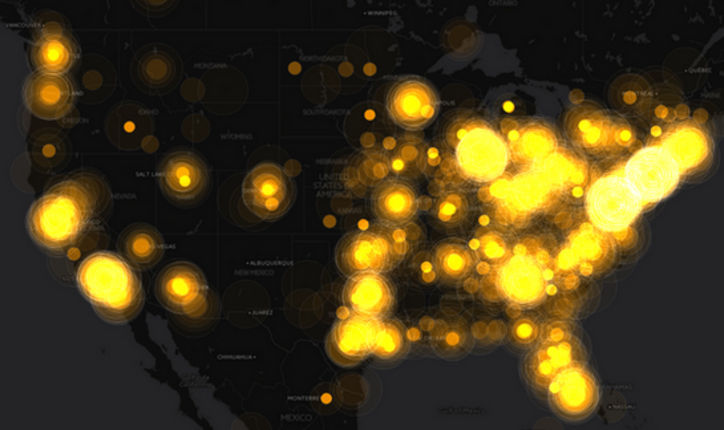
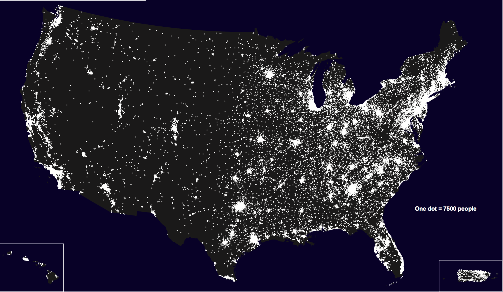
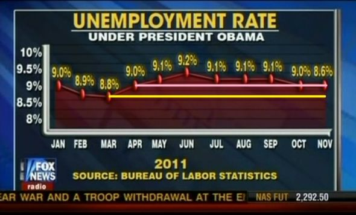
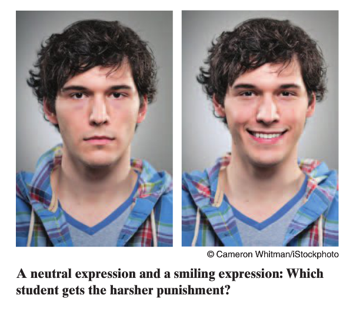
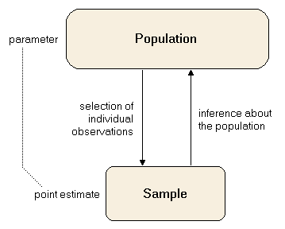

```{r set-options, include=FALSE, message=FALSE}
pkg <- c("dplyr", "ggplot2", "shiny", "readr", "mosaic")

new.pkg <- pkg[!(pkg %in% installed.packages())]

if (length(new.pkg)) {
  install.packages(new.pkg, repos = "http://cran.rstudio.com")
}

if(!require(revealjs)){
  library(devtools)
  devtools::install_github("jjallaire/revealjs")
}

library(dplyr)
library(ggplot2)
library(revealjs)
library(shiny)
library(knitr)
library(readr)
library(mosaic)

options(width = 70)
setwd("/Users/cismay/Google Drive/- Reed WoRkshops/january_academy_2016/slides")
```

# Statistical Graphics and Inference

<p>

### <i> The Good, The Bad, and The Misleading </i>

</p>

<br>

### January Academy 2016

<br>

Chester Ismay (Office: ETC 223)

cismay@reed.edu

http://blogs.reed.edu/datablog 

http://blogs.reed.edu/ed-tech

---

# The Importance of Data Visualization

---

## Describe what you see when analyzing the summary information

```{r anscombe, echo=FALSE, warning=FALSE, message=FALSE}
anscombe <- as.data.frame(anscombe)
anscombereorder <- anscombe[, c(1, 5, 2, 6, 3, 7, 4, 8)]
```


```{r echo=FALSE}
anscombelong <- data.frame(x = unlist(anscombe[, 1:4]), y = unlist(anscombe[, 
    5:8]), datasource = rep(1:4, each = 11))
kable(anscombelong %>% group_by(datasource) %>% summarise(`x-mean` = mean(x), 
    `y-mean` = mean(y), `x-stdev` = sd(x), `y-stdev` = sd(y), `correlation-xy` = cor(x, 
        y)), table.attr = "cellpadding=\"3\"", format = "html", row.names = FALSE)
```

<p>

- What do you think the plots of `x` versus `y` look like for the four datasets?

</p>

---

## Visualizing this data

```{r echo=FALSE, warning=FALSE}
# http://stackoverflow.com/questions/7549694/ggplot2-adding-regression-line-equation-and-r2-on-graph 
lm_eqn <- function(m){
  l <- list(a = format(coef(m)[1], digits = 2),
    b = format(abs(coef(m)[2]), digits = 2),
    r2 = format(summary(m)$r.squared, digits = 3));
  
  if (coef(m)[2] >= 0){
    eq <- substitute(italic(y) == a + b %.%
        italic(x)*","~~italic(r)^2~"="~r2, l)
  }else{
    eq <- substitute(italic(y) == a - b %.%
        italic(x)*","~~italic(r)^2~"="~r2, l)    
  }
  
  as.character(as.expression(eq));                 
}

anscombelong %>% ggplot(aes(x = x,y = y)) +
  geom_point() + 
  geom_smooth(method = "lm", se = FALSE) + 
  annotate("text", x = 12, y = 4, 
    label = lm_eqn(lm(y ~ x, anscombelong)), color="black",  
    parse = TRUE) + 
  ylim(3, 13) + 
  xlim(4, 19) + 
  facet_wrap(~datasource) + 
  theme(legend.position="none") + 
  theme_bw()
```

<p>

- What have you learned from visualizing the data?

</p>

---

## The raw Anscombe's Quartet data

Data is in pairs (`x1` goes with `y1`, `x2` goes with `y2`, etc.)

```{r echo=FALSE}
kable(anscombereorder, format = "html")
```

---
## Why are graphics a valuable way to understand data?

- Spreadsheets (raw data) are hard to visualize
- Humans have an incredible ability to detect patterns through visual observation 
- Outliers can be spotted easily and looked into further
- Pictures can more easily create stories than raw data

---

# Visualizations:  The Bad

---

### What's wrong?


---

### What's wrong?


---


2015 State of the Union Twitter heat map for Lower 48 US



Source:  [Glamour News](http://www.glamour.com/inspired/blogs/the-conversation/2015/01/the-hottest-twitter-topics-dur)

---

2010 Population Distribution in the US and Puerto Rico



Source:  [Census.gov](http://www2.census.gov/geo/maps/dc10_thematic/2010_Nighttime_PopDist/2010_Nighttime_PopDist_Page_Map.pdf)

---

# The Misleading

---



---

# Common plots and <br> their uses

## Hopefully, The Good

---

## REVIEW:  Variable types

- Quantitative (Numeric) 
    * It is sensible to add, subtract, or take averages of the data values
    * <i>Continuous</i> - numerical values in a range (fractions and decimals included)
    * <i>Discrete</i> - numerical values with jumps (usually counts)
- Qualitative (Categorical)
    * Values designated by different groupings/categories (usually not numeric)

---

# How plots can assist with <u>INFERENTIAL</u> STATISTICS

---



---

## Setting up the hypotheses

- What's the <u>null hypothesis</u> ($H_0$)?
    * The <u>population</u> mean `leniency` score is the same for `smile` versus `neutral` faces
    * $H_0: \mu_s = \mu_n$ or $H_0: \mu_s - \mu_n = 0$ 
- What's the <u>alternative hypothesis</u> ($H_a$)?    
    * The average `leniency` score is higher for smiling students than it is for students with a neutral facial expression.
    * $H_a: \mu_s > \mu_n$ or $H_a: \mu_s - \mu_n > 0$ 
    
---

### Side-by-side Histograms

```{r echo=FALSE, fig.height=3}
smileLen <- read_csv("data/smileLeniency.csv")

smileLen %>% ggplot(aes(x = leniency)) +
  geom_histogram(binwidth = 0.5, colour = "black", fill = "seagreen") +
  facet_wrap( ~ expression)

```

- One continuous variable versus one categorical variable
- Shows how many values are in different bins
- Questions to ask:
    * What is the shape? (Symmetric, skewed, etc.)
    * How many peaks are there? (Unimodal, bimodal, etc.)
    * How do the values _vary_?
    
---


### Side-by-side Boxplots

```{r echo=FALSE, fig.height=3}
smileLen %>% ggplot(aes(x=expression, y=leniency)) + geom_boxplot(aes(fill=expression)) +
  coord_flip()
```

- One continuous variable versus one categorical variable
- Vertical bars represent quantiles
- Dots represent outliers

---

### Do we have reason to believe, <br> based on the distributions of `leniency` scores <br> over these two `expression` groups, <br> that there is a significant _increase_ <br> in the mean leniency score for <br> faces that `smile` compared to `neutral` faces?

---



Source:  [Statistics4u.info](http://www.statistics4u.info/fundstat_eng/img/sample_population.png)

---

## For the Smile Leniency problem

```{r echo=FALSE, results="asis"}
smile_stats <- smileLen %>% group_by(expression) %>%
  summarize(count = n(),
    mean = mean(leniency),
    sd = sd(leniency))
kable(smile_stats)
```

- What's the <u>sample</u>?
    * The 68 student pictures showing either smiling or neutral expressions 

- What's the <u>population</u>?
    * Ideally, __ALL__ students with either smiling or neutral expressions assigned punishment after an infraction

- We see that the sample mean leniency for those smiling, $\bar{x}_s$, is greater than the similar measure
for those with neutral faces, $\bar{x}_n$. 

- But is it <u>statistically significantly</u> greater?    

---

### Assuming the null hypothesis is true...

- Recall that we have $H_0: \mu_s - \mu_n = 0$.  What does this mean in laymen's terms?
    * We are assuming that there is no relationship in `leniency` score and type of facial `expression`.

- We want to see if the difference in sample means could be explained by chance or if it is highly unlikely that chance is a good explanation for seeing a difference of that magnitude or larger.

---

### The Chance Process

- We can use a tactile point of view to explain what "chance" means here:
    * Use $n_n = 34$ blue index cards corresponding to `neutral` faces and $n_s = 34$ red index cards corresponding to faces that `smile`.  What's next?
    * Write the values of the corresponding `leniency` score on each of the index cards.  What's next?
    * Put the two stacks of index cards together, creating a new set of 68 cards.

---

### The Chance Process (continued)

- We can use the index cards to
create two new stacks for those smiling and those with neutral faces. 
    * First, we must shuffle all the
cards thoroughly. 
    * After doing so, in this case with equal values of sample sizes, we split the deck in half.
    * We then calculate the new sample mean leniency score of the smiling deck, and also the new
sample mean leniency score of the neutral deck. 
    * This creates one simulation of the samples. 
    * We next want to calculate a statistic from these two samples.

---

### The Chance Process (continued again)

- We could do this actual shuffling and calculating, but it's simpler to let the computer do mundane tasks.

```{r echo=FALSE}
statdiff <- smile_stats$mean[2] - smile_stats$mean[1]
```

- Recall that the original sample mean difference is $`r smile_stats$mean[2]` - `r smile_stats$mean[1]` = `r statdiff`$.

- From our simulation we obtain a difference of $`r diff(mean(shuffle(leniency) ~ expression, data = smileLen))`$.

- What do we do next?
    * _More simulations!_  Repeat this shuffling process, say, 10,000 times and then look at the distribution of the resulting sample mean differences.

---

```{r echo=FALSE, cache=TRUE}
smileSim <- do(10000) * diff(mean(shuffle(leniency) ~ expression, data = smileLen))
smileSim <- as.data.frame(smileSim)
smileNew <- smileSim %>%
  mutate(extreme = as.factor(smile >= statdiff))
```

```{r echo=FALSE}
smileNew %>% ggplot(aes(x = smile)) +
  geom_histogram(binwidth = 0.1, colour = "black", fill = "indianred1") +
  xlab("Simulated Mean Differences in Leniency Scores")
```

- What's next?

---

### The p-value!

- Identify how many simulated mean differences are <u>as extreme or more extreme</u> as what we witnessed in our original sample mean difference.
    * Here this value is `r pval <- prop(~smile >= 0.7941176, data=smileSim); pval`.

- So only `r pval * 100`% of the simulated values are at or greater than what we saw with our original sample.  Do we have evidence to reject $H_0: \mu_s - \mu_n = 0$ in favor of $H_a: \mu_s > \mu_n$?
    * Yes, our $p$-value of `r pval` is a small proportion so we have little evidence in favor of the null hypothesis.
    
---

### The p-value Visualized

```{r echo=FALSE}
smileNew %>% ggplot(aes(x = smile, fill = extreme)) +
  geom_histogram(binwidth = 0.1, colour = "black") +
  xlab("Simulated Mean Differences in Leniency Scores")
```

---

# But I thought this was a <br> $t$-test problem?

- For the $t$-test, the test statistic is 
$t = \dfrac{\bar{x}_s - \bar{x}_n}{\sqrt{\dfrac{{s_s}^2}{n_s} + \dfrac{{s_n}^2}{n_n}}}$.

- So if we divided all of our simulated statistics by ${\sqrt{\frac{{s_s}^2}{n_s} + \frac{{s_n}^2}{n_n}}}$, we would be on the same scale as the $t$.

- What would the histogram of transformed values and corresponding $t$ curve look like plotted together?

---

```{r echo=FALSE}
smileTrans <- smileNew %>% mutate(smile = smile / sqrt(smile_stats$sd[1]^2/smile_stats$count[1] + smile_stats$sd[2]^2/smile_stats$count[2]))
smileTrans %>% ggplot(aes(x = smile, fill = extreme)) +
  geom_histogram(aes(y = ..density..), colour = "black", fill = "indianred1", binwidth = 0.2) +
  xlab("Simulated Transformed Mean Differences in Leniency Scores") +
  stat_function(fun = dt,
    args = list(df =  min(smile_stats$count[1] - 1, smile_stats$count[2] - 1)), 
    colour = "royalblue", size = 2) +
  ggtitle("Simulated Transformed Mean Differences with Embedded t Curve")
```

---

### Results of `t.test`

```{r echo=FALSE}
smileLen <- smileLen %>% mutate(expression = factor(expression, levels = c("smile", "neutral")))
t.test(leniency ~ expression, data = smileLen, alternative = "greater")
```

---

### Tying it together


- The $t$ distribution and also the normal distribution were developed to approximate the "by chance" distribution.

- When they were developed, scientists/statisticians couldn't replicate the simulation 10,000 times like I have here.

- That's why the `t.test` comes with lots of assumptions:
    * Sample sizes must be larger than 30
    * If sample sizes are not large enough, we need to assume the population distributions are normal.
        + That's a BIG assumption!

---


# Another example of <u>INFERENTIAL</u> STATISTICS and Plotting

<br>

## Does spending extra time with non-academic activities hinder academic performance?

---

### Scatterplots

```{r echo=FALSE, fig.height=3, warning=FALSE, message=FALSE}
extraHoursGPA <- read.file("data/hoursGPA.txt")

extraHoursGPA %>% 
  ggplot(aes(x = hours, y = gpa)) +
  geom_point()
```

- Two continuous variables
- Questions to ask:
    * _Pattern_ - Positive/No/Negative relation
    * _Form_ - Linear/Non-linear
    * _Strength_ - Closely matches fitted line?

---

## How was this "line of best fit" obtained?

```{r echo=FALSE, fig.height=6}
extraHoursGPA %>% 
  ggplot(aes(x = hours, y = gpa)) +
  geom_point() +
  geom_smooth(method='lm',formula=y~x, se=FALSE)
```

---

## Least squares estimation

- Given paired data $(x_1, y_1)$, $(x_2, y_2)$, $\cdots$, $(x_n, y_n)$, we model via the equation $y_j = \beta_0 + \beta_1 x_j + \varepsilon_j$.
- We want to minimize the sum of squared error terms ($\varepsilon_j$).  Solving for $\varepsilon_j$, we minimize (using partial derivatives from calculus)
\[
\sum_{j=1}^n (y_j - \beta_0 - \beta_1 x_j)^2.
\]

---

## Statistical software to the rescue!

```{r echo=FALSE, fig.height=4}
fit <- lm(gpa ~ hours, data = extraHoursGPA)
extraHoursGPA %>% 
  ggplot(aes(x = hours, y = gpa)) +
  geom_point() +
  geom_smooth(method='lm',formula=y~x, se=FALSE)
```

The equation of the fitted line is

\[
\hat{gpa} = `r round(coef(fit)[1], 3)` `r round(coef(fit)[2], 3)` \times hours
\]

---

## So...Is `hours` doing non-academic things a SIGNIFICANT NEGATIVE predictor of `gpa`?


- $H_0 : \beta_1 = 0$ versus $H_a: \beta_1 < 0$

- Our sample slope is `r round(coef(fit)[2], 3)`. Is this far enough from zero to conclude that this observed slope
is significant?

- We can do the same sort of resampling here by shuffling all of the response variable values and assigning them to each of the values of the explanatory variable.

---

## More shuffling!

* We assume that `hours` and `gpa` are not related.
* Any $x$ value could match up with any $y$ value.
* We shuffle the values of `gpa` and assign them to values of `hours`.
* We calculate the simulated slope statistic.
* We then repeat this process, say, 20,000 times and then see where our observed slope statistic $\hat{\beta}_1$ falls on that distribution.

---

```{r echo=FALSE, cache=TRUE}
gpaSim <- do(20000)*coef(lm(shuffle(gpa) ~ hours, data=extraHoursGPA))
gpaSim <- gpaSim %>% mutate(extreme = as.factor(hours <= coef(fit)[2])) %>%
  rename(slope = hours)
```

```{r echo=FALSE, fig.height=3}
gpaSim %>% ggplot(aes(x = slope, fill = extreme)) +
  geom_histogram(binwidth = 0.00195, colour = "black")
```

```{r echo=FALSE}
pValue <- prop(~slope <= coef(fit)[2], data=gpaSim)
```

- The $p$-value is `r pValue` so we reject the null hypothesis.
- Based on this sample of university students, we have evidence to conclude that `hours` doing non-academic things is a significant negative predictor of `gpa`.
- A similar transformation shows that these results can be well-approximated by a $t$ distribution.

---

# Data Visualization Examples <br> on the Web

---

## Links

> - [Where Are the Hardest Places to Live in the U.S.?](http://www.nytimes.com/2014/06/26/upshot/where-are-the-hardest-places-to-live-in-the-us.html?_r=0)
> - [Think with Google - Travel Trends](https://www.thinkwithgoogle.com/category-trends/travel-air-q4-2015.html#utm_source=Twitter&utm_medium=social&utm_campaign=Think)
> - [Palo Alto Maintenance Requests](http://data.cityofpaloalto.org/dashboards/8677/paloalto311-requests-by-type/)
> - [The Science of Social Timing](https://blog.kissmetrics.com/science-of-social-timing-1/)
> - [Data Visualization Catalogue](http://www.datavizcatalogue.com/)
> - [Why Most Twitter Maps Can't Be Trusted](http://www.citylab.com/housing/2015/03/why-most-twitter-maps-cant-be-trusted/388586/)
> - [Social Explorer](http://www.socialexplorer.com)

---

## What can I help you with?

> - Data analysis
> - Data wrangling/cleaning
> - Data visualization
> - Data tidying/manipulating
> - Reproducible research

--- 

## When am I available?

> - Email me at cismay@reed.edu or chester.ismay@reed.edu
> - Tentative Spring 2016 office (ETC 223) hours
>     - Mondays (10 AM to 11 AM)
>     - Tuesdays (2 PM to 3 PM)
>     - Wednesdays (1:30 PM to 2:30 PM)
>     - Fridays (1:30 PM to 2:30 PM)
> - Sometimes available for virtual office hours via Google Hangouts (email me for details)

---

# Thanks! <br /> <br />

## cismay@reed.edu 

<br /> <br />

Slides available at <http://rpubs.com/cismay/ja_2016>

Code for slide creation on [my GitHub page](https://github.com/ismayc/Reed_WoRkshops/tree/master/january_academy_2016)
