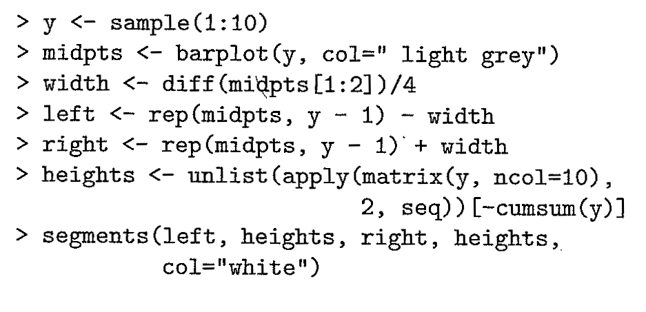

```{r setup, include=FALSE}
pkg <- c("dplyr", "ggplot2", "knitr", "rmarkdown",
  "revealjs")

new.pkg <- pkg[!(pkg %in% installed.packages())]

if (length(new.pkg)) {
  install.packages(new.pkg, repos = "http://cran.rstudio.com")
}


if(!require(pnwflights14)){
  devtools::install_github("ismayc/pnwflights14")
}

lapply(pkg, library, character.only = TRUE)

options(width = 100, scipen = 99)
```

## What is `R`?

<style type="text/css">
  /* I'm cheating here. The ioslides pipeline wants to treat every h1 and h2
     in a special way, so I can't demo what they look like as a part of a page.
     I'm just emulating it here.*/
  #faux-h1 {
    font-size: 1.5em; margin: .67em 0;
  }
  
  #faux-h2 {
    font-size: 1.2em; margin: .75em 0;
  }
  
  #questions {
    text-align: center;
    font-size: 2em;
    padding-top: 1em;
    padding-bottom: 2em;
  }
  
  #wrap {
   width:900px;
   margin:0 auto;
  }
 
  #left_col {
   float:left;
   width:550px;
  }
  
  #right_col {
   float:right;
   width:350px;
  }
     
</style>


```{r echo=FALSE}

# http://giphy.com/gifs/Gu7O8lOFiWVEY
```

<br><small>http://rpubs.com/cismay/R_in_CIS</small>

<aside class="notes">
 - `R` is a completely free software package and language for
    statistical analysis and graphics.
 - It was developed by Ross Ihaka and Robert Gentleman at the University of Auckland in New Zealand as a free version of the S language.
 - It's first initial release was in 1994.
</aside>

## What has `R` been?

```{r old-r, echo=FALSE, out.width=600, fig.retina=NULL}

```

<aside class="notes">
 - `R` is a programming language written by statisticians for statisticians.
 - When I first learned it in 2007, I never thought I'd be teaching Introductory Statistics students and my non-statistician colleagues (Go ITS!) how to use it
</aside>

<br><br><small>http://rpubs.com/cismay/R_in_CIS</small>

## What is `R` becoming?

```{r hadley, echo=FALSE, out.width=350, fig.retina=NULL}
include_graphics("figure/hadley.jpg")
```

<small>http://rpubs.com/cismay/R_in_CIS</small>

<aside class="notes">
 - With the help of Hadley Wickham and other developers, R now _excels_ in helping you with
      - data manipulation
      - automation
      - reproducibility
      - improved accuracy
      - error finding
      - customizability
      - beautiful visualizations
</aside>


## Learning how to use R

## RStudio and R Markdown

- Nice user interface
- Free
- RStudio in Desktop and Server versions
- Reproducible research using R Markdown

<aside class="notes">
 - RStudio is a powerful user interface that helps you get better control of your analysis.
 - It is also completely free.
 - It comes in both a desktop version and a server version (on the cloud).
 - You can write your entire paper/report (text, code, analysis, graphics, etc.) all in R Markdown.
 - If you need to update any of your code, R Markdown will automatically update your plots and output of your analysis and will create an updated PDF/HTML file.
</aside> 
 
<br><br><br><small>http://rpubs.com/cismay/R_in_CIS</small> 
 
## RStudio and R Markdown

```{r cp, echo=FALSE, out.width=300, fig.retina=NULL}
include_graphics("gif/copy_paste.gif")
```
 
 - **No more copy-and-paste!**

<small>http://rpubs.com/cismay/R_in_CIS</small>

## But then I have to learn R...


## Like learning a foreign language!

### Similarities (In the simplest case)

| R             | Foreign Language  | R examples           |
|:--------------|:-----------------:|----------------------|
| *functions*   | verb              | - `sqrt() `          |
|               |                   | - `arrange()`        |
|               |                   | - `lm()`             |
| *command*     | sentence          | - `exp(3)`           |
|               |                   | - `tail(babynames)`  |

**KEY POINT** - Exposure makes you fluent!

<aside class="notes">
 - Throughout this presentation, we will be working with Hadley
   Wickham's packages that have really sped up newbies learning R.
</aside>

<br><small>http://rpubs.com/cismay/R_in_CIS</small>

## R at work

## To the beeR!

```{r beer, echo=FALSE, out.width=350, fig.retina=NULL}
include_graphics("gif/beer.gif")
#http://giphy.com/gifs/hazelnutblvd-drinking-puppet-hazelnut-blvd-l46Cl6JOKu0fbiR3O
```

<br><small>http://rpubs.com/cismay/R_in_CIS</small> 

## My Untappd ratings

```{r untappd, echo=FALSE, out.width=800, fig.retina=NULL}
include_graphics("figure/untappd.jpg")
#http://growlermag.com/wp-content/uploads/untappd.jpg
```

<aside class="notes">
 - Untappd is an app available on iOS/Android/Windows phones and on the web
 - It allows you to "check in" to the location and rate the beers you are drinking
 - It has a scale of 0.25 to 5 by quarters
 - For a mere $5, you can become an Untappd supporter and get access to all of your ratings in CSV format.
</aside> 


<br><small>http://rpubs.com/cismay/R_in_CIS</small> 

## My Untappd R data package

<https://github.com/ismayc/izzyuntappd>

```{r flight, echo=FALSE, out.width=700, fig.retina=NULL}
include_graphics("figure/fort_george.jpg")
#http://growlermag.com/wp-content/uploads/untappd.jpg
```

<aside class="notes">
 - To help newbies get used to working in R, I paid the $5 and created
 an R data package containing information on all of my beer rankings from February 2015 to June 2016
 - To access more information about the package you can go to the link
 - We are now going to switch over to RStudio.
</aside> 

<small>http://rpubs.com/cismay/R_in_CIS</small> 

## DEMO

## Useful links

[Data Processing with dplyr & tidyr](https://rpubs.com/bradleyboehmke/data_wrangling)

[Introduction to dplyr](https://goo.gl/SY6qBy)

[`ggplot2` documentation](http://docs.ggplot2.org/current/)

[R Graphics Cookbook](http://www.cookbook-r.com/Graphs/)

[`ggplot2` Cheat Sheet](https://www.rstudio.com/wp-content/uploads/2015/03/ggplot2-cheatsheet.pdf)

OR just Google it!


## Thanks! 

>- Code for slide creation on [my GitHub page](https://github.com/ismayc/Reed_WoRkshops/tree/master/putting_R_in_CIS)
>- Slides available [here](http://rpubs.com/cismay/R_in_CIS)

---


```{r comp_info}
sessionInfo()
```

