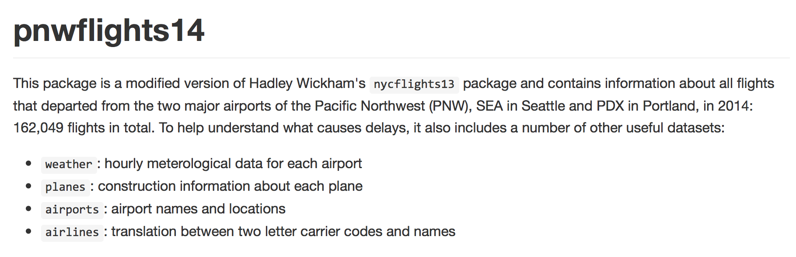
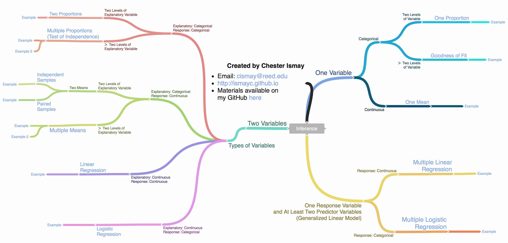
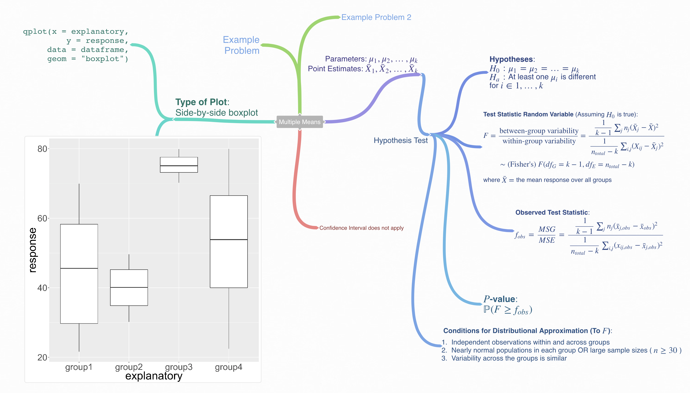

```{r setup, include=FALSE}
pkg <- c("dplyr", "ggplot2", "knitr", "rmarkdown")

new.pkg <- pkg[!(pkg %in% installed.packages())]

if (length(new.pkg)) {
  install.packages(new.pkg, repos = "http://cran.rstudio.com")
}

if(!require(revealjs)){
  devtools::install_github("rstudio/revealjs")
}

if(!require(pnwflights14)){
  devtools::install_github("ismayc/pnwflights14")
}

lapply(pkg, library, character.only = TRUE)

options(width = 100, scipen = 99)
```

<style type="text/css">
  /* I'm cheating here. The ioslides pipeline wants to treat every h1 and h2
     in a special way, so I can't demo what they look like as a part of a page.
     I'm just emulating it here.*/
  #faux-h1 {
    font-size: 1.5em; margin: .67em 0;
  }
  
  #faux-h2 {
    font-size: 1.2em; margin: .75em 0;
  }
  
  #questions {
    text-align: center;
    font-size: 2em;
    padding-top: 1em;
    padding-bottom: 2em;
  }
  
  #wrap {
   width:900px;
   margin:0 auto;
  }
 
  #left_col {
   float:left;
   width:550px;
  }
  
  #right_col {
   float:right;
   width:350px;
  }
     
</style>

## What is R?

 - `R` is a completely free software package and language for statistical analysis and graphics.
 - It _excels_ in helping you with
      - data manipulation
      - automation
      - reproducibility
      - improved accuracy
      - error finding
      - customizability
      - beautiful visualizations
- Any downsides?

---

## Learning how to use R

### RStudio and R Markdown

 - RStudio is a powerful user interface that helps you get better control of your analysis.
 - It is also completely free.
 - It comes in both a desktop version and a server version (on the cloud).
 - You can write your entire paper/report (text, code, analysis, graphics, etc.) all in R Markdown.
 - If you need to update any of your code, R Markdown will automatically update your plots and output of your analysis and will create an updated PDF/HTML file.
 - **No more copy-and-paste!**

---

## What is Markdown?

 - A "plaintext formatting syntax"
 - Type in plain text, render to more complex formats
 - One step beyond writing a `txt` file
 - Render to HTML, PDF, DOCX, etc.

---

## What does it look like?

<div id="wrap">
  <div id="left_col">

```
  # Header 1
  
  ## Header 2
  
  Normal paragraphs of text go here.
  
  **I'm bold**
  
  [links!](http://rstudio.com)
  
   * Unordered
   * Lists   
   
  And  Tables
  ---- -------
  Like This
  
```

</div>

  <div id="right_col">
  
  </div>
</div>

---

## What is R Markdown?
  
>- "Literate programming"
>- Embed R code in a Markdown document
>- Renders textual output along with graphics

<div style="height: 15px"></div>

<hr />

<div style="height: 15px"></div>

<!-- Sorry for this hack. I couldn't figure out how to put three backticks in 
    an Rmd without it getting interpreted as a break for <code>, so I have 
    0-width unicode spaces between these inner backticks. Ace (RStudio) will 
    show them as red-dots. Other editors may not. -->

<div id="wrap">    
  <div id="left_col">

```
```{r chunk_name}
x <- rnorm(1000)
length(x)
qplot(x, bins = 10, 
      fill = I("orange"), 
      color = I("black"))
```
```
  </div>

<div id="right_col">

```{r, fig.width=4, fig.height=3, echo=FALSE}
x <- rnorm(1000)
length(x)
qplot(x, bins = 10, fill = I("orange"), color = I("black"))
```

  </div>

</div>

---

## But then I have to learn R...

---

## Like learning a foreign language!

### Similarities (In the simplest case)

| R             | Foreign Language  | R examples           |
|:--------------|:-----------------:|----------------------|
| *functions*   | verb              | - `sqrt() `          |
|               |                   | - `arrange()`        |
|               |                   | - `lm()`             |
| *command*     | sentence          | - `exp(3)`           |
|               |                   | - `tail(babynames)`  |

**KEY POINT** - Exposure makes you fluent!


## Data summarization/visualization

---



---

## Flights from PDX in 2014

```{r pdx, eval=FALSE}
library(dplyr)
library(pnwflights14)
data(flights, package = "pnwflights14")
pdx_flights <- flights %>% filter(origin == "PDX") %>% 
  select(-year, -origin)
str(object = pdx_flights)
```

---

## Flights from PDX in 2014

```{r pdx_eval}
library(dplyr)
library(pnwflights14)
data(flights, package = "pnwflights14")
pdx_flights <- flights %>% filter(origin == "PDX") %>% 
  select(-year, -origin)
str(object = pdx_flights)
```

---

## Random sample

We randomly select 6000 flights with no missing values from this set of `r prettyNum(nrow(pdx_flights), big.mark = ",")` flights.

```{r rs}
set.seed(2016)
pdx_rs <- na.omit(pdx_flights) %>% sample_n(6000)
```

---


## Question of interest

### Does a statistically significant difference exist in the mean departure delays for airlines departing PDX in 2014?

---

## Using visualizations to get a hint

### What type of plot will help us visualize this?

- Explanatory variable: categorical

- Response variable: continuous

    - Side-by-side boxplot
    
---

## Mindmap to assist



[Coggle Diagram](https://coggle.it/diagram/Vxlydu1akQFeqo6-)

---

### Multiple Means (ANOVA)



[Coggle Diagram for ANOVA](https://coggle.it/diagram/VyLuhlY9DhNJF4yZ)

---

## Plotting our data

```{r qplot, eval=FALSE}
library(ggplot2)
qplot(x = carrier, y = dep_delay, data = pdx_rs, geom = "boxplot")
```

---

## Plotting our data

```{r qplot_eval}
library(ggplot2)
qplot(x = carrier, y = dep_delay, data = pdx_rs, geom = "boxplot")
```

---


## Making tweaks (Part I)


```{r side_boxplot, eval=FALSE}
# library(ggplot2)
ggplot(aes(x = carrier, y = dep_delay), data = pdx_rs) + 
  geom_boxplot(outlier.shape = NA)
```

---

## Making tweaks (Part I)

```{r side_boxplot_eval}
# library(ggplot2)
ggplot(aes(x = carrier, y = dep_delay), data = pdx_rs) + 
  geom_boxplot(outlier.shape = NA)
```

---

## Making tweaks (Part II)

```{r side_boxplot2, eval=FALSE}
ggplot(aes(x = carrier, y = dep_delay), data = pdx_rs) + 
  geom_boxplot(outlier.shape = NA) +
  coord_cartesian(ylim = c(-20, 45))
```

---

## Making tweaks (Part II)

```{r side_boxplot2_eval}
ggplot(aes(x = carrier, y = dep_delay), data = pdx_rs) + 
  geom_boxplot(outlier.shape = NA) +
  coord_cartesian(ylim = c(-20, 45))
```

---

## Making tweaks (Part III)

```{r side_boxplot3, fig.height=4, eval=FALSE}
ggplot(aes(x = carrier, y = dep_delay), data = pdx_rs) + 
  geom_boxplot(outlier.shape = NA) +
  coord_cartesian(ylim = c(-20, 45)) +
  stat_summary(fun.y = "mean", geom = "point", color = "red")
```

---

## Making tweaks (Part III)

```{r side_boxplot3_eval, fig.height=4}
ggplot(aes(x = carrier, y = dep_delay), data = pdx_rs) + 
  geom_boxplot(outlier.shape = NA) +
  coord_cartesian(ylim = c(-20, 45)) +
  stat_summary(fun.y = "mean", geom = "point", color = "red")
```

---

## Data summarizing

---

### Sidebar: Which airline has the worst average departure delay?

```{r pdx_summary}
pdx_summary <- pdx_rs %>% group_by(carrier) %>%
  summarize(`Mean Delay` = mean(dep_delay), `Median Delay` = median(dep_delay))
kable(pdx_summary)
```

---

### Get airline names

```{r join, warning=FALSE}
data(airlines, package = "pnwflights14")
pdx_join <- inner_join(x = pdx_summary, y = airlines, by = "carrier")
kable(pdx_join)
```

---

## Data analysis

---

## Hypothesis test

Assuming conditions are met...

- they might not be...

```{r anova}
pdx_anova <- aov(formula = dep_delay ~ carrier, data = pdx_rs)
summary(pdx_anova)
```

---

## Interpretation of results

---

### Our friend the p-value

- The $p$-value resulting from our analysis is essentially `r summary(pdx_anova)[[1]][["Pr(>F)"]][[1]]`.  

- This corresponds to the probability of obtaining an observed $F$ statistic of `r summary(pdx_anova)[[1]][["F value"]][[1]]` or greater on an $F$ distribution with ${df}_1 = `r summary(pdx_anova)[[1]][["Df"]][[1]]`$ and $df_2 = `r summary(pdx_anova)[[1]][["Df"]][[2]]`$, which assumes that the mean departure delays for all carriers is the same (the null hypothesis is true).

- This small $p$-value leads us to reject the null hypothesis in favor of the alternative:  at least one of the carriers has a mean departure delay that is different than the others (in the population of all 2014 flights from PDX).

---

## Visualizing the p-value

- Shiny app at <http://ismay.shinyapps.io/ProbApp>

---


---

## Reproducible research

---

> "**Reproducible research** is the idea that data analyses, and more generally, scientific claims, are published with their data and software code so that others may verify the findings and build upon them."

 > - Roger Peng, Johns Hopkins

---

## Full worked out example

- A full worked out example of this analysis is available [here](http://ismayc.github.io/teaching/sample_problems/anova3.html) as an HTML file to view.  
- The corresponding R Markdown file is available [here](http://ismayc.github.io/teaching/sample_problems/anova3.Rmd).

---

## How did we do?

- We collected a random sample of the actual data on all 2014 flights departing PDX.  Does a difference actually exist in the average departure delays for carriers in our population (all 2014 flights departing PDX)?

- We can change the code below slightly to get our answer:

    ```{r pdx_summary_noeval, eval=FALSE}
    pdx_summary <- pdx_rs %>% group_by(carrier) %>%
      summarize(`Mean Delay` = mean(dep_delay), 
            `Median Delay` = median(dep_delay))
    kable(pdx_summary)
    ```

---

#### Answer

```{r pdx_full_summary}
pdx_full_summary <- na.omit(pdx_flights) %>% group_by(carrier) %>%
  summarize(`Mean Delay` = mean(dep_delay), `Median Delay` = median(dep_delay))
kable(pdx_full_summary)
```

---

## Useful links

[Data Processing with dplyr & tidyr](https://rpubs.com/bradleyboehmke/data_wrangling)

[Introduction to dplyr](https://goo.gl/SY6qBy)

[`ggplot2` documentation](http://docs.ggplot2.org/current/)

[R Graphics Cookbook](http://www.cookbook-r.com/Graphs/)

[`ggplot2` Cheat Sheet](https://www.rstudio.com/wp-content/uploads/2015/03/ggplot2-cheatsheet.pdf)

OR just Google it!

---

## Workshop problems

- Ratings from all beers I've rated using the Untappd app since February 2015

- Use the `dplyr` package (vignette [here](https://cran.rstudio.com/web/packages/dplyr/vignettes/introduction.html)) along with appropriate plots using the `ggplot2` package to understand which styles of beers I like best.

- You can also look into which cities and states produce beers I like and have tried most.  What stands out?

- We are just doing data visualization and summary here (not inference)


---

## Getting the problems

- To access the template file to begin your analysis on my beer adorations, go to 

    - Your RStudio Server [here](https://rstudio-dev.reed.edu/auth-sign-in) and sign in
    - File -> New File -> R Markdown -> From Template -> Chester's Beer Analysis
    - Give the file a name and proceed!

- I've added these beer ratings to an R data package available [here](http://github.com/ismayc/izzyuntappd)

---

## Thanks! 

>- Code for slide creation on [my GitHub page](https://github.com/ismayc/Reed_WoRkshops/tree/master/putting_R_in_ITS)
>- Slides available [here](http://rpubs.com/cismay/r_in_ITS)

---

```{r comp_info}
sessionInfo()
```
