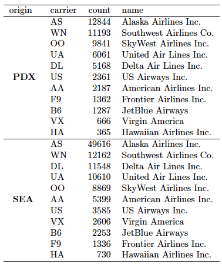

One of the neat tools available via a variety of packages in **R** is the creation of beautiful tables using data frames stored in **R**.  In what follows, I'll discuss these different options using data on departing flights from Seattle and Portland in 2014.  (More information and the source code for this **R** package is available at <https://github.com/ismayc/pnwflights14>.)

We begin by ensuring the needed packages are installed and then load them into our **R** session.


```r
# List of packages required for this analysis
pkg <- c("dplyr", "knitr", "devtools", "DT", "xtable")

# Check if packages are not installed and assign the
# names of the packages not installed to the variable new.pkg
new.pkg <- pkg[!(pkg %in% installed.packages())]

# If there are any packages in the list that aren't installed,
# install them
if (length(new.pkg)) {
  install.packages(new.pkg, repos = "http://cran.rstudio.com")
}

# Load the packages into R
library(dplyr)
library(knitr)
library(DT)
library(xtable)

# Install Chester's pnwflights14 package (if not already)
if (!require(pnwflights14)){
  library(devtools)
  devtools::install_github("ismayc/pnwflights14")
  }
library(pnwflights14)

# Load the flights dataset
data("flights", package = "pnwflights14")
```

The dataset provides for the development of a lot of interesting questions.  Here I will delve further into some of the questions I addressed in two recent workshops I led in the Fall 2015 Data @ Reed Research Skills Workshop Series.  (Slides available at <http://rpubs.com/cismay>.)

The questions I will analyze by creating tables are

1. Which destinations had the worst arrival delays (on average) from the two PNW airports?

2. How does the maximum departure delay vary by month for each of the two airports?

3. How many flights departed for each airline from each of the airports? 

#### The `kable` function in the `knitr` package

To address the first question, we will use the `dplyr` package written by Hadley Wickham as below.  We'll use the `top_n` function to isolate the 5 worst mean arrival delays.


```r
worst_arr_delays <- flights %>% group_by(dest) %>%
  summarize(mean_arr_delay = mean(arr_delay, na.rm = TRUE)) %>%
  arrange(desc(mean_arr_delay)) %>%
  top_n(n = 5, wt = mean_arr_delay)
```

This information is helpful but you may not necessarily know which airport each of these FAA airport codes refers to.  One of the other data sets included in the `pnwflights14` package is `airports` that lists the names.  Here we will do a match to identify the names of these airports using the `inner_join` function in `dplyr`.


```r
data("airports", package = "pnwflights14")
joined_worst <- inner_join(worst_arr_delays, airports, by = c("dest" = "faa")) %>%
  select(name, dest, mean_arr_delay) %>%
  rename("Airport Name" = name, "Airport Code" = dest, "Mean Arrival Delay" = mean_arr_delay)
```

Lastly we output this table cleanly using the `kable` function.


```r
kable(joined_worst)
```


Airport Name                Airport Code    Mean Arrival Delay
--------------------------  -------------  -------------------
Cleveland Hopkins Intl      CLE                      26.150000
William P Hobby             HOU                      10.250000
Metropolitan Oakland Intl   OAK                      10.067460
San Francisco Intl          SFO                       8.864937
Bellingham Intl             BLI                       8.673913

Oddly enough, flights to Cleveland (from PDX and SEA) had the worst arrival delays in 2014.  Houston also had around a 10 minute delay on average.  Surprisingly, the airport in Bellingham, WA (only around 100 miles north of SEA) had the fifth largest mean arrival delay.

#### The DT package

In order to answer the second question, we'll again make use of the various functions in the `dplyr` package.


```r
dep_delays_by_month <- flights %>% group_by(origin, month) %>%
summarize(max_delay = max(dep_delay, na.rm = TRUE))
```

The `DT` package provides a nice interface for viewing data frames in **R**.  I've specified a few extra options here to show all 12 months by default and to automatically set the width.  Go ahead and play around with the filter boxes at the top of each column too.  (An excellent tutorial on `DT` is available at <https://rstudio.github.io/DT/>.)


```r
datatable(dep_delays_by_month,
          filter = 'top', options = list(
            pageLength = 12, autoWidth = TRUE
          ))
```

<!--html_preserve--><div id="htmlwidget-3739" style="width:100%;height:auto;" class="datatables"></div>
<script type="application/json" data-for="htmlwidget-3739">{"x":{"data":[["1","2","3","4","5","6","7","8","9","10","11","12","13","14","15","16","17","18","19","20","21","22","23","24"],["PDX","PDX","PDX","PDX","PDX","PDX","PDX","PDX","PDX","PDX","PDX","PDX","SEA","SEA","SEA","SEA","SEA","SEA","SEA","SEA","SEA","SEA","SEA","SEA"],[1,2,3,4,5,6,7,8,9,10,11,12,1,2,3,4,5,6,7,8,9,10,11,12],[346,380,1553,782,695,590,648,486,417,428,402,798,866,739,385,713,1449,377,815,886,452,713,397,733]],"container":"<table class=\"display\">\n  <thead>\n    <tr>\n      <th> </th>\n      <th>origin</th>\n      <th>month</th>\n      <th>max_delay</th>\n    </tr>\n  </thead>\n</table>","options":{"pageLength":12,"autoWidth":true,"columnDefs":[{"className":"dt-right","targets":[2,3]},{"orderable":false,"targets":0}],"order":[],"orderClasses":false,"orderCellsTop":true,"lengthMenu":[10,12,25,50,100]},"callback":null,"filter":"top","filterHTML":"<tr>\n  <td></td>\n  <td data-type=\"character\" style=\"vertical-align: top;\">\n    <div class=\"form-group has-feedback\" style=\"margin-bottom: auto;\">\n      <input type=\"search\" placeholder=\"All\" class=\"form-control\" style=\"width: 100%;\"/>\n      <span class=\"glyphicon glyphicon-remove-circle form-control-feedback\"></span>\n    </div>\n  </td>\n  <td data-type=\"integer\" style=\"vertical-align: top;\">\n    <div class=\"form-group has-feedback\" style=\"margin-bottom: auto;\">\n      <input type=\"search\" placeholder=\"All\" class=\"form-control\" style=\"width: 100%;\"/>\n      <span class=\"glyphicon glyphicon-remove-circle form-control-feedback\"></span>\n    </div>\n    <div style=\"display: none; position: absolute; width: 200px;\">\n      <div data-min=\"1\" data-max=\"12\"></div>\n      <span style=\"float: left;\"></span>\n      <span style=\"float: right;\"></span>\n    </div>\n  </td>\n  <td data-type=\"number\" style=\"vertical-align: top;\">\n    <div class=\"form-group has-feedback\" style=\"margin-bottom: auto;\">\n      <input type=\"search\" placeholder=\"All\" class=\"form-control\" style=\"width: 100%;\"/>\n      <span class=\"glyphicon glyphicon-remove-circle form-control-feedback\"></span>\n    </div>\n    <div style=\"display: none; position: absolute; width: 200px;\">\n      <div data-min=\"346\" data-max=\"1553\"></div>\n      <span style=\"float: left;\"></span>\n      <span style=\"float: right;\"></span>\n    </div>\n  </td>\n</tr>"},"evals":[]}</script><!--/html_preserve-->

If you click on the `max_delay` column header, you should see that the maximum departure delay for PDX was in March and for Seattle was in May.


#### The `xtable` package to produce nice tables in a PDF

Again, we find ourselves using the extremely helpful `dplyr` package to answer this question and to create the underpinnings of our table to display.  We merge the flights data with the `airlines` data to get the names of the airlines from of the two letter carrier code.


```r
data("airlines", package = "pnwflights14")
by_airline <- flights %>% group_by(origin, carrier) %>%
  summarize(count = n()) %>%
  inner_join(x = ., y = airlines, by = "carrier") %>%
  arrange(desc(count))
```

The `xtable` package and its `xtable` function (and also the `kable` function you saw earlier) provide the functionality to generate HTML code or $\LaTeX$ code to produce a table.  We will focus on producing the $\LaTeX$ code in this example.


```r
print(xtable(by_airline),
      comment = FALSE)
```

\begin{table}[ht]
\centering
\begin{tabular}{rllrl}
  \hline
 & origin & carrier & count & name \\ 
  \hline
1 & PDX & AS & 12844 & Alaska Airlines Inc. \\ 
  2 & PDX & WN & 11193 & Southwest Airlines Co. \\ 
  3 & PDX & OO & 9841 & SkyWest Airlines Inc. \\ 
  4 & PDX & UA & 6061 & United Air Lines Inc. \\ 
  5 & PDX & DL & 5168 & Delta Air Lines Inc. \\ 
  6 & PDX & US & 2361 & US Airways Inc. \\ 
  7 & PDX & AA & 2187 & American Airlines Inc. \\ 
  8 & PDX & F9 & 1362 & Frontier Airlines Inc. \\ 
  9 & PDX & B6 & 1287 & JetBlue Airways \\ 
  10 & PDX & VX & 666 & Virgin America \\ 
  11 & PDX & HA & 365 & Hawaiian Airlines Inc. \\ 
  12 & SEA & AS & 49616 & Alaska Airlines Inc. \\ 
  13 & SEA & WN & 12162 & Southwest Airlines Co. \\ 
  14 & SEA & DL & 11548 & Delta Air Lines Inc. \\ 
  15 & SEA & UA & 10610 & United Air Lines Inc. \\ 
  16 & SEA & OO & 8869 & SkyWest Airlines Inc. \\ 
  17 & SEA & AA & 5399 & American Airlines Inc. \\ 
  18 & SEA & US & 3585 & US Airways Inc. \\ 
  19 & SEA & VX & 2606 & Virgin America \\ 
  20 & SEA & B6 & 2253 & JetBlue Airways \\ 
  21 & SEA & F9 & 1336 & Frontier Airlines Inc. \\ 
  22 & SEA & HA & 730 & Hawaiian Airlines Inc. \\ 
   \hline
\end{tabular}
\end{table}

If you don't know $\LaTeX$, I've also duplicated a similar table using `kable` for you to compare:


```r
kable(by_airline)
```


origin   carrier    count  name                   
-------  --------  ------  -----------------------
PDX      AS         12844  Alaska Airlines Inc.   
PDX      WN         11193  Southwest Airlines Co. 
PDX      OO          9841  SkyWest Airlines Inc.  
PDX      UA          6061  United Air Lines Inc.  
PDX      DL          5168  Delta Air Lines Inc.   
PDX      US          2361  US Airways Inc.        
PDX      AA          2187  American Airlines Inc. 
PDX      F9          1362  Frontier Airlines Inc. 
PDX      B6          1287  JetBlue Airways        
PDX      VX           666  Virgin America         
PDX      HA           365  Hawaiian Airlines Inc. 
SEA      AS         49616  Alaska Airlines Inc.   
SEA      WN         12162  Southwest Airlines Co. 
SEA      DL         11548  Delta Air Lines Inc.   
SEA      UA         10610  United Air Lines Inc.  
SEA      OO          8869  SkyWest Airlines Inc.  
SEA      AA          5399  American Airlines Inc. 
SEA      US          3585  US Airways Inc.        
SEA      VX          2606  Virgin America         
SEA      B6          2253  JetBlue Airways        
SEA      F9          1336  Frontier Airlines Inc. 
SEA      HA           730  Hawaiian Airlines Inc. 

With the originating airport duplicating across all of the airlines, it would be nice if we could reduce this duplication and just bold PDX or SEA and have it appear once.  Awesomely enough, the `rle` function in **R** will be of great help to us in this endeavor.  It counts how many times a value is repeated in a table.  We will then make a call to the `multirow` function in $\LaTeX$ in a sneaky way of pasting the appropriate text in addition to the `force` option for sanitizing the text into $\LaTeX$.

We add in a few options to make the output of the table a little nicer by specifying horizontal lines and removing the default rownames.


```r
rle.lengths <- rle(by_airline$origin)$lengths
first <- !duplicated(by_airline$origin)
by_airline$origin[!first] <- ""
by_airline$origin[first] <- paste("\\multirow{", 
                                  rle.lengths,
                                  "}{*}{\\textbf{",
                                  by_airline$origin[first], "}}")

print(xtable(by_airline),
              comment = FALSE,
              hline.after=c(-1,0,nrow(by_airline), 11),
              sanitize.text.function = force,
              include.rownames = FALSE)
```

\begin{table}[ht]
\centering
\begin{tabular}{llrl}
  \hline
origin & carrier & count & name \\ 
  \hline
\multirow{ 11 }{*}{\textbf{ PDX }} & AS & 12844 & Alaska Airlines Inc. \\ 
   & WN & 11193 & Southwest Airlines Co. \\ 
   & OO & 9841 & SkyWest Airlines Inc. \\ 
   & UA & 6061 & United Air Lines Inc. \\ 
   & DL & 5168 & Delta Air Lines Inc. \\ 
   & US & 2361 & US Airways Inc. \\ 
   & AA & 2187 & American Airlines Inc. \\ 
   & F9 & 1362 & Frontier Airlines Inc. \\ 
   & B6 & 1287 & JetBlue Airways \\ 
   & VX & 666 & Virgin America \\ 
   & HA & 365 & Hawaiian Airlines Inc. \\ 
   \hline
\multirow{ 11 }{*}{\textbf{ SEA }} & AS & 49616 & Alaska Airlines Inc. \\ 
   & WN & 12162 & Southwest Airlines Co. \\ 
   & DL & 11548 & Delta Air Lines Inc. \\ 
   & UA & 10610 & United Air Lines Inc. \\ 
   & OO & 8869 & SkyWest Airlines Inc. \\ 
   & AA & 5399 & American Airlines Inc. \\ 
   & US & 3585 & US Airways Inc. \\ 
   & VX & 2606 & Virgin America \\ 
   & B6 & 2253 & JetBlue Airways \\ 
   & F9 & 1336 & Frontier Airlines Inc. \\ 
   & HA & 730 & Hawaiian Airlines Inc. \\ 
   \hline
\end{tabular}
\end{table}

The resulting table produced by $\LaTeX$ is below and can be found at Overleaf.com at <https://www.overleaf.com/read/wvrpxpwrbvnk>.  



We see that Alaska Airlines had the most flights out of both airports with Southwest coming in second at both airports.

(The generating R Markdown file for this HTML document---saved in the .Rmd extension---is available [here](http://reed.edu/data-at-reed/software/R/blogposts/tables_blogpost.Rmd).)
